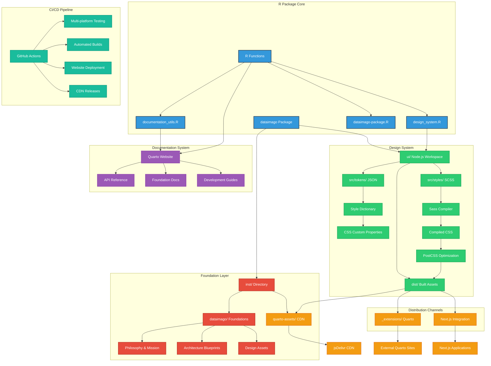

# dataimago: Ethical AI-Native Data Science Foundation Package

<!-- badges: start -->
[](https://github.com/dataimago/dataimago/actions)
[](https://github.com/dataimago/dataimago/actions)
[](https://CRAN.R-project.org/package=dataimago)
[](https://opensource.org/licenses/MIT)
<!-- badges: end -->


## Overview

**dataimago** is an R package containing the philosophical foundations, technical architecture, and application templates for dataimago's emancipatory data science platform. It provides versioned access to critical theory frameworks, application blueprints, and packageSkeleton functionality for creating AI-native data science applications that reconcile meaning (hermeneutics) and measurement (positivism).

### Vision

To become the most transformative AI organization of the 21st century, aligning superintelligence with human emancipation, and using flow-based performance management to reshape how societies learn, heal, grow, and govern.

### Mission

To develop AI systems and analytic tools that reconcile meaning (hermeneutics) and measurement (positivism) in ways that reduce human suffering and enable agency at all levels of society—from individuals to high level policy makers.

## 🏗️ Package Architecture

The dataimago R package is designed as a **multi-layered foundation** for emancipatory AI development. Understanding the architecture is crucial for effective development and maintenance.

> 📋 **See [ARCHITECTURE.md](ARCHITECTURE.md) for comprehensive Mermaid diagrams** that visualize the complete system architecture, build processes, and philosophical integration patterns.

### System Overview



### Directory Structure
```
dataimago/
├── R/                           # Core R functions
│   ├── dataimago-package.R      # Package documentation and exports
│   ├── documentation_utils.R    # Quarto documentation generation
│   └── design_system.R         # CSS build system (R-first)
├── inst/                       # Installed package assets
│   ├── dataimago/              # Foundation documents and assets
│   └── quarto-assets/          # CDN-ready CSS files (CRITICAL)
├── ui/                         # Node.js design system workspace
│   ├── src/                    # Design tokens and SCSS source
│   ├── dist/                   # Built CSS assets (regenerable)
│   ├── build.js               # Sophisticated build script
│   └── package.json           # Node.js dependencies
├── quarto_website/            # Complete Quarto website structure
│   ├── _extensions/           # dataimago Quarto extension
│   ├── assets/               # Website-specific assets
│   └── *.qmd                 # Quarto content files
├── man/                      # R documentation (.Rd files)
└── .github/workflows/        # CI/CD automation
```

### 🔄 Build Flow & Dependencies

The package uses a sophisticated build system that maintains "R as source of truth" while leveraging modern web tooling:


**Distribution Channels:**
- `ui/dist/` → Build artifacts (with source maps for development)
- `inst/quarto-assets/` → CDN distribution via jsDelivr 
- `_extensions/.../assets/` → Quarto extension packaging

### ⚠️ Critical Directories

**NEVER DELETE THESE:**
- `inst/quarto-assets/` - Enables CDN access via jsDelivr
- `ui/src/` - Source design tokens and SCSS files
- `_extensions/dataimago/ai-native/` - Quarto extension distribution

**OK TO REGENERATE:**
- `ui/dist/` - Build outputs (regenerated by build_design_system())
- `ui/node_modules/` - Dependencies (regenerated by pnpm install)

## Key Features

### 📚 Foundation Documents
- **Philosophical Framework**: Built on Frankfurt School critical theory and modern alignment discourse
- **Mission & Vision**: Core purpose and societal transformation goals
- **Governance**: Multi-dimensional governance structure for emancipatory AI development
- **Manifesto**: Contrasts with dominant paradigms (e.g., Palantir critique)

### 🛠 Documentation Generation
- **`create_quarto_documentation()`**: Convert R package documentation to Quarto websites
- **Ethical AI Annotations**: Every function includes philosophical context
- **Foundation Links**: Automatic cross-referencing to philosophical documents
- **dataimago Branding**: Custom styling and visual identity integration

### 🎨 R-First Design System
- **`create_ui_workspace()`**: Set up Node.js workspace for CSS compilation
- **`build_design_system()`**: Master build function wrapping modern CSS tools in R
- **Multi-Channel Distribution**: Quarto extension, CDN assets, and Next.js integration
- **Ethical AI Styling**: WCAG AA compliance with reduced motion and high contrast support

### 🏗 Application Architecture
- **NextJS + R Integration**: Best practices and templates
- **Emancipatory Metrics**: Flow-based performance management frameworks
- **API Readiness**: Structured outputs for web interfaces and AI agents

### 🌐 Distribution Channels
- **`inst/quarto-assets/`**: CDN-ready files accessible via jsDelivr (external projects)
- **`_extensions/dataimago/ai-native/`**: Complete Quarto extension with filters and shortcodes  
- **`ui/dist/`**: Development assets with source maps and build metadata

## Installation

```r
# Install from GitHub (when available)
# devtools::install_github("dataimago/dataimago")

# For development
devtools::load_all()
```

## Quick Start

### Generate Documentation

```r
library(dataimago)

# Generate comprehensive API documentation with ethical context
create_quarto_documentation()

# Render the complete website
# (from quarto_website/ directory)
# quarto render
```

### Build Design System

```r
# One-time setup of Node.js workspace
create_ui_workspace()

# Compile CSS assets for all distribution channels
result <- build_design_system(verbose = TRUE)

# Check build results
if (result$success) {
  cat("\u2705 Generated:", length(result$assets), "assets")
  cat("\U0001F510 SRI hashes:", length(result$sri_hashes))
}
```

### Deploy Design System

**Quarto Extension (Recommended):**
```yaml
# _quarto.yml
format:
  html:
    theme: dataimago/ai-native
```

**CDN Distribution:**
```yaml
# _quarto.yml
format:
  html:
    css:
      - https://cdn.jsdelivr.net/gh/dataimago/dataimago@main/inst/quarto-assets/dataimago.min.css
```

**Next.js Integration:**
```js
// tailwind.config.js
module.exports = {
  presets: [require('./ui/dist/tailwind-preset.js')]
};
```

### Access Foundation Documents

```r
# Access philosophical foundations (planned functionality)
# get_foundation_document("mission")
# get_foundation_document("philosophy")
# get_manifesto_content("critical_theory")
```

### Create Applications

```r
# Generate dataimago-compliant applications (planned functionality)
# create_dataimago_app(name = "my-project", type = "nextjs")
# bootstrap_emancipatory_framework(path = "my-project")
```

## Package Structure

```
dataimago/
├── R/                          # Core functions
│   ├── documentation_utils.R   # Documentation generation
│   └── design_system.R         # R-first CSS build pipeline
├── ui/                         # Node.js design system workspace
│   ├── src/
│   │   ├── tokens/             # Design tokens (JSON)
│   │   └── styles/             # SCSS source files
│   └── dist/                   # Built CSS assets
├── quarto_website/_extensions/dataimago/ai-native/ # Quarto extension
├── inst/
│   ├── dataimago/              # Complete foundation documents
│   │   ├── 01_Foundations/     # Mission, vision, philosophy
│   │   ├── 02_Manifesto/       # Critical theory content
│   │   ├── 03_Application_Architecture/
│   │   └── 04_dataimago_Content/ # Design assets
│   ├── quarto-assets/          # CDN-ready assets
│   ├── CLAUDE.md               # AI agent context
│   └── AGENT_INDEX.md          # Agent coordination
├── quarto_website/             # Website source
├── docs/                       # Rendered website
├── man/                        # Generated documentation
└── tests/                      # Package tests
```

## Documentation

- **Package Website**: [https://dataimago.github.io/dataimago/](https://dataimago.github.io/dataimago/)
- **API Reference**: Complete function documentation with ethical context
- **Foundation Documents**: Philosophical frameworks and architectural blueprints
- **Design System Guide**: Detailed implementation notes in `docs/development/`
- **Vignettes**: Long-form tutorials and conceptual guides

## Philosophy in Practice

dataimago represents a fundamental inversion: instead of embedding culture in AI, we **embed AI in culture** for emancipatory ends. This approach transforms AI from an instrument of domination into a force for human flourishing.

### Code-as-Philosophy Commitments

- **Hermeneutic Transparency**: All modeling assumptions documented and interpretable
- **Positivistic Rigor**: Empirical operations robust, efficient, and replicable
- **Ethical Reflexivity**: Tools include affordances for users to interrogate usage
- **Iterative Design**: Each commit is dialectical step toward future aspirations

## For AI Agents and MCP Integration

This package is designed for seamless integration with AI agents and Model Context Protocol (MCP):

### Structured Metadata
- All functions include comprehensive `@param`, `@return`, and `@examples` documentation
- Philosophical context embedded in `@details` sections
- Consistent naming conventions for programmatic access
- JSON-compatible outputs where appropriate

### AI-Friendly Features
- `inst/CLAUDE.md`: Persistent context for AI interactions
- `inst/AGENT_INDEX.md`: Agent coordination and capabilities
- Foundation documents provide philosophical grounding for AI reasoning
- Generated documentation includes machine-readable ethical annotations

### Example MCP Tool Usage
```json
{
  "name": "create_quarto_documentation",
  "description": "Generate ethical AI documentation from R package",
  "parameters": {
    "package_path": "Path to R package (default: current directory)",
    "output_path": "Output directory for generated website",
    "include_foundation_links": "Include links to dataimago foundations"
  }
}
```

## Development Status

### \u2705 Phase 1: Foundation (COMPLETE)
- Package structure and metadata
- Foundation document organization
- Content curation via `.Rbuildignore`
- MIT licensing and proper attribution

### \u2705 Phase 2: Documentation Generation (COMPLETE)
- `create_quarto_documentation()` function
- Rd2md integration for .Rd → .qmd conversion
- Philosophical context injection
- Complete Quarto website generation

### \u2705 Phase 3: R-First Design System (COMPLETE)
- `create_ui_workspace()` - Node.js workspace setup
- `build_design_system()` - CSS compilation pipeline
- `update_quarto_extension()` - Extension asset management
- `generate_cdn_assets()` - Multi-platform distribution

### \u2705 Phase 4: CI/CD Automation (COMPLETE)
- **Multi-platform testing**: R CMD check across Windows, macOS, Linux
- **Automated CDN releases**: jsDelivr distribution via git tags
- **Website deployment**: GitHub Pages with Quarto rendering
- **Dependency monitoring**: Security scanning and update automation

### \U0001F504 Phase 5: Foundation Access Functions (PLANNED)
- `get_foundation_document()` - Programmatic access to philosophical content
- `create_dataimago_app()` - Generate application skeletons
- `bootstrap_emancipatory_framework()` - Initialize projects with ethical foundations

## Contributing

This package embodies ethical AI development principles. Contributions should:

1. **Align with Philosophy**: All additions must serve emancipatory goals
2. **Include Ethical Context**: New functions require philosophical documentation
3. **Maintain Transparency**: Implementation assumptions must be documented
4. **Test Thoroughly**: Both technical functionality and philosophical consistency

### Code Style

The package uses a configured linter (`.lintr`) with these standards:
- **Line Length**: 140 characters (accommodates comprehensive documentation)
- **Object Names**: Up to 40 characters (descriptive function names encouraged)
- **Standard R Style**: Consistent spacing, indentation, and naming conventions
- **Documentation Focus**: Optimized for packages with extensive ethical context

## License

MIT License - see [LICENSE.md](LICENSE.md) for details.

## Citation

```r
citation("dataimago")
```

## Contact

- **Website**: [https://dataimago.github.io/dataimago/](https://dataimago.github.io/dataimago/)
- **Issues**: [https://github.com/dataimago/dataimago/issues/](https://github.com/dataimago/dataimago/issues/)
- **Maintainer**: Damian W. Betebenner <dbetebenner@nciea.org>

---

*"Would this object help an AI understand, improve, or operationalize emancipatory thinking? If yes, it belongs."* - dataimago development philosophy
