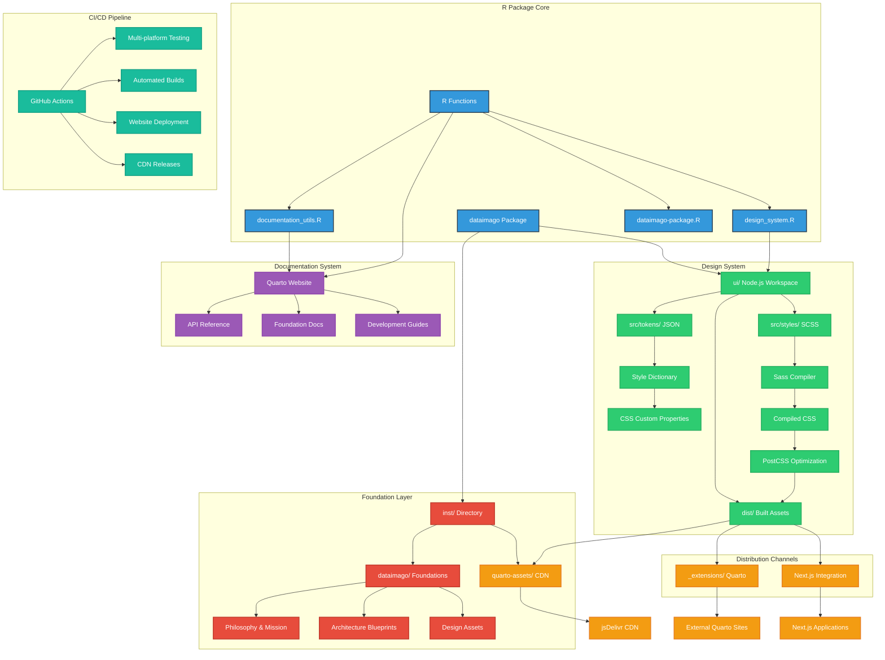

# dataimago: AI-Native Web-Application Development Framework for Data Science

<!-- badges: start -->

<!-- Core Package Status -->
[](https://github.com/dataimago/dataimago/actions)
[](https://github.com/dataimago/dataimago/actions)
[](https://github.com/dataimago/dataimago/actions)

<!-- Package Information -->
[](https://CRAN.R-project.org/package=dataimago)
[](https://cran.r-project.org/)
[](https://github.com/dataimago/dataimago)

<!-- Technical Architecture -->
[](https://nodejs.org/)
[](ui/README.md)
[](https://cdn.jsdelivr.net/gh/dataimago/dataimago-rpkg@main/inst/quarto-assets/)

<!-- Philosophy & Standards -->
[](https://opensource.org/licenses/MIT)
[](.lintr)
[](ui/README.md#ethical-ai-features)
[](ARCHITECTURE.md)

<!-- badges: end -->


## Overview

**dataimago** is a comprehensive development framework that accelerates the creation of data science web applications for both human developers and AI agents. It provides complete design system compilation, multi-platform deployment (Quarto, Shiny, Next.js), MCP-compatible tooling, and embedded ethical AI principles. Features R-first workflows that wrap modern web development tools in familiar interfaces, enabling rapid application scaffolding with consistent branding and best practices.

### Vision

To become the most transformative AI organization of the 21st century, aligning superintelligence with human emancipation, and using flow-based performance management to reshape how societies learn, heal, grow, and govern.

### Mission

To develop AI systems and analytic tools that reconcile meaning (hermeneutics) and measurement (positivism) in ways that reduce human suffering and enable agency at all levels of society—from individuals to high level policy makers.

## 🏗️ Package Architecture

The dataimago R package is designed as a **multi-layered foundation** for emancipatory AI development. Understanding the architecture is crucial for effective development and maintenance.

> 📋 **See [ARCHITECTURE.md](ARCHITECTURE.md) for comprehensive Mermaid diagrams** that visualize the complete system architecture, build processes, and philosophical integration patterns.

### System Overview



### Directory Structure
```
dataimago/
├── R/                           # Core R functions
│   ├── dataimago-package.R      # Package documentation and exports
│   ├── documentation_utils.R    # Quarto documentation generation
│   └── design_system.R          # CSS build orchestration (R-first)
├── inst/                        # Installed package assets
│   ├── dataimago/               # Foundation documents and assets
│   └── quarto-assets/           # CDN-ready CSS files (CRITICAL)
├── ui/                          # Thin consumer of @dataimago/* packages
│   ├── .npmrc                   # Pins @dataimago scope to public npm
│   ├── package.json             # Pins @dataimago/tokens, @dataimago/css,
│   │                            # @dataimago/ui
│   ├── build.js                 # Pulls node_modules/@dataimago/* into ui/dist/
│   │                            # and fans assets out to inst/, docs/, ui/www/
│   ├── dist/                    # Built CSS assets (regenerable)
│   └── www/                     # Complete Quarto website
│       ├── _extensions/         # dataimago/ai-native Quarto extension
│       ├── assets/              # Website-specific assets
│       └── *.qmd                # Quarto content files
├── man/                         # R documentation (.Rd files)
└── .github/workflows/           # CI/CD automation
```

> The authoritative design-system sources (tokens, SCSS, components)
> live in the sibling `dataimago-design` monorepo and are consumed here
> via the `@dataimago/tokens`, `@dataimago/css`, and `@dataimago/ui`
> packages on public npm. The former `ui/src/dataimago-design/` submodule
> was retired in 0.0-4.0; the `@dataimago-ui/components` interim scope
> was unified into `@dataimago/ui` on public npm in 0.0-5.0.

### 🔄 Build Flow & Dependencies

The package keeps `R as source of truth` for orchestration while consuming
the design system through the `@dataimago/*` package channels (see the
[`publish-packages` ADR](../../dataimago-design/wiki/decisions/publish-packages.md)).
`ui/build.js` pulls installed packages out of `node_modules/@dataimago/*`
and fans the resulting assets into every distribution target.

```mermaid
flowchart TD
    START([Developer Initiates Build])

    subgraph "Input Sources (published packages)"
        TOKENS[@dataimago/tokens<br/>tokens.css, tokens.scss, JSON]
        CSS[@dataimago/css<br/>dataimago.css, dataimago.min.css,<br/>tailwind-preset.js]
        COMPONENTS[@dataimago/ui<br/>React bundle — optional]
        CONFIG[ui/build.js, ui/package.json, ui/.npmrc]
    end

    subgraph "R Interface"
        BUILD[build_design_system<br/>pnpm install + pnpm build]
    end

    subgraph "Node.js Copy Pipeline (ui/build.js)"
        COPY_TOKENS[Copy tokens]
        COPY_CSS[Copy compiled CSS]
        COPY_COMPONENTS[Copy component JS]
        DERIVE_THEMES[Derive dataimago-light/-dark.scss]
    end

    subgraph "Output Destinations"
        DIST[ui/dist/<br/>Development Assets]
        CDN_ASSETS[inst/quarto-assets/<br/>CDN Distribution]
        QUARTO_EXT[_extensions/<br/>Quarto Extension]
        WWW_ASSETS[ui/www/assets/<br/>Local Website]
        DOCS[docs/<br/>Rendered Website]
    end

    subgraph "Distribution Channels"
        JSDELIVR[jsDelivr CDN<br/>External Projects]
        QUARTO_SITES[Quarto Websites]
        NEXTJS_APPS[Next.js Apps<br/>Tailwind Preset]
        R_PACKAGE[R Package<br/>system.file access]
    end

    START --> BUILD
    BUILD --> COPY_TOKENS
    BUILD --> COPY_CSS
    BUILD --> COPY_COMPONENTS
    BUILD --> DERIVE_THEMES

    TOKENS --> COPY_TOKENS
    CSS --> COPY_CSS
    COMPONENTS --> COPY_COMPONENTS
    CONFIG --> BUILD

    COPY_TOKENS --> DIST
    COPY_CSS --> DIST
    COPY_COMPONENTS --> DIST
    DERIVE_THEMES --> DIST

    DIST --> CDN_ASSETS
    DIST --> QUARTO_EXT
    DIST --> WWW_ASSETS
    DIST --> DOCS

    CDN_ASSETS --> JSDELIVR
    CDN_ASSETS --> R_PACKAGE
    QUARTO_EXT --> QUARTO_SITES
    CSS --> NEXTJS_APPS

    classDef input fill:#3498db,stroke:#2c3e50,stroke-width:2px,color:#fff
    classDef rInterface fill:#e74c3c,stroke:#c0392b,stroke-width:2px,color:#fff
    classDef processing fill:#2ecc71,stroke:#27ae60,stroke-width:2px,color:#fff
    classDef output fill:#f39c12,stroke:#e67e22,stroke-width:2px,color:#fff
    classDef distribution fill:#9b59b6,stroke:#8e44ad,stroke-width:2px,color:#fff

    class TOKENS,CSS,COMPONENTS,CONFIG input
    class BUILD rInterface
    class COPY_TOKENS,COPY_CSS,COPY_COMPONENTS,DERIVE_THEMES processing
    class DIST,CDN_ASSETS,QUARTO_EXT,WWW_ASSETS,DOCS output
    class JSDELIVR,QUARTO_SITES,NEXTJS_APPS,R_PACKAGE distribution
```

**Distribution Channels:**
- `ui/dist/` → Build artifacts (with source maps for development)
- `inst/quarto-assets/` → CDN distribution via jsDelivr
- `_extensions/.../assets/` → Quarto extension packaging

### ⚠️ Critical Directories

**NEVER DELETE THESE:**
- `inst/quarto-assets/` - Enables CDN access via jsDelivr
- `ui/package.json`, `ui/.npmrc`, `ui/build.js` - Design-system consumer glue
- `_extensions/dataimago/ai-native/` - Quarto extension distribution

**OK TO REGENERATE:**
- `ui/dist/` - Build outputs (regenerated by build_design_system())
- `ui/node_modules/` - Dependencies (regenerated by pnpm install)

## Key Features

### ⚡ Rapid Application Development
- **Package-channel consumption**: `ui/` already declares the
  `@dataimago/*` dependencies; `pnpm install` in `ui/` is the only
  one-time bootstrap (see
  [`new-consumer-checklist.md`](../../dataimago-design/wiki/patterns/new-consumer-checklist.md)).
- **`build_design_system()`**: Runs `pnpm install && pnpm build` in
  `ui/` and fans the resulting `@dataimago/*` assets out to every
  distribution channel.
- **`create_quarto_documentation()`**: Generate professional documentation with consistent branding.
- **Multi-Platform Deployment**: Single source generates assets for Quarto, Shiny, Next.js, and CDN.

### 🎨 Complete Design System
- **Design Tokens**: JSON-based system with CSS custom properties for consistent styling
- **SCSS Pipeline**: Style Dictionary + Sass compilation with PostCSS optimization  
- **SVG Visual Identity**: Theme-aware logos with automatic light/dark mode switching
- **WCAG AA Compliance**: Built-in accessibility with reduced motion and high contrast support

### 🤖 AI-Native Architecture
- **MCP-Compatible Functions**: Structured APIs designed for AI agent consumption
- **Deterministic Operations**: Reproducible builds with comprehensive error handling
- **Machine-Readable Outputs**: JSON-compatible results for programmatic integration
- **Agent Context Files**: Persistent AI context and coordination capabilities

### 🚀 Multi-Platform Distribution
- **CDN Assets**: jsDelivr-ready files with SRI hashes for global distribution
- **Quarto Extensions**: Complete `dataimago/ai-native` extension for documentation sites
- **Next.js Integration**: Generated Tailwind presets for seamless web application development
- **R Package Access**: Built-in asset management via `system.file()` for Shiny applications

### 📋 Framework Documentation
- **Architecture Patterns**: Technical blueprints and implementation best practices
- **Ethical AI Guidelines**: Embedded principles for human-centered development
- **Design System Guide**: Complete visual identity and branding specifications  
- **Development Workflows**: Step-by-step guidance for rapid application creation

### 🌐 Distribution Channels
- **`inst/quarto-assets/`**: CDN-ready files accessible via jsDelivr (external projects)
- **`_extensions/dataimago/ai-native/`**: Complete Quarto extension with filters and shortcodes  
- **`ui/dist/`**: Development assets with source maps and build metadata

### 🏗️ CDN Architecture
- **Template Assets**: `https://cdn.jsdelivr.net/gh/dataimago/dataimago@main/inst/quarto-assets/`
- **Package Assets**: Individual packages use own CDN for hex logos and custom styling
- **Hybrid Strategy**: Consistent branding + unique package identity
- **SVG Logo System**: Theme-aware switching with 4 variants per logo type (8 total SVG assets)

## Installation

```r
# Install from GitHub (when available)
# devtools::install_github("dataimago/dataimago")

# For development
devtools::load_all()
```

### Clone + Bootstrap

The former `ui/src/dataimago-design/` git submodule was retired in
0.0-4.0; no `--recursive` clone is required. The design system is
consumed through published packages:

```bash
# Standard clone — no submodules
git clone https://github.com/dataimago/dataimago-rpkg
cd dataimago-rpkg/dataimago/ui

# All three @dataimago/* packages ship from public npm — no auth token
# is needed for read access.
pnpm install   # fetches @dataimago/tokens, @dataimago/css, @dataimago/ui
pnpm build     # writes ui/dist/ and fans assets into inst/, docs/, ui/www/
```

See [`ui/README.md`](ui/README.md) and
[`publish-packages` ADR](../../dataimago-design/wiki/decisions/publish-packages.md)
for details, and
[`prototype-in-consumer.md`](../../dataimago-design/wiki/patterns/prototype-in-consumer.md)
for the local-checkout workflow (`pnpm design:link`).

## Quick Start - Application Development Workflow

### Complete Setup and First Build

```r
library(dataimago)

# 1. One-time Node bootstrap (see Clone + Bootstrap section above):
#      cd ui && pnpm install
#    The in-package create_ui_workspace() scaffolder was retired in 0.0-4.0
#    alongside the dataimago-design submodule.

# 2. Build complete design system from @dataimago/* packages
result <- build_design_system(verbose = TRUE)

# 3. Generate professional documentation
create_quarto_documentation()

# Check results
if (result$success) {
  cat("Framework ready: generated", length(result$assets), "assets\n")
  cat("SRI hashes generated for CDN distribution\n")
  cat("Deploy targets: Quarto, Shiny, Next.js\n")
}
```

### Development Workflow

```r
# Rapid iteration during development
build_design_system(force_rebuild = FALSE)  # Smart incremental builds

# Deploy updates to all platforms
build_design_system(update_extension = TRUE)  # Update Quarto extension
# CDN assets automatically updated via GitHub releases
```

### ✅ Confident Asset Management Workflow

```r
# 1. PICK UP A NEW DESIGN-SYSTEM RELEASE
#    cd ui
#    pnpm update @dataimago/tokens @dataimago/css @dataimago/ui
#    (or, for local prototyping:
#       export DATAIMAGO_DESIGN_PATH=/abs/path/to/dataimago-design
#       pnpm design:link   # link: overrides into ui/package.json
#       …iterate…
#       pnpm design:unlink # restore registry versions before committing)

# 2. RUN BUILD SYSTEM from R
result <- build_design_system(verbose = TRUE)

# 3. AUTOMATIC PROPAGATION to all deployment targets:
#    - ui/dist/ (compiled development assets)
#    - ui/www/assets/css/ (website development)
#    - ui/www/_extensions/dataimago/ai-native/assets/css/ (Quarto extension)
#    - inst/quarto-assets/ (CDN distribution)
#    - docs/ (rendered website)

# 4. COMMIT the bumped ui/package.json + regenerated CSS in docs/.
```

**Upstream edits** happen in the sibling `dataimago-design` repo (not in
this package). Run `pnpm changeset` there, merge the Changesets "Version
Packages" PR, then bump `ui/package.json` here. CI fails any branch that
ships `link:` / `file:` overrides to `main`.

### Deploy Design System

**Quarto Extension (Recommended):**
```yaml
# _quarto.yml
format:
  html:
    theme: dataimago/ai-native
```

**CDN Distribution:**
```yaml
# _quarto.yml
format:
  html:
    css:
      - https://cdn.jsdelivr.net/gh/dataimago/dataimago@main/inst/quarto-assets/dataimago.min.css
```

**Next.js Integration:**
```js
// tailwind.config.js
module.exports = {
  presets: [require('./ui/dist/tailwind-preset.js')]
};
```

### Application Scaffolding (Planned)

```r
# Generate complete application skeletons
# create_dataimago_app(name = "my-data-dashboard", type = "quarto+shiny")
# scaffold_nextjs_integration(path = "my-web-app")

# Access framework documentation
# get_architecture_pattern("data_visualization_best_practices")
# get_design_system_tokens("spacing", "colors")
```

## Package Structure

```
dataimago/
├── R/                          # Core functions
│   ├── documentation_utils.R   # Documentation generation
│   └── design_system.R         # R-first CSS build pipeline
├── ui/                         # Thin consumer of @dataimago/* packages
│   ├── .npmrc                  # Pins @dataimago scope to public npm
│   ├── package.json            # Pins @dataimago/tokens, @dataimago/css,
│   │                           # @dataimago/ui
│   ├── build.js                # Fans @dataimago/* assets into ui/dist/,
│   │                           # inst/, docs/, ui/www/
│   ├── dist/                   # Built CSS assets (regenerable)
│   └── www/                    # Quarto website project
│       └── _extensions/dataimago/ai-native/ # Quarto extension
├── tools/
│   └── design-link.mjs         # `pnpm design:link` / `design:unlink`
├── inst/
│   ├── dataimago/              # Complete foundation documents
│   │   ├── 01_Foundations/     # Mission, vision, philosophy
│   │   ├── 02_Manifesto/       # Critical theory content
│   │   ├── 03_Application_Architecture/
│   │   └── 04_dataimago_Content/ # Design assets
│   ├── quarto-assets/          # CDN-ready assets
│   ├── CLAUDE.md               # AI agent context
│   └── AGENT_INDEX.md          # Agent coordination
├── docs/                       # Rendered website
├── man/                        # Generated documentation
└── tests/                      # Package tests
```

The authoritative design-system source of truth lives in the sibling
`dataimago-design` repo and ships via `@dataimago/tokens`,
`@dataimago/css`, and `@dataimago/ui` on public npm. The former
`ui/src/dataimago-design/` submodule was retired in 0.0-4.0; the
`@dataimago-ui/components` interim scope was unified into `@dataimago/ui`
on public npm in 0.0-5.0.

## Documentation

- **Package Website**: [https://dataimago.github.io/dataimago/](https://dataimago.github.io/dataimago/)
- **API Reference**: Complete function documentation with ethical context
- **Foundation Documents**: Philosophical frameworks and architectural blueprints
- **Design System Guide**: Detailed implementation notes in `docs/development/`
- **Vignettes**: Long-form tutorials and conceptual guides

## Framework Philosophy

dataimago embeds ethical AI principles and consistent development patterns directly into the framework architecture. Rather than requiring developers to manually implement best practices, the framework provides pre-built components, automated tooling, and structured workflows that ensure applications are scalable, accessible, and aligned with human flourishing.

### Development Principles

- **R-First Workflows**: Familiar interfaces wrapping modern web development tools
- **Consistency by Default**: Automated application of design systems and best practices
- **AI-Native Design**: Built for both human developers and AI agent collaboration
- **Multi-Platform Thinking**: Single source generates assets for all deployment targets
- **Ethical Foundation**: Human-centered development embedded throughout the framework

## AI-Native Development Features

This framework is designed from the ground up for both human developers and AI agents:

### MCP-Compatible Tooling
- **Structured APIs**: All functions use consistent parameter patterns and return structured results
- **Comprehensive Documentation**: Detailed roxygen2 docs with examples and error handling
- **Machine-Readable Outputs**: JSON-compatible results for programmatic consumption
- **Agent Context Files**: `inst/CLAUDE.md` and `inst/AGENT_INDEX.md` provide persistent AI context

### AI-Optimized Workflows
- **Deterministic Operations**: Same inputs always produce same outputs
- **Clear Error Messages**: Detailed failure information for debugging and remediation
- **Incremental Builds**: Smart dependency detection avoids unnecessary rebuilds
- **Validation Pipelines**: Built-in checks ensure output quality and consistency

### Example MCP Tool Integration
```json
{
  "name": "build_design_system",
  "description": "Compile complete CSS design system for multi-platform deployment",
  "parameters": {
    "force_rebuild": "Force rebuild even if assets appear up-to-date",
    "include_sri": "Generate SRI hashes for CDN distribution", 
    "update_extension": "Update Quarto extension with compiled assets",
    "verbose": "Print detailed progress information"
  },
  "returns": {
    "success": "Boolean indicating overall build success",
    "assets": "Array of generated asset file paths",
    "sri_hashes": "Object containing SRI hashes for each CSS file",
    "build_time": "ISO timestamp of build completion"
  }
}
```

## AI-Powered Development with Repomix

The dataimago package integrates [Repomix](https://repomix.com) to enhance AI-assisted development workflows. Repomix packages the entire codebase into a single, AI-friendly file that provides complete context for Large Language Models (LLMs).

### What is Repomix?

Repomix is a tool that consolidates repository contents into a structured format optimized for AI consumption. This enables:
- **Complete Context**: AI assistants understand the entire codebase architecture
- **Philosophical Alignment**: Foundation documents are included for value-aligned suggestions
- **Efficient Collaboration**: Single file upload provides comprehensive project knowledge
- **Token Optimization**: Smart exclusion of build artifacts keeps token usage manageable

### Quick Start

Generate an AI-readable package of the codebase:

```r
# R-first approach (recommended)
library(dataimago)
result <- generate_ai_context()

# Output: dataimago-repomix.xml with comprehensive codebase context
```

```bash
# Direct command line usage
npx repomix@latest --output dataimago-repomix.xml

# Output: dataimago-repomix.xml containing the packaged codebase
```

### Configuration

The `.repomixignore` file is configured to:
- **Include**: Core R functions, foundation documents, design sources, documentation
- **Exclude**: Build artifacts (`ui/dist/`, `node_modules/`), git metadata, binary files

### Usage Examples

#### R Function Approach (Recommended)
```r
# Standard AI context generation
result <- generate_ai_context()
if (result$success) {
  cat("✅ Generated:", result$output_file)
  cat("📊 Token count:", format(result$token_count, big.mark = ','))
}

# Markdown format for documentation  
generate_ai_context(style = "markdown")  # → dataimago-repomix.md

# Minimal output for faster processing
generate_ai_context(
  include_token_count = FALSE,
  min_token_threshold = 500,
  verbose = FALSE
)
```

#### AI Assistant Prompts
```
This file contains the dataimago R package codebase.
Review the architecture and suggest improvements aligned with 
the philosophical principles in inst/dataimago/ and CLAUDE.md.
```

```
Based on existing patterns in R/ and philosophy in inst/dataimago/,
implement the planned function get_foundation_document() for
programmatic access to philosophical content.
```

```
Using function documentation in man/ and philosophical context
in inst/dataimago/, generate vignettes connecting technical
implementation to ethical foundations.
```

### Integration with AI Workflows

- **Claude Projects**: Upload `repomix-output.xml` to project knowledge base
- **ChatGPT**: Include in conversation for comprehensive context
- **GitHub Copilot**: Use as context file for enhanced suggestions
- **Local LLMs**: Feed complete codebase for offline development

### Best Practices

1. **Regenerate after significant changes**: `npx repomix@latest`
2. **Monitor token usage**: `npx repomix@latest --include-token-count`
3. **Security checks**: `npx repomix@latest --check-security`
4. **Custom output**: `npx repomix@latest --output dataimago-context.xml`

For detailed integration guidance, see [REPOMIX_INTEGRATION.md](REPOMIX_INTEGRATION.md).

## Development Status

### ✅ Phase 1: Foundation (COMPLETE)
- Package structure and metadata
- Foundation document organization
- Content curation via `.Rbuildignore`
- MIT licensing and proper attribution

### ✅ Phase 2: Documentation Generation (COMPLETE)
- `create_quarto_documentation()` function
- Rd2md integration for .Rd → .qmd conversion
- Philosophical context injection
- Complete Quarto website generation

### ✅ Phase 3: R-First Design System (COMPLETE)
- Package-channel consumer: `ui/package.json` + `ui/.npmrc` +
  `ui/build.js` pull `@dataimago/tokens`, `@dataimago/css`, and
  `@dataimago/ui` into `ui/dist/`
- `build_design_system()` - Orchestrates `pnpm install && pnpm build`
  and fan-out into distribution targets
- `update_quarto_extension()` - Extension asset management
- `generate_cdn_assets()` - Multi-platform distribution
- **Package-channel architecture (0.0-4.0)**: replaced the retired
  `ui/src/dataimago-design/` submodule; single published source →
  multiple deployment targets

### ✅ Phase 4: CI/CD Automation (COMPLETE)
- **Multi-platform testing**: R CMD check across Windows, macOS, Linux
- **Automated CDN releases**: jsDelivr distribution via git tags
- **Website deployment**: GitHub Pages with Quarto rendering
- **Dependency monitoring**: Security scanning and update automation

### 🔄 Phase 5: Foundation Access Functions (PLANNED)
- `get_foundation_document()` - Programmatic access to philosophical content
- `create_dataimago_app()` - Generate application skeletons
- `bootstrap_emancipatory_framework()` - Initialize projects with ethical foundations

## Contributing

This package embodies ethical AI development principles. Contributions should:

1. **Align with Philosophy**: All additions must serve emancipatory goals
2. **Include Ethical Context**: New functions require philosophical documentation
3. **Maintain Transparency**: Implementation assumptions must be documented
4. **Test Thoroughly**: Both technical functionality and philosophical consistency

### Code Style

The package uses a configured linter (`.lintr`) with these standards:
- **Line Length**: 140 characters (accommodates comprehensive documentation)
- **Object Names**: Up to 40 characters (descriptive function names encouraged)
- **Standard R Style**: Consistent spacing, indentation, and naming conventions
- **Documentation Focus**: Optimized for packages with extensive ethical context

## License

MIT License - see [LICENSE.md](LICENSE.md) for details.

## Citation

```r
citation("dataimago")
```

## Contact

- **Website**: [https://dataimago.github.io/dataimago/](https://dataimago.github.io/dataimago/)
- **Issues**: [https://github.com/dataimago/dataimago/issues/](https://github.com/dataimago/dataimago/issues/)
- **Maintainer**: Damian W. Betebenner <dbetebenner@gmail.com>

---

*"Would this object help an AI understand, improve, or operationalize emancipatory thinking? If yes, it belongs."* - dataimago development philosophy
