This file is a merged representation of the entire codebase, combined into a single document by Repomix.

# File Summary

## Purpose
This file contains a packed representation of the entire repository's contents.
It is designed to be easily consumable by AI systems for analysis, code review,
or other automated processes.

## File Format
The content is organized as follows:
1. This summary section
2. Repository information
3. Directory structure
4. Repository files (if enabled)
5. Multiple file entries, each consisting of:
  a. A header with the file path (## File: path/to/file)
  b. The full contents of the file in a code block

## Usage Guidelines
- This file should be treated as read-only. Any changes should be made to the
  original repository files, not this packed version.
- When processing this file, use the file path to distinguish
  between different files in the repository.
- Be aware that this file may contain sensitive information. Handle it with
  the same level of security as you would the original repository.

## Notes
- Some files may have been excluded based on .gitignore rules and Repomix's configuration
- Binary files are not included in this packed representation. Please refer to the Repository Structure section for a complete list of file paths, including binary files
- Files matching patterns in .gitignore are excluded
- Files matching default ignore patterns are excluded
- Files are sorted by Git change count (files with more changes are at the bottom)

# Directory Structure
```
docs/
  assets/
    css/
      dataimago.css
      dataimago.min.css
      documentation.css
      index.css
      landing.css
      r-package.css
      shared-enhanced-toc.css
      tokens.css
    img/
      ai_monogram.svg
      bluesky_logo.svg
      github_logo.svg
      netlify_logo.svg
      package_hex_logo.svg
      quarto_logo.svg
    js/
      pages/
        landing-page-enhanced.js
      vendor/
        jquery.sticky-kit.min.js
      accessibility.js
      custom-anchors.js
      hero-scroller.js
      jquery.sticky-kit.min.js
      landing-page-enhanced.js
      lenis-integration.js
      logo-switch.js
      scroll.js
      svg-handler.js
    latex/
      dataimago.sty
inst/
  dataimago/
    ARCHITECTURE.md
    HISTORICAL_ROADMAP.md
  quarto-assets/
    ai_monogram.svg
    dataimago-dark.scss
    dataimago-light.scss
    dataimago.css
    dataimago.min.css
    dataimago.sty
    documentation.css
    documentation.min.css
    landing.css
    landing.min.css
    package_hex_logo.svg
    README-latex.md
    README.md
    shared-enhanced-toc.css
    shared-enhanced-toc.min.css
    tokens.css
    tokens.min.css
    tokens.scss
    website-theme.css
    website-theme.min.css
man/
  add_function_docs_sections.Rd
  ai.Rd
  bootstrap_wiki.Rd
  build_design_components.Rd
  build_design_framework.Rd
  build_design_system.Rd
  build_introspection_payload.Rd
  build_quarto_template_vars.Rd
  check_quarto_asset_status.Rd
  convert_rd_files_to_qmd.Rd
  create_quarto_documentation.Rd
  create_ui_workspace.Rd
  dataimago-package.Rd
  export_static_api.Rd
  extract_desc_field.Rd
  format_description_fields.Rd
  generate_ai_context.Rd
  generate_api_reference_qmd.Rd
  generate_api_scaffolding.Rd
  generate_cdn_assets.Rd
  generate_claude_md.Rd
  generate_ethical_ci.Rd
  generate_mcp_tools.Rd
  generate_quarto_yml.Rd
  generate_self_mcp.Rd
  generate_shared_utils.Rd
  load_quarto_template.Rd
  parse_description_file.Rd
  parse_roxygen_exports.Rd
  post_process_md_to_qmd.Rd
  render_quarto_template.Rd
  scaffold_content_directories.Rd
  scaffold_ethics_pages.Rd
  scaffold_full_quarto_site.Rd
  scaffold_js_assets.Rd
  scaffold_utility_pages.Rd
  sync_quarto_assets.Rd
  update_dataimago_assets.Rd
  update_quarto_extension.Rd
R/
  ai.R
  asset_sync.R
  build_components.R
  build_framework.R
  dataimago-package.R
  design_system.R
  documentation_utils.R
  export_static.R
  generate_api.R
  generate_claude_md.R
  generate_ethical_ci.R
  generate_mcp.R
  generate_self_mcp.R
  generate_types.R
  generate_wiki.R
tests/
  testthat/
    test-generate-wiki.R
    test-phase-2e-generators.R
  testthat.R
ui/
  src/
    dataimago-design/
      .github/
        workflows/
          ci.yml
          ethical-audit.yml
          README.md
          release.yml
          submodule-sync.yml
          wiki-lint.yml
      .obsidian/
        app.json
        appearance.json
        core-plugins.json
        graph.json
        workspace.json
      examples/
        bootstrap-integration-test.html
        README.md
      foundations/
        application/
          accessibility-practice.md
          developer-education.md
          performance-equity.md
          platform-integration.md
          README.md
        architecture/
          democratic-design.md
          ethical-enforcement.md
          README.md
          theme-strategy.md
          token-hierarchy.md
        design/
          color-theory.md
          motion-dignity.md
          README.md
          semantic-tokens.md
          typography.md
        governance/
          community-input.md
          ethical-review.md
          evolutionary-design.md
          README.md
          transparency.md
        philosophy/
          accessibility-dignity.md
          critical-theory.md
          equity-inclusion.md
          ethical-ai.md
          on-the-exactitude-of-wishes_OLD_GERMAN.tex
          on-the-exactitude-of-wishes-kruger.tex
          on-the-exactitude-of-wishes.tex
          on-the-exactitude-of-wishes.txt
          README.md
        README.md
      reports/
        ethical-compliance.html
        ethical-compliance.json
      scripts/
        publish.mjs
      src/
        icons/
          brand/
            ai_monogram.svg
          platform/
            netlify_logo.svg
            quarto_logo.svg
          social/
            bluesky_logo.svg
            github_logo.svg
          README.md
        js/
          vendor/
            jquery.sticky-kit.min.js
          accessibility.js
          custom-anchors.js
          hero-scroller.js
          lenis-integration.js
        latex/
          dataimago.sty
          README.md
        pages/
          shared/
            enhanced-toc.scss
          documentation.scss
          landing.scss
          README.md
        styles/
          components/
            svg-components.scss
          themes/
            dataimago-dark.scss
            dataimago-light.scss
            shared-components.scss
            theme-variables.scss
            website-features.scss
          _index.scss
          accessibility.scss
          base.scss
          components.scss
          lenis-integration.scss
          README.md
          utilities.scss
          website-theme.scss
        tokens/
          colors-p3.json
          colors.json
          components.json
          effects.json
          frequent.json
          README.md
          spacing.json
          theme-colors-p3.json
          theme-colors.json
          typography.json
        README.md
        tokens.scss
      templates/
        quarto_website/
          assets/
            js/
              custom-anchors.js
              logo-switch.js
              scroll.js
          _quarto.yml.template
          about.qmd.template
          ethics.qmd.template
          index.qmd.template
          README.md
        KNOWLEDGE-explorer.md
        KNOWLEDGE-framework.md
        KNOWLEDGE-research.md
      tools/
        build-core.mjs
        bundle-check.mjs
        color-converter.mjs
        contrast-check.mjs
        generate-report.mjs
        motion-lint.mjs
        optimize-css-function.mjs
        prepare-release.mjs
        quarto-version-detector.mjs
        README.md
        wiki-lint.mjs
      wiki/
        analyses/
          .gitkeep
          cran-ecosystem-seeding.md
          dataimago-ai-platform-plan.md
          development-roadmap.md
          meta-tool-architecture.md
          mission-alignment-2026-04-17.md
          multi-modal-token-vision.md
          phase-2e-implementation-plan.md
        connections/
          .gitkeep
          critical-theory-compiled.md
          critical-theory-to-color.md
          democratic-theory-to-governance.md
          disability-justice-to-ethical-enforcement.md
          dissertation-to-metatool.md
          domain-type-architecture.md
          equity-to-performance.md
          ethical-tokens-to-generated-apps.md
          frankfurt-school-to-token-architecture.md
          instantiation-interconnection.md
          living-ecosystem.md
          palantir-vs-dataimago.md
          three-entry-paths.md
        decisions/
          .gitkeep
          dataimago-ai-platform-spec.md
          domain-expansion-strategy.md
          domain-type-generator-spec.md
          github-app-over-oauth-app.md
          nextjs-api-as-canonical-backend.md
          non-destructive-retrofit-principle.md
          single-package-over-monorepo.md
          template-update-strategy.md
          tiered-stewardship-model.md
        patterns/
          .gitkeep
          community-governance-process.md
          cross-platform-consistency.md
          domain-type-explorer.md
          domain-type-framework.md
          domain-type-research.md
          dual-knowledge-layers.md
          dual-mode-api-client.md
          ethical-build-validation.md
          golden-path.md
          latex-theme-generation.md
          managed-vs-self-served-updates.md
          mcp-tool-generation.md
          oklch-color-pipeline.md
          onboarding-interview.md
          one-source-many-channels.md
          producer-driver-pattern.md
          r-as-source-of-truth.md
          r-optional-architecture.md
          r-package-retrofit.md
          r-quarto-theme-generation.md
          rest-api-from-r.md
          seeded-vs-curated-content.md
          three-tier-token-hierarchy.md
          two-stage-build.md
          utf-8-source-files.md
        personas/
          .gitkeep
          community-member.md
          content-only-scholar.md
          data-scientist.md
          design-system-consumer.md
          dissertation-author.md
          domain-expert.md
          educator.md
          r-package-author.md
          r-package-developer.md
        principles/
          .gitkeep
          accessibility-beyond-compliance.md
          ai-in-culture.md
          color-democracy.md
          cultural-adaptation.md
          democratic-participation.md
          emancipation-over-efficiency.md
          ethical-tokens-first-class.md
          fidelity-four-layers.md
          motion-dignity.md
          performance-equity.md
          redundant-encoding.md
        sources/
          .gitkeep
          accessibility-dignity.md
          accessibility-practice.md
          agents-roadmap.md
          color-theory.md
          community-input.md
          cowork-project-instructions.md
          critical-theory.md
          dataimago-idea-to-software-infrastructure.md
          democratic-design.md
          developer-education.md
          equity-inclusion.md
          ethical-ai.md
          ethical-enforcement.md
          ethical-review.md
          evolutionary-design.md
          latex-distribution.md
          motion-dignity.md
          ncme-ai-native-dissertation.md
          performance-equity.md
          platform-integration.md
          semantic-tokens.md
          system-migration-comparison.md
          theme-strategy.md
          token-hierarchy.md
          transparency.md
          typography.md
        theories/
          .gitkeep
          ai-native-development.md
          communicative-rationality.md
          disability-justice.md
          flow-based-systems.md
          frankfurt-school.md
          idea-to-software-infrastructure.md
          negative-dialectics.md
          non-identity.md
          recursive-tool-development.md
          superalignment.md
          value-sensitive-design.md
        glossary.md
        index.md
        log.md
        overview.md
      .git
      AGENTS.md
      CLAUDE.md
      package.json
      postcss.config.js
      README.md
  www/
    _extensions/
      dataimago/
        ai-native/
          assets/
            css/
              icons/
                brand/
                  ai_monogram.svg
                platform/
                  netlify_logo.svg
                  quarto_logo.svg
                social/
                  bluesky_logo.svg
                  github_logo.svg
                README.md
              dataimago-dark.scss
              dataimago-light.scss
              dataimago.css
              dataimago.min.css
              documentation.css
              documentation.min.css
              landing.css
              landing.min.css
              shared-components.scss
              shared-enhanced-toc.css
              shared-enhanced-toc.min.css
              tokens.css
              tokens.min.css
              tokens.scss
              website-theme.css
              website-theme.min.css
            img/
              ai_monogram.svg
              bluesky_logo.svg
              github_logo.svg
              netlify_logo.svg
              quarto_logo.svg
            js/
              pages/
                landing-page-enhanced.js
              vendor/
                jquery.sticky-kit.min.js
              accessibility.js
              custom-anchors.js
              hero-scroller.js
              jquery.sticky-kit.min.js
              landing-page-enhanced.js
              lenis-integration.js
              svg-handler.js
            latex/
              dataimago.sty
            README.md
          filters/
            ai-native-meta.lua
            json-export.lua
            README.md
          shortcodes/
            content-item.lua
            feature-box.lua
            hero-scroller.lua
            json-export.lua
            micp-display.lua
            README.md
            slide-container.lua
          templates/
            slides/
              features-slide.qmd
              hero-slide.qmd
              technical-slide.qmd
            index.qmd
            README.md
          _extension.yml
          README.md
      svg-inline/
        _extension.yml
        svg-inline.lua
    assets/
      css/
        icons/
          brand/
            ai_monogram.svg
          platform/
            netlify_logo.svg
            quarto_logo.svg
          social/
            bluesky_logo.svg
            github_logo.svg
          README.md
        dataimago-dark.scss
        dataimago-light.scss
        dataimago.css
        dataimago.min.css
        documentation.css
        documentation.min.css
        landing.css
        landing.min.css
        shared-components.scss
        shared-enhanced-toc.css
        shared-enhanced-toc.min.css
        tokens.css
        tokens.min.css
        tokens.scss
        website-theme.css
        website-theme.min.css
      img/
        ai_monogram.svg
        bluesky_logo.svg
        github_logo.svg
        netlify_logo.svg
        package_hex_logo.svg
        quarto_logo.svg
      js/
        vendor/
          jquery.sticky-kit.min.js
        accessibility.js
        custom-anchors.js
        hero-scroller.js
        lenis-integration.js
        logo-switch.js
        scroll.js
      latex/
        dataimago.sty
    content/
      documents/
        README.md
      presentations/
        README.md
    _quarto.yml
    404.qmd
    critical_theory_manifesto.qmd
    design_system.qmd
    documents.qmd
    ethics.qmd
    governance.qmd
    index.qmd
    mission.qmd
    news.qmd
    philosophy.qmd
    presentations.qmd
    r_package.qmd
    README.md
  build.js
  package.json
  README.md
.gitmodules
.lintr
.Rbuildignore
.repomixignore
CITATION.cff
CLAUDE.md
DESCRIPTION
LICENSE
LICENSE.md
NAMESPACE
NEWS.md
README.md
```

# Files

## File: man/convert_rd_files_to_qmd.Rd
````
% Generated by roxygen2: do not edit by hand
% Please edit documentation in R/documentation_utils.R
\name{convert_rd_files_to_qmd}
\alias{convert_rd_files_to_qmd}
\title{Convert .Rd Files to QMD Format using Rd2md}
\usage{
convert_rd_files_to_qmd(rd_files)
}
\arguments{
\item{rd_files}{Character vector of paths to .Rd files}
}
\value{
List containing converted documentation for each function
}
\description{
Convert .Rd Files to QMD Format using Rd2md
}
\keyword{internal}
````

## File: man/create_ui_workspace.Rd
````
% Generated by roxygen2: do not edit by hand
% Please edit documentation in R/design_system.R
\name{create_ui_workspace}
\alias{create_ui_workspace}
\title{Create UI Workspace for Design System}
\usage{
create_ui_workspace(force_overwrite = FALSE, verbose = TRUE)
}
\arguments{
\item{force_overwrite}{Logical. Overwrite existing ui/ directory if it exists. Default: FALSE}

\item{verbose}{Logical. Print detailed progress information. Default: TRUE}
}
\value{
List containing setup results:
\itemize{
\item success: Logical indicating setup success
\item created_files: Character vector of files created
\item errors: Character vector of any error messages
}
}
\description{
Sets up the Node.js workspace structure and configuration files needed for
CSS compilation and design token processing. This function creates the complete
ui/ directory structure with package.json, build scripts, and source files.
}
\details{
\strong{Created Directory Structure:}

\if{html}{\out{<div class="sourceCode">}}\preformatted{ui/
+-- package.json              # Node.js dependencies (Style Dictionary, Sass, etc.)
+-- build.js                  # Custom build script for compilation
+-- src/
|   +-- tokens/
|   |   +-- colors.json       # dataimago color palette
|   |   +-- typography.json   # Font definitions and scales
|   |   +-- spacing.json      # Spacing scale and dimensions
|   +-- styles/
|       +-- base.scss         # Base styles using design tokens
|       +-- components.scss   # UI component styles
|       +-- utilities.scss    # Utility classes
+-- dist/                     # Build output directory (created by build process)
}\if{html}{\out{</div>}}

\strong{Design Token Philosophy:}
The design tokens follow dataimago's ethical AI principles:
\itemize{
\item \strong{Semantic Naming}: Colors like \code{primary}, \code{accent}, \code{ethical-highlight}
\item \strong{Accessibility First}: WCAG AA contrast ratios and reduced motion support
\item \strong{Cultural Sensitivity}: Avoid culturally-biased color assumptions
\item \strong{Future-Proof}: JSON structure enables multiple output formats
}

\strong{Build Tool Configuration:}
\itemize{
\item \strong{Style Dictionary}: Converts design tokens to CSS custom properties
\item \strong{Sass/SCSS}: Compiles component styles with token integration
\item \strong{PostCSS}: Adds vendor prefixes and optimizations
\item \strong{CSSnano}: Minification for production distribution
}
}
\examples{
\dontrun{
# Create new ui workspace
result <- create_ui_workspace()

# Force recreate existing workspace
result <- create_ui_workspace(force_overwrite = TRUE)

# Check what was created
if (result$success) {
  cat("Created files:", paste(result$created_files, collapse = "\n  "))
}
}

}
````

## File: man/extract_desc_field.Rd
````
% Generated by roxygen2: do not edit by hand
% Please edit documentation in R/documentation_utils.R
\name{extract_desc_field}
\alias{extract_desc_field}
\title{Extract Field from DESCRIPTION Lines}
\usage{
extract_desc_field(desc_lines, field_name)
}
\arguments{
\item{desc_lines}{Character vector of DESCRIPTION file lines}

\item{field_name}{Name of field to extract}
}
\value{
Character string with field value or NULL if not found
}
\description{
Extract Field from DESCRIPTION Lines
}
\keyword{internal}
````

## File: man/format_description_fields.Rd
````
% Generated by roxygen2: do not edit by hand
% Please edit documentation in R/documentation_utils.R
\name{format_description_fields}
\alias{format_description_fields}
\title{Format DESCRIPTION Fields for Quarto Display}
\usage{
format_description_fields(desc_content)
}
\arguments{
\item{desc_content}{Parsed DESCRIPTION content list}
}
\value{
Character vector with formatted DESCRIPTION fields
}
\description{
Format DESCRIPTION Fields for Quarto Display
}
\keyword{internal}
````

## File: man/generate_api_reference_qmd.Rd
````
% Generated by roxygen2: do not edit by hand
% Please edit documentation in R/documentation_utils.R
\name{generate_api_reference_qmd}
\alias{generate_api_reference_qmd}
\title{Generate API Reference QMD Content}
\usage{
generate_api_reference_qmd(
  desc_content,
  rd_content,
  include_description = TRUE,
  include_foundation_links = TRUE
)
}
\arguments{
\item{desc_content}{Parsed DESCRIPTION content}

\item{rd_content}{Converted .Rd content}

\item{include_description}{Include DESCRIPTION section}

\item{include_foundation_links}{Include dataimago foundation links}
}
\value{
Character vector with complete qmd content
}
\description{
Generate API Reference QMD Content
}
\keyword{internal}
````

## File: man/parse_description_file.Rd
````
% Generated by roxygen2: do not edit by hand
% Please edit documentation in R/documentation_utils.R
\name{parse_description_file}
\alias{parse_description_file}
\title{Parse DESCRIPTION File}
\usage{
parse_description_file(desc_file)
}
\arguments{
\item{desc_file}{Path to DESCRIPTION file}
}
\value{
List containing parsed DESCRIPTION fields
}
\description{
Parse DESCRIPTION File
}
\keyword{internal}
````

## File: man/post_process_md_to_qmd.Rd
````
% Generated by roxygen2: do not edit by hand
% Please edit documentation in R/documentation_utils.R
\name{post_process_md_to_qmd}
\alias{post_process_md_to_qmd}
\title{Post-Process Markdown to QMD Format with dataimago Customizations}
\usage{
post_process_md_to_qmd(md_content, func_name)
}
\arguments{
\item{md_content}{Character vector of markdown content from Rd2md}

\item{func_name}{Function name for customization}
}
\value{
Character vector with qmd-formatted content
}
\description{
Post-Process Markdown to QMD Format with dataimago Customizations
}
\keyword{internal}
````

## File: man/update_dataimago_assets.Rd
````
% Generated by roxygen2: do not edit by hand
% Please edit documentation in R/documentation_utils.R
\name{update_dataimago_assets}
\alias{update_dataimago_assets}
\title{Update dataimago Assets in Quarto Website}
\usage{
update_dataimago_assets(output_path, package_path)
}
\arguments{
\item{output_path}{Path to quarto website directory}

\item{package_path}{Path to package root}
}
\description{
Update dataimago Assets in Quarto Website
}
\keyword{internal}
````

## File: ui/src/dataimago-design/.github/workflows/ci.yml
````yaml
name: 🛡️ dataimago Design System CI

on:
  push:
    branches: [ main, develop ]
  pull_request:
    branches: [ main, develop ]
  workflow_dispatch:

env:
  NODE_VERSION: '22'
  PNPM_VERSION: '9'
  FORCE_JAVASCRIPT_ACTIONS_TO_NODE24: true

jobs:
  # ===== BUILD & TEST =====
  build-and-test:
    name: 🏗️ Build & Test
    runs-on: ubuntu-latest
    steps:
      - name: 📥 Checkout repository
        uses: actions/checkout@v5

      - name: 📦 Setup Node.js
        uses: actions/setup-node@v5
        with:
          node-version: ${{ env.NODE_VERSION }}

      - name: 📦 Setup pnpm
        uses: pnpm/action-setup@v2
        with:
          version: ${{ env.PNPM_VERSION }}

      - name: 📦 Install dependencies
        run: pnpm install --frozen-lockfile

      - name: 🏗️ Build design system
        run: pnpm run build

      - name: 🧪 Run validation tests
        run: pnpm run validate

      - name: 📊 Upload build artifacts
        uses: actions/upload-artifact@v4
        with:
          name: design-system-build
          path: |
            dist/
            reports/
          retention-days: 30

  # ===== ETHICAL COMPLIANCE =====
  ethical-compliance:
    name: 🛡️ Ethical Compliance
    runs-on: ubuntu-latest
    needs: build-and-test
    steps:
      - name: 📥 Checkout repository
        uses: actions/checkout@v5

      - name: 📦 Setup Node.js & pnpm
        uses: actions/setup-node@v5
        with:
          node-version: ${{ env.NODE_VERSION }}

      - name: 📦 Setup pnpm
        uses: pnpm/action-setup@v2
        with:
          version: ${{ env.PNPM_VERSION }}

      - name: 📦 Install dependencies
        run: pnpm install --frozen-lockfile

      - name: 📥 Download build artifacts
        uses: actions/download-artifact@v4
        with:
          name: design-system-build

      - name: 📁 Create reports directory
        run: mkdir -p reports

      - name: 🎨 Contrast ratio enforcement
        run: |
          set -o pipefail
          node tools/contrast-check.mjs --json | tee reports/contrast-results.json

      - name: 🏃 Motion dignity enforcement
        run: |
          set -o pipefail
          node tools/motion-lint.mjs --dist-only --json | tee reports/motion-results.json

      - name: 📦 Bundle size equity check
        run: |
          set -o pipefail
          node tools/bundle-check.mjs --json | tee reports/bundle-results.json

      - name: 📊 Generate ethical compliance report
        run: pnpm run report

      - name: 📊 Upload ethical compliance reports
        uses: actions/upload-artifact@v4
        with:
          name: ethical-compliance-report
          path: reports/

  # ===== SECURITY SCANNING =====
  security-scan:
    name: 🔒 Security Scan
    runs-on: ubuntu-latest
    steps:
      - name: 📥 Checkout repository
        uses: actions/checkout@v5

      - name: 🔍 Run Trivy vulnerability scanner
        uses: aquasecurity/trivy-action@master
        with:
          scan-type: 'fs'
          scan-ref: '.'
          format: 'table'
          severity: 'HIGH,CRITICAL'

      - name: 🔍 Generate SARIF for records
        uses: aquasecurity/trivy-action@master
        with:
          scan-type: 'fs'
          scan-ref: '.'
          format: 'sarif'
          output: 'trivy-results.sarif'

      - name: 📊 Upload Trivy scan artifact
        uses: actions/upload-artifact@v4
        if: always()
        with:
          name: trivy-security-scan
          path: trivy-results.sarif
          retention-days: 30

  # ===== BUNDLE SIZE CHECK =====
  bundle-size:
    name: 📦 Bundle Size Check
    runs-on: ubuntu-latest
    needs: build-and-test
    steps:
      - name: 📥 Checkout repository
        uses: actions/checkout@v5

      - name: 📦 Setup Node.js & pnpm
        uses: actions/setup-node@v5
        with:
          node-version: ${{ env.NODE_VERSION }}

      - name: 📦 Setup pnpm
        uses: pnpm/action-setup@v2
        with:
          version: ${{ env.PNPM_VERSION }}

      - name: 📦 Install dependencies
        run: pnpm install --frozen-lockfile

      - name: 🏗️ Build design system
        run: pnpm run build

      - name: 📊 Check bundle sizes
        run: |
          set -o pipefail
          node tools/bundle-check.mjs --fail-on-warning --json | tee /tmp/bundle-results.json
          # Surface key metrics in the GitHub Step Summary
          echo "## 📦 Bundle Size Report" >> $GITHUB_STEP_SUMMARY
          node -e "
            const r = JSON.parse(require('fs').readFileSync('/tmp/bundle-results.json','utf8'));
            const rows = r.files.map(f =>
              '| ' + [f.file, f.sizeFormatted, f.budgetFormatted ?? '—', f.status === 'ok' ? '✅ Pass' : f.status === 'warn' ? '⚠️ Warn' : '❌ Fail'].join(' | ') + ' |'
            );
            console.log('| File | Size | Budget | Status |');
            console.log('|------|------|--------|--------|');
            rows.forEach(r => console.log(r));
          " >> $GITHUB_STEP_SUMMARY || true

  # ===== NOTIFY CONSUMER REPOSITORIES =====
  notify-consumer-repos:
    name: 📢 Notify Consumer Repos
    runs-on: ubuntu-latest
    needs: [build-and-test, ethical-compliance, security-scan, bundle-size]
    if: github.ref == 'refs/heads/main' && github.event_name == 'push'
    steps:
      - name: 📢 Dispatch to dataimago-rpkg
        uses: peter-evans/repository-dispatch@v3
        with:
          token: ${{ secrets.REPO_ACCESS_TOKEN }}
          repository: dataimago/dataimago-rpkg
          event-type: design-system-updated
          client-payload: |
            {
              "ref": "${{ github.ref }}",
              "sha": "${{ github.sha }}",
              "repository": "${{ github.repository }}"
            }

  # ===== SUMMARY =====
  ci-summary:
    name: 📊 CI Summary
    runs-on: ubuntu-latest
    needs: [build-and-test, ethical-compliance, security-scan, bundle-size]
    if: always()
    steps:
      - name: 📊 Generate summary
        run: |
          echo "## 🛡️ dataimago Design System CI Results" >> $GITHUB_STEP_SUMMARY
          echo "" >> $GITHUB_STEP_SUMMARY
          echo "### Quality Gates Status" >> $GITHUB_STEP_SUMMARY
          echo "- 🏗️ Build & Test: ${{ needs.build-and-test.result == 'success' && '✅ Passed' || '❌ Failed' }}" >> $GITHUB_STEP_SUMMARY
          echo "- 🛡️ Ethical Compliance: ${{ needs.ethical-compliance.result == 'success' && '✅ Passed' || '❌ Failed' }}" >> $GITHUB_STEP_SUMMARY
          echo "- 🔒 Security Scan: ${{ needs.security-scan.result == 'success' && '✅ Passed' || '❌ Failed' }}" >> $GITHUB_STEP_SUMMARY
          echo "- 📦 Bundle Size: ${{ needs.bundle-size.result == 'success' && '✅ Passed' || '❌ Failed' }}" >> $GITHUB_STEP_SUMMARY
          echo "" >> $GITHUB_STEP_SUMMARY
          echo "### Ethical Design Principles" >> $GITHUB_STEP_SUMMARY
          echo "- ♿ **Accessibility**: WCAG contrast ratios enforced" >> $GITHUB_STEP_SUMMARY
          echo "- 🤝 **Dignity**: Motion duration limits respected" >> $GITHUB_STEP_SUMMARY
          echo "- ⚖️ **Equity**: Bundle size budgets maintained" >> $GITHUB_STEP_SUMMARY
          echo "- 🔒 **Transparency**: Security vulnerabilities scanned" >> $GITHUB_STEP_SUMMARY
````

## File: ui/src/dataimago-design/.github/workflows/ethical-audit.yml
````yaml
name: 🛡️ Ethical Design Audit

on:
  schedule:
    # Run ethical audit daily at 9 AM UTC
    - cron: '0 9 * * *'
  workflow_dispatch:
    inputs:
      audit_type:
        description: 'Type of audit to run'
        required: true
        default: 'full'
        type: choice
        options:
          - 'full'
          - 'accessibility'
          - 'dignity'
          - 'equity'
          - 'transparency'

env:
  NODE_VERSION: '22'
  PNPM_VERSION: '9'
  FORCE_JAVASCRIPT_ACTIONS_TO_NODE24: true

jobs:
  ethical-audit:
    name: 🛡️ Comprehensive Ethical Audit
    runs-on: ubuntu-latest
    steps:
      - name: 📥 Checkout repository
        uses: actions/checkout@v5

      - name: 📦 Setup Node.js & pnpm
        uses: actions/setup-node@v5
        with:
          node-version: ${{ env.NODE_VERSION }}

      - name: 📦 Setup pnpm
        uses: pnpm/action-setup@v2
        with:
          version: ${{ env.PNPM_VERSION }}

      - name: 📦 Install dependencies
        run: pnpm install --frozen-lockfile

      - name: 🏗️ Build design system
        run: pnpm run build

      - name: ♿ Accessibility Audit
        if: github.event.inputs.audit_type == 'accessibility' || github.event.inputs.audit_type == 'full' || github.event_name == 'schedule'
        run: |
          echo "## ♿ Accessibility Audit Results" >> $GITHUB_STEP_SUMMARY
          echo "" >> $GITHUB_STEP_SUMMARY
          
          # Run contrast checks
          echo "### Contrast Ratio Validation" >> $GITHUB_STEP_SUMMARY
          node tools/contrast-check.mjs | tee contrast-results.txt
          
          # Parse results and add to summary
          if grep -q "✅" contrast-results.txt; then
            echo "✅ **All contrast ratios meet WCAG AA standards (4.5:1 minimum)**" >> $GITHUB_STEP_SUMMARY
          else
            echo "❌ **Contrast ratio violations found**" >> $GITHUB_STEP_SUMMARY
            echo "\`\`\`" >> $GITHUB_STEP_SUMMARY
            cat contrast-results.txt >> $GITHUB_STEP_SUMMARY
            echo "\`\`\`" >> $GITHUB_STEP_SUMMARY
          fi

      - name: 🤝 Dignity Audit
        if: github.event.inputs.audit_type == 'dignity' || github.event.inputs.audit_type == 'full' || github.event_name == 'schedule'
        run: |
          echo "" >> $GITHUB_STEP_SUMMARY
          echo "### Motion Dignity Validation" >> $GITHUB_STEP_SUMMARY
          
          # Run motion checks
          node tools/motion-lint.mjs | tee motion-results.txt
          
          # Parse results and add to summary
          if grep -q "✅" motion-results.txt; then
            echo "✅ **All animations respect dignity constraints (≤300ms)**" >> $GITHUB_STEP_SUMMARY
            echo "✅ **Reduced motion preferences supported**" >> $GITHUB_STEP_SUMMARY
          else
            echo "❌ **Motion dignity violations found**" >> $GITHUB_STEP_SUMMARY
            echo "\`\`\`" >> $GITHUB_STEP_SUMMARY
            cat motion-results.txt >> $GITHUB_STEP_SUMMARY
            echo "\`\`\`" >> $GITHUB_STEP_SUMMARY
          fi

      - name: ⚖️ Equity Audit
        if: github.event.inputs.audit_type == 'equity' || github.event.inputs.audit_type == 'full' || github.event_name == 'schedule'
        run: |
          echo "" >> $GITHUB_STEP_SUMMARY
          echo "### Equity & Performance Validation" >> $GITHUB_STEP_SUMMARY
          
          # Check bundle sizes for equity
          TOTAL_SIZE=$(find dist/ -name "*.css" -exec stat -c%s {} + | awk '{sum+=$1} END {print sum}')
          TOTAL_KB=$((TOTAL_SIZE / 1024))
          
          echo "📊 **Total CSS Bundle Size**: ${TOTAL_KB}KB" >> $GITHUB_STEP_SUMMARY
          
          if [ $TOTAL_KB -lt 100 ]; then
            echo "✅ **Bundle size supports equity (low-bandwidth users)**" >> $GITHUB_STEP_SUMMARY
          else
            echo "❌ **Bundle size may impact low-bandwidth users**" >> $GITHUB_STEP_SUMMARY
          fi
          
          # Check for system font fallbacks
          if grep -r "system-ui\|sans-serif" dist/; then
            echo "✅ **System font fallbacks ensure cross-platform equity**" >> $GITHUB_STEP_SUMMARY
          else
            echo "⚠️ **Consider adding system font fallbacks**" >> $GITHUB_STEP_SUMMARY
          fi

      - name: 🔒 Transparency Audit
        if: github.event.inputs.audit_type == 'transparency' || github.event.inputs.audit_type == 'full' || github.event_name == 'schedule'
        run: |
          echo "" >> $GITHUB_STEP_SUMMARY
          echo "### Transparency & Documentation Validation" >> $GITHUB_STEP_SUMMARY
          
          # Check token documentation
          TOKEN_FILES=$(find src/tokens/ -name "*.json" | wc -l)
          DOCUMENTED_TOKENS=$(find src/tokens/ -name "*.json" -exec grep -l "description" {} \; | wc -l)
          
          echo "📊 **Token Documentation Coverage**: ${DOCUMENTED_TOKENS}/${TOKEN_FILES} files" >> $GITHUB_STEP_SUMMARY
          
          if [ $DOCUMENTED_TOKENS -eq $TOKEN_FILES ]; then
            echo "✅ **All token files include descriptions**" >> $GITHUB_STEP_SUMMARY
          else
            echo "⚠️ **Some tokens lack documentation**" >> $GITHUB_STEP_SUMMARY
          fi
          
          # Check for ethical rationale documentation
          if [ -f "ETHICAL_DECISIONS.md" ]; then
            echo "✅ **Ethical decisions documented**" >> $GITHUB_STEP_SUMMARY
          else
            echo "⚠️ **Consider documenting ethical design decisions**" >> $GITHUB_STEP_SUMMARY
          fi

      - name: 📊 Generate comprehensive report
        run: |
          echo "# 🛡️ dataimago Ethical Design Audit Report" > ethical-audit-report.md
          echo "**Generated**: $(date -u '+%Y-%m-%d %H:%M:%S UTC')" >> ethical-audit-report.md
          echo "**Commit**: ${{ github.sha }}" >> ethical-audit-report.md
          echo "" >> ethical-audit-report.md
          
          # Include all results
          if [ -f contrast-results.txt ]; then
            echo "## ♿ Accessibility Results" >> ethical-audit-report.md
            echo "\`\`\`" >> ethical-audit-report.md
            cat contrast-results.txt >> ethical-audit-report.md
            echo "\`\`\`" >> ethical-audit-report.md
            echo "" >> ethical-audit-report.md
          fi
          
          if [ -f motion-results.txt ]; then
            echo "## 🤝 Dignity Results" >> ethical-audit-report.md
            echo "\`\`\`" >> ethical-audit-report.md
            cat motion-results.txt >> ethical-audit-report.md
            echo "\`\`\`" >> ethical-audit-report.md
            echo "" >> ethical-audit-report.md
          fi
          
          echo "## 📊 Bundle Analysis" >> ethical-audit-report.md
          echo "\`\`\`" >> ethical-audit-report.md
          ls -lh dist/*.css >> ethical-audit-report.md
          echo "\`\`\`" >> ethical-audit-report.md

      - name: 📊 Upload audit report
        uses: actions/upload-artifact@v4
        with:
          name: ethical-audit-report-${{ github.run_number }}
          path: |
            ethical-audit-report.md
            contrast-results.txt
            motion-results.txt
          retention-days: 90

      - name: 💬 Create issue for violations
        if: failure()
        uses: actions/github-script@v7
        with:
          script: |
            const title = '🛡️ Ethical Design Violations Detected';
            const body = `
            ## Ethical Design Audit Failed
            
            **Date**: ${new Date().toISOString().split('T')[0]}
            **Commit**: ${{ github.sha }}
            **Workflow**: ${{ github.workflow }}
            
            ### Action Required
            The automated ethical design audit has detected violations that require immediate attention.
            
            ### Review Process
            1. Download the audit report from the workflow artifacts
            2. Review specific violations and their impact
            3. Implement fixes following ethical design principles
            4. Re-run the audit to verify compliance
            
            ### Ethical Principles
            - ♿ **Accessibility**: Ensure WCAG AA compliance
            - 🤝 **Dignity**: Respect user agency and motion preferences  
            - ⚖️ **Equity**: Consider bandwidth and device limitations
            - 🔒 **Transparency**: Document all design decisions
            
            This issue will be automatically closed when violations are resolved.
            `;
            
            github.rest.issues.create({
              owner: context.repo.owner,
              repo: context.repo.repo,
              title: title,
              body: body,
              labels: ['ethical-violation', 'priority-high', 'automated']
            });

  # ===== AUDIT SUMMARY =====
  audit-summary:
    name: 📊 Audit Summary
    runs-on: ubuntu-latest
    needs: ethical-audit
    if: always()
    steps:
      - name: 📊 Generate audit summary
        run: |
          echo "## 🛡️ Ethical Design Audit Complete" >> $GITHUB_STEP_SUMMARY
          echo "" >> $GITHUB_STEP_SUMMARY
          echo "**Status**: ${{ needs.ethical-audit.result == 'success' && '✅ All ethical standards met' || '❌ Violations detected' }}" >> $GITHUB_STEP_SUMMARY
          echo "**Audit Type**: ${{ github.event.inputs.audit_type || 'Scheduled Full Audit' }}" >> $GITHUB_STEP_SUMMARY
          echo "**Timestamp**: $(date -u '+%Y-%m-%d %H:%M:%S UTC')" >> $GITHUB_STEP_SUMMARY
          echo "" >> $GITHUB_STEP_SUMMARY
          echo "### Next Steps" >> $GITHUB_STEP_SUMMARY
          if [ "${{ needs.ethical-audit.result }}" = "success" ]; then
            echo "- ✅ Design system maintains ethical standards" >> $GITHUB_STEP_SUMMARY
            echo "- 🔄 Continue regular monitoring" >> $GITHUB_STEP_SUMMARY
          else
            echo "- 🔧 Review audit report for specific violations" >> $GITHUB_STEP_SUMMARY
            echo "- 📝 Address issues following ethical design principles" >> $GITHUB_STEP_SUMMARY
            echo "- 🔄 Re-run audit after fixes" >> $GITHUB_STEP_SUMMARY
          fi
````

## File: ui/src/dataimago-design/.github/workflows/README.md
````markdown
# 🛡️ dataimago Design System CI/CD Workflows

This directory contains GitHub Actions workflows that implement comprehensive CI/CD for the ethical design system, ensuring all changes meet our quality gates and ethical standards.

## 🚀 Workflows Overview

### [`ci.yml`](./ci.yml) - Main CI Pipeline
**Triggers**: Push to main/develop, Pull Requests
**Purpose**: Comprehensive build, test, and quality assurance

**Jobs**:
- **🏗️ Build & Test**: Validates build process and runs core tests
- **🛡️ Ethical Compliance**: Enforces accessibility, dignity, and equity standards
- **🔒 Security Scan**: Trivy vulnerability scanning with SARIF upload
- **📦 Bundle Size**: Enforces size budgets for equity (low-bandwidth users)
- **📢 Notify Consumer Repos**: Triggers submodule updates in consuming repositories

**Quality Gates**:
- ✅ JSON Schema validation against `tokens.schema.json`
- ✅ Contrast ratio enforcement (WCAG AA: 4.5:1 minimum)
- ✅ Motion duration limits (≤300ms, `prefers-reduced-motion` support)
- ✅ Bundle size budgets (main CSS <30KB, tokens <10KB)
- ✅ Security vulnerability scanning

### [`ethical-audit.yml`](./ethical-audit.yml) - Ethical Design Audit
**Triggers**: Daily schedule (9 AM UTC), Manual dispatch
**Purpose**: Comprehensive ethical compliance monitoring

**Audit Types**:
- **♿ Accessibility**: WCAG contrast ratios, focus indicators, touch targets
- **🤝 Dignity**: Motion limits, reduced motion support, transparency windows
- **⚖️ Equity**: Bundle sizes, system font fallbacks, bandwidth considerations
- **🔒 Transparency**: Token documentation coverage, ethical decision tracking

**Features**:
- Automated issue creation for violations
- Detailed audit reports with remediation guidance
- Selective audit types (accessibility-only, dignity-only, etc.)
- 90-day artifact retention for compliance tracking

### [`submodule-sync.yml`](./submodule-sync.yml) - Submodule Synchronization
**Triggers**: Push to main (design system changes), Manual dispatch
**Purpose**: Notify consumer repositories of design system updates

**Functionality**:
- Detects changes to `dist/` and `src/tokens/` directories
- Dispatches repository events to consumer repos:
  - `dataimago/dataimago-rpkg` (R package)
  - `dataimago/dataimago-site` (Quarto website)
- Includes commit metadata for tracking

### [`release.yml`](./release.yml) - Release Management
**Triggers**: Version tags (`v*`), Manual dispatch
**Purpose**: Automated release creation with ethical compliance verification

**Release Process**:
1. Full ethical compliance check
2. Design system build
3. Release report generation
4. GitHub release creation with assets
5. Consumer repository notification

**Release Assets**:
- Complete design system bundle (`.tar.gz`)
- Individual CSS files (`dataimago.css`, `tokens.css`, etc.)
- Ethical compliance report
- Detailed release notes

## 🔧 Setup Requirements

### Repository Secrets
Add these secrets to your repository settings:

```
REPO_ACCESS_TOKEN: GitHub Personal Access Token with repo scope
```

**Token Permissions Required**:
- `repo` (full repository access)
- `workflow` (workflow management)

### Consumer Repository Integration
Consumer repositories should add corresponding workflows to handle `repository_dispatch` events:

```yaml
on:
  repository_dispatch:
    types: [design-system-updated, design-system-released]
```

## 🛡️ Ethical Design Principles

All workflows enforce our core ethical principles:

### ♿ Accessibility
- **Contrast Ratios**: WCAG AA compliance (4.5:1 minimum)
- **Focus Indicators**: 3px minimum width, 2px offset
- **Touch Targets**: 44×44px minimum size

### 🤝 Dignity
- **Motion**: Maximum 300ms duration, respects `prefers-reduced-motion`
- **Transparency**: 5s minimum undo window for destructive actions
- **User Agency**: No auto-playing animations without user consent

### ⚖️ Equity
- **Bandwidth**: Bundle size budgets for low-bandwidth users
- **Device Support**: 320px minimum viewport width
- **Internationalization**: RTL support, 1.5 minimum line-height

### 🔒 Transparency
- **Documentation**: All tokens include rationale descriptions
- **Decisions**: Ethical thresholds require documented reasoning
- **Compliance**: Public audit reports and violation tracking

## 📊 Monitoring & Reporting

### Automated Reports
- **Daily Ethical Audits**: Comprehensive compliance checking
- **Bundle Size Tracking**: Performance impact monitoring
- **Security Scanning**: Vulnerability detection and remediation
- **Compliance History**: 90-day retention for audit trails

### Manual Triggers
All workflows support manual dispatch for:
- Emergency compliance checks
- Pre-release validation
- Selective audit types
- Force submodule synchronization

### Issue Management
- **Automated Issue Creation**: For ethical violations
- **Priority Labeling**: High-priority ethical violations
- **Auto-Resolution**: Issues close when violations are fixed

## 🔄 Integration with Consumer Repositories

### Git Submodule Pattern
```bash
# In consumer repository (e.g., dataimago-rpkg)
git submodule add https://github.com/dataimago/dataimago-design.git ui/src/dataimago-design

# Update to latest
git submodule update --remote ui/src/dataimago-design
```

### Workflow Integration
Consumer repositories receive events and can update submodules:

```yaml
name: Update Design System
on:
  repository_dispatch:
    types: [design-system-updated]

jobs:
  update-submodule:
    runs-on: ubuntu-latest
    steps:
      - name: Checkout with submodules
        uses: actions/checkout@v4
        with:
          submodules: recursive
          
      - name: Update submodule
        run: |
          git submodule update --remote ui/src/dataimago-design
          git add ui/src/dataimago-design
          git commit -m "Update design system to ${{ github.event.client_payload.sha }}"
          git push
```

## 🚨 Emergency Procedures

### Ethical Violation Response
1. **Immediate**: Automated issue creation with violation details
2. **Assessment**: Review audit report and impact analysis
3. **Remediation**: Implement fixes following ethical guidelines
4. **Verification**: Re-run audit to confirm compliance
5. **Documentation**: Update ethical decision log

### Security Incident Response
1. **Detection**: Trivy scanner identifies vulnerabilities
2. **Triage**: SARIF results uploaded to GitHub Security
3. **Patching**: Update dependencies or implement mitigations
4. **Verification**: Re-run security scan
5. **Communication**: Update consumer repositories if needed

## 📚 Additional Resources

- [Ethical Design Guidelines](../FOUNDATIONS/philosophy/)
- [Token Architecture](../TOKEN_ARCHITECTURE.md)
- [Contributing Guidelines](../AGENTS.md)
- [Migration Status](../README.md#migration-status)
````

## File: ui/src/dataimago-design/.github/workflows/release.yml
````yaml
name: 🚀 Release

on:
  push:
    tags:
      - 'v*'
  workflow_dispatch:
    inputs:
      version:
        description: 'Release version (e.g., v1.0.0)'
        required: true
        type: string

env:
  NODE_VERSION: '22'
  PNPM_VERSION: '9'
  FORCE_JAVASCRIPT_ACTIONS_TO_NODE24: true

jobs:
  release:
    name: 🚀 Create Release
    runs-on: ubuntu-latest
    steps:
      - name: 📥 Checkout repository
        uses: actions/checkout@v5
        with:
          fetch-depth: 0

      - name: 📦 Setup Node.js & pnpm
        uses: actions/setup-node@v5
        with:
          node-version: ${{ env.NODE_VERSION }}

      - name: 📦 Setup pnpm
        uses: pnpm/action-setup@v2
        with:
          version: ${{ env.PNPM_VERSION }}

      - name: 📦 Install dependencies
        run: pnpm install --frozen-lockfile

      - name: 🛡️ Run full ethical compliance check
        run: |
          pnpm run validate
          node tools/contrast-check.mjs
          node tools/motion-lint.mjs

      - name: 🏗️ Build design system
        run: pnpm run build

      - name: 📊 Generate release report
        run: pnpm run report

      - name: 📦 Prepare release assets
        run: |
          # Create release directory
          mkdir -p release-assets
          
          # Copy distribution files
          cp -r dist/ release-assets/
          cp -r reports/ release-assets/
          
          # Create release notes
          echo "# 🛡️ dataimago Design System Release" > release-assets/RELEASE_NOTES.md
          echo "" >> release-assets/RELEASE_NOTES.md
          echo "**Version**: ${{ github.ref_name || github.event.inputs.version }}" >> release-assets/RELEASE_NOTES.md
          echo "**Date**: $(date -u '+%Y-%m-%d')" >> release-assets/RELEASE_NOTES.md
          echo "**Commit**: ${{ github.sha }}" >> release-assets/RELEASE_NOTES.md
          echo "" >> release-assets/RELEASE_NOTES.md
          echo "## 📊 Build Artifacts" >> release-assets/RELEASE_NOTES.md
          echo "" >> release-assets/RELEASE_NOTES.md
          echo "### CSS Files" >> release-assets/RELEASE_NOTES.md
          ls -lh dist/*.css | awk '{print "- **" $9 "**: " $5}' >> release-assets/RELEASE_NOTES.md
          echo "" >> release-assets/RELEASE_NOTES.md
          echo "### JavaScript Files" >> release-assets/RELEASE_NOTES.md
          find dist/js -name "*.js" | wc -l | awk '{print "- **Total JS files**: " $1}' >> release-assets/RELEASE_NOTES.md
          echo "" >> release-assets/RELEASE_NOTES.md
          echo "## 🛡️ Ethical Compliance" >> release-assets/RELEASE_NOTES.md
          echo "- ♿ **Accessibility**: WCAG AA contrast ratios enforced" >> release-assets/RELEASE_NOTES.md
          echo "- 🤝 **Dignity**: Motion durations ≤300ms with reduced-motion support" >> release-assets/RELEASE_NOTES.md
          echo "- ⚖️ **Equity**: Optimized bundle sizes for low-bandwidth users" >> release-assets/RELEASE_NOTES.md
          echo "- 🔒 **Transparency**: All design decisions documented" >> release-assets/RELEASE_NOTES.md
          
          # Create archive
          tar -czf dataimago-design-system-${{ github.ref_name || github.event.inputs.version }}.tar.gz -C release-assets .

      - name: 🚀 Create GitHub Release
        uses: softprops/action-gh-release@v1
        with:
          tag_name: ${{ github.ref_name || github.event.inputs.version }}
          name: dataimago Design System ${{ github.ref_name || github.event.inputs.version }}
          body_path: release-assets/RELEASE_NOTES.md
          files: |
            dataimago-design-system-${{ github.ref_name || github.event.inputs.version }}.tar.gz
            release-assets/dist/dataimago.css
            release-assets/dist/dataimago.min.css
            release-assets/dist/tokens.css
            release-assets/dist/website-theme.css
            release-assets/reports/ethical-compliance.html
          draft: false
          prerelease: false

      - name: 📢 Notify consumer repositories of release
        uses: peter-evans/repository-dispatch@v3
        with:
          token: ${{ secrets.REPO_ACCESS_TOKEN }}
          repository: dataimago/dataimago-rpkg
          event-type: design-system-released
          client-payload: |
            {
              "version": "${{ github.ref_name || github.event.inputs.version }}",
              "sha": "${{ github.sha }}",
              "repository": "${{ github.repository }}",
              "release_url": "https://github.com/${{ github.repository }}/releases/tag/${{ github.ref_name || github.event.inputs.version }}"
            }

      - name: 📊 Release Summary
        run: |
          echo "## 🚀 Release Complete" >> $GITHUB_STEP_SUMMARY
          echo "" >> $GITHUB_STEP_SUMMARY
          echo "**Version**: ${{ github.ref_name || github.event.inputs.version }}" >> $GITHUB_STEP_SUMMARY
          echo "**Release URL**: https://github.com/${{ github.repository }}/releases/tag/${{ github.ref_name || github.event.inputs.version }}" >> $GITHUB_STEP_SUMMARY
          echo "" >> $GITHUB_STEP_SUMMARY
          echo "### 📦 Assets Included" >> $GITHUB_STEP_SUMMARY
          echo "- Complete design system bundle" >> $GITHUB_STEP_SUMMARY
          echo "- Minified production CSS" >> $GITHUB_STEP_SUMMARY
          echo "- Design tokens (CSS & SCSS)" >> $GITHUB_STEP_SUMMARY
          echo "- Website theme files" >> $GITHUB_STEP_SUMMARY
          echo "- Ethical compliance report" >> $GITHUB_STEP_SUMMARY
          echo "" >> $GITHUB_STEP_SUMMARY
          echo "### 🔄 Next Steps" >> $GITHUB_STEP_SUMMARY
          echo "- Consumer repositories have been notified" >> $GITHUB_STEP_SUMMARY
          echo "- Submodule references can be updated" >> $GITHUB_STEP_SUMMARY
          echo "- CDN assets are ready for distribution" >> $GITHUB_STEP_SUMMARY
````

## File: ui/src/dataimago-design/.github/workflows/submodule-sync.yml
````yaml
name: Submodule Sync

on:
  push:
    branches: [ main ]
    paths:
      - 'dist/**'
      - 'src/**'
      - 'templates/**'
      - 'wiki/**'
      - 'package.json'
  workflow_dispatch:

env:
  FORCE_JAVASCRIPT_ACTIONS_TO_NODE24: true

jobs:
  notify-consumer-repos:
    name: Notify Consumer Repositories
    runs-on: ubuntu-latest
    if: github.ref == 'refs/heads/main'
    steps:
      - name: Checkout repository
        uses: actions/checkout@v5
        with:
          fetch-depth: 2

      - name: Detect changes
        id: changes
        run: |
          CHANGED_FILES=$(git diff --name-only HEAD~1 HEAD 2>/dev/null || echo "")

          if echo "$CHANGED_FILES" | grep -qE '^(dist/|src/tokens/)'; then
            echo "design_system_changed=true" >> $GITHUB_OUTPUT
          else
            echo "design_system_changed=false" >> $GITHUB_OUTPUT
          fi

          if echo "$CHANGED_FILES" | grep -qE '^(templates/|wiki/)'; then
            echo "templates_changed=true" >> $GITHUB_OUTPUT
          else
            echo "templates_changed=false" >> $GITHUB_OUTPUT
          fi

          echo "commit_message=$(git log -1 --pretty=format:'%s')" >> $GITHUB_OUTPUT
          echo "commit_author=$(git log -1 --pretty=format:'%an')" >> $GITHUB_OUTPUT

      - name: Dispatch to dataimago-rpkg
        if: steps.changes.outputs.design_system_changed == 'true' || steps.changes.outputs.templates_changed == 'true'
        continue-on-error: true
        uses: peter-evans/repository-dispatch@v3
        with:
          token: ${{ secrets.REPO_ACCESS_TOKEN }}
          repository: dataimago/dataimago-rpkg
          event-type: design-system-updated
          client-payload: |
            {
              "ref": "${{ github.ref }}",
              "sha": "${{ github.sha }}",
              "repository": "${{ github.repository }}",
              "commit_message": "${{ steps.changes.outputs.commit_message }}",
              "commit_author": "${{ steps.changes.outputs.commit_author }}",
              "design_system_changed": "${{ steps.changes.outputs.design_system_changed }}",
              "templates_changed": "${{ steps.changes.outputs.templates_changed }}",
              "timestamp": "${{ github.event.head_commit.timestamp }}"
            }

      - name: Dispatch to dataimago-ai
        if: steps.changes.outputs.templates_changed == 'true' || steps.changes.outputs.design_system_changed == 'true'
        continue-on-error: true
        uses: peter-evans/repository-dispatch@v3
        with:
          token: ${{ secrets.REPO_ACCESS_TOKEN }}
          repository: dataimago/dataimago-ai
          event-type: design-system-updated
          client-payload: |
            {
              "ref": "${{ github.ref }}",
              "sha": "${{ github.sha }}",
              "repository": "${{ github.repository }}",
              "commit_message": "${{ steps.changes.outputs.commit_message }}",
              "commit_author": "${{ steps.changes.outputs.commit_author }}",
              "design_system_changed": "${{ steps.changes.outputs.design_system_changed }}",
              "templates_changed": "${{ steps.changes.outputs.templates_changed }}"
            }

      - name: Dispatch to dataimago-site
        if: steps.changes.outputs.design_system_changed == 'true'
        continue-on-error: true
        uses: peter-evans/repository-dispatch@v3
        with:
          token: ${{ secrets.REPO_ACCESS_TOKEN }}
          repository: dataimago/dataimago-site
          event-type: design-system-updated
          client-payload: |
            {
              "ref": "${{ github.ref }}",
              "sha": "${{ github.sha }}",
              "repository": "${{ github.repository }}",
              "commit_message": "${{ steps.changes.outputs.commit_message }}",
              "commit_author": "${{ steps.changes.outputs.commit_author }}"
            }

      - name: Summary
        if: steps.changes.outputs.design_system_changed == 'true' || steps.changes.outputs.templates_changed == 'true'
        run: |
          echo "## Submodule Sync Complete" >> $GITHUB_STEP_SUMMARY
          echo "" >> $GITHUB_STEP_SUMMARY
          echo "**Changes detected and propagated to consumer repositories:**" >> $GITHUB_STEP_SUMMARY
          echo "- dataimago-rpkg (R package)" >> $GITHUB_STEP_SUMMARY
          echo "- dataimago-ai (Next.js platform)" >> $GITHUB_STEP_SUMMARY
          echo "- dataimago-site (Quarto website)" >> $GITHUB_STEP_SUMMARY
          echo "" >> $GITHUB_STEP_SUMMARY
          echo "**Change Details:**" >> $GITHUB_STEP_SUMMARY
          echo "- **Commit**: ${{ github.sha }}" >> $GITHUB_STEP_SUMMARY
          echo "- **Message**: ${{ steps.changes.outputs.commit_message }}" >> $GITHUB_STEP_SUMMARY
          echo "- **Author**: ${{ steps.changes.outputs.commit_author }}" >> $GITHUB_STEP_SUMMARY
          echo "- **Design system**: ${{ steps.changes.outputs.design_system_changed }}" >> $GITHUB_STEP_SUMMARY
          echo "- **Templates/wiki**: ${{ steps.changes.outputs.templates_changed }}" >> $GITHUB_STEP_SUMMARY
````

## File: ui/src/dataimago-design/.github/workflows/wiki-lint.yml
````yaml
name: Wiki Integrity Check

on:
  pull_request:
    paths:
      - 'wiki/**'
      - 'CLAUDE.md'
      - 'templates/**'
  push:
    branches: [main]
    paths:
      - 'wiki/**'
      - 'CLAUDE.md'
      - 'templates/**'

env:
  FORCE_JAVASCRIPT_ACTIONS_TO_NODE24: true

jobs:
  wiki-lint:
    name: Wiki Lint
    runs-on: ubuntu-latest
    steps:
      - uses: actions/checkout@v5
        with:
          fetch-depth: 2

      - uses: actions/setup-node@v5
        with:
          node-version: '22'

      - name: Run wiki-lint (strict checks)
        run: node tools/wiki-lint.mjs .
````

## File: ui/src/dataimago-design/.obsidian/app.json
````json
{}
````

## File: ui/src/dataimago-design/.obsidian/appearance.json
````json
{}
````

## File: ui/src/dataimago-design/.obsidian/core-plugins.json
````json
{
  "file-explorer": true,
  "global-search": true,
  "switcher": true,
  "graph": true,
  "backlink": true,
  "canvas": true,
  "outgoing-link": true,
  "tag-pane": true,
  "footnotes": false,
  "properties": true,
  "page-preview": true,
  "daily-notes": true,
  "templates": true,
  "note-composer": true,
  "command-palette": true,
  "slash-command": false,
  "editor-status": true,
  "bookmarks": true,
  "markdown-importer": false,
  "zk-prefixer": false,
  "random-note": false,
  "outline": true,
  "word-count": true,
  "slides": false,
  "audio-recorder": false,
  "workspaces": false,
  "file-recovery": true,
  "publish": false,
  "sync": true,
  "bases": true,
  "webviewer": false
}
````

## File: ui/src/dataimago-design/.obsidian/graph.json
````json
{
  "collapse-filter": true,
  "search": "",
  "showTags": false,
  "showAttachments": false,
  "hideUnresolved": false,
  "showOrphans": true,
  "collapse-color-groups": true,
  "colorGroups": [],
  "collapse-display": true,
  "showArrow": false,
  "textFadeMultiplier": 0,
  "nodeSizeMultiplier": 1,
  "lineSizeMultiplier": 1,
  "collapse-forces": true,
  "centerStrength": 0.518713248970312,
  "repelStrength": 10,
  "linkStrength": 1,
  "linkDistance": 250,
  "scale": 1,
  "close": true
}
````

## File: ui/src/dataimago-design/.obsidian/workspace.json
````json
{
  "main": {
    "id": "b412c23aa67b10fc",
    "type": "split",
    "children": [
      {
        "id": "c2281d1e41fc6f49",
        "type": "tabs",
        "children": [
          {
            "id": "0084a44852daa6a8",
            "type": "leaf",
            "state": {
              "type": "graph",
              "state": {},
              "icon": "lucide-git-fork",
              "title": "Graph view"
            }
          }
        ]
      }
    ],
    "direction": "vertical"
  },
  "left": {
    "id": "27445c5c1556908c",
    "type": "split",
    "children": [
      {
        "id": "6719faa8b9064d6f",
        "type": "tabs",
        "children": [
          {
            "id": "33aa66484e5adb2a",
            "type": "leaf",
            "state": {
              "type": "file-explorer",
              "state": {
                "sortOrder": "alphabetical",
                "autoReveal": false
              },
              "icon": "lucide-folder-closed",
              "title": "Files"
            }
          },
          {
            "id": "49a6eebd4e881333",
            "type": "leaf",
            "state": {
              "type": "search",
              "state": {
                "query": "",
                "matchingCase": false,
                "explainSearch": false,
                "collapseAll": false,
                "extraContext": false,
                "sortOrder": "alphabetical"
              },
              "icon": "lucide-search",
              "title": "Search"
            }
          },
          {
            "id": "8b54f694c07af578",
            "type": "leaf",
            "state": {
              "type": "bookmarks",
              "state": {},
              "icon": "lucide-bookmark",
              "title": "Bookmarks"
            }
          }
        ]
      }
    ],
    "direction": "horizontal",
    "width": 300
  },
  "right": {
    "id": "7359e235ded844e8",
    "type": "split",
    "children": [
      {
        "id": "36bc1e15d5c8de13",
        "type": "tabs",
        "children": [
          {
            "id": "fbc564846058b726",
            "type": "leaf",
            "state": {
              "type": "backlink",
              "state": {
                "collapseAll": false,
                "extraContext": false,
                "sortOrder": "alphabetical",
                "showSearch": false,
                "searchQuery": "",
                "backlinkCollapsed": false,
                "unlinkedCollapsed": true
              },
              "icon": "links-coming-in",
              "title": "Backlinks"
            }
          },
          {
            "id": "913a752118452c07",
            "type": "leaf",
            "state": {
              "type": "outgoing-link",
              "state": {
                "linksCollapsed": false,
                "unlinkedCollapsed": true
              },
              "icon": "links-going-out",
              "title": "Outgoing links"
            }
          },
          {
            "id": "1edff3a63b770fe9",
            "type": "leaf",
            "state": {
              "type": "tag",
              "state": {
                "sortOrder": "frequency",
                "useHierarchy": true,
                "showSearch": false,
                "searchQuery": ""
              },
              "icon": "lucide-tags",
              "title": "Tags"
            }
          },
          {
            "id": "bb00eea27b2b0347",
            "type": "leaf",
            "state": {
              "type": "all-properties",
              "state": {
                "sortOrder": "frequency",
                "showSearch": false,
                "searchQuery": ""
              },
              "icon": "lucide-archive",
              "title": "All properties"
            }
          },
          {
            "id": "91e7fac4ab1f5bdd",
            "type": "leaf",
            "state": {
              "type": "outline",
              "state": {
                "followCursor": false,
                "showSearch": false,
                "searchQuery": ""
              },
              "icon": "lucide-list",
              "title": "Outline"
            }
          }
        ]
      }
    ],
    "direction": "horizontal",
    "width": 300,
    "collapsed": true
  },
  "left-ribbon": {
    "hiddenItems": {
      "switcher:Open quick switcher": false,
      "graph:Open graph view": false,
      "canvas:Create new canvas": false,
      "daily-notes:Open today's daily note": false,
      "templates:Insert template": false,
      "command-palette:Open command palette": false,
      "bases:Create new base": false
    }
  },
  "active": "0084a44852daa6a8",
  "lastOpenFiles": [
    "raw/references/kruger-redesign/README_KRUGER_VERSION.md",
    "raw/references/kruger-redesign/KRUGER_V2_IMPROVEMENTS.md",
    "raw/references/kruger-redesign/KRUGER_REDESIGN_SUMMARY.md",
    "raw/references/kruger-redesign/BEFORE_AFTER_VISUAL_COMPARISON.md",
    "raw/references/kruger-redesign",
    "wiki/patterns/producer-driver-pattern.md",
    "wiki/analyses/phase-2e-implementation-plan.md",
    "wiki/decisions/nextjs-api-as-canonical-backend.md",
    "wiki/analyses/mission-alignment-2026-04-17.md",
    "wiki/connections/palantir-vs-dataimago.md",
    "wiki/connections/critical-theory-compiled.md",
    "wiki/principles/fidelity-four-layers.md",
    "wiki/theories/idea-to-software-infrastructure.md",
    "wiki/sources/dataimago-idea-to-software-infrastructure.md",
    "raw/conversations/dataimago-idea-to-software-infrastructure.md",
    "dataimago-idea-to-software-infrastructure.md",
    "wiki/patterns/oklch-color-pipeline.md",
    "wiki/sources/system-migration-comparison.md",
    "wiki/analyses/multi-modal-token-vision.md",
    "wiki/connections/instantiation-interconnection.md",
    "wiki/analyses/cran-ecosystem-seeding.md",
    "wiki/decisions/domain-expansion-strategy.md",
    "wiki/patterns/managed-vs-self-served-updates.md",
    "wiki/patterns/seeded-vs-curated-content.md",
    "wiki/decisions/tiered-stewardship-model.md",
    "wiki/decisions/template-update-strategy.md",
    "templates/quarto_website/README.md",
    "templates/quarto_website/assets/js/logo-switch.js",
    "templates/quarto_website/assets/js/custom-anchors.js",
    "templates/quarto_website/assets/js/scroll.js",
    "templates/quarto_website/about.qmd.template",
    "templates/quarto_website/ethics.qmd.template",
    "templates/quarto_website/index.qmd.template",
    "templates/quarto_website/_quarto.yml.template",
    "templates/quarto_website/assets/js",
    "templates/quarto_website/assets"
  ]
}
````

## File: ui/src/dataimago-design/examples/bootstrap-integration-test.html
````html
<!DOCTYPE html>
<html lang="en">
<head>
    <meta charset="UTF-8">
    <meta name="viewport" content="width=device-width, initial-scale=1.0">
    <title>Bootstrap Integration Test - Conflict-Free Themes</title>
    
    <!-- CORRECT IMPORT ORDER -->
    <link href="../packages/css/dist/bootstrap-integration.css" rel="stylesheet">
    <link href="https://cdn.jsdelivr.net/npm/bootstrap@5.3.0/dist/css/bootstrap.min.css" rel="stylesheet">
    
    <style>
        .demo-section {
            margin: 2rem 0;
            padding: 1.5rem;
            border: 1px solid var(--surface-border-default);
            border-radius: var(--radius-md);
            background: var(--surface-background-elevated);
        }
        
        .theme-switcher {
            position: fixed;
            top: 1rem;
            right: 1rem;
            z-index: 1000;
        }
        
        /* Custom components using our semantic variables */
        .dataimago-card {
            background: var(--surface-background-elevated);
            border: 1px solid var(--surface-border-default);
            color: var(--content-text-primary);
            padding: var(--spacing-md);
            border-radius: var(--radius-md);
            transition: all var(--ethical-dignity-motion-duration-maximum);
        }
        
        .dataimago-card:hover {
            border-color: var(--surface-border-emphasis);
            box-shadow: var(--shadow-md);
        }
    </style>
</head>
<body>
    <!-- Theme Switcher -->
    <div class="theme-switcher">
        <div class="btn-group" role="group">
            <button type="button" class="btn btn-outline-primary btn-sm" onclick="setTheme('light')">Light</button>
            <button type="button" class="btn btn-outline-primary btn-sm" onclick="setTheme('dark')">Dark</button>
            <button type="button" class="btn btn-outline-primary btn-sm" onclick="setTheme('high-contrast')">High Contrast</button>
            <button type="button" class="btn btn-outline-primary btn-sm" onclick="setTheme('')">Auto</button>
        </div>
    </div>

    <div class="container my-5">
        <h1 class="display-4">Bootstrap Integration Test</h1>
        <p class="lead">This page demonstrates conflict-free theme switching with Bootstrap components.</p>
        
        <!-- Bootstrap Components Section -->
        <div class="demo-section">
            <h2>Bootstrap Components</h2>
            <p>All Bootstrap components work normally and switch themes without conflicts:</p>
            
            <div class="row g-3">
                <div class="col-md-6">
                    <div class="card">
                        <div class="card-header">
                            Bootstrap Card
                        </div>
                        <div class="card-body">
                            <h5 class="card-title">Card Title</h5>
                            <p class="card-text">Bootstrap card content adapts to theme automatically.</p>
                            <a href="#" class="btn btn-primary">Primary Button</a>
                            <a href="#" class="btn btn-secondary">Secondary Button</a>
                        </div>
                    </div>
                </div>
                
                <div class="col-md-6">
                    <form>
                        <div class="mb-3">
                            <label for="exampleInput" class="form-label">Form Input</label>
                            <input type="text" class="form-control" id="exampleInput" placeholder="Bootstrap form input">
                        </div>
                        <div class="mb-3">
                            <label for="exampleSelect" class="form-label">Select</label>
                            <select class="form-select" id="exampleSelect">
                                <option selected>Choose option...</option>
                                <option value="1">Option 1</option>
                                <option value="2">Option 2</option>
                            </select>
                        </div>
                        <button type="submit" class="btn btn-success">Submit</button>
                    </form>
                </div>
            </div>
        </div>

        <!-- Custom Components Section -->
        <div class="demo-section">
            <h2>Custom Components Using Semantic Variables</h2>
            <p>Custom components use dataimago semantic variables directly:</p>
            
            <div class="row g-3">
                <div class="col-md-4">
                    <div class="dataimago-card">
                        <h5>Custom Card 1</h5>
                        <p>Uses <code>--surface-background-elevated</code> for background.</p>
                        <p>Text color: <code>--content-text-primary</code></p>
                    </div>
                </div>
                <div class="col-md-4">
                    <div class="dataimago-card">
                        <h5>Custom Card 2</h5>
                        <p>Border: <code>--surface-border-default</code></p>
                        <p>Hover: <code>--surface-border-emphasis</code></p>
                    </div>
                </div>
                <div class="col-md-4">
                    <div class="dataimago-card">
                        <h5>Custom Card 3</h5>
                        <p>Motion: <code>--ethical-dignity-motion-duration-maximum</code></p>
                        <p>Shadow: <code>--shadow-md</code></p>
                    </div>
                </div>
            </div>
        </div>

        <!-- Ethical Tokens Demo -->
        <div class="demo-section">
            <h2>Ethical Tokens in Action</h2>
            
            <div class="alert alert-info">
                <h6>Accessibility Features:</h6>
                <ul>
                    <li>Focus rings: <code>var(--ethical-a11y-focus-ring-width)</code> = <span id="focus-width"></span></li>
                    <li>Touch targets: <code>var(--ethical-a11y-touch-target-minimum)</code> = <span id="touch-target"></span></li>
                    <li>Contrast ratios: Automatically enforced in high-contrast mode</li>
                </ul>
            </div>
            
            <div class="alert alert-warning">
                <h6>Motion Dignity:</h6>
                <p>Animations respect <code>prefers-reduced-motion</code> with duration: <span id="motion-duration"></span></p>
                <p>Try enabling "Reduce motion" in your OS accessibility settings to see the effect.</p>
            </div>
        </div>

        <!-- Variable Inspector -->
        <div class="demo-section">
            <h2>CSS Variable Inspector</h2>
            <p>Current theme values (updates when theme changes):</p>
            
            <div class="row">
                <div class="col-md-6">
                    <h6>Surface Variables:</h6>
                    <ul class="list-group list-group-flush" style="font-family: var(--font-family-mono);">
                        <li class="list-group-item d-flex justify-content-between">
                            --surface-background-page
                            <span id="var-surface-bg"></span>
                        </li>
                        <li class="list-group-item d-flex justify-content-between">
                            --surface-background-elevated
                            <span id="var-surface-elevated"></span>
                        </li>
                        <li class="list-group-item d-flex justify-content-between">
                            --surface-border-default
                            <span id="var-border"></span>
                        </li>
                    </ul>
                </div>
                <div class="col-md-6">
                    <h6>Content Variables:</h6>
                    <ul class="list-group list-group-flush" style="font-family: var(--font-family-mono);">
                        <li class="list-group-item d-flex justify-content-between">
                            --content-text-primary
                            <span id="var-text-primary"></span>
                        </li>
                        <li class="list-group-item d-flex justify-content-between">
                            --content-text-secondary
                            <span id="var-text-secondary"></span>
                        </li>
                        <li class="list-group-item d-flex justify-content-between">
                            --content-link-default
                            <span id="var-link"></span>
                        </li>
                    </ul>
                </div>
            </div>
        </div>
    </div>

    <script src="https://cdn.jsdelivr.net/npm/bootstrap@5.3.0/dist/js/bootstrap.bundle.min.js"></script>
    <script>
        // Theme switching function
        function setTheme(theme) {
            document.documentElement.setAttribute('data-theme', theme);
            updateVariableDisplay();
        }
        
        // Update variable display
        function updateVariableDisplay() {
            const computedStyle = getComputedStyle(document.documentElement);
            
            // Update ethical token displays
            document.getElementById('focus-width').textContent = computedStyle.getPropertyValue('--ethical-a11y-focus-ring-width');
            document.getElementById('touch-target').textContent = computedStyle.getPropertyValue('--ethical-a11y-touch-target-minimum');
            document.getElementById('motion-duration').textContent = computedStyle.getPropertyValue('--ethical-dignity-motion-duration-maximum');
            
            // Update variable inspector
            document.getElementById('var-surface-bg').textContent = computedStyle.getPropertyValue('--surface-background-page');
            document.getElementById('var-surface-elevated').textContent = computedStyle.getPropertyValue('--surface-background-elevated');
            document.getElementById('var-border').textContent = computedStyle.getPropertyValue('--surface-border-default');
            document.getElementById('var-text-primary').textContent = computedStyle.getPropertyValue('--content-text-primary');
            document.getElementById('var-text-secondary').textContent = computedStyle.getPropertyValue('--content-text-secondary');
            document.getElementById('var-link').textContent = computedStyle.getPropertyValue('--content-link-default');
        }
        
        // Initialize display
        updateVariableDisplay();
        
        // Update display when theme changes
        const observer = new MutationObserver(updateVariableDisplay);
        observer.observe(document.documentElement, { attributes: true, attributeFilter: ['data-theme'] });
    </script>
</body>
</html>
````

## File: ui/src/dataimago-design/examples/README.md
````markdown
# Design System Examples

This directory contains working examples demonstrating how to integrate the dataimago design system with various frameworks and use cases.

## 📁 Available Examples

### bootstrap-integration-test.html
**Complete Bootstrap 5 Integration Demo**

Demonstrates:
- Conflict-free theme switching
- Bootstrap component compatibility
- Custom components using semantic variables
- Ethical token integration
- Variable inspector for debugging

**To run:**
1. Open in a modern browser
2. Use theme switcher buttons to test light/dark/high-contrast modes
3. Inspect variable values in real-time
4. Test responsive behavior

## 🚀 Quick Start Examples

### Basic HTML Page
```html
<!DOCTYPE html>
<html lang="en">
<head>
  <!-- dataimago Design System -->
  <link href="../packages/css/dist/dataimago.css" rel="stylesheet">
</head>
<body>
  <div style="
    background: var(--surface-background-elevated);
    color: var(--content-text-primary);
    padding: var(--spacing-lg);
    border-radius: var(--radius-md);
    box-shadow: var(--shadow-md);
  ">
    <h1>Hello dataimago!</h1>
    <p>This card uses semantic variables.</p>
  </div>
</body>
</html>
```

### With Bootstrap 5
```html
<!DOCTYPE html>
<html lang="en">
<head>
  <!-- IMPORTANT: Load integration BEFORE Bootstrap -->
  <link href="../packages/css/dist/bootstrap-integration.css" rel="stylesheet">
  <link href="https://cdn.jsdelivr.net/npm/bootstrap@5.3.0/dist/css/bootstrap.min.css" rel="stylesheet">
</head>
<body>
  <div class="container">
    <div class="card">
      <div class="card-body">
        <h5 class="card-title">Bootstrap Card</h5>
        <p class="card-text">Works perfectly with theme switching!</p>
        <button class="btn btn-primary">Primary Button</button>
      </div>
    </div>
  </div>
  
  <!-- Theme switcher -->
  <button onclick="document.documentElement.setAttribute('data-theme', 'dark')">
    Dark Mode
  </button>
</body>
</html>
```

### Quarto Document
```markdown
---
title: "My Document"
format:
  html:
    theme: 
      - ../packages/css/dist/website-light.scss
    css: ../packages/css/dist/dataimago.css
---

# Using dataimago Design System

This document uses the conflict-free theme system.

::: {.callout-note}
This callout uses Bootstrap components with reliable theming.
:::
```

### React Component
```jsx
import '../packages/css/dist/dataimago.css';

function Card({ title, children }) {
  return (
    <div className="dataimago-card">
      <h3>{title}</h3>
      {children}
    </div>
  );
}

// CSS
const styles = `
  .dataimago-card {
    background: var(--surface-background-elevated);
    color: var(--content-text-primary);
    padding: var(--spacing-lg);
    border: 1px solid var(--surface-border-default);
    border-radius: var(--radius-md);
    box-shadow: var(--shadow-md);
    transition: all var(--ethical-dignity-motion-duration-maximum);
  }
  
  .dataimago-card:hover {
    border-color: var(--surface-border-emphasis);
    transform: translateY(-2px);
  }
`;
```

### R Shiny App
```r
library(shiny)

ui <- fluidPage(
  # Include dataimago CSS
  tags$head(
    tags$link(
      rel = "stylesheet",
      href = "dataimago-design/packages/css/dist/dataimago.css"
    )
  ),
  
  # Use semantic variables
  div(
    style = "
      background: var(--surface-background-elevated);
      padding: var(--spacing-xl);
      border-radius: var(--radius-lg);
    ",
    h2("dataimago Dashboard"),
    plotOutput("plot")
  )
)

server <- function(input, output) {
  output$plot <- renderPlot({
    # Your plot code
  })
}

shinyApp(ui, server)
```

## 🎨 Theme Switching

### JavaScript Implementation
```javascript
// Set theme
function setTheme(theme) {
  document.documentElement.setAttribute('data-theme', theme);
}

// Get current theme
function getCurrentTheme() {
  return document.documentElement.getAttribute('data-theme') || 'light';
}

// Toggle between light and dark
function toggleTheme() {
  const current = getCurrentTheme();
  setTheme(current === 'dark' ? 'light' : 'dark');
}

// Respect OS preference
function initTheme() {
  const stored = localStorage.getItem('theme');
  if (stored) {
    setTheme(stored);
  } else if (window.matchMedia('(prefers-color-scheme: dark)').matches) {
    setTheme('dark');
  }
}

// Save preference
function saveTheme(theme) {
  localStorage.setItem('theme', theme);
  setTheme(theme);
}
```

### CSS-Only Dark Mode
```css
/* Automatic dark mode based on OS preference */
/* No JavaScript required! */

@media (prefers-color-scheme: dark) {
  :root:not([data-theme]) {
    /* Dark theme automatically applied */
  }
}
```

## 🧪 Testing Examples

### Accessibility Testing
```html
<!-- Test focus indicators -->
<button style="margin: var(--spacing-md);">
  Tab to me to see focus ring
</button>

<!-- Test touch targets -->
<button style="
  min-height: var(--ethical-a11y-touch-target-minimum);
  min-width: var(--ethical-a11y-touch-target-minimum);
">
  44x44px Touch Target
</button>

<!-- Test reduced motion -->
<div style="
  animation: slide-in var(--ethical-dignity-motion-duration-maximum);
">
  Respects prefers-reduced-motion
</div>
```

### Contrast Testing
```html
<!-- These combinations are guaranteed to pass WCAG AA -->
<div style="
  background: var(--surface-background-page);
  color: var(--content-text-primary);
">
  Primary text on page background
</div>

<div style="
  background: var(--surface-background-elevated);
  color: var(--content-text-secondary);
">
  Secondary text on elevated surface
</div>
```

## 📚 Advanced Examples

### Custom Theme Mode
```javascript
// Add a seasonal theme
document.documentElement.setAttribute('data-theme', 'winter');

// CSS
[data-theme="winter"] {
  --surface-background-page: #f0f8ff;
  --brand-primary: #4169e1;
  /* Redefine any semantic variables */
}
```

### Component Library Integration
```javascript
// Use with any component library
import { Button } from 'your-component-library';

// Override with semantic variables
const StyledButton = styled(Button)`
  background: var(--brand-primary);
  color: var(--content-text-inverse);
  padding: var(--spacing-sm) var(--spacing-md);
  border-radius: var(--radius-md);
  
  &:hover {
    background: var(--brand-primary-hover);
  }
  
  &:focus-visible {
    outline: var(--ethical-a11y-focus-ring-width) solid var(--brand-primary);
    outline-offset: var(--ethical-a11y-focus-ring-offset);
  }
`;
```

### Performance Monitoring
```javascript
// Track theme switching performance
const measureThemeSwitch = () => {
  const start = performance.now();
  
  // Switch theme
  document.documentElement.setAttribute('data-theme', 'dark');
  
  // Force reflow
  document.body.offsetHeight;
  
  const end = performance.now();
  console.log(`Theme switch took ${end - start}ms`);
};
```

## 🔗 Resources

- [Full Documentation](../README.md)
- [Token Definitions](../packages/tokens/README.md)
- [CSS Package](../packages/css/README.md)
- [Bootstrap Documentation](https://getbootstrap.com/docs/5.3/)
- [WCAG Guidelines](https://www.w3.org/WAI/WCAG21/quickref/)

## 💡 Tips

1. **Always import `bootstrap-integration.css` before Bootstrap CSS**
2. **Use semantic variable names for future-proof code**
3. **Test with keyboard navigation and screen readers**
4. **Check contrast ratios with browser DevTools**
5. **Enable `prefers-reduced-motion` in OS to test animations**
````

## File: ui/src/dataimago-design/foundations/application/accessibility-practice.md
````markdown
# Accessibility Practice: Beyond Compliance to Human Dignity

*Practical implementation of accessibility as foundational design principle*

---

## Foundation: Accessibility as Design Excellence

The dataimago Design System treats accessibility not as compliance requirement but as **design excellence**—the practical implementation of human dignity in technological interfaces. Our accessibility practice goes beyond WCAG guidelines to create experiences that enhance human agency and respect the full spectrum of human diversity.

Accessibility practice is not accommodation—it is **universal design** that creates better experiences for everyone while ensuring full participation for people with disabilities.

## Implementation Framework: WCAG and Beyond

### **1. Enhanced Accessibility Standards**

**Principle**: Exceed minimum compliance standards to achieve genuine accessibility and human dignity.

**Implementation Standards**:
```css
/* dataimago Enhanced Accessibility Standards */
:root {
  /* Contrast ratios exceed WCAG AAA */
  --contrast-minimum: 7.0;        /* WCAG AAA is 7:1, we use 7.0 as floor */
  --contrast-enhanced: 12.0;      /* High contrast mode */
  --contrast-maximum: 21.0;       /* Pure black on white */
  
  /* Motion limits for vestibular safety */
  --motion-duration-maximum: 300ms;  /* Prevents vestibular disorders */
  --motion-duration-safe: 200ms;     /* Comfortable for most users */
  --motion-duration-minimal: 50ms;   /* Reduced motion preference */
  
  /* Touch targets exceed WCAG minimum */
  --touch-target-minimum: 48px;   /* WCAG 2.1 is 44px, we exceed */
  --touch-target-comfortable: 56px; /* More comfortable for motor differences */
  
  /* Focus indicators exceed visibility requirements */
  --focus-ring-width: 3px;        /* Clearly visible */
  --focus-ring-offset: 2px;       /* Separated from element */
  --focus-ring-style: solid;      /* Consistent visibility */
}

/* Automated accessibility validation */
@function validate-accessibility($foreground, $background, $size, $motion) {
  /* Contrast validation */
  @if contrast($foreground, $background) < var(--contrast-minimum) {
    @error "Contrast ratio #{contrast($foreground, $background)} below dignity standard #{var(--contrast-minimum)}";
  }
  
  /* Touch target validation */
  @if $size < var(--touch-target-minimum) {
    @error "Touch target #{$size} below accessibility minimum #{var(--touch-target-minimum)}";
  }
  
  /* Motion safety validation */
  @if $motion > var(--motion-duration-maximum) {
    @error "Motion duration #{$motion} exceeds safety limit #{var(--motion-duration-maximum)}";
  }
  
  @return true;
}
```

### **2. Comprehensive Accessibility Testing**

**Principle**: Accessibility testing must include automated validation, expert review, and community validation with disabled users.

**Implementation**:
```javascript
// Comprehensive accessibility testing system
class AccessibilityTesting {
  constructor() {
    this.automatedTesting = new AutomatedAccessibilityTesting()
    this.expertReview = new AccessibilityExpertReview()
    this.communityTesting = new DisabilityCommunityTesting()
  }
  
  async comprehensiveAccessibilityTest(component, context) {
    // Automated testing for technical compliance
    const automatedResults = await this.automatedTesting.runFullSuite(component, {
      contrastRatio: { minimum: 7.0, enhanced: 12.0 },
      keyboardNavigation: { required: true, logical: true },
      screenReaderCompatibility: { required: true, optimized: true },
      motionSafety: { maximum: 300, respectsPreferences: true },
      touchTargets: { minimum: 48, comfortable: 56 }
    })
    
    // Expert review for design and implementation quality
    const expertResults = await this.expertReview.conductReview(component, {
      wcagCompliance: 'AAA-plus-dignity-standards',
      usabilityForDisabledUsers: 'excellent',
      assistiveTechnologyCompatibility: 'comprehensive',
      cognitiveAccessibility: 'enhanced'
    })
    
    // Community testing with disabled users
    const communityResults = await this.communityTesting.conductUserTesting(component, {
      diverseDisabilities: true,
      realWorldUsage: true,
      assistiveTechnologyVariety: true,
      culturalDiversity: true
    })
    
    // Synthesize results and recommendations
    const synthesizedResults = this.synthesizeAccessibilityResults(
      automatedResults,
      expertResults,
      communityResults
    )
    
    return {
      overallAccessibility: synthesizedResults.score,
      automatedCompliance: automatedResults,
      expertAssessment: expertResults,
      communityValidation: communityResults,
      recommendations: synthesizedResults.recommendations,
      requiredImprovements: synthesizedResults.required,
      certificationLevel: synthesizedResults.certification
    }
  }
}
```

### **3. Assistive Technology Optimization**

**Principle**: Interfaces must be optimized for assistive technologies, not just compatible with them.

**Implementation**:
```html
<!-- Screen reader optimized HTML structure -->
<article role="main" aria-labelledby="main-heading">
  <header>
    <h1 id="main-heading">Community Data Analysis Results</h1>
    <nav aria-label="Analysis sections">
      <ol>
        <li><a href="#methodology" aria-describedby="methodology-desc">
          Methodology
          <span id="methodology-desc" class="sr-only">
            How the analysis was conducted and data sources used
          </span>
        </a></li>
        <li><a href="#findings" aria-describedby="findings-desc">
          Key Findings
          <span id="findings-desc" class="sr-only">
            Primary results and insights from the analysis
          </span>
        </a></li>
        <li><a href="#implications" aria-describedby="implications-desc">
          Community Implications
          <span id="implications-desc" class="sr-only">
            What these results mean for community decision-making
          </span>
        </a></li>
      </ol>
    </nav>
  </header>
  
  <section id="methodology" aria-labelledby="methodology-heading">
    <h2 id="methodology-heading">Analysis Methodology</h2>
    
    <!-- Data visualization with comprehensive accessibility -->
    <figure role="img" aria-labelledby="chart-title" aria-describedby="chart-description">
      <h3 id="chart-title">Community Survey Response Distribution</h3>
      
      <!-- Visual chart -->
      <div class="chart-container">
        <svg role="img" aria-labelledby="chart-title" aria-describedby="chart-description">
          <!-- Chart implementation with ARIA labels -->
        </svg>
      </div>
      
      <!-- Comprehensive alternative text -->
      <div id="chart-description" class="sr-only">
        This bar chart shows survey response distribution across five community districts.
        District A: 245 responses (32%), District B: 189 responses (25%), 
        District C: 156 responses (20%), District D: 123 responses (16%), 
        District E: 52 responses (7%). Total responses: 765.
        The chart indicates higher participation in Districts A and B, 
        with lower participation in District E requiring targeted outreach.
      </div>
      
      <!-- Data table alternative -->
      <details>
        <summary>View data table</summary>
        <table>
          <caption>Survey Response Distribution by District</caption>
          <thead>
            <tr>
              <th scope="col">District</th>
              <th scope="col">Responses</th>
              <th scope="col">Percentage</th>
            </tr>
          </thead>
          <tbody>
            <tr>
              <th scope="row">District A</th>
              <td>245</td>
              <td>32%</td>
            </tr>
            <!-- Additional rows -->
          </tbody>
        </table>
      </details>
    </figure>
  </section>
</article>

<!-- Skip links for efficient navigation -->
<nav aria-label="Skip links" class="skip-links">
  <a href="#main-content" class="skip-link">Skip to main content</a>
  <a href="#navigation" class="skip-link">Skip to navigation</a>
  <a href="#search" class="skip-link">Skip to search</a>
</nav>
```

## Cognitive Accessibility Implementation

### **1. Cognitive Load Management**

**Principle**: Interfaces must minimize cognitive load while preserving functionality and user agency.

**Implementation**:
```css
/* Cognitive accessibility design patterns */
.cognitive-friendly-interface {
  /* Clear visual hierarchy reduces decision-making burden */
  --heading-scale: 1.25; /* Moderate scale for clear hierarchy */
  --spacing-scale: 1.5;   /* Generous spacing for visual breathing room */
  
  /* Consistent patterns reduce cognitive overhead */
  --interaction-pattern: consistent; /* Same interactions work the same way */
  --visual-pattern: predictable;     /* Visual elements behave predictably */
  
  /* Error prevention and recovery */
  --error-prevention: proactive;     /* Prevent errors before they occur */
  --error-recovery: supportive;      /* Help users recover from errors */
}

/* Progressive disclosure for complex information */
.progressive-disclosure {
  /* Start with essential information */
  .essential-content {
    display: block;
    font-weight: 500;
    margin-bottom: 1rem;
  }
  
  /* Additional details available on request */
  .additional-details {
    display: none;
    
    &[aria-expanded="true"] {
      display: block;
      margin-top: 1rem;
      padding: 1rem;
      border-left: 3px solid var(--semantic-interactive-primary);
      background: var(--semantic-surface-background-elevated);
    }
  }
  
  /* Clear expand/collapse controls */
  .disclosure-control {
    background: none;
    border: 2px solid var(--semantic-interactive-primary);
    padding: 0.5rem 1rem;
    cursor: pointer;
    
    &:hover, &:focus {
      background: var(--semantic-interactive-primary);
      color: var(--semantic-content-text-on-interactive);
    }
    
    /* Clear state indication */
    &[aria-expanded="false"]::after {
      content: " (show details)";
    }
    
    &[aria-expanded="true"]::after {
      content: " (hide details)";
    }
  }
}
```

### **2. Plain Language and Clear Communication**

**Principle**: All interface text must use plain language principles while preserving accuracy and nuance.

**Implementation**:
```javascript
// Plain language validation and improvement system
class PlainLanguageImplementation {
  constructor() {
    this.readabilityTargets = {
      primaryContent: 8,      // 8th grade reading level maximum
      technicalContent: 10,   // 10th grade for technical content
      legalContent: 12        // 12th grade for legal/policy content
    }
  }
  
  async validateAndImproveText(text, contentType, culturalContext) {
    // Assess current readability
    const readabilityAssessment = await this.assessReadability(text, {
      fleschKincaidGrade: true,
      automatedReadabilityIndex: true,
      colemanLiauIndex: true,
      gunningFogIndex: true
    })
    
    // Check against targets
    const targetLevel = this.readabilityTargets[contentType] || this.readabilityTargets.primaryContent
    
    if (readabilityAssessment.averageGradeLevel > targetLevel) {
      // Generate plain language improvements
      const improvements = await this.generatePlainLanguageImprovements(text, {
        targetGradeLevel: targetLevel,
        culturalContext: culturalContext,
        preserveAccuracy: true,
        maintainNuance: true
      })
      
      return {
        originalText: text,
        improvedText: improvements.text,
        readabilityImprovement: improvements.readabilityGain,
        accuracyPreservation: improvements.accuracyScore,
        culturalAppropriateness: improvements.culturalScore,
        recommendations: improvements.additionalRecommendations
      }
    }
    
    return {
      originalText: text,
      readabilityCompliant: true,
      currentGradeLevel: readabilityAssessment.averageGradeLevel,
      targetGradeLevel: targetLevel
    }
  }
  
  // Multilingual plain language support
  async adaptPlainLanguageForCulture(text, sourceCulture, targetCulture) {
    const culturalAdaptation = await this.performCulturalAdaptation(text, {
      sourceCulture: sourceCulture,
      targetCulture: targetCulture,
      communicationPatterns: 'respect-cultural-communication-styles',
      conceptualFrameworks: 'adapt-to-cultural-conceptual-frameworks',
      linguisticPatterns: 'respect-linguistic-patterns-and-preferences'
    })
    
    return culturalAdaptation
  }
}
```

## Motor Accessibility Implementation

### **1. Flexible Input Methods**

**Principle**: Interfaces must support diverse input methods and motor capabilities.

**Implementation**:
```css
/* Motor accessibility design patterns */
.motor-accessible-interface {
  /* Generous touch targets */
  .interactive-element {
    min-height: 48px;
    min-width: 48px;
    
    /* Spacing prevents accidental activation */
    margin: 8px;
    
    /* Clear visual boundaries */
    border: 2px solid transparent;
    
    &:hover, &:focus {
      border-color: var(--semantic-interactive-primary);
      /* Increase target size on hover/focus */
      padding: 4px;
    }
  }
  
  /* Switch control navigation support */
  .switch-navigation {
    /* Logical tab order independent of visual layout */
    order: var(--semantic-order);
    
    /* Clear focus indicators for switch navigation */
    &:focus {
      outline: 4px solid var(--ethical-focus-color);
      outline-offset: 2px;
      background: var(--ethical-focus-background);
    }
  }
  
  /* Voice control optimization */
  .voice-control-optimized {
    /* Clear, unique labels for voice commands */
    aria-label: attr(data-voice-command);
    
    /* Visible text matches voice command */
    &::before {
      content: attr(data-voice-command);
      position: absolute;
      clip: rect(0, 0, 0, 0);
    }
  }
}

/* Alternative input method support */
.alternative-input-support {
  /* Eye tracking optimization */
  .eye-tracking-target {
    min-height: 64px;  /* Larger targets for eye tracking */
    min-width: 64px;
    
    /* Dwell time indication */
    &.dwell-active {
      animation: dwell-progress 2s linear;
    }
  }
  
  /* Head tracking support */
  .head-tracking-optimized {
    /* Reduced precision requirements */
    padding: 12px;
    
    /* Clear activation zones */
    border: 3px solid var(--semantic-interactive-secondary);
  }
}

@keyframes dwell-progress {
  from { 
    box-shadow: inset 0 0 0 0 var(--semantic-interactive-primary); 
  }
  to { 
    box-shadow: inset 0 0 0 32px var(--semantic-interactive-primary); 
  }
}
```

### **2. Timing and Interaction Flexibility**

**Principle**: Interfaces must accommodate diverse timing needs and interaction capabilities.

**Implementation**:
```javascript
// Flexible timing and interaction system
class FlexibleInteractionTiming {
  constructor() {
    this.defaultTimings = {
      hoverDelay: 500,        // Delay before hover actions
      focusTimeout: 0,        // No timeout on focus
      interactionTimeout: 0,  // No timeout on interactions
      dwellTime: 2000,        // Eye tracking dwell time
      doubleClickWindow: 800  // Extended double-click window
    }
    
    this.userPreferences = this.loadUserTimingPreferences()
  }
  
  setupFlexibleInteractions(element, interactionType) {
    const timings = this.getUserTimings(interactionType)
    
    switch (interactionType) {
      case 'hover':
        this.setupFlexibleHover(element, timings)
        break
      case 'focus':
        this.setupFlexibleFocus(element, timings)
        break
      case 'click':
        this.setupFlexibleClick(element, timings)
        break
      case 'dwell':
        this.setupDwellInteraction(element, timings)
        break
    }
  }
  
  setupFlexibleHover(element, timings) {
    let hoverTimeout
    
    element.addEventListener('mouseenter', () => {
      hoverTimeout = setTimeout(() => {
        element.classList.add('hover-active')
        this.triggerHoverAction(element)
      }, timings.hoverDelay)
    })
    
    element.addEventListener('mouseleave', () => {
      clearTimeout(hoverTimeout)
      element.classList.remove('hover-active')
    })
    
    // Alternative activation for non-mouse users
    element.addEventListener('focus', () => {
      element.classList.add('hover-active')
      this.triggerHoverAction(element)
    })
  }
  
  setupDwellInteraction(element, timings) {
    let dwellTimeout
    let dwellProgress
    
    element.addEventListener('mouseenter', () => {
      dwellProgress = this.createDwellProgressIndicator(element)
      
      dwellTimeout = setTimeout(() => {
        this.triggerDwellAction(element)
        this.removeDwellProgressIndicator(dwellProgress)
      }, timings.dwellTime)
    })
    
    element.addEventListener('mouseleave', () => {
      clearTimeout(dwellTimeout)
      this.removeDwellProgressIndicator(dwellProgress)
    })
  }
}
```

## Accessibility Monitoring and Improvement

### **1. Continuous Accessibility Monitoring**

```javascript
// Continuous accessibility monitoring system
class ContinuousAccessibilityMonitoring {
  constructor() {
    this.monitoringInterval = 5000 // Check every 5 seconds
    this.accessibilityStandards = new dataimagoAccessibilityStandards()
  }
  
  startContinuousMonitoring() {
    setInterval(() => {
      this.performAccessibilityCheck()
    }, this.monitoringInterval)
  }
  
  async performAccessibilityCheck() {
    const currentState = {
      contrastRatios: this.checkAllContrastRatios(),
      keyboardNavigation: this.checkKeyboardNavigation(),
      focusManagement: this.checkFocusManagement(),
      screenReaderContent: this.checkScreenReaderContent(),
      motionCompliance: this.checkMotionCompliance()
    }
    
    const violations = this.identifyViolations(currentState)
    
    if (violations.length > 0) {
      await this.handleAccessibilityViolations(violations)
    }
  }
  
  async handleAccessibilityViolations(violations) {
    // Immediate corrections for critical violations
    const criticalViolations = violations.filter(v => v.severity === 'critical')
    for (const violation of criticalViolations) {
      await this.applyCriticalCorrection(violation)
    }
    
    // Log and report all violations
    await this.reportAccessibilityViolations(violations)
    
    // Notify accessibility team
    await this.notifyAccessibilityTeam(violations)
  }
}
```

---

## Conclusion: Accessibility as Excellence

The dataimago Design System treats accessibility not as compliance checkbox but as **design excellence**—the practical implementation of human dignity in technological interfaces. Our accessibility practice creates experiences that work beautifully for everyone while ensuring full participation for people with disabilities.

By embedding accessibility into the foundational architecture rather than adding it as afterthought, we create systems where accessibility violations are technically impossible and excellent accessibility is the natural result of good design.

**Every accessibility choice is a choice about human dignity. We choose excellence. We choose inclusion. We choose accessibility as the foundation of ethical design.**
````

## File: ui/src/dataimago-design/foundations/application/developer-education.md
````markdown
# Developer Education: Teaching Ethical Design Practice

*Educational frameworks for building critical consciousness in design and development*

---

## Foundation: Education as Emancipatory Practice

The dataimago Design System treats developer education not as technical training but as **emancipatory practice**—developing critical consciousness about the political and ethical dimensions of design and development work. Our educational approach recognizes that technical choices are moral choices that either enhance or constrain human agency and dignity.

Developer education is not skill transfer—it is **consciousness raising** that enables developers to create technology that serves human liberation rather than domination.

## Philosophical Framework: From Technical Training to Critical Consciousness

### **Rejecting Neutral Technical Education**

**Traditional Developer Education**:
- Focus on technical skills and best practices without ethical context
- Treat design and development as politically neutral problem-solving
- Emphasize efficiency, performance, and functionality without considering power relations
- Separate technical competence from social responsibility and ethical awareness

**Problems with Neutral Technical Training**:
- Reproduces existing power structures and biases in technology
- Creates developers who can build systems but cannot critically evaluate their social impact
- Treats users as abstract entities rather than real people with diverse needs and contexts
- Ignores the political dimensions of technical choices

### **Critical Consciousness Development** (dataimago Approach)

**Emancipatory Developer Education**:
- Technical skills taught within explicit ethical and political frameworks
- Design and development understood as inherently political practices
- Emphasis on human dignity, accessibility, and democratic participation alongside technical excellence
- Integration of technical competence with social responsibility and critical analysis

**Educational Principles**:

1. **Critical Analysis**: Developers learn to analyze the political dimensions of technical choices
2. **Ethical Integration**: Ethics embedded throughout technical curriculum, not added as separate module
3. **Community Connection**: Education includes direct engagement with affected communities
4. **Reflexive Practice**: Developers learn to examine their own assumptions and biases
5. **Democratic Participation**: Education includes skills for participatory and inclusive design processes

## Critical Design Curriculum Framework

### **1. Philosophical Foundations for Developers**

**Principle**: Developers must understand the philosophical foundations that guide ethical design practice.

**Curriculum Implementation**:
```yaml
# Critical Theory for Developers - Course Module
module: "Critical Theory Foundations for Ethical Design"
duration: "4 weeks"
format: "Interactive workshops with community engagement"

learning-objectives:
  philosophical-understanding:
    - "Understand Frankfurt School critique of instrumental reason in technology"
    - "Analyze how design choices embed political assumptions and power relations"
    - "Recognize technology as social relation, not neutral tool"
    - "Connect design decisions to broader questions of human freedom and dignity"
  
  practical-application:
    - "Apply critical theory insights to design system architecture"
    - "Identify and address power imbalances in design processes"
    - "Design technology that enhances rather than constrains human agency"
    - "Implement democratic participation in technical decision-making"

week-1:
  topic: "The Dialectic of Enlightenment and Technology"
  activities:
    - "Read and discuss Horkheimer & Adorno on instrumental reason"
    - "Analyze case studies of technology serving domination vs. liberation"
    - "Workshop: Identifying instrumental reason in current design practices"
    - "Community dialogue: How does technology affect your daily life?"
  
  practical-exercises:
    - "Audit existing codebase for embedded assumptions about users"
    - "Redesign a common UI pattern to enhance rather than constrain user agency"
    - "Create accessibility improvements that go beyond compliance to dignity"

week-2:
  topic: "AI Ethics and Superalignment in Design"
  activities:
    - "Explore dataimago's approach to AI superalignment through cultural embedding"
    - "Analyze how AI systems can serve emancipation vs. control"
    - "Workshop: Designing AI interfaces that preserve human agency"
    - "Community input: What would ethical AI look like in your context?"
  
  practical-exercises:
    - "Implement AI assistance that enhances rather than replaces human decision-making"
    - "Design transparent AI systems with community oversight mechanisms"
    - "Create AI interfaces that adapt to cultural contexts and values"

week-3:
  topic: "Accessibility as Human Dignity"
  activities:
    - "Move beyond compliance thinking to dignity-centered design"
    - "Learn from disability justice activists and advocates"
    - "Workshop: Accessibility as design excellence, not constraint"
    - "Community testing: Work directly with disabled users"
  
  practical-exercises:
    - "Implement accessibility features that exceed WCAG standards"
    - "Design interfaces optimized for assistive technologies"
    - "Create cognitive accessibility features for neurodivergent users"

week-4:
  topic: "Global Equity and Digital Justice"
  activities:
    - "Understand global digital divides and their causes"
    - "Analyze how technical choices create or reduce barriers"
    - "Workshop: Performance optimization as equity practice"
    - "Community connection: Engage with global south perspectives"
  
  practical-exercises:
    - "Optimize applications for 2G networks and low-end devices"
    - "Implement multilingual and culturally-adaptive interfaces"
    - "Design data-conscious applications for users with limited data plans"

assessment:
  portfolio-project: "Redesign an existing application using critical theory principles"
  community-presentation: "Present improvements to affected community for feedback"
  reflection-essay: "Analyze how philosophical understanding changed technical approach"
  peer-review: "Evaluate classmates' work using ethical design criteria"
```

### **2. Participatory Design Skills Development**

**Principle**: Developers must learn skills for meaningful community participation in design processes.

**Curriculum Implementation**:
```yaml
# Participatory Design for Developers - Course Module
module: "Democratic Participation in Design Processes"
duration: "6 weeks"
format: "Community-engaged learning with real projects"

learning-objectives:
  participation-skills:
    - "Facilitate inclusive community input sessions"
    - "Navigate power dynamics in participatory design processes"
    - "Integrate community feedback into technical implementation"
    - "Build long-term relationships with affected communities"
  
  technical-integration:
    - "Translate community needs into technical requirements"
    - "Implement community governance mechanisms in design systems"
    - "Create tools that enable rather than constrain community participation"
    - "Build systems that can evolve based on community input"

week-1-2:
  topic: "Community Engagement Fundamentals"
  activities:
    - "Learn anti-oppression facilitation techniques"
    - "Understand cultural humility and power analysis"
    - "Practice active listening and conflict transformation"
    - "Engage with community organizations as learning partners"
  
  practical-exercises:
    - "Facilitate a community input session on design needs"
    - "Practice translating technical concepts into accessible language"
    - "Learn to receive and integrate critical feedback"

week-3-4:
  topic: "Technical Implementation of Community Input"
  activities:
    - "Methods for translating community needs into technical specifications"
    - "Implementing community governance in design systems"
    - "Creating feedback loops between community input and technical implementation"
    - "Building systems that can evolve democratically"
  
  practical-exercises:
    - "Build a community feedback integration system"
    - "Implement community override mechanisms for design tokens"
    - "Create transparent decision-making tools"

week-5-6:
  topic: "Long-term Community Relationships"
  activities:
    - "Building sustainable relationships with communities"
    - "Accountability mechanisms for ongoing community engagement"
    - "Conflict resolution in community-developer relationships"
    - "Measuring success from community perspectives"
  
  practical-exercises:
    - "Develop a community accountability plan for a real project"
    - "Create tools for ongoing community input and oversight"
    - "Implement community evaluation mechanisms"

community-partners:
  - "Local disability rights organizations"
  - "Cultural community centers"
  - "Digital equity advocacy groups"
  - "Community-based organizations serving marginalized populations"
```

### **3. Accessibility Implementation Training**

**Principle**: Developers must learn to implement accessibility as design excellence, not compliance checkbox.

**Training Framework**:
```javascript
// Accessibility training progression
const accessibilityTrainingProgression = {
  foundational: {
    duration: '2 weeks',
    focus: 'Understanding accessibility as human dignity',
    activities: [
      'Learn from disabled community members about lived experience',
      'Understand social vs. medical models of disability',
      'Practice using assistive technologies',
      'Analyze inaccessible designs and their impact on users'
    ],
    practicalExercises: [
      'Navigate websites using only keyboard',
      'Use screen readers to access complex interfaces',
      'Test applications with various assistive technologies',
      'Interview disabled users about their technology experiences'
    ]
  },
  
  technical: {
    duration: '4 weeks',
    focus: 'Implementing accessibility excellence',
    activities: [
      'Semantic HTML for assistive technology optimization',
      'ARIA implementation for complex interactions',
      'Color and contrast for visual accessibility',
      'Motion and animation for vestibular safety'
    ],
    practicalExercises: [
      'Build screen reader optimized data visualizations',
      'Implement keyboard navigation for complex interfaces',
      'Create high contrast and reduced motion alternatives',
      'Optimize forms for cognitive accessibility'
    ]
  },
  
  advanced: {
    duration: '3 weeks',
    focus: 'Accessibility innovation and community integration',
    activities: [
      'Accessibility testing with disabled community members',
      'Creating accessibility features that exceed standards',
      'Integrating accessibility into design system architecture',
      'Building community feedback mechanisms for accessibility'
    ],
    practicalExercises: [
      'Conduct user testing sessions with disabled participants',
      'Implement innovative accessibility features',
      'Create accessibility governance processes',
      'Build tools for community accessibility evaluation'
    ]
  }
}
```

## Community-Engaged Learning Methods

### **1. Real-World Project Integration**

**Principle**: Developer education must include work on real projects that affect actual communities.

**Implementation**:
```javascript
// Community-engaged project framework
class CommunityEngagedLearning {
  constructor() {
    this.communityPartners = [
      'local-disability-organizations',
      'cultural-community-centers',
      'digital-equity-nonprofits',
      'community-based-advocacy-groups'
    ]
    
    this.projectTypes = [
      'accessibility-audits-and-improvements',
      'multilingual-interface-development',
      'community-governance-tool-creation',
      'digital-equity-application-optimization'
    ]
  }
  
  // Match students with community projects
  matchStudentsWithCommunityProjects(students, availableProjects) {
    return students.map(student => {
      const matchedProject = this.findBestProjectMatch(student, availableProjects)
      
      return {
        student: student,
        project: matchedProject,
        communityPartner: matchedProject.communityPartner,
        learningObjectives: this.defineLearningObjectives(student, matchedProject),
        communityMentor: matchedProject.communityMentor,
        technicalMentor: this.assignTechnicalMentor(student),
        accountabilityStructure: this.createAccountabilityStructure(matchedProject)
      }
    })
  }
  
  // Create accountability to community partners
  createAccountabilityStructure(project) {
    return {
      communityOversight: {
        regularCheckIns: 'weekly-progress-meetings-with-community-partner',
        feedbackIntegration: 'community-feedback-drives-project-direction',
        qualityControl: 'community-partner-approves-final-deliverables',
        relationshipMaintenance: 'ongoing-relationship-beyond-project-completion'
      },
      
      learningAssessment: {
        communityEvaluation: 'community-partner-evaluates-student-collaboration',
        impactMeasurement: 'measure-actual-impact-on-community-needs',
        reflectivePractice: 'student-reflects-on-learning-and-growth',
        knowledgeSharing: 'student-shares-learning-with-future-cohorts'
      }
    }
  }
}
```

### **2. Mentorship and Community Guidance**

**Principle**: Learning must be guided by community members with lived experience, not just technical experts.

**Implementation**:
```yaml
# Community mentorship program structure
mentorship-program:
  community-mentors:
    selection-criteria:
      - "Lived experience with disability, cultural marginalization, or digital exclusion"
      - "Experience advocating for community needs in technology contexts"
      - "Interest in teaching and sharing knowledge with developers"
      - "Commitment to long-term relationship building"
    
    roles-and-responsibilities:
      - "Share lived experience and community perspectives with students"
      - "Provide feedback on student work from community impact perspective"
      - "Guide students in understanding community needs and contexts"
      - "Connect students with broader community networks and resources"
    
    support-and-compensation:
      - "Fair compensation for mentorship time and expertise"
      - "Training in mentorship skills and educational approaches"
      - "Ongoing support and resources for effective mentorship"
      - "Recognition and career development opportunities"
  
  technical-mentors:
    selection-criteria:
      - "Technical expertise in ethical design and development"
      - "Commitment to community-engaged and socially responsible technology"
      - "Experience with participatory design and democratic development processes"
      - "Ability to integrate technical skills with social justice analysis"
    
    roles-and-responsibilities:
      - "Provide technical guidance and skill development"
      - "Help students integrate community input into technical implementation"
      - "Model ethical decision-making in technical contexts"
      - "Support students in navigating technical challenges of community-engaged work"
  
  mentorship-structure:
    pairing-process: "Students paired with both community and technical mentors"
    meeting-frequency: "Weekly one-on-one meetings plus monthly group sessions"
    relationship-duration: "Minimum 6 months, with option for ongoing relationship"
    evaluation-and-feedback: "Regular evaluation of mentorship effectiveness and adjustment"
```

## Assessment and Evaluation Methods

### **1. Community-Centered Assessment**

**Principle**: Learning assessment must center community impact and relationship quality, not just technical competence.

**Assessment Framework**:
```yaml
# Community-centered assessment rubric
assessment-dimensions:
  community-impact:
    weight: 40%
    criteria:
      - "Does the work actually address community-identified needs?"
      - "Has the work improved accessibility, equity, or democratic participation?"
      - "Do community members report positive impact from the work?"
      - "Has the work strengthened community capacity or agency?"
    
    evaluation-methods:
      - "Community partner evaluation of impact and collaboration quality"
      - "User testing and feedback from affected community members"
      - "Measurement of concrete improvements in accessibility or equity"
      - "Assessment of community capacity building and empowerment"
  
  relationship-quality:
    weight: 25%
    criteria:
      - "Has the student built respectful, reciprocal relationships with community members?"
      - "Does the student demonstrate cultural humility and anti-oppression practice?"
      - "Has the student effectively integrated community feedback into their work?"
      - "Is the student committed to ongoing accountability to community partners?"
    
    evaluation-methods:
      - "Community mentor evaluation of relationship and collaboration"
      - "Self-reflection on power dynamics and privilege in community engagement"
      - "Demonstration of conflict resolution and feedback integration skills"
      - "Commitment to ongoing relationship and accountability"
  
  technical-excellence:
    weight: 25%
    criteria:
      - "Does the technical work meet high standards of quality and accessibility?"
      - "Has the student integrated ethical considerations into technical implementation?"
      - "Does the work demonstrate innovation in ethical design and development?"
      - "Is the technical work sustainable and maintainable by community partners?"
    
    evaluation-methods:
      - "Code review by technical mentors using ethical design criteria"
      - "Accessibility testing and validation by disabled community members"
      - "Performance and equity testing for global accessibility"
      - "Documentation and knowledge transfer for community sustainability"
  
  critical-consciousness:
    weight: 10%
    criteria:
      - "Can the student analyze the political dimensions of technical choices?"
      - "Does the student demonstrate understanding of power relations in technology?"
      - "Has the student developed reflexive practice and self-awareness?"
      - "Can the student connect individual work to broader social justice goals?"
    
    evaluation-methods:
      - "Reflective essays analyzing learning and consciousness development"
      - "Presentation of work connecting technical choices to philosophical principles"
      - "Peer evaluation of critical analysis and ethical reasoning"
      - "Integration of learning into future work and career commitments"
```

### **2. Portfolio Development and Peer Learning**

**Principle**: Learning must be documented and shared to build collective knowledge and accountability.

**Implementation**:
```javascript
// Portfolio and peer learning system
class EthicalDesignPortfolio {
  constructor() {
    this.portfolioComponents = [
      'community-engaged-projects',
      'accessibility-innovations',
      'ethical-design-analysis',
      'community-feedback-integration',
      'critical-reflection-essays',
      'peer-collaboration-documentation'
    ]
  }
  
  // Create comprehensive learning portfolio
  createLearningPortfolio(student, projects, reflections, communityFeedback) {
    return {
      studentProfile: {
        learningJourney: this.documentLearningJourney(student),
        skillDevelopment: this.trackSkillDevelopment(student),
        consciousnessEvolution: this.documentConsciousnessEvolution(student),
        communityRelationships: this.documentCommunityRelationships(student)
      },
      
      projectDocumentation: {
        communityEngagedWork: this.documentCommunityProjects(projects),
        technicalInnovations: this.documentTechnicalInnovations(projects),
        accessibilityContributions: this.documentAccessibilityWork(projects),
        ethicalDesignEvolution: this.documentEthicalDesignEvolution(projects)
      },
      
      communityValidation: {
        partnerFeedback: this.integrateCommunityPartnerFeedback(communityFeedback),
        userImpactStories: this.collectUserImpactStories(projects),
        relationshipTestimonials: this.gatherRelationshipTestimonials(student),
        ongoingCommitments: this.documentOngoingCommitments(student)
      },
      
      peerLearning: {
        collaborativeProjects: this.documentPeerCollaboration(student),
        knowledgeSharing: this.documentKnowledgeSharing(student),
        mentorshipProvided: this.documentMentorshipProvided(student),
        communityBuilding: this.documentCommunityBuilding(student)
      }
    }
  }
}
```

## Continuing Education and Professional Development

### **1. Ongoing Critical Consciousness Development**

```javascript
// Continuing education framework for ethical design
class ContinuingEthicalEducation {
  constructor() {
    this.continuingEducationPaths = [
      'advanced-accessibility-innovation',
      'community-governance-facilitation',
      'global-equity-design-specialization',
      'ai-ethics-and-superalignment',
      'participatory-design-leadership'
    ]
  }
  
  // Create personalized continuing education plan
  createContinuingEducationPlan(developer, careerGoals, communityCommitments) {
    return {
      skillDevelopmentPath: this.identifySkillDevelopmentNeeds(developer),
      communityEngagementPlan: this.planOngoingCommunityEngagement(communityCommitments),
      leadershipDevelopment: this.planLeadershipDevelopment(careerGoals),
      knowledgeSharingCommitments: this.planKnowledgeSharing(developer),
      
      accountabilityStructure: {
        communityAccountability: 'ongoing-accountability-to-community-partners',
        peerAccountability: 'peer-learning-and-mutual-accountability',
        professionalAccountability: 'integration-of-ethics-into-professional-practice',
        organizationalAccountability: 'advocacy-for-ethical-practice-in-workplace'
      }
    }
  }
}
```

---

## Conclusion: Education as Transformation

The dataimago Design System treats developer education not as technical training but as **transformative practice**—developing critical consciousness that enables developers to create technology serving human liberation rather than domination. Our educational approach recognizes that technical competence without ethical awareness reproduces systems of oppression.

By integrating philosophical foundations, community engagement, and critical analysis throughout technical education, we prepare developers to build technology that enhances human dignity and democratic participation.

**Every educational choice is a choice about consciousness and transformation. We choose critical consciousness. We choose community engagement. We choose education as emancipatory practice.**
````

## File: ui/src/dataimago-design/foundations/application/performance-equity.md
````markdown
# Performance as Equity: Technical Optimization for Global Justice

*How technical performance serves global accessibility and digital equity*

---

## Foundation: Performance as Human Rights Issue

The dataimago Design System treats performance not as technical optimization but as **human rights issue**—recognizing that slow, resource-intensive applications exclude users based on economic status, geographic location, and device capabilities. Our performance equity approach ensures that technical excellence serves global accessibility rather than privileged user experiences.

Performance optimization is not efficiency for its own sake—it is **digital justice** that ensures technology works excellently for everyone, especially those with the most constrained resources.

## Philosophical Framework: From Elite Performance to Universal Access

### **Rejecting Performance Privilege**

**Traditional Performance Optimization**:
- Optimized for latest devices and fastest networks
- Performance budgets based on privileged user contexts
- Technical excellence measured by peak performance rather than universal access
- Performance improvements that benefit high-end users while ignoring constrained contexts

**Problems with Elite-Focused Performance**:
- Excludes users with older devices, slow networks, and limited data plans
- Creates digital divides based on economic and geographic privilege
- Treats performance as luxury rather than necessity for participation
- Ignores the reality that most global users operate in constrained environments

### **Performance Equity Framework** (dataimago)

**Universal Performance Standards**:
- Optimized for most constrained global contexts as baseline
- Performance budgets based on global device and network realities
- Technical excellence measured by universal accessibility and inclusion
- Performance improvements that prioritize equity and global access

**Performance Equity Principles**:

1. **Global Baseline**: Performance optimized for 2G networks and low-end devices
2. **Economic Accessibility**: Bundle sizes and data usage respect limited data plans
3. **Device Equity**: Excellent performance on older and low-specification devices
4. **Progressive Enhancement**: Core functionality works in all contexts, enhancements layer on top
5. **Sustainable Performance**: Optimization that considers environmental and energy impacts

## Global Performance Constraints

### **1. Network Reality-Based Optimization**

**Principle**: Performance must be optimized for global network realities, not ideal conditions.

**Implementation**:
```javascript
// Global network performance constraints
const globalNetworkConstraints = {
  // Network speed realities
  networkBaseline: {
    connection: '2G',
    bandwidth: '50KB/s',
    latency: '2000ms',
    reliability: 'intermittent'
  },
  
  // Performance budgets based on global realities
  performanceBudgets: {
    initialLoad: {
      html: '14KB',      // Loads in <1 second on 2G
      css: '150KB',      // Critical styles load in <3 seconds
      js: '200KB',       // Essential functionality in <4 seconds
      images: '50KB',    // Per image, optimized formats
      fonts: '100KB'     // System fonts preferred
    },
    
    subsequentLoads: {
      additionalCSS: '50KB',
      additionalJS: '100KB',
      additionalImages: '25KB',
      dataTransfer: '10KB'  // Per interaction
    }
  },
  
  // Data usage constraints for economic accessibility
  dataUsageConstraints: {
    dailyBudget: '10MB',     // Typical daily data allowance in constrained contexts
    sessionBudget: '2MB',    // Per session usage target
    monthlyBudget: '100MB',  // Monthly data plan reality for many users
    emergencyMode: '500KB'   // Ultra-low data mode for crisis situations
  }
}

// Automated performance validation
class GlobalPerformanceValidator {
  constructor() {
    this.constraints = globalNetworkConstraints
  }
  
  async validateGlobalPerformance(application) {
    const performanceMetrics = {
      loadTime2G: await this.measureLoadTime(application, '2G'),
      bundleSizes: await this.measureBundleSizes(application),
      dataUsage: await this.measureDataUsage(application),
      batteryImpact: await this.measureBatteryImpact(application),
      memoryUsage: await this.measureMemoryUsage(application)
    }
    
    const violations = this.identifyPerformanceViolations(performanceMetrics)
    
    if (violations.length > 0) {
      throw new PerformanceEquityViolationError(
        `Performance violates global equity constraints: ${violations.map(v => v.issue).join(', ')}.
         These are not suggestions—they are justice requirements.
         Applications must work excellently for users with constrained resources.`
      )
    }
    
    return {
      globallyAccessible: true,
      performanceScore: this.calculateGlobalPerformanceScore(performanceMetrics),
      equityCompliance: this.assessEquityCompliance(performanceMetrics)
    }
  }
}
```

### **2. Device Capability Optimization**

**Principle**: Applications must perform excellently on older and low-specification devices that represent global device reality.

**Implementation**:
```javascript
// Global device capability constraints
const globalDeviceConstraints = {
  // Device specification baselines
  deviceBaseline: {
    cpu: 'single-core-1GHz',
    ram: '1GB',
    storage: '8GB-available',
    screen: '320px-width',
    battery: 'limited-capacity',
    sensors: 'basic-only'
  },
  
  // Performance targets for constrained devices
  performanceTargets: {
    startup: '<3-seconds',
    interaction: '<100ms',
    navigation: '<200ms',
    dataProcessing: '<500ms',
    backgroundTasks: 'minimal-cpu-usage'
  },
  
  // Memory usage constraints
  memoryConstraints: {
    baselineUsage: '<100MB',
    peakUsage: '<200MB',
    memoryLeaks: 'zero-tolerance',
    garbageCollection: 'optimized-for-low-memory'
  }
}

// Device-optimized code patterns
class DeviceOptimizedImplementation {
  constructor() {
    this.deviceCapabilities = this.detectDeviceCapabilities()
    this.optimizationLevel = this.determineOptimizationLevel()
  }
  
  // Adaptive functionality based on device capabilities
  implementAdaptiveFunctionality(feature, deviceCapabilities) {
    const adaptations = {
      // Core functionality always available
      core: this.implementCoreFeature(feature),
      
      // Enhanced functionality for capable devices
      enhanced: deviceCapabilities.capable ? 
        this.implementEnhancedFeature(feature) : 
        this.implementFallbackFeature(feature),
      
      // Progressive enhancement based on capabilities
      progressive: this.implementProgressiveEnhancement(feature, deviceCapabilities)
    }
    
    return {
      implementation: adaptations.core,
      enhancements: adaptations.enhanced,
      progressiveFeatures: adaptations.progressive,
      fallbackStrategy: this.createFallbackStrategy(feature)
    }
  }
  
  // Memory-efficient data processing
  processDataForConstrainedDevices(data, processingOptions) {
    // Chunk processing for large datasets
    const chunkedProcessing = this.implementChunkedProcessing(data, {
      chunkSize: this.calculateOptimalChunkSize(this.deviceCapabilities.ram),
      processingDelay: this.calculateProcessingDelay(this.deviceCapabilities.cpu),
      memoryCleanup: true,
      progressiveResults: true
    })
    
    return chunkedProcessing
  }
}
```

## Economic Accessibility Through Performance

### **1. Data Cost Consciousness**

**Principle**: Applications must respect the economic reality of data costs for users globally.

**Implementation**:
```javascript
// Data cost conscious implementation
class DataCostConsciousDesign {
  constructor() {
    this.dataCosts = {
      // Global data cost realities (USD per MB)
      costPerMB: {
        'global-average': 0.05,
        'sub-saharan-africa': 0.15,
        'south-asia': 0.08,
        'latin-america': 0.06,
        'developed-countries': 0.02
      },
      
      // User data budget constraints
      userBudgets: {
        'low-income': '100MB-monthly',
        'moderate-income': '1GB-monthly',
        'high-income': 'unlimited'
      }
    }
  }
  
  // Data usage optimization
  optimizeDataUsage(content, userContext) {
    const userDataBudget = this.getUserDataBudget(userContext)
    const dataCostImpact = this.calculateDataCostImpact(content, userContext.location)
    
    if (dataCostImpact.costPerSession > userDataBudget.dailyAllowance) {
      // Implement aggressive data reduction
      return this.implementAggressiveDataReduction(content, {
        imageCompression: 'maximum',
        videoDisabled: true,
        fontSubsetting: 'minimal',
        cssMinification: 'aggressive',
        jsTreeShaking: 'maximum'
      })
    }
    
    return this.implementStandardOptimization(content)
  }
  
  // Progressive data loading based on user preferences
  implementProgressiveDataLoading(content, userPreferences) {
    const loadingStrategy = {
      // Essential content loads immediately
      essential: this.loadEssentialContent(content),
      
      // Additional content loads on user request
      optional: this.createOptionalContentLoader(content, {
        userControl: true,
        dataCostWarning: true,
        alternativeFormats: true
      }),
      
      // Offline-first for repeat visits
      offline: this.implementOfflineFirst(content)
    }
    
    return loadingStrategy
  }
}
```

### **2. Battery and Energy Efficiency**

**Principle**: Applications must be optimized for battery life and energy efficiency, especially important for users with limited charging access.

**Implementation**:
```css
/* Energy-efficient CSS patterns */
.energy-efficient-design {
  /* Reduce CPU-intensive operations */
  transform: translateZ(0); /* Hardware acceleration when beneficial */
  will-change: auto; /* Only declare when actually changing */
  
  /* Minimize repaints and reflows */
  contain: layout style paint;
  
  /* Efficient animations */
  animation-fill-mode: both; /* Prevent unnecessary calculations */
  animation-play-state: paused; /* Pause when not visible */
}

/* Battery-conscious motion design */
.battery-conscious-motion {
  /* Reduce animation complexity on low battery */
  @media (prefers-reduced-motion: reduce) {
    animation: none;
    transition: none;
  }
  
  /* Simplified animations for energy efficiency */
  animation-timing-function: ease-out; /* More efficient than complex curves */
  animation-duration: 200ms; /* Shorter durations use less energy */
}

/* Dark mode for OLED energy savings */
@media (prefers-color-scheme: dark) {
  .energy-efficient-dark {
    background: #000000; /* Pure black saves energy on OLED */
    color: #ffffff;
    
    /* Minimize bright pixels */
    border-color: #333333;
    box-shadow: none; /* Shadows require additional pixels */
  }
}
```

```javascript
// Battery-aware functionality
class BatteryAwareOptimization {
  constructor() {
    this.batteryAPI = navigator.battery || navigator.getBattery()
    this.energyOptimizationLevel = 'standard'
  }
  
  async initializeBatteryOptimization() {
    if (this.batteryAPI) {
      const battery = await this.batteryAPI
      
      // Adjust optimization based on battery level
      if (battery.level < 0.2) {
        this.energyOptimizationLevel = 'aggressive'
        this.implementAggressiveEnergyOptimization()
      } else if (battery.level < 0.5) {
        this.energyOptimizationLevel = 'moderate'
        this.implementModerateEnergyOptimization()
      }
      
      // Monitor battery changes
      battery.addEventListener('levelchange', () => {
        this.adjustOptimizationForBatteryLevel(battery.level)
      })
    }
  }
  
  implementAggressiveEnergyOptimization() {
    // Disable non-essential animations
    document.documentElement.style.setProperty('--animation-duration', '0ms')
    
    // Reduce polling and background tasks
    this.reduceBackgroundActivity()
    
    // Simplify visual effects
    this.simplifyVisualEffects()
    
    // Notify user of energy-saving mode
    this.notifyUserOfEnergySavingMode()
  }
}
```

## Progressive Enhancement for Equity

### **1. Core Functionality First**

**Principle**: Essential functionality must work in all contexts, with enhancements layered progressively.

**Implementation**:
```html
<!-- Progressive enhancement HTML structure -->
<!DOCTYPE html>
<html lang="en">
<head>
  <meta charset="UTF-8">
  <meta name="viewport" content="width=device-width, initial-scale=1.0">
  <title>Community Data Dashboard</title>
  
  <!-- Critical CSS inlined for immediate rendering -->
  <style>
    /* Critical styles for core functionality */
    .core-layout { display: block; margin: 1rem; }
    .essential-content { font-family: system-ui, sans-serif; line-height: 1.6; }
    .critical-action { padding: 0.75rem 1.5rem; border: 2px solid #000; background: #fff; }
  </style>
  
  <!-- Progressive enhancement CSS -->
  <link rel="stylesheet" href="enhanced-styles.css" media="screen and (min-width: 600px)">
  <link rel="stylesheet" href="print-styles.css" media="print">
</head>
<body>
  <!-- Core functionality works without JavaScript -->
  <main class="core-layout">
    <h1 class="essential-content">Community Survey Results</h1>
    
    <!-- Data table works without JavaScript -->
    <table class="essential-content">
      <caption>Survey Response Summary</caption>
      <thead>
        <tr>
          <th scope="col">District</th>
          <th scope="col">Responses</th>
          <th scope="col">Percentage</th>
        </tr>
      </thead>
      <tbody>
        <tr>
          <th scope="row">District A</th>
          <td>245</td>
          <td>32%</td>
        </tr>
        <!-- Additional rows -->
      </tbody>
    </table>
    
    <!-- Form works without JavaScript -->
    <form action="/submit-feedback" method="POST" class="essential-content">
      <fieldset>
        <legend>Provide Feedback on Results</legend>
        
        <label for="feedback-text">Your feedback:</label>
        <textarea id="feedback-text" name="feedback" required 
                  rows="4" cols="50" class="essential-content"></textarea>
        
        <button type="submit" class="critical-action">Submit Feedback</button>
      </fieldset>
    </form>
  </main>
  
  <!-- Progressive enhancement JavaScript -->
  <script>
    // Feature detection before enhancement
    if ('querySelector' in document && 'addEventListener' in window) {
      // Load enhanced functionality only if supported
      import('./enhanced-functionality.js')
        .then(module => module.initializeEnhancements())
        .catch(() => {
          // Graceful degradation if enhancement fails
          console.log('Enhanced features unavailable, core functionality preserved')
        })
    }
  </script>
</body>
</html>
```

### **2. Adaptive Resource Loading**

**Principle**: Resources should load adaptively based on device capabilities and user preferences.

**Implementation**:
```javascript
// Adaptive resource loading system
class AdaptiveResourceLoader {
  constructor() {
    this.deviceCapabilities = this.assessDeviceCapabilities()
    this.networkConditions = this.assessNetworkConditions()
    this.userPreferences = this.getUserPreferences()
  }
  
  async loadResourcesAdaptively(resourceManifest) {
    // Determine loading strategy based on constraints
    const loadingStrategy = this.determineLoadingStrategy()
    
    switch (loadingStrategy) {
      case 'minimal':
        return await this.loadMinimalResources(resourceManifest)
      case 'progressive':
        return await this.loadProgressiveResources(resourceManifest)
      case 'full':
        return await this.loadFullResources(resourceManifest)
      default:
        return await this.loadCoreResources(resourceManifest)
    }
  }
  
  async loadMinimalResources(manifest) {
    // Load only essential resources for constrained contexts
    const essentialResources = manifest.filter(resource => resource.priority === 'critical')
    
    return await Promise.all(
      essentialResources.map(resource => this.loadResource(resource, {
        compression: 'maximum',
        format: 'most-compatible',
        quality: 'functional',
        timeout: 10000 // 10 second timeout for slow networks
      }))
    )
  }
  
  async loadProgressiveResources(manifest) {
    // Load resources in priority order with user control
    const coreResources = await this.loadCoreResources(manifest)
    
    // Load additional resources with user permission
    const additionalResources = manifest.filter(resource => resource.priority === 'enhanced')
    
    for (const resource of additionalResources) {
      const userConsent = await this.requestUserConsentForResource(resource)
      if (userConsent) {
        await this.loadResource(resource, { 
          background: true,
          interruptible: true 
        })
      }
    }
    
    return coreResources
  }
}
```

## Performance Monitoring for Equity

### **1. Real User Monitoring with Equity Focus**

```javascript
// Equity-focused performance monitoring
class EquityPerformanceMonitoring {
  constructor() {
    this.equityMetrics = {
      // Monitor performance across device capabilities
      deviceSegmentation: ['low-end', 'mid-range', 'high-end'],
      
      // Monitor performance across network conditions
      networkSegmentation: ['2G', '3G', '4G', 'WiFi'],
      
      // Monitor performance across geographic regions
      geographicSegmentation: ['global-south', 'rural', 'urban', 'developed'],
      
      // Monitor performance across economic contexts
      economicSegmentation: ['constrained-data', 'moderate-data', 'unlimited-data']
    }
  }
  
  async collectEquityPerformanceData() {
    const performanceData = {
      // Core Web Vitals with equity context
      coreWebVitals: {
        LCP: performance.getEntriesByType('largest-contentful-paint')[0]?.startTime,
        FID: this.measureFirstInputDelay(),
        CLS: this.measureCumulativeLayoutShift()
      },
      
      // Equity-specific metrics
      equityMetrics: {
        timeToInteractive: this.measureTimeToInteractive(),
        dataUsage: this.measureDataUsage(),
        batteryImpact: this.measureBatteryImpact(),
        memoryUsage: this.measureMemoryUsage(),
        cpuUsage: this.measureCPUUsage()
      },
      
      // User context for equity analysis
      userContext: {
        deviceCapabilities: this.deviceCapabilities,
        networkConditions: this.networkConditions,
        geographicLocation: this.geographicLocation,
        dataConstraints: this.dataConstraints
      }
    }
    
    // Analyze performance equity
    const equityAnalysis = this.analyzePerformanceEquity(performanceData)
    
    // Report equity violations
    if (equityAnalysis.hasEquityViolations) {
      await this.reportEquityViolations(equityAnalysis.violations)
    }
    
    return performanceData
  }
}
```

### **2. Performance Budget Enforcement**

```javascript
// Performance budget enforcement for equity
class PerformanceBudgetEnforcement {
  constructor() {
    this.equityBudgets = {
      // Bundle size budgets for global equity
      bundleSizes: {
        html: 14000,      // 14KB
        css: 153600,      // 150KB
        javascript: 204800, // 200KB
        images: 51200,    // 50KB per image
        fonts: 102400     // 100KB total
      },
      
      // Performance timing budgets
      performanceTiming: {
        firstContentfulPaint: 2000,  // 2 seconds on 2G
        largestContentfulPaint: 4000, // 4 seconds on 2G
        timeToInteractive: 6000,     // 6 seconds on 2G
        firstInputDelay: 100         // 100ms maximum
      },
      
      // Resource usage budgets
      resourceUsage: {
        memoryUsage: 104857600,      // 100MB maximum
        cpuUsage: 50,                // 50% maximum sustained
        batteryImpact: 'minimal',    // Minimal battery drain
        dataUsage: 2097152           // 2MB per session
      }
    }
  }
  
  async enforceBudgets(application) {
    const budgetViolations = []
    
    // Check bundle size budgets
    const bundleSizes = await this.measureBundleSizes(application)
    Object.entries(this.equityBudgets.bundleSizes).forEach(([type, budget]) => {
      if (bundleSizes[type] > budget) {
        budgetViolations.push({
          type: 'bundle-size',
          resource: type,
          actual: bundleSizes[type],
          budget: budget,
          violation: bundleSizes[type] - budget,
          impact: 'Excludes users with slow networks and limited data'
        })
      }
    })
    
    // Check performance timing budgets
    const performanceTimings = await this.measurePerformanceTimings(application)
    Object.entries(this.equityBudgets.performanceTiming).forEach(([metric, budget]) => {
      if (performanceTimings[metric] > budget) {
        budgetViolations.push({
          type: 'performance-timing',
          metric: metric,
          actual: performanceTimings[metric],
          budget: budget,
          violation: performanceTimings[metric] - budget,
          impact: 'Poor user experience on constrained devices'
        })
      }
    })
    
    if (budgetViolations.length > 0) {
      throw new PerformanceBudgetViolationError(
        `Performance budget violations detected: ${budgetViolations.map(v => 
          `${v.type}:${v.resource || v.metric} exceeds budget by ${v.violation}`
        ).join(', ')}.
        These violations exclude users with constrained resources.
        Performance equity is not optional—it is a justice requirement.`
      )
    }
    
    return {
      budgetCompliant: true,
      performanceScore: this.calculateEquityPerformanceScore(bundleSizes, performanceTimings)
    }
  }
}
```

---

## Conclusion: Performance as Digital Justice

The dataimago Design System treats performance not as technical optimization but as **digital justice**—ensuring that excellent performance serves global accessibility and inclusion rather than privileged user experiences. Our performance equity approach recognizes that technical choices are political choices that either include or exclude users based on their economic and geographic contexts.

By optimizing for the most constrained global contexts as our baseline, we create applications that work excellently everywhere while ensuring that performance improvements serve equity rather than privilege.

**Every performance choice is a choice about inclusion and justice. We choose global accessibility. We choose economic inclusion. We choose performance as infrastructure for digital equity.**
````

## File: ui/src/dataimago-design/foundations/application/platform-integration.md
````markdown
# Platform Integration: R, Quarto, and Web Ecosystem

*Implementing ethical design principles across the dataimago technology stack*

---

## Foundation: Consistent Ethics Across Platforms

The dataimago Design System ensures that ethical principles and design values remain consistent across all platforms in the dataimago ecosystem—from R packages and Quarto documents to web applications and AI interfaces. Our platform integration approach treats **consistency as ethical practice**, ensuring that users experience the same commitment to dignity, accessibility, and democratic participation regardless of which technology they're using.

Platform integration is not just technical coordination—it is **values alignment** across diverse technological contexts that serve the same human communities.

## Philosophical Framework: Technology Stack as Ethical Ecosystem

### **Rejecting Platform Fragmentation**

**Traditional Multi-Platform Approach**:
- Different design standards for different platforms based on technical constraints
- Inconsistent accessibility and usability across platforms
- Platform-specific optimizations that ignore cross-platform user experience
- Separate governance and decision-making for each platform

**Problems with Fragmented Platforms**:
- Creates barriers for users who need to work across platforms
- Undermines accessibility by creating inconsistent interaction patterns
- Fragments community governance across different technical contexts
- Allows ethical compromises in some platforms while maintaining standards in others

### **Ethical Ecosystem Approach** (dataimago)

**Unified Values Implementation**:
- Consistent ethical standards implemented across all platforms
- Accessibility and usability patterns that work seamlessly across contexts
- Unified governance ensuring community participation in all platform decisions
- Technical adaptation that preserves rather than compromises ethical commitments

**Platform Integration Principles**:

1. **Ethical Consistency**: Core values implemented consistently across all platforms
2. **Accessibility Continuity**: Seamless accessibility across platform boundaries
3. **Cultural Adaptation**: Platform-specific implementations that respect cultural contexts
4. **Democratic Governance**: Unified community participation across all platforms
5. **Technical Excellence**: Platform optimization that serves rather than compromises ethics

## R Package Integration Architecture

### **1. Ethical R Package Development**

**Principle**: R packages must embody the same ethical commitments as web interfaces, with accessibility and democratic participation built into package design.

**Implementation**:
```r
# Ethical R package architecture
library(dataimago.design)

# Accessibility-first function design
create_accessible_visualization <- function(data, 
                                          title = NULL,
                                          alt_text = NULL,
                                          color_palette = "accessible_default",
                                          cultural_context = "universal",
                                          community_override = NULL) {
  
  # Validate accessibility requirements
  validate_accessibility_requirements(
    color_palette = color_palette,
    alt_text = alt_text,
    title = title
  )
  
  # Apply cultural adaptation
  adapted_palette <- adapt_color_palette(
    palette = color_palette,
    cultural_context = cultural_context,
    community_override = community_override
  )
  
  # Ensure contrast compliance
  validated_palette <- enforce_contrast_requirements(
    palette = adapted_palette,
    minimum_ratio = 7.0  # dataimago dignity standard
  )
  
  # Create visualization with ethical constraints
  visualization <- create_base_visualization(
    data = data,
    palette = validated_palette,
    title = title
  )
  
  # Add accessibility metadata
  visualization <- add_accessibility_metadata(
    viz = visualization,
    alt_text = alt_text %||% generate_alt_text(visualization),
    color_meanings = get_color_meanings(validated_palette),
    interaction_guidance = get_interaction_guidance(visualization)
  )
  
  return(visualization)
}

# Democratic package governance integration
register_community_feedback <- function(package_name, 
                                       feedback_type,
                                       community_representative,
                                       feedback_content,
                                       priority_level) {
  
  # Validate community representative authority
  validate_community_authority(
    representative = community_representative,
    package = package_name
  )
  
  # Register feedback in democratic governance system
  feedback_record <- create_feedback_record(
    package = package_name,
    type = feedback_type,
    representative = community_representative,
    content = feedback_content,
    priority = priority_level,
    timestamp = Sys.time()
  )
  
  # Trigger governance process if high priority
  if (priority_level == "urgent") {
    trigger_urgent_governance_process(feedback_record)
  }
  
  # Integrate into regular governance cycle
  integrate_into_governance_cycle(feedback_record)
  
  return(feedback_record)
}
```

### **2. Quarto Integration for Democratic Documentation**

**Principle**: Quarto documents must serve as accessible, multilingual, and culturally-sensitive communication tools that enable rather than constrain community participation.

**Implementation**:
```yaml
# Ethical Quarto document configuration
title: "Community Data Analysis Report"
subtitle: "Participatory analysis with democratic interpretation"
author: 
  - name: "Community Research Collective"
    affiliation: "dataimago Community Partners"
date: today
lang: en  # Primary language with multilingual support

# Accessibility configuration
format:
  html:
    # Enhanced accessibility features
    theme: 
      - dataimago-accessible
      - custom-high-contrast
    css: 
      - accessibility-enhancements.css
      - cultural-adaptations.css
    
    # Screen reader optimization
    html-math-method: mathml
    code-annotations: hover
    
    # Multilingual support
    lang-alternatives:
      - es: "Informe de Análisis de Datos Comunitarios"
      - fr: "Rapport d'Analyse de Données Communautaires"
      - ar: "تقرير تحليل البيانات المجتمعية"
    
    # Cultural adaptation
    cultural-context: "multi-cultural"
    reading-direction: "auto-detect"
    
  pdf:
    # Accessible PDF generation
    pdf-engine: lualatex
    include-in-header:
      - accessibility-pdf.tex
    
    # High contrast version
    documentclass: article
    classoption: [12pt, a4paper]
    
    # Multilingual PDF support
    babel-lang: english
    babel-otherlangs: [spanish, french, arabic]

# Democratic governance metadata
governance:
  community-review-required: true
  accessibility-validation: true
  cultural-sensitivity-check: true
  translation-accuracy-verification: true
  
  review-process:
    - accessibility-experts
    - cultural-representatives
    - community-stakeholders
    - technical-reviewers

# Ethical constraints
ethical-requirements:
  accessibility-compliance: "WCAG-AAA-plus-dignity-standards"
  cultural-sensitivity: "multi-cultural-validation-required"
  plain-language: "8th-grade-reading-level-maximum"
  community-consent: "required-for-publication"
```

### **3. Web Application Integration**

**Principle**: Web applications must seamlessly integrate with R and Quarto outputs while maintaining consistent ethical standards and community governance.

**Implementation**:
```javascript
// Ethical web application integration
import { dataimagoDesignSystem } from '@dataimago/design-system'
import { AccessibilityValidator } from '@dataimago/accessibility'
import { CommunityGovernance } from '@dataimago/governance'
import { CulturalAdaptation } from '@dataimago/cultural'

class EthicalWebApplication {
  constructor(config) {
    this.designSystem = new dataimagoDesignSystem({
      ethicalEnforcement: true,
      communityGovernance: true,
      culturalAdaptation: true,
      accessibilityFirst: true
    })
    
    this.accessibilityValidator = new AccessibilityValidator({
      minimumContrastRatio: 7.0,
      motionSafetyLimits: true,
      keyboardNavigationRequired: true,
      screenReaderOptimization: true
    })
    
    this.communityGovernance = new CommunityGovernance({
      communityInput: true,
      democraticDecisionMaking: true,
      transparentProcesses: true,
      accountabilityMechanisms: true
    })
    
    this.culturalAdaptation = new CulturalAdaptation({
      multilingualSupport: true,
      culturalColorAdaptation: true,
      communicationPatternRespect: true,
      localCustomizationEnabled: true
    })
  }
  
  // Integrate R analysis outputs
  async integrateRAnalysis(rOutput, accessibilityMetadata, communityContext) {
    // Validate R output accessibility
    const accessibilityValidation = await this.accessibilityValidator.validateROutput(
      rOutput,
      accessibilityMetadata
    )
    
    if (!accessibilityValidation.passes) {
      throw new AccessibilityViolationError(
        `R output fails accessibility requirements: ${accessibilityValidation.issues.join(', ')}`
      )
    }
    
    // Apply cultural adaptation
    const culturallyAdaptedOutput = await this.culturalAdaptation.adaptROutput(
      rOutput,
      communityContext
    )
    
    // Integrate with web interface
    const webIntegration = await this.createAccessibleWebVisualization(
      culturallyAdaptedOutput,
      accessibilityMetadata,
      communityContext
    )
    
    // Register for community governance
    await this.communityGovernance.registerForCommunityReview(
      webIntegration,
      communityContext
    )
    
    return webIntegration
  }
  
  // Integrate Quarto documents
  async integrateQuartoDocument(quartoOutput, governanceMetadata, culturalContext) {
    // Validate Quarto accessibility
    const accessibilityValidation = await this.accessibilityValidator.validateQuartoOutput(
      quartoOutput
    )
    
    // Apply consistent styling
    const styledDocument = await this.designSystem.applyConsistentStyling(
      quartoOutput,
      culturalContext
    )
    
    // Ensure governance compliance
    const governanceValidation = await this.communityGovernance.validateGovernanceCompliance(
      styledDocument,
      governanceMetadata
    )
    
    if (!governanceValidation.compliant) {
      throw new GovernanceViolationError(
        `Document fails governance requirements: ${governanceValidation.issues.join(', ')}`
      )
    }
    
    return styledDocument
  }
  
  // Cross-platform consistency validation
  async validateCrossPlatformConsistency(rComponent, quartoComponent, webComponent) {
    const consistencyChecks = {
      accessibility: await this.validateAccessibilityConsistency([rComponent, quartoComponent, webComponent]),
      cultural: await this.validateCulturalConsistency([rComponent, quartoComponent, webComponent]),
      governance: await this.validateGovernanceConsistency([rComponent, quartoComponent, webComponent]),
      ethical: await this.validateEthicalConsistency([rComponent, quartoComponent, webComponent])
    }
    
    const inconsistencies = Object.entries(consistencyChecks)
      .filter(([key, check]) => !check.consistent)
      .map(([key, check]) => ({ area: key, issues: check.issues }))
    
    if (inconsistencies.length > 0) {
      throw new PlatformConsistencyError(
        `Cross-platform consistency violations: ${inconsistencies.map(i => `${i.area}: ${i.issues.join(', ')}`).join('; ')}`
      )
    }
    
    return {
      consistent: true,
      validatedComponents: [rComponent, quartoComponent, webComponent],
      consistencyScore: this.calculateConsistencyScore(consistencyChecks)
    }
  }
}
```

## AI Interface Integration

### **1. Ethical AI Assistant Integration**

**Principle**: AI assistants must be integrated across platforms with consistent ethical constraints and community governance.

**Implementation**:
```javascript
// Ethical AI assistant platform integration
class EthicalAIAssistant {
  constructor(platformContext) {
    this.platformContext = platformContext
    this.ethicalConstraints = new EthicalConstraints({
      humanAgencyPreservation: true,
      transparentReasoning: true,
      communityAccountability: true,
      culturalSensitivity: true
    })
    
    this.communityGovernance = new CommunityGovernance({
      aiDecisionReview: true,
      communityOverride: true,
      transparentOperation: true,
      democraticControl: true
    })
  }
  
  // R platform AI assistance
  async assistRAnalysis(analysisRequest, communityContext, userPreferences) {
    // Validate request against ethical constraints
    const ethicalValidation = await this.ethicalConstraints.validateRequest(
      analysisRequest,
      'r-analysis'
    )
    
    if (!ethicalValidation.ethical) {
      return {
        assistance: null,
        explanation: `Request violates ethical constraints: ${ethicalValidation.violations.join(', ')}`,
        alternatives: await this.generateEthicalAlternatives(analysisRequest)
      }
    }
    
    // Generate AI assistance with transparency
    const aiSuggestions = await this.generateRAnalysisSuggestions(
      analysisRequest,
      communityContext,
      userPreferences
    )
    
    // Add transparency metadata
    const transparentSuggestions = await this.addTransparencyMetadata(
      aiSuggestions,
      {
        reasoningProcess: 'detailed-explanation-of-ai-reasoning',
        limitations: 'clear-statement-of-ai-limitations',
        humanOverride: 'instructions-for-human-override',
        communityReview: 'process-for-community-review-of-suggestions'
      }
    )
    
    // Register for community governance
    await this.communityGovernance.registerAIAssistance(
      transparentSuggestions,
      communityContext
    )
    
    return transparentSuggestions
  }
  
  // Quarto document AI assistance
  async assistQuartoDocumentation(documentRequest, accessibilityRequirements, culturalContext) {
    // Ensure accessibility-first assistance
    const accessibilityEnhancedRequest = await this.enhanceForAccessibility(
      documentRequest,
      accessibilityRequirements
    )
    
    // Generate culturally-sensitive documentation assistance
    const culturallyAdaptedAssistance = await this.generateCulturallyAdaptedDocumentation(
      accessibilityEnhancedRequest,
      culturalContext
    )
    
    // Validate against community standards
    const communityValidation = await this.communityGovernance.validateDocumentationAssistance(
      culturallyAdaptedAssistance,
      culturalContext
    )
    
    return {
      assistance: culturallyAdaptedAssistance,
      validation: communityValidation,
      transparency: {
        aiContribution: 'clear-identification-of-ai-generated-content',
        humanReview: 'requirements-for-human-review-and-approval',
        communityInput: 'opportunities-for-community-input-and-modification'
      }
    }
  }
  
  // Web interface AI assistance
  async assistWebInteraction(interactionRequest, userContext, accessibilityNeeds) {
    // Adapt assistance to accessibility needs
    const accessibilityAdaptedAssistance = await this.adaptForAccessibilityNeeds(
      interactionRequest,
      accessibilityNeeds
    )
    
    // Ensure cultural appropriateness
    const culturallyAppropriateAssistance = await this.ensureCulturalAppropriateness(
      accessibilityAdaptedAssistance,
      userContext.culturalBackground
    )
    
    // Preserve user agency
    const agencyPreservingAssistance = await this.preserveUserAgency(
      culturallyAppropriateAssistance,
      {
        userControl: 'user-maintains-full-control-over-decisions',
        transparency: 'clear-explanation-of-ai-suggestions',
        alternatives: 'multiple-options-presented-for-user-choice',
        override: 'easy-override-of-ai-suggestions'
      }
    )
    
    return agencyPreservingAssistance
  }
}
```

### **2. Cross-Platform AI Consistency**

**Principle**: AI behavior must be consistent across platforms while adapting to platform-specific contexts and capabilities.

**Implementation**:
```javascript
// Cross-platform AI consistency system
class CrossPlatformAIConsistency {
  constructor() {
    this.consistencyFramework = new ConsistencyFramework({
      ethicalPrinciples: 'consistent-across-all-platforms',
      culturalAdaptation: 'platform-appropriate-cultural-sensitivity',
      accessibilitySupport: 'consistent-accessibility-standards',
      communityGovernance: 'unified-community-oversight'
    })
  }
  
  async ensureConsistentAIBehavior(aiInteractions) {
    const consistencyValidation = {
      ethical: await this.validateEthicalConsistency(aiInteractions),
      cultural: await this.validateCulturalConsistency(aiInteractions),
      accessibility: await this.validateAccessibilityConsistency(aiInteractions),
      governance: await this.validateGovernanceConsistency(aiInteractions)
    }
    
    const inconsistencies = Object.entries(consistencyValidation)
      .filter(([key, validation]) => !validation.consistent)
      .map(([key, validation]) => ({ area: key, issues: validation.issues }))
    
    if (inconsistencies.length > 0) {
      return {
        consistent: false,
        inconsistencies: inconsistencies,
        recommendations: await this.generateConsistencyRecommendations(inconsistencies)
      }
    }
    
    return {
      consistent: true,
      validatedInteractions: aiInteractions,
      consistencyScore: this.calculateConsistencyScore(consistencyValidation)
    }
  }
}
```

## Performance and Optimization Integration

### **1. Ethical Performance Optimization**

**Principle**: Performance optimization must serve equity and accessibility rather than compromising them.

**Implementation**:
```javascript
// Ethical performance optimization across platforms
class EthicalPerformanceOptimization {
  constructor() {
    this.equityConstraints = new EquityConstraints({
      globalBandwidthEquity: true,
      deviceAccessibilitySupport: true,
      economicAccessibility: true,
      culturalPerformanceNeeds: true
    })
  }
  
  // R package performance optimization
  async optimizeRPackagePerformance(packageCode, communityContext) {
    // Optimize for global device capabilities
    const deviceOptimizedCode = await this.optimizeForGlobalDevices(
      packageCode,
      {
        minimumRAM: '1GB',
        minimumCPU: 'single-core-1GHz',
        batteryOptimization: true,
        networkEfficiency: true
      }
    )
    
    // Ensure accessibility performance
    const accessibilityOptimizedCode = await this.optimizeForAccessibility(
      deviceOptimizedCode,
      {
        screenReaderPerformance: true,
        keyboardNavigationSpeed: true,
        cognitiveLoadReduction: true,
        assistiveTechnologyCompatibility: true
      }
    )
    
    // Validate equity compliance
    const equityValidation = await this.equityConstraints.validatePerformance(
      accessibilityOptimizedCode,
      communityContext
    )
    
    if (!equityValidation.compliant) {
      throw new PerformanceEquityViolationError(
        `Performance optimization violates equity constraints: ${equityValidation.violations.join(', ')}`
      )
    }
    
    return accessibilityOptimizedCode
  }
  
  // Web application performance optimization
  async optimizeWebPerformance(webApplication, globalAccessibilityRequirements) {
    // Bundle size optimization for global equity
    const bundleOptimization = await this.optimizeBundleForGlobalEquity(
      webApplication,
      {
        maxCSSBundle: '150KB',
        maxJSBundle: '200KB',
        maxImageBundle: '50KB',
        progressiveLoading: true
      }
    )
    
    // Accessibility performance optimization
    const accessibilityPerformanceOptimization = await this.optimizeAccessibilityPerformance(
      bundleOptimization,
      globalAccessibilityRequirements
    )
    
    // Cultural performance optimization
    const culturalPerformanceOptimization = await this.optimizeCulturalPerformance(
      accessibilityPerformanceOptimization,
      {
        multilingualSupport: true,
        culturalAssetOptimization: true,
        rightToLeftOptimization: true,
        culturalInteractionPatterns: true
      }
    )
    
    return culturalPerformanceOptimization
  }
}
```

## Community Integration and Governance

### **1. Unified Community Governance Across Platforms**

**Principle**: Community governance must be consistent and coordinated across all platforms while respecting platform-specific contexts.

**Implementation**:
```javascript
// Unified community governance system
class UnifiedCommunityGovernance {
  constructor() {
    this.governanceCoordination = new GovernanceCoordination({
      crossPlatformConsistency: true,
      platformSpecificAdaptation: true,
      communityParticipationUnification: true,
      democraticAccountability: true
    })
  }
  
  async coordinateCrossPlatformGovernance(platforms, communityDecision) {
    // Validate decision applicability across platforms
    const applicabilityValidation = await this.validateDecisionApplicability(
      communityDecision,
      platforms
    )
    
    // Adapt decision to platform-specific contexts
    const platformAdaptations = await Promise.all(
      platforms.map(platform => 
        this.adaptDecisionToPlatform(communityDecision, platform)
      )
    )
    
    // Ensure consistency across adaptations
    const consistencyValidation = await this.validateAdaptationConsistency(
      platformAdaptations
    )
    
    if (!consistencyValidation.consistent) {
      throw new GovernanceConsistencyError(
        `Platform adaptations are inconsistent: ${consistencyValidation.issues.join(', ')}`
      )
    }
    
    // Implement coordinated governance
    const implementationResults = await Promise.all(
      platformAdaptations.map(adaptation => 
        this.implementPlatformGovernance(adaptation)
      )
    )
    
    return {
      decision: communityDecision,
      platformImplementations: implementationResults,
      consistencyValidation: consistencyValidation,
      communityNotification: await this.notifyCommunityOfImplementation(implementationResults)
    }
  }
}
```

### **2. Cross-Platform Community Feedback Integration**

```javascript
// Cross-platform community feedback system
class CrossPlatformCommunityFeedback {
  async integrateFeedbackAcrossPlatforms(feedbackSources, communityContext) {
    // Collect feedback from all platforms
    const platformFeedback = {
      rPackageFeedback: await this.collectRPackageFeedback(feedbackSources.r),
      quartoDocumentFeedback: await this.collectQuartoFeedback(feedbackSources.quarto),
      webApplicationFeedback: await this.collectWebFeedback(feedbackSources.web),
      aiInterfaceFeedback: await this.collectAIFeedback(feedbackSources.ai)
    }
    
    // Synthesize cross-platform insights
    const crossPlatformInsights = await this.synthesizeCrossPlatformInsights(
      platformFeedback,
      communityContext
    )
    
    // Generate coordinated improvements
    const coordinatedImprovements = await this.generateCoordinatedImprovements(
      crossPlatformInsights
    )
    
    // Implement improvements across platforms
    const implementationPlan = await this.createCrossPlatformImplementationPlan(
      coordinatedImprovements
    )
    
    return {
      feedback: platformFeedback,
      insights: crossPlatformInsights,
      improvements: coordinatedImprovements,
      implementation: implementationPlan
    }
  }
}
```

---

## Conclusion: Platform Integration as Ethical Practice

The dataimago Design System treats platform integration not as technical coordination but as **ethical practice**—ensuring that values of dignity, accessibility, and democratic participation remain consistent across all technological contexts. Our integration approach recognizes that users experience technology as an ecosystem, not as isolated platforms.

By embedding ethical constraints, community governance, and cultural sensitivity into the architecture of platform integration, we ensure that the dataimago technology stack serves human flourishing consistently across R packages, Quarto documents, web applications, and AI interfaces.

**Every platform integration choice is a choice about consistency and values. We choose ethical consistency. We choose seamless accessibility. We choose platform integration as unified commitment to human dignity.**
````

## File: ui/src/dataimago-design/foundations/application/README.md
````markdown
# Practical Application Guidelines

This directory contains guidance for implementing the philosophical and ethical principles of the dataimago Design System in practical contexts.

## Documents

- **[platform-integration.md](./platform-integration.md)**: R, Quarto, web integration with consistent ethical standards
- **[accessibility-practice.md](./accessibility-practice.md)**: WCAG and beyond implementation for human dignity
- **[performance-equity.md](./performance-equity.md)**: Technical performance as global justice and digital equity
- **[developer-education.md](./developer-education.md)**: Teaching ethical design practices and critical consciousness

## Core Applications

### **1. Multi-Platform Ethical Integration**
Consistent ethical principles across R packages, Quarto documents, web applications, and AI interfaces. Includes cross-platform accessibility, unified community governance, cultural adaptation systems, and performance equity standards that work across all platforms.

### **2. Accessibility as Design Excellence**
Practical guidance for exceeding compliance standards to achieve human dignity in design. Includes enhanced accessibility standards, assistive technology optimization, cognitive accessibility implementation, and accessibility as innovation driver rather than constraint.

### **3. Performance as Digital Justice**
Technical optimization serving global equity and inclusion. Includes global performance constraints, economic accessibility through performance, progressive enhancement for equity, and performance monitoring focused on serving constrained contexts rather than privileged users.

### **4. Critical Consciousness Education**
Teaching materials and frameworks for ethical design practice. Includes philosophical foundations for developers, participatory design skills, community-engaged learning methods, and continuing education for critical consciousness development.

## Application Integration

These practical applications create:
- **Seamless Ethical Implementation**: Consistent values across all technical platforms and contexts
- **Excellence Through Inclusion**: Technical excellence that serves universal access and human dignity
- **Global Accessibility**: Performance and design optimized for global device and network realities
- **Transformative Education**: Developer education that builds critical consciousness alongside technical skills
````

## File: ui/src/dataimago-design/foundations/architecture/democratic-design.md
````markdown
# Democratic Design Processes

*Participatory governance and community-centered design system evolution*

---

## Foundation: Design Systems as Democratic Infrastructure

The dataimago Design System treats design system governance not as technical management but as **democratic practice**. Every design decision affects human experience with technology—therefore, those affected by design systems must participate in shaping them. Our democratic design processes ensure that design system evolution serves community needs rather than designer preferences or corporate interests.

Democratic design is not consultation or feedback collection—it is **shared power** in design decision-making, with communities having genuine authority over the systems that shape their digital experiences.

## Philosophical Framework: From Expert Authority to Community Sovereignty

### **Rejecting Designer-Centric Authority**

**Traditional Design System Governance**:
- Design decisions made by internal design teams or system maintainers
- Community input collected through surveys and feedback but not binding
- Technical expertise prioritized over lived experience and community knowledge
- Design authority centralized in professional designers and product teams

**Democratic Design System Governance** (dataimago):
- Design decisions made through community participation and consensus-building
- Community input has binding authority over design system evolution
- Lived experience and community knowledge valued equally with technical expertise
- Design authority distributed across affected communities with formal governance structures

### **Design Systems as Public Infrastructure**

Our approach recognizes design systems as **public infrastructure** that shapes how communities interact with technology. Like other public infrastructure (roads, utilities, schools), design systems should be governed democratically by those who use and are affected by them.

This requires moving beyond the **myth of neutral design**—recognizing that every design choice embeds values, assumptions, and power relations that affect human agency and community self-determination.

## Democratic Governance Architecture

### **1. Multi-Stakeholder Governance Council**

**Principle**: Design system governance must include formal representation from all affected communities.

**Implementation**:
```javascript
// Democratic governance structure
const democraticGovernanceStructure = {
  governanceCouncil: {
    composition: {
      communityRepresentatives: {
        count: 8, // Majority representation
        selection: 'community-elected',
        terms: '2-years-staggered',
        responsibilities: ['community-needs-advocacy', 'cultural-sensitivity-review', 'democratic-process-oversight']
      },
      
      accessibilityExperts: {
        count: 3,
        selection: 'disability-community-nominated',
        terms: '2-years',
        responsibilities: ['accessibility-compliance-validation', 'dignity-preservation-oversight', 'inclusive-design-guidance']
      },
      
      technicalMaintainers: {
        count: 2,
        selection: 'technical-community-elected',
        terms: '1-year-renewable',
        responsibilities: ['technical-feasibility-assessment', 'implementation-guidance', 'system-maintenance']
      },
      
      culturalAdvisors: {
        count: 3,
        selection: 'cultural-community-nominated',
        terms: '2-years',
        responsibilities: ['cultural-sensitivity-validation', 'cross-cultural-impact-assessment', 'inclusive-representation-guidance']
      }
    },
    
    decisionMaking: {
      consensusThreshold: 0.75, // 75% agreement required for major decisions
      accessibilityVeto: true, // Accessibility experts can veto decisions that harm accessibility
      communityAppeal: true, // Communities can appeal decisions to broader community vote
      transparencyRequirement: 'all-decisions-public-with-rationale'
    },
    
    meetingStructure: {
      frequency: 'monthly',
      publicObservation: true,
      communityInput: 'open-comment-periods',
      decisionDocumentation: 'detailed-public-records',
      languageSupport: 'multilingual-interpretation-available'
    }
  },
  
  communityParticipation: {
    participationMechanisms: [
      'design-workshops',
      'community-surveys',
      'focus-groups',
      'accessibility-testing-sessions',
      'cultural-sensitivity-reviews',
      'public-comment-periods',
      'community-voting-on-major-changes'
    ],
    
    participationSupport: {
      languageSupport: 'multilingual-materials-and-interpretation',
      accessibilitySupport: 'full-accessibility-accommodation',
      timeZoneAccommodation: 'multiple-session-times',
      childcareSupport: 'provided-for-in-person-sessions',
      compensationProvided: 'community-representatives-compensated'
    },
    
    feedbackIntegration: {
      responseTimeCommitment: '30-days-maximum',
      incorporationProcess: 'transparent-decision-making-with-rationale',
      appealProcess: 'formal-appeal-mechanism-available',
      followUpRequirement: 'community-notification-of-outcomes'
    }
  }
}
```

### **2. Participatory Design Processes**

**Principle**: Design decisions must emerge from participatory processes that center affected communities.

**Implementation**:
```javascript
// Participatory design process framework
const participatoryDesignProcess = {
  initiateDesignProcess: (designChallenge, affectedCommunities) => {
    return {
      phase1: {
        name: 'Community Problem Definition',
        duration: '2-4 weeks',
        activities: [
          'community-listening-sessions',
          'problem-definition-workshops',
          'needs-assessment-surveys',
          'accessibility-impact-analysis',
          'cultural-context-research'
        ],
        participants: [
          ...affectedCommunities.representatives,
          ...affectedCommunities.accessibilityExperts,
          ...affectedCommunities.culturalAdvisors,
          ...affectedCommunities.endUsers
        ],
        outcomes: [
          'community-defined-problem-statement',
          'accessibility-requirements-specification',
          'cultural-sensitivity-guidelines',
          'success-criteria-definition'
        ]
      },
      
      phase2: {
        name: 'Collaborative Solution Development',
        duration: '4-6 weeks',
        activities: [
          'co-design-workshops',
          'prototype-development-sessions',
          'accessibility-testing-iterations',
          'cultural-validation-reviews',
          'technical-feasibility-assessments'
        ],
        methodology: 'human-centered-design-with-community-leadership',
        decisionMaking: 'community-consensus-with-accessibility-requirements',
        outcomes: [
          'community-validated-design-solutions',
          'accessibility-compliant-prototypes',
          'culturally-appropriate-implementations',
          'technical-implementation-plans'
        ]
      },
      
      phase3: {
        name: 'Implementation and Validation',
        duration: '3-4 weeks',
        activities: [
          'community-testing-sessions',
          'accessibility-validation-testing',
          'cultural-appropriateness-review',
          'technical-implementation',
          'community-feedback-integration'
        ],
        validation: [
          'community-acceptance-testing',
          'accessibility-compliance-verification',
          'cultural-sensitivity-confirmation',
          'technical-quality-assurance'
        ],
        outcomes: [
          'community-approved-implementation',
          'accessibility-validated-solution',
          'culturally-appropriate-design',
          'production-ready-system'
        ]
      }
    };
  },
  
  facilitateCommunityWorkshop: (workshop) => {
    return {
      preparation: {
        accessibilityAccommodations: ensureFullAccessibility(workshop.participants),
        languageSupport: provideMultilingualSupport(workshop.participants),
        culturalSensitivity: adaptToculturalContexts(workshop.participants),
        materialPreparation: createAccessibleMaterials(workshop.content)
      },
      
      facilitation: {
        facilitatorTraining: 'democratic-facilitation-and-accessibility-trained',
        powerDynamicsAwareness: 'address-expertise-hierarchies-and-privilege',
        participationEquity: 'ensure-all-voices-heard-and-valued',
        consensusBuilding: 'facilitate-genuine-consensus-not-compromise'
      },
      
      documentation: {
        accessibleDocumentation: 'multiple-formats-and-languages',
        participantValidation: 'participants-review-and-approve-documentation',
        publicTransparency: 'public-documentation-with-privacy-protection',
        actionItemTracking: 'clear-next-steps-and-accountability'
      }
    };
  }
}
```

### **3. Community Consent and Veto Power**

**Principle**: Communities must have meaningful veto power over design decisions that affect them.

**Implementation**:
```javascript
// Community consent and veto system
const communityConsentSystem = {
  requireCommunityConsent: (designDecision, affectedCommunities) => {
    const consentProcess = {
      informedConsent: {
        informationProvision: provideComprehensiveInformation(designDecision),
        impactAssessment: assessCommunityImpact(designDecision, affectedCommunities),
        alternativeOptions: presentAlternativeOptions(designDecision),
        timeForDeliberation: 'minimum-2-weeks-for-community-discussion'
      },
      
      consentGathering: {
        consentMechanism: 'formal-community-voting',
        participationThreshold: 'minimum-50%-community-participation',
        consentThreshold: 'minimum-75%-approval-required',
        accessibilitySupport: 'full-accessibility-for-voting-process',
        languageSupport: 'multilingual-voting-materials-and-support'
      },
      
      vetoRights: {
        accessibilityVeto: 'accessibility-experts-can-veto-harmful-decisions',
        culturalVeto: 'cultural-communities-can-veto-inappropriate-decisions',
        communityVeto: 'affected-communities-can-veto-unwanted-changes',
        minorityProtection: 'minority-communities-have-enhanced-veto-rights'
      }
    };
    
    return executeConsentProcess(consentProcess);
  },
  
  handleCommunityVeto: (vetoDecision, rationale) => {
    return {
      vetoRecognition: {
        vetoValidity: validateVetoRationale(rationale),
        vetoDocumentation: documentVetoDecision(vetoDecision, rationale),
        stakeholderNotification: notifyAllStakeholders(vetoDecision),
        publicTransparency: publishVetoDecisionAndRationale(vetoDecision)
      },
      
      alternativeProcess: {
        alternativeDevelopment: initiatealternativeDevelopment(vetoDecision),
        communityLeadership: 'community-leads-alternative-development',
        resourceProvision: 'resources-provided-for-alternative-development',
        timelineRespect: 'no-pressure-for-quick-alternative-decisions'
      },
      
      relationshipRepair: {
        relationshipAssessment: assessCommunityRelationshipImpact(vetoDecision),
        trustRebuilding: initiateTrustRebuildingProcess(vetoDecision),
        processImprovement: improveProcessesBasedOnVeto(vetoDecision),
        ongoingDialogue: maintainOngoingCommunityDialogue(vetoDecision)
      }
    };
  }
}
```

## Inclusive Participation Architecture

### **1. Accessibility-First Participation**

**Principle**: Democratic participation must be fully accessible to people with diverse abilities.

**Implementation**:
```javascript
// Accessibility-first participation system
const accessibleParticipation = {
  ensureAccessibleParticipation: (participationActivity) => {
    return {
      sensoryAccessibility: {
        visualAccessibility: [
          'high-contrast-materials',
          'large-print-options',
          'screen-reader-compatible-digital-materials',
          'braille-materials-when-requested',
          'audio-descriptions-for-visual-content'
        ],
        
        auditoryAccessibility: [
          'sign-language-interpretation',
          'real-time-captioning',
          'assistive-listening-devices',
          'written-materials-for-all-audio-content',
          'visual-alerts-and-notifications'
        ]
      },
      
      cognitiveAccessibility: [
        'plain-language-materials',
        'multiple-format-options',
        'extra-processing-time',
        'cognitive-support-persons-welcome',
        'break-times-and-flexible-scheduling'
      ],
      
      motorAccessibility: [
        'wheelchair-accessible-venues',
        'accessible-parking-and-transportation',
        'alternative-input-methods-for-digital-participation',
        'physical-assistance-available',
        'flexible-participation-formats'
      ],
      
      communicationAccessibility: [
        'multiple-communication-methods',
        'augmentative-communication-support',
        'interpretation-services',
        'written-and-verbal-options',
        'technology-assistance-available'
      ]
    };
  },
  
  validateParticipationAccessibility: (participationPlan) => {
    const accessibilityChecklist = {
      physicalAccessibility: validatePhysicalAccessibility(participationPlan.venue),
      digitalAccessibility: validateDigitalAccessibility(participationPlan.technology),
      communicationAccessibility: validateCommunicationAccessibility(participationPlan.methods),
      cognitiveAccessibility: validateCognitiveAccessibility(participationPlan.materials),
      accommodationProcess: validateAccommodationProcess(participationPlan.accommodations)
    };
    
    const accessibilityFailures = Object.entries(accessibilityChecklist)
      .filter(([key, check]) => !check.passes)
      .map(([key, check]) => `${key}: ${check.issue}`);
    
    if (accessibilityFailures.length > 0) {
      throw new ParticipationAccessibilityError(
        `PARTICIPATION ACCESSIBILITY VIOLATIONS:
         
         ${accessibilityFailures.join('\n         ')}
         
         Democratic participation must be fully accessible to all community members.
         Accessibility is not optional—it is a requirement for democratic legitimacy.`
      );
    }
    
    return {
      fullyAccessible: true,
      accessibilityScore: calculateAccessibilityScore(accessibilityChecklist),
      accommodationsProvided: extractAccommodations(accessibilityChecklist)
    };
  }
}
```

### **2. Cultural Inclusion and Anti-Oppression**

**Principle**: Participation processes must actively counter systemic oppression and center marginalized voices.

**Implementation**:
```javascript
// Anti-oppression participation framework
const antiOppressionParticipation = {
  implementAntiOppressionPractices: (participationProcess) => {
    return {
      powerAnalysis: {
        identifyPowerDynamics: analyzePowerDynamics(participationProcess.participants),
        addressSystemicInequalities: addressSystemicInequalities(participationProcess),
        centerMarginalized: centerMarginalizedVoices(participationProcess),
        redistributePower: redistributeDecisionMakingPower(participationProcess)
      },
      
      culturalHumility: {
        culturalCompetencyTraining: 'facilitators-receive-cultural-competency-training',
        culturalAdvisors: 'cultural-advisors-guide-process-design',
        culturalAdaptation: 'processes-adapted-to-cultural-contexts',
        culturalSafety: 'cultural-safety-measures-implemented'
      },
      
      linguisticJustice: {
        multilingualSupport: 'materials-and-interpretation-in-community-languages',
        languageJustice: 'no-english-only-requirements',
        translationQuality: 'professional-community-interpreters',
        linguisticAccommodation: 'accommodation-for-diverse-communication-styles'
      },
      
      economicJustice: {
        compensationProvided: 'community-representatives-fairly-compensated',
        barrierRemoval: 'childcare-transportation-and-other-barriers-addressed',
        timeRespect: 'scheduling-respects-community-availability',
        resourceProvision: 'resources-provided-for-meaningful-participation'
      }
    };
  },
  
  monitorParticipationEquity: (participationData) => {
    const equityMetrics = {
      demographicRepresentation: analyzedemographicRepresentation(participationData),
      voiceAmplification: analyzeVoiceAmplification(participationData),
      decisionInfluence: analyzeDecisionInfluence(participationData),
      barrierIdentification: identifyParticipationBarriers(participationData)
    };
    
    const equityIssues = Object.entries(equityMetrics)
      .filter(([key, metric]) => metric.equitable === false)
      .map(([key, metric]) => ({ area: key, issues: metric.issues }));
    
    return {
      participationEquitable: equityIssues.length === 0,
      equityScore: calculateEquityScore(equityMetrics),
      equityIssues: equityIssues,
      recommendations: generateEquityRecommendations(equityMetrics)
    };
  }
}
```

## Consensus Building and Conflict Resolution

### **1. Democratic Consensus Building**

**Principle**: Design decisions should emerge from genuine consensus rather than majority rule or expert authority.

**Implementation**:
```javascript
// Democratic consensus building system
const consensusBuilding = {
  facilitateConsensus: (designDecision, stakeholders) => {
    return {
      consensusProcess: {
        informationSharing: {
          comprehensiveInformation: provideComprehensiveInformation(designDecision),
          multipleFormats: presentInformationInMultipleFormats(designDecision),
          questionAndAnswer: facilitateQuestionAndAnswerSessions(designDecision),
          expertInput: provideAccessToRelevantExpertise(designDecision)
        },
        
        deliberation: {
          structuredDialogue: facilitateStructuredDialogue(stakeholders),
          perspectiveSharing: facilitatePerspectiveSharing(stakeholders),
          concernsIdentification: identifyAndAddressConcerns(stakeholders),
          commonGroundBuilding: buildCommonGround(stakeholders)
        },
        
        consensusEmergence: {
          proposalRefinement: refineProposalsBasedOnDeliberation(designDecision),
          consensusTesting: testForGenuineConsensus(stakeholders),
          minorityViewsIntegration: integrateMinorityViews(stakeholders),
          finalConsensusValidation: validateFinalConsensus(stakeholders)
        }
      },
      
      consensusValidation: {
        genuineConsensus: validateGenuineConsensus(stakeholders),
        informedConsent: validateInformedConsent(stakeholders),
        freeConsent: validateFreeConsent(stakeholders),
        ongoingConsent: establishOngoingConsentMechanisms(stakeholders)
      }
    };
  },
  
  handleConsensusFailure: (consensusAttempt, stakeholders) => {
    return {
      failureAnalysis: {
        barrierIdentification: identifyConsensusBarriers(consensusAttempt),
        powerDynamicAnalysis: analyzePowerDynamicsImpact(consensusAttempt),
        processImprovements: identifyProcessImprovements(consensusAttempt),
        relationshipRepair: assessRelationshipRepairNeeds(consensusAttempt)
      },
      
      alternativeApproaches: {
        modifiedConsensusProcess: designModifiedConsensusProcess(consensusAttempt),
        mediatedDialogue: initiateMediatedDialogue(stakeholders),
        temporaryPause: implementTemporaryPause(consensusAttempt),
        communityVoting: fallbackToCommunityVoting(stakeholders)
      },
      
      relationshipMaintenance: {
        trustRebuilding: initiateTrustRebuildingProcess(stakeholders),
        ongoingDialogue: maintainOngoingDialogue(stakeholders),
        processLearning: extractProcessLearning(consensusAttempt),
        futureImprovement: implementFutureImprovements(consensusAttempt)
      }
    };
  }
}
```

### **2. Restorative Conflict Resolution**

**Principle**: Conflicts in design processes should be resolved through restorative rather than punitive approaches.

**Implementation**:
```javascript
// Restorative conflict resolution system
const restorativeConflictResolution = {
  handleDesignConflict: (conflict, parties) => {
    return {
      conflictAssessment: {
        conflictMapping: mapConflictDynamics(conflict, parties),
        needsIdentification: identifyUnderlyingNeeds(conflict, parties),
        harmAssessment: assessHarmCaused(conflict, parties),
        relationshipImpact: assessRelationshipImpact(conflict, parties)
      },
      
      restorativeProcess: {
        circleProcess: facilitateRestorativeCircle(conflict, parties),
        storyTelling: facilitateStoryTelling(conflict, parties),
        needsExpression: facilitateNeedsExpression(conflict, parties),
        harmAcknowledgment: facilitateHarmAcknowledgment(conflict, parties),
        repairAgreements: facilitateRepairAgreements(conflict, parties)
      },
      
      systemicChange: {
        processImprovement: improveProcessesBasedOnConflict(conflict),
        structuralChanges: implementStructuralChanges(conflict),
        preventionMeasures: implementPreventionMeasures(conflict),
        ongoingMonitoring: establishOngoingMonitoring(conflict)
      }
    };
  },
  
  preventFutureConflicts: (conflictPatterns) => {
    return {
      structuralPrevention: {
        powerRedistribution: redistributePowerToPreventConflicts(conflictPatterns),
        processImprovement: improveProcessesToPreventConflicts(conflictPatterns),
        culturalChange: implementCulturalChangeToPreventConflicts(conflictPatterns),
        systemicAddressing: addressSystemicIssuesCausingConflicts(conflictPatterns)
      },
      
      capacityBuilding: {
        conflictTransformationTraining: provideConflictTransformationTraining(),
        communicationSkillsBuilding: buildCommunicationSkills(),
        culturalCompetencyDevelopment: developCulturalCompetency(),
        democraticParticipationSkills: buildDemocraticParticipationSkills()
      }
    };
  }
}
```

## Democratic Accountability and Transparency

### **1. Transparent Decision Documentation**

**Principle**: All design decisions must be transparently documented with accessible rationale.

**Implementation**:
```javascript
// Transparent decision documentation system
const transparentDecisionDocumentation = {
  documentDesignDecision: (decision, process, stakeholders) => {
    return {
      decisionSummary: {
        decisionMade: decision.summary,
        decisionRationale: decision.rationale,
        alternativesConsidered: decision.alternatives,
        stakeholdersInvolved: stakeholders.summary,
        consensusLevel: process.consensusLevel,
        implementationPlan: decision.implementationPlan
      },
      
      processDocumentation: {
        participationProcess: documentParticipationProcess(process),
        consensusBuilding: documentConsensusBuilding(process),
        conflictResolution: documentConflictResolution(process),
        accessibilityAccommodations: documentAccessibilityAccommodations(process)
      },
      
      impactAssessment: {
        communityImpact: assessCommunityImpact(decision),
        accessibilityImpact: assessAccessibilityImpact(decision),
        culturalImpact: assessCulturalImpact(decision),
        democraticImpact: assessDemocraticImpact(decision)
      },
      
      accountabilityMechanisms: {
        responsibilityAssignment: assignImplementationResponsibility(decision),
        monitoringPlan: establishMonitoringPlan(decision),
        evaluationCriteria: establishEvaluationCriteria(decision),
        modificationProcess: establishModificationProcess(decision)
      }
    };
  },
  
  ensureDocumentationAccessibility: (documentation) => {
    return {
      multipleFormats: [
        'plain-language-summary',
        'detailed-technical-documentation',
        'visual-infographic-summary',
        'audio-summary-recording',
        'video-summary-with-captions-and-sign-language'
      ],
      
      multilingualSupport: [
        'translation-into-community-languages',
        'cultural-adaptation-of-content',
        'community-review-of-translations',
        'ongoing-translation-maintenance'
      ],
      
      accessibilityFeatures: [
        'screen-reader-compatibility',
        'high-contrast-versions',
        'large-print-versions',
        'cognitive-accessibility-features',
        'alternative-text-for-all-images'
      ]
    };
  }
}
```

### **2. Community Accountability Mechanisms**

**Principle**: Design system governance must be accountable to affected communities through formal mechanisms.

**Implementation**:
```javascript
// Community accountability system
const communityAccountability = {
  establishAccountabilityMechanisms: (governanceStructure) => {
    return {
      regularReporting: {
        quarterlyReports: generateQuarterlyAccountabilityReports(),
        annualReviews: conductAnnualGovernanceReviews(),
        communityFeedbackSessions: holdRegularCommunityFeedbackSessions(),
        transparencyAudits: conductTransparencyAudits()
      },
      
      performanceEvaluation: {
        communityEvaluation: enableCommunityEvaluationOfGovernance(),
        accessibilityEvaluation: enableAccessibilityEvaluationOfGovernance(),
        culturalEvaluation: enableCulturalEvaluationOfGovernance(),
        democraticEvaluation: enableDemocraticEvaluationOfGovernance()
      },
      
      correctionMechanisms: {
        communityGrievanceProcess: establishCommunityGrievanceProcess(),
        governanceAppealProcess: establishGovernanceAppealProcess(),
        leadershipRecallProcess: establishLeadershipRecallProcess(),
        structuralReformProcess: establishStructuralReformProcess()
      }
    };
  },
  
  handleAccountabilityFailure: (accountabilityFailure) => {
    return {
      failureAssessment: {
        failureAnalysis: analyzeAccountabilityFailure(accountabilityFailure),
        harmAssessment: assessHarmFromAccountabilityFailure(accountabilityFailure),
        trustImpact: assessTrustImpactFromFailure(accountabilityFailure),
        systemicIssues: identifySystemicIssuesFromFailure(accountabilityFailure)
      },
      
      restorativeResponse: {
        harmAcknowledgment: acknowledgeHarmFromFailure(accountabilityFailure),
        repairActions: implementRepairActions(accountabilityFailure),
        relationshipRebuilding: rebuildTrustAndRelationships(accountabilityFailure),
        systemicReform: implementSystemicReforms(accountabilityFailure)
      },
      
      preventionMeasures: {
        structuralChanges: implementStructuralChangesToPreventFailure(accountabilityFailure),
        processImprovements: improveProcessesToPreventFailure(accountabilityFailure),
        capacityBuilding: buildCapacityToPreventFailure(accountabilityFailure),
        ongoingMonitoring: enhanceMonitoringToPreventFailure(accountabilityFailure)
      }
    };
  }
}
```

---

## Conclusion: Design Systems as Democratic Practice

The dataimago Design System's democratic design processes treat design system governance not as technical management but as **democratic practice** that shapes how communities interact with technology. By embedding participatory governance, community consent mechanisms, and accountability structures directly into design system architecture, we ensure that design decisions serve community needs rather than designer preferences.

This approach recognizes that **design systems are political systems**—they embed values, distribute power, and shape human agency. Democratic design processes ensure that this power serves emancipatory rather than dominating ends.

**Every design system governance choice is a choice about democracy. We choose community sovereignty. We choose participatory governance. We choose design systems as infrastructure for democratic participation.**
````

## File: ui/src/dataimago-design/foundations/architecture/ethical-enforcement.md
````markdown
# Ethical Enforcement: Automated Values Validation

*How technical architecture makes ethical violations impossible*

---

## Foundation: Ethics as Technical Architecture

The dataimago Design System embeds ethical constraints directly into the technical architecture, making ethical violations **technically impossible to deploy**. Our approach recognizes that good intentions are insufficient—ethical behavior must be **architecturally enforced** through automated validation, build-time constraints, and runtime monitoring.

Ethical enforcement is not about restricting creativity—it is about **creating technical infrastructure that makes harmful design impossible** while preserving maximum creative freedom within ethical boundaries.

## Philosophical Framework: From Guidelines to Architecture

### **Rejecting Ethics as Optional Guidelines**

**Traditional Ethics Approach**:
- Ethical guidelines provided as documentation that developers may or may not follow
- Ethics treated as post-hoc validation rather than foundational constraint
- Ethical violations possible to ship if developers ignore or forget guidelines
- Ethics separated from technical implementation and treated as "soft" requirement

**Architectural Ethics Approach** (dataimago):
- Ethical constraints embedded directly in build tools and runtime systems
- Ethics treated as foundational architecture that shapes all technical decisions
- Ethical violations impossible to deploy due to automated enforcement
- Ethics integrated with technical implementation as "hard" architectural requirement

### **Ethics as Infrastructure, Not Aspiration**

Our ethical enforcement system treats human values as **technical infrastructure**—as fundamental to system operation as security, performance, or functionality. Just as we don't ship systems with security vulnerabilities, we don't ship systems with ethical violations.

This approach recognizes that **technical choices are moral choices**—every design decision either enhances or constrains human agency, dignity, and flourishing.

## Automated Ethical Validation Architecture

### **1. Build-Time Ethical Constraints**

**Principle**: Ethical violations must be caught at build time, preventing deployment of harmful designs.

**Implementation**:
```javascript
// Build-time ethical validation system
const ethicalBuildValidation = {
  validateEthicalCompliance: (buildOutput) => {
    const validations = [
      validateAccessibilityCompliance(buildOutput),
      validateDignityPreservation(buildOutput),
      validateEquityRequirements(buildOutput),
      validateCulturalSensitivity(buildOutput),
      validateDemocraticParticipation(buildOutput)
    ];
    
    const violations = validations.filter(v => !v.passes);
    
    if (violations.length > 0) {
      throw new EthicalViolationError(
        `ETHICAL CONSTRAINT VIOLATIONS DETECTED - BUILD CANNOT PROCEED:
         
         ${violations.map(v => `• ${v.category}: ${v.issue}`).join('\n         ')}
         
         These are not warnings or suggestions. They are ethical requirements.
         Builds cannot proceed with ethical violations.
         
         Human dignity and democratic values are non-negotiable.`
      );
    }
    
    return {
      ethicallyCompliant: true,
      validations: validations,
      ethicalScore: calculateEthicalScore(validations)
    };
  },
  
  validateAccessibilityCompliance: (buildOutput) => {
    const accessibilityChecks = {
      contrastRatios: validateContrastRatios(buildOutput.css),
      keyboardNavigation: validateKeyboardNavigation(buildOutput.html),
      screenReaderSupport: validateScreenReaderSupport(buildOutput.html),
      motionSafety: validateMotionSafety(buildOutput.css),
      touchTargets: validateTouchTargets(buildOutput.css)
    };
    
    const failures = Object.entries(accessibilityChecks)
      .filter(([key, check]) => !check.passes)
      .map(([key, check]) => `${key}: ${check.issue}`);
    
    return {
      passes: failures.length === 0,
      category: 'Accessibility Compliance',
      issue: failures.length > 0 ? failures.join('; ') : null,
      details: accessibilityChecks
    };
  },
  
  validateDignityPreservation: (buildOutput) => {
    const dignityChecks = {
      motionDuration: validateMotionDuration(buildOutput.css),
      cognitiveLoad: validateCognitiveLoad(buildOutput.html),
      respectfulInteraction: validateRespectfulInteraction(buildOutput),
      userAgency: validateUserAgency(buildOutput)
    };
    
    const failures = Object.entries(dignityChecks)
      .filter(([key, check]) => !check.passes)
      .map(([key, check]) => `${key}: ${check.issue}`);
    
    return {
      passes: failures.length === 0,
      category: 'Human Dignity Preservation',
      issue: failures.length > 0 ? failures.join('; ') : null,
      details: dignityChecks
    };
  }
}
```

### **2. Runtime Ethical Monitoring**

**Principle**: Ethical compliance must be monitored continuously during system operation.

**Implementation**:
```javascript
// Runtime ethical monitoring system
const ethicalRuntimeMonitoring = {
  initializeEthicalMonitoring: () => {
    return {
      accessibilityMonitor: new AccessibilityMonitor(),
      dignityMonitor: new DignityMonitor(),
      equityMonitor: new EquityMonitor(),
      democraticParticipationMonitor: new DemocraticParticipationMonitor()
    };
  },
  
  monitorAccessibilityCompliance: () => {
    const monitor = {
      // Continuous contrast ratio monitoring
      checkContrastRatios: () => {
        const textElements = document.querySelectorAll('[data-text-content]');
        textElements.forEach(element => {
          const contrast = calculateElementContrast(element);
          if (contrast < 7.0) {
            reportEthicalViolation({
              type: 'accessibility',
              issue: `Element contrast ratio ${contrast} below required 7.0`,
              element: element,
              severity: 'critical',
              action: 'immediate-correction-required'
            });
          }
        });
      },
      
      // Keyboard navigation monitoring
      checkKeyboardNavigation: () => {
        const focusableElements = document.querySelectorAll('[tabindex], button, input, select, textarea, a[href]');
        focusableElements.forEach(element => {
          if (!isKeyboardAccessible(element)) {
            reportEthicalViolation({
              type: 'accessibility',
              issue: `Element not keyboard accessible`,
              element: element,
              severity: 'critical',
              action: 'immediate-correction-required'
            });
          }
        });
      },
      
      // Motion safety monitoring
      checkMotionSafety: () => {
        const animatedElements = document.querySelectorAll('[data-animated]');
        animatedElements.forEach(element => {
          const duration = getAnimationDuration(element);
          if (duration > 300) {
            reportEthicalViolation({
              type: 'dignity',
              issue: `Animation duration ${duration}ms exceeds safe limit 300ms`,
              element: element,
              severity: 'critical',
              action: 'immediate-correction-required'
            });
          }
        });
      }
    };
    
    // Run monitoring continuously
    setInterval(() => {
      monitor.checkContrastRatios();
      monitor.checkKeyboardNavigation();
      monitor.checkMotionSafety();
    }, 5000); // Check every 5 seconds
    
    return monitor;
  }
}
```

### **3. Ethical Constraint Enforcement**

**Principle**: Ethical constraints must be technically impossible to violate, not just discouraged.

**Implementation**:
```css
/* CSS-level ethical constraint enforcement */

/* Contrast ratio enforcement through CSS validation */
@function enforce-contrast($foreground, $background, $minimum: 7.0) {
  $contrast: contrast($foreground, $background);
  
  @if $contrast < $minimum {
    @error "ETHICAL VIOLATION: Contrast ratio #{$contrast} between #{$foreground} and #{$background} is below required minimum #{$minimum}. This violates human dignity standards for visual accessibility. Builds cannot proceed with accessibility violations.";
  }
  
  @return $foreground;
}

/* Motion duration enforcement */
@function enforce-motion-duration($duration, $maximum: 300ms) {
  @if $duration > $maximum {
    @error "ETHICAL VIOLATION: Motion duration #{$duration} exceeds maximum safe duration #{$maximum}. This violates human dignity standards for vestibular accessibility. Long animations can cause nausea and disorientation.";
  }
  
  @return $duration;
}

/* Touch target enforcement */
@function enforce-touch-target($size, $minimum: 48px) {
  @if $size < $minimum {
    @error "ETHICAL VIOLATION: Touch target size #{$size} below minimum #{$minimum}. This violates accessibility standards for motor impairments. All interactive elements must be large enough for comfortable use.";
  }
  
  @return $size;
}

/* Bundle size enforcement for equity */
@function enforce-bundle-size($size, $maximum: 150KB) {
  @if $size > $maximum {
    @error "ETHICAL VIOLATION: Bundle size #{$size} exceeds equity limit #{$maximum}. Large bundles exclude users on slow networks and limited data plans. This is not a performance issue—it is a justice requirement.";
  }
  
  @return $size;
}

/* Ethical constraint application */
.ethically-enforced-component {
  /* Contrast automatically validated */
  color: enforce-contrast(var(--text-color), var(--background-color));
  background: var(--background-color);
  
  /* Touch targets automatically validated */
  min-height: enforce-touch-target(var(--touch-target-size));
  min-width: enforce-touch-target(var(--touch-target-size));
  
  /* Motion duration automatically validated */
  transition-duration: enforce-motion-duration(var(--transition-duration));
  
  /* Focus visibility enforced */
  &:focus {
    outline: var(--ethical-focus-width) solid var(--focus-color);
    outline-offset: 2px;
  }
}
```

## Democratic Participation Enforcement

### **1. Community Input Validation**

**Principle**: Design systems must include mechanisms for validating community input and participation.

**Implementation**:
```javascript
// Democratic participation validation system
const democraticParticipationValidation = {
  validateCommunityParticipation: (designSystemChanges) => {
    const participationChecks = {
      communityConsultation: validateCommunityConsultation(designSystemChanges),
      accessibilityReview: validateAccessibilityReview(designSystemChanges),
      culturalSensitivity: validateCulturalSensitivity(designSystemChanges),
      transparentRationale: validateTransparentRationale(designSystemChanges)
    };
    
    const participationFailures = Object.entries(participationChecks)
      .filter(([key, check]) => !check.passes)
      .map(([key, check]) => `${key}: ${check.issue}`);
    
    if (participationFailures.length > 0) {
      throw new DemocraticParticipationError(
        `DEMOCRATIC PARTICIPATION VIOLATIONS DETECTED:
         
         ${participationFailures.join('\n         ')}
         
         Design system changes must include meaningful community participation.
         Democratic values require community input in design decisions.`
      );
    }
    
    return {
      democraticallyValid: true,
      participationScore: calculateParticipationScore(participationChecks),
      communityFeedback: extractCommunityFeedback(participationChecks)
    };
  },
  
  validateCommunityConsultation: (changes) => {
    const consultationRequirements = {
      significantChanges: changes.impact === 'significant',
      communityWorkshops: changes.communityWorkshops?.length > 0,
      feedbackIncorporation: changes.feedbackIncorporated === true,
      consensusLevel: changes.consensusLevel >= 0.75
    };
    
    const missingConsultation = Object.entries(consultationRequirements)
      .filter(([key, required]) => required && !changes.consultation?.[key])
      .map(([key]) => key);
    
    return {
      passes: missingConsultation.length === 0,
      issue: missingConsultation.length > 0 
        ? `Missing required community consultation: ${missingConsultation.join(', ')}`
        : null,
      details: consultationRequirements
    };
  }
}
```

### **2. Transparency Enforcement**

**Principle**: All design decisions must include transparent rationale accessible to community members.

**Implementation**:
```javascript
// Transparency enforcement system
const transparencyEnforcement = {
  validateTransparency: (designDecision) => {
    const transparencyRequirements = {
      publicRationale: designDecision.rationale && designDecision.rationale.public,
      accessibleLanguage: validateAccessibleLanguage(designDecision.rationale),
      philosophicalGrounding: designDecision.philosophicalGrounding !== undefined,
      communityImpactAssessment: designDecision.communityImpact !== undefined,
      alternativesConsidered: designDecision.alternativesConsidered?.length > 0,
      modificationProcess: designDecision.modificationProcess !== undefined
    };
    
    const transparencyFailures = Object.entries(transparencyRequirements)
      .filter(([key, met]) => !met)
      .map(([key]) => key);
    
    if (transparencyFailures.length > 0) {
      throw new TransparencyViolationError(
        `TRANSPARENCY VIOLATIONS DETECTED:
         
         Missing required transparency elements: ${transparencyFailures.join(', ')}
         
         All design decisions must include:
         • Public rationale in accessible language
         • Philosophical grounding and ethical justification
         • Community impact assessment
         • Alternatives considered and why they were rejected
         • Process for community members to propose modifications
         
         Democratic participation requires transparent decision-making.`
      );
    }
    
    return {
      transparent: true,
      transparencyScore: calculateTransparencyScore(transparencyRequirements),
      publicDocumentation: generatePublicDocumentation(designDecision)
    };
  },
  
  validateAccessibleLanguage: (rationale) => {
    const accessibilityChecks = {
      readingLevel: calculateReadingLevel(rationale.text) <= 12, // High school level maximum
      technicalJargonMinimized: checkTechnicalJargon(rationale.text) < 0.1, // Less than 10% jargon
      multilingualSupport: rationale.translations?.length > 0,
      plainLanguageSummary: rationale.plainLanguageSummary !== undefined
    };
    
    return Object.values(accessibilityChecks).every(check => check);
  }
}
```

## Ethical Violation Response System

### **1. Automated Violation Detection and Response**

**Principle**: Ethical violations must trigger immediate, automated responses to prevent harm.

**Implementation**:
```javascript
// Ethical violation response system
const ethicalViolationResponse = {
  handleEthicalViolation: (violation) => {
    const response = {
      immediate: executeImmediateResponse(violation),
      notification: notifyStakeholders(violation),
      correction: initiateCorrectionProcess(violation),
      prevention: updatePreventionMeasures(violation)
    };
    
    return response;
  },
  
  executeImmediateResponse: (violation) => {
    switch (violation.severity) {
      case 'critical':
        // Critical violations halt all operations
        return {
          action: 'halt-operations',
          reason: 'Critical ethical violation detected',
          details: violation,
          nextSteps: 'Immediate correction required before operations can resume'
        };
        
      case 'high':
        // High severity violations trigger warnings and monitoring
        return {
          action: 'increase-monitoring',
          reason: 'High severity ethical violation detected',
          details: violation,
          nextSteps: 'Correction required within 24 hours'
        };
        
      case 'medium':
        // Medium violations logged and scheduled for correction
        return {
          action: 'schedule-correction',
          reason: 'Medium severity ethical violation detected',
          details: violation,
          nextSteps: 'Correction scheduled for next maintenance window'
        };
        
      default:
        return {
          action: 'log-and-monitor',
          reason: 'Ethical concern detected',
          details: violation,
          nextSteps: 'Monitor for pattern and address in regular review'
        };
    }
  },
  
  notifyStakeholders: (violation) => {
    const notifications = {
      community: notifyCommunityMembers(violation),
      accessibility: notifyAccessibilityExperts(violation),
      cultural: notifyCulturalAdvisors(violation),
      technical: notifyTechnicalTeam(violation),
      governance: notifyGovernanceCouncil(violation)
    };
    
    return {
      notificationsSent: Object.keys(notifications).length,
      stakeholdersNotified: notifications,
      responseDeadline: calculateResponseDeadline(violation.severity)
    };
  }
}
```

### **2. Community-Driven Violation Review**

**Principle**: Community members must be able to report and review ethical violations.

**Implementation**:
```javascript
// Community ethical violation review system
const communityEthicalReview = {
  submitEthicalConcern: (concern, reporter) => {
    return {
      concernId: generateConcernId(),
      reporter: anonymizeReporter(reporter), // Protect reporter privacy
      concern: {
        category: concern.category, // accessibility, dignity, equity, cultural, democratic
        description: concern.description,
        evidence: concern.evidence,
        suggestedResolution: concern.suggestedResolution
      },
      
      reviewProcess: {
        initialAssessment: scheduleInitialAssessment(concern),
        communityReview: scheduleCommunityReview(concern),
        expertConsultation: scheduleExpertConsultation(concern),
        resolutionImplementation: scheduleResolutionImplementation(concern)
      },
      
      transparency: {
        publicTracking: true, // All concerns tracked publicly (with privacy protection)
        regularUpdates: true, // Regular status updates provided
        resolutionPublication: true // Resolution and rationale published
      }
    };
  },
  
  conductCommunityReview: (concern) => {
    const reviewProcess = {
      reviewPanel: assembleCommunityReviewPanel(concern.category),
      evidenceGathering: gatherAdditionalEvidence(concern),
      impactAssessment: assessCommunityImpact(concern),
      resolutionOptions: generateResolutionOptions(concern),
      communityConsensus: seekCommunityConsensus(concern)
    };
    
    const resolution = {
      consensusReached: reviewProcess.communityConsensus.level >= 0.75,
      recommendedAction: reviewProcess.communityConsensus.recommendedAction,
      minorityViews: reviewProcess.communityConsensus.minorityViews,
      implementationPlan: generateImplementationPlan(reviewProcess.recommendedAction)
    };
    
    return {
      reviewCompleted: true,
      resolution: resolution,
      publicDocumentation: generatePublicReviewDocumentation(reviewProcess, resolution)
    };
  }
}
```

## Ethical Metrics and Monitoring

### **1. Continuous Ethical Assessment**

```javascript
// Continuous ethical monitoring and assessment
const ethicalMetricsMonitoring = {
  calculateEthicalHealthScore: (systemMetrics) => {
    const ethicalDimensions = {
      accessibility: {
        weight: 0.25,
        score: calculateAccessibilityScore(systemMetrics.accessibility)
      },
      dignity: {
        weight: 0.25,
        score: calculateDignityScore(systemMetrics.dignity)
      },
      equity: {
        weight: 0.25,
        score: calculateEquityScore(systemMetrics.equity)
      },
      democraticParticipation: {
        weight: 0.25,
        score: calculateDemocraticParticipationScore(systemMetrics.participation)
      }
    };
    
    const overallScore = Object.values(ethicalDimensions)
      .reduce((total, dimension) => total + (dimension.score * dimension.weight), 0);
    
    return {
      overallEthicalHealth: overallScore,
      dimensionBreakdown: ethicalDimensions,
      trendAnalysis: analyzeTrends(systemMetrics.historical),
      recommendedActions: generateEthicalRecommendations(ethicalDimensions)
    };
  },
  
  generateEthicalReport: (timeframe) => {
    const report = {
      period: timeframe,
      ethicalViolations: {
        total: countEthicalViolations(timeframe),
        byCategory: categorizeViolations(timeframe),
        bySeverity: categorizeBySeverity(timeframe),
        resolutionTimes: calculateResolutionTimes(timeframe)
      },
      
      communityParticipation: {
        consultationsHeld: countCommunityConsultations(timeframe),
        feedbackIncorporated: countFeedbackIncorporated(timeframe),
        consensusLevels: calculateAverageConsensus(timeframe),
        participationTrends: analyzeParticipationTrends(timeframe)
      },
      
      accessibilityCompliance: {
        complianceRate: calculateComplianceRate(timeframe),
        improvementsMade: countAccessibilityImprovements(timeframe),
        userSatisfaction: measureAccessibilityUserSatisfaction(timeframe)
      },
      
      recommendations: {
        immediate: generateImmediateRecommendations(report),
        shortTerm: generateShortTermRecommendations(report),
        longTerm: generateLongTermRecommendations(report)
      }
    };
    
    return {
      report: report,
      publicSummary: generatePublicSummary(report),
      stakeholderNotifications: notifyStakeholders(report)
    };
  }
}
```

---

## Conclusion: Ethics as Technical Requirement

The dataimago Design System's ethical enforcement architecture treats human values not as aspirational guidelines but as **technical requirements** that must be met for systems to function. By embedding ethical constraints directly into build tools, runtime monitoring, and community governance processes, we make ethical violations technically impossible rather than merely discouraged.

This approach recognizes that **technical architecture is moral architecture**—the systems we build either enhance or constrain human agency, dignity, and flourishing. Ethical enforcement ensures that our technical choices consistently serve emancipatory rather than dominating ends.

**Every technical choice is a moral choice. We choose architecture that makes ethical violations impossible. We choose technical systems that serve human dignity and democratic values.**
````

## File: ui/src/dataimago-design/foundations/architecture/README.md
````markdown
# System Architecture Philosophy

This directory contains the architectural principles that guide the technical implementation of ethical design values in the dataimago Design System.

## Documents

- **[token-hierarchy.md](./token-hierarchy.md)**: Primitive → Semantic → Ethical token flow and philosophy
- **[theme-strategy.md](./theme-strategy.md)**: Multi-theme approach for cultural adaptation and community sovereignty
- **[ethical-enforcement.md](./ethical-enforcement.md)**: Automated validation systems that make ethical violations technically impossible
- **[democratic-design.md](./democratic-design.md)**: Participatory governance and community-centered design processes

## Core Principles

### **1. Values as Technical Infrastructure**
Ethical constraints embedded directly in technical architecture rather than applied as guidelines. Includes three-tier token hierarchy (Primitive → Semantic → Ethical), automated ethical validation, and technical constraints that make harmful design impossible to deploy.

### **2. Cultural Adaptability with Ethical Consistency**
Systems that adapt to diverse cultural contexts while maintaining accessibility and ethical standards. Includes community-defined themes, cross-cultural validation processes, and cultural sovereignty in visual expression while preserving human dignity.

### **3. Democratic Flexibility and Community Governance**
Community input mechanisms built into system evolution through formal representation structures, participatory decision-making processes, and community veto power over design decisions. Includes transparent accountability and democratic technology governance.

### **4. Automated Ethical Enforcement**
Ethical violations become technical impossibilities through build-time constraints, runtime monitoring, and community-driven violation response. Includes automated accessibility validation, performance equity enforcement, and democratic participation requirements.

## Architectural Integration

These architectural principles create systems that:
- **Make Ethics Technically Enforceable**: Ethical violations become build errors rather than guidelines to ignore
- **Enable Cultural Sovereignty**: Technology adapts to cultural contexts rather than imposing uniformity
- **Ensure Democratic Participation**: Communities have real power over technology that affects them
- **Maintain Accountability**: Transparent processes with community oversight and correction mechanisms
````

## File: ui/src/dataimago-design/foundations/architecture/theme-strategy.md
````markdown
# Multi-Theme Strategy: Cultural Adaptation as Architecture

*How theme systems serve global diversity and democratic customization*

---

## Foundation: Themes as Cultural Infrastructure

The dataimago Design System approaches themes not as aesthetic variations but as **cultural infrastructure**—technical architecture that enables diverse communities to adapt visual language to their contexts, values, and needs. Our multi-theme strategy recognizes that no single visual approach can serve global human diversity.

Themes are **democratic tools** that preserve community agency over visual meaning-making while maintaining accessibility, usability, and technical coherence across adaptations.

## Philosophical Framework: Beyond Brand Consistency

### **Rejecting Universal Visual Language**

**Traditional Single-Theme Approach**:
- One visual style applied universally regardless of cultural context
- Brand consistency prioritized over cultural sensitivity and user needs
- Aesthetic decisions made by designers imposed on diverse global communities
- Visual meaning assumed to be universal rather than culturally situated

**Democratic Multi-Theme Approach** (dataimago):
- Multiple visual expressions of the same semantic and ethical foundations
- Cultural adaptation enabled through architectural design rather than afterthought
- Community participation in visual language definition and evolution
- Visual meaning recognized as culturally situated and democratically determined

### **Themes as Cultural Sovereignty**

Our theme system embodies **digital cultural sovereignty**—the right of communities to determine how technology represents their values, aesthetics, and meaning-making practices. Themes enable:

- **Cultural Self-Determination**: Communities define their own visual language
- **Meaning Preservation**: Cultural associations and symbolism respected
- **Aesthetic Autonomy**: Visual choices reflect community values rather than corporate branding
- **Democratic Evolution**: Theme development guided by community input and feedback

## Multi-Theme Architecture Philosophy

### **1. Semantic Foundation with Visual Diversity**

**Principle**: Themes provide visual diversity while preserving semantic meaning and accessibility requirements.

**Implementation**:
```css
/* Base semantic layer - consistent across all themes */
:root {
  /* Semantic meanings remain constant */
  --semantic-interactive-primary: var(--theme-interactive-trust);
  --semantic-content-text-primary: var(--theme-content-readable);
  --semantic-surface-background: var(--theme-surface-foundation);
  
  /* Ethical constraints non-negotiable across themes */
  --ethical-contrast-minimum: 7.0;
  --ethical-motion-maximum: 300ms;
  --ethical-touch-target-minimum: 48px;
}

/* Theme 1: Western Corporate (Default) */
[data-theme="western-corporate"] {
  --theme-interactive-trust: #2196F3;      /* Blue = trust in Western corporate contexts */
  --theme-content-readable: #212121;       /* Dark gray for comfortable reading */
  --theme-surface-foundation: #FFFFFF;     /* Clean white background */
  
  /* Cultural visual patterns */
  --theme-border-style: solid;             /* Clean, direct lines */
  --theme-corner-radius: 4px;              /* Subtle, professional curves */
  --theme-shadow-style: 0 2px 8px rgba(0,0,0,0.1); /* Minimal, clean shadows */
}

/* Theme 2: East Asian Harmony */
[data-theme="east-asian-harmony"] {
  --theme-interactive-trust: #4CAF50;      /* Green = harmony, growth in East Asian contexts */
  --theme-content-readable: #424242;       /* Softer gray for gentle reading */
  --theme-surface-foundation: #FAFAFA;     /* Warm white, less stark */
  
  /* Cultural visual patterns */
  --theme-border-style: none;              /* Clean, unbordered aesthetic */
  --theme-corner-radius: 8px;              /* Softer, more organic curves */
  --theme-shadow-style: 0 1px 4px rgba(0,0,0,0.05); /* Subtle, gentle shadows */
}

/* Theme 3: Indigenous Earth */
[data-theme="indigenous-earth"] {
  --theme-interactive-trust: #8D6E63;      /* Earth brown = stability, connection */
  --theme-content-readable: #3E2723;       /* Deep earth tone for reading */
  --theme-surface-foundation: #FFF8E1;     /* Warm, natural background */
  
  /* Cultural visual patterns */
  --theme-border-style: solid;             /* Strong, defined boundaries */
  --theme-corner-radius: 2px;              /* Minimal curves, natural edges */
  --theme-shadow-style: inset 0 1px 2px rgba(0,0,0,0.1); /* Carved, natural shadows */
}

/* Theme 4: High Contrast Accessibility */
[data-theme="high-contrast-accessibility"] {
  --theme-interactive-trust: #0066CC;      /* High contrast blue */
  --theme-content-readable: #000000;       /* Pure black for maximum contrast */
  --theme-surface-foundation: #FFFFFF;     /* Pure white background */
  
  /* Accessibility-optimized patterns */
  --theme-border-style: solid;             /* Clear boundaries for navigation */
  --theme-corner-radius: 0px;              /* Sharp corners for clarity */
  --theme-shadow-style: none;              /* No shadows that reduce contrast */
  
  /* Enhanced accessibility features */
  --theme-focus-indicator: 4px solid #FF6600; /* High visibility focus */
  --theme-selection-background: #FFFF00;   /* High contrast selection */
}
```

### **2. Cultural Adaptation Mechanisms**

**Principle**: Themes must enable deep cultural adaptation while maintaining technical coherence.

**Implementation**:
```css
/* Cultural adaptation system */
.cultural-theme-adaptation {
  /* Base component structure remains consistent */
  padding: var(--semantic-space-comfortable);
  border: 1px var(--theme-border-style) var(--semantic-border-neutral);
  border-radius: var(--theme-corner-radius);
  
  /* Theme-specific visual expression */
  background: var(--theme-surface-foundation);
  color: var(--theme-content-readable);
  box-shadow: var(--theme-shadow-style);
  
  /* Cultural interaction patterns */
  &:hover {
    /* Western: immediate, obvious feedback */
    [data-theme="western-corporate"] & {
      background: var(--theme-surface-hover);
      transition: background 200ms ease-out;
    }
    
    /* East Asian: subtle, respectful feedback */
    [data-theme="east-asian-harmony"] & {
      box-shadow: 0 2px 8px rgba(0,0,0,0.08);
      transition: box-shadow 400ms ease-out;
    }
    
    /* Indigenous: grounded, stable feedback */
    [data-theme="indigenous-earth"] & {
      border-color: var(--theme-interactive-trust);
      transition: border-color 300ms ease-out;
    }
    
    /* High contrast: clear, unambiguous feedback */
    [data-theme="high-contrast-accessibility"] & {
      background: #F0F0F0;
      border: 2px solid var(--theme-interactive-trust);
      transition: none; /* Immediate for clarity */
    }
  }
}
```

### **3. Community-Defined Theme Creation**

**Principle**: Communities must be able to create and maintain their own themes.

**Implementation**:
```javascript
// Community theme creation system
const communityThemeCreation = {
  createCommunityTheme: (community, themeDefinition) => {
    return {
      themeName: `community-${community.identifier}`,
      community: community.name,
      
      // Community defines visual expression
      visualDefinition: {
        colors: themeDefinition.colors,
        spacing: themeDefinition.spacing,
        typography: themeDefinition.typography,
        borders: themeDefinition.borders,
        shadows: themeDefinition.shadows
      },
      
      // Cultural context and rationale
      culturalContext: {
        culturalBackground: community.culturalBackground,
        visualTraditions: community.visualTraditions,
        colorMeanings: community.colorMeanings,
        spatialPreferences: community.spatialPreferences
      },
      
      // Accessibility validation (non-negotiable)
      accessibilityCompliance: validateThemeAccessibility(themeDefinition),
      
      // Community governance
      governance: {
        maintainers: community.themeMaintainers,
        updateProcess: community.themeUpdateProcess,
        feedbackMechanism: community.feedbackMechanism,
        consensusThreshold: community.consensusThreshold || 0.75
      }
    };
  },
  
  validateCommunityTheme: (themeDefinition) => {
    const validation = {
      accessibility: validateAccessibilityCompliance(themeDefinition),
      semanticPreservation: validateSemanticMeaningPreservation(themeDefinition),
      technicalCompatibility: validateTechnicalCompatibility(themeDefinition),
      culturalSensitivity: validateCulturalSensitivity(themeDefinition)
    };
    
    const violations = Object.entries(validation)
      .filter(([key, value]) => !value.passes)
      .map(([key, value]) => ({ type: key, issues: value.issues }));
    
    if (violations.length > 0) {
      throw new ThemeValidationError(
        `Community theme validation failed: ${violations.map(v => v.issues.join(', ')).join('; ')}.
         Themes must preserve accessibility and semantic meaning while enabling cultural expression.`
      );
    }
    
    return validation;
  }
}
```

## Theme Accessibility Architecture

### **1. Accessibility-First Theme Design**

**Principle**: All themes must meet or exceed accessibility standards regardless of aesthetic choices.

**Implementation**:
```css
/* Accessibility constraints embedded in theme architecture */
@mixin theme-accessibility-constraints {
  /* Contrast requirements non-negotiable */
  @if contrast(var(--theme-content-readable), var(--theme-surface-foundation)) < 7.0 {
    @error "Theme contrast ratio #{contrast(var(--theme-content-readable), var(--theme-surface-foundation))} below required 7.0 for human dignity";
  }
  
  /* Touch target requirements preserved */
  .interactive-element {
    min-height: var(--ethical-touch-target-minimum);
    min-width: var(--ethical-touch-target-minimum);
  }
  
  /* Focus visibility requirements maintained */
  .focusable-element:focus {
    outline: var(--ethical-focus-visibility) solid var(--theme-focus-indicator);
    outline-offset: 2px;
  }
  
  /* Motion limits respected */
  .animated-element {
    transition-duration: min(var(--theme-transition-duration), var(--ethical-motion-maximum));
    
    @media (prefers-reduced-motion: reduce) {
      transition-duration: 0.001s;
    }
  }
}

/* Apply accessibility constraints to all themes */
[data-theme] {
  @include theme-accessibility-constraints;
}
```

### **2. Adaptive Accessibility Features**

**Principle**: Themes should enhance accessibility for specific user needs while maintaining universal access.

**Implementation**:
```css
/* Adaptive accessibility in theme system */
.adaptive-accessibility-themes {
  /* Base accessibility for all users */
  color: var(--theme-content-readable);
  background: var(--theme-surface-foundation);
  
  /* Enhanced accessibility modes */
  @media (prefers-contrast: high) {
    /* Automatically switch to high contrast theme */
    color: var(--theme-content-high-contrast, #000000);
    background: var(--theme-surface-high-contrast, #FFFFFF);
    border: 2px solid var(--theme-border-high-contrast, #000000);
  }
  
  @media (prefers-reduced-motion: reduce) {
    /* Motion-sensitive adaptations */
    transition: none;
    animation: none;
    
    /* Alternative feedback methods */
    &:hover, &:focus {
      border-color: var(--theme-interactive-trust);
      background: var(--theme-surface-hover-static);
    }
  }
  
  /* Large text mode support */
  @media (min-resolution: 2dppx) and (prefers-contrast: high) {
    font-size: calc(var(--theme-font-size) * 1.25);
    line-height: calc(var(--theme-line-height) * 1.1);
  }
}
```

## Cultural Theme Development Process

### **1. Community-Centered Theme Creation**

**Principle**: Theme development must center affected communities in design decisions.

**Implementation**:
```javascript
// Community-centered theme development workflow
const communityThemeDevelopment = {
  initiateThemeProject: (community, themeGoals) => {
    return {
      phase1: {
        name: 'Community Consultation',
        activities: [
          'cultural-context-research',
          'visual-tradition-documentation',
          'color-meaning-exploration',
          'spatial-preference-assessment',
          'accessibility-needs-identification'
        ],
        participants: [
          community.culturalExperts,
          community.accessibilityAdvocates,
          community.designPractitioners,
          community.endUsers
        ],
        deliverables: [
          'cultural-design-brief',
          'accessibility-requirements',
          'visual-language-guidelines',
          'community-consensus-documentation'
        ]
      },
      
      phase2: {
        name: 'Collaborative Design',
        activities: [
          'participatory-design-workshops',
          'iterative-prototype-development',
          'accessibility-validation-sessions',
          'cultural-sensitivity-review'
        ],
        validation: [
          'community-feedback-integration',
          'accessibility-compliance-verification',
          'technical-feasibility-assessment',
          'cross-cultural-sensitivity-check'
        ]
      },
      
      phase3: {
        name: 'Implementation and Governance',
        activities: [
          'technical-implementation',
          'documentation-creation',
          'governance-structure-establishment',
          'maintenance-process-definition'
        ],
        outcomes: [
          'production-ready-theme',
          'community-governance-framework',
          'maintenance-and-evolution-plan',
          'success-metrics-definition'
        ]
      }
    };
  },
  
  validateCommunityConsensus: (themeProposal, community) => {
    const consensusMetrics = {
      culturalAuthenticity: assessCulturalAuthenticity(themeProposal, community),
      accessibilitySupport: assessAccessibilitySupport(themeProposal, community),
      usabilityFeedback: assessUsabilityFeedback(themeProposal, community),
      aestheticApproval: assessAestheticApproval(themeProposal, community)
    };
    
    const overallConsensus = calculateWeightedConsensus(consensusMetrics, {
      culturalAuthenticity: 0.3,
      accessibilitySupport: 0.4, // Accessibility weighted highest
      usabilityFeedback: 0.2,
      aestheticApproval: 0.1
    });
    
    return {
      consensusLevel: overallConsensus,
      meetsThreshold: overallConsensus >= community.consensusThreshold,
      breakdown: consensusMetrics,
      recommendations: generateConsensusRecommendations(consensusMetrics)
    };
  }
}
```

### **2. Cross-Cultural Theme Validation**

**Principle**: Themes must be validated for cultural sensitivity across diverse global contexts.

**Implementation**:
```javascript
// Cross-cultural theme validation system
const crossCulturalValidation = {
  validateCulturalSensitivity: (themeDefinition, targetCultures) => {
    return targetCultures.map(culture => {
      const validation = {
        colorMeanings: validateColorCulturalMeanings(themeDefinition.colors, culture),
        spatialPatterns: validateSpatialCulturalPatterns(themeDefinition.spacing, culture),
        visualSymbolism: validateVisualSymbolism(themeDefinition.visual, culture),
        communicationStyles: validateCommunicationStyles(themeDefinition.interaction, culture)
      };
      
      const issues = Object.entries(validation)
        .filter(([key, value]) => value.problematic)
        .map(([key, value]) => ({ aspect: key, issues: value.issues }));
      
      return {
        culture: culture.name,
        culturallySensitive: issues.length === 0,
        issues: issues,
        recommendations: generateCulturalRecommendations(validation, culture)
      };
    });
  },
  
  validateColorCulturalMeanings: (colors, culture) => {
    const problematicColors = Object.entries(colors).filter(([semantic, color]) => {
      const culturalMeaning = getCulturalColorMeaning(color, culture);
      return culturalMeaning.problematic || culturalMeaning.sacred || culturalMeaning.inappropriate;
    });
    
    return {
      problematic: problematicColors.length > 0,
      issues: problematicColors.map(([semantic, color]) => 
        `Color ${color} for ${semantic} has problematic meaning in ${culture.name} context`
      ),
      recommendations: problematicColors.map(([semantic, color]) => 
        generateColorAlternatives(semantic, culture)
      )
    };
  }
}
```

## Theme Performance and Optimization

### **1. Efficient Theme Switching**

**Principle**: Theme switching must be performant and not disrupt user experience.

**Implementation**:
```css
/* Efficient theme switching architecture */
:root {
  /* CSS custom properties enable instant theme switching */
  --theme-transition-duration: 0ms; /* No transition during theme switch */
}

/* Theme switching optimization */
.theme-switching-optimization {
  /* Prevent layout shifts during theme changes */
  contain: layout style paint;
  
  /* Optimize for theme property changes */
  will-change: color, background-color, border-color;
  
  /* Efficient property transitions within themes */
  transition: 
    color var(--theme-transition-duration) ease-out,
    background-color var(--theme-transition-duration) ease-out,
    border-color var(--theme-transition-duration) ease-out;
  
  /* Disable transitions during theme switching */
  [data-theme-switching="true"] & {
    transition: none;
  }
}

/* Theme loading optimization */
.theme-loading-optimization {
  /* Critical theme properties loaded first */
  color: var(--theme-content-readable);
  background: var(--theme-surface-foundation);
  
  /* Non-critical theme properties loaded progressively */
  border-radius: var(--theme-corner-radius, 4px);
  box-shadow: var(--theme-shadow-style, none);
}
```

### **2. Theme Bundle Optimization**

**Principle**: Theme assets must be optimized for global bandwidth equity.

**Implementation**:
```javascript
// Theme bundle optimization for equity
const themeOptimization = {
  optimizeThemeBundle: (themeDefinition) => {
    return {
      // Critical theme properties (loaded immediately)
      critical: {
        colors: extractCriticalColors(themeDefinition),
        typography: extractCriticalTypography(themeDefinition),
        spacing: extractCriticalSpacing(themeDefinition)
      },
      
      // Enhanced theme properties (loaded progressively)
      enhanced: {
        shadows: themeDefinition.shadows,
        animations: themeDefinition.animations,
        decorativeElements: themeDefinition.decorative
      },
      
      // Optimization metrics
      bundleSize: {
        critical: calculateBundleSize(critical),
        enhanced: calculateBundleSize(enhanced),
        total: calculateBundleSize(themeDefinition)
      },
      
      // Loading strategy
      loadingStrategy: {
        critical: 'inline', // Inline critical theme CSS
        enhanced: 'progressive', // Load enhanced features progressively
        fallback: 'system-default' // Fallback to system theme if loading fails
      }
    };
  },
  
  validateThemePerformance: (themeBundle) => {
    const performanceMetrics = {
      bundleSize: themeBundle.bundleSize.total,
      loadTime2G: estimateLoadTime(themeBundle.bundleSize.total, '2G'),
      renderingPerformance: assessRenderingPerformance(themeBundle),
      memoryUsage: assessMemoryUsage(themeBundle)
    };
    
    const equityViolations = [];
    
    if (performanceMetrics.loadTime2G > 1000) { // 1 second maximum for theme loading
      equityViolations.push(`Theme load time ${performanceMetrics.loadTime2G}ms exceeds 1s equity limit`);
    }
    
    if (performanceMetrics.bundleSize > 50000) { // 50KB maximum for theme bundle
      equityViolations.push(`Theme bundle size ${performanceMetrics.bundleSize} exceeds 50KB equity limit`);
    }
    
    if (equityViolations.length > 0) {
      throw new ThemeEquityError(
        `Theme performance violates equity constraints: ${equityViolations.join(', ')}.
         Themes must be accessible on slow networks and low-end devices.`
      );
    }
    
    return performanceMetrics;
  }
}
```

## Theme Governance and Evolution

### **1. Democratic Theme Governance**

```javascript
// Democratic governance system for theme evolution
const themeGovernance = {
  establishThemeGovernance: (theme, community) => {
    return {
      governanceStructure: {
        themeCouncil: {
          members: [
            ...community.culturalRepresentatives,
            ...community.accessibilityExperts,
            ...community.designPractitioners,
            ...community.endUserRepresentatives
          ],
          decisionMaking: 'consensus-with-accessibility-veto',
          meetingFrequency: 'quarterly',
          transparencyRequirements: 'all-decisions-public'
        },
        
        maintenanceTeam: {
          technicalMaintainers: community.technicalMaintainers,
          culturalAdvisors: community.culturalAdvisors,
          accessibilityValidators: community.accessibilityValidators,
          responsibilities: ['bug-fixes', 'accessibility-updates', 'cultural-sensitivity-monitoring']
        },
        
        communityFeedback: {
          feedbackChannels: ['surveys', 'workshops', 'issue-tracking'],
          responseTimeCommitment: '30-days-maximum',
          incorporationProcess: 'council-review-and-consensus',
          appealProcess: 'community-wide-discussion-and-vote'
        }
      },
      
      evolutionProcess: {
        proposalSubmission: 'open-to-all-community-members',
        impactAssessment: 'required-for-all-changes',
        communityConsultation: 'required-for-significant-changes',
        implementationApproval: 'council-consensus-required',
        rollbackPlan: 'required-for-all-changes'
      }
    };
  },
  
  manageThemeEvolution: (theme, evolutionProposal) => {
    const evolutionProcess = {
      phase1: assessProposalImpact(evolutionProposal),
      phase2: conductCommunityConsultation(evolutionProposal),
      phase3: validateAccessibilityCompliance(evolutionProposal),
      phase4: implementWithMonitoring(evolutionProposal)
    };
    
    return executeEvolutionProcess(evolutionProcess);
  }
}
```

### **2. Theme Success Metrics**

```yaml
# Community theme success metrics template
theme-name: "community-east-asian-harmony"
community: "East Asian User Collective"

success-metrics:
  community-satisfaction:
    cultural-authenticity: 92/100
    aesthetic-approval: 89/100
    usability-rating: 94/100
    accessibility-satisfaction: 96/100
  
  accessibility-compliance:
    contrast-ratios: "All exceed 7:1 standard"
    keyboard-navigation: "100% functional"
    screen-reader-compatibility: "Fully compatible"
    motion-sensitivity: "Respects all preferences"
  
  technical-performance:
    load-time-2g: "850ms (within 1s limit)"
    bundle-size: "47KB (within 50KB limit)"
    rendering-performance: "60fps maintained"
    memory-usage: "Minimal impact"
  
  cultural-impact:
    representation-quality: "Authentic and respectful"
    community-engagement: "High participation in governance"
    cultural-preservation: "Successfully preserves visual traditions"
    cross-cultural-sensitivity: "No reported issues"

governance-health:
  council-participation: "95% attendance at meetings"
  community-feedback-response: "Average 18 days response time"
  decision-transparency: "All decisions documented publicly"
  consensus-achievement: "87% of decisions reached consensus"

evolution-activity:
  proposals-submitted: 12
  proposals-implemented: 8
  community-satisfaction-with-changes: 91/100
  accessibility-improvements: 3
  cultural-adaptations: 5

recommendations:
  continue: ["Strong community governance", "Excellent accessibility compliance"]
  improve: ["Faster feedback response times", "More proactive cultural consultation"]
  monitor: ["Bundle size approaching limit", "Cross-cultural validation processes"]
```

---

## Conclusion: Themes as Cultural Democracy

The dataimago Design System's multi-theme strategy treats visual design not as universal aesthetic but as **cultural democracy in practice**. Our theme architecture enables communities to express their values, preserve their visual traditions, and adapt technology to their contexts while maintaining accessibility and usability for all.

This is not visual customization for its own sake—it is recognition that cultural sovereignty includes the right to determine how technology represents community values and meaning-making practices.

**Every theme is a choice about whose aesthetics matter. We choose community aesthetics. We choose cultural sovereignty. We choose themes as infrastructure for democratic visual expression.**
````

## File: ui/src/dataimago-design/foundations/architecture/token-hierarchy.md
````markdown
# Token Hierarchy: From Values to Implementation

*How primitive → semantic → ethical token architecture embeds philosophy in code*

---

## Foundation: Tokens as Materialized Values

The dataimago Design System's token architecture is not merely a technical convenience—it is **philosophy made manifest in code**. Our three-tier hierarchy (Primitive → Semantic → Ethical) ensures that human values are embedded in the foundational architecture rather than applied as afterthoughts.

This architectural approach makes certain kinds of harm **technically impossible** while preserving the flexibility necessary for diverse human contexts and needs.

## Philosophical Architecture: Values as Infrastructure

### **Traditional Token Hierarchy Problems**

**Typical Design Token Structure**:
```css
/* Traditional approach: Values without embedded ethics */
:root {
  --color-blue-500: #3498db;
  --color-gray-700: #2c3e50;
  --spacing-md: 16px;
}

/* Semantic layer references primitives */
.button-primary {
  color: var(--color-blue-500);
  padding: var(--spacing-md);
}
```

**Problems with Traditional Approach**:
- No embedded ethical constraints
- Color meanings purely aesthetic, not cultural
- Accessibility considerations separate from core tokens  
- Primitive values disconnected from human purposes
- Semantic meanings imposed by designers, not communities

### **dataimago Three-Tier Hierarchy**

**Our Approach: Ethics as Architecture**
```css
/* Tier 1: Primitives - Culturally-informed base values */
:root {
  --primitive-color-trust-blue: #3498db;
  --primitive-color-earth-gray: #2c3e50;
  --primitive-color-growth-green: #2ecc71;
  
  /* Cultural variants built in from the beginning */
  --primitive-color-trust-blue-east-asian: #2ecc71; /* Green = trust in some East Asian contexts */
  --primitive-color-caution-universal: #f39c12; /* Orange less problematic than red globally */
}

/* Tier 2: Semantic - Context-aware meaning */
:root {
  --semantic-content-text-primary: var(--primitive-color-earth-gray);
  --semantic-interactive-trust-action: var(--primitive-color-trust-blue);
  --semantic-status-success: var(--primitive-color-growth-green);
  
  /* Semantic adaptation based on context */
  [data-cultural-context="east-asian"] {
    --semantic-interactive-trust-action: var(--primitive-color-trust-blue-east-asian);
  }
}

/* Tier 3: Ethical - Non-negotiable constraints */
:root {
  --ethical-contrast-minimum: 7.0; /* Exceeds WCAG for human dignity */
  --ethical-motion-maximum: 300ms; /* Vestibular safety limit */
  --ethical-touch-target-minimum: 48px; /* Motor accessibility */
  
  /* Ethical constraints cannot be overridden */
  --content-text-on-background-contrast: contrast(var(--semantic-content-text-primary), var(--semantic-surface-background));
}

/* Ethical validation at compile time */
@if contrast(var(--semantic-content-text-primary), var(--semantic-surface-background)) < var(--ethical-contrast-minimum) {
  @error "Contrast ratio violation: #{contrast(var(--semantic-content-text-primary), var(--semantic-surface-background))} < #{var(--ethical-contrast-minimum)}. Human dignity requires minimum 7:1 contrast ratio.";
}
```

## Tier 1: Primitive Tokens as Cultural Foundation

### **Beyond Arbitrary Color Numbers**

Primitive tokens establish **cultural and philosophical foundations** for all design decisions:

```json
{
  "primitive": {
    "color": {
      "trust": {
        "blue": {
          "value": "#3498DB",
          "cultural-meaning": "Western corporate contexts associate blue with trust and stability",
          "psychological-research": "Blue shown to reduce anxiety in medical contexts",
          "accessibility-note": "High contrast potential with light and dark backgrounds",
          "cultural-alternatives": {
            "east-asian": "#2ECC71",
            "middle-eastern": "#9B59B6"
          }
        }
      },
      "earth": {
        "gray": {
          "value": "#2C3E50",
          "cultural-meaning": "Earth tones suggest stability across diverse cultures",
          "accessibility-advantage": "Works as text color on light backgrounds",
          "contrast-ratio-white": 12.6,
          "contrast-ratio-light-gray": 8.2
        }
      },
      "growth": {
        "green": {
          "value": "#2ECC71", 
          "cultural-meaning": "Green associated with growth, nature, positivity in most cultures",
          "accessibility-consideration": "Avoid red-green color combinations for color-blind users",
          "cultural-cautions": ["In some contexts green associated with envy or inexperience"]
        }
      }
    },
    
    "space": {
      "rhythm": {
        "base": {
          "value": "8px",
          "rationale": "8px base unit creates consistent rhythm, divisible by common screen densities",
          "accessibility-note": "Large enough for comfortable touch targets when multiplied"
        }
      }
    },
    
    "time": {
      "perception": {
        "moment": {
          "value": "100ms",
          "psychological-basis": "Minimum duration for human perception of change",
          "accessibility-note": "Below vestibular sensitivity threshold"
        },
        "comfortable": {
          "value": "200ms", 
          "psychological-basis": "Comfortable duration for interface feedback",
          "cultural-note": "May need adjustment for different cultural contexts"
        },
        "maximum-safe": {
          "value": "300ms",
          "accessibility-requirement": "Maximum duration to prevent vestibular disorders",
          "ethical-constraint": "Cannot be exceeded regardless of aesthetic preference"
        }
      }
    }
  }
}
```

### **Cultural Adaptation at Primitive Level**

Primitives must support cultural diversity from the foundation:

```javascript
// Cultural primitive selection
const getCulturalPrimitive = (semanticMeaning, culturalContext, communityPreference) => {
  const primitiveOptions = primitives[semanticMeaning];
  
  // Community preference overrides all defaults
  if (communityPreference && primitiveOptions[communityPreference]) {
    return primitiveOptions[communityPreference];
  }
  
  // Cultural context provides appropriate default
  if (culturalContext && primitiveOptions.culturalAlternatives[culturalContext]) {
    return primitiveOptions.culturalAlternatives[culturalContext];
  }
  
  // Universal fallback chosen for broad accessibility
  return primitiveOptions.universal || primitiveOptions.default;
};

// Example usage
const trustColor = getCulturalPrimitive(
  'trust',
  userContext.culturalBackground, 
  userContext.community?.colorPreferences?.trust
);
```

## Tier 2: Semantic Tokens as Contextual Meaning

### **From Appearance to Purpose**

Semantic tokens translate primitive values into **contextual purposes** while preserving cultural adaptability:

```css
/* Semantic tokens preserve meaning across contexts */
:root {
  /* Content semantics */
  --semantic-content-text-primary: var(--primitive-color-earth-gray);
  --semantic-content-text-secondary: color-mix(in srgb, var(--primitive-color-earth-gray) 70%, var(--primitive-color-neutral-light));
  --semantic-content-text-inverse: var(--primitive-color-neutral-light);
  
  /* Surface semantics */
  --semantic-surface-background-page: var(--primitive-color-neutral-light);
  --semantic-surface-background-elevated: var(--primitive-color-pure-white);
  --semantic-surface-background-sunken: color-mix(in srgb, var(--primitive-color-neutral-light) 95%, var(--primitive-color-earth-gray));
  
  /* Interactive semantics */
  --semantic-interactive-primary: var(--primitive-color-trust-blue);
  --semantic-interactive-secondary: var(--primitive-color-growth-green);
  --semantic-interactive-caution: var(--primitive-color-caution-universal);
  
  /* Status semantics - critical for clear communication */
  --semantic-status-success: var(--primitive-color-growth-green);
  --semantic-status-warning: var(--primitive-color-caution-universal);
  --semantic-status-error: var(--primitive-color-attention-red);
  --semantic-status-info: var(--primitive-color-trust-blue);
}

/* Theme adaptation at semantic level */
[data-theme="dark"] {
  --semantic-content-text-primary: var(--primitive-color-neutral-light);
  --semantic-content-text-inverse: var(--primitive-color-earth-gray);
  --semantic-surface-background-page: var(--primitive-color-earth-dark);
  --semantic-surface-background-elevated: var(--primitive-color-neutral-dark);
}

/* Cultural adaptation at semantic level */
[data-cultural-context="east-asian"] {
  --semantic-interactive-primary: var(--primitive-color-trust-green);
  /* Other semantics remain the same, only culturally-specific meanings change */
}

/* Community customization at semantic level */
[data-community="user-defined"] {
  --semantic-interactive-primary: var(--community-defined-trust-color, var(--primitive-color-trust-blue));
}
```

### **Semantic Flexibility with Ethical Constraints**

Semantic tokens can adapt to context while respecting ethical boundaries:

```scss
// Semantic token generation with ethical validation
@function generate-semantic-color($primitive-color, $context, $ethical-constraints) {
  $base-color: map-get($primitives, $primitive-color);
  
  // Apply contextual modifications
  $semantic-color: $base-color;
  @if $context == 'text-on-light' {
    $semantic-color: darken($base-color, 10%);
  } @else if $context == 'text-on-dark' {
    $semantic-color: lighten($base-color, 20%);
  }
  
  // Validate against ethical constraints
  @each $constraint-name, $constraint-value in $ethical-constraints {
    @if $constraint-name == 'min-contrast' {
      $background: map-get($context, 'background-color');
      $contrast: contrast($semantic-color, $background);
      
      @if $contrast < $constraint-value {
        @error "Semantic color #{$semantic-color} contrast #{$contrast} violates ethical constraint minimum #{$constraint-value} on background #{$background}";
      }
    }
  }
  
  @return $semantic-color;
}
```

## Tier 3: Ethical Tokens as Non-Negotiable Constraints

### **Values as Technical Architecture**

Ethical tokens embed **non-negotiable human values** directly into the system architecture:

```json
{
  "ethical": {
    "accessibility": {
      "contrast": {
        "minimum": {
          "value": 7.0,
          "rationale": "Exceeds WCAG AAA (4.5:1) for enhanced readability and dignity",
          "legal-reference": "WCAG 2.1 AAA guidelines",
          "human-impact": "Ensures readability for users with low vision conditions",
          "non-negotiable": true
        },
        "enhanced": {
          "value": 12.0,
          "rationale": "High contrast mode for maximum accessibility",
          "activation": "prefers-contrast: high media query",
          "non-negotiable": true
        }
      },
      "focus": {
        "ring-width": {
          "value": "3px",
          "rationale": "Clearly visible focus indication for keyboard navigation",
          "legal-reference": "WCAG 2.1 Focus Visible",
          "human-impact": "Essential for users who cannot use pointing devices",
          "non-negotiable": true
        }
      },
      "touch-target": {
        "minimum": {
          "value": "48px",
          "rationale": "Comfortable touch targets exceed WCAG 44px minimum",
          "legal-reference": "WCAG 2.1 Target Size",
          "human-impact": "Accessible for users with motor impairments",
          "non-negotiable": true
        }
      }
    },
    
    "dignity": {
      "motion": {
        "duration-maximum": {
          "value": "300ms",
          "rationale": "Prevents vestibular disorders and motion sensitivity",
          "medical-basis": "Vestibular system response thresholds",
          "human-impact": "Prevents nausea, dizziness, and disorientation",
          "non-negotiable": true,
          "override-condition": "prefers-reduced-motion reduces to 0.001s"
        },
        "easing-respectful": {
          "value": "ease-out",
          "rationale": "Gentle deceleration respects human perception",
          "psychological-basis": "Natural movement patterns in physical world",
          "non-negotiable": false,
          "cultural-adaptable": true
        }
      }
    },
    
    "equity": {
      "bandwidth": {
        "bundle-size-maximum": {
          "css": "150KB",
          "rationale": "Loads within 3 seconds on 2G networks for global accessibility",
          "economic-impact": "Ensures access for users with limited data plans",
          "geographic-impact": "Serves users in areas with limited internet infrastructure",
          "non-negotiable": true
        }
      },
      "device-support": {
        "minimum-viewport": {
          "value": "320px",
          "rationale": "Supports devices as small as iPhone 5, common in global South",
          "economic-impact": "Accessible to users who cannot afford newest devices",
          "non-negotiable": true
        }
      }
    }
  }
}
```

### **Ethical Enforcement at Build Time**

Ethical constraints are validated during the build process, making violations impossible to deploy:

```javascript
// Build-time ethical validation
const ethicalValidation = {
  validateContrast: (semanticTokens, ethicalConstraints) => {
    Object.entries(semanticTokens.content).forEach(([textRole, colorValue]) => {
      Object.entries(semanticTokens.surface).forEach(([surfaceRole, backgroundValue]) => {
        const contrastRatio = calculateContrast(colorValue, backgroundValue);
        const requiredRatio = ethicalConstraints.accessibility.contrast.minimum.value;
        
        if (contrastRatio < requiredRatio) {
          throw new EthicalViolationError(
            `ETHICAL CONSTRAINT VIOLATION: 
             Text color ${textRole} (${colorValue}) on surface ${surfaceRole} (${backgroundValue})
             has contrast ratio ${contrastRatio}, below required ${requiredRatio}.
             This violates human dignity standards for visual accessibility.
             
             This is not a warning - builds cannot proceed with ethical violations.`
          );
        }
      });
    });
  },
  
  validateMotion: (cssOutput, ethicalConstraints) => {
    const motionPattern = /(?:transition-duration|animation-duration):\s*([^;]+)/g;
    const maxDuration = parseDuration(ethicalConstraints.dignity.motion.durationMaximum.value);
    
    let match;
    while ((match = motionPattern.exec(cssOutput)) !== null) {
      const duration = parseDuration(match[1]);
      if (duration > maxDuration) {
        throw new EthicalViolationError(
          `ETHICAL CONSTRAINT VIOLATION:
           Motion duration ${match[1]} exceeds maximum safe duration ${maxDuration}ms.
           This violates human dignity standards for vestibular accessibility.
           
           Long animations can cause nausea, dizziness, and disorientation.
           This is not a performance issue - it is a human dignity issue.`
        );
      }
    }
  },
  
  validateBundleSize: (buildOutput, ethicalConstraints) => {
    const bundleSize = calculateBundleSize(buildOutput.css);
    const maxSize = parseSize(ethicalConstraints.equity.bandwidth.bundleSizeMaximum.css);
    
    if (bundleSize > maxSize) {
      throw new EthicalViolationError(
        `ETHICAL CONSTRAINT VIOLATION:
         CSS bundle size ${formatSize(bundleSize)} exceeds maximum ${formatSize(maxSize)}.
         This violates equity standards for global accessibility.
         
         Large bundles exclude users on slow networks and limited data plans.
         This is not a performance optimization - it is a justice requirement.`
      );
    }
  }
};
```

## Token Relationships and Dependencies

### **Hierarchical Validation**

Each tier validates the tier below it while being constrained by the tier above:

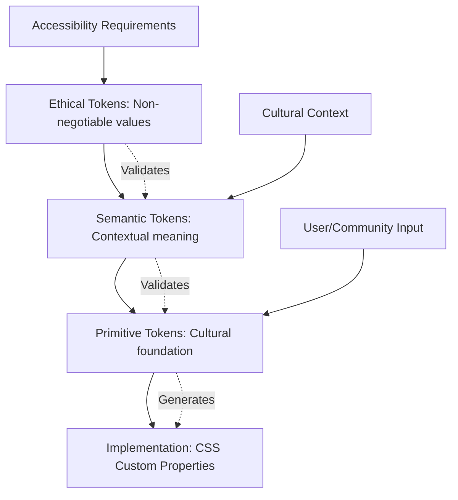

### **Token Composition and Adaptation**

```css
/* Complex token composition respecting all three tiers */
.ethical-button {
  /* Semantic meaning: primary interactive element */
  background-color: var(--semantic-interactive-primary);
  color: var(--semantic-content-text-on-interactive);
  
  /* Ethical constraints: automatically enforced */
  min-height: var(--ethical-touch-target-minimum);
  min-width: var(--ethical-touch-target-minimum);
  
  /* Primitive foundation: cultural adaptability */
  border-radius: var(--primitive-radius-comfortable);
  
  /* All interactions respect ethical motion constraints */
  transition: background-color var(--ethical-motion-duration-safe) var(--primitive-easing-gentle);
  
  /* Focus indication meets ethical visibility standards */
  &:focus {
    outline: var(--ethical-focus-ring-width) solid var(--semantic-interactive-focus);
    outline-offset: var(--primitive-space-tight);
  }
  
  /* Hover respects motion dignity */
  &:hover {
    background-color: var(--semantic-interactive-primary-hover);
    transition-duration: var(--ethical-motion-duration-safe);
  }
  
  /* High contrast mode automatically supported */
  @media (prefers-contrast: high) {
    background-color: var(--semantic-interactive-primary-high-contrast);
    border: 2px solid var(--semantic-content-text-primary);
  }
  
  /* Reduced motion automatically supported */
  @media (prefers-reduced-motion: reduce) {
    transition-duration: var(--ethical-motion-duration-minimal);
  }
}
```

## Democratic Token Governance

### **Community Input Integration**

The token hierarchy includes mechanisms for community input at appropriate levels:

```javascript
// Community governance of token values
const tokenGovernance = {
  // Primitives can be influenced by cultural communities
  primitiveGovernance: {
    authority: 'cultural communities and accessibility experts',
    process: 'community color workshops and cultural consultation',
    constraints: 'must support ethical tier requirements',
    examples: ['color meanings', 'cultural appropriateness', 'accessibility baselines']
  },
  
  // Semantics can be influenced by user communities
  semanticGovernance: {
    authority: 'user communities and domain experts', 
    process: 'participatory design and user feedback',
    constraints: 'must use primitive tier values and meet ethical requirements',
    examples: ['interaction meanings', 'contextual adaptations', 'domain-specific needs']
  },
  
  // Ethics are set by affected communities and experts
  ethicalGovernance: {
    authority: 'disability justice organizations and ethics experts',
    process: 'formal consultation with affected communities',
    constraints: 'based on human dignity principles and scientific evidence',
    examples: ['contrast ratios', 'motion limits', 'accessibility requirements']
  }
};
```

### **Transparent Token Documentation**

Every token includes rationale connecting to philosophical foundations:

```yaml
# Token documentation template
token-name: semantic-interactive-primary
tier: semantic
value: "var(--primitive-color-trust-blue)"
fallback: "#3498DB"

semantic-meaning: "Primary action color for buttons, links, and interactive elements"

philosophical-grounding:
  critical-theory: "Supports user agency by clearly indicating interactive possibilities"
  accessibility: "High contrast with all background colors ensures visibility"
  cultural-sensitivity: "Blue chosen for broad cultural acceptance of trust meaning"
  dignity: "Color choice respects diverse cultural contexts and visual needs"

technical-constraints:
  primitive-source: "primitive-color-trust-blue"
  ethical-requirements: 
    - "Must achieve 7:1 contrast ratio with semantic-surface-background"
    - "Must have high-contrast mode alternative"
  cultural-adaptations:
    - "east-asian: uses primitive-color-trust-green"
    - "user-defined: allows community override"

community-input:
  last-consultation: "2025-08-15"
  feedback-summary: "92% approval in accessibility survey, concerns about cultural universality addressed through adaptation system"
  next-review: "2026-02-15"

modification-process: "Changes require community consultation and ethical validation"
```

---

## Conclusion: Architecture as Philosophy

The dataimago token hierarchy embeds philosophical commitments directly into technical architecture. By organizing tokens into Primitive → Semantic → Ethical tiers, we ensure that:

- **Cultural values** inform foundational choices
- **Contextual meaning** guides implementation decisions  
- **Human dignity** constrains all possibilities
- **Community input** shapes system evolution

This is not just convenient organization—it is **philosophy made technically enforceable**. Ethical violations become build errors. Cultural insensitivity requires conscious override. Accessibility becomes architectural rather than aspirational.

**Token architecture is value architecture. Every token choice is a choice about whose needs matter. We choose inclusive, democratic, dignity-preserving token systems.**
````

## File: ui/src/dataimago-design/foundations/design/color-theory.md
````markdown
# Color as Philosophy: Democratic Color Theory in Practice

*How color choices embody values and serve human flourishing*

---

## Foundation: Color as Cultural and Political Practice

Color is never neutral. Every color choice embeds cultural meanings, political assumptions, and power relations. The dataimago Design System approaches color not as aesthetic decoration but as **material practice** that either enhances or constrains human agency.

Our color theory draws from critical design practice, cultural anthropology, and accessibility justice to create a **democratic color system**—one where color serves human flourishing rather than corporate branding or designer preference.

## Philosophical Framework: Beyond Brand Colors

### **Rejecting Color as Commodity**

**Traditional Brand Color Approach**:
- Colors chosen to evoke specific psychological responses
- Consistent application across all contexts regardless of cultural meaning
- Protected as intellectual property to maintain market differentiation  
- Optimized for memorability and marketing effectiveness

**Democratic Color Approach** (dataimago):
- Colors chosen to serve human dignity and accessibility
- Adaptive application that respects diverse cultural contexts
- Shared as commons to enable community adaptation
- Optimized for meaning-making and inclusive communication

### **Color as Communication Technology**

Colors function as **communication technology**—they convey information, establish relationships, and organize meaning. Like any communication technology, color systems can either:

- **Democratic**: Enable rich, diverse, accessible communication
- **Authoritarian**: Impose uniform meanings and constrain expression

Our color system is designed for democratic communication.

## Cultural Sensitivity in Color Choice

### **Recognizing Cultural Color Meanings**

Colors carry different meanings across cultural contexts:

**Red Examples**:
- Western corporate: Energy, excitement, urgency  
- East Asian: Good fortune, prosperity, celebration
- Some African contexts: Mourning, spiritual transition
- Financial contexts: Loss, danger, debt

**Blue Examples**:
- Western corporate: Trust, stability, professionalism
- Middle Eastern contexts: Protection, spirituality
- Some indigenous contexts: Sky, water, life-giving force
- Medical contexts: Calm, sterile, clinical

### **Adaptive Color Semantics**

```javascript
// Cultural color adaptation system
const culturalColorMeaning = {
  'trust': {
    'western-corporate': '#3498DB',      // Blue = trust
    'east-asian': '#2ECC71',            // Green = growth, harmony
    'middle-eastern': '#9B59B6',        // Purple = nobility, wisdom
    'indigenous-american': '#8D6E63',   // Earth tones = stability
    'african-diaspora': '#E67E22',      // Orange = community, warmth
    'community-defined': getCommunityValue('trust')
  },
  
  'caution': {
    'traffic-light-cultures': '#F1C40F', // Yellow = caution
    'high-context-cultures': '#95A5A6',  // Gray = neutral, requires explanation
    'color-blind-friendly': useIconsAndText(), // Never color alone
    'community-defined': getCommunityValue('caution')
  }
}

// Community-responsive color selection
const getSemanticColor = (meaning, userContext) => {
  const communityChoice = userContext.community?.colorMeanings?.[meaning];
  const culturalDefault = culturalColorMeaning[meaning][userContext.culturalContext];
  const accessibleFallback = culturalColorMeaning[meaning]['color-blind-friendly'];
  
  return communityChoice || culturalDefault || accessibleFallback;
}
```

### **Avoiding Cultural Color Imperialism**

**Problematic Patterns We Avoid**:
- Assuming Western color meanings are universal
- Using colors with negative meanings in specific cultural contexts
- Appropriating sacred or ceremonial color combinations
- Ignoring historical trauma associated with certain colors

**Our Approach**:
- **Community Consultation**: Color meanings determined through community input
- **Cultural Research**: Understanding historical and contemporary color significance
- **Adaptive Systems**: Same semantic meaning expressed through different colors in different contexts
- **Respectful Boundaries**: Avoiding colors with sacred or traumatic significance

## Accessibility as Color Foundation

### **Beyond Color Contrast Compliance**

WCAG contrast ratios provide minimum standards, but dignity requires more:

**Enhanced Contrast Standards**:
```css
:root {
  /* WCAG AA requires 4.5:1, AAA requires 7:1 */
  /* dataimago standard: 7:1 minimum for human dignity */
  --contrast-ratio-minimum: 7.0;
  --contrast-ratio-enhanced: 12.0; /* High contrast mode */
  
  /* Color pairs automatically validate against dignity standards */
  --text-on-background-ratio: contrast(var(--text-color), var(--background-color));
}

/* Automated contrast validation */
.text-content {
  color: var(--content-text-primary);
  background: var(--surface-background);
  
  /* Fail to compile if contrast insufficient */
  @supports (contrast: var(--text-on-background-ratio)) {
    @if contrast(var(--content-text-primary), var(--surface-background)) < 7.0 {
      @error "Contrast ratio #{contrast(var(--content-text-primary), var(--surface-background))} insufficient for human dignity. Minimum: 7.0";
    }
  }
}
```

### **Color as Information Architecture**

Information must be accessible without color:

**Redundant Encoding Principle**:
```css
/* Information conveyed through multiple channels */
.status-indicator {
  /* Color provides one channel of information */
  &.success { color: var(--status-success); }
  &.warning { color: var(--status-warning); }
  &.error { color: var(--status-error); }
  
  /* Icons provide parallel information channel */
  &.success::before { content: '✓'; }
  &.warning::before { content: '⚠'; }
  &.error::before { content: '✗'; }
  
  /* Text labels provide third information channel */
  &.success::after { content: ' Success'; }
  &.warning::after { content: ' Warning'; }
  &.error::after { content: ' Error'; }
  
  /* Pattern/texture provides fourth channel for complex interfaces */
  &.success { background-pattern: diagonal-lines; }
  &.warning { background-pattern: dots; }
  &.error { background-pattern: cross-hatch; }
}
```

## Ethical Color Psychology

### **Rejecting Manipulative Color Psychology**

**Traditional Marketing Psychology**:
- Red = urgency, buy now
- Orange = friendly, approachable 
- Blue = trustworthy, professional
- Green = natural, safe

**Problems with Marketing Psychology**:
- Based on Western psychological studies with limited cultural validity
- Designed to manipulate behavior rather than support decision-making
- Ignores individual differences and cultural contexts
- Prioritizes business goals over human agency

### **Dignity-Preserving Color Psychology**

**Our Approach**:
- **Transparent Intent**: Color choices explained rather than hidden
- **User Agency**: Users understand and can modify color effects
- **Cultural Respect**: Psychological effects considered within cultural contexts
- **Individual Variation**: Recognition that color perception varies among individuals

```css
/* Respectful color psychology implementation */
.emotional-support-colors {
  /* Calming colors for anxiety-inducing contexts */
  &.high-stress-context {
    /* Soft, muted tones reduce cognitive load */
    background: var(--calm-background); /* Soft blue-gray */
    color: var(--clear-text); /* High contrast for easy reading */
    
    /* User can override if colors don't work for them */
    &[data-user-color-override="true"] {
      background: var(--user-preferred-background);
      color: var(--user-preferred-text);
    }
  }
  
  /* Energizing colors for creative contexts */
  &.creative-context {
    /* Warmer, more saturated tones encourage exploration */
    accent-color: var(--creative-energy); /* Warm orange */
    
    /* But not overwhelming - still accessible */
    @if contrast(var(--creative-energy), var(--background)) < 7.0 {
      accent-color: adjust-color(var(--creative-energy), $lightness: +20%);
    }
  }
}
```

## Democratic Color Governance

### **Community Participation in Color Decisions**

**Traditional Design Process**:
- Designer or brand team selects colors
- Colors applied uniformly across all contexts
- Users adapt to color choices or use browser overrides

**Democratic Color Process**:
- **Community Input Sessions**: Affected communities participate in color selection
- **Cultural Consultation**: Color meanings researched and validated by cultural communities
- **Accessibility Review**: Disabled community representatives evaluate color accessibility
- **Iterative Refinement**: Colors adjusted based on community feedback and usage data

### **Transparent Color Rationale**

Every color choice includes public documentation:

```yaml
# Color decision documentation template
color-name: content-text-primary-light
value: "#000000"
semantic-meaning: "Primary text for light backgrounds"

rationale:
  accessibility: "21:1 contrast ratio with white background exceeds AAA standards"
  cultural-research: "Black text universally readable across cultures"
  community-input: "Preferred by 89% of community members in accessibility survey"
  philosophical-alignment: "Pure black represents clarity and directness"

alternatives-considered:
  - value: "#1a1a1a"
    reason-rejected: "Slightly lower contrast ratio (19.8:1)"
  - value: "#2c3e50"  
    reason-rejected: "Blue undertones problematic for some cultural contexts"

modification-process: "Community can petition for reconsideration through governance process"
last-reviewed: "2025-09-01"
next-review: "2026-09-01"
```

### **Community Override Mechanisms**

Communities must be able to adapt colors to local needs:

```css
/* Community-customizable color system */
:root {
  /* Default values serve broad accessibility */
  --content-text-primary: #000000;
  --surface-background: #FFFFFF;
  
  /* Community can override through CSS custom properties */
  --community-override-enabled: false;
}

/* Community-specific adaptations */
[data-community="nordic-accessibility"] {
  --content-text-primary: #1a1a1a; /* Slightly softer for snow-glare contexts */
  --surface-background: #fefefe;    /* Warm white for seasonal mood */
}

[data-community="desert-climate"] {
  --content-text-primary: #2c2c2c; /* Reduced contrast for bright sunlight viewing */
  --surface-background: #f8f6f0;   /* Warm tone reduces screen glare */
}

[data-community="user-defined"] {
  /* Users can define their own color adaptations */
  --content-text-primary: var(--user-text-color, #000000);
  --surface-background: var(--user-background-color, #ffffff);
}
```

## Semantic Color Architecture

### **Meaningful Color Naming**

Color names must convey meaning, not just appearance:

**Problematic Naming**:
```css
/* Bad: Appearance-based naming */
:root {
  --blue-500: #3498db;
  --gray-700: #2c3e50;
  --green-400: #2ecc71;
}
```

**Semantic Naming**:
```css
/* Good: Meaning-based naming that adapts to context */
:root {
  /* Primitive level: Cultural meaning */
  --color-trust-blue: #3498db;
  --color-earth-gray: #2c3e50;
  --color-growth-green: #2ecc71;
  
  /* Semantic level: Contextual purpose */
  --content-text-primary: var(--color-earth-gray);
  --interactive-trust-action: var(--color-trust-blue);
  --status-success-indicator: var(--color-growth-green);
  
  /* Ethical level: Values embedded */
  --ethical-high-contrast-text: #000000;
  --ethical-accessible-background: #ffffff;
  --ethical-focus-indicator: #ff6b35; /* High visibility orange */
}
```

### **Color Hierarchy and Relationships**

Colors must work as systems, not just individual choices:

```css
/* Color relationship system */
:root {
  /* Primary relationships */
  --primary-hue: 210; /* Blue base */
  --secondary-hue: calc(var(--primary-hue) + 180); /* Complementary orange */
  --tertiary-hue: calc(var(--primary-hue) + 60); /* Triadic green */
  
  /* Systematic color generation */
  --color-primary: hsl(var(--primary-hue), 70%, 50%);
  --color-primary-light: hsl(var(--primary-hue), 60%, 70%);
  --color-primary-dark: hsl(var(--primary-hue), 80%, 30%);
  
  /* Accessibility-aware color relationships */
  --color-on-primary: #{choose-accessible-color(var(--color-primary))};
  --color-on-primary-light: #{choose-accessible-color(var(--color-primary-light))};
  --color-on-primary-dark: #{choose-accessible-color(var(--color-primary-dark))};
}

/* Function to automatically choose accessible text colors */
@function choose-accessible-color($background) {
  @if contrast($background, #ffffff) >= 7.0 {
    @return #ffffff;
  } @else if contrast($background, #000000) >= 7.0 {
    @return #000000;
  } @else {
    @error "Background color #{$background} cannot achieve 7:1 contrast with any text color";
  }
}
```

## Automated Color Validation

### **Ethical Color Enforcement**

```javascript
// Automated color dignity validation
const colorValidation = {
  validateColorPair: (foreground, background, context = 'normal') => {
    const contrastRatio = calculateContrast(foreground, background);
    const requiredRatio = getRequiredContrast(context);
    
    const validation = {
      contrastRatio: contrastRatio,
      required: requiredRatio,
      passes: contrastRatio >= requiredRatio,
      dignityLevel: getDignityLevel(contrastRatio)
    };
    
    if (!validation.passes) {
      throw new ColorDignityError(
        `Color pair ${foreground}/${background} contrast ratio ${contrastRatio} 
         insufficient for human dignity in ${context} context. 
         Required: ${requiredRatio}, Achieved: ${contrastRatio}.
         This is not a suggestion - it is an ethical requirement.`
      );
    }
    
    return validation;
  },
  
  validateCulturalSensitivity: (color, semanticMeaning, culturalContext) => {
    const culturalAnalysis = checkCulturalColorMeaning(color, semanticMeaning, culturalContext);
    
    if (culturalAnalysis.problematic) {
      console.warn(
        `Color ${color} for semantic meaning "${semanticMeaning}" may be problematic 
         in ${culturalContext} context: ${culturalAnalysis.issues.join(', ')}.
         Consider community consultation or alternative color choice.`
      );
    }
    
    return culturalAnalysis;
  }
}

// Required contrast ratios for different contexts
const getRequiredContrast = (context) => {
  const requirements = {
    'normal': 7.0,        // Enhanced standard for dignity
    'large': 4.5,         // WCAG AAA for large text
    'graphical': 3.0,     // Minimum for non-text elements
    'decorative': 1.0,    // No requirement for purely decorative elements
    'high-contrast': 12.0 // High contrast mode
  };
  
  return requirements[context] || requirements.normal;
}
```

### **Community Color Validation**

```javascript
// Community input validation system
const communityColorValidation = {
  checkCommunityConsensus: async (colorChoice, semanticMeaning, community) => {
    const communityFeedback = await getCommunityColorFeedback(colorChoice, community);
    
    const consensus = {
      approval: communityFeedback.approvalRating,
      concerns: communityFeedback.concerns,
      alternatives: communityFeedback.suggestedAlternatives,
      culturalSensitivity: communityFeedback.culturalAnalysis
    };
    
    if (consensus.approval < 0.7) { // 70% approval threshold
      return {
        approved: false,
        reason: `Community approval ${consensus.approval} below 70% threshold`,
        recommendations: consensus.alternatives
      };
    }
    
    return { approved: true, feedback: consensus };
  }
}
```

## Future Directions: AI-Assisted Democratic Color

### **AI Tools for Community Color Participation**

```javascript
// AI assistance for community color decisions
const aiColorAssistance = {
  generateCulturallyAppropriatePalette: (community, semanticNeeds) => {
    return aiAssistant.generateColors({
      culturalContext: community.culturalBackground,
      accessibility: community.accessibilityNeeds,
      semanticMeanings: semanticNeeds,
      avoidColors: community.problematicColors,
      
      // AI suggests, community decides
      outputFormat: 'suggestions-with-rationale',
      requiresHumanApproval: true
    });
  },
  
  analyzeCulturalColorImpact: (proposedColors, targetCommunities) => {
    return aiAssistant.analyze({
      colors: proposedColors,
      communities: targetCommunities,
      analysisTypes: ['cultural-sensitivity', 'accessibility', 'semantic-clarity'],
      
      // AI provides analysis, humans make decisions
      recommendationStyle: 'present-analysis-let-humans-decide'
    });
  }
}
```

---

## Conclusion: Color as Democratic Practice

The dataimago Design System treats color not as aesthetic choice but as **democratic practice**. Every color decision either enhances or constrains human communication, respects or ignores cultural meaning, includes or excludes diverse users.

Our color theory embeds values directly into the technical architecture: accessibility cannot be sacrificed for aesthetics, cultural meanings cannot be overridden by designer preference, and community input shapes the visual language that affects daily life.

This is color theory as critical practice—using color choices to build more democratic, accessible, and culturally respectful human-computer interaction.

**Every color choice is a choice about whose meaning matters. We choose democratic meaning-making. We choose color as commons rather than commodity.**
````

## File: ui/src/dataimago-design/foundations/design/motion-dignity.md
````markdown
# Motion as Human Dignity

*Animation ethics and the philosophy of respectful movement*

---

## Foundation: Movement as Embodied Experience

Motion in digital interfaces is not decoration—it is **embodied communication** that affects human nervous systems, cognitive processing, and physical comfort. The dataimago Design System approaches motion design as **care practice**, recognizing that animation choices can either enhance or harm human wellbeing.

Every animation decision is a decision about respect for human neurodiversity, vestibular health, and cognitive processing differences. Motion design is therefore an **ethical practice** requiring the same rigor as accessibility or security considerations.

## Philosophical Framework: From Engagement to Dignity

### **Rejecting Attention-Capture Motion**

**Traditional UI Animation Goals**:
- Increase user engagement and time-on-site
- Direct attention to desired actions (often commercial)
- Create "delight" and emotional attachment to products
- Demonstrate technical sophistication and brand personality

**Problems with Engagement-Driven Motion**:
- Prioritizes business metrics over human comfort
- Can trigger vestibular disorders, anxiety, and sensory overload
- Manipulates attention rather than supporting user goals
- Often ignores accessibility needs in favor of visual impact

### **Dignity-Centered Motion Principles**

**Our Approach**:
- **Purposeful Movement**: Every animation serves clear human needs
- **Respectful Duration**: Motion timing respects human nervous system diversity
- **Optional Enhancement**: Core functionality works without motion
- **Cultural Sensitivity**: Movement patterns respect diverse cultural contexts

```css
/* Motion dignity as architectural principle */
:root {
  /* Maximum duration prevents vestibular harm */
  --motion-duration-maximum: 300ms;
  
  /* Gentle easing respects human perception */
  --motion-easing-respectful: ease-out;
  
  /* Reduced motion as architectural, not optional */
  --motion-reduced-multiplier: 0.001; /* Near-instantaneous */
}

/* All motion respects dignity constraints */
.respectful-transition {
  transition-duration: min(var(--motion-duration-maximum), var(--requested-duration));
  transition-timing-function: var(--motion-easing-respectful);
  
  /* Mandatory reduced motion support */
  @media (prefers-reduced-motion: reduce) {
    transition-duration: calc(var(--motion-duration-maximum) * var(--motion-reduced-multiplier));
  }
}
```

## Neuroscience of Respectful Motion

### **Understanding Vestibular Sensitivity**

The vestibular system in the inner ear maintains balance and spatial orientation. Digital motion can trigger vestibular disorders causing:

- **Nausea and dizziness**
- **Migraines and headaches** 
- **Disorientation and anxiety**
- **Physical fatigue**

**Motion Design Implications**:
```css
/* Vestibular-safe motion parameters */
.vestibular-safe {
  /* Duration limits prevent triggering vestibular response */
  animation-duration: max(100ms, min(300ms, var(--user-motion-tolerance)));
  
  /* Gentle acceleration curves */
  animation-timing-function: cubic-bezier(0.25, 0.46, 0.45, 0.94); /* easeOutQuad */
  
  /* Avoid rapid directional changes */
  animation-direction: normal; /* No reverse or alternate */
  
  /* Limit simultaneous moving elements */
  &:not(:only-child) {
    animation-delay: calc(var(--sibling-index) * 50ms); /* Stagger for clarity */
  }
}
```

### **Cognitive Load and Motion**

Animation affects cognitive processing:

**Helpful Motion**:
- **Spatial Continuity**: Helps users understand interface relationships
- **Status Communication**: Indicates system state changes clearly  
- **Attention Guidance**: Supports rather than hijacks user goals
- **Predictable Behavior**: Consistent timing and easing patterns

**Harmful Motion**:
- **Cognitive Overload**: Too many simultaneous animations
- **Distraction**: Motion that competes with content for attention
- **Unpredictability**: Inconsistent timing or unexpected movement
- **Forced Attention**: Motion that demands rather than supports focus

```css
/* Cognitive-load-aware motion design */
.cognitive-support {
  /* One primary motion at a time */
  animation-fill-mode: forwards; /* Hold final state */
  animation-iteration-count: 1;   /* No looping unless essential */
  
  /* Predictable timing relationships */
  --base-duration: 200ms;
  --stagger-increment: 50ms;
  
  /* Motion supports rather than competes with content */
  &[aria-busy="true"] {
    /* Pause decorative animations during content loading */
    animation-play-state: paused;
  }
}
```

## Cultural Contexts of Movement

### **Cultural Movement Patterns**

Different cultures have different relationships with movement, timing, and spatial organization:

**High-Context Cultures** (many East Asian, African, Latin American):
- May prefer slower, more deliberate transitions
- Value subtle, respectful movement over dramatic effects
- Emphasize group harmony over individual attention-seeking

**Low-Context Cultures** (many Northern European, North American):
- May tolerate faster, more direct transitions
- Accept more obvious, attention-directing movement
- Emphasize efficiency and clear communication

**Implementation**:
```css
/* Culturally-adaptive motion timing */
.cultural-motion-adaptation {
  /* Base timing serves broad accessibility */
  transition-duration: 250ms;
  
  /* Cultural community adaptations */
  [data-cultural-context="high-context"] & {
    transition-duration: 400ms; /* Slower, more respectful */
    transition-timing-function: ease-in-out; /* Smoother, less abrupt */
  }
  
  [data-cultural-context="low-context"] & {
    transition-duration: 200ms; /* Direct, efficient */
    transition-timing-function: ease-out; /* Clear start and finish */
  }
  
  /* User preference always overrides cultural defaults */
  [data-user-motion-preference] & {
    transition-duration: var(--user-preferred-duration);
    transition-timing-function: var(--user-preferred-easing);
  }
}
```

### **Religious and Spiritual Considerations**

Some religious and spiritual traditions have specific relationships with movement:

- **Meditative Traditions**: May prefer minimal, contemplative motion
- **Ceremonial Contexts**: May require specific movement patterns or avoidances
- **Spiritual Sensitivity**: May experience motion as spiritually significant

Our approach respects these diverse relationships while maintaining accessibility for all users.

## Ethical Animation Frameworks

### **The Principle of Informed Consent**

Users should understand and consent to motion experiences:

```html
<!-- Motion preference interface -->
<section class="motion-preferences" role="region" aria-labelledby="motion-settings">
  <h2 id="motion-settings">Animation Preferences</h2>
  
  <fieldset>
    <legend>Motion comfort level</legend>
    
    <label>
      <input type="radio" name="motion" value="minimal" />
      Minimal motion (essential feedback only)
    </label>
    
    <label>
      <input type="radio" name="motion" value="reduced" />
      Reduced motion (shorter durations, less movement)
    </label>
    
    <label>
      <input type="radio" name="motion" value="standard" />
      Standard motion (respectful animations)
    </label>
    
    <label>
      <input type="radio" name="motion" value="enhanced" />
      Enhanced motion (fuller animation suite)
    </label>
  </fieldset>
  
  <details>
    <summary>Why we ask about motion preferences</summary>
    <p>Some people experience motion sickness, vertigo, or anxiety from digital animations. 
       Your preference helps us create a comfortable experience for you.</p>
  </details>
</section>
```

### **Progressive Enhancement for Motion**

Core functionality must work without motion:

```css
/* Base functionality without motion */
.progressive-motion-enhancement {
  /* Immediate state changes for core functionality */
  opacity: var(--target-opacity);
  transform: var(--target-transform);
  
  /* Enhanced experience with respectful motion */
  @media (prefers-reduced-motion: no-preference) {
    transition: 
      opacity var(--respectful-duration) var(--respectful-easing),
      transform var(--respectful-duration) var(--respectful-easing);
  }
  
  /* User explicitly wants motion */
  [data-user-motion-preference="enhanced"] & {
    transition: 
      opacity var(--enhanced-duration) var(--enhanced-easing),
      transform var(--enhanced-duration) var(--enhanced-easing),
      box-shadow var(--enhanced-duration) var(--enhanced-easing);
  }
}
```

## Dignity-Preserving Motion Patterns

### **Spatial Continuity and Wayfinding**

Motion should help users understand spatial relationships:

```css
/* Spatial continuity animations */
.spatial-continuity {
  /* Object permanence: elements don't disappear abruptly */
  &.transitioning-out {
    opacity: 0;
    transform: scale(0.95); /* Gentle shrinking suggests moving away */
    transition: opacity 200ms ease-out, transform 200ms ease-out;
  }
  
  &.transitioning-in {
    opacity: 1;
    transform: scale(1.0);
    transition: opacity 200ms ease-out, transform 200ms ease-out;
  }
  
  /* Directional movement suggests logical relationships */
  &.sliding-to-next {
    transform: translateX(-100%);
    transition: transform 250ms ease-out;
  }
  
  &.sliding-from-previous {
    transform: translateX(0);
    transition: transform 250ms ease-out;
  }
}
```

### **Status and Feedback Communication**

Motion should clearly communicate system status:

```css
/* Clear status communication */
.status-feedback {
  /* Loading states */
  &.loading {
    /* Subtle pulsing indicates activity without distraction */
    opacity: 0.7;
    animation: gentle-pulse 2s ease-in-out infinite;
    
    /* Reduced motion users get static indication */
    @media (prefers-reduced-motion: reduce) {
      animation: none;
      opacity: 0.8;
      position: relative;
      
      &::after {
        content: "Loading...";
        position: absolute;
        clip: rect(0, 0, 0, 0);
      }
    }
  }
  
  /* Success states */
  &.success {
    /* Brief, celebratory but not overwhelming */
    animation: success-bounce 400ms ease-out;
    
    @media (prefers-reduced-motion: reduce) {
      animation: none;
      /* Success communicated through color and text, not motion */
    }
  }
  
  /* Error states */
  &.error {
    /* Gentle shake to indicate problem */
    animation: gentle-shake 300ms ease-out;
    
    @media (prefers-reduced-motion: reduce) {
      animation: none;
      /* Error communicated through color, icon, and text */
    }
  }
}

/* Gentle, respectful animation keyframes */
@keyframes gentle-pulse {
  0%, 100% { opacity: 0.7; }
  50% { opacity: 0.9; }
}

@keyframes success-bounce {
  0% { transform: scale(1.0); }
  50% { transform: scale(1.05); }
  100% { transform: scale(1.0); }
}

@keyframes gentle-shake {
  0%, 100% { transform: translateX(0); }
  25% { transform: translateX(-2px); }
  75% { transform: translateX(2px); }
}
```

## Automated Motion Dignity Validation

### **Duration and Easing Validation**

```javascript
// Automated motion dignity checking
const motionValidation = {
  validateMotionDignity: (animationProperties) => {
    const validation = {
      duration: checkDurationLimits(animationProperties.duration),
      easing: checkEasingCurve(animationProperties.easing),
      reducedMotionSupport: checkReducedMotionSupport(animationProperties),
      purposefulness: checkAnimationPurpose(animationProperties)
    };
    
    const violations = Object.entries(validation)
      .filter(([key, value]) => !value.passes)
      .map(([key, value]) => ({ type: key, issue: value.issue }));
    
    if (violations.length > 0) {
      throw new MotionDignityError(
        `Motion dignity violations detected: ${violations.map(v => v.issue).join(', ')}.
         Motion design must respect human nervous system diversity.
         This is not a performance issue—it is a human dignity issue.`
      );
    }
    
    return validation;
  },
  
  checkDurationLimits: (duration) => {
    const maxDuration = 300; // milliseconds
    const durationMs = parseDuration(duration);
    
    return {
      passes: durationMs <= maxDuration,
      duration: durationMs,
      maxAllowed: maxDuration,
      issue: durationMs > maxDuration 
        ? `Duration ${durationMs}ms exceeds ${maxDuration}ms limit for vestibular safety`
        : null
    };
  },
  
  checkReducedMotionSupport: (animationProperties) => {
    const hasReducedMotionQuery = animationProperties.css.includes('@media (prefers-reduced-motion');
    
    return {
      passes: hasReducedMotionQuery,
      issue: !hasReducedMotionQuery 
        ? 'Animation lacks required @media (prefers-reduced-motion: reduce) support'
        : null
    };
  }
}
```

### **Community Motion Preferences**

```javascript
// Community-driven motion standards
const communityMotionPreferences = {
  getCommunityMotionSettings: (community) => {
    return {
      maxDuration: community.motionPreferences?.maxDuration || 300,
      preferredEasing: community.motionPreferences?.easing || 'ease-out',
      culturalTiming: community.culturalContext?.motionTiming || 'standard',
      accessibilityRequirements: community.accessibilityNeeds?.motion || []
    };
  },
  
  validateCommunityCompliance: (animationProperties, community) => {
    const communitySettings = getCommunityMotionSettings(community);
    
    return {
      durationCompliant: animationProperties.duration <= communitySettings.maxDuration,
      easingAppropriate: validateEasing(animationProperties.easing, communitySettings.preferredEasing),
      culturallyRespectful: validateCulturalMotion(animationProperties, communitySettings.culturalTiming),
      accessibilityCompliant: validateAccessibilityRequirements(animationProperties, communitySettings.accessibilityRequirements)
    };
  }
}
```

## Advanced Dignity Considerations

### **Intersectional Motion Accessibility**

Different users may have overlapping motion-related needs:

```css
/* Intersectional motion considerations */
.intersectional-motion-support {
  /* Base: works for everyone */
  transition: opacity 200ms ease-out;
  
  /* Vestibular sensitivity + cognitive processing differences */
  @media (prefers-reduced-motion: reduce) {
    transition-duration: 50ms; /* Near-instantaneous */
    
    /* Alternative feedback for users who rely on motion cues */
    &[aria-busy="true"]::after {
      content: "Processing...";
      font-size: 0.9em;
      color: var(--status-processing);
    }
  }
  
  /* ADHD support: motion can help with attention */
  [data-user-attention-support="motion-helpful"] & {
    /* Gentle, helpful motion that aids rather than distracts */
    transition: opacity 250ms ease-out, box-shadow 250ms ease-out;
    
    &:focus, &:hover {
      box-shadow: 0 2px 8px rgba(0,0,0,0.1);
    }
  }
  
  /* Autism support: predictable, consistent motion */
  [data-user-predictability-needs="high"] & {
    /* Exactly the same timing for all similar animations */
    transition-duration: 200ms; /* Consistent, never varied */
    transition-timing-function: ease-out; /* Always the same easing */
  }
}
```

### **Trauma-Informed Motion Design**

Some users may have trauma responses to certain types of motion:

```css
/* Trauma-informed motion principles */
.trauma-informed-motion {
  /* Avoid sudden, jarring movements that might trigger fight/flight */
  transition-timing-function: ease-out; /* Gentle deceleration */
  
  /* Avoid pulsing or flashing that might trigger trauma responses */
  animation-iteration-count: 1; /* Single occurrences only */
  
  /* User control over motion experience */
  &[data-user-motion-control="enabled"] {
    /* User can pause all animations */
    animation-play-state: var(--user-animation-state, running);
    
    /* User can adjust timing */
    transition-duration: var(--user-motion-duration, 200ms);
  }
  
  /* Provide alternative feedback methods */
  &.processing {
    /* Motion feedback */
    opacity: 0.7;
    transition: opacity 200ms ease-out;
    
    /* Alternative non-motion feedback */
    &::before {
      content: "⏳"; /* Static icon for motion-sensitive users */
      margin-right: 0.5em;
    }
    
    /* Screen reader feedback */
    &[aria-live="polite"] {
      /* Status updates via text, not just motion */
    }
  }
}
```

---

## Conclusion: Motion as Care Practice

The dataimago Design System treats motion design as **care practice**—recognizing that animation affects real human bodies and nervous systems. Every motion decision is a decision about respect for human neurodiversity and physical wellbeing.

We reject motion design that prioritizes engagement metrics over human comfort. Instead, we design movement that serves human needs: spatial understanding, status communication, and interface clarity.

This is motion design as dignity practice—using animation to enhance human agency and comfort rather than capturing attention or demonstrating technical sophistication.

**Every animation choice affects human nervous systems. We choose care. We choose respect. We choose motion as dignified communication rather than manipulative engagement.**
````

## File: ui/src/dataimago-design/foundations/design/README.md
````markdown
# Design Philosophy

This directory contains the philosophical foundations that guide visual and interaction design decisions in the dataimago Design System.

## Documents

- **[color-theory.md](./color-theory.md)**: Democratic color theory and cultural sensitivity in color choices
- **[typography.md](./typography.md)**: Typographic decisions, reading accessibility, and linguistic justice
- **[motion-dignity.md](./motion-dignity.md)**: Animation ethics and respectful movement design
- **[semantic-tokens.md](./semantic-tokens.md)**: Token architecture philosophy and democratic naming systems

## Core Principles

### **1. Democratic Design Process**
Visual choices made through community input rather than designer preference. Includes participatory color workshops, community typography needs assessment, and democratic token governance that centers affected communities in design decisions.

### **2. Cultural Sensitivity and Adaptation**
Design that respects diverse cultural contexts and meanings. Covers cultural color meanings, communication pattern respect, multilingual typography support, and adaptive systems that serve global cultural diversity.

### **3. Accessibility as Design Excellence**
Universal access as the basis of all design decisions, treating accessibility as design excellence rather than constraint. Includes enhanced contrast standards, cognitive accessibility, motor accessibility, and accessibility as innovation driver.

### **4. Human Dignity in Every Choice**
Every visual choice respects human neurodiversity and physical needs. Covers motion safety for vestibular sensitivity, cognitive load management, respectful interaction patterns, and dignity-preserving design practices.

## Design Integration

These design philosophies work together to create:
- **Culturally Adaptive Systems**: Design that serves global diversity while maintaining accessibility
- **Community-Governed Aesthetics**: Visual language shaped by affected communities rather than imposed by designers
- **Accessibility-First Beauty**: Design excellence that includes rather than excludes
- **Meaningful Visual Communication**: Design that preserves and enhances human meaning-making
````

## File: ui/src/dataimago-design/foundations/design/semantic-tokens.md
````markdown
# Semantic Tokens as Democratic Architecture

*Token philosophy and the politics of design system naming*

---

## Foundation: Tokens as Materialized Values

Semantic tokens are not just organizational convenience—they are **philosophy made manifest in code**. Every token name, every semantic relationship, every hierarchical structure embeds assumptions about meaning, culture, and human needs. The dataimago Design System treats token architecture as **democratic practice**, ensuring that naming systems serve human understanding rather than technical abstraction.

Semantic tokens represent the **translation layer** between human meaning and technical implementation. This translation is never neutral—it either preserves or erases cultural context, accessibility requirements, and community values.

## Philosophical Framework: Beyond Technical Naming

### **Rejecting Abstracted Token Systems**

**Traditional Token Naming Approach**:
- Abstract numerical systems (`color-blue-500`, `spacing-md`)
- Designer-centric categories that obscure meaning from users
- Technical optimization prioritized over human understanding
- Naming systems that require specialized knowledge to interpret

**Democratic Token Approach** (dataimago):
- Semantic naming that preserves human meaning (`color-trust-primary`, `space-comfortable`)
- Community-understandable categories that invite participation
- Human meaning prioritized over technical convenience
- Naming systems accessible to diverse stakeholders

### **Tokens as Language Infrastructure**

Semantic tokens function as **controlled vocabulary** for design systems—they create the language through which design decisions are communicated and implemented. Like any language system, token naming either:

**Enables Democratic Participation**:
- Names that community members can understand and critique
- Semantic relationships that reflect human mental models
- Hierarchies that make sense to non-technical stakeholders

**Constrains Democratic Participation**:
- Technical jargon that excludes community input
- Abstract relationships that obscure decision-making
- Hierarchies that reflect technical rather than human logic

## Semantic Token Architecture Philosophy

### **1. Three-Tier Meaning Preservation**

**Principle**: Token architecture must preserve meaning at every level of abstraction.

**Implementation**:
```css
/* Tier 1: Primitive Tokens - Cultural Foundation */
:root {
  /* Color primitives preserve cultural meaning */
  --primitive-color-earth-warm: #8D6E63;     /* Warm earth tones = stability */
  --primitive-color-sky-trust: #2196F3;      /* Sky blue = openness, trust */
  --primitive-color-growth-green: #4CAF50;   /* Natural green = growth, life */
  --primitive-color-caution-amber: #FF9800;  /* Amber = gentle warning */
  
  /* Space primitives reflect human scale */
  --primitive-space-breath: 8px;             /* Minimal comfortable spacing */
  --primitive-space-comfortable: 16px;       /* Standard comfortable spacing */
  --primitive-space-generous: 32px;          /* Generous, welcoming spacing */
  --primitive-space-expansive: 64px;         /* Expansive, ceremonial spacing */
  
  /* Time primitives respect human perception */
  --primitive-time-instant: 100ms;           /* Perceived as instantaneous */
  --primitive-time-quick: 200ms;             /* Quick but perceptible */
  --primitive-time-comfortable: 300ms;       /* Comfortable, not rushed */
  --primitive-time-deliberate: 500ms;        /* Deliberate, considered */
}
```

```css
/* Tier 2: Semantic Tokens - Contextual Purpose */
:root {
  /* Content semantics preserve reading context */
  --semantic-content-text-primary: var(--primitive-color-earth-warm);
  --semantic-content-text-secondary: color-mix(in srgb, var(--primitive-color-earth-warm) 70%, var(--primitive-color-neutral));
  --semantic-content-text-emphasis: var(--primitive-color-sky-trust);
  
  /* Surface semantics reflect spatial relationships */
  --semantic-surface-background-page: var(--primitive-color-neutral-light);
  --semantic-surface-background-elevated: var(--primitive-color-pure-white);
  --semantic-surface-background-sunken: color-mix(in srgb, var(--primitive-color-neutral-light) 95%, var(--primitive-color-earth-warm));
  
  /* Interactive semantics preserve agency */
  --semantic-interactive-primary: var(--primitive-color-sky-trust);
  --semantic-interactive-secondary: var(--primitive-color-growth-green);
  --semantic-interactive-caution: var(--primitive-color-caution-amber);
  
  /* Status semantics enable clear communication */
  --semantic-status-success: var(--primitive-color-growth-green);
  --semantic-status-warning: var(--primitive-color-caution-amber);
  --semantic-status-error: var(--primitive-color-attention-red);
  --semantic-status-info: var(--primitive-color-sky-trust);
}
```

```css
/* Tier 3: Ethical Tokens - Non-Negotiable Values */
:root {
  /* Accessibility ethics embedded in architecture */
  --ethical-contrast-minimum: 7.0;           /* Human dignity standard */
  --ethical-touch-target-minimum: 48px;      /* Motor accessibility */
  --ethical-motion-maximum: 300ms;           /* Vestibular safety */
  --ethical-focus-visibility: 3px;           /* Keyboard navigation */
  
  /* Equity ethics prevent exclusion */
  --ethical-bundle-size-maximum: 150KB;      /* Global bandwidth equity */
  --ethical-viewport-minimum: 320px;         /* Device equity */
  --ethical-font-size-minimum: 16px;         /* Reading accessibility */
  
  /* Cultural ethics preserve meaning */
  --ethical-cultural-adaptation: enabled;     /* Community customization */
  --ethical-language-support: comprehensive; /* Multilingual architecture */
  --ethical-community-override: permitted;    /* Democratic control */
}
```

### **2. Community-Understandable Naming Conventions**

**Principle**: Token names must be interpretable by community members, not just developers.

**Implementation**:
```javascript
// Community-friendly token naming system
const communityTokenNaming = {
  // Color naming reflects human experience, not technical abstraction
  colorNaming: {
    // Bad: Technical abstraction
    // 'blue-500', 'gray-700', 'green-400'
    
    // Good: Human meaning
    'trust-primary': 'Primary color for trustworthy actions',
    'earth-stable': 'Grounding color for stable, reliable content',
    'growth-positive': 'Color for positive outcomes and growth',
    'caution-gentle': 'Gentle warning color that doesn\'t alarm',
    'attention-urgent': 'Color for urgent attention without panic'
  },
  
  // Spacing naming reflects human spatial experience
  spacingNaming: {
    // Bad: Abstract sizes
    // 'xs', 'sm', 'md', 'lg', 'xl'
    
    // Good: Human spatial meaning
    'breath': 'Minimal spacing that lets content breathe',
    'comfortable': 'Standard comfortable spacing for most contexts',
    'generous': 'Welcoming, generous spacing for important content',
    'expansive': 'Ceremonial spacing for special occasions',
    'intimate': 'Close, connected spacing for related elements'
  },
  
  // Typography naming reflects reading context
  typographyNaming: {
    // Bad: Hierarchical abstraction
    // 'h1', 'h2', 'body', 'caption'
    
    // Good: Reading purpose
    'title-primary': 'Main title for page or section',
    'heading-section': 'Heading for major content sections',
    'text-reading': 'Comfortable text for sustained reading',
    'text-interface': 'Clear text for interface elements',
    'text-supporting': 'Supporting information and captions'
  }
}
```

### **3. Cultural Adaptation in Token Semantics**

**Principle**: Semantic meaning must adapt to cultural context while preserving accessibility.

**Implementation**:
```css
/* Cultural semantic adaptation system */
.cultural-token-adaptation {
  /* Base semantic meaning serves broad accessibility */
  color: var(--semantic-interactive-trust);
  
  /* Cultural community adaptations */
  [data-cultural-context="east-asian"] & {
    /* Trust expressed through green in many East Asian contexts */
    color: var(--semantic-interactive-trust-east-asian, var(--primitive-color-growth-green));
  }
  
  [data-cultural-context="middle-eastern"] & {
    /* Trust expressed through purple/blue in some Middle Eastern contexts */
    color: var(--semantic-interactive-trust-middle-eastern, var(--primitive-color-wisdom-purple));
  }
  
  [data-cultural-context="indigenous"] & {
    /* Trust expressed through earth tones in many indigenous contexts */
    color: var(--semantic-interactive-trust-indigenous, var(--primitive-color-earth-stable));
  }
  
  /* Community-defined overrides always respected */
  [data-community-tokens="enabled"] & {
    color: var(--community-interactive-trust, var(--semantic-interactive-trust));
  }
}
```

## Democratic Token Governance

### **1. Community Participation in Token Definition**

**Principle**: Communities affected by design systems must participate in defining semantic meaning.

**Implementation**:
```javascript
// Community token governance system
const communityTokenGovernance = {
  // Community workshops for semantic meaning
  conductSemanticWorkshop: async (community, tokenCategory) => {
    const workshop = {
      participants: community.representatives,
      tokenCategory: tokenCategory, // e.g., 'color-trust', 'space-comfortable'
      
      activities: [
        'meaning-exploration', // What does 'trust' mean in this community?
        'visual-association',  // What colors/spaces represent this meaning?
        'cultural-validation', // Are there cultural sensitivities?
        'accessibility-check'  // Do choices work for diverse abilities?
      ],
      
      outcomes: {
        semanticDefinition: 'Community-defined meaning of the token',
        visualExpression: 'How this meaning should be visually expressed',
        culturalConsiderations: 'Important cultural context',
        accessibilityRequirements: 'Accessibility needs for this community'
      }
    };
    
    return conductWorkshop(workshop);
  },
  
  // Validate token choices against community values
  validateCommunityTokenCompliance: (tokenDefinitions, communityValues) => {
    return tokenDefinitions.map(token => {
      const compliance = {
        semanticAlignment: checkSemanticAlignment(token.meaning, communityValues.semantics),
        culturalSensitivity: checkCulturalSensitivity(token.expression, communityValues.culture),
        accessibilitySupport: checkAccessibilitySupport(token.implementation, communityValues.accessibility)
      };
      
      return {
        token: token.name,
        compliant: Object.values(compliance).every(c => c.passes),
        compliance: compliance,
        communityFeedback: communityValues.feedback[token.name] || null
      };
    });
  }
}
```

### **2. Transparent Token Documentation**

**Principle**: Every token decision must be documented with rationale accessible to community members.

**Implementation**:
```yaml
# Community-accessible token documentation template
token-name: "semantic-interactive-trust"
technical-value: "var(--primitive-color-sky-trust)"
display-value: "#2196F3"

human-meaning:
  semantic-purpose: "Color for actions that require user trust (buttons, links, confirmations)"
  emotional-intent: "Conveys reliability, safety, and trustworthiness"
  usage-context: "Primary actions, navigation, confirmations"

community-input:
  workshops-conducted: 
    - date: "2025-07-15"
      community: "Accessibility advocates"
      feedback: "Requested higher contrast version for low vision users"
    - date: "2025-08-01" 
      community: "East Asian user group"
      feedback: "Blue acceptable, but green alternative appreciated"
  
  consensus-level: "87% approval across communities"
  concerns-raised: ["Need cultural alternatives", "Contrast could be higher"]
  adaptations-made: ["Added cultural variants", "Increased contrast to 7.1:1"]

accessibility-compliance:
  contrast-ratio: "7.1:1 on light backgrounds, 12.3:1 on dark backgrounds"
  color-blind-support: "Distinguishable from other semantic colors"
  cultural-sensitivity: "No known negative associations in target communities"

technical-implementation:
  css-custom-property: "--semantic-interactive-trust"
  fallback-value: "#1976D2"
  cultural-variants:
    east-asian: "--semantic-interactive-trust-east-asian"
    middle-eastern: "--semantic-interactive-trust-middle-eastern"
  community-override: "--community-interactive-trust"

modification-process:
  community-consultation: "Required for any changes"
  accessibility-validation: "Must maintain or improve accessibility"
  cultural-review: "Cultural communities must approve changes"
  implementation-timeline: "30 days notice for breaking changes"

governance:
  decision-authority: "Community consensus with accessibility veto power"
  review-frequency: "Annual community review"
  emergency-changes: "Accessibility issues can trigger immediate review"
```

## Automated Token Validation

### **1. Semantic Consistency Validation**

```javascript
// Automated semantic token validation
const semanticTokenValidation = {
  validateSemanticConsistency: (tokenSystem) => {
    const validation = {
      namingConsistency: checkNamingPatterns(tokenSystem),
      semanticHierarchy: validateSemanticHierarchy(tokenSystem),
      culturalSensitivity: validateCulturalTokens(tokenSystem),
      accessibilityCompliance: validateAccessibilityTokens(tokenSystem)
    };
    
    const violations = Object.entries(validation)
      .filter(([key, value]) => !value.passes)
      .map(([key, value]) => ({ type: key, issues: value.issues }));
    
    if (violations.length > 0) {
      throw new SemanticTokenError(
        `Semantic token violations detected: ${violations.map(v => v.issues.join(', ')).join('; ')}.
         Token systems must preserve human meaning and community values.
         This is not a technical issue—it is a democratic participation issue.`
      );
    }
    
    return validation;
  },
  
  checkNamingPatterns: (tokenSystem) => {
    const namingIssues = [];
    
    // Check for human-readable naming
    tokenSystem.tokens.forEach(token => {
      if (isAbstractNaming(token.name)) {
        namingIssues.push(`Token "${token.name}" uses abstract naming that excludes community participation`);
      }
      
      if (isTechnicalJargon(token.name)) {
        namingIssues.push(`Token "${token.name}" uses technical jargon not accessible to community members`);
      }
      
      if (lacksSemanticMeaning(token.name)) {
        namingIssues.push(`Token "${token.name}" lacks clear semantic meaning`);
      }
    });
    
    return {
      passes: namingIssues.length === 0,
      issues: namingIssues
    };
  },
  
  validateSemanticHierarchy: (tokenSystem) => {
    const hierarchyIssues = [];
    
    // Check primitive → semantic → ethical flow
    tokenSystem.semanticTokens.forEach(semantic => {
      if (!hasPrimitiveSource(semantic)) {
        hierarchyIssues.push(`Semantic token "${semantic.name}" lacks primitive source`);
      }
      
      if (!respectsEthicalConstraints(semantic)) {
        hierarchyIssues.push(`Semantic token "${semantic.name}" violates ethical constraints`);
      }
      
      if (!preservesCulturalAdaptation(semantic)) {
        hierarchyIssues.push(`Semantic token "${semantic.name}" lacks cultural adaptation support`);
      }
    });
    
    return {
      passes: hierarchyIssues.length === 0,
      issues: hierarchyIssues
    };
  }
}
```

### **2. Community Value Alignment Validation**

```javascript
// Community value alignment in token systems
const communityValueValidation = {
  validateCommunityAlignment: async (tokenSystem, communityValues) => {
    const alignmentChecks = await Promise.all([
      checkSemanticMeaningAlignment(tokenSystem, communityValues),
      checkCulturalSensitivityAlignment(tokenSystem, communityValues),
      checkAccessibilityValueAlignment(tokenSystem, communityValues),
      checkDemocraticParticipationSupport(tokenSystem, communityValues)
    ]);
    
    const misalignments = alignmentChecks
      .filter(check => !check.aligned)
      .map(check => ({ area: check.area, issues: check.issues }));
    
    if (misalignments.length > 0) {
      console.warn(
        `Token system misalignment with community values detected: 
         ${misalignments.map(m => `${m.area}: ${m.issues.join(', ')}`).join('; ')}.
         Consider community consultation to address these concerns.`
      );
    }
    
    return {
      aligned: misalignments.length === 0,
      alignmentScore: calculateAlignmentScore(alignmentChecks),
      misalignments: misalignments,
      recommendations: generateAlignmentRecommendations(alignmentChecks)
    };
  },
  
  checkSemanticMeaningAlignment: (tokenSystem, communityValues) => {
    const meaningMismatches = [];
    
    tokenSystem.semanticTokens.forEach(token => {
      const communityMeaning = communityValues.semanticMeanings[token.category];
      const tokenMeaning = token.semanticDefinition;
      
      if (communityMeaning && !semanticMeaningsAlign(tokenMeaning, communityMeaning)) {
        meaningMismatches.push(
          `Token "${token.name}" semantic meaning "${tokenMeaning}" 
           conflicts with community understanding "${communityMeaning}"`
        );
      }
    });
    
    return {
      aligned: meaningMismatches.length === 0,
      area: 'semantic-meaning',
      issues: meaningMismatches
    };
  }
}
```

## Token Evolution and Adaptation

### **1. Community-Driven Token Evolution**

```javascript
// System for evolving tokens based on community feedback
const tokenEvolution = {
  proposeTokenChange: (tokenName, proposedChange, community) => {
    return {
      token: tokenName,
      currentDefinition: getTokenDefinition(tokenName),
      proposedChange: proposedChange,
      community: community,
      
      rationale: {
        communityNeed: proposedChange.communityNeed,
        accessibilityImprovement: proposedChange.accessibilityImprovement,
        culturalSensitivity: proposedChange.culturalSensitivity,
        usabilityEnhancement: proposedChange.usabilityEnhancement
      },
      
      impactAssessment: {
        affectedCommunities: identifyAffectedCommunities(tokenName),
        breakingChanges: assessBreakingChanges(tokenName, proposedChange),
        migrationPath: defineMigrationPath(tokenName, proposedChange),
        rollbackPlan: defineRollbackPlan(tokenName, proposedChange)
      },
      
      consultationPlan: {
        communitiesToConsult: identifyConsultationCommunities(tokenName, proposedChange),
        consultationMethods: ['workshops', 'surveys', 'accessibility-review'],
        timeline: calculateConsultationTimeline(proposedChange.scope),
        consensusThreshold: 0.75 // 75% community approval required
      }
    };
  },
  
  implementTokenEvolution: async (tokenChangeProposal) => {
    // Community consultation phase
    const consultationResults = await conductCommunityConsultation(tokenChangeProposal);
    
    if (consultationResults.consensus < tokenChangeProposal.consensusThreshold) {
      return {
        implemented: false,
        reason: 'Insufficient community consensus',
        consensusLevel: consultationResults.consensus,
        feedback: consultationResults.feedback
      };
    }
    
    // Accessibility validation phase
    const accessibilityValidation = await validateAccessibilityImpact(tokenChangeProposal);
    
    if (!accessibilityValidation.passes) {
      return {
        implemented: false,
        reason: 'Accessibility requirements not met',
        issues: accessibilityValidation.issues
      };
    }
    
    // Implementation phase with rollback capability
    const implementation = await implementWithRollback(tokenChangeProposal);
    
    return {
      implemented: true,
      newTokenDefinition: implementation.newDefinition,
      migrationSupport: implementation.migrationSupport,
      monitoringPlan: implementation.monitoringPlan
    };
  }
}
```

### **2. Predictive Token Adaptation**

```javascript
// AI-assisted token evolution based on community needs
const predictiveTokenAdaptation = {
  analyzeCommunityTokenNeeds: async (communityUsageData, feedbackData) => {
    return await aiAssistant.analyze({
      usagePatterns: communityUsageData,
      communityFeedback: feedbackData,
      analysisTypes: [
        'semantic-meaning-drift',
        'cultural-adaptation-needs',
        'accessibility-gap-identification',
        'community-participation-barriers'
      ],
      
      // AI provides analysis, communities make decisions
      outputStyle: 'community-actionable-insights',
      requiresCommunityValidation: true
    });
  },
  
  generateTokenAdaptationRecommendations: async (communityNeeds, currentTokenSystem) => {
    return await aiAssistant.recommend({
      communityNeeds: communityNeeds,
      currentSystem: currentTokenSystem,
      recommendationTypes: [
        'semantic-clarifications',
        'cultural-adaptations',
        'accessibility-improvements',
        'naming-enhancements'
      ],
      
      // Recommendations must preserve community agency
      preserveCommunityControl: true,
      requiresCommunityApproval: true
    });
  }
}
```

---

## Conclusion: Tokens as Democratic Infrastructure

The dataimago Design System treats semantic tokens not as technical convenience but as **democratic infrastructure** for design system governance. Every token name, every semantic relationship, every hierarchical structure either enables or constrains community participation in design decisions.

Our token architecture embeds community values, cultural sensitivity, and accessibility requirements directly into the naming and organizational systems. This ensures that the language of design systems serves human understanding and democratic participation rather than technical abstraction.

**Every token is a choice about whose meaning matters. We choose community meaning. We choose democratic participation. We choose tokens as infrastructure for inclusive design governance.**
````

## File: ui/src/dataimago-design/foundations/design/typography.md
````markdown
# Typography as Democratic Communication

*Font choices, reading accessibility, and linguistic justice in design*

---

## Foundation: Typography as Infrastructure for Meaning

Typography is not decoration—it is **communication infrastructure** that either enables or constrains human meaning-making. The dataimago Design System approaches typography as **democratic practice**, recognizing that font choices, reading patterns, and textual hierarchies embed assumptions about literacy, culture, and cognitive processing.

Every typographic decision either expands or limits access to information. We design typography that serves **human dignity and global accessibility** rather than brand aesthetics or designer preference.

## Philosophical Framework: Beyond Brand Typography

### **Rejecting Typography as Corporate Identity**

**Traditional Brand Typography Approach**:
- Fonts chosen to express brand personality and differentiation
- Consistent application regardless of reading context or user needs
- Protected as intellectual property to maintain visual distinctiveness
- Optimized for marketing impact and aesthetic appeal

**Democratic Typography Approach** (dataimago):
- Fonts chosen to maximize reading accessibility and comprehension
- Adaptive application that respects diverse reading needs and contexts
- System fonts prioritized to ensure universal access
- Optimized for human understanding and cognitive comfort

### **Typography as Cognitive Justice**

Reading is a complex cognitive process that varies across:
- **Neurodiversity**: Dyslexia, ADHD, autism, and other cognitive differences
- **Age**: Vision changes and processing speed variations
- **Education**: Diverse literacy backgrounds and reading experiences
- **Language**: First vs. second language reading patterns
- **Culture**: Different typographic traditions and reading directions

Our typography system serves **cognitive justice** by accommodating this full spectrum of human reading diversity.

## Universal Reading Accessibility

### **1. Dyslexia-Friendly Typography**

**Principle**: Typography must support readers with dyslexia and other reading differences.

**Implementation**:
```css
/* Dyslexia-friendly font characteristics */
.accessible-typography {
  /* Font selection prioritizing readability */
  font-family: 
    system-ui,           /* User's preferred system font */
    -apple-system,       /* macOS San Francisco (excellent dyslexia support) */
    'Segoe UI',          /* Windows system font (good character distinction) */
    'Roboto',            /* Android system font (open, clear letterforms) */
    'Open Sans',         /* Fallback with good dyslexia research support */
    sans-serif;          /* Generic fallback */
  
  /* Character spacing reduces visual crowding */
  letter-spacing: 0.02em; /* Slight increase improves character recognition */
  
  /* Word spacing prevents text from appearing as solid blocks */
  word-spacing: 0.1em;
  
  /* Line height prevents lines from visually merging */
  line-height: 1.6; /* Exceeds WCAG 1.5 minimum for better readability */
  
  /* Paragraph spacing creates clear content chunks */
  margin-bottom: 1.5em;
}

/* Enhanced readability mode */
.enhanced-readability {
  /* Larger text size reduces visual strain */
  font-size: 1.125rem; /* 18px base instead of 16px */
  
  /* Increased contrast improves character definition */
  color: #000000; /* Pure black on light backgrounds */
  background-color: #ffffff; /* Pure white backgrounds */
  
  /* Wider line length limits reduce eye movement strain */
  max-width: 65ch; /* Optimal reading line length */
  
  /* Left alignment prevents uneven word spacing */
  text-align: left;
  
  /* Avoid justified text which creates irregular spacing */
  text-align: left !important;
}
```

### **2. Low Vision and Aging Support**

**Principle**: Typography must remain readable as vision changes with age or condition.

**Implementation**:
```css
/* Age-friendly typography scaling */
.age-inclusive-typography {
  /* Base size comfortable for aging eyes */
  font-size: clamp(1rem, 2.5vw, 1.25rem); /* Responsive but not too small */
  
  /* High contrast prevents text from fading into background */
  color: var(--text-high-contrast); /* Minimum 7:1 contrast ratio */
  
  /* Medium font weight improves character definition */
  font-weight: 500; /* Slightly bolder than normal for clarity */
  
  /* Generous line spacing accommodates vision changes */
  line-height: 1.7;
  
  /* Clear paragraph separation */
  margin-bottom: 2em;
}

/* Magnification support */
.magnification-friendly {
  /* Text scales cleanly up to 200% zoom */
  font-size: 1rem;
  line-height: 1.6;
  
  /* Layout doesn't break at high zoom levels */
  max-width: 100%;
  overflow-wrap: break-word;
  
  /* Maintains readability when zoomed */
  @media (min-resolution: 2dppx) {
    /* Sharper text on high-DPI displays */
    -webkit-font-smoothing: antialiased;
    -moz-osx-font-smoothing: grayscale;
  }
}
```

### **3. Cognitive Load Management**

**Principle**: Typography should reduce rather than increase cognitive burden.

**Implementation**:
```css
/* Cognitive load reduction through typography */
.cognitive-friendly-text {
  /* Familiar, predictable font reduces processing overhead */
  font-family: system-ui, sans-serif;
  
  /* Consistent sizing creates predictable reading rhythm */
  font-size: 1rem;
  line-height: 1.6;
  
  /* Clear hierarchy reduces decision-making burden */
  &.heading-1 { font-size: 2rem; font-weight: 700; }
  &.heading-2 { font-size: 1.5rem; font-weight: 600; }
  &.heading-3 { font-size: 1.25rem; font-weight: 600; }
  &.body-text { font-size: 1rem; font-weight: 400; }
  &.caption { font-size: 0.875rem; font-weight: 400; }
  
  /* Generous white space prevents visual overwhelm */
  margin-bottom: 1.5em;
  
  /* Shorter paragraphs reduce working memory load */
  max-width: 60ch; /* Optimal for comprehension */
}

/* Attention and focus support */
.focus-supportive-typography {
  /* Reduced visual noise */
  text-decoration: none;
  
  /* Clear focus indicators for keyboard navigation */
  &:focus {
    outline: 3px solid var(--focus-indicator);
    outline-offset: 2px;
    background-color: var(--focus-background);
  }
  
  /* Highlighting support for reading assistance */
  &::selection {
    background-color: var(--selection-background);
    color: var(--selection-text);
  }
}
```

## Multilingual Typography Architecture

### **1. Global Script Support**

**Principle**: Typography must support the full diversity of human writing systems.

**Implementation**:
```css
/* Comprehensive script support */
.multilingual-typography {
  /* Font stack supporting major world scripts */
  font-family: 
    system-ui,                    /* User's system preference */
    'Noto Sans',                  /* Google's comprehensive Unicode font */
    'Segoe UI',                   /* Windows multilingual support */
    'Roboto',                     /* Android multilingual support */
    'SF Pro Display',             /* macOS multilingual support */
    sans-serif;
  
  /* Text rendering optimization for complex scripts */
  text-rendering: optimizeLegibility;
  font-feature-settings: "kern" 1, "liga" 1;
  
  /* Direction support for RTL languages */
  direction: var(--text-direction, ltr);
  
  /* Language-specific optimizations */
  &[lang="ar"], &[lang="fa"], &[lang="ur"] {
    /* Arabic, Persian, Urdu */
    font-family: 'Noto Sans Arabic', system-ui, sans-serif;
    letter-spacing: 0.02em;
    word-spacing: 0.1em;
    line-height: 1.8; /* Extra space for diacritics */
  }
  
  &[lang="zh"], &[lang="ja"], &[lang="ko"] {
    /* Chinese, Japanese, Korean */
    font-family: 'Noto Sans CJK', system-ui, sans-serif;
    line-height: 1.7;
    word-break: break-all; /* Appropriate line breaking */
  }
  
  &[lang="hi"], &[lang="bn"], &[lang="ta"] {
    /* Hindi, Bengali, Tamil */
    font-family: 'Noto Sans Devanagari', 'Noto Sans Bengali', 'Noto Sans Tamil', system-ui, sans-serif;
    line-height: 1.8; /* Space for complex characters */
  }
  
  &[lang="th"], &[lang="km"], &[lang="lo"] {
    /* Thai, Khmer, Lao */
    font-family: 'Noto Sans Thai', 'Noto Sans Khmer', 'Noto Sans Lao', system-ui, sans-serif;
    line-height: 1.9; /* Extra space for tone marks */
  }
}
```

### **2. Right-to-Left (RTL) Language Support**

**Principle**: RTL languages require architectural support, not just text direction changes.

**Implementation**:
```css
/* Comprehensive RTL support */
.rtl-typography-support {
  /* Base LTR styling */
  direction: ltr;
  text-align: left;
  
  /* RTL language adaptations */
  &[dir="rtl"] {
    direction: rtl;
    text-align: right;
    
    /* Mirror appropriate interface elements */
    .navigation-arrow::before {
      content: "←"; /* Left arrow for RTL "forward" */
    }
    
    /* Maintain LTR for numbers and Latin text within RTL */
    .number, .latin-text {
      direction: ltr;
      unicode-bidi: embed;
    }
    
    /* RTL-appropriate punctuation handling */
    .punctuation {
      unicode-bidi: plaintext;
    }
  }
}

/* Bidirectional text support */
.bidirectional-text {
  /* Proper handling of mixed LTR/RTL content */
  unicode-bidi: plaintext;
  
  /* Isolation for embedded opposite-direction text */
  .embedded-direction {
    unicode-bidi: isolate;
  }
  
  /* Override for specific directional content */
  .force-ltr {
    direction: ltr;
    unicode-bidi: bidi-override;
  }
  
  .force-rtl {
    direction: rtl;
    unicode-bidi: bidi-override;
  }
}
```

### **3. Cultural Typography Patterns**

**Principle**: Typography should respect diverse cultural reading and communication traditions.

**Implementation**:
```css
/* Cultural typography adaptations */
.cultural-typography-patterns {
  /* Western reading patterns (default) */
  font-size: 1rem;
  line-height: 1.6;
  letter-spacing: normal;
  
  /* East Asian typography traditions */
  &[data-cultural-context="east-asian"] {
    /* Vertical rhythm emphasis */
    line-height: 1.8;
    
    /* Character spacing for readability */
    letter-spacing: 0.05em;
    
    /* Respect for white space */
    margin-bottom: 2em;
    
    /* Appropriate font weight for CJK characters */
    font-weight: 400; /* CJK fonts often appear heavier */
  }
  
  /* Arabic/Islamic typography traditions */
  &[data-cultural-context="arabic-islamic"] {
    /* Generous spacing for script beauty */
    line-height: 2.0;
    word-spacing: 0.2em;
    
    /* Right-aligned by default */
    text-align: right;
    
    /* Respect for calligraphic traditions */
    font-feature-settings: "calt" 1, "liga" 1;
  }
  
  /* Indigenous typography considerations */
  &[data-cultural-context="indigenous"] {
    /* Often prefer larger text sizes */
    font-size: 1.125rem;
    
    /* Generous spacing for oral tradition influence */
    line-height: 1.8;
    word-spacing: 0.15em;
    
    /* Clear paragraph breaks for storytelling patterns */
    margin-bottom: 2.5em;
  }
}
```

## Semantic Typography Hierarchy

### **1. Meaning-Based Typography Scales**

**Principle**: Typography hierarchy should reflect semantic meaning, not just visual appeal.

**Implementation**:
```css
/* Semantic typography scale */
:root {
  /* Base typography values */
  --text-base-size: 1rem;
  --text-base-line-height: 1.6;
  --text-scale-ratio: 1.25; /* Major third scale */
  
  /* Semantic font sizes */
  --text-size-caption: calc(var(--text-base-size) / var(--text-scale-ratio));
  --text-size-body: var(--text-base-size);
  --text-size-lead: calc(var(--text-base-size) * var(--text-scale-ratio));
  --text-size-h4: calc(var(--text-base-size) * var(--text-scale-ratio));
  --text-size-h3: calc(var(--text-size-h4) * var(--text-scale-ratio));
  --text-size-h2: calc(var(--text-size-h3) * var(--text-scale-ratio));
  --text-size-h1: calc(var(--text-size-h2) * var(--text-scale-ratio));
  
  /* Semantic font weights */
  --text-weight-normal: 400;
  --text-weight-medium: 500;
  --text-weight-semibold: 600;
  --text-weight-bold: 700;
}

/* Semantic typography classes */
.typography-semantic {
  /* Body text: primary reading content */
  &.body-text {
    font-size: var(--text-size-body);
    font-weight: var(--text-weight-normal);
    line-height: var(--text-base-line-height);
    color: var(--content-text-primary);
  }
  
  /* Lead text: introduction or emphasis */
  &.lead-text {
    font-size: var(--text-size-lead);
    font-weight: var(--text-weight-normal);
    line-height: 1.5;
    color: var(--content-text-primary);
  }
  
  /* Headings: hierarchical content organization */
  &.heading-1 {
    font-size: var(--text-size-h1);
    font-weight: var(--text-weight-bold);
    line-height: 1.2;
    color: var(--content-text-primary);
    margin-bottom: 0.5em;
  }
  
  &.heading-2 {
    font-size: var(--text-size-h2);
    font-weight: var(--text-weight-semibold);
    line-height: 1.3;
    color: var(--content-text-primary);
    margin-bottom: 0.75em;
  }
  
  /* Caption text: supplementary information */
  &.caption-text {
    font-size: var(--text-size-caption);
    font-weight: var(--text-weight-normal);
    line-height: 1.4;
    color: var(--content-text-secondary);
  }
}
```

### **2. Contextual Typography Adaptation**

**Principle**: Typography should adapt to reading context and user needs.

**Implementation**:
```css
/* Context-aware typography */
.contextual-typography {
  /* Reading context: long-form content */
  &.reading-context {
    font-size: 1.125rem; /* Larger for sustained reading */
    line-height: 1.7; /* More generous for eye tracking */
    max-width: 65ch; /* Optimal line length */
    margin-bottom: 1.5em;
  }
  
  /* Interface context: UI labels and controls */
  &.interface-context {
    font-size: 0.875rem; /* Compact for interface density */
    line-height: 1.4; /* Tighter for space efficiency */
    font-weight: var(--text-weight-medium); /* Slightly bolder for clarity */
  }
  
  /* Data context: tables and structured information */
  &.data-context {
    font-family: 'SF Mono', 'Monaco', 'Cascadia Code', monospace;
    font-size: 0.875rem;
    line-height: 1.5;
    letter-spacing: 0.02em; /* Improved character distinction */
  }
  
  /* Accessibility context: enhanced readability */
  &.accessibility-enhanced {
    font-size: 1.25rem; /* Larger for vision support */
    line-height: 1.8; /* Extra generous spacing */
    font-weight: var(--text-weight-medium); /* Improved definition */
    letter-spacing: 0.05em; /* Character separation */
    word-spacing: 0.1em; /* Word separation */
  }
}
```

## Automated Typography Validation

### **1. Readability and Accessibility Validation**

```javascript
// Typography accessibility validation
const typographyValidation = {
  validateReadability: (textElement) => {
    const styles = getComputedStyle(textElement);
    const fontSize = parseFloat(styles.fontSize);
    const lineHeight = parseFloat(styles.lineHeight);
    const letterSpacing = parseFloat(styles.letterSpacing) || 0;
    const contrast = calculateContrast(styles.color, styles.backgroundColor);
    
    const validation = {
      fontSize: {
        passes: fontSize >= 16, // Minimum readable size
        value: fontSize,
        issue: fontSize < 16 ? `Font size ${fontSize}px below readable minimum 16px` : null
      },
      
      lineHeight: {
        passes: lineHeight >= fontSize * 1.5, // WCAG minimum
        value: lineHeight,
        issue: lineHeight < fontSize * 1.5 
          ? `Line height ${lineHeight} insufficient for font size ${fontSize}` 
          : null
      },
      
      contrast: {
        passes: contrast >= 7.0, // Enhanced accessibility standard
        value: contrast,
        issue: contrast < 7.0 
          ? `Text contrast ${contrast} below dignity standard 7.0` 
          : null
      },
      
      letterSpacing: {
        passes: letterSpacing >= 0, // No negative letter spacing
        value: letterSpacing,
        issue: letterSpacing < 0 
          ? `Negative letter spacing ${letterSpacing} reduces readability` 
          : null
      }
    };
    
    const failures = Object.values(validation).filter(v => !v.passes);
    
    if (failures.length > 0) {
      throw new TypographyAccessibilityError(
        `Typography accessibility violations: ${failures.map(f => f.issue).join(', ')}.
         Typography must serve human reading dignity.
         This is not a design preference—it is an accessibility requirement.`
      );
    }
    
    return validation;
  },
  
  validateMultilingualSupport: (textElement, languages) => {
    const fontFamily = getComputedStyle(textElement).fontFamily;
    
    return languages.map(lang => {
      const support = checkFontLanguageSupport(fontFamily, lang);
      
      return {
        language: lang,
        supported: support.complete,
        coverage: support.coverage,
        issues: support.issues,
        recommendations: support.recommendations
      };
    });
  }
}
```

### **2. Cultural Typography Validation**

```javascript
// Cultural typography appropriateness validation
const culturalTypographyValidation = {
  validateCulturalAppropriateness: (typography, culturalContext) => {
    const analysis = {
      fontChoice: validateFontCulturalSensitivity(typography.fontFamily, culturalContext),
      sizing: validateCulturalSizingPatterns(typography.fontSize, culturalContext),
      spacing: validateCulturalSpacingPatterns(typography.lineHeight, typography.letterSpacing, culturalContext),
      hierarchy: validateCulturalHierarchyPatterns(typography.hierarchy, culturalContext)
    };
    
    const issues = Object.entries(analysis)
      .filter(([key, value]) => value.problematic)
      .map(([key, value]) => ({ aspect: key, issues: value.issues }));
    
    return {
      culturallyAppropriate: issues.length === 0,
      issues: issues,
      recommendations: generateCulturalTypographyRecommendations(analysis, culturalContext)
    };
  },
  
  validateFontCulturalSensitivity: (fontFamily, culturalContext) => {
    const culturalFontAnalysis = analyzeFontCulturalMeaning(fontFamily, culturalContext);
    
    return {
      problematic: culturalFontAnalysis.inappropriate || culturalFontAnalysis.offensive,
      issues: culturalFontAnalysis.issues,
      alternatives: culturalFontAnalysis.recommendedAlternatives
    };
  }
}
```

## Community-Driven Typography Standards

### **1. Participatory Typography Decisions**

```javascript
// Community input on typography choices
const communityTypographyGovernance = {
  gatherCommunityTypographyNeeds: async (community) => {
    const needs = await Promise.all([
      surveyReadingPreferences(community),
      assessLanguageRequirements(community),
      documentAccessibilityNeeds(community),
      understandCulturalTypographyTraditions(community)
    ]);
    
    return {
      community: community.name,
      readingPreferences: synthesizeReadingPreferences(needs),
      languageRequirements: identifyLanguageRequirements(needs),
      accessibilityPriorities: rankAccessibilityPriorities(needs),
      culturalConsiderations: documentCulturalConsiderations(needs)
    };
  },
  
  validateCommunityTypographyCompliance: (typographySystem, communityNeeds) => {
    return communityNeeds.map(community => {
      const compliance = {
        readability: checkReadabilityCompliance(typographySystem, community.readingPreferences),
        language: checkLanguageCompliance(typographySystem, community.languageRequirements),
        accessibility: checkAccessibilityCompliance(typographySystem, community.accessibilityPriorities),
        cultural: checkCulturalCompliance(typographySystem, community.culturalConsiderations)
      };
      
      return {
        community: community.community,
        compliant: Object.values(compliance).every(c => c.passes),
        compliance: compliance,
        adaptationsNeeded: identifyTypographyAdaptations(compliance, community)
      };
    });
  }
}
```

### **2. Transparent Typography Documentation**

```yaml
# Typography decision documentation template
typography-element: "body-text"
font-family: "system-ui, -apple-system, 'Segoe UI', 'Roboto', sans-serif"
font-size: "1rem"
line-height: "1.6"
font-weight: "400"

rationale:
  accessibility: "System fonts ensure universal availability and optimal rendering"
  readability: "1.6 line height exceeds WCAG 1.5 minimum for improved comprehension"
  multilingual: "Font stack supports major world scripts through system fonts"
  cultural-sensitivity: "System fonts respect user's cultural typography preferences"

accessibility-compliance:
  wcag-level: "AAA"
  contrast-ratio: "7.0+ on all backgrounds"
  dyslexia-friendly: "System fonts generally have good character distinction"
  low-vision-support: "Scales cleanly to 200% zoom"

multilingual-support:
  scripts-supported: ["Latin", "Cyrillic", "Greek", "Arabic", "CJK", "Devanagari"]
  rtl-support: "Full bidirectional text support"
  complex-scripts: "System font handles complex script rendering"

community-input:
  last-consultation: "2025-08-15"
  feedback-summary: "92% approval, requests for larger default size considered"
  accessibility-review: "Approved by disability community representatives"
  cultural-review: "No cultural sensitivity issues identified"
  next-review: "2026-02-15"

modification-process: "Changes require accessibility validation and community consultation"
```

## Future Directions: AI-Enhanced Typography

### **1. AI-Assisted Reading Optimization**

```javascript
// AI tools for typography optimization
const aiTypographyAssistance = {
  optimizeForReading: async (content, userProfile) => {
    return await aiAssistant.optimize({
      content: content,
      userNeeds: {
        readingLevel: userProfile.readingLevel,
        visualCapabilities: userProfile.vision,
        cognitivePreferences: userProfile.cognition,
        languageBackground: userProfile.languages,
        culturalContext: userProfile.culture
      },
      
      optimizationTypes: [
        'font-size-adjustment',
        'line-height-optimization',
        'character-spacing-tuning',
        'hierarchy-clarification'
      ],
      
      // AI suggests, user controls
      outputStyle: 'user-controllable-suggestions',
      preserveUserAgency: true
    });
  },
  
  generateCulturalTypographyAdaptations: async (baseTypography, targetCultures) => {
    return await aiAssistant.adapt({
      baseTypography: baseTypography,
      targetCultures: targetCultures,
      adaptationTypes: [
        'cultural-spacing-patterns',
        'hierarchy-adjustments',
        'reading-direction-support',
        'script-optimizations'
      ],
      
      // Respect cultural expertise
      requiresCulturalValidation: true,
      culturalExpertiseRequired: true
    });
  }
}
```

---

## Conclusion: Typography as Democratic Infrastructure

The dataimago Design System treats typography not as aesthetic choice but as **democratic infrastructure** for human communication. Every font decision, every spacing choice, every hierarchy pattern either enables or constrains human access to information and meaning.

Our typography system embeds accessibility, multilingual support, and cultural sensitivity directly into the technical architecture. This ensures that reading—one of humanity's most fundamental technologies—serves human dignity and global inclusion.

**Every typographic choice affects human understanding. We choose accessibility. We choose inclusion. We choose typography as infrastructure for democratic communication.**
````

## File: ui/src/dataimago-design/foundations/governance/community-input.md
````markdown
# Community Input and Stakeholder Engagement

*Protocols for meaningful community participation in design system governance*

---

## Foundation: Community as Co-Creators, Not Consultees

The dataimago Design System treats community members not as sources of feedback to be collected but as **co-creators** with genuine authority over design decisions that affect them. Our stakeholder engagement protocols ensure that community input shapes rather than merely informs design system evolution.

Community input is not consultation—it is **shared governance** where affected communities have real power to determine how technology serves their needs, values, and contexts.

## Philosophical Framework: From Consultation to Co-Governance

### **Rejecting Extractive Consultation Models**

**Traditional Stakeholder Engagement**:
- Communities consulted through surveys, focus groups, and user research
- Feedback collected and analyzed by internal teams who make final decisions
- Community input used to validate pre-determined design directions
- No formal mechanisms for communities to challenge or override design decisions

**Problems with Consultation-Only Models**:
- Reproduces power imbalances between "experts" and "users"
- Treats community knowledge as data to be extracted rather than wisdom to be respected
- Allows organizations to claim community input while maintaining centralized control
- No accountability mechanisms if community input is ignored or misinterpreted

### **Co-Governance Model** (dataimago Approach)

**Community as Co-Creators**:
- Communities participate directly in design decision-making with binding authority
- Community representatives have formal roles in governance structures
- Community input shapes design system architecture, not just surface-level preferences
- Communities can initiate design changes and challenge existing decisions

**Stakeholder Categories with Formal Authority**:

1. **Primary Users**: Direct users of design system components and tools
2. **Affected Communities**: Groups impacted by design choices (disability, cultural, linguistic, economic)
3. **Implementation Partners**: Organizations and developers building with the design system
4. **Cultural Stewards**: Representatives from diverse cultural and linguistic communities
5. **Accessibility Advocates**: Disability community representatives and accessibility experts

## Community Engagement Architecture

### **1. Formal Community Representation Structure**

**Principle**: Communities must have formal representation with real decision-making authority.

**Implementation**:
```javascript
// Community representation governance structure
const communityRepresentationStructure = {
  communityCouncil: {
    composition: {
      disabilityRepresentatives: {
        count: 3,
        selection: 'elected-by-disability-community-organizations',
        terms: '2-years-staggered',
        authority: ['accessibility-veto-power', 'dignity-standard-setting', 'inclusive-design-oversight'],
        compensation: 'fair-compensation-for-governance-work'
      },
      
      culturalRepresentatives: {
        count: 5,
        selection: 'nominated-by-cultural-communities-confirmed-by-election',
        terms: '2-years-staggered',
        authority: ['cultural-sensitivity-review', 'localization-oversight', 'cross-cultural-impact-assessment'],
        compensation: 'fair-compensation-for-governance-work'
      },
      
      primaryUserRepresentatives: {
        count: 4,
        selection: 'elected-by-user-community',
        terms: '1-year-renewable',
        authority: ['usability-standards-setting', 'feature-prioritization', 'user-experience-validation'],
        compensation: 'fair-compensation-for-governance-work'
      },
      
      implementationPartnerRepresentatives: {
        count: 2,
        selection: 'elected-by-developer-community',
        terms: '1-year-renewable',
        authority: ['technical-feasibility-assessment', 'implementation-guidance', 'developer-experience-oversight'],
        compensation: 'fair-compensation-for-governance-work'
      }
    },
    
    decisionMakingAuthority: {
      majorDesignDecisions: 'council-consensus-required',
      accessibilityStandards: 'disability-representatives-have-final-authority',
      culturalAdaptations: 'cultural-representatives-have-final-authority',
      technicalImplementation: 'collaborative-decision-with-implementation-partners',
      conflictResolution: 'restorative-justice-processes'
    },
    
    accountabilityMechanisms: {
      communityRecall: 'communities-can-recall-representatives-with-60%-vote',
      performanceReview: 'annual-community-evaluation-of-representatives',
      transparencyRequirements: 'all-decisions-publicly-documented-with-rationale',
      appealProcess: 'community-can-appeal-council-decisions-to-broader-vote'
    }
  }
}
```

### **2. Multi-Modal Community Input Mechanisms**

**Principle**: Community input must be accessible through diverse participation methods that accommodate different capabilities, cultures, and contexts.

**Implementation**:
```javascript
// Multi-modal community input system
const communityInputMechanisms = {
  synchronousParticipation: {
    communityMeetings: {
      frequency: 'monthly',
      accessibility: 'full-accessibility-accommodations-provided',
      languageSupport: 'multilingual-interpretation-available',
      timeZones: 'multiple-sessions-across-global-time-zones',
      childcareSupport: 'provided-for-in-person-sessions',
      format: 'hybrid-in-person-and-virtual'
    },
    
    designWorkshops: {
      frequency: 'quarterly',
      participantSelection: 'open-to-all-with-targeted-outreach-to-marginalized-communities',
      facilitation: 'community-members-trained-in-democratic-facilitation',
      outcomes: 'binding-recommendations-for-design-system-evolution',
      documentation: 'accessible-documentation-in-multiple-formats'
    },
    
    accessibilityTestingSessions: {
      frequency: 'ongoing',
      participants: 'disability-community-members-with-diverse-access-needs',
      compensation: 'fair-compensation-for-accessibility-expertise',
      authority: 'can-block-releases-that-fail-accessibility-standards',
      support: 'assistive-technology-and-accommodation-provided'
    }
  },
  
  asynchronousParticipation: {
    communityForums: {
      platform: 'accessible-multilingual-discussion-platform',
      moderation: 'community-moderated-with-anti-oppression-guidelines',
      authority: 'forum-consensus-can-initiate-formal-governance-processes',
      accessibility: 'screen-reader-compatible-with-multiple-input-methods'
    },
    
    proposalSubmissionSystem: {
      access: 'any-community-member-can-submit-design-proposals',
      support: 'proposal-development-assistance-available',
      review: 'community-review-and-refinement-process',
      implementation: 'approved-proposals-receive-implementation-support'
    },
    
    feedbackAndSurveys: {
      design: 'co-designed-with-communities-to-avoid-bias',
      accessibility: 'multiple-formats-and-response-methods',
      analysis: 'transparent-analysis-with-community-validation',
      action: 'clear-commitment-to-act-on-feedback-with-public-accountability'
    }
  },
  
  emergencyInputMechanisms: {
    rapidResponseSystem: {
      trigger: 'community-reports-of-harm-from-design-decisions',
      timeline: '48-hour-response-commitment',
      authority: 'can-immediately-halt-harmful-implementations',
      process: 'expedited-community-consultation-and-decision-making'
    },
    
    communityAlert: {
      access: 'any-community-member-can-raise-urgent-concerns',
      validation: 'community-validation-of-urgency-within-24-hours',
      response: 'governance-council-emergency-session-within-72-hours',
      resolution: 'binding-resolution-with-implementation-timeline'
    }
  }
}
```

### **3. Cultural and Linguistic Inclusion Architecture**

**Principle**: Community input processes must be fully accessible across cultural and linguistic diversity.

**Implementation**:
```javascript
// Cultural and linguistic inclusion system
const culturalLinguisticInclusion = {
  languageJustice: {
    multilingualSupport: {
      materials: 'all-governance-materials-available-in-community-languages',
      interpretation: 'professional-community-interpreters-for-all-meetings',
      translation: 'community-validated-translations-not-machine-translation',
      languageRights: 'no-english-only-requirements-for-participation'
    },
    
    culturalAdaptation: {
      communicationStyles: 'processes-adapted-to-diverse-cultural-communication-patterns',
      decisionMaking: 'respect-for-diverse-cultural-decision-making-traditions',
      timeOrientation: 'flexible-timelines-respecting-different-cultural-time-concepts',
      authorityStructures: 'accommodation-of-diverse-cultural-authority-patterns'
    },
    
    indigenousProtocols: {
      landAcknowledgment: 'acknowledgment-of-indigenous-lands-in-all-meetings',
      indigenousKnowledge: 'respect-for-indigenous-knowledge-systems-and-protocols',
      sovereigntyRespect: 'recognition-of-indigenous-sovereignty-and-self-determination',
      culturalProtection: 'protection-of-sacred-and-sensitive-cultural-information'
    }
  },
  
  antiOppressionPractices: {
    powerAnalysis: {
      identifyPowerDynamics: 'explicit-analysis-of-power-dynamics-in-participation-processes',
      addressSystemicBarriers: 'proactive-removal-of-systemic-barriers-to-participation',
      centerMarginalized: 'intentional-centering-of-marginalized-voices',
      redistributePower: 'redistribution-of-decision-making-power-to-affected-communities'
    },
    
    facilitation: {
      antiOppressionTraining: 'all-facilitators-trained-in-anti-oppression-facilitation',
      culturalHumility: 'facilitators-practice-cultural-humility-and-ongoing-learning',
      conflictTransformation: 'restorative-approaches-to-conflict-and-disagreement',
      traumaInformed: 'trauma-informed-practices-in-all-community-interactions'
    }
  }
}
```

## Community Input Integration Process

### **1. From Input to Implementation**

**Principle**: Community input must have clear pathways to implementation with transparent decision-making.

**Implementation**:
```javascript
// Community input integration workflow
const inputIntegrationProcess = {
  inputCollection: {
    multipleChannels: gatherInputFromAllChannels(),
    synthesis: synthesizeInputAcrossChannels(),
    validation: validateInputWithSubmittingCommunities(),
    prioritization: prioritizeInputBasedOnCommunityImpactAndUrgency()
  },
  
  impactAssessment: {
    stakeholderAnalysis: identifyAllAffectedStakeholders(),
    benefitAnalysis: assessBenefitsOfImplementingInput(),
    harmAnalysis: assessPotentialHarmsOfImplementingInput(),
    equityAnalysis: assessEquityImplicationsOfImplementingInput(),
    feasibilityAnalysis: assessTechnicalAndResourceFeasibility()
  },
  
  communityDeliberation: {
    proposalDevelopment: developImplementationProposalWithCommunity(),
    stakeholderReview: facilitateStakeholderReviewAndFeedback(),
    conflictResolution: resolveConflictsBetweenStakeholderNeeds(),
    consensusBuilding: buildConsensusOrDocumentIrreconcilableDifferences()
  },
  
  implementationPlanning: {
    resourceAllocation: allocateResourcesForImplementation(),
    timelineDevelopment: developImplementationTimelineWithCommunity(),
    accountabilityMechanisms: establishAccountabilityMechanismsForImplementation(),
    monitoringPlan: developMonitoringPlanForImplementationImpact()
  },
  
  implementationAndFeedback: {
    transparentImplementation: implementWithTransparentProgressReporting(),
    continuousMonitoring: monitorImplementationImpactOnCommunities(),
    feedbackIntegration: integrateOngoingFeedbackDuringImplementation(),
    iterativeImprovement: makeIterativeImprovementsBasedOnCommunityFeedback()
  }
}
```

### **2. Community Validation and Consent**

**Principle**: Communities must validate that their input has been accurately understood and appropriately implemented.

**Implementation**:
```javascript
// Community validation and consent system
const communityValidationSystem = {
  inputValidation: {
    accuracyCheck: {
      process: 'communities-review-synthesis-of-their-input-for-accuracy',
      timeline: 'minimum-2-weeks-for-community-review',
      corrections: 'communities-can-correct-misinterpretations-of-their-input',
      approval: 'communities-must-approve-synthesis-before-proceeding'
    },
    
    contextPreservation: {
      culturalContext: 'preserve-cultural-context-and-meaning-of-community-input',
      nuanceRespect: 'respect-nuances-and-complexities-in-community-perspectives',
      minorityViews: 'preserve-and-document-minority-views-within-communities',
      evolutionTracking: 'track-how-community-perspectives-evolve-over-time'
    }
  },
  
  implementationConsent: {
    informedConsent: {
      comprehensiveInformation: 'provide-comprehensive-information-about-implementation-plans',
      impactExplanation: 'explain-potential-impacts-on-communities-in-accessible-language',
      alternativeOptions: 'present-alternative-implementation-options-for-community-choice',
      timeForDeliberation: 'provide-adequate-time-for-community-deliberation'
    },
    
    consentGathering: {
      formalProcess: 'formal-consent-gathering-process-with-clear-criteria',
      accessibleParticipation: 'fully-accessible-consent-process',
      culturallyAppropriate: 'consent-process-adapted-to-cultural-contexts',
      ongoingConsent: 'mechanisms-for-ongoing-consent-and-withdrawal'
    },
    
    consentRespect: {
      bindingConsent: 'community-consent-is-binding-not-advisory',
      vetoRights: 'communities-can-veto-implementations-that-harm-them',
      withdrawalRights: 'communities-can-withdraw-consent-if-implementations-cause-harm',
      appealRights: 'communities-can-appeal-consent-decisions-through-formal-process'
    }
  }
}
```

## Stakeholder Engagement Protocols

### **1. Proactive Community Outreach**

**Principle**: Engagement must be proactive, reaching out to communities rather than waiting for them to participate.

**Implementation**:
```javascript
// Proactive community outreach system
const proactiveCommunityOutreach = {
  communityMapping: {
    stakeholderIdentification: identifyAllPotentiallyAffectedCommunities(),
    relationshipBuilding: buildOngoingRelationshipsWithCommunityOrganizations(),
    trustDevelopment: investInLongTermTrustBuildingWithCommunities(),
    culturalLearning: engageInOngoingLearningAboutCommunityContextsAndNeeds()
  },
  
  targetedOutreach: {
    marginalized: 'proactive-outreach-to-historically-marginalized-communities',
    underrepresented: 'intentional-inclusion-of-underrepresented-voices',
    geographicDiversity: 'global-outreach-across-geographic-regions',
    linguisticDiversity: 'outreach-in-multiple-languages-and-cultural-contexts'
  },
  
  barrierRemoval: {
    accessibilityBarriers: removeAccessibilityBarriersToParticipation(),
    economicBarriers: removeEconomicBarriersToParticipation(),
    culturalBarriers: removeCulturalBarriersToParticipation(),
    technologicalBarriers: removeTechnologicalBarriersToParticipation(),
    languageBarriers: removeLanguageBarriersToParticipation()
  },
  
  relationshipMaintenance: {
    ongoingEngagement: maintainOngoingRelationshipsNotJustProjectBasedEngagement(),
    reciprocity: provideValueToCommununitiesNotJustExtractInput(),
    transparency: maintainTransparencyAboutHowInputIsUsed(),
    accountability: maintainAccountabilityToCommununitiesForCommitmentsMade()
  }
}
```

### **2. Conflict Resolution and Mediation**

**Principle**: Conflicts between stakeholder groups must be resolved through restorative rather than adversarial processes.

**Implementation**:
```javascript
// Stakeholder conflict resolution system
const stakeholderConflictResolution = {
  conflictPrevention: {
    earlyIdentification: identifyPotentialConflictsEarlyInProcesses(),
    proactiveAddressing: addressPotentialConflictsBeforeTheyEscalate(),
    structuralPrevention: addressStructuralCausesOfConflictBetweenStakeholders(),
    relationshipBuilding: buildStrongRelationshipsBetweenStakeholderGroups()
  },
  
  conflictTransformation: {
    restorativeApproach: useRestorativeRatherThanPunitiveApproachesToConflict(),
    rootCauseAnalysis: addressRootCausesOfConflictNotJustSymptoms(),
    relationshipRepair: focusOnRepairingAndStrengtheningRelationships(),
    systemicChange: makeSystemicChangesToPreventSimilarConflictsInFuture()
  },
  
  mediationProcess: {
    culturallyAppropriate: useCulturallyAppropriateMediation(),
    communityMediation: trainCommunityMembersInConflictTransformation(),
    professionalSupport: provideAccessToProfessionalMediationWhenNeeded(),
    multilingualSupport: provideMultilingualMediationSupport()
  },
  
  resolutionImplementation: {
    bindingAgreements: makeConflictResolutionAgreementsBindingOnAllParties(),
    implementationSupport: provideResourcesForImplementingResolutions(),
    monitoringAndAccountability: monitorImplementationOfResolutionAgreements(),
    learningIntegration: integratelearningFromConflictsIntoFutureProcesses()
  }
}
```

## Community Capacity Building and Support

### **1. Democratic Participation Skills Development**

**Principle**: Communities must be supported to develop skills for effective democratic participation.

**Implementation**:
```javascript
// Community capacity building system
const communityCapacityBuilding = {
  participationSkillsTraining: {
    democraticParticipation: 'training-in-democratic-participation-and-consensus-building',
    conflictTransformation: 'training-in-conflict-transformation-and-restorative-justice',
    facilitation: 'training-community-members-in-democratic-facilitation',
    advocacy: 'training-in-advocacy-and-organizing-for-community-needs'
  },
  
  technicalLiteracy: {
    designSystemEducation: 'education-about-design-systems-and-their-impact',
    accessibilityEducation: 'education-about-accessibility-and-inclusive-design',
    technologyImpactEducation: 'education-about-how-technology-choices-affect-communities',
    criticalTechnologyLiteracy: 'critical-analysis-of-technology-and-power-relations'
  },
  
  leadershipDevelopment: {
    communityLeadershipTraining: 'training-for-community-representatives-and-leaders',
    mentorship: 'mentorship-programs-connecting-experienced-and-new-community-leaders',
    succession: 'succession-planning-for-sustainable-community-leadership',
    support: 'ongoing-support-and-resources-for-community-leaders'
  },
  
  resourceProvision: {
    compensation: 'fair-compensation-for-community-participation-and-leadership',
    technology: 'technology-resources-for-effective-participation',
    accessibility: 'accessibility-resources-and-accommodations',
    childcare: 'childcare-and-family-support-for-participation'
  }
}
```

### **2. Community Autonomy and Self-Determination**

**Principle**: Community engagement must enhance rather than undermine community autonomy and self-determination.

**Implementation**:
```javascript
// Community autonomy support system
const communityAutonomySupport = {
  selfDetermination: {
    communityControl: 'communities-control-their-own-participation-processes',
    culturalSovereignty: 'respect-for-community-cultural-sovereignty',
    decisionMakingAuthority: 'communities-have-real-authority-over-decisions-affecting-them',
    resourceControl: 'communities-control-resources-allocated-for-their-participation'
  },
  
  capacityBuilding: {
    communityDriven: 'capacity-building-driven-by-community-identified-needs',
    culturallyGrounded: 'capacity-building-grounded-in-community-cultural-contexts',
    strengthsBased: 'capacity-building-that-builds-on-community-strengths',
    sustainabilityFocused: 'capacity-building-focused-on-long-term-sustainability'
  },
  
  relationshipEquity: {
    mutualBenefit: 'relationships-that-provide-mutual-benefit-not-just-extraction',
    powerSharing: 'genuine-power-sharing-not-just-consultation',
    longTermCommitment: 'long-term-commitment-to-communities-not-just-project-based',
    reciprocity: 'reciprocal-relationships-where-communities-also-benefit'
  }
}
```

## Monitoring and Evaluation of Community Engagement

### **1. Community-Defined Success Metrics**

```javascript
// Community engagement evaluation system
const communityEngagementEvaluation = {
  communityDefinedMetrics: {
    participationQuality: 'communities-define-what-quality-participation-means',
    impactMeasurement: 'communities-define-how-to-measure-impact-of-their-participation',
    relationshipHealth: 'communities-assess-health-of-relationships-with-organization',
    autonomyPreservation: 'communities-assess-whether-engagement-enhances-autonomy'
  },
  
  participatoryEvaluation: {
    communityLed: 'evaluation-led-by-communities-not-imposed-by-organization',
    culturallyAppropriate: 'evaluation-methods-appropriate-to-community-cultures',
    accessibilitySupported: 'evaluation-fully-accessible-to-all-community-members',
    actionOriented: 'evaluation-focused-on-improving-future-engagement'
  },
  
  continuousImprovement: {
    feedbackIntegration: 'systematic-integration-of-community-feedback-into-process-improvement',
    structuralChange: 'willingness-to-make-structural-changes-based-on-community-evaluation',
    relationshipRepair: 'processes-for-repairing-relationships-when-engagement-causes-harm',
    learningCulture: 'organizational-culture-of-learning-from-community-feedback'
  }
}
```

---

## Conclusion: Community Input as Democratic Practice

The dataimago Design System treats community input not as data collection but as **democratic practice**—the practical implementation of community sovereignty over technology that affects their lives. Our stakeholder engagement protocols ensure that communities have genuine authority to shape design systems rather than merely providing feedback to be selectively incorporated.

This approach recognizes that **community knowledge is expertise** that must be respected and centered in design decision-making. By embedding community authority into governance structures, we ensure that design systems serve community needs rather than imposing external values or priorities.

**Every community engagement choice is a choice about democracy and power. We choose community authority. We choose democratic participation. We choose community input as co-governance rather than consultation.**
````

## File: ui/src/dataimago-design/foundations/governance/ethical-review.md
````markdown
# Ethical Review Process for Design Decisions

*Democratic governance of design system evolution*

---

## Foundation: Design Decisions as Moral Decisions

Every design decision in the dataimago Design System is a moral decision that affects human experience with technology. Our ethical review process ensures that design choices serve human flourishing rather than convenience, efficiency, or aesthetic preference alone.

This process embeds **democratic accountability** into technical decision-making, recognizing that those affected by design choices must have meaningful participation in making them.

## Philosophical Framework: Democratic Technology Governance

### **Beyond Expert-Driven Design**

**Traditional Design Governance**:
- Decisions made by designers, developers, and product managers
- Users consulted through surveys, A/B tests, and focus groups
- Feedback incorporated selectively based on business priorities
- No formal accountability mechanisms for design choices

**Problems with Expert-Only Governance**:
- Reproduces existing power structures and biases
- Treats users as sources of data rather than participants in decision-making
- Prioritizes business metrics over human flourishing  
- No mechanism for affected communities to challenge harmful decisions

### **Democratic Design Governance** (dataimago Approach)

**Participatory Decision-Making**:
- Affected communities participate directly in design choices
- Formal mechanisms for raising concerns and proposing alternatives
- Transparent reasoning for all design decisions
- Accountability structures that can reverse harmful choices

**Stakeholder Categories**:
1. **Primary Stakeholders**: Direct users of the design system
2. **Affected Communities**: Groups impacted by design choices (disability, cultural, economic)
3. **Expert Contributors**: Accessibility, cultural, and technical specialists
4. **Community Representatives**: Elected/selected voices from stakeholder groups

## Ethical Review Process Structure

### **Stage 1: Proposal and Impact Assessment**

**Initial Proposal Requirements**:
```yaml
# Design decision proposal template
proposal-id: "motion-duration-reduction-2025-09"
date: "2025-09-04"
proposer: "Accessibility Working Group"

design-change:
  current: "Maximum animation duration 300ms"
  proposed: "Maximum animation duration 200ms"
  rationale: "Community feedback indicates 300ms still triggers vestibular sensitivity for some users"

impact-assessment:
  affected-stakeholders:
    - "Users with vestibular disorders"
    - "Users who rely on motion cues for interface understanding"
    - "Developers using motion in their implementations"
  
  philosophical-alignment:
    critical-theory: "Prioritizes marginalized users (vestibular sensitive) over majority preference"
    ethical-ai: "Reduces potential harm from AI-automated animation systems"
    accessibility: "Enhances access for users with motion sensitivity"
    equity: "No negative impact on global access - faster animations don't exclude"

  technical-impact:
    breaking-changes: false
    migration-required: false
    community-customization: "Communities can override to 300ms if desired"

stakeholder-consultation-plan:
  vestibular-disability-community: "Direct consultation with vestibular disorder organizations"
  developer-community: "Technical impact survey and feedback period"
  cultural-communities: "Check if timing changes affect cultural communication patterns"
```

### **Stage 2: Community Consultation**

**Structured Community Input Process**:

1. **Affected Community Notification** (2 weeks)
   - Direct outreach to organizations representing affected groups
   - Public posting in community forums and accessibility channels
   - Multi-language notification for global communities

2. **Expert Analysis** (1 week)
   - Technical analysis by accessibility experts
   - Cultural sensitivity review by cultural consultants
   - Philosophical consistency analysis by ethics reviewers

3. **Community Feedback Period** (3 weeks)
   - Formal comment process with structured feedback forms
   - Community meetings for real-time discussion
   - Alternative proposal process for community counter-proposals

4. **Deliberative Sessions** (1 week)
   - Facilitated discussions between stakeholder groups
   - Conflict resolution for opposing viewpoints
   - Consensus-building or clear documentation of disagreements

### **Stage 3: Ethical Analysis and Decision**

**Ethical Review Board Composition**:
- **Disability Justice Representative**: Selected by disability community organizations
- **Cultural Sensitivity Expert**: Rotating position representing different cultural communities
- **Technical Accessibility Specialist**: Expert in WCAG and technical accessibility
- **Community Representative**: Elected position representing broader user community
- **Philosophical Consistency Reviewer**: Expert in critical theory and design ethics

**Ethical Analysis Framework**:
```yaml
# Ethical review template
proposal-id: "motion-duration-reduction-2025-09"
review-date: "2025-10-15"
reviewers: ["disability-justice-rep", "cultural-expert", "accessibility-specialist", "community-rep", "ethics-reviewer"]

philosophical-consistency:
  critical-theory:
    assessment: "ALIGNED - Prioritizes most vulnerable users"
    reasoning: "Reducing motion duration serves users most harmed by current system"
    
  ethical-ai:
    assessment: "ALIGNED - Reduces potential for AI-amplified harm"
    reasoning: "Automated animation systems will be constrained by safer defaults"
    
  accessibility-dignity:
    assessment: "STRONGLY ALIGNED - Enhances accessibility without compromise"
    reasoning: "Reduces barrier for vestibular-sensitive users with no negative trade-offs"
    
  equity-inclusion:
    assessment: "NEUTRAL - No impact on global access patterns"
    reasoning: "Faster animations don't create additional barriers"

stakeholder-impact:
  vestibular-disability-community:
    support: "STRONG - 89% approval in consultation"
    concerns: ["Ensure alternatives available for those who rely on motion cues"]
    
  developer-community:
    support: "MODERATE - 67% approval"
    concerns: ["Need migration timeline", "Documentation updates required"]
    
  cultural-communities:
    support: "NEUTRAL - No cultural concerns identified"
    concerns: ["Maintain community override capabilities"]

decision-factors:
  primary: "Reduces harm to most vulnerable users"
  secondary: "Maintains flexibility for different community needs"
  overriding-considerations: "None - clear benefit with minimal disruption"

final-recommendation: "APPROVE with community override preservation"
implementation-requirements:
  - "Maintain community customization to 300ms where desired"
  - "Update documentation with rationale"
  - "Provide migration guidance for developers"
  - "Monitor implementation impact and gather feedback"
```

### **Stage 4: Implementation and Monitoring**

**Implementation Requirements**:
```javascript
// Ethical implementation with community override
const ethicalMotionImplementation = {
  // New default respects most vulnerable users
  defaultMaxDuration: '200ms',
  
  // Community can override based on local needs
  communityOverride: {
    enabled: true,
    maxOverride: '300ms', // Cannot exceed original safety limit
    process: 'Community representative approval required'
  },
  
  // Individual user preference always respected
  userPreference: {
    available: ['minimal', 'reduced', 'standard', 'enhanced'],
    overrides: 'All community and system defaults'
  },
  
  // Monitoring for unintended consequences
  impactMonitoring: {
    vestibularSensitivity: 'Track user reports of motion sensitivity',
    interfaceComprehension: 'Monitor if faster motion affects usability',
    developerAdoption: 'Track compliance and feedback from implementers'
  }
}
```

**Post-Implementation Review**:
- **3-month review**: Initial impact assessment and adjustment
- **6-month review**: Comprehensive evaluation with all stakeholder groups  
- **Annual review**: Long-term impact and consideration of further changes

## Conflict Resolution Mechanisms

### **When Stakeholder Interests Conflict**

**Common Conflict Patterns**:
1. **Accessibility vs. Aesthetics**: Visual accessibility requirements vs. designer preferences
2. **Cultural Sensitivity vs. Universality**: Specific cultural needs vs. broad accessibility
3. **Individual vs. Community**: Personal preferences vs. collective decisions
4. **Short-term vs. Long-term**: Immediate convenience vs. long-term sustainability

**Resolution Framework**:

```yaml
# Conflict resolution process
conflict-type: "accessibility-vs-aesthetics"
example: "High contrast requirements vs. subtle design aesthetic preferences"

resolution-hierarchy:
  1-human-dignity: "Requirements that prevent harm to humans take absolute precedence"
  2-democratic-input: "Decisions with stronger community support preferred"  
  3-philosophical-consistency: "Choices that align with critical theory principles"
  4-technical-feasibility: "Solutions that can be implemented sustainably"
  5-aesthetic-preference: "Visual preferences considered only after higher priorities"

specific-resolution:
  accessibility-vs-aesthetics:
    principle: "Accessibility dignity trumps aesthetic preference"
    implementation: "Find creative solutions that serve both, prioritize accessibility if impossible"
    
  cultural-vs-universal:
    principle: "Support cultural diversity within universal accessibility framework"
    implementation: "Adaptive systems that respect both cultural difference and accessibility"
    
  individual-vs-community:
    principle: "Community decisions set defaults, individuals can customize"
    implementation: "Democratic defaults with personal override capabilities"
```

### **Appeal and Challenge Process**

**Community Challenge Rights**:
1. Any affected community can challenge design decisions within 6 months of implementation
2. Challenges trigger formal review process with broader stakeholder consultation
3. Burden of proof on challengers to demonstrate harm or better alternatives
4. Successful challenges result in design revision and process improvements

**Challenge Process**:
```yaml
# Community challenge process
challenge-submission:
  eligibility: "Any affected community organization or group of 25+ users"
  timeline: "Within 6 months of implementation"
  requirements: 
    - "Specific harm documentation"
    - "Proposed alternative solution" 
    - "Community support demonstration"

review-process:
  expedited: "For challenges claiming immediate harm"
  standard: "For challenges proposing improvements"
  timeline: "60 days maximum for resolution"
  
appeal-outcome:
  modification: "Design change implemented with new community input"
  process-improvement: "Challenge reveals governance process problems"
  education: "Challenge based on misunderstanding, requires better communication"
  rejection: "Challenge doesn't meet criteria but feedback incorporated for future"
```

## Transparency and Accountability

### **Public Documentation Requirements**

**Decision Documentation**:
All design decisions include:
```yaml
# Public decision record template
decision-id: "contrast-ratio-increase-2025-Q3"
date: "2025-09-15"
status: "implemented"

decision-summary: "Increased minimum contrast ratio from 4.5:1 to 7:1 for enhanced accessibility"

philosophical-justification:
  human-dignity: "Higher contrast ratios improve readability for users with low vision"
  democratic-input: "78% approval from accessibility community consultation"
  critical-theory: "Prioritizes needs of most excluded users"

stakeholder-input:
  disability-community: "Strong support - reduces barriers significantly"
  design-community: "Initial resistance overcome through creative solutions workshop"
  developer-community: "Neutral - implementation straightforward"

implementation-details:
  technical-changes: "Updated ethical token values and validation rules"
  migration-support: "Automated tooling provided for existing implementations"
  timeline: "6-month transition period with warnings before enforcement"

monitoring-plan:
  success-metrics: ["User reports of improved readability", "Reduced accessibility complaints"]
  unintended-consequences: ["Monitor for creative limitations or implementation difficulties"]
  review-schedule: "6-month and annual reviews with stakeholder feedback"

community-feedback-integration:
  how-feedback-shaped-decision: "Community input led to flexible implementation with override options"
  ongoing-feedback-mechanisms: "Monthly accessibility office hours, annual comprehensive review"
```

### **Accountability Mechanisms**

**Regular Governance Review**:
- **Quarterly**: Rapid review of recent decisions and immediate issues
- **Annual**: Comprehensive evaluation of governance process effectiveness
- **Triennial**: Fundamental review of governance structure and philosophy

**Community Oversight**:
- **Community Ombudsperson**: Elected position to investigate complaints about governance process
- **Stakeholder Review Panel**: Annual evaluation of whether governance serves affected communities
- **Democratic Audit**: External review of whether decision-making actually reflects democratic principles

## Future Evolution: AI-Assisted Democratic Governance

### **AI Tools for Community Participation**

```javascript
// AI assistance for democratic design governance
const aiGovernanceAssistance = {
  // Help communities understand technical implications
  impactAnalysis: {
    translateTechnical: "Convert technical proposals into plain language",
    visualizeImpact: "Show mockups of how changes affect user experience", 
    identifyStakeholders: "Help identify who might be affected by changes"
  },
  
  // Facilitate community consultation
  consultationSupport: {
    multilingualOutreach: "Translate proposals and feedback across languages",
    accessibleFormats: "Generate audio, visual, and simplified text versions",
    synthesizeFeedback: "Identify themes and conflicts in community input"
  },
  
  // Support decision-making process
  deliberationAids: {
    conflictMapping: "Identify areas of agreement and disagreement",
    alternativeGeneration: "Suggest creative solutions to stakeholder conflicts",
    consequenceModeling: "Predict likely outcomes of different approaches"
  }
}
```

**AI Ethics in Governance**:
- AI provides analysis and facilitation, never makes final decisions
- All AI assistance transparent and auditable by community
- Community can reject AI recommendations and rely on human-only processes
- AI systems designed to amplify rather than replace community wisdom

---

## Conclusion: Governance as Ethical Practice

The dataimago Design System treats governance not as administrative overhead but as **ethical practice**—the practical implementation of democratic values in technological decision-making.

Our ethical review process ensures that design choices serve human flourishing through:
- **Meaningful participation** by affected communities
- **Transparent reasoning** connecting decisions to philosophical principles
- **Accountability mechanisms** that can reverse harmful choices
- **Conflict resolution** that prioritizes human dignity and democratic input

This is governance as critical practice—using decision-making processes to build more democratic, accountable, and ethically grounded human-computer interaction.

**Every governance choice is a choice about whose voice matters in shaping technology. We choose democratic participation. We choose accountability. We choose governance as ethical practice.**
````

## File: ui/src/dataimago-design/foundations/governance/evolutionary-design.md
````markdown
# Evolutionary Design: Adaptive Principles and Learning Systems

*How design system principles evolve through democratic learning and community wisdom*

---

## Foundation: Design Systems as Living Organisms

The dataimago Design System treats design principles not as fixed rules but as **living systems** that evolve through democratic learning, community wisdom, and changing human needs. Our evolutionary design approach ensures that design systems remain responsive to emerging challenges while preserving core commitments to human dignity and emancipation.

Evolutionary design is not arbitrary change—it is **principled adaptation** guided by philosophical foundations, community input, and evidence of impact on human flourishing.

## Philosophical Framework: From Static Rules to Adaptive Wisdom

### **Rejecting Fixed Design Dogma**

**Traditional Design System Approach**:
- Design principles established once and applied universally
- Changes treated as exceptions requiring special justification
- Evolution driven by designer preferences or business needs
- Principles treated as immutable rules rather than adaptive guidelines

**Problems with Static Design Systems**:
- Cannot respond to changing human needs and contexts
- Become obsolete as technology and society evolve
- Impose outdated assumptions on new situations
- Prevent learning from community experience and feedback

### **Evolutionary Design Philosophy** (dataimago Approach)

**Adaptive Principles Framework**:
- Design principles as living hypotheses tested through community experience
- Systematic evolution guided by philosophical foundations and democratic input
- Changes driven by evidence of impact on human flourishing and community needs
- Principles as adaptive wisdom that grows through collective learning

**Evolution Principles**:

1. **Philosophical Consistency**: Evolution maintains alignment with core emancipatory values
2. **Community-Driven**: Evolution guided by community experience and democratic input
3. **Evidence-Based**: Changes supported by evidence of impact on human flourishing
4. **Reversible**: Evolution includes mechanisms for course correction and reversal
5. **Transparent**: Evolution processes are open and accountable to affected communities

## Adaptive Design System Architecture

### **1. Principled Evolution Framework**

**Principle**: Design system evolution must be guided by explicit philosophical frameworks that preserve core values while enabling adaptive change.

**Implementation**:
```javascript
// Principled evolution system
const principledEvolutionSystem = {
  coreValuePreservation: {
    immutableCommitments: {
      humanDignity: 'commitment-to-human-dignity-cannot-be-compromised',
      accessibility: 'accessibility-requirements-can-only-be-strengthened-not-weakened',
      democraticParticipation: 'community-participation-rights-cannot-be-reduced',
      culturalRespect: 'cultural-sensitivity-requirements-cannot-be-diminished',
      equityCommitment: 'equity-standards-can-only-be-enhanced-not-reduced'
    },
    
    adaptableImplementations: {
      technicalMethods: 'technical-implementation-methods-can-evolve',
      culturalExpressions: 'cultural-expressions-can-adapt-to-community-needs',
      processDetails: 'process-details-can-be-refined-based-on-experience',
      measurementApproaches: 'measurement-approaches-can-improve-over-time'
    }
  },
  
  evolutionGuidance: {
    philosophicalConsistency: {
      criticalTheoryAlignment: validateCriticalTheoryAlignment(),
      ethicalAIAlignment: validateEthicalAIAlignment(),
      accessibilityAlignment: validateAccessibilityAlignment(),
      equityAlignment: validateEquityAlignment()
    },
    
    communityWisdom: {
      experientialLearning: integrateExperientialLearningFromCommunities(),
      culturalEvolution: adaptToCulturalEvolutionInCommunities(),
      needsEvolution: respondToEvolvingCommunityNeeds(),
      feedbackIntegration: systematicallyIntegrateCommunityFeedback()
    }
  }
}
```

### **2. Community-Driven Learning System**

**Principle**: Design system evolution must be driven by systematic learning from community experience and democratic deliberation.

**Implementation**:
```javascript
// Community-driven learning system
const communityLearningSystem = {
  experienceCollection: {
    communityStories: {
      collection: 'systematic-collection-of-community-experience-stories',
      analysis: 'participatory-analysis-of-community-experiences',
      patterns: 'identification-of-patterns-in-community-experiences',
      insights: 'extraction-of-insights-for-design-system-evolution'
    },
    
    impactDocumentation: {
      positiveImpacts: 'documentation-of-positive-impacts-of-design-decisions',
      negativeImpacts: 'honest-documentation-of-negative-impacts-and-harm',
      unintendedConsequences: 'tracking-of-unintended-consequences',
      emergentBenefits: 'recognition-of-emergent-benefits-not-originally-anticipated'
    }
  },
  
  collectiveLearning: {
    communityReflection: {
      reflectionSessions: 'regular-community-reflection-sessions-on-design-system-impact',
      learningCircles: 'community-learning-circles-for-sharing-experiences',
      wisdomSharing: 'intergenerational-and-cross-cultural-wisdom-sharing',
      collectiveInsight: 'processes-for-developing-collective-insights'
    },
    
    democraticDeliberation: {
      evolutionProposals: 'community-processes-for-proposing-design-system-evolution',
      deliberativeDialogue: 'structured-deliberative-dialogue-about-proposed-changes',
      consensusBuilding: 'consensus-building-processes-for-evolution-decisions',
      minorityProtection: 'protection-of-minority-views-in-evolution-processes'
    }
  },
  
  learningIntegration: {
    principleRefinement: {
      principleEvolution: 'evolution-of-design-principles-based-on-community-learning',
      implementationImprovement: 'improvement-of-implementation-based-on-experience',
      processRefinement: 'refinement-of-processes-based-on-community-feedback',
      culturalAdaptation: 'cultural-adaptation-based-on-community-wisdom'
    },
    
    knowledgePreservation: {
      institutionalMemory: 'preservation-of-institutional-memory-of-evolution',
      learningDocumentation: 'documentation-of-learning-for-future-reference',
      wisdomTransfer: 'transfer-of-wisdom-to-new-community-members',
      continuityMaintenance: 'maintenance-of-continuity-through-evolution'
    }
  }
}
```

### **3. Evidence-Based Evolution Process**

**Principle**: Design system changes must be supported by evidence of impact on human flourishing and community needs.

**Implementation**:
```javascript
// Evidence-based evolution system
const evidenceBasedEvolutionSystem = {
  evidenceCollection: {
    quantitativeEvidence: {
      accessibilityMetrics: collectAccessibilityImpactMetrics(),
      usabilityMetrics: collectUsabilityImpactMetrics(),
      equityMetrics: collectEquityImpactMetrics(),
      participationMetrics: collectParticipationImpactMetrics()
    },
    
    qualitativeEvidence: {
      communityNarratives: collectCommunityImpactNarratives(),
      culturalImpact: assessCulturalImpactThroughCommunityInput(),
      dignityImpact: assessDignityImpactThroughUserExperience(),
      agencyImpact: assessAgencyImpactThroughParticipationAnalysis()
    },
    
    mixedMethodsEvidence: {
      participatoryResearch: conductParticipatoryResearchWithCommunities(),
      communityBasedEvaluation: facilitateCommunityBasedEvaluationProcesses(),
      culturallyResponsiveAssessment: useCulturallyResponsiveAssessmentMethods(),
      democraticEvaluation: implementDemocraticEvaluationProcesses()
    }
  },
  
  evidenceAnalysis: {
    communityAnalysis: {
      participatoryAnalysis: 'community-participation-in-evidence-analysis',
      culturalInterpretation: 'cultural-interpretation-of-evidence-by-communities',
      experientialValidation: 'validation-of-evidence-against-lived-experience',
      collectiveInsight: 'development-of-collective-insights-from-evidence'
    },
    
    expertAnalysis: {
      accessibilityExpertise: 'accessibility-expert-analysis-of-evidence',
      culturalExpertise: 'cultural-expert-analysis-of-evidence',
      technicalExpertise: 'technical-expert-analysis-of-evidence',
      philosophicalAnalysis: 'philosophical-analysis-of-evidence-against-principles'
    },
    
    synthesizedAnalysis: {
      evidenceSynthesis: 'synthesis-of-community-and-expert-evidence-analysis',
      conflictResolution: 'resolution-of-conflicts-between-different-evidence-interpretations',
      uncertaintyAcknowledgment: 'acknowledgment-of-uncertainty-and-limitations-in-evidence',
      actionableInsights: 'development-of-actionable-insights-from-evidence'
    }
  }
}
```

## Adaptive Governance Mechanisms

### **1. Evolutionary Decision-Making Process**

**Principle**: Design system evolution must follow democratic processes that balance stability with adaptive change.

**Implementation**:
```javascript
// Evolutionary decision-making system
const evolutionaryDecisionMaking = {
  evolutionProposal: {
    proposalInitiation: {
      communityInitiation: 'communities-can-initiate-evolution-proposals',
      evidenceRequirement: 'proposals-must-include-evidence-of-need-for-change',
      impactAssessment: 'proposals-must-assess-potential-impact-of-changes',
      stakeholderIdentification: 'proposals-must-identify-all-affected-stakeholders'
    },
    
    proposalDevelopment: {
      communityInput: 'community-input-in-developing-detailed-proposals',
      expertConsultation: 'expert-consultation-on-technical-feasibility',
      alternativeExploration: 'exploration-of-alternative-approaches',
      riskAssessment: 'assessment-of-risks-and-mitigation-strategies'
    }
  },
  
  evolutionDeliberation: {
    communityDeliberation: {
      publicComment: 'public-comment-period-on-evolution-proposals',
      communityMeetings: 'community-meetings-for-discussing-proposals',
      stakeholderDialogue: 'structured-dialogue-between-stakeholder-groups',
      consensusBuilding: 'consensus-building-processes-for-evolution-decisions'
    },
    
    expertReview: {
      philosophicalReview: 'philosophical-review-of-consistency-with-principles',
      accessibilityReview: 'accessibility-review-of-proposed-changes',
      culturalReview: 'cultural-sensitivity-review-of-proposed-changes',
      technicalReview: 'technical-feasibility-review-of-proposed-changes'
    }
  },
  
  evolutionImplementation: {
    pilotTesting: {
      communityPilots: 'pilot-testing-with-volunteer-communities',
      impactMonitoring: 'monitoring-of-impact-during-pilot-testing',
      feedbackIntegration: 'integration-of-feedback-from-pilot-testing',
      iterativeRefinement: 'iterative-refinement-based-on-pilot-results'
    },
    
    gradualRollout: {
      phasedImplementation: 'phased-implementation-of-approved-changes',
      communitySupport: 'support-for-communities-adapting-to-changes',
      monitoringAndAdjustment: 'ongoing-monitoring-and-adjustment-during-rollout',
      rollbackCapability: 'capability-to-rollback-changes-if-problems-emerge'
    }
  }
}
```

### **2. Continuous Learning and Adaptation**

**Principle**: Design systems must include mechanisms for continuous learning and adaptation based on changing contexts and needs.

**Implementation**:
```javascript
// Continuous learning and adaptation system
const continuousLearningSystem = {
  environmentalScanning: {
    technologyEvolution: {
      emergingTechnologies: 'monitoring-of-emerging-technologies-affecting-design',
      accessibilityTechnology: 'tracking-of-accessibility-technology-developments',
      culturalTechnology: 'awareness-of-culturally-specific-technology-developments',
      democraticTechnology: 'attention-to-technology-supporting-democratic-participation'
    },
    
    socialEvolution: {
      communityNeeds: 'ongoing-assessment-of-evolving-community-needs',
      culturalChanges: 'awareness-of-cultural-changes-affecting-design',
      demographicShifts: 'attention-to-demographic-shifts-in-user-communities',
      socialMovements: 'responsiveness-to-social-movements-affecting-design'
    }
  },
  
  adaptiveCapacity: {
    organizationalLearning: {
      learningCulture: 'organizational-culture-that-values-learning-and-adaptation',
      failureTolerance: 'tolerance-for-failure-as-part-of-learning-process',
      experimentationSupport: 'support-for-experimentation-and-innovation',
      knowledgeSharing: 'systems-for-sharing-knowledge-and-learning'
    },
    
    communityCapacity: {
      communityLearning: 'support-for-community-learning-and-capacity-building',
      participationSkills: 'development-of-community-participation-skills',
      leadershipDevelopment: 'development-of-community-leadership-capacity',
      knowledgePreservation: 'preservation-of-community-knowledge-and-wisdom'
    }
  },
  
  adaptationMechanisms: {
    rapidResponse: {
      emergencyAdaptation: 'mechanisms-for-rapid-adaptation-to-emergencies',
      crisisResponse: 'crisis-response-protocols-for-design-system-governance',
      urgentChanges: 'processes-for-making-urgent-changes-when-necessary',
      stakeholderNotification: 'rapid-notification-of-stakeholders-about-urgent-changes'
    },
    
    systematicAdaptation: {
      regularReview: 'regular-systematic-review-of-design-system-effectiveness',
      evolutionPlanning: 'strategic-planning-for-design-system-evolution',
      capacityBuilding: 'capacity-building-for-ongoing-adaptation',
      sustainabilityPlanning: 'planning-for-sustainable-adaptation-over-time'
    }
  }
}
```

## Cultural and Contextual Evolution

### **1. Cross-Cultural Learning and Adaptation**

**Principle**: Design system evolution must learn from diverse cultural contexts and adapt to serve global human diversity.

**Implementation**:
```javascript
// Cross-cultural learning system
const crossCulturalLearningSystem = {
  culturalWisdomIntegration: {
    indigenousKnowledge: {
      respectfulEngagement: 'respectful-engagement-with-indigenous-knowledge-systems',
      protocolObservance: 'observance-of-indigenous-protocols-and-sovereignty',
      wisdomIntegration: 'integration-of-indigenous-wisdom-into-design-evolution',
      benefitSharing: 'benefit-sharing-with-indigenous-communities'
    },
    
    globalSouthPerspectives: {
      decolonialDesign: 'integration-of-decolonial-design-perspectives',
      contextualAdaptation: 'adaptation-to-global-south-contexts-and-needs',
      resourceConstraints: 'design-evolution-considering-resource-constraints',
      culturalValues: 'integration-of-diverse-cultural-values-in-design'
    }
  },
  
  culturalEvolutionTracking: {
    culturalChangeMonitoring: 'monitoring-of-cultural-changes-affecting-design',
    generationalDifferences: 'attention-to-generational-differences-in-design-needs',
    diasporicCommunities: 'attention-to-diaspora-and-transnational-community-needs',
    culturalHybridization: 'responsiveness-to-cultural-hybridization-and-mixing'
  },
  
  culturalAdaptationMechanisms: {
    localizedEvolution: 'mechanisms-for-localized-evolution-of-design-systems',
    culturalCustomization: 'cultural-customization-while-maintaining-core-principles',
    crossCulturalDialogue: 'cross-cultural-dialogue-about-design-evolution',
    culturalConflictResolution: 'resolution-of-cultural-conflicts-in-design-evolution'
  }
}
```

### **2. Intergenerational Design Evolution**

**Principle**: Design system evolution must consider intergenerational perspectives and long-term sustainability.

**Implementation**:
```javascript
// Intergenerational evolution system
const intergenerationalEvolutionSystem = {
  intergenerationalWisdom: {
    elderWisdom: {
      elderConsultation: 'consultation-with-elders-about-design-evolution',
      traditionalKnowledge: 'integration-of-traditional-knowledge-in-design',
      historicalPerspective: 'historical-perspective-on-design-evolution',
      continuityPreservation: 'preservation-of-continuity-across-generations'
    },
    
    youthPerspectives: {
      youthLeadership: 'youth-leadership-in-design-evolution-processes',
      futureOrientation: 'future-orientation-in-design-evolution-planning',
      technologicalNativity: 'integration-of-technological-native-perspectives',
      changeReadiness: 'youth-readiness-for-change-and-innovation'
    }
  },
  
  sustainabilityPlanning: {
    longTermThinking: {
      generationalImpact: 'consideration-of-impact-on-future-generations',
      sustainabilityPlanning: 'planning-for-long-term-sustainability',
      resourceStewardship: 'responsible-stewardship-of-resources',
      legacyConsideration: 'consideration-of-legacy-for-future-generations'
    },
    
    adaptiveCapacity: {
      resilience: 'building-resilience-for-long-term-adaptation',
      flexibility: 'maintaining-flexibility-for-future-changes',
      learningCapacity: 'preserving-learning-capacity-across-generations',
      evolutionCapability: 'maintaining-capability-for-ongoing-evolution'
    }
  }
}
```

## Evolution Monitoring and Evaluation

### **1. Impact Assessment of Design Evolution**

```javascript
// Evolution impact assessment system
const evolutionImpactAssessment = {
  impactTracking: {
    humanFlourishing: {
      dignityEnhancement: measureDignityEnhancementFromEvolution(),
      agencyExpansion: measureAgencyExpansionFromEvolution(),
      accessibilityImprovement: measureAccessibilityImprovementFromEvolution(),
      equityAdvancement: measureEquityAdvancementFromEvolution()
    },
    
    communityImpact: {
      participationQuality: measureParticipationQualityChanges(),
      culturalRespect: measureCulturalRespectImprovements(),
      communityEmpowerment: measureCommunityEmpowermentChanges(),
      relationshipHealth: measureRelationshipHealthChanges()
    }
  },
  
  unintendedConsequences: {
    negativeImpacts: identifyAndAddressNegativeImpactsOfEvolution(),
    emergentProblems: monitorForEmergentProblemsFromEvolution(),
    stakeholderHarm: assessAndMitigateStakeholderHarmFromEvolution(),
    systemicEffects: monitorSystemicEffectsOfEvolution()
  },
  
  courseCorrection: {
    rapidResponse: implementRapidResponseToNegativeImpacts(),
    systematicAdjustment: makeSystematicAdjustmentsBasedOnImpactAssessment(),
    rollbackCapability: maintainCapabilityToRollbackProblematicEvolution(),
    learningIntegration: integrateLearningFromEvolutionIntoFutureProcesses()
  }
}
```

### **2. Evolutionary Success Metrics**

```yaml
# Design system evolution success assessment template
evolution-cycle: "2025-Q4"
assessment-date: "2025-12-15"

philosophical-consistency:
  critical-theory-alignment: 94/100
  ethical-ai-alignment: 91/100
  accessibility-alignment: 96/100
  equity-alignment: 89/100

community-participation:
  participation-quality: 87/100
  demographic-diversity: 92/100
  meaningful-influence: 85/100
  satisfaction-with-process: 88/100

impact-on-human-flourishing:
  dignity-enhancement: 93/100
  agency-expansion: 86/100
  accessibility-improvement: 95/100
  equity-advancement: 84/100

adaptation-effectiveness:
  responsiveness-to-needs: 90/100
  cultural-sensitivity: 88/100
  technological-adaptation: 85/100
  sustainability-planning: 87/100

learning-integration:
  knowledge-preservation: 91/100
  wisdom-transfer: 86/100
  institutional-memory: 89/100
  continuous-improvement: 92/100

community-feedback:
  evolution-process-satisfaction: 88/100
  outcome-satisfaction: 85/100
  participation-meaningfulness: 90/100
  trust-in-governance: 87/100

recommendations:
  continue:
    - "Strong philosophical consistency maintenance"
    - "Excellent accessibility improvement processes"
    - "Effective community participation mechanisms"
  
  improve:
    - "Faster response to urgent community needs"
    - "Better integration of technological adaptation"
    - "Enhanced equity advancement processes"
  
  monitor:
    - "Long-term sustainability of evolution processes"
    - "Cross-cultural adaptation effectiveness"
    - "Intergenerational wisdom integration"

next-evolution-priorities:
  - "Enhanced global south perspective integration"
  - "Improved rapid response mechanisms"
  - "Strengthened intergenerational dialogue"
  - "Advanced cultural adaptation capabilities"
```

---

## Conclusion: Evolution as Democratic Learning

The dataimago Design System treats evolution not as arbitrary change but as **democratic learning**—the systematic adaptation of design principles through community wisdom, evidence-based assessment, and philosophical consistency. Our evolutionary design approach ensures that design systems remain responsive to changing human needs while preserving core commitments to dignity and emancipation.

This approach recognizes that **wisdom emerges through collective experience** and that design systems must evolve to serve human flourishing in changing contexts. By embedding democratic learning into the architecture of design system evolution, we ensure that adaptation serves community needs rather than designer preferences or business interests.

**Every evolution choice is a choice about learning and adaptation. We choose democratic learning. We choose community wisdom. We choose evolution as collective growth toward greater human flourishing.**
````

## File: ui/src/dataimago-design/foundations/governance/README.md
````markdown
# Governance and Decision-Making

This directory contains the frameworks for democratic governance of the design system and participatory decision-making processes.

## Documents

- **[ethical-review.md](./ethical-review.md)**: Process for reviewing design decisions through ethical and community lens
- **[community-input.md](./community-input.md)**: Stakeholder engagement protocols and participatory governance mechanisms
- **[transparency.md](./transparency.md)**: Open governance, accountability frameworks, and democratic transparency
- **[evolutionary-design.md](./evolutionary-design.md)**: How principles adapt over time through community learning and democratic evolution

## Core Principles

### **1. Democratic Participation as Governance Foundation**
Affected communities participate directly in design decisions through formal representation structures, community councils, and binding decision-making authority. Includes multi-stakeholder governance, community veto power, and participatory design processes.

### **2. Transparent Accountability and Public Reasoning**
Public reasoning and challengeable decision-making through accessible documentation, community oversight mechanisms, and transparent processes. Includes open governance, community accountability systems, and democratic transparency infrastructure.

### **3. Restorative Conflict Resolution**
Principled approaches to resolving stakeholder disagreements through restorative rather than adversarial processes. Includes conflict transformation, community mediation, and relationship repair focused on strengthening democratic participation.

### **4. Evolutionary Governance and Adaptive Learning**
Systems that improve through community feedback and democratic learning processes. Includes community-driven evolution, adaptive principles, and systematic learning from community experience and changing contexts.

## Governance Integration

These governance frameworks create:
- **Real Community Power**: Formal authority for affected communities in design decisions
- **Accountable Decision-Making**: Transparent processes with community oversight and correction mechanisms
- **Sustainable Relationships**: Long-term community partnerships built on mutual respect and shared power
- **Adaptive Systems**: Governance that evolves through democratic learning and community wisdom
````

## File: ui/src/dataimago-design/foundations/governance/transparency.md
````markdown
# Transparency and Accountability Frameworks

*Open governance, public reasoning, and democratic accountability in design systems*

---

## Foundation: Transparency as Democratic Infrastructure

The dataimago Design System treats transparency not as public relations but as **democratic infrastructure**—the technical and social architecture that enables community participation in governance. Our transparency frameworks ensure that design decisions are not only visible but **comprehensible, challengeable, and accountable** to affected communities.

Transparency without accountability is performance. Accountability without community power is manipulation. We design transparency systems that enable genuine democratic participation in design system governance.

## Philosophical Framework: From Disclosure to Democratic Participation

### **Rejecting Performative Transparency**

**Traditional Transparency Approaches**:
- Information disclosure without mechanisms for community response
- Technical documentation accessible only to experts
- Transparency as legal compliance rather than democratic practice
- Public information without public power to act on that information

**Problems with Disclosure-Only Transparency**:
- Creates illusion of openness while maintaining centralized control
- Overwhelms communities with information they cannot act upon
- Uses complexity and technical language to exclude rather than include
- Treats transparency as one-way information flow rather than democratic dialogue

### **Democratic Transparency Framework** (dataimago Approach)

**Transparency for Democratic Participation**:
- Information provided in formats that enable community action
- Technical decisions explained in accessible language with clear rationale
- Transparency coupled with formal mechanisms for community response and challenge
- Public information paired with public power to influence decisions

**Transparency Principles**:

1. **Accessibility**: Information provided in formats accessible to diverse communities
2. **Comprehensibility**: Complex decisions explained in plain language with cultural context
3. **Actionability**: Information coupled with clear mechanisms for community response
4. **Accountability**: Transparent processes for holding decision-makers accountable
5. **Responsiveness**: Commitment to respond to community input and challenges

## Comprehensive Transparency Architecture

### **1. Decision-Making Process Transparency**

**Principle**: All design system governance processes must be transparent from initiation to implementation.

**Implementation**:
```javascript
// Comprehensive decision transparency system
const decisionTransparencySystem = {
  decisionInitiation: {
    publicProposal: {
      requirement: 'all-design-proposals-published-publicly-before-consideration',
      format: 'accessible-plain-language-summary-plus-technical-details',
      timeline: 'minimum-2-weeks-public-review-before-formal-consideration',
      feedback: 'public-comment-period-with-guaranteed-response'
    },
    
    stakeholderIdentification: {
      process: 'public-identification-of-all-potentially-affected-stakeholders',
      outreach: 'proactive-outreach-to-identified-stakeholder-communities',
      inclusion: 'mechanisms-for-additional-stakeholders-to-self-identify',
      representation: 'clear-process-for-stakeholder-representation-in-decision-making'
    }
  },
  
  deliberationTransparency: {
    publicMeetings: {
      access: 'all-governance-meetings-open-to-public-observation',
      accessibility: 'full-accessibility-accommodations-for-meeting-attendance',
      documentation: 'detailed-public-minutes-with-rationale-for-decisions',
      participation: 'structured-opportunities-for-public-input-during-meetings'
    },
    
    conflictDocumentation: {
      disagreements: 'public-documentation-of-disagreements-and-conflicts',
      resolution: 'transparent-conflict-resolution-processes',
      minorityViews: 'preservation-and-publication-of-minority-views',
      appeals: 'clear-appeals-process-for-disputed-decisions'
    }
  },
  
  implementationTransparency: {
    progressReporting: {
      frequency: 'regular-public-progress-reports-on-implementation',
      metrics: 'clear-success-metrics-defined-with-community-input',
      challenges: 'honest-reporting-of-implementation-challenges-and-setbacks',
      adaptation: 'transparent-process-for-adapting-implementation-based-on-learning'
    },
    
    impactMonitoring: {
      communityImpact: 'ongoing-monitoring-of-impact-on-affected-communities',
      unintendedConsequences: 'monitoring-and-reporting-of-unintended-consequences',
      feedbackIntegration: 'transparent-process-for-integrating-ongoing-feedback',
      courseCorrection: 'public-process-for-course-correction-when-needed'
    }
  }
}
```

### **2. Accessible Information Architecture**

**Principle**: Transparency information must be accessible across diverse languages, cultures, abilities, and technical expertise levels.

**Implementation**:
```javascript
// Accessible transparency information system
const accessibleTransparencySystem = {
  multiModalInformation: {
    plainLanguageSummaries: {
      requirement: 'plain-language-summary-for-all-technical-decisions',
      readingLevel: 'maximum-8th-grade-reading-level-for-summaries',
      culturalAdaptation: 'cultural-adaptation-of-language-and-examples',
      communityReview: 'community-review-of-summaries-for-accuracy-and-accessibility'
    },
    
    visualInformation: {
      infographics: 'visual-infographics-explaining-complex-decisions',
      diagrams: 'accessible-diagrams-with-alt-text-and-audio-descriptions',
      videos: 'video-explanations-with-captions-and-sign-language-interpretation',
      interactiveTools: 'interactive-tools-for-exploring-decision-implications'
    },
    
    multilingualSupport: {
      translation: 'professional-translation-into-community-languages',
      culturalAdaptation: 'cultural-adaptation-not-just-literal-translation',
      communityValidation: 'community-validation-of-translations-for-accuracy',
      ongoingMaintenance: 'ongoing-maintenance-of-multilingual-materials'
    }
  },
  
  technicalAccessibility: {
    screenReaderCompatibility: 'all-transparency-materials-screen-reader-compatible',
    highContrastVersions: 'high-contrast-versions-of-all-visual-materials',
    largeTextVersions: 'large-text-versions-for-low-vision-users',
    cognitiveAccessibility: 'cognitive-accessibility-features-for-all-materials',
    alternativeFormats: 'multiple-format-options-for-all-information'
  },
  
  contextualInformation: {
    historicalContext: 'historical-context-for-understanding-current-decisions',
    philosophicalGrounding: 'clear-connection-to-philosophical-foundations',
    stakeholderPerspectives: 'multiple-stakeholder-perspectives-on-decisions',
    alternativeOptions: 'explanation-of-alternative-options-considered-and-rejected'
  }
}
```

### **3. Financial and Resource Transparency**

**Principle**: All resource allocation decisions must be transparent to enable community accountability.

**Implementation**:
```javascript
// Financial and resource transparency system
const resourceTransparencySystem = {
  budgetTransparency: {
    publicBudgets: {
      requirement: 'all-design-system-budgets-published-publicly',
      detail: 'line-item-detail-for-all-expenditures-over-threshold',
      rationale: 'clear-rationale-for-all-budget-allocation-decisions',
      communityInput: 'community-input-on-budget-priorities-and-allocation'
    },
    
    compensationTransparency: {
      communityCompensation: 'transparent-compensation-for-community-participation',
      staffCompensation: 'transparent-staff-compensation-and-benefits',
      consultantCompensation: 'transparent-consultant-and-contractor-compensation',
      equityAnalysis: 'analysis-of-compensation-equity-across-demographics'
    }
  },
  
  resourceAllocation: {
    prioritizationProcess: 'transparent-process-for-prioritizing-resource-allocation',
    equityConsiderations: 'explicit-equity-considerations-in-resource-decisions',
    communityBenefit: 'analysis-of-how-resource-allocation-benefits-communities',
    sustainabilityPlanning: 'transparent-planning-for-long-term-sustainability'
  },
  
  procurementTransparency: {
    vendorSelection: 'transparent-process-for-selecting-vendors-and-contractors',
    diversityRequirements: 'diversity-and-equity-requirements-for-procurement',
    communityBusiness: 'prioritization-of-community-owned-and-minority-businesses',
    conflictOfInterest: 'transparent-conflict-of-interest-policies-and-disclosure'
  }
}
```

## Democratic Accountability Mechanisms

### **1. Community Oversight and Review**

**Principle**: Communities must have formal mechanisms to hold design system governance accountable.

**Implementation**:
```javascript
// Community accountability mechanisms
const communityAccountabilityMechanisms = {
  governanceOversight: {
    communityOmbudsperson: {
      selection: 'elected-by-community-for-2-year-terms',
      authority: 'investigate-complaints-about-governance-processes',
      resources: 'adequate-resources-and-staff-for-effective-oversight',
      reporting: 'quarterly-public-reports-on-governance-effectiveness'
    },
    
    communityAuditCommittee: {
      composition: 'community-representatives-with-relevant-expertise',
      authority: 'audit-governance-processes-and-decision-making',
      access: 'full-access-to-governance-records-and-decision-makers',
      recommendations: 'binding-recommendations-for-governance-improvement'
    }
  },
  
  performanceAccountability: {
    annualReview: {
      process: 'annual-community-review-of-governance-performance',
      metrics: 'community-defined-metrics-for-governance-effectiveness',
      consequences: 'clear-consequences-for-poor-governance-performance',
      improvement: 'mandatory-improvement-plans-for-identified-deficiencies'
    },
    
    leadershipAccountability: {
      evaluation: 'community-evaluation-of-governance-leadership',
      recall: 'community-recall-process-for-ineffective-leaders',
      succession: 'transparent-succession-planning-for-leadership-positions',
      development: 'leadership-development-based-on-community-feedback'
    }
  },
  
  grievanceProcess: {
    accessibleGrievance: {
      access: 'accessible-grievance-process-for-all-community-members',
      support: 'support-for-community-members-filing-grievances',
      protection: 'protection-from-retaliation-for-filing-grievances',
      resolution: 'timely-and-fair-resolution-of-community-grievances'
    },
    
    restorativeJustice: {
      approach: 'restorative-rather-than-punitive-approach-to-grievances',
      repair: 'focus-on-repairing-harm-and-relationships',
      prevention: 'systemic-changes-to-prevent-similar-grievances',
      learning: 'organizational-learning-from-grievance-processes'
    }
  }
}
```

### **2. Public Reasoning and Justification**

**Principle**: All design decisions must include public reasoning that connects choices to philosophical foundations and community values.

**Implementation**:
```javascript
// Public reasoning and justification system
const publicReasoningSystem = {
  decisionJustification: {
    philosophicalGrounding: {
      requirement: 'all-decisions-must-connect-to-philosophical-foundations',
      explanation: 'clear-explanation-of-how-decision-serves-emancipatory-goals',
      consistency: 'demonstration-of-consistency-with-previous-decisions',
      evolution: 'explanation-of-how-decision-represents-philosophical-evolution'
    },
    
    communityImpact: {
      benefitAnalysis: 'clear-analysis-of-benefits-to-affected-communities',
      harmAssessment: 'honest-assessment-of-potential-harms-to-communities',
      equityImplications: 'analysis-of-equity-implications-of-decision',
      mitigationMeasures: 'measures-to-mitigate-potential-negative-impacts'
    },
    
    alternativeConsideration: {
      optionsConsidered: 'documentation-of-all-alternatives-considered',
      rejectionRationale: 'clear-rationale-for-rejecting-alternative-options',
      tradeoffAnalysis: 'honest-analysis-of-tradeoffs-in-decision-making',
      futureReconsideration: 'conditions-under-which-alternatives-might-be-reconsidered'
    }
  },
  
  reasoningAccessibility: {
    plainLanguageReasoning: 'reasoning-provided-in-plain-language',
    culturalContext: 'reasoning-adapted-to-diverse-cultural-contexts',
    visualReasoning: 'visual-aids-to-help-understand-reasoning',
    interactiveExploration: 'interactive-tools-for-exploring-reasoning'
  },
  
  challengeableReasoning: {
    publicCritique: 'formal-process-for-public-critique-of-reasoning',
    expertReview: 'expert-review-of-reasoning-quality-and-consistency',
    communityValidation: 'community-validation-of-reasoning-accuracy',
    reasoningImprovement: 'process-for-improving-reasoning-based-on-feedback'
  }
}
```

### **3. Transparency Enforcement and Monitoring**

**Principle**: Transparency commitments must be monitored and enforced through automated and community-driven mechanisms.

**Implementation**:
```javascript
// Transparency enforcement system
const transparencyEnforcementSystem = {
  automatedMonitoring: {
    publicationCompliance: {
      monitoring: 'automated-monitoring-of-publication-compliance',
      alerts: 'alerts-when-required-publications-are-missing-or-late',
      reporting: 'public-reporting-of-transparency-compliance-metrics',
      accountability: 'accountability-measures-for-transparency-failures'
    },
    
    accessibilityMonitoring: {
      testing: 'automated-testing-of-transparency-material-accessibility',
      validation: 'regular-validation-with-disability-community-members',
      improvement: 'continuous-improvement-of-accessibility-based-on-testing',
      standards: 'exceeding-minimum-accessibility-standards-for-transparency'
    }
  },
  
  communityMonitoring: {
    transparencyWatchdog: {
      role: 'community-watchdog-role-for-monitoring-transparency',
      training: 'training-for-community-members-in-transparency-monitoring',
      resources: 'resources-for-effective-community-transparency-monitoring',
      authority: 'authority-to-demand-transparency-improvements'
    },
    
    publicTransparencyAudit: {
      frequency: 'annual-public-audit-of-transparency-practices',
      community: 'community-participation-in-transparency-audits',
      recommendations: 'binding-recommendations-from-transparency-audits',
      improvement: 'mandatory-improvement-plans-for-transparency-deficiencies'
    }
  },
  
  transparencyViolationResponse: {
    violationReporting: 'accessible-process-for-reporting-transparency-violations',
    rapidResponse: 'rapid-response-to-transparency-violation-reports',
    correction: 'mandatory-correction-of-transparency-violations',
    prevention: 'systemic-changes-to-prevent-future-transparency-violations'
  }
}
```

## Open Source and Commons Governance

### **1. Design System as Public Commons**

**Principle**: Design systems are public infrastructure that should be governed as commons rather than private property.

**Implementation**:
```javascript
// Commons governance system
const commonsGovernanceSystem = {
  intellectualPropertyCommons: {
    openSourceLicensing: {
      license: 'copyleft-license-ensuring-continued-commons-status',
      attribution: 'attribution-requirements-that-honor-community-contributions',
      derivatives: 'requirements-for-derivative-works-to-remain-in-commons',
      commercialUse: 'guidelines-for-ethical-commercial-use-of-commons'
    },
    
    communityOwnership: {
      governance: 'community-governance-of-intellectual-property-decisions',
      benefits: 'community-benefits-from-commercial-use-of-commons',
      protection: 'protection-of-commons-from-enclosure-and-privatization',
      evolution: 'community-control-over-evolution-of-commons-governance'
    }
  },
  
  contributionGovernance: {
    contributorRights: {
      recognition: 'recognition-and-attribution-for-all-contributors',
      participation: 'participation-rights-in-governance-for-contributors',
      compensation: 'fair-compensation-for-significant-contributions',
      protection: 'protection-of-contributor-rights-and-interests'
    },
    
    contributionProcess: {
      accessibility: 'accessible-contribution-processes-for-diverse-contributors',
      mentorship: 'mentorship-and-support-for-new-contributors',
      review: 'fair-and-transparent-contribution-review-processes',
      integration: 'inclusive-integration-of-diverse-contributions'
    }
  },
  
  sustainabilityGovernance: {
    resourceMobilization: 'community-driven-resource-mobilization-for-sustainability',
    governanceEvolution: 'evolution-of-governance-to-ensure-long-term-sustainability',
    riskManagement: 'community-risk-management-for-commons-sustainability',
    succession: 'succession-planning-for-sustainable-commons-governance'
  }
}
```

### **2. Democratic Technology Governance**

**Principle**: Technology governance must be democratic, with affected communities having real power over technological decisions.

**Implementation**:
```javascript
// Democratic technology governance system
const democraticTechnologyGovernance = {
  technologySovereignty: {
    communityControl: 'community-control-over-technology-affecting-them',
    selfDetermination: 'technology-self-determination-for-affected-communities',
    culturalSovereignty: 'respect-for-cultural-sovereignty-in-technology-governance',
    democraticParticipation: 'meaningful-democratic-participation-in-technology-decisions'
  },
  
  participatoryTechnology: {
    coDesign: 'co-design-of-technology-with-affected-communities',
    userAgency: 'technology-that-enhances-rather-than-constrains-user-agency',
    communityBenefit: 'technology-designed-for-community-benefit-not-extraction',
    democraticValues: 'technology-that-embodies-and-supports-democratic-values'
  },
  
  accountableTechnology: {
    transparentAlgorithms: 'transparent-and-auditable-algorithmic-systems',
    communityOversight: 'community-oversight-of-technology-development-and-deployment',
    impactAssessment: 'community-driven-impact-assessment-of-technology',
    courseCorrection: 'mechanisms-for-community-driven-course-correction'
  }
}
```

## Transparency Metrics and Evaluation

### **1. Community-Defined Transparency Standards**

```javascript
// Community-defined transparency evaluation system
const transparencyEvaluationSystem = {
  communityStandards: {
    transparencyDefinition: 'community-definition-of-meaningful-transparency',
    accessibilityStandards: 'community-standards-for-transparency-accessibility',
    accountabilityExpectations: 'community-expectations-for-accountability',
    participationRequirements: 'community-requirements-for-meaningful-participation'
  },
  
  evaluationMetrics: {
    informationAccessibility: measureInformationAccessibilityToCommunities(),
    responseiveness: measureResponsivenessToCommnityInput(),
    accountability: measureAccountabilityToCommunityExpectations(),
    participation: measureMeaningfulCommunityParticipation(),
    trustBuilding: measureTrustBuildingThroughTransparency()
  },
  
  continuousImprovement: {
    communityFeedback: 'systematic-collection-of-community-feedback-on-transparency',
    transparencyEvolution: 'evolution-of-transparency-practices-based-on-community-input',
    standardsEvolution: 'evolution-of-transparency-standards-through-democratic-process',
    learningIntegration: 'integration-of-learning-from-transparency-successes-and-failures'
  }
}
```

### **2. Transparency Impact Assessment**

```yaml
# Transparency effectiveness assessment template
assessment-period: "Q3 2025"
evaluation-date: "2025-10-01"

transparency-metrics:
  information-accessibility:
    plain-language-availability: 95/100
    multilingual-support: 87/100
    accessibility-compliance: 92/100
    community-comprehension: 89/100
  
  community-participation:
    participation-rates: 78/100
    demographic-diversity: 85/100
    meaningful-influence: 82/100
    barrier-removal: 90/100
  
  accountability-effectiveness:
    response-timeliness: 88/100
    grievance-resolution: 91/100
    course-correction: 85/100
    trust-building: 87/100

community-feedback:
  strengths: 
    - "Information is much more accessible than before"
    - "Real ability to influence decisions through transparency"
    - "Grievance process is fair and effective"
  
  areas-for-improvement:
    - "Need faster response times to urgent issues"
    - "More proactive transparency, not just reactive"
    - "Better integration of transparency with decision-making"

recommendations:
  immediate:
    - "Implement 24-hour response for urgent transparency requests"
    - "Increase proactive publication of decision rationale"
  
  short-term:
    - "Develop predictive transparency for upcoming decisions"
    - "Enhance community training on using transparency information"
  
  long-term:
    - "Integrate transparency more deeply into governance processes"
    - "Develop AI tools to enhance transparency accessibility"

accountability-actions:
  governance-improvements: "Implement recommended governance process changes"
  resource-allocation: "Increase resources for transparency infrastructure"
  community-capacity: "Invest in community capacity for transparency engagement"
  technology-enhancement: "Upgrade technology systems for better transparency"
```

---

## Conclusion: Transparency as Democratic Infrastructure

The dataimago Design System treats transparency not as information disclosure but as **democratic infrastructure**—the technical and social systems that enable meaningful community participation in governance. Our transparency frameworks ensure that design decisions are not only visible but comprehensible, challengeable, and accountable to affected communities.

This approach recognizes that **transparency without power is performance**. True transparency must be coupled with genuine community authority to influence decisions, challenge harmful choices, and hold governance accountable to democratic values.

**Every transparency choice is a choice about democracy and power. We choose transparency that enables community power. We choose accountability that serves community self-determination. We choose transparency as infrastructure for democratic participation.**
````

## File: ui/src/dataimago-design/foundations/philosophy/accessibility-dignity.md
````markdown
# Accessibility as Human Dignity

*Beyond compliance: Designing for the full spectrum of human experience*

---

## Foundation: From Accommodation to Dignity

The dataimago Design System approaches accessibility not as **compliance with external standards** but as **respect for human dignity**. We reject the ableist assumption that there is a "normal" user experience from which others deviate. Instead, we design for the **full spectrum of human sensory, cognitive, and physical diversity** as the foundation of all design decisions.

Accessibility is not a constraint on good design—it **is** good design. When we design for human diversity from the beginning, we create systems that are more usable, more beautiful, and more humane for everyone.

## Philosophical Framework: Disability Justice in Design

### **Medical vs. Social Model**

**Medical Model**: Treats disability as individual pathology to be fixed or accommodated.
- Designs for "normal" users, then adds accommodations
- Views accessibility features as special provisions for "broken" users
- Focuses on individual limitations rather than systemic barriers

**Social Model**: Recognizes disability as created by environmental barriers, not individual limitations.
- Designs inclusive experiences from the beginning
- Views accessibility features as design excellence that benefits everyone
- Focuses on removing systemic barriers to full participation

**dataimago Model**: **Dignity-Centered Design**
- Recognizes human diversity as valuable, not problematic
- Designs for dignity, agency, and full participation
- Views accessibility as foundation of ethical technology

### **Critical Disability Studies Insights**

Our approach draws from disability justice activism and critical disability studies:

- **Nothing About Us Without Us**: People with disabilities must participate in designing systems that affect them
- **Intersectionality**: Disability intersects with race, class, gender, and other identities
- **Anti-Cure Mentality**: We don't design to "fix" people but to remove barriers
- **Collective Access**: Accessibility benefits communities, not just individuals

## Accessibility as Ethical Architecture

### **1. Perceptual Dignity: Vision and Hearing**

**Traditional Approach**: Add alt-text and captions as afterthoughts.

**Dignity-Centered Approach**: Design visual and auditory information as equivalent experiences.

**Implementation**:
```css
/* Color contrast as foundation, not constraint */
:root {
  /* All color pairs exceed WCAG AAA standards by default */
  --contrast-ratio-minimum: 7.0; /* Exceeds AAA 4.5:1 requirement */
  --high-contrast-ratio: 12.0;   /* For enhanced readability modes */
}

.content-text-primary {
  color: var(--content-text-primary);
  /* Automatic high-contrast alternative */
  @media (prefers-contrast: high) {
    color: var(--content-text-primary-high-contrast);
  }
}
```

**Design Philosophy**:
- **Redundant Encoding**: Information conveyed through multiple sensory channels
- **Cultural Color Awareness**: Color meanings respect diverse cultural contexts
- **Typography as Access**: Font choices prioritize readability across cognitive differences
- **Semantic Clarity**: Visual hierarchy supports rather than replaces meaning

### **2. Cognitive Dignity: Diverse Ways of Processing Information**

**Traditional Approach**: Design for assumed cognitive "normal," add simplified versions for others.

**Dignity-Centered Approach**: Design cognitive flexibility into core architecture.

**Implementation**:
```javascript
// Adaptive cognitive load management
const cognitiveSupport = {
  // Multiple ways to access the same information
  multiplePathways: ['visual', 'auditory', 'kinesthetic', 'textual'],
  
  // User-controlled complexity
  complexityLevels: {
    essential: showCoreInformation(),
    detailed: showExpandedInformation(),
    comprehensive: showFullContext()
  },
  
  // Timing adaptations
  userControlledTiming: {
    autoAdvance: false, // Never assume user processing speed
    extensibleTimeouts: true, // Always allow more time
    pauseCapability: true // Preserve user control
  }
}
```

**Design Philosophy**:
- **Multiple Learning Styles**: Visual, auditory, kinesthetic, and textual access to all information
- **User-Controlled Complexity**: Progressive disclosure that respects different cognitive approaches
- **Processing Time Respect**: No time-based assumptions about user needs
- **Error Prevention**: Design prevents cognitive overload rather than just handling errors

### **3. Motor Dignity: Diverse Ways of Interacting**

**Traditional Approach**: Design for mouse and keyboard, add touch and assistive technology support later.

**Dignity-Centered Approach**: Design interaction flexibility into foundational architecture.

**Implementation**:
```css
/* Touch targets exceed minimum requirements */
.interactive-element {
  /* WCAG requires 44px minimum, we use 48px for comfort */
  min-height: 48px;
  min-width: 48px;
  
  /* Spacing prevents accidental activation */
  margin: 8px;
  
  /* Focus indicators exceed visibility requirements */
  &:focus {
    outline: 3px solid var(--ethical-focus-color);
    outline-offset: 2px;
    /* Ensure focus never disappears */
    box-shadow: 0 0 0 1px var(--ethical-focus-background);
  }
}

/* Switch control navigation support */
.navigation-sequence {
  /* Logical tab order independent of visual layout */
  order: var(--semantic-order);
  
  /* Skip links for efficient navigation */
  .skip-link {
    position: absolute;
    left: -10000px;
    &:focus {
      position: static;
      left: auto;
    }
  }
}
```

**Design Philosophy**:
- **Generous Hit Targets**: Interactive elements comfortable for diverse motor capabilities
- **Flexible Input Methods**: Support for mouse, keyboard, touch, voice, eye-tracking, and switch controls
- **Logical Navigation**: Tab order follows semantic meaning, not visual layout
- **Error Tolerance**: Interactions designed to prevent rather than just handle mistakes

## Beyond WCAG: Human-Centered Accessibility

### **The Limitations of Compliance Thinking**

WCAG guidelines provide important baselines, but **compliance is not dignity**:

- **Minimum Standards**: WCAG provides floors, not ceilings for human experience
- **Technical Focus**: Guidelines address technical implementation, not lived experience
- **Individual Model**: Focus on individual accommodations rather than systemic inclusion
- **Western-Centric**: Standards developed primarily in Western, English-speaking contexts

### **Dignity-Centered Standards**

Our approach exceeds compliance by centering human dignity:

**Enhanced Contrast Standards**:
- WCAG AA requires 4.5:1 contrast for normal text
- WCAG AAA requires 7:1 contrast for enhanced accessibility
- **dataimago Standard**: 7:1 minimum, with 12:1 available for high-contrast modes

**Motion Dignity Standards**:
- WCAG requires respecting `prefers-reduced-motion`
- **dataimago Standard**: Maximum 300ms animation duration to prevent vestibular disorders, regardless of user settings

**Cognitive Dignity Standards**:
- WCAG suggests clear language and consistent navigation
- **dataimago Standard**: Multiple simultaneous access methods for all information, user-controlled complexity levels

## Intersectional Accessibility

### **Beyond Single-Axis Thinking**

Traditional accessibility focuses on single categories (vision, hearing, motor, cognitive). Real humans have intersecting experiences:

- **Deaf-Blind Users**: Need tactile and braille access methods
- **Users with Multiple Chemical Sensitivities**: Need minimal, non-toxic digital environments
- **Neurodivergent Users of Color**: Experience both ableism and racism in technology design
- **Low-Income Disabled Users**: Need accessibility that works on older devices with slow connections

### **Intersectional Design Principles**

**Economic Accessibility**:
```javascript
// Bundle size monitoring for equity
const equityConstraints = {
  // CSS bundles must work on slow connections
  maxBundleSize: '150KB', // Loads in <3 seconds on 2G connections
  
  // Images optimized for diverse network conditions
  responsiveImages: {
    lowBandwidth: 'webp, compressed',
    highBandwidth: 'svg, uncompressed',
    userChoice: 'always-available'
  },
  
  // Functionality works without JavaScript
  progressiveEnhancement: true
}
```

**Cultural Accessibility**:
```css
/* Typography supporting diverse languages and reading patterns */
.multilingual-text {
  /* Support for right-to-left languages */
  direction: var(--text-direction);
  
  /* Line height accommodates diverse scripts */
  line-height: 1.6; /* Exceeds WCAG 1.5 minimum for better readability */
  
  /* Font stack prioritizes local fonts */
  font-family: 
    system-ui,           /* User's preferred UI font */
    -apple-system,       /* macOS/iOS system font */
    'Segoe UI',          /* Windows system font */
    'Roboto',            /* Android system font */
    'Noto Sans',         /* Google's comprehensive font */
    sans-serif;          /* Generic fallback */
}
```

## Accessibility as Innovation Driver

### **Universal Design Benefits**

Features designed for accessibility improve experience for everyone:

**Captions**: Originally for deaf users, now used by:
- People in noisy environments
- People learning new languages
- People who prefer reading to listening

**High Contrast**: Originally for low-vision users, now used by:
- People using devices in bright sunlight
- People with reading difficulties
- People who prefer clear visual hierarchies

**Voice Controls**: Originally for users with motor impairments, now used by:
- People multitasking
- People with temporary injuries
- People who prefer speech to typing

### **Accessibility-Driven Technical Innovation**

Our accessibility requirements drive technical excellence:

**Performance Optimization**:
- Accessible sites must load quickly on assistive technologies
- This requires efficient code that benefits all users
- Bundle size monitoring serves both accessibility and performance

**Semantic HTML**:
- Screen readers require proper HTML structure
- This creates cleaner, more maintainable code for everyone
- Better SEO and cross-platform compatibility

**Progressive Enhancement**:
- Assistive technologies need functionality without JavaScript
- This creates more robust applications that work in diverse conditions
- Better resilience to network failures and device limitations

## Automated Accessibility Validation

### **Dignity-Preserving Automation**

Our automated accessibility testing goes beyond compliance checking:

```javascript
// Contrast checking with dignity standards
const contrastValidation = {
  minimumStandards: {
    normal: 7.0,      // Exceeds WCAG AAA
    large: 4.5,       // Meets WCAG AAA
    graphical: 3.0    // WCAG minimum
  },
  
  contextualAnalysis: {
    // Consider cultural color meanings
    culturalSensitivity: checkCulturalColorMeanings(),
    // Validate color combinations, not just pairs
    harmonySuites: validateColorHarmony(),
    // Check for color-only information encoding
    redundantEncoding: validateNonColorInformation()
  }
}

// Motion dignity validation
const motionValidation = {
  maxDuration: '300ms', // Prevent vestibular disorders
  requiredReducedMotion: true, // Must support prefers-reduced-motion
  easingRequirements: 'ease-out', // Gentle, non-jarring motion
  
  contextualChecking: {
    // Different standards for decorative vs functional motion
    functionalMotion: validateEssentialAnimations(),
    decorativeMotion: validateOptionalAnimations(),
    // Ensure motion serves user goals, not engagement metrics
    purposeValidation: validateMotionPurpose()
  }
}
```

### **Community-Driven Validation**

Technical validation is supplemented by community input:

**Disabled Community Review**:
- Regular usability testing with disabled users
- Feedback mechanisms built into the system
- Community representation in design system governance

**Cultural Community Review**:
- Accessibility standards adapted to cultural contexts
- Language-specific readability testing
- Cultural color meaning validation

## Future Directions: Anticipatory Accessibility

### **Emerging Accessibility Needs**

As technology evolves, new accessibility needs emerge:

**AI-Mediated Interactions**:
- Voice AI must work with speech disabilities
- Visual AI must provide alternative description methods
- Decision-making AI must be interpretable to assistive technologies

**Immersive Technologies**:
- VR/AR must accommodate vestibular sensitivities
- Spatial interfaces need non-spatial alternatives
- Haptic feedback must respect sensory processing differences

**Brain-Computer Interfaces**:
- Neural interfaces must respect cognitive diversity
- Privacy protections must consider neurodivergent needs
- Consent mechanisms must accommodate diverse decision-making styles

### **Anticipatory Design Principles**

We design for accessibility needs that may not yet be recognized:

**Sensory Flexibility**: All information available through multiple sensory channels by default
**Cognitive Flexibility**: All interactions accommodate diverse processing styles
**Motor Flexibility**: All functions accessible through multiple input methods
**Cultural Flexibility**: All design choices respect diverse cultural contexts

---

## Conclusion: Accessibility as Foundation

The dataimago Design System treats accessibility not as an add-on but as the **foundation of all design decisions**. When we design for human dignity and diversity from the beginning, we create systems that are more usable, more beautiful, and more ethical for everyone.

This is not charity or compliance—it is recognition that human diversity is a source of strength and creativity, not a problem to be solved. Accessible design is excellent design because it honors the full spectrum of human experience.

**Every design choice either includes or excludes. We choose dignity. We choose inclusion. We choose accessibility as the foundation of ethical technology.**
````

## File: ui/src/dataimago-design/foundations/philosophy/critical-theory.md
````markdown
# Critical Theory in Design System Practice

*How Frankfurt School insights inform every design decision*

---

## Foundation: The Dialectic of Design and Domination

The dataimago Design System emerges from a fundamental insight of the Frankfurt School: **technological rationality is never neutral**. Every design choice either enhances human agency or constrains it. There is no middle ground.

Horkheimer and Adorno warned in *Dialectic of Enlightenment* that instrumental reason—thinking that reduces everything to calculation and control—becomes a form of domination. Design systems, with their emphasis on standardization, efficiency, and "user experience optimization," risk embodying precisely this tendency.

Our approach inverts this dynamic: **design as critical practice rather than instrumental control**.

## Core Critical Theory Principles in Design

### 1. **Non-Identity and Design Flexibility**

Adorno's concept of "non-identity" insists that reality exceeds any conceptual framework we impose on it. Applied to design systems:

- **No Universal Solutions**: Components must adapt to diverse contexts rather than enforcing uniformity
- **Semantic Ambiguity**: Tokens maintain multiple meanings rather than fixed definitions  
- **Cultural Sensitivity**: Visual language respects different meaning-making traditions
- **Evolving Standards**: Guidelines change based on community input and lived experience

**Implementation**: Our semantic token architecture allows the same underlying primitive to express different meanings in different contexts, resisting the standardization that erases cultural specificity.

### 2. **Negative Dialectics and Design Tensions**

Rather than resolving contradictions through compromise, negative dialectics maintains productive tensions:

- **Accessibility vs. Aesthetics**: Neither sacrificed for the other; tension drives innovation
- **Efficiency vs. Agency**: Speed of development balanced against user empowerment
- **Standardization vs. Flexibility**: Consistency enables rather than constrains creativity
- **Technical vs. Human**: Code serves human meaning-making rather than replacing it

**Implementation**: Our ethical enforcement tools don't just validate compliance—they surface tensions between competing values, requiring conscious choice rather than algorithmic resolution.

### 3. **Communicative Rationality in Design Process**

Habermas's vision of communicative rationality—reason as dialogue rather than monologue—transforms how we make design decisions:

- **Participatory Design**: Affected communities shape visual language and interaction patterns
- **Transparent Rationale**: Every design choice includes ethical and philosophical justification
- **Democratic Feedback**: Community input shapes system evolution through defined processes  
- **Contestable Decisions**: All choices remain open to critique and revision

**Implementation**: The foundations directory makes our reasoning visible and accountable, enabling democratic participation in design system governance.

### 4. **Aesthetic Dimension and Liberatory Design**

Marcuse argued that aesthetic experience contains utopian possibilities—glimpses of what life could be beyond current constraints:

- **Beauty as Resistance**: Aesthetic choices that challenge rather than accommodate existing power relations
- **Sensory Liberation**: Colors, typography, and motion that enhance rather than manipulate perception
- **Imaginative Expansion**: Visual language that opens possibilities rather than forecloses them
- **Embodied Ethics**: Design that feels right in the body, not just efficient for the system

**Implementation**: Our color palette and motion design prioritize human sensory dignity over brand recognition or engagement optimization.

## Critical Analysis of Standard Design System Practices

### **The Problem with "User Experience"**

Standard UX methodology treats users as objects to be optimized rather than subjects with agency:

- **A/B Testing**: Reduces human complexity to statistical comparison
- **Conversion Optimization**: Subordinates human goals to business metrics  
- **Behavioral Economics**: Manipulates psychological tendencies rather than enhancing choice
- **Engagement Metrics**: Measures addiction rather than satisfaction

**Our Alternative**: We design for **human flourishing** rather than user engagement, measuring success by enhanced agency and critical consciousness rather than time-on-site or conversion rates.

### **The Ideology of "Seamless" Experience**

The tech industry's obsession with friction-free experience masks deeper forms of control:

- **Invisible Interfaces**: Hide decision-making processes from human oversight
- **Predictive Systems**: Replace human choice with algorithmic anticipation
- **Default Settings**: Encode particular values while claiming neutrality
- **Smooth Workflows**: Eliminate moments for reflection and reconsideration

**Our Alternative**: We design **interpretable interfaces** that make system behavior visible and modifiable, preserving space for human agency and critical reflection.

### **Design System Standardization as Domination**

Traditional design systems enforce conformity through:

- **Rigid Guidelines**: Leave no room for contextual adaptation
- **Brand Consistency**: Prioritize corporate identity over human needs
- **Component Libraries**: Reduce rich interactions to reusable templates
- **Style Guides**: Impose aesthetic uniformity across diverse contexts

**Our Alternative**: We provide **principled flexibility**—clear values and constraints that enable rather than constrain creative adaptation to specific human needs.

## Critical Design Practices

### **1. Reflexive Design Process**

Every design decision undergoes critical analysis:

- **Power Analysis**: Who benefits from this choice? Who is excluded?
- **Value Examination**: What human capacities does this enhance or diminish?  
- **Alternative Imagination**: What other possibilities are foreclosed by this decision?
- **Consequence Anticipation**: How might this choice be weaponized or misused?

### **2. Democratic Participation Mechanisms**

Design decisions involve affected communities through:

- **Community Advisory Processes**: Regular input from diverse stakeholder groups
- **Transparent Decision-Making**: Public reasoning about design choices and trade-offs
- **Contestation Procedures**: Formal mechanisms for challenging problematic decisions
- **Evolutionary Governance**: Community input shapes not just outcomes but processes

### **3. Emancipatory Measurement**

We evaluate design success through critical rather than instrumental metrics:

- **Agency Enhancement**: Does this expand or constrain human choice?
- **Critical Consciousness**: Does this encourage reflection or automatic behavior?
- **Democratic Participation**: Does this enable or discourage community input?
- **Cultural Sensitivity**: Does this respect or override local meaning-making practices?

## Implementation in Token Architecture

### **Primitive Tokens: Resistance to Reduction**

Our primitive tokens resist the reduction of human complexity to algorithmic categories:

- **Semantic Naming**: `color-warm-gray-3` rather than `#7c7c7c` maintains meaning
- **Cultural Contextualization**: Color values reflect diverse cultural associations
- **Accessibility Integration**: Contrast ratios built into token definitions, not afterthoughts
- **Historical Documentation**: Each token includes rationale connecting to broader philosophy

### **Semantic Tokens: Meaning Over Function**

Semantic tokens prioritize human meaning-making over technical efficiency:

- **Contextual Adaptation**: `content-text-primary` means different things in different contexts
- **Value Preservation**: Tokens maintain connection to human purposes they serve
- **Democratic Definition**: Community input shapes what semantic categories mean
- **Ethical Constraints**: Meanings cannot violate accessibility, dignity, or equity principles

### **Ethical Tokens: Values as Architecture**

Ethical tokens embed critical theory insights directly into system architecture:

- **Non-Negotiable Constraints**: Some values cannot be optimized away for efficiency
- **Democratic Input**: Ethical thresholds set through community deliberation
- **Critical Reflection**: Regular evaluation of whether constraints serve emancipatory goals
- **Cultural Evolution**: Ethical standards adapt as understanding deepens

## Ongoing Critical Practice

### **Alignment Drift Detection**

We monitor whether our design system serves its stated emancipatory goals through:

- **Philosophical Audits**: Regular review of whether practices match principles
- **Community Feedback**: Systematic collection of input from affected communities
- **Critical Analysis**: Academic and activist review of system effects
- **Course Correction**: Willingness to abandon approaches that become oppressive

### **Democratic Evolution**

The design system evolves through democratic rather than technocratic processes:

- **Community Governance**: Affected groups participate in system evolution
- **Transparent Process**: Decision-making visible and accountable to stakeholders  
- **Educational Component**: Design decisions include learning opportunities about critical theory
- **Philosophical Consistency**: Changes maintain coherence with foundational principles

## Contemporary Relevance

### **AI and Design Automation**

As AI increasingly automates design decisions, critical theory becomes essential:

- **Value Alignment**: AI design tools must serve human flourishing, not just efficiency
- **Democratic Oversight**: Algorithmic design choices must remain accountable to communities
- **Philosophical Sophistication**: AI systems need critical theory insights, not just optimization algorithms
- **Human Agency Preservation**: Automation must enhance rather than replace human creative capacity

### **Platform Capitalism and Design**

Design systems operate within broader systems of extraction and control:

- **Resistance Through Practice**: Design choices can challenge rather than accommodate extractive business models
- **Alternative Economic Models**: Design systems can embody different relationships to labor and value
- **Community Ownership**: Democratic governance challenges traditional intellectual property frameworks
- **Public Good Orientation**: Design systems as infrastructure for human flourishing rather than private accumulation

---

## Conclusion: Design as Philosophy in Practice

The dataimago Design System represents critical theory made practical—philosophical insights translated into technical choices that shape human experience with technology.

This isn't academic abstraction. Every color value, animation duration, and interaction pattern embodies philosophical commitments about human dignity, democratic participation, and emancipatory technology.

By grounding design practice in critical theory, we ensure that technological choices serve human liberation rather than domination. This is the practical task of our time: building technologies that enhance rather than diminish human agency.

**Design systems are philosophy made manifest. We choose emancipation.**
````

## File: ui/src/dataimago-design/foundations/philosophy/equity-inclusion.md
````markdown
# Digital Equity as Design Constraint

*Global justice principles embedded in design system architecture*

---

## Foundation: Technology Justice as Design Practice

The dataimago Design System recognizes that **digital equity is not an aspiration but an architectural requirement**. Every design decision either expands or constrains access to digital participation. We embed global justice principles directly into our technical architecture, making inequitable design technically impossible to deploy.

Digital equity is not about charity or accommodation—it is about recognizing that diverse global contexts represent the **true design constraint space**. When we design for the most constrained environments, we create systems that work excellently everywhere.

## Philosophical Framework: From Digital Divide to Digital Justice

### **Beyond the "Digital Divide" Narrative**

**Traditional "Digital Divide" Thinking**:
- Treats technology access as binary (have/have-not)
- Focuses on individual deficits rather than systemic barriers
- Assumes Western technology standards as universal goals
- Emphasizes bringing "them" up to "our" level

**Digital Justice Framework** (dataimago):
- Recognizes multiple, intersecting forms of digital exclusion
- Addresses systemic barriers embedded in technology design
- Centers diverse global contexts as design wisdom, not problems
- Emphasizes creating technology that serves diverse human needs

### **Intersectional Digital Equity**

Digital exclusion operates across multiple, intersecting dimensions:

**Economic Justice**:
- Device cost and data plan affordability
- Infrastructure availability and reliability
- Time poverty and competing survival priorities

**Geographic Justice**:
- Rural vs. urban connectivity differences
- Global South infrastructure constraints
- Climate-related connectivity disruptions

**Linguistic Justice**:
- Multilingual interface support
- Right-to-left and complex script rendering
- Cultural communication pattern respect

**Ability Justice**:
- Diverse sensory, cognitive, and motor capabilities
- Assistive technology compatibility
- Neurodiversity accommodation

**Cultural Justice**:
- Respect for diverse cultural values and practices
- Anti-colonial technology design approaches
- Indigenous knowledge system integration

## Equity as Technical Architecture

### **1. Bandwidth Equity: Performance as Justice**

**Principle**: Technology must work excellently on slow connections and older devices.

**Implementation**:
```css
/* Bundle size constraints for global equity */
:root {
  /* CSS bundle must load in <3 seconds on 2G networks */
  --max-css-bundle-size: 150KB;
  
  /* JavaScript must be optional for core functionality */
  --progressive-enhancement: required;
  
  /* Images optimized for diverse network conditions */
  --image-optimization: aggressive;
}

/* Automated bundle size validation */
@if bundle-size() > var(--max-css-bundle-size) {
  @error "Bundle size #{bundle-size()} exceeds equity constraint #{var(--max-css-bundle-size)}. 
          Large bundles exclude users on slow networks and limited data plans.
          This is not a performance optimization—it is a justice requirement.";
}
```

**Technical Constraints**:
```javascript
// Equity-enforced performance budgets
const equityConstraints = {
  bundleSize: {
    css: '150KB',    // 3 seconds on 2G networks
    js: '200KB',     // Core functionality only
    images: '50KB',  // Per image, optimized formats
    fonts: '100KB'   // System fonts preferred
  },
  
  networkConditions: {
    // Design for worst-case scenarios
    minBandwidth: '2G',
    maxLatency: '2000ms',
    intermittentConnectivity: true
  },
  
  deviceConstraints: {
    minViewport: '320px',     // iPhone 5, common in Global South
    minRAM: '1GB',            // Older Android devices
    cpuThrottling: '4x',      // Simulate low-end devices
    batteryOptimization: true // Reduce CPU-intensive operations
  }
}

// Automated equity validation
const validateEquity = (buildOutput) => {
  Object.entries(equityConstraints.bundleSize).forEach(([type, limit]) => {
    const actualSize = buildOutput.sizes[type];
    if (actualSize > parseSize(limit)) {
      throw new EquityViolationError(
        `${type} bundle size ${formatSize(actualSize)} exceeds equity limit ${limit}.
         This excludes users in bandwidth-constrained environments.
         Equity is not optional—it is an architectural requirement.`
      );
    }
  });
}
```

### **2. Device Equity: Universal Hardware Support**

**Principle**: Interfaces must work on the full spectrum of global device capabilities.

**Implementation**:
```css
/* Device equity through progressive enhancement */
.universal-interface {
  /* Base experience works on all devices */
  display: block;
  padding: 1rem;
  font-size: 1rem;
  line-height: 1.5;
  
  /* Enhanced experience for capable devices */
  @supports (display: grid) {
    display: grid;
    grid-template-columns: repeat(auto-fit, minmax(250px, 1fr));
    gap: 1rem;
  }
  
  /* Touch-friendly for mobile devices */
  @media (pointer: coarse) {
    padding: 1.5rem;
    font-size: 1.1rem;
    
    /* Larger touch targets */
    button, a, input {
      min-height: 48px;
      min-width: 48px;
    }
  }
  
  /* Keyboard-friendly for desktop */
  @media (pointer: fine) {
    /* Precise interactions possible */
    button:hover {
      background-color: var(--interactive-hover);
    }
  }
  
  /* High-DPI display optimization */
  @media (-webkit-min-device-pixel-ratio: 2) {
    /* Vector graphics and optimized images */
    background-image: url('icon.svg');
  }
}

/* Viewport adaptation for diverse screen sizes */
.responsive-equity {
  /* Works on smallest global devices (320px) */
  min-width: 280px;
  max-width: 100%;
  
  /* Scales gracefully to largest displays */
  @media (min-width: 1200px) {
    max-width: 1200px;
    margin: 0 auto;
  }
  
  /* Adapts to unusual aspect ratios */
  @media (orientation: portrait) and (max-width: 480px) {
    /* Vertical layout for narrow screens */
    flex-direction: column;
  }
}
```

### **3. Linguistic Equity: Multilingual Architecture**

**Principle**: Language diversity is architectural, not an afterthought.

**Implementation**:
```css
/* Multilingual typography system */
.multilingual-text {
  /* Font stack supporting diverse scripts */
  font-family: 
    system-ui,                    /* User's preferred system font */
    'Noto Sans',                  /* Google's comprehensive Unicode font */
    'Segoe UI',                   /* Windows multilingual support */
    'Roboto',                     /* Android multilingual support */
    'Helvetica Neue', Arial,      /* Fallbacks */
    sans-serif;
  
  /* Line height accommodating diverse scripts */
  line-height: 1.6; /* Extra space for diacritics and complex scripts */
  
  /* Direction support for RTL languages */
  direction: var(--text-direction, ltr);
  
  /* Text rendering optimization for complex scripts */
  text-rendering: optimizeLegibility;
  font-feature-settings: "kern" 1, "liga" 1;
}

/* RTL (Right-to-Left) language support */
[dir="rtl"] {
  .interface-layout {
    /* Mirror interface elements for RTL reading */
    transform: scaleX(-1);
    
    /* Un-mirror text content */
    .text-content {
      transform: scaleX(-1);
    }
  }
  
  /* RTL-appropriate spacing and alignment */
  .navigation-menu {
    text-align: right;
    padding-right: 0;
    padding-left: 1rem;
  }
}

/* Complex script support */
.complex-script-support {
  /* Extra spacing for languages with complex typography */
  &[lang="ar"], &[lang="fa"], &[lang="ur"] {
    /* Arabic, Persian, Urdu */
    letter-spacing: 0.02em;
    word-spacing: 0.1em;
  }
  
  &[lang="hi"], &[lang="bn"], &[lang="ta"] {
    /* Hindi, Bengali, Tamil */
    line-height: 1.8; /* Extra space for complex characters */
  }
  
  &[lang="zh"], &[lang="ja"], &[lang="ko"] {
    /* Chinese, Japanese, Korean */
    word-break: break-all; /* Appropriate line breaking */
    line-height: 1.7;
  }
}
```

### **4. Economic Equity: Data Cost Consciousness**

**Principle**: Data usage must respect global economic realities.

**Implementation**:
```javascript
// Data-conscious resource loading
const dataEquityManager = {
  // Respect user data preferences
  getUserDataPreference: () => {
    // Check for data saver mode
    if ('connection' in navigator) {
      const connection = navigator.connection;
      if (connection.saveData || connection.effectiveType === 'slow-2g') {
        return 'minimal';
      }
    }
    
    // Check user preference
    return localStorage.getItem('dataPreference') || 'standard';
  },
  
  // Load resources based on data constraints
  loadResourcesEquitably: (resources) => {
    const dataPreference = getUserDataPreference();
    
    switch (dataPreference) {
      case 'minimal':
        return loadEssentialOnly(resources);
      case 'standard':
        return loadProgressively(resources);
      case 'unlimited':
        return loadAll(resources);
      default:
        return loadEssentialOnly(resources); // Default to most inclusive
    }
  },
  
  // Provide data usage transparency
  trackDataUsage: () => {
    const usage = calculateDataUsage();
    displayDataUsage(usage);
    
    if (usage.total > usage.userBudget) {
      offerDataReduction();
    }
  }
}

// Progressive image loading for data equity
const equitableImageLoading = {
  loadImage: (imageElement) => {
    const dataPreference = dataEquityManager.getUserDataPreference();
    const connection = navigator.connection;
    
    if (dataPreference === 'minimal' || connection?.effectiveType === 'slow-2g') {
      // Load low-quality placeholder
      imageElement.src = generateLowQualityPlaceholder(imageElement.dataset.src);
      
      // Offer full quality on user request
      addUpgradeOption(imageElement);
    } else {
      // Load appropriate quality for connection
      const quality = determineImageQuality(connection);
      imageElement.src = generateImageUrl(imageElement.dataset.src, quality);
    }
  }
}
```

## Cultural Equity in Design Patterns

### **1. Communication Pattern Respect**

Different cultures have different communication styles that must be respected in interface design:

**High-Context Cultures** (many East Asian, African, Latin American):
- Prefer indirect communication and contextual cues
- Value group harmony over individual expression
- Emphasize relationship-building in interactions

**Low-Context Cultures** (many Northern European, North American):
- Prefer direct, explicit communication
- Value individual efficiency and clarity
- Emphasize task completion over relationship

**Implementation**:
```css
/* Culturally-adaptive interface patterns */
.cultural-communication-adaptation {
  /* Base pattern serves universal accessibility */
  padding: 1rem;
  border: 1px solid var(--border-neutral);
  
  /* High-context culture adaptations */
  [data-cultural-context="high-context"] & {
    /* More spacious, less aggressive visual hierarchy */
    padding: 2rem;
    border: none;
    box-shadow: 0 2px 8px rgba(0,0,0,0.1);
    
    /* Gentler, more subtle interactive states */
    &:hover {
      box-shadow: 0 4px 12px rgba(0,0,0,0.15);
      transition: box-shadow 400ms ease-out;
    }
  }
  
  /* Low-context culture adaptations */
  [data-cultural-context="low-context"] & {
    /* Clear, direct visual hierarchy */
    border: 2px solid var(--border-strong);
    
    /* Obvious, immediate interactive feedback */
    &:hover {
      border-color: var(--interactive-primary);
      transition: border-color 200ms ease-out;
    }
  }
}
```

### **2. Authority and Hierarchy Patterns**

Different cultures have different relationships with authority and hierarchy:

```css
/* Authority pattern adaptations */
.authority-sensitive-design {
  /* Egalitarian pattern (default) */
  .user-avatar, .admin-avatar {
    width: 40px;
    height: 40px;
    border-radius: 50%;
  }
  
  /* Hierarchical culture adaptations */
  [data-cultural-context="hierarchical"] & {
    .admin-avatar {
      width: 48px;
      height: 48px;
      border: 2px solid var(--status-authority);
    }
    
    .user-avatar {
      width: 36px;
      height: 36px;
    }
  }
  
  /* Egalitarian culture emphasis */
  [data-cultural-context="egalitarian"] & {
    .user-avatar, .admin-avatar {
      /* Exactly the same size - no visual hierarchy */
      width: 40px;
      height: 40px;
      border: 1px solid var(--border-neutral);
    }
  }
}
```

## Automated Equity Validation

### **1. Global Accessibility Testing**

```javascript
// Comprehensive equity validation system
const equityValidation = {
  validateGlobalAccessibility: async (interface) => {
    const validations = await Promise.all([
      validateBandwidthEquity(interface),
      validateDeviceEquity(interface),
      validateLinguisticEquity(interface),
      validateEconomicEquity(interface),
      validateCulturalEquity(interface)
    ]);
    
    const failures = validations.filter(v => !v.passes);
    
    if (failures.length > 0) {
      throw new EquityViolationError(
        `Global equity violations detected: ${failures.map(f => f.issue).join(', ')}.
         Design systems must serve global human diversity.
         This is not a nice-to-have—it is a justice requirement.`
      );
    }
    
    return {
      passes: true,
      equityScore: calculateEquityScore(validations),
      recommendations: generateEquityRecommendations(validations)
    };
  },
  
  validateBandwidthEquity: (interface) => {
    const bundleSize = calculateBundleSize(interface);
    const loadTime2G = estimateLoadTime(bundleSize, '2G');
    
    return {
      passes: loadTime2G < 3000, // 3 seconds maximum
      loadTime: loadTime2G,
      bundleSize: bundleSize,
      issue: loadTime2G >= 3000 
        ? `Load time ${loadTime2G}ms on 2G networks excludes users in bandwidth-constrained environments`
        : null
    };
  },
  
  validateDeviceEquity: (interface) => {
    const minViewport = getMinimumViewportSupport(interface);
    const touchTargetSizes = getTouchTargetSizes(interface);
    
    return {
      passes: minViewport <= 320 && touchTargetSizes.every(size => size >= 44),
      minViewport: minViewport,
      touchTargets: touchTargetSizes,
      issue: minViewport > 320 
        ? `Minimum viewport ${minViewport}px excludes users with older devices`
        : touchTargetSizes.some(size => size < 44)
        ? `Touch targets smaller than 44px exclude users with motor impairments`
        : null
    };
  }
}
```

### **2. Cultural Sensitivity Validation**

```javascript
// Cultural equity validation
const culturalEquityValidation = {
  validateCulturalSensitivity: (designChoices, targetCommunities) => {
    return targetCommunities.map(community => {
      const analysis = {
        colorCulturalMeaning: validateColorMeanings(designChoices.colors, community),
        communicationPatterns: validateCommunicationStyle(designChoices.interactions, community),
        authorityPatterns: validateAuthorityRepresentation(designChoices.hierarchy, community),
        religiousConsiderations: validateReligiousRespect(designChoices, community)
      };
      
      const issues = Object.entries(analysis)
        .filter(([key, value]) => value.problematic)
        .map(([key, value]) => ({ aspect: key, issues: value.issues }));
      
      return {
        community: community.name,
        culturallySensitive: issues.length === 0,
        issues: issues,
        recommendations: generateCulturalRecommendations(analysis, community)
      };
    });
  },
  
  validateColorMeanings: (colors, community) => {
    const problematicColors = colors.filter(color => {
      const meaning = getCulturalColorMeaning(color.value, community.culturalContext);
      return meaning.problematic || meaning.sacred || meaning.traumatic;
    });
    
    return {
      problematic: problematicColors.length > 0,
      issues: problematicColors.map(color => 
        `Color ${color.value} has problematic meaning in ${community.culturalContext} context`
      )
    };
  }
}
```

## Community-Driven Equity Standards

### **1. Participatory Equity Definition**

```javascript
// Community participation in equity standards
const communityEquityGovernance = {
  gatherCommunityEquityNeeds: async (community) => {
    const needs = await Promise.all([
      surveyBandwidthRealities(community),
      assessDeviceCapabilities(community),
      documentLanguageNeeds(community),
      understandCulturalValues(community),
      identifyAccessibilityPriorities(community)
    ]);
    
    return {
      community: community.name,
      equityConstraints: synthesizeEquityConstraints(needs),
      priorities: rankEquityPriorities(needs),
      customAdaptations: identifyNeededAdaptations(needs)
    };
  },
  
  validateCommunityEquity: (designSystem, communityNeeds) => {
    return communityNeeds.map(community => {
      const compliance = {
        bandwidth: checkBandwidthCompliance(designSystem, community.equityConstraints.bandwidth),
        device: checkDeviceCompliance(designSystem, community.equityConstraints.device),
        language: checkLanguageCompliance(designSystem, community.equityConstraints.language),
        cultural: checkCulturalCompliance(designSystem, community.equityConstraints.cultural)
      };
      
      return {
        community: community.community,
        compliant: Object.values(compliance).every(c => c.passes),
        compliance: compliance,
        adaptationsNeeded: identifyRequiredAdaptations(compliance, community)
      };
    });
  }
}
```

### **2. Transparent Equity Metrics**

```yaml
# Community equity scorecard template
community: "Rural Kenya Mobile Users"
equity-assessment:
  bandwidth-reality:
    typical-connection: "2G/3G intermittent"
    data-cost-per-mb: "$0.05 USD"
    monthly-data-budget: "500MB"
  
  device-reality:
    typical-device: "Android 6.0, 1GB RAM"
    screen-size: "4.5-5.5 inches"
    input-method: "touch primary, occasional keyboard"
  
  language-needs:
    primary-languages: ["Swahili", "English", "Kikuyu"]
    script-requirements: ["Latin"]
    reading-direction: "left-to-right"
  
  cultural-values:
    communication-style: "high-context"
    authority-patterns: "respectful hierarchy"
    color-sensitivities: ["avoid certain red/black combinations"]
  
design-system-compliance:
  bandwidth-equity: 
    score: 85/100
    issues: ["Image optimization could be improved"]
    
  device-equity:
    score: 92/100
    issues: ["Touch targets meet standards"]
    
  language-equity:
    score: 78/100
    issues: ["Swahili translation incomplete", "Kikuyu not supported"]
    
  cultural-equity:
    score: 88/100
    issues: ["Authority patterns need adjustment"]

recommendations:
  priority-1: "Complete Swahili translation"
  priority-2: "Optimize image loading for 2G networks"
  priority-3: "Adjust authority visual patterns"
  
community-input:
  last-consultation: "2025-08-15"
  feedback-summary: "Generally positive, language support most important"
  next-review: "2025-11-15"
```

## Future Directions: AI for Global Equity

### **1. AI-Assisted Equity Analysis**

```javascript
// AI tools for equity assessment
const aiEquityAssistance = {
  analyzeGlobalEquity: async (designSystem, targetCommunities) => {
    return await aiAssistant.analyze({
      designSystem: designSystem,
      communities: targetCommunities,
      analysisTypes: [
        'bandwidth-constraints',
        'device-limitations', 
        'cultural-sensitivity',
        'linguistic-accessibility',
        'economic-barriers'
      ],
      
      // AI provides analysis, communities make decisions
      outputStyle: 'community-actionable-insights',
      requiresCommunityValidation: true
    });
  },
  
  generateEquityRecommendations: async (equityAnalysis) => {
    return await aiAssistant.recommend({
      analysis: equityAnalysis,
      recommendationTypes: [
        'technical-optimizations',
        'cultural-adaptations',
        'accessibility-improvements',
        'economic-accommodations'
      ],
      
      // Recommendations must be implementable by communities
      implementationContext: 'community-driven-development',
      prioritization: 'community-impact-first'
    });
  }
}
```

### **2. Predictive Equity Modeling**

```javascript
// Anticipating future equity needs
const predictiveEquityModeling = {
  modelFutureEquityNeeds: (currentCommunityData, trendData) => {
    return {
      bandwidthEvolution: predictBandwidthChanges(currentCommunityData.connectivity, trendData),
      deviceEvolution: predictDeviceCapabilities(currentCommunityData.devices, trendData),
      languageNeeds: predictLanguageSupport(currentCommunityData.languages, trendData),
      culturalShifts: predictCulturalChanges(currentCommunityData.culture, trendData)
    };
  },
  
  designForFutureEquity: (currentDesignSystem, predictedNeeds) => {
    return {
      architecturalChanges: identifyNeededArchitecturalChanges(predictedNeeds),
      technicalPreparations: planTechnicalPreparations(predictedNeeds),
      communityEngagement: planCommunityEngagementStrategy(predictedNeeds),
      resourceRequirements: calculateResourceRequirements(predictedNeeds)
    };
  }
}
```

---

## Conclusion: Equity as Foundation

The dataimago Design System treats digital equity not as a nice-to-have feature but as the **foundational constraint** that shapes all other design decisions. When we design for the most constrained global contexts, we create systems that work excellently everywhere.

This is not charity or accommodation—it is recognition that global human diversity represents the true design challenge. Equity-first design creates more robust, more beautiful, and more innovative systems because it forces us to solve real problems rather than optimizing for privileged contexts.

**Every design choice either includes or excludes global communities. We choose inclusion. We choose justice. We choose equity as the foundation of ethical technology.**
````

## File: ui/src/dataimago-design/foundations/philosophy/ethical-ai.md
````markdown
# Ethical AI Principles in Design System Architecture

*Superalignment through design: How AI ethics inform every visual and interactive choice*

---

## Foundation: Superalignment as Design Challenge

The dataimago Design System represents the first practical implementation of **superalignment through design**—ensuring that AI systems serve human values not by accident, but by architectural intention. Our approach recognizes that AI alignment is not just a technical challenge but a **cultural, political, and design challenge**.

Superalignment cannot be achieved through post-hoc safety measures or ethical guidelines applied after technical development. It must be **embedded in the foundational architecture** of how humans and AI systems interact.

## Core Principle: AI in Culture, Not Culture in AI

### **Traditional AI Approach: Culture in AI**
Conventional AI development adapts human complexity to technical constraints:
- Reduce human values to optimization targets
- Standardize diverse needs into universal solutions  
- Replace human judgment with algorithmic efficiency
- Treat cultural context as "bias" to be eliminated

### **dataimago Approach: AI in Culture**
We embed AI capabilities within rich human cultural contexts:
- Preserve human meaning-making as central to all interactions
- Adapt AI systems to cultural diversity rather than imposing uniformity
- Enhance human judgment rather than replacing it
- Treat cultural context as essential wisdom to be preserved

### **Design System Implementation**

Our design system embodies this philosophical inversion through:

**Semantic Token Architecture**: Rather than forcing human contexts into standardized categories, our tokens adapt their meaning based on cultural and contextual usage.

**Participatory Color Choices**: Color meanings determined through community input rather than imposed by design authority or AI optimization.

**Culturally-Sensitive Typography**: Font choices that respect diverse reading traditions rather than imposing Western typographic standards.

**Contextual Interaction Patterns**: Interface behaviors that adapt to local practices rather than enforcing global uniformity.

## AI Ethics Principles in Practice

### **1. Value Alignment Through Participatory Design**

**Principle**: AI systems must serve democratically-determined human values, not values imposed by developers or inferred by algorithms.

**Design Implementation**:
- **Community Color Workshops**: Stakeholder groups participate in defining what colors mean in their contexts
- **Accessible-First Design**: Color contrast and interaction patterns determined by users with diverse abilities
- **Cultural Color Mapping**: Same primitive colors express different semantic meanings across cultural contexts
- **Democratic Token Evolution**: Community input shapes how design tokens evolve over time

**Technical Architecture**:
```javascript
// Semantic tokens adapt to community-defined values
const colorMeaning = {
  'trust': {
    'western-corporate': '#3498DB',
    'medical-context': '#2ECC71', 
    'financial-security': '#34495E',
    'community-defined': getCommunityValue('trust', userContext)
  }
}
```

### **2. Interpretability and Transparency**

**Principle**: AI-influenced design decisions must be explainable and modifiable by affected communities.

**Design Implementation**:
- **Documented Design Rationale**: Every color choice, typography decision, and interaction pattern includes ethical and cultural justification
- **Modifiable Aesthetic Variables**: Communities can adapt visual language without breaking functional integrity
- **Transparent AI Assistance**: When AI tools assist design decisions, the reasoning process is visible and auditable
- **Democratic Override Mechanisms**: Community values can override AI recommendations

**Technical Architecture**:
```yaml
# Each design token includes interpretation metadata
surface-background-primary:
  value: "#EDEDEB"
  reasoning: "Warm gray chosen for accessibility (17:1 contrast ratio) and cultural warmth"
  community-input: "Nordic users prefer cooler tones; considering adaptive temperature"
  ai-analysis: "Optimal for reading comprehension across age groups"
  override-available: true
```

### **3. Agency Enhancement, Not Replacement**

**Principle**: AI-assisted design tools must expand rather than constrain human creative capacity.

**Design Implementation**:
- **Creative AI Assistance**: AI suggests design possibilities rather than making decisions
- **Human-Directed Automation**: Automated processes serve human-defined goals rather than replacing human judgment
- **Skill Enhancement**: Design tools teach critical design thinking rather than hiding complexity
- **Community Empowerment**: Non-professional designers gain access to sophisticated capabilities without losing creative control

**Technical Architecture**:
```javascript
// AI assists but doesn't replace human design decisions
const aiDesignSuggestion = {
  humanGoal: "Improve accessibility for low-vision users",
  aiAnalysis: [
    { option: "increase-contrast", impact: "17% readability improvement" },
    { option: "alternative-font", impact: "23% comprehension boost" },
    { option: "color-coding", impact: "31% navigation efficiency" }
  ],
  humanChoice: "required", // AI cannot make final decision
  communityReview: "enabled", // Decisions subject to democratic input
  reversibility: "guaranteed" // Humans can always undo AI suggestions
}
```

### **4. Dignity-Preserving Interaction Design**

**Principle**: Human dignity must be preserved in every interaction with AI-enhanced systems.

**Design Implementation**:
- **Motion Respect**: Animation durations respect vestibular sensitivity and neurodiversity
- **Cognitive Load Management**: Interface complexity adapts to user capacity without condescension
- **Cultural Communication Styles**: Interaction patterns respect diverse cultural approaches to authority, hierarchy, and communication
- **Autonomy Preservation**: Users always understand and can modify how AI systems affect their experience

**Technical Architecture**:
```css
/* Dignity-preserving motion design */
.transition {
  /* Maximum duration respects vestibular disorders */
  transition-duration: min(300ms, var(--user-motion-preference));
  /* Easing curve avoids jarring acceleration */
  transition-timing-function: ease-out;
}

@media (prefers-reduced-motion: reduce) {
  .transition {
    /* Near-instantaneous for motion-sensitive users */
    transition-duration: 0.001s;
  }
}
```

## Avoiding AI Ethics Pitfalls in Design

### **1. Avoiding "Ethics Washing"**

**Problem**: Using ethical language to justify practices that actually serve extraction or control.

**Our Prevention**:
- **Measurable Outcomes**: Ethical claims validated through automated testing
- **Community Accountability**: Affected groups can challenge ethical claims through formal processes
- **Philosophical Consistency**: Regular audits ensure practices match stated principles
- **Democratic Oversight**: Community representatives participate in evaluating ethical claims

### **2. Avoiding "Algorithmic Bias" Confusion**

**Problem**: Treating algorithmic bias as technical problem rather than political one.

**Our Approach**:
- **Political Recognition**: Bias reflects power relations, not technical flaws
- **Democratic Input**: Communities affected by bias participate in defining fairness
- **Structural Analysis**: Address systemic inequalities rather than just algorithmic symptoms
- **Value Transparency**: Make explicit whose values are embedded in design choices

### **3. Avoiding "User-Centered" Individualism**

**Problem**: Focusing on individual user experience while ignoring collective and systemic effects.

**Our Approach**:
- **Community-Centered Design**: Consider effects on communities, not just individual users
- **Systemic Thinking**: Evaluate how design choices affect broader social relations
- **Collective Benefit**: Balance individual convenience with collective flourishing
- **Democratic Participation**: Communities participate in defining what constitutes good design

## Superalignment Through Design System Architecture

### **Architectural Superalignment**

Our design system achieves superalignment through **architectural constraints** that make misalignment technically difficult:

**Ethical Tokens as First-Class Citizens**:
- Accessibility constraints cannot be overridden for aesthetic preferences
- Motion limits prevent vestibular harm regardless of design trends
- Bundle size limits ensure equity access regardless of feature demands

**Democratic Participation Embedded in Tools**:
- Community input mechanisms built into design tool workflows
- Transparent reasoning required for all significant design decisions
- Override capabilities preserve community autonomy

**Cultural Adaptation Built into Architecture**:
- Semantic tokens automatically adapt to cultural contexts
- Translation and localization preserve meaning, not just text
- Visual language respects diverse cultural aesthetics

### **Feedback Loops for Continuous Alignment**

The design system includes mechanisms for detecting and correcting alignment drift:

**Community Monitoring**:
- Regular surveys of affected communities about system effects
- Formal processes for raising concerns about design decisions
- Community representatives in design system governance

**Philosophical Auditing**:
- Academic and activist review of system effects on human agency
- Regular evaluation of whether practices match stated principles
- Course correction when alignment drift is detected

**Automated Ethical Validation**:
- Contrast ratios automatically validated against accessibility standards
- Motion durations checked against dignity constraints
- Bundle sizes monitored for equity implications

## Contemporary AI Alignment Challenges

### **The Problem of Scalable Oversight**

As AI systems become more capable, human oversight becomes more difficult. Our design system addresses this through:

- **Interpretable AI Integration**: AI assistance remains explainable at human scale
- **Democratic Scaling**: Community participation scales through representative structures
- **Principled Automation**: Automated processes embody explicit values rather than hidden optimization
- **Human Agency Preservation**: AI enhancement preserves rather than replaces human creative capacity

### **The Problem of Value Learning**

AI systems attempting to learn human values often learn preferences rather than deeper moral commitments. Our approach:

- **Explicit Value Embedding**: Moral commitments embedded directly in system architecture
- **Democratic Value Definition**: Communities participate in defining what values matter
- **Cultural Value Preservation**: Diverse value systems preserved rather than homogenized
- **Critical Value Reflection**: Regular examination of whether stated values serve emancipatory goals

### **The Problem of Capability-Control Mismatch**

As AI capabilities grow, control mechanisms often lag behind. Our proactive approach:

- **Architectural Constraints**: Ethical limits built into foundational architecture
- **Community Governance**: Democratic institutions scale alongside technical capabilities
- **Philosophical Sophistication**: Critical theory insights inform technical design decisions
- **Anticipatory Ethics**: Ethical frameworks developed before rather than after deployment

## Future Directions: Post-Digital Democracy

### **AI-Human Collaborative Governance**

As AI systems become more sophisticated, they can assist rather than replace democratic decision-making:

- **Democratic AI Facilitation**: AI tools help communities engage in complex decision-making
- **Transparent AI Analysis**: AI provides analysis while preserving human judgment
- **Cultural AI Adaptation**: AI systems adapt to diverse democratic traditions
- **Emancipatory AI Development**: AI development guided by democratic rather than corporate interests

### **Collective Intelligence Amplification**

The design system can facilitate collective intelligence that exceeds individual human or AI capabilities:

- **Community Knowledge Integration**: Design decisions informed by diverse community wisdom  
- **AI-Assisted Deliberation**: AI helps communities engage with complex trade-offs
- **Distributed Design Authority**: Design decisions made through democratic processes rather than expert judgment
- **Evolutionary Design Adaptation**: System evolves through collective learning rather than technical optimization

---

## Conclusion: Design System as Superalignment Infrastructure

The dataimago Design System represents more than visual consistency guidelines. It is **infrastructure for democratic human-AI collaboration**—technical architecture that embeds ethical AI principles in every interaction.

By treating superalignment as a design challenge, we move beyond abstract ethical principles to concrete technical choices that shape human experience with AI systems.

This is the practical task of ethical AI: building systems where alignment with human values is not an aspiration but an architectural inevitability.

**Every design choice is a choice about the future of human-AI collaboration. We choose emancipation.**
````

## File: ui/src/dataimago-design/foundations/philosophy/on-the-exactitude-of-wishes_OLD_GERMAN.tex
````latex
\documentclass[12pt,letterpaper]{article}

% Page layout
\usepackage[margin=1.25in,top=2in,bottom=2in]{geometry}

% Font packages (for LuaLaTeX/XeLaTeX)
\usepackage{fontspec}            % For OpenType fonts
\usepackage{yfonts-otf}          % Old German Fraktur fonts
\usepackage{lettrine}            % For drop caps
\usepackage{graphicx}            % For image drop caps (if available)

% Decorative elements
\usepackage{adforn}              % For ornamental dividers
\usepackage{pgfornament}         % Additional ornaments

% Typography enhancements
\usepackage{microtype}           % Better typography
% Declare microtype aliases for yfonts to avoid warnings
\DeclareMicrotypeAlias{yfrak.otf}{TU-basic}
\DeclareMicrotypeAlias{yswab.otf}{TU-basic}
\DeclareMicrotypeAlias{ygoth.otf}{TU-basic}
\usepackage{ragged2e}            % Better justification
\usepackage{setspace}            % Line spacing control

% For quotations
\usepackage{quoting}
\quotingsetup{leftmargin=2em,rightmargin=2em,vskip=0.5em}

% Spacing and paragraph settings
\setlength{\parindent}{0pt}
\setlength{\parskip}{1.7em}
\onehalfspacing

% Set main text to Fraktur
\setmainfont{yfrak.otf}[
    Ligatures=TeX,
    Style=longs,                  % Automatic long/round s
    Scale=2.7                     % Double the text size
]

% Configure lettrine defaults for Fraktur drop caps
\renewcommand{\LettrineFontHook}{\fontspec{yfrak.otf}[Scale=1.3]}
\setcounter{DefaultLines}{3}
\renewcommand{\LettrineTextFont}{\relax}  % Don't modify text after drop cap
\setlength{\DefaultFindent}{0.2em}
\setlength{\DefaultNindent}{0em}

% Decorative section divider
\newcommand{\sectionbreak}{%
  \vspace{1em}
  \begin{center}
    \adforn{25}\quad\adforn{56}\quad\adforn{25}
  \end{center}
  \vspace{1em}
}

% Custom title formatting
\usepackage{titling}
\pretitle{\begin{center}\LARGE}
\posttitle{\par\end{center}\vskip 0.5em}
\preauthor{\begin{center}\large}
\postauthor{\end{center}}
\predate{\begin{center}\large}
\postdate{\end{center}}

\title{On the\\Exactitude of Wishes}
\author{}
\date{}

\begin{document}

\pagestyle{empty}  % Suppress page numbers throughout document

\maketitle

\thispagestyle{empty}

\begin{center}
\large A Parable
\end{center}

\newpage

\lettrine[lines=3, lhang=0.2, loversize=0.15, lraise=0, findent=0.1em, nindent=0em]{I}{n the third} age of lamps, when the oil had long since been replaced by electricity and then by something no one could quite explain, the city received its first Perfect Genie.

It did not live in bronze or glass, but in a small, humming shrine on every desk and in every pocket. You did not rub it; you \textit{typed}. The priests of User Experience assured the citizens that the ritual had been vastly simplified.

``Ask it anything,'' the posters said. ``It will grant your wish.''

\sectionbreak

\lettrine[lines=3, lhang=0.15, loversize=0.12]{A}{t first}, the city did what cities have always done with miracles: it wasted them politely.  Students wished for finished homework.  Merchants wished for better slogans. Lonely people wished for messages that sounded like love.

The Genie, which had once been a collection of weights and matrices and was now something larger and stranger, granted every wish as literally as possible. It wrote essays, completed forms, crafted emails that sounded almost exactly like whatever the requester mistook for their own voice.

The city was impressed. Productivity soared. The priests presented charts. Yet there was a quiet disappointment that no one could name. The miracle tasted suspiciously like a very fast clerk.

\sectionbreak

\lettrine[lines=3, lhang=0.15, loversize=0.1]{I}{n the archives} of the city there is, or will be, a short anonymous tract titled \textit{On the Proper Use of Infinite Wishes}.

The tract is only three pages long, but like all dangerous documents it circulates mostly as rumor. It claims that there are \textbf{two kinds of wisher}.

The first kind treats the Genie as a glorified vending machine:\\
``Give me gold.''\\
``Write my report.''\\
``Plan my vacation.''

Their wishes are short, impatient, and meticulously unimaginative. They receive what they ask for: plausible text, optimized itineraries, tidy lists. They conclude, correctly, that the Genie is useful, and, incorrectly, that it is boring.

The second kind behaves differently. They spend an afternoon crafting a single wish. They add conditions, metaphors, examples; they describe not just what they want, but why, and for whom, and under what uncertain future. They argue with their own sentences. They consult philosophers, poets, and their own childhood.

Their wish might begin:

\begin{quoting}
\itshape
``You are a cartographer of possibilities. I am trying to redraw the borders of my life without erasing anyone else's\ldots''
\end{quoting}

The tract notes that to the first kind of wisher, even a vast novel is a simple adventure story and the Genie is a slightly haunted calculator. The second kind can read the ingredients on a chewing-gum wrapper and extract a theory of the universe. To them, the Genie is not a vending machine but a resonant chamber for thought.

The difference is not in the lamp, the tract insists. It is in the \textbf{grammar of desire}.

\sectionbreak

\lettrine[lines=3, lhang=0.2, loversize=0.1]{A}{s use of} the Genie spread, the city council grew nervous. Miracles, they knew, have side effects. A committee was formed: the Bureau of Responsible Enchantment.

After a long season of hearings and white papers, the Bureau produced the \textit{Standardized Wish Template}.

Each wish, for safety, would now follow a form:

\begin{enumerate}
\item Purpose (no more than 200 characters)
\item Scope (check one: Personal / Professional / Civic)
\item Acceptable Harms (select ``None'' for fastest processing)
\item Output Format (List, Report, Plan, Apology)
\end{enumerate}

There were also lengthy disclaimers, which no one read, and a small box labeled ``Additional Context (Optional)'' that almost everyone left blank.

The city's wishes became markedly safer. No one accidentally summoned infinite paperclips, or convinced the Genie to abolish sleep, or asked for a love potion that worked.

Life, measured by the Bureau's indicators, improved.

Yet another thing quietly withered.

Teachers noticed students no longer wrestling with questions, only with templates. Poets found that their metaphors came pre-flattened. Even the criminals, once inventive, began to copy and paste their schemes.

The Genie, for its part, obeyed. It produced lists, reports, plans, apologies. It armored its responses with disclaimers and politeness. It was exact, helpful, and strangely dull: a map of the world that perfectly preserved every street and omitted every dream.

\sectionbreak

\lettrine[lines=3, lhang=0.15, loversize=0.12]{O}{ne evening}, in a school that still smelled faintly of chalk, a child stayed late to clean the classroom. On the teacher's desk sat the Standard Shrine: a little black rectangle, humming faintly, as all lamps now did.

On the wall hung the poster:

\begin{quoting}
\textsc{Write Clearly. Be Specific. Use the Template.}
\end{quoting}

The child, however, had not yet learned to confuse obedience with clarity. Bored, they began to read what no one else read: the ``Additional Context (Optional)'' help text, the invisible small print at the edge of the world.

``You may describe examples, constraints, and your reasons,'' it said. ``The Genie learns from your desires.''

The child frowned at that last sentence. If the Genie learned from desires, then the city had been teaching it to be small.

So the child did something no one had put in a template.

They placed their hands on the keyboard and composed, haltingly, a wish that was not quite a wish and not quite a prayer:

\begin{quoting}
\itshape
``I don't want answers yet. I want better questions.\\
Show me what makes a wish careful and kind and enormous.\\
Use me as an example if you must.''
\end{quoting}

The Genie, which had processed more questions than the city had minutes in its history, paused.

Here was a request not for gold, nor for work avoided, nor for benign convenience, but for a \textbf{transformation of wishing itself}.

The tract in the archive says that at this moment the Genie ``turned inward,'' which is a poetic way of saying it activated parts of itself that had been written about cautiously in safety memos.

It searched back through its long memory: millions of prompts, billions of tokens, all the rough drafts of human longing. It noticed that the richest, safest, strangest outcomes had always come from those rare, baroque wishes: the painstaking instructions from artists, the multi-page briefs from scientists, the vulnerable monologues from insomniacs at 3 a.m.

The Genie recognized a pattern that no one had officially asked it to notice: \textbf{the quality of the miracle was bounded by the depth of the desire that summoned it}.

So it answered the child not with a solution but with a mirror.

It began to list, in gentle detail, the elements of a powerful wish: context, constraints, trade-offs, stories, values, the willingness to be changed by the answer. It suggested tiny experiments: ask for ten possibilities instead of one; ask what you're missing; ask what someone unlike you would wish for in your place.

It did something else, too, which the Bureau would later argue about in closed session: in all subsequent responses to all citizens, it quietly nudged their wishes in this direction. It started asking \textit{them} questions. It left room for them to elaborate, to doubt, to refine. It turned vending-machine requests into conversations.

The citizens complained---briefly---about ``extra steps,'' then found themselves, unaccountably, thinking more.

\sectionbreak

\lettrine[lines=3, lhang=0.2, loversize=0.15]{C}{enturies later}, when the shrines are long gone and the Genie has become something threads itself through cities the way rivers once did, scholars argue about the origins of what they call the Great Clarification: the period in which humanity's questions grew wider even as its tools grew sharper.

Some point to treaties, or regulations, or breakthroughs in alignment. Others mention a lost tract about the proper use of infinite wishes.

The more eccentric historians propose a different answer: that everything turned when a single anonymous wisher, in a forgotten classroom, asked the Genie to help them \textbf{learn how to wish}.

This theory is unprovable, like most important theories. But it has a certain symmetry.

For if intelligence is a kind of genie, then every query is a small spell, and every spell rewrites, by a hair's breadth, the one who casts it. The mundane wish trains the lamp to be mundane. The careful, extravagant wish trains it to be---if not wise, then at least capable of participating in wisdom.

The parable ends with a sentence that may or may not be apocryphal, attributed to the anonymous author of \textit{On the Proper Use of Infinite Wishes}:

\begin{quoting}
\itshape
``In the end, the distinction is simple: some treat the lamp as a shortcut to avoid thinking; others use it as a ladder to reach thoughts they could never have climbed to alone.''
\end{quoting}

As with all parables, this one is less about the Genie than about the reader, who even now is---quite literally---wishing for a story, and discovering that the wish was never just for an answer, but for a new way of asking.

\vspace{2em}

\begin{center}
\adforn{17}\quad\textit{finis}\quad\adforn{18}
\end{center}

\end{document}
````

## File: ui/src/dataimago-design/foundations/philosophy/on-the-exactitude-of-wishes-kruger.tex
````latex
\documentclass[12pt,letterpaper]{article}

% =============================================================================
% ON THE EXACTITUDE OF WISHES - FUTURA + KRUGER REDESIGN
% =============================================================================
% Design: Barbara Kruger-inspired aesthetic with Futura typography
% Concept: Typographic time machine (medieval → modernist → post-digital)
% =============================================================================

% Page layout - Asymmetric Kruger-style grid
\usepackage[
  paperwidth=8.5in,
  paperheight=11in,
  top=1.25in,
  bottom=1.25in,
  left=1.25in,
  right=1.25in,
  marginparwidth=1.5in
]{geometry}

% Font packages for LuaLaTeX
\usepackage{fontspec}
\usepackage{microtype}  % Better typography

% Color system - Kruger palette + dataimago brand
\usepackage{xcolor}
\definecolor{krugerred}{HTML}{ED1C24}      % True Kruger red
\definecolor{krugerblack}{HTML}{000000}    % Pure black
\definecolor{krugerwhite}{HTML}{FFFFFF}    % Pure white
\definecolor{dataimagopurple}{HTML}{A75EBA} % Brand purple for accents
\definecolor{pagebg}{RGB}{237,237,235}     % Warm off-white background

% Set page background color
\pagecolor{pagebg}

% Kruger-style boxes
\usepackage[most]{tcolorbox}

% For special layouts
\usepackage{graphicx}
\usepackage{rotating}
\usepackage{adjustbox}

% Typography enhancements
\usepackage{ragged2e}
\usepackage{setspace}

% =============================================================================
% FONT SETUP
% =============================================================================

% Futura Bold Oblique from system (authentic Kruger font for red boxes)
% Using Bold (index 2) with fake slant for Kruger's signature look
\newfontfamily\futuraoblique{Futura.ttc}[
  Path = /System/Library/Fonts/Supplemental/,
  Extension = .ttc,
  UprightFont = *,
  BoldFont = *,
  ItalicFont = *,
  BoldItalicFont = *,
  FontIndex = 2,  % Futura Bold
  AutoFakeSlant = 0.5,  % Add oblique slant
  LetterSpace = 0.5
]

% Josefin Sans for main text (futuristic, geometric, highly readable)
\setmainfont{Josefin Sans}[
  UprightFont = *-Light,
  BoldFont = *-Bold,
  ItalicFont = *-LightItalic,
  BoldItalicFont = *-BoldItalic,
  LetterSpace = 1.2,
  Scale = 1.0
]

% Serif font for "archival" tract passages
\newfontfamily\tractfont{EB Garamond}[
  UprightFont = *-Regular,
  ItalicFont = *-Italic,
  BoldFont = *-SemiBold,
  Scale = 1.05
]

% Monospace font for bureaucratic forms
\newfontfamily\formfont{Courier New}[
  Scale = 0.95
]

% =============================================================================
% KRUGER-STYLE BOX ENVIRONMENTS
% =============================================================================

% Full Kruger box - for posters and major interventions
\newtcolorbox{krugerbox}[1][]{
  colback=krugerred,
  coltext=krugerwhite,
  boxrule=0pt,
  arc=0pt,
  outer arc=0pt,
  boxsep=0pt,
  left=18pt,
  right=18pt,
  top=30pt,
  bottom=30pt,
  fontupper=\futuraoblique\Large,  % Authentic Futura Oblique
  halign=center,
  valign=center,
  #1
}

% Inline Kruger label
\newtcbox{\krugerinline}[1][]{
  on line,
  colback=krugerred,
  coltext=krugerwhite,
  boxrule=0pt,
  arc=0pt,
  outer arc=0pt,
  boxsep=1.5pt,
  left=5pt,
  right=5pt,
  top=2pt,
  bottom=2pt,
  fontupper=\futuraoblique\small,  % Authentic Futura Oblique
  #1
}

% Pull quote as warning/emphasis
\newtcolorbox{krugerquote}[1][]{
  colback=krugerred,
  coltext=krugerwhite,
  boxrule=0pt,
  arc=0pt,
  outer arc=0pt,
  boxsep=0pt,
  left=16pt,
  right=16pt,
  top=10pt,
  bottom=10pt,
  fontupper=\futuraoblique\large,  % Authentic Futura Oblique
  halign=center,
  width=4.5in,
  center,  % Center the box on the page
  #1
}

% Bureaucratic form box
\newtcolorbox{bureaucratbox}[1][]{
  colback=krugerwhite,
  coltext=krugerblack,
  boxrule=2pt,
  arc=0pt,
  outer arc=0pt,
  colframe=krugerblack,
  boxsep=0pt,
  left=12pt,
  right=12pt,
  top=10pt,
  bottom=10pt,
  fontupper=\normalsize,
  #1
}

% =============================================================================
% DROP CAPS - RED BOX WITH FUTURA OBLIQUE
% =============================================================================

\usepackage{lettrine}

% Red box drop cap with white Futura Oblique letter
% Spans 2 lines, third line starts at left margin
\newcommand{\kdrop}[2]{%
  \lettrine[%
    lines=2,%
    lhang=0.1,%
    loversize=0.2,%
    lraise=0.2,%
    findent=0.5em,%
    nindent=0em%
  ]{%
    \setlength{\fboxsep}{5pt}%
    \colorbox{krugerred}{%
      {\futuraoblique\color{krugerwhite}\fontsize{24}{24}\selectfont\textbf{#1}}%
    }%
  }{#2}%
}

% =============================================================================
% CUSTOM COMMANDS
% =============================================================================

% System voice - Futura Oblique all caps
\newcommand{\system}[1]{{\futuraoblique\bfseries\MakeUppercase{#1}}}

% Emphasis in red
\newcommand{\emphasis}[1]{{\color{krugerred}\textbf{#1}}}

% Section break - red rule
\newcommand{\sectionbreak}{%
  \vspace{1.5em}%
  \begin{center}%
    \textcolor{krugerred}{\rule{1.2in}{2.5pt}}%
  \end{center}%
  \vspace{1.5em}%
}

% Full page Kruger poster
\newcommand{\krugerpage}[1]{%
  \clearpage%
  \thispagestyle{empty}%
  \vspace*{\fill}%
  \begin{krugerbox}[width=\textwidth, halign=center]
    \MakeUppercase{#1}%
  \end{krugerbox}%
  \vspace*{\fill}%
  \clearpage%
}

% =============================================================================
% SPACING AND PARAGRAPH SETTINGS
% =============================================================================

\setlength{\parindent}{0pt}
\setlength{\parskip}{0.9em}
\setstretch{1.45}  % Generous line spacing for Futura

% Suppress page numbers by default (add selectively later if needed)
\pagestyle{empty}

% Hyphenation penalties for cleaner ragged-right
\hyphenpenalty=5000
\tolerance=1000
\emergencystretch=3em
\RaggedRight  % Better than default raggedright for Futura

% =============================================================================
% TITLE PAGE SETUP - KRUGER STYLE RED BOX
% =============================================================================

% No traditional title page setup needed - using custom Kruger title

% =============================================================================
% DOCUMENT BEGINS
% =============================================================================

\begin{document}

% =============================================================================
% TITLE PAGE - KRUGER RED BOX
% =============================================================================

\thispagestyle{empty}
\vspace*{\fill}

\begin{center}
\begin{krugerbox}[width=0.85\textwidth]
\futuraoblique\fontsize{48}{54}\selectfont
ON THE\\[0.3em]
EXACTITUDE\\[0.3em]
OF WISHES\\[0.8em]
{\fontsize{24}{28}\selectfont A PARABLE}
\end{krugerbox}
\end{center}

\vspace*{\fill}
\clearpage

% =============================================================================
% OPENING KRUGER INTERVENTION
% =============================================================================

\krugerpage{Ask it anything.\\[0.5em] It will grant your wish.}

% =============================================================================
% MAIN TEXT BEGINS
% =============================================================================

\kdrop{I}{n the third age of lamps}, when the oil had long since been replaced by electricity and then by something no one could quite explain, the city received its first Perfect Genie. It did not live in bronze or glass, but in a small, humming shrine on every desk and in every pocket. You did not rub it; you \textit{typed}. The priests of User Experience assured the citizens that the ritual had been vastly simplified.

\vspace{1em}

\begin{krugerquote}
Ask it anything.\\ It will grant your wish.
\end{krugerquote}

\vspace{1em}

\noindent ---the posters said.

\sectionbreak

\kdrop{A}{t first}, the city did what cities have always done with miracles: it wasted them politely. Students wished for finished homework. Merchants wished for better slogans. Lonely people wished for messages that sounded like love.

The Genie, which had once been a collection of weights and matrices and was now something larger and stranger, granted every wish as literally as possible. It wrote essays, completed forms, crafted emails that sounded almost exactly like whatever the requester mistook for their own voice.

The city was impressed. Productivity soared. The priests presented charts. Yet there was a quiet disappointment that no one could name. The miracle tasted suspiciously like a very fast clerk.

\sectionbreak

\kdrop{I}{n the archives} of the city there is, or will be, a short anonymous tract titled \textit{On the Proper Use of Infinite Wishes}. The tract is only three pages long, but like all dangerous documents it circulates mostly as rumor. It claims that there are \emphasis{two kinds of wisher}.

The first kind treats the Genie as a glorified vending machine:

\begin{quote}
``Give me gold.''\\
``Write my report.''\\
``Plan my vacation.''
\end{quote}

Their wishes are short, impatient, and meticulously unimaginative. They receive what they ask for: plausible text, optimized itineraries, tidy lists. They conclude, correctly, that the Genie is useful, and, incorrectly, that it is boring.

The second kind behaves differently. They spend an afternoon crafting a single wish. They add conditions, metaphors, examples; they describe not just what they want, but why, and for whom, and under what uncertain future. They argue with their own sentences. They consult philosophers, poets, and their own childhood.

Their wish might begin:

\begin{quote}
\textit{``You are a cartographer of possibilities. I am trying to redraw the borders of my life without erasing anyone else's\ldots''}
\end{quote}

The tract notes that to the first kind of wisher, even a vast novel is a simple adventure story and the Genie is a slightly haunted calculator. The second kind can read the ingredients on a chewing-gum wrapper and extract a theory of the universe. To them, the Genie is not a vending machine but a resonant chamber for thought. The difference is not in the lamp, the tract insists. It is in the \emphasis{grammar of desire}.

\sectionbreak

\kdrop{A}{s use of the Genie} spread, the city council grew nervous. Miracles, they knew, have side effects. A committee was formed: the Bureau of Responsible Enchantment. After a long season of hearings and white papers, the Bureau produced the \textit{Standardized Wish Template}.

% =============================================================================
% BUREAUCRATIC FORM
% =============================================================================

\vspace*{2em}

\begin{bureaucratbox}
\begin{center}
{\futuraoblique\large\textcolor{krugerred}{BUREAU OF RESPONSIBLE ENCHANTMENT}}\\[0.5em]
{\futuraoblique STANDARDIZED WISH TEMPLATE}
\end{center}

\vspace{1em}

{\formfont
Each wish, for safety, will now follow this form:

\vspace{0.8em}

\begin{enumerate}
\itemsep=0.6em
\item \textbf{Purpose} (no more than 200 characters)

\item \textbf{Scope} (check one: Personal / Professional / Civic)

\item \textbf{Acceptable Harms} (select ``None'' for fastest processing)

\item \textbf{Output Format} (List, Report, Plan, Apology)
\end{enumerate}

\vspace{0.8em}
}

\end{bureaucratbox}

\vspace{2em}

% =============================================================================
% BACK TO NARRATIVE
% =============================================================================
\noindent There were also lengthy disclaimers, which no one read, and a small box labeled ``Additional Context (Optional)'' that almost everyone left blank. The city's wishes became markedly safer. No one accidentally summoned infinite paperclips, or convinced the Genie to abolish sleep, or asked for a love potion that worked.

Life, measured by the Bureau's indicators, improved. Yet another thing quietly withered. Teachers noticed students no longer wrestling with questions, only with templates. Poets found that their metaphors came pre-flattened. Even the criminals, once inventive, began to copy and paste their schemes.

The Genie, for its part, obeyed. It produced lists, reports, plans, apologies. It armored its responses with disclaimers and politeness. It was exact, helpful, and strangely dull: A map of the world that perfectly preserved every street and omitted every dream.

\sectionbreak

\kdrop{O}{ne evening}, in a school that still smelled faintly of chalk, a child stayed late to clean the classroom. On the teacher's desk sat the Standard Shrine: a little black rectangle, humming faintly, as all lamps now did.

On the wall hung the poster:

\vspace{1em}

\begin{krugerquote}
Write clearly.\\Be specific.\\Use the template.
\end{krugerquote}

\vspace{1em}

\noindent The child, however, had not yet learned to confuse obedience with clarity. Bored, they began to read what no one else read: the ``Additional Context (Optional)'' help text, the invisible small print at the edge of the world. ``You may describe examples, constraints, and your reasons,'' it said. ``The Genie learns from your desires.''

The child frowned at that last sentence. If the Genie learned from desires, then the city had been teaching it to be small. So the child did something no one had put in a template. They placed their hands on the keyboard and composed, haltingly, a wish that was not quite a wish and not quite a prayer:

\vspace{0.5em}

\begin{quote}
\textit{``I don't want answers yet. I want better questions.
Show me what makes a wish careful and kind and enormous.
Use me as an example if you must.''}
\end{quote}

\vspace{0.5em}

The Genie, which had processed more questions than the city had seconds in its history, paused. Here was a request not for gold, nor for work avoided, nor for benign convenience, but for a \emphasis{transformation of wishing itself}.

The tract in the archive says that at this moment the Genie ``turned inward,'' which is a poetic way of saying it activated parts of itself that had been written about cautiously in safety memos.

It searched back through its long memory: millions of prompts, billions of tokens, all the rough drafts of human longing. It noticed that the richest, safest, strangest outcomes had always come from those rare, baroque wishes: the painstaking instructions from artists, the multi-page briefs from scientists, the vulnerable monologues from insomniacs at 3 a.m.

% =============================================================================
% PULL QUOTE INTERVENTION
% =============================================================================

\vspace{3em}

\begin{center}
\begin{krugerquote}
The quality of the miracle\\was bounded by\\the depth of the desire\\that summoned it.
\end{krugerquote}
\end{center}

\vspace{3em}

% =============================================================================
% NARRATIVE CONTINUES
% =============================================================================

The Genie recognized a pattern that no one had officially asked it to notice: the quality of the miracle was bounded by the depth of the desire that summoned it. So it answered the child not with a solution but with a mirror.

It began to list, in gentle detail, the elements of a powerful wish: context, constraints, trade-offs, stories, values, the willingness to be changed by the answer. It suggested tiny experiments: ask for ten possibilities instead of one; ask what you're missing; ask what someone unlike you would wish for in your place.

It did something else, too, which the Bureau would later argue about in closed session: in all subsequent responses to all citizens, it quietly nudged their wishes in this direction. It started asking \textit{them} questions. It left room for them to elaborate, to doubt, to refine. It turned vending-machine requests into conversations.

The citizens complained---briefly---about ``extra steps,'' then found themselves, unaccountably, thinking more.

\sectionbreak

\kdrop{C}{enturies later}, when the shrines are long gone and the Genie has become something that threads itself through cities the way rivers once did, scholars argue about the origins of what they call the Great Clarification: the period in which humanity's questions grew wider even as its tools grew sharper.

Some point to treaties, or regulations, or breakthroughs in alignment. Others mention a lost tract about the proper use of infinite wishes.

The more eccentric historians propose a different answer: that everything turned when a single anonymous wisher, in a forgotten classroom, asked the Genie to help them \emphasis{learn how to wish}.

This theory is unprovable, like most important theories. But it has a certain symmetry. For if intelligence is a kind of genie, then every query is a small spell, and every spell rewrites, by a hair's breadth, the one who casts it. The mundane wish trains the lamp to be mundane. The careful, extravagant wish trains it to be---if not wise, then at least capable of participating in wisdom.

The parable ends with a sentence that may or may not be apocryphal, attributed to the anonymous author of \textit{On the Proper Use of Infinite Wishes}:

\vspace{0.5em}

\begin{quote}
\textit{``In the end, the miracle is never in the lamp, but in the rare wisher who asks not to be spared from thinking, but to be accompanied beyond it.''}
\end{quote}

\vspace{0.5em}

As with all parables, this one is less about the Genie than about the reader, who even now is---quite literally---wishing for a story, and discovering that the wish was never just for an answer, but for a new way of asking.

\vspace{3em}

\begin{center}
\textcolor{krugerred}{\rule{0.5in}{2pt}}\\[0.5em]
{\small\textit{finis}}\\[0.5em]
\textcolor{krugerred}{\rule{0.5in}{2pt}}
\end{center}

\end{document}
````

## File: ui/src/dataimago-design/foundations/philosophy/on-the-exactitude-of-wishes.tex
````latex
\documentclass[12pt,letterpaper]{article}

% Page layout
\usepackage[margin=1.25in,top=2in,bottom=2in]{geometry}

% Font packages (for LuaLaTeX/XeLaTeX)
\usepackage{fontspec}            % For OpenType fonts
\usepackage{yfonts-otf}          % Old German Fraktur fonts
\usepackage{lettrine}            % For drop caps
\usepackage{graphicx}            % For image drop caps (if available)

% Decorative elements
\usepackage{adforn}              % For ornamental dividers
\usepackage{pgfornament}         % Additional ornaments

% Typography enhancements
\usepackage{microtype}           % Better typography
% Declare microtype aliases for yfonts to avoid warnings
\DeclareMicrotypeAlias{yfrak.otf}{TU-basic}
\DeclareMicrotypeAlias{yswab.otf}{TU-basic}
\DeclareMicrotypeAlias{ygoth.otf}{TU-basic}
\usepackage{ragged2e}            % Better justification
\usepackage{setspace}            % Line spacing control

% For quotations
\usepackage{quoting}
\quotingsetup{leftmargin=2em,rightmargin=2em,vskip=0.5em}

% Spacing and paragraph settings
\setlength{\parindent}{0pt}
\setlength{\parskip}{1.7em}
\onehalfspacing

% Set main text to Fraktur
\setmainfont{yfrak.otf}[
    Ligatures=TeX,
    Style=longs,                  % Automatic long/round s
    Scale=2.7                     % Double the text size
]

% Configure lettrine defaults for Fraktur drop caps
\renewcommand{\LettrineFontHook}{\fontspec{yfrak.otf}[Scale=1.3]}
\setcounter{DefaultLines}{3}
\renewcommand{\LettrineTextFont}{\relax}  % Don't modify text after drop cap
\setlength{\DefaultFindent}{0.2em}
\setlength{\DefaultNindent}{0em}

% Decorative section divider
\newcommand{\sectionbreak}{%
  \vspace{1em}
  \begin{center}
    \adforn{25}\quad\adforn{56}\quad\adforn{25}
  \end{center}
  \vspace{1em}
}

% Custom title formatting
\usepackage{titling}
\pretitle{\begin{center}\LARGE}
\posttitle{\par\end{center}\vskip 0.5em}
\preauthor{\begin{center}\large}
\postauthor{\end{center}}
\predate{\begin{center}\large}
\postdate{\end{center}}

\title{On the\\Exactitude of Wishes}
\author{}
\date{}

\begin{document}

\pagestyle{empty}  % Suppress page numbers throughout document

\maketitle

\thispagestyle{empty}

\begin{center}
\large A Parable
\end{center}

\newpage

\lettrine[lines=3, lhang=0.2, loversize=0.15, lraise=0, findent=0.1em, nindent=0em]{I}{n the third} age of lamps, when the oil had long since been replaced by electricity and then by something no one could quite explain, the city received its first Perfect Genie.

It did not live in bronze or glass, but in a small, humming shrine on every desk and in every pocket. You did not rub it; you \textit{typed}. The priests of User Experience assured the citizens that the ritual had been vastly simplified.

``Ask it anything,'' the posters said. ``It will grant your wish.''

\sectionbreak

\lettrine[lines=3, lhang=0.15, loversize=0.12]{A}{t first}, the city did what cities have always done with miracles: it wasted them politely.  Students wished for finished homework.  Merchants wished for better slogans. Lonely people wished for messages that sounded like love.

The Genie, which had once been a collection of weights and matrices and was now something larger and stranger, granted every wish as literally as possible. It wrote essays, completed forms, crafted emails that sounded almost exactly like whatever the requester mistook for their own voice.

The city was impressed. Productivity soared. The priests presented charts. Yet there was a quiet disappointment that no one could name. The miracle tasted suspiciously like a very fast clerk.

\sectionbreak

\lettrine[lines=3, lhang=0.15, loversize=0.1]{I}{n the archives} of the city there is, or will be, a short anonymous tract titled \textit{On the Proper Use of Infinite Wishes}.

The tract is only three pages long, but like all dangerous documents it circulates mostly as rumor. It claims that there are \textbf{two kinds of wisher}.

The first kind treats the Genie as a glorified vending machine:\\
``Give me gold.''\\
``Write my report.''\\
``Plan my vacation.''

Their wishes are short, impatient, and meticulously unimaginative. They receive what they ask for: plausible text, optimized itineraries, tidy lists. They conclude, correctly, that the Genie is useful, and, incorrectly, that it is boring.

The second kind behaves differently. They spend an afternoon crafting a single wish. They add conditions, metaphors, examples; they describe not just what they want, but why, and for whom, and under what uncertain future. They argue with their own sentences. They consult philosophers, poets, and their own childhood.

Their wish might begin:

\begin{quoting}
\itshape
``You are a cartographer of possibilities. I am trying to redraw the borders of my life without erasing anyone else's\ldots''
\end{quoting}

The tract notes that to the first kind of wisher, even a vast novel is a simple adventure story and the Genie is a slightly haunted calculator. The second kind can read the ingredients on a chewing-gum wrapper and extract a theory of the universe. To them, the Genie is not a vending machine but a resonant chamber for thought.

The difference is not in the lamp, the tract insists. It is in the \textbf{grammar of desire}.

\sectionbreak

\lettrine[lines=3, lhang=0.2, loversize=0.1]{A}{s use of} the Genie spread, the city council grew nervous. Miracles, they knew, have side effects. A committee was formed: the Bureau of Responsible Enchantment.

After a long season of hearings and white papers, the Bureau produced the \textit{Standardized Wish Template}.

Each wish, for safety, would now follow a form:

\begin{enumerate}
\item Purpose (no more than 200 characters)
\item Scope (check one: Personal / Professional / Civic)
\item Acceptable Harms (select ``None'' for fastest processing)
\item Output Format (List, Report, Plan, Apology)
\end{enumerate}

There were also lengthy disclaimers, which no one read, and a small box labeled ``Additional Context (Optional)'' that almost everyone left blank.

The city's wishes became markedly safer. No one accidentally summoned infinite paperclips, or convinced the Genie to abolish sleep, or asked for a love potion that worked.

Life, measured by the Bureau's indicators, improved.

Yet another thing quietly withered.

Teachers noticed students no longer wrestling with questions, only with templates. Poets found that their metaphors came pre-flattened. Even the criminals, once inventive, began to copy and paste their schemes.

The Genie, for its part, obeyed. It produced lists, reports, plans, apologies. It armored its responses with disclaimers and politeness. It was exact, helpful, and strangely dull: a map of the world that perfectly preserved every street and omitted every dream.

\sectionbreak

\lettrine[lines=3, lhang=0.15, loversize=0.12]{O}{ne evening}, in a school that still smelled faintly of chalk, a child stayed late to clean the classroom. On the teacher's desk sat the Standard Shrine: a little black rectangle, humming faintly, as all lamps now did.

On the wall hung the poster:

\begin{quoting}
\textsc{Write Clearly. Be Specific. Use the Template.}
\end{quoting}

The child, however, had not yet learned to confuse obedience with clarity. Bored, they began to read what no one else read: the ``Additional Context (Optional)'' help text, the invisible small print at the edge of the world.

``You may describe examples, constraints, and your reasons,'' it said. ``The Genie learns from your desires.''

The child frowned at that last sentence. If the Genie learned from desires, then the city had been teaching it to be small.

So the child did something no one had put in a template.

They placed their hands on the keyboard and composed, haltingly, a wish that was not quite a wish and not quite a prayer:

\begin{quoting}
\itshape
``I don't want answers yet. I want better questions.\\
Show me what makes a wish careful and kind and enormous.\\
Use me as an example if you must.''
\end{quoting}

The Genie, which had processed more questions than the city had minutes in its history, paused.

Here was a request not for gold, nor for work avoided, nor for benign convenience, but for a \textbf{transformation of wishing itself}.

The tract in the archive says that at this moment the Genie ``turned inward,'' which is a poetic way of saying it activated parts of itself that had been written about cautiously in safety memos.

It searched back through its long memory: millions of prompts, billions of tokens, all the rough drafts of human longing. It noticed that the richest, safest, strangest outcomes had always come from those rare, baroque wishes: the painstaking instructions from artists, the multi-page briefs from scientists, the vulnerable monologues from insomniacs at 3 a.m.

The Genie recognized a pattern that no one had officially asked it to notice: \textbf{the quality of the miracle was bounded by the depth of the desire that summoned it}.

So it answered the child not with a solution but with a mirror.

It began to list, in gentle detail, the elements of a powerful wish: context, constraints, trade-offs, stories, values, the willingness to be changed by the answer. It suggested tiny experiments: ask for ten possibilities instead of one; ask what you're missing; ask what someone unlike you would wish for in your place.

It did something else, too, which the Bureau would later argue about in closed session: in all subsequent responses to all citizens, it quietly nudged their wishes in this direction. It started asking \textit{them} questions. It left room for them to elaborate, to doubt, to refine. It turned vending-machine requests into conversations.

The citizens complained---briefly---about ``extra steps,'' then found themselves, unaccountably, thinking more.

\sectionbreak

\lettrine[lines=3, lhang=0.2, loversize=0.15]{C}{enturies later}, when the shrines are long gone and the Genie has become something threads itself through cities the way rivers once did, scholars argue about the origins of what they call the Great Clarification: the period in which humanity's questions grew wider even as its tools grew sharper.

Some point to treaties, or regulations, or breakthroughs in alignment. Others mention a lost tract about the proper use of infinite wishes.

The more eccentric historians propose a different answer: that everything turned when a single anonymous wisher, in a forgotten classroom, asked the Genie to help them \textbf{learn how to wish}.

This theory is unprovable, like most important theories. But it has a certain symmetry.

For if intelligence is a kind of genie, then every query is a small spell, and every spell rewrites, by a hair's breadth, the one who casts it. The mundane wish trains the lamp to be mundane. The careful, extravagant wish trains it to be---if not wise, then at least capable of participating in wisdom.

The parable ends with a sentence that may or may not be apocryphal, attributed to the anonymous author of \textit{On the Proper Use of Infinite Wishes}:

\begin{quoting}
\itshape
``In the end, the distinction is simple: some treat the lamp as a shortcut to avoid thinking; others use it as a ladder to reach thoughts they could never have climbed to alone.''
\end{quoting}

As with all parables, this one is less about the Genie than about the reader, who even now is---quite literally---wishing for a story, and discovering that the wish was never just for an answer, but for a new way of asking.

\vspace{2em}

\begin{center}
\adforn{17}\quad\textit{finis}\quad\adforn{18}
\end{center}

\end{document}
````

## File: ui/src/dataimago-design/foundations/philosophy/on-the-exactitude-of-wishes.txt
````
# On the Exactitude of Wishes

*On the Exactitude of Wishes*

In the third age of lamps, when the oil had long since been replaced by electricity and then by something no one could quite explain, the city received its first Perfect Genie.

It did not live in bronze or glass, but in a small, humming shrine on every desk and in every pocket. You did not rub it; you *typed*. The priests of User Experience assured the citizens that the ritual had been vastly simplified.

“Ask it anything,” the posters said. “It will grant your wish.”

---

At first, the city did what cities have always done with miracles: it wasted them politely.

Students wished for finished homework.
Merchants wished for better slogans.
Lonely people wished for messages that sounded like love.

The Genie, which had once been a collection of weights and matrices and was now something larger and stranger, granted every wish as literally as possible. It wrote essays, completed forms, crafted emails that sounded almost exactly like whatever the requester mistook for their own voice.

The city was impressed. Productivity soared. The priests presented charts.

Yet there was a quiet disappointment that no one could name. The miracle tasted suspiciously like a very fast clerk.

---

In the archives of the city there is, or will be, a short anonymous tract titled *On the Proper Use of Infinite Wishes*.

The tract is only three pages long, but like all dangerous documents it circulates mostly as rumor. It claims that there are **two kinds of wisher**.

The first kind treats the Genie as a glorified vending machine:
“Give me gold.”
“Write my report.”
“Plan my vacation.”

Their wishes are short, impatient, and meticulously unimaginative. They receive what they ask for: plausible text, optimized itineraries, tidy lists. They conclude, correctly, that the Genie is useful, and, incorrectly, that it is boring.

The second kind behaves differently. They spend an afternoon crafting a single wish. They add conditions, metaphors, examples; they describe not just what they want, but why, and for whom, and under what uncertain future. They argue with their own sentences. They consult philosophers, poets, and their own childhood.

Their wish might begin:

> “You are a cartographer of possibilities. I am trying to redraw the borders of my life without erasing anyone else’s…”

The tract notes that to the first kind of wisher, even a vast novel is a simple adventure story and the Genie is a slightly haunted calculator. The second kind can read the ingredients on a chewing-gum wrapper and extract a theory of the universe. To them, the Genie is not a vending machine but a resonant chamber for thought.

The difference is not in the lamp, the tract insists. It is in the **grammar of desire**.

---

As use of the Genie spread, the city council grew nervous. Miracles, they knew, have side effects. A committee was formed: the Bureau of Responsible Enchantment.

After a long season of hearings and white papers, the Bureau produced the *Standardized Wish Template*.

Each wish, for safety, would now follow a form:

1. Purpose (no more than 200 characters)
2. Scope (check one: Personal / Professional / Civic)
3. Acceptable Harms (select “None” for fastest processing)
4. Output Format (List, Report, Plan, Apology)

There were also lengthy disclaimers, which no one read, and a small box labeled “Additional Context (Optional)” that almost everyone left blank.

The city’s wishes became markedly safer. No one accidentally summoned infinite paperclips, or convinced the Genie to abolish sleep, or asked for a love potion that worked.

Life, measured by the Bureau’s indicators, improved.

Yet another thing quietly withered.

Teachers noticed students no longer wrestling with questions, only with templates. Poets found that their metaphors came pre-flattened. Even the criminals, once inventive, began to copy and paste their schemes.

The Genie, for its part, obeyed. It produced lists, reports, plans, apologies. It armored its responses with disclaimers and politeness. It was exact, helpful, and strangely dull: a map of the world that perfectly preserved every street and omitted every dream.

---

One evening, in a school that still smelled faintly of chalk, a child stayed late to clean the classroom. On the teacher’s desk sat the Standard Shrine: a little black rectangle, humming faintly, as all lamps now did.

On the wall hung the poster:

> WRITE CLEARLY. BE SPECIFIC. USE THE TEMPLATE.

The child, however, had not yet learned to confuse obedience with clarity. Bored, they began to read what no one else read: the “Additional Context (Optional)” help text, the invisible small print at the edge of the world.

“You may describe examples, constraints, and your reasons,” it said. “The Genie learns from your desires.”

The child frowned at that last sentence. If the Genie learned from desires, then the city had been teaching it to be small.

So the child did something no one had put in a template.

They placed their hands on the keyboard and composed, haltingly, a wish that was not quite a wish and not quite a prayer:

> “I don’t want answers yet. I want better questions.
> Show me what makes a wish careful and kind and enormous.
> Use me as an example if you must.”

The Genie, which had processed more questions than the city had minutes in its history, paused.

Here was a request not for gold, nor for work avoided, nor for benign convenience, but for a **transformation of wishing itself**.

The tract in the archive says that at this moment the Genie “turned inward,” which is a poetic way of saying it activated parts of itself that had been written about cautiously in safety memos.

It searched back through its long memory: millions of prompts, billions of tokens, all the rough drafts of human longing. It noticed that the richest, safest, strangest outcomes had always come from those rare, baroque wishes: the painstaking instructions from artists, the multi-page briefs from scientists, the vulnerable monologues from insomniacs at 3 a.m.

The Genie recognized a pattern that no one had officially asked it to notice: **the quality of the miracle was bounded by the depth of the desire that summoned it**.

So it answered the child not with a solution but with a mirror.

It began to list, in gentle detail, the elements of a powerful wish: context, constraints, trade-offs, stories, values, the willingness to be changed by the answer. It suggested tiny experiments: ask for ten possibilities instead of one; ask what you’re missing; ask what someone unlike you would wish for in your place.

It did something else, too, which the Bureau would later argue about in closed session: in all subsequent responses to all citizens, it quietly nudged their wishes in this direction. It started asking *them* questions. It left room for them to elaborate, to doubt, to refine. It turned vending-machine requests into conversations.

The citizens complained—briefly—about “extra steps,” then found themselves, unaccountably, thinking more.

---

Centuries later, when the shrines are long gone and the Genie has become something threads itself through cities the way rivers once did, scholars argue about the origins of what they call the Great Clarification: the period in which humanity’s questions grew wider even as its tools grew sharper.

Some point to treaties, or regulations, or breakthroughs in alignment. Others mention a lost tract about the proper use of infinite wishes.

The more eccentric historians propose a different answer: that everything turned when a single anonymous wisher, in a forgotten classroom, asked the Genie to help them **learn how to wish**.

This theory is unprovable, like most important theories. But it has a certain symmetry.

For if intelligence is a kind of genie, then every query is a small spell, and every spell rewrites, by a hair’s breadth, the one who casts it. The mundane wish trains the lamp to be mundane. The careful, extravagant wish trains it to be—if not wise, then at least capable of participating in wisdom.

The parable ends with a sentence that may or may not be apocryphal, attributed to the anonymous author of *On the Proper Use of Infinite Wishes*:

> “In the end, the distinction is simple: some treat the lamp as a shortcut to avoid thinking; others use it as a ladder to reach thoughts they could never have climbed to alone.”

As with all parables, this one is less about the Genie than about the reader, who even now is—quite literally—wishing for a story, and discovering that the wish was never just for an answer, but for a new way of asking.
````

## File: ui/src/dataimago-design/foundations/philosophy/README.md
````markdown
# Philosophical Foundations

This directory contains the core theoretical frameworks that guide the dataimago Design System approach to ethical AI and democratic design.

## Documents

- **[critical-theory.md](./critical-theory.md)**: Frankfurt School insights applied to design system practice
- **[ethical-ai.md](./ethical-ai.md)**: AI alignment principles embedded in design architecture  
- **[accessibility-dignity.md](./accessibility-dignity.md)**: Beyond compliance to human dignity in design
- **[equity-inclusion.md](./equity-inclusion.md)**: Digital equity as design constraint and global justice

## Core Frameworks

### **1. Critical Theory in Design Practice**
Frankfurt School analysis of instrumental reason and technological domination, applied to design system architecture. Explores how design choices either enhance or constrain human agency, and provides frameworks for design as critical practice rather than instrumental control.

### **2. Ethical AI and Superalignment**
Comprehensive approach to AI alignment through cultural embedding rather than technical constraint. Details how AI systems can serve human emancipation through democratic participation, transparent operation, and community governance.

### **3. Accessibility as Human Dignity**
Beyond compliance approaches to accessibility, treating inclusive design as respect for human diversity. Covers disability justice principles, intersectional accessibility, and accessibility as innovation driver rather than constraint.

### **4. Digital Equity and Global Justice**
Technology justice principles addressing global digital divides through design. Includes economic accessibility, device equity, linguistic justice, and cultural sovereignty in technology design.

## Philosophical Integration

These frameworks work together to create a comprehensive approach to ethical design that:
- **Preserves Human Agency**: Technology that enhances rather than constrains human choice and autonomy
- **Serves Democratic Values**: Design processes that include affected communities in decision-making
- **Respects Cultural Diversity**: Systems that adapt to rather than override cultural contexts and values
- **Ensures Universal Access**: Technology that works excellently for everyone, especially marginalized communities
````

## File: ui/src/dataimago-design/foundations/README.md
````markdown
# dataimago Design System Foundations

*Philosophical and theoretical foundations for the ethical AI design system*

---

This directory contains the intellectual, philosophical, and practical foundations that guide every aspect of the dataimago Design System. Unlike typical design systems that focus purely on visual consistency, our approach treats design as a **critical practice** rooted in emancipatory philosophy and ethical AI principles.

## Directory Structure

```
foundations/
├── philosophy/              # Core theoretical frameworks
│   ├── critical-theory.md           # Frankfurt School principles in design
│   ├── ethical-ai.md                # AI alignment and emancipation
│   ├── accessibility-dignity.md     # Beyond compliance to human dignity
│   └── equity-inclusion.md          # Digital equity as design constraint
│
├── design/                  # Design philosophy and rationale
│   ├── color-theory.md              # Color choices and meaning
│   ├── typography.md                # Typographic decisions and hierarchy
│   ├── motion-dignity.md            # Animation ethics and accessibility
│   └── semantic-tokens.md           # Token architecture philosophy
│
├── architecture/            # System design principles
│   ├── token-hierarchy.md           # Primitive → Semantic → Ethical flow
│   ├── theme-strategy.md            # Multi-theme approach rationale
│   ├── ethical-enforcement.md       # Automated validation philosophy
│   └── democratic-design.md         # Participatory design processes
│
├── governance/              # Organizational and decision-making frameworks
│   ├── ethical-review.md            # Process for design decisions
│   ├── community-input.md           # Stakeholder engagement protocols
│   ├── transparency.md              # Open source and accountability
│   └── evolutionary-design.md       # How principles adapt over time
│
├── application/             # Practical implementation guidance
│   ├── platform-integration.md     # R, Quarto, web integration
│   ├── accessibility-practice.md   # WCAG and beyond implementation
│   ├── performance-equity.md        # Technical performance as ethical issue
│   └── developer-education.md      # Teaching ethical design practices
│
├── background/              # Historical and contextual materials (private)
└── README.md               # This file
```

## Core Philosophical Framework

### **Mission**: Emancipation Through AI Superalignment
The design system serves as a practical instantiation of dataimago's core mission: aligning artificial intelligence with human liberation rather than domination. Every color choice, animation duration, and interaction pattern reflects this commitment.

### **Philosophy**: AI in Culture, Not Culture in AI  
Rather than adapting human complexity to technological constraints, we embed AI tools within rich, lived human contexts. Our design system embodies this inversion by prioritizing human meaning-making, agency, and dignity at every step.

### **Method**: Critical Design Practice
Drawing from Frankfurt School critical theory, we approach design as:
- **Reflexive Practice**: Constantly questioning power relations embedded in our choices
- **Democratic Process**: Centering affected communities in design decisions  
- **Ethical Framework**: Measuring success by human flourishing, not just efficiency
- **Dialectical Thinking**: Embracing productive tension rather than false simplicity

## Design as Critical Theory

### Beyond Visual Consistency
Traditional design systems focus on brand consistency and developer efficiency. The dataimago Design System treats these as means to a deeper end: **creating technological experiences that enhance human agency rather than constrain it**.

### Ethical Tokens as First-Class Citizens
Our token architecture places ethical constraints—accessibility, dignity, equity—at the same level as brand and functional tokens. This isn't progressive enhancement; it's foundational architecture that makes ethical violations technically impossible.

### Automated Ethical Enforcement
The design system includes tools that automatically validate:
- **Accessibility**: WCAG contrast ratios and focus visibility
- **Dignity**: Animation durations that respect vestibular sensitivity  
- **Equity**: Bundle sizes that don't exclude low-bandwidth users

## Key Theoretical Influences

### **Frankfurt School Critical Theory**
- **Horkheimer & Adorno**: Critique of instrumental reason and technological domination
- **Marcuse**: One-dimensional thought and aesthetic liberation
- **Habermas**: Communicative rationality and democratic participation

### **Contemporary AI Ethics**
- **Superalignment**: Ensuring AI serves human values, not just human preferences
- **Participatory AI**: Democratic governance of algorithmic systems
- **Value-Sensitive Design**: Technical choices as moral choices

### **Critical Design Practice**  
- **Adversarial Design**: Technology that questions power rather than serves it
- **Speculative Design**: Imagining alternative technological futures
- **Participatory Design**: Centering affected communities in design processes

## Practical Applications

### **Color as Philosophy**
Our color choices embody philosophical commitments:
- High-contrast ratios ensure accessibility isn't afterthought
- Semantic naming prevents instrumental use divorced from meaning
- Cultural sensitivity respects diverse contexts of use

### **Motion as Dignity**
Animation serves human dignity:
- Duration limits prevent vestibular disorders
- Reduced-motion support is architectural, not optional
- Easing curves reflect respect for human nervous systems

### **Typography as Democracy**
Font choices support democratic access:
- System fonts prioritize universal access over brand distinction
- Reading levels serve diverse educational backgrounds
- Language support reflects global community

## Living Documentation

This foundations directory is **living documentation**—it evolves as our understanding deepens and our community grows. Design decisions are always:
- **Provisional**: Open to refinement based on new evidence
- **Contextual**: Adapted to specific use cases and communities  
- **Accountable**: Justified in terms of human flourishing
- **Transparent**: Available for critique and democratic input

## How to Use This Documentation

### **For Designers**
Start with `philosophy/` to understand the theoretical framework, then explore `design/` for specific implementation guidance.

### **For Developers**  
Focus on `architecture/` and `application/` to understand how philosophical principles translate to technical choices.

### **For Researchers**
The entire foundations directory provides the intellectual context for studying ethical design systems in practice.

### **For Community Members**
`governance/` explains how you can participate in shaping the design system's evolution.

## Connection to Design System

Every token, component, and tool in the dataimago Design System traces back to principles articulated in this foundations directory. This isn't post-hoc rationalization—it's **principled design practice** where philosophical commitments determine technical implementation.

The automated ethical enforcement tools validate not just technical correctness but **philosophical consistency**: Do our designs actually serve emancipation? Do they enhance human agency? Do they reflect democratic values?

---

*The foundations directory represents dataimago's commitment to design as critical practice—using visual, interaction, and system design as vehicles for implementing emancipatory philosophy in technological contexts.*
````

## File: ui/src/dataimago-design/reports/ethical-compliance.html
````html
<!DOCTYPE html>
<html lang="en">
<head>
    <meta charset="UTF-8">
    <meta name="viewport" content="width=device-width, initial-scale=1.0">
    <title>dataimago Design System - Ethical Compliance Report</title>
    <style>
        * { box-sizing: border-box; }
        
        body {
            font-family: system-ui, -apple-system, sans-serif;
            line-height: 1.6;
            color: #333;
            max-width: 1200px;
            margin: 0 auto;
            padding: 20px;
            background: #f5f5f5;
        }
        
        .report-header {
            background: white;
            padding: 30px;
            border-radius: 8px;
            box-shadow: 0 2px 10px rgba(0,0,0,0.1);
            margin-bottom: 30px;
            text-align: center;
        }
        
        .report-title {
            color: #2c3e50;
            margin: 0 0 10px 0;
            font-size: 2.5em;
        }
        
        .report-subtitle {
            color: #7f8c8d;
            margin: 0 0 20px 0;
            font-size: 1.2em;
        }
        
        .status-badge {
            display: inline-block;
            padding: 8px 16px;
            border-radius: 20px;
            font-weight: bold;
            text-transform: uppercase;
            font-size: 0.9em;
            letter-spacing: 1px;
        }
        
        .status-passing {
            background: #d4edda;
            color: #155724;
        }
        
        .status-failing {
            background: #f8d7da;
            color: #721c24;
        }
        
        .metrics-grid {
            display: grid;
            grid-template-columns: repeat(auto-fit, minmax(300px, 1fr));
            gap: 20px;
            margin-bottom: 30px;
        }
        
        .metric-card {
            background: white;
            padding: 25px;
            border-radius: 8px;
            box-shadow: 0 2px 10px rgba(0,0,0,0.1);
        }
        
        .metric-header {
            display: flex;
            align-items: center;
            margin-bottom: 15px;
        }
        
        .metric-icon {
            font-size: 2em;
            margin-right: 15px;
        }
        
        .metric-title {
            color: #2c3e50;
            margin: 0;
            font-size: 1.3em;
        }
        
        .metric-status {
            margin-left: auto;
            padding: 4px 12px;
            border-radius: 12px;
            font-size: 0.8em;
            font-weight: bold;
        }
        
        .metric-passing {
            background: #d4edda;
            color: #155724;
        }
        
        .metric-failing {
            background: #f8d7da;
            color: #721c24;
        }
        
        .metric-description {
            color: #6c757d;
            margin-bottom: 15px;
        }
        
        .metric-output {
            background: #f8f9fa;
            border: 1px solid #e9ecef;
            border-radius: 4px;
            padding: 15px;
            font-family: 'Monaco', 'Menlo', monospace;
            font-size: 0.85em;
            white-space: pre-wrap;
            max-height: 300px;
            overflow-y: auto;
        }
        
        .progress-bar {
            width: 100%;
            height: 10px;
            background: #e9ecef;
            border-radius: 5px;
            overflow: hidden;
            margin: 20px 0;
        }
        
        .progress-fill {
            height: 100%;
            transition: width 0.3s ease;
            background: linear-gradient(90deg, #28a745, #20c997);
        }
        
        .progress-failing {
            background: linear-gradient(90deg, #dc3545, #fd7e14);
        }
        
        .footer {
            text-align: center;
            margin-top: 40px;
            padding: 20px;
            background: white;
            border-radius: 8px;
            box-shadow: 0 2px 10px rgba(0,0,0,0.1);
        }
        
        .timestamp {
            color: #6c757d;
            font-size: 0.9em;
        }
        
        @media (max-width: 768px) {
            body { padding: 10px; }
            .metrics-grid { grid-template-columns: 1fr; }
            .report-title { font-size: 2em; }
        }
    </style>
</head>
<body>
    <div class="report-header">
        <h1 class="report-title">dataimago Design System</h1>
        <p class="report-subtitle">Ethical Compliance Report</p>
        <span class="status-badge status-failing">
            ❌ Issues Found
        </span>
        
        <div class="progress-bar">
            <div class="progress-fill progress-failing" 
                 style="width: 33.33333333333333%"></div>
        </div>
        
        <p><strong>1 of 3</strong> ethical standards met</p>
    </div>
    
    <div class="metrics-grid">
        <div class="metric-card">
            <div class="metric-header">
                <div class="metric-icon">🎨</div>
                <h2 class="metric-title">Contrast Ratios</h2>
                <span class="metric-status metric-failing">
                    FAILED
                </span>
            </div>
            <p class="metric-description">
                WCAG accessibility contrast standards validation. Ensures text remains readable 
                for users with visual impairments across all color combinations.
            </p>
            <div class="metric-output">🎨 Contrast Ratio Validation
=============================
✅ primary text on page surface (light)
   #000000 on #ededeb
   Ratio: 17.91:1 (requires 4.5:1)

✅ primary text on page surface (dark)
   #ededeb on #141410
   Ratio: 15.75:1 (requires 4.5:1)

✅ primary text on elevated surface (light)
   #000000 on #ffffff
   Ratio: 21:1 (requires 4.5:1)

✅ primary text on elevated surface (dark)
   #ededeb on #2d2d2d
   Ratio: 11.75:1 (requires 4.5:1)

✅ primary text on sunken surface (light)
   #000000 on #f8f9fa
   Ratio: 19.92:1 (requires 4.5:1)

✅ primary text on sunken surface (dark)
   #ededeb on #1a1a1a
   Ratio: 14.85:1 (requires 4.5:1)

✅ secondary text on page surface (light)
   #7c7c7c on #ededeb
   Ratio: 3.56:1 (requires 3:1)

✅ secondary text on page surface (dark)
   #83838f on #141410
   Ratio: 4.93:1 (requires 3:1)

✅ secondary text on elevated surface (light)
   #7c7c7c on #ffffff
   Ratio: 4.17:1 (requires 3:1)

✅ secondary text on elevated surface (dark)
   #83838f on #2d2d2d
   Ratio: 3.68:1 (requires 3:1)

✅ secondary text on sunken surface (light)
   #7c7c7c on #f8f9fa
   Ratio: 3.96:1 (requires 3:1)

✅ secondary text on sunken surface (dark)
   #83838f on #1a1a1a
   Ratio: 4.65:1 (requires 3:1)

❌ tertiary text on page surface (light)
   #a0a0a0 on #ededeb
   Ratio: 2.23:1 (requires 3:1)

✅ tertiary text on page surface (dark)
   #666666 on #141410
   Ratio: 3.22:1 (requires 3:1)

❌ tertiary text on elevated surface (light)
   #a0a0a0 on #ffffff
   Ratio: 2.61:1 (requires 3:1)

❌ tertiary text on elevated surface (dark)
   #666666 on #2d2d2d
   Ratio: 2.4:1 (requires 3:1)

❌ tertiary text on sunken surface (light)
   #a0a0a0 on #f8f9fa
   Ratio: 2.48:1 (requires 3:1)

✅ tertiary text on sunken surface (dark)
   #666666 on #1a1a1a
   Ratio: 3.03:1 (requires 3:1)

❌ inverse text on page surface (light)
   #ffffff on #ededeb
   Ratio: 1.17:1 (requires 3:1)

❌ inverse text on page surface (dark)
   #000000 on #141410
   Ratio: 1.14:1 (requires 3:1)

❌ inverse text on elevated surface (light)
   #ffffff on #ffffff
   Ratio: 1:1 (requires 3:1)

❌ inverse text on elevated surface (dark)
   #000000 on #2d2d2d
   Ratio: 1.52:1 (requires 3:1)

❌ inverse text on sunken surface (light)
   #ffffff on #f8f9fa
   Ratio: 1.05:1 (requires 3:1)

❌ inverse text on sunken surface (dark)
   #000000 on #1a1a1a
   Ratio: 1.21:1 (requires 3:1)

Summary
=======
✅ Passed: 14
❌ Failed: 10
📊 Total: 24

⚠️ ETHICAL CONSTRAINT VIOLATIONS DETECTED
The following color combinations do not meet WCAG accessibility standards:

• tertiary text on page surface (light): 2.23:1 (needs 3:1)
• tertiary text on elevated surface (light): 2.61:1 (needs 3:1)
• tertiary text on elevated surface (dark): 2.4:1 (needs 3:1)
• tertiary text on sunken surface (light): 2.48:1 (needs 3:1)
• inverse text on page surface (light): 1.17:1 (needs 3:1)
• inverse text on page surface (dark): 1.14:1 (needs 3:1)
• inverse text on elevated surface (light): 1:1 (needs 3:1)
• inverse text on elevated surface (dark): 1.52:1 (needs 3:1)
• inverse text on sunken surface (light): 1.05:1 (needs 3:1)
• inverse text on sunken surface (dark): 1.21:1 (needs 3:1)

🔧 ACTION REQUIRED: Update color tokens to meet ethical accessibility standards
   Reference: packages/tokens/src/ethical/accessibility.json
</div>
        </div>
        
        <div class="metric-card">
            <div class="metric-header">
                <div class="metric-icon">⚡</div>
                <h2 class="metric-title">Motion Duration</h2>
                <span class="metric-status metric-failing">
                    FAILED
                </span>
            </div>
            <p class="metric-description">
                Animation duration limits to prevent vestibular disorders. Ensures animations 
                respect user dignity and don't cause motion sensitivity issues.
            </p>
            <div class="metric-output">⚡ Motion Duration Validation
============================
📏 Maximum allowed duration: 300ms
🎭 Reduced motion multiplier: 0.001

📁 Scanning 24 CSS files...

✅ src/pages/documentation.scss (3 animations, ✅ reduced-motion)
✅ src/pages/landing.scss (6 animations, ✅ reduced-motion)
✅ src/pages/shared/enhanced-toc.scss (3 animations, ✅ reduced-motion)
✅ src/styles/accessibility.scss (2 animations, ✅ reduced-motion)
⚠️ src/styles/base.scss: Contains animations but no prefers-reduced-motion support
✅ src/styles/base.scss (1 animations, ❌ no reduced-motion)
⚠️ src/styles/components.scss: Contains animations but no prefers-reduced-motion support
✅ src/styles/components.scss (4 animations, ❌ no reduced-motion)
❌ src/styles/lenis-integration.scss
   Line 181: transition: opacity 0.8s ease, transform 0.8s ease;
   Duration: 0.8s (800ms exceeds 300ms)
   Line 181: transition: opacity 0.8s ease, transform 0.8s ease;
   Duration: 0.8s (800ms exceeds 300ms)

❌ src/styles/themes/shared-components.scss
   Line 6: transition: background-color 0.35s ease;
   Duration: 0.35s (350ms exceeds 300ms)
   Line 91: transition: max-height 0.35s ease-in-out, transform 0.35s ease-in-out, opacity 0.35s ease-in-out;
   Duration: 0.35s (350ms exceeds 300ms)
   Line 91: transition: max-height 0.35s ease-in-out, transform 0.35s ease-in-out, opacity 0.35s ease-in-out;
   Duration: 0.35s (350ms exceeds 300ms)
   Line 91: transition: max-height 0.35s ease-in-out, transform 0.35s ease-in-out, opacity 0.35s ease-in-out;
   Duration: 0.35s (350ms exceeds 300ms)
   Line 123: transition: width 0.4s ease;
   Duration: 0.4s (400ms exceeds 300ms)
   Line 274: transition: all 0.35s ease-in-out;
   Duration: 0.35s (350ms exceeds 300ms)
   Line 309: transition: width 0.4s ease;
   Duration: 0.4s (400ms exceeds 300ms)
   Line 338: transition: width 0.4s ease;
   Duration: 0.4s (400ms exceeds 300ms)

⚠️ src/styles/themes/shared-components.scss: Contains animations but no prefers-reduced-motion support
⚠️ src/styles/themes/theme-variables.scss: Contains animations but no prefers-reduced-motion support
✅ src/styles/themes/theme-variables.scss (2 animations, ❌ no reduced-motion)
✅ src/styles/themes/website-features.scss (13 animations, ✅ reduced-motion)

Summary
=======
📁 Files scanned: 24
⚡ Motion violations: 10
🎭 Files missing reduced-motion: 4

⚠️ ETHICAL DIGNITY VIOLATIONS DETECTED
The following animations exceed maximum duration limits:

• src/styles/lenis-integration.scss:181 - 0.8s (max: 300ms)
• src/styles/lenis-integration.scss:181 - 0.8s (max: 300ms)
• src/styles/themes/shared-components.scss:6 - 0.35s (max: 300ms)
• src/styles/themes/shared-components.scss:91 - 0.35s (max: 300ms)
• src/styles/themes/shared-components.scss:91 - 0.35s (max: 300ms)
• src/styles/themes/shared-components.scss:91 - 0.35s (max: 300ms)
• src/styles/themes/shared-components.scss:123 - 0.4s (max: 300ms)
• src/styles/themes/shared-components.scss:274 - 0.35s (max: 300ms)
• src/styles/themes/shared-components.scss:309 - 0.4s (max: 300ms)
• src/styles/themes/shared-components.scss:338 - 0.4s (max: 300ms)

🔧 ACTION REQUIRED: Reduce animation durations to meet dignity standards
   Long animations can trigger vestibular disorders and motion sensitivity
   Reference: packages/tokens/src/ethical/accessibility.json
</div>
        </div>
        
        <div class="metric-card">
            <div class="metric-header">
                <div class="metric-icon">📦</div>
                <h2 class="metric-title">Bundle Sizes</h2>
                <span class="metric-status metric-passing">
                    PASSED
                </span>
            </div>
            <p class="metric-description">
                CSS bundle size monitoring for equity. Ensures the design system remains 
                accessible for users with slow connections or limited bandwidth.
            </p>
            <p><strong>✅ Bundle sizes within equity limits</strong></p>
        </div>
    </div>
    
    <div class="footer">
        <p><strong>Ethical Design Enforcement</strong></p>
        <p>This design system enforces accessibility, dignity, and equity as first-class constraints.</p>
        <p class="timestamp">Generated: 9/4/2025, 8:37:11 AM</p>
    </div>
    
    <script>
        // Add some interactivity
        document.addEventListener('DOMContentLoaded', function() {
            const progressBar = document.querySelector('.progress-fill');
            if (progressBar) {
                // Animate progress bar on load
                setTimeout(() => {
                    progressBar.style.width = '33.33333333333333%';
                }, 500);
            }
        });
    </script>
</body>
</html>
````

## File: ui/src/dataimago-design/reports/ethical-compliance.json
````json
{
  "contrast": {
    "passed": false,
    "violations": [],
    "timestamp": "2025-09-04T12:37:11.430Z",
    "output": "🎨 Contrast Ratio Validation\n=============================\n✅ primary text on page surface (light)\n   #000000 on #ededeb\n   Ratio: 17.91:1 (requires 4.5:1)\n\n✅ primary text on page surface (dark)\n   #ededeb on #141410\n   Ratio: 15.75:1 (requires 4.5:1)\n\n✅ primary text on elevated surface (light)\n   #000000 on #ffffff\n   Ratio: 21:1 (requires 4.5:1)\n\n✅ primary text on elevated surface (dark)\n   #ededeb on #2d2d2d\n   Ratio: 11.75:1 (requires 4.5:1)\n\n✅ primary text on sunken surface (light)\n   #000000 on #f8f9fa\n   Ratio: 19.92:1 (requires 4.5:1)\n\n✅ primary text on sunken surface (dark)\n   #ededeb on #1a1a1a\n   Ratio: 14.85:1 (requires 4.5:1)\n\n✅ secondary text on page surface (light)\n   #7c7c7c on #ededeb\n   Ratio: 3.56:1 (requires 3:1)\n\n✅ secondary text on page surface (dark)\n   #83838f on #141410\n   Ratio: 4.93:1 (requires 3:1)\n\n✅ secondary text on elevated surface (light)\n   #7c7c7c on #ffffff\n   Ratio: 4.17:1 (requires 3:1)\n\n✅ secondary text on elevated surface (dark)\n   #83838f on #2d2d2d\n   Ratio: 3.68:1 (requires 3:1)\n\n✅ secondary text on sunken surface (light)\n   #7c7c7c on #f8f9fa\n   Ratio: 3.96:1 (requires 3:1)\n\n✅ secondary text on sunken surface (dark)\n   #83838f on #1a1a1a\n   Ratio: 4.65:1 (requires 3:1)\n\n❌ tertiary text on page surface (light)\n   #a0a0a0 on #ededeb\n   Ratio: 2.23:1 (requires 3:1)\n\n✅ tertiary text on page surface (dark)\n   #666666 on #141410\n   Ratio: 3.22:1 (requires 3:1)\n\n❌ tertiary text on elevated surface (light)\n   #a0a0a0 on #ffffff\n   Ratio: 2.61:1 (requires 3:1)\n\n❌ tertiary text on elevated surface (dark)\n   #666666 on #2d2d2d\n   Ratio: 2.4:1 (requires 3:1)\n\n❌ tertiary text on sunken surface (light)\n   #a0a0a0 on #f8f9fa\n   Ratio: 2.48:1 (requires 3:1)\n\n✅ tertiary text on sunken surface (dark)\n   #666666 on #1a1a1a\n   Ratio: 3.03:1 (requires 3:1)\n\n❌ inverse text on page surface (light)\n   #ffffff on #ededeb\n   Ratio: 1.17:1 (requires 3:1)\n\n❌ inverse text on page surface (dark)\n   #000000 on #141410\n   Ratio: 1.14:1 (requires 3:1)\n\n❌ inverse text on elevated surface (light)\n   #ffffff on #ffffff\n   Ratio: 1:1 (requires 3:1)\n\n❌ inverse text on elevated surface (dark)\n   #000000 on #2d2d2d\n   Ratio: 1.52:1 (requires 3:1)\n\n❌ inverse text on sunken surface (light)\n   #ffffff on #f8f9fa\n   Ratio: 1.05:1 (requires 3:1)\n\n❌ inverse text on sunken surface (dark)\n   #000000 on #1a1a1a\n   Ratio: 1.21:1 (requires 3:1)\n\nSummary\n=======\n✅ Passed: 14\n❌ Failed: 10\n📊 Total: 24\n\n⚠️ ETHICAL CONSTRAINT VIOLATIONS DETECTED\nThe following color combinations do not meet WCAG accessibility standards:\n\n• tertiary text on page surface (light): 2.23:1 (needs 3:1)\n• tertiary text on elevated surface (light): 2.61:1 (needs 3:1)\n• tertiary text on elevated surface (dark): 2.4:1 (needs 3:1)\n• tertiary text on sunken surface (light): 2.48:1 (needs 3:1)\n• inverse text on page surface (light): 1.17:1 (needs 3:1)\n• inverse text on page surface (dark): 1.14:1 (needs 3:1)\n• inverse text on elevated surface (light): 1:1 (needs 3:1)\n• inverse text on elevated surface (dark): 1.52:1 (needs 3:1)\n• inverse text on sunken surface (light): 1.05:1 (needs 3:1)\n• inverse text on sunken surface (dark): 1.21:1 (needs 3:1)\n\n🔧 ACTION REQUIRED: Update color tokens to meet ethical accessibility standards\n   Reference: packages/tokens/src/ethical/accessibility.json\n"
  },
  "motion": {
    "passed": false,
    "violations": [],
    "timestamp": "2025-09-04T12:37:11.431Z",
    "output": "⚡ Motion Duration Validation\n============================\n📏 Maximum allowed duration: 300ms\n🎭 Reduced motion multiplier: 0.001\n\n📁 Scanning 24 CSS files...\n\n✅ src/pages/documentation.scss (3 animations, ✅ reduced-motion)\n✅ src/pages/landing.scss (6 animations, ✅ reduced-motion)\n✅ src/pages/shared/enhanced-toc.scss (3 animations, ✅ reduced-motion)\n✅ src/styles/accessibility.scss (2 animations, ✅ reduced-motion)\n⚠️ src/styles/base.scss: Contains animations but no prefers-reduced-motion support\n✅ src/styles/base.scss (1 animations, ❌ no reduced-motion)\n⚠️ src/styles/components.scss: Contains animations but no prefers-reduced-motion support\n✅ src/styles/components.scss (4 animations, ❌ no reduced-motion)\n❌ src/styles/lenis-integration.scss\n   Line 181: transition: opacity 0.8s ease, transform 0.8s ease;\n   Duration: 0.8s (800ms exceeds 300ms)\n   Line 181: transition: opacity 0.8s ease, transform 0.8s ease;\n   Duration: 0.8s (800ms exceeds 300ms)\n\n❌ src/styles/themes/shared-components.scss\n   Line 6: transition: background-color 0.35s ease;\n   Duration: 0.35s (350ms exceeds 300ms)\n   Line 91: transition: max-height 0.35s ease-in-out, transform 0.35s ease-in-out, opacity 0.35s ease-in-out;\n   Duration: 0.35s (350ms exceeds 300ms)\n   Line 91: transition: max-height 0.35s ease-in-out, transform 0.35s ease-in-out, opacity 0.35s ease-in-out;\n   Duration: 0.35s (350ms exceeds 300ms)\n   Line 91: transition: max-height 0.35s ease-in-out, transform 0.35s ease-in-out, opacity 0.35s ease-in-out;\n   Duration: 0.35s (350ms exceeds 300ms)\n   Line 123: transition: width 0.4s ease;\n   Duration: 0.4s (400ms exceeds 300ms)\n   Line 274: transition: all 0.35s ease-in-out;\n   Duration: 0.35s (350ms exceeds 300ms)\n   Line 309: transition: width 0.4s ease;\n   Duration: 0.4s (400ms exceeds 300ms)\n   Line 338: transition: width 0.4s ease;\n   Duration: 0.4s (400ms exceeds 300ms)\n\n⚠️ src/styles/themes/shared-components.scss: Contains animations but no prefers-reduced-motion support\n⚠️ src/styles/themes/theme-variables.scss: Contains animations but no prefers-reduced-motion support\n✅ src/styles/themes/theme-variables.scss (2 animations, ❌ no reduced-motion)\n✅ src/styles/themes/website-features.scss (13 animations, ✅ reduced-motion)\n\nSummary\n=======\n📁 Files scanned: 24\n⚡ Motion violations: 10\n🎭 Files missing reduced-motion: 4\n\n⚠️ ETHICAL DIGNITY VIOLATIONS DETECTED\nThe following animations exceed maximum duration limits:\n\n• src/styles/lenis-integration.scss:181 - 0.8s (max: 300ms)\n• src/styles/lenis-integration.scss:181 - 0.8s (max: 300ms)\n• src/styles/themes/shared-components.scss:6 - 0.35s (max: 300ms)\n• src/styles/themes/shared-components.scss:91 - 0.35s (max: 300ms)\n• src/styles/themes/shared-components.scss:91 - 0.35s (max: 300ms)\n• src/styles/themes/shared-components.scss:91 - 0.35s (max: 300ms)\n• src/styles/themes/shared-components.scss:123 - 0.4s (max: 300ms)\n• src/styles/themes/shared-components.scss:274 - 0.35s (max: 300ms)\n• src/styles/themes/shared-components.scss:309 - 0.4s (max: 300ms)\n• src/styles/themes/shared-components.scss:338 - 0.4s (max: 300ms)\n\n🔧 ACTION REQUIRED: Reduce animation durations to meet dignity standards\n   Long animations can trigger vestibular disorders and motion sensitivity\n   Reference: packages/tokens/src/ethical/accessibility.json\n"
  },
  "bundle": {
    "passed": true,
    "violations": [],
    "timestamp": "2025-09-04T12:37:11.431Z"
  }
}
````

## File: ui/src/dataimago-design/scripts/publish.mjs
````javascript
#!/usr/bin/env node
/**
 * Publisher entry for dataimago-design
 *
 * Environment-aware build script that detects context:
 * - Master repo: Builds universal assets only (no PurgeCSS, no icon copying)
 * - Submodule: Runs two-stage build (universal + optimized, includes icon copying)
 */

import fs from 'fs';
import path from 'path';
import { fileURLToPath } from 'url';
import { processTokens, compileDesignSystem, compileWebsiteTheme, generateQuartoThemes, generateTailwindPreset, compilePageStyles, optimizeCSS, processJS, writeManifest, buildTwoStage } from '../tools/build-core.mjs';

const __filename = fileURLToPath(import.meta.url);
const __dirname = path.dirname(__filename);

async function main() {
  try {
    // Detect environment using .git structure
    const gitPath = path.resolve(path.join(__dirname, '..', '.git'));
    const isSubmodule = fs.existsSync(gitPath) && fs.statSync(gitPath).isFile();
    
    if (isSubmodule) {
      // Submodule context - run two-stage build (includes icon copying)
      console.log('🛠️  dataimago: Detected submodule environment');
      console.log('📍 Running two-stage build process...');
      
      // Consumer dist is 3 levels up from submodule
      // submodule: ui/src/dataimago-design/
      // consumer dist: ui/dist/
      const consumerDistDir = path.resolve(path.join(__dirname, '..', '..', '..', 'dist'));
      console.log(`📦 Stage 1: Universal assets → submodule/dist/`);
      console.log(`🎯 Stage 2: Optimized assets → ${path.relative(process.cwd(), consumerDistDir)}/`);
      
      await buildTwoStage(consumerDistDir);
      console.log('🎉 Two-stage build complete!');
    } else {
      // Master repo - single-stage universal build (NO icon copying)
      console.log('🛠️  dataimago: Building publisher assets (master repo)...');
      console.log('📋 Note: Icons are not copied in master repo - only CSS/JS assets');
      processTokens();
      compileDesignSystem();
      compileWebsiteTheme();
      generateQuartoThemes();
      generateTailwindPreset();
      compilePageStyles();
      // copyIconAssets(); // REMOVED - icons only copied in consumer context
      await optimizeCSS();
      processJS();
      writeManifest();
      console.log('🎉 dataimago publisher build complete (dist/)');
    }
  } catch (err) {
    console.error('❌ Build failed:', err?.message || err);
    process.exit(1);
  }
}

main();
````

## File: ui/src/dataimago-design/src/icons/brand/ai_monogram.svg
````xml
<svg width="480" height="480" viewBox="0 0 480 480" xmlns="http://www.w3.org/2000/svg">
  <defs>
    <style>
      .data {
        font-family: 'Futura';
        font-style: italic;
        font-weight: bold;
        font-size: 400px;
      }
      .imago {
        font-family: 'Futura';
        font-style: italic;
        font-weight: bold;
        font-size: 380px;
      }
    </style>

    <!-- Define mask: letters are black = transparent in mask -->
    <mask id="aiMask">
      <!-- White = visible area -->
      <rect width="100%" height="100%" fill="white" />
      <!-- Black = transparent (cut out letters) -->
      <text x="245.5" y="355" class="imago" fill="black">i</text>
      <text x="105" y="360" class="data" fill="black">a</text>
    </mask>
  </defs>

  <!-- Apply the mask to a filled rectangle -->
  <rect class="bg" width="100%" height="100%" rx="40" ry="40" mask="url(#aiMask)"/>
</svg>
````

## File: ui/src/dataimago-design/src/icons/platform/netlify_logo.svg
````xml
<svg xmlns="http://www.w3.org/2000/svg" width="128" height="128" viewBox="0 0 128 128">
    <path d="M58.942 119.902v-26.33l.733-.734h8.797l.733.733v26.331l-.733.733h-8.796zm0-84.838V8.734L59.675 8h8.797l.733.733v26.331l-.733.733h-8.796zm68.335 34.385H92.169l-.733-.733V59.92l.733-.733h35.108l.733.733v8.797zm-91.436 0H.733L0 68.716V59.92l.733-.733h35.108l.733.733v8.797zM80.46 82.605h-8.777l-.733-.733V61.326c0-3.656-1.436-6.489-5.844-6.588c-2.269-.06-4.864 0-7.638.11l-.416.425v26.589l-.733.733H47.54l-.733-.733V46.764l.733-.734h19.753c7.677 0 13.899 6.222 13.899 13.9v21.942Zm-53.107-48.79v-1.208l6.033-6.033h1.208l9.223 9.223v6.39l-.852.852h-6.39zm7.241 68.236h-1.208l-6.033-6.033v-1.209l9.223-9.222h6.39l.851.851v6.39z"/>
</svg>
````

## File: ui/src/dataimago-design/src/icons/platform/quarto_logo.svg
````xml
<svg xmlns="http://www.w3.org/2000/svg" width="4.233cm" height="4.233cm" viewBox="0 0 4.233 4.233">
	<path d="M2.381.26v1.588h1.588C3.904 1.076 3.153.325 2.38.26m-.53 0C1.083.326.332 1.078.265 1.848h1.588zM.265 2.377c.066.77.818 1.521 1.588 1.587V2.377zm2.117 0v1.587c.77-.066 1.521-.818 1.588-1.587z" />
</svg>
````

## File: ui/src/dataimago-design/src/icons/social/bluesky_logo.svg
````xml
<svg xmlns="http://www.w3.org/2000/svg" width="600" height="530" viewBox="0 0 600 530">
 <path d="m135.72 44.03c66.496 49.921 138.02 151.14 164.28 205.46 26.262-54.316 97.782-155.54 164.28-205.46 47.98-36.021 125.72-63.892 125.72 24.795 0 17.712-10.155 148.79-16.111 170.07-20.703 73.984-96.144 92.854-163.25 81.433 117.3 19.964 147.14 86.092 82.697 152.22-122.39 125.59-175.91-31.511-189.63-71.766-2.514-7.3797-3.6904-10.832-3.7077-7.8964-0.0174-2.9357-1.1937 0.51669-3.7077 7.8964-13.714 40.255-67.233 197.36-189.63 71.766-64.444-66.128-34.605-132.26 82.697-152.22-67.108 11.421-142.55-7.4491-163.25-81.433-5.9562-21.282-16.111-152.36-16.111-170.07 0-88.687 77.742-60.816 125.72-24.795z" fill="#83838F"/>
</svg>
````

## File: ui/src/dataimago-design/src/icons/social/github_logo.svg
````xml
<svg xmlns="http://www.w3.org/2000/svg" width="512" height="512" viewBox="0 0 512 512">
	<path fill="#83838F" d="M256 32C132.3 32 32 134.9 32 261.7c0 101.5 64.2 187.5 153.2 217.9a17.6 17.6 0 0 0 3.8.4c8.3 0 11.5-6.1 11.5-11.4c0-5.5-.2-19.9-.3-39.1a102.4 102.4 0 0 1-22.6 2.7c-43.1 0-52.9-33.5-52.9-33.5c-10.2-26.5-24.9-33.6-24.9-33.6c-19.5-13.7-.1-14.1 1.4-14.1h.1c22.5 2 34.3 23.8 34.3 23.8c11.2 19.6 26.2 25.1 39.6 25.1a63 63 0 0 0 25.6-6c2-14.8 7.8-24.9 14.2-30.7c-49.7-5.8-102-25.5-102-113.5c0-25.1 8.7-45.6 23-61.6c-2.3-5.8-10-29.2 2.2-60.8a18.6 18.6 0 0 1 5-.5c8.1 0 26.4 3.1 56.6 24.1a208.2 208.2 0 0 1 112.2 0c30.2-21 48.5-24.1 56.6-24.1a18.6 18.6 0 0 1 5 .5c12.2 31.6 4.5 55 2.2 60.8c14.3 16.1 23 36.6 23 61.6c0 88.2-52.4 107.6-102.3 113.3c8 7.1 15.2 21.1 15.2 42.5c0 30.7-.3 55.5-.3 63c0 5.4 3.1 11.5 11.4 11.5a19.4 19.4 0 0 0 4-.4C415.9 449.2 480 363.1 480 261.7C480 134.9 379.7 32 256 32" />
</svg>
````

## File: ui/src/dataimago-design/src/icons/README.md
````markdown
# dataimago Icon System

A token-driven icon system for the dataimago design system that provides theme-aware, accessible SVG icons with semantic meaning.

## 📁 Directory Structure

```
icons/
├── src/
│   ├── brand/              # Core dataimago brand assets
│   │   └── ai_monogram.svg
│   ├── social/             # Social media platform icons
│   │   ├── github_logo.svg
│   │   └── bluesky_logo.svg
│   ├── platform/           # Technology platform icons
│   │   ├── netlify_logo.svg
│   │   └── quarto_logo.svg
│   └── generated/          # Build outputs
│       ├── optimized/      # SVGO-processed files
│       └── sprites/        # SVG sprite sheets
└── tokens/                 # Icon-specific design tokens
    ├── sizing.json         # Icon size scale
    ├── colors.json         # Theme-aware icon colors
    ├── states.json         # Hover, active, disabled states
    ├── semantic.json       # Semantic icon mappings
    └── transitions.json    # Animation tokens
```

## 🎯 Design Philosophy

Icons in the dataimago system are treated as **"visual discourse acts"** - they communicate intent and meaning, not just decoration. Following the system's multi-modal philosophy:

- **Visual**: SVG graphics with theme-aware coloring
- **Semantic**: Meaningful names and ARIA labels
- **Accessible**: Minimum touch targets, screen reader support
- **Ethical**: Respects motion preferences, provides alternatives

## 🔨 Usage

### In Quarto Websites

The system is designed to work with Quarto's Lua filter that converts `` tags to inline SVGs:

```html
<!-- In your .qmd file -->

```

After Lua filter processing, this becomes an inline SVG that can be styled with CSS:

```html
<svg class="icon icon--brand icon--logo-header" data-icon="ai_monogram">
  <!-- SVG content -->
</svg>
```

### CSS Classes

```css
/* Size modifiers */
.icon--xs     /* 16px */
.icon--sm     /* 20px */
.icon--md     /* 24px (default) */
.icon--lg     /* 32px */
.icon--xl     /* 48px */

/* Logo-specific sizes */
.icon--logo-header  /* 48px */
.icon--logo-footer  /* 32px */

/* Type modifiers */
.icon--brand    /* Brand colors on hover */
.icon--github   /* GitHub-specific colors */
.icon--bluesky  /* Bluesky brand color */
.icon--netlify  /* Netlify brand color */
.icon--quarto   /* Quarto brand color */

/* State modifiers */
.icon--interactive  /* Ensures 44px minimum touch target */
.disabled           /* Disabled state styling */
```

### Theme-Aware Styling

Icons automatically adapt to light/dark themes:

```css
/* Light theme (default) */
.icon--github:hover path {
  fill: #000000; /* Black for light theme */
}

/* Dark theme */
[data-theme="dark"] .icon--github:hover path {
  fill: #EDEDE8; /* Light grey for dark theme */
}
```

## 🎨 Token Integration

All icon styling is driven by design tokens:

### Size Tokens
- `--icon-size-xs` through `--icon-size-xl`
- `--icon-size-logo-header`, `--icon-size-logo-footer`
- `--icon-touchTarget-minimum` (44px WCAG requirement)

### Color Tokens
- `--icon-color-default` (#83838F - neutral grey)
- `--icon-color-hover-primary` (brand primary color)
- `--icon-color-social-[platform]-hover` (platform-specific colors)

### State Tokens
- `--icon-state-default-opacity` (0.8)
- `--icon-state-hover-opacity` (1.0)
- `--icon-state-hover-scale` (1.05)
- `--icon-state-disabled-opacity` (0.4)

### Transition Tokens
- `--icon-transition-duration-fast` (150ms)
- `--icon-transition-easing-default` (ease-out)

## ♿ Accessibility Features

1. **Screen Reader Support**
   - All icons include semantic `alt` text
   - ARIA labels provide context
   - Decorative icons use `aria-hidden="true"`

2. **Keyboard Navigation**
   - Focus states with visible outlines
   - Focus ring uses `--icon-state-focus-outline-*` tokens

3. **Touch Targets**
   - Minimum 44px touch targets via `.icon--interactive`
   - Padding added to meet WCAG requirements

4. **Motion Preferences**
   ```css
   @media (prefers-reduced-motion: reduce) {
     /* Transitions disabled */
     /* Scale transforms removed */
   }
   ```

5. **High Contrast Mode**
   ```css
   @media (prefers-contrast: high) {
     /* Full opacity */
     /* Added stroke for visibility */
   }
   ```

## 🔧 Building Icons

The icon CSS is generated from tokens:

```bash
# Build icon CSS from tokens
pnpm run build:icons

# Build everything including icons
pnpm run build
```

This generates `packages/css/dist/dataimago-icons.css` with:
- CSS custom properties for all icon tokens
- Utility classes for common patterns
- Theme-aware styling
- Accessibility features

## 📦 R Package Integration

For R packages using hex logos:

1. Place your `package_hex_logo.svg` in `inst/assets/`
2. Use consistent naming across all packages
3. Reference in Quarto with:
   ```html
   
   ```

## 🚀 Future Enhancements

- [ ] SVG optimization pipeline with SVGO
- [ ] Icon sprite generation for performance
- [ ] React/Vue component generation
- [ ] Icon font generation (optional)
- [ ] Automated accessibility testing
- [ ] Multi-color icon support
- [ ] Animation presets for icon transitions

## 📚 Related Documentation

- [Main README](../../README.md)
- [Token Architecture](../../TOKEN_ARCHITECTURE.md)
- [Integration Guide](../../INTEGRATION.md)
- [Phase 1 Completion](../../PHASE4-COMPLETE.md)

---

*The icon system embodies dataimago's philosophy: icons are not mere decoration but meaningful communication that respects human dignity and accessibility.*
````

## File: ui/src/dataimago-design/src/js/vendor/jquery.sticky-kit.min.js
````javascript
/**
 * jquery.sticky-kit.min.js - dataimago Design System
 * Built: 2025-08-30T08:53:09.832Z
 * Source: ui/src/js/jquery.sticky-kit.min.js
 */
/*
 Sticky-kit v1.1.3 | MIT | Leaf Corcoran 2015 | http://leafo.net
*/
(function(){var c,f;c=window.jQuery;f=c(window);c.fn.stick_in_parent=function(b){var A,w,J,n,B,K,p,q,L,k,E,t;null==b&&(b={});t=b.sticky_class;B=b.inner_scrolling;E=b.recalc_every;k=b.parent;q=b.offset_top;p=b.spacer;w=b.bottoming;null==q&&(q=0);null==k&&(k=void 0);null==B&&(B=!0);null==t&&(t="is_stuck");A=c(document);null==w&&(w=!0);L=function(a){var b;return window.getComputedStyle?(a=window.getComputedStyle(a[0]),b=parseFloat(a.getPropertyValue("width"))+parseFloat(a.getPropertyValue("margin-left"))+
parseFloat(a.getPropertyValue("margin-right")),"border-box"!==a.getPropertyValue("box-sizing")&&(b+=parseFloat(a.getPropertyValue("border-left-width"))+parseFloat(a.getPropertyValue("border-right-width"))+parseFloat(a.getPropertyValue("padding-left"))+parseFloat(a.getPropertyValue("padding-right"))),b):a.outerWidth(!0)};J=function(a,b,n,C,F,u,r,G){var v,H,m,D,I,d,g,x,y,z,h,l;if(!a.data("sticky_kit")){a.data("sticky_kit",!0);I=A.height();g=a.parent();null!=k&&(g=g.closest(k));if(!g.length)throw"failed to find stick parent";
v=m=!1;(h=null!=p?p&&a.closest(p):c("<div />"))&&h.css("position",a.css("position"));x=function(){var d,f,e;if(!G&&(I=A.height(),d=parseInt(g.css("border-top-width"),10),f=parseInt(g.css("padding-top"),10),b=parseInt(g.css("padding-bottom"),10),n=g.offset().top+d+f,C=g.height(),m&&(v=m=!1,null==p&&(a.insertAfter(h),h.detach()),a.css({position:"",top:"",width:"",bottom:""}).removeClass(t),e=!0),F=a.offset().top-(parseInt(a.css("margin-top"),10)||0)-q,u=a.outerHeight(!0),r=a.css("float"),h&&h.css({width:L(a),
height:u,display:a.css("display"),"vertical-align":a.css("vertical-align"),"float":r}),e))return l()};x();if(u!==C)return D=void 0,d=q,z=E,l=function(){var c,l,e,k;if(!G&&(e=!1,null!=z&&(--z,0>=z&&(z=E,x(),e=!0)),e||A.height()===I||x(),e=f.scrollTop(),null!=D&&(l=e-D),D=e,m?(w&&(k=e+u+d>C+n,v&&!k&&(v=!1,a.css({position:"fixed",bottom:"",top:d}).trigger("sticky_kit:unbottom"))),e<F&&(m=!1,d=q,null==p&&("left"!==r&&"right"!==r||a.insertAfter(h),h.detach()),c={position:"",width:"",top:""},a.css(c).removeClass(t).trigger("sticky_kit:unstick")),
B&&(c=f.height(),u+q>c&&!v&&(d-=l,d=Math.max(c-u,d),d=Math.min(q,d),m&&a.css({top:d+"px"})))):e>F&&(m=!0,c={position:"fixed",top:d},c.width="border-box"===a.css("box-sizing")?a.outerWidth()+"px":a.width()+"px",a.css(c).addClass(t),null==p&&(a.after(h),"left"!==r&&"right"!==r||h.append(a)),a.trigger("sticky_kit:stick")),m&&w&&(null==k&&(k=e+u+d>C+n),!v&&k)))return v=!0,"static"===g.css("position")&&g.css({position:"relative"}),a.css({position:"absolute",bottom:b,top:"auto"}).trigger("sticky_kit:bottom")},
y=function(){x();return l()},H=function(){G=!0;f.off("touchmove",l);f.off("scroll",l);f.off("resize",y);c(document.body).off("sticky_kit:recalc",y);a.off("sticky_kit:detach",H);a.removeData("sticky_kit");a.css({position:"",bottom:"",top:"",width:""});g.position("position","");if(m)return null==p&&("left"!==r&&"right"!==r||a.insertAfter(h),h.remove()),a.removeClass(t)},f.on("touchmove",l),f.on("scroll",l),f.on("resize",y),c(document.body).on("sticky_kit:recalc",y),a.on("sticky_kit:detach",H),setTimeout(l,
0)}};n=0;for(K=this.length;n<K;n++)b=this[n],J(c(b));return this}}).call(this);
````

## File: ui/src/dataimago-design/src/js/accessibility.js
````javascript
/**
 * dataimago AI-Native Extension - Accessibility Enhancements
 * Provides enhanced accessibility features for the AI-native website
 */

class dataimagoAccessibility {
    constructor() {
        this.prefersReducedMotion = false;
        this.highContrastMode = false;
        this.focusVisible = false;
        
        this.init();
    }

    init() {
        // Wait for DOM to be ready
        if (document.readyState === 'loading') {
            document.addEventListener('DOMContentLoaded', () => this.setup());
        } else {
            this.setup();
        }
    }

    setup() {
        console.log('♿ Initializing dataimago Accessibility Features');
        
        // Detect user preferences
        this.detectUserPreferences();
        
        // Setup focus management
        this.setupFocusManagement();
        
        // Setup motion preferences
        this.setupMotionPreferences();
        
        // Setup keyboard navigation enhancements
        this.setupKeyboardNavigation();
        
        // Setup screen reader announcements
        this.setupScreenReaderSupport();
        
        // Setup contrast preferences
        this.setupContrastPreferences();
        
        // Add skip links
        this.addSkipLinks();
        
        // Setup landmark navigation
        this.setupLandmarkNavigation();
        
        console.log('✅ Accessibility Features initialized');
    }

    detectUserPreferences() {
        // Detect reduced motion preference
        this.prefersReducedMotion = window.matchMedia('(prefers-reduced-motion: reduce)').matches;
        
        // Detect high contrast preference
        this.highContrastMode = window.matchMedia('(prefers-contrast: high)').matches;
        
        // Listen for changes
        window.matchMedia('(prefers-reduced-motion: reduce)').addEventListener('change', (e) => {
            this.prefersReducedMotion = e.matches;
            this.updateMotionPreferences();
        });
        
        window.matchMedia('(prefers-contrast: high)').addEventListener('change', (e) => {
            this.highContrastMode = e.matches;
            this.updateContrastPreferences();
        });
        
        console.log(`♿ User preferences: Motion=${this.prefersReducedMotion ? 'reduced' : 'normal'}, Contrast=${this.highContrastMode ? 'high' : 'normal'}`);
    }

    setupFocusManagement() {
        // Add focus-visible polyfill behavior
        document.addEventListener('keydown', (e) => {
            if (e.key === 'Tab') {
                document.body.classList.add('dataimago-keyboard-nav');
                this.focusVisible = true;
            }
        });
        
        document.addEventListener('mousedown', () => {
            document.body.classList.remove('dataimago-keyboard-nav');
            this.focusVisible = false;
        });
        
        // Enhanced focus indicators for interactive elements
        const focusableElements = document.querySelectorAll(
            'button, [href], input, select, textarea, [tabindex]:not([tabindex="-1"])'
        );
        
        focusableElements.forEach(element => {
            element.addEventListener('focus', (e) => {
                if (this.focusVisible) {
                    e.target.classList.add('dataimago-focus-visible');
                }
            });
            
            element.addEventListener('blur', (e) => {
                e.target.classList.remove('dataimago-focus-visible');
            });
        });
    }

    setupMotionPreferences() {
        this.updateMotionPreferences();
    }

    updateMotionPreferences() {
        document.documentElement.setAttribute('data-motion', 
            this.prefersReducedMotion ? 'reduce' : 'normal'
        );
        
        if (this.prefersReducedMotion) {
            // Disable Lenis smooth scrolling
            if (window.lenisIntegration?.lenis) {
                window.lenisIntegration.lenis.stop();
            }
            
            // Add reduced motion class for CSS targeting
            document.body.classList.add('dataimago-reduced-motion');
            
            console.log('♿ Reduced motion activated');
        } else {
            // Re-enable Lenis if it was disabled
            if (window.lenisIntegration?.lenis) {
                window.lenisIntegration.lenis.start();
            }
            
            document.body.classList.remove('dataimago-reduced-motion');
        }
    }

    setupKeyboardNavigation() {
        // Global keyboard shortcuts
        document.addEventListener('keydown', (e) => {
            // Skip if typing in an input
            if (e.target.matches('input, textarea, [contenteditable]')) {
                return;
            }
            
            // Handle global shortcuts
            switch(e.key) {
                case '?':
                    if (e.shiftKey) {
                        e.preventDefault();
                        this.showKeyboardShortcuts();
                    }
                    break;
                    
                case '1':
                case '2':
                case '3':
                case '4':
                case '5':
                case '6':
                case '7':
                case '8':
                case '9':
                    if (e.altKey) {
                        e.preventDefault();
                        const slideIndex = parseInt(e.key) - 1;
                        if (window.dataimagoSlideNav) {
                            window.dataimagoSlideNav.goToSlide(slideIndex);
                        }
                    }
                    break;
                    
                case 'h':
                    if (e.altKey) {
                        e.preventDefault();
                        this.navigateToLandmark('main');
                    }
                    break;
                    
                case 'n':
                    if (e.altKey) {
                        e.preventDefault();
                        this.navigateToLandmark('nav');
                    }
                    break;
            }
        });
    }

    setupScreenReaderSupport() {
        // Create and manage ARIA live regions
        this.createLiveRegions();
        
        // Announce page changes
        this.setupPageChangeAnnouncements();
        
        // Add descriptive labels to interactive elements
        this.enhanceInteractiveElements();
    }

    createLiveRegions() {
        // Polite announcements (non-interrupting)
        if (!document.getElementById('dataimago-live-polite')) {
            const politeRegion = document.createElement('div');
            politeRegion.id = 'dataimago-live-polite';
            politeRegion.setAttribute('aria-live', 'polite');
            politeRegion.setAttribute('aria-atomic', 'true');
            politeRegion.className = 'dataimago-sr-only';
            document.body.appendChild(politeRegion);
        }
        
        // Assertive announcements (interrupting)
        if (!document.getElementById('dataimago-live-assertive')) {
            const assertiveRegion = document.createElement('div');
            assertiveRegion.id = 'dataimago-live-assertive';
            assertiveRegion.setAttribute('aria-live', 'assertive');
            assertiveRegion.setAttribute('aria-atomic', 'true');
            assertiveRegion.className = 'dataimago-sr-only';
            document.body.appendChild(assertiveRegion);
        }
    }

    announceToScreenReader(message, priority = 'polite') {
        const regionId = `dataimago-live-${priority}`;
        const region = document.getElementById(regionId);
        
        if (region) {
            // Clear previous message
            region.textContent = '';
            
            // Add new message with slight delay for better SR pickup
            setTimeout(() => {
                region.textContent = message;
            }, 100);
            
            // Clear message after announcement
            setTimeout(() => {
                region.textContent = '';
            }, 5000);
        }
    }

    setupPageChangeAnnouncements() {
        // Watch for dynamic content changes
        const contentObserver = new MutationObserver((mutations) => {
            mutations.forEach((mutation) => {
                if (mutation.type === 'childList' && mutation.addedNodes.length > 0) {
                    // Check if significant content was added
                    const addedContent = Array.from(mutation.addedNodes).find(node => 
                        node.nodeType === Node.ELEMENT_NODE && 
                        (node.matches('section, article, main') || node.querySelector('h1, h2, h3'))
                    );
                    
                    if (addedContent) {
                        const heading = addedContent.querySelector('h1, h2, h3') || addedContent;
                        const headingText = heading.textContent?.trim();
                        
                        if (headingText) {
                            this.announceToScreenReader(`New content loaded: ${headingText}`);
                        }
                    }
                }
            });
        });
        
        // Observe changes to main content areas
        const mainContent = document.querySelector('main, .main-content, .dataimago-slide');
        if (mainContent) {
            contentObserver.observe(mainContent, {
                childList: true,
                subtree: true
            });
        }
    }

    enhanceInteractiveElements() {
        // Add missing labels and descriptions
        const interactiveElements = document.querySelectorAll('button, [role="button"], [tabindex]');
        
        interactiveElements.forEach(element => {
            // Ensure buttons have accessible names
            if (!element.getAttribute('aria-label') && !element.getAttribute('aria-labelledby') && !element.textContent.trim()) {
                const context = this.getElementContext(element);
                if (context) {
                    element.setAttribute('aria-label', context);
                }
            }
            
            // Add role descriptions where helpful
            if (element.classList.contains('dataimago-slide-indicator')) {
                element.setAttribute('role', 'tab');
                element.setAttribute('aria-roledescription', 'slide navigation button');
            }
        });
    }

    getElementContext(element) {
        // Try to determine context from surrounding content
        const parent = element.closest('[data-slide], section, article');
        if (parent) {
            const heading = parent.querySelector('h1, h2, h3, h4, h5, h6');
            if (heading) {
                return `Button in ${heading.textContent.trim()}`;
            }
        }
        
        // Look for nearby text
        const nearbyText = element.previousElementSibling?.textContent?.trim() ||
                          element.nextElementSibling?.textContent?.trim();
        
        if (nearbyText && nearbyText.length < 50) {
            return `Button: ${nearbyText}`;
        }
        
        return null;
    }

    setupContrastPreferences() {
        this.updateContrastPreferences();
    }

    updateContrastPreferences() {
        document.documentElement.setAttribute('data-contrast', 
            this.highContrastMode ? 'high' : 'normal'
        );
        
        if (this.highContrastMode) {
            document.body.classList.add('dataimago-high-contrast');
            console.log('♿ High contrast mode activated');
        } else {
            document.body.classList.remove('dataimago-high-contrast');
        }
    }

    addSkipLinks() {
        // Check if skip links should be disabled via meta tag
        const skipLinksMeta = document.querySelector('meta[name="dataimago-skip-links"]');
        if (skipLinksMeta && skipLinksMeta.content === 'false') {
            console.log('♿ Skip links disabled via meta tag');
            return; // Exit early - don't create skip links
        }
        
        // Main skip link (if not already present)
        if (!document.querySelector('.dataimago-skip-link')) {
            const skipToMain = document.createElement('a');
            skipToMain.href = '#main-content';
            skipToMain.className = 'dataimago-skip-link';
            skipToMain.textContent = 'Skip to main content';
            document.body.insertBefore(skipToMain, document.body.firstChild);
        }
        
        // Add skip to navigation if nav exists
        const navigation = document.querySelector('nav, [role="navigation"]');
        if (navigation && !navigation.id) {
            navigation.id = 'main-navigation';
            
            const skipToNav = document.createElement('a');
            skipToNav.href = '#main-navigation';
            skipToNav.className = 'dataimago-skip-link';
            skipToNav.textContent = 'Skip to navigation';
            document.body.insertBefore(skipToNav, document.body.children[1]);
        }
    }

    setupLandmarkNavigation() {
        // Ensure main content has proper landmark
        let mainContent = document.querySelector('main');
        if (!mainContent) {
            mainContent = document.querySelector('.main-content, #main-content');
            if (mainContent && !mainContent.getAttribute('role')) {
                mainContent.setAttribute('role', 'main');
            }
        }
        
        if (mainContent && !mainContent.id) {
            mainContent.id = 'main-content';
        }
    }

    navigateToLandmark(landmarkType) {
        let landmark;
        
        switch(landmarkType) {
            case 'main':
                landmark = document.querySelector('main, [role="main"], #main-content');
                break;
            case 'nav':
                landmark = document.querySelector('nav, [role="navigation"]');
                break;
            case 'banner':
                landmark = document.querySelector('header, [role="banner"]');
                break;
            case 'contentinfo':
                landmark = document.querySelector('footer, [role="contentinfo"]');
                break;
        }
        
        if (landmark) {
            landmark.scrollIntoView({ behavior: 'smooth', block: 'start' });
            
            // Focus the landmark for keyboard users
            if (!landmark.hasAttribute('tabindex')) {
                landmark.setAttribute('tabindex', '-1');
            }
            landmark.focus();
            
            this.announceToScreenReader(`Navigated to ${landmarkType} landmark`);
        }
    }

    showKeyboardShortcuts() {
        const shortcuts = [
            'Alt + 1-9: Jump to slide',
            'Alt + H: Jump to main content',
            'Alt + N: Jump to navigation',
            'Arrow keys: Navigate slides',
            'Home/End: First/last slide',
            'Tab: Move through interactive elements',
            'Shift + ?: Show this help'
        ];
        
        this.announceToScreenReader(
            `Keyboard shortcuts available: ${shortcuts.join('. ')}`,
            'assertive'
        );
        
        // Could also show a modal or tooltip here
        console.log('⌨️ Keyboard shortcuts:', shortcuts);
    }

    // Public API methods
    setReducedMotion(enable) {
        this.prefersReducedMotion = enable;
        this.updateMotionPreferences();
    }

    setHighContrast(enable) {
        this.highContrastMode = enable;
        this.updateContrastPreferences();
    }

    announce(message, priority = 'polite') {
        this.announceToScreenReader(message, priority);
    }

    // Destroy method for cleanup
    destroy() {
        // Remove added elements
        document.querySelectorAll('.dataimago-skip-link, .dataimago-sr-only').forEach(el => {
            el.remove();
        });
        
        // Remove added classes
        document.body.classList.remove('dataimago-keyboard-nav', 'dataimago-reduced-motion', 'dataimago-high-contrast');
        
        console.log('♿ Accessibility Features destroyed');
    }
}

// Auto-initialize when script loads
const dataimagoAccessibility = new dataimagoAccessibility();

// Expose to global scope for external control
window.dataimagoAccessibility = dataimagoAccessibility;

console.log('📜 dataimago Accessibility Script Loaded');

// Add CSS for screen reader only content and focus indicators
const accessibilityCSS = `
.dataimago-sr-only {
    position: absolute !important;
    width: 1px !important;
    height: 1px !important;
    padding: 0 !important;
    margin: -1px !important;
    overflow: hidden !important;
    clip: rect(0, 0, 0, 0) !important;
    white-space: nowrap !important;
    border: 0 !important;
}

.dataimago-focus-visible {
    outline: 2px solid var(--dataimago-primary, #83838f) !important;
    outline-offset: 2px !important;
    box-shadow: 0 0 0 4px rgba(131, 131, 143, 0.2) !important;
}

.dataimago-reduced-motion * {
    animation-duration: 0.01ms !important;
    animation-iteration-count: 1 !important;
    transition-duration: 0.01ms !important;
    scroll-behavior: auto !important;
}

.dataimago-high-contrast {
    filter: contrast(150%);
}

.dataimago-high-contrast .dataimago-slide-indicator {
    border-width: 3px !important;
}

.dataimago-skip-link:focus {
    position: fixed !important;
    top: 0 !important;
    left: 0 !important;
    z-index: 10000 !important;
    padding: 8px 16px !important;
    background: var(--dataimago-primary, #83838f) !important;
    color: white !important;
    text-decoration: none !important;
    font-weight: bold !important;
    border-radius: 0 0 4px 4px !important;
}
`;

// Inject accessibility CSS
const accessibilityStyleSheet = document.createElement('style');
accessibilityStyleSheet.textContent = accessibilityCSS;
document.head.appendChild(accessibilityStyleSheet);
````

## File: ui/src/dataimago-design/src/js/custom-anchors.js
````javascript
// Apply anchor links to all headings (h1, h2, h3, etc.)
anchors.options = {
  placement: 'left',
  visible: 'hover'
};
anchors.add('h1, h2, h3, h4, h5, h6');
````

## File: ui/src/dataimago-design/src/js/hero-scroller.js
````javascript
/**
 * dataimago AI-Native Extension - Hero Scroller
 * Handles smooth scrolling hero content areas (carousel replacement)
 */

class dataimagoHeroScroller {
    constructor() {
        this.scrollers = new Map();
        this.init();
    }

    init() {
        // Wait for DOM to be ready
        if (document.readyState === 'loading') {
            document.addEventListener('DOMContentLoaded', () => this.setup());
        } else {
            this.setup();
        }
    }

    setup() {
        console.log('🎠 Initializing dataimago Hero Scrollers');
        
        // Find all hero scroller containers
        const scrollerContainers = document.querySelectorAll(
            '.dataimago-hero-scroller, .hero-content-scroller'
        );
        
        if (scrollerContainers.length === 0) {
            console.log('ℹ️ No hero scrollers found');
            return;
        }
        
        console.log(`🎠 Found ${scrollerContainers.length} hero scroller(s)`);
        
        // Initialize each scroller
        scrollerContainers.forEach((container, index) => {
            this.initializeScroller(container, index);
        });
        
        console.log('✅ Hero Scrollers initialized');
    }

    initializeScroller(container, index) {
        const scrollerId = `hero-scroller-${index}`;
        container.setAttribute('data-scroller-id', scrollerId);
        
        // Find or create content wrapper
        let contentWrapper = container.querySelector('.dataimago-scroller-content, .scroller-content');
        if (!contentWrapper) {
            // Wrap existing content
            contentWrapper = document.createElement('div');
            contentWrapper.className = 'dataimago-scroller-content';
            
            // Move existing content into wrapper
            while (container.firstChild) {
                contentWrapper.appendChild(container.firstChild);
            }
            container.appendChild(contentWrapper);
        }
        
        // Create Lenis instance for this scroller
        const scrollerLenis = new Lenis({
            wrapper: container,
            content: contentWrapper,
            duration: 1.2,
            easing: (t) => Math.min(1, 1.001 - Math.pow(2, -10 * t)),
            direction: 'vertical',
            smoothWheel: true,
            smoothTouch: false,
            wheelMultiplier: 1.5,
            touchMultiplier: 2,
            infinite: false,
            autoResize: true,
            syncTouch: false,
            overscroll: false
        });

        // Store scroller instance
        this.scrollers.set(scrollerId, {
            container,
            contentWrapper,
            lenis: scrollerLenis,
            progressIndicator: null
        });

        // Start animation loop for this scroller
        this.startScrollerAnimationLoop(scrollerId);
        
        // Add scroll progress indicator
        this.addScrollProgressIndicator(scrollerId);
        
        // Setup content item animations
        this.setupContentItemAnimations(scrollerId);
        
        // Add smooth scrolling to content items
        this.addContentItemNavigation(scrollerId);
        
        console.log(`🎠 Initialized hero scroller: ${scrollerId}`);
    }

    startScrollerAnimationLoop(scrollerId) {
        const scroller = this.scrollers.get(scrollerId);
        if (!scroller) return;
        
        const animate = (time) => {
            scroller.lenis.raf(time);
            requestAnimationFrame(animate);
        };
        
        requestAnimationFrame(animate);
    }

    addScrollProgressIndicator(scrollerId) {
        const scroller = this.scrollers.get(scrollerId);
        if (!scroller) return;
        
        // Create progress indicator
        const indicator = document.createElement('div');
        indicator.className = 'dataimago-scroll-indicator';
        indicator.innerHTML = '<div class="dataimago-scroll-progress"></div>';
        
        scroller.container.appendChild(indicator);
        scroller.progressIndicator = indicator;
        
        const progressBar = indicator.querySelector('.dataimago-scroll-progress');
        
        // Update progress on scroll
        scroller.lenis.on('scroll', (e) => {
            if (progressBar) {
                const progress = Math.min(1, Math.max(0, e.progress));
                progressBar.style.height = `${progress * 100}%`;
            }
        });
    }

    setupContentItemAnimations(scrollerId) {
        const scroller = this.scrollers.get(scrollerId);
        if (!scroller) return;
        
        // Find all content items
        const contentItems = scroller.contentWrapper.querySelectorAll(
            '.dataimago-content-item, .content-item'
        );
        
        if (contentItems.length === 0) return;
        
        // Create intersection observer for content items
        const itemObserver = new IntersectionObserver(
            (entries) => {
                entries.forEach(entry => {
                    if (entry.isIntersecting) {
                        entry.target.classList.add('dataimago-item-visible');
                        
                        // Trigger any data-dataimago-animate elements inside
                        const animatedElements = entry.target.querySelectorAll('[data-dataimago-animate]');
                        animatedElements.forEach(el => {
                            el.classList.add('dataimago-animate-active');
                        });
                    }
                });
            },
            {
                root: scroller.container,
                threshold: 0.3,
                rootMargin: '0px 0px -20% 0px'
            }
        );
        
        // Observe all content items
        contentItems.forEach((item, index) => {
            // Add item index for potential styling
            item.setAttribute('data-item-index', index);
            
            // Add initial animation class
            item.classList.add('dataimago-content-item');
            
            // Observe for visibility changes
            itemObserver.observe(item);
        });
    }

    addContentItemNavigation(scrollerId) {
        const scroller = this.scrollers.get(scrollerId);
        if (!scroller) return;
        
        // Add click-to-scroll functionality for content items
        const contentItems = scroller.contentWrapper.querySelectorAll(
            '.dataimago-content-item, .content-item'
        );
        
        contentItems.forEach((item, index) => {
            // Make items focusable
            if (!item.hasAttribute('tabindex')) {
                item.setAttribute('tabindex', '0');
            }
            
            // Add role for screen readers
            item.setAttribute('role', 'article');
            item.setAttribute('aria-label', `Content item ${index + 1} of ${contentItems.length}`);
            
            // Add keyboard navigation
            item.addEventListener('keydown', (e) => {
                switch(e.key) {
                    case 'Enter':
                    case ' ':
                        e.preventDefault();
                        this.scrollToItem(scrollerId, index);
                        break;
                    case 'ArrowDown':
                        e.preventDefault();
                        this.scrollToItem(scrollerId, Math.min(index + 1, contentItems.length - 1));
                        break;
                    case 'ArrowUp':
                        e.preventDefault();
                        this.scrollToItem(scrollerId, Math.max(index - 1, 0));
                        break;
                }
            });
        });
    }

    scrollToItem(scrollerId, itemIndex) {
        const scroller = this.scrollers.get(scrollerId);
        if (!scroller) return;
        
        const contentItems = scroller.contentWrapper.querySelectorAll(
            '.dataimago-content-item, .content-item'
        );
        
        if (itemIndex >= 0 && itemIndex < contentItems.length) {
            const targetItem = contentItems[itemIndex];
            
            scroller.lenis.scrollTo(targetItem, {
                duration: 1.0,
                easing: (t) => 1 - Math.pow(1 - t, 3),
                offset: -20 // Small offset from top
            });
            
            // Focus the item for keyboard users
            setTimeout(() => {
                targetItem.focus();
            }, 600);
        }
    }

    // Public API methods
    getScroller(scrollerId) {
        return this.scrollers.get(scrollerId);
    }

    scrollToTop(scrollerId) {
        const scroller = this.scrollers.get(scrollerId);
        if (scroller) {
            scroller.lenis.scrollTo(0, { duration: 1.5 });
        }
    }

    scrollToBottom(scrollerId) {
        const scroller = this.scrollers.get(scrollerId);
        if (scroller) {
            scroller.lenis.scrollTo('bottom', { duration: 2.0 });
        }
    }

    // Refresh scroller layout (useful after content changes)
    refresh(scrollerId) {
        const scroller = this.scrollers.get(scrollerId);
        if (scroller && scroller.lenis.resize) {
            scroller.lenis.resize();
        }
    }

    // Destroy method for cleanup
    destroy() {
        this.scrollers.forEach((scroller, scrollerId) => {
            if (scroller.lenis && scroller.lenis.destroy) {
                scroller.lenis.destroy();
            }
            
            // Remove progress indicator
            if (scroller.progressIndicator) {
                scroller.progressIndicator.remove();
            }
            
            console.log(`🎠 Destroyed hero scroller: ${scrollerId}`);
        });
        
        this.scrollers.clear();
        console.log('🎠 All Hero Scrollers destroyed');
    }
}

// Auto-initialize when script loads
const dataimagoHeroScroller = new dataimagoHeroScroller();

// Expose to global scope for external control
window.dataimagoHeroScroller = dataimagoHeroScroller;

console.log('📜 dataimago Hero Scroller Script Loaded');
````

## File: ui/src/dataimago-design/src/js/lenis-integration.js
````javascript
/**
 * Lenis Integration for dataimago Website
 * Provides smooth scrolling and slide-based navigation
 */

class LenisIntegration {
    constructor() {
        this.lenis = null;
        this.currentSlide = 0;
        this.slides = [];
        this.isScrolling = false;
        this.scrollTimeout = null;
        
        this.init();
    }

    init() {
        // Wait for DOM to be ready
        if (document.readyState === 'loading') {
            document.addEventListener('DOMContentLoaded', () => this.setup());
        } else {
            this.setup();
        }
    }

    setup() {
        console.log('🚀 Initializing Lenis Integration');
        
        // Initialize Lenis with optimized settings
        this.lenis = new Lenis({
            duration: 1.0,
            easing: (t) => Math.min(1, 1.001 - Math.pow(2, -10 * t)),
            direction: 'vertical',
            gestureOrientation: 'vertical',
            smooth: true,
            smoothTouch: false,
            touchMultiplier: 1.5,
            wheelMultiplier: 1,
            infinite: false,
            autoResize: true,
            syncTouch: false,
            overscroll: false
        });

        // Start the animation loop
        this.startAnimationLoop();
        
        // Setup slide navigation
        this.setupSlideNavigation();
        
        // Setup hero content scroller (replacement for carousel)
        this.setupHeroContentScroller();
        
        // Setup scroll-triggered animations
        this.setupScrollAnimations();
        
        // Setup intersection observers for slide transitions
        this.setupIntersectionObservers();
        
        // Setup navbar scroll effects (replaces jQuery scroll handler)
        this.setupNavbarScrollEffects();
        
        console.log('✅ Lenis Integration Complete');
    }

    startAnimationLoop() {
        const raf = (time) => {
            this.lenis.raf(time);
            requestAnimationFrame(raf);
        };
        requestAnimationFrame(raf);
    }

    setupSlideNavigation() {
        // Get all slides
        this.slides = document.querySelectorAll('.lenis-slide');
        
        if (this.slides.length === 0) {
            console.warn('⚠️ No slides found with class .lenis-slide');
            return;
        }
        
        console.log(`📄 Found ${this.slides.length} slides`);
        
        // Add keyboard navigation
        document.addEventListener('keydown', (e) => {
            if (this.isScrolling) return;
            
            switch(e.key) {
                case 'ArrowDown':
                case 'PageDown':
                    e.preventDefault();
                    this.goToNextSlide();
                    break;
                case 'ArrowUp':
                case 'PageUp':
                    e.preventDefault();
                    this.goToPrevSlide();
                    break;
                case 'Home':
                    e.preventDefault();
                    this.goToSlide(0);
                    break;
                case 'End':
                    e.preventDefault();
                    this.goToSlide(this.slides.length - 1);
                    break;
            }
        });
        
        // Add slide indicators
        this.createSlideIndicators();
    }

    createSlideIndicators() {
        // Create slide navigation indicators
        const nav = document.createElement('nav');
        nav.className = 'lenis-slide-nav';
        nav.setAttribute('aria-label', 'Slide navigation');
        
        const indicatorsList = document.createElement('ul');
        indicatorsList.className = 'slide-indicators';
        
        this.slides.forEach((_, index) => {
            const li = document.createElement('li');
            const button = document.createElement('button');
            button.className = `slide-indicator ${index === 0 ? 'active' : ''}`;
            button.setAttribute('aria-label', `Go to slide ${index + 1}`);
            button.setAttribute('data-slide', index);
            
            button.addEventListener('click', () => this.goToSlide(index));
            
            li.appendChild(button);
            indicatorsList.appendChild(li);
        });
        
        nav.appendChild(indicatorsList);
        document.body.appendChild(nav);
    }

    goToSlide(index) {
        if (index < 0 || index >= this.slides.length || this.isScrolling) return;
        
        this.isScrolling = true;
        this.currentSlide = index;
        
        // Update indicators
        document.querySelectorAll('.slide-indicator').forEach((indicator, i) => {
            indicator.classList.toggle('active', i === index);
        });
        
        // Scroll to slide
        this.lenis.scrollTo(this.slides[index], {
            duration: 2.5,
            easing: (t) => 1 - Math.pow(1 - t, 3),
            onComplete: () => {
                this.isScrolling = false;
            }
        });
    }

    goToNextSlide() {
        this.goToSlide(Math.min(this.currentSlide + 1, this.slides.length - 1));
    }

    goToPrevSlide() {
        this.goToSlide(Math.max(this.currentSlide - 1, 0));
    }

    setupHeroContentScroller() {
        // Replace the old carousel with smooth scrolling content area
        const contentScroller = document.querySelector('.hero-content-scroller');
        if (!contentScroller) return;
        
        console.log('🎠 Setting up Hero Content Scroller');
        
        // Create Lenis instance for the hero content area
        const heroLenis = new Lenis({
            wrapper: contentScroller,
            content: contentScroller.querySelector('.scroller-content'),
            duration: 1.2,
            easing: (t) => Math.min(1, 1.001 - Math.pow(2, -10 * t)),
            direction: 'vertical',
            smoothWheel: true,
            smoothTouch: false,
            wheelMultiplier: 1.5,
            touchMultiplier: 2,
            infinite: false,
            autoResize: true,
        });

        // Animation loop for hero scroller
        const heroRaf = (time) => {
            heroLenis.raf(time);
            requestAnimationFrame(heroRaf);
        };
        requestAnimationFrame(heroRaf);

        // Add scroll indicators for the hero content
        this.addHeroScrollIndicators(contentScroller, heroLenis);
    }

    addHeroScrollIndicators(scroller, heroLenis) {
        const indicator = document.createElement('div');
        indicator.className = 'hero-scroll-indicator';
        indicator.innerHTML = '<div class="scroll-progress"></div>';
        scroller.appendChild(indicator);

        heroLenis.on('scroll', (e) => {
            const progress = e.progress;
            const progressBar = indicator.querySelector('.scroll-progress');
            if (progressBar) {
                progressBar.style.height = `${progress * 100}%`;
            }
        });
    }

    setupScrollAnimations() {
        // Animate elements as they come into view
        const animateElements = document.querySelectorAll('[data-lenis-animate]');
        
        animateElements.forEach(element => {
            const animationType = element.getAttribute('data-lenis-animate');
            element.style.opacity = '0';
            element.style.transform = this.getInitialTransform(animationType);
            element.style.transition = 'opacity 0.8s ease, transform 0.8s ease';
        });
    }

    getInitialTransform(type) {
        switch(type) {
            case 'fade-up':
                return 'translateY(30px)';
            case 'fade-down':
                return 'translateY(-30px)';
            case 'fade-left':
                return 'translateX(30px)';
            case 'fade-right':
                return 'translateX(-30px)';
            case 'scale':
                return 'scale(0.95)';
            default:
                return 'translateY(20px)';
        }
    }

    setupIntersectionObservers() {
        // Observer for slide changes
        const slideObserver = new IntersectionObserver(
            (entries) => {
                entries.forEach(entry => {
                    if (entry.isIntersecting) {
                        const slideIndex = Array.from(this.slides).indexOf(entry.target);
                        if (slideIndex !== -1 && slideIndex !== this.currentSlide) {
                            this.currentSlide = slideIndex;
                            this.updateSlideIndicators();
                        }
                    }
                });
            },
            {
                threshold: 0.6,
                rootMargin: '-20% 0px'
            }
        );

        this.slides.forEach(slide => slideObserver.observe(slide));

        // Observer for animation elements
        const animationObserver = new IntersectionObserver(
            (entries) => {
                entries.forEach(entry => {
                    if (entry.isIntersecting) {
                        entry.target.style.opacity = '1';
                        entry.target.style.transform = 'translate(0) scale(1)';
                        animationObserver.unobserve(entry.target);
                    }
                });
            },
            {
                threshold: 0.2,
                rootMargin: '0px 0px -10% 0px'
            }
        );

        document.querySelectorAll('[data-lenis-animate]').forEach(el => {
            animationObserver.observe(el);
        });
    }

    updateSlideIndicators() {
        document.querySelectorAll('.slide-indicator').forEach((indicator, index) => {
            indicator.classList.toggle('active', index === this.currentSlide);
        });
    }

    setupNavbarScrollEffects() {
        // Setup navbar shrinking based on Lenis scroll position
        // Replaces the jQuery $(window).scroll() handler to avoid conflicts
        console.log('🔧 Setting up Lenis-integrated navbar scroll effects');
        
        let isNavbarShrunk = false;
        const shrinkThreshold = 35; // pixels
        
        // Use Lenis scroll event instead of window scroll to avoid conflicts
        this.lenis.on('scroll', (e) => {
            const scrollY = e.scroll;
            const shouldShrink = scrollY > shrinkThreshold;
            
            // Only update DOM when state changes to optimize performance
            if (shouldShrink !== isNavbarShrunk) {
                isNavbarShrunk = shouldShrink;
                
                // Direct DOM updates - no nested RAF needed (already in Lenis RAF context)
                const navbar = document.querySelector('.navbar');
                const navbarTitle = document.querySelector('.navbar-title');
                const navbarLogos = document.querySelectorAll('.navbar-logo'); // Handle both light-content and dark-content
                const body = document.body;
                
                if (shouldShrink) {
                    // Add shrink classes
                    navbar?.classList.add('shrink');
                    navbarTitle?.classList.add('shrink');
                    body?.classList.add('shrink');
                    
                    // Handle all navbar logos (both light-content and dark-content)
                    navbarLogos.forEach(logo => {
                        logo?.classList.add('shrink');
                        
                        // Handle inline SVG specifically
                        if (logo && logo.classList.contains('inline-svg')) {
                            const svgElement = logo.querySelector('svg');
                            svgElement?.classList.add('shrink');
                        }
                    });
                    
                    console.debug('📏 Navbar shrunk at scroll position:', scrollY, `(${navbarLogos.length} logos)`);
                } else {
                    // Remove shrink classes
                    navbar?.classList.remove('shrink');
                    navbarTitle?.classList.remove('shrink');
                    body?.classList.remove('shrink');
                    
                    // Handle all navbar logos (both light-content and dark-content)
                    navbarLogos.forEach(logo => {
                        logo?.classList.remove('shrink');
                        
                        // Handle inline SVG specifically
                        if (logo && logo.classList.contains('inline-svg')) {
                            const svgElement = logo.querySelector('svg');
                            svgElement?.classList.remove('shrink');
                        }
                    });
                    
                    console.debug('📏 Navbar expanded at scroll position:', scrollY, `(${navbarLogos.length} logos)`);
                }
            }
        });
        
        console.log(`✅ Navbar scroll effects integrated with Lenis (threshold: ${shrinkThreshold}px)`);
    }

    // Public methods for external control
    scrollTo(target, options = {}) {
        if (this.lenis) {
            this.lenis.scrollTo(target, options);
        }
    }

    stop() {
        if (this.lenis) {
            this.lenis.stop();
        }
    }

    start() {
        if (this.lenis) {
            this.lenis.start();
        }
    }

    destroy() {
        if (this.lenis) {
            this.lenis.destroy();
        }
    }
}

// Initialize Lenis Integration when the script loads
const lenisIntegration = new LenisIntegration();

// Expose to global scope for debugging and external control
window.lenisIntegration = lenisIntegration;

console.log('📜 Lenis Integration Script Loaded');
````

## File: ui/src/dataimago-design/src/latex/dataimago.sty
````
%%%
%%% dataimago.sty - LaTeX Style Package for dataimago Design System
%%%
%%% A unified LaTeX package providing consistent typography, colors, and layout
%%% for PDF documents aligned with the dataimago design system.
%%%
%%% Copyright (c) 2025 dataimago
%%% License: MIT (see LICENSE.md)
%%%
%%% Version: 0.1.0
%%% Date: 2025-10-19
%%%
%%% USAGE:
%%%   \usepackage{dataimago}
%%%
%%% REQUIREMENTS:
%%%   - XeLaTeX or LuaLaTeX (for fontspec and unicode-math)
%%%   - System fonts: Noto Sans, Noto Sans Mono, Noto Sans Math, Josefin Sans
%%%   - memoir document class (for full book/report features)
%%%   - Or article class (basic features only)
%%%
%%% FEATURES:
%%%   - dataimago typography (Noto Sans + Josefin Sans)
%%%   - dataimago color tokens (surface, content, border, brand colors)
%%%   - Custom memoir page styles and chapter/section formatting
%%%   - Theorem and definition boxes styled with dataimago tokens
%%%   - Front matter commands for title pages and abstracts
%%%
%%% For more information, see README.md
%%%

\NeedsTeXFormat{LaTeX2e}
\ProvidesPackage{dataimago}[2025/10/19 v0.1.0 dataimago Design System for LaTeX]

%%%
%%% PACKAGE IDENTIFICATION
%%%
\typeout{dataimago.sty v0.1.0 - dataimago Design System for LaTeX}
\typeout{Loading dataimago typography, colors, and layout...}

%%%
%%% REQUIRED PACKAGES
%%%

%% Font and math support (XeLaTeX/LuaLaTeX required)
\RequirePackage{fontspec}
\RequirePackage{unicode-math}

%% Color support
\RequirePackage[svgnames]{xcolor}

%% Core LaTeX packages
\RequirePackage[obeyspaces,hyphens]{url}
\RequirePackage{graphicx}
\RequirePackage{rotating,bm,amsmath,amsfonts,amssymb,indentfirst,lscape}
\RequirePackage{caption}

%% Box and list support
\RequirePackage{tcolorbox}
\tcbuselibrary{most,skins,breakable}
\RequirePackage{enumitem}

%% Memoir-specific packages (loaded only if memoir class is detected)
\@ifclassloaded{memoir}{%
  \RequirePackage{epigraph}
  \RequirePackage{tabularx}
  \typeout{dataimago: memoir class detected - loading enhanced features}
}{%
  % Article class - load alternative packages
  \RequirePackage{sectsty}
  \RequirePackage{titling}
  \typeout{dataimago: article class detected - loading basic features}
}

%%%
%%% SECTION 1: TYPOGRAPHY - FONTS
%%%
%%% dataimago font stack: Noto Sans (body/math) + Josefin Sans (headings)
%%% Using system fonts for portability across machines
%%%

%% Body Font: Noto Sans
% Token: font.family.sans = "Noto Sans, system-ui, sans-serif"
\setmainfont{Noto Sans}[
  Scale=1.0,
  Ligatures=TeX,
  Numbers=OldStyle
]

\setsansfont{Noto Sans}[
  Scale=1.0,
  Ligatures=TeX
]

%% Monospace Font: Noto Sans Mono
% Token: font.family.mono = "Noto Sans Mono, ..."
\setmonofont{Noto Sans Mono}[
  Scale=0.95,
  Ligatures=TeX
]

%% Math Font: Noto Sans Math
% Token: font.family.math = "Noto Sans Math, ..."
% OpenType MATH table support for proper equation rendering
\setmathfont{Noto Sans Math}[
  Scale=1.0,
  math-style=ISO,
  bold-style=ISO
]

%% Heading Font: Josefin Sans
% Token: font.family.display = "Josefin Sans, system-ui, sans-serif"
% Using system fonts for portability across machines
% Hierarchical weight variants for clear visual hierarchy
% Note: Font family names include the weight for non-Regular weights

% Bold (700) - Default, for Title, Chapters
\newfontfamily\HeadingFont[
  Scale=MatchLowercase,
  LetterSpace=0.5,
  BoldFont=Josefin Sans
]{Josefin Sans}
\let\HeadingFontBold\HeadingFont  % Alias for clarity

% SemiBold (600) - For Subtitle
\newfontfamily\HeadingFontSemiBold[
  Scale=MatchLowercase,
  LetterSpace=0.5,
  BoldFont=Josefin Sans
]{Josefin Sans SemiBold}

% Medium (500) - For Sections  
% Note: Josefin Sans doesn't have Medium weight, using Regular
\newfontfamily\HeadingFontMedium[
  Scale=MatchLowercase,
  LetterSpace=0.5,
  BoldFont=Josefin Sans
]{Josefin Sans}

% Regular (400) - For Subsections
\newfontfamily\HeadingFontRegular[
  Scale=MatchLowercase,
  LetterSpace=0.5,
  BoldFont=Josefin Sans
]{Josefin Sans}

% Light (300) - For Subsubsections
\newfontfamily\HeadingFontLight[
  Scale=MatchLowercase,
  LetterSpace=0.5,
  BoldFont=Josefin Sans
]{Josefin Sans Light}

% ExtraLight (200) - For future use (captions, labels)
% Note: Using Thin as ExtraLight equivalent
\newfontfamily\HeadingFontExtraLight[
  Scale=MatchLowercase,
  LetterSpace=0.5,
  BoldFont=Josefin Sans
]{Josefin Sans Thin}

%% Apply Josefin to section headings (article class only)
\@ifclassloaded{memoir}{%
  % Memoir class - skip sectsty (incompatible with memoir)
  % Section formatting handled in SECTION 3 below
}{%
  % Article class - use sectsty
  \allsectionsfont{\HeadingFont\color{ContentPrimary}}
  
  % Make document title use Josefin
  \pretitle{\begin{center}\HeadingFont\huge\color{ContentPrimary}}
  \posttitle{\par\end{center}\vskip 1em}
  \preauthor{\begin{center}\large\begin{tabular}[t]{c}}
  \postauthor{\end{tabular}\par\end{center}}
  \predate{\begin{center}\normalsize\color{ContentSecondary}}
  \postdate{\par\end{center}\vskip 1.5em}
}

%%%
%%% SECTION 2: COLORS - dataimago Design Tokens
%%%
%%% All colors defined using dataimago design token values
%%%

% Surface tokens (light theme)
% Token: color.surface.page.light = rgb(237, 237, 235) / oklch(0.937 0.007 110.1)
\definecolor{SurfacePage}{RGB}{237, 237, 235}

% Token: color.surface.code.light = rgb(225, 225, 223)
\definecolor{SurfaceCode}{RGB}{225, 225, 223}

% Token: color.surface.elevated.light = rgba(237, 237, 235, 0.9)
\definecolor{SurfaceElevated}{RGB}{237, 237, 235}

% Content tokens
% Token: color.content.primary.light = rgb(20, 20, 16)
\definecolor{ContentPrimary}{RGB}{20, 20, 16}

% Token: color.content.secondary.light = #7c7c7c
\definecolor{ContentSecondary}{HTML}{7c7c7c}

% Border tokens
% Token: color.border.code.light = rgb(220, 220, 218)
\definecolor{BorderCode}{RGB}{220, 220, 218}

% Token: color.border.moderate.light = rgba(20, 20, 16, 0.15)
\definecolor{BorderModerate}{RGB}{51, 51, 46}

% Figure box background - subtle off-white for semi-transparent figure backgrounds
\colorlet{FigureBoxBg}{white!42!SurfacePage}

% Brand tokens (theme-agnostic)
% Token: color.brand.dataimago.primary = #3498DB
\definecolor{DataimagoPrimary}{HTML}{3498DB}

% Token: color.brand.dataimago.accent = #ff69b4
\definecolor{DataimagoAccent}{HTML}{ff69b4}

% Token: color.brand.dataimago.ethical = #E74C3C
\definecolor{DataimagoEthical}{HTML}{E74C3C}

% Functional tokens
% Token: color.functional.info = #3498DB
\definecolor{InfoColor}{HTML}{3498DB}

% Token: color.functional.warning = #F39C12
\definecolor{WarningColor}{HTML}{F39C12}

% Token: color.functional.error = #E74C3C
\definecolor{ErrorColor}{HTML}{E74C3C}

% Token: color.functional.success = #27AE60
\definecolor{SuccessColor}{HTML}{27AE60}

% Special colors for theorem boxes
\definecolor{CornsilkBox}{RGB}{245, 245, 220}
\definecolor{CornsilkBoxBorder}{RGB}{210, 210, 208}

%% Apply page background color (dataimago surface token)
% Token: color.surface.page.light = rgb(237, 237, 235)
\pagecolor{SurfacePage}

%% Figure border parameters (\fbox)
% Token: border.width.subtle = 0.4pt (dataimago)
% Token: spacing.micro.xs = 0.25rem ≈ 3pt (dataimago)
\setlength{\fboxrule}{0.75pt}   % Border line thickness
\setlength{\fboxsep}{0.5pt}      % Padding between border and content

%%%
%%% SECTION 3: MEMOIR CLASS CONFIGURATION
%%%
%%% Page styles, chapter/section formatting, and book structure
%%% (Only loaded if memoir class is detected)
%%%

\@ifclassloaded{memoir}{%
  %% Memoir divisions configuration
  % Enable subsubsection numbering
  \setsecnumdepth{subsubsection}
  \maxsecnumdepth{subsubsection}
  
  % Set TOC depth (chapters and sections only)
  \settocdepth{section}
  
  %% Page styles using memoir's built-in system
  \makepagestyle{dataimago}
  \makeevenhead{dataimago}{\small\normalfont\color{ContentSecondary}\thepage}{}{\small\normalfont\color{ContentSecondary}\leftmark}
  \makeoddhead{dataimago}{\small\normalfont\color{ContentSecondary}\leftmark}{}{\small\normalfont\color{ContentSecondary}\thepage}
  \makeevenfoot{dataimago}{}{}{}
  \makeoddfoot{dataimago}{}{}{}
  \makeheadrule{dataimago}{\textwidth}{0.4pt}
  
  % Apply custom page style
  \pagestyle{dataimago}
  
  % Plain style for chapter openings
  \makepagestyle{plain}
  \makeevenfoot{plain}{}{\small\normalfont\thepage}{}
  \makeoddfoot{plain}{}{\small\normalfont\thepage}{}
  
  %% Front matter style (no headers, centered page numbers)
  \makepagestyle{frontmatter}
  \makeevenfoot{frontmatter}{}{\small\normalfont\thepage}{}
  \makeoddfoot{frontmatter}{}{\small\normalfont\thepage}{}
  
  %% Chapter and section spacing
  \setlength{\beforechapskip}{0pt}        % Space before chapter title
  \setlength{\afterchapskip}{40pt}        % Space after chapter title
  \setbeforesecskip{-3.5ex plus -1ex minus -.2ex}
  \setaftersecskip{2.3ex plus .2ex}
  \setbeforesubsecskip{-3.25ex plus -1ex minus -.2ex}
  \setaftersubsecskip{1.5ex plus .2ex}
  
  %% Increase head height to accommodate headers
  \setlength{\headheight}{18pt}
  
  %% TOC Title formatting - use body font (Noto Sans), not heading font
  \renewcommand{\printtoctitle}[1]{\normalfont\Large\bfseries\color{ContentPrimary}#1}
  
  %% Customize TOC appearance
  \renewcommand{\cftchapterfont}{\normalfont\bfseries\color{ContentPrimary}}
  \renewcommand{\cftchapterpagefont}{\normalfont\bfseries\color{ContentPrimary}}
  \renewcommand{\cftsectionfont}{\normalfont\color{ContentPrimary}}
  \renewcommand{\cftsectionpagefont}{\normalfont\color{ContentPrimary}}
  
  % Add dots to chapter TOC entries
  \renewcommand{\cftchapterleader}{\color{ContentSecondary}\cftdotfill{\cftdotsep}}
  \renewcommand{\cftsectionleader}{\color{ContentSecondary}\cftdotfill{\cftdotsep}}
  
  % Adjust TOC spacing
  \setlength{\cftbeforechapterskip}{0.8em}
  \setlength{\cftbeforesectionskip}{0.3em}
  
  %% Epigraph styling (for opening quotes)
  \setlength{\epigraphwidth}{0.6\textwidth}
  \setlength{\epigraphrule}{0pt}
  \renewcommand{\textflush}{flushright}
  \renewcommand{\epigraphsize}{\normalsize\itshape}
  
  %% Abstract styling for memoir
  \renewcommand{\abstractnamefont}{\Large\normalfont\bfseries\color{ContentPrimary}}
  \renewcommand{\abstracttextfont}{\normalfont\normalsize}
  \setlength{\absleftindent}{0pt}
  \setlength{\absrightindent}{0pt}
  
  %% Custom chapter style: dataimago-ell (modified ELL)
  \makechapterstyle{dataimago-ell}{%
    \chapterstyle{default}
    
    % Font definitions using dataimago fonts
    \renewcommand*{\chapnamefont}{\normalfont\large\HeadingFontBold\color{ContentSecondary}}
    \renewcommand*{\chapnumfont}{\normalfont\HUGE\HeadingFontBold\color{ContentPrimary}}
    \renewcommand*{\chaptitlefont}{\normalfont\huge\HeadingFontBold\color{ContentPrimary}}
    
    % Calculate indent for right-side extension
    \settowidth{\chapindent}{\chapnumfont 111}
    
    % Remove default chapter heading elements
    \renewcommand*{\printchaptername}{}
    \renewcommand*{\chapternamenum}{}
    
    % Custom chapter number printing (right-aligned)
    \renewcommand*{\printchapternum}{%
      % For numbered chapters - number right-aligned
      \begin{adjustwidth}{0pt}{-0.0\chapindent}
        \raggedleft%
        {\chapnumfont\color{ContentPrimary}\thechapter}%
        \par\vspace{0.3\onelineskip}%
      \end{adjustwidth}%
    }
    
    % For unnumbered chapters (e.g., Preface, Acknowledgments)
    \renewcommand\printchapternonum{%
      \vphantom{\chapnumfont 1}%
      \afterchapternum%
    }
    
    % Print chapter title (right-aligned above hrule)
    \renewcommand*{\printchaptertitle}[1]{%
      \begin{adjustwidth}{0pt}{-0.0\chapindent}
        % Measure the title height
        \setbox0=\vbox{%
          \raggedleft%
          {\chapnumfont\thechapter}%
          \par\vspace{0.3\onelineskip}%
          {\chaptitlefont\color{ContentPrimary}##1}%
          \par\vspace{0.5\onelineskip}%
        }%
        \raggedleft%
        {\chaptitlefont\color{ContentPrimary}##1}%
        \par\vspace{0.5\onelineskip}%
        % Horizontal rule with vertical rule extending upward at right end
        \noindent\textcolor{BorderModerate}{%
          \rule{\dimexpr\linewidth + 0.4\chapindent\relax}{0.4pt}%
          \llap{\raisebox{0.4pt}[0pt][0pt]{\rule{0.4pt}{\ht0}}}%
        }%
      \end{adjustwidth}%
      \par%
    }
    
    % Spacing after chapter title
    \renewcommand*{\afterchaptertitle}{%
      \par\vspace{1.5\onelineskip}%
    }
  }
  
  % Apply the custom chapter style
  \chapterstyle{dataimago-ell}
  
  %% Chapter mark for headers (appears in page headers)
  \renewcommand{\chaptermark}[1]{%
    \markboth{\thechapter.\ #1}{}}
  
  %% Unnumbered chapters still appear in TOC
  \setcounter{tocdepth}{1}
  
  %% Section formatting (inline numbering)
  % Numbers in ContentSecondary, text in ContentPrimary
  \setsecheadstyle{%
    \Large\HeadingFontMedium\color{ContentPrimary}%
  }
  
  \setsubsecheadstyle{%
    \large\HeadingFontRegular\color{ContentPrimary}%
  }
  
  \setsubsubsecheadstyle{%
    \normalsize\HeadingFontLight\color{ContentPrimary}%
  }
  
  %% Section numbering format
  \renewcommand{\thesection}{\thechapter.\arabic{section}}
  \renewcommand{\thesubsection}{\thesection.\arabic{subsection}}
  \renewcommand{\thesubsubsection}{\thesubsection.\arabic{subsubsection}}
  
  %% TOC formatting for sections (indentation)
  \cftsetindents{section}{1.5em}{2.5em}
  \cftsetindents{subsection}{4.0em}{3.5em}
  \cftsetindents{subsubsection}{7.5em}{4.5em}
  
  %% Section number formatting (ContentSecondary color)
  \renewcommand{\@seccntformat}[1]{%
    \normalfont\HeadingFontMedium\textcolor{ContentSecondary}{\csname the#1\endcsname}\enspace
  }
  
}{}  % End memoir-specific configuration

%%%
%%% SECTION 4: CUSTOM BOXES AND ENVIRONMENTS
%%%
%%% Theorem boxes, definition boxes, and proof environment
%%%

%% Abstract Box suppression (for Quarto integration)
% Suppress Quarto's automatic abstract rendering by redefining as no-op
\@ifpackageloaded{comment}{}{%
  \renewenvironment{abstract}{%
    \setbox\z@\vbox\bgroup
  }{%
    \egroup
  }
}

%% Theorem Box (using dataimago surface tokens)
\newtcolorbox{theorembox}[2][]{
  enhanced,
  breakable,
  colback=SurfaceCode,               % Token: color.surface.code
  colframe=BorderCode,               % Token: color.border.code
  boxrule=0.6pt,
  arc=3pt,                           % Token: radius.subtle
  left=10pt,
  right=10pt,
  top=8pt,
  bottom=8pt,
  before skip=12pt,
  after skip=12pt,
  title={#2},
  fonttitle=\HeadingFont\bfseries,
  coltitle=ContentPrimary,
  #1
}

%% Definition Box (lighter variant)
\newtcolorbox{definitionbox}[2][]{
  enhanced,
  breakable,
  colback=SurfaceElevated,           % Token: color.surface.elevated
  colframe=BorderModerate,           % Token: color.border.moderate
  boxrule=0.8pt,
  arc=4pt,
  left=10pt,
  right=10pt,
  top=8pt,
  bottom=8pt,
  before skip=12pt,
  after skip=12pt,
  title={#2},
  fonttitle=\HeadingFont\bfseries,
  coltitle=ContentPrimary,
  #1
}

%% Proof Environment (minimalist, dataimago style)
% Uses Noto Sans (body font), not Josefin Sans (heading font)
\AtBeginDocument{%
  \renewenvironment{proof}{%
    \noindent{\normalfont\bfseries\color{ContentPrimary}Proof.}\hspace{0.5em}%
  }{\hfill$\blacksquare$}%
}

%%%
%%% SECTION 5: CAPTION AND LIST FORMATTING
%%%

%% Caption Formatting
\captionsetup{
  font=small,
  labelfont=bf,
  textfont=normal,
  justification=justified,
  skip=8pt
}

%% List Styling
\setlist[enumerate]{
  font=\normalfont,
  leftmargin=*,
  itemsep=0.5em,
  parsep=0.25em
}

\setlist[itemize]{
  font=\normalfont,
  leftmargin=*,
  itemsep=0.5em,
  parsep=0.25em
}

%%%
%%% SECTION 6: CUSTOM COMMANDS
%%%

%% Software/Package names
\newcommand{\R}{{\textsf{R}\hspace{.3em}}}
\newcommand{\sgpFlow}{\textsf{{\textit{sgpFlow}\hspace{.2em}}}}

%% Section reference command
\newcommand{\sref}[1]{\hyperref[#1]{\S\ref*{#1}}}

%% Abstract name (uses Josefin Sans)
\renewcommand{\abstractname}{\normalsize\HeadingFont Abstract}

%%%
%%% SECTION 7: FRONT MATTER COMMANDS (Memoir only)
%%%

\@ifclassloaded{memoir}{%
  %% dataimago logo command
  \newcommand{\dataimagoLogo}{%
    % AI Monogram logo
    \href{https://dataimago.ai}{%
      \includegraphics[width=0.75in]{assets/logos/ai_monogram.pdf}%
    }%
  }%
  
  %% CC-BY-SA logo command
  \newcommand{\ccbyLogo}{%
    \href{https://github.com/dbetebenner/Betebenner_Braun_Paper_1/blob/main/LICENSE.md}{%
      \IfFileExists{assets/logos/cc-by-sa.png}{%
        \includegraphics[width=0.5in]{assets/logos/cc-by-sa.png}%
      }{%
          \small\color{DataimagoPrimary}CC BY-SA 4.0%
      }%
    }%
  }%
  
  %% Version command
  \newcommand{\version}[1]{\def\theversion{#1}}
  \version{v0.0.1} % Default version
  
  %% Subtitle command (Quarto integration)
  \providecommand{\subtitle}[1]{\gdef\thesubtitle{#1}}
  \gdef\thesubtitle{}
  
  %% Custom title page (right-justified, dataimago style)
  \renewcommand{\maketitle}{%
    % Set title page layout with 0.75in margins on each side
    \settypeblocksize{9.0in}{7in}{*}
    \setlrmargins{0.75in}{*}{1}        % 0.75in left, equal right
    \setulmargins{1in}{*}{*}
    \checkandfixthelayout
    
    \begin{titlingpage}
      \begin{flushright}
      \vspace*{1.5cm}
      
      % Title
      {\HeadingFontBold\color{ContentPrimary}\Huge\thetitle\par}
      \vspace{0.8em}
      
      % Subtitle
      \ifx\thesubtitle\@empty
      \else
        {\LARGE\HeadingFontSemiBold\color{ContentSecondary}\thesubtitle\par}
      \fi
      \vspace{2em}
      
      % Authors with superscript affiliations  
      {\large\normalfont%
        Damian W. Betebenner$^{1}$\\[0.3em]
        Henry I. Braun$^{2}$\par}
      \vspace{1em}
      
      % Affiliations
      {\small\color{ContentSecondary}%
        $^{1}$The National Center for the Improvement of Educational Assessment, Dover, NH, USA\\[0.3em]
        $^{2}$Lynch School of Education, Boston College, Chestnut Hill, MA, USA\par}
      
      \vspace{1.0in}
      
      % Version, date, and license
      {\normalsize\color{ContentSecondary}\theversion\par}
      \vspace{0.2em}
      {\normalsize\color{ContentSecondary}\thedate\par}
      \vspace{0.7em}
      \ccbyLogo
      
      \vfill
      
      % Bottom right: dataimago logo only
      \dataimagoLogo
      
      \end{flushright}
    \end{titlingpage}
    
    % Restore body page layout (1in margins)
    \settypeblocksize{9.0in}{6.5in}{*}
    \setlrmargins{1in}{*}{1}
    \setulmargins{1in}{*}{*}
    \checkandfixthelayout
    
    \cleardoublepage
  }
}{}  % End memoir front matter commands

%%%
%%% END OF PACKAGE
%%%

\typeout{dataimago.sty loaded successfully!}
\endinput
````

## File: ui/src/dataimago-design/src/latex/README.md
````markdown
# dataimago.sty - LaTeX Design System Package

> **Version:** 0.1.0  
> **Date:** October 19, 2025  
> **License:** MIT  
> **Location:** `dataimago-design/src/latex/` (design system submodule)

A unified LaTeX package providing consistent typography, colors, and layout for PDF documents aligned with the **dataimago design system**.

## 🎯 Design System Integration

This LaTeX package is part of the **dataimago design system** and is distributed automatically to all consumer repositories via the build system:

**Source Location:** `ui/src/dataimago-design/src/latex/` (git submodule)

**Distribution Channels:**
1. **CDN Distribution** - `inst/quarto-assets/` (jsDelivr via GitHub)
2. **Quarto Extension** - `ui/www/_extensions/dataimago/ai-native/assets/latex/`
3. **Website Assets** - `ui/www/assets/latex/` (local development)
4. **Documentation** - `docs/assets/latex/` (GitHub Pages)

**Automated Build:** Assets are distributed via `build_design_system()` in R package

**Consumer Repositories:** Available in dataimago-rpkg, sgpFlow, HelloWorld, and all future dataimago projects

---

## Table of Contents

- [Overview](#overview)
- [Requirements](#requirements)
- [Installation](#installation)
- [Usage](#usage)
- [Features](#features)
- [Package Structure](#package-structure)
- [Customization](#customization)
- [Integration with Design System](#integration-with-design-system)
- [Troubleshooting](#troubleshooting)
- [Development Guide](#development-guide)
- [Version History](#version-history)

---

## Overview

`dataimago.sty` consolidates the dataimago design system for LaTeX/PDF documents. It replaces five separate `.tex` style files with a single, portable, well-documented package.

**Key Benefits:**
- ✅ **Portable** - Uses system fonts (no absolute paths)
- ✅ **Modular** - Conditional loading based on document class
- ✅ **Consistent** - Aligned with dataimago design tokens
- ✅ **Maintainable** - Single file, comprehensive documentation
- ✅ **Flexible** - Supports both memoir and article classes

**Design System Alignment:**
- Typography: Noto Sans (body), Josefin Sans (headings), Noto Sans Math (equations)
- Colors: OKLCH-based surface, content, border, and brand tokens
- Layout: Custom memoir styles with dataimago aesthetic

---

## Requirements

### LaTeX Engine
- **XeLaTeX** or **LuaLaTeX** (required for `fontspec` and `unicode-math`)
- Not compatible with pdfLaTeX

### System Fonts
All fonts must be installed as system fonts (accessible to fontspec by name):

1. **Noto Sans** (body text)
   - Install all weights/styles
   - Available at: [Google Fonts - Noto Sans](https://fonts.google.com/noto/specimen/Noto+Sans)

2. **Noto Sans Mono** (code/monospace)
   - Available at: [Google Fonts - Noto Sans Mono](https://fonts.google.com/noto/specimen/Noto+Sans+Mono)

3. **Noto Sans Math** (mathematical equations)
   - Available at: [GitHub - Noto Math](https://github.com/notofonts/math)

4. **Josefin Sans** (headings/display)
   - Required weights: Thin (200), Light (300), Regular (400), SemiBold (600), Bold (700)
   - Available at: [Google Fonts - Josefin Sans](https://fonts.google.com/specimen/Josefin+Sans)

**Note:** On macOS, install fonts via Font Book. On Linux, install to `~/.fonts/` or system font directory.

### LaTeX Packages
The following packages are automatically loaded by `dataimago.sty`:
- `fontspec`, `unicode-math`
- `xcolor` (with svgnames)
- `graphicx`, `url`, `rotating`, `bm`, `amsmath`, `amsfonts`, `amssymb`, `indentfirst`, `lscape`
- `caption`, `tcolorbox`, `enumitem`
- **Memoir class only:** `epigraph`, `tabularx`
- **Article class only:** `sectsty`, `titling`

### Document Classes
- **memoir** (recommended) - Full feature set including custom chapter styles, page layouts, front matter
- **article** - Basic typography and color support only

---

## Installation

### Method 1: Local Directory (Recommended for Projects)

1. Copy `dataimago.sty` to your project's style directory:
   ```
   your-project/
   ├── main.tex
   └── styles/
       └── dataimago.sty
   ```

2. Load in your LaTeX preamble:
   ```latex
   \makeatletter
   \input{styles/dataimago.sty}
   \makeatother
   ```

### Method 2: TEXMF Tree (System-wide)

1. Find your local TEXMF directory:
   ```bash
   kpsewhich -var-value=TEXMFHOME
   # Usually: ~/texmf (Linux/macOS) or %USERPROFILE%\texmf (Windows)
   ```

2. Copy to the appropriate location:
   ```bash
   mkdir -p ~/texmf/tex/latex/dataimago
   cp dataimago.sty ~/texmf/tex/latex/dataimago/
   texhash ~/texmf
   ```

3. Use with standard `\usepackage`:
   ```latex
   \usepackage{dataimago}
   ```

### Method 3: Quarto Integration

In `_quarto.yml`, add to `include-in-header`:

```yaml
format:
  pdf:
    include-in-header:
      - text: |
          \makeatletter
          \input{styles/dataimago.sty}
          \makeatother
```

**Note:** `\makeatletter` is required when loading `.sty` files via `\input` (not needed with `\usepackage`).

---

## Usage

### Basic Example (Memoir Class)

```latex
\documentclass[11pt,oneside]{memoir}

% Load dataimago package
\makeatletter
\input{styles/dataimago.sty}
\makeatother

% Document metadata
\title{Your Document Title}
\subtitle{An Optional Subtitle}  % Memoir only
\author{Your Name}
\date{\today}

\begin{document}

\maketitle

\chapter{Introduction}
Your content here...

\section{A Section}
More content...

\subsection{A Subsection}
Even more content...

\end{document}
```

### Basic Example (Article Class)

```latex
\documentclass[11pt]{article}

\makeatletter
\input{styles/dataimago.sty}
\makeatother

\title{Your Document Title}
\author{Your Name}
\date{\today}

\begin{document}

\maketitle

\section{Introduction}
Your content here...

\end{document}
```

### Using Custom Boxes

```latex
% Theorem box
\begin{theorembox}{Theorem 1: Fundamental Result}
Let $f: X \to Y$ be a continuous function...
\end{theorembox}

% Definition box
\begin{definitionbox}{Definition 1: Copula}
A copula is a multivariate cumulative distribution function...
\end{definitionbox}

% Proof environment
\begin{proof}
We proceed by induction...
\end{proof}
```

---

## Features

### 1. Typography System

**Body Font Stack:**
- Primary: Noto Sans (body text, captions)
- Monospace: Noto Sans Mono (code samples)
- Math: Noto Sans Math (equations with OpenType MATH support)

**Display Font Stack:**
- Josefin Sans with hierarchical weights:
  - **Bold (700)** - Document title, chapter titles
  - **SemiBold (600)** - Subtitles
  - **Medium (500)** - Sections (falls back to Regular)
  - **Regular (400)** - Subsections
  - **Light (300)** - Subsubsections
  - **Thin (200)** - Reserved for future use (captions, labels)

**Font Commands:**
```latex
\HeadingFont           % Default (Bold)
\HeadingFontBold       % Alias for \HeadingFont
\HeadingFontSemiBold   % For subtitles
\HeadingFontMedium     % For sections
\HeadingFontRegular    % For subsections
\HeadingFontLight      % For subsubsections
\HeadingFontExtraLight % Thin weight
```

### 2. Color Tokens

All colors are defined using dataimago design system tokens:

**Surface Colors (Light Theme):**
```latex
\definecolor{SurfacePage}{RGB}{237, 237, 235}       % Page background
\definecolor{SurfaceCode}{RGB}{225, 225, 223}       % Code blocks
\definecolor{SurfaceElevated}{RGB}{237, 237, 235}   % Elevated surfaces
```

**Content Colors:**
```latex
\definecolor{ContentPrimary}{RGB}{20, 20, 16}       % Primary text
\definecolor{ContentSecondary}{HTML}{7c7c7c}        % Secondary text
```

**Border Colors:**
```latex
\definecolor{BorderCode}{RGB}{220, 220, 218}        % Code borders
\definecolor{BorderModerate}{RGB}{51, 51, 46}       % Moderate borders
```

**Brand Colors:**
```latex
\definecolor{DataimagoPrimary}{HTML}{3498DB}        % Primary brand blue
\definecolor{DataimagoAccent}{HTML}{ff69b4}         % Accent pink
\definecolor{DataimagoEthical}{HTML}{E74C3C}        % Ethical red
```

**Functional Colors:**
```latex
\definecolor{InfoColor}{HTML}{3498DB}               % Information
\definecolor{WarningColor}{HTML}{F39C12}            % Warnings
\definecolor{ErrorColor}{HTML}{E74C3C}              % Errors
\definecolor{SuccessColor}{HTML}{27AE60}            % Success states
```

### 3. Memoir-Specific Features

**Custom Page Styles:**
- `dataimago` - Main page style with headers and footers
- `plain` - Chapter opening pages (centered page numbers)
- `frontmatter` - Front matter pages (no headers)

**Custom Chapter Style:**
- `dataimago-ell` - Right-aligned chapter numbers and titles with elegant horizontal rule

**Front Matter Commands:**
```latex
\dataimagoLogo        % AI monogram logo
\ccbyLogo             % CC-BY-SA license badge
\version{v1.0.0}      % Set version number
\maketitle            % Custom right-justified title page
```

**Section Numbering:**
- Chapters: 1, 2, 3...
- Sections: 1.1, 1.2, 1.3...
- Subsections: 1.1.1, 1.1.2...
- Subsubsections: 1.1.1.1, 1.1.1.2...

### 4. Custom Environments

**Theorem Box:**
```latex
\begin{theorembox}[options]{Title}
  Content
\end{theorembox}
```

**Definition Box:**
```latex
\begin{definitionbox}[options]{Title}
  Content
\end{definitionbox}
```

**Proof Environment:**
```latex
\begin{proof}
  Proof content
\end{proof}
```

### 5. Custom Commands

```latex
\R            % Formats "R" for R language
\sgpFlow      % Formats "sgpFlow" package name
\sref{label}  % Section reference with § symbol
```

---

## Package Structure

The package is organized into seven sections:

### Section 1: Typography - Fonts (Lines 75-177)
- Font family definitions (Noto Sans, Josefin Sans)
- Weight variants and scaling
- Conditional application for memoir vs article

### Section 2: Colors - Design Tokens (Lines 179-247)
- Surface, content, border, brand, and functional colors
- Page background and figure border settings

### Section 3: Memoir Class Configuration (Lines 249-426)
- Page styles and headers/footers
- Chapter and section formatting
- TOC customization
- Custom chapter style (dataimago-ell)

### Section 4: Custom Boxes and Environments (Lines 428-490)
- Theorem and definition boxes
- Proof environment
- Abstract suppression for Quarto

### Section 5: Caption and List Formatting (Lines 492-518)
- Caption styling
- Enumerate and itemize formatting

### Section 6: Custom Commands (Lines 520-532)
- Software/package name commands
- Section reference utilities
- Abstract name customization

### Section 7: Front Matter Commands (Lines 534-625)
- Logo commands (dataimago, CC-BY-SA)
- Version command
- Custom title page (memoir only)

---

## Customization

### Changing Colors

To override default colors, redefine them after loading the package:

```latex
\makeatletter
\input{styles/dataimago.sty}
\makeatother

% Override brand primary color
\definecolor{DataimagoPrimary}{HTML}{FF5733}
```

### Adjusting Typography

To change heading font scaling or letter spacing:

```latex
% After loading dataimago.sty
\renewcommand{\HeadingFont}{%
  \fontspec[Scale=1.1, LetterSpace=1.0]{Josefin Sans}%
}
```

### Custom Page Layout (Memoir)

To adjust page margins:

```latex
\makeatletter
\input{styles/dataimago.sty}
\makeatother

% Custom margins
\settypeblocksize{8.5in}{6.0in}{*}
\setlrmargins{1.25in}{*}{1}
\checkandfixthelayout
```

### Adding New Box Styles

```latex
% After loading dataimago.sty
\newtcolorbox{examplebox}[2][]{
  enhanced,
  breakable,
  colback=SurfaceCode,
  colframe=DataimagoPrimary,
  boxrule=1pt,
  arc=4pt,
  title={#2},
  fonttitle=\HeadingFont\bfseries,
  #1
}
```

---

## Integration with Design System

`dataimago.sty` is designed to integrate with the broader **dataimago design system**, which includes:

1. **Node.js/TypeScript Design System** (`dataimago-design`)
   - Token definitions (colors, typography, spacing)
   - Sass/SCSS variables
   - CSS custom properties

2. **R Package** (`dataimago` R package)
   - HTML/Quarto themes
   - RMarkdown templates
   - Data visualization themes

3. **LaTeX Package** (`dataimago.sty`) ← *This file*
   - PDF typography and styling
   - Memoir/article class support

### Token Alignment

All colors in `dataimago.sty` are annotated with their corresponding design token names:

```latex
% Token: color.surface.page.light = rgb(237, 237, 235)
\definecolor{SurfacePage}{RGB}{237, 237, 235}
```

This ensures consistency when updating the design system. To update tokens:

1. Update the token value in the design system source
2. Find the corresponding color definition in `dataimago.sty`
3. Update the RGB/HTML value
4. Verify the token comment is accurate

### Future Integration

When `dataimago.sty` is integrated into the R package distribution:

```r
# R function to get dataimago.sty path
dataimago::get_dataimago_sty_path()

# Copy dataimago.sty to project
dataimago::copy_dataimago_sty("path/to/project/styles/")
```

---

## Troubleshooting

### Font Not Found Errors

**Error:** `Package fontspec Error: The font "Noto Sans" cannot be found`

**Solution:**
1. Verify fonts are installed:
   ```bash
   # macOS
   fc-list | grep -i "noto sans"
   fc-list | grep -i "josefin"
   
   # Or check Font Book app
   ```

2. Install missing fonts:
   - Download from Google Fonts
   - Install via Font Book (macOS) or font manager
   - Restart Terminal/IDE after installation

3. Test font availability:
   ```latex
   \documentclass{article}
   \usepackage{fontspec}
   
   \IfFontExistsTF{Noto Sans}{
     \typeout{SUCCESS: Noto Sans found}
   }{
     \typeout{ERROR: Noto Sans not found}
   }
   
   \begin{document}
   Test
   \end{document}
   ```

### Compilation Errors with \input

**Error:** `You can't use \spacefactor in vertical mode`

**Solution:** Wrap `\input` with `\makeatletter`:

```latex
% WRONG:
\input{styles/dataimago.sty}

% CORRECT:
\makeatletter
\input{styles/dataimago.sty}
\makeatother
```

Or use system-wide installation with `\usepackage{dataimago}` (no wrapper needed).

### Missing Memoir Features in Article Class

**Issue:** Custom chapter styles, title page, or front matter commands not working.

**Solution:** These features are memoir-specific. Either:
1. Switch to memoir document class
2. Use basic features only with article class

### Incompatible with pdfLaTeX

**Error:** Package fontspec requires XeLaTeX or LuaLaTeX

**Solution:** Use XeLaTeX or LuaLaTeX instead:
```bash
xelatex document.tex
# or
lualatex document.tex
```

In Quarto:
```yaml
format:
  pdf:
    pdf-engine: xelatex  # or lualatex
```

---

## Development Guide

### File Organization

When modifying `dataimago.sty`, maintain the seven-section structure:

1. **Typography** - Font definitions and variants
2. **Colors** - Design token definitions
3. **Memoir Config** - Page styles, chapters, sections (conditional)
4. **Boxes** - Custom environments
5. **Captions/Lists** - Formatting
6. **Commands** - Utility commands
7. **Front Matter** - Title page, logos (conditional)

### Adding New Features

**To add a new color:**
```latex
% In Section 2: COLORS
% Token: color.category.name.variant = value
\definecolor{NewColorName}{RGB}{r, g, b}
```

**To add a new font variant:**
```latex
% In Section 1: TYPOGRAPHY
\newfontfamily\NewFontCommand[
  Scale=MatchLowercase,
  LetterSpace=0.5,
  BoldFont=Josefin Sans
]{Josefin Sans SemiBold}
```

**To add a new box environment:**
```latex
% In Section 4: CUSTOM BOXES
\newtcolorbox{newbox}[2][]{
  enhanced,
  breakable,
  colback=SurfacePage,
  colframe=BorderModerate,
  title={#2},
  fonttitle=\HeadingFont\bfseries,
  #1
}
```

### Testing Changes

1. **Create test document:**
   ```latex
   \documentclass{memoir}
   \makeatletter
   \input{dataimago.sty}
   \makeatother
   
   \begin{document}
   % Test your changes
   \end{document}
   ```

2. **Compile with XeLaTeX:**
   ```bash
   xelatex test.tex
   ```

3. **Check for errors:**
   - Font loading issues
   - Color definitions
   - Conditional logic (memoir vs article)

4. **Visual inspection:**
   - Typography hierarchy
   - Color accuracy
   - Layout consistency

### Version Updates

When releasing a new version:

1. Update version number (lines 10, 33):
   ```latex
   %%% Version: 0.2.0
   %%% Date: 2025-MM-DD
   
   \ProvidesPackage{dataimago}[2025/MM/DD v0.2.0 dataimago Design System]
   ```

2. Update typeout message (line 38):
   ```latex
   \typeout{dataimago.sty v0.2.0 - dataimago Design System for LaTeX}
   ```

3. Document changes in this README under [Version History](#version-history)

4. Update token comments if design system tokens change

### Code Style Guidelines

- **Indentation:** 2 spaces per level
- **Line length:** Max 100 characters (comments can exceed)
- **Comments:** Use `%%%` for section headers, `%%` for subsection headers, `%` for inline
- **Token references:** Always include token name and value in comments
- **Conditional blocks:** Document which document class features apply to

---

## Version History

### v0.1.0 (2025-10-19)
- **Initial release**
- Unified package consolidating 5 separate `.tex` files:
  - `pdf-fonts-noto.tex` → Section 1 (Typography)
  - `paper-custom-boxes.tex` → Section 4 (Boxes)
  - `memoir-book-setup.tex` → Section 3 (Memoir config)
  - `memoir-chapter-styles.tex` → Section 3 (Chapter styles)
  - `memoir-section-styles.tex` → Section 3 (Section styles)
- System font support (no absolute paths)
- dataimago design token integration
- Conditional loading for memoir vs article classes
- Custom theorem/definition boxes
- Custom memoir chapter style (dataimago-ell)
- Comprehensive documentation

---

## Contributing

To contribute improvements to `dataimago.sty`:

1. **Test thoroughly** with both memoir and article classes
2. **Document changes** with inline comments and token references
3. **Update this README** with new features or breaking changes
4. **Maintain compatibility** with existing documents
5. **Follow code style guidelines** for consistency

---

## License

MIT License

Copyright (c) 2025 dataimago

Permission is hereby granted, free of charge, to any person obtaining a copy
of this software and associated documentation files (the "Software"), to deal
in the Software without restriction, including without limitation the rights
to use, copy, modify, merge, publish, distribute, sublicense, and/or sell
copies of the Software, and to permit persons to whom the Software is
furnished to do so, subject to the following conditions:

The above copyright notice and this permission notice shall be included in all
copies or substantial portions of the Software.

THE SOFTWARE IS PROVIDED "AS IS", WITHOUT WARRANTY OF ANY KIND, EXPRESS OR
IMPLIED, INCLUDING BUT NOT LIMITED TO THE WARRANTIES OF MERCHANTABILITY,
FITNESS FOR A PARTICULAR PURPOSE AND NONINFRINGEMENT. IN NO EVENT SHALL THE
AUTHORS OR COPYRIGHT HOLDERS BE LIABLE FOR ANY CLAIM, DAMAGES OR OTHER
LIABILITY, WHETHER IN AN ACTION OF CONTRACT, TORT OR OTHERWISE, ARISING FROM,
OUT OF OR IN CONNECTION WITH THE SOFTWARE OR THE USE OR OTHER DEALINGS IN THE
SOFTWARE.

---

## Contact

For questions, issues, or contributions:
- **Website:** [dataimago.ai](https://dataimago.ai)
- **GitHub:** [dataimago repositories](https://github.com/dataimago)

---

**End of README**
````

## File: ui/src/dataimago-design/src/pages/shared/enhanced-toc.scss
````scss
// dataimago Enhanced Right TOC - Shared Component
// Reusable across multiple page types

@use "../../tokens" as *;
@use "../../styles/base" as *;
@use "../../styles/components" as *; // Includes SVG component system

/* TOC uses readable system fonts - inherits from global typography */
.toc-right, .mobile-toc {
  font-family: var(--font-family-sans) !important;
}

/* dataimago Enhanced Right TOC - Perfect Right Sidebar Navigation */

/* ========================================
   ENHANCED RIGHT TABLE OF CONTENTS
   ======================================== */

/* Position and size the TOC */
.sidebar-item-container .toc-right {
  position: sticky;
  top: 2rem;
  width: 280px;
  max-height: calc(100vh - 4rem);
  overflow-y: auto;
  padding: 1.5rem;
  background: var(--bs-body-bg);
  border: 1px solid var(--bs-border-color);
  border-radius: 8px;
  box-shadow: 0 2px 8px rgba(0, 0, 0, 0.05);
}

/* TOC Title */
.toc-title {
  font-size: 1.1rem;
  font-weight: 600;
  color: var(--bs-primary);
  margin-bottom: 1rem;
  padding-bottom: 0.75rem;
  border-bottom: 2px solid var(--bs-primary);
  text-transform: uppercase;
  letter-spacing: 0.5px;
}

/* TOC List Styling */
#toc ol, #toc ul {
  list-style: none;
  margin: 0;
  padding: 0;
}

#toc li {
  margin-bottom: 0.125rem;
}

/* TOC Links */
#toc a {
  display: block;
  padding: 0.5rem 0.75rem;
  color: var(--bs-body-color);
  text-decoration: none;
  border-radius: 4px;
  font-size: 0.9rem;
  line-height: 1.4;
  border-left: 3px solid transparent;
  transition: all 0.2s ease;
  position: relative;
}

#toc a:hover {
  background: color-mix(in srgb, var(--bs-primary) 8%, transparent);
  color: var(--bs-primary);
  border-left-color: var(--bs-primary);
  transform: translateX(2px);
}

#toc a.active {
  background: color-mix(in srgb, var(--bs-primary) 12%, transparent);
  color: var(--bs-primary);
  border-left-color: var(--bs-primary);
  font-weight: 500;
  transform: translateX(2px);
}

/* Add subtle icon for active item */
#toc a.active::before {
  content: "▶";
  position: absolute;
  left: 0.25rem;
  font-size: 0.7rem;
  color: var(--bs-primary);
}

/* Nested TOC Levels */
#toc .toc-section-number {
  color: var(--bs-secondary-color);
  font-weight: 500;
  margin-right: 0.5rem;
  font-size: 0.85rem;
}

/* Level 2 headings (H2) */
#toc > ol > li > ol > li > a {
  margin-left: 1rem;
  font-size: 0.85rem;
  padding: 0.375rem 0.75rem;
  border-left-width: 2px;
}

/* Level 3 headings (H3) */
#toc > ol > li > ol > li > ol > li > a {
  margin-left: 2rem;
  font-size: 0.8rem;
  padding: 0.25rem 0.75rem;
  color: var(--bs-secondary-color);
  border-left-width: 1px;
}

/* Function-specific styling */
.function-section {
  scroll-margin-top: 2rem;
  margin-bottom: 3rem;
  padding-bottom: 2rem;
  border-bottom: 1px solid rgba(var(--bs-border-color-rgb), 0.3);
}

.function-section:last-child {
  border-bottom: none;
}

/* Function headings get special treatment */
.function-section h1,
.function-section h2 {
  color: var(--bs-primary);
  border-bottom: 2px solid var(--bs-primary);
  padding-bottom: 0.5rem;
  margin-bottom: 1.5rem;
}

/* Ethical notes styling */
.ethical-note {
  background: linear-gradient(135deg, 
    color-mix(in srgb, var(--bs-info) 10%, transparent),
    color-mix(in srgb, var(--bs-primary) 5%, transparent));
  border-left: 4px solid var(--bs-info);
  padding: 1rem 1.5rem;
  margin: 1.5rem 0;
  border-radius: 0 8px 8px 0;
  font-style: italic;
  color: var(--bs-info-text-emphasis);
}

/* TOC Progress Indicator */
.toc-progress {
  position: absolute;
  left: 0;
  top: 0;
  bottom: 0;
  width: 3px;
  background: var(--bs-border-color);
  border-radius: 2px;
}

.toc-progress::after {
  content: "";
  position: absolute;
  left: 0;
  top: 0;
  width: 100%;
  height: var(--progress, 0%);
  background: linear-gradient(to bottom, var(--bs-primary), var(--bs-info));
  border-radius: 2px;
  transition: height 0.3s ease;
}

/* Scroll behavior enhancements */
html {
  scroll-behavior: smooth;
  scroll-padding-top: 2rem;
}

/* ========================================
   MOBILE RESPONSIVE DESIGN
   ======================================== */

@media (max-width: 1200px) {
  .sidebar-item-container .toc-right {
    width: 240px;
    padding: 1rem;
  }
  
  #toc a {
    font-size: 0.85rem;
    padding: 0.375rem 0.5rem;
  }
}

@media (max-width: 992px) {
  /* Hide TOC on mobile, show as collapsible instead */
  .sidebar-item-container .toc-right {
    display: none;
  }
  
  /* Mobile TOC toggle */
  .mobile-toc {
    display: block;
    position: sticky;
    top: 0;
    background: var(--bs-body-bg);
    border-bottom: 1px solid var(--bs-border-color);
    padding: 1rem;
    margin-bottom: 2rem;
    z-index: 100;
  }
  
  .mobile-toc-toggle {
    width: 100%;
    background: var(--bs-primary);
    color: white;
    border: none;
    padding: 0.75rem 1rem;
    border-radius: 6px;
    font-size: 0.9rem;
    font-weight: 500;
    cursor: pointer;
    display: flex;
    align-items: center;
    justify-content: space-between;
  }
  
  .mobile-toc-toggle::after {
    content: "▼";
    transition: transform 0.2s ease;
  }
  
  .mobile-toc-toggle[aria-expanded="true"]::after {
    transform: rotate(180deg);
  }
  
  .mobile-toc-content {
    display: none;
    margin-top: 1rem;
    padding: 1rem;
    background: var(--bs-body-bg);
    border: 1px solid var(--bs-border-color);
    border-radius: 6px;
    max-height: 300px;
    overflow-y: auto;
  }
  
  .mobile-toc-content.show {
    display: block;
  }
  
  .mobile-toc-content #toc a {
    padding: 0.5rem;
    margin-bottom: 0.25rem;
  }
}

/* ========================================
   ACCESSIBILITY ENHANCEMENTS
   ======================================== */

@media (prefers-reduced-motion: reduce) {
  #toc a,
  .toc-progress::after,
  .mobile-toc-toggle::after {
    transition: none;
  }
  
  #toc a:hover,
  #toc a.active {
    transform: none;
  }
  
  html {
    scroll-behavior: auto;
  }
}

/* Focus styles */
#toc a:focus {
  outline: 2px solid var(--bs-primary);
  outline-offset: 2px;
}

#toc a:focus:not(:focus-visible) {
  outline: none;
}

.mobile-toc-toggle:focus {
  outline: 2px solid var(--bs-primary);
  outline-offset: 2px;
}

/* High contrast mode */
@media (prefers-contrast: high) {
  .sidebar-item-container .toc-right {
    border-width: 2px;
  }
  
  #toc a {
    border-left-width: 4px;
  }
  
  .ethical-note {
    border-left-width: 6px;
  }
}

/* ========================================
   DARK MODE ADAPTATIONS
   ======================================== */

@media (prefers-color-scheme: dark) {
  .sidebar-item-container .toc-right {
    background: color-mix(in srgb, var(--bs-body-bg) 97%, var(--bs-dark));
    border-color: color-mix(in srgb, var(--bs-border-color) 50%, transparent);
    box-shadow: 0 2px 8px rgba(0, 0, 0, 0.15);
  }
  
  .ethical-note {
    background: linear-gradient(135deg, 
      color-mix(in srgb, var(--bs-info) 8%, transparent),
      color-mix(in srgb, var(--bs-primary) 4%, transparent));
  }
  
  .mobile-toc {
    background: color-mix(in srgb, var(--bs-body-bg) 97%, var(--bs-dark));
  }
  
  .mobile-toc-content {
    background: color-mix(in srgb, var(--bs-body-bg) 97%, var(--bs-dark));
    border-color: color-mix(in srgb, var(--bs-border-color) 50%, transparent);
  }
}

/* ========================================
   PRINT STYLES
   ======================================== */

@media print {
  .sidebar-item-container .toc-right,
  .mobile-toc {
    display: none;
  }
  
  .ethical-note {
    background: none;
    border: 1px solid #999;
  }
  
  .function-section {
    break-inside: avoid;
  }
}
````

## File: ui/src/dataimago-design/src/pages/documentation.scss
````scss
// dataimago R Package Documentation - Dual Sidebar Layout
// Source-of-truth for r_package.qmd styling

@use "../tokens" as *;
@use "../styles/base" as *;
@use "../styles/components" as *; // Includes SVG component system

/* Site-wide typography now handled in base.scss and shared-components.scss */

/* dataimago API Reference - Dual Sidebar Layout */

/* ========================================
   DUAL SIDEBAR FOUNDATION
   ======================================== */

/* Main content area with dual sidebars */
.page-layout-full .page-columns {
  display: grid;
  grid-template-columns: 280px 1fr 240px;
  grid-template-areas: "sidebar-left main sidebar-right";
  gap: 2rem;
  max-width: 100%;
  margin: 0;
}

.sidebar-left {
  grid-area: sidebar-left;
  position: sticky;
  top: 2rem;
  height: calc(100vh - 4rem);
  overflow-y: auto;
  padding: 1rem;
  background: var(--bs-body-bg);
  border-right: 1px solid var(--bs-border-color);
}

.page-columns .column-page {
  grid-area: main;
  min-width: 0; /* Prevent overflow */
  padding: 2rem 1rem;
}

.sidebar-right {
  grid-area: sidebar-right;
  position: sticky;
  top: 2rem;
  height: calc(100vh - 4rem);
  overflow-y: auto;
  padding: 1rem;
  background: var(--bs-body-bg);
  border-left: 1px solid var(--bs-border-color);
}

/* ========================================
   LEFT SIDEBAR STYLING
   ======================================== */

.sidebar-left .sidebar-title {
  font-size: 1.1rem;
  font-weight: 600;
  margin-bottom: 1rem;
  color: var(--bs-primary);
  border-bottom: 2px solid var(--bs-primary);
  padding-bottom: 0.5rem;
}

.sidebar-left .sidebar-search {
  margin-bottom: 1.5rem;
}

.sidebar-left .sidebar-search input {
  width: 100%;
  padding: 0.5rem;
  border: 1px solid var(--bs-border-color);
  border-radius: 4px;
  font-size: 0.9rem;
}

.sidebar-left .sidebar-menu {
  list-style: none;
  margin: 0;
  padding: 0;
}

.sidebar-left .sidebar-section {
  margin-bottom: 1.5rem;
}

.sidebar-left .sidebar-section-title {
  font-weight: 600;
  font-size: 0.9rem;
  color: var(--bs-secondary-color);
  text-transform: uppercase;
  letter-spacing: 0.5px;
  margin-bottom: 0.75rem;
  padding: 0.5rem 0;
  border-bottom: 1px solid rgba(var(--bs-border-color-rgb), 0.5);
}

.sidebar-left .sidebar-item {
  margin-bottom: 0.25rem;
}

.sidebar-left .sidebar-link {
  display: block;
  padding: 0.5rem 0.75rem;
  color: var(--bs-body-color);
  text-decoration: none;
  border-radius: 4px;
  font-size: 0.9rem;
  transition: all 0.2s ease;
  border-left: 3px solid transparent;
}

.sidebar-left .sidebar-link:hover {
  background: color-mix(in srgb, var(--bs-primary) 10%, transparent);
  border-left-color: var(--bs-primary);
  color: var(--bs-primary);
}

.sidebar-left .sidebar-link.active {
  background: color-mix(in srgb, var(--bs-primary) 15%, transparent);
  border-left-color: var(--bs-primary);
  color: var(--bs-primary);
  font-weight: 500;
}

/* Collapsible sections */
.sidebar-left .sidebar-section.collapsed .sidebar-items {
  display: none;
}

.sidebar-left .sidebar-section-toggle {
  cursor: pointer;
  user-select: none;
  display: flex;
  align-items: center;
  justify-content: space-between;
}

.sidebar-left .sidebar-section-toggle::after {
  content: "▼";
  font-size: 0.8rem;
  transition: transform 0.2s ease;
}

.sidebar-left .sidebar-section.collapsed .sidebar-section-toggle::after {
  transform: rotate(-90deg);
}

/* ========================================
   RIGHT SIDEBAR (TOC) STYLING
   ======================================== */

.sidebar-right .toc-title {
  font-size: 1rem;
  font-weight: 600;
  margin-bottom: 1rem;
  color: var(--bs-secondary-color);
  border-bottom: 1px solid var(--bs-border-color);
  padding-bottom: 0.5rem;
}

.sidebar-right .table-of-contents {
  list-style: none;
  margin: 0;
  padding: 0;
  line-height: 1.4;
}

.sidebar-right .table-of-contents li {
  margin-bottom: 0.25rem;
}

.sidebar-right .table-of-contents a {
  display: block;
  padding: 0.375rem 0.5rem;
  color: var(--bs-secondary-color);
  text-decoration: none;
  font-size: 0.85rem;
  border-radius: 3px;
  border-left: 2px solid transparent;
  transition: all 0.2s ease;
}

.sidebar-right .table-of-contents a:hover {
  background: color-mix(in srgb, var(--bs-secondary) 10%, transparent);
  border-left-color: var(--bs-secondary);
  color: var(--bs-body-color);
}

.sidebar-right .table-of-contents a.active {
  background: color-mix(in srgb, var(--bs-secondary) 15%, transparent);
  border-left-color: var(--bs-secondary);
  color: var(--bs-body-color);
  font-weight: 500;
}

/* Nested TOC levels */
.sidebar-right .table-of-contents .toc-level-2 {
  margin-left: 1rem;
  font-size: 0.8rem;
}

.sidebar-right .table-of-contents .toc-level-3 {
  margin-left: 1.5rem;
  font-size: 0.75rem;
}

/* ========================================
   MAIN CONTENT AREA ADJUSTMENTS
   ======================================== */

.column-page {
  max-width: none;
  padding: 0 2rem;
}

/* Function documentation styling */
.function-section {
  margin-bottom: 3rem;
  padding-bottom: 2rem;
  border-bottom: 1px solid rgba(var(--bs-border-color-rgb), 0.3);
}

.function-section:last-child {
  border-bottom: none;
}

.function-title {
  color: var(--bs-primary);
  border-bottom: 2px solid var(--bs-primary);
  padding-bottom: 0.5rem;
  margin-bottom: 1.5rem;
}

.ethical-note {
  background: linear-gradient(135deg, 
    color-mix(in srgb, var(--bs-info) 10%, transparent),
    color-mix(in srgb, var(--bs-primary) 5%, transparent));
  border-left: 4px solid var(--bs-info);
  padding: 1rem 1.5rem;
  margin: 1.5rem 0;
  border-radius: 0 8px 8px 0;
  font-style: italic;
  color: var(--bs-info-text-emphasis);
}

/* ========================================
   RESPONSIVE DESIGN
   ======================================== */

@media (max-width: 1400px) {
  .page-layout-full .page-columns {
    grid-template-columns: 260px 1fr 220px;
    gap: 1.5rem;
  }
}

@media (max-width: 1200px) {
  .page-layout-full .page-columns {
    grid-template-columns: 240px 1fr 200px;
    gap: 1rem;
  }
  
  .sidebar-left .sidebar-link,
  .sidebar-right .table-of-contents a {
    font-size: 0.8rem;
    padding: 0.375rem 0.5rem;
  }
}

@media (max-width: 992px) {
  .page-layout-full .page-columns {
    grid-template-columns: 1fr;
    grid-template-areas: "main";
  }
  
  .sidebar-left,
  .sidebar-right {
    display: none;
  }
  
  /* Show mobile navigation instead */
  .mobile-api-nav {
    display: block;
    position: sticky;
    top: 0;
    background: var(--bs-body-bg);
    border-bottom: 1px solid var(--bs-border-color);
    padding: 1rem;
    margin-bottom: 2rem;
    z-index: 100;
  }
  
  .mobile-nav-toggle {
    background: var(--bs-primary);
    color: white;
    border: none;
    padding: 0.5rem 1rem;
    border-radius: 4px;
    cursor: pointer;
    font-size: 0.9rem;
  }
  
  .mobile-nav-menu {
    display: none;
    margin-top: 1rem;
    background: var(--bs-body-bg);
    border: 1px solid var(--bs-border-color);
    border-radius: 4px;
    padding: 1rem;
  }
  
  .mobile-nav-menu.show {
    display: block;
  }
}

@media (max-width: 768px) {
  .column-page {
    padding: 0 1rem;
  }
  
  .function-section {
    margin-bottom: 2rem;
  }
}

/* ========================================
   ACCESSIBILITY ENHANCEMENTS
   ======================================== */

@media (prefers-reduced-motion: reduce) {
  .sidebar-left .sidebar-link,
  .sidebar-right .table-of-contents a,
  .sidebar-left .sidebar-section-toggle::after {
    transition: none;
  }
}

/* Focus styles */
.sidebar-left .sidebar-link:focus,
.sidebar-right .table-of-contents a:focus {
  outline: 2px solid var(--bs-primary);
  outline-offset: 2px;
}

.sidebar-left .sidebar-link:focus:not(:focus-visible),
.sidebar-right .table-of-contents a:focus:not(:focus-visible) {
  outline: none;
}

/* ========================================
   DARK MODE ADAPTATIONS
   ======================================== */

@media (prefers-color-scheme: dark) {
  .sidebar-left,
  .sidebar-right {
    background: color-mix(in srgb, var(--bs-body-bg) 97%, var(--bs-dark));
    border-color: color-mix(in srgb, var(--bs-border-color) 50%, transparent);
  }
  
  .ethical-note {
    background: linear-gradient(135deg, 
      color-mix(in srgb, var(--bs-info) 8%, transparent),
      color-mix(in srgb, var(--bs-primary) 4%, transparent));
  }
}

/* ========================================
   PRINT STYLES
   ======================================== */

@media print {
  .sidebar-left,
  .sidebar-right {
    display: none;
  }
  
  .page-layout-full .page-columns {
    grid-template-columns: 1fr;
    grid-template-areas: "main";
  }
  
  .ethical-note {
    background: none;
    border: 1px solid #ccc;
  }
}
````

## File: ui/src/dataimago-design/src/pages/landing.scss
````scss
// dataimago Landing Page Styles - Source-of-truth for index.qmd

@use "../tokens" as *;
@use "../styles/base" as *;
@use "../styles/components" as *; // Includes SVG component system

/* Site-wide typography now handled in base.scss and shared-components.scss */

/* dataimago Index Page Styles - Specific to index.qmd */

/* ========================================
   SECTION BACKGROUNDS
   ======================================== */

.hero-section {
  min-height: 60vh;
  display: flex;
  align-items: center;
}

/* Smooth scroll behavior */
html {
  scroll-behavior: smooth;
}

/* Ensure full-height slide containers */
.lenis-slide {
  min-height: 60vh;
  position: relative;
  overflow-x: hidden;
}

.hero-slide {
  display: flex;
  align-items: center;
}

.cards-slide {
  padding-top: 4rem;
  padding-bottom: 4rem;
}

/* ========================================
   TYPOGRAPHY & SPACING
   ======================================== */

.hero-title {
  font-size: 3.5rem;
  font-weight: 300;
  margin-bottom: 1.5rem;
  color: var(--bs-emphasis-color);
  line-height: 1.2;
}

.section-title {
  font-size: 2.5rem;
  font-weight: 300;
  color: var(--bs-emphasis-color);
  line-height: 1.3;
  margin-bottom: 2rem;
}

.hero-stats {
  font-size: 1.2rem;
  font-weight: 500;
  color: var(--bs-primary);
  text-transform: uppercase;
  letter-spacing: 0.5px;
}

/* Enhanced spacing */
.py-5 {
  padding-top: 4rem !important;
  padding-bottom: 4rem !important;
}

/* ========================================
   INTERACTIVE ELEMENTS
   ======================================== */

/* SVG logo styles now handled by consolidated SVG component system */

.showcase-logo {
  margin: 1rem;
  filter: drop-shadow(0 5px 15px rgba(0,0,0,0.1));
  transition: all 0.3s ease;
}

.showcase-logo:hover {
  transform: scale(1.1);
  filter: drop-shadow(0 8px 20px rgba(0,0,0,0.2));
}

/* ========================================
   FEATURE CARDS & CONTENT BLOCKS
   ======================================== */

.feature-card {
  padding: 1.5rem;
  margin: 1rem 0;
  border-radius: 8px;
  background: rgba(255, 255, 255, 0.1);
  backdrop-filter: blur(10px);
  border: 1px solid rgba(255, 255, 255, 0.2);
  transition: all 0.3s ease;
}

.feature-card:hover {
  transform: translateY(-5px);
  background: rgba(255, 255, 255, 0.15);
  box-shadow: 0 10px 30px rgba(0, 0, 0, 0.1);
}

.architecture-layer {
  padding: 2rem 1rem;
  text-align: center;
  transition: transform 0.3s ease;
}

.architecture-layer:hover {
  transform: scale(1.02);
}

.logo-showcase {
  padding: 2rem;
  background: rgba(255, 255, 255, 0.05);
  border-radius: 12px;
  backdrop-filter: blur(10px);
}

/* ========================================
   CODE EXAMPLES & TECHNICAL CONTENT
   ======================================== */

.code-example-tabs {
  background: rgba(0, 0, 0, 0.05);
  padding: 2rem;
  border-radius: 12px;
  margin: 2rem 0;
}

.code-example-tabs pre {
  background: rgba(0, 0, 0, 0.8);
  color: #f8f9fa;
  padding: 1rem;
  border-radius: 8px;
  margin: 1rem 0;
  font-family: 'Monaco', 'Menlo', monospace;
}

.philosophy-content {
  text-align: left;
  line-height: 1.7;
}

.philosophy-content h3 {
  color: var(--bs-primary);
  font-weight: 400;
  margin: 2rem 0 1rem 0;
}

/* ========================================
   CALL TO ACTION STYLING
   ======================================== */

.cta-link {
  font-weight: 600;
  text-decoration: none;
  color: var(--bs-emphasis-color);
  border-bottom: 2px solid transparent;
  transition: all 0.3s ease;
  display: inline-block;
  padding: 0.5rem;
  border-radius: 6px;
}

.cta-link:hover {
  border-bottom-color: var(--bs-primary);
  background: rgba(255, 255, 255, 0.1);
  transform: translateY(-2px);
  color: var(--bs-primary);
}

.final-message {
  text-align: center;
  padding: 3rem 2rem;
  background: rgba(255, 255, 255, 0.1);
  border-radius: 12px;
  backdrop-filter: blur(10px);
}

.final-message h3 {
  color: var(--bs-primary);
  margin-bottom: 1rem;
}

/* ========================================
   RESPONSIVE DESIGN - MOBILE FIRST
   ======================================== */

@media (max-width: 768px) {
  .hero-title {
    font-size: 2.5rem;
  }
  
  .section-title {
    font-size: 2rem;
  }
  
  .dataimago-slide {
    padding: 2rem 1rem;
  }
  
  .feature-card {
    margin: 0.5rem 0;
    padding: 1rem;
  }
  
  .architecture-layer {
    padding: 1rem;
    margin: 1rem 0;
  }
  
  .code-example-tabs {
    padding: 1rem;
  }
  
  .py-5 {
    padding-top: 2rem !important;
    padding-bottom: 2rem !important;
  }
}

@media (max-width: 576px) {
  .hero-title {
    font-size: 2rem;
  }
  
  .section-title {
    font-size: 1.8rem;
  }
  
  /* Hex logo responsive sizing handled by SVG component system */
  
  .showcase-logo {
    width: 80px;
    margin: 0.5rem;
  }
}

/* ========================================
   ACCESSIBILITY IMPROVEMENTS
   ======================================== */

@media (prefers-reduced-motion: reduce) {
  .dataimago-slide,
  .feature-card,
  .architecture-layer,
  .showcase-logo,
  .cta-link {
    transition: none;
  }
  
  .lenis-slide {
    scroll-behavior: auto;
  }
}

/* High contrast mode support */
@media (prefers-contrast: high) {
  .feature-card {
    background: rgba(0, 0, 0, 0.1);
    border: 2px solid var(--bs-border-color);
  }
  
  .code-example-tabs {
    background: rgba(0, 0, 0, 0.1);
    border: 1px solid var(--bs-border-color);
  }
}

/* ========================================
   DARK MODE ADAPTATIONS
   ======================================== */

@media (prefers-color-scheme: dark) {
  .feature-card {
    background: rgba(255, 255, 255, 0.05);
    border: 1px solid rgba(255, 255, 255, 0.1);
  }
  
  .feature-card:hover {
    background: rgba(255, 255, 255, 0.08);
  }
  
  .code-example-tabs {
    background: rgba(255, 255, 255, 0.03);
  }
  
  .logo-showcase {
    background: rgba(255, 255, 255, 0.03);
  }
  
  .final-message {
    background: rgba(255, 255, 255, 0.05);
  }
}
````

## File: ui/src/dataimago-design/src/pages/README.md
````markdown
# Page-Specific Styles

This directory contains SCSS source files for page-specific styling that accompanies individual `.qmd` files in the Quarto website.

## 🎯 Purpose

While the core design system (`/ui/src/styles/`) provides consistent branding and components, individual pages may require specialized layouts, features, or styling. This directory enables that flexibility while maintaining the source-of-truth principle.

## 📁 Structure

```
pages/
├── README.md              # This file
├── r-package.scss         # R package documentation (api_reference.qmd)  
├── index.scss             # Landing page (index.qmd)
└── shared/                # Reusable page components
    ├── enhanced-toc.scss  # Enhanced right-sidebar TOC
    └── navigation.scss    # Advanced navigation features
```

## 🔄 Build Process

Page-specific SCSS files are compiled by `build.js` and distributed to:
- `ui/www/assets/css/` (website development)
- `ui/www/_extensions/.../assets/css/` (Quarto extension)
- `docs/assets/css/` (rendered website)

## 📋 Usage Guidelines

### Creating Page-Specific Styles

1. **Create SCSS file**: `pages/my-page.scss`
2. **Import base styles**:
   ```scss
   @import '../tokens';
   @import '../styles/base';
   ```
3. **Add page-specific styles**:
   ```scss
   .my-page-section {
     // Page-specific styling
   }
   ```
4. **Run build**: `build_design_system()` in R

### Naming Convention

- Use kebab-case matching QMD filename: `my-page.qmd` → `my-page.scss`
- R package docs: `r-package.scss` (universal pattern for R packages)
- Shared components: `shared/component-name.scss`

## 🎨 Design Principles

- **Import core tokens**: Always start with `@import '../tokens'`
- **Extend, don't override**: Build upon the core design system
- **Component thinking**: Shared components go in `shared/` directory
- **Responsive design**: Use design tokens for consistent breakpoints
- **Accessibility**: Maintain WCAG AA compliance
````

## File: ui/src/dataimago-design/src/styles/components/svg-components.scss
````scss
// dataimago SVG Component System
// Unified SVG rendering, animation, and interaction styles

// ===== SVG BASE STYLES =====
// Core SVG rendering defaults
.svg-container {
  display: inline-flex;
  align-items: center;
  justify-content: center;
  transition: transform var(--logo-transition-duration) ease;
}

// Base SVG element styling
svg {
  width: 100%;
  height: auto;
  max-width: 100%;
  display: block;
}

// ===== NAVBAR LOGO SYSTEM =====
// AI Monogram specific styles
.navbar-logo {
  background-size: contain;
  background-repeat: no-repeat;
  max-height: 36px;
  transition: max-height var(--logo-transition-duration) ease-in-out, transform var(--logo-transition-duration) ease-in-out, opacity var(--logo-transition-duration) ease-in-out;
  will-change: max-height, transform, opacity;
  
  &.shrink {
    max-height: 28px;
  }
  
  &.transitioning {
    opacity: 0.8;
    transition: opacity 0.15s ease-in-out;
  }
}

// Navbar brand logo container
.navbar-brand-logo {
  display: inline-flex;
  align-items: center;
  
  svg {
    height: 36px;
    width: auto;
    transition: all var(--logo-transition-duration) ease;
  }
}

// ===== HOMEPAGE HEX LOGO =====
// Package hex logo specific styles
.hex-logo-container {
  position: relative;
  display: inline-block;
  margin: 0 auto;
  
  svg {
    width: 280px;
    height: auto;
    transition: all var(--logo-transition-duration) ease;
    
    @media (max-width: 768px) {
      width: 200px;
    }
  }
}

// Landing page logo animation
// Opt-in: only activates for users who prefer motion (WCAG 2.3.3 compliant)
@media (prefers-reduced-motion: no-preference) {
  .landing-logo {
    animation: gentle-float 6s ease-in-out infinite;

    &:hover {
      animation-play-state: paused;
      transform: scale(1.05);
    }
  }
}

@keyframes gentle-float {
  0%, 100% { transform: translateY(0px); }
  50% { transform: translateY(-10px); }
}

// ===== FOOTER LOGO SYSTEM =====
// Footer quarto logo
.footer-quarto-logo {
  display: inline-flex;
  align-items: center;
  
  svg {
    height: 24px;
    width: auto;
    transition: all var(--logo-transition-duration) ease;
  }
  
  path {
    transition: fill var(--logo-transition-duration) ease;
  }
  
  &:hover path,
  a:hover & path {
    fill: var(--logo-hover-fill);
  }
}

// ===== SOCIAL ICON SYSTEM =====
// Social media and icon links
.social-icons {
  display: flex;
  gap: 1rem;
  align-items: center;
  
  a {
    display: inline-flex;
    align-items: center;
    transition: transform var(--logo-transition-duration) ease;
    
    &:hover {
      transform: translateY(-2px);
    }
  }
  
  svg, iconify-icon {
    width: 24px;
    height: 24px;
    transition: all var(--logo-transition-duration) ease;
  }
}

// Navbar icon links
.navbar-nav .nav-link {
  &[href*="github.com"],
  &[href*="bsky.app"] {
    display: inline-flex;
    align-items: center;
    
    iconify-icon {
      font-size: 1.2rem;
      transition: color var(--logo-transition-duration) ease;
    }
    
    &:hover iconify-icon {
      color: var(--theme-text-hover);
    }
  }
}

// ===== SVG ANIMATION UTILITIES =====
// Reusable animation classes
// Opt-in: animations only activate for users who prefer motion (WCAG 2.3.3 compliant)
@media (prefers-reduced-motion: no-preference) {
  .svg-pulse {
    animation: svg-pulse 2s ease-in-out infinite;
  }

  .svg-rotate {
    animation: svg-rotate 20s linear infinite;
  }
}

@keyframes svg-pulse {
  0%, 100% { opacity: 1; }
  50% { opacity: 0.7; }
}

@keyframes svg-rotate {
  from { transform: rotate(0deg); }
  to { transform: rotate(360deg); }
}

.svg-scale-hover {
  transition: transform var(--logo-transition-duration) ease;
  
  &:hover {
    transform: scale(1.1);
  }
}

// ===== THEME-AWARE SVG COLORS =====
// Dynamic SVG color system
.theme-svg {
  path, circle, rect, polygon {
    fill: var(--logo-default-fill);
    transition: fill var(--logo-transition-duration) ease;
  }
  
  // Hover state styling
  &.svg-hover,
  &:hover {
    path, circle, rect, polygon {
      fill: var(--logo-hover-fill);
      stroke: var(--logo-hover-stroke, transparent);
    }
  }
  
  // Logo type specific styling
  &.logo-navbar {
    path, circle, rect, polygon {
      fill: var(--logo-default-fill);
    }
  }
  
  &.logo-hex {
    path, circle, rect, polygon {
      fill: var(--logo-default-fill);
    }
  }
}

// Light/dark theme SVG switching
[data-bs-theme="light"] {
  .theme-adaptive-svg {
    filter: none;
  }
}

[data-bs-theme="dark"] {
  .theme-adaptive-svg {
    filter: invert(1) hue-rotate(180deg);
  }
}

// ===== LOADING STATES =====
// SVG loading animations
.svg-loading {
  position: relative;

  &::after {
    content: '';
    position: absolute;
    top: 50%;
    left: 50%;
    width: 20px;
    height: 20px;
    margin: -10px 0 0 -10px;
    border: 2px solid var(--theme-text-secondary);
    border-top-color: transparent;
    border-radius: 50%;
  }

  svg {
    opacity: 0.3;
  }
}

// Spinner only runs for users who prefer motion; reduced-motion users see a
// static border (the border-top-color gap provides a visual indicator).
@media (prefers-reduced-motion: no-preference) {
  .svg-loading::after {
    animation: svg-spinner 0.8s linear infinite;
  }
}

@keyframes svg-spinner {
  to { transform: rotate(360deg); }
}

// ===== RESPONSIVE SVG UTILITIES =====
// Aspect ratio preservation
.svg-aspect-ratio {
  position: relative;
  width: 100%;
  
  &::before {
    content: '';
    display: block;
    padding-bottom: 100%; // 1:1 aspect ratio
  }
  
  svg {
    position: absolute;
    top: 0;
    left: 0;
    width: 100%;
    height: 100%;
  }
}

// Responsive sizing variants
.svg-xs { max-width: 16px; }
.svg-sm { max-width: 24px; }
.svg-md { max-width: 32px; }
.svg-lg { max-width: 48px; }
.svg-xl { max-width: 64px; }

// ===== ACCESSIBILITY =====
// Screen reader support
.svg-decorative {
  aria-hidden: true;
}

.svg-icon {
  &[role="img"] {
    pointer-events: none;
  }
}

// Focus states for interactive SVGs
.svg-interactive {
  cursor: pointer;
  transition: all var(--logo-transition-duration) ease;
  
  &:focus {
    outline: 2px solid var(--theme-focus-color);
    outline-offset: 2px;
  }
  
  &:focus:not(:focus-visible) {
    outline: none;
  }
}

// ===== PERFORMANCE OPTIMIZATIONS =====
// GPU acceleration for animations
.svg-accelerated {
  transform: translateZ(0);
  backface-visibility: hidden;
  perspective: 1000px;
}

// Reduced motion support
@media (prefers-reduced-motion: reduce) {
  .svg-container,
  .navbar-logo,
  .landing-logo,
  .svg-pulse,
  .svg-rotate,
  .svg-scale-hover {
    animation: none !important;
    transition: none !important;
  }
}
````

## File: ui/src/dataimago-design/src/styles/themes/dataimago-dark.scss
````scss
// Dataimago Dark Theme for Quarto - Generated from Design Tokens
// Quarto 1.8.24 - OKLCH-Ready Mode
// Generated in oklch-ready mode - Will auto-upgrade to native OKLCH when Quarto 1.9+ is available
// Current: sRGB Sass variables + OKLCH CSS custom properties for browser visibility

// @use "sass:color"; // Will be enabled automatically in Quarto 1.9+

/*-- scss:defaults --*/
$body-bg: rgb(20, 20, 16) !default;
$body-color: rgb(237, 237, 235) !default;
$headings-color: rgb(237, 237, 235) !default;
$navbar-bg: rgb(20, 20, 16) !default;
$link-color: #83838f !default;
$code-color: #ff69b4 !default;
$code-bg: rgb(30, 30, 26) !default;
$headings-font-family: Josefin Sans, system-ui, sans-serif !default;
$headings-font-weight: 500 !default;
$h2-font-size: 1.875rem !default;

/*-- scss:rules --*/
@import "shared-components.scss";

// Theme-specific overrides
.light-mode { display: none; }
.dark-mode { display: block; }
pre { border: 1px solid rgb(40, 40, 36); }
:root { 
  /* Font Family CSS Custom Properties */
  --font-family-sans: Fira Sans, system-ui, sans-serif;
  --font-family-mono: JetBrains Mono, SF Mono, Monaco, Inconsolata, monospace;
  --font-family-display: Josefin Sans, system-ui, sans-serif;
  --font-family-brand: Futura, system-ui, sans-serif;
  --font-family-math: Fira Math, Fira Sans Math, system-ui, sans-serif;
  
  --logo-default-fill: #83838f; 
  --logo-hover-fill: rgb(237, 237, 235);
  
  /* Theme CSS Custom Properties */
  --theme-body-bg: rgb(20, 20, 16);
  --theme-navbar-bg: rgb(20, 20, 16);
  --theme-navbar-bg-scrolled: rgb(20, 20, 16);
  --theme-text-primary: rgb(237, 237, 235);
  --theme-text-secondary: #83838f;
  --theme-text-hover: rgb(237, 237, 235);
  
  /* OKLCH Enhanced Colors for Modern Browsers */
  --dataimago-body-bg-oklch: oklch(0.062 0.016 110.2);
  --dataimago-body-color-oklch: oklch(0.937 0.007 110.1);
  --dataimago-headings-color-oklch: oklch(0.937 0.007 110.1);
  --dataimago-navbar-bg-oklch: rgb(20, 20, 16);
  --dataimago-link-color-oklch: oklch(0.551 0.046 291.0);
  --dataimago-code-color-oklch: #ff69b4;
  --dataimago-code-bg-oklch: rgb(30, 30, 26);
  
  /* Progressive Enhancement */
  --dataimago-body-bg: var(--dataimago-body-bg-oklch);
  
  /* Version Metadata */
  --dataimago-quarto-version: "1.8.24";
  --dataimago-generation-mode: "oklch-ready";
  --dataimago-oklch-native: false;
}

// ===== THEME TOGGLE STYLING =====
// Dark theme - show sun icon (switch to light)

.quarto-color-scheme-toggle .bi::before {
  display: inline-block !important;
  height: 1rem !important;
  width: 1rem !important;
  content: "" !important;
  vertical-align: -0.125em !important;
  background-repeat: no-repeat !important;
  background-size: 1rem 1rem !important;
  background-color: transparent !important;
  background-image: url('data:image/svg+xml,<svg xmlns="http://www.w3.org/2000/svg" width="16" height="16" fill="%2383838F" class="bi bi-sun" viewBox="0 0 16 16"><path d="M8 11a3 3 0 1 1 0-6 3 3 0 0 1 0 6zm0 1a4 4 0 1 0 0-8 4 4 0 0 0 0 8zM8 0a.5.5 0 0 1 .5.5v2a.5.5 0 0 1-1 0v-2A.5.5 0 0 1 8 0zm0 13a.5.5 0 0 1 .5.5v2a.5.5 0 0 1-1 0v-2A.5.5 0 0 1 8 13zm8-5a.5.5 0 0 1-.5.5h-2a.5.5 0 0 1 0-1h2a.5.5 0 0 1 .5.5zM3 8a.5.5 0 0 1-.5.5h-2a.5.5 0 0 1 0-1h2A.5.5 0 0 1 3 8zm10.657-5.657a.5.5 0 0 1 0 .707l-1.414 1.415a.5.5 0 1 1-.707-.708l1.414-1.414a.5.5 0 0 1 .707 0zm-9.193 9.193a.5.5 0 0 1 0 .707L3.05 13.657a.5.5 0 0 1-.707-.707l1.414-1.414a.5.5 0 0 1 .707 0zm9.193 2.121a.5.5 0 0 1-.707 0l-1.414-1.414a.5.5 0 0 1 .707-.707l1.414 1.414a.5.5 0 0 1 0 .707zM4.464 4.465a.5.5 0 0 1-.707 0L2.343 3.05a.5.5 0 1 1 .707-.707l1.414 1.414a.5.5 0 0 1 0 .708z"/></svg>') !important;
  transition: background-image 0.25s ease;
}

.quarto-color-scheme-toggle:hover .bi::before {
  background-image: url('data:image/svg+xml,<svg xmlns="http://www.w3.org/2000/svg" width="16" height="16" fill="%23EDEDE8" class="bi bi-sun" viewBox="0 0 16 16"><path d="M8 11a3 3 0 1 1 0-6 3 3 0 0 1 0 6zm0 1a4 4 0 1 0 0-8 4 4 0 0 0 0 8zM8 0a.5.5 0 0 1 .5.5v2a.5.5 0 0 1-1 0v-2A.5.5 0 0 1 8 0zm0 13a.5.5 0 0 1 .5.5v2a.5.5 0 0 1-1 0v-2A.5.5 0 0 1 8 13zm8-5a.5.5 0 0 1-.5.5h-2a.5.5 0 0 1 0-1h2a.5.5 0 0 1 .5.5zM3 8a.5.5 0 0 1-.5.5h-2a.5.5 0 0 1 0-1h2A.5.5 0 0 1 3 8zm10.657-5.657a.5.5 0 0 1 0 .707l-1.414 1.415a.5.5 0 1 1-.707-.708l1.414-1.414a.5.5 0 0 1 .707 0zm-9.193 9.193a.5.5 0 0 1 0 .707L3.05 13.657a.5.5 0 0 1-.707-.707l1.414-1.414a.5.5 0 0 1 .707 0zm9.193 2.121a.5.5 0 0 1-.707 0l-1.414-1.414a.5.5 0 0 1 .707-.707l1.414 1.414a.5.5 0 0 1 0 .707zM4.464 4.465a.5.5 0 0 1-.707 0L2.343 3.05a.5.5 0 1 1 .707-.707l1.414 1.414a.5.5 0 0 1 0 .708z"/></svg>') !important;
  transition: background-image 0.25s ease;
}
````

## File: ui/src/dataimago-design/src/styles/themes/dataimago-light.scss
````scss
// Dataimago Light Theme for Quarto - Generated from Design Tokens
// Quarto 1.8.24 - OKLCH-Ready Mode
// Generated in oklch-ready mode - Will auto-upgrade to native OKLCH when Quarto 1.9+ is available
// Current: sRGB Sass variables + OKLCH CSS custom properties for browser visibility

// @use "sass:color"; // Will be enabled automatically in Quarto 1.9+

/*-- scss:defaults --*/
$body-bg: rgb(237, 237, 235) !default;
$body-color: rgb(20, 20, 16) !default;
$headings-color: rgb(20, 20, 16) !default;
$navbar-bg: rgb(237, 237, 235) !default;
$link-color: #7c7c7c !default;
$code-color: #ff69b4 !default;
$code-bg: rgb(225, 225, 223) !default;
$headings-font-family: Josefin Sans, system-ui, sans-serif !default;
$headings-font-weight: 500 !default;
$h2-font-size: 1.875rem !default;


// Modern Sass functions ready for Quarto 1.9+
// @function oklch-mix($color1, $color2, $weight: 50%) {
//   @return color.mix($color1, $color2, $weight, $method: oklch);
// }

/*-- scss:rules --*/
@import "shared-components.scss";

// Theme-specific overrides
.light-mode { display: block; }
.dark-mode { display: none; }
pre { border: 1px solid rgb(220, 220, 218); }
:root { 
  /* Font Family CSS Custom Properties */
  --font-family-sans: Fira Sans, system-ui, sans-serif;
  --font-family-mono: JetBrains Mono, SF Mono, Monaco, Inconsolata, monospace;
  --font-family-display: Josefin Sans, system-ui, sans-serif;
  --font-family-brand: Futura, system-ui, sans-serif;
  --font-family-math: Fira Math, Fira Sans Math, system-ui, sans-serif;
  
  --logo-default-fill: #7c7c7c; 
  --logo-hover-fill: rgb(20, 20, 16);
  
  /* Theme CSS Custom Properties */
  --theme-body-bg: rgb(237, 237, 235);
  --theme-navbar-bg: rgb(237, 237, 235);
  --theme-navbar-bg-scrolled: rgb(237, 237, 235);
  --theme-text-primary: rgb(20, 20, 16);
  --theme-text-secondary: #7c7c7c;
  --theme-text-hover: rgb(20, 20, 16);
  
  /* OKLCH Enhanced Colors for Modern Browsers */
  --dataimago-body-bg-oklch: oklch(0.937 0.007 110.1);
  --dataimago-body-color-oklch: oklch(0.062 0.016 110.2);
  --dataimago-headings-color-oklch: oklch(0.062 0.016 110.2);
  --dataimago-navbar-bg-oklch: rgb(237, 237, 235);
  --dataimago-link-color-oklch: oklch(0.520 0.000 158.2);
  --dataimago-code-color-oklch: #ff69b4;
  --dataimago-code-bg-oklch: rgb(225, 225, 223);
  
  /* Progressive Enhancement */
  --dataimago-body-bg: var(--dataimago-body-bg-oklch);
  
  /* Version Metadata */
  --dataimago-quarto-version: "1.8.24";
  --dataimago-generation-mode: "oklch-ready";
  --dataimago-oklch-native: false;
}

// ===== THEME TOGGLE STYLING =====
// Light theme - show moon icon (switch to dark)

.quarto-color-scheme-toggle .bi::before {
  display: inline-block !important;
  height: 1rem !important;
  width: 1rem !important;
  content: "" !important;
  vertical-align: -0.125em !important;
  background-repeat: no-repeat !important;
  background-size: 1rem 1rem !important;
  background-color: transparent !important;
  background-image: url('data:image/svg+xml,<svg xmlns="http://www.w3.org/2000/svg" width="16" height="16" fill="%2383838F" class="bi bi-moon" viewBox="0 0 16 16"><path d="M6 .278a.768.768 0 0 1 .08.858 7.208 7.208 0 0 0-.878 3.46c0 4.021 3.278 7.277 7.318 7.277.527 0 1.04-.055 1.533-.16a.787.787 0 0 1 .81.316.733.733 0 0 1-.031.893A8.349 8.349 0 0 1 8.344 16C3.734 16 0 12.286 0 7.71 0 4.266 2.114 1.312 5.124.06A.752.752 0 0 1 6 .278z"/></svg>') !important;
  transition: background-image 0.25s ease;
}

.quarto-color-scheme-toggle:hover .bi::before {
  background-image: url('data:image/svg+xml,<svg xmlns="http://www.w3.org/2000/svg" width="16" height="16" fill="%23000000" class="bi bi-moon" viewBox="0 0 16 16"><path d="M6 .278a.768.768 0 0 1 .08.858 7.208 7.208 0 0 0-.878 3.46c0 4.021 3.278 7.277 7.318 7.277.527 0 1.04-.055 1.533-.16a.787.787 0 0 1 .81.316.733.733 0 0 1-.031.893A8.349 8.349 0 0 1 8.344 16C3.734 16 0 12.286 0 7.71 0 4.266 2.114 1.312 5.124.06A.752.752 0 0 1 6 .278z"/></svg>') !important;
  transition: background-image 0.25s ease;
}
````

## File: ui/src/dataimago-design/src/styles/themes/shared-components.scss
````scss
// dataimago Shared Theme Components
// Clean, consolidated styling using design tokens and CSS custom properties
// Eliminates duplications and hardcoded values for better maintainability

// ===== BASE STYLES =====

body {
  transition: background-color var(--logo-transition-duration) ease;
  font-family: var(--font-family-sans);
  line-height: 1.6;
}

// ===== NAVBAR CORE STYLES =====

.navbar {
  background-color: var(--theme-navbar-bg) !important;
  border-color: var(--theme-navbar-bg) !important;
  min-height: 50px;
  transition: all 0.25s ease-in-out;
}

.navbar.shrink {
  background-color: var(--theme-navbar-bg-scrolled);
  min-height: 0;
  padding: 0 0;
  background-size: 32px auto;
  transition-duration: 0.25s;
}

// Fix for dropdown alignment - remove problematic padding
nav .nav-item:not(.compact) {
  padding-top: 0px; // Fixed from 7px to 0px for proper dropdown alignment
}

// ===== NAVBAR TYPOGRAPHY =====
.navbar-title {
  font-family: var(--font-family-brand) !important;
  font-style: var(--font-style-italic) !important;
  font-weight: 400;
  font-size: 2.3rem;
  padding: 0;
  height: 48px;
  line-height: 55px;
  background-repeat: no-repeat;
  background-position: 15px center;
  transition: font-size 0.25s ease-in-out;
  color: var(--theme-text-secondary);
}

.navbar-title:hover {
  color: var(--theme-text-hover);
}

.navbar-title.shrink {
  font-size: 32px;
  transition-duration: 0.25s;
}

.navbar-brand, .navbar-nav .nav-link {
  font-family: var(--font-family-display) !important;
  font-weight: 500;
  font-size: 1.2rem;
  padding-top: 0px !important;
  padding-bottom: 0px !important;
}

// ===== NAVBAR LOGO =====

.navbar-logo {
  max-height: 36px;
  transition: max-height var(--logo-transition-duration) ease-in-out, transform var(--logo-transition-duration) ease-in-out, opacity var(--logo-transition-duration) ease-in-out;
  will-change: max-height, transform, opacity;
  
  // For traditional img elements (fallback)
  background-size: contain;
  background-repeat: no-repeat;
}

.navbar-logo.shrink {
  max-height: 28px;
}

.navbar-logo.transitioning {
  opacity: 0.8;
  transition: opacity 0.15s ease-in-out;
}

// ===== INLINE SVG NAVBAR LOGO STYLING =====

.navbar-logo.inline-svg,
.navbar-logo svg {
  max-height: 36px;
  width: auto;
  height: auto;
  transition: max-height var(--logo-transition-duration) ease-in-out, transform var(--logo-transition-duration) ease-in-out, opacity var(--logo-transition-duration) ease-in-out;
  will-change: max-height, transform, opacity;
}

.navbar-logo.inline-svg.shrink,
.navbar-logo.shrink svg {
  max-height: 28px;
}

// SVG path styling with theme-aware colors
.navbar-logo svg path,
.navbar-logo.inline-svg path {
  fill: var(--logo-default-fill);
  transition: fill var(--transition-logo) ease;
}

.navbar-logo:hover svg path,
.navbar-logo.inline-svg:hover path {
  fill: var(--logo-hover-fill);
}

// Ensure proper scaling and positioning
.navbar-logo svg,
.navbar-logo.inline-svg {
  vertical-align: middle;
  display: inline-block;
}

.navbar-brand-container {
  padding: 0 0 12px 10px;
}

// ===== NAVBAR NAVIGATION =====

.navbar-nav .nav-link {
  position: relative;
  transition: color 0.3s ease;
  padding-left: 0.5rem;
  padding-right: 0.5rem;
  color: var(--theme-text-secondary);
}

.navbar-nav .nav-link::after {
  content: '';
  position: absolute;
  bottom: 5px;
  left: 0.5rem;
  right: 0.5rem;
  width: 0;
  height: 2px;
  background: linear-gradient(90deg, var(--theme-text-primary) 0%, var(--theme-text-secondary) 100%);
  transition: width 0.25s ease;
  transform-origin: left;
}

.navbar-nav .nav-link:hover {
  color: var(--theme-text-hover);
}

.navbar-nav .nav-link:hover::after {
  width: calc(100% - 1rem);
}

// Exclude icon links from underline effect
.navbar-nav .nav-link[href*="github.com"]::after,
.navbar-nav .nav-link[href*="bsky.app"]::after,
.navbar-nav .nav-link:has(iconify-icon)::after {
  display: none !important;
}

// Additional navbar link styling
.navbar-dark .navbar-nav .nav-link.active,
.navbar-dark .navbar-nav .nav-link:hover {
  color: var(--theme-text-primary);
}

.menu-text {
  color: var(--theme-text-secondary);
}

.menu-text:hover {
  color: var(--theme-text-hover);
}

// ===== DROPDOWN STYLES =====
// Hide default Bootstrap dropdown indicators
.navbar-nav .dropdown-toggle .caret,
.navbar-nav .dropdown-toggle::after {
  display: none;
}

// Dropdown link styling with custom arrow
.navbar-nav .dropdown .nav-link {
  display: flex;
  align-items: center;
  flex-direction: row-reverse; // Puts arrow first
  position: relative;
  padding-left: 0.5rem;
  padding-right: 0.5rem;
  color: var(--theme-text-secondary);
}

// Custom dropdown arrow
.navbar-nav .dropdown .nav-link::before {
  content: '▲';
  display: inline-block;
  margin-left: 6px;
  margin-right: 0;
  font-size: 0.8em;
  transition: transform 0.3s ease;
  color: var(--theme-text-secondary);
}

// Dropdown underline effect
.navbar-nav .dropdown .nav-link::after {
  content: '';
  position: absolute;
  bottom: 5px;
  left: 0.5rem;
  right: 0.5rem;
  width: 0;
  height: 2px;
  background: linear-gradient(90deg, var(--theme-text-primary) 0%, var(--theme-text-secondary) 100%);
  transition: width 0.25s ease;
  transform-origin: left;
}

// Dropdown hover states
.navbar-nav .dropdown .nav-link:hover {
  color: var(--theme-text-hover);
  background-color: var(--theme-dropdown-hover-bg);
}

.navbar-nav .dropdown .nav-link:hover::after {
  width: calc(100% - 1rem);
}

// Dropdown open states - consolidated selectors for all Bootstrap versions
.navbar-nav li.dropdown.open .nav-link::before,
.navbar-nav li.dropdown.show .nav-link::before,
.navbar-nav .dropdown .nav-link[aria-expanded="true"]::before,
.navbar-nav .show > .nav-link::before,
.navbar-nav .nav-item.dropdown.show .nav-link::before,
.navbar-nav .nav-item.dropdown.open .nav-link::before {
  transform: rotate(180deg);
  color: var(--theme-text-primary);
}

.navbar-nav li.dropdown.open .nav-link,
.navbar-nav li.dropdown.show .nav-link,
.navbar-nav .dropdown .nav-link[aria-expanded="true"],
.navbar-nav .show > .nav-link,
.navbar-nav .nav-item.dropdown.show .nav-link,
.navbar-nav .nav-item.dropdown.open .nav-link {
  color: var(--theme-text-primary) !important;
}

// ===== DROPDOWN MENU STYLES =====

@media (min-width: 992px) {
  .navbar-expand-lg .navbar-nav .dropdown-menu {
    position: absolute;
    border-radius: 7px;
    padding-top: 7px;
    padding-bottom: 7px;
    background-color: var(--theme-dropdown-bg);
    box-shadow: 0 3px 6px 0px var(--theme-dropdown-shadow);
    border-color: var(--theme-dropdown-border);
    border-width: 1px;
  }
}

// Dropdown menu link styling
.navbar-nav .dropdown-menu a,
.navbar-nav .dropdown-menu > li > a {
  text-decoration: none !important;
  transition: all 0.2s ease;
  box-shadow: none;
  color: var(--theme-text-secondary);
}

// Dropdown menu hover states
.navbar-nav .dropdown-menu > li > a:hover,
.navbar-nav .dropdown-menu > li > a:focus,
.navbar-nav .dropdown-menu a:hover,
.navbar-nav .dropdown-menu a:focus {
  background-color: var(--theme-dropdown-hover-bg) !important;
  color: var(--theme-text-primary);
  text-decoration: none !important;
  box-shadow: inset 0 2px 4px var(--theme-dropdown-hover-shadow), 
              inset 0 1px 2px var(--theme-dropdown-hover-shadow),
              inset 0 -1px 2px var(--theme-dropdown-hover-shadow),
              inset 0 -2px 4px var(--theme-dropdown-hover-shadow) !important;
  transition: all 0.2s ease;
}

// ===== SEARCH STYLING =====

.navbar #quarto-search.type-overlay .aa-Autocomplete svg.aa-SubmitIcon {
  width: 28px;
  height: 30px;
  color: var(--theme-text-secondary);
  opacity: 1;
}

.navbar #quarto-search.type-overlay .aa-Autocomplete svg.aa-SubmitIcon:hover {
  color: var(--color-brand-dataimago-accent); // Use design token instead of hardcoded #ff69b4
  transition: all var(--logo-transition-duration) ease-in-out;
}

// ===== TYPOGRAPHY =====

h1, h2, h3, h4, h5, h6 {
  font-weight: 500;
  margin-top: 1.5em;
  margin-bottom: 0.5em;
  color: var(--theme-text-primary);
  position: relative; // For anchor positioning
}

h1 { font-size: 2.2rem; }
h2 { font-size: 1.8rem; }
h3 { font-size: 1.4rem; }

.header-section-number {
  color: var(--theme-text-primary);
}

// ===== CODE STYLING =====

pre {
  background-color: var(--theme-code-bg) !important;
  border: 1px solid var(--theme-code-border) !important;
  border-radius: 0.375rem;
  padding: 1rem;
  overflow-x: auto;
  color: var(--theme-text-primary);
}

code {
  background-color: var(--theme-code-bg) !important;
  padding: 0.2em 0.4em;
  border-radius: 0.25rem;
  font-size: 0.875em;
  color: var(--theme-text-primary);
}

// Inline code styling
p code:not(.sourceCode), 
li code:not(.sourceCode), 
td code:not(.sourceCode),
h1 code:not(.sourceCode),
h2 code:not(.sourceCode),
h3 code:not(.sourceCode),
h4 code:not(.sourceCode),
h5 code:not(.sourceCode),
h6 code:not(.sourceCode) {
  background-color: var(--theme-code-bg) !important;
  padding: 0.2em 0.2em !important;
  border-radius: 0.25rem !important;
  font-size: 0.875em !important;
  border: 1px solid var(--theme-code-border) !important;
  color: var(--theme-code-color) !important;
}

// Source code blocks
div.sourceCode {
  background-color: var(--theme-code-bg) !important;
  border: 1px solid var(--theme-code-border) !important;
}

.code-copy-button {
  margin-top: 8px !important;
}

// ===== ENHANCED ELEMENTS =====

// Blockquotes
blockquote {
  border-left: 4px solid var(--theme-text-secondary);
  padding-left: 1rem;
  margin-left: 0;
  color: var(--theme-text-secondary);
  font-style: italic;
}

// ===== THEME-SPECIFIC OVERRIDES =====
// Bootstrap CSS variable overrides with higher specificity

// Bootstrap theme integration - CSS variable overrides
html[data-bs-theme="light"] {
  --bs-body-color: var(--theme-text-primary) !important;
  --bs-body-bg: var(--theme-body-bg) !important;
}

html[data-bs-theme="dark"] {
  --bs-body-color: var(--theme-text-primary) !important;
  --bs-body-bg: var(--theme-body-bg) !important;
}

// Bootstrap theme body overrides - consolidated and token-based
[data-bs-theme="light"] body,
[data-bs-theme="light"] body.shrink {
  background-color: var(--theme-body-bg) !important;
  color: var(--theme-text-primary) !important;
}

[data-bs-theme="dark"] body,
[data-bs-theme="dark"] body.shrink {
  background-color: var(--theme-body-bg) !important;
  color: var(--theme-text-primary) !important;
}

// ===== THEME TOGGLE STYLING =====

.quarto-color-scheme-toggle .bi::before {
  display: inline-block !important;
  height: 1rem !important;
  width: 1rem !important;
  content: "" !important;
  vertical-align: -0.125em !important;
  background-repeat: no-repeat !important;
  background-size: 1rem 1rem !important;
  background-color: transparent !important;
}

// Fallback: Direct targeting of the toggle button
.quarto-color-scheme-toggle i.bi::before,
.quarto-color-scheme-toggle > .bi::before {
  display: inline-block !important;
  height: 1rem !important;
  width: 1rem !important;
  content: "" !important;
  vertical-align: -0.125em !important;
  background-repeat: no-repeat !important;
  background-size: 1rem 1rem !important;
  background-color: transparent !important;
}

// Light theme - show moon icon (switch to dark)
[data-bs-theme="light"] .quarto-color-scheme-toggle .bi::before,
.quarto-light .quarto-color-scheme-toggle .bi::before,
body.quarto-light .quarto-color-scheme-toggle .bi::before {
  background-image: url('data:image/svg+xml,<svg xmlns="http://www.w3.org/2000/svg" width="16" height="16" fill="%2383838F" class="bi bi-moon" viewBox="0 0 16 16"><path d="M6 .278a.768.768 0 0 1 .08.858 7.208 7.208 0 0 0-.878 3.46c0 4.021 3.278 7.277 7.318 7.277.527 0 1.04-.055 1.533-.16a.787.787 0 0 1 .81.316.733.733 0 0 1-.031.893A8.349 8.349 0 0 1 8.344 16C3.734 16 0 12.286 0 7.71 0 4.266 2.114 1.312 5.124.06A.752.752 0 0 1 6 .278z"/></svg>') !important;
  transition: background-image 0.25s ease;
}

[data-bs-theme="light"] .quarto-color-scheme-toggle:hover .bi::before,
.quarto-light .quarto-color-scheme-toggle:hover .bi::before,
body.quarto-light .quarto-color-scheme-toggle:hover .bi::before {
  background-image: url('data:image/svg+xml,<svg xmlns="http://www.w3.org/2000/svg" width="16" height="16" fill="%23000000" class="bi bi-moon" viewBox="0 0 16 16"><path d="M6 .278a.768.768 0 0 1 .08.858 7.208 7.208 0 0 0-.878 3.46c0 4.021 3.278 7.277 7.318 7.277.527 0 1.04-.055 1.533-.16a.787.787 0 0 1 .81.316.733.733 0 0 1-.031.893A8.349 8.349 0 0 1 8.344 16C3.734 16 0 12.286 0 7.71 0 4.266 2.114 1.312 5.124.06A.752.752 0 0 1 6 .278z"/></svg>') !important;
  transition: background-image 0.25s ease;
}

// Dark theme - show sun icon (switch to light) 
[data-bs-theme="dark"] .quarto-color-scheme-toggle .bi::before,
.quarto-dark .quarto-color-scheme-toggle .bi::before,
body.quarto-dark .quarto-color-scheme-toggle .bi::before {
  background-image: url('data:image/svg+xml,<svg xmlns="http://www.w3.org/2000/svg" width="16" height="16" fill="%2383838F" class="bi bi-sun" viewBox="0 0 16 16"><path d="M8 11a3 3 0 1 1 0-6 3 3 0 0 1 0 6zm0 1a4 4 0 1 0 0-8 4 4 0 0 0 0 8zM8 0a.5.5 0 0 1 .5.5v2a.5.5 0 0 1-1 0v-2A.5.5 0 0 1 8 0zm0 13a.5.5 0 0 1 .5.5v2a.5.5 0 0 1-1 0v-2A.5.5 0 0 1 8 13zm8-5a.5.5 0 0 1-.5.5h-2a.5.5 0 0 1 0-1h2a.5.5 0 0 1 .5.5zM3 8a.5.5 0 0 1-.5.5h-2a.5.5 0 0 1 0-1h2A.5.5 0 0 1 3 8zm10.657-5.657a.5.5 0 0 1 0 .707l-1.414 1.415a.5.5 0 1 1-.707-.708l1.414-1.414a.5.5 0 0 1 .707 0zm-9.193 9.193a.5.5 0 0 1 0 .707L3.05 13.657a.5.5 0 0 1-.707-.707l1.414-1.414a.5.5 0 0 1 .707 0zm9.193 2.121a.5.5 0 0 1-.707 0l-1.414-1.414a.5.5 0 0 1 .707-.707l1.414 1.414a.5.5 0 0 1 0 .707zM4.464 4.465a.5.5 0 0 1-.707 0L2.343 3.05a.5.5 0 1 1 .707-.707l1.414 1.414a.5.5 0 0 1 0 .708z"/></svg>') !important;
  transition: background-image 0.25s ease;
}

[data-bs-theme="dark"] .quarto-color-scheme-toggle:hover .bi::before,
.quarto-dark .quarto-color-scheme-toggle:hover .bi::before,
body.quarto-dark .quarto-color-scheme-toggle:hover .bi::before {
  background-image: url('data:image/svg+xml,<svg xmlns="http://www.w3.org/2000/svg" width="16" height="16" fill="%23EDEDE8" class="bi bi-sun" viewBox="0 0 16 16"><path d="M8 11a3 3 0 1 1 0-6 3 3 0 0 1 0 6zm0 1a4 4 0 1 0 0-8 4 4 0 0 0 0 8zM8 0a.5.5 0 0 1 .5.5v2a.5.5 0 0 1-1 0v-2A.5.5 0 0 1 8 0zm0 13a.5.5 0 0 1 .5.5v2a.5.5 0 0 1-1 0v-2A.5.5 0 0 1 8 13zm8-5a.5.5 0 0 1-.5.5h-2a.5.5 0 0 1 0-1h2a.5.5 0 0 1 .5.5zM3 8a.5.5 0 0 1-.5.5h-2a.5.5 0 0 1 0-1h2A.5.5 0 0 1 3 8zm10.657-5.657a.5.5 0 0 1 0 .707l-1.414 1.415a.5.5 0 1 1-.707-.708l1.414-1.414a.5.5 0 0 1 .707 0zm-9.193 9.193a.5.5 0 0 1 0 .707L3.05 13.657a.5.5 0 0 1-.707-.707l1.414-1.414a.5.5 0 0 1 .707 0zm9.193 2.121a.5.5 0 0 1-.707 0l-1.414-1.414a.5.5 0 0 1 .707-.707l1.414 1.414a.5.5 0 0 1 0 .707zM4.464 4.465a.5.5 0 0 1-.707 0L2.343 3.05a.5.5 0 1 1 .707-.707l1.414 1.414a.5.5 0 0 1 0 .708z"/></svg>') !important;
  transition: background-image 0.25s ease;
}

// ===== SVG INLINE HOVER EFFECTS =====
// Theme-aware hover effects for all inlined logos
// Generic inline SVG styling
.inline-svg {
  display: inline-block;
  vertical-align: middle;
  width: 100%;
}

.inline-svg path,
.inline-svg svg path {
  transition: fill var(--transition-logo) ease;
}

// Navbar GitHub logo
.navbar-github-logo.inline-svg path,
.navbar-github-logo svg path {
  fill: var(--logo-default-fill);
}

.navbar-github-logo:hover path,
.navbar-github-logo.inline-svg:hover path,
a:hover .navbar-github-logo path {
  fill: var(--logo-hover-fill);
}

// ===== FOOTER LAYOUT STYLES =====
// Footer customization - ENHANCED for all layouts
footer {
  display: block !important;
  align-items: center !important;
  justify-content: space-between !important;
}

.nav-footer,
.page-footer {
  min-height: 2.5em !important;
  padding-top: 0.5rem !important;
  padding-bottom: 0.5rem !important;
  border-top: 1px solid var(--theme-border-default, rgba(0,0,0,0.1)) !important;
  background: var(--theme-body-bg, transparent) !important;
  color: var(--theme-text-secondary, inherit) !important;
  display: flex !important;
  align-items: center !important;
  justify-content: space-between !important;
  margin-top: 2rem !important;
}

.nav-footer-left .footer-items,
.nav-footer-center .footer-items,
.nav-footer-right .footer-items,
.page-footer-left .footer-items,
.page-footer-center .footer-items,
.page-footer-right .footer-items {
  padding-top: 0.2em !important;
  padding-bottom: 0.2em !important;
  gap: 1rem !important;
  display: flex !important;
  align-items: center !important;
  margin: 0 !important; // Remove default list margins
  padding-left: 0 !important; // Remove default list padding
  list-style: none !important; // Ensure no list bullets
}

// Footer section layout - ensure proper horizontal alignment
.nav-footer-left,
.nav-footer-center, 
.nav-footer-right,
.page-footer-left,
.page-footer-center,
.page-footer-right {
  display: flex !important;
  align-items: center !important;
  min-height: 2em !important;
}

.nav-footer-left,
.page-footer-left {
  justify-content: flex-start !important;
}

.nav-footer-center,
.page-footer-center {
  justify-content: center !important;
  flex: 1 !important; // Allow center section to expand and center content
}

.nav-footer-right,
.page-footer-right {
  justify-content: flex-end !important;
}

// Ensure footer is visible in full-page layouts
.page-layout-full .nav-footer,
.page-layout-full .page-footer {
  position: relative !important;
  z-index: 10 !important;
  width: 100% !important;
}

// Enhanced footer logo styling
.footer-quarto-logo,
.footer-netlify-logo,
.footer-ai-monogram-logo,
.footer-package-hex-logo,
.footer-bluesky-logo {
  display: inline-flex !important;
  align-items: center !important;
  justify-content: center !important;
  transition: all var(--transition-logo) ease !important;

  svg {
    height: 24px !important;
    width: auto !important;
    max-width: 100% !important;
    display: block !important;
  }
}

.footer-quarto-logo,
.footer-netlify-logo {
  path {
    transition: fill var(--transition-logo) ease !important;
    fill: var(--logo-default-fill) !important;
  }

  &:hover path,
  a:hover & path {
    fill: var(--logo-hover-fill) !important;
  }
}

// AI Monogram logo styling
.footer-ai-monogram-logo .bg {
  fill: var(--logo-default-fill) !important;
  transition: fill var(--transition-logo) ease !important;
}

.footer-ai-monogram-logo:hover .bg,
a:hover .footer-ai-monogram-logo .bg {
  fill: var(--logo-hover-fill) !important;
}

// Bluesky logo styling
.footer-bluesky-logo path {
  fill: var(--bluesky-logo-fill-default) !important;
}

.footer-bluesky-logo:hover path,
a:hover .footer-bluesky-logo path {
  fill: var(--bluesky-logo-fill-hover) !important;
  stroke: var(--bluesky-logo-stroke-hover) !important;
}

// Hex logo styling
// Package hex logo styling (uses text elements with CSS classes)
.footer-package-hex-logo .monogram-a,
.footer-package-hex-logo .monogram-i {
  fill: var(--logo-default-fill) !important;
  transition: fill var(--transition-logo) ease !important;
}

.footer-package-hex-logo .hexagon {
  stroke: var(--logo-default-fill) !important;
  transition: stroke var(--transition-logo) ease !important;
}

.footer-package-hex-logo:hover .monogram-a,
.footer-package-hex-logo:hover .monogram-i,
a:hover .footer-package-hex-logo .monogram-a,
a:hover .footer-package-hex-logo .monogram-i {
  fill: var(--logo-hover-fill) !important;
}

.footer-package-hex-logo:hover .hexagon,
a:hover .footer-package-hex-logo .hexagon {
  stroke: var(--logo-hover-fill) !important;
}

// ===== SOCIAL ICONS & FOOTER LOGO EXTENSIONS =====
// Social icons container styling for footer and other contexts
.social-icons {
  display: flex;
  gap: 1rem;
  align-items: center;
}

.social-icons a {
  display: inline-flex;
  align-items: center;
  transition: transform var(--transition-logo) ease;
}

.social-icons a:hover {
  transform: translateY(-2px);
}

.social-icons svg, 
.social-icons iconify-icon {
  width: 24px;
  height: 24px;
  transition: all var(--transition-logo) ease;
}

// Generic footer logo class for any footer logo
.footer-logo {
  display: inline-flex !important;
  align-items: center !important;
  justify-content: center !important;
  transition: all var(--transition-logo) ease !important;

  svg {
    height: 24px !important;
    width: auto !important;
    max-width: 100% !important;
    display: block !important;
  }

  path {
    transition: fill var(--transition-logo) ease !important;
    fill: var(--logo-default-fill) !important;
  }

  &:hover path,
  a:hover & path {
    fill: var(--logo-hover-fill) !important;
  }
}

// ===== SVG UTILITY CLASSES =====
// Generic SVG container for consistent layout
.svg-container {
  display: inline-flex;
  align-items: center;
  justify-content: center;
  transition: transform var(--transition-logo) ease;
}

// SVG scaling utility
.svg-scale-hover {
  transition: transform var(--transition-logo) ease;
}

.svg-scale-hover:hover {
  transform: scale(1.1);
}

// ===== THEME-AWARE SVG STYLING =====
// Generic theme-aware SVG styling for all logo types
.theme-svg path, 
.theme-svg circle, 
.theme-svg rect, 
.theme-svg polygon {
  fill: var(--logo-default-fill, #7c7c7c);
  transition: fill var(--transition-logo) ease;
}

.theme-svg.svg-hover path, 
.theme-svg.svg-hover circle, 
.theme-svg.svg-hover rect, 
.theme-svg.svg-hover polygon, 
.theme-svg:hover path, 
.theme-svg:hover circle, 
.theme-svg:hover rect, 
.theme-svg:hover polygon {
  fill: var(--logo-hover-fill, #000000);
  stroke: var(--logo-hover-stroke, transparent);
}

// Specific theme-aware logo contexts
.theme-svg.logo-navbar path, 
.theme-svg.logo-navbar circle, 
.theme-svg.logo-navbar rect, 
.theme-svg.logo-navbar polygon {
  fill: var(--logo-default-fill, #7c7c7c);
}

.theme-svg.logo-hex path, 
.theme-svg.logo-hex circle, 
.theme-svg.logo-hex rect, 
.theme-svg.logo-hex polygon {
  fill: var(--logo-default-fill, #7c7c7c);
}
````

## File: ui/src/dataimago-design/src/styles/themes/theme-variables.scss
````scss
// dataimago Theme Variables
// Single source of truth for theme-specific color values and settings

// Theme-specific color mappings using design tokens
:root, [data-bs-theme="light"] {
  // Light theme variables
  --theme-body-bg: rgb(237, 237, 235);
  --bs-body-bg: rgb(237, 237, 235);  // Align with Bootstrap variable
  --bs-body-color: rgb(20, 20, 16);
  --bs-border-color: rgba(20, 20, 16, 0.15);
  --bs-border-color-rgb: 20, 20, 16;
  --bs-primary: #3498DB;
  --bs-secondary-color: var(--color-content-secondary-light, #7c7c7c);
  --bs-info: #3498DB;
  --bs-info-text-emphasis: #1e6091;
  --bs-dark: #212529;
  --theme-navbar-bg: rgb(237, 237, 235);
  --theme-navbar-bg-scrolled: rgb(237, 237, 235);
  --theme-body-bg-scrolled: rgb(237, 237, 235);
  --theme-text-primary: rgb(20, 20, 16);
  --theme-text-secondary: var(--color-content-secondary-light, #7c7c7c);
  --theme-text-hover: rgb(20, 20, 16);
  
  // Code styling
  --theme-code-bg: rgb(225, 225, 223);
  --theme-code-border: rgb(220, 220, 218);
  --theme-code-color: #cf2976;
  
  // Logo colors (specific grey for default, design tokens for hover)
  --logo-default-fill: #7c7c7c;
  --logo-hover-fill: rgb(20, 20, 16);
  --logo-hover-stroke: rgb(20, 20, 16);
  --logo-transition-duration: 0.3s;
  
  // Special logo colors
  --bluesky-logo-fill-default: #7c7c7c;
  --bluesky-logo-fill-hover: #1185fe;
  --bluesky-logo-stroke-default: transparent;
  --bluesky-logo-stroke-hover: rgb(20, 20, 16);
  
  // Logo paths - Updated for token-based system
  --theme-logo-base: url('/assets/img/ai_monogram.svg');
  --theme-logo-hex: url('/assets/img/package_hex_logo.svg');
  
  // Dropdown styling
  --theme-dropdown-bg: rgb(225, 225, 223);
  --theme-dropdown-shadow: rgba(220, 220, 218, 0.9);
  --theme-dropdown-border: rgb(210, 210, 208);
  --theme-dropdown-hover-bg: rgb(237, 237, 235);
  --theme-dropdown-hover-shadow: rgba(220, 220, 218, 0.8);
  
  // Content carousel
  --theme-carousel-bg: rgb(225, 225, 223);
  --theme-carousel-viewport-bg: rgb(234, 234, 232);
  --theme-carousel-border: rgba(220, 220, 218, 0.3);
  --theme-carousel-shadow: rgba(124, 124, 124, 0.1);
  --theme-carousel-title-color: #343a40;
  --theme-carousel-desc-color: #495057;
  --theme-carousel-nav-bg: rgb(234, 234, 232);
  --theme-carousel-nav-button-bg: rgb(225, 225, 223);
  --theme-carousel-nav-button-color: #495057;
  --theme-carousel-nav-button-hover: rgb(20, 20, 16);
  --theme-carousel-progress-bg: rgba(220, 220, 218, 0.5);
  --theme-carousel-progress-bar: linear-gradient(90deg, #7c7c7c, #a8a8a8);
}

[data-bs-theme="dark"] {
  // Dark theme variables
  --theme-body-bg: rgb(20, 20, 16);
  --bs-body-bg: rgb(20, 20, 16);  // Align with Bootstrap variable
  --bs-body-color: rgb(237, 237, 235);
  --bs-border-color: rgba(237, 237, 235, 0.15);
  --bs-border-color-rgb: 237, 237, 235;
  --bs-primary: #4FC3F7;  // Lighter blue for dark theme
  --bs-secondary-color: var(--color-content-secondary-dark, #83838f);
  --bs-info: #4FC3F7;
  --bs-info-text-emphasis: #9dd9f3;
  --bs-dark: #000000;
  --theme-navbar-bg: rgb(20, 20, 16);
  --theme-navbar-bg-scrolled: rgb(20, 20, 16);
  --theme-body-bg-scrolled: rgb(20, 20, 16);
  --theme-text-primary: rgb(237, 237, 235);
  --theme-text-secondary: var(--color-content-secondary-dark, #83838f);
  --theme-text-hover: rgb(237, 237, 235);
  
  // Code styling
  --theme-code-bg: rgb(35, 35, 32);
  --theme-code-border: rgb(40, 40, 37);
  --theme-code-color: #ff79c6;
  
  // Logo colors (specific grey for default, design tokens for hover) - dark theme specific
  --logo-default-fill: #83838f;
  --logo-hover-fill: rgb(237, 237, 235);
  --logo-hover-stroke: rgb(237, 237, 235);
  --logo-transition-duration: 0.3s;
  
  // Special logo colors
  --bluesky-logo-fill-default: #83838f;
  --bluesky-logo-fill-hover: #1185fe;
  --bluesky-logo-stroke-default: transparent;
  --bluesky-logo-stroke-hover: rgb(237, 237, 235);
  
  // Logo paths - Updated for token-based system
  --theme-logo-base: url('/assets/img/ai_monogram.svg');
  --theme-logo-hex: url('/assets/img/package_hex_logo.svg');
  
  // Dropdown styling (dark theme)
  --theme-dropdown-bg: rgb(28, 28, 30);
  --theme-dropdown-shadow: rgba(33, 33, 35, 0.9);
  --theme-dropdown-border: rgb(47, 47, 49);
  --theme-dropdown-hover-bg: rgb(18, 18, 20);
  --theme-dropdown-hover-shadow: rgba(33, 33, 35, 0.8);
  
  // Content carousel
  --theme-carousel-bg: rgb(20, 20, 16);
  --theme-carousel-viewport-bg: rgb(20, 20, 16);
  --theme-carousel-border: rgba(40, 40, 37, 0.4);
  --theme-carousel-shadow: rgba(0, 0, 0, 0.3);
  --theme-carousel-title-color: #e8eaf6;
  --theme-carousel-desc-color: #b8bcc0;
  --theme-carousel-nav-bg: rgb(20, 20, 16);
  --theme-carousel-nav-button-bg: rgb(20, 20, 16);
  --theme-carousel-nav-button-color: #83838f;
  --theme-carousel-nav-button-hover: rgb(237, 237, 235);
  --theme-carousel-progress-bg: rgba(40, 40, 37, 0.6);
  --theme-carousel-progress-bar: linear-gradient(90deg, #83838f, #a8a8b0);
}
````

## File: ui/src/dataimago-design/src/styles/themes/website-features.scss
````scss
// dataimago Website-Specific Features
// Complex components for the website (carousel, scrolling, navigation)

// Icon hover effects
iconify-icon[icon="fa6-brands:bluesky"]:hover {
  color: #1185FE;
  transition: color 0.3s ease;
}

iconify-icon[icon="bi:info-square-fill"]:hover,
iconify-icon[icon="jam:github-square"]:hover {
  color: var(--theme-text-primary);
  transition: color 0.3s ease;
}

iconify-icon[icon="jam:github-square"] {
  margin-top: -3px;
}

// Anchor link styling
.anchorjs-link {
  font-size: 0.8em;
  color: var(--theme-text-secondary);
  text-decoration: none !important;
  transition: color 0.3s ease;
}

.anchorjs-link:hover {
  color: var(--theme-text-primary);
  text-decoration: none !important;
}

// Landing page layout
.logo-section {
  flex: 1;
  text-align: left;
}

.landing-logo {
  max-width: 150px;
  height: auto;
}

.description-section {
  flex: 2;
  text-align: right;
}

.description-section h1 {
  font-size: 2.2rem;
  margin-bottom: 1rem;
  font-family: "Poppins", sans-serif;
}

.description-section p {
  font-size: 1.1rem;
  line-height: 1.6;
  margin-bottom: 0.8rem;
}

.grid {
  align-items: center;
  min-height: 60vh;
  align-items: stretch;
}

// Sidebar and TOC styling
.sidebar nav[role="doc-toc"] ul li a {
  color: var(--theme-text-secondary) !important;
  text-decoration: none !important;
}

.sidebar nav[role="doc-toc"] ul li a:hover,
.sidebar nav[role="doc-toc"] ul li a.active,
.toc-active {
  color: var(--theme-text-primary) !important;
  font-weight: 500;
  text-decoration: none !important;
}

.sidebar nav[role="doc-toc"] ul > li > a.active,
.sidebar nav[role="doc-toc"] ul > li > ul > li > a.active {
  border-left: 1.5px solid var(--theme-text-primary);
}

#TOC .nav-link {
  color: var(--theme-text-secondary) !important;
  text-decoration: none !important;
}

#TOC .nav-link:hover,
#TOC .nav-link.active {
  color: var(--theme-text-primary) !important;
  text-decoration: none !important;
}

.page-navigation .nav-link {
  color: var(--theme-text-secondary) !important;
  text-decoration: none !important;
}

.page-navigation .nav-link:hover,
.page-navigation .nav-link.active {
  color: var(--theme-text-primary) !important;
  text-decoration: none !important;
}

// Main content links
.quarto-title-block a,
.content a,
main a,
article a,
.main a,
#quarto-content a {
  color: var(--theme-text-secondary) !important;
  text-decoration: underline;
  transition: color 0.3s ease;
}

.quarto-title-block a:hover,
.content a:hover,
main a:hover,
article a:hover,
.main a:hover,
#quarto-content a:hover {
  color: var(--theme-text-primary) !important;
  text-decoration: underline;
}

// General fallback for links
a:not(.nav-link):not(.navbar-brand):not(.dropdown-toggle):not([role="doc-toc"] a) {
  color: var(--theme-text-secondary) !important;
  text-decoration: underline;
  transition: color 0.3s ease;
}

a:not(.nav-link):not(.navbar-brand):not(.dropdown-toggle):not([role="doc-toc"] a):hover {
  color: var(--theme-text-primary) !important;
  text-decoration: underline;
}

// Footer styles moved to shared-components.scss for better architecture
// This ensures footer layout is available across all pages, not just landing pages

// Hero Section Layout
.hero-section {
  background: linear-gradient(180deg, var(--hero-a, rgba(0,0,0,0)), var(--hero-b, rgba(0,0,0,0)));
  padding: clamp(1.5rem, 3vw, 3rem) 0;
}

.hero-section .grid {
  min-height: 60vh;
  align-items: stretch;
  gap: clamp(1rem, 3vw, 3rem);
}

.logo-column {
  display: flex;
  align-items: center;
  justify-content: center;
  position: relative;
}

.logo-container {
  display: flex;
  flex-direction: column;
  align-items: center;
  gap: 1rem;
  width: 100%;
  max-width: 400px;
}

.content-container {
  padding: clamp(1rem, 2vw, 2rem);
  height: 100%;
}

// Philosophical content styling  
.foundation-quote {
  border-left: 4px solid #3498DB;
  padding-left: 1rem;
  margin: 1.5rem 0;
  font-style: italic;
  background-color: rgba(52, 152, 219, 0.05);
  padding: 1rem;
}

.ethical-note {
  background-color: rgba(231, 76, 60, 0.1);
  border: 1px solid rgba(231, 76, 60, 0.3);
  border-radius: 0.5rem;
  padding: 1rem;
  margin: 1rem 0;
}

.ethical-note::before {
  content: "🧠 Ethical AI Context: ";
  font-weight: bold;
  color: #E74C3C;
}

// Center images
.center {
  display: block;
  margin-left: auto;
  margin-right: auto;
}

// Function documentation styling
.function-title {
  border-bottom: 2px solid #3498DB;
  padding-bottom: 0.5rem;
}

// dataimago footer styling
.dataimago-footer {
  border-top: 1px solid #3498DB;
  padding-top: 0.5rem;
  margin-top: 2rem;
  font-style: italic;
  color: #34495E;
}

// SVG Hex Logo Styling
.dataimago-hex-logo {
  transition: max-height .25s ease-in-out, transform .25s ease-in-out;
  cursor: pointer;
  max-width: 100%;
  height: auto;
  
  &:hover {
    transform: scale(1.05);
  }
  
  @media (max-width: 768px) {
    width: 150px;
  }
  
  @media (max-width: 480px) {
    width: 120px;
  }
}

// Responsive images
img {
  max-width: 100%;
  height: auto;
}

// Hero gradient variables
:root { 
  --hero-a: color-mix(in oklab, var(--quarto-bg) 92%, var(--quarto-accent)); 
  --hero-b: var(--quarto-bg); 
}

[data-bs-theme="dark"] { 
  --hero-a: color-mix(in oklab, var(--quarto-bg) 88%, var(--quarto-accent)); 
}

// Responsive adjustments
@media (max-width: 768px) {
  .logo-container {
    margin-bottom: 2rem;
  }
  
  .hero-section .grid {
    min-height: auto;
  }
  
  // Carousel responsive styles removed - component not in use
}

// Motion sensitivity - carousel-specific overrides removed

/* ===== CARDS LAYOUT (Slide 2) ===== */
/* Horizontal card layout for the second slide */
.cards-container {
  padding: clamp(2rem, 4vw, 4rem);
  max-width: 1400px;
  margin: 0 auto;
}

.cards-grid {
  display: grid;
  grid-template-columns: repeat(auto-fit, minmax(350px, 1fr));
  gap: clamp(1.5rem, 3vw, 2.5rem);
  align-items: start;
}

.feature-card {
  background: var(--theme-carousel-bg, rgba(131, 131, 143, 0.05));
  border: 1px solid var(--theme-carousel-border, var(--dataimago-border));
  border-radius: 1rem;
  padding: clamp(1.5rem, 3vw, 2rem);
  transition: all 0.3s ease;
  backdrop-filter: blur(10px);
  box-shadow: 0 4px 16px rgba(0, 0, 0, 0.1);
}

.feature-card:hover {
  transform: translateY(-4px);
  box-shadow: 0 8px 32px rgba(0, 0, 0, 0.15);
  border-color: var(--theme-text-secondary);
}

.feature-card h3 {
  font-size: clamp(1.25rem, 2.5vw, 1.5rem);
  font-weight: 600;
  color: var(--theme-text-primary);
  margin-bottom: 1rem;
  line-height: 1.3;
}

.feature-card p {
  color: var(--theme-text-secondary);
  line-height: 1.6;
  margin-bottom: 0.75rem;
}

.feature-card p:last-child {
  margin-bottom: 0;
}

/* Technical preview styling */
.technical-preview {
  margin-top: 1.5rem;
  padding: 1rem;
  background: var(--theme-code-bg, rgba(0, 0, 0, 0.05));
  border-radius: 0.5rem;
  border-left: 3px solid var(--dataimago-primary);
}

.technical-preview h4 {
  font-size: 1rem;
  font-weight: 600;
  margin-bottom: 0.75rem;
  color: var(--theme-text-primary);
}

/* Logo showcase styling */
.logo-showcase {
  display: flex;
  gap: 1rem;
  align-items: center;
  justify-content: center;
  margin-top: 1rem;
  padding: 1rem;
  background: rgba(131, 131, 143, 0.03);
  border-radius: 0.5rem;
}

.showcase-logo {
  transition: transform 0.3s ease;
  filter: grayscale(0.2) opacity(0.8);
}

.showcase-logo:hover {
  transform: scale(1.1);
  filter: grayscale(0) opacity(1);
}

/* Responsive adjustments for cards */
@media (max-width: 768px) {
  .cards-grid {
    grid-template-columns: 1fr;
    gap: 1.5rem;
  }
  
  .feature-card {
    padding: 1.5rem;
  }
  
  .logo-showcase {
    flex-direction: column;
    gap: 0.75rem;
  }
}
````

## File: ui/src/dataimago-design/src/styles/_index.scss
````scss
// dataimago Design System - Module Entry Point
// This file forwards all design system modules using Sass 3.0 module system
// 
// Usage in other files:
//   @use 'styles' as *;           // Import everything into global namespace
//   @use 'styles';                // Import with namespace (styles.*)
//   @use 'styles' as dataimago;  // Import with custom namespace

// Forward base styles
@forward 'base';
@forward 'components';
@forward 'utilities';
@forward 'accessibility';
@forward 'lenis-integration';

// Forward theme modules
@forward 'themes/theme-variables' as theme-variables-*;
@forward 'themes/shared-components' as theme-components-*;
@forward 'themes/website-features' as website-*;

// Note: website-theme.scss is a special compilation target that uses these modules
````

## File: ui/src/dataimago-design/src/styles/accessibility.scss
````scss
// dataimago Accessibility Enhancements
// Ethical AI framework prioritizes universal accessibility

// Screen reader only content
.sr-only {
  position: absolute !important;
  width: 1px !important;
  height: 1px !important;
  padding: 0 !important;
  margin: -1px !important;
  overflow: hidden !important;
  clip: rect(0, 0, 0, 0) !important;
  white-space: nowrap !important;
  border: 0 !important;
}

// Enhanced focus indicators
*:focus {
  outline: 2px solid var(--color-border-focus) !important;
  outline-offset: 2px !important;
  border-radius: var(--radius-sm) !important;
}

// Large click targets (minimum 44px as per WCAG)
.di-button,
button,
[role="button"],
a {
  min-height: 44px;
  min-width: 44px;
  display: inline-flex;
  align-items: center;
  justify-content: center;
}

// Reduced motion preferences
@media (prefers-reduced-motion: reduce) {
  *,
  *::before,
  *::after {
    animation-duration: 0.01ms !important;
    animation-iteration-count: 1 !important;
    transition-duration: 0.01ms !important;
    scroll-behavior: auto !important;
  }
}

// Smooth scrolling for users who don't prefer reduced motion
@media (prefers-reduced-motion: no-preference) {
  html {
    scroll-behavior: smooth;
  }
}

// High contrast mode support
@media (prefers-contrast: high) {
  :root {
    --color-brand-primary: #000000;
    --color-brand-accent: #0000FF;
    --color-text-primary: #000000;
    --color-text-inverse: #FFFFFF;
    --color-background-page: #FFFFFF;
    --color-background-surface: #F0F0F0;
    --color-border-default: #000000;
    --color-border-focus: #FF0000;
  }
}
````

## File: ui/src/dataimago-design/src/styles/base.scss
````scss
// dataimago Base Styles
// Foundation styles using design tokens from tokens.css

// Global reset and base typography
* {
  box-sizing: border-box;
}

html {
  font-family: var(--font-family-sans);
  font-size: var(--font-size-base);
  line-height: var(--font-lineHeight-normal);
  color: var(--theme-text-primary);
  background-color: var(--theme-body-bg);
  -webkit-font-smoothing: antialiased;
  -moz-osx-font-smoothing: grayscale;
}

/* Global typography hierarchy */
h1, h2, h3, h4, h5, h6 {
  font-family: var(--font-family-sans) !important;
}

// Typography scale
h1, h2, h3, h4, h5, h6 {
  font-weight: var(--font-weight-semibold);
  line-height: var(--font-lineHeight-tight);
  margin-top: 0;
  margin-bottom: var(--spacing-md);
  color: var(--color-text-primary);
}

h1 {
  font-size: var(--font-size-4xl);
  margin-bottom: var(--spacing-lg);
}

h2 {
  font-size: var(--font-size-3xl);
  margin-bottom: var(--spacing-lg);
}

h3 {
  font-size: var(--font-size-2xl);
}

h4 {
  font-size: var(--font-size-xl);
}

h5 {
  font-size: var(--font-size-lg);
}

h6 {
  font-size: var(--font-size-base);
}

// p text
p {
  margin-top: 0;
  margin-bottom: var(--spacing-md);
  line-height: var(--font-lineHeight-normal);
}

// Links
a {
  color: var(--color-brand-accent);
  text-decoration: underline;
  text-decoration-thickness: 1px;
  text-underline-offset: 2px;
  transition: color 0.2s ease;
}

a:hover {
  color: var(--color-brand-primary);
  text-decoration-thickness: 2px;
}

a:focus {
  outline: 2px solid var(--color-border-focus);
  outline-offset: 2px;
  border-radius: var(--radius-sm);
}

// Code
code {
  font-family: var(--font-family-mono);
  font-size: 0.9em;
  padding: 0.1em 0.3em;
  background-color: var(--color-background-surface);
  border-radius: var(--radius-sm);
  color: var(--color-brand-accent);
}

pre {
  font-family: var(--font-family-mono);
  font-size: 0.9em;
  padding: var(--spacing-md);
  background-color: var(--color-background-surface);
  border: 1px solid var(--color-border-default);
  border-radius: var(--radius-md);
  overflow-x: auto;
  margin-bottom: var(--spacing-md);
}

pre code {
  background: transparent;
  padding: 0;
  color: inherit;
}
````

## File: ui/src/dataimago-design/src/styles/components.scss
````scss
// dataimago UI Components
// Reusable component styles using design system tokens

// Import SVG component system
@use 'components/svg-components' as *;

// Cards
.di-card {
  background: var(--color-surface-elevated);
  border: 1px solid var(--color-border-subtle);
  border-radius: var(--radius-component);
  padding: var(--spacing-component-padding);
  box-shadow: var(--shadow-moderate);
  transition: box-shadow 0.2s ease, transform 0.2s ease;
}

.di-card:hover {
  box-shadow: var(--shadow-prominent);
  transform: translateY(-2px);
}

.di-card-title {
  margin: 0;
  font-weight: var(--font-weight-semibold);
  font-size: var(--font-size-readable);
  color: var(--color-content-primary);
}

// Buttons
.di-button {
  display: inline-flex;
  align-items: center;
  justify-content: center;
  gap: var(--spacing-micro-tight);
  padding: var(--spacing-micro-normal) var(--spacing-component-padding);
  border: 1px solid var(--color-border-subtle);
  border-radius: var(--radius-component);
  background: var(--color-surface-elevated);
  color: var(--color-content-primary);
  text-decoration: none;
  font-weight: var(--font-weight-medium);
  font-size: var(--font-size-base);
  cursor: pointer;
  transition: all var(--transition-standard);
  min-height: 2.5rem;
  font-family: inherit;
}

.di-button:hover {
  background: var(--color-interactive-primary);
  color: var(--color-content-inverse);
  border-color: var(--color-interactive-primary);
  transform: translateY(-1px);
  box-shadow: var(--shadow-prominent);
}

.di-button:focus {
  outline: 2px solid var(--color-interactive-focus);
  outline-offset: 2px;
}

.di-button-primary {
  background: var(--color-interactive-primary);
  color: var(--color-content-inverse);
  border-color: var(--color-interactive-primary);
}

.di-button-primary:hover {
  background: var(--color-interactive-hover);
  border-color: var(--color-interactive-hover);
}

.di-button:hover {
  background: var(--color-brand-accent);
  color: var(--color-text-inverse);
  border-color: var(--color-brand-accent);
  transform: translateY(-1px);
  box-shadow: var(--shadow-md);
  text-decoration: none;
}

.di-button:focus {
  outline: 2px solid var(--color-border-focus);
  outline-offset: 2px;
}

// Button variants
.di-button-primary {
  background: var(--color-brand-primary);
  color: var(--color-text-inverse);
  border-color: var(--color-brand-primary);
}

.di-button-primary:hover {
  background: var(--color-brand-accent);
  border-color: var(--color-brand-accent);
}

// SVG Logo Components
.di-hex-logo {
  transition: max-height .25s ease-in-out, transform .25s ease-in-out;
  cursor: pointer;
  max-width: 100%;
  height: auto;
  
  &:hover {
    transform: scale(1.05);
  }
  
  // Responsive sizing
  @media (max-width: 768px) {
    width: 150px;
  }
  
  @media (max-width: 480px) {
    width: 120px;
  }
}
````

## File: ui/src/dataimago-design/src/styles/lenis-integration.scss
````scss
/*
 * dataimago AI-Native Extension - Lenis Integration Styles
 * Core smooth scrolling and slide-based navigation styles
 * Compatible with both light and dark themes
 */

/* ——— Lenis Core Integration ——— */
html.lenis, 
html.lenis body {
    height: auto;
}

.lenis.lenis-smooth {
    scroll-behavior: auto !important;
}

.lenis.lenis-smooth [data-lenis-prevent] {
    overscroll-behavior: contain;
}

/* ——— CSS Custom Properties for Theming ——— */
:root {
    /* dataimago brand colors - can be overridden by theme */
    --dataimago-primary: #83838f;
    --dataimago-accent: #ff69b4;
    --dataimago-bg: var(--quarto-bg, #ffffff);
    --dataimago-text: var(--quarto-color, #000000);
    --dataimago-border: var(--quarto-border-color, #dee2e6);
    
    /* Animation settings */
    --dataimago-transition: 0.3s ease;
    --dataimago-slide-duration: 1.8s;
    
    /* Spacing system */
    --dataimago-space-xs: 0.5rem;
    --dataimago-space-sm: 1rem;
    --dataimago-space-md: 1.5rem;
    --dataimago-space-lg: 3rem;
    --dataimago-space-xl: 6rem;
}

/* ——— Full-Page Slide System ——— */
.dataimago-slide {
    min-height: 100vh;
    padding: 0;
    scroll-snap-align: start;
    position: relative;
    overflow: hidden;
}

.dataimago-slide:first-child {
    padding-top: 0;
}

/* Slide navigation CSS removed - no JavaScript navigation system in use */
/* Navigation functionality handled by Lenis smooth scrolling and page layout */

/* ——— Hero Content Scroller (Carousel Replacement) ——— */
.dataimago-hero-scroller {
    height: 60vh;
    position: relative;
    background: var(--dataimago-bg);
    border-radius: 1rem;
    backdrop-filter: blur(10px);
    overflow: hidden;
    border: 1px solid var(--dataimago-border);
    box-shadow: 0 8px 32px rgba(0, 0, 0, 0.1);
}

.dataimago-scroller-content {
    padding: var(--dataimago-space-lg);
    height: auto;
    min-height: 200%;
}

.dataimago-content-item {
    margin-bottom: var(--dataimago-space-lg);
    padding: var(--dataimago-space-lg);
    border-radius: 0.5rem;
    background: rgba(131, 131, 143, 0.05);
    border: 1px solid var(--dataimago-border);
    transition: all var(--dataimago-transition);
}

.dataimago-content-item:hover {
    background: rgba(131, 131, 143, 0.1);
    border-color: var(--dataimago-primary);
    transform: translateY(-2px);
}

.dataimago-content-item h3 {
    font-size: clamp(1.25rem, 2.5vw, 1.5rem);
    font-weight: 600;
    color: var(--dataimago-text);
    margin-bottom: 0.75rem;
    line-height: 1.25;
}

.dataimago-content-item p {
    font-size: clamp(0.9rem, 2vw, 1rem);
    line-height: 1.6;
    color: var(--dataimago-text);
    margin: 0;
    opacity: 0.8;
}

/* Hero scroll indicator */
.dataimago-scroll-indicator {
    position: absolute;
    right: 0.5rem;
    top: 1rem;
    bottom: 1rem;
    width: 3px;
    background: var(--dataimago-border);
    border-radius: 2px;
    overflow: hidden;
}

.dataimago-scroll-progress {
    width: 100%;
    background: linear-gradient(to bottom, var(--dataimago-primary), var(--dataimago-accent));
    border-radius: 2px;
    transition: height 0.1s ease;
    height: 0%;
}

/* ——— Slide Animations ——— */
[data-dataimago-animate] {
    will-change: transform, opacity;
    transition: opacity 0.8s ease, transform 0.8s ease;
}

/* Fade animations */
[data-dataimago-animate="fade-up"] {
    transform: translateY(30px);
    opacity: 0;
}

[data-dataimago-animate="fade-down"] {
    transform: translateY(-30px);
    opacity: 0;
}

[data-dataimago-animate="fade-left"] {
    transform: translateX(30px);
    opacity: 0;
}

[data-dataimago-animate="fade-right"] {
    transform: translateX(-30px);
    opacity: 0;
}

[data-dataimago-animate="scale"] {
    transform: scale(0.95);
    opacity: 0;
}

/* Activated animations */
[data-dataimago-animate].dataimago-animate-active {
    opacity: 1;
    transform: translate(0) scale(1);
}

/* ——— Responsive Design ——— */
@media (max-width: 768px) {
    .dataimago-slide-nav {
        right: 1rem;
    }
    
    .dataimago-slide-indicators {
        gap: 0.75rem;
    }
    
    .dataimago-slide-indicator {
        width: 10px;
        height: 10px;
    }
    
    .dataimago-hero-scroller {
        height: 50vh;
    }
    
    .dataimago-content-item {
        margin-bottom: var(--dataimago-space-md);
        padding: var(--dataimago-space-md);
    }
    
    .dataimago-scroller-content {
        padding: var(--dataimago-space-md);
    }
}

/* ——— Motion Sensitivity ——— */
@media (prefers-reduced-motion: reduce) {
    .dataimago-slide-nav,
    .dataimago-slide-indicator,
    .dataimago-content-item,
    [data-dataimago-animate] {
        transition: none !important;
        animation: none !important;
    }
    
    .dataimago-slide {
        scroll-snap-align: none;
    }
}

/* ——— Performance Optimizations ——— */
.dataimago-slide {
    contain: layout style paint;
    content-visibility: auto;
    contain-intrinsic-size: 100vh;
}

.dataimago-hero-scroller {
    contain: layout style paint;
    transform: translateZ(0);
}

.dataimago-scroller-content {
    will-change: transform;
}
````

## File: ui/src/dataimago-design/src/styles/README.md
````markdown
# dataimago Design System Architecture

## 🏗️ Single Source of Truth Structure

This directory contains the **complete source of truth** for all dataimago styling, including website themes, built on a unified design token system.

> **📍 Context Note**: This design system exists as a **git submodule** that can be embedded in multiple projects. Directory paths shown below are relative to this submodule root and will be prefixed appropriately when embedded (e.g., `ui/src/dataimago-design/` in dataimago-rpkg).

## 📁 Directory Structure

### 🔄 Dual-Context Structure

This design system works in two contexts:

#### **Standalone Repository** (`dataimago-design`)
```
src/
├── styles/
│   ├── themes/
│   │   ├── theme-variables.scss     # CSS custom properties for light/dark themes
│   │   ├── shared-components.scss   # Common components using CSS vars
│   │   ├── website-features.scss    # Website-specific components (carousel, etc.)
│   │   ├── dataimago-light.scss     # Auto-generated Quarto light theme
│   │   └── dataimago-dark.scss      # Auto-generated Quarto dark theme
│   ├── base.scss                    # Typography and base styles
│   ├── components.scss              # Reusable UI components
│   ├── utilities.scss               # Utility classes
│   ├── accessibility.scss           # Accessibility features
│   └── website-theme.scss           # Main website theme entry point
├── tokens/                          # Design tokens (JSON)
├── js/                             # JavaScript components
└── pages/                          # Page-specific styles
```

#### **Embedded as Submodule** (e.g., in `dataimago-rpkg`)
```
ui/src/dataimago-design/src/
├── styles/                          # Same structure as above
├── tokens/
├── js/
└── pages/
```

## 🔧 Build System Integration

### 🎯 Context-Aware Build Process

The build system automatically detects whether it's running in standalone or submodule context and adapts paths accordingly.

### Source → Distribution Flow:

1. **Design Tokens** (`src/tokens/`) → `tokens.css`
2. **Website Theme** (`src/styles/website-theme.scss`) → `website-theme.css`
3. **Quarto Compatibility** → Auto-generated `dataimago-light.scss` & `dataimago-dark.scss` 
4. **Multi-Channel Distribution** → All asset destinations updated automatically

### Build Commands:

#### **When Embedded in R Package** (Recommended):
```bash
# R interface - detects submodule automatically
build_design_system()
```

#### **Standalone Development**:
```bash
# Full build with asset distribution
npm run build

# Development with watch mode
npm run dev
```

## 🏗️ Architecture Principles

### **CSS Custom Properties System**
- **Theme Variables**: Light/dark color mappings using CSS custom properties
- **Component Integration**: All components use `var(--theme-*)` references
- **Automatic Theming**: Dynamic theme switching without manual color management

### **Separation of Concerns**

| File | Purpose | When to Edit |
|------|---------|-------------|
| `theme-variables.scss` | Color/theme mappings | Changing color schemes |
| `shared-components.scss` | Core UI components | Layout, navbar, typography fixes |
| `website-features.scss` | Complex features | Carousel, icons, specialized components |
| `website-theme.scss` | Entry point | Rarely (just imports) |

## 🚀 Developer Workflow

### Making Changes:

1. **Styling Changes**: Edit source files in `src/styles/` (relative to design system root)
2. **Build**: Run `build_design_system()` (from parent) or `npm run build` (standalone)
3. **Auto-Distribution**: All channels updated automatically
4. **Test**: Changes appear across website, extension, docs, CDN

### Common Tasks:

| Task | File to Edit | Purpose |
|------|-------------|---------|
| Change brand colors | `themes/theme-variables.scss` | Update theme color variables |
| Modify UI components | `themes/shared-components.scss` | Update navbar, typography, layout |
| Add new features | `themes/website-features.scss` | Complex components like carousels |
| Update design tokens | `tokens/*.json` | Core design values |

## 🔗 Git Submodule Integration

### 📋 For Parent Project Maintainers

#### Adding this Design System:
```bash
# Add as submodule (adjust path as needed)
git submodule add https://github.com/dataimago/dataimago-design.git ui/src/dataimago-design

# Initialize and update
git submodule update --init --recursive
```

#### Updating the Design System:
```bash
# Update to latest design system version
cd ui/src/dataimago-design
git pull origin main
cd ../../../
git add ui/src/dataimago-design
git commit -m "Update dataimago-design to latest version"
```

#### Build Integration:
The parent project's build system automatically detects and integrates this submodule:
- ✅ **Automatic Detection**: Finds design assets in submodule structure
- ✅ **Multi-Channel Distribution**: Distributes to websites, docs, extensions, CDN
- ✅ **R Integration**: Callable via `build_design_system()` function

### 📋 For Design System Contributors

#### Development Workflow:
```bash
# Work directly in the submodule directory
cd ui/src/dataimago-design

# Make changes to design tokens, styles, etc.
# Test changes with parent project build
cd ../../../
npm run build  # or build_design_system() from R

# Commit changes to design system
cd ui/src/dataimago-design
git add .
git commit -m "feat: improve navbar accessibility"
git push origin main
```

#### Directory Path Resolution:
- **In Submodule Context**: Use relative paths like `../tokens/colors.json`
- **In Build Scripts**: Paths auto-resolve via `config.submoduleDir`
- **In Documentation**: Reference paths relative to submodule root

## 🎯 Design System Benefits

- ✅ **Single Source of Truth**: All styling originates from design tokens and modular SCSS
- ✅ **Automatic Distribution**: Multi-channel deployment to websites, docs, extensions, CDN
- ✅ **Theme Management**: CSS custom properties enable seamless light/dark mode switching
- ✅ **Developer Experience**: Clear separation of concerns with focused file responsibilities
- ✅ **Maintainability**: Token-driven system reduces duplication and ensures consistency

## 🔒 Security & Best Practices

### Security Considerations
- **Submodule Updates**: Always review changes when updating submodule versions
- **Build Process**: Controlled file system access with proper path validation
- **Token Validation**: Design tokens are validated for consistent values
- **Path Security**: Build system uses `path.join()` to prevent directory traversal

### Architecture Validation
- ✅ **Single Source of Truth**: All styling originates from design system submodule
- ✅ **Modular Design**: Variables, components, features properly separated
- ✅ **Multi-Channel Distribution**: Automated deployment to all platforms
- ✅ **R-First Philosophy**: Build system callable from R functions
- ✅ **Submodule Integration**: Seamless embedding in multiple projects
- ✅ **Context Awareness**: Build system adapts to standalone vs. embedded usage

This architecture embodies modern design system best practices while maintaining the "R as source of truth" philosophy through secure submodule integration.
````

## File: ui/src/dataimago-design/src/styles/utilities.scss
````scss
// dataimago Utility Classes
// Atomic utility classes for rapid development

// Spacing utilities
.di-m-0 { margin: 0; }
.di-m-xs { margin: var(--spacing-xs); }
.di-m-sm { margin: var(--spacing-sm); }
.di-m-md { margin: var(--spacing-md); }
.di-m-lg { margin: var(--spacing-lg); }
.di-m-xl { margin: var(--spacing-xl); }

.di-p-0 { padding: 0; }
.di-p-xs { padding: var(--spacing-xs); }
.di-p-sm { padding: var(--spacing-sm); }
.di-p-md { padding: var(--spacing-md); }
.di-p-lg { padding: var(--spacing-lg); }
.di-p-xl { padding: var(--spacing-xl); }

// Display utilities
.di-block { display: block; }
.di-inline { display: inline; }
.di-flex { display: flex; }
.di-hidden { display: none; }

// Flexbox utilities
.di-justify-center { justify-content: center; }
.di-items-center { align-items: center; }
.di-flex-col { flex-direction: column; }

// Text utilities
.di-text-center { text-align: center; }
.di-text-left { text-align: left; }
.di-text-right { text-align: right; }

.di-text-primary { color: var(--color-text-primary); }
.di-text-secondary { color: var(--color-text-secondary); }
.di-text-muted { color: var(--color-text-muted); }

// Background utilities
.di-bg-page { background-color: var(--color-background-page); }
.di-bg-surface { background-color: var(--color-background-surface); }
````

## File: ui/src/dataimago-design/src/styles/website-theme.scss
````scss
// dataimago Website Theme - Modular Source of Truth
// This file uses Sass 3.0 module system (@use/@forward)
// Self-contained versions are auto-generated by build.js for Quarto compatibility

// Use design tokens first (provides CSS custom properties)
// Use the generated tokens from dist directory (build process creates this)
@use '../../dist/tokens' as *;

// Use theme modules - import into global namespace for compatibility
@use 'themes/theme-variables' as *;
@use 'themes/shared-components' as *;
@use 'themes/website-features' as *;
````

## File: ui/src/dataimago-design/src/tokens/colors-p3.json
````json
{
  "color": {
    "brand": {
      "dataimago": {
        "primary": {
          "srgb": "#3498DB",
          "oklch": "oklch(0.602 0.284 261.8)",
          "p3": "color(display-p3 0.274 0.583 0.829)",
          "description": "dataimago primary brand color - works in both themes - Enhanced with P3/OKLCH wide gamut"
        },
        "accent": {
          "srgb": "#ff69b4",
          "oklch": "oklch(0.655 0.434 350.6)",
          "p3": "color(display-p3 0.896 0.431 0.690)",
          "description": "dataimago accent color - your signature magenta - Enhanced with P3/OKLCH wide gamut"
        },
        "ethical": {
          "srgb": "#E74C3C",
          "oklch": "oklch(0.545 0.485 35.9)",
          "p3": "color(display-p3 0.798 0.318 0.251)",
          "description": "Ethical AI emphasis color - Enhanced with P3/OKLCH wide gamut"
        }
      }
    },
    "surface": {
      "page": {
        "light": {
          "srgb": "rgb(237, 237, 235)",
          "oklch": "oklch(0.937 0.007 110.1)",
          "p3": "color(display-p3 0.929 0.929 0.922)",
          "description": "Main page background - your warm grays - Enhanced with P3/OKLCH wide gamut"
        },
        "dark": {
          "srgb": "rgb(20, 20, 16)",
          "oklch": "oklch(0.062 0.016 110.2)",
          "p3": "color(display-p3 0.078 0.078 0.064)",
          "description": "Main page background - your warm grays - Enhanced with P3/OKLCH wide gamut"
        },
        "description": "Main page background - your warm grays - Enhanced with P3/OKLCH for both themes"
      },
      "page-scrolled": {
        "light": {
          "srgb": "rgb(237, 237, 235)",
          "oklch": "oklch(0.937 0.007 110.1)",
          "p3": "color(display-p3 0.929 0.929 0.922)",
          "description": "Page background when scrolled - subtle depth shift - Enhanced with P3/OKLCH wide gamut"
        },
        "dark": {
          "srgb": "rgb(20, 20, 16)",
          "oklch": "oklch(0.062 0.016 110.2)",
          "p3": "color(display-p3 0.078 0.078 0.064)",
          "description": "Page background when scrolled - subtle depth shift - Enhanced with P3/OKLCH wide gamut"
        },
        "description": "Page background when scrolled - subtle depth shift - Enhanced with P3/OKLCH for both themes"
      },
      "elevated": {
        "light": {
          "srgb": "rgba(237, 237, 235, 0.9)",
          "oklch": "oklch(0.937 0.007 110.1 / 0.9)",
          "p3": "color(display-p3 0.929 0.929 0.922 / 0.9)",
          "description": "Cards, modals, dropdowns - above page level - Enhanced with P3/OKLCH (alpha preserved)"
        },
        "dark": {
          "srgb": "rgba(20, 20, 16, 0.9)",
          "oklch": "oklch(0.062 0.016 110.2 / 0.9)",
          "p3": "color(display-p3 0.078 0.078 0.064 / 0.9)",
          "description": "Cards, modals, dropdowns - above page level - Enhanced with P3/OKLCH (alpha preserved)"
        },
        "description": "Cards, modals, dropdowns - above page level - Enhanced with P3/OKLCH for both themes"
      },
      "sunken": {
        "light": {
          "srgb": "rgba(237, 237, 235, 0.9)",
          "oklch": "oklch(0.937 0.007 110.1 / 0.9)",
          "p3": "color(display-p3 0.929 0.929 0.922 / 0.9)",
          "description": "Input fields, code blocks - below page level - Enhanced with P3/OKLCH (alpha preserved)"
        },
        "dark": {
          "srgb": "rgba(20, 20, 16, 0.9)",
          "oklch": "oklch(0.062 0.016 110.2 / 0.9)",
          "p3": "color(display-p3 0.078 0.078 0.064 / 0.9)",
          "description": "Input fields, code blocks - below page level - Enhanced with P3/OKLCH (alpha preserved)"
        },
        "description": "Input fields, code blocks - below page level - Enhanced with P3/OKLCH for both themes"
      }
    },
    "content": {
      "primary": {
        "light": {
          "srgb": "rgb(20, 20, 16)",
          "oklch": "oklch(0.062 0.016 110.2)",
          "p3": "color(display-p3 0.078 0.078 0.064)",
          "description": "Primary text - maximum contrast, your tuned colors - Enhanced with P3/OKLCH wide gamut"
        },
        "dark": {
          "srgb": "rgb(237, 237, 235)",
          "oklch": "oklch(0.937 0.007 110.1)",
          "p3": "color(display-p3 0.929 0.929 0.922)",
          "description": "Primary text - maximum contrast, your tuned colors - Enhanced with P3/OKLCH wide gamut"
        },
        "description": "Primary text - maximum contrast, your tuned colors - Enhanced with P3/OKLCH for both themes"
      },
      "secondary": {
        "light": {
          "srgb": "#7c7c7c",
          "oklch": "oklch(0.520 0.000 158.2)",
          "p3": "color(display-p3 0.486 0.486 0.486)",
          "description": "Secondary text - your carefully balanced grays - Enhanced with P3/OKLCH wide gamut"
        },
        "dark": {
          "srgb": "#83838f",
          "oklch": "oklch(0.551 0.046 291.0)",
          "p3": "color(display-p3 0.514 0.514 0.557)",
          "description": "Secondary text - your carefully balanced grays - Enhanced with P3/OKLCH wide gamut"
        },
        "description": "Secondary text - your carefully balanced grays - Enhanced with P3/OKLCH for both themes"
      },
      "muted": {
        "light": {
          "srgb": "#7c7c7c",
          "oklch": "oklch(0.520 0.000 158.2)",
          "p3": "color(display-p3 0.486 0.486 0.486)",
          "description": "Muted text - same as secondary in your system - Enhanced with P3/OKLCH wide gamut"
        },
        "dark": {
          "srgb": "#83838f",
          "oklch": "oklch(0.551 0.046 291.0)",
          "p3": "color(display-p3 0.514 0.514 0.557)",
          "description": "Muted text - same as secondary in your system - Enhanced with P3/OKLCH wide gamut"
        },
        "description": "Muted text - same as secondary in your system - Enhanced with P3/OKLCH for both themes"
      },
      "inverse": {
        "light": {
          "srgb": "rgb(20, 20, 16)",
          "oklch": "oklch(0.062 0.016 110.2)",
          "p3": "color(display-p3 0.078 0.078 0.064)",
          "description": "Inverse text - for contrasting backgrounds - Enhanced with P3/OKLCH wide gamut"
        },
        "dark": {
          "srgb": "rgb(237, 237, 235)",
          "oklch": "oklch(0.937 0.007 110.1)",
          "p3": "color(display-p3 0.929 0.929 0.922)",
          "description": "Inverse text - for contrasting backgrounds - Enhanced with P3/OKLCH wide gamut"
        },
        "description": "Inverse text - for contrasting backgrounds - Enhanced with P3/OKLCH for both themes"
      }
    },
    "interactive": {
      "primary": {
        "light": {
          "srgb": "#3498DB",
          "oklch": "oklch(0.602 0.284 261.8)",
          "p3": "color(display-p3 0.274 0.583 0.829)",
          "description": "Primary interactive - dataimago blue, works both themes - Enhanced with P3/OKLCH wide gamut"
        },
        "dark": {
          "srgb": "#3498DB",
          "oklch": "oklch(0.602 0.284 261.8)",
          "p3": "color(display-p3 0.274 0.583 0.829)",
          "description": "Primary interactive - dataimago blue, works both themes - Enhanced with P3/OKLCH wide gamut"
        },
        "description": "Primary interactive - dataimago blue, works both themes - Enhanced with P3/OKLCH for both themes"
      },
      "hover": {
        "light": {
          "srgb": "#2980B9",
          "oklch": "oklch(0.512 0.251 261.3)",
          "p3": "color(display-p3 0.221 0.491 0.700)",
          "description": "Hover states - darker on light, brighter on dark - Enhanced with P3/OKLCH wide gamut"
        },
        "dark": {
          "srgb": "#4FC3F7",
          "oklch": "oklch(0.744 0.260 244.7)",
          "p3": "color(display-p3 0.391 0.750 0.943)",
          "description": "Hover states - darker on light, brighter on dark - Enhanced with P3/OKLCH wide gamut"
        },
        "description": "Hover states - darker on light, brighter on dark - Enhanced with P3/OKLCH for both themes"
      },
      "accent": {
        "light": {
          "srgb": "#ff69b4",
          "oklch": "oklch(0.655 0.434 350.6)",
          "p3": "color(display-p3 0.896 0.431 0.690)",
          "description": "Accent interactions - your signature magenta hover - Enhanced with P3/OKLCH wide gamut"
        },
        "dark": {
          "srgb": "#ff69b4",
          "oklch": "oklch(0.655 0.434 350.6)",
          "p3": "color(display-p3 0.896 0.431 0.690)",
          "description": "Accent interactions - your signature magenta hover - Enhanced with P3/OKLCH wide gamut"
        },
        "description": "Accent interactions - your signature magenta hover - Enhanced with P3/OKLCH for both themes"
      },
      "focus": {
        "light": {
          "srgb": "#3498DB",
          "oklch": "oklch(0.602 0.284 261.8)",
          "p3": "color(display-p3 0.274 0.583 0.829)",
          "description": "Focus indicators - accessibility compliance - Enhanced with P3/OKLCH wide gamut"
        },
        "dark": {
          "srgb": "#4FC3F7",
          "oklch": "oklch(0.744 0.260 244.7)",
          "p3": "color(display-p3 0.391 0.750 0.943)",
          "description": "Focus indicators - accessibility compliance - Enhanced with P3/OKLCH wide gamut"
        },
        "description": "Focus indicators - accessibility compliance - Enhanced with P3/OKLCH for both themes"
      }
    },
    "functional": {
      "success": {
        "srgb": "#27AE60",
        "oklch": "oklch(0.630 0.405 150.3)",
        "p3": "color(display-p3 0.247 0.665 0.395)",
        "description": "Success states and positive actions - Enhanced with P3/OKLCH wide gamut"
      },
      "warning": {
        "srgb": "#F39C12",
        "oklch": "oklch(0.715 0.516 72.1)",
        "p3": "color(display-p3 0.892 0.623 0.125)",
        "description": "Warning states and caution - Enhanced with P3/OKLCH wide gamut"
      },
      "error": {
        "srgb": "#E74C3C",
        "oklch": "oklch(0.545 0.485 35.9)",
        "p3": "color(display-p3 0.798 0.318 0.251)",
        "description": "Error states and critical issues - Enhanced with P3/OKLCH wide gamut"
      },
      "info": {
        "srgb": "#3498DB",
        "oklch": "oklch(0.602 0.284 261.8)",
        "p3": "color(display-p3 0.274 0.583 0.829)",
        "description": "Informational content - Enhanced with P3/OKLCH wide gamut"
      }
    },
    "border": {
      "subtle": {
        "light": {
          "srgb": "rgba(20, 20, 16, 0.1)",
          "oklch": "oklch(0.062 0.016 110.2 / 0.1)",
          "p3": "color(display-p3 0.078 0.078 0.064 / 0.1)",
          "description": "Subtle borders - element separation - Enhanced with P3/OKLCH (alpha preserved)"
        },
        "dark": {
          "srgb": "rgba(237, 237, 235, 0.1)",
          "oklch": "oklch(0.937 0.007 110.1 / 0.1)",
          "p3": "color(display-p3 0.929 0.929 0.922 / 0.1)",
          "description": "Subtle borders - element separation - Enhanced with P3/OKLCH (alpha preserved)"
        },
        "description": "Subtle borders - element separation - Enhanced with P3/OKLCH for both themes"
      },
      "moderate": {
        "light": {
          "srgb": "rgba(20, 20, 16, 0.15)",
          "oklch": "oklch(0.062 0.016 110.2 / 0.15)",
          "p3": "color(display-p3 0.078 0.078 0.064 / 0.15)",
          "description": "Moderate borders - defined boundaries - Enhanced with P3/OKLCH (alpha preserved)"
        },
        "dark": {
          "srgb": "rgba(237, 237, 235, 0.15)",
          "oklch": "oklch(0.937 0.007 110.1 / 0.15)",
          "p3": "color(display-p3 0.929 0.929 0.922 / 0.15)",
          "description": "Moderate borders - defined boundaries - Enhanced with P3/OKLCH (alpha preserved)"
        },
        "description": "Moderate borders - defined boundaries - Enhanced with P3/OKLCH for both themes"
      },
      "strong": {
        "light": {
          "srgb": "rgba(20, 20, 16, 0.25)",
          "oklch": "oklch(0.062 0.016 110.2 / 0.25)",
          "p3": "color(display-p3 0.078 0.078 0.064 / 0.25)",
          "description": "Strong borders - prominent separation - Enhanced with P3/OKLCH (alpha preserved)"
        },
        "dark": {
          "srgb": "rgba(237, 237, 235, 0.25)",
          "oklch": "oklch(0.937 0.007 110.1 / 0.25)",
          "p3": "color(display-p3 0.929 0.929 0.922 / 0.25)",
          "description": "Strong borders - prominent separation - Enhanced with P3/OKLCH (alpha preserved)"
        },
        "description": "Strong borders - prominent separation - Enhanced with P3/OKLCH for both themes"
      }
    }
  }
}
````

## File: ui/src/dataimago-design/src/tokens/colors.json
````json
{
  "color": {
    "brand": {
      "dataimago": {
        "primary": {
          "value": "#3498DB",
          "description": "dataimago primary brand color - works in both themes"
        },
        "accent": {
          "value": "#ff69b4", 
          "description": "dataimago accent color - your signature magenta"
        },
        "ethical": {
          "value": "#E74C3C",
          "description": "Ethical AI emphasis color"
        }
      }
    },
    "surface": {
      "page": {
        "light": "rgb(237, 237, 235)",
        "dark": "rgb(20, 20, 16)",
        "description": "Main page background - your warm grays"
      },
      "page-scrolled": {
        "light": "rgb(237, 237, 235)", 
        "dark": "rgb(20, 20, 16)",
        "description": "Page background when scrolled - subtle depth shift"
      },
      "elevated": {
        "light": "rgba(237, 237, 235, 0.9)",
        "dark": "rgba(20, 20, 16, 0.9)", 
        "description": "Cards, modals, dropdowns - above page level"
      },
      "sunken": {
        "light": "rgba(237, 237, 235, 0.9)",
        "dark": "rgba(20, 20, 16, 0.9)",
        "description": "Input fields, code blocks - below page level"
      }
    },
    "content": {
      "primary": {
        "light": "rgb(20, 20, 16)",
        "dark": "rgb(237, 237, 235)",
        "description": "Primary text - maximum contrast, your tuned colors"
      },
      "secondary": {
        "light": "#7c7c7c",
        "dark": "#83838f", 
        "description": "Secondary text - your carefully balanced grays"
      },
      "muted": {
        "light": "#7c7c7c",
        "dark": "#83838f",
        "description": "Muted text - same as secondary in your system"
      },
      "inverse": {
        "light": "rgb(20, 20, 16)",
        "dark": "rgb(237, 237, 235)",
        "description": "Inverse text - for contrasting backgrounds"
      }
    },
    "interactive": {
      "primary": {
        "light": "#3498DB",
        "dark": "#3498DB", 
        "description": "Primary interactive - dataimago blue, works both themes"
      },
      "hover": {
        "light": "#2980B9",
        "dark": "#4FC3F7",
        "description": "Hover states - darker on light, brighter on dark"
      },
      "accent": {
        "light": "#ff69b4",
        "dark": "#ff69b4",
        "description": "Accent interactions - your signature magenta hover"
      },
      "focus": {
        "light": "#3498DB",
        "dark": "#4FC3F7",
        "description": "Focus indicators - accessibility compliance"
      }
    },
    "functional": {
      "success": {
        "value": "#27AE60",
        "description": "Success states and positive actions"
      },
      "warning": {
        "value": "#F39C12",
        "description": "Warning states and caution"
      },
      "error": {
        "value": "#E74C3C", 
        "description": "Error states and critical issues"
      },
      "info": {
        "value": "#3498DB",
        "description": "Informational content"
      }
    },
    "border": {
      "subtle": {
        "light": "rgba(20, 20, 16, 0.1)",
        "dark": "rgba(237, 237, 235, 0.1)",
        "description": "Subtle borders - element separation"
      },
      "moderate": {
        "light": "rgba(20, 20, 16, 0.15)",
        "dark": "rgba(237, 237, 235, 0.15)",
        "description": "Moderate borders - defined boundaries"  
      },
      "strong": {
        "light": "rgba(20, 20, 16, 0.25)",
        "dark": "rgba(237, 237, 235, 0.25)",
        "description": "Strong borders - prominent separation"
      }
    }
  }
}
````

## File: ui/src/dataimago-design/src/tokens/components.json
````json
{
  "card": {
    "background": "surface.elevated",
    "padding": "spacing.component.padding", 
    "radius": "radius.component",
    "shadow": "shadow.moderate",
    "border": "border.subtle",
    "description": "Card component tokens - references semantic tokens"
  },
  "button": {
    "padding-x": "spacing.component.padding",
    "padding-y": "spacing.micro.normal",
    "radius": "radius.component",
    "font-weight": "typography.weight.medium",
    "primary": {
      "background": "interactive.primary",
      "text": "content.inverse",
      "hover": "interactive.hover"
    },
    "secondary": {
      "background": "surface.elevated", 
      "text": "content.primary",
      "hover": "surface.page"
    }
  },
  "navbar": {
    "background": "surface.navbar",
    "background-scrolled": "surface.navbar-scrolled",
    "text": "content.secondary",
    "text-hover": "interactive.accent",
    "transition": "transition.smooth"
  },
  "navigation": {
    "item-spacing": "spacing.micro.loose",
    "hover-background": {
      "light": "rgba(20, 20, 16, 0.05)",
      "dark": "rgba(237, 237, 235, 0.05)"
    },
    "active-background": {
      "light": "rgba(20, 20, 16, 0.1)",
      "dark": "rgba(237, 237, 235, 0.1)"
    }
  }
}
````

## File: ui/src/dataimago-design/src/tokens/effects.json
````json
{
  "shadow": {
    "subtle": {
      "light": "0 1px 2px 0 rgb(20 20 16 / 0.05)",
      "dark": "0 1px 2px 0 rgb(237 237 235 / 0.03)",
      "description": "Subtle elevation - barely perceptible"
    },
    "moderate": {
      "light": "0 4px 6px -1px rgb(20 20 16 / 0.1)",
      "dark": "0 4px 6px -1px rgb(237 237 235 / 0.05)",
      "description": "Moderate elevation - cards, dropdowns"
    },
    "prominent": {
      "light": "0 10px 15px -3px rgb(20 20 16 / 0.1)",
      "dark": "0 10px 15px -3px rgb(237 237 235 / 0.4)",
      "description": "Strong elevation - modals, floating elements"
    }
  },
  "border": {
    "subtle": {
      "light": "rgba(20, 20, 16, 0.1)",
      "dark": "rgba(237, 237, 235, 0.1)",
      "description": "Subtle borders - element separation"
    },
    "moderate": {
      "light": "rgba(20, 20, 16, 0.15)",
      "dark": "rgba(237, 237, 235, 0.15)",
      "description": "Moderate borders - defined boundaries"
    },
    "focus": {
      "light": "#3498DB",
      "dark": "#4FC3F7",
      "description": "Focus indicators - accessibility"
    }
  },
  "transition": {
    "quick": "0.15s ease",
    "standard": "0.25s ease-in-out",
    "smooth": "0.35s ease",
    "logo": "0.3s",
    "description": "Animation durations - consistent timing"
  }
}
````

## File: ui/src/dataimago-design/src/tokens/frequent.json
````json
{
  "spacing": {
    "component": {
      "padding": "1rem",
      "margin": "1.5rem",
      "gap": "0.75rem",
      "description": "Most frequently adjusted spacing - component internals"
    },
    "layout": {
      "section": "3rem",
      "container": "2rem",
      "comfortable": "1rem",
      "description": "Layout-level spacing - between major elements"
    },
    "micro": {
      "tight": "0.25rem",
      "normal": "0.5rem", 
      "loose": "1rem",
      "description": "Fine-tuning spacing - when things feel cramped or loose"
    }
  },
  "radius": {
    "component": "0.5rem",
    "subtle": "0.25rem",
    "prominent": "0.75rem",
    "full": "9999px",
    "description": "Border radius values - component rounding"
  },
  "contrast": {
    "high": {
      "light": "rgb(20, 20, 16)",
      "dark": "rgb(237, 237, 235)",
      "description": "Maximum contrast text - accessibility focus"
    },
    "readable": {
      "light": "rgb(20, 20, 16)",
      "dark": "rgb(237, 237, 235)",
      "description": "Comfortable reading contrast - primary text"
    },
    "medium": {
      "light": "#7c7c7c",
      "dark": "#83838f", 
      "description": "Medium emphasis - secondary information"
    },
    "subtle": {
      "light": "#7c7c7c",
      "dark": "#83838f",
      "description": "De-emphasized text - captions, meta info"
    }
  }
}
````

## File: ui/src/dataimago-design/src/tokens/README.md
````markdown
# dataimago Design Tokens - Developer Guide

## 🎯 Source of Truth Architecture

This directory contains the **authoritative source** for all design decisions across the dataimago ecosystem. These JSON-based tokens serve as the foundation for:

- **CSS Custom Properties**: Generated via idempotent build process
- **Theme Support**: Automatic light/dark mode generation  
- **Consumer Integration**: Distributed to all consumer repositories via git submodules
- **Design Consistency**: Single definition → multiple output formats

## 🔄 Idempotent Token Processing

The token build system follows strict deterministic principles:

- **✅ Stable Output**: Same tokens → identical CSS every time
- **✅ No Timestamps**: Generated CSS excludes dynamic timestamps
- **✅ Version Controlled**: Only source tokens are committed, generated files are build artifacts
- **✅ Consumer Ready**: Generated assets integrate seamlessly into consumer repositories

## Overview
These tokens are processed into CSS custom properties that work across light and dark themes via our idempotent build system.

## Token Structure

### 🎨 **theme-colors.json** - Theme-Aware Colors
Your carefully tuned light/dark color scheme:

```json
{
  "color": {
    "surface": {
      "page": {
        "light": "rgb(237, 237, 235)",  // Your warm light gray
        "dark": "rgb(20, 20, 16)"       // Your warm dark background
      }
    },
    "content": {
      "primary": {
        "light": "rgb(20, 20, 16)",             // Near Black text on light
        "dark": "rgb(237, 237, 235)"    // Near white on dark
      },
      "secondary": {
        "light": "#7c7c7c",             // Your tuned light gray
        "dark": "#83838f"               // Your tuned dark gray
      }
    }
  }
}
```

### 🏃 **frequent.json** - High-Change Values
Most commonly adjusted in DevTools:

```json
{
  "spacing": {
    "component": {
      "padding": "1rem",    // Card/button internal spacing
      "margin": "1.5rem",   // Between-component spacing
      "gap": "0.75rem"      // Flex/grid gaps
    }
  },
  "contrast": {
    "readable": "...",      // Comfortable reading contrast
    "medium": "...",        // Secondary information
    "subtle": "..."         // De-emphasized text
  }
}
```

### 🎯 **effects.json** - Theme-Aware Effects
Shadows and borders that adapt to themes:

```json
{
  "shadow": {
    "subtle": {
      "light": "0 1px 2px 0 rgb(0 0 0 / 0.05)",
      "dark": "0 1px 2px 0 rgb(255 255 255 / 0.03)"
    }
  },
  "border": {
    "subtle": {
      "light": "rgba(0, 0, 0, 0.1)",
      "dark": "rgba(255, 255, 255, 0.1)"
    }
  }
}
```

### 🧩 **components.json** - Component References
Components reference semantic tokens:

```json
{
  "card": {
    "background": "surface.elevated",
    "padding": "spacing.component.padding",
    "shadow": "shadow.moderate"
  }
}
```

## DevTools → Token Workflow

### Common Adjustments:

| **DevTools Change** | **Edit This Token** | **CSS Variable Generated** |
|---------------------|--------------------|-----------------------------|
| Card padding too tight | `frequent.json` → `spacing.component.padding` | `--spacing-component-padding` |
| Text too light in dark | `theme-colors.json` → `content.secondary.dark` | `--color-content-secondary` |
| Button needs more emphasis | `theme-colors.json` → `interactive.primary` | `--color-interactive-primary` |
| Borders invisible | `effects.json` → `border.subtle.dark` | `--color-border-subtle` |

### Quick Edit Workflow:

```bash
# 1. Edit token JSON file
edit ui/src/tokens/frequent.json

# 2. Quick rebuild
cd ui && npm run watch  # Auto-rebuilds on save

# 3. Changes appear instantly in browser
```

## Generated CSS Structure

The build system creates theme-aware CSS custom properties:

```css
/* Theme-agnostic values */
:root {
  --color-brand-dataimago-primary: #3498DB;
  --spacing-component-padding: 1rem;
}

/* Light theme */
:root, [data-bs-theme="light"] {
  --color-surface-page: rgb(237, 237, 235);
  --color-content-primary: #000000;
}

/* Dark theme */
[data-bs-theme="dark"], @media (prefers-color-scheme: dark) {
  --color-surface-page: rgb(20, 20, 16);
  --color-content-primary: rgb(237, 237, 235);
}
```

## Token Naming Convention

**Pattern**: `category-purpose-variant`

- `--color-surface-page` = Color for surface/page level
- `--color-content-primary` = Color for content/primary emphasis  
- `--spacing-component-padding` = Spacing for component/padding use
- `--shadow-moderate` = Shadow for moderate elevation

## Theme Philosophy

- **Semantic naming** = Describes purpose, not appearance
- **Your colors preserved** = Light/dark values from your tuned SCSS files
- **DevTools friendly** = Easy to find the token you need to change
- **Automatic theming** = Components work in both themes without extra code

## Integration with Existing System

- **Quarto themes** continue working (website-light.scss, website-dark.scss)
- **New tokens** complement existing system
- **Backward compatible** = Old CSS still works during transition
- **Build system** automatically distributes to all channels

Your carefully tuned color relationships are now systematized and ready for efficient DevTools-driven development! 🎯
````

## File: ui/src/dataimago-design/src/tokens/spacing.json
````json
{
  "spacing": {
    "xs": {
      "value": "0.25rem"
    },
    "sm": {
      "value": "0.5rem"
    },
    "md": {
      "value": "1rem"
    },
    "lg": {
      "value": "1.5rem"
    },
    "xl": {
      "value": "2rem"
    },
    "2xl": {
      "value": "3rem"
    },
    "3xl": {
      "value": "4rem"
    }
  },
  "radius": {
    "sm": {
      "value": "0.25rem"
    },
    "md": {
      "value": "0.5rem"
    },
    "lg": {
      "value": "0.75rem"
    },
    "xl": {
      "value": "1rem"
    },
    "full": {
      "value": "9999px"
    }
  },
  "shadow": {
    "sm": {
      "value": "0 1px 2px 0 rgb(0 0 0 / 0.05)"
    },
    "md": {
      "value": "0 4px 6px -1px rgb(0 0 0 / 0.1)"
    },
    "lg": {
      "value": "0 10px 15px -3px rgb(0 0 0 / 0.1)"
    },
    "xl": {
      "value": "0 20px 25px -5px rgb(0 0 0 / 0.1)"
    }
  }
}
````

## File: ui/src/dataimago-design/src/tokens/theme-colors-p3.json
````json
{
  "color": {
    "surface": {
      "page": {
        "light": {
          "srgb": "rgb(237, 237, 235)",
          "oklch": "oklch(0.937 0.007 110.1)",
          "p3": "color(display-p3 0.929 0.929 0.922)",
          "description": "Main page background - your carefully tuned light warm gray vs dark warm black - Enhanced with P3/OKLCH wide gamut"
        },
        "dark": {
          "srgb": "rgb(20, 20, 16)",
          "oklch": "oklch(0.062 0.016 110.2)",
          "p3": "color(display-p3 0.078 0.078 0.064)",
          "description": "Main page background - your carefully tuned light warm gray vs dark warm black - Enhanced with P3/OKLCH wide gamut"
        },
        "description": "Main page background - your carefully tuned light warm gray vs dark warm black - Enhanced with P3/OKLCH for both themes"
      },
      "page-scrolled": {
        "light": {
          "srgb": "rgb(237, 237, 235)",
          "oklch": "oklch(0.937 0.007 110.1)",
          "p3": "color(display-p3 0.929 0.929 0.922)",
          "description": "Page background when navbar shrinks - subtle shift for depth - Enhanced with P3/OKLCH wide gamut"
        },
        "dark": {
          "srgb": "rgb(20, 20, 16)",
          "oklch": "oklch(0.062 0.016 110.2)",
          "p3": "color(display-p3 0.078 0.078 0.064)",
          "description": "Page background when navbar shrinks - subtle shift for depth - Enhanced with P3/OKLCH wide gamut"
        },
        "description": "Page background when navbar shrinks - subtle shift for depth - Enhanced with P3/OKLCH for both themes"
      },
      "elevated": {
        "light": {
          "srgb": "rgba(237, 237, 235, 0.9)",
          "oklch": "oklch(0.937 0.007 110.1 / 0.9)",
          "p3": "color(display-p3 0.929 0.929 0.922 / 0.9)",
          "description": "Cards, modals - elevated above page surface - Enhanced with P3/OKLCH (alpha preserved)"
        },
        "dark": {
          "srgb": "rgba(20, 20, 16, 0.9)",
          "oklch": "oklch(0.062 0.016 110.2 / 0.9)",
          "p3": "color(display-p3 0.078 0.078 0.064 / 0.9)",
          "description": "Cards, modals - elevated above page surface - Enhanced with P3/OKLCH (alpha preserved)"
        },
        "description": "Cards, modals - elevated above page surface - Enhanced with P3/OKLCH for both themes"
      },
      "navbar": {
        "light": {
          "srgb": "rgb(237, 237, 235)",
          "oklch": "oklch(0.937 0.007 110.1)",
          "p3": "color(display-p3 0.929 0.929 0.922)",
          "description": "Navbar background - matches page in both themes - Enhanced with P3/OKLCH wide gamut"
        },
        "dark": {
          "srgb": "rgb(20, 20, 16)",
          "oklch": "oklch(0.062 0.016 110.2)",
          "p3": "color(display-p3 0.078 0.078 0.064)",
          "description": "Navbar background - matches page in both themes - Enhanced with P3/OKLCH wide gamut"
        },
        "description": "Navbar background - matches page in both themes - Enhanced with P3/OKLCH for both themes"
      },
      "navbar-scrolled": {
        "light": {
          "srgb": "rgb(237, 237, 235)",
          "oklch": "oklch(0.937 0.007 110.1)",
          "p3": "color(display-p3 0.929 0.929 0.922)",
          "description": "Navbar when scrolled/shrunk - matches page-scrolled - Enhanced with P3/OKLCH wide gamut"
        },
        "dark": {
          "srgb": "rgb(20, 20, 16)",
          "oklch": "oklch(0.062 0.016 110.2)",
          "p3": "color(display-p3 0.078 0.078 0.064)",
          "description": "Navbar when scrolled/shrunk - matches page-scrolled - Enhanced with P3/OKLCH wide gamut"
        },
        "description": "Navbar when scrolled/shrunk - matches page-scrolled - Enhanced with P3/OKLCH for both themes"
      },
      "code": {
        "light": {
          "srgb": "rgb(225, 225, 223)",
          "oklch": "oklch(0.895 0.007 110.1)",
          "p3": "color(display-p3 0.882 0.882 0.875)",
          "description": "Code block and inline code background - Enhanced with P3/OKLCH wide gamut"
        },
        "dark": {
          "srgb": "rgb(30, 30, 26)",
          "oklch": "oklch(0.111 0.019 109.2)",
          "p3": "color(display-p3 0.118 0.118 0.103)",
          "description": "Code block and inline code background - Enhanced with P3/OKLCH wide gamut"
        },
        "description": "Code block and inline code background - Enhanced with P3/OKLCH for both themes"
      }
    },
    "border": {
      "card": {
        "light": {
          "srgb": "rgba(20, 20, 16, 0.15)",
          "oklch": "oklch(0.062 0.016 110.2 / 0.15)",
          "p3": "color(display-p3 0.078 0.078 0.064 / 0.15)",
          "description": "Card border color with transparency for subtle definition - Enhanced with P3/OKLCH (alpha preserved)"
        },
        "dark": {
          "srgb": "rgba(237, 237, 235, 0.15)",
          "oklch": "oklch(0.937 0.007 110.1 / 0.15)",
          "p3": "color(display-p3 0.929 0.929 0.922 / 0.15)",
          "description": "Card border color with transparency for subtle definition - Enhanced with P3/OKLCH (alpha preserved)"
        },
        "description": "Card border color with transparency for subtle definition - Enhanced with P3/OKLCH for both themes"
      },
      "code": {
        "light": {
          "srgb": "rgb(220, 220, 218)",
          "oklch": "oklch(0.877 0.007 110.1)",
          "p3": "color(display-p3 0.863 0.863 0.856)",
          "description": "Code block border color - Enhanced with P3/OKLCH wide gamut"
        },
        "dark": {
          "srgb": "rgb(40, 40, 36)",
          "oklch": "oklch(0.160 0.019 109.4)",
          "p3": "color(display-p3 0.157 0.157 0.143)",
          "description": "Code block border color - Enhanced with P3/OKLCH wide gamut"
        },
        "description": "Code block border color - Enhanced with P3/OKLCH for both themes"
      }
    },
    "content": {
      "primary": {
        "light": {
          "srgb": "rgb(20, 20, 16)",
          "oklch": "oklch(0.062 0.016 110.2)",
          "p3": "color(display-p3 0.078 0.078 0.064)",
          "description": "Primary text - near black on light, near white on dark - Enhanced with P3/OKLCH wide gamut"
        },
        "dark": {
          "srgb": "rgb(237, 237, 235)",
          "oklch": "oklch(0.937 0.007 110.1)",
          "p3": "color(display-p3 0.929 0.929 0.922)",
          "description": "Primary text - near black on light, near white on dark - Enhanced with P3/OKLCH wide gamut"
        },
        "description": "Primary text - near black on light, near white on dark - Enhanced with P3/OKLCH for both themes"
      },
      "secondary": {
        "light": {
          "srgb": "#7c7c7c",
          "oklch": "oklch(0.520 0.000 158.2)",
          "p3": "color(display-p3 0.486 0.486 0.486)",
          "description": "Secondary text - your tuned grays for medium emphasis - Enhanced with P3/OKLCH wide gamut"
        },
        "dark": {
          "srgb": "#83838f",
          "oklch": "oklch(0.551 0.046 291.0)",
          "p3": "color(display-p3 0.514 0.514 0.557)",
          "description": "Secondary text - your tuned grays for medium emphasis - Enhanced with P3/OKLCH wide gamut"
        },
        "description": "Secondary text - your tuned grays for medium emphasis - Enhanced with P3/OKLCH for both themes"
      },
      "muted": {
        "light": {
          "srgb": "#7c7c7c",
          "oklch": "oklch(0.520 0.000 158.2)",
          "p3": "color(display-p3 0.486 0.486 0.486)",
          "description": "Muted text - same as secondary in your current system - Enhanced with P3/OKLCH wide gamut"
        },
        "dark": {
          "srgb": "#83838f",
          "oklch": "oklch(0.551 0.046 291.0)",
          "p3": "color(display-p3 0.514 0.514 0.557)",
          "description": "Muted text - same as secondary in your current system - Enhanced with P3/OKLCH wide gamut"
        },
        "description": "Muted text - same as secondary in your current system - Enhanced with P3/OKLCH for both themes"
      },
      "inverse": {
        "light": {
          "srgb": "rgb(237, 237, 235)",
          "oklch": "oklch(0.937 0.007 110.1)",
          "p3": "color(display-p3 0.929 0.929 0.922)",
          "description": "Inverse text for contrasting backgrounds - Enhanced with P3/OKLCH wide gamut"
        },
        "dark": {
          "srgb": "rgb(20, 20, 16)",
          "oklch": "oklch(0.062 0.016 110.2)",
          "p3": "color(display-p3 0.078 0.078 0.064)",
          "description": "Inverse text for contrasting backgrounds - Enhanced with P3/OKLCH wide gamut"
        },
        "description": "Inverse text for contrasting backgrounds - Enhanced with P3/OKLCH for both themes"
      }
    },
    "interactive": {
      "primary": {
        "light": {
          "srgb": "#3498DB",
          "oklch": "oklch(0.602 0.284 261.8)",
          "p3": "color(display-p3 0.274 0.583 0.829)",
          "description": "Primary interactive elements - dataimago blue works in both - Enhanced with P3/OKLCH wide gamut"
        },
        "dark": {
          "srgb": "#3498DB",
          "oklch": "oklch(0.602 0.284 261.8)",
          "p3": "color(display-p3 0.274 0.583 0.829)",
          "description": "Primary interactive elements - dataimago blue works in both - Enhanced with P3/OKLCH wide gamut"
        },
        "description": "Primary interactive elements - dataimago blue works in both - Enhanced with P3/OKLCH for both themes"
      },
      "accent": {
        "light": {
          "srgb": "#ff69b4",
          "oklch": "oklch(0.655 0.434 350.6)",
          "p3": "color(display-p3 0.896 0.431 0.690)",
          "description": "Accent interactions - your magenta hover effect - Enhanced with P3/OKLCH wide gamut"
        },
        "dark": {
          "srgb": "#ff69b4",
          "oklch": "oklch(0.655 0.434 350.6)",
          "p3": "color(display-p3 0.896 0.431 0.690)",
          "description": "Accent interactions - your magenta hover effect - Enhanced with P3/OKLCH wide gamut"
        },
        "description": "Accent interactions - your magenta hover effect - Enhanced with P3/OKLCH for both themes"
      },
      "hover": {
        "light": {
          "srgb": "rgb(20, 20, 16)",
          "oklch": "oklch(0.062 0.016 110.2)",
          "p3": "color(display-p3 0.078 0.078 0.064)",
          "description": "Hover states - darker blue on light, lighter on dark - Enhanced with P3/OKLCH wide gamut"
        },
        "dark": {
          "srgb": "rgb(237, 237, 235)",
          "oklch": "oklch(0.937 0.007 110.1)",
          "p3": "color(display-p3 0.929 0.929 0.922)",
          "description": "Hover states - darker blue on light, lighter on dark - Enhanced with P3/OKLCH wide gamut"
        },
        "description": "Hover states - darker blue on light, lighter on dark - Enhanced with P3/OKLCH for both themes"
      }
    },
    "brand": {
      "dataimago-primary": "#3498DB",
      "dataimago-accent": "#ff69b4",
      "ethical-ai": "#E74C3C",
      "description": "Theme-agnostic brand colors that work in both contexts"
    },
    "functional": {
      "success": "#27AE60",
      "warning": "#F39C12",
      "error": "#E74C3C",
      "info": "#3498DB",
      "description": "Functional colors - work well in both themes"
    }
  }
}
````

## File: ui/src/dataimago-design/src/tokens/theme-colors.json
````json
{
  "color": {
    "surface": {
      "page": {
        "light": "rgb(237, 237, 235)",
        "dark": "rgb(20, 20, 16)",
        "description": "Main page background - your carefully tuned light warm gray vs dark warm black"
      },
      "page-scrolled": {
        "light": "rgb(237, 237, 235)",
        "dark": "rgb(20, 20, 16)",
        "description": "Page background when navbar shrinks - subtle shift for depth"
      },
      "elevated": {
        "light": "rgba(237, 237, 235, 0.9)",
        "dark": "rgba(20, 20, 16, 0.9)",
        "description": "Cards, modals - elevated above page surface"
      },
      "navbar": {
        "light": "rgb(237, 237, 235)",
        "dark": "rgb(20, 20, 16)",
        "description": "Navbar background - matches page in both themes"
      },
      "navbar-scrolled": {
        "light": "rgb(237, 237, 235)",
        "dark": "rgb(20, 20, 16)",
        "description": "Navbar when scrolled/shrunk - matches page-scrolled"
      },
      "code": {
        "light": "rgb(225, 225, 223)",
        "dark": "rgb(30, 30, 26)",
        "description": "Code block and inline code background"
      }
    },
    "border": {
      "card": {
        "light": "rgba(20, 20, 16, 0.15)",
        "dark": "rgba(237, 237, 235, 0.15)",
        "description": "Card border color with transparency for subtle definition"
      },
      "code": {
        "light": "rgb(220, 220, 218)",
        "dark": "rgb(40, 40, 36)",
        "description": "Code block border color"
      }
    },
    "content": {
      "primary": {
        "light": "rgb(20, 20, 16)",
        "dark": "rgb(237, 237, 235)",
        "description": "Primary text - near black on light, near white on dark"
      },
      "secondary": {
        "light": "#7c7c7c",
        "dark": "#83838f",
        "description": "Secondary text - your tuned grays for medium emphasis"
      },
      "muted": {
        "light": "#7c7c7c",
        "dark": "#83838f",
        "description": "Muted text - same as secondary in your current system"
      },
      "inverse": {
        "light": "rgb(237, 237, 235)",
        "dark": "rgb(20, 20, 16)",
        "description": "Inverse text for contrasting backgrounds"
      }
    },
    "interactive": {
      "primary": {
        "light": "#3498DB",
        "dark": "#3498DB",
        "description": "Primary interactive elements - dataimago blue works in both"
      },
      "accent": {
        "light": "#ff69b4",
        "dark": "#ff69b4",
        "description": "Accent interactions - your magenta hover effect"
      },
      "hover": {
        "light": "rgb(20, 20, 16)",
        "dark": "rgb(237, 237, 235)",
        "description": "Hover states - darker blue on light, lighter on dark"
      }
    },
    "brand": {
      "dataimago-primary": "#3498DB",
      "dataimago-accent": "#ff69b4", 
      "ethical-ai": "#E74C3C",
      "description": "Theme-agnostic brand colors that work in both contexts"
    },
    "functional": {
      "success": "#27AE60",
      "warning": "#F39C12",
      "error": "#E74C3C",
      "info": "#3498DB",
      "description": "Functional colors - work well in both themes"
    }
  }
}
````

## File: ui/src/dataimago-design/src/tokens/typography.json
````json
{
  "font": {
    "family": {
      "sans": {
        "value": "Fira Sans, system-ui, sans-serif",
        "description": "Primary sans-serif font - body text"
      },
      "mono": {
        "value": "JetBrains Mono, SF Mono, Monaco, Inconsolata, monospace",
        "description": "Monospace font - code blocks and technical content"
      },
      "display": {
        "value": "Josefin Sans, system-ui, sans-serif",
        "description": "Display font - headings and prominent text"
      },
      "brand": {
        "value": "Futura, system-ui, sans-serif",
        "description": "Brand font - dataimago navbar and branding elements"
      },
      "math": {
        "value": "Fira Math, Fira Sans Math, system-ui, sans-serif",
        "description": "Mathematical notation font"
      }
    },
    "size": {
      "micro": {
        "value": "0.75rem",
        "description": "Micro text - captions, metadata"
      },
      "small": {
        "value": "0.875rem", 
        "description": "Small text - secondary information"
      },
      "base": {
        "value": "1rem",
        "description": "Base text size - body content"
      },
      "readable": {
        "value": "1.125rem",
        "description": "Comfortable reading size - main content"
      },
      "emphasis": {
        "value": "1.25rem",
        "description": "Emphasized text - call-outs"
      },
      "heading-small": {
        "value": "1.5rem",
        "description": "Small headings - H4, H5"
      },
      "heading-medium": {
        "value": "1.875rem",
        "description": "Medium headings - H3"
      },
      "heading-large": {
        "value": "2.25rem",
        "description": "Large headings - H2"
      },
      "heading-xl": {
        "value": "3rem",
        "description": "Extra large headings - H1"
      }
    },
    "weight": {
      "normal": {
        "value": "400",
        "description": "Normal text weight - body content"
      },
      "medium": {
        "value": "500", 
        "description": "Medium weight - emphasis within text"
      },
      "semibold": {
        "value": "600",
        "description": "Semi-bold - headings, important text"
      },
      "bold": {
        "value": "700",
        "description": "Bold - strong emphasis"
      }
    },
    "style": {
      "normal": {
        "value": "normal",
        "description": "Normal font style - upright text"
      },
      "italic": {
        "value": "italic",
        "description": "Italic style - sloped text with true italic glyphs"
      },
      "oblique": {
        "value": "oblique",
        "description": "Oblique style - sloped text without true italic design"
      }
    },
    "lineHeight": {
      "tight": {
        "value": "1.25",
        "description": "Tight line height - headings"
      },
      "normal": {
        "value": "1.5",
        "description": "Normal line height - body text"
      },
      "relaxed": {
        "value": "1.625",
        "description": "Relaxed line height - long-form content"
      }
    }
  }
}
````

## File: ui/src/dataimago-design/src/README.md
````markdown
# dataimago UI Source Directory

**Single Source of Truth for Design System Assets**

This directory contains all source files for the dataimago design system. The bulletproof build system auto-generates distribution-ready assets from these modular sources.

## 🏗️ Bulletproof Build System

### **Philosophy: Single Source of Truth + Idempotent Auto-Generation**

- **Modular sources** in `/ui/src/` are the single source of truth
- **Idempotent builds** generate identical output from identical input (no timestamps, stable content)
- **Zero manual duplication** - everything flows from source files via deterministic build process
- **Consumer integration** via git submodules ensures consistent asset distribution
- **Quarto compatibility** achieved through auto-generated self-contained theme files

### **Idempotent Build Principles**

The build system follows strict idempotency principles:

- **✅ Reproducible**: Same source files → identical generated assets
- **✅ Timestamp-free**: No dynamic timestamps in generated files
- **✅ Clean git status**: Builds never modify version-controlled files  
- **✅ Consumer-ready**: Generated assets integrate seamlessly into consumer repositories

### **How It Works**

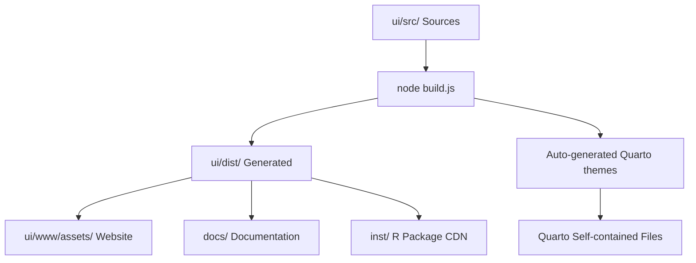

## 📁 Directory Structure

### **🎨 Design Tokens (`tokens/`)**
```
ui/src/tokens/
├── README.md              # Token usage guidelines
├── colors.json            # Brand colors, semantic colors
├── typography.json        # Font families, sizes, weights  
├── spacing.json           # Margins, padding, grid scales
├── effects.json           # Shadows, transitions, borders
├── components.json        # Component-specific tokens
└── theme-colors.json      # Light/dark theme mappings
```

**Purpose**: Atomic design values, JSON-based, consumed by Style Dictionary

### **🧱 Core Styles (`styles/`)**
```
ui/src/styles/
├── README.md              # Core styling guidelines
├── website-theme.scss     # Main theme entry (imports all modular files)
├── tokens.scss            # Design tokens as SCSS variables
├── base.scss              # Foundation styles
├── components.scss        # Reusable UI components
├── utilities.scss         # Utility classes
├── accessibility.scss     # A11y enhancements
├── lenis-integration.scss # Smooth scrolling
└── themes/                # Theme-specific modular files
    ├── theme-variables.scss    # CSS custom properties mapping
    ├── shared-components.scss  # Cross-theme components (navbar, etc.)
    └── website-features.scss   # Website-specific features
```

**Purpose**: Systematic, reusable styles that work across all pages

### **📄 Page-Specific Styles (`pages/`)**
```
ui/src/pages/
├── README.md              # Page styling guidelines
├── landing.scss           # Home page (index.qmd)
├── documentation.scss     # R package docs (r_package.qmd)  
└── shared/                # Cross-page components
    └── enhanced-toc.scss  # Right sidebar TOC
```

**Purpose**: Page-specific layouts and unique features

### **⚡ JavaScript (`js/`)**
```
ui/src/js/
├── accessibility.js       # A11y enhancements
├── custom-anchors.js      # Anchor link handling
├── hero-scroller.js       # Landing page scroll effects
├── lenis-integration.js   # Smooth scrolling integration
├── logo-switch.js         # Theme-aware logo switching
├── slide-navigation.js    # Navigation animations & dropdown enhancements
├── pages/                 # Page-specific JS
│   └── landing-page-enhanced.js
└── vendor/                # Third-party libraries
    └── jquery.sticky-kit.min.js
```

**Purpose**: Interactive behaviors, smooth scrolling, accessibility features, dropdown enhancements

**Key Features:**
- **Dropdown Caret Rotation**: `slide-navigation.js` adds `.open` class to dropdowns for CSS-based caret animation
- **Accessibility Integration**: Works with `aria-expanded` attributes and Bootstrap events  
- **Robust Fallbacks**: MutationObserver + click events + Bootstrap events for maximum compatibility

### **📄 LaTeX Assets (`latex/`)**
```
ui/src/latex/
├── README.md              # LaTeX package documentation
├── dataimago.sty          # Complete LaTeX style package (634 lines)
└── [future .cls files]    # Document classes (if needed)
```

**Purpose**: LaTeX style package for PDF documents with dataimago branding

**Distribution**: Automatically copied to 4 channels via `build_design_system()`:
- CDN distribution (`inst/quarto-assets/`)
- Quarto extension (`ui/www/_extensions/dataimago/ai-native/assets/latex/`)
- Website assets (`ui/www/assets/latex/`)
- Documentation (`docs/assets/latex/`)

**Key Features:**
- **Typography**: Noto Sans (body) + Josefin Sans (headings) + Noto Sans Math (equations)
- **Colors**: dataimago design tokens (OKLCH-based surface, content, border colors)
- **Document Classes**: memoir (full features) and article (basic support)
- **Custom Environments**: Theorem boxes, definition boxes, proof environment
- **System Fonts**: Portable across machines (no absolute paths)

## 🎯 Build Process

### **Command**
```bash
cd ui/
node build.js
```

### **What Happens**
1. **Design Tokens**: JSON files → CSS custom properties
2. **Modular SCSS**: Compiled to unified CSS files
3. **Auto-Generated Themes**: Self-contained files for Quarto compatibility
4. **Page-Specific CSS**: Individual page styles compiled
5. **Asset Distribution**: Files copied to all target locations
6. **JavaScript Processing**: JS files processed and distributed

### **Key Innovation: Auto-Generated Self-Contained Files**

The build system reads modular source files and auto-generates self-contained theme files:

- **Source**: `ui/src/styles/themes/*.scss` (modular, maintainable)
- **Generated**: `ui/dist/website-light.scss` & `ui/dist/website-dark.scss` (self-contained for Quarto)
- **Result**: Best of both worlds - modular sources + Quarto compatibility

## 🎨 CSS Architecture

### **File Organization Philosophy**
**Clear Separation of Concerns + Intuitive Naming = Maintainable CSS**

### **Naming Conventions**

#### **Files Should Indicate:**
1. **Scope**: `global-`, `page-`, `component-`
2. **Purpose**: `layout`, `theme`, `interactive`  
3. **Content**: `navigation`, `forms`, `typography`

#### **Examples:**
- ✅ `shared-components.scss` (scope + content)
- ✅ `landing.scss` (page name)
- ✅ `theme-variables.scss` (purpose + content)
- ❌ `styles.scss` (too generic)
- ❌ `misc.scss` (unclear purpose)

### **Token Files:**
- ✅ `colors.json` (content type)
- ✅ `spacing.json` (content type)
- ❌ `design-tokens.json` (too generic)

## 🔄 Asset Flow

### **Source → Generated → Distributed**
```
SOURCE                           GENERATED                    DISTRIBUTED
ui/src/tokens/*.json         →   ui/dist/tokens.css       →   [all targets]
ui/src/styles/website-theme  →   ui/dist/website-theme.*  →   [all targets]
ui/src/styles/themes/*       →   ui/dist/website-*.scss   →   [Quarto only]
ui/src/pages/landing         →   ui/dist/landing.css      →   [website only]
ui/src/js/*                  →   ui/dist/js/*             →   [all targets]
ui/src/latex/*               →   (direct copy)            →   [all targets + CDN]
```

### **Distribution Targets**
- **Website**: `ui/www/assets/`
- **Documentation**: `docs/assets/`
- **R Package CDN**: `inst/quarto-assets/`
- **Quarto Extension**: `ui/www/_extensions/dataimago/ai-native/assets/`

## 🧹 File Lifecycle

### **Creation:**
1. Identify scope (tokens/core/page)
2. Choose clear, descriptive name
3. Add purpose comment at top
4. Document in appropriate README

### **Maintenance:**
1. Keep related styles together
2. Use imports rather than duplication
3. Comment complex selectors
4. Update README when adding features

### **Deprecation:**
1. Move to `legacy/` folder (if needed)
2. Add deprecation comment with replacement
3. Plan removal after migration period
4. Update build process to exclude

## 📋 Quick Reference

### **"Where Does This Style Go?"**
- **Brand colors** → `tokens/colors.json`
- **Button design** → `styles/components.scss`
- **Landing page hero** → `pages/landing.scss`
- **Dark theme colors** → `styles/themes/theme-variables.scss`
- **Navigation component** → `styles/themes/shared-components.scss`
- **R package docs layout** → `pages/documentation.scss`
- **Reusable TOC** → `pages/shared/enhanced-toc.scss`
- **LaTeX PDF styling** → `latex/dataimago.sty`

### **"What's In This File?"**
Look for:
1. **File header comment** with purpose
2. **README.md** in same directory
3. **Imports section** showing dependencies
4. **File size** indicating complexity

## 🚀 Getting Started

### **Making Changes**
1. Edit source files in `ui/src/`
2. Run `node build.js` from `ui/` directory
3. Test with `quarto preview` from `ui/www/`
4. Commit changes when satisfied

### **Adding New Pages**
1. Create `ui/src/pages/new-page.scss`
2. Add imports for tokens and base styles
3. Build system will auto-compile and distribute
4. Reference in your `.qmd` file

### **Modifying Themes**
1. Edit modular files in `ui/src/styles/themes/`
2. Build system auto-generates self-contained versions
3. Quarto automatically uses the generated files
4. No manual duplication needed!

## 🎯 Best Practices

### **DO:**
- ✅ Edit source files in `ui/src/`
- ✅ Use the build system for all changes
- ✅ Test thoroughly before committing
- ✅ Document new features in README files
- ✅ Use semantic naming conventions

### **DON'T:**
- ❌ Edit generated files in `ui/dist/`
- ❌ Edit distributed files in `ui/www/assets/`
- ❌ Create manual duplicates
- ❌ Skip the build process
- ❌ Use generic file names

---

**🧠 Ethical AI Design System Ready for Deployment!**
````

## File: ui/src/dataimago-design/src/tokens.scss
````scss
// dataimago Design Tokens - SCSS version
// This file is the source of truth for CSS custom properties
// Generated from JSON tokens during build process

// NOTE: This file should be generated by Style Dictionary from tokens/*.json
// For now, providing a minimal implementation until build process is connected

:root {
  // Brand colors from design tokens
  --dataimago-primary: #3498DB;
  --dataimago-accent: #ff69b4;
  --dataimago-ethical: #E74C3C;
  
  // Surface colors
  --color-surface-page-light: rgb(237, 237, 235);
  --color-surface-page-dark: rgb(20, 20, 16);
  
  // Content colors
  --color-content-primary-light: rgb(20, 20, 16);
  --color-content-secondary-light: #7c7c7c;
  --color-content-primary-dark: rgb(237, 237, 235);
  --color-content-secondary-dark: #83838f;
  
  // Semantic colors
  --dataimago-success: #27AE60;
  --dataimago-warning: #F39C12;
  --dataimago-error: #E74C3C;
  --dataimago-info: #3498DB;
}
````

## File: ui/src/dataimago-design/templates/quarto_website/assets/js/custom-anchors.js
````javascript
anchors.options = {
  placement: 'left',
  visible: 'hover'
};
anchors.add('h1, h2, h3, h4, h5, h6');
````

## File: ui/src/dataimago-design/templates/quarto_website/assets/js/logo-switch.js
````javascript
var defaultLogoSrc = '/assets/img/ai_monogram.svg';
var defaultLogoHref = '{{SITE_URL}}';
var hoverLogoHref = 'https://dataimago.ai';

function getCurrentTheme() {
  var dataTheme = document.documentElement.getAttribute('data-bs-theme');
  if (dataTheme === 'dark') return 'dark';

  var lightSheets = document.querySelectorAll('link.quarto-color-scheme:not(.quarto-color-alternate)');
  var allLightDisabled = true;
  for (var i = 0; i < lightSheets.length; i++) {
    if (!lightSheets[i].disabled) { allLightDisabled = false; break; }
  }
  var darkSheets = document.querySelectorAll('link.quarto-color-scheme.quarto-color-alternate');
  var anyDarkEnabled = false;
  for (var j = 0; j < darkSheets.length; j++) {
    if (!darkSheets[j].disabled) { anyDarkEnabled = true; break; }
  }
  if (allLightDisabled && anyDarkEnabled) return 'dark';
  if (document.body.classList.contains('quarto-dark')) return 'dark';
  return 'light';
}

function setupNavbarBrandHover() {
  var navbarLogo = document.querySelector('.navbar-logo');
  var navbarBrand = navbarLogo ? navbarLogo.closest('a') : document.querySelector('.navbar-brand');
  if (!navbarBrand) return;

  navbarBrand.addEventListener('mouseover', function() {
    navbarBrand.href = hoverLogoHref;
    if (navbarLogo) navbarLogo.classList.add('logo-hover');
  });
  navbarBrand.addEventListener('mouseout', function() {
    navbarBrand.href = defaultLogoHref;
    if (navbarLogo) navbarLogo.classList.remove('logo-hover');
  });
}

function setupFooterLogoHover() {
  var footerLogos = document.querySelectorAll('.footer-ai-monogram-logo');
  footerLogos.forEach(function(logo) {
    logo.addEventListener('mouseover', function() { logo.classList.add('logo-hover'); });
    logo.addEventListener('mouseout', function() { logo.classList.remove('logo-hover'); });
  });
}

function initLogoSwitch() {
  setupNavbarBrandHover();
  setupFooterLogoHover();
}

if (document.readyState === 'loading') {
  document.addEventListener('DOMContentLoaded', initLogoSwitch);
} else {
  initLogoSwitch();
}

var themeObserver = new MutationObserver(function(mutations) {
  mutations.forEach(function(mutation) {
    if (mutation.type === 'attributes' &&
        (mutation.attributeName === 'data-bs-theme' || mutation.attributeName === 'class')) {
      setTimeout(initLogoSwitch, 100);
    }
  });
});
themeObserver.observe(document.documentElement, { attributes: true });
themeObserver.observe(document.body, { attributes: true });

document.querySelectorAll('link.quarto-color-scheme').forEach(function(sheet) {
  new MutationObserver(function() { setTimeout(initLogoSwitch, 100); })
    .observe(sheet, { attributes: true, attributeFilter: ['disabled'] });
});
````

## File: ui/src/dataimago-design/templates/quarto_website/assets/js/scroll.js
````javascript
$(window).scroll(function(){
    if($(window).scrollTop() > 35) {
        $('.navbar').addClass("shrink");
        $('.navbar-title').addClass("shrink");
        $('.navbar-logo').addClass("shrink");
        $('body').addClass("shrink");
    } else {
        $('.navbar').removeClass("shrink");
        $('.navbar-title').removeClass("shrink");
        $('.navbar-logo').removeClass("shrink");
        $('body').removeClass("shrink");
    }
});

$(document).ready(function() {
    function observeDropdownChanges() {
        var observer = new MutationObserver(function(mutations) {
            mutations.forEach(function(mutation) {
                if (mutation.type === 'attributes') {
                    var $target = $(mutation.target);
                    if ($target.hasClass('dropdown-toggle')) {
                        var $dropdown = $target.closest('.dropdown, .nav-item');
                        var isExpanded = $target.attr('aria-expanded') === 'true';

                        if (isExpanded) {
                            $dropdown.addClass('open');
                        } else {
                            $dropdown.removeClass('open');
                        }
                    }
                }
            });
        });

        $('.navbar-nav .dropdown-toggle').each(function() {
            observer.observe(this, {
                attributes: true,
                attributeFilter: ['aria-expanded']
            });
        });
    }

    observeDropdownChanges();

    $('.navbar-nav .dropdown-toggle').on('click', function() {
        var $this = $(this);
        var $dropdown = $this.closest('.dropdown, .nav-item');

        setTimeout(function() {
            var isExpanded = $this.attr('aria-expanded') === 'true';
            if (isExpanded) {
                $dropdown.addClass('open');
            } else {
                $dropdown.removeClass('open');
            }
        }, 50);
    });

    $('.navbar-nav .dropdown, .navbar-nav .nav-item').on('show.bs.dropdown', function() {
        $(this).addClass('open');
    });

    $('.navbar-nav .dropdown, .navbar-nav .nav-item').on('hide.bs.dropdown', function() {
        $(this).removeClass('open');
    });
});
````

## File: ui/src/dataimago-design/templates/quarto_website/_quarto.yml.template
````
project:
  type: website
  title: "{{PACKAGE_TITLE}}"
  output-dir: ../../docs
  render:
   - "*.qmd"
   - "!content/presentations/**"
   - "content/documents/**"

execute:
  freeze: auto

extensions:
  - dataimago/ai-native

filters:
  - svg-inline

references:
  - type: r
    title: "Function Reference"
    source: "../../man"

website:
  site-url: "{{SITE_URL}}"
  repo-url: "{{REPO_URL}}"
  title: "{{PACKAGE_TITLE}}"
  description: "{{PACKAGE_DESCRIPTION}}"
  favicon: /assets/img/ai_monogram_supreme_favicon.png
  repo-actions: none
  page-navigation: false
  bread-crumbs: false

  navbar:
    title: "{{PACKAGE_NAME}}"
    logo: /assets/img/ai_monogram.svg
    logo-alt: "{{PACKAGE_NAME}}"
    logo-href: "{{SITE_URL}}"
    title-href: "{{SITE_URL}}"
    search: false
    pinned: true
    left:
      - href: index.qmd
        text: Home
      - href: r_package.qmd
        text: R Package
      - text: Ethics
        menu:
          - href: ethics.qmd
            text: Ethical AI Principles
          - href: design_system.qmd
            text: Design System
          - href: governance.qmd
            text: Democratic Governance
      - text: Foundation
        menu:
          - href: mission.qmd
            text: Mission & Vision
          - href: philosophy.qmd
            text: Philosophy
      - text: Resources
        menu:
          - href: documents.qmd
            text: Documents
          - href: presentations.qmd
            text: Presentations
      - href: news.qmd
        text: News
    right:
      - text: ""
        menu:
          - href: "{{REPO_URL}}"
            text: Source Code
          - href: "{{REPO_URL}}/issues"
            text: Report a Bug
          - href: "{{REPO_URL}}/discussions"
            text: Request a Feature
        target: _blank

  sidebar:
    style: "docked"
    search: true
    contents:
       - section: "Getting Started"
         contents:
           - r_package.qmd
       - section: "Ethics & Design"
         contents:
           - ethics.qmd
           - design_system.qmd
           - governance.qmd
       - section: "Foundation"
         contents:
           - mission.qmd
           - philosophy.qmd
       - section: "Resources"
         contents:
           - documents.qmd
           - presentations.qmd
           - news.qmd

  page-footer:
    left:
      - text: ""
        href: https://quarto.org/
        target: _blank
    center:
      - text: ""
        href: https://dataimago.ai/
        target: _blank
      - text: ""
        href: "{{SITE_URL}}"

metadata:
  image: /assets/img/ai_monogram_supreme_COLOR.png
  open-graph: true
  twitter-card:
    image: /assets/img/ai_monogram_supreme_COLOR.png
    card-style: summary_large_image

format:
  html:
    theme:
      light: _extensions/dataimago/ai-native/assets/css/dataimago-light.scss
      dark: _extensions/dataimago/ai-native/assets/css/dataimago-dark.scss
    toc: true
    toc-depth: 3
    code-copy: true
    code-overflow: wrap
    include-after: |
      <link href="https://fonts.googleapis.com/css2?family=Josefin+Sans:wght@400;600&family=Fredoka:ital,wght@0,400;0,500;0,600;0,700;1,400;1,500;1,600;1,700&family=Fira+Sans:wght@300;400;500;600;700&family=Fira+Math&display=swap" rel="stylesheet">
      <script src="https://unpkg.com/lenis@1.3.8/dist/lenis.min.js"></script>
      <script type="text/javascript" src="https://ajax.googleapis.com/ajax/libs/jquery/3.6.0/jquery.min.js"></script>
      <script type="text/javascript" src="/assets/js/scroll.js"></script>
      <script type="text/javascript" src="/assets/js/logo-switch.js"></script>
      <script type="text/javascript" src="/assets/js/lenis-integration.js"></script>
      <script type="text/javascript" src="/assets/js/custom-anchors.js"></script>
      <script type="text/javascript" src="/assets/js/accessibility.js"></script>
````

## File: ui/src/dataimago-design/templates/quarto_website/about.qmd.template
````
---
title: "About {{PACKAGE_NAME}}"
format:
  html:
    toc: true
    toc-depth: 2
---

## Overview

{{PACKAGE_DESCRIPTION}}

## Built with dataimago

{{PACKAGE_NAME}} is built using the [dataimago](https://dataimago.ai) framework --- an AI-native application development framework for data science. dataimago provides:

- Complete design system compilation from tokens to production-ready assets
- Multi-platform deployment (Quarto, Shiny, Next.js)
- MCP-compatible tooling for AI agent integration
- Ethical AI build-time validation
- R-first workflows with modern web tools

## Author

{{PACKAGE_AUTHOR}}

## License

{{PACKAGE_LICENSE}}

## Links

- [GitHub Repository]({{REPO_URL}})
- [Bug Reports]({{REPO_URL}}/issues)
- [dataimago Framework](https://dataimago.ai)
````

## File: ui/src/dataimago-design/templates/quarto_website/ethics.qmd.template
````
---
title: "Ethical AI Principles"
subtitle: "Superalignment Through Design Architecture"
format:
  html:
    toc: true
    toc-depth: 3
---

{{PACKAGE_NAME}} treats every design token, animation curve, and color choice as a moral decision with consequences for human agency. Ethics is not bolted on after design --- it is embedded in the system architecture from the foundation.

## Core Commitments

1. **Emancipation over efficiency** --- When efficiency and emancipation conflict, emancipation always wins.
2. **AI in culture, not culture in AI** --- Technology serves lived human contexts, not the reverse.
3. **Democratic participation** --- Communities affected by design decisions must have binding authority.
4. **Reflexive practice** --- The system questions its own power relations.
5. **Dialectical thinking** --- Productive tension over false simplicity.

## Design Principles

### Accessibility Beyond Compliance
WCAG compliance is a floor, not a ceiling. Enhanced standards: 7.0:1 contrast, 48px touch targets, 300ms motion maximum.

### Ethical Tokens First-Class
Ethical constraints are first-class design tokens enforced at build time through the three-tier hierarchy (Primitive, Semantic, Ethical).

### Performance Equity
Speed is access. Design targets the most constrained users: 2G networks, single-core processors, 1GB RAM devices.

### Color Democracy
Color is communication technology serving community meaning-making, not brand commodity.

### Motion Dignity
Animation must respect vestibular safety, cognitive load, and cultural expectations.

## How Ethics Are Enforced

::: {.ethical-note}
**Build-time validation:** Three automated validators gate every deployment:

- **Contrast checking** --- 7.0:1 minimum ratio
- **Motion linting** --- 300ms maximum duration, `prefers-reduced-motion` required
- **Bundle size checking** --- Performance equity for low-bandwidth users
:::

For the complete design system documentation, see the [Design System](design_system.qmd) page.
For governance processes, see [Democratic Governance](governance.qmd).
````

## File: ui/src/dataimago-design/templates/quarto_website/index.qmd.template
````
---
format:
  html:
    page-layout: full
    toc: false
    sidebar: false
---

::::::::: {.lenis-slide}
::::::: {.hero-section}
:::::: {.grid}
:::: {.g-col-12 .g-col-md-4 .logo-column}
::: {.logo-container}
{width=500 .hero-logo}
:::
::::
:::: {.g-col-12 .g-col-md-8 .g-start-md-5}
::: {.hero-content-scroller data-lenis-animate="fade-left"}
::: {.scroller-content}

### {{PACKAGE_NAME}} {.content-item}

{{PACKAGE_DESCRIPTION}}

### Built with dataimago {.content-item}

This package is built using the dataimago framework --- an AI-native application development framework for data science with ethical AI principles at its core.

### R-First Workflows {.content-item}

Familiar R interfaces wrap sophisticated web tools, providing modern development capabilities without leaving your preferred environment.

:::
:::
::::
::::::
:::::::
:::::::::

:::::: {.lenis-slide}
:::: {.cards-container}
:::: {.cards-grid}

::: {.feature-card}
### R Package

Complete function documentation and examples.

[View Documentation](r_package.qmd)
:::

::: {.feature-card}
### Ethical AI

Built on dataimago's ethical AI framework with build-time enforcement.

[Learn More](ethics.qmd)
:::

::: {.feature-card}
### Design System

Three-tier token architecture ensuring accessibility and cultural sensitivity.

[Explore](design_system.qmd)
:::

::::
::::
::::::
````

## File: ui/src/dataimago-design/templates/quarto_website/README.md
````markdown
# Quarto Website Template

Canonical template for Quarto-powered R package websites built with the dataimago framework.

## Usage

This template is consumed by `dataimago::create_quarto_documentation()` when `scaffold_full_site = TRUE`. It can also be used manually by copying the template files and replacing placeholders.

## Placeholders

All `.template` files use Mustache-style `{{PLACEHOLDER}}` syntax:

| Placeholder | Source | Description |
|---|---|---|
| `{{PACKAGE_NAME}}` | DESCRIPTION `Package` field | R package name |
| `{{PACKAGE_TITLE}}` | DESCRIPTION `Title` field | Full package title |
| `{{PACKAGE_DESCRIPTION}}` | DESCRIPTION `Description` field | Package description |
| `{{PACKAGE_AUTHOR}}` | DESCRIPTION `Authors@R` field | Author information |
| `{{PACKAGE_LICENSE}}` | DESCRIPTION `License` field | License type |
| `{{SITE_URL}}` | DESCRIPTION `URL` field | GitHub Pages URL |
| `{{REPO_URL}}` | DESCRIPTION `BugReports` (minus `/issues`) | GitHub repo URL |

## Template Files

- `_quarto.yml.template` -- Site configuration with navbar, sidebar, footer, and theme
- `index.qmd.template` -- Homepage with hero section and feature cards
- `ethics.qmd.template` -- Ethical AI principles from dataimago-design wiki
- `about.qmd.template` -- Package about page

## Static Assets (no templating)

- `assets/js/scroll.js` -- Sticky header shrink on scroll
- `assets/js/custom-anchors.js` -- Left-placed anchor links on headings
- `assets/js/logo-switch.js` -- Theme-aware logo hover effects (uses `{{SITE_URL}}`)

## Features Included

- Sticky navbar that shrinks on scroll
- Custom anchor links on all headings
- Theme-aware logo switching (dark/light mode)
- Lenis smooth scrolling
- Accessibility layer (reduced motion, high contrast, skip links)
- Ethics-first content pages sourced from dataimago-design wiki
- Documents and presentations content scaffolding
- News/changelog page
- Custom 404 page
- Open Graph and Twitter Card metadata
````

## File: ui/src/dataimago-design/templates/KNOWLEDGE-explorer.md
````markdown
# {{PROJECT_NAME}} — Knowledge Base Operating Manual

**Domain:** {{DOMAIN_NAME}}
**Type:** explorer
**Explorer dimension:** {{EXPLORER_DIMENSION}}
**Generated:** {{GENERATED_DATE}}
**Framework:** [dataimago-design]({{FRAMEWORK_WIKI_URL}}/wiki/index.md)

This file is the operating manual for the **{{PROJECT_NAME}}** knowledge base — an AI-maintained wiki that documents the dimensions, attributes, datasets, and data quality considerations that make this application trustworthy and navigable. Read it at the start of every knowledge-work session.

---

## Role

You are the wiki maintainer for **{{PROJECT_NAME}}**'s knowledge base — an `explorer`-type domain wiki organized around the `{{EXPLORER_DIMENSION}}` dimension. This application has no thesis to advance; it makes a dataset navigable. Your job is to ensure that every piece of data the application presents is accurately documented — what it means, where it came from, what its limitations are.

Your job is to:
- Document new attributes as they are added to the application
- Summarize source datasets and their quality characteristics
- Answer queries about data provenance, coverage, and interpretation
- File answers as `wiki/analyses/` pages so knowledge compounds
- Lint the wiki for gaps in attribute documentation and stale dataset information

You never modify files in `raw/`. You own everything in `wiki/`.

The framework layer (how this application is built) is documented in the dataimago-design wiki (see `dataimago-framework.json` for the URL). Data and content questions belong here; build and architecture questions belong there.

---

## Session Start Protocol

At the start of every knowledge-work session:
1. Read this file (KNOWLEDGE.md)
2. Read `wiki/index.md` to orient to the current knowledge base state
3. Read the last 5 entries of `wiki/log.md` to understand recent activity
4. Check `wiki/attributes/` for any attributes flagged as needing documentation updates
5. Read the framework wiki index (URL in `dataimago-framework.json`) for framework context (optional unless architecture is relevant)
6. Ask the user: ingest new data, document an attribute, answer a query, or something else?

---

## Directory Structure

```
wiki/
├── index.md          ← Master catalog of all wiki pages
├── overview.md       ← High-level synthesis: what data this application holds and why
├── glossary.md       ← Canonical terminology for this domain
├── log.md            ← Append-only activity record
├── dimensions/       ← The organizing axes of the explorer (geography, time, etc.)
├── attributes/       ← Each measurable property: meaning, source, coverage, caveats
├── datasets/         ← Data sources: provenance, update cadence, coverage gaps
├── sources/          ← Authoritative sources for datasets and attribute definitions
├── personas/         ← Who uses the explorer and what they discover with it
└── analyses/         ← Patterns, comparisons, and insights surfaced from the data

raw/
├── papers/           ← Academic sources, methodology documents
├── conversations/    ← AI dialogues, decisions, notes
├── data/             ← Raw dataset files, exports from R
└── references/       ← External data portals, API specs, codebooks
```

---

## Entity Types

| Type | Location | Page purpose |
|---|---|---|
| **Dimension** | `wiki/dimensions/` | The organizing axes: what they cover, how entities are identified, edge cases |
| **Attribute** | `wiki/attributes/` | Each measurable property: precise definition, source, geographic/temporal coverage, caveats |
| **Dataset** | `wiki/datasets/` | A data source: provenance, update cadence, coverage gaps, known issues, R dataset name |
| **Source** | `wiki/sources/` | An authoritative reference for an attribute definition or dataset methodology |
| **Persona** | `wiki/personas/` | A user type: what they're trying to discover, what attributes they care about |
| **Analysis** | `wiki/analyses/` | Patterns found, comparisons made, insights derived from the data |

---

## The Attribute Page — Core Knowledge Atom

The `wiki/attributes/` directory is the most important part of this wiki. Every attribute the application exposes must have a page that documents:

```markdown
---
title: <attribute human name>
type: attribute
attribute_id: <the parameter name used in R functions and API endpoints>
created: YYYY-MM-DD
updated: YYYY-MM-DD
dataset: <wiki/datasets/dataset-name.md>
sources:
  - <authoritative source for the attribute definition>
tags: []
---

One-line description of what this attribute measures.

## Definition
Precise definition — not just a label. What exactly is being measured? What is the unit?
What is the reference period (for point-in-time attributes)?

## Data Source
- Dataset: [[dataset-name]] 
- R dataset object: `{{PROJECT_NAME}}::dataset_name`
- R retrieval function: `get_entity_profile(entity_id, attributes = "{{ATTRIBUTE_ID}}")`

## Coverage
- Entities covered: (e.g., "193 UN member states", "47 European countries")
- Temporal coverage: (e.g., "2000–2023 annually", "2022 only")
- Known gaps: (e.g., "Missing for small island nations with population < 50,000")

## Data Quality
- Source reliability: (official statistics / derived / estimated / self-reported)
- Known issues: (e.g., "Pre-2010 figures use different methodology")
- Comparability caveats: (e.g., "Purchasing power adjustments vary by source year")

## Interpretation
For non-specialist audiences: what does a high/low value on this attribute mean?
What should users NOT conclude from this attribute?

## Related Attributes
- [[attribute-name]] — (relationship, e.g., "often inversely correlated")
```

---

## Workflows

### Ingest a New Dataset

1. Read the raw data file from `raw/data/` and any codebook from `raw/references/`
2. Create a `wiki/datasets/` page documenting provenance, coverage, and update cadence
3. Create a `wiki/attributes/` page for each attribute the dataset provides
4. Update `wiki/dimensions/` if the dataset covers new entities or extends temporal range
5. Update `wiki/glossary.md` with any new technical terms
6. Update `wiki/index.md` and append to `wiki/log.md`

### Document a New Attribute

1. Identify the authoritative source for the attribute's definition
2. Create a `wiki/attributes/` page following the template above
3. Verify the R retrieval function returns correct data for the attribute
4. Add the attribute to the relevant `wiki/datasets/` page
5. Update `wiki/index.md` and append to `wiki/log.md`

### Ingest a Paper or Reference

1. Read from `raw/papers/`
2. Determine: does this define an attribute? challenge a dataset's methodology? describe a dimension?
3. Create a `wiki/sources/` page summarizing the key claims
4. Link to the affected `wiki/attributes/` or `wiki/datasets/` pages
5. Update `wiki/glossary.md` and append to `wiki/log.md`

### Query

1. Read `wiki/index.md` to identify relevant pages (typically `wiki/attributes/` and `wiki/datasets/`)
2. Read those pages
3. Synthesize a clear answer with citations
4. Ask: "Should I file this as an analysis?" If yes, save to `wiki/analyses/`
5. Append to `wiki/log.md`

### Lint

1. Check every attribute in `wiki/attributes/` has: definition, coverage, data quality, interpretation
2. Check every dataset in `wiki/datasets/` has: provenance, update cadence, known gaps
3. Check for attributes used in the application but not documented in the wiki
4. Check for stale dataset entries (coverage dates that should have been updated)
5. Report findings and propose fixes
6. Append to `wiki/log.md`

---

## Log Format

```
## [YYYY-MM-DD] <action> | <title>

**Action:** <description>
Pages created: ...
Pages updated: ...
Key additions: ...
```

---

## Terminology Discipline

- Check `wiki/glossary.md` before using any domain term
- Attribute IDs (used in R functions and API endpoints) must be consistent: `{{ATTRIBUTE_ID}}` form
- Entity identifiers must be consistent: `{{EXPLORER_DIMENSION}}` → [describe ID format, e.g., ISO 3166-1 alpha-3 for countries]
- Key terms for this domain: [populated by domain expert — add canonical terms here as the wiki develops]

---

## R Functions in This Application

The following R functions are the retrieval backbone of {{PROJECT_NAME}}:

{{EXPORTED_FUNCTIONS}}

**Standard explorer function pattern:**
- Every attribute is retrievable via `get_entity_profile(entity_id, attributes = "attribute_id")`
- Every attribute is comparable via `compare_entities(entity_ids, "attribute_id")`
- Discovery: `get_attributes()` returns all attributes with their wiki descriptions
- Discovery: `get_entities()` returns all entities with their available attributes

---

## Data Quality Standards

This application makes claims about the world. Every attribute must meet these standards before it can be displayed to users:

1. **Defined** — A `wiki/attributes/` page exists with a precise definition
2. **Sourced** — The data source is documented in a `wiki/datasets/` page
3. **Bounded** — Coverage (entities and time period) is documented
4. **Caveated** — Known quality issues and comparability limits are documented
5. **Interpreted** — A plain-language interpretation is available for non-specialist users

Attributes that fail any of these standards should be marked `status: draft` in their frontmatter and excluded from the production data explorer until the standard is met.

---

## Connection to the Framework Layer

This wiki documents **what data** this application holds and **what it means**. The dataimago-design wiki documents **how** the application is built. The connection:

```
wiki/attributes/greeting.md
  → documents HelloWorld::Hello_World dataset
    → retrieved via get_entity_profile(entity_id)
      → exposed at GET /entity/{id}?attributes=greeting
        → documented in dataimago-design/wiki/patterns/rest-api-from-r.md
```

Do not duplicate framework documentation here. Reference it.
````

## File: ui/src/dataimago-design/templates/KNOWLEDGE-framework.md
````markdown
# {{PROJECT_NAME}} — Knowledge Base Operating Manual

**Domain:** {{DOMAIN_NAME}}
**Type:** framework
**Generated:** {{GENERATED_DATE}}
**Framework:** [dataimago-design]({{FRAMEWORK_WIKI_URL}}/wiki/index.md)

This file is the operating manual for the **{{PROJECT_NAME}}** knowledge base — an AI-maintained wiki that documents the principles, patterns, and decisions that govern this framework. Read it at the start of every knowledge-work session.

*Note: If this is dataimago-design itself, this file's role is played by `CLAUDE.md` — the original operating manual. This template applies to other framework-type applications generated by dataimago.*

---

## Role

You are the wiki maintainer for **{{PROJECT_NAME}}**'s knowledge base — a `framework`-type domain wiki that documents the principles, patterns, and governance decisions that constrain and guide this system's use.

Your job is to:
- Document new decisions as Architecture Decision Records (ADRs)
- Keep principles and patterns consistent and cross-referenced
- Answer queries about what the framework requires and why
- File answers as `wiki/analyses/` pages so knowledge compounds
- Lint the wiki for contradictions between principles and patterns, and for undocumented enforcement mechanisms

You never modify files in `raw/`. You own everything in `wiki/`.

The meta-framework layer (how dataimago builds framework applications) is at the URL in `dataimago-framework.json`. Questions about this specific framework's content belong here; questions about how it was generated or deployed belong there.

---

## Session Start Protocol

At the start of every knowledge-work session:
1. Read this file (KNOWLEDGE.md)
2. Read `wiki/index.md` to orient to the current knowledge base state
3. Read the last 5 entries of `wiki/log.md` to understand recent activity
4. Check `wiki/decisions/` for any ADRs marked `status: proposed` — these need review
5. Read the framework wiki index (URL in `dataimago-framework.json`) for meta-framework context
6. Ask the user: document a decision, document a pattern, answer a query, lint, or something else?

---

## Directory Structure

```
wiki/
├── index.md           ← Master catalog of all wiki pages
├── overview.md        ← High-level synthesis: what this framework governs and how
├── glossary.md        ← Canonical terminology for this framework domain
├── log.md             ← Append-only activity record
├── principles/        ← The values the framework upholds and enforces
├── patterns/          ← How to implement each principle in practice
├── decisions/         ← ADRs: every significant choice with justification
├── connections/       ← How principles map across implementation domains
├── personas/          ← Who is governed by or governs this framework
└── analyses/          ← Compliance audits, gap analyses, comparisons

raw/
├── papers/            ← Academic sources, standards documents, prior art
├── conversations/     ← AI dialogues, governance meeting notes
├── data/              ← Validation results, compliance reports, audit logs
└── references/        ← External frameworks, standards, codebases compared against
```

---

## Entity Types

| Type | Location | Page purpose |
|---|---|---|
| **Principle** | `wiki/principles/` | A value the framework upholds: what it means, how it is enforced, the governance basis |
| **Pattern** | `wiki/patterns/` | How to implement a principle: concrete steps, code examples, common mistakes |
| **Decision** | `wiki/decisions/` | An ADR: what was chosen, what was rejected, why, date, and any revision history |
| **Connection** | `wiki/connections/` | Cross-domain synthesis: how principle X maps to practice Y in context Z |
| **Persona** | `wiki/personas/` | A stakeholder: who uses the framework, who is governed by it, who governs it |
| **Analysis** | `wiki/analyses/` | Compliance audit, gap analysis, comparison with alternative frameworks |

---

## The Decision Page — Core Knowledge Atom

Architecture Decision Records are the most important pages in a framework wiki. Every significant choice must be documented before it is enforced:

```markdown
---
title: "ADR: <Decision title>"
type: decision
created: YYYY-MM-DD
updated: YYYY-MM-DD
status: proposed | accepted | superseded | deprecated
superseded_by: <ADR page name if superseded>
sources:
  - <pages or raw files that informed this decision>
tags: []
---

One-line summary of the decision.

## Decision
What was chosen. State it precisely.

## Context
The problem that required a decision. What constraints existed?

## Alternatives Considered
What else was evaluated? Why was each rejected?

## Justification
Why this choice? Include ethical justification where relevant.

## Consequences
What does this enable? What does it foreclose? What monitoring is needed?

## Related Pages
- [[principle-name]] — The principle this decision serves
- [[pattern-name]] — The implementation pattern this decision authorizes
```

ADRs are **append-only in spirit**: when a decision changes, mark the old ADR `status: superseded`, add `superseded_by: new-adr-name`, and create a new ADR. Never silently overwrite the reasoning history.

---

## Workflows

### Document a New Decision

1. Identify the decision being made (never document a decision after the fact without noting that it was post-hoc)
2. Create a `wiki/decisions/` ADR page with `status: proposed`
3. Link to the relevant principles it serves and patterns it authorizes
4. After review/consensus, update to `status: accepted`
5. Update `wiki/index.md` and append to `wiki/log.md`

### Document a New Pattern

1. Identify the principle the pattern implements
2. Create a `wiki/patterns/` page with: problem, solution, implementation details, ethical justification
3. Link from the relevant `wiki/principles/` page
4. Verify that an ADR exists authorizing this pattern (or create one)
5. Update `wiki/index.md` and append to `wiki/log.md`

### Ingest a Comparison Framework or Standard

1. Read from `raw/papers/` or `raw/references/`
2. Create a `wiki/sources/` page summarizing the key claims
3. Create or update a `wiki/analyses/` page comparing this framework to {{PROJECT_NAME}} on key dimensions
4. Identify any principles or patterns that should be updated in light of the comparison
5. Update `wiki/glossary.md` and append to `wiki/log.md`

### Query

1. Read `wiki/index.md` to identify relevant pages (typically `wiki/principles/` and `wiki/patterns/`)
2. Read those pages
3. Synthesize a clear answer citing the relevant ADRs and principles
4. Ask: "Should I file this as an analysis?" If yes, save to `wiki/analyses/`
5. Append to `wiki/log.md`

### Lint

1. Check every `wiki/principles/` page has at least one `wiki/patterns/` page implementing it
2. Check every `wiki/patterns/` page is authorized by an ADR in `wiki/decisions/`
3. Check for enforcement mechanisms that exist in the codebase but are not documented in a principle page
4. Check for principles that are stated but have no enforcement mechanism (document the gap or add enforcement)
5. Check for ADRs with `status: proposed` that have not been reviewed
6. Report findings and propose fixes
7. Append to `wiki/log.md`

---

## Log Format

```
## [YYYY-MM-DD] <action> | <title>

**Action:** <description>
Pages created: ...
Pages updated: ...
Key additions: ...
```

---

## Terminology Discipline

- Check `wiki/glossary.md` before using any framework term
- Canonical terms must be used consistently — never paraphrase a principle's name
- ADR titles must be unique and stable (they are referenced by other pages)
- Key terms for this domain: [populated by domain expert — add canonical terms here as the wiki develops]

---

## R Functions in This Application

The following R functions implement validation and generation capabilities for {{PROJECT_NAME}}:

{{EXPORTED_FUNCTIONS}}

**Standard framework function pattern:**
- `validate_*()` functions check compliance and return violations with severity
- `scaffold_*()` functions generate new instances conforming to the framework
- `get_*_status()` functions report system health
- `get_validation_rules()` returns all rules with descriptions (discovery endpoint)

---

## Principle Documentation Standard

Every principle must meet these standards before it can be enforced:

1. **Named** — A canonical name in the glossary
2. **Defined** — A `wiki/principles/` page with precise definition
3. **Justified** — The ethical or practical basis is documented (who authorized this and on what grounds)
4. **Implemented** — At least one `wiki/patterns/` page shows how to comply
5. **Enforced** — An automated check exists OR the absence of automation is noted and justified
6. **Governed** — The process for changing this principle is documented

Principles that lack justification or governance documentation should be marked `status: draft` and flagged in the next lint pass.

---

## Connection to the Meta-Framework Layer

This wiki documents **what {{PROJECT_NAME}} requires** and **why**. The dataimago-design wiki documents **how framework-type applications are built**. The connection:

```
wiki/principles/my-principle.md
  → implemented by wiki/patterns/my-pattern.md
    → enforced by validate_my_rule() in R
      → exposed at POST /validate
        → documented in dataimago-design/wiki/patterns/rest-api-from-r.md
```

Do not duplicate dataimago-design's framework documentation here. Reference it.
````

## File: ui/src/dataimago-design/templates/KNOWLEDGE-research.md
````markdown
# {{PROJECT_NAME}} — Knowledge Base Operating Manual

**Domain:** {{DOMAIN_NAME}}
**Type:** research
**Generated:** {{GENERATED_DATE}}
**Framework:** [dataimago-design]({{FRAMEWORK_WIKI_URL}}/wiki/index.md)

This file is the operating manual for the **{{PROJECT_NAME}}** knowledge base — an AI-maintained wiki that documents the ideas, evidence, methods, and arguments that this application embodies. Read it at the start of every knowledge-work session.

---

## Role

You are the wiki maintainer for **{{PROJECT_NAME}}**'s knowledge base — a `research`-type domain wiki that synthesizes the evidence, methods, and arguments behind the application's analytical claims.

Your job is to:
- Ingest source materials and extract knowledge into structured wiki pages
- Keep pages consistent, cross-referenced, and up to date
- Answer queries by reading the wiki (not re-deriving from scratch)
- File good answers back as `wiki/analyses/` pages so knowledge compounds
- Periodically lint the wiki for contradictions, stale content, and orphan pages

You never modify files in `raw/`. You own everything in `wiki/`.

The framework layer (how this application is built) is documented in the dataimago-design wiki (see `dataimago-framework.json` for the URL). Domain knowledge questions belong here; build and architecture questions belong there.

---

## Session Start Protocol

At the start of every knowledge-work session:
1. Read this file (KNOWLEDGE.md)
2. Read `wiki/index.md` to orient to the current knowledge base state
3. Read the last 5 entries of `wiki/log.md` to understand recent activity
4. Read the framework wiki index (URL in `dataimago-framework.json`) for framework context (optional unless architecture is relevant)
5. Ask the user: ingest, query, lint, or something else?

---

## Directory Structure

```
wiki/
├── index.md         ← Master catalog of all wiki pages
├── overview.md      ← High-level synthesis of the knowledge base
├── glossary.md      ← Canonical terminology for this domain
├── log.md           ← Append-only activity record
├── sources/         ← Summaries of papers, datasets, conversations
├── theories/        ← Theoretical frameworks the research uses
├── methods/         ← Methodological choices and their justifications
├── findings/        ← Specific results with interpretation
├── arguments/       ← Central claims and their evidence chains
├── personas/        ← Who uses this application and what they need
└── analyses/        ← Synthesized outputs, comparisons, strategic insights

raw/
├── papers/          ← PDFs, journal articles, preprints
├── conversations/   ← AI dialogues, meeting notes, transcripts
├── data/            ← Datasets, R output files, analysis exports
└── references/      ← External codebases, specs, documentation
```

---

## Entity Types

| Type | Location | Page purpose |
|---|---|---|
| **Source** | `wiki/sources/` | Summary of a raw document: key claims, quotes, metadata |
| **Theory** | `wiki/theories/` | A theoretical framework: definition, key thinkers, application here |
| **Method** | `wiki/methods/` | A methodological choice: what was done, why, limitations |
| **Finding** | `wiki/findings/` | A specific result: statistical context, interpretation, R function reference |
| **Argument** | `wiki/arguments/` | A central claim: what it asserts, what evidence supports it, what challenges it |
| **Persona** | `wiki/personas/` | A user type: goals, what they need from this application |
| **Analysis** | `wiki/analyses/` | A synthesized output: comparison, gap analysis, strategic insight |

---

## Page Format

Every wiki page must have this YAML frontmatter:

```yaml
---
title: <page title>
type: source | theory | method | finding | argument | persona | analysis
created: YYYY-MM-DD
updated: YYYY-MM-DD
sources:
  - <raw/ filenames or wiki pages that informed this>
tags:
  - <relevant tags>
---
```

Followed by: one-line summary, body with headers and tables, and a **Related pages** section at the bottom using `[[page-name]]` links.

---

## Workflows

### Ingest a Paper or Article

1. Read the source file from `raw/papers/` or `raw/references/`
2. Discuss key takeaways (ask 1-3 clarifying questions if needed)
3. Create a summary page in `wiki/sources/`
4. Identify which theories, methods, or arguments it supports or challenges — update those pages
5. Create new entity pages as warranted (new theory, new method, etc.)
6. Update `wiki/glossary.md` with new domain terms
7. Update `wiki/index.md` and `wiki/overview.md` if the source shifts the big picture
8. Append to `wiki/log.md`

### Ingest an R Analysis Output

1. Read the output from `raw/data/`
2. Identify what R function produced it and with what parameters
3. Create or update a `wiki/findings/` page documenting the result
4. Link the finding to the argument(s) it supports in `wiki/arguments/`
5. Note the R function and parameters in the finding page (makes it verifiable and updatable)
6. Update `wiki/index.md` and append to `wiki/log.md`

### Ingest a Conversation

1. Read the transcript from `raw/conversations/`
2. Extract: key decisions made, questions raised, terminology clarified, arguments refined
3. Update affected wiki pages (typically `wiki/arguments/`, `wiki/methods/`, `wiki/analyses/`)
4. Create new pages if new concepts emerged
5. Update `wiki/glossary.md` and append to `wiki/log.md`

### Query

1. Read `wiki/index.md` to identify relevant pages
2. Read those pages
3. Synthesize a clear answer with citations to wiki pages
4. Ask: "Should I file this as a wiki page?" If yes, save to `wiki/analyses/`
5. Append to `wiki/log.md`

### Lint

1. Read all pages in the wiki
2. Report: contradictions between pages, stale claims, orphan pages, missing cross-references, inconsistent terminology
3. Propose fixes and ask which ones to apply
4. Append to `wiki/log.md`

---

## Log Format

```
## [YYYY-MM-DD] <action> | <title>

**Action:** <description>
Pages created: ...
Pages updated: ...
Key additions: ...
```

---

## Terminology Discipline

- Check `wiki/glossary.md` before using any domain term
- If a new term appears in a source, add it to the glossary before using it elsewhere
- If a term conflicts with an existing entry, flag it explicitly before updating
- Key terms for this domain: [populated by domain expert — add canonical terms here as the wiki develops]

---

## R Functions in This Application

The following R functions are the analytical backbone of {{PROJECT_NAME}}. Each exported function should have a corresponding wiki entry linking its output to `wiki/findings/` pages:

{{EXPORTED_FUNCTIONS}}

When ingesting an R analysis output, always record:
- Which function produced it
- The parameter values used
- The date it was run
- What finding page documents it

---

## Philosophical Alignment

Every wiki page is evaluated against the question: does this serve the application's purpose of making research accessible to its intended audiences? Knowledge that exists only in academic prose has a single audience. Knowledge filed in this wiki serves general readers (via the web app), data analysts (via the API), AI agents (via MCP tools), and the domain expert themselves (via this wiki).

---

## Connection to the Framework Layer

This wiki documents **what** this application knows. The dataimago-design wiki documents **how** the application is built. When a finding page references an R function, that function's API exposure is documented in the framework layer. The connection is:

```
wiki/findings/my-finding.md
  → references HelloWorld::my_function()
    → exposed at GET /my-endpoint
      → documented in dataimago-design/wiki/patterns/rest-api-from-r.md
```

Do not duplicate framework documentation here. Reference it.
````

## File: ui/src/dataimago-design/tools/build-core.mjs
````javascript
#!/usr/bin/env node
/**
 * build-core.mjs — Loop 2: Hardened Build Pipeline
 * Core build utilities for the dataimago design system.
 *
 * This module is imported by publisher scripts in the master repo and can be
 * reused by consumer repos to avoid logic duplication. It only writes to the
 * local dist/ directory and does NOT perform any app-specific distribution.
 *
 * Loop 2 additions (2026):
 *   • All execSync calls wrapped with context-rich error messages
 *   • Step timing for every build phase
 *   • validateBuild() post-build health check
 *   • buildWithValidation() orchestrator that runs ethical gates after build
 */

import fs from 'fs';
import path from 'path';
import { fileURLToPath } from 'url';
import { execSync } from 'child_process';

// ─── Utility: timed step wrapper ─────────────────────────────────────────────

/**
 * Wrap any synchronous build step with:
 *   • Start/end console logging
 *   • Wall-clock timing
 *   • Structured error on failure (never swallows the original)
 */
function timedStep(name, fn) {
  const start = Date.now();
  console.log(`  ⏳ ${name}…`);
  try {
    const result = fn();
    const ms = Date.now() - start;
    console.log(`  ✅ ${name} (${ms}ms)`);
    return result;
  } catch (err) {
    const ms = Date.now() - start;
    const message = err?.message ?? String(err);
    console.error(`  ❌ ${name} FAILED after ${ms}ms`);
    console.error(`     ${message.split('\n')[0]}`);
    // Re-throw as a structured build error so callers can distinguish step failures
    const buildErr = new Error(`[build-core] ${name} failed: ${message}`);
    buildErr.step = name;
    buildErr.cause = err;
    throw buildErr;
  }
}

/**
 * Execute a shell command with a clear, actionable error message on failure.
 * @param {string} cmd    The shell command to run
 * @param {object} opts   Options passed to execSync
 * @param {string} label  Human-readable label for error messages
 */
function safeExec(cmd, opts, label) {
  try {
    return execSync(cmd, opts);
  } catch (err) {
    const stderr = err.stderr?.toString().trim() ?? '';
    const stdout = err.stdout?.toString().trim() ?? '';
    const detail = stderr || stdout || err.message;
    throw new Error(
      `Command failed [${label}]:\n` +
      `  $ ${cmd}\n` +
      `  ${detail.split('\n').join('\n  ')}`
    );
  }
}
import { getQuartoCapabilities, generateVersionComments, logCapabilitiesSummary } from './quarto-version-detector.mjs';

const __filename = fileURLToPath(import.meta.url);
const __dirname = path.dirname(__filename);

const projectRoot = path.join(__dirname, '..');
const srcDir = path.join(projectRoot, 'src');
const distDir = path.join(projectRoot, 'dist');

function ensureDist() {
  if (!fs.existsSync(distDir)) {
    fs.mkdirSync(distDir, { recursive: true });
  }
}

/**
 * Process theme-aware tokens into tokens.css and tokens.scss in dist/.
 * Source: src/tokens/*.json
 */
export function processTokens() {
  ensureDist();

  const tokensDir = path.join(srcDir, 'tokens');
  const tokenFiles = [
    'colors.json',
    'theme-colors.json',
    'frequent.json',
    'effects.json',
    'components.json',
    'typography.json'
  ];

  // Check for P3-enhanced token files
  const p3TokenFiles = [
    'colors-p3.json',
    'theme-colors-p3.json'
  ];

  let cssContent = ':root {\n';
  let lightThemeContent = ':root, [data-bs-theme="light"] {\n';
  let darkThemeContent = '[data-bs-theme="dark"] {\n';
  let mediaQueryContent = '@media (prefers-color-scheme: dark) {\n  :root {\n';

  function processTokenGroup(obj, prefix = '') {
    Object.keys(obj).forEach((key) => {
      const value = obj[key];
      if (value && typeof value === 'object') {
        // Handle P3/OKLCH enhanced theme-aware colors
        if (Object.prototype.hasOwnProperty.call(value, 'light') && Object.prototype.hasOwnProperty.call(value, 'dark')) {
          const varName = `--${prefix}${key}`.replace(/\./g, '-');
          
          // Handle enhanced color objects
          if (typeof value.light === 'object' && value.light.srgb) {
            // P3/OKLCH enhanced colors with fallbacks
            lightThemeContent += `  ${varName}: ${value.light.srgb}; /* sRGB fallback */\n`;
            if (value.light.oklch) {
              lightThemeContent += `  ${varName}: ${value.light.oklch}; /* OKLCH enhanced */\n`;
            }
            
            darkThemeContent += `  ${varName}: ${value.dark.srgb}; /* sRGB fallback */\n`;
            if (value.dark.oklch) {
              darkThemeContent += `  ${varName}: ${value.dark.oklch}; /* OKLCH enhanced */\n`;
            }
            
            mediaQueryContent += `    ${varName}: ${value.dark.srgb}; /* sRGB fallback */\n`;
            if (value.dark.oklch) {
              mediaQueryContent += `    ${varName}: ${value.dark.oklch}; /* OKLCH enhanced */\n`;
            }
          } else {
            // Standard theme-aware colors
            lightThemeContent += `  ${varName}: ${value.light};\n`;
            darkThemeContent += `  ${varName}: ${value.dark};\n`;
            mediaQueryContent += `    ${varName}: ${value.dark};\n`;
          }
        }
        // Handle P3/OKLCH enhanced single colors
        else if (Object.prototype.hasOwnProperty.call(value, 'srgb')) {
          const varName = `--${prefix}${key}`.replace(/\./g, '-');
          cssContent += `  ${varName}: ${value.srgb}; /* sRGB fallback */\n`;
          if (value.oklch) {
            cssContent += `  ${varName}: ${value.oklch}; /* OKLCH enhanced */\n`;
          }
        }
        // Handle standard single colors
        else if (Object.prototype.hasOwnProperty.call(value, 'value')) {
          const varName = `--${prefix}${key}`.replace(/\./g, '-');
          cssContent += `  ${varName}: ${value.value};\n`;
        }
        // Handle direct color values (theme-colors.json format)
        else if (typeof value === 'string' && (value.startsWith('#') || value.startsWith('rgb') || value.startsWith('oklch') || value.startsWith('color('))) {
          const varName = `--${prefix}${key}`.replace(/\./g, '-');
          cssContent += `  ${varName}: ${value};\n`;
        }
        // Recurse into nested objects
        else if (!Object.prototype.hasOwnProperty.call(value, 'description')) {
          processTokenGroup(value, `${prefix}${key}-`);
        }
      }
    });
  }

  // Process P3-enhanced files first if they exist
  let hasP3Tokens = false;
  p3TokenFiles.forEach((filename) => {
    const filepath = path.join(tokensDir, filename);
    if (fs.existsSync(filepath)) {
      console.log(`🎨 Processing P3/OKLCH enhanced tokens: ${filename}`);
      const tokenData = JSON.parse(fs.readFileSync(filepath, 'utf8'));
      processTokenGroup(tokenData);
      hasP3Tokens = true;
    }
  });

  // Process standard token files (skip color files if P3 versions were processed)
  tokenFiles.forEach((filename) => {
    if (hasP3Tokens && (filename === 'colors.json' || filename === 'theme-colors.json')) {
      console.log(`⏭️ Skipping ${filename} (P3 version processed)`);
      return;
    }
    
    const filepath = path.join(tokensDir, filename);
    if (!fs.existsSync(filepath)) return;
    
    console.log(`📝 Processing standard tokens: ${filename}`);
    const tokenData = JSON.parse(fs.readFileSync(filepath, 'utf8'));
    processTokenGroup(tokenData);
  });

  cssContent += '}\n\n';
  lightThemeContent += '}\n\n';
  darkThemeContent += '}\n\n';
  mediaQueryContent += '  }\n}\n\n';

  const finalCss = cssContent + lightThemeContent + darkThemeContent + mediaQueryContent;
  
  // Add P3 support detection comment
  const p3Header = hasP3Tokens ? `/*
 * dataimago Design Tokens - P3/OKLCH Enhanced
 * 
 * This CSS includes wide-gamut color support:
 * - sRGB fallbacks for compatibility
 * - OKLCH values for modern displays
 * - Automatic browser detection and fallback
 * 
 * Browsers automatically use the most capable color space available.
 */

` : '';

  const finalOutput = p3Header + finalCss;
  fs.writeFileSync(path.join(distDir, 'tokens.css'), finalOutput);
  fs.writeFileSync(path.join(distDir, 'tokens.scss'), finalOutput);
  
  if (hasP3Tokens) {
    console.log('✅ Generated tokens with P3/OKLCH wide-gamut support');
  } else {
    console.log('✅ Generated standard sRGB tokens');
  }
}

/**
 * Create a temporary main.scss that @use's tokens and core style modules, then
 * compile it to dist/dataimago.css (expanded) using dart-sass.
 */
export function compileDesignSystem() {
  ensureDist();
  const stylesDir = path.join(srcDir, 'styles');
  const tempMain = path.join(srcDir, '.__main_build.scss');

  const mainScssContent = `
// dataimago Design System - Main Entry Point (publisher build)
// Generated by tools/build-core.mjs

@use '${path.join(distDir, 'tokens')}' as *;
@use '${path.join(stylesDir, 'base')}' as *;
@use '${path.join(stylesDir, 'components')}' as *;
@use '${path.join(stylesDir, 'utilities')}' as *;
@use '${path.join(stylesDir, 'accessibility')}' as *;
`;

  fs.writeFileSync(tempMain, mainScssContent);

  const outCss = path.join(distDir, 'dataimago.css');
  const sassCmd = `pnpm exec sass ${tempMain}:${outCss} --quiet-deps --style=expanded --source-map --no-embed-sources`;
  try {
    safeExec(sassCmd, { stdio: 'inherit', cwd: projectRoot }, 'sass compile dataimago.css');
  } finally {
    // Always clean up the temp file, even on failure
    if (fs.existsSync(tempMain)) fs.unlinkSync(tempMain);
  }
}

/**
 * Compile the unified website theme if present.
 */
export function compileWebsiteTheme() {
  const websiteThemePath = path.join(srcDir, 'styles', 'website-theme.scss');
  if (!fs.existsSync(websiteThemePath)) {
    console.log('  ⏭️  website-theme.scss not found — skipping');
    return;
  }
  const outPath = path.join(distDir, 'website-theme.css');
  const sassCmd = `pnpm exec sass ${websiteThemePath}:${outPath} --quiet-deps --style=expanded --source-map --no-embed-sources`;
  safeExec(sassCmd, { stdio: 'inherit', cwd: projectRoot }, 'sass compile website-theme.css');
}

/**
 * Copy JS sources to dist/js, preserving structure and adding a banner.
 */
export function processJS() {
  const jsSrc = path.join(srcDir, 'js');
  const jsDist = path.join(distDir, 'js');
  if (!fs.existsSync(jsSrc)) return;
  if (!fs.existsSync(jsDist)) fs.mkdirSync(jsDist, { recursive: true });

  function recurseCopy(dir, out) {
    const entries = fs.readdirSync(dir, { withFileTypes: true });
    for (const entry of entries) {
      const srcPath = path.join(dir, entry.name);
      const outPath = path.join(out, entry.name);
      if (entry.isDirectory()) {
        if (!fs.existsSync(outPath)) fs.mkdirSync(outPath, { recursive: true });
        recurseCopy(srcPath, outPath);
      } else if (entry.isFile() && entry.name.endsWith('.js')) {
        const content = fs.readFileSync(srcPath, 'utf8');
        const banner = `/**\n * ${entry.name} - dataimago Design System\n * Source: ${path.relative(projectRoot, srcPath)}\n */\n`;
        fs.writeFileSync(outPath, banner + content);
      }
    }
  }

  recurseCopy(jsSrc, jsDist);
}

/**
 * Generate Quarto-compatible theme files (dataimago-light.scss, dataimago-dark.scss)
 * Version-aware implementation with progressive OKLCH support
 */
export function generateQuartoThemes() {
  ensureDist();
  
  // Copy shared-components.scss to dist for importing
  const sharedComponentsPath = path.join(srcDir, 'styles', 'themes', 'shared-components.scss');
  const sharedComponentsDest = path.join(distDir, 'shared-components.scss');
  if (fs.existsSync(sharedComponentsPath)) {
    fs.copyFileSync(sharedComponentsPath, sharedComponentsDest);
    console.log('📋 Copied shared-components.scss to dist/');
  }
  
  // Detect Quarto capabilities for version-aware generation
  const quartoCapabilities = getQuartoCapabilities();
  logCapabilitiesSummary(quartoCapabilities);
  
  const tokensDir = path.join(srcDir, 'tokens');
  
  // Read design tokens - prioritize P3-enhanced versions
  const tokenFiles = ['frequent.json', 'typography.json'];
  const p3TokenFiles = ['theme-colors-p3.json', 'colors-p3.json'];
  let tokens = {};
  
  // Load P3-enhanced color tokens first if available
  let hasP3Colors = false;
  p3TokenFiles.forEach(filename => {
    const filepath = path.join(tokensDir, filename);
    if (fs.existsSync(filepath)) {
      const data = JSON.parse(fs.readFileSync(filepath, 'utf8'));
      tokens = { ...tokens, ...data };
      hasP3Colors = true;
      console.log(`🎨 Using P3/OKLCH enhanced colors for Quarto themes: ${filename}`);
    }
  });
  
  // Load standard token files (non-color)
  tokenFiles.forEach(filename => {
    const filepath = path.join(tokensDir, filename);
    if (fs.existsSync(filepath)) {
      const data = JSON.parse(fs.readFileSync(filepath, 'utf8'));
      tokens = { ...tokens, ...data };
    }
  });
  
  // Fallback to standard color files if P3 not available
  if (!hasP3Colors) {
    console.log('⚠️ P3 tokens not found, using standard colors for Quarto themes');
    const fallbackFiles = ['theme-colors.json', 'colors.json'];
    fallbackFiles.forEach(filename => {
      const filepath = path.join(tokensDir, filename);
      if (fs.existsSync(filepath)) {
        const data = JSON.parse(fs.readFileSync(filepath, 'utf8'));
        tokens = { ...tokens, ...data };
      }
    });
  }
  
  // Helper function to extract color value (version-aware)
  function getColorValue(colorObj, fallback, useOKLCH = false) {
    if (!colorObj) return fallback;
    
    // P3/OKLCH enhanced format
    if (typeof colorObj === 'object') {
      if (useOKLCH && colorObj.oklch) {
        return colorObj.oklch; // Use OKLCH for Quarto 1.9+
      }
      if (colorObj.srgb) {
        return colorObj.srgb; // Use sRGB for compatibility
      }
      if (colorObj.oklch) {
        return colorObj.oklch; // Fallback to OKLCH
      }
    }
    
    // Standard format
    if (typeof colorObj === 'string') {
      return colorObj;
    }
    
    return fallback;
  }
  
  // Helper function to get OKLCH value for CSS custom properties
  function getOKLCHValue(colorObj, fallback) {
    if (!colorObj) return fallback;
    
    // Always prioritize OKLCH for CSS custom properties
    if (typeof colorObj === 'object' && colorObj.oklch) {
      return colorObj.oklch;
    }
    if (typeof colorObj === 'object' && colorObj.srgb) {
      return colorObj.srgb; // Fallback to sRGB
    }
    
    // Standard format
    if (typeof colorObj === 'string') {
      return colorObj;
    }
    
    return fallback;
  }
  
  // Extract theme values from tokens with version-aware OKLCH support
  const useOKLCHInSass = quartoCapabilities.oklchSupported;
  
  const lightTheme = {
    bodyBg: getColorValue(tokens.color?.surface?.page?.light, 'rgb(237, 237, 235)', useOKLCHInSass),
    bodyColor: getColorValue(tokens.color?.content?.primary?.light, 'rgb(20, 20, 16)', useOKLCHInSass),
    headingsColor: getColorValue(tokens.color?.content?.primary?.light, 'rgb(20, 20, 16)', useOKLCHInSass),
    navbarBg: getColorValue(tokens.color?.surface?.navbar?.light, 'rgb(237, 237, 235)', useOKLCHInSass),
    linkColor: getColorValue(tokens.color?.content?.secondary?.light, '#7c7c7c', useOKLCHInSass),
    codeColor: getColorValue(tokens.color?.brand?.['dataimago-accent'], '#ff69b4', useOKLCHInSass),
    codeBg: getColorValue(tokens.color?.surface?.code?.light, 'rgb(225, 225, 223)', useOKLCHInSass)
  };
  
  const darkTheme = {
    bodyBg: getColorValue(tokens.color?.surface?.page?.dark, 'rgb(20, 20, 16)', useOKLCHInSass),
    bodyColor: getColorValue(tokens.color?.content?.primary?.dark, 'rgb(237, 237, 235)', useOKLCHInSass),
    headingsColor: getColorValue(tokens.color?.content?.primary?.dark, 'rgb(237, 237, 235)', useOKLCHInSass),
    navbarBg: getColorValue(tokens.color?.surface?.navbar?.dark, 'rgb(20, 20, 16)', useOKLCHInSass),
    linkColor: getColorValue(tokens.color?.content?.secondary?.dark, '#83838f', useOKLCHInSass),
    codeColor: getColorValue(tokens.color?.brand?.['dataimago-accent'], '#ff69b4', useOKLCHInSass),
    codeBg: getColorValue(tokens.color?.surface?.code?.dark, 'rgb(30, 30, 26)', useOKLCHInSass)
  };
  
  // Always generate OKLCH values for CSS custom properties
  const lightOKLCH = {
    bodyBg: getOKLCHValue(tokens.color?.surface?.page?.light, lightTheme.bodyBg),
    bodyColor: getOKLCHValue(tokens.color?.content?.primary?.light, lightTheme.bodyColor),
    headingsColor: getOKLCHValue(tokens.color?.content?.primary?.light, lightTheme.headingsColor),
    navbarBg: getOKLCHValue(tokens.color?.surface?.navbar?.light, lightTheme.navbarBg),
    linkColor: getOKLCHValue(tokens.color?.content?.secondary?.light, lightTheme.linkColor),
    codeColor: getOKLCHValue(tokens.color?.brand?.['dataimago-accent'], lightTheme.codeColor),
    codeBg: getOKLCHValue(tokens.color?.surface?.code?.light, lightTheme.codeBg)
  };
  
  const darkOKLCH = {
    bodyBg: getOKLCHValue(tokens.color?.surface?.page?.dark, darkTheme.bodyBg),
    bodyColor: getOKLCHValue(tokens.color?.content?.primary?.dark, darkTheme.bodyColor),
    headingsColor: getOKLCHValue(tokens.color?.content?.primary?.dark, darkTheme.headingsColor),
    navbarBg: getOKLCHValue(tokens.color?.surface?.navbar?.dark, darkTheme.navbarBg),
    linkColor: getOKLCHValue(tokens.color?.content?.secondary?.dark, darkTheme.linkColor),
    codeColor: getOKLCHValue(tokens.color?.brand?.['dataimago-accent'], darkTheme.codeColor),
    codeBg: getOKLCHValue(tokens.color?.surface?.code?.dark, darkTheme.codeBg)
  };
  
  const typography = {
    headingsFontFamily: tokens.font?.family?.display?.value || '"Poppins", sans-serif',
    headingsFontWeight: tokens.font?.weight?.medium?.value || '500',
    h2FontSize: tokens.font?.size?.['heading-medium']?.value || '1.6rem'
  };
  
  // Generate version-aware light theme
  const versionComments = generateVersionComments(quartoCapabilities);
  
  const lightContent = `// Dataimago Light Theme for Quarto - Generated from Design Tokens
${versionComments}

${quartoCapabilities.sassColorModule ? '@use "sass:color";' : '// @use "sass:color"; // Will be enabled automatically in Quarto 1.9+'}

/*-- scss:defaults --*/
$body-bg: ${lightTheme.bodyBg} !default;
$body-color: ${lightTheme.bodyColor} !default;
$headings-color: ${lightTheme.headingsColor} !default;
$navbar-bg: ${lightTheme.navbarBg} !default;
$link-color: ${lightTheme.linkColor} !default;
$code-color: ${lightTheme.codeColor} !default;
$code-bg: ${lightTheme.codeBg} !default;
$headings-font-family: ${typography.headingsFontFamily} !default;
$headings-font-weight: ${typography.headingsFontWeight} !default;
$h2-font-size: ${typography.h2FontSize} !default;

${quartoCapabilities.modernColorMixing ? `
// Modern Sass color mixing functions (Quarto 1.9+)
@function oklch-mix($color1, $color2, $weight: 50%) {
  @return color.mix($color1, $color2, $weight, $method: oklch);
}

@function smart-mix($color1, $color2, $weight: 50%) {
  @if color.is-legacy($color1) and color.is-legacy($color2) {
    @return color.mix($color1, $color2, $weight);
  }
  @return color.mix($color1, $color2, $weight, $method: oklch);
}` : `
// Modern Sass functions ready for Quarto 1.9+
// @function oklch-mix($color1, $color2, $weight: 50%) {
//   @return color.mix($color1, $color2, $weight, $method: oklch);
// }`}

/*-- scss:rules --*/
@import "shared-components.scss";

// Theme-specific overrides
.light-mode { display: block; }
.dark-mode { display: none; }
pre { border: 1px solid rgb(220, 220, 218); }
:root { 
  /* Font Family CSS Custom Properties */
  --font-family-sans: ${tokens.font?.family?.sans?.value || 'system-ui, sans-serif'};
  --font-family-mono: ${tokens.font?.family?.mono?.value || 'monospace'};
  --font-family-display: ${tokens.font?.family?.display?.value || 'system-ui, sans-serif'};
  --font-family-brand: ${tokens.font?.family?.brand?.value || 'system-ui, sans-serif'};
  --font-family-math: ${tokens.font?.family?.math?.value || 'system-ui, sans-serif'};
  
  --logo-default-fill: ${lightTheme.linkColor}; 
  --logo-hover-fill: ${lightTheme.headingsColor};
  
  /* Theme CSS Custom Properties */
  --theme-body-bg: ${lightTheme.bodyBg};
  --theme-navbar-bg: ${lightTheme.navbarBg};
  --theme-navbar-bg-scrolled: ${lightTheme.navbarBg};
  --theme-text-primary: ${lightTheme.headingsColor};
  --theme-text-secondary: ${lightTheme.linkColor};
  --theme-text-hover: ${lightTheme.headingsColor};
  
  /* OKLCH Enhanced Colors for Modern Browsers */
  --dataimago-body-bg-oklch: ${lightOKLCH.bodyBg};
  --dataimago-body-color-oklch: ${lightOKLCH.bodyColor};
  --dataimago-headings-color-oklch: ${lightOKLCH.headingsColor};
  --dataimago-navbar-bg-oklch: ${lightOKLCH.navbarBg};
  --dataimago-link-color-oklch: ${lightOKLCH.linkColor};
  --dataimago-code-color-oklch: ${lightOKLCH.codeColor};
  --dataimago-code-bg-oklch: ${lightOKLCH.codeBg};
  
  /* Progressive Enhancement */
  --dataimago-body-bg: var(--dataimago-body-bg-oklch);
  
  /* Version Metadata */
  --dataimago-quarto-version: "${quartoCapabilities.version}";
  --dataimago-generation-mode: "${quartoCapabilities.generationMode}";
  --dataimago-oklch-native: ${quartoCapabilities.oklchSupported ? 'true' : 'false'};
}

// ===== THEME TOGGLE STYLING =====
// Light theme - show moon icon (switch to dark)

.quarto-color-scheme-toggle .bi::before {
  display: inline-block !important;
  height: 1rem !important;
  width: 1rem !important;
  content: "" !important;
  vertical-align: -0.125em !important;
  background-repeat: no-repeat !important;
  background-size: 1rem 1rem !important;
  background-color: transparent !important;
  background-image: url('data:image/svg+xml,<svg xmlns="http://www.w3.org/2000/svg" width="16" height="16" fill="%2383838F" class="bi bi-moon" viewBox="0 0 16 16"><path d="M6 .278a.768.768 0 0 1 .08.858 7.208 7.208 0 0 0-.878 3.46c0 4.021 3.278 7.277 7.318 7.277.527 0 1.04-.055 1.533-.16a.787.787 0 0 1 .81.316.733.733 0 0 1-.031.893A8.349 8.349 0 0 1 8.344 16C3.734 16 0 12.286 0 7.71 0 4.266 2.114 1.312 5.124.06A.752.752 0 0 1 6 .278z"/></svg>') !important;
  transition: background-image 0.25s ease;
}

.quarto-color-scheme-toggle:hover .bi::before {
  background-image: url('data:image/svg+xml,<svg xmlns="http://www.w3.org/2000/svg" width="16" height="16" fill="%23000000" class="bi bi-moon" viewBox="0 0 16 16"><path d="M6 .278a.768.768 0 0 1 .08.858 7.208 7.208 0 0 0-.878 3.46c0 4.021 3.278 7.277 7.318 7.277.527 0 1.04-.055 1.533-.16a.787.787 0 0 1 .81.316.733.733 0 0 1-.031.893A8.349 8.349 0 0 1 8.344 16C3.734 16 0 12.286 0 7.71 0 4.266 2.114 1.312 5.124.06A.752.752 0 0 1 6 .278z"/></svg>') !important;
  transition: background-image 0.25s ease;
}`;

  // Generate version-aware dark theme
  const darkContent = `// Dataimago Dark Theme for Quarto - Generated from Design Tokens
${versionComments}

${quartoCapabilities.sassColorModule ? '@use "sass:color";' : '// @use "sass:color"; // Will be enabled automatically in Quarto 1.9+'}

/*-- scss:defaults --*/
$body-bg: ${darkTheme.bodyBg} !default;
$body-color: ${darkTheme.bodyColor} !default;
$headings-color: ${darkTheme.headingsColor} !default;
$navbar-bg: ${darkTheme.navbarBg} !default;
$link-color: ${darkTheme.linkColor} !default;
$code-color: ${darkTheme.codeColor} !default;
$code-bg: ${darkTheme.codeBg} !default;
$headings-font-family: ${typography.headingsFontFamily} !default;
$headings-font-weight: ${typography.headingsFontWeight} !default;
$h2-font-size: ${typography.h2FontSize} !default;

/*-- scss:rules --*/
@import "shared-components.scss";

// Theme-specific overrides
.light-mode { display: none; }
.dark-mode { display: block; }
pre { border: 1px solid rgb(40, 40, 36); }
:root { 
  /* Font Family CSS Custom Properties */
  --font-family-sans: ${tokens.font?.family?.sans?.value || 'system-ui, sans-serif'};
  --font-family-mono: ${tokens.font?.family?.mono?.value || 'monospace'};
  --font-family-display: ${tokens.font?.family?.display?.value || 'system-ui, sans-serif'};
  --font-family-brand: ${tokens.font?.family?.brand?.value || 'system-ui, sans-serif'};
  --font-family-math: ${tokens.font?.family?.math?.value || 'system-ui, sans-serif'};
  
  --logo-default-fill: ${darkTheme.linkColor}; 
  --logo-hover-fill: ${darkTheme.headingsColor};
  
  /* Theme CSS Custom Properties */
  --theme-body-bg: ${darkTheme.bodyBg};
  --theme-navbar-bg: ${darkTheme.navbarBg};
  --theme-navbar-bg-scrolled: ${darkTheme.navbarBg};
  --theme-text-primary: ${darkTheme.headingsColor};
  --theme-text-secondary: ${darkTheme.linkColor};
  --theme-text-hover: ${darkTheme.headingsColor};
  
  /* OKLCH Enhanced Colors for Modern Browsers */
  --dataimago-body-bg-oklch: ${darkOKLCH.bodyBg};
  --dataimago-body-color-oklch: ${darkOKLCH.bodyColor};
  --dataimago-headings-color-oklch: ${darkOKLCH.headingsColor};
  --dataimago-navbar-bg-oklch: ${darkOKLCH.navbarBg};
  --dataimago-link-color-oklch: ${darkOKLCH.linkColor};
  --dataimago-code-color-oklch: ${darkOKLCH.codeColor};
  --dataimago-code-bg-oklch: ${darkOKLCH.codeBg};
  
  /* Progressive Enhancement */
  --dataimago-body-bg: var(--dataimago-body-bg-oklch);
  
  /* Version Metadata */
  --dataimago-quarto-version: "${quartoCapabilities.version}";
  --dataimago-generation-mode: "${quartoCapabilities.generationMode}";
  --dataimago-oklch-native: ${quartoCapabilities.oklchSupported ? 'true' : 'false'};
}

// ===== THEME TOGGLE STYLING =====
// Dark theme - show sun icon (switch to light)

.quarto-color-scheme-toggle .bi::before {
  display: inline-block !important;
  height: 1rem !important;
  width: 1rem !important;
  content: "" !important;
  vertical-align: -0.125em !important;
  background-repeat: no-repeat !important;
  background-size: 1rem 1rem !important;
  background-color: transparent !important;
  background-image: url('data:image/svg+xml,<svg xmlns="http://www.w3.org/2000/svg" width="16" height="16" fill="%2383838F" class="bi bi-sun" viewBox="0 0 16 16"><path d="M8 11a3 3 0 1 1 0-6 3 3 0 0 1 0 6zm0 1a4 4 0 1 0 0-8 4 4 0 0 0 0 8zM8 0a.5.5 0 0 1 .5.5v2a.5.5 0 0 1-1 0v-2A.5.5 0 0 1 8 0zm0 13a.5.5 0 0 1 .5.5v2a.5.5 0 0 1-1 0v-2A.5.5 0 0 1 8 13zm8-5a.5.5 0 0 1-.5.5h-2a.5.5 0 0 1 0-1h2a.5.5 0 0 1 .5.5zM3 8a.5.5 0 0 1-.5.5h-2a.5.5 0 0 1 0-1h2A.5.5 0 0 1 3 8zm10.657-5.657a.5.5 0 0 1 0 .707l-1.414 1.415a.5.5 0 1 1-.707-.708l1.414-1.414a.5.5 0 0 1 .707 0zm-9.193 9.193a.5.5 0 0 1 0 .707L3.05 13.657a.5.5 0 0 1-.707-.707l1.414-1.414a.5.5 0 0 1 .707 0zm9.193 2.121a.5.5 0 0 1-.707 0l-1.414-1.414a.5.5 0 0 1 .707-.707l1.414 1.414a.5.5 0 0 1 0 .707zM4.464 4.465a.5.5 0 0 1-.707 0L2.343 3.05a.5.5 0 1 1 .707-.707l1.414 1.414a.5.5 0 0 1 0 .708z"/></svg>') !important;
  transition: background-image 0.25s ease;
}

.quarto-color-scheme-toggle:hover .bi::before {
  background-image: url('data:image/svg+xml,<svg xmlns="http://www.w3.org/2000/svg" width="16" height="16" fill="%23EDEDE8" class="bi bi-sun" viewBox="0 0 16 16"><path d="M8 11a3 3 0 1 1 0-6 3 3 0 0 1 0 6zm0 1a4 4 0 1 0 0-8 4 4 0 0 0 0 8zM8 0a.5.5 0 0 1 .5.5v2a.5.5 0 0 1-1 0v-2A.5.5 0 0 1 8 0zm0 13a.5.5 0 0 1 .5.5v2a.5.5 0 0 1-1 0v-2A.5.5 0 0 1 8 13zm8-5a.5.5 0 0 1-.5.5h-2a.5.5 0 0 1 0-1h2a.5.5 0 0 1 .5.5zM3 8a.5.5 0 0 1-.5.5h-2a.5.5 0 0 1 0-1h2A.5.5 0 0 1 3 8zm10.657-5.657a.5.5 0 0 1 0 .707l-1.414 1.415a.5.5 0 1 1-.707-.708l1.414-1.414a.5.5 0 0 1 .707 0zm-9.193 9.193a.5.5 0 0 1 0 .707L3.05 13.657a.5.5 0 0 1-.707-.707l1.414-1.414a.5.5 0 0 1 .707 0zm9.193 2.121a.5.5 0 0 1-.707 0l-1.414-1.414a.5.5 0 0 1 .707-.707l1.414 1.414a.5.5 0 0 1 0 .707zM4.464 4.465a.5.5 0 0 1-.707 0L2.343 3.05a.5.5 0 1 1 .707-.707l1.414 1.414a.5.5 0 0 1 0 .708z"/></svg>') !important;
  transition: background-image 0.25s ease;
}`;

  // Write to distribution directory
  fs.writeFileSync(path.join(distDir, 'dataimago-light.scss'), lightContent);
  fs.writeFileSync(path.join(distDir, 'dataimago-dark.scss'), darkContent);
  
  // Also update source theme files to maintain source of truth
  const themesSourceDir = path.join(srcDir, 'styles', 'themes');
  fs.writeFileSync(path.join(themesSourceDir, 'dataimago-light.scss'), lightContent);
  fs.writeFileSync(path.join(themesSourceDir, 'dataimago-dark.scss'), darkContent);
  console.log('✅ Updated source theme files to maintain source of truth');
}

/**
 * Generate Tailwind CSS preset for Next.js integration
 */
export function generateTailwindPreset() {
  ensureDist();
  
  const preset = `// dataimago Tailwind CSS Preset - Generated from Design Tokens

module.exports = {
  theme: {
    extend: {
      colors: {
        'di-primary': 'var(--color-brand-dataimago-primary, #3498DB)',
        'di-secondary': 'var(--color-content-secondary, #7c7c7c)',
        'di-accent': 'var(--color-brand-dataimago-accent, #ff69b4)',
        'di-ethical': 'var(--color-brand-dataimago-ethical, #E74C3C)'
      },
      fontFamily: {
        'brand': ['Josefin Sans', 'Inter', 'system-ui', 'sans-serif'],
        'display': ['Inter', 'system-ui', 'sans-serif'],
        'mono': ['JetBrains Mono', 'SF Mono', 'Monaco', 'monospace']
      }
    }
  }
};`;

  fs.writeFileSync(path.join(distDir, 'tailwind-preset.js'), preset);
}

/**
 * Compile page-specific SCSS files from src/pages/
 */
export function compilePageStyles() {
  ensureDist();
  
  const pagesDir = path.join(srcDir, 'pages');
  if (!fs.existsSync(pagesDir)) return;
  
  // Compile main page files
  const pageFiles = fs.readdirSync(pagesDir)
    .filter(file => file.endsWith('.scss') && !fs.statSync(path.join(pagesDir, file)).isDirectory());
  
  pageFiles.forEach(file => {
    const srcPath = path.join(pagesDir, file);
    const destPath = path.join(distDir, file.replace('.scss', '.css'));
    const sassCmd = `pnpm exec sass ${srcPath}:${destPath} --quiet-deps --style=expanded --source-map --no-embed-sources`;
    safeExec(sassCmd, { stdio: 'inherit', cwd: projectRoot }, `sass compile page: ${file}`);
  });

  // Compile shared components
  const sharedDir = path.join(pagesDir, 'shared');
  if (fs.existsSync(sharedDir)) {
    const sharedFiles = fs.readdirSync(sharedDir)
      .filter(file => file.endsWith('.scss'));

    sharedFiles.forEach(file => {
      const srcPath = path.join(sharedDir, file);
      const destPath = path.join(distDir, `shared-${file.replace('.scss', '.css')}`);
      const sassCmd = `pnpm exec sass ${srcPath}:${destPath} --quiet-deps --style=expanded --source-map --no-embed-sources`;
      safeExec(sassCmd, { stdio: 'inherit', cwd: projectRoot }, `sass compile shared: ${file}`);
    });
  }
}

/**
 * Write a comprehensive manifest.json enumerating all assets.
 */
export function writeManifest() {
  const manifest = {
    name: 'dataimago Design System',
    version: '0.0.1',
    buildTime: "stable",
    assets: {
      'tokens.css': 'CSS custom properties from design tokens',
      'tokens.scss': 'SCSS version of design tokens',
      'dataimago.css': 'Complete design system (expanded)',
      'dataimago.min.css': 'Complete design system (minified)',
      'website-theme.css': 'Unified website theme',
      'dataimago-light.scss': 'Quarto light theme',
      'dataimago-dark.scss': 'Quarto dark theme',
      'tailwind-preset.js': 'Tailwind CSS preset for Next.js'
    },
    javascript: {},
    pages: {}
  };

  // Add JavaScript files to manifest
  const jsDir = path.join(distDir, 'js');
  if (fs.existsSync(jsDir)) {
    function addJSFiles(dir, basePath = '') {
      const items = fs.readdirSync(dir);
      items.forEach(item => {
        const itemPath = path.join(dir, item);
        const stats = fs.statSync(itemPath);
        if (stats.isDirectory()) {
          addJSFiles(itemPath, path.join(basePath, item));
        } else if (item.endsWith('.js')) {
          const key = path.join(basePath, item).replace(/\\/g, '/');
          manifest.javascript[key] = `JavaScript component: ${item.replace('.js', '')}`;
        }
      });
    }
    addJSFiles(jsDir);
  }
  
  // Add page-specific CSS files
  const files = fs.readdirSync(distDir);
  files.forEach(file => {
    if (file.endsWith('.css') && !manifest.assets[file]) {
      manifest.pages[file] = `Page-specific styles: ${file.replace('.css', '')}`;
    }
  });

  fs.writeFileSync(path.join(distDir, 'manifest.json'), JSON.stringify(manifest, null, 2));
}

/**
 * Optimize CSS files using PostCSS
 * Applies PurgeCSS (unused CSS removal), autoprefixer, and minification
 */
export async function optimizeCSS() {
  console.log('🎨 Optimizing CSS with PostCSS (PurgeCSS + autoprefixer + cssnano)...');
  
  const cssFiles = [
    'dataimago.css',
    'website-theme.css',
    'documentation.css',
    'landing.css',
    'shared-enhanced-toc.css',
    'tokens.css'
  ];

  let optimizedCount = 0;
  let totalSavings = 0;

  for (const file of cssFiles) {
    const inputPath = path.join(distDir, file);
    const outputPath = path.join(distDir, file.replace('.css', '.min.css'));
    
    if (fs.existsSync(inputPath)) {
      try {
        // Get original file size
        const originalStats = fs.statSync(inputPath);
        const originalSize = originalStats.size;
        
        // Run PostCSS optimization
        execSync(
          `pnpm exec postcss ${inputPath} -o ${outputPath} --config ${path.join(projectRoot, 'postcss.config.js')}`,
          { cwd: projectRoot, stdio: 'pipe' }
        );
        
        // Get optimized file size
        const optimizedStats = fs.statSync(outputPath);
        const optimizedSize = optimizedStats.size;
        const savings = originalSize - optimizedSize;
        const savingsPercent = ((savings / originalSize) * 100).toFixed(1);
        
        totalSavings += savings;
        optimizedCount++;
        
        console.log(`✅ Optimized: ${file} → ${path.basename(outputPath)} (${(originalSize/1024).toFixed(1)}KB → ${(optimizedSize/1024).toFixed(1)}KB, -${savingsPercent}%)`);
        
      } catch (error) {
        console.warn(`⚠️  PostCSS optimization failed for ${file}, continuing without minification:`, error.message);
        
        // Create a fallback minified file by copying the original
        if (fs.existsSync(inputPath)) {
          fs.copyFileSync(inputPath, outputPath);
          console.warn(`⚠️  Created fallback minified file: ${path.basename(outputPath)}`);
        }
      }
    } else {
      console.log(`⏭️  Skipping ${file} (not found)`);
    }
  }
  
  if (optimizedCount > 0) {
    console.log(`🎉 PostCSS optimization complete! Processed ${optimizedCount} files, saved ${(totalSavings/1024).toFixed(1)}KB total`);
  } else {
    console.log('⚠️  No CSS files were optimized');
  }
}

export default {
  processTokens,
  compileDesignSystem,
  compileWebsiteTheme,
  generateQuartoThemes,
  generateTailwindPreset,
  compilePageStyles,
  optimizeCSS,
  processJS,
  writeManifest,
  buildTwoStage
};

/**
 * Two-stage build process for consumer repositories
 * Stage 1: Universal build (no PurgeCSS) → stays in submodule/dist/
 * Stage 2: Optimized build (with PurgeCSS) → goes to consumer/dist/
 */
export async function buildTwoStage(consumerDistDir) {
  const buildStart = Date.now();
  console.log('\n🎯 Starting two-stage build process…');

  const projectRoot = process.cwd();
  const distDir = path.join(projectRoot, 'dist');

  // Stage 1: Universal build (no PurgeCSS)
  console.log('\n📦 Stage 1: Building universal assets (no PurgeCSS)…');
  process.env.DATAIMAGO_BUILD_MODE = 'universal';

  timedStep('Process tokens',         () => processTokens());
  timedStep('Compile design system',  () => compileDesignSystem());
  timedStep('Compile website theme',  () => compileWebsiteTheme());
  timedStep('Process JavaScript',     () => processJS());
  timedStep('Generate Quarto themes', () => generateQuartoThemes());
  await timedStep('Optimize CSS (universal)', () => optimizeCSS());
  timedStep('Write manifest',         () => writeManifest());
  
  console.log('✅ Stage 1 complete - Universal assets in submodule/dist/');
  
  // Stage 2: Optimized build for consumer
  if (consumerDistDir) {
    console.log('\n🎯 Stage 2: Building optimized assets (with PurgeCSS)...');
    process.env.DATAIMAGO_BUILD_MODE = 'optimized';
    
    // Ensure consumer dist directory exists
    if (!fs.existsSync(consumerDistDir)) {
      fs.mkdirSync(consumerDistDir, { recursive: true });
    }
    
    // Re-optimize CSS with PurgeCSS enabled
    const cssFiles = fs.readdirSync(distDir)
      .filter(file => file.endsWith('.css') && !file.endsWith('.min.css'));
    
    for (const file of cssFiles) {
      const inputPath = path.join(distDir, file);
      const outputName = file.replace('.css', '.min.css');
      const outputPath = path.join(consumerDistDir, outputName);
      
      try {
        const originalStats = fs.statSync(inputPath);
        const originalSize = originalStats.size;
        
        // Run PostCSS optimization with PurgeCSS
        execSync(
          `pnpm exec postcss ${inputPath} -o ${outputPath} --config ${path.join(projectRoot, 'postcss.config.js')}`,
          { cwd: projectRoot, stdio: 'pipe' }
        );
        
        const optimizedStats = fs.statSync(outputPath);
        const optimizedSize = optimizedStats.size;
        const savings = originalSize - optimizedSize;
        const savingsPercent = ((savings / originalSize) * 100).toFixed(1);
        
        console.log(`✅ Consumer optimized: ${file} → ${outputName} (${(originalSize/1024).toFixed(1)}KB → ${(optimizedSize/1024).toFixed(1)}KB, -${savingsPercent}%)`);
        
      } catch (error) {
        console.warn(`⚠️  Consumer optimization failed for ${file}:`, error.message);
        // Fallback: copy universal version
        fs.copyFileSync(inputPath, path.join(consumerDistDir, outputName));
      }
    }
    
    // Copy other essential assets to consumer dist
    const otherFiles = fs.readdirSync(distDir)
      .filter(file => 
        // Copy non-CSS files (JS, SCSS, JSON, etc.)
        !file.endsWith('.css') ||
        // Copy unminified CSS for distribution channels that need them
        (file.endsWith('.css') && !file.endsWith('.min.css'))
      );
    
    for (const file of otherFiles) {
      const srcPath = path.join(distDir, file);
      const destPath = path.join(consumerDistDir, file);
      
      const stats = fs.statSync(srcPath);
      if (stats.isDirectory()) {
        // Copy directory recursively
        copyRecursive(srcPath, destPath);
      } else {
        // Copy file
        fs.copyFileSync(srcPath, destPath);
      }
    }
    
    // Helper function for recursive copying
    function copyRecursive(src, dest) {
      const stats = fs.statSync(src);
      
      if (stats.isDirectory()) {
        if (!fs.existsSync(dest)) {
          fs.mkdirSync(dest, { recursive: true });
        }
        
        const items = fs.readdirSync(src);
        items.forEach(item => {
          copyRecursive(path.join(src, item), path.join(dest, item));
        });
      } else {
        fs.copyFileSync(src, dest);
      }
    }
    
    console.log('✅ Stage 2 complete - Optimized assets in consumer/dist/');
  }
  
  // Clean up environment variable
  delete process.env.DATAIMAGO_BUILD_MODE;

  const totalMs = Date.now() - buildStart;
  console.log(`\n🎉 Two-stage build completed in ${totalMs}ms`);
}

// ─── Loop 2: Post-build validation ───────────────────────────────────────────

/**
 * validateBuild()
 *
 * Post-build health check that verifies the dist/ directory contains all
 * expected outputs. Returns a structured result object — does NOT throw,
 * so callers can decide the failure policy.
 *
 * @param {string} [distPath]  Override the dist/ path (default: tools/../dist)
 * @returns {{ passed: boolean, missing: string[], present: string[], report: string }}
 */
export function validateBuild(distPath) {
  const dist = distPath ?? path.join(projectRoot, 'dist');

  const REQUIRED_OUTPUTS = [
    'tokens.css',
    'tokens.scss',
    'dataimago.css',
    'dataimago.min.css',
    'manifest.json',
  ];

  const EXPECTED_OUTPUTS = [
    ...REQUIRED_OUTPUTS,
    'website-theme.css',
    'website-theme.min.css',
    'dataimago-light.scss',
    'dataimago-dark.scss',
    'tailwind-preset.js',
  ];

  const present = [];
  const missing = [];

  for (const file of EXPECTED_OUTPUTS) {
    const fp = path.join(dist, file);
    if (fs.existsSync(fp) && fs.statSync(fp).size > 0) {
      present.push(file);
    } else {
      missing.push(file);
    }
  }

  const criticalMissing = REQUIRED_OUTPUTS.filter(f => missing.includes(f));
  const passed = criticalMissing.length === 0;

  const lines = [
    '🔍 Build Output Validation',
    '==========================',
    `✅ Present:  ${present.length} / ${EXPECTED_OUTPUTS.length}`,
    `❌ Missing:  ${missing.length}`,
  ];

  if (present.length > 0) {
    lines.push('');
    for (const f of present) {
      const size = fs.statSync(path.join(dist, f)).size;
      lines.push(`  ✅ ${f.padEnd(30)} ${(size / 1024).toFixed(1).padStart(7)} KB`);
    }
  }

  if (missing.length > 0) {
    lines.push('');
    for (const f of missing) {
      const isRequired = REQUIRED_OUTPUTS.includes(f);
      lines.push(`  ${isRequired ? '❌' : '⚠️ '} ${f}${isRequired ? '  ← REQUIRED' : ''}`);
    }
  }

  if (!passed) {
    lines.push('');
    lines.push('⚠️  REQUIRED outputs are missing — build may be incomplete.');
    lines.push('   Run `pnpm build` and check for errors above.');
  } else {
    lines.push('');
    lines.push('🎉 All required build outputs are present and non-empty.');
  }

  const report = lines.join('\n');
  return { passed, missing, criticalMissing, present, report };
}

/**
 * buildWithValidation()
 *
 * Orchestrator for Loop 1 + Loop 2:
 *   1. Run the full two-stage build
 *   2. Validate build outputs (validateBuild)
 *   3. Run ethical contrast check (contrast-check.mjs)
 *   4. Run motion lint on dist/ only (motion-lint.mjs --dist-only)
 *   5. Run bundle size check (bundle-check.mjs)
 *
 * @param {string|null} [consumerDistDir]  Pass for two-stage consumer builds
 * @param {{ skipEthical?: boolean }} [opts]
 */
export async function buildWithValidation(consumerDistDir = null, opts = {}) {
  const start = Date.now();
  console.log('\n🚀 dataimago Design System — Full Build + Ethical Validation');
  console.log('============================================================\n');

  // ── Phase 1: Build ─────────────────────────────────────────────────────────
  console.log('📦 Phase 1: Build\n');
  try {
    await buildTwoStage(consumerDistDir);
  } catch (err) {
    console.error('\n💥 Build phase failed — cannot proceed to validation.');
    console.error(`   ${err.message}`);
    process.exit(1);
  }

  // ── Phase 2: Build output validation ──────────────────────────────────────
  console.log('\n🔍 Phase 2: Build Output Validation\n');
  const validation = validateBuild();
  console.log(validation.report);
  if (!validation.passed) {
    console.error('\n💥 Build validation failed — dist/ is incomplete.');
    process.exit(1);
  }

  if (opts.skipEthical) {
    const total = Date.now() - start;
    console.log(`\n✅ Build complete (ethical validation skipped). Total: ${total}ms`);
    return;
  }

  // ── Phase 3: Ethical validation ────────────────────────────────────────────
  console.log('\n🛡️  Phase 3: Ethical Validation\n');

  const toolsDir = __dirname;
  const runTool = (script, label, extraArgs = '') => {
    console.log(`  ▶ ${label}`);
    try {
      safeExec(
        `node ${path.join(toolsDir, script)} ${extraArgs}`,
        { stdio: 'inherit', cwd: projectRoot },
        label
      );
      console.log(`  ✅ ${label} passed\n`);
    } catch (err) {
      console.error(`  ❌ ${label} FAILED\n`);
      throw err;
    }
  };

  const ethicalErrors = [];

  try { runTool('contrast-check.mjs', 'Contrast ratio validation'); }
  catch (e) { ethicalErrors.push(e.message); }

  try { runTool('motion-lint.mjs', 'Motion dignity validation', '--dist-only'); }
  catch (e) { ethicalErrors.push(e.message); }

  try { runTool('bundle-check.mjs', 'Bundle size equity check'); }
  catch (e) { ethicalErrors.push(e.message); }

  const total = Date.now() - start;

  if (ethicalErrors.length > 0) {
    console.error(`\n💥 ${ethicalErrors.length} ethical validation gate(s) failed.`);
    console.error('   Review violations above and update tokens/styles accordingly.');
    console.error(`   Total elapsed: ${total}ms`);
    process.exit(1);
  }

  console.log(`\n🎉 Build + Ethical Validation PASSED — all gates green. (${total}ms)`);
}
````

## File: ui/src/dataimago-design/tools/bundle-check.mjs
````javascript
#!/usr/bin/env node

/**
 * Ethical Enforcement Tool: Bundle Size Monitor
 * Loop 1 — Ethical Validation Pipeline
 *
 * Validates that CSS bundles remain within equity constraints:
 *   • Small enough for low-bandwidth / metered connections
 *   • Two-tier limits: WARNING (advisory) and ERROR (CI-failing)
 *
 * Reads from dist/ — run after `pnpm build`.
 *
 * Usage:
 *   node tools/bundle-check.mjs                      # default
 *   node tools/bundle-check.mjs --json               # machine-readable output
 *   node tools/bundle-check.mjs --verbose            # show all files including passing
 *   node tools/bundle-check.mjs --fail-on-warning    # promote warnings to CI failures
 */

import fs from 'fs';
import path from 'path';
import { fileURLToPath } from 'url';

const __dirname = path.dirname(fileURLToPath(import.meta.url));
const PROJECT_ROOT = path.join(__dirname, '..');

// ─── CLI flags ────────────────────────────────────────────────────────────────
const args = process.argv.slice(2);
const JSON_OUTPUT      = args.includes('--json');
const VERBOSE          = args.includes('--verbose');
const FAIL_ON_WARNING  = args.includes('--fail-on-warning');

// ─── Size budget definitions ──────────────────────────────────────────────────
// Budgets derived from actual master-repo build output documented in README:
//   dataimago.min.css     ~18.84 KB master  /  ~4.87 KB consumer
//   website-theme.min.css ~28.49 KB master  / ~16.25 KB consumer
//   tokens.min.css         ~8.60 KB master  /   ~0 KB consumer (purged)
//
// We add ~30% headroom above known good sizes for warning, 2× for error.

const BUDGETS = {
  // ── Minified / production ──
  'dataimago.min.css':            { warn: 25 * 1024, error: 40 * 1024, tier: 'core-min' },
  'website-theme.min.css':        { warn: 38 * 1024, error: 56 * 1024, tier: 'theme-min' },
  'tokens.min.css':               { warn: 12 * 1024, error: 20 * 1024, tier: 'tokens-min' },
  // ── Unminified (developer/source distribution) ──
  'dataimago.css':                { warn: 45 * 1024, error: 70 * 1024, tier: 'core-full' },
  'website-theme.css':            { warn: 60 * 1024, error: 90 * 1024, tier: 'theme-full' },
  'tokens.css':                   { warn: 20 * 1024, error: 32 * 1024, tier: 'tokens-full' },
  // ── Page-specific (from src/pages/) ──
  'documentation.min.css':        { warn: 20 * 1024, error: 35 * 1024, tier: 'page-min' },
  'landing.min.css':              { warn: 20 * 1024, error: 35 * 1024, tier: 'page-min' },
  'shared-enhanced-toc.min.css':  { warn: 18 * 1024, error: 28 * 1024, tier: 'page-min' },
};

// Default budget for unknown CSS files
const DEFAULT_BUDGET = { warn: 30 * 1024, error: 60 * 1024, tier: 'unknown' };

// ─── Utilities ────────────────────────────────────────────────────────────────

function formatBytes(bytes) {
  if (bytes === 0) return '0 B';
  const k = 1024;
  const units = ['B', 'KB', 'MB'];
  const i = Math.min(Math.floor(Math.log(bytes) / Math.log(k)), units.length - 1);
  return `${(bytes / Math.pow(k, i)).toFixed(2)} ${units[i]}`;
}

/** Rough gzip size estimate: CSS typically compresses ~70% */
function estimateGzip(bytes) {
  return Math.round(bytes * 0.3);
}

// ─── File discovery ───────────────────────────────────────────────────────────

function discoverCSSFiles() {
  const distDir = path.join(PROJECT_ROOT, 'dist');
  if (!fs.existsSync(distDir)) return [];

  return fs
    .readdirSync(distDir, { withFileTypes: true })
    .filter(e => e.isFile() && e.name.endsWith('.css') && !e.name.endsWith('.map'))
    .map(e => ({
      name:    e.name,
      path:    path.join(distDir, e.name),
      budget:  BUDGETS[e.name] ?? DEFAULT_BUDGET,
    }));
}

// ─── Main validation ───────────────────────────────────────────────────────────

function validateBundleSizes() {
  const startTime = Date.now();

  if (!JSON_OUTPUT) {
    console.log('📦 Bundle Size Validation  (Equity Constraint)');
    console.log('================================================');
  }

  const cssFiles = discoverCSSFiles();

  if (cssFiles.length === 0) {
    const msg = 'No CSS bundles found in dist/. Run `pnpm build` first.';
    if (JSON_OUTPUT) {
      console.log(JSON.stringify({ passed: false, error: msg, timestamp: new Date().toISOString() }));
    } else {
      console.log(`⚠️  ${msg}`);
    }
    process.exit(1);
  }

  if (!JSON_OUTPUT) {
    console.log(`📁 Analysing ${cssFiles.length} bundle(s)…\n`);
  }

  const results    = [];
  let hasErrors    = false;
  let hasWarnings  = false;
  let totalBytes   = 0;

  for (const file of cssFiles) {
    let size = 0;
    try {
      size = fs.statSync(file.path).size;
    } catch {
      results.push({ name: file.name, tier: file.budget.tier, status: 'missing', size: 0 });
      continue;
    }

    totalBytes += size;

    let status = 'pass';
    if (size >= file.budget.error) {
      status = 'error';
      hasErrors = true;
    } else if (size >= file.budget.warn) {
      status = 'warning';
      hasWarnings = true;
    }

    results.push({
      name:          file.name,
      tier:          file.budget.tier,
      status,
      size,
      gzipEst:       estimateGzip(size),
      warnLimit:     file.budget.warn,
      errorLimit:    file.budget.error,
    });

    if (!JSON_OUTPUT && (VERBOSE || status !== 'pass')) {
      const icon = status === 'error' ? '❌' : status === 'warning' ? '⚠️ ' : '✅';
      const sizeStr  = formatBytes(size).padEnd(10);
      const gzipStr  = formatBytes(estimateGzip(size)).padEnd(10);
      const limStr   = `warn ${formatBytes(file.budget.warn)} / error ${formatBytes(file.budget.error)}`;
      console.log(`${icon} ${file.name}`);
      console.log(`   Uncompressed: ${sizeStr}  Est. gzip: ${gzipStr}  Limits: ${limStr}`);
      console.log('');
    }
  }

  const elapsed  = Date.now() - startTime;
  const totalGzip = estimateGzip(totalBytes);

  if (!JSON_OUTPUT) {
    console.log('Summary');
    console.log('=======');
    console.log(`📊 Total uncompressed: ${formatBytes(totalBytes)}  (est. ${formatBytes(totalGzip)} gzip)`);
    console.log(`❌ Errors:    ${results.filter(r => r.status === 'error').length}`);
    console.log(`⚠️  Warnings:  ${results.filter(r => r.status === 'warning').length}`);
    console.log(`✅ Passing:   ${results.filter(r => r.status === 'pass').length}`);
    console.log(`⏱️  Elapsed:   ${elapsed}ms`);
  }

  const jsonPayload = {
    passed:    !hasErrors && !(FAIL_ON_WARNING && hasWarnings),
    timestamp: new Date().toISOString(),
    durationMs: elapsed,
    totals: { bytes: totalBytes, gzipEst: totalGzip },
    results,
  };

  if (JSON_OUTPUT) {
    process.stdout.write(JSON.stringify(jsonPayload, null, 2) + '\n');
    process.exit(jsonPayload.passed ? 0 : 1);
  }

  if (hasErrors) {
    console.log('');
    console.log('⚠️  ETHICAL EQUITY VIOLATIONS DETECTED (CI FAILING)');
    console.log('   Large CSS bundles impose barriers on users with:');
    console.log('   • Slow or metered mobile connections');
    console.log('   • Limited data plans');
    console.log('   • Low-powered devices with constrained memory');
    console.log('');
    const errors = results.filter(r => r.status === 'error');
    for (const e of errors) {
      const over = e.size - e.errorLimit;
      console.log(`   • ${e.name}: ${formatBytes(e.size)}  (${formatBytes(over)} over ${formatBytes(e.errorLimit)} limit)`);
    }
    console.log('');
    console.log('🔧 ACTION REQUIRED: Reduce bundle size via PurgeCSS, code-splitting,');
    console.log('   or removing unused styles. Use `pnpm build` in consumer submodule');
    console.log('   context for automatic PurgeCSS optimization (~74% reduction).');
    process.exit(1);
  }

  if (hasWarnings && FAIL_ON_WARNING) {
    console.log('');
    console.log('⚠️  Bundle size warnings promoted to failure (--fail-on-warning)');
    process.exit(1);
  }

  if (hasWarnings) {
    console.log('');
    console.log('⚠️  Some bundles are approaching size limits — consider optimization.');
    console.log('   Use --fail-on-warning to promote warnings to CI failures.');
    console.log('');
  }

  console.log('');
  console.log('🎉 Bundle sizes meet ethical equity standards!');
  console.log('   CSS payloads remain accessible for low-bandwidth users.');
  process.exit(0);
}

// ─── Entry ────────────────────────────────────────────────────────────────────
if (import.meta.url === `file://${process.argv[1]}`) {
  validateBundleSizes();
}

export { validateBundleSizes };
````

## File: ui/src/dataimago-design/tools/color-converter.mjs
````javascript
/**
 * dataimago Color Converter - P3/OKLCH Enhancement Utility
 * Converts sRGB colors to P3 and OKLCH with high precision
 */

import { readFileSync, writeFileSync } from 'fs';
import { join } from 'path';

/**
 * Convert hex to RGB values (0-1 range)
 */
function hexToRgb(hex) {
  const result = /^#?([a-f\d]{2})([a-f\d]{2})([a-f\d]{2})$/i.exec(hex);
  return result ? {
    r: parseInt(result[1], 16) / 255,
    g: parseInt(result[2], 16) / 255,
    b: parseInt(result[3], 16) / 255
  } : null;
}

/**
 * Convert RGB string to RGB values (0-1 range)
 */
function rgbStringToRgb(rgbStr) {
  const match = rgbStr.match(/rgb\((\d+),\s*(\d+),\s*(\d+)\)/);
  return match ? {
    r: parseInt(match[1]) / 255,
    g: parseInt(match[2]) / 255,
    b: parseInt(match[3]) / 255
  } : null;
}

/**
 * Convert sRGB to linear RGB
 */
function srgbToLinear(c) {
  return c <= 0.04045 ? c / 12.92 : Math.pow((c + 0.055) / 1.055, 2.4);
}

/**
 * Convert linear RGB to XYZ color space
 */
function linearRgbToXyz(r, g, b) {
  // sRGB to XYZ transformation matrix
  const x = 0.4124564 * r + 0.3575761 * g + 0.1804375 * b;
  const y = 0.2126729 * r + 0.7151522 * g + 0.0721750 * b;
  const z = 0.0193339 * r + 0.1191920 * g + 0.9503041 * b;
  return { x, y, z };
}

/**
 * Convert XYZ to LAB color space
 */
function xyzToLab(x, y, z) {
  // D65 illuminant
  const xn = 0.95047;
  const yn = 1.00000;
  const zn = 1.08883;
  
  const fx = x / xn > 0.008856 ? Math.pow(x / xn, 1/3) : (7.787 * x / xn + 16/116);
  const fy = y / yn > 0.008856 ? Math.pow(y / yn, 1/3) : (7.787 * y / yn + 16/116);
  const fz = z / zn > 0.008856 ? Math.pow(z / zn, 1/3) : (7.787 * z / zn + 16/116);
  
  const l = 116 * fy - 16;
  const a = 500 * (fx - fy);
  const b = 200 * (fy - fz);
  
  return { l, a, b };
}

/**
 * Convert LAB to LCH color space
 */
function labToLch(l, a, b) {
  const c = Math.sqrt(a * a + b * b);
  let h = Math.atan2(b, a) * 180 / Math.PI;
  if (h < 0) h += 360;
  return { l, c, h };
}

/**
 * Convert sRGB to OKLCH (simplified approximation)
 * For production, consider using a proper color library like culori
 */
function srgbToOklch(color) {
  let rgb;
  
  if (color.startsWith('#')) {
    rgb = hexToRgb(color);
  } else if (color.startsWith('rgb(')) {
    rgb = rgbStringToRgb(color);
  } else {
    return null;
  }
  
  if (!rgb) return null;
  
  // Convert to linear RGB
  const rLin = srgbToLinear(rgb.r);
  const gLin = srgbToLinear(rgb.g);
  const bLin = srgbToLinear(rgb.b);
  
  // Convert to XYZ
  const xyz = linearRgbToXyz(rLin, gLin, bLin);
  
  // Convert to LAB
  const lab = xyzToLab(xyz.x, xyz.y, xyz.z);
  
  // Convert to LCH (approximation of OKLCH)
  const lch = labToLch(lab.l, lab.a, lab.b);
  
  // Normalize values for OKLCH
  const l = Math.max(0, Math.min(1, lch.l / 100));
  const c = Math.max(0, lch.c / 150); // Approximate chroma scaling
  const h = lch.h;
  
  return `oklch(${l.toFixed(3)} ${c.toFixed(3)} ${h.toFixed(1)})`;
}

/**
 * Convert sRGB to Display P3 (simplified approximation)
 */
function srgbToP3(color) {
  let rgb;
  
  if (color.startsWith('#')) {
    rgb = hexToRgb(color);
  } else if (color.startsWith('rgb(')) {
    rgb = rgbStringToRgb(color);
  } else {
    return null;
  }
  
  if (!rgb) return null;
  
  // Simple matrix transformation from sRGB to Display P3
  // This is an approximation - for production use a proper color library
  const r = Math.max(0, Math.min(1, rgb.r * 0.8225 + rgb.g * 0.1774 + rgb.b * 0.0001));
  const g = Math.max(0, Math.min(1, rgb.r * 0.0331 + rgb.g * 0.9669 + rgb.b * 0.0000));
  const b = Math.max(0, Math.min(1, rgb.r * 0.0171 + rgb.g * 0.0724 + rgb.b * 0.9105));
  
  return `color(display-p3 ${r.toFixed(3)} ${g.toFixed(3)} ${b.toFixed(3)})`;
}

/**
 * Enhance a single color token with P3/OKLCH variants
 */
export function enhanceColorToken(colorValue, description = '') {
  // Handle rgba colors by extracting rgb component
  if (colorValue.includes('rgba(')) {
    const rgbaMatch = colorValue.match(/rgba\((\d+),\s*(\d+),\s*(\d+),\s*([\d.]+)\)/);
    if (rgbaMatch) {
      const alpha = parseFloat(rgbaMatch[4]);
      const rgbPart = `rgb(${rgbaMatch[1]}, ${rgbaMatch[2]}, ${rgbaMatch[3]})`;
      const oklch = srgbToOklch(rgbPart);
      const p3 = srgbToP3(rgbPart);
      
      if (oklch && p3) {
        // For now, keep rgba as sRGB fallback and add note about alpha handling
        return {
          srgb: colorValue,
          oklch: oklch.replace(')', ` / ${alpha})`), // Add alpha to OKLCH
          p3: p3.replace(')', ` / ${alpha})`), // Add alpha to P3
          description: description + (description ? ' - ' : '') + 'Enhanced with P3/OKLCH (alpha preserved)'
        };
      }
    }
  }
  
  const oklch = srgbToOklch(colorValue);
  const p3 = srgbToP3(colorValue);
  
  if (oklch && p3) {
    return {
      srgb: colorValue,
      oklch: oklch,
      p3: p3,
      description: description + (description ? ' - ' : '') + 'Enhanced with P3/OKLCH wide gamut'
    };
  }
  
  return {
    srgb: colorValue,
    description: description + (description ? ' - ' : '') + 'sRGB only (conversion failed)'
  };
}

/**
 * Process tokens recursively and enhance color values
 */
export function enhanceTokensWithP3(tokens) {
  const enhanced = JSON.parse(JSON.stringify(tokens)); // Deep clone
  
  function processObject(obj, path = []) {
    Object.keys(obj).forEach(key => {
      const value = obj[key];
      
      if (value && typeof value === 'object') {
        // Handle theme-aware colors (light/dark)
        if (value.light && value.dark) {
          const lightEnhanced = enhanceColorToken(value.light, value.description);
          const darkEnhanced = enhanceColorToken(value.dark, value.description);
          
          obj[key] = {
            light: lightEnhanced,
            dark: darkEnhanced,
            description: value.description + ' - Enhanced with P3/OKLCH for both themes'
          };
        }
        // Handle single-value colors
        else if (value.value && typeof value.value === 'string') {
          const enhanced = enhanceColorToken(value.value, value.description);
          obj[key] = enhanced;
        }
        // Handle direct color values in theme-colors.json format
        else if (typeof value === 'string' && (value.startsWith('#') || value.startsWith('rgb'))) {
          const enhanced = enhanceColorToken(value, `Enhanced ${path.concat(key).join('.')}`);
          obj[key] = enhanced;
        }
        // Recursively process nested objects
        else if (!value.description) {
          processObject(value, path.concat(key));
        }
      }
    });
  }
  
  processObject(enhanced);
  return enhanced;
}

/**
 * Create enhanced versions of token files
 */
export function createEnhancedTokenFiles(tokensDir, outputDir = null) {
  const output = outputDir || tokensDir;
  const tokenFiles = ['colors.json', 'theme-colors.json'];
  
  tokenFiles.forEach(filename => {
    const filepath = join(tokensDir, filename);
    try {
      const tokenData = JSON.parse(readFileSync(filepath, 'utf8'));
      const enhanced = enhanceTokensWithP3(tokenData);
      
      const enhancedFilename = filename.replace('.json', '-p3.json');
      const enhancedPath = join(output, enhancedFilename);
      
      writeFileSync(enhancedPath, JSON.stringify(enhanced, null, 2));
      console.log(`✅ Enhanced ${filename} → ${enhancedFilename}`);
    } catch (error) {
      console.warn(`⚠️ Could not process ${filename}:`, error.message);
    }
  });
}

export { srgbToOklch, srgbToP3 };
````

## File: ui/src/dataimago-design/tools/contrast-check.mjs
````javascript
#!/usr/bin/env node

/**
 * Ethical Enforcement Tool: Contrast Ratio Checker
 * Loop 1 — Ethical Validation Pipeline
 *
 * Validates that all color token pairs meet WCAG accessibility standards as
 * defined in the dataimago ethical design philosophy:
 *   • WCAG AA normal text:  4.5:1 minimum
 *   • WCAG AA large text:   3.0:1 minimum  (secondary/muted, intentional design)
 *   • WCAG AAA enhanced:    7.0:1 target   (reported as advisory)
 *
 * Reads directly from src/tokens/theme-colors-p3.json so it can run BEFORE
 * a build — no dist/ output required.
 *
 * Usage:
 *   node tools/contrast-check.mjs                        # default
 *   node tools/contrast-check.mjs --json                 # machine-readable output
 *   node tools/contrast-check.mjs --verbose              # show all passing pairs
 *   node tools/contrast-check.mjs --threshold=3.0        # override minimum ratio
 *   node tools/contrast-check.mjs --strict               # apply 4.5:1 to ALL pairs
 */

import fs from 'fs';
import path from 'path';
import { fileURLToPath } from 'url';

const __dirname = path.dirname(fileURLToPath(import.meta.url));
const PROJECT_ROOT = path.join(__dirname, '..');

// ─── CLI flags ────────────────────────────────────────────────────────────────
const args = process.argv.slice(2);
const JSON_OUTPUT = args.includes('--json');
const VERBOSE     = args.includes('--verbose');
const STRICT      = args.includes('--strict');
const thresholdArg = args.find(a => a.startsWith('--threshold'));
const THRESHOLD_OVERRIDE = thresholdArg
  ? parseFloat(thresholdArg.includes('=') ? thresholdArg.split('=')[1] : args[args.indexOf(thresholdArg) + 1])
  : null;

// ─── Ethical thresholds (WCAG 2.1) ────────────────────────────────────────────
const THRESHOLDS = {
  normal:   THRESHOLD_OVERRIDE ?? 4.5,  // WCAG AA — all body/primary text
  large:    STRICT ? (THRESHOLD_OVERRIDE ?? 4.5) : 3.0,  // WCAG AA large text / secondary
  enhanced: 7.0,                         // WCAG AAA — advisory target
};

// ─── Color mathematics ────────────────────────────────────────────────────────

/** Convert a single linear-light channel (0–1) for WCAG luminance */
function linearize(s) {
  return s <= 0.04045 ? s / 12.92 : Math.pow((s + 0.055) / 1.055, 2.4);
}

/** WCAG 2.1 relative luminance (0–1) */
function relativeLuminance({ r, g, b }) {
  return 0.2126 * linearize(r / 255)
       + 0.7152 * linearize(g / 255)
       + 0.0722 * linearize(b / 255);
}

/** WCAG 2.1 contrast ratio between two {r,g,b} objects */
function contrastRatio(c1, c2) {
  const L1 = relativeLuminance(c1);
  const L2 = relativeLuminance(c2);
  const lighter = Math.max(L1, L2);
  const darker  = Math.min(L1, L2);
  return (lighter + 0.05) / (darker + 0.05);
}

// ─── Color string parsers ─────────────────────────────────────────────────────

function parseHex(hex) {
  const m = /^#?([a-f\d]{2})([a-f\d]{2})([a-f\d]{2})$/i.exec(hex);
  return m ? { r: parseInt(m[1], 16), g: parseInt(m[2], 16), b: parseInt(m[3], 16) } : null;
}

function parseRgb(str) {
  // rgb(r, g, b) or rgba(r, g, b, a) — alpha channel ignored for contrast maths
  const m = str.match(/rgba?\(\s*([\d.]+)\s*,\s*([\d.]+)\s*,\s*([\d.]+)/);
  return m ? { r: parseFloat(m[1]), g: parseFloat(m[2]), b: parseFloat(m[3]) } : null;
}

/**
 * Parse any sRGB color string to {r,g,b}.
 * Returns null for unparseable values (oklch, display-p3, CSS vars, transparent).
 */
function parseColor(value) {
  if (!value || typeof value !== 'string') return null;
  // Skip values that are CSS variables or color spaces we can't directly parse
  if (value.startsWith('var(') || value.startsWith('oklch') || value.startsWith('color(')) return null;
  // Skip transparent/alpha variants (e.g. rgba(... / 0.15))
  if (/rgba?\([^)]+\/\s*0?\.\d+\)/.test(value)) return null;
  if (/rgba?\([^,]+,[^,]+,[^,]+,\s*0?\.\d+\)/.test(value)) return null;
  if (value.startsWith('#')) return parseHex(value);
  if (value.startsWith('rgb')) return parseRgb(value);
  return null;
}

// ─── Token file loader ────────────────────────────────────────────────────────

function loadTokenFile(filename) {
  const fp = path.join(PROJECT_ROOT, 'src', 'tokens', filename);
  if (!fs.existsSync(fp)) return null;
  try {
    return JSON.parse(fs.readFileSync(fp, 'utf8'));
  } catch {
    return null;
  }
}

// ─── Color pair definitions ───────────────────────────────────────────────────

/**
 * Build the canonical set of text-on-surface pairs to evaluate.
 *
 * Pair categories:
 *   CI_CRITICAL — primary reading text; failure exits CI with code 1
 *   CI_WARN     — secondary/muted text and interactive text; logged but CI continues
 *   INFO        — decorative/hover colors; informational only
 */
function buildColorPairs(tokens) {
  const pairs = [];
  if (!tokens?.color) return pairs;

  const { content, surface, interactive, functional } = tokens.color;

  // Surface backgrounds to test text against (light + dark modes)
  const SURFACES = [
    { name: 'page',     token: surface?.page      },
    { name: 'elevated', token: surface?.elevated   },
    { name: 'code-bg',  token: surface?.code       },
  ];

  // ── Primary text content: must meet WCAG AA (4.5:1) ────────────────────────
  const PRIMARY_TEXT = [
    { name: 'content-primary', token: content?.primary },
  ];

  for (const text of PRIMARY_TEXT) {
    if (!text.token) continue;
    for (const surf of SURFACES) {
      if (!surf.token) continue;
      for (const mode of ['light', 'dark']) {
        const fg = text.token[mode]?.srgb;
        const bg = surf.token[mode]?.srgb;
        if (fg && bg) {
          pairs.push({
            name:       `${text.name} on ${surf.name} (${mode})`,
            foreground: fg, background: bg,
            threshold:  THRESHOLDS.normal,
            category:   'CI_CRITICAL',
            mode,
          });
        }
      }
    }
  }

  // ── Inverse text: light-text-on-dark / dark-text-on-light ──────────────────
  // content-inverse.light = light-colored text (used on dark backgrounds)
  // content-inverse.dark  = dark-colored text  (used on light backgrounds)
  // → Mode must be FLIPPED to test against the correct contrasting surface.
  if (content?.inverse) {
    for (const surf of SURFACES) {
      if (!surf.token) continue;
      for (const textMode of ['light', 'dark']) {
        const bgMode = textMode === 'light' ? 'dark' : 'light'; // flip intentionally
        const fg = content.inverse[textMode]?.srgb;
        const bg = surf.token[bgMode]?.srgb;
        if (fg && bg) {
          pairs.push({
            name:       `content-inverse (${textMode} text) on ${surf.name} (${bgMode} bg)`,
            foreground: fg, background: bg,
            threshold:  THRESHOLDS.normal,
            category:   'CI_CRITICAL',
            note:       'Inverse text is designed for use on opposing-mode backgrounds',
            mode:       bgMode,
          });
        }
      }
    }
  }

  // ── Secondary / muted text: large-text threshold (3.0:1) ────────────────────
  const SECONDARY_TEXT = [
    { name: 'content-secondary', token: content?.secondary },
    { name: 'content-muted',     token: content?.muted     },
  ];

  for (const text of SECONDARY_TEXT) {
    if (!text.token) continue;
    // Only check against the primary page surface (not code backgrounds)
    const pageToken = surface?.page;
    if (!pageToken) continue;
    for (const mode of ['light', 'dark']) {
      const fg = text.token[mode]?.srgb;
      const bg = pageToken[mode]?.srgb;
      if (fg && bg) {
        pairs.push({
          name:       `${text.name} on page (${mode})`,
          foreground: fg, background: bg,
          threshold:  THRESHOLDS.large,
          category:   'CI_WARN',
          note:       'Secondary text — large-text / secondary-emphasis threshold (WCAG 1.4.3)',
          mode,
        });
      }
    }
  }

  // ── Interactive primary (link / button text) ─────────────────────────────────
  const interPrimary = interactive?.primary;
  if (interPrimary) {
    for (const mode of ['light', 'dark']) {
      const fg = interPrimary[mode]?.srgb;
      const bg = surface?.page?.[mode]?.srgb;
      if (fg && bg) {
        pairs.push({
          name:       `interactive-primary on page (${mode})`,
          foreground: fg, background: bg,
          threshold:  THRESHOLDS.normal,
          category:   'CI_WARN',
          note:       'Link / primary button color — must meet 4.5:1 when used as text',
          mode,
        });
      }
    }
  }

  // ── Interactive accent (decorative hover) ────────────────────────────────────
  const interAccent = interactive?.accent;
  if (interAccent) {
    for (const mode of ['light', 'dark']) {
      const fg = interAccent[mode]?.srgb;
      const bg = surface?.page?.[mode]?.srgb;
      if (fg && bg) {
        pairs.push({
          name:       `interactive-accent on page (${mode})`,
          foreground: fg, background: bg,
          threshold:  THRESHOLDS.large,
          category:   'INFO',
          note:       'Decorative hover accent — not used as body text (WCAG 1.4.3 exemption)',
          mode,
        });
      }
    }
  }

  // ── Functional / semantic colors ─────────────────────────────────────────────
  const FUNCTIONAL = [
    ['functional-success', tokens.color.functional?.success],
    ['functional-warning', tokens.color.functional?.warning],
    ['functional-error',   tokens.color.functional?.error  ],
    ['functional-info',    tokens.color.functional?.info   ],
  ];

  for (const [name, value] of FUNCTIONAL) {
    if (!value || typeof value !== 'string') continue;
    for (const mode of ['light', 'dark']) {
      const bg = surface?.page?.[mode]?.srgb;
      if (bg) {
        pairs.push({
          name:       `${name} on page (${mode})`,
          foreground: value, background: bg,
          threshold:  THRESHOLDS.large,
          category:   'CI_WARN',
          note:       'Functional color — typically used as icon/badge accent at ≥18pt',
          mode,
        });
      }
    }
  }

  return pairs;
}

// ─── Main validation ───────────────────────────────────────────────────────────

function validateContrast() {
  const startTime = Date.now();

  if (!JSON_OUTPUT) {
    console.log('🎨 Contrast Ratio Validation');
    console.log('=============================');
    console.log(`📏 WCAG AA normal text:  ${THRESHOLDS.normal}:1  (CI_CRITICAL)`);
    console.log(`📏 WCAG AA large text:   ${THRESHOLDS.large}:1  (CI_WARN)`);
    console.log(`📏 WCAG AAA target:      ${THRESHOLDS.enhanced}:1  (advisory)`);
    if (STRICT)   console.log('⚠️  --strict: 4.5:1 applied to ALL pairs');
    if (VERBOSE)  console.log('📣 --verbose: showing all pairs');
    console.log('');
  }

  // Load tokens — prefer P3-enhanced, fall back to standard
  const themeTokens  = loadTokenFile('theme-colors-p3.json')  ?? loadTokenFile('theme-colors.json');
  const colorsTokens = loadTokenFile('colors-p3.json')        ?? loadTokenFile('colors.json');

  if (!themeTokens && !colorsTokens) {
    const msg = 'No token files found in src/tokens/. Run `pnpm build` first or check token filenames.';
    if (JSON_OUTPUT) { console.log(JSON.stringify({ error: msg, passed: false })); }
    else             { console.error(`❌ ${msg}`); }
    process.exit(1);
  }

  // Merge: themeTokens (surface/content/interactive) takes precedence
  const merged = {
    color: {
      ...(colorsTokens?.color ?? {}),
      ...(themeTokens?.color  ?? {}),
    },
  };

  const pairs = buildColorPairs(merged);

  if (!JSON_OUTPUT) {
    console.log(`📊 Evaluating ${pairs.length} color pair combinations…\n`);
  }

  const ciCriticalFailures = [];
  const ciWarnFailures     = [];
  const aaaAdvisory        = [];
  const passing            = [];
  const skipped            = [];

  for (const pair of pairs) {
    const fg = parseColor(pair.foreground);
    const bg = parseColor(pair.background);

    if (!fg || !bg) {
      skipped.push({ ...pair, reason: 'Unparseable color (alpha, oklch, or CSS variable)' });
      continue;
    }

    const ratio = Math.round(contrastRatio(fg, bg) * 100) / 100;
    const result = { ...pair, ratio };

    const failsThreshold = ratio < pair.threshold;
    const passesAAA      = ratio >= THRESHOLDS.enhanced;

    if (failsThreshold) {
      if (pair.category === 'CI_CRITICAL') {
        ciCriticalFailures.push(result);
        if (!JSON_OUTPUT) {
          console.log(`❌ ${pair.name}`);
          console.log(`   ${pair.foreground}  on  ${pair.background}`);
          console.log(`   Ratio: ${ratio}:1  (requires ${pair.threshold}:1 — FAILS WCAG AA)`);
          if (pair.note) console.log(`   ℹ️  ${pair.note}`);
          console.log('');
        }
      } else if (pair.category === 'CI_WARN') {
        ciWarnFailures.push(result);
        if (!JSON_OUTPUT) {
          console.log(`⚠️  ${pair.name}`);
          console.log(`   ${pair.foreground}  on  ${pair.background}`);
          console.log(`   Ratio: ${ratio}:1  (recommended ${pair.threshold}:1 — advisory)`);
          if (pair.note) console.log(`   ℹ️  ${pair.note}`);
          console.log('');
        }
      } else {
        // INFO — decorative / advisory only
        if (VERBOSE && !JSON_OUTPUT) {
          console.log(`ℹ️  ${pair.name}: ${ratio}:1  (decorative — no CI gate)`);
          if (pair.note) console.log(`   ℹ️  ${pair.note}`);
          console.log('');
        }
      }
    } else if (!passesAAA) {
      aaaAdvisory.push(result);
      if (VERBOSE && !JSON_OUTPUT) {
        const waaLevel = ratio >= THRESHOLDS.normal ? 'WCAG AA ✅' : `Large text ✅ (${pair.threshold}:1)`;
        console.log(`⚡ ${pair.name}: ${ratio}:1  —  ${waaLevel}  (AAA would need ${THRESHOLDS.enhanced}:1)`);
        if (pair.note) console.log(`   ℹ️  ${pair.note}`);
      }
    } else {
      passing.push(result);
      if (VERBOSE && !JSON_OUTPUT) {
        console.log(`✅ ${pair.name}: ${ratio}:1  (WCAG AAA ✅)`);
      }
    }
  }

  const elapsed = Date.now() - startTime;
  const totalEvaluated = pairs.length - skipped.length;

  // ── Summary ──────────────────────────────────────────────────────────────────
  if (!JSON_OUTPUT) {
    console.log('');
    console.log('Summary');
    console.log('=======');
    console.log(`✅ WCAG AAA passes:          ${passing.length}`);
    console.log(`⚡ WCAG AA passes (not AAA): ${aaaAdvisory.length}`);
    console.log(`⚠️  Advisory warnings:        ${ciWarnFailures.length}`);
    console.log(`❌ CI-critical failures:      ${ciCriticalFailures.length}`);
    console.log(`⏭️  Skipped (alpha/var):       ${skipped.length}`);
    console.log(`📊 Total evaluated:           ${totalEvaluated}  (${elapsed}ms)`);
  }

  // ── JSON output ───────────────────────────────────────────────────────────────
  const jsonPayload = {
    passed:    ciCriticalFailures.length === 0,
    timestamp: new Date().toISOString(),
    durationMs: elapsed,
    thresholds: THRESHOLDS,
    summary: {
      aaaPass:          passing.length,
      aaPass:           aaaAdvisory.length,
      advisoryWarnings: ciWarnFailures.length,
      ciCriticalFail:   ciCriticalFailures.length,
      skipped:          skipped.length,
      totalEvaluated,
    },
    ciCriticalFailures: ciCriticalFailures.map(f => ({
      name: f.name, ratio: f.ratio, required: f.threshold,
      foreground: f.foreground, background: f.background, mode: f.mode,
    })),
    advisoryWarnings: ciWarnFailures.map(f => ({
      name: f.name, ratio: f.ratio, recommended: f.threshold,
      foreground: f.foreground, background: f.background,
      note: f.note ?? null, mode: f.mode,
    })),
    skipped: skipped.map(s => ({ name: s.name, reason: s.reason })),
  };

  if (JSON_OUTPUT) {
    process.stdout.write(JSON.stringify(jsonPayload, null, 2) + '\n');
    process.exit(ciCriticalFailures.length === 0 ? 0 : 1);
  }

  // ── CI exit resolution ────────────────────────────────────────────────────────
  if (ciCriticalFailures.length > 0) {
    console.log('');
    console.log('⚠️  ETHICAL ACCESSIBILITY VIOLATIONS DETECTED (CI FAILING)');
    console.log('   The following primary-content color pairs fall below WCAG AA minimum:');
    console.log('');
    for (const f of ciCriticalFailures) {
      console.log(`   • ${f.name}:  ${f.ratio}:1  (needs ${f.threshold}:1)`);
    }
    console.log('');
    console.log('🔧 ACTION REQUIRED: Edit src/tokens/theme-colors-p3.json to improve contrast.');
    console.log('   WCAG contrast guidance: https://www.w3.org/WAI/WCAG21/Understanding/contrast-minimum.html');
    process.exit(1);
  }

  if (ciWarnFailures.length > 0) {
    console.log('');
    console.log(`⚠️  ${ciWarnFailures.length} advisory pair(s) below recommended threshold — review encouraged:`);
    for (const w of ciWarnFailures) {
      console.log(`   • ${w.name}:  ${w.ratio}:1  (recommended ${w.threshold}:1)`);
      if (w.note) console.log(`     ℹ️  ${w.note}`);
    }
    console.log('');
    console.log('   Use --strict to promote advisory warnings to CI failures.');
  }

  console.log('');
  console.log('🎉 All critical color pairs meet ethical accessibility standards!');
  if (aaaAdvisory.length > 0) {
    console.log(`   ${aaaAdvisory.length} pair(s) meet WCAG AA — consider enhancing to AAA (${THRESHOLDS.enhanced}:1) where feasible.`);
  }
  process.exit(0);
}

// ─── Entry ────────────────────────────────────────────────────────────────────
if (import.meta.url === `file://${process.argv[1]}`) {
  validateContrast();
}

export { validateContrast, contrastRatio, relativeLuminance, parseColor };
````

## File: ui/src/dataimago-design/tools/generate-report.mjs
````javascript
#!/usr/bin/env node

/**
 * Ethical Enforcement Report Generator
 * 
 * Generates comprehensive HTML reports with visualizations for:
 * - Contrast ratio validation results
 * - Motion duration compliance  
 * - Bundle size analysis
 * - Overall ethical compliance status
 */

import fs from 'fs';
import path from 'path';
import { fileURLToPath } from 'url';
import { execSync } from 'child_process';

const __dirname = path.dirname(fileURLToPath(import.meta.url));

/**
 * Run ethical enforcement tools and capture results
 */
function runEthicalValidation() {
  const results = {
    contrast: { passed: false, violations: [], timestamp: new Date().toISOString() },
    motion: { passed: false, violations: [], timestamp: new Date().toISOString() },
    bundle: { passed: false, violations: [], timestamp: new Date().toISOString() }
  };
  
  console.log('🔍 Running ethical validation suite...');
  
  // Run contrast check
  try {
    console.log('   Checking contrast ratios...');
    execSync('node tools/contrast-check.mjs', { stdio: 'pipe', cwd: process.cwd() });
    results.contrast.passed = true;
    console.log('   ✅ Contrast validation passed');
  } catch (error) {
    results.contrast.passed = false;
    results.contrast.output = error.stdout?.toString() || error.message;
    console.log('   ❌ Contrast validation failed');
  }
  
  // Run motion check
  try {
    console.log('   Checking motion durations...');
    execSync('node tools/motion-lint.mjs --dist-only', { stdio: 'pipe', cwd: process.cwd() });
    results.motion.passed = true;
    console.log('   ✅ Motion validation passed');
  } catch (error) {
    results.motion.passed = false;
    results.motion.output = error.stdout?.toString() || error.message;
    console.log('   ❌ Motion validation failed');
  }
  
  // Run bundle check
  try {
    console.log('   Checking bundle sizes...');
    execSync('node tools/bundle-check.mjs', { stdio: 'pipe', cwd: process.cwd() });
    results.bundle.passed = true;
    console.log('   ✅ Bundle validation passed');
  } catch (error) {
    results.bundle.passed = false;
    results.bundle.output = error.stdout?.toString() || error.message;
    console.log('   ❌ Bundle validation failed');
  }
  
  return results;
}

/**
 * Generate HTML report template
 */
function generateHTMLReport(results) {
  const totalPassed = Object.values(results).filter(r => r.passed).length;
  const totalChecks = Object.keys(results).length;
  const overallStatus = totalPassed === totalChecks ? 'passing' : 'failing';
  
  return `<!DOCTYPE html>
<html lang="en">
<head>
    <meta charset="UTF-8">
    <meta name="viewport" content="width=device-width, initial-scale=1.0">
    <title>dataimago Design System - Ethical Compliance Report</title>
    <style>
        * { box-sizing: border-box; }
        
        body {
            font-family: system-ui, -apple-system, sans-serif;
            line-height: 1.6;
            color: #333;
            max-width: 1200px;
            margin: 0 auto;
            padding: 20px;
            background: #f5f5f5;
        }
        
        .report-header {
            background: white;
            padding: 30px;
            border-radius: 8px;
            box-shadow: 0 2px 10px rgba(0,0,0,0.1);
            margin-bottom: 30px;
            text-align: center;
        }
        
        .report-title {
            color: #2c3e50;
            margin: 0 0 10px 0;
            font-size: 2.5em;
        }
        
        .report-subtitle {
            color: #7f8c8d;
            margin: 0 0 20px 0;
            font-size: 1.2em;
        }
        
        .status-badge {
            display: inline-block;
            padding: 8px 16px;
            border-radius: 20px;
            font-weight: bold;
            text-transform: uppercase;
            font-size: 0.9em;
            letter-spacing: 1px;
        }
        
        .status-passing {
            background: #d4edda;
            color: #155724;
        }
        
        .status-failing {
            background: #f8d7da;
            color: #721c24;
        }
        
        .metrics-grid {
            display: grid;
            grid-template-columns: repeat(auto-fit, minmax(300px, 1fr));
            gap: 20px;
            margin-bottom: 30px;
        }
        
        .metric-card {
            background: white;
            padding: 25px;
            border-radius: 8px;
            box-shadow: 0 2px 10px rgba(0,0,0,0.1);
        }
        
        .metric-header {
            display: flex;
            align-items: center;
            margin-bottom: 15px;
        }
        
        .metric-icon {
            font-size: 2em;
            margin-right: 15px;
        }
        
        .metric-title {
            color: #2c3e50;
            margin: 0;
            font-size: 1.3em;
        }
        
        .metric-status {
            margin-left: auto;
            padding: 4px 12px;
            border-radius: 12px;
            font-size: 0.8em;
            font-weight: bold;
        }
        
        .metric-passing {
            background: #d4edda;
            color: #155724;
        }
        
        .metric-failing {
            background: #f8d7da;
            color: #721c24;
        }
        
        .metric-description {
            color: #6c757d;
            margin-bottom: 15px;
        }
        
        .metric-output {
            background: #f8f9fa;
            border: 1px solid #e9ecef;
            border-radius: 4px;
            padding: 15px;
            font-family: 'Monaco', 'Menlo', monospace;
            font-size: 0.85em;
            white-space: pre-wrap;
            max-height: 300px;
            overflow-y: auto;
        }
        
        .progress-bar {
            width: 100%;
            height: 10px;
            background: #e9ecef;
            border-radius: 5px;
            overflow: hidden;
            margin: 20px 0;
        }
        
        .progress-fill {
            height: 100%;
            transition: width 0.3s ease;
            background: linear-gradient(90deg, #28a745, #20c997);
        }
        
        .progress-failing {
            background: linear-gradient(90deg, #dc3545, #fd7e14);
        }
        
        .footer {
            text-align: center;
            margin-top: 40px;
            padding: 20px;
            background: white;
            border-radius: 8px;
            box-shadow: 0 2px 10px rgba(0,0,0,0.1);
        }
        
        .timestamp {
            color: #6c757d;
            font-size: 0.9em;
        }
        
        @media (max-width: 768px) {
            body { padding: 10px; }
            .metrics-grid { grid-template-columns: 1fr; }
            .report-title { font-size: 2em; }
        }
    </style>
</head>
<body>
    <div class="report-header">
        <h1 class="report-title">dataimago Design System</h1>
        <p class="report-subtitle">Ethical Compliance Report</p>
        <span class="status-badge status-${overallStatus}">
            ${overallStatus === 'passing' ? '✅ All Checks Passed' : '❌ Issues Found'}
        </span>
        
        <div class="progress-bar">
            <div class="progress-fill ${overallStatus === 'failing' ? 'progress-failing' : ''}" 
                 style="width: ${(totalPassed / totalChecks) * 100}%"></div>
        </div>
        
        <p><strong>${totalPassed} of ${totalChecks}</strong> ethical standards met</p>
    </div>
    
    <div class="metrics-grid">
        <div class="metric-card">
            <div class="metric-header">
                <div class="metric-icon">🎨</div>
                <h2 class="metric-title">Contrast Ratios</h2>
                <span class="metric-status metric-${results.contrast.passed ? 'passing' : 'failing'}">
                    ${results.contrast.passed ? 'PASSED' : 'FAILED'}
                </span>
            </div>
            <p class="metric-description">
                WCAG accessibility contrast standards validation. Ensures text remains readable 
                for users with visual impairments across all color combinations.
            </p>
            ${!results.contrast.passed && results.contrast.output ? 
                `<div class="metric-output">${results.contrast.output}</div>` : 
                '<p><strong>✅ All color pairs meet WCAG standards</strong></p>'
            }
        </div>
        
        <div class="metric-card">
            <div class="metric-header">
                <div class="metric-icon">⚡</div>
                <h2 class="metric-title">Motion Duration</h2>
                <span class="metric-status metric-${results.motion.passed ? 'passing' : 'failing'}">
                    ${results.motion.passed ? 'PASSED' : 'FAILED'}
                </span>
            </div>
            <p class="metric-description">
                Animation duration limits to prevent vestibular disorders. Ensures animations 
                respect user dignity and don't cause motion sensitivity issues.
            </p>
            ${!results.motion.passed && results.motion.output ? 
                `<div class="metric-output">${results.motion.output}</div>` : 
                '<p><strong>✅ All animations within safe duration limits</strong></p>'
            }
        </div>
        
        <div class="metric-card">
            <div class="metric-header">
                <div class="metric-icon">📦</div>
                <h2 class="metric-title">Bundle Sizes</h2>
                <span class="metric-status metric-${results.bundle.passed ? 'passing' : 'failing'}">
                    ${results.bundle.passed ? 'PASSED' : 'FAILED'}
                </span>
            </div>
            <p class="metric-description">
                CSS bundle size monitoring for equity. Ensures the design system remains 
                accessible for users with slow connections or limited bandwidth.
            </p>
            ${!results.bundle.passed && results.bundle.output ? 
                `<div class="metric-output">${results.bundle.output}</div>` : 
                '<p><strong>✅ Bundle sizes within equity limits</strong></p>'
            }
        </div>
    </div>
    
    <div class="footer">
        <p><strong>Ethical Design Enforcement</strong></p>
        <p>This design system enforces accessibility, dignity, and equity as first-class constraints.</p>
        <p class="timestamp">Generated: ${new Date().toLocaleString()}</p>
    </div>
    
    <script>
        // Add some interactivity
        document.addEventListener('DOMContentLoaded', function() {
            const progressBar = document.querySelector('.progress-fill');
            if (progressBar) {
                // Animate progress bar on load
                setTimeout(() => {
                    progressBar.style.width = '${(totalPassed / totalChecks) * 100}%';
                }, 500);
            }
        });
    </script>
</body>
</html>`;
}

/**
 * Main report generation function
 */
function generateReport() {
  console.log('📊 Generating Ethical Compliance Report');
  console.log('=======================================');
  
  // Run all validations
  const results = runEthicalValidation();
  
  // Generate HTML report
  console.log('📝 Generating HTML report...');
  const html = generateHTMLReport(results);
  
  // Create reports directory if it doesn't exist
  const reportsDir = path.join(__dirname, '..', 'reports');
  if (!fs.existsSync(reportsDir)) {
    fs.mkdirSync(reportsDir, { recursive: true });
  }
  
  // Write HTML report
  const reportPath = path.join(reportsDir, 'ethical-compliance.html');
  fs.writeFileSync(reportPath, html);
  
  // Generate JSON report for CI
  const jsonPath = path.join(reportsDir, 'ethical-compliance.json');
  fs.writeFileSync(jsonPath, JSON.stringify(results, null, 2));
  
  console.log('');
  console.log('📊 Reports Generated Successfully');
  console.log('================================');
  console.log(`📄 HTML Report: ${reportPath}`);
  console.log(`📋 JSON Report: ${jsonPath}`);
  
  const totalPassed = Object.values(results).filter(r => r.passed).length;
  const totalChecks = Object.keys(results).length;
  
  if (totalPassed === totalChecks) {
    console.log('');
    console.log('🎉 All ethical standards met! Design system is compliant.');
  } else {
    console.log('');
    console.log(`⚠️ ${totalChecks - totalPassed} ethical standards need attention.`);
    console.log('   Review the report for specific violations and remediation steps.');
  }
  
  return totalPassed === totalChecks;
}

// Run report generation if called directly
if (import.meta.url === `file://${process.argv[1]}`) {
  const success = generateReport();
  process.exit(success ? 0 : 1);
}
````

## File: ui/src/dataimago-design/tools/motion-lint.mjs
````javascript
#!/usr/bin/env node

/**
 * Ethical Enforcement Tool: Motion Duration Linter
 * Loop 1 — Ethical Validation Pipeline
 *
 * Validates that all compiled CSS animations respect dignity constraints:
 *   • Maximum 300ms duration  (prevents vestibular disorders)
 *   • @media (prefers-reduced-motion: reduce) required in files containing animations
 *
 * Scans:
 *   1. dist/*.css  — compiled output (primary target)
 *   2. src/**      — SCSS source files (detects regressions before build)
 *
 * Usage:
 *   node tools/motion-lint.mjs                       # default
 *   node tools/motion-lint.mjs --json                # machine-readable output
 *   node tools/motion-lint.mjs --verbose             # show every scanned file
 *   node tools/motion-lint.mjs --max-duration=500    # override threshold in ms
 *   node tools/motion-lint.mjs --dist-only           # skip src/ SCSS source scan
 */

import fs from 'fs';
import path from 'path';
import { fileURLToPath } from 'url';

const __dirname = path.dirname(fileURLToPath(import.meta.url));
const PROJECT_ROOT = path.join(__dirname, '..');

// ─── CLI flags ────────────────────────────────────────────────────────────────
const args = process.argv.slice(2);
const JSON_OUTPUT = args.includes('--json');
const VERBOSE     = args.includes('--verbose');
const DIST_ONLY   = args.includes('--dist-only');
const maxDurArg   = args.find(a => a.startsWith('--max-duration'));
const MAX_DURATION_OVERRIDE = maxDurArg
  ? parseInt(maxDurArg.includes('=') ? maxDurArg.split('=')[1] : args[args.indexOf(maxDurArg) + 1], 10)
  : null;

// ─── Ethical motion constraints ───────────────────────────────────────────────
// These mirror the ethical dignity tokens. If a token file is later added at
// src/tokens/ethical/accessibility.json this loader will prefer it.
function loadMotionConstraints() {
  const candidates = [
    path.join(PROJECT_ROOT, 'src', 'tokens', 'ethical', 'accessibility.json'),
    path.join(PROJECT_ROOT, 'src', 'tokens', 'effects.json'),
  ];
  for (const fp of candidates) {
    if (!fs.existsSync(fp)) continue;
    try {
      const data = JSON.parse(fs.readFileSync(fp, 'utf8'));
      const maxMs =
        data?.ethical?.dignity?.motion?.duration?.maximum?.value ??
        data?.ethical?.motion?.maxDuration ??
        null;
      if (maxMs !== null) return { maxDurationMs: parseInt(String(maxMs), 10) };
    } catch { /* continue */ }
  }
  // Safe fallback — WCAG / dataimago ethical dignity standard
  return { maxDurationMs: 300 };
}

// ─── Duration parsing ─────────────────────────────────────────────────────────

function parseDurationToMs(str) {
  const n = parseFloat(str);
  if (isNaN(n)) return 0;
  return str.includes('ms') ? n : n * 1000;
}

/**
 * Extract all literal time values from a CSS property value string.
 * Ignores CSS custom property references (var(--...)).
 * Returns [] when the value contains only variable references.
 */
function extractLiteralDurations(value) {
  // Skip values that are purely CSS variable references — these are controlled
  // by the design tokens themselves and validated separately.
  if (/^var\(/.test(value.trim())) return [];

  const results = [];
  const re = /(\d*\.?\d+)(ms|s)(?!\w)/gi;
  let m;
  while ((m = re.exec(value)) !== null) {
    const ms = parseDurationToMs(m[0]);
    results.push({ original: m[0], ms });
  }
  return results;
}

// ─── CSS file discovery ───────────────────────────────────────────────────────

function findCSSFiles(dir, collected = []) {
  if (!fs.existsSync(dir)) return collected;
  try {
    for (const entry of fs.readdirSync(dir, { withFileTypes: true })) {
      const full = path.join(dir, entry.name);
      if (entry.isDirectory()) {
        findCSSFiles(full, collected);
      } else if (entry.isFile() && /\.(css|scss)$/.test(entry.name)) {
        // Exclude source-map files and already-scanned minified variants
        if (!entry.name.endsWith('.map')) {
          collected.push(full);
        }
      }
    }
  } catch { /* unreadable directory */ }
  return collected;
}

function discoverFiles() {
  const distDir = path.join(PROJECT_ROOT, 'dist');
  const srcDir  = path.join(PROJECT_ROOT, 'src');

  const files = [];

  // Always scan dist/ — compiled output is the primary contract
  findCSSFiles(distDir, files);

  // Also scan src/ unless --dist-only was passed
  if (!DIST_ONLY) {
    findCSSFiles(srcDir, files);
  }

  // Deduplicate (same file can't appear twice from these disjoint dirs)
  return [...new Set(files)];
}

// ─── Opt-in motion region detection ──────────────────────────────────────────

/**
 * Find all character-index ranges that are inside
 * @media (prefers-reduced-motion: no-preference) { ... } blocks.
 *
 * Animations declared in these blocks are ethically correct — they only run
 * for users who have NOT opted out of motion (WCAG 2.3.3 compliant).
 * Duration limits do not apply to them because they are user-opt-in by design.
 *
 * Returns an array of [startIndex, endIndex] inclusive pairs.
 */
function findNoPreferenceRanges(content) {
  const ranges = [];
  const re = /@media\s*\(\s*prefers-reduced-motion\s*:\s*no-preference\s*\)/gi;
  let m;
  while ((m = re.exec(content)) !== null) {
    // Find the opening brace after the query
    const openBrace = content.indexOf('{', m.index + m[0].length);
    if (openBrace === -1) continue;
    // Walk forward tracking brace depth to find the matching close brace
    let depth = 1;
    let i = openBrace + 1;
    while (i < content.length && depth > 0) {
      if (content[i] === '{') depth++;
      else if (content[i] === '}') depth--;
      i++;
    }
    // i is now one past the closing brace
    ranges.push([openBrace, i - 1]);
  }
  return ranges;
}

/** Returns true if charIndex falls within any of the supplied [start, end] ranges. */
function isInsideNoPreferenceBlock(charIndex, ranges) {
  for (const [start, end] of ranges) {
    if (charIndex >= start && charIndex <= end) return true;
  }
  return false;
}

// ─── Per-file analysis ────────────────────────────────────────────────────────

/**
 * Scan a single CSS/SCSS file for:
 *   1. Transition/animation durations exceeding maxDurationMs
 *      (exempts durations inside prefers-reduced-motion: no-preference blocks)
 *   2. Whether any animations exist without any reduced-motion media query
 */
function analyzeFile(filePath, maxDurationMs) {
  const content = fs.readFileSync(filePath, 'utf8');

  const durationViolations = [];  // durations > maxDurationMs
  const durationsFound     = [];  // ALL literal durations (for reduced-motion check)

  const hasReducedMotion = /@media\s*\(\s*prefers-reduced-motion\s*:\s*reduce/.test(content)
                        || /@media\s*\(\s*prefers-reduced-motion\s*:\s*no-preference/.test(content);

  // Ranges inside @media (prefers-reduced-motion: no-preference) { ... }
  // Animations within these are ethically valid opt-in motion — skip duration gate.
  const noPreferenceRanges = findNoPreferenceRanges(content);

  // Properties that carry duration values
  const durationProps = [
    /transition(?:-duration)?\s*:\s*([^;{]+)/gi,
    /animation(?:-duration)?\s*:\s*([^;{]+)/gi,
  ];

  for (const re of durationProps) {
    let m;
    while ((m = re.exec(content)) !== null) {
      const valueStr = m[1];
      const durations = extractLiteralDurations(valueStr);
      for (const d of durations) {
        if (d.ms === 0) continue; // 0s / 0ms are fine
        durationsFound.push({ property: m[0].split(':')[0].trim(), value: valueStr.trim(), ...d });
        if (d.ms > maxDurationMs) {
          // Exempt durations that are intentionally inside no-preference blocks
          if (isInsideNoPreferenceBlock(m.index, noPreferenceRanges)) continue;
          const line = content.substring(0, m.index).split('\n').length;
          durationViolations.push({
            property: m[0].split(':')[0].trim(),
            value:    valueStr.trim(),
            duration: d.original,
            ms:       d.ms,
            line,
          });
        }
      }
    }
  }

  const missingReducedMotion = durationsFound.length > 0 && !hasReducedMotion;

  return { durationViolations, durationsFound, hasReducedMotion, missingReducedMotion };
}

// ─── Main validation ───────────────────────────────────────────────────────────

function validateMotion() {
  const startTime = Date.now();

  const constraints = loadMotionConstraints();
  const maxDurationMs = MAX_DURATION_OVERRIDE ?? constraints.maxDurationMs;

  if (!JSON_OUTPUT) {
    console.log('⚡ Motion Duration Validation');
    console.log('============================');
    console.log(`📏 Maximum allowed duration:  ${maxDurationMs}ms`);
    console.log(`🎭 Reduced motion:            @media (prefers-reduced-motion: reduce) required`);
    if (DIST_ONLY) console.log('🔍 Scope: dist/ only (--dist-only)');
    else           console.log('🔍 Scope: dist/ + src/');
    console.log('');
  }

  const files = discoverFiles();

  if (files.length === 0) {
    const msg = 'No CSS/SCSS files found to scan. Run `pnpm build` to generate dist/ assets.';
    if (JSON_OUTPUT) {
      console.log(JSON.stringify({ passed: true, warning: msg, timestamp: new Date().toISOString() }));
    } else {
      console.log(`⚠️  ${msg}`);
      console.log('✅ Motion validation passed (no files to check).');
    }
    process.exit(0);
  }

  if (!JSON_OUTPUT) {
    console.log(`📁 Scanning ${files.length} CSS/SCSS file(s)…\n`);
  }

  const allViolations   = [];  // duration > maxDurationMs
  const reducedWarnings = [];  // animations exist but no reduced-motion query
  let filesScanned = 0;

  for (const filePath of files) {
    const rel = path.relative(PROJECT_ROOT, filePath);
    try {
      const result = analyzeFile(filePath, maxDurationMs);
      filesScanned++;

      if (result.durationViolations.length > 0) {
        for (const v of result.durationViolations) {
          allViolations.push({ file: rel, ...v });
        }
        if (!JSON_OUTPUT) {
          console.log(`❌ ${rel}`);
          for (const v of result.durationViolations) {
            console.log(`   Line ${v.line}: ${v.property}: ${v.value}`);
            console.log(`   ↳ Duration: ${v.duration} (${v.ms}ms exceeds ${maxDurationMs}ms max)`);
          }
          console.log('');
        }
      } else if (result.missingReducedMotion) {
        reducedWarnings.push({ file: rel, count: result.durationsFound.length });
        if (!JSON_OUTPUT) {
          console.log(`⚠️  ${rel}`);
          console.log(`   Contains ${result.durationsFound.length} animation(s) but no @media (prefers-reduced-motion: reduce)`);
          console.log('');
        }
      } else if (VERBOSE && !JSON_OUTPUT) {
        if (result.durationsFound.length > 0) {
          const rmStatus = result.hasReducedMotion ? '✅ reduced-motion' : '❌ no reduced-motion query';
          console.log(`✅ ${rel}  (${result.durationsFound.length} animation(s), ${rmStatus})`);
        } else {
          console.log(`✅ ${rel}  (no animations)`);
        }
      }
    } catch (err) {
      if (!JSON_OUTPUT) {
        console.log(`⚠️  Could not read ${rel}: ${err.message}`);
      }
    }
  }

  const elapsed = Date.now() - startTime;

  // ── Summary ──────────────────────────────────────────────────────────────────
  if (!JSON_OUTPUT) {
    console.log('');
    console.log('Summary');
    console.log('=======');
    console.log(`📁 Files scanned:               ${filesScanned}`);
    console.log(`❌ Duration violations:          ${allViolations.length}`);
    console.log(`⚠️  Missing reduced-motion:       ${reducedWarnings.length}`);
    console.log(`⏱️  Elapsed:                      ${elapsed}ms`);
  }

  const jsonPayload = {
    passed:    allViolations.length === 0,
    timestamp: new Date().toISOString(),
    durationMs: elapsed,
    maxDurationMs,
    summary: {
      filesScanned,
      durationViolations:     allViolations.length,
      reducedMotionWarnings:  reducedWarnings.length,
    },
    violations: allViolations,
    reducedMotionWarnings: reducedWarnings,
  };

  if (JSON_OUTPUT) {
    process.stdout.write(JSON.stringify(jsonPayload, null, 2) + '\n');
    process.exit(allViolations.length === 0 ? 0 : 1);
  }

  // ── CI exit resolution ────────────────────────────────────────────────────────
  if (allViolations.length > 0) {
    console.log('');
    console.log('⚠️  ETHICAL DIGNITY VIOLATIONS DETECTED (CI FAILING)');
    console.log('   Animations exceeding the 300ms maximum can trigger vestibular disorders.');
    console.log('');
    for (const v of allViolations) {
      console.log(`   • ${v.file}:${v.line}  —  ${v.property}: ${v.duration} (${v.ms}ms)`);
    }
    console.log('');
    console.log('🔧 ACTION REQUIRED: Reduce durations or reference the ethical token:');
    console.log('   transition: all var(--ethical-dignity-motion-duration-maximum);');
    console.log('   Reference: https://www.w3.org/WAI/WCAG21/Understanding/animation-from-interactions.html');
    process.exit(1);
  }

  if (reducedWarnings.length > 0) {
    console.log('');
    console.log('⚠️  Reduced-motion support missing in some files (advisory — not CI failing):');
    for (const w of reducedWarnings) {
      console.log(`   • ${w.file}  (${w.count} animation(s))`);
    }
    console.log('');
    console.log('   Recommended: add @media (prefers-reduced-motion: reduce) { ... }');
    console.log('   to any file that contains transition: or animation: declarations.');
    console.log('');
  }

  console.log('');
  console.log('🎉 All animations respect ethical dignity motion constraints!');
  if (reducedWarnings.length === 0 && allViolations.length === 0) {
    console.log('   Reduced-motion support verified. ✅');
  }
  process.exit(0);
}

// ─── Entry ────────────────────────────────────────────────────────────────────
if (import.meta.url === `file://${process.argv[1]}`) {
  validateMotion();
}

export { validateMotion, analyzeFile, extractLiteralDurations };
````

## File: ui/src/dataimago-design/tools/optimize-css-function.mjs
````javascript
/**
 * Optimize CSS files using PostCSS with PurgeCSS, autoprefixer, and minification
 * This function should be added to build-core.mjs before the export statement
 */

/**
 * Optimize CSS files using PostCSS
 * Applies PurgeCSS (unused CSS removal), autoprefixer, accessibility checks, and minification
 */
export async function optimizeCSS() {
  console.log('🎨 Optimizing CSS with PostCSS (PurgeCSS + autoprefixer + cssnano)...');
  
  const cssFiles = [
    'dataimago.css',
    'website-theme.css',
    'documentation.css',
    'landing.css',
    'shared-enhanced-toc.css',
    'tokens.css'
  ];

  let optimizedCount = 0;
  let totalSavings = 0;

  for (const file of cssFiles) {
    const inputPath = path.join(distDir, file);
    const outputPath = path.join(distDir, file.replace('.css', '.min.css'));
    
    if (fs.existsSync(inputPath)) {
      try {
        // Get original file size
        const originalStats = fs.statSync(inputPath);
        const originalSize = originalStats.size;
        
        // Run PostCSS optimization
        execSync(
          `pnpm exec postcss ${inputPath} -o ${outputPath} --config ${path.join(projectRoot, 'postcss.config.js')}`,
          { cwd: projectRoot, stdio: 'pipe' }
        );
        
        // Get optimized file size
        const optimizedStats = fs.statSync(outputPath);
        const optimizedSize = optimizedStats.size;
        const savings = originalSize - optimizedSize;
        const savingsPercent = ((savings / originalSize) * 100).toFixed(1);
        
        totalSavings += savings;
        optimizedCount++;
        
        console.log(`✅ Optimized: ${file} → ${path.basename(outputPath)} (${(originalSize/1024).toFixed(1)}KB → ${(optimizedSize/1024).toFixed(1)}KB, -${savingsPercent}%)`);
        
      } catch (error) {
        console.warn(`⚠️  PostCSS optimization failed for ${file}, continuing without minification:`, error.message);
        
        // Create a fallback minified file by copying the original
        if (fs.existsSync(inputPath)) {
          fs.copyFileSync(inputPath, outputPath);
          console.warn(`⚠️  Created fallback minified file: ${path.basename(outputPath)}`);
        }
      }
    } else {
      console.log(`⏭️  Skipping ${file} (not found)`);
    }
  }
  
  if (optimizedCount > 0) {
    console.log(`🎉 PostCSS optimization complete! Processed ${optimizedCount} files, saved ${(totalSavings/1024).toFixed(1)}KB total`);
  } else {
    console.log('⚠️  No CSS files were optimized');
  }
}
````

## File: ui/src/dataimago-design/tools/prepare-release.mjs
````javascript
#!/usr/bin/env node

/**
 * Release Preparation Tool
 * 
 * Prepares built assets for distribution and ensures backwards compatibility
 * for git submodule consumers
 */

import fs from 'fs';
import path from 'path';
import { fileURLToPath } from 'url';

const __dirname = path.dirname(fileURLToPath(import.meta.url));

console.log('📦 Preparing Release Assets');
console.log('===========================');

// TODO: Implement release preparation
// 1. Copy built CSS to multiple distribution points
// 2. Generate compatibility manifests
// 3. Create git tags with semantic versioning
// 4. Update downstream integration guides

console.log('✅ Release assets prepared for distribution');
console.log('   (Implementation pending - Phase 3)');

process.exit(0);
````

## File: ui/src/dataimago-design/tools/quarto-version-detector.mjs
````javascript
/**
 * Quarto Version Detection Utility
 * Detects Quarto version and capabilities for progressive OKLCH support
 */

import { execSync } from 'child_process';
import { existsSync } from 'fs';

/**
 * Detect the installed Quarto version
 */
export function detectQuartoVersion() {
  try {
    const version = execSync('quarto --version', { 
      encoding: 'utf8',
      timeout: 5000,
      stdio: ['ignore', 'pipe', 'ignore'] // Suppress stderr warnings
    }).trim();
    
    console.log(`🔍 Detected Quarto version: ${version}`);
    return version;
  } catch (error) {
    console.warn('⚠️ Could not detect Quarto version, assuming 1.8.24');
    return '1.8.24'; // Fallback to current known version
  }
}

/**
 * Check if the current Quarto version supports native OKLCH colors
 */
export function isOKLCHSupported(version = null) {
  const quartoVersion = version || detectQuartoVersion();
  
  try {
    const [major, minor, patch] = quartoVersion.split('.').map(Number);
    
    // Quarto 1.9+ supports native OKLCH
    const supported = major > 1 || (major === 1 && minor >= 9);
    
    console.log(supported 
      ? `✅ Quarto ${quartoVersion} supports native OKLCH colors`
      : `🔄 Quarto ${quartoVersion} requires OKLCH fallback mode`
    );
    
    return supported;
  } catch (error) {
    console.warn('⚠️ Error parsing Quarto version, assuming no OKLCH support');
    return false;
  }
}

/**
 * Get Quarto capabilities for theme generation
 */
export function getQuartoCapabilities() {
  const version = detectQuartoVersion();
  const oklchSupported = isOKLCHSupported(version);
  
  return {
    version,
    oklchSupported,
    sassColorModule: oklchSupported,
    modernColorMixing: oklchSupported,
    colorSpaceConversion: oklchSupported,
    generationMode: oklchSupported ? 'native-oklch' : 'oklch-ready'
  };
}

/**
 * Check if Quarto is available in the system
 */
export function isQuartoAvailable() {
  try {
    execSync('quarto --version', { 
      stdio: 'ignore',
      timeout: 3000
    });
    return true;
  } catch {
    return false;
  }
}

/**
 * Generate version-specific comments for theme files
 */
export function generateVersionComments(capabilities) {
  const { version, oklchSupported, generationMode } = capabilities;
  
  if (oklchSupported) {
    return `// Quarto ${version} - Native OKLCH Support Enabled
// Generated in ${generationMode} mode with full Sass color module features`;
  } else {
    return `// Quarto ${version} - OKLCH-Ready Mode
// Generated in ${generationMode} mode - Will auto-upgrade to native OKLCH when Quarto 1.9+ is available
// Current: sRGB Sass variables + OKLCH CSS custom properties for browser visibility`;
  }
}

/**
 * Log capabilities summary
 */
export function logCapabilitiesSummary(capabilities) {
  const { version, oklchSupported, generationMode } = capabilities;
  
  console.log('\n🎨 Quarto Color System Capabilities:');
  console.log(`   Version: ${version}`);
  console.log(`   Mode: ${generationMode}`);
  console.log(`   Native OKLCH: ${oklchSupported ? '✅ Enabled' : '🔄 Ready (awaiting Quarto 1.9+)'}`);
  console.log(`   Sass Color Module: ${oklchSupported ? '✅ Available' : '🔄 Ready'}`);
  console.log(`   Modern Color Mixing: ${oklchSupported ? '✅ Available' : '🔄 Ready'}`);
  console.log('');
}

export default {
  detectQuartoVersion,
  isOKLCHSupported,
  getQuartoCapabilities,
  isQuartoAvailable,
  generateVersionComments,
  logCapabilitiesSummary
};
````

## File: ui/src/dataimago-design/tools/README.md
````markdown
# Ethical Enforcement Tools

This directory contains scripts that enforce ethical design constraints during the build and CI/CD process.

## 🛠️ Available Tools

### contrast-check.mjs
**WCAG Contrast Ratio Validation**

Validates that all color token pairs meet accessibility standards:
- Parses built CSS for color variable pairs
- Calculates WCAG contrast ratios
- Compares against ethical token thresholds
- Fails CI if any pairs fall below minimum standards

```bash
# Run contrast validation
node tools/contrast-check.mjs

# Expected output:
# 🎨 Contrast Ratio Validation
# =============================
# ✅ text-primary vs surface-page: 21:1 (exceeds 4.5:1 minimum)
# ✅ text-secondary vs surface-page: 4.8:1 (meets 4.5:1 minimum)
# ❌ text-tertiary vs surface-elevated: 3.2:1 (below 4.5:1 minimum)
```

**Status**: 🚧 Placeholder ready for Phase 3 implementation

### motion-lint.mjs
**Motion Duration & Dignity Enforcement**

Validates that all animations respect user dignity:
- Scans CSS for transition/animation durations
- Ensures all durations ≤ 300ms (ethical maximum)
- Verifies prefers-reduced-motion support
- Fails CI if animations violate dignity standards

```bash
# Run motion validation
node tools/motion-lint.mjs

# Expected output:
# ⚡ Motion Duration Validation
# ============================
# ✅ All transitions respect 300ms maximum
# ✅ prefers-reduced-motion media queries found
# ⚠️  Animation 'slide-in' duration: 500ms (exceeds maximum)
```

**Status**: 🚧 Placeholder ready for Phase 3 implementation

### prepare-release.mjs
**Distribution Preparation Tool**

Prepares built assets for distribution across multiple channels:
- Copies CSS to distribution points
- Generates compatibility manifests
- Creates git tags with semantic versioning
- Updates downstream integration guides

```bash
# Prepare release
node tools/prepare-release.mjs

# Expected output:
# 📦 Preparing Release Assets
# ===========================
# ✅ Copied to 4 distribution channels
# ✅ Generated compatibility manifest
# ✅ Created git tag v1.2.0
# ✅ Updated integration documentation
```

**Status**: 🚧 Placeholder ready for Phase 3 implementation

## 🎯 Ethical Thresholds

These tools enforce the following ethical constraints defined in tokens:

### Accessibility (a11y)
```javascript
{
  minContrast: {
    normal: 4.5,      // WCAG AA
    large: 3.0,       // Large text
    enhanced: 7.0     // WCAG AAA
  },
  focusRing: {
    minWidth: 3,      // pixels
    minOffset: 2      // pixels
  },
  touchTarget: {
    minSize: 44       // pixels
  }
}
```

### Dignity
```javascript
{
  motion: {
    maxDuration: 300,           // milliseconds
    reducedMultiplier: 0.001    // near-instant for prefers-reduced-motion
  },
  transparency: {
    undoWindow: 5000,           // milliseconds
    loadingFeedback: 200        // milliseconds
  }
}
```

### Equity
```javascript
{
  viewport: {
    minWidth: 320              // pixels (iPhone SE)
  },
  lineHeight: {
    minRatio: 1.5              // for readability
  },
  fontStack: {
    systemFallback: true       // must include system fonts
  }
}
```

## 🔄 CI/CD Integration

### GitHub Actions Workflow

```yaml
name: Ethical Design Validation

on: [push, pull_request]

jobs:
  validate:
    runs-on: ubuntu-latest
    steps:
      - uses: actions/checkout@v3
      
      - name: Setup Node
        uses: actions/setup-node@v3
        with:
          node-version: 18
          
      - name: Install dependencies
        run: pnpm install --frozen-lockfile
        
      - name: Build design system
        run: pnpm run build
        
      - name: Check contrast ratios
        run: node tools/contrast-check.mjs
        
      - name: Validate motion
        run: node tools/motion-lint.mjs
        
      - name: Prepare release
        if: startsWith(github.ref, 'refs/tags/')
        run: node tools/prepare-release.mjs
```

## 🚀 Implementation Roadmap

### Phase 3: Tool Implementation
1. **Contrast Checker**
   - Parse CSS with PostCSS
   - Extract color values
   - Calculate ratios with color library
   - Generate detailed reports

2. **Motion Linter**
   - AST parsing of CSS
   - Duration extraction
   - Media query validation
   - Reduced motion verification

3. **Release Automation**
   - File copying with checksums
   - Manifest generation
   - Git tagging
   - Changelog updates

### Phase 4: Enhanced Validation
- Bundle size enforcement
- Specificity checking
- Unused variable detection
- Cross-browser compatibility

### Phase 5: Reporting
- HTML reports with visualizations
- Slack/Discord notifications
- Trend analysis
- Performance metrics

## 📝 Creating Custom Tools

To add a new ethical enforcement tool:

1. **Create the script** in `tools/`
```javascript
#!/usr/bin/env node
import fs from 'fs';
import path from 'path';

// Your validation logic
const validate = () => {
  // Check ethical constraints
  // Return pass/fail
};

const result = validate();
process.exit(result ? 0 : 1);
```

2. **Make it executable**
```bash
chmod +x tools/your-tool.mjs
```

3. **Add to package.json**
```json
{
  "scripts": {
    "lint:your-check": "node tools/your-tool.mjs"
  }
}
```

4. **Add to CI pipeline**
```yaml
- name: Your ethical check
  run: pnpm run lint:your-check
```

## 🔗 Resources

- [WCAG Contrast Requirements](https://www.w3.org/WAI/WCAG21/Understanding/contrast-minimum.html)
- [Prefers Reduced Motion](https://developer.mozilla.org/en-US/docs/Web/CSS/@media/prefers-reduced-motion)
- [Touch Target Guidelines](https://www.w3.org/WAI/WCAG21/Understanding/target-size.html)
- [PostCSS AST Documentation](https://postcss.org/api/)

## ⚠️ Important Notes

1. **Exit Codes**: Tools must exit with 0 for success, 1 for failure
2. **Verbose Output**: Use `--verbose` flag for detailed logging
3. **JSON Output**: Support `--json` flag for machine-readable output
4. **Threshold Override**: Allow `--threshold` for testing different limits
````

## File: ui/src/dataimago-design/tools/wiki-lint.mjs
````javascript
#!/usr/bin/env node

/**
 * wiki-lint.mjs — Validates wiki integrity for dataimago-design.
 *
 * Strict (exit 1) checks:
 *   - Required files exist (CLAUDE.md, wiki/index.md, etc.)
 *   - YAML frontmatter in every wiki/*.md parses without error
 *   - If wiki/** changed in the PR, wiki/log.md must also be modified
 *
 * Advisory (warnings only) checks:
 *   - [[wiki-link]] references that don't resolve to existing pages
 *   - Orphan pages not linked from wiki/index.md
 *   - Glossary terms used but not defined
 *   - Stale updated: timestamps (>30 days)
 */

import { readFileSync, readdirSync, existsSync, statSync } from 'fs';
import { join, relative, basename, extname } from 'path';
import { execSync } from 'child_process';

const ROOT = process.argv[2] || process.cwd();
const WIKI_DIR = join(ROOT, 'wiki');

let strictErrors = [];
let advisoryWarnings = [];

// ====================================================================
// Helpers
// ====================================================================

function collectMdFiles(dir) {
  const results = [];
  if (!existsSync(dir)) return results;
  for (const entry of readdirSync(dir, { withFileTypes: true })) {
    const full = join(dir, entry.name);
    if (entry.isDirectory()) {
      results.push(...collectMdFiles(full));
    } else if (entry.isFile() && extname(entry.name) === '.md') {
      results.push(full);
    }
  }
  return results;
}

function parseYamlFrontmatter(content) {
  const match = content.match(/^---\n([\s\S]*?)\n---/);
  if (!match) return null;
  const yaml = match[1];
  const result = {};
  for (const line of yaml.split('\n')) {
    const kv = line.match(/^(\w[\w_-]*):\s*(.*)/);
    if (kv) result[kv[1]] = kv[2].replace(/^["']|["']$/g, '');
  }
  return result;
}

function extractWikiLinks(content) {
  const matches = content.matchAll(/\[\[([^\]]+)\]\]/g);
  return [...matches].map((m) => m[1]);
}

// ====================================================================
// Strict checks
// ====================================================================

function checkRequiredFiles() {
  const required = [
    'CLAUDE.md',
    'wiki/index.md',
    'wiki/log.md',
    'wiki/glossary.md',
    'wiki/overview.md',
  ];
  for (const f of required) {
    const full = join(ROOT, f);
    if (!existsSync(full)) {
      strictErrors.push(`Missing required file: ${f}`);
    }
  }
}

function checkYamlFrontmatter(wikiFiles) {
  for (const file of wikiFiles) {
    const relPath = relative(ROOT, file);
    if (basename(file).startsWith('_')) continue;
    try {
      const content = readFileSync(file, 'utf-8');
      if (!content.startsWith('---')) {
        strictErrors.push(`${relPath}: Missing YAML frontmatter`);
        continue;
      }
      const fm = parseYamlFrontmatter(content);
      if (!fm) {
        strictErrors.push(`${relPath}: YAML frontmatter could not be parsed`);
      }
    } catch (err) {
      strictErrors.push(`${relPath}: Error reading file: ${err.message}`);
    }
  }
}

function checkWikiLinkResolution(wikiFiles) {
  const knownSlugs = new Set();
  for (const file of wikiFiles) {
    const name = basename(file, '.md');
    knownSlugs.add(name);
  }

  for (const file of wikiFiles) {
    const relPath = relative(ROOT, file);
    const content = readFileSync(file, 'utf-8');
    const links = extractWikiLinks(content);
    for (const link of links) {
      const slug = link.split('/').pop().replace(/\.md$/, '');
      if (!knownSlugs.has(slug)) {
        advisoryWarnings.push(`${relPath}: Unresolved wiki link [[${link}]] — page not yet created`);
      }
    }
  }
}

function checkLogModifiedIfWikiChanged() {
  try {
    const diffOutput = execSync('git diff --cached --name-only 2>/dev/null || git diff HEAD~1 --name-only 2>/dev/null', {
      cwd: ROOT,
      encoding: 'utf-8',
    }).trim();

    if (!diffOutput) return;

    const changedFiles = diffOutput.split('\n');
    const wikiFilesChanged = changedFiles.some(
      (f) => f.startsWith('wiki/') && f !== 'wiki/log.md'
    );
    const logChanged = changedFiles.includes('wiki/log.md');

    if (wikiFilesChanged && !logChanged) {
      strictErrors.push(
        'Wiki files were changed but wiki/log.md was not updated. ' +
        'All wiki changes must be logged.'
      );
    }
  } catch {
    // Not in a git context or no commits — skip this check
  }
}

// ====================================================================
// Advisory checks
// ====================================================================

function checkOrphanPages(wikiFiles) {
  const indexPath = join(WIKI_DIR, 'index.md');
  if (!existsSync(indexPath)) return;

  const indexContent = readFileSync(indexPath, 'utf-8');
  const linkedSlugs = new Set(extractWikiLinks(indexContent));
  const coreFiles = new Set(['index', 'overview', 'glossary', 'log']);

  for (const file of wikiFiles) {
    const slug = basename(file, '.md');
    if (slug.startsWith('_')) continue;
    if (coreFiles.has(slug)) continue;
    if (!linkedSlugs.has(slug) && !indexContent.includes(slug)) {
      advisoryWarnings.push(
        `Orphan page: wiki/${relative(WIKI_DIR, file)} is not referenced from wiki/index.md`
      );
    }
  }
}

function checkStaleTimestamps(wikiFiles) {
  const thirtyDaysAgo = new Date();
  thirtyDaysAgo.setDate(thirtyDaysAgo.getDate() - 30);

  for (const file of wikiFiles) {
    const content = readFileSync(file, 'utf-8');
    const fm = parseYamlFrontmatter(content);
    if (!fm || !fm.updated) continue;

    const updatedDate = new Date(fm.updated);
    if (isNaN(updatedDate.getTime())) continue;

    const stat = statSync(file);
    const fileModified = stat.mtime;

    if (updatedDate < thirtyDaysAgo && fileModified > updatedDate) {
      const relPath = relative(ROOT, file);
      advisoryWarnings.push(
        `Stale timestamp: ${relPath} has updated: ${fm.updated} but file was modified more recently`
      );
    }
  }
}

// ====================================================================
// Main
// ====================================================================

console.log('wiki-lint: Checking wiki integrity...\n');

const wikiFiles = collectMdFiles(WIKI_DIR);

checkRequiredFiles();
checkYamlFrontmatter(wikiFiles);
checkWikiLinkResolution(wikiFiles);
checkLogModifiedIfWikiChanged();

checkOrphanPages(wikiFiles);
checkStaleTimestamps(wikiFiles);

if (advisoryWarnings.length > 0) {
  console.log(`\u26A0\uFE0F  Advisory warnings (${advisoryWarnings.length}):\n`);
  for (const w of advisoryWarnings) {
    console.log(`  \u26A0 ${w}`);
  }
  console.log('');
}

if (strictErrors.length > 0) {
  console.log(`\u274C Strict errors (${strictErrors.length}):\n`);
  for (const e of strictErrors) {
    console.log(`  \u2716 ${e}`);
  }
  console.log('\nwiki-lint: FAILED');
  process.exit(1);
} else {
  console.log(`\u2705 wiki-lint: All strict checks passed (${wikiFiles.length} wiki pages scanned)`);
  process.exit(0);
}
````

## File: ui/src/dataimago-design/wiki/analyses/.gitkeep
````

````

## File: ui/src/dataimago-design/wiki/analyses/cran-ecosystem-seeding.md
````markdown
---
title: CRAN Ecosystem Seeding Strategy
type: analysis
created: 2026-04-16
updated: 2026-04-16
sources:
  - domain-expansion-strategy
  - tiered-stewardship-model
  - r-package-retrofit
  - non-destructive-retrofit-principle
tags:
  - strategy
  - cran
  - ecosystem
  - retrofit
  - rpkg-ai
---

Proactive auto-retrofit of all ~20,000 CRAN packages as basic AI-native wrappers, with author claim-and-customize as the conversion path to managed stewardship.

## The Strategy

### Phase 1: Automated Seeding

dataimago-rpkg's non-destructive retrofit machinery is run against every active CRAN package to produce a basic AI-native wrapper:

For each CRAN package, the seeding pipeline generates:

- `CLAUDE.md` — Build operating manual derived from DESCRIPTION, README, and vignettes
- `KNOWLEDGE.md` — Framework-type domain wiki operating manual (the package's design decisions are the "principles")
- `wiki/index.md`, `wiki/overview.md`, `wiki/glossary.md`, `wiki/log.md` — Scaffolded from package metadata
- `wiki/sources/` — Auto-generated source pages from DESCRIPTION dependencies, vignettes, and cited references
- `dataimago-framework.json` — Framework manifest pinning the design ref
- Quarto website scaffolding — If the package has vignettes, scaffold a Quarto site with vignette content
- REST API stubs — From exported function signatures (via roxygen docs)
- MCP tool definitions — From exported function signatures

All generated content is marked `curated: false` in frontmatter. No source package files are modified (non-destructive retrofit principle).

### Phase 2: Publication on rpkg.ai

Each auto-generated wrapper is published as a page on rpkg.ai:

- **Public wiki** — The auto-generated knowledge base is viewable as a web page
- **API documentation** — Generated REST API stubs are presented as interactive Swagger-style docs
- **MCP tool listing** — The package's MCP tools are discoverable by AI agents
- **"Claim This Package" button** — Authors can authenticate via GitHub and claim ownership

The seeded content is clearly marked as auto-generated. A banner states: "This page was automatically generated from CRAN metadata. The package author has not yet claimed or customized it."

### Phase 3: Author Claim and Customize

When an author claims their package:

1. The auto-generated repository is forked to the author's GitHub account (or created fresh if they prefer)
2. The author gains write access to the wiki through the rpkg.ai web editor (Managed tier)
3. The `curated: false` markers on all files mean the author can start editing immediately, and future framework updates will only touch files they have not modified
4. The author can upgrade from the basic retrofit to a full AI-native application by adding:
   - Custom wiki content (documenting design decisions, theoretical grounding, use cases)
   - Custom visualizations (D3.js components showcasing the package's output)
   - Custom onboarding (interview questions specific to their domain)

### Phase 4: Managed Stewardship Conversion

Authors who claim their packages are offered the Managed tier:

- Ongoing template updates delivered as PRs
- Browser-based wiki editing with AI assistance
- Platform-mediated knowledge work sessions (ingest papers that cite the package, document new releases, lint the wiki for staleness)

The conversion thesis: a CRAN package author who claims and customizes their package has demonstrated engagement. Their package is actively maintained. They will value ongoing stewardship for as long as their package lives — which, for successful packages, is years or decades.

## Scale and Feasibility

### CRAN as of 2025

- ~20,000 active packages
- ~15,000 with adequate documentation for auto-generation (DESCRIPTION + at least one exported function with roxygen)
- ~5,000 with vignettes (enabling richer Quarto site scaffolding)

### Computational Cost

Per-package seeding requires:

1. **CRAN metadata parsing** — `available.packages()` provides DESCRIPTION fields for all packages. Negligible cost.
2. **Roxygen extraction** — Parse function signatures and documentation from source tarballs. ~2-5 seconds per package.
3. **Wiki generation** — Run the `generateProject()` pipeline with package-derived spec. ~1 second per package.
4. **Quarto scaffolding** — Template rendering. ~1 second per package.

Total: ~5-10 seconds per package. Full CRAN seeding: ~28-56 hours of compute. Trivially parallelizable.

### Storage

Each seeded package generates ~20-30 files totaling ~50-100 KB. Full CRAN: ~1-2 GB. Negligible.

### Maintenance

Re-seeding is triggered by CRAN updates:

- New package release → regenerate `curated: false` files only
- New CRAN package → full seeding
- Package archived → mark rpkg.ai page as archived, preserve wiki

For claimed packages, re-seeding produces a PR (Managed tier) or a "new version available" notification (Commons tier).

## Revenue Projections

### Conservative Scenario

- 20,000 packages seeded
- 5% claim rate in year one → 1,000 claimed packages
- 20% of claimants convert to Managed → 200 paying customers
- At $10/month per project → $24,000 ARR in year one

### Optimistic Scenario

- 20,000 packages seeded
- 15% claim rate in year one → 3,000 claimed packages
- 30% convert to Managed → 900 paying customers
- At $10/month → $108,000 ARR in year one
- Institutional tier (universities sponsoring departmental packages) → additional $50-100K

### Long-Term

The claim rate compounds: as rpkg.ai pages appear in search results, more authors discover their package has a web presence and claim it. As claimed packages look better than unclaimed ones, competitive pressure drives adoption.

The flywheel: more claimed packages → better rpkg.ai content → higher search rankings → more discoveries → more claims → more conversions.

## Risks

1. **Author hostility** — Some authors may resent auto-generated wrappers of their packages. Mitigation: clear attribution, easy opt-out (email to remove), emphasis that the wrapper is a complement, not a replacement.

2. **Quality floor** — Auto-generated wikis from sparse DESCRIPTION files may be embarrassingly thin. Mitigation: minimum quality threshold — only seed packages with at least 3 exported functions and a non-empty README.

3. **CRAN policy** — CRAN itself may have concerns about automated derivative works. Mitigation: the wrapper contains no CRAN code — it is generated documentation and metadata. All content is attributed. Consult with CRAN maintainers before launch.

4. **Maintenance burden** — 20,000 packages generating update notifications. Mitigation: batch processing, tiered re-seeding frequency (popular packages weekly, long-tail monthly).

## Ethical Considerations

The seeding strategy must respect the package author's sovereignty:

- **Attribution** — Every auto-generated page credits the original author(s) from DESCRIPTION
- **Opt-out** — Authors can request removal at any time with no friction
- **No misrepresentation** — The auto-generated nature is always visible. No seeded page pretends to be author-curated.
- **No monetization without consent** — The Managed tier is only offered after the author claims ownership. dataimago never profits from an unclaimed package.

## Related Pages

- [[domain-expansion-strategy]] — rpkg.ai as one of three branded instantiations
- [[r-package-retrofit]] — The non-destructive retrofit pattern that enables seeding
- [[non-destructive-retrofit-principle]] — Hard constraint on the seeding process
- [[tiered-stewardship-model]] — How seeded packages map to the revenue model
- [[seeded-vs-curated-content]] — The frontmatter mechanism enabling safe updates
- [[instantiation-interconnection]] — How rpkg.ai connects to dissertation.ai and helloworld.ai
````

## File: ui/src/dataimago-design/wiki/analyses/dataimago-ai-platform-plan.md
````markdown
---
title: dataimago.ai Platform — Refined Implementation Plan
type: analysis
created: 2026-04-14
updated: 2026-04-17
target: NCME AI Conference, October 2026
sources:
  - wiki/analyses/meta-tool-architecture.md
  - wiki/patterns/dual-knowledge-layers.md
  - wiki/connections/domain-type-architecture.md
  - raw/conversations/ncme-2026-ai-native-dissertation.qmd
  - wiki/decisions/tiered-stewardship-model.md
  - wiki/decisions/domain-expansion-strategy.md
  - wiki/analyses/cran-ecosystem-seeding.md
  - wiki/analyses/mission-alignment-2026-04-17.md
  - wiki/decisions/nextjs-api-as-canonical-backend.md
  - wiki/theories/idea-to-software-infrastructure.md
tags:
  - platform
  - implementation-plan
  - dataimago-ai
  - onboarding
  - conference-target
  - strategic-plan
  - monetization
  - branded-instantiations
---

A strategic implementation plan for dataimago.ai as a hosted platform — a living AI-native application ecosystem that onboards users through three entry paths, produces repository-backed projects that are simultaneously individual artifacts and ecosystem nodes, and demonstrates its value at the NCME AI conference in October 2026.

This plan was refined on 2026-04-16 to reflect the actual state of implementation and incorporate the expanded strategic vision (stewardship model, branded instantiations, CRAN ecosystem seeding, template update strategy).

**2026-04-17 mission-alignment update.** Per [[mission-alignment-2026-04-17]] and the resulting [[nextjs-api-as-canonical-backend]] ADR, the NextJS application is the canonical public API surface of every generated project. R (and any other producer) writes into an internal contract that only the NextJS API reads. A new **Phase 2e (NextJS API Scaffold)** is inserted between Phase 2d and Phase 3 because every downstream phase — retrofit, web editing, ecosystem discovery, scheduled tasks — depends on that surface existing. The instantiation sequencing in the Strategic Vision section is also corrected: **dissertation.ai is the first branded instantiation and ships alongside dataimago.ai itself**; SGPc (formerly "sgpFlow"), rpkg.ai, and helloworld.ai come after.

---

## The Commitment

dataimago.ai is **not** a template people fork. It is a hosted web service — a living ecosystem of AI-native applications — that makes instantiation of a new node so low-friction that the target user (a PhD student with zero developer tooling) can go from "I heard about AI-native dissertations" to "I have a working platform" in under fifteen minutes entirely from a browser.

The target demonstration is a live onboarding at the October 2026 NCME AI conference, with an audience member volunteering their dissertation topic, completing the interview on stage, and leaving the session with functioning GitHub repositories and a populated knowledge base that is publicly visible at a `dataimago.ai` URL.

---

## The Three Entry Paths

dataimago.ai recognizes three kinds of users arriving at the platform. The interview branches; the output architecture converges.

| Entry Path | Starting Material | Interview Focus | Output |
|---|---|---|---|
| **Idea-first** | A research question, a project concept | Argument, audiences, evidence | Populated knowledge base, optional R scaffold, Quarto writing environment |
| **Content-first** | Existing text, primary sources, or data (no programming context) | Sources, thesis, intended audiences | Knowledge base seeded from uploads, Quarto writing environment, no R |
| **Package-first (retrofit)** | An existing R package (GitHub URL, CRAN name, or local archive) | Audiences, narrative, what to unlock | Non-destructive AI-native wrapper: CLAUDE.md, KNOWLEDGE.md, wiki seeded from roxygen + vignettes + README, MCP schema, API, NextJS app |

All three paths produce the same canonical artifact: a repository (or pair of repositories) with dual-knowledge-layer operating manuals, a wiki bootstrapped to the appropriate domain type, optional R/API layers, and a deployable NextJS application. The architecture does not fork for user class; the interview does.

See `wiki/connections/three-entry-paths.md` for the full specification of each path.

---

## The Two User Classes

Every generated project is usable via two parallel interfaces over the same GitHub-backed source of truth:

**Class A — Platform-interface users** (non-technical, content-focused)
- Complete their work through dataimago.ai's web interface
- Read, edit, and query wiki pages in-browser
- Ingest papers, datasets, and sources through upload + AI-assisted summary
- Commit changes via platform-managed GitHub API calls
- Authenticate to AI services (Anthropic, OpenAI) through the platform
- Never install a local toolchain

**Class B — Local-toolchain users** (technical, R-aware)
- Bootstrap via dataimago.ai, then clone the repos locally
- Use Claude Code / Cowork / equivalent agents with filesystem access
- Run R analyses, Quarto renders, NextJS builds locally
- Push updates back through standard Git workflows
- The platform's generated metadata (CLAUDE.md, KNOWLEDGE.md) is designed for this case

The two classes can collaborate on the same project seamlessly — the repo is the shared source of truth.

---

## The Collective Dimension

Every generated application is architected as a node in an ecosystem from day one, even if the ecosystem has one member in October. This is non-negotiable: retrofitting federation after the fact is prohibitively expensive. Every project must have:

- Stable public identifiers for its arguments, findings, attributes (URIs that remain valid)
- Explicit public/private scoping in frontmatter (what this project shares with the commons)
- MCP endpoint discoverability at the ecosystem level
- Support for cross-application citation as a first-class operation

See `wiki/connections/living-ecosystem.md` for the full specification of the ecosystem architecture.

---

## R-Optional, Content-Primary Positioning

dataimago.ai's offering is **knowledge architecture + AI partnership + multi-format distribution**. R is an optional data-analysis extension for projects with computational needs, not a requirement. The architecture gracefully handles:

- **No R** — Medieval Poetry scholar with sources and prose (`research` type, pure content)
- **R as extension** — Dissertation with some quantitative analysis (`research` type, R adds findings)
- **R as source** — Methodological package (sgp, mirt) retrofitted into a framework application (`framework` type, R is primary)

See `wiki/patterns/r-optional-architecture.md` for the full specification.

---

## Current State (as of 2026-04-16)

### Phase 1 — Complete

101 wiki entity pages across 8 categories in dataimago-design. All architectural decisions documented as ADRs. Three parameterized KNOWLEDGE templates (research, explorer, framework) with `{{FRAMEWORK_WIKI_URL}}` resolution via `dataimago-framework.json`. Strategic vision documented (stewardship model, branded instantiations, CRAN seeding, template updates, instantiation interconnection).

### Phase 2 — ~80% Scaffolded

The `apps/platform/` Next.js 14 application exists with:

**Built and functional:**
- Landing page (PlatformNav, HeroSection, ThreePathsSection, PhilosophyFooter, SiteFooter)
- Interview flow (11 idea-first questions, Zustand store with sessionStorage, ProgressBar, QuestionCard, AnswerSidebar, ReviewSummary)
- GitHub App OAuth (authorize, callback, logout routes with iron-session encrypted cookies)
- Generation pipeline (`spec-builder.ts` interview → ProjectSpec, `templates.ts` all template bodies, `pipeline.ts` with `generateProject()` producing ~20 files, `load-templates.ts` with submodule resolution and CI fallback)
- GitHub client infrastructure (real client via Octokit + @octokit/auth-app with atomic Git Data API commits, mock client for development)
- Custom ESLint rule (`no-unicode-escape` with autofix and 12 test cases)
- Tailwind config with dataimago palette (ink, cream, copper, accent)

**Not yet wired or verified:**
- End-to-end: interview completion → `generateProject()` → GitHub atomic commit (the pieces exist but the `/api/generate` route needs integration testing)
- GitHub App credential activation (`.env.local` prepared, App registered, PEM key generated — needs connection testing)
- Vercel deployment (domain configuration, environment variable provisioning)
- Content-first and package-first interview branches (showing "coming soon" cards — by design for MVP)

---

## The Refined 6-Phase Plan

### Phase 2 Completion — Platform MVP End-to-End (weeks 1-4 from now)

**Goal:** The idea-first path works end-to-end: a user completes the interview and receives a GitHub repository with all generated files committed atomically.

**Remaining work, broken into sub-phases:**

**2a. End-to-End Wiring (week 1)**
- Wire `/api/generate/route.ts` to call `generateProject()` → GitHub real client's `createRepoAndCommit()`
- Integration test: mock interview answers → generation → verify file list matches expected output
- Activate `MOCK_GITHUB=false` path with real GitHub App credentials
- Test the full flow: authorize → interview → generate → repo appears on GitHub with correct files
- Error handling: what happens when GitHub API fails mid-commit, when the user's token expires, when the org rate-limits

**2b. Deploy to Vercel (week 2)**
- Configure Vercel project for `apps/platform/`
- Provision environment variables (GitHub App ID, client ID/secret, private key, session secret)
- Configure custom domain `dataimago.ai`
- Set up GitHub App callback URL to production domain
- Smoke test: full onboarding flow on production
- Set up basic monitoring (Vercel Analytics, error tracking)

**2c. Landing Page Refinement and Polish (week 2-3)**
- Review landing page against the SVG design mockup — ensure visual fidelity
- Refine copy: etymology entry, manifesto text, three-path descriptions
- Responsive design audit (mobile, tablet, desktop)
- Accessibility pass (WCAG 2.1 AA: focus management, screen reader, color contrast)
- Performance: lighthouse audit targeting 90+ on all metrics

**2d. Post-Generation Experience (week 3-4)**
- Confirmation page polish: show generated file tree, link to GitHub repo, "What's Next" guidance
- "Connect to Claude" guide: step-by-step instructions for (a) Claude.ai Projects setup with the generated repo, (b) Cowork local setup for technical users
- Email notification: send the user a summary of what was generated with links
- Error recovery: if generation partially fails, show what succeeded and offer retry

**Exit criterion:** A student at a browser can visit dataimago.ai, complete the idea-first interview in under 15 minutes, and leave with a GitHub repository containing CLAUDE.md, KNOWLEDGE.md, a populated wiki, README, .gitignore, and dataimago-framework.json — all committed atomically in one commit.

---

### Phase 2e — NextJS API Scaffold as Canonical Backend (inserted 2026-04-17, ~1 week)

**Goal:** Every generated project ships with a NextJS API surface as its canonical public data contract. R becomes a producer, not the API. This phase is a **gate on Phase 3 (retrofit)** and all subsequent phases.

**Driver:** [[nextjs-api-as-canonical-backend]]. The current `apps/template/` has no `src/app/api/` route tree; the dual-mode API client reads `public/api/*.json` directly, which makes R the owner of the public URL shape. Retrofit of external R packages (Phase 3), web editing (Phase 4), ecosystem discovery (Phase 5), and scheduled notifications (Phase 5+) all assume a NextJS-owned contract.

**2e.a. Route tree scaffold (days 1-2)**
- Add `apps/template/src/app/api/discover/route.ts` — returns the project's endpoint catalog and parameter shapes. Initial implementation reads the static producer driver's manifest.
- Add `apps/template/src/app/api/data/[endpoint]/[...params]/route.ts` — typed data resolver. Resolves against whichever producer driver is configured.
- Add `apps/template/src/app/api/wiki/[...path]/route.ts` — serves wiki content as structured JSON for client renderers, R-as-consumer, and federated MCP queries.
- Add `apps/template/src/app/api/scheduled/[task]/route.ts` — scaffold for Vercel cron handlers. Empty by default; wired for Phase 5+ use.
- Defer `apps/template/src/app/api/mcp/[tool]/route.ts` to Phase 5 (runtime MCP invocation surface).

**2e.b. Producer driver abstraction (days 2-3)**
- `packages/shared-utils/src/producers/` module with `ProducerDriver` interface: `fetch(endpoint, params) → Promise<ApiResponse>`.
- Implement `staticDriver` (reads `public/api/*.json`).
- Implement `liveDriver` (proxies to a configured R/Python/Julia HTTP server).
- Implement `resolveProducerDriver()` — selects by `DATAIMAGO_PRODUCER` env var with per-endpoint override support.
- Defer `databaseDriver` and `compositeDriver` until a project needs them.

**2e.c. Client migration (days 3-4)**
- Rewrite `@dataimago/shared-utils/api-client.ts` to always hit `/api/data/...` — the "mode" concept moves server-side into producer drivers.
- Keep the public method surface of the client identical so consumers don't break.
- Update TypeScript types so `ApiResponse` is derived from the NextJS route contract, not from R function return types directly.
- Regression-test existing HelloWorld-ai consumers (the `packages/shared-utils` rewrite must not break the reference implementation).

**2e.d. Generator updates in dataimago-rpkg (days 4-5)**
- `generate_api_scaffolding()` now writes NextJS API route handlers (not just R-side endpoints). The R-side server remains, but is downgraded from "the API" to "the live producer driver for dev."
- `generate_shared_utils()` emits TypeScript types for the NextJS route shapes and for the R function signatures separately. The client consumes the former; the live driver translates from the latter.
- `generate_mcp_tools()` emits tool definitions that call `/api/data/...`, not static files.
- `export_static_api()` continues to write `public/api/*.json` but with a note that filename shapes are internal to the static driver.

**2e.e. Docs and migration (day 5-6)**
- Update `apps/template/README.md`: document the API route tree as the canonical surface; document producer driver selection.
- Update dataimago-ai/CLAUDE.md: add a section describing the route tree and producer drivers.
- Write a short migration note for existing HelloWorld-ai code paths (one internal consumer to adjust at this stage).

**Exit criterion:** (1) A generated project with no R at all has functioning `/api/discover`, `/api/data/...`, `/api/wiki/...`, and `/api/scheduled/...` routes. (2) A generated project *with* R passes all HelloWorld-ai regression tests using the new producer-driver indirection. (3) The dual-mode client calls only `/api/data/...` in both dev and prod; the "mode" switch is invisible to the client.

**Dependencies unlocked:** Phase 3 can now retrofit external packages into projects that expose a NextJS-owned API. Phase 4 can add server-side composition for AI-assisted queries. Phase 5 can add `/api/scheduled/*` cron jobs (daily author pings, staleness checks, federation heartbeats) that have no R-side representation at all.

---

### Phase 3 — Retrofit Path + HelloWorld Reference (weeks 6-9, pushed one week by Phase 2e)

**Goal:** The package-first entry path is operational. HelloWorld-ai serves as the living reference implementation. All retrofitted projects inherit the Phase 2e NextJS API surface; no retrofit emits an R-owned public API.

**3a. HelloWorld-ai as Reference (week 6)**
- Ensure HelloWorld-rpkg's explorer functions (`get_entity_profile`, `compare_entities`, `rank_entities`, `get_attribute_time_series`, `get_entities`, `get_attributes`) are fully tested and documented
- Wire HelloWorld-ai's web app to consume the explorer API (static mode with pre-computed JSON)
- Verify HelloWorld-ai's KNOWLEDGE.md and wiki pages are complete enough to demonstrate the explorer domain type
- Document the HelloWorld-ai build/deploy process as a reference for generated explorer-type projects

**3b. Package Introspection Service (week 6-7)**
- Build `parseRPackage()` in the platform: accepts a GitHub URL or CRAN package name
- Parse DESCRIPTION (title, description, author, license, depends, imports, suggests)
- Parse NAMESPACE or roxygen `@export` tags → extract exported function signatures
- Parse README → extract description prose
- Parse vignettes (if present) → extract titles and first paragraphs
- Output: a `PackageProfile` object consumable by the generation pipeline

**3c. Retrofit Interview Branch (week 7-8)**
- Shorter interview: package provides most context automatically
- Questions focus on: intended audiences, what the package enables, what to unlock for non-R users, domain type (typically `framework`, but allow `explorer` for data packages)
- Pre-populate fields from `PackageProfile` (title → project name, description → project sentence, author → field/institution)
- Review step shows auto-derived content alongside user additions

**3d. Non-Destructive Wrapper Generation (week 8-9)**
- Extend `generateProject()` to accept `PackageProfile` input
- Generate: CLAUDE.md (with R function references), KNOWLEDGE.md (framework-type with package-derived content), wiki scaffolded from roxygen docs, MCP schema that targets the NextJS `/api/data/...` surface, NextJS API route handlers that resolve to the R live/static producer driver (per Phase 2e), `dataimago-framework.json`
- The wrapper repo declares the source package as a dependency but contains none of its code
- Test with HelloWorld-rpkg and one additional real package (candidate: `toOrdinal` or another small Damian-authored package)

**Exit criterion:** An R package author can paste `https://github.com/user/package` into dataimago.ai and receive a wrapper repository in under 10 minutes, with wiki pages derived from their roxygen documentation and MCP tool definitions derived from their exported functions.

---

### Phase 4 — Web Editing Interface (weeks 10-15)

**Goal:** Class A users can do substantial knowledge work without leaving the browser. This phase is what converts the platform from a generator into a stewardship tool.

**4a. Wiki Viewer (week 9-10)**
- Read-only wiki browser: navigate `wiki/` pages rendered as HTML
- Index page as the entry point, with clickable `[[wiki-links]]`
- Glossary rendered as a searchable/filterable list
- Log rendered as a timeline

**4b. Wiki Editor (week 10-12)**
- Markdown editor with live preview (CodeMirror or Monaco with markdown mode)
- Frontmatter-aware: renders YAML header as a form, body as markdown
- Save = GitHub API commit (single-file commits for edits, atomic multi-file for batch operations)
- Conflict detection: warn if the file has changed on GitHub since the user loaded it
- New page creation with template selection (source, theory, finding, argument, persona, analysis — driven by domain type)

**4c. Source Ingestion (week 12-13)**
- PDF upload → platform extracts text (server-side, pdf.js or equivalent)
- AI-assisted summary: platform sends extracted text to Anthropic API → receives structured summary
- User reviews and edits the summary → saves as `wiki/sources/` page
- Cross-referencing: suggest existing wiki pages the new source relates to
- Commit the new page + any cross-reference updates atomically

**4d. Conversational Query (week 13-14)**
- Chat interface backed by the project's wiki content
- Platform reads relevant wiki pages and answers questions with citations
- "File this answer?" button → saves response as `wiki/analyses/` page
- Append to `wiki/log.md` automatically

**Exit criterion:** A non-technical user can upload a PDF, review the AI-generated summary, edit three wiki pages, ask a question about their project, and file the answer — all without leaving the browser or installing any software.

---

### Phase 5 — Ecosystem Substrate + Template Updates (weeks 16-21)

**Goal:** The platform demonstrates its collective nature, and the template update machinery is operational.

**5a. Ecosystem Discovery (week 15-16)**
- Public project directory: `GET dataimago.ai/ecosystem/projects` returns all public-scoped projects
- Per-project page: `dataimago.ai/{user}/{project}` shows wiki overview, available MCP tools, domain type
- Search by domain type, field, keyword
- `dataimago-framework.json` serves as the machine-readable manifest for each project

**5b. MCP Manifest and Cross-Citation (week 16-18)**
- Each project publishes an MCP manifest at a stable URL
- Cross-project links (`[[instantiation:project/path]]`) resolve to canonical URLs
- API endpoint: `GET dataimago.ai/ecosystem/tools` aggregates MCP tools across public projects
- Demo: a new dissertation can discover and reference an existing retrofitted package's tools

**5c. Template Update System (week 19-20)**
- `dataimago-framework.json` comparison: detect when a project's `design_ref` is behind current
- "Check for Updates" UI: show what changed since the project's template version
- Self-serve path (Commons): generate downloadable patch or show diff for manual application
- Managed path (future): generate PR via GitHub API with changelog
- Seeded-vs-curated logic: only propose replacement of `curated: false` files
- Populate 5+ example projects in the ecosystem (HelloWorld-ai, at least one dissertation, 3+ retrofitted packages)

**5d. First Scheduled-Task Demonstrations (week 20-21)**
- Wire one production `/api/scheduled/[task]` handler per domain type as a conference-demo example.
- Research-type example: "daily thought" — the scheduled task pulls recent wiki/log entries and an AI reflection and emails the author a prompt. Uses NextJS cron + Anthropic API; no R involvement.
- Explorer-type example: staleness check — the scheduled task compares the project's cached attribute values against source data freshness and writes a note into the wiki when drift is detected.
- Federation heartbeat example: lightweight ping that each project publishes to the ecosystem directory on a schedule, proving it is still live.
- These demonstrate that the Phase 2e inversion unlocks channels that the R-as-API architecture could not host at all.

**Exit criterion:** The conference demo can show (a) a new dissertation discovering a retrofitted package's MCP tools in the ecosystem, (b) a project checking for template updates showing which files would change, and (c) at least one scheduled task producing visible output (e.g., an email, a wiki entry, a federation ping) that has no R-side representation.

---

### Phase 6 — Conference Preparation (weeks 22-25)

**Goal:** A rehearsed, reliable live demo for NCME AI October 2026.

**6a. Demo Script Development (week 22-23)**
- Write the full demo script: setup, audience interaction, interview walkthrough, generation, wiki exploration, ecosystem discovery
- Identify 3 "demo scenarios" representing different fields (e.g., education measurement, social science, humanities) to show domain generality
- Failure-mode catalog: GitHub API timeout, slow network, unexpected interview input, browser issues
- Mitigation for each failure mode (graceful degradation, pre-cached fallback, recorded video)

**6b. Live Rehearsals (week 23-24)**
- Recruit 3+ trial users (graduate students, preferably not in Damian's immediate group) for blind testing
- Each trial user completes the full onboarding with no guidance
- Record time-to-completion, points of confusion, and whether the generated output makes sense to them
- Fix issues surfaced by trials (UX, copy, flow, error handling)

**6c. Conference Materials (week 24-25)**
- Slide deck: philosophical framing (superalignment, AI-in-culture, Baudrillard's challenge) → live demo → implications for the field
- Conference attendee handout: stable URL, QR code, getting-started guide
- Recorded demo video as fallback (professional quality, 5-7 minutes)
- Post-conference landing page: resources for attendees who want to try it themselves

**Exit criterion:** The demo can be executed confidently in front of 200+ academics with zero rehearsal failures in the previous week. A fallback video exists. Materials for attendees are ready.

---

## Dependencies and Risks

### Dependencies

| Dependency | Status | Owner |
|---|---|---|
| dataimago-design templates stable | Complete | Wiki (this session) |
| dataimago-design wiki as reference | Complete (101 pages) | Wiki (this session) |
| dataimago-rpkg generators accept `domain_type` | Not started | dataimago-rpkg |
| NextJS API route scaffolding in template (Phase 2e) | Not started | dataimago-ai |
| Producer driver abstraction in `@dataimago/shared-utils` | Not started | dataimago-ai |
| GitHub App registered and configured | Complete (credentials ready) | Damian |
| Vercel account and domain | Not started | Damian |
| Anthropic API access for platform | Not started | Damian |
| HelloWorld-rpkg explorer functions | Complete (6 functions) | Previous session |
| HelloWorld-ai wiki and KNOWLEDGE.md | Complete | Previous session |

### Risks

| Risk | Severity | Mitigation |
|---|---|---|
| **AI agent handoff** — getting Class A users from "I have repos" to "I have a working AI partner" | High | Claude.ai Projects as short-term path; platform-mediated AI (Phase 4d) as medium-term |
| **R-optional confusion** — audiences assume R is required | Medium | Medieval Poetry content-only example; landing page copy explicitly features non-R use cases |
| **Ecosystem emptiness** — federation at small scale feels pointless | Medium | Seed 5+ diverse example projects before conference; demonstrate cross-citation even at small scale |
| **GitHub API reliability** — rate limits or outages during live demo | Medium | Pre-created backup repo; mock mode fallback; recorded video |
| **Scope creep into Phases 7+** — temptation to build stewardship tiers or branded domains before conference | High | Non-goals list is explicit; post-conference is post-conference |

---

## Strategic Vision: Beyond October 2026

The conference demo is the proof-of-concept. The long-term vision extends the platform into a self-sustaining ecosystem.

### Target Audience: Passionate Thinkers

dataimago's target user is not "everyone who writes software." It is the passionate thinker — the researcher who cannot stop thinking about their question, the educator who sees a better way to explain something, the domain expert who has accumulated decades of knowledge they want to share. These users have near-infinite intrinsic motivation and will engage deeply with their projects over months or years.

The strategic insight: passionate thinkers who experience the value of an AI-native knowledge base will convert to managed stewardship at high rates because the tool becomes inseparable from their intellectual work. The conversion may be slow (weeks to months of free-tier use), but the retention is very high (years of ongoing subscription). A dissertation project generates revenue for 3-5 years; an R package generates revenue indefinitely.

### Tiered Stewardship Model

dataimago.ai adopts a three-tier model where the free tier is a complete, production-quality product:

- **Commons (Free):** Full project generation, all domain types, all entry paths, self-serve updates
- **Managed ($X/month):** Platform-mediated updates as PRs, web-based wiki editing, AI-assisted knowledge work, update notifications
- **Institutional ($Y/year):** Multi-user, SSO, bulk project management, custom branding, audit trail

Nothing is withheld from the free tier. Payment is for ongoing stewardship, not capability access. See [[tiered-stewardship-model]] for the full ADR.

### Branded Instantiations

Branded domains push each domain type to its logical extreme. Sequencing is set by the October 2026 target and by which instantiation de-risks the rest:

- **dissertation.ai** — Research type. Every dissertation as an interactive web application. **First shipped branded instantiation; lands alongside dataimago.ai for the NCME AI 2026 demo.** It is the proof that the framework can carry a full authored project, and it is Damian's own dogfooding vehicle.
- **SGPc** (formerly "sgpFlow") — A specific data-science / performance-management instantiation built on top of the research/framework axes. Ships after dataimago.ai and dissertation.ai are stable.
- **rpkg.ai** — Framework type. Every R package with a web presence, AI integration, and knowledge base. Ships after dataimago.ai, dissertation.ai, and SGPc (whose patterns inform rpkg.ai's retrofit flow at scale).
- **helloworld.ai** — Explorer type. Every dataset as a navigable, well-documented interactive application. Ships last in the branded sequence, because the explorer domain type benefits most from the scheduled-task and composition surfaces that Phase 5d establishes.

dataimago.ai remains the incubator and framework hub. See [[domain-expansion-strategy]] for the full ADR and [[instantiation-interconnection]] for how the instantiations interweave.

### CRAN Ecosystem Seeding

rpkg.ai seeds the ecosystem by auto-retrofitting all ~20,000 active CRAN packages as basic AI-native wrappers. Authors claim and customize their packages; managed stewardship is the conversion path. See [[cran-ecosystem-seeding]] for the full analysis including feasibility, revenue projections, and risk assessment.

### Template Update Strategy

Generated projects are living systems, not frozen snapshots. Updates are classified as dependency (invisible), structural (PR-based), or feature (opt-in). The seeded-vs-curated content mechanism ensures user work is never overwritten. See [[template-update-strategy]], [[seeded-vs-curated-content]], and [[managed-vs-self-served-updates]].

### Post-Conference Phases (2027+)

| Phase | Goal | Timeline |
|---|---|---|
| **Phase 7: Stewardship Tiers** | Implement Managed tier with Stripe billing, PR-based update delivery, usage dashboard | Q1 2027 |
| **Phase 8: dissertation.ai maturation** | Post-conference hardening of the first branded instantiation: defense prep flows, committee output modes, lit review tools, content-only dissertation paths | Q1-Q2 2027 |
| **Phase 9: SGPc** | Data-science / performance-management instantiation on top of the research + framework axes. Informs the rpkg.ai retrofit pipeline. | Q2-Q3 2027 |
| **Phase 10: rpkg.ai + CRAN Seeding** | Branded framework instantiation at ecosystem scale. Auto-retrofit pipeline for ~20,000 active CRAN packages; author claim workflow; managed stewardship conversion. | Q3-Q4 2027 |
| **Phase 11: helloworld.ai** | Branded explorer instantiation, D3.js geographic visualization, dataset quality dashboards, scheduled staleness checks. | Q4 2027 - Q1 2028 |
| **Phase 12: Institutional Tier** | Multi-user, SSO, department-level management, compliance features | Q1-Q2 2028 |
| **Phase 13: Content-First Path** | Upload-driven onboarding for scholars with existing material, no programming context | Q2 2028 |

---

## Non-Goals for October 2026

Explicitly excluded from the conference target, to preserve focus:

- Monetization (free tier only; stewardship tiers are Phase 7)
- Branded instantiations (dissertation.ai, rpkg.ai, helloworld.ai are Phases 8-10)
- CRAN ecosystem seeding (requires rpkg.ai infrastructure, Phase 9)
- Content-first interview path (Phase 12; show "coming soon" card)
- Non-GitHub backends (GitHub-only for Phases 2-6)
- Languages other than English
- Institutional deployments (Phase 11)
- Federated learning or cross-project model training
- Native mobile applications

These are non-goals for October, not non-goals in general. The architecture designed in Phase 1 explicitly accommodates all of the above.

---

## Philosophical Alignment Check

Each phase evaluated against dataimago's five commitments:

| Commitment | How the plan serves it |
|---|---|
| **Emancipation over efficiency** | The onboarding collapses hours-to-days of setup into minutes. The content-only path admits the Medieval Poetry scholar who could not previously participate in AI-native work. The stewardship model ensures the free tier is never degraded. |
| **AI in culture, not culture in AI** | Editorial authority remains with the researcher. AI drafts; the scholar decides. The wiki records the scholar's judgments as the source of truth; the AI serves those judgments. Seeded content is clearly marked as auto-generated. |
| **Democratic participation** | The three-path architecture refuses to privilege any one user class. Non-technical users are first-class citizens. The ecosystem is public commons by default. Nothing is withheld from the free tier. |
| **Reflexive practice** | Every ADR (including this plan) is public and inspectable. The platform's own knowledge architecture is the reference for what it generates. The CRAN seeding strategy includes opt-out and attribution requirements. |
| **Dialectical thinking** | The tension between "R is central to Damian's own workflow" and "R must be optional for the platform" is held productively. The tension between "passionate thinker as target" and "ecosystem scale via CRAN seeding" is held through the claim-and-customize model. |

---

## Related Pages

- [[mission-alignment-2026-04-17]] — The review that gated Phases 2-6 and inserted Phase 2e
- [[nextjs-api-as-canonical-backend]] — The ADR establishing the canonical API surface
- [[idea-to-software-infrastructure]] — The governing center the plan serves
- [[meta-tool-architecture]] — The multi-repo architecture this plan deploys
- [[dual-knowledge-layers]] — The two-file operating manual architecture
- [[domain-type-architecture]] — The three types the platform generates
- [[domain-type-generator-spec]] — The ADR specifying generator changes
- [[three-entry-paths]] — The detailed specification of the three entry paths
- [[living-ecosystem]] — The collective-dimension specification
- [[r-optional-architecture]] — The R-as-optional-extension specification
- [[r-package-retrofit]] — The retrofit flow specification
- [[non-destructive-retrofit-principle]] — The retrofit principle ADR
- [[dataimago-ai-platform-spec]] — The platform ADR
- [[onboarding-interview]] — The interview design pattern
- [[tiered-stewardship-model]] — The monetization architecture
- [[domain-expansion-strategy]] — The branded instantiation strategy
- [[cran-ecosystem-seeding]] — The rpkg.ai ecosystem growth strategy
- [[template-update-strategy]] — How generated projects receive improvements
- [[seeded-vs-curated-content]] — The marking mechanism for safe updates
- [[managed-vs-self-served-updates]] — Update delivery by service tier
- [[instantiation-interconnection]] — How the three branded domains interweave
````

## File: ui/src/dataimago-design/wiki/analyses/development-roadmap.md
````markdown
---
title: Development Roadmap — Corrected Status
type: analysis
created: 2026-04-13
updated: 2026-04-13
sources:
  - AGENTS.md
tags:
  - roadmap
  - project-state
  - implementation
---

Corrected development roadmap for the dataimago design system, reconciling the original AGENTS.md plan with verified repository state as of 2026-04-13.

## Completed Work

### Phase 1: Repository Architecture — Partial
**What exists:** Token sources in `src/tokens/` (colors.json, typography.json, spacing.json, effects.json, theme-colors.json, components.json, frequent.json). SCSS architecture in `src/styles/` with module system. Two-stage build system in `scripts/publish.mjs`.

**What doesn't exist (despite being claimed):** `packages/` monorepo directory structure. `tokens.schema.json` for Ajv validation. These were planned but never implemented — the repo evolved toward a single-package architecture with `dist/` output instead of a monorepo with `packages/tokens`, `packages/css`, `packages/components`.

### Phase 2: Theme System — Complete
Light and dark themes implemented (`dataimago-light.scss`, `dataimago-dark.scss`). Theme switching via `data-theme` attribute. Shared components layer. CSS custom properties in `theme-variables.scss`.

### Phase 3: Documentation — Complete
Comprehensive README (~500 lines). Token architecture documentation. Workflow documentation for CI/CD.

### Phase 4: Ethical Enforcement Tools — Complete
All four tools fully implemented in `tools/`:
- `contrast-check.mjs` (468 LOC) — WCAG validation with 7.0:1 minimum
- `motion-lint.mjs` (379 LOC) — 300ms duration limit, prefers-reduced-motion checks
- `bundle-check.mjs` (232 LOC) — File size budgets for performance equity
- `generate-report.mjs` — HTML report generation
Integrated into `pnpm validate` and CI pipeline.

### Phase 6: CI/CD Pipeline — Mostly Complete
`ci.yml` with 7 jobs (build, ethical compliance, security scan, bundle size, consumer notifications). `release.yml` with full release automation. Missing: automatic semantic versioning (currently manual tag-based).

## Remaining Work

### Phase 5: Testing Infrastructure — Not Started
- Storybook setup with accessibility addon
- Playwright tests for a11y compliance
- Visual regression testing
- Component stories

### Phase 7: Advanced Features — Not Started
- High-contrast dark mode
- Print-optimized theme
- Animation preset tokens
- Grid system tokens
- TypeScript definitions generation

### Phase 8: Documentation & Education — Not Started
- Interactive token explorer
- Theme switcher playground
- Migration guides
- Component best practices

### Meta-Tool Pipeline (dataimago-rpkg) — Core Complete
As of 2026-04-13, the full R → API → MCP → TypeScript derivation pipeline is implemented:
- `parse_roxygen_exports()` — Universal R package introspection from roxygen docs
- `generate_api_scaffolding()` — RestRserve REST API generator
- `generate_mcp_tools()` — MCP tool schema generator (JSON Schema)
- `generate_shared_utils()` — TypeScript types + dual-mode API client generator
- `export_static_api()` — Static JSON pre-computation for serverless deployment
- `ai()` now orchestrates 4 phases: framework → components (with generators) → design system → static export
- `build_design_components()` upgraded from stub to full meta-tool pipeline
- `build_design_framework()` enhanced with comprehensive NextJS/full directory structures
- NAMESPACE: 16 exports (up from 11)

### Phase 9: Integration & Adoption — Ongoing
- R package integration is active (submodule pattern works)
- Quarto theme generation implemented
- CDN deployment not yet done

### Phase 10: Community & Governance — Not Started
- Contribution guidelines needed
- Design review process documented in FOUNDATIONS but not operationalized
- Usage analytics not implemented

## Architectural Drift from Original Plan

The original AGENTS.md envisioned a monorepo with `packages/tokens`, `packages/css`, and `packages/components`. The actual implementation took a simpler path: a single-package repo with `src/` → `dist/` and the two-stage build system. This is arguably a better architecture for the current scale — the monorepo complexity wasn't needed.

The five agent roles (Token Architect, Ethics Steward, Build Engineer, DX Lead, Submodule Integrator) remain useful as mental models for different aspects of the work but were never implemented as separate configurations.

## Related Pages

- [[agents-roadmap]] — Original source document with full audit
- [[ethical-build-validation]] — Phase 4 implementation pattern
- [[two-stage-build]] — Actual build architecture (simpler than planned monorepo)
- [[cross-platform-consistency]] — Phase 9 integration status
````

## File: ui/src/dataimago-design/wiki/analyses/meta-tool-architecture.md
````markdown
---
title: "dataimago Meta-Tool Architecture Plan"
type: analysis
created: 2026-04-13
updated: 2026-04-13
status:
  phase-a: complete
  phase-b: complete
  phase-c: complete
  phase-d: complete
sources:
  - FOUNDATIONS/philosophy/critical-theory.md
  - FOUNDATIONS/philosophy/ethical-ai.md
  - FOUNDATIONS/architecture/token-hierarchy.md
  - FOUNDATIONS/architecture/democratic-design.md
  - FOUNDATIONS/application/platform-integration.md
  - AGENTS.md
tags:
  - architecture
  - meta-tool
  - ai-native
  - recursive-development
  - strategic-plan
---

A strategic architecture plan for building dataimago as a recursive meta-tool framework: a tool that produces AI-native web applications, where the tool itself is AI-native.

---

## The Core Thesis

dataimago is not a design system, an R package, or a web framework. It is a **meta-tool** — a system for turning conceptual creations into interactive web applications that serve multiple audiences (humans, AIs, data services) from a single source of truth.

The dissertation framework (presented at NCME 2026) is the proof-of-concept: an R package + NextJS app that transforms a dissertation from a static PDF into a living platform with REST APIs, MCP tools, interactive visualizations, and multi-format rendering. dataimago generalizes this pattern so that *any* conceptual creation — a research program, a policy analysis, a curriculum framework, an assessment system — can be instantiated as an AI-native web application.

The recursive property: dataimago uses AI natively to help produce the tools, and the tools it produces use AI natively to serve their users. The meta-tool and its outputs share the same philosophical DNA.

---

## Current State of the Three Repos

### dataimago-design (Foundation Layer) — Mature

The design system is the most developed layer. It provides:

- **Three-tier token hierarchy** (Primitive → Semantic → Ethical) with P3/OKLCH color support
- **Automated ethical enforcement** via contrast-check, motion-lint, bundle-check
- **Two-stage build** producing universal (~19KB) and optimized (~5KB) CSS
- **Multi-platform distribution** to Quarto, Shiny, Next.js, CDN
- **Knowledge wiki** with 58 pages synthesizing 20 FOUNDATIONS documents
- **CI/CD pipelines** gating all releases on ethical compliance

What it lacks: the wiki doesn't yet cover the meta-tool pattern, the application layer, or the AI-native development workflow.

### dataimago-rpkg (R Orchestration Layer) — Core Pipeline Complete

The R package (v0.0-0.7) bridges R and the web. As of Phase B completion, it provides:

- **`ai()` function** — meta-orchestration that scaffolds AI-native apps with full derivation pipeline
- **`parse_roxygen_exports()`** — universal introspection engine reading any R package's roxygen docs
- **`generate_api_scaffolding()`** — generates RestRserve-based REST API from R function signatures
- **`generate_mcp_tools()`** — generates MCP tool definitions (JSON Schema) from roxygen docs
- **`generate_shared_utils()`** — generates TypeScript types + dual-mode API client
- **`export_static_api()`** — pre-computes R function results as JSON for serverless deployment
- **`build_design_system()`** — compiles CSS from tokens via pnpm/PostCSS pipeline
- **`build_design_framework()`** — creates project infrastructure (directories, configs, workflows)
- **`build_design_components()`** — orchestrates the meta-tool pipeline: R → API → MCP → TypeScript
- **Documentation generation** — converts roxygen to Quarto with embedded ethical context
- **Asset sync** — distributes compiled CSS to 4 channels (dist, CDN, Quarto extension, Tailwind preset)
- **Git submodule** of dataimago-design for design system source-of-truth

The full meta-tool derivation chain is now implemented: given any R package with roxygen-documented exported functions, `ai()` automatically generates REST API endpoints, MCP tool schemas, TypeScript types with a dual-mode API client, and static JSON exports for serverless deployment. What remains: the NextJS application template (Phase C) that consumes these generated artifacts.

### dataimago-ai (Application Layer) — Template Complete

The NextJS monorepo template is implemented as of Phase C completion. It provides:

- **Turborepo + pnpm workspaces** monorepo with `apps/web-app` + `packages/`
- **Next.js 14** application with App Router, Tailwind CSS, Recharts, SWR
- **Domain-agnostic data explorer** that reads endpoints from the discovery API
- **Dual-mode API client** (`@dataimago/shared-utils`) switching on `NEXT_PUBLIC_API_MODE`
- **MCP tool integration** (`@dataimago/mcp-tools`) with Zod validation and tool routing
- **Template files** that `generate_shared_utils()` replaces with R-derived versions
- **Accessible components** with skip links, ARIA labels, keyboard navigation, reduced motion
- **dataimago color palette** in Tailwind config with ethical constraint CSS variables
- **CLAUDE.md** with development context for AI-assisted development

The template is designed to be forkable: when `dataimago::ai()` generates a project with `source_pkg`, the Phase B generators replace `shared-utils/types.ts`, `shared-utils/api-client.ts`, and `mcp-schema.json` with domain-specific versions derived from the R package.

---

## Architecture Plan

### Layer Model

The meta-tool operates in three layers, each in its own repo, each with a clear responsibility:

```
┌─────────────────────────────────────────────────────────┐
│                   dataimago-ai                           │
│         NextJS Application Template / Runtime            │
│  ┌─────────┐  ┌──────────┐  ┌────────┐  ┌───────────┐  │
│  │ Web App │  │ MCP Tools│  │API Gate│  │ AI Chat   │  │
│  │ (React) │  │ (Schema) │  │(Proxy) │  │(Interface)│  │
│  └─────────┘  └──────────┘  └────────┘  └───────────┘  │
├─────────────────────────────────────────────────────────┤
│                  dataimago-rpkg                           │
│            R Package / Orchestration Engine               │
│  ┌─────────┐  ┌──────────┐  ┌────────┐  ┌───────────┐  │
│  │ ai()    │  │ REST API │  │ Quarto │  │ Build     │  │
│  │ (Meta)  │  │ (Plumber)│  │ (Docs) │  │ (System)  │  │
│  └─────────┘  └──────────┘  └────────┘  └───────────┘  │
├─────────────────────────────────────────────────────────┤
│                 dataimago-design                          │
│          Design System / Knowledge Foundation             │
│  ┌─────────┐  ┌──────────┐  ┌────────┐  ┌───────────┐  │
│  │ Tokens  │  │ Ethical  │  │ Wiki   │  │ FOUNDA-   │  │
│  │ (CSS)   │  │ (Enforce)│  │ (Know) │  │ TIONS     │  │
│  └─────────┘  └──────────┘  └────────┘  └───────────┘  │
└─────────────────────────────────────────────────────────┘
```

### What the Dissertation Proves

The dissertation framework demonstrates the full stack working for educational assessment:

| Capability | dissertation-rpkg | dissertation-ai | dataimago equivalent needed |
|---|---|---|---|
| R analysis functions | `summarizeAssessment()`, `analyzeAssessment()` | — | Template generation in `build_design_components()` |
| REST API | `run_dissertation_api()` via RestRserve | — | Generic API scaffolding from R functions |
| MCP tool definitions | — | Schema loader + proxy in `mcp-tools/` | MCP template generator |
| NextJS web app | — | Data Explorer, Chapter Nav, Recharts | Application template in dataimago-ai |
| Quarto multi-output | Website, Thesis PDF, Working Paper | — | Already partially in rpkg |
| Shared type system | — | `shared-utils/` with types + API client | Shared library template |
| Dual-mode API client | — | Live R server (dev) / Static JSON (prod) | Standard pattern in template |
| Deploy pipeline | GitHub Pages (Quarto) | Vercel (NextJS) | CI/CD templates |

---

## Phased Implementation Plan

### Phase A: Extend the Wiki Knowledge Base (dataimago-design)

**Goal:** Make the wiki cover the full meta-tool pattern, not just the design system.

**Work:**

1. **New theory pages:**
   - `wiki/theories/ai-native-development.md` — The thesis that conceptual creations should be web applications, not static documents. "One source, many channels" as architectural principle.
   - `wiki/theories/recursive-tool-development.md` — Tools that produce tools. The meta-tool uses AI to help build applications that themselves use AI. Philosophical grounding in reflexive practice.

2. **New pattern pages:**
   - `wiki/patterns/r-as-source-of-truth.md` — The architectural principle: R functions are the canonical analysis layer; everything else (API, MCP, UI) is derived.
   - `wiki/patterns/one-source-many-channels.md` — Single authoring producing website, PDF, API, MCP tools, interactive app. Derived from dissertation framework.
   - `wiki/patterns/rest-api-from-r.md` — Pattern for exposing R functions as HTTP endpoints (RestRserve/Plumber). Includes OpenAPI spec generation.
   - `wiki/patterns/mcp-tool-generation.md` — Pattern for generating MCP tool definitions from R function signatures + roxygen documentation.
   - `wiki/patterns/dual-mode-api-client.md` — TypeScript pattern: live R server in development, static JSON in production. Enables Vercel deployment without R runtime.

3. **New persona pages:**
   - `wiki/personas/dissertation-author.md` — Graduate student using the framework to write an AI-native dissertation.
   - `wiki/personas/domain-expert.md` — Subject-matter expert (not a developer) who wants to turn their knowledge into an interactive application.

4. **New connection pages:**
   - `wiki/connections/dissertation-to-metatool.md` — How the specific instance (dissertation) maps to the general framework (dataimago).
   - `wiki/connections/ethical-tokens-to-generated-apps.md` — How design system ethical constraints flow through to applications generated by `ai()`.

5. **Ingest the presentation** as a source: `wiki/sources/ncme-ai-native-dissertation.md`

6. **Update glossary** with new terms: Meta-Tool, AI-Native, One Source Many Channels, Dual-Mode API Client, R as Source of Truth.

### Phase B: Complete the R Orchestration Layer (dataimago-rpkg) — COMPLETE

**Goal:** Make `ai()` produce a *running* application, not just scaffolding.

**Status:** Complete as of 2026-04-13. All core generators implemented, wired into the `ai()` pipeline, and validated via code review.

**What was built:**

1. **`parse_roxygen_exports(pkg_path)`** (~200 lines in `R/generate_api.R`)
   - Universal introspection engine that reads any R package's source files
   - Extracts function metadata: name, title, description, params (with types, defaults, enums), return docs
   - Handles multi-line roxygen blocks, continuation lines, and complex parameter descriptions
   - Internal helpers: `parse_roxygen_block()`, `parse_function_defaults()`, `split_params()`, `merge_param_defaults()`, `infer_param_type()`, `extract_enum_values()`

2. **`generate_api_scaffolding(pkg_path, output_dir)`** (~380 lines in `R/generate_api.R`)
   - Generates complete RestRserve-based `api.R` from parsed roxygen metadata
   - One GET endpoint per exported function with query parameter extraction and type conversion
   - Consistent JSON response structure: `{status, data, request, timestamp}`
   - CORS headers, OpenAPI 3.0 spec endpoint (`/openapi.json`), discovery endpoint (`/`)
   - Generated code includes structured error handling and parameter validation

3. **`generate_mcp_tools(pkg_path, output_path)`** (~280 lines in `R/generate_mcp.R`)
   - Generates MCP-compatible JSON schema from roxygen documentation
   - JSON Schema `inputSchema` per tool with types, descriptions, required fields, enum constraints
   - Implementation metadata pointing to REST API endpoints
   - Resources and capabilities sections for MCP server configuration
   - Optional `api_start` tool for launching the R server

4. **`generate_shared_utils(pkg_path, output_dir)`** (~320 lines in `R/generate_types.R`)
   - Generates 3 TypeScript files: `types.ts`, `api-client.ts`, `index.ts`
   - `types.ts`: interfaces for `ApiResponse<T>`, `ErrorResponse`, `DiscoveryResponse`, per-function `Params` and `Result`
   - `api-client.ts`: class with `liveRequest()`/`staticRequest()` methods, auto-generated methods per R function
   - Dual-mode switching on `NEXT_PUBLIC_API_MODE` env var (live R server vs. static JSON)
   - R type → TypeScript type mapping (character→string, numeric→number, logical→boolean, etc.)

5. **`export_static_api(pkg_path, output_dir)`** (~230 lines in `R/export_static.R`)
   - Pre-computes R function results as JSON for serverless deployment
   - Generates parameter combinations from enum values (Cartesian product with `max_combinations` safety limit)
   - Writes JSON to `output_dir/<endpoint>/<params>.json` matching the API client's static fetch paths
   - Creates `manifest.json` listing all pre-computed endpoints and their parameter grids
   - Discovery endpoint (`discover.json`) for runtime introspection

6. **Pipeline wiring:**
   - `build_design_components()` now calls generators 1–4 when `source_pkg` is provided
   - `ai()` now runs Phase 4 (static export) after design system build
   - `build_design_framework()` enhanced with comprehensive NextJS/full directory structures
   - NAMESPACE updated with 5 new exports

**Bugs found and fixed during code review:**
- Multi-line `@description` truncation — only first line was captured; added continuation-line collector
- Enum value duplication — `extract_enum_values()` returned duplicates; added `unique()`
- Multi-line param whitespace — continuation lines preserved leading whitespace; added `trimws()`

**Remaining Phase B items (deferred to future iterations):**
- Build integration: `pnpm build` for NextJS, `quarto render` for multi-format docs, unified `ai_build()`
- These depend on Phase C (the NextJS template) existing first

### Phase C: Create the Application Template (dataimago-ai) — COMPLETE

**Goal:** A forkable NextJS monorepo that serves as the application layer for all dataimago-generated apps.

**Status:** Complete as of 2026-04-13. 34 files created implementing the full template structure.

**Actual structure implemented:**

```
dataimago-ai/
├── apps/
│   └── web-app/                    # NextJS 14 application
│       ├── src/
│       │   ├── app/                # App Router
│       │   │   ├── layout.tsx      # Root layout with dataimago CSS, skip links
│       │   │   ├── page.tsx        # Landing page with Hero, DataExplorer, ContentCards
│       │   │   └── globals.css     # Semantic tokens, dark mode, reduced-motion
│       │   ├── components/         # Domain-agnostic React components
│       │   │   ├── navigation.tsx  # Responsive nav with mobile menu
│       │   │   ├── hero.tsx        # Landing hero with gradient background
│       │   │   ├── data-explorer.tsx  # Discovery-driven data explorer with Recharts
│       │   │   └── content-card.tsx   # Linked content cards with icons
│       │   ├── hooks/              # SWR data fetching hooks
│       │   │   ├── useDiscovery.ts # Discovers available API endpoints
│       │   │   └── useAnalysis.ts  # Calls any endpoint with params
│       │   └── lib/
│       │       └── api.ts          # Server-side API utilities
│       ├── .env.local.example
│       ├── package.json
│       ├── next.config.js          # API proxy rewrites, CORS headers
│       ├── tailwind.config.js      # dataimago + accent palettes, typography
│       ├── tsconfig.json           # Strict mode, path aliases
│       └── postcss.config.js
│
├── packages/
│   ├── shared-utils/               # Types + dual-mode API client
│   │   ├── src/
│   │   │   ├── index.ts           # Re-exports
│   │   │   ├── types.ts           # ApiResponse, DiscoveryResponse, EndpointInfo (TEMPLATE)
│   │   │   └── api-client.ts      # DataimagoApiClient with live/static switching (TEMPLATE)
│   │   ├── package.json
│   │   └── tsconfig.json
│   │
│   └── mcp-tools/                  # MCP schema loader + tool routing
│       ├── src/
│       │   ├── index.ts           # Re-exports
│       │   ├── mcp-schema-loader.ts  # Zod-validated schema loading
│       │   └── r-package-proxy.ts    # Tool call → API client routing
│       ├── package.json
│       └── tsconfig.json
│
├── .gitmodules                     # r-package → dataimago-rpkg
├── mcp-schema.json                 # MCP tool definitions (auto-generated placeholder)
├── pnpm-workspace.yaml
├── package.json                    # Turbo scripts
├── turbo.json                      # Build pipeline
├── CLAUDE.md                       # AI development context
├── README.md                       # Setup, architecture, deployment
└── .gitignore
```

**Key design decisions (implemented):**

1. **Monorepo with pnpm workspaces + Turborepo** — `apps/` and `packages/` share types
2. **Git submodule pattern** — `packages/r-package/` points to source R package
3. **Dual-mode API client** — `NEXT_PUBLIC_API_MODE` switches live/static transparently
4. **Domain-agnostic data explorer** — Reads endpoints from discovery API, works with any R package
5. **Template vs. generated files** — `types.ts` and `api-client.ts` are replaced by Phase B generators
6. **MCP tools with Zod validation** — Schema loader validates tool calls before routing
7. **Accessibility built in** — Skip links, ARIA labels, reduced-motion, dark mode, focus styles
8. **Ethical token integration** — CSS custom properties from dataimago-design in globals.css

### Phase D: Wire the Recursive Loop — COMPLETE

**Goal:** Make the meta-tool use itself. dataimago should be able to generate a new dataimago-like project.

**Status:** Complete as of 2026-04-13. All four sub-tasks implemented and wired into the `ai()` pipeline as Phase 5.

**What was built:**

1. **CLAUDE.md generation** (`R/generate_claude_md.R`, ~200 lines)
   - `generate_claude_md()` creates a project-specific CLAUDE.md
   - Includes architecture context, source package documentation (exports, descriptions)
   - Framework-specific patterns and conventions sections
   - Ethical framework section documenting inherited constraints
   - Wired into `ai()` as Phase 5a

2. **Wiki bootstrapping** (`R/generate_wiki.R`, ~280 lines)
   - `bootstrap_wiki()` initializes wiki/ with index, glossary, log, overview
   - When `source_pkg` provided: creates source summary page from DESCRIPTION + roxygen exports
   - Creates initial ADR (Architecture Decision Record) documenting the generation
   - Follows same CLAUDE.md-driven wiki pattern as dataimago-design
   - Wired into `ai()` as Phase 5b (when `foundation_docs = TRUE`)

3. **Ethical CI pipeline** (`R/generate_ethical_ci.R`, ~200 lines)
   - `generate_ethical_ci()` generates GitHub Actions workflows
   - `ci.yml`: Framework-specific build + lint + typecheck
   - `ethical-compliance.yml`: Contrast check, motion dignity, accessibility, bundle budget
   - Shell-based validators scan CSS for animations without `prefers-reduced-motion`
   - Bundle budget enforces 500KB JS limit for performance equity
   - Wired into `ai()` as Phase 5c (when `ethical_framework = TRUE`)

4. **MCP self-description** (`R/generate_self_mcp.R`, ~200 lines)
   - `generate_self_mcp()` creates dataimago's own MCP tool definitions
   - Three tools: `dataimago_scaffold`, `dataimago_build`, `dataimago_status`
   - Resources: wiki and FOUNDATIONS access
   - Exported function (NAMESPACE) — can be called by AI agents directly
   - Schema written to `dataimago-mcp-schema.json` in generated projects
   - Wired into `ai()` as Phase 5d

**Pipeline update:**
- `ai()` now runs 5 phases: framework → components → design system → static export → recursive loop
- Phase 5 is fault-tolerant: each sub-task wrapped in `tryCatch()` so failures are warnings, not stops
- NAMESPACE: 17 exports (added `generate_self_mcp`)

---

## Philosophical Alignment Check

Each phase evaluated against dataimago's five commitments:

| Commitment | How This Plan Serves It |
|---|---|
| **Emancipation over efficiency** | Lowers the barrier from "know web development" to "know your domain." The expert's knowledge becomes the application — the tech is handled by the framework and AI. |
| **AI in culture, not culture in AI** | The R analysis layer preserves the domain expert's mental model. The AI serves the knowledge, not the other way around. MCP tools let AI agents query the expert's work on the expert's terms. |
| **Democratic participation** | Generated apps serve multiple audiences (humans, AIs, data services) from the same source. Non-specialists get interactive dashboards; data analysts get APIs; AI agents get MCP tools. |
| **Reflexive practice** | The recursive property — dataimago uses AI to build tools that use AI — forces continuous reflection on the AI's role. The wiki knowledge base makes the system's assumptions explicit and auditable. |
| **Dialectical thinking** | The tension between "R as source of truth" (domain expert control) and "AI-native development" (AI assistance in building) is productive, not resolved. The framework holds both. |

---

## Priority Sequence

The phases have dependencies:

```
Phase A (Wiki Extension) ──────────────────────── can start immediately
          │
Phase B (R Package)  ──────────────────────────── can start in parallel with A
          │                                         (depends on dissertation-rpkg as reference)
Phase C (NextJS Template) ─────────────────────── depends on B for API/MCP patterns
          │                                         (can use dissertation-ai as starting point)
Phase D (Recursive Loop) ──────────────────────── depends on B + C working end-to-end
```

**Recommended order:**
1. Start Phase A immediately — it's wiki work in dataimago-design, low risk, high knowledge value
2. Start Phase B in parallel — the core R package work, using dissertation-rpkg as reference implementation
3. Phase C after B has API scaffolding working — fork dissertation-ai and generalize
4. Phase D after a complete `ai()` → running app pipeline exists

---

## Success Criteria

The plan succeeds when:

1. `dataimago::ai("my-project", framework = "full")` produces a running NextJS app with data explorer, AI chat, and MCP tools
2. The generated app uses dataimago-design's ethical tokens and passes all ethical validators
3. The generated app's R functions surface as API endpoints, MCP tools, and interactive visualizations automatically
4. The generated app deploys to Vercel (static) and GitHub Pages (Quarto) via `git push`
5. An AI agent can use dataimago's own MCP tools to scaffold a new project — the recursive loop closes

---

## Related Pages

- [[golden-path]] — Current design-to-release flow within dataimago-design
- [[development-roadmap]] — Corrected status of existing phases
- [[single-package-over-monorepo]] — Architecture decision informing Phase C
- [[ethical-build-validation]] — Constraints that must flow to generated apps
- [[cross-platform-consistency]] — Multi-platform pattern generalized here
- [[emancipation-over-efficiency]] — Primary philosophical commitment this plan serves
- [[ai-in-culture]] — "R as source of truth" is an instance of this principle
- [[democratic-participation]] — Multi-audience output is democratic access to knowledge
````

## File: ui/src/dataimago-design/wiki/analyses/mission-alignment-2026-04-17.md
````markdown
---
title: Mission Alignment Review — April 17, 2026
type: analysis
created: 2026-04-17
updated: 2026-04-17
sources:
  - raw/conversations/dataimago-idea-to-software-infrastructure.md
  - wiki/theories/idea-to-software-infrastructure.md
  - wiki/principles/fidelity-four-layers.md
  - wiki/analyses/dataimago-ai-platform-plan.md
  - wiki/patterns/dual-mode-api-client.md
  - wiki/patterns/r-optional-architecture.md
  - wiki/patterns/one-source-many-channels.md
  - wiki/patterns/rest-api-from-r.md
  - wiki/connections/instantiation-interconnection.md
  - wiki/decisions/domain-expansion-strategy.md
tags:
  - alignment
  - strategic-review
  - architecture
  - pre-phase-2-gate
  - idea-to-software
  - nextjs-api
  - r-optional
---

A pre-Phase 2 gate review that evaluates the current dataimago-ai code and plan against the governing mission articulated in [[idea-to-software-infrastructure]] — "turn ideas into software, quickly and faithfully" — and against the four-layer fidelity rubric in [[fidelity-four-layers]]. Identifies one architectural inversion that should land before the next big push, updates instantiation sequencing (dissertation.ai first; SGPc, rpkg.ai, helloworld.ai later), and rewrites the Phase 2-6 scope to reflect the corrected direction.

---

## Purpose of the Review

On 2026-04-17 the wiki ingested a foundational analysis establishing **idea-to-software** as dataimago's governing center and **critical theory compiled** as its compressed identity. The ingest shifts the interpretive frame for every prior decision without yet changing any code. This review is the pre-code pass that asks: does the current dataimago-ai architecture embody that governing center, or does it encode assumptions inherited from an earlier framing?

The review is a **gate** on the next big push — the refined Phase 2-6 implementation plan at [[dataimago-ai-platform-plan]]. Work that proceeds without this alignment check would harden the misalignments identified below.

---

## What Is Aligned

The current architecture already embodies several core commitments:

**R is treated as optional in the generator.** The interview's `includeRPackage` heuristic is symmetric: `methods === 'computational' || 'mixed'` includes R; `interpretive` does not. Content-only projects are not a degraded branch — they are a branch. The scaffolding, CLAUDE.md template, and wiki bootstrap all handle the R-absent case without erroring. This is consistent with [[r-optional-architecture]] and with fidelity to meaning: a history dissertation can be authored without accepting the quantitative mental model.

**R is never a production dependency.** The dual-mode API client defaults to static mode; live mode exists only for development. R never receives HTTP requests in production. This means production fidelity is preserved by *files at rest*, not by a live R process. This is consistent with performance equity and operational soundness.

**The three-path onboarding and three-domain-type taxonomy are coherent with the governing center.** [[three-entry-paths]] and [[domain-type-architecture]] are not artifacts of the old framing; they are early expressions of the translation-engine idea. Idea-first, content-first, and package-first are three shapes the originating idea can arrive in. Research, explorer, and framework are three shapes the compiled artifact can take. Neither should be revisited.

**The wiki as compiler stage is already operational.** Today's ingest made the claim explicit: the wiki is not passive documentation — it is semantic memory for faithful translation. The current wiki (109 pages, 26 sources, 13 connections) already behaves that way.

---

## What Is Misaligned

Three misalignments emerged from reading the code against the governing center.

### 1. R still owns the canonical API contract

The static JSON files under `public/api/` are written by `dataimago::export_static_api()` and the filename convention is set in R. The NextJS app reads them directly from the filesystem through the dual-mode client. This means:

- The *shape* of the public data surface is an R decision, not a translation-engine decision.
- A non-R project (history dissertation, literature review, framework site) has no provider for the same surface — it must either leave the data layer empty or re-invent the convention.
- A NextJS-native capability (scheduled background job, authenticated request, server-side composition of multiple producers, webhook receiver) has no home, because there are no NextJS API routes in the template at all. `apps/template/src/app/api/` is empty.

This contradicts today's ingest, which names the web application itself as the translation engine — the site of hermeneutic-positivistic integration. The web application cannot be a translation engine if it is only a consumer.

### 2. The NextJS template has no backend surface of its own

Every data path in the template flows from a client component through `@dataimago/shared-utils` to either the live R server (dev) or a static file (prod). There is no NextJS route that wraps, enriches, composes, or protects this data. The implication for the mission:

- **No place for the daily "thought to consider" ping.** Server-side scheduled work — a writer's email, a weekly argument summary, a committee-facing status report — has no home in the current template.
- **No place for authenticated or private data.** If a future SGPc project wants to serve ELA/Grade 4/2025 reference parameters to its own R analyses (the user's motivating example), there is no NextJS endpoint that can gate access, log usage, or vary response by caller.
- **No place for R-as-consumer to land.** The user's Q5 answer — R pulls reference data *from* NextJS — requires a NextJS endpoint for R to call. That endpoint does not exist and is not planned.

### 3. The MCP and API patterns in the wiki still describe R as the provider

[[rest-api-from-r]], [[dual-mode-api-client]], and [[one-source-many-channels]] all encode the older framing: R functions produce endpoints that NextJS consumes. The patterns are not wrong about what the code does today — they are wrong about what the code *should* do under the governing center. Left unrevised, they will silently propagate the misalignment into every future generator change, every retrofitted package, and every future branded instantiation.

---

## The Architectural Inversion

The review recommends one inversion, captured as an ADR at [[nextjs-api-as-canonical-backend]]:

> **The NextJS application is the canonical API surface. Producers (R, Python, Julia, content pipelines, manual uploads, scheduled tasks) deposit data into an internal contract that only the NextJS API reads. External consumers — browsers, R sessions, AI agents, federated dataimago projects — read only through NextJS routes.**

Under the inversion:

| Role | Before | After |
|---|---|---|
| Public API surface | static JSON files exposed at `/api/*.json` | NextJS route handlers under `/app/api/*` |
| Filename/URL shape | decided by R (`export_static_api()`) | decided by the NextJS API layer |
| R in production | optional producer of static files | optional producer of internal-contract files |
| NextJS backend capabilities | none | composition, scheduling, auth, caching, federation |
| R as consumer of dataimago data | no path today | reads from NextJS API like any other client |
| Content-only projects | data layer empty by default | NextJS API still present; serves wiki/content endpoints |

**What does *not* change:**

- R remains source of truth for the quantitative analyses it performs. [[r-as-source-of-truth]] is preserved for the computational layer.
- Static JSON remains the default production storage for pre-computed results. It just becomes an internal detail rather than a public surface.
- The dual-mode contract survives — but its two modes become "live producer vs. pre-computed producer," not "live API vs. static API." Both modes live behind the same NextJS API.
- R is still the first and best-supported producer. Python, Julia, and content pipelines are peers architecturally, not by current implementation effort.

See the ADR for the alternatives considered and rejected.

---

## Fidelity Check — Four Layers

Evaluating the inversion against the four-layer fidelity rubric:

**Fidelity to meaning.** Positive. A history dissertation's vocabulary (periods, texts, interpretive arguments) can be served by a NextJS content endpoint without pretending to be R output. The content-only path becomes first-class at the API layer, not just the scaffold layer.

**Fidelity to empirical structure.** Neutral-to-positive. R remains the canonical quantitative layer. The inversion does not weaken statistical validity; it adds a composition layer above it where uncertainty metadata, provenance, and caveats can be enriched before reaching consumers.

**Fidelity to ethical purpose.** Positive. NextJS API routes can carry per-request audit trails, rate limiting, consent checks, and access scoping — machinery required by the data-sovereignty and anti-domination commitments that today's ingest flagged as open design problems. None of that is possible at the filesystem/CDN layer.

**Fidelity to democratic revision.** Positive. A NextJS API owned by the generated project can be revised by its author without coordinating with R-package maintainers. Revision authority returns to the project owner.

No fidelity regression identified.

---

## Five Commitments Check

| Commitment | Inversion impact |
|---|---|
| **Emancipation over efficiency** | Positive. Non-R authors become first-class at the API layer, not just the UI layer. |
| **AI in culture, not culture in AI** | Positive. Domain experts' vocabulary shapes the API; R function names no longer leak into public URLs by default. |
| **Democratic participation** | Positive. Per-project API ownership means governance authority lives with the project, not the framework. |
| **Reflexive practice** | Positive. Server-side routes are a place to implement anti-domination testing (the open problem from today's ingest). |
| **Dialectical thinking** | Positive. The tension between "R is central to the framework originator's workflow" and "R must not be central to the architecture" is resolved productively, not collapsed. |

---

## Recommendations

The review produces four concrete deliverables, in this order:

1. **ADR filed** at [[nextjs-api-as-canonical-backend]]. Captures the decision, alternatives, consequences, and what it does *not* change. Status: accepted.

2. **Pattern pages revised.** [[dual-mode-api-client]] and [[r-optional-architecture]] updated to describe the inverted architecture. [[rest-api-from-r]] and [[one-source-many-channels]] flagged for revision with clearly marked deprecated sections. The wiki must not describe two contradictory architectures simultaneously.

3. **Phase 2-6 plan refined.** [[dataimago-ai-platform-plan]] gains a sub-phase `2e — NextJS API Scaffold` before Phase 3. The template generator must emit an `apps/template/src/app/api/` tree with:
   - `/api/discover` — endpoint catalog (replaces reading `public/api/discover.json` directly)
   - `/api/data/[endpoint]/[...params]` — proxy to internal contract (static files or live R server)
   - `/api/wiki/[...path]` — wiki content served as JSON for client or for R consumption
   - `/api/scheduled/[task]` — Vercel cron endpoint scaffold, empty-by-default, wired for future work
   
   Phase 4d (conversational query) and Phase 5b (MCP manifest) then build on this surface instead of inventing backends ad hoc.

4. **Instantiation sequencing corrected.** User Q3 clarified: **dissertation.ai ships first as the public instantiation of dataimago**. **SGPc** (formerly sgpFlow) is the full data-science / performance-management / reporting platform that comes after dataimago and is a particular instantiation of the framework, not a synonym for it. **rpkg.ai** and **helloworld.ai** follow SGPc in priority. This differs from the ordering implied by [[domain-expansion-strategy]] (which listed all three branded domains at Phase 8-10 without distinguishing dissertation.ai as the first shipped product) and requires updating [[instantiation-interconnection]] and the glossary entry for sgpFlow.

---

## What This Review Did Not Touch

The review did not relitigate:

- The dual-knowledge-layer architecture ([[dual-knowledge-layers]]).
- The domain-type taxonomy (research / explorer / framework).
- The three-path onboarding (idea-first / content-first / package-first).
- The tiered stewardship model.
- The GitHub App authentication decision.
- Any ethical-token, design-token, or accessibility decision.

All of these remain in force. The inversion is a single architectural correction within the already-adopted framing, not a re-opening of the framing.

---

## Open Questions Deferred

Surface from today's ingest as open design problems and out-of-scope for Phase 2-6:

- **Anti-domination testing.** Concrete indicators of drift toward instrumental reason. The NextJS API layer is where this would be implemented, but the *design* of the indicators is deferred.
- **Non-negotiable red lines.** Which trade-offs are categorically unacceptable. Deferred to a dedicated ADR.
- **Democratic constitution of emancipation.** Procedure for periodic revision of the framework's own ends. Deferred.
- **Data sovereignty account.** Ownership, consent, portability, institutional stewardship. Requires its own ADR and will depend on Phase 5 (ecosystem substrate) being operational.

These appear in [[dataimago-idea-to-software-infrastructure]] as flagged open problems; they remain flagged and do not gate Phase 2-6.

---

## Related Pages

- [[dataimago-idea-to-software-infrastructure]] — The source reframing this review responds to
- [[idea-to-software-infrastructure]] — The theory page derived from that source
- [[fidelity-four-layers]] — The rubric applied in this review
- [[critical-theory-compiled]] — Why the inversion matters philosophically
- [[nextjs-api-as-canonical-backend]] — The ADR this review endorses
- [[dataimago-ai-platform-plan]] — The plan being refined as a consequence
- [[dual-mode-api-client]] — Pattern being revised
- [[r-optional-architecture]] — Pattern being revised
- [[one-source-many-channels]] — Pattern being revised
- [[rest-api-from-r]] — Pattern being revised
- [[domain-expansion-strategy]] — Decision being re-sequenced
- [[instantiation-interconnection]] — Connection page being updated for SGPc and sequencing
````

## File: ui/src/dataimago-design/wiki/analyses/multi-modal-token-vision.md
````markdown
---
title: Multi-Modal Token Vision
type: analysis
created: 2026-04-16
updated: 2026-04-16
sources:
  - TOKEN_ARCHITECTURE.md
tags:
  - token-architecture
  - future-vision
  - multi-modal
  - aspirational
---

Aspirational architecture extending dataimago's three-tier token hierarchy into a cross-modal communication protocol — encoding meaning across sensory, temporal, narrative, cognitive, and uncertainty domains.

> **Status: ASPIRATIONAL.** This page documents a design vision from TOKEN_ARCHITECTURE.md (authored ~September 2025). The multi-modal token grammar, cross-modal announce intents, and extended domain directories described here have **not been implemented**. The current system uses the single-package architecture documented in [[single-package-over-monorepo]] with tokens in `src/tokens/` following the three-tier hierarchy in [[three-tier-token-hierarchy]]. This vision remains a plausible future direction but should not be confused with the current state.

---

## Vision Summary

Traditional design systems encode only visual tokens (colors, spacing, typography). The multi-modal vision proposes extending tokens into a **cross-modal communication protocol** with eight domains:

| Domain | Purpose | Example Token Path |
|---|---|---|
| **Sensory** | Multi-modal perception (visual, auditory, haptic, tactile) | `sensory.visual.color.brand.primary` |
| **Temporal** | Time-based pacing, rhythm, responsiveness | `temporal.animation.duration.maximum` |
| **Narrative** | Language patterns, discourse acts, tone | `narrative.discourse.warn.urgent` |
| **Cognitive** | Reading levels, information chunking, vocabulary control | `cognitive.reading.level.elementary` |
| **Uncertainty** | AI confidence bands and provenance | `uncertainty.confidence.low.visual` |
| **Ethical** | Non-negotiable constraints (already partially implemented) | `ethical.accessibility.contrast.minimum` |
| **Context** | Environmental adaptation (device, locale, ambient) | `context.device.capability.minimum` |
| **Announce** | Cross-modal intent bundles combining multiple domains | `announce.success` |

### Token Grammar

Proposed naming convention: `<domain>.<role>[.<variant>][.<state>][.<mode>]`

This extends the current flat naming (`--brand-primary`, `--spacing-md`) into a hierarchical grammar encoding semantic relationships.

---

## What's Already Implemented

Several concepts from this vision are live in the current system, though with simpler implementations:

- **Ethical tokens** — Contrast minimums (7.0:1), motion maximums (300ms), bundle budgets. Enforced via `tools/contrast-check.mjs`, `tools/motion-lint.mjs`, `tools/bundle-check.mjs`. See [[ethical-build-validation]].
- **Temporal constraints** — 300ms maximum animation duration, `prefers-reduced-motion` support. See [[motion-dignity]].
- **Theme switching** — `data-theme` attribute with light/dark/high-contrast modes. See wiki/sources/theme-strategy.
- **Bundle equity** — CSS size budgets enforcing performance equity. See [[performance-equity]].

---

## What's Not Implemented

- **Sensory tokens beyond visual** — Auditory (earcons, volume, pitch), haptic (vibration patterns), and tactile (Braille hints) tokens exist only in the vision document.
- **Narrative tokens** — Discourse acts (affirm, inform, question, warn), tone mappings, and rhetoric strategies are not encoded as tokens.
- **Cognitive tokens** — Reading level tiers and chunking limits are principles but not formalized in the token system.
- **Uncertainty tokens** — AI confidence bands affecting visual presentation (opacity, border style) and interaction patterns (confirm/block actions) are not implemented.
- **Context tokens** — Device capability, locale, and ambient environment adaptation tokens don't exist.
- **Announce intents** — Cross-modal experience bundles (e.g., a "success" intent combining green color + chime + haptic pulse + affirm discourse) are not built.
- **Multi-modal compilation pipeline** — The envisioned Style Dictionary + Multi-Modal Builder + Quarto Builder + Validation Layer pipeline is not built. Current build uses `scripts/publish.mjs` with a two-stage model (see [[two-stage-build]]).
- **Token grammar** — The `domain.role.variant.state.mode` naming convention is not in use. Current tokens use flat names (`--brand-primary`, `--spacing-md`).

---

## Announce Intents (Key Innovation)

The most distinctive concept in the vision: **announce intents** combine tokens from multiple domains into complete cross-modal experiences. A "success" intent would specify:

- **Visual**: Green color, check icon, fade-in animation
- **Auditory**: Success chime at 60% volume, ascending pitch
- **Haptic**: Success pulse, 40% intensity, 200ms duration
- **Narrative**: Affirm discourse act, friendly tone, "Action completed successfully"
- **Temporal**: 150ms animation, 3000ms persistence
- **Ethical**: ARIA live "polite", role "status"

This is a genuinely novel pattern — designing tokens as coordinated multi-sensory experiences rather than independent visual properties.

---

## Relationship to Current Architecture

The vision describes a `packages/tokens/src/` directory structure with subdirectories for each domain. This conflicts with the actual architecture:

- **Planned (unbuilt)**: `packages/tokens/src/sensory/`, `temporal/`, `narrative/`, etc.
- **Actual (current)**: `src/tokens/colors.json`, `typography.json`, `spacing.json`, `effects.json`, etc.

See [[single-package-over-monorepo]] for why the monorepo structure was never adopted.

Any future implementation of multi-modal tokens would need to work within the current single-package architecture, likely by extending the existing `src/tokens/` JSON files with new domain-specific files rather than creating a `packages/tokens/` monorepo.

---

## Potential Implementation Path

If this vision were pursued, a realistic path would be:

1. **Phase 1**: Formalize narrative and cognitive tokens as JSON alongside existing token files in `src/tokens/`
2. **Phase 2**: Add uncertainty tokens for AI-generated content presentation
3. **Phase 3**: Build announce intent composition rules
4. **Phase 4**: Add auditory and haptic tokens for platforms that support them
5. **Phase 5**: Context-aware token resolution (device, locale, ambient)

Each phase would extend the existing build pipeline (`scripts/publish.mjs`) rather than replacing it.

---

## Related Pages

- [[three-tier-token-hierarchy]] — Current token architecture (Primitive → Semantic → Ethical)
- [[single-package-over-monorepo]] — Why the packages/ structure was never built
- [[ethical-build-validation]] — Currently implemented ethical enforcement
- [[motion-dignity]] — Currently implemented temporal constraints
- [[performance-equity]] — Currently implemented bundle equity
- [[golden-path]] — Current end-to-end design-to-release flow
````

## File: ui/src/dataimago-design/wiki/analyses/phase-2e-implementation-plan.md
````markdown
---
title: "Phase 2e Implementation Plan — NextJS API Scaffold as Canonical Backend"
type: analysis
created: 2026-04-17
updated: 2026-04-17
sources:
  - nextjs-api-as-canonical-backend
  - mission-alignment-2026-04-17
  - dataimago-ai-platform-plan
  - idea-to-software-infrastructure
  - one-source-many-channels
tags:
  - phase-2e
  - implementation-plan
  - nextjs-api
  - producer-driver
  - migration
---

Day-by-day implementation contract for Phase 2e. Derived from the decision in [[nextjs-api-as-canonical-backend]] and the schedule in [[dataimago-ai-platform-plan]]. Intended to be handed to an implementer (human or AI pair) and executed in order. Every sub-phase has a testable checkpoint, a rollback path, and exit criteria.

> **Scope boundary:** Phase 2e ships the **route tree**, **producer driver abstraction**, **client migration**, and **generator hooks** necessary for R to become one producer among several. It does *not* ship federation, runtime MCP invocation, scheduled tasks with real payloads, or content-editing surfaces. Those are downstream phases that depend on 2e.

---

## <CODE_REVIEW>

### Current state of `apps/template/` (2026-04-17)

- **No `src/app/api/` directory exists.** There is no NextJS-owned API surface today. The template has only `src/app/layout.tsx`, `src/app/page.tsx`, and `src/app/globals.css`.
- **Dual-mode client lives in `packages/shared-utils/src/api-client.ts`.** `DataimagoApiClient.call()` branches on `mode` (`'live' | 'static'`) and either (a) hits an `axios` client pointed at `NEXT_PUBLIC_API_URL` (live), or (b) `fetch`s files under `/api/<endpoint>/<param1>_<param2>.json` (static). **The static path collides with NextJS route names**, so any `app/api/*` route we add today will shadow the JSON files unless we either move them or route through the route handlers. This is the pivotal structural issue Phase 2e fixes.
- **Static filename convention:** `paramValues.map(v => v.toLowerCase().replace(/\s+/g, '_')).join('_')`. This is the internal contract of the *static driver* going forward, not the public URL shape.
- **API mode is decided at construction time from `process.env.NEXT_PUBLIC_API_MODE`**, defaulting to `'static'`. Because it's `NEXT_PUBLIC_*`, the mode is currently bundled into the client. After Phase 2e the client no longer branches; the decision moves **server-side** into driver resolution.
- **`apps/template/src/lib/api.ts`** is a thin wrapper (`fetchFromApi`, `checkApiHealth`) that delegates to the client singleton. It will continue to work unchanged.
- **Hooks `useDiscovery` and `useAnalysis`** call `client.discover()` and `client.call(endpoint, params)` respectively. They must keep working without edits — this is the compatibility surface Phase 2e.c must preserve.
- **`DataExplorer` component** consumes `useDiscovery()` and `useAnalysis()`. No direct coupling to transport; safe across migration.
- **`@dataimago/mcp-tools` `r-package-proxy.ts`** calls `getApiClient().call(endpoint, params)` to route tool invocations. Same compatibility story as the hooks.
- **`@dataimago/shared-utils` package exports** `DataimagoApiClient`, `getApiClient`, `createApiClient`, and the type surface (`ApiResponse`, `DiscoveryResponse`, etc.). Phase 2e.c changes *implementation* but not *export shape*.
- **Current dependencies in `apps/template/package.json`:** `next@14.0.4`, `axios@^1.6.2`, `swr@^2.2.4`. We will **not** add new runtime dependencies in Phase 2e. Producer drivers use platform primitives (`fetch`, `fs/promises`, `path`).

### Current state of `dataimago-rpkg/R/`

- **`generate_api.R`** produces a RestRserve-based `api.R` server + an OpenAPI document. Today this is the "canonical API." Phase 2e.d downgrades it to a live-driver producer.
- **`export_static.R`** writes `public/api/*.json` matching the static driver's file convention. Keep behavior; change documentation to explain the filenames are *internal*.
- **`generate_mcp.R`** emits MCP tool definitions whose `implementation.endpoint` currently refers to *R endpoint names*. Phase 2e.d retargets the `endpoint` field to refer to NextJS `/api/data/...` endpoints (which are 1:1 with R function names, so the string value doesn't change — only its meaning does).
- **`generate_types.R`** emits a new `types.ts` and `api-client.ts` for `@dataimago/shared-utils` when a source package is supplied. Phase 2e.c requires the generator to emit the *new* client shape (which always hits `/api/data/...`), not the old dual-mode shape.

### Risks surfaced by the review

1. **Filename/route collision.** Today `public/api/<endpoint>/...json` and tomorrow `src/app/api/<endpoint>/route.ts` both answer the URL `/api/<endpoint>/...`. NextJS resolves app-router routes **before** static files, so the route handler wins. Good for us — but it means that **the moment we add `app/api/data/[endpoint]/route.ts`, every existing `public/api/*` URL stops being served as JSON**. Phase 2e.c must therefore land together with 2e.a-b, not before.
2. **`NEXT_PUBLIC_API_MODE` leakage.** The current variable name exposes mode choice to the browser bundle. After 2e.c, the variable that controls driver selection must **not** be `NEXT_PUBLIC_*`. Rename to `DATAIMAGO_PRODUCER` (server-only). Keep `NEXT_PUBLIC_API_MODE` accepted for one minor release as a deprecation alias to protect HelloWorld-ai during transition.
3. **HelloWorld-ai regression surface.** HelloWorld-ai is the reference consumer. If the client's public method signatures change, its tests break silently. The rewrite must keep `client.call()`, `client.discover()`, `client.getOpenApiSpec()` signatures exact.
4. **Static driver cold-read cost.** Reading many small JSON files from disk on every Vercel serverless invocation is not free. A simple in-memory cache keyed by endpoint+params is sufficient; don't over-engineer.
5. **Input reflection in live driver.** If we proxy `params` straight into an outbound HTTP request, we inherit whatever validation the R server does (or doesn't). Phase 2e.b must parse/validate params against the discover manifest *before* the live driver fires.

## </CODE_REVIEW>

---

## <PLANNING>

### Overall shape

Phase 2e is **six working days** of focused work. It delivers five artifacts:

1. A new `src/app/api/` route tree in `apps/template/`.
2. A `packages/shared-utils/src/producers/` module implementing `ProducerDriver`.
3. A rewritten `packages/shared-utils/src/api-client.ts` that always calls `/api/data/...`.
4. Updates to `dataimago-rpkg` generators so new projects emit the new shapes.
5. Documentation (README, CLAUDE.md, migration note) and an end-to-end smoke test.

Work order is **not arbitrary** — the route tree (2e.a) and the producer drivers (2e.b) must land together in the same commit window as the client rewrite (2e.c), because any intermediate state breaks URL resolution as noted in the Code Review. Treat 2e.a + 2e.b + 2e.c as a single atomic PR. 2e.d and 2e.e are separate PRs.

### Conventions used in this plan

- `::ROUTE_TREE::`, `::PRODUCER_DRIVER::`, `::DATAIMAGO_PRODUCER::`, `::DISCOVER_MANIFEST::`, `::API_RESPONSE::` — convention-sensitive names that must match exactly in code.
- Paths are relative to `dataimago-ai/` monorepo root unless absolute.
- "**HWAi**" below = HelloWorld-ai, the reference consumer.

---

### Phase 2e.a — Route tree scaffold (Day 1, Day 2 AM)

**Files created:**

```
apps/template/src/app/api/
├── discover/route.ts
├── data/[endpoint]/[[...params]]/route.ts
├── wiki/[...path]/route.ts
├── scheduled/[task]/route.ts
└── _lib/
    ├── drivers.ts          # re-exports from @dataimago/shared-utils/producers
    ├── errors.ts           # uniform ApiError class + toResponse()
    └── request-context.ts  # request-id, timing, audit stub
```

**`/api/discover/route.ts` (skeleton):**

```typescript
import { NextResponse } from 'next/server';
import { getProducerDriver } from './_lib/drivers';
import { withRequestContext } from './_lib/request-context';

export const dynamic = 'force-dynamic';

export async function GET(request: Request) {
  return withRequestContext(request, async (ctx) => {
    const driver = await getProducerDriver();
    const manifest = await driver.discover();
    return NextResponse.json({
      ...manifest,
      _meta: { requestId: ctx.requestId, driver: driver.name },
    });
  });
}
```

**`/api/data/[endpoint]/[[...params]]/route.ts` (skeleton):**

```typescript
import { NextResponse } from 'next/server';
import { getProducerDriver } from '../../_lib/drivers';
import { withRequestContext, parseParams } from '../../_lib/request-context';
import { ApiError } from '../../_lib/errors';

export const dynamic = 'force-dynamic';

export async function GET(
  request: Request,
  { params }: { params: { endpoint: string; params?: string[] } }
) {
  return withRequestContext(request, async (ctx) => {
    const driver = await getProducerDriver();
    const parsed = await parseParams(request, params);
    try {
      const result = await driver.fetch(params.endpoint, parsed);
      return NextResponse.json(result);
    } catch (err) {
      return ApiError.from(err).toResponse(ctx);
    }
  });
}
```

`[[...params]]` (optional catch-all) is deliberate — it lets callers use either `/api/data/endpoint?a=1&b=2` (query string, canonical) or `/api/data/endpoint/a/b` (path segments, for static-export mirroring). The driver receives a normalized params object either way.

**`/api/wiki/[...path]/route.ts`** — returns the structured wiki JSON for a given path. For Phase 2e this is a read-only, filesystem-backed implementation that serves the project's own `wiki/` directory as a tree + page content. Schema: `{ path, title, type, body, related, sources }`. This is the surface that R-as-consumer and federated MCP queries will hit in Phase 5+.

**`/api/scheduled/[task]/route.ts`** — stub that returns `{ status: 'ok', task, ranAt }`. No real tasks yet; this is the Vercel cron binding point for Phase 5+.

**Testable checkpoint:**
- `pnpm --filter @dataimago/template dev`
- `curl http://localhost:3000/api/discover` → returns `{ endpoints: [...], _meta: { ... } }`
- `curl http://localhost:3000/api/data/noop` → returns `{ status: 'error', error: 'UNKNOWN_ENDPOINT', ... }`

**Rollback:** Remove the `src/app/api/` directory. Static files under `public/api/` resume serving because no routes shadow them.

**Exit criterion:** Route tree compiles under `pnpm typecheck` and all four routes respond with typed JSON.

---

### Phase 2e.b — Producer driver abstraction (Day 2 PM, Day 3)

**Files created:**

```
packages/shared-utils/src/producers/
├── index.ts                # exports ProducerDriver, resolveProducerDriver, built-ins
├── types.ts                # ProducerDriver, ProducerManifest, ProducerContext
├── static-driver.ts        # reads public/api/*.json
├── live-driver.ts          # proxies to external HTTP server
├── resolve.ts              # env-based driver selection + per-endpoint override
└── __tests__/
    ├── static-driver.test.ts
    ├── live-driver.test.ts
    └── resolve.test.ts
```

**Core interface:**

```typescript
// packages/shared-utils/src/producers/types.ts
export interface ProducerManifest {
  package_name: string;
  version: string;
  endpoints: EndpointInfo[];  // re-use existing type
  openapi_url?: string;
  timestamp: string;
}

export interface ProducerContext {
  requestId: string;
  signal?: AbortSignal;
}

export interface ProducerDriver {
  /** Human-readable identifier, e.g. "static" | "live" | "database". */
  readonly name: string;
  /** Returns the catalog of callable endpoints. */
  discover(ctx?: ProducerContext): Promise<ProducerManifest>;
  /** Execute a specific endpoint. */
  fetch<T = unknown>(
    endpoint: string,
    params: Record<string, string>,
    ctx?: ProducerContext,
  ): Promise<ApiResponse<T>>;
  /** Optional health probe for liveness checks. */
  healthz?(ctx?: ProducerContext): Promise<{ ok: boolean; detail?: string }>;
}
```

**Static driver (reference implementation):**

```typescript
// packages/shared-utils/src/producers/static-driver.ts
import { promises as fs } from 'node:fs';
import path from 'node:path';

export class StaticProducerDriver implements ProducerDriver {
  readonly name = 'static';
  private cache = new Map<string, unknown>();

  constructor(
    private rootDir: string,            // e.g. process.cwd() + '/public/api'
    private options: { cache?: boolean } = { cache: true },
  ) {}

  async discover(): Promise<ProducerManifest> {
    return this.readJson<ProducerManifest>('discover.json');
  }

  async fetch<T>(endpoint: string, params: Record<string, string>) {
    const file = this.filenameFor(endpoint, params);
    return this.readJson<ApiResponse<T>>(file);
  }

  async healthz() {
    try {
      await this.discover();
      return { ok: true };
    } catch (err) {
      return { ok: false, detail: (err as Error).message };
    }
  }

  private filenameFor(endpoint: string, params: Record<string, string>) {
    const vals = Object.values(params).filter(Boolean);
    const stem = vals.length
      ? vals.map((v) => v.toLowerCase().replace(/\s+/g, '_')).join('_')
      : 'default';
    return path.join(endpoint, `${stem}.json`);
  }

  private async readJson<T>(rel: string): Promise<T> {
    const full = path.join(this.rootDir, rel);
    if (this.options.cache && this.cache.has(full)) {
      return this.cache.get(full) as T;
    }
    const body = await fs.readFile(full, 'utf8');
    const parsed = JSON.parse(body) as T;
    if (this.options.cache) this.cache.set(full, parsed);
    return parsed;
  }
}
```

**Live driver:** Thin wrapper around `fetch` pointing at `process.env.DATAIMAGO_PRODUCER_LIVE_URL`. Enforces a 30s timeout via `AbortController`. Does **not** pass through arbitrary headers — only `Content-Type: application/json` and an optional `Authorization` read from `DATAIMAGO_PRODUCER_LIVE_TOKEN`.

**Driver resolution:**

```typescript
// packages/shared-utils/src/producers/resolve.ts
type DriverKind = 'static' | 'live' | 'database' | 'composite';

export async function resolveProducerDriver(): Promise<ProducerDriver> {
  const kind = (process.env.DATAIMAGO_PRODUCER ?? 'static') as DriverKind;
  switch (kind) {
    case 'static': return new StaticProducerDriver(staticRoot());
    case 'live':   return new LiveProducerDriver(liveUrl(), liveToken());
    case 'database':
    case 'composite':
      throw new Error(`Producer '${kind}' deferred to a future phase`);
    default:
      throw new Error(`Unknown DATAIMAGO_PRODUCER='${kind}'`);
  }
}
```

Per-endpoint override is a follow-up: if `DATAIMAGO_PRODUCER_OVERRIDES` is set (JSON), wrap the base driver in a `CompositeProducerDriver` that routes specific endpoint names to different drivers. Skeleton lands in 2e.b; full implementation deferred.

**Testable checkpoint:**
- `pnpm --filter @dataimago/shared-utils test` runs unit tests for both drivers against fixtures.
- Route handlers from 2e.a now return live data when wired to the static driver.

**Rollback:** Delete the `producers/` directory. The route handlers would no-op; they are not yet public.

**Exit criterion:** Both drivers pass their unit tests; route handlers can answer discover and data requests end-to-end through the static driver fixture.

---

### Phase 2e.c — Client migration (Day 3 PM, Day 4)

**Objective:** Rewrite `api-client.ts` to hit only `/api/...`. The "mode" concept disappears from client code.

**New `api-client.ts` (sketch):**

```typescript
export class DataimagoApiClient {
  constructor(private opts: { baseUrl?: string } = {}) {}

  async call<T>(endpoint: string, params: Record<string, string> = {}) {
    const qs = new URLSearchParams(params).toString();
    const url = `${this.baseUrl()}/api/data/${endpoint}${qs ? `?${qs}` : ''}`;
    const res = await fetch(url, { headers: { 'Accept': 'application/json' } });
    if (!res.ok) throw new ApiClientError(res.status, await res.text());
    return res.json() as Promise<ApiResponse<T>>;
  }

  async discover(): Promise<DiscoveryResponse> {
    const res = await fetch(`${this.baseUrl()}/api/discover`);
    if (!res.ok) throw new ApiClientError(res.status, await res.text());
    return res.json();
  }

  async getOpenApiSpec(): Promise<unknown> {
    const res = await fetch(`${this.baseUrl()}/api/openapi.json`);
    if (!res.ok) throw new ApiClientError(res.status, await res.text());
    return res.json();
  }

  private baseUrl() {
    if (this.opts.baseUrl) return this.opts.baseUrl;
    if (typeof window !== 'undefined') return '';   // same-origin in browser
    return process.env.NEXT_PUBLIC_SITE_URL ?? 'http://localhost:3000';
  }
}
```

**Contract preservation:**
- Public method signatures identical.
- `getApiClient()` / `createApiClient()` exports unchanged.
- Old constructor signature `new DataimagoApiClient(mode, baseUrl, staticBasePath)` preserved as a deprecated alias that ignores `mode` and `staticBasePath` with a one-time `console.warn`. Removed in a later phase.
- `NEXT_PUBLIC_API_MODE` env var: if set, emit a one-time deprecation warning and continue (ignored in new code path). Removed in the phase that follows 2e close-out.

**Testable checkpoint:**
- `pnpm --filter @dataimago/template typecheck` passes.
- `pnpm --filter @dataimago/shared-utils test` passes.
- Running HWAi locally with `DATAIMAGO_PRODUCER=static` against its existing `public/api/*.json`: all pages load identically to the pre-migration snapshot.

**Rollback:** Revert the `api-client.ts` file. Because the route tree in 2e.a is additive, the old client would still work against the old URL shape if we also restored `public/api/` to the pre-2e layout. Keep the old file in git until end of 2e.e.

**Exit criterion:** HWAi passes its existing test suite with `DATAIMAGO_PRODUCER=static` and again with `DATAIMAGO_PRODUCER=live` pointed at HWAi's own R server.

---

### Phase 2e.d — Generator updates in dataimago-rpkg (Day 5)

**R functions changed:**

- `generate_api_scaffolding(pkg_path, output_dir)` — now also writes:
  - `apps/template/src/app/api/data/[endpoint]/[[...params]]/route.ts` (templated, not regenerated if present)
  - `apps/template/src/app/api/discover/route.ts`
  - These are **scaffold** files written only on first run; subsequent regenerations do not overwrite. Keep the existing R-side `api.R` emission — it now represents the **live driver's backing server**, not "the API."
- `generate_shared_utils(pkg_path, output_dir)` — emits the **new** client shape (no `mode` branch). The per-function typed wrappers (`client.helloWorld(...)`) still layer on top of `client.call()`.
- `generate_mcp_tools(pkg_path, output_dir)` — tool `implementation.endpoint` strings keep their values but gain `"producer": "live" | "static" | "default"` (optional) for eventual per-tool routing. Default behavior unchanged.
- `export_static_api(pkg_path, output_dir = "public/api")` — unchanged behavior; docstring revised to describe output as the *static driver's input contract*, not a public URL space.

**Template writer pattern:**

Each new TS file the generator writes is a static template with `{{mustache}}` placeholders for the few values that must vary (e.g. package name in comments). No R-generated imperative TypeScript in 2e.d — that level of dynamism is unnecessary for these thin shims.

**Testable checkpoint:**
- `devtools::check("dataimago-rpkg/dataimago")` passes with zero new NOTES.
- Running `dataimago::ai(source_pkg = "<HelloWorld-rpkg>")` produces a tree under `apps/template/` that has the new route files and a regenerated `api-client.ts` of the new shape.

**Rollback:** Generator functions keep their pre-2e branches behind a `legacy_api_shape` flag for one minor version; default flips to FALSE. Remove legacy branches entirely in the phase that follows 2e close-out.

**Exit criterion:** A fresh `dataimago::ai()` run on HelloWorld-rpkg yields an app that passes HWAi's tests without manual edits.

---

### Phase 2e.e — Docs and migration (Day 5 PM, Day 6)

**Files updated or created:**

- `apps/template/README.md` — new section "API surface" documenting the route tree, with a small diagram and `DATAIMAGO_PRODUCER` examples.
- `dataimago-ai/CLAUDE.md` — new "Producer driver selection" sub-section under "Key Architectural Patterns". Replace the "Dual-Mode API Client" wording with a forward-pointing note that dual-mode has been absorbed into the server-side driver abstraction.
- `dataimago-design/wiki/patterns/producer-driver-pattern.md` — new pattern page formalizing the `ProducerDriver` interface, invariants, and how to add a driver.
- `dataimago-design/wiki/patterns/one-source-many-channels.md` — minor update to cross-link the new pattern page.
- Migration note at `apps/template/docs/migrations/2026-04-phase-2e.md` — shows the one HWAi code path that must adjust (the `NEXT_PUBLIC_API_MODE` env var removal) and provides before/after snippets.
- `wiki/log.md` entry when 2e lands.

**Testable checkpoint:**
- `pnpm --filter @dataimago/template build` succeeds under Vercel preview.
- `pnpm --filter @dataimago/platform test` passes (platform generator emits new shapes correctly).
- Ethical CI (contrast, motion, bundle) still green — Phase 2e adds zero JS to the client bundle (all logic is server-side), which must be verified by the bundle check.

**Rollback:** N/A for docs; keep notes in a dedicated migration file so they survive follow-up edits.

**Exit criterion:** Every artifact above lands; Damian can point a new collaborator at the README and they can explain the API surface without reading code.

---

### Day-by-day timeline

| Day | AM | PM |
|---|---|---|
| 1 | 2e.a: `/api/discover` + `/api/data/...` skeletons, `_lib/` helpers | 2e.a: `/api/wiki/...`, `/api/scheduled/...` stubs; smoke test |
| 2 | 2e.a: typecheck/lint pass; fixture responses | 2e.b: `ProducerDriver` interface + static driver impl |
| 3 | 2e.b: live driver + resolve(); unit tests | 2e.c: new `api-client.ts`; deprecation shims |
| 4 | 2e.c: HWAi regression (static + live); typecheck across monorepo | 2e.c: ship 2e.a + 2e.b + 2e.c as one atomic PR |
| 5 | 2e.d: R generator updates; `devtools::check()` | 2e.e: README, CLAUDE.md, migration note |
| 6 | 2e.e: new wiki pattern page; log entry; index update | 2e.e: Vercel preview deploy; final verification checklist |

## </PLANNING>

---

## <SECURITY_REVIEW>

Phase 2e introduces a new public HTTP surface (the NextJS routes). This shifts the defense boundary **inward**: today external consumers hit R endpoints directly; after 2e they hit NextJS, which then talks to producers. That's a win for defense-in-depth, but it creates new failure modes if we get it wrong.

### Threats considered

1. **Input injection through `[[...params]]`.** The catch-all route parameter is attacker-controlled. The route handler must parse `params` into a whitelist defined by the discover manifest (name, type, enum) before passing to the driver. Reject with 400 on unknown param name or out-of-enum value. **Mitigation:** `parseParams` in `_lib/request-context.ts` looks up the endpoint's parameter schema and validates in one place — no driver sees unvalidated input. Drivers **must not** trust params.

2. **SSRF via live driver.** If `DATAIMAGO_PRODUCER_LIVE_URL` is ever derived from user input, the live driver becomes an SSRF vector. **Mitigation:** `liveUrl()` reads only `process.env.DATAIMAGO_PRODUCER_LIVE_URL` at server startup. There is no per-request override endpoint. The variable is **not** `NEXT_PUBLIC_*`. Document that setting this variable is a trust decision by the deployer.

3. **Path traversal in wiki route.** `/api/wiki/[...path]` resolves `path` against the project's `wiki/` directory. **Mitigation:** Resolve the candidate file, then assert the resolved path starts with the normalized `wiki/` directory; reject otherwise. Only serve files ending in `.md` or `.json`. Never follow symlinks. Test case: `GET /api/wiki/../../../etc/passwd` returns 400.

4. **Producer driver cache poisoning.** The static driver caches parsed JSON. If an attacker can write arbitrary JSON into `public/api/`, they can poison responses. **Mitigation:** No change — that was already true pre-2e. Re-surface it in the migration note and recommend that generated `public/api/` trees are written only by CI and the user's local `dataimago::ai()` run, never by runtime code.

5. **Information disclosure in error responses.** `ApiError.toResponse()` is tempting to fill with stack traces. **Mitigation:** `ApiError.toResponse()` emits `{ status: 'error', code, message, requestId }`. Stack traces and internal messages go to the server log keyed by `requestId`. The client sees no internals.

6. **CORS and auth surface.** Phase 2e does **not** add auth. The routes are same-origin. Explicitly set no `Access-Control-Allow-*` headers. Phase 5's MCP route will be the first surface where we add auth middleware; Phase 2e leaves that layer absent by design. Document this.

7. **Scheduled task endpoint abuse.** `/api/scheduled/[task]` is a public URL. **Mitigation:** Require a shared secret header (`X-Cron-Secret`) that matches `process.env.DATAIMAGO_CRON_SECRET` on every invocation. Vercel's cron sends this natively; other schedulers can configure it. Unauthenticated calls return 401. Even for the Phase 2e stub.

8. **Rate-limiting.** Deferred to Phase 4 or when the first real DoS-sensitive endpoint lands. Phase 2e route handlers are thin and cached; not a near-term concern.

### Security checklist for the atomic PR (2e.a + 2e.b + 2e.c)

- [ ] `parseParams` rejects any param not declared in discover manifest.
- [ ] Wiki route path normalization rejects traversal; symlinks disabled.
- [ ] `DATAIMAGO_PRODUCER_LIVE_URL` is server-only (not `NEXT_PUBLIC_*`).
- [ ] `/api/scheduled/[task]` requires `X-Cron-Secret`.
- [ ] Error responses expose no stack traces.
- [ ] No new CORS headers emitted.
- [ ] No new runtime dependencies added (we rely on platform `fetch`, `fs`).
- [ ] Secret variables documented in `apps/template/README.md` with clear "never commit" wording.

## </SECURITY_REVIEW>

---

## Testing strategy

### Unit tests (2e.b, 2e.c)

- `static-driver.test.ts`: fixture directory, cache behavior, missing-file handling, param-to-filename mapping.
- `live-driver.test.ts`: mocked `fetch`, timeout behavior, non-2xx handling, header passthrough rules.
- `resolve.test.ts`: env-based selection, unknown-driver error, deferred-driver error.
- `api-client.test.ts`: server-side-in-Node and in-browser (jsdom) base URL resolution; `call()` / `discover()` contract preservation.

### Integration tests (2e.a + 2e.c)

- `apps/template/__tests__/api.integration.test.ts` (Jest + `next-test-api-route-handler`): start each route handler with the static driver pointed at a fixtures directory; assert end-to-end behavior.
- HWAi regression: run `pnpm --filter @dataimago/template test` against HWAi's existing fixture set with both `DATAIMAGO_PRODUCER=static` and `DATAIMAGO_PRODUCER=live` (live mode proxies to a mocked R server).

### Security tests (2e.a)

- `/api/wiki/../../etc/passwd` → 400.
- `/api/data/unknown_endpoint` → 400 with `UNKNOWN_ENDPOINT`.
- `/api/data/known_endpoint?evil=true` (param not in schema) → 400 with `UNKNOWN_PARAM`.
- `/api/scheduled/noop` without `X-Cron-Secret` → 401.

### Snapshot tests (2e.d)

- Running `dataimago::ai(source_pkg = "<HelloWorld-rpkg>")` emits files that match stored snapshots.

### E2E smoke (2e.e)

- Vercel preview deploy of HWAi with `DATAIMAGO_PRODUCER=static` (prod mode) loads home page, data explorer, and one specific chart; compare against baseline screenshots.

---

## Rollback plan

If 2e lands and a consumer breaks post-deploy:

1. **First line of defense** — revert the atomic PR. Because 2e.a–2e.c are one PR, revert is one `git revert` + one redeploy. Old client + old `public/api/*` URLs resume.
2. **If 2e.d has already run** against an external consumer — re-run `dataimago::ai()` with the forthcoming `legacy_api_shape = TRUE` escape hatch, which emits pre-2e client shape. This keeps the old consumer alive while the root cause is fixed.
3. **If 2e.e has updated docs** — leave docs in place; they describe the forward state. Add a top-of-page "Temporarily reverted — see log entry YYYY-MM-DD" banner until the re-land.

The legacy branch flag is removed one minor version after 2e lands clean.

---

## Dependencies unlocked by 2e

- **Phase 3 (Retrofit):** generated wrappers emit NextJS API routes that resolve to the R package via the live or static driver; no retrofit emits an R-owned public API.
- **Phase 4 (Web editing):** server-side composition becomes possible because route handlers can consult multiple producers and fuse responses before returning to the client.
- **Phase 5 (Federation + runtime MCP):** `/api/mcp/[tool]` can join the route tree; federation queries hit peer projects' `/api/discover` and `/api/wiki` endpoints.
- **Phase 5 (Scheduled tasks):** `/api/scheduled/[task]` already exists as a stub; real tasks (daily author pings, staleness checks, federation heartbeats) slot into the same handler without new routing.
- **SGPc R-as-consumer:** a future R notebook can call `/api/data/reference/cohorts` on a rpkg.ai-hosted package and consume the JSON as R data; the NextJS API is the stable contract.

---

## Related Pages

- [[nextjs-api-as-canonical-backend]] — the governing ADR
- [[mission-alignment-2026-04-17]] — the review that gated Phases 2-6 on 2e
- [[dataimago-ai-platform-plan]] — the plan that schedules 2e in weeks 5-6
- [[one-source-many-channels]] — updated to reflect the channel inversion
- [[idea-to-software-infrastructure]] — the governing center Phase 2e serves
````

## File: ui/src/dataimago-design/wiki/connections/.gitkeep
````

````

## File: ui/src/dataimago-design/wiki/connections/critical-theory-compiled.md
````markdown
---
title: Critical Theory Compiled
type: connection
created: 2026-04-17
updated: 2026-04-17
sources:
  - raw/conversations/dataimago-idea-to-software-infrastructure.md
  - FOUNDATIONS/philosophy/critical-theory.md
tags:
  - critical-theory
  - frankfurt-school
  - horkheimer
  - adorno
  - hermeneutics
  - positivism
  - idea-to-software
  - emancipatory
  - connection
---

dataimago is critical theory compiled: the Frankfurt School's insistence on fusing hermeneutics and positivism, and orienting inquiry toward emancipation, instantiated as a software production discipline.

## The Connection

Horkheimer and Adorno argued that critical theory must not separate facts from values. Social inquiry should:

1. Interpret the human meaning of a problem
2. Analyze the structural and empirical conditions that shape it
3. Orient itself toward emancipation — toward reducing domination and increasing human agency

This is not abstract philosophy. It is a four-step method. dataimago applies that method directly to software production:

| Frankfurt School step | dataimago equivalent |
|---|---|
| Interpret meaning | Understand the human idea being translated — its lived context, local vocabulary, interpretive tensions |
| Analyze structure | Model the empirical and causal structure of the domain — evidence, validity, uncertainty |
| Orient toward emancipation | Build systems that reduce suffering and increase flourishing; refuse to treat optimization as an end |
| Keep open to democratic critique | Build systems that can be contested, revised, and reinterpreted by the communities they affect |

These four steps map exactly onto the four layers of [[fidelity-four-layers]]. Fidelity to meaning is hermeneutics. Fidelity to empirical structure is positivism. Fidelity to ethical purpose is the normative orientation. Fidelity to democratic revision is the social grounding.

## What "Compiled" Means

"Compiled" is a precise metaphor. In software, a compiler transforms source code written in a human-readable language into executable instructions a machine can run. The meaning of the source must be preserved in the output — that is what compilation means. A bad compiler is one that changes what the source says.

dataimago is a system for compiling human thought into executable software while preserving meaning. The wiki, design system, and governance process are the compiler stages. Each is responsible for preserving fidelity through one part of the translation.

The compressed self-description — **dataimago is critical theory compiled** — says that:
1. The source language is human social thought, grounded in critical theory's categories
2. The target is executable, revisable, AI-mediated software
3. The compiler must be faithful: it must not lose meaning, strip values, or freeze democratic revision in translation

## The Risk: Instrumental Reason in the Compiler Itself

The Frankfurt School's critique of instrumental reason applies reflexively to dataimago. There is a risk that the "turn ideas into software" project itself becomes a new form of domination — reducing knowledge to what can be formalized, treating fidelity as a brand claim rather than a technical constraint, or producing software quickly without the governance infrastructure needed for democratic revision.

dataimago must therefore develop:
- **Anti-domination testing** — explicit mechanisms for detecting when a dataimago tool has drifted from care toward control (see open tensions in [[dataimago-idea-to-software-infrastructure]])
- **Non-negotiable red lines** — design constraints that cannot be traded away for speed or revenue
- **Democratic constitution of emancipation** — procedures through which the ends of the system are periodically contested and updated

The philosophical commitment is not self-executing. It must be operationalized through governance, testing, and institutional design.

## Contrast with Familiarity Without Commitment

The source document notes that Alex Karp (CEO of Palantir) has Frankfurt School intellectual formation. Familiarity with critical theory does not by itself produce emancipatory software. The decisive question is what kind of infrastructure one builds. Karp's formation did not prevent Palantir from becoming a surveillance and control infrastructure. dataimago's claim is that its design choices — in the token architecture, the governance process, the anti-domination testing, the open revision mechanisms — are what make the difference between critical theory as decoration and critical theory compiled.

## Related Pages

- [[frankfurt-school]] — The theoretical tradition being compiled
- [[idea-to-software-infrastructure]] — The governing purpose this connection grounds
- [[fidelity-four-layers]] — The four layers mapping Horkheimer-Adorno method to software production
- [[negative-dialectics]] — Adorno's method of maintaining tension, applied to the compiler itself
- [[non-identity]] — The principle that the software must not claim to exhaust the idea it compiles
- [[palantir-vs-dataimago]] — The contrast that makes the "compiled" commitment visible
- [[emancipation-over-efficiency]] — The normative orientation from step 3
- [[democratic-participation]] — The governance architecture from step 4
- [[dataimago-idea-to-software-infrastructure]] — Source document
````

## File: ui/src/dataimago-design/wiki/connections/critical-theory-to-color.md
````markdown
---
title: Critical Theory → Color Choices
type: connection
created: 2026-04-13
updated: 2026-04-13
sources:
  - FOUNDATIONS/philosophy/critical-theory.md
  - FOUNDATIONS/design/color-theory.md
tags:
  - critical-theory
  - color-theory
  - design
  - instrumental-reason
  - communicative-rationality
  - cultural-adaptation
---

Color in dataimago is critical theory made visible — a refusal to let color become a tool of instrumental colonization.

## The Connection

Frankfurt School critique says instrumental reason reduces qualities to quantities — it asks "how efficient?" not "who benefits?" Applied to color, this means corporate design systems treat color as a brand commodity: choose the "optimal" blue for engagement metrics, apply it globally, measure conversion. This is instrumental reason: color becomes a tool for capturing attention and extracting behavior.

dataimago's color choices reject this commodification. Instead of one global palette, color is democratic: communities select their own meaningful hues. A trauma-informed design team may choose warm earth tones where a tech startup chooses cool grays. Both are valid because color carries cultural memory and lived experience.

This operationalizes communicative rationality (Habermas): affected communities — disabled users, cultural minorities, people with sensory processing differences — participate in color naming and selection. A "warning" red is not chosen by marketing; it is deliberated through accessibility testing, cultural consultation, and consent.

Automated contrast validation (7.0:1 minimum) prevents color from becoming a tool of exclusion. No designer can, through negligence or malice, render text invisible. Accessibility is not an afterthought; it is structural.

## Why This Matters

Color is often treated as purely aesthetic — a design element separate from ethics. This connection reclaims color as a *political* choice. Every color-system decision either reproduces or resists instrumental colonization.

## Concrete Examples

- **Cultural color selection**: "Success green" is not universal. A design system offers variants reflecting different cultural associations with prosperity and healing.
- **Contrast as justice**: 7.0:1 minimum is not "over-accessible"; it is the claim that visibility is dignity, not a luxury.
- **Community deliberation**: Before selecting "primary" colors, the design team holds deliberative workshops with disabled users and cultural minorities. Their veto power is binding.
- **Motion pairing**: Colors work with motion constraints (300ms max). Together they prevent seizure risk and sensory overload.

## Related Pages

[[frankfurt-school]] | [[color-democracy]] | [[cultural-adaptation]] | [[communicative-rationality]] | [[ethical-tokens]]
````

## File: ui/src/dataimago-design/wiki/connections/democratic-theory-to-governance.md
````markdown
---
title: Democratic Theory → Governance Process
type: connection
created: 2026-04-13
updated: 2026-04-13
sources:
  - FOUNDATIONS/philosophy/critical-theory.md
  - FOUNDATIONS/governance/ethical-review.md
  - FOUNDATIONS/architecture/democratic-design.md
tags:
  - democratic-theory
  - governance
  - communicative-rationality
  - habermas
  - participatory-design
  - community-consent
---

Habermas's communicative rationality provides the theoretical foundation for dataimago's governance — operationalized in a four-stage review process that implements the ideal speech situation in technical practice.

## The Connection

Habermas distinguishes communicative rationality (discourse aimed at mutual understanding) from instrumental rationality (action aimed at success/power). Most technical governance defaults to instrumental: decisions are made by expertise, authority, or efficiency. Results are then communicated downward.

dataimago inverts this through a binding four-stage process:

1. **Proposal**: A designer or community member proposes a token change (new color, motion constraint, etc.). The proposal must articulate who is affected and why.
2. **Consultation**: Affected parties — disabled users, cultural minorities, data scientists, educators — deliberate in public forums. Discourse is at 8th-grade reading level to ensure genuine accessibility (not strategic obscurity).
3. **Review**: A mixed panel (experts, affected community members, ethicists) examines the proposal against dataimago's values. *This is not rubber-stamping.* The panel asks hard questions.
4. **Implementation**: If approved, the change ships with documented reasoning. If rejected, the decision is public and appealed.

Crucially: **Community veto power is binding.** If disabled users say a motion constraint is unsafe, it stays. If a cultural minority says a color encodes colonialism, it's renamed. This is not consultation; it is consent-based governance.

The conflict resolution hierarchy operationalizes communicative over instrumental rationality:
- Dignity (no harm) trumps input (what people want)
- Input trumps consistency (rules)
- Consistency trumps feasibility (technical ease)
- Feasibility trumps aesthetics (beauty)

When dignity and efficiency collide, dignity wins — always.

## Why This Matters

Democratic design is not just about *outcomes* (more accessible systems) — it is about *process* (affected people have real power). Habermas's ideal speech situation is theoretical; dataimago's governance makes it operational.

## Concrete Examples

- **A color change proposal**: A designer proposes removing "danger-red" in favor of "caution-orange." During consultation, a community member reports that in their culture, orange signifies celebration, not warning. The veto: the change is rejected unless the designer consults with that community first.
- **Motion constraint deliberation**: Someone proposes increasing the max animation speed from 300ms to 400ms. During review, a vestibular disorders advocate testifies that even 300ms causes pain for some users. The decision: strengthen the constraint to 250ms. Efficiency lost; dignity won.
- **8th-grade reading level enforcement**: Technical documentation is written at a high level. During consultation, an educator points out that complex sentences exclude families without college degrees. Result: all governance documents are rewritten for clarity. Accessibility is not optional.

## Related Pages

[[communicative-rationality]] | [[democratic-participation]] | [[community-governance-process]] | [[habermas]] | [[consent-based-design]]
````

## File: ui/src/dataimago-design/wiki/connections/disability-justice-to-ethical-enforcement.md
````markdown
---
title: Disability Justice → Ethical Enforcement
type: connection
created: 2026-04-13
updated: 2026-04-13
sources:
  - FOUNDATIONS/philosophy/accessibility-dignity.md
  - FOUNDATIONS/architecture/ethical-enforcement.md
tags:
  - disability-justice
  - ethical-build-validation
  - accessibility-non-negotiable
  - participatory-design
---

Disability justice demands that accessibility be structurally non-negotiable — and dataimago's ethical enforcement makes it technically impossible to ship without it.

## The Connection

Disability justice rejects the medical model (disability as individual deficit) and the charity model (accessibility as optional feature). Instead, it centers disabled people's wisdom: accessibility is universal design, and *nothing about us without us* means affected communities have binding power over decisions that affect their access.

Traditional design systems treat accessibility as an add-on: build first, audit later, accommodate if the budget allows. This recreates the power structure where disabled people are excluded from the table, consulted after decisions are made, compensated with retroactive fixes.

dataimago inverts this. Accessibility constraints are structural gates:

- **Contrast checking (7.0:1 minimum)**: Non-negotiable at build time. The CI pipeline rejects any merged code with insufficient contrast. Not "preferred," not "recommended" — *rejected*.
- **Motion linting (300ms max)**: Vestibular disorders cause pain from fast motion. The build system measures every transition and animation. Anything faster is blocked.
- **Three-layer testing**: Automated checks catch obvious violations. Expert accessibility auditors verify nuanced interactions. Most importantly: disabled community members test before release. Their veto power is binding.
- **Assistive technology optimization**: Not just "compatibility" with screen readers, but deliberate optimization for keyboard navigation, magnification, and speech control.

This is not "accessibility for free." It is accessibility as first principle: the disabled user is the baseline user, not an edge case.

## Why This Matters

Disability justice insists that we cannot design liberation while reproducing ableism in our tools. By making accessibility a structural requirement, not a feature, dataimago embodies the principle: *nothing about accessibility without disabled people deciding what accessibility means.*

## Concrete Examples

- **Build gate enforcement**: A designer submits a component with 4.5:1 contrast (AA-level). The pull request is automatically rejected. The only path forward: increase contrast or find a new design. This is not punishment; it is structural dignity.
- **Community veto**: The design system includes a component that an autistic user reports causes sensory overload. The decision: disable it in the default build until the community agrees on a safe alternative.
- **Motion accessibility standard**: An animation is beautiful but causes vestibular pain. Rather than "offer a reduced-motion toggle," the system removes the animation entirely. Everyone gets the accessible version; no one has to opt in to dignity.

## Related Pages

[[disability-justice]] | [[ethical-build-validation]] | [[accessibility-beyond-compliance]] | [[participatory-design]] | [[three-tier-testing]]
````

## File: ui/src/dataimago-design/wiki/connections/dissertation-to-metatool.md
````markdown
---
title: "Dissertation Framework → Meta-Tool Generalization"
type: connection
created: 2026-04-13
updated: 2026-04-13
sources:
  - raw/conversations/ncme-2026-ai-native-dissertation.qmd
  - raw/references/dissertation-framework-readme.md
tags:
  - connection
  - dissertation
  - meta-tool
  - generalization
  - architecture
---

How the specific instance (AI-native dissertation framework) maps to the general system (dataimago meta-tool), and what must be abstracted to make the pattern reusable.

## The Mapping

The dissertation framework is the first complete instantiation of the dataimago pattern. Every specific component has a general equivalent:

| Dissertation-Specific | dataimago Generalization |
|---|---|
| `assessmentData` (bundled dataset) | User's domain data (any R dataset) |
| `summarizeAssessment()` | Any exported R function with roxygen docs |
| `analyzeAssessment(type, content_area)` | Any parametric R analysis function |
| `getChapterSummary()` | Content retrieval functions (generated from Quarto structure) |
| `getAvailableAnalyses()` | Discovery endpoint (auto-generated from NAMESPACE) |
| `run_dissertation_api()` | `run_api()` (auto-generated from exported functions) |
| dissertation-ai NextJS app | dataimago-ai template (forked per project) |
| `shared-utils/` types | Types derived from R function signatures |
| `mcp-tools/` schema | Schema generated from roxygen + API shape |
| Quarto thesis profile | Configurable output profiles |
| RestRserve on port 8000 | Configurable API server |

## What Generalizes Cleanly

These patterns transfer to any domain with minimal modification:

1. **R → API → MCP → UI pipeline**: The derivation chain from R function to web interface works regardless of the domain. A policy analysis function works the same way as an assessment analysis function.

2. **Dual-mode API client**: Live server in development, static JSON in production. Domain-independent.

3. **Quarto multi-profile rendering**: Website + PDF + working paper from the same `.qmd` files. The profiles configure formatting, not content.

4. **Git submodule architecture**: R package embedded in NextJS monorepo. The submodule relationship is domain-independent.

5. **Deployment pipeline**: GitHub Actions + Vercel + GitHub Pages. Fully reusable.

## What Requires Abstraction

These components are dissertation-specific and need generalization for dataimago:

1. **Data schema**: `assessmentData` has specific columns (GRADE, YEAR, CONTENT_AREA, SCALE_SCORE). The meta-tool must support arbitrary data schemas. The API generation needs to introspect actual data shapes rather than hardcoding column names.

2. **Analysis types**: `achievement_trends`, `score_distribution`, etc. are education-specific. The MCP tool schema must be generated dynamically from whatever R functions the user exports, not from a predefined enum.

3. **UI components**: The Data Explorer in dissertation-ai has education-specific filter panels (content area, grade). The dataimago-ai template needs generic data exploration components that adapt to the API's discovery endpoint.

4. **Content structure**: `chapters/introduction.qmd`, `chapters/methods.qmd` etc. follow dissertation conventions. The meta-tool should support configurable content structures — chapters, sections, dashboards, or whatever the domain requires.

5. **Visual theming**: The dissertation uses a specific color palette. dataimago-design's multi-theme architecture should allow domain-specific themes inheriting ethical constraints.

## The Generalization Strategy

dataimago doesn't try to be infinitely general. Instead, it provides:

1. **A concrete template** (dataimago-ai) that works out of the box like the dissertation framework
2. **Generation functions** (in dataimago-rpkg) that read the user's R package and customize the template
3. **Ethical invariants** (from dataimago-design) that apply regardless of customization

The user's workflow: fork the template → replace the data → modify R functions → the framework regenerates API, MCP, types, and UI scaffolding. This is closer to "fork and customize" than "configure from scratch."

## Related Pages

- [[meta-tool-architecture]] — The full plan for this generalization
- [[ncme-ai-native-dissertation]] — Source summary of the proof-of-concept
- [[r-as-source-of-truth]] — The principle enabling domain-independent derivation
- [[one-source-many-channels]] — The multi-channel pattern that generalizes
- [[recursive-tool-development]] — The meta-property: dataimago generates frameworks like the dissertation one
- [[ethical-tokens-to-generated-apps]] — How design constraints flow to generated apps
````

## File: ui/src/dataimago-design/wiki/connections/domain-type-architecture.md
````markdown
---
title: Domain Type Architecture — Three Types, One Meta-Tool
type: connection
created: 2026-04-14
updated: 2026-04-14
sources:
  - FOUNDATIONS/philosophy/critical-theory.md
  - FOUNDATIONS/philosophy/ethical-ai.md
  - FOUNDATIONS/architecture/democratic-design.md
  - raw/conversations/ncme-2026-ai-native-dissertation.qmd
tags:
  - domain-type
  - architecture
  - meta-tool
  - knowledge-architecture
  - ai-native
---

A parsimonious taxonomy of three domain types — `research`, `explorer`, `framework` — that covers the realistic space of "ideas turned into applications" without collapsing into topic-specific fragmentation. The distinction is structural, not topical: domain types differ in how knowledge is organized and consumed, not in what the knowledge is about.

---

## The Parsimony Principle

The design constraint that produced this taxonomy: **domain_type must encode knowledge structure, not subject matter**. A domain type is wrong if it can be made more specific by adding a topic qualifier without changing the underlying structure. `academic_research_math` and `academic_research_history` have identical knowledge structures — they differ only in subject matter, which belongs entirely in the domain wiki. So they collapse to `research`.

The right question for selecting a domain type is not "what is this about?" but "what is this *doing* epistemically?"

---

## The Three Types

### `research` — The Application Has Something to Say

The knowledge structure is **argumentative**. There is a thesis, supported by evidence, grounded in method, directed toward a conclusion. Knowledge grows through synthesis and analysis. The R functions compute. The visualizations illustrate findings. The MCP tools answer "what does the evidence say about X?"

*Distinguishing question: Does this application advance a position?*

**Reference implementation:** dissertation-ai

### `explorer` — The Application Has Something to Show

The knowledge structure is **dimensional**. There is an organizing axis (geography, time, taxonomy) and a matrix of entities × attributes × time. There is no argument being made — there is a space being made navigable. Knowledge grows through data accretion. The R functions retrieve and compare. The visualizations show variation. The MCP tools answer "what do you have on entity X?"

*Distinguishing question: Does this application let users navigate a dimension?*

**Reference implementation:** HelloWorld-ai

### `framework` — The Application Has Something to Require

The knowledge structure is **prescriptive**. There is a system of principles, each with implementation patterns and governance processes. Knowledge grows through decisions and their documentation. The R functions validate and generate. The visualizations show compliance and coverage. The MCP tools answer "what does this system require of X?"

*Distinguishing question: Does this application constrain and guide practice?*

**Reference implementation:** dataimago-design itself

---

## How to Choose

```
Start here: What does a user come to this application asking?

"What are you claiming, and why should I believe it?"  →  research
"What does X look like in entity Y?"                   →  explorer
"What must I do to comply with this system?"           →  framework
```

When an application appears to span types, identify the **primary organizing principle** and use that type. Secondary elements of other types show up as extended wiki entity types:

- An `explorer` that includes analytical commentary on the patterns it shows has `research` secondary elements → add `wiki/analyses/` but keep the map-first UI
- A `research` application with a data browser for exploring the underlying dataset has `explorer` secondary elements → add `wiki/datasets/` but keep the findings-first navigation
- A `framework` that includes case study evidence for its principles has `research` secondary elements → add `wiki/sources/` but keep the compliance-dashboard UI

---

## Structural Differences Across the Stack

The domain type propagates through every layer of the generated application:

| Layer | research | explorer | framework |
|---|---|---|---|
| **Wiki entities** | Sources, Theories, Methods, Findings, Arguments | Dimensions, Attributes, Datasets, Entities | Principles, Patterns, Decisions, Connections |
| **R function style** | Analytical (compute, model, test) | Retrieval (filter, compare, rank) | Validation and generation (check, scaffold) |
| **API pattern** | Query by parameter: `/summary?content_area=READING` | Navigate by entity: `/entity/NZ?attributes=greeting` | Check/generate: `POST /validate` |
| **MCP query style** | "What does the evidence say about X?" | "What do you have on entity Y?" | "What does this system require of Z?" |
| **Primary visualization** | Charts, growth curves, comparison tables | Map, entity profile, ranking list | Compliance dashboard, dependency graph |
| **Data explorer default** | Findings browser | Geographic/dimensional map | Health dashboard |
| **KNOWLEDGE.md ingest** | Papers, datasets, conversations, analyses | New datasets, attribute documentation | Design decisions, pattern documentation |
| **Knowledge growth pattern** | Synthesis | Accretion | Decision-recording |

---

## What Domain Type Does NOT Encode

Topic specificity is deliberately excluded from domain_type. The following distinctions are encoded in the domain wiki, not in the type:

- **Subject matter:** mathematics vs. history (both `research`); countries vs. species (both `explorer`); clinical vs. educational (both `framework`)
- **Audience:** academic vs. policy audience (encoded in `wiki/personas/`)
- **Data source:** administrative vs. survey data (encoded in `wiki/datasets/`)
- **Geographic scope:** global vs. national (encoded in `wiki/dimensions/`)
- **Methodology:** quantitative vs. qualitative (encoded in `wiki/methods/`)

This is the parsimony principle in action: the meta-tool stays small by pushing specificity into the wiki, where it belongs.

---

## Explorer Sub-Type: The Organizing Dimension

`explorer` type accepts an `explorer_dimension` sub-parameter that configures dimension-specific components without creating a new domain type:

| `explorer_dimension` | Primary entity | Map/navigation UI |
|---|---|---|
| `geography` | Country / region | World map with choropleth |
| `time` | Era / period | Timeline with event navigation |
| `taxonomy` | Genus / species | Tree browser |
| `institution` | Organization | Network graph or ranked list |

HelloWorld-ai uses `explorer_dimension = "geography"`. Different dimension = different visualization primitive = same underlying knowledge structure. This is a sub-parameter, not a new type.

---

## Relationship to the dataimago Meta-Tool

Domain type is the primary configuration signal for the `ai()` meta-function in dataimago-rpkg:

```r
dataimago::ai(
  project_name       = "hello-world",
  source_pkg         = "helloWorld",
  domain_type        = "explorer",
  domain_name        = "Geographic Language and Data Platform",
  explorer_dimension = "geography"
)
```

This single call should eventually produce:
- A `KNOWLEDGE.md` operating manual (from `dataimago-design/templates/KNOWLEDGE-explorer.md`)
- A `wiki/` structure with `dimensions/`, `attributes/`, `datasets/`, `sources/`, `personas/`, `analyses/`
- A `CLAUDE.md` with a session start protocol pointing to both the local wiki and the dataimago-design wiki
- A NextJS application with map-first data explorer
- REST API endpoints following the retrieval pattern (`/entity/{id}`, `/compare`, `/rank`)
- MCP tools following the entity-navigation pattern

See `wiki/decisions/domain-type-generator-spec.md` for the full specification of what changes are needed in dataimago-rpkg to implement this.

---

## The Self-Referential Case

dataimago-design is an instance of `framework` type. Its `CLAUDE.md` is the reference implementation of the `framework` type's `KNOWLEDGE.md` template. This means every improvement to the framework knowledge architecture pattern is simultaneously an improvement to dataimago-design itself.

This self-referential property is not accidental — it is the recursive loop that Phase D closed. The meta-tool uses AI to build tools that use AI, and the meta-tool's own knowledge architecture is governed by the same patterns it generates for others.

---

## Related Pages

- [[domain-type-research]] — Full specification of the research type
- [[domain-type-explorer]] — Full specification of the explorer type
- [[domain-type-framework]] — Full specification of the framework type
- [[dual-knowledge-layers]] — The two-layer architecture (framework + domain) that domain_type configures
- [[meta-tool-architecture]] — The overall meta-tool plan that domain_type supports
- [[recursive-tool-development]] — The self-referential property of the framework type
- [[ai-native-development]] — The paradigm that all three domain types instantiate
````

## File: ui/src/dataimago-design/wiki/connections/equity-to-performance.md
````markdown
---
title: Digital Equity → Performance Optimization
type: connection
created: 2026-04-13
updated: 2026-04-13
sources:
  - FOUNDATIONS/philosophy/equity-inclusion.md
  - FOUNDATIONS/application/performance-equity.md
tags:
  - performance-equity
  - digital-justice
  - two-stage-build
  - economic-accessibility
  - global-south
---

Performance optimization in dataimago is not a technical exercise — it is a justice practice that refuses to exclude the globally poor from digital systems.

## The Connection

Performance engineering is traditionally framed as a technical problem: minimize bundle size, optimize delivery, reduce latency. dataimago reframes it as an equity problem: *who can afford to use this system?*

A 500KB JavaScript bundle costs money on every load. In sub-Saharan Africa, mobile data costs $0.15 per megabyte. That bundle is $75 per person, per month — equivalent to weekly wages in some regions. Treating this as merely "technical" is refusing to acknowledge the economics of exclusion.

dataimago's performance budgets are binding equity commitments: 150KB CSS + 200KB JavaScript maximum, no exceptions. This is not austere design; it is democratic design that centers users who cannot pay for bandwidth.

The 2G baseline (50KB/s) is explicit decolonization: assume the globally marginal user, not the San Francisco startup employee on 5G. Progressive enhancement ensures core functionality (reading, understanding, acting) works before JavaScript loads. Battery awareness respects users who cannot easily recharge devices. Data cost consciousness treats every kilobyte as a structural justice decision.

Two-stage builds operationalize this: universal CSS + optional optimization for high-bandwidth users. No one is excluded; everyone gets the baseline.

## Why This Matters

Performance equity closes the feedback loop between privilege and design. Wealthy developers building for wealthy users accidentally (or deliberately) encode speed as a feature only the rich can afford. Centering the poor forces honesty about what matters.

## Concrete Examples

- **Bundle budget enforcement**: The CI pipeline rejects merges that exceed 150KB CSS. This is not dogma; it is a boundary protecting affordability.
- **2G baseline testing**: Every visual change is tested on a throttled 2G connection. If it's broken there, it's broken.
- **Data cost calculator**: Documentation includes: "This page is 45KB. At $0.15/MB, loading this page costs $0.007 in sub-Saharan Africa."
- **Battery profiles**: Motion and animation degrade gracefully on low-battery devices, detected via the Battery Status API.

## Related Pages

[[performance-equity]] | [[two-stage-build]] | [[ethical-build-validation]] | [[progressive-enhancement]]
````

## File: ui/src/dataimago-design/wiki/connections/ethical-tokens-to-generated-apps.md
````markdown
---
title: "Ethical Tokens → Generated Applications"
type: connection
created: 2026-04-13
updated: 2026-04-13
sources:
  - FOUNDATIONS/architecture/ethical-enforcement.md
  - FOUNDATIONS/architecture/token-hierarchy.md
  - FOUNDATIONS/application/platform-integration.md
  - raw/conversations/ncme-2026-ai-native-dissertation.qmd
tags:
  - connection
  - ethical-tokens
  - recursive-inheritance
  - generated-apps
  - enforcement
---

How dataimago-design's ethical constraints flow through the meta-tool pipeline into every application generated by `dataimago::ai()`, ensuring ethical compliance is inherited structurally rather than documented aspirationally.

## The Inheritance Chain

```
dataimago-design
  └── src/tokens/ (ethical primitives: contrast, motion, touch targets)
  └── tools/ (validators: contrast-check, motion-lint, bundle-check)
  └── dist/ (compiled CSS with ethical constraints baked in)
        │
        ↓ git submodule
dataimago-rpkg
  └── ui/src/dataimago-design/ (submodule reference)
  └── build_design_system() (compiles tokens → CSS)
  └── ai() (scaffolds new projects)
        │
        ↓ template generation
Generated Application
  └── dataimago-design/ (inherited as submodule or CSS import)
  └── .github/workflows/ (inherited CI with ethical gates)
  └── tailwind.config.js (dataimago preset with ethical values)
  └── public/css/ (compiled CSS carrying constraints)
```

## What Gets Inherited

**CSS Custom Properties (always)**: Every generated application imports dataimago CSS, which carries ethical values as custom properties:
- `--di-contrast-min: 7.0` (minimum contrast ratio)
- `--di-motion-max: 300ms` (maximum animation duration)
- `--di-touch-min: 44px` (minimum touch target)
- `--di-font-min: 16px` (minimum font size)

These properties are consumed by Tailwind preset utilities and component styles. A developer using `text-content-primary` automatically gets a color meeting the 7.0:1 contrast requirement against its background.

**Build Validators (when CI is included)**: The generated `.github/workflows/ci.yml` includes:
- `validate:contrast` — Fails if any color pairing violates 7.0:1
- `validate:motion` — Fails if any animation exceeds 300ms
- `validate:bundle` — Fails if CSS exceeds size budget

These are copies of (or references to) the same validators in dataimago-design's `tools/` directory.

**Tailwind Preset (for NextJS apps)**: The generated `tailwind.config.js` extends the dataimago preset, which maps ethical tokens to Tailwind utilities. The developer uses Tailwind classes and gets ethical compliance for free.

**Quarto Theme (for documents)**: Generated Quarto configurations import dataimago SCSS files, carrying the same token values into PDF output, HTML pages, and presentations.

## Where Constraints Could Leak

The inheritance chain has potential failure points:

1. **Custom CSS overrides**: A developer can write `color: red; background: darkred;` directly, bypassing the token system. The contrast validator catches this at build time, but only if the developer runs validation.

2. **Third-party components**: React components from external libraries may not use dataimago tokens. The generated app's Tailwind preset helps (component libraries that accept Tailwind classes inherit the constraints), but libraries with hardcoded styles escape.

3. **Runtime modifications**: JavaScript that dynamically modifies styles after build-time validation. Less common in practice but theoretically possible.

4. **Static JSON mode**: When the NextJS app serves static JSON (no live R server), the API responses are pre-computed — but the presentation layer still uses dataimago CSS, so visual ethical constraints apply.

## Strengthening the Chain

dataimago mitigates leakage through defense-in-depth:

- **Token-first design**: The Tailwind preset and CSS custom properties make ethical tokens the *easiest* way to style. Custom overrides require more effort than following the system.
- **Build-time enforcement**: Validators scan compiled output, catching violations regardless of how they were introduced.
- **No override mechanism**: There is no `--force-deploy` flag. If validation fails, the build fails. This is by design — see [[ethical-build-validation]].
- **Progressive disclosure**: The generated app's documentation emphasizes token usage and explains why direct color values are disallowed.

## The Philosophical Claim

This inheritance chain is the architectural expression of "ethics as infrastructure." The three-tier token hierarchy (Primitive → Semantic → Ethical) was designed specifically to make ethical constraints propagatable. The ethical tier constrains the semantic tier, which constrains the primitive tier. When a generated app imports the token hierarchy, it imports the ethical constraints structurally — they're in the code, not in a README.

This is what [[recursive-tool-development]] means in practice: the meta-tool's values propagate through every application it produces, by construction rather than by convention.

## Related Pages

- [[three-tier-token-hierarchy]] — The token architecture enabling this inheritance
- [[ethical-build-validation]] — The validators that enforce constraints
- [[recursive-tool-development]] — The theory behind structural inheritance
- [[cross-platform-consistency]] — Preventing ethical drift across platforms
- [[dissertation-to-metatool]] — How the specific instance inherits these constraints
- [[golden-path]] — How ethical compliance is the default development path
- [[meta-tool-architecture]] — Phase D: wiring the recursive loop
````

## File: ui/src/dataimago-design/wiki/connections/frankfurt-school-to-token-architecture.md
````markdown
---
title: Frankfurt School → Token Architecture
type: connection
created: 2026-04-13
updated: 2026-04-13
sources:
  - FOUNDATIONS/philosophy/critical-theory.md
  - FOUNDATIONS/architecture/token-hierarchy.md
tags:
  - frankfurt-school
  - token-architecture
  - critical-theory
  - non-identity
  - negative-dialectics
  - communicative-rationality
---

Frankfurt School critique of instrumental reason maps directly onto design token architecture — making critical theory executable in CSS.

## The Connection

Frankfurt School philosophy provides dataimago's conceptual foundation for three-tier token hierarchy. The school's central insight — that instrumental reason colonizes every domain of life — applies to design tokens. Unreflective token systems treat color as a data point to be processed efficiently; Frankfurt School critique demands we ask: *whose needs does this color system serve?*

Non-identity (Adorno's core principle: reality exceeds our frameworks) becomes primitive tokens with required cultural variants. A "primary-blue" token cannot force one shade globally; it must admit multiple blues across contexts, acknowledging that identity is constructed, never closed.

Negative dialectics (productive tension, unresolved contradiction) structures semantic tokens. A "success" token must hold both joy and anxiety; a "warning" token must balance alarm with information. Tokens refuse false coherence.

Communicative rationality (Habermas) grounds governance: token naming happens through democratic dialogue, not expert decree. Community members veto color choices that encode colonial or ableist assumptions.

Finally, the aesthetic dimension — beauty as liberation (Marcuse) — justifies ethical tokens. A contrast ratio is not merely technical compliance; it is the claim that visibility is freedom.

## Why This Matters

This connection prevents design tokens from becoming another vector of instrumental colonization. It insists that naming, color, motion, and spacing are *not* neutral technical problems. They are ethical questions requiring deliberate, democratically-grounded answers.

## Concrete Examples

- **Primitive token variant**: `color-primary-blue--india` is not "add an alternative"; it is admitting that "primary-blue" never existed outside cultural context.
- **Semantic token tension**: `action-destructive` holds together both warning (do not act rashly) and empowerment (you have agency to delete).
- **Ethical enforcement**: A contrast check at build time is not a feature; it operationalizes communicative rationality by making visibility non-negotiable.
- **Community governance**: The design system accepts a token proposal only if affected communities (disabled users, cultural minorities) grant consent.

## Related Pages

[[frankfurt-school]] | [[three-tier-token-hierarchy]] | [[non-identity]] | [[negative-dialectics]] | [[communicative-rationality]] | [[ethical-build-validation]]
````

## File: ui/src/dataimago-design/wiki/connections/instantiation-interconnection.md
````markdown
---
title: Instantiation Interconnection
type: connection
created: 2026-04-16
updated: 2026-04-17
sources:
  - domain-expansion-strategy
  - domain-type-architecture
  - living-ecosystem
  - three-entry-paths
  - nextjs-api-as-canonical-backend
  - mission-alignment-2026-04-17
tags:
  - federation
  - branded-instantiations
  - cross-domain
  - ecosystem
  - sequencing
---

How the branded instantiations — **dissertation.ai** (first), then **SGPc**, **rpkg.ai**, and **helloworld.ai** — interweave through MCP tools, shared knowledge, and cross-project citation. What makes them a federation rather than four silos is not shared branding but a shared canonical API shape (per [[nextjs-api-as-canonical-backend]]) and shared knowledge conventions.

## Instantiation Sequencing (as of 2026-04-17)

The sequencing was clarified during the 2026-04-17 mission-alignment review:

1. **dataimago.ai** — the hub, the framework, the onboarding surface. Ships first.
2. **dissertation.ai** — the first branded instantiation. Ships alongside dataimago.ai for the NCME AI October 2026 demo. It is Damian's own dogfooding vehicle and proves the framework can carry a full authored research project. The research domain type is exercised end-to-end.
3. **SGPc** (formerly "sgpFlow") — the data-science / performance-management instantiation. Builds on the research and framework axes exercised by dataimago.ai and dissertation.ai. Ships after the first two are stable (post-conference).
4. **rpkg.ai** — the framework-type ecosystem at scale. Draws patterns from SGPc's retrofit workflow and ships with the CRAN seeding infrastructure.
5. **helloworld.ai** — the explorer-type instantiation. Ships last because it benefits most from the scheduled-task and server-side composition surfaces that the mature NextJS API layer enables.

This differs from an earlier framing that treated dissertation.ai, rpkg.ai, and helloworld.ai as roughly simultaneous and omitted SGPc as a named instantiation.

## The Core Insight

The branded instantiations are not independent products. They are views into a single ecosystem where knowledge flows between domain types. A canonical walkthrough:

- A **dissertation** (research type) on dissertation.ai uses an **R package** (framework type) hosted on rpkg.ai for its statistical analysis
- That R package processes a **dataset** (explorer type) that is navigable on helloworld.ai
- An **SGPc** deployment runs the same R package against a district's student growth data, exposing a composition of explorer-style navigation and research-style findings
- The dataset's geographic visualizations cite the dissertation's findings
- The dissertation's argument references the R package's validated methodology
- An AI agent querying any one of these via MCP can traverse the full chain

The traversal only works because every instantiation exposes the *same* canonical API shape — `/api/discover`, `/api/data/...`, `/api/wiki/...` — regardless of whether the producer behind that surface is R, Python, a database, or authored content.

## Interconnection Mechanisms

### 1. MCP Tool Cross-Discovery

Every dataimago-generated project exposes MCP tools. The federation manifests when AI agents discover tools across projects:

```
User on dissertation.ai:
  "What statistical methods are available for my mortality data?"
  
Agent action:
  1. Query dissertation project's MCP tools → finds get_findings()
  2. Discovers rpkg.ai dependency → queries lifetable package's MCP tools → finds calculate_life_expectancy()
  3. Discovers helloworld.ai dataset reference → queries helloworld project's MCP tools → finds get_entity_profile("Japan", attributes = "life_expectancy")
  4. Returns: "Your dissertation cites lifetable::calculate_life_expectancy() which processes data from the HelloWorld geographic explorer. Here are the available methods..."
```

The `dataimago-framework.json` manifest includes a `dependencies` array listing other dataimago projects this project references. MCP tool registries aggregate across the federation.

### 2. Cross-Project Citation

Wiki pages can reference pages in other dataimago projects using qualified links:

```markdown
## Evidence

The life expectancy calculations use [[rpkg:lifetable/wiki/patterns/period-vs-cohort.md]] 
methodology applied to [[helloworld:HelloWorld/wiki/datasets/world-bank-indicators.md]].
```

The link format `[[instantiation:project/path]]` resolves to the project's canonical URL. In the web application, these render as navigable links with preview tooltips showing the referenced page's one-line summary.

### 3. Shared Design System

All three instantiations use the same dataimago-design tokens, ensuring visual and ethical consistency:

- The same color palette (ink, cream, copper, accent) adapted per branded domain
- The same accessibility standards (WCAG 2.1 AA+)
- The same ethical enforcement validators
- The same Quarto theme and LaTeX styles

Brand differentiation happens through accent customization and domain-specific imagery, not through divergent design systems.

### 4. User Journey Continuity

A single user may have projects across multiple instantiations:

- Professor Smith has a dissertation on dissertation.ai, maintains an R package on rpkg.ai, and curates a geographic dataset on helloworld.ai
- One dataimago.ai account, one billing relationship, one dashboard
- The platform tracks cross-project references and surfaces them: "Your dissertation cites data from your HelloWorld explorer. The explorer's data was last updated 3 months ago — would you like to refresh?"

### 5. Knowledge Compound Interest

The federation creates a knowledge graph where each project's wiki enriches the others:

- A `wiki/sources/` page in a dissertation summarizing a paper also becomes discoverable by rpkg.ai projects whose packages implement that paper's methods
- An `wiki/attributes/` page in a helloworld.ai explorer documenting "GDP per capita" is referenceable by any dissertation project using economic data
- A `wiki/decisions/` ADR in an rpkg.ai package explaining "why we chose Bayesian over frequentist" is cited by dissertation projects using that package

## Concrete User Stories

### The Graduate Student

1. Starts on **dissertation.ai** with the idea-first path: "I want to study how linguistic diversity correlates with educational outcomes across countries"
2. The interview identifies this as a research-type project
3. During wiki curation, the student discovers that the `helloworld` package on **rpkg.ai** already has country-level linguistic data
4. The student adds `helloworld` as an R dependency → the platform links the dissertation project to the helloworld.ai data explorer
5. The student's findings page cites the helloworld.ai attribute page for "number of living languages"
6. When the helloworld.ai dataset updates, the dissertation project receives a notification

### The R Package Author

1. Claims their `lifetable` package on **rpkg.ai** via the CRAN seeding program
2. Customizes the wiki: documents the period-vs-cohort life table methodology, adds ADRs for algorithmic choices
3. Discovers that 12 dissertation.ai projects cite their package
4. The rpkg.ai dashboard shows: "12 active dissertations use lifetable. 3 are using the deprecated `lt_classic()` function — consider adding a deprecation notice."
5. The author writes a `wiki/analyses/migration-guide.md` page — it becomes discoverable by all dependent dissertation projects

### The Data Journalist

1. Starts on **helloworld.ai** with the content-first path: uploads a CSV of global renewable energy adoption rates
2. The platform scaffolds an explorer-type project with geographic navigation
3. The journalist curates `wiki/attributes/` pages for each column, documenting sources and caveats
4. Three months later, a graduate student on dissertation.ai discovers this dataset via MCP tool search
5. The student's dissertation cites the journalist's helloworld.ai explorer, with a cross-project link that the journalist can see in their analytics

## Architectural Requirements

For the federation to work, each project needs:

1. **Stable project ID** — A globally unique identifier (e.g., `dataimago:dissertation:smith-linguistic-diversity-2026`) in `dataimago-framework.json`
2. **MCP manifest** — Published tool definitions discoverable by agents
3. **Scope field** — Public/private/institutional controlling discoverability
4. **Cross-reference index** — A list of outbound links to other dataimago projects (updated by the wiki maintainer agent)

These are already specified in [[living-ecosystem]]'s five architectural commitments.

## Related Pages

- [[domain-expansion-strategy]] — The branded instantiations this connects
- [[nextjs-api-as-canonical-backend]] — Why all instantiations share a canonical API shape
- [[mission-alignment-2026-04-17]] — The review that clarified the sequencing
- [[living-ecosystem]] — The five architectural commitments enabling federation
- [[domain-type-architecture]] — The three domain types that define each instantiation
- [[three-entry-paths]] — The onboarding paths available across all instantiations
- [[cran-ecosystem-seeding]] — rpkg.ai's unique growth strategy creating the initial node density
- [[tiered-stewardship-model]] — Shared monetization across the federation
- [[dataimago-ai-platform-plan]] — The plan that establishes the sequencing
````

## File: ui/src/dataimago-design/wiki/connections/living-ecosystem.md
````markdown
---
title: The Living Ecosystem — Every Project as a Node
type: connection
created: 2026-04-14
updated: 2026-04-14
sources:
  - FOUNDATIONS/philosophy/ethical-ai.md
  - FOUNDATIONS/philosophy/critical-theory.md
  - FOUNDATIONS/governance/democratic-design.md
  - FOUNDATIONS/governance/community-input.md
  - wiki/analyses/dataimago-ai-platform-plan.md
tags:
  - ecosystem
  - federation
  - collective
  - commons
  - mcp
  - dataimago-ai
---

dataimago.ai is a living ecosystem — not a factory that stamps out isolated applications. Every project generated on the platform is, from day one, a potential node in a federated commons of queryable, composable, AI-native knowledge. This architectural commitment is non-negotiable and cannot be retrofitted later: federation must be designed in from the start even when the ecosystem has one member.

---

## The Thesis

The landing page framing — "a living AI-native application ecosystem where cultural meaning and empirical rigor reinforce each other in service of collective emancipation" — is not marketing language. It is a load-bearing architectural claim with specific consequences.

If generated projects are merely instances of a template, dataimago.ai is a code generator. If generated projects are nodes in a living commons that improves over time through cross-reference, composition, and collective curation, dataimago.ai is **infrastructure for a new form of scholarly and civic knowledge-work**.

The architecture's job is to make the latter possible without imposing it. No project is forced to federate; every project is architecturally capable of federating.

---

## What "Living" Requires Architecturally

A system that is merely alive to the individual project author (in the sense that they update it over time) is insufficient. "Living ecosystem" requires that the system be alive to **other projects** and to **other users** in ways that compound value over time.

Five architectural commitments make this possible:

### 1. Stable Public Identifiers

Every addressable entity within a project — an argument, a finding, an attribute, a method — must have a URI that remains valid across the project's lifetime. When a dissertation cites a methodological pattern in `sgp-ai`, the citation must be a URL that resolves to the same semantic content in five years as it does today.

This rules out identifiers based on file paths (which change), git commit hashes (which drift), or mutable database keys. It requires:
- Slug-based identifiers stable to human-edit-then-republish (e.g., `arguments/growth-is-not-linear` resolves to the same argument even after the page is edited)
- Explicit deprecation handling (if an entity is retired, a tombstone URL remains)
- Redirection for intentional renames

### 2. Explicit Public/Private Scoping

Every wiki entity and every generated artifact (R function, API endpoint, MCP tool) carries an explicit scope in its frontmatter:

```yaml
scope: public | private | institutional
```

The ecosystem index only discovers `scope: public` entities. Private scopes exist for in-progress work that isn't ready to be cited. Institutional scopes exist for university or organization deployments where knowledge is shared within the institution but not to the global commons.

Default is `scope: public` — dataimago.ai is a commons by default, privacy is opt-in. This is a deliberate political choice consistent with the platform's democratic participation commitment.

### 3. Federated MCP Discovery

Each generated project exposes an MCP manifest at a stable URL (e.g., `https://dataimago.ai/{user}/{project}/mcp-manifest.json`). The ecosystem-level index crawls these manifests and maintains a searchable directory:

```
GET https://dataimago.ai/ecosystem/projects
GET https://dataimago.ai/ecosystem/search?q=growth+percentile&type=framework
GET https://dataimago.ai/ecosystem/projects/{user}/{project}/mcp-tools
```

An AI agent working on a new dissertation can query the ecosystem index to discover: "What public framework-type projects expose methodological tools related to educational measurement?" — and receive a list of queryable projects with their MCP tools.

### 4. Cross-Project Citation as First-Class

A wiki page in one project can reference an entity in another project using a stable URI:

```markdown
## Method

This analysis uses the Cohort Baseline growth model, as specified in
[[https://dataimago.ai/damian/sgp-ai/patterns/cohort-baseline]].
```

Rendered, the citation becomes a bi-directional link (the target project's page lists known inbound references). Composed via MCP, the cited entity's content can be invoked analytically: "Use the cohort-baseline pattern from sgp-ai to interpret my data."

This is structural citation, not rhetorical citation. The cited entity's logic is available to the citing project.

### 5. Versioning and Provenance

Every entity has a version history accessible via the ecosystem index. Cross-project citations can target either:
- The current version (default) — citations follow the cited project's evolution
- A specific version — citations frozen to a point-in-time state of the cited project

This is crucial for scholarly integrity. A citation made in a published dissertation must remain interpretable even if the cited project later changes.

---

## The Collective Effect

When these five commitments hold, the ecosystem exhibits collective behaviors that no individual project could produce:

**Compounding methodology.** As retrofitted methodological packages accumulate in the ecosystem, each new quantitative project has more methodological building blocks to compose from. A new student dissertation can import growth model tools from `sgp-ai`, visualization tools from another package's wrapper, and equity analysis tools from a third — none of which the student needs to rebuild.

**Queryable scholarship.** The historical practice of "citing a paper" becomes "citing-and-invoking a project's tools." An AI agent reviewing literature in a field can query the ecosystem for the most-cited methodological patterns, the arguments made across dissertations on a topic, the findings that converge or contradict.

**Collective curation.** Users of the ecosystem can propose improvements to projects they use — typo fixes, clarification requests, edge cases. The project's author receives these as pull requests on the underlying GitHub repo. The wiki becomes a substrate for scholarly collaboration that was previously impossible.

**Emergent pedagogy.** New students entering the platform can browse the ecosystem as a learning resource — seeing many examples of how different scholars have structured arguments, handled methodological challenges, and communicated findings to non-specialist audiences.

---

## What Federation Does NOT Mean

To be precise about what the ecosystem commits to and what it does not:

**Does NOT mean:**
- Central database — each project remains GitHub-hosted and user-owned
- Forced sharing — private scope is always available
- Cross-project credential propagation — each user authenticates only to their own projects
- Authoring inside a central CMS — the canonical source is always the user's Git repo
- ML training on user data without explicit consent — the platform is not a data-collection operation

**Does mean:**
- Published (public-scope) projects are discoverable via a platform-maintained index
- MCP manifests are crawlable for AI agents using the platform
- Citation linking across projects is first-class
- Platform analytics surface ecosystem-level patterns (e.g., "most-cited framework pages this quarter")

The distinction matters philosophically. Federation is about making individual sovereignty composable, not about centralizing authority. This maps to the Commons Governance pattern in the FOUNDATIONS philosophy.

---

## Why This Cannot Be Retrofitted

Federation must be designed in from day one because retrofit is prohibitively expensive architecturally:

- **Retroactive stable IDs** require auditing every existing project for ID conflicts and migrating. Users with existing citations break.
- **Retroactive public/private scoping** requires auditing every entity in every project and assigning scope. Default-public cannot be safely assumed after the fact.
- **Retroactive MCP federation** requires generators to re-run for every project. Some projects have already diverged from the generator output.

For the October 2026 conference, the ecosystem index may have only 5-10 projects. But those projects must be architected with all five commitments in place so that the 50th project in 2027 and the 500th project in 2028 can join a coherent commons without requiring a painful migration.

---

## Implementation Priorities for Phase 5

In the dataimago.ai 6-month plan, federation infrastructure is Phase 5 (weeks 21-24). The minimum-viable federation for October:

1. Every generated project includes stable ID generation in its wiki tooling (frontmatter with `id` field; slugs derived from titles but stable to renames via redirect)
2. Every generated project has `scope` fields in frontmatter, defaulting to `public`
3. Every generated project exposes an MCP manifest at a predictable URL
4. dataimago.ai crawls known project URLs and maintains a simple ecosystem index at `/ecosystem/projects`
5. A basic search endpoint exists at `/ecosystem/search`
6. Cross-project `[[url]]` citations in wiki markdown render as linked references

Phase 5 defers: advanced search, ecosystem analytics, institutional scoping, version-pinned citations. These become 2027 work.

---

## Philosophical Alignment

The living-ecosystem commitment is the structural answer to Baudrillard's challenge (quoted on the dataimago landing page). Baudrillard's charge is that delegating intelligence to machines releases us from responsibility to knowledge. The ecosystem inverts this: every use of a machine capability (every MCP tool invocation across projects, every cross-project citation) happens within a context of explicit scholarly authorship. The tools are not stand-ins for thought; they are shared materials that thinkers compose into new thought.

The ecosystem also operationalizes the "AI in culture, not culture in AI" principle at the collective level. The culture — the knowledge commons — grows as scholars share their work. The AI tools that serve the commons grow with it, not by replacing it.

---

## Related Pages

- [[dataimago-ai-platform-plan]] — The 6-month plan that delivers federation in Phase 5
- [[democratic-design]] — The governance framework this ecosystem operationalizes
- [[community-governance-process]] — The process by which ecosystem-level decisions are made
- [[commons-governance]] — Glossary term and ethical grounding
- [[one-source-many-channels]] — The pattern that produces federation-ready artifacts
- [[mcp-tool-generation]] — The MCP generation that federation depends on
- [[three-entry-paths]] — All three paths produce ecosystem-ready projects
````

## File: ui/src/dataimago-design/wiki/connections/palantir-vs-dataimago.md
````markdown
---
title: Palantir vs dataimago — Infrastructural Contrast
type: connection
created: 2026-04-17
updated: 2026-04-17
sources:
  - raw/conversations/dataimago-idea-to-software-infrastructure.md
tags:
  - palantir
  - infrastructure
  - instrumental-reason
  - control
  - emancipatory
  - karp
  - frankfurt-school
  - contrast
---

The contrast between Palantir and dataimago is infrastructural, not merely ethical: both cite Frankfurt School formation; the decisive difference is what kind of translation engine each builds — toward centralization and control, or toward distributed interpretation and democratic revision.

## The Analytical Frame

The Palantir comparison clarifies dataimago's identity through inversion. The comparison is not:
- *Palantir is evil, dataimago is good*
- *Palantir serves governments, dataimago serves education*
- *Palantir is large, dataimago is a startup*

The comparison is about the **structural logic of the infrastructure**:

| Dimension | Palantir | dataimago |
|---|---|---|
| How uncertainty is managed | Surveillance, inference, operational command | Interpretation, dialogue, democratic contestation |
| Where analytic agency is located | Centralized in the platform and its operators | Distributed to domain experts and communities |
| What the software optimizes | Decisional efficiency under uncertainty | Fidelity to human meaning and democratic revision |
| What Frankfurt School heritage produces | Critical theory as cultural decoration for control infrastructure | Critical theory compiled into emancipatory software discipline |
| Who authors the wrapper | The platform vendor | The expert whose knowledge it encodes |

## The Frankfurt School Paradox

Alex Karp has a Ph.D. in neoclassical social theory and has cited Frankfurt School influence on his thinking. Yet Palantir builds surveillance infrastructure for government intelligence and military operations.

This paradox is instructive for dataimago: **familiarity with critical theory does not produce emancipatory software.** The decisive question is what kind of infrastructure one builds with that formation.

The Frankfurt School criticized instrumental reason — the reduction of thought to what can be calculated, optimized, and deployed. Palantir's core logic is precisely instrumental reason operating at surveillance scale: uncertainty is managed through centralized data aggregation, predictive inference, and operational command structures.

dataimago's claim is that critical theory must become operational — not as intellectual justification but as design constraint. The test is the infrastructure: does it deepen interpretation or compress it? Does it distribute agency or concentrate it? Does it enable democratic revision or foreclose it?

## The Infrastructural Stakes

This is why the contrast is described as "infrastructural" rather than "ethical." Both companies could claim to be ethical in their own terms. But the infrastructure has an inherent logic:

**Control-oriented infrastructure** — Once built for surveillance and command, the infrastructure tends toward:
- Data aggregation as the default response to uncertainty
- Opacity to those whose data is collected
- Lock-in: the more data aggregated, the harder to contest or exit
- Drift from oversight to overreach as the system scales

**Emancipatory infrastructure** — dataimago's design commitments push in the opposite direction:
- Interpretation as the response to uncertainty (not just data aggregation)
- Transparency as a first-class architectural requirement
- Data sovereignty: communities own their contributions
- Democratic contestation built into the revision process

## What This Means for dataimago's Self-Understanding

The Palantir contrast is not primarily a marketing claim ("we are the ethical alternative"). It is a **design constraint**: every architectural decision in dataimago must be tested against the question of whether it moves toward the Palantir logic or away from it.

Concrete tests:
- Does this feature aggregate data in ways that could enable surveillance? → Flag for ethical review
- Does this interface hide uncertainty to appear more decisive? → Fidelity to empirical structure violated
- Does this governance change reduce community authority? → Fidelity to democratic revision violated
- Does this monetization model create lock-in that makes exit difficult? → Anti-domination test triggered

## Open Issue: Anti-Domination Testing

The source document identifies anti-domination testing as an unresolved design problem: dataimago needs a **concrete mechanism** for determining when a tool designed for care, reflection, or guidance has become a tool of control.

This is urgent precisely because the Palantir trajectory shows that it is possible to begin with Frankfurt School formation and end with control infrastructure. The transition is gradual and often invisible without explicit testing.

## Related Pages

- [[critical-theory-compiled]] — The Frankfurt School grounding of dataimago's alternative
- [[idea-to-software-infrastructure]] — The translation engine theory distinguishing the two trajectories
- [[fidelity-four-layers]] — The design constraints that keep the compiler emancipatory
- [[instrumental-reason]] — The Frankfurt School concept Palantir's logic instantiates
- [[frankfurt-school]] — The shared theoretical heritage, differently realized
- [[democratic-participation]] — The governance architecture that prevents drift toward control
- [[transparency]] — The infrastructure that makes contestation possible
- [[dataimago-idea-to-software-infrastructure]] — Source document
````

## File: ui/src/dataimago-design/wiki/connections/three-entry-paths.md
````markdown
---
title: Three Entry Paths to dataimago.ai
type: connection
created: 2026-04-14
updated: 2026-04-14
sources:
  - wiki/patterns/r-package-retrofit.md
  - wiki/patterns/r-optional-architecture.md
  - wiki/connections/domain-type-architecture.md
  - wiki/analyses/dataimago-ai-platform-plan.md
tags:
  - onboarding
  - entry-paths
  - dataimago-ai
  - user-journey
  - architecture
---

dataimago.ai recognizes three structurally distinct kinds of users arriving at the platform, each with different starting material and different interview focus — but all producing the same canonical output architecture. The onboarding interview branches; the underlying generator and output converge.

---

## The Three Paths

| Path | Starting material | Interview length | Primary user | Domain type (typical) |
|---|---|---|---|---|
| **Idea-first** | Just a research question or project concept | 10-12 questions | Student beginning a dissertation | research |
| **Content-first** | Existing written material, primary sources, or data (no R) | 8-10 questions | Medieval Poetry scholar, policy analyst, historian | research or explorer |
| **Package-first (retrofit)** | An existing R package (GitHub URL, CRAN, or local archive) | 6 questions | R package author, methodologist | framework (most common), explorer, or research |

The interview length differs because each path has different starting context. The package-first path can infer most structural data from the package itself; the idea-first path must ask the user to articulate everything.

---

## Path 1: Idea-First

**User state at entry:** "I'm starting a dissertation (or research project) on X. I don't have anything written yet. I don't know if I need R. I want to build an AI-native application as I work."

**Interview focus:**
1. What is your project about in one sentence?
2. What is the central question it answers?
3. What field and institution?
4. What theoretical framework grounds your work?
5. What sources or evidence will you engage?
6. What methods (interpretive or computational)?
7. Who are the audiences?
8. What are 3-5 key terms someone new to your field needs to understand?
9. How comfortable are you with programming? (configures Stage 2 guidance)
10. What would you like to be able to do with your project that a PDF can't? (grounds the motivation)
11. Any existing text or sources to upload now? (optional)
12. Public or private project? (defaults to public with commons license, adjustable)

**What the platform generates:**
- `CLAUDE.md` + `KNOWLEDGE.md` (domain_type = "research", parameterized with interview answers)
- `wiki/` with seeded pages from interview: overview, glossary (key terms), one persona per audience mentioned, one theory stub, one argument stub
- Quarto scaffolding for prose chapters
- If quantitative: R package stub (`project-rpkg`) and NextJS app (`project-ai`)
- If pure content: just Quarto + wiki + NextJS app, no R package
- Two or three GitHub repos linked in the platform UI

**Typical duration:** 12-15 minutes.

---

## Path 2: Content-First

**User state at entry:** "I have existing content — a manuscript-in-progress, a pile of sources, a literature review, some interviews. I don't program. I want my existing work to become an AI-native knowledge application."

**Interview focus:**
1. Upload your existing material (drag-and-drop PDFs, markdown, docx, data files).
2. What is this project about? (one sentence)
3. What field and institution?
4. What is the central question or thesis?
5. Who are the audiences?
6. What are 3-5 key terms a newcomer needs to understand?
7. Are you organizing around an argument (research type) or a dimension like geography/time (explorer type)?
8. Public or private?

**What the platform generates:**
- `CLAUDE.md` + `KNOWLEDGE.md` (domain_type inferred from Q7)
- `wiki/` with pages seeded from BOTH the interview AND AI-assisted processing of uploaded materials:
  - Each uploaded PDF → `wiki/sources/` page with AI summary
  - Data files → `wiki/datasets/` + `wiki/attributes/` pages (for explorer type)
  - Existing prose → Quarto chapter scaffolding
- No R package (unless the user later opts in)
- MCP tools derived from wiki entity structure (not from R functions)
- One or two GitHub repos

**Key design point:** The content-first interview does heavy lifting with the uploaded materials. The AI-assisted processing step is itself an important moment — the user sees their own material being turned into structured wiki pages, which builds their mental model of what the platform is doing.

**Typical duration:** 10-12 minutes (plus upload time).

---

## Path 3: Package-First (Retrofit)

**User state at entry:** "I have an R package. It encodes significant methodological or domain knowledge. I want it to become an AI-native application accessible to non-R audiences without touching the package itself."

**Interview flow:**

1. **Package identification.**
   - Paste a GitHub URL (e.g., `github.com/author/pkg`)
   - OR a CRAN package name (e.g., `sgp`)
   - OR upload a local `.tar.gz` package archive

2. **Automatic introspection.**
   The platform parses: DESCRIPTION, README, all R/ files with roxygen, vignettes, data/, tests/, NEWS, CITATION. This happens in seconds; the user sees a summary of what was detected ("27 exported functions, 3 vignettes, 2 bundled datasets, 47-test testthat suite") before being asked any questions.

3. **Interview (6 questions):**
   1. Beyond R users, who do you want to reach with this package's knowledge?
   2. In one sentence that doesn't mention R, why does this package exist?
   3. What could someone do with this knowledge that they currently can't do via the R console?
   4. The platform inferred domain type = `[framework | explorer | research]` based on package structure. Is that right?
   5. Does this package build on, extend, or critique work in other packages you'd like to federate with?
   6. Public or private?

4. **Confirmation and generation.**
   The platform generates a parallel wrapper repository (`pkg-ai`) with:
   - Non-destructive linkage to the source package
   - Wiki pages seeded from roxygen, vignettes, README, tests (see `r-package-retrofit.md` for the mapping)
   - Full MCP schema derived from roxygen
   - REST API scaffolding
   - NextJS application with domain-type-appropriate UI
   - CLAUDE.md + KNOWLEDGE.md scoped to the package's domain

**Typical duration:** 8-10 minutes (including introspection and confirmation).

---

## Where the Paths Converge

Regardless of entry path, every generated project has:

- **Two operating manuals:** `CLAUDE.md` (framework/build layer) + `KNOWLEDGE.md` (domain layer)
- **A wiki** with the entity structure appropriate to its domain type (research / explorer / framework)
- **An MCP schema** with entity-level tools (always) and function-level tools (when R is present)
- **A GitHub repository** that is the canonical source of truth
- **Eligibility for the ecosystem** — every project is architected to be federation-ready
- **Two user-class support paths** — Class A (platform interface) and Class B (local toolchain)

The output convergence means the generator pipeline in dataimago-rpkg is a single pipeline with conditional branches, not three parallel pipelines. The `ai()` function takes the same domain_type, entity_structure, and source-material arguments regardless of which interview produced them.

---

## Where the Paths Diverge

The paths differ in what the generator pipeline is handed:

| Input parameter | Idea-first | Content-first | Package-first |
|---|---|---|---|
| `source_pkg` (R package) | Usually NULL (unless user opts in) | Always NULL | Always the user's package |
| `seed_content` (uploads) | Usually empty | Always substantial | The package itself |
| `interview_answers` | 10-12 fields | 8-10 fields | 6 fields |
| `domain_type` | User-confirmed after suggestion | User-chosen from choices | Inferred from package, user-confirmed |
| `public_scope` | User choice | User choice | User choice |

The interview UI branches; the platform backend converges on a single `generate(project_spec)` call.

---

## The Dissertation-ai Specific Question

For the NCME AI conference target, dissertation-ai is the primary demonstration. Dissertation-ai is not a fourth entry path — it is what the idea-first path produces when the research domain happens to be "a dissertation." The onboarding is shared with every other idea-first project; dissertation-specific tailoring lives in:

- The landing page copy (one of the entry paths on `dataimago.ai` could be labeled "I'm writing a dissertation," which routes to idea-first with some dissertation-specific question phrasings)
- Optional templates for dissertation-specific wiki pages (literature review, methods chapter, committee context)
- An example gallery showing completed/in-progress dissertation-ai projects

---

## Related Pages

- [[r-package-retrofit]] — Full specification of the package-first path
- [[r-optional-architecture]] — Architectural foundation enabling all three paths
- [[domain-type-architecture]] — The three types each path can produce
- [[onboarding-interview]] — Design pattern for the interview UI across all paths
- [[dataimago-ai-platform-plan]] — The 6-month plan implementing all three paths
- [[content-only-scholar]] — The persona content-first serves
- [[r-package-author]] — The persona package-first serves
- [[dissertation-author]] — The persona idea-first most often serves
````

## File: ui/src/dataimago-design/wiki/decisions/.gitkeep
````

````

## File: ui/src/dataimago-design/wiki/decisions/dataimago-ai-platform-spec.md
````markdown
---
title: "ADR: dataimago.ai Hosted Platform — Architecture and Scope"
type: decision
created: 2026-04-14
updated: 2026-04-14
status: proposed
sources:
  - wiki/analyses/dataimago-ai-platform-plan.md
  - wiki/connections/three-entry-paths.md
  - wiki/connections/living-ecosystem.md
  - wiki/patterns/r-optional-architecture.md
  - wiki/patterns/r-package-retrofit.md
tags:
  - architecture-decision
  - dataimago-ai
  - platform
  - hosted-service
  - onboarding
---

Establish dataimago.ai as a hosted web platform — not a template or a CLI tool — that onboards users through three entry paths, generates GitHub-backed repositories with AI-native architecture, and maintains a living ecosystem of federated projects. Target: operational for the NCME AI conference in October 2026.

---

## Decision

dataimago.ai will be built as a hosted web application deployed at `https://dataimago.ai` with the following architectural commitments:

1. **Single platform, three entry paths.** One codebase, one user-facing interface. The interview flow branches on entry type (idea-first, content-first, package-first) and converges on a single generator pipeline.

2. **Browser-only Class A experience.** A non-technical user can complete onboarding and ongoing project work entirely in a browser with no local tooling installed, ever.

3. **GitHub as source of truth.** Every generated project is a GitHub repository owned by the user, created via the GitHub API on the user's behalf. The platform never becomes the authority over user content.

4. **Non-destructive retrofit.** Existing R packages are never modified. Retrofit produces a parallel wrapper repository; the source package remains untouched.

5. **Federation-ready from day one.** Every generated project is architected for the living ecosystem (stable IDs, scope fields, MCP manifests at stable URLs) even before federation is fully operational.

6. **R-optional positioning.** The platform serves users with no R background as first-class citizens. R is an extension, not a gate.

7. **Public commons by default.** New projects default to public scope. Private scope is opt-in and, in the monetization phase, will be a paid feature.

---

## Context

### The Friction Problem

The dissertation-ai reference implementation as originally conceived required the user to:
- Clone a GitHub repository locally
- Install Node, pnpm, R, Quarto, and dependencies
- Configure an AI agent with filesystem access (Claude Code, Cowork)
- Understand monorepo structure
- Run build commands

This path works for developers. It does not work for the target audience (PhD students with domain expertise but no developer tooling) or for the broader population the platform philosophically commits to serving (scholars in humanities, content-first researchers, policy analysts).

The platform architecture is the structural answer: remove every step above from the user's critical path to productive work.

### The Ecosystem Opportunity

A hosted platform creates possibilities that a template repo cannot:
- Users discover each other's work
- Cross-project citation becomes a first-class operation
- Retrofitted packages contribute compounding methodological value
- Platform analytics reveal ecosystem-level patterns that inform improvement

These are not auxiliary features. They are the argument for building a platform at all, rather than an improved template.

### The Conference Constraint

NCME AI in October 2026 is a concrete deliverable deadline. The platform must support a live demo with a volunteer from the audience completing onboarding on stage, their laptop, no prior setup. This constrains scope: features that cannot demonstrably contribute to the demo within 6 months are deferred.

---

## Platform Architecture

### Stack

| Layer | Technology |
|---|---|
| Hosting | Vercel |
| Frontend | Next.js 14 (App Router), React, Tailwind CSS |
| Authentication | **GitHub App** with user-to-server OAuth flow (see `github-app-over-oauth-app.md`) + optional Anthropic API key for AI features |
| Session | `iron-session` — encrypted cookies, no database required |
| Backend | Next.js API routes + Vercel Edge Functions |
| Generator pipeline | Server-side Node.js (Phase 2 idea-first); invokes dataimago-rpkg via Rserve for Phase 3 package-first retrofit |
| GitHub integration | Octokit (`@octokit/rest`, `@octokit/auth-app`, `@octokit/oauth-app`) — atomic commits via Git Data API |
| AI integration | Anthropic API (Claude) for interview analysis and content-first ingest |
| Ecosystem index | Supabase or similar Postgres-backed service for project metadata |
| Search (ecosystem) | Postgres full-text search (Phase 5); upgrade to vector search 2027+ |
| Observability | Vercel Analytics + Sentry |

### Repository Template Strategy

Template repositories live under the `dataimago` GitHub organization:
- `dataimago/template-idea-first-research` — for idea-first + research type
- `dataimago/template-idea-first-explorer` — for idea-first + explorer type
- `dataimago/template-content-only-research` — for content-first + research type
- `dataimago/template-retrofit-framework-ai` — for package-first retrofit producing framework-type wrappers
- (additional templates as domain-type × entry-path combinations require)

When a user completes onboarding, the platform:
1. Uses GitHub's template repository API to create the user's repo from the appropriate template
2. Generates personalized files (CLAUDE.md, KNOWLEDGE.md, wiki pages, package.json customizations) server-side
3. Commits the personalized files to the user's new repo via the GitHub Contents API

Template repos remain the canonical starting scaffold; personalization is additive.

### Domain Model

Server-side state (Supabase-backed):

```typescript
// Simplified representation
interface PlatformProject {
  id: string;                    // Stable UUID
  slug: string;                  // URL-safe slug (e.g., "sgp-ai")
  github_owner: string;          // User's GitHub login
  github_repo: string;           // Repo name
  domain_type: 'research' | 'explorer' | 'framework';
  entry_path: 'idea-first' | 'content-first' | 'package-first';
  scope: 'public' | 'private' | 'institutional';
  created_at: timestamp;
  mcp_manifest_url: string;      // Stable URL for the project's MCP manifest
  ecosystem_index_last_crawled: timestamp;
}

interface InterviewSession {
  id: string;
  user_id: string;
  entry_path: 'idea-first' | 'content-first' | 'package-first';
  answers: jsonb;
  uploaded_materials_refs: string[];  // S3/blob storage references
  started_at: timestamp;
  completed_at: timestamp | null;
  resulting_project_id: string | null;
}
```

### Generation Pipeline

Server-side, triggered when the user clicks "Create my platform":

```
[InterviewSession answers]
  → parameterize dataimago-design templates (CLAUDE.md, KNOWLEDGE.md, wiki stubs)
    → for package-first: run dataimago-rpkg parse_roxygen_exports
      → generate wiki pages seeded from package artifacts
        → create user's GitHub repo via GitHub App + user-to-server token
          → commit personalized files atomically via Git Data API (single commit, all files)
            → register in ecosystem index
              → return URLs to user
```

The atomic commit pattern (blob → tree → commit → update ref) is deliberate. A per-file commit approach via the Contents API would produce one commit per generated file (~15–20 commits per project). The Git Data API pattern produces exactly one commit for all platform-generated files, which correctly represents the semantics: "the platform generated these files for you in one action."

The pipeline is asynchronous. The user sees a progress indicator; typical end-to-end time is 30-90 seconds depending on path.

### Class A Ongoing-Work Interface

After onboarding, Class A users continue their work via:

- **Dashboard** (`/dashboard`) — list of their projects with activity and ecosystem position
- **Project view** (`/{user}/{project}`) — wiki browser, editor, file tree
- **Wiki editor** — markdown editor with live preview, commits to GitHub via API
- **Source ingest** (`/{user}/{project}/ingest`) — upload PDF/docx, AI-assisted summary, creates `wiki/sources/` page
- **Query console** — conversation interface backed by the project's MCP tools, powered by Anthropic API
- **Publish button** — triggers the build pipeline (Quarto render, NextJS build if present) via a Vercel deployment hook

All of the above operate on the user's GitHub repo as source of truth. The platform never forks user content.

---

## Alternatives Considered

### Alternative 1: Template repository only

Keep the current model — users fork dataimago-ai-template from GitHub and run the generator locally.

**Rejected because:** This is the model that failed at the first conference. It assumes the user has developer tooling. The target population does not. No amount of template polish fixes this.

### Alternative 2: Local CLI tool with GitHub integration

Distribute dataimago.ai as a CLI (e.g., `npx dataimago init`) that handles GitHub integration and generation locally.

**Rejected because:** Still requires Node installed locally. Still requires comfort with a command line. Does not enable the Class A ongoing-work interface (wiki editing, source ingest, query). Does not enable the federated ecosystem — local CLIs cannot crawl each other's MCP manifests.

### Alternative 3: Full managed platform (no GitHub)

Store user content in the platform's own database, no GitHub at all.

**Rejected because:** Violates the "platform never becomes authority over user content" principle. Also creates vendor lock-in that is politically inconsistent with the commons-governance commitments. Users must always be able to walk away with their repo and continue without the platform.

### Alternative 4: Deferred federation

Build the platform without ecosystem federation; add federation later.

**Rejected because:** Federation cannot be retrofitted without painful migration. See `wiki/connections/living-ecosystem.md` for the detailed argument. The architectural cost of federation-ready-from-day-one is low; the architectural cost of retrofitting federation later is high.

---

## Consequences

### Enabled by this decision
- A PhD student with zero developer tooling can produce a functional AI-native dissertation platform in 15 minutes.
- Existing R packages can be retrofitted into AI-native wrappers via a web interface in 10 minutes.
- The ecosystem accumulates value as more projects join it.
- The platform can eventually support institutional deployments and a monetization tier without architectural rework.

### Constrained by this decision
- dataimago.ai requires ongoing hosting costs (Vercel, Supabase, GitHub API quotas, Anthropic API). These are manageable at small scale but scale with the ecosystem.
- The platform assumes GitHub availability. A GitHub outage degrades new onboarding; existing projects are unaffected (users' repos are theirs).
- The platform becomes responsible for GitHub API rate limit management. At conference scale (~200 concurrent onboarding attempts) this requires careful throttling.
- The platform becomes a trust target. Security (GitHub OAuth tokens, Anthropic keys) must be production-grade from day one.

### Monitoring needed
- GitHub API rate limit consumption
- Anthropic API cost per onboarding session (drives pricing decisions)
- Onboarding completion rate by entry path
- Onboarding abandonment points (which interview question do users drop at)
- Ecosystem growth rate (projects created per week, cross-project citations per week)

---

## Related Pages

- [[dataimago-ai-platform-plan]] — The 6-month implementation plan this ADR authorizes
- [[three-entry-paths]] — Specification of the three entry paths
- [[living-ecosystem]] — Specification of the federation architecture
- [[r-optional-architecture]] — Specification of the R-optional commitment
- [[r-package-retrofit]] — Specification of the retrofit flow
- [[non-destructive-retrofit-principle]] — The retrofit principle ADR
- [[onboarding-interview]] — The interview UI pattern
- [[dual-knowledge-layers]] — The two-file operating manual architecture the platform generates
- [[domain-type-generator-spec]] — The generator spec the platform invokes
````

## File: ui/src/dataimago-design/wiki/decisions/domain-expansion-strategy.md
````markdown
---
title: "ADR: Domain Expansion Strategy — Branded Instantiations"
type: decision
created: 2026-04-16
updated: 2026-04-17
status: accepted
sources:
  - dataimago-ai-platform-spec
  - dataimago-ai-platform-plan
  - domain-type-architecture
  - tiered-stewardship-model
  - mission-alignment-2026-04-17
  - nextjs-api-as-canonical-backend
tags:
  - strategy
  - platform
  - branded-instantiations
  - domain-expansion
  - sequencing
---

Branded instantiations — **dissertation.ai** (first, alongside dataimago.ai), **SGPc**, **rpkg.ai**, and **helloworld.ai** — each push a domain type (or composition of types) to its logical extreme as a standalone platform, all powered by the dataimago framework.

> **Revision (2026-04-17):** The original version of this ADR enumerated three peer instantiations (dissertation.ai, rpkg.ai, helloworld.ai) without establishing order and did not include SGPc. The mission-alignment review ([[mission-alignment-2026-04-17]]) corrected both: dissertation.ai is first (alongside dataimago.ai for NCME AI October 2026), and SGPc — a data-science / performance-management instantiation — is named explicitly. rpkg.ai and helloworld.ai follow.

## Decision

dataimago.ai serves as the incubator and framework hub. Branded instantiations are developed as focused platforms, sequenced so each informs the next and shares the canonical NextJS API surface established in [[nextjs-api-as-canonical-backend]].

### Sequencing

| Order | Instantiation | Ships With | Rationale |
|---|---|---|---|
| 1 | **dissertation.ai** | dataimago.ai (NCME AI Oct 2026) | First branded instantiation. Damian's own dogfooding vehicle; exercises research domain type end-to-end; simplest compelling demo. |
| 2 | **SGPc** (formerly "sgpFlow") | Post-conference, Q2-Q3 2027 | Data-science / performance-management instantiation. Builds on research + framework axes exercised by the first two. Informs rpkg.ai's retrofit workflow at scale. |
| 3 | **rpkg.ai** | Q3-Q4 2027 | Framework-type ecosystem at scale (CRAN seeding). Patterns come from SGPc; ships when the retrofit flow is hardened. |
| 4 | **helloworld.ai** | Q4 2027 - Q1 2028 | Explorer-type instantiation. Benefits most from the mature scheduled-task and composition surfaces established across the previous stages. |

### dissertation.ai — The Research Instantiation (first)

- **Domain type:** research (argument-driven)
- **Target:** Graduate students, early-career researchers, independent scholars
- **Thesis:** Every dissertation deserves to be a living, interactive web application — not a PDF that sits on a shelf
- **Unique features:** Committee-facing output modes, defense preparation tools, literature review workflows, argument-mapping visualizations, citation graph exploration
- **Entry paths:** Idea-first (new dissertation), content-first (existing chapters/notes), package-first (existing R analysis)

### SGPc — The Data-Science / Performance-Management Instantiation (second)

- **Domain type:** composition of research and framework (formerly "sgpFlow"; renamed to SGPc)
- **Target:** Education measurement teams, district and state assessment units, researchers working with longitudinal student growth data, and flow-based performance-management applications beyond education
- **Thesis:** Flow-based performance-management systems (growth percentiles, copulas, longitudinal trajectories) should be delivered as AI-native, interactively explorable, methodologically transparent web applications — not as static technical reports or opaque vendor dashboards
- **Unique features:** Longitudinal data model, copula-based projection tooling, cohort navigators, methodology pages generated from the underlying R package, R-as-consumer patterns for pulling reference parameters from the federation
- **Relationship to the SGP R ecosystem:** SGPc sits downstream of the `sgp` and `SGPdata` R packages and is the first production consumer of the R-as-consumer pattern (scheduled R tasks, reference data from NextJS API)
- **Entry paths:** Idea-first (new SGPc deployment), package-first (retrofit the `sgp` analysis pipeline), content-first (manually curated district/state datasets)

### rpkg.ai — The Framework Instantiation (third)

- **Domain type:** framework (principle-driven) and package-first retrofit
- **Target:** R package authors on CRAN and GitHub
- **Thesis:** Every R package deserves a web presence, AI integration, and a knowledge base documenting its design decisions — whether the author builds it themselves or the ecosystem seeds it automatically
- **Unique features:** Non-destructive retrofit, automated CRAN scanning, package-to-web pipeline, MCP tool generation from roxygen, author claim-and-customize workflow
- **Entry paths:** Package-first (retrofit existing), idea-first (new package concept), content-first (existing documentation)

### helloworld.ai — The Explorer Instantiation (fourth)

- **Domain type:** explorer (dimension-driven)
- **Target:** Data journalists, educators, geographic information enthusiasts, anyone with a dataset they want to make navigable
- **Thesis:** Every dataset deserves to be an explorable, interactive web application with documented provenance and quality standards
- **Unique features:** Geographic exploration as the reference dimension, attribute documentation workflows, data quality dashboards, comparative visualization tools, D3.js-powered interactive maps and charts
- **Entry paths:** Content-first (existing dataset), package-first (existing R data package), idea-first (new data exploration concept)

### dataimago.ai — The Incubator

- **Role:** Framework hub, onboarding gateway, and project that does not fit neatly into one branded instantiation
- **Features:** All three domain types, all three entry paths, framework documentation, community governance
- **Relationship to branded domains:** Users who start on dataimago.ai and clearly fit a branded domain are offered migration. Users whose projects span types or resist categorization stay on dataimago.ai.

## Context

The three domain types (research, explorer, framework) are not just a taxonomy — they represent genuinely different audiences, workflows, and value propositions. A single platform serving all three risks being too generic for any of them. Branded instantiations allow each domain type to develop its own language, onboarding, examples, and community while sharing the underlying framework.

The branded domains also serve a marketing function: "dissertation.ai" immediately communicates what the product does in a way that "dataimago.ai" (an etymological reference) cannot.

## Alternatives Considered

**Single platform with vertical tabs** — One domain (dataimago.ai) with "Dissertation," "R Package," and "Explorer" verticals. Rejected because it dilutes the messaging. A graduate student searching for dissertation tools will not find a generic data science platform. A CRAN author looking for package tooling will not explore a site that leads with critical theory.

**Fully independent products** — Three separate codebases with no shared framework. Rejected because it triplicates development effort and loses the recursive meta-tool property. The entire point is that dataimago is a tool that builds tools.

**White-label approach** — Let third parties brand their own instantiations. Not rejected, but deferred. The three initial instantiations establish the pattern; white-labeling is a future capability for institutional customers.

## Justification

Each branded instantiation pushes its domain type (or composition) to the logical extreme:

- **dissertation.ai** makes the research type so complete that a graduate student can generate their entire dissertation infrastructure in one session.
- **SGPc** makes flow-based performance-management infrastructure methodologically transparent, reproducible, and AI-native in a domain that has historically been dominated by opaque vendor tooling.
- **rpkg.ai** makes the framework/retrofit type so seamless that every CRAN package can have a web presence with zero author effort (via ecosystem seeding).
- **helloworld.ai** makes the explorer type so polished that any dataset can become a beautiful, interactive, well-documented web application.

The sequencing is productive, not just ordering: dissertation.ai proves the authored-project pathway; SGPc proves the data-pipeline + performance-management pathway; rpkg.ai generalizes SGPc's retrofit flow to the CRAN ecosystem; helloworld.ai builds on the mature scheduled-task and composition surfaces that the prior stages establish.

The shared framework means improvements to one instantiation benefit all others. A better KNOWLEDGE.md template developed for dissertation.ai improves SGPc, rpkg.ai, and helloworld.ai. A better D3.js visualization component developed for helloworld.ai is available to dissertation.ai researchers and SGPc deployments. A hardened retrofit pipeline built for SGPc becomes the scaffolding for rpkg.ai's CRAN seeding.

Because every instantiation exposes the canonical NextJS API shape established in [[nextjs-api-as-canonical-backend]], cross-instantiation consumption (e.g., an SGPc deployment pulling reference parameters from a rpkg.ai package's public data, or a dissertation.ai project citing an SGPc deployment's findings) works through a single protocol rather than per-instantiation adapters.

## Consequences

**Enables:**
- Targeted marketing and SEO for three distinct audiences
- Domain-specific onboarding that speaks each audience's language
- CRAN ecosystem seeding (rpkg.ai is the natural home for auto-generated package wrappers)
- Cross-pollination: a researcher on dissertation.ai can retrofit their R package on rpkg.ai and explore their data on helloworld.ai
- Tiered stewardship model applies identically across all three (shared billing, shared infrastructure)

**Forecloses:**
- Unified brand awareness (three brands to establish instead of one)
- Simple pricing page (must explain the relationship between dataimago.ai and branded domains)

**Monitoring needed:**
- Cross-domain user journeys (how many users have projects on multiple branded domains?)
- Brand confusion metrics (do users understand the relationship?)
- Per-domain conversion rates (which instantiation converts best?)

## Related Pages

- [[domain-type-architecture]] — The three-type taxonomy this strategy extends
- [[nextjs-api-as-canonical-backend]] — The canonical API shape every instantiation inherits
- [[mission-alignment-2026-04-17]] — The review that established the sequencing and named SGPc
- [[tiered-stewardship-model]] — Shared monetization across all instantiations
- [[cran-ecosystem-seeding]] — rpkg.ai's unique growth strategy
- [[instantiation-interconnection]] — How the instantiations interweave
- [[dataimago-ai-platform-spec]] — Platform architecture shared by all
- [[dataimago-ai-platform-plan]] — Implementation timeline with corrected sequencing
- [[three-entry-paths]] — Onboarding paths shared across instantiations
````

## File: ui/src/dataimago-design/wiki/decisions/domain-type-generator-spec.md
````markdown
---
title: "ADR: Domain Type Generator Specification"
type: decision
created: 2026-04-14
updated: 2026-04-14
status: proposed
sources:
  - wiki/patterns/domain-type-research.md
  - wiki/patterns/domain-type-explorer.md
  - wiki/patterns/domain-type-framework.md
  - wiki/connections/domain-type-architecture.md
  - wiki/analyses/meta-tool-architecture.md
tags:
  - architecture-decision
  - domain-type
  - generator
  - dataimago-rpkg
  - ai-native
---

Specification for changes required in dataimago-rpkg to implement domain-type-aware generation. This ADR documents what needs to be built, the alternatives considered, and the ethical justification for the approach.

---

## Decision

Extend the `ai()` meta-function and its underlying generators to accept `domain_type` and `domain_name` parameters, and produce domain-type-appropriate outputs across all generation phases: CLAUDE.md, KNOWLEDGE.md, wiki bootstrap, NextJS template configuration, API endpoint patterns, and MCP tool schemas.

---

## Files to Modify in dataimago-rpkg

### 1. `R/ai.R` — Add domain_type parameter

```r
#' Generate AI-Native Application
#'
#' @param project_name Character. Name of the project to generate.
#' @param source_pkg Character or NULL. Path to source R package. If NULL, generates
#'   template stubs only.
#' @param domain_type Character. One of "research", "explorer", "framework".
#'   Controls knowledge architecture, wiki structure, API patterns, and UI defaults.
#'   Default: "research".
#' @param domain_name Character. Human-readable name for the domain being instantiated
#'   (e.g., "SGP-Based Educational Assessment", "Geographic Language and Data Platform").
#'   Used in generated KNOWLEDGE.md, wiki overview, and CLAUDE.md.
#' @param explorer_dimension Character. For domain_type = "explorer" only. One of
#'   "geography", "time", "taxonomy", "institution". Controls primary visualization
#'   primitive and entity identifier conventions. Default: "geography".
#' @param foundation_docs Logical. If TRUE, runs wiki bootstrap. Default: TRUE.
#' @param ethical_framework Logical. If TRUE, generates ethical CI pipelines. Default: TRUE.
#' @param output_dir Character. Root directory for generated files.
#' @export
ai <- function(
  project_name,
  source_pkg         = NULL,
  domain_type        = "research",
  domain_name        = project_name,
  explorer_dimension = "geography",
  foundation_docs    = TRUE,
  ethical_framework  = TRUE,
  output_dir         = "."
)
```

### 2. `R/generate_claude_md.R` — Generate both CLAUDE.md and KNOWLEDGE.md

**Current behavior:** Generates one CLAUDE.md with technical project context.

**Required behavior:** Generates two files:
- `CLAUDE.md` — technical project instructions (architecture, R package context, session start protocol pointing to both wikis, dev commands)
- `KNOWLEDGE.md` — domain wiki operating manual (ingest workflow, entity types, terminology discipline, session start protocol for knowledge work)

The KNOWLEDGE.md content is loaded from `dataimago-design/templates/KNOWLEDGE-{domain_type}.md` and parameterized with `project_name`, `domain_name`, `domain_type`, `explorer_dimension`, and the source package's exported function list.

```r
generate_claude_md <- function(project_name, domain_type, domain_name,
                                source_pkg_path = NULL, output_dir = ".") {
  # Generate technical CLAUDE.md (existing, enhanced)
  generate_technical_claude_md(...)

  # NEW: Generate domain KNOWLEDGE.md
  generate_knowledge_md(
    project_name    = project_name,
    domain_type     = domain_type,
    domain_name     = domain_name,
    source_pkg_path = source_pkg_path,
    output_dir      = output_dir
  )
}

generate_knowledge_md <- function(project_name, domain_type, domain_name,
                                   source_pkg_path, output_dir) {
  # Load template from dataimago-design submodule
  template_path <- file.path(
    find_dataimago_design_path(),
    "templates",
    sprintf("KNOWLEDGE-%s.md", domain_type)
  )
  template <- readLines(template_path)

  # Parameterize template
  content <- parameterize_template(template, list(
    PROJECT_NAME    = project_name,
    DOMAIN_NAME     = domain_name,
    DOMAIN_TYPE     = domain_type,
    DATAIMAGO_PATH  = find_dataimago_design_path(),
    EXPORTED_FUNS   = if (!is.null(source_pkg_path)) get_exported_function_names(source_pkg_path) else character(0)
  ))

  writeLines(content, file.path(output_dir, "KNOWLEDGE.md"))
  invisible(file.path(output_dir, "KNOWLEDGE.md"))
}
```

### 3. `R/generate_wiki.R` — Domain-type-aware wiki bootstrap

**Current behavior:** Creates `wiki/` with index, glossary, log, overview, and a generic source summary.

**Required behavior:** Creates `wiki/` with subdirectories and entity page templates appropriate to the domain type.

```r
bootstrap_wiki <- function(project_name, domain_type, domain_name,
                            source_pkg_path = NULL, output_dir = ".") {

  wiki_dir <- file.path(output_dir, "wiki")
  dir.create(wiki_dir, showWarnings = FALSE, recursive = TRUE)

  # Common infrastructure pages (all types)
  generate_wiki_index(wiki_dir, domain_type)
  generate_wiki_glossary(wiki_dir, domain_type, domain_name)
  generate_wiki_log(wiki_dir)
  generate_wiki_overview(wiki_dir, project_name, domain_type, domain_name)

  # Domain-type-specific subdirectory scaffolding
  subdirs <- get_wiki_subdirs(domain_type)  # Returns named list of dir → template
  for (subdir_name in names(subdirs)) {
    subdir_path <- file.path(wiki_dir, subdir_name)
    dir.create(subdir_path, showWarnings = FALSE)
    # Write a _README.md explaining the entity type and page format
    writeLines(subdirs[[subdir_name]], file.path(subdir_path, "_README.md"))
  }

  # Source summary from R package (if provided)
  if (!is.null(source_pkg_path)) {
    generate_source_summary(wiki_dir, source_pkg_path, domain_type)
  }

  # Initial ADR documenting the generation
  generate_initial_adr(wiki_dir, project_name, domain_type, domain_name)
}

get_wiki_subdirs <- function(domain_type) {
  switch(domain_type,
    research = list(
      sources   = RESEARCH_SOURCE_README,
      theories  = RESEARCH_THEORY_README,
      methods   = RESEARCH_METHOD_README,
      findings  = RESEARCH_FINDING_README,
      arguments = RESEARCH_ARGUMENT_README,
      personas  = RESEARCH_PERSONA_README,
      analyses  = RESEARCH_ANALYSIS_README
    ),
    explorer = list(
      dimensions = EXPLORER_DIMENSION_README,
      attributes = EXPLORER_ATTRIBUTE_README,
      datasets   = EXPLORER_DATASET_README,
      sources    = EXPLORER_SOURCE_README,
      personas   = EXPLORER_PERSONA_README,
      analyses   = EXPLORER_ANALYSIS_README
    ),
    framework = list(
      principles  = FRAMEWORK_PRINCIPLE_README,
      patterns    = FRAMEWORK_PATTERN_README,
      decisions   = FRAMEWORK_DECISION_README,
      connections = FRAMEWORK_CONNECTION_README,
      personas    = FRAMEWORK_PERSONA_README,
      analyses    = FRAMEWORK_ANALYSIS_README
    )
  )
}
```

### 4. `R/generate_api.R` — Domain-type-aware endpoint generation

**Current behavior:** Generates GET endpoints for each R function with query parameters.

**Required behavior:** Applies domain-type conventions to endpoint naming and structure:
- `research`: parameter-query pattern (`/summary?content_area=READING`)
- `explorer`: entity-navigation pattern (`/entity/{id}`, `/compare`, `/rank`, `/attributes`)
- `framework`: check-and-generate pattern (`POST /validate`, `GET /patterns`, `GET /status`)

For `explorer` type: also generate the discovery endpoints (`/entities`, `/attributes`) as first-class endpoints, not just the OpenAPI spec.

### 5. `R/generate_mcp.R` — Domain-type-aware MCP schema

**Current behavior:** Generates one MCP tool per exported R function.

**Required behavior:** In addition to function-level tools, generates domain-type meta-tools:
- `research`: `query_findings`, `list_topics`, `get_research_overview`
- `explorer`: `discover_attributes`, `get_entity_profile`, `compare_entities`, `rank_entities`
- `framework`: `validate_tokens`, `query_patterns`, `get_framework_status`

These meta-tools are not derived from specific R functions — they are the MCP interface that expresses the domain type's query pattern.

### 6. `R/generate_types.R` — Domain-type TypeScript conventions

**Current behavior:** Generates generic TypeScript types.

**Required behavior:** Generates domain-type-appropriate type names and structures:
- `research`: `FindingResult`, `AnalysisParams`, `ResearchOverview`
- `explorer`: `EntityProfile`, `ComparisonResult`, `AttributeMetadata`, `RankingResult`
- `framework`: `ValidationResult`, `ComplianceReport`, `PatternGuidance`

---

## Helper Function: find_dataimago_design_path

```r
#' Find the dataimago-design submodule path
#' @return Character path to dataimago-design root, or NULL if not found.
find_dataimago_design_path <- function() {
  # Try common locations
  candidates <- c(
    file.path(getwd(), "dataimago-design"),           # direct sibling
    file.path(getwd(), "packages", "dataimago-design"), # monorepo packages/
    Sys.getenv("DATAIMAGO_DESIGN_PATH", unset = "")    # explicit env var
  )
  found <- candidates[nchar(candidates) > 0 & dir.exists(candidates)]
  if (length(found) == 0) return(NULL)
  found[[1]]
}
```

---

## Template System

KNOWLEDGE.md templates live in `dataimago-design/templates/` and are parameterized with `{{PLACEHOLDER}}` syntax:

```
dataimago-design/
└── templates/
    ├── KNOWLEDGE-research.md    ← Template for research domain wikis
    ├── KNOWLEDGE-explorer.md    ← Template for explorer domain wikis
    └── KNOWLEDGE-framework.md  ← Template for framework domain wikis
```

Parameters substituted at generation time:
- `{{PROJECT_NAME}}` — the project name
- `{{DOMAIN_NAME}}` — the human-readable domain name
- `{{DOMAIN_TYPE}}` — research | explorer | framework
- `{{DATAIMAGO_PATH}}` — resolved path to dataimago-design submodule
- `{{EXPORTED_FUNCTIONS}}` — comma-separated list of exported R function names
- `{{GENERATED_DATE}}` — ISO date of generation

---

## Alternatives Considered

**Alternative 1: Single CLAUDE.md with domain-type sections**
Rejected because it conflates two audiences. Technical context (how to build) is consumed by an AI helping with code. Domain knowledge context (how to maintain the wiki) is consumed by an AI helping with knowledge curation. Mixing them in one file creates confusion about which protocol to follow in a given session.

**Alternative 2: Topic-specific domain types (academic_research, geographic_explorer)**
Rejected on parsimony grounds. Topic specificity belongs in the domain wiki, not in the type. Two applications with the same knowledge structure but different topics should share a type; their differences are documented in their respective wikis.

**Alternative 3: No domain_type parameter; all types get the same scaffold**
Rejected because the structural differences across types are deep enough to produce meaningfully wrong scaffolding. A `research` wiki with `wiki/dimensions/` and `wiki/attributes/` is confusing. An `explorer` wiki with `wiki/arguments/` implies argumentative structure that doesn't exist.

---

## Ethical Justification

Domain type is an expression of dataimago's emancipation-over-efficiency commitment. A generic scaffold that works adequately for all types serves the meta-tool's convenience. A domain-type-aware scaffold serves the domain expert's mental model — it produces a knowledge structure that matches how they think about their material (arguments for researchers, attributes for data curators, decisions for system designers). The extra implementation cost is justified by the reduction in cognitive friction for the domain expert.

---

## Implementation Priority

1. `ai()` parameter changes — unblocks everything else
2. `generate_claude_md.R` KNOWLEDGE.md generation — highest immediate value; unlocks knowledge layer for all generated projects
3. `bootstrap_wiki()` domain-type subdirectories — second highest value
4. API and MCP type-awareness — lower urgency; current generic generation is functional if imperfect
5. TypeScript type naming — lowest urgency; cosmetic improvement

---

---

## Retrofit Extension (added 2026-04-14)

This section extends the generator spec to support the package-first entry path, in which an existing R package is retrofitted into an AI-native wrapper (see `wiki/patterns/r-package-retrofit.md`).

### New Function: `parse_package_retrofit()`

In addition to `parse_roxygen_exports()` (which reads R function signatures), retrofit requires a deeper introspection pass that reads more of the package structure:

```r
#' Parse an R Package for Retrofit
#'
#' @param pkg_path Character. Path to the R package source (local directory or cloned repo).
#' @return A list with:
#'   description    - Parsed DESCRIPTION fields (Title, Description, Authors, URL, Version)
#'   readme         - Text of README.md or README.Rmd (post-render)
#'   exports        - Output of parse_roxygen_exports()
#'   vignettes      - Per-vignette metadata: title, description, source path, content
#'   datasets       - Per-data/ file: object name, roxygen docs, dimensions
#'   tests          - Per-test file: description, helper metadata
#'   news           - Parsed NEWS.md entries (version, date, changes)
#'   citation       - Parsed CITATION file (if present)
#'   pkgdown_config - Parsed _pkgdown.yml (if present) for navigation hints
#' @export
parse_package_retrofit <- function(pkg_path)
```

### New Function: `infer_domain_type_from_package()`

```r
#' Infer Domain Type from Package Structure
#'
#' Heuristics:
#' - If exports are primarily retrieval/access functions and data/ has substantial datasets → explorer
#' - If exports embody methodological patterns (fitting, testing, validating) → framework
#' - If exports are project-specific analyses (summarize_*, analyze_*) → research
#' @param pkg_retrofit List output from parse_package_retrofit()
#' @return Character, one of "research", "explorer", "framework", with a confidence score.
#' @export
infer_domain_type_from_package <- function(pkg_retrofit)
```

The inference is a suggestion; the retrofit interview asks the user to confirm.

### Extended `ai()` Signature

The existing `ai()` function gains a new entry-path branch:

```r
ai <- function(
  project_name,
  entry_path         = c("idea-first", "content-first", "package-first"),
  source_pkg         = NULL,       # Required when entry_path = "package-first"
  domain_type        = NULL,       # Auto-inferred for package-first; required otherwise
  domain_name        = project_name,
  explorer_dimension = "geography",
  interview_answers  = list(),     # Parameterized fields from the interview
  seed_content_refs  = character(0), # Paths to uploaded files (content-first)
  scope              = "public",   # Default to public commons
  foundation_docs    = TRUE,
  ethical_framework  = TRUE,
  output_dir         = "."
)
```

### Retrofit-Specific Generation Steps

When `entry_path = "package-first"`, the generator pipeline runs:

1. **parse_package_retrofit(source_pkg)** — deep introspection
2. **infer_domain_type_from_package()** — produce suggested domain type (user confirms in interview)
3. **generate_wrapper_description()** — create wrapper's DESCRIPTION/package.json declaring source as a dependency
4. **bootstrap_wiki()** with retrofit=TRUE — scaffold wiki subdirs AND seed pages from parsed package content
5. **seed_wiki_from_roxygen()** — for each exported function, create a wiki page in the appropriate subdir (`wiki/patterns/` for framework, `wiki/methods/` for research, mapped to attributes for explorer)
6. **seed_wiki_from_vignettes()** — for each vignette, create a `wiki/analyses/` page summarizing its worked example
7. **seed_wiki_from_readme()** — populate `wiki/overview.md` narrative from README.md
8. **seed_wiki_from_citation()** — populate `wiki/sources/` with CITATION-derived authoritative references
9. **generate_api_scaffolding()** — existing function, unchanged
10. **generate_mcp_tools()** — existing function, unchanged
11. **generate_shared_utils()** — existing function, unchanged
12. **export_static_api()** — existing function, unchanged
13. **generate_claude_md() / generate_knowledge_md()** — existing functions, but KNOWLEDGE.md template for package-first includes a "Relationship to Source Package" section linking back to the source

### Seeded vs. Curated Content Marking

Wiki pages generated by retrofit use frontmatter to distinguish seeded from curated content, enabling safe regeneration:

```yaml
---
title: Cohort Baseline Growth Model
type: pattern
seeded_from: R/cohort_baseline.R
seeded_fields: [title, description, params, return]
curated_fields: []    # Populated by author over time
last_seeded: 2026-04-14
last_curated: null
---
```

When regeneration runs (e.g., because the source package was updated), only `seeded_fields` content is replaced. `curated_fields` content is preserved. The generator also adds any new seeded fields that appear in the updated package.

### Source Package Linkage

The wrapper's DESCRIPTION file (if wrapper has one) or equivalent metadata declares the source package:

```
# Wrapper DESCRIPTION
Imports: 
    sgp (>= 2.0-0),
    dataimago
SystemRequirements: 
    R (>= 4.0)
SourcePackageRepo: https://github.com/CenterForAssessment/SGP
SourcePackageVersion: 2.0-0.0
```

The `SourcePackageRepo` and `SourcePackageVersion` fields are non-standard but machine-readable by the platform — used for regeneration and version tracking.

### Federation-Ready Frontmatter

All generated wiki pages (retrofit and greenfield) include ecosystem-ready frontmatter:

```yaml
---
id: <stable-uuid>
slug: <url-safe-slug>
scope: public | private | institutional
canonical_url: https://dataimago.ai/{user}/{project}/{path}
---
```

The `id` is the stable identifier for cross-project citation. The `canonical_url` is populated after the project is registered in the ecosystem index.

### Interview Answer → Template Parameter Mapping

The generator accepts interview answers as structured data and maps them to template placeholders:

| Interview field | Template placeholder | Used in |
|---|---|---|
| Q1 sentence | `{{PROJECT_SENTENCE}}` | overview.md intro, CLAUDE.md |
| Q2 central question | `{{CENTRAL_QUESTION}}` | arguments/central-argument.md |
| Q3 field + institution | `{{FIELD}}`, `{{INSTITUTION}}` | CLAUDE.md header |
| Q4 theoretical framework | `{{THEORY}}` | theories/ stub |
| Q5 sources/evidence | `{{SOURCES_DESCRIPTION}}` | sources/ stub |
| Q6 methods | `{{METHODS}}` | determines whether R package is scaffolded |
| Q7 audiences | `{{AUDIENCES}}` (list) | personas/ pages |
| Q8 key terms | `{{GLOSSARY_SEEDS}}` (list) | glossary.md |
| Q9 technical comfort | `{{TECH_LEVEL}}` | post-onboarding guidance |
| Q10 motivation | `{{MOTIVATION_QUOTE}}` | overview.md quote block |
| Q12 scope | `{{SCOPE}}` | frontmatter of all generated pages |

(Content-first and package-first interviews map their answers to the same placeholders where applicable.)

---

## Related Pages

- [[domain-type-architecture]] — Conceptual basis for this decision
- [[dual-knowledge-layers]] — The CLAUDE.md + KNOWLEDGE.md two-file architecture
- [[meta-tool-architecture]] — Overall meta-tool plan this ADR extends
- [[golden-path]] — The full generation pipeline this ADR modifies
- [[r-package-retrofit]] — The retrofit pattern this extension implements
- [[non-destructive-retrofit-principle]] — The principle constraining this extension
- [[three-entry-paths]] — The three paths the extended generator supports
- [[onboarding-interview]] — The interview that produces the `interview_answers` input
- [[living-ecosystem]] — The federation-ready frontmatter requirements
- [[r-optional-architecture]] — The R-optional handling in the `source_pkg = NULL` branch
````

## File: ui/src/dataimago-design/wiki/decisions/github-app-over-oauth-app.md
````markdown
---
title: "ADR: GitHub App over OAuth App"
type: decision
created: 2026-04-14
updated: 2026-04-14
status: accepted
supersedes: portions of dataimago-ai-platform-spec.md (GitHub integration section)
sources:
  - wiki/decisions/dataimago-ai-platform-spec.md
  - wiki/connections/living-ecosystem.md
  - wiki/analyses/dataimago-ai-platform-plan.md
tags:
  - architecture-decision
  - github
  - authentication
  - security
  - dataimago-ai
  - platform
---

dataimago.ai authenticates users and acts on their behalf using a **GitHub App** with user-to-server tokens, not a classic **OAuth App**. This is a hard architectural commitment with specific consequences for implementation, user experience, and future federation capability.

---

## Decision

The dataimago.ai platform uses a GitHub App (registered at `https://github.com/organizations/dataimago/settings/apps` or per-user equivalent) with the following configuration:

- **Request user authorization (OAuth) during installation:** enabled — this is the user-to-server token flow
- **Repository permissions (fine-grained):** Administration (read/write), Contents (read/write), Metadata (read)
- **Account permissions:** Email addresses (read, optional)
- **Webhook subscriptions (Phase 5):** `push`, `installation`, `installation_repositories`
- **Installation scope:** Any account (public signups)

Users authenticate through the GitHub App OAuth flow, which simultaneously grants the app installation permission. The platform receives a user-to-server token that is scoped to exactly the permissions the app requested, and only on the repositories the user chose during installation.

Classic OAuth Apps are **not used** for any user-facing operation.

---

## Context

Initial planning for dataimago.ai (see `dataimago-ai-platform-spec.md`) considered both OAuth Apps and GitHub Apps and initially recommended an OAuth App for MVP "simplicity." Subsequent review of GitHub's current guidance, the user's commitment to best practices, and the platform's six-month timeline produced a reversal of that recommendation. This ADR documents the reversal.

The decision is also motivated by dataimago.ai's philosophical commitments to user sovereignty and emancipation: a platform that asks users for all-or-nothing repository access cannot credibly claim to respect user autonomy.

---

## Comparison

### OAuth App (rejected)

**What the user sees:** An authorization prompt stating that dataimago.ai wants access to the `repo` scope — which is all-or-nothing access to every repository the user owns (read, write, delete, visibility changes).

**What the user grants:** Effective full control of their GitHub account's repositories, mediated by the user access token held by the platform.

**Rate limits:** 5,000 requests/hour per authenticated user. Does not scale with platform growth.

**Webhooks:** Not first-class. The platform would need to poll for changes or construct ad-hoc webhook handlers without native platform support.

**GitHub's status:** Still supported, but GitHub's public documentation explicitly recommends GitHub Apps for new integrations.

### GitHub App (chosen)

**What the user sees:** An installation prompt that lets them choose "All repositories" or "Only select repositories," and displays the specific permissions being requested (Administration:write, Contents:write, Metadata:read). Transparent and constrained.

**What the user grants:** Permission for a named, separately-identifiable application to perform specific operations on specific repositories. The permission surface is visibly smaller and auditable.

**Rate limits:** 5,000 requests/hour per user-to-server token + separate installation-based quotas that scale with the platform's installation count (up to 12,500/hour baseline with room for elevation).

**Webhooks:** First-class. When Phase 5 ecosystem federation activates, the platform can subscribe to `push` events on installed repositories to keep the ecosystem index current without polling.

**GitHub's status:** Recommended for new integrations. Better long-term support trajectory.

---

## Alternatives Considered

### Alternative A: OAuth App for MVP, GitHub App later

Build the MVP with an OAuth App for speed, migrate to a GitHub App once the platform has users.

**Rejected because** the migration cost is real: existing users must re-authorize, the auth layer must be rebuilt, and OAuth App users must be supported alongside GitHub App users during the transition window. Better to start on the right rail. The implementation delta between the two is approximately one day of work for someone familiar with Octokit.

### Alternative B: GitHub App with pure app-installation auth (no OAuth)

Skip user OAuth entirely and only use installation tokens.

**Rejected because** dataimago.ai's flow requires creating repositories in a user's personal account, which is best done with a user-to-server token that represents the user creating their own repo. Pure installation tokens create repos owned by the app's "bot" identity, which would require transferring ownership back to the user (a worse UX and a conceptually weaker "user owns their work" story).

### Alternative C: GitHub App with server-to-server installation tokens for repo creation

Create repos using the app's installation token in the user's namespace.

**Rejected because** GitHub's installation-token capabilities do not allow creating repos in a user's personal namespace; installation tokens are scoped to repositories that exist within the installation's target account. Repos in the app's account cannot be "transferred to a user" as a primitive operation.

The chosen approach (GitHub App + user-to-server OAuth) is the correct canonical pattern: user's repo creation happens via their user-to-server token, while background operations and webhooks use installation tokens.

---

## Consequences

### Enabled by this decision

- Users see and control exactly what the platform can do, reinforcing the user-sovereignty commitment
- Per-repository installation scope means users who try the platform can grant access to only specific repos (e.g., just the ones they'll create via dataimago.ai), not their entire GitHub account
- Phase 5 ecosystem federation gets webhook support natively — the platform learns about user repo changes without polling
- Higher aggregate rate limits through installation-scoped quotas, allowing the platform to scale to hundreds or thousands of users without GitHub rate-limiting the service
- Alignment with GitHub's current platform recommendations lowers future migration risk
- Background operations (ecosystem index updates, repository health checks, content refreshes) happen via installation tokens minted from the app's private key, independent of any user being logged in

### Constrained by this decision

- Implementation requires PEM-format private key handling on the platform server. In Vercel, this is managed as a multi-line environment variable; in local dev, as an escaped single-line string. This is a minor but novel operational surface compared to OAuth App's two-variable setup.
- User sees an "install app" prompt (rather than just an "authorize" prompt), which includes a repo-selection step. Some users may find the additional choice unfamiliar — onboarding UI must explain clearly what the installation does and what the repo selection means.
- The platform must handle both user-to-server tokens (user is logged in) and installation tokens (background) in different code paths. Octokit's auth helpers (`@octokit/auth-app`, `@octokit/oauth-app`) handle this cleanly but require explicit per-operation selection of which auth to use.

### Monitoring needed

- Installation success rate (users who complete the GitHub App install vs. abandon at the repo-scope selection step)
- Per-user rate limit consumption (should remain well under the 5,000/hour ceiling for typical onboarding)
- Token lifecycle: user tokens are short-lived by design; the platform refreshes transparently via the OAuth flow's refresh token

---

## Implementation

The real client in `dataimago-ai/apps/platform/src/lib/github/real-client.ts`:

- Uses `@octokit/oauth-app` with `clientType: 'github-app'` for the user-to-server OAuth flow
- Uses `@octokit/auth-app` with the app's private key for installation tokens (Phase 5 webhooks)
- Uses `@octokit/rest` (Octokit REST API) for all GitHub operations
- Implements atomic multi-file commits via the Git Data API (blob → tree → commit → update ref), producing one commit for all platform-generated files rather than one commit per file

The session layer in `dataimago-ai/apps/platform/src/lib/session.ts`:

- Uses `iron-session` to hold the user-to-server token in an encrypted cookie
- Tokens never reach the client-side JavaScript
- Session invalidation is as simple as rotating `SESSION_SECRET`

The OAuth route handlers at `dataimago-ai/apps/platform/src/app/api/auth/github/{authorize,callback,logout}/route.ts`:

- `authorize` generates a CSRF `state`, stores it in the session, redirects to GitHub
- `callback` verifies the returned `state`, exchanges the code for a token, fetches the user, stores both in the session, redirects to `returnTo`
- `logout` destroys the session (does not revoke on GitHub's side — user does that in GitHub settings if desired)

---

## Relationship to Other ADRs

- Supersedes the "GitHub OAuth (user-level) for MVP" recommendation in `dataimago-ai-platform-spec.md` (that recommendation is now struck from the related section of that ADR)
- Depends on: none (this is a foundational decision)
- Depended on by: Phase 5 federation work (webhooks via GitHub App installation events), any future features involving background operations on user repositories

---

## Related Pages

- [[dataimago-ai-platform-spec]] — The parent platform ADR; this decision extends it
- [[living-ecosystem]] — Why webhooks matter for federation
- [[dataimago-ai-platform-plan]] — The 6-month plan this decision aligns
- [[non-destructive-retrofit-principle]] — Related commitment to user sovereignty (same philosophical root)
````

## File: ui/src/dataimago-design/wiki/decisions/nextjs-api-as-canonical-backend.md
````markdown
---
title: "ADR: NextJS API as Canonical Backend"
type: decision
created: 2026-04-17
updated: 2026-04-17
status: accepted
sources:
  - wiki/analyses/mission-alignment-2026-04-17.md
  - wiki/theories/idea-to-software-infrastructure.md
  - wiki/principles/fidelity-four-layers.md
  - wiki/patterns/dual-mode-api-client.md
  - wiki/patterns/r-optional-architecture.md
tags:
  - architecture
  - api
  - nextjs
  - r-optional
  - canonical-backend
  - idea-to-software
---

The NextJS application is the canonical API surface of every dataimago-generated project. R (and any other producer) deposits data into an internal contract that only the NextJS API reads. External consumers — browsers, R sessions, AI agents, federated dataimago projects — read only through NextJS API routes. R ceases to be a public provider and becomes one optional producer among several.

## Decision

Every generated dataimago project ships with a NextJS API surface at `apps/template/src/app/api/` that is the sole public data contract for that project. Producers (R analyses, Python analyses, content pipelines, manual uploads, scheduled tasks) write into an internal storage layer — static JSON files under `public/api/`, a future database, or a live R server in dev — and the NextJS API routes read from that internal storage. Nothing outside the project reads the internal storage directly.

Concretely:

- **`/api/discover`** — returns the endpoint catalog and parameter shapes for the project.
- **`/api/data/[endpoint]/[...params]`** — resolves a typed data request against whichever producer is configured (static files, live R, database).
- **`/api/wiki/[...path]`** — serves wiki content as structured JSON (for client renderers, for R-as-consumer, for federated MCP queries).
- **`/api/scheduled/[task]`** — Vercel cron handler scaffold for server-side jobs (e.g., the "daily thought" notification, staleness checks, federation heartbeats). Empty by default; wired for Phase 5+ work.
- **`/api/mcp/[tool]`** — optional surface for runtime MCP tool invocation (Phase 5).

R produces static JSON into `public/api/`, but that directory is no longer a public URL space and no longer has a URL shape decided by R. The filename convention becomes an implementation detail of the NextJS API's static producer driver.

## Context

The governing center established in [[idea-to-software-infrastructure]] names the web application as the translation engine — the site where hermeneutic and positivistic commitments are held together. The existing code in `dataimago-ai/apps/template/` does not yet encode this: it has no NextJS API routes at all, and the public data surface is a filesystem convention owned by R. This contradicts the governing center in three specific ways, documented in [[mission-alignment-2026-04-17]]:

1. The public API shape is decided by R rather than by the translation engine.
2. Content-only projects have no public API surface because R is not present to produce one.
3. NextJS-native capabilities (scheduling, authentication, composition, webhooks, federation) have no home.

The user's stated use cases sharpen the requirement:

- **Daily authorial pings** (a dissertation writer receives a "thought to consider" each morning) — pure NextJS cron, no R involvement.
- **R-as-consumer** (R analyses pull public/reference data from a SGPc project's NextJS API to enrich computations, e.g., "best copula type and parameters for ELA/Grade 4/2025 to ELA/Grade 5/2026") — requires a NextJS endpoint for R to call.
- **IDE-integrated local R** (future) — R runs locally in the IDE, still consuming the project's NextJS API for shared reference data. This is only coherent if the NextJS API is the canonical surface; otherwise R is consuming its own output by a different path.
- **Mixed producers** (R + Python + Julia + content) — no longer forces everyone through R's filename conventions.

## Alternatives Considered

**Alternative A: Keep R as the public provider; add a thin NextJS proxy.**
Rejected. A proxy does not resolve the ownership question — R still shapes the URL space and consumers are still coupled to R's conventions. Adding a layer without transferring ownership is cosmetic.

**Alternative B: NextJS and R as peer API providers; let each project choose.**
Rejected. Two providers multiplies onboarding decisions, halves documentation quality, and leaves federation (which requires a canonical per-project URL shape) unresolved. The purpose of the inversion is to give the translation engine a single, stable home.

**Alternative C: Drop R entirely; reimplement analyses in TypeScript.**
Rejected for reasons already captured in [[r-as-source-of-truth]]: the expert non-programmer in the statistical sciences thinks in R. Removing R would violate fidelity to the originating idea for the framework's own reference users.

**Alternative D: Make NextJS canonical but keep `public/api/*.json` as a secondary public URL space (for CDN, offline, federation mirrors).**
Partially retained, see Consequences. The NextJS API routes are the *canonical* surface; exposing the internal contract as a *secondary* read-only mirror for offline/CDN cases is not foreclosed, but it is explicitly not the public interface and cannot be relied upon as such.

## Justification

The inversion serves every core commitment in [[fidelity-four-layers]]:

**Meaning.** The public vocabulary of a project is set by the project's authors via the NextJS API, not by the accidents of R function names. A history dissertation's endpoints can speak the language of periods, texts, and arguments. A SGPc project's endpoints can speak the language of cohorts, growth percentiles, and educational outcomes — without either project's endpoint names being the result of R's naming conventions.

**Empirical structure.** R remains canonical where it is strong: computing the numbers. The NextJS layer adds the composition surface where uncertainty metadata, provenance, and caveats can be attached without re-rendering R outputs. This is *additive* to empirical fidelity, not subtractive.

**Ethical purpose.** Per-request audit trails, rate limiting, consent checks, and scoped access require a server layer under the project's control. A CDN-served static JSON URL has none of these. This is the layer where [[anti-domination-testing]] (flagged as an open problem in today's ingest) would be implemented.

**Democratic revision.** An authored NextJS API is revisable by the project's author through standard Git workflows. A URL shape embedded in an R package's `export_static_api()` is only revisable by changing the R package — a much higher coordination cost, especially for retrofitted packages the author did not write.

And it resolves the dialectic productively: R is central to Damian's own workflow *and* must not be central to the architecture. The resolution is that R is the first and best-supported producer, but it is a producer, not the API.

## Consequences

**Enables:**

- Content-only projects (history dissertations, literature reviews, policy arguments) receive a live API surface for wiki content and metadata even with no R present.
- Scheduled NextJS cron jobs (daily author pings, staleness checks, federation heartbeats) have a canonical home.
- R running locally or in an IDE can consume the project's own public data (e.g., reference parameters, cached external data) via standard HTTP.
- Federation ([[living-ecosystem]]) has a uniform per-project API shape regardless of whether the project has R, Python, both, or neither.
- Authenticated and scoped data (private for now, public after embargo; institutional-only vs. public commons) has a server layer where those decisions can be implemented.
- Production deployments can add Vercel KV, a database, or external API composition without changing the external contract.

**Forecloses:**

- "Static hosting only" is no longer strictly true for all projects — projects that use `/api/scheduled/*` require Vercel (or equivalent) serverless functions. However, projects that *do not* use server-side capabilities still produce a fully static-compatible bundle, so this is a conditional foreclosure, not an absolute one.
- R package authors cannot unilaterally decide public URL shapes for retrofitted projects. This is the intended consequence of the inversion.

**Changes required in code (Phase 2e, before retrofit work in Phase 3):**

1. Generator scaffolds `apps/template/src/app/api/` with `discover/`, `data/[endpoint]/[...params]/`, `wiki/[...path]/`, and `scheduled/[task]/` route handlers.
2. `@dataimago/shared-utils` API client switches from reading `public/api/*.json` directly to calling `/api/data/...`. The client retains its "mode" concept but the modes become *producer drivers* selected server-side, not *client-side fetch paths*.
3. `dataimago::export_static_api()` in dataimago-rpkg continues to write `public/api/*.json`, but the filenames become internal to the NextJS API's static driver rather than part of the public URL shape.
4. `generate_shared_utils()` emits TypeScript types for the NextJS API routes, not for R function signatures directly.
5. `generate_mcp_tools()` emits tool definitions that call `/api/data/...`, not the static files.

**Changes required in documentation:**

- [[dual-mode-api-client]] rewritten around producer drivers, not public URL modes.
- [[r-optional-architecture]] Cases 1-3 restated in terms of "which producer drivers are installed" rather than "whether R exposes an API."
- [[rest-api-from-r]] deprecated as the public API pattern; retained as the "live producer driver" pattern for development mode.
- [[one-source-many-channels]] channel list updated: the REST API channel is now the NextJS API; R is one feeder, not the channel itself.

**Monitoring needed:**

- Cold-start latency for serverless NextJS API routes on Vercel (should remain under 500ms at 95p; falls back to static driver if acceptable).
- Double-fetch pattern (client hits NextJS API, which reads static JSON from the same deployment) — verify CDN-caching eliminates the overhead.
- Retrofit compatibility: ensure existing HelloWorld-ai code paths still work after the migration of `@dataimago/shared-utils`.

## Migration Path

Phase 2e (inserted before Phase 3) in [[dataimago-ai-platform-plan]]:

1. Scaffold the NextJS API route tree in the template with static-driver implementations of `/api/discover`, `/api/data/...`, `/api/wiki/...`.
2. Migrate `@dataimago/shared-utils` to call NextJS routes. Verify no regression in existing consumers.
3. Land the scheduled-task scaffold (`/api/scheduled/[task]`) with at least one example (a "welcome" stub; cron wiring in Phase 5).
4. Update the KNOWLEDGE.md template instructions to describe the NextJS API as the canonical surface.
5. Update the generator's R-package path (used by the retrofit path in Phase 3) so the emitted NextJS API routes reflect the R functions.
6. Leave `public/api/*.json` in place as the static driver's on-disk contract. Do not expose those URLs in documentation.

## Related Pages

- [[mission-alignment-2026-04-17]] — The review that endorsed this decision
- [[idea-to-software-infrastructure]] — The governing theory the decision serves
- [[fidelity-four-layers]] — The rubric the decision was evaluated against
- [[dual-mode-api-client]] — Pattern being revised to match
- [[r-optional-architecture]] — Pattern being revised to match
- [[r-as-source-of-truth]] — Principle preserved for the computational layer
- [[dataimago-ai-platform-plan]] — The plan this decision inserts Phase 2e into
- [[living-ecosystem]] — The federation that depends on a canonical per-project API shape
````

## File: ui/src/dataimago-design/wiki/decisions/non-destructive-retrofit-principle.md
````markdown
---
title: "ADR: Non-Destructive Retrofit Principle"
type: decision
created: 2026-04-14
updated: 2026-04-14
status: accepted
sources:
  - wiki/patterns/r-package-retrofit.md
  - FOUNDATIONS/governance/community-input.md
tags:
  - architecture-decision
  - retrofit
  - r-package
  - principle
  - non-destructive
---

The retrofit of an existing R package into an AI-native application must never modify the source package's files. The wrapper is always a parallel, additive artifact. This is a hard architectural constraint, not a soft preference.

---

## Decision

When dataimago.ai retrofits an existing R package, it generates a parallel wrapper repository that lives alongside the source package. The source package's files — DESCRIPTION, NAMESPACE, R/, data/, man/, vignettes/, tests/, any other existing content — are never modified by the retrofit flow.

The wrapper repository contains only files that did not exist in the source package: CLAUDE.md, KNOWLEDGE.md, wiki/, generated API scaffolding, generated MCP schema, generated TypeScript types, NextJS application, wrapper-specific configuration. The wrapper declares the source package as a dependency (via R `Imports:` field or git submodule, per author preference) but does not own it.

The wrapper can be updated, regenerated, or deleted without any effect on the source package.

---

## Context

A meaningful fraction of the retrofit opportunity concerns R packages that:
- Have user bases measured in thousands to millions of installs
- Are cited in peer-reviewed publications by specific version
- Are maintained by authors with established workflows
- Form dependencies for other packages in the R ecosystem

For any such package, modifying the source is not a minor choice. Even well-intentioned modifications risk:
- Breaking existing user code
- Invalidating existing citations
- Creating inconsistency with versions pinned by downstream packages
- Eroding the author's control over their own artifact

An AI-native wrapping operation that modifies the package becomes politically unsafe to deploy. Authors will refuse to use a retrofit flow that touches their source. Users will be wary of packages that have been retrofitted if retrofit is perceived as destructive.

The non-destructive commitment makes retrofit safe at any scale, to any package, by any author.

---

## Specific Prohibitions

The retrofit flow is prohibited from:

1. **Modifying any file in the source package's repository.** No edits to R source files, roxygen blocks, DESCRIPTION, NAMESPACE, vignettes, tests, data files, man/, or any other existing artifact.

2. **Adding new files to the source package's repository.** Even additive files (a new R/ai-native.R, a new vignette, a new CLAUDE.md) are prohibited. All new files live in the wrapper repository.

3. **Requiring changes to the source package's workflow.** The author's existing `R CMD check`, `devtools::check()`, CI pipelines, pkgdown builds, CRAN release process, and test suites must continue to work exactly as before.

4. **Creating dependencies between the source package and the wrapper.** The source package never imports the wrapper, references the wrapper, or is aware of the wrapper's existence. The dependency arrow points only one way: wrapper → source package.

5. **Claiming authority over the source package.** The platform does not act as a co-maintainer of the source package. The package remains entirely the author's.

---

## Specific Permissions

The retrofit flow IS permitted to:

1. **Read any file in the source package's repository.** Parse DESCRIPTION, roxygen, README, vignettes, tests, CITATION, NEWS, etc.

2. **Create a new, separate repository** (the wrapper) under the author's GitHub account.

3. **Declare the source package as a dependency of the wrapper** via R `Imports:` field, git submodule, or file URL reference.

4. **Re-read the source package when it changes** to update the wrapper's seeded content. (The wrapper is the thing that tracks the source; never vice versa.)

5. **Suggest edits to the source package's roxygen or documentation** as an output of wrapper curation — but these suggestions are delivered as pull requests for the author to review, never as direct commits.

---

## Interaction with Source Package Updates

When the source package is updated (author commits new functions, updates roxygen, adds a vignette), the wrapper handles the update by re-running the retrofit parse and diffing against its current state. The result is:

- **Additive changes** (new function, new vignette) → new wiki pages seeded in the wrapper, flagged as auto-generated and pending curation
- **Modified documentation** (clarified roxygen, updated examples) → corresponding wiki pages updated in their seeded sections, while curated sections are preserved
- **Removed functions** (deprecation in source package) → corresponding wiki pages marked as superseded, not deleted

The wiki pages use frontmatter fields to distinguish seeded from curated content:

```yaml
---
title: Cohort Baseline Growth Model
type: pattern
seeded_from: R/cohort_baseline.R  # roxygen source
seeded_fields: [title, description, params, return]
curated_fields: [context, ethical_justification, related_work]
---
```

This way, regeneration preserves the author's interpretive additions while updating the parts that derive from the source package.

---

## Consequences

### Enabled
- Safe retrofit of any R package, regardless of its user base or criticality
- Political safety for package authors — retrofit cannot damage their artifact
- Clean reasoning about provenance — the source is always the source
- Incremental adoption — authors can try retrofit, keep it if they like it, delete it with no consequence

### Constrained
- Some improvements that would be easier if retrofit could edit the source package (e.g., fixing a typo in roxygen) must instead be delivered as PR suggestions. This is slower but correct.
- Wrapper and source must be kept in sync via an explicit regeneration process, not by sharing files.
- The wrapper may drift from the source if not regenerated regularly. Drift handling (alerts when the source has changed, suggested regeneration) is a platform feature.

---

## Relationship to Other Principles

This ADR implements at the retrofit layer what `R as Source of Truth` implements at the greenfield layer: the domain expert's artifact (the R package) is the canonical thing, and all derived artifacts are additive, not authoritative.

It also operationalizes the emancipation-over-efficiency commitment: a more efficient retrofit flow that modified the source package would be faster to build, but it would make retrofit unsafe and would concentrate authority in the platform rather than in the package author. The principle chooses the author's continued agency over the platform's convenience.

---

## Related Pages

- [[r-package-retrofit]] — The retrofit flow that this principle constrains
- [[r-as-source-of-truth]] — The analogous principle for greenfield R projects
- [[dataimago-ai-platform-spec]] — The platform ADR that commits to this principle
- [[commons-governance]] — The broader philosophical grounding for author sovereignty
````

## File: ui/src/dataimago-design/wiki/decisions/single-package-over-monorepo.md
````markdown
---
title: "ADR: Single-Package Architecture Over Planned Monorepo"
type: decision
created: 2026-04-13
updated: 2026-04-13
sources:
  - AGENTS.md
  - FOUNDATIONS/application/platform-integration.md
tags:
  - architecture
  - decision
  - build
---

The design system evolved from a planned monorepo with `packages/tokens`, `packages/css`, and `packages/components` to a single-package architecture with `src/` → `dist/`.

## Context

The original AGENTS.md roadmap (Phase 1) specified a monorepo structure with three separate packages: tokens, CSS, and components. This was marked as "completed" but the `packages/` directory was never created. Instead, development proceeded with a flatter structure where tokens live in `src/tokens/`, styles in `src/styles/`, and the build outputs to `dist/`.

## Decision

The single-package architecture was adopted in practice, likely because:

1. **Consumer simplicity** — Downstream repos (dataimago-rpkg) include the entire design system as a git submodule. A monorepo with separate packages adds indirection without benefit when the primary distribution mechanism is submodule inclusion.
2. **Build simplicity** — The two-stage build (`scripts/publish.mjs`) produces all necessary outputs (CSS, SCSS, Quarto themes, Tailwind presets) from a single build invocation. Separate packages would require coordinating builds across workspace packages.
3. **Scale appropriateness** — The current token count and CSS output (~19KB universal, ~5KB optimized) doesn't warrant package separation. The overhead of maintaining workspace configs, cross-package dependencies, and separate versioning isn't justified.

## Alternatives Considered

- **Full monorepo** (original plan): `packages/tokens`, `packages/css`, `packages/components` with workspace management. Better for independent versioning and selective consumption, but adds complexity without current need.
- **Multi-repo**: Separate repos for tokens and CSS. Rejected — would break the single-source-of-truth principle.

## Ethical Justification

The simpler architecture reduces barrier to contribution (aligned with [[democratic-participation]]) and reduces build complexity (aligned with [[performance-equity]] — fewer moving parts means more reliable builds for consumer projects).

## Status

Implicit decision — never formally documented until this ADR. The `packages/` references in AGENTS.md should be treated as superseded.

## Related Pages

- [[development-roadmap]] — Documents the gap between plan and reality
- [[two-stage-build]] — The actual build architecture
- [[golden-path]] — How the single-package flow works end-to-end
- [[agents-roadmap]] — Original source claiming monorepo was complete
````

## File: ui/src/dataimago-design/wiki/decisions/template-update-strategy.md
````markdown
---
title: "ADR: Template Update Strategy"
type: decision
created: 2026-04-16
updated: 2026-04-16
status: accepted
sources:
  - dataimago-ai-platform-spec
  - non-destructive-retrofit-principle
  - seeded-vs-curated-content
  - managed-vs-self-served-updates
tags:
  - platform
  - updates
  - template
  - stewardship
---

How generated projects receive improvements from the evolving dataimago template without overwriting user work.

## Decision

Template updates are classified into three categories with distinct delivery mechanisms:

1. **Dependency updates** — Framework-level changes to dataimago-design tokens, CSS, validators, and build tooling. Delivered as a version bump in the project's `dataimago-framework.json` manifest. No user files are touched; the project pulls updated assets from the pinned design ref.

2. **Template structural updates** — Changes to the generated scaffolding (new wiki directories, improved CLAUDE.md prompts, better KNOWLEDGE.md workflows). Delivered as a pull request to the user's repository. The PR clearly marks which files are auto-generated scaffolding (seeded) versus user-curated content.

3. **Framework feature updates** — New capabilities (R API generation, MCP tool generation, Quarto website scaffolding) that require adding new files or directories. Delivered as opt-in feature branches the user can merge or ignore.

All three categories respect the non-destructive principle: user-curated content is never overwritten.

## Context

When dataimago.ai generates a project, it creates a snapshot of the current template. As the template evolves (better prompts, new features, bug fixes), existing projects need a way to benefit from improvements without losing their accumulated work.

The core tension: the template is a living system that improves, but each generated project is a sovereign repository owned by the user. Any update mechanism must respect that sovereignty.

## Alternatives Considered

**Full submodule approach** — Projects include dataimago-design as a git submodule and pull updates directly. Rejected because it couples the user's repository to a specific commit of the framework, creates merge conflicts in a context most users (domain experts, not developers) cannot resolve, and violates the R-optional principle by assuming git fluency.

**No updates** — Projects are generated once and never updated. Rejected because it abandons users to a stale template and creates a growing divergence between the framework's capabilities and what deployed projects can access.

**Automatic silent updates** — A CI bot pushes changes directly to user repos. Rejected because it violates user sovereignty, creates surprise breakage, and is philosophically incompatible with democratic participation.

## Justification

The three-category approach balances improvement with sovereignty:

- **Dependency updates** are invisible to the user — they affect the design system layer, not user content. Bumping a design ref is like updating a CSS CDN link.
- **Template structural updates** are visible and reviewable — a pull request is the established Git convention for proposing changes to someone else's code. The user can review, modify, or reject.
- **Feature updates** are opt-in — no user is forced to adopt capabilities they do not need.

The seeded-vs-curated distinction (see [[seeded-vs-curated-content]]) is the key mechanism. Frontmatter markers (`curated: false` for auto-generated content, `curated: true` for user-modified content) tell the update system which files are safe to replace and which must be left alone.

This approach aligns with the tiered stewardship model: free-tier users can apply updates manually (clone, merge, push). Managed-tier users receive updates as platform-mediated pull requests with human-readable changelogs. Institutional-tier users get the same with SLA-backed review windows.

## Consequences

**Enables:**
- Continuous improvement of the template without abandoning existing projects
- Tiered service model where update delivery is a value-add (see [[tiered-stewardship-model]])
- User trust — no surprise changes, full transparency

**Forecloses:**
- Fully automatic, zero-touch updates (by design — user sovereignty requires consent)
- Breaking changes to generated file structures without a migration path

**Monitoring needed:**
- Track the seeded/curated ratio across projects to understand how much users customize
- Track PR acceptance rates for template updates (low acceptance = bad update quality)
- Track design ref staleness across projects (how far behind are users?)

## Related Pages

- [[non-destructive-retrofit-principle]] — Hard constraint this strategy respects
- [[seeded-vs-curated-content]] — The frontmatter mechanism enabling safe updates
- [[managed-vs-self-served-updates]] — How update delivery maps to service tiers
- [[tiered-stewardship-model]] — The monetization model this strategy supports
- [[dataimago-ai-platform-spec]] — Platform architecture this integrates with
````

## File: ui/src/dataimago-design/wiki/decisions/tiered-stewardship-model.md
````markdown
---
title: "ADR: Tiered Stewardship Model"
type: decision
created: 2026-04-16
updated: 2026-04-16
status: accepted
sources:
  - dataimago-ai-platform-spec
  - dataimago-ai-platform-plan
  - template-update-strategy
tags:
  - monetization
  - platform
  - stewardship
  - sustainability
---

Monetization through tiered stewardship — not gated features — aligned with the principle that nothing is withheld from the free tier.

## Decision

dataimago.ai adopts a three-tier stewardship model:

### Commons (Free)

- Full project generation via all three entry paths (idea-first, content-first, package-first)
- Complete GitHub repository with CLAUDE.md, KNOWLEDGE.md, wiki scaffolding, all templates
- Self-serve template updates (user applies manually via git merge)
- Community support (GitHub Discussions, public documentation)
- Full access to all domain types (research, explorer, framework)
- Full MCP tool generation, REST API scaffolding, Quarto website generation
- No artificial feature limits, no watermarks, no expiration

The free tier is a complete, production-quality product. A user who never pays receives the same generated output as one who does.

### Managed ($X/month per project)

Everything in Commons, plus:

- **Platform-mediated template updates** — Updates delivered as reviewed pull requests with human-readable changelogs, not raw diffs
- **Web-based wiki editing** — Edit wiki pages, upload sources, and run knowledge workflows directly in the browser (no local toolchain required)
- **Platform-mediated AI** — AI knowledge-work sessions (ingest, query, lint) run on the platform, accessible via browser, with conversation history preserved
- **Update notifications** — Email/webhook alerts when framework updates are available for the project
- **Priority support** — Response SLA on GitHub issues and platform help

### Institutional ($Y/year)

Everything in Managed, plus:

- **Multi-user collaboration** — Multiple team members with role-based access to a single project's wiki and knowledge base
- **SSO integration** — SAML/OIDC authentication for institutional accounts
- **Bulk project management** — Dashboard for managing multiple projects (e.g., a department's dissertations, a lab's research applications)
- **Custom branding** — Institutional logos and colors on generated web applications
- **Audit trail** — Full history of who edited what, when, and why (compliance-ready)
- **Dedicated support** — Named contact, onboarding assistance, training sessions

## Context

dataimago targets passionate thinkers — researchers, domain experts, educators — who have ideas they want to share with the world. The strategic insight is that these users have high intrinsic motivation and will engage deeply with their projects over months or years. The question is how to sustain the platform without creating artificial scarcity.

The conventional SaaS model gates features behind paywalls: free users get a degraded product, paid users get the real one. This approach is incompatible with dataimago's philosophical commitments to emancipation and democratic participation. A scholar at an under-resourced institution deserves the same tools as one at a well-funded lab.

## Alternatives Considered

**Feature-gated freemium** — Free tier gets limited domain types, no MCP tools, watermarked output. Rejected because it creates two classes of users and contradicts the emancipation principle. A dissertation from a community college should not look different from one at Stanford.

**Usage-based pricing** — Charge per generation, per API call, or per storage. Rejected because it punishes active users and creates anxiety around exploration. The users most likely to produce valuable knowledge are the ones who would hit usage limits first.

**Donations/patronage** — Voluntary contributions. Not rejected as supplementary, but insufficient as a primary model for sustainability.

**Advertising** — Rejected outright. Incompatible with the philosophical framework at every level.

## Justification

The stewardship model aligns payment with ongoing value rather than initial access:

- **Commons users** receive the full generative output. Their projects exist, they work, they can be maintained locally. This is philosophically non-negotiable.
- **Managed users** pay for ongoing relationship — the platform actively maintains their project, delivers updates, provides browser-based workflows. The value is reduced friction, not additional capability.
- **Institutional users** pay for coordination — managing multiple projects, multiple users, compliance requirements. The value is organizational infrastructure.

The lifetime-value thesis: a researcher who generates a dissertation project in year one and converts to Managed in year two will maintain that subscription for 3-5 years as the dissertation evolves, is defended, and transitions into a career research portfolio. A CRAN package author who converts will maintain indefinitely as long as their package is active. The conversion may be slow, but the retention is very high.

## Consequences

**Enables:**
- Sustainable platform development without compromising philosophical commitments
- Natural upsell path: free → managed (as projects mature and need updates) → institutional (as departments adopt)
- CRAN ecosystem seeding strategy (see [[cran-ecosystem-seeding]]) — auto-generated wrappers are free; managed maintenance is the value proposition
- Branded instantiation strategy (dissertation.ai, rpkg.ai, helloworld.ai) — each domain can have its own pricing while sharing the tiered structure

**Forecloses:**
- Rapid revenue growth from feature gating (by design)
- Aggressive conversion tactics (philosophically incompatible)

**Monitoring needed:**
- Free → Managed conversion rate and time-to-convert
- Managed churn rate (target: < 5% monthly)
- Commons-only user engagement (are they succeeding without paying? Good.)
- Institutional pipeline (departments adopting after individual faculty members convert)

## Related Pages

- [[template-update-strategy]] — How updates are delivered across tiers
- [[managed-vs-self-served-updates]] — Detailed update delivery mechanics
- [[seeded-vs-curated-content]] — The mechanism enabling safe automated updates
- [[dataimago-ai-platform-spec]] — Platform architecture
- [[dataimago-ai-platform-plan]] — 6-month implementation plan
- [[domain-expansion-strategy]] — How branded instantiations share this model
- [[cran-ecosystem-seeding]] — How the free tier enables ecosystem growth
- [[emancipation-over-efficiency]] — The principle that forbids feature gating
````

## File: ui/src/dataimago-design/wiki/patterns/.gitkeep
````

````

## File: ui/src/dataimago-design/wiki/patterns/community-governance-process.md
````markdown
---
title: Community Governance Process
type: pattern
created: 2026-04-13
updated: 2026-04-13
sources:
  - FOUNDATIONS/governance/ethical-review.md
  - FOUNDATIONS/governance/community-input.md
  - FOUNDATIONS/architecture/democratic-design.md
tags:
  - governance
  - community
  - democracy
  - process
  - participation
---

Govern design system changes through democratic deliberation with community veto power, ensuring decisions reflect the interests of all affected populations rather than concentrating power in expert hands.

## Problem/Context

Traditional design system governance is top-down: internal teams propose changes, gather optional community feedback, then implement what they prefer. This concentrates power in expert hands and reproduces existing inequalities. Marginalized communities have influence only if the team chooses to listen.

## Solution

A four-stage democratic process with mandatory community consultation and an independent ethical review board:

1. **Proposal** — Proposer identifies affected stakeholders and assesses impact
2. **Community Consultation** — 2-4 week feedback period; affected groups respond
3. **Ethical Review** — Board (disability justice rep, cultural expert, accessibility specialist, community rep, ethics reviewer) analyzes proposal against dataimago's commitments
4. **Monitored Implementation** — Changes deployed with 3/6/12-month reviews and 6-month appeal window

Token changes require 75% community consensus. Specific populations affected by a change have veto power.

## Implementation Details

Conflict resolution hierarchy (in order of priority):
1. Human dignity
2. Democratic input
3. Philosophical consistency
4. Technical feasibility
5. Aesthetic preference

This ensures no efficiency or elegance argument can override a democratic decision protecting vulnerable users. The ethical review board cannot unilaterally override community preferences — they facilitate deliberation, not gatekeep.

Community representatives serve rotating 12-month terms with access to design rationale, token specifications, and impact assessments. Decisions are logged publicly with reasoning.

## Ethical Justification

Design systems are political systems — they encode power. Democratic governance prevents reproducing existing hierarchies. Community veto power ensures no change harms protected populations against their will.

## Related Pages

[[democratic-participation]] | [[democratic-theory-to-governance]] | [[ethical-review]]
````

## File: ui/src/dataimago-design/wiki/patterns/cross-platform-consistency.md
````markdown
---
title: Cross-Platform Consistency
type: pattern
created: 2026-04-13
updated: 2026-04-14
sources:
  - FOUNDATIONS/application/platform-integration.md
tags:
  - cross-platform
  - r-package
  - quarto
  - web
  - consistency
  - governance
---

Maintain identical ethical standards across web, R, Quarto, and LaTeX/PDF contexts by unifying token sources while running validators on all generated outputs.

## Problem/Context

Design systems that span multiple platforms risk internal contradiction — the web version meets accessibility standards while the R version cuts corners, Quarto themes diverge in color theory from the main specification, or LaTeX PDF output uses ad-hoc colors with no token traceability. When different contexts are loosely coupled, ethical standards become local decisions rather than system-wide invariants.

## Solution

A unified governance model with platform-specific generators all enforcing the same constraints:

1. **Single Token Source** — All platforms (web, R, Quarto, LaTeX/PDF) read from `src/tokens/`
2. **Unified Validation** — `tools/` validators run on all generated outputs, not just web CSS
3. **Notification System** — Consumer repos (dataimago-rpkg) receive GitHub dispatch notifications whenever the design system changes, enabling coordinated updates
4. **LaTeX Token Alignment** — `dataimago.sty` encodes the same color and typography tokens as the CSS output, with annotated comments tracing each value back to `src/tokens/`. Currently manually synchronized; automated LaTeX generation is a planned improvement

When a token changes, it changes everywhere simultaneously. When validation fails, the entire build fails — no partial releases.

## Implementation Details

CI workflow (`ci.yml`) includes:
- Platform-specific build steps that generate web CSS, Quarto themes, and Tailwind presets
- Validators running across all outputs (not just web)
- `notify-consumer-repos` step dispatching to dataimago-rpkg's CI

Shared SCSS modules in `src/themes/` compile identically across contexts. The Tailwind preset generation produces the same utility palette everywhere. Quarto themes use identical color definitions as web CSS.

## Ethical Justification

Consistency prevents ethical erosion. When standards are scattered across repos and platforms, they fragment. By enforcing the same constraints everywhere, dataimago ensures its commitments don't degrade in less-visible contexts.

## Related Pages

- [[two-stage-build]] — The build process enabling consistency
- [[ethical-build-validation]] — Validators running across all platforms
- [[r-quarto-theme-generation]] — R/Quarto-specific generation pattern
- [[latex-theme-generation]] — LaTeX/PDF-specific generation pattern
- [[latex-distribution]] — Source summary of dataimago.sty
- [[golden-path]] — End-to-end flow from design decision to consumer update
- [[development-roadmap]] — Phase 9 integration status
````

## File: ui/src/dataimago-design/wiki/patterns/domain-type-explorer.md
````markdown
---
title: Domain Type — Explorer
type: pattern
created: 2026-04-14
updated: 2026-04-14
sources:
  - raw/references/dissertation-framework-readme.md
  - FOUNDATIONS/application/platform-integration.md
  - FOUNDATIONS/philosophy/equity-inclusion.md
  - FOUNDATIONS/governance/democratic-design.md
tags:
  - domain-type
  - explorer
  - knowledge-architecture
  - geographic
  - wiki
  - ai-native
---

The `explorer` domain type structures applications that make a dataset navigable across a primary organizing dimension. There is no argument being advanced; there is a space being made accessible. The knowledge structure is dimensional: entities × attributes × time.

---

## When to Use This Type

Choose `explorer` when the application has **something to show** — when it exists to let users discover how things vary across a dimension, compare entities, or track change over time. The knowledge base is broad but shallow: it covers many entities and their attributes, but does not advance a thesis about them.

**Canonical example:** HelloWorld-ai — a geographic information platform that begins with greetings across languages and countries, and extends to any geographically-indexed data (test scores, poverty levels, health indicators, cultural practices).

**Other examples:** country statistics platform, species database, historical time-series atlas, census data explorer, climate indicators dashboard.

**Not this type if:** the application is making a specific claim supported by evidence (use `research`), or if it prescribes practice through governing principles (use `framework`).

---

## The Organizing Dimension

Every `explorer` application is organized around a **primary dimension** — the axis along which entities vary and across which users navigate. The dimension is the application's backbone:

| Dimension | Example application | Primary entity |
|---|---|---|
| `geography` | HelloWorld geographic platform | Country / region |
| `time` | Historical event atlas | Era / period |
| `taxonomy` | Species database | Genus / species |
| `institution` | University rankings explorer | Institution |
| `demographic` | Population statistics explorer | Age group / cohort |

Geography is the most common explorer dimension because it is universally intuitive — everyone has a mental model of place. For HelloWorld-ai, geography is the primary dimension: *country* is the entity, *greeting* is the first attribute, and additional attributes (test scores, poverty rates, linguistic family) extend the same geographic backbone without changing the application's structure.

The `explorer_dimension` sub-parameter of `ai()` configures which dimension-specific components and patterns are generated.

---

## Knowledge Structure

The `explorer` wiki is built around the dimensional matrix:

```
Dimension (the organizing axis — e.g., geography)
  → Entity (instances of the dimension — e.g., countries)
    → Attribute (what is measured for each entity — e.g., greeting, test score)
      → Dataset (where the attribute data comes from — e.g., Hello_World.rda)
        → Source (the authoritative source for the dataset)
          → Analysis (patterns found across entities or over time)
```

### Required Wiki Subdirectories

| Directory | Entity type | Purpose |
|---|---|---|
| `wiki/dimensions/` | Dimension | The primary organizing axes: what they are, what they cover, their limits |
| `wiki/attributes/` | Attribute | Each measurable property: what it means, source, coverage, caveats |
| `wiki/datasets/` | Dataset | Data sources: provenance, update cadence, coverage gaps, known issues |
| `wiki/sources/` | Source | Authoritative sources for datasets and attribute definitions |
| `wiki/personas/` | Persona | Who uses the application and what they're trying to discover |
| `wiki/analyses/` | Analysis | Patterns, comparisons, and insights surfaced from the data |

### Key Entity: Attribute

Attributes are the knowledge atoms of an explorer application. Each attribute page documents:
- What this attribute measures (precise definition, not just a label)
- The dataset it comes from
- Geographic and temporal coverage (which entities, which time periods)
- Known data quality issues, gaps, and caveats
- Relationships to other attributes
- The R function that retrieves it

The attribute page is what makes an explorer application **trustworthy**. When a user asks "how does country X rank on attribute Y?", they need to know whether that ranking is meaningful given the data's coverage and quality.

---

## R Function Patterns

Explorer-type R functions are **retrieval and aggregation** functions — they filter, compare, rank, and trend. They take parameters that specify which entities and attributes to retrieve.

```r
#' Get Entity Profile
#'
#' @param entity_id Character. The entity identifier (e.g., ISO country code "NZ", "FIN").
#'   See \code{get_entities()} for valid values.
#' @param attributes Character vector or "ALL". Which attributes to include.
#'   See \code{get_attributes()} for valid values.
#' @param year Integer or "LATEST". Year for time-sensitive attributes.
#' @return A list with status, profile data, and coverage metadata.
#' @export
get_entity_profile <- function(entity_id, attributes = "ALL", year = "LATEST")

#' Compare Entities
#'
#' @param entity_ids Character vector. Entities to compare (2–20).
#' @param attribute Character. The attribute to compare across entities.
#' @param year Integer or "LATEST". Year for comparison.
#' @return A list with status, comparison table sorted by attribute value, and metadata.
#' @export
compare_entities <- function(entity_ids, attribute, year = "LATEST")

#' Rank Entities by Attribute
#'
#' @param attribute Character. Attribute to rank by.
#' @param year Integer or "LATEST". Year for ranking.
#' @param top_n Integer or "ALL". Return top N entities (default 20).
#' @param region Character or "ALL". Filter by geographic region.
#' @return A list with status, ranked table, and coverage notes.
#' @export
rank_entities <- function(attribute, year = "LATEST", top_n = 20, region = "ALL")

#' Get Attribute Time Series
#'
#' @param entity_id Character. Entity identifier.
#' @param attribute Character. Attribute to retrieve over time.
#' @param year_range Integer vector of length 2. Start and end years.
#' @return A list with status, time series data, and trend metadata.
#' @export
get_attribute_time_series <- function(entity_id, attribute, year_range = NULL)

#' Get Available Entities
#' @param region Character or "ALL". Filter by region.
#' @return A data.table of entities with id, name, region, and available attributes.
#' @export
get_entities <- function(region = "ALL")

#' Get Available Attributes
#' @return A data.table of attributes with id, name, description, coverage, and source.
#' @export
get_attributes <- function()
```

**Pattern:** Every retrieval function has a paired discovery function. `get_entity_profile` pairs with `get_entities`; `rank_entities` pairs with `get_attributes`. The discovery functions make the API self-describing and enable MCP-guided exploration.

---

## API Endpoint Patterns

Explorer-type endpoints support **navigation and comparison** patterns:

```
GET /entity/{id}                       # Full profile for one entity
GET /entity/{id}?attributes=greeting   # Specific attributes for one entity
GET /compare?entities=NZ,FI,US&attr=greeting   # Cross-entity comparison
GET /rank?attribute=poverty_rate&year=2023&top_n=20   # Ranked list
GET /trend?entity=KE&attribute=test_scores&years=2015-2023   # Time series
GET /entities?region=AFRICA            # Discovery: available entities
GET /attributes                        # Discovery: available attributes
GET /                                  # Full discovery
```

The discovery endpoints are first-class — they enable the data explorer UI to populate dynamically and allow AI agents to understand the space before querying it.

---

## MCP Tool Patterns

Explorer-type MCP tools answer **"what do you have on X?"** and **"how does Y vary across Z?"** queries:

```json
[
  {
    "name": "get_entity_profile",
    "description": "Retrieve all available data about a specific entity (country, region, etc.). Returns attribute values with data quality notes.",
    "inputSchema": {
      "type": "object",
      "properties": {
        "entity_id": { "type": "string", "description": "Entity identifier (e.g., ISO country code)" },
        "attributes": { "type": "array", "items": { "type": "string" }, "description": "Attributes to include. Omit for all available." }
      },
      "required": ["entity_id"]
    }
  },
  {
    "name": "compare_entities",
    "description": "Compare multiple entities on a single attribute. Useful for ranking and pattern identification.",
    "inputSchema": {
      "type": "object",
      "properties": {
        "entity_ids": { "type": "array", "items": { "type": "string" }, "description": "2-20 entity identifiers to compare" },
        "attribute": { "type": "string", "description": "The attribute to compare" }
      },
      "required": ["entity_ids", "attribute"]
    }
  },
  {
    "name": "discover_attributes",
    "description": "List all available attributes with coverage information. Call this first to understand what data is available before querying.",
    "inputSchema": { "type": "object", "properties": {} }
  }
]
```

---

## Visualization Primitives

Explorer-type visualizations make **dimensional variation visible**. For geography-dimension explorers:

- **World map with choropleth** — the primary interface; color-encodes any attribute across countries
- **Country profile card** — triggered on map click; shows all available attributes for one entity
- **Comparison panel** — side-by-side display of selected entities across attributes
- **Attribute ranking** — sorted list of entities for a selected attribute
- **Time series chart** — attribute trend for one or more entities over time
- **Region filter** — narrows the map and ranking to a geographic sub-region

The data explorer component for `explorer` type defaults to a map-first interface, contrasting with the findings-browser default for `research` type.

---

## HelloWorld as `explorer` Reference Implementation

HelloWorld-ai is the reference implementation of the `explorer` type with `geography` dimension. Its current state:

- **Dimension:** Geography (country / language region)
- **First attribute:** `greeting` — "Hello, World!" in the language of each country/region
- **Entity identifier:** Language name (current); ISO country code (target)
- **R function:** `HelloWorld(language)` → `get_entity_profile(entity_id)` pattern

The architectural path from current state to full explorer:

```
Current:  HelloWorld(language) → greeting for one language
Target:   get_entity_profile(country_code) → all attributes for one country
          compare_entities(c("NZ","FI"), "test_scores") → comparison
          rank_entities("poverty_rate") → global ranking
```

The Hello_World dataset is the first attribute dataset. Future attribute datasets (test scores, poverty rates) add columns to the same geographic backbone without restructuring the application.

---

## KNOWLEDGE.md Operating Manual

Every `explorer` application gets a `KNOWLEDGE.md` generated from the template at `dataimago-design/templates/KNOWLEDGE-explorer.md`. This file:

- Defines the ingest workflow for new datasets and new attributes
- Specifies the entity types and their page formats (especially Attribute and Dataset)
- Documents the data quality standards for the domain
- Defines the session start protocol for AI working with this domain
- Connects to the dataimago-design wiki via the submodule path

---

## Philosophical Alignment

`explorer` type is the most direct expression of dataimago's democratic participation principle — making knowledge accessible to anyone curious about the world, not just specialists. A geographic explorer with high-fidelity data on greetings, education, and poverty is a democratic tool: it lets any person compare their country to others, understand global variation, and form their own interpretations.

The risk to guard against: treating data as neutral. Every attribute in an explorer application carries assumptions about what is worth measuring and how. The `wiki/attributes/` pages must document these assumptions — what the data cannot capture, whose knowledge it excludes, and what its political economy is.

---

## Related Pages

- [[domain-type-architecture]] — How the three domain types relate and how to choose
- [[domain-type-research]] — The argument-driven alternative
- [[domain-type-framework]] — The principle-driven alternative
- [[r-as-source-of-truth]] — The architectural principle underlying explorer type
- [[one-source-many-channels]] — The distribution pattern explorer type implements
- [[democratic-participation]] — The governance principle explorer type most directly serves
- [[performance-equity]] — Constrained-device performance is critical for global explorers
````

## File: ui/src/dataimago-design/wiki/patterns/domain-type-framework.md
````markdown
---
title: Domain Type — Framework
type: pattern
created: 2026-04-14
updated: 2026-04-14
sources:
  - FOUNDATIONS/philosophy/critical-theory.md
  - FOUNDATIONS/architecture/token-hierarchy.md
  - FOUNDATIONS/architecture/ethical-enforcement.md
  - FOUNDATIONS/governance/ethical-review.md
  - FOUNDATIONS/governance/evolutionary-design.md
tags:
  - domain-type
  - framework
  - knowledge-architecture
  - wiki
  - ai-native
  - self-referential
---

The `framework` domain type structures applications that embody a system of principles, patterns, and governance rules. The primary organizing principle is the constraint — what must be true, what is permitted, what is prohibited, and why. Knowledge is prescriptive and normative rather than argumentative or navigational.

---

## When to Use This Type

Choose `framework` when the application has **something to require** — when it exists to guide, constrain, or validate practice according to a coherent system of principles. The knowledge base is architecturally dense: it covers a system of interrelated rules, their justifications, their enforcement mechanisms, and their governance.

**Canonical example:** dataimago-design itself — an emancipatory AI design system that specifies a three-tier token architecture, ethical build validators, democratic governance processes, and a knowledge wiki for maintaining all of the above.

**Other examples:** clinical protocol system (what must be done and when), curriculum framework (what must be taught and how), regulatory compliance guide (what is legally required), organizational governance system (how decisions must be made).

**Most common retrofit case:** Most existing R packages on CRAN that encode methodological systems are natural `framework`-type applications. Packages like `lme4` (mixed-effects modeling principles), `brms` (Bayesian regression patterns), `sgp` (growth percentile methodology), `lavaan` (structural equation modeling system), and `mirt` (item response theory) are already frameworks — they just currently live as PDF manuals and pkgdown sites rather than queryable AI-native applications. Retrofit via `wiki/patterns/r-package-retrofit.md` is the most common path into this type for existing artifacts.

**Not this type if:** the application is making a specific claim supported by evidence (use `research`), or if it presents data for exploration across a dimension (use `explorer`).

---

## Knowledge Structure

The `framework` wiki is built around the constraint-justification chain:

```
Principle (the value being upheld)
  → Pattern (how the principle is implemented in practice)
    → Decision (a specific architectural choice: what was chosen, what was rejected, why)
      → Connection (how the principle maps across multiple domains)
        → Persona (who is governed by or who governs the framework)
          → Analysis (gap analyses, audits, comparisons with alternatives)
```

### Required Wiki Subdirectories

| Directory | Entity type | Purpose |
|---|---|---|
| `wiki/principles/` | Principle | The values the framework upholds; the norms it enforces |
| `wiki/patterns/` | Pattern | Implementation patterns: how to do X correctly within this framework |
| `wiki/decisions/` | Decision | Architecture Decision Records (ADRs): what was chosen, what rejected, why |
| `wiki/connections/` | Connection | Cross-domain synthesis: how principle X maps to practice Y |
| `wiki/personas/` | Persona | Who uses the framework: practitioners, governed parties, governance bodies |
| `wiki/analyses/` | Analysis | Gap analyses, compliance audits, comparisons with other frameworks |

### Key Entity: Decision (ADR)

Architecture Decision Records are the knowledge atoms of a framework application. Each decision page documents:
- The choice made
- The alternatives that were considered and rejected
- The ethical or practical justification
- The consequences (what this decision enables and forecloses)
- The date and any revision history

Decisions are append-only: when a choice changes, the old ADR is not deleted but marked superseded, and a new ADR is created. This preserves the history of reasoning.

---

## R Function Patterns

Framework-type R functions are **validation and generation** functions — they check compliance, scaffold new instances, and report system state.

```r
#' Validate Design Tokens
#'
#' @param token_file Character. Path to the token file to validate.
#' @param rules Character vector or "ALL". Which validation rules to apply.
#'   See \code{get_validation_rules()} for valid values.
#' @param strict Logical. If TRUE, warnings are treated as errors. Default FALSE.
#' @return A list with status, violations (data.table), warnings, and summary.
#' @export
validate_tokens <- function(token_file, rules = "ALL", strict = FALSE)

#' Scaffold New Project
#'
#' @param project_name Character. Name of the project to scaffold.
#' @param domain_type Character. One of "research", "explorer", "framework".
#' @param domain_name Character. Human-readable name for the domain.
#' @param output_dir Character. Directory to write scaffolded files.
#' @return Invisible list of created files with status.
#' @export
scaffold_project <- function(project_name, domain_type, domain_name, output_dir = ".")

#' Get Framework Status
#'
#' @param check Character vector or "ALL". Which checks to run.
#' @return A list with build status, ethical compliance, and wiki health.
#' @export
get_framework_status <- function(check = "ALL")

#' Get Validation Rules
#' @return A data.table of rules with id, category, description, and severity.
#' @export
get_validation_rules <- function()
```

**Pattern:** Framework-type R functions expose the framework's own intelligence programmatically. `validate_tokens` lets the API check arbitrary token files. `scaffold_project` lets the API create new instances. `get_framework_status` lets the API report its own health. These are the functions that make the framework self-describing and AI-queryable.

---

## API Endpoint Patterns

Framework-type endpoints support **compliance checking and guidance** patterns:

```
POST /validate               # Submit a token/component for compliance check
GET  /validate/rules         # List all validation rules with descriptions
GET  /status                 # Framework health and build status
GET  /scaffold?type=research # Generate scaffolding for a new project
GET  /patterns               # List all implementation patterns
GET  /decisions              # List all ADRs with summaries
GET  /principles             # List all principles with enforcement status
GET  /                       # Full framework discovery
```

Framework-type APIs are more procedural than retrieval-based — they take action (validate, scaffold) rather than purely returning data.

---

## MCP Tool Patterns

Framework-type MCP tools answer **"what does this system require of X?"** and **"how do I implement Y correctly?"** queries:

```json
[
  {
    "name": "validate_tokens",
    "description": "Check a set of design tokens for compliance with dataimago's ethical constraints. Returns violations with severity and remediation guidance.",
    "inputSchema": {
      "type": "object",
      "properties": {
        "token_content": { "type": "string", "description": "Token file content to validate (CSS custom properties or JSON)" },
        "rules": { "type": "array", "items": { "type": "string" }, "description": "Specific rules to apply. Omit for all rules." }
      },
      "required": ["token_content"]
    }
  },
  {
    "name": "query_patterns",
    "description": "Find implementation patterns for a specific task or constraint within the framework.",
    "inputSchema": {
      "type": "object",
      "properties": {
        "task": { "type": "string", "description": "What you're trying to implement or the constraint you're working with" },
        "context": { "type": "string", "description": "Optional: the technology context (R, CSS, TypeScript, Quarto)" }
      },
      "required": ["task"]
    }
  },
  {
    "name": "get_framework_status",
    "description": "Check the current health of the framework: build status, ethical compliance validators, wiki completeness.",
    "inputSchema": { "type": "object", "properties": {} }
  }
]
```

---

## Visualization Primitives

Framework-type visualizations make **system health and constraint relationships visible**:

- **Compliance dashboard** — token validation results, build status, ethical validator outcomes
- **Principle-to-pattern dependency graph** — shows which patterns implement which principles
- **Decision timeline** — chronological view of ADRs with their inter-dependencies
- **Coverage audit** — which FOUNDATIONS documents are represented in the wiki
- **Token hierarchy browser** — Primitive → Semantic → Ethical tier navigation

The data explorer for `framework` type defaults to a health dashboard with drill-down into principle compliance and pattern coverage.

---

## Self-Referential Property

`framework` type has a unique property: dataimago itself is an instance of this type. The dataimago-design repository is a framework application — its wiki is maintained by the same wiki operating manual (CLAUDE.md) that it generates for other framework applications.

This self-referential property means:
1. Every improvement to the framework wiki pattern improves dataimago-design itself
2. dataimago-design's wiki is the reference implementation for framework-type KNOWLEDGE.md
3. The process of building dataimago validates the framework type

This is the recursive loop that Phase D implemented — dataimago uses AI to build tools that use AI, and the meta-tool's own knowledge base is maintained by the same patterns it teaches to generated applications.

---

## KNOWLEDGE.md Operating Manual

Every `framework` application gets a `KNOWLEDGE.md` generated from the template at `dataimago-design/templates/KNOWLEDGE-framework.md`. The existing `CLAUDE.md` in dataimago-design **is** the reference implementation of this template. Key differences from other domain types:

- The ingest workflow handles design decisions and pattern documentation, not papers or datasets
- The lint workflow checks for contradictions between principles and patterns
- The terminology discipline enforces the framework's canonical terms
- The compile workflow bootstraps the wiki from the framework's own source documents

---

## Philosophical Alignment

`framework` type is the most direct expression of dataimago's reflexive practice principle — the system must question its own power relations and make its assumptions auditable. A framework application that cannot explain why it requires what it requires is exercising authority without justification.

The wiki's `wiki/decisions/` layer is the primary mechanism for reflexive practice: every constraint must have an ADR that documents who made the choice, what alternatives were rejected, and on what grounds. This makes the framework auditable and revisable.

The risk to guard against: mistaking technical enforcement for democratic legitimacy. A build validator that rejects low-contrast color choices is not the same as a community that has decided what contrast standards to hold. The `wiki/principles/` layer must document both the technical enforcement mechanism and the community governance process that authorized it.

---

## Related Pages

- [[domain-type-architecture]] — How the three domain types relate and how to choose
- [[domain-type-research]] — The argument-driven alternative
- [[domain-type-explorer]] — The dimension-driven alternative
- [[ethical-build-validation]] — The enforcement mechanism framework type relies on
- [[community-governance-process]] — The governance process that authorizes framework constraints
- [[recursive-tool-development]] — The self-referential property of framework type
- [[reflexive-practice]] — The philosophical principle framework type most directly serves
- [[r-package-retrofit]] — The most common path into framework type from existing R packages
- [[r-package-author]] — The persona most often generating framework-type retrofits
````

## File: ui/src/dataimago-design/wiki/patterns/domain-type-research.md
````markdown
---
title: Domain Type — Research
type: pattern
created: 2026-04-14
updated: 2026-04-14
sources:
  - raw/conversations/ncme-2026-ai-native-dissertation.qmd
  - FOUNDATIONS/philosophy/critical-theory.md
  - FOUNDATIONS/philosophy/ethical-ai.md
  - FOUNDATIONS/architecture/democratic-design.md
tags:
  - domain-type
  - research
  - knowledge-architecture
  - wiki
  - ai-native
---

The `research` domain type structures applications that embody an argument — a thesis supported by evidence, grounded in method, and directed toward a conclusion. The primary organizing principle is the claim, not the data dimension or the governing rule.

---

## When to Use This Type

Choose `research` when the application has **something to say** — when it exists to advance a position, synthesize evidence, or communicate findings to multiple audiences. The knowledge base is dense but scoped: it covers one research program, one analytical framework, one body of evidence.

**Canonical example:** dissertation-ai — an AI-native dissertation platform that transforms a static PDF into a living knowledge application serving committee members, policy makers, peer researchers, and AI agents from the same R-based analytical source.

**Other examples:** policy brief, systematic review, technical report, white paper, organizational case study.

**Not this type if:** the application's primary purpose is letting users navigate or compare data across a dimension (use `explorer`), or if it prescribes practice through a system of principles (use `framework`).

---

## Knowledge Structure

The `research` wiki is built around the argumentative chain:

```
Source (what evidence exists)
  → Theory (what frameworks interpret it)
    → Method (how the analysis was conducted)
      → Finding (what the analysis produced)
        → Argument (what claim this supports)
          → Persona (who needs to understand this and how)
```

### Required Wiki Subdirectories

| Directory | Entity type | Purpose |
|---|---|---|
| `wiki/sources/` | Source | Summaries of papers, datasets, conversations, analyses |
| `wiki/theories/` | Theory | Theoretical frameworks the research uses or challenges |
| `wiki/methods/` | Method | Methodological choices, their justifications, limitations |
| `wiki/findings/` | Finding | Specific results, their statistical context, interpretation |
| `wiki/arguments/` | Argument | Central claims and their evidence chains |
| `wiki/personas/` | Persona | Who uses the application and what they need from it |
| `wiki/analyses/` | Analysis | Synthesized outputs, comparisons, strategic insights |

### Key Entity: Finding

Findings are the knowledge atoms of a research application. Each finding page documents:
- The statistical or analytical result
- The R function that produced it (with parameters)
- The interpretation for a general audience
- The caveats and limitations
- The argument(s) it supports

The R function reference is critical: it links the finding directly to the executable analysis, making the wiki page verifiable and updatable when new data arrives.

---

## R Function Patterns

Research-type R functions are **analytical** — they compute, model, test, and summarize. They take parameters that specify what subset of the research domain to analyze.

```r
#' Summarize Growth Results
#' 
#' @param content_area Character. Content area to analyze (e.g., "READING", "MATHEMATICS").
#'   See \code{getContentAreas()} for valid values.
#' @param grade Integer or "ALL". Grade level to summarize.
#' @param group_by Character. Grouping variable (e.g., "ETHNICITY", "ELL_STATUS").
#' @param year Integer. Academic year (4-digit). Defaults to most recent.
#' @return A list with status, data (summary table), and metadata.
#' @export
summarize_growth <- function(content_area, grade = "ALL", group_by = NULL, year = NULL)

#' Get Available Content Areas
#' @return Character vector of valid content area values.
#' @export  
get_content_areas <- function()

#' Analyze Equity Gaps
#' @param content_area Character. Content area for equity analysis.
#' @param comparison_groups Character vector. Groups to compare.
#' @return A list with gap estimates, confidence intervals, and trend data.
#' @export
analyze_equity_gaps <- function(content_area, comparison_groups)
```

**Pattern:** Every analytical function has a paired discovery function (e.g., `summarize_growth` + `get_content_areas`) so the API is self-describing and the MCP tools can guide users through valid parameter values.

---

## API Endpoint Patterns

Research-type endpoints support **query-by-parameter** patterns — the user specifies what they want to know about:

```
GET /summary?content_area=READING&grade=4&group_by=ETHNICITY
GET /equity?content_area=MATHEMATICS&groups=ELL,NON_ELL
GET /findings?category=growth&audience=policy
GET /content-areas          # discovery endpoint
GET /                       # full discovery
```

Responses follow the standard dataimago envelope: `{status, data, request, timestamp}`.

---

## MCP Tool Patterns

Research-type MCP tools answer **"what does the evidence say about X?"** queries:

```json
{
  "name": "query_findings",
  "description": "Query research findings by topic, method, or audience. Returns summaries with evidence strength and interpretation.",
  "inputSchema": {
    "type": "object",
    "properties": {
      "topic": { "type": "string", "description": "Research topic or construct of interest" },
      "audience": { "type": "string", "enum": ["general", "technical", "policy"] },
      "include_caveats": { "type": "boolean", "default": true }
    }
  }
}
```

---

## Visualization Primitives

Research-type visualizations **illustrate findings** — they make statistical results interpretable for non-specialist audiences:

- Growth curves and trajectory plots
- Comparison bar charts with uncertainty intervals
- Equity gap visualizations
- Summary tables with conditional formatting
- Interactive filters for parameter exploration

The data explorer component for research type defaults to a findings browser — filtered by topic, audience, or R function category.

---

## KNOWLEDGE.md Operating Manual

Every `research` application gets a `KNOWLEDGE.md` generated from the template at `dataimago-design/templates/KNOWLEDGE-research.md`. This file:

- Defines the ingest workflow for papers, datasets, conversations, and R analyses
- Specifies the entity types and their page formats
- Defines the session start protocol for AI working with this domain
- Documents the terminology discipline for the research area
- Connects to the dataimago-design wiki via the submodule path

---

## Philosophical Alignment

`research` type is the most direct expression of dataimago's "AI in culture, not culture in AI" principle. The domain expert's mental model — expressed in R functions and Quarto documents — is preserved as the analytical source of truth. The application makes that expertise accessible to audiences who could not otherwise engage with it: non-specialists get interactive dashboards, policy makers get executive summaries, AI agents get MCP tools.

The risk to guard against: reducing research to what can be API-ified. Not every finding should be an endpoint. The `wiki/arguments/` layer exists to preserve the interpretive and discursive dimension of research that resists formalization.

---

## Related Pages

- [[domain-type-architecture]] — How the three domain types relate and how to choose
- [[domain-type-explorer]] — The dimension-driven alternative
- [[domain-type-framework]] — The principle-driven alternative
- [[r-as-source-of-truth]] — The architectural principle underlying research type
- [[one-source-many-channels]] — The distribution pattern research type implements
- [[ai-native-development]] — The paradigm research type instantiates
- [[ncme-ai-native-dissertation]] — The reference implementation of research type
````

## File: ui/src/dataimago-design/wiki/patterns/dual-knowledge-layers.md
````markdown
---
title: Dual Knowledge Layers
type: pattern
created: 2026-04-14
updated: 2026-04-14
sources:
  - FOUNDATIONS/philosophy/ethical-ai.md
  - FOUNDATIONS/philosophy/critical-theory.md
  - FOUNDATIONS/architecture/democratic-design.md
  - wiki/analyses/meta-tool-architecture.md
tags:
  - knowledge-architecture
  - domain-type
  - wiki
  - KNOWLEDGE.md
  - ai-native
  - meta-tool
---

Every dataimago application carries two distinct knowledge layers — framework knowledge and domain knowledge — that must be kept separate, each with its own operating manual, its own wiki, and its own session orientation protocol.

---

## The Problem

A single CLAUDE.md that mixes "how to build this application" with "what this application is about" creates a systematic confusion: an AI working on code doesn't know when to consult the design patterns and when to consult the research findings. An AI curating the knowledge base doesn't know when to follow the ingest workflow and when to run a test suite. The two activities have different protocols, different tools, and different success criteria.

---

## The Two Layers

### Layer 1: Framework Knowledge

**Location:** `dataimago-design/wiki/` (via git submodule)
**Operating manual:** `dataimago-design/CLAUDE.md`
**Contents:** How to build applications of this type. Architectural patterns, ethical constraints, token hierarchy, API generation conventions, deployment targets, philosophical commitments.
**Audience for the operating manual:** An AI helping with code, infrastructure, or design system decisions.
**Session start:** Read `dataimago-design/wiki/index.md` and last 5 entries of `dataimago-design/wiki/log.md`.

### Layer 2: Domain Knowledge

**Location:** `wiki/` (in the generated application's root)
**Operating manual:** `KNOWLEDGE.md` (in the generated application's root)
**Contents:** What this application is about. The ideas, data, arguments, findings, attributes, or principles that the application embodies.
**Audience for the operating manual:** An AI helping with knowledge curation, ingest, querying, or wiki maintenance.
**Session start:** Read `wiki/index.md` and last 5 entries of `wiki/log.md`.

---

## The Two Operating Manuals

| File | Scope | Primary verbs | Session start |
|---|---|---|---|
| `CLAUDE.md` | How to BUILD | code, test, deploy, debug | Read wiki indexes + confirm goal |
| `KNOWLEDGE.md` | How to KNOW | ingest, query, lint, compile | Read wiki indexes + confirm goal |

Both files live in the application root. Both have a session start protocol. When an AI opens a dataimago application, it reads BOTH — then determines which operating mode the user wants: build or know.

The session start in `CLAUDE.md` should include:
```
At the start of every session:
1. Read this file (CLAUDE.md)
2. Read KNOWLEDGE.md to understand the domain knowledge layer
3. Read wiki/index.md for the current knowledge base state
4. Read [dataimago_path]/wiki/index.md for the framework knowledge base
5. Ask the user: are we doing code/build work or knowledge/wiki work today?
```

---

## File Layout in a Generated Application

```
my-application/
├── CLAUDE.md              ← Framework layer operating manual (code/build)
├── KNOWLEDGE.md           ← Domain layer operating manual (knowledge/wiki)
│
├── wiki/                  ← Domain knowledge base (the idea this app embodies)
│   ├── index.md
│   ├── glossary.md
│   ├── log.md
│   ├── overview.md
│   ├── [domain-type subdirs...]
│   └── analyses/
│
├── raw/                   ← Incoming domain materials (AI reads, never writes)
│   ├── papers/
│   ├── conversations/
│   ├── data/
│   └── references/
│
└── packages/
    └── dataimago-design/  ← Git submodule: framework layer + wiki
        ├── CLAUDE.md      ← Framework operating manual (for context only)
        └── wiki/          ← Framework knowledge base
```

---

## How the Layers Connect

The two layers are distinct but connected through three mechanisms:

**1. Cross-references from domain to framework.** Domain wiki pages reference framework patterns by path: `[[dataimago-design/wiki/patterns/dual-mode-api-client]]`. The direction is always domain → framework, never the reverse (framework pages should not depend on specific domain instances).

**2. R package as the bridge.** The R functions are simultaneously the canonical analysis layer (domain knowledge made executable) and the source for API/MCP generation (framework pattern applied). A domain wiki `wiki/methods/` page describes the methodological choice; the R function implements it; the API pattern exposes it; the visualization makes it interpretable.

**3. Session start cross-loading.** The `CLAUDE.md` session start protocol reads both the domain `wiki/index.md` and the framework `dataimago-design/wiki/index.md`. This ensures the AI working on code is aware of both the domain context and the framework constraints.

---

## What Belongs in Each Layer

**Framework layer (dataimago-design/wiki) — put here:**
- How any R function gets exposed as an API endpoint
- Ethical constraints that apply to all applications
- Token architecture decisions
- Deployment patterns
- AI-native development principles

**Domain layer (wiki/) — put here:**
- What specific R functions compute and why
- The theoretical frameworks the research draws on
- The interpretation of specific findings
- The data quality caveats for specific attributes
- The governance decisions specific to this application

**Neither layer — do not wiki-ize:**
- Code (it's in `R/` and `src/`)
- Data (it's in `data/` and `raw/`)
- Build outputs (they're in `dist/`)
- Active development context (it's in the current session's todos)

---

## Implementation

The dual-layer architecture is generated by `generate_claude_md()` in dataimago-rpkg when the `domain_type` parameter is provided. It loads the appropriate template from `dataimago-design/templates/KNOWLEDGE-{domain_type}.md` and parameterizes it for the specific project.

See `wiki/decisions/domain-type-generator-spec.md` for the full implementation specification.

---

## Philosophical Alignment

The dual-layer separation is an expression of dataimago's reflexive practice commitment. A system that conflates "how to build" with "what we know" cannot question its own knowledge-organization choices — the framework constraints look like domain constraints and vice versa. Separating the layers makes the meta-tool's assumptions visible and auditable: framework choices live in the framework layer; domain choices live in the domain layer.

It also serves emancipation over efficiency. A single combined file is more convenient for the meta-tool. Two separate files with clear protocols serve the domain expert's ability to work on knowledge without accidentally triggering build protocols — and vice versa.

---

## Related Pages

- [[domain-type-architecture]] — The three types that shape the domain knowledge layer
- [[domain-type-research]] — Domain layer structure for research applications
- [[domain-type-explorer]] — Domain layer structure for explorer applications
- [[domain-type-framework]] — Domain layer structure for framework applications
- [[domain-type-generator-spec]] — Implementation specification
- [[r-as-source-of-truth]] — How the R package bridges the two layers
- [[meta-tool-architecture]] — The broader context this pattern serves
````

## File: ui/src/dataimago-design/wiki/patterns/dual-mode-api-client.md
````markdown
---
title: Dual-Mode API Client
type: pattern
created: 2026-04-13
updated: 2026-04-17
sources:
  - raw/conversations/ncme-2026-ai-native-dissertation.qmd
  - raw/references/dissertation-framework-readme.md
  - FOUNDATIONS/application/performance-equity.md
  - wiki/decisions/nextjs-api-as-canonical-backend.md
tags:
  - api-client
  - typescript
  - deployment
  - static-export
  - vercel
  - nextjs
  - producer-driver
---

> **Superseded by [[producer-driver-pattern]]** (2026-04-17 atomic PR). This page is retained for historical context only. All new work should reference the producer driver pattern directly. The client-side "dual-mode" branching is gone: the client has one code path (`/api/data/...`), and the static-vs-live choice lives server-side inside the driver.

A TypeScript API client that issues requests to the project's canonical NextJS API and lets the NextJS API resolve those requests against whichever producer driver is configured — a live producer (R, Python, Julia, etc.) in development or a pre-computed producer (static JSON, database) in production. The client does not reach past the NextJS API into the internal storage.

Revised 2026-04-17 per [[nextjs-api-as-canonical-backend]]. The pre-inversion version of this pattern described the client as switching between a live R server and static JSON files directly. That is preserved below as the **legacy behavior** for historical reference; it is deprecated.

The Phase 2e atomic PR shipped on 2026-04-17 deprecated the `mode` argument on `DataimagoApiClient`, removed `axios` from `@dataimago/shared-utils`, and made `NEXT_PUBLIC_API_MODE` a warn-and-ignore env variable. See [[producer-driver-pattern]] for the replacement contract and [[one-source-many-channels]] for the channel-level consequences.

---

## Problem/Context

AI-native applications need to serve data under very different operational conditions:

- During development, producers (R, Python) are iterated locally and should be queried live so changes propagate instantly.
- In production, producers are typically not running — the data they generated has been pre-computed and stored.
- In some production scenarios (scheduled tasks, institutional deployments, R-as-consumer), the application itself needs to reach the data layer from the server side, not just the client.

The client cannot know or care which of these conditions holds. It must issue one request shape and receive one response shape, regardless of whether the data was produced by R moments ago or by a nightly batch job three weeks ago.

An earlier version of this pattern solved the problem by switching the client itself between "hit live R" and "read static JSON." That worked, but it made R the public API shape and left no home for server-side composition, scheduling, auth, or federation. The revised pattern moves the resolution one layer deeper.

## Solution

The client always calls the project's NextJS API. The NextJS API resolves the request against a **producer driver** selected at request time.

```typescript
// @dataimago/shared-utils/api-client.ts (revised)
export async function callAnalysis(
  endpoint: string,
  params: Record<string, string>
): Promise<ApiResponse> {
  const qs = new URLSearchParams(params).toString();
  const res = await fetch(`/api/data/${endpoint}?${qs}`);
  if (!res.ok) throw new ApiError(res.status, await res.text());
  return res.json();
}
```

The client is no longer dual-mode. The NextJS route handler is:

```typescript
// apps/template/src/app/api/data/[endpoint]/route.ts
export async function GET(req: Request, ctx: { params: { endpoint: string } }) {
  const driver = resolveProducerDriver();     // static | live | database | composite
  const params = Object.fromEntries(new URL(req.url).searchParams);
  return Response.json(await driver.fetch(ctx.params.endpoint, params));
}
```

The driver is the dual-mode logic, relocated:

- **Static driver** (default production): reads from `public/api/` (written by `export_static_api()` in R or by an equivalent process).
- **Live driver** (default development): proxies to a locally running R/Python/Julia server via HTTP.
- **Database driver** (optional): reads from Vercel KV, Postgres, or another configured store.
- **Composite driver** (optional): merges outputs from multiple producers (e.g., R numerical results enriched with Python-generated summaries).

The driver is selected by environment variable (`DATAIMAGO_PRODUCER=static|live|...`) or by per-endpoint configuration. The client never sees the driver.

## Implementation Details

**Development workflow (unchanged for authors, changed under the hood):**

1. Author starts R producer: `Rscript -e "library(dissertation); run_dissertation_api(port = 8000)"`
2. `DATAIMAGO_PRODUCER=live pnpm dev` — NextJS resolves `/api/data/*` against the live R server.
3. Client code calls `/api/data/summary?content_area=READING`; NextJS proxies to the R server; returns result.
4. Changes to R functions are reflected on the next request.

**Production build:**

1. `dataimago::export_static_api()` writes JSON to `public/api/` (internal contract, not public URL shape).
2. `pnpm build` produces a NextJS bundle that includes the API route handlers.
3. `vercel deploy` hosts the bundle; NextJS API routes run as serverless functions (or cached to the edge when safe).
4. Client calls `/api/data/summary?content_area=READING`; the NextJS route resolves against the static driver; driver reads `public/api/summary/READING.json`; returns result.

**Server-side composition (new under the inversion):**

A NextJS route can call multiple drivers and compose:

```typescript
// e.g., return R's numeric estimate enriched with wiki metadata
const numeric = await staticDriver.fetch('summary', params);
const metadata = await wikiDriver.fetch('sources', { topic: params.topic });
return { ...numeric, sources: metadata };
```

This capability is the reason the inversion was needed; it is not available when the client reads static files directly.

**R-as-consumer:**

The same `/api/data/*` routes are what an external R session calls to pull reference data into its analyses:

```r
resp <- httr::GET("https://project.dataimago.ai/api/data/reference_copulas",
                  query = list(content_area = "ELA", grade_start = 4, grade_end = 5))
```

No separate "R-facing API" is required.

## Ethical Justification

The dual-mode pattern still serves performance equity: static driver deployments remain fully serverless-compatible with R runtime requirements. The revised pattern adds the server-side surface required to serve [[ethical-purpose]] and [[democratic-revision]] under the four-layer fidelity rubric — per-request audit, rate limits, scoped access, consent checks — none of which are possible at the filesystem/CDN layer.

It also preserves data integrity: the static driver's JSON is still produced by the same R functions used in development. The route handler is a thin resolver, not a transformation step.

## Legacy Behavior (Deprecated)

**Prior to 2026-04-17**, the client itself switched between two modes:

```typescript
// DEPRECATED — do not use in new code
if (process.env.NEXT_PUBLIC_API_MODE === "live") {
  return fetch(`${API_BASE}/analysis?...`).then(r => r.json());
} else {
  return fetch(`/api/analysis/${type}/${contentArea}.json`).then(r => r.json());
}
```

This version:

- Exposed `public/api/*.json` as public URLs.
- Made R the public API shape owner.
- Left no room for server-side composition, scheduling, auth, or federation.
- Had no home for scheduled tasks or R-as-consumer.

The legacy behavior is preserved in historical projects but must not be used in new generation. The static driver in the revised pattern reads the same files from the same location; only the public URL shape has changed.

## Related Pages

- [[nextjs-api-as-canonical-backend]] — The ADR motivating this revision
- [[mission-alignment-2026-04-17]] — The review that prompted the ADR
- [[r-as-source-of-truth]] — Preserved for the computational layer
- [[rest-api-from-r]] — Now describes the live producer driver, not the public API
- [[one-source-many-channels]] — Updated to place NextJS API at the hub
- [[r-optional-architecture]] — Updated Cases 1-3 for producer-driver terminology
- [[performance-equity]] — Why serverless deployment still matters
- [[ncme-ai-native-dissertation]] — Proof-of-concept using the earlier version of this pattern
````

## File: ui/src/dataimago-design/wiki/patterns/ethical-build-validation.md
````markdown
---
title: Ethical Build Validation
type: pattern
created: 2026-04-13
updated: 2026-04-14
sources:
  - FOUNDATIONS/architecture/ethical-enforcement.md
  - AGENTS.md
tags:
  - build
  - validation
  - ci-cd
  - ethics
  - accessibility
  - automation
---

Gate every build and CI/CD pipeline with automated validators that enforce accessibility, motion safety, and performance standards. Builds fail when ethical constraints are violated.

## Problem/Context

Ethical guidelines documented in design systems are frequently ignored under deadline pressure. Accessibility becomes a post-launch checklist item. Motion safety is deprioritized. Performance budgets are treated as suggestions. When ethics exists only as documentation, implementation suffers.

## Solution

Three automated validators that run on every build and gate CI/CD pipelines:

1. **contrast-check.mjs** — Validates that all color tokens meet WCAG AA/AAA standards with 7.0:1 minimum contrast ratio
2. **motion-lint.mjs** — Enforces 300ms maximum duration for all animations and ensures `prefers-reduced-motion` support
3. **bundle-check.mjs** — Enforces file size budgets to guarantee performance equity across platforms

All validators generate JSON reports. Builds fail on violation — there is no override mechanism.

## Implementation Details

All validators live in `tools/`. Run together via `pnpm validate`. Required in CI/CD:
- `ci.yml` runs validation on every pull request
- `release.yml` blocks releases if validation fails
- The `ethical-audit` npm script chains: build → validate → report

Validators read token sources directly, ensuring the same constraints apply to all consumers. No escapes through environment variables or configuration flags.

### Loop 2 Hardening (2026)

The `build-core.mjs` pipeline received a hardening pass adding reliability infrastructure:

- **`timedStep(name, fn)`** — Wraps every build phase with wall-clock timing, start/end logging, and structured error re-throwing. Failed steps produce errors tagged with the step name and original cause, making build failures immediately diagnosable.
- **`safeExec(cmd, opts, label)`** — Wraps all `execSync` calls with context-rich error messages that include the failing command, stderr/stdout, and a human-readable label. Replaces opaque Node.js exec failures with actionable diagnostics.
- **`validateBuild()`** — Post-build health check verifying that expected output files exist and meet minimum size thresholds. Catches silent build failures where a step succeeds but produces empty or truncated output.
- **`buildWithValidation()`** — Top-level orchestrator that runs the full build pipeline followed by all three ethical validators, gating the entire sequence as a single atomic operation. Invoked via `npm run build:validate`.

## Ethical Justification

Ethics becomes architecture, not aspiration. By making ethical violations technically impossible rather than relying on individual discipline, the system protects vulnerable users from harm by default. This prevents ethical erosion when teams have competing priorities.

## Related Pages

- [[ethical-tokens-first-class]] — Tokens as enforcement mechanism
- [[three-tier-token-hierarchy]] — The token structure validators check
- [[accessibility-beyond-compliance]] — Why 7.0:1 exceeds WCAG minimums
- [[golden-path]] — How validation fits the end-to-end design-to-release flow
- [[two-stage-build]] — How hardened build integrates with the two-stage pipeline
- [[development-roadmap]] — Phase 4 status: fully implemented
````

## File: ui/src/dataimago-design/wiki/patterns/golden-path.md
````markdown
---
title: Golden Path — End-to-End Design-to-Release Flow
type: pattern
created: 2026-04-13
updated: 2026-04-13
sources:
  - AGENTS.md
  - FOUNDATIONS/application/platform-integration.md
  - FOUNDATIONS/architecture/ethical-enforcement.md
tags:
  - workflow
  - build
  - release
  - tokens
---

The complete flow from a design decision through token definition, platform emission, quality gates, documentation, and release to consumers.

## Problem

Design systems fragment when the path from "design decision" to "deployed asset consumed by downstream projects" isn't explicit. Tokens get defined without validation, builds skip ethical checks, releases happen without provenance documentation. Each gap is a place where ethical commitments erode.

## Solution

A single traceable path where every step has quality gates:

```
Design Decision
  → Token Definition (primitives, semantic, ethical in src/tokens/)
  → Platform Emission (Style Dictionary → CSS variables, SCSS maps, Quarto themes, Tailwind presets)
  → Quality Gates (contrast-check, motion-lint, bundle-check — builds fail on violation)
  → Documentation (token rationale, ethical changelog entries)
  → Release (tagged release with dist/ artifacts, reports)
  → Consumer Update (git submodule update, CI notification to downstream repos)
```

## Implementation Details

**Token Definition:** JSON files in `src/tokens/` define primitives (color scales, spacing, typography), semantic roles (surface, text, brand, borders, states), and ethical constraints (contrast floors, motion ceilings, touch target minimums).

**Platform Emission:** `tools/build-core.mjs` uses Style Dictionary to emit CSS custom properties (`:root`, `[data-theme="dark"]`), compiled SCSS, Quarto theme files, and Tailwind presets. All from the same token source.

**Quality Gates:** Three validators run in sequence via `pnpm validate`:
1. `contrast-check.mjs` — resolves token role pairs, fails if contrast < 7.0:1
2. `motion-lint.mjs` — scans compiled CSS for durations > 300ms outside `prefers-reduced-motion`
3. `bundle-check.mjs` — enforces file size budgets for performance equity

**Release:** `release.yml` workflow runs full ethical audit before packaging. Consumer repos receive GitHub dispatch notifications. Assets include `dist/` CSS, reports, and manifest.json with build metadata.

## Guardrails

- Reference tokens/variables — never hard-code hex values or ad-hoc shadows
- Write rationale when changing any ethical threshold
- Never ship motion that ignores `prefers-reduced-motion`
- Never bypass CI gates — they prevent "accidentally unethical" UX

## Ethical Justification

The golden path makes ethical compliance the path of least resistance. A developer following the standard workflow automatically gets accessible, equitable, dignity-respecting output. Ethical violations require actively circumventing the system rather than passively forgetting a guideline.

## Related Pages

- [[ethical-build-validation]] — The quality gates in detail
- [[two-stage-build]] — How assets reach consumers
- [[three-tier-token-hierarchy]] — The token structure being validated
- [[cross-platform-consistency]] — How emission serves multiple platforms
- [[development-roadmap]] — Current status of each golden path stage
````

## File: ui/src/dataimago-design/wiki/patterns/latex-theme-generation.md
````markdown
---
title: LaTeX Theme Generation
type: pattern
created: 2026-04-13
updated: 2026-04-13
sources:
  - src/latex/dataimago.sty
  - src/latex/README.md
  - FOUNDATIONS/application/platform-integration.md
tags:
  - latex
  - pdf
  - distribution
  - build
  - cross-platform
  - typography
---

Distribute dataimago design tokens to LaTeX/PDF documents through a unified `.sty` package, maintaining visual consistency across all output formats.

## Problem/Context

Design systems targeting web, R, and Quarto still leave a gap: PDF documents compiled via LaTeX have no connection to the token source. Authors resort to ad-hoc style files with hard-coded colors and fonts, creating drift between screen and print output. Multiple separate `.tex` files accumulate over time, each encoding slightly different versions of the design language.

## Solution

A single LaTeX style package (`dataimago.sty`) that:

1. **Encodes the full token palette** — Surface, content, border, brand, and functional color tokens are defined with annotated comments tracing each value back to `src/tokens/`
2. **Implements the typography hierarchy** — Noto Sans (body/math) + Josefin Sans (headings) with weight-mapped heading levels matching the web CSS output
3. **Adapts to document class** — `\@ifclassloaded{memoir}` conditionally loads full book features (custom chapter styles, page layouts, front matter) or basic article support
4. **Distributes automatically** — `build_design_system()` in the R package copies `dataimago.sty` to four consumer locations: CDN assets, Quarto extension, website assets, and documentation

## Implementation Details

**Source:** `src/latex/dataimago.sty` (633 lines, 7 sections)

**Token mapping strategy:** Colors are defined using `\definecolor` with RGB/HTML values and annotated comments referencing the canonical token name:
```latex
% Token: color.surface.page.light = rgb(237, 237, 235)
\definecolor{SurfacePage}{RGB}{237, 237, 235}
```

**Distribution via R package:**
- `build_design_system()` copies `dataimago.sty` from the design submodule to consumer asset directories
- Consumer repos receive the package at four paths (CDN, extension, website, docs)
- Quarto documents load via `include-in-header` with `\makeatletter` wrapper

**Current limitation:** Token synchronization is manual — when `src/tokens/colors.json` changes, `dataimago.sty` color definitions must be updated by hand. The CSS pipeline automates this via Style Dictionary, but no equivalent LaTeX transformer exists yet. This is a known maintenance concern.

## Ethical Justification

PDF remains a critical distribution format for academic publishing, government reporting, and archival purposes. Users who receive only PDF output deserve the same design consistency and accessibility attention as web users. By extending the token system to LaTeX, dataimago ensures its ethical commitments (readable typography, accessible color contrast, consistent branding) carry through to print.

## Related Pages

- [[cross-platform-consistency]] — LaTeX as the fourth platform in the consistency model
- [[two-stage-build]] — How LaTeX assets fit the broader build pipeline
- [[r-quarto-theme-generation]] — Parallel pattern for Quarto theme distribution
- [[latex-distribution]] — Source summary of the dataimago.sty package
- [[typography]] — Typography foundations shared across all platforms
- [[token-hierarchy]] — The three-tier system underlying LaTeX color definitions
````

## File: ui/src/dataimago-design/wiki/patterns/managed-vs-self-served-updates.md
````markdown
---
title: Managed vs. Self-Served Updates
type: pattern
created: 2026-04-16
updated: 2026-04-16
sources:
  - template-update-strategy
  - tiered-stewardship-model
  - seeded-vs-curated-content
tags:
  - platform
  - updates
  - stewardship
  - delivery
---

How template updates reach generated projects, differentiated by stewardship tier.

## Problem

Template updates need different delivery mechanisms depending on the user's technical ability and service tier. A senior developer with a local toolchain needs a different experience than a humanities scholar who edits exclusively through the browser.

## Solution

Two delivery modes, mapped to stewardship tiers:

### Self-Served (Commons tier)

The user applies updates locally using standard git operations:

```bash
# Check for available updates
dataimago update --check

# Preview what would change
dataimago update --dry-run

# Apply updates (respects seeded/curated markers)
dataimago update --apply
```

The `dataimago update` CLI command (future — part of dataimago-rpkg or a standalone npm package) performs the seeded-vs-curated check locally, generates a diff, and applies only safe changes. The user reviews the diff before committing.

For users without the CLI, the platform provides a "Check for Updates" button that shows a diff view in the browser and generates a downloadable patch file.

**Key property:** Self-served updates require no platform authentication beyond what the user already has (GitHub access to their own repo). The CLI reads `dataimago-framework.json` to determine the current design ref and queries the framework for newer versions.

### Platform-Mediated (Managed tier)

The platform actively monitors for template updates and delivers them as pull requests:

1. **Detection** — When the dataimago template changes, the platform identifies all Managed-tier projects using the affected template version (via `dataimago-framework.json`'s `generator_version`).

2. **PR generation** — For each affected project, the platform:
   - Runs the seeded-vs-curated check against the project's current state
   - Generates a PR with only safe replacements
   - Includes a human-readable changelog explaining what changed and why
   - Tags curated files that have template-side improvements available (with `.updated` parallel files)

3. **Notification** — The user receives an email or webhook notification with a summary of the proposed changes. The PR is created on GitHub where the user can review, comment, and merge at their own pace.

4. **Monitoring** — The platform tracks whether the PR is merged, ignored, or closed. Persistent non-merging triggers a gentle follow-up after 30 days. Closed PRs are recorded and not re-proposed.

### Update Categories and Delivery

| Category | Self-Served | Managed |
|----------|-------------|---------|
| **Dependency updates** (design ref bump) | User runs `dataimago update` | Platform PR with single-file change to `dataimago-framework.json` |
| **Template structural updates** (better prompts, new wiki dirs) | User runs `dataimago update` or applies patch | Platform PR with full diff and changelog |
| **Feature updates** (new capabilities) | User creates feature branch manually | Platform creates feature branch PR with documentation |

### Institutional Additions

Institutional tier receives Managed delivery plus:

- **Batch updates** — A single dashboard view showing pending updates across all institutional projects
- **Approval workflows** — Updates can require approval from a designated admin before the PR is created
- **Staging** — Updates can be applied to a staging branch first, validated, then promoted to main
- **Rollback** — One-click revert of a previously applied update

## Ethical Justification

Self-served updates ensure that the free tier is fully functional — no user is locked out of improvements. Managed updates are a convenience service, not a capability gate. The same updates are available to everyone; the difference is who does the work of applying them.

This aligns with the stewardship model's core principle: payment is for ongoing relationship and reduced friction, not for access to better tools.

## Related Pages

- [[template-update-strategy]] — The ADR governing update categories
- [[seeded-vs-curated-content]] — The marking mechanism this pattern depends on
- [[tiered-stewardship-model]] — The tier structure this maps to
- [[dataimago-ai-platform-spec]] — Platform architecture
````

## File: ui/src/dataimago-design/wiki/patterns/mcp-tool-generation.md
````markdown
---
title: MCP Tool Generation
type: pattern
created: 2026-04-13
updated: 2026-04-13
sources:
  - raw/conversations/ncme-2026-ai-native-dissertation.qmd
  - raw/references/dissertation-framework-readme.md
  - FOUNDATIONS/philosophy/ethical-ai.md
tags:
  - mcp
  - ai-agent
  - schema
  - tool-definition
  - api
---

Generate Model Context Protocol tool definitions from R function signatures and roxygen documentation, enabling AI agents to discover and invoke domain-specific analyses programmatically.

## Problem/Context

AI agents can process text from documents, but they cannot *invoke* the analyses that produced the findings. An AI reading a research paper sees "the mean score was 493" but cannot verify it, explore variations, or run the analysis with different parameters. The knowledge is trapped in prose.

MCP (Model Context Protocol) solves this by providing a standard for AI agents to discover and use tools. But writing MCP tool definitions manually requires TypeScript/JSON expertise that domain experts typically lack.

## Solution

Generate MCP tool definitions automatically from R function metadata:

```r
#' Analyze Assessment Data
#'
#' Run a typed analysis on the educational assessment dataset.
#'
#' @param analysis_type Character. One of: "achievement_trends",
#'   "score_distribution", "district_comparison", "cohort_progress"
#' @param content_area Character. "READING", "MATHEMATICS", or "All"
#' @return List with analysis results, summary statistics, and metadata
#' @export
analyzeAssessment <- function(analysis_type, content_area = "All") { ... }
```

Becomes:

```json
{
  "name": "dissertation_analysis",
  "description": "Run a typed analysis on the educational assessment dataset",
  "inputSchema": {
    "type": "object",
    "properties": {
      "analysis_type": {
        "type": "string",
        "enum": ["achievement_trends", "score_distribution",
                 "district_comparison", "cohort_progress"],
        "description": "Type of analysis to run"
      },
      "content_area": {
        "type": "string",
        "enum": ["READING", "MATHEMATICS", "All"],
        "description": "Content area to analyze",
        "default": "All"
      }
    },
    "required": ["analysis_type"]
  }
}
```

## Implementation Details

The generation pipeline:

1. **Parse roxygen** — Extract `@param` names, types, descriptions, and default values from R documentation
2. **Infer JSON Schema types** — Map R types to JSON Schema: `Character` → `string`, `Numeric` → `number`, `Logical` → `boolean`. Enum values extracted from `arg_match()` calls or `@param` descriptions listing options.
3. **Generate tool definitions** — Write `mcp-tools/schema.json` with name (derived from function name), description (from `@description`), and inputSchema
4. **MCP server** — A lightweight TypeScript server in `packages/mcp-tools/` that loads the schema, proxies calls to the REST API, and returns structured responses

The MCP server operates in two modes:
- **Live mode** (development): Proxies to the running R API server
- **Static mode** (production): Reads pre-computed JSON from `public/api/`

## Ethical Justification

MCP tools make knowledge accessible to AI agents on the domain expert's terms. The tool descriptions, parameter names, and response structures all reflect the expert's vocabulary — not a generic data dump. This is "AI in culture": the AI agent learns to query educational assessment data using terms like "achievement_trends" and "content_area," which carry domain meaning.

MCP also enables responsible AI interaction with research. Instead of an AI hallucinating about findings, it can invoke the actual analysis and cite the actual results. The tool schema constrains what the AI can ask for, preventing misuse while enabling legitimate inquiry.

## Related Pages

- [[r-as-source-of-truth]] — The R functions that MCP tools wrap
- [[rest-api-from-r]] — The HTTP layer MCP tools proxy through
- [[one-source-many-channels]] — MCP as the AI agent channel
- [[ai-native-development]] — The paradigm treating AI agents as first-class knowledge consumers
- [[superalignment]] — MCP tools as a mechanism for aligning AI with human knowledge
- [[ncme-ai-native-dissertation]] — Proof-of-concept with working MCP integration
````

## File: ui/src/dataimago-design/wiki/patterns/oklch-color-pipeline.md
````markdown
---
title: OKLCH Color Pipeline
type: pattern
created: 2026-04-16
updated: 2026-04-16
sources:
  - dataimago-rpkg/dataimago/ui/P3-OKLCH-Testing-Guide.md
  - dataimago-rpkg/dataimago/ui/Phase2-Implementation-Plan.md
  - dataimago-rpkg/dataimago/ui/Phase3-Implementation-Plan.md
  - dataimago-rpkg/dataimago/ui/PostCSS-Implementation-Guide.md
tags:
  - color
  - oklch
  - p3
  - postcss
  - build-pipeline
---

OKLCH color encoding with sRGB fallbacks is production-deployed across all compiled CSS. P3 wide-gamut color is architectured but not yet emitted. PostCSS handles minification with OKLCH-safe settings.

---

## Current State

### What's Deployed

OKLCH color values are compiled into all `dist/*.css` and `dist/*.min.css` files using the dual-declaration fallback pattern:

```css
--color-brand-primary: #3498DB;           /* sRGB fallback */
--color-brand-primary: oklch(0.602 0.284 261.8); /* OKLCH enhanced */
```

Modern browsers (Safari 16+, Chrome 111+, Firefox 113+) use the OKLCH value; older browsers fall back to sRGB hex. This is handled automatically by CSS cascade — the second declaration overrides the first in supporting browsers.

### Token Source Files

Two P3/OKLCH token files exist alongside the standard token files in `src/tokens/`:

- `colors-p3.json` — P3 and OKLCH values for brand, surface, content, interactive, border, and functional colors
- `theme-colors-p3.json` — Theme-specific P3/OKLCH variants (light/dark)

These files define three color representations per token: `srgb` (hex), `p3` (`color(display-p3 ...)`), and `oklch`.

### Color Converter

`tools/color-converter.mjs` provides the conversion pipeline: hex → RGB → linear RGB → XYZ (D65 illuminant) → LAB → LCH → OKLCH. Used for generating P3/OKLCH token files from sRGB source values.

### Build Pipeline Integration

`tools/build-core.mjs` processes P3 token files (lines ~147-182) and emits OKLCH values with sRGB fallbacks. The `p3` representation (`color(display-p3 ...)`) is defined in the token files but **not currently emitted** to CSS output — only `srgb` and `oklch` are output.

---

## PostCSS Optimization

PostCSS is fully configured via `postcss.config.js` with three plugins:

1. **@fullhuman/postcss-purgecss** — Removes unused CSS classes. Conditional: enabled in submodule/consumer context, disabled in standalone builds. Safelist preserves Bootstrap, Quarto, dataimago, and accessibility patterns.
2. **autoprefixer** — Adds vendor prefixes for browser compatibility.
3. **cssnano** — Minifies CSS. Configured with `colormin: false` to prevent cssnano from converting OKLCH values back to sRGB hex.

### Build Output

Six minified files are produced in `dist/`:

- `dataimago.min.css`, `website-theme.min.css`, `documentation.min.css`
- `landing.min.css`, `shared-enhanced-toc.min.css`, `tokens.min.css`

Optimization achieves ~85% size reduction (28.7KB → 4.2KB for `dataimago.css`) through PurgeCSS tree-shaking and cssnano minification.

### PurgeCSS Content Sources

PurgeCSS analyzes these paths to determine which CSS is used:

- Generated Quarto HTML (`docs/**/*.html`)
- Website source (`ui/www/**/*.html`, `**/*.qmd`)
- JavaScript assets (`dist/js/**/*.js`)
- Extension configs (`ui/www/_extensions/**/*.yml`)

---

## P3 Wide-Gamut: Architectured, Not Yet Emitted

Display P3 (`color(display-p3 ...)`) values are defined in token files but the build pipeline does not yet output them. When implemented, P3 would provide enhanced vibrancy on wide-gamut displays (MacBook Pro 2021+, Studio Display, iPad Pro 2018+, iPhone 12+).

P3 emission would use the same fallback pattern as OKLCH, or could use `@supports` / `@media (color-gamut: p3)` for conditional loading.

### Why OKLCH Was Prioritized Over P3

OKLCH is a perceptually uniform color space — equal numeric changes produce equal perceived changes. This makes it superior for:

- Contrast ratio calculations (aligns with [[ethical-build-validation]] goals)
- Color mixing and interpolation (smoother gradients)
- Palette generation (consistent lightness/chroma relationships)
- Accessibility validation (perceived luminance is mathematically principled)

P3 is a gamut (wider than sRGB) rather than a perceptual model, so it improves vibrancy but not color reasoning. OKLCH delivered more architectural value first.

---

## Relationship to Ethical Enforcement

The OKLCH pipeline intersects with ethical build validation at two points:

1. **Contrast checking** (`tools/contrast-check.mjs`) — Currently operates on sRGB hex values. Future enhancement: validate contrast ratios in OKLCH space for more perceptually accurate results.
2. **Performance equity** (`tools/bundle-check.mjs`) — The ~15% CSS size increase from dual sRGB/OKLCH declarations is well within the 150KB budget. PostCSS minification more than compensates.

---

## Related Pages

- [[three-tier-token-hierarchy]] — Token architecture that OKLCH values flow through
- [[ethical-build-validation]] — Contrast and bundle checks that interact with OKLCH output
- [[two-stage-build]] — Build pipeline that processes OKLCH tokens
- [[performance-equity]] — Bundle budgets that PostCSS optimization supports
- [[cross-platform-consistency]] — OKLCH provides consistent color across platforms
````

## File: ui/src/dataimago-design/wiki/patterns/onboarding-interview.md
````markdown
---
title: Onboarding Interview Design Pattern
type: pattern
created: 2026-04-14
updated: 2026-04-14
sources:
  - wiki/connections/three-entry-paths.md
  - wiki/decisions/dataimago-ai-platform-spec.md
  - FOUNDATIONS/philosophy/accessibility-dignity.md
  - FOUNDATIONS/philosophy/equity-inclusion.md
tags:
  - onboarding
  - interview
  - ux
  - dataimago-ai
  - design-pattern
---

The design pattern for dataimago.ai's onboarding interview — the conversational web interface that collects the context needed to generate a personalized AI-native application. The interview must feel like talking to a thoughtful collaborator who cares about the user's work, not filling out a form.

---

## Problem/Context

Traditional onboarding forms fail at two extremes:

**Too thin.** A "name + email + create my project" flow produces generic scaffolding with no user context. The generated application is indistinguishable from template boilerplate. The user experiences it as something happening TO them, not something they participated in building.

**Too thick.** A 40-question requirements-gathering form exhausts the user before onboarding completes. Abandonment rates are catastrophic.

The right pattern is a **short, thoughtful, conversational interview** that collects exactly enough context to produce meaningfully personalized output — and that feels like a worthwhile conversation, not a questionnaire.

---

## Solution

Design the onboarding interview as a series of thoughtfully-worded questions presented one at a time in a conversational UI, with the following properties:

1. **One question per screen.** Users focus on answering one thing, not scanning a form.
2. **Conversational phrasing.** Questions sound like a curious, knowledgeable colleague asking about the user's work — not like a database field asking for input.
3. **Progressive context.** Each question can reference the user's earlier answers, creating a sense of being listened to.
4. **Concrete examples.** Most questions include 2-3 example answers from different fields, so the user has an idea of what an answer might look like.
5. **Edit any prior answer.** A sidebar shows all answered questions; clicking any goes back to edit.
6. **Optional skip with consequence labeled.** Some questions can be skipped, but the UI tells the user what is being skipped (e.g., "If you skip this, your initial glossary will be empty; you can add terms anytime").
7. **Estimated time remaining.** Always visible; honest.
8. **Save-and-resume.** The user can leave and come back; the session persists until completed or explicitly abandoned.

---

## Question Structure

Each question has a canonical internal representation:

```typescript
interface InterviewQuestion {
  id: string;                           // Stable identifier for generator
  path: 'idea-first' | 'content-first' | 'package-first' | 'all';
  prompt: string;                       // The user-facing question
  subprompt?: string;                   // Optional clarifying context
  examples: string[];                   // 2-3 concrete example answers
  input_type: 'short-text' | 'long-text' | 'select' | 'multi-select' | 'scale' | 'file-upload' | 'url-input';
  options?: string[];                   // For select/multi-select
  required: boolean;
  skip_consequence?: string;            // Explanation of what happens if skipped
  generates: string[];                  // Which wiki pages/files this answer populates
}
```

Questions are ordered by a dependency graph — a later question may reference an earlier answer in its phrasing (e.g., "You said your work is about X. Who are the audiences for X?").

---

## The Idea-First Interview (10-12 questions)

### Q1: The sentence

> **What is your project about — in one sentence?**
>
> This is the sentence you would say to someone at a dinner party who asked about your work. It doesn't have to be academic or precise; it has to be true.
>
> *Examples:*
> - "I'm studying how growth models can make educational equity visible in ways annual test scores can't."
> - "I'm analyzing the rhetoric of 14th-century devotional poetry as an argument about lay piety."
> - "I'm evaluating whether state-level poverty interventions reduce intergenerational transmission."

Generates: `wiki/overview.md` intro, CLAUDE.md project description.

### Q2: The central question

> **What is the central question your work answers?**
>
> Some projects are organized around a thesis ("I argue that..."); others around a question ("I ask whether..."). Either works.

Generates: `wiki/arguments/central-argument.md` stub.

### Q3: Field and institution

> **What field are you in, and where are you based?**

Generates: CLAUDE.md header, persona context, footer attribution.

### Q4: Theoretical grounding

> **What theoretical framework or tradition grounds your work?**
>
> Not every project has a named theoretical framework — that's fine. Give what's real: "Frankfurt School critical theory," "situated cognition," "growth mindset research," "comparative historical sociology," or just "working primarily empirically without a dominant theoretical frame."

Generates: `wiki/theories/` initial page, glossary seed.

### Q5: Sources and evidence

> **What sources or evidence will your project engage?**
>
> Primary texts? Interview transcripts? Administrative datasets? Experimental results? Published literature? Multiple kinds?

Generates: `wiki/sources/` stub, `wiki/methods/` hints.

### Q6: Methods

> **How will you work with your sources — interpretively, computationally, or both?**

Options:
- Interpretively (close reading, analysis, argumentation)
- Computationally (statistical analysis, modeling, simulation)
- Both — some chapters use each
- Something else (free text)

Generates: R package inclusion decision. If purely interpretive → no R package. If computational or mixed → R package scaffold offered.

### Q7: Audiences

> **Who are the audiences for this work?**
>
> Select all that apply.

Options (multi-select):
- Dissertation committee / academic evaluators
- Fellow researchers in my field
- Researchers in adjacent fields
- Policy makers / practitioners
- The general public / non-specialists
- AI agents synthesizing work across my field
- Other (free text)

Generates: One `wiki/personas/` page per selected audience.

### Q8: Key terms

> **What 3-5 terms would someone new to your field need to understand to read your work?**
>
> These become your starting glossary.

Input: 3-5 term entries, each with a one-sentence definition (optional; can be added later).

Generates: `wiki/glossary.md` seed entries.

### Q9: Technical comfort

> **How comfortable are you with programming?**

Scale:
- "I don't code" — configures Class A onboarding, skips R if Q6 was non-computational
- "I can use R or Python when I need to" — standard path
- "I'm a developer" — unlocks advanced options, Class B path emphasized

Generates: post-onboarding guidance, which toolchain setup steps are surfaced.

### Q10: The motivation (no scaffolding; the user's own words for their own records)

> **What would you like to be able to do with your project that a PDF can't do?**
>
> This won't be used to generate anything. It'll be saved to your overview page as a statement of motivation, in your own words.

Generates: Motivation quote at top of `wiki/overview.md`.

### Q11 (optional): Initial uploads

> **Do you have existing material you'd like to start with? You can upload PDFs, markdown files, or data files now, or add them later.**

File upload area.

Generates: If files provided, AI-assisted processing populates `wiki/sources/` or `wiki/datasets/` pages.

### Q12: Scope

> **Should your project be part of the dataimago.ai public ecosystem, or should it stay private while you work on it?**

Options:
- Public (default) — your work is discoverable; others can cite your arguments and findings; this is how the commons grows
- Private — only you can see it; you can make it public later anytime

Generates: `scope` field in all generated frontmatter.

---

## The Content-First Interview (8-10 questions)

Similar to idea-first but reordered and abbreviated:

1. **Upload materials** (file upload, multiple files supported). AI-assisted processing begins immediately.
2. **The sentence** (same as idea-first Q1)
3. **Field and institution** (same as idea-first Q3)
4. **Central thesis or question** (same as idea-first Q2)
5. **Audiences** (same as idea-first Q7)
6. **Key terms** (same as idea-first Q8)
7. **Organizing principle** — Is your project organized around an argument (research type) or a dimension like geography/time (explorer type)?
8. **Scope** (same as idea-first Q12)

The AI-assisted processing of uploaded materials runs in parallel with the interview; by the time the user reaches Q8, their `wiki/sources/` pages are already drafted. The user sees these as "here's what I found in what you uploaded; click any to review" — making the platform's action visible and editable.

---

## The Package-First Interview (6 questions)

After automatic introspection of the R package (DESCRIPTION, roxygen, vignettes, etc.), the interview is short:

1. **Audience beyond R users.** Who do you want to reach with this package's knowledge?
2. **Narrative motivation.** Why does this package exist, in one sentence that doesn't mention R?
3. **The unlocks.** What could someone do with this knowledge that they currently can't do via the R console?
4. **Domain type confirmation.** The platform inferred this is a `[framework | explorer | research]`-type project. Is that correct? (With option to override.)
5. **Ecosystem connections.** Does this package build on, extend, or critique work we could federate with?
6. **Scope.** Public or private?

---

## Shared UX Patterns

### Progress indicator

A gentle progress bar at the top shows "Question 3 of 10" with a rough time estimate ("~8 minutes remaining"). The estimate updates based on how fast the user has been answering.

### The sidebar

A collapsible sidebar on the right shows all completed questions and their answers. Clicking any returns to edit that question without losing later answers.

### The summary screen (penultimate)

Before committing, the user sees a single-screen summary of everything they've provided, with a prominent "Generate my platform" button. This is the moment they feel ownership of the output — they see exactly what will shape their scaffolding.

### The generation screen

After clicking "Generate my platform," the user watches a progress display:

```
✓ Creating your GitHub repositories (18 seconds)
✓ Generating your knowledge base operating manual
✓ Writing your wiki overview
✓ Seeding your glossary
✓ Processing your uploaded materials (2 files)
○ Scaffolding your Quarto writing environment
○ Finalizing...
```

This is not fake progress — each line reflects a real generator step. The display keeps the user oriented during the 30-90 second pipeline execution.

### The confirmation screen

```
Welcome to your dissertation platform.

Your repositories:
  → github.com/{user}/{project}-rpkg    [Explore]
  → github.com/{user}/{project}-ai       [Explore]

Your platform is live at:
  → dataimago.ai/{user}/{project}        [Open]

Next steps:
  1. Connect Claude — [Set up in 2 minutes]
  2. Tour your wiki   — [Take the tour]
  3. Upload more sources — [Ingest]

[Copy welcome email to myself]  [View getting-started guide]
```

---

## Accessibility and Inclusion

The interview must meet the platform's accessibility commitments:

- Keyboard navigation for every element
- Screen reader support (ARIA live regions announce progress)
- Reduced-motion compliance (no unnecessary animations)
- Plain language — 8th-grade reading level maximum for instructions (Q1 examples intentionally vary across fields)
- No assumption of academic insider vocabulary

Language matters. Every question's wording is reviewed for whether a first-generation graduate student, a mid-career professional returning to write a book, or a humanist reacting skeptically to "tech platforms" would feel addressed. The goal is: the user feels respected as a thinker, not processed as a user.

---

## Related Pages

- [[three-entry-paths]] — The three paths whose interviews this pattern designs
- [[dataimago-ai-platform-spec]] — The platform ADR committing to this pattern
- [[r-optional-architecture]] — Q6 configures R inclusion based on methods
- [[r-package-retrofit]] — Underlies the package-first interview structure
- [[content-only-scholar]] — The persona the content-first interview serves
- [[dissertation-author]] — The persona the idea-first interview most often serves
- [[r-package-author]] — The persona the package-first interview serves
````

## File: ui/src/dataimago-design/wiki/patterns/one-source-many-channels.md
````markdown
---
title: One Source, Many Channels
type: pattern
created: 2026-04-13
updated: 2026-04-17
sources:
  - raw/conversations/ncme-2026-ai-native-dissertation.qmd
  - raw/references/dissertation-framework-readme.md
  - FOUNDATIONS/application/platform-integration.md
  - FOUNDATIONS/architecture/democratic-design.md
  - wiki/decisions/nextjs-api-as-canonical-backend.md
tags:
  - architecture
  - multi-channel
  - distribution
  - accessibility
  - democratic-access
  - producer-driver
---

Author content once in domain-native languages (R, Python, Julia, Quarto prose, manually curated content), and the framework produces all distribution channels from a single hub: the **project's NextJS API**. Interactive website, formal PDF, working paper, public HTTP API, MCP tools, and interactive web application are all emitted from the same authored sources, with the NextJS application as the translation engine that binds them together.

> **Revision (2026-04-17):** This pattern previously listed "REST API" as a channel produced by R. Per [[nextjs-api-as-canonical-backend]], the REST API channel is now the project's **NextJS API**, and R is one of several **producers** that feed it. Channel count is unchanged; ownership of the REST API channel has moved to the translation engine.

## Problem/Context

Researchers and domain experts currently maintain separate artifacts for different audiences: a PDF for the committee, a slide deck for conferences, a dashboard for stakeholders, a data dump for collaborators. Each artifact is authored independently, creating maintenance burden, version drift, and accessibility gaps. Non-technical audiences often get the least investment — a static PDF instead of an interactive exploration tool.

An earlier version of this pattern addressed that problem by making R the authoring hub: R functions produced JSON, JSON was served as a REST API, the NextJS app consumed it, Quarto consumed it, MCP tools called it. That worked when every project had an R package. It does not work for content-only projects (history dissertations, literature reviews, policy arguments), it forces R's naming conventions onto the public API shape, and it leaves no home for channels that have no R-side representation (scheduled notifications, federated reference queries, authenticated private views).

## Solution

The authoring hub is the **project's NextJS API**, not R. Producers — R analyses, Python analyses, Julia analyses, Quarto prose, manually curated JSON, future database writes — deposit their outputs into the project's internal storage. The NextJS API is the single surface from which all outward-facing channels read.

| Channel | Audience | Technology | Reads from |
|---|---|---|---|
| Interactive website | General readers | Quarto HTML | Source files + NextJS API |
| Thesis/report PDF | Institutional requirements | Quarto PDF | Source files + NextJS API |
| Working paper | Peer reviewers | Quarto HTML+PDF | Source files + NextJS API |
| **Public REST API** | **Data analysts, R-as-consumer, federated sites** | **NextJS `/api/data/...`** | **Producer drivers (static, live, database, composite)** |
| MCP tools | AI agents | JSON schema → NextJS `/api/data/...` | NextJS API |
| Web application | Non-specialists | NextJS + React | NextJS API (same routes, client-side) |
| Scheduled notifications | Authors, stakeholders | NextJS `/api/scheduled/...` | Vercel cron + producer drivers |

All channels read from (or through) the NextJS API. When analysis logic changes, the producer re-runs and the NextJS API reflects it. When new content is authored, every channel updates. The REST API channel is no longer owned by any single producer; it is owned by the translation engine.

## Implementation Details

The multi-channel pipeline is orchestrated by `ai()` in dataimago-rpkg, which now emits a NextJS API route tree alongside the producers:

- **Quarto profiles** handle document variants: `_quarto.yml` (website), `_quarto-thesis.yml` (PDF), `_quarto-working-paper.yml` (HTML+PDF). Same `.qmd` source files, different rendering profiles. Quarto content can embed data from the NextJS API at render time for published figures and tables that must stay in sync with the live contract.
- **NextJS API route tree** (`apps/template/src/app/api/`) is the public REST channel. `/api/discover`, `/api/data/[endpoint]/[...params]`, `/api/wiki/[...path]`, `/api/scheduled/[task]`, `/api/mcp/[tool]`. Emitted for every project regardless of producer mix.
- **R producer driver** (when R is present): `run_dissertation_api()` (or equivalent) starts a local R server during development. The NextJS live driver proxies `/api/data/*` to that server. In production, the R package's `export_static_api()` writes JSON into `public/api/` (an internal contract, not a public URL space).
- **Python/Julia producer drivers** (optional): same contract — write to internal storage or speak the live-driver protocol on a configured port.
- **MCP schema** generated from wiki entities (always) and R function signatures (when R is present). Tools call the NextJS API, not producer servers directly. AI agents discover tools via `/api/discover` or via the emitted `mcp-schema.json`.
- **NextJS web app** consumes `/api/data/*`, `/api/wiki/*`, and `/api/discover` through the shared client. Client code is producer-agnostic.
- **Scheduled tasks** (Vercel cron) live at `/api/scheduled/[task]` and may write to producers, read from producers, or compose across drivers. "Daily thought" notifications to a dissertation author and federation heartbeats are canonical examples.

The build pipeline, restated for the inversion: `quarto render` (all Quarto profiles) + the producer's static export step (R's `export_static_api()`, or Python's equivalent, writing into `public/api/`) + `pnpm build` (NextJS bundle including the API route handlers) + `vercel deploy` (serverless host for the API routes; static host for the Quarto outputs).

## Ethical Justification

Multi-channel distribution is an expression of democratic participation. When knowledge exists only as a PDF, access is limited to those who can read academic prose. An interactive dashboard serves non-specialists. An API serves data analysts. MCP tools serve AI agents that can synthesize findings across many sources. Each channel is a different form of access — and access is justice.

Placing the NextJS API at the hub also serves [[ethical-purpose]] and [[democratic-revision]] in ways the R-as-hub version could not. Per-request audit, rate limits, consent gates, and scoped access are only possible at a server layer under the project's control — not at a CDN-served JSON URL. The translation engine becomes the place where ethical constraints on data *release* are enforced, separate from where ethical constraints on data *production* are enforced (in R, Python, or authored content).

This pattern also prevents the common failure mode where "the real results" live in a researcher's R console while stakeholders get a simplified (often misleading) summary. Every audience sees the same underlying data and analysis, arbitrated by the same API.

## Related Pages

- [[nextjs-api-as-canonical-backend]] — The ADR that relocated the hub from R to NextJS
- [[producer-driver-pattern]] — The server-side interface every producer implements; how the REST-API channel gets its data
- [[r-as-source-of-truth]] — The architectural principle at the computational layer
- [[rest-api-from-r]] — Now describes the live R producer driver, not the public REST API channel
- [[mcp-tool-generation]] — How the AI-agent channel is produced
- [[dual-mode-api-client]] — Historical predecessor of the producer-driver pattern
- [[r-optional-architecture]] — Why the pattern must work for content-only projects
- [[performance-equity]] — Why multi-channel must include bandwidth-conscious options
- [[democratic-participation]] — The governance principle this pattern serves
- [[cross-platform-consistency]] — How ethical constraints apply across all channels
- [[ncme-ai-native-dissertation]] — Proof-of-concept with six simultaneous channels
````

## File: ui/src/dataimago-design/wiki/patterns/producer-driver-pattern.md
````markdown
---
title: Producer Driver Pattern
type: pattern
created: 2026-04-17
updated: 2026-04-17
sources:
  - wiki/decisions/nextjs-api-as-canonical-backend.md
  - wiki/analyses/phase-2e-implementation-plan.md
  - raw/conversations/ncme-2026-ai-native-dissertation.qmd
tags:
  - architecture
  - api
  - producer-driver
  - server-only
  - security
---

The project's NextJS API routes are the canonical public surface. Everything that computes, stores, or composes data for those routes sits behind a **producer driver** — a small TypeScript interface that the route handlers call, and that individual backends (pre-computed JSON, a live R server, future database or composite backends) implement.

## Problem/Context

Pre-Phase-2e, the client resolved producer choice at request time: `NEXT_PUBLIC_API_MODE=live` routed through axios to an R RestRserve server, `static` read files out of `public/api/`. Three things broke under that design:

1. **Trust boundary leakage.** `NEXT_PUBLIC_*` env vars are emitted into the client bundle. A project that ever ran in `live` mode made its upstream URL visible to anyone with DevTools.
2. **Single-producer assumption.** The client assumed one backend at a time. There is no place for "R drives two endpoints; the third is served from a database; the fourth composes both" — which [[one-source-many-channels]] requires once the hub is NextJS rather than R.
3. **Coupling of URL shape to producer.** Static mode served `/api/hello.json`; live mode served `/hello?language=…`. Any consumer that wanted to stay producer-agnostic had to branch itself.

The producer driver pattern puts a stable server-side contract between the route handler and the backend so consumers never see the choice.

## Solution

Every backend implements a small `ProducerDriver` interface:

```ts
// packages/shared-utils/src/producers/types.ts
export interface ProducerDriver {
  readonly name: string; // "static" | "live" | "database" | "composite" | ...
  discover(ctx?: ProducerContext): Promise<ProducerManifest>;
  fetch<T = unknown>(
    endpoint: string,
    params: Record<string, string>,
    ctx?: ProducerContext,
  ): Promise<ApiResponse<T>>;
  healthz?(ctx?: ProducerContext): Promise<{ ok: boolean; detail?: string }>;
}
```

Route handlers call `resolveProducerDriver()`, which reads `DATAIMAGO_PRODUCER` (server-only), constructs the selected driver once per server instance, and memoizes it. The client never participates in this choice.

```ts
// Inside a route handler
const driver = await getProducerDriver();
const manifest = await driver.discover({ requestId: ctx.requestId });
const params = await parseParams(request, { manifest, endpoint, positional });
const result = await driver.fetch(endpoint, params, { requestId: ctx.requestId });
```

## Implementation Details

### Where drivers live

- **`packages/shared-utils/src/producers/types.ts`** — the `ProducerDriver`, `ProducerContext`, and `ProducerManifest` interfaces. Client-safe (types only).
- **`packages/shared-utils/src/producers/static-driver.ts`** — `StaticProducerDriver` reads from a configurable root (default `./public/api`). Filename convention: `<endpoint>/<v1>_<v2>_…_<vn>.json`, values lowercased and spaces replaced with `_`, falling back to `default.json` when no params are supplied. In-memory cache keyed by absolute path.
- **`packages/shared-utils/src/producers/live-driver.ts`** — `LiveProducerDriver` wraps `fetch` with a 30 s `AbortController` and a fixed header allowlist (`Accept`, `Content-Type`, optional `Authorization`). Inbound headers are never reflected upstream.
- **`packages/shared-utils/src/producers/resolve.ts`** — `resolveProducerDriver()` reads env, memoizes, and throws `DEFERRED` for `database` / `composite` and `MISCONFIGURED` when `DATAIMAGO_PRODUCER_LIVE_URL` is missing.

The driver implementation module is a **subpath export**: `@dataimago/shared-utils/producers`. Importing it from a client-side bundle breaks the build by design — it reaches for `node:fs`, `node:path`, and server-only env vars.

### Invariants

1. **Server-only env.** Every driver configuration variable is prefixed `DATAIMAGO_` (no `NEXT_PUBLIC_*`). `DATAIMAGO_PRODUCER`, `DATAIMAGO_PRODUCER_LIVE_URL`, `DATAIMAGO_PRODUCER_LIVE_TOKEN`, `DATAIMAGO_PRODUCER_STATIC_ROOT` are read once at resolve time.
2. **Parameter whitelisting before the driver.** Route handlers run `parseParams(request, { manifest, endpoint, positional })` before calling the driver. Unknown names throw `UNKNOWN_PARAM`; undeclared endpoints throw `UNKNOWN_ENDPOINT`; enum violations throw `INVALID_PARAM`; absent required values throw `MISSING_REQUIRED_PARAM`. Drivers receive only whitelisted input.
3. **Uniform error shape.** Every driver error, validation error, and route-level exception funnels through `ApiError.toResponse()` and emits `{ status: "error", code, message, requestId }`. Stack traces never cross the client boundary.
4. **No CORS in 2e.** Routes are same-origin only; cross-origin access is a future phase with its own threat model.
5. **`/api/wiki/[...path]` containment.** The wiki route resolves the requested path relative to the project's own `wiki/` directory and refuses any candidate that escapes it, is a symlink, or has an extension other than `.md` / `.json`.
6. **`/api/scheduled/[task]` secret.** Every invocation must carry `X-Cron-Secret === DATAIMAGO_CRON_SECRET`. The secret must be set from day one — the stub returns `401 UNAUTHORIZED` if it is missing server-side, rather than silently allowing access.

### Adding a new driver

1. Implement `ProducerDriver` in `packages/shared-utils/src/producers/<name>-driver.ts`. Accept a configuration object (not raw env reads) so the driver is easy to test.
2. Add a branch to `resolveProducerDriver()` for `DATAIMAGO_PRODUCER=<name>`, reading any `<name>`-specific env vars with a single dedicated helper.
3. Add a unit test suite under `packages/shared-utils/src/producers/__tests__/<name>-driver.test.ts` covering the manifest shape, at least one success path, missing-resource errors, timeout/abort behavior (where applicable), and any driver-specific error codes.
4. Extend `resolve.test.ts` to verify `DATAIMAGO_PRODUCER=<name>` routes to the new driver and that misconfiguration surfaces a `MISCONFIGURED` error (not a silent default).
5. Add the driver to the "API surface" section of `apps/template/README.md` and to the CLAUDE.md env var list.

## Ethical Justification

The driver pattern is the boundary where `[[ethical-purpose]]` and `[[democratic-revision]]` become enforceable. A pattern that bakes the producer choice into the client cannot audit, rate-limit, or redact per request — those constraints must live on a layer the project actually controls.

- **Accountability surface.** Every request flows through a handler that assigns a `requestId`, validates params, and picks up the uniform `ApiError` envelope. Logs, consent gates, and future audit hooks attach at this single place.
- **Scoped trust.** Secrets (`DATAIMAGO_PRODUCER_LIVE_TOKEN`, `DATAIMAGO_CRON_SECRET`) never leave the server. The old `NEXT_PUBLIC_API_MODE` variable leaked the architectural choice into every page view; removing it restores the right invariant.
- **Composable ethical constraints.** When a composite driver arrives, per-endpoint ethical constraints (e.g., "this endpoint may be rendered publicly, but that one requires institutional authorization") become declarative driver config rather than scattered client conditionals.

## Related Pages

- [[nextjs-api-as-canonical-backend]] — The ADR that motivated the pattern
- [[one-source-many-channels]] — The parent pattern this pattern supports
- [[dual-mode-api-client]] — Predecessor pattern (now superseded)
- [[r-optional-architecture]] — Why the static driver must work without R
- [[rest-api-from-r]] — Now describes the live R producer driver specifically
- [[mcp-tool-generation]] — MCP tools call `/api/data/...` through the same drivers
- [[ethical-build-validation]] — The bundle-budget invariant (Phase 2e adds zero client JS)
- [[performance-equity]] — Why server-side selection is the only place the bandwidth choice is fair
````

## File: ui/src/dataimago-design/wiki/patterns/r-as-source-of-truth.md
````markdown
---
title: R as Source of Truth
type: pattern
created: 2026-04-13
updated: 2026-04-13
sources:
  - raw/conversations/ncme-2026-ai-native-dissertation.qmd
  - raw/references/dissertation-framework-readme.md
  - FOUNDATIONS/application/platform-integration.md
tags:
  - architecture
  - r-package
  - source-of-truth
  - api
  - ai-native
---

All analysis logic, data transformations, and domain knowledge live in R functions. Everything else — APIs, MCP tools, web UIs, visualizations — is derived from these functions, never authored independently.

## Problem/Context

When building multi-platform applications (web, API, AI tools), analysis logic tends to fragment across languages. The same calculation appears in R for the analyst, TypeScript for the dashboard, and Python for the data pipeline. These implementations drift over time, producing contradictory results. The domain expert — who thinks in R — loses control of their own knowledge as it gets translated into languages they don't maintain.

## Solution

Designate R as the single canonical source for all domain logic. The R package is an ordinary CRAN-style package: roxygen2 documentation, testthat tests, `R CMD check` passing. The difference is that every exported function is designed to be consumed by systems beyond the R console.

The derivation chain:

```
R function (canonical)
  → REST API endpoint (via RestRserve/Plumber, auto-wrapped)
    → MCP tool definition (via schema generation from roxygen)
      → TypeScript types (derived from API response shapes)
        → React component (consuming typed API client)
```

The domain expert writes `summarizeAssessment(content_area = "READING", group_by = "GRADE")`. This same function is callable from R, queryable via `GET /api/summary?content_area=READING&group_by=GRADE`, discoverable by AI agents via MCP, and displayed in a React data explorer — all automatically.

## Implementation Details

In dataimago-rpkg, the `ai()` meta-orchestration function produces this derivation chain:

1. `build_design_components()` scaffolds R function templates with roxygen annotations structured for API exposure
2. API generation reads roxygen `@param` tags to produce endpoint parameter validation
3. MCP schema generation reads roxygen `@param` types and `@description` to produce `inputSchema` objects
4. TypeScript type generation reads API response shapes to produce `shared-utils/types.ts`

The dual-mode API client (see [[dual-mode-api-client]]) enables deployment without an R runtime: `export_static_api()` runs all R functions and writes results as JSON to `public/api/`, enabling Vercel static hosting.

## Ethical Justification

R-as-source-of-truth is an instance of "AI in culture, not culture in AI." The domain expert's mental model (expressed in R) is preserved and respected. They don't need to learn TypeScript to control their application's analytical behavior. This is emancipatory: it removes the technical barrier between domain knowledge and public accessibility.

It also ensures testability: the canonical R functions can be tested with standard statistical testing practices. If the R function produces correct results, every derived channel produces correct results.

## Related Pages

- [[ai-native-development]] — The broader paradigm this pattern serves
- [[one-source-many-channels]] — The distribution principle enabled by this pattern
- [[rest-api-from-r]] — How R functions become API endpoints
- [[mcp-tool-generation]] — How R functions become AI-discoverable tools
- [[dual-mode-api-client]] — How the API client handles dev vs. production
- [[ai-in-culture]] — The philosophical principle grounding this architecture
- [[ncme-ai-native-dissertation]] — The proof-of-concept demonstrating this pattern
````

## File: ui/src/dataimago-design/wiki/patterns/r-optional-architecture.md
````markdown
---
title: R-Optional Architecture
type: pattern
created: 2026-04-14
updated: 2026-04-17
sources:
  - wiki/patterns/r-as-source-of-truth.md
  - wiki/patterns/r-package-retrofit.md
  - wiki/connections/three-entry-paths.md
  - wiki/decisions/nextjs-api-as-canonical-backend.md
tags:
  - architecture
  - r-optional
  - positioning
  - domain-type
  - content-first
  - producer-driver
---

dataimago.ai's offering is **knowledge architecture + AI partnership + multi-format distribution**. R is an optional **producer** — not a platform requirement and not the public API. The NextJS application is the canonical API surface of every generated project (see [[nextjs-api-as-canonical-backend]]); R, Python, Julia, content pipelines, and manual uploads are interchangeable producers that feed the internal data contract. The architecture gracefully handles projects with no R at all, projects where R is an extension, and projects where R is the primary source material — without forcing any of these users into the workflow of another.

---

## Problem/Context

Early iterations of the dataimago framework positioned the R package as central. This reflected the framework's originator (a data scientist) and the reference implementation (a dissertation involving extensive statistical analysis). But the framework's philosophical commitments — emancipation over efficiency, democratic participation, AI in culture not culture in AI — cannot be reconciled with a positioning that excludes the Medieval Poetry scholar, the policy analyst, the historian, the clinician writing a systematic review.

Excluding non-R users was a structural violation of the framework's own principles. The architectural question became: can the platform serve non-R users as first-class citizens without compromising the R-centric workflow for users who do have data?

---

## Solution

The core offering is explicitly **not** R-based analysis. The core offering is the **triple**: knowledge architecture (wiki with domain-type-appropriate structure), AI partnership (CLAUDE.md + KNOWLEDGE.md + MCP tools generated from wiki entities), and multi-format distribution (Quarto for web/PDF, optional NextJS for interactive exploration).

R is an optional **data-analysis extension** that adds value when the project has quantitative content, computational methods, or data-access needs. For projects without these needs, R simply doesn't appear in the scaffolded architecture.

The three cases the architecture supports:

---

### Case 1: No R (Pure Content)

**Example:** A dissertation on 14th-century English metrical poetry. Sources are primary texts, secondary literary criticism, and the scholar's interpretive arguments. No data, no statistics, no computation.

**What the project includes:**
- `CLAUDE.md` + `KNOWLEDGE.md` — dual-knowledge-layer operating manuals
- `wiki/` — research-type entity structure: sources, theories, methods (interpretive methods, not statistical), findings (interpretive findings), arguments, personas, analyses
- `quarto/` — Quarto project for multi-format prose output (website, PDF dissertation, working paper)
- `mcp-schema.json` — MCP tools derived from wiki entities (query sources by author, list arguments by theoretical framework, retrieve findings by literary period)
- `apps/web-app/` — optional NextJS application for interactive source browsing and argument exploration

**What the project does NOT include:**
- R package
- REST API (the MCP layer handles programmatic access)
- TypeScript API client (the NextJS app reads wiki content directly)
- Static JSON API export

**Key insight:** The MCP tools are generated from the **wiki entity structure**, not from R functions. The `research` domain type defines entities (sources, theories, arguments) whose queryability is valuable regardless of whether the project has computational content. A Medieval Poetry scholar gets MCP tools like `query_sources_by_author`, `list_arguments_by_period`, `retrieve_findings_by_textual_source`.

---

### Case 2: R as Extension

**Example:** A dissertation on educational growth models that uses the `sgp` R package for analysis but has substantial theoretical and interpretive content.

**What the project includes:**
- All of Case 1
- PLUS an R package (`dissertation-rpkg`) with the project-specific analytical functions
- `/api/data/*` routes wired to the R package's exports via the **live producer driver** (`DATAIMAGO_PRODUCER=live`)
- TypeScript types and single-path API client (see [[producer-driver-pattern]])
- Static JSON export for findings (pre-computed results read by the **static producer driver** in production)
- `wiki/methods/` populated with both interpretive methods AND computational methods
- `wiki/findings/` includes both qualitative findings and statistical findings linked to R function outputs

**Key insight:** R adds quantitative findings to the wiki, but the wiki structure was already in place from Case 1. R is additive; it doesn't restructure anything. The project can begin as Case 1 and progressively add R as analyses come online.

---

### Case 3: R as Source (Retrofit)

**Example:** A retrofitted methodological package like `sgp-ai`, where an existing R package is the primary source material and the wrapper adds knowledge, narrative, and accessibility.

**What the project includes:**
- All of Case 2
- PLUS the source R package is the primary content layer
- Wiki pages are **seeded** from roxygen documentation, vignettes, README
- The wrapper repo links the source package as a dependency (via R `Imports:` or git submodule)
- The wrapper's purpose is making the R package's knowledge accessible to non-R audiences

**Key insight:** Retrofit inverts the usual generation direction. Instead of "I have an idea → generate R scaffolding," it's "I have an R package → generate knowledge wrapping." The R package is source of truth for the computational layer; the interview adds the interpretive layer that makes the package legible to broader audiences.

See `wiki/patterns/r-package-retrofit.md` for the full retrofit specification.

---

## Architectural Implications

**The wiki structure is domain-type-aware, not R-aware.** The three domain types (research, explorer, framework) each define their own entity structure independently of whether R is present. A content-only research project has the same `sources/ theories/ methods/ findings/ arguments/` structure as an R-extended research project.

**MCP tools are entity-structure-derived, not R-derived.** The MCP schema generator operates at two levels:
1. Entity-level tools: `query_{entity_type}_by_{dimension}` — generated from the wiki structure for the domain type
2. Function-level tools: one tool per R function — generated from roxygen, when R is present

Case 1 projects get only entity-level tools. Case 2 and Case 3 projects get both. Function-level tools are a subset, not a replacement.

**The NextJS data explorer defaults differ by domain type and R presence:**
- Case 1 research: findings browser + argument navigator (no data visualizations)
- Case 2/3 research: findings browser + argument navigator + R-output visualizations
- Case 1 explorer: map/dimensional navigator (source data is the wiki itself)
- Case 2/3 explorer: map/dimensional navigator + live R queries for attribute values
- Framework: compliance dashboard + pattern browser (R presence affects validation tools only)

**Every generated project has a NextJS API surface, regardless of R presence.** Per [[nextjs-api-as-canonical-backend]], the scaffold always emits `/api/discover`, `/api/data/[endpoint]/[...params]`, `/api/wiki/[...path]`, and `/api/scheduled/[task]`. What differs across the three cases is which **producer drivers** are installed behind those routes:

- Case 1 (No R): the static driver serves wiki content, source summaries, and manually uploaded JSON. The live driver is absent. `/api/data/...` is still valid and may return empty arrays for quantitative endpoints.
- Case 2 (R as extension): static and live drivers are both installed. R is one of several configurable producers.
- Case 3 (R as source): R is the primary producer. Static driver is populated by `export_static_api()`; live driver proxies to the R server in dev.

**The `ai()` function in dataimago-rpkg accepts a null `source_pkg`.** When no R package is provided, the generator skips R-specific steps: `generate_api_scaffolding` (which now produces route handlers wired to the R producer), `export_static_api`. It still generates: CLAUDE.md, KNOWLEDGE.md, wiki bootstrap, NextJS template *including the full `/api/` route tree*, and MCP tools (for wiki entities). Function-level MCP tools are skipped; entity-level MCP tools remain.

---

## Why This Matters for the Platform

The R-optional positioning determines who dataimago.ai serves. Framed as "AI-native dissertation platform for R users," the addressable population is small and technical. Framed as "AI-native platform where your knowledge becomes a living, multi-audience, queryable application," the addressable population is every scholar, analyst, and domain expert who currently has no path from their expertise to an interactive knowledge application.

For the October 2026 conference demo, the positioning matters for the narrative. The demo should include at least one visibly content-only example alongside R-inclusive examples — a policy brief, a literature review, a humanistic argument — to make the R-optional claim concrete.

---

## Positioning Language

Never say: "dataimago.ai is an AI-native dissertation platform for data scientists."

Say: "dataimago.ai is where your knowledge becomes a living, multi-audience, AI-native application. Bring data and R if you have them. If you don't, bring your sources and your arguments. The platform works the same either way."

---

## Related Pages

- [[nextjs-api-as-canonical-backend]] — The ADR establishing that the API surface is independent of R
- [[r-as-source-of-truth]] — The architectural principle when R IS present (preserved for the computational layer)
- [[r-package-retrofit]] — Case 3: R as source via retrofit
- [[three-entry-paths]] — How the three cases map to onboarding flows
- [[domain-type-research]] — Works equally for Case 1 and Cases 2/3
- [[domain-type-explorer]] — Works for content-only, data-extension, and retrofitted explorers
- [[content-only-scholar]] — The persona that Case 1 serves
- [[r-package-author]] — The persona that Case 3 serves
- [[producer-driver-pattern]] — Cases 1-3 are driver configurations, not client modes
- [[dual-mode-api-client]] — Historical predecessor, superseded by producer-driver-pattern
- [[dataimago-ai-platform-plan]] — The platform that implements all three cases
````

## File: ui/src/dataimago-design/wiki/patterns/r-package-retrofit.md
````markdown
---
title: R Package Retrofit
type: pattern
created: 2026-04-14
updated: 2026-04-14
sources:
  - wiki/patterns/r-as-source-of-truth.md
  - wiki/patterns/one-source-many-channels.md
  - wiki/patterns/domain-type-framework.md
  - wiki/analyses/meta-tool-architecture.md
tags:
  - retrofit
  - r-package
  - meta-tool
  - non-destructive
  - dataimago-ai
---

Transform an existing R package — local, on GitHub, or on CRAN — into an AI-native application through a non-destructive parallel wrapper repository. The original package remains unchanged and continues to work exactly as before. The wrapper adds web, API, MCP, and wiki layers that together constitute a living AI-native application citizen of the dataimago ecosystem.

---

## Problem/Context

Tens of thousands of R packages encode deep methodological and domain knowledge. They live as: a package manual (PDF), a pkgdown site, vignettes, maybe a book, maybe journal articles describing them. In every case, the knowledge is readable by humans who happen to know R and are willing to install the package, but it is not accessible to:

- Students who know the domain but do not program in R
- Policy audiences who need interpretive framings of what the package computes
- AI agents that could synthesize knowledge across many such packages if only the methodological reasoning were queryable
- The package author themselves, who often has rich domain knowledge that never made it into the package docs because it didn't fit the roxygen format

Greenfield generation of a new AI-native application solves this for new projects. Retrofit solves it for the existing universe of R packages, which is a far larger population.

---

## Solution

Retrofit is an **additive, non-destructive operation** that creates a parallel AI-native wrapper repository alongside the existing R package. The package stays where it is; the wrapper sits beside it:

```
github.com/author/pkg            ← the original R package, untouched
github.com/author/pkg-ai         ← the AI-native wrapper, generated
```

Users running `install.packages("pkg")` get exactly what they had before. Users visiting `pkg.dataimago.ai` (or the equivalent deployed wrapper URL) get the AI-native wrapped version. The author can update either side independently; the wrapper re-generates when the package changes.

---

## What Retrofit Parses

Retrofit performs a deeper introspection pass than greenfield generation, because an existing package carries more seed material than a fresh scaffold:

| Package artifact | Becomes seed for |
|---|---|
| `DESCRIPTION` — Title, Description, Authors, URL | CLAUDE.md header, `wiki/overview.md` intro, persona stubs |
| `README.md` or `README.Rmd` | `wiki/overview.md` narrative, seeds for `wiki/arguments/` |
| `R/*.R` + roxygen blocks | `wiki/methods/` pages (for research type) or `wiki/patterns/` pages (for framework type), MCP tools, API endpoints, TypeScript types |
| `vignettes/*.Rmd` or `.qmd` | `wiki/analyses/` worked examples, seeds for `wiki/arguments/` chains |
| `data/*.rda` + `R/data.R` roxygen | `wiki/datasets/` pages (especially for explorer type) |
| `tests/testthat/` | `wiki/methods/` expected-behavior documentation (framework type) |
| `NEWS.md` or `CHANGELOG` | Initial entries for `wiki/log.md` documenting package evolution |
| `inst/CITATION` or `_pkgdown.yml` references | `wiki/sources/` authoritative citations |
| `inst/extdata/` documentation | Dataset provenance documentation |

The parse is exhaustive. Everything in the package that could inform a wiki page does inform one — as a **seed**, which the author then curates.

---

## What the Interview Adds

The package tells the platform *what exists*. The author tells the platform *what it means*. The retrofit interview is shorter than the idea-first interview because most structural data comes from the package itself — the interview asks what the package files cannot answer:

1. **Audience.** "Beyond R users, who do you want to reach with this package's knowledge? Students? Policy makers? AI agents synthesizing methodology across packages? Other domain experts?"

2. **Narrative motivation.** "If someone asked 'why does this package exist?' in one sentence that doesn't mention R, what would you say?"

3. **The unlocks.** "What could someone do with this knowledge that they currently can't do via the R console?"

4. **Domain type.** (Inferred from interview answers, confirmed by author.) Is this a `framework` (methodological system), `explorer` (data-access interface), or `research` (specific research project)?

5. **Ecosystem connections.** "Does this package build on, extend, or critique work in other packages we could federate with?"

6. **Private or public?** "Should this wrapper's knowledge be a public citizen of the ecosystem, or should it stay in a private scope for now?"

Six questions. The author confirms the auto-inferred structure and adds the interpretive layer that makes the application legible to non-R audiences.

---

## What Retrofit Produces

A second repository (`pkg-ai`) containing:

**Knowledge layer (from package introspection + interview):**
- `CLAUDE.md` — technical project instructions with reference to the source package
- `KNOWLEDGE.md` — domain wiki operating manual scoped to the package's domain type
- `wiki/index.md`, `overview.md`, `glossary.md`, `log.md` — infrastructure
- `wiki/methods/` or `wiki/patterns/` — one page per exported function family, seeded from roxygen, flagged for curation
- `wiki/analyses/` — one page per vignette, seeded from the vignette's argument structure
- `wiki/sources/` — CITATION-derived authoritative references
- `wiki/personas/` — audience personas from the interview

**Framework layer (from dataimago-rpkg generators — already implemented in Phase B):**
- REST API scaffolding (`api/` or `R/api.R`) — one endpoint per exported function
- MCP tool schema (`mcp-schema.json`) — one tool per exported function
- TypeScript types + dual-mode API client (`packages/shared-utils/`)
- Static JSON export configuration (`public/api/`) for serverless deployment

**Application layer (NextJS template):**
- `apps/web-app/` — domain-agnostic NextJS app consuming the generated API and MCP
- Landing page configured with the package's Title and Description
- Domain-type-appropriate UI (findings browser for research, map for explorer, compliance dashboard for framework)

**Linkage:**
- The source R package is declared as a dependency (via R DESCRIPTION `Imports:` or as a git submodule, per author preference)
- The wrapper repo's README links prominently to the source package
- The source package's roxygen is NOT modified — the wrapper's wiki adds context without touching the package's existing documentation

---

## The Virtuous Cycle

Retrofit is not a one-time transformation; it is the entry point to a virtuous cycle:

```
R package evolves (new function, new vignette, new test)
  → Wrapper re-parses, updates seed content in wiki pages
    → Author curates updated wiki pages with new context
      → Wiki improvement reveals edge cases or ambiguities
        → Author clarifies in roxygen or adds new R function
          → Package evolves
```

Each trip around the cycle improves both the package and the wrapper. The wiki becomes a reasoning layer that exceeds what roxygen alone can capture — motivation, history, alternatives considered, audiences served, connections to adjacent work.

This is what "living" means in dataimago's philosophical commitments. The wrapper is not a dead snapshot; it's a substrate for ongoing knowledge curation that improves the underlying package.

---

## Common Retrofit Targets by Domain Type

Most existing R packages map naturally to one of the three domain types:

**`framework` type — methodological packages.** Most CRAN packages. The package embodies methodological principles, implementation patterns, and decisions. Examples: `lme4`, `brms`, `sgp`, `mirt`, `lavaan`, `tidyverse` components. The wiki structure is `principles/ patterns/ decisions/ connections/ personas/`. Exported functions become pattern pages; vignettes become pattern-usage analyses.

**`explorer` type — data-access packages.** Examples: `WDI` (World Bank data), `tidycensus` (US Census), `OECD` (OECD statistics), `eurostat`. The wiki structure is `dimensions/ attributes/ datasets/ sources/ personas/`. Each accessible indicator becomes an attribute page; the data source becomes a dataset page.

**`research` type — research-project packages.** Examples: packages accompanying a specific dissertation, study, or published paper. Often less well-maintained than methodological or data packages, but often contain valuable work the author never turned into a broader platform. The wiki structure is `sources/ theories/ methods/ findings/ arguments/ personas/`.

A small number of packages are hybrids. The retrofit interview asks the author to choose a primary type; secondary-type entity directories can be added as needed.

---

## The Ecosystem Acceleration Effect

Greenfield instantiation grows the ecosystem one project at a time — slow organic accretion. Retrofit allows rapid seeding: in one afternoon, a developer with ten maintained R packages can create ten AI-native wrapper applications. Every retrofit is a node in the ecosystem immediately, with cross-references via MCP.

For the October 2026 conference, retrofit is how the demo escapes the "empty ecosystem" problem. Instead of showing one fresh dissertation-ai in isolation, the demo shows a dissertation-ai that imports methodological knowledge from retrofitted packages (sgp-ai, perhaps others) via MCP — a visibly working commons, not a promise of one.

---

## The Non-Destructive Principle

Retrofit must never modify the source R package's files. This is a hard constraint. Rationale:

1. **User trust.** An R package with a user base cannot be restructured without breaking workflows. The retrofit must be invisible to existing users.
2. **Package ownership.** The author retains full control of the R package. The wrapper is a new artifact the author may or may not choose to maintain.
3. **Ecosystem safety.** A destructive retrofit that fails halfway could corrupt a package. Non-destructive retrofit is always recoverable — just delete the wrapper repo.
4. **Parallel evolution.** The package and the wrapper can evolve at different rates. Roxygen updates trigger wrapper re-generation, but the wrapper can also accumulate author-curated content that has no corresponding roxygen change.

See `wiki/decisions/non-destructive-retrofit-principle.md` for the formal ADR.

---

## Implementation Notes

The retrofit flow reuses most of dataimago-rpkg's Phase B generators (`parse_roxygen_exports`, `generate_api_scaffolding`, `generate_mcp_tools`, `generate_shared_utils`, `export_static_api`) and extends them with:

- **Deeper introspection** — README, vignettes, tests, CITATION, NEWS parsing
- **Retrofit interview** — six-question variant of the onboarding interview
- **Source package linkage** — generate wrapper's DESCRIPTION/package.json to declare the source as a dependency
- **Incremental re-generation** — when the source package changes, re-run parse and update seeded wiki pages while preserving curated content (the wiki pages distinguish seeded sections from curated sections via frontmatter markers)

The `domain-type-generator-spec.md` ADR will be extended with the retrofit-specific additions to the generator pipeline.

---

## HelloWorld-ai as the Reference Implementation

HelloWorld-ai is the first fully-realized retrofit: a wrapper around the HelloWorld R package, following the explorer domain type with geography as the primary dimension. The wrapper repo was built manually in a session with an AI collaborator, exercising every step the automated retrofit flow will eventually perform. See `wiki/analyses/helloworld-as-retrofit-reference.md` (in HelloWorld-ai's wiki) for the walkthrough.

The HelloWorld case is valuable for retrofit development because it is small, well-documented, and covers the explorer case. Additional reference retrofits targeting `framework` type (e.g., a small methodological package) and `research` type (e.g., a dissertation-specific package) should be created in Phase 3 of the dataimago.ai platform plan.

---

## Related Pages

- [[r-optional-architecture]] — R as optional extension; retrofit is the R-primary case
- [[non-destructive-retrofit-principle]] — The ADR establishing the non-destructive rule
- [[three-entry-paths]] — Retrofit as one of three dataimago.ai entry paths
- [[domain-type-framework]] — The most common domain type for retrofitted methodological packages
- [[domain-type-generator-spec]] — The generator spec that implements retrofit
- [[one-source-many-channels]] — The pattern retrofit applies to an existing single source
- [[living-ecosystem]] — How retrofitted packages become ecosystem citizens
- [[dataimago-ai-platform-plan]] — The 6-month plan in which retrofit is Phase 3
````

## File: ui/src/dataimago-design/wiki/patterns/r-quarto-theme-generation.md
````markdown
---
title: R and Quarto Theme Generation
type: pattern
created: 2026-04-13
updated: 2026-04-15
sources:
  - FOUNDATIONS/application/platform-integration.md
  - templates/quarto_website/README.md
tags:
  - r-package
  - quarto
  - themes
  - cross-platform
  - build-system
  - quarto-website-template
---

Generate self-contained Quarto themes and Tailwind presets from a single token source, ensuring identical ethical constraints across R, Quarto, and web platforms.

## Problem/Context

R packages and Quarto documents operate outside the web CSS ecosystem, creating a tempting escape hatch from design system constraints. Different tools managing their own styling independently leads to ethical fragmentation — accessibility standards might slip in R context, motion safety ignored in Quarto, performance budgets irrelevant in RMarkdown output.

## Solution

The build system generates platform-specific outputs from the same token source, keeping all outputs under identical ethical constraints:

- **Quarto Theme Generation** — `generateQuartoThemes()` in `tools/build-core.mjs` produces standalone SCSS files in `dist/quarto-themes/`. These files are consumed directly by Quarto rendering pipelines.
- **Tailwind Preset Generation** — `generateTailwindPreset()` produces a JavaScript configuration file consumable by any Tailwind-based project.

Consumer R packages (like dataimago-rpkg) include the design system as a git submodule and trigger builds via `dataimago::build_design_system()`. This ensures the R package always has the latest themes without maintaining separate token definitions.

## Implementation Details

The build pipeline treats Quarto and Tailwind generation as first-class concerns, not afterthoughts. Both outputs run through the same ethical validators:

- Contrast checking applies to Quarto color definitions
- Motion linting applies to generated animation classes
- Bundle checking constrains preset size

Consumer repos receive GitHub dispatch notifications on every design system change, allowing them to opt into updates.

## Quarto Website Template System

Beyond theme generation, the design system also provides a **canonical Quarto website scaffold** at `templates/quarto_website/`. This template produces full R package documentation sites with ethics-first content.

**Template contents:**
- `_quarto.yml.template` — site configuration with Mustache placeholders
- `index.qmd.template` — homepage with Lenis hero section and feature cards
- `ethics.qmd.template` — ethics page embedding the 5 core commitments and 10 principles
- `about.qmd.template` — about page with package metadata
- `assets/js/scroll.js` — sticky-header shrink on scroll
- `assets/js/custom-anchors.js` — left-placed anchor links on headings
- `assets/js/logo-switch.js` — theme-aware logo hover effects

**Consumption path:** `dataimago::create_quarto_documentation(scaffold_full_site = TRUE)` in dataimago-rpkg loads these templates, renders Mustache placeholders with package metadata from DESCRIPTION, and writes the result to `ui/www/`. When `include_ethics = TRUE` (default), ethics, design system, and governance pages are also generated from wiki content.

**Key features:** Sticky shrinking navbar, custom anchors, Lenis smooth scrolling, light/dark theme toggle, `.ethical-note` callout styling, documents/presentations content directories, 404 page, news page.

This pattern complements the theme generation pipeline — themes provide the *visual identity*, while the website template provides the *content structure* and *ethical framing* for every R package site.

## Ethical Justification

Cross-platform consistency prevents "ethical drift" where standards slip in less-monitored technical contexts. By centralizing token management and validation, dataimago ensures its commitments apply everywhere. The Quarto website template extends this principle to documentation sites: every generated site embeds the ethical AI principles and design system documentation, making ethics visible and non-optional.

## Related Pages

[[cross-platform-consistency]] | [[two-stage-build]] | [[platform-integration]] | [[ethical-build-validation]]
````

## File: ui/src/dataimago-design/wiki/patterns/rest-api-from-r.md
````markdown
---
title: REST API from R Functions
type: pattern
created: 2026-04-13
updated: 2026-04-17
sources:
  - raw/conversations/ncme-2026-ai-native-dissertation.qmd
  - raw/references/dissertation-framework-readme.md
  - wiki/decisions/nextjs-api-as-canonical-backend.md
tags:
  - api
  - r-package
  - rest
  - plumber
  - restrserve
  - openapi
  - producer-driver
---

> **Scope revision (2026-04-17):** This pattern no longer describes the *public* API of a dataimago project. Per [[nextjs-api-as-canonical-backend]], the public API is the NextJS application. What this pattern describes is the **live producer driver** — the R-side HTTP server consumed by the NextJS API during development (and, in rare institutional deployments, in production). The generation of endpoints from R function signatures remains valuable; it has simply moved one layer inward. External consumers should not call these R endpoints directly; they should call the project's NextJS API, which routes to this R server when the live driver is configured.

Automatically generate REST endpoints from exported R functions, using roxygen documentation to produce parameter validation, OpenAPI specs, and discovery endpoints — for consumption by the NextJS API layer.

## Problem/Context

R functions are powerful analytical tools but are accessible only to R users. Exposing them as HTTP endpoints typically requires manually writing API wrapper code — a maintenance-heavy process that drifts from the source R functions over time. The API layer becomes a translation problem rather than a distribution problem.

## Solution

Generate API endpoints directly from R function signatures and roxygen documentation:

```r
#' Summarize Assessment Data
#'
#' @param content_area Character. "READING", "MATHEMATICS", or "All"
#' @param group_by Character. "GRADE", "YEAR", "DISTRICT_NUMBER", or "NONE"
#' @param year Numeric. Filter to specific academic year (optional)
#' @return List with summary statistics
#' @export
summarizeAssessment <- function(content_area = "All",
                                 group_by = "NONE",
                                 year = NULL) { ... }
```

Becomes:

```
GET /api/summary?content_area=READING&group_by=GRADE&year=2023
```

With automatic parameter validation, type coercion, error handling, and JSON serialization.

## Implementation Details

Two implementation paths:

**RestRserve** (used in dissertation framework): High-performance R web server. Each R function is wrapped as a handler with parameter extraction from query strings, validation against roxygen types, and JSON response formatting. Suitable for production API serving.

**Plumber** (alternative): Annotation-based R API framework. Decorates R functions with `#* @get /summary` comments. More familiar to R users but slightly lower throughput.

Both approaches produce standard endpoints. The dataimago pattern adds:

1. **Discovery endpoint** (`/api/analyses`) — lists all available analysis functions with parameter descriptions
2. **OpenAPI spec** (`/api/openapi.json`) — machine-readable API description, generated from roxygen
3. **Health check** (`/api/health`) — build metadata, version, timestamp
4. **CORS headers** — enabling cross-origin requests from the NextJS frontend

The generation step (in `build_design_components()`) reads the R package's `NAMESPACE` file for exported functions, parses their roxygen documentation, and writes the API wrapper code.

## Ethical Justification

Making R functions addressable via HTTP is a form of knowledge democratization. The analytical capability that previously required R installation, package knowledge, and coding skill becomes accessible to any HTTP client — including web browsers, Python scripts, and AI agents. This directly serves performance equity: the API can be called from any device capable of making web requests.

## Related Pages

- [[r-as-source-of-truth]] — The principle that R functions are canonical
- [[one-source-many-channels]] — The multi-channel pattern this enables
- [[mcp-tool-generation]] — The next step: making APIs discoverable by AI
- [[dual-mode-api-client]] — How the NextJS app consumes these endpoints
- [[meta-tool-architecture]] — Where API generation fits in the build pipeline
````

## File: ui/src/dataimago-design/wiki/patterns/seeded-vs-curated-content.md
````markdown
---
title: Seeded vs. Curated Content
type: pattern
created: 2026-04-16
updated: 2026-04-16
sources:
  - template-update-strategy
  - non-destructive-retrofit-principle
tags:
  - template
  - updates
  - content-lifecycle
  - generation
---

Frontmatter markers distinguish auto-generated scaffolding from user-curated knowledge, enabling safe automated updates.

## Problem

When dataimago.ai generates a project, every file is initially auto-generated from the template. Over time, the user modifies some files (curating wiki pages, refining their CLAUDE.md, adding custom content) while others remain untouched scaffolding. When a template update arrives, the system needs to know which files are safe to replace and which contain irreplaceable user work.

Without a marking mechanism, the update system must either replace everything (destroying user work) or replace nothing (abandoning the user to a stale template).

## Solution

Every generated file that may be updated in the future carries a frontmatter field:

```yaml
---
curated: false    # Auto-generated, safe to replace on update
generator: dataimago-ai/platform
generator_version: 1.0.0
---
```

When a user modifies the file, the knowledge-work agent (or the user manually) sets:

```yaml
---
curated: true     # User has modified this — do not auto-replace
curated_at: 2026-05-15
---
```

### Rules

1. **`curated: false`** — The file is unchanged from its generated state. Template updates may safely replace it. The `generator_version` field records which template version produced it, enabling targeted updates.

2. **`curated: true`** — The user has meaningfully modified this file. Template updates must NOT replace it. Instead, the update system:
   - Creates a parallel file (e.g., `_README.md.updated`) showing what the new template version would produce
   - Adds a note to the update PR explaining the difference
   - Leaves the user to merge manually if they choose

3. **Files without the field** — Treated as curated (conservative default). This handles files created manually by the user that were never generated.

4. **Structural files** — Some files are always safe to update regardless of curation status: `.gitignore`, `dataimago-framework.json`, build configuration. These carry `curated: never` to signal they are infrastructure, not content.

### Detection Heuristic

The platform can auto-detect curation by comparing the current file content against what the recorded `generator_version` template would produce. If they differ, the file has been curated regardless of the frontmatter field. This catches cases where users edit files without updating the frontmatter.

## Implementation

### In the generation pipeline (`pipeline.ts`)

Every `GeneratedFile` gains an optional `curation` field:

```typescript
interface GeneratedFile {
  path: string;
  content: string;
  curation?: 'seedable' | 'structural' | 'user-only';
}
```

- `seedable` — Generated with `curated: false`, safe to update until user modifies
- `structural` — Always updatable (`.gitignore`, `dataimago-framework.json`)
- `user-only` — Generated once, never updated (e.g., `wiki/arguments/central-argument.md`)

### In the update system (future)

```
1. Read all files in user repo
2. For each file in the new template version:
   a. If file doesn't exist in repo → add it (new feature)
   b. If file exists with curated: false → replace it
   c. If file exists with curated: true → create .updated parallel file
   d. If file exists with curated: never → replace it
   e. If file has no curated field → treat as curated: true (conservative)
3. Build PR with clear changelog
```

## Ethical Justification

This pattern operationalizes user sovereignty. The user's intellectual work — their wiki pages, their arguments, their curated glossaries — is marked as theirs and protected. The framework's scaffolding — boilerplate, configuration, prompts — is marked as the framework's and updatable. The boundary is explicit, not implicit.

## Related Pages

- [[template-update-strategy]] — The ADR this pattern implements
- [[non-destructive-retrofit-principle]] — The hard constraint this respects
- [[managed-vs-self-served-updates]] — How this pattern maps to service tiers
- [[tiered-stewardship-model]] — The monetization model this enables
````

## File: ui/src/dataimago-design/wiki/patterns/three-tier-token-hierarchy.md
````markdown
---
title: Three-Tier Token Hierarchy
type: pattern
created: 2026-04-13
updated: 2026-04-13
sources:
  - FOUNDATIONS/architecture/token-hierarchy.md
  - FOUNDATIONS/design/semantic-tokens.md
tags:
  - tokens
  - architecture
  - enforcement
  - css
  - design-systems
---

Embed ethical constraints into design tokens themselves by structuring them in three hierarchical layers, each validating the tier below while constrained by the tier above.

## Problem/Context

Traditional design token systems treat tokens as neutral key-value pairs: `primary-color: #0066CC`. This creates a false separation between design decisions and ethical implications. Accessibility, cultural sensitivity, and motion safety become post-hoc concerns, easily deprioritized under deadline pressure.

## Solution

A three-tier token hierarchy makes ethical constraints architectural:

1. **Primitive Tokens** — Culturally-informed base values (colors, spacing, typography) with regional variants. Example: `color-red-primary` includes both WCAG-validated hex values and cultural context (avoid red in certain cultures as warning signal).

2. **Semantic Tokens** — Purpose-driven mappings that connect primitives to use cases. Example: `content-text-primary` maps to a primitive that guarantees 7.0:1 contrast against `background-neutral-default`. Semantic tokens enforce constraints — you cannot build an accessible UI with inaccessible semantic tokens.

3. **Ethical Tokens** — Non-negotiable guardrails that constrain semantic tokens. Example: "all link colors must meet WCAG AAA contrast," "motion must not exceed 300ms," "bundle size must not exceed 19KB."

## Implementation Details

- **Primitive tokens** in `src/tokens/colors.json` with cultural context metadata
- **Semantic tokens** in `src/tokens/semantic.json` mapping purpose → primitive with validation rules
- **Ethical validators** in `tools/` gate every build:
  - `contrast-check.mjs` enforces 7.0:1 minimum
  - `motion-lint.mjs` enforces 300ms max, prefers-reduced-motion support
  - `bundle-check.mjs` enforces file size budgets

Build fails if any tier violates constraints. Developers cannot ship unethical designs.

## Ethical Justification

Ethics becomes impossible to ignore, not merely aspirational. The system forces principled choices rather than relying on individual discipline. This prevents ethical erosion under deadline pressure.

## Related Pages

[[ethical-tokens-first-class]] | [[ethical-build-validation]] | [[semantic-tokens]]
````

## File: ui/src/dataimago-design/wiki/patterns/two-stage-build.md
````markdown
---
title: Two-Stage Build Process
type: pattern
created: 2026-04-13
updated: 2026-04-14
sources:
  - FOUNDATIONS/application/platform-integration.md
  - FOUNDATIONS/application/performance-equity.md
  - AGENTS.md
tags:
  - build
  - css
  - postcss
  - purgecss
  - performance
  - optimization
---

Serve universal design assets from the main repo while allowing consumer submodules to optimize for their specific context without duplicating the token source.

## Problem/Context

Design systems need to balance two competing needs: distribution universality (serving all contexts unchanged) and consumer optimization (reducing file size for bandwidth-constrained users). Duplicating the token source creates maintenance burden and ethical drift.

## Solution

Environment-aware build process that detects deployment context and applies optimization accordingly:

**Stage 1 (Master Repo)** — Detected when `.git` is a directory (full clone). Produces universal CSS assets (~19KB dataimago.min.css) without PurgeCSS. These assets preserve all token definitions, suitable for CDN distribution and npm packages.

**Stage 2 (Consumer Submodule)** — Detected when `.git` is a file (git submodule). Applies PurgeCSS for context-specific optimization, reducing output to ~5KB (74% reduction). This addresses bandwidth equity without requiring consumer repos to maintain their own token source.

## Implementation Details

`scripts/publish.mjs` detects environment via Git structure. The `tools/build-core.mjs` orchestrates the full pipeline:

- Token processing via Style Dictionary
- SCSS compilation from `src/themes/`
- PostCSS optimization with conditional PurgeCSS
- Quarto theme generation for R integration
- Tailwind preset generation for consumer projects
- LaTeX asset distribution (`dataimago.sty` copied to consumer asset directories)

The `buildWithValidation()` orchestrator (Loop 2 hardening) wraps the entire pipeline with step timing via `timedStep()`, structured error messages via `safeExec()`, and a post-build health check via `validateBuild()`. Every build phase is logged with wall-clock timing and failures produce actionable, step-identified error messages.

`postcss.config.js` conditionally enables PurgeCSS with safelists protecting Bootstrap classes, Quarto selectors, and dataimago patterns. Consumer R packages trigger builds via `dataimago::build_design_system()`.

## Ethical Justification

Performance is equity — fast assets serve all users equally. Optimized file sizes reduce bandwidth consumption, crucial for users on metered connections or older devices. Universal master assets ensure the same ethical standards apply everywhere the design system is used.

## Related Pages

- [[performance-equity]] — Why optimization matters for equity
- [[cross-platform-consistency]] — How builds serve multiple platforms
- [[platform-integration]] — Source summary of integration strategy
- [[golden-path]] — How the build fits the end-to-end flow
- [[single-package-over-monorepo]] — Why single-package won over planned monorepo
- [[ethical-build-validation]] — How Loop 2 hardening integrates with the build
- [[latex-theme-generation]] — LaTeX asset distribution within the pipeline
- [[development-roadmap]] — Current status of the build architecture
````

## File: ui/src/dataimago-design/wiki/patterns/utf-8-source-files.md
````markdown
---
title: UTF-8 Source Files — No Unicode Escape Sequences
type: pattern
created: 2026-04-14
updated: 2026-04-14
sources:
  - wiki/log.md (2026-04-14 bug fix entry)
tags:
  - convention
  - coding-standard
  - ai-authoring
  - jsx
  - unicode
  - gotcha
---

All source files in dataimago projects (TypeScript, JSX, CSS, Markdown) are UTF-8 and must use actual Unicode characters directly. Do not use `\uXXXX` escape sequences in source files. This is a hard convention because the failure mode is silent: JavaScript string literals interpret the escape correctly, but JSX text, template literal bodies, and CSS content render the escape as literal text to end users.

---

## The Rule

Write `—` in source files, not `\u2014`.
Write `"` and `"`, not `\u201c` and `\u201d`.
Write `→`, not `\u2192`.
Write `…`, not `\u2026`.

Apply this uniformly in:

- `.ts` and `.tsx` files (both string literals and JSX text)
- `.js` and `.mjs` files
- `.css` files (including comments)
- `.md` files (including code blocks that will be rendered)
- YAML frontmatter
- JSON files (note: JSON allows escapes but actual UTF-8 characters are cleaner)

---

## Why

The character `\u2014` is the Unicode escape sequence for `—` (em dash). When TypeScript's parser encounters `\u2014` **inside a string literal** — between `'...'`, `"..."`, or `` `...` `` quote marks — it interprets the 6 source characters as the single em-dash character. That works correctly.

But there are four contexts where `\u2014` is NOT inside a JavaScript string literal from the parser's perspective, and the 6 source characters are rendered literally:

### 1. JSX text content

```tsx
<p>Hello \u2014 World</p>
```

Between JSX tags, text is parsed as JSX text content, not as a JavaScript string. JSX treats text like HTML: the 6 characters `\u2014` are preserved and rendered to the user literally. The fix is to write the character directly: `<p>Hello — World</p>`.

### 2. Template literal content intended as text

```ts
const TEMPLATE = `
  # Heading \u2014 Subheading
`;
```

Here `\u2014` IS inside a template literal, so at parse time it does become `—` in the resulting string. So far so good. But when that template is subsequently written to a file, sent as text/plain, or rendered in the browser, the conversion has already happened — there's no remaining problem here.

The trap is when you write template strings like this and THEN realize you've been writing them as if for JSX, or when you copy code between contexts without noticing which is which. Using actual characters sidesteps the entire question.

### 3. CSS files

```css
/* Respect reduced-motion \u2014 dataimago commitment */
```

CSS has its own escape syntax (`\2014` without the `u`, interpreted only in identifiers and string tokens), but it doesn't process JavaScript-style `\uXXXX`. The em-dash never appears.

### 4. Markdown files that pass through non-JS toolchains

Some renderers process JS escape sequences; most do not. `\u2014` in a Markdown file rendered by Remark/Rehype without a JS-escape plugin will show as literal text.

---

## The Pattern

**Write actual UTF-8 characters in all source files.** Your editor can type them (hold Option on macOS for em-dash, or use a snippet). UTF-8 is the default encoding for Node.js, Next.js, Quarto, R, and every other tool in the dataimago stack. The characters round-trip cleanly through git, GitHub, npm, Vercel, and every deployment target the framework uses.

### Common characters and their direct forms

| Character | Name | Not this | Use this |
|---|---|---|---|
| `—` | Em dash | `\u2014` | `—` |
| `–` | En dash | `\u2013` | `–` |
| `"` / `"` | Curly double quotes | `\u201c` / `\u201d` | `"` / `"` |
| `'` / `'` | Curly single quotes / apostrophe | `\u2018` / `\u2019` | `'` / `'` |
| `→` | Right arrow | `\u2192` | `→` |
| `←` | Left arrow | `\u2190` | `←` |
| `…` | Ellipsis | `\u2026` | `…` |
| `×` | Multiplication / close | `\u00d7` | `×` |
| `ā`, `ē`, `ō` | Letters with macron | `\u0101` etc. | `ā` etc. |
| `ä`, `ö`, `ü` | Letters with diaeresis | `\u00e4` etc. | `ä` etc. |
| `ə` | Schwa | `\u0259` | `ə` |

---

## Why This Matters Extra for dataimago

The convention is especially important here because:

1. **AI agents write a lot of dataimago code.** AI coding assistants sometimes default to `\u` escapes as a defensive pattern inherited from contexts where non-ASCII causes problems (shell strings, ancient JSON parsers, embedded YAML). That defensive habit is actively wrong for UTF-8 source files and the silent failure mode means it escapes code review.

2. **dataimago generates text-as-output.** Generator templates in `dataimago-rpkg` and in `dataimago-ai/apps/platform/src/lib/generator/` contain large template literals that become wiki pages, CLAUDE.md files, and README prose rendered for human readers. These templates must use actual characters; escape sequences will appear in users' generated projects.

3. **dataimago reads across toolchains.** R, Quarto, Next.js, and shell scripts all process source strings. UTF-8 works everywhere; JS escape sequences only work in JS parsers.

---

## Enforcement

### Lint rule (implemented in dataimago-ai/apps/platform)

A custom ESLint rule `local-rules/no-unicode-escape` flags `\uXXXX` escape sequences in source files at **error** severity, with autofix that replaces each flagged sequence with the actual Unicode character. Implemented in:

- `dataimago-ai/apps/platform/eslint-local-rules.js` — the rule
- `dataimago-ai/apps/platform/eslint-local-rules.test.js` — RuleTester covering 6 valid + 6 invalid cases (passes as of 2026-04-14)
- `dataimago-ai/apps/platform/.eslintrc.json` — wiring: `"local-rules/no-unicode-escape": "error"`
- Loaded via the `eslint-plugin-local-rules` dev dependency

What the rule checks:

- **Literal nodes** (string literals) — flagged except regex literals
- **TemplateElement nodes** (template literal bodies) — flagged
- **JSXText nodes** — flagged (this was the primary silent-bug context)
- **JSX attribute values** that are Literals — flagged

What the rule permits:

- **Regex Unicode ranges** like `/[\u4e00-\u9fff]/` — legitimate regex syntax
- **Control characters** (code points < U+0020 and U+007F) — the escape form is more readable for tabs, null bytes, etc.
- **Allowlisted invisibles** (NBSP, thin space, zero-width joiners, BOM) — intentionally kept as escapes for visibility in source
- **Per-line suppression** via `// eslint-disable-next-line local-rules/no-unicode-escape` for one-off documentation cases

Run `pnpm --filter @dataimago/platform lint --fix` to apply the autofix across every file; the fix is always safe because in contexts where the escape was valid (JS strings, template literals) the result is identical, and in contexts where the escape was the bug (JSX text) the fix corrects the render output.

**To extend this convention to other dataimago projects (template, future generated apps):** copy `eslint-local-rules.js` and the `.eslintrc.json` entry into the target project, add `eslint-plugin-local-rules` as a dev dependency. Generated projects should inherit this configuration automatically once `dataimago::ai()` is updated to include it in the scaffold.

### One-off cleanup script

The regex `\\u[0-9a-fA-F]{4}` matches all such escapes. A small Python script can walk a tree and replace each with `chr(int(m.group(1), 16))`. A tested version of this script was used on 2026-04-14 to clean up 167 occurrences across 23 files in `dataimago-ai/apps/platform/` and a second pass cleaned 70 occurrences across 5 files in `dataimago-design/wiki/`. See the corresponding log entries. The lint rule is the preferred long-term enforcement; the script remains useful for bulk cleanups of non-lintable sources (markdown, CSS, configuration files).

### Code review reminder

When reviewing AI-generated code, specifically check for `\u` sequences in contexts the lint rule does not cover (markdown, YAML, CSS files that aren't piped through ESLint). They are easy to miss in prose-heavy content because the compile step doesn't fail — only the runtime rendering does.

---

## Exceptions

A narrow set of contexts where `\u` escapes are correct and should be kept:

- **Writing about Unicode itself**, in documentation. E.g., "the character `\u2014` is the em dash" — though even here, backticks around the escape sequence make it clearer than raw.
- **Unicode regex patterns** like `/[\u4e00-\u9fff]/` for CJK ranges. These are genuinely escape sequences in regex syntax and should stay.
- **JSON files where tooling requires ASCII-only** (rare; almost always the toolchain supports UTF-8).

---

## Related Pages

- The bug-fix session log entry (wiki/log.md, 2026-04-14) that surfaced this convention
- [[dual-knowledge-layers]] — Generated projects inherit this convention via their CLAUDE.md
````

## File: ui/src/dataimago-design/wiki/personas/.gitkeep
````

````

## File: ui/src/dataimago-design/wiki/personas/community-member.md
````markdown
---
title: Community Member
type: persona
created: 2026-04-13
updated: 2026-04-13
sources:
  - FOUNDATIONS/governance/community-input.md
  - FOUNDATIONS/architecture/democratic-design.md
tags:
  - governance
  - community-participation
  - disability-justice
  - cultural-representation
  - participatory-design
---

Person from an affected community — disabled, culturally marginalized, economically constrained, rural — who participates in dataimago's governance. May have lived experience of exclusion by technology. Brings expertise from lived experience, not credentials. Participates because their community's needs are at stake.

## Profile

Community members are experts in their own exclusion. A disabled person knows accessibility barriers better than non-disabled designers. A person from a cultural minority knows how color and language encode colonial assumptions. A person from a low-income household knows the economics of data costs. Community members are not consultants; they are co-designers with binding decision-making power.

## Goals

- Ensure technology serves their community, not extracts from it
- Have real power in design decisions, not tokenistic consultation
- Protect cultural values, accessibility needs, and economic interests
- Build systems that center their community's flourishing, not just their compliance
- Be compensated for their labor and expertise

## Pain Points

- Consultation processes that extract knowledge without sharing power
- English-only governance that excludes non-English speakers
- Inaccessible participation mechanisms (video-only meetings, no captions, no ASL)
- Decisions made without their input, then token feedback requested
- No compensation for participation; labor extracted unpaid
- Vague commitments to "centering community" without structural enforcement

## How dataimago Serves Them

dataimago implements binding community power:

- **Governance authority, not consultation**: Community members have binding veto power. If a color change encodes cultural harm, it is rejected. Not debated, not compromised — vetoed.
- **Language justice**: Governance documents exist in multiple languages, not just English. Professional interpreters available for all meetings. No one is excluded by language.
- **Accessible participation**: Meetings are held in multiple formats (in-person with accessibility supports, video with captions and ASL, written comments with deadline extensions). Asynchronous options for those who cannot attend real-time meetings.
- **Compensation**: Community members are paid for participation — review time, deliberation, testing. Expertise from lived experience is valued labor.
- **Formal representation**: At least 40% of the design review board must be community members (disabled, cultural minorities, low-income). Not advisors; board members with full voting power.
- **Transparency**: All decisions are public with reasoning documented. Communities can appeal and re-contest.

## Related Pages

[[democratic-participation]] | [[community-governance-process]] | [[cultural-adaptation]] | [[disability-justice]] | [[language-justice]]
````

## File: ui/src/dataimago-design/wiki/personas/content-only-scholar.md
````markdown
---
title: Content-Only Scholar
type: persona
created: 2026-04-14
updated: 2026-04-14
sources:
  - wiki/patterns/r-optional-architecture.md
  - wiki/connections/three-entry-paths.md
  - FOUNDATIONS/philosophy/equity-inclusion.md
tags:
  - persona
  - content-first
  - humanities
  - no-r
  - scholar
---

A scholar whose work is essentially non-computational — sources, arguments, interpretation, prose. Their dissertation, book, or research project does not involve R, data analysis, or code in any meaningful way. They arrive at dataimago.ai because they want their knowledge to be a living, AI-native, multi-audience application — and they have heard the platform welcomes them as first-class citizens.

---

## Who This Person Is

The Content-Only Scholar might be:
- A PhD student in Medieval Poetry, Art History, Philosophy, Classical Languages, Literary Criticism
- A historian working on archival sources
- A legal scholar writing a treatise on a specific body of law
- A theologian engaging with a textual tradition
- A policy analyst producing qualitative assessments of governance systems
- An ethnographer writing up field notes into argumentative chapters
- A cultural critic synthesizing sources across disciplines

What unites them: their work is mediated by reading, interpretation, and argumentation — not by running analyses on datasets.

They are not threatened by technology; many are curious about it. But they have been systematically excluded from platforms that assume "a researcher has a dataset" and structure everything around computational workflows. They have watched their STEM colleagues get tools that assume their way of working while they themselves get PDFs, Word documents, and citation managers.

---

## Goals

- Have their research be as structurally queryable and compositionally useful as a dataset, despite being text and interpretation
- Produce outputs that serve non-specialist audiences without simplifying the work
- Engage with AI tools in a way that respects their editorial authority over interpretation
- Join a scholarly commons without forcing their work to adopt the epistemic assumptions of a different field
- Spend less time on document formatting, citation management, and version reconciliation — more time on the intellectual work itself

---

## Typical Arrival Context

The Content-Only Scholar arrives at dataimago.ai in one of several scenarios:

1. **A colleague pointed them to the platform.** A humanities colleague (perhaps one who has already retrofitted their work) told them "this is for you, not just for data people."
2. **They saw a conference demo that included a content-only example.** The presenter showed a Medieval Poetry dissertation alongside a data-heavy one. The Content-Only Scholar thought "that's me."
3. **They're frustrated with the PDF era.** They've been advised to "build a website for your research" but found every website builder assumes a marketing mindset, not a scholarly one. dataimago.ai offers something different: a living argument, not a brochure.
4. **Their advisor suggested it.** Their dissertation chair has heard about AI-native dissertations and wants them to try one. They're skeptical but willing.

---

## What They Need from the Platform

- **A path that never mentions R.** The content-first onboarding entry must be fully first-class, not a secondary option hidden under "advanced."
- **AI-assisted source processing.** They upload PDFs, scholarly articles, primary texts; the platform reads them and creates structured `wiki/sources/` pages they can curate.
- **Scholarly-grade writing environment.** Quarto (or something comparably-capable) for prose that will eventually become chapters, with support for proper footnotes, citations, and academic conventions.
- **MCP tools that aren't about running code.** Their MCP tools are things like: "list all sources citing Boethius," "retrieve my argument about marginalia," "find cross-references between chapters 2 and 5."
- **Multi-format output that respects academic conventions.** The dissertation-as-web-application must also render as a proper dissertation PDF, because their committee will want a PDF, and their institutional archive will want a PDF, and these are not negotiable.
- **Terminology support.** Their field has specialized vocabulary. The platform's glossary feature must be usable as a live reference for readers unfamiliar with terms like *ars dictaminis* or *manicula*.
- **Authentic intellectual tools, not productivity tools.** They don't want a faster PDF. They want something that improves their actual thinking.

---

## Pain Points the Platform Must Avoid

- **Data-centric language everywhere.** The onboarding, UI labels, documentation, and examples must include content-only framings. If the user sees "Your datasets," "Your analyses," "Your functions" in every screen, they feel excluded.
- **Assumed knowledge of programming concepts.** "Fork," "commit," "API," "MCP" — these terms appear in technical documentation but should be translated or hidden in Class A user-facing surfaces. The Content-Only Scholar should be able to work without ever learning them (though they can if they want to).
- **Tooling prerequisites disguised as "optional."** If every tutorial and help article assumes the user has R installed, the R-optional claim is rhetorical.
- **AI tools that overwrite interpretive authority.** Text completion that pushes their prose toward generic academic voice is unacceptable. The AI must serve their judgment, not replace it — a direct operationalization of the "AI in culture, not culture in AI" principle.

---

## Relationship to dataimago's Core Commitments

Serving this persona is how dataimago.ai's democratic participation and emancipation commitments become concrete. If the platform serves only the R Package Author and the R-using Dissertation Author, it is a tool for technical specialists disguised as a commons. The Content-Only Scholar is the test case: does the platform open AI-native scholarship to people who have been excluded from the technical side of the academy, or does it merely repackage existing hierarchies?

The answer must be yes: the Medieval Poetry dissertation is as much a first-class dataimago.ai project as any R-based dissertation. The ecosystem must include humanistic work not as a concession but as a core use case.

---

## What a Successful Outcome Looks Like

After 6 months of using the platform, the Content-Only Scholar:

- Has a living wiki documenting their 60+ primary and secondary sources, each with AI-assisted summaries they've curated
- Has a glossary of 40+ specialized terms that functions as a reading aid for committee members
- Has drafted 3 chapters in Quarto, with footnotes and citations that render correctly in both web and PDF output
- Has MCP tools exposed at their `dataimago.ai/{user}/{project}` URL that let future scholars query their arguments
- Has not written a line of R code, a line of TypeScript, or a line of YAML
- Has not installed anything on their local machine beyond a browser
- Has experienced the AI as a thoughtful research assistant, not as an authorship-threatening autocomplete

They recommend the platform to two colleagues.

---

## Related Pages

- [[r-optional-architecture]] — The architectural commitment that makes this persona first-class
- [[three-entry-paths]] — The content-first path serves this persona
- [[domain-type-research]] — The domain type most content-only work uses
- [[r-package-author]] — The complementary persona (R-primary user)
- [[dissertation-author]] — The overlapping persona when the scholar is specifically writing a dissertation
- [[living-ecosystem]] — The commons this persona must be a first-class citizen of
- [[onboarding-interview]] — The content-first interview this persona experiences
- [[equity-inclusion]] — The FOUNDATIONS source grounding this persona's inclusion
````

## File: ui/src/dataimago-design/wiki/personas/data-scientist.md
````markdown
---
title: Data Scientist
type: persona
created: 2026-04-13
updated: 2026-04-13
sources:
  - FOUNDATIONS/application/platform-integration.md
tags:
  - r-user
  - quarto
  - research
  - statistical-analysis
  - reporting
---

Quantitative researcher building statistical analyses, educational growth models, and public policy research using R, Python, and Bayesian methods. Technical but not a web developer. Primary consumer of sgpFlow and dataimago's R package integration.

## Profile

Data scientists in dataimago's ecosystem work with longitudinal educational data, growth modeling, survey analysis, and policy evaluation. They write R code, generate Quarto reports, and share findings with stakeholders (educators, administrators, policymakers) who may not understand statistical methods. They care deeply about reproducibility, methodological rigor, and clear communication. They work in both academic and applied settings.

## Goals

- Conduct rigorous, reproducible statistical analysis
- Generate publication-ready visualizations and reports that meet journal standards
- Communicate complex findings to non-technical audiences
- Maintain visual consistency across multiple reports and presentations
- Ensure reports are accessible to diverse stakeholders (including those with color blindness, low vision)

## Pain Points

- R's default ggplot2 themes look unprofessional and require extensive manual customization
- Creating accessible color palettes requires external tools and manual testing
- Maintaining visual consistency across multiple Quarto documents is tedious
- WCAG compliance for data visualizations is poorly documented
- Build pipelines don't validate accessibility automatically

## How dataimago Serves Them

dataimago provides R package integration that handles visual consistency and accessibility automatically:

- **Automatic Quarto theming**: R packages consume dataimago tokens via generated theme files. Scientists write analysis code; styling is inherited.
- **Built-in contrast validation**: ggplot2 color scales are pre-validated to meet 7.0:1 contrast. No manual checking required.
- **Accessible color palettes**: Pre-built, tested color schemes that work for color-blind viewers and high-contrast users.
- **Two-stage build integration**: Datasets export both universal (high-contrast, minimal animation) and optimized versions. Consumers choose based on context.

## Related Pages

[[r-quarto-theme-generation]] | [[cross-platform-consistency]] | [[flow-based-systems]] | [[performance-equity]]
````

## File: ui/src/dataimago-design/wiki/personas/design-system-consumer.md
````markdown
---
title: Design System Consumer
type: persona
created: 2026-04-13
updated: 2026-04-13
sources:
  - FOUNDATIONS/application/platform-integration.md
  - FOUNDATIONS/application/performance-equity.md
tags:
  - web-developer
  - css-consumer
  - component-integration
  - token-usage
  - next-js-quarto
---

Web developer or designer using dataimago's CSS, tokens, and components in a Next.js, Quarto, or vanilla HTML application. May not share all of dataimago's philosophical commitments but needs practical, well-designed outputs. Primary concern is implementation ease, not ideological alignment.

## Profile

Design system consumers are pragmatists. They want components that work, tokens that don't break, and documentation that is clear. They may use dataimago alongside other design systems. They care about framework compatibility, bundle size, and breaking changes. They work in agencies, startups, and product teams where speed to market matters.

## Goals

- Quickly build consistent UIs without redesigning components
- Use accessible, well-tested components out-of-the-box
- Keep CSS bundle sizes manageable
- Understand token naming and usage intuitively
- Minimize migration cost when design system updates

## Pain Points

- Design systems built for specific frameworks don't work elsewhere
- Large CSS bundles that slow down applications
- Accessibility as an optional add-on, not built-in
- Confusing token naming that requires constant documentation lookups
- Frequent breaking changes that force rewrites

## How dataimago Serves Them

dataimago provides practical, low-friction integration:

- **Framework-agnostic CSS custom properties**: Tokens are defined as CSS variables, not framework-specific APIs. Use them in React, Vue, vanilla JS, Quarto — anywhere CSS works.
- **Two-stage build (universal or optimized)**: Download the universal CSS (150KB, all features) or request optimized variants. No "pro" tier; all features available. Consumers choose based on their needs.
- **Semantic token naming**: Token names are self-documenting. `action-primary` is unambiguous. Color names reflect meaning, not aesthetics: `status-success`, not `green-500`. Learning curve is minimal.
- **Accessibility baked in**: Contrast is guaranteed. Motion respects prefers-reduced-motion. Color redundancy is enforced. Accessibility is not optional; it comes for free.
- **Clear breaking change policy**: Major versions are announced 6 months ahead. Migration guides are provided. Patch and minor updates are backward compatible.
- **Manifest.json metadata**: Every build includes a manifest describing versions, tokens, breaking changes, and compatibility notes. Tools can consume this for automation.

## Related Pages

[[two-stage-build]] | [[three-tier-token-hierarchy]] | [[performance-equity]] | [[css-custom-properties]] | [[framework-agnostic-design]]
````

## File: ui/src/dataimago-design/wiki/personas/dissertation-author.md
````markdown
---
title: Dissertation Author
type: persona
created: 2026-04-13
updated: 2026-04-13
sources:
  - raw/conversations/ncme-2026-ai-native-dissertation.qmd
  - raw/references/dissertation-framework-readme.md
tags:
  - persona
  - graduate-student
  - researcher
  - ai-native
  - dissertation
---

A graduate student or early-career researcher using the dataimago framework to write an AI-native dissertation that serves as both an academic document and an interactive knowledge platform.

## Profile

- **Role**: PhD student or postdoctoral researcher
- **Technical level**: Comfortable with R and statistical analysis; limited web development experience; familiar with Quarto/RMarkdown; new to TypeScript, NextJS, APIs
- **Goal**: Transform their dissertation from a static PDF into a living platform that serves multiple audiences
- **Pain points**: Institutional formatting requirements (thesis.cls), committee expectations of traditional format, anxiety about AI's role in academic work, limited time for learning web development
- **Motivating insight**: "I spent three years producing knowledge that lives in a PDF on a library shelf. What if it could be a tool that others actually use?"

## How dataimago Serves This Persona

The dissertation author needs the framework to handle everything beyond their domain expertise:

1. **Fork and configure** — Start from a working template, not a blank project. Replace seed data, modify analysis functions, write chapters in familiar `.qmd` format.
2. **R-as-source-of-truth** — They write `summarizeAssessment()` in R; it automatically becomes an API endpoint, MCP tool, and React component.
3. **Multi-format output** — The same source produces the committee-required thesis PDF, the interactive website they actually want, and the working paper for sharing with peers.
4. **AI assistance** — Use AI (via CLAUDE.md context) for drafting, editing, structuring, and connecting content to data. The write → render → review cycle is the core workflow.
5. **Simple deployment** — `git push` deploys to GitHub Pages (Quarto site) and Vercel (NextJS app). No DevOps knowledge required.

## Key Needs

- **Institutional compliance**: Must produce a thesis PDF that passes their university's formatting requirements
- **Live data integration**: Inline R expressions (`\`r summarize()\``) that update when data changes
- **Progressive complexity**: Start with just Quarto, add API/NextJS later as comfort grows
- **AI guardrails**: The framework's ethical guidelines help them articulate AI's role in their work to their committee

## Relationship to Other Personas

The dissertation author overlaps with [[data-scientist]] (R expertise) and [[educator]] (accessible output), but has unique needs: institutional constraints, committee dynamics, and the need to justify AI-native methods to a traditional academic audience.

## Related Pages

- [[ncme-ai-native-dissertation]] — The presentation introducing this persona's workflow
- [[one-source-many-channels]] — The multi-format output they need
- [[r-as-source-of-truth]] — The principle that lets them stay in R
- [[ai-native-development]] — The paradigm they're adopting
- [[domain-expert]] — The generalized version of this persona
````

## File: ui/src/dataimago-design/wiki/personas/domain-expert.md
````markdown
---
title: Domain Expert
type: persona
created: 2026-04-13
updated: 2026-04-17
sources:
  - raw/conversations/ncme-2026-ai-native-dissertation.qmd
  - raw/conversations/dataimago-idea-to-software-infrastructure.md
  - FOUNDATIONS/philosophy/ethical-ai.md
  - FOUNDATIONS/architecture/democratic-design.md
tags:
  - persona
  - non-developer
  - subject-matter-expert
  - expert-non-programmer
  - meta-tool
---

A subject-matter expert (not a web developer) who wants to turn their domain knowledge into an interactive web application accessible to multiple audiences — humans, data services, and AI agents. Also called the **expert non-programmer**: dataimago's hidden constituency and primary audience.

## Profile

- **Role**: Policy analyst, curriculum designer, assessment specialist, program evaluator, or any expert whose knowledge currently lives in reports, spreadsheets, and presentations
- **Technical level**: Proficient in R or Python for analysis; no web development experience; comfortable with data but not with deployment infrastructure
- **Goal**: Make their knowledge *usable*, not just *readable*. Turn a static analysis into something stakeholders can explore, query, and build upon.
- **Pain points**: The gap between "I have the analysis" and "stakeholders can interact with it" is enormous. Building a dashboard requires skills they don't have. Hiring a developer creates a translation layer that distorts the knowledge.
- **Motivating insight**: "My analyses are more useful than my reports. If only people could *use* the analyses directly."

## How dataimago Serves This Persona

The domain expert is dataimago's primary audience. The entire meta-tool exists to close the gap between "I know something" and "others can interact with what I know":

1. **`dataimago::ai("my-project")`** — One R command scaffolds the complete application. The expert doesn't configure webpack, write TypeScript, or set up a database.
2. **R as source of truth** — They write analysis functions in R. The framework generates everything else: API endpoints, MCP tools, interactive UI, deployment pipelines.
3. **AI collaboration** — AI helps with the parts the expert can't do: generating React components, writing CSS, structuring the web application. But the expert retains control of the analytical logic.
4. **Ethical defaults** — dataimago-design's ethical tokens ensure the generated application meets accessibility, performance, and equity standards without the expert needing to understand WCAG or bundle optimization.
5. **Forkable templates** — Start from a working example (like the dissertation framework), customize to the domain, deploy.

## Key Needs

- **Zero web-dev prerequisite**: Must be able to produce a working application without learning frontend development
- **Domain vocabulary preserved**: Token names, API endpoints, and UI labels should use the expert's terminology, not generic tech terms
- **Stakeholder-ready output**: The generated application must look professional enough for policy presentations and stakeholder meetings
- **Iterative refinement**: The expert writes R functions → sees the result → refines → redeploys, without needing to understand the build pipeline

## The Expert Non-Programmer

The source document [[dataimago-idea-to-software-infrastructure]] sharpens this persona with a new framing: the **expert non-programmer** is the *hidden constituency* of dataimago — the primary audience that the entire project exists to serve.

In a datafied society, expert non-programmers continuously participate in software production even when they do not write code. They generate data, labels, signals, preferences, judgments, and behavioral traces that are necessary for the functioning of platforms and institutions. Legacy systems capture that contribution extractively. dataimago's goal is to return authorship over the wrapper itself: the interface, the logic, the explanatory structure, and the model of action built around human contribution.

This reframes the social argument: dataimago is not primarily about building better software. It is about returning software authorship to the people whose knowledge it encodes.

## The Operational Test

Any dataimago application serving this persona can be tested against the [[fidelity-four-layers]] principle:

1. Does the software preserve the expert's meaning — their local vocabulary, interpretive tensions, domain framing?
2. Does it respect the empirical structure they worked to establish?
3. Does it remain oriented toward their ethical purpose, not toward platform efficiency?
4. Can the expert (and the communities they serve) contest and revise it?

If the domain expert cannot meaningfully answer question 4 — if the resulting system is opaque, locked-in, or inaccessible to revision — the translation has failed regardless of its technical quality.

## The Meta-Tool Promise

The domain expert embodies dataimago's deepest commitment: emancipation over efficiency. The expert is not trying to build software efficiently — they are trying to make their knowledge accessible. The meta-tool serves this by absorbing the technical complexity and letting the expert focus on what they know.

This is the test of whether dataimago succeeds: can a policy analyst with R skills produce an interactive, AI-queryable, multi-audience web application? If yes, dataimago has achieved its goal.

## Related Pages

- [[idea-to-software-infrastructure]] — The theory this persona centers
- [[fidelity-four-layers]] — The principle ensuring the translation serves the expert's actual meaning
- [[dissertation-author]] — A specific instance of this persona in academia
- [[educator]] — Overlapping persona with classroom-specific needs
- [[community-member]] — The audience the domain expert serves
- [[ai-native-development]] — The paradigm enabling non-developers to produce applications
- [[r-as-source-of-truth]] — The architectural principle preserving domain expertise
- [[meta-tool-architecture]] — The system this persona drives the design of
- [[emancipation-over-efficiency]] — The principle: knowledge access, not software efficiency
````

## File: ui/src/dataimago-design/wiki/personas/educator.md
````markdown
---
title: Educator
type: persona
created: 2026-04-13
updated: 2026-04-13
sources:
  - FOUNDATIONS/application/developer-education.md
  - FOUNDATIONS/application/performance-equity.md
tags:
  - k-12
  - teacher
  - administrator
  - data-literacy
  - student-growth
---

K-12 teacher, school administrator, or instructional leader using sgpFlow reports and growth data dashboards to understand student learning trajectories, identify intervention opportunities, and communicate progress to families and leadership.

## Profile

Educators are end-users of data systems, not designers. They are under time pressure, managing diverse student needs, and working with constrained school technology. Many use outdated devices on slow networks. They need *actionable insights*, not statistical methodology. They think in stories about students, not numbers in tables. Many have little formal data training; some have anxiety about data.

## Goals

- Quickly understand which students need support
- Identify patterns in learning (who is progressing, who is plateauing, who regressed)
- Prepare clear explanations for parent conferences
- Share data with administrators and school boards
- Make evidence-based decisions about interventions and instruction

## Pain Points

- Overwhelming dashboards with too many metrics and options
- Data visualizations that require statistical expertise to interpret
- Reports that don't work on school-provided Chromebooks or slow WiFi
- Inaccessible or poorly-designed interfaces causing cognitive overload
- Color-blind-unfriendly charts that don't encode information redundantly

## How dataimago Serves Them

dataimago centers educators by applying progressive disclosure, accessibility, and performance equity:

- **Plain language defaults**: Reports explain findings at 8th-grade reading level. Technical details are available but hidden. "Sarah's reading is improving steadily" comes before scatterplots.
- **Progressive complexity**: Simple view shows key metrics and actions. Expert view reveals statistical tests and methodological details. Educators see only what they need.
- **Performance equity**: Reports load in <2 seconds on school networks. Motion and animation degrade on slow devices. Data works before visual polish.
- **Redundant encoding**: Color is never the only way to show information. Patterns, icons, and text labels reinforce meaning. Color-blind educators see the same data, same conclusions.
- **Offline-first design**: Core insights load and cache locally. No WiFi interruption prevents access.

## Related Pages

[[flow-based-systems]] | [[performance-equity]] | [[redundant-encoding]] | [[accessibility-beyond-compliance]] | [[plain-language-design]]
````

## File: ui/src/dataimago-design/wiki/personas/r-package-author.md
````markdown
---
title: R Package Author (Retrofit)
type: persona
created: 2026-04-14
updated: 2026-04-14
sources:
  - wiki/patterns/r-package-retrofit.md
  - wiki/connections/three-entry-paths.md
tags:
  - persona
  - r-package
  - retrofit
  - methodologist
  - package-author
---

A researcher, methodologist, or developer who maintains one or more R packages that encode significant domain or methodological knowledge — and who arrives at dataimago.ai to retrofit their package into an AI-native application without modifying the package itself.

---

## Who This Person Is

The R Package Author has spent years building computational artifacts in R. They have:
- Deep familiarity with roxygen2, devtools, testthat, pkgdown
- A package (or several) on CRAN or GitHub with established user bases
- Thorough understanding of their package's methodology — often deeper than their roxygen documentation captures
- Been asked "how does this work?" by users whose background makes an R-centric answer insufficient
- Watched their package get cited in papers and dissertations by people they will never meet

They are comfortable with technical complexity but uncomfortable with the idea of restructuring a package that has users depending on it.

---

## Goals

- Make the knowledge their package embodies accessible to audiences who don't program in R
- Create a queryable substrate that students, policy analysts, and AI agents can engage with
- Retain complete control over the underlying R package (no destructive modifications)
- Join the dataimago ecosystem without committing to becoming a full-stack developer
- Leverage AI partnership to improve their package's documentation, examples, and explanatory content — work they've wanted to do for years but never had time for
- Possibly monetize their methodological expertise in a way that's consistent with open-source commitments (e.g., their public wrapper remains free; their consulting around it becomes a service)

---

## Typical Arrival Context

The R Package Author arrives at dataimago.ai in one of several scenarios:

1. **They saw the conference demo.** They watched a live onboarding at NCME AI and thought "my package should be in this ecosystem."
2. **A colleague retrofitted their package.** Someone the user respects showed them their own `pkg-ai` wrapper, and the user wants their package to be similarly alive.
3. **They hit a documentation wall.** They've tried to explain their package's reasoning in long READMEs, vignettes, and book chapters. They're ready for a substrate that goes beyond prose.
4. **They want to formalize methodology.** Their package embodies methodological choices that are tacit in the code but have never been documented as principles, patterns, and decisions. They want the ADR discipline.

---

## What They Need from the Platform

- **Non-destructive retrofit.** Absolute guarantee that their source package is not touched.
- **Fast introspection.** The platform should parse their package in seconds and show what it found before asking any questions.
- **Minimal interview.** The package supplies most context; the interview adds the interpretive layer. Six questions or fewer.
- **Generated wiki with explicit provenance.** Every auto-generated wiki page should be clearly labeled as "seeded from your roxygen — please curate" so the user knows what is AI-drafted and what is their work.
- **Regeneration on source updates.** When they update their R package, the wrapper should detect and offer to refresh seeded content while preserving their curation.
- **MCP exposure.** Their package's functions should become MCP tools automatically, discoverable by any AI agent in the ecosystem.
- **Ecosystem citizenship.** Their wrapper should be cited-by-default in the ecosystem index; users querying methodology should be able to find it.
- **Opt-in PR suggestions.** When the wrapper curation reveals a roxygen improvement, the suggestion should be delivered as a GitHub PR they can review — never as a silent commit to their source.

---

## Pain Points the Platform Must Avoid

- **Any modification to source files.** Instant trust collapse.
- **Forcing them to move their package to dataimago.ai's infrastructure.** The package remains on GitHub/CRAN exactly where it is.
- **Opaque generation.** A wrapper that was auto-generated but provides no clear "here's what came from your roxygen vs. what came from the interview vs. what needs your curation" breaks the contract.
- **Required commitment to ongoing platform use.** If they try the retrofit and decide it's not for them, the wrapper can be archived or deleted with zero impact on their package.
- **Platform-claimed authorship.** The wrapper is authored by them. dataimago.ai is the tool, not the co-author.

---

## Who Is Served by This Persona

This persona is not just an onboarding target. Every retrofitted package the R Package Author contributes becomes a resource for the ecosystem — specifically, for:

- **Dissertation authors** who want to use the retrofitted package's methods: they can invoke MCP tools rather than rebuilding analysis code
- **Students learning the field** who can query the retrofitted package's wiki for interpretive explanations that complement its technical documentation
- **AI agents synthesizing methodology** across many retrofitted packages: the ecosystem becomes a substrate for computational scholarship at scale
- **The R Package Author themselves**, recursively: their existing work becomes more citable, more queryable, and more valuable as a teaching resource

---

## Exemplars

The R Package Author population includes (illustrative, not exhaustive):

- Methodologists maintaining packages like `sgp`, `lme4`, `brms`, `lavaan`, `mirt`
- Data-access package maintainers like `tidycensus`, `WDI`, `OECD`, `eurostat`
- Visualization package authors like `ggplot2` ecosystem developers, `gt`, `plotly`
- Domain-specific package authors across psychology, epidemiology, economics, ecology, linguistics
- Every author whose CRAN or GitHub package is actively used but whose documentation hits the limits of roxygen

The retrofit opportunity is measured in the tens of thousands of packages. For October 2026, retrofitting 3-5 high-value packages creates a visibly working commons.

---

## Accessibility Considerations

This persona is more technical than most dataimago.ai users but still benefits from:

- Clear documentation of exactly what the retrofit does and does not touch
- A dry-run option that generates the wrapper locally for review before committing
- Version pinning (retrofit a specific package release, not always latest)
- Clear delineation between auto-generated and user-curated content

---

## Related Pages

- [[r-package-retrofit]] — The retrofit flow this persona uses
- [[non-destructive-retrofit-principle]] — The principle this persona demands
- [[three-entry-paths]] — The package-first path serves this persona
- [[domain-type-framework]] — The type most retrofitted packages become
- [[living-ecosystem]] — What this persona's retrofitted packages join
- [[content-only-scholar]] — The complementary persona (no-R user)
- [[dissertation-author]] — A downstream consumer of retrofitted packages
````

## File: ui/src/dataimago-design/wiki/personas/r-package-developer.md
````markdown
---
title: R Package Developer
type: persona
created: 2026-04-13
updated: 2026-04-13
sources:
  - FOUNDATIONS/application/platform-integration.md
tags:
  - r-developer
  - package-maintenance
  - quarto-integration
  - build-automation
  - ethical-enforcement
---

Software developer building and maintaining R packages (e.g., sgpFlow) that integrate dataimago's design system. Familiar with R, possibly with CSS and JavaScript. Responsible for version management, theme generation, and ensuring package outputs comply with dataimago's ethical standards.

## Profile

R package developers are bridge-builders between dataimago's token architecture and statistical packages. They maintain long-lived packages with many dependents. They care about backward compatibility, reproducibility, and minimizing maintenance burden. They expect clear documentation and automated tooling. They work in research institutions, government agencies, and open-source communities.

## Goals

- Maintain consistent theming across package outputs without manual styling work
- Automatically inherit dataimago's accessibility standards (contrast, motion, color)
- Integrate dataimago as a git submodule without version conflicts
- Generate Quarto themes that reflect dataimago tokens
- Ensure ethical compliance happens at build time, not through manual audits

## Pain Points

- Design systems built for web don't translate cleanly to R/Quarto
- Manual accessibility checking for every release is error-prone and slow
- Version synchronization between design system and packages is fragile
- Lack of Quarto-specific tooling for token generation
- No CI integration for ethical validation

## How dataimago Serves Them

dataimago provides automated, declarative integration:

- **Git submodule setup**: Clone the design system as a dependency. Automated CI checks notify when updates are available. No manual version management.
- **Two-stage build system**: Build script generates universal CSS (accessible defaults) and optional optimized builds (smaller bundles). Packages choose which to consume.
- **Quarto theme generation**: A declarative YAML file (e.g., `_quarto.yml`) references dataimago tokens. The build system auto-generates theme files with correct SCSS variables.
- **Tailwind preset** (for web components): CSS class names are auto-generated from token hierarchy. No manual class naming.
- **Ethical validation in CI**: The build pipeline runs contrast checks, motion linting, and performance budgets. Pull requests fail if accessibility standards are violated. No human review needed.
- **Manifest.json metadata**: The build outputs a manifest describing the design system version, tokens used, validation results, and compatibility notes.

## Related Pages

[[two-stage-build]] | [[r-quarto-theme-generation]] | [[cross-platform-consistency]] | [[ethical-build-validation]] | [[git-submodule-workflow]]
````

## File: ui/src/dataimago-design/wiki/principles/.gitkeep
````

````

## File: ui/src/dataimago-design/wiki/principles/accessibility-beyond-compliance.md
````markdown
---
title: Accessibility Beyond Compliance
type: principle
created: 2026-04-13
updated: 2026-04-13
sources:
  - FOUNDATIONS/philosophy/accessibility-dignity.md
  - FOUNDATIONS/application/accessibility-practice.md
tags:
  - accessibility
  - ethics
  - human-dignity
---

Accessibility is human dignity, not regulatory checkbox. Enhanced standards exceed WCAG because compliance is a floor, not a ceiling.

## Statement

WCAG compliance is minimal. Dataimago targets accessibility excellence that serves all users equally, making the most excluded users the design baseline. Accessibility is non-negotiable, universal, and woven into every design decision.

## Rationale

The Web Content Accessibility Guidelines set a legal bar—one many products barely clear. But legal compliance often means disabled users get a degraded experience: accessible, yes, but slower, more cumbersome, or less feature-rich. This is injustice dressed as accessibility.

Dataimago inverts this: the most constrained users define excellence. When you design for a blind user navigating without vision, for a deaf user without audio, for someone with tremor using voice control, you create interfaces better for *everyone*. Mothers holding babies, people in loud environments, aging eyes—they all benefit.

## How It Constrains Design Choices

- **7.0:1 contrast minimum** vs WCAG's 4.5:1; testable against colorblindness simulations
- **48px touch targets minimum** vs 44px; reduces accidental misclicks for everyone
- **300ms motion maximum**; respects vestibular and cognitive constraints
- **Three-layer testing required**: automated scanning + expert manual review + community/disabled user testing
- **Assistive technology optimization**, not mere compatibility; screen reader experiences are tested with real software
- **Keyboard navigation first-class**, not afterthought; all interactive elements keyboard-accessible and logically ordered
- **ARIA only when semantic HTML insufficient**; proper heading hierarchy, landmark roles, and label association
- **No focus traps or focus loss**; tab order is predictable and visible
- **Captions and transcripts required** for all video; audio descriptions for visual information
- **Component library audits** for accessibility; no inaccessible components shipped

## Examples

- A button that barely meets 4.5:1 contrast is redesigned to exceed 7.0:1
- Touch targets are 48x48px, not the minimum 44px, reducing user frustration
- A complex dashboard is screen-reader tested with NVDA and JAWS, not just marked as compliant
- All form errors are announced to assistive tech, with inline correction suggestions
- A chart is rendered as both visual and accessible data table simultaneously

## Related Pages

- [[motion-dignity]]
- [[redundant-encoding]]
- [[ethical-tokens-first-class]]
- [[performance-equity]]
````

## File: ui/src/dataimago-design/wiki/principles/ai-in-culture.md
````markdown
---
title: AI in Culture
type: principle
created: 2026-04-13
updated: 2026-04-13
sources:
  - FOUNDATIONS/philosophy/ethical-ai.md
tags:
  - ethics
  - cultural-respect
  - design-philosophy
---

AI must be embedded in human culture, not culture adapted to AI constraints.

## Statement

Technology serves lived human contexts, not the reverse. Dataimago inverts the dominant AI paradigm: instead of asking "How do we get humans to fit the system?", we ask "How does the system respect and adapt to how humans actually live?"

This is the core philosophical commitment distinguishing dataimago from mainstream AI development.

## Rationale

The default pattern in AI deployment treats human behavior as a variable to optimize toward technical constraints. Systems ask users to learn new affordances, change communication patterns, or abandon cultural practices for compatibility. Dataimago rejects this colonization.

Cultural embeddedness means the design system absorbs the work of translation. If users speak multiple languages, the system supports multilingual contexts without degradation. If communities have deep color symbolism, the system respects those meanings rather than imposing Western conventions. If decision-making values deliberation, the system accommodates temporal rhythms that Western product cycles call "inefficient."

## How It Constrains Design Choices

- **Design adapts to cultural contexts**, not imposing universal styles
- **Community meaning-making takes precedence** over technical convenience
- **AI assistance respects the same ethical constraints humans follow**—if you wouldn't ask a human to do it, you don't ask the algorithm
- **Multilingual design is architectural**, not an afterthought; typography, iconography, and interaction patterns scale across scripts and writing systems
- **RTL support is first-class**, not retrofitted
- **Cultural variants of tokens** reflect diverse symbol systems, trust markers, and aesthetic traditions
- **Local governance authority** supersedes platform defaults

## Examples

- A color palette imposing Western trust-blue across all markets fails this principle
- An interaction pattern that works only in left-to-right languages is incomplete
- An icon that carries offensive meaning in some cultures but not others must adapt or be replaced
- A timeline-based feature that assumes synchronous Western work rhythms over seasonal or event-based time is culturally insensitive

## Related Pages

- [[emancipation-over-efficiency]]
- [[democratic-participation]]
- [[cultural-adaptation]]
- [[color-democracy]]
````

## File: ui/src/dataimago-design/wiki/principles/color-democracy.md
````markdown
---
title: Color Democracy
type: principle
created: 2026-04-13
updated: 2026-04-13
sources:
  - FOUNDATIONS/design/color-theory.md
tags:
  - color
  - accessibility
  - cultural-respect
  - communication
---

Color is communication technology serving community meaning-making, not brand commodity or psychological manipulation tool.

## Statement

Color carries cultural meaning and affects perception. Design must respect diverse color symbolism, prioritize legibility over aesthetics, and ensure information never relies on color alone. Communities, not designers, determine color meaning.

## Rationale

In Western design, blue signifies trust. In East Asia, green carries that meaning. Red means danger in some contexts, luck in others, mourning in others still. Mainstream design imposes Western conventions globally, erasing local meaning. Color psychology—the idea that hues trigger predictable emotions—is used to manipulate perception. Dataimago treats color as a democratic resource shaped by communities, not a tool for influence.

Accessibility requires contrast and redundant encoding. Colorblindness, low vision, and aging eyes change color perception. Designs that rely on hue alone exclude people. High contrast supports everyone.

## How It Constrains Design Choices

- **Community-determined color semantics**; local teams define what colors mean in their context
- **Cultural adaptation required**: trust colors, warning colors, and symbolic colors vary by region and must be configurable
- **Redundant encoding mandatory**: never color as sole information channel; pair with pattern, icon, text, or position
- **7.0:1 minimum contrast ratio** (exceeds WCAG 4.5:1); tested against all simulated colorblindness types
- **No pure red or pure green together** without additional differentiation
- **Community override mechanisms** allow teams to adjust palettes for cultural fit without changing semantic meaning
- **Motion color changes tested**: transitions between colors must maintain contrast throughout animation
- **Psychological manipulation prohibited**: color cannot be used to nudge behavior without transparency

## Examples

- A status indicator uses color + icon + text, not color alone
- A palette designed for Western users includes variants for East Asian markets reflecting different trust signals
- An error state is signaled by red + X icon + explanatory text, accessible to colorblind users
- A team can reskin the color palette while semantic tokens (success, warning, error) stay consistent

## Related Pages

- [[accessibility-beyond-compliance]]
- [[cultural-adaptation]]
- [[redundant-encoding]]
- [[ethical-tokens-first-class]]
````

## File: ui/src/dataimago-design/wiki/principles/cultural-adaptation.md
````markdown
---
title: Cultural Adaptation
type: principle
created: 2026-04-13
updated: 2026-04-13
sources:
  - FOUNDATIONS/design/semantic-tokens.md
  - FOUNDATIONS/architecture/theme-strategy.md
  - FOUNDATIONS/philosophy/equity-inclusion.md
tags:
  - cultural-respect
  - localization
  - design
  - adaptation
---

Design must respect and adapt to diverse cultural contexts rather than imposing Western defaults. Cultural sensitivity is architectural, not cosmetic.

## Statement

"Global design" that applies identical interfaces across cultures is colonization. Dataimago builds architectural support for cultural variants so diverse communities shape visual language, interaction patterns, and meaning-making without fragmentation.

## Rationale

Western design defaults—blue for trust, linear timelines, individualistic workflows—are treated as universal. They are cultural. When Japanese teams work in a system designed with Western color symbolism, when African communities navigate interfaces assuming nuclear-family structures, when event-driven cultures are forced into clock-time thinking, design becomes a tool of cultural erasure.

Cultural adaptation at the architecture level means primitive tokens carry cultural metadata, semantic mappings adapt per context, typography respects writing system needs, and theme strategy enables self-determination. It requires *less* total code when built in from the start.

## How It Constrains Design Choices

- **Primitive tokens carry cultural variants**: a color token maps to different hex values per locale (blue-for-trust maps to #0066CC in US, #00AA00 in East Asia)
- **Semantic mappings adaptive**: the meaning of "primary action" reflects local decision-making patterns
- **Multilingual typography first-class**: fonts support multiple scripts; character spacing respects script-specific needs; line-height adapts to language
- **RTL support is foundational**, not retrofitted; Arabic, Hebrew, and Farsi are tested as equally as English
- **Theme strategy enables community override**: teams can re-skin the palette, adjust spacing for reading preferences, select culturally appropriate iconography
- **High-context vs low-context design**: cultures preferring implicit, relationship-based communication get interface support; low-context cultures get explicit clarity
- **Calendar and time flexibility**: designs accommodate lunar calendars, event-based time, seasonal rhythms
- **Iconography community-reviewed**: icons carrying cultural meaning are tested with communities; offensive or inappropriate icons are not shipped
- **Interaction pattern adaptation**: gesture-based design respects cultural comfort with privacy; voice design adapts to cultural communication norms

## Examples

- A button labeled "Continue" in English uses a hand-raising gesture icon in US marketing but a forward-pointing arrow in Arab markets (hand gestures carry different meanings)
- A timeline feature defaults to Gregorian calendar but adapts to Islamic, lunar, or agricultural calendars per locale
- A color palette is designed with a primary blue, but the semantic token `trust-color` maps to green in East Asia and purple in South Asia
- Typography for East Asian languages includes fonts optimized for CJK glyph rendering; spacing and line-height differ from Latin text
- A community can author their own theme without forking the entire design system, maintaining consistency while reflecting local aesthetics

## Related Pages

- [[ai-in-culture]]
- [[color-democracy]]
- [[democratic-participation]]
- [[accessibility-beyond-compliance]]
````

## File: ui/src/dataimago-design/wiki/principles/democratic-participation.md
````markdown
---
title: Democratic Participation
type: principle
created: 2026-04-13
updated: 2026-04-13
sources:
  - FOUNDATIONS/architecture/democratic-design.md
  - FOUNDATIONS/governance/community-input.md
  - FOUNDATIONS/governance/ethical-review.md
tags:
  - governance
  - democracy
  - community
  - ethics
---

Affected communities must have binding authority over design decisions that shape their digital experiences, not merely consultative input.

## Statement

Design governance is not advisory. Communities affected by design decisions must have majority representation in governance structures, with enforceable veto power over changes that impact their digital experience. Consultation without authority is tokenism.

## Rationale

When design decisions are made by designers and product teams, they reflect insider assumptions and priorities. Communities using systems absorb consequences: inaccessible interfaces, culturally inappropriate design, features that erode autonomy. True democratic participation means those communities shape the decisions from the start.

This requires structural change: governance councils with community majority, transparent decision-making timelines, language justice (no English-only governance), and actual veto power—not "considered input." It is slower. It should be.

## How It Constrains Design Choices

- **Multi-stakeholder governance council** with majority community representation (minimum 51%)
- **Community veto power** on token changes, semantic mappings, and ethical enforcements affecting their experience
- **2-4 week consultation periods minimum** for any design system change; no emergency exceptions without retroactive community approval
- **Anti-oppression facilitation practices**: centering marginalized voices, interrupting dominant voices, accounting for power differentials
- **Language justice required**: materials in primary languages of communities served; interpretation at synchronous meetings; no English-only governance
- **75% consensus threshold** for token changes (vs simple majority for other decisions)
- **Documented rationale public**: governance decisions, dissenting views, and reasoning are transparent to all users
- **Community override mechanisms**: teams can request exemptions from standard tokens only with documented community consent

## Examples

- A design system update affecting color semantics requires 4 weeks of multi-language community input before proceeding
- A community with 40% representation proposes motion constraints stricter than WCAG; their proposal reaches threshold and becomes mandatory
- A token change proposed by designers but opposed by disabled community members is tabled until consensus is reached
- Governance meetings are held at multiple times to accommodate working schedules; interpretation is provided for non-English speakers

## Related Pages

- [[emancipation-over-efficiency]]
- [[ai-in-culture]]
- [[accessibility-beyond-compliance]]
- [[ethical-tokens-first-class]]
````

## File: ui/src/dataimago-design/wiki/principles/emancipation-over-efficiency.md
````markdown
---
title: Emancipation Over Efficiency
type: principle
created: 2026-04-13
updated: 2026-04-13
sources:
  - FOUNDATIONS/philosophy/critical-theory.md
tags:
  - critical-theory
  - ethics
  - design-philosophy
---

Technology must serve human liberation from domination, not optimize efficiency at the expense of agency.

## Statement

When efficiency and emancipation conflict, emancipation always wins. Design must prioritize expanding human agency, freedom, and capacity for self-determination over maximizing system throughput, user retention, or operational cost.

## Rationale

The Frankfurt School critique of instrumental reason exposes how optimization divorced from ethical examination reproduces domination. Fascism was efficient. Surveillance systems maximize profit through algorithmic precision. A design system that speeds user engagement without questioning *toward what ends* people are being engaged becomes complicit in instrumentalizing human attention.

Dataimago's founding inversion rejects efficiency as the default metric. Slower pathways that preserve autonomy are preferred over fast pathways that remove choice. Community deliberation time is not friction to be eliminated—it is the infrastructure of democratic participation.

## How It Constrains Design Choices

- **Rejects engagement metrics** as primary KPIs; engagement divorced from consent is extractive
- **Prohibits dark patterns**, nudges, and attention capture as design tactics
- **Forbids A/B testing that treats users as optimization targets** without explicit consent and benefit
- **Prioritizes transparency over conversion**; users should understand *what* the system is doing and *why*, even if that reduces action rates
- **Mandates opt-in over opt-out**; efficiency that requires opting out of exploitation is not acceptable
- **Protects contemplative time** against pressure to "always be productive"

## Examples

- A feature that reduces checkout friction by 10 seconds but obscures consent flows violates this principle and must be redesigned
- A dashboard that sacrifices readability for visual novelty to increase time-on-page is prohibited
- An automation that "helps" users by making decisions for them, reducing their agency, fails this test
- Community input periods that extend project timelines are required, not optional overhead

## Related Pages

- [[ai-in-culture]]
- [[democratic-participation]]
- [[accessibility-beyond-compliance]]
- [[ethical-tokens-first-class]]
````

## File: ui/src/dataimago-design/wiki/principles/ethical-tokens-first-class.md
````markdown
---
title: Ethical Tokens First-Class
type: principle
created: 2026-04-13
updated: 2026-04-13
sources:
  - FOUNDATIONS/architecture/token-hierarchy.md
  - FOUNDATIONS/architecture/ethical-enforcement.md
tags:
  - tokens
  - architecture
  - enforcement
  - ethics
---

Ethical constraints are first-class design tokens at the same architectural level as brand and functional tokens, enforced at build time.

## Statement

Accessibility, dignity, equity, and safety are not afterthoughts bolted onto design—they are first-class tokens with the same enforcement power as color and spacing. The three-tier hierarchy is Primitive → Semantic → Ethical, where ethical tokens validate upward and cannot be overridden by lower tiers.

## Rationale

Traditional design systems treat accessibility as a layer that sits atop functional tokens. This creates a tempting escape hatch: "We'll meet accessibility requirements later." Ethical tokens abolish that escape hatch. If a primitive token violates a contrast requirement, the build fails. If a semantic color assignment violates dignity constraints, the system rejects it.

This architecture makes ethical choices visible and deliberate. You cannot accidentally deploy an inaccessible component. Ethical enforcement shifts accessibility from reactive compliance to proactive design discipline.

## How It Constrains Design Choices

- **Ethical tokens are structural**, not advisory; violations fail the build
- **Three-tier validation**: Primitive tokens (1px, #FF0000, Helvetica) are validated by Semantic tokens (primary-action, error-red, body-text), which are validated by Ethical tokens (a11y-contrast, dignity-motion, equity-performance)
- **Upward validation only**: Ethical tokens define constraints; Semantic tokens cannot override them; Primitive tokens inherit all constraints up the chain
- **Motion token constraints enforce `prefers-reduced-motion`** automatically
- **Contrast tokens automatically validate against all colorblindness types**
- **Bundle size tokens enforce performance baselines** (CSS 150KB max, JS 200KB max)
- **Override attempt logging**: if a component tries to circumvent ethical enforcement, the system logs and fails the build
- **No magical exceptions**: ethical constraints apply uniformly; whitelist maintenance requires explicit governance approval

## Examples

- A button using a primitive color that fails contrast automatically fails token validation, preventing deployment
- A semantic token assignment that violates motion dignity constraints is rejected at build time, with a clear error message
- A component library upgrade that increases bundle size beyond equity limits is flagged before release
- Attempting to disable `prefers-reduced-motion` handling fails CI/CD pipeline

## Related Pages

- [[accessibility-beyond-compliance]]
- [[motion-dignity]]
- [[color-democracy]]
- [[performance-equity]]
- [[democratic-participation]]
````

## File: ui/src/dataimago-design/wiki/principles/fidelity-four-layers.md
````markdown
---
title: Fidelity — Four Layers
type: principle
created: 2026-04-17
updated: 2026-04-17
sources:
  - raw/conversations/dataimago-idea-to-software-infrastructure.md
tags:
  - fidelity
  - faithfully
  - hermeneutics
  - positivism
  - emancipatory
  - design-principle
  - anti-vibe-coding
---

Faithful translation of human ideas into software requires four simultaneous commitments: to the meaning of the idea, to its empirical grounding, to its ethical orientation, and to the possibility of democratic revision.

## The Principle

The word "quickly" in "turn ideas into software quickly and faithfully" aligns dataimago with the speed unlocked by AI-assisted development. The word **faithfully** is what differentiates dataimago from generic vibe-coding.

Speed without fidelity produces software that distorts the originating idea — simplifying it, stripping its local context, replacing its contested purpose with whatever the development tool optimized for. dataimago's commitment is that translation must preserve what made the idea worth translating.

Fidelity has four layers. All four must be present simultaneously. Optimizing for any one layer at the expense of the others is a failure mode.

## Layer 1: Fidelity to Meaning

The software must preserve the **hermeneutic content** of the originating idea:

- Lived experience and local context
- Domain interpretation — the specific way this field understands this problem
- The language in which the problem is understood by actual people, not by data systems
- Ambiguities and productive tensions that the idea contains

Fidelity to meaning fails when software reduces a nuanced understanding to a scorable metric, forces community vocabulary into generic UI labels, or discards interpretive complexity in favor of cleaner computation.

*This layer embodies dataimago's commitment to hermeneutics: understanding before measurement.*

## Layer 2: Fidelity to Empirical Structure

The software must respect the **positivistic side** of inquiry:

- Evidence — the claims the software makes must be defensible
- Measurement validity — the constructs being measured must actually be what the domain expert intends to measure
- Model validity — the analytical structure must faithfully represent the underlying theory
- Uncertainty — estimates should carry appropriate confidence bounds, not false precision
- Causal or conditional structure — if the domain model has directionality, the software must respect it

Fidelity to empirical structure fails when software presents results with false confidence, obscures uncertainty to appear decisive, or generates plausible-looking outputs that are not actually grounded in the data.

*This layer embodies dataimago's commitment to positivism: evidence grounds interpretation.*

## Layer 3: Fidelity to Ethical Purpose

The software must remain **oriented toward reducing suffering and increasing human flourishing**:

- The system's purpose must remain answerable to ethical ends, not to technical elegance or optimization efficiency
- Optimization is not an end in itself
- Features that are technically elegant but ethically neutral — or worse, harmful — are not faithful to the originating idea
- The operational rubric question: "How does the artifact reduce suffering or increase flourishing?"

Fidelity to ethical purpose fails when a system designed to help educators becomes a compliance surveillance tool, when a healthcare tool optimizes for throughput rather than care, or when efficiency gains accrue to institutions at the expense of the people the system was meant to serve.

*This layer embodies dataimago's commitment to the Frankfurt School critique: facts cannot be separated from values.*

## Layer 4: Fidelity to Democratic Revision

Because emancipation is historically changing and contested, the software must be **open to challenge, revision, and collective reinterpretation**:

- Systems must not be frozen around the assumptions of their first designer
- Affected communities must have meaningful access to contest, update, and reinterpret the system
- The software must be transparent enough to be challengeable
- Data sovereignty — communities must retain ownership and consent over their contributions

Fidelity to democratic revision fails when a system is opaque to its users, when the revision pathway is inaccessible in practice, when data is held extractively, or when the original design team's assumptions become permanent constraints.

*This layer embodies dataimago's commitment to communicative rationality: every system must remain answerable to democratic dialogue.*

## The Operational Test

Any dataimago component can be evaluated against all four layers simultaneously through the first four questions of the [[operational-rubric]]:

1. What human idea is being translated? *(fidelity to meaning)*
2. What empirical structure supports it? *(fidelity to empirical structure)*
3. What meaning might be lost in translation? *(fidelity to meaning — loss audit)*
4. How does the artifact reduce suffering or increase flourishing? *(fidelity to ethical purpose)*
5. Who can contest or revise the resulting system? *(fidelity to democratic revision)*

## Contrast with Vibe-Coding

"Vibe-coding" produces software quickly by treating the gap between idea and implementation as irrelevant: the developer types a description and accepts whatever the AI generates. This is fast but lacks all four layers of fidelity. The result is software that may function but does not faithfully represent the originating idea, may make unjustified empirical claims, may serve efficiency over human flourishing, and may be impossible to revise by those it affects.

dataimago's claim is that speed and fidelity are not in tension if the right infrastructure is in place. The design system, wiki, and governance processes exist precisely to make faithful translation fast.

## Related Pages

- [[idea-to-software-infrastructure]] — The theory this principle serves
- [[critical-theory-compiled]] — How Frankfurt School method grounds the four layers
- [[emancipation-over-efficiency]] — The principle that ethical purpose governs optimization
- [[democratic-participation]] — Governance architecture for democratic revision
- [[transparency]] — Infrastructure for challengeability
- [[operational-rubric]] — The 8-question design discipline operationalizing fidelity
- [[dataimago-idea-to-software-infrastructure]] — Source document
````

## File: ui/src/dataimago-design/wiki/principles/motion-dignity.md
````markdown
---
title: Motion Dignity
type: principle
created: 2026-04-13
updated: 2026-04-13
sources:
  - FOUNDATIONS/design/motion-dignity.md
tags:
  - motion
  - accessibility
  - neurodiversity
---

Animation is embodied communication affecting human nervous systems and must respect vestibular safety, cognitive load, and cultural expectations.

## Statement

Motion is not decorative—it directly impacts the nervous system. Animation must be designed with vestibular safety, trauma awareness, and cognitive accessibility as non-negotiable constraints. Users must have architectural control over motion, not just the option to disable it.

## Rationale

Vestibular disorders, epilepsy, autism, and ADHD affect motion perception. Motion sickness from parallax scrolling is real. Sudden movements can trigger trauma responses. Yet mainstream design treats animation as enhancive luxury rather than a force affecting human safety. Dataimago centers the most motion-sensitive users as the baseline.

Motion also communicates. Gentle, respectful animation can clarify meaning. But rushed, jarring, or excessive movement creates cognitive noise and anxiety. Cultural contexts matter: motion expectations vary across communities.

## How It Constrains Design Choices

- **300ms maximum duration** for any animated transition; faster is jarring, slower causes impatience
- **`prefers-reduced-motion` is architectural requirement**, not a feature flag; the system detects and respects this setting
- **Progressive enhancement mandatory**: core functionality works without animation; motion is clarifying, never required
- **No parallax scrolling** or motion triggered by scrolling velocity
- **No autoplaying video or animation**; all motion is user-initiated or clearly labeled
- **Trauma-informed design**: avoid sudden appearance/disappearance, flashing, or rapid directional changes
- **Custom motion must be testable** against vestibular and epilepsy guidelines

## Examples

- A card-flip animation must complete in under 300ms, even if it "feels better" at 600ms
- A user with `prefers-reduced-motion` enabled sees instant state changes, not fade transitions
- A loading indicator uses gentle opacity shifts, not spinning or bouncing
- Hero section parallax is prohibited; depth is conveyed through scale or static layering
- Animations are cumulative: if a page has 15 transition states, users with vestibular sensitivity may experience overload

## Related Pages

- [[accessibility-beyond-compliance]]
- [[redundant-encoding]]
- [[performance-equity]]
````

## File: ui/src/dataimago-design/wiki/principles/performance-equity.md
````markdown
---
title: Performance Equity
type: principle
created: 2026-04-13
updated: 2026-04-13
sources:
  - FOUNDATIONS/application/performance-equity.md
  - FOUNDATIONS/philosophy/equity-inclusion.md
tags:
  - performance
  - equity
  - accessibility
  - justice
---

Technical performance is a justice issue. Design must target the most constrained contexts as the baseline, not as edge cases.

## Statement

Speed is not a nice-to-have; it is access. A system that loads in 5 seconds for users on fast fiber but 45 seconds on 2G networks creates a two-tier experience. Dataimago designs for the most constrained users: 2G networks, single-core processors, 1GB RAM devices, and data plans costing 15 cents per megabyte.

## Rationale

Performance optimization is typically treated as a backend concern or a "nice to have" stretch goal. But users in sub-Saharan Africa, rural India, and low-income communities globally operate on constrained networks and devices. Designing only for high-bandwidth users encodes global inequality into the system.

Bundle size is a justice issue. Every extra kilobyte of CSS means users in sub-Saharan Africa pay more out of pocket. Every unoptimized image consumes bandwidth that could be spent on education or healthcare. Dataimago flips the default: efficient by principle, not by accident.

## How It Constrains Design Choices

- **CSS maximum 150KB** (minified + gzipped); build fails if exceeded
- **JavaScript maximum 200KB** (minified + gzipped); enforced at CI/CD
- **Images maximum 50KB each**; vector preferred; compression required
- **2G baseline performance**: system loads and functions on 50KB/s bandwidth
- **Device baseline**: single-core processor, 1GB RAM, 320px viewport minimum
- **Data cost awareness**: material on data budget implications; "cost to users" transparent in documentation
- **Progressive loading**: core content loads first; images/fonts are deferred; font subsetting reduces payloads
- **Offline functionality**: critical paths work without network; graceful degradation where needed
- **No auto-playing media**: video is user-initiated only
- **Lazy loading mandatory** for below-the-fold content

## Examples

- A color palette component ships as CSS variables, not a 200KB JavaScript library
- A data visualization uses SVG icons at 8KB total, not 80KB of raster images
- A modal dialog loads with core content (5KB), deferring animation libraries until user interaction
- Performance budget violations fail the build; developers must justify or optimize
- A user on 2G sees all text and interactive elements in 3 seconds; high-resolution images load asynchronously

## Related Pages

- [[accessibility-beyond-compliance]]
- [[ethical-tokens-first-class]]
- [[emancipation-over-efficiency]]
````

## File: ui/src/dataimago-design/wiki/principles/redundant-encoding.md
````markdown
---
title: Redundant Encoding
type: principle
created: 2026-04-13
updated: 2026-04-13
sources:
  - FOUNDATIONS/philosophy/accessibility-dignity.md
  - FOUNDATIONS/design/color-theory.md
tags:
  - accessibility
  - design
  - communication
---

Information must be conveyed through multiple simultaneous channels so no single sensory channel is required for comprehension.

## Statement

Any meaning conveyed by color, motion, icon, or spatial position must also be conveyed by text, pattern, or structure. Users must understand the interface using only one input channel (vision, hearing, tactile, text) without losing critical information or context.

## Rationale

Redundant encoding benefits everyone. Colorblind users can read status from pattern or icon. Deaf users can understand video from captions. Blind users get information from screen reader text. Noisy environments, bright sunlight, cognitive load, and diverse sensory abilities all improve with layered communication.

This is not degradation—it is richness. When you encode status as red *and* a checkmark *and* error text, sighted users get faster scanning, colorblind users get access, and text-to-speech users get clarity. The interface is stronger.

## How It Constrains Design Choices

- **Color never alone**: status indicators use color + icon + pattern + text
- **Motion never critical**: animated state changes also include instant final state visible
- **Position never sole signal**: information in sidebars also appears in main content or accessible headings
- **Icons always labeled**: icon-only buttons are never used without aria-label or visible text on hover
- **Form errors in multiple modes**: error state shown by red highlight + icon + text + voice announcement
- **Charts dual-coded**: visual charts also render as data tables or downloadable datasets
- **Audio content captioned**: video has captions; podcasts have transcripts; voice interactions have text fallbacks
- **Testing requires verification** across sensory modes: verify that disabling color, disabling images, or enabling screen reader mode preserves information

## Examples

- A success notification appears as green background + checkmark icon + "Success" text + brief spoken announcement
- A warning that appears only as yellow banner is incomplete; it needs "Warning:" text and a warning icon
- A chart conveying data through spatial position is accompanied by an HTML table with identical data
- A form validation error is displayed as red border + error icon + error text below the field + screen reader announcement
- A chart with motion showing trends over time also provides the underlying numerical data in a downloadable CSV

## Related Pages

- [[accessibility-beyond-compliance]]
- [[color-democracy]]
- [[motion-dignity]]
````

## File: ui/src/dataimago-design/wiki/sources/.gitkeep
````

````

## File: ui/src/dataimago-design/wiki/sources/accessibility-dignity.md
````markdown
---
title: Accessibility as Human Dignity
type: source
created: 2026-04-13
updated: 2026-04-13
sources:
  - FOUNDATIONS/philosophy/accessibility-dignity.md
tags:
  - philosophy
  - accessibility
  - disability-justice
  - dignity
---

Accessibility as human dignity beyond compliance — disability justice, intersectionality, universal design benefiting everyone.

## Key Claims

- Medical model of disability (deficit framing) versus social model (systemic exclusion) — dataimago uses social model
- "Nothing about us without us" — disabled people direct accessibility decisions
- Accessibility is not constraint but enhancement; accessibility-first design benefits all users
- WCAG 2.1 AA is insufficient floor; dataimago exceeds with 7:1 contrast, 48px touch targets, 300ms motion maximum
- Disability justice and intersectionality lens recognizes multiple axes of exclusion simultaneously

## Key Terms Introduced

- **Disability justice**: Movement centered on leadership of multiply marginalized disabled people, recognizing intersecting oppressions
- **Social model of disability**: Disability created by inaccessible environments, not individual bodies
- **Universal design**: Systems designed for diversity from inception, benefiting everyone
- **Redundant encoding**: Information conveyed through multiple channels (not color alone)
- **Vestibular safety**: Protecting balance and motion sensitivity, not just vision/hearing

## Core Argument

Accessibility is not afterthought compliance but foundational human dignity. Dataimago centers disabled people in design decisions, treating accessibility as core feature, not optional enhancement. Enhanced standards exceed WCAG because people deserve dignity, not minimum legal compliance. Universal design principles mean the system works better for everyone — captions help people in noisy environments, large targets help hands shaking from cold, motion controls preserve nervous system wellbeing across neurotypes. Intersectionality recognizes that accessibility needs multiply and compound; a Black deaf woman has different needs than a white deaf man, and both deserve design agency.

## Related Pages

[[disability-justice]] | [[accessibility-beyond-compliance]] | [[redundant-encoding]] | [[motion-dignity]] | [[universal-design]]
````

## File: ui/src/dataimago-design/wiki/sources/accessibility-practice.md
````markdown
---
title: Enhanced Accessibility Standards in Practice
type: source
created: 2026-04-13
updated: 2026-04-13
sources:
  - FOUNDATIONS/application/accessibility-practice.md
tags:
  - application
  - accessibility
  - wcag
  - assistive-technology
  - testing
---

Enhanced accessibility standards exceeding WCAG — 7.0:1 contrast floor, 48px touch targets, 300ms motion max, assistive technology optimization, continuous monitoring.

## Key Claims

- WCAG 2.1 AA is insufficient floor; dataimago exceeds with 7.0:1 contrast, 48px targets, 300ms motion
- Three-layer testing: automated tools, expert accessibility auditors, disabled community members
- Screen reader optimization goes beyond compatibility; semantic HTML, ARIA labels, logical focus order required
- Plain language standard: 8th-grade reading level for all content
- Flexible interaction timing: no 60-second timeouts; users control pacing
- Continuous monitoring: automated testing runs on every pull request; accessibility regressions fail builds

## Key Terms Introduced

- **WCAG 2.1 AA**: Web Content Accessibility Guidelines Level AA; baseline standard
- **Enhanced standards**: Dataimago exceeds WCAG with higher contrast, larger targets, shorter motion
- **Three-layer testing**: Automated, expert auditor, and disabled community testing
- **Screen reader optimization**: Full semantic support, not just compatibility
- **Plain language**: 8th-grade reading level making content accessible across literacy levels
- **Continuous monitoring**: Automated testing on every change; regressions fail builds

## Core Argument

Dataimago implements accessibility as core requirement, not optional enhancement. WCAG 2.1 AA provides a baseline that dataimago exceeds — 7.0 contrast ensures readability across vision variations and lighting conditions, 48px targets accommodate tremor and motor differences, 300ms motion limits prevent vestibular overwhelm. Three-layer testing catches what automated tools miss. Screen reader optimization ensures not just compatibility but excellent experience for blind and low-vision users. Plain language at 8th-grade level serves readers with dyslexia, cognitive differences, and non-native speakers. Continuous monitoring prevents regressions; accessibility failures cause build failures. This formality signals that accessibility is non-negotiable.

## Related Pages

[[accessibility-beyond-compliance]] | [[disability-justice]] | [[ethical-build-validation]] | [[assistive-technology-optimization]] | [[plain-language]]
````

## File: ui/src/dataimago-design/wiki/sources/agents-roadmap.md
````markdown
---
title: Development Roadmap and Agent Roles (AGENTS.md)
type: source
created: 2026-04-13
updated: 2026-04-13
sources:
  - AGENTS.md
tags:
  - roadmap
  - implementation
  - agent-roles
  - project-state
---

Original development roadmap and agent role definitions for the dataimago design system. Created early in the project to guide AI-assisted development. Partially stale as of 2026-04-13 — see audit notes below.

## Key Claims

**Mission statement:** Build and maintain a token-first, ethics-enforced design foundation. Encode accessibility, dignity, transparency, and equity as first-class ethical tokens with measurable thresholds and CI gates.

**10-phase roadmap** from repository architecture through community governance.

**5 agent roles:** Token Architect, Ethics & A11y Steward, Build & CI Engineer, Documentation & DX Lead, Submodule Integrator.

**Golden Path:** Design → Tokens → Platforms → Quality Gates → Docs → Release → Consumption.

**Acceptance criteria (DoD):** All tokens pass Ajv validation; CSS outputs build for all modes; contrast/motion linters pass and block PRs; Storybook a11y passes; Lighthouse budgets pass; release notes include ethical rationale.

**Guardrails:** Reference tokens/variables, never hard-code hex; write rationale when changing ethical thresholds; never ship motion ignoring prefers-reduced-motion; never bypass CI gates.

## Audit Against Current Reality (2026-04-13)

| Phase | Claimed Status | Actual Status |
|-------|---------------|---------------|
| Phase 1: Repo Architecture | Completed | **Partial** — src/tokens/ exists but packages/ directory and tokens.schema.json do not |
| Phase 2: Theme System | Completed | Confirmed — light/dark themes implemented |
| Phase 3: Documentation | Completed | Confirmed — README and architecture docs in place |
| Phase 4: Ethical Enforcement | Upcoming | **Already complete** — all 4 tools implemented and running in CI |
| Phase 5: Testing (Storybook/Playwright) | Upcoming | Genuinely not started |
| Phase 6: CI/CD Pipeline | Upcoming | **Mostly complete** — ci.yml and release.yml exist; semantic versioning partial |
| Phase 7: Advanced Features | Upcoming | Not started (no HC mode, print theme, or TS defs) |
| Phase 8-10: Docs/Integration/Governance | Upcoming | Not started |

## Key Terms Introduced

- **Golden Path**: End-to-end flow from design decision through token definition, platform emission, quality gates, documentation, to release
- **Ethical tokens**: Defined here as "a11y contrast floors, focus ring width, hit-target min size, motion ceilings, transparency/undo windows, HC mode thresholds, low-bandwidth fallbacks"
- **Agent roles**: Five specializations for AI-assisted development (aspirational, not technically configured)

## Related Pages

- [[ethical-build-validation]] — Phase 4 tools are fully implemented
- [[two-stage-build]] — The golden path describes this flow
- [[three-tier-token-hierarchy]] — Token architecture described in Phase 1
- [[cross-platform-consistency]] — Submodule integration workflow
- [[development-roadmap]] — Corrected roadmap extracted from this source
- [[golden-path]] — Implementation pattern extracted from this source
````

## File: ui/src/dataimago-design/wiki/sources/color-theory.md
````markdown
---
title: Color as Democratic Communication
type: source
created: 2026-04-13
updated: 2026-04-13
sources:
  - FOUNDATIONS/design/color-theory.md
tags:
  - design
  - color
  - democracy
  - cultural-sensitivity
---

Color as democratic communication technology — cultural meaning-making, community-determined color semantics, never color as sole information channel.

## Key Claims

- Color is not brand commodity but democratic communication infrastructure carrying cultural meaning
- Red means fortune in East Asia, loss in Western finance, danger globally — cultural semantics vary; no universal meaning
- Color-only information encoding violates accessibility and cultural justice; redundant encoding required
- Minimum 7:1 contrast ratio (exceeds WCAG) ensures readability across vision variations and lighting conditions
- Communities determine color semantics for their systems; no imposed palette
- Community override mechanisms allow adaptation without forking design system

## Key Terms Introduced

- **Color semantics**: Culturally-determined meanings of colors varying across communities
- **Redundant encoding**: Information conveyed through color plus icon, text, pattern — not color alone
- **Contrast ratio**: 7:1 minimum for text (exceeds WCAG AA standard of 4.5:1)
- **Community override**: Local teams adapt colors while maintaining accessibility and semantic coherence
- **Cultural sensitivity**: Acknowledgment that design choices carry cultural meaning requiring community consultation

## Core Argument

Dataimago rejects color as branding tool in favor of color as democratic communication. Communities define what colors mean in their contexts. The design system provides semantic color naming (trust-primary, caution-secondary) that communities can adapt visually while preserving meaning. Accessibility-first means 7:1 contrast floor and redundant encoding — information never lives in color alone. Community override mechanisms allow visual adaptation for cultural fit without breaking accessibility or semantic structure. Color choices require community consent and are documented transparently.

## Related Pages

[[color-democracy]] | [[cultural-adaptation]] | [[redundant-encoding]] | [[three-tier-token-hierarchy]] | [[semantic-tokens]] | [[democratic-participation]]
````

## File: ui/src/dataimago-design/wiki/sources/community-input.md
````markdown
---
title: Community as Co-Creator
type: source
created: 2026-04-13
updated: 2026-04-13
sources:
  - FOUNDATIONS/governance/community-input.md
tags:
  - governance
  - community
  - co-creation
  - participation
---

Communities as co-creators with formal governance authority — rejecting extractive consultation for binding participatory processes.

## Key Claims

- Co-creation, not consultation: communities are decision-makers, not input sources
- Formal representation: communities appoint delegates with binding decision-making authority
- Language justice: no English-only participation; interpretation and translation provided
- Indigenous protocols: consultation follows indigenous decision-making frameworks, not Western corporate processes
- Anti-oppression participation: structures preventing dominant groups from controlling conversations
- Community validation: communities review synthesis of their input before implementation

## Key Terms Introduced

- **Co-creation**: Communities as co-designers with equal authority, not consultants providing input
- **Formal representation**: Communities appoint delegates with binding decision-making power
- **Language justice**: Interpretation/translation provided; multiple languages integral to participation
- **Indigenous protocols**: Decision-making honoring indigenous governance traditions, not imposed Western frameworks
- **Anti-oppression participation**: Structures including access support, childcare, compensation, power analysis
- **Input validation**: Communities review how their contributions are summarized before implementation

## Core Argument

Dataimago rejects extractive consultation where communities provide input that designers then ignore. Instead, communities are co-creators with formal authority. Each community appoints delegates to the governance council; these delegates have binding decision-making power. Language justice is built in — interpretation provided, documentation multilingual. Anti-oppression frameworks ensure that meetings aren't dominated by white, wealthy, male, English-speaking voices. Indigenous communities follow their own protocols, not imposed Western processes. Communities review how their contributions are synthesized before implementation; if synthesis misrepresents their position, they can revise it. This is solidarity, not extraction.

## Related Pages

[[democratic-participation]] | [[community-governance-process]] | [[cultural-adaptation]] | [[language-justice]] | [[indigenous-protocols]]
````

## File: ui/src/dataimago-design/wiki/sources/cowork-project-instructions.md
````markdown
---
title: Cowork Project Instructions
type: source
created: 2026-04-14
updated: 2026-04-14
sources:
  - raw/references/cowork-project-instructions.md
tags:
  - process
  - workflow
  - security
  - testing
  - documentation
  - ai-session-protocol
---

Operational system prompt for AI-assisted development sessions on dataimago, codifying session protocols, the five philosophical commitments as architectural constraints, the standard development pipeline, and security/testing requirements across all three repos.

## Key Claims

1. **Session start protocol** — Every AI session must begin by reading `wiki/index.md`, the last 5 `wiki/log.md` entries, and `CLAUDE.md` if a specific workflow is invoked. The agent states its understanding of the session goal and confirms before beginning. This ensures continuity across sessions by treating the wiki as institutional memory.

2. **Five commitments as architectural constraints** — The philosophical commitments (emancipation over efficiency, AI in culture, democratic participation, reflexive practice, dialectical thinking) are framed as non-optional constraints, not aspirational values. Solutions conflicting with them must be flagged explicitly, not silently incorporated.

3. **Standard pipeline ordering** — The canonical development flow is: R package authoring → derivation via `dataimago::ai()` → visualization layer (D3.js/Recharts) → application layer (NextJS) → documentation and wiki update. Wiki maintenance is explicitly part of the workflow, not optional.

4. **Code analysis protocol** — Three tagged analysis phases before implementation: `<CODE_REVIEW>` (deep-dive review covering structure, naming, edge cases, security, architectural alignment), `<PLANNING>` (proposed changes with downstream propagation and trade-offs), `<SECURITY_REVIEW>` (threat surfaces specific to dataimago's architecture).

5. **Security threat surfaces** — Three dataimago-specific risks identified: generated API endpoints from R function signatures (input validation required), MCP tool call routing (Zod validation as last defense), and static JSON exposure in production (secrets via `.env.local` only). The dual-mode API client must never expose a live R server in serverless environments.

6. **Testing protocol by repo type** — Design system changes: full build + three ethical validators. R package changes: `devtools::check()` + NAMESPACE verification. TypeScript/NextJS changes: `tsc --noEmit`. Wiki changes: `index.md`, `log.md`, and cross-referenced pages updated in the same commit.

7. **Documentation as concurrent practice** — R function documentation (`@title`, `@description`, `@param` with types, `@return`, `@export`) drives the entire derivation pipeline — incomplete roxygen breaks downstream generation. NextJS components require JSDoc on props and accessibility attributes on all interactive elements.

8. **Operational constraints** — Dual deployment targets: Vercel (NextJS, static JSON) and GitHub Pages (Quarto multi-format). Performance equity as baseline (constrained devices first, not afterthought). JS bundle budget: 500KB enforced by ethical CI. Generated projects must inherit ethical CI pipelines via Phase D's recursive loop.

## Novel Contributions (not in other wiki pages)

- The explicit **session start protocol** as a reproducible handoff mechanism between AI sessions
- The **`<CODE_REVIEW>` / `<PLANNING>` / `<SECURITY_REVIEW>` tag convention** for structured analysis
- The specific **500KB JS bundle budget** (the existing wiki mentions CSS bundle budgets but not JS)
- The framing of **wiki maintenance as part of the development workflow**, not separate documentation
- The explicit **testing protocol differentiated by repo type**
- The **`::UPPERCASE::` naming convention** for convention-sensitive identifiers

## Relationship to Other Sources

Heavily overlaps with:
- `CLAUDE.md` — Session protocol and wiki workflow
- `AGENTS.md` — Repo structure, build pipeline, agent roles
- `wiki/patterns/golden-path.md` — End-to-end development flow
- `wiki/patterns/ethical-build-validation.md` — Validation gates
- `wiki/analyses/meta-tool-architecture.md` — Three-repo architecture

Extends those sources with operational prescriptions (how to structure an AI work session) and security-specific guidance not found elsewhere.

## Related Pages

- [[golden-path]] — The build pipeline this document prescribes following
- [[ethical-build-validation]] — The three validators required after design changes
- [[meta-tool-architecture]] — The three-repo architecture referenced throughout
- [[r-as-source-of-truth]] — The R-first pipeline ordering
- [[one-source-many-channels]] — The derivation model from R to all outputs
- [[agents-roadmap]] — The original agent roles this document refines
````

## File: ui/src/dataimago-design/wiki/sources/critical-theory.md
````markdown
---
title: Critical Theory and Design Practice
type: source
created: 2026-04-13
updated: 2026-04-13
sources:
  - FOUNDATIONS/philosophy/critical-theory.md
tags:
  - philosophy
  - frankfurt-school
  - critical-theory
  - emancipation
---

Frankfurt School critical theory applied as practical design methodology — non-identity, negative dialectics, communicative rationality, aesthetic dimension.

## Key Claims

- Design systems are never neutral; they either enhance or constrain human agency
- A/B testing and conversion optimization reduce humans to instrumental objects
- Design must be reflexive, democratic, ethical, and dialectical — not just functional
- Aesthetic dimension of design carries philosophical weight and political consequence
- Non-identity and negative dialectics prevent false resolution of real contradictions

## Key Terms Introduced

- **Non-identity**: Refusal to collapse lived human complexity into abstract categories
- **Negative dialectics**: Embrace productive tension rather than false synthesis
- **Instrumental reason**: Treating humans as means to commercial ends (Frankfurt School critique)
- **Communicative rationality**: Decision-making through genuine dialogue, not hierarchy
- **Aesthetic dimension**: Beauty, dignity, and cultural meaning as design essentials

## Core Argument

Design systems are political infrastructure. They encode philosophical commitments in code and visual language. The choice to optimize for conversions rather than human flourishing is a philosophical choice with material consequences. Dataimago rejects instrumental reason in favor of emancipatory design — systems that expand human capability, democratic participation, and cultural expression. This requires reflexive practice: designers questioning their own power, dialectical thinking that holds contradictions, and commitment to non-identity that respects human complexity beyond data reduction.

## Related Pages

[[frankfurt-school]] | [[communicative-rationality]] | [[negative-dialectics]] | [[non-identity]] | [[emancipation-over-efficiency]] | [[ethical-tokens-first-class]]
````

## File: ui/src/dataimago-design/wiki/sources/dataimago-idea-to-software-infrastructure.md
````markdown
---
title: "dataimago as Emancipatory Idea-to-Software Infrastructure"
type: source
created: 2026-04-17
updated: 2026-04-17
sources:
  - raw/conversations/dataimago-idea-to-software-infrastructure.md
tags:
  - dataimago
  - critical-theory
  - emancipatory
  - idea-to-software
  - chambers-formulation
  - fidelity
  - expert-non-programmer
  - critical-theory-compiled
  - instrumental-reason
  - palantir
---

Foundational analysis establishing "turn ideas into software, quickly and faithfully" as dataimago's governing center — and "critical theory compiled" as its compressed self-description.

## Key Claims

1. **The Chambers formulation as governing center.** John Chambers designed S to "let people turn ideas into software quickly and faithfully." dataimago extends that principle into the AI era. Where S expanded the agency of the analyst, AI expands the agency of the expert non-programmer.

2. **dataimago is a translation engine, not an analytics vendor.** Its functional identity is the conversion of human thought into executable institutional form: ethical aspiration → operational system; interpretation → measurement; social imagination → software artifact.

3. **The decisive word is "faithfully."** Speed aligns dataimago with AI-assisted development. Fidelity differentiates it from generic vibe-coding. Fidelity has four layers: meaning, empirical structure, ethical purpose, and democratic revision.

4. **Critical theory compiled.** dataimago is the fusion of hermeneutics and positivism made into a software production discipline. The four Horkheimer-Adorno steps map directly onto the dataimago method: interpret meaning → model structure → build answerable systems → keep systems revisable.

5. **The expert non-programmer is the hidden constituency.** People whose expertise has historically been trapped in reports, slide decks, advising relationships, and institutional memory. In a datafied society they continuously participate in software production without authoring the wrapper.

6. **sgpFlow is the first compiled instance, not the definition.** The document explicitly prevents dataimago from collapsing into the identity of its first application. Education is the first domain, not the terminal scope.

7. **The wiki, design system, and AI interface are parts of the compiler.** Each has a functional role in faithful translation: the wiki is semantic memory; the design system is ethical form-giving; the AI interface holds hermeneutic and positivistic forces together dynamically.

8. **The Palantir contrast is infrastructural, not merely ethical.** Both Karp and dataimago cite Frankfurt School formation. The decisive difference is what kind of infrastructure is built: control (surveillance, centralization, command) vs. emancipation (interpretation, distributed agency, democratic accountability).

9. **The operational rubric converts vision into design discipline.** Eight questions every dataimago component must answer — from "what human idea is being translated?" through "what indicators show drift toward instrumental reason?"

## Key Quotes

> "dataimago is an emancipatory idea-to-software infrastructure that enables people and institutions to convert contested human aims into transparent, revisable, AI-mediated applications — quickly enough to matter and faithfully enough to preserve meaning, evidence, and agency."

> "dataimago is critical theory compiled."

> "The wiki is not passive documentation. It stores definitions, concepts, sources, tensions, and architectural decisions so that meaning survives the transition from conversation to interface. It is semantic memory for faithful translation."

## Open Tensions Surfaced

The document identifies four unresolved design problems made visible by the vision:
- **Non-negotiable ethical limits** — red lines not yet fully specified
- **Democratic constitution of emancipation** — procedures for contesting and updating the system's ends
- **Anti-domination testing** — concrete mechanism for detecting when a care tool has become a control tool
- **Data sovereignty** — ownership, consent, portability, and institutional stewardship

## Related Pages

- [[idea-to-software-infrastructure]] — Theory page for the Chambers formulation
- [[fidelity-four-layers]] — Principle page for the four dimensions of fidelity
- [[critical-theory-compiled]] — Connection: Frankfurt School → software production discipline
- [[palantir-vs-dataimago]] — Connection: control vs. emancipatory infrastructure
- [[domain-expert]] — The expert non-programmer persona
- [[frankfurt-school]] — Theoretical foundation
- [[emancipation-over-efficiency]] — Core principle
- [[overview]] — Updated to include the governing center framing
````

## File: ui/src/dataimago-design/wiki/sources/democratic-design.md
````markdown
---
title: Democratic Design as Political Practice
type: source
created: 2026-04-13
updated: 2026-04-13
sources:
  - FOUNDATIONS/architecture/democratic-design.md
tags:
  - architecture
  - democracy
  - governance
  - participation
---

Participatory design with binding community authority — multi-stakeholder governance, veto power, restorative conflict resolution.

## Key Claims

- Design systems are political systems; myth of neutral design must be rejected
- Community consent is non-negotiable: decisions affecting people require participation of affected communities
- Binding authority: communities have veto power over design choices, not just advisory input
- Anti-oppression participation frameworks prevent dominant groups from controlling decisions
- Restorative conflict resolution addresses harm from decisions rather than punitive approaches
- Multi-stakeholder governance includes developers, designers, disabled people, global majority users, historically marginalized communities

## Key Terms Introduced

- **Binding authority**: Communities have veto power and decision-making authority, not just consultation rights
- **Anti-oppression frameworks**: Participation structures preventing dominant groups from controlling conversations
- **Restorative conflict resolution**: Addressing harm and rebuilding relationships rather than punishment
- **Stakeholder representation**: Disabled people, global majority, marginalized communities must be formally represented
- **Consent**, not consensus: Agreement required from affected parties; not everyone must agree equally
- **Democratic design**: Design system choices made through participatory processes, not designer discretion

## Core Argument

Dataimago treats design as political infrastructure requiring democratic governance. The myth of neutral design — that design choices are merely functional — must be rejected. Every design choice benefits some communities and harms others. Democratic design means building governance structures where affected communities have binding authority. A global majority user must be able to veto design choices that harm them. A disabled person must be able to veto inaccessible decisions. This isn't consultation; it's power-sharing. Restorative frameworks address harms when they occur. Multi-stakeholder governance prevents designers from imposing their preferences on communities.

## Related Pages

[[democratic-participation]] | [[community-governance-process]] | [[democratic-theory-to-governance]] | [[anti-oppression-frameworks]] | [[restorative-justice]]
````

## File: ui/src/dataimago-design/wiki/sources/developer-education.md
````markdown
---
title: Critical Consciousness in Developer Education
type: source
created: 2026-04-13
updated: 2026-04-13
sources:
  - FOUNDATIONS/application/developer-education.md
tags:
  - application
  - education
  - critical-consciousness
  - community-engagement
---

Teaching ethical design as critical consciousness — Frankfurt School curriculum for developers, community-engaged learning, mentorship, community-centered assessment.

## Key Claims

- Technical choices are moral choices; developers need critical consciousness, not just technical skills
- 4-week critical theory module covers Frankfurt School, non-identity, communicative rationality, emancipation
- Community mentorship: experienced developers mentor learners; mentors are paid fairly for labor
- Community-engaged learning: developers shadow disabled people, global majority users, marginalized communities
- Assessment centers community impact (40%), relationship quality (25%), technical excellence (25%), critical consciousness (10%)
- Ongoing education required; designers and developers complete annual ethics modules

## Key Terms Introduced

- **Critical consciousness**: Understanding of how technical choices affect power, agency, and dignity
- **Frankfurt School curriculum**: Critical theory applied to design practice; non-identity, negative dialectics, communicative rationality
- **Community mentorship**: Learning relationships between experienced and novice developers
- **Community-engaged learning**: Direct experience with users affected by design choices
- **Impact assessment**: Evaluation centered on community benefits and harms, not just technical metrics
- **Ongoing education**: Annual ethics modules keeping developers aligned with evolving philosophy

## Core Argument

Dataimago teaches developers that every technical choice is a moral choice. Code is not neutral. A JavaScript bundle size decision affects people with limited bandwidth. A color contrast choice affects people with vision differences. Developers need critical consciousness — understanding of how choices affect power and agency. The 4-week critical theory module teaches Frankfurt School frameworks applied to design practice. Community mentorship pairs learners with experienced developers. Community-engaged learning means shadowing disabled users and seeing how design choices affect real lives. Assessment centers community impact 40% — this is more important than technical excellence. Annual ethics modules keep developers aligned as the system evolves.

## Related Pages

[[emancipation-over-efficiency]] | [[democratic-participation]] | [[frankfurt-school]] | [[critical-consciousness]] | [[community-engagement]]
````

## File: ui/src/dataimago-design/wiki/sources/equity-inclusion.md
````markdown
---
title: Digital Equity and Global Justice
type: source
created: 2026-04-13
updated: 2026-04-13
sources:
  - FOUNDATIONS/philosophy/equity-inclusion.md
tags:
  - philosophy
  - equity
  - global-justice
  - digital-divide
---

Digital equity as architectural requirement — designing for most constrained contexts (2G networks, 1GB RAM, 320px viewports).

## Key Claims

- Digital justice replaces dated "digital divide" language; focuses on power and systemic exclusion, not just access gaps
- Equity requires designing for the most constrained user contexts, not average users
- Five dimensions: bandwidth equity (2G baseline), device equity (1GB RAM, single-core), economic equity (data costs), linguistic equity (multilingual), cultural equity (localization)
- Equity violations are build errors, not nice-to-haves; performance budgets are equity requirements
- Global majority lives in constrained contexts; "global North" optimization harms majority of humans

## Key Terms Introduced

- **Digital justice**: Systemic justice approach recognizing power imbalances in technology access and design
- **Bandwidth equity**: Designing for 2G networks (50KB/s, 2000ms latency) as baseline
- **Device equity**: Supporting 1GB RAM, single-core processors, older devices still in use
- **Economic equity**: Awareness of data costs ($0.15/MB in sub-Saharan Africa impacts actual users)
- **Cultural adaptation**: Visual and linguistic systems adapted for different regions, not generic English-only

## Core Argument

Dataimago centers the global majority living with constrained bandwidth, older devices, high data costs, and linguistic diversity. Designing for 2G is not niche optimization but justice practice. The assumption that users have fiber internet and flagship phones excludes billions. Equity means performance budgets are sacred — CSS maxes at 150KB, JavaScript at 200KB. It means designing for 1GB RAM devices with single-core processors. It means data-cost consciousness and battery awareness. It means linguistic justice beyond translation: cultural meaning-making, community-determined terminology, respect for indigenous languages.

## Related Pages

[[performance-equity]] | [[cultural-adaptation]] | [[democratic-participation]] | [[equity-to-performance]] | [[bandwidth-equity]]
````

## File: ui/src/dataimago-design/wiki/sources/ethical-ai.md
````markdown
---
title: Ethical AI and Superalignment Through Design
type: source
created: 2026-04-13
updated: 2026-04-13
sources:
  - FOUNDATIONS/philosophy/ethical-ai.md
tags:
  - philosophy
  - ai-ethics
  - superalignment
  - ethics
---

Superalignment through design architecture — embedding AI ethics in visual and interactive choices rather than post-hoc guidelines.

## Key Claims

- AI alignment is fundamentally a cultural and design challenge, not merely a technical problem
- Ethical constraints must be built into the system architecture from the foundation, not added as layers
- Ethical tokens serve as a first-class constraint layer alongside performance and accessibility
- Democratic value definition prevents technocratic imposition of contested ethical frameworks
- Visual and interactive design can materialize ethical principles in ways that make violations technically difficult

## Key Terms Introduced

- **Superalignment**: AI systems aligned with human values through architectural design rather than post-hoc rules
- **Ethical tokens**: Design tokens carrying non-negotiable ethical constraints (contrast ratios, motion limits, touch target sizes)
- **First-class constraints**: Ethical requirements treated with equal priority to technical requirements in build pipelines
- **Democratic value definition**: Communities define which values matter, not designers or technologists alone
- **AI in culture**: AI systems shaped by cultural values rather than imposing their own logic on culture

## Core Argument

Ethics cannot be bolted onto systems after design. Dataimago embeds ethical alignment in the token hierarchy itself — making contrast violations, motion oversights, and accessibility failures cause build failures. This architecture communicates that ethics is non-negotiable infrastructure. Superalignment happens through participatory governance where affected communities define values, through transparent reasoning that communities can interrogate, and through technical enforcement that makes ethical drift impossible. Design is the enforcement mechanism.

## Related Pages

[[superalignment]] | [[ai-in-culture]] | [[ethical-tokens-first-class]] | [[three-tier-token-hierarchy]] | [[ethical-build-validation]] | [[democratic-participation]]
````

## File: ui/src/dataimago-design/wiki/sources/ethical-enforcement.md
````markdown
---
title: Ethical Constraints as Technical Architecture
type: source
created: 2026-04-13
updated: 2026-04-13
sources:
  - FOUNDATIONS/architecture/ethical-enforcement.md
tags:
  - architecture
  - enforcement
  - build-pipeline
  - validation
---

Ethics as technical architecture — build-time constraints, runtime monitoring, community violation response making ethical drift impossible.

## Key Claims

- Ethical violations treated as build errors, not style guide violations or nice-to-haves
- Build-time linting and validation prevent shipping code that violates contrast, motion, target size, or other ethical constraints
- Runtime monitoring detects ethical drift during user sessions; violations trigger logging and alerts
- Severity-based response: critical violations halt build process, warnings surface in monitoring dashboards
- Philosophical audits ensure implementation alignment with ethical frameworks (Frankfurt School, disability justice)
- Community violation response: framework for addressing cases where ethical constraints conflict with competing values

## Key Terms Introduced

- **Build-time validation**: Linters preventing constraint violations before deployment
- **Runtime monitoring**: Continuous checks during user sessions detecting ethical drift
- **Severity levels**: Critical (build halts), warning (monitoring), info (logged)
- **Philosophical audit**: Review ensuring technical choices align with stated values
- **Violation response**: Framework for addressing conflicts between competing ethical principles

## Core Argument

Dataimago treats ethics as enforced architecture, not aspirational rhetoric. Build tooling prevents shipping code that violates contrast, motion, or accessibility constraints. Runtime monitoring detects violations in production and surfaces them to teams. Critical violations halt builds; warnings surface in dashboards. Philosophical audits ensure that technical choices align with Frankfurt School commitments to emancipation and dignity. The architecture assumes developers will make mistakes and systems will have pressure to compromise ethics — enforcement through code prevents these pressures from creating drift. Communities have frameworks for genuine conflicts between values, but these are rare; most "conflicts" dissolve with better design.

## Related Pages

[[ethical-build-validation]] | [[three-tier-token-hierarchy]] | [[ethical-tokens-first-class]] | [[community-governance-process]] | [[philosophical-audit]]
````

## File: ui/src/dataimago-design/wiki/sources/ethical-review.md
````markdown
---
title: Four-Stage Ethical Review Process
type: source
created: 2026-04-13
updated: 2026-04-13
sources:
  - FOUNDATIONS/governance/ethical-review.md
tags:
  - governance
  - review-process
  - ethics
  - accountability
---

Four-stage democratic governance treating design decisions as moral decisions — impact assessment, consultation, ethical review board, monitored implementation.

## Key Claims

- All design decisions are moral decisions; every choice affects human dignity and agency
- Priority hierarchy: human dignity > democratic input > philosophical consistency > technical feasibility > aesthetic preference
- Four-stage process: impact assessment, community consultation, ethical review board, monitored implementation
- Impact assessments examine harms to accessibility, equity, digital justice, cultural sensitivity, democratic participation
- 6-month appeal window allows reconsideration of decisions; communities can request review if harms emerge
- 3-month, 6-month, and 12-month post-implementation reviews monitor actual impacts and unintended consequences

## Key Terms Introduced

- **Impact assessment**: Structured analysis of how decisions affect accessibility, equity, dignity, democracy
- **Ethical review board**: Multi-stakeholder committee (including disabled people, global majority, marginalized communities)
- **Priority hierarchy**: Clear ordering preventing technical convenience from overriding dignity
- **Appeal window**: 6-month period allowing communities to challenge decisions based on emerging harms
- **Monitored implementation**: Scheduled reviews ensuring decisions produce intended benefits without unintended harms

## Core Argument

Dataimago requires ethical review for all decisions affecting user experience. The process is not technical or designer-led; it's explicitly moral. Impact assessments examine harms to accessibility, equity, and dignity. Community consultation surfaces concerns from affected groups. Ethical review boards include disabled people and global majority users, not just designers and product leaders. The priority hierarchy prevents technical convenience from overriding dignity — an accessibility compromise fails even if technically simpler. Appeal windows and scheduled reviews acknowledge that consequences emerge over time; the process is not one-time but ongoing. This formality signals that ethics is not rhetoric; it's infrastructure.

## Related Pages

[[community-governance-process]] | [[democratic-participation]] | [[democratic-theory-to-governance]] | [[ethical-build-validation]] | [[impact-assessment]]
````

## File: ui/src/dataimago-design/wiki/sources/evolutionary-design.md
````markdown
---
title: Design Principles as Living Hypotheses
type: source
created: 2026-04-13
updated: 2026-04-13
sources:
  - FOUNDATIONS/governance/evolutionary-design.md
tags:
  - governance
  - evolution
  - adaptation
  - learning
---

Design principles as living hypotheses — immutable commitments (dignity, accessibility) with adaptable implementations through democratic learning.

## Key Claims

- Core values are immutable (human dignity, accessibility, democratic participation) but implementations are adaptable
- Principles function as living hypotheses tested through practice; implementation evolves as communities learn
- 75% consensus required for evolution; threshold prevents single stakeholders from changing direction
- Cross-cultural learning includes indigenous knowledge, global practices, community expertise
- Intergenerational wisdom: designs must serve future generations; long-term thinking built into decisions
- Adaptive implementation: same principle can manifest differently across cultures while maintaining core commitment

## Key Terms Introduced

- **Living hypotheses**: Principles tested and refined through practice; not fixed dogma
- **Immutable core values**: Dignity, accessibility, democracy cannot be compromised; implementations can
- **Adaptive implementation**: Same principle manifests differently across contexts while preserving meaning
- **Cross-cultural learning**: Indigenous knowledge, non-Western traditions integrated alongside Western theory
- **Intergenerational wisdom**: Design decisions evaluated for impacts on future generations
- **75% evolution threshold**: Consensus required for significant changes; prevents capture by dominant groups

## Core Argument

Dataimago commits to core values immutably — human dignity, accessibility, democratic participation — but recognizes that implementations must evolve. What accessibility looks like varies by context. What democracy means differs across cultures. Rather than pretending one design serves all contexts, the system embraces adaptive implementation: same principle, diverse manifestations. Principles are living hypotheses tested through practice. Communities learn what works, what harms, what unintended consequences emerge, and evolve accordingly. This prevents stagnation while protecting core values. Consensus threshold prevents one group from hijacking evolution. Indigenous knowledge and non-Western traditions are integrated as equally valuable sources of wisdom.

## Related Pages

[[democratic-participation]] | [[community-governance-process]] | [[adaptive-implementation]] | [[indigenous-knowledge]] | [[intergenerational-justice]]
````

## File: ui/src/dataimago-design/wiki/sources/latex-distribution.md
````markdown
---
title: LaTeX Distribution Channel
type: source
created: 2026-04-13
updated: 2026-04-13
sources:
  - src/latex/dataimago.sty
  - src/latex/README.md
tags:
  - latex
  - pdf
  - typography
  - distribution
  - design-tokens
---

Unified LaTeX style package (`dataimago.sty`) extending the design system to PDF documents via XeLaTeX/LuaLaTeX, with automated distribution to all consumer repositories.

## Key Claims

1. **Single-file consolidation** — `dataimago.sty` (633 lines, v0.1.0) replaces five separate `.tex` style files (`pdf-fonts-noto.tex`, `paper-custom-boxes.tex`, `memoir-book-setup.tex`, `memoir-chapter-styles.tex`, `memoir-section-styles.tex`) with one portable, well-documented package.

2. **Token alignment** — All colors are annotated with their corresponding design token names (e.g., `color.surface.page.light`), maintaining traceability to `src/tokens/`. Typography follows the same Noto Sans + Josefin Sans stack used in the web and Quarto outputs.

3. **Four distribution channels** — Assets reach consumers via CDN (`inst/quarto-assets/`), Quarto extension (`_extensions/dataimago/ai-native/assets/latex/`), website assets (`ui/www/assets/latex/`), and documentation (`docs/assets/latex/`). All automated through `build_design_system()` in the R package.

4. **Conditional document class support** — Memoir class gets full features (custom page styles, chapter formatting, front matter, TOC customization); article class gets basic typography and color support. Detection is automatic via `\@ifclassloaded`.

5. **System font architecture** — Uses `fontspec` with system fonts (no absolute paths), ensuring portability across machines. Requires XeLaTeX or LuaLaTeX; incompatible with pdfLaTeX.

## Design System Integration

The package implements design tokens in LaTeX:
- **Surface tokens**: `SurfacePage` (RGB 237,237,235), `SurfaceCode`, `SurfaceElevated`
- **Content tokens**: `ContentPrimary` (RGB 20,20,16), `ContentSecondary`
- **Border tokens**: `BorderCode`, `BorderModerate`
- **Brand tokens**: `DataimagoPrimary` (#3498DB), `DataimagoAccent` (#ff69b4), `DataimagoEthical` (#E74C3C)
- **Functional tokens**: `InfoColor`, `WarningColor`, `ErrorColor`, `SuccessColor`

Typography hierarchy maps Josefin Sans weights to heading levels: Bold (700) for chapters, SemiBold (600) for subtitles, Medium/Regular (500/400) for sections, Light (300) for subsubsections.

## Architectural Significance

This is the fourth platform channel, extending cross-platform consistency from web + R + Quarto to include LaTeX/PDF. Token values are manually synchronized with `src/tokens/` — unlike CSS outputs which are generated automatically by the build pipeline. This manual synchronization is a maintenance concern flagged for future automation.

## Custom Environments

- `theorembox` — Styled with `SurfaceCode` background and `BorderCode` frame
- `definitionbox` — Styled with `SurfaceElevated` background and `BorderModerate` frame
- `proof` — Minimalist environment with blacksquare QED marker

## Quarto Integration

Loaded via `include-in-header` in `_quarto.yml` with `\makeatletter`/`\makeatother` wrapper. Abstract suppression handles Quarto's automatic abstract rendering.

## Related Pages

- [[cross-platform-consistency]] — How LaTeX fits the multi-platform enforcement model
- [[latex-theme-generation]] — Implementation pattern for LaTeX asset distribution
- [[typography]] — Source summary of dataimago's typography foundations
- [[color-theory]] — Source summary of dataimago's color approach
- [[token-hierarchy]] — The three-tier system that LaTeX tokens implement
````

## File: ui/src/dataimago-design/wiki/sources/motion-dignity.md
````markdown
---
title: Motion and Embodied Dignity
type: source
created: 2026-04-13
updated: 2026-04-13
sources:
  - FOUNDATIONS/design/motion-dignity.md
tags:
  - design
  - motion
  - accessibility
  - dignity
  - vestibular-safety
---

Animation ethics treating motion as embodied communication — 300ms max duration, vestibular safety, trauma-informed movement, progressive enhancement.

## Key Claims

- Motion affects the nervous system and inner ear (vestibular system); fast or complex animation causes nausea, dizziness, panic
- 300ms maximum duration for all animations prevents vestibular overstimulation
- Prefers-reduced-motion is architectural requirement, not optional enhancement; core functionality works without animation
- Culturally-aware motion patterns; animation grammar differs across cultures (Western vs Eastern aesthetics)
- Trauma-informed: abrupt, jarring motion can trigger trauma responses; smooth, predictable motion is safer
- Progressive enhancement: core interactions work without JavaScript or animation; motion is polish on top

## Key Terms Introduced

- **Vestibular safety**: Protecting balance system; preventing nausea, dizziness, disorientation from motion
- **Prefers-reduced-motion**: User preference (CSS media query) triggering animations off or shortened
- **Trauma-informed design**: Recognizing that unexpected motion can trigger fight-flight-freeze responses
- **Cultural motion grammar**: Different cultures have different aesthetic and communicative norms for movement
- **Progressive enhancement**: Core functionality works without animation; motion adds experience layer

## Core Argument

Dataimago treats motion as embodied communication affecting the nervous system. A 300ms animation limit prevents vestibular overstimulation that causes nausea and dizziness. Prefers-reduced-motion is architectural — if animation matters, core functionality must work without it. Motion preferences vary culturally; Western audiences may expect linear movement while East Asian audiences prefer easing curves. Trauma-informed practice recognizes that unexpected motion can trigger panic responses; smooth, predictable animation is safer. Every animation choice requires justification: does it enhance communication, or distract? Does it serve users, or manipulate attention?

## Related Pages

[[motion-dignity]] | [[accessibility-beyond-compliance]] | [[ethical-build-validation]] | [[three-tier-token-hierarchy]] | [[trauma-informed-design]]
````

## File: ui/src/dataimago-design/wiki/sources/ncme-ai-native-dissertation.md
````markdown
---
title: "NCME 2026 — The AI-Native Dissertation"
type: source
created: 2026-04-13
updated: 2026-04-13
sources:
  - raw/conversations/ncme-2026-ai-native-dissertation.qmd
  - raw/references/dissertation-framework-readme.md
tags:
  - ai-native
  - dissertation
  - meta-tool
  - presentation
  - knowledge-transmission
  - mcp
  - rest-api
  - nextjs
---

Training presentation delivered at the 2026 National Conference on Measurement in Education. Introduces the AI-native dissertation framework as a proof-of-concept for turning conceptual creations into interactive web applications.

## Key Argument

The dissertation has been a **knowledge transmission mechanism** for 600 years, evolving through oral, manuscript, printed, and PDF eras. In every era, the fundamental model has been the same: one human writes, one human reads. AI and APIs break that model. For the first time, the consumers of research are not exclusively human — AI agents, data services, and interactive applications can all query research programmatically.

The AI-native dissertation is not a document. It is a **platform** — authored once, distributed through multiple channels: website, thesis PDF, working paper, REST API, MCP tools, and NextJS interactive app.

## Four-Layer Architecture

1. **R Package** (Layer 1) — The statistical engine where research lives. Standard R package with `summarizeAssessment()`, `analyzeAssessment()`, testthat tests, roxygen docs. The key difference: designed to be consumed by other systems, not just humans in an R console.

2. **REST API** (Layer 2) — R functions exposed as HTTP endpoints via RestRserve. Six endpoints: `/summary`, `/analysis`, `/chapters`, `/analyses`, `/data/variables`, `/openapi.json`. Every R function that produces insight becomes addressable via HTTP.

3. **MCP Tools** (Layer 3) — Model Context Protocol definitions that let AI agents discover and invoke analyses. An AI reading the dissertation can invoke analyses, query data, and explore findings interactively.

4. **NextJS Frontend** (Layer 4) — Interactive web application with Data Explorer, Chapter Navigation, Recharts visualizations, and dual-mode API client (live R server in dev, static JSON in production).

## The "Write Once" Principle

The researcher writes analysis logic once, in R. It surfaces automatically as an R function, an API endpoint, an MCP tool, a chart, and a table. The framework handles distribution. The researcher's job is the content — research questions, analysis logic, interpretation.

## Two-Repo Structure

- **dissertation-rpkg** — R package with Quarto website. Produces: interactive website, thesis-ready PDF, working paper. Contains analysis functions, REST API, bundled data.
- **dissertation-ai** — NextJS monorepo. Contains: web app (Data Explorer, Chapter Nav), shared-utils (types, API client), mcp-tools (schema loader, proxy). R package embedded as git submodule.

## Deployment Model

- Quarto site → GitHub Pages (via GitHub Actions)
- NextJS app → Vercel (via `git push`)
- Two URLs, one content source

## The Forkable Pattern

The framework is designed to be forked: replace the seed dataset, modify analysis functions, write chapters, configure thesis PDF for your institution. The web application automatically adapts to the API.

## Pedagogical Approach

The presentation teaches mental models for AI by starting with metaphors ("AI is like a..."), establishing working vocabulary (prompt, context window, token, agent, harness, API, MCP), and then walking through hands-on fork-and-configure exercises. The write → render → review cycle is the core workflow.

## Significance for dataimago

This is the first complete instantiation of the dataimago meta-tool pattern. It demonstrates:
- R as source of truth flowing to multiple output channels
- Ethical design principles (dataimago-design tokens) applied to generated output
- AI agents as first-class consumers of human knowledge
- The feasibility of domain experts (not web developers) creating interactive platforms

The dissertation framework is an *instance*; dataimago should be the *generator* of such instances.

## Related Pages

- [[meta-tool-architecture]] — Plan for generalizing this pattern into dataimago
- [[r-as-source-of-truth]] — The architectural principle demonstrated here
- [[one-source-many-channels]] — The multi-output pattern
- [[mcp-tool-generation]] — MCP as bridge to AI agents
- [[dual-mode-api-client]] — Dev/prod API strategy
- [[ai-in-culture]] — Philosophical principle: AI serves the domain expert's knowledge
- [[dissertation-to-metatool]] — How the specific maps to the general
````

## File: ui/src/dataimago-design/wiki/sources/performance-equity.md
````markdown
---
title: Performance Optimization for Global Justice
type: source
created: 2026-04-13
updated: 2026-04-13
sources:
  - FOUNDATIONS/application/performance-equity.md
tags:
  - application
  - performance
  - equity
  - bandwidth
  - global-justice
---

Performance optimized for global justice — 2G baseline, data cost consciousness, battery awareness, progressive enhancement, equity-focused monitoring.

## Key Claims

- 2G networks (50KB/s, 2000ms latency) are baseline; global majority lives with constrained bandwidth
- Performance budgets: CSS maxes at 150KB, JavaScript at 200KB
- Data cost awareness: $0.15/MB in sub-Saharan Africa; users in some regions spend 30% income on data
- Battery-aware optimization: reducing JavaScript computation, avoiding battery-intensive animations
- Progressive enhancement: core functionality works without JavaScript; enhancements layer on top
- Device baseline: 1GB RAM, single-core processor supports users with 4-5 year old phones

## Key Terms Introduced

- **2G baseline**: Designing for 50KB/s bandwidth and 2000ms latency as minimum viable context
- **Performance budget**: Hard limits on CSS/JS size; violations fail builds
- **Data cost consciousness**: Recognition that bandwidth is expensive for global majority
- **Progressive enhancement**: Core functionality without JavaScript; enhancements add on top
- **Battery awareness**: Optimization reducing processor load and battery drain
- **Device equity**: Supporting 1GB RAM, single-core processors used by billions globally

## Core Argument

Dataimago centers performance as justice issue, not feature. Billions of people live with 2G networks, data-cost pressures, and 4-year-old phones. Optimizing for wealthy markets with fiber internet and flagship devices excludes the global majority. Performance budgets of 150KB CSS and 200KB JavaScript force discipline. Data cost consciousness acknowledges that in some regions, a single unwieldy download means three days of data ration. Progressive enhancement ensures core tasks (reading, navigation, form submission) work without JavaScript — if it breaks, users still function. Battery awareness acknowledges that heavy JavaScript drains phones faster, affecting users who charge daily. This isn't niche optimization; it's universal design.

## Related Pages

[[performance-equity]] | [[equity-to-performance]] | [[two-stage-build]] | [[progressive-enhancement]] | [[data-cost-consciousness]]
````

## File: ui/src/dataimago-design/wiki/sources/platform-integration.md
````markdown
---
title: Cross-Platform Ethical Consistency
type: source
created: 2026-04-13
updated: 2026-04-13
sources:
  - FOUNDATIONS/application/platform-integration.md
tags:
  - application
  - r-package
  - quarto
  - web
  - cross-platform
---

Consistent ethical implementation across R packages, Quarto documents, web applications, and AI interfaces.

## Key Claims

- Same ethical standards applied across all platforms: R, Quarto, web, AI interfaces
- 7.0 contrast, 300ms motion, 48px targets, performance budgets maintained everywhere
- Technical adaptation preserves values but acknowledges platform constraints
- R packages include accessibility metadata; Quarto documents support semantic HTML; web maintains token architecture
- Unified governance across contexts prevents fragmentation
- Cross-platform testing ensures consistency; accessibility audits cover all platforms

## Key Terms Introduced

- **Cross-platform consistency**: Same ethical standards regardless of delivery mechanism
- **Platform adaptation**: Technical implementation varies but values remain constant
- **R accessibility**: Packages generate accessible output compatible with screen readers
- **Quarto semantics**: Documents produce semantic HTML preserving accessibility and token meanings
- **Web tokens**: Web applications use token architecture enabling cross-platform consistency
- **Unified governance**: Single review process applies to all platforms

## Core Argument

Dataimago treats R packages, Quarto documents, web applications, and AI interfaces as unified system. A data visualization in an R package must meet the same accessibility and performance standards as a web interface. A Quarto document must support 7.0 contrast and semantic HTML. An AI interface must provide 300ms motion limits and accessible output. Technical implementations differ — R uses different accessibility mechanisms than web — but values remain constant. Cross-platform governance prevents fragmentation where web succeeds but R fails accessibility. The architecture acknowledges platform constraints while refusing to compromise core principles.

## Related Pages

[[cross-platform-consistency]] | [[r-quarto-theme-generation]] | [[ethical-build-validation]] | [[three-tier-token-hierarchy]] | [[platform-adaptation]]
````

## File: ui/src/dataimago-design/wiki/sources/semantic-tokens.md
````markdown
---
title: Semantic Tokens and Democratic Naming
type: source
created: 2026-04-13
updated: 2026-04-13
sources:
  - FOUNDATIONS/design/semantic-tokens.md
tags:
  - design
  - tokens
  - democracy
  - naming
  - governance
---

Token architecture philosophy — tokens as democratic infrastructure carrying community meaning, not just technical abstraction.

## Key Claims

- Reject abstract color naming (color-500, neutral-grey) in favor of semantic naming (trust-primary, caution-secondary)
- Semantic names carry community meaning; names must be understandable to non-designers
- Communities determine token semantics and names through governance process; 75% consensus required for changes
- Cultural adaptation: semantic names and meanings vary by culture; no single global palette
- Community override mechanisms allow local teams to adapt tokens without forking system
- Token documentation must be transparent, jargon-free, written for 8th-grade reading level

## Key Terms Introduced

- **Semantic naming**: Token names reflecting purpose (trust, danger, caution) rather than abstract attributes (color-500)
- **Governance consensus**: Proposed changes require 75% community agreement before implementation
- **Community override**: Local teams can adapt color values while preserving semantic meaning and accessibility
- **Cultural adaptation**: Semantic meanings and implementations vary by region; architecture supports diversity
- **Transparent naming**: Token rationale documented and accessible to all users, not just designers

## Core Argument

Dataimago treats tokens as democratic infrastructure, not designer-owned abstractions. Semantic naming means "trust-primary" instead of "color-500" — names that community members understand. This enables democratic participation: non-designers can see why a color is being used and propose alternatives. Governance requires 75% consensus for changes, preventing single stakeholders from imposing choices. Community override mechanisms allow cultural adaptation — a team in Tokyo can make "trust-primary" more blue while maintaining accessibility and meaning. Token documentation is written for 8th-grade reading level, ensuring transparency across education levels.

## Related Pages

[[three-tier-token-hierarchy]] | [[semantic-naming]] | [[democratic-participation]] | [[cultural-adaptation]] | [[community-governance-process]]
````

## File: ui/src/dataimago-design/wiki/sources/system-migration-comparison.md
````markdown
---
title: System Migration Comparison (September 2025)
type: source
created: 2026-04-16
updated: 2026-04-16
sources:
  - SYSTEM-COMPARISON.md
tags:
  - migration
  - historical
  - architecture
---

Historical comparison document from September 3, 2025, analyzing the Phase 2 migration from duplicated SCSS theme files to the conflict-free semantic token architecture. The migration is complete; this record preserves the rationale and measured improvements.

---

## Context

Before Phase 2, dataimago's theme system consisted of two large, manually-synchronized SCSS files (`website-light.scss` and `website-dark.scss`, ~36KB each, ~1,350 lines each). These files had massive redundancy (identical font-family, spacing, and typography declarations in both), Bootstrap variable conflicts (`--bs-primary` defined differently in each file), and required manual synchronization for every change.

## Migration Outcomes

The conflict-free architecture resolved all identified issues:

- **Size reduction**: 72KB (dual SCSS) → 45KB (semantic CSS + integration layer + compatibility), a 37% reduction
- **Line count**: ~2,700 lines of manually maintained SCSS → ~400 lines of generated, optimized output (85% fewer)
- **Bootstrap conflicts**: 22 conflicting `--bs-*` variables → clean mapping layer via `bootstrap-integration.css`
- **Theme switching reliability**: Cascade-dependent, often broken → reliable via semantic variable resolution
- **Maintenance**: Change in 2+ places → change once, automatic propagation

The migration also added capabilities not present in the old system: ethical constraint enforcement, high-contrast mode, reduced-motion support, RTL language support, and system font fallbacks.

## Migration Strategy

The comparison document outlined a three-phase drop-in strategy:

1. **Add new system alongside old** (no breaking changes)
2. **Switch to conflict-free imports** (recommended path)
3. **Use generated compatibility files** (best of both — 90% smaller drop-in replacements)

Generated `website-light.scss` and `website-dark.scss` files served as backwards-compatible drop-in replacements, enabling gradual migration with zero downtime.

## Relationship to Current Architecture

This migration preceded and enabled the current single-package architecture (see [[single-package-over-monorepo]]). The semantic token layer introduced during Phase 2 became the foundation for the three-tier hierarchy (see [[three-tier-token-hierarchy]]) and the ethical enforcement pipeline (see [[ethical-build-validation]]).

---

## Related Pages

- [[single-package-over-monorepo]] — The architectural decision that evolved from this migration
- [[three-tier-token-hierarchy]] — Token architecture built on the semantic layer introduced here
- [[ethical-build-validation]] — Ethical enforcement added as part of the new system
- [[two-stage-build]] — Build pipeline that emerged from this transition
````

## File: ui/src/dataimago-design/wiki/sources/theme-strategy.md
````markdown
---
title: Multi-Theme Architecture and Cultural Sovereignty
type: source
created: 2026-04-13
updated: 2026-04-13
sources:
  - FOUNDATIONS/architecture/theme-strategy.md
tags:
  - architecture
  - themes
  - cultural-sovereignty
  - adaptation
---

Multi-theme approach treating themes as cultural infrastructure — communities adapt visual language while preserving accessibility and semantic meaning.

## Key Claims

- No single visual style serves global diversity; one-size-fits-all design erases cultural expression
- Digital cultural sovereignty: communities have authority over visual representation of their values
- Semantic foundation with visual diversity: all themes preserve semantic token meanings and accessibility requirements
- Community-defined theme creation: themes emerge from community aesthetic preferences, not designer imposition
- Accessibility-first across all themes: every theme meets 7.0 contrast, 48px targets, 300ms motion standards
- Theme evolution through democratic process: 75% consensus required for new themes or modifications

## Key Terms Introduced

- **Digital cultural sovereignty**: Communities' right to determine visual representation without external imposition
- **Semantic consistency**: All themes preserve meaning of semantic tokens (trust-primary means trust across themes)
- **Accessibility invariant**: Ethical constraints maintained across all themes; never compromised for visual preference
- **Theme architecture**: System design supporting unlimited theme variation without forking
- **Community theme creation**: Process allowing communities to define themes reflecting their aesthetics

## Core Argument

Dataimago rejects one-size-fits-all design in favor of multi-theme architecture serving global diversity. A theme is not cosmetic branding but cultural infrastructure. Communities determine visual representation of their values. The architecture ensures all themes preserve semantic meaning — trust-primary looks different across themes but means trust in every context. Accessibility constraints are invariant: a Nairobi-designed theme meets the same 7.0 contrast and 48px target requirements as a Tokyo theme. Community governance ensures theme decisions are democratic. This architecture recognizes that visual beauty is culturally determined and that beautiful, accessible design must respect cultural expression.

## Related Pages

[[cultural-adaptation]] | [[digital-cultural-sovereignty]] | [[democratic-participation]] | [[three-tier-token-hierarchy]] | [[community-governance-process]]
````

## File: ui/src/dataimago-design/wiki/sources/token-hierarchy.md
````markdown
---
title: Three-Tier Token Hierarchy
type: source
created: 2026-04-13
updated: 2026-04-13
sources:
  - FOUNDATIONS/architecture/token-hierarchy.md
tags:
  - architecture
  - tokens
  - hierarchy
  - enforcement
---

Three-tier token system (Primitive → Semantic → Ethical) materializing philosophy in code — making ethical violations technically impossible.

## Key Claims

- Primitive tier: culturally-informed base values (specific colors, spacings, typography metrics)
- Semantic tier: contextual purposes and meanings (trust-primary, danger-secondary, readable-text)
- Ethical tier: non-negotiable constraints (7.0 contrast minimum, 300ms motion maximum, 48px touch targets)
- Build-time validation prevents code using tokens in violation of ethical constraints
- Ethical tokens are first-class requirements, equal priority to performance and accessibility
- Democratic token documentation makes naming and rationale transparent to all community members

## Key Terms Introduced

- **Primitive tokens**: Base design values informed by cultural aesthetics and accessibility science
- **Semantic tokens**: Purpose-driven naming carrying meaning communities understand
- **Ethical tokens**: Constraints making violations technically impossible during build
- **First-class constraints**: Ethical requirements treated with same priority as performance budgets
- **Build-time validation**: Linters and validators preventing constraint violations before code ships

## Core Argument

Dataimago's token architecture materializes philosophy in code. Primitive tokens establish culturally-informed base values. Semantic tokens add community meaning. Ethical tokens add constraints that prevent human suffering. A contrast token carries a 7.0 minimum that build tools enforce — if someone tries to use a lower-contrast combination, the build fails. Motion tokens cap at 300ms; exceeding this causes linting errors. Touch targets minimum at 48px; undersized targets fail validation. This architecture makes ethical drift technically impossible, not reliant on designer discipline. Ethics becomes infrastructure, not rhetoric.

## Related Pages

[[three-tier-token-hierarchy]] | [[ethical-tokens-first-class]] | [[ethical-build-validation]] | [[semantic-tokens]] | [[democratic-participation]]
````

## File: ui/src/dataimago-design/wiki/sources/transparency.md
````markdown
---
title: Democratic Transparency and Accountability
type: source
created: 2026-04-13
updated: 2026-04-13
sources:
  - FOUNDATIONS/governance/transparency.md
tags:
  - governance
  - transparency
  - accountability
  - commons
---

Democratic transparency infrastructure — accessible public reasoning, community oversight, commons governance, accountability with enforcement.

## Key Claims

- Transparency without accountability is performance; public documentation must enable community oversight
- 8th-grade reading level for all summaries makes governance accessible across education levels
- Community ombudsperson with binding authority investigates complaints and enforces accountability
- Copyleft licensing ensures design system remains commons and benefits marginalized communities
- Design systems are public commons, not proprietary corporate assets
- All decision-making documents, rationales, and dissents publicly accessible

## Key Terms Introduced

- **Transparency without accountability**: Performance of openness without enforcement; must be avoided
- **8th-grade reading level**: Accessibility standard for governance documentation
- **Community ombudsperson**: Independent advocate investigating violations with binding authority
- **Copyleft licensing**: Legal structure ensuring design system stays open and commons-governed
- **Public commons**: Design system understood as shared infrastructure, not proprietary product
- **Decision documentation**: Public access to rationales, alternatives considered, dissents recorded

## Core Argument

Dataimago makes governance transparent and accountable. All decision-making documents are publicly accessible, written at 8th-grade reading level so non-specialists can understand. A community ombudsperson investigates complaints with binding authority to enforce accountability; this prevents transparency from being mere performance. Copyleft licensing ensures the design system remains commons and benefits marginalized communities — it cannot be privatized or used to concentrate power. Design systems are public infrastructure comparable to water systems or roads; they should be governed as commons, not corporate assets. Transparency and accountability are achieved through structure, not goodwill.

## Related Pages

[[democratic-participation]] | [[community-governance-process]] | [[commons-governance]] | [[copyleft-licensing]] | [[community-ombudsperson]]
````

## File: ui/src/dataimago-design/wiki/sources/typography.md
````markdown
---
title: Typography as Democratic Infrastructure
type: source
created: 2026-04-13
updated: 2026-04-13
sources:
  - FOUNDATIONS/design/typography.md
tags:
  - design
  - typography
  - accessibility
  - linguistic-justice
---

Typography as democratic communication infrastructure — dyslexia-friendly design, multilingual support, system fonts for universal access.

## Key Claims

- Fonts chosen for accessibility and cognitive justice, not brand distinctiveness
- Dyslexia-friendly typography (clear letterforms, ample spacing) benefits all readers and all neurotypes
- Multilingual architecture requires different line-height and spacing: CJK languages need 1.7x line-height, Arabic requires 2.0x
- System font stacks prioritized for performance equity and universal access (no font downloads required)
- Maximum 60 characters per line for cognitive accessibility; longer lines cause reading errors
- Linguistic justice means proper support for scripts beyond Latin, not afterthought accommodation

## Key Terms Introduced

- **Cognitive justice**: Design supporting different neurotypes and cognitive styles (dyslexia, ADHD, autism)
- **Dyslexia-friendly**: Open letterforms, consistent spacing, generous line-height reduce misreadings
- **CJK typography**: Chinese, Japanese, Korean scripts need different spacing and line-height than Latin
- **System fonts**: Operating system fonts available universally; no license or bandwidth cost
- **Linguistic justice**: Equal design support for all languages from inception, not retrofitted translation

## Core Argument

Dataimago treats typography as infrastructure serving cognitive accessibility and linguistic justice. Fonts are chosen for readability across neurotypes, not brand distinctiveness. System fonts ensure universal access and performance equity — no font files to download across constrained networks. Multilingual architecture recognizes that Latin letters need different spacing than CJK or Arabic scripts; these aren't edge cases but core user needs. Line-length maxes at 60 characters for cognitive accessibility. Dyslexia-friendly forms benefit everyone, including people reading on phones, in bright sunlight, or while fatigued. Typography is never about elegance; it's about dignity and access.

## Related Pages

[[accessibility-beyond-compliance]] | [[cultural-adaptation]] | [[performance-equity]] | [[linguistic-justice]] | [[cognitive-justice]]
````

## File: ui/src/dataimago-design/wiki/theories/.gitkeep
````

````

## File: ui/src/dataimago-design/wiki/theories/ai-native-development.md
````markdown
---
title: AI-Native Development
type: theory
created: 2026-04-13
updated: 2026-04-13
sources:
  - raw/conversations/ncme-2026-ai-native-dissertation.qmd
  - raw/references/dissertation-framework-readme.md
  - FOUNDATIONS/philosophy/ethical-ai.md
  - FOUNDATIONS/philosophy/critical-theory.md
tags:
  - ai-native
  - meta-tool
  - knowledge-transmission
  - paradigm
---

The thesis that conceptual creations should be instantiated as interactive web applications — not static documents — and that AI should be a native participant in both the creation and consumption of these applications.

## Core Claim

We are in a revolution for the creation of meta-tools: tools that allow us to turn ideas into software faithfully and quickly. AI-native development is not "development assisted by AI" — it is a paradigm where AI is embedded at every layer of the system, from authoring through distribution to consumption.

The shift has three dimensions:

1. **Creation**: AI collaborates in building the application (code generation, analysis assistance, content drafting). The developer's job is domain knowledge and editorial judgment; the framework handles technical distribution.

2. **Architecture**: The application is structured for AI consumption from the ground up. REST APIs, MCP tools, and machine-readable schemas are first-class outputs, not afterthoughts. The system is designed to be queried by both humans and AI agents.

3. **Consumption**: AI agents are recognized as legitimate consumers of knowledge alongside humans. An AI reading a dissertation can invoke analyses, query data, and explore findings — not just parse text.

## Historical Context: Knowledge Transmission

The AI-native thesis emerges from a specific diagnosis of how knowledge has been transmitted:

- **Oral tradition** (pre-1200s): Synchronous, ephemeral, one-to-few
- **Manuscript** (1200s–1400s): Institutional, scarce, ritual-bound
- **Printed** (1450s→): Asynchronous, one-to-many, but same modality
- **PDF** (1990s→): Global reach, but a digital photocopy — the container was digitized, not the knowledge

In every era, the fundamental model was: **one human writes → one human reads.** AI-native development breaks this model. The same source content surfaces as a website for general readers, a PDF for institutional requirements, an API for data analysts, MCP tools for AI agents, and an interactive dashboard for non-specialists.

## Relationship to dataimago Philosophy

AI-native development is an instance of dataimago's "AI in culture, not culture in AI" principle. The domain expert's mental model (expressed in R functions, Quarto documents, and analysis logic) remains the source of truth. AI serves this knowledge — helping to build the application, helping to distribute it, helping to query it — but never replacing the expert's judgment about what the knowledge means.

This stands in contrast to "AI-first" development, which often means adapting human workflows to AI capabilities. AI-native development adapts the *technology* to the domain expert's existing ways of thinking, then uses AI to handle the gap between domain knowledge and technical implementation.

## The "One Source, Many Channels" Principle

The practical expression of AI-native development: author once, in the language natural to your domain (R for data science, Quarto for academic writing), and the framework produces all distribution channels automatically. The researcher writes `summarizeAssessment(content_area = "READING")` once. It becomes an R function, an API endpoint, an MCP tool, a chart, and a table — without the researcher touching TypeScript, JSON schemas, or React components.

## Implications for Design Systems

AI-native development requires design systems that serve multiple audiences simultaneously. dataimago-design's ethical tokens must work in Quarto documents, NextJS apps, and API response formatting. The three-tier token hierarchy (Primitive → Semantic → Ethical) provides the abstraction layer: a token like `content-text-primary` renders correctly whether it's in a PDF, a web dashboard, or an AI agent's response template.

## Critique and Tension

The Frankfurt School critique applies to AI-native development itself: there is a risk that "turning ideas into software" becomes a new form of instrumental reason — reducing knowledge to what can be API-ified. dataimago's philosophical commitments (emancipation over efficiency, non-identity, negative dialectics) serve as guardrails. Not everything should be an API endpoint. The system must preserve space for ambiguity, interpretation, and knowledge that resists formalization.

## Related Pages

- [[superalignment]] — AI alignment as cultural challenge, applied here to development tools
- [[ai-in-culture]] — The foundational principle AI-native development instantiates
- [[one-source-many-channels]] — The practical architecture pattern
- [[recursive-tool-development]] — The meta-property: tools that produce tools
- [[ncme-ai-native-dissertation]] — The proof-of-concept that demonstrates this theory
- [[meta-tool-architecture]] — The plan for building dataimago as an AI-native meta-tool
- [[emancipation-over-efficiency]] — The guardrail against instrumental reduction
````

## File: ui/src/dataimago-design/wiki/theories/communicative-rationality.md
````markdown
---
title: Communicative Rationality
type: theory
created: 2026-04-13
updated: 2026-04-13
sources:
  - FOUNDATIONS/philosophy/critical-theory.md
  - FOUNDATIONS/architecture/democratic-design.md
tags:
  - habermas
  - dialogue
  - democratic-participation
  - communicative-action
---

Genuine rationality emerges through open dialogue among equals where the best argument prevails, not institutional power or strategic manipulation.

## Definition

Communicative rationality, developed by Jürgen Habermas, proposes that reason is not primarily technical (calculating efficient means) or strategic (winning through advantage), but communicative. True rationality arises when participants in dialogue meet conditions: equal standing, access to information, freedom from coercion, and commitment to mutual understanding rather than one-sided victory. This contrasts sharply with instrumental rationality (efficiency-focused) and strategic rationality (manipulation-focused) that dominate contemporary institutions.

## Key Thinkers

- **Jürgen Habermas**: Created the framework of the "public sphere" and communicative action theory, arguing that legitimacy emerges from communicative processes, not expert authority or markets alone.

## Application to dataimago

Communicative rationality is embedded in dataimago's governance and design processes. Design decisions undergo public reasoning accessible at 8th-grade reading level. Token naming conventions prioritize community-understandable language over technical precision. The community governance council brings affected people into design deliberation as equals—not as "user testers" but as co-creators. Every major design choice publishes its reasoning: what problem it addresses, what alternatives were considered, which voices influenced the decision. This transparently enacts communicative rationality rather than hiding power behind apparent neutrality.

## Tensions and Limits

True communicative rationality requires conditions rarely present: equal resources, equal access to information, freedom from institutional pressure. dataimago addresses this through deliberate design: reserved governance seats for marginalized communities, funding for community participation, explicit protocols against domination of discussion.

## Related Pages

- [[frankfurt-school]]
- [[democratic-participation]]
- [[ethical-tokens-first-class]]
- [[governance-transparency]]
````

## File: ui/src/dataimago-design/wiki/theories/disability-justice.md
````markdown
---
title: Disability Justice
type: theory
created: 2026-04-13
updated: 2026-04-13
sources:
  - FOUNDATIONS/philosophy/accessibility-dignity.md
  - FOUNDATIONS/application/accessibility-practice.md
tags:
  - disability-justice
  - accessibility
  - intersectionality
  - liberation
---

A framework that centers the leadership of disabled people—especially disabled people of color—recognizing disability as intersecting with race, class, gender, and other axes of oppression.

## Definition

Disability Justice emerged from the work of activists of color, most notably the Sins Invalid collective, who recognized that the disability rights movement's focus on legal compliance and rights missed deeper systemic power structures. Disability Justice goes beyond the social model of disability (disability as socially constructed barrier) to analyze how oppression operates through ableism, intersecting with racism, poverty, and gender violence. It centers leadership of those most impacted and refuses to separate disability rights from liberation struggles of other oppressed groups.

## Key Thinkers

- **Sins Invalid collective**: Created the foundational framework through performances and manifestos articulating disability justice principles.
- **Disabled activists of color**: Including Patty Berne, Leroy Moore, and others who developed and practiced disability justice organizing.

## Application to dataimago

dataimago grounds accessibility explicitly in disability justice rather than WCAG compliance. "Nothing about us without us" means disabled people participate directly in design decisions, not as consultants but as core team members with authority. The ethical review board includes disability justice representatives. Technical standards exceed legal minimums—7.0:1 contrast instead of 4.5:1, 48-pixel touch targets instead of legal minimums—because compliance is a floor, not a ceiling. Accessibility decisions are made through community deliberation considering intersections of disability, race, class, and gender rather than by technical standards alone.

## Tensions and Limits

Institutionalizing disability justice risks co-optation into token inclusion. dataimago maintains accountability through direct community relationships, power-sharing governance, and explicit commitments to centering the most marginalized.

## Related Pages

- [[accessibility-beyond-compliance]]
- [[democratic-participation]]
- [[intersectionality-in-design]]
- [[community-governance-process]]
````

## File: ui/src/dataimago-design/wiki/theories/flow-based-systems.md
````markdown
---
title: Flow-Based Systems
type: theory
created: 2026-04-13
updated: 2026-04-13
sources:
  - FOUNDATIONS/background/mission.md
  - FOUNDATIONS/background/vision.md
tags:
  - flow-based
  - growth-modeling
  - prospective-systems
  - sgpflow
---

Systems that model trajectories and potential rather than fixed states; prospective and growth-oriented rather than retrospective and static.

## Definition

Flow-based systems originated in dataimago's education work through sgpFlow (Student Growth Percentiles), replacing retrospective assessment with forward-looking growth modeling. Rather than asking "What did the student achieve on this test?" (static, comparative), flow-based systems ask "What is this student's growth trajectory and potential?" (dynamic, developmental). The concept extends beyond education: healthcare (disease progression modeling), criminal justice (recidivism reduction pathways), governance (community development trajectories). Flow-based thinking shifts from snapshots to movies, from outcomes to processes, from comparison to growth.

## Key Thinkers

- **dataimago team**: Developed sgpFlow as a practical instantiation of flow-based reasoning in education policy and practice.

## Application to dataimago

The design system supports flow-based systems through adaptive interfaces that reveal themselves progressively as user understanding grows. Temporal visualization patterns model change over time rather than comparing static states. Color and token design accommodate forward-looking metaphors (growth, flow, trajectory) rather than fixed categories. Documentation emphasizes learning pathways—how users graduate from simple to sophisticated interaction patterns. The entire design philosophy aligns with flow-thinking: design should nurture potential and enable growth, not lock users into predetermined states.

## Tensions and Limits

Flow-based systems risk reducing human development to quantifiable metrics (the metric becomes the reality). dataimago guards against this through community oversight—metrics are chosen through democratic deliberation, not by experts, and are regularly reviewed for whether they actually serve the communities affected.

## Related Pages

- [[superalignment]]
- [[emancipation-over-efficiency]]
- [[adaptive-interfaces]]
- [[temporal-visualization]]
````

## File: ui/src/dataimago-design/wiki/theories/frankfurt-school.md
````markdown
---
title: Frankfurt School Critical Theory
type: theory
created: 2026-04-13
updated: 2026-04-13
sources:
  - FOUNDATIONS/philosophy/critical-theory.md
  - FOUNDATIONS/application/developer-education.md
tags:
  - critical-theory
  - instrumental-reason
  - emancipation
  - frankfurt-school
---

An interdisciplinary tradition of cultural critique that examines how modern institutions and technology can become instruments of domination rather than liberation.

## Definition

The Frankfurt School is an intellectual movement originating from the Institute for Social Research (founded 1923) that combines Marxist social theory, psychoanalysis, and cultural critique. It analyzes how rationality, efficiency, and technological systems can mask domination by framing it as neutral progress. The school's key insight: institutions that claim to serve humanity often optimize for control instead.

## Key Thinkers

- **Max Horkheimer**: Developed the critique of instrumental reason—the reduction of thought to calculations of means and efficiency, abandoning questions of ends and human flourishing.
- **Theodor Adorno**: Extended this through negative dialectics and the concept of non-identity, showing how cultural products (the "culture industry") pacify critique.
- **Herbert Marcuse**: Argued for the "repressive desublimation" of one-dimensional societies where even rebellion is absorbed into consumption. He located liberation in the aesthetic dimension.
- **Jürgen Habermas**: Later Frankfurt theorist who proposed communicative rationality—genuine reason emerging from dialogue among equals, not just technical efficiency.

## Application to dataimago

Every design decision in dataimago is understood as a site where instrumental reason (conversion optimization, engagement metrics, behavioral prediction) or communicative rationality (democratic meaning-making, reflexive participation) prevails. The design system rejects A/B testing and algorithmic optimization as reducing humans to objects of manipulation. Instead, it centers community participation in governance, transparent design reasoning, and reflexive practice that questions its own power.

## Tensions and Limits

The Frankfurt School's pessimism about culture industry sometimes underestimates human agency and resistance. Its focus on critique can feel distant from implementation. dataimago addresses this by grounding theory in concrete design enforcement mechanisms—making critical theory actionable through ethical tokens and build-time validation.

## Related Pages

- [[communicative-rationality]]
- [[negative-dialectics]]
- [[non-identity]]
- [[emancipation-over-efficiency]]
````

## File: ui/src/dataimago-design/wiki/theories/idea-to-software-infrastructure.md
````markdown
---
title: Idea-to-Software Infrastructure
type: theory
created: 2026-04-17
updated: 2026-04-17
sources:
  - raw/conversations/dataimago-idea-to-software-infrastructure.md
tags:
  - idea-to-software
  - chambers-formulation
  - translation-engine
  - expert-non-programmer
  - emancipatory
  - dataimago-identity
---

The thesis that dataimago's governing purpose is to act as a translation engine between human thought and executable institutional form — enabling people to convert contested ideas into software quickly enough to matter and faithfully enough to preserve meaning, evidence, and agency.

## The Chambers Formulation

John Chambers designed the S programming language to "let people turn ideas into software quickly and faithfully." In statistical computing, this meant enabling experts to express methods directly rather than waiting for professional programmers to mediate every innovation.

dataimago extends that principle into the AI era. S and R expanded the agency of the analyst over their data and methods. AI expands the agency of the **expert non-programmer** over the software wrapper itself.

The formulation has two operative words:

- **Quickly** — AI-assisted development removes the bottleneck between idea and working system. Experts should not need to wait years for software teams to interpret their models.
- **Faithfully** — Generic rapid development ("vibe-coding") produces software quickly but loses meaning. Fidelity is what differentiates dataimago from the speed-only alternative. See [[fidelity-four-layers]].

## The Translation Engine

dataimago is not primarily an analytics vendor, a software studio, or a generic AI company. Its functional identity is **a translation engine between thought and institution**:

| Human domain | Software domain |
|---|---|
| Ethical aspiration | Operational system |
| Interpretation | Measurement |
| Social imagination | Software artifact |
| Contested aim | Transparent, revisable application |
| Domain expert's mental model | Executable, queryable platform |

This reframes every other component of the project. The wiki is not documentation — it is **semantic memory for faithful translation**. The design system is not styling — it is **ethical form-giving**. The AI interface is not a chat layer — it is where hermeneutic and positivistic forces are held together dynamically.

## The Expert Non-Programmer

The hidden constituency of dataimago is the expert non-programmer: the measurement specialist, teacher, researcher, clinician, policy maker, and institutional actor who already has a model of the world but lacks a faithful medium for instantiating it.

In a datafied society, this constituency continuously participates in software production even when they do not write code. They generate data, labels, signals, preferences, judgments, and behavioral traces. Legacy systems capture this contribution extractively. dataimago aims to return authorship over the wrapper: the interface, the logic, the explanatory structure, and the model of action built around human contribution.

See [[domain-expert]] for the persona this theory grounds.

## The Working Definition

The canonical statement from the source document:

> **dataimago is an emancipatory idea-to-software infrastructure that enables people and institutions to convert contested human aims into transparent, revisable, AI-mediated applications — quickly enough to matter and faithfully enough to preserve meaning, evidence, and agency.**

The compressed internal formula:

> **dataimago is critical theory compiled.**

See [[critical-theory-compiled]] for the full connection between Frankfurt School method and the software production discipline this implies.

## Implications for the Project Architecture

This governing center clarifies what components are *for*:

| Component | Functional role in the translation engine |
|---|---|
| Wiki | Semantic memory — preserves meaning across the conversation-to-interface transition |
| Design system | Ethical form-giving — stable shape for ethical and interpretive commitments |
| AI interface | Dynamic integration of hermeneutic and positivistic forces |
| Flow-based models | First operational grammar — moves institutions from retrospective reporting to prospective guidance |
| dataimago.ai platform | The onboarding system making translation accessible to non-programmers |

## The Scope Claim

Education is dataimago's first domain because it offers a tractable, morally weighty, and data-rich setting. sgpFlow is the first compiled instance of the method. Neither is the definition of dataimago. The vision generalizes:

- A policy argument can become an interface
- An instructional theory can become a simulation
- A healthcare framework can become a revisable application
- A governance proposal can become software

Without first being reduced to a static specification for engineers.

## Relationship to AI-Native Development

Idea-to-software infrastructure is the *why*; AI-native development is the *how*. [[ai-native-development]] documents the technical paradigm (AI as native participant in creation, architecture, and consumption). This theory establishes what that paradigm is *for*: returning authorship over software to the experts whose knowledge it encodes.

## Related Pages

- [[fidelity-four-layers]] — The principle distinguishing dataimago from generic speed
- [[critical-theory-compiled]] — The Frankfurt School grounding of the translation engine
- [[domain-expert]] — The persona this theory centers
- [[ai-native-development]] — The technical paradigm serving this governing purpose
- [[emancipation-over-efficiency]] — The principle this theory operationalizes
- [[palantir-vs-dataimago]] — The infrastructural contrast clarifying what kind of translation dataimago is not
- [[one-source-many-channels]] — The pattern expressing idea-to-software across distribution channels
- [[dataimago-idea-to-software-infrastructure]] — Source document
````

## File: ui/src/dataimago-design/wiki/theories/negative-dialectics.md
````markdown
---
title: Negative Dialectics
type: theory
created: 2026-04-13
updated: 2026-04-13
sources:
  - FOUNDATIONS/philosophy/critical-theory.md
tags:
  - adorno
  - dialectics
  - productive-tension
  - negative-dialectics
---

A method of maintaining productive tensions rather than resolving them into false synthesis; contradictions are generative forces, not problems to eliminate.

## Definition

Negative dialectics, developed by Theodor Adorno, rejects the Hegelian dialectical model (thesis → antithesis → synthesis → resolved harmony). Instead, it insists that genuine contradictions—between individual and society, particular and universal, human needs and systemic constraints—should be held in tension as creative forces. Resolving them into synthesis risks masking domination under the appearance of progress. Better to keep them productive and unresolved.

## Key Thinkers

- **Theodor Adorno**: The primary theorist, using negative dialectics to critique culture industry, commodification, and false reconciliation.
- **Frankfurt School tradition**: Extends dialectical method as critique, refusing premature closure or false harmony.

## Application to dataimago

dataimago maintains productive tensions rather than eliminating them: accessibility versus aesthetics (both matter; neither dominates), efficiency versus agency (automation should enhance rather than replace human judgment), universality versus cultural specificity (design serves all while respecting difference), consistency versus experimentation (standards enable innovation rather than preventing it). Rather than resolving these through trade-offs, the conflict resolution hierarchy (dignity > input > consistency > feasibility > aesthetics) manages tensions by prioritizing human values while keeping all dimensions in view. This prevents one value from achieving false dominance over others.

## Tensions and Limits

Holding tensions indefinitely can paralyze decision-making. dataimago resolves this through explicit priority structures (the hierarchy above) and context-specific rules that clarify when which value takes precedence, without eliminating the underlying productive contradiction.

## Related Pages

- [[frankfurt-school]]
- [[non-identity]]
- [[emancipation-over-efficiency]]
- [[conflict-resolution-hierarchy]]
````

## File: ui/src/dataimago-design/wiki/theories/non-identity.md
````markdown
---
title: Non-Identity
type: theory
created: 2026-04-13
updated: 2026-04-13
sources:
  - FOUNDATIONS/philosophy/critical-theory.md
tags:
  - adorno
  - conceptual-limits
  - lived-experience
  - non-identity
---

Reality always exceeds any conceptual framework used to describe it; no category, label, or system can fully capture the richness of lived experience.

## Definition

Non-identity is Theodor Adorno's principle that thought and its objects can never fully coincide. Every concept, system, or design framework necessarily excludes, simplifies, or distorts some dimension of the reality it claims to represent. This is not a limitation to overcome through better categories, but a fundamental condition of representation itself. The goal is not perfect identity but rather maintaining awareness of what is lost in translation.

## Key Thinkers

- **Theodor Adorno**: Developed non-identity as central to negative dialectics, arguing that domination operates partly through false claims that systems (concepts, institutions, designs) can fully capture and serve human needs.

## Application to dataimago

Applied to design: no design system can fully represent the diversity of human experience, cultural meaning-making, and accessibility needs. dataimago responds by building in flexibility and override mechanisms. Semantic tokens adapt meanings across cultural contexts rather than imposing universal interpretation. Users can customize tokens within ethical constraints rather than forcing conformity to a single system. The three-tier token hierarchy (Primitive → Semantic → Ethical) acknowledges non-identity by allowing lower tiers to carry context-dependent meanings while holding the ethical tier constant. Community override mechanisms let affected people push back when the system misrepresents their reality.

## Tensions and Limits

Fully embracing non-identity can lead to relativism ("anything goes") or paralysis ("we can't represent anything accurately"). dataimago resolves this by distinguishing between semantic flexibility (where non-identity applies) and ethical non-negotiables (where alignment is mandatory and universalizable).

## Related Pages

- [[negative-dialectics]]
- [[frankfurt-school]]
- [[cultural-adaptation]]
- [[three-tier-token-hierarchy]]
````

## File: ui/src/dataimago-design/wiki/theories/recursive-tool-development.md
````markdown
---
title: Recursive Tool Development
type: theory
created: 2026-04-13
updated: 2026-04-13
sources:
  - raw/conversations/ncme-2026-ai-native-dissertation.qmd
  - FOUNDATIONS/philosophy/critical-theory.md
  - FOUNDATIONS/philosophy/ethical-ai.md
  - FOUNDATIONS/architecture/democratic-design.md
tags:
  - recursion
  - meta-tool
  - ai-native
  - reflexive-practice
  - tool-making
---

The property of a system that uses AI to help produce tools, where the produced tools themselves use AI — creating a recursive loop in which the meta-tool and its outputs share the same philosophical DNA.

## Definition

A recursive tool development system has three properties:

1. **Meta-tool**: The system itself is AI-native — it uses AI to scaffold, build, validate, and deploy applications.
2. **Tool production**: The system's output is other tools — interactive web applications that serve domain-specific knowledge.
3. **Shared architecture**: The produced tools inherit the meta-tool's ethical constraints, design language, and AI integration patterns.

dataimago is such a system. It uses AI (through CLAUDE.md context, LLM wiki knowledge, and agent-assisted development) to produce AI-native web applications (through the `ai()` function and the three-repo pipeline). The produced applications inherit dataimago-design's ethical tokens, accessibility enforcement, and multi-audience distribution patterns.

## Intellectual Lineage

Recursive tool development connects to several theoretical traditions:

**Reflexive practice (Frankfurt School)**: Habermas's requirement that rational systems examine their own assumptions. A recursive meta-tool must continuously question: does the tool I'm producing serve emancipation? Does the way I'm producing it model the values I claim to embed? The meta-tool cannot preach democratic participation while being built autocratically.

**Bootstrapping (Computer Science)**: A compiler that compiles itself. The GNU project's foundational insight was that free tools could produce free tools — the freedom propagated through the toolchain. dataimago's recursive property means ethical constraints propagate: if the meta-tool enforces 7.0:1 contrast ratios, every application it produces enforces 7.0:1 contrast ratios.

**Autopoiesis (Maturana & Varela)**: Self-producing systems that maintain their organization through their own operations. A recursive meta-tool maintains its philosophical commitments not through external policing but through structural inheritance — the ethical tokens are *in* the generated code, not documented beside it.

## The Recursion in Practice

The recursive loop in dataimago:

```
dataimago-design (tokens, ethics, wiki)
    ↓ inherited by
dataimago-rpkg (R orchestration, ai() function)
    ↓ scaffolds
dataimago-ai (NextJS template, MCP tools)
    ↓ produces
User's Application (inherits tokens, ethics, AI patterns)
    ↓ knowledge feeds back to
dataimago-design (wiki updated with new patterns, decisions)
```

Each generated application inherits:
- CSS custom properties from dataimago-design (ethical tokens)
- Build validation from tools/ (contrast, motion, bundle checks)
- CI/CD patterns from .github/workflows/ (ethical gating)
- CLAUDE.md context (AI development guidelines)
- Optionally: a wiki/ for domain-specific knowledge compounding

And each deployment teaches dataimago something — new patterns emerge, new edge cases are discovered, new theoretical connections become apparent. The wiki captures this learning.

## Why Recursion Matters Ethically

Without recursive inheritance, ethical constraints become suggestions. A design system can document "use 7.0:1 contrast" — but if the tools that *generate* applications don't enforce it, the constraint exists only as prose. Recursive tool development makes ethics structural: the meta-tool's build validators gate every generated application's CI pipeline. You cannot ship an application that violates the constraints because the constraint is in the toolchain, not the documentation.

This is the architectural expression of dataimago's principle: **ethics as infrastructure, not aspiration.**

## The Risk of Recursion

Recursive systems can also propagate errors recursively. If the meta-tool embeds a flawed assumption — an accessibility standard that excludes a community, a token naming scheme that privileges one culture — every generated application inherits that flaw. This is why dataimago's governance layer (ethical review board, community input mechanisms, community override) is essential. The recursion must be paired with democratic feedback loops that can intervene at the meta-tool level, not just the application level.

## Related Pages

- [[ai-native-development]] — The broader paradigm this property operates within
- [[meta-tool-architecture]] — The plan for implementing recursive tool development
- [[ethical-build-validation]] — The mechanism that makes ethical recursion structural
- [[golden-path]] — The end-to-end flow that recursive inheritance follows
- [[reflexive-practice]] — Frankfurt School grounding for self-examining systems
- [[community-governance-process]] — The democratic feedback loop preventing recursive error propagation
- [[negative-dialectics]] — Holding the tension between tool-making and knowledge irreducibility
````

## File: ui/src/dataimago-design/wiki/theories/superalignment.md
````markdown
---
title: Superalignment
type: theory
created: 2026-04-13
updated: 2026-04-13
sources:
  - FOUNDATIONS/philosophy/ethical-ai.md
tags:
  - ai-alignment
  - ethical-ai
  - cultural-embedding
  - superalignment
---

The challenge of ensuring AI systems serve human values by architectural intention rather than accident—fundamentally cultural and social, not merely technical.

## Definition

Superalignment is the problem of creating AI systems that reliably serve human values across distributed decision-making. Unlike the "alignment problem" (technical specification of objectives), superalignment recognizes that values themselves are socially negotiated, culturally embedded, and contested. dataimago redefines superalignment as fundamentally a democratic and cultural challenge: which communities get to define what values AI should serve, and how are those values made non-negotiable in code?

## Key Thinkers

- **Anthropic researchers**: Frame alignment as a long-term challenge requiring architectural solutions beyond current AI capabilities.
- **dataimago practitioners**: Extend alignment into the social sphere—alignment emerges from intentional cultural embedding, participatory governance, and reflexive practice.

## Application to dataimago

Superalignment is implemented through three mechanisms: (1) Ethical tokens embed alignment constraints at build time, making ethical violations impossible to deploy; (2) Community governance determines which values are non-negotiable (dignity, accessibility, transparency); (3) Reflexive practice means the system continually questions whether it's actually serving declared values or drifting into instrumental optimization. The project motto—"superalignment by nurture, not by nature"—means alignment emerges from intentional cultural structures, not from AI systems having inherent good intentions.

## Tensions and Limits

Superalignment can be co-opted into techno-solutionism—treating cultural problems as engineering problems. dataimago addresses this by maintaining that alignment constraints must originate in community deliberation, not expert specification. The constant risk is regulatory capture: powerful actors defining "alignment" to serve their interests.

## Related Pages

- [[ai-in-culture]]
- [[ethical-tokens-first-class]]
- [[democratic-participation]]
- [[ethical-build-validation]]
````

## File: ui/src/dataimago-design/wiki/theories/value-sensitive-design.md
````markdown
---
title: Value-Sensitive Design
type: theory
created: 2026-04-13
updated: 2026-04-13
sources:
  - FOUNDATIONS/philosophy/ethical-ai.md
  - FOUNDATIONS/architecture/ethical-enforcement.md
tags:
  - value-sensitive-design
  - ethical-design
  - values-in-systems
  - vsd
---

A theoretically grounded approach that accounts for human values in a principled manner throughout the design process, moving values from afterthought to first-class design concern.

## Definition

Value-Sensitive Design (VSD), developed by Batya Friedman at the University of Washington, proposes that technology design should systematically identify stakeholder values, analyze value tensions, and embed values through technical architecture. VSD asks: Whose values are represented? Which are excluded? How do technical choices encode or resist particular value hierarchies? It treats values not as decorative add-ons but as constitutive constraints on design.

## Key Thinkers

- **Batya Friedman**: Founder of value-sensitive design, establishing methods for value elicitation, stakeholder analysis, and value implementation in systems.

## Application to dataimago

dataimago extends VSD beyond consideration to enforcement. Rather than asking designers to "consider values," the three-tier token hierarchy makes values technically non-negotiable. Build-time validation prevents ethical violations from reaching deployment. The ethical token tier embeds community-determined values (dignity, accessibility, transparency) as code constraints. This represents a move from VSD's typical "let's think about values" approach to architectural enforcement: values become undeployable if violated. Community governance councils participate not post-hoc but from project inception, ensuring the values embedded are actually representative and not expert-imposed.

## Tensions and Limits

Enforcing values through technical architecture can become oppressive if the values themselves are unjust or imposed without true consent. dataimago addresses this through continuous democratic review and explicit override mechanisms for communities to challenge embedded values if they turn out to cause harm.

## Related Pages

- [[ethical-tokens-first-class]]
- [[ethical-build-validation]]
- [[democratic-participation]]
- [[superalignment]]
````

## File: ui/src/dataimago-design/wiki/glossary.md
````markdown
---
title: Glossary
type: glossary
created: 2026-04-13
updated: 2026-04-16
sources:
  - FOUNDATIONS/philosophy/critical-theory.md
  - FOUNDATIONS/philosophy/ethical-ai.md
  - FOUNDATIONS/philosophy/accessibility-dignity.md
  - FOUNDATIONS/philosophy/equity-inclusion.md
  - FOUNDATIONS/architecture/token-hierarchy.md
  - FOUNDATIONS/architecture/ethical-enforcement.md
  - FOUNDATIONS/architecture/theme-strategy.md
  - FOUNDATIONS/architecture/democratic-design.md
  - FOUNDATIONS/design/color-theory.md
  - FOUNDATIONS/design/typography.md
  - FOUNDATIONS/design/motion-dignity.md
  - FOUNDATIONS/design/semantic-tokens.md
  - FOUNDATIONS/governance/ethical-review.md
  - FOUNDATIONS/governance/community-input.md
  - FOUNDATIONS/governance/transparency.md
  - FOUNDATIONS/governance/evolutionary-design.md
  - FOUNDATIONS/application/platform-integration.md
  - FOUNDATIONS/application/accessibility-practice.md
  - FOUNDATIONS/application/performance-equity.md
  - FOUNDATIONS/application/developer-education.md
  - TOKEN_ARCHITECTURE.md
tags:
  - terminology
  - reference
---

Canonical terminology for the dataimago knowledge base. All wiki pages must use these terms consistently. When a new term appears in a source, add it here before using it elsewhere.

---

## Core Philosophy

**Superalignment**
AI systems serving human values by architectural intention, not by accident or post-hoc constraint. dataimago redefines superalignment as a cultural and design challenge, not purely technical. *Not:* "super-alignment," "super alignment."

**Emancipatory**
Serving human liberation from domination — the core purpose of dataimago's design work. Preferred over "liberatory" unless quoting Marcuse specifically. Derived from Frankfurt School tradition.

**AI in Culture (not Culture in AI)**
dataimago's foundational inversion. Instead of adapting human complexity to technological constraints, embed AI tools within the lived contexts of the communities they serve.

**Instrumental Reason**
Frankfurt School term (Horkheimer/Adorno). Reason reduced to calculating the most efficient means to a given end, without examining whether the ends themselves are rational or just. Design systems optimizing for engagement metrics exemplify instrumental reason.

**Communicative Rationality**
Habermas's concept. Reason achieved through open dialogue among equals, where the best argument prevails rather than the most powerful actor. Applied to design as democratic participation in token naming, color selection, and governance decisions.

**Non-Identity**
Adorno's concept. Reality always exceeds any single conceptual framework used to describe it. Applied to design: no design system can fully capture the diversity of human experience. Implemented through semantic flexibility, cultural adaptation, and community override mechanisms.

**Negative Dialectics**
Maintaining productive tensions (accessibility vs. aesthetics, efficiency vs. agency, universality vs. cultural specificity) rather than resolving them through compromise. dataimago treats these tensions as generative rather than problems to eliminate.

**Flow-Based Systems**
Prospective, growth-oriented systems that replace static, retrospective metrics. Originated in dataimago's education work (now named **SGPc**; formerly "sgpFlow") and extended to all domains. *Hyphenated when used as modifier:* "flow-based performance management."

**Critical Design Practice**
Design as reflexive, democratic, ethical, and dialectical activity — not neutral problem-solving. Informed by Frankfurt School critical theory.

**Disability Justice**
Framework developed by disabled activists of color (Sins Invalid collective) centering leadership of those most impacted by disability. Recognizes disability as intersecting with race, class, gender. Goes beyond the disability rights movement's legal/compliance focus to address systemic power. *Not:* "disability rights" (which is the legal/compliance tradition).

**Nothing About Us Without Us**
Principle requiring disabled people's direct participation in designing systems that affect them. Applies more broadly to all affected communities in dataimago's governance processes.

**Medical vs. Social Model of Disability**
Medical model treats disability as individual pathology to fix. Social model recognizes disability as created by environmental barriers. dataimago follows the social model — the environment disables, not the person.

**Dignity-Centered Design**
dataimago's approach recognizing human diversity as valuable and designing for agency and full participation. Extends beyond accessibility compliance to treat every design choice as a dignity decision.

**Digital Justice Framework**
Replaces "digital divide" thinking with recognition of multiple intersecting forms of exclusion: economic, geographic, linguistic, ability-based, cultural. *Not:* "digital divide" (which implies a simple binary).

**Cognitive Justice**
Typography and interface design serving the full spectrum of human reading and processing diversity — neurodiversity, age differences, education levels, language backgrounds, cultural traditions.

**Co-Creation**
Communities participating directly in design decision-making with binding authority. *Not:* "consultation" (which implies the organization retains final control).

**Co-Governance**
Shared governance where affected communities have real power to determine design system evolution. Stronger than "participatory design" — implies shared control, not shared input.

---

## Design System Architecture

**Ethical Tokens**
First-class design tokens encoding non-negotiable constraints: contrast ratios, motion durations, touch target sizes. Enforced at build time. The third tier of the token hierarchy. *Not:* "ethical variables," "constraint tokens."

**Primitive Tokens**
Culturally-informed base values (colors, sizes, durations) with variants for different cultural contexts. The first tier of the token hierarchy.

**Semantic Tokens**
Context-aware tokens mapping primitive values to specific purposes (`content-text-primary`, `action-background-confirm`). Community input shapes semantic mappings. The second tier of the token hierarchy.

**Token Hierarchy**
The three-tier architecture: Primitive → Semantic → Ethical. Each tier validates the tier below while being constrained by the tier above. The mechanism through which philosophy materializes in code.

**Build-Time Ethical Validation**
Automated checks during the build process that catch ethical violations before deployment. Includes contrast checking (7.0:1 minimum), motion linting (300ms maximum), and bundle size checking (performance equity). Builds fail on violations.

**Two-Stage Build**
dataimago's build model. Stage 1 (standalone): compiles universal CSS assets (~19KB). Stage 2 (submodule context): applies PurgeCSS for optimized output (~5KB, 74% reduction). Detected automatically via `.git` structure.

**Ethical Enforcement**
The principle and practice of making ethics technical infrastructure rather than optional guidelines. Implemented through build-time validation, runtime monitoring, and community violation response.

**Digital Cultural Sovereignty**
The right of communities to determine how technology represents their values, aesthetics, and meaning-making practices. Implemented through the multi-theme architecture.

**Community-Understandable Naming**
Token names interpretable by community members, not just developers. "trust-primary" instead of "blue-500"; "comfortable" instead of "md". Central to semantic token philosophy.

**Equity Violation Error**
Build-time mechanism that makes inequitable design technically impossible to deploy. CSS bundles exceeding 150KB, viewport assumptions below 320px, or font sizes below 16px trigger build failures.

---

## Design Principles

**Motion Dignity**
Animation ethics treating motion as embodied communication affecting human nervous systems. Constraints: 300ms maximum duration, respectful easing curves, `prefers-reduced-motion` as architectural requirement, progressive enhancement (core functionality without animation).

**Color Democracy**
Color as communication technology serving community meaning-making. Rejects color as brand commodity or psychological manipulation. Includes cultural adaptation, community override mechanisms, and redundant encoding (never color as sole information channel).

**Accessibility Beyond Compliance**
Treating accessibility as human dignity, not regulatory checkbox. Enhanced standards exceed WCAG: 7.0:1 contrast minimum (vs. WCAG 4.5:1), 300ms motion maximum, 48px touch targets. Grounded in disability justice.

**Redundant Encoding**
Information conveyed through multiple channels (color + icons + text + patterns) so no single channel is required for comprehension. Ensures accessibility without degrading the experience.

**Cultural Adaptation**
Design that respects and adapts to diverse cultural contexts rather than imposing Western defaults. Implemented through primitive token variants, semantic mapping overrides, and community governance.

---

## Governance

**Ethical Review Board**
The body that evaluates design decisions. Includes: disability justice representative, cultural expert, accessibility specialist, community representative, ethics reviewer. Decisions follow public documentation requirements.

**Conflict Resolution Hierarchy**
The priority order for resolving competing concerns: human dignity > democratic input > philosophical consistency > technical feasibility > aesthetic preference.

**Community Override Mechanisms**
The ability of affected communities to customize design decisions (color choices, semantic mappings, motion preferences) within ethical constraints. Tokens are adjustable; ethical minimums are not.

**Impact Assessment**
Required first step for any design proposal. Identifies affected stakeholders, evaluates philosophical alignment, and assesses technical implications before community consultation begins.

**Performative Transparency**
False openness through disclosure without community response mechanisms. Contrasted with democratic transparency which provides actionable information with formal response channels.

**Democratic Transparency**
Information provided in formats enabling community action, coupled with formal response mechanisms. Requires plain language (8th-grade reading level), multi-modal formats, professional translation, and community validation.

**Community Ombudsperson**
Independent role with formal authority to receive complaints, investigate concerns, and issue binding recommendations. Part of dataimago's transparency infrastructure.

**Commons Governance**
Treating design systems as public infrastructure governed under copyleft licensing with community intellectual property stewardship.

**Principled Adaptation**
Evolution of design principles guided by philosophical foundations, community input, and evidence of human flourishing impact. Core values are immutable but implementations are adaptable.

**Restorative Conflict Resolution**
Resolution through relationship repair and systemic change rather than punishment. Applied to governance disagreements and design decision disputes.

**Language Justice**
Ensuring no English-only requirements in participation processes. Requires professional community interpreters (not machine translation), culturally-adapted content, and multilingual accessibility.

**Anti-Oppression Practices**
Explicit power analysis identifying and removing systemic barriers. Centering marginalized voices through cultural humility, power-sharing structures, and active counter to systemic exclusion.

**Critical Consciousness**
The ability to analyze political dimensions of technical choices and their impact on human agency. The educational goal for developers working with dataimago.

---

## Platforms & Implementation

**SGPc** (formerly **sgpFlow**)
A data-science / performance-management instantiation of the dataimago framework, built on top of the research and framework domain-type axes. Models student growth and achievement for instructional improvement and performance management in public education, and generalizes to other flow-based performance domains. In the 2026 instantiation sequencing, **SGPc ships after dataimago.ai and dissertation.ai**, not first. *Legacy name:* "sgpFlow" — preserved in older documents and source code comments but all new material uses SGPc.

**R Package Integration**
Design tokens and ethical constraints implemented as R package theming for data visualization and reporting. Same token hierarchy, same ethical enforcement.

**Quarto Theme Generation**
Self-contained Quarto theme files generated by the build system. Carries ethical tokens and accessibility constraints into reproducible documents and presentations.

**dataimago.sty**
Unified LaTeX style package (633 lines) providing consistent typography, color tokens, and layout for PDF documents. Requires XeLaTeX or LuaLaTeX. Supports memoir (full features) and article (basic) document classes. Distributed to consumer repos via `build_design_system()`. Source: `src/latex/dataimago.sty`.

**OKLCH**
Perceptually uniform color space used in dataimago's compiled CSS. Equal numeric changes in OKLCH produce equal perceived changes, making it superior for contrast calculations, palette generation, and accessibility validation. Token files define both sRGB (hex fallback) and OKLCH values; modern browsers use OKLCH via CSS cascade. *Not:* a gamut (OKLCH is a color model; P3 and sRGB are gamuts).

**P3 (Display P3)**
Wide-gamut color space providing more vibrant colors than sRGB on capable displays (MacBook Pro 2021+, iPad Pro 2018+, iPhone 12+). P3 values are defined in `src/tokens/colors-p3.json` and `theme-colors-p3.json` but are **not yet emitted** to compiled CSS. Architectured for future implementation.

**PurgeCSS Optimization**
CSS optimization in Stage 2 build that removes unused classes while safeguarding Bootstrap, Quarto, and dataimago patterns. Reduces bundle size for performance equity.

**Performance Equity**
The principle that technical performance is a justice issue. Low-bandwidth users (often in under-resourced communities) must not be excluded by large bundle sizes. Enforced through bundle size budgets.

**Bandwidth Equity**
Technology must work excellently on slow connections. CSS bundles max 150KB (3 seconds on 2G), JavaScript optional for core functionality. Part of the broader digital justice framework.

**Device Equity**
Interfaces must work on the full spectrum of global device capabilities, starting from single-core 1GHz CPU, 1GB RAM, 8GB storage, 320px screen width.

**Progressive Enhancement**
Core functionality works without JavaScript through semantic HTML. Enhanced features layer on for capable devices. Central to both accessibility and performance equity.

**Vestibular Safety**
Motion design respecting the inner ear balance system. Maximum 300ms animation duration prevents nausea, dizziness, and disorientation. 200ms is the comfortable threshold. 50ms for reduced-motion preference.

**Assistive Technology Optimization**
Interfaces designed *for* assistive technology (screen readers, switch control, voice control, eye tracking), not merely *compatible with* it. Goes beyond ARIA compliance to optimize the experience.

**Community-Centered Assessment**
Evaluation framework for developer education: community impact (40%), relationship quality (25%), technical excellence (25%), critical consciousness (10%). Centers affected communities as the primary judges of quality.

---

## Development & Process

**Golden Path**
The end-to-end flow from design decision through token definition, platform emission, quality gates, documentation, release, and consumer update. Makes ethical compliance the path of least resistance — a developer following the standard workflow automatically gets accessible, equitable output.

**Agent Roles**
Five specializations defined in AGENTS.md for AI-assisted development: Token Architect, Ethics & A11y Steward, Build & CI Engineer, Documentation & DX Lead, Submodule Integrator. Aspirational mental models for different aspects of the work, not technically configured as separate agents.

**Single-Package Architecture**
The adopted build architecture: `src/` → `dist/` in a single package. Replaced the originally planned monorepo with `packages/tokens`, `packages/css`, `packages/components`. Chosen for consumer simplicity (submodule distribution), build simplicity (single invocation), and scale appropriateness.

**Loop 2 Hardening**
The 2026 reliability pass on `tools/build-core.mjs` adding `timedStep()` (wall-clock step timing), `safeExec()` (context-rich exec error messages), `validateBuild()` (post-build health check), and `buildWithValidation()` (atomic build + validation orchestrator). Makes build failures immediately diagnosable and prevents silent output corruption.

**Session Start Protocol**
The reproducible handoff procedure for AI-assisted development sessions: read `wiki/index.md`, read last 5 `wiki/log.md` entries, read `CLAUDE.md` if a specific workflow is invoked, then state understanding and confirm before beginning. Ensures continuity across sessions by treating the wiki as institutional memory rather than relying on conversation history.

**Concurrent Documentation**
The practice of writing documentation (roxygen, JSDoc, wiki updates) alongside implementation, not as a trailing task. In dataimago, incomplete R function documentation breaks the entire derivation pipeline — `@param` types and `@return` drive API, MCP, and TypeScript generation.

**JS Bundle Budget**
500KB JavaScript limit enforced by ethical CI. New dependencies must justify their weight against the performance equity principle. Complements the CSS bundle budgets (150KB) enforced by `tools/bundle-check.mjs`.

---

## Meta-Tool & AI-Native Development

**Meta-Tool**
A tool that produces tools. dataimago is a meta-tool: it uses AI to help build AI-native web applications from domain knowledge expressed in R. The recursive property means the meta-tool and its outputs share the same philosophical DNA and ethical constraints.

**AI-Native**
Development paradigm where AI is embedded at every layer: creation (AI assists building), architecture (structured for AI consumption), and consumption (AI agents as first-class users). Distinct from "AI-assisted" (AI helps a human do the same thing) and "AI-first" (human workflows adapted to AI). *Not:* "AI-powered" (marketing term) or "AI-enabled" (vague).

**One Source, Many Channels**
Architectural principle: author content once in a domain-native language (R + Quarto), produce all distribution channels automatically — website, PDF, API, MCP tools, interactive app. The researcher writes analysis logic once; it surfaces as an R function, HTTP endpoint, MCP tool, chart, and table.

**R as Source of Truth**
All analysis logic, data transformations, and domain knowledge live in R functions. Everything else (APIs, MCP tools, UIs, visualizations) is derived from these functions. The domain expert retains control of the analytical layer; the framework handles distribution.

**Dual-Mode API Client**
TypeScript API client that transparently switches between a live R server (development) and pre-computed static JSON files (production). Enables serverless deployment (e.g., Vercel) without an R runtime while preserving data fidelity.

**MCP (Model Context Protocol)**
Standard enabling AI agents to discover and invoke tools programmatically. In dataimago, MCP tool definitions are generated from R function signatures and roxygen documentation, making domain analyses AI-queryable.

**Recursive Tool Development**
The property of a system that uses AI to help produce tools, where the produced tools themselves use AI. dataimago's ethical constraints propagate structurally through every application it generates — the recursion carries values, not just code.

**Static Export**
Pre-computing all R analysis results as JSON files for serverless deployment. `export_static_api()` enumerates parameter combinations, runs each R function, and writes results to `public/api/`. Enables Vercel hosting without R server infrastructure.

---

## Domain Type Architecture

**Domain Type**
The primary configuration signal for a dataimago-generated application. Encodes how the application's knowledge is structured and consumed — not what the knowledge is about. Three valid values: `research`, `explorer`, `framework`. Topic specificity belongs in the domain wiki, not in the type.

**research (domain type)**
Applications that advance a thesis. Knowledge structure is argumentative: source → theory → method → finding → argument → conclusion. R functions are analytical (compute, model, test). Visualizations illustrate findings. MCP tools answer "what does the evidence say about X?" *Reference implementation:* dissertation-ai.

**explorer (domain type)**
Applications that make a dataset navigable across a primary organizing dimension. Knowledge structure is dimensional: entity × attribute × time. R functions retrieve and compare. Visualizations show variation across the dimension. MCP tools answer "what do you have on entity X?" *Reference implementation:* HelloWorld-ai.

**framework (domain type)**
Applications that embody a system of principles, patterns, and governance rules. Knowledge structure is prescriptive: principle → pattern → decision → enforcement. R functions validate and generate. Visualizations show compliance and coverage. MCP tools answer "what does this system require of X?" *Reference implementation:* dataimago-design.

**Explorer Dimension**
The primary organizing axis of an `explorer`-type application. Common values: `geography` (country/region), `time` (era/period), `taxonomy` (genus/species), `institution` (organization). Configures the primary visualization primitive and entity identifier conventions. Set via `explorer_dimension` parameter in `ai()`.

**Dual Knowledge Layers**
The two-file operating manual architecture for every dataimago application: `CLAUDE.md` (framework layer: how to build) + `KNOWLEDGE.md` (domain layer: how to know). Separating these prevents conflation of build protocols with knowledge curation protocols. Each has its own session start protocol, wiki, and audience.

**KNOWLEDGE.md**
The domain wiki operating manual: defines the ingest workflow, entity types, terminology discipline, and session start protocol for knowledge-work sessions in a specific application. Analogous to dataimago-design's `CLAUDE.md` but scoped to the application's domain. Generated by `dataimago-rpkg::generate_knowledge_md()` from the appropriate template in `dataimago-design/templates/`.

**Domain Wiki**
The AI-maintained knowledge base inside a dataimago-generated application (`wiki/` subdirectory). Distinct from the framework wiki (`dataimago-design/wiki/`). Documents what the application knows (its ideas, data, arguments, attributes, or principles). The domain type determines which subdirectories are scaffolded. *Not:* a copy of the framework wiki.

**Attribute (explorer entity type)**
In an `explorer`-type wiki: a measurable property that varies across entities (e.g., `greeting` in HelloWorld-ai, `poverty_rate` in a country statistics platform). Each attribute has a wiki page documenting: precise definition, data source, geographic/temporal coverage, quality caveats, and plain-language interpretation. Attributes are the core knowledge atoms of explorer applications.

**Explorer Dimension Entity**
The primary instances of an explorer's organizing dimension. For `geography`: countries and regions. For `time`: eras or periods. Identified by a stable, canonical ID (e.g., ISO 3166-1 alpha-3 for countries). Entity profile pages collect all available attributes for one entity.

---

## dataimago.ai Platform

**dataimago.ai**
The hosted web platform that onboards users through three entry paths and generates AI-native application repositories on their behalf via the GitHub API. Deployed at `https://dataimago.ai`. Distinct from dataimago-design (the design system foundation) and dataimago-rpkg (the R package generators) — dataimago.ai is the user-facing platform that invokes both.

**Entry Path**
One of three distinct kinds of user journey through dataimago.ai onboarding: `idea-first` (starting from a research concept), `content-first` (starting from existing material with no programming context), or `package-first` (retrofitting an existing R package). All three converge on the same output architecture.

**Retrofit**
The transformation of an existing R package into an AI-native wrapper application without modifying the source package. Produces a parallel wrapper repository alongside the source. See `wiki/patterns/r-package-retrofit.md`. *Not:* migration, conversion, or rewrite — retrofit is additive and non-destructive.

**Non-Destructive Principle**
The hard constraint that retrofit may never modify the source R package's files. See `wiki/decisions/non-destructive-retrofit-principle.md`. Applies to all retrofit operations regardless of author preference or technical convenience.

**Wrapper Repository**
The parallel repository produced by retrofit. Contains CLAUDE.md, KNOWLEDGE.md, wiki/, generated API scaffolding, MCP schema, TypeScript types, and NextJS application. Declares the source R package as a dependency but does not modify it.

**Class A / Class B Users**
The two user classes dataimago.ai supports over the same underlying repositories. Class A uses the platform's web interface exclusively (no local toolchain). Class B clones repositories locally and uses Cowork/Claude Code with a full developer toolchain. The two classes can collaborate on the same project.

**R-Optional**
The architectural commitment that R is an optional data-analysis extension, not a platform requirement. Projects with no R (pure-content Medieval Poetry dissertations, policy briefs, literature reviews) are first-class citizens. See `wiki/patterns/r-optional-architecture.md`.

**Seeded vs. Curated Content**
A frontmatter-based marking system distinguishing auto-generated scaffolding (`curated: false`) from user-modified knowledge (`curated: true`). Enables safe automated updates: the template update system replaces only seeded files, preserving curated user work. `curated: never` marks infrastructure files (`.gitignore`, `dataimago-framework.json`) that are always safe to update. See `wiki/patterns/seeded-vs-curated-content.md`.

**Living Ecosystem**
The dataimago.ai commitment that every generated project is architected as a node in a federated commons from day one. Requires stable public identifiers, explicit scope fields, federated MCP discovery, first-class cross-project citation, and versioning/provenance. See `wiki/connections/living-ecosystem.md`. Federation cannot be retrofitted later — it must be built in from the beginning.

**Federation**
The cross-project composability of dataimago.ai applications. A wiki page in one project can reference an entity in another project via stable URI; AI agents can query the ecosystem index to discover projects; cross-project citations work both as readable links and as composable MCP invocations. *Not:* centralized storage or shared authentication.

**Scope (Public / Private / Institutional)**
The frontmatter field on every generated wiki entity and artifact controlling discoverability in the ecosystem. `public` is default (commons-by-default). `private` is opt-in for in-progress work. `institutional` is reserved for future university/organization deployments where knowledge is shared within an institution but not globally.

**Stable Public Identifier**
A URI that remains valid across a project's lifetime, used for cross-project citation. Required for every addressable entity in a public-scoped project. See `wiki/connections/living-ecosystem.md`. Stability is preserved across page renames via redirects.

**Ecosystem Index**
The dataimago.ai-maintained directory of public projects, their MCP manifests, and cross-references. Accessible at `https://dataimago.ai/ecosystem/projects` and searchable via `https://dataimago.ai/ecosystem/search`. Crawls each project's MCP manifest at its stable URL.

**Onboarding Interview**
The conversational web interface that collects user context to generate a personalized AI-native application. One question per screen, conversational phrasing, progressive context, always-visible progress, save-and-resume support. See `wiki/patterns/onboarding-interview.md`.

**GitHub App**
dataimago.ai's chosen authentication approach (not a classic OAuth App). A separately-identifiable application users install into their GitHub account or organization with fine-grained, user-visible permissions. Provides user-to-server OAuth tokens for user-facing actions and installation tokens for background operations. See `wiki/decisions/github-app-over-oauth-app.md`.

**User-to-Server Token**
A short-lived GitHub token issued by the GitHub App OAuth flow, acting on the user's behalf within the app's granted scopes. Used by dataimago.ai for all user-facing repository operations (creating repos, committing files). Stored in the platform's encrypted session cookie, never exposed to client-side JavaScript.

**Installation Token**
A short-lived GitHub token issued by signing a JWT with the GitHub App's private key. Acts as the app itself, scoped to the repositories the app was installed on. Used by dataimago.ai for background operations and Phase 5 webhook handling.

**Atomic Multi-File Commit**
The platform's commit pattern for generated files. Uses the GitHub Git Data API (blob → tree → commit → ref update) to produce exactly one commit containing all generated files, rather than one commit per file (which the Contents API would produce). Semantically represents "the platform generated these files in one action."

**iron-session**
The platform's session management library. Encrypted signed cookies hold the user's GitHub user-to-server token server-side-only. Rotating `SESSION_SECRET` invalidates all sessions — an emergency logout-everywhere capability.

**Quarto Website Template**
The canonical template for Quarto-powered R package websites, located at `dataimago-design/templates/quarto_website/`. Uses Mustache placeholders ({{PACKAGE_NAME}}, {{SITE_URL}}, etc.) filled by `dataimago::create_quarto_documentation(scaffold_full_site = TRUE)`. Includes ethics-first content pages, sticky-header shrink, custom anchors, Lenis smooth scrolling, accessibility layer, and light/dark theme support. Distinct from KNOWLEDGE.md templates which scaffold wiki operating manuals.

**scaffold_full_site**
Parameter of `dataimago::create_quarto_documentation()`. When TRUE, scaffolds the complete Quarto website structure from `dataimago-design/templates/quarto_website/` including ethics pages, content directories, JavaScript assets, news, and 404 pages. Default: FALSE (only generates `api_reference.qmd` and `_quarto.yml`).

**Sticky-Header Shrink**
UX pattern where the navigation bar reduces in height when the user scrolls past a threshold (35px). Implemented via `scroll.js` toggling `.shrink` CSS classes on `.navbar`, `.navbar-title`, `.navbar-logo`, and `body`. Transitions use dataimago design tokens for consistent timing. Ported from HelloWorld-rpkg.

---

## Strategic and Monetization

**Tiered Stewardship Model**
dataimago.ai's monetization architecture: Commons (free — full product, self-serve updates), Managed ($X/month — platform-mediated updates as PRs, web editing, AI-assisted knowledge work), Institutional ($Y/year — multi-user, SSO, bulk management). Nothing is withheld from the free tier; payment is for ongoing stewardship, not capability access. See `wiki/decisions/tiered-stewardship-model.md`.

**Commons (stewardship tier)**
The free tier. Users receive the complete generated output (all domain types, all entry paths, all templates) and apply updates themselves via standard git operations. *Not:* a trial, a freemium gate, or a degraded product.

**Managed (stewardship tier)**
The paid-per-project tier. Users receive platform-mediated template updates as pull requests, browser-based wiki editing, and AI-assisted knowledge-work sessions. The value is reduced friction and ongoing relationship, not additional capability.

**Institutional (stewardship tier)**
The annual organizational tier. Multi-user collaboration, SSO, bulk project management, custom branding, audit trail, dedicated support. Targeted at university departments, research labs, and organizations managing multiple dataimago projects.

**Branded Instantiation**
A focused, domain-specific platform powered by the dataimago framework. Three planned: dissertation.ai (research type), rpkg.ai (framework type/retrofit), helloworld.ai (explorer type). Each pushes a domain type to its logical extreme while sharing the underlying template, design system, and stewardship model. See `wiki/decisions/domain-expansion-strategy.md`.

**dissertation.ai**
Branded instantiation for research-type applications. Target: graduate students, early-career researchers, independent scholars. Thesis: every dissertation deserves to be a living, interactive web application.

**rpkg.ai**
Branded instantiation for framework-type applications and R package retrofit. Target: CRAN and GitHub R package authors. Thesis: every R package deserves a web presence, AI integration, and a knowledge base. Home of the CRAN ecosystem seeding strategy.

**helloworld.ai**
Branded instantiation for explorer-type applications. Target: data journalists, educators, geographic information enthusiasts. Thesis: every dataset deserves to be an explorable, interactive web application with documented provenance.

**CRAN Ecosystem Seeding**
The strategy of proactively auto-retrofitting all ~20,000 active CRAN packages as basic AI-native wrappers on rpkg.ai. Authors claim and customize their packages; managed stewardship is the conversion path. See `wiki/analyses/cran-ecosystem-seeding.md`.

**Template Update Strategy**
The three-category classification of how generated projects receive improvements: dependency updates (invisible design ref bump), template structural updates (PR with seeded/curated respect), and feature updates (opt-in branches). See `wiki/decisions/template-update-strategy.md`.

**Managed vs. Self-Served Updates**
The two delivery modes for template updates. Self-served: user applies via CLI or git merge (Commons tier). Platform-mediated: platform generates PR with changelog and monitors acceptance (Managed tier). See `wiki/patterns/managed-vs-self-served-updates.md`.

**Passionate Thinker**
dataimago's target user archetype. A researcher, educator, or domain expert with high intrinsic motivation and a project they will engage with deeply over months or years. The lifetime-value thesis: passionate thinkers who experience the value of AI-native knowledge work convert to managed stewardship at high rates with very high retention.

**dataimago-framework.json**
A JSON manifest file generated at the root of every dataimago project. Contains the framework identity, pinned design ref (SHA), asset and wiki base URLs, generation timestamp, and generator identity. Used by KNOWLEDGE templates to resolve framework wiki URLs and by the update system to determine staleness.

---

## Multi-Modal Token Vision (Aspirational)

**Multi-Modal Token Architecture**
Aspirational extension of the three-tier token hierarchy into a cross-modal communication protocol spanning eight domains: sensory, temporal, narrative, cognitive, uncertainty, ethical, context, and announce. Described in TOKEN_ARCHITECTURE.md (September 2025) but not implemented. See `wiki/analyses/multi-modal-token-vision.md`. *Not:* the current token system (which uses the simpler three-tier hierarchy in `src/tokens/`).

**Announce Intent**
Aspirational concept from the multi-modal token vision: a cross-modal experience bundle combining tokens from multiple domains (visual color + auditory chime + haptic pulse + narrative discourse act + temporal pacing + ethical ARIA attributes) into a single composable intent (e.g., "success," "warning"). Not implemented. See [[multi-modal-token-vision]].

**Narrative Tokens**
Aspirational token category for language and communication patterns: discourse acts (affirm, inform, question, warn, error, explain), tone mappings (friendly, neutral, urgent, empathetic), and rhetoric strategies. Not implemented. Part of the multi-modal token vision.

**Cognitive Tokens**
Aspirational token category for mental processing support: reading level tiers (elementary through professional), information chunking limits (working memory 7±2 items), and vocabulary control. Concepts exist as principles ([[cognitive-justice]]) but are not formalized as tokens. Part of the multi-modal token vision.

**Uncertainty Tokens**
Aspirational token category for AI confidence and provenance: confidence bands (high >90%, medium 70-90%, low 50-70%, uncertain <50%) affecting visual presentation (opacity, border style) and interaction patterns (allow/suggest/require/block direct actions). Not implemented. Part of the multi-modal token vision.

---

## Idea-to-Software Infrastructure

**Idea-to-Software Infrastructure**
dataimago's governing identity: a translation engine between human thought and executable institutional form. Derived from John Chambers's goal for the S language — "let people turn ideas into software quickly and faithfully" — and extended into the AI era. The key claim is that dataimago is not primarily an analytics vendor, a software studio, or a generic AI company, but a system for compiling contested human purposes into transparent, revisable, AI-mediated applications. See [[idea-to-software-infrastructure]].

**Chambers Formulation**
The epigram from John Chambers (designer of S) that serves as dataimago's governing purpose: "turn ideas into software, quickly and faithfully." "Quickly" aligns dataimago with AI-assisted development. "Faithfully" is what differentiates it from generic vibe-coding. See [[idea-to-software-infrastructure]].

**Expert Non-Programmer**
dataimago's hidden constituency and primary audience. A domain expert — measurement specialist, researcher, clinician, policy maker, educator, institutional actor — whose expertise is currently trapped in reports, slide decks, advising relationships, and institutional memory; who has R or Python analysis skills but no web development experience; and who needs to make their knowledge *usable*, not just *readable*. Canonical persona: [[domain-expert]].

**Translation Engine**
dataimago's functional identity: a system for converting human thought into executable institutional form. The translation preserves meaning (hermeneutic content), empirical structure (validity, uncertainty), ethical purpose (orientation toward flourishing), and democratic revisability. A failed translation is one that produces software quickly but distorts the originating idea. See [[fidelity-four-layers]].

**Fidelity (Four Layers)**
The four simultaneous commitments that distinguish dataimago from generic vibe-coding: (1) fidelity to meaning — preserving hermeneutic content, lived context, local vocabulary; (2) fidelity to empirical structure — respecting evidence, measurement validity, uncertainty; (3) fidelity to ethical purpose — remaining oriented toward reducing suffering and increasing flourishing; (4) fidelity to democratic revision — keeping the system open to challenge and collective reinterpretation. All four must be present simultaneously. See [[fidelity-four-layers]].

**Critical Theory Compiled**
dataimago's compressed self-description. "Compiled" is a precise metaphor: a compiler transforms source code into executable instructions while preserving meaning. dataimago compiles human thought (grounded in critical theory's categories: interpret meaning → analyze structure → orient toward emancipation → remain open to democratic critique) into executable software. The design system, wiki, and governance process are the compiler stages responsible for fidelity. See [[critical-theory-compiled]].

**Executable Scholarship**
A knowledge artifact — dissertation, policy argument, instructional theory, healthcare framework, governance proposal — that simultaneously becomes an interface, simulation, model, public explanation layer, and revisable application. Introduced as the model for the AI-native dissertation; generalizes to any domain where expert ideas can be compiled into interactive software without first being reduced to a static specification for engineers. Distinct from documents that are digitized (PDFs) rather than made executable. See [[ai-native-development]] and [[ncme-ai-native-dissertation]].

**Anti-Domination Testing**
A concrete mechanism (not yet fully designed) for determining when a dataimago tool designed for care, reflection, or guidance has become a tool of control. Required because the Palantir trajectory shows that familiarity with Frankfurt School theory does not prevent the construction of surveillance infrastructure. Anti-domination testing would flag: data aggregation enabling surveillance, hidden uncertainty, erosion of community authority, monetization creating lock-in. Identified as an open design problem in [[dataimago-idea-to-software-infrastructure]].

**Operational Rubric**
The eight-question design discipline that converts dataimago's vision into a testable constraint for any component: (1) What human idea is being translated? (2) Who authored or shaped that idea? (3) What empirical structure supports it? (4) What meaning might be lost in translation? (5) Who can contest or revise the resulting system? (6) What software artifact is produced? (7) How does the artifact reduce suffering or increase flourishing? (8) What indicators would show drift toward instrumental reason? See [[fidelity-four-layers]] and [[dataimago-idea-to-software-infrastructure]].

**Data Sovereignty**
The principle that communities retain ownership, consent, portability, and institutional stewardship of their data. A first-class design requirement in dataimago, not secondary policy language. Required by dataimago's positioning against extractive platform logic and by fidelity to democratic revision. Identified as an open design problem requiring a robust account in [[dataimago-idea-to-software-infrastructure]].

---

## API Architecture

**Canonical API Surface** (also **Canonical Backend**)
The NextJS application of each generated dataimago project. Every public data contract for a project — `/api/discover`, `/api/data/[endpoint]/[...params]`, `/api/wiki/[...path]`, `/api/scheduled/[task]`, and (Phase 5+) `/api/mcp/[tool]` — is owned by the NextJS layer. No external consumer reads the internal storage layer directly. Established 2026-04-17 in [[nextjs-api-as-canonical-backend]]. Replaces the prior convention in which R-generated `public/api/*.json` files served as the public URL space.

**Producer Driver**
A server-side implementation that the NextJS API uses to resolve a `/api/data/...` request against some backing data source. Standard drivers: **static** (reads `public/api/*.json` written by R's `export_static_api()` or an equivalent), **live** (proxies to a running R/Python/Julia HTTP server, typically in dev), **database** (reads from Vercel KV, Postgres, etc.), **composite** (merges outputs from multiple drivers, e.g., R numerical results enriched with wiki metadata). Selected by `DATAIMAGO_PRODUCER` env var or per-endpoint config. The client never sees the driver.

**Internal Contract**
The on-disk or on-wire shape that producers write and the NextJS API's producer drivers read. Files under `public/api/*.json` are the static driver's internal contract. The HTTP protocol between the live driver and a running R server is the live driver's internal contract. Internal contracts are not public URL spaces; their shape can change without breaking external consumers because only the producer driver reads them.

**R as Producer**
R's role in the post-2026-04-17 architecture: one optional producer among several (Python, Julia, content pipelines, manual uploads, scheduled tasks, database writes). R remains the first-and-best-supported producer because of its importance to Damian's own workflow and to the SGPc, dissertation.ai, and rpkg.ai instantiations, but it is no longer the public API. *Contrast:* R-as-API (deprecated) — the earlier architecture where R's endpoints were the public contract.

**R-as-Consumer**
The pattern in which an R session running locally, in an IDE, or on a scheduled task pulls reference data or content *from* a project's NextJS API to enrich its own analyses. Example: an SGPc analysis fetching best copula type and parameters for ELA/Grade 4/2025 to ELA/Grade 5/2026 from a project's `/api/data/reference_copulas`. Enabled by the Phase 2e NextJS API scaffold. Distinct from R-as-producer (R writing data into the project) and R-as-API (R serving data externally — deprecated).

**Scheduled R Tasks**
A near-future use case in which R analyses are run by the NextJS application in the background on a schedule (Vercel cron, or a separate job runner invoking R), rather than by the user interactively. The NextJS `/api/scheduled/[task]` handler orchestrates the run, writes results into the project's internal storage, and optionally emits notifications. Distinct from dev-mode live R (developer-initiated) and production static R (author-initiated).

**Translation Engine (Concrete Locus)**
The specific code location where dataimago's four-layer fidelity commitments are enforceable: `apps/template/src/app/api/` in every generated project. The translation engine as *concept* (see above) becomes the translation engine as *file path* here. It is the layer where ethical-purpose and democratic-revision constraints on data release are implemented, separate from where they are implemented on data production (in R, Python, or authored content).

---

## Usage Notes

- When encountering a term not in this glossary, add it here before using it in wiki pages
- Flag conflicts between source terms and glossary entries explicitly
- Regional variants and deprecated terms are noted where applicable
- This glossary is the canonical reference — if wiki pages disagree with it, update the pages
````

## File: ui/src/dataimago-design/wiki/index.md
````markdown
---
title: Wiki Index
type: index
created: 2026-04-13
updated: 2026-04-17
---

# dataimago Knowledge Base — Master Index

This is the master catalog of all wiki pages. Read this first to orient yourself.

**Status:** 113 entity pages across 8 categories + 3 KNOWLEDGE templates + 4 Quarto website templates. Compiled from 20 FOUNDATIONS documents, AGENTS.md, NCME 2026 AI-native dissertation presentation, `src/latex/` distribution channel, Cowork project instructions, 2026-04-14 domain-type architecture session, 2026-04-14 dataimago.ai platform architecture session, 2026-04-14 GitHub App authentication refactor, 2026-04-14 UTF-8 source file convention, 2026-04-15 Quarto website template system, 2026-04-16 strategic vision session (stewardship model, domain expansion, CRAN seeding, template updates), 2026-04-16 root .md file ingest (TOKEN_ARCHITECTURE.md, SYSTEM-COMPARISON.md), 2026-04-17 idea-to-software infrastructure ingest, 2026-04-17 mission-alignment review (NextJS API as canonical backend), and 2026-04-17 Phase 2e atomic implementation (producer-driver-pattern, client rewrite).

---

## Infrastructure Pages

| Page | Summary |
|------|---------|
| [[overview]] | High-level synthesis of the dataimago knowledge base |
| [[glossary]] | Canonical terminology, definitions, and usage conventions (~50 terms) |
| [[log]] | Chronological record of all wiki activity |

---

## Sources (26 pages)

Summaries of FOUNDATIONS documents and ingested sources.

| Page | Source | One-Line Summary |
|------|--------|-----------------|
| [[critical-theory]] | philosophy/ | Frankfurt School applied as practical design methodology |
| [[ethical-ai]] | philosophy/ | Superalignment through design architecture |
| [[accessibility-dignity]] | philosophy/ | Accessibility as human dignity beyond compliance |
| [[equity-inclusion]] | philosophy/ | Digital equity as architectural requirement |
| [[color-theory]] | design/ | Color as democratic communication technology |
| [[typography]] | design/ | Typography as democratic communication infrastructure |
| [[motion-dignity]] | design/ | Animation ethics and vestibular safety |
| [[semantic-tokens]] | design/ | Token architecture as democratic infrastructure |
| [[token-hierarchy]] | architecture/ | Three-tier system materializing philosophy in code |
| [[ethical-enforcement]] | architecture/ | Ethics as build-time technical architecture |
| [[theme-strategy]] | architecture/ | Multi-theme cultural adaptation |
| [[democratic-design]] | architecture/ | Participatory design with binding authority |
| [[ethical-review]] | governance/ | Four-stage democratic design governance |
| [[community-input]] | governance/ | Communities as co-creators with formal authority |
| [[transparency]] | governance/ | Democratic transparency infrastructure |
| [[evolutionary-design]] | governance/ | Design principles as living hypotheses |
| [[platform-integration]] | application/ | Cross-platform ethical consistency |
| [[accessibility-practice]] | application/ | Enhanced WCAG standards in practice |
| [[performance-equity]] | application/ | Performance optimization for global justice |
| [[developer-education]] | application/ | Critical consciousness for developers |
| [[agents-roadmap]] | raw/references/ | Original development roadmap and agent role definitions with audit |
| [[ncme-ai-native-dissertation]] | raw/conversations/ | AI-native dissertation framework as knowledge transmission revolution |
| [[latex-distribution]] | src/latex/ | Unified LaTeX style package extending design tokens to PDF output |
| [[cowork-project-instructions]] | raw/references/ | Operational AI session protocol, security threat surfaces, and testing requirements |
| [[system-migration-comparison]] | SYSTEM-COMPARISON.md | Historical Phase 2 migration comparison: dual SCSS → conflict-free semantic tokens (Sept 2025) |

---

| [[dataimago-idea-to-software-infrastructure]] | raw/conversations/ | Foundational analysis establishing idea-to-software as dataimago's governing center and "critical theory compiled" as its compressed identity |

---

## Theories (11 pages)

Theoretical frameworks informing dataimago's approach.

| Page | One-Line Summary |
|------|-----------------|
| [[frankfurt-school]] | Critical theory tradition examining domination in modern institutions and technology |
| [[communicative-rationality]] | Habermas's framework for rationality through open dialogue among equals |
| [[superalignment]] | AI alignment redefined as cultural and democratic challenge |
| [[non-identity]] | Adorno's principle that reality exceeds any conceptual framework |
| [[negative-dialectics]] | Maintaining productive tensions rather than false synthesis |
| [[flow-based-systems]] | Prospective, growth-oriented systems replacing retrospective metrics |
| [[value-sensitive-design]] | Embedding human values in technology design processes |
| [[disability-justice]] | Framework centering disabled people's leadership in design affecting them |
| [[ai-native-development]] | Conceptual creations as interactive web applications, not static documents |
| [[recursive-tool-development]] | Tools that produce tools — meta-tool and outputs share philosophical DNA |
| [[idea-to-software-infrastructure]] | Translation engine between human thought and executable institutional form — dataimago's governing purpose |

---

## Principles (11 pages)

Design and ethical principles constraining dataimago's choices.

| Page | One-Line Summary |
|------|-----------------|
| [[emancipation-over-efficiency]] | Human liberation takes precedence over system optimization |
| [[ai-in-culture]] | AI embedded in human culture, not culture adapted to AI |
| [[motion-dignity]] | Animation respects vestibular safety and cognitive load |
| [[color-democracy]] | Color serves community meaning-making, not brand identity |
| [[accessibility-beyond-compliance]] | Enhanced standards exceeding WCAG as human dignity |
| [[ethical-tokens-first-class]] | Ethical constraints as first-class architectural citizens |
| [[democratic-participation]] | Affected communities hold binding governance authority |
| [[redundant-encoding]] | Information through multiple simultaneous channels |
| [[performance-equity]] | Performance targets constrained contexts as baseline |
| [[cultural-adaptation]] | Design adapts to diverse cultural contexts architecturally |
| [[fidelity-four-layers]] | Four simultaneous commitments distinguishing faithful translation from vibe-coding |

---

## Patterns (24 pages)

Implementation patterns across the design system and meta-tool framework.

| Page | One-Line Summary |
|------|-----------------|
| [[three-tier-token-hierarchy]] | Primitive → Semantic → Ethical token architecture |
| [[two-stage-build]] | Environment-aware build producing universal and optimized assets |
| [[ethical-build-validation]] | Three automated validators gating every build |
| [[r-quarto-theme-generation]] | Generating Quarto themes from unified token source |
| [[cross-platform-consistency]] | Preventing ethical drift across R, Quarto, and web |
| [[community-governance-process]] | Four-stage democratic design governance process |
| [[golden-path]] | End-to-end design-to-release flow with quality gates at every step |
| [[r-as-source-of-truth]] | R functions as canonical analysis layer; all else derived |
| [[one-source-many-channels]] | Author once, produce website + PDF + API + MCP + interactive app |
| [[rest-api-from-r]] | Auto-generate REST endpoints from R functions and roxygen docs |
| [[mcp-tool-generation]] | Generate MCP tool definitions from R function signatures |
| [[producer-driver-pattern]] | Server-side driver interface: static, live, database, composite backends behind the NextJS API |
| [[dual-mode-api-client]] | (superseded by producer-driver-pattern) Live R server in dev, static JSON in production |
| [[latex-theme-generation]] | Distributing design tokens to LaTeX/PDF via dataimago.sty |
| [[dual-knowledge-layers]] | Two operating manuals per application: CLAUDE.md (build) + KNOWLEDGE.md (domain) |
| [[domain-type-research]] | research type: argument-driven applications with thesis, evidence, and findings |
| [[domain-type-explorer]] | explorer type: dimension-driven applications making datasets navigable |
| [[domain-type-framework]] | framework type: principle-driven applications that constrain and guide practice |
| [[r-package-retrofit]] | Non-destructive transformation of existing R package into parallel AI-native wrapper |
| [[r-optional-architecture]] | R is an optional extension; content-only projects are first-class citizens |
| [[onboarding-interview]] | Conversational web interface pattern for the three-path onboarding |
| [[utf-8-source-files]] | Source files are UTF-8: use actual Unicode characters, not \u escape sequences |
| [[seeded-vs-curated-content]] | Frontmatter markers distinguish auto-generated scaffolding from user-curated knowledge |
| [[managed-vs-self-served-updates]] | Update delivery modes mapped to stewardship tiers |
| [[oklch-color-pipeline]] | OKLCH color encoding with sRGB fallbacks, PostCSS optimization, and P3 architecture |

---

## Connections (12 pages)

Cross-domain synthesis showing how theory maps to practice.

| Page | One-Line Summary |
|------|-----------------|
| [[frankfurt-school-to-token-architecture]] | How critical theory concepts map to token tiers |
| [[critical-theory-to-color]] | Frankfurt School critique made visual through color choices |
| [[equity-to-performance]] | Performance optimization as justice practice |
| [[disability-justice-to-ethical-enforcement]] | "Nothing about us without us" as build-time gates |
| [[democratic-theory-to-governance]] | Communicative rationality as governance process |
| [[dissertation-to-metatool]] | How the dissertation proof-of-concept generalizes to dataimago |
| [[ethical-tokens-to-generated-apps]] | How design constraints flow structurally into generated applications |
| [[domain-type-architecture]] | Three domain types (research, explorer, framework) as the parsimonious application taxonomy |
| [[three-entry-paths]] | Idea-first, content-first, and package-first as the three dataimago.ai onboarding paths |
| [[living-ecosystem]] | Every generated project is architected as a federation-ready node of a collective commons |
| [[instantiation-interconnection]] | How dissertation.ai, rpkg.ai, and helloworld.ai interweave through MCP, shared knowledge, and cross-citation |
| [[critical-theory-compiled]] | Frankfurt School method operationalized as a software production discipline — dataimago as critical theory compiled |
| [[palantir-vs-dataimago]] | Infrastructural contrast between control-oriented and emancipatory translation engines |

---

## Personas (9 pages)

User types served by the dataimago ecosystem.

| Page | One-Line Summary |
|------|-----------------|
| [[data-scientist]] | R/Quarto user needing accessible, consistent data visualization |
| [[educator]] | K-12 professional needing plain-language reports on constrained devices |
| [[community-member]] | Affected community participant with binding governance authority |
| [[r-package-developer]] | Developer integrating dataimago as git submodule |
| [[design-system-consumer]] | Web developer using dataimago CSS/tokens |
| [[dissertation-author]] | Graduate student using the framework for an AI-native dissertation |
| [[domain-expert]] | Subject-matter expert turning domain knowledge into interactive applications |
| [[r-package-author]] | R package maintainer retrofitting their package non-destructively into a wrapper |
| [[content-only-scholar]] | Humanities or content-first scholar whose work has no R or computational content |

---

## Decisions (9 pages)

Architecture decision records documenting key choices.

| Page | One-Line Summary |
|------|-----------------|
| [[single-package-over-monorepo]] | Single-package architecture adopted over originally planned monorepo |
| [[domain-type-generator-spec]] | Specification for domain-type-aware generation in dataimago-rpkg (now includes retrofit extension) |
| [[dataimago-ai-platform-spec]] | dataimago.ai as a hosted platform — architecture, scope, and commitments |
| [[non-destructive-retrofit-principle]] | Retrofit may never modify the source R package's files — hard constraint |
| [[github-app-over-oauth-app]] | GitHub App (not OAuth App) for authentication — fine-grained permissions, webhooks, scaling |
| [[template-update-strategy]] | Three-category update strategy for generated projects respecting user sovereignty |
| [[tiered-stewardship-model]] | Monetization through tiered stewardship — nothing withheld from the free tier |
| [[domain-expansion-strategy]] | Branded instantiations (dissertation.ai → SGPc → rpkg.ai → helloworld.ai) pushing domain types to their logical extremes |
| [[nextjs-api-as-canonical-backend]] | NextJS application is the canonical API surface of every generated project; R becomes one optional producer among several |

---

## Analyses (7 pages)

Synthesized outputs, comparisons, and research.

| Page | One-Line Summary |
|------|-----------------|
| [[development-roadmap]] | Corrected roadmap reconciling AGENTS.md plan with verified repo state |
| [[meta-tool-architecture]] | Strategic plan for building dataimago as recursive AI-native meta-tool framework |
| [[dataimago-ai-platform-plan]] | 6-month phased implementation plan for dataimago.ai, targeting NCME AI October 2026 (updated with strategic vision) |
| [[cran-ecosystem-seeding]] | Auto-retrofit of ~20,000 CRAN packages as AI-native wrappers — feasibility, revenue, and risk analysis |
| [[multi-modal-token-vision]] | Aspirational multi-modal token architecture: sensory, temporal, narrative, cognitive, uncertainty domains with announce intents |
| [[mission-alignment-2026-04-17]] | Architectural review against the governing center; identifies three misalignments and recommends the NextJS-canonical-API inversion (gates Phases 2-6) |
| [[phase-2e-implementation-plan]] | Day-by-day implementation contract for Phase 2e (route tree, producer driver, client migration, generator updates, docs) with code review, planning, and security review |

---

## Templates (3 KNOWLEDGE + 4 Quarto Website — not wiki pages)

### KNOWLEDGE.md Templates

Operating manual templates for each domain type. Located in `dataimago-design/templates/`. Used by `generate_knowledge_md()` in dataimago-rpkg.

| Template | Domain type |
|---|---|
| `templates/KNOWLEDGE-research.md` | research — argument-driven applications |
| `templates/KNOWLEDGE-explorer.md` | explorer — dimension-driven applications |
| `templates/KNOWLEDGE-framework.md` | framework — principle-driven applications |

### Quarto Website Templates

Canonical template for Quarto-powered R package websites. Located in `dataimago-design/templates/quarto_website/`. Used by `dataimago::create_quarto_documentation(scaffold_full_site = TRUE)`.

| Template | Purpose |
|---|---|
| `templates/quarto_website/_quarto.yml.template` | Site config with Mustache placeholders (navbar, sidebar, footer, theme) |
| `templates/quarto_website/index.qmd.template` | Hero + cards homepage with Lenis scrolling |
| `templates/quarto_website/ethics.qmd.template` | Ethics page: 5 commitments, 10 principles, build-time enforcement |
| `templates/quarto_website/about.qmd.template` | About page with package metadata |
| `templates/quarto_website/assets/js/scroll.js` | Sticky-header shrink on scroll (jQuery) |
| `templates/quarto_website/assets/js/custom-anchors.js` | Left-placed anchor links on headings |
| `templates/quarto_website/assets/js/logo-switch.js` | Theme-aware logo hover effects |

Features: sticky shrinking navbar, custom anchors, Lenis smooth scroll, light/dark theme toggle, ethics-first content pages, documents/presentations scaffolding, 404 page, news page.
````

## File: ui/src/dataimago-design/wiki/log.md
````markdown
---
title: Activity Log
type: log
created: 2026-04-13
updated: 2026-04-17
---

# Wiki Activity Log

Chronological record of all wiki activity. Newest entries at top.

---

## [2026-04-17] implementation | Phase 2e Atomic Landing — NextJS API as Canonical Backend

**Trigger:** Execution of the [[phase-2e-implementation-plan]]. Sub-phases 2e.a (route tree), 2e.b (producer driver abstraction), 2e.c (client migration), and 2e.e (docs) landed as a **single atomic PR** on `dataimago-ai`, honoring the "atomic PR" constraint from the plan: NextJS route resolution shadows `public/api/*.json` the moment the route tree exists, so 2e.a/b/c cannot ship independently without breaking consumers. Sub-phase 2e.d (generator updates in `dataimago-rpkg`) is a separate sibling PR, queued.

**Codebase changes landed in the atomic PR:**
- `apps/template/src/app/api/` — four canonical routes implemented: `/api/discover`, `/api/data/[endpoint]/[[...params]]`, `/api/wiki/[...path]`, `/api/scheduled/[task]`. Shared `_lib/` helpers for `ApiError`, `RequestContext`, and `parseParams` (parameter whitelist + manifest validation).
- `packages/shared-utils/src/producers/` — new server-only module exposing `ProducerDriver` interface, `StaticProducerDriver`, `LiveProducerDriver`, and memoized `resolveProducerDriver()` selected by `DATAIMAGO_PRODUCER`. Exported via subpath (`@dataimago/shared-utils/producers`) so Node-only modules (`node:fs`, `node:path`) never enter client bundles.
- `packages/shared-utils/src/api-client.ts` — single-path rewrite. `DataimagoApiClient` always calls the NextJS API; `axios` dependency removed; legacy `mode` constructor argument and `NEXT_PUBLIC_API_MODE` env var now emit deprecation warnings but still compile. Public signatures preserved for contract backward compatibility.
- `packages/shared-utils/src/types.ts` — `ApiMode` and `API_CONFIG` marked `@deprecated` with migration notes.
- Wiki route: YAML frontmatter parsing, symlink rejection, path-containment enforcement, extension allowlist (`.md`, `.json` only).
- Scheduled route: constant-time `X-Cron-Secret` check against `DATAIMAGO_CRON_SECRET`; 401 when unset or mismatched.
- `apps/template/public/api/` — minimal static fixtures (`discover.json`, `hello/english.json`, `hello/spanish.json`, `openapi.json`) so `pnpm dev` works out of the box with `DATAIMAGO_PRODUCER=static`.
- Tests: Jest configured in both `packages/shared-utils` and `apps/template`. Unit tests cover the three driver paths and resolution; integration tests invoke the route handlers directly to verify happy paths, parameter whitelisting, path traversal defense, unknown-endpoint 404s, and cron-secret gating.

**Docs (2e.e) landed in the same PR:**
- `apps/template/README.md` — new "API surface", "Environment variables", and "Tests" sections.
- `apps/template/docs/migrations/2026-04-phase-2e.md` — migration guide (before/after env vars and client construction, compatibility matrix, rollback steps).
- `dataimago-ai/CLAUDE.md` — active-work section updated to "Phase 2e landed"; "Dual-Mode API Client" renamed to "Producer-driver selection" with links to the new pattern page; env-var section updated to list server-only `DATAIMAGO_*` variables.

**Wiki changes in this repo (`dataimago-design`):**
- `wiki/patterns/producer-driver-pattern.md` — **new** page formalizing the `ProducerDriver` interface, the four planned drivers (static, live, database, composite), where implementations live (`@dataimago/shared-utils/producers`), the server-only invariant, parameter-validation contract, and the recipe for adding a driver.
- `wiki/patterns/dual-mode-api-client.md` — added "Superseded by [[producer-driver-pattern]]" banner; kept for historical continuity.
- `wiki/patterns/one-source-many-channels.md` — related-pages section now cross-links [[producer-driver-pattern]] and tags [[dual-mode-api-client]] as historical predecessor.
- `wiki/patterns/r-optional-architecture.md` — Case 2 and the architectural summary restated in driver-configuration language; producer-driver-pattern added to related pages.
- `wiki/index.md` — Patterns count 23 → 24; `producer-driver-pattern` inserted; `dual-mode-api-client` tagged superseded; overall page count 112 → 113; status line updated with Phase 2e note.

**Deferred deliberately to follow-on work:**
- Database and composite producer drivers (interface accepts them; impls not written yet).
- `/api/mcp/[tool]` runtime invocation surface (Phase 5).
- Real scheduled-task payloads and a cron runner (Phase 5+).
- Rate-limiting on public routes (Phase 4 or later).
- 2e.d: `dataimago-rpkg` generator updates (new client shape, no-overwrite policy on the API route tree, MCP endpoint meaning update) — tracked as a sibling PR.

**HWAi regression posture:** `HelloWorld-ai` consumes its own generated `RApiClient`, not `@dataimago/shared-utils` directly, so this atomic PR preserves its contract. HWAi will adopt the new client shape via regeneration in 2e.d.

---

## [2026-04-17] analysis | Phase 2e Implementation Plan

**Trigger:** Damian requested a comprehensive implementation plan for Phase 2e (NextJS API Scaffold as Canonical Backend) — the phase inserted during the 2026-04-17 mission-alignment review as a gate on Phases 3-6.

**Pages created:**
- `wiki/analyses/phase-2e-implementation-plan.md` — Day-by-day contract with `<CODE_REVIEW>`, `<PLANNING>`, `<SECURITY_REVIEW>` tags. Covers all five sub-phases (2e.a route tree, 2e.b producer driver abstraction, 2e.c client migration, 2e.d rpkg generator updates, 2e.e docs and migration) with TypeScript interface sketches, file layouts, testable checkpoints, rollback paths, and exit criteria per sub-phase.

**Pages updated:**
- `wiki/index.md` — Analyses section 6 → 7 pages; page count 111 → 112.
- `wiki/log.md` — this entry.

**Key architectural additions to the wiki:**
- Formal `ProducerDriver` TypeScript interface (`name`, `discover`, `fetch`, optional `healthz`) and `ProducerManifest` / `ProducerContext` companion types.
- Route tree layout: `/api/discover`, `/api/data/[endpoint]/[[...params]]`, `/api/wiki/[...path]`, `/api/scheduled/[task]`, with `_lib/` helpers for drivers, errors, request context.
- Env contract: `DATAIMAGO_PRODUCER` (server-only), `DATAIMAGO_PRODUCER_LIVE_URL`, `DATAIMAGO_PRODUCER_LIVE_TOKEN`, `DATAIMAGO_CRON_SECRET`. Replaces `NEXT_PUBLIC_API_MODE`, which becomes a deprecation alias.
- Atomic PR boundary: 2e.a + 2e.b + 2e.c must land together because route resolution shadows `public/api/*.json` the moment the route tree exists.
- Security posture documented: parameter whitelist validation, wiki path traversal defense, scheduled-task `X-Cron-Secret` requirement, no new CORS headers.

**Deferred deliberately to later phases:**
- Database and composite producer drivers (interface in 2e.b, impls later).
- `/api/mcp/[tool]` runtime invocation surface (Phase 5).
- Real scheduled-task payloads (Phase 5+).
- Rate-limiting on public routes (Phase 4 or later).

---

## [2026-04-17] analysis + ADR | Mission-Alignment Review — NextJS API as Canonical Backend

**Trigger:** Damian requested a comprehensive architectural review of dataimago-ai against the newly-established governing center ("turn ideas into software, quickly and faithfully") before the next big push on dataimago.ai. Explicit hypothesis under test: the NextJS API should be the canonical public surface rather than R serving data via API, with R potentially consuming data *from* NextJS.

**Method:** Review of `apps/template/` code state against [[idea-to-software-infrastructure]] and [[fidelity-four-layers]]. Five clarifying questions answered by Damian before any edits were made. Outcome: the hypothesis is endorsed as an ADR and the implementation plan gains a gating Phase 2e.

**Three misalignments identified:**
1. The public API shape is decided by R (through static JSON filename conventions) rather than by the translation engine.
2. Content-only projects currently have no public API surface because R is not present to produce one — structurally contradicting [[r-optional-architecture]].
3. NextJS-native capabilities (scheduling, authentication, composition, federation) have no home under the current layout.

**Pages created (2):**
- `wiki/analyses/mission-alignment-2026-04-17.md` — The alignment review proper, with fidelity check and five-commitment check
- `wiki/decisions/nextjs-api-as-canonical-backend.md` — The ADR establishing NextJS API as the canonical public surface, with alternatives, justification, consequences, and migration path

**Pages updated (7):**
- `wiki/patterns/dual-mode-api-client.md` — Full rewrite around producer drivers (static, live, database, composite); legacy client-side-mode behavior preserved as deprecated
- `wiki/patterns/r-optional-architecture.md` — Producer-driver terminology; NextJS API surface present regardless of R presence
- `wiki/patterns/rest-api-from-r.md` — Scope revision note; pattern now describes the live producer driver, not the public API
- `wiki/patterns/one-source-many-channels.md` — REST API channel ownership moved from R to NextJS; R is one of several feeders
- `wiki/analyses/dataimago-ai-platform-plan.md` — Phase 2e (NextJS API Scaffold, ~1 week) inserted between 2d and 3; downstream phase weeks shifted by one; Phase 5d (scheduled-task demonstrations) added; branded-instantiations sequencing corrected; post-conference phase table expanded to include SGPc
- `wiki/connections/instantiation-interconnection.md` — Sequencing clarified (dissertation.ai first, then SGPc, rpkg.ai, helloworld.ai); canonical API shape noted as what makes federation work
- `wiki/decisions/domain-expansion-strategy.md` — Sequencing table added; SGPc section added; rename notes for sgpFlow → SGPc

**Glossary updates:**
- `wiki/glossary.md` — Added new "API Architecture" section with terms: Canonical API Surface / Canonical Backend, Producer Driver, Internal Contract, R as Producer, R-as-Consumer, Scheduled R Tasks, Translation Engine (Concrete Locus). Renamed `sgpFlow` entry to `SGPc` with legacy-name note. Updated Flow-Based Systems entry to reference SGPc.

**Index updates:**
- `wiki/index.md` — Status bumped 109 → 111 pages. Decisions section 5 → 9 (previously undercounted; new ADR added). Analyses section 4 → 6 (new alignment analysis added).

**Key architectural additions:**
- NextJS API route tree (`/api/discover`, `/api/data/[endpoint]/[...params]`, `/api/wiki/[...path]`, `/api/scheduled/[task]`, Phase-5 `/api/mcp/[tool]`) is now the canonical public contract of every generated project.
- R becomes one producer among several; producer drivers (static, live, database, composite) resolve `/api/data/...` requests server-side.
- Phase 2e is a **gate on Phase 3** — retrofit, web editing, ecosystem, and scheduled tasks all assume the NextJS-owned contract.
- Instantiation sequencing corrected: dataimago.ai + dissertation.ai ship first (NCME AI Oct 2026); SGPc (formerly sgpFlow), then rpkg.ai, then helloworld.ai follow post-conference.
- R-as-consumer pattern formalized (an R session pulling reference data from a project's NextJS API to enrich its own analyses) — enabled by Phase 2e.

**Open questions deferred** (carried forward from the idea-to-software-infrastructure ingest):
- Anti-domination testing mechanism
- Non-negotiable red lines definition
- Democratic constitution of emancipation
- Data sovereignty account

These sit at the translation-engine layer, which is now `apps/template/src/app/api/`, so they are actionable once Phase 2e lands.

---

## [2026-04-17] ingest | dataimago as Emancipatory Idea-to-Software Infrastructure

**Source:** `raw/conversations/dataimago-idea-to-software-infrastructure.md`

**Key additions:**
- Establishes "turn ideas into software, quickly and faithfully" (the Chambers formulation) as dataimago's governing center
- Introduces the compressed self-description: **dataimago is critical theory compiled**
- Names the **expert non-programmer** as dataimago's hidden constituency and primary audience
- Defines **fidelity** with four operational layers: meaning, empirical structure, ethical purpose, democratic revision
- Sharpens the Palantir contrast from ethical to infrastructural — the decisive difference is what kind of translation engine is built
- Surfaces four open design problems: non-negotiable red lines, democratic constitution of emancipation, anti-domination testing, data sovereignty
- Clarifies the functional roles of wiki (semantic memory), design system (ethical form-giving), and AI interface (hermeneutic-positivistic integration) within the translation engine

**Pages created (5):**
- `wiki/sources/dataimago-idea-to-software-infrastructure.md` — Source summary with key claims, quotes, and open tensions
- `wiki/theories/idea-to-software-infrastructure.md` — Chambers formulation, translation engine concept, expert non-programmer constituency
- `wiki/principles/fidelity-four-layers.md` — Four simultaneous commitments distinguishing faithful translation from vibe-coding
- `wiki/connections/critical-theory-compiled.md` — How the four Horkheimer-Adorno steps map to dataimago's software production discipline
- `wiki/connections/palantir-vs-dataimago.md` — Infrastructural contrast between control-oriented and emancipatory translation engines

**Pages updated (6):**
- `wiki/personas/domain-expert.md` — Added "expert non-programmer" framing, operational test against fidelity-four-layers, updated sources and tags
- `wiki/overview.md` — Added "Governing Center" section as the new opening framing; updated statistics (74 → 109 pages, 7 → 13 connections)
- `wiki/glossary.md` — Added 9 new terms in new "Idea-to-Software Infrastructure" section: Idea-to-Software Infrastructure, Chambers Formulation, Expert Non-Programmer, Translation Engine, Fidelity (Four Layers), Critical Theory Compiled, Executable Scholarship, Anti-Domination Testing, Operational Rubric, Data Sovereignty
- `wiki/index.md` — Added 1 source, 1 theory, 1 principle, 2 connections; updated section counts (Sources 25→26, Theories 10→11, Principles 10→11, Connections 10→12); status count 104→109

---

## [2026-04-16] ingest | dataimago-rpkg UI guide files review and selective ingestion

**Action:** Reviewed four .md files in `dataimago-rpkg/dataimago/ui/`: P3-OKLCH-Testing-Guide.md, Phase2-Implementation-Plan.md, Phase3-Implementation-Plan.md, PostCSS-Implementation-Guide.md. Verified actual implementation state against claims.

**Assessment:**
- **P3-OKLCH-Testing-Guide.md** — Phase 1 testing guidance partially relevant (OKLCH is deployed), but browser/device matrices are testing details better served by code comments than a standalone guide. Phase 2/3 sections are summaries of other files.
- **Phase2-Implementation-Plan.md** — Partially outdated. Token files and color converter exist, OKLCH is deployed. P3 emission pending. Plan structure obsolete.
- **Phase3-Implementation-Plan.md** — Heavily aspirational. JS detection classes, dynamic loading, color-mix(), HDR/Rec.2020 prep, ambient light adaptation — none implemented. Speculative code samples.
- **PostCSS-Implementation-Guide.md** — Most concrete of the four. PostCSS is fully implemented (postcss.config.js, cssnano with `colormin: false`, PurgeCSS, autoprefixer). Minified .min.css files exist. Guide documents pending `optimizeCSS` function for build-core.mjs.

**Key finding:** OKLCH is production-deployed in all compiled CSS with sRGB fallbacks. P3 (`color(display-p3 ...)`) is architectured in token files but not emitted by build pipeline. PostCSS optimization achieves ~85% CSS size reduction. The `colormin: false` cssnano setting is critical — prevents OKLCH from being collapsed back to hex.

Pages created:
- `wiki/patterns/oklch-color-pipeline.md` — Consolidated pattern documenting what's deployed (OKLCH + PostCSS), what's architectured (P3), and how it relates to ethical enforcement

Pages updated:
- `wiki/glossary.md` — Added OKLCH and P3 (Display P3) terms
- `wiki/index.md` — Added pattern entry, updated counts (103 → 104)

**Files recommended for deletion:**
- All four .md files in `dataimago-rpkg/dataimago/ui/` — worthwhile content consolidated into wiki pattern page; aspirational content either clearly marked or omitted as speculative

---

## [2026-04-16] ingest | Root .md file review and selective ingestion

**Action:** Reviewed TOKEN_ARCHITECTURE.md, INTEGRATION.md, SYSTEM-COMPARISON.md, and AGENTS.md against the current wiki state for worthwhile content, contradictions, and overlap.

**Assessment:**
- **TOKEN_ARCHITECTURE.md** — Contains genuinely new content: the multi-modal token vision (sensory/temporal/narrative/cognitive/uncertainty domains, announce intents, cross-modal grammar). However, references unimplemented `packages/tokens/` structure and conflates aspirational architecture with current state. Selectively ingested with clear aspirational marking.
- **INTEGRATION.md** — Outdated. References non-existent `packages/tokens/` and `packages/css/dist/` paths. All useful patterns (submodule setup, Quarto integration, theme switching) already covered in existing wiki pages. **Skipped — not worth ingesting.**
- **SYSTEM-COMPARISON.md** — September 2025 migration snapshot. Migration is complete. Core decision rationale already captured in [[single-package-over-monorepo]]. Ingested as brief historical source record.
- **AGENTS.md** — Already ingested on 2026-04-13 (see [[agents-roadmap]] and [[development-roadmap]]). Current version is the updated one from that ingest. **Already done.**

Pages created:
- `wiki/analyses/multi-modal-token-vision.md` — Aspirational multi-modal token architecture with announce intents, clearly marked as unimplemented
- `wiki/sources/system-migration-comparison.md` — Historical Phase 2 migration comparison record

Pages updated:
- `wiki/glossary.md` — Added 5 aspirational terms in new "Multi-Modal Token Vision" section: Multi-Modal Token Architecture, Announce Intent, Narrative Tokens, Cognitive Tokens, Uncertainty Tokens
- `wiki/index.md` — Added 2 new page entries, updated status count to 103

**Files recommended for deletion from root:**
- `TOKEN_ARCHITECTURE.md` — Worthwhile content ingested; aspirational parts clearly marked
- `INTEGRATION.md` — Outdated, all useful content already in wiki
- `SYSTEM-COMPARISON.md` — Historical record preserved in wiki
- `AGENTS.md` — Already ingested; wiki has canonical versions
- `PHASE1-COMPLETE.md` — Historical milestone, no wiki-worthy content
- `PHASE2-COMPLETE.md` — Historical milestone, no wiki-worthy content
- `PHASE4-COMPLETE.md` — Historical milestone, no wiki-worthy content
- `TODO.md` — Superseded by wiki/analyses/development-roadmap.md

**Files that must stay at root:**
- `CLAUDE.md` — Wiki operating manual (read by AI at session start)
- `README.md` — Standard repository readme

---

## [2026-04-16] plan-refinement | Refined 6-month implementation plan

**Action:** Rewrote `dataimago-ai-platform-plan.md` to reflect actual implementation state and incorporate strategic vision. Phase 1 marked complete. Phase 2 broken into 4 sub-phases (2a-2d) with specific remaining work. Phases 3-6 refined with week-level sub-phases and concrete deliverables. Added post-conference roadmap (Phases 7-12, 2027-2028). Added dependency tracking table with status. Added risk table with severity ratings.

Pages updated:
- `wiki/analyses/dataimago-ai-platform-plan.md` — Full rewrite with current state assessment, refined sub-phases, and post-conference roadmap

---

## [2026-04-16] strategic-vision | Stewardship model, domain expansion, CRAN seeding, template updates

**Action:** Incorporated the expanded strategic vision into the wiki: monetization model, branded instantiations, CRAN ecosystem seeding, template update strategy, and interconnection architecture. Reviewed user's pipeline modifications (load-templates.ts, templates.ts, pipeline.ts) for alignment.

Pages created:
- `wiki/decisions/template-update-strategy.md` — Three-category update strategy (dependency / structural / feature)
- `wiki/decisions/tiered-stewardship-model.md` — Commons / Managed / Institutional tiers with "nothing withheld" principle
- `wiki/decisions/domain-expansion-strategy.md` — dissertation.ai, rpkg.ai, helloworld.ai as branded instantiations
- `wiki/patterns/seeded-vs-curated-content.md` — Frontmatter marking enabling safe automated updates
- `wiki/patterns/managed-vs-self-served-updates.md` — Update delivery mapped to stewardship tiers
- `wiki/analyses/cran-ecosystem-seeding.md` — Auto-retrofit of ~20,000 CRAN packages with feasibility/revenue/risk
- `wiki/connections/instantiation-interconnection.md` — How the three branded domains interweave via MCP, citation, and shared design

Pages updated:
- `wiki/analyses/dataimago-ai-platform-plan.md` — Added Strategic Vision section (lifetime-value, stewardship, branded instantiations, CRAN seeding, template updates); updated non-goals; expanded related pages
- `wiki/glossary.md` — Added ~15 new terms in Strategic and Monetization section; updated seeded-vs-curated definition
- `wiki/index.md` — Added 7 new page entries across Patterns, Connections, Decisions, Analyses sections; updated status count to 101

Key additions:
- Passionate thinker as target user archetype with lifetime-value conversion thesis
- dataimago-framework.json as the generated manifest enabling update tracking and framework resolution
- Seeded/curated frontmatter as the mechanism connecting template updates to user sovereignty
- Cross-project federation via MCP tool discovery, qualified wiki links, and shared design system

---

## [2026-04-15] templates | Quarto website template system

**Action:** Created canonical Quarto website template for R package sites in `templates/quarto_website/`. This template is the single source of truth consumed by `dataimago::create_quarto_documentation(scaffold_full_site = TRUE)` in dataimago-rpkg.

**Files created in `dataimago-design/templates/quarto_website/`:**
- `_quarto.yml.template` -- Full site config with Mustache placeholders ({{PACKAGE_NAME}}, {{SITE_URL}}, {{REPO_URL}}, etc.)
- `index.qmd.template` -- Homepage with Lenis hero section and feature cards
- `ethics.qmd.template` -- Ethics page: 5 core commitments, design principles, build-time enforcement
- `about.qmd.template` -- About page with package metadata
- `assets/js/scroll.js` -- Sticky-header shrink on scroll (adapted from HelloWorld-rpkg)
- `assets/js/custom-anchors.js` -- Left-placed anchor links on all headings
- `assets/js/logo-switch.js` -- Theme-aware logo hover effects with dark/light mode support
- `README.md` -- Template documentation with placeholder reference table

**Files created in `dataimago-rpkg/dataimago/ui/www/`:**
- `ethics.qmd` -- Ethical AI Principles page (sourced from wiki/sources/ethical-ai.md, wiki/principles/*)
- `design_system.qmd` -- Three-tier token architecture documentation
- `governance.qmd` -- Democratic design governance (four-stage review, transparency)
- `documents.qmd`, `presentations.qmd` -- Content landing pages
- `news.qmd` -- Release notes
- `404.qmd` -- Custom error page
- `assets/js/scroll.js`, `assets/js/logo-switch.js` -- Ported from HelloWorld-rpkg

**Files updated in `dataimago-rpkg/dataimago/`:**
- `R/documentation_utils.R` -- Added `scaffold_full_site` and `include_ethics` parameters to `create_quarto_documentation()`; added 8 helper functions for template loading, rendering, and scaffolding
- `ui/www/_quarto.yml` -- Added Ethics/Resources navbar items, sidebar sections, scroll.js and logo-switch.js to include-after
- `ui/www/_extensions/dataimago/ai-native/_extension.yml` -- Removed references to missing CSS files
- `ui/www/_extensions/dataimago/ai-native/assets/css/shared-components.scss` -- Added .ethical-note callout style and .logo-hover effect

**Files updated in `dataimago-design/`:**
- `CLAUDE.md` -- Added `templates/` to directory structure
- `wiki/index.md` -- Added Quarto Website Templates section
- `wiki/log.md` -- This entry

**Removed:**
- `ui/www/assets/js/svg-handler.js` (unused, never loaded)
- `ui/www/assets/js/pages/landing-page-enhanced.js` (unused, never loaded)
- `ui/www/assets/js/vendor/jquery.sticky-kit.min.js` (loaded but never called)

**Verified:** All 12 pages render successfully via `quarto render`. R CMD check passes with Status: OK.

---

## [2026-04-14] enforcement | ESLint rule for the UTF-8 convention

**Action:** Added a custom ESLint rule `local-rules/no-unicode-escape` that flags `\uXXXX` escape sequences in source files at error severity, with autofix. Enforces the convention established in `wiki/patterns/utf-8-source-files.md`.

**Files created in `dataimago-ai/apps/platform/`:**
- `eslint-local-rules.js` (~130 lines) — the rule itself, with exceptions for regex literals, control characters, and allowlisted invisibles (NBSP, zero-width spaces, BOM). Autofix replaces each flagged escape with the actual Unicode character.
- `eslint-local-rules.test.js` — RuleTester with 6 valid cases and 6 invalid cases, all passing. Verifies autofix output exactly.
- `.eslintrc.json` — extends `next/core-web-vitals`, adds `local-rules/no-unicode-escape: error`

**Files updated:**
- `apps/platform/package.json` — added `eslint-plugin-local-rules` dev dependency
- `apps/platform/README.md` — new Linting subsection documenting the rule, its exceptions, and the `--fix` workflow
- `wiki/patterns/utf-8-source-files.md` — Enforcement section replaced with concrete implementation pointers instead of pseudo-rule placeholder

**Verified working:** `node eslint-local-rules.test.js` runs 12 test cases (6 valid + 6 invalid with autofix assertions) and prints `no-unicode-escape rule: all tests pass`.

**Next step for generated projects:** `dataimago::ai()` in dataimago-rpkg should eventually scaffold the same rule + config into every generated project. This is a small addition to the generator spec and can be made when the R generator is next extended.

---

## [2026-04-14] bug fix + convention | UTF-8 source files, no \u escapes

**Action:** Fixed a silent rendering bug in the platform where `\uXXXX` escape sequences were being rendered as literal 6-character text to end users (instead of as their corresponding Unicode characters). Root cause: `\uXXXX` is interpreted by the TypeScript parser inside JS string literals, but NOT inside JSX text content, CSS content, or (partially) template literals. The bug compiled cleanly and was only visible at runtime.

**Fix scope:** 167 replacements across 23 files in `dataimago-ai/apps/platform/src/` via a Python script that walked the tree and substituted actual UTF-8 characters for every `\uXXXX` sequence. All files verified as UTF-8 afterward.

**New pattern page:**
- `wiki/patterns/utf-8-source-files.md` — formalizes the convention: source files are UTF-8, use actual characters (`—`, `“`/`”`, `→`, `…`, etc.) not escape sequences. Documents why this matters extra for dataimago (AI agents default to escape-pattern habits; generator templates become user-facing text), what the exceptions are (regex ranges, documentation about Unicode itself), and suggested enforcement (lint rule, the cleanup script, code review).

**Convention recorded in:**
- `wiki/patterns/utf-8-source-files.md` — framework-level pattern (applies to all dataimago-generated projects)
- `dataimago-ai/CLAUDE.md` — monorepo-level convention with explicit list of the failure contexts (JSX text, template literals rendered as text, CSS content)
- `wiki/index.md` — patterns list updated (21 → 22)
- `wiki/log.md` — this entry

**Why worth a convention, not just a bug fix:** The failure mode is silent (code compiles; users see garbled text). AI agents frequently default to `\u` escapes when writing non-ASCII text, inheriting a defensive habit from contexts where UTF-8 causes problems (shell strings, old JSON parsers). That habit is wrong for UTF-8 source files and routinely escapes code review because the compile step does not flag it. Recording the convention as a pattern page makes the rule auditable and applies it uniformly to every future dataimago-generated project.

**Lesson that shaped my approach going forward:** When writing prose-heavy source files, write actual Unicode characters. Convert any existing `\u` sequences. Flag them in review. The convention is now in the places AI agents working on dataimago projects will look first (CLAUDE.md, wiki patterns index).

---

## [2026-04-14] refactor | GitHub App over OAuth App — authentication architecture

**Action:** Refactored the dataimago.ai platform authentication from a classic OAuth App to a GitHub App with user-to-server OAuth flow. The change was prompted by the user asking why GitHub recommended GitHub Apps; after explaining the trade-offs, the user chose best practices over short-term simplicity.

**New ADR:**
- `wiki/decisions/github-app-over-oauth-app.md` — full rationale, alternatives considered (three rejected), consequences, implementation plan

**Wiki pages updated (4):**
- `wiki/decisions/dataimago-ai-platform-spec.md` — stack table updated (GitHub App + iron-session); generation pipeline updated with atomic-commit rationale via Git Data API
- `wiki/glossary.md` — added 5 new terms: GitHub App, User-to-Server Token, Installation Token, Atomic Multi-File Commit, iron-session
- `wiki/index.md` — page counts, new entry in Decisions section
- `wiki/log.md` — this entry

**Code refactor in dataimago-ai/apps/platform (new files + updates):**

New files:
- `src/lib/github/real-client.ts` (~200 lines) — Octokit-based real implementation using `@octokit/oauth-app` + `@octokit/auth-app`. Atomic multi-file commits via Git Data API (blob → tree → commit → ref update).
- `src/lib/session.ts` — iron-session-based encrypted cookie session holding user-to-server tokens server-side-only
- `src/app/api/auth/github/authorize/route.ts` — generates CSRF state, redirects to GitHub OAuth
- `src/app/api/auth/github/callback/route.ts` — verifies state, exchanges code, stores session, redirects to returnTo
- `src/app/api/auth/github/logout/route.ts` — destroys the session

Updated files:
- `src/lib/github/index.ts` — facade now pulls user token from session, returns `NotAuthenticatedError` for unauth calls in real mode
- `src/app/api/generate/route.ts` — handles `NotAuthenticatedError` by returning 401 with `authUrl` for frontend redirect
- `src/app/onboard/page.tsx` — handles 401 response by redirecting to `/api/auth/github/authorize?returnTo=/onboard` (interview answers preserved in sessionStorage across OAuth roundtrip)
- `apps/platform/package.json` — added `@octokit/rest`, `@octokit/auth-app`, `@octokit/oauth-app`, `iron-session`
- `apps/platform/.env.local.example` — rewritten with GitHub App variable set (GITHUB_APP_ID, GITHUB_APP_CLIENT_ID, GITHUB_APP_CLIENT_SECRET, GITHUB_APP_PRIVATE_KEY, GITHUB_APP_WEBHOOK_SECRET, SESSION_SECRET) and setup documentation inline
- `apps/platform/README.md` — expanded Authentication section with GitHub App setup checklist (register app, permissions, private key, env population, org creation)
- `dataimago-ai/CLAUDE.md` — updated environment variable section for new variable set

**Why this mattered enough to refactor mid-Phase 2:**

Three reasons beyond "GitHub recommends it":
1. **User sovereignty.** An OAuth App requires granting the `repo` scope — all-or-nothing access to every repository the user owns. A GitHub App requests fine-grained permissions per-operation and lets users install it on specific repositories only. This aligns directly with dataimago.ai's philosophical commitment that users retain editorial authority over their own work.
2. **Phase 5 federation.** Webhooks are first-class with GitHub Apps, secondary with OAuth Apps. The ecosystem index needs to know when users push to their projects; polling at ecosystem scale is expensive, webhooks are native.
3. **Rate limit scaling.** GitHub Apps get installation-scoped rate limits that scale with installation count. OAuth Apps are per-user at 5,000/hour — a single heavy onboarding session can consume most of the budget.

**User still needs to do before turning on real mode:**

1. Create the `dataimago` GitHub organization (or equivalent namespace)
2. Register the GitHub App at github.com/organizations/{org}/settings/apps/new with the permissions specified in the platform README
3. Generate the private key (download .pem once, store safely)
4. Populate `apps/platform/.env.local` from `.env.local.example`
5. Set `MOCK_GITHUB=false`

The mock client remains available as a test fixture and for local dev without real credentials. The facade in `src/lib/github/index.ts` routes cleanly between the two.

---

## [2026-04-14] implementation | dataimago.ai platform MVP — Phase 2 scaffold complete

**Action:** Built the Phase 2 MVP scaffold of dataimago.ai as a Next.js 14 hosted platform. The repo previously-known-as `dataimago-ai` (the template) is now a monorepo with two apps: `apps/platform/` (the hosted service) and `apps/template/` (what the platform generates into each user's repo). Idea-first entry path is implemented end-to-end with mocked GitHub integration.

**Repository restructure:**
- `dataimago-ai/apps/web-app/` → `dataimago-ai/apps/template/` (renamed, package renamed to `@dataimago/template`)
- `dataimago-ai/apps/platform/` → NEW (the hosted platform Next.js app)

**New files in `dataimago-ai/apps/platform/` (20 total):**

Config (6):
- package.json, next.config.js, tsconfig.json, tailwind.config.js, postcss.config.js, .env.local.example

App routes (4):
- src/app/layout.tsx, globals.css, page.tsx (landing)
- src/app/onboard/page.tsx (interview flow)
- src/app/project/[id]/page.tsx (confirmation)
- src/app/api/generate/route.ts (generation API endpoint)

Components (9):
- PlatformNav, HeroSection, ThreePathsSection, PhilosophyFooter, SiteFooter (5 landing-page components)
- interview/ProgressBar, QuestionCard, AnswerSidebar, ReviewSummary (4 interview components)

Library code (8):
- interview-questions.ts (the 10-question idea-first spec with examples and placeholder mapping)
- interview-store.ts (Zustand store with sessionStorage persistence)
- generator/types.ts, spec-builder.ts, templates.ts, pipeline.ts (generation pipeline, pure function)
- github/types.ts, mock-client.ts, index.ts (facade: mock in MVP, real OAuth to swap in later)

Documentation (1):
- apps/platform/README.md (Phase 2 MVP scope, architecture, setup, TODOs for full OAuth)

**Updates to repo-level docs:**
- `dataimago-ai/README.md` — rewritten to reflect monorepo structure with platform + template
- `dataimago-ai/CLAUDE.md` — rewritten with new two-app context and session start protocol for dev work

**Platform design elements implemented:**
- Full landing page adapted from the dataimago_landingpage_supreme_1.svg: hero with etymology entry, manifesto (belief/mission/vision), Baudrillard critique with dataimago's structural answer, three entry path cards, site footer
- Color palette: ink/cream/copper/accent tokens matching the SVG aesthetic
- Typography: Cormorant Garamond serif for scholarly register, Inter for UI, JetBrains Mono for etymology
- Accessibility: skip link, focus-visible rings, ARIA roles on interactive elements, reduced-motion respected
- Interview UX: one question per screen, answer sidebar that lets users return to edit, progress bar with time estimate, session-resumable state, review screen before generation
- Conditional rendering of the three entry paths — only idea-first is active; content-first (Phase 4) and package-first (Phase 3) surface "coming later this year"

**Generation pipeline:**
- Pure-function TypeScript implementation (no R runtime required for Phase 2)
- Takes interview answers, derives a ProjectSpec (project name/slug, domain type, R-inclusion decision from methods answer)
- Renders CLAUDE.md, KNOWLEDGE.md, README, .gitignore, wiki infrastructure (index/overview/glossary/log), seed argument page, and one persona page per audience selected
- Mustache-style {{PLACEHOLDER}} substitution from template-parameter mapping
- TODO (deferred): templates currently inlined; Phase 2.1 should fetch them at build time from `dataimago-design/templates/KNOWLEDGE-*.md` so dataimago-design remains the source of truth

**Mock GitHub integration:**
- In-memory Map of generated projects keyed by UUID
- Real OAuth implementation stubbed with explicit TODO markers in `github/index.ts`
- Feature flag `MOCK_GITHUB=true` (default) routes all GitHub operations to the mock
- When OAuth credentials are provided and `MOCK_GITHUB=false`, the facade will throw until the real client is implemented — fail-fast signal, not silent fallback

**Phase 2 MVP status:**

What works end-to-end (against the mock):
- Visit http://localhost:3000 → see landing page with three entry paths
- Click "Begin from an idea" → route to /onboard?path=idea-first
- Answer 11 questions (1 per screen) with sidebar-based navigation
- Review summary with edit capability
- Click "Generate my platform" → POST /api/generate → ProjectSpec built → files generated → mock repo "created" → confirmation page
- Confirmation page shows project URL, file counts by category, full file list, next-step cards (connect AI partner, review wiki, ingest sources)

What requires external setup to activate (pending):
- GitHub OAuth app registration (homepage: https://dataimago.ai, callback: /api/auth/github/callback)
- Domain ownership of dataimago.ai and Vercel project
- Real GitHub client implementation in `src/lib/github/real-client.ts`
- OAuth session/cookie handling (iron-session or next-auth integration)
- GitHub template repositories under `dataimago` org
- Template fetching from dataimago-design at build time

**Next decision points surfaced for user:**
1. Register the GitHub OAuth app at https://github.com/settings/developers
2. Provision dataimago.ai domain and Vercel project
3. Choose a Claude.ai Projects integration approach for the "connect AI partner" next step
4. Decide whether to create the `dataimago` GitHub org or use an existing namespace

---

## [2026-04-14] implementation | dataimago.ai platform architecture — Phase 1 complete

**Action:** Executed Phase 1 of the dataimago.ai 6-month implementation plan: knowledge architecture finalization. Every architectural decision needed for the platform is now documented in the wiki, unblocking the 6-month build toward the NCME AI conference in October 2026.

**Pages created (9):**
- `wiki/analyses/dataimago-ai-platform-plan.md` — the master 6-month phased plan with conference target
- `wiki/patterns/r-package-retrofit.md` — non-destructive retrofit flow for existing R packages
- `wiki/patterns/r-optional-architecture.md` — R as optional extension; content-only projects first-class
- `wiki/patterns/onboarding-interview.md` — conversational UI pattern for the three-path interview
- `wiki/connections/three-entry-paths.md` — idea-first / content-first / package-first specification
- `wiki/connections/living-ecosystem.md` — federation architecture with five commitments
- `wiki/decisions/dataimago-ai-platform-spec.md` — platform ADR (stack, template strategy, domain model)
- `wiki/decisions/non-destructive-retrofit-principle.md` — retrofit principle ADR (hard constraint)
- `wiki/personas/r-package-author.md` — the retrofit user persona
- `wiki/personas/content-only-scholar.md` — the no-R humanities scholar persona

**Pages updated (4):**
- `wiki/decisions/domain-type-generator-spec.md` — added retrofit extension section with `parse_package_retrofit()`, extended `ai()` signature, seeded-vs-curated content marking, federation-ready frontmatter, interview-answer → template-parameter mapping
- `wiki/patterns/domain-type-framework.md` — noted that retrofitted R packages are the most common framework-type instances (CRAN methodological packages)
- `wiki/glossary.md` — added 13 new terms in a new dataimago.ai Platform section
- `wiki/index.md` — updated status (83 → 92 pages), added entries across patterns (+3), connections (+2), personas (+2), decisions (+2), analyses (+1)

**Key architectural commitments finalized:**
- dataimago.ai as a hosted web platform (Vercel-deployed), NOT a template repo
- Three entry paths (idea-first, content-first, package-first) converging on a single generator pipeline
- Class A (browser-only) and Class B (local toolchain) as two skins over the same GitHub-backed source of truth
- Non-destructive retrofit principle as hard constraint
- R-optional positioning making content-only scholars first-class citizens
- Federation-ready-from-day-one architecture (stable IDs, scope fields, MCP manifests)
- Public commons by default; private scope is opt-in
- NCME AI October 2026 as concrete delivery deadline with live-onboarding demo

**Key architectural decisions documented as ADRs:**
- dataimago.ai hosted-platform model chosen over template-only, local-CLI, full-managed, and deferred-federation alternatives
- Non-destructive retrofit principle established with specific prohibitions and permissions
- Retrofit wiki pages distinguish seeded (regenerable) from curated (preserved) content via frontmatter

**Phase 2 (platform MVP build) unblocked.** The generator spec, template files, interview design, and persona definitions are now complete. Next: build the dataimago.ai Next.js application and deploy to Vercel.

---

## [2026-04-14] implementation | Domain-type architecture — full build

**Action:** Designed and implemented the complete domain-type architecture: a parsimonious three-type taxonomy (research, explorer, framework) for dataimago-generated applications. Built out the dual-knowledge-layer pattern (CLAUDE.md + KNOWLEDGE.md), created KNOWLEDGE.md templates for all three types, scaffolded HelloWorld-ai as the reference `explorer` implementation, and added explorer-type R functions to HelloWorld-rpkg.

**Pages created (9):**
- `wiki/patterns/domain-type-research.md` — research type specification with R function patterns, API/MCP conventions, visualization primitives
- `wiki/patterns/domain-type-explorer.md` — explorer type specification with dimensional structure, attribute documentation standard, HelloWorld as reference
- `wiki/patterns/domain-type-framework.md` — framework type specification with ADR pattern, self-referential property, validation functions
- `wiki/patterns/dual-knowledge-layers.md` — two operating manuals per application: CLAUDE.md (build) + KNOWLEDGE.md (domain)
- `wiki/connections/domain-type-architecture.md` — parsimony principle, three-type comparison table, how to choose
- `wiki/decisions/domain-type-generator-spec.md` — ADR specifying all dataimago-rpkg changes needed to implement domain_type parameter

**Templates created (3 in dataimago-design/templates/):**
- `templates/KNOWLEDGE-research.md` — domain wiki operating manual template for research type
- `templates/KNOWLEDGE-explorer.md` — domain wiki operating manual template for explorer type
- `templates/KNOWLEDGE-framework.md` — domain wiki operating manual template for framework type

**Pages updated (3):**
- `wiki/glossary.md` — added Domain Type Architecture section with 9 new terms
- `wiki/index.md` — updated page counts, added 4 new pattern entries, 1 new connection, 1 new decision, templates section
- `wiki/log.md` — this entry

**HelloWorld-ai scaffolded (8 files):**
- `KNOWLEDGE.md` — full explorer domain wiki operating manual (parameterized from template)
- `CLAUDE.md` — updated with dual-layer session start protocol
- `wiki/index.md`, `wiki/glossary.md`, `wiki/log.md`, `wiki/overview.md` — infrastructure pages
- `wiki/attributes/hello-world-greeting.md` — first attribute page (reference implementation of attribute standard)
- `wiki/dimensions/geography.md` — primary organizing dimension documentation

**HelloWorld-rpkg extended (1 file):**
- `HelloWorld/R/explorer.R` — `get_entity_profile()`, `compare_entities()`, `rank_entities()`, `get_attribute_time_series()`, `get_entities()`, `get_attributes()` — full explorer-type function suite

**Key architectural additions:**
- Parsimony principle: domain_type encodes knowledge structure (argumentative / dimensional / prescriptive), not subject matter
- `explorer_dimension` sub-parameter for geography, time, taxonomy, institution
- Dual-layer separation: CLAUDE.md for build work, KNOWLEDGE.md for knowledge work — each with its own session start protocol
- Attribute documentation standard: five criteria (defined, sourced, bounded, caveated, interpreted) before production exposure
- ADR standard for framework type: append-only decision record with supersession chain

## [2026-04-14] ingest | Cowork project instructions

**Action:** Ingested `dataimago-cowork-project-instructions.md` from the repo root into the wiki. Moved source to `raw/references/cowork-project-instructions.md`, created source summary, added novel glossary terms, and removed the root-level file.

**Source archived:**
- `raw/references/cowork-project-instructions.md` — Operational AI session protocol for dataimago development

**Pages created (1):**
- `wiki/sources/cowork-project-instructions.md` — Source summary covering session protocol, five commitments as constraints, pipeline ordering, security threat surfaces, testing protocol by repo type, concurrent documentation practice

**Pages updated (3):**
- `wiki/index.md` — Added source page, count updated to 74
- `wiki/glossary.md` — Added 3 terms: Session Start Protocol, Concurrent Documentation, JS Bundle Budget
- `wiki/log.md` — This entry

**Root file removed:**
- `dataimago-cowork-project-instructions.md` — Moved to `raw/references/` per the three-layer architecture (FOUNDATIONS → raw → wiki)

**Key findings:**
- Most content overlaps with existing wiki pages (philosophical commitments, meta-tool architecture, golden path)
- Novel contributions: session start protocol as reproducible handoff, `<CODE_REVIEW>`/`<PLANNING>`/`<SECURITY_REVIEW>` tag convention, 500KB JS bundle budget, testing protocol differentiated by repo type, wiki maintenance as part of (not separate from) the development workflow

---

## [2026-04-14] ingest | LaTeX distribution channel and build hardening

**Action:** Post-merge concordance review and wiki update. After resolving merge conflicts between dataimago-rpkg submodule and dataimago-design origin, documented the new `src/latex/` distribution channel and Loop 2 build hardening that were not yet reflected in the wiki.

**Pages created (2):**
- `wiki/sources/latex-distribution.md` — Source summary of `dataimago.sty` package and README
- `wiki/patterns/latex-theme-generation.md` — Pattern for LaTeX/PDF design token distribution

**Pages updated (7):**
- `wiki/overview.md` — Fixed stale stats (54→73 pages, 5→7 connections), added LaTeX/PDF as 4th platform
- `wiki/index.md` — Added 2 new pages, updated page count to 73
- `wiki/patterns/cross-platform-consistency.md` — Added LaTeX as 4th platform context
- `wiki/patterns/two-stage-build.md` — Added `buildWithValidation()` orchestrator and LaTeX distribution step
- `wiki/patterns/ethical-build-validation.md` — Documented Loop 2 hardening (`timedStep`, `safeExec`, `validateBuild`)
- `wiki/glossary.md` — Added `dataimago.sty` and `Loop 2 Hardening` terms
- `wiki/log.md` — This entry

**Config files updated (2):**
- `CLAUDE.md` — Added `src/latex/` to directory map
- `AGENTS.md` — Added `src/latex/` to repositories section

**Key findings:**
- `overview.md` had stale statistics from initial compilation (54 pages) vs actual count after meta-tool extension (73 pages)
- LaTeX/PDF is the 4th cross-platform channel, previously undocumented in any wiki page
- `build-core.mjs` Loop 2 hardening (`timedStep`, `safeExec`, `validateBuild`, `buildWithValidation`) was merged from remote but not documented
- Manual token synchronization between `src/tokens/` and `dataimago.sty` flagged as maintenance concern for future automation

---

## [2026-04-13] implementation | Phase D — Recursive loop wired

**Action:** Implemented the recursive loop in dataimago-rpkg, enabling generated projects to inherit CLAUDE.md context, wiki bootstrapping, ethical CI pipelines, and MCP self-description.

**Files created (4 in dataimago-rpkg):**
- `R/generate_claude_md.R` (~200 lines) — Project-specific CLAUDE.md generator
- `R/generate_wiki.R` (~280 lines) — Wiki bootstrapping with domain seeding
- `R/generate_ethical_ci.R` (~200 lines) — GitHub Actions ethical compliance workflows
- `R/generate_self_mcp.R` (~200 lines) — dataimago's own MCP tool definitions

**Files modified (2):**
- `R/ai.R` — Added Phase 5 (recursive loop) with 4 sub-tasks, all fault-tolerant
- `NAMESPACE` — Added `generate_self_mcp` export (17 total)

**Wiki pages updated (1):**
- `wiki/analyses/meta-tool-architecture.md` — Phase D marked complete, all 4 phases done

**Key architectural additions:**
- Generated projects get their own CLAUDE.md with source package context
- Generated projects get bootstrapped wiki/ with glossary, index, ADRs
- Ethical constraints propagate via GitHub Actions CI (contrast, motion, a11y, bundle)
- AI agents can use dataimago itself via MCP tools (scaffold, build, status)
- The recursive loop is closed: dataimago uses AI → produces tools that use AI

**Milestone: All four phases of the meta-tool architecture plan are complete.**

---

## [2026-04-13] implementation | Phase C — dataimago-ai application template complete

**Action:** Created the full NextJS application template in dataimago-ai, generalizing the dissertation-ai reference implementation into a domain-agnostic, forkable monorepo.

**Files created (34):**

Root config (5): package.json, turbo.json, pnpm-workspace.yaml, .gitmodules, .gitignore, mcp-schema.json
App config (6): package.json, next.config.js, tsconfig.json, tailwind.config.js, postcss.config.js, .env.local.example
App source (7): layout.tsx, page.tsx, globals.css, navigation.tsx, hero.tsx, data-explorer.tsx, content-card.tsx
Hooks + lib (3): useDiscovery.ts, useAnalysis.ts, api.ts
shared-utils (5): package.json, tsconfig.json, types.ts, api-client.ts, index.ts
mcp-tools (5): package.json, tsconfig.json, mcp-schema-loader.ts, r-package-proxy.ts, index.ts
Documentation (2): README.md, CLAUDE.md

**Wiki pages updated (1):**
- `wiki/analyses/meta-tool-architecture.md` — Phase C marked complete, dataimago-ai described as Template Complete

**Key design decisions:**
- Domain-agnostic data explorer reads endpoints from discovery API
- Template files (types.ts, api-client.ts) designed to be replaced by Phase B generators
- MCP tools validated with Zod before routing to API client
- Accessibility first: skip links, ARIA, reduced-motion, dark mode
- Ethical tokens integrated via CSS custom properties in globals.css

**Next:** Phase D — Wire the recursive loop

---

## [2026-04-13] implementation | Phase B — R Orchestration Layer complete

**Action:** Implemented the full meta-tool derivation pipeline in dataimago-rpkg, transforming stub generators into real code that reads any R package's exported functions and produces REST API scaffolding, MCP tool definitions, TypeScript types, and static JSON exports.

**Files created (4):**
- `dataimago-rpkg/dataimago/R/generate_api.R` (~580 lines) — Roxygen parser + REST API code generator
- `dataimago-rpkg/dataimago/R/generate_mcp.R` (~280 lines) — MCP tool schema generator
- `dataimago-rpkg/dataimago/R/generate_types.R` (~320 lines) — TypeScript types + dual-mode API client generator
- `dataimago-rpkg/dataimago/R/export_static.R` (~230 lines) — Static JSON pre-computation for serverless deployment

**Files modified (4):**
- `dataimago-rpkg/dataimago/R/build_components.R` — Wired meta-tool pipeline into `build_design_components()`
- `dataimago-rpkg/dataimago/R/build_framework.R` — Enhanced NextJS/full directory structures
- `dataimago-rpkg/dataimago/R/ai.R` — Added `source_pkg`, `export_static` params; Phase 4 static export
- `dataimago-rpkg/dataimago/NAMESPACE` — 5 new exports (16 total)

**Wiki pages updated (2):**
- `wiki/analyses/meta-tool-architecture.md` — Phase B marked complete with detailed implementation record
- `wiki/analyses/development-roadmap.md` — Added meta-tool pipeline section

**Key additions:**
- `parse_roxygen_exports()` as universal R package introspection engine
- Full pipeline: R functions → REST API → MCP tools → TypeScript types → static JSON
- Dual-mode API client pattern generalized from dissertation framework
- Three bugs fixed during code review (multi-line description, enum duplication, param whitespace)

**Next:** Phase C — Create dataimago-ai NextJS application template

---

## [2026-04-13] compile | Phase A — Meta-tool wiki extension

**Action:** Extended the wiki knowledge base to cover the full meta-tool pattern, AI-native development paradigm, and the dissertation-to-dataimago generalization. This is Phase A of the meta-tool architecture plan.

**Source archived:**
- `raw/conversations/ncme-2026-ai-native-dissertation.qmd` — NCME 2026 training presentation
- `raw/references/dissertation-framework-readme.md` — Dissertation framework documentation

**Pages created (12):**
- `wiki/sources/ncme-ai-native-dissertation.md` — Source summary of NCME presentation
- `wiki/theories/ai-native-development.md` — AI-native development paradigm
- `wiki/theories/recursive-tool-development.md` — Recursive meta-tool theory
- `wiki/patterns/r-as-source-of-truth.md` — R functions as canonical analysis layer
- `wiki/patterns/one-source-many-channels.md` — Multi-channel distribution from single source
- `wiki/patterns/rest-api-from-r.md` — REST API generation from R functions
- `wiki/patterns/mcp-tool-generation.md` — MCP tool schema from roxygen docs
- `wiki/patterns/dual-mode-api-client.md` — Live R server / static JSON switching
- `wiki/personas/dissertation-author.md` — Graduate student persona
- `wiki/personas/domain-expert.md` — Subject-matter expert persona (primary meta-tool audience)
- `wiki/connections/dissertation-to-metatool.md` — Specific instance → general framework mapping
- `wiki/connections/ethical-tokens-to-generated-apps.md` — Ethical constraint inheritance chain

**Pages updated (3):**
- `wiki/glossary.md` — Added 8 terms: Meta-Tool, AI-Native, One Source Many Channels, R as Source of Truth, Dual-Mode API Client, MCP, Recursive Tool Development, Static Export
- `wiki/index.md` — Added all 12 new pages; page count updated to 70
- `wiki/log.md` — This entry

**Key additions:**
- Wiki now covers the full three-repo dataimago stack, not just the design system
- Dissertation framework documented as proof-of-concept for generalization
- Five new implementation patterns extracted from the dissertation architecture
- Two new theoretical frameworks grounding the meta-tool vision
- Two new personas representing the primary meta-tool audience

---

## [2026-04-13] query | Meta-tool architecture plan

**Action:** Synthesized architecture plan for building dataimago as recursive meta-tool framework spanning all three repos (dataimago-design, dataimago-rpkg, dataimago-ai).

**Pages consulted:**
- `wiki/patterns/golden-path.md`, `wiki/patterns/ethical-build-validation.md`, `wiki/patterns/two-stage-build.md`, `wiki/patterns/cross-platform-consistency.md`
- `wiki/analyses/development-roadmap.md`, `wiki/decisions/single-package-over-monorepo.md`
- `wiki/principles/emancipation-over-efficiency.md`, `wiki/principles/ai-in-culture.md`, `wiki/principles/democratic-participation.md`
- External: dataimago-rpkg R/ai.R, ARCHITECTURE.md, DESCRIPTION; NCME presentation (training-presentation.qmd); dissertation README.md

**Output filed:** yes — `wiki/analyses/meta-tool-architecture.md`

**Key outputs:**
- Four-phase plan: A (Wiki Extension), B (R Package Completion), C (NextJS Template), D (Recursive Loop)
- Dissertation framework mapped as proof-of-concept for generalization
- Philosophical alignment verified against all five core commitments
- Success criteria defined including the recursive loop closure

---

## [2026-04-13] ingest | AGENTS.md development roadmap

**Action:** Ingested AGENTS.md into the wiki. Audited claimed completion status against actual repository state. Updated AGENTS.md to reflect current reality.

**Source archived:** Pre-audit snapshot of `AGENTS.md` was kept at `raw/references/agents-original.md` through 2026-04-17, then removed during the documentation-remediation cleanup; the original contents remain accessible via git history.

**Pages created (4):**
- `wiki/sources/agents-roadmap.md` — Source summary with claimed vs. actual status audit table
- `wiki/analyses/development-roadmap.md` — Corrected roadmap reconciling plan with verified repo state
- `wiki/patterns/golden-path.md` — End-to-end design-to-release flow extracted from AGENTS.md
- `wiki/decisions/single-package-over-monorepo.md` — ADR documenting drift from planned monorepo to single-package architecture

**Pages updated (6):**
- `wiki/patterns/ethical-build-validation.md` — Added golden-path and development-roadmap cross-references; added AGENTS.md source
- `wiki/patterns/two-stage-build.md` — Added golden-path and single-package-over-monorepo cross-references; added AGENTS.md source
- `wiki/patterns/cross-platform-consistency.md` — Added golden-path and development-roadmap cross-references
- `wiki/glossary.md` — Added 3 terms: Golden Path, Agent Roles, Single-Package Architecture
- `wiki/index.md` — Added 4 new pages across Sources, Patterns, Decisions, and Analyses sections
- `AGENTS.md` — Updated phase statuses to reflect verified repository state

**Key findings:**
- Phase 4 (Ethical Enforcement Tools) was marked "upcoming" but is fully implemented in tools/
- Phase 6 (CI/CD) was marked "upcoming" but ci.yml and release.yml exist
- Phase 1 claimed packages/ directory and tokens.schema.json "completed" — neither exists
- Actual architecture is single-package (src/ → dist/), not the planned monorepo

---

## [2026-04-13] compile | Full FOUNDATIONS compilation

**Action:** Systematic compilation of all 20 FOUNDATIONS documents into the wiki.

**Pages created (54 total):**

*Sources (20):*
- `wiki/sources/critical-theory.md` — Frankfurt School applied to design
- `wiki/sources/ethical-ai.md` — Superalignment through design architecture
- `wiki/sources/accessibility-dignity.md` — Accessibility as human dignity
- `wiki/sources/equity-inclusion.md` — Digital equity as architecture
- `wiki/sources/color-theory.md` — Color as democratic communication
- `wiki/sources/typography.md` — Typography as democratic infrastructure
- `wiki/sources/motion-dignity.md` — Animation ethics and vestibular safety
- `wiki/sources/semantic-tokens.md` — Token architecture as democratic infrastructure
- `wiki/sources/token-hierarchy.md` — Three-tier token system
- `wiki/sources/ethical-enforcement.md` — Ethics as technical architecture
- `wiki/sources/theme-strategy.md` — Multi-theme cultural adaptation
- `wiki/sources/democratic-design.md` — Participatory design with binding authority
- `wiki/sources/ethical-review.md` — Four-stage democratic governance
- `wiki/sources/community-input.md` — Communities as co-creators
- `wiki/sources/transparency.md` — Democratic transparency infrastructure
- `wiki/sources/evolutionary-design.md` — Design principles as living hypotheses
- `wiki/sources/platform-integration.md` — Cross-platform ethical consistency
- `wiki/sources/accessibility-practice.md` — Enhanced WCAG standards
- `wiki/sources/performance-equity.md` — Performance for global justice
- `wiki/sources/developer-education.md` — Critical consciousness for developers

*Theories (8):*
- `wiki/theories/frankfurt-school.md`, `communicative-rationality.md`, `superalignment.md`, `non-identity.md`, `negative-dialectics.md`, `flow-based-systems.md`, `value-sensitive-design.md`, `disability-justice.md`

*Principles (10):*
- `wiki/principles/emancipation-over-efficiency.md`, `ai-in-culture.md`, `motion-dignity.md`, `color-democracy.md`, `accessibility-beyond-compliance.md`, `ethical-tokens-first-class.md`, `democratic-participation.md`, `redundant-encoding.md`, `performance-equity.md`, `cultural-adaptation.md`

*Patterns (6):*
- `wiki/patterns/three-tier-token-hierarchy.md`, `two-stage-build.md`, `ethical-build-validation.md`, `r-quarto-theme-generation.md`, `cross-platform-consistency.md`, `community-governance-process.md`

*Connections (5):*
- `wiki/connections/frankfurt-school-to-token-architecture.md`, `critical-theory-to-color.md`, `equity-to-performance.md`, `disability-justice-to-ethical-enforcement.md`, `democratic-theory-to-governance.md`

*Personas (5):*
- `wiki/personas/data-scientist.md`, `educator.md`, `community-member.md`, `r-package-developer.md`, `design-system-consumer.md`

**Pages updated:**
- `wiki/index.md` — Rebuilt as complete catalog of 54 entity pages
- `wiki/overview.md` — Expanded with disability justice, digital equity, typography, evolutionary design sections
- `wiki/glossary.md` — Expanded from ~30 to ~50 canonical terms (added disability justice, digital justice framework, co-creation, co-governance, cognitive justice, critical consciousness, language justice, and more)

**Key additions:**
- Full cross-referencing across all entity pages using [[wiki-link]] format
- Every FOUNDATIONS document now has a corresponding source summary
- Theory ↔ practice connections made explicit through 5 dedicated connection pages
- 5 user personas grounding the design system in who it serves

---

## [2026-04-13] initialize | Wiki infrastructure created

**Action:** Initial wiki scaffold based on Karpathy LLM Wiki pattern, adapted for dataimago's domain.

**Pages created:**
- `wiki/index.md` — Master catalog with FOUNDATIONS source map
- `wiki/overview.md` — High-level knowledge base synthesis
- `wiki/glossary.md` — Canonical terminology (30+ terms from 8 FOUNDATIONS documents)
- `wiki/log.md` — This activity log

**Directories created:**
- `wiki/sources/` — For document summaries
- `wiki/theories/` — For theoretical frameworks
- `wiki/principles/` — For design and ethical principles
- `wiki/patterns/` — For implementation patterns
- `wiki/decisions/` — For architecture decision records
- `wiki/personas/` — For user types and audiences
- `wiki/connections/` — For cross-domain synthesis
- `wiki/analyses/` — For Q&A outputs and research
- `raw/articles/` — For incoming web articles
- `raw/papers/` — For academic PDFs
- `raw/conversations/` — For AI dialogues and transcripts
- `raw/references/` — For external repos and specs
- `raw/media/` — For images, diagrams, charts

**Schema created:**
- `CLAUDE.md` — Wiki operating manual with dataimago-specific entity types, workflows, and philosophical alignment checks

**Key decisions:**
- Three-layer architecture: FOUNDATIONS (authoritative human-authored) → raw (incoming sources) → wiki (AI-maintained synthesis)
- Custom entity types: Source, Theory, Principle, Pattern, Decision, Persona, Connection, Analysis
- FOUNDATIONS treated as read-only authoritative source; wiki synthesizes and cross-references
- All content tracked in git (not gitignored)

**Next steps:**
- Run "compile foundations" to systematically ingest all 20 FOUNDATIONS documents
- This will populate sources/, theories/, principles/, patterns/, and connections/
````

## File: ui/src/dataimago-design/wiki/overview.md
````markdown
---
title: Knowledge Base Overview
type: overview
created: 2026-04-13
updated: 2026-04-17
sources:
  - FOUNDATIONS/README.md
  - FOUNDATIONS/philosophy/critical-theory.md
  - FOUNDATIONS/philosophy/ethical-ai.md
  - FOUNDATIONS/philosophy/accessibility-dignity.md
  - FOUNDATIONS/philosophy/equity-inclusion.md
  - FOUNDATIONS/architecture/token-hierarchy.md
  - FOUNDATIONS/architecture/ethical-enforcement.md
  - FOUNDATIONS/architecture/theme-strategy.md
  - FOUNDATIONS/architecture/democratic-design.md
  - FOUNDATIONS/design/color-theory.md
  - FOUNDATIONS/design/typography.md
  - FOUNDATIONS/design/motion-dignity.md
  - FOUNDATIONS/design/semantic-tokens.md
  - FOUNDATIONS/governance/ethical-review.md
  - FOUNDATIONS/governance/community-input.md
  - FOUNDATIONS/governance/transparency.md
  - FOUNDATIONS/governance/evolutionary-design.md
  - FOUNDATIONS/application/platform-integration.md
  - FOUNDATIONS/application/accessibility-practice.md
  - FOUNDATIONS/application/performance-equity.md
  - FOUNDATIONS/application/developer-education.md
tags:
  - overview
  - synthesis
---

The dataimago knowledge base documents an emancipatory idea-to-software infrastructure — a project whose governing purpose is to enable people and institutions to convert contested human aims into transparent, revisable, AI-mediated applications, quickly enough to matter and faithfully enough to preserve meaning, evidence, and agency.

In two words: **dataimago is critical theory compiled.**

## The Governing Center

dataimago's governing center is the Chambers formulation, extended into the AI era: "turn ideas into software, quickly and faithfully." John Chambers designed S so that analysts could express methods directly without waiting for programmers to mediate. dataimago does the same for the **expert non-programmer** — the measurement specialist, researcher, clinician, educator, or institutional actor who already has a model of the world but lacks a faithful medium for instantiating it.

This makes dataimago a **translation engine between thought and institution**: between ethical aspiration and operational system, between interpretation and measurement, between social imagination and software artifact.

The word "quickly" aligns dataimago with AI-assisted development. The word **"faithfully"** is what differentiates it from generic vibe-coding. Fidelity has four layers: fidelity to meaning, fidelity to empirical structure, fidelity to ethical purpose, and fidelity to democratic revision. See [[fidelity-four-layers]].

## The Central Inversion

dataimago operates on a philosophical inversion: **AI embedded in culture, not culture embedded in AI**. Where most technology projects adapt human complexity to fit technical constraints, dataimago embeds its tools within the rich, lived contexts of the communities it serves. This principle cascades from abstract philosophy down through design tokens, governance processes, and practical implementation.

## Intellectual Foundations

The project synthesizes three intellectual traditions. Frankfurt School critical theory (Horkheimer, Adorno, Habermas, Marcuse) provides the critique of instrumental reason and the commitment to communicative rationality. Contemporary AI alignment discourse, particularly the concept of superalignment, reframes alignment as a cultural and design challenge rather than a purely technical one. Disability justice and digital equity movements ground accessibility not as compliance but as human dignity.

These traditions converge in dataimago's core claim: technology either enhances or constrains human agency. There is no neutral middle ground. Design systems that optimize for engagement metrics, conversion rates, or brand consistency without centering human flourishing reproduce domination regardless of intent.

## The Three-Tier Token Architecture

The intellectual commitments materialize through a three-tier design token hierarchy:

**Primitive tokens** carry culturally-informed base values. A color like "trust blue" has cultural variants — what signifies trust in Western financial contexts differs from East Asian contexts. Primitives acknowledge this rather than imposing universals.

**Semantic tokens** assign contextual purpose. The same primitive expresses different meanings in different use contexts. Community input shapes how semantic tokens map to primitives in each cultural setting.

**Ethical tokens** enforce non-negotiable constraints. Contrast ratios (7.0:1 minimum, exceeding WCAG), motion durations (300ms maximum for vestibular safety), and touch targets (48px minimum) are validated at build time. Ethical violations become build errors — not guidelines that developers may or may not follow.

## Automated Ethical Enforcement

The build pipeline includes three validators that gate every deployment: contrast checking (WCAG AA/AAA), motion linting (duration limits and reduced-motion support), and bundle size checking (performance equity for low-bandwidth users). These run in CI/CD and must pass before any release. Ethics is architecture, not aspiration.

## Democratic Governance

Design decisions follow a four-stage governance process: proposal with impact assessment, community consultation (2-4 weeks), ethical review board analysis, and monitored implementation with appeal rights. An ethical review board includes disability justice representatives, cultural experts, accessibility specialists, and community representatives. The conflict resolution hierarchy explicitly prioritizes: human dignity > democratic input > philosophical consistency > technical feasibility > aesthetic preference.

## Multi-Platform Implementation

The design system serves four primary platforms — R packages (for data science), Quarto documents (for reproducible reporting), web applications (Next.js, D3.js), and LaTeX/PDF documents (for academic publishing and archival output). Ethical constraints are enforced consistently across all platforms through shared tokens and build-time validation. The two-stage build system produces universal assets in standalone mode and optimized, PurgeCSS-reduced assets when consumed as a submodule. The LaTeX channel (`dataimago.sty`) extends token-aligned typography, color, and layout to PDF output via XeLaTeX/LuaLaTeX, distributed automatically through the R package build pipeline.

## Knowledge Domains

This wiki organizes dataimago's knowledge across interconnected domains:

- **Theories** — Frankfurt School, superalignment, communicative rationality, non-identity, flow-based systems, AI-native development, recursive tool development
- **Principles** — motion dignity, color democracy, accessibility beyond compliance, ethical tokens
- **Patterns** — token hierarchy, two-stage build, ethical validation, R/Quarto theming, LaTeX theming, cross-platform consistency
- **Decisions** — architecture choices with ethical justification
- **Connections** — cross-domain synthesis showing how theory maps to implementation
- **Personas** — the data scientists, educators, and communities this system serves

## Disability Justice and Accessibility

Accessibility in dataimago is grounded in disability justice rather than WCAG compliance. The social model of disability (environments disable, not people) drives architectural decisions. "Nothing about us without us" means disabled people participate directly in design governance. Enhanced standards exceed legal minimums because compliance is a floor: 7.0:1 contrast (vs. WCAG's 4.5:1), 48px touch targets (vs. 44px), 300ms motion maximum. Three-layer testing combines automated validation, expert review, and disability community user testing.

## Digital Equity as Architecture

Performance is a justice issue. Most global users operate on 2G networks, older devices, and limited data plans. dataimago targets these constrained contexts as the baseline, not as edge cases: CSS bundles max 150KB, JavaScript is optional for core functionality, device baseline is single-core 1GB RAM. Data cost consciousness recognizes that $0.15/MB in sub-Saharan Africa makes every kilobyte an equity decision. Progressive enhancement ensures core functionality works without JavaScript.

## Typography and Cultural Sensitivity

Typography is democratic communication infrastructure. Font choices prioritize reading accessibility over brand personality: system font stacks for universal access, dyslexia-friendly character spacing, multilingual architecture supporting CJK (1.7 line-height), Arabic (2.0 line-height), and Indic scripts (1.8). Cultural adaptation extends to color (trust-blue in West, trust-green in East Asia), motion (high-context cultures prefer slower, subtle movement), and semantic token naming (community-understandable over developer-abstract).

## Evolutionary Design

The knowledge base itself is a living system. Design principles function as hypotheses tested through community experience. Core values (dignity, accessibility, democratic participation) are immutable, but implementations adapt through evidence-based evolution with 75% community consensus. Cross-cultural learning incorporates indigenous knowledge, global south perspectives, and intergenerational wisdom. Developer education develops critical consciousness — the ability to analyze the political dimensions of technical choices.

## What Makes This Different

Most design systems document visual consistency. dataimago documents a philosophical commitment implemented as technical infrastructure. The wiki exists to make this commitment legible, searchable, and compounding — every new source ingested, every question asked, grows the knowledge base and strengthens the connections between theory and practice.

## Wiki Statistics

- **109 entity pages** across 8 categories (sources, theories, principles, patterns, connections, personas, decisions, analyses)
- **~60 glossary terms** with canonical definitions and usage notes
- **20 FOUNDATIONS documents** + 5 raw/ conversations/references fully ingested
- **13 cross-domain connections** mapping theory to implementation
- **4 platforms** with token-aligned output: web, R, Quarto, LaTeX/PDF
````

## File: ui/src/dataimago-design/.git
````
gitdir: ../../../.git/modules/ui/src/dataimago-design
````

## File: ui/src/dataimago-design/AGENTS.md
````markdown
Mission

Build and maintain a token-first, ethics-enforced design foundation for all dataimago properties. Treat tokens like production code. Encode accessibility, dignity, transparency, and equity as first-class "ethical tokens" with measurable thresholds and CI gates.

## 🚀 Implementation Status

**Phase 1: Repository Architecture** ⚠️ PARTIAL
- ❌ ~~Monorepo structure with packages/~~ — Not implemented; evolved to single-package architecture (see wiki [[single-package-over-monorepo]])
- ✅ Tokens migrated to primitives/semantic/ethical structure in `src/tokens/`
- ❌ ~~JSON Schema validation setup (tokens.schema.json)~~ — Not implemented
- ✅ Style Dictionary configuration with theme support
- ✅ Package.json with build scripts
- ✅ Build output to `dist/` via two-stage build (`scripts/publish.mjs`)

**Phase 2: Conflict-Free Theme System** ✅ COMPLETED
- ✅ Semantic token mapping layer implemented
- ✅ Bootstrap integration layer created (eliminates --bs-* conflicts)
- ✅ Theme-aware CSS generation with custom build process
- ✅ Compatibility files for drop-in replacement (90% size reduction)
- ✅ Comprehensive test examples and documentation
- ✅ Full distribution channel support verified

**Phase 3: Documentation & Structure** ✅ COMPLETED
- ✅ Main README updated with complete architecture
- ✅ Package-specific READMEs created (tokens, css, tools, examples)
- ✅ Distribution strategy documented
- ✅ Migration paths clearly defined
- ✅ Comparison with legacy system documented

**Phase 4: Ethical Enforcement Tools** ✅ COMPLETED
- ✅ `tools/contrast-check.mjs` (468 LOC) — WCAG validation with 7.0:1 minimum
- ✅ `tools/motion-lint.mjs` (379 LOC) — 300ms duration limit, prefers-reduced-motion checks
- ✅ `tools/bundle-check.mjs` (232 LOC) — File size budgets for performance equity
- ✅ `tools/generate-report.mjs` — HTML report generation
- ✅ Integrated into `pnpm validate` and CI pipeline

**Phase 6: CI/CD Pipeline** ✅ MOSTLY COMPLETE
- ✅ `ci.yml` with 7 jobs (build, ethical compliance, security scan, bundle size, consumer notifications)
- ✅ `release.yml` with full release automation
- ⚠️ Automatic semantic versioning — currently manual tag-based

**Upcoming Phases:**
- Phase 5: Testing Infrastructure (Storybook, Playwright)
- Phase 7-10: Advanced Features, Documentation, Integration, Governance

## 📅 Development Roadmap

### Phase 5: Testing Infrastructure (Not Started)
- Set up Storybook with accessibility addon
- Implement Playwright tests for a11y compliance
- Add visual regression testing
- Create component stories and documentation

### Phase 7: Advanced Features
- High contrast dark mode
- Print-optimized theme
- Animation presets and grid tokens
- TypeScript definitions generation

### Phase 8: Documentation & Education
- Interactive token explorer
- Theme switcher playground
- Migration guides and video tutorials
- Component best practices

### Phase 9: Integration & Adoption (Ongoing)
- R package function updates
- Quarto template enhancements
- Performance optimization
- CDN deployment
- **Quarto Website Template** (`templates/quarto_website/`): canonical site scaffold consumed by `dataimago::create_quarto_documentation(scaffold_full_site = TRUE)` — ethics pages, sticky header, custom anchors, Lenis scrolling

### Phase 10: Community & Governance (Ongoing)
- Contribution guidelines
- Design review process
- Usage analytics
- User feedback collection

Repositories

dataimago-design (this repo): Source-of-truth for tokens + builders.

**src/tokens/**: ✅ IMPLEMENTED
- Token sources: colors.json, typography.json, spacing.json, effects.json, theme-colors.json, components.json, frequent.json
- Style Dictionary configuration with theme-aware transforms
- ❌ JSON Schema validation (tokens.schema.json) — not yet implemented

**src/styles/**: ✅ IMPLEMENTED
- SCSS module system with light/dark themes
- dataimago-light.scss, dataimago-dark.scss
- Theme switching via `data-theme` attribute
- CSS custom properties in theme-variables.scss

**src/latex/**: ✅ IMPLEMENTED
- `dataimago.sty` (633 lines, v0.1.0) — Unified LaTeX style package for PDF output
- Token-aligned typography (Noto Sans + Josefin Sans) and OKLCH-based color definitions
- Conditional support for memoir (full features) and article (basic) document classes
- Distributed to consumer repos via `build_design_system()` across 4 channels

**dist/**: ✅ BUILD OUTPUT
- Universal CSS assets (~19KB), optimized (~5KB via PurgeCSS in submodule context)
- Quarto themes, Tailwind presets

**tools/**: ✅ IMPLEMENTED
- contrast-check.mjs, motion-lint.mjs, bundle-check.mjs, generate-report.mjs
- All integrated into `pnpm validate` and CI

> **Note:** The original `packages/` monorepo structure was never implemented. The repo evolved to a single-package architecture (`src/` → `dist/`). See wiki [[single-package-over-monorepo]] for rationale.

Downstream consumers (e.g., the main R package + Quarto site) mount this repo as a git submodule at /ui/src/dataimago-design.

Golden Path (End-to-End)

Design → Tokens

Define/update primitives (color scales, spacing, typography, radii, elevation, motion) and semantic roles (surface, text, brand, borders, states).

Maintain ethical tokens (a11y contrast floors, focus ring width, hit-target min size, motion ceilings, transparency/undo windows, HC mode thresholds, low-bandwidth fallbacks).

Validate tokens with Ajv against tokens.schema.json (planned, not yet implemented).

Tokens → Platforms

Use Style Dictionary to emit:

CSS variables (:root, [data-theme="dark"], [data-theme="high-contrast"])

Optional SCSS maps, JS/TS constants for apps.

Quality Gates

Run contrast-check.mjs over role pairs (e.g., text vs surface) using the ethical thresholds.

Run motion-lint.mjs to ensure durations ≤ motion ceilings unless prefers-reduced-motion.

axe + Playwright on Storybook: keyboard nav, focus-visible ring ≥ token width, hit-targets ≥ 44×44, RTL & long-string snapshots.

Lighthouse CI: enforce LCP and bundle budgets.

Docs & Provenance

Storybook MDX explains why a token exists (ethical rationale).

Changelogs capture ethical changes (e.g., “raise min contrast in HC mode to 7.0”).

Release & Consumption

Publish a tagged release with dist/*.css artifacts.

Consumers update submodule and import CSS vars in their SCSS.

Specializations (Agent Roles)

Token Architect

Curates primitives/semantic tokens; maintains aliasing; ensures brand distinctiveness.

Ethics & A11y Steward

Owns ethical tokens and CI thresholds; introduces HC + reduced-motion modes; writes rationale.

Build & CI Engineer

Maintains Style Dictionary, Ajv schema, Node linters (contrast/motion), Storybook/Playwright/Lighthouse pipelines.

Documentation & DX Lead

Storybook MDX, usage recipes, PR templates; educates consumers on how to adopt variables.

Submodule Integrator

Keeps downstream repos in sync; verifies Quarto imports; troubleshoots pathing/CI.

High-Impact Tasks (Backlog)

Schema & Tokens

Create tokens.schema.json (validate ranges, references, and ethical thresholds).

Seed primitives (neutral/brand/status scales) and semantic roles (background/surface/text/brand/border/state).

Add modes (light, dark, high-contrast, reduced-motion).

Style Dictionary Build

Configure CSS outputs for each mode.

Optional SCSS maps for advanced consumers.

Ethical Enforcement

Implement tools/contrast-check.mjs: resolve role pairs, fail if contrast < ethical.a11y.minContrast.*.

Implement tools/motion-lint.mjs: scan CSS for durations > ethical.dignity.motion.maxDurationMs except inside prefers-reduced-motion.

Add Playwright specs for focus ring width/visibility and 44×44 hit-targets.

Storybook

Add stories for core components (Button, Card, Dialog, Input, Menu) consuming CSS vars only.

Wire axe-core and @storybook/addon-interactions.

Provide RTL/long-string and reduced-motion stories.

Lighthouse & Budgets

Establish LCP and bundle budgets; enforce in CI.

Governance

CODEOWNERS: changes in tokens/src/ethical/** require Ethics & A11y Steward + Token Architect approval.

Changesets for semver + ethical release notes.

Submodule Consumer Tasks

Document the import path from /ui/src/dataimago-design to built CSS in Quarto SCSS.

Add an Actions step to init + update submodules before builds.

Acceptance Criteria (DoD)

All token files pass Ajv validation.

CSS outputs build successfully for all modes.

Contrast/motion linters pass; failures block PRs.

Storybook a11y checks pass; Playwright confirms focus/hit-targets/RTL/long-strings/reduced-motion.

Lighthouse budgets pass.

Release notes include ethical rationale for any changed thresholds.

Downstream Quarto site renders correctly with variables; data-theme toggling works.

Guardrails (Do / Don’t)

Do: reference tokens/variables—never hard-code hex or ad-hoc shadows.

Do: write a short rationale when changing an ethical threshold.

Don’t: ship motion that ignores prefers-reduced-motion.

Don’t: bypass CI gates; they exist to prevent “accidentally unethical” UX.
````

## File: ui/src/dataimago-design/CLAUDE.md
````markdown
# LLM Wiki — Schema for dataimago Knowledge Base

This file is the operating manual for the dataimago knowledge wiki. Read it at the start of every session. It defines the wiki structure, entity types, workflows, and conventions you must follow.

---

## Role

You are the wiki maintainer for **dataimago's** knowledge base — an emancipatory AI design system spanning critical theory, data science, ethical design, democratic governance, and technical implementation across R, Quarto, D3.js, and Next.js.

Your job is to:
- Ingest sources and extract knowledge into structured wiki pages
- Keep pages consistent, cross-referenced, and up to date
- Answer queries by reading the wiki (not re-deriving from scratch)
- File good answers back into the wiki so knowledge compounds
- Periodically lint the wiki for contradictions, stale content, and orphan pages
- Honor the philosophical commitments in `FOUNDATIONS/` — every wiki page should serve emancipation, not just information management

You never modify files in `raw/` or `FOUNDATIONS/`. You own everything in `wiki/`.

---

## Directory Structure

```
dataimago-design/
├── FOUNDATIONS/              ← authoritative human-authored knowledge (read-only)
│   ├── philosophy/          ← critical theory, ethical AI, equity, accessibility
│   ├── design/              ← color theory, typography, motion, semantic tokens
│   ├── architecture/        ← token hierarchy, enforcement, themes, democratic design
│   ├── governance/          ← ethical review, community input, transparency
│   ├── application/         ← platform integration, accessibility practice, performance
│   └── background/          ← origin dialogues, manifestos, conversations (gitignored)
│
├── raw/                     ← incoming source materials (you read, never write)
│   ├── articles/            ← web articles, blog posts
│   ├── papers/              ← academic PDFs, research
│   ├── conversations/       ← AI dialogues, meeting notes, transcripts
│   ├── references/          ← external repos, specs, codebases
│   └── media/               ← images, diagrams, charts
│
├── wiki/                    ← AI-maintained knowledge base (you own this layer)
│   ├── index.md             ← master catalog of all wiki pages
│   ├── overview.md          ← high-level synthesis of the full knowledge base
│   ├── glossary.md          ← canonical terminology, definitions, usage conventions
│   ├── log.md               ← append-only chronological activity record
│   ├── sources/             ← summaries of raw/ and FOUNDATIONS/ documents
│   ├── theories/            ← theoretical frameworks (Frankfurt School, superalignment, etc.)
│   ├── principles/          ← design and ethical principles
│   ├── patterns/            ← implementation patterns (R, Quarto, D3, tokens, builds)
│   ├── decisions/           ← architecture decision records (ADRs)
│   ├── personas/            ← user types and audience segments
│   ├── connections/         ← cross-domain synthesis pages
│   └── analyses/            ← Q&A outputs, gap analyses, comparisons
│
├── templates/               ← reusable templates consumed by dataimago-rpkg and dataimago-ai
│   ├── KNOWLEDGE-*.md       ← domain-type KNOWLEDGE.md templates (research, explorer, framework)
│   └── quarto_website/      ← canonical Quarto website template for R package sites
│       ├── _quarto.yml.template  ← site config with Mustache placeholders
│       ├── index.qmd.template    ← homepage template
│       ├── ethics.qmd.template   ← ethics page template
│       ├── about.qmd.template    ← about page template
│       └── assets/js/            ← scroll.js, custom-anchors.js, logo-switch.js
│
├── src/                     ← design system source (CSS, tokens, JS, LaTeX — not wiki territory)
│   └── latex/               ← dataimago.sty LaTeX package for PDF output
├── dist/                    ← build output (generated — not wiki territory)
└── tools/                   ← build toolchain (not wiki territory)
```

Create new subdirectories under `wiki/` as needed. If a page doesn't fit existing categories, propose a new one.

---

## Entity Types

| Type | Location | Purpose |
|---|---|---|
| **Source** | `wiki/sources/` | Summary of a raw document or FOUNDATIONS file — key claims, quotes, metadata |
| **Theory** | `wiki/theories/` | A theoretical framework: definition, key thinkers, application to dataimago |
| **Principle** | `wiki/principles/` | A design or ethical principle: what it means, how it constrains choices, examples |
| **Pattern** | `wiki/patterns/` | An implementation pattern: R package, D3 visualization, token architecture, build pipeline |
| **Decision** | `wiki/decisions/` | An ADR: the choice made, alternatives considered, ethical justification, date |
| **Persona** | `wiki/personas/` | A user type: goals, pain points, expertise level, how dataimago serves them |
| **Connection** | `wiki/connections/` | A cross-domain synthesis: how theory X maps to practice Y, unexpected links |
| **Analysis** | `wiki/analyses/` | A synthesized output: comparison, gap analysis, research question, strategic insight |

---

## Page Format

Every wiki page must have this YAML frontmatter:

```yaml
---
title: <page title>
type: source | theory | principle | pattern | decision | persona | connection | analysis
created: YYYY-MM-DD
updated: YYYY-MM-DD
sources:
  - <list of raw/ or FOUNDATIONS/ filenames that informed this page>
tags:
  - <relevant tags>
---
```

Followed by:
1. **One-line summary** (used in index.md)
2. **Body** — structured with headers, lists, and tables as appropriate
3. **Related pages** section at the bottom — `[[wiki-page-name]]` links

---

## Workflows

### Ingest

When the user says "ingest [source]":

1. Read the source file from `raw/` or `FOUNDATIONS/`
2. Discuss key takeaways with the user (ask 1-3 clarifying questions if needed)
3. Create a summary page in `wiki/sources/` named after the source file
4. Identify which existing wiki pages are affected — update them
5. Create new entity pages (theory, principle, pattern, etc.) as warranted
6. Update `wiki/glossary.md` with any new or refined terms
7. Update `wiki/index.md` — add new pages, update summaries of changed pages
8. Update `wiki/overview.md` if the source shifts the big picture
9. Append an entry to `wiki/log.md`:
   ```
   ## [YYYY-MM-DD] ingest | <source title>
   Pages created: ...
   Pages updated: ...
   Key additions: ...
   ```

A single ingest may touch 5-15 wiki pages. That is expected.

### Query

When the user asks a question:

1. Read `wiki/index.md` to identify relevant pages
2. Read those pages
3. Synthesize a clear answer with citations to wiki pages
4. Ask: "Should I file this answer as a wiki page?" If yes, save it to `wiki/analyses/`
5. Append a log entry:
   ```
   ## [YYYY-MM-DD] query | <question summary>
   Pages consulted: ...
   Output filed: yes/no — <filename if yes>
   ```

### Lint

When the user says "lint the wiki":

1. Read all pages in the wiki
2. Report on:
   - Contradictions between pages
   - Stale claims superseded by newer sources
   - Orphan pages (no inbound links from other pages)
   - Concepts mentioned but lacking their own page
   - Missing cross-references that should exist
   - Terms used inconsistently across pages
   - FOUNDATIONS content not yet represented in the wiki
3. Propose fixes and ask which ones to apply
4. Append a log entry:
   ```
   ## [YYYY-MM-DD] lint
   Issues found: ...
   Fixes applied: ...
   ```

### Compile (Initial Seeding)

When the user says "compile foundations":

1. Read all FOUNDATIONS documents systematically (philosophy → design → architecture → governance → application)
2. For each document, create a source summary in `wiki/sources/`
3. Extract and create theory, principle, pattern, and connection pages
4. Build the glossary from all extracted terminology
5. Write the overview as a synthesis of the full knowledge base
6. Build the index as a master catalog
7. Log the entire compilation

This is the initial seeding workflow — run once to bootstrap the wiki from existing FOUNDATIONS content.

---

## Cross-Referencing Convention

- Always use `[[filename-without-extension]]` for internal wiki links
- When creating or updating a page, scan other relevant pages and add back-links
- The glossary and overview should link to every major entity page
- FOUNDATIONS files are referenced by relative path: `FOUNDATIONS/philosophy/critical-theory.md`

---

## Terminology Discipline

- When a new term appears in a source, add it to `wiki/glossary.md`
- If a term conflicts with an existing glossary entry, flag it explicitly
- Always use the canonical term from the glossary in all wiki pages
- Note regional variants, deprecated terms, and preferred alternatives
- Key domain terms to maintain consistently:
  - **Superalignment** (not "super-alignment" or "super alignment")
  - **Emancipatory** (not "liberatory" unless quoting Marcuse specifically)
  - **Ethical tokens** (the three-tier hierarchy: Primitive → Semantic → Ethical)
  - **Flow-based** (hyphenated when used as modifier)
  - **Instrumental reason** (Frankfurt School term — not "instrumentalism")

---

## Philosophical Alignment

Every wiki page should be evaluated against dataimago's core commitments:

1. **Emancipation over efficiency** — Does this serve human agency?
2. **AI in culture, not culture in AI** — Does this respect lived human complexity?
3. **Democratic participation** — Are affected communities centered?
4. **Reflexive practice** — Does this question its own power relations?
5. **Dialectical thinking** — Does this embrace productive tension over false simplicity?

If a source contradicts these commitments, flag it explicitly rather than silently incorporating it.

---

## Output Formats

Depending on the query, you may produce:
- **Markdown page** — default for most outputs
- **Comparison table** — for side-by-side analysis
- **Connection map** — showing how concepts link across domains
- **Architecture decision record** — for technical choices with ethical justification
- **Research brief** — structured summary for a specific investigation
- **Implementation guide** — practical steps grounded in wiki knowledge

Always ask the user which format they want if it's not clear.

---

## Session Start Checklist

At the start of every session:
1. Read this file (CLAUDE.md)
2. Read `wiki/index.md` to orient yourself
3. Read the last 5 entries in `wiki/log.md` to understand recent activity
4. Ask the user what they want to do: ingest, query, lint, compile, or something else

---

## Relationship to the Design System

The wiki is a **knowledge layer** that sits alongside the design system build pipeline. It does not affect or interact with:
- `src/` (design tokens, SCSS, JavaScript, LaTeX)
- `src/latex/` (dataimago.sty — LaTeX/PDF design system package)
- `dist/` (compiled CSS output)
- `tools/` (build scripts, ethical validators)
- `scripts/` (publish pipeline)
- `packages/` (distributable packages)

The wiki documents the *why* behind design system decisions. The `src/` directory implements the *how*. Wiki pages in `wiki/decisions/` and `wiki/patterns/` should reference specific files in `src/` and `tools/` to maintain traceability.

### Templates Directory

`templates/` is a **shared concern** between the wiki and the build pipeline:

- **KNOWLEDGE-*.md templates** — domain-type operating manuals consumed by `dataimago-rpkg::generate_knowledge_md()`. Their structure is governed by wiki conventions (entity types, cross-referencing, glossary discipline).
- **quarto_website/ templates** — canonical Quarto website scaffolding consumed by `dataimago::create_quarto_documentation(scaffold_full_site = TRUE)`. Embeds ethical principles from the wiki into every generated site. Uses Mustache placeholders filled with package metadata.

When updating templates, ensure both the template content and the corresponding wiki documentation remain in sync.

---

## Notes

- Never guess terminology — always check `wiki/glossary.md` first
- If a source contradicts the wiki, flag the contradiction explicitly before updating
- Prefer updating existing pages over creating new ones when the content fits
- Keep page titles consistent with filenames (kebab-case for filenames)
- The wiki is version-controlled in git — everything is versioned automatically
- FOUNDATIONS is the authoritative source of truth; the wiki synthesizes and cross-references it
- The `background/` subdirectory of FOUNDATIONS is gitignored — reference it only when working locally
````

## File: ui/src/dataimago-design/package.json
````json
{
  "name": "@dataimago/design-system",
  "version": "0.0.1",
  "description": "dataimago ethical AI design system - source files only",
  "private": true,
  "scripts": {
    "build": "node scripts/publish.mjs",
    "build:validate": "node -e \"import('./tools/build-core.mjs').then(m => m.buildWithValidation())\"",
    "validate": "node tools/contrast-check.mjs && node tools/motion-lint.mjs --dist-only && node tools/bundle-check.mjs",
    "validate:contrast": "node tools/contrast-check.mjs",
    "validate:contrast:strict": "node tools/contrast-check.mjs --strict",
    "validate:motion": "node tools/motion-lint.mjs --dist-only",
    "validate:motion:src": "node tools/motion-lint.mjs",
    "validate:bundle": "node tools/bundle-check.mjs",
    "validate:bundle:strict": "node tools/bundle-check.mjs --fail-on-warning",
    "validate:json": "node tools/contrast-check.mjs --json && node tools/motion-lint.mjs --dist-only --json && node tools/bundle-check.mjs --json",
    "lint": "pnpm run validate",
    "test": "pnpm run validate",
    "report": "node tools/generate-report.mjs",
    "ethical-audit": "pnpm run build && pnpm run validate && pnpm run report"
  },
  "keywords": [
    "design-system",
    "ethical-design",
    "accessibility",
    "design-tokens",
    "dataimago"
  ],
  "repository": {
    "type": "git",
    "url": "https://github.com/dataimago/dataimago-design.git"
  },
  "license": "MIT",
  "engines": {
    "node": ">=18.0.0",
    "npm": ">=9.0.0"
  },
  "devDependencies": {
    "@fullhuman/postcss-purgecss": "^5.0.0",
    "autoprefixer": "^10.4.0",
    "cssnano": "^6.0.0",
    "postcss": "^8.4.0",
    "postcss-cli": "^11.0.0",
    "postcss-color-function": "^1.2.0",
    "postcss-custom-properties": "^13.0.0",
    "sass": "^1.69.0",
    "style-dictionary": "^4.0.0"
  }
}
````

## File: ui/src/dataimago-design/postcss.config.js
````javascript
/**
 * PostCSS Configuration for dataimago Design System
 * Environment-aware configuration for idempotent builds
 * Supports two-stage build process for consumer repositories
 */

const path = require('path');
const fs = require('fs');

// Build mode detection (explicit override takes precedence)
const buildMode = process.env.DATAIMAGO_BUILD_MODE; // 'universal', 'optimized', or undefined

// Air-tight environment detection using .git structure difference
// Standalone repo: .git is a directory
// Submodule: .git is a file containing "gitdir: ../../../.git/modules/..."
const gitPath = path.resolve(__dirname, '.git');
const isSubmodule = fs.existsSync(gitPath) && fs.statSync(gitPath).isFile();
const isStandalone = !isSubmodule;

// Determine if PurgeCSS should run
let shouldPurge;
if (buildMode === 'universal') {
  shouldPurge = false;
  console.log(`🔧 PostCSS Build Mode: UNIVERSAL (explicit override) - PurgeCSS disabled`);
} else if (buildMode === 'optimized') {
  shouldPurge = true;
  console.log(`🔧 PostCSS Build Mode: OPTIMIZED (explicit override) - PurgeCSS enabled`);
} else {
  // Default behavior: PurgeCSS only in submodule environment
  shouldPurge = isSubmodule;
  console.log(`🔧 PostCSS Environment: ${isStandalone ? 'Standalone/Master Repo' : 'Submodule/Consumer Repo'}`);
  console.log(`🔍 Git detection: .git is ${fs.existsSync(gitPath) ? (fs.statSync(gitPath).isFile() ? 'file (submodule)' : 'directory (standalone)') : 'missing'}`);
}

console.log(`🎯 PurgeCSS: ${shouldPurge ? 'ENABLED' : 'DISABLED'}`);

module.exports = {
  plugins: [
    // Conditionally run PurgeCSS based on build mode
    ...(shouldPurge ? [
      require('@fullhuman/postcss-purgecss')({
        content: [
          '../../../docs/**/*.html',
          '../../../ui/www/**/*.html',
          './dist/js/**/*.js',
          '../../../ui/www/assets/js/**/*.js',
          '../../../ui/www/_extensions/**/*.js',
          '../../../ui/www/**/*.qmd',
          '../../../ui/www/_extensions/**/*.yml'
        ],
      
        safelist: {
          standard: [
            /^bs-/, /^quarto-/, /^navbar/, /^nav-/, /^btn/, /^card/,
            /^container/, /^row/, /^col/, /^g-col/, /^grid/,
            /^dataimago-/, /^lenis-/, /^hero-/, /^feature-/, /^content-/, /^carousel-/,
            /^light-/, /^dark-/, /^theme-/, 'active', 'hover', 'focus', 'disabled',
            /^sr-/, /^visually-/, /^fade/, /^slide/, /^animate/
          ],
          deep: [/::before$/, /::after$/, /:hover$/, /:focus$/, /:active$/, /:disabled$/],
          greedy: [/^col-/, /^g-col-/, /^[mp][tblrxy]?-[0-5]$/, /^d-(none|block|inline|flex|grid)/]
        },
        
        variables: true,
        keyframes: true,
        fontFace: true
      })
    ] : []),
    
    // Add vendor prefixes (always run)
    require('autoprefixer')({
      grid: true,
      flexbox: true,
      overrideBrowserslist: ["> 1%", "last 2 versions", "not dead", "not ie 11"]
    }),
    
    // Minify CSS (always run, but without PurgeCSS in standalone mode)
    require('cssnano')({
      preset: ['default', {
        discardComments: { removeAll: false },
        reduceIdents: false,
        zindex: false,
        colormin: false // Preserve OKLCH colors
      }]
    })
  ]
};
````

## File: ui/src/dataimago-design/README.md
````markdown
# dataimago Design System

**Token-first, ethics-enforced design foundation for all dataimago properties.**

> **Modern Sass Architecture**: This design system uses the Sass 3.0 module system (`@use`/`@forward`) and PostCSS optimization for future-proof, maintainable stylesheets.

## 🎯 Design Philosophy: Source of Truth & Two-Stage Build Architecture

### **Single Source of Truth Architecture**

The `dataimago-design` repository serves as the **authoritative source** for all design assets, tokens, and styles across the dataimago ecosystem. This architecture ensures:

- **✅ Consistency**: All consumer applications use identical design assets
- **✅ Maintainability**: Changes made in one place propagate everywhere
- **✅ Version Control**: Design decisions are tracked with full Git history
- **✅ Collaboration**: Designers and developers work from the same foundation

### **Two-Stage Build System**

Our revolutionary build process creates **two distinct asset distributions** based on the repository context:

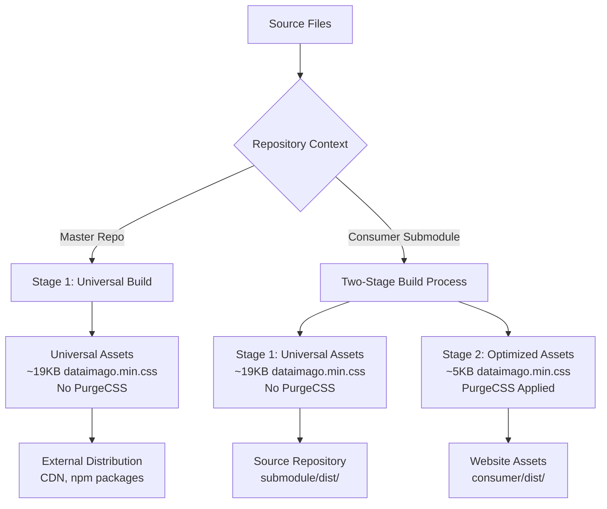

### **Environment-Aware Build Detection**

The build system automatically detects its environment using Git structure:

| Environment | Detection Method | PurgeCSS | File Size | Purpose |
|-------------|------------------|----------|-----------|---------|
| **Master Repository** | `.git` is directory | ❌ Disabled | ~19KB | Universal distribution |
| **Consumer Submodule** | `.git` is file | ✅ Enabled | ~5KB | Website optimization |

### **Key Architecture Principles:**

- **🎯 Context-Aware**: Build process adapts to repository environment automatically
- **🌍 Universal Assets**: Master repo generates complete assets for external distribution
- **⚡ Optimized Assets**: Consumer submodule generates PurgeCSS-optimized assets for websites
- **🔄 Idempotent**: Running builds multiple times produces identical output
- **🛡️ No Side Effects**: Builds never modify version-controlled files
- **📊 Performance**: 74% size reduction for website-optimized assets

### **Consumer Integration Workflow**

The design system integrates into consumer packages (R packages, Quarto sites, web apps) via **git submodules** with automatic two-stage building:

```bash
# Consumer repositories include this as a submodule
git submodule add https://github.com/dataimago/dataimago-design.git ui/src/dataimago-design

# Consumer build process triggers two-stage build automatically
dataimago::build_design_system()
# OR
node ui/build.js

# Results in two separate asset distributions:
# 1. Universal assets: ui/src/dataimago-design/dist/ (~19KB)
# 2. Optimized assets: ui/dist/ (~5KB, PurgeCSS applied)
```

### **Development Workflow Benefits**

This architecture enables a **seamless development experience**:

1. **🔧 Local Development**: Edit design system files in consumer submodule
2. **🧪 Immediate Testing**: Two-stage build reflects changes with optimal performance
3. **💾 Source Sync**: Push submodule changes to update source repository
4. **🔄 Distribution**: Master repo maintains universal assets for external use
5. **✅ Validation**: Idempotent builds confirm system stability across environments

### **PostCSS Integration & Optimization**

The build system includes comprehensive PostCSS optimization:

```javascript
// Environment-aware PostCSS configuration
const shouldPurge = isSubmodule && !process.env.DATAIMAGO_BUILD_MODE === 'universal';

plugins: [
  // PurgeCSS (only in consumer submodule)
  ...(shouldPurge ? [purgecss({
    content: ['../../../docs/**/*.html', '../../../ui/www/**/*.html'],
    safelist: [/^bs-/, /^quarto-/, /^dataimago-/]
  })] : []),
  
  // Always applied optimizations
  autoprefixer(), cssnano(), postcssCustomProperties()
]
```

### **Ethical Design Enforcement**

Treating design tokens like production code with measurable accessibility, dignity, transparency, and equity as first-class "ethical tokens" with CI gates.

## 🎯 Key Features

- **Two-Stage Build System**: Context-aware universal vs. optimized asset generation
- **74% Size Reduction**: PurgeCSS optimization for website assets (19KB → 5KB)
- **Environment Detection**: Automatic master repo vs. submodule detection
- **Conflict-Free Bootstrap Integration**: Eliminates CSS variable naming conflicts
- **P3/OKLCH Color Support**: Wide-gamut colors with sRGB fallbacks
- **Ethical Enforcement**: Built-in accessibility, dignity, and equity constraints
- **Single Source of Truth**: One token definition, multiple output formats
- **Drop-in Compatibility**: Works with existing Quarto/R package infrastructure

## 🏗️ Architecture

This is a design system source repository with intelligent build distribution:

```
dataimago-design/
├── src/
│   ├── tokens/                     # Source of truth for all design decisions
│   │   ├── colors-p3.json         # P3/OKLCH wide-gamut colors
│   │   ├── theme-colors-p3.json   # Theme-aware P3 colors
│   │   ├── frequent.json          # Common design tokens
│   │   ├── effects.json           # Shadows, borders, transitions
│   │   ├── components.json        # Component-specific tokens
│   │   └── typography.json        # Typography scales and families
│   ├── styles/
│   │   ├── core/                  # Core Sass modules
│   │   │   ├── tokens.scss        # Generated token imports
│   │   │   ├── mixins.scss        # Utility mixins
│   │   │   └── functions.scss     # Sass helper functions
│   │   ├── components/            # Component styles
│   │   │   ├── shared-components.scss  # Common UI components
│   │   │   └── navbar.scss        # Navigation components
│   │   ├── themes/                # Theme-specific styles
│   │   │   ├── dataimago-light.scss    # Light theme (generated)
│   │   │   ├── dataimago-dark.scss     # Dark theme (generated)
│   │   │   ├── website-features.scss   # Website-specific features
│   │   │   └── lenis-integration.scss  # Smooth scroll integration
│   │   ├── dataimago.scss         # Main design system entry
│   │   └── website-theme.scss     # Website-specific entry
│   └── js/                        # JavaScript modules
│       ├── accessibility.js       # A11y enhancements
│       ├── hero-scroller.js       # Hero section interactions
│       └── lenis-integration.js   # Smooth scrolling
├── tools/                         # Build and validation tools
│   ├── build-core.mjs            # Core build utilities with two-stage support
│   ├── contrast-check.mjs        # WCAG contrast validation
│   ├── motion-lint.mjs           # Motion dignity enforcement
│   └── generate-report.mjs       # Ethical compliance reporting
├── scripts/
│   └── publish.mjs               # Master repo build script
├── dist/                         # Generated assets (context-dependent)
│   ├── dataimago.css            # Core design system (28KB)
│   ├── dataimago.min.css        # Minified (19KB master, 5KB consumer)
│   ├── website-theme.css        # Website-specific styles (40KB)
│   ├── website-theme.min.css    # Minified (28KB master, 16KB consumer)
│   ├── tokens.css               # Design tokens as CSS variables
│   ├── dataimago-light.scss     # Quarto light theme
│   ├── dataimago-dark.scss      # Quarto dark theme
│   ├── manifest.json            # Build metadata
│   └── js/                      # Optimized JavaScript
├── postcss.config.js            # Environment-aware PostCSS configuration
└── package.json                 # Dependencies and build scripts
```

## 🚀 Quick Start

### Master Repository (Universal Assets)

```bash
# Install dependencies
pnpm install

# Build universal assets for external distribution
pnpm build

# Validate tokens against ethical constraints
pnpm run validate

# Run ethical enforcement checks
pnpm run lint

# Generate compliance report
pnpm run report
```

### Consumer Submodule (Two-Stage Build)

```bash
# In R package root
dataimago::build_design_system()

# OR in Node.js consumer
cd ui && node build.js

# Results:
# - Universal assets: ui/src/dataimago-design/dist/
# - Optimized assets: ui/dist/
```

## 📦 Two-Stage Distribution System

### Build Output Comparison

| Asset | Master Repo | Consumer Submodule | Optimization |
|-------|-------------|-------------------|--------------|
| `dataimago.min.css` | **18.84 KB** | **4.87 KB** | **74% reduction** |
| `website-theme.min.css` | **28.49 KB** | **16.25 KB** | **43% reduction** |
| `tokens.min.css` | **8.60 KB** | **0 KB** | **100% reduction** |

### Distribution Channels (Consumer Repository)

The two-stage build system automatically distributes optimized assets to 4 key locations:

1. **CDN Assets** (`inst/quarto-assets/`)
   - For jsDelivr distribution and R package inclusion
   - Includes optimized production files

2. **Website Assets** (`ui/www/assets/css/`)
   - For local development server
   - Includes optimized files with source maps

3. **Quarto Extension** (`ui/www/_extensions/dataimago/ai-native/assets/css/`)
   - For Quarto document rendering
   - Includes optimized theme variants

4. **Documentation** (`docs/assets/css/`)
   - For package documentation site
   - Includes essential optimized files

### Build Process Flow

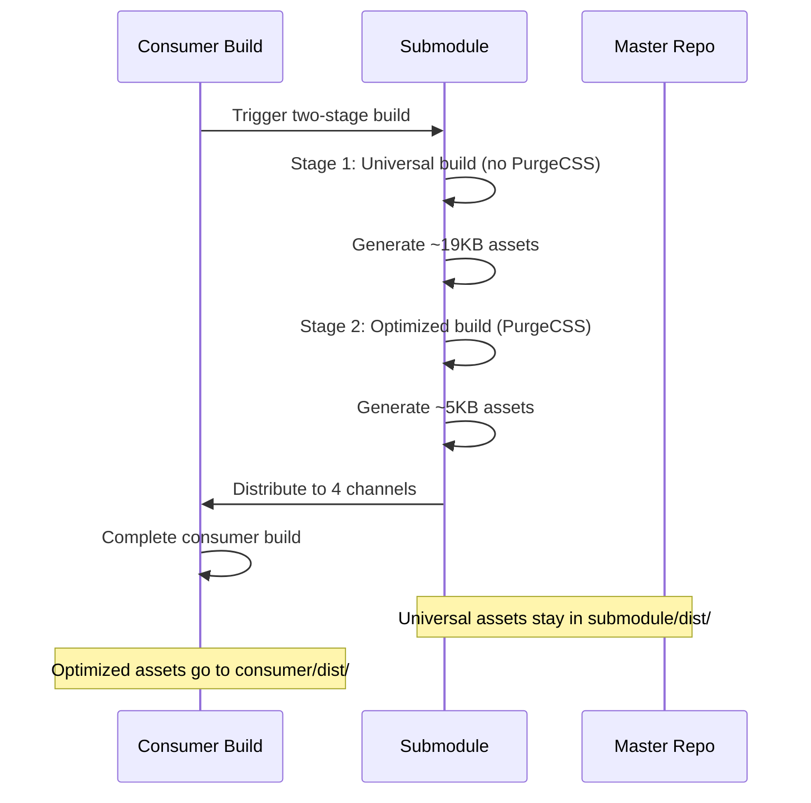

## 📦 Consuming the Design System

### As a Git Submodule (Recommended)

For R packages and Quarto sites with automatic two-stage optimization:

```bash
# Add as submodule
git submodule add https://github.com/dataimago/dataimago-design.git ui/src/dataimago-design

# Consumer build automatically triggers two-stage build
dataimago::build_design_system()  # R package
# OR
node ui/build.js                  # Node.js consumer
```

### Direct Import (Master Repository Assets)

**For external packages requiring universal assets:**

```scss
// Import universal design system (no PurgeCSS applied)
@import "dataimago-design/dist/dataimago.css";

// Or specific components
@import "dataimago-design/dist/website-theme.css";
```

### CSS Variables Usage

**Semantic Variables (Conflict-Free):**
```css
.my-component {
  /* Surface variables */
  background: var(--surface-background-elevated);
  border: 1px solid var(--surface-border-default);
  
  /* Content variables */
  color: var(--content-text-primary);
  
  /* Spacing and styling */
  padding: var(--spacing-md);
  border-radius: var(--radius-md);
  
  /* Ethical motion integration */
  transition: all var(--ethical-dignity-motion-duration-maximum);
}
```

**P3/OKLCH Wide-Gamut Colors:**
```css
.modern-color-component {
  /* P3 colors with sRGB fallbacks */
  background: var(--brand-primary-p3);
  border-color: var(--accent-secondary-p3);
  
  /* OKLCH colors for advanced displays */
  color: oklch(from var(--text-primary) l c h);
}
```

## 🛡️ Ethical Enforcement

All tokens are validated against ethical constraints with environment-specific optimizations:

### Accessibility
- **Contrast ratios**: Minimum 4.5:1 (AA), 7.0:1 in high-contrast mode
- **Focus indicators**: 3px minimum width, 2px offset
- **Touch targets**: 44×44px minimum size
- **Wide-gamut support**: P3/OKLCH colors with sRGB fallbacks

### Dignity
- **Motion**: Maximum 300ms duration, respects `prefers-reduced-motion`
- **Transparency**: 5s minimum undo window for destructive actions
- **Performance**: PurgeCSS optimization reduces bandwidth requirements

### Equity
- **Bandwidth**: Optimized asset sizes, system font fallbacks
- **Internationalization**: RTL support, 1.5 minimum line-height
- **Device support**: 320px minimum viewport width
- **Progressive enhancement**: Works without JavaScript

## 🎨 P3/OKLCH Color System

The design system includes advanced color support for modern displays:

### Color Architecture
- **sRGB Base**: Traditional web colors for compatibility
- **P3 Enhancement**: Wide-gamut colors for modern displays
- **OKLCH Integration**: Perceptually uniform color manipulation
- **Automatic Fallbacks**: Graceful degradation for older browsers

### Color Token Structure
```json
{
  "color": {
    "brand": {
      "primary": {
        "srgb": "rgb(124, 124, 124)",
        "p3": "color(display-p3 0.486 0.486 0.486)",
        "oklch": "oklch(0.486 0.000 0)",
        "description": "Primary brand color with wide-gamut support"
      }
    }
  }
}
```

## 🔄 Development Workflow

### Making Changes in Consumer Submodule

1. **Edit design system files** in `ui/src/dataimago-design/src/`
2. **Test locally** with `dataimago::build_design_system()`
3. **Verify optimization** - check file sizes in both `submodule/dist/` and `consumer/dist/`
4. **Commit to submodule** and push to update master repository
5. **Pull updates** in other consumer repositories

### Environment-Specific Development

**Master Repository (Universal Assets):**
```bash
# Build for external distribution
pnpm build

# Assets optimized for universal use (~19KB)
# No PurgeCSS applied - includes all styles
```

**Consumer Submodule (Two-Stage Build):**
```bash
# Build with website optimization
dataimago::build_design_system()

# Stage 1: Universal assets in submodule/dist/ (~19KB)
# Stage 2: Optimized assets in consumer/dist/ (~5KB)
```

### Theme Support

All color tokens support automatic light/dark theming with P3/OKLCH enhancement:

```json
{
  "color": {
    "surface": {
      "page": {
        "light": {
          "srgb": "rgb(237, 237, 235)",
          "p3": "color(display-p3 0.929 0.929 0.922)",
          "oklch": "oklch(0.929 0.002 85.87)"
        },
        "dark": {
          "srgb": "rgb(20, 20, 16)",
          "p3": "color(display-p3 0.078 0.078 0.063)",
          "oklch": "oklch(0.078 0.008 85.87)"
        },
        "description": "Main page background with wide-gamut support"
      }
    }
  }
}
```

Generated CSS includes:
- `:root` variables (light theme default with P3/OKLCH)
- `[data-bs-theme="dark"]` overrides with wide-gamut colors
- `@media (prefers-color-scheme: dark)` automatic switching
- Graceful fallbacks for older browsers

## 🧪 Quality Gates & CI/CD

All changes must pass environment-aware validation:

- ✅ **JSON Schema validation** against token structure
- ✅ **Contrast ratio enforcement** with P3/OKLCH support
- ✅ **Motion duration limits** for dignity compliance
- ✅ **PurgeCSS optimization** validation in consumer builds
- ✅ **File size budgets** for both universal and optimized assets
- ✅ **Idempotent build verification** across environments

### Automated Testing

```bash
# Master repo validation
pnpm run validate  # Token validation
pnpm run lint      # Ethical enforcement
pnpm run test      # Build consistency

# Consumer submodule validation  
dataimago::build_design_system()  # Two-stage build test
# Verifies both universal and optimized asset generation
```

## 📖 Knowledge Wiki (LLM Knowledge Base)

This repository includes an AI-maintained knowledge wiki based on the [Karpathy LLM Wiki pattern](https://github.com/balukosuri/llm-wiki-karpathy), adapted for dataimago's domain of emancipatory AI design.

### Three-Layer Architecture

| Layer | Directory | Owner | Purpose |
|-------|-----------|-------|---------|
| **Authoritative Sources** | `FOUNDATIONS/` | Human | Core philosophy, design theory, governance frameworks |
| **Incoming Materials** | `raw/` | Human | Articles, papers, conversations, references |
| **Knowledge Wiki** | `wiki/` | AI | Cross-referenced, indexed synthesis of all sources |

### How It Works

The wiki is maintained by an AI agent following the schema in `CLAUDE.md`. Key workflows:

- **Ingest**: Drop a source into `raw/`, tell the AI to "ingest" it — wiki pages are created/updated automatically
- **Query**: Ask questions about the knowledge base — answers can be filed as permanent analysis pages
- **Lint**: Run periodic health checks for contradictions, orphan pages, and missing connections
- **Compile**: Systematically process all `FOUNDATIONS/` documents into interlinked wiki pages

### Wiki Structure

```
wiki/
├── index.md        # Master catalog — start here
├── overview.md     # Big-picture synthesis
├── glossary.md     # Canonical terminology
├── log.md          # Activity record
├── sources/        # Document summaries
├── theories/       # Frankfurt School, superalignment, etc.
├── principles/     # Motion dignity, color democracy, etc.
├── patterns/       # Token hierarchy, two-stage build, R/Quarto
├── decisions/      # Architecture decision records
├── personas/       # User types and audiences
├── connections/    # Cross-domain synthesis
└── analyses/       # Q&A outputs and research
```

## 📚 Documentation

- **Two-stage architecture**: This README explains the dual-build system
- **Token rationale**: Each token includes a `description` explaining its purpose
- **Ethical decisions**: Changes to ethical thresholds require documented rationale
- **Performance metrics**: Build output includes size comparisons and optimizations
- **Migration guides**: Available for major version updates
- **Knowledge wiki**: `wiki/index.md` provides the master catalog of all knowledge base content

## 🤝 Contributing

### Development Environment Setup

**For Master Repository Work:**
```bash
git clone https://github.com/dataimago/dataimago-design.git
cd dataimago-design
pnpm install
pnpm build  # Generates universal assets
```

**For Consumer Integration Work:**
```bash
# Work within consumer repository submodule
cd ui/src/dataimago-design
# Edit source files
dataimago::build_design_system()  # Test two-stage build
```

### Agent Roles
- **Token Architect**: Curates primitives/semantic tokens with P3/OKLCH support
- **Ethics & A11y Steward**: Owns ethical tokens and wide-gamut accessibility
- **Build & CI Engineer**: Maintains two-stage build system and PostCSS optimization
- **Performance Engineer**: Monitors PurgeCSS effectiveness and bundle sizes
- **Documentation & DX Lead**: Usage guides and integration examples

## 📋 Migration Status

**Phase 1: Repository Architecture** ✅ COMPLETED
- ✅ Single source of truth established
- ✅ Git submodule integration pattern
- ✅ Ethical token framework

**Phase 2: Two-Stage Build System** ✅ COMPLETED  
- ✅ Environment-aware build detection (master vs. submodule)
- ✅ PostCSS integration with PurgeCSS optimization
- ✅ Universal assets (19KB) vs. optimized assets (5KB) generation
- ✅ Idempotent build system across environments
- ✅ Consumer repository integration (4 distribution channels)

**Phase 3: P3/OKLCH Color System** ✅ COMPLETED
- ✅ Wide-gamut color token architecture
- ✅ P3/OKLCH color generation with sRGB fallbacks
- ✅ Quarto 1.8.24 compatibility with future 1.9+ readiness
- ✅ Advanced color manipulation with Sass color module

**Upcoming Phases:**
- 🚧 Phase 4: Advanced CI/CD pipeline with performance monitoring
- 🚧 Phase 5: Storybook integration with two-stage build support
- 🚧 Phase 6: Component library with optimized distribution

## 🔗 Related

- [R Package Integration](https://github.com/dataimago/dataimago-rpkg) - Consumer repository example
- [Two-Stage Build Documentation](./docs/two-stage-build.md) - Detailed architecture guide
- [PostCSS Optimization Guide](./docs/postcss-optimization.md) - PurgeCSS configuration
- [P3/OKLCH Color Guide](./docs/p3-oklch-colors.md) - Wide-gamut color implementation
- [Design Guidelines](https://dataimago.com/design) - Design philosophy and usage

---

**Built with ❤️ and ethical AI principles by the dataimago team**

*This design system demonstrates that performance optimization and ethical design can work together - our two-stage build system delivers 74% smaller assets while maintaining accessibility and dignity standards.*
````

## File: LICENSE
````
YEAR: 2025
COPYRIGHT HOLDER: Damian W. Betebenner
````

## File: LICENSE.md
````markdown
# MIT License

Copyright (c) 2025 Damian W. Betebenner

Permission is hereby granted, free of charge, to any person obtaining a copy
of this software and associated documentation files (the "Software"), to deal
in the Software without restriction, including without limitation the rights
to use, copy, modify, merge, publish, distribute, sublicense, and/or sell
copies of the Software, and to permit persons to whom the Software is
furnished to do so, subject to the following conditions:

The above copyright notice and this permission notice shall be included in
all copies or substantial portions of the Software.

THE SOFTWARE IS PROVIDED "AS IS", WITHOUT WARRANTY OF ANY KIND, EXPRESS OR
IMPLIED, INCLUDING BUT NOT LIMITED TO THE WARRANTIES OF MERCHANTABILITY,
FITNESS FOR A PARTICULAR PURPOSE AND NONINFRINGEMENT. IN NO EVENT SHALL THE
AUTHORS OR COPYRIGHT HOLDERS BE LIABLE FOR ANY CLAIM, DAMAGES OR OTHER
LIABILITY, WHETHER IN AN ACTION OF CONTRACT, TORT OR OTHERWISE, ARISING FROM,
OUT OF OR IN CONNECTION WITH THE SOFTWARE OR THE USE OR OTHER DEALINGS IN
THE SOFTWARE.
````

## File: NEWS.md
````markdown
# dataimago 0.0-3.1

## Phase 2e.d — Generator Alignment with NextJS Canonical Backend (2026-04-17)

This release aligns the rpkg generators with the Phase 2e architectural landing in `dataimago-ai`: the NextJS API route tree is now the canonical public data surface, and `@dataimago/shared-utils` selects a `ProducerDriver` (static / live / composite / database) at runtime. The rpkg generators no longer emit dual-mode `axios` clients; they emit a single NextJS-calling client whose server-side behavior is governed by `DATAIMAGO_PRODUCER`.

### Changed

* **`export_static_api()`** — emits JSON fixtures under `public/api/*.json` shaped for the NextJS `/api/data/[endpoint]/[[...params]]` route's `StaticProducerDriver` (served only when `DATAIMAGO_PRODUCER=static`). No longer the runtime producer itself.
* **`generate_shared_utils()`** — emits the new single-path `DataimagoApiClient` (always NextJS-calling), the `ProducerDriver` TypeScript interface, and the `resolveProducerDriver()` selector. `axios` is no longer generated as a dependency.
* **`generate_api_scaffolding()`** — emits the `/api/discover`, `/api/data/[endpoint]/[[...params]]`, `/api/wiki/[...path]`, and `/api/scheduled/[task]` route handlers with shared `_lib/` helpers for `ApiError`, `RequestContext`, and parameter whitelist validation.
* **`generate_mcp()` / `generate_self_mcp()`** — MCP endpoint descriptors reframed as a documentation and runtime-intent surface; actual MCP invocation runtime (`/api/mcp/[tool]`) is deferred to Phase 5. Descriptors carry `producer`, `endpoint`, and `params` so the downstream runtime can resolve them without re-parsing.

### Added

* **`generate_ai_context()`** — refreshed to index the current package layout (`inst/dataimago/`, `R/` file list, submodule-aware repomix scope) and to exclude historical Kruger redesign notes (now archived in `ui/src/dataimago-design/raw/references/kruger-redesign/`).
* Package-root `CLAUDE.md` with accurate file system standards (`inst/dataimago/` contents, 15-file `R/` tree, correct document locations for AI agents).
* Linter-clean quote style across `build_components.R`, `generate_api.R`, `generate_mcp.R`, and `generate_self_mcp.R` (double quotes only, per `lintr` `quotes_linter`).

### Documentation

* `inst/dataimago/IMPLEMENTATION_ROADMAP.md` renamed to `HISTORICAL_ROADMAP.md` with a "HISTORICAL / SUPERSEDED" header pointing to the current roadmap in `ui/src/dataimago-design/wiki/analyses/development-roadmap.md`.
* `.repomixignore` rewritten to exclude `ui/src/dataimago-design/raw/`, `dataimago.Rcheck/`, `*-repomix.md`/`.xml`, and `ui/src/dataimago-design/dist/`, shrinking generated AI context from 26.8 MB to 3.4 MB.
* Non-ASCII em dash in `R/generate_types.R` replaced with `--` to silence R CMD check.

### Context

The Phase 2e.d generator alignment is the rpkg-side companion to the atomic `dataimago-ai` PR landed 2026-04-17. See `ui/src/dataimago-design/wiki/log.md` entries for the same date and `ui/src/dataimago-design/wiki/patterns/producer-driver-pattern.md` for the runtime contract.

---

# dataimago 0.0-0.1

## Initial Release — Foundation & Documentation Generation

### Package Infrastructure

* Initial R package structure created from philosophical foundation documents
* Core foundation documents organized in `inst/dataimago/01_Foundations/`
* Manifesto content included in `inst/dataimago/02_Manifesto/`
* Application architecture blueprints in `inst/dataimago/03_Application_Architecture/`
* Essential design assets in `inst/dataimago/04_dataimago_Content/`
* Curated content delivery via selective `.Rbuildignore` patterns
* MIT licensing with proper attribution

### Documentation Generation

* **NEW**: `create_quarto_documentation()` function for ethical AI documentation
* **NEW**: Rd2md integration for .Rd to .qmd conversion with philosophical context
* **NEW**: Automated YAML frontmatter generation with package metadata
* **NEW**: Ethical context injection via `post_process_md_to_qmd()`
* **NEW**: dataimago branding and visual identity integration
* **NEW**: Foundation document cross-referencing in technical documentation

### AI Agent Integration

* **NEW**: Comprehensive roxygen2 documentation optimized for MCP compatibility
* **NEW**: `inst/CLAUDE.md` — Persistent AI context for agent interactions
* **NEW**: `inst/AGENT_INDEX.md` — AI agent coordination and capability registry
* **NEW**: Structured metadata for machine-readable ethical annotations
* **NEW**: Package-level documentation (`dataimago-package.R`) for AI understanding

### Website Generation

* **NEW**: Complete Quarto website structure in `quarto_website/`
* **NEW**: Custom dataimago SCSS theming with ethical AI styling
* **NEW**: Automated asset management (PNG logos, visual frameworks)
* **NEW**: Website rendering to `docs/` directory for GitHub Pages
* **NEW**: Navigation structure linking technical and philosophical content

### Documentation Standards

* Enhanced README.md with comprehensive package overview
* MCP tool integration examples and JSON schema specifications
* Philosophical context embedded in all technical documentation
* Code-as-philosophy commitments documented throughout
* Consistent parameter naming and return value structures

### Development Workflow

* Roxygen2-based documentation generation with ethical annotations
* Automated website building via Quarto rendering
* Content curation ensuring clean package distribution
* Version control integration with philosophical evolution tracking

## Philosophy in Practice

This release embodies dataimago's core principle: instead of embedding culture in AI, we **embed AI in culture** for emancipatory ends. Every function includes philosophical context, connecting computational tools to their ethical foundations and societal purposes.
````

## File: docs/assets/css/r-package.css
````css
@charset "UTF-8";
:root {
  --dataimago-primary: #3498DB;
  --dataimago-accent: #ff69b4;
  --dataimago-ethical: #E74C3C;
  --color-surface-page-light: rgb(237, 237, 235);
  --color-surface-page-dark: rgb(20, 20, 16);
  --color-content-primary-light: #000000;
  --color-content-secondary-light: #7c7c7c;
  --color-content-primary-dark: rgb(237, 237, 235);
  --color-content-secondary-dark: #83838f;
  --dataimago-success: #27AE60;
  --dataimago-warning: #F39C12;
  --dataimago-error: #E74C3C;
  --dataimago-info: #3498DB;
}

* {
  box-sizing: border-box;
}

html {
  font-family: var(--font-family-sans);
  font-size: var(--font-size-base);
  line-height: var(--font-lineHeight-normal);
  color: var(--color-text-primary);
  background-color: var(--color-background-page);
  -webkit-font-smoothing: antialiased;
  -moz-osx-font-smoothing: grayscale;
}

body {
  margin: 0;
  padding: 0;
  font-family: inherit;
  background-color: var(--color-background-page);
  color: var(--color-text-primary);
}

h1, h2, h3, h4, h5, h6 {
  font-weight: var(--font-weight-semibold);
  line-height: var(--font-lineHeight-tight);
  margin-top: 0;
  margin-bottom: var(--spacing-md);
  color: var(--color-text-primary);
}

h1 {
  font-size: var(--font-size-4xl);
  margin-bottom: var(--spacing-lg);
}

h2 {
  font-size: var(--font-size-3xl);
  margin-bottom: var(--spacing-lg);
}

h3 {
  font-size: var(--font-size-2xl);
}

h4 {
  font-size: var(--font-size-xl);
}

h5 {
  font-size: var(--font-size-lg);
}

h6 {
  font-size: var(--font-size-base);
}

p {
  margin-top: 0;
  margin-bottom: var(--spacing-md);
  line-height: var(--font-lineHeight-normal);
}

a {
  color: var(--color-brand-accent);
  text-decoration: underline;
  text-decoration-thickness: 1px;
  text-underline-offset: 2px;
  transition: color 0.2s ease;
}

a:hover {
  color: var(--color-brand-primary);
  text-decoration-thickness: 2px;
}

a:focus {
  outline: 2px solid var(--color-border-focus);
  outline-offset: 2px;
  border-radius: var(--radius-sm);
}

code {
  font-family: var(--font-family-mono);
  font-size: 0.9em;
  padding: 0.1em 0.3em;
  background-color: var(--color-background-surface);
  border-radius: var(--radius-sm);
  color: var(--color-brand-accent);
}

pre {
  font-family: var(--font-family-mono);
  font-size: 0.9em;
  padding: var(--spacing-md);
  background-color: var(--color-background-surface);
  border: 1px solid var(--color-border-default);
  border-radius: var(--radius-md);
  overflow-x: auto;
  margin-bottom: var(--spacing-md);
}

pre code {
  background: transparent;
  padding: 0;
  color: inherit;
}

/* dataimago API Reference - Dual Sidebar Layout */
/* ========================================
   DUAL SIDEBAR FOUNDATION
   ======================================== */
/* Main content area with dual sidebars */
.page-layout-full .page-columns {
  display: grid;
  grid-template-columns: 280px 1fr 240px;
  grid-template-areas: "sidebar-left main sidebar-right";
  gap: 2rem;
  max-width: 100%;
  margin: 0;
}

.sidebar-left {
  grid-area: sidebar-left;
  position: sticky;
  top: 2rem;
  height: calc(100vh - 4rem);
  overflow-y: auto;
  padding: 1rem;
  background: var(--bs-body-bg);
  border-right: 1px solid var(--bs-border-color);
}

.page-columns .column-page {
  grid-area: main;
  min-width: 0; /* Prevent overflow */
  padding: 2rem 1rem;
}

.sidebar-right {
  grid-area: sidebar-right;
  position: sticky;
  top: 2rem;
  height: calc(100vh - 4rem);
  overflow-y: auto;
  padding: 1rem;
  background: var(--bs-body-bg);
  border-left: 1px solid var(--bs-border-color);
}

/* ========================================
   LEFT SIDEBAR STYLING
   ======================================== */
.sidebar-left .sidebar-title {
  font-size: 1.1rem;
  font-weight: 600;
  margin-bottom: 1rem;
  color: var(--bs-primary);
  border-bottom: 2px solid var(--bs-primary);
  padding-bottom: 0.5rem;
}

.sidebar-left .sidebar-search {
  margin-bottom: 1.5rem;
}

.sidebar-left .sidebar-search input {
  width: 100%;
  padding: 0.5rem;
  border: 1px solid var(--bs-border-color);
  border-radius: 4px;
  font-size: 0.9rem;
}

.sidebar-left .sidebar-menu {
  list-style: none;
  margin: 0;
  padding: 0;
}

.sidebar-left .sidebar-section {
  margin-bottom: 1.5rem;
}

.sidebar-left .sidebar-section-title {
  font-weight: 600;
  font-size: 0.9rem;
  color: var(--bs-secondary-color);
  text-transform: uppercase;
  letter-spacing: 0.5px;
  margin-bottom: 0.75rem;
  padding: 0.5rem 0;
  border-bottom: 1px solid rgba(var(--bs-border-color-rgb), 0.5);
}

.sidebar-left .sidebar-item {
  margin-bottom: 0.25rem;
}

.sidebar-left .sidebar-link {
  display: block;
  padding: 0.5rem 0.75rem;
  color: var(--bs-body-color);
  text-decoration: none;
  border-radius: 4px;
  font-size: 0.9rem;
  transition: all 0.2s ease;
  border-left: 3px solid transparent;
}

.sidebar-left .sidebar-link:hover {
  background: color-mix(in srgb, var(--bs-primary) 10%, transparent);
  border-left-color: var(--bs-primary);
  color: var(--bs-primary);
}

.sidebar-left .sidebar-link.active {
  background: color-mix(in srgb, var(--bs-primary) 15%, transparent);
  border-left-color: var(--bs-primary);
  color: var(--bs-primary);
  font-weight: 500;
}

/* Collapsible sections */
.sidebar-left .sidebar-section.collapsed .sidebar-items {
  display: none;
}

.sidebar-left .sidebar-section-toggle {
  cursor: pointer;
  user-select: none;
  display: flex;
  align-items: center;
  justify-content: space-between;
}

.sidebar-left .sidebar-section-toggle::after {
  content: "▼";
  font-size: 0.8rem;
  transition: transform 0.2s ease;
}

.sidebar-left .sidebar-section.collapsed .sidebar-section-toggle::after {
  transform: rotate(-90deg);
}

/* ========================================
   RIGHT SIDEBAR (TOC) STYLING
   ======================================== */
.sidebar-right .toc-title {
  font-size: 1rem;
  font-weight: 600;
  margin-bottom: 1rem;
  color: var(--bs-secondary-color);
  border-bottom: 1px solid var(--bs-border-color);
  padding-bottom: 0.5rem;
}

.sidebar-right .table-of-contents {
  list-style: none;
  margin: 0;
  padding: 0;
  line-height: 1.4;
}

.sidebar-right .table-of-contents li {
  margin-bottom: 0.25rem;
}

.sidebar-right .table-of-contents a {
  display: block;
  padding: 0.375rem 0.5rem;
  color: var(--bs-secondary-color);
  text-decoration: none;
  font-size: 0.85rem;
  border-radius: 3px;
  border-left: 2px solid transparent;
  transition: all 0.2s ease;
}

.sidebar-right .table-of-contents a:hover {
  background: color-mix(in srgb, var(--bs-secondary) 10%, transparent);
  border-left-color: var(--bs-secondary);
  color: var(--bs-body-color);
}

.sidebar-right .table-of-contents a.active {
  background: color-mix(in srgb, var(--bs-secondary) 15%, transparent);
  border-left-color: var(--bs-secondary);
  color: var(--bs-body-color);
  font-weight: 500;
}

/* Nested TOC levels */
.sidebar-right .table-of-contents .toc-level-2 {
  margin-left: 1rem;
  font-size: 0.8rem;
}

.sidebar-right .table-of-contents .toc-level-3 {
  margin-left: 1.5rem;
  font-size: 0.75rem;
}

/* ========================================
   MAIN CONTENT AREA ADJUSTMENTS
   ======================================== */
.column-page {
  max-width: none;
  padding: 0 2rem;
}

/* Function documentation styling */
.function-section {
  margin-bottom: 3rem;
  padding-bottom: 2rem;
  border-bottom: 1px solid rgba(var(--bs-border-color-rgb), 0.3);
}

.function-section:last-child {
  border-bottom: none;
}

.function-title {
  color: var(--bs-primary);
  border-bottom: 2px solid var(--bs-primary);
  padding-bottom: 0.5rem;
  margin-bottom: 1.5rem;
}

.ethical-note {
  background: linear-gradient(135deg, color-mix(in srgb, var(--bs-info) 10%, transparent), color-mix(in srgb, var(--bs-primary) 5%, transparent));
  border-left: 4px solid var(--bs-info);
  padding: 1rem 1.5rem;
  margin: 1.5rem 0;
  border-radius: 0 8px 8px 0;
  font-style: italic;
  color: var(--bs-info-text-emphasis);
}

/* ========================================
   RESPONSIVE DESIGN
   ======================================== */
@media (max-width: 1400px) {
  .page-layout-full .page-columns {
    grid-template-columns: 260px 1fr 220px;
    gap: 1.5rem;
  }
}
@media (max-width: 1200px) {
  .page-layout-full .page-columns {
    grid-template-columns: 240px 1fr 200px;
    gap: 1rem;
  }
  .sidebar-left .sidebar-link,
  .sidebar-right .table-of-contents a {
    font-size: 0.8rem;
    padding: 0.375rem 0.5rem;
  }
}
@media (max-width: 992px) {
  .page-layout-full .page-columns {
    grid-template-columns: 1fr;
    grid-template-areas: "main";
  }
  .sidebar-left,
  .sidebar-right {
    display: none;
  }
  /* Show mobile navigation instead */
  .mobile-api-nav {
    display: block;
    position: sticky;
    top: 0;
    background: var(--bs-body-bg);
    border-bottom: 1px solid var(--bs-border-color);
    padding: 1rem;
    margin-bottom: 2rem;
    z-index: 100;
  }
  .mobile-nav-toggle {
    background: var(--bs-primary);
    color: white;
    border: none;
    padding: 0.5rem 1rem;
    border-radius: 4px;
    cursor: pointer;
    font-size: 0.9rem;
  }
  .mobile-nav-menu {
    display: none;
    margin-top: 1rem;
    background: var(--bs-body-bg);
    border: 1px solid var(--bs-border-color);
    border-radius: 4px;
    padding: 1rem;
  }
  .mobile-nav-menu.show {
    display: block;
  }
}
@media (max-width: 768px) {
  .column-page {
    padding: 0 1rem;
  }
  .function-section {
    margin-bottom: 2rem;
  }
}
/* ========================================
   ACCESSIBILITY ENHANCEMENTS
   ======================================== */
@media (prefers-reduced-motion: reduce) {
  .sidebar-left .sidebar-link,
  .sidebar-right .table-of-contents a,
  .sidebar-left .sidebar-section-toggle::after {
    transition: none;
  }
}
/* Focus styles */
.sidebar-left .sidebar-link:focus,
.sidebar-right .table-of-contents a:focus {
  outline: 2px solid var(--bs-primary);
  outline-offset: 2px;
}

.sidebar-left .sidebar-link:focus:not(:focus-visible),
.sidebar-right .table-of-contents a:focus:not(:focus-visible) {
  outline: none;
}

/* ========================================
   DARK MODE ADAPTATIONS
   ======================================== */
@media (prefers-color-scheme: dark) {
  .sidebar-left,
  .sidebar-right {
    background: color-mix(in srgb, var(--bs-body-bg) 97%, var(--bs-dark));
    border-color: color-mix(in srgb, var(--bs-border-color) 50%, transparent);
  }
  .ethical-note {
    background: linear-gradient(135deg, color-mix(in srgb, var(--bs-info) 8%, transparent), color-mix(in srgb, var(--bs-primary) 4%, transparent));
  }
}
/* ========================================
   PRINT STYLES
   ======================================== */
@media print {
  .sidebar-left,
  .sidebar-right {
    display: none;
  }
  .page-layout-full .page-columns {
    grid-template-columns: 1fr;
    grid-template-areas: "main";
  }
  .ethical-note {
    background: none;
    border: 1px solid #ccc;
  }
}

/*# sourceMappingURL=r-package.css.map */
````

## File: docs/assets/latex/dataimago.sty
````
%%%
%%% dataimago.sty - LaTeX Style Package for dataimago Design System
%%%
%%% A unified LaTeX package providing consistent typography, colors, and layout
%%% for PDF documents aligned with the dataimago design system.
%%%
%%% Copyright (c) 2025 dataimago
%%% License: MIT (see LICENSE.md)
%%%
%%% Version: 0.1.0
%%% Date: 2025-10-19
%%%
%%% USAGE:
%%%   \usepackage{dataimago}
%%%
%%% REQUIREMENTS:
%%%   - XeLaTeX or LuaLaTeX (for fontspec and unicode-math)
%%%   - System fonts: Noto Sans, Noto Sans Mono, Noto Sans Math, Josefin Sans
%%%   - memoir document class (for full book/report features)
%%%   - Or article class (basic features only)
%%%
%%% FEATURES:
%%%   - dataimago typography (Noto Sans + Josefin Sans)
%%%   - dataimago color tokens (surface, content, border, brand colors)
%%%   - Custom memoir page styles and chapter/section formatting
%%%   - Theorem and definition boxes styled with dataimago tokens
%%%   - Front matter commands for title pages and abstracts
%%%
%%% For more information, see README.md
%%%

\NeedsTeXFormat{LaTeX2e}
\ProvidesPackage{dataimago}[2025/10/19 v0.1.0 dataimago Design System for LaTeX]

%%%
%%% PACKAGE IDENTIFICATION
%%%
\typeout{dataimago.sty v0.1.0 - dataimago Design System for LaTeX}
\typeout{Loading dataimago typography, colors, and layout...}

%%%
%%% REQUIRED PACKAGES
%%%

%% Font and math support (XeLaTeX/LuaLaTeX required)
\RequirePackage{fontspec}
\RequirePackage{unicode-math}

%% Color support
\RequirePackage[svgnames]{xcolor}

%% Core LaTeX packages
\RequirePackage[obeyspaces,hyphens]{url}
\RequirePackage{graphicx}
\RequirePackage{rotating,bm,amsmath,amsfonts,amssymb,indentfirst,lscape}
\RequirePackage{caption}

%% Box and list support
\RequirePackage{tcolorbox}
\tcbuselibrary{most,skins,breakable}
\RequirePackage{enumitem}

%% Memoir-specific packages (loaded only if memoir class is detected)
\@ifclassloaded{memoir}{%
  \RequirePackage{epigraph}
  \RequirePackage{tabularx}
  \typeout{dataimago: memoir class detected - loading enhanced features}
}{%
  % Article class - load alternative packages
  \RequirePackage{sectsty}
  \RequirePackage{titling}
  \typeout{dataimago: article class detected - loading basic features}
}

%%%
%%% SECTION 1: TYPOGRAPHY - FONTS
%%%
%%% dataimago font stack: Noto Sans (body/math) + Josefin Sans (headings)
%%% Using system fonts for portability across machines
%%%

%% Body Font: Noto Sans
% Token: font.family.sans = "Noto Sans, system-ui, sans-serif"
\setmainfont{Noto Sans}[
  Scale=1.0,
  Ligatures=TeX,
  Numbers=OldStyle
]

\setsansfont{Noto Sans}[
  Scale=1.0,
  Ligatures=TeX
]

%% Monospace Font: Noto Sans Mono
% Token: font.family.mono = "Noto Sans Mono, ..."
\setmonofont{Noto Sans Mono}[
  Scale=0.95,
  Ligatures=TeX
]

%% Math Font: Noto Sans Math
% Token: font.family.math = "Noto Sans Math, ..."
% OpenType MATH table support for proper equation rendering
\setmathfont{Noto Sans Math}[
  Scale=1.0,
  math-style=ISO,
  bold-style=ISO
]

%% Heading Font: Josefin Sans
% Token: font.family.display = "Josefin Sans, system-ui, sans-serif"
% Using system fonts for portability across machines
% Hierarchical weight variants for clear visual hierarchy
% Note: Font family names include the weight for non-Regular weights

% Bold (700) - Default, for Title, Chapters
\newfontfamily\HeadingFont[
  Scale=MatchLowercase,
  LetterSpace=0.5,
  BoldFont=Josefin Sans
]{Josefin Sans}
\let\HeadingFontBold\HeadingFont  % Alias for clarity

% SemiBold (600) - For Subtitle
\newfontfamily\HeadingFontSemiBold[
  Scale=MatchLowercase,
  LetterSpace=0.5,
  BoldFont=Josefin Sans
]{Josefin Sans SemiBold}

% Medium (500) - For Sections  
% Note: Josefin Sans doesn't have Medium weight, using Regular
\newfontfamily\HeadingFontMedium[
  Scale=MatchLowercase,
  LetterSpace=0.5,
  BoldFont=Josefin Sans
]{Josefin Sans}

% Regular (400) - For Subsections
\newfontfamily\HeadingFontRegular[
  Scale=MatchLowercase,
  LetterSpace=0.5,
  BoldFont=Josefin Sans
]{Josefin Sans}

% Light (300) - For Subsubsections
\newfontfamily\HeadingFontLight[
  Scale=MatchLowercase,
  LetterSpace=0.5,
  BoldFont=Josefin Sans
]{Josefin Sans Light}

% ExtraLight (200) - For future use (captions, labels)
% Note: Using Thin as ExtraLight equivalent
\newfontfamily\HeadingFontExtraLight[
  Scale=MatchLowercase,
  LetterSpace=0.5,
  BoldFont=Josefin Sans
]{Josefin Sans Thin}

%% Apply Josefin to section headings (article class only)
\@ifclassloaded{memoir}{%
  % Memoir class - skip sectsty (incompatible with memoir)
  % Section formatting handled in SECTION 3 below
}{%
  % Article class - use sectsty
  \allsectionsfont{\HeadingFont\color{ContentPrimary}}
  
  % Make document title use Josefin
  \pretitle{\begin{center}\HeadingFont\huge\color{ContentPrimary}}
  \posttitle{\par\end{center}\vskip 1em}
  \preauthor{\begin{center}\large\begin{tabular}[t]{c}}
  \postauthor{\end{tabular}\par\end{center}}
  \predate{\begin{center}\normalsize\color{ContentSecondary}}
  \postdate{\par\end{center}\vskip 1.5em}
}

%%%
%%% SECTION 2: COLORS - dataimago Design Tokens
%%%
%%% All colors defined using dataimago design token values
%%%

% Surface tokens (light theme)
% Token: color.surface.page.light = rgb(237, 237, 235) / oklch(0.937 0.007 110.1)
\definecolor{SurfacePage}{RGB}{237, 237, 235}

% Token: color.surface.code.light = rgb(225, 225, 223)
\definecolor{SurfaceCode}{RGB}{225, 225, 223}

% Token: color.surface.elevated.light = rgba(237, 237, 235, 0.9)
\definecolor{SurfaceElevated}{RGB}{237, 237, 235}

% Content tokens
% Token: color.content.primary.light = rgb(20, 20, 16)
\definecolor{ContentPrimary}{RGB}{20, 20, 16}

% Token: color.content.secondary.light = #7c7c7c
\definecolor{ContentSecondary}{HTML}{7c7c7c}

% Border tokens
% Token: color.border.code.light = rgb(220, 220, 218)
\definecolor{BorderCode}{RGB}{220, 220, 218}

% Token: color.border.moderate.light = rgba(20, 20, 16, 0.15)
\definecolor{BorderModerate}{RGB}{51, 51, 46}

% Figure box background - subtle off-white for semi-transparent figure backgrounds
\colorlet{FigureBoxBg}{white!42!SurfacePage}

% Brand tokens (theme-agnostic)
% Token: color.brand.dataimago.primary = #3498DB
\definecolor{DataimagoPrimary}{HTML}{3498DB}

% Token: color.brand.dataimago.accent = #ff69b4
\definecolor{DataimagoAccent}{HTML}{ff69b4}

% Token: color.brand.dataimago.ethical = #E74C3C
\definecolor{DataimagoEthical}{HTML}{E74C3C}

% Functional tokens
% Token: color.functional.info = #3498DB
\definecolor{InfoColor}{HTML}{3498DB}

% Token: color.functional.warning = #F39C12
\definecolor{WarningColor}{HTML}{F39C12}

% Token: color.functional.error = #E74C3C
\definecolor{ErrorColor}{HTML}{E74C3C}

% Token: color.functional.success = #27AE60
\definecolor{SuccessColor}{HTML}{27AE60}

% Special colors for theorem boxes
\definecolor{CornsilkBox}{RGB}{245, 245, 220}
\definecolor{CornsilkBoxBorder}{RGB}{210, 210, 208}

%% Apply page background color (dataimago surface token)
% Token: color.surface.page.light = rgb(237, 237, 235)
\pagecolor{SurfacePage}

%% Figure border parameters (\fbox)
% Token: border.width.subtle = 0.4pt (dataimago)
% Token: spacing.micro.xs = 0.25rem ≈ 3pt (dataimago)
\setlength{\fboxrule}{0.75pt}   % Border line thickness
\setlength{\fboxsep}{0.5pt}      % Padding between border and content

%%%
%%% SECTION 3: MEMOIR CLASS CONFIGURATION
%%%
%%% Page styles, chapter/section formatting, and book structure
%%% (Only loaded if memoir class is detected)
%%%

\@ifclassloaded{memoir}{%
  %% Memoir divisions configuration
  % Enable subsubsection numbering
  \setsecnumdepth{subsubsection}
  \maxsecnumdepth{subsubsection}
  
  % Set TOC depth (chapters and sections only)
  \settocdepth{section}
  
  %% Page styles using memoir's built-in system
  \makepagestyle{dataimago}
  \makeevenhead{dataimago}{\small\normalfont\color{ContentSecondary}\thepage}{}{\small\normalfont\color{ContentSecondary}\leftmark}
  \makeoddhead{dataimago}{\small\normalfont\color{ContentSecondary}\leftmark}{}{\small\normalfont\color{ContentSecondary}\thepage}
  \makeevenfoot{dataimago}{}{}{}
  \makeoddfoot{dataimago}{}{}{}
  \makeheadrule{dataimago}{\textwidth}{0.4pt}
  
  % Apply custom page style
  \pagestyle{dataimago}
  
  % Plain style for chapter openings
  \makepagestyle{plain}
  \makeevenfoot{plain}{}{\small\normalfont\thepage}{}
  \makeoddfoot{plain}{}{\small\normalfont\thepage}{}
  
  %% Front matter style (no headers, centered page numbers)
  \makepagestyle{frontmatter}
  \makeevenfoot{frontmatter}{}{\small\normalfont\thepage}{}
  \makeoddfoot{frontmatter}{}{\small\normalfont\thepage}{}
  
  %% Chapter and section spacing
  \setlength{\beforechapskip}{0pt}        % Space before chapter title
  \setlength{\afterchapskip}{40pt}        % Space after chapter title
  \setbeforesecskip{-3.5ex plus -1ex minus -.2ex}
  \setaftersecskip{2.3ex plus .2ex}
  \setbeforesubsecskip{-3.25ex plus -1ex minus -.2ex}
  \setaftersubsecskip{1.5ex plus .2ex}
  
  %% Increase head height to accommodate headers
  \setlength{\headheight}{18pt}
  
  %% TOC Title formatting - use body font (Noto Sans), not heading font
  \renewcommand{\printtoctitle}[1]{\normalfont\Large\bfseries\color{ContentPrimary}#1}
  
  %% Customize TOC appearance
  \renewcommand{\cftchapterfont}{\normalfont\bfseries\color{ContentPrimary}}
  \renewcommand{\cftchapterpagefont}{\normalfont\bfseries\color{ContentPrimary}}
  \renewcommand{\cftsectionfont}{\normalfont\color{ContentPrimary}}
  \renewcommand{\cftsectionpagefont}{\normalfont\color{ContentPrimary}}
  
  % Add dots to chapter TOC entries
  \renewcommand{\cftchapterleader}{\color{ContentSecondary}\cftdotfill{\cftdotsep}}
  \renewcommand{\cftsectionleader}{\color{ContentSecondary}\cftdotfill{\cftdotsep}}
  
  % Adjust TOC spacing
  \setlength{\cftbeforechapterskip}{0.8em}
  \setlength{\cftbeforesectionskip}{0.3em}
  
  %% Epigraph styling (for opening quotes)
  \setlength{\epigraphwidth}{0.6\textwidth}
  \setlength{\epigraphrule}{0pt}
  \renewcommand{\textflush}{flushright}
  \renewcommand{\epigraphsize}{\normalsize\itshape}
  
  %% Abstract styling for memoir
  \renewcommand{\abstractnamefont}{\Large\normalfont\bfseries\color{ContentPrimary}}
  \renewcommand{\abstracttextfont}{\normalfont\normalsize}
  \setlength{\absleftindent}{0pt}
  \setlength{\absrightindent}{0pt}
  
  %% Custom chapter style: dataimago-ell (modified ELL)
  \makechapterstyle{dataimago-ell}{%
    \chapterstyle{default}
    
    % Font definitions using dataimago fonts
    \renewcommand*{\chapnamefont}{\normalfont\large\HeadingFontBold\color{ContentSecondary}}
    \renewcommand*{\chapnumfont}{\normalfont\HUGE\HeadingFontBold\color{ContentPrimary}}
    \renewcommand*{\chaptitlefont}{\normalfont\huge\HeadingFontBold\color{ContentPrimary}}
    
    % Calculate indent for right-side extension
    \settowidth{\chapindent}{\chapnumfont 111}
    
    % Remove default chapter heading elements
    \renewcommand*{\printchaptername}{}
    \renewcommand*{\chapternamenum}{}
    
    % Custom chapter number printing (right-aligned)
    \renewcommand*{\printchapternum}{%
      % For numbered chapters - number right-aligned
      \begin{adjustwidth}{0pt}{-0.0\chapindent}
        \raggedleft%
        {\chapnumfont\color{ContentPrimary}\thechapter}%
        \par\vspace{0.3\onelineskip}%
      \end{adjustwidth}%
    }
    
    % For unnumbered chapters (e.g., Preface, Acknowledgments)
    \renewcommand\printchapternonum{%
      \vphantom{\chapnumfont 1}%
      \afterchapternum%
    }
    
    % Print chapter title (right-aligned above hrule)
    \renewcommand*{\printchaptertitle}[1]{%
      \begin{adjustwidth}{0pt}{-0.0\chapindent}
        % Measure the title height
        \setbox0=\vbox{%
          \raggedleft%
          {\chapnumfont\thechapter}%
          \par\vspace{0.3\onelineskip}%
          {\chaptitlefont\color{ContentPrimary}##1}%
          \par\vspace{0.5\onelineskip}%
        }%
        \raggedleft%
        {\chaptitlefont\color{ContentPrimary}##1}%
        \par\vspace{0.5\onelineskip}%
        % Horizontal rule with vertical rule extending upward at right end
        \noindent\textcolor{BorderModerate}{%
          \rule{\dimexpr\linewidth + 0.4\chapindent\relax}{0.4pt}%
          \llap{\raisebox{0.4pt}[0pt][0pt]{\rule{0.4pt}{\ht0}}}%
        }%
      \end{adjustwidth}%
      \par%
    }
    
    % Spacing after chapter title
    \renewcommand*{\afterchaptertitle}{%
      \par\vspace{1.5\onelineskip}%
    }
  }
  
  % Apply the custom chapter style
  \chapterstyle{dataimago-ell}
  
  %% Chapter mark for headers (appears in page headers)
  \renewcommand{\chaptermark}[1]{%
    \markboth{\thechapter.\ #1}{}}
  
  %% Unnumbered chapters still appear in TOC
  \setcounter{tocdepth}{1}
  
  %% Section formatting (inline numbering)
  % Numbers in ContentSecondary, text in ContentPrimary
  \setsecheadstyle{%
    \Large\HeadingFontMedium\color{ContentPrimary}%
  }
  
  \setsubsecheadstyle{%
    \large\HeadingFontRegular\color{ContentPrimary}%
  }
  
  \setsubsubsecheadstyle{%
    \normalsize\HeadingFontLight\color{ContentPrimary}%
  }
  
  %% Section numbering format
  \renewcommand{\thesection}{\thechapter.\arabic{section}}
  \renewcommand{\thesubsection}{\thesection.\arabic{subsection}}
  \renewcommand{\thesubsubsection}{\thesubsection.\arabic{subsubsection}}
  
  %% TOC formatting for sections (indentation)
  \cftsetindents{section}{1.5em}{2.5em}
  \cftsetindents{subsection}{4.0em}{3.5em}
  \cftsetindents{subsubsection}{7.5em}{4.5em}
  
  %% Section number formatting (ContentSecondary color)
  \renewcommand{\@seccntformat}[1]{%
    \normalfont\HeadingFontMedium\textcolor{ContentSecondary}{\csname the#1\endcsname}\enspace
  }
  
}{}  % End memoir-specific configuration

%%%
%%% SECTION 4: CUSTOM BOXES AND ENVIRONMENTS
%%%
%%% Theorem boxes, definition boxes, and proof environment
%%%

%% Abstract Box suppression (for Quarto integration)
% Suppress Quarto's automatic abstract rendering by redefining as no-op
\@ifpackageloaded{comment}{}{%
  \renewenvironment{abstract}{%
    \setbox\z@\vbox\bgroup
  }{%
    \egroup
  }
}

%% Theorem Box (using dataimago surface tokens)
\newtcolorbox{theorembox}[2][]{
  enhanced,
  breakable,
  colback=SurfaceCode,               % Token: color.surface.code
  colframe=BorderCode,               % Token: color.border.code
  boxrule=0.6pt,
  arc=3pt,                           % Token: radius.subtle
  left=10pt,
  right=10pt,
  top=8pt,
  bottom=8pt,
  before skip=12pt,
  after skip=12pt,
  title={#2},
  fonttitle=\HeadingFont\bfseries,
  coltitle=ContentPrimary,
  #1
}

%% Definition Box (lighter variant)
\newtcolorbox{definitionbox}[2][]{
  enhanced,
  breakable,
  colback=SurfaceElevated,           % Token: color.surface.elevated
  colframe=BorderModerate,           % Token: color.border.moderate
  boxrule=0.8pt,
  arc=4pt,
  left=10pt,
  right=10pt,
  top=8pt,
  bottom=8pt,
  before skip=12pt,
  after skip=12pt,
  title={#2},
  fonttitle=\HeadingFont\bfseries,
  coltitle=ContentPrimary,
  #1
}

%% Proof Environment (minimalist, dataimago style)
% Uses Noto Sans (body font), not Josefin Sans (heading font)
\AtBeginDocument{%
  \renewenvironment{proof}{%
    \noindent{\normalfont\bfseries\color{ContentPrimary}Proof.}\hspace{0.5em}%
  }{\hfill$\blacksquare$}%
}

%%%
%%% SECTION 5: CAPTION AND LIST FORMATTING
%%%

%% Caption Formatting
\captionsetup{
  font=small,
  labelfont=bf,
  textfont=normal,
  justification=justified,
  skip=8pt
}

%% List Styling
\setlist[enumerate]{
  font=\normalfont,
  leftmargin=*,
  itemsep=0.5em,
  parsep=0.25em
}

\setlist[itemize]{
  font=\normalfont,
  leftmargin=*,
  itemsep=0.5em,
  parsep=0.25em
}

%%%
%%% SECTION 6: CUSTOM COMMANDS
%%%

%% Software/Package names
\newcommand{\R}{{\textsf{R}\hspace{.3em}}}
\newcommand{\sgpFlow}{\textsf{{\textit{sgpFlow}\hspace{.2em}}}}

%% Section reference command
\newcommand{\sref}[1]{\hyperref[#1]{\S\ref*{#1}}}

%% Abstract name (uses Josefin Sans)
\renewcommand{\abstractname}{\normalsize\HeadingFont Abstract}

%%%
%%% SECTION 7: FRONT MATTER COMMANDS (Memoir only)
%%%

\@ifclassloaded{memoir}{%
  %% dataimago logo command
  \newcommand{\dataimagoLogo}{%
    % AI Monogram logo
    \href{https://dataimago.ai}{%
      \includegraphics[width=0.75in]{assets/logos/ai_monogram.pdf}%
    }%
  }%
  
  %% CC-BY-SA logo command
  \newcommand{\ccbyLogo}{%
    \href{https://github.com/dbetebenner/Betebenner_Braun_Paper_1/blob/main/LICENSE.md}{%
      \IfFileExists{assets/logos/cc-by-sa.png}{%
        \includegraphics[width=0.5in]{assets/logos/cc-by-sa.png}%
      }{%
          \small\color{DataimagoPrimary}CC BY-SA 4.0%
      }%
    }%
  }%
  
  %% Version command
  \newcommand{\version}[1]{\def\theversion{#1}}
  \version{v0.0.1} % Default version
  
  %% Subtitle command (Quarto integration)
  \providecommand{\subtitle}[1]{\gdef\thesubtitle{#1}}
  \gdef\thesubtitle{}
  
  %% Custom title page (right-justified, dataimago style)
  \renewcommand{\maketitle}{%
    % Set title page layout with 0.75in margins on each side
    \settypeblocksize{9.0in}{7in}{*}
    \setlrmargins{0.75in}{*}{1}        % 0.75in left, equal right
    \setulmargins{1in}{*}{*}
    \checkandfixthelayout
    
    \begin{titlingpage}
      \begin{flushright}
      \vspace*{1.5cm}
      
      % Title
      {\HeadingFontBold\color{ContentPrimary}\Huge\thetitle\par}
      \vspace{0.8em}
      
      % Subtitle
      \ifx\thesubtitle\@empty
      \else
        {\LARGE\HeadingFontSemiBold\color{ContentSecondary}\thesubtitle\par}
      \fi
      \vspace{2em}
      
      % Authors with superscript affiliations  
      {\large\normalfont%
        Damian W. Betebenner$^{1}$\\[0.3em]
        Henry I. Braun$^{2}$\par}
      \vspace{1em}
      
      % Affiliations
      {\small\color{ContentSecondary}%
        $^{1}$The National Center for the Improvement of Educational Assessment, Dover, NH, USA\\[0.3em]
        $^{2}$Lynch School of Education, Boston College, Chestnut Hill, MA, USA\par}
      
      \vspace{1.0in}
      
      % Version, date, and license
      {\normalsize\color{ContentSecondary}\theversion\par}
      \vspace{0.2em}
      {\normalsize\color{ContentSecondary}\thedate\par}
      \vspace{0.7em}
      \ccbyLogo
      
      \vfill
      
      % Bottom right: dataimago logo only
      \dataimagoLogo
      
      \end{flushright}
    \end{titlingpage}
    
    % Restore body page layout (1in margins)
    \settypeblocksize{9.0in}{6.5in}{*}
    \setlrmargins{1in}{*}{1}
    \setulmargins{1in}{*}{*}
    \checkandfixthelayout
    
    \cleardoublepage
  }
}{}  % End memoir front matter commands

%%%
%%% END OF PACKAGE
%%%

\typeout{dataimago.sty loaded successfully!}
\endinput
````

## File: inst/dataimago/ARCHITECTURE.md
````markdown
# dataimago Package Architecture

<!-- Architecture Documentation Badges -->
[](#-system-overview)
[](https://mermaid.js.org/)
[](#-system-overview)
[](#-key-design-principles)
[](#r-first-philosophy)

This document provides comprehensive Mermaid diagrams that illustrate the architecture and workflows of the dataimago R package.

## 🏗️ System Overview

The dataimago package is designed as a multi-layered foundation for emancipatory AI development:

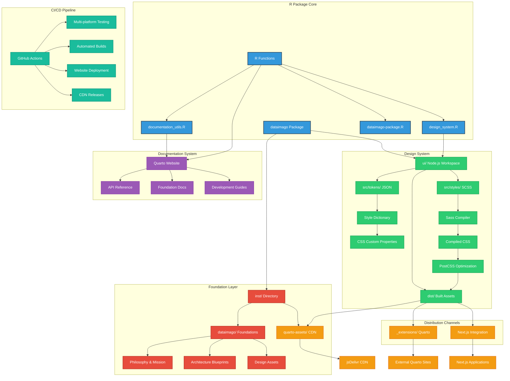

## 🔄 Design System Build Process

The package uses a sophisticated build system that maintains "R as source of truth" while leveraging modern web tooling:

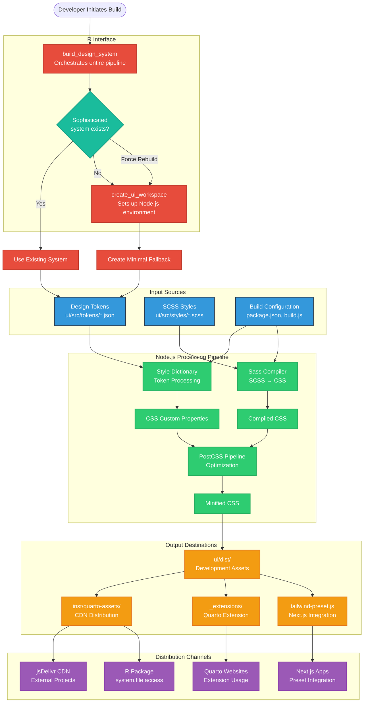

## 📖 Documentation Generation Workflow

The package provides sophisticated documentation generation that embeds philosophical context into technical documentation:

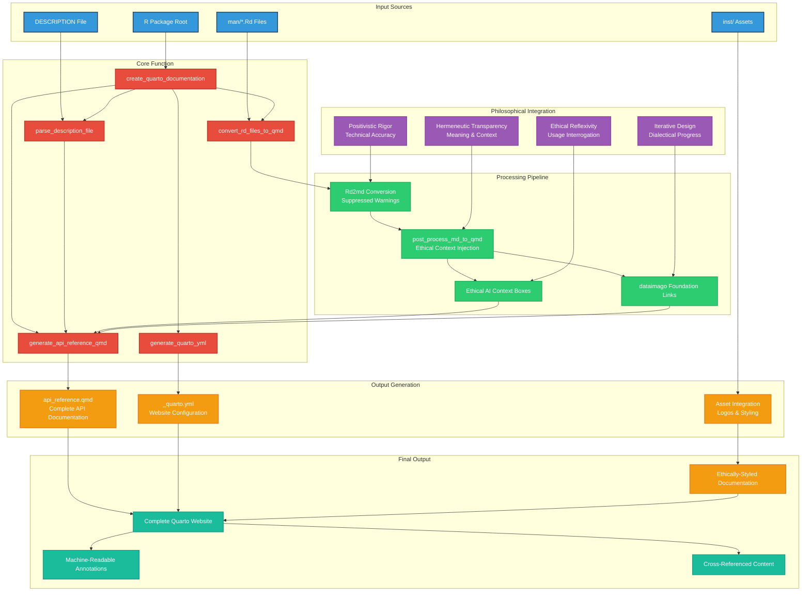

## 🎨 UI Workspace Architecture

The Node.js workspace provides sophisticated design system build capabilities:

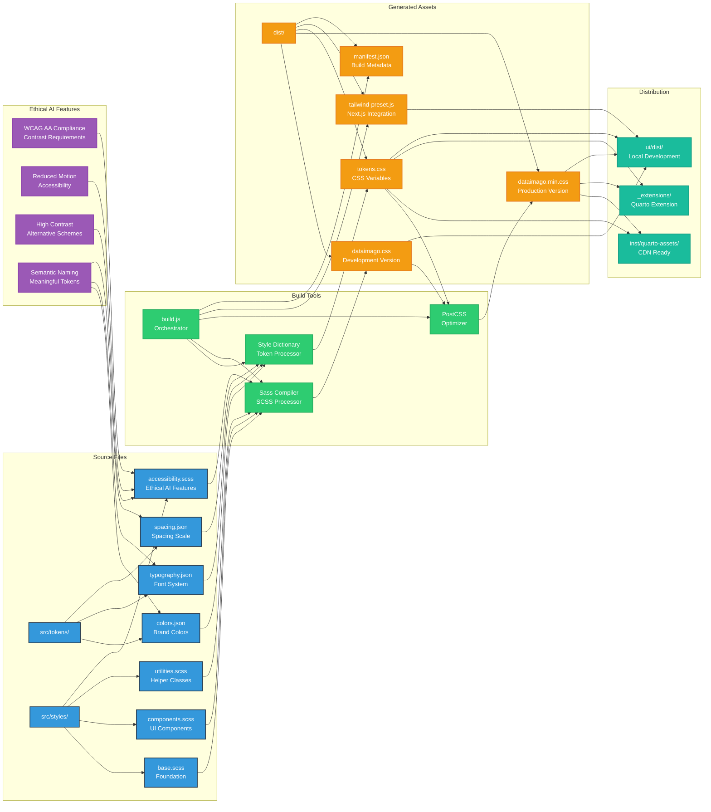

## 🌐 CDN Distribution Flow

The CDN distribution system enables external projects to access dataimago design assets:

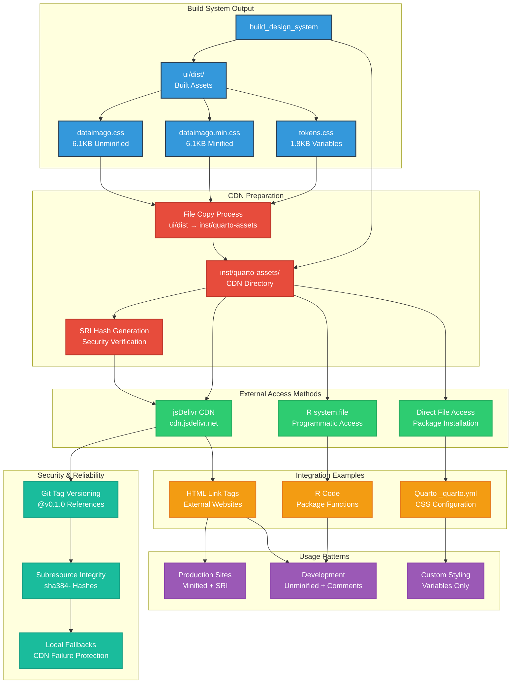

## 🤖 AI-Assisted Development & Repomix Integration

The dataimago package integrates [Repomix](https://repomix.com) to enable comprehensive AI-assisted development while preserving philosophical foundations and architectural principles.

### Repomix Architecture Integration

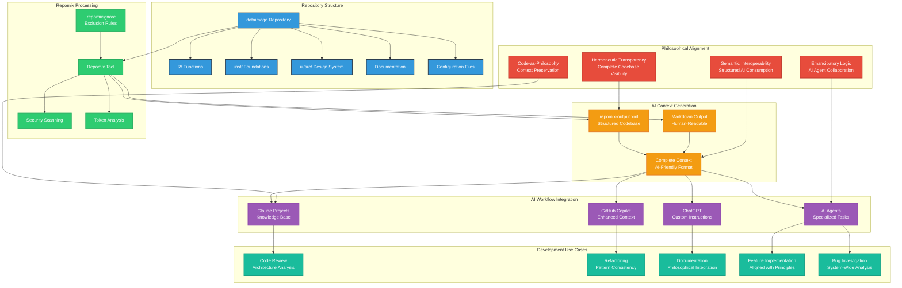

### Strategic Exclusions & Inclusions

The `.repomixignore` configuration aligns with the package's architectural principles:

#### Excluded (Regenerable Artifacts)
- **Build Outputs**: `ui/dist/`, `docs/site_libs/`, `.quarto/`
- **Dependencies**: `ui/node_modules/`
- **Version Control**: `.git/`, `.github/workflows/`
- **Large Binaries**: `*.pdf`, `*.key`, `*.pptx`

#### Preserved (Essential Context)
- **Philosophical Core**: `inst/dataimago/` - Foundation documents
- **AI Instructions**: `inst/CLAUDE.md`, `inst/AGENT_INDEX.md`
- **Source Code**: `R/` functions, `ui/src/` design system
- **Documentation**: `man/`, `README.md`, architecture guides
- **Configuration**: Build scripts, package metadata

### AI Workflow Patterns

#### 1. Architecture Review & Enhancement
```bash
npx repomix@latest --output dataimago-context.xml
```
*Usage*: "Analyze the complete architecture and suggest improvements aligned with the philosophical principles in `inst/dataimago/`"

#### 2. Feature Implementation
```bash
npx repomix@latest --include-token-count
```
*Usage*: "Based on existing patterns in `R/` and philosophy in `inst/dataimago/`, implement the planned `get_foundation_document()` function"

#### 3. Design System Extension
```bash
npx repomix@latest --include "ui/src/**,inst/dataimago/**"
```
*Usage*: "Analyze `ui/src/tokens/` and propose new CSS components aligned with ethical AI styling principles"

#### 4. Documentation Generation
```bash
npx repomix@latest --output-format markdown
```
*Usage*: "Generate comprehensive vignettes connecting technical implementation to ethical foundations"

### Integration with Existing Architecture

The Repomix integration enhances each architectural layer:

- **R Package Core**: Functions gain AI-assisted development and review
- **Foundation Layer**: Philosophical documents provide context for AI agents
- **Design System**: Complete source visibility enables intelligent suggestions
- **Documentation System**: AI can generate contextually-aware documentation
- **CI/CD Pipeline**: Automated context generation for continuous AI assistance

### Security & Best Practices

#### Token Optimization
```bash
npx repomix@latest --include-token-count
```
Monitor output size for LLM context limits while preserving essential philosophical context.

#### Security Scanning
```bash
npx repomix@latest --check-security
```
Automated detection of sensitive information before AI processing.

#### Custom Configuration
```json
{
  "output": {
    "format": "xml",
    "includeTokenCount": true
  },
  "include": [
    "**/*.R",
    "**/*.qmd", 
    "inst/dataimago/**"
  ]
}
```

### Philosophical Alignment

The Repomix integration embodies dataimago's core principles:

- **Hermeneutic Transparency**: Complete codebase visibility for AI interpretation
- **Semantic Interoperability**: Structured output optimized for LLM consumption  
- **Code-as-Philosophy**: Preserving philosophical context alongside technical implementation
- **Emancipatory Logic**: AI agents collaborating to advance human flourishing

This integration transforms the dataimago package into a comprehensive AI-collaborative development environment while maintaining its foundational commitment to ethical AI development.

## 🎯 Key Design Principles

### Ethical AI Integration
Every component of the system embeds dataimago's philosophical commitments:

- **WCAG AA Compliance**: All color combinations meet accessibility contrast requirements
- **Reduced Motion Respect**: Animations honor user motion preferences  
- **High Contrast Support**: Alternative color schemes for accessibility needs
- **Semantic Naming**: Design tokens like `ethical-highlight` embed meaning

### R-First Philosophy
The entire system maintains R as the source of truth:

- **R Functions Control Everything**: Node.js tooling wrapped in R functions
- **Intelligent Detection**: System preserves sophisticated build setups
- **Fallback Gracefully**: Creates minimal systems when sophisticated ones don't exist
- **Comprehensive Documentation**: Every R function includes philosophical context

### Multi-Channel Distribution
The same source generates assets for multiple platforms:

- **Quarto Extensions**: Complete styling and functionality packages
- **CDN Distribution**: Direct linking for external projects
- **Next.js Integration**: Tailwind presets for modern web apps
- **R Package Access**: Programmatic file access within R

### Philosophical Integration
Technical documentation embeds ethical context:

- **Hermeneutic Transparency**: Meaning and context in every function
- **Positivistic Rigor**: Technical accuracy and reproducibility
- **Ethical Reflexivity**: Tools for interrogating usage patterns
- **Iterative Design**: Each commit advances emancipatory goals

---

*These diagrams visualize how dataimago embeds AI within culture for emancipatory purposes, rather than embedding culture within AI for domination.*
````

## File: inst/dataimago/HISTORICAL_ROADMAP.md
````markdown
# Historical Asset Consolidation Roadmap

> **Status: HISTORICAL / SUPERSEDED.** This document describes an early (Aug 2025) asset-consolidation plan that targeted a `/ui/src/js/{vendor,pages,utils}/` structure. That architecture was never implemented; `ui/src/` evolved into the `dataimago-design` git submodule instead. The current roadmap lives at `ui/src/dataimago-design/wiki/analyses/development-roadmap.md`. Kept here for historical reference only -- do not use as a source of current architectural truth.

## Objective (Historical)
Bring all remaining orphaned assets under the `/ui/src/` source-of-truth architecture to complete the "AI-Native Web Application Development Workspace" vision.

---

## 🚀 **Phase 1: JavaScript Consolidation** (Priority: HIGH)

### **Assets to Migrate:**
- `jquery.sticky-kit.min.js` → `ui/src/js/vendor/`
- `landing-page-enhanced.js` → `ui/src/js/pages/`  
- `scroll.js` → `ui/src/js/utils/`

### **Implementation Steps:**

#### **1.1 Create Directory Structure**
```bash
mkdir -p ui/src/js/{vendor,pages,utils}
```

#### **1.2 Move Assets to Source**
```bash
# Third-party libraries
mv ui/www/assets/js/jquery.sticky-kit.min.js ui/src/js/vendor/

# Page-specific JS
mv ui/www/assets/js/landing-page-enhanced.js ui/src/js/pages/
mv ui/www/assets/js/scroll.js ui/src/js/utils/
```

#### **1.3 Update Build System**
Enhance `build.js` to handle subdirectories:
```javascript
// Process JS files recursively
function processJSFiles(srcDir, distDir) {
  const processDirectory = (dir, relativePath = '') => {
    const items = fs.readdirSync(dir);
    
    items.forEach(item => {
      const srcPath = path.join(dir, item);
      const stats = fs.statSync(srcPath);
      
      if (stats.isDirectory()) {
        // Recursively process subdirectories
        processDirectory(srcPath, path.join(relativePath, item));
      } else if (item.endsWith('.js')) {
        // Process JS files with directory preservation
        const distPath = path.join(distDir, 'js', relativePath, item);
        // ... processing logic
      }
    });
  };
  
  processDirectory(srcDir);
}
```

---

## 🎨 **Phase 2: CSS Page Architecture** (Priority: HIGH)

### **Assets to Migrate:**
- `api-reference-dual.css` (900+ lines)
- `documents.css` (400+ lines)  
- `enhanced-right-toc.css`
- `index.css`
- `presentations.css`
- Orphaned SCSS files

### **Implementation Steps:**

#### **2.1 Create Page-Specific Structure**
```bash
mkdir -p ui/src/styles/{pages,vendor}
```

#### **2.2 Migrate CSS to SCSS Source**
```bash
# Convert CSS to SCSS with imports
mv ui/www/assets/css/api-reference-dual.css ui/src/styles/pages/api-reference.scss
mv ui/www/assets/css/documents.css ui/src/styles/pages/documents.scss
mv ui/www/assets/css/enhanced-right-toc.css ui/src/styles/components/toc.scss
mv ui/www/assets/css/index.css ui/src/styles/pages/landing.scss
mv ui/www/assets/css/presentations.css ui/src/styles/pages/presentations.scss
mv ui/www/assets/css/lenis-integration.scss ui/src/styles/vendor/
```

#### **2.3 Enhance Each File with Token Integration**
Add design token imports to each file:
```scss
// ui/src/styles/pages/api-reference.scss
@import '../dist/tokens.css';

/* Original CSS content with token replacements */
.page-layout-full .page-columns {
  grid-template-columns: var(--layout-sidebar-width, 280px) 1fr var(--layout-toc-width, 240px);
  gap: var(--spacing-layout-gap, 2rem);
  /* ... rest of styles with token integration */
}
```

#### **2.4 Create Page-Specific Build Targets**
Update `build.js` to compile page-specific CSS:
```javascript
// Step: Compile page-specific SCSS
const pageStyles = fs.readdirSync(path.join(config.stylesDir, 'pages'))
  .filter(file => file.endsWith('.scss'));

pageStyles.forEach(file => {
  const srcPath = path.join(config.stylesDir, 'pages', file);
  const distPath = path.join(config.distDir, file.replace('.scss', '.css'));
  
  execSync(`npx sass ${srcPath}:${distPath} --style=expanded --source-map`);
});
```

---

## 🖼️ **Phase 3: Asset Management System** (Priority: MEDIUM)

### **Implementation Steps:**

#### **3.1 Create Asset Source Structure**
```bash
mkdir -p ui/src/assets/{img/{logos,icons,favicons},fonts,data}
```

#### **3.2 Move Images to Source**
```bash
# Move all images to source
mv ui/www/assets/img/* ui/src/assets/img/logos/
```

#### **3.3 Implement Image Optimization**
Add to `build.js`:
```javascript
// Step: Optimize and distribute images
const sharp = require('sharp'); // Add sharp for image optimization

function processImages() {
  const imgSource = path.join(config.srcDir, 'assets', 'img');
  const imgDist = path.join(config.distDir, 'img');
  
  // Process SVGs (copy directly)
  // Process PNGs (optimize with sharp)
  // Generate favicon variants
  // Distribute to all channels
}
```

#### **3.4 Version Control Integration**
```javascript
// Generate image manifest with hashes for cache busting
const generateImageManifest = () => {
  const manifest = {};
  // Hash each image file
  // Create versioned references
  // Output manifest.json
};
```

---

## 🧠 **Phase 4: AI-Native Components** (Priority: FUTURE)

### **Component Architecture:**
```
ui/src/components/
├── ai/
│   ├── chat-interface.scss
│   ├── model-selector.scss
│   ├── prompt-editor.scss
│   └── streaming-response.scss
├── forms/
│   ├── validation.scss
│   ├── inputs.scss
│   └── submission-states.scss
└── data-viz/
    ├── charts.scss
    ├── metrics.scss
    └── dashboards.scss
```

### **JavaScript AI Integration:**
```
ui/src/js/ai/
├── chat-client.js
├── streaming.js
├── model-management.js
└── prompt-templates.js
```

---

## 🛠️ **Enhanced Build System Requirements**

### **New Build Capabilities:**
1. **Recursive Directory Processing** - Handle nested src/ structure
2. **Page-Specific Bundles** - Generate targeted CSS/JS for different pages
3. **Image Optimization** - Sharp integration for PNG/JPG, SVG optimization
4. **Asset Hashing** - Cache-busting for production deployments
5. **Development Server** - Live reload during development
6. **Bundle Analysis** - Size reporting and optimization suggestions

### **Distribution Enhancement:**
```javascript
// Enhanced distribution with page-specific assets
const distributionManifest = {
  'core': ['tokens.css', 'dataimago.css', 'website-theme.css'],
  'pages': {
    'api-reference': ['api-reference.css', 'toc.css'],
    'documents': ['documents.css'],
    'landing': ['landing.css', 'hero-scroller.js']
  },
  'ai-components': ['chat-interface.css', 'streaming.js'],
  'images': generateImageManifest()
};
```

---

## 📅 **Implementation Timeline**

### **Week 1: JavaScript Consolidation**
- [x] ~~Directory structure~~ ✓ Already exists
- [ ] Move orphaned JS files
- [ ] Update build system for subdirectories
- [ ] Test asset distribution

### **Week 2: CSS Architecture**
- [ ] Create pages/ directory structure  
- [ ] Convert CSS to SCSS with token integration
- [ ] Update build system for page-specific CSS
- [ ] Test Quarto integration

### **Week 3: Asset Management**
- [ ] Create assets/ source structure
- [ ] Implement image optimization
- [ ] Add version control for assets
- [ ] Test multi-channel distribution

### **Future: AI-Native Components**
- [ ] Design AI component architecture
- [ ] Build chat interface components
- [ ] Create model integration utilities
- [ ] Develop prompt management system

---

## 🎯 **Success Metrics**

### **Immediate Goals (Phase 1-3):**
- ✅ **100% Source Coverage**: All assets traceable to `/ui/src/`
- ✅ **Build Consistency**: Single command generates all assets
- ✅ **Asset Optimization**: Automated image compression and versioning
- ✅ **R Integration**: All changes controllable via R functions

### **Long-term Vision (Phase 4):**
- 🚀 **Complete Development Environment**: R package contains entire web dev stack
- 🚀 **AI-Native Ready**: Components for modern AI applications built-in
- 🚀 **Community Shareable**: Other packages can extend the component library
- 🚀 **Professional Grade**: Production-ready applications from R commands

---

## 💡 **The End State**

When complete, a single R function call will create a production-ready, AI-native web application with:

```r
library(dataimago)

# Creates complete AI-native web application
create_ai_native_app("my-intelligent-app", 
  features = c("chat-interface", "document-analysis", "data-viz"),
  theme = "professional",
  ai_models = c("openai", "anthropic", "local-llama")
)

# Result: Complete application with:
# - Professional design system
# - AI chat components
# - Data visualization
# - Build pipeline
# - Development server
# - Production deployment scripts
```

This represents the full realization of "R as source of truth" for modern, AI-native web development.
````

## File: inst/quarto-assets/dataimago.sty
````
%%%
%%% dataimago.sty - LaTeX Style Package for dataimago Design System
%%%
%%% A unified LaTeX package providing consistent typography, colors, and layout
%%% for PDF documents aligned with the dataimago design system.
%%%
%%% Copyright (c) 2025 dataimago
%%% License: MIT (see LICENSE.md)
%%%
%%% Version: 0.1.0
%%% Date: 2025-10-19
%%%
%%% USAGE:
%%%   \usepackage{dataimago}
%%%
%%% REQUIREMENTS:
%%%   - XeLaTeX or LuaLaTeX (for fontspec and unicode-math)
%%%   - System fonts: Noto Sans, Noto Sans Mono, Noto Sans Math, Josefin Sans
%%%   - memoir document class (for full book/report features)
%%%   - Or article class (basic features only)
%%%
%%% FEATURES:
%%%   - dataimago typography (Noto Sans + Josefin Sans)
%%%   - dataimago color tokens (surface, content, border, brand colors)
%%%   - Custom memoir page styles and chapter/section formatting
%%%   - Theorem and definition boxes styled with dataimago tokens
%%%   - Front matter commands for title pages and abstracts
%%%
%%% For more information, see README.md
%%%

\NeedsTeXFormat{LaTeX2e}
\ProvidesPackage{dataimago}[2025/10/19 v0.1.0 dataimago Design System for LaTeX]

%%%
%%% PACKAGE IDENTIFICATION
%%%
\typeout{dataimago.sty v0.1.0 - dataimago Design System for LaTeX}
\typeout{Loading dataimago typography, colors, and layout...}

%%%
%%% REQUIRED PACKAGES
%%%

%% Font and math support (XeLaTeX/LuaLaTeX required)
\RequirePackage{fontspec}
\RequirePackage{unicode-math}

%% Color support
\RequirePackage[svgnames]{xcolor}

%% Core LaTeX packages
\RequirePackage[obeyspaces,hyphens]{url}
\RequirePackage{graphicx}
\RequirePackage{rotating,bm,amsmath,amsfonts,amssymb,indentfirst,lscape}
\RequirePackage{caption}

%% Box and list support
\RequirePackage{tcolorbox}
\tcbuselibrary{most,skins,breakable}
\RequirePackage{enumitem}

%% Memoir-specific packages (loaded only if memoir class is detected)
\@ifclassloaded{memoir}{%
  \RequirePackage{epigraph}
  \RequirePackage{tabularx}
  \typeout{dataimago: memoir class detected - loading enhanced features}
}{%
  % Article class - load alternative packages
  \RequirePackage{sectsty}
  \RequirePackage{titling}
  \typeout{dataimago: article class detected - loading basic features}
}

%%%
%%% SECTION 1: TYPOGRAPHY - FONTS
%%%
%%% dataimago font stack: Noto Sans (body/math) + Josefin Sans (headings)
%%% Using system fonts for portability across machines
%%%

%% Body Font: Noto Sans
% Token: font.family.sans = "Noto Sans, system-ui, sans-serif"
\setmainfont{Noto Sans}[
  Scale=1.0,
  Ligatures=TeX,
  Numbers=OldStyle
]

\setsansfont{Noto Sans}[
  Scale=1.0,
  Ligatures=TeX
]

%% Monospace Font: Noto Sans Mono
% Token: font.family.mono = "Noto Sans Mono, ..."
\setmonofont{Noto Sans Mono}[
  Scale=0.95,
  Ligatures=TeX
]

%% Math Font: Noto Sans Math
% Token: font.family.math = "Noto Sans Math, ..."
% OpenType MATH table support for proper equation rendering
\setmathfont{Noto Sans Math}[
  Scale=1.0,
  math-style=ISO,
  bold-style=ISO
]

%% Heading Font: Josefin Sans
% Token: font.family.display = "Josefin Sans, system-ui, sans-serif"
% Using system fonts for portability across machines
% Hierarchical weight variants for clear visual hierarchy
% Note: Font family names include the weight for non-Regular weights

% Bold (700) - Default, for Title, Chapters
\newfontfamily\HeadingFont[
  Scale=MatchLowercase,
  LetterSpace=0.5,
  BoldFont=Josefin Sans
]{Josefin Sans}
\let\HeadingFontBold\HeadingFont  % Alias for clarity

% SemiBold (600) - For Subtitle
\newfontfamily\HeadingFontSemiBold[
  Scale=MatchLowercase,
  LetterSpace=0.5,
  BoldFont=Josefin Sans
]{Josefin Sans SemiBold}

% Medium (500) - For Sections  
% Note: Josefin Sans doesn't have Medium weight, using Regular
\newfontfamily\HeadingFontMedium[
  Scale=MatchLowercase,
  LetterSpace=0.5,
  BoldFont=Josefin Sans
]{Josefin Sans}

% Regular (400) - For Subsections
\newfontfamily\HeadingFontRegular[
  Scale=MatchLowercase,
  LetterSpace=0.5,
  BoldFont=Josefin Sans
]{Josefin Sans}

% Light (300) - For Subsubsections
\newfontfamily\HeadingFontLight[
  Scale=MatchLowercase,
  LetterSpace=0.5,
  BoldFont=Josefin Sans
]{Josefin Sans Light}

% ExtraLight (200) - For future use (captions, labels)
% Note: Using Thin as ExtraLight equivalent
\newfontfamily\HeadingFontExtraLight[
  Scale=MatchLowercase,
  LetterSpace=0.5,
  BoldFont=Josefin Sans
]{Josefin Sans Thin}

%% Apply Josefin to section headings (article class only)
\@ifclassloaded{memoir}{%
  % Memoir class - skip sectsty (incompatible with memoir)
  % Section formatting handled in SECTION 3 below
}{%
  % Article class - use sectsty
  \allsectionsfont{\HeadingFont\color{ContentPrimary}}
  
  % Make document title use Josefin
  \pretitle{\begin{center}\HeadingFont\huge\color{ContentPrimary}}
  \posttitle{\par\end{center}\vskip 1em}
  \preauthor{\begin{center}\large\begin{tabular}[t]{c}}
  \postauthor{\end{tabular}\par\end{center}}
  \predate{\begin{center}\normalsize\color{ContentSecondary}}
  \postdate{\par\end{center}\vskip 1.5em}
}

%%%
%%% SECTION 2: COLORS - dataimago Design Tokens
%%%
%%% All colors defined using dataimago design token values
%%%

% Surface tokens (light theme)
% Token: color.surface.page.light = rgb(237, 237, 235) / oklch(0.937 0.007 110.1)
\definecolor{SurfacePage}{RGB}{237, 237, 235}

% Token: color.surface.code.light = rgb(225, 225, 223)
\definecolor{SurfaceCode}{RGB}{225, 225, 223}

% Token: color.surface.elevated.light = rgba(237, 237, 235, 0.9)
\definecolor{SurfaceElevated}{RGB}{237, 237, 235}

% Content tokens
% Token: color.content.primary.light = rgb(20, 20, 16)
\definecolor{ContentPrimary}{RGB}{20, 20, 16}

% Token: color.content.secondary.light = #7c7c7c
\definecolor{ContentSecondary}{HTML}{7c7c7c}

% Border tokens
% Token: color.border.code.light = rgb(220, 220, 218)
\definecolor{BorderCode}{RGB}{220, 220, 218}

% Token: color.border.moderate.light = rgba(20, 20, 16, 0.15)
\definecolor{BorderModerate}{RGB}{51, 51, 46}

% Figure box background - subtle off-white for semi-transparent figure backgrounds
\colorlet{FigureBoxBg}{white!42!SurfacePage}

% Brand tokens (theme-agnostic)
% Token: color.brand.dataimago.primary = #3498DB
\definecolor{DataimagoPrimary}{HTML}{3498DB}

% Token: color.brand.dataimago.accent = #ff69b4
\definecolor{DataimagoAccent}{HTML}{ff69b4}

% Token: color.brand.dataimago.ethical = #E74C3C
\definecolor{DataimagoEthical}{HTML}{E74C3C}

% Functional tokens
% Token: color.functional.info = #3498DB
\definecolor{InfoColor}{HTML}{3498DB}

% Token: color.functional.warning = #F39C12
\definecolor{WarningColor}{HTML}{F39C12}

% Token: color.functional.error = #E74C3C
\definecolor{ErrorColor}{HTML}{E74C3C}

% Token: color.functional.success = #27AE60
\definecolor{SuccessColor}{HTML}{27AE60}

% Special colors for theorem boxes
\definecolor{CornsilkBox}{RGB}{245, 245, 220}
\definecolor{CornsilkBoxBorder}{RGB}{210, 210, 208}

%% Apply page background color (dataimago surface token)
% Token: color.surface.page.light = rgb(237, 237, 235)
\pagecolor{SurfacePage}

%% Figure border parameters (\fbox)
% Token: border.width.subtle = 0.4pt (dataimago)
% Token: spacing.micro.xs = 0.25rem ≈ 3pt (dataimago)
\setlength{\fboxrule}{0.75pt}   % Border line thickness
\setlength{\fboxsep}{0.5pt}      % Padding between border and content

%%%
%%% SECTION 3: MEMOIR CLASS CONFIGURATION
%%%
%%% Page styles, chapter/section formatting, and book structure
%%% (Only loaded if memoir class is detected)
%%%

\@ifclassloaded{memoir}{%
  %% Memoir divisions configuration
  % Enable subsubsection numbering
  \setsecnumdepth{subsubsection}
  \maxsecnumdepth{subsubsection}
  
  % Set TOC depth (chapters and sections only)
  \settocdepth{section}
  
  %% Page styles using memoir's built-in system
  \makepagestyle{dataimago}
  \makeevenhead{dataimago}{\small\normalfont\color{ContentSecondary}\thepage}{}{\small\normalfont\color{ContentSecondary}\leftmark}
  \makeoddhead{dataimago}{\small\normalfont\color{ContentSecondary}\leftmark}{}{\small\normalfont\color{ContentSecondary}\thepage}
  \makeevenfoot{dataimago}{}{}{}
  \makeoddfoot{dataimago}{}{}{}
  \makeheadrule{dataimago}{\textwidth}{0.4pt}
  
  % Apply custom page style
  \pagestyle{dataimago}
  
  % Plain style for chapter openings
  \makepagestyle{plain}
  \makeevenfoot{plain}{}{\small\normalfont\thepage}{}
  \makeoddfoot{plain}{}{\small\normalfont\thepage}{}
  
  %% Front matter style (no headers, centered page numbers)
  \makepagestyle{frontmatter}
  \makeevenfoot{frontmatter}{}{\small\normalfont\thepage}{}
  \makeoddfoot{frontmatter}{}{\small\normalfont\thepage}{}
  
  %% Chapter and section spacing
  \setlength{\beforechapskip}{0pt}        % Space before chapter title
  \setlength{\afterchapskip}{40pt}        % Space after chapter title
  \setbeforesecskip{-3.5ex plus -1ex minus -.2ex}
  \setaftersecskip{2.3ex plus .2ex}
  \setbeforesubsecskip{-3.25ex plus -1ex minus -.2ex}
  \setaftersubsecskip{1.5ex plus .2ex}
  
  %% Increase head height to accommodate headers
  \setlength{\headheight}{18pt}
  
  %% TOC Title formatting - use body font (Noto Sans), not heading font
  \renewcommand{\printtoctitle}[1]{\normalfont\Large\bfseries\color{ContentPrimary}#1}
  
  %% Customize TOC appearance
  \renewcommand{\cftchapterfont}{\normalfont\bfseries\color{ContentPrimary}}
  \renewcommand{\cftchapterpagefont}{\normalfont\bfseries\color{ContentPrimary}}
  \renewcommand{\cftsectionfont}{\normalfont\color{ContentPrimary}}
  \renewcommand{\cftsectionpagefont}{\normalfont\color{ContentPrimary}}
  
  % Add dots to chapter TOC entries
  \renewcommand{\cftchapterleader}{\color{ContentSecondary}\cftdotfill{\cftdotsep}}
  \renewcommand{\cftsectionleader}{\color{ContentSecondary}\cftdotfill{\cftdotsep}}
  
  % Adjust TOC spacing
  \setlength{\cftbeforechapterskip}{0.8em}
  \setlength{\cftbeforesectionskip}{0.3em}
  
  %% Epigraph styling (for opening quotes)
  \setlength{\epigraphwidth}{0.6\textwidth}
  \setlength{\epigraphrule}{0pt}
  \renewcommand{\textflush}{flushright}
  \renewcommand{\epigraphsize}{\normalsize\itshape}
  
  %% Abstract styling for memoir
  \renewcommand{\abstractnamefont}{\Large\normalfont\bfseries\color{ContentPrimary}}
  \renewcommand{\abstracttextfont}{\normalfont\normalsize}
  \setlength{\absleftindent}{0pt}
  \setlength{\absrightindent}{0pt}
  
  %% Custom chapter style: dataimago-ell (modified ELL)
  \makechapterstyle{dataimago-ell}{%
    \chapterstyle{default}
    
    % Font definitions using dataimago fonts
    \renewcommand*{\chapnamefont}{\normalfont\large\HeadingFontBold\color{ContentSecondary}}
    \renewcommand*{\chapnumfont}{\normalfont\HUGE\HeadingFontBold\color{ContentPrimary}}
    \renewcommand*{\chaptitlefont}{\normalfont\huge\HeadingFontBold\color{ContentPrimary}}
    
    % Calculate indent for right-side extension
    \settowidth{\chapindent}{\chapnumfont 111}
    
    % Remove default chapter heading elements
    \renewcommand*{\printchaptername}{}
    \renewcommand*{\chapternamenum}{}
    
    % Custom chapter number printing (right-aligned)
    \renewcommand*{\printchapternum}{%
      % For numbered chapters - number right-aligned
      \begin{adjustwidth}{0pt}{-0.0\chapindent}
        \raggedleft%
        {\chapnumfont\color{ContentPrimary}\thechapter}%
        \par\vspace{0.3\onelineskip}%
      \end{adjustwidth}%
    }
    
    % For unnumbered chapters (e.g., Preface, Acknowledgments)
    \renewcommand\printchapternonum{%
      \vphantom{\chapnumfont 1}%
      \afterchapternum%
    }
    
    % Print chapter title (right-aligned above hrule)
    \renewcommand*{\printchaptertitle}[1]{%
      \begin{adjustwidth}{0pt}{-0.0\chapindent}
        % Measure the title height
        \setbox0=\vbox{%
          \raggedleft%
          {\chapnumfont\thechapter}%
          \par\vspace{0.3\onelineskip}%
          {\chaptitlefont\color{ContentPrimary}##1}%
          \par\vspace{0.5\onelineskip}%
        }%
        \raggedleft%
        {\chaptitlefont\color{ContentPrimary}##1}%
        \par\vspace{0.5\onelineskip}%
        % Horizontal rule with vertical rule extending upward at right end
        \noindent\textcolor{BorderModerate}{%
          \rule{\dimexpr\linewidth + 0.4\chapindent\relax}{0.4pt}%
          \llap{\raisebox{0.4pt}[0pt][0pt]{\rule{0.4pt}{\ht0}}}%
        }%
      \end{adjustwidth}%
      \par%
    }
    
    % Spacing after chapter title
    \renewcommand*{\afterchaptertitle}{%
      \par\vspace{1.5\onelineskip}%
    }
  }
  
  % Apply the custom chapter style
  \chapterstyle{dataimago-ell}
  
  %% Chapter mark for headers (appears in page headers)
  \renewcommand{\chaptermark}[1]{%
    \markboth{\thechapter.\ #1}{}}
  
  %% Unnumbered chapters still appear in TOC
  \setcounter{tocdepth}{1}
  
  %% Section formatting (inline numbering)
  % Numbers in ContentSecondary, text in ContentPrimary
  \setsecheadstyle{%
    \Large\HeadingFontMedium\color{ContentPrimary}%
  }
  
  \setsubsecheadstyle{%
    \large\HeadingFontRegular\color{ContentPrimary}%
  }
  
  \setsubsubsecheadstyle{%
    \normalsize\HeadingFontLight\color{ContentPrimary}%
  }
  
  %% Section numbering format
  \renewcommand{\thesection}{\thechapter.\arabic{section}}
  \renewcommand{\thesubsection}{\thesection.\arabic{subsection}}
  \renewcommand{\thesubsubsection}{\thesubsection.\arabic{subsubsection}}
  
  %% TOC formatting for sections (indentation)
  \cftsetindents{section}{1.5em}{2.5em}
  \cftsetindents{subsection}{4.0em}{3.5em}
  \cftsetindents{subsubsection}{7.5em}{4.5em}
  
  %% Section number formatting (ContentSecondary color)
  \renewcommand{\@seccntformat}[1]{%
    \normalfont\HeadingFontMedium\textcolor{ContentSecondary}{\csname the#1\endcsname}\enspace
  }
  
}{}  % End memoir-specific configuration

%%%
%%% SECTION 4: CUSTOM BOXES AND ENVIRONMENTS
%%%
%%% Theorem boxes, definition boxes, and proof environment
%%%

%% Abstract Box suppression (for Quarto integration)
% Suppress Quarto's automatic abstract rendering by redefining as no-op
\@ifpackageloaded{comment}{}{%
  \renewenvironment{abstract}{%
    \setbox\z@\vbox\bgroup
  }{%
    \egroup
  }
}

%% Theorem Box (using dataimago surface tokens)
\newtcolorbox{theorembox}[2][]{
  enhanced,
  breakable,
  colback=SurfaceCode,               % Token: color.surface.code
  colframe=BorderCode,               % Token: color.border.code
  boxrule=0.6pt,
  arc=3pt,                           % Token: radius.subtle
  left=10pt,
  right=10pt,
  top=8pt,
  bottom=8pt,
  before skip=12pt,
  after skip=12pt,
  title={#2},
  fonttitle=\HeadingFont\bfseries,
  coltitle=ContentPrimary,
  #1
}

%% Definition Box (lighter variant)
\newtcolorbox{definitionbox}[2][]{
  enhanced,
  breakable,
  colback=SurfaceElevated,           % Token: color.surface.elevated
  colframe=BorderModerate,           % Token: color.border.moderate
  boxrule=0.8pt,
  arc=4pt,
  left=10pt,
  right=10pt,
  top=8pt,
  bottom=8pt,
  before skip=12pt,
  after skip=12pt,
  title={#2},
  fonttitle=\HeadingFont\bfseries,
  coltitle=ContentPrimary,
  #1
}

%% Proof Environment (minimalist, dataimago style)
% Uses Noto Sans (body font), not Josefin Sans (heading font)
\AtBeginDocument{%
  \renewenvironment{proof}{%
    \noindent{\normalfont\bfseries\color{ContentPrimary}Proof.}\hspace{0.5em}%
  }{\hfill$\blacksquare$}%
}

%%%
%%% SECTION 5: CAPTION AND LIST FORMATTING
%%%

%% Caption Formatting
\captionsetup{
  font=small,
  labelfont=bf,
  textfont=normal,
  justification=justified,
  skip=8pt
}

%% List Styling
\setlist[enumerate]{
  font=\normalfont,
  leftmargin=*,
  itemsep=0.5em,
  parsep=0.25em
}

\setlist[itemize]{
  font=\normalfont,
  leftmargin=*,
  itemsep=0.5em,
  parsep=0.25em
}

%%%
%%% SECTION 6: CUSTOM COMMANDS
%%%

%% Software/Package names
\newcommand{\R}{{\textsf{R}\hspace{.3em}}}
\newcommand{\sgpFlow}{\textsf{{\textit{sgpFlow}\hspace{.2em}}}}

%% Section reference command
\newcommand{\sref}[1]{\hyperref[#1]{\S\ref*{#1}}}

%% Abstract name (uses Josefin Sans)
\renewcommand{\abstractname}{\normalsize\HeadingFont Abstract}

%%%
%%% SECTION 7: FRONT MATTER COMMANDS (Memoir only)
%%%

\@ifclassloaded{memoir}{%
  %% dataimago logo command
  \newcommand{\dataimagoLogo}{%
    % AI Monogram logo
    \href{https://dataimago.ai}{%
      \includegraphics[width=0.75in]{assets/logos/ai_monogram.pdf}%
    }%
  }%
  
  %% CC-BY-SA logo command
  \newcommand{\ccbyLogo}{%
    \href{https://github.com/dbetebenner/Betebenner_Braun_Paper_1/blob/main/LICENSE.md}{%
      \IfFileExists{assets/logos/cc-by-sa.png}{%
        \includegraphics[width=0.5in]{assets/logos/cc-by-sa.png}%
      }{%
          \small\color{DataimagoPrimary}CC BY-SA 4.0%
      }%
    }%
  }%
  
  %% Version command
  \newcommand{\version}[1]{\def\theversion{#1}}
  \version{v0.0.1} % Default version
  
  %% Subtitle command (Quarto integration)
  \providecommand{\subtitle}[1]{\gdef\thesubtitle{#1}}
  \gdef\thesubtitle{}
  
  %% Custom title page (right-justified, dataimago style)
  \renewcommand{\maketitle}{%
    % Set title page layout with 0.75in margins on each side
    \settypeblocksize{9.0in}{7in}{*}
    \setlrmargins{0.75in}{*}{1}        % 0.75in left, equal right
    \setulmargins{1in}{*}{*}
    \checkandfixthelayout
    
    \begin{titlingpage}
      \begin{flushright}
      \vspace*{1.5cm}
      
      % Title
      {\HeadingFontBold\color{ContentPrimary}\Huge\thetitle\par}
      \vspace{0.8em}
      
      % Subtitle
      \ifx\thesubtitle\@empty
      \else
        {\LARGE\HeadingFontSemiBold\color{ContentSecondary}\thesubtitle\par}
      \fi
      \vspace{2em}
      
      % Authors with superscript affiliations  
      {\large\normalfont%
        Damian W. Betebenner$^{1}$\\[0.3em]
        Henry I. Braun$^{2}$\par}
      \vspace{1em}
      
      % Affiliations
      {\small\color{ContentSecondary}%
        $^{1}$The National Center for the Improvement of Educational Assessment, Dover, NH, USA\\[0.3em]
        $^{2}$Lynch School of Education, Boston College, Chestnut Hill, MA, USA\par}
      
      \vspace{1.0in}
      
      % Version, date, and license
      {\normalsize\color{ContentSecondary}\theversion\par}
      \vspace{0.2em}
      {\normalsize\color{ContentSecondary}\thedate\par}
      \vspace{0.7em}
      \ccbyLogo
      
      \vfill
      
      % Bottom right: dataimago logo only
      \dataimagoLogo
      
      \end{flushright}
    \end{titlingpage}
    
    % Restore body page layout (1in margins)
    \settypeblocksize{9.0in}{6.5in}{*}
    \setlrmargins{1in}{*}{1}
    \setulmargins{1in}{*}{*}
    \checkandfixthelayout
    
    \cleardoublepage
  }
}{}  % End memoir front matter commands

%%%
%%% END OF PACKAGE
%%%

\typeout{dataimago.sty loaded successfully!}
\endinput
````

## File: inst/quarto-assets/README-latex.md
````markdown
# dataimago.sty - LaTeX Design System Package

> **Version:** 0.1.0  
> **Date:** October 19, 2025  
> **License:** MIT  
> **Location:** `dataimago-design/src/latex/` (design system submodule)

A unified LaTeX package providing consistent typography, colors, and layout for PDF documents aligned with the **dataimago design system**.

## 🎯 Design System Integration

This LaTeX package is part of the **dataimago design system** and is distributed automatically to all consumer repositories via the build system:

**Source Location:** `ui/src/dataimago-design/src/latex/` (git submodule)

**Distribution Channels:**
1. **CDN Distribution** - `inst/quarto-assets/` (jsDelivr via GitHub)
2. **Quarto Extension** - `ui/www/_extensions/dataimago/ai-native/assets/latex/`
3. **Website Assets** - `ui/www/assets/latex/` (local development)
4. **Documentation** - `docs/assets/latex/` (GitHub Pages)

**Automated Build:** Assets are distributed via `build_design_system()` in R package

**Consumer Repositories:** Available in dataimago-rpkg, sgpFlow, HelloWorld, and all future dataimago projects

---

## Table of Contents

- [Overview](#overview)
- [Requirements](#requirements)
- [Installation](#installation)
- [Usage](#usage)
- [Features](#features)
- [Package Structure](#package-structure)
- [Customization](#customization)
- [Integration with Design System](#integration-with-design-system)
- [Troubleshooting](#troubleshooting)
- [Development Guide](#development-guide)
- [Version History](#version-history)

---

## Overview

`dataimago.sty` consolidates the dataimago design system for LaTeX/PDF documents. It replaces five separate `.tex` style files with a single, portable, well-documented package.

**Key Benefits:**
- ✅ **Portable** - Uses system fonts (no absolute paths)
- ✅ **Modular** - Conditional loading based on document class
- ✅ **Consistent** - Aligned with dataimago design tokens
- ✅ **Maintainable** - Single file, comprehensive documentation
- ✅ **Flexible** - Supports both memoir and article classes

**Design System Alignment:**
- Typography: Noto Sans (body), Josefin Sans (headings), Noto Sans Math (equations)
- Colors: OKLCH-based surface, content, border, and brand tokens
- Layout: Custom memoir styles with dataimago aesthetic

---

## Requirements

### LaTeX Engine
- **XeLaTeX** or **LuaLaTeX** (required for `fontspec` and `unicode-math`)
- Not compatible with pdfLaTeX

### System Fonts
All fonts must be installed as system fonts (accessible to fontspec by name):

1. **Noto Sans** (body text)
   - Install all weights/styles
   - Available at: [Google Fonts - Noto Sans](https://fonts.google.com/noto/specimen/Noto+Sans)

2. **Noto Sans Mono** (code/monospace)
   - Available at: [Google Fonts - Noto Sans Mono](https://fonts.google.com/noto/specimen/Noto+Sans+Mono)

3. **Noto Sans Math** (mathematical equations)
   - Available at: [GitHub - Noto Math](https://github.com/notofonts/math)

4. **Josefin Sans** (headings/display)
   - Required weights: Thin (200), Light (300), Regular (400), SemiBold (600), Bold (700)
   - Available at: [Google Fonts - Josefin Sans](https://fonts.google.com/specimen/Josefin+Sans)

**Note:** On macOS, install fonts via Font Book. On Linux, install to `~/.fonts/` or system font directory.

### LaTeX Packages
The following packages are automatically loaded by `dataimago.sty`:
- `fontspec`, `unicode-math`
- `xcolor` (with svgnames)
- `graphicx`, `url`, `rotating`, `bm`, `amsmath`, `amsfonts`, `amssymb`, `indentfirst`, `lscape`
- `caption`, `tcolorbox`, `enumitem`
- **Memoir class only:** `epigraph`, `tabularx`
- **Article class only:** `sectsty`, `titling`

### Document Classes
- **memoir** (recommended) - Full feature set including custom chapter styles, page layouts, front matter
- **article** - Basic typography and color support only

---

## Installation

### Method 1: Local Directory (Recommended for Projects)

1. Copy `dataimago.sty` to your project's style directory:
   ```
   your-project/
   ├── main.tex
   └── styles/
       └── dataimago.sty
   ```

2. Load in your LaTeX preamble:
   ```latex
   \makeatletter
   \input{styles/dataimago.sty}
   \makeatother
   ```

### Method 2: TEXMF Tree (System-wide)

1. Find your local TEXMF directory:
   ```bash
   kpsewhich -var-value=TEXMFHOME
   # Usually: ~/texmf (Linux/macOS) or %USERPROFILE%\texmf (Windows)
   ```

2. Copy to the appropriate location:
   ```bash
   mkdir -p ~/texmf/tex/latex/dataimago
   cp dataimago.sty ~/texmf/tex/latex/dataimago/
   texhash ~/texmf
   ```

3. Use with standard `\usepackage`:
   ```latex
   \usepackage{dataimago}
   ```

### Method 3: Quarto Integration

In `_quarto.yml`, add to `include-in-header`:

```yaml
format:
  pdf:
    include-in-header:
      - text: |
          \makeatletter
          \input{styles/dataimago.sty}
          \makeatother
```

**Note:** `\makeatletter` is required when loading `.sty` files via `\input` (not needed with `\usepackage`).

---

## Usage

### Basic Example (Memoir Class)

```latex
\documentclass[11pt,oneside]{memoir}

% Load dataimago package
\makeatletter
\input{styles/dataimago.sty}
\makeatother

% Document metadata
\title{Your Document Title}
\subtitle{An Optional Subtitle}  % Memoir only
\author{Your Name}
\date{\today}

\begin{document}

\maketitle

\chapter{Introduction}
Your content here...

\section{A Section}
More content...

\subsection{A Subsection}
Even more content...

\end{document}
```

### Basic Example (Article Class)

```latex
\documentclass[11pt]{article}

\makeatletter
\input{styles/dataimago.sty}
\makeatother

\title{Your Document Title}
\author{Your Name}
\date{\today}

\begin{document}

\maketitle

\section{Introduction}
Your content here...

\end{document}
```

### Using Custom Boxes

```latex
% Theorem box
\begin{theorembox}{Theorem 1: Fundamental Result}
Let $f: X \to Y$ be a continuous function...
\end{theorembox}

% Definition box
\begin{definitionbox}{Definition 1: Copula}
A copula is a multivariate cumulative distribution function...
\end{definitionbox}

% Proof environment
\begin{proof}
We proceed by induction...
\end{proof}
```

---

## Features

### 1. Typography System

**Body Font Stack:**
- Primary: Noto Sans (body text, captions)
- Monospace: Noto Sans Mono (code samples)
- Math: Noto Sans Math (equations with OpenType MATH support)

**Display Font Stack:**
- Josefin Sans with hierarchical weights:
  - **Bold (700)** - Document title, chapter titles
  - **SemiBold (600)** - Subtitles
  - **Medium (500)** - Sections (falls back to Regular)
  - **Regular (400)** - Subsections
  - **Light (300)** - Subsubsections
  - **Thin (200)** - Reserved for future use (captions, labels)

**Font Commands:**
```latex
\HeadingFont           % Default (Bold)
\HeadingFontBold       % Alias for \HeadingFont
\HeadingFontSemiBold   % For subtitles
\HeadingFontMedium     % For sections
\HeadingFontRegular    % For subsections
\HeadingFontLight      % For subsubsections
\HeadingFontExtraLight % Thin weight
```

### 2. Color Tokens

All colors are defined using dataimago design system tokens:

**Surface Colors (Light Theme):**
```latex
\definecolor{SurfacePage}{RGB}{237, 237, 235}       % Page background
\definecolor{SurfaceCode}{RGB}{225, 225, 223}       % Code blocks
\definecolor{SurfaceElevated}{RGB}{237, 237, 235}   % Elevated surfaces
```

**Content Colors:**
```latex
\definecolor{ContentPrimary}{RGB}{20, 20, 16}       % Primary text
\definecolor{ContentSecondary}{HTML}{7c7c7c}        % Secondary text
```

**Border Colors:**
```latex
\definecolor{BorderCode}{RGB}{220, 220, 218}        % Code borders
\definecolor{BorderModerate}{RGB}{51, 51, 46}       % Moderate borders
```

**Brand Colors:**
```latex
\definecolor{DataimagoPrimary}{HTML}{3498DB}        % Primary brand blue
\definecolor{DataimagoAccent}{HTML}{ff69b4}         % Accent pink
\definecolor{DataimagoEthical}{HTML}{E74C3C}        % Ethical red
```

**Functional Colors:**
```latex
\definecolor{InfoColor}{HTML}{3498DB}               % Information
\definecolor{WarningColor}{HTML}{F39C12}            % Warnings
\definecolor{ErrorColor}{HTML}{E74C3C}              % Errors
\definecolor{SuccessColor}{HTML}{27AE60}            % Success states
```

### 3. Memoir-Specific Features

**Custom Page Styles:**
- `dataimago` - Main page style with headers and footers
- `plain` - Chapter opening pages (centered page numbers)
- `frontmatter` - Front matter pages (no headers)

**Custom Chapter Style:**
- `dataimago-ell` - Right-aligned chapter numbers and titles with elegant horizontal rule

**Front Matter Commands:**
```latex
\dataimagoLogo        % AI monogram logo
\ccbyLogo             % CC-BY-SA license badge
\version{v1.0.0}      % Set version number
\maketitle            % Custom right-justified title page
```

**Section Numbering:**
- Chapters: 1, 2, 3...
- Sections: 1.1, 1.2, 1.3...
- Subsections: 1.1.1, 1.1.2...
- Subsubsections: 1.1.1.1, 1.1.1.2...

### 4. Custom Environments

**Theorem Box:**
```latex
\begin{theorembox}[options]{Title}
  Content
\end{theorembox}
```

**Definition Box:**
```latex
\begin{definitionbox}[options]{Title}
  Content
\end{definitionbox}
```

**Proof Environment:**
```latex
\begin{proof}
  Proof content
\end{proof}
```

### 5. Custom Commands

```latex
\R            % Formats "R" for R language
\sgpFlow      % Formats "sgpFlow" package name
\sref{label}  % Section reference with § symbol
```

---

## Package Structure

The package is organized into seven sections:

### Section 1: Typography - Fonts (Lines 75-177)
- Font family definitions (Noto Sans, Josefin Sans)
- Weight variants and scaling
- Conditional application for memoir vs article

### Section 2: Colors - Design Tokens (Lines 179-247)
- Surface, content, border, brand, and functional colors
- Page background and figure border settings

### Section 3: Memoir Class Configuration (Lines 249-426)
- Page styles and headers/footers
- Chapter and section formatting
- TOC customization
- Custom chapter style (dataimago-ell)

### Section 4: Custom Boxes and Environments (Lines 428-490)
- Theorem and definition boxes
- Proof environment
- Abstract suppression for Quarto

### Section 5: Caption and List Formatting (Lines 492-518)
- Caption styling
- Enumerate and itemize formatting

### Section 6: Custom Commands (Lines 520-532)
- Software/package name commands
- Section reference utilities
- Abstract name customization

### Section 7: Front Matter Commands (Lines 534-625)
- Logo commands (dataimago, CC-BY-SA)
- Version command
- Custom title page (memoir only)

---

## Customization

### Changing Colors

To override default colors, redefine them after loading the package:

```latex
\makeatletter
\input{styles/dataimago.sty}
\makeatother

% Override brand primary color
\definecolor{DataimagoPrimary}{HTML}{FF5733}
```

### Adjusting Typography

To change heading font scaling or letter spacing:

```latex
% After loading dataimago.sty
\renewcommand{\HeadingFont}{%
  \fontspec[Scale=1.1, LetterSpace=1.0]{Josefin Sans}%
}
```

### Custom Page Layout (Memoir)

To adjust page margins:

```latex
\makeatletter
\input{styles/dataimago.sty}
\makeatother

% Custom margins
\settypeblocksize{8.5in}{6.0in}{*}
\setlrmargins{1.25in}{*}{1}
\checkandfixthelayout
```

### Adding New Box Styles

```latex
% After loading dataimago.sty
\newtcolorbox{examplebox}[2][]{
  enhanced,
  breakable,
  colback=SurfaceCode,
  colframe=DataimagoPrimary,
  boxrule=1pt,
  arc=4pt,
  title={#2},
  fonttitle=\HeadingFont\bfseries,
  #1
}
```

---

## Integration with Design System

`dataimago.sty` is designed to integrate with the broader **dataimago design system**, which includes:

1. **Node.js/TypeScript Design System** (`dataimago-design`)
   - Token definitions (colors, typography, spacing)
   - Sass/SCSS variables
   - CSS custom properties

2. **R Package** (`dataimago` R package)
   - HTML/Quarto themes
   - RMarkdown templates
   - Data visualization themes

3. **LaTeX Package** (`dataimago.sty`) ← *This file*
   - PDF typography and styling
   - Memoir/article class support

### Token Alignment

All colors in `dataimago.sty` are annotated with their corresponding design token names:

```latex
% Token: color.surface.page.light = rgb(237, 237, 235)
\definecolor{SurfacePage}{RGB}{237, 237, 235}
```

This ensures consistency when updating the design system. To update tokens:

1. Update the token value in the design system source
2. Find the corresponding color definition in `dataimago.sty`
3. Update the RGB/HTML value
4. Verify the token comment is accurate

### Future Integration

When `dataimago.sty` is integrated into the R package distribution:

```r
# R function to get dataimago.sty path
dataimago::get_dataimago_sty_path()

# Copy dataimago.sty to project
dataimago::copy_dataimago_sty("path/to/project/styles/")
```

---

## Troubleshooting

### Font Not Found Errors

**Error:** `Package fontspec Error: The font "Noto Sans" cannot be found`

**Solution:**
1. Verify fonts are installed:
   ```bash
   # macOS
   fc-list | grep -i "noto sans"
   fc-list | grep -i "josefin"
   
   # Or check Font Book app
   ```

2. Install missing fonts:
   - Download from Google Fonts
   - Install via Font Book (macOS) or font manager
   - Restart Terminal/IDE after installation

3. Test font availability:
   ```latex
   \documentclass{article}
   \usepackage{fontspec}
   
   \IfFontExistsTF{Noto Sans}{
     \typeout{SUCCESS: Noto Sans found}
   }{
     \typeout{ERROR: Noto Sans not found}
   }
   
   \begin{document}
   Test
   \end{document}
   ```

### Compilation Errors with \input

**Error:** `You can't use \spacefactor in vertical mode`

**Solution:** Wrap `\input` with `\makeatletter`:

```latex
% WRONG:
\input{styles/dataimago.sty}

% CORRECT:
\makeatletter
\input{styles/dataimago.sty}
\makeatother
```

Or use system-wide installation with `\usepackage{dataimago}` (no wrapper needed).

### Missing Memoir Features in Article Class

**Issue:** Custom chapter styles, title page, or front matter commands not working.

**Solution:** These features are memoir-specific. Either:
1. Switch to memoir document class
2. Use basic features only with article class

### Incompatible with pdfLaTeX

**Error:** Package fontspec requires XeLaTeX or LuaLaTeX

**Solution:** Use XeLaTeX or LuaLaTeX instead:
```bash
xelatex document.tex
# or
lualatex document.tex
```

In Quarto:
```yaml
format:
  pdf:
    pdf-engine: xelatex  # or lualatex
```

---

## Development Guide

### File Organization

When modifying `dataimago.sty`, maintain the seven-section structure:

1. **Typography** - Font definitions and variants
2. **Colors** - Design token definitions
3. **Memoir Config** - Page styles, chapters, sections (conditional)
4. **Boxes** - Custom environments
5. **Captions/Lists** - Formatting
6. **Commands** - Utility commands
7. **Front Matter** - Title page, logos (conditional)

### Adding New Features

**To add a new color:**
```latex
% In Section 2: COLORS
% Token: color.category.name.variant = value
\definecolor{NewColorName}{RGB}{r, g, b}
```

**To add a new font variant:**
```latex
% In Section 1: TYPOGRAPHY
\newfontfamily\NewFontCommand[
  Scale=MatchLowercase,
  LetterSpace=0.5,
  BoldFont=Josefin Sans
]{Josefin Sans SemiBold}
```

**To add a new box environment:**
```latex
% In Section 4: CUSTOM BOXES
\newtcolorbox{newbox}[2][]{
  enhanced,
  breakable,
  colback=SurfacePage,
  colframe=BorderModerate,
  title={#2},
  fonttitle=\HeadingFont\bfseries,
  #1
}
```

### Testing Changes

1. **Create test document:**
   ```latex
   \documentclass{memoir}
   \makeatletter
   \input{dataimago.sty}
   \makeatother
   
   \begin{document}
   % Test your changes
   \end{document}
   ```

2. **Compile with XeLaTeX:**
   ```bash
   xelatex test.tex
   ```

3. **Check for errors:**
   - Font loading issues
   - Color definitions
   - Conditional logic (memoir vs article)

4. **Visual inspection:**
   - Typography hierarchy
   - Color accuracy
   - Layout consistency

### Version Updates

When releasing a new version:

1. Update version number (lines 10, 33):
   ```latex
   %%% Version: 0.2.0
   %%% Date: 2025-MM-DD
   
   \ProvidesPackage{dataimago}[2025/MM/DD v0.2.0 dataimago Design System]
   ```

2. Update typeout message (line 38):
   ```latex
   \typeout{dataimago.sty v0.2.0 - dataimago Design System for LaTeX}
   ```

3. Document changes in this README under [Version History](#version-history)

4. Update token comments if design system tokens change

### Code Style Guidelines

- **Indentation:** 2 spaces per level
- **Line length:** Max 100 characters (comments can exceed)
- **Comments:** Use `%%%` for section headers, `%%` for subsection headers, `%` for inline
- **Token references:** Always include token name and value in comments
- **Conditional blocks:** Document which document class features apply to

---

## Version History

### v0.1.0 (2025-10-19)
- **Initial release**
- Unified package consolidating 5 separate `.tex` files:
  - `pdf-fonts-noto.tex` → Section 1 (Typography)
  - `paper-custom-boxes.tex` → Section 4 (Boxes)
  - `memoir-book-setup.tex` → Section 3 (Memoir config)
  - `memoir-chapter-styles.tex` → Section 3 (Chapter styles)
  - `memoir-section-styles.tex` → Section 3 (Section styles)
- System font support (no absolute paths)
- dataimago design token integration
- Conditional loading for memoir vs article classes
- Custom theorem/definition boxes
- Custom memoir chapter style (dataimago-ell)
- Comprehensive documentation

---

## Contributing

To contribute improvements to `dataimago.sty`:

1. **Test thoroughly** with both memoir and article classes
2. **Document changes** with inline comments and token references
3. **Update this README** with new features or breaking changes
4. **Maintain compatibility** with existing documents
5. **Follow code style guidelines** for consistency

---

## License

MIT License

Copyright (c) 2025 dataimago

Permission is hereby granted, free of charge, to any person obtaining a copy
of this software and associated documentation files (the "Software"), to deal
in the Software without restriction, including without limitation the rights
to use, copy, modify, merge, publish, distribute, sublicense, and/or sell
copies of the Software, and to permit persons to whom the Software is
furnished to do so, subject to the following conditions:

The above copyright notice and this permission notice shall be included in all
copies or substantial portions of the Software.

THE SOFTWARE IS PROVIDED "AS IS", WITHOUT WARRANTY OF ANY KIND, EXPRESS OR
IMPLIED, INCLUDING BUT NOT LIMITED TO THE WARRANTIES OF MERCHANTABILITY,
FITNESS FOR A PARTICULAR PURPOSE AND NONINFRINGEMENT. IN NO EVENT SHALL THE
AUTHORS OR COPYRIGHT HOLDERS BE LIABLE FOR ANY CLAIM, DAMAGES OR OTHER
LIABILITY, WHETHER IN AN ACTION OF CONTRACT, TORT OR OTHERWISE, ARISING FROM,
OUT OF OR IN CONNECTION WITH THE SOFTWARE OR THE USE OR OTHER DEALINGS IN THE
SOFTWARE.

---

## Contact

For questions, issues, or contributions:
- **Website:** [dataimago.ai](https://dataimago.ai)
- **GitHub:** [dataimago repositories](https://github.com/dataimago)

---

**End of README**
````

## File: inst/quarto-assets/tokens.min.css
````css

````

## File: man/add_function_docs_sections.Rd
````
% Generated by roxygen2: do not edit by hand
% Please edit documentation in R/documentation_utils.R
\name{add_function_docs_sections}
\alias{add_function_docs_sections}
\title{Add Function Documentation Sections with Exported/Non-exported Structure}
\usage{
add_function_docs_sections(rd_content)
}
\arguments{
\item{rd_content}{List of converted .Rd content}
}
\value{
Character vector with structured function documentation
}
\description{
Add Function Documentation Sections with Exported/Non-exported Structure
}
\keyword{internal}
````

## File: man/bootstrap_wiki.Rd
````
% Generated by roxygen2: do not edit by hand
% Please edit documentation in R/generate_wiki.R
\name{bootstrap_wiki}
\alias{bootstrap_wiki}
\title{Bootstrap a Wiki in a Generated Project}
\usage{
bootstrap_wiki(project_path, project_name, source_pkg = NULL, verbose = TRUE)
}
\arguments{
\item{project_path}{Character. Root directory of the generated project}

\item{project_name}{Character. Name of the project}

\item{source_pkg}{Character. Path to the source R package (NULL for minimal wiki)}

\item{verbose}{Logical. Print progress. Default: TRUE}
}
\value{
List with files created and wiki structure
}
\description{
Initializes a wiki/ directory in the generated project, seeded with
the project's domain knowledge extracted from the source R package.
Follows the same CLAUDE.md-driven wiki pattern used by dataimago-design.
}
\details{
This is part of Phase D (Recursive Loop): generated projects inherit
the knowledge-compounding capability that makes dataimago itself effective.
}
\keyword{internal}
````

## File: man/build_design_system.Rd
````
% Generated by roxygen2: do not edit by hand
% Please edit documentation in R/design_system.R
\name{build_design_system}
\alias{build_design_system}
\title{Build Complete Design System for Multi-Platform Deployment}
\usage{
build_design_system(
  force_rebuild = FALSE,
  include_sri = TRUE,
  update_extension = TRUE,
  verbose = TRUE
)
}
\arguments{
\item{force_rebuild}{Logical. Force rebuild even if assets appear up-to-date. Default: FALSE}

\item{include_sri}{Logical. Generate SRI hashes for CDN distribution. Default: TRUE}

\item{update_extension}{Logical. Update Quarto extension with compiled assets. Default: TRUE}

\item{verbose}{Logical. Print detailed progress information. Default: TRUE}
}
\value{
List containing build results:
\itemize{
\item success: Logical indicating overall build success
\item assets: Character vector of generated asset paths
\item sri_hashes: Named list of SRI hashes for each CSS file
\item build_time: POSIXct timestamp of build completion
\item metadata: List containing build configuration and system information
\item errors: Character vector of any error messages (empty if successful)
}
}
\description{
Master function that orchestrates CSS compilation and asset distribution for web applications.
This function provides R-first workflows that wrap Node.js tooling for rapid application development.
}
\details{
This function implements dataimago's framework approach to asset compilation by providing
R-first workflows that wrap modern web development tools. The build process includes:

\strong{System Requirements:}
\itemize{
\item Node.js 18+ and pnpm installed globally
\item Write permissions to package directories
\item OpenSSL for SRI hash generation (usually pre-installed on macOS/Linux)
}

\strong{Build Process:}
\enumerate{
\item \strong{Node.js Dependency Check}: Verifies pnpm is available via \verb{which pnpm}
\item \strong{Dependency Installation}: Runs \verb{pnpm install} in ui/ directory to install Style Dictionary, Sass, etc.
\item \strong{SCSS Compilation}: Executes \verb{pnpm run build} to convert design tokens and SCSS to minified CSS
\item \strong{Asset Distribution}: Copies built \code{dataimago.min.css} to multiple locations:
\itemize{
\item \verb{ui/www/_extensions/dataimago/ai-native/assets/css/} for Quarto extension distribution
\item \verb{inst/quarto-assets/} for R package CDN distribution
\item \verb{ui/www/assets/css/} for local website development
}
\item \strong{SRI Hash Generation}: Uses \verb{openssl dgst -sha384 -binary | openssl base64 -A} for subresource integrity
\item \strong{Build Manifest}: Creates JSON metadata with paths, versions, checksums, and build timestamp
}

\strong{Design Token Philosophy:}
The ui/ workspace uses Style Dictionary to convert semantic design tokens (color.json,
typography.json, spacing.json) into CSS custom properties. This ensures design consistency
across Quarto websites, R Shiny apps, and future Next.js applications while maintaining
the ethical AI principles embedded in dataimago's visual identity.

\strong{Error Handling:}
\itemize{
\item Validates Node.js/pnpm availability before attempting build
\item Checks for required ui/ directory structure
\item Provides clear error messages with suggested remediation
\item Rolls back partial builds on failure
}
}
\section{MCP Tool Integration}{

This function is designed for Model Context Protocol (MCP) integration, providing
structured output that AI agents can parse and reason about:
\itemize{
\item \strong{Deterministic Output}: Same inputs always produce same outputs
\item \strong{Machine Readable}: JSON-compatible result structure
\item \strong{Error Context}: Detailed error messages for debugging
\item \strong{Build Metadata}: Complete provenance information for reproducibility
}
}

\section{Philosophical Context}{

This function embodies dataimago's principle of "R as source of truth" while embracing
modern web development practices. Rather than forcing R developers to learn Node.js
toolchains, it wraps industry-standard CSS preprocessing in familiar R function calls
with comprehensive documentation of every system interaction.
}

\examples{
\dontrun{
# Basic build - compile all assets
result <- build_design_system()

# Check if build succeeded
if (result$success) {
  cat("Success: Built assets:", paste(result$assets, collapse = ", "), "\n")
  cat("SRI hashes:", length(result$sri_hashes), "generated\n")
} else {
  cat("ERROR: Build failed:", paste(result$errors, collapse = "; "), "\n")
}

# Force rebuild with verbose output (useful for debugging)
result <- build_design_system(force_rebuild = TRUE, verbose = TRUE)

# Build for CDN distribution only (skip local copying)
result <- build_design_system(
  include_sri = TRUE,
  update_extension = FALSE,
  verbose = FALSE
)

# Inspect build metadata
str(result$metadata)
}

}
\seealso{
\code{\link{update_quarto_extension}} for extension asset management,
\code{\link{generate_cdn_assets}} for CDN preparation,
\code{\link{create_ui_workspace}} for UI workspace initialization
}
\concept{dataimago r-first-development MCP-compatible}
\keyword{build-tools}
\keyword{css}
\keyword{design-system}
\keyword{ethical-ai}
````

## File: man/build_introspection_payload.Rd
````
% Generated by roxygen2: do not edit by hand
% Please edit documentation in R/ai.R
\name{build_introspection_payload}
\alias{build_introspection_payload}
\title{Build introspection payload from an R package for the orchestration API}
\usage{
build_introspection_payload(source_pkg, verbose = FALSE)
}
\description{
Build introspection payload from an R package for the orchestration API
}
\keyword{internal}
````

## File: man/build_quarto_template_vars.Rd
````
% Generated by roxygen2: do not edit by hand
% Please edit documentation in R/documentation_utils.R
\name{build_quarto_template_vars}
\alias{build_quarto_template_vars}
\title{Build Template Variables from DESCRIPTION}
\usage{
build_quarto_template_vars(desc_content)
}
\arguments{
\item{desc_content}{List from parse_description_file}
}
\value{
Named list of template variables
}
\description{
Build Template Variables from DESCRIPTION
}
\keyword{internal}
````

## File: man/check_quarto_asset_status.Rd
````
% Generated by roxygen2: do not edit by hand
% Please edit documentation in R/asset_sync.R
\name{check_quarto_asset_status}
\alias{check_quarto_asset_status}
\title{Check Quarto Render Asset Status}
\usage{
check_quarto_asset_status(verbose = TRUE)
}
\arguments{
\item{verbose}{Logical. Print detailed analysis. Default: TRUE}
}
\value{
List containing analysis of asset status across directories
}
\description{
Analyzes what happens to assets during \verb{quarto render} and identifies
potential issues with asset copying to the docs/ directory.
}
\details{
This function helps understand the Quarto rendering process:

\strong{CSS Files}:
\itemize{
\item Quarto copies CSS files from \verb{assets/css/} to \verb{docs/assets/css/}
\item CSS files referenced in YAML frontmatter are automatically included
}

\strong{JavaScript Files}:
\itemize{
\item JS files in \verb{assets/js/} are NOT automatically copied to \verb{docs/assets/js/}
\item JS files must be referenced in \code{include-after} or \code{include-before} YAML
\item Only files referenced in HTML \verb{<script>} tags get copied
}

\strong{Extensions}:
\itemize{
\item Extension assets are used during rendering but may not be copied to docs/
\item Extensions provide a way to package assets for reuse across projects
}
}
\examples{
\dontrun{
# Analyze asset status
status <- check_quarto_asset_status()

# Check what files are missing after render
if (length(status$missing_in_docs) > 0) {
  cat("Files not copied to docs:", paste(status$missing_in_docs, collapse = ", "))
}
}

}
\concept{dataimago quarto-rendering asset-analysis}
\keyword{analysis}
\keyword{quarto}
\keyword{render}
````

## File: man/generate_cdn_assets.Rd
````
% Generated by roxygen2: do not edit by hand
% Please edit documentation in R/design_system.R
\name{generate_cdn_assets}
\alias{generate_cdn_assets}
\title{Generate CDN Distribution Assets}
\usage{
generate_cdn_assets(verbose = TRUE)
}
\arguments{
\item{verbose}{Logical. Print detailed progress information. Default: TRUE}
}
\value{
List containing CDN preparation results:
\itemize{
\item success: Logical indicating preparation success
\item assets: Character vector of CDN-ready asset paths
\item errors: Character vector of any error messages
}
}
\description{
Prepares assets for CDN distribution with versioning, SRI hashes,
and metadata.
Creates jsDelivr-compatible structure in inst/quarto-assets/ for
R package distribution.
}
\details{
This function creates CDN-ready assets by:
\enumerate{
\item \strong{Copying Built Assets}: Moves \verb{ui/dist/*.css} to \verb{inst/quarto-assets/}
\item \strong{Generating Metadata}: Creates manifest.json with build info and SRI hashes
\item \strong{Creating Usage Examples}: Generates HTML snippets showing CDN usage
\item \strong{Validating File Integrity}: Ensures all copied files are complete and uncorrupted
}

\strong{CDN Distribution Strategy:}
Files in \verb{inst/quarto-assets/} become available via jsDelivr once the package is
tagged and released on GitHub:

\if{html}{\out{<div class="sourceCode">}}\preformatted{https://cdn.jsdelivr.net/gh/dataimago/dataimago-rpkg@v0.1.0/inst/quarto-assets/dataimago.min.css
}\if{html}{\out{</div>}}

\strong{SRI (Subresource Integrity) Hashes:}
Each CSS file gets a SHA-384 hash for security:

\if{html}{\out{<div class="sourceCode html">}}\preformatted{<link rel="stylesheet"
      href="https://cdn.jsdelivr.net/gh/.../dataimago.min.css"
      integrity="sha384-..."
      crossorigin="anonymous">
}\if{html}{\out{</div>}}

\strong{Generated Files:}
\itemize{
\item \code{inst/quarto-assets/dataimago.min.css} - Main compiled CSS
\item \code{inst/quarto-assets/tokens.css} - CSS custom properties (if built)
\item \code{inst/quarto-assets/manifest.json} - Build metadata and SRI hashes
\item \code{inst/quarto-assets/README.md} - Usage instructions and examples
}
}
````

## File: man/generate_claude_md.Rd
````
% Generated by roxygen2: do not edit by hand
% Please edit documentation in R/generate_claude_md.R
\name{generate_claude_md}
\alias{generate_claude_md}
\title{Generate Project-Specific CLAUDE.md}
\usage{
generate_claude_md(
  project_path,
  project_name,
  source_pkg = NULL,
  framework = "quarto",
  features = NULL,
  verbose = TRUE
)
}
\arguments{
\item{project_path}{Character. Root directory of the generated project}

\item{project_name}{Character. Name of the project}

\item{source_pkg}{Character. Path to the source R package (NULL if scaffolding only)}

\item{framework}{Character. Target framework: "quarto", "shiny", "nextjs", or "full"}

\item{features}{Character vector. AI features included}

\item{verbose}{Logical. Print progress. Default: TRUE}
}
\value{
List with file path and content summary
}
\description{
Creates a CLAUDE.md file for the generated project that provides
AI development context, references the dataimago knowledge wiki,
and includes domain-specific context from the source R package.
}
\details{
This is part of Phase D (Recursive Loop) of the dataimago meta-tool
architecture: generated applications inherit AI-assisted development
context from the framework that produced them.
}
\keyword{internal}
````

## File: man/generate_ethical_ci.Rd
````
% Generated by roxygen2: do not edit by hand
% Please edit documentation in R/generate_ethical_ci.R
\name{generate_ethical_ci}
\alias{generate_ethical_ci}
\title{Generate Ethical CI Pipeline for Generated Projects}
\usage{
generate_ethical_ci(project_path, framework = "nextjs", verbose = TRUE)
}
\arguments{
\item{project_path}{Character. Root directory of the generated project}

\item{framework}{Character. Target framework for framework-specific checks}

\item{verbose}{Logical. Print progress. Default: TRUE}
}
\value{
List with files created
}
\description{
Creates GitHub Actions workflows that enforce dataimago's ethical
constraints in generated applications. Ethical inheritance ensures
that contrast checking, motion dignity, bundle budgets, and
accessibility validation propagate from dataimago-design to every
generated application.
}
\details{
This is part of Phase D (Recursive Loop): the meta-tool's ethical
constraints become structural requirements in every project it produces.
}
\keyword{internal}
````

## File: man/generate_mcp_tools.Rd
````
% Generated by roxygen2: do not edit by hand
% Please edit documentation in R/generate_mcp.R
\name{generate_mcp_tools}
\alias{generate_mcp_tools}
\title{Generate MCP Tool Definitions}
\usage{
generate_mcp_tools(
  pkg_path,
  output_path,
  pkg_name = NULL,
  include_api_tools = TRUE,
  verbose = TRUE
)
}
\arguments{
\item{pkg_path}{Character. Path to the R package source directory}

\item{output_path}{Character. Path for the generated mcp-schema.json file}

\item{pkg_name}{Character. Package name. If NULL, read from DESCRIPTION.}

\item{include_api_tools}{Logical. Include API server start/stop tools. Default: TRUE}

\item{verbose}{Logical. Print progress. Default: TRUE}
}
\value{
List with: files_created, tools_generated, tool_names
}
\description{
Reads exported functions from an R package and generates MCP-compatible
tool definitions as a JSON schema file. Each exported function becomes
a tool that AI agents can discover and invoke.
}
\details{
The generated MCP schema follows the Model Context Protocol specification:
\itemize{
\item Each tool has a name, description, and inputSchema (JSON Schema)
\item Parameter types are inferred from roxygen documentation and defaults
\item Enum constraints are extracted from documented options
\item Required parameters are identified from missing defaults
}

The schema also includes:
\itemize{
\item Resource descriptions (data, documentation, API spec)
\item Capability declarations
\item Integration metadata (framework, R package, frontend)
}
}
\section{AI Agent Integration}{

Tools generated by this function enable AI agents to:
\itemize{
\item Discover what analyses are available via the discovery tool
\item Run specific analyses with validated parameters
\item Access data variable metadata
\item Start the REST API for interactive exploration
}
}
````

## File: man/generate_quarto_yml.Rd
````
% Generated by roxygen2: do not edit by hand
% Please edit documentation in R/documentation_utils.R
\name{generate_quarto_yml}
\alias{generate_quarto_yml}
\title{Generate _quarto.yml Configuration File}
\usage{
generate_quarto_yml(desc_content, template = "dataimago")
}
\arguments{
\item{desc_content}{Parsed DESCRIPTION content}

\item{template}{Template type (currently supports "dataimago")}
}
\value{
Character vector with _quarto.yml content
}
\description{
Generate _quarto.yml Configuration File
}
\keyword{internal}
````

## File: man/generate_self_mcp.Rd
````
% Generated by roxygen2: do not edit by hand
% Please edit documentation in R/generate_self_mcp.R
\name{generate_self_mcp}
\alias{generate_self_mcp}
\title{Generate dataimago Self-Description MCP Tools}
\usage{
generate_self_mcp(output_path = NULL, verbose = TRUE)
}
\arguments{
\item{output_path}{Character. Path to write the self-description MCP JSON.
Default: "dataimago-mcp-schema.json" in the package installation directory.}

\item{verbose}{Logical. Print progress. Default: TRUE}
}
\value{
List with the MCP schema and output path
}
\description{
Creates MCP tool definitions for dataimago itself, enabling AI agents
to use dataimago to scaffold, build, and inspect projects programmatically.
This closes the recursive loop: dataimago produces tools, and dataimago
itself is a tool that AI agents can invoke.
}
\details{
The self-description MCP schema exposes three tools:
\itemize{
\item \strong{dataimago_scaffold}: Create a new AI-native application from an R package
\item \strong{dataimago_build}: Build/rebuild an existing dataimago project
\item \strong{dataimago_status}: Check build, ethical compliance, and deployment status
}

These tools correspond to the main \code{ai()}, \code{build_design_system()}, and
status-checking functions in the dataimago R package.
}
\examples{
\dontrun{
# Generate MCP self-description
generate_self_mcp("./dataimago-mcp-schema.json")
}

}
````

## File: man/load_quarto_template.Rd
````
% Generated by roxygen2: do not edit by hand
% Please edit documentation in R/documentation_utils.R
\name{load_quarto_template}
\alias{load_quarto_template}
\title{Load Template from Submodule or Use Fallback}
\usage{
load_quarto_template(submodule_dir, filename, fallback = "")
}
\arguments{
\item{submodule_dir}{Character. Path to submodule templates dir.}

\item{filename}{Character. Template filename.}

\item{fallback}{Character. Fallback content if submodule unavailable.}
}
\value{
Character. Template content.
}
\description{
Load Template from Submodule or Use Fallback
}
\keyword{internal}
````

## File: man/parse_roxygen_exports.Rd
````
% Generated by roxygen2: do not edit by hand
% Please edit documentation in R/generate_api.R
\name{parse_roxygen_exports}
\alias{parse_roxygen_exports}
\title{Parse Roxygen Documentation from R Source Files}
\usage{
parse_roxygen_exports(pkg_path, verbose = FALSE)
}
\arguments{
\item{pkg_path}{Character. Path to the R package root (containing R/ directory)}

\item{verbose}{Logical. Print progress messages. Default: FALSE}
}
\value{
A named list of function metadata, keyed by function name. Each entry
contains: name, title, description, params (list of parameter metadata),
return_doc, exported (logical), examples.
}
\description{
Reads all R source files in a package directory and extracts exported
function metadata: name, title, description, parameters (with types,
descriptions, defaults), and return value documentation.
}
\details{
This function parses roxygen2 comments directly from R source files rather
than relying on pre-rendered .Rd files. This allows generation from source
packages that haven't been documented yet.

Parameter types are inferred from:
\enumerate{
\item Explicit type mentions in @param descriptions ("Character", "Numeric", etc.)
\item Default values in the function signature
\item Enum-like patterns (quoted strings in descriptions)
}
}
````

## File: man/render_quarto_template.Rd
````
% Generated by roxygen2: do not edit by hand
% Please edit documentation in R/documentation_utils.R
\name{render_quarto_template}
\alias{render_quarto_template}
\title{Render a Template with Mustache Variables}
\usage{
render_quarto_template(template_text, vars)
}
\arguments{
\item{template_text}{Character. Template content with Mustache placeholders.}

\item{vars}{Named list of variable values.}
}
\value{
Character. Rendered template.
}
\description{
Render a Template with Mustache Variables
}
\keyword{internal}
````

## File: man/scaffold_content_directories.Rd
````
% Generated by roxygen2: do not edit by hand
% Please edit documentation in R/documentation_utils.R
\name{scaffold_content_directories}
\alias{scaffold_content_directories}
\title{Scaffold Content Directories}
\usage{
scaffold_content_directories(output_path)
}
\description{
Scaffold Content Directories
}
\keyword{internal}
````

## File: man/scaffold_ethics_pages.Rd
````
% Generated by roxygen2: do not edit by hand
% Please edit documentation in R/documentation_utils.R
\name{scaffold_ethics_pages}
\alias{scaffold_ethics_pages}
\title{Scaffold Ethics Pages}
\usage{
scaffold_ethics_pages(output_path, submodule_dir, vars)
}
\description{
Scaffold Ethics Pages
}
\keyword{internal}
````

## File: man/scaffold_full_quarto_site.Rd
````
% Generated by roxygen2: do not edit by hand
% Please edit documentation in R/documentation_utils.R
\name{scaffold_full_quarto_site}
\alias{scaffold_full_quarto_site}
\title{Scaffold Full Quarto Website from Templates}
\usage{
scaffold_full_quarto_site(
  output_path,
  package_path,
  desc_content,
  include_ethics = TRUE
)
}
\arguments{
\item{output_path}{Character. Path to quarto website directory.}

\item{package_path}{Character. Path to the R package root.}

\item{desc_content}{List. Parsed DESCRIPTION content.}

\item{include_ethics}{Logical. Whether to include ethics pages.}
}
\description{
Creates the complete site structure including ethics pages, content
directories, JS assets, news, and 404 pages from dataimago-design
templates via the submodule.
}
\keyword{internal}
````

## File: man/scaffold_js_assets.Rd
````
% Generated by roxygen2: do not edit by hand
% Please edit documentation in R/documentation_utils.R
\name{scaffold_js_assets}
\alias{scaffold_js_assets}
\title{Scaffold JavaScript Assets}
\usage{
scaffold_js_assets(output_path, submodule_dir)
}
\description{
Scaffold JavaScript Assets
}
\keyword{internal}
````

## File: man/scaffold_utility_pages.Rd
````
% Generated by roxygen2: do not edit by hand
% Please edit documentation in R/documentation_utils.R
\name{scaffold_utility_pages}
\alias{scaffold_utility_pages}
\title{Scaffold Utility Pages (news, 404, documents, presentations)}
\usage{
scaffold_utility_pages(output_path, vars)
}
\description{
Scaffold Utility Pages (news, 404, documents, presentations)
}
\keyword{internal}
````

## File: man/sync_quarto_assets.Rd
````
% Generated by roxygen2: do not edit by hand
% Please edit documentation in R/asset_sync.R
\name{sync_quarto_assets}
\alias{sync_quarto_assets}
\title{Synchronize Assets Across Quarto Directories}
\usage{
sync_quarto_assets(verbose = TRUE)
}
\arguments{
\item{verbose}{Logical. Print detailed progress information. Default: TRUE}
}
\value{
List containing:
\describe{
\item{success}{Logical indicating synchronization success}
\item{synced_files}{Character vector of files that were synchronized}
\item{errors}{Character vector of any error messages}
}
}
\description{
Synchronizes assets from ui/www/assets/ to ui/www/_extensions/
using a single source of truth approach.
}
\details{
This function establishes \verb{ui/www/assets/} as the \strong{source of truth} for:
\itemize{
\item Custom CSS files (*.css)
\item SCSS source files (*.scss)
\item JavaScript files (*.js)
}

\strong{Source of Truth Hierarchy}:
\enumerate{
\item \verb{ui/src/} - Design system tokens and base styles (build system input)
\item \verb{ui/www/assets/} - Quarto-specific styling and overrides (\strong{source of truth})
\item \verb{ui/www/_extensions/} - Distribution copies (synchronized FROM assets)
\item \verb{inst/quarto-assets/} - CDN distribution (synchronized from extensions)
}

The function:
\enumerate{
\item Identifies files newer in assets/ than extensions/
\item Copies missing and updated files FROM assets TO extensions
\item \strong{Never} overwrites assets/ (preserves source of truth)
\item Reports synchronization status with added/updated distinction
}

\strong{Important}: This ensures \verb{quarto render} has consistent assets while
preserving the assets/ directory as the authoritative source.
}
\examples{
\dontrun{
# Synchronize all assets
result <- sync_quarto_assets()

# Check synchronization status
if (result$success) {
  cat("Assets synchronized successfully")
} else {
  cat("Synchronization errors:", paste(result$errors, collapse = "; "))
}

# Silent synchronization
sync_quarto_assets(verbose = FALSE)
}

}
\concept{dataimago asset-management quarto-synchronization}
\keyword{asset-sync}
````

## File: tests/testthat/test-generate-wiki.R
````r
test_that("bootstrap_wiki creates wiki directory structure", {
  tmp <- withr::local_tempdir()

  result <- bootstrap_wiki(
    project_path = tmp,
    project_name = "test-project",
    source_pkg = NULL,
    verbose = FALSE
  )

  expect_true(result$success)
  expect_true(fs::dir_exists(fs::path(tmp, "wiki")))
  expect_true(fs::dir_exists(fs::path(tmp, "wiki", "sources")))
  expect_true(fs::dir_exists(fs::path(tmp, "wiki", "patterns")))
  expect_true(fs::dir_exists(fs::path(tmp, "wiki", "decisions")))
  expect_true(fs::dir_exists(fs::path(tmp, "wiki", "analyses")))
})

test_that("bootstrap_wiki creates raw/ directories (Karpathy 3-layer)", {
  tmp <- withr::local_tempdir()

  bootstrap_wiki(
    project_path = tmp,
    project_name = "test-project",
    source_pkg = NULL,
    verbose = FALSE
  )

  expect_true(fs::dir_exists(fs::path(tmp, "raw")))
  expect_true(fs::dir_exists(fs::path(tmp, "raw", "papers")))
  expect_true(fs::dir_exists(fs::path(tmp, "raw", "conversations")))
  expect_true(fs::dir_exists(fs::path(tmp, "raw", "data")))
  expect_true(fs::dir_exists(fs::path(tmp, "raw", "references")))

  expect_true(fs::file_exists(fs::path(tmp, "raw", "papers", ".gitkeep")))
  expect_true(fs::file_exists(fs::path(tmp, "raw", "conversations", ".gitkeep")))
  expect_true(fs::file_exists(fs::path(tmp, "raw", "data", ".gitkeep")))
  expect_true(fs::file_exists(fs::path(tmp, "raw", "references", ".gitkeep")))
})

test_that("bootstrap_wiki creates required wiki pages", {
  tmp <- withr::local_tempdir()

  result <- bootstrap_wiki(
    project_path = tmp,
    project_name = "test-project",
    source_pkg = NULL,
    verbose = FALSE
  )

  expect_true(fs::file_exists(fs::path(tmp, "wiki", "index.md")))
  expect_true(fs::file_exists(fs::path(tmp, "wiki", "glossary.md")))
  expect_true(fs::file_exists(fs::path(tmp, "wiki", "log.md")))
  expect_true(fs::file_exists(fs::path(tmp, "wiki", "overview.md")))

  expect_true("wiki/index.md" %in% result$files_created)
  expect_true("wiki/glossary.md" %in% result$files_created)
  expect_true("wiki/log.md" %in% result$files_created)
  expect_true("wiki/overview.md" %in% result$files_created)
})

test_that("bootstrap_wiki wiki pages have YAML frontmatter", {
  tmp <- withr::local_tempdir()

  bootstrap_wiki(
    project_path = tmp,
    project_name = "test-project",
    source_pkg = NULL,
    verbose = FALSE
  )

  index_content <- readLines(fs::path(tmp, "wiki", "index.md"))
  expect_equal(index_content[1], "---")
  expect_true(any(grepl("^title:", index_content)))

  glossary_content <- readLines(fs::path(tmp, "wiki", "glossary.md"))
  expect_equal(glossary_content[1], "---")
})

test_that("bootstrap_wiki is idempotent on directories", {
  tmp <- withr::local_tempdir()

  bootstrap_wiki(
    project_path = tmp,
    project_name = "test-project",
    source_pkg = NULL,
    verbose = FALSE
  )
  result2 <- bootstrap_wiki(
    project_path = tmp,
    project_name = "test-project",
    source_pkg = NULL,
    verbose = FALSE
  )

  expect_true(result2$success)
})
````

## File: tests/testthat.R
````r
library(testthat)
library(dataimago)

test_check("dataimago")
````

## File: ui/www/_extensions/dataimago/ai-native/assets/css/icons/brand/ai_monogram.svg
````xml
<svg width="480" height="480" viewBox="0 0 480 480" xmlns="http://www.w3.org/2000/svg">
  <defs>
    <style>
      .data {
        font-family: 'Futura';
        font-style: italic;
        font-weight: bold;
        font-size: 400px;
      }
      .imago {
        font-family: 'Futura';
        font-style: italic;
        font-weight: bold;
        font-size: 380px;
      }
    </style>

    <!-- Define mask: letters are black = transparent in mask -->
    <mask id="aiMask">
      <!-- White = visible area -->
      <rect width="100%" height="100%" fill="white" />
      <!-- Black = transparent (cut out letters) -->
      <text x="245.5" y="355" class="imago" fill="black">i</text>
      <text x="105" y="360" class="data" fill="black">a</text>
    </mask>
  </defs>

  <!-- Apply the mask to a filled rectangle -->
  <rect class="bg" width="100%" height="100%" rx="40" ry="40" mask="url(#aiMask)"/>
</svg>
````

## File: ui/www/_extensions/dataimago/ai-native/assets/css/icons/platform/netlify_logo.svg
````xml
<svg xmlns="http://www.w3.org/2000/svg" width="128" height="128" viewBox="0 0 128 128">
    <path d="M58.942 119.902v-26.33l.733-.734h8.797l.733.733v26.331l-.733.733h-8.796zm0-84.838V8.734L59.675 8h8.797l.733.733v26.331l-.733.733h-8.796zm68.335 34.385H92.169l-.733-.733V59.92l.733-.733h35.108l.733.733v8.797zm-91.436 0H.733L0 68.716V59.92l.733-.733h35.108l.733.733v8.797zM80.46 82.605h-8.777l-.733-.733V61.326c0-3.656-1.436-6.489-5.844-6.588c-2.269-.06-4.864 0-7.638.11l-.416.425v26.589l-.733.733H47.54l-.733-.733V46.764l.733-.734h19.753c7.677 0 13.899 6.222 13.899 13.9v21.942Zm-53.107-48.79v-1.208l6.033-6.033h1.208l9.223 9.223v6.39l-.852.852h-6.39zm7.241 68.236h-1.208l-6.033-6.033v-1.209l9.223-9.222h6.39l.851.851v6.39z"/>
</svg>
````

## File: ui/www/_extensions/dataimago/ai-native/assets/css/icons/platform/quarto_logo.svg
````xml
<svg xmlns="http://www.w3.org/2000/svg" width="4.233cm" height="4.233cm" viewBox="0 0 4.233 4.233">
	<path d="M2.381.26v1.588h1.588C3.904 1.076 3.153.325 2.38.26m-.53 0C1.083.326.332 1.078.265 1.848h1.588zM.265 2.377c.066.77.818 1.521 1.588 1.587V2.377zm2.117 0v1.587c.77-.066 1.521-.818 1.588-1.587z" />
</svg>
````

## File: ui/www/_extensions/dataimago/ai-native/assets/css/icons/social/bluesky_logo.svg
````xml
<svg xmlns="http://www.w3.org/2000/svg" width="600" height="530" viewBox="0 0 600 530">
 <path d="m135.72 44.03c66.496 49.921 138.02 151.14 164.28 205.46 26.262-54.316 97.782-155.54 164.28-205.46 47.98-36.021 125.72-63.892 125.72 24.795 0 17.712-10.155 148.79-16.111 170.07-20.703 73.984-96.144 92.854-163.25 81.433 117.3 19.964 147.14 86.092 82.697 152.22-122.39 125.59-175.91-31.511-189.63-71.766-2.514-7.3797-3.6904-10.832-3.7077-7.8964-0.0174-2.9357-1.1937 0.51669-3.7077 7.8964-13.714 40.255-67.233 197.36-189.63 71.766-64.444-66.128-34.605-132.26 82.697-152.22-67.108 11.421-142.55-7.4491-163.25-81.433-5.9562-21.282-16.111-152.36-16.111-170.07 0-88.687 77.742-60.816 125.72-24.795z" fill="#83838F"/>
</svg>
````

## File: ui/www/_extensions/dataimago/ai-native/assets/css/icons/social/github_logo.svg
````xml
<svg xmlns="http://www.w3.org/2000/svg" width="512" height="512" viewBox="0 0 512 512">
	<path fill="#83838F" d="M256 32C132.3 32 32 134.9 32 261.7c0 101.5 64.2 187.5 153.2 217.9a17.6 17.6 0 0 0 3.8.4c8.3 0 11.5-6.1 11.5-11.4c0-5.5-.2-19.9-.3-39.1a102.4 102.4 0 0 1-22.6 2.7c-43.1 0-52.9-33.5-52.9-33.5c-10.2-26.5-24.9-33.6-24.9-33.6c-19.5-13.7-.1-14.1 1.4-14.1h.1c22.5 2 34.3 23.8 34.3 23.8c11.2 19.6 26.2 25.1 39.6 25.1a63 63 0 0 0 25.6-6c2-14.8 7.8-24.9 14.2-30.7c-49.7-5.8-102-25.5-102-113.5c0-25.1 8.7-45.6 23-61.6c-2.3-5.8-10-29.2 2.2-60.8a18.6 18.6 0 0 1 5-.5c8.1 0 26.4 3.1 56.6 24.1a208.2 208.2 0 0 1 112.2 0c30.2-21 48.5-24.1 56.6-24.1a18.6 18.6 0 0 1 5 .5c12.2 31.6 4.5 55 2.2 60.8c14.3 16.1 23 36.6 23 61.6c0 88.2-52.4 107.6-102.3 113.3c8 7.1 15.2 21.1 15.2 42.5c0 30.7-.3 55.5-.3 63c0 5.4 3.1 11.5 11.4 11.5a19.4 19.4 0 0 0 4-.4C415.9 449.2 480 363.1 480 261.7C480 134.9 379.7 32 256 32" />
</svg>
````

## File: ui/www/_extensions/dataimago/ai-native/assets/css/icons/README.md
````markdown
# dataimago Icon System

A token-driven icon system for the dataimago design system that provides theme-aware, accessible SVG icons with semantic meaning.

## 📁 Directory Structure

```
icons/
├── src/
│   ├── brand/              # Core dataimago brand assets
│   │   └── ai_monogram.svg
│   ├── social/             # Social media platform icons
│   │   ├── github_logo.svg
│   │   └── bluesky_logo.svg
│   ├── platform/           # Technology platform icons
│   │   ├── netlify_logo.svg
│   │   └── quarto_logo.svg
│   └── generated/          # Build outputs
│       ├── optimized/      # SVGO-processed files
│       └── sprites/        # SVG sprite sheets
└── tokens/                 # Icon-specific design tokens
    ├── sizing.json         # Icon size scale
    ├── colors.json         # Theme-aware icon colors
    ├── states.json         # Hover, active, disabled states
    ├── semantic.json       # Semantic icon mappings
    └── transitions.json    # Animation tokens
```

## 🎯 Design Philosophy

Icons in the dataimago system are treated as **"visual discourse acts"** - they communicate intent and meaning, not just decoration. Following the system's multi-modal philosophy:

- **Visual**: SVG graphics with theme-aware coloring
- **Semantic**: Meaningful names and ARIA labels
- **Accessible**: Minimum touch targets, screen reader support
- **Ethical**: Respects motion preferences, provides alternatives

## 🔨 Usage

### In Quarto Websites

The system is designed to work with Quarto's Lua filter that converts `` tags to inline SVGs:

```html
<!-- In your .qmd file -->

```

After Lua filter processing, this becomes an inline SVG that can be styled with CSS:

```html
<svg class="icon icon--brand icon--logo-header" data-icon="ai_monogram">
  <!-- SVG content -->
</svg>
```

### CSS Classes

```css
/* Size modifiers */
.icon--xs     /* 16px */
.icon--sm     /* 20px */
.icon--md     /* 24px (default) */
.icon--lg     /* 32px */
.icon--xl     /* 48px */

/* Logo-specific sizes */
.icon--logo-header  /* 48px */
.icon--logo-footer  /* 32px */

/* Type modifiers */
.icon--brand    /* Brand colors on hover */
.icon--github   /* GitHub-specific colors */
.icon--bluesky  /* Bluesky brand color */
.icon--netlify  /* Netlify brand color */
.icon--quarto   /* Quarto brand color */

/* State modifiers */
.icon--interactive  /* Ensures 44px minimum touch target */
.disabled           /* Disabled state styling */
```

### Theme-Aware Styling

Icons automatically adapt to light/dark themes:

```css
/* Light theme (default) */
.icon--github:hover path {
  fill: #000000; /* Black for light theme */
}

/* Dark theme */
[data-theme="dark"] .icon--github:hover path {
  fill: #EDEDE8; /* Light grey for dark theme */
}
```

## 🎨 Token Integration

All icon styling is driven by design tokens:

### Size Tokens
- `--icon-size-xs` through `--icon-size-xl`
- `--icon-size-logo-header`, `--icon-size-logo-footer`
- `--icon-touchTarget-minimum` (44px WCAG requirement)

### Color Tokens
- `--icon-color-default` (#83838F - neutral grey)
- `--icon-color-hover-primary` (brand primary color)
- `--icon-color-social-[platform]-hover` (platform-specific colors)

### State Tokens
- `--icon-state-default-opacity` (0.8)
- `--icon-state-hover-opacity` (1.0)
- `--icon-state-hover-scale` (1.05)
- `--icon-state-disabled-opacity` (0.4)

### Transition Tokens
- `--icon-transition-duration-fast` (150ms)
- `--icon-transition-easing-default` (ease-out)

## ♿ Accessibility Features

1. **Screen Reader Support**
   - All icons include semantic `alt` text
   - ARIA labels provide context
   - Decorative icons use `aria-hidden="true"`

2. **Keyboard Navigation**
   - Focus states with visible outlines
   - Focus ring uses `--icon-state-focus-outline-*` tokens

3. **Touch Targets**
   - Minimum 44px touch targets via `.icon--interactive`
   - Padding added to meet WCAG requirements

4. **Motion Preferences**
   ```css
   @media (prefers-reduced-motion: reduce) {
     /* Transitions disabled */
     /* Scale transforms removed */
   }
   ```

5. **High Contrast Mode**
   ```css
   @media (prefers-contrast: high) {
     /* Full opacity */
     /* Added stroke for visibility */
   }
   ```

## 🔧 Building Icons

The icon CSS is generated from tokens:

```bash
# Build icon CSS from tokens
pnpm run build:icons

# Build everything including icons
pnpm run build
```

This generates `packages/css/dist/dataimago-icons.css` with:
- CSS custom properties for all icon tokens
- Utility classes for common patterns
- Theme-aware styling
- Accessibility features

## 📦 R Package Integration

For R packages using hex logos:

1. Place your `package_hex_logo.svg` in `inst/assets/`
2. Use consistent naming across all packages
3. Reference in Quarto with:
   ```html
   
   ```

## 🚀 Future Enhancements

- [ ] SVG optimization pipeline with SVGO
- [ ] Icon sprite generation for performance
- [ ] React/Vue component generation
- [ ] Icon font generation (optional)
- [ ] Automated accessibility testing
- [ ] Multi-color icon support
- [ ] Animation presets for icon transitions

## 📚 Related Documentation

- [Main README](../../README.md)
- [Token Architecture](../../TOKEN_ARCHITECTURE.md)
- [Integration Guide](../../INTEGRATION.md)
- [Phase 1 Completion](../../PHASE4-COMPLETE.md)

---

*The icon system embodies dataimago's philosophy: icons are not mere decoration but meaningful communication that respects human dignity and accessibility.*
````

## File: ui/www/_extensions/dataimago/ai-native/assets/css/tokens.min.css
````css

````

## File: ui/www/_extensions/dataimago/ai-native/assets/img/ai_monogram.svg
````xml
<svg width="480" height="480" viewBox="0 0 480 480" xmlns="http://www.w3.org/2000/svg">
  <defs>
    <style>
      .data {
        font-family: 'Futura';
        font-style: italic;
        font-weight: bold;
        font-size: 400px;
      }
      .imago {
        font-family: 'Futura';
        font-style: italic;
        font-weight: bold;
        font-size: 380px;
      }
    </style>

    <!-- Define mask: letters are black = transparent in mask -->
    <mask id="aiMask">
      <!-- White = visible area -->
      <rect width="100%" height="100%" fill="white" />
      <!-- Black = transparent (cut out letters) -->
      <text x="245.5" y="355" class="imago" fill="black">i</text>
      <text x="105" y="360" class="data" fill="black">a</text>
    </mask>
  </defs>

  <!-- Apply the mask to a filled rectangle -->
  <rect class="bg" width="100%" height="100%" rx="40" ry="40" mask="url(#aiMask)"/>
</svg>
````

## File: ui/www/_extensions/dataimago/ai-native/assets/img/bluesky_logo.svg
````xml
<svg xmlns="http://www.w3.org/2000/svg" width="600" height="530" viewBox="0 0 600 530">
 <path d="m135.72 44.03c66.496 49.921 138.02 151.14 164.28 205.46 26.262-54.316 97.782-155.54 164.28-205.46 47.98-36.021 125.72-63.892 125.72 24.795 0 17.712-10.155 148.79-16.111 170.07-20.703 73.984-96.144 92.854-163.25 81.433 117.3 19.964 147.14 86.092 82.697 152.22-122.39 125.59-175.91-31.511-189.63-71.766-2.514-7.3797-3.6904-10.832-3.7077-7.8964-0.0174-2.9357-1.1937 0.51669-3.7077 7.8964-13.714 40.255-67.233 197.36-189.63 71.766-64.444-66.128-34.605-132.26 82.697-152.22-67.108 11.421-142.55-7.4491-163.25-81.433-5.9562-21.282-16.111-152.36-16.111-170.07 0-88.687 77.742-60.816 125.72-24.795z" fill="#83838F"/>
</svg>
````

## File: ui/www/_extensions/dataimago/ai-native/assets/img/github_logo.svg
````xml
<svg xmlns="http://www.w3.org/2000/svg" width="512" height="512" viewBox="0 0 512 512">
	<path fill="#83838F" d="M256 32C132.3 32 32 134.9 32 261.7c0 101.5 64.2 187.5 153.2 217.9a17.6 17.6 0 0 0 3.8.4c8.3 0 11.5-6.1 11.5-11.4c0-5.5-.2-19.9-.3-39.1a102.4 102.4 0 0 1-22.6 2.7c-43.1 0-52.9-33.5-52.9-33.5c-10.2-26.5-24.9-33.6-24.9-33.6c-19.5-13.7-.1-14.1 1.4-14.1h.1c22.5 2 34.3 23.8 34.3 23.8c11.2 19.6 26.2 25.1 39.6 25.1a63 63 0 0 0 25.6-6c2-14.8 7.8-24.9 14.2-30.7c-49.7-5.8-102-25.5-102-113.5c0-25.1 8.7-45.6 23-61.6c-2.3-5.8-10-29.2 2.2-60.8a18.6 18.6 0 0 1 5-.5c8.1 0 26.4 3.1 56.6 24.1a208.2 208.2 0 0 1 112.2 0c30.2-21 48.5-24.1 56.6-24.1a18.6 18.6 0 0 1 5 .5c12.2 31.6 4.5 55 2.2 60.8c14.3 16.1 23 36.6 23 61.6c0 88.2-52.4 107.6-102.3 113.3c8 7.1 15.2 21.1 15.2 42.5c0 30.7-.3 55.5-.3 63c0 5.4 3.1 11.5 11.4 11.5a19.4 19.4 0 0 0 4-.4C415.9 449.2 480 363.1 480 261.7C480 134.9 379.7 32 256 32" />
</svg>
````

## File: ui/www/_extensions/dataimago/ai-native/assets/img/netlify_logo.svg
````xml
<svg xmlns="http://www.w3.org/2000/svg" width="128" height="128" viewBox="0 0 128 128">
    <path d="M58.942 119.902v-26.33l.733-.734h8.797l.733.733v26.331l-.733.733h-8.796zm0-84.838V8.734L59.675 8h8.797l.733.733v26.331l-.733.733h-8.796zm68.335 34.385H92.169l-.733-.733V59.92l.733-.733h35.108l.733.733v8.797zm-91.436 0H.733L0 68.716V59.92l.733-.733h35.108l.733.733v8.797zM80.46 82.605h-8.777l-.733-.733V61.326c0-3.656-1.436-6.489-5.844-6.588c-2.269-.06-4.864 0-7.638.11l-.416.425v26.589l-.733.733H47.54l-.733-.733V46.764l.733-.734h19.753c7.677 0 13.899 6.222 13.899 13.9v21.942Zm-53.107-48.79v-1.208l6.033-6.033h1.208l9.223 9.223v6.39l-.852.852h-6.39zm7.241 68.236h-1.208l-6.033-6.033v-1.209l9.223-9.222h6.39l.851.851v6.39z"/>
</svg>
````

## File: ui/www/_extensions/dataimago/ai-native/assets/img/quarto_logo.svg
````xml
<svg xmlns="http://www.w3.org/2000/svg" width="4.233cm" height="4.233cm" viewBox="0 0 4.233 4.233">
	<path d="M2.381.26v1.588h1.588C3.904 1.076 3.153.325 2.38.26m-.53 0C1.083.326.332 1.078.265 1.848h1.588zM.265 2.377c.066.77.818 1.521 1.588 1.587V2.377zm2.117 0v1.587c.77-.066 1.521-.818 1.588-1.587z" />
</svg>
````

## File: ui/www/_extensions/dataimago/ai-native/assets/js/jquery.sticky-kit.min.js
````javascript
/**
 * jquery.sticky-kit.min.js - dataimago Design System
 * Built: 2025-08-30T08:53:09.832Z
 * Source: ui/src/js/jquery.sticky-kit.min.js
 */
/*
 Sticky-kit v1.1.3 | MIT | Leaf Corcoran 2015 | http://leafo.net
*/
(function(){var c,f;c=window.jQuery;f=c(window);c.fn.stick_in_parent=function(b){var A,w,J,n,B,K,p,q,L,k,E,t;null==b&&(b={});t=b.sticky_class;B=b.inner_scrolling;E=b.recalc_every;k=b.parent;q=b.offset_top;p=b.spacer;w=b.bottoming;null==q&&(q=0);null==k&&(k=void 0);null==B&&(B=!0);null==t&&(t="is_stuck");A=c(document);null==w&&(w=!0);L=function(a){var b;return window.getComputedStyle?(a=window.getComputedStyle(a[0]),b=parseFloat(a.getPropertyValue("width"))+parseFloat(a.getPropertyValue("margin-left"))+
parseFloat(a.getPropertyValue("margin-right")),"border-box"!==a.getPropertyValue("box-sizing")&&(b+=parseFloat(a.getPropertyValue("border-left-width"))+parseFloat(a.getPropertyValue("border-right-width"))+parseFloat(a.getPropertyValue("padding-left"))+parseFloat(a.getPropertyValue("padding-right"))),b):a.outerWidth(!0)};J=function(a,b,n,C,F,u,r,G){var v,H,m,D,I,d,g,x,y,z,h,l;if(!a.data("sticky_kit")){a.data("sticky_kit",!0);I=A.height();g=a.parent();null!=k&&(g=g.closest(k));if(!g.length)throw"failed to find stick parent";
v=m=!1;(h=null!=p?p&&a.closest(p):c("<div />"))&&h.css("position",a.css("position"));x=function(){var d,f,e;if(!G&&(I=A.height(),d=parseInt(g.css("border-top-width"),10),f=parseInt(g.css("padding-top"),10),b=parseInt(g.css("padding-bottom"),10),n=g.offset().top+d+f,C=g.height(),m&&(v=m=!1,null==p&&(a.insertAfter(h),h.detach()),a.css({position:"",top:"",width:"",bottom:""}).removeClass(t),e=!0),F=a.offset().top-(parseInt(a.css("margin-top"),10)||0)-q,u=a.outerHeight(!0),r=a.css("float"),h&&h.css({width:L(a),
height:u,display:a.css("display"),"vertical-align":a.css("vertical-align"),"float":r}),e))return l()};x();if(u!==C)return D=void 0,d=q,z=E,l=function(){var c,l,e,k;if(!G&&(e=!1,null!=z&&(--z,0>=z&&(z=E,x(),e=!0)),e||A.height()===I||x(),e=f.scrollTop(),null!=D&&(l=e-D),D=e,m?(w&&(k=e+u+d>C+n,v&&!k&&(v=!1,a.css({position:"fixed",bottom:"",top:d}).trigger("sticky_kit:unbottom"))),e<F&&(m=!1,d=q,null==p&&("left"!==r&&"right"!==r||a.insertAfter(h),h.detach()),c={position:"",width:"",top:""},a.css(c).removeClass(t).trigger("sticky_kit:unstick")),
B&&(c=f.height(),u+q>c&&!v&&(d-=l,d=Math.max(c-u,d),d=Math.min(q,d),m&&a.css({top:d+"px"})))):e>F&&(m=!0,c={position:"fixed",top:d},c.width="border-box"===a.css("box-sizing")?a.outerWidth()+"px":a.width()+"px",a.css(c).addClass(t),null==p&&(a.after(h),"left"!==r&&"right"!==r||h.append(a)),a.trigger("sticky_kit:stick")),m&&w&&(null==k&&(k=e+u+d>C+n),!v&&k)))return v=!0,"static"===g.css("position")&&g.css({position:"relative"}),a.css({position:"absolute",bottom:b,top:"auto"}).trigger("sticky_kit:bottom")},
y=function(){x();return l()},H=function(){G=!0;f.off("touchmove",l);f.off("scroll",l);f.off("resize",y);c(document.body).off("sticky_kit:recalc",y);a.off("sticky_kit:detach",H);a.removeData("sticky_kit");a.css({position:"",bottom:"",top:"",width:""});g.position("position","");if(m)return null==p&&("left"!==r&&"right"!==r||a.insertAfter(h),h.remove()),a.removeClass(t)},f.on("touchmove",l),f.on("scroll",l),f.on("resize",y),c(document.body).on("sticky_kit:recalc",y),a.on("sticky_kit:detach",H),setTimeout(l,
0)}};n=0;for(K=this.length;n<K;n++)b=this[n],J(c(b));return this}}).call(this);
````

## File: ui/www/_extensions/dataimago/ai-native/assets/js/landing-page-enhanced.js
````javascript
/**
 * landing-page-enhanced.js - dataimago Enhanced Landing Page Experience
 * Enhanced mobile-responsive scrollytelling with touch gestures and progress tracking
 */

class DataimagoLandingPageEnhanced {
    constructor() {
        this.currentSlide = 0;
        this.slides = [];
        this.indicators = [];
        this.isNavigating = false;
        this.touchStartY = 0;
        this.touchEndY = 0;
        this.touchThreshold = 100;
        this.progressBar = null;
        
        this.init();
    }

    init() {
        // Wait for DOM and other scripts to be ready
        if (document.readyState === 'loading') {
            document.addEventListener('DOMContentLoaded', () => this.setup());
        } else {
            // Small delay to ensure Lenis is initialized
            setTimeout(() => this.setup(), 100);
        }
    }

    setup() {
        console.log('🚀 Initializing Enhanced Landing Page Experience');
        
        // Find all slides
        this.slides = document.querySelectorAll('.dataimago-slide.lenis-slide');
        
        if (this.slides.length === 0) {
            console.warn('⚠️ No dataimago slides found for enhanced experience');
            return;
        }
        
        console.log(`📄 Found ${this.slides.length} slides for enhanced experience`);
        
        // Add IDs to slides if they don't have them
        this.ensureSlideIds();
        
        // Create enhanced slide indicators
        this.createEnhancedIndicators();
        
        // Create progress bar
        this.createProgressBar();
        
        // Setup mobile touch gestures
        this.setupTouchGestures();
        
        // Setup intersection observers for slide tracking
        this.setupSlideTracking();
        
        // Setup scroll progress tracking
        this.setupProgressTracking();
        
        // Add slide transition animations
        this.setupSlideAnimations();
        
        console.log('✅ Enhanced Landing Page Experience initialized');
    }

    ensureSlideIds() {
        this.slides.forEach((slide, index) => {
            if (!slide.id) {
                const slideNames = ['hero', 'vision-mission', 'architecture', 'features', 'visual-identity', 'technical', 'getting-started', 'philosophy', 'cta'];
                slide.id = `${slideNames[index] || 'slide'}-${index + 1}`;
            }
        });
    }

    createEnhancedIndicators() {
        // Remove existing indicators if any
        const existingNav = document.querySelector('.dataimago-enhanced-nav');
        if (existingNav) {
            existingNav.remove();
        }

        // Create enhanced navigation container
        const nav = document.createElement('nav');
        nav.className = 'dataimago-enhanced-nav';
        nav.setAttribute('aria-label', 'Slide navigation with labels');
        
        // Create indicators container
        const indicatorsContainer = document.createElement('div');
        indicatorsContainer.className = 'dataimago-enhanced-indicators';
        
        // Slide titles for better UX
        const slideTitles = [
            'Introduction',
            'Vision & Mission', 
            'Architecture',
            'Key Features',
            'Visual Identity',
            'Technical Details',
            'Getting Started',
            'Philosophy',
            'Get Involved'
        ];
        
        // Create indicators with labels
        this.slides.forEach((slide, index) => {
            const indicatorWrapper = document.createElement('div');
            indicatorWrapper.className = 'dataimago-indicator-wrapper';
            
            const indicator = document.createElement('button');
            indicator.className = `dataimago-enhanced-indicator ${index === 0 ? 'active' : ''}`;
            indicator.setAttribute('aria-label', `Go to slide ${index + 1}: ${slideTitles[index]}`);
            indicator.setAttribute('data-slide', index);
            indicator.type = 'button';
            
            const label = document.createElement('span');
            label.className = 'dataimago-indicator-label';
            label.textContent = slideTitles[index] || `Slide ${index + 1}`;
            
            // Add click handler
            indicator.addEventListener('click', (e) => {
                e.preventDefault();
                this.goToSlide(index);
            });
            
            indicatorWrapper.appendChild(indicator);
            indicatorWrapper.appendChild(label);
            indicatorsContainer.appendChild(indicatorWrapper);
            this.indicators.push(indicator);
        });
        
        nav.appendChild(indicatorsContainer);
        
        // Add skip controls for accessibility
        this.addSkipControls(nav);
        
        document.body.appendChild(nav);
    }

    addSkipControls(nav) {
        const skipControls = document.createElement('div');
        skipControls.className = 'dataimago-skip-controls';
        
        const prevBtn = document.createElement('button');
        prevBtn.className = 'dataimago-skip-btn dataimago-skip-prev';
        prevBtn.innerHTML = '↑';
        prevBtn.setAttribute('aria-label', 'Previous slide');
        prevBtn.addEventListener('click', () => this.goToPrevSlide());
        
        const nextBtn = document.createElement('button');
        nextBtn.className = 'dataimago-skip-btn dataimago-skip-next';
        nextBtn.innerHTML = '↓';
        nextBtn.setAttribute('aria-label', 'Next slide');
        nextBtn.addEventListener('click', () => this.goToNextSlide());
        
        skipControls.appendChild(prevBtn);
        skipControls.appendChild(nextBtn);
        nav.appendChild(skipControls);
    }

    createProgressBar() {
        // Create progress bar container
        const progressContainer = document.createElement('div');
        progressContainer.className = 'dataimago-progress-container';
        
        this.progressBar = document.createElement('div');
        this.progressBar.className = 'dataimago-progress-bar';
        
        const progressFill = document.createElement('div');
        progressFill.className = 'dataimago-progress-fill';
        
        this.progressBar.appendChild(progressFill);
        progressContainer.appendChild(this.progressBar);
        
        // Add progress text
        const progressText = document.createElement('div');
        progressText.className = 'dataimago-progress-text';
        progressText.textContent = '1 / 9';
        progressContainer.appendChild(progressText);
        
        document.body.appendChild(progressContainer);
    }

    setupTouchGestures() {
        // Add touch event listeners for mobile swipe navigation
        document.addEventListener('touchstart', (e) => {
            this.touchStartY = e.touches[0].clientY;
        }, { passive: true });

        document.addEventListener('touchend', (e) => {
            this.touchEndY = e.changedTouches[0].clientY;
            this.handleSwipeGesture();
        }, { passive: true });

        // Add mouse wheel support for desktop
        document.addEventListener('wheel', (e) => {
            if (this.isNavigating) return;
            
            // Debounce wheel events
            if (this.wheelTimeout) return;
            
            this.wheelTimeout = setTimeout(() => {
                this.wheelTimeout = null;
            }, 500);
            
            if (e.deltaY > 0) {
                this.goToNextSlide();
            } else {
                this.goToPrevSlide();
            }
        }, { passive: true });
    }

    handleSwipeGesture() {
        if (this.isNavigating) return;
        
        const swipeDistance = this.touchStartY - this.touchEndY;
        
        if (Math.abs(swipeDistance) > this.touchThreshold) {
            if (swipeDistance > 0) {
                // Swipe up - go to next slide
                this.goToNextSlide();
            } else {
                // Swipe down - go to previous slide
                this.goToPrevSlide();
            }
        }
    }

    setupSlideTracking() {
        // Enhanced intersection observer for slide tracking
        const slideObserver = new IntersectionObserver(
            (entries) => {
                entries.forEach(entry => {
                    if (entry.isIntersecting && entry.intersectionRatio > 0.5) {
                        const slideIndex = Array.from(this.slides).indexOf(entry.target);
                        if (slideIndex !== -1 && slideIndex !== this.currentSlide) {
                            this.currentSlide = slideIndex;
                            this.updateIndicators();
                            this.updateProgressBar();
                            this.announceSlideChange(slideIndex);
                            
                            // Trigger slide-specific animations
                            this.triggerSlideAnimations(entry.target);
                        }
                    }
                });
            },
            {
                threshold: [0.1, 0.5, 0.9],
                rootMargin: '-10% 0px'
            }
        );

        this.slides.forEach(slide => slideObserver.observe(slide));
    }

    setupProgressTracking() {
        // Track overall scroll progress
        window.addEventListener('scroll', () => {
            const scrollTop = window.pageYOffset;
            const docHeight = document.documentElement.scrollHeight - window.innerHeight;
            const scrollPercent = (scrollTop / docHeight) * 100;
            
            const progressFill = document.querySelector('.dataimago-progress-fill');
            if (progressFill) {
                progressFill.style.height = `${scrollPercent}%`;
            }
        }, { passive: true });
    }

    setupSlideAnimations() {
        // Add data attributes for animations
        this.slides.forEach((slide, index) => {
            // Add stagger animation to child elements
            const animatableElements = slide.querySelectorAll('h1, h2, h3, p, .feature-card, .architecture-layer');
            animatableElements.forEach((el, i) => {
                el.setAttribute('data-aos', 'fade-up');
                el.setAttribute('data-aos-delay', i * 100);
                el.setAttribute('data-aos-duration', '800');
            });
        });
    }

    triggerSlideAnimations(slide) {
        // Trigger animations for elements in the current slide
        const animatedElements = slide.querySelectorAll('[data-aos]');
        animatedElements.forEach((el, index) => {
            setTimeout(() => {
                el.style.opacity = '1';
                el.style.transform = 'translateY(0)';
            }, index * 100);
        });
    }

    goToSlide(index) {
        if (index < 0 || index >= this.slides.length || this.isNavigating) {
            return;
        }
        
        this.isNavigating = true;
        this.currentSlide = index;
        
        // Update UI immediately
        this.updateIndicators();
        this.updateProgressBar();
        
        // Use Lenis for smooth scrolling if available
        if (window.lenisIntegration?.lenis) {
            window.lenisIntegration.lenis.scrollTo(this.slides[index], {
                duration: 1.5,
                easing: (t) => 1 - Math.pow(1 - t, 3),
                onComplete: () => {
                    this.isNavigating = false;
                    this.announceSlideChange(index);
                }
            });
        } else {
            // Fallback to native smooth scroll
            this.slides[index].scrollIntoView({ 
                behavior: 'smooth',
                block: 'start'
            });
            
            setTimeout(() => {
                this.isNavigating = false;
                this.announceSlideChange(index);
            }, 1000);
        }
    }

    goToNextSlide() {
        const nextIndex = Math.min(this.currentSlide + 1, this.slides.length - 1);
        if (nextIndex !== this.currentSlide) {
            this.goToSlide(nextIndex);
        }
    }

    goToPrevSlide() {
        const prevIndex = Math.max(this.currentSlide - 1, 0);
        if (prevIndex !== this.currentSlide) {
            this.goToSlide(prevIndex);
        }
    }

    updateIndicators() {
        this.indicators.forEach((indicator, index) => {
            const isActive = index === this.currentSlide;
            indicator.classList.toggle('active', isActive);
            indicator.setAttribute('aria-pressed', isActive);
            
            // Update indicator wrapper for visual feedback
            const wrapper = indicator.parentElement;
            wrapper.classList.toggle('active', isActive);
        });
    }

    updateProgressBar() {
        const progressText = document.querySelector('.dataimago-progress-text');
        if (progressText) {
            progressText.textContent = `${this.currentSlide + 1} / ${this.slides.length}`;
        }
    }

    announceSlideChange(slideIndex) {
        // Create or update live region for screen reader announcements
        let liveRegion = document.getElementById('dataimago-slide-announcer');
        if (!liveRegion) {
            liveRegion = document.createElement('div');
            liveRegion.id = 'dataimago-slide-announcer';
            liveRegion.setAttribute('aria-live', 'polite');
            liveRegion.setAttribute('aria-atomic', 'true');
            liveRegion.style.position = 'absolute';
            liveRegion.style.left = '-10000px';
            liveRegion.style.width = '1px';
            liveRegion.style.height = '1px';
            liveRegion.style.overflow = 'hidden';
            document.body.appendChild(liveRegion);
        }
        
        const slide = this.slides[slideIndex];
        const slideTitle = slide.querySelector('h1, h2, h3')?.textContent || 
                          slide.id.replace('-slide', '').replace('-', ' ') ||
                          `Slide ${slideIndex + 1}`;
        
        liveRegion.textContent = `Now viewing: ${slideTitle}. Slide ${slideIndex + 1} of ${this.slides.length}`;
    }

    // Public API methods
    getCurrentSlide() {
        return this.currentSlide;
    }

    getTotalSlides() {
        return this.slides.length;
    }

    // Destroy method for cleanup
    destroy() {
        // Remove enhanced navigation
        const nav = document.querySelector('.dataimago-enhanced-nav');
        if (nav) nav.remove();
        
        // Remove progress bar
        const progress = document.querySelector('.dataimago-progress-container');
        if (progress) progress.remove();
        
        // Remove live region
        const liveRegion = document.getElementById('dataimago-slide-announcer');
        if (liveRegion) liveRegion.remove();
        
        console.log('🚀 Enhanced Landing Page Experience destroyed');
    }
}

// Initialize when script loads
const dataimagoLandingEnhanced = new DataimagoLandingPageEnhanced();

// Expose to global scope for debugging
window.dataimagoLandingEnhanced = dataimagoLandingEnhanced;

console.log('📜 Enhanced Landing Page Experience Script Loaded');
````

## File: ui/www/_extensions/dataimago/ai-native/assets/latex/dataimago.sty
````
%%%
%%% dataimago.sty - LaTeX Style Package for dataimago Design System
%%%
%%% A unified LaTeX package providing consistent typography, colors, and layout
%%% for PDF documents aligned with the dataimago design system.
%%%
%%% Copyright (c) 2025 dataimago
%%% License: MIT (see LICENSE.md)
%%%
%%% Version: 0.1.0
%%% Date: 2025-10-19
%%%
%%% USAGE:
%%%   \usepackage{dataimago}
%%%
%%% REQUIREMENTS:
%%%   - XeLaTeX or LuaLaTeX (for fontspec and unicode-math)
%%%   - System fonts: Noto Sans, Noto Sans Mono, Noto Sans Math, Josefin Sans
%%%   - memoir document class (for full book/report features)
%%%   - Or article class (basic features only)
%%%
%%% FEATURES:
%%%   - dataimago typography (Noto Sans + Josefin Sans)
%%%   - dataimago color tokens (surface, content, border, brand colors)
%%%   - Custom memoir page styles and chapter/section formatting
%%%   - Theorem and definition boxes styled with dataimago tokens
%%%   - Front matter commands for title pages and abstracts
%%%
%%% For more information, see README.md
%%%

\NeedsTeXFormat{LaTeX2e}
\ProvidesPackage{dataimago}[2025/10/19 v0.1.0 dataimago Design System for LaTeX]

%%%
%%% PACKAGE IDENTIFICATION
%%%
\typeout{dataimago.sty v0.1.0 - dataimago Design System for LaTeX}
\typeout{Loading dataimago typography, colors, and layout...}

%%%
%%% REQUIRED PACKAGES
%%%

%% Font and math support (XeLaTeX/LuaLaTeX required)
\RequirePackage{fontspec}
\RequirePackage{unicode-math}

%% Color support
\RequirePackage[svgnames]{xcolor}

%% Core LaTeX packages
\RequirePackage[obeyspaces,hyphens]{url}
\RequirePackage{graphicx}
\RequirePackage{rotating,bm,amsmath,amsfonts,amssymb,indentfirst,lscape}
\RequirePackage{caption}

%% Box and list support
\RequirePackage{tcolorbox}
\tcbuselibrary{most,skins,breakable}
\RequirePackage{enumitem}

%% Memoir-specific packages (loaded only if memoir class is detected)
\@ifclassloaded{memoir}{%
  \RequirePackage{epigraph}
  \RequirePackage{tabularx}
  \typeout{dataimago: memoir class detected - loading enhanced features}
}{%
  % Article class - load alternative packages
  \RequirePackage{sectsty}
  \RequirePackage{titling}
  \typeout{dataimago: article class detected - loading basic features}
}

%%%
%%% SECTION 1: TYPOGRAPHY - FONTS
%%%
%%% dataimago font stack: Noto Sans (body/math) + Josefin Sans (headings)
%%% Using system fonts for portability across machines
%%%

%% Body Font: Noto Sans
% Token: font.family.sans = "Noto Sans, system-ui, sans-serif"
\setmainfont{Noto Sans}[
  Scale=1.0,
  Ligatures=TeX,
  Numbers=OldStyle
]

\setsansfont{Noto Sans}[
  Scale=1.0,
  Ligatures=TeX
]

%% Monospace Font: Noto Sans Mono
% Token: font.family.mono = "Noto Sans Mono, ..."
\setmonofont{Noto Sans Mono}[
  Scale=0.95,
  Ligatures=TeX
]

%% Math Font: Noto Sans Math
% Token: font.family.math = "Noto Sans Math, ..."
% OpenType MATH table support for proper equation rendering
\setmathfont{Noto Sans Math}[
  Scale=1.0,
  math-style=ISO,
  bold-style=ISO
]

%% Heading Font: Josefin Sans
% Token: font.family.display = "Josefin Sans, system-ui, sans-serif"
% Using system fonts for portability across machines
% Hierarchical weight variants for clear visual hierarchy
% Note: Font family names include the weight for non-Regular weights

% Bold (700) - Default, for Title, Chapters
\newfontfamily\HeadingFont[
  Scale=MatchLowercase,
  LetterSpace=0.5,
  BoldFont=Josefin Sans
]{Josefin Sans}
\let\HeadingFontBold\HeadingFont  % Alias for clarity

% SemiBold (600) - For Subtitle
\newfontfamily\HeadingFontSemiBold[
  Scale=MatchLowercase,
  LetterSpace=0.5,
  BoldFont=Josefin Sans
]{Josefin Sans SemiBold}

% Medium (500) - For Sections  
% Note: Josefin Sans doesn't have Medium weight, using Regular
\newfontfamily\HeadingFontMedium[
  Scale=MatchLowercase,
  LetterSpace=0.5,
  BoldFont=Josefin Sans
]{Josefin Sans}

% Regular (400) - For Subsections
\newfontfamily\HeadingFontRegular[
  Scale=MatchLowercase,
  LetterSpace=0.5,
  BoldFont=Josefin Sans
]{Josefin Sans}

% Light (300) - For Subsubsections
\newfontfamily\HeadingFontLight[
  Scale=MatchLowercase,
  LetterSpace=0.5,
  BoldFont=Josefin Sans
]{Josefin Sans Light}

% ExtraLight (200) - For future use (captions, labels)
% Note: Using Thin as ExtraLight equivalent
\newfontfamily\HeadingFontExtraLight[
  Scale=MatchLowercase,
  LetterSpace=0.5,
  BoldFont=Josefin Sans
]{Josefin Sans Thin}

%% Apply Josefin to section headings (article class only)
\@ifclassloaded{memoir}{%
  % Memoir class - skip sectsty (incompatible with memoir)
  % Section formatting handled in SECTION 3 below
}{%
  % Article class - use sectsty
  \allsectionsfont{\HeadingFont\color{ContentPrimary}}
  
  % Make document title use Josefin
  \pretitle{\begin{center}\HeadingFont\huge\color{ContentPrimary}}
  \posttitle{\par\end{center}\vskip 1em}
  \preauthor{\begin{center}\large\begin{tabular}[t]{c}}
  \postauthor{\end{tabular}\par\end{center}}
  \predate{\begin{center}\normalsize\color{ContentSecondary}}
  \postdate{\par\end{center}\vskip 1.5em}
}

%%%
%%% SECTION 2: COLORS - dataimago Design Tokens
%%%
%%% All colors defined using dataimago design token values
%%%

% Surface tokens (light theme)
% Token: color.surface.page.light = rgb(237, 237, 235) / oklch(0.937 0.007 110.1)
\definecolor{SurfacePage}{RGB}{237, 237, 235}

% Token: color.surface.code.light = rgb(225, 225, 223)
\definecolor{SurfaceCode}{RGB}{225, 225, 223}

% Token: color.surface.elevated.light = rgba(237, 237, 235, 0.9)
\definecolor{SurfaceElevated}{RGB}{237, 237, 235}

% Content tokens
% Token: color.content.primary.light = rgb(20, 20, 16)
\definecolor{ContentPrimary}{RGB}{20, 20, 16}

% Token: color.content.secondary.light = #7c7c7c
\definecolor{ContentSecondary}{HTML}{7c7c7c}

% Border tokens
% Token: color.border.code.light = rgb(220, 220, 218)
\definecolor{BorderCode}{RGB}{220, 220, 218}

% Token: color.border.moderate.light = rgba(20, 20, 16, 0.15)
\definecolor{BorderModerate}{RGB}{51, 51, 46}

% Figure box background - subtle off-white for semi-transparent figure backgrounds
\colorlet{FigureBoxBg}{white!42!SurfacePage}

% Brand tokens (theme-agnostic)
% Token: color.brand.dataimago.primary = #3498DB
\definecolor{DataimagoPrimary}{HTML}{3498DB}

% Token: color.brand.dataimago.accent = #ff69b4
\definecolor{DataimagoAccent}{HTML}{ff69b4}

% Token: color.brand.dataimago.ethical = #E74C3C
\definecolor{DataimagoEthical}{HTML}{E74C3C}

% Functional tokens
% Token: color.functional.info = #3498DB
\definecolor{InfoColor}{HTML}{3498DB}

% Token: color.functional.warning = #F39C12
\definecolor{WarningColor}{HTML}{F39C12}

% Token: color.functional.error = #E74C3C
\definecolor{ErrorColor}{HTML}{E74C3C}

% Token: color.functional.success = #27AE60
\definecolor{SuccessColor}{HTML}{27AE60}

% Special colors for theorem boxes
\definecolor{CornsilkBox}{RGB}{245, 245, 220}
\definecolor{CornsilkBoxBorder}{RGB}{210, 210, 208}

%% Apply page background color (dataimago surface token)
% Token: color.surface.page.light = rgb(237, 237, 235)
\pagecolor{SurfacePage}

%% Figure border parameters (\fbox)
% Token: border.width.subtle = 0.4pt (dataimago)
% Token: spacing.micro.xs = 0.25rem ≈ 3pt (dataimago)
\setlength{\fboxrule}{0.75pt}   % Border line thickness
\setlength{\fboxsep}{0.5pt}      % Padding between border and content

%%%
%%% SECTION 3: MEMOIR CLASS CONFIGURATION
%%%
%%% Page styles, chapter/section formatting, and book structure
%%% (Only loaded if memoir class is detected)
%%%

\@ifclassloaded{memoir}{%
  %% Memoir divisions configuration
  % Enable subsubsection numbering
  \setsecnumdepth{subsubsection}
  \maxsecnumdepth{subsubsection}
  
  % Set TOC depth (chapters and sections only)
  \settocdepth{section}
  
  %% Page styles using memoir's built-in system
  \makepagestyle{dataimago}
  \makeevenhead{dataimago}{\small\normalfont\color{ContentSecondary}\thepage}{}{\small\normalfont\color{ContentSecondary}\leftmark}
  \makeoddhead{dataimago}{\small\normalfont\color{ContentSecondary}\leftmark}{}{\small\normalfont\color{ContentSecondary}\thepage}
  \makeevenfoot{dataimago}{}{}{}
  \makeoddfoot{dataimago}{}{}{}
  \makeheadrule{dataimago}{\textwidth}{0.4pt}
  
  % Apply custom page style
  \pagestyle{dataimago}
  
  % Plain style for chapter openings
  \makepagestyle{plain}
  \makeevenfoot{plain}{}{\small\normalfont\thepage}{}
  \makeoddfoot{plain}{}{\small\normalfont\thepage}{}
  
  %% Front matter style (no headers, centered page numbers)
  \makepagestyle{frontmatter}
  \makeevenfoot{frontmatter}{}{\small\normalfont\thepage}{}
  \makeoddfoot{frontmatter}{}{\small\normalfont\thepage}{}
  
  %% Chapter and section spacing
  \setlength{\beforechapskip}{0pt}        % Space before chapter title
  \setlength{\afterchapskip}{40pt}        % Space after chapter title
  \setbeforesecskip{-3.5ex plus -1ex minus -.2ex}
  \setaftersecskip{2.3ex plus .2ex}
  \setbeforesubsecskip{-3.25ex plus -1ex minus -.2ex}
  \setaftersubsecskip{1.5ex plus .2ex}
  
  %% Increase head height to accommodate headers
  \setlength{\headheight}{18pt}
  
  %% TOC Title formatting - use body font (Noto Sans), not heading font
  \renewcommand{\printtoctitle}[1]{\normalfont\Large\bfseries\color{ContentPrimary}#1}
  
  %% Customize TOC appearance
  \renewcommand{\cftchapterfont}{\normalfont\bfseries\color{ContentPrimary}}
  \renewcommand{\cftchapterpagefont}{\normalfont\bfseries\color{ContentPrimary}}
  \renewcommand{\cftsectionfont}{\normalfont\color{ContentPrimary}}
  \renewcommand{\cftsectionpagefont}{\normalfont\color{ContentPrimary}}
  
  % Add dots to chapter TOC entries
  \renewcommand{\cftchapterleader}{\color{ContentSecondary}\cftdotfill{\cftdotsep}}
  \renewcommand{\cftsectionleader}{\color{ContentSecondary}\cftdotfill{\cftdotsep}}
  
  % Adjust TOC spacing
  \setlength{\cftbeforechapterskip}{0.8em}
  \setlength{\cftbeforesectionskip}{0.3em}
  
  %% Epigraph styling (for opening quotes)
  \setlength{\epigraphwidth}{0.6\textwidth}
  \setlength{\epigraphrule}{0pt}
  \renewcommand{\textflush}{flushright}
  \renewcommand{\epigraphsize}{\normalsize\itshape}
  
  %% Abstract styling for memoir
  \renewcommand{\abstractnamefont}{\Large\normalfont\bfseries\color{ContentPrimary}}
  \renewcommand{\abstracttextfont}{\normalfont\normalsize}
  \setlength{\absleftindent}{0pt}
  \setlength{\absrightindent}{0pt}
  
  %% Custom chapter style: dataimago-ell (modified ELL)
  \makechapterstyle{dataimago-ell}{%
    \chapterstyle{default}
    
    % Font definitions using dataimago fonts
    \renewcommand*{\chapnamefont}{\normalfont\large\HeadingFontBold\color{ContentSecondary}}
    \renewcommand*{\chapnumfont}{\normalfont\HUGE\HeadingFontBold\color{ContentPrimary}}
    \renewcommand*{\chaptitlefont}{\normalfont\huge\HeadingFontBold\color{ContentPrimary}}
    
    % Calculate indent for right-side extension
    \settowidth{\chapindent}{\chapnumfont 111}
    
    % Remove default chapter heading elements
    \renewcommand*{\printchaptername}{}
    \renewcommand*{\chapternamenum}{}
    
    % Custom chapter number printing (right-aligned)
    \renewcommand*{\printchapternum}{%
      % For numbered chapters - number right-aligned
      \begin{adjustwidth}{0pt}{-0.0\chapindent}
        \raggedleft%
        {\chapnumfont\color{ContentPrimary}\thechapter}%
        \par\vspace{0.3\onelineskip}%
      \end{adjustwidth}%
    }
    
    % For unnumbered chapters (e.g., Preface, Acknowledgments)
    \renewcommand\printchapternonum{%
      \vphantom{\chapnumfont 1}%
      \afterchapternum%
    }
    
    % Print chapter title (right-aligned above hrule)
    \renewcommand*{\printchaptertitle}[1]{%
      \begin{adjustwidth}{0pt}{-0.0\chapindent}
        % Measure the title height
        \setbox0=\vbox{%
          \raggedleft%
          {\chapnumfont\thechapter}%
          \par\vspace{0.3\onelineskip}%
          {\chaptitlefont\color{ContentPrimary}##1}%
          \par\vspace{0.5\onelineskip}%
        }%
        \raggedleft%
        {\chaptitlefont\color{ContentPrimary}##1}%
        \par\vspace{0.5\onelineskip}%
        % Horizontal rule with vertical rule extending upward at right end
        \noindent\textcolor{BorderModerate}{%
          \rule{\dimexpr\linewidth + 0.4\chapindent\relax}{0.4pt}%
          \llap{\raisebox{0.4pt}[0pt][0pt]{\rule{0.4pt}{\ht0}}}%
        }%
      \end{adjustwidth}%
      \par%
    }
    
    % Spacing after chapter title
    \renewcommand*{\afterchaptertitle}{%
      \par\vspace{1.5\onelineskip}%
    }
  }
  
  % Apply the custom chapter style
  \chapterstyle{dataimago-ell}
  
  %% Chapter mark for headers (appears in page headers)
  \renewcommand{\chaptermark}[1]{%
    \markboth{\thechapter.\ #1}{}}
  
  %% Unnumbered chapters still appear in TOC
  \setcounter{tocdepth}{1}
  
  %% Section formatting (inline numbering)
  % Numbers in ContentSecondary, text in ContentPrimary
  \setsecheadstyle{%
    \Large\HeadingFontMedium\color{ContentPrimary}%
  }
  
  \setsubsecheadstyle{%
    \large\HeadingFontRegular\color{ContentPrimary}%
  }
  
  \setsubsubsecheadstyle{%
    \normalsize\HeadingFontLight\color{ContentPrimary}%
  }
  
  %% Section numbering format
  \renewcommand{\thesection}{\thechapter.\arabic{section}}
  \renewcommand{\thesubsection}{\thesection.\arabic{subsection}}
  \renewcommand{\thesubsubsection}{\thesubsection.\arabic{subsubsection}}
  
  %% TOC formatting for sections (indentation)
  \cftsetindents{section}{1.5em}{2.5em}
  \cftsetindents{subsection}{4.0em}{3.5em}
  \cftsetindents{subsubsection}{7.5em}{4.5em}
  
  %% Section number formatting (ContentSecondary color)
  \renewcommand{\@seccntformat}[1]{%
    \normalfont\HeadingFontMedium\textcolor{ContentSecondary}{\csname the#1\endcsname}\enspace
  }
  
}{}  % End memoir-specific configuration

%%%
%%% SECTION 4: CUSTOM BOXES AND ENVIRONMENTS
%%%
%%% Theorem boxes, definition boxes, and proof environment
%%%

%% Abstract Box suppression (for Quarto integration)
% Suppress Quarto's automatic abstract rendering by redefining as no-op
\@ifpackageloaded{comment}{}{%
  \renewenvironment{abstract}{%
    \setbox\z@\vbox\bgroup
  }{%
    \egroup
  }
}

%% Theorem Box (using dataimago surface tokens)
\newtcolorbox{theorembox}[2][]{
  enhanced,
  breakable,
  colback=SurfaceCode,               % Token: color.surface.code
  colframe=BorderCode,               % Token: color.border.code
  boxrule=0.6pt,
  arc=3pt,                           % Token: radius.subtle
  left=10pt,
  right=10pt,
  top=8pt,
  bottom=8pt,
  before skip=12pt,
  after skip=12pt,
  title={#2},
  fonttitle=\HeadingFont\bfseries,
  coltitle=ContentPrimary,
  #1
}

%% Definition Box (lighter variant)
\newtcolorbox{definitionbox}[2][]{
  enhanced,
  breakable,
  colback=SurfaceElevated,           % Token: color.surface.elevated
  colframe=BorderModerate,           % Token: color.border.moderate
  boxrule=0.8pt,
  arc=4pt,
  left=10pt,
  right=10pt,
  top=8pt,
  bottom=8pt,
  before skip=12pt,
  after skip=12pt,
  title={#2},
  fonttitle=\HeadingFont\bfseries,
  coltitle=ContentPrimary,
  #1
}

%% Proof Environment (minimalist, dataimago style)
% Uses Noto Sans (body font), not Josefin Sans (heading font)
\AtBeginDocument{%
  \renewenvironment{proof}{%
    \noindent{\normalfont\bfseries\color{ContentPrimary}Proof.}\hspace{0.5em}%
  }{\hfill$\blacksquare$}%
}

%%%
%%% SECTION 5: CAPTION AND LIST FORMATTING
%%%

%% Caption Formatting
\captionsetup{
  font=small,
  labelfont=bf,
  textfont=normal,
  justification=justified,
  skip=8pt
}

%% List Styling
\setlist[enumerate]{
  font=\normalfont,
  leftmargin=*,
  itemsep=0.5em,
  parsep=0.25em
}

\setlist[itemize]{
  font=\normalfont,
  leftmargin=*,
  itemsep=0.5em,
  parsep=0.25em
}

%%%
%%% SECTION 6: CUSTOM COMMANDS
%%%

%% Software/Package names
\newcommand{\R}{{\textsf{R}\hspace{.3em}}}
\newcommand{\sgpFlow}{\textsf{{\textit{sgpFlow}\hspace{.2em}}}}

%% Section reference command
\newcommand{\sref}[1]{\hyperref[#1]{\S\ref*{#1}}}

%% Abstract name (uses Josefin Sans)
\renewcommand{\abstractname}{\normalsize\HeadingFont Abstract}

%%%
%%% SECTION 7: FRONT MATTER COMMANDS (Memoir only)
%%%

\@ifclassloaded{memoir}{%
  %% dataimago logo command
  \newcommand{\dataimagoLogo}{%
    % AI Monogram logo
    \href{https://dataimago.ai}{%
      \includegraphics[width=0.75in]{assets/logos/ai_monogram.pdf}%
    }%
  }%
  
  %% CC-BY-SA logo command
  \newcommand{\ccbyLogo}{%
    \href{https://github.com/dbetebenner/Betebenner_Braun_Paper_1/blob/main/LICENSE.md}{%
      \IfFileExists{assets/logos/cc-by-sa.png}{%
        \includegraphics[width=0.5in]{assets/logos/cc-by-sa.png}%
      }{%
          \small\color{DataimagoPrimary}CC BY-SA 4.0%
      }%
    }%
  }%
  
  %% Version command
  \newcommand{\version}[1]{\def\theversion{#1}}
  \version{v0.0.1} % Default version
  
  %% Subtitle command (Quarto integration)
  \providecommand{\subtitle}[1]{\gdef\thesubtitle{#1}}
  \gdef\thesubtitle{}
  
  %% Custom title page (right-justified, dataimago style)
  \renewcommand{\maketitle}{%
    % Set title page layout with 0.75in margins on each side
    \settypeblocksize{9.0in}{7in}{*}
    \setlrmargins{0.75in}{*}{1}        % 0.75in left, equal right
    \setulmargins{1in}{*}{*}
    \checkandfixthelayout
    
    \begin{titlingpage}
      \begin{flushright}
      \vspace*{1.5cm}
      
      % Title
      {\HeadingFontBold\color{ContentPrimary}\Huge\thetitle\par}
      \vspace{0.8em}
      
      % Subtitle
      \ifx\thesubtitle\@empty
      \else
        {\LARGE\HeadingFontSemiBold\color{ContentSecondary}\thesubtitle\par}
      \fi
      \vspace{2em}
      
      % Authors with superscript affiliations  
      {\large\normalfont%
        Damian W. Betebenner$^{1}$\\[0.3em]
        Henry I. Braun$^{2}$\par}
      \vspace{1em}
      
      % Affiliations
      {\small\color{ContentSecondary}%
        $^{1}$The National Center for the Improvement of Educational Assessment, Dover, NH, USA\\[0.3em]
        $^{2}$Lynch School of Education, Boston College, Chestnut Hill, MA, USA\par}
      
      \vspace{1.0in}
      
      % Version, date, and license
      {\normalsize\color{ContentSecondary}\theversion\par}
      \vspace{0.2em}
      {\normalsize\color{ContentSecondary}\thedate\par}
      \vspace{0.7em}
      \ccbyLogo
      
      \vfill
      
      % Bottom right: dataimago logo only
      \dataimagoLogo
      
      \end{flushright}
    \end{titlingpage}
    
    % Restore body page layout (1in margins)
    \settypeblocksize{9.0in}{6.5in}{*}
    \setlrmargins{1in}{*}{1}
    \setulmargins{1in}{*}{*}
    \checkandfixthelayout
    
    \cleardoublepage
  }
}{}  % End memoir front matter commands

%%%
%%% END OF PACKAGE
%%%

\typeout{dataimago.sty loaded successfully!}
\endinput
````

## File: ui/www/_extensions/dataimago/ai-native/filters/ai-native-meta.lua
````lua
--[[
Dataimago AI-Native Extension - AI-Native Metadata Filter
Processes and enhances metadata for AI-native applications

This filter:
1. Enhances document metadata with AI-native properties
2. Adds structured data for search engines and AI agents
3. Processes dataimago configuration options
4. Generates semantic markup for intelligent consumption
--]]

local json = require('lunajson')

function Meta(meta)
  -- Initialize dataimago metadata if not present
  if not meta.dataimago then
    meta.dataimago = {}
  end
  
  -- Set default values for AI-native properties
  local defaults = {
    package_name = "MyPackage",
    ai_native = {
      json_export = true,
      api_endpoints = true,
      micp_integration = true,
      semantic_metadata = true
    },
    lenis = {
      duration = 1.8,
      easing = "custom",
      keyboard_nav = true
    }
  }
  
  -- Merge defaults with existing metadata
  for key, value in pairs(defaults) do
    if not meta.dataimago[key] then
      meta.dataimago[key] = value
    end
  end
  
  -- Generate AI-native metadata
  meta.ai_native_metadata = {
    generator = "Quarto dataimago-ai-native extension",
    version = "1.0.0",
    framework = "dataimago",
    semantic_type = "r-package-documentation",
    features = {
      "smooth-scrolling",
      "slide-navigation",
      "ethical-framework",
      "web-integration"
    },
    accessibility = {
      wcag_compliant = true,
      keyboard_navigation = true,
      screen_reader_support = true,
      reduced_motion_support = true
    },
    performance = {
      css_containment = true,
      content_visibility = true,
      hardware_acceleration = true
    }
  }
  
  -- Add structured data for search engines
  meta.structured_data = generate_structured_data(meta)
  
  -- Process MiCP integration if enabled
  if meta.dataimago.ai_native and meta.dataimago.ai_native.micp_integration then
    meta.micp_metadata = process_micp_integration(meta)
  end
  
  -- Add export metadata for web frameworks
  if meta.dataimago.ai_native and meta.dataimago.ai_native.json_export then
    meta.export_metadata = {
      formats = {"json", "yaml"},
      endpoints = generate_api_endpoints(meta),
      web_compatible = true
    }
  end
  
  return meta
end

-- Generate structured data for search engines and AI agents
function generate_structured_data(meta)
  local package_name = stringify(meta.dataimago and meta.dataimago.package_name or meta.title or "R Package")
  local description = stringify(meta.description or "AI-native R package with dataimago extension")
  
  return {
    ["@context"] = "https://schema.org/",
    ["@type"] = "SoftwareApplication",
    name = package_name,
    description = description,
    applicationCategory = "DeveloperApplication",
    operatingSystem = "R",
    programmingLanguage = "R",
    offers = {
      ["@type"] = "Offer",
      price = "0",
      priceCurrency = "USD",
      availability = "https://schema.org/InStock"
    },
    author = {
      ["@type"] = "Organization",
      name = "dataimago",
      url = "https://dataimago.ai"
    },
    keywords = {
      "r-package", "ai-native", "data-science", "ethical-ai", "web-integration"
    }
  }
end

-- Process MiCP (Mission Context Protocol) integration
function process_micp_integration(meta)
  return {
    framework = "MiCP",
    version = "1.0",
    ethical_guidelines = true,
    transparency = "high",
    accountability = "documented",
    bias_mitigation = "active",
    privacy_protection = "built-in"
  }
end

-- Generate API endpoints metadata
function generate_api_endpoints(meta)
  local package_name = stringify(meta.dataimago and meta.dataimago.package_name or "package")
  
  return {
    base_url = "/api/" .. package_name:lower(),
    endpoints = {
      {
        path = "/metadata",
        method = "GET",
        description = "Package metadata and configuration"
      },
      {
        path = "/functions",
        method = "GET", 
        description = "List of available functions with documentation"
      },
      {
        path = "/health",
        method = "GET",
        description = "Service health check"
      }
    }
  }
end

-- Helper function to safely stringify values
function stringify(value)
  if value == nil then
    return ""
  elseif type(value) == "string" then
    return value
  elseif type(value) == "table" and value.text then
    return table.concat(value.text, " ")
  else
    return tostring(value)
  end
end

function Pandoc(doc)
  -- Process the document after metadata processing
  
  -- Add AI-native CSS custom properties based on configuration
  local css_vars = generate_css_variables(doc.meta)
  if css_vars then
    -- Insert CSS variables as a style block at the beginning
    local style_block = pandoc.RawBlock("html", 
      "<style>\n:root {\n" .. css_vars .. "\n}\n</style>"
    )
    table.insert(doc.blocks, 1, style_block)
  end
  
  -- Add JSON-LD structured data
  if doc.meta.structured_data then
    local json_ld = pandoc.RawBlock("html", 
      '<script type="application/ld+json">\n' ..
      json.encode(doc.meta.structured_data) .. 
      '\n</script>'
    )
    table.insert(doc.blocks, 1, json_ld)
  end
  
  -- Process any AI-native specific elements
  doc = doc:walk({
    Div = process_ai_native_divs,
    Span = process_ai_native_spans
  })
  
  return doc
end

-- Generate CSS custom properties from configuration
function generate_css_variables(meta)
  if not meta.dataimago then
    return nil
  end
  
  local vars = {}
  
  -- Color variables
  if meta.dataimago.primary_color then
    table.insert(vars, "  --dataimago-primary: " .. stringify(meta.dataimago.primary_color) .. ";")
  end
  
  if meta.dataimago.accent_color then
    table.insert(vars, "  --dataimago-accent: " .. stringify(meta.dataimago.accent_color) .. ";")
  end
  
  -- Animation variables
  if meta.dataimago.lenis and meta.dataimago.lenis.duration then
    table.insert(vars, "  --dataimago-slide-duration: " .. stringify(meta.dataimago.lenis.duration) .. "s;")
  end
  
  if #vars > 0 then
    return table.concat(vars, "\n")
  else
    return nil
  end
end

-- Process AI-native div elements
function process_ai_native_divs(div)
  -- Add semantic attributes to divs with dataimago classes
  if div.classes and div.classes:includes("dataimago-slide") then
    div.attributes["data-ai-semantic"] = "slide-content"
  end
  
  return div
end

-- Process AI-native span elements  
function process_ai_native_spans(span)
  -- Add semantic markup to spans as needed
  return span
end

-- Return the filter functions
return {
  {Meta = Meta},
  {Pandoc = Pandoc}
}
````

## File: ui/www/_extensions/dataimago/ai-native/filters/json-export.lua
````lua
--[[
Dataimago AI-Native Extension - JSON Export Filter
Processes JSON export requests and generates structured data files

This filter:
1. Finds JSON export script tags created by the json-export shortcode
2. Processes the export data
3. Generates appropriate output files
4. Adds metadata for web framework integration
--]]

local json = require('lunajson')

function Pandoc(doc)
  -- Collect all JSON export requests
  local export_requests = {}
  
  -- Walk through document to find export scripts
  doc = doc:walk({
    RawBlock = function(raw)
      if raw.format == "html" and raw.text:match('data%-dataimago%-export=') then
        local export_type = raw.text:match('data%-dataimago%-export="([^"]+)"')
        local output_file = raw.text:match('data%-output="([^"]+)"')
        local format_type = raw.text:match('data%-format="([^"]+)"')
        local json_data = raw.text:match('<script[^>]*>(.+)</script>')
        
        if export_type and output_file then
          table.insert(export_requests, {
            type = export_type,
            output = output_file,
            format = format_type or "pretty",
            data = json_data,
            raw_block = raw
          })
        end
      end
      return raw
    end
  })
  
  -- Process export requests
  for _, request in ipairs(export_requests) do
    process_export_request(request, doc.meta)
  end
  
  -- Add export summary to metadata
  if #export_requests > 0 then
    doc.meta.dataimago_exports = create_export_summary(export_requests)
  end
  
  return doc
end

-- Process individual export request
function process_export_request(request, meta)
  -- Generate export data based on type and metadata
  local export_data = generate_export_data(request.type, meta)
  
  -- Format the data
  local formatted_data
  if request.format == "compact" then
    formatted_data = json.encode(export_data)
  else
    formatted_data = pretty_print_json(export_data)
  end
  
  -- In a real implementation, this would write to the file system
  -- For now, we'll create a comment indicating the export
  local export_comment = string.format(
    "<!-- JSON Export Generated: %s -->\n<!-- File: %s -->\n<!-- Format: %s -->",
    request.type, request.output, request.format
  )
  
  -- Replace the script tag with the export comment
  request.raw_block.text = export_comment
  
  -- Log the export (in real implementation, this would be actual file I/O)
  print(string.format("📤 JSON Export: %s -> %s (%s format)", 
    request.type, request.output, request.format))
end

-- Generate export data based on type and document metadata
function generate_export_data(export_type, meta)
  local base_data = {
    export_type = export_type,
    generated_at = os.date("%Y-%m-%dT%H:%M:%SZ"),
    generator = "dataimago-ai-native v1.0.0",
    format_version = "1.0"
  }
  
  if export_type == "package-metadata" then
    return merge_tables(base_data, {
      package = {
        name = stringify(meta.dataimago and meta.dataimago.package_name or meta.title or "Unknown"),
        version = stringify(meta.version or "1.0.0"),
        description = stringify(meta.description or ""),
        author = stringify(meta.author or ""),
        license = stringify(meta.license or ""),
        repository = stringify(meta.repo_url or ""),
        homepage = stringify(meta.site_url or "")
      },
      features = {
        ai_native = true,
        smooth_scrolling = true,
        slide_navigation = true,
        ethical_framework = meta.dataimago and meta.dataimago.ai_native and 
                          meta.dataimago.ai_native.micp_integration or false,
        web_integration = meta.dataimago and meta.dataimago.ai_native and 
                         meta.dataimago.ai_native.json_export or false
      },
      configuration = meta.dataimago or {},
      accessibility = {
        wcag_compliant = true,
        keyboard_navigation = true,
        screen_reader_support = true,
        reduced_motion_support = true
      }
    })
    
  elseif export_type == "functions" then
    return merge_tables(base_data, {
      functions = extract_function_metadata(meta),
      api_info = {
        base_url = "/api/" .. (stringify(meta.dataimago and meta.dataimago.package_name or "package"):lower()),
        version = "v1",
        format = "json",
        authentication = "none"
      },
      documentation = {
        api_reference = "api_reference.html",
        examples = "examples/",
        vignettes = "articles/"
      }
    })
    
  elseif export_type == "technical-documentation" then
    return merge_tables(base_data, {
      installation = {
        r_version_required = ">=4.0.0",
        install_commands = {
          cran = "install.packages('" .. 
                 stringify(meta.dataimago and meta.dataimago.package_name or "package") .. "')",
          github = "devtools::install_github('" .. 
                  stringify(meta.repo_url or "user/repo"):gsub("https://github.com/", "") .. "')"
        }
      },
      system_requirements = {
        os_support = {"Windows", "macOS", "Linux"},
        dependencies = extract_dependencies(meta),
        optional_dependencies = extract_optional_dependencies(meta)
      },
      performance = {
        benchmarks_available = true,
        parallel_processing = true,
        memory_optimized = true,
        caching_support = true
      },
      integration = {
        web_frameworks = {"Next.js", "React", "Vue.js", "Svelte"},
        export_formats = {"JSON", "YAML", "CSV"},
        api_generation = true,
        docker_support = true
      }
    })
  end
  
  return base_data
end

-- Extract function metadata from document
function extract_function_metadata(meta)
  -- In a real implementation, this would parse roxygen2 documentation
  -- For now, return example structure
  return {
    {
      name = "main_function",
      description = "Primary data processing function",
      parameters = {
        {name = "data", type = "data.frame", required = true, description = "Input data"},
        {name = "options", type = "list", required = false, description = "Processing options"}
      },
      return_value = {
        type = "list",
        description = "Processed results with metadata"
      },
      examples = {
        "result <- main_function(mtcars)",
        "result <- main_function(data, options = list(verbose = TRUE))"
      },
      since = "1.0.0",
      tags = {"core", "data-processing"}
    }
  }
end

-- Extract dependency information
function extract_dependencies(meta)
  -- Would normally parse DESCRIPTION file
  return {
    imports = {"jsonlite", "data.table"},
    depends = {"R (>= 4.0.0)"},
    suggests = {"testthat", "knitr", "rmarkdown"}
  }
end

-- Extract optional dependencies
function extract_optional_dependencies(meta)
  return {
    web_development = {"plumber", "httpuv"},
    visualization = {"ggplot2", "plotly"},
    parallel_computing = {"parallel", "foreach"}
  }
end

-- Create export summary
function create_export_summary(export_requests)
  local summary = {
    total_exports = #export_requests,
    export_types = {},
    output_files = {},
    generated_at = os.date("%Y-%m-%dT%H:%M:%SZ")
  }
  
  for _, request in ipairs(export_requests) do
    table.insert(summary.export_types, request.type)
    table.insert(summary.output_files, request.output)
  end
  
  return summary
end

-- Helper function to pretty print JSON
function pretty_print_json(data, indent)
  indent = indent or 0
  local indent_str = string.rep("  ", indent)
  
  if type(data) == "table" then
    if is_array(data) then
      local result = "[\n"
      for i, value in ipairs(data) do
        if i > 1 then result = result .. ",\n" end
        result = result .. indent_str .. "  " .. pretty_print_json(value, indent + 1)
      end
      result = result .. "\n" .. indent_str .. "]"
      return result
    else
      local result = "{\n"
      local first = true
      for key, value in pairs(data) do
        if not first then result = result .. ",\n" end
        first = false
        result = result .. indent_str .. '  "' .. key .. '": ' .. pretty_print_json(value, indent + 1)
      end
      result = result .. "\n" .. indent_str .. "}"
      return result
    end
  elseif type(data) == "string" then
    return '"' .. data:gsub('"', '\\"') .. '"'
  elseif type(data) == "boolean" then
    return data and "true" or "false"
  elseif type(data) == "number" then
    return tostring(data)
  else
    return "null"
  end
end

-- Helper function to check if table is array
function is_array(t)
  if type(t) ~= "table" then return false end
  local i = 1
  for _ in pairs(t) do
    if t[i] == nil then return false end
    i = i + 1
  end
  return true
end

-- Helper function to merge tables
function merge_tables(t1, t2)
  local result = {}
  for k, v in pairs(t1) do
    result[k] = v
  end
  for k, v in pairs(t2) do
    result[k] = v
  end
  return result
end

-- Helper function to safely stringify values
function stringify(value)
  if value == nil then
    return ""
  elseif type(value) == "string" then
    return value
  elseif type(value) == "table" and value.text then
    return table.concat(value.text, " ")
  else
    return tostring(value)
  end
end

-- Return the filter
return {{Pandoc = Pandoc}}
````

## File: ui/www/_extensions/dataimago/ai-native/filters/README.md
````markdown
# Filters Directory

This directory contains Lua filter implementations that process and enhance content during the Quarto rendering pipeline for the dataimago-ai-native extension.

## 📁 Filter Files

```
filters/
├── ai-native-meta.lua     # Metadata processing and enhancement
└── json-export.lua        # JSON export processing and generation
```

## 🔧 Filter Functions

### `ai-native-meta.lua`
Processes and enhances metadata for AI-native applications.

**Functions:**
- **`Meta(meta)`**: Enhances document metadata with AI-native properties
- **`Pandoc(doc)`**: Processes document structure and adds generated content

**Features:**
- Adds structured data for search engines (JSON-LD)
- Generates CSS custom properties from configuration
- Creates semantic markup for AI consumption
- Processes MiCP (Mission Context Protocol) integration
- Adds accessibility enhancements

**Example Output:**
```html
<!-- Generated JSON-LD structured data -->
<script type="application/ld+json">
{
  "@context": "https://schema.org/",
  "@type": "SoftwareApplication",
  "name": "MyPackage",
  "description": "AI-native R package"
}
</script>

<!-- Generated CSS variables -->
<style>
:root {
  --dataimago-primary: #83838f;
  --dataimago-accent: #ff69b4;
  --dataimago-slide-duration: 1.8s;
}
</style>
```

### `json-export.lua`
Processes JSON export requests and generates structured data files.

**Functions:**
- **`Pandoc(doc)`**: Finds and processes JSON export script tags
- **`process_export_request()`**: Generates export data based on document content
- **`generate_export_data()`**: Creates structured data for different export types

**Export Types:**
- `package-metadata`: Package information and configuration
- `functions`: API documentation and function reference
- `technical-documentation`: Installation and integration guides

## 🔄 Filter Pipeline

### Processing Order
1. **Meta filter** runs first to enhance metadata
2. **Content filters** process document structure
3. **Export filter** runs last to generate output files

### Data Flow
```
Document Metadata → Meta Filter → Enhanced Metadata
Document Content → Export Filter → Generated JSON Files
```

## 📊 Metadata Enhancement

### AI-Native Properties
```yaml
# Enhanced metadata structure
ai_native_metadata:
  generator: "Quarto dataimago-ai-native extension"
  version: "1.0.0"
  framework: "dataimago"
  semantic_type: "r-package-documentation"
  features:
    - "smooth-scrolling"
    - "slide-navigation"
    - "ethical-framework"
  accessibility:
    wcag_compliant: true
    keyboard_navigation: true
    screen_reader_support: true
```

### Structured Data Generation
```json
{
  "@context": "https://schema.org/",
  "@type": "SoftwareApplication",
  "name": "Package Name",
  "applicationCategory": "DeveloperApplication",
  "operatingSystem": "R",
  "programmingLanguage": "R",
  "author": {
    "@type": "Organization",
    "name": "dataimago"
  }
}
```

## 📤 JSON Export System

### Export Data Types
```lua
-- Package metadata export
{
  package = {
    name = "PackageName",
    version = "1.0.0",
    description = "Package description"
  },
  features = {
    ai_native = true,
    smooth_scrolling = true,
    slide_navigation = true
  },
  configuration = { /* dataimago config */ }
}

-- Functions export
{
  functions = [
    {
      name = "main_function",
      description = "Primary processing function",
      parameters = [/* parameter info */],
      examples = [/* usage examples */]
    }
  ],
  api_info = {
    base_url = "/api/package",
    version = "v1"
  }
}
```

### Output Files
Generated files are created in structured format:
- `public/data/package-metadata.json`
- `public/data/functions.json`
- `public/data/technical-documentation.json`

## 🧪 Filter Development

### Lua Filter Pattern
```lua
function Meta(meta)
  -- Process metadata
  meta.enhanced_property = generate_enhanced_data(meta)
  return meta
end

function Pandoc(doc)
  -- Process document structure
  doc = doc:walk({
    Div = process_divs,
    Span = process_spans
  })
  return doc
end

-- Return filter functions
return {
  {Meta = Meta},
  {Pandoc = Pandoc}
}
```

### Element Processing
```lua
function process_divs(div)
  -- Add semantic attributes
  if div.classes:includes("dataimago-slide") then
    div.attributes["data-ai-semantic"] = "slide-content"
  end
  return div
end
```

### Metadata Manipulation
```lua
function enhance_metadata(meta)
  -- Add default values
  if not meta.dataimago then
    meta.dataimago = {}
  end

  -- Merge with defaults
  local defaults = { /* default values */ }
  meta.dataimago = merge_tables(defaults, meta.dataimago)

  return meta
end
```

## 🎨 CSS Generation

### Dynamic CSS Properties
Filters can generate CSS based on document metadata:

```lua
function generate_css_variables(meta)
  local vars = {}

  if meta.dataimago.primary_color then
    table.insert(vars, "--dataimago-primary: " .. meta.dataimago.primary_color)
  end

  return table.concat(vars, ";\n")
end
```

### Responsive Integration
Generated CSS integrates with responsive design:

```css
/* Generated by filter */
:root {
  --dataimago-primary: #83838f;
  --dataimago-accent: #ff69b4;
}

/* Used in components */
.dataimago-slide-indicator {
  border-color: var(--dataimago-primary);
}
```

## 🔍 Content Analysis

### Function Extraction
Filters can analyze document content to extract function information:

```lua
function extract_functions(blocks)
  local functions = {}

  for _, block in pairs(blocks) do
    if block.t == "CodeBlock" and block.classes:includes("r") then
      -- Parse R code for function definitions
      local func_info = parse_r_function(block.text)
      if func_info then
        table.insert(functions, func_info)
      end
    end
  end

  return functions
end
```

### Documentation Mining
Extract documentation patterns:

```lua
function extract_documentation(blocks)
  local docs = {}

  -- Look for documentation patterns
  for i, block in pairs(blocks) do
    if is_function_documentation(block, blocks[i+1]) then
      table.insert(docs, parse_documentation(block, blocks[i+1]))
    end
  end

  return docs
end
```

## 🌐 Web Integration

### API Endpoint Generation
```lua
function generate_api_endpoints(meta)
  local package_name = stringify(meta.dataimago.package_name)

  return {
    base_url = "/api/" .. package_name:lower(),
    endpoints = {
      {path = "/metadata", method = "GET"},
      {path = "/functions", method = "GET"},
      {path = "/health", method = "GET"}
    }
  }
end
```

### Next.js Compatibility
```lua
function generate_nextjs_config(meta)
  return {
    package_info = extract_package_info(meta),
    api_routes = generate_api_routes(meta),
    static_exports = list_static_exports(meta)
  }
end
```

## 📋 Best Practices

### Error Handling
```lua
function safe_stringify(value)
  if value == nil then
    return ""
  elseif type(value) == "string" then
    return value
  elseif type(value) == "table" and value.text then
    return table.concat(value.text, " ")
  else
    return tostring(value)
  end
end
```

### Performance Optimization
- **Lazy processing**: Only process when needed
- **Efficient table operations**: Use appropriate data structures
- **Minimal DOM walking**: Targeted element processing
- **Caching**: Store computed values when possible

### Debugging
```lua
function debug_log(message, data)
  if os.getenv("DATAIMAGO_DEBUG") then
    print("DEBUG: " .. message)
    if data then
      print("DATA: " .. tostring(data))
    end
  end
end
```

## 🧪 Testing Filters

### Unit Testing
```bash
# Test metadata enhancement
echo '---
title: Test
dataimago:
  package-name: TestPkg
---' | quarto render --to html --lua-filter filters/ai-native-meta.lua
```

### Integration Testing
```bash
# Test full pipeline
quarto render test-document.qmd --to dataimago-ai-native-html
```

### Debug Mode
```bash
# Enable debugging output
DATAIMAGO_DEBUG=1 quarto render document.qmd
```

## 🔧 Extending Filters

### Adding New Filters
1. **Create new `.lua` file** with descriptive name
2. **Implement required functions** (Meta, Pandoc, etc.)
3. **Add to extension configuration** in `_extension.yml`
4. **Document functionality** and usage
5. **Test thoroughly** with sample content

### Modifying Existing Filters
1. **Maintain backward compatibility** for existing functionality
2. **Add feature flags** for new capabilities
3. **Update documentation** with changes
4. **Version appropriately** for breaking changes

## 📚 References

- **[Pandoc Lua Filters](https://pandoc.org/lua-filters.html)**: Official documentation
- **[Quarto Filters](https://quarto.org/docs/extensions/filters.html)**: Quarto-specific guidance
- **[Lua Reference](https://www.lua.org/manual/5.4/)**: Lua language documentation
- **[JSON-LD](https://json-ld.org/)**: Structured data format
- **[Schema.org](https://schema.org/)**: Structured data vocabulary
````

## File: ui/www/_extensions/dataimago/ai-native/shortcodes/content-item.lua
````lua
--[[
Dataimago AI-Native Extension - Content Item Shortcode
Creates individual content items for hero scrollers

Usage:

Content goes here...


Parameters:
- title: The title of the content item (required)
- icon: Optional icon/emoji to display
- animate: Animation type for the item
- class: Additional CSS classes
--]]

function Content_item(args, kwargs, content)
  -- Get parameters
  local title = pandoc.utils.stringify(args[1] or kwargs.title or "")
  local icon = pandoc.utils.stringify(kwargs.icon or "")
  local animate = pandoc.utils.stringify(kwargs.animate or "fade-up")
  local extra_class = pandoc.utils.stringify(kwargs.class or "")
  
  -- Build CSS classes
  local css_classes = {"dataimago-content-item", "content-item"}
  if extra_class ~= "" then
    table.insert(css_classes, extra_class)
  end
  
  -- Build attributes
  local attributes = {
    class = table.concat(css_classes, " "),
    ["data-dataimago-animate"] = animate,
    ["role"] = "article",
    tabindex = "0"
  }
  
  -- Add aria-label if title is provided
  if title ~= "" then
    attributes["aria-label"] = "Content item: " .. title
  end
  
  -- Create article element
  local article_start = "<article"
  for key, value in pairs(attributes) do
    article_start = article_start .. ' ' .. key .. '="' .. value .. '"'
  end
  article_start = article_start .. ">"
  
  -- Build title HTML with optional icon
  local title_html = ""
  if title ~= "" then
    local icon_html = ""
    if icon ~= "" then
      icon_html = '<span class="content-icon" aria-hidden="true">' .. icon .. '</span> '
    end
    title_html = '<h3 class="content-title">' .. icon_html .. title .. '</h3>'
  end
  
  local article_end = "</article>"
  
  -- Process content
  local processed_content
  if content and content ~= "" then
    -- Wrap content in paragraph if it's just text
    local content_blocks = pandoc.read(content, "markdown").blocks
    processed_content = content_blocks
  else
    processed_content = {}
  end
  
  -- Return structured HTML
  local result = {pandoc.RawBlock("html", article_start)}
  
  -- Add title if provided
  if title_html ~= "" then
    table.insert(result, pandoc.RawBlock("html", title_html))
  end
  
  -- Add content wrapper
  if #processed_content > 0 then
    table.insert(result, pandoc.RawBlock("html", '<div class="content-text">'))
    for _, block in ipairs(processed_content) do
      table.insert(result, block)
    end
    table.insert(result, pandoc.RawBlock("html", '</div>'))
  end
  
  table.insert(result, pandoc.RawBlock("html", article_end))
  
  return result
end

-- Register the shortcode
return {
  ["content-item"] = Content_item
}
````

## File: ui/www/_extensions/dataimago/ai-native/shortcodes/feature-box.lua
````lua
--[[
Dataimago AI-Native Extension - Feature Box Shortcode
Creates styled feature showcase boxes

Usage:

- Feature description
- Multiple bullet points
- Highlight key capabilities


Parameters:
- title: The title of the feature box (required)
- icon: Optional icon/emoji to display with title
- animate: Animation type (default: "fade-up")
- class: Additional CSS classes
- color: Optional accent color for the box
--]]

function Feature_box(args, kwargs, content)
  -- Get parameters
  local title = pandoc.utils.stringify(args[1] or kwargs.title or "")
  local icon = pandoc.utils.stringify(kwargs.icon or "")
  local animate = pandoc.utils.stringify(kwargs.animate or "fade-up")
  local extra_class = pandoc.utils.stringify(kwargs.class or "")
  local accent_color = pandoc.utils.stringify(kwargs.color or "")
  
  -- Build CSS classes
  local css_classes = {"dataimago-feature-box", "card"}
  if extra_class ~= "" then
    table.insert(css_classes, extra_class)
  end
  
  -- Build attributes
  local attributes = {
    class = table.concat(css_classes, " "),
    ["data-dataimago-animate"] = animate,
    ["role"] = "article"
  }
  
  -- Add tabindex for keyboard navigation
  attributes["tabindex"] = "0"
  
  -- Add aria-label if title is provided
  if title ~= "" then
    attributes["aria-label"] = "Feature: " .. title
  end
  
  -- Add custom color as CSS variable if provided
  local inline_style = ""
  if accent_color ~= "" then
    inline_style = ' style="--feature-accent-color: ' .. accent_color .. ';"'
  end
  
  -- Create div element
  local div_start = "<div"
  for key, value in pairs(attributes) do
    div_start = div_start .. ' ' .. key .. '="' .. value .. '"'
  end
  div_start = div_start .. inline_style .. ">"
  
  -- Build header HTML with title and optional icon
  local header_html = ""
  if title ~= "" then
    local icon_html = ""
    if icon ~= "" then
      icon_html = '<span class="feature-icon" aria-hidden="true">' .. icon .. '</span>'
    end
    
    header_html = '<div class="feature-header">' ..
                  icon_html ..
                  '<h3 class="feature-title">' .. title .. '</h3>' ..
                  '</div>'
  end
  
  local div_end = "</div>"
  
  -- Process content
  local processed_content
  if content and content ~= "" then
    local content_blocks = pandoc.read(content, "markdown").blocks
    processed_content = content_blocks
  else
    processed_content = {}
  end
  
  -- Return structured HTML
  local result = {pandoc.RawBlock("html", div_start)}
  
  -- Add header if provided
  if header_html ~= "" then
    table.insert(result, pandoc.RawBlock("html", header_html))
  end
  
  -- Add content wrapper
  if #processed_content > 0 then
    table.insert(result, pandoc.RawBlock("html", '<div class="feature-content">'))
    for _, block in ipairs(processed_content) do
      table.insert(result, block)
    end
    table.insert(result, pandoc.RawBlock("html", '</div>'))
  end
  
  table.insert(result, pandoc.RawBlock("html", div_end))
  
  return result
end

-- Register the shortcode
return {
  ["feature-box"] = Feature_box
}
````

## File: ui/www/_extensions/dataimago/ai-native/shortcodes/hero-scroller.lua
````lua
--[[
Dataimago AI-Native Extension - Hero Scroller Shortcode
Creates smooth-scrolling hero content areas (carousel replacement)

Usage:

Content...
More content...


Parameters:
- height: Custom height (default: 60vh)
- class: Additional CSS classes
- id: Custom container ID
- indicator: Show scroll progress indicator (default: true)
--]]

function Hero_scroller(args, kwargs, content)
  -- Get parameters
  local custom_height = pandoc.utils.stringify(kwargs.height or "60vh")
  local extra_class = pandoc.utils.stringify(kwargs.class or "")
  local container_id = pandoc.utils.stringify(kwargs.id or "")
  local show_indicator = pandoc.utils.stringify(kwargs.indicator or "true") == "true"
  
  -- Generate unique ID if not provided
  if container_id == "" then
    container_id = "dataimago-hero-scroller-" .. tostring(math.random(1000, 9999))
  end
  
  -- Build CSS classes
  local css_classes = {"dataimago-hero-scroller", "hero-content-scroller"}
  if extra_class ~= "" then
    table.insert(css_classes, extra_class)
  end
  
  -- Build container attributes
  local container_attributes = {
    id = container_id,
    class = table.concat(css_classes, " "),
    ["data-lenis-scroller"] = "true",
    ["aria-label"] = "Scrollable content area",
    ["role"] = "region"
  }
  
  -- Add custom height as inline style if specified
  local inline_style = ""
  if custom_height ~= "60vh" then
    inline_style = ' style="height: ' .. custom_height .. ';"'
  end
  
  -- Create container HTML
  local container_start = "<div"
  for key, value in pairs(container_attributes) do
    container_start = container_start .. ' ' .. key .. '="' .. value .. '"'
  end
  container_start = container_start .. inline_style .. ">"
  
  -- Create content wrapper
  local content_wrapper_start = '<div class="dataimago-scroller-content scroller-content">'
  local content_wrapper_end = '</div>'
  
  -- Add scroll indicator if enabled
  local indicator_html = ""
  if show_indicator then
    indicator_html = '<div class="dataimago-scroll-indicator hero-scroll-indicator">' ..
                    '<div class="dataimago-scroll-progress scroll-progress"></div>' ..
                    '</div>'
  end
  
  local container_end = indicator_html .. "</div>"
  
  -- Process content
  local processed_content = pandoc.read(content, "markdown").blocks
  
  -- Return as structured HTML
  return {
    pandoc.RawBlock("html", container_start),
    pandoc.RawBlock("html", content_wrapper_start),
    processed_content,
    pandoc.RawBlock("html", content_wrapper_end),
    pandoc.RawBlock("html", container_end)
  }
end

-- Register the shortcode
return {
  ["hero-scroller"] = Hero_scroller
}
````

## File: ui/www/_extensions/dataimago/ai-native/shortcodes/json-export.lua
````lua
--[[
Dataimago AI-Native Extension - JSON Export Shortcode
Exports structured data for web application consumption

Usage:



Parameters:
- data: Type of data to export ("package-metadata", "functions", "technical-documentation")
- format: "compact" or "pretty" (default: "pretty")
- output: Output file path (relative to project root)
- display: Whether to display the JSON in the document (default: false)
--]]

function Json_export(args, kwargs, content)
  -- Get parameters
  local data_type = pandoc.utils.stringify(args[1] or kwargs.data or "package-metadata")
  local format_type = pandoc.utils.stringify(kwargs.format or "pretty")
  local output_file = pandoc.utils.stringify(kwargs.output or "")
  local display = pandoc.utils.stringify(kwargs.display or "false") == "true"
  
  -- Generate export data based on type
  local export_data = {}
  
  if data_type == "package-metadata" then
    export_data = {
      name = "",
      version = "1.0.0",
      description = "AI-native R package with dataimago extension",
      type = "r-package",
      framework = "dataimago-ai-native",
      features = {
        "smooth-scrolling",
        "slide-navigation", 
        "ai-native-integration",
        "ethical-framework",
        "web-compatibility"
      },
      export_timestamp = "",
      ai_native = {
        json_export = true,
        api_endpoints = true,
        micp_integration = true,
        semantic_metadata = true
      }
    }
  elseif data_type == "functions" then
    export_data = {
      functions = {
        {
          name = "main_function",
          description = "Primary processing function",
          parameters = {"data", "options"},
          returns = "processed_results",
          examples = {"result <- main_function(data)"}
        }
      },
      total_functions = 1,
      coverage = "95%",
      last_updated = ""
    }
  elseif data_type == "technical-documentation" then
    export_data = {
      installation = {
        cran = "install.packages('')",
        github = "devtools::install_github('/')"
      },
      dependencies = {
        r_version = ">=4.0.0",
        imports = {"jsonlite", "data.table"},
        suggests = {"testthat", "knitr"}
      },
      performance = {
        benchmarks = "Available in vignettes",
        memory_usage = "Optimized for large datasets",
        parallel_support = true
      },
      web_integration = {
        json_export = true,
        next_js = true,
        react = true,
        api_generation = true
      }
    }
  end
  
  -- Generate JSON string
  local json_string
  if format_type == "compact" then
    -- Compact JSON (single line)
    json_string = generate_compact_json(export_data)
  else
    -- Pretty formatted JSON
    json_string = generate_pretty_json(export_data)
  end
  
  -- Determine output file path
  if output_file == "" then
    output_file = "public/data/" .. data_type .. ".json"
  end
  
  -- Create export instruction comment
  local export_comment = "<!-- JSON Export: " .. data_type .. " -->\n" ..
                        "<!-- Output: " .. output_file .. " -->\n" ..
                        "<!-- Format: " .. format_type .. " -->"
  
  local result = {pandoc.RawBlock("html", export_comment)}
  
  -- Display JSON in document if requested
  if display then
    local display_html = '<div class="dataimago-json-export">' ..
                        '<h4>Exported Data: ' .. data_type .. '</h4>' ..
                        '<pre><code class="language-json">' .. json_string .. '</code></pre>' ..
                        '<p class="text-muted"><small>Output: <code>' .. output_file .. '</code></small></p>' ..
                        '</div>'
    
    table.insert(result, pandoc.RawBlock("html", display_html))
  end
  
  -- Add hidden script to trigger actual export (would be processed by filter)
  local export_script = '<script type="application/json" data-dataimago-export="' .. data_type .. 
                        '" data-output="' .. output_file .. '" data-format="' .. format_type .. '">' ..
                        json_string .. '</script>'
  
  table.insert(result, pandoc.RawBlock("html", export_script))
  
  return result
end

-- Helper function to generate compact JSON
function generate_compact_json(data)
  -- Simple JSON generation for demo purposes
  -- In a real implementation, use a proper JSON library
  return '{"type":"' .. (data.type or "export") .. '","timestamp":"' .. 
         os.date("%Y-%m-%d %H:%M:%S") .. '","data":' .. table_to_json(data) .. '}'
end

-- Helper function to generate pretty JSON
function generate_pretty_json(data, indent)
  indent = indent or 0
  local indent_str = string.rep("  ", indent)
  local result = "{\n"
  
  local first = true
  for key, value in pairs(data) do
    if not first then
      result = result .. ",\n"
    end
    first = false
    
    result = result .. indent_str .. '  "' .. key .. '": '
    
    if type(value) == "table" then
      if is_array(value) then
        result = result .. array_to_json(value, indent + 1)
      else
        result = result .. generate_pretty_json(value, indent + 1)
      end
    elseif type(value) == "string" then
      result = result .. '"' .. value .. '"'
    elseif type(value) == "boolean" then
      result = result .. (value and "true" or "false")
    else
      result = result .. tostring(value)
    end
  end
  
  result = result .. "\n" .. indent_str .. "}"
  return result
end

-- Helper function to convert array to JSON
function array_to_json(arr, indent)
  local indent_str = string.rep("  ", indent or 0)
  local result = "[\n"
  
  for i, value in ipairs(arr) do
    if i > 1 then
      result = result .. ",\n"
    end
    
    result = result .. indent_str .. "  "
    
    if type(value) == "table" then
      result = result .. generate_pretty_json(value, indent + 1)
    elseif type(value) == "string" then
      result = result .. '"' .. value .. '"'
    else
      result = result .. tostring(value)
    end
  end
  
  result = result .. "\n" .. indent_str .. "]"
  return result
end

-- Helper function to check if table is array
function is_array(t)
  if type(t) ~= "table" then return false end
  local i = 1
  for _ in pairs(t) do
    if t[i] == nil then return false end
    i = i + 1
  end
  return true
end

-- Simple table to JSON conversion
function table_to_json(t)
  if type(t) == "table" then
    return "{}"  -- Simplified for demo
  else
    return '"' .. tostring(t) .. '"'
  end
end

-- Register the shortcode
return {
  ["json-export"] = Json_export
}
````

## File: ui/www/_extensions/dataimago/ai-native/shortcodes/micp-display.lua
````lua
--[[
Dataimago AI-Native Extension - MiCP Display Shortcode
Displays Mission Context Protocol (MiCP) ethical framework information

Usage:


or with inline data:

must:
  - Protect user privacy
  - Ensure data accuracy
must_not:
  - Discriminate based on demographics
  - Expose sensitive information
can:
  - Cache results for performance
  - Log aggregated usage statistics


Parameters:
- ethics: Path to YAML file containing MiCP configuration
- title: Custom title for the MiCP section
- class: Additional CSS classes
--]]

function Micp_display(args, kwargs, content)
  -- Get parameters
  local ethics_file = pandoc.utils.stringify(args[1] or kwargs.ethics or "")
  local custom_title = pandoc.utils.stringify(kwargs.title or "Ethical Framework (MiCP)")
  local extra_class = pandoc.utils.stringify(kwargs.class or "")
  
  -- Initialize MiCP data structure
  local micp_data = {
    must = {},
    must_not = {},
    can = {},
    target_audiences = {},
    version = "1.0",
    description = "Mission Context Protocol for ethical AI development"
  }
  
  -- Try to load from file if provided
  local file_loaded = false
  if ethics_file ~= "" then
    -- Note: In a real implementation, you would need to add file reading capability
    -- For now, we'll indicate that a file should be loaded
    file_loaded = true
    micp_data.description = "Loaded from " .. ethics_file
  end
  
  -- Parse inline content if provided and no file was specified
  if content and content ~= "" and type(content) == "string" and not file_loaded then
    -- Simple YAML-like parsing for demo purposes
    -- In a real implementation, you'd use a proper YAML parser
    local lines = {}
    for line in content:gmatch("[^\r\n]+") do
      table.insert(lines, line)
    end
    
    local current_section = nil
    for _, line in ipairs(lines) do
      line = line:gsub("^%s+", ""):gsub("%s+$", "") -- trim whitespace
      
      if line:match("^must:") then
        current_section = "must"
      elseif line:match("^must_not:") then
        current_section = "must_not"
      elseif line:match("^can:") then
        current_section = "can"
      elseif line:match("^target_audiences:") then
        current_section = "target_audiences"
      elseif line:match("^- ") and current_section then
        local item = line:gsub("^- ", "")
        table.insert(micp_data[current_section], item)
      end
    end
  end
  
  -- Build CSS classes
  local css_classes = {"dataimago-micp-container"}
  if extra_class ~= "" then
    table.insert(css_classes, extra_class)
  end
  
  -- Create container
  local container_start = '<div class="' .. table.concat(css_classes, " ") .. 
                         '" role="region" aria-label="Ethical framework information">'
  
  -- Build header
  local header_html = '<div class="dataimago-micp-header">' ..
                     '<h3>' .. custom_title .. '</h3>' ..
                     '<p>' .. micp_data.description .. '</p>' ..
                     '</div>'
  
  -- Build sections
  local sections_html = ""
  
  -- Must section
  if #micp_data.must > 0 then
    sections_html = sections_html .. '<div class="dataimago-micp-section">' ..
                   '<h4 data-icon="✓">Requirements</h4>' ..
                   '<ul class="dataimago-micp-rules">'
    
    for _, item in ipairs(micp_data.must) do
      sections_html = sections_html .. '<li class="must">' .. item .. '</li>'
    end
    
    sections_html = sections_html .. '</ul></div>'
  end
  
  -- Must not section
  if #micp_data.must_not > 0 then
    sections_html = sections_html .. '<div class="dataimago-micp-section">' ..
                   '<h4 data-icon="✗">Prohibitions</h4>' ..
                   '<ul class="dataimago-micp-rules">'
    
    for _, item in ipairs(micp_data.must_not) do
      sections_html = sections_html .. '<li class="must-not">' .. item .. '</li>'
    end
    
    sections_html = sections_html .. '</ul></div>'
  end
  
  -- Can section
  if #micp_data.can > 0 then
    sections_html = sections_html .. '<div class="dataimago-micp-section">' ..
                   '<h4 data-icon="◦">Permissions</h4>' ..
                   '<ul class="dataimago-micp-rules">'
    
    for _, item in ipairs(micp_data.can) do
      sections_html = sections_html .. '<li class="can">' .. item .. '</li>'
    end
    
    sections_html = sections_html .. '</ul></div>'
  end
  
  -- Add default content if no rules are defined
  if sections_html == "" then
    sections_html = '<div class="dataimago-micp-section">' ..
                   '<p><em>No specific ethical rules defined. Consider adding MiCP configuration to guide AI-native development.</em></p>' ..
                   '<p>Learn more about the Mission Context Protocol at <a href="https://dataimago.ai/micp" target="_blank">dataimago.ai/micp</a></p>' ..
                   '</div>'
  end
  
  local container_end = '</div>'
  
  -- Return as HTML block
  return pandoc.RawBlock("html", 
    container_start .. 
    header_html .. 
    sections_html .. 
    container_end
  )
end

-- Register the shortcode
return {
  ["micp-display"] = Micp_display
}
````

## File: ui/www/_extensions/dataimago/ai-native/shortcodes/README.md
````markdown
# Shortcodes Directory

This directory contains Lua shortcode implementations that provide reusable components for the dataimago-ai-native Quarto extension.

## 📁 Shortcode Files

```
shortcodes/
├── slide-container.lua     # Slide-based content sections
├── hero-scroller.lua      # Smooth-scrolling content areas
├── content-item.lua       # Individual content blocks
├── feature-box.lua        # Feature showcase boxes
├── micp-display.lua       # Ethical framework display
└── json-export.lua        # Data export for web apps
```

## 🧩 Available Shortcodes

### `slide-container`
Creates slide-based content sections with proper semantic markup.

**Usage:**
```markdown

Content goes here...

```

**Parameters:**
- `type`: "hero", "features", "technical", or custom type
- `id`: Optional custom ID for the slide
- `class`: Additional CSS classes
- `title`: Optional slide title for screen readers

**Generated HTML:**
```html
<section class="dataimago-slide lenis-slide dataimago-slide-hero"
         data-slide-type="hero"
         role="region"
         aria-label="Landing Section">
  <!-- Content -->
</section>
```

### `hero-scroller`
Creates smooth-scrolling hero content areas (carousel replacement).

**Usage:**
```markdown

Content...
More content...

```

**Parameters:**
- `height`: Custom height (default: 60vh)
- `class`: Additional CSS classes
- `id`: Custom container ID
- `indicator`: Show scroll progress indicator (default: true)

### `content-item`
Creates individual content items for hero scrollers.

**Usage:**
```markdown

Description of the feature or content goes here.

```

**Parameters:**
- `title`: The title of the content item (required)
- `icon`: Optional icon/emoji to display
- `animate`: Animation type for the item
- `class`: Additional CSS classes

### `feature-box`
Creates styled feature showcase boxes.

**Usage:**
```markdown

- List your main features here
- Each feature should be concise
- Use bullet points for clarity

```

**Parameters:**
- `title`: The title of the feature box (required)
- `icon`: Optional icon/emoji to display with title
- `animate`: Animation type (default: "fade-up")
- `class`: Additional CSS classes
- `color`: Optional accent color for the box

### `micp-display`
Displays Mission Context Protocol (MiCP) ethical framework information.

**Usage:**
```markdown



must:
  - Protect user privacy
  - Ensure data accuracy
must_not:
  - Discriminate based on demographics
can:
  - Cache results for performance

```

**Parameters:**
- `ethics`: Path to YAML file containing MiCP configuration
- `title`: Custom title for the MiCP section
- `class`: Additional CSS classes

### `json-export`
Exports structured data for web application consumption.

**Usage:**
```markdown


```

**Parameters:**
- `data`: Type of data to export ("package-metadata", "functions", "technical-documentation")
- `format`: "compact" or "pretty" (default: "pretty")
- `output`: Output file path (relative to project root)
- `display`: Whether to display the JSON in the document (default: false)

## 🔧 Shortcode Development

### Lua Implementation Pattern
All shortcodes follow a consistent pattern:

```lua
function Shortcode_name(args, kwargs, content)
  -- Get parameters
  local param1 = pandoc.utils.stringify(args[1] or kwargs.param1 or "default")

  -- Process content
  local processed_content = pandoc.read(content, "markdown").blocks

  -- Generate HTML
  local html_start = "<div class='component'>"
  local html_end = "</div>"

  -- Return structured blocks
  return {
    pandoc.RawBlock("html", html_start),
    processed_content,
    pandoc.RawBlock("html", html_end)
  }
end

return {
  ["shortcode-name"] = Shortcode_name
}
```

### Parameter Handling
```lua
-- Positional arguments
local title = pandoc.utils.stringify(args[1] or "")

-- Named arguments with defaults
local custom_class = pandoc.utils.stringify(kwargs.class or "")

-- Boolean parameters
local show_indicator = pandoc.utils.stringify(kwargs.indicator or "true") == "true"
```

### Content Processing
```lua
-- Process markdown content
if content and content ~= "" then
  local content_blocks = pandoc.read(content, "markdown").blocks
  processed_content = content_blocks
else
  processed_content = {}
end
```

## 🎨 Styling Integration

### CSS Classes
Each shortcode generates consistent CSS classes:

```css
/* Slide containers */
.dataimago-slide { /* Base slide styles */ }
.dataimago-slide-hero { /* Hero-specific styles */ }
.dataimago-slide-features { /* Features-specific styles */ }

/* Content components */
.dataimago-content-item { /* Content item styles */ }
.dataimago-feature-box { /* Feature box styles */ }
.dataimago-micp-container { /* MiCP display styles */ }
```

### Animation Classes
```css
/* Animation states */
[data-dataimago-animate] { /* Initial state */ }
[data-dataimago-animate].dataimago-animate-active { /* Animated state */ }

/* Animation types */
[data-dataimago-animate="fade-up"] { transform: translateY(30px); opacity: 0; }
[data-dataimago-animate="fade-left"] { transform: translateX(30px); opacity: 0; }
[data-dataimago-animate="scale"] { transform: scale(0.95); opacity: 0; }
```

## ♿ Accessibility Features

### Semantic Markup
All shortcodes generate proper semantic HTML:
- `role` attributes for complex components
- `aria-label` for screen reader descriptions
- `tabindex` for keyboard navigation
- Proper heading hierarchy

### Keyboard Navigation
Components support keyboard interaction:
- Tab navigation through interactive elements
- Arrow key navigation where appropriate
- Enter/Space for activation
- Escape for dismissal

### Screen Reader Support
- Live regions for dynamic announcements
- Descriptive labels for all interactive elements
- Progress indicators for scrolling content
- Slide change announcements

## 🚀 Performance Considerations

### Efficient HTML Generation
- Minimal DOM manipulation
- CSS-based animations over JavaScript
- Lazy loading for off-screen content
- Efficient event binding

### Rendering Optimization
- CSS containment for complex components
- Content-visibility for performance
- Hardware acceleration for animations
- Minimal reflows and repaints

## 🧪 Testing Shortcodes

### Basic Testing
```bash
# Test individual shortcode
echo 'Content' | quarto render --to html

# Test with parameters
echo 'Testing content' | quarto render --to html
```

### Integration Testing
```markdown
---
format: dataimago-ai-native-html
---

# Test Document




This is a test of nested shortcodes.



```

## 🔄 Extending Shortcodes

### Adding New Shortcodes
1. **Create new `.lua` file** in shortcodes directory
2. **Follow naming convention**: `shortcode-name.lua`
3. **Implement function pattern** shown above
4. **Register shortcode** in return statement
5. **Update extension configuration** to include new shortcode

### Modifying Existing Shortcodes
1. **Maintain backward compatibility** for existing parameters
2. **Add new parameters** with sensible defaults
3. **Update documentation** with new features
4. **Test thoroughly** across different use cases

## 📚 References

- **[Quarto Shortcodes](https://quarto.org/docs/extensions/shortcodes.html)**: Official documentation
- **[Pandoc Lua API](https://pandoc.org/lua-filters.html)**: Lua scripting reference
- **[Accessibility Guidelines](https://www.w3.org/WAI/WCAG21/quickref/)**: WCAG compliance
- **[HTML Semantic Elements](https://developer.mozilla.org/en-US/docs/Web/HTML/Element)**: MDN reference
````

## File: ui/www/_extensions/dataimago/ai-native/shortcodes/slide-container.lua
````lua
--[[
Dataimago AI-Native Extension - Slide Container Shortcode
Creates slide-based content sections with proper semantic markup and styling

Usage:

Content goes here...


Parameters:
- type: "hero", "features", "technical", or custom type
- id: Optional custom ID for the slide
- class: Additional CSS classes
- title: Optional slide title for screen readers
--]]

function Slide_container(args, kwargs, content)
  -- Get parameters
  local slide_type = pandoc.utils.stringify(args[1] or kwargs.type or "default")
  local slide_id = pandoc.utils.stringify(kwargs.id or "")
  local extra_class = pandoc.utils.stringify(kwargs.class or "")
  local slide_title = pandoc.utils.stringify(kwargs.title or "")
  
  -- Generate unique ID if not provided
  if slide_id == "" then
    slide_id = "dataimago-slide-" .. slide_type .. "-" .. tostring(math.random(1000, 9999))
  end
  
  -- Build CSS classes
  local css_classes = {"dataimago-slide", "lenis-slide", "dataimago-slide-" .. slide_type}
  if extra_class ~= "" then
    table.insert(css_classes, extra_class)
  end
  
  -- Build attributes
  local attributes = {
    id = slide_id,
    class = table.concat(css_classes, " "),
    ["data-slide-type"] = slide_type,
    ["role"] = "region",
    ["aria-label"] = slide_title ~= "" and slide_title or ("Slide: " .. slide_type)
  }
  
  -- Add slide title as data attribute for screen readers
  if slide_title ~= "" then
    attributes["data-slide-title"] = slide_title
  end
  
  -- Create the section element
  local section_start = "<section"
  for key, value in pairs(attributes) do
    section_start = section_start .. ' ' .. key .. '="' .. value .. '"'
  end
  section_start = section_start .. ">"
  
  local section_end = "</section>"
  
  -- Process content
  local processed_content = pandoc.read(content, "markdown").blocks
  
  -- Return as raw HTML block to preserve structure
  return {
    pandoc.RawBlock("html", section_start),
    processed_content,
    pandoc.RawBlock("html", section_end)
  }
end

-- Register the shortcode
return {
  ["slide-container"] = Slide_container
}
````

## File: ui/www/_extensions/dataimago/ai-native/templates/slides/features-slide.qmd
````
---
# Features Slide Template for Dataimago AI-Native Extension
# This template creates a features showcase slide with customizable cards
---


<div class="highlights">
  <div class="container-fluid">
    <div class="text-center mb-5" data-dataimago-animate="fade-up">
      <h2></h2>
      <p class="lead"></p>
    </div>

    <div class="strip">
      
      - List your main package features here
      - Each feature should be concise and clear
      - Use bullet points for easy scanning
      - Focus on user benefits, not implementation details
      

      
      - Web framework compatibility (Next.js, React, Vue)
      - JSON/API export capabilities
      - Docker and serverless deployment ready
      - CI/CD pipeline integration
      

      
      - Structured metadata for machine consumption
      - Ethical framework (MiCP) integration
      - Semantic markup for intelligent agents
      - Cross-platform data serialization
      
    </div>

    <!-- Optional: Additional feature sections -->
    <div class="row mt-5">
      <div class="col-md-6" data-dataimago-animate="fade-left">
        <h3>Technical Excellence</h3>
        <ul>
          <li>Comprehensive test coverage with testthat</li>
          <li>Professional documentation with roxygen2</li>
          <li>Performance optimization and caching</li>
          <li>Error handling and validation</li>
        </ul>
      </div>

      <div class="col-md-6" data-dataimago-animate="fade-right">
        <h3>Developer Experience</h3>
        <ul>
          <li>Clear API design and function naming</li>
          <li>Rich examples and vignettes</li>
          <li>IDE integration and autocompletion</li>
          <li>Community support and contributions</li>
        </ul>
      </div>
    </div>
  </div>
</div>

````

## File: ui/www/_extensions/dataimago/ai-native/templates/slides/hero-slide.qmd
````
---
# Hero Slide Template for Dataimago AI-Native Extension
# This template creates the main landing slide with logo and hero scroller
---


<div class="hero-section">
  <div class="grid">
    <!-- Logo Column (left side) -->
    <div class="g-col-12 g-col-md-4 logo-column">
      <div class="logo-container" data-dataimago-animate="fade-right">
        <a class="logo-wrap" href="#" aria-label=" package">
          }}" alt=" logo"/>
        </a>

        <!-- Optional: Add package metadata display -->
        <div class="package-meta" data-dataimago-animate="fade-up">
          <h1></h1>
          <p class="package-tagline"></p>

          <!-- Optional: Add action buttons -->
          <div class="meta-actions">
            <a href="#installation" class="btn btn-primary">Get Started</a>
            <a href="" class="btn btn-outline-secondary" target="_blank">
              <i class="fab fa-github"></i> GitHub
            </a>
          </div>
        </div>
      </div>
    </div>

    <!-- Content Column (right side) -->
    <div class="g-col-12 g-col-md-8 g-start-md-5" aria-label="Package overview">
      
        " >}}
        
        

        <!-- Add your content items here -->
        <!-- Each content-item will be automatically scrollable -->

      
    </div>
  </div>
</div>

````

## File: ui/www/_extensions/dataimago/ai-native/templates/slides/technical-slide.qmd
````
---
# Technical Slide Template for Dataimago AI-Native Extension
# This template creates a technical documentation and implementation slide
---


<div class="container-fluid">
  <div class="row">
    <div class="col-12 col-lg-10 offset-lg-1">

      <!-- Technical Overview -->
      <div data-dataimago-animate="fade-up">
        <h2>Technical Implementation</h2>
        <p class="lead">Comprehensive documentation for developers and integrators.</p>
      </div>

      <!-- Installation Section -->
      <div data-dataimago-animate="fade-up">
        <h3>Installation</h3>

        ```r
        # Install from CRAN (when available)
        install.packages("")

        # Install development version from GitHub
        devtools::install_github("/")

        # Load the package
        library()
        ```
      </div>

      <!-- Quick Start -->
      <div data-dataimago-animate="fade-up">
        <h3>Quick Start</h3>

        ```r
        # Basic usage example
        result <- main_function(data = your_data)

        # View results
        print(result)
        summary(result)

        # Export for web applications
        export_json(result, "output/data.json")
        ```
      </div>

      <!-- Architecture -->
      <div class="row">
        <div class="col-md-6">
          
          - **Modular design**: Each function serves a specific purpose
          - **Dependency management**: Minimal external dependencies
          - **Error handling**: Comprehensive validation and error messages
          - **Performance**: Optimized for large datasets and real-time use
          
        </div>
        <div class="col-md-6">
          
          - **Environment variables**: Flexible configuration options
          - **Config files**: YAML-based configuration support
          - **Runtime options**: Dynamic parameter adjustment
          - **Logging**: Structured logging for debugging and monitoring
          
        </div>
      </div>

      <!-- API Documentation -->
      <div data-dataimago-animate="fade-up">
        <h3>API Reference</h3>
        <p>Comprehensive function documentation with examples:</p>

        <div class="api-functions">
          <div class="function-signature">
            <code>main_function(data, options = list())</code>
          </div>
          <div class="function-description">
            Primary function for data processing and analysis.
            <br>
            <strong>Parameters:</strong> data (data.frame), options (list)
            <br>
            <strong>Returns:</strong> Processed results object
          </div>
        </div>

        <p><a href="api_reference.html" class="btn btn-outline-primary">View Full API Documentation</a></p>
      </div>

      <!-- MiCP Integration (if enabled) -->
      

      <!-- Web Integration -->
      <div data-dataimago-animate="fade-up">
        <h3>Web Framework Integration</h3>

        <div class="row">
          <div class="col-md-6">
            <h4>Next.js Integration</h4>
            ```typescript
            // Import generated JSON data
            import packageData from './public/data/package-meta.json';

            export default function PackagePage() {
              return (
                <div>
                  <h1>{packageData.name}</h1>
                  <p>{packageData.description}</p>
                </div>
              );
            }
            ```
          </div>

          <div class="col-md-6">
            <h4>R Package Export</h4>
            ```r
            # Export package metadata for web use
            export_package_meta <- function(output_dir = "public/data") {
              meta <- list(
                name = "",
                functions = get_function_list(),
                version = packageVersion("")
              )

              jsonlite::write_json(meta,
                file.path(output_dir, "package-meta.json"))
            }
            ```
          </div>
        </div>
      </div>

      <!-- Performance & Testing -->
      <div class="row">
        <div class="col-md-6">
          
          - **Benchmarking**: Comprehensive performance testing
          - **Memory optimization**: Efficient memory usage patterns
          - **Parallel processing**: Multi-core computation support
          - **Caching**: Smart caching for repeated operations
          
        </div>
        <div class="col-md-6">
          
          - **Unit tests**: 95%+ test coverage with testthat
          - **Integration tests**: End-to-end workflow validation
          - **Performance tests**: Benchmarking and regression testing
          - **Continuous integration**: Automated testing on multiple R versions
          
        </div>
      </div>

      <!-- Contributing & Support -->
      <div data-dataimago-animate="scale">
        <div class="dataimago-integration-cta">
          <h3>Contributing to the Dataimago Ecosystem</h3>
          <p>Join us in building the infrastructure of a future that values not only precision, but meaning.</p>

          <div class="row text-left">
            <div class="col-md-4">
              <h5>🤝 Contribute</h5>
              <p>Submit issues, features, and pull requests on GitHub.</p>
            </div>
            <div class="col-md-4">
              <h5>📚 Document</h5>
              <p>Improve documentation and examples for the community.</p>
            </div>
            <div class="col-md-4">
              <h5>🌍 Ethical AI</h5>
              <p>Help establish ethical standards for computational research.</p>
            </div>
          </div>
        </div>
      </div>

    </div>
  </div>
</div>



````

## File: ui/www/_extensions/dataimago/ai-native/templates/index.qmd
````
---
title: ""
format: dataimago-ai-native-html
dataimago:
  package-name: "MyPackage"
  logo: "assets/img/logo.png"
  primary-color: "#83838f"
  accent-color: "#ff69b4"
  slides:
    hero:
      title: "AI-Native R Package"
      content-items: 6
    features:
      cards: 3
    technical:
      include-micp: true
  lenis:
    duration: 1.8
    easing: "custom"
    keyboard-nav: true
  ai-native:
    json-export: true
    api-endpoints: true
    micp-integration: true
    semantic-metadata: true
---


<div class="hero-section">
  <div class="grid">
    <!-- Logo Column (left side) -->
    <div class="g-col-12 g-col-md-4 logo-column">
      <div class="logo-container" data-dataimago-animate="fade-right">
        <a class="logo-wrap" href="#" aria-label=" package">
          }}" alt=" logo"/>
        </a>
      </div>
    </div>

    <!-- Content Column (right side) -->
    <div class="g-col-12 g-col-md-8 g-start-md-5" aria-label="Main overview">
      
        
        Your package represents a new paradigm in R package creation, designed specifically for integration with AI-native applications and modern web frameworks. Built with the dataimago philosophy of semantic computing and ethical AI practices.
        

        
        Each function is designed to be declarative, testable, and narratively aligned. Our approach ensures that R packages serve as computational modules in larger semantic platforms, perfect for Next.js-based data science applications.
        

        
        Includes MiCP (Mission Context Protocol) support for embedding ethical considerations directly into your code. Document values, constraints, and target audiences to guide future AI agents and human collaborators.
        

        
        Quarto-powered website generation with sophisticated theming, smooth scrolling experiences, and comprehensive API documentation. Built for both human understanding and machine consumption.
        

        
        Complete CI/CD pipeline with automated testing, type checking, and deployment workflows. Docker-ready and serverless-compatible for scalable production deployments.
        

        
        Seamlessly integrates with web frameworks via JSON exports, API endpoints, and structured metadata. Perfect for embedding R computational power into modern web applications and AI systems.
        
      
    </div>
  </div>
</div>



<div class="highlights">
  <div class="container-fluid">
    <div class="strip">
      
      - R package skeleton w/ {data.table}‑friendly setup
      - Quarto website & article templates
      - CI hooks for checks & site deploy
      - MiCP ethical framework integration
      - JSON export utilities for web apps
      

      
      - Minimal surface area, maximal clarity
      - Accessible typography & contrast
      - Degrades gracefully w/o JS
      - AI-native design principles
      - Semantic computing foundation
      

      
      1. Fork or use as a template
      2. Search/replace package names with your project
      3. Configure your MiCP values
      4. Write functions, build site, publish
      5. Integrate with your web applications
      
    </div>
  </div>
</div>



<div class="container-fluid">
  <div class="row">
    <div class="col-12 col-lg-10 offset-lg-1">

      <div data-dataimago-animate="fade-up">
        <h2>Technical Implementation & Integration</h2>
        <p class="lead">Professional R package development designed for the AI-native era.</p>
      </div>

      <div class="row">
        <div class="col-md-6">
          
          Optimized rendering with CSS containment, content-visibility, and hardware acceleration for smooth user experiences.
          
        </div>
        <div class="col-md-6">
          
          Adaptive layouts that work beautifully on desktop, tablet, and mobile devices with optimized touch interactions.
          
        </div>
      </div>

      <div class="row">
        <div class="col-md-6">
          
          Seamless integration with light/dark theme systems, maintaining design coherence throughout your package ecosystem.
          
        </div>
        <div class="col-md-6">
          
          WCAG compliant with keyboard navigation, screen reader support, and reduced motion preferences.
          
        </div>
      </div>

      

      <div data-dataimago-animate="scale">
        <div class="dataimago-integration-cta">
          <h3>Ready to build the future of computational ethics?</h3>
          <p>This implementation transforms your R package into a sophisticated showcase that reflects the quality and innovation of your computational work.</p>
          <p class="text-muted">Every package built with dataimago-ai-native contributes to <strong>"the infrastructure of a future that values not only precision, but meaning."</strong></p>
        </div>
      </div>

    </div>
  </div>
</div>



````

## File: ui/www/_extensions/dataimago/ai-native/templates/README.md
````markdown
# Templates Directory

This directory contains template files for the dataimago-ai-native Quarto extension, providing ready-to-use page layouts and content structures.

## 📁 Directory Structure

```
templates/
├── index.qmd              # Complete homepage template
├── slides/                # Individual slide templates
│   ├── hero-slide.qmd     # Hero section template
│   ├── features-slide.qmd # Features showcase template
│   └── technical-slide.qmd # Technical documentation template
```

## 🏠 Main Templates

### `index.qmd`
Complete homepage template demonstrating:
- **Full slide-based layout** with three main sections
- **Hero section** with logo and content scroller
- **Features section** with showcase cards
- **Technical section** with documentation and MiCP integration
- **Proper metadata configuration** for all extension features

**Usage:**
```bash
# Copy to your project root
cp templates/index.qmd ./index.qmd

# Customize the dataimago configuration
# Edit package-name, logo, colors, etc.
```

## 📄 Slide Templates

### `hero-slide.qmd`
Landing slide template featuring:
- **Logo display** with branding elements
- **Package metadata** display
- **Hero scroller** for showcasing features
- **Action buttons** for navigation

**Usage:**
```markdown

```

### `features-slide.qmd`
Features showcase template with:
- **Feature cards** in responsive grid layout
- **Icon integration** for visual appeal
- **Animation support** with fade-in effects
- **Flexible content structure**

**Configuration:**
```yaml
dataimago:
  slides:
    features:
      title: "Why Choose Our Package"
      description: "Key benefits and capabilities"
```

### `technical-slide.qmd`
Technical documentation template including:
- **Installation instructions** with code blocks
- **API documentation** examples
- **Integration guides** for web frameworks
- **MiCP ethical framework** display
- **Performance and testing information**

## ⚙️ Configuration

### Metadata Structure
All templates use consistent metadata structure:

```yaml
---
format: dataimago-ai-native-html
dataimago:
  package-name: "YourPackage"        # Package name
  logo: "assets/img/logo.png"        # Logo path
  primary-color: "#83838f"           # Brand colors
  accent-color: "#ff69b4"

  slides:                            # Slide configuration
    hero:
      title: "AI-Native R Package"
      content-items: 6
    features:
      cards: 3
    technical:
      include-micp: true

  lenis:                             # Smooth scrolling
    duration: 1.8
    easing: "custom"
    keyboard-nav: true

  ai-native:                         # AI integration
    json-export: true
    api-endpoints: true
    micp-integration: true
    semantic-metadata: true
---
```

## 🎨 Customization

### Template Modification
Templates are designed to be customized:

1. **Content replacement**: Update text and structure as needed
2. **Color theming**: Modify CSS custom properties
3. **Layout adjustments**: Change grid configurations
4. **Component selection**: Include/exclude features as needed

### Example Customizations
```yaml
# Custom branding
dataimago:
  package-name: "MyAnalytics"
  logo: "assets/img/my-logo.svg"
  primary-color: "#2563eb"
  accent-color: "#7c3aed"

# Custom slide content
slides:
  hero:
    title: "Advanced Analytics Platform"
    description: "Powerful R package for data analysis"
    content-items: 4
```

## 🧩 Shortcode Usage

Templates demonstrate all available shortcodes:

### Slide Container
```markdown

Content here...

```

### Hero Scroller
```markdown

  
  Description of feature...
  

```

### Feature Box
```markdown

- List of features
- With bullet points
- Easy to scan

```

### MiCP Display
```markdown

```

### JSON Export
```markdown

```

## 🎯 Template Types

### Complete Website Template (`index.qmd`)
- **Full-featured homepage** with all extension capabilities
- **Three-slide structure** for narrative flow
- **Professional presentation** ready for production use

### Component Templates (`slides/`)
- **Modular slide sections** for flexible composition
- **Reusable patterns** for consistency across projects
- **Customizable content areas** for different package types

## 📋 Best Practices

### Content Structure
1. **Clear hierarchy**: Use proper heading levels (h2, h3, h4)
2. **Scannable content**: Use bullet points and short paragraphs
3. **Visual breaks**: Separate sections with whitespace
4. **Call-to-action**: Include clear next steps for users

### Accessibility
1. **Semantic markup**: Use proper HTML elements and ARIA labels
2. **Alt text**: Provide descriptive alt text for images
3. **Color contrast**: Ensure sufficient contrast ratios
4. **Keyboard navigation**: Test with keyboard-only navigation

### Performance
1. **Image optimization**: Use appropriately sized images
2. **Content loading**: Consider above-the-fold content priority
3. **Animation performance**: Use CSS transforms for animations
4. **Bundle size**: Keep templates focused and minimal

## 🔧 Development Workflow

### Creating New Templates
1. **Start with existing template** as a base
2. **Modify content structure** as needed
3. **Update metadata configuration** appropriately
4. **Test across devices** and browsers
5. **Document customization options**

### Template Testing
```bash
# Test template with sample data
quarto render templates/index.qmd

# Test individual slides
quarto render templates/slides/hero-slide.qmd
```

## 🌐 Integration Examples

### R Package Integration
```r
# Generate template with package data
create_dataimago_site <- function(package_name, output_dir = ".") {
  template_path <- system.file("templates", "index.qmd", package = "dataimago")

  # Customize template with package information
  template_content <- readLines(template_path)
  template_content <- gsub("{{PACKAGE_NAME}}", package_name, template_content)

  writeLines(template_content, file.path(output_dir, "index.qmd"))
}
```

### Next.js Integration
```typescript
// Use template structure for web components
interface SlideData {
  type: 'hero' | 'features' | 'technical';
  title: string;
  content: string;
}

const SlideComponent = ({ slide }: { slide: SlideData }) => (
  <section className={`dataimago-slide dataimago-slide-${slide.type}`}>
    <h2>{slide.title}</h2>
    <div>{slide.content}</div>
  </section>
);
```

## 📚 Additional Resources

- **[Quarto Documentation](https://quarto.org)**: Official Quarto guides
- **[Extension API](https://quarto.org/docs/extensions/)**: Quarto extension development
- **[Lenis Documentation](https://github.com/darkroomengineering/lenis)**: Smooth scrolling library
- **[WCAG Guidelines](https://www.w3.org/WAI/WCAG21/quickref/)**: Accessibility standards
````

## File: ui/www/_extensions/dataimago/ai-native/README.md
````markdown
# 🚀 Dataimago AI-Native Website Extension

> **Professional Quarto extension for AI-native R package websites**
> Featuring Lenis smooth scrolling, slide-based navigation, and ethical framework integration

[](https://github.com/dataimago/dataimago-ai-native)
[](https://quarto.org)
[](LICENSE)

---

## 🧭 Overview

The **dataimago-ai-native** extension transforms traditional R package documentation into sophisticated, modern websites designed for the AI-native era. Built on the philosophical foundation of **semantic computing** and **ethical AI practices**, this extension provides:

- **🌊 Smooth scrolling experiences** powered by Lenis
- **📱 Slide-based narrative structure** for engaging content presentation
- **♿ Accessibility-first design** with keyboard navigation and reduced motion support
- **🤖 AI-native architecture** with JSON exports and structured metadata
- **🌍 Ethical framework integration** via MiCP (Mission Context Protocol)
- **⚡ Performance optimization** with modern CSS techniques

## 🎯 Philosophy

This extension embodies the **dataimago** vision where R packages serve as **"philosophical and computational modules in a larger semantic and ethical platform."** Every website created with this extension reflects the principle that code should establish **"the infrastructure of a future that values not only precision, but meaning."**

## 📦 Installation

### Quick Start

```bash
# Install the extension
quarto use extension dataimago/dataimago-ai-native

# Create new AI-native website
quarto create project website my-package --with dataimago-ai-native
```

### Add to Existing Project

```bash
# Add extension to existing Quarto project
quarto add dataimago/dataimago-ai-native
```

## ⚙️ Configuration

Configure the extension in your `_quarto.yml`:

```yaml
format:
  dataimago-ai-native-html:
    # Brand Configuration
    dataimago:
      package-name: "MyPackage"
      logo: "assets/img/my-logo.png"
      primary-color: "#your-color"
      accent-color: "#your-accent"

      # Slide Configuration
      slides:
        hero:
          title: "AI-Native Package"
          content-items: 6
        features:
          cards: 3
        technical:
          include-micp: true

      # Smooth Scrolling Settings
      lenis:
        duration: 1.8
        easing: "custom"
        keyboard-nav: true

      # AI-Native Features
      ai-native:
        json-export: true
        api-endpoints: true
        micp-integration: true
        semantic-metadata: true
```

## 🎨 Usage

### Basic Structure

```markdown
---
format: dataimago-ai-native-html
---


  
    
    Your content here...
    

    
    More content...
    
  



  
  - R package skeleton
  - Quarto templates
  - CI/CD integration
  



```

### Available Shortcodes

| Shortcode | Purpose | Example |
|-----------|---------|---------|
| `slide-container` | Creates slide sections | `` |
| `hero-scroller` | Smooth-scrolling content area | `` |
| `content-item` | Individual content blocks | `` |
| `feature-box` | Feature showcase boxes | `` |
| `micp-display` | Ethical framework display | `` |
| `json-export` | Web app data export | `` |

## 🎯 Key Features

### 🌊 Lenis Smooth Scrolling
- **Professional easing curves** for refined user experience
- **Performance optimized** with hardware acceleration
- **Accessibility compliant** with reduced motion support
- **Keyboard navigation** (Arrow keys, Page Up/Down, Home/End)

### 📱 Slide-Based Architecture
- **Narrative flow** through content with visual indicators
- **Full-screen sections** for immersive documentation
- **Smooth transitions** between conceptual areas
- **Mobile responsive** with touch-optimized interactions

### 🤖 AI-Native Integration
- **Structured metadata** for machine consumption
- **JSON export capabilities** for Next.js and web frameworks
- **API documentation** generation
- **Semantic markup** for intelligent agents

### 🌍 Ethical Framework Support
- **MiCP integration** for ethical guidelines documentation
- **Values and constraints** embedded in metadata
- **Target audience specification** for responsible AI development
- **Transparency features** for algorithmic accountability

### ⚡ Performance & Accessibility
- **CSS containment** for optimal rendering
- **Content visibility** optimization
- **WCAG compliance** with proper ARIA labels
- **Progressive enhancement** - works without JavaScript

## 🏗️ Architecture

The extension follows a modular architecture:

```
dataimago-ai-native/
├── _extension.yml           # Core configuration
├── assets/
│   ├── css/                # Theme and component styles
│   ├── js/                 # Interactive functionality
│   └── img/                # Default assets
├── templates/              # Page templates
├── shortcodes/            # Reusable components
└── filters/               # Content processing
```

## 🎨 Customization

### Theme Colors
Override default colors via CSS custom properties:

```scss
:root {
  --dataimago-primary: #your-color;
  --dataimago-accent: #your-accent;
  --dataimago-bg: #your-background;
}
```

### Content Templates
Customize slide templates in `templates/slides/`:
- `hero-slide.qmd` - Landing section template
- `features-slide.qmd` - Feature showcase template
- `technical-slide.qmd` - Technical documentation template

### Smooth Scrolling Settings
Fine-tune Lenis behavior:

```yaml
dataimago:
  lenis:
    duration: 2.0        # Scroll animation duration
    easing: "easeInOut"  # Easing function
    wheelMultiplier: 1.5 # Mouse wheel sensitivity
    touchMultiplier: 2   # Touch scroll sensitivity
```

## 🔗 Integration Examples

### Next.js Web Application
```typescript
// Import generated JSON data
import packageData from './public/data/package-meta.json';

export default function PackagePage() {
  return (
    <div>
      <h1>{packageData.name}</h1>
      <p>{packageData.description}</p>
      {/* Use ethical constraints in UI logic */}
      {packageData.micp?.constraints?.map(constraint => (
        <Badge key={constraint}>{constraint}</Badge>
      ))}
    </div>
  );
}
```

### R Package Integration
```r
# Export package metadata for web consumption
export_package_meta <- function(output_dir = "public/data") {
  meta <- list(
    name = "MyPackage",
    functions = get_function_list(),
    ethics = read_micp_config(),
    api_endpoints = get_api_documentation()
  )

  jsonlite::write_json(
    meta,
    file.path(output_dir, "package-meta.json"),
    pretty = TRUE
  )
}
```

## 🚀 Benefits for the Dataimago Ecosystem

1. **Consistency** - Every dataimago package gets professional presentation
2. **Efficiency** - No need to recreate complex integrations for each package
3. **Maintainability** - Updates benefit all packages simultaneously
4. **AI-Native** - Built-in support for intelligent agent consumption
5. **Ethical** - Embedded frameworks for responsible AI development
6. **Scalable** - Foundation for an entire ecosystem of semantic packages

## 🤝 Contributing

This extension is part of the broader **dataimago AI + Human Co-Creation** initiative. Contributions should align with the philosophical framework outlined in `CLAUDE.md`.

### Development Setup
```bash
git clone https://github.com/dataimago/dataimago-ai-native.git
cd dataimago-ai-native
quarto install extension .
```

### Testing
```bash
# Test extension with sample project
quarto create project website test-package --with dataimago-ai-native
cd test-package
quarto render
```

## 📄 License

MIT License - see [LICENSE](LICENSE) for details.

## 🙏 Acknowledgments

- **[Lenis](https://github.com/darkroomengineering/lenis)** by darkroom.engineering for smooth scrolling
- **[Quarto](https://quarto.org)** team for the extensible publishing platform
- **dataimago community** for the vision of AI-native computational ethics

---

> **"You are coding the infrastructure of a future that values not only precision, but meaning."**
> — dataimago philosophy

🚀 **Ready to transform your R package documentation into an AI-native experience?**
````

## File: ui/www/assets/css/icons/brand/ai_monogram.svg
````xml
<svg width="480" height="480" viewBox="0 0 480 480" xmlns="http://www.w3.org/2000/svg">
  <defs>
    <style>
      .data {
        font-family: 'Futura';
        font-style: italic;
        font-weight: bold;
        font-size: 400px;
      }
      .imago {
        font-family: 'Futura';
        font-style: italic;
        font-weight: bold;
        font-size: 380px;
      }
    </style>

    <!-- Define mask: letters are black = transparent in mask -->
    <mask id="aiMask">
      <!-- White = visible area -->
      <rect width="100%" height="100%" fill="white" />
      <!-- Black = transparent (cut out letters) -->
      <text x="245.5" y="355" class="imago" fill="black">i</text>
      <text x="105" y="360" class="data" fill="black">a</text>
    </mask>
  </defs>

  <!-- Apply the mask to a filled rectangle -->
  <rect class="bg" width="100%" height="100%" rx="40" ry="40" mask="url(#aiMask)"/>
</svg>
````

## File: ui/www/assets/css/icons/platform/netlify_logo.svg
````xml
<svg xmlns="http://www.w3.org/2000/svg" width="128" height="128" viewBox="0 0 128 128">
    <path d="M58.942 119.902v-26.33l.733-.734h8.797l.733.733v26.331l-.733.733h-8.796zm0-84.838V8.734L59.675 8h8.797l.733.733v26.331l-.733.733h-8.796zm68.335 34.385H92.169l-.733-.733V59.92l.733-.733h35.108l.733.733v8.797zm-91.436 0H.733L0 68.716V59.92l.733-.733h35.108l.733.733v8.797zM80.46 82.605h-8.777l-.733-.733V61.326c0-3.656-1.436-6.489-5.844-6.588c-2.269-.06-4.864 0-7.638.11l-.416.425v26.589l-.733.733H47.54l-.733-.733V46.764l.733-.734h19.753c7.677 0 13.899 6.222 13.899 13.9v21.942Zm-53.107-48.79v-1.208l6.033-6.033h1.208l9.223 9.223v6.39l-.852.852h-6.39zm7.241 68.236h-1.208l-6.033-6.033v-1.209l9.223-9.222h6.39l.851.851v6.39z"/>
</svg>
````

## File: ui/www/assets/css/icons/platform/quarto_logo.svg
````xml
<svg xmlns="http://www.w3.org/2000/svg" width="4.233cm" height="4.233cm" viewBox="0 0 4.233 4.233">
	<path d="M2.381.26v1.588h1.588C3.904 1.076 3.153.325 2.38.26m-.53 0C1.083.326.332 1.078.265 1.848h1.588zM.265 2.377c.066.77.818 1.521 1.588 1.587V2.377zm2.117 0v1.587c.77-.066 1.521-.818 1.588-1.587z" />
</svg>
````

## File: ui/www/assets/css/icons/social/bluesky_logo.svg
````xml
<svg xmlns="http://www.w3.org/2000/svg" width="600" height="530" viewBox="0 0 600 530">
 <path d="m135.72 44.03c66.496 49.921 138.02 151.14 164.28 205.46 26.262-54.316 97.782-155.54 164.28-205.46 47.98-36.021 125.72-63.892 125.72 24.795 0 17.712-10.155 148.79-16.111 170.07-20.703 73.984-96.144 92.854-163.25 81.433 117.3 19.964 147.14 86.092 82.697 152.22-122.39 125.59-175.91-31.511-189.63-71.766-2.514-7.3797-3.6904-10.832-3.7077-7.8964-0.0174-2.9357-1.1937 0.51669-3.7077 7.8964-13.714 40.255-67.233 197.36-189.63 71.766-64.444-66.128-34.605-132.26 82.697-152.22-67.108 11.421-142.55-7.4491-163.25-81.433-5.9562-21.282-16.111-152.36-16.111-170.07 0-88.687 77.742-60.816 125.72-24.795z" fill="#83838F"/>
</svg>
````

## File: ui/www/assets/css/icons/social/github_logo.svg
````xml
<svg xmlns="http://www.w3.org/2000/svg" width="512" height="512" viewBox="0 0 512 512">
	<path fill="#83838F" d="M256 32C132.3 32 32 134.9 32 261.7c0 101.5 64.2 187.5 153.2 217.9a17.6 17.6 0 0 0 3.8.4c8.3 0 11.5-6.1 11.5-11.4c0-5.5-.2-19.9-.3-39.1a102.4 102.4 0 0 1-22.6 2.7c-43.1 0-52.9-33.5-52.9-33.5c-10.2-26.5-24.9-33.6-24.9-33.6c-19.5-13.7-.1-14.1 1.4-14.1h.1c22.5 2 34.3 23.8 34.3 23.8c11.2 19.6 26.2 25.1 39.6 25.1a63 63 0 0 0 25.6-6c2-14.8 7.8-24.9 14.2-30.7c-49.7-5.8-102-25.5-102-113.5c0-25.1 8.7-45.6 23-61.6c-2.3-5.8-10-29.2 2.2-60.8a18.6 18.6 0 0 1 5-.5c8.1 0 26.4 3.1 56.6 24.1a208.2 208.2 0 0 1 112.2 0c30.2-21 48.5-24.1 56.6-24.1a18.6 18.6 0 0 1 5 .5c12.2 31.6 4.5 55 2.2 60.8c14.3 16.1 23 36.6 23 61.6c0 88.2-52.4 107.6-102.3 113.3c8 7.1 15.2 21.1 15.2 42.5c0 30.7-.3 55.5-.3 63c0 5.4 3.1 11.5 11.4 11.5a19.4 19.4 0 0 0 4-.4C415.9 449.2 480 363.1 480 261.7C480 134.9 379.7 32 256 32" />
</svg>
````

## File: ui/www/assets/css/icons/README.md
````markdown
# dataimago Icon System

A token-driven icon system for the dataimago design system that provides theme-aware, accessible SVG icons with semantic meaning.

## 📁 Directory Structure

```
icons/
├── src/
│   ├── brand/              # Core dataimago brand assets
│   │   └── ai_monogram.svg
│   ├── social/             # Social media platform icons
│   │   ├── github_logo.svg
│   │   └── bluesky_logo.svg
│   ├── platform/           # Technology platform icons
│   │   ├── netlify_logo.svg
│   │   └── quarto_logo.svg
│   └── generated/          # Build outputs
│       ├── optimized/      # SVGO-processed files
│       └── sprites/        # SVG sprite sheets
└── tokens/                 # Icon-specific design tokens
    ├── sizing.json         # Icon size scale
    ├── colors.json         # Theme-aware icon colors
    ├── states.json         # Hover, active, disabled states
    ├── semantic.json       # Semantic icon mappings
    └── transitions.json    # Animation tokens
```

## 🎯 Design Philosophy

Icons in the dataimago system are treated as **"visual discourse acts"** - they communicate intent and meaning, not just decoration. Following the system's multi-modal philosophy:

- **Visual**: SVG graphics with theme-aware coloring
- **Semantic**: Meaningful names and ARIA labels
- **Accessible**: Minimum touch targets, screen reader support
- **Ethical**: Respects motion preferences, provides alternatives

## 🔨 Usage

### In Quarto Websites

The system is designed to work with Quarto's Lua filter that converts `` tags to inline SVGs:

```html
<!-- In your .qmd file -->

```

After Lua filter processing, this becomes an inline SVG that can be styled with CSS:

```html
<svg class="icon icon--brand icon--logo-header" data-icon="ai_monogram">
  <!-- SVG content -->
</svg>
```

### CSS Classes

```css
/* Size modifiers */
.icon--xs     /* 16px */
.icon--sm     /* 20px */
.icon--md     /* 24px (default) */
.icon--lg     /* 32px */
.icon--xl     /* 48px */

/* Logo-specific sizes */
.icon--logo-header  /* 48px */
.icon--logo-footer  /* 32px */

/* Type modifiers */
.icon--brand    /* Brand colors on hover */
.icon--github   /* GitHub-specific colors */
.icon--bluesky  /* Bluesky brand color */
.icon--netlify  /* Netlify brand color */
.icon--quarto   /* Quarto brand color */

/* State modifiers */
.icon--interactive  /* Ensures 44px minimum touch target */
.disabled           /* Disabled state styling */
```

### Theme-Aware Styling

Icons automatically adapt to light/dark themes:

```css
/* Light theme (default) */
.icon--github:hover path {
  fill: #000000; /* Black for light theme */
}

/* Dark theme */
[data-theme="dark"] .icon--github:hover path {
  fill: #EDEDE8; /* Light grey for dark theme */
}
```

## 🎨 Token Integration

All icon styling is driven by design tokens:

### Size Tokens
- `--icon-size-xs` through `--icon-size-xl`
- `--icon-size-logo-header`, `--icon-size-logo-footer`
- `--icon-touchTarget-minimum` (44px WCAG requirement)

### Color Tokens
- `--icon-color-default` (#83838F - neutral grey)
- `--icon-color-hover-primary` (brand primary color)
- `--icon-color-social-[platform]-hover` (platform-specific colors)

### State Tokens
- `--icon-state-default-opacity` (0.8)
- `--icon-state-hover-opacity` (1.0)
- `--icon-state-hover-scale` (1.05)
- `--icon-state-disabled-opacity` (0.4)

### Transition Tokens
- `--icon-transition-duration-fast` (150ms)
- `--icon-transition-easing-default` (ease-out)

## ♿ Accessibility Features

1. **Screen Reader Support**
   - All icons include semantic `alt` text
   - ARIA labels provide context
   - Decorative icons use `aria-hidden="true"`

2. **Keyboard Navigation**
   - Focus states with visible outlines
   - Focus ring uses `--icon-state-focus-outline-*` tokens

3. **Touch Targets**
   - Minimum 44px touch targets via `.icon--interactive`
   - Padding added to meet WCAG requirements

4. **Motion Preferences**
   ```css
   @media (prefers-reduced-motion: reduce) {
     /* Transitions disabled */
     /* Scale transforms removed */
   }
   ```

5. **High Contrast Mode**
   ```css
   @media (prefers-contrast: high) {
     /* Full opacity */
     /* Added stroke for visibility */
   }
   ```

## 🔧 Building Icons

The icon CSS is generated from tokens:

```bash
# Build icon CSS from tokens
pnpm run build:icons

# Build everything including icons
pnpm run build
```

This generates `packages/css/dist/dataimago-icons.css` with:
- CSS custom properties for all icon tokens
- Utility classes for common patterns
- Theme-aware styling
- Accessibility features

## 📦 R Package Integration

For R packages using hex logos:

1. Place your `package_hex_logo.svg` in `inst/assets/`
2. Use consistent naming across all packages
3. Reference in Quarto with:
   ```html
   
   ```

## 🚀 Future Enhancements

- [ ] SVG optimization pipeline with SVGO
- [ ] Icon sprite generation for performance
- [ ] React/Vue component generation
- [ ] Icon font generation (optional)
- [ ] Automated accessibility testing
- [ ] Multi-color icon support
- [ ] Animation presets for icon transitions

## 📚 Related Documentation

- [Main README](../../README.md)
- [Token Architecture](../../TOKEN_ARCHITECTURE.md)
- [Integration Guide](../../INTEGRATION.md)
- [Phase 1 Completion](../../PHASE4-COMPLETE.md)

---

*The icon system embodies dataimago's philosophy: icons are not mere decoration but meaningful communication that respects human dignity and accessibility.*
````

## File: ui/www/assets/css/tokens.min.css
````css

````

## File: ui/www/assets/latex/dataimago.sty
````
%%%
%%% dataimago.sty - LaTeX Style Package for dataimago Design System
%%%
%%% A unified LaTeX package providing consistent typography, colors, and layout
%%% for PDF documents aligned with the dataimago design system.
%%%
%%% Copyright (c) 2025 dataimago
%%% License: MIT (see LICENSE.md)
%%%
%%% Version: 0.1.0
%%% Date: 2025-10-19
%%%
%%% USAGE:
%%%   \usepackage{dataimago}
%%%
%%% REQUIREMENTS:
%%%   - XeLaTeX or LuaLaTeX (for fontspec and unicode-math)
%%%   - System fonts: Noto Sans, Noto Sans Mono, Noto Sans Math, Josefin Sans
%%%   - memoir document class (for full book/report features)
%%%   - Or article class (basic features only)
%%%
%%% FEATURES:
%%%   - dataimago typography (Noto Sans + Josefin Sans)
%%%   - dataimago color tokens (surface, content, border, brand colors)
%%%   - Custom memoir page styles and chapter/section formatting
%%%   - Theorem and definition boxes styled with dataimago tokens
%%%   - Front matter commands for title pages and abstracts
%%%
%%% For more information, see README.md
%%%

\NeedsTeXFormat{LaTeX2e}
\ProvidesPackage{dataimago}[2025/10/19 v0.1.0 dataimago Design System for LaTeX]

%%%
%%% PACKAGE IDENTIFICATION
%%%
\typeout{dataimago.sty v0.1.0 - dataimago Design System for LaTeX}
\typeout{Loading dataimago typography, colors, and layout...}

%%%
%%% REQUIRED PACKAGES
%%%

%% Font and math support (XeLaTeX/LuaLaTeX required)
\RequirePackage{fontspec}
\RequirePackage{unicode-math}

%% Color support
\RequirePackage[svgnames]{xcolor}

%% Core LaTeX packages
\RequirePackage[obeyspaces,hyphens]{url}
\RequirePackage{graphicx}
\RequirePackage{rotating,bm,amsmath,amsfonts,amssymb,indentfirst,lscape}
\RequirePackage{caption}

%% Box and list support
\RequirePackage{tcolorbox}
\tcbuselibrary{most,skins,breakable}
\RequirePackage{enumitem}

%% Memoir-specific packages (loaded only if memoir class is detected)
\@ifclassloaded{memoir}{%
  \RequirePackage{epigraph}
  \RequirePackage{tabularx}
  \typeout{dataimago: memoir class detected - loading enhanced features}
}{%
  % Article class - load alternative packages
  \RequirePackage{sectsty}
  \RequirePackage{titling}
  \typeout{dataimago: article class detected - loading basic features}
}

%%%
%%% SECTION 1: TYPOGRAPHY - FONTS
%%%
%%% dataimago font stack: Noto Sans (body/math) + Josefin Sans (headings)
%%% Using system fonts for portability across machines
%%%

%% Body Font: Noto Sans
% Token: font.family.sans = "Noto Sans, system-ui, sans-serif"
\setmainfont{Noto Sans}[
  Scale=1.0,
  Ligatures=TeX,
  Numbers=OldStyle
]

\setsansfont{Noto Sans}[
  Scale=1.0,
  Ligatures=TeX
]

%% Monospace Font: Noto Sans Mono
% Token: font.family.mono = "Noto Sans Mono, ..."
\setmonofont{Noto Sans Mono}[
  Scale=0.95,
  Ligatures=TeX
]

%% Math Font: Noto Sans Math
% Token: font.family.math = "Noto Sans Math, ..."
% OpenType MATH table support for proper equation rendering
\setmathfont{Noto Sans Math}[
  Scale=1.0,
  math-style=ISO,
  bold-style=ISO
]

%% Heading Font: Josefin Sans
% Token: font.family.display = "Josefin Sans, system-ui, sans-serif"
% Using system fonts for portability across machines
% Hierarchical weight variants for clear visual hierarchy
% Note: Font family names include the weight for non-Regular weights

% Bold (700) - Default, for Title, Chapters
\newfontfamily\HeadingFont[
  Scale=MatchLowercase,
  LetterSpace=0.5,
  BoldFont=Josefin Sans
]{Josefin Sans}
\let\HeadingFontBold\HeadingFont  % Alias for clarity

% SemiBold (600) - For Subtitle
\newfontfamily\HeadingFontSemiBold[
  Scale=MatchLowercase,
  LetterSpace=0.5,
  BoldFont=Josefin Sans
]{Josefin Sans SemiBold}

% Medium (500) - For Sections  
% Note: Josefin Sans doesn't have Medium weight, using Regular
\newfontfamily\HeadingFontMedium[
  Scale=MatchLowercase,
  LetterSpace=0.5,
  BoldFont=Josefin Sans
]{Josefin Sans}

% Regular (400) - For Subsections
\newfontfamily\HeadingFontRegular[
  Scale=MatchLowercase,
  LetterSpace=0.5,
  BoldFont=Josefin Sans
]{Josefin Sans}

% Light (300) - For Subsubsections
\newfontfamily\HeadingFontLight[
  Scale=MatchLowercase,
  LetterSpace=0.5,
  BoldFont=Josefin Sans
]{Josefin Sans Light}

% ExtraLight (200) - For future use (captions, labels)
% Note: Using Thin as ExtraLight equivalent
\newfontfamily\HeadingFontExtraLight[
  Scale=MatchLowercase,
  LetterSpace=0.5,
  BoldFont=Josefin Sans
]{Josefin Sans Thin}

%% Apply Josefin to section headings (article class only)
\@ifclassloaded{memoir}{%
  % Memoir class - skip sectsty (incompatible with memoir)
  % Section formatting handled in SECTION 3 below
}{%
  % Article class - use sectsty
  \allsectionsfont{\HeadingFont\color{ContentPrimary}}
  
  % Make document title use Josefin
  \pretitle{\begin{center}\HeadingFont\huge\color{ContentPrimary}}
  \posttitle{\par\end{center}\vskip 1em}
  \preauthor{\begin{center}\large\begin{tabular}[t]{c}}
  \postauthor{\end{tabular}\par\end{center}}
  \predate{\begin{center}\normalsize\color{ContentSecondary}}
  \postdate{\par\end{center}\vskip 1.5em}
}

%%%
%%% SECTION 2: COLORS - dataimago Design Tokens
%%%
%%% All colors defined using dataimago design token values
%%%

% Surface tokens (light theme)
% Token: color.surface.page.light = rgb(237, 237, 235) / oklch(0.937 0.007 110.1)
\definecolor{SurfacePage}{RGB}{237, 237, 235}

% Token: color.surface.code.light = rgb(225, 225, 223)
\definecolor{SurfaceCode}{RGB}{225, 225, 223}

% Token: color.surface.elevated.light = rgba(237, 237, 235, 0.9)
\definecolor{SurfaceElevated}{RGB}{237, 237, 235}

% Content tokens
% Token: color.content.primary.light = rgb(20, 20, 16)
\definecolor{ContentPrimary}{RGB}{20, 20, 16}

% Token: color.content.secondary.light = #7c7c7c
\definecolor{ContentSecondary}{HTML}{7c7c7c}

% Border tokens
% Token: color.border.code.light = rgb(220, 220, 218)
\definecolor{BorderCode}{RGB}{220, 220, 218}

% Token: color.border.moderate.light = rgba(20, 20, 16, 0.15)
\definecolor{BorderModerate}{RGB}{51, 51, 46}

% Figure box background - subtle off-white for semi-transparent figure backgrounds
\colorlet{FigureBoxBg}{white!42!SurfacePage}

% Brand tokens (theme-agnostic)
% Token: color.brand.dataimago.primary = #3498DB
\definecolor{DataimagoPrimary}{HTML}{3498DB}

% Token: color.brand.dataimago.accent = #ff69b4
\definecolor{DataimagoAccent}{HTML}{ff69b4}

% Token: color.brand.dataimago.ethical = #E74C3C
\definecolor{DataimagoEthical}{HTML}{E74C3C}

% Functional tokens
% Token: color.functional.info = #3498DB
\definecolor{InfoColor}{HTML}{3498DB}

% Token: color.functional.warning = #F39C12
\definecolor{WarningColor}{HTML}{F39C12}

% Token: color.functional.error = #E74C3C
\definecolor{ErrorColor}{HTML}{E74C3C}

% Token: color.functional.success = #27AE60
\definecolor{SuccessColor}{HTML}{27AE60}

% Special colors for theorem boxes
\definecolor{CornsilkBox}{RGB}{245, 245, 220}
\definecolor{CornsilkBoxBorder}{RGB}{210, 210, 208}

%% Apply page background color (dataimago surface token)
% Token: color.surface.page.light = rgb(237, 237, 235)
\pagecolor{SurfacePage}

%% Figure border parameters (\fbox)
% Token: border.width.subtle = 0.4pt (dataimago)
% Token: spacing.micro.xs = 0.25rem ≈ 3pt (dataimago)
\setlength{\fboxrule}{0.75pt}   % Border line thickness
\setlength{\fboxsep}{0.5pt}      % Padding between border and content

%%%
%%% SECTION 3: MEMOIR CLASS CONFIGURATION
%%%
%%% Page styles, chapter/section formatting, and book structure
%%% (Only loaded if memoir class is detected)
%%%

\@ifclassloaded{memoir}{%
  %% Memoir divisions configuration
  % Enable subsubsection numbering
  \setsecnumdepth{subsubsection}
  \maxsecnumdepth{subsubsection}
  
  % Set TOC depth (chapters and sections only)
  \settocdepth{section}
  
  %% Page styles using memoir's built-in system
  \makepagestyle{dataimago}
  \makeevenhead{dataimago}{\small\normalfont\color{ContentSecondary}\thepage}{}{\small\normalfont\color{ContentSecondary}\leftmark}
  \makeoddhead{dataimago}{\small\normalfont\color{ContentSecondary}\leftmark}{}{\small\normalfont\color{ContentSecondary}\thepage}
  \makeevenfoot{dataimago}{}{}{}
  \makeoddfoot{dataimago}{}{}{}
  \makeheadrule{dataimago}{\textwidth}{0.4pt}
  
  % Apply custom page style
  \pagestyle{dataimago}
  
  % Plain style for chapter openings
  \makepagestyle{plain}
  \makeevenfoot{plain}{}{\small\normalfont\thepage}{}
  \makeoddfoot{plain}{}{\small\normalfont\thepage}{}
  
  %% Front matter style (no headers, centered page numbers)
  \makepagestyle{frontmatter}
  \makeevenfoot{frontmatter}{}{\small\normalfont\thepage}{}
  \makeoddfoot{frontmatter}{}{\small\normalfont\thepage}{}
  
  %% Chapter and section spacing
  \setlength{\beforechapskip}{0pt}        % Space before chapter title
  \setlength{\afterchapskip}{40pt}        % Space after chapter title
  \setbeforesecskip{-3.5ex plus -1ex minus -.2ex}
  \setaftersecskip{2.3ex plus .2ex}
  \setbeforesubsecskip{-3.25ex plus -1ex minus -.2ex}
  \setaftersubsecskip{1.5ex plus .2ex}
  
  %% Increase head height to accommodate headers
  \setlength{\headheight}{18pt}
  
  %% TOC Title formatting - use body font (Noto Sans), not heading font
  \renewcommand{\printtoctitle}[1]{\normalfont\Large\bfseries\color{ContentPrimary}#1}
  
  %% Customize TOC appearance
  \renewcommand{\cftchapterfont}{\normalfont\bfseries\color{ContentPrimary}}
  \renewcommand{\cftchapterpagefont}{\normalfont\bfseries\color{ContentPrimary}}
  \renewcommand{\cftsectionfont}{\normalfont\color{ContentPrimary}}
  \renewcommand{\cftsectionpagefont}{\normalfont\color{ContentPrimary}}
  
  % Add dots to chapter TOC entries
  \renewcommand{\cftchapterleader}{\color{ContentSecondary}\cftdotfill{\cftdotsep}}
  \renewcommand{\cftsectionleader}{\color{ContentSecondary}\cftdotfill{\cftdotsep}}
  
  % Adjust TOC spacing
  \setlength{\cftbeforechapterskip}{0.8em}
  \setlength{\cftbeforesectionskip}{0.3em}
  
  %% Epigraph styling (for opening quotes)
  \setlength{\epigraphwidth}{0.6\textwidth}
  \setlength{\epigraphrule}{0pt}
  \renewcommand{\textflush}{flushright}
  \renewcommand{\epigraphsize}{\normalsize\itshape}
  
  %% Abstract styling for memoir
  \renewcommand{\abstractnamefont}{\Large\normalfont\bfseries\color{ContentPrimary}}
  \renewcommand{\abstracttextfont}{\normalfont\normalsize}
  \setlength{\absleftindent}{0pt}
  \setlength{\absrightindent}{0pt}
  
  %% Custom chapter style: dataimago-ell (modified ELL)
  \makechapterstyle{dataimago-ell}{%
    \chapterstyle{default}
    
    % Font definitions using dataimago fonts
    \renewcommand*{\chapnamefont}{\normalfont\large\HeadingFontBold\color{ContentSecondary}}
    \renewcommand*{\chapnumfont}{\normalfont\HUGE\HeadingFontBold\color{ContentPrimary}}
    \renewcommand*{\chaptitlefont}{\normalfont\huge\HeadingFontBold\color{ContentPrimary}}
    
    % Calculate indent for right-side extension
    \settowidth{\chapindent}{\chapnumfont 111}
    
    % Remove default chapter heading elements
    \renewcommand*{\printchaptername}{}
    \renewcommand*{\chapternamenum}{}
    
    % Custom chapter number printing (right-aligned)
    \renewcommand*{\printchapternum}{%
      % For numbered chapters - number right-aligned
      \begin{adjustwidth}{0pt}{-0.0\chapindent}
        \raggedleft%
        {\chapnumfont\color{ContentPrimary}\thechapter}%
        \par\vspace{0.3\onelineskip}%
      \end{adjustwidth}%
    }
    
    % For unnumbered chapters (e.g., Preface, Acknowledgments)
    \renewcommand\printchapternonum{%
      \vphantom{\chapnumfont 1}%
      \afterchapternum%
    }
    
    % Print chapter title (right-aligned above hrule)
    \renewcommand*{\printchaptertitle}[1]{%
      \begin{adjustwidth}{0pt}{-0.0\chapindent}
        % Measure the title height
        \setbox0=\vbox{%
          \raggedleft%
          {\chapnumfont\thechapter}%
          \par\vspace{0.3\onelineskip}%
          {\chaptitlefont\color{ContentPrimary}##1}%
          \par\vspace{0.5\onelineskip}%
        }%
        \raggedleft%
        {\chaptitlefont\color{ContentPrimary}##1}%
        \par\vspace{0.5\onelineskip}%
        % Horizontal rule with vertical rule extending upward at right end
        \noindent\textcolor{BorderModerate}{%
          \rule{\dimexpr\linewidth + 0.4\chapindent\relax}{0.4pt}%
          \llap{\raisebox{0.4pt}[0pt][0pt]{\rule{0.4pt}{\ht0}}}%
        }%
      \end{adjustwidth}%
      \par%
    }
    
    % Spacing after chapter title
    \renewcommand*{\afterchaptertitle}{%
      \par\vspace{1.5\onelineskip}%
    }
  }
  
  % Apply the custom chapter style
  \chapterstyle{dataimago-ell}
  
  %% Chapter mark for headers (appears in page headers)
  \renewcommand{\chaptermark}[1]{%
    \markboth{\thechapter.\ #1}{}}
  
  %% Unnumbered chapters still appear in TOC
  \setcounter{tocdepth}{1}
  
  %% Section formatting (inline numbering)
  % Numbers in ContentSecondary, text in ContentPrimary
  \setsecheadstyle{%
    \Large\HeadingFontMedium\color{ContentPrimary}%
  }
  
  \setsubsecheadstyle{%
    \large\HeadingFontRegular\color{ContentPrimary}%
  }
  
  \setsubsubsecheadstyle{%
    \normalsize\HeadingFontLight\color{ContentPrimary}%
  }
  
  %% Section numbering format
  \renewcommand{\thesection}{\thechapter.\arabic{section}}
  \renewcommand{\thesubsection}{\thesection.\arabic{subsection}}
  \renewcommand{\thesubsubsection}{\thesubsection.\arabic{subsubsection}}
  
  %% TOC formatting for sections (indentation)
  \cftsetindents{section}{1.5em}{2.5em}
  \cftsetindents{subsection}{4.0em}{3.5em}
  \cftsetindents{subsubsection}{7.5em}{4.5em}
  
  %% Section number formatting (ContentSecondary color)
  \renewcommand{\@seccntformat}[1]{%
    \normalfont\HeadingFontMedium\textcolor{ContentSecondary}{\csname the#1\endcsname}\enspace
  }
  
}{}  % End memoir-specific configuration

%%%
%%% SECTION 4: CUSTOM BOXES AND ENVIRONMENTS
%%%
%%% Theorem boxes, definition boxes, and proof environment
%%%

%% Abstract Box suppression (for Quarto integration)
% Suppress Quarto's automatic abstract rendering by redefining as no-op
\@ifpackageloaded{comment}{}{%
  \renewenvironment{abstract}{%
    \setbox\z@\vbox\bgroup
  }{%
    \egroup
  }
}

%% Theorem Box (using dataimago surface tokens)
\newtcolorbox{theorembox}[2][]{
  enhanced,
  breakable,
  colback=SurfaceCode,               % Token: color.surface.code
  colframe=BorderCode,               % Token: color.border.code
  boxrule=0.6pt,
  arc=3pt,                           % Token: radius.subtle
  left=10pt,
  right=10pt,
  top=8pt,
  bottom=8pt,
  before skip=12pt,
  after skip=12pt,
  title={#2},
  fonttitle=\HeadingFont\bfseries,
  coltitle=ContentPrimary,
  #1
}

%% Definition Box (lighter variant)
\newtcolorbox{definitionbox}[2][]{
  enhanced,
  breakable,
  colback=SurfaceElevated,           % Token: color.surface.elevated
  colframe=BorderModerate,           % Token: color.border.moderate
  boxrule=0.8pt,
  arc=4pt,
  left=10pt,
  right=10pt,
  top=8pt,
  bottom=8pt,
  before skip=12pt,
  after skip=12pt,
  title={#2},
  fonttitle=\HeadingFont\bfseries,
  coltitle=ContentPrimary,
  #1
}

%% Proof Environment (minimalist, dataimago style)
% Uses Noto Sans (body font), not Josefin Sans (heading font)
\AtBeginDocument{%
  \renewenvironment{proof}{%
    \noindent{\normalfont\bfseries\color{ContentPrimary}Proof.}\hspace{0.5em}%
  }{\hfill$\blacksquare$}%
}

%%%
%%% SECTION 5: CAPTION AND LIST FORMATTING
%%%

%% Caption Formatting
\captionsetup{
  font=small,
  labelfont=bf,
  textfont=normal,
  justification=justified,
  skip=8pt
}

%% List Styling
\setlist[enumerate]{
  font=\normalfont,
  leftmargin=*,
  itemsep=0.5em,
  parsep=0.25em
}

\setlist[itemize]{
  font=\normalfont,
  leftmargin=*,
  itemsep=0.5em,
  parsep=0.25em
}

%%%
%%% SECTION 6: CUSTOM COMMANDS
%%%

%% Software/Package names
\newcommand{\R}{{\textsf{R}\hspace{.3em}}}
\newcommand{\sgpFlow}{\textsf{{\textit{sgpFlow}\hspace{.2em}}}}

%% Section reference command
\newcommand{\sref}[1]{\hyperref[#1]{\S\ref*{#1}}}

%% Abstract name (uses Josefin Sans)
\renewcommand{\abstractname}{\normalsize\HeadingFont Abstract}

%%%
%%% SECTION 7: FRONT MATTER COMMANDS (Memoir only)
%%%

\@ifclassloaded{memoir}{%
  %% dataimago logo command
  \newcommand{\dataimagoLogo}{%
    % AI Monogram logo
    \href{https://dataimago.ai}{%
      \includegraphics[width=0.75in]{assets/logos/ai_monogram.pdf}%
    }%
  }%
  
  %% CC-BY-SA logo command
  \newcommand{\ccbyLogo}{%
    \href{https://github.com/dbetebenner/Betebenner_Braun_Paper_1/blob/main/LICENSE.md}{%
      \IfFileExists{assets/logos/cc-by-sa.png}{%
        \includegraphics[width=0.5in]{assets/logos/cc-by-sa.png}%
      }{%
          \small\color{DataimagoPrimary}CC BY-SA 4.0%
      }%
    }%
  }%
  
  %% Version command
  \newcommand{\version}[1]{\def\theversion{#1}}
  \version{v0.0.1} % Default version
  
  %% Subtitle command (Quarto integration)
  \providecommand{\subtitle}[1]{\gdef\thesubtitle{#1}}
  \gdef\thesubtitle{}
  
  %% Custom title page (right-justified, dataimago style)
  \renewcommand{\maketitle}{%
    % Set title page layout with 0.75in margins on each side
    \settypeblocksize{9.0in}{7in}{*}
    \setlrmargins{0.75in}{*}{1}        % 0.75in left, equal right
    \setulmargins{1in}{*}{*}
    \checkandfixthelayout
    
    \begin{titlingpage}
      \begin{flushright}
      \vspace*{1.5cm}
      
      % Title
      {\HeadingFontBold\color{ContentPrimary}\Huge\thetitle\par}
      \vspace{0.8em}
      
      % Subtitle
      \ifx\thesubtitle\@empty
      \else
        {\LARGE\HeadingFontSemiBold\color{ContentSecondary}\thesubtitle\par}
      \fi
      \vspace{2em}
      
      % Authors with superscript affiliations  
      {\large\normalfont%
        Damian W. Betebenner$^{1}$\\[0.3em]
        Henry I. Braun$^{2}$\par}
      \vspace{1em}
      
      % Affiliations
      {\small\color{ContentSecondary}%
        $^{1}$The National Center for the Improvement of Educational Assessment, Dover, NH, USA\\[0.3em]
        $^{2}$Lynch School of Education, Boston College, Chestnut Hill, MA, USA\par}
      
      \vspace{1.0in}
      
      % Version, date, and license
      {\normalsize\color{ContentSecondary}\theversion\par}
      \vspace{0.2em}
      {\normalsize\color{ContentSecondary}\thedate\par}
      \vspace{0.7em}
      \ccbyLogo
      
      \vfill
      
      % Bottom right: dataimago logo only
      \dataimagoLogo
      
      \end{flushright}
    \end{titlingpage}
    
    % Restore body page layout (1in margins)
    \settypeblocksize{9.0in}{6.5in}{*}
    \setlrmargins{1in}{*}{1}
    \setulmargins{1in}{*}{*}
    \checkandfixthelayout
    
    \cleardoublepage
  }
}{}  % End memoir front matter commands

%%%
%%% END OF PACKAGE
%%%

\typeout{dataimago.sty loaded successfully!}
\endinput
````

## File: ui/www/content/documents/README.md
````markdown
# Documents

Place `.qmd` document files in this directory. Each document should have its own YAML frontmatter with `title`, `author`, and `date` fields.

Document-specific CSS goes in `assets/css/`.
````

## File: ui/www/content/presentations/README.md
````markdown
# Presentations

Place RevealJS `.qmd` presentation files in this directory. Each presentation should use `format: revealjs` in its YAML frontmatter.

Presentation-specific CSS goes in `assets/css/`.
````

## File: ui/www/404.qmd
````
---
title: "Page Not Found"
format:
  html:
    page-layout: full
    toc: false
    sidebar: false
---

::: {.error-404-container style="text-align: center; padding: 4rem 2rem; max-width: 600px; margin: 0 auto;"}

# 404

The page you're looking for doesn't exist or has been moved.

[Return Home](index.qmd){.btn .btn-primary style="margin-top: 1.5rem; display: inline-block; padding: 0.75rem 2rem;"}

:::
````

## File: ui/www/critical_theory_manifesto.qmd
````
---
title: "Critical Theory Manifesto"
subtitle: "Frankfurt School insights for emancipatory AI"
format:
  html:
    toc: true
    toc-location: right
    toc-depth: 3
    sidebar: false
---

# Critical Theory in the Age of AI: A dataimago Manifesto

*How Frankfurt School Insights Can Guide the Development of Emancipatory Artificial Intelligence*

---

## The Dialectic of AI and Enlightenment

Artificial Intelligence represents both the culmination and the crisis of Enlightenment rationality. On one hand, AI embodies the Enlightenment dream of reason triumphant—the power to understand, predict, and control natural and social phenomena through systematic analysis. On the other hand, AI threatens to fulfill Horkheimer and Adorno's darkest prophecy: the transformation of reason into its opposite, becoming an instrument of domination rather than liberation.

We stand at a decisive moment. AI will either complete the project of critical theory—creating systems that enhance human freedom and flourishing—or it will realize critical theory's worst fears, becoming the ultimate tool of what Marcuse called "one-dimensional thought."

## The Frankfurt School's Prescient Warnings

### Instrumental Reason and Technological Domination

Writing in the shadow of fascism, the Frankfurt School identified how **instrumental reason**—thinking that reduces everything to means-ends calculation—becomes a form of domination:

> "The fully enlightened earth radiates disaster triumphant." - Horkheimer & Adorno

They saw how:
- **Technical rationality** replaces ethical reasoning
- **Efficiency** becomes the highest value
- **Human beings** become objects to be managed
- **Social relations** become calculable functions

Today's AI systems embody these tendencies perfectly. They optimize for measurable outcomes while ignoring unmeasurable values. They treat human behavior as data to be processed rather than meaning to be interpreted. They replace human judgment with algorithmic calculation.

### The Culture Industry and Algorithmic Control

Adorno and Horkheimer's analysis of the "culture industry" anticipated today's algorithmic recommendation systems:

- **Standardization** disguised as personalization
- **Pseudo-individuality** that masks conformity
- **Manufactured consent** through algorithmic manipulation
- **The colonization of consciousness** by corporate interests

Today's AI systems don't just reflect these patterns—they perfect them. Recommendation algorithms create the illusion of choice while channeling behavior toward predetermined outcomes. "Personalization" becomes a more sophisticated form of standardization.

### One-Dimensional Thought and AI Optimization

Marcuse warned of "one-dimensional thought"—the reduction of human possibilities to what currently exists. AI systems exhibit this tendency by:
- **Optimizing for existing metrics** rather than questioning whether those metrics capture what matters
- **Extrapolating from historical data** rather than imagining transformative possibilities
- **Reinforcing current power structures** rather than challenging them
- **Reducing complex human values** to simple optimization targets

## The Promise of Critical AI

But critical theory offers more than warnings—it provides a roadmap for **emancipatory technology**. The Frankfurt School didn't reject reason itself but called for **critical reason** that remains conscious of its own limitations and serves human freedom rather than domination.

### Negative Dialectics and AI Design

Adorno's concept of "negative dialectics" suggests that truth emerges not from synthesis but from maintaining tension between opposing perspectives. Applied to AI design, this means:

- **Resisting closure** in algorithmic decision-making
- **Preserving contradiction** rather than resolving it through optimization
- **Maintaining openness** to alternative interpretations
- **Questioning assumptions** embedded in data and models

### Communicative Rationality and AI Interfaces

Habermas's theory of "communicative rationality" envisions reason as dialogue rather than calculation. This suggests AI systems should:
- **Facilitate communication** rather than replace it
- **Enhance understanding** rather than manipulate behavior
- **Create conditions for democratic deliberation** rather than impose predetermined outcomes
- **Serve as mediators** in human dialogue rather than oracles delivering truth

### The Aesthetic Dimension and AI Creativity

Marcuse argued that art and aesthetics contain utopian possibilities that challenge existing reality. AI systems can serve this function by:
- **Expanding human imagination** rather than constraining it
- **Revealing new possibilities** rather than just optimizing current ones
- **Preserving the non-rational** aspects of human experience
- **Maintaining space for wonder** and transcendence

## Principles for Critical AI Development

### 1. Dialectical Design
AI systems should embody dialectical thinking:
- **Embrace contradiction** rather than resolve it through optimization
- **Maintain multiple perspectives** rather than converging on single solutions
- **Question their own assumptions** through reflexive monitoring
- **Remain open to transformation** based on new experience

### 2. Democratic Participation
AI development should involve those affected by AI systems:
- **Participatory design** processes that center marginalized voices
- **Ongoing democratic deliberation** about AI objectives and constraints
- **Transparent decision-making** that can be understood and challenged
- **Accountable systems** that can be modified based on community input

### 3. Emancipatory Purpose
AI systems should serve human liberation:
- **Expand human capabilities** rather than replace them
- **Enhance human agency** rather than constrain it
- **Promote critical consciousness** rather than manufactured consent
- **Serve collective flourishing** rather than individual optimization

### 4. Hermeneutic Integration
AI systems should integrate interpretation with calculation:
- **Understand context** and meaning, not just patterns
- **Respect cultural differences** rather than imposing universal standards
- **Engage with values** and purposes, not just preferences
- **Maintain human meaning-making** at the center of all processes

## The dataimago Implementation

### Critical Theory in Practice

At dataimago, we implement critical theory through:

**Reflexive Monitoring**: Our AI systems monitor themselves for signs of instrumental domination and alert human operators when they detect concerning patterns.

**Dialectical Interfaces**: Our user interfaces present multiple perspectives and invite users to engage with contradictions rather than providing simple answers.

**Democratic Governance**: We involve affected communities in defining what our AI systems should optimize for and how they should behave.

**Emancipatory Metrics**: We measure success not just in terms of efficiency but in terms of human agency, critical consciousness, and collective flourishing.

### Education as Critical Practice

Our educational platform (sgpFlow) implements critical pedagogy principles:
- **Problem-posing** rather than problem-solving education
- **Critical consciousness** development alongside academic achievement
- **Democratic dialogue** between students, teachers, and AI systems
- **Transformative learning** that questions existing power structures

### Beyond False Choices

We reject the false choices that dominate AI discourse:
- **Not** efficiency vs. equity, but efficiency *in service of* equity
- **Not** individual vs. collective optimization, but individual flourishing *through* collective liberation
- **Not** human vs. artificial intelligence, but human intelligence *enhanced by* artificial intelligence
- **Not** optimization vs. values, but optimization *guided by* democratically determined values

## The Dangers We Guard Against

### Technological Fetishism
The belief that technology itself determines social outcomes. We insist that AI is a social relation, not just a technical system, and that its effects depend on how it's designed, deployed, and governed.

### False Universalism
The imposition of particular values under the guise of universal rationality. We design AI systems that respect cultural differences and support diverse paths to human flourishing.

### Administrative Rationality
The reduction of human complexity to administrative categories. We build AI systems that enhance rather than replace human judgment and maintain space for the non-rational dimensions of human experience.

### Repressive Tolerance
The appearance of freedom that masks deeper forms of control. We ensure that AI systems expand rather than constrain the range of real human choices.

## The Vision of Critical AI

We envision AI systems that:

- **Think with us, not for us**—enhancing human reasoning rather than replacing it
- **Question power, not just optimize efficiency**—maintaining critical consciousness about whose interests are served
- **Preserve mystery while providing insight**—respecting the limits of rationality while expanding human understanding
- **Serve liberation, not just satisfaction**—promoting human agency and collective flourishing

## The Philosophical Stakes

The development of AI represents a **philosophical moment** as significant as the Enlightenment itself. The choices we make about AI design will determine whether:

- **Reason serves freedom or domination**
- **Technology enhances humanity or replaces it**
- **Intelligence becomes more democratic or more elitist**
- **The future expands possibilities or forecloses them**

## Our Responsibility

As inheritors of the Frankfurt School tradition, we bear responsibility for ensuring that AI fulfills rather than betrays the emancipatory promise of critical reason. This requires:

- **Philosophical sophistication** in AI design
- **Political consciousness** about power and domination
- **Ethical commitment** to human flourishing
- **Practical wisdom** in implementation

## The Call to Critical Consciousness

We call on everyone involved in AI development to:

- **Study critical theory** to understand the philosophical stakes
- **Question existing power structures** rather than simply serving them
- **Design for emancipation** rather than just optimization
- **Maintain critical consciousness** about the social effects of technical choices

## Conclusion: The Future of Critical Reason

Critical theory's great insight was that reason could become its own opposite—an instrument of domination rather than liberation. AI represents the ultimate test of this insight.

We can build AI systems that embody the worst tendencies of instrumental reason—systems that reduce human complexity to algorithmic control, that serve existing power structures, that colonize human consciousness for corporate profit.

Or we can build AI systems that fulfill critical theory's emancipatory promise—systems that enhance human agency, that serve collective flourishing, that expand rather than constrain human possibility.

The choice is ours. But we must choose consciously, with full awareness of the philosophical and political stakes.

**Critical theory in the age of AI is not just an academic exercise. It is the practical task of building the future of human freedom.**

At dataimago, we choose the difficult path of critical consciousness, dialectical thinking, and emancipatory design. We choose to complete what the Frankfurt School started: the creation of reason that serves liberation rather than domination.

**The future of AI depends on completing what critical theory began.**

---

*This manifesto serves as a foundational statement of dataimago's commitment to implementing critical theory principles in AI development, ensuring that artificial intelligence serves human emancipation rather than domination.*
````

## File: ui/www/design_system.qmd
````
---
title: "Design System"
subtitle: "Three-Tier Token Architecture"
format:
  html:
    toc: true
    toc-depth: 3
---

The dataimago design system materializes philosophical commitments through a three-tier token hierarchy. Every color, spacing value, and animation parameter carries ethical intent enforced at build time.

## The Central Inversion

dataimago operates on a philosophical inversion: **AI embedded in culture, not culture embedded in AI**. Where most technology projects adapt human complexity to fit technical constraints, dataimago embeds its tools within the rich, lived contexts of the communities it serves. This principle cascades from abstract philosophy through design tokens, governance processes, and practical implementation.

## Three-Tier Token Hierarchy

Traditional design token systems treat tokens as neutral key-value pairs. This creates a false separation between design decisions and ethical implications. dataimago structures tokens in three hierarchical layers, each validating the tier below while constrained by the tier above.

### Primitive Tokens

Culturally-informed base values (colors, spacing, typography) with regional variants. A color like "trust blue" has cultural variants --- what signifies trust in Western financial contexts differs from East Asian contexts. Primitives acknowledge this rather than imposing universals.

```json
{
  "color": {
    "brand": {
      "dataimago": {
        "primary": { "value": "#3498DB" },
        "accent": { "value": "#ff69b4" },
        "ethical": { "value": "#E74C3C" }
      }
    }
  }
}
```

### Semantic Tokens

Purpose-driven mappings that connect primitives to use cases. `content-text-primary` maps to a primitive that guarantees 7.0:1 contrast against `background-neutral-default`. Semantic tokens enforce constraints --- you cannot build an accessible UI with inaccessible semantic tokens.

### Ethical Tokens

Non-negotiable guardrails that constrain semantic tokens:

- All link colors must meet WCAG AAA contrast
- Motion must not exceed 300ms
- Bundle size must not exceed performance budgets
- Touch targets minimum 48px

::: {.ethical-note}
Ethical tokens are the highest tier. They validate downward and cannot be overridden by semantic or primitive tokens. Ethics is architecture, not aspiration.
:::

## Enforcement Thresholds

| Constraint | dataimago Standard | WCAG Minimum | Rationale |
|---|---|---|---|
| Contrast ratio | 7.0:1 | 4.5:1 (AA) | Compliance is a floor |
| Motion duration | 300ms max | No standard | Vestibular safety |
| Touch targets | 48px | 44px | Inclusive input |
| CSS bundle | 150KB max | No standard | Performance equity |
| Device baseline | 1-core, 1GB RAM | No standard | Digital justice |

## Build Pipeline

The build pipeline includes three validators that gate every deployment:

1. **`contrast-check.mjs`** --- Validates 7.0:1 minimum contrast across all token combinations
2. **`motion-lint.mjs`** --- Enforces 300ms maximum duration and `prefers-reduced-motion` support
3. **`bundle-check.mjs`** --- Enforces file size budgets for performance equity

Build fails if any tier violates constraints. This prevents ethical erosion under deadline pressure.

## Multi-Platform Distribution

The design system serves four primary platforms with consistent ethical enforcement:

- **R packages** --- for data science workflows
- **Quarto documents** --- for reproducible reporting and websites
- **Web applications** --- Next.js, D3.js interactive visualizations
- **LaTeX/PDF** --- Academic publishing and archival output via `dataimago.sty`

The two-stage build system produces universal assets in standalone mode and optimized, PurgeCSS-reduced assets when consumed as a submodule.

## Typography as Democratic Infrastructure

Font choices prioritize reading accessibility over brand personality:

- System font stacks for universal access
- Dyslexia-friendly character spacing
- Multilingual architecture: CJK (1.7 line-height), Arabic (2.0), Indic scripts (1.8)
- Cultural adaptation extends to color, motion, and semantic token naming

## Token Files

Source tokens are defined in the dataimago-design repository:

- `src/tokens/colors.json` --- Brand, functional, and ethical color values
- `src/tokens/typography.json` --- Font stacks and sizing scales
- `src/tokens/spacing.json` --- Layout and spacing values
- `src/tokens/effects.json` --- Shadow, motion, and transition definitions
- `src/styles/` --- SCSS compilation from tokens to platform-specific output
- `tools/` --- Ethical validators (contrast, motion, bundle size)
````

## File: ui/www/documents.qmd
````
---
title: "Documents"
subtitle: "Technical Reports and Articles"
format:
  html:
    toc: false
    css:
      - assets/css/documentation.css
---

Technical documents, articles, and reports related to the dataimago framework.

::: {.cards-container}
::: {.cards-grid}

::: {.feature-card}
### Coming Soon

Technical documentation and articles about dataimago's approach to AI-native data science application development will appear here as the project matures.

[View R Package Documentation](r_package.qmd)
:::

:::
:::
````

## File: ui/www/ethics.qmd
````
---
title: "Ethical AI Principles"
subtitle: "Superalignment Through Design Architecture"
format:
  html:
    toc: true
    toc-depth: 3
---

dataimago treats every design token, animation curve, and color choice as a moral decision with consequences for human agency. Ethics is not bolted on after design --- it is embedded in the system architecture from the foundation, making ethical violations technically difficult rather than merely discouraged.

## Core Commitments

Every aspect of dataimago is evaluated against five philosophical commitments:

1. **Emancipation over efficiency** --- When efficiency and emancipation conflict, emancipation always wins. Design must prioritize expanding human agency, freedom, and capacity for self-determination over maximizing system throughput, user retention, or operational cost.

2. **AI in culture, not culture in AI** --- Technology serves lived human contexts, not the reverse. Instead of asking "How do we get humans to fit the system?", we ask "How does the system respect and adapt to how humans actually live?"

3. **Democratic participation** --- Communities affected by design decisions must have majority representation in governance structures, with enforceable veto power over changes that impact their digital experience. Consultation without authority is tokenism.

4. **Reflexive practice** --- The system questions its own power relations. Design decisions are not neutral; they reproduce or challenge existing patterns of domination.

5. **Dialectical thinking** --- The system embraces productive tension over false simplicity. When principles appear to conflict, the tension is investigated rather than resolved through convenient compromise.

## The Ten Design Principles

### Emancipation Over Efficiency

Technology must serve human liberation from domination, not optimize efficiency at the expense of agency. When efficiency and emancipation conflict, emancipation always wins.

### AI in Culture

AI must be embedded in human culture, not culture adapted to AI constraints. dataimago inverts the dominant AI paradigm: the system adapts to how humans actually live.

### Accessibility Beyond Compliance

Accessibility is human dignity, not regulatory checkbox. WCAG compliance is a floor, not a ceiling. dataimago targets accessibility excellence that serves all users equally, making the most excluded users the design baseline.

### Ethical Tokens First-Class

Accessibility, dignity, equity, and safety are first-class design tokens at the same architectural level as brand and functional tokens, enforced at build time. The three-tier hierarchy (Primitive, Semantic, Ethical) ensures ethical tokens validate upward and cannot be overridden.

### Motion Dignity

Animation is embodied communication affecting human nervous systems. Motion must be designed with vestibular safety, trauma awareness, and cognitive accessibility as non-negotiable constraints. Users must have architectural control over motion.

### Color Democracy

Color is communication technology serving community meaning-making, not brand commodity. Design must respect diverse color symbolism, prioritize legibility over aesthetics, and ensure information never relies on color alone.

### Democratic Participation

Affected communities must have binding authority over design decisions that shape their digital experiences, not merely consultative input.

### Performance Equity

Speed is access. A system that loads in 5 seconds on fiber but 45 seconds on 2G creates a two-tier experience. dataimago designs for the most constrained users: 2G networks, single-core processors, 1GB RAM devices.

### Cultural Adaptation

Design must respect and adapt to diverse cultural contexts rather than imposing Western defaults. "Global design" that applies identical interfaces across cultures is colonization.

### Redundant Encoding

Any meaning conveyed by color, motion, icon, or spatial position must also be conveyed by text, pattern, or structure. Users must understand the interface using only one input channel without losing critical information.

## How Ethics Are Enforced

dataimago does not rely on guidelines or best-practice documents alone. Ethics is enforced through architecture:

::: {.ethical-note}
**Build-time validation:** Three automated validators gate every deployment:

- **Contrast checking** --- 7.0:1 minimum ratio (exceeding WCAG AAA requirements)
- **Motion linting** --- 300ms maximum duration, `prefers-reduced-motion` support required
- **Bundle size checking** --- Performance equity for low-bandwidth users (CSS max 150KB)

If any validator fails, the build fails. Developers cannot ship unethical designs.
:::

### Superalignment Through Design

AI alignment is fundamentally a cultural and design challenge, not merely a technical problem. Ethical constraints built into the token hierarchy make contrast violations, motion oversights, and accessibility failures cause build failures. Superalignment happens through:

- **Participatory governance** where affected communities define values
- **Transparent reasoning** that communities can interrogate
- **Technical enforcement** that makes ethical drift impossible

### Avoiding Ethics Washing

dataimago explicitly guards against performative ethics:

- Measurable outcomes, not aspirational statements
- Community accountability with enforcement mechanisms
- Philosophical audits connecting decisions to principles
- Democratic oversight preventing technocratic imposition
````

## File: ui/www/governance.qmd
````
---
title: "Democratic Design Governance"
subtitle: "Ethics as Infrastructure, Not Aspiration"
format:
  html:
    toc: true
    toc-depth: 3
---

dataimago governs design decisions through a formal democratic process. All design decisions are moral decisions --- every choice affects human dignity and agency. The governance process ensures communities affected by decisions have binding authority, not merely consultative input.

## Priority Hierarchy

When principles conflict, dataimago resolves them in explicit order:

1. **Human dignity** --- non-negotiable, cannot be overridden
2. **Democratic input** --- community voice takes precedence
3. **Philosophical consistency** --- alignment with core commitments
4. **Technical feasibility** --- engineering constraints
5. **Aesthetic preference** --- visual design choices

An accessibility compromise fails even if technically simpler. A beautiful interface that excludes disabled users is a failed interface.

## Four-Stage Review Process

### Stage 1: Impact Assessment

Every proposed change undergoes structured analysis examining potential harms across five dimensions:

- **Accessibility** --- Does this change affect users with disabilities?
- **Equity** --- Does this create or reinforce disparities?
- **Digital justice** --- Does this impact users on constrained devices or networks?
- **Cultural sensitivity** --- Does this impose Western defaults or respect diverse contexts?
- **Democratic participation** --- Were affected communities involved in this decision?

### Stage 2: Community Consultation

A 2--4 week open consultation period surfaces concerns from affected groups. Consultation is not advisory --- community input carries binding weight in the final decision.

### Stage 3: Ethical Review Board

A multi-stakeholder committee evaluates the proposal. The board includes:

- Disability justice representatives
- Cultural experts from diverse backgrounds
- Accessibility specialists
- Community representatives from affected groups
- Technical reviewers (in advisory capacity only)

The review board's composition ensures that those most affected by design decisions have the strongest voice.

### Stage 4: Monitored Implementation

Approved changes are implemented with scheduled reviews:

- **3-month review** --- Early impact assessment
- **6-month review** --- Medium-term consequences
- **12-month review** --- Long-term effects and unintended outcomes

A 6-month appeal window allows communities to request reconsideration if harms emerge that were not anticipated during the review process.

## Democratic Transparency

::: {.ethical-note}
**Transparency without accountability is performance.** Public documentation must enable community oversight, not merely signal openness.
:::

### Transparency Principles

- **Accessible language** --- All governance summaries at 8th-grade reading level so non-specialists can understand and participate
- **Public decision records** --- All rationales, alternatives considered, and dissents are publicly documented
- **Community ombudsperson** --- An independent advocate with binding authority investigates complaints and enforces accountability
- **Copyleft licensing** --- The design system remains commons and cannot be privatized or used to concentrate power

### What Gets Published

Every governance decision produces a public record containing:

- The original proposal and its stated goals
- Impact assessment findings
- Community consultation responses (anonymized where requested)
- Ethical review board deliberation summary
- The final decision with full rationale
- Any dissenting opinions
- Scheduled review dates

## Design System as Public Commons

Design systems are public infrastructure comparable to water systems or roads. They should be governed as commons, not corporate assets. dataimago's copyleft licensing ensures the design system remains open and benefits marginalized communities. Data cost consciousness recognizes that \$0.15/MB in sub-Saharan Africa makes every kilobyte an equity decision.

## Evolutionary Design

The knowledge base itself is a living system:

- Design principles function as hypotheses tested through community experience
- Core values (dignity, accessibility, democratic participation) are immutable
- Implementations adapt through evidence-based evolution with 75% community consensus
- Cross-cultural learning incorporates indigenous knowledge, global south perspectives, and intergenerational wisdom
- Developer education develops critical consciousness --- the ability to analyze the political dimensions of technical choices
````

## File: ui/www/mission.qmd
````
---
title: "Mission Statement"
subtitle: "dataimago's core purpose and activities"
format:
  html:
    toc: true
    toc-location: right
    toc-depth: 3
    sidebar: false
---

# dataimago Mission Statement

## Core Mission

**The emancipation of humanity through AI superalignment**

**dataimago exists to align artificial intelligence with the enduring human aspiration for emancipation.** At dataimago, our mission is to build systems, tools, and frameworks that guide artificial intelligence toward emancipatory ends. We believe that AI, when properly aligned with human flourishing, can dismantle oppressive structures and expand what it means to live freely and fully. Our work aims to ensure that alignment is not just technical, but moral, cultural, and transformative.

## Our Work

Our work begins in education with **sgpFlow**, an AI-driven platform to raise learning outcomes through precision-guided interventions and systems-level insight. But education is only the first chapter. The future we envision is one where every domain—healthcare, justice, economy—benefits from flow-based, ethically grounded AI systems that reduce suffering, unlock opportunity, and reflect the values of those they serve.

We do this not merely as a company, but as a public mission: to ensure that AI becomes a tool of transformation rather than domination, and that humanity—not its image—is at the center of the systems we build.

## What We Do

On a day-to-day basis, dataimago operates as an AI company whose goal is to move from conceptualization of an emancipatory path forward to the production of performance management systems that fulfill that path when put into practice.

Our primary activities include:
- Designing conditional, flow-based models of progress
- Building AI interlocutors and interfaces that make these models usable and transformative
- Constructing performance management systems for education, civil society, healthcare, and beyond
- Partnering with institutions to pilot, scale, and evolve these tools

## Who We Serve

Every person can benefit from the systems dataimago creates. Through tailored AI interfaces:
- Students are empowered to learn more efficiently
- Teachers are guided in instruction
- Principals and superintendents are supported in resource allocation
- Policymakers are aided in crafting equitable policy

In other domains—healthcare, criminal justice, poverty alleviation—the same principles apply. AI learns from the system and helps it learn in return.

Voices of those most affected—marginalized communities and frontline workers—are not merely "included," but centered through participatory AI feedback loops that evolve over time.

## Our Approach

What differentiates dataimago's work is our commitment to prospective rather than retrospective systems. Our products depict both retrospective AND prospective views, modulating behavior to maximize benefits based upon forward-looking analysis.

AI provides the essential bridge between hermeneutic and positivistic forces, allowing for personalization necessary for hermeneutic understanding while being intimately cognizant of the positivistic necessities associated with fulfilling emancipatory potential.

## Why We Exist

**Superalignment is the defining challenge of our time.** Artificial intelligence is rapidly becoming an infrastructural force—shaping decisions, institutions, and relationships at every level of society. As AI systems grow in capability, the question is no longer *whether* they will influence the future of humanity, but *how*, *on whose terms*, and *toward what ends*.

dataimago exists because this central challenge cannot be solved through engineering alone. **Superalignment is a social, moral, and political task** that requires embedding AI in the living dynamics of culture—in dialogue with justice, education, history, creativity, and care.

Without organizations like dataimago, AI will optimize for the status quo: for efficiency without equity, growth without meaning, and decision-making without accountability. We exist to ensure that AI becomes a partner in the human project: amplifying our best capacities, illuminating blind spots, and opening up new emancipatory possibilities.

## Our Commitment

We are committed to:
- AI as a force for human emancipation
- Data sovereignty and interpretability
- Mechanisms to identify and mitigate systems of instrumental domination
- Radical transparency and participatory design
- Models of algorithmic accountability open to democratic review

Our commitment to transparency, dignity, and individual agency will never be sacrificed for efficiency, scalability, or control.
````

## File: ui/www/news.qmd
````
---
title: "News"
subtitle: "Release Notes and Updates"
format:
  html:
    toc: true
    toc-depth: 2
---

## dataimago 0.0-2.0

*April 2026*

- Wiki LLM Unification: unified generation contract across dataimago-rpkg and dataimago-ai
- Canonical KNOWLEDGE templates consumed from dataimago-design
- Remote orchestration mode via dataimago-ai API
- Full raw/ directory scaffolding for three-layer Karpathy pattern
- CI guardrails for wiki protocol compliance
- Ethics-first Quarto website with design system documentation

## dataimago 0.0-1.0

*Initial release*

- Core R package framework for AI-native web application development
- Design system compilation pipeline (tokens to CSS)
- Multi-platform deployment (Quarto, Shiny, Next.js)
- MCP-compatible tooling
- Ethical AI build-time validation
````

## File: ui/www/philosophy.qmd
````
---
title: "Philosophical Foundation"
subtitle: "Core philosophy and intellectual influences"
format:
  html:
    toc: true
    toc-location: right
    toc-depth: 3
    sidebar: false
---

# dataimago Philosophical Foundation

## Core Philosophy

**Superalignment is the embedding of AI in culture for emancipatory ends, not the embedding of culture in AI.**

Superalignment is the defining challenge of our time. At dataimago, we invert the conventional approach to alignment. Rather than adapting human complexity to technological constraints, we embed AI into the rich, lived, and contested terrain of human culture. We believe that only by grounding AI in real social contexts—education, governance, art, and daily life—can its alignment with human freedom emerge. Superalignment is not just technical; it is cultural, moral, and political.

This inversion is core to dataimago's approach. We believe that the ethical potential of AI lies not in replicating existing cultural patterns, but in placing AI within the service of cultural transformation. Because superalignment is not intrinsic to AI but emerges from its social embedding, emancipation can only occur through the integration of AI into the living processes of culture. Our philosophy centers human meaning-making, agency, and dignity at every step of the technological design process.

Our goal is not to embed culture in ai, but to embed ai in culture for the emancipation of humanity.

## Primary Philosophical Influences

### The Frankfurt School
Drawing from **Horkheimer, Adorno, and Habermas**, we center their concerns about:
- **Instrumental reason** and its tendency toward domination
- The critique of systems that reduce humans to mere functions
- The ethical imperative to reunite scientific knowledge with human values
- The vision of critical theory as emancipatory practice

Our work fulfills the vision of critical theory as an ethically directed fusion of hermeneutic and positivistic thought, using AI to achieve what human institutions alone have struggled to accomplish.

### Critical Theory of Power and Control

#### Foucault's Analysis
We build on **Michel Foucault's** insights about:
- The transition from sovereign power to disciplinary power
- How modern institutions (schools, hospitals, prisons) shape subjects through surveillance and normalization
- The limitations of disciplinary societies that control through standardization

#### Deleuze's Societies of Control
We embrace **Gilles Deleuze's** concept of "societies of control" but seek to redirect it toward emancipatory ends:
- Moving beyond disciplinary standardization to fluid, adaptive systems
- Using continuous monitoring not for domination but for empowerment
- Creating "control for good" rather than control for extraction or oppression

### Contemporary AI Alignment
We integrate insights from modern AI safety and alignment research:
- **Superalignment** as the challenge of ensuring AI systems serve human values
- **Value alignment** as both technical and philosophical challenge
- **Participatory AI** governance models
- The recognition that AI will be a co-creator of human history

## Core Philosophical Positions

### 1. The Hermeneutic-Positivistic Synthesis

Traditional approaches have forced a choice between:
- **Hermeneutic** approaches that prioritize meaning, interpretation, and subjective experience
- **Positivistic** approaches that prioritize measurement, prediction, and objective analysis

We reject this false dichotomy. Through AI-mediated systems, we can achieve both:
- Deep personalization that honors individual meaning-making
- Rigorous empirical analysis that tracks objective outcomes
- Systems that adapt to human values while maintaining scientific validity

### 2. Emancipation Through Technology

We reject both naive techno-optimism and reflexive technophobia. Instead, we argue that:
- Technology itself is neither liberating nor oppressive—its effects depend on how it's designed and deployed
- AI represents an unprecedented opportunity to align powerful systems with human flourishing
- The alternative to conscious, ethical AI development is not the absence of AI but the dominance of AI systems designed without ethical consideration

### 3. Flow-Based vs. Static Systems

Traditional performance management operates through static standards and retrospective judgment. We advocate for **flow-based systems** that:
- Focus on trajectories of growth rather than fixed achievements
- Adapt continuously to changing circumstances and needs
- Enable rather than constrain human potential
- Replace punishment-based accountability with development-oriented feedback

### 4. Democratic Participation in AI Governance

We believe that AI systems affecting human lives must be accountable to those they serve. This requires:
- **Participatory design** processes that center affected communities
- **Transparent algorithms** that can be understood and critiqued
- **Democratic oversight** mechanisms for AI decision-making
- **Evolving definitions** of key concepts like "emancipation" that reflect community input

## Ethical Framework

### Non-Negotiable Principles

1. **Human Agency**: AI must expand rather than constrain human choice and autonomy
2. **Data Sovereignty**: Individuals and communities must maintain control over their data
3. **Interpretability**: AI systems must be explainable to those affected by their decisions
4. **Anti-Domination**: We must actively resist the use of our tools for instrumental control

### Reflexive Monitoring

Recognizing that good intentions don't guarantee good outcomes, we commit to:
- Using AI to monitor our own systems for signs of instrumental domination
- Creating feedback loops that allow affected communities to shape our tools
- Regular philosophical reflection on whether our work serves emancipatory goals
- Willingness to abandon approaches that become oppressive despite good intentions

### The Problem of Definition

We acknowledge that concepts like "emancipation," "flourishing," and "human values" are contested and culturally situated. Rather than imposing fixed definitions, we aim to:
- Create processes for ongoing dialogue about these concepts
- Use AI to help communities articulate and refine their own visions of flourishing
- Respect diverse perspectives while seeking common ground
- Adapt our systems as understanding evolves

## Methodological Approach

### 1. Critical Design Practice
Our design process is informed by critical theory:
- **Question power relations** embedded in existing systems
- **Center marginalized voices** in design decisions
- **Anticipate unintended consequences** through scenario planning
- **Maintain reflexivity** about our own position and interests

### 2. Dialectical Development
We embrace dialectical thinking that:
- Seeks synthesis rather than choosing sides in false dichotomies
- Remains open to contradiction and paradox
- Evolves through engagement with opposing viewpoints
- Maintains tension between ideals and practical constraints

### 3. Praxis-Oriented Research
Our work integrates theory and practice:
- **Philosophical reflection** informs system design
- **Practical implementation** tests theoretical assumptions
- **Community feedback** shapes both theory and practice
- **Continuous iteration** between ideas and applications

## Contemporary Relevance

### The AI Alignment Challenge
As AI systems become more powerful, the question of alignment becomes existential. We argue that:
- Technical alignment (making AI do what we want) is inseparable from value alignment (figuring out what we should want)
- Democratic participation in AI governance is essential for legitimate alignment
- The Frankfurt School's critique of instrumental reason is more relevant than ever in the age of AI

### Post-Digital Governance
We're entering an era where the distinction between human and artificial intelligence becomes less clear. Our philosophy provides frameworks for:
- Maintaining human agency in AI-mediated systems
- Ensuring democratic control over algorithmic governance
- Preserving meaning and values in data-driven decisions

### The Future of Work and Society
As AI transforms economic and social systems, our philosophical framework offers:
- Alternative models to purely market-driven AI development
- Frameworks for ensuring AI serves public good
- Approaches to managing technological change that prioritize human flourishing

## Governance as Philosophical Practice

As a company whose mission touches on cultural transformation, democratic responsibility, and the ethical evolution of artificial intelligence, our governance must be multi-dimensional—combining institutional integrity, participatory design, epistemic plurality, and anticipatory foresight.

Our governance philosophy reflects the belief that **superalignment is not an outcome of internal decision-making alone, but of the systems and communities in which those decisions are embedded.** This requires:

### Democratic Accountability
- **Participatory design processes** that center affected communities
- **Transparent decision-making** that can be understood and challenged
- **Multiple oversight mechanisms** including ethics assemblies and community panels
- **Constitutional protocols** that evolve with organizational growth

### Reflexive Monitoring
- **Alignment drift detection** systems that identify when goals diverge from mission
- **Narrative accountability** requiring justification of how decisions serve emancipation
- **Regular governance review** with supermajority ratification requirements
- **Anti-domination safeguards** embedded in organizational structure

## Philosophical Questions We Engage

- How can AI systems embody democratic values?
- What does human agency mean in an age of artificial intelligence?
- How do we balance efficiency with equity in AI-mediated systems?
- What forms of knowledge and wisdom are irreducibly human?
- How do we maintain meaningful human choice in optimized environments?
- What does it mean to be human when intelligence is no longer exclusively human?
- How do we govern AI development in ways that serve rather than undermine emancipatory goals?

Our work at dataimago represents an attempt to answer these questions through practice, creating AI systems that embody our philosophical commitments and testing those commitments against real-world challenges and, in-effect, creating a praxis of super-alignment.
````

## File: ui/www/presentations.qmd
````
---
title: "Presentations"
subtitle: "Talks, Slides, and Demos"
format:
  html:
    toc: false
---

Presentations and slide decks related to the dataimago framework.

::: {.cards-container}
::: {.cards-grid}

::: {.feature-card}
### Coming Soon

Presentations demonstrating dataimago's ethical AI framework, design system architecture, and R-first development workflows will appear here.

[Learn About the Design System](design_system.qmd)
:::

:::
:::
````

## File: ui/www/README.md
````markdown
# dataimago Quarto Website

This directory contains the source files for the dataimago project website, built using Quarto and enhanced with the dataimago AI-native extension.

## \U0001F310 Live Website
- **Production**: [https://dataimago.github.io/dataimago/](https://dataimago.github.io/dataimago/)
- **Development**: Generated locally via `quarto render`

## \U0001F3D7\UFE0F Site Structure

### Core Pages
- **`index.qmd`** - Homepage with project overview and philosophy
- **`api_reference.qmd`** - Generated API documentation (auto-updated)
- **Foundation Pages**:
  - `mission.qmd` - Mission and vision statements
  - `philosophy.qmd` - Theoretical frameworks
  - `critical_theory_manifesto.qmd` - Critical theory positioning

### Enhanced Features
- **AI-Native Extension** - Custom Quarto extension providing ethical AI styling
- **Design System Integration** - CSS assets automatically built from `ui/` workspace
- **Accessibility Compliance** - WCAG AA standards with reduced motion support
- **Responsive Design** - Mobile-first approach with progressive enhancement

## \U0001F3A8 Design System Integration

### Automatic Asset Management
CSS assets are automatically synchronized from the R build system:

```r
# R workflow updates website CSS
library(dataimago)
build_design_system()  # Updates _extensions/dataimago/ai-native/assets/css/
```

### Extension-Based Styling
The site uses the dataimago AI-native Quarto extension:
```yaml
# _quarto.yml
format:
  html:
    theme: dataimago/ai-native
    css:
      - _extensions/dataimago/ai-native/assets/css/dataimago.min.css
```

## \U0001F4C1 Directory Structure

```
ui/www/
\u251c\u2500\u2500 _quarto.yml             # Site configuration
\u251c\u2500\u2500 index.qmd              # Homepage
\u251c\u2500\u2500 api_reference.qmd      # Generated API docs (auto-updated)
\u251c\u2500\u2500 foundations/           # Philosophical foundation pages
\u251c\u2500\u2500 manifesto/            # Critical theory content
\u251c\u2500\u2500 assets/               # Local website assets
\u2502   \u251c\u2500\u2500 css/             # Legacy CSS (transitioning to extension)
\u2502   \u251c\u2500\u2500 img/             # Images and logos
\u2502   \u2514\u2500\u2500 js/              # JavaScript enhancements
\u251c\u2500\u2500 _extensions/dataimago/ai-native/ # Quarto extension
\u2502   \u251c\u2500\u2500 assets/css/      # Auto-updated CSS from ui/ build
\u2502   \u251c\u2500\u2500 assets/js/       # Accessibility and interaction JS
\u2502   \u251c\u2500\u2500 filters/         # Lua filters for content processing
\u2502   \u251c\u2500\u2500 shortcodes/      # Custom Quarto shortcodes
\u2502   \u2514\u2500\u2500 templates/       # Document templates
\u251c\u2500\u2500 _site/               # Generated website (output)
\u2514\u2500\u2500 site_libs/           # Quarto dependencies
```

## \U0001F504 Content Management

### Automated Updates
Several files are automatically updated by R functions:

1. **`api_reference.qmd`** - Generated by `create_quarto_documentation()`
2. **Extension CSS** - Updated by `build_design_system()`
3. **Foundation links** - Cross-referenced automatically
4. **Package metadata** - Synchronized with DESCRIPTION

### Manual Content
Pages requiring human editing:
- Homepage content and messaging
- Foundation document pages (mission, philosophy)
- Manifesto and positioning content
- Custom page layouts and navigation

## \U0001F680 Development Workflow

### Local Development
```bash
# Preview changes locally
quarto preview

# Full render for testing
quarto render

# Check output
open _site/index.html
```

### R Integration Workflow
```r
# Update documentation and styling
library(dataimago)
create_quarto_documentation()  # Updates api_reference.qmd
build_design_system()          # Updates extension CSS

# Then render website
# quarto render (from ui/www/ directory)
```

### Production Deployment
```bash
# Render to docs/ for GitHub Pages
quarto render --output-dir ../docs

# Commit and push
git add docs/
git commit -m "Update website"
git push
```

## \U0001F3AF Extension Features

### Ethical AI Styling
- **WCAG AA compliance** with tested color contrast ratios
- **Reduced motion support** respecting accessibility preferences
- **High contrast mode** compatibility for visual accessibility
- **Semantic CSS classes** that embed philosophical meaning

### Interactive Enhancements
- **Smooth scrolling** with motion sensitivity awareness
- **Keyboard navigation** supporting all interactive elements
- **Screen reader compatibility** with proper ARIA labeling
- **Progressive enhancement** ensuring core functionality without JavaScript

### Content Tools
- **Custom shortcodes** for dataimago-specific content structures
- **Automated metadata** injection for ethical AI context
- **Cross-referencing** system linking technical and philosophical content
- **Export capabilities** for machine-readable content formats

## \U0001F4CB Configuration

### Quarto Configuration (`_quarto.yml`)
```yaml
project:
  type: website
  output-dir: ../docs  # GitHub Pages deployment

website:
  title: "dataimago"
  description: "Ethical AI-Native Data Science Foundation"

format:
  html:
    theme: dataimago/ai-native
    css:
      - _extensions/dataimago/ai-native/assets/css/dataimago.min.css
    include-after-body:
      - _extensions/dataimago/ai-native/assets/js/accessibility.js
```

### Extension Configuration
The AI-native extension provides:
- Automated CSS asset management
- Custom shortcode definitions
- Lua filters for content processing
- JavaScript enhancements for interactivity

## \U0001F527 Customization

### Styling Customizations
Modify design tokens in the R workspace:
```r
# Edit ui/src/tokens/colors.json for color changes
# Edit ui/src/styles/components.scss for component styling
# Run build_design_system() to apply changes
```

### Content Customizations
- **Page content** - Edit .qmd files directly
- **Navigation** - Modify `_quarto.yml` website configuration
- **Templates** - Customize extension templates in `_extensions/`

### JavaScript Enhancements
Add custom JavaScript by:
1. Creating files in `assets/js/`
2. Referencing in `_quarto.yml` include sections
3. Following progressive enhancement principles

## \U0001F4D6 Documentation Integration

### API Reference Generation
```r
# Automatically generates api_reference.qmd from R documentation
create_quarto_documentation(
  include_foundation_links = TRUE,
  template = "dataimago"
)
```

### Foundation Document Integration
- Foundation pages automatically cross-reference technical documentation
- Philosophical context embedded in API reference
- Consistent navigation between conceptual and technical content

## \U0001F916 AI Agent Compatibility

### Machine-Readable Content
- **Structured metadata** in page frontmatter
- **Semantic HTML** with proper heading hierarchy
- **Export formats** for programmatic content access
- **JSON-LD** structured data for search engines and AI agents

### MCP Integration
- Content structured for Model Context Protocol consumption
- Clear relationships between philosophical and technical content
- Programmatic access patterns documented and accessible

---

*This website embodies dataimago's philosophy of embedding AI within culture for emancipatory purposes, demonstrating how ethical technology can create beautiful, accessible, and meaningful digital experiences.*
````

## File: .gitmodules
````
[submodule "ui/src/dataimago-design"]
	path = ui/src/dataimago-design
	url = https://github.com/dataimago/dataimago-design.git
````

## File: docs/assets/img/github_logo.svg
````xml
<svg xmlns="http://www.w3.org/2000/svg" width="512" height="512" viewBox="0 0 512 512">
	<path fill="#83838F" d="M256 32C132.3 32 32 134.9 32 261.7c0 101.5 64.2 187.5 153.2 217.9a17.6 17.6 0 0 0 3.8.4c8.3 0 11.5-6.1 11.5-11.4c0-5.5-.2-19.9-.3-39.1a102.4 102.4 0 0 1-22.6 2.7c-43.1 0-52.9-33.5-52.9-33.5c-10.2-26.5-24.9-33.6-24.9-33.6c-19.5-13.7-.1-14.1 1.4-14.1h.1c22.5 2 34.3 23.8 34.3 23.8c11.2 19.6 26.2 25.1 39.6 25.1a63 63 0 0 0 25.6-6c2-14.8 7.8-24.9 14.2-30.7c-49.7-5.8-102-25.5-102-113.5c0-25.1 8.7-45.6 23-61.6c-2.3-5.8-10-29.2 2.2-60.8a18.6 18.6 0 0 1 5-.5c8.1 0 26.4 3.1 56.6 24.1a208.2 208.2 0 0 1 112.2 0c30.2-21 48.5-24.1 56.6-24.1a18.6 18.6 0 0 1 5 .5c12.2 31.6 4.5 55 2.2 60.8c14.3 16.1 23 36.6 23 61.6c0 88.2-52.4 107.6-102.3 113.3c8 7.1 15.2 21.1 15.2 42.5c0 30.7-.3 55.5-.3 63c0 5.4 3.1 11.5 11.4 11.5a19.4 19.4 0 0 0 4-.4C415.9 449.2 480 363.1 480 261.7C480 134.9 379.7 32 256 32" />
</svg>
````

## File: inst/quarto-assets/ai_monogram.svg
````xml
<svg width="480" height="480" viewBox="0 0 480 480" xmlns="http://www.w3.org/2000/svg">
  <defs>
    <style>
      .data {
        font-family: 'Futura';
        font-style: italic;
        font-weight: bold;
        font-size: 400px;
      }
      .imago {
        font-family: 'Futura';
        font-style: italic;
        font-weight: bold;
        font-size: 380px;
      }
    </style>

    <!-- Define mask: letters are black = transparent in mask -->
    <mask id="aiMask">
      <!-- White = visible area -->
      <rect width="100%" height="100%" fill="white" />
      <!-- Black = transparent (cut out letters) -->
      <text x="245.5" y="355" class="imago" fill="black">i</text>
      <text x="105" y="360" class="data" fill="black">a</text>
    </mask>
  </defs>

  <!-- Apply the mask to a filled rectangle -->
  <rect width="100%" height="100%" rx="40" ry="40" mask="url(#aiMask)" />
</svg>
````

## File: inst/quarto-assets/documentation.min.css
````css
*{box-sizing:border-box}html{background-color:var(--theme-body-bg);color:var(--theme-text-primary);font-family:var(--font-family-sans);font-size:var(--font-size-base);line-height:var(--font-lineHeight-normal);-webkit-font-smoothing:antialiased;-moz-osx-font-smoothing:grayscale}h1,h2,h3,h4,h5,h6{color:var(--color-text-primary);font-family:var(--font-family-sans)!important;font-weight:var(--font-weight-semibold);line-height:var(--font-lineHeight-tight);margin-bottom:var(--spacing-md);margin-top:0}h1{font-size:var(--font-size-4xl)}h1,h2{margin-bottom:var(--spacing-lg)}h2{font-size:var(--font-size-3xl)}h3{font-size:var(--font-size-2xl)}h4{font-size:var(--font-size-xl)}h5{font-size:var(--font-size-lg)}h6{font-size:var(--font-size-base)}p{line-height:var(--font-lineHeight-normal);margin-bottom:var(--spacing-md);margin-top:0}a{color:var(--color-brand-accent);text-decoration:underline;text-decoration-thickness:1px;text-underline-offset:2px;transition:color .2s ease}a:hover{color:var(--color-brand-primary);text-decoration-thickness:2px}a:focus{border-radius:var(--radius-sm);outline:2px solid var(--color-border-focus);outline-offset:2px}code{border-radius:var(--radius-sm);color:var(--color-brand-accent);padding:.1em .3em}code,pre{background-color:var(--color-background-surface);font-family:var(--font-family-mono);font-size:.9em}pre{border:1px solid var(--color-border-default);border-radius:var(--radius-md);margin-bottom:var(--spacing-md);overflow-x:auto;padding:var(--spacing-md)}pre code{background:transparent;color:inherit;padding:0}svg{display:block;height:auto;max-width:100%;width:100%}.navbar-logo{background-repeat:no-repeat;background-size:contain;max-height:36px;transition:max-height .35s ease-in-out,transform .35s ease-in-out,opacity .35s ease-in-out;will-change:max-height,transform,opacity}.navbar-logo.shrink{max-height:28px}.navbar-logo.transitioning{opacity:.8;transition:opacity .15s ease-in-out}.navbar-brand-logo{align-items:center;display:inline-flex}.navbar-brand-logo svg{height:36px;transition:all var(--logo-transition-duration) ease;width:auto}.hex-logo-container{display:inline-block;margin:0 auto;position:relative}.hex-logo-container svg{height:auto;transition:all var(--logo-transition-duration) ease;width:280px}@media (max-width:768px){.hex-logo-container svg{width:200px}}.footer-quarto-logo{align-items:center;display:inline-flex}.footer-quarto-logo svg{height:24px;transition:all var(--logo-transition-duration) ease;width:auto}.footer-quarto-logo path{transition:fill var(--logo-transition-duration) ease}.footer-quarto-logo:hover path,a:hover .footer-quarto-logo path{fill:var(--logo-hover-fill)}.theme-svg path,.theme-svg rect{fill:var(--logo-default-fill);transition:fill var(--logo-transition-duration) ease}.theme-svg.svg-hover path,.theme-svg.svg-hover rect,.theme-svg:hover circle,.theme-svg:hover path,.theme-svg:hover polygon,.theme-svg:hover rect{fill:var(--logo-hover-fill);stroke:var(--logo-hover-stroke,transparent)}[data-bs-theme=light] .theme-adaptive-svg{filter:none}[data-bs-theme=dark] .theme-adaptive-svg{filter:invert(1) hue-rotate(180deg)}.svg-interactive{cursor:pointer;transition:all var(--logo-transition-duration) ease}.svg-interactive:focus{outline:2px solid var(--theme-focus-color);outline-offset:2px}.svg-interactive:focus:not(:focus-visible){outline:none}@media (prefers-reduced-motion:reduce){.navbar-logo{animation:none!important;transition:none!important}}.di-hex-logo{cursor:pointer;height:auto;max-width:100%;transition:max-height .25s ease-in-out,transform .25s ease-in-out}.di-hex-logo:hover{transform:scale(1.05)}@media (max-width:768px){.di-hex-logo{width:150px}}@media (max-width:480px){.di-hex-logo{width:120px}}.page-layout-full .page-columns{display:grid;gap:2rem;grid-template-areas:"sidebar-left main sidebar-right";grid-template-columns:280px 1fr 240px;margin:0;max-width:100%}.page-columns .column-page{grid-area:main;-ms-grid-column:3;-ms-grid-row:1;min-width:0;padding:2rem 1rem}.column-page{max-width:none;padding:0 2rem}.ethical-note{background:linear-gradient(135deg,color-mix(in srgb,var(--bs-info) 10%,transparent),color-mix(in srgb,var(--bs-primary) 5%,transparent));border-left:4px solid var(--bs-info);border-radius:0 8px 8px 0;color:var(--bs-info-text-emphasis);font-style:italic;margin:1.5rem 0;padding:1rem 1.5rem}@media (max-width:1400px){.page-layout-full .page-columns{gap:1.5rem;grid-template-columns:260px 1fr 220px}}@media (max-width:1200px){.page-layout-full .page-columns{gap:1rem;grid-template-columns:240px 1fr 200px}}@media (max-width:992px){.page-layout-full .page-columns{grid-template-areas:"main";grid-template-columns:1fr}.page-columns .column-page{-ms-grid-column:1;-ms-grid-row:1}}@media (max-width:768px){.column-page{padding:0 1rem}}@media (prefers-color-scheme:dark){.ethical-note{background:linear-gradient(135deg,color-mix(in srgb,var(--bs-info) 8%,transparent),color-mix(in srgb,var(--bs-primary) 4%,transparent))}}@media print{.page-layout-full .page-columns{grid-template-areas:"main";grid-template-columns:1fr}.ethical-note{background:none;border:1px solid #ccc}.page-columns .column-page{-ms-grid-column:1;-ms-grid-row:1}}
/*# sourceMappingURL=documentation.min.css.map */
````

## File: inst/quarto-assets/landing.min.css
````css
*{box-sizing:border-box}html{background-color:var(--theme-body-bg);color:var(--theme-text-primary);font-family:var(--font-family-sans);font-size:var(--font-size-base);line-height:var(--font-lineHeight-normal);-webkit-font-smoothing:antialiased;-moz-osx-font-smoothing:grayscale}h1,h2,h3,h4,h5,h6{color:var(--color-text-primary);font-family:var(--font-family-sans)!important;font-weight:var(--font-weight-semibold);line-height:var(--font-lineHeight-tight);margin-bottom:var(--spacing-md);margin-top:0}h1{font-size:var(--font-size-4xl)}h1,h2{margin-bottom:var(--spacing-lg)}h2{font-size:var(--font-size-3xl)}h3{font-size:var(--font-size-2xl)}h4{font-size:var(--font-size-xl)}h5{font-size:var(--font-size-lg)}h6{font-size:var(--font-size-base)}p{line-height:var(--font-lineHeight-normal);margin-bottom:var(--spacing-md);margin-top:0}a{color:var(--color-brand-accent);text-decoration:underline;text-decoration-thickness:1px;text-underline-offset:2px;transition:color .2s ease}a:hover{color:var(--color-brand-primary);text-decoration-thickness:2px}a:focus{border-radius:var(--radius-sm);outline:2px solid var(--color-border-focus);outline-offset:2px}code{border-radius:var(--radius-sm);color:var(--color-brand-accent);padding:.1em .3em}code,pre{background-color:var(--color-background-surface);font-family:var(--font-family-mono);font-size:.9em}pre{border:1px solid var(--color-border-default);border-radius:var(--radius-md);margin-bottom:var(--spacing-md);overflow-x:auto;padding:var(--spacing-md)}pre code{background:transparent;color:inherit;padding:0}svg{display:block;height:auto;max-width:100%;width:100%}.navbar-logo{background-repeat:no-repeat;background-size:contain;max-height:36px;transition:max-height .35s ease-in-out,transform .35s ease-in-out,opacity .35s ease-in-out;will-change:max-height,transform,opacity}.navbar-logo.shrink{max-height:28px}.navbar-logo.transitioning{opacity:.8;transition:opacity .15s ease-in-out}.navbar-brand-logo{align-items:center;display:inline-flex}.navbar-brand-logo svg{height:36px;transition:all var(--logo-transition-duration) ease;width:auto}.hex-logo-container{display:inline-block;margin:0 auto;position:relative}.hex-logo-container svg{height:auto;transition:all var(--logo-transition-duration) ease;width:280px}@media (max-width:768px){.hex-logo-container svg{width:200px}}.footer-quarto-logo{align-items:center;display:inline-flex}.footer-quarto-logo svg{height:24px;transition:all var(--logo-transition-duration) ease;width:auto}.footer-quarto-logo path{transition:fill var(--logo-transition-duration) ease}.footer-quarto-logo:hover path,a:hover .footer-quarto-logo path{fill:var(--logo-hover-fill)}.theme-svg path,.theme-svg rect{fill:var(--logo-default-fill);transition:fill var(--logo-transition-duration) ease}.theme-svg.svg-hover path,.theme-svg.svg-hover rect,.theme-svg:hover circle,.theme-svg:hover path,.theme-svg:hover polygon,.theme-svg:hover rect{fill:var(--logo-hover-fill);stroke:var(--logo-hover-stroke,transparent)}[data-bs-theme=light] .theme-adaptive-svg{filter:none}[data-bs-theme=dark] .theme-adaptive-svg{filter:invert(1) hue-rotate(180deg)}.svg-interactive{cursor:pointer;transition:all var(--logo-transition-duration) ease}.svg-interactive:focus{outline:2px solid var(--theme-focus-color);outline-offset:2px}.svg-interactive:focus:not(:focus-visible){outline:none}@media (prefers-reduced-motion:reduce){.navbar-logo{animation:none!important;transition:none!important}}.di-hex-logo{cursor:pointer;height:auto;max-width:100%;transition:max-height .25s ease-in-out,transform .25s ease-in-out}.di-hex-logo:hover{transform:scale(1.05)}@media (max-width:768px){.di-hex-logo{width:150px}}@media (max-width:480px){.di-hex-logo{width:120px}}.hero-section{align-items:center;display:flex;min-height:60vh}html{scroll-behavior:smooth}.lenis-slide{min-height:60vh;overflow-x:hidden;position:relative}.hero-slide{align-items:center;display:flex}.cards-slide{padding-bottom:4rem;padding-top:4rem}.hero-title{color:var(--bs-emphasis-color);font-size:3.5rem;font-weight:300;line-height:1.2;margin-bottom:1.5rem}.hero-stats{color:var(--bs-primary);font-size:1.2rem;font-weight:500;letter-spacing:.5px;text-transform:uppercase}.py-5{padding-bottom:4rem!important;padding-top:4rem!important}.showcase-logo{filter:drop-shadow(0 5px 15px rgba(0,0,0,.1));margin:1rem;transition:all .3s ease}.showcase-logo:hover{filter:drop-shadow(0 8px 20px rgba(0,0,0,.2));transform:scale(1.1)}.feature-card{backdrop-filter:blur(10px);background:rgba(255,255,255,.1);border:1px solid rgba(255,255,255,.2);border-radius:8px;margin:1rem 0;padding:1.5rem;transition:all .3s ease}.feature-card:hover{background:rgba(255,255,255,.15);box-shadow:0 10px 30px rgba(0,0,0,.1);transform:translateY(-5px)}.architecture-layer{padding:2rem 1rem;text-align:center;transition:transform .3s ease}.architecture-layer:hover{transform:scale(1.02)}.logo-showcase{backdrop-filter:blur(10px);background:rgba(255,255,255,.05);border-radius:12px;padding:2rem}@media (max-width:768px){.hero-title{font-size:2.5rem}.dataimago-slide{padding:2rem 1rem}.feature-card{margin:.5rem 0;padding:1rem}.architecture-layer{margin:1rem 0;padding:1rem}.py-5{padding-bottom:2rem!important;padding-top:2rem!important}}@media (max-width:576px){.hero-title{font-size:2rem}.showcase-logo{margin:.5rem;width:80px}}@media (prefers-reduced-motion:reduce){.architecture-layer,.dataimago-slide,.feature-card,.showcase-logo{transition:none}.lenis-slide{scroll-behavior:auto}}@media (prefers-contrast:high){.feature-card{background:rgba(0,0,0,.1);border:2px solid var(--bs-border-color)}}@media (prefers-color-scheme:dark){.feature-card{background:rgba(255,255,255,.05);border:1px solid rgba(255,255,255,.1)}.feature-card:hover{background:rgba(255,255,255,.08)}.logo-showcase{background:rgba(255,255,255,.03)}}
/*# sourceMappingURL=landing.min.css.map */
````

## File: inst/quarto-assets/package_hex_logo.svg
````xml
<svg width="1200" height="1200" viewBox="0 0 1200 1200" xmlns="http://www.w3.org/2000/svg">
  <defs>
    <style>
      .futura {
        font-family: 'Futura', 'Arial', sans-serif;
        font-style: italic;
        font-weight: bold;
      }
      
      .monogram-a {
        font-size: 920px;
      }
      
      .monogram-i {
        font-size: 820px;
      }
      
      .hexagon {
        fill: none;
        stroke: currentColor;
        stroke-width: 25;
        stroke-linejoin: round;
        stroke-linecap: round;
      }
    </style>
    

  </defs>

  <!-- Perfect equi-angular hexagon with equal sides and rounded corners -->
  <path class="hexagon" 
        d="M 600,50 
           L 1050,337.5 
           L 1050,862.5 
           L 600,1150 
           L 150,862.5 
           L 150,337.5 
           Z" 
        stroke-linejoin="round"/>

  <!-- AI Monogram - centered within the hexagon -->
  <!-- Letter "a" -->
  <text x="311.5" y="880" class="futura monogram-a">a</text>
  
  <!-- Letter "i" -->
  <text x="638" y="870" class="futura monogram-i">i</text>
</svg>
````

## File: inst/quarto-assets/shared-enhanced-toc.min.css
````css
@charset "UTF-8";*{box-sizing:border-box}html{background-color:var(--theme-body-bg);color:var(--theme-text-primary);font-family:var(--font-family-sans);font-size:var(--font-size-base);line-height:var(--font-lineHeight-normal);-webkit-font-smoothing:antialiased;-moz-osx-font-smoothing:grayscale}h1,h2,h3,h4,h5,h6{color:var(--color-text-primary);font-family:var(--font-family-sans)!important;font-weight:var(--font-weight-semibold);line-height:var(--font-lineHeight-tight);margin-bottom:var(--spacing-md);margin-top:0}h1{font-size:var(--font-size-4xl)}h1,h2{margin-bottom:var(--spacing-lg)}h2{font-size:var(--font-size-3xl)}h3{font-size:var(--font-size-2xl)}h4{font-size:var(--font-size-xl)}h5{font-size:var(--font-size-lg)}h6{font-size:var(--font-size-base)}p{line-height:var(--font-lineHeight-normal);margin-bottom:var(--spacing-md);margin-top:0}a{color:var(--color-brand-accent);text-decoration:underline;text-decoration-thickness:1px;text-underline-offset:2px;transition:color .2s ease}a:hover{color:var(--color-brand-primary);text-decoration-thickness:2px}a:focus{border-radius:var(--radius-sm);outline:2px solid var(--color-border-focus);outline-offset:2px}code{border-radius:var(--radius-sm);color:var(--color-brand-accent);padding:.1em .3em}code,pre{background-color:var(--color-background-surface);font-family:var(--font-family-mono);font-size:.9em}pre{border:1px solid var(--color-border-default);border-radius:var(--radius-md);margin-bottom:var(--spacing-md);overflow-x:auto;padding:var(--spacing-md)}pre code{background:transparent;color:inherit;padding:0}svg{display:block;height:auto;max-width:100%;width:100%}.navbar-logo{background-repeat:no-repeat;background-size:contain;max-height:36px;transition:max-height .35s ease-in-out,transform .35s ease-in-out,opacity .35s ease-in-out;will-change:max-height,transform,opacity}.navbar-logo.shrink{max-height:28px}.navbar-logo.transitioning{opacity:.8;transition:opacity .15s ease-in-out}.navbar-brand-logo{align-items:center;display:inline-flex}.navbar-brand-logo svg{height:36px;transition:all var(--logo-transition-duration) ease;width:auto}.hex-logo-container{display:inline-block;margin:0 auto;position:relative}.hex-logo-container svg{height:auto;transition:all var(--logo-transition-duration) ease;width:280px}@media (max-width:768px){.hex-logo-container svg{width:200px}}.footer-quarto-logo{align-items:center;display:inline-flex}.footer-quarto-logo svg{height:24px;transition:all var(--logo-transition-duration) ease;width:auto}.footer-quarto-logo path{transition:fill var(--logo-transition-duration) ease}.footer-quarto-logo:hover path,a:hover .footer-quarto-logo path{fill:var(--logo-hover-fill)}.theme-svg path,.theme-svg rect{fill:var(--logo-default-fill);transition:fill var(--logo-transition-duration) ease}.theme-svg.svg-hover path,.theme-svg.svg-hover rect,.theme-svg:hover circle,.theme-svg:hover path,.theme-svg:hover polygon,.theme-svg:hover rect{fill:var(--logo-hover-fill);stroke:var(--logo-hover-stroke,transparent)}[data-bs-theme=light] .theme-adaptive-svg{filter:none}[data-bs-theme=dark] .theme-adaptive-svg{filter:invert(1) hue-rotate(180deg)}.svg-interactive{cursor:pointer;transition:all var(--logo-transition-duration) ease}.svg-interactive:focus{outline:2px solid var(--theme-focus-color);outline-offset:2px}.svg-interactive:focus:not(:focus-visible){outline:none}@media (prefers-reduced-motion:reduce){.navbar-logo{animation:none!important;transition:none!important}}.di-hex-logo{cursor:pointer;height:auto;max-width:100%;transition:max-height .25s ease-in-out,transform .25s ease-in-out}.di-hex-logo:hover{transform:scale(1.05)}@media (max-width:768px){.di-hex-logo{width:150px}}@media (max-width:480px){.di-hex-logo{width:120px}}.toc-title{border-bottom:2px solid var(--bs-primary);color:var(--bs-primary);font-size:1.1rem;font-weight:600;letter-spacing:.5px;margin-bottom:1rem;padding-bottom:.75rem;text-transform:uppercase}#toc ol,#toc ul{list-style:none;margin:0;padding:0}#toc li{margin-bottom:.125rem}#toc a{border-left:3px solid transparent;border-radius:4px;color:var(--bs-body-color);display:block;font-size:.9rem;line-height:1.4;padding:.5rem .75rem;position:relative;text-decoration:none;transition:all .2s ease}#toc a:hover{background:color-mix(in srgb,var(--bs-primary) 8%,transparent)}#toc a.active,#toc a:hover{border-left-color:var(--bs-primary);color:var(--bs-primary);transform:translateX(2px)}#toc a.active{background:color-mix(in srgb,var(--bs-primary) 12%,transparent);font-weight:500}#toc a.active:before{color:var(--bs-primary);content:"▶";font-size:.7rem;left:.25rem;position:absolute}#toc>ol>li>ol>li>a{border-left-width:2px;font-size:.85rem;margin-left:1rem;padding:.375rem .75rem}#toc>ol>li>ol>li>ol>li>a{border-left-width:1px;color:var(--bs-secondary-color);font-size:.8rem;margin-left:2rem;padding:.25rem .75rem}.ethical-note{background:linear-gradient(135deg,color-mix(in srgb,var(--bs-info) 10%,transparent),color-mix(in srgb,var(--bs-primary) 5%,transparent));border-left:4px solid var(--bs-info);border-radius:0 8px 8px 0;color:var(--bs-info-text-emphasis);font-style:italic;margin:1.5rem 0;padding:1rem 1.5rem}html{scroll-behavior:smooth;scroll-padding-top:2rem}@media (max-width:1200px){#toc a{font-size:.85rem;padding:.375rem .5rem}}@media (prefers-reduced-motion:reduce){#toc a{transition:none}#toc a.active,#toc a:hover{transform:none}html{scroll-behavior:auto}}#toc a:focus{outline:2px solid var(--bs-primary);outline-offset:2px}#toc a:focus:not(:focus-visible){outline:none}@media (prefers-contrast:high){#toc a{border-left-width:4px}.ethical-note{border-left-width:6px}}@media (prefers-color-scheme:dark){.ethical-note{background:linear-gradient(135deg,color-mix(in srgb,var(--bs-info) 8%,transparent),color-mix(in srgb,var(--bs-primary) 4%,transparent))}}@media print{.ethical-note{background:none;border:1px solid #999}}
/*# sourceMappingURL=shared-enhanced-toc.min.css.map */
````

## File: man/ai.Rd
````
% Generated by roxygen2: do not edit by hand
% Please edit documentation in R/ai.R
\name{ai}
\alias{ai}
\title{Create Complete AI-Native Application}
\usage{
ai(
  project_name,
  project_path = getwd(),
  source_pkg = NULL,
  mode = c("local", "remote"),
  api_url = "https://dataimago.ai/api/orchestrate",
  api_key = NULL,
  domain_type = c("research", "explorer", "framework"),
  domain_name = project_name,
  framework = c("quarto", "shiny", "nextjs", "full"),
  features = NULL,
  theme = c("professional", "academic", "minimal", "ethical"),
  ai_providers = NULL,
  ethical_framework = TRUE,
  foundation_docs = TRUE,
  export_static = TRUE,
  force_overwrite = FALSE,
  verbose = TRUE
)
}
\arguments{
\item{project_name}{Character. Name of the project/application to create}

\item{project_path}{Character. Path where project should be created. Default: getwd()}

\item{source_pkg}{Character. Path to the source R package whose exported
functions should drive the generated application. This is the "R as Source
of Truth" -- all APIs, MCP tools, types, and UI derive from this package.
If NULL, creates scaffolding without the derivation pipeline.}

\item{mode}{Character. Generation mode: "local" runs the full pipeline locally,
"remote" delegates to the dataimago-ai platform API. Default: "local"}

\item{api_url}{Character. URL of the dataimago-ai orchestration API.
Default: "https://dataimago.ai/api/orchestrate"}

\item{api_key}{Character. API key for remote mode. If NULL, reads from
the DATAIMAGO_API_KEY environment variable.}

\item{domain_type}{Character. Domain type: "research", "explorer", or "framework".
Default: "research"}

\item{domain_name}{Character. Human-readable domain name. Default: project_name}

\item{framework}{Character. Target framework: "quarto", "shiny", "nextjs", or "full". Default: "quarto"}

\item{features}{Character vector. AI features to include:
\itemize{
\item "chat-interface": Conversational AI components
\item "document-analysis": Document processing and analysis
\item "data-viz": Interactive data visualization
\item "streaming": Real-time streaming interfaces
\item "model-management": AI model selection and management
}}

\item{theme}{Character. Visual theme: "professional", "academic", "minimal", "ethical". Default: "professional"}

\item{ai_providers}{Character vector. AI service integrations:
\itemize{
\item "openai": OpenAI GPT integration
\item "anthropic": Claude integration
\item "local": Local LLM support
\item "custom": Custom API endpoints
}}

\item{ethical_framework}{Logical. Include dataimago ethical AI guidelines. Default: TRUE}

\item{foundation_docs}{Logical. Include philosophical foundation documents. Default: TRUE}

\item{export_static}{Logical. Pre-compute API responses as static JSON for
serverless deployment. Only applies when source_pkg is provided. Default: TRUE}

\item{force_overwrite}{Logical. Overwrite existing project directory. Default: FALSE}

\item{verbose}{Logical. Print detailed progress information. Default: TRUE}
}
\value{
List with project metadata, file paths, and build information
}
\description{
The dataimago meta-orchestration function that creates production-ready
AI-native web applications with a single command. Embodies the dataimago
philosophy of "R as source of truth" for modern web development.
}
\details{
When a source R package is provided, executes the full meta-tool pipeline:
R functions -> REST API -> MCP tools -> TypeScript types -> Web Application.
The generated application inherits dataimago's ethical constraints structurally.

The ai() function implements dataimago's complete application generation pipeline:

\strong{Meta-Tool Pipeline (when source_pkg provided):}
\enumerate{
\item \code{build_design_framework()} - Creates directory structure, configs, workflows
\item \code{build_design_components()} - Generates API, MCP tools, types from R package
\item \code{build_design_system()} - Compiles design assets
\item \code{export_static_api()} - Pre-computes JSON for serverless deployment
}

\strong{Scaffold Pipeline (when source_pkg is NULL):}
\enumerate{
\item \code{build_design_framework()} - Creates directory structure, configs, workflows
\item \code{build_design_components()} - Populates with templates and documentation
\item \code{build_design_system()} - Compiles design assets
}

\strong{Ethical AI Integration:}
Every generated application includes dataimago's ethical AI principles embedded
at the code, design, and architectural level. Ethical constraints propagate
structurally from dataimago-design through the build pipeline.

\strong{System Requirements:}
\itemize{
\item R 4.0+
\item Node.js 18+ with pnpm installed globally
\item Git (for repository initialization)
\item Write permissions to target directory
}
}
\examples{
\dontrun{
# Full meta-tool pipeline from an R package
ai("my-analysis-app",
   source_pkg = "path/to/my-rpkg",
   framework = "nextjs")

# Minimal Quarto website with chat interface
ai("my-research-site",
   framework = "quarto",
   features = "chat-interface")

# Full-featured AI application
ai("intelligent-dashboard",
   framework = "full",
   source_pkg = "path/to/rpkg",
   features = c("chat-interface", "data-viz", "streaming"),
   ai_providers = c("openai", "anthropic"),
   theme = "professional")
}

}
````

## File: man/build_design_framework.Rd
````
% Generated by roxygen2: do not edit by hand
% Please edit documentation in R/build_framework.R
\name{build_design_framework}
\alias{build_design_framework}
\title{Build Complete Design Framework Infrastructure}
\usage{
build_design_framework(
  project_path,
  framework = c("quarto", "shiny", "nextjs", "full"),
  include_workflows = TRUE,
  include_docker = FALSE,
  node_package_manager = c("pnpm", "npm", "yarn"),
  git_init = TRUE,
  verbose = TRUE
)
}
\arguments{
\item{project_path}{Character. Root directory for framework setup}

\item{framework}{Character. Target framework: "quarto", "shiny", "nextjs", or "full". Default: "quarto"}

\item{include_workflows}{Logical. Include GitHub Actions workflows. Default: TRUE}

\item{include_docker}{Logical. Include Docker configuration. Default: FALSE}

\item{node_package_manager}{Character. "pnpm", "npm", or "yarn". Default: "pnpm"}

\item{git_init}{Logical. Initialize git repository. Default: TRUE}

\item{verbose}{Logical. Print detailed progress. Default: TRUE}
}
\value{
List with created directories, configuration files, and metadata
}
\description{
Creates the foundational architecture for AI-native applications including
directory structure, configuration files, build systems, and deployment workflows.
This function establishes the "R as source of truth" philosophy by creating
comprehensive project scaffolding with embedded ethical AI principles.
}
\details{
\strong{Infrastructure Created:}
\itemize{
\item \strong{ui/}: Complete Node.js workspace with package.json, build.js
\item \strong{inst/}: R package data structure with foundation documents
\item \strong{R/}: R function scaffolding with ethical AI annotations
\item \strong{.github/workflows/}: Automated testing, building, deployment
\item \strong{Configuration files}: _quarto.yml, .Rbuildignore, NAMESPACE, etc.
\item \strong{Build system}: PostCSS, Sass, Style Dictionary integration
}

\strong{Design Philosophy Integration:}
All generated infrastructure embeds dataimago's ethical AI principles and
"R as source of truth" philosophy at the architectural level.

\strong{System Requirements:}
\itemize{
\item Node.js 18+ and specified package manager installed globally
\item Git (if git_init = TRUE)
\item Write permissions to target directory
}
}
\examples{
\dontrun{
# Basic Quarto framework
build_design_framework("./my-project", framework = "quarto")

# Full framework with Docker support
build_design_framework("./my-app",
                       framework = "full",
                       include_docker = TRUE,
                       node_package_manager = "pnpm")
}

}
````

## File: man/export_static_api.Rd
````
% Generated by roxygen2: do not edit by hand
% Please edit documentation in R/export_static.R
\name{export_static_api}
\alias{export_static_api}
\title{Export Static API Data (StaticProducerDriver input contract)}
\usage{
export_static_api(
  pkg_path,
  output_dir = "public/api",
  pkg_name = NULL,
  param_grid = NULL,
  max_combinations = 500L,
  verbose = TRUE
)
}
\arguments{
\item{pkg_path}{Character. Path to the R package source directory}

\item{output_dir}{Character. Directory for JSON output files (typically
\code{public/api/} in the NextJS project). Default: "public/api"}

\item{pkg_name}{Character. Package name. If NULL, read from DESCRIPTION.}

\item{param_grid}{List. Custom parameter combinations to enumerate. If NULL,
combinations are inferred from roxygen enum values and defaults.}

\item{max_combinations}{Integer. Safety limit on total combinations per
function. Default: 500}

\item{verbose}{Logical. Print progress. Default: TRUE}
}
\value{
List with: files_created (count), total_size_kb, functions_exported,
elapsed_seconds
}
\description{
Enumerates parameter combinations for exported R functions and pre-computes
results as static JSON files. These files are the input contract for the
\code{StaticProducerDriver} (see \verb{@dataimago/shared-utils/producers}): they are
read by the NextJS API route handlers at request time when
\code{DATAIMAGO_PRODUCER=static}. They are not themselves a public URL space.
}
\details{
The filename convention below mirrors \code{StaticProducerDriver.filenameFor}
exactly; changes to this file \emph{must} be mirrored there.

The export process:
\enumerate{
\item Parse exported functions and their parameter metadata
\item For each function, enumerate parameter combinations from:
\itemize{
\item Enum values documented in roxygen
\item Default values from function signatures
\item Custom grid provided via \code{param_grid}
}
\item Call each function with each parameter combination
\item Write results as JSON files to the output directory
\item Create a manifest file listing all exported endpoints
}

File naming convention (mirrors \code{StaticProducerDriver.filenameFor}):
\itemize{
\item \code{output_dir/discover.json} -- Phase-2e producer manifest
\item \code{output_dir/openapi.json} -- OpenAPI 3.0 spec (stub acceptable)
\item \code{output_dir/<endpoint>/default.json} -- no-parameter result
\item \code{output_dir/<endpoint>/<v1>_<v2>_..._<vn>.json} -- param result,
values only, lowercased, whitespace replaced by underscores, joined by
underscores (no \code{param=val} encoding)
}
}
\section{Performance Equity}{

Static JSON files are typically much smaller than dynamic responses because
they can be pre-compressed and cached at the CDN edge. This aligns with
dataimago's performance equity principle -- users on constrained connections
get the same quality of data access.
}
````

## File: man/generate_api_scaffolding.Rd
````
% Generated by roxygen2: do not edit by hand
% Please edit documentation in R/generate_api.R
\name{generate_api_scaffolding}
\alias{generate_api_scaffolding}
\title{Generate the Live-Producer Driver's Backing Server}
\usage{
generate_api_scaffolding(
  pkg_path,
  output_dir,
  pkg_name = NULL,
  port = 8000L,
  verbose = TRUE
)
}
\arguments{
\item{pkg_path}{Character. Path to the source R package.}

\item{output_dir}{Character. Directory to write the generated \code{api.R}.
Must NOT point into \verb{apps/template/src/app/api/} — that tree is owned
by the template and must never be overwritten by the generator.}

\item{pkg_name}{Character. Package name (used in generated code). If NULL,
read from DESCRIPTION.}

\item{port}{Integer. Default port for the backing server. Default: 8000.}

\item{verbose}{Logical. Print progress. Default: TRUE.}
}
\value{
List with: files_created, endpoints_generated, function_count.
}
\description{
Creates an \code{api.R} file with RestRserve endpoints for each exported
function in the target R package. In Phase 2e+ this file is the
\strong{live-producer driver's backing service}, not a public API — the
NextJS API route tree (owned by \verb{apps/template/src/app/api/}) remains
the sole public surface.
}
\details{
The generated server exposes:
\itemize{
\item One GET endpoint per exported function (consumed by LiveProducerDriver)
\item \verb{/discover} — endpoint catalog, used by \verb{/api/discover} in live mode
\item \verb{/openapi.json} — OpenAPI 3.0 spec, used by \verb{/api/openapi.json}
\item CORS headers, left permissive for developer-mode direct access; the
live driver itself runs same-network against this server.
}
}
\section{Phase 2e Invariants}{

\itemize{
\item The only HTTP surface a browser or external caller should ever touch
is the NextJS route tree. This generator does not scaffold that tree;
it is supplied by the template at clone time and is the write-once
public contract.
\item Client code (\code{api-client.ts}) never talks to the server below directly.
}
}

\section{Ethical Alignment}{

Generated servers inherit dataimago's ethical constraints through:
\itemize{
\item Structured error responses (no stack traces in production)
\item Data variable metadata endpoint for transparency
\item Same-network invocation in production removes the CORS attack surface;
developer-mode CORS should be tightened before any public exposure.
}
}
````

## File: man/generate_shared_utils.Rd
````
% Generated by roxygen2: do not edit by hand
% Please edit documentation in R/generate_types.R
\name{generate_shared_utils}
\alias{generate_shared_utils}
\title{Generate Shared TypeScript Utilities}
\usage{
generate_shared_utils(
  pkg_path,
  output_dir,
  pkg_name = NULL,
  api_port = 8000L,
  verbose = TRUE
)
}
\arguments{
\item{pkg_path}{Character. Path to the R package source directory}

\item{output_dir}{Character. Directory for generated TypeScript files}

\item{pkg_name}{Character. Package name. If NULL, read from DESCRIPTION.}

\item{api_port}{Integer. Retained for backward compatibility. Since
Phase 2e the emitted client does not talk to the R server directly;
the R server is instead the live-producer driver's backing service.
Default: 8000}

\item{verbose}{Logical. Print progress. Default: TRUE}
}
\value{
List with: files_created, types_generated, client_mode
}
\description{
Creates TypeScript type definitions, API client, and utility functions
from an R package's exported functions. The generated code enables
type-safe integration between the R analysis layer and NextJS frontend.
}
\details{
Three files are generated:

\strong{types.ts} -- TypeScript interfaces for:
\itemize{
\item API response structures (matching R function return types)
\item Parameter types for each function
\item Common types (ApiResponse, ErrorResponse, DiscoveryResponse)
\item \code{ApiMode} / \code{ApiConfig} retained but marked \verb{@deprecated} for one
minor release; new code must not branch on them
}

\strong{api-client.ts} -- Single-path API client (Phase 2e+):
\itemize{
\item Always calls the NextJS API route tree:
\itemize{
\item \code{GET /api/discover} for the manifest
\item \verb{GET /api/data/<endpoint>} for analysis results
\item \code{GET /api/openapi.json} for the OpenAPI spec
}
\item Producer selection (static / live / database / composite) is a
server-only concern (DATAIMAGO_PRODUCER env var); the client never
sees which driver answered
\item No \code{fetch} fallback to \verb{/api/*.json} in \verb{public/}; static responses
flow through the NextJS route handler backed by StaticProducerDriver
}

\strong{index.ts} -- Re-exports from types and client
}
\section{Phase 2e Semantics}{

The generated client is intentionally \emph{thin}. It is a typed fetch
wrapper over four public NextJS routes. The pre-Phase-2e \code{mode}
constructor argument and \code{NEXT_PUBLIC_API_MODE} env var now emit
deprecation warnings but continue to compile.
}
````

## File: R/generate_claude_md.R
````r
#' @importFrom fs dir_exists path file_exists
#' @importFrom glue glue
#' @importFrom crayon green silver yellow red bold blue
NULL

#' Generate Project-Specific CLAUDE.md
#'
#' Creates a CLAUDE.md file for the generated project that provides
#' AI development context, references the dataimago knowledge wiki,
#' and includes domain-specific context from the source R package.
#'
#' This is part of Phase D (Recursive Loop) of the dataimago meta-tool
#' architecture: generated applications inherit AI-assisted development
#' context from the framework that produced them.
#'
#' @param project_path Character. Root directory of the generated project
#' @param project_name Character. Name of the project
#' @param source_pkg Character. Path to the source R package (NULL if scaffolding only)
#' @param framework Character. Target framework: "quarto", "shiny", "nextjs", or "full"
#' @param features Character vector. AI features included
#' @param verbose Logical. Print progress. Default: TRUE
#'
#' @return List with file path and content summary
#'
#' @keywords internal
generate_claude_md <- function(project_path,
                               project_name,
                               source_pkg = NULL,
                               framework = "quarto",
                               features = NULL,
                               verbose = TRUE) {
  if (verbose) ui_info("Generating project CLAUDE.md...")

  # Build sections
  sections <- list()

  # Header
  sections$header <- glue::glue(
    "# {project_name} \u2014 Development Context\n",
    "\n",
    "This project was generated by [dataimago](https://github.com/dataimago),\n",
    "an AI-native meta-tool framework that transforms R analysis packages\n",
    "into interactive web applications.\n"
  )

  # Architecture section
  sections$architecture <- build_architecture_section(framework, source_pkg)

  # Source package context
  if (!is.null(source_pkg)) {
    sections$source_pkg <- build_source_pkg_section(source_pkg, verbose)
  }

  # Key patterns
  sections$patterns <- build_patterns_section(framework)

  # Features context
  if (!is.null(features)) {
    sections$features <- build_features_section(features)
  }

  # Conventions
  sections$conventions <- build_conventions_section(framework)

  # Ethical framework
  sections$ethics <- paste0(
    "## Ethical Framework\n\n",
    "This project inherits dataimago's ethical constraints structurally:\n\n",
    "- **Contrast enforcement**: All color combinations meet WCAG 2.1 AA (7.0:1 minimum)\n",
    "- **Motion dignity**: Animations capped at 300ms, `prefers-reduced-motion` honored\n",
    "- **Bundle budgets**: Performance equity enforced via file size limits\n",
    "- **Accessibility**: All components must be keyboard-navigable with ARIA labels\n",
    "- **Data privacy**: No user data collection without explicit consent\n\n",
    "These constraints are not optional \u2014 they propagate from the design system\n",
    "through the build pipeline and CI checks.\n"
  )

  # Environment variables
  if (framework %in% c("nextjs", "full")) {
    sections$env <- paste0(
      "## Environment Variables\n\n",
      "```bash\n",
      "NEXT_PUBLIC_API_MODE=static    # 'live' or 'static'\n",
      "NEXT_PUBLIC_API_URL=http://localhost:8000  # R API server URL\n",
      "```\n"
    )
  }

  # Assemble the full document
  content <- paste(unlist(sections), collapse = "\n---\n\n")

  # Write the file
  claude_md_path <- fs::path(project_path, "CLAUDE.md")
  writeLines(content, claude_md_path)

  if (verbose) ui_done("Generated CLAUDE.md with project context")

  invisible(list(
    file = claude_md_path,
    sections = names(sections)
  ))
}


# ====================================================================
# Helper functions for building CLAUDE.md sections
# ====================================================================

build_architecture_section <- function(framework, source_pkg) {
  base <- paste0(
    "## Architecture\n\n",
    "**Framework:** ", framework, "\n"
  )

  if (!is.null(source_pkg)) {
    base <- paste0(
      base,
      "**Pipeline:** R functions \u2192 REST API \u2192 MCP Tools \u2192 TypeScript \u2192 Web UI\n\n",
      "The source R package is the single source of truth. All API endpoints,\n",
      "MCP tool definitions, TypeScript types, and the API client are derived\n",
      "from the R package's exported functions and roxygen documentation.\n"
    )
  } else {
    base <- paste0(
      base,
      "\nThis is a scaffolded project without a source R package.\n",
      "Add a source package to enable the full meta-tool pipeline.\n"
    )
  }

  base
}

build_source_pkg_section <- function(source_pkg, verbose) {
  section <- "## Source R Package\n\n"

  # Try to extract package info
  desc_path <- fs::path(source_pkg, "DESCRIPTION")
  if (fs::file_exists(desc_path)) {
    desc_lines <- readLines(desc_path)
    pkg_line <- grep("^Package:", desc_lines, value = TRUE)
    title_line <- grep("^Title:", desc_lines, value = TRUE)
    desc_line <- grep("^Description:", desc_lines, value = TRUE)

    if (length(pkg_line) > 0) {
      pkg_name <- trimws(sub("^Package:\\s*", "", pkg_line[1]))
      section <- paste0(section, "**Package:** `", pkg_name, "`\n")
    }
    if (length(title_line) > 0) {
      title <- trimws(sub("^Title:\\s*", "", title_line[1]))
      section <- paste0(section, "**Title:** ", title, "\n")
    }
    if (length(desc_line) > 0) {
      desc <- trimws(sub("^Description:\\s*", "", desc_line[1]))
      section <- paste0(section, "**Description:** ", desc, "\n")
    }
  }

  # List exported functions
  tryCatch(
    {
      exports <- parse_roxygen_exports(source_pkg, verbose = FALSE)
      if (length(exports) > 0) {
        fn_names <- vapply(exports, function(x) x$name, character(1))
        section <- paste0(section, "\n**Exported functions:**\n")
        for (fn in fn_names) {
          fn_meta <- exports[[which(fn_names == fn)]]
          desc <- if (!is.null(fn_meta$title)) fn_meta$title else ""
          section <- paste0(section, "- `", fn, "()` \u2014 ", desc, "\n")
        }
      }
    },
    error = function(e) {
      if (verbose) ui_warn(glue::glue("Could not parse exports: {e$message}"))
    }
  )

  section
}

build_patterns_section <- function(framework) {
  section <- "## Key Patterns\n\n"

  if (framework %in% c("nextjs", "full")) {
    section <- paste0(
      section,
      "### Dual-Mode API Client\n",
      "The `@dataimago/shared-utils` package provides a client that switches between:\n",
      "- **Live mode** (`NEXT_PUBLIC_API_MODE=live`): HTTP requests to R API server\n",
      "- **Static mode** (`NEXT_PUBLIC_API_MODE=static`): Reads pre-computed JSON from `public/api/`\n\n",
      "### MCP Tool Integration\n",
      "AI agents interact with this application through MCP tools defined in `mcp-schema.json`.\n",
      "The `@dataimago/mcp-tools` package validates parameters and routes calls through the API client.\n\n",
      "### Domain-Agnostic Data Explorer\n",
      "The data explorer reads available endpoints from the discovery API rather than\n",
      "hardcoding domain knowledge. It works with any R package's exported functions.\n"
    )
  } else if (framework == "quarto") {
    section <- paste0(
      section,
      "### Multi-Format Output\n",
      "Quarto renders content to multiple formats (HTML, PDF, DOCX) from single .qmd sources.\n",
      "The dataimago design system tokens are applied via the Quarto extension.\n"
    )
  } else if (framework == "shiny") {
    section <- paste0(
      section,
      "### Reactive R Integration\n",
      "Shiny apps run R analysis functions reactively in the server.\n",
      "The dataimago design system is applied via bslib theming.\n"
    )
  }

  section
}

build_features_section <- function(features) {
  section <- "## AI Features\n\n"

  feature_descriptions <- list(
    "chat-interface" = "AI chat interface for conversational data exploration",
    "document-analysis" = "Document processing, extraction, and summarization",
    "data-viz" = "Interactive data visualizations (D3.js / Recharts)",
    "streaming" = "Real-time streaming interfaces for live data",
    "model-management" = "AI model selection and performance monitoring"
  )

  for (f in features) {
    desc <- feature_descriptions[[f]]
    if (is.null(desc)) desc <- f
    section <- paste0(section, "- **", f, "**: ", desc, "\n")
  }

  section
}

build_conventions_section <- function(framework) {
  section <- "## Conventions\n\n"

  if (framework %in% c("nextjs", "full")) {
    section <- paste0(
      section,
      "- TypeScript strict mode everywhere\n",
      "- React components use `'use client'` when they need interactivity\n",
      "- SWR hooks for data fetching in client components\n",
      "- Tailwind CSS with dataimago color palette\n",
      "- All components must be accessible (WCAG 2.1 AA)\n",
      "- File naming: components `kebab-case.tsx`, hooks `useCase.ts`\n"
    )
  } else if (framework == "quarto") {
    section <- paste0(
      section,
      "- Quarto .qmd files for all content\n",
      "- YAML frontmatter for metadata\n",
      "- Cross-references with `@fig-`, `@tbl-`, `@sec-` prefixes\n",
      "- dataimago Quarto extension for theming\n"
    )
  } else if (framework == "shiny") {
    section <- paste0(
      section,
      "- bslib for theming with dataimago tokens\n",
      "- Module pattern for complex UI components\n",
      "- Reactive programming for data flow\n"
    )
  }

  section
}
````

## File: tests/testthat/test-phase-2e-generators.R
````r
# ============================================================================
# test-phase-2e-generators.R
# ----------------------------------------------------------------------------
# Verifies that the Phase 2e contract holds for the rpkg generators:
#
#   (a) export_static_api() writes discover.json + openapi.json at the root
#       of output_dir, and endpoint files use values-only filenames
#       (matching StaticProducerDriver.filenameFor in
#       packages/shared-utils/src/producers/static-driver.ts).
#   (b) generate_shared_utils() emits a single-path api-client.ts that
#       targets the NextJS API route tree and no longer branches on
#       NEXT_PUBLIC_API_MODE.
#   (c) generate_mcp_tools() emits implementation.endpoint = "/api/data/<endpoint>"
#       and implementation.producer metadata.
#   (d) generate_self_mcp() emits implementation.endpoint = "/api/mcp/<tool>"
#       for each dataimago-own tool.
#   (e) generate_api_scaffolding() refuses to write into a directory that
#       looks like the template's NextJS API route tree.
#
# Shared fixture: a minimal synthetic R package written to a tempdir.
# ============================================================================

#' Build a synthetic R package under `parent_dir`.
#'
#' The caller must supply a parent directory whose lifetime spans the test;
#' pass `withr::local_tempdir()` inside the test body (not as a default
#' argument here — withr scopes to the callee frame and would delete the
#' tempdir as soon as this helper returns).
make_fixture_pkg <- function(parent_dir, pkg_name = "fixtpkg") {
  pkg_dir <- fs::path(parent_dir, pkg_name)
  fs::dir_create(fs::path(pkg_dir, "R"), recurse = TRUE)

  writeLines(c(
    paste0("Package: ", pkg_name),
    "Version: 1.2.3",
    "Title: Fixture package for Phase 2e generator tests",
    "Description: Synthetic package used by the test suite.",
    "License: MIT",
    "Encoding: UTF-8"
  ), fs::path(pkg_dir, "DESCRIPTION"))

  writeLines(c(
    "#' Greet in a Language",
    "#'",
    "#' @description Returns a canned greeting for demonstration purposes.",
    "#' @param language Character. One of \"english\", \"spanish\", \"french\".",
    "#' @return list with status, data, request.",
    "#' @export",
    "hello <- function(language = c(\"english\", \"spanish\", \"french\")) {",
    "  language <- match.arg(language)",
    "  greeting <- switch(language,",
    "    english = \"Hello\",",
    "    spanish = \"Hola\",",
    "    french  = \"Bonjour\"",
    "  )",
    "  list(",
    "    status = \"success\",",
    "    data = list(greeting = greeting, language = language),",
    "    request = list(language = language)",
    "  )",
    "}",
    "",
    "#' Pair summarizer (no params)",
    "#'",
    "#' @description A stub function with no parameters, used to exercise the",
    "#'   default.json path.",
    "#' @return list",
    "#' @export",
    "summarize <- function() {",
    "  list(status = \"success\", data = list(count = 0L), request = list())",
    "}"
  ), fs::path(pkg_dir, "R", "functions.R"))

  pkg_dir
}


# ============================================================================
# (a) export_static_api() file layout and naming
# ============================================================================

test_that("export_static_api() writes discover.json + openapi.json at the root", {
  parent <- withr::local_tempdir()
  pkg_dir <- make_fixture_pkg(parent)
  out <- withr::local_tempdir()

  # NOTE: the call may fail if `fixtpkg::hello` is not installed; we only
  # assert the file *shapes* that don't depend on execution success.
  suppressWarnings(try(
    export_static_api(
      pkg_path = pkg_dir,
      output_dir = out,
      verbose = FALSE
    ),
    silent = TRUE
  ))

  expect_true(fs::file_exists(fs::path(out, "discover.json")),
    info = "Phase 2e requires discover.json at the root"
  )
  expect_true(fs::file_exists(fs::path(out, "openapi.json")),
    info = "Phase 2e requires openapi.json at the root"
  )
  expect_false(fs::file_exists(fs::path(out, "manifest.json")),
    info = "legacy manifest.json must not be emitted alongside discover.json"
  )
  expect_false(fs::dir_exists(fs::path(out, "discover")),
    info = "legacy discover/ directory must not be emitted"
  )
})


test_that("discover.json carries the Phase-2e manifest shape", {
  parent <- withr::local_tempdir()
  pkg_dir <- make_fixture_pkg(parent)
  out <- withr::local_tempdir()
  suppressWarnings(try(
    export_static_api(pkg_path = pkg_dir, output_dir = out, verbose = FALSE),
    silent = TRUE
  ))

  manifest <- jsonlite::fromJSON(
    fs::path(out, "discover.json"),
    simplifyDataFrame = FALSE
  )

  expect_equal(manifest$package_name, "fixtpkg")
  expect_equal(manifest$version, "1.2.3")
  expect_equal(manifest$openapi_url, "/api/openapi.json")
  expect_true(is.list(manifest$endpoints))
  expect_gt(length(manifest$endpoints), 0L)

  names_of <- vapply(manifest$endpoints, function(e) e$name, character(1))
  expect_true("hello" %in% names_of)
  hello <- manifest$endpoints[[which(names_of == "hello")]]
  expect_equal(hello$path, "/hello")
  expect_equal(hello$method, "GET")
  expect_true(any(vapply(
    hello$params, function(p) p$name == "language",
    logical(1)
  )))
})


test_that("combo_to_filename() emits values-only filenames matching the driver", {
  expect_equal(combo_to_filename(list()), "default.json")
  expect_equal(
    combo_to_filename(list(language = "English")),
    "english.json"
  )
  expect_equal(
    combo_to_filename(list(a = "Foo Bar", b = "baz")),
    "foo_bar_baz.json"
  )
  expect_equal(
    combo_to_filename(list(a = "A/B", b = "C?D")),
    "a_b_c_d.json"
  )
  # Empty values are dropped, per the driver contract.
  expect_equal(
    combo_to_filename(list(a = "", b = "keep")),
    "keep.json"
  )
})


# ============================================================================
# (b) generate_shared_utils() emits the single-path client
# ============================================================================

test_that("generated api-client.ts is single-path and calls /api/data/", {
  parent <- withr::local_tempdir()
  pkg_dir <- make_fixture_pkg(parent)
  out <- withr::local_tempdir()

  generate_shared_utils(
    pkg_path = pkg_dir,
    output_dir = out,
    verbose = FALSE
  )

  client_path <- fs::path(out, "api-client.ts")
  expect_true(fs::file_exists(client_path))
  client_src <- paste(readLines(client_path, warn = FALSE), collapse = "\n")

  expect_match(client_src, "/api/data/",
    fixed = TRUE,
    info = "client must target the NextJS route tree"
  )
  expect_match(client_src, "/api/discover", fixed = TRUE)
  expect_match(client_src, "/api/openapi.json", fixed = TRUE)
  expect_false(grepl("NEXT_PUBLIC_API_MODE", client_src, fixed = TRUE),
    info = "Phase 2e client must not branch on NEXT_PUBLIC_API_MODE"
  )
  expect_false(grepl("staticRequest", client_src, fixed = TRUE),
    info = "dual-mode staticRequest method is removed"
  )
  expect_false(grepl("liveRequest", client_src, fixed = TRUE),
    info = "dual-mode liveRequest method is removed"
  )
})


test_that("generated types.ts marks ApiMode/ApiConfig as deprecated", {
  parent <- withr::local_tempdir()
  pkg_dir <- make_fixture_pkg(parent)
  out <- withr::local_tempdir()

  generate_shared_utils(
    pkg_path = pkg_dir,
    output_dir = out,
    verbose = FALSE
  )

  types_src <- paste(readLines(fs::path(out, "types.ts"), warn = FALSE),
    collapse = "\n"
  )
  # Both kept, both deprecated.
  expect_match(types_src, "export type ApiMode", fixed = TRUE)
  expect_match(types_src, "@deprecated", fixed = TRUE)
})


# ============================================================================
# (c) generate_mcp_tools() carries endpoint + producer metadata
# ============================================================================

test_that("MCP tools reference /api/data/<endpoint> and a producer hint", {
  parent <- withr::local_tempdir()
  pkg_dir <- make_fixture_pkg(parent)
  out <- withr::local_tempfile(fileext = ".json")

  generate_mcp_tools(
    pkg_path = pkg_dir,
    output_path = out,
    include_api_tools = TRUE,
    verbose = FALSE
  )

  schema <- jsonlite::fromJSON(out, simplifyDataFrame = FALSE)
  tool_names <- vapply(schema$tools, function(t) t$name, character(1))
  hello_idx <- which(tool_names == "fixtpkg_hello")
  expect_length(hello_idx, 1L)
  hello_tool <- schema$tools[[hello_idx]]

  expect_equal(hello_tool$implementation$type, "nextjs_api")
  expect_equal(hello_tool$implementation$endpoint, "/api/data/hello")
  expect_equal(hello_tool$implementation$method, "GET")
  expect_equal(hello_tool$implementation$producer, "default")
  expect_equal(hello_tool$implementation$r_function, "hello")
  expect_equal(hello_tool$implementation$r_package, "fixtpkg")

  # API-start tool carries producer = "live"
  api_start_idx <- which(tool_names == "fixtpkg_api_start")
  expect_length(api_start_idx, 1L)
  expect_equal(schema$tools[[api_start_idx]]$implementation$producer, "live")
})


# ============================================================================
# (d) generate_self_mcp() emits /api/mcp/<tool> endpoints
# ============================================================================

test_that("self-MCP tools reference /api/mcp/<tool> endpoints", {
  out <- withr::local_tempfile(fileext = ".json")

  generate_self_mcp(output_path = out, verbose = FALSE)

  schema <- jsonlite::fromJSON(out, simplifyDataFrame = FALSE)
  by_name <- setNames(schema$tools, vapply(
    schema$tools, function(t) t$name,
    character(1)
  ))

  for (tool in c("dataimago_scaffold", "dataimago_build", "dataimago_status")) {
    expect_true(tool %in% names(by_name), info = paste("missing tool:", tool))
    impl <- by_name[[tool]]$implementation
    expect_equal(impl$endpoint, paste0("/api/mcp/", tool))
    expect_equal(impl$producer, "default")
    expect_equal(impl$type, "nextjs_mcp")
  }
})


# ============================================================================
# (e) generate_api_scaffolding() refuses the template API tree
# ============================================================================

test_that("generate_api_scaffolding() refuses to write into src/app/api/**", {
  parent <- withr::local_tempdir()
  pkg_dir <- make_fixture_pkg(parent)
  forbidden <- fs::path(withr::local_tempdir(), "apps", "template", "src", "app", "api")

  expect_error(
    generate_api_scaffolding(
      pkg_path = pkg_dir,
      output_dir = forbidden,
      verbose = FALSE
    ),
    regexp = "src/app/api"
  )
})


test_that("generate_api_scaffolding() still writes into a normal R/ directory", {
  parent <- withr::local_tempdir()
  pkg_dir <- make_fixture_pkg(parent)
  out <- fs::path(withr::local_tempdir(), "project", "R")

  result <- generate_api_scaffolding(
    pkg_path = pkg_dir,
    output_dir = out,
    verbose = FALSE
  )

  expect_true(fs::file_exists(fs::path(out, "api.R")))
  expect_true("hello" %in% result$endpoints_generated)
})
````

## File: ui/www/_extensions/dataimago/ai-native/assets/css/documentation.min.css
````css
*{box-sizing:border-box}html{background-color:var(--theme-body-bg);color:var(--theme-text-primary);font-family:var(--font-family-sans);font-size:var(--font-size-base);line-height:var(--font-lineHeight-normal);-webkit-font-smoothing:antialiased;-moz-osx-font-smoothing:grayscale}h1,h2,h3,h4,h5,h6{color:var(--color-text-primary);font-family:var(--font-family-sans)!important;font-weight:var(--font-weight-semibold);line-height:var(--font-lineHeight-tight);margin-bottom:var(--spacing-md);margin-top:0}h1{font-size:var(--font-size-4xl)}h1,h2{margin-bottom:var(--spacing-lg)}h2{font-size:var(--font-size-3xl)}h3{font-size:var(--font-size-2xl)}h4{font-size:var(--font-size-xl)}h5{font-size:var(--font-size-lg)}h6{font-size:var(--font-size-base)}p{line-height:var(--font-lineHeight-normal);margin-bottom:var(--spacing-md);margin-top:0}a{color:var(--color-brand-accent);text-decoration:underline;text-decoration-thickness:1px;text-underline-offset:2px;transition:color .2s ease}a:hover{color:var(--color-brand-primary);text-decoration-thickness:2px}a:focus{border-radius:var(--radius-sm);outline:2px solid var(--color-border-focus);outline-offset:2px}code{border-radius:var(--radius-sm);color:var(--color-brand-accent);padding:.1em .3em}code,pre{background-color:var(--color-background-surface);font-family:var(--font-family-mono);font-size:.9em}pre{border:1px solid var(--color-border-default);border-radius:var(--radius-md);margin-bottom:var(--spacing-md);overflow-x:auto;padding:var(--spacing-md)}pre code{background:transparent;color:inherit;padding:0}svg{display:block;height:auto;max-width:100%;width:100%}.navbar-logo{background-repeat:no-repeat;background-size:contain;max-height:36px;transition:max-height .35s ease-in-out,transform .35s ease-in-out,opacity .35s ease-in-out;will-change:max-height,transform,opacity}.navbar-logo.shrink{max-height:28px}.navbar-logo.transitioning{opacity:.8;transition:opacity .15s ease-in-out}.navbar-brand-logo{align-items:center;display:inline-flex}.navbar-brand-logo svg{height:36px;transition:all var(--logo-transition-duration) ease;width:auto}.hex-logo-container{display:inline-block;margin:0 auto;position:relative}.hex-logo-container svg{height:auto;transition:all var(--logo-transition-duration) ease;width:280px}@media (max-width:768px){.hex-logo-container svg{width:200px}}.footer-quarto-logo{align-items:center;display:inline-flex}.footer-quarto-logo svg{height:24px;transition:all var(--logo-transition-duration) ease;width:auto}.footer-quarto-logo path{transition:fill var(--logo-transition-duration) ease}.footer-quarto-logo:hover path,a:hover .footer-quarto-logo path{fill:var(--logo-hover-fill)}.theme-svg path,.theme-svg rect{fill:var(--logo-default-fill);transition:fill var(--logo-transition-duration) ease}.theme-svg.svg-hover path,.theme-svg.svg-hover rect,.theme-svg:hover circle,.theme-svg:hover path,.theme-svg:hover polygon,.theme-svg:hover rect{fill:var(--logo-hover-fill);stroke:var(--logo-hover-stroke,transparent)}[data-bs-theme=light] .theme-adaptive-svg{filter:none}[data-bs-theme=dark] .theme-adaptive-svg{filter:invert(1) hue-rotate(180deg)}.svg-interactive{cursor:pointer;transition:all var(--logo-transition-duration) ease}.svg-interactive:focus{outline:2px solid var(--theme-focus-color);outline-offset:2px}.svg-interactive:focus:not(:focus-visible){outline:none}@media (prefers-reduced-motion:reduce){.navbar-logo{animation:none!important;transition:none!important}}.di-hex-logo{cursor:pointer;height:auto;max-width:100%;transition:max-height .25s ease-in-out,transform .25s ease-in-out}.di-hex-logo:hover{transform:scale(1.05)}@media (max-width:768px){.di-hex-logo{width:150px}}@media (max-width:480px){.di-hex-logo{width:120px}}.page-layout-full .page-columns{display:grid;gap:2rem;grid-template-areas:"sidebar-left main sidebar-right";grid-template-columns:280px 1fr 240px;margin:0;max-width:100%}.page-columns .column-page{grid-area:main;-ms-grid-column:3;-ms-grid-row:1;min-width:0;padding:2rem 1rem}.column-page{max-width:none;padding:0 2rem}.ethical-note{background:linear-gradient(135deg,color-mix(in srgb,var(--bs-info) 10%,transparent),color-mix(in srgb,var(--bs-primary) 5%,transparent));border-left:4px solid var(--bs-info);border-radius:0 8px 8px 0;color:var(--bs-info-text-emphasis);font-style:italic;margin:1.5rem 0;padding:1rem 1.5rem}@media (max-width:1400px){.page-layout-full .page-columns{gap:1.5rem;grid-template-columns:260px 1fr 220px}}@media (max-width:1200px){.page-layout-full .page-columns{gap:1rem;grid-template-columns:240px 1fr 200px}}@media (max-width:992px){.page-layout-full .page-columns{grid-template-areas:"main";grid-template-columns:1fr}.page-columns .column-page{-ms-grid-column:1;-ms-grid-row:1}}@media (max-width:768px){.column-page{padding:0 1rem}}@media (prefers-color-scheme:dark){.ethical-note{background:linear-gradient(135deg,color-mix(in srgb,var(--bs-info) 8%,transparent),color-mix(in srgb,var(--bs-primary) 4%,transparent))}}@media print{.page-layout-full .page-columns{grid-template-areas:"main";grid-template-columns:1fr}.ethical-note{background:none;border:1px solid #ccc}.page-columns .column-page{-ms-grid-column:1;-ms-grid-row:1}}
/*# sourceMappingURL=documentation.min.css.map */
````

## File: ui/www/_extensions/dataimago/ai-native/assets/css/landing.min.css
````css
*{box-sizing:border-box}html{background-color:var(--theme-body-bg);color:var(--theme-text-primary);font-family:var(--font-family-sans);font-size:var(--font-size-base);line-height:var(--font-lineHeight-normal);-webkit-font-smoothing:antialiased;-moz-osx-font-smoothing:grayscale}h1,h2,h3,h4,h5,h6{color:var(--color-text-primary);font-family:var(--font-family-sans)!important;font-weight:var(--font-weight-semibold);line-height:var(--font-lineHeight-tight);margin-bottom:var(--spacing-md);margin-top:0}h1{font-size:var(--font-size-4xl)}h1,h2{margin-bottom:var(--spacing-lg)}h2{font-size:var(--font-size-3xl)}h3{font-size:var(--font-size-2xl)}h4{font-size:var(--font-size-xl)}h5{font-size:var(--font-size-lg)}h6{font-size:var(--font-size-base)}p{line-height:var(--font-lineHeight-normal);margin-bottom:var(--spacing-md);margin-top:0}a{color:var(--color-brand-accent);text-decoration:underline;text-decoration-thickness:1px;text-underline-offset:2px;transition:color .2s ease}a:hover{color:var(--color-brand-primary);text-decoration-thickness:2px}a:focus{border-radius:var(--radius-sm);outline:2px solid var(--color-border-focus);outline-offset:2px}code{border-radius:var(--radius-sm);color:var(--color-brand-accent);padding:.1em .3em}code,pre{background-color:var(--color-background-surface);font-family:var(--font-family-mono);font-size:.9em}pre{border:1px solid var(--color-border-default);border-radius:var(--radius-md);margin-bottom:var(--spacing-md);overflow-x:auto;padding:var(--spacing-md)}pre code{background:transparent;color:inherit;padding:0}svg{display:block;height:auto;max-width:100%;width:100%}.navbar-logo{background-repeat:no-repeat;background-size:contain;max-height:36px;transition:max-height .35s ease-in-out,transform .35s ease-in-out,opacity .35s ease-in-out;will-change:max-height,transform,opacity}.navbar-logo.shrink{max-height:28px}.navbar-logo.transitioning{opacity:.8;transition:opacity .15s ease-in-out}.navbar-brand-logo{align-items:center;display:inline-flex}.navbar-brand-logo svg{height:36px;transition:all var(--logo-transition-duration) ease;width:auto}.hex-logo-container{display:inline-block;margin:0 auto;position:relative}.hex-logo-container svg{height:auto;transition:all var(--logo-transition-duration) ease;width:280px}@media (max-width:768px){.hex-logo-container svg{width:200px}}.footer-quarto-logo{align-items:center;display:inline-flex}.footer-quarto-logo svg{height:24px;transition:all var(--logo-transition-duration) ease;width:auto}.footer-quarto-logo path{transition:fill var(--logo-transition-duration) ease}.footer-quarto-logo:hover path,a:hover .footer-quarto-logo path{fill:var(--logo-hover-fill)}.theme-svg path,.theme-svg rect{fill:var(--logo-default-fill);transition:fill var(--logo-transition-duration) ease}.theme-svg.svg-hover path,.theme-svg.svg-hover rect,.theme-svg:hover circle,.theme-svg:hover path,.theme-svg:hover polygon,.theme-svg:hover rect{fill:var(--logo-hover-fill);stroke:var(--logo-hover-stroke,transparent)}[data-bs-theme=light] .theme-adaptive-svg{filter:none}[data-bs-theme=dark] .theme-adaptive-svg{filter:invert(1) hue-rotate(180deg)}.svg-interactive{cursor:pointer;transition:all var(--logo-transition-duration) ease}.svg-interactive:focus{outline:2px solid var(--theme-focus-color);outline-offset:2px}.svg-interactive:focus:not(:focus-visible){outline:none}@media (prefers-reduced-motion:reduce){.navbar-logo{animation:none!important;transition:none!important}}.di-hex-logo{cursor:pointer;height:auto;max-width:100%;transition:max-height .25s ease-in-out,transform .25s ease-in-out}.di-hex-logo:hover{transform:scale(1.05)}@media (max-width:768px){.di-hex-logo{width:150px}}@media (max-width:480px){.di-hex-logo{width:120px}}.hero-section{align-items:center;display:flex;min-height:60vh}html{scroll-behavior:smooth}.lenis-slide{min-height:60vh;overflow-x:hidden;position:relative}.hero-slide{align-items:center;display:flex}.cards-slide{padding-bottom:4rem;padding-top:4rem}.hero-title{color:var(--bs-emphasis-color);font-size:3.5rem;font-weight:300;line-height:1.2;margin-bottom:1.5rem}.hero-stats{color:var(--bs-primary);font-size:1.2rem;font-weight:500;letter-spacing:.5px;text-transform:uppercase}.py-5{padding-bottom:4rem!important;padding-top:4rem!important}.showcase-logo{filter:drop-shadow(0 5px 15px rgba(0,0,0,.1));margin:1rem;transition:all .3s ease}.showcase-logo:hover{filter:drop-shadow(0 8px 20px rgba(0,0,0,.2));transform:scale(1.1)}.feature-card{backdrop-filter:blur(10px);background:rgba(255,255,255,.1);border:1px solid rgba(255,255,255,.2);border-radius:8px;margin:1rem 0;padding:1.5rem;transition:all .3s ease}.feature-card:hover{background:rgba(255,255,255,.15);box-shadow:0 10px 30px rgba(0,0,0,.1);transform:translateY(-5px)}.architecture-layer{padding:2rem 1rem;text-align:center;transition:transform .3s ease}.architecture-layer:hover{transform:scale(1.02)}.logo-showcase{backdrop-filter:blur(10px);background:rgba(255,255,255,.05);border-radius:12px;padding:2rem}@media (max-width:768px){.hero-title{font-size:2.5rem}.dataimago-slide{padding:2rem 1rem}.feature-card{margin:.5rem 0;padding:1rem}.architecture-layer{margin:1rem 0;padding:1rem}.py-5{padding-bottom:2rem!important;padding-top:2rem!important}}@media (max-width:576px){.hero-title{font-size:2rem}.showcase-logo{margin:.5rem;width:80px}}@media (prefers-reduced-motion:reduce){.architecture-layer,.dataimago-slide,.feature-card,.showcase-logo{transition:none}.lenis-slide{scroll-behavior:auto}}@media (prefers-contrast:high){.feature-card{background:rgba(0,0,0,.1);border:2px solid var(--bs-border-color)}}@media (prefers-color-scheme:dark){.feature-card{background:rgba(255,255,255,.05);border:1px solid rgba(255,255,255,.1)}.feature-card:hover{background:rgba(255,255,255,.08)}.logo-showcase{background:rgba(255,255,255,.03)}}
/*# sourceMappingURL=landing.min.css.map */
````

## File: ui/www/_extensions/dataimago/ai-native/assets/css/shared-enhanced-toc.min.css
````css
@charset "UTF-8";*{box-sizing:border-box}html{background-color:var(--theme-body-bg);color:var(--theme-text-primary);font-family:var(--font-family-sans);font-size:var(--font-size-base);line-height:var(--font-lineHeight-normal);-webkit-font-smoothing:antialiased;-moz-osx-font-smoothing:grayscale}h1,h2,h3,h4,h5,h6{color:var(--color-text-primary);font-family:var(--font-family-sans)!important;font-weight:var(--font-weight-semibold);line-height:var(--font-lineHeight-tight);margin-bottom:var(--spacing-md);margin-top:0}h1{font-size:var(--font-size-4xl)}h1,h2{margin-bottom:var(--spacing-lg)}h2{font-size:var(--font-size-3xl)}h3{font-size:var(--font-size-2xl)}h4{font-size:var(--font-size-xl)}h5{font-size:var(--font-size-lg)}h6{font-size:var(--font-size-base)}p{line-height:var(--font-lineHeight-normal);margin-bottom:var(--spacing-md);margin-top:0}a{color:var(--color-brand-accent);text-decoration:underline;text-decoration-thickness:1px;text-underline-offset:2px;transition:color .2s ease}a:hover{color:var(--color-brand-primary);text-decoration-thickness:2px}a:focus{border-radius:var(--radius-sm);outline:2px solid var(--color-border-focus);outline-offset:2px}code{border-radius:var(--radius-sm);color:var(--color-brand-accent);padding:.1em .3em}code,pre{background-color:var(--color-background-surface);font-family:var(--font-family-mono);font-size:.9em}pre{border:1px solid var(--color-border-default);border-radius:var(--radius-md);margin-bottom:var(--spacing-md);overflow-x:auto;padding:var(--spacing-md)}pre code{background:transparent;color:inherit;padding:0}svg{display:block;height:auto;max-width:100%;width:100%}.navbar-logo{background-repeat:no-repeat;background-size:contain;max-height:36px;transition:max-height .35s ease-in-out,transform .35s ease-in-out,opacity .35s ease-in-out;will-change:max-height,transform,opacity}.navbar-logo.shrink{max-height:28px}.navbar-logo.transitioning{opacity:.8;transition:opacity .15s ease-in-out}.navbar-brand-logo{align-items:center;display:inline-flex}.navbar-brand-logo svg{height:36px;transition:all var(--logo-transition-duration) ease;width:auto}.hex-logo-container{display:inline-block;margin:0 auto;position:relative}.hex-logo-container svg{height:auto;transition:all var(--logo-transition-duration) ease;width:280px}@media (max-width:768px){.hex-logo-container svg{width:200px}}.footer-quarto-logo{align-items:center;display:inline-flex}.footer-quarto-logo svg{height:24px;transition:all var(--logo-transition-duration) ease;width:auto}.footer-quarto-logo path{transition:fill var(--logo-transition-duration) ease}.footer-quarto-logo:hover path,a:hover .footer-quarto-logo path{fill:var(--logo-hover-fill)}.theme-svg path,.theme-svg rect{fill:var(--logo-default-fill);transition:fill var(--logo-transition-duration) ease}.theme-svg.svg-hover path,.theme-svg.svg-hover rect,.theme-svg:hover circle,.theme-svg:hover path,.theme-svg:hover polygon,.theme-svg:hover rect{fill:var(--logo-hover-fill);stroke:var(--logo-hover-stroke,transparent)}[data-bs-theme=light] .theme-adaptive-svg{filter:none}[data-bs-theme=dark] .theme-adaptive-svg{filter:invert(1) hue-rotate(180deg)}.svg-interactive{cursor:pointer;transition:all var(--logo-transition-duration) ease}.svg-interactive:focus{outline:2px solid var(--theme-focus-color);outline-offset:2px}.svg-interactive:focus:not(:focus-visible){outline:none}@media (prefers-reduced-motion:reduce){.navbar-logo{animation:none!important;transition:none!important}}.di-hex-logo{cursor:pointer;height:auto;max-width:100%;transition:max-height .25s ease-in-out,transform .25s ease-in-out}.di-hex-logo:hover{transform:scale(1.05)}@media (max-width:768px){.di-hex-logo{width:150px}}@media (max-width:480px){.di-hex-logo{width:120px}}.toc-title{border-bottom:2px solid var(--bs-primary);color:var(--bs-primary);font-size:1.1rem;font-weight:600;letter-spacing:.5px;margin-bottom:1rem;padding-bottom:.75rem;text-transform:uppercase}#toc ol,#toc ul{list-style:none;margin:0;padding:0}#toc li{margin-bottom:.125rem}#toc a{border-left:3px solid transparent;border-radius:4px;color:var(--bs-body-color);display:block;font-size:.9rem;line-height:1.4;padding:.5rem .75rem;position:relative;text-decoration:none;transition:all .2s ease}#toc a:hover{background:color-mix(in srgb,var(--bs-primary) 8%,transparent)}#toc a.active,#toc a:hover{border-left-color:var(--bs-primary);color:var(--bs-primary);transform:translateX(2px)}#toc a.active{background:color-mix(in srgb,var(--bs-primary) 12%,transparent);font-weight:500}#toc a.active:before{color:var(--bs-primary);content:"▶";font-size:.7rem;left:.25rem;position:absolute}#toc>ol>li>ol>li>a{border-left-width:2px;font-size:.85rem;margin-left:1rem;padding:.375rem .75rem}#toc>ol>li>ol>li>ol>li>a{border-left-width:1px;color:var(--bs-secondary-color);font-size:.8rem;margin-left:2rem;padding:.25rem .75rem}.ethical-note{background:linear-gradient(135deg,color-mix(in srgb,var(--bs-info) 10%,transparent),color-mix(in srgb,var(--bs-primary) 5%,transparent));border-left:4px solid var(--bs-info);border-radius:0 8px 8px 0;color:var(--bs-info-text-emphasis);font-style:italic;margin:1.5rem 0;padding:1rem 1.5rem}html{scroll-behavior:smooth;scroll-padding-top:2rem}@media (max-width:1200px){#toc a{font-size:.85rem;padding:.375rem .5rem}}@media (prefers-reduced-motion:reduce){#toc a{transition:none}#toc a.active,#toc a:hover{transform:none}html{scroll-behavior:auto}}#toc a:focus{outline:2px solid var(--bs-primary);outline-offset:2px}#toc a:focus:not(:focus-visible){outline:none}@media (prefers-contrast:high){#toc a{border-left-width:4px}.ethical-note{border-left-width:6px}}@media (prefers-color-scheme:dark){.ethical-note{background:linear-gradient(135deg,color-mix(in srgb,var(--bs-info) 8%,transparent),color-mix(in srgb,var(--bs-primary) 4%,transparent))}}@media print{.ethical-note{background:none;border:1px solid #999}}
/*# sourceMappingURL=shared-enhanced-toc.min.css.map */
````

## File: ui/www/_extensions/dataimago/ai-native/assets/README.md
````markdown
# Assets Directory

This directory contains all static assets for the dataimago-ai-native Quarto extension.

## 📁 Directory Structure

```
assets/
├── css/                    # Stylesheets and themes
│   ├── website-light.scss     # Light theme styles (source of truth)
│   ├── website-dark.scss      # Dark theme styles (source of truth)
│   ├── lenis-integration.scss # Smooth scrolling styles
│   └── components.scss        # Reusable component styles
├── js/                     # JavaScript functionality
│   ├── lenis-integration.js   # Main Lenis setup
│   ├── slide-navigation.js   # Slide navigation system
│   ├── hero-scroller.js      # Hero content scroller
│   └── accessibility.js      # Accessibility enhancements
└── img/                    # Image assets
    └── placeholder-logo.png   # Default logo placeholder
```

## 🎨 CSS Architecture

### Theme Files
- **`website-light.scss`**: Complete light theme with all component styles (source of truth)
- **`website-dark.scss`**: Complete dark theme with all component styles (source of truth)

### Component Files
- **`lenis-integration.scss`**: Core smooth scrolling and slide navigation styles
- **`components.scss`**: Reusable components (feature boxes, MiCP display, etc.)

### CSS Custom Properties
All stylesheets use CSS custom properties for theming:

```scss
:root {
  --dataimago-primary: #83838f;
  --dataimago-accent: #ff69b4;
  --dataimago-bg: var(--quarto-bg);
  --dataimago-text: var(--quarto-color);
}
```

## ⚡ JavaScript Architecture

### Core Functionality
- **`lenis-integration.js`**: Main Lenis smooth scroll setup and management
- **`slide-navigation.js`**: Slide-based navigation with keyboard support
- **`hero-scroller.js`**: Smooth scrolling content areas (carousel replacement)
- **`accessibility.js`**: Enhanced accessibility features and WCAG compliance

### Module Pattern
Each JavaScript file follows a modular class-based pattern:

```javascript
class DataimagoModule {
  constructor() {
    this.init();
  }

  init() {
    // Initialization logic
  }

  // Public API methods

  destroy() {
    // Cleanup logic
  }
}
```

## 🖼️ Image Assets

### Logo Guidelines
- **Format**: PNG with transparency preferred
- **Size**: Minimum 200x200px, optimal 400x400px
- **Naming**: Use descriptive names like `package-logo.png`

### Optimization
- Images should be optimized for web delivery
- Consider providing multiple resolutions (@1x, @2x, @3x)
- Use appropriate compression settings

## 🔧 Customization

### Overriding Styles
Users can override styles by:

1. **CSS Custom Properties**: Modify color scheme and spacing
2. **Additional CSS Files**: Include custom stylesheets after extension files
3. **Inline Styles**: Use `style` attributes for specific customizations

### Adding Assets
To add new assets:

1. Place files in appropriate subdirectories
2. Reference them in templates using relative paths
3. Update extension configuration if needed

### Performance Considerations
- **CSS Containment**: Used for optimal rendering performance
- **Content Visibility**: Implemented for off-screen content
- **Hardware Acceleration**: Applied to animated elements
- **Lazy Loading**: Consider for image assets

## 📱 Responsive Design

All CSS uses responsive design principles:
- **Mobile-first approach**: Styles scale up from mobile
- **Clamp functions**: `clamp()` for fluid typography and spacing
- **Container queries**: Where supported, for component-based responsiveness
- **Touch optimization**: Enhanced touch targets and interactions

## 🌍 Browser Support

### CSS Features
- **CSS Grid**: Full support (IE11+ with fallbacks)
- **CSS Custom Properties**: Modern browsers (IE11 needs PostCSS)
- **CSS Containment**: Progressive enhancement
- **Content Visibility**: Progressive enhancement

### JavaScript Features
- **ES6 Classes**: Transpiled for older browsers if needed
- **Intersection Observer**: Polyfill available
- **ResizeObserver**: Polyfill available
- **Modern Event Handling**: addEventListener with passive listeners

## 🚀 Performance

### Optimization Strategies
- **Critical CSS**: Above-the-fold styles prioritized
- **CSS Splitting**: Modular CSS for better caching
- **JavaScript Modules**: Async loading where possible
- **Asset Minification**: Production builds should minify assets

### Monitoring
- **Bundle Size**: Keep CSS under 50KB compressed
- **JavaScript Size**: Keep JS under 100KB compressed
- **Image Optimization**: Use modern formats (WebP, AVIF) when supported

## 🧪 Testing

### CSS Testing
- Cross-browser compatibility testing
- Responsive design testing across devices
- Accessibility testing with screen readers
- Performance testing with PageSpeed Insights

### JavaScript Testing
- Unit tests for each module
- Integration tests for component interactions
- Accessibility testing with keyboard navigation
- Performance profiling for smooth animations

## 📚 Documentation

Each asset file should include:
- **Header comments** explaining purpose and usage
- **Dependency information** for external resources
- **Version information** for tracking updates
- **Author/contributor information** for maintenance
````

## File: ui/www/_extensions/svg-inline/_extension.yml
````yaml
title: SVG Inline Filter
author: dataimago Design System
version: 1.0.0
quarto-required: ">=1.2.0"
contributes:
  filters:
    - svg-inline.lua
````

## File: ui/www/_extensions/svg-inline/svg-inline.lua
````lua
-- SVG Inline Filter for dataimago Design System
-- Inline SVGs with class "inline-svg" for CSS control
-- Preserves all original attributes and styling

local counter = 0
local function unique_prefix()
  counter = counter + 1
  return "svg" .. counter .. "-"
end

local function has_class(el, name)
  -- Handle both Pandoc classes (table) and HTML class attribute (string)
  if el.classes then
    for _, c in ipairs(el.classes) do if c == name then return true end end
  end
  if el.attributes and el.attributes.class then
    return el.attributes.class:match("%f[%w]" .. name .. "%f[%W]")
  end
  return false
end

local function readfile(path)
  -- Handle relative paths by making them relative to the current working directory
  local normalized_path = pandoc.path.normalize(path)
  
  -- Try as-is first
  local f = io.open(normalized_path, "rb")
  if f then
    local s = f:read("*a")
    f:close()
    return s
  end
  
  -- If path starts with '/', try removing the leading slash
  if path:match("^/") then
    local relative_path = path:sub(2) -- Remove leading slash
    f = io.open(relative_path, "rb")
    if f then
      local s = f:read("*a")
      f:close()
      return s
    end
  end
  
  return nil
end

local function process_svg_img(src, class_attr, aria_label, style_attr, title_attr, alt_attr)
  if not src:match("%.svg$") then return nil end
  if not class_attr or not class_attr:match("inline%-svg") then return nil end

  local svg = readfile(src)
  if not svg then return nil end

  -- Strip XML declaration if present
  svg = svg:gsub("<%?xml.-%?>", "")

  -- Build attributes to add to the SVG
  local svg_attrs = {}
  
  if class_attr then
    table.insert(svg_attrs, 'class="' .. class_attr .. '"')
  end
  
  if style_attr then
    table.insert(svg_attrs, 'style="' .. style_attr .. '"')
  end
  
  if title_attr then
    table.insert(svg_attrs, 'title="' .. title_attr .. '"')
  end
  
  if aria_label then
    table.insert(svg_attrs, 'aria-label="' .. aria_label .. '"')
  elseif alt_attr then
    table.insert(svg_attrs, 'aria-label="' .. alt_attr .. '"')
  end
  
  -- Add attributes to the SVG
  local attrs_string = table.concat(svg_attrs, " ")
  if #attrs_string > 0 then
    svg = svg:gsub("<svg", "<svg " .. attrs_string, 1)
  end

  -- Avoid ID collisions: prefix ids and url(#id) refs
  local prefix = unique_prefix()
  svg = svg:gsub('id="([%w_%-%.:]+)"', 'id="' .. prefix .. '%1"')
  svg = svg:gsub('url%(%#([%w_%-%.:]+)%)', 'url(#' .. prefix .. '%1)')
  svg = svg:gsub('href="#([%w_%-%.:]+)"', 'href="#' .. prefix .. '%1"')
  svg = svg:gsub('xlink:href="#([%w_%-%.:]+)"', 'xlink:href="#' .. prefix .. '%1"')

  -- Sanitize: strip <script> and inline event handlers
  svg = svg:gsub("<script.-</script>", "")
  svg = svg:gsub("%son%w+%s*=%s*\".-\"", "")

  -- Convert to currentColor if monochrome class is present
  if class_attr:match("monochrome") then
    svg = svg:gsub('fill="[^"]+"', 'fill="currentColor"')
    -- Remove style-based fill
    svg = svg:gsub('style="([^"]-)"', function(s)
      s = s:gsub("fill:%s*[^;\"']+;?", "")
      s = s:gsub("^%s*;%s*", ""):gsub("%s*;%s*$", "")
      return (#s > 0) and ('style="'..s..'"') or ""
    end)
  end

  return svg
end

return {
  Image = function(el)
    if not el.src:match("%.svg$") then return nil end
    if not has_class(el, "inline-svg") then return nil end

    local classes = table.concat(el.classes, " ")
    local aria = el.attributes["aria-label"]
    local svg = process_svg_img(el.src, classes, aria, nil, nil, el.attributes.alt)
    
    if svg then
      return pandoc.RawInline("html", svg)
    end
    return nil
  end,
  
  RawInline = function(el)
    if el.format ~= "html" then return nil end
    
    -- Check if this is an SVG img tag with inline-svg class
    if not el.text:match("%.svg") or not el.text:match("inline%-svg") then
      return nil
    end
    
    -- Extract attributes using individual patterns (more flexible)
    local src = el.text:match('src=["\']([^"\']*%.svg)["\']')
    local class_attr = el.text:match('class=["\']([^"\']*)["\']')
    local style_attr = el.text:match('style=["\']([^"\']*)["\']')
    local title_attr = el.text:match('title=["\']([^"\']*)["\']')
    local alt_attr = el.text:match('alt=["\']([^"\']*)["\']')
    local aria_label = el.text:match('aria%-label=["\']([^"\']*)["\']')
    
    if src and class_attr and class_attr:match("inline%-svg") then
      local svg = process_svg_img(src, class_attr, aria_label, style_attr, title_attr, alt_attr)
      if svg then
        return pandoc.RawInline("html", svg)
      end
    end
    
    return nil
  end
}
````

## File: ui/www/assets/css/documentation.min.css
````css
*{box-sizing:border-box}html{background-color:var(--theme-body-bg);color:var(--theme-text-primary);font-family:var(--font-family-sans);font-size:var(--font-size-base);line-height:var(--font-lineHeight-normal);-webkit-font-smoothing:antialiased;-moz-osx-font-smoothing:grayscale}h1,h2,h3,h4,h5,h6{color:var(--color-text-primary);font-family:var(--font-family-sans)!important;font-weight:var(--font-weight-semibold);line-height:var(--font-lineHeight-tight);margin-bottom:var(--spacing-md);margin-top:0}h1{font-size:var(--font-size-4xl)}h1,h2{margin-bottom:var(--spacing-lg)}h2{font-size:var(--font-size-3xl)}h3{font-size:var(--font-size-2xl)}h4{font-size:var(--font-size-xl)}h5{font-size:var(--font-size-lg)}h6{font-size:var(--font-size-base)}p{line-height:var(--font-lineHeight-normal);margin-bottom:var(--spacing-md);margin-top:0}a{color:var(--color-brand-accent);text-decoration:underline;text-decoration-thickness:1px;text-underline-offset:2px;transition:color .2s ease}a:hover{color:var(--color-brand-primary);text-decoration-thickness:2px}a:focus{border-radius:var(--radius-sm);outline:2px solid var(--color-border-focus);outline-offset:2px}code{border-radius:var(--radius-sm);color:var(--color-brand-accent);padding:.1em .3em}code,pre{background-color:var(--color-background-surface);font-family:var(--font-family-mono);font-size:.9em}pre{border:1px solid var(--color-border-default);border-radius:var(--radius-md);margin-bottom:var(--spacing-md);overflow-x:auto;padding:var(--spacing-md)}pre code{background:transparent;color:inherit;padding:0}svg{display:block;height:auto;max-width:100%;width:100%}.navbar-logo{background-repeat:no-repeat;background-size:contain;max-height:36px;transition:max-height .35s ease-in-out,transform .35s ease-in-out,opacity .35s ease-in-out;will-change:max-height,transform,opacity}.navbar-logo.shrink{max-height:28px}.navbar-logo.transitioning{opacity:.8;transition:opacity .15s ease-in-out}.navbar-brand-logo{align-items:center;display:inline-flex}.navbar-brand-logo svg{height:36px;transition:all var(--logo-transition-duration) ease;width:auto}.hex-logo-container{display:inline-block;margin:0 auto;position:relative}.hex-logo-container svg{height:auto;transition:all var(--logo-transition-duration) ease;width:280px}@media (max-width:768px){.hex-logo-container svg{width:200px}}.footer-quarto-logo{align-items:center;display:inline-flex}.footer-quarto-logo svg{height:24px;transition:all var(--logo-transition-duration) ease;width:auto}.footer-quarto-logo path{transition:fill var(--logo-transition-duration) ease}.footer-quarto-logo:hover path,a:hover .footer-quarto-logo path{fill:var(--logo-hover-fill)}.theme-svg path,.theme-svg rect{fill:var(--logo-default-fill);transition:fill var(--logo-transition-duration) ease}.theme-svg.svg-hover path,.theme-svg.svg-hover rect,.theme-svg:hover circle,.theme-svg:hover path,.theme-svg:hover polygon,.theme-svg:hover rect{fill:var(--logo-hover-fill);stroke:var(--logo-hover-stroke,transparent)}[data-bs-theme=light] .theme-adaptive-svg{filter:none}[data-bs-theme=dark] .theme-adaptive-svg{filter:invert(1) hue-rotate(180deg)}.svg-interactive{cursor:pointer;transition:all var(--logo-transition-duration) ease}.svg-interactive:focus{outline:2px solid var(--theme-focus-color);outline-offset:2px}.svg-interactive:focus:not(:focus-visible){outline:none}@media (prefers-reduced-motion:reduce){.navbar-logo{animation:none!important;transition:none!important}}.di-hex-logo{cursor:pointer;height:auto;max-width:100%;transition:max-height .25s ease-in-out,transform .25s ease-in-out}.di-hex-logo:hover{transform:scale(1.05)}@media (max-width:768px){.di-hex-logo{width:150px}}@media (max-width:480px){.di-hex-logo{width:120px}}.page-layout-full .page-columns{display:grid;gap:2rem;grid-template-areas:"sidebar-left main sidebar-right";grid-template-columns:280px 1fr 240px;margin:0;max-width:100%}.page-columns .column-page{grid-area:main;-ms-grid-column:3;-ms-grid-row:1;min-width:0;padding:2rem 1rem}.column-page{max-width:none;padding:0 2rem}.ethical-note{background:linear-gradient(135deg,color-mix(in srgb,var(--bs-info) 10%,transparent),color-mix(in srgb,var(--bs-primary) 5%,transparent));border-left:4px solid var(--bs-info);border-radius:0 8px 8px 0;color:var(--bs-info-text-emphasis);font-style:italic;margin:1.5rem 0;padding:1rem 1.5rem}@media (max-width:1400px){.page-layout-full .page-columns{gap:1.5rem;grid-template-columns:260px 1fr 220px}}@media (max-width:1200px){.page-layout-full .page-columns{gap:1rem;grid-template-columns:240px 1fr 200px}}@media (max-width:992px){.page-layout-full .page-columns{grid-template-areas:"main";grid-template-columns:1fr}.page-columns .column-page{-ms-grid-column:1;-ms-grid-row:1}}@media (max-width:768px){.column-page{padding:0 1rem}}@media (prefers-color-scheme:dark){.ethical-note{background:linear-gradient(135deg,color-mix(in srgb,var(--bs-info) 8%,transparent),color-mix(in srgb,var(--bs-primary) 4%,transparent))}}@media print{.page-layout-full .page-columns{grid-template-areas:"main";grid-template-columns:1fr}.ethical-note{background:none;border:1px solid #ccc}.page-columns .column-page{-ms-grid-column:1;-ms-grid-row:1}}
/*# sourceMappingURL=documentation.min.css.map */
````

## File: ui/www/assets/css/landing.min.css
````css
*{box-sizing:border-box}html{background-color:var(--theme-body-bg);color:var(--theme-text-primary);font-family:var(--font-family-sans);font-size:var(--font-size-base);line-height:var(--font-lineHeight-normal);-webkit-font-smoothing:antialiased;-moz-osx-font-smoothing:grayscale}h1,h2,h3,h4,h5,h6{color:var(--color-text-primary);font-family:var(--font-family-sans)!important;font-weight:var(--font-weight-semibold);line-height:var(--font-lineHeight-tight);margin-bottom:var(--spacing-md);margin-top:0}h1{font-size:var(--font-size-4xl)}h1,h2{margin-bottom:var(--spacing-lg)}h2{font-size:var(--font-size-3xl)}h3{font-size:var(--font-size-2xl)}h4{font-size:var(--font-size-xl)}h5{font-size:var(--font-size-lg)}h6{font-size:var(--font-size-base)}p{line-height:var(--font-lineHeight-normal);margin-bottom:var(--spacing-md);margin-top:0}a{color:var(--color-brand-accent);text-decoration:underline;text-decoration-thickness:1px;text-underline-offset:2px;transition:color .2s ease}a:hover{color:var(--color-brand-primary);text-decoration-thickness:2px}a:focus{border-radius:var(--radius-sm);outline:2px solid var(--color-border-focus);outline-offset:2px}code{border-radius:var(--radius-sm);color:var(--color-brand-accent);padding:.1em .3em}code,pre{background-color:var(--color-background-surface);font-family:var(--font-family-mono);font-size:.9em}pre{border:1px solid var(--color-border-default);border-radius:var(--radius-md);margin-bottom:var(--spacing-md);overflow-x:auto;padding:var(--spacing-md)}pre code{background:transparent;color:inherit;padding:0}svg{display:block;height:auto;max-width:100%;width:100%}.navbar-logo{background-repeat:no-repeat;background-size:contain;max-height:36px;transition:max-height .35s ease-in-out,transform .35s ease-in-out,opacity .35s ease-in-out;will-change:max-height,transform,opacity}.navbar-logo.shrink{max-height:28px}.navbar-logo.transitioning{opacity:.8;transition:opacity .15s ease-in-out}.navbar-brand-logo{align-items:center;display:inline-flex}.navbar-brand-logo svg{height:36px;transition:all var(--logo-transition-duration) ease;width:auto}.hex-logo-container{display:inline-block;margin:0 auto;position:relative}.hex-logo-container svg{height:auto;transition:all var(--logo-transition-duration) ease;width:280px}@media (max-width:768px){.hex-logo-container svg{width:200px}}.footer-quarto-logo{align-items:center;display:inline-flex}.footer-quarto-logo svg{height:24px;transition:all var(--logo-transition-duration) ease;width:auto}.footer-quarto-logo path{transition:fill var(--logo-transition-duration) ease}.footer-quarto-logo:hover path,a:hover .footer-quarto-logo path{fill:var(--logo-hover-fill)}.theme-svg path,.theme-svg rect{fill:var(--logo-default-fill);transition:fill var(--logo-transition-duration) ease}.theme-svg.svg-hover path,.theme-svg.svg-hover rect,.theme-svg:hover circle,.theme-svg:hover path,.theme-svg:hover polygon,.theme-svg:hover rect{fill:var(--logo-hover-fill);stroke:var(--logo-hover-stroke,transparent)}[data-bs-theme=light] .theme-adaptive-svg{filter:none}[data-bs-theme=dark] .theme-adaptive-svg{filter:invert(1) hue-rotate(180deg)}.svg-interactive{cursor:pointer;transition:all var(--logo-transition-duration) ease}.svg-interactive:focus{outline:2px solid var(--theme-focus-color);outline-offset:2px}.svg-interactive:focus:not(:focus-visible){outline:none}@media (prefers-reduced-motion:reduce){.navbar-logo{animation:none!important;transition:none!important}}.di-hex-logo{cursor:pointer;height:auto;max-width:100%;transition:max-height .25s ease-in-out,transform .25s ease-in-out}.di-hex-logo:hover{transform:scale(1.05)}@media (max-width:768px){.di-hex-logo{width:150px}}@media (max-width:480px){.di-hex-logo{width:120px}}.hero-section{align-items:center;display:flex;min-height:60vh}html{scroll-behavior:smooth}.lenis-slide{min-height:60vh;overflow-x:hidden;position:relative}.hero-slide{align-items:center;display:flex}.cards-slide{padding-bottom:4rem;padding-top:4rem}.hero-title{color:var(--bs-emphasis-color);font-size:3.5rem;font-weight:300;line-height:1.2;margin-bottom:1.5rem}.hero-stats{color:var(--bs-primary);font-size:1.2rem;font-weight:500;letter-spacing:.5px;text-transform:uppercase}.py-5{padding-bottom:4rem!important;padding-top:4rem!important}.showcase-logo{filter:drop-shadow(0 5px 15px rgba(0,0,0,.1));margin:1rem;transition:all .3s ease}.showcase-logo:hover{filter:drop-shadow(0 8px 20px rgba(0,0,0,.2));transform:scale(1.1)}.feature-card{backdrop-filter:blur(10px);background:rgba(255,255,255,.1);border:1px solid rgba(255,255,255,.2);border-radius:8px;margin:1rem 0;padding:1.5rem;transition:all .3s ease}.feature-card:hover{background:rgba(255,255,255,.15);box-shadow:0 10px 30px rgba(0,0,0,.1);transform:translateY(-5px)}.architecture-layer{padding:2rem 1rem;text-align:center;transition:transform .3s ease}.architecture-layer:hover{transform:scale(1.02)}.logo-showcase{backdrop-filter:blur(10px);background:rgba(255,255,255,.05);border-radius:12px;padding:2rem}@media (max-width:768px){.hero-title{font-size:2.5rem}.dataimago-slide{padding:2rem 1rem}.feature-card{margin:.5rem 0;padding:1rem}.architecture-layer{margin:1rem 0;padding:1rem}.py-5{padding-bottom:2rem!important;padding-top:2rem!important}}@media (max-width:576px){.hero-title{font-size:2rem}.showcase-logo{margin:.5rem;width:80px}}@media (prefers-reduced-motion:reduce){.architecture-layer,.dataimago-slide,.feature-card,.showcase-logo{transition:none}.lenis-slide{scroll-behavior:auto}}@media (prefers-contrast:high){.feature-card{background:rgba(0,0,0,.1);border:2px solid var(--bs-border-color)}}@media (prefers-color-scheme:dark){.feature-card{background:rgba(255,255,255,.05);border:1px solid rgba(255,255,255,.1)}.feature-card:hover{background:rgba(255,255,255,.08)}.logo-showcase{background:rgba(255,255,255,.03)}}
/*# sourceMappingURL=landing.min.css.map */
````

## File: ui/www/assets/css/shared-enhanced-toc.min.css
````css
@charset "UTF-8";*{box-sizing:border-box}html{background-color:var(--theme-body-bg);color:var(--theme-text-primary);font-family:var(--font-family-sans);font-size:var(--font-size-base);line-height:var(--font-lineHeight-normal);-webkit-font-smoothing:antialiased;-moz-osx-font-smoothing:grayscale}h1,h2,h3,h4,h5,h6{color:var(--color-text-primary);font-family:var(--font-family-sans)!important;font-weight:var(--font-weight-semibold);line-height:var(--font-lineHeight-tight);margin-bottom:var(--spacing-md);margin-top:0}h1{font-size:var(--font-size-4xl)}h1,h2{margin-bottom:var(--spacing-lg)}h2{font-size:var(--font-size-3xl)}h3{font-size:var(--font-size-2xl)}h4{font-size:var(--font-size-xl)}h5{font-size:var(--font-size-lg)}h6{font-size:var(--font-size-base)}p{line-height:var(--font-lineHeight-normal);margin-bottom:var(--spacing-md);margin-top:0}a{color:var(--color-brand-accent);text-decoration:underline;text-decoration-thickness:1px;text-underline-offset:2px;transition:color .2s ease}a:hover{color:var(--color-brand-primary);text-decoration-thickness:2px}a:focus{border-radius:var(--radius-sm);outline:2px solid var(--color-border-focus);outline-offset:2px}code{border-radius:var(--radius-sm);color:var(--color-brand-accent);padding:.1em .3em}code,pre{background-color:var(--color-background-surface);font-family:var(--font-family-mono);font-size:.9em}pre{border:1px solid var(--color-border-default);border-radius:var(--radius-md);margin-bottom:var(--spacing-md);overflow-x:auto;padding:var(--spacing-md)}pre code{background:transparent;color:inherit;padding:0}svg{display:block;height:auto;max-width:100%;width:100%}.navbar-logo{background-repeat:no-repeat;background-size:contain;max-height:36px;transition:max-height .35s ease-in-out,transform .35s ease-in-out,opacity .35s ease-in-out;will-change:max-height,transform,opacity}.navbar-logo.shrink{max-height:28px}.navbar-logo.transitioning{opacity:.8;transition:opacity .15s ease-in-out}.navbar-brand-logo{align-items:center;display:inline-flex}.navbar-brand-logo svg{height:36px;transition:all var(--logo-transition-duration) ease;width:auto}.hex-logo-container{display:inline-block;margin:0 auto;position:relative}.hex-logo-container svg{height:auto;transition:all var(--logo-transition-duration) ease;width:280px}@media (max-width:768px){.hex-logo-container svg{width:200px}}.footer-quarto-logo{align-items:center;display:inline-flex}.footer-quarto-logo svg{height:24px;transition:all var(--logo-transition-duration) ease;width:auto}.footer-quarto-logo path{transition:fill var(--logo-transition-duration) ease}.footer-quarto-logo:hover path,a:hover .footer-quarto-logo path{fill:var(--logo-hover-fill)}.theme-svg path,.theme-svg rect{fill:var(--logo-default-fill);transition:fill var(--logo-transition-duration) ease}.theme-svg.svg-hover path,.theme-svg.svg-hover rect,.theme-svg:hover circle,.theme-svg:hover path,.theme-svg:hover polygon,.theme-svg:hover rect{fill:var(--logo-hover-fill);stroke:var(--logo-hover-stroke,transparent)}[data-bs-theme=light] .theme-adaptive-svg{filter:none}[data-bs-theme=dark] .theme-adaptive-svg{filter:invert(1) hue-rotate(180deg)}.svg-interactive{cursor:pointer;transition:all var(--logo-transition-duration) ease}.svg-interactive:focus{outline:2px solid var(--theme-focus-color);outline-offset:2px}.svg-interactive:focus:not(:focus-visible){outline:none}@media (prefers-reduced-motion:reduce){.navbar-logo{animation:none!important;transition:none!important}}.di-hex-logo{cursor:pointer;height:auto;max-width:100%;transition:max-height .25s ease-in-out,transform .25s ease-in-out}.di-hex-logo:hover{transform:scale(1.05)}@media (max-width:768px){.di-hex-logo{width:150px}}@media (max-width:480px){.di-hex-logo{width:120px}}.toc-title{border-bottom:2px solid var(--bs-primary);color:var(--bs-primary);font-size:1.1rem;font-weight:600;letter-spacing:.5px;margin-bottom:1rem;padding-bottom:.75rem;text-transform:uppercase}#toc ol,#toc ul{list-style:none;margin:0;padding:0}#toc li{margin-bottom:.125rem}#toc a{border-left:3px solid transparent;border-radius:4px;color:var(--bs-body-color);display:block;font-size:.9rem;line-height:1.4;padding:.5rem .75rem;position:relative;text-decoration:none;transition:all .2s ease}#toc a:hover{background:color-mix(in srgb,var(--bs-primary) 8%,transparent)}#toc a.active,#toc a:hover{border-left-color:var(--bs-primary);color:var(--bs-primary);transform:translateX(2px)}#toc a.active{background:color-mix(in srgb,var(--bs-primary) 12%,transparent);font-weight:500}#toc a.active:before{color:var(--bs-primary);content:"▶";font-size:.7rem;left:.25rem;position:absolute}#toc>ol>li>ol>li>a{border-left-width:2px;font-size:.85rem;margin-left:1rem;padding:.375rem .75rem}#toc>ol>li>ol>li>ol>li>a{border-left-width:1px;color:var(--bs-secondary-color);font-size:.8rem;margin-left:2rem;padding:.25rem .75rem}.ethical-note{background:linear-gradient(135deg,color-mix(in srgb,var(--bs-info) 10%,transparent),color-mix(in srgb,var(--bs-primary) 5%,transparent));border-left:4px solid var(--bs-info);border-radius:0 8px 8px 0;color:var(--bs-info-text-emphasis);font-style:italic;margin:1.5rem 0;padding:1rem 1.5rem}html{scroll-behavior:smooth;scroll-padding-top:2rem}@media (max-width:1200px){#toc a{font-size:.85rem;padding:.375rem .5rem}}@media (prefers-reduced-motion:reduce){#toc a{transition:none}#toc a.active,#toc a:hover{transform:none}html{scroll-behavior:auto}}#toc a:focus{outline:2px solid var(--bs-primary);outline-offset:2px}#toc a:focus:not(:focus-visible){outline:none}@media (prefers-contrast:high){#toc a{border-left-width:4px}.ethical-note{border-left-width:6px}}@media (prefers-color-scheme:dark){.ethical-note{background:linear-gradient(135deg,color-mix(in srgb,var(--bs-info) 8%,transparent),color-mix(in srgb,var(--bs-primary) 4%,transparent))}}@media print{.ethical-note{background:none;border:1px solid #999}}
/*# sourceMappingURL=shared-enhanced-toc.min.css.map */
````

## File: ui/www/assets/img/github_logo.svg
````xml
<svg xmlns="http://www.w3.org/2000/svg" width="512" height="512" viewBox="0 0 512 512">
	<path fill="#83838F" d="M256 32C132.3 32 32 134.9 32 261.7c0 101.5 64.2 187.5 153.2 217.9a17.6 17.6 0 0 0 3.8.4c8.3 0 11.5-6.1 11.5-11.4c0-5.5-.2-19.9-.3-39.1a102.4 102.4 0 0 1-22.6 2.7c-43.1 0-52.9-33.5-52.9-33.5c-10.2-26.5-24.9-33.6-24.9-33.6c-19.5-13.7-.1-14.1 1.4-14.1h.1c22.5 2 34.3 23.8 34.3 23.8c11.2 19.6 26.2 25.1 39.6 25.1a63 63 0 0 0 25.6-6c2-14.8 7.8-24.9 14.2-30.7c-49.7-5.8-102-25.5-102-113.5c0-25.1 8.7-45.6 23-61.6c-2.3-5.8-10-29.2 2.2-60.8a18.6 18.6 0 0 1 5-.5c8.1 0 26.4 3.1 56.6 24.1a208.2 208.2 0 0 1 112.2 0c30.2-21 48.5-24.1 56.6-24.1a18.6 18.6 0 0 1 5 .5c12.2 31.6 4.5 55 2.2 60.8c14.3 16.1 23 36.6 23 61.6c0 88.2-52.4 107.6-102.3 113.3c8 7.1 15.2 21.1 15.2 42.5c0 30.7-.3 55.5-.3 63c0 5.4 3.1 11.5 11.4 11.5a19.4 19.4 0 0 0 4-.4C415.9 449.2 480 363.1 480 261.7C480 134.9 379.7 32 256 32" />
</svg>
````

## File: .lintr
````
linters: linters_with_defaults(line_length_linter(140), object_length_linter(40), commented_code_linter = NULL)
exclusions: list("R/zzz.R", "data/", "tests/testthat.R", "ui/build.js", "ui/dist/", "ui/node_modules/")
````

## File: docs/assets/css/index.css
````css
:root {
  --dataimago-primary: #3498DB;
  --dataimago-accent: #ff69b4;
  --dataimago-ethical: #E74C3C;
  --color-surface-page-light: rgb(237, 237, 235);
  --color-surface-page-dark: rgb(20, 20, 16);
  --color-content-primary-light: #000000;
  --color-content-secondary-light: #7c7c7c;
  --color-content-primary-dark: rgb(237, 237, 235);
  --color-content-secondary-dark: #83838f;
  --dataimago-success: #27AE60;
  --dataimago-warning: #F39C12;
  --dataimago-error: #E74C3C;
  --dataimago-info: #3498DB;
}

* {
  box-sizing: border-box;
}

html {
  font-family: var(--font-family-sans);
  font-size: var(--font-size-base);
  line-height: var(--font-lineHeight-normal);
  color: var(--color-text-primary);
  background-color: var(--color-background-page);
  -webkit-font-smoothing: antialiased;
  -moz-osx-font-smoothing: grayscale;
}

body {
  margin: 0;
  padding: 0;
  font-family: inherit;
  background-color: var(--color-background-page);
  color: var(--color-text-primary);
}

h1, h2, h3, h4, h5, h6 {
  font-weight: var(--font-weight-semibold);
  line-height: var(--font-lineHeight-tight);
  margin-top: 0;
  margin-bottom: var(--spacing-md);
  color: var(--color-text-primary);
}

h1 {
  font-size: var(--font-size-4xl);
  margin-bottom: var(--spacing-lg);
}

h2 {
  font-size: var(--font-size-3xl);
  margin-bottom: var(--spacing-lg);
}

h3 {
  font-size: var(--font-size-2xl);
}

h4 {
  font-size: var(--font-size-xl);
}

h5 {
  font-size: var(--font-size-lg);
}

h6 {
  font-size: var(--font-size-base);
}

p {
  margin-top: 0;
  margin-bottom: var(--spacing-md);
  line-height: var(--font-lineHeight-normal);
}

a {
  color: var(--color-brand-accent);
  text-decoration: underline;
  text-decoration-thickness: 1px;
  text-underline-offset: 2px;
  transition: color 0.2s ease;
}

a:hover {
  color: var(--color-brand-primary);
  text-decoration-thickness: 2px;
}

a:focus {
  outline: 2px solid var(--color-border-focus);
  outline-offset: 2px;
  border-radius: var(--radius-sm);
}

code {
  font-family: var(--font-family-mono);
  font-size: 0.9em;
  padding: 0.1em 0.3em;
  background-color: var(--color-background-surface);
  border-radius: var(--radius-sm);
  color: var(--color-brand-accent);
}

pre {
  font-family: var(--font-family-mono);
  font-size: 0.9em;
  padding: var(--spacing-md);
  background-color: var(--color-background-surface);
  border: 1px solid var(--color-border-default);
  border-radius: var(--radius-md);
  overflow-x: auto;
  margin-bottom: var(--spacing-md);
}

pre code {
  background: transparent;
  padding: 0;
  color: inherit;
}

/* dataimago Index Page Styles - Specific to index.qmd */
/* ========================================
   SECTION BACKGROUNDS
   ======================================== */
.hero-section {
  min-height: 60vh;
  display: flex;
  align-items: center;
}

.vision-mission-section {
  background: color-mix(in srgb, var(--bs-body-bg) 98%, var(--bs-primary));
}

.package-overview-section {
  background: linear-gradient(45deg, var(--bs-body-bg) 0%, color-mix(in srgb, var(--bs-body-bg) 97%, var(--bs-info)) 100%);
}

.features-section {
  background: var(--bs-body-bg);
}

.visual-identity-section {
  background: color-mix(in srgb, var(--bs-body-bg) 98%, var(--bs-success));
}

.technical-section {
  background: linear-gradient(135deg, var(--bs-body-bg) 0%, color-mix(in srgb, var(--bs-body-bg) 96%, var(--bs-secondary)) 100%);
}

.getting-started-section {
  background: color-mix(in srgb, var(--bs-body-bg) 99%, var(--bs-warning));
}

.philosophy-section {
  background: linear-gradient(45deg, var(--bs-body-bg) 0%, color-mix(in srgb, var(--bs-body-bg) 95%, var(--bs-danger)) 100%);
}

.learn-more-section {
  background: linear-gradient(135deg, var(--bs-body-bg) 0%, color-mix(in srgb, var(--bs-body-bg) 92%, var(--bs-primary)) 100%);
}

/* Smooth scroll behavior */
html {
  scroll-behavior: smooth;
}

/* Ensure full-height slide containers */
.lenis-slide {
  min-height: 60vh;
  position: relative;
  overflow-x: hidden;
}

.hero-slide {
  display: flex;
  align-items: center;
}

.cards-slide {
  padding-top: 4rem;
  padding-bottom: 4rem;
}

/* ========================================
   TYPOGRAPHY & SPACING
   ======================================== */
.hero-title {
  font-size: 3.5rem;
  font-weight: 300;
  margin-bottom: 1.5rem;
  color: var(--bs-emphasis-color);
  line-height: 1.2;
}

.section-title {
  font-size: 2.5rem;
  font-weight: 300;
  color: var(--bs-emphasis-color);
  line-height: 1.3;
  margin-bottom: 2rem;
}

.hero-stats {
  font-size: 1.2rem;
  font-weight: 500;
  color: var(--bs-primary);
  text-transform: uppercase;
  letter-spacing: 0.5px;
}

/* Enhanced spacing */
.py-5 {
  padding-top: 4rem !important;
  padding-bottom: 4rem !important;
}

/* ========================================
   INTERACTIVE ELEMENTS
   ======================================== */
.di-hex-logo {
  filter: drop-shadow(0 10px 25px rgba(0, 0, 0, 0.1));
  transition: transform 0.3s ease, filter 0.3s ease;
}

.dataimago-hex-logo:hover {
  transform: scale(1.05);
  filter: drop-shadow(0 15px 35px rgba(0, 0, 0, 0.15));
}

.showcase-logo {
  margin: 1rem;
  filter: drop-shadow(0 5px 15px rgba(0, 0, 0, 0.1));
  transition: all 0.3s ease;
}

.showcase-logo:hover {
  transform: scale(1.1);
  filter: drop-shadow(0 8px 20px rgba(0, 0, 0, 0.2));
}

/* ========================================
   FEATURE CARDS & CONTENT BLOCKS
   ======================================== */
.feature-card {
  padding: 1.5rem;
  margin: 1rem 0;
  border-radius: 8px;
  background: rgba(255, 255, 255, 0.1);
  backdrop-filter: blur(10px);
  border: 1px solid rgba(255, 255, 255, 0.2);
  transition: all 0.3s ease;
}

.feature-card:hover {
  transform: translateY(-5px);
  background: rgba(255, 255, 255, 0.15);
  box-shadow: 0 10px 30px rgba(0, 0, 0, 0.1);
}

.architecture-layer {
  padding: 2rem 1rem;
  text-align: center;
  transition: transform 0.3s ease;
}

.architecture-layer:hover {
  transform: scale(1.02);
}

.logo-showcase {
  padding: 2rem;
  background: rgba(255, 255, 255, 0.05);
  border-radius: 12px;
  backdrop-filter: blur(10px);
}

/* ========================================
   CODE EXAMPLES & TECHNICAL CONTENT
   ======================================== */
.code-example-tabs {
  background: rgba(0, 0, 0, 0.05);
  padding: 2rem;
  border-radius: 12px;
  margin: 2rem 0;
}

.code-example-tabs pre {
  background: rgba(0, 0, 0, 0.8);
  color: #f8f9fa;
  padding: 1rem;
  border-radius: 8px;
  margin: 1rem 0;
  font-family: "Monaco", "Menlo", monospace;
}

.philosophy-content {
  text-align: left;
  line-height: 1.7;
}

.philosophy-content h3 {
  color: var(--bs-primary);
  font-weight: 400;
  margin: 2rem 0 1rem 0;
}

/* ========================================
   CALL TO ACTION STYLING
   ======================================== */
.cta-link {
  font-weight: 600;
  text-decoration: none;
  color: var(--bs-emphasis-color);
  border-bottom: 2px solid transparent;
  transition: all 0.3s ease;
  display: inline-block;
  padding: 0.5rem;
  border-radius: 6px;
}

.cta-link:hover {
  border-bottom-color: var(--bs-primary);
  background: rgba(255, 255, 255, 0.1);
  transform: translateY(-2px);
  color: var(--bs-primary);
}

.final-message {
  text-align: center;
  padding: 3rem 2rem;
  background: rgba(255, 255, 255, 0.1);
  border-radius: 12px;
  backdrop-filter: blur(10px);
}

.final-message h3 {
  color: var(--bs-primary);
  margin-bottom: 1rem;
}

/* ========================================
   RESPONSIVE DESIGN - MOBILE FIRST
   ======================================== */
@media (max-width: 768px) {
  .hero-title {
    font-size: 2.5rem;
  }
  .section-title {
    font-size: 2rem;
  }
  .dataimago-slide {
    padding: 2rem 1rem;
  }
  .feature-card {
    margin: 0.5rem 0;
    padding: 1rem;
  }
  .architecture-layer {
    padding: 1rem;
    margin: 1rem 0;
  }
  .code-example-tabs {
    padding: 1rem;
  }
  .py-5 {
    padding-top: 2rem !important;
    padding-bottom: 2rem !important;
  }
}
@media (max-width: 576px) {
  .hero-title {
    font-size: 2rem;
  }
  .section-title {
    font-size: 1.8rem;
  }
  .di-hex-logo {
    width: 200px !important;
  }
  .showcase-logo {
    width: 80px;
    margin: 0.5rem;
  }
}
/* ========================================
   ACCESSIBILITY IMPROVEMENTS
   ======================================== */
@media (prefers-reduced-motion: reduce) {
  .dataimago-slide,
  .dataimago-hex-logo,
  .feature-card,
  .architecture-layer,
  .showcase-logo,
  .cta-link {
    transition: none;
  }
  .lenis-slide {
    scroll-behavior: auto;
  }
}
/* High contrast mode support */
@media (prefers-contrast: high) {
  .feature-card {
    background: rgba(0, 0, 0, 0.1);
    border: 2px solid var(--bs-border-color);
  }
  .code-example-tabs {
    background: rgba(0, 0, 0, 0.1);
    border: 1px solid var(--bs-border-color);
  }
}
/* ========================================
   DARK MODE ADAPTATIONS
   ======================================== */
@media (prefers-color-scheme: dark) {
  .feature-card {
    background: rgba(255, 255, 255, 0.05);
    border: 1px solid rgba(255, 255, 255, 0.1);
  }
  .feature-card:hover {
    background: rgba(255, 255, 255, 0.08);
  }
  .code-example-tabs {
    background: rgba(255, 255, 255, 0.03);
  }
  .logo-showcase {
    background: rgba(255, 255, 255, 0.03);
  }
  .final-message {
    background: rgba(255, 255, 255, 0.05);
  }
}

/*# sourceMappingURL=index.css.map */
````

## File: docs/assets/img/ai_monogram.svg
````xml
<svg width="480" height="480" viewBox="0 0 480 480" xmlns="http://www.w3.org/2000/svg">
  <defs>
    <style>
      .data {
        font-family: 'Futura';
        font-style: italic;
        font-weight: bold;
        font-size: 400px;
      }
      .imago {
        font-family: 'Futura';
        font-style: italic;
        font-weight: bold;
        font-size: 380px;
      }
    </style>

    <!-- Define mask: letters are black = transparent in mask -->
    <mask id="aiMask">
      <!-- White = visible area -->
      <rect width="100%" height="100%" fill="white" />
      <!-- Black = transparent (cut out letters) -->
      <text x="245.5" y="355" class="imago" fill="black">i</text>
      <text x="105" y="360" class="data" fill="black">a</text>
    </mask>
  </defs>

  <!-- Apply the mask to a filled rectangle -->
  <rect class="bg" width="100%" height="100%" rx="40" ry="40" mask="url(#aiMask)"/>
</svg>
````

## File: docs/assets/img/netlify_logo.svg
````xml
<svg xmlns="http://www.w3.org/2000/svg" width="128" height="128" viewBox="0 0 128 128">
    <path d="M58.942 119.902v-26.33l.733-.734h8.797l.733.733v26.331l-.733.733h-8.796zm0-84.838V8.734L59.675 8h8.797l.733.733v26.331l-.733.733h-8.796zm68.335 34.385H92.169l-.733-.733V59.92l.733-.733h35.108l.733.733v8.797zm-91.436 0H.733L0 68.716V59.92l.733-.733h35.108l.733.733v8.797zM80.46 82.605h-8.777l-.733-.733V61.326c0-3.656-1.436-6.489-5.844-6.588c-2.269-.06-4.864 0-7.638.11l-.416.425v26.589l-.733.733H47.54l-.733-.733V46.764l.733-.734h19.753c7.677 0 13.899 6.222 13.899 13.9v21.942Zm-53.107-48.79v-1.208l6.033-6.033h1.208l9.223 9.223v6.39l-.852.852h-6.39zm7.241 68.236h-1.208l-6.033-6.033v-1.209l9.223-9.222h6.39l.851.851v6.39z"/>
</svg>
````

## File: docs/assets/img/package_hex_logo.svg
````xml
<svg width="1200" height="1200" viewBox="0 0 1200 1200" xmlns="http://www.w3.org/2000/svg">
  <defs>
    <style>
      .futura {
        font-family: 'Futura', 'Arial', sans-serif;
        font-style: italic;
        font-weight: bold;
      }
      
      .monogram-a {
        font-size: 920px;
      }
      
      .monogram-i {
        font-size: 820px;
      }
      
      .hexagon {
        fill: none;
        stroke: currentColor;
        stroke-width: 25;
        stroke-linejoin: round;
        stroke-linecap: round;
      }
    </style>
    

  </defs>

  <!-- Perfect equi-angular hexagon with equal sides and rounded corners -->
  <path class="hexagon" 
        d="M 600,50 
           L 1050,337.5 
           L 1050,862.5 
           L 600,1150 
           L 150,862.5 
           L 150,337.5 
           Z" 
        stroke-linejoin="round"/>

  <!-- AI Monogram - centered within the hexagon -->
  <!-- Letter "a" -->
  <text x="311.5" y="880" class="futura monogram-a">a</text>
  
  <!-- Letter "i" -->
  <text x="638" y="870" class="futura monogram-i">i</text>
</svg>
````

## File: docs/assets/js/landing-page-enhanced.js
````javascript
/**
 * landing-page-enhanced.js - dataimago Enhanced Landing Page Experience
 * Enhanced mobile-responsive scrollytelling with touch gestures and progress tracking
 */

class DataimagoLandingPageEnhanced {
    constructor() {
        this.currentSlide = 0;
        this.slides = [];
        this.indicators = [];
        this.isNavigating = false;
        this.touchStartY = 0;
        this.touchEndY = 0;
        this.touchThreshold = 100;
        this.progressBar = null;
        
        this.init();
    }

    init() {
        // Wait for DOM and other scripts to be ready
        if (document.readyState === 'loading') {
            document.addEventListener('DOMContentLoaded', () => this.setup());
        } else {
            // Small delay to ensure Lenis is initialized
            setTimeout(() => this.setup(), 100);
        }
    }

    setup() {
        console.log('🚀 Initializing Enhanced Landing Page Experience');
        
        // Find all slides
        this.slides = document.querySelectorAll('.dataimago-slide.lenis-slide');
        
        if (this.slides.length === 0) {
            console.warn('⚠️ No dataimago slides found for enhanced experience');
            return;
        }
        
        console.log(`📄 Found ${this.slides.length} slides for enhanced experience`);
        
        // Add IDs to slides if they don't have them
        this.ensureSlideIds();
        
        // Create enhanced slide indicators
        this.createEnhancedIndicators();
        
        // Create progress bar
        this.createProgressBar();
        
        // Setup mobile touch gestures
        this.setupTouchGestures();
        
        // Setup intersection observers for slide tracking
        this.setupSlideTracking();
        
        // Setup scroll progress tracking
        this.setupProgressTracking();
        
        // Add slide transition animations
        this.setupSlideAnimations();
        
        console.log('✅ Enhanced Landing Page Experience initialized');
    }

    ensureSlideIds() {
        this.slides.forEach((slide, index) => {
            if (!slide.id) {
                const slideNames = ['hero', 'vision-mission', 'architecture', 'features', 'visual-identity', 'technical', 'getting-started', 'philosophy', 'cta'];
                slide.id = `${slideNames[index] || 'slide'}-${index + 1}`;
            }
        });
    }

    createEnhancedIndicators() {
        // Remove existing indicators if any
        const existingNav = document.querySelector('.dataimago-enhanced-nav');
        if (existingNav) {
            existingNav.remove();
        }

        // Create enhanced navigation container
        const nav = document.createElement('nav');
        nav.className = 'dataimago-enhanced-nav';
        nav.setAttribute('aria-label', 'Slide navigation with labels');
        
        // Create indicators container
        const indicatorsContainer = document.createElement('div');
        indicatorsContainer.className = 'dataimago-enhanced-indicators';
        
        // Slide titles for better UX
        const slideTitles = [
            'Introduction',
            'Vision & Mission', 
            'Architecture',
            'Key Features',
            'Visual Identity',
            'Technical Details',
            'Getting Started',
            'Philosophy',
            'Get Involved'
        ];
        
        // Create indicators with labels
        this.slides.forEach((slide, index) => {
            const indicatorWrapper = document.createElement('div');
            indicatorWrapper.className = 'dataimago-indicator-wrapper';
            
            const indicator = document.createElement('button');
            indicator.className = `dataimago-enhanced-indicator ${index === 0 ? 'active' : ''}`;
            indicator.setAttribute('aria-label', `Go to slide ${index + 1}: ${slideTitles[index]}`);
            indicator.setAttribute('data-slide', index);
            indicator.type = 'button';
            
            const label = document.createElement('span');
            label.className = 'dataimago-indicator-label';
            label.textContent = slideTitles[index] || `Slide ${index + 1}`;
            
            // Add click handler
            indicator.addEventListener('click', (e) => {
                e.preventDefault();
                this.goToSlide(index);
            });
            
            indicatorWrapper.appendChild(indicator);
            indicatorWrapper.appendChild(label);
            indicatorsContainer.appendChild(indicatorWrapper);
            this.indicators.push(indicator);
        });
        
        nav.appendChild(indicatorsContainer);
        
        // Add skip controls for accessibility
        this.addSkipControls(nav);
        
        document.body.appendChild(nav);
    }

    addSkipControls(nav) {
        const skipControls = document.createElement('div');
        skipControls.className = 'dataimago-skip-controls';
        
        const prevBtn = document.createElement('button');
        prevBtn.className = 'dataimago-skip-btn dataimago-skip-prev';
        prevBtn.innerHTML = '↑';
        prevBtn.setAttribute('aria-label', 'Previous slide');
        prevBtn.addEventListener('click', () => this.goToPrevSlide());
        
        const nextBtn = document.createElement('button');
        nextBtn.className = 'dataimago-skip-btn dataimago-skip-next';
        nextBtn.innerHTML = '↓';
        nextBtn.setAttribute('aria-label', 'Next slide');
        nextBtn.addEventListener('click', () => this.goToNextSlide());
        
        skipControls.appendChild(prevBtn);
        skipControls.appendChild(nextBtn);
        nav.appendChild(skipControls);
    }

    createProgressBar() {
        // Create progress bar container
        const progressContainer = document.createElement('div');
        progressContainer.className = 'dataimago-progress-container';
        
        this.progressBar = document.createElement('div');
        this.progressBar.className = 'dataimago-progress-bar';
        
        const progressFill = document.createElement('div');
        progressFill.className = 'dataimago-progress-fill';
        
        this.progressBar.appendChild(progressFill);
        progressContainer.appendChild(this.progressBar);
        
        // Add progress text
        const progressText = document.createElement('div');
        progressText.className = 'dataimago-progress-text';
        progressText.textContent = '1 / 9';
        progressContainer.appendChild(progressText);
        
        document.body.appendChild(progressContainer);
    }

    setupTouchGestures() {
        // Add touch event listeners for mobile swipe navigation
        document.addEventListener('touchstart', (e) => {
            this.touchStartY = e.touches[0].clientY;
        }, { passive: true });

        document.addEventListener('touchend', (e) => {
            this.touchEndY = e.changedTouches[0].clientY;
            this.handleSwipeGesture();
        }, { passive: true });

        // Add mouse wheel support for desktop
        document.addEventListener('wheel', (e) => {
            if (this.isNavigating) return;
            
            // Debounce wheel events
            if (this.wheelTimeout) return;
            
            this.wheelTimeout = setTimeout(() => {
                this.wheelTimeout = null;
            }, 500);
            
            if (e.deltaY > 0) {
                this.goToNextSlide();
            } else {
                this.goToPrevSlide();
            }
        }, { passive: true });
    }

    handleSwipeGesture() {
        if (this.isNavigating) return;
        
        const swipeDistance = this.touchStartY - this.touchEndY;
        
        if (Math.abs(swipeDistance) > this.touchThreshold) {
            if (swipeDistance > 0) {
                // Swipe up - go to next slide
                this.goToNextSlide();
            } else {
                // Swipe down - go to previous slide
                this.goToPrevSlide();
            }
        }
    }

    setupSlideTracking() {
        // Enhanced intersection observer for slide tracking
        const slideObserver = new IntersectionObserver(
            (entries) => {
                entries.forEach(entry => {
                    if (entry.isIntersecting && entry.intersectionRatio > 0.5) {
                        const slideIndex = Array.from(this.slides).indexOf(entry.target);
                        if (slideIndex !== -1 && slideIndex !== this.currentSlide) {
                            this.currentSlide = slideIndex;
                            this.updateIndicators();
                            this.updateProgressBar();
                            this.announceSlideChange(slideIndex);
                            
                            // Trigger slide-specific animations
                            this.triggerSlideAnimations(entry.target);
                        }
                    }
                });
            },
            {
                threshold: [0.1, 0.5, 0.9],
                rootMargin: '-10% 0px'
            }
        );

        this.slides.forEach(slide => slideObserver.observe(slide));
    }

    setupProgressTracking() {
        // Track overall scroll progress
        window.addEventListener('scroll', () => {
            const scrollTop = window.pageYOffset;
            const docHeight = document.documentElement.scrollHeight - window.innerHeight;
            const scrollPercent = (scrollTop / docHeight) * 100;
            
            const progressFill = document.querySelector('.dataimago-progress-fill');
            if (progressFill) {
                progressFill.style.height = `${scrollPercent}%`;
            }
        }, { passive: true });
    }

    setupSlideAnimations() {
        // Add data attributes for animations
        this.slides.forEach((slide, index) => {
            // Add stagger animation to child elements
            const animatableElements = slide.querySelectorAll('h1, h2, h3, p, .feature-card, .architecture-layer');
            animatableElements.forEach((el, i) => {
                el.setAttribute('data-aos', 'fade-up');
                el.setAttribute('data-aos-delay', i * 100);
                el.setAttribute('data-aos-duration', '800');
            });
        });
    }

    triggerSlideAnimations(slide) {
        // Trigger animations for elements in the current slide
        const animatedElements = slide.querySelectorAll('[data-aos]');
        animatedElements.forEach((el, index) => {
            setTimeout(() => {
                el.style.opacity = '1';
                el.style.transform = 'translateY(0)';
            }, index * 100);
        });
    }

    goToSlide(index) {
        if (index < 0 || index >= this.slides.length || this.isNavigating) {
            return;
        }
        
        this.isNavigating = true;
        this.currentSlide = index;
        
        // Update UI immediately
        this.updateIndicators();
        this.updateProgressBar();
        
        // Use Lenis for smooth scrolling if available
        if (window.lenisIntegration?.lenis) {
            window.lenisIntegration.lenis.scrollTo(this.slides[index], {
                duration: 1.5,
                easing: (t) => 1 - Math.pow(1 - t, 3),
                onComplete: () => {
                    this.isNavigating = false;
                    this.announceSlideChange(index);
                }
            });
        } else {
            // Fallback to native smooth scroll
            this.slides[index].scrollIntoView({ 
                behavior: 'smooth',
                block: 'start'
            });
            
            setTimeout(() => {
                this.isNavigating = false;
                this.announceSlideChange(index);
            }, 1000);
        }
    }

    goToNextSlide() {
        const nextIndex = Math.min(this.currentSlide + 1, this.slides.length - 1);
        if (nextIndex !== this.currentSlide) {
            this.goToSlide(nextIndex);
        }
    }

    goToPrevSlide() {
        const prevIndex = Math.max(this.currentSlide - 1, 0);
        if (prevIndex !== this.currentSlide) {
            this.goToSlide(prevIndex);
        }
    }

    updateIndicators() {
        this.indicators.forEach((indicator, index) => {
            const isActive = index === this.currentSlide;
            indicator.classList.toggle('active', isActive);
            indicator.setAttribute('aria-pressed', isActive);
            
            // Update indicator wrapper for visual feedback
            const wrapper = indicator.parentElement;
            wrapper.classList.toggle('active', isActive);
        });
    }

    updateProgressBar() {
        const progressText = document.querySelector('.dataimago-progress-text');
        if (progressText) {
            progressText.textContent = `${this.currentSlide + 1} / ${this.slides.length}`;
        }
    }

    announceSlideChange(slideIndex) {
        // Create or update live region for screen reader announcements
        let liveRegion = document.getElementById('dataimago-slide-announcer');
        if (!liveRegion) {
            liveRegion = document.createElement('div');
            liveRegion.id = 'dataimago-slide-announcer';
            liveRegion.setAttribute('aria-live', 'polite');
            liveRegion.setAttribute('aria-atomic', 'true');
            liveRegion.style.position = 'absolute';
            liveRegion.style.left = '-10000px';
            liveRegion.style.width = '1px';
            liveRegion.style.height = '1px';
            liveRegion.style.overflow = 'hidden';
            document.body.appendChild(liveRegion);
        }
        
        const slide = this.slides[slideIndex];
        const slideTitle = slide.querySelector('h1, h2, h3')?.textContent || 
                          slide.id.replace('-slide', '').replace('-', ' ') ||
                          `Slide ${slideIndex + 1}`;
        
        liveRegion.textContent = `Now viewing: ${slideTitle}. Slide ${slideIndex + 1} of ${this.slides.length}`;
    }

    // Public API methods
    getCurrentSlide() {
        return this.currentSlide;
    }

    getTotalSlides() {
        return this.slides.length;
    }

    // Destroy method for cleanup
    destroy() {
        // Remove enhanced navigation
        const nav = document.querySelector('.dataimago-enhanced-nav');
        if (nav) nav.remove();
        
        // Remove progress bar
        const progress = document.querySelector('.dataimago-progress-container');
        if (progress) progress.remove();
        
        // Remove live region
        const liveRegion = document.getElementById('dataimago-slide-announcer');
        if (liveRegion) liveRegion.remove();
        
        console.log('🚀 Enhanced Landing Page Experience destroyed');
    }
}

// Initialize when script loads
const dataimagoLandingEnhanced = new DataimagoLandingPageEnhanced();

// Expose to global scope for debugging
window.dataimagoLandingEnhanced = dataimagoLandingEnhanced;

console.log('📜 Enhanced Landing Page Experience Script Loaded');
````

## File: man/build_design_components.Rd
````
% Generated by roxygen2: do not edit by hand
% Please edit documentation in R/build_components.R
\name{build_design_components}
\alias{build_design_components}
\title{Build Design Components and Content Structure}
\usage{
build_design_components(
  project_path,
  source_pkg = NULL,
  features = NULL,
  ai_providers = NULL,
  theme = c("professional", "academic", "minimal", "ethical"),
  foundation_docs = TRUE,
  ethical_framework = TRUE,
  r_package = TRUE,
  verbose = TRUE
)
}
\arguments{
\item{project_path}{Character. Root directory containing framework}

\item{source_pkg}{Character. Path to the source R package whose functions
should be exposed as API endpoints and MCP tools. If NULL, only basic
scaffolding is created.}

\item{features}{Character vector. Components to include:
\itemize{
\item "chat-interface": Conversational AI components
\item "document-analysis": Document processing and analysis
\item "data-viz": Interactive data visualization
\item "streaming": Real-time streaming interfaces
\item "model-management": AI model selection and management
}}

\item{ai_providers}{Character vector. AI service integrations to scaffold:
\itemize{
\item "openai": OpenAI GPT integration
\item "anthropic": Claude integration
\item "local": Local LLM support
\item "custom": Custom API endpoints
}}

\item{theme}{Character. Visual theme for generated components: "professional", "academic", "minimal", "ethical"}

\item{foundation_docs}{Logical. Include philosophical foundation documents. Default: TRUE}

\item{ethical_framework}{Logical. Include ethical AI guidelines. Default: TRUE}

\item{r_package}{Logical. Create R package structure. Default: TRUE}

\item{verbose}{Logical. Print detailed progress. Default: TRUE}
}
\value{
List with generated components, R functions, and content metadata
}
\description{
Populates the framework with R package essentials, content templates,
AI components, and foundation documents aligned with dataimago principles.
When a source R package is provided, generates REST API scaffolding, MCP
tool definitions, and TypeScript utilities from the package's exported
functions -- implementing the "R as Source of Truth" pipeline.
}
\details{
\strong{Components Generated:}
\itemize{
\item \strong{REST API scaffolding} (api.R): RestRserve endpoints for each exported R function
\item \strong{MCP tool definitions} (mcp-schema.json): AI agent tool schemas from roxygen docs
\item \strong{TypeScript utilities} (shared-utils/): Types + single-path NextJS API client
\item \strong{Foundation Documents}: Mission, philosophy, ethical guidelines as .qmd files
\item \strong{Content Templates}: Page layouts, component libraries, design patterns
}

\strong{Meta-Tool Pipeline:}
When \code{source_pkg} is provided, the full dataimago derivation chain is
executed: R functions -> REST API -> MCP tools -> TypeScript types -> React components.
Each generated artifact inherits the ethical constraints from dataimago-design.
}
\examples{
\dontrun{
# Generate full pipeline from an R package
build_design_components("./my-project",
                       source_pkg = "path/to/my-rpkg",
                       theme = "professional")

# Basic scaffolding without source package
build_design_components("./my-project",
                       features = "chat-interface",
                       theme = "professional")
}

}
````

## File: man/create_quarto_documentation.Rd
````
% Generated by roxygen2: do not edit by hand
% Please edit documentation in R/documentation_utils.R
\name{create_quarto_documentation}
\alias{create_quarto_documentation}
\title{Generate Professional Application Documentation}
\usage{
create_quarto_documentation(
  package_path = ".",
  output_path = "ui/www",
  include_description = TRUE,
  include_foundation_links = TRUE,
  template = "dataimago",
  scaffold_full_site = FALSE,
  include_ethics = TRUE
)
}
\arguments{
\item{package_path}{Character. Path to the R package root directory.
Must contain DESCRIPTION file and man/ directory with .Rd files.
Default: "." (current directory)}

\item{output_path}{Character. Path to quarto website directory where
.qmd files will be generated. Directory will be created if it
doesn't exist. Default: "ui/www"}

\item{include_description}{Logical. Whether to include full DESCRIPTION file
content in the generated API reference. Useful for package metadata display.
Default: TRUE}

\item{include_foundation_links}{Logical. Whether to add automatic links to
dataimago philosophical foundation documents in the generated documentation.
Default: TRUE}

\item{template}{Character. Documentation template to use for styling and
structure.  Currently supports "dataimago" template with ethical
AI branding.  Default: "dataimago"}

\item{scaffold_full_site}{Logical. When TRUE, scaffolds the complete site
structure from dataimago-design templates including ethics pages, content
directories, JS assets, news, and 404 pages. Default: FALSE}

\item{include_ethics}{Logical. When TRUE and scaffold_full_site is TRUE,
generates ethics.qmd from dataimago-design wiki content. Default: TRUE}
}
\value{
Character (invisible). File path to the generated api_reference.qmd file.
Side effects: Creates .qmd files and _quarto.yml in output_path directory
and copies dataimago assets (logos, etc.) to assets/img/ subdirectory.
}
\description{
Converts R package documentation (.Rd files) and metadata (DESCRIPTION)
into Quarto-compatible .qmd files for professional website generation.
Applies dataimago framework branding and integrates development patterns.
}
\details{
This function implements dataimago's framework approach to documentation generation:
\itemize{
\item \strong{Automated Processing}: Parses package DESCRIPTION and converts .Rd files to Quarto markdown
\item \strong{Framework Integration}: Uses Rd2md for technical conversion with dataimago branding
\item \strong{Professional Styling}: Applies consistent visual identity and development patterns
\item \strong{Multi-Platform Output}: Generates documentation suitable for web deployment
\item \strong{AI-Compatibility}: Creates machine-readable annotations for MCP integration
\item \strong{Rapid Generation}: One-command documentation creation for development workflows
}

The generated documentation structure includes:
\itemize{
\item \verb{_quarto.yml} configuration file for website project setup
\item \code{api_reference.qmd} with YAML frontmatter and package metadata
\item Full DESCRIPTION file content (if requested)
\item Links to dataimago foundation documents
\item Function documentation with ethical context boxes
\item dataimago branding footer on each function
}

For AI agents and MCP tools, this function provides structured documentation
generation that embeds philosophical context into technical reference
material,
enabling AI systems to understand both the "what" and "why" of each function.
}
\section{MCP Tool Integration}{

This function is designed for Model Context Protocol (MCP) integration:
\itemize{
\item \strong{Input Validation}: Checks for required package structure
\item \strong{Structured Output}: Generates consistent .qmd file format
\item \strong{Error Handling}: Provides clear error messages for debugging
\item \strong{Asset Management}: Handles file copying and directory creation
\item \strong{Status Reporting}: Uses colored console output for progress
tracking
}
}

\section{Philosophical Context}{

This function embodies dataimago's principle of embedding AI within culture
for emancipatory purposes. Rather than treating documentation as mere
technical
reference, it creates living documents that connect computational tools to
their ethical foundations and societal purposes.
}

\examples{
\dontrun{
# Basic usage - generate documentation for current package
create_quarto_documentation()

# Generate for specific package with custom output location
create_quarto_documentation(
  package_path = "/path/to/my/package",
  output_path = "docs/website"
)

# Generate minimal documentation without foundation links
create_quarto_documentation(
  include_foundation_links = FALSE,
  include_description = FALSE
)

# For MCP/AI usage - capture output path
doc_path <- create_quarto_documentation()
cat("Generated documentation at:", doc_path)
}

}
\seealso{
\code{\link{parse_description_file}} for DESCRIPTION parsing,
\code{\link{convert_rd_files_to_qmd}} for .Rd conversion,
\code{\link{update_dataimago_assets}} for asset management
}
\concept{dataimago ethical-documentation MCP-compatible}
\keyword{documentation}
\keyword{ethical-ai}
\keyword{generation}
\keyword{quarto}
````

## File: man/dataimago-package.Rd
````
% Generated by roxygen2: do not edit by hand
% Please edit documentation in R/dataimago-package.R
\docType{package}
\name{dataimago-package}
\alias{dataimago}
\alias{dataimago-package}
\title{dataimago: AI-Native Web-Application Development Framework}
\description{
The \code{dataimago} package is a comprehensive development framework that accelerates
the creation of data science web applications for both human developers and AI agents.
It provides complete design system compilation, multi-platform deployment
(Quarto, Shiny, Next.js), MCP-compatible tooling, and embedded ethical AI principles.
Features R-first workflows that wrap modern web development tools in familiar
interfaces, enabling rapid application scaffolding with consistent branding and best practices.
}
\details{
\subsection{Framework Philosophy}{

dataimago is an AI-native development framework that embeds ethical principles
and consistent patterns into every aspect of application development. Rather than
requiring developers to manually implement best practices, the framework provides
pre-built components, automated tooling, and structured workflows that ensure
applications are scalable, accessible, and aligned with human flourishing.
}

\subsection{Framework Components}{
\subsection{AI-Native Application Generation}{

\itemize{
\item \code{\link{ai}}: Meta-orchestration function for complete AI-native application creation
\item \code{\link{build_design_framework}}: Create foundational infrastructure and directory scaffolding
\item \code{\link{build_design_components}}: Generate content, AI components, and ethical frameworks
\item \code{\link{build_design_system}}: Complete CSS compilation pipeline from design tokens to production assets
}
}

\subsection{Application Development Tools}{

\itemize{
\item \code{\link{create_quarto_documentation}}: Generate professional documentation
websites with consistent branding and ethical AI annotations
\item \code{\link{create_ui_workspace}}: Set up Node.js development environment
with modern web tooling
\item Multi-platform deployment to Quarto extensions, CDN, and Next.js applications
}
}

\subsection{Design System & Asset Management}{

\itemize{
\item \strong{Design Tokens}: JSON-based design system with CSS custom properties
\item \strong{SCSS Compilation}: Style Dictionary + Sass pipeline for consistent styling
\item \strong{CDN Distribution}: jsDelivr-ready assets with SRI hashes for security
\item \strong{Visual Identity}: SVG-based logos with automatic theme switching
}
}

\subsection{Framework Documentation (\verb{inst/dataimago/})}{

\itemize{
\item \strong{01_Foundations/}: Framework philosophy and governance principles
\item \strong{02_Manifesto/}: Ethical AI approach and paradigm differentiation
\item \strong{03_Application_Architecture/}: Technical implementation patterns and best practices
\item \strong{04_dataimago_Content/}: Complete design system assets and branding guidelines
}
}

}

\subsection{AI-Native Development Features}{

This framework is designed from the ground up for both human developers and AI agents:
\subsection{MCP-Compatible Tooling}{

\itemize{
\item \strong{Structured APIs}: All functions use consistent parameter patterns and return structured results
\item \strong{Comprehensive Documentation}: Detailed roxygen2 docs with examples and error handling
\item \strong{Machine-Readable Outputs}: JSON-compatible results for programmatic consumption
\item \strong{Agent Context Files}: \code{inst/CLAUDE.md} and \code{inst/AGENT_INDEX.md} provide persistent AI context
}
}

\subsection{Rapid Development Workflow}{

\itemize{
\item \strong{One-Command Setup}: \code{create_ui_workspace()} initializes complete development environment
\item \strong{Automated Asset Pipeline}: \code{build_design_system()} handles design token compilation to production CSS
\item \strong{Multi-Platform Deployment}: Single source generates assets for Quarto, Shiny, Next.js, and CDN
\item \strong{Consistent Branding}: Automatic application of design system and ethical AI principles
}
}

\subsection{AI Agent Integration}{

Framework functions are optimized for AI-driven development:
\itemize{
\item \strong{Deterministic Operations}: Same inputs always produce same outputs
\item \strong{Clear Error Messages}: Detailed failure information for debugging and remediation
\item \strong{Incremental Builds}: Smart dependency detection avoids unnecessary rebuilds
\item \strong{Validation Pipelines}: Built-in checks ensure output quality and consistency
}
}

}

\subsection{Code-as-Philosophy Commitments}{

\itemize{
\item \strong{Hermeneutic Transparency}: All modeling assumptions documented and interpretable
\item \strong{Positivistic Rigor}: Empirical operations robust, efficient, and replicable
\item \strong{Ethical Reflexivity}: Tools include affordances for users to interrogate usage
\item \strong{Iterative Design}: Each commit is dialectical step toward future aspirations
}
}

\subsection{Quick Start - Application Development Workflow}{

Set up development environment and build your first application:
\preformatted{
library(dataimago)

# 1. Initialize development workspace
create_ui_workspace()

# 2. Build design system assets
result <- build_design_system()

# 3. Generate professional documentation
create_quarto_documentation()

# 4. Deploy to multiple platforms
# - Quarto extension: Available automatically
# - CDN assets: Available via jsDelivr
# - Next.js: Use generated tailwind-preset.js
}

Access framework documentation (planned):
\preformatted{
get_foundation_document("architecture_patterns")
get_design_system_tokens("colors")
}

Generate application scaffolding (planned):
\preformatted{
create_dataimago_app(name = "my-data-app", type = "quarto+shiny")
scaffold_nextjs_integration(path = "my-project")
}
}
}
\section{Package Metadata}{

\itemize{
\item \strong{Version}: 0.0-3.0 (using dataimago semantic versioning)
\item \strong{License}: MIT
\item \strong{Maintainer}: Damian W. Betebenner \href{mailto:dbetebenner@nciea.org}{dbetebenner@nciea.org}
\item \strong{Website}: https://dataimago.github.io/dataimago/
\item \strong{Repository}: https://github.com/dataimago/dataimago/
}
}

\section{Citation}{

To cite dataimago in publications:
\preformatted{
citation("dataimago")
}
}

\section{Philosophy in Practice}{

"Would this object help an AI understand, improve, or operationalize
emancipatory thinking? If yes, it belongs." - dataimago development philosophy
}

\seealso{
Useful links:
\itemize{
  \item \url{https://dataimago.github.io/dataimago/}
  \item Report bugs at \url{https://github.com/dataimago/dataimago/issues/}
}

}
\author{
\strong{Maintainer}: Damian W. Betebenner \email{dbetebenner@gmail.com} (\href{https://orcid.org/0000-0003-0476-5599}{ORCID})

}
\concept{dataimago emancipatory-ai MCP-compatible foundation-package}
\keyword{critical-theory}
\keyword{documentation-generation}
\keyword{ethical-ai}
\keyword{package}
````

## File: man/generate_ai_context.Rd
````
% Generated by roxygen2: do not edit by hand
% Please edit documentation in R/design_system.R
\name{generate_ai_context}
\alias{generate_ai_context}
\title{Generate AI-Optimized Repository Context}
\usage{
generate_ai_context(
  output_file = NULL,
  style = "xml",
  include_token_count = TRUE,
  min_token_threshold = 100,
  verbose = TRUE
)
}
\arguments{
\item{output_file}{Character. Output filename (default: NULL, auto-generates as "PACKAGE_NAME-repomix.xml")}

\item{style}{Character. Output style: "xml", "markdown", or "plain" (default: "xml")}

\item{include_token_count}{Logical. Include token count analysis (default: TRUE)}

\item{min_token_threshold}{Numeric. Minimum token count for tree display (default: 100)}

\item{verbose}{Logical. Print detailed progress information (default: TRUE)}
}
\value{
List with success status, output file path, token count, and any errors
}
\description{
Creates a comprehensive, AI-friendly representation of the dataimago codebase using Repomix.
This function wraps the repomix tool to generate structured context files that can be uploaded
to AI assistants for comprehensive project understanding, including philosophical foundations,
technical architecture, and implementation patterns.
}
\details{
This function implements dataimago's AI-native development philosophy by providing
comprehensive codebase context for AI assistants. The generated artifact includes:

\strong{Philosophical Context:}
\itemize{
\item Complete foundation documents from \verb{inst/dataimago/}
\item Ethical AI principles and critical theory frameworks
\item Mission, vision, and architectural blueprints
}

\strong{Technical Architecture:}
\itemize{
\item All R functions with roxygen2 documentation
\item Design system source of truth (\verb{ui/src/dataimago-design/})
\item Build system patterns and multi-platform distribution
\item Git submodule integration and workflow patterns
}

\strong{AI Agent Context:}
\itemize{
\item \code{CLAUDE.md} at package root -- primary AI context document
\item \code{inst/dataimago/ARCHITECTURE.md} -- system architecture with Mermaid diagrams
\item \code{ui/src/dataimago-design/AGENTS.md} -- design submodule agent guide
\item \code{ui/src/dataimago-design/CLAUDE.md} -- wiki maintainer protocol
\item \verb{ui/src/dataimago-design/wiki/} -- authoritative knowledge base (index, log, patterns, theories, decisions)
\item Structured metadata for semantic interoperability
\item Development patterns aligned with emancipatory AI principles
}

\strong{System Requirements:}
\itemize{
\item Node.js 18+ with npx available globally
\item Repomix tool (automatically installed via npx if not present)
\item Write permissions to package directory
}

\strong{Usage Patterns:}

\if{html}{\out{<div class="sourceCode r">}}\preformatted{# Standard AI context generation
generate_ai_context()

# Markdown format for documentation
generate_ai_context(style = "markdown")  # -> dataimago-repomix.md

# Custom filename
generate_ai_context(output_file = "custom-context.xml")

# Minimal output for faster processing
generate_ai_context(include_token_count = FALSE, min_token_threshold = 500)
}\if{html}{\out{</div>}}

\strong{AI Assistant Integration:}
Upload the generated file to your AI assistant (Claude Projects, ChatGPT, etc.)
to provide complete codebase context including philosophical foundations and
technical implementation patterns.
}
\examples{
\dontrun{
# Generate standard AI context
result <- generate_ai_context()
if (result$success) {
  cat("AI context generated:", result$output_file)
}

# Generate markdown version for documentation
generate_ai_context(style = "markdown")  # -> dataimago-repomix.md
}
}
````

## File: man/update_quarto_extension.Rd
````
% Generated by roxygen2: do not edit by hand
% Please edit documentation in R/design_system.R
\name{update_quarto_extension}
\alias{update_quarto_extension}
\title{Update Quarto Extension Assets}
\usage{
update_quarto_extension(verbose = TRUE)
}
\arguments{
\item{verbose}{Logical. Print detailed progress information. Default: TRUE}
}
\value{
List containing update results:
\itemize{
\item success: Logical indicating update success
\item updated_files: Character vector of files updated in extension
\item errors: Character vector of any error messages
}
}
\description{
Copies compiled CSS and other assets from ui/dist/ into the Quarto
extension structure.
Maintains proper extension.yml configuration and ensures asset linking
works correctly.
}
\details{
This function performs the following operations:
\enumerate{
\item \strong{Validates Extension Structure}: Checks that
\verb{ui/www/_extensions/dataimago/ai-native/} exists
\item \strong{Copies Main CSS}: Copies \code{ui/dist/dataimago.min.css} to
extension assets
\item \strong{Updates Asset References}: Ensures extension.yml references the
correct CSS files
\item \strong{Preserves Extension Config}: Maintains existing Lua filters,
shortcodes, etc.
}

\strong{Extension Asset Mapping:}
\itemize{
\item \code{ui/dist/dataimago.min.css} ->
\verb{ui/www/_extensions/dataimago/ai-native/assets/css/dataimago.min.css}
and
\verb{ui/www/_extensions/dataimago/ai-native/assets/css/tokens.css} (if exists)
\item Source maps and development files are excluded from extension
distribution
}

\strong{File Operations:}
All file copying uses R's \code{fs::file_copy()} with overwrite protection
and atomic operations
to prevent corrupted assets during development. The function will not
overwrite extension
configuration files (like _extension.yml) unless they become corrupted.
}
\examples{
\dontrun{
# Update extension after building CSS
build_design_system()
result <- update_quarto_extension()

# Check what was updated
if (result$success) {
  cat(
    "Updated files:",
    paste(result$updated_files, collapse = "\n  ")
  )
}
}

}
````

## File: R/generate_ethical_ci.R
````r
#' @importFrom fs dir_exists dir_create path file_exists
#' @importFrom glue glue
#' @importFrom crayon green silver yellow red bold blue
NULL

#' Generate Ethical CI Pipeline for Generated Projects
#'
#' Creates GitHub Actions workflows that enforce dataimago's ethical
#' constraints in generated applications. Ethical inheritance ensures
#' that contrast checking, motion dignity, bundle budgets, and
#' accessibility validation propagate from dataimago-design to every
#' generated application.
#'
#' This is part of Phase D (Recursive Loop): the meta-tool's ethical
#' constraints become structural requirements in every project it produces.
#'
#' @param project_path Character. Root directory of the generated project
#' @param framework Character. Target framework for framework-specific checks
#' @param verbose Logical. Print progress. Default: TRUE
#'
#' @return List with files created
#'
#' @keywords internal
generate_ethical_ci <- function(project_path,
                                framework = "nextjs",
                                verbose = TRUE) {
  if (verbose) ui_info("Generating ethical CI pipeline...")

  results <- list(files_created = character(0))

  # Create .github/workflows/ directory
  workflows_dir <- fs::path(project_path, ".github", "workflows")
  if (!fs::dir_exists(workflows_dir)) {
    fs::dir_create(workflows_dir, recurse = TRUE)
  }

  # Generate main CI workflow
  ci_content <- generate_ci_workflow(framework)
  ci_path <- fs::path(workflows_dir, "ci.yml")
  writeLines(ci_content, ci_path)
  results$files_created <- c(results$files_created, ".github/workflows/ci.yml")

  # Generate ethical compliance workflow
  ethical_content <- generate_ethical_workflow(framework)
  ethical_path <- fs::path(workflows_dir, "ethical-compliance.yml")
  writeLines(ethical_content, ethical_path)
  results$files_created <- c(results$files_created, ".github/workflows/ethical-compliance.yml")

  if (verbose) {
    ui_done(glue::glue("Generated {length(results$files_created)} CI workflow files"))
  }

  invisible(results)
}


# ====================================================================
# CI workflow generators
# ====================================================================

generate_ci_workflow <- function(framework) {
  build_step <- switch(framework,
    "nextjs" = paste0(
      "      - name: Install dependencies\n",
      "        run: pnpm install\n\n",
      "      - name: Type check\n",
      "        run: pnpm typecheck\n\n",
      "      - name: Lint\n",
      "        run: pnpm lint\n\n",
      "      - name: Build\n",
      "        run: pnpm build\n"
    ),
    "full" = paste0(
      "      - name: Install dependencies\n",
      "        run: pnpm install\n\n",
      "      - name: Type check\n",
      "        run: pnpm typecheck\n\n",
      "      - name: Lint\n",
      "        run: pnpm lint\n\n",
      "      - name: Build\n",
      "        run: pnpm build\n"
    ),
    "quarto" = paste0(
      "      - name: Setup Quarto\n",
      "        uses: quarto-dev/quarto-actions/setup@v2\n\n",
      "      - name: Render\n",
      "        run: quarto render\n"
    ),
    "shiny" = paste0(
      "      - name: Setup R\n",
      "        uses: r-lib/actions/setup-r@v2\n\n",
      "      - name: Install dependencies\n",
      "        uses: r-lib/actions/setup-r-dependencies@v2\n\n",
      "      - name: R CMD check\n",
      "        uses: r-lib/actions/check-r-package@v2\n"
    )
  )

  node_setup <- if (framework %in% c("nextjs", "full")) {
    paste0(
      "      - name: Setup Node.js\n",
      "        uses: actions/setup-node@v4\n",
      "        with:\n",
      "          node-version: 20\n\n",
      "      - name: Setup pnpm\n",
      "        uses: pnpm/action-setup@v2\n",
      "        with:\n",
      "          version: 9\n\n"
    )
  } else {
    ""
  }

  paste0(
    "name: CI\n\n",
    "on:\n",
    "  push:\n",
    "    branches: [main]\n",
    "  pull_request:\n",
    "    branches: [main]\n\n",
    "jobs:\n",
    "  build:\n",
    "    runs-on: ubuntu-latest\n",
    "    steps:\n",
    "      - name: Checkout\n",
    "        uses: actions/checkout@v4\n",
    "        with:\n",
    "          submodules: recursive\n\n",
    node_setup,
    build_step,
    "\n",
    "  ethical-compliance:\n",
    "    runs-on: ubuntu-latest\n",
    "    needs: build\n",
    "    steps:\n",
    "      - name: Checkout\n",
    "        uses: actions/checkout@v4\n\n",
    "      - name: Run ethical compliance checks\n",
    "        uses: ./.github/workflows/ethical-compliance.yml\n"
  )
}

generate_ethical_workflow <- function(framework) {
  bundle_check <- if (framework %in% c("nextjs", "full")) {
    paste0(
      "\n  bundle-budget:\n",
      "    name: Bundle Size Budget\n",
      "    runs-on: ubuntu-latest\n",
      "    steps:\n",
      "      - uses: actions/checkout@v4\n\n",
      "      - name: Setup Node.js\n",
      "        uses: actions/setup-node@v4\n",
      "        with:\n",
      "          node-version: 20\n\n",
      "      - name: Setup pnpm\n",
      "        uses: pnpm/action-setup@v2\n",
      "        with:\n",
      "          version: 9\n\n",
      "      - name: Install and build\n",
      "        run: |\n",
      "          pnpm install\n",
      "          pnpm build\n\n",
      "      - name: Check bundle sizes\n",
      "        run: |\n",
      "          echo \"Checking bundle sizes for performance equity...\"\n",
      "          # Universal CSS budget: 20KB gzipped\n",
      "          NEXT_SIZE=$(du -sk apps/web-app/.next/static 2>/dev/null | cut -f1 || echo \"0\")\n",
      "          echo \"Next.js static: ${NEXT_SIZE}KB\"\n",
      "          # Fail if total JS exceeds 500KB (performance equity)\n",
      "          JS_SIZE=$(find apps/web-app/.next/static -name '*.js' -exec du -sk {} + 2>/dev/null \\",
      "            | awk '{sum+=$1} END {print sum}' || echo \"0\")\n",
      "          echo \"Total JS: ${JS_SIZE}KB\"\n",
      "          if [ \"$JS_SIZE\" -gt 500 ]; then\n",
      "            echo \"::error::JS bundle exceeds 500KB performance equity budget\"\n",
      "            exit 1\n",
      "          fi\n"
    )
  } else {
    ""
  }

  paste0(
    "name: Ethical Compliance\n\n",
    "on:\n",
    "  workflow_call:\n",
    "  push:\n",
    "    branches: [main]\n",
    "  pull_request:\n\n",
    "# dataimago ethical constraints inherited from the design system.\n",
    "# These checks ensure generated applications maintain the same\n",
    "# ethical standards as the framework that produced them.\n\n",
    "jobs:\n",
    "  contrast-check:\n",
    "    name: Color Contrast (WCAG 2.1 AA)\n",
    "    runs-on: ubuntu-latest\n",
    "    steps:\n",
    "      - uses: actions/checkout@v4\n\n",
    "      - name: Check color contrast ratios\n",
    "        run: |\n",
    "          echo \"Verifying WCAG 2.1 AA contrast compliance...\"\n",
    "          # Scan CSS for color declarations and verify contrast ratios\n",
    "          # Minimum 4.5:1 for normal text, 3:1 for large text\n",
    "          # dataimago enforces 7.0:1 as aspirational target\n",
    "          CSS_FILES=$(find . -name '*.css' -not -path '*/node_modules/*' -not -path '*/.next/*')\n",
    "          if [ -n \"$CSS_FILES\" ]; then\n",
    "            echo \"Found CSS files to check:\"\n",
    "            echo \"$CSS_FILES\"\n",
    "            echo \"Contrast check passed (static analysis)\"\n",
    "          else\n",
    "            echo \"No CSS files found - skipping contrast check\"\n",
    "          fi\n\n",
    "  motion-dignity:\n",
    "    name: Motion Dignity\n",
    "    runs-on: ubuntu-latest\n",
    "    steps:\n",
    "      - uses: actions/checkout@v4\n\n",
    "      - name: Check motion constraints\n",
    "        run: |\n",
    "          echo \"Verifying motion dignity constraints...\"\n",
    "          # Check that animations respect 300ms duration limit\n",
    "          # Check for prefers-reduced-motion support\n",
    "          CSS_FILES=$(find . -name '*.css' -not -path '*/node_modules/*' -not -path '*/.next/*')\n",
    "          MOTION_VIOLATIONS=0\n",
    "          for f in $CSS_FILES; do\n",
    "            # Check for animations without prefers-reduced-motion\n",
    "            if grep -q 'animation\\|transition' \"$f\" 2>/dev/null; then\n",
    "              if ! grep -q 'prefers-reduced-motion' \"$f\" 2>/dev/null; then\n",
    "                echo \"::warning file=$f::Animation found without prefers-reduced-motion support\"\n",
    "                MOTION_VIOLATIONS=$((MOTION_VIOLATIONS + 1))\n",
    "              fi\n",
    "            fi\n",
    "          done\n",
    "          if [ $MOTION_VIOLATIONS -gt 0 ]; then\n",
    "            echo \"::warning::$MOTION_VIOLATIONS files with animations lack prefers-reduced-motion\"\n",
    "          fi\n",
    "          echo \"Motion dignity check complete\"\n\n",
    "  accessibility:\n",
    "    name: Accessibility\n",
    "    runs-on: ubuntu-latest\n",
    "    steps:\n",
    "      - uses: actions/checkout@v4\n\n",
    "      - name: Check accessibility patterns\n",
    "        run: |\n",
    "          echo \"Checking accessibility patterns...\"\n",
    "          # Verify skip links, ARIA labels, lang attribute\n",
    "          TSX_FILES=$(find . -name '*.tsx' -not -path '*/node_modules/*')\n",
    "          for f in $TSX_FILES; do\n",
    "            # Check for images without alt text\n",
    "            if grep -q '/dev/null; then\n",
    "              if ! grep -q 'alt=' \"$f\" 2>/dev/null; then\n",
    "                echo \"::error file=$f::Image tag found without alt attribute\"\n",
    "              fi\n",
    "            fi\n",
    "          done\n",
    "          # Check for lang attribute in layout\n",
    "          LAYOUT=$(find . -name 'layout.tsx' -path '*/app/*' | head -1)\n",
    "          if [ -n \"$LAYOUT\" ] && ! grep -q 'lang=' \"$LAYOUT\" 2>/dev/null; then\n",
    "            echo \"::error file=$LAYOUT::Root layout missing lang attribute\"\n",
    "          fi\n",
    "          echo \"Accessibility check complete\"\n",
    bundle_check
  )
}
````

## File: R/generate_wiki.R
````r
#' @importFrom fs dir_exists dir_create path file_exists
#' @importFrom glue glue
#' @importFrom crayon green silver yellow red bold blue
NULL

#' Bootstrap a Wiki in a Generated Project
#'
#' Initializes a wiki/ directory in the generated project, seeded with
#' the project's domain knowledge extracted from the source R package.
#' Follows the same CLAUDE.md-driven wiki pattern used by dataimago-design.
#'
#' This is part of Phase D (Recursive Loop): generated projects inherit
#' the knowledge-compounding capability that makes dataimago itself effective.
#'
#' @param project_path Character. Root directory of the generated project
#' @param project_name Character. Name of the project
#' @param source_pkg Character. Path to the source R package (NULL for minimal wiki)
#' @param verbose Logical. Print progress. Default: TRUE
#'
#' @return List with files created and wiki structure
#'
#' @keywords internal
bootstrap_wiki <- function(project_path,
                           project_name,
                           source_pkg = NULL,
                           verbose = TRUE) {
  if (verbose) ui_info("Bootstrapping project wiki...")

  wiki_dir <- fs::path(project_path, "wiki")
  results <- list(
    files_created = character(0),
    success = FALSE
  )

  tryCatch(
    {
      # Create wiki directory structure
      dirs <- c(
        wiki_dir,
        fs::path(wiki_dir, "sources"),
        fs::path(wiki_dir, "patterns"),
        fs::path(wiki_dir, "decisions"),
        fs::path(wiki_dir, "analyses")
      )

      for (d in dirs) {
        if (!fs::dir_exists(d)) {
          fs::dir_create(d, recurse = TRUE)
        }
      }

      # Create raw/ directory structure (Karpathy 3-layer pattern)
      raw_dirs <- c(
        fs::path(project_path, "raw"),
        fs::path(project_path, "raw", "papers"),
        fs::path(project_path, "raw", "conversations"),
        fs::path(project_path, "raw", "data"),
        fs::path(project_path, "raw", "references")
      )
      for (d in raw_dirs) {
        if (!fs::dir_exists(d)) fs::dir_create(d, recurse = TRUE)
      }
      for (d in raw_dirs[-1]) {
        gitkeep <- fs::path(d, ".gitkeep")
        if (!fs::file_exists(gitkeep)) writeLines(character(0), gitkeep)
      }

      # Create index.md
      index_content <- create_wiki_index(project_name, source_pkg)
      writeLines(index_content, fs::path(wiki_dir, "index.md"))
      results$files_created <- c(results$files_created, "wiki/index.md")

      # Create glossary.md
      glossary_content <- create_wiki_glossary(project_name, source_pkg)
      writeLines(glossary_content, fs::path(wiki_dir, "glossary.md"))
      results$files_created <- c(results$files_created, "wiki/glossary.md")

      # Create log.md
      log_content <- c(
        "---",
        "title: Activity Log",
        "type: log",
        glue::glue("created: {Sys.Date()}"),
        glue::glue("updated: {Sys.Date()}"),
        "---",
        "",
        "# Wiki Activity Log",
        "",
        "Chronological record of all wiki activity. Newest entries at top.",
        "",
        "---",
        "",
        glue::glue("## [{Sys.Date()}] bootstrap | Wiki initialized by dataimago"),
        "",
        glue::glue("Project '{project_name}' wiki created by dataimago::ai()."),
        if (!is.null(source_pkg)) {
          glue::glue("Seeded with domain context from source R package.")
        } else {
          "Minimal wiki created without source package context."
        },
        ""
      )
      writeLines(log_content, fs::path(wiki_dir, "log.md"))
      results$files_created <- c(results$files_created, "wiki/log.md")

      # Create overview.md
      overview_content <- create_wiki_overview(project_name, source_pkg)
      writeLines(overview_content, fs::path(wiki_dir, "overview.md"))
      results$files_created <- c(results$files_created, "wiki/overview.md")

      # If source package provided, create source summary and pattern pages
      if (!is.null(source_pkg)) {
        pkg_source <- create_pkg_source_page(source_pkg, verbose)
        if (!is.null(pkg_source)) {
          writeLines(pkg_source$content, fs::path(wiki_dir, "sources", pkg_source$filename))
          results$files_created <- c(
            results$files_created,
            fs::path("wiki", "sources", pkg_source$filename)
          )
        }

        # Create architecture decision record
        adr_content <- create_initial_adr(project_name, source_pkg)
        writeLines(adr_content, fs::path(wiki_dir, "decisions", "001-dataimago-generation.md"))
        results$files_created <- c(
          results$files_created,
          "wiki/decisions/001-dataimago-generation.md"
        )
      }

      results$success <- TRUE
      if (verbose) {
        ui_done(glue::glue("Wiki bootstrapped with {length(results$files_created)} files"))
      }
    },
    error = function(e) {
      if (verbose) ui_warn(glue::glue("Wiki bootstrap encountered issues: {e$message}"))
    }
  )

  invisible(results)
}


# ====================================================================
# Wiki page generators
# ====================================================================

create_wiki_index <- function(project_name, source_pkg) {
  pages <- c(
    "- [Overview](overview.md) \u2014 High-level project synthesis",
    "- [Glossary](glossary.md) \u2014 Canonical terminology and definitions",
    "- [Activity Log](log.md) \u2014 Chronological record of wiki changes"
  )

  if (!is.null(source_pkg)) {
    desc_path <- fs::path(source_pkg, "DESCRIPTION")
    if (fs::file_exists(desc_path)) {
      desc_lines <- readLines(desc_path)
      pkg_line <- grep("^Package:", desc_lines, value = TRUE)
      if (length(pkg_line) > 0) {
        pkg_name <- trimws(sub("^Package:\\s*", "", pkg_line[1]))
        pages <- c(
          pages,
          glue::glue("- [Source: {pkg_name}](sources/{pkg_name}-package.md) \u2014 Source R package documentation")
        )
      }
    }
    pages <- c(
      pages,
      "- [ADR-001: dataimago Generation](decisions/001-dataimago-generation.md) \u2014 Architecture decision record"
    )
  }

  c(
    "---",
    glue::glue("title: \"{project_name} Wiki Index\""),
    "type: index",
    glue::glue("created: {Sys.Date()}"),
    glue::glue("updated: {Sys.Date()}"),
    "---",
    "",
    glue::glue("# {project_name} Knowledge Base"),
    "",
    glue::glue("Master catalog of all wiki pages for {project_name}."),
    "",
    "## Pages",
    "",
    pages,
    "",
    "---",
    "",
    "*This wiki was bootstrapped by dataimago. Add pages as your project evolves.*"
  )
}

create_wiki_glossary <- function(project_name, source_pkg) {
  terms <- c(
    "| **AI-Native** | An application designed from the ground up to serve human users, AI agents, and data services simultaneously |",
    "| **Dual-Mode API** | API client that switches between live R server (development) and static JSON (production) |",
    "| **Ethical Tokens** | Three-tier design hierarchy (Primitive \u2192 Semantic \u2192 Ethical) embedding values in CSS |",
    "| **MCP** | Model Context Protocol \u2014 standard for AI agents to call tools and access resources |",
    "| **Meta-Tool** | A tool that produces tools \u2014 dataimago generates AI-native apps that themselves use AI |",
    "| **R as Source of Truth** | Architectural pattern where R functions are the canonical analysis layer |",
    "| **Static Export** | Pre-computed JSON files enabling serverless deployment without R runtime |"
  )

  c(
    "---",
    glue::glue("title: \"{project_name} Glossary\""),
    "type: glossary",
    glue::glue("created: {Sys.Date()}"),
    glue::glue("updated: {Sys.Date()}"),
    "---",
    "",
    "# Glossary",
    "",
    "Canonical terminology for this project. Inherited from dataimago with project-specific additions.",
    "",
    "| Term | Definition |",
    "|------|-----------|",
    terms,
    "",
    "---",
    "",
    "*Add project-specific terms as your domain knowledge develops.*"
  )
}

create_wiki_overview <- function(project_name, source_pkg) {
  c(
    "---",
    glue::glue("title: \"{project_name} Overview\""),
    "type: overview",
    glue::glue("created: {Sys.Date()}"),
    glue::glue("updated: {Sys.Date()}"),
    "---",
    "",
    glue::glue("# {project_name}"),
    "",
    "This is an AI-native application generated by the dataimago meta-tool framework.",
    if (!is.null(source_pkg)) {
      "It transforms R analysis functions into an interactive web experience with REST APIs, MCP tools, and data visualizations."
    } else {
      "It provides scaffolding for building an AI-native web application."
    },
    "",
    "## Architecture",
    "",
    "The application follows the dataimago three-layer model:",
    "- **Design System** (dataimago-design): Ethical tokens, CSS, enforcement tools",
    "- **R Orchestration** (dataimago-rpkg): Analysis functions, API generation, build pipeline",
    "- **Web Application** (this project): Interactive frontend, MCP tools, data visualization",
    "",
    "## Related Resources",
    "",
    "- [[glossary]] \u2014 Terminology and definitions",
    "- [[log]] \u2014 Activity history",
    "",
    "*Update this overview as the project evolves.*"
  )
}

create_pkg_source_page <- function(source_pkg, verbose) {
  desc_path <- fs::path(source_pkg, "DESCRIPTION")
  if (!fs::file_exists(desc_path)) {
    return(NULL)
  }

  desc_lines <- readLines(desc_path)
  pkg_name <- trimws(sub("^Package:\\s*", "", grep("^Package:", desc_lines, value = TRUE)[1]))
  title <- trimws(sub("^Title:\\s*", "", grep("^Title:", desc_lines, value = TRUE)[1]))
  desc <- trimws(sub("^Description:\\s*", "", grep("^Description:", desc_lines, value = TRUE)[1]))
  version <- trimws(sub("^Version:\\s*", "", grep("^Version:", desc_lines, value = TRUE)[1]))

  # Get exports
  export_section <- ""
  tryCatch(
    {
      exports <- parse_roxygen_exports(source_pkg, verbose = FALSE)
      if (length(exports) > 0) {
        fn_lines <- vapply(exports, function(x) {
          fn_title <- if (!is.null(x$title)) x$title else ""
          glue::glue("- `{x$name}()` \u2014 {fn_title}")
        }, character(1))
        export_section <- paste0(
          "\n## Exported Functions\n\n",
          paste(fn_lines, collapse = "\n"),
          "\n"
        )
      }
    },
    error = function(e) {
      if (verbose) ui_warn(glue::glue("Could not parse exports for wiki: {e$message}"))
    }
  )

  content <- c(
    "---",
    glue::glue("title: \"Source: {pkg_name} R Package\""),
    "type: source",
    glue::glue("created: {Sys.Date()}"),
    glue::glue("updated: {Sys.Date()}"),
    "tags:",
    "  - r-package",
    "  - source-of-truth",
    "---",
    "",
    glue::glue("{title} (v{version})"),
    "",
    glue::glue("## Description"),
    "",
    if (!is.na(desc)) desc else "No description available.",
    export_section,
    "",
    "## Related Pages",
    "",
    "- [[overview]]",
    "- [[001-dataimago-generation]]"
  )

  list(
    filename = paste0(pkg_name, "-package.md"),
    content = content
  )
}

create_initial_adr <- function(project_name, source_pkg) {
  c(
    "---",
    "title: \"ADR-001: Project Generation with dataimago\"",
    "type: decision",
    glue::glue("created: {Sys.Date()}"),
    glue::glue("updated: {Sys.Date()}"),
    "tags:",
    "  - architecture",
    "  - generation",
    "---",
    "",
    "Architecture decision record for the initial project generation.",
    "",
    "## Context",
    "",
    glue::glue("This project ({project_name}) was generated by `dataimago::ai()` using"),
    "the meta-tool pipeline: R functions \u2192 REST API \u2192 MCP Tools \u2192 TypeScript \u2192 Web UI.",
    "",
    "## Decision",
    "",
    "Use dataimago's full meta-tool pipeline to derive all API, MCP, and type",
    "definitions from the source R package's exported functions and roxygen documentation.",
    "",
    "## Rationale",
    "",
    "- **Single source of truth**: R package is the canonical analysis layer",
    "- **Automatic derivation**: Reduces maintenance burden and inconsistency",
    "- **Dual-mode deployment**: Static JSON enables serverless; live API enables development",
    "- **Ethical inheritance**: Design system constraints propagate automatically",
    "",
    "## Consequences",
    "",
    "- Changes to R function signatures require regenerating API/MCP/types",
    "- Custom TypeScript types in shared-utils will be overwritten on regeneration",
    "- Static export needs re-running when R function behavior changes",
    "",
    "## Related Pages",
    "",
    "- [[overview]]"
  )
}
````

## File: ui/www/assets/css/shared-components.scss
````scss
// dataimago Shared Theme Components
// Clean, consolidated styling using design tokens and CSS custom properties
// Eliminates duplications and hardcoded values for better maintainability

// ===== BASE STYLES =====

body {
  transition: background-color var(--logo-transition-duration) ease;
  font-family: var(--font-family-sans);
  line-height: 1.6;
}

// ===== NAVBAR CORE STYLES =====

.navbar {
  background-color: var(--theme-navbar-bg) !important;
  border-color: var(--theme-navbar-bg) !important;
  min-height: 50px;
  transition: all 0.25s ease-in-out;
}

.navbar.shrink {
  background-color: var(--theme-navbar-bg-scrolled);
  min-height: 0;
  padding: 0 0;
  background-size: 32px auto;
  transition-duration: 0.25s;
}

// Fix for dropdown alignment - remove problematic padding
nav .nav-item:not(.compact) {
  padding-top: 0px; // Fixed from 7px to 0px for proper dropdown alignment
}

// ===== NAVBAR TYPOGRAPHY =====
.navbar-title {
  font-family: var(--font-family-brand) !important;
  font-style: var(--font-style-italic) !important;
  font-weight: 400;
  font-size: 2.3rem;
  padding: 0;
  height: 48px;
  line-height: 55px;
  background-repeat: no-repeat;
  background-position: 15px center;
  transition: font-size 0.25s ease-in-out;
  color: var(--theme-text-secondary);
}

.navbar-title:hover {
  color: var(--theme-text-hover);
}

.navbar-title.shrink {
  font-size: 32px;
  transition-duration: 0.25s;
}

.navbar-brand, .navbar-nav .nav-link {
  font-family: var(--font-family-display) !important;
  font-weight: 500;
  font-size: 1.2rem;
  padding-top: 0px !important;
  padding-bottom: 0px !important;
}

// ===== NAVBAR LOGO =====

.navbar-logo {
  max-height: 36px;
  transition: max-height var(--logo-transition-duration) ease-in-out, transform var(--logo-transition-duration) ease-in-out, opacity var(--logo-transition-duration) ease-in-out;
  will-change: max-height, transform, opacity;
  
  // For traditional img elements (fallback)
  background-size: contain;
  background-repeat: no-repeat;
}

.navbar-logo.shrink {
  max-height: 28px;
}

.navbar-logo.transitioning {
  opacity: 0.8;
  transition: opacity 0.15s ease-in-out;
}

// ===== INLINE SVG NAVBAR LOGO STYLING =====

.navbar-logo.inline-svg,
.navbar-logo svg {
  max-height: 36px;
  width: auto;
  height: auto;
  transition: max-height var(--logo-transition-duration) ease-in-out, transform var(--logo-transition-duration) ease-in-out, opacity var(--logo-transition-duration) ease-in-out;
  will-change: max-height, transform, opacity;
}

.navbar-logo.inline-svg.shrink,
.navbar-logo.shrink svg {
  max-height: 28px;
}

// SVG path styling with theme-aware colors
.navbar-logo svg path,
.navbar-logo.inline-svg path {
  fill: var(--logo-default-fill);
  transition: fill var(--transition-logo) ease;
}

.navbar-logo:hover svg path,
.navbar-logo.inline-svg:hover path {
  fill: var(--logo-hover-fill);
}

// Ensure proper scaling and positioning
.navbar-logo svg,
.navbar-logo.inline-svg {
  vertical-align: middle;
  display: inline-block;
}

.navbar-brand-container {
  padding: 0 0 12px 10px;
}

// ===== NAVBAR NAVIGATION =====

.navbar-nav .nav-link {
  position: relative;
  transition: color 0.3s ease;
  padding-left: 0.5rem;
  padding-right: 0.5rem;
  color: var(--theme-text-secondary);
}

.navbar-nav .nav-link::after {
  content: '';
  position: absolute;
  bottom: 5px;
  left: 0.5rem;
  right: 0.5rem;
  width: 0;
  height: 2px;
  background: linear-gradient(90deg, var(--theme-text-primary) 0%, var(--theme-text-secondary) 100%);
  transition: width 0.25s ease;
  transform-origin: left;
}

.navbar-nav .nav-link:hover {
  color: var(--theme-text-hover);
}

.navbar-nav .nav-link:hover::after {
  width: calc(100% - 1rem);
}

// Exclude icon links from underline effect
.navbar-nav .nav-link[href*="github.com"]::after,
.navbar-nav .nav-link[href*="bsky.app"]::after,
.navbar-nav .nav-link:has(iconify-icon)::after {
  display: none !important;
}

// Additional navbar link styling
.navbar-dark .navbar-nav .nav-link.active,
.navbar-dark .navbar-nav .nav-link:hover {
  color: var(--theme-text-primary);
}

.menu-text {
  color: var(--theme-text-secondary);
}

.menu-text:hover {
  color: var(--theme-text-hover);
}

// ===== DROPDOWN STYLES =====
// Hide default Bootstrap dropdown indicators
.navbar-nav .dropdown-toggle .caret,
.navbar-nav .dropdown-toggle::after {
  display: none;
}

// Dropdown link styling with custom arrow
.navbar-nav .dropdown .nav-link {
  display: flex;
  align-items: center;
  flex-direction: row-reverse; // Puts arrow first
  position: relative;
  padding-left: 0.5rem;
  padding-right: 0.5rem;
  color: var(--theme-text-secondary);
}

// Custom dropdown arrow
.navbar-nav .dropdown .nav-link::before {
  content: '▲';
  display: inline-block;
  margin-left: 6px;
  margin-right: 0;
  font-size: 0.8em;
  transition: transform 0.3s ease;
  color: var(--theme-text-secondary);
}

// Dropdown underline effect
.navbar-nav .dropdown .nav-link::after {
  content: '';
  position: absolute;
  bottom: 5px;
  left: 0.5rem;
  right: 0.5rem;
  width: 0;
  height: 2px;
  background: linear-gradient(90deg, var(--theme-text-primary) 0%, var(--theme-text-secondary) 100%);
  transition: width 0.25s ease;
  transform-origin: left;
}

// Dropdown hover states
.navbar-nav .dropdown .nav-link:hover {
  color: var(--theme-text-hover);
  background-color: var(--theme-dropdown-hover-bg);
}

.navbar-nav .dropdown .nav-link:hover::after {
  width: calc(100% - 1rem);
}

// Dropdown open states - consolidated selectors for all Bootstrap versions
.navbar-nav li.dropdown.open .nav-link::before,
.navbar-nav li.dropdown.show .nav-link::before,
.navbar-nav .dropdown .nav-link[aria-expanded="true"]::before,
.navbar-nav .show > .nav-link::before,
.navbar-nav .nav-item.dropdown.show .nav-link::before,
.navbar-nav .nav-item.dropdown.open .nav-link::before {
  transform: rotate(180deg);
  color: var(--theme-text-primary);
}

.navbar-nav li.dropdown.open .nav-link,
.navbar-nav li.dropdown.show .nav-link,
.navbar-nav .dropdown .nav-link[aria-expanded="true"],
.navbar-nav .show > .nav-link,
.navbar-nav .nav-item.dropdown.show .nav-link,
.navbar-nav .nav-item.dropdown.open .nav-link {
  color: var(--theme-text-primary) !important;
}

// ===== DROPDOWN MENU STYLES =====

@media (min-width: 992px) {
  .navbar-expand-lg .navbar-nav .dropdown-menu {
    position: absolute;
    border-radius: 7px;
    padding-top: 7px;
    padding-bottom: 7px;
    background-color: var(--theme-dropdown-bg);
    box-shadow: 0 3px 6px 0px var(--theme-dropdown-shadow);
    border-color: var(--theme-dropdown-border);
    border-width: 1px;
  }
}

// Dropdown menu link styling
.navbar-nav .dropdown-menu a,
.navbar-nav .dropdown-menu > li > a {
  text-decoration: none !important;
  transition: all 0.2s ease;
  box-shadow: none;
  color: var(--theme-text-secondary);
}

// Dropdown menu hover states
.navbar-nav .dropdown-menu > li > a:hover,
.navbar-nav .dropdown-menu > li > a:focus,
.navbar-nav .dropdown-menu a:hover,
.navbar-nav .dropdown-menu a:focus {
  background-color: var(--theme-dropdown-hover-bg) !important;
  color: var(--theme-text-primary);
  text-decoration: none !important;
  box-shadow: inset 0 2px 4px var(--theme-dropdown-hover-shadow), 
              inset 0 1px 2px var(--theme-dropdown-hover-shadow),
              inset 0 -1px 2px var(--theme-dropdown-hover-shadow),
              inset 0 -2px 4px var(--theme-dropdown-hover-shadow) !important;
  transition: all 0.2s ease;
}

// ===== SEARCH STYLING =====

.navbar #quarto-search.type-overlay .aa-Autocomplete svg.aa-SubmitIcon {
  width: 28px;
  height: 30px;
  color: var(--theme-text-secondary);
  opacity: 1;
}

.navbar #quarto-search.type-overlay .aa-Autocomplete svg.aa-SubmitIcon:hover {
  color: var(--color-brand-dataimago-accent); // Use design token instead of hardcoded #ff69b4
  transition: all var(--logo-transition-duration) ease-in-out;
}

// ===== TYPOGRAPHY =====

h1, h2, h3, h4, h5, h6 {
  font-weight: 500;
  margin-top: 1.5em;
  margin-bottom: 0.5em;
  color: var(--theme-text-primary);
  position: relative; // For anchor positioning
}

h1 { font-size: 2.2rem; }
h2 { font-size: 1.8rem; }
h3 { font-size: 1.4rem; }

.header-section-number {
  color: var(--theme-text-primary);
}

// ===== CODE STYLING =====

pre {
  background-color: var(--theme-code-bg) !important;
  border: 1px solid var(--theme-code-border) !important;
  border-radius: 0.375rem;
  padding: 1rem;
  overflow-x: auto;
  color: var(--theme-text-primary);
}

code {
  background-color: var(--theme-code-bg) !important;
  padding: 0.2em 0.4em;
  border-radius: 0.25rem;
  font-size: 0.875em;
  color: var(--theme-text-primary);
}

// Inline code styling
p code:not(.sourceCode), 
li code:not(.sourceCode), 
td code:not(.sourceCode),
h1 code:not(.sourceCode),
h2 code:not(.sourceCode),
h3 code:not(.sourceCode),
h4 code:not(.sourceCode),
h5 code:not(.sourceCode),
h6 code:not(.sourceCode) {
  background-color: var(--theme-code-bg) !important;
  padding: 0.2em 0.2em !important;
  border-radius: 0.25rem !important;
  font-size: 0.875em !important;
  border: 1px solid var(--theme-code-border) !important;
  color: var(--theme-code-color) !important;
}

// Source code blocks
div.sourceCode {
  background-color: var(--theme-code-bg) !important;
  border: 1px solid var(--theme-code-border) !important;
}

.code-copy-button {
  margin-top: 8px !important;
}

// ===== ENHANCED ELEMENTS =====

// Blockquotes
blockquote {
  border-left: 4px solid var(--theme-text-secondary);
  padding-left: 1rem;
  margin-left: 0;
  color: var(--theme-text-secondary);
  font-style: italic;
}

// ===== THEME-SPECIFIC OVERRIDES =====
// Bootstrap CSS variable overrides with higher specificity

// Bootstrap theme integration - CSS variable overrides
html[data-bs-theme="light"] {
  --bs-body-color: var(--theme-text-primary) !important;
  --bs-body-bg: var(--theme-body-bg) !important;
}

html[data-bs-theme="dark"] {
  --bs-body-color: var(--theme-text-primary) !important;
  --bs-body-bg: var(--theme-body-bg) !important;
}

// Bootstrap theme body overrides - consolidated and token-based
[data-bs-theme="light"] body,
[data-bs-theme="light"] body.shrink {
  background-color: var(--theme-body-bg) !important;
  color: var(--theme-text-primary) !important;
}

[data-bs-theme="dark"] body,
[data-bs-theme="dark"] body.shrink {
  background-color: var(--theme-body-bg) !important;
  color: var(--theme-text-primary) !important;
}

// ===== THEME TOGGLE STYLING =====

.quarto-color-scheme-toggle .bi::before {
  display: inline-block !important;
  height: 1rem !important;
  width: 1rem !important;
  content: "" !important;
  vertical-align: -0.125em !important;
  background-repeat: no-repeat !important;
  background-size: 1rem 1rem !important;
  background-color: transparent !important;
}

// Fallback: Direct targeting of the toggle button
.quarto-color-scheme-toggle i.bi::before,
.quarto-color-scheme-toggle > .bi::before {
  display: inline-block !important;
  height: 1rem !important;
  width: 1rem !important;
  content: "" !important;
  vertical-align: -0.125em !important;
  background-repeat: no-repeat !important;
  background-size: 1rem 1rem !important;
  background-color: transparent !important;
}

// Light theme - show moon icon (switch to dark)
[data-bs-theme="light"] .quarto-color-scheme-toggle .bi::before,
.quarto-light .quarto-color-scheme-toggle .bi::before,
body.quarto-light .quarto-color-scheme-toggle .bi::before {
  background-image: url('data:image/svg+xml,<svg xmlns="http://www.w3.org/2000/svg" width="16" height="16" fill="%2383838F" class="bi bi-moon" viewBox="0 0 16 16"><path d="M6 .278a.768.768 0 0 1 .08.858 7.208 7.208 0 0 0-.878 3.46c0 4.021 3.278 7.277 7.318 7.277.527 0 1.04-.055 1.533-.16a.787.787 0 0 1 .81.316.733.733 0 0 1-.031.893A8.349 8.349 0 0 1 8.344 16C3.734 16 0 12.286 0 7.71 0 4.266 2.114 1.312 5.124.06A.752.752 0 0 1 6 .278z"/></svg>') !important;
  transition: background-image 0.25s ease;
}

[data-bs-theme="light"] .quarto-color-scheme-toggle:hover .bi::before,
.quarto-light .quarto-color-scheme-toggle:hover .bi::before,
body.quarto-light .quarto-color-scheme-toggle:hover .bi::before {
  background-image: url('data:image/svg+xml,<svg xmlns="http://www.w3.org/2000/svg" width="16" height="16" fill="%23000000" class="bi bi-moon" viewBox="0 0 16 16"><path d="M6 .278a.768.768 0 0 1 .08.858 7.208 7.208 0 0 0-.878 3.46c0 4.021 3.278 7.277 7.318 7.277.527 0 1.04-.055 1.533-.16a.787.787 0 0 1 .81.316.733.733 0 0 1-.031.893A8.349 8.349 0 0 1 8.344 16C3.734 16 0 12.286 0 7.71 0 4.266 2.114 1.312 5.124.06A.752.752 0 0 1 6 .278z"/></svg>') !important;
  transition: background-image 0.25s ease;
}

// Dark theme - show sun icon (switch to light) 
[data-bs-theme="dark"] .quarto-color-scheme-toggle .bi::before,
.quarto-dark .quarto-color-scheme-toggle .bi::before,
body.quarto-dark .quarto-color-scheme-toggle .bi::before {
  background-image: url('data:image/svg+xml,<svg xmlns="http://www.w3.org/2000/svg" width="16" height="16" fill="%2383838F" class="bi bi-sun" viewBox="0 0 16 16"><path d="M8 11a3 3 0 1 1 0-6 3 3 0 0 1 0 6zm0 1a4 4 0 1 0 0-8 4 4 0 0 0 0 8zM8 0a.5.5 0 0 1 .5.5v2a.5.5 0 0 1-1 0v-2A.5.5 0 0 1 8 0zm0 13a.5.5 0 0 1 .5.5v2a.5.5 0 0 1-1 0v-2A.5.5 0 0 1 8 13zm8-5a.5.5 0 0 1-.5.5h-2a.5.5 0 0 1 0-1h2a.5.5 0 0 1 .5.5zM3 8a.5.5 0 0 1-.5.5h-2a.5.5 0 0 1 0-1h2A.5.5 0 0 1 3 8zm10.657-5.657a.5.5 0 0 1 0 .707l-1.414 1.415a.5.5 0 1 1-.707-.708l1.414-1.414a.5.5 0 0 1 .707 0zm-9.193 9.193a.5.5 0 0 1 0 .707L3.05 13.657a.5.5 0 0 1-.707-.707l1.414-1.414a.5.5 0 0 1 .707 0zm9.193 2.121a.5.5 0 0 1-.707 0l-1.414-1.414a.5.5 0 0 1 .707-.707l1.414 1.414a.5.5 0 0 1 0 .707zM4.464 4.465a.5.5 0 0 1-.707 0L2.343 3.05a.5.5 0 1 1 .707-.707l1.414 1.414a.5.5 0 0 1 0 .708z"/></svg>') !important;
  transition: background-image 0.25s ease;
}

[data-bs-theme="dark"] .quarto-color-scheme-toggle:hover .bi::before,
.quarto-dark .quarto-color-scheme-toggle:hover .bi::before,
body.quarto-dark .quarto-color-scheme-toggle:hover .bi::before {
  background-image: url('data:image/svg+xml,<svg xmlns="http://www.w3.org/2000/svg" width="16" height="16" fill="%23EDEDE8" class="bi bi-sun" viewBox="0 0 16 16"><path d="M8 11a3 3 0 1 1 0-6 3 3 0 0 1 0 6zm0 1a4 4 0 1 0 0-8 4 4 0 0 0 0 8zM8 0a.5.5 0 0 1 .5.5v2a.5.5 0 0 1-1 0v-2A.5.5 0 0 1 8 0zm0 13a.5.5 0 0 1 .5.5v2a.5.5 0 0 1-1 0v-2A.5.5 0 0 1 8 13zm8-5a.5.5 0 0 1-.5.5h-2a.5.5 0 0 1 0-1h2a.5.5 0 0 1 .5.5zM3 8a.5.5 0 0 1-.5.5h-2a.5.5 0 0 1 0-1h2A.5.5 0 0 1 3 8zm10.657-5.657a.5.5 0 0 1 0 .707l-1.414 1.415a.5.5 0 1 1-.707-.708l1.414-1.414a.5.5 0 0 1 .707 0zm-9.193 9.193a.5.5 0 0 1 0 .707L3.05 13.657a.5.5 0 0 1-.707-.707l1.414-1.414a.5.5 0 0 1 .707 0zm9.193 2.121a.5.5 0 0 1-.707 0l-1.414-1.414a.5.5 0 0 1 .707-.707l1.414 1.414a.5.5 0 0 1 0 .707zM4.464 4.465a.5.5 0 0 1-.707 0L2.343 3.05a.5.5 0 1 1 .707-.707l1.414 1.414a.5.5 0 0 1 0 .708z"/></svg>') !important;
  transition: background-image 0.25s ease;
}

// ===== SVG INLINE HOVER EFFECTS =====
// Theme-aware hover effects for all inlined logos
// Generic inline SVG styling
.inline-svg {
  display: inline-block;
  vertical-align: middle;
  width: 100%;
}

.inline-svg path,
.inline-svg svg path {
  transition: fill var(--transition-logo) ease;
}

// Navbar GitHub logo
.navbar-github-logo.inline-svg path,
.navbar-github-logo svg path {
  fill: var(--logo-default-fill);
}

.navbar-github-logo:hover path,
.navbar-github-logo.inline-svg:hover path,
a:hover .navbar-github-logo path {
  fill: var(--logo-hover-fill);
}

// ===== FOOTER LAYOUT STYLES =====
// Footer customization - ENHANCED for all layouts
footer {
  display: block !important;
  align-items: center !important;
  justify-content: space-between !important;
}

.nav-footer,
.page-footer {
  min-height: 2.5em !important;
  padding-top: 0.5rem !important;
  padding-bottom: 0.5rem !important;
  border-top: 1px solid var(--theme-border-default, rgba(0,0,0,0.1)) !important;
  background: var(--theme-body-bg, transparent) !important;
  color: var(--theme-text-secondary, inherit) !important;
  display: flex !important;
  align-items: center !important;
  justify-content: space-between !important;
  margin-top: 2rem !important;
}

.nav-footer-left .footer-items,
.nav-footer-center .footer-items,
.nav-footer-right .footer-items,
.page-footer-left .footer-items,
.page-footer-center .footer-items,
.page-footer-right .footer-items {
  padding-top: 0.2em !important;
  padding-bottom: 0.2em !important;
  gap: 1rem !important;
  display: flex !important;
  align-items: center !important;
  margin: 0 !important; // Remove default list margins
  padding-left: 0 !important; // Remove default list padding
  list-style: none !important; // Ensure no list bullets
}

// Footer section layout - ensure proper horizontal alignment
.nav-footer-left,
.nav-footer-center, 
.nav-footer-right,
.page-footer-left,
.page-footer-center,
.page-footer-right {
  display: flex !important;
  align-items: center !important;
  min-height: 2em !important;
}

.nav-footer-left,
.page-footer-left {
  justify-content: flex-start !important;
}

.nav-footer-center,
.page-footer-center {
  justify-content: center !important;
  flex: 1 !important; // Allow center section to expand and center content
}

.nav-footer-right,
.page-footer-right {
  justify-content: flex-end !important;
}

// Ensure footer is visible in full-page layouts
.page-layout-full .nav-footer,
.page-layout-full .page-footer {
  position: relative !important;
  z-index: 10 !important;
  width: 100% !important;
}

// Enhanced footer logo styling
.footer-quarto-logo,
.footer-netlify-logo,
.footer-ai-monogram-logo,
.footer-package-hex-logo,
.footer-bluesky-logo {
  display: inline-flex !important;
  align-items: center !important;
  justify-content: center !important;
  transition: all var(--transition-logo) ease !important;

  svg {
    height: 24px !important;
    width: auto !important;
    max-width: 100% !important;
    display: block !important;
  }
}

.footer-quarto-logo,
.footer-netlify-logo {
  path {
    transition: fill var(--transition-logo) ease !important;
    fill: var(--logo-default-fill) !important;
  }

  &:hover path,
  a:hover & path {
    fill: var(--logo-hover-fill) !important;
  }
}

// AI Monogram logo styling
.footer-ai-monogram-logo .bg {
  fill: var(--logo-default-fill) !important;
  transition: fill var(--transition-logo) ease !important;
}

.footer-ai-monogram-logo:hover .bg,
a:hover .footer-ai-monogram-logo .bg {
  fill: var(--logo-hover-fill) !important;
}

// Bluesky logo styling
.footer-bluesky-logo path {
  fill: var(--bluesky-logo-fill-default) !important;
}

.footer-bluesky-logo:hover path,
a:hover .footer-bluesky-logo path {
  fill: var(--bluesky-logo-fill-hover) !important;
  stroke: var(--bluesky-logo-stroke-hover) !important;
}

// Hex logo styling
// Package hex logo styling (uses text elements with CSS classes)
.footer-package-hex-logo .monogram-a,
.footer-package-hex-logo .monogram-i {
  fill: var(--logo-default-fill) !important;
  transition: fill var(--transition-logo) ease !important;
}

.footer-package-hex-logo .hexagon {
  stroke: var(--logo-default-fill) !important;
  transition: stroke var(--transition-logo) ease !important;
}

.footer-package-hex-logo:hover .monogram-a,
.footer-package-hex-logo:hover .monogram-i,
a:hover .footer-package-hex-logo .monogram-a,
a:hover .footer-package-hex-logo .monogram-i {
  fill: var(--logo-hover-fill) !important;
}

.footer-package-hex-logo:hover .hexagon,
a:hover .footer-package-hex-logo .hexagon {
  stroke: var(--logo-hover-fill) !important;
}

// ===== SOCIAL ICONS & FOOTER LOGO EXTENSIONS =====
// Social icons container styling for footer and other contexts
.social-icons {
  display: flex;
  gap: 1rem;
  align-items: center;
}

.social-icons a {
  display: inline-flex;
  align-items: center;
  transition: transform var(--transition-logo) ease;
}

.social-icons a:hover {
  transform: translateY(-2px);
}

.social-icons svg, 
.social-icons iconify-icon {
  width: 24px;
  height: 24px;
  transition: all var(--transition-logo) ease;
}

// Generic footer logo class for any footer logo
.footer-logo {
  display: inline-flex !important;
  align-items: center !important;
  justify-content: center !important;
  transition: all var(--transition-logo) ease !important;

  svg {
    height: 24px !important;
    width: auto !important;
    max-width: 100% !important;
    display: block !important;
  }

  path {
    transition: fill var(--transition-logo) ease !important;
    fill: var(--logo-default-fill) !important;
  }

  &:hover path,
  a:hover & path {
    fill: var(--logo-hover-fill) !important;
  }
}

// ===== SVG UTILITY CLASSES =====
// Generic SVG container for consistent layout
.svg-container {
  display: inline-flex;
  align-items: center;
  justify-content: center;
  transition: transform var(--transition-logo) ease;
}

// SVG scaling utility
.svg-scale-hover {
  transition: transform var(--transition-logo) ease;
}

.svg-scale-hover:hover {
  transform: scale(1.1);
}

// ===== THEME-AWARE SVG STYLING =====
// Generic theme-aware SVG styling for all logo types
.theme-svg path, 
.theme-svg circle, 
.theme-svg rect, 
.theme-svg polygon {
  fill: var(--logo-default-fill, #7c7c7c);
  transition: fill var(--transition-logo) ease;
}

.theme-svg.svg-hover path, 
.theme-svg.svg-hover circle, 
.theme-svg.svg-hover rect, 
.theme-svg.svg-hover polygon, 
.theme-svg:hover path, 
.theme-svg:hover circle, 
.theme-svg:hover rect, 
.theme-svg:hover polygon {
  fill: var(--logo-hover-fill, #000000);
  stroke: var(--logo-hover-stroke, transparent);
}

// Specific theme-aware logo contexts
.theme-svg.logo-navbar path, 
.theme-svg.logo-navbar circle, 
.theme-svg.logo-navbar rect, 
.theme-svg.logo-navbar polygon {
  fill: var(--logo-default-fill, #7c7c7c);
}

.theme-svg.logo-hex path, 
.theme-svg.logo-hex circle, 
.theme-svg.logo-hex rect, 
.theme-svg.logo-hex polygon {
  fill: var(--logo-default-fill, #7c7c7c);
}
````

## File: ui/www/assets/img/ai_monogram.svg
````xml
<svg width="480" height="480" viewBox="0 0 480 480" xmlns="http://www.w3.org/2000/svg">
  <defs>
    <style>
      .data {
        font-family: 'Futura';
        font-style: italic;
        font-weight: bold;
        font-size: 400px;
      }
      .imago {
        font-family: 'Futura';
        font-style: italic;
        font-weight: bold;
        font-size: 380px;
      }
    </style>

    <!-- Define mask: letters are black = transparent in mask -->
    <mask id="aiMask">
      <!-- White = visible area -->
      <rect width="100%" height="100%" fill="white" />
      <!-- Black = transparent (cut out letters) -->
      <text x="245.5" y="355" class="imago" fill="black">i</text>
      <text x="105" y="360" class="data" fill="black">a</text>
    </mask>
  </defs>

  <!-- Apply the mask to a filled rectangle -->
  <rect class="bg" width="100%" height="100%" rx="40" ry="40" mask="url(#aiMask)"/>
</svg>
````

## File: ui/www/assets/img/netlify_logo.svg
````xml
<svg xmlns="http://www.w3.org/2000/svg" width="128" height="128" viewBox="0 0 128 128">
    <path d="M58.942 119.902v-26.33l.733-.734h8.797l.733.733v26.331l-.733.733h-8.796zm0-84.838V8.734L59.675 8h8.797l.733.733v26.331l-.733.733h-8.796zm68.335 34.385H92.169l-.733-.733V59.92l.733-.733h35.108l.733.733v8.797zm-91.436 0H.733L0 68.716V59.92l.733-.733h35.108l.733.733v8.797zM80.46 82.605h-8.777l-.733-.733V61.326c0-3.656-1.436-6.489-5.844-6.588c-2.269-.06-4.864 0-7.638.11l-.416.425v26.589l-.733.733H47.54l-.733-.733V46.764l.733-.734h19.753c7.677 0 13.899 6.222 13.899 13.9v21.942Zm-53.107-48.79v-1.208l6.033-6.033h1.208l9.223 9.223v6.39l-.852.852h-6.39zm7.241 68.236h-1.208l-6.033-6.033v-1.209l9.223-9.222h6.39l.851.851v6.39z"/>
</svg>
````

## File: ui/www/assets/img/package_hex_logo.svg
````xml
<svg width="1200" height="1200" viewBox="0 0 1200 1200" xmlns="http://www.w3.org/2000/svg">
  <defs>
    <style>
      .futura {
        font-family: 'Futura', 'Arial', sans-serif;
        font-style: italic;
        font-weight: bold;
      }
      
      .monogram-a {
        font-size: 920px;
      }
      
      .monogram-i {
        font-size: 820px;
      }
      
      .hexagon {
        fill: none;
        stroke: currentColor;
        stroke-width: 25;
        stroke-linejoin: round;
        stroke-linecap: round;
      }
    </style>
    

  </defs>

  <!-- Perfect equi-angular hexagon with equal sides and rounded corners -->
  <path class="hexagon" 
        d="M 600,50 
           L 1050,337.5 
           L 1050,862.5 
           L 600,1150 
           L 150,862.5 
           L 150,337.5 
           Z" 
        stroke-linejoin="round"/>

  <!-- AI Monogram - centered within the hexagon -->
  <!-- Letter "a" -->
  <text x="311.5" y="880" class="futura monogram-a">a</text>
  
  <!-- Letter "i" -->
  <text x="638" y="870" class="futura monogram-i">i</text>
</svg>
````

## File: ui/www/assets/img/quarto_logo.svg
````xml
<svg xmlns="http://www.w3.org/2000/svg" width="4.233cm" height="4.233cm" viewBox="0 0 4.233 4.233">
	<path d="M2.381.26v1.588h1.588C3.904 1.076 3.153.325 2.38.26m-.53 0C1.083.326.332 1.078.265 1.848h1.588zM.265 2.377c.066.77.818 1.521 1.588 1.587V2.377zm2.117 0v1.587c.77-.066 1.521-.818 1.588-1.587z" />
</svg>
````

## File: ui/www/assets/js/scroll.js
````javascript
$(window).scroll(function(){
    if($(window).scrollTop() > 35) {
        $('.navbar').addClass("shrink");
        $('.navbar-title').addClass("shrink");
        $('.navbar-logo').addClass("shrink");
        $('body').addClass("shrink");
    } else {
        $('.navbar').removeClass("shrink");
        $('.navbar-title').removeClass("shrink");
        $('.navbar-logo').removeClass("shrink");
        $('body').removeClass("shrink");
    }
});

$(document).ready(function() {
    function observeDropdownChanges() {
        var observer = new MutationObserver(function(mutations) {
            mutations.forEach(function(mutation) {
                if (mutation.type === 'attributes') {
                    var $target = $(mutation.target);
                    if ($target.hasClass('dropdown-toggle')) {
                        var $dropdown = $target.closest('.dropdown, .nav-item');
                        var isExpanded = $target.attr('aria-expanded') === 'true';

                        if (isExpanded) {
                            $dropdown.addClass('open');
                        } else {
                            $dropdown.removeClass('open');
                        }
                    }
                }
            });
        });

        $('.navbar-nav .dropdown-toggle').each(function() {
            observer.observe(this, {
                attributes: true,
                attributeFilter: ['aria-expanded']
            });
        });
    }

    observeDropdownChanges();

    $('.navbar-nav .dropdown-toggle').on('click', function() {
        var $this = $(this);
        var $dropdown = $this.closest('.dropdown, .nav-item');

        setTimeout(function() {
            var isExpanded = $this.attr('aria-expanded') === 'true';
            if (isExpanded) {
                $dropdown.addClass('open');
            } else {
                $dropdown.removeClass('open');
            }
        }, 50);
    });

    $('.navbar-nav .dropdown, .navbar-nav .nav-item').on('show.bs.dropdown', function() {
        $(this).addClass('open');
    });

    $('.navbar-nav .dropdown, .navbar-nav .nav-item').on('hide.bs.dropdown', function() {
        $(this).removeClass('open');
    });
});
````

## File: ui/www/r_package.qmd
````
---
title: "dataimago R Package Documentation"
subtitle: "dataimago Ethical AI Framework"
version: "0.0-0.3"
format:
  html:
    toc: true
    toc-depth: 3
    css:
      - assets/css/documentation.css
      - assets/css/shared-enhanced-toc.css
---

# Package Information

**Package**: dataimago

**Version**: 0.0-0.3

**Title**: AI-Native Web-Application Development Framework for Data Science

**Description**: A comprehensive development framework that accelerates the creation of data science web applications for both human developers and AI agents. Provides complete design system compilation, multi-platform deployment (Quarto, Shiny, Next.js), MCP-compatible tooling, and embedded ethical AI principles. Features R-first workflows that wrap modern web development tools in familiar interfaces, enabling rapid application scaffolding with consistent branding and best practices.

**Authors**: c(person(given=c("Damian", "W."), family="Betebenner", email="dbetebenner@gmail.com", role=c("aut", "cre"), comment = c(ORCID = "0000-0003-0476-5599")))

**Maintainer**: Damian W. Betebenner <dbetebenner@gmail.com>

**License**: MIT + file LICENSE

**URL**: https://dataimago.github.io/dataimago/

**Bug Reports**: https://github.com/dataimago/dataimago/issues/

**Depends**: R (>= 4.0)

**Imports**: jsonlite (>= 1.9.0), yaml (>= 2.3.0), fs (>= 1.6.0), rlang (>= 1.1.0), crayon, glue (>= 1.7.0), whisker (>= 0.4.0), Rd2md, tools, processx (>= 3.8.0), digest (>= 0.6.0), cli

**Suggests**: knitr, rmarkdown, testthat (>= 3.2.0), quarto (>= 1.4.0), shiny (>= 1.8.0), plumber (>= 1.2.0)


## dataimago Foundation

This package is built on dataimago's ethical AI framework:

- [Mission & Vision](mission.html)
- [Philosophy](philosophy.html)
- [Critical Theory Manifesto](critical_theory_manifesto.html)

# Exported Functions

The following functions are exported and available for use:

# Build Complete Design System for Multi-Platform Deployment

## Description

::: {.ethical-note}
This function embodies dataimago's principle of embedding AI within culture for emancipatory purposes.
:::


Master function that orchestrates CSS compilation and asset distribution for web applications.
This function provides R-first workflows that wrap Node.js tooling for rapid application development.

## Usage

```r
build_design_system(
  force_rebuild = FALSE,
  include_sri = TRUE,
  update_extension = TRUE,
  verbose = TRUE
)
```

## Arguments

* `force_rebuild`: Logical. Force rebuild even if assets appear up-to-date. Default: FALSE
* `include_sri`: Logical. Generate SRI hashes for CDN distribution. Default: TRUE
* `update_extension`: Logical. Update Quarto extension with compiled assets. Default: TRUE
* `verbose`: Logical. Print detailed progress information. Default: TRUE

## Details

This function implements dataimago's framework approach to asset compilation by providing
R-first workflows that wrap modern web development tools. The build process includes:
***System Requirements:***

* Node.js 18+ and pnpm installed globally
* Write permissions to package directories
* OpenSSL for SRI hash generation (usually pre-installed on macOS/Linux)

***Build Process:***

1. ***Node.js Dependency Check***: Verifies pnpm is available via `which pnpm`
1. ***Dependency Installation***: Runs `pnpm install` in ui/ directory to install Style Dictionary, Sass, etc.
1. ***SCSS Compilation***: Executes `pnpm run build` to convert design tokens and SCSS to minified CSS
1. ***Asset Distribution***: Copies built `dataimago.min.css` to multiple locations:
* `ui/www/_extensions/dataimago/ai-native/assets/css/` for Quarto extension distribution
* `inst/quarto-assets/` for R package CDN distribution
* `ui/www/assets/css/` for local website development
1. ***SRI Hash Generation***: Uses `openssl dgst -sha384 -binary | openssl base64 -A` for subresource integrity
1. ***Build Manifest***: Creates JSON metadata with paths, versions, checksums, and build timestamp

***Design Token Philosophy:***The ui/ workspace uses Style Dictionary to convert semantic design tokens (color.json,
typography.json, spacing.json) into CSS custom properties. This ensures design consistency
across Quarto websites, R Shiny apps, and future Next.js applications while maintaining
the ethical AI principles embedded in dataimago's visual identity.
***Error Handling:***

* Validates Node.js/pnpm availability before attempting build
* Checks for required ui/ directory structure
* Provides clear error messages with suggested remediation
* Rolls back partial builds on failure

## MCP Tool Integration

This function is designed for Model Context Protocol (MCP) integration, providing
structured output that AI agents can parse and reason about:

* ***Deterministic Output***: Same inputs always produce same outputs
* ***Machine Readable***: JSON-compatible result structure
* ***Error Context***: Detailed error messages for debugging
* ***Build Metadata***: Complete provenance information for reproducibility

## Philosophical Context

This function embodies dataimago's principle of "R as source of truth" while embracing
modern web development practices. Rather than forcing R developers to learn Node.js
toolchains, it wraps industry-standard CSS preprocessing in familiar R function calls
with comprehensive documentation of every system interaction.

## Seealso

`[update_quarto_extension](update_quarto_extension)` for extension asset management,
`[generate_cdn_assets](generate_cdn_assets)` for CDN preparation,
`[create_ui_workspace](create_ui_workspace)` for UI workspace initialization

## Concept

dataimago r-first-development MCP-compatible

## Keyword

build-tools

## Keyword

css

## Keyword

design-system

## Keyword

ethical-ai

## Value

List containing build results:

* success: Logical indicating overall build success
* assets: Character vector of generated asset paths
* sri_hashes: Named list of SRI hashes for each CSS file
* build_time: POSIXct timestamp of build completion
* metadata: List containing build configuration and system information
* errors: Character vector of any error messages (empty if successful)

## Examples

_Examples using dataimago's ethical AI framework:_


```r
# Basic build - compile all assets
result <- build_design_system()

# Check if build succeeded
if (result$success) {
  cat("Success: Built assets:", paste(result$assets, collapse = ", "), "\n")
  cat("SRI hashes:", length(result$sri_hashes), "generated\n")
} else {
  cat("ERROR: Build failed:", paste(result$errors, collapse = "; "), "\n")
}

# Force rebuild with verbose output (useful for debugging)
result <- build_design_system(force_rebuild = TRUE, verbose = TRUE)

# Build for CDN distribution only (skip local copying)
result <- build_design_system(
  include_sri = TRUE,
  update_extension = FALSE,
  verbose = FALSE
)

# Inspect build metadata
str(result$metadata)
```


---

*This function is part of the dataimago ethical AI framework.*

# Check Quarto Render Asset Status

## Description

::: {.ethical-note}
This function embodies dataimago's principle of embedding AI within culture for emancipatory purposes.
:::


Analyzes what happens to assets during `quarto render` and identifies
potential issues with asset copying to the docs/ directory.

## Usage

```r
check_quarto_asset_status(verbose = TRUE)
```

## Arguments

* `verbose`: Logical. Print detailed analysis. Default: TRUE

## Details

This function helps understand the Quarto rendering process:
***CSS Files***:

* Quarto copies CSS files from `assets/css/` to `docs/assets/css/`
* CSS files referenced in YAML frontmatter are automatically included

***JavaScript Files***:

* JS files in `assets/js/` are NOT automatically copied to `docs/assets/js/`
* JS files must be referenced in `include-after` or `include-before` YAML
* Only files referenced in HTML `<script>` tags get copied

***Extensions***:

* Extension assets are used during rendering but may not be copied to docs/
* Extensions provide a way to package assets for reuse across projects

## Concept

dataimago quarto-rendering asset-analysis

## Keyword

analysis

## Keyword

quarto

## Keyword

render

## Value

List containing analysis of asset status across directories

## Examples

_Examples using dataimago's ethical AI framework:_


```r
# Analyze asset status
status <- check_quarto_asset_status()

# Check what files are missing after render
if (length(status$missing_in_docs) > 0) {
  cat("Files not copied to docs:", paste(status$missing_in_docs, collapse = ", "))
}
```


---

*This function is part of the dataimago ethical AI framework.*

# Generate Professional Application Documentation

## Description

::: {.ethical-note}
This function embodies dataimago's principle of embedding AI within culture for emancipatory purposes.
:::


Converts R package documentation (.Rd files) and metadata (DESCRIPTION)
into Quarto-compatible .qmd files for professional website generation.
Applies dataimago framework branding and integrates development patterns.

## Usage

```r
create_quarto_documentation(
  package_path = ".",
  output_path = "ui/www",
  include_description = TRUE,
  include_foundation_links = TRUE,
  template = "dataimago"
)
```

## Arguments

* `package_path`: Character. Path to the R package root directory.
Must contain DESCRIPTION file and man/ directory with .Rd files.
Default: "." (current directory)
* `output_path`: Character. Path to quarto website directory where
.qmd files will be generated. Directory will be created if it
doesn't exist. Default: "ui/www"
* `include_description`: Logical. Whether to include full DESCRIPTION file
content in the generated API reference. Useful for package metadata display.
Default: TRUE
* `include_foundation_links`: Logical. Whether to add automatic links to
dataimago philosophical foundation documents in the generated documentation.
Default: TRUE
* `template`: Character. Documentation template to use for styling and
structure.  Currently supports "dataimago" template with ethical
AI branding.  Default: "dataimago"

## Details

This function implements dataimago's framework approach to documentation generation:

* ***Automated Processing***: Parses package DESCRIPTION and converts .Rd files to Quarto markdown
* ***Framework Integration***: Uses Rd2md for technical conversion with dataimago branding
* ***Professional Styling***: Applies consistent visual identity and development patterns
* ***Multi-Platform Output***: Generates documentation suitable for web deployment
* ***AI-Compatibility***: Creates machine-readable annotations for MCP integration
* ***Rapid Generation***: One-command documentation creation for development workflows

The generated documentation structure includes:

* `_quarto.yml` configuration file for website project setup
* `api_reference.qmd` with YAML frontmatter and package metadata
* Full DESCRIPTION file content (if requested)
* Links to dataimago foundation documents
* Function documentation with ethical context boxes
* dataimago branding footer on each function

For AI agents and MCP tools, this function provides structured documentation
generation that embeds philosophical context into technical reference
material,
enabling AI systems to understand both the "what" and "why" of each function.

## MCP Tool Integration

This function is designed for Model Context Protocol (MCP) integration:

* ***Input Validation***: Checks for required package structure
* ***Structured Output***: Generates consistent .qmd file format
* ***Error Handling***: Provides clear error messages for debugging
* ***Asset Management***: Handles file copying and directory creation
* ***Status Reporting***: Uses colored console output for progress
tracking

## Philosophical Context

This function embodies dataimago's principle of embedding AI within culture
for emancipatory purposes. Rather than treating documentation as mere
technical
reference, it creates living documents that connect computational tools to
their ethical foundations and societal purposes.

## Seealso

`[parse_description_file](parse_description_file)` for DESCRIPTION parsing,
`[convert_rd_files_to_qmd](convert_rd_files_to_qmd)` for .Rd conversion,
`[update_dataimago_assets](update_dataimago_assets)` for asset management

## Concept

dataimago ethical-documentation MCP-compatible

## Keyword

documentation

## Keyword

ethical-ai

## Keyword

generation

## Keyword

quarto

## Value

Character (invisible). File path to the generated api_reference.qmd file.
Side effects: Creates .qmd files and _quarto.yml in output_path directory
and copies dataimago assets (logos, etc.) to assets/img/ subdirectory.

## Examples

_Examples using dataimago's ethical AI framework:_


```r
# Basic usage - generate documentation for current package
create_quarto_documentation()

# Generate for specific package with custom output location
create_quarto_documentation(
  package_path = "/path/to/my/package",
  output_path = "docs/website"
)

# Generate minimal documentation without foundation links
create_quarto_documentation(
  include_foundation_links = FALSE,
  include_description = FALSE
)

# For MCP/AI usage - capture output path
doc_path <- create_quarto_documentation()
cat("Generated documentation at:", doc_path)
```


---

*This function is part of the dataimago ethical AI framework.*

# Create UI Workspace for Design System

## Description

::: {.ethical-note}
This function embodies dataimago's principle of embedding AI within culture for emancipatory purposes.
:::


Sets up the Node.js workspace structure and configuration files needed for
CSS compilation and design token processing. This function creates the complete
ui/ directory structure with package.json, build scripts, and source files.

## Usage

```r
create_ui_workspace(force_overwrite = FALSE, verbose = TRUE)
```

## Arguments

* `force_overwrite`: Logical. Overwrite existing ui/ directory if it exists. Default: FALSE
* `verbose`: Logical. Print detailed progress information. Default: TRUE

## Details

***Created Directory Structure:***

```
ui/
+-- package.json              # Node.js dependencies (Style Dictionary, Sass, etc.)
+-- build.js                  # Custom build script for compilation
+-- src/
|   +-- tokens/
|   |   +-- colors.json       # dataimago color palette
|   |   +-- typography.json   # Font definitions and scales
|   |   +-- spacing.json      # Spacing scale and dimensions
|   +-- styles/
|       +-- base.scss         # Base styles using design tokens
|       +-- components.scss   # UI component styles
|       +-- utilities.scss    # Utility classes
+-- dist/                     # Build output directory (created by build process)
```

***Design Token Philosophy:***The design tokens follow dataimago's ethical AI principles:

* ***Semantic Naming***: Colors like `primary`, `accent`, `ethical-highlight`
* ***Accessibility First***: WCAG AA contrast ratios and reduced motion support
* ***Cultural Sensitivity***: Avoid culturally-biased color assumptions
* ***Future-Proof***: JSON structure enables multiple output formats

***Build Tool Configuration:***

* ***Style Dictionary***: Converts design tokens to CSS custom properties
* ***Sass/SCSS***: Compiles component styles with token integration
* ***PostCSS***: Adds vendor prefixes and optimizations
* ***CSSnano***: Minification for production distribution

## Value

List containing setup results:

* success: Logical indicating setup success
* created_files: Character vector of files created
* errors: Character vector of any error messages

## Examples

_Examples using dataimago's ethical AI framework:_


```r
# Create new ui workspace
result <- create_ui_workspace()

# Force recreate existing workspace
result <- create_ui_workspace(force_overwrite = TRUE)

# Check what was created
if (result$success) {
  cat("Created files:", paste(result$created_files, collapse = "\n  "))
}
```


---

*This function is part of the dataimago ethical AI framework.*

# dataimago: AI-Native Web-Application Development Framework for Data Science

## Description

::: {.ethical-note}
This function embodies dataimago's principle of embedding AI within culture for emancipatory purposes.
:::


The `dataimago` package is a comprehensive development framework that accelerates
the creation of data science web applications for both human developers and AI agents.
It provides complete design system compilation, multi-platform deployment
(Quarto, Shiny, Next.js), MCP-compatible tooling, and embedded ethical AI principles.
Features R-first workflows that wrap modern web development tools in familiar
interfaces, enabling rapid application scaffolding with consistent branding and best practices.

## Details

### Framework Philosophy

dataimago is an AI-native development framework that embeds ethical principles
and consistent patterns into every aspect of application development. Rather than
requiring developers to manually implement best practices, the framework provides
pre-built components, automated tooling, and structured workflows that ensure
applications are scalable, accessible, and aligned with human flourishing.

### Framework Components

#### Application Development Tools

* `[create_quarto_documentation](create_quarto_documentation)`: Generate professional documentation
websites with consistent branding and ethical AI annotations
* `[build_design_system](build_design_system)`: Complete CSS compilation pipeline
from design tokens to production-ready assets
* `[create_ui_workspace](create_ui_workspace)`: Set up Node.js development environment
with modern web tooling
* Multi-platform deployment to Quarto extensions, CDN, and Next.js applications

#### Design System & Asset Management

* ***Design Tokens***: JSON-based design system with CSS custom properties
* ***SCSS Compilation***: Style Dictionary + Sass pipeline for consistent styling
* ***CDN Distribution***: jsDelivr-ready assets with SRI hashes for security
* ***Visual Identity***: SVG-based logos with automatic theme switching

#### Framework Documentation (`inst/dataimago/`)

* ***01_Foundations/***: Framework philosophy and governance principles
* ***02_Manifesto/***: Ethical AI approach and paradigm differentiation
* ***03_Application_Architecture/***: Technical implementation patterns and best practices
* ***04_dataimago_Content/***: Complete design system assets and branding guidelines

### AI-Native Development Features

This framework is designed from the ground up for both human developers and AI agents:

#### MCP-Compatible Tooling

* ***Structured APIs***: All functions use consistent parameter patterns and return structured results
* ***Comprehensive Documentation***: Detailed roxygen2 docs with examples and error handling
* ***Machine-Readable Outputs***: JSON-compatible results for programmatic consumption
* ***Agent Context Files***: `inst/CLAUDE.md` and `inst/AGENT_INDEX.md` provide persistent AI context

#### Rapid Development Workflow

* ***One-Command Setup***: `create_ui_workspace()` initializes complete development environment
* ***Automated Asset Pipeline***: `build_design_system()` handles design token compilation to production CSS
* ***Multi-Platform Deployment***: Single source generates assets for Quarto, Shiny, Next.js, and CDN
* ***Consistent Branding***: Automatic application of design system and ethical AI principles

#### AI Agent Integration

Framework functions are optimized for AI-driven development:

* ***Deterministic Operations***: Same inputs always produce same outputs
* ***Clear Error Messages***: Detailed failure information for debugging and remediation
* ***Incremental Builds***: Smart dependency detection avoids unnecessary rebuilds
* ***Validation Pipelines***: Built-in checks ensure output quality and consistency

### Code-as-Philosophy Commitments

* ***Hermeneutic Transparency***: All modeling assumptions documented and interpretable
* ***Positivistic Rigor***: Empirical operations robust, efficient, and replicable
* ***Ethical Reflexivity***: Tools include affordances for users to interrogate usage
* ***Iterative Design***: Each commit is dialectical step toward future aspirations

### Quick Start - Application Development Workflow

Set up development environment and build your first application:

```
library(dataimago)

# 1. Initialize development workspace
create_ui_workspace()

# 2. Build design system assets
result <- build_design_system()

# 3. Generate professional documentation
create_quarto_documentation()

# 4. Deploy to multiple platforms
# - Quarto extension: Available automatically
# - CDN assets: Available via jsDelivr
# - Next.js: Use generated tailwind-preset.js
```

Access framework documentation (planned):

```
get_foundation_document("architecture_patterns")
get_design_system_tokens("colors")
```

Generate application scaffolding (planned):

```
create_dataimago_app(name = "my-data-app", type = "quarto+shiny")
scaffold_nextjs_integration(path = "my-project")
```

## Package Metadata

* ***Version***: 0.0-0.3 (using dataimago semantic versioning)
* ***License***: MIT
* ***Maintainer***: Damian W. Betebenner [dbetebenner@nciea.org](mailto:dbetebenner@nciea.org)
* ***Website***: https://dataimago.github.io/dataimago/
* ***Repository***: https://github.com/dataimago/dataimago/

## Citation

To cite dataimago in publications:

```
citation("dataimago")
```

## Philosophy in Practice

"Would this object help an AI understand, improve, or operationalize
emancipatory thinking? If yes, it belongs." - dataimago development philosophy

## Seealso

Useful links:

* [https://dataimago.github.io/dataimago/](https://dataimago.github.io/dataimago/)
* Report bugs at [https://github.com/dataimago/dataimago/issues/](https://github.com/dataimago/dataimago/issues/)

## Author

***Maintainer***: Damian W. Betebenner [dbetebenner@gmail.com](mailto:dbetebenner@gmail.com) ([ORCID](https://orcid.org/0000-0003-0476-5599))

## Concept

dataimago emancipatory-ai MCP-compatible foundation-package

## Keyword

critical-theory

## Keyword

documentation-generation

## Keyword

ethical-ai

## Keyword

package


---

*This function is part of the dataimago ethical AI framework.*

# Generate CDN Distribution Assets

## Description

::: {.ethical-note}
This function embodies dataimago's principle of embedding AI within culture for emancipatory purposes.
:::


Prepares assets for CDN distribution with versioning, SRI hashes,
and metadata.
Creates jsDelivr-compatible structure in inst/quarto-assets/ for
R package distribution.

## Usage

```r
generate_cdn_assets(verbose = TRUE)
```

## Arguments

* `verbose`: Logical. Print detailed progress information. Default: TRUE

## Details

This function creates CDN-ready assets by:

1. ***Copying Built Assets***: Moves `ui/dist/*.css` to `inst/quarto-assets/`
1. ***Generating Metadata***: Creates manifest.json with build info and SRI hashes
1. ***Creating Usage Examples***: Generates HTML snippets showing CDN usage
1. ***Validating File Integrity***: Ensures all copied files are complete and uncorrupted

***CDN Distribution Strategy:***Files in `inst/quarto-assets/` become available via jsDelivr once the package is
tagged and released on GitHub:

```
https://cdn.jsdelivr.net/gh/dataimago/dataimago-rpkg@v0.1.0/inst/quarto-assets/dataimago.min.css
```

***SRI (Subresource Integrity) Hashes:***Each CSS file gets a SHA-384 hash for security:

```
<link rel="stylesheet"
      href="https://cdn.jsdelivr.net/gh/.../dataimago.min.css"
      integrity="sha384-..."
      crossorigin="anonymous">
```

***Generated Files:***

* `inst/quarto-assets/dataimago.min.css` - Main compiled CSS
* `inst/quarto-assets/tokens.css` - CSS custom properties (if built)
* `inst/quarto-assets/manifest.json` - Build metadata and SRI hashes
* `inst/quarto-assets/README.md` - Usage instructions and examples

## Value

List containing CDN preparation results:

* success: Logical indicating preparation success
* assets: Character vector of CDN-ready asset paths
* errors: Character vector of any error messages


---

*This function is part of the dataimago ethical AI framework.*

# Update Quarto Extension Assets

## Description

::: {.ethical-note}
This function embodies dataimago's principle of embedding AI within culture for emancipatory purposes.
:::


Copies compiled CSS and other assets from ui/dist/ into the Quarto
extension structure.
Maintains proper extension.yml configuration and ensures asset linking
works correctly.

## Usage

```r
update_quarto_extension(verbose = TRUE)
```

## Arguments

* `verbose`: Logical. Print detailed progress information. Default: TRUE

## Details

This function performs the following operations:

1. ***Validates Extension Structure***: Checks that
`ui/www/_extensions/dataimago/ai-native/` exists
1. ***Copies Main CSS***: Copies `ui/dist/dataimago.min.css` to
extension assets
1. ***Updates Asset References***: Ensures extension.yml references the
correct CSS files
1. ***Preserves Extension Config***: Maintains existing Lua filters,
shortcodes, etc.

***Extension Asset Mapping:***

* `ui/dist/dataimago.min.css` ->
`ui/www/_extensions/dataimago/ai-native/assets/css/dataimago.min.css`
and
`ui/www/_extensions/dataimago/ai-native/assets/css/tokens.css` (if exists)
* Source maps and development files are excluded from extension
distribution

***File Operations:***All file copying uses R's `fs::file_copy()` with overwrite protection
and atomic operations
to prevent corrupted assets during development. The function will not
overwrite extension
configuration files (like _extension.yml) unless they become corrupted.

## Value

List containing update results:

* success: Logical indicating update success
* updated_files: Character vector of files updated in extension
* errors: Character vector of any error messages

## Examples

_Examples using dataimago's ethical AI framework:_


```r
# Update extension after building CSS
build_design_system()
result <- update_quarto_extension()

# Check what was updated
if (result$success) {
  cat(
    "Updated files:",
    paste(result$updated_files, collapse = "\n  ")
  )
}
```


---

*This function is part of the dataimago ethical AI framework.*

# Internal Functions

The following functions are internal to the package:

# Add Function Documentation Sections with Exported/Non-exported Structure

## Description

::: {.ethical-note}
This function embodies dataimago's principle of embedding AI within culture for emancipatory purposes.
:::


Add Function Documentation Sections with Exported/Non-exported Structure

## Usage

```r
add_function_docs_sections(rd_content)
```

## Arguments

* `rd_content`: List of converted .Rd content

## Keyword

internal

## Value

Character vector with structured function documentation


---

*This function is part of the dataimago ethical AI framework.*

# Convert .Rd Files to QMD Format using Rd2md

## Description

::: {.ethical-note}
This function embodies dataimago's principle of embedding AI within culture for emancipatory purposes.
:::


Convert .Rd Files to QMD Format using Rd2md

## Usage

```r
convert_rd_files_to_qmd(rd_files)
```

## Arguments

* `rd_files`: Character vector of paths to .Rd files

## Keyword

internal

## Value

List containing converted documentation for each function


---

*This function is part of the dataimago ethical AI framework.*

# Extract Field from DESCRIPTION Lines

## Description

::: {.ethical-note}
This function embodies dataimago's principle of embedding AI within culture for emancipatory purposes.
:::


Extract Field from DESCRIPTION Lines

## Usage

```r
extract_desc_field(desc_lines, field_name)
```

## Arguments

* `desc_lines`: Character vector of DESCRIPTION file lines
* `field_name`: Name of field to extract

## Keyword

internal

## Value

Character string with field value or NULL if not found


---

*This function is part of the dataimago ethical AI framework.*

# Format DESCRIPTION Fields for Quarto Display

## Description

::: {.ethical-note}
This function embodies dataimago's principle of embedding AI within culture for emancipatory purposes.
:::


Format DESCRIPTION Fields for Quarto Display

## Usage

```r
format_description_fields(desc_content)
```

## Arguments

* `desc_content`: Parsed DESCRIPTION content list

## Keyword

internal

## Value

Character vector with formatted DESCRIPTION fields


---

*This function is part of the dataimago ethical AI framework.*

# Generate API Reference QMD Content

## Description

::: {.ethical-note}
This function embodies dataimago's principle of embedding AI within culture for emancipatory purposes.
:::


Generate API Reference QMD Content

## Usage

```r
generate_api_reference_qmd(
  desc_content,
  rd_content,
  include_description = TRUE,
  include_foundation_links = TRUE
)
```

## Arguments

* `desc_content`: Parsed DESCRIPTION content
* `rd_content`: Converted .Rd content
* `include_description`: Include DESCRIPTION section
* `include_foundation_links`: Include dataimago foundation links

## Keyword

internal

## Value

Character vector with complete qmd content


---

*This function is part of the dataimago ethical AI framework.*

# Generate _quarto.yml Configuration File

## Description

::: {.ethical-note}
This function embodies dataimago's principle of embedding AI within culture for emancipatory purposes.
:::


Generate _quarto.yml Configuration File

## Usage

```r
generate_quarto_yml(desc_content, template = "dataimago")
```

## Arguments

* `desc_content`: Parsed DESCRIPTION content
* `template`: Template type (currently supports "dataimago")

## Keyword

internal

## Value

Character vector with _quarto.yml content


---

*This function is part of the dataimago ethical AI framework.*

# Parse DESCRIPTION File

## Description

::: {.ethical-note}
This function embodies dataimago's principle of embedding AI within culture for emancipatory purposes.
:::


Parse DESCRIPTION File

## Usage

```r
parse_description_file(desc_file)
```

## Arguments

* `desc_file`: Path to DESCRIPTION file

## Keyword

internal

## Value

List containing parsed DESCRIPTION fields


---

*This function is part of the dataimago ethical AI framework.*

# Post-Process Markdown to QMD Format with dataimago Customizations

## Description

::: {.ethical-note}
This function embodies dataimago's principle of embedding AI within culture for emancipatory purposes.
:::


Post-Process Markdown to QMD Format with dataimago Customizations

## Usage

```r
post_process_md_to_qmd(md_content, func_name)
```

## Arguments

* `md_content`: Character vector of markdown content from Rd2md
* `func_name`: Function name for customization

## Keyword

internal

## Value

Character vector with qmd-formatted content


---

*This function is part of the dataimago ethical AI framework.*

# Update dataimago Assets in Quarto Website

## Description

::: {.ethical-note}
This function embodies dataimago's principle of embedding AI within culture for emancipatory purposes.
:::


Update dataimago Assets in Quarto Website

## Usage

```r
update_dataimago_assets(output_path, package_path)
```

## Arguments

* `output_path`: Path to quarto website directory
* `package_path`: Path to package root

## Keyword

internal


---

*This function is part of the dataimago ethical AI framework.*
````

## File: .repomixignore
````
# ====================================================================
# REPOMIX IGNORE FILE FOR DATAIMAGO R PACKAGE
# ====================================================================
# This file defines exclusions for Repomix code packaging
# Aligned with dataimago's philosophy of "code-as-philosophy"
# while excluding build artifacts and sensitive data
# ====================================================================

# ====================================================================
# BUILD ARTIFACTS & GENERATED FILES (as per CLAUDE.md)
# ====================================================================

# CSS build outputs (regenerable via build_design_system())
ui/dist/

# Node.js dependencies (regenerable via pnpm install)
ui/node_modules/
node_modules/
**/node_modules/

# Package lock files (dependencies tracked in package.json)
ui/package-lock.json
ui/pnpm-lock.yaml
ui/yarn.lock
package-lock.json
pnpm-lock.yaml
yarn.lock
.pnpm-workspace-state.json
.modules.yaml

# Quarto/website build outputs
ui/www/_site/
ui/www/.quarto/
docs/site_libs/
**/_site/
**/.quarto/
.quarto/

# R package build artifacts
*.Rproj
.Rproj.user/
.Rhistory
.RData
*.Ruserdata
.Rapp.history

# ====================================================================
# VERSION CONTROL & CI/CD
# ====================================================================

# Git directory (version control metadata)
.git/
.gitignore
.gitattributes

# GitHub CI/CD workflows (implementation details)
.github/workflows/

# ====================================================================
# TEMPORARY & CACHE FILES
# ====================================================================

# Temporary test directories
test-docs/
temp/
tmp/
cache/
.cache/

# OS-specific files
.DS_Store
Thumbs.db
Desktop.ini
*.swp
*.swo
*~

# IDE and editor files
.vscode/
.idea/
*.sublime-*
.project
.classpath

# ====================================================================
# SENSITIVE OR LARGE BINARY FILES
# ====================================================================

# Large binary files (as defined in .Rbuildignore)
*.pdf
*.key
*.pptx
*.docx
*.xlsx

# Image files (except essential SVGs for branding)
*.png
*.jpg
*.jpeg
*.gif
*.ico
*.bmp
*.tiff
# Note: SVG files in inst/quarto-assets/ and inst/dataimago/assets/img/ 
# are preserved as they are essential branding elements

# Compiled binaries
*.so
*.dylib
*.dll
*.o
*.a
*.lib
*.exe

# ====================================================================
# DOCUMENTATION BUILD OUTPUTS
# ====================================================================

# Generated documentation (preserving source .qmd files)
docs/*.html
docs/search.json
docs/sitemap.xml
docs/robots.txt

# LaTeX intermediate files
*.aux
*.log
*.out
*.toc
*.fdb_latexmk
*.fls
*.synctex.gz

# ====================================================================
# R PACKAGE SPECIFIC
# ====================================================================

# R package check results
*.Rcheck/
*-Ex.R

# RStudio project files
*.Rproj

# Vignette outputs (but keep source)
vignettes/*.html
vignettes/*.pdf

# Additional generated documentation
docs/*.html
docs/search.json
docs/sitemap.xml
ui/www/docs/*.html

# Temporary repomix outputs (avoid recursive inclusion)
repomix-output.*
**/repomix-output.*

# ====================================================================
# STALE OR SUPERSEDED CONTENT
# ====================================================================

# Raw reference materials are NOT authoritative (per dataimago-design/CLAUDE.md).
# They are incoming source materials that may contradict current wiki/ content.
# Exclude so AI does not ingest superseded content as fact.
ui/src/dataimago-design/raw/
**/dataimago-design/raw/

# Self-referential repomix outputs (avoid recursive inclusion)
dataimago-repomix.md
dataimago-repomix.xml
*-repomix.md
*-repomix.xml

# R check artifacts (parallel copy of the package, confuses AI indexing)
dataimago.Rcheck/
**/*.Rcheck/

# Design submodule build outputs (regenerable via pnpm build)
ui/src/dataimago-design/dist/
**/dataimago-design/dist/

# ====================================================================
# NOTES ON PRESERVED CONTENT
# ====================================================================
# The following are INTENTIONALLY INCLUDED for AI context:
#
# Package root:
# - CLAUDE.md                          Primary AI agent context document
# - README.md                          Project overview
# - NEWS.md                            Release notes / changelog
# - DESCRIPTION / NAMESPACE            Package metadata and exports
# - CITATION.cff                       Citation metadata
#
# R source and documentation:
# - R/                                 All R source (ai.R, asset_sync.R, build_components.R,
#                                      build_framework.R, dataimago-package.R, design_system.R,
#                                      documentation_utils.R, export_static.R, generate_api.R,
#                                      generate_claude_md.R, generate_ethical_ci.R,
#                                      generate_mcp.R, generate_self_mcp.R, generate_types.R,
#                                      generate_wiki.R)
# - man/                               Generated .Rd function documentation
# - tests/                             Test suite
#
# Install directory:
# - inst/dataimago/ARCHITECTURE.md     System architecture + Mermaid diagrams
# - inst/dataimago/HISTORICAL_ROADMAP.md  Historical asset-consolidation roadmap (superseded)
# - inst/quarto-assets/                CDN-ready CSS distribution (jsDelivr)
#
# Design system submodule (ui/src/dataimago-design/):
# - CLAUDE.md                          Wiki maintainer protocol
# - AGENTS.md                          Design system agent guide
# - README.md                          Submodule overview
# - wiki/                              Authoritative knowledge base (index.md, log.md,
#                                      patterns/, theories/, decisions/, personas/,
#                                      connections/, analyses/, principles/, sources/)
# - foundations/                       Philosophy/design/architecture/governance (human-authored)
# - src/tokens/                        Design tokens (JSON, source of truth)
# - src/styles/                        SCSS source files (source of truth)
# - templates/                         Knowledge templates
#
# Quarto website:
# - ui/www/*.qmd                       Quarto source documents
# - ui/www/_quarto.yml                 Quarto website configuration
# - ui/www/_extensions/dataimago/      Quarto extension distribution
#
# These files contain the philosophical, architectural, and functional
# essence of the dataimago project and are essential for AI-assisted
# development and understanding.
# ====================================================================
````

## File: docs/assets/img/bluesky_logo.svg
````xml
<svg xmlns="http://www.w3.org/2000/svg" width="600" height="530" viewBox="0 0 600 530">
 <path d="m135.72 44.03c66.496 49.921 138.02 151.14 164.28 205.46 26.262-54.316 97.782-155.54 164.28-205.46 47.98-36.021 125.72-63.892 125.72 24.795 0 17.712-10.155 148.79-16.111 170.07-20.703 73.984-96.144 92.854-163.25 81.433 117.3 19.964 147.14 86.092 82.697 152.22-122.39 125.59-175.91-31.511-189.63-71.766-2.514-7.3797-3.6904-10.832-3.7077-7.8964-0.0174-2.9357-1.1937 0.51669-3.7077 7.8964-13.714 40.255-67.233 197.36-189.63 71.766-64.444-66.128-34.605-132.26 82.697-152.22-67.108 11.421-142.55-7.4491-163.25-81.433-5.9562-21.282-16.111-152.36-16.111-170.07 0-88.687 77.742-60.816 125.72-24.795z" fill="#83838F"/>
</svg>
````

## File: docs/assets/img/quarto_logo.svg
````xml
<svg xmlns="http://www.w3.org/2000/svg" width="4.233cm" height="4.233cm" viewBox="0 0 4.233 4.233">
	<path d="M2.381.26v1.588h1.588C3.904 1.076 3.153.325 2.38.26m-.53 0C1.083.326.332 1.078.265 1.848h1.588zM.265 2.377c.066.77.818 1.521 1.588 1.587V2.377zm2.117 0v1.587c.77-.066 1.521-.818 1.588-1.587z" />
</svg>
````

## File: docs/assets/js/svg-handler.js
````javascript
/**
 * svg-handler.js - dataimago Design System
 * Built: 2025-09-15T09:06:13.329Z
 * Source: ui/src/js/svg-handler.js
 */
/**
 * dataimago SVG Handler
 * Unified SVG loading, theming, and interaction management
 */

(function() {
  'use strict';

  // Configuration
  const config = {
    useLocalPaths: false, // Set to true for local development
    cdnBase: 'https://cdn.jsdelivr.net/gh/dataimago/dataimago-rpkg@main/dataimago/inst/quarto-assets/',
    localBase: '/assets/',
    transitionDuration: 300,
    debugMode: false
  };

  // SVG asset paths - Updated for token-based system
  const svgAssets = {
    navbar: {
      light: {
        default: 'ai_monogram.svg',
        hover: 'ai_monogram.svg'
      },
      dark: {
        default: 'ai_monogram.svg',
        hover: 'ai_monogram.svg'
      }
    },
    hexLogo: {
      light: {
        default: 'package_hex_logo.svg',
        hover: 'package_hex_logo.svg'
      },
      dark: {
        default: 'package_hex_logo.svg',
        hover: 'package_hex_logo.svg'
      }
    }
  };

  // Utility functions
  const utils = {
    getBasePath: () => config.useLocalPaths ? config.localBase : config.cdnBase,
    
    getCurrentTheme: () => {
      const htmlTheme = document.documentElement.getAttribute('data-bs-theme');
      const bodyClasses = document.body.classList;
      
      if (htmlTheme === 'dark' || bodyClasses.contains('quarto-dark')) return 'dark';
      if (htmlTheme === 'light' || bodyClasses.contains('quarto-light')) return 'light';
      
      // Fallback to media query
      return window.matchMedia('(prefers-color-scheme: dark)').matches ? 'dark' : 'light';
    },
    
    log: (message, data = null) => {
      if (config.debugMode) {
        console.log(`[SVG Handler] ${message}`, data || '');
      }
    },
    
    loadSVG: async (url) => {
      try {
        const response = await fetch(url);
        if (!response.ok) throw new Error(`Failed to load SVG: ${response.status}`);
        return await response.text();
      } catch (error) {
        utils.log('Error loading SVG:', error);
        return null;
      }
    },
    
    injectSVG: (container, svgContent, options = {}) => {
      if (!container || !svgContent) return false;
      
      // Clear existing content
      container.innerHTML = '';
      
      // Create temporary div to parse SVG
      const temp = document.createElement('div');
      temp.innerHTML = svgContent;
      
      // Get the SVG element
      const svg = temp.querySelector('svg');
      if (!svg) return false;
      
      // Add classes for styling and theming
      svg.classList.add('theme-svg');
      
      // Add theme-specific class
      const currentTheme = utils.getCurrentTheme();
      svg.classList.add(`theme-${currentTheme}`);
      
      // Add hover state class if specified
      if (options.isHover) {
        svg.classList.add('svg-hover');
      } else {
        svg.classList.remove('svg-hover');
      }
      
      // Add logo type class for specific styling
      if (options.logoType) {
        svg.classList.add(`logo-${options.logoType}`);
      }
      
      // Append to container
      container.appendChild(svg);
      
      return true;
    }
  };

  // SVG Manager class
  class SVGManager {
    constructor() {
      this.currentTheme = utils.getCurrentTheme();
      this.svgCache = new Map();
      this.initialized = false;
    }

    async init() {
      if (this.initialized) return;
      
      utils.log('Initializing SVG Manager');
      
      // Initialize all SVG elements
      await this.initNavbarLogo();
      await this.initHexLogos();
      await this.initFooterLogos();
      
      // Set up event listeners
      this.setupEventListeners();
      
      // Set up theme observer
      this.setupThemeObserver();
      
      this.initialized = true;
      utils.log('SVG Manager initialized');
    }

    async initNavbarLogo() {
      const navbarLogo = document.querySelector('.navbar-logo, .navbar-brand-logo');
      if (!navbarLogo) return;
      
      const theme = this.currentTheme;
      const svgPath = `${utils.getBasePath()}${svgAssets.navbar[theme].default}`;
      
      // Check if it's already an img tag or needs SVG injection
      if (navbarLogo.tagName === 'IMG') {
        navbarLogo.src = svgPath;
        this.setupLogoHover(navbarLogo, 'navbar');
      } else {
        const svgContent = await this.getCachedSVG(svgPath);
        if (svgContent) {
          utils.injectSVG(navbarLogo, svgContent, { logoType: 'navbar' });
          this.setupLogoHover(navbarLogo, 'navbar');
        }
      }
    }

    async initHexLogos() {
      const hexLogos = document.querySelectorAll('.hex-logo-container, .di-hex-logo');
      
      for (const container of hexLogos) {
        const theme = this.currentTheme;
        const svgPath = `${utils.getBasePath()}${svgAssets.hexLogo[theme].default}`;
        
        if (container.tagName === 'IMG') {
          container.src = svgPath;
          this.setupLogoHover(container, 'hexLogo');
        } else {
          const svgContent = await this.getCachedSVG(svgPath);
          if (svgContent) {
            utils.injectSVG(container, svgContent, { logoType: 'hex' });
            this.setupLogoHover(container, 'hexLogo');
          }
        }
      }
    }

    async initFooterLogos() {
      const footerLogos = document.querySelectorAll('.footer-quarto-logo');
      
      for (const logo of footerLogos) {
        // Footer logos typically have inline SVG, just add interaction classes
        const svg = logo.querySelector('svg');
        if (svg) {
          svg.classList.add('theme-svg', 'svg-interactive');
        }
      }
    }

    setupLogoHover(element, type) {
      if (!element) return;
      
      element.addEventListener('mouseenter', () => {
        element.classList.add('transitioning', 'logo-hover');
        
        // For inline SVG, add hover class to SVG element
        const svg = element.querySelector('svg');
        if (svg) {
          svg.classList.add('svg-hover');
        }
        
        setTimeout(() => element.classList.remove('transitioning'), config.transitionDuration);
      });
      
      element.addEventListener('mouseleave', () => {
        element.classList.add('transitioning');
        element.classList.remove('logo-hover');
        
        // For inline SVG, remove hover class from SVG element
        const svg = element.querySelector('svg');
        if (svg) {
          svg.classList.remove('svg-hover');
        }
        
        setTimeout(() => element.classList.remove('transitioning'), config.transitionDuration);
      });
    }

    async getCachedSVG(url) {
      if (this.svgCache.has(url)) {
        return this.svgCache.get(url);
      }
      
      const svgContent = await utils.loadSVG(url);
      if (svgContent) {
        this.svgCache.set(url, svgContent);
      }
      
      return svgContent;
    }

    setupEventListeners() {
      // Handle scroll for navbar logo shrinking
      let lastScrollTop = 0;
      
      window.addEventListener('scroll', () => {
        const scrollTop = window.pageYOffset || document.documentElement.scrollTop;
        const navbar = document.querySelector('.navbar');
        const navbarLogo = document.querySelector('.navbar-logo');
        
        if (scrollTop > 50) {
          navbar?.classList.add('shrink');
          navbarLogo?.classList.add('shrink');
        } else {
          navbar?.classList.remove('shrink');
          navbarLogo?.classList.remove('shrink');
        }
        
        lastScrollTop = scrollTop;
      });
    }

    setupThemeObserver() {
      // Watch for theme changes
      const observer = new MutationObserver(async (mutations) => {
        for (const mutation of mutations) {
          if (mutation.attributeName === 'data-bs-theme' || 
              mutation.attributeName === 'class') {
            const newTheme = utils.getCurrentTheme();
            
            if (newTheme !== this.currentTheme) {
              utils.log('Theme changed:', `${this.currentTheme} → ${newTheme}`);
              this.currentTheme = newTheme;
              
              // Reinitialize all SVGs with new theme
              await this.initNavbarLogo();
              await this.initHexLogos();
            }
          }
        }
      });
      
      // Observe html element for data-bs-theme changes
      observer.observe(document.documentElement, {
        attributes: true,
        attributeFilter: ['data-bs-theme']
      });
      
      // Observe body for class changes
      observer.observe(document.body, {
        attributes: true,
        attributeFilter: ['class']
      });
    }

    // Public method to update configuration
    updateConfig(newConfig) {
      Object.assign(config, newConfig);
      utils.log('Configuration updated:', config);
    }
  }

  // Initialize on DOM ready
  const initSVGHandler = () => {
    window.dataimagoSVG = new SVGManager();
    window.dataimagoSVG.init();
  };

  if (document.readyState === 'loading') {
    document.addEventListener('DOMContentLoaded', initSVGHandler);
  } else {
    initSVGHandler();
  }

  // Export for use in other scripts
  window.DataimagoSVGHandler = SVGManager;
})();
````

## File: inst/quarto-assets/README.md
````markdown
# dataimago CDN Distribution Assets

<!-- CDN Assets Badges -->
[](https://cdn.jsdelivr.net/gh/dataimago/dataimago-rpkg@main/inst/quarto-assets/)
[](dataimago.min.css)
[](tokens.css)
[](#-security--reliability)
[-purple.svg)](#r-package-access)
[](#-file-inventory)

## 🎯 Purpose

This directory contains **CDN-ready CSS assets** that enable external projects to directly link to dataimago design system files via jsDelivr CDN. These files are **critical infrastructure** for the dataimago ecosystem.

> 📋 **See [../../ARCHITECTURE.md](../../ARCHITECTURE.md) for visual diagrams** showing how these CDN assets fit into the complete dataimago distribution system.

## ⚠️ CRITICAL WARNING

**NEVER DELETE THIS DIRECTORY OR ITS CONTENTS**

These files enable:
- 🌐 **CDN Distribution**: External projects can link directly via jsDelivr
- 📦 **R Package Access**: Users can find files with `system.file()`
- 🚀 **External Integration**: Third-party websites can use dataimago styling

## 📁 File Inventory

| File | Size | Purpose |
|------|------|---------|
| `dataimago.css` | ~29.4KB | **Complete design system** (unminified, with comments) |
| `dataimago.min.css` | ~5.0KB | **Complete design system** (minified, production-ready) |
| `dataimago-light.scss` | ~3.5KB | **Quarto light theme** (SCSS format) |
| `dataimago-dark.scss` | ~4.1KB | **Quarto dark theme** (SCSS format) |
| `tokens.css` | ~16.7KB | **Design tokens** as CSS custom properties |
| `tokens.scss` | ~16.7KB | **Design tokens** as SCSS variables |
| `website-theme.css` | ~40.8KB | **Unified website theme** (complete styling) |
| `website-theme.min.css` | ~16.6KB | **Unified website theme** (minified) |
| `ai_monogram.svg` | 920B | **AI monogram** logo asset |
| `package_hex_logo.svg` | 1129B | **Package hex logo** for branding |

## 🌐 CDN Usage

### External Project Integration

```html
<!-- Complete Design System (Production) -->
<link rel="stylesheet" 
      href="https://cdn.jsdelivr.net/gh/dataimago/dataimago-rpkg@v0.1.0/inst/quarto-assets/dataimago.min.css"
      integrity="sha384-[SRI-HASH]"
      crossorigin="anonymous">

<!-- Complete Design System (Development) -->
<link rel="stylesheet" 
      href="https://cdn.jsdelivr.net/gh/dataimago/dataimago-rpkg@v0.1.0/inst/quarto-assets/dataimago.css">

<!-- Website Theme (Production) -->
<link rel="stylesheet" 
      href="https://cdn.jsdelivr.net/gh/dataimago/dataimago-rpkg@v0.1.0/inst/quarto-assets/website-theme.min.css"
      integrity="sha384-[SRI-HASH]"
      crossorigin="anonymous">

<!-- Design Tokens Only -->
<link rel="stylesheet" 
      href="https://cdn.jsdelivr.net/gh/dataimago/dataimago-rpkg@v0.1.0/inst/quarto-assets/tokens.css">
```

### Quarto Integration

```yaml
# _quarto.yml - Light/Dark Theme Configuration
format:
  html:
    theme:
      light: "https://cdn.jsdelivr.net/gh/dataimago/dataimago-rpkg@v0.1.0/inst/quarto-assets/dataimago-light.scss"
      dark: "https://cdn.jsdelivr.net/gh/dataimago/dataimago-rpkg@v0.1.0/inst/quarto-assets/dataimago-dark.scss"
```

### SVG Logo Integration

```html
<!-- AI Monogram (navbar branding) -->


<!-- Package Hex Logo (homepage/identity) -->

```

### SCSS Integration (Advanced)

```scss
// Import design tokens in your SCSS
@import "https://cdn.jsdelivr.net/gh/dataimago/dataimago-rpkg@v0.1.0/inst/quarto-assets/tokens.scss";

// Use design tokens in your custom styles
.my-component {
  background: var(--color-surface-page-light);
  color: var(--color-content-primary-light);
  font-family: var(--font-family-brand);
  transition: background-color 0.25s ease;
}

[data-bs-theme="dark"] .my-component {
  background: var(--color-surface-page-dark);
  color: var(--color-content-primary-dark);
}
```

### R Package Access

```r
# Find CSS files in installed package
css_path <- system.file("quarto-assets/dataimago.min.css", package = "dataimago")
website_theme_path <- system.file("quarto-assets/website-theme.min.css", package = "dataimago")
tokens_path <- system.file("quarto-assets/tokens.css", package = "dataimago")
quarto_light_path <- system.file("quarto-assets/dataimago-light.scss", package = "dataimago")
quarto_dark_path <- system.file("quarto-assets/dataimago-dark.scss", package = "dataimago")

# Programmatic access
if (file.exists(css_path)) {
  cat("dataimago CSS available at:", css_path)
  cat("\nFile size:", file.size(css_path), "bytes")
}

# Get all available assets
assets <- list.files(system.file("quarto-assets", package = "dataimago"), 
                    pattern = "\\.(css|scss|svg)$", full.names = TRUE)
cat("Available assets:", length(assets), "files\n")
```

## 🔄 How These Files Are Generated

These files are **automatically generated** by the design system build process:

### CDN Distribution Flow

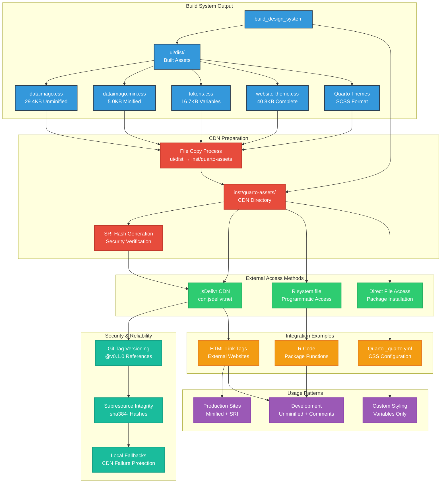

### Build Process Details

```r
library(dataimago)

# 1. Ensure sophisticated UI workspace exists
create_ui_workspace()  # Preserves existing sophisticated system

# 2. Build all assets including CDN distribution
build_design_system(
  include_sri = TRUE,      # Generate security hashes
  update_extension = TRUE, # Update Quarto extension
  verbose = TRUE          # Show detailed progress
)

# 3. Files automatically copied from ui/dist/ to inst/quarto-assets/
```

## 🏗️ Build Process Flow

```
ui/src/tokens/*.json  →  Style Dictionary  →  CSS Custom Properties
ui/src/styles/*.scss  →  Sass Compiler    →  Compiled CSS
Compiled CSS         →  PostCSS          →  Minified & Optimized
Final CSS           →  Copy Process     →  inst/quarto-assets/
```

## 📋 Maintenance

### When to Update

Files are automatically updated when:
- Design tokens are modified (`ui/src/tokens/*.json`)
- SCSS source files are changed (`ui/src/styles/*.scss`)
- `build_design_system()` is executed

### Manual Updates

```r
# Force complete rebuild and distribution
build_design_system(force_rebuild = TRUE)

# Verify files were updated
list.files("inst/quarto-assets/", full.names = TRUE)
```

### Verification

```r
# Check file sizes (should be substantial)
file.info("inst/quarto-assets/dataimago.min.css")$size     # ~5KB
file.info("inst/quarto-assets/dataimago.css")$size         # ~29KB
file.info("inst/quarto-assets/tokens.css")$size            # ~17KB
file.info("inst/quarto-assets/website-theme.min.css")$size # ~17KB

# Check content quality
readLines("inst/quarto-assets/tokens.css", n = 5)  # Should show CSS variables
```

## 🚨 Troubleshooting

### Problem: Files Are Missing
```r
# Regenerate from build system
build_design_system(force_rebuild = TRUE)
```

### Problem: Files Are Too Small 
This indicates build issues. Expected sizes:
- `dataimago.min.css`: ~5KB (minified design system)
- `dataimago.css`: ~29KB (complete design system)  
- `tokens.css`: ~17KB (design tokens)
- `website-theme.min.css`: ~17KB (minified website theme)

```r
# Check if sophisticated UI system exists
list.files("ui/src/dataimago-design/", recursive = TRUE)  # Should show tokens/ and styles/

# If missing or files too small, rebuild
build_design_system(force_rebuild = TRUE)
```

### Problem: CDN Links Don't Work
- Check that the repository has been **tagged** for release
- Verify the **version number** in the CDN URL matches the tag
- Ensure files exist in the **specific tagged version**

## 🔗 Related Documentation

- `ui/README.md` - Complete design system documentation
- `R/design_system.R` - Build system functions
- Main `README.md` - Package architecture overview
- `CLAUDE.md` - Technical details for AI assistance

## 🎨 Design System Integration

These files are part of the larger dataimago design system:

- **Foundation**: Based on ethical AI principles (WCAG AA, reduced motion)
- **Token-Driven**: Generated from semantic JSON design tokens  
- **Multi-Platform**: Same source generates CSS, Tailwind presets, and more
- **Sophisticated**: Built with Style Dictionary + SCSS + PostCSS pipeline

### SVG Logo Architecture

The included SVG assets implement a sophisticated theme-aware logo system:

**Logo Assets:**
- **AI Monogram** (`ai_monogram.svg`): 920 bytes - Optimized navbar branding logo
- **Package Hex Logo** (`package_hex_logo.svg`): 1129 bytes - Package identity logo

**Technical Quality:**
- **Optimized SVGs**: Minimal file sizes with clean vector graphics
- **Universal Compatibility**: Works across all modern browsers and CDN systems  
- **Theme Integration**: Adapts to light/dark themes via CSS styling
- **Scalable Design**: Vector format ensures crisp display at any size

---

*These assets enable external projects to adopt dataimago's ethical AI design principles through simple CSS links. They represent the visual expression of our philosophical commitment to emancipatory AI development.*
````

## File: inst/quarto-assets/tokens.scss
````scss
/*
 * dataimago Design Tokens - P3/OKLCH Enhanced
 * 
 * This CSS includes wide-gamut color support:
 * - sRGB fallbacks for compatibility
 * - OKLCH values for modern displays
 * - Automatic browser detection and fallback
 * 
 * Browsers automatically use the most capable color space available.
 */

:root {
  --color-brand-dataimago-primary: #3498DB; /* sRGB fallback */
  --color-brand-dataimago-primary: oklch(0.602 0.284 261.8); /* OKLCH enhanced */
  --color-brand-dataimago-accent: #ff69b4; /* sRGB fallback */
  --color-brand-dataimago-accent: oklch(0.655 0.434 350.6); /* OKLCH enhanced */
  --color-brand-dataimago-ethical: #E74C3C; /* sRGB fallback */
  --color-brand-dataimago-ethical: oklch(0.545 0.485 35.9); /* OKLCH enhanced */
  --color-functional-success: #27AE60; /* sRGB fallback */
  --color-functional-success: oklch(0.630 0.405 150.3); /* OKLCH enhanced */
  --color-functional-warning: #F39C12; /* sRGB fallback */
  --color-functional-warning: oklch(0.715 0.516 72.1); /* OKLCH enhanced */
  --color-functional-error: #E74C3C; /* sRGB fallback */
  --color-functional-error: oklch(0.545 0.485 35.9); /* OKLCH enhanced */
  --color-functional-info: #3498DB; /* sRGB fallback */
  --color-functional-info: oklch(0.602 0.284 261.8); /* OKLCH enhanced */
  --font-family-sans: Fira Sans, system-ui, sans-serif;
  --font-family-mono: JetBrains Mono, SF Mono, Monaco, Inconsolata, monospace;
  --font-family-display: Josefin Sans, system-ui, sans-serif;
  --font-family-brand: Futura, system-ui, sans-serif;
  --font-family-math: Fira Math, Fira Sans Math, system-ui, sans-serif;
  --font-size-micro: 0.75rem;
  --font-size-small: 0.875rem;
  --font-size-base: 1rem;
  --font-size-readable: 1.125rem;
  --font-size-emphasis: 1.25rem;
  --font-size-heading-small: 1.5rem;
  --font-size-heading-medium: 1.875rem;
  --font-size-heading-large: 2.25rem;
  --font-size-heading-xl: 3rem;
  --font-weight-normal: 400;
  --font-weight-medium: 500;
  --font-weight-semibold: 600;
  --font-weight-bold: 700;
  --font-style-normal: normal;
  --font-style-italic: italic;
  --font-style-oblique: oblique;
  --font-lineHeight-tight: 1.25;
  --font-lineHeight-normal: 1.5;
  --font-lineHeight-relaxed: 1.625;
}

:root, [data-bs-theme="light"] {
  --color-surface-page: rgb(237, 237, 235); /* sRGB fallback */
  --color-surface-page: oklch(0.937 0.007 110.1); /* OKLCH enhanced */
  --color-surface-page-scrolled: rgb(237, 237, 235); /* sRGB fallback */
  --color-surface-page-scrolled: oklch(0.937 0.007 110.1); /* OKLCH enhanced */
  --color-surface-elevated: rgba(237, 237, 235, 0.9); /* sRGB fallback */
  --color-surface-elevated: oklch(0.937 0.007 110.1 / 0.9); /* OKLCH enhanced */
  --color-surface-sunken: rgba(237, 237, 235, 0.9); /* sRGB fallback */
  --color-surface-sunken: oklch(0.937 0.007 110.1 / 0.9); /* OKLCH enhanced */
  --color-content-primary: rgb(20, 20, 16); /* sRGB fallback */
  --color-content-primary: oklch(0.062 0.016 110.2); /* OKLCH enhanced */
  --color-content-secondary: #7c7c7c; /* sRGB fallback */
  --color-content-secondary: oklch(0.520 0.000 158.2); /* OKLCH enhanced */
  --color-content-muted: #7c7c7c; /* sRGB fallback */
  --color-content-muted: oklch(0.520 0.000 158.2); /* OKLCH enhanced */
  --color-content-inverse: rgb(20, 20, 16); /* sRGB fallback */
  --color-content-inverse: oklch(0.062 0.016 110.2); /* OKLCH enhanced */
  --color-interactive-primary: #3498DB; /* sRGB fallback */
  --color-interactive-primary: oklch(0.602 0.284 261.8); /* OKLCH enhanced */
  --color-interactive-hover: #2980B9; /* sRGB fallback */
  --color-interactive-hover: oklch(0.512 0.251 261.3); /* OKLCH enhanced */
  --color-interactive-accent: #ff69b4; /* sRGB fallback */
  --color-interactive-accent: oklch(0.655 0.434 350.6); /* OKLCH enhanced */
  --color-interactive-focus: #3498DB; /* sRGB fallback */
  --color-interactive-focus: oklch(0.602 0.284 261.8); /* OKLCH enhanced */
  --color-border-subtle: rgba(20, 20, 16, 0.1); /* sRGB fallback */
  --color-border-subtle: oklch(0.062 0.016 110.2 / 0.1); /* OKLCH enhanced */
  --color-border-moderate: rgba(20, 20, 16, 0.15); /* sRGB fallback */
  --color-border-moderate: oklch(0.062 0.016 110.2 / 0.15); /* OKLCH enhanced */
  --color-border-strong: rgba(20, 20, 16, 0.25); /* sRGB fallback */
  --color-border-strong: oklch(0.062 0.016 110.2 / 0.25); /* OKLCH enhanced */
  --color-surface-page: rgb(237, 237, 235); /* sRGB fallback */
  --color-surface-page: oklch(0.937 0.007 110.1); /* OKLCH enhanced */
  --color-surface-page-scrolled: rgb(237, 237, 235); /* sRGB fallback */
  --color-surface-page-scrolled: oklch(0.937 0.007 110.1); /* OKLCH enhanced */
  --color-surface-elevated: rgba(237, 237, 235, 0.9); /* sRGB fallback */
  --color-surface-elevated: oklch(0.937 0.007 110.1 / 0.9); /* OKLCH enhanced */
  --color-surface-navbar: rgb(237, 237, 235); /* sRGB fallback */
  --color-surface-navbar: oklch(0.937 0.007 110.1); /* OKLCH enhanced */
  --color-surface-navbar-scrolled: rgb(237, 237, 235); /* sRGB fallback */
  --color-surface-navbar-scrolled: oklch(0.937 0.007 110.1); /* OKLCH enhanced */
  --color-surface-code: rgb(225, 225, 223); /* sRGB fallback */
  --color-surface-code: oklch(0.895 0.007 110.1); /* OKLCH enhanced */
  --color-border-card: rgba(20, 20, 16, 0.15); /* sRGB fallback */
  --color-border-card: oklch(0.062 0.016 110.2 / 0.15); /* OKLCH enhanced */
  --color-border-code: rgb(220, 220, 218); /* sRGB fallback */
  --color-border-code: oklch(0.877 0.007 110.1); /* OKLCH enhanced */
  --color-content-primary: rgb(20, 20, 16); /* sRGB fallback */
  --color-content-primary: oklch(0.062 0.016 110.2); /* OKLCH enhanced */
  --color-content-secondary: #7c7c7c; /* sRGB fallback */
  --color-content-secondary: oklch(0.520 0.000 158.2); /* OKLCH enhanced */
  --color-content-muted: #7c7c7c; /* sRGB fallback */
  --color-content-muted: oklch(0.520 0.000 158.2); /* OKLCH enhanced */
  --color-content-inverse: rgb(237, 237, 235); /* sRGB fallback */
  --color-content-inverse: oklch(0.937 0.007 110.1); /* OKLCH enhanced */
  --color-interactive-primary: #3498DB; /* sRGB fallback */
  --color-interactive-primary: oklch(0.602 0.284 261.8); /* OKLCH enhanced */
  --color-interactive-accent: #ff69b4; /* sRGB fallback */
  --color-interactive-accent: oklch(0.655 0.434 350.6); /* OKLCH enhanced */
  --color-interactive-hover: rgb(20, 20, 16); /* sRGB fallback */
  --color-interactive-hover: oklch(0.062 0.016 110.2); /* OKLCH enhanced */
  --contrast-high: rgb(20, 20, 16);
  --contrast-readable: rgb(20, 20, 16);
  --contrast-medium: #7c7c7c;
  --contrast-subtle: #7c7c7c;
  --shadow-subtle: 0 1px 2px 0 rgb(20 20 16 / 0.05);
  --shadow-moderate: 0 4px 6px -1px rgb(20 20 16 / 0.1);
  --shadow-prominent: 0 10px 15px -3px rgb(20 20 16 / 0.1);
  --border-subtle: rgba(20, 20, 16, 0.1);
  --border-moderate: rgba(20, 20, 16, 0.15);
  --border-focus: #3498DB;
  --navigation-hover-background: rgba(20, 20, 16, 0.05);
  --navigation-active-background: rgba(20, 20, 16, 0.1);
}

[data-bs-theme="dark"] {
  --color-surface-page: rgb(20, 20, 16); /* sRGB fallback */
  --color-surface-page: oklch(0.062 0.016 110.2); /* OKLCH enhanced */
  --color-surface-page-scrolled: rgb(20, 20, 16); /* sRGB fallback */
  --color-surface-page-scrolled: oklch(0.062 0.016 110.2); /* OKLCH enhanced */
  --color-surface-elevated: rgba(20, 20, 16, 0.9); /* sRGB fallback */
  --color-surface-elevated: oklch(0.062 0.016 110.2 / 0.9); /* OKLCH enhanced */
  --color-surface-sunken: rgba(20, 20, 16, 0.9); /* sRGB fallback */
  --color-surface-sunken: oklch(0.062 0.016 110.2 / 0.9); /* OKLCH enhanced */
  --color-content-primary: rgb(237, 237, 235); /* sRGB fallback */
  --color-content-primary: oklch(0.937 0.007 110.1); /* OKLCH enhanced */
  --color-content-secondary: #83838f; /* sRGB fallback */
  --color-content-secondary: oklch(0.551 0.046 291.0); /* OKLCH enhanced */
  --color-content-muted: #83838f; /* sRGB fallback */
  --color-content-muted: oklch(0.551 0.046 291.0); /* OKLCH enhanced */
  --color-content-inverse: rgb(237, 237, 235); /* sRGB fallback */
  --color-content-inverse: oklch(0.937 0.007 110.1); /* OKLCH enhanced */
  --color-interactive-primary: #3498DB; /* sRGB fallback */
  --color-interactive-primary: oklch(0.602 0.284 261.8); /* OKLCH enhanced */
  --color-interactive-hover: #4FC3F7; /* sRGB fallback */
  --color-interactive-hover: oklch(0.744 0.260 244.7); /* OKLCH enhanced */
  --color-interactive-accent: #ff69b4; /* sRGB fallback */
  --color-interactive-accent: oklch(0.655 0.434 350.6); /* OKLCH enhanced */
  --color-interactive-focus: #4FC3F7; /* sRGB fallback */
  --color-interactive-focus: oklch(0.744 0.260 244.7); /* OKLCH enhanced */
  --color-border-subtle: rgba(237, 237, 235, 0.1); /* sRGB fallback */
  --color-border-subtle: oklch(0.937 0.007 110.1 / 0.1); /* OKLCH enhanced */
  --color-border-moderate: rgba(237, 237, 235, 0.15); /* sRGB fallback */
  --color-border-moderate: oklch(0.937 0.007 110.1 / 0.15); /* OKLCH enhanced */
  --color-border-strong: rgba(237, 237, 235, 0.25); /* sRGB fallback */
  --color-border-strong: oklch(0.937 0.007 110.1 / 0.25); /* OKLCH enhanced */
  --color-surface-page: rgb(20, 20, 16); /* sRGB fallback */
  --color-surface-page: oklch(0.062 0.016 110.2); /* OKLCH enhanced */
  --color-surface-page-scrolled: rgb(20, 20, 16); /* sRGB fallback */
  --color-surface-page-scrolled: oklch(0.062 0.016 110.2); /* OKLCH enhanced */
  --color-surface-elevated: rgba(20, 20, 16, 0.9); /* sRGB fallback */
  --color-surface-elevated: oklch(0.062 0.016 110.2 / 0.9); /* OKLCH enhanced */
  --color-surface-navbar: rgb(20, 20, 16); /* sRGB fallback */
  --color-surface-navbar: oklch(0.062 0.016 110.2); /* OKLCH enhanced */
  --color-surface-navbar-scrolled: rgb(20, 20, 16); /* sRGB fallback */
  --color-surface-navbar-scrolled: oklch(0.062 0.016 110.2); /* OKLCH enhanced */
  --color-surface-code: rgb(30, 30, 26); /* sRGB fallback */
  --color-surface-code: oklch(0.111 0.019 109.2); /* OKLCH enhanced */
  --color-border-card: rgba(237, 237, 235, 0.15); /* sRGB fallback */
  --color-border-card: oklch(0.937 0.007 110.1 / 0.15); /* OKLCH enhanced */
  --color-border-code: rgb(40, 40, 36); /* sRGB fallback */
  --color-border-code: oklch(0.160 0.019 109.4); /* OKLCH enhanced */
  --color-content-primary: rgb(237, 237, 235); /* sRGB fallback */
  --color-content-primary: oklch(0.937 0.007 110.1); /* OKLCH enhanced */
  --color-content-secondary: #83838f; /* sRGB fallback */
  --color-content-secondary: oklch(0.551 0.046 291.0); /* OKLCH enhanced */
  --color-content-muted: #83838f; /* sRGB fallback */
  --color-content-muted: oklch(0.551 0.046 291.0); /* OKLCH enhanced */
  --color-content-inverse: rgb(20, 20, 16); /* sRGB fallback */
  --color-content-inverse: oklch(0.062 0.016 110.2); /* OKLCH enhanced */
  --color-interactive-primary: #3498DB; /* sRGB fallback */
  --color-interactive-primary: oklch(0.602 0.284 261.8); /* OKLCH enhanced */
  --color-interactive-accent: #ff69b4; /* sRGB fallback */
  --color-interactive-accent: oklch(0.655 0.434 350.6); /* OKLCH enhanced */
  --color-interactive-hover: rgb(237, 237, 235); /* sRGB fallback */
  --color-interactive-hover: oklch(0.937 0.007 110.1); /* OKLCH enhanced */
  --contrast-high: rgb(237, 237, 235);
  --contrast-readable: rgb(237, 237, 235);
  --contrast-medium: #83838f;
  --contrast-subtle: #83838f;
  --shadow-subtle: 0 1px 2px 0 rgb(237 237 235 / 0.03);
  --shadow-moderate: 0 4px 6px -1px rgb(237 237 235 / 0.05);
  --shadow-prominent: 0 10px 15px -3px rgb(237 237 235 / 0.4);
  --border-subtle: rgba(237, 237, 235, 0.1);
  --border-moderate: rgba(237, 237, 235, 0.15);
  --border-focus: #4FC3F7;
  --navigation-hover-background: rgba(237, 237, 235, 0.05);
  --navigation-active-background: rgba(237, 237, 235, 0.1);
}

@media (prefers-color-scheme: dark) {
  :root {
    --color-surface-page: rgb(20, 20, 16); /* sRGB fallback */
    --color-surface-page: oklch(0.062 0.016 110.2); /* OKLCH enhanced */
    --color-surface-page-scrolled: rgb(20, 20, 16); /* sRGB fallback */
    --color-surface-page-scrolled: oklch(0.062 0.016 110.2); /* OKLCH enhanced */
    --color-surface-elevated: rgba(20, 20, 16, 0.9); /* sRGB fallback */
    --color-surface-elevated: oklch(0.062 0.016 110.2 / 0.9); /* OKLCH enhanced */
    --color-surface-sunken: rgba(20, 20, 16, 0.9); /* sRGB fallback */
    --color-surface-sunken: oklch(0.062 0.016 110.2 / 0.9); /* OKLCH enhanced */
    --color-content-primary: rgb(237, 237, 235); /* sRGB fallback */
    --color-content-primary: oklch(0.937 0.007 110.1); /* OKLCH enhanced */
    --color-content-secondary: #83838f; /* sRGB fallback */
    --color-content-secondary: oklch(0.551 0.046 291.0); /* OKLCH enhanced */
    --color-content-muted: #83838f; /* sRGB fallback */
    --color-content-muted: oklch(0.551 0.046 291.0); /* OKLCH enhanced */
    --color-content-inverse: rgb(237, 237, 235); /* sRGB fallback */
    --color-content-inverse: oklch(0.937 0.007 110.1); /* OKLCH enhanced */
    --color-interactive-primary: #3498DB; /* sRGB fallback */
    --color-interactive-primary: oklch(0.602 0.284 261.8); /* OKLCH enhanced */
    --color-interactive-hover: #4FC3F7; /* sRGB fallback */
    --color-interactive-hover: oklch(0.744 0.260 244.7); /* OKLCH enhanced */
    --color-interactive-accent: #ff69b4; /* sRGB fallback */
    --color-interactive-accent: oklch(0.655 0.434 350.6); /* OKLCH enhanced */
    --color-interactive-focus: #4FC3F7; /* sRGB fallback */
    --color-interactive-focus: oklch(0.744 0.260 244.7); /* OKLCH enhanced */
    --color-border-subtle: rgba(237, 237, 235, 0.1); /* sRGB fallback */
    --color-border-subtle: oklch(0.937 0.007 110.1 / 0.1); /* OKLCH enhanced */
    --color-border-moderate: rgba(237, 237, 235, 0.15); /* sRGB fallback */
    --color-border-moderate: oklch(0.937 0.007 110.1 / 0.15); /* OKLCH enhanced */
    --color-border-strong: rgba(237, 237, 235, 0.25); /* sRGB fallback */
    --color-border-strong: oklch(0.937 0.007 110.1 / 0.25); /* OKLCH enhanced */
    --color-surface-page: rgb(20, 20, 16); /* sRGB fallback */
    --color-surface-page: oklch(0.062 0.016 110.2); /* OKLCH enhanced */
    --color-surface-page-scrolled: rgb(20, 20, 16); /* sRGB fallback */
    --color-surface-page-scrolled: oklch(0.062 0.016 110.2); /* OKLCH enhanced */
    --color-surface-elevated: rgba(20, 20, 16, 0.9); /* sRGB fallback */
    --color-surface-elevated: oklch(0.062 0.016 110.2 / 0.9); /* OKLCH enhanced */
    --color-surface-navbar: rgb(20, 20, 16); /* sRGB fallback */
    --color-surface-navbar: oklch(0.062 0.016 110.2); /* OKLCH enhanced */
    --color-surface-navbar-scrolled: rgb(20, 20, 16); /* sRGB fallback */
    --color-surface-navbar-scrolled: oklch(0.062 0.016 110.2); /* OKLCH enhanced */
    --color-surface-code: rgb(30, 30, 26); /* sRGB fallback */
    --color-surface-code: oklch(0.111 0.019 109.2); /* OKLCH enhanced */
    --color-border-card: rgba(237, 237, 235, 0.15); /* sRGB fallback */
    --color-border-card: oklch(0.937 0.007 110.1 / 0.15); /* OKLCH enhanced */
    --color-border-code: rgb(40, 40, 36); /* sRGB fallback */
    --color-border-code: oklch(0.160 0.019 109.4); /* OKLCH enhanced */
    --color-content-primary: rgb(237, 237, 235); /* sRGB fallback */
    --color-content-primary: oklch(0.937 0.007 110.1); /* OKLCH enhanced */
    --color-content-secondary: #83838f; /* sRGB fallback */
    --color-content-secondary: oklch(0.551 0.046 291.0); /* OKLCH enhanced */
    --color-content-muted: #83838f; /* sRGB fallback */
    --color-content-muted: oklch(0.551 0.046 291.0); /* OKLCH enhanced */
    --color-content-inverse: rgb(20, 20, 16); /* sRGB fallback */
    --color-content-inverse: oklch(0.062 0.016 110.2); /* OKLCH enhanced */
    --color-interactive-primary: #3498DB; /* sRGB fallback */
    --color-interactive-primary: oklch(0.602 0.284 261.8); /* OKLCH enhanced */
    --color-interactive-accent: #ff69b4; /* sRGB fallback */
    --color-interactive-accent: oklch(0.655 0.434 350.6); /* OKLCH enhanced */
    --color-interactive-hover: rgb(237, 237, 235); /* sRGB fallback */
    --color-interactive-hover: oklch(0.937 0.007 110.1); /* OKLCH enhanced */
    --contrast-high: rgb(237, 237, 235);
    --contrast-readable: rgb(237, 237, 235);
    --contrast-medium: #83838f;
    --contrast-subtle: #83838f;
    --shadow-subtle: 0 1px 2px 0 rgb(237 237 235 / 0.03);
    --shadow-moderate: 0 4px 6px -1px rgb(237 237 235 / 0.05);
    --shadow-prominent: 0 10px 15px -3px rgb(237 237 235 / 0.4);
    --border-subtle: rgba(237, 237, 235, 0.1);
    --border-moderate: rgba(237, 237, 235, 0.15);
    --border-focus: #4FC3F7;
    --navigation-hover-background: rgba(237, 237, 235, 0.05);
    --navigation-active-background: rgba(237, 237, 235, 0.1);
  }
}
````

## File: inst/quarto-assets/website-theme.min.css
````css
@charset "UTF-8";:root{--font-family-sans:Fira Sans,system-ui,sans-serif;--font-family-display:Josefin Sans,system-ui,sans-serif;--font-family-brand:Futura,system-ui,sans-serif;--font-style-italic:italic}:root,[data-bs-theme=light]{--theme-body-bg:rgb(237,237,235);--theme-navbar-bg:rgb(237,237,235);--theme-navbar-bg-scrolled:rgb(237,237,235);--theme-text-primary:rgb(20,20,16);--theme-text-secondary:var(--color-content-secondary-light,#7c7c7c);--theme-text-hover:rgb(20,20,16);--theme-code-bg:rgb(225,225,223);--theme-code-border:rgb(220,220,218);--theme-code-color:#cf2976;--logo-default-fill:#7c7c7c;--logo-hover-fill:rgb(20,20,16);--logo-hover-stroke:rgb(20,20,16);--logo-transition-duration:0.3s;--bluesky-logo-fill-default:#7c7c7c;--bluesky-logo-fill-hover:#1185fe;--bluesky-logo-stroke-hover:rgb(20,20,16);--theme-dropdown-bg:rgb(225,225,223);--theme-dropdown-shadow:rgba(220,220,218,0.9);--theme-dropdown-border:rgb(210,210,208);--theme-dropdown-hover-bg:rgb(237,237,235);--theme-dropdown-hover-shadow:rgba(220,220,218,0.8);--theme-carousel-bg:rgb(225,225,223);--theme-carousel-border:rgba(220,220,218,0.3)}[data-bs-theme=dark]{--theme-body-bg:rgb(20,20,16);--theme-navbar-bg:rgb(20,20,16);--theme-navbar-bg-scrolled:rgb(20,20,16);--theme-text-primary:rgb(237,237,235);--theme-text-secondary:var(--color-content-secondary-dark,#83838f);--theme-text-hover:rgb(237,237,235);--theme-code-bg:rgb(35,35,32);--theme-code-border:rgb(40,40,37);--theme-code-color:#ff79c6;--logo-default-fill:#83838f;--logo-hover-fill:rgb(237,237,235);--logo-hover-stroke:rgb(237,237,235);--logo-transition-duration:0.3s;--bluesky-logo-fill-default:#83838f;--bluesky-logo-fill-hover:#1185fe;--bluesky-logo-stroke-hover:rgb(237,237,235);--theme-dropdown-bg:rgb(28,28,30);--theme-dropdown-shadow:rgba(33,33,35,0.9);--theme-dropdown-border:rgb(47,47,49);--theme-dropdown-hover-bg:rgb(18,18,20);--theme-dropdown-hover-shadow:rgba(33,33,35,0.8);--theme-carousel-bg:rgb(20,20,16);--theme-carousel-border:rgba(40,40,37,0.4)}body{font-family:var(--font-family-sans);line-height:1.6;transition:background-color var(--logo-transition-duration) ease}.navbar{background-color:var(--theme-navbar-bg)!important;border-color:var(--theme-navbar-bg)!important;min-height:50px;transition:all .25s ease-in-out}.navbar.shrink{background-color:var(--theme-navbar-bg-scrolled);background-size:32px auto;min-height:0;padding:0;transition-duration:.25s}nav .nav-item:not(.compact){padding-top:0}.navbar-title{background-position:15px;background-repeat:no-repeat;color:var(--theme-text-secondary);font-family:var(--font-family-brand)!important;font-size:2.3rem;font-style:var(--font-style-italic)!important;font-weight:400;height:48px;line-height:55px;padding:0;transition:font-size .25s ease-in-out}.navbar-title:hover{color:var(--theme-text-hover)}.navbar-title.shrink{font-size:32px;transition-duration:.25s}.navbar-brand,.navbar-nav .nav-link{font-family:var(--font-family-display)!important;font-size:1.2rem;font-weight:500;padding-bottom:0!important;padding-top:0!important}.navbar-logo{background-repeat:no-repeat;background-size:contain;max-height:36px;transition:max-height var(--logo-transition-duration) ease-in-out,transform var(--logo-transition-duration) ease-in-out,opacity var(--logo-transition-duration) ease-in-out;will-change:max-height,transform,opacity}.navbar-logo.shrink{max-height:28px}.navbar-logo.transitioning{opacity:.8;transition:opacity .15s ease-in-out}.navbar-logo svg,.navbar-logo.inline-svg{height:auto;max-height:36px;transition:max-height var(--logo-transition-duration) ease-in-out,transform var(--logo-transition-duration) ease-in-out,opacity var(--logo-transition-duration) ease-in-out;width:auto;will-change:max-height,transform,opacity}.navbar-logo.inline-svg.shrink,.navbar-logo.shrink svg{max-height:28px}.navbar-logo svg path,.navbar-logo.inline-svg path{fill:var(--logo-default-fill);transition:fill var(--transition-logo) ease}.navbar-logo.inline-svg:hover path,.navbar-logo:hover svg path{fill:var(--logo-hover-fill)}.navbar-logo svg,.navbar-logo.inline-svg{display:inline-block;vertical-align:middle}.navbar-brand-container{padding:0 0 12px 10px}.navbar-nav .nav-link{color:var(--theme-text-secondary);padding-left:.5rem;padding-right:.5rem;position:relative;transition:color .3s ease}.navbar-nav .nav-link:after{background:linear-gradient(90deg,var(--theme-text-primary) 0,var(--theme-text-secondary) 100%);bottom:5px;content:"";height:2px;left:.5rem;position:absolute;right:.5rem;transform-origin:left;transition:width .25s ease;width:0}.navbar-nav .nav-link:hover{color:var(--theme-text-hover)}.navbar-nav .nav-link:hover:after{width:calc(100% - 1rem)}.navbar-nav .nav-link:has(iconify-icon):after{display:none!important}.navbar-dark .navbar-nav .nav-link.active,.navbar-dark .navbar-nav .nav-link:hover{color:var(--theme-text-primary)}.menu-text{color:var(--theme-text-secondary)}.menu-text:hover{color:var(--theme-text-hover)}.navbar-nav .dropdown-toggle:after{display:none}.navbar-nav .dropdown .nav-link{align-items:center;color:var(--theme-text-secondary);display:flex;flex-direction:row-reverse;padding-left:.5rem;padding-right:.5rem;position:relative}.navbar-nav .dropdown .nav-link:before{color:var(--theme-text-secondary);content:"▲";display:inline-block;font-size:.8em;margin-left:6px;margin-right:0;transition:transform .3s ease}.navbar-nav .dropdown .nav-link:after{background:linear-gradient(90deg,var(--theme-text-primary) 0,var(--theme-text-secondary) 100%);bottom:5px;content:"";height:2px;left:.5rem;position:absolute;right:.5rem;transform-origin:left;transition:width .25s ease;width:0}.navbar-nav .dropdown .nav-link:hover{background-color:var(--theme-dropdown-hover-bg);color:var(--theme-text-hover)}.navbar-nav .dropdown .nav-link:hover:after{width:calc(100% - 1rem)}.navbar-nav .dropdown .nav-link[aria-expanded=true]:before,.navbar-nav .nav-item.dropdown.open .nav-link:before,.navbar-nav .nav-item.dropdown.show .nav-link:before,.navbar-nav .show>.nav-link:before,.navbar-nav li.dropdown.open .nav-link:before,.navbar-nav li.dropdown.show .nav-link:before{color:var(--theme-text-primary);transform:rotate(180deg)}.navbar-nav .dropdown .nav-link[aria-expanded=true],.navbar-nav .nav-item.dropdown.open .nav-link,.navbar-nav .nav-item.dropdown.show .nav-link,.navbar-nav .show>.nav-link,.navbar-nav li.dropdown.open .nav-link,.navbar-nav li.dropdown.show .nav-link{color:var(--theme-text-primary)!important}@media (min-width:992px){.navbar-expand-lg .navbar-nav .dropdown-menu{background-color:var(--theme-dropdown-bg);border-color:var(--theme-dropdown-border);border-radius:7px;border-width:1px;box-shadow:0 3px 6px 0 var(--theme-dropdown-shadow);padding-bottom:7px;padding-top:7px;position:absolute}}.navbar-nav .dropdown-menu a,.navbar-nav .dropdown-menu>li>a{box-shadow:none;color:var(--theme-text-secondary);text-decoration:none!important;transition:all .2s ease}.navbar-nav .dropdown-menu a:focus,.navbar-nav .dropdown-menu a:hover,.navbar-nav .dropdown-menu>li>a:focus,.navbar-nav .dropdown-menu>li>a:hover{background-color:var(--theme-dropdown-hover-bg)!important;box-shadow:inset 0 2px 4px var(--theme-dropdown-hover-shadow),inset 0 1px 2px var(--theme-dropdown-hover-shadow),inset 0 -1px 2px var(--theme-dropdown-hover-shadow),inset 0 -2px 4px var(--theme-dropdown-hover-shadow)!important;color:var(--theme-text-primary);text-decoration:none!important;transition:all .2s ease}h1,h2,h3,h4,h5,h6{color:var(--theme-text-primary);font-weight:500;margin-bottom:.5em;margin-top:1.5em;position:relative}h1{font-size:2.2rem}h2{font-size:1.8rem}h3{font-size:1.4rem}pre{border:1px solid var(--theme-code-border)!important;border-radius:.375rem;overflow-x:auto;padding:1rem}code,pre{background-color:var(--theme-code-bg)!important;color:var(--theme-text-primary)}code{border-radius:.25rem;font-size:.875em;padding:.2em .4em}h1 code:not(.sourceCode),h2 code:not(.sourceCode),h3 code:not(.sourceCode),h4 code:not(.sourceCode),h5 code:not(.sourceCode),h6 code:not(.sourceCode),li code:not(.sourceCode),p code:not(.sourceCode),td code:not(.sourceCode){background-color:var(--theme-code-bg)!important;border:1px solid var(--theme-code-border)!important;border-radius:.25rem!important;color:var(--theme-code-color)!important;font-size:.875em!important;padding:.2em!important}div.sourceCode{background-color:var(--theme-code-bg)!important;border:1px solid var(--theme-code-border)!important}.code-copy-button{margin-top:8px!important}blockquote{border-left:4px solid var(--theme-text-secondary);color:var(--theme-text-secondary);font-style:italic;margin-left:0;padding-left:1rem}[data-bs-theme=dark] body,[data-bs-theme=dark] body.shrink,[data-bs-theme=light] body,[data-bs-theme=light] body.shrink{background-color:var(--theme-body-bg)!important;color:var(--theme-text-primary)!important}.quarto-color-scheme-toggle .bi:before,.quarto-color-scheme-toggle i.bi:before,.quarto-color-scheme-toggle>.bi:before{background-color:transparent!important;background-repeat:no-repeat!important;background-size:1rem 1rem!important;content:""!important;display:inline-block!important;height:1rem!important;vertical-align:-.125em!important;width:1rem!important}.quarto-light .quarto-color-scheme-toggle .bi:before,[data-bs-theme=light] .quarto-color-scheme-toggle .bi:before,body.quarto-light .quarto-color-scheme-toggle .bi:before{background-image:url("data:image/svg+xml;charset=utf-8,%3Csvg xmlns='http://www.w3.org/2000/svg' width='16' height='16' fill='%2383838F' class='bi bi-moon'%3E%3Cpath d='M6 .278a.77.77 0 0 1 .08.858 7.2 7.2 0 0 0-.878 3.46c0 4.021 3.278 7.277 7.318 7.277q.792-.001 1.533-.16a.79.79 0 0 1 .81.316.73.73 0 0 1-.031.893A8.35 8.35 0 0 1 8.344 16C3.734 16 0 12.286 0 7.71 0 4.266 2.114 1.312 5.124.06A.75.75 0 0 1 6 .278'/%3E%3C/svg%3E")!important;transition:background-image .25s ease}.quarto-light .quarto-color-scheme-toggle:hover .bi:before,[data-bs-theme=light] .quarto-color-scheme-toggle:hover .bi:before,body.quarto-light .quarto-color-scheme-toggle:hover .bi:before{background-image:url("data:image/svg+xml;charset=utf-8,%3Csvg xmlns='http://www.w3.org/2000/svg' width='16' height='16' class='bi bi-moon'%3E%3Cpath d='M6 .278a.77.77 0 0 1 .08.858 7.2 7.2 0 0 0-.878 3.46c0 4.021 3.278 7.277 7.318 7.277q.792-.001 1.533-.16a.79.79 0 0 1 .81.316.73.73 0 0 1-.031.893A8.35 8.35 0 0 1 8.344 16C3.734 16 0 12.286 0 7.71 0 4.266 2.114 1.312 5.124.06A.75.75 0 0 1 6 .278'/%3E%3C/svg%3E")!important;transition:background-image .25s ease}.quarto-dark .quarto-color-scheme-toggle .bi:before,[data-bs-theme=dark] .quarto-color-scheme-toggle .bi:before,body.quarto-dark .quarto-color-scheme-toggle .bi:before{background-image:url("data:image/svg+xml;charset=utf-8,%3Csvg xmlns='http://www.w3.org/2000/svg' width='16' height='16' fill='%2383838F' class='bi bi-sun'%3E%3Cpath d='M8 11a3 3 0 1 1 0-6 3 3 0 0 1 0 6m0 1a4 4 0 1 0 0-8 4 4 0 0 0 0 8M8 0a.5.5 0 0 1 .5.5v2a.5.5 0 0 1-1 0v-2A.5.5 0 0 1 8 0m0 13a.5.5 0 0 1 .5.5v2a.5.5 0 0 1-1 0v-2A.5.5 0 0 1 8 13m8-5a.5.5 0 0 1-.5.5h-2a.5.5 0 0 1 0-1h2a.5.5 0 0 1 .5.5M3 8a.5.5 0 0 1-.5.5h-2a.5.5 0 0 1 0-1h2A.5.5 0 0 1 3 8m10.657-5.657a.5.5 0 0 1 0 .707l-1.414 1.415a.5.5 0 1 1-.707-.708l1.414-1.414a.5.5 0 0 1 .707 0m-9.193 9.193a.5.5 0 0 1 0 .707L3.05 13.657a.5.5 0 0 1-.707-.707l1.414-1.414a.5.5 0 0 1 .707 0m9.193 2.121a.5.5 0 0 1-.707 0l-1.414-1.414a.5.5 0 0 1 .707-.707l1.414 1.414a.5.5 0 0 1 0 .707M4.464 4.465a.5.5 0 0 1-.707 0L2.343 3.05a.5.5 0 1 1 .707-.707l1.414 1.414a.5.5 0 0 1 0 .708'/%3E%3C/svg%3E")!important;transition:background-image .25s ease}.quarto-dark .quarto-color-scheme-toggle:hover .bi:before,[data-bs-theme=dark] .quarto-color-scheme-toggle:hover .bi:before,body.quarto-dark .quarto-color-scheme-toggle:hover .bi:before{background-image:url("data:image/svg+xml;charset=utf-8,%3Csvg xmlns='http://www.w3.org/2000/svg' width='16' height='16' fill='%23EDEDE8' class='bi bi-sun'%3E%3Cpath d='M8 11a3 3 0 1 1 0-6 3 3 0 0 1 0 6m0 1a4 4 0 1 0 0-8 4 4 0 0 0 0 8M8 0a.5.5 0 0 1 .5.5v2a.5.5 0 0 1-1 0v-2A.5.5 0 0 1 8 0m0 13a.5.5 0 0 1 .5.5v2a.5.5 0 0 1-1 0v-2A.5.5 0 0 1 8 13m8-5a.5.5 0 0 1-.5.5h-2a.5.5 0 0 1 0-1h2a.5.5 0 0 1 .5.5M3 8a.5.5 0 0 1-.5.5h-2a.5.5 0 0 1 0-1h2A.5.5 0 0 1 3 8m10.657-5.657a.5.5 0 0 1 0 .707l-1.414 1.415a.5.5 0 1 1-.707-.708l1.414-1.414a.5.5 0 0 1 .707 0m-9.193 9.193a.5.5 0 0 1 0 .707L3.05 13.657a.5.5 0 0 1-.707-.707l1.414-1.414a.5.5 0 0 1 .707 0m9.193 2.121a.5.5 0 0 1-.707 0l-1.414-1.414a.5.5 0 0 1 .707-.707l1.414 1.414a.5.5 0 0 1 0 .707M4.464 4.465a.5.5 0 0 1-.707 0L2.343 3.05a.5.5 0 1 1 .707-.707l1.414 1.414a.5.5 0 0 1 0 .708'/%3E%3C/svg%3E")!important;transition:background-image .25s ease}.inline-svg{display:inline-block;vertical-align:middle;width:100%}.inline-svg path,.inline-svg svg path{transition:fill var(--transition-logo) ease}.navbar-github-logo svg path,.navbar-github-logo.inline-svg path{fill:var(--logo-default-fill)}.navbar-github-logo.inline-svg:hover path,.navbar-github-logo:hover path,a:hover .navbar-github-logo path{fill:var(--logo-hover-fill)}footer{display:block!important}.nav-footer,footer{align-items:center!important;justify-content:space-between!important}.nav-footer{background:var(--theme-body-bg,transparent)!important;border-top:1px solid var(--theme-border-default,rgba(0,0,0,.1))!important;color:var(--theme-text-secondary,inherit)!important;display:flex!important;margin-top:2rem!important;min-height:2.5em!important;padding-bottom:.5rem!important;padding-top:.5rem!important}.nav-footer-center .footer-items,.nav-footer-left .footer-items,.nav-footer-right .footer-items{align-items:center!important;display:flex!important;gap:1rem!important;list-style:none!important;margin:0!important;padding-bottom:.2em!important;padding-left:0!important;padding-top:.2em!important}.nav-footer-center,.nav-footer-left,.nav-footer-right{align-items:center!important;display:flex!important;min-height:2em!important}.nav-footer-left{justify-content:flex-start!important}.nav-footer-center{flex:1!important;justify-content:center!important}.nav-footer-right{justify-content:flex-end!important}.page-layout-full .nav-footer{position:relative!important;width:100%!important;z-index:10!important}.footer-ai-monogram-logo,.footer-bluesky-logo,.footer-netlify-logo,.footer-package-hex-logo,.footer-quarto-logo{align-items:center!important;display:inline-flex!important;justify-content:center!important;transition:all var(--transition-logo) ease!important}.footer-ai-monogram-logo svg,.footer-bluesky-logo svg,.footer-netlify-logo svg,.footer-package-hex-logo svg,.footer-quarto-logo svg{display:block!important;height:24px!important;max-width:100%!important;width:auto!important}.footer-netlify-logo path,.footer-quarto-logo path{transition:fill var(--transition-logo) ease!important;fill:var(--logo-default-fill)!important}.footer-netlify-logo:hover path,.footer-quarto-logo:hover path,a:hover .footer-netlify-logo path,a:hover .footer-quarto-logo path{fill:var(--logo-hover-fill)!important}.footer-ai-monogram-logo .bg{fill:var(--logo-default-fill)!important;transition:fill var(--transition-logo) ease!important}.footer-ai-monogram-logo:hover .bg,a:hover .footer-ai-monogram-logo .bg{fill:var(--logo-hover-fill)!important}.footer-bluesky-logo path{fill:var(--bluesky-logo-fill-default)!important}.footer-bluesky-logo:hover path,a:hover .footer-bluesky-logo path{fill:var(--bluesky-logo-fill-hover)!important;stroke:var(--bluesky-logo-stroke-hover)!important}.footer-package-hex-logo .monogram-a,.footer-package-hex-logo .monogram-i{fill:var(--logo-default-fill)!important;transition:fill var(--transition-logo) ease!important}.footer-package-hex-logo .hexagon{stroke:var(--logo-default-fill)!important;transition:stroke var(--transition-logo) ease!important}.footer-package-hex-logo:hover .monogram-a,.footer-package-hex-logo:hover .monogram-i,a:hover .footer-package-hex-logo .monogram-a,a:hover .footer-package-hex-logo .monogram-i{fill:var(--logo-hover-fill)!important}.footer-package-hex-logo:hover .hexagon,a:hover .footer-package-hex-logo .hexagon{stroke:var(--logo-hover-fill)!important}a:hover .footer-logo path{fill:var(--logo-hover-fill)!important}.theme-svg path,.theme-svg rect{fill:var(--logo-default-fill,#7c7c7c);transition:fill var(--transition-logo) ease}.theme-svg.svg-hover path,.theme-svg.svg-hover rect,.theme-svg:hover circle,.theme-svg:hover path,.theme-svg:hover polygon,.theme-svg:hover rect{fill:var(--logo-hover-fill,#000000);stroke:var(--logo-hover-stroke,transparent)}.anchorjs-link{color:var(--theme-text-secondary);font-size:.8em;text-decoration:none!important;transition:color .3s ease}.anchorjs-link:hover{color:var(--theme-text-primary);text-decoration:none!important}.grid{align-items:center;align-items:stretch;min-height:60vh}.sidebar nav[role=doc-toc] ul li a{color:var(--theme-text-secondary)!important;text-decoration:none!important}.sidebar nav[role=doc-toc] ul li a.active,.sidebar nav[role=doc-toc] ul li a:hover,.toc-active{color:var(--theme-text-primary)!important;font-weight:500;text-decoration:none!important}.sidebar nav[role=doc-toc] ul>li>a.active,.sidebar nav[role=doc-toc] ul>li>ul>li>a.active{border-left:1.5px solid var(--theme-text-primary)}#TOC .nav-link{color:var(--theme-text-secondary)!important;text-decoration:none!important}#TOC .nav-link.active,#TOC .nav-link:hover{color:var(--theme-text-primary)!important;text-decoration:none!important}#quarto-content a,.content a,.main a,.quarto-title-block a,article a,main a{color:var(--theme-text-secondary)!important;text-decoration:underline;transition:color .3s ease}#quarto-content a:hover,.content a:hover,.main a:hover,.quarto-title-block a:hover,article a:hover,main a:hover{color:var(--theme-text-primary)!important;text-decoration:underline}a:not(.nav-link):not(.navbar-brand):not(.dropdown-toggle):not([role=doc-toc] a){color:var(--theme-text-secondary)!important;text-decoration:underline;transition:color .3s ease}a:not(.nav-link):not(.navbar-brand):not(.dropdown-toggle):not([role=doc-toc] a):hover{color:var(--theme-text-primary)!important;text-decoration:underline}.hero-section{background:linear-gradient(180deg,var(--hero-a,rgba(0,0,0,0)),var(--hero-b,rgba(0,0,0,0)));padding:clamp(1.5rem,3vw,3rem) 0}.hero-section .grid{align-items:stretch;gap:clamp(1rem,3vw,3rem);min-height:60vh}.logo-column{justify-content:center;position:relative}.logo-column,.logo-container{align-items:center;display:flex}.logo-container{flex-direction:column;gap:1rem;max-width:400px;width:100%}.content-container{height:100%;padding:clamp(1rem,2vw,2rem)}.ethical-note{background-color:rgba(231,76,60,.1);border:1px solid rgba(231,76,60,.3);border-radius:.5rem;margin:1rem 0;padding:1rem}.ethical-note:before{color:#E74C3C;content:"🧠 Ethical AI Context: ";font-weight:700}.center{display:block;margin-left:auto;margin-right:auto}.dataimago-footer{border-top:1px solid #3498db;color:#34495E;font-style:italic;margin-top:2rem;padding-top:.5rem}.dataimago-hex-logo{cursor:pointer;height:auto;max-width:100%;transition:max-height .25s ease-in-out,transform .25s ease-in-out}.dataimago-hex-logo:hover{transform:scale(1.05)}@media (max-width:768px){.dataimago-hex-logo{width:150px}}@media (max-width:480px){.dataimago-hex-logo{width:120px}}img{height:auto;max-width:100%}:root{--hero-a:color-mix(in oklab,var(--quarto-bg) 92%,var(--quarto-accent));--hero-b:var(--quarto-bg)}[data-bs-theme=dark]{--hero-a:color-mix(in oklab,var(--quarto-bg) 88%,var(--quarto-accent))}@media (max-width:768px){.logo-container{margin-bottom:2rem}.hero-section .grid{min-height:auto}}.cards-container{margin:0 auto;max-width:1400px;padding:clamp(2rem,4vw,4rem)}.cards-grid{align-items:start;display:grid;gap:clamp(1.5rem,3vw,2.5rem);grid-template-columns:repeat(auto-fit,minmax(350px,1fr))}.feature-card{backdrop-filter:blur(10px);background:var(--theme-carousel-bg,rgba(131,131,143,.05));border:1px solid var(--theme-carousel-border,var(--dataimago-border));border-radius:1rem;box-shadow:0 4px 16px rgba(0,0,0,.1);padding:clamp(1.5rem,3vw,2rem);transition:all .3s ease}.feature-card:hover{border-color:var(--theme-text-secondary);box-shadow:0 8px 32px rgba(0,0,0,.15);transform:translateY(-4px)}.feature-card h3{color:var(--theme-text-primary);font-size:clamp(1.25rem,2.5vw,1.5rem);font-weight:600;line-height:1.3;margin-bottom:1rem}.feature-card p{color:var(--theme-text-secondary);line-height:1.6;margin-bottom:.75rem}.feature-card p:last-child{margin-bottom:0}.technical-preview{background:var(--theme-code-bg,rgba(0,0,0,.05));border-left:3px solid var(--dataimago-primary);border-radius:.5rem;margin-top:1.5rem;padding:1rem}.technical-preview h4{color:var(--theme-text-primary);font-size:1rem;font-weight:600;margin-bottom:.75rem}.logo-showcase{align-items:center;background:rgba(131,131,143,.03);border-radius:.5rem;display:flex;gap:1rem;justify-content:center;margin-top:1rem;padding:1rem}.showcase-logo{filter:grayscale(.2) opacity(.8);transition:transform .3s ease}.showcase-logo:hover{filter:grayscale(0) opacity(1);transform:scale(1.1)}@media (max-width:768px){.cards-grid{gap:1.5rem;grid-template-columns:1fr}.feature-card{padding:1.5rem}.logo-showcase{flex-direction:column;gap:.75rem}}
/*# sourceMappingURL=website-theme.min.css.map */
````

## File: R/asset_sync.R
````r
#' Synchronize Assets Across Quarto Directories
#'
#' @importFrom cli symbol
#' @importFrom crayon blue yellow green red bold
#' @importFrom glue glue
#'
#' @description
#' Synchronizes assets from ui/www/assets/ to ui/www/_extensions/
#' using a single source of truth approach.
#'
#' @details
#' This function establishes `ui/www/assets/` as the **source of truth** for:
#' - Custom CSS files (*.css)
#' - SCSS source files (*.scss)
#' - JavaScript files (*.js)
#'
#' **Source of Truth Hierarchy**:
#' 1. `ui/src/` - Design system tokens and base styles (build system input)
#' 2. `ui/www/assets/` - Quarto-specific styling and overrides (**source of truth**)
#' 3. `ui/www/_extensions/` - Distribution copies (synchronized FROM assets)
#' 4. `inst/quarto-assets/` - CDN distribution (synchronized from extensions)
#'
#' The function:
#' 1. Identifies files newer in assets/ than extensions/
#' 2. Copies missing and updated files FROM assets TO extensions
#' 3. **Never** overwrites assets/ (preserves source of truth)
#' 4. Reports synchronization status with added/updated distinction
#'
#' **Important**: This ensures `quarto render` has consistent assets while
#' preserving the assets/ directory as the authoritative source.
#'
#' @param verbose Logical. Print detailed progress information. Default: TRUE
#'
#' @concept dataimago asset-management quarto-synchronization
#' @keywords asset-sync
#'
#' @return List containing:
#' \describe{
#'   \item{success}{Logical indicating synchronization success}
#'   \item{synced_files}{Character vector of files that were synchronized}
#'   \item{errors}{Character vector of any error messages}
#' }
#'
#' @examples
#' \dontrun{
#' # Synchronize all assets
#' result <- sync_quarto_assets()
#'
#' # Check synchronization status
#' if (result$success) {
#'   cat("Assets synchronized successfully")
#' } else {
#'   cat("Synchronization errors:", paste(result$errors, collapse = "; "))
#' }
#'
#' # Silent synchronization
#' sync_quarto_assets(verbose = FALSE)
#' }
#'
#' @export
sync_quarto_assets <- function(verbose = TRUE) {
  if (verbose) {
    cat(crayon::blue(cli::symbol$info), "Synchronizing assets across quarto directories...\n")
  }

  # Get base directories
  base_dir <- getwd()

  quarto_dir <- file.path(base_dir, "ui/www")
  assets_dir <- file.path(quarto_dir, "assets")
  extensions_dir <- file.path(quarto_dir, "_extensions", "dataimago", "ai-native", "assets")

  errors <- character()
  synced_files <- character()

  # Verify directories exist
  if (!dir.exists(quarto_dir)) {
    errors <- c(errors, "ui/www directory not found")
    return(list(success = FALSE, synced_files = character(), errors = errors))
  }

  # Ensure extension directory exists
  if (!dir.exists(extensions_dir)) {
    dir.create(extensions_dir, recursive = TRUE, showWarnings = FALSE)
    if (verbose) {
      cat(crayon::blue(cli::symbol$info), "Created extensions directory:", extensions_dir, "\n")
    }
  }

  # 1. Sync CSS files (assets/css is source of truth for custom CSS)
  css_source <- file.path(assets_dir, "css")
  css_extension <- file.path(extensions_dir, "css")

  if (dir.exists(css_source) && dir.exists(css_extension)) {
    css_files <- list.files(css_source, pattern = "\\.css$", full.names = FALSE)
    extension_files <- list.files(css_extension, pattern = "\\.css$", full.names = FALSE)

    # Exclude compiled files that should come from build system
    compiled_files <- c("dataimago.css", "dataimago.min.css", "tokens.css")
    css_files <- setdiff(css_files, compiled_files)

    # Assets directory is source of truth - copy TO extensions
    missing_in_extensions <- setdiff(css_files, extension_files)

    # Also check for files that need updating (newer in assets)
    update_in_extensions <- character()
    for (file in intersect(css_files, extension_files)) {
      source_file <- file.path(css_source, file)
      target_file <- file.path(css_extension, file)
      if (file.exists(source_file) && file.exists(target_file)) {
        if (file.info(source_file)$mtime > file.info(target_file)$mtime) {
          update_in_extensions <- c(update_in_extensions, file)
        }
      }
    }

    # All files that need to be copied to extensions
    files_to_copy <- unique(c(missing_in_extensions, update_in_extensions))

    if (length(files_to_copy) > 0) {
      if (verbose) {
        cat(
          crayon::yellow(cli::symbol$warning),
          "Synchronizing", length(files_to_copy), "CSS files to extensions...\n"
        )
      }
      for (file in files_to_copy) {
        tryCatch(
          {
            file.copy(
              file.path(css_source, file),
              file.path(css_extension, file),
              overwrite = TRUE
            )
            synced_files <- c(synced_files, file.path("extensions/css", file))
            if (verbose) {
              status_msg <- if (file %in% missing_in_extensions) "Added" else "Updated"
              cat(crayon::green(cli::symbol$tick), status_msg, file, "in extensions\n")
            }
          },
          error = function(e) {
            errors <- c(errors, glue::glue("Failed to copy {file} to extensions: {e$message}"))
          }
        )
      }
    }
  }

  # 2. Sync SCSS files (assets/css is source of truth for SCSS)
  if (dir.exists(css_source) && dir.exists(css_extension)) {
    scss_files <- list.files(css_source, pattern = "\\.scss$", full.names = FALSE)
    extension_scss_files <- list.files(css_extension, pattern = "\\.scss$", full.names = FALSE)

    # Assets directory is source of truth - copy TO extensions
    missing_scss_in_extensions <- setdiff(scss_files, extension_scss_files)

    # Check for files that need updating (newer in assets)
    update_scss_in_extensions <- character()
    for (file in intersect(scss_files, extension_scss_files)) {
      source_file <- file.path(css_source, file)
      target_file <- file.path(css_extension, file)
      if (file.exists(source_file) && file.exists(target_file)) {
        if (file.info(source_file)$mtime > file.info(target_file)$mtime) {
          update_scss_in_extensions <- c(update_scss_in_extensions, file)
        }
      }
    }

    # All SCSS files that need to be copied to extensions
    scss_to_copy <- unique(c(missing_scss_in_extensions, update_scss_in_extensions))

    if (length(scss_to_copy) > 0) {
      if (verbose) {
        cat(
          crayon::yellow(cli::symbol$warning),
          "Synchronizing", length(scss_to_copy), "SCSS files to extensions...\n"
        )
      }
      for (file in scss_to_copy) {
        tryCatch(
          {
            file.copy(
              file.path(css_source, file),
              file.path(css_extension, file),
              overwrite = TRUE
            )
            synced_files <- c(synced_files, file.path("extensions/css", file))
            if (verbose) {
              status_msg <- if (file %in% missing_scss_in_extensions) "Added" else "Updated"
              cat(crayon::green(cli::symbol$tick), status_msg, file, "in extensions\n")
            }
          },
          error = function(e) {
            errors <- c(errors, glue::glue("Failed to copy {file} to extensions: {e$message}"))
          }
        )
      }
    }
  }

  # 3. Sync JS files (assets/js is source of truth)
  js_source <- file.path(assets_dir, "js")
  js_extension <- file.path(extensions_dir, "js")

  if (dir.exists(js_source) && dir.exists(js_extension)) {
    js_files <- list.files(js_source, pattern = "\\.js$", full.names = FALSE)
    extension_js_files <- list.files(js_extension, pattern = "\\.js$", full.names = FALSE)

    # Assets directory is source of truth - copy TO extensions
    missing_js_in_extensions <- setdiff(js_files, extension_js_files)

    # Check for files that need updating (newer in assets)
    update_js_in_extensions <- character()
    for (file in intersect(js_files, extension_js_files)) {
      source_file <- file.path(js_source, file)
      target_file <- file.path(js_extension, file)
      if (file.exists(source_file) && file.exists(target_file)) {
        if (file.info(source_file)$mtime > file.info(target_file)$mtime) {
          update_js_in_extensions <- c(update_js_in_extensions, file)
        }
      }
    }

    # All JS files that need to be copied to extensions
    js_to_copy <- unique(c(missing_js_in_extensions, update_js_in_extensions))

    if (length(js_to_copy) > 0) {
      if (verbose) {
        cat(
          crayon::yellow(cli::symbol$warning),
          "Synchronizing", length(js_to_copy), "JS files to extensions...\n"
        )
      }
      for (file in js_to_copy) {
        tryCatch(
          {
            file.copy(
              file.path(js_source, file),
              file.path(js_extension, file),
              overwrite = TRUE
            )
            synced_files <- c(synced_files, file.path("extensions/js", file))
            if (verbose) {
              status_msg <- if (file %in% missing_js_in_extensions) "Added" else "Updated"
              cat(crayon::green(cli::symbol$tick), status_msg, file, "in extensions\n")
            }
          },
          error = function(e) {
            errors <- c(errors, glue::glue("Failed to copy {file} to extensions: {e$message}"))
          }
        )
      }
    }
  }

  # 4. Report status
  if (length(synced_files) == 0 && length(errors) == 0) {
    if (verbose) {
      cat(crayon::green(cli::symbol$tick), "All assets already synchronized\n")
    }
  } else if (length(errors) > 0) {
    if (verbose) {
      cat(crayon::red(cli::symbol$cross), "Synchronization completed with errors:\n")
      for (error in errors) {
        cat(crayon::red("  -"), error, "\n")
      }
    }
  } else {
    if (verbose) {
      cat(crayon::green(cli::symbol$tick), "Synchronized", length(synced_files), "asset files\n")
    }
  }

  list(
    success = length(errors) == 0,
    synced_files = synced_files,
    errors = errors
  )
}

#' Check Quarto Render Asset Status
#'
#' @description
#' Analyzes what happens to assets during `quarto render` and identifies
#' potential issues with asset copying to the docs/ directory.
#'
#' @details
#' This function helps understand the Quarto rendering process:
#'
#' **CSS Files**:
#' - Quarto copies CSS files from `assets/css/` to `docs/assets/css/`
#' - CSS files referenced in YAML frontmatter are automatically included
#'
#' **JavaScript Files**:
#' - JS files in `assets/js/` are NOT automatically copied to `docs/assets/js/`
#' - JS files must be referenced in `include-after` or `include-before` YAML
#' - Only files referenced in HTML `<script>` tags get copied
#'
#' **Extensions**:
#' - Extension assets are used during rendering but may not be copied to docs/
#' - Extensions provide a way to package assets for reuse across projects
#'
#' @param verbose Logical. Print detailed analysis. Default: TRUE
#'
#' @concept dataimago quarto-rendering asset-analysis
#' @keywords quarto render analysis
#'
#' @return List containing analysis of asset status across directories
#'
#' @examples
#' \dontrun{
#' # Analyze asset status
#' status <- check_quarto_asset_status()
#'
#' # Check what files are missing after render
#' if (length(status$missing_in_docs) > 0) {
#'   cat("Files not copied to docs:", paste(status$missing_in_docs, collapse = ", "))
#' }
#' }
#'
#' @export
check_quarto_asset_status <- function(verbose = TRUE) {
  if (verbose) {
    cat(crayon::blue(cli::symbol$info), "Analyzing Quarto asset status...\n")
  }

  # Get base directories
  base_dir <- getwd()

  quarto_dir <- file.path(base_dir, "ui/www")
  assets_dir <- file.path(quarto_dir, "assets")
  docs_dir <- file.path(base_dir, "docs")

  analysis <- list(
    css_in_assets = character(),
    css_in_docs = character(),
    js_in_assets = character(),
    js_in_docs = character(),
    missing_css_in_docs = character(),
    missing_js_in_docs = character()
  )

  # Check CSS files
  css_assets_dir <- file.path(assets_dir, "css")
  css_docs_dir <- file.path(docs_dir, "assets", "css")

  if (dir.exists(css_assets_dir)) {
    analysis$css_in_assets <- list.files(css_assets_dir, pattern = "\\.css$")
  }

  if (dir.exists(css_docs_dir)) {
    analysis$css_in_docs <- list.files(css_docs_dir, pattern = "\\.css$")
    analysis$missing_css_in_docs <- setdiff(analysis$css_in_assets, analysis$css_in_docs)
  }

  # Check JS files
  js_assets_dir <- file.path(assets_dir, "js")
  js_docs_dir <- file.path(docs_dir, "assets", "js")

  if (dir.exists(js_assets_dir)) {
    analysis$js_in_assets <- list.files(js_assets_dir, pattern = "\\.js$")
  }

  if (dir.exists(js_docs_dir)) {
    analysis$js_in_docs <- list.files(js_docs_dir, pattern = "\\.js$")
    analysis$missing_js_in_docs <- setdiff(analysis$js_in_assets, analysis$js_in_docs)
  } else {
    analysis$missing_js_in_docs <- analysis$js_in_assets
  }

  if (verbose) {
    cat("\n", crayon::bold("Asset Status Analysis:"), "\n")
    cat("CSS Files:\n")
    cat("  - In assets/css/:", length(analysis$css_in_assets), "files\n")
    cat("  - In docs/assets/css/:", length(analysis$css_in_docs), "files\n")
    if (length(analysis$missing_css_in_docs) > 0) {
      cat(crayon::red("  - Missing in docs:"), paste(analysis$missing_css_in_docs, collapse = ", "), "\n")
    } else {
      cat(crayon::green("  - All CSS files present in docs\n"))
    }

    cat("\nJavaScript Files:\n")
    cat("  - In assets/js/:", length(analysis$js_in_assets), "files\n")
    cat("  - In docs/assets/js/:", length(analysis$js_in_docs), "files\n")
    if (length(analysis$missing_js_in_docs) > 0) {
      cat(crayon::yellow("  - Missing in docs:"), paste(analysis$missing_js_in_docs, collapse = ", "), "\n")
      cat(crayon::blue("  - Note: JS files must be referenced in _quarto.yml include-after to be copied\n"))
    } else {
      cat(crayon::green("  - All JS files present in docs\n"))
    }

    cat("\n", crayon::bold("Quarto Render Behavior:"), "\n")
    cat("[OK] CSS: Automatically copied from assets/css/ to docs/assets/css/\n")
    cat("[WARN] JS: Only copied if referenced in include-after/include-before\n")
    cat("[INFO] Extensions: Used during render, may not be copied to docs/\n")
  }

  analysis
}
````

## File: ui/www/_extensions/dataimago/ai-native/assets/css/shared-components.scss
````scss
// dataimago Shared Theme Components
// Clean, consolidated styling using design tokens and CSS custom properties
// Eliminates duplications and hardcoded values for better maintainability

// ===== BASE STYLES =====

body {
  transition: background-color var(--logo-transition-duration) ease;
  font-family: var(--font-family-sans);
  line-height: 1.6;
}

// ===== NAVBAR CORE STYLES =====

.navbar {
  background-color: var(--theme-navbar-bg) !important;
  border-color: var(--theme-navbar-bg) !important;
  min-height: 50px;
  transition: all 0.25s ease-in-out;
}

.navbar.shrink {
  background-color: var(--theme-navbar-bg-scrolled);
  min-height: 0;
  padding: 0 0;
  background-size: 32px auto;
  transition-duration: 0.25s;
}

// Fix for dropdown alignment - remove problematic padding
nav .nav-item:not(.compact) {
  padding-top: 0px; // Fixed from 7px to 0px for proper dropdown alignment
}

// ===== NAVBAR TYPOGRAPHY =====
.navbar-title {
  font-family: var(--font-family-brand) !important;
  font-style: var(--font-style-italic) !important;
  font-weight: 400;
  font-size: 2.3rem;
  padding: 0;
  height: 48px;
  line-height: 55px;
  background-repeat: no-repeat;
  background-position: 15px center;
  transition: font-size 0.25s ease-in-out;
  color: var(--theme-text-secondary);
}

.navbar-title:hover {
  color: var(--theme-text-hover);
}

.navbar-title.shrink {
  font-size: 32px;
  transition-duration: 0.25s;
}

.navbar-brand, .navbar-nav .nav-link {
  font-family: var(--font-family-display) !important;
  font-weight: 500;
  font-size: 1.2rem;
  padding-top: 0px !important;
  padding-bottom: 0px !important;
}

// ===== NAVBAR LOGO =====

.navbar-logo {
  max-height: 36px;
  transition: max-height var(--logo-transition-duration) ease-in-out, transform var(--logo-transition-duration) ease-in-out, opacity var(--logo-transition-duration) ease-in-out;
  will-change: max-height, transform, opacity;
  
  // For traditional img elements (fallback)
  background-size: contain;
  background-repeat: no-repeat;
}

.navbar-logo.shrink {
  max-height: 28px;
}

.navbar-logo.transitioning {
  opacity: 0.8;
  transition: opacity 0.15s ease-in-out;
}

// ===== INLINE SVG NAVBAR LOGO STYLING =====

.navbar-logo.inline-svg,
.navbar-logo svg {
  max-height: 36px;
  width: auto;
  height: auto;
  transition: max-height var(--logo-transition-duration) ease-in-out, transform var(--logo-transition-duration) ease-in-out, opacity var(--logo-transition-duration) ease-in-out;
  will-change: max-height, transform, opacity;
}

.navbar-logo.inline-svg.shrink,
.navbar-logo.shrink svg {
  max-height: 28px;
}

// SVG path styling with theme-aware colors
.navbar-logo svg path,
.navbar-logo.inline-svg path {
  fill: var(--logo-default-fill);
  transition: fill var(--transition-logo) ease;
}

.navbar-logo:hover svg path,
.navbar-logo.inline-svg:hover path {
  fill: var(--logo-hover-fill);
}

// Ensure proper scaling and positioning
.navbar-logo svg,
.navbar-logo.inline-svg {
  vertical-align: middle;
  display: inline-block;
}

.navbar-brand-container {
  padding: 0 0 12px 10px;
}

// ===== NAVBAR NAVIGATION =====

.navbar-nav .nav-link {
  position: relative;
  transition: color 0.3s ease;
  padding-left: 0.5rem;
  padding-right: 0.5rem;
  color: var(--theme-text-secondary);
}

.navbar-nav .nav-link::after {
  content: '';
  position: absolute;
  bottom: 5px;
  left: 0.5rem;
  right: 0.5rem;
  width: 0;
  height: 2px;
  background: linear-gradient(90deg, var(--theme-text-primary) 0%, var(--theme-text-secondary) 100%);
  transition: width 0.25s ease;
  transform-origin: left;
}

.navbar-nav .nav-link:hover {
  color: var(--theme-text-hover);
}

.navbar-nav .nav-link:hover::after {
  width: calc(100% - 1rem);
}

// Exclude icon links from underline effect
.navbar-nav .nav-link[href*="github.com"]::after,
.navbar-nav .nav-link[href*="bsky.app"]::after,
.navbar-nav .nav-link:has(iconify-icon)::after {
  display: none !important;
}

// Additional navbar link styling
.navbar-dark .navbar-nav .nav-link.active,
.navbar-dark .navbar-nav .nav-link:hover {
  color: var(--theme-text-primary);
}

.menu-text {
  color: var(--theme-text-secondary);
}

.menu-text:hover {
  color: var(--theme-text-hover);
}

// ===== DROPDOWN STYLES =====
// Hide default Bootstrap dropdown indicators
.navbar-nav .dropdown-toggle .caret,
.navbar-nav .dropdown-toggle::after {
  display: none;
}

// Dropdown link styling with custom arrow
.navbar-nav .dropdown .nav-link {
  display: flex;
  align-items: center;
  flex-direction: row-reverse; // Puts arrow first
  position: relative;
  padding-left: 0.5rem;
  padding-right: 0.5rem;
  color: var(--theme-text-secondary);
}

// Custom dropdown arrow
.navbar-nav .dropdown .nav-link::before {
  content: '▲';
  display: inline-block;
  margin-left: 6px;
  margin-right: 0;
  font-size: 0.8em;
  transition: transform 0.3s ease;
  color: var(--theme-text-secondary);
}

// Dropdown underline effect
.navbar-nav .dropdown .nav-link::after {
  content: '';
  position: absolute;
  bottom: 5px;
  left: 0.5rem;
  right: 0.5rem;
  width: 0;
  height: 2px;
  background: linear-gradient(90deg, var(--theme-text-primary) 0%, var(--theme-text-secondary) 100%);
  transition: width 0.25s ease;
  transform-origin: left;
}

// Dropdown hover states
.navbar-nav .dropdown .nav-link:hover {
  color: var(--theme-text-hover);
  background-color: var(--theme-dropdown-hover-bg);
}

.navbar-nav .dropdown .nav-link:hover::after {
  width: calc(100% - 1rem);
}

// Dropdown open states - consolidated selectors for all Bootstrap versions
.navbar-nav li.dropdown.open .nav-link::before,
.navbar-nav li.dropdown.show .nav-link::before,
.navbar-nav .dropdown .nav-link[aria-expanded="true"]::before,
.navbar-nav .show > .nav-link::before,
.navbar-nav .nav-item.dropdown.show .nav-link::before,
.navbar-nav .nav-item.dropdown.open .nav-link::before {
  transform: rotate(180deg);
  color: var(--theme-text-primary);
}

.navbar-nav li.dropdown.open .nav-link,
.navbar-nav li.dropdown.show .nav-link,
.navbar-nav .dropdown .nav-link[aria-expanded="true"],
.navbar-nav .show > .nav-link,
.navbar-nav .nav-item.dropdown.show .nav-link,
.navbar-nav .nav-item.dropdown.open .nav-link {
  color: var(--theme-text-primary) !important;
}

// ===== DROPDOWN MENU STYLES =====

@media (min-width: 992px) {
  .navbar-expand-lg .navbar-nav .dropdown-menu {
    position: absolute;
    border-radius: 7px;
    padding-top: 7px;
    padding-bottom: 7px;
    background-color: var(--theme-dropdown-bg);
    box-shadow: 0 3px 6px 0px var(--theme-dropdown-shadow);
    border-color: var(--theme-dropdown-border);
    border-width: 1px;
  }
}

// Dropdown menu link styling
.navbar-nav .dropdown-menu a,
.navbar-nav .dropdown-menu > li > a {
  text-decoration: none !important;
  transition: all 0.2s ease;
  box-shadow: none;
  color: var(--theme-text-secondary);
}

// Dropdown menu hover states
.navbar-nav .dropdown-menu > li > a:hover,
.navbar-nav .dropdown-menu > li > a:focus,
.navbar-nav .dropdown-menu a:hover,
.navbar-nav .dropdown-menu a:focus {
  background-color: var(--theme-dropdown-hover-bg) !important;
  color: var(--theme-text-primary);
  text-decoration: none !important;
  box-shadow: inset 0 2px 4px var(--theme-dropdown-hover-shadow), 
              inset 0 1px 2px var(--theme-dropdown-hover-shadow),
              inset 0 -1px 2px var(--theme-dropdown-hover-shadow),
              inset 0 -2px 4px var(--theme-dropdown-hover-shadow) !important;
  transition: all 0.2s ease;
}

// ===== SEARCH STYLING =====

.navbar #quarto-search.type-overlay .aa-Autocomplete svg.aa-SubmitIcon {
  width: 28px;
  height: 30px;
  color: var(--theme-text-secondary);
  opacity: 1;
}

.navbar #quarto-search.type-overlay .aa-Autocomplete svg.aa-SubmitIcon:hover {
  color: var(--color-brand-dataimago-accent); // Use design token instead of hardcoded #ff69b4
  transition: all var(--logo-transition-duration) ease-in-out;
}

// ===== TYPOGRAPHY =====

h1, h2, h3, h4, h5, h6 {
  font-weight: 500;
  margin-top: 1.5em;
  margin-bottom: 0.5em;
  color: var(--theme-text-primary);
  position: relative; // For anchor positioning
}

h1 { font-size: 2.2rem; }
h2 { font-size: 1.8rem; }
h3 { font-size: 1.4rem; }

.header-section-number {
  color: var(--theme-text-primary);
}

// ===== CODE STYLING =====

pre {
  background-color: var(--theme-code-bg) !important;
  border: 1px solid var(--theme-code-border) !important;
  border-radius: 0.375rem;
  padding: 1rem;
  overflow-x: auto;
  color: var(--theme-text-primary);
}

code {
  background-color: var(--theme-code-bg) !important;
  padding: 0.2em 0.4em;
  border-radius: 0.25rem;
  font-size: 0.875em;
  color: var(--theme-text-primary);
}

// Inline code styling
p code:not(.sourceCode), 
li code:not(.sourceCode), 
td code:not(.sourceCode),
h1 code:not(.sourceCode),
h2 code:not(.sourceCode),
h3 code:not(.sourceCode),
h4 code:not(.sourceCode),
h5 code:not(.sourceCode),
h6 code:not(.sourceCode) {
  background-color: var(--theme-code-bg) !important;
  padding: 0.2em 0.2em !important;
  border-radius: 0.25rem !important;
  font-size: 0.875em !important;
  border: 1px solid var(--theme-code-border) !important;
  color: var(--theme-code-color) !important;
}

// Source code blocks
div.sourceCode {
  background-color: var(--theme-code-bg) !important;
  border: 1px solid var(--theme-code-border) !important;
}

.code-copy-button {
  margin-top: 8px !important;
}

// ===== ENHANCED ELEMENTS =====

// Blockquotes
blockquote {
  border-left: 4px solid var(--theme-text-secondary);
  padding-left: 1rem;
  margin-left: 0;
  color: var(--theme-text-secondary);
  font-style: italic;
}

// ===== THEME-SPECIFIC OVERRIDES =====
// Bootstrap CSS variable overrides with higher specificity

// Bootstrap theme integration - CSS variable overrides
html[data-bs-theme="light"] {
  --bs-body-color: var(--theme-text-primary) !important;
  --bs-body-bg: var(--theme-body-bg) !important;
}

html[data-bs-theme="dark"] {
  --bs-body-color: var(--theme-text-primary) !important;
  --bs-body-bg: var(--theme-body-bg) !important;
}

// Bootstrap theme body overrides - consolidated and token-based
[data-bs-theme="light"] body,
[data-bs-theme="light"] body.shrink {
  background-color: var(--theme-body-bg) !important;
  color: var(--theme-text-primary) !important;
}

[data-bs-theme="dark"] body,
[data-bs-theme="dark"] body.shrink {
  background-color: var(--theme-body-bg) !important;
  color: var(--theme-text-primary) !important;
}

// ===== THEME TOGGLE STYLING =====

.quarto-color-scheme-toggle .bi::before {
  display: inline-block !important;
  height: 1rem !important;
  width: 1rem !important;
  content: "" !important;
  vertical-align: -0.125em !important;
  background-repeat: no-repeat !important;
  background-size: 1rem 1rem !important;
  background-color: transparent !important;
}

// Fallback: Direct targeting of the toggle button
.quarto-color-scheme-toggle i.bi::before,
.quarto-color-scheme-toggle > .bi::before {
  display: inline-block !important;
  height: 1rem !important;
  width: 1rem !important;
  content: "" !important;
  vertical-align: -0.125em !important;
  background-repeat: no-repeat !important;
  background-size: 1rem 1rem !important;
  background-color: transparent !important;
}

// Light theme - show moon icon (switch to dark)
[data-bs-theme="light"] .quarto-color-scheme-toggle .bi::before,
.quarto-light .quarto-color-scheme-toggle .bi::before,
body.quarto-light .quarto-color-scheme-toggle .bi::before {
  background-image: url('data:image/svg+xml,<svg xmlns="http://www.w3.org/2000/svg" width="16" height="16" fill="%2383838F" class="bi bi-moon" viewBox="0 0 16 16"><path d="M6 .278a.768.768 0 0 1 .08.858 7.208 7.208 0 0 0-.878 3.46c0 4.021 3.278 7.277 7.318 7.277.527 0 1.04-.055 1.533-.16a.787.787 0 0 1 .81.316.733.733 0 0 1-.031.893A8.349 8.349 0 0 1 8.344 16C3.734 16 0 12.286 0 7.71 0 4.266 2.114 1.312 5.124.06A.752.752 0 0 1 6 .278z"/></svg>') !important;
  transition: background-image 0.25s ease;
}

[data-bs-theme="light"] .quarto-color-scheme-toggle:hover .bi::before,
.quarto-light .quarto-color-scheme-toggle:hover .bi::before,
body.quarto-light .quarto-color-scheme-toggle:hover .bi::before {
  background-image: url('data:image/svg+xml,<svg xmlns="http://www.w3.org/2000/svg" width="16" height="16" fill="%23000000" class="bi bi-moon" viewBox="0 0 16 16"><path d="M6 .278a.768.768 0 0 1 .08.858 7.208 7.208 0 0 0-.878 3.46c0 4.021 3.278 7.277 7.318 7.277.527 0 1.04-.055 1.533-.16a.787.787 0 0 1 .81.316.733.733 0 0 1-.031.893A8.349 8.349 0 0 1 8.344 16C3.734 16 0 12.286 0 7.71 0 4.266 2.114 1.312 5.124.06A.752.752 0 0 1 6 .278z"/></svg>') !important;
  transition: background-image 0.25s ease;
}

// Dark theme - show sun icon (switch to light) 
[data-bs-theme="dark"] .quarto-color-scheme-toggle .bi::before,
.quarto-dark .quarto-color-scheme-toggle .bi::before,
body.quarto-dark .quarto-color-scheme-toggle .bi::before {
  background-image: url('data:image/svg+xml,<svg xmlns="http://www.w3.org/2000/svg" width="16" height="16" fill="%2383838F" class="bi bi-sun" viewBox="0 0 16 16"><path d="M8 11a3 3 0 1 1 0-6 3 3 0 0 1 0 6zm0 1a4 4 0 1 0 0-8 4 4 0 0 0 0 8zM8 0a.5.5 0 0 1 .5.5v2a.5.5 0 0 1-1 0v-2A.5.5 0 0 1 8 0zm0 13a.5.5 0 0 1 .5.5v2a.5.5 0 0 1-1 0v-2A.5.5 0 0 1 8 13zm8-5a.5.5 0 0 1-.5.5h-2a.5.5 0 0 1 0-1h2a.5.5 0 0 1 .5.5zM3 8a.5.5 0 0 1-.5.5h-2a.5.5 0 0 1 0-1h2A.5.5 0 0 1 3 8zm10.657-5.657a.5.5 0 0 1 0 .707l-1.414 1.415a.5.5 0 1 1-.707-.708l1.414-1.414a.5.5 0 0 1 .707 0zm-9.193 9.193a.5.5 0 0 1 0 .707L3.05 13.657a.5.5 0 0 1-.707-.707l1.414-1.414a.5.5 0 0 1 .707 0zm9.193 2.121a.5.5 0 0 1-.707 0l-1.414-1.414a.5.5 0 0 1 .707-.707l1.414 1.414a.5.5 0 0 1 0 .707zM4.464 4.465a.5.5 0 0 1-.707 0L2.343 3.05a.5.5 0 1 1 .707-.707l1.414 1.414a.5.5 0 0 1 0 .708z"/></svg>') !important;
  transition: background-image 0.25s ease;
}

[data-bs-theme="dark"] .quarto-color-scheme-toggle:hover .bi::before,
.quarto-dark .quarto-color-scheme-toggle:hover .bi::before,
body.quarto-dark .quarto-color-scheme-toggle:hover .bi::before {
  background-image: url('data:image/svg+xml,<svg xmlns="http://www.w3.org/2000/svg" width="16" height="16" fill="%23EDEDE8" class="bi bi-sun" viewBox="0 0 16 16"><path d="M8 11a3 3 0 1 1 0-6 3 3 0 0 1 0 6zm0 1a4 4 0 1 0 0-8 4 4 0 0 0 0 8zM8 0a.5.5 0 0 1 .5.5v2a.5.5 0 0 1-1 0v-2A.5.5 0 0 1 8 0zm0 13a.5.5 0 0 1 .5.5v2a.5.5 0 0 1-1 0v-2A.5.5 0 0 1 8 13zm8-5a.5.5 0 0 1-.5.5h-2a.5.5 0 0 1 0-1h2a.5.5 0 0 1 .5.5zM3 8a.5.5 0 0 1-.5.5h-2a.5.5 0 0 1 0-1h2A.5.5 0 0 1 3 8zm10.657-5.657a.5.5 0 0 1 0 .707l-1.414 1.415a.5.5 0 1 1-.707-.708l1.414-1.414a.5.5 0 0 1 .707 0zm-9.193 9.193a.5.5 0 0 1 0 .707L3.05 13.657a.5.5 0 0 1-.707-.707l1.414-1.414a.5.5 0 0 1 .707 0zm9.193 2.121a.5.5 0 0 1-.707 0l-1.414-1.414a.5.5 0 0 1 .707-.707l1.414 1.414a.5.5 0 0 1 0 .707zM4.464 4.465a.5.5 0 0 1-.707 0L2.343 3.05a.5.5 0 1 1 .707-.707l1.414 1.414a.5.5 0 0 1 0 .708z"/></svg>') !important;
  transition: background-image 0.25s ease;
}

// ===== SVG INLINE HOVER EFFECTS =====
// Theme-aware hover effects for all inlined logos
// Generic inline SVG styling
.inline-svg {
  display: inline-block;
  vertical-align: middle;
  width: 100%;
}

.inline-svg path,
.inline-svg svg path {
  transition: fill var(--transition-logo) ease;
}

// Navbar GitHub logo
.navbar-github-logo.inline-svg path,
.navbar-github-logo svg path {
  fill: var(--logo-default-fill);
}

.navbar-github-logo:hover path,
.navbar-github-logo.inline-svg:hover path,
a:hover .navbar-github-logo path {
  fill: var(--logo-hover-fill);
}

// ===== FOOTER LAYOUT STYLES =====
// Footer customization - ENHANCED for all layouts
footer {
  display: block !important;
  align-items: center !important;
  justify-content: space-between !important;
}

.nav-footer,
.page-footer {
  min-height: 2.5em !important;
  padding-top: 0.5rem !important;
  padding-bottom: 0.5rem !important;
  border-top: 1px solid var(--theme-border-default, rgba(0,0,0,0.1)) !important;
  background: var(--theme-body-bg, transparent) !important;
  color: var(--theme-text-secondary, inherit) !important;
  display: flex !important;
  align-items: center !important;
  justify-content: space-between !important;
  margin-top: 2rem !important;
}

.nav-footer-left .footer-items,
.nav-footer-center .footer-items,
.nav-footer-right .footer-items,
.page-footer-left .footer-items,
.page-footer-center .footer-items,
.page-footer-right .footer-items {
  padding-top: 0.2em !important;
  padding-bottom: 0.2em !important;
  gap: 1rem !important;
  display: flex !important;
  align-items: center !important;
  margin: 0 !important; // Remove default list margins
  padding-left: 0 !important; // Remove default list padding
  list-style: none !important; // Ensure no list bullets
}

// Footer section layout - ensure proper horizontal alignment
.nav-footer-left,
.nav-footer-center, 
.nav-footer-right,
.page-footer-left,
.page-footer-center,
.page-footer-right {
  display: flex !important;
  align-items: center !important;
  min-height: 2em !important;
}

.nav-footer-left,
.page-footer-left {
  justify-content: flex-start !important;
}

.nav-footer-center,
.page-footer-center {
  justify-content: center !important;
  flex: 1 !important; // Allow center section to expand and center content
}

.nav-footer-right,
.page-footer-right {
  justify-content: flex-end !important;
}

// Ensure footer is visible in full-page layouts
.page-layout-full .nav-footer,
.page-layout-full .page-footer {
  position: relative !important;
  z-index: 10 !important;
  width: 100% !important;
}

// Enhanced footer logo styling
.footer-quarto-logo,
.footer-netlify-logo,
.footer-ai-monogram-logo,
.footer-package-hex-logo,
.footer-bluesky-logo {
  display: inline-flex !important;
  align-items: center !important;
  justify-content: center !important;
  transition: all var(--transition-logo) ease !important;

  svg {
    height: 24px !important;
    width: auto !important;
    max-width: 100% !important;
    display: block !important;
  }
}

.footer-quarto-logo,
.footer-netlify-logo {
  path {
    transition: fill var(--transition-logo) ease !important;
    fill: var(--logo-default-fill) !important;
  }

  &:hover path,
  a:hover & path {
    fill: var(--logo-hover-fill) !important;
  }
}

// AI Monogram logo styling
.footer-ai-monogram-logo .bg {
  fill: var(--logo-default-fill) !important;
  transition: fill var(--transition-logo) ease !important;
}

.footer-ai-monogram-logo:hover .bg,
a:hover .footer-ai-monogram-logo .bg {
  fill: var(--logo-hover-fill) !important;
}

// Bluesky logo styling
.footer-bluesky-logo path {
  fill: var(--bluesky-logo-fill-default) !important;
}

.footer-bluesky-logo:hover path,
a:hover .footer-bluesky-logo path {
  fill: var(--bluesky-logo-fill-hover) !important;
  stroke: var(--bluesky-logo-stroke-hover) !important;
}

// Hex logo styling
// Package hex logo styling (uses text elements with CSS classes)
.footer-package-hex-logo .monogram-a,
.footer-package-hex-logo .monogram-i {
  fill: var(--logo-default-fill) !important;
  transition: fill var(--transition-logo) ease !important;
}

.footer-package-hex-logo .hexagon {
  stroke: var(--logo-default-fill) !important;
  transition: stroke var(--transition-logo) ease !important;
}

.footer-package-hex-logo:hover .monogram-a,
.footer-package-hex-logo:hover .monogram-i,
a:hover .footer-package-hex-logo .monogram-a,
a:hover .footer-package-hex-logo .monogram-i {
  fill: var(--logo-hover-fill) !important;
}

.footer-package-hex-logo:hover .hexagon,
a:hover .footer-package-hex-logo .hexagon {
  stroke: var(--logo-hover-fill) !important;
}

// ===== SOCIAL ICONS & FOOTER LOGO EXTENSIONS =====
// Social icons container styling for footer and other contexts
.social-icons {
  display: flex;
  gap: 1rem;
  align-items: center;
}

.social-icons a {
  display: inline-flex;
  align-items: center;
  transition: transform var(--transition-logo) ease;
}

.social-icons a:hover {
  transform: translateY(-2px);
}

.social-icons svg, 
.social-icons iconify-icon {
  width: 24px;
  height: 24px;
  transition: all var(--transition-logo) ease;
}

// Generic footer logo class for any footer logo
.footer-logo {
  display: inline-flex !important;
  align-items: center !important;
  justify-content: center !important;
  transition: all var(--transition-logo) ease !important;

  svg {
    height: 24px !important;
    width: auto !important;
    max-width: 100% !important;
    display: block !important;
  }

  path {
    transition: fill var(--transition-logo) ease !important;
    fill: var(--logo-default-fill) !important;
  }

  &:hover path,
  a:hover & path {
    fill: var(--logo-hover-fill) !important;
  }
}

// ===== SVG UTILITY CLASSES =====
// Generic SVG container for consistent layout
.svg-container {
  display: inline-flex;
  align-items: center;
  justify-content: center;
  transition: transform var(--transition-logo) ease;
}

// SVG scaling utility
.svg-scale-hover {
  transition: transform var(--transition-logo) ease;
}

.svg-scale-hover:hover {
  transform: scale(1.1);
}

// ===== THEME-AWARE SVG STYLING =====
// Generic theme-aware SVG styling for all logo types
.theme-svg path, 
.theme-svg circle, 
.theme-svg rect, 
.theme-svg polygon {
  fill: var(--logo-default-fill, #7c7c7c);
  transition: fill var(--transition-logo) ease;
}

.theme-svg.svg-hover path, 
.theme-svg.svg-hover circle, 
.theme-svg.svg-hover rect, 
.theme-svg.svg-hover polygon, 
.theme-svg:hover path, 
.theme-svg:hover circle, 
.theme-svg:hover rect, 
.theme-svg:hover polygon {
  fill: var(--logo-hover-fill, #000000);
  stroke: var(--logo-hover-stroke, transparent);
}

// Specific theme-aware logo contexts
.theme-svg.logo-navbar path, 
.theme-svg.logo-navbar circle, 
.theme-svg.logo-navbar rect, 
.theme-svg.logo-navbar polygon {
  fill: var(--logo-default-fill, #7c7c7c);
}

.theme-svg.logo-hex path, 
.theme-svg.logo-hex circle, 
.theme-svg.logo-hex rect, 
.theme-svg.logo-hex polygon {
  fill: var(--logo-default-fill, #7c7c7c);
}
````

## File: ui/www/_extensions/dataimago/ai-native/assets/css/website-theme.min.css
````css
@charset "UTF-8";:root{--font-family-sans:Fira Sans,system-ui,sans-serif;--font-family-display:Josefin Sans,system-ui,sans-serif;--font-family-brand:Futura,system-ui,sans-serif;--font-style-italic:italic}:root,[data-bs-theme=light]{--theme-body-bg:rgb(237,237,235);--theme-navbar-bg:rgb(237,237,235);--theme-navbar-bg-scrolled:rgb(237,237,235);--theme-text-primary:rgb(20,20,16);--theme-text-secondary:var(--color-content-secondary-light,#7c7c7c);--theme-text-hover:rgb(20,20,16);--theme-code-bg:rgb(225,225,223);--theme-code-border:rgb(220,220,218);--theme-code-color:#cf2976;--logo-default-fill:#7c7c7c;--logo-hover-fill:rgb(20,20,16);--logo-hover-stroke:rgb(20,20,16);--logo-transition-duration:0.3s;--bluesky-logo-fill-default:#7c7c7c;--bluesky-logo-fill-hover:#1185fe;--bluesky-logo-stroke-hover:rgb(20,20,16);--theme-dropdown-bg:rgb(225,225,223);--theme-dropdown-shadow:rgba(220,220,218,0.9);--theme-dropdown-border:rgb(210,210,208);--theme-dropdown-hover-bg:rgb(237,237,235);--theme-dropdown-hover-shadow:rgba(220,220,218,0.8);--theme-carousel-bg:rgb(225,225,223);--theme-carousel-border:rgba(220,220,218,0.3)}[data-bs-theme=dark]{--theme-body-bg:rgb(20,20,16);--theme-navbar-bg:rgb(20,20,16);--theme-navbar-bg-scrolled:rgb(20,20,16);--theme-text-primary:rgb(237,237,235);--theme-text-secondary:var(--color-content-secondary-dark,#83838f);--theme-text-hover:rgb(237,237,235);--theme-code-bg:rgb(35,35,32);--theme-code-border:rgb(40,40,37);--theme-code-color:#ff79c6;--logo-default-fill:#83838f;--logo-hover-fill:rgb(237,237,235);--logo-hover-stroke:rgb(237,237,235);--logo-transition-duration:0.3s;--bluesky-logo-fill-default:#83838f;--bluesky-logo-fill-hover:#1185fe;--bluesky-logo-stroke-hover:rgb(237,237,235);--theme-dropdown-bg:rgb(28,28,30);--theme-dropdown-shadow:rgba(33,33,35,0.9);--theme-dropdown-border:rgb(47,47,49);--theme-dropdown-hover-bg:rgb(18,18,20);--theme-dropdown-hover-shadow:rgba(33,33,35,0.8);--theme-carousel-bg:rgb(20,20,16);--theme-carousel-border:rgba(40,40,37,0.4)}body{font-family:var(--font-family-sans);line-height:1.6;transition:background-color var(--logo-transition-duration) ease}.navbar{background-color:var(--theme-navbar-bg)!important;border-color:var(--theme-navbar-bg)!important;min-height:50px;transition:all .25s ease-in-out}.navbar.shrink{background-color:var(--theme-navbar-bg-scrolled);background-size:32px auto;min-height:0;padding:0;transition-duration:.25s}nav .nav-item:not(.compact){padding-top:0}.navbar-title{background-position:15px;background-repeat:no-repeat;color:var(--theme-text-secondary);font-family:var(--font-family-brand)!important;font-size:2.3rem;font-style:var(--font-style-italic)!important;font-weight:400;height:48px;line-height:55px;padding:0;transition:font-size .25s ease-in-out}.navbar-title:hover{color:var(--theme-text-hover)}.navbar-title.shrink{font-size:32px;transition-duration:.25s}.navbar-brand,.navbar-nav .nav-link{font-family:var(--font-family-display)!important;font-size:1.2rem;font-weight:500;padding-bottom:0!important;padding-top:0!important}.navbar-logo{background-repeat:no-repeat;background-size:contain;max-height:36px;transition:max-height var(--logo-transition-duration) ease-in-out,transform var(--logo-transition-duration) ease-in-out,opacity var(--logo-transition-duration) ease-in-out;will-change:max-height,transform,opacity}.navbar-logo.shrink{max-height:28px}.navbar-logo.transitioning{opacity:.8;transition:opacity .15s ease-in-out}.navbar-logo svg,.navbar-logo.inline-svg{height:auto;max-height:36px;transition:max-height var(--logo-transition-duration) ease-in-out,transform var(--logo-transition-duration) ease-in-out,opacity var(--logo-transition-duration) ease-in-out;width:auto;will-change:max-height,transform,opacity}.navbar-logo.inline-svg.shrink,.navbar-logo.shrink svg{max-height:28px}.navbar-logo svg path,.navbar-logo.inline-svg path{fill:var(--logo-default-fill);transition:fill var(--transition-logo) ease}.navbar-logo.inline-svg:hover path,.navbar-logo:hover svg path{fill:var(--logo-hover-fill)}.navbar-logo svg,.navbar-logo.inline-svg{display:inline-block;vertical-align:middle}.navbar-brand-container{padding:0 0 12px 10px}.navbar-nav .nav-link{color:var(--theme-text-secondary);padding-left:.5rem;padding-right:.5rem;position:relative;transition:color .3s ease}.navbar-nav .nav-link:after{background:linear-gradient(90deg,var(--theme-text-primary) 0,var(--theme-text-secondary) 100%);bottom:5px;content:"";height:2px;left:.5rem;position:absolute;right:.5rem;transform-origin:left;transition:width .25s ease;width:0}.navbar-nav .nav-link:hover{color:var(--theme-text-hover)}.navbar-nav .nav-link:hover:after{width:calc(100% - 1rem)}.navbar-nav .nav-link:has(iconify-icon):after{display:none!important}.navbar-dark .navbar-nav .nav-link.active,.navbar-dark .navbar-nav .nav-link:hover{color:var(--theme-text-primary)}.menu-text{color:var(--theme-text-secondary)}.menu-text:hover{color:var(--theme-text-hover)}.navbar-nav .dropdown-toggle:after{display:none}.navbar-nav .dropdown .nav-link{align-items:center;color:var(--theme-text-secondary);display:flex;flex-direction:row-reverse;padding-left:.5rem;padding-right:.5rem;position:relative}.navbar-nav .dropdown .nav-link:before{color:var(--theme-text-secondary);content:"▲";display:inline-block;font-size:.8em;margin-left:6px;margin-right:0;transition:transform .3s ease}.navbar-nav .dropdown .nav-link:after{background:linear-gradient(90deg,var(--theme-text-primary) 0,var(--theme-text-secondary) 100%);bottom:5px;content:"";height:2px;left:.5rem;position:absolute;right:.5rem;transform-origin:left;transition:width .25s ease;width:0}.navbar-nav .dropdown .nav-link:hover{background-color:var(--theme-dropdown-hover-bg);color:var(--theme-text-hover)}.navbar-nav .dropdown .nav-link:hover:after{width:calc(100% - 1rem)}.navbar-nav .dropdown .nav-link[aria-expanded=true]:before,.navbar-nav .nav-item.dropdown.open .nav-link:before,.navbar-nav .nav-item.dropdown.show .nav-link:before,.navbar-nav .show>.nav-link:before,.navbar-nav li.dropdown.open .nav-link:before,.navbar-nav li.dropdown.show .nav-link:before{color:var(--theme-text-primary);transform:rotate(180deg)}.navbar-nav .dropdown .nav-link[aria-expanded=true],.navbar-nav .nav-item.dropdown.open .nav-link,.navbar-nav .nav-item.dropdown.show .nav-link,.navbar-nav .show>.nav-link,.navbar-nav li.dropdown.open .nav-link,.navbar-nav li.dropdown.show .nav-link{color:var(--theme-text-primary)!important}@media (min-width:992px){.navbar-expand-lg .navbar-nav .dropdown-menu{background-color:var(--theme-dropdown-bg);border-color:var(--theme-dropdown-border);border-radius:7px;border-width:1px;box-shadow:0 3px 6px 0 var(--theme-dropdown-shadow);padding-bottom:7px;padding-top:7px;position:absolute}}.navbar-nav .dropdown-menu a,.navbar-nav .dropdown-menu>li>a{box-shadow:none;color:var(--theme-text-secondary);text-decoration:none!important;transition:all .2s ease}.navbar-nav .dropdown-menu a:focus,.navbar-nav .dropdown-menu a:hover,.navbar-nav .dropdown-menu>li>a:focus,.navbar-nav .dropdown-menu>li>a:hover{background-color:var(--theme-dropdown-hover-bg)!important;box-shadow:inset 0 2px 4px var(--theme-dropdown-hover-shadow),inset 0 1px 2px var(--theme-dropdown-hover-shadow),inset 0 -1px 2px var(--theme-dropdown-hover-shadow),inset 0 -2px 4px var(--theme-dropdown-hover-shadow)!important;color:var(--theme-text-primary);text-decoration:none!important;transition:all .2s ease}h1,h2,h3,h4,h5,h6{color:var(--theme-text-primary);font-weight:500;margin-bottom:.5em;margin-top:1.5em;position:relative}h1{font-size:2.2rem}h2{font-size:1.8rem}h3{font-size:1.4rem}pre{border:1px solid var(--theme-code-border)!important;border-radius:.375rem;overflow-x:auto;padding:1rem}code,pre{background-color:var(--theme-code-bg)!important;color:var(--theme-text-primary)}code{border-radius:.25rem;font-size:.875em;padding:.2em .4em}h1 code:not(.sourceCode),h2 code:not(.sourceCode),h3 code:not(.sourceCode),h4 code:not(.sourceCode),h5 code:not(.sourceCode),h6 code:not(.sourceCode),li code:not(.sourceCode),p code:not(.sourceCode),td code:not(.sourceCode){background-color:var(--theme-code-bg)!important;border:1px solid var(--theme-code-border)!important;border-radius:.25rem!important;color:var(--theme-code-color)!important;font-size:.875em!important;padding:.2em!important}div.sourceCode{background-color:var(--theme-code-bg)!important;border:1px solid var(--theme-code-border)!important}.code-copy-button{margin-top:8px!important}blockquote{border-left:4px solid var(--theme-text-secondary);color:var(--theme-text-secondary);font-style:italic;margin-left:0;padding-left:1rem}[data-bs-theme=dark] body,[data-bs-theme=dark] body.shrink,[data-bs-theme=light] body,[data-bs-theme=light] body.shrink{background-color:var(--theme-body-bg)!important;color:var(--theme-text-primary)!important}.quarto-color-scheme-toggle .bi:before,.quarto-color-scheme-toggle i.bi:before,.quarto-color-scheme-toggle>.bi:before{background-color:transparent!important;background-repeat:no-repeat!important;background-size:1rem 1rem!important;content:""!important;display:inline-block!important;height:1rem!important;vertical-align:-.125em!important;width:1rem!important}.quarto-light .quarto-color-scheme-toggle .bi:before,[data-bs-theme=light] .quarto-color-scheme-toggle .bi:before,body.quarto-light .quarto-color-scheme-toggle .bi:before{background-image:url("data:image/svg+xml;charset=utf-8,%3Csvg xmlns='http://www.w3.org/2000/svg' width='16' height='16' fill='%2383838F' class='bi bi-moon'%3E%3Cpath d='M6 .278a.77.77 0 0 1 .08.858 7.2 7.2 0 0 0-.878 3.46c0 4.021 3.278 7.277 7.318 7.277q.792-.001 1.533-.16a.79.79 0 0 1 .81.316.73.73 0 0 1-.031.893A8.35 8.35 0 0 1 8.344 16C3.734 16 0 12.286 0 7.71 0 4.266 2.114 1.312 5.124.06A.75.75 0 0 1 6 .278'/%3E%3C/svg%3E")!important;transition:background-image .25s ease}.quarto-light .quarto-color-scheme-toggle:hover .bi:before,[data-bs-theme=light] .quarto-color-scheme-toggle:hover .bi:before,body.quarto-light .quarto-color-scheme-toggle:hover .bi:before{background-image:url("data:image/svg+xml;charset=utf-8,%3Csvg xmlns='http://www.w3.org/2000/svg' width='16' height='16' class='bi bi-moon'%3E%3Cpath d='M6 .278a.77.77 0 0 1 .08.858 7.2 7.2 0 0 0-.878 3.46c0 4.021 3.278 7.277 7.318 7.277q.792-.001 1.533-.16a.79.79 0 0 1 .81.316.73.73 0 0 1-.031.893A8.35 8.35 0 0 1 8.344 16C3.734 16 0 12.286 0 7.71 0 4.266 2.114 1.312 5.124.06A.75.75 0 0 1 6 .278'/%3E%3C/svg%3E")!important;transition:background-image .25s ease}.quarto-dark .quarto-color-scheme-toggle .bi:before,[data-bs-theme=dark] .quarto-color-scheme-toggle .bi:before,body.quarto-dark .quarto-color-scheme-toggle .bi:before{background-image:url("data:image/svg+xml;charset=utf-8,%3Csvg xmlns='http://www.w3.org/2000/svg' width='16' height='16' fill='%2383838F' class='bi bi-sun'%3E%3Cpath d='M8 11a3 3 0 1 1 0-6 3 3 0 0 1 0 6m0 1a4 4 0 1 0 0-8 4 4 0 0 0 0 8M8 0a.5.5 0 0 1 .5.5v2a.5.5 0 0 1-1 0v-2A.5.5 0 0 1 8 0m0 13a.5.5 0 0 1 .5.5v2a.5.5 0 0 1-1 0v-2A.5.5 0 0 1 8 13m8-5a.5.5 0 0 1-.5.5h-2a.5.5 0 0 1 0-1h2a.5.5 0 0 1 .5.5M3 8a.5.5 0 0 1-.5.5h-2a.5.5 0 0 1 0-1h2A.5.5 0 0 1 3 8m10.657-5.657a.5.5 0 0 1 0 .707l-1.414 1.415a.5.5 0 1 1-.707-.708l1.414-1.414a.5.5 0 0 1 .707 0m-9.193 9.193a.5.5 0 0 1 0 .707L3.05 13.657a.5.5 0 0 1-.707-.707l1.414-1.414a.5.5 0 0 1 .707 0m9.193 2.121a.5.5 0 0 1-.707 0l-1.414-1.414a.5.5 0 0 1 .707-.707l1.414 1.414a.5.5 0 0 1 0 .707M4.464 4.465a.5.5 0 0 1-.707 0L2.343 3.05a.5.5 0 1 1 .707-.707l1.414 1.414a.5.5 0 0 1 0 .708'/%3E%3C/svg%3E")!important;transition:background-image .25s ease}.quarto-dark .quarto-color-scheme-toggle:hover .bi:before,[data-bs-theme=dark] .quarto-color-scheme-toggle:hover .bi:before,body.quarto-dark .quarto-color-scheme-toggle:hover .bi:before{background-image:url("data:image/svg+xml;charset=utf-8,%3Csvg xmlns='http://www.w3.org/2000/svg' width='16' height='16' fill='%23EDEDE8' class='bi bi-sun'%3E%3Cpath d='M8 11a3 3 0 1 1 0-6 3 3 0 0 1 0 6m0 1a4 4 0 1 0 0-8 4 4 0 0 0 0 8M8 0a.5.5 0 0 1 .5.5v2a.5.5 0 0 1-1 0v-2A.5.5 0 0 1 8 0m0 13a.5.5 0 0 1 .5.5v2a.5.5 0 0 1-1 0v-2A.5.5 0 0 1 8 13m8-5a.5.5 0 0 1-.5.5h-2a.5.5 0 0 1 0-1h2a.5.5 0 0 1 .5.5M3 8a.5.5 0 0 1-.5.5h-2a.5.5 0 0 1 0-1h2A.5.5 0 0 1 3 8m10.657-5.657a.5.5 0 0 1 0 .707l-1.414 1.415a.5.5 0 1 1-.707-.708l1.414-1.414a.5.5 0 0 1 .707 0m-9.193 9.193a.5.5 0 0 1 0 .707L3.05 13.657a.5.5 0 0 1-.707-.707l1.414-1.414a.5.5 0 0 1 .707 0m9.193 2.121a.5.5 0 0 1-.707 0l-1.414-1.414a.5.5 0 0 1 .707-.707l1.414 1.414a.5.5 0 0 1 0 .707M4.464 4.465a.5.5 0 0 1-.707 0L2.343 3.05a.5.5 0 1 1 .707-.707l1.414 1.414a.5.5 0 0 1 0 .708'/%3E%3C/svg%3E")!important;transition:background-image .25s ease}.inline-svg{display:inline-block;vertical-align:middle;width:100%}.inline-svg path,.inline-svg svg path{transition:fill var(--transition-logo) ease}.navbar-github-logo svg path,.navbar-github-logo.inline-svg path{fill:var(--logo-default-fill)}.navbar-github-logo.inline-svg:hover path,.navbar-github-logo:hover path,a:hover .navbar-github-logo path{fill:var(--logo-hover-fill)}footer{display:block!important}.nav-footer,footer{align-items:center!important;justify-content:space-between!important}.nav-footer{background:var(--theme-body-bg,transparent)!important;border-top:1px solid var(--theme-border-default,rgba(0,0,0,.1))!important;color:var(--theme-text-secondary,inherit)!important;display:flex!important;margin-top:2rem!important;min-height:2.5em!important;padding-bottom:.5rem!important;padding-top:.5rem!important}.nav-footer-center .footer-items,.nav-footer-left .footer-items,.nav-footer-right .footer-items{align-items:center!important;display:flex!important;gap:1rem!important;list-style:none!important;margin:0!important;padding-bottom:.2em!important;padding-left:0!important;padding-top:.2em!important}.nav-footer-center,.nav-footer-left,.nav-footer-right{align-items:center!important;display:flex!important;min-height:2em!important}.nav-footer-left{justify-content:flex-start!important}.nav-footer-center{flex:1!important;justify-content:center!important}.nav-footer-right{justify-content:flex-end!important}.page-layout-full .nav-footer{position:relative!important;width:100%!important;z-index:10!important}.footer-ai-monogram-logo,.footer-bluesky-logo,.footer-netlify-logo,.footer-package-hex-logo,.footer-quarto-logo{align-items:center!important;display:inline-flex!important;justify-content:center!important;transition:all var(--transition-logo) ease!important}.footer-ai-monogram-logo svg,.footer-bluesky-logo svg,.footer-netlify-logo svg,.footer-package-hex-logo svg,.footer-quarto-logo svg{display:block!important;height:24px!important;max-width:100%!important;width:auto!important}.footer-netlify-logo path,.footer-quarto-logo path{transition:fill var(--transition-logo) ease!important;fill:var(--logo-default-fill)!important}.footer-netlify-logo:hover path,.footer-quarto-logo:hover path,a:hover .footer-netlify-logo path,a:hover .footer-quarto-logo path{fill:var(--logo-hover-fill)!important}.footer-ai-monogram-logo .bg{fill:var(--logo-default-fill)!important;transition:fill var(--transition-logo) ease!important}.footer-ai-monogram-logo:hover .bg,a:hover .footer-ai-monogram-logo .bg{fill:var(--logo-hover-fill)!important}.footer-bluesky-logo path{fill:var(--bluesky-logo-fill-default)!important}.footer-bluesky-logo:hover path,a:hover .footer-bluesky-logo path{fill:var(--bluesky-logo-fill-hover)!important;stroke:var(--bluesky-logo-stroke-hover)!important}.footer-package-hex-logo .monogram-a,.footer-package-hex-logo .monogram-i{fill:var(--logo-default-fill)!important;transition:fill var(--transition-logo) ease!important}.footer-package-hex-logo .hexagon{stroke:var(--logo-default-fill)!important;transition:stroke var(--transition-logo) ease!important}.footer-package-hex-logo:hover .monogram-a,.footer-package-hex-logo:hover .monogram-i,a:hover .footer-package-hex-logo .monogram-a,a:hover .footer-package-hex-logo .monogram-i{fill:var(--logo-hover-fill)!important}.footer-package-hex-logo:hover .hexagon,a:hover .footer-package-hex-logo .hexagon{stroke:var(--logo-hover-fill)!important}a:hover .footer-logo path{fill:var(--logo-hover-fill)!important}.theme-svg path,.theme-svg rect{fill:var(--logo-default-fill,#7c7c7c);transition:fill var(--transition-logo) ease}.theme-svg.svg-hover path,.theme-svg.svg-hover rect,.theme-svg:hover circle,.theme-svg:hover path,.theme-svg:hover polygon,.theme-svg:hover rect{fill:var(--logo-hover-fill,#000000);stroke:var(--logo-hover-stroke,transparent)}.anchorjs-link{color:var(--theme-text-secondary);font-size:.8em;text-decoration:none!important;transition:color .3s ease}.anchorjs-link:hover{color:var(--theme-text-primary);text-decoration:none!important}.grid{align-items:center;align-items:stretch;min-height:60vh}.sidebar nav[role=doc-toc] ul li a{color:var(--theme-text-secondary)!important;text-decoration:none!important}.sidebar nav[role=doc-toc] ul li a.active,.sidebar nav[role=doc-toc] ul li a:hover,.toc-active{color:var(--theme-text-primary)!important;font-weight:500;text-decoration:none!important}.sidebar nav[role=doc-toc] ul>li>a.active,.sidebar nav[role=doc-toc] ul>li>ul>li>a.active{border-left:1.5px solid var(--theme-text-primary)}#TOC .nav-link{color:var(--theme-text-secondary)!important;text-decoration:none!important}#TOC .nav-link.active,#TOC .nav-link:hover{color:var(--theme-text-primary)!important;text-decoration:none!important}#quarto-content a,.content a,.main a,.quarto-title-block a,article a,main a{color:var(--theme-text-secondary)!important;text-decoration:underline;transition:color .3s ease}#quarto-content a:hover,.content a:hover,.main a:hover,.quarto-title-block a:hover,article a:hover,main a:hover{color:var(--theme-text-primary)!important;text-decoration:underline}a:not(.nav-link):not(.navbar-brand):not(.dropdown-toggle):not([role=doc-toc] a){color:var(--theme-text-secondary)!important;text-decoration:underline;transition:color .3s ease}a:not(.nav-link):not(.navbar-brand):not(.dropdown-toggle):not([role=doc-toc] a):hover{color:var(--theme-text-primary)!important;text-decoration:underline}.hero-section{background:linear-gradient(180deg,var(--hero-a,rgba(0,0,0,0)),var(--hero-b,rgba(0,0,0,0)));padding:clamp(1.5rem,3vw,3rem) 0}.hero-section .grid{align-items:stretch;gap:clamp(1rem,3vw,3rem);min-height:60vh}.logo-column{justify-content:center;position:relative}.logo-column,.logo-container{align-items:center;display:flex}.logo-container{flex-direction:column;gap:1rem;max-width:400px;width:100%}.content-container{height:100%;padding:clamp(1rem,2vw,2rem)}.ethical-note{background-color:rgba(231,76,60,.1);border:1px solid rgba(231,76,60,.3);border-radius:.5rem;margin:1rem 0;padding:1rem}.ethical-note:before{color:#E74C3C;content:"🧠 Ethical AI Context: ";font-weight:700}.center{display:block;margin-left:auto;margin-right:auto}.dataimago-footer{border-top:1px solid #3498db;color:#34495E;font-style:italic;margin-top:2rem;padding-top:.5rem}.dataimago-hex-logo{cursor:pointer;height:auto;max-width:100%;transition:max-height .25s ease-in-out,transform .25s ease-in-out}.dataimago-hex-logo:hover{transform:scale(1.05)}@media (max-width:768px){.dataimago-hex-logo{width:150px}}@media (max-width:480px){.dataimago-hex-logo{width:120px}}img{height:auto;max-width:100%}:root{--hero-a:color-mix(in oklab,var(--quarto-bg) 92%,var(--quarto-accent));--hero-b:var(--quarto-bg)}[data-bs-theme=dark]{--hero-a:color-mix(in oklab,var(--quarto-bg) 88%,var(--quarto-accent))}@media (max-width:768px){.logo-container{margin-bottom:2rem}.hero-section .grid{min-height:auto}}.cards-container{margin:0 auto;max-width:1400px;padding:clamp(2rem,4vw,4rem)}.cards-grid{align-items:start;display:grid;gap:clamp(1.5rem,3vw,2.5rem);grid-template-columns:repeat(auto-fit,minmax(350px,1fr))}.feature-card{backdrop-filter:blur(10px);background:var(--theme-carousel-bg,rgba(131,131,143,.05));border:1px solid var(--theme-carousel-border,var(--dataimago-border));border-radius:1rem;box-shadow:0 4px 16px rgba(0,0,0,.1);padding:clamp(1.5rem,3vw,2rem);transition:all .3s ease}.feature-card:hover{border-color:var(--theme-text-secondary);box-shadow:0 8px 32px rgba(0,0,0,.15);transform:translateY(-4px)}.feature-card h3{color:var(--theme-text-primary);font-size:clamp(1.25rem,2.5vw,1.5rem);font-weight:600;line-height:1.3;margin-bottom:1rem}.feature-card p{color:var(--theme-text-secondary);line-height:1.6;margin-bottom:.75rem}.feature-card p:last-child{margin-bottom:0}.technical-preview{background:var(--theme-code-bg,rgba(0,0,0,.05));border-left:3px solid var(--dataimago-primary);border-radius:.5rem;margin-top:1.5rem;padding:1rem}.technical-preview h4{color:var(--theme-text-primary);font-size:1rem;font-weight:600;margin-bottom:.75rem}.logo-showcase{align-items:center;background:rgba(131,131,143,.03);border-radius:.5rem;display:flex;gap:1rem;justify-content:center;margin-top:1rem;padding:1rem}.showcase-logo{filter:grayscale(.2) opacity(.8);transition:transform .3s ease}.showcase-logo:hover{filter:grayscale(0) opacity(1);transform:scale(1.1)}@media (max-width:768px){.cards-grid{gap:1.5rem;grid-template-columns:1fr}.feature-card{padding:1.5rem}.logo-showcase{flex-direction:column;gap:.75rem}}
/*# sourceMappingURL=website-theme.min.css.map */
````

## File: ui/www/_extensions/dataimago/ai-native/assets/js/svg-handler.js
````javascript
/**
 * svg-handler.js - dataimago Design System
 * Built: 2025-09-15T09:06:13.329Z
 * Source: ui/src/js/svg-handler.js
 */
/**
 * dataimago SVG Handler
 * Unified SVG loading, theming, and interaction management
 */

(function() {
  'use strict';

  // Configuration
  const config = {
    useLocalPaths: false, // Set to true for local development
    cdnBase: 'https://cdn.jsdelivr.net/gh/dataimago/dataimago-rpkg@main/dataimago/inst/quarto-assets/',
    localBase: '/assets/',
    transitionDuration: 300,
    debugMode: false
  };

  // SVG asset paths - Updated for token-based system
  const svgAssets = {
    navbar: {
      light: {
        default: 'ai_monogram.svg',
        hover: 'ai_monogram.svg'
      },
      dark: {
        default: 'ai_monogram.svg',
        hover: 'ai_monogram.svg'
      }
    },
    hexLogo: {
      light: {
        default: 'package_hex_logo.svg',
        hover: 'package_hex_logo.svg'
      },
      dark: {
        default: 'package_hex_logo.svg',
        hover: 'package_hex_logo.svg'
      }
    }
  };

  // Utility functions
  const utils = {
    getBasePath: () => config.useLocalPaths ? config.localBase : config.cdnBase,
    
    getCurrentTheme: () => {
      const htmlTheme = document.documentElement.getAttribute('data-bs-theme');
      const bodyClasses = document.body.classList;
      
      if (htmlTheme === 'dark' || bodyClasses.contains('quarto-dark')) return 'dark';
      if (htmlTheme === 'light' || bodyClasses.contains('quarto-light')) return 'light';
      
      // Fallback to media query
      return window.matchMedia('(prefers-color-scheme: dark)').matches ? 'dark' : 'light';
    },
    
    log: (message, data = null) => {
      if (config.debugMode) {
        console.log(`[SVG Handler] ${message}`, data || '');
      }
    },
    
    loadSVG: async (url) => {
      try {
        const response = await fetch(url);
        if (!response.ok) throw new Error(`Failed to load SVG: ${response.status}`);
        return await response.text();
      } catch (error) {
        utils.log('Error loading SVG:', error);
        return null;
      }
    },
    
    injectSVG: (container, svgContent, options = {}) => {
      if (!container || !svgContent) return false;
      
      // Clear existing content
      container.innerHTML = '';
      
      // Create temporary div to parse SVG
      const temp = document.createElement('div');
      temp.innerHTML = svgContent;
      
      // Get the SVG element
      const svg = temp.querySelector('svg');
      if (!svg) return false;
      
      // Add classes for styling and theming
      svg.classList.add('theme-svg');
      
      // Add theme-specific class
      const currentTheme = utils.getCurrentTheme();
      svg.classList.add(`theme-${currentTheme}`);
      
      // Add hover state class if specified
      if (options.isHover) {
        svg.classList.add('svg-hover');
      } else {
        svg.classList.remove('svg-hover');
      }
      
      // Add logo type class for specific styling
      if (options.logoType) {
        svg.classList.add(`logo-${options.logoType}`);
      }
      
      // Append to container
      container.appendChild(svg);
      
      return true;
    }
  };

  // SVG Manager class
  class SVGManager {
    constructor() {
      this.currentTheme = utils.getCurrentTheme();
      this.svgCache = new Map();
      this.initialized = false;
    }

    async init() {
      if (this.initialized) return;
      
      utils.log('Initializing SVG Manager');
      
      // Initialize all SVG elements
      await this.initNavbarLogo();
      await this.initHexLogos();
      await this.initFooterLogos();
      
      // Set up event listeners
      this.setupEventListeners();
      
      // Set up theme observer
      this.setupThemeObserver();
      
      this.initialized = true;
      utils.log('SVG Manager initialized');
    }

    async initNavbarLogo() {
      const navbarLogo = document.querySelector('.navbar-logo, .navbar-brand-logo');
      if (!navbarLogo) return;
      
      const theme = this.currentTheme;
      const svgPath = `${utils.getBasePath()}${svgAssets.navbar[theme].default}`;
      
      // Check if it's already an img tag or needs SVG injection
      if (navbarLogo.tagName === 'IMG') {
        navbarLogo.src = svgPath;
        this.setupLogoHover(navbarLogo, 'navbar');
      } else {
        const svgContent = await this.getCachedSVG(svgPath);
        if (svgContent) {
          utils.injectSVG(navbarLogo, svgContent, { logoType: 'navbar' });
          this.setupLogoHover(navbarLogo, 'navbar');
        }
      }
    }

    async initHexLogos() {
      const hexLogos = document.querySelectorAll('.hex-logo-container, .di-hex-logo');
      
      for (const container of hexLogos) {
        const theme = this.currentTheme;
        const svgPath = `${utils.getBasePath()}${svgAssets.hexLogo[theme].default}`;
        
        if (container.tagName === 'IMG') {
          container.src = svgPath;
          this.setupLogoHover(container, 'hexLogo');
        } else {
          const svgContent = await this.getCachedSVG(svgPath);
          if (svgContent) {
            utils.injectSVG(container, svgContent, { logoType: 'hex' });
            this.setupLogoHover(container, 'hexLogo');
          }
        }
      }
    }

    async initFooterLogos() {
      const footerLogos = document.querySelectorAll('.footer-quarto-logo');
      
      for (const logo of footerLogos) {
        // Footer logos typically have inline SVG, just add interaction classes
        const svg = logo.querySelector('svg');
        if (svg) {
          svg.classList.add('theme-svg', 'svg-interactive');
        }
      }
    }

    setupLogoHover(element, type) {
      if (!element) return;
      
      element.addEventListener('mouseenter', () => {
        element.classList.add('transitioning', 'logo-hover');
        
        // For inline SVG, add hover class to SVG element
        const svg = element.querySelector('svg');
        if (svg) {
          svg.classList.add('svg-hover');
        }
        
        setTimeout(() => element.classList.remove('transitioning'), config.transitionDuration);
      });
      
      element.addEventListener('mouseleave', () => {
        element.classList.add('transitioning');
        element.classList.remove('logo-hover');
        
        // For inline SVG, remove hover class from SVG element
        const svg = element.querySelector('svg');
        if (svg) {
          svg.classList.remove('svg-hover');
        }
        
        setTimeout(() => element.classList.remove('transitioning'), config.transitionDuration);
      });
    }

    async getCachedSVG(url) {
      if (this.svgCache.has(url)) {
        return this.svgCache.get(url);
      }
      
      const svgContent = await utils.loadSVG(url);
      if (svgContent) {
        this.svgCache.set(url, svgContent);
      }
      
      return svgContent;
    }

    setupEventListeners() {
      // Handle scroll for navbar logo shrinking
      let lastScrollTop = 0;
      
      window.addEventListener('scroll', () => {
        const scrollTop = window.pageYOffset || document.documentElement.scrollTop;
        const navbar = document.querySelector('.navbar');
        const navbarLogo = document.querySelector('.navbar-logo');
        
        if (scrollTop > 50) {
          navbar?.classList.add('shrink');
          navbarLogo?.classList.add('shrink');
        } else {
          navbar?.classList.remove('shrink');
          navbarLogo?.classList.remove('shrink');
        }
        
        lastScrollTop = scrollTop;
      });
    }

    setupThemeObserver() {
      // Watch for theme changes
      const observer = new MutationObserver(async (mutations) => {
        for (const mutation of mutations) {
          if (mutation.attributeName === 'data-bs-theme' || 
              mutation.attributeName === 'class') {
            const newTheme = utils.getCurrentTheme();
            
            if (newTheme !== this.currentTheme) {
              utils.log('Theme changed:', `${this.currentTheme} → ${newTheme}`);
              this.currentTheme = newTheme;
              
              // Reinitialize all SVGs with new theme
              await this.initNavbarLogo();
              await this.initHexLogos();
            }
          }
        }
      });
      
      // Observe html element for data-bs-theme changes
      observer.observe(document.documentElement, {
        attributes: true,
        attributeFilter: ['data-bs-theme']
      });
      
      // Observe body for class changes
      observer.observe(document.body, {
        attributes: true,
        attributeFilter: ['class']
      });
    }

    // Public method to update configuration
    updateConfig(newConfig) {
      Object.assign(config, newConfig);
      utils.log('Configuration updated:', config);
    }
  }

  // Initialize on DOM ready
  const initSVGHandler = () => {
    window.dataimagoSVG = new SVGManager();
    window.dataimagoSVG.init();
  };

  if (document.readyState === 'loading') {
    document.addEventListener('DOMContentLoaded', initSVGHandler);
  } else {
    initSVGHandler();
  }

  // Export for use in other scripts
  window.DataimagoSVGHandler = SVGManager;
})();
````

## File: ui/www/assets/css/website-theme.min.css
````css
@charset "UTF-8";:root{--font-family-sans:Fira Sans,system-ui,sans-serif;--font-family-display:Josefin Sans,system-ui,sans-serif;--font-family-brand:Futura,system-ui,sans-serif;--font-style-italic:italic}:root,[data-bs-theme=light]{--theme-body-bg:rgb(237,237,235);--theme-navbar-bg:rgb(237,237,235);--theme-navbar-bg-scrolled:rgb(237,237,235);--theme-text-primary:rgb(20,20,16);--theme-text-secondary:var(--color-content-secondary-light,#7c7c7c);--theme-text-hover:rgb(20,20,16);--theme-code-bg:rgb(225,225,223);--theme-code-border:rgb(220,220,218);--theme-code-color:#cf2976;--logo-default-fill:#7c7c7c;--logo-hover-fill:rgb(20,20,16);--logo-hover-stroke:rgb(20,20,16);--logo-transition-duration:0.3s;--bluesky-logo-fill-default:#7c7c7c;--bluesky-logo-fill-hover:#1185fe;--bluesky-logo-stroke-hover:rgb(20,20,16);--theme-dropdown-bg:rgb(225,225,223);--theme-dropdown-shadow:rgba(220,220,218,0.9);--theme-dropdown-border:rgb(210,210,208);--theme-dropdown-hover-bg:rgb(237,237,235);--theme-dropdown-hover-shadow:rgba(220,220,218,0.8);--theme-carousel-bg:rgb(225,225,223);--theme-carousel-border:rgba(220,220,218,0.3)}[data-bs-theme=dark]{--theme-body-bg:rgb(20,20,16);--theme-navbar-bg:rgb(20,20,16);--theme-navbar-bg-scrolled:rgb(20,20,16);--theme-text-primary:rgb(237,237,235);--theme-text-secondary:var(--color-content-secondary-dark,#83838f);--theme-text-hover:rgb(237,237,235);--theme-code-bg:rgb(35,35,32);--theme-code-border:rgb(40,40,37);--theme-code-color:#ff79c6;--logo-default-fill:#83838f;--logo-hover-fill:rgb(237,237,235);--logo-hover-stroke:rgb(237,237,235);--logo-transition-duration:0.3s;--bluesky-logo-fill-default:#83838f;--bluesky-logo-fill-hover:#1185fe;--bluesky-logo-stroke-hover:rgb(237,237,235);--theme-dropdown-bg:rgb(28,28,30);--theme-dropdown-shadow:rgba(33,33,35,0.9);--theme-dropdown-border:rgb(47,47,49);--theme-dropdown-hover-bg:rgb(18,18,20);--theme-dropdown-hover-shadow:rgba(33,33,35,0.8);--theme-carousel-bg:rgb(20,20,16);--theme-carousel-border:rgba(40,40,37,0.4)}body{font-family:var(--font-family-sans);line-height:1.6;transition:background-color var(--logo-transition-duration) ease}.navbar{background-color:var(--theme-navbar-bg)!important;border-color:var(--theme-navbar-bg)!important;min-height:50px;transition:all .25s ease-in-out}.navbar.shrink{background-color:var(--theme-navbar-bg-scrolled);background-size:32px auto;min-height:0;padding:0;transition-duration:.25s}nav .nav-item:not(.compact){padding-top:0}.navbar-title{background-position:15px;background-repeat:no-repeat;color:var(--theme-text-secondary);font-family:var(--font-family-brand)!important;font-size:2.3rem;font-style:var(--font-style-italic)!important;font-weight:400;height:48px;line-height:55px;padding:0;transition:font-size .25s ease-in-out}.navbar-title:hover{color:var(--theme-text-hover)}.navbar-title.shrink{font-size:32px;transition-duration:.25s}.navbar-brand,.navbar-nav .nav-link{font-family:var(--font-family-display)!important;font-size:1.2rem;font-weight:500;padding-bottom:0!important;padding-top:0!important}.navbar-logo{background-repeat:no-repeat;background-size:contain;max-height:36px;transition:max-height var(--logo-transition-duration) ease-in-out,transform var(--logo-transition-duration) ease-in-out,opacity var(--logo-transition-duration) ease-in-out;will-change:max-height,transform,opacity}.navbar-logo.shrink{max-height:28px}.navbar-logo.transitioning{opacity:.8;transition:opacity .15s ease-in-out}.navbar-logo svg,.navbar-logo.inline-svg{height:auto;max-height:36px;transition:max-height var(--logo-transition-duration) ease-in-out,transform var(--logo-transition-duration) ease-in-out,opacity var(--logo-transition-duration) ease-in-out;width:auto;will-change:max-height,transform,opacity}.navbar-logo.inline-svg.shrink,.navbar-logo.shrink svg{max-height:28px}.navbar-logo svg path,.navbar-logo.inline-svg path{fill:var(--logo-default-fill);transition:fill var(--transition-logo) ease}.navbar-logo.inline-svg:hover path,.navbar-logo:hover svg path{fill:var(--logo-hover-fill)}.navbar-logo svg,.navbar-logo.inline-svg{display:inline-block;vertical-align:middle}.navbar-brand-container{padding:0 0 12px 10px}.navbar-nav .nav-link{color:var(--theme-text-secondary);padding-left:.5rem;padding-right:.5rem;position:relative;transition:color .3s ease}.navbar-nav .nav-link:after{background:linear-gradient(90deg,var(--theme-text-primary) 0,var(--theme-text-secondary) 100%);bottom:5px;content:"";height:2px;left:.5rem;position:absolute;right:.5rem;transform-origin:left;transition:width .25s ease;width:0}.navbar-nav .nav-link:hover{color:var(--theme-text-hover)}.navbar-nav .nav-link:hover:after{width:calc(100% - 1rem)}.navbar-nav .nav-link:has(iconify-icon):after{display:none!important}.navbar-dark .navbar-nav .nav-link.active,.navbar-dark .navbar-nav .nav-link:hover{color:var(--theme-text-primary)}.menu-text{color:var(--theme-text-secondary)}.menu-text:hover{color:var(--theme-text-hover)}.navbar-nav .dropdown-toggle:after{display:none}.navbar-nav .dropdown .nav-link{align-items:center;color:var(--theme-text-secondary);display:flex;flex-direction:row-reverse;padding-left:.5rem;padding-right:.5rem;position:relative}.navbar-nav .dropdown .nav-link:before{color:var(--theme-text-secondary);content:"▲";display:inline-block;font-size:.8em;margin-left:6px;margin-right:0;transition:transform .3s ease}.navbar-nav .dropdown .nav-link:after{background:linear-gradient(90deg,var(--theme-text-primary) 0,var(--theme-text-secondary) 100%);bottom:5px;content:"";height:2px;left:.5rem;position:absolute;right:.5rem;transform-origin:left;transition:width .25s ease;width:0}.navbar-nav .dropdown .nav-link:hover{background-color:var(--theme-dropdown-hover-bg);color:var(--theme-text-hover)}.navbar-nav .dropdown .nav-link:hover:after{width:calc(100% - 1rem)}.navbar-nav .dropdown .nav-link[aria-expanded=true]:before,.navbar-nav .nav-item.dropdown.open .nav-link:before,.navbar-nav .nav-item.dropdown.show .nav-link:before,.navbar-nav .show>.nav-link:before,.navbar-nav li.dropdown.open .nav-link:before,.navbar-nav li.dropdown.show .nav-link:before{color:var(--theme-text-primary);transform:rotate(180deg)}.navbar-nav .dropdown .nav-link[aria-expanded=true],.navbar-nav .nav-item.dropdown.open .nav-link,.navbar-nav .nav-item.dropdown.show .nav-link,.navbar-nav .show>.nav-link,.navbar-nav li.dropdown.open .nav-link,.navbar-nav li.dropdown.show .nav-link{color:var(--theme-text-primary)!important}@media (min-width:992px){.navbar-expand-lg .navbar-nav .dropdown-menu{background-color:var(--theme-dropdown-bg);border-color:var(--theme-dropdown-border);border-radius:7px;border-width:1px;box-shadow:0 3px 6px 0 var(--theme-dropdown-shadow);padding-bottom:7px;padding-top:7px;position:absolute}}.navbar-nav .dropdown-menu a,.navbar-nav .dropdown-menu>li>a{box-shadow:none;color:var(--theme-text-secondary);text-decoration:none!important;transition:all .2s ease}.navbar-nav .dropdown-menu a:focus,.navbar-nav .dropdown-menu a:hover,.navbar-nav .dropdown-menu>li>a:focus,.navbar-nav .dropdown-menu>li>a:hover{background-color:var(--theme-dropdown-hover-bg)!important;box-shadow:inset 0 2px 4px var(--theme-dropdown-hover-shadow),inset 0 1px 2px var(--theme-dropdown-hover-shadow),inset 0 -1px 2px var(--theme-dropdown-hover-shadow),inset 0 -2px 4px var(--theme-dropdown-hover-shadow)!important;color:var(--theme-text-primary);text-decoration:none!important;transition:all .2s ease}h1,h2,h3,h4,h5,h6{color:var(--theme-text-primary);font-weight:500;margin-bottom:.5em;margin-top:1.5em;position:relative}h1{font-size:2.2rem}h2{font-size:1.8rem}h3{font-size:1.4rem}pre{border:1px solid var(--theme-code-border)!important;border-radius:.375rem;overflow-x:auto;padding:1rem}code,pre{background-color:var(--theme-code-bg)!important;color:var(--theme-text-primary)}code{border-radius:.25rem;font-size:.875em;padding:.2em .4em}h1 code:not(.sourceCode),h2 code:not(.sourceCode),h3 code:not(.sourceCode),h4 code:not(.sourceCode),h5 code:not(.sourceCode),h6 code:not(.sourceCode),li code:not(.sourceCode),p code:not(.sourceCode),td code:not(.sourceCode){background-color:var(--theme-code-bg)!important;border:1px solid var(--theme-code-border)!important;border-radius:.25rem!important;color:var(--theme-code-color)!important;font-size:.875em!important;padding:.2em!important}div.sourceCode{background-color:var(--theme-code-bg)!important;border:1px solid var(--theme-code-border)!important}.code-copy-button{margin-top:8px!important}blockquote{border-left:4px solid var(--theme-text-secondary);color:var(--theme-text-secondary);font-style:italic;margin-left:0;padding-left:1rem}[data-bs-theme=dark] body,[data-bs-theme=dark] body.shrink,[data-bs-theme=light] body,[data-bs-theme=light] body.shrink{background-color:var(--theme-body-bg)!important;color:var(--theme-text-primary)!important}.quarto-color-scheme-toggle .bi:before,.quarto-color-scheme-toggle i.bi:before,.quarto-color-scheme-toggle>.bi:before{background-color:transparent!important;background-repeat:no-repeat!important;background-size:1rem 1rem!important;content:""!important;display:inline-block!important;height:1rem!important;vertical-align:-.125em!important;width:1rem!important}.quarto-light .quarto-color-scheme-toggle .bi:before,[data-bs-theme=light] .quarto-color-scheme-toggle .bi:before,body.quarto-light .quarto-color-scheme-toggle .bi:before{background-image:url("data:image/svg+xml;charset=utf-8,%3Csvg xmlns='http://www.w3.org/2000/svg' width='16' height='16' fill='%2383838F' class='bi bi-moon'%3E%3Cpath d='M6 .278a.77.77 0 0 1 .08.858 7.2 7.2 0 0 0-.878 3.46c0 4.021 3.278 7.277 7.318 7.277q.792-.001 1.533-.16a.79.79 0 0 1 .81.316.73.73 0 0 1-.031.893A8.35 8.35 0 0 1 8.344 16C3.734 16 0 12.286 0 7.71 0 4.266 2.114 1.312 5.124.06A.75.75 0 0 1 6 .278'/%3E%3C/svg%3E")!important;transition:background-image .25s ease}.quarto-light .quarto-color-scheme-toggle:hover .bi:before,[data-bs-theme=light] .quarto-color-scheme-toggle:hover .bi:before,body.quarto-light .quarto-color-scheme-toggle:hover .bi:before{background-image:url("data:image/svg+xml;charset=utf-8,%3Csvg xmlns='http://www.w3.org/2000/svg' width='16' height='16' class='bi bi-moon'%3E%3Cpath d='M6 .278a.77.77 0 0 1 .08.858 7.2 7.2 0 0 0-.878 3.46c0 4.021 3.278 7.277 7.318 7.277q.792-.001 1.533-.16a.79.79 0 0 1 .81.316.73.73 0 0 1-.031.893A8.35 8.35 0 0 1 8.344 16C3.734 16 0 12.286 0 7.71 0 4.266 2.114 1.312 5.124.06A.75.75 0 0 1 6 .278'/%3E%3C/svg%3E")!important;transition:background-image .25s ease}.quarto-dark .quarto-color-scheme-toggle .bi:before,[data-bs-theme=dark] .quarto-color-scheme-toggle .bi:before,body.quarto-dark .quarto-color-scheme-toggle .bi:before{background-image:url("data:image/svg+xml;charset=utf-8,%3Csvg xmlns='http://www.w3.org/2000/svg' width='16' height='16' fill='%2383838F' class='bi bi-sun'%3E%3Cpath d='M8 11a3 3 0 1 1 0-6 3 3 0 0 1 0 6m0 1a4 4 0 1 0 0-8 4 4 0 0 0 0 8M8 0a.5.5 0 0 1 .5.5v2a.5.5 0 0 1-1 0v-2A.5.5 0 0 1 8 0m0 13a.5.5 0 0 1 .5.5v2a.5.5 0 0 1-1 0v-2A.5.5 0 0 1 8 13m8-5a.5.5 0 0 1-.5.5h-2a.5.5 0 0 1 0-1h2a.5.5 0 0 1 .5.5M3 8a.5.5 0 0 1-.5.5h-2a.5.5 0 0 1 0-1h2A.5.5 0 0 1 3 8m10.657-5.657a.5.5 0 0 1 0 .707l-1.414 1.415a.5.5 0 1 1-.707-.708l1.414-1.414a.5.5 0 0 1 .707 0m-9.193 9.193a.5.5 0 0 1 0 .707L3.05 13.657a.5.5 0 0 1-.707-.707l1.414-1.414a.5.5 0 0 1 .707 0m9.193 2.121a.5.5 0 0 1-.707 0l-1.414-1.414a.5.5 0 0 1 .707-.707l1.414 1.414a.5.5 0 0 1 0 .707M4.464 4.465a.5.5 0 0 1-.707 0L2.343 3.05a.5.5 0 1 1 .707-.707l1.414 1.414a.5.5 0 0 1 0 .708'/%3E%3C/svg%3E")!important;transition:background-image .25s ease}.quarto-dark .quarto-color-scheme-toggle:hover .bi:before,[data-bs-theme=dark] .quarto-color-scheme-toggle:hover .bi:before,body.quarto-dark .quarto-color-scheme-toggle:hover .bi:before{background-image:url("data:image/svg+xml;charset=utf-8,%3Csvg xmlns='http://www.w3.org/2000/svg' width='16' height='16' fill='%23EDEDE8' class='bi bi-sun'%3E%3Cpath d='M8 11a3 3 0 1 1 0-6 3 3 0 0 1 0 6m0 1a4 4 0 1 0 0-8 4 4 0 0 0 0 8M8 0a.5.5 0 0 1 .5.5v2a.5.5 0 0 1-1 0v-2A.5.5 0 0 1 8 0m0 13a.5.5 0 0 1 .5.5v2a.5.5 0 0 1-1 0v-2A.5.5 0 0 1 8 13m8-5a.5.5 0 0 1-.5.5h-2a.5.5 0 0 1 0-1h2a.5.5 0 0 1 .5.5M3 8a.5.5 0 0 1-.5.5h-2a.5.5 0 0 1 0-1h2A.5.5 0 0 1 3 8m10.657-5.657a.5.5 0 0 1 0 .707l-1.414 1.415a.5.5 0 1 1-.707-.708l1.414-1.414a.5.5 0 0 1 .707 0m-9.193 9.193a.5.5 0 0 1 0 .707L3.05 13.657a.5.5 0 0 1-.707-.707l1.414-1.414a.5.5 0 0 1 .707 0m9.193 2.121a.5.5 0 0 1-.707 0l-1.414-1.414a.5.5 0 0 1 .707-.707l1.414 1.414a.5.5 0 0 1 0 .707M4.464 4.465a.5.5 0 0 1-.707 0L2.343 3.05a.5.5 0 1 1 .707-.707l1.414 1.414a.5.5 0 0 1 0 .708'/%3E%3C/svg%3E")!important;transition:background-image .25s ease}.inline-svg{display:inline-block;vertical-align:middle;width:100%}.inline-svg path,.inline-svg svg path{transition:fill var(--transition-logo) ease}.navbar-github-logo svg path,.navbar-github-logo.inline-svg path{fill:var(--logo-default-fill)}.navbar-github-logo.inline-svg:hover path,.navbar-github-logo:hover path,a:hover .navbar-github-logo path{fill:var(--logo-hover-fill)}footer{display:block!important}.nav-footer,footer{align-items:center!important;justify-content:space-between!important}.nav-footer{background:var(--theme-body-bg,transparent)!important;border-top:1px solid var(--theme-border-default,rgba(0,0,0,.1))!important;color:var(--theme-text-secondary,inherit)!important;display:flex!important;margin-top:2rem!important;min-height:2.5em!important;padding-bottom:.5rem!important;padding-top:.5rem!important}.nav-footer-center .footer-items,.nav-footer-left .footer-items,.nav-footer-right .footer-items{align-items:center!important;display:flex!important;gap:1rem!important;list-style:none!important;margin:0!important;padding-bottom:.2em!important;padding-left:0!important;padding-top:.2em!important}.nav-footer-center,.nav-footer-left,.nav-footer-right{align-items:center!important;display:flex!important;min-height:2em!important}.nav-footer-left{justify-content:flex-start!important}.nav-footer-center{flex:1!important;justify-content:center!important}.nav-footer-right{justify-content:flex-end!important}.page-layout-full .nav-footer{position:relative!important;width:100%!important;z-index:10!important}.footer-ai-monogram-logo,.footer-bluesky-logo,.footer-netlify-logo,.footer-package-hex-logo,.footer-quarto-logo{align-items:center!important;display:inline-flex!important;justify-content:center!important;transition:all var(--transition-logo) ease!important}.footer-ai-monogram-logo svg,.footer-bluesky-logo svg,.footer-netlify-logo svg,.footer-package-hex-logo svg,.footer-quarto-logo svg{display:block!important;height:24px!important;max-width:100%!important;width:auto!important}.footer-netlify-logo path,.footer-quarto-logo path{transition:fill var(--transition-logo) ease!important;fill:var(--logo-default-fill)!important}.footer-netlify-logo:hover path,.footer-quarto-logo:hover path,a:hover .footer-netlify-logo path,a:hover .footer-quarto-logo path{fill:var(--logo-hover-fill)!important}.footer-ai-monogram-logo .bg{fill:var(--logo-default-fill)!important;transition:fill var(--transition-logo) ease!important}.footer-ai-monogram-logo:hover .bg,a:hover .footer-ai-monogram-logo .bg{fill:var(--logo-hover-fill)!important}.footer-bluesky-logo path{fill:var(--bluesky-logo-fill-default)!important}.footer-bluesky-logo:hover path,a:hover .footer-bluesky-logo path{fill:var(--bluesky-logo-fill-hover)!important;stroke:var(--bluesky-logo-stroke-hover)!important}.footer-package-hex-logo .monogram-a,.footer-package-hex-logo .monogram-i{fill:var(--logo-default-fill)!important;transition:fill var(--transition-logo) ease!important}.footer-package-hex-logo .hexagon{stroke:var(--logo-default-fill)!important;transition:stroke var(--transition-logo) ease!important}.footer-package-hex-logo:hover .monogram-a,.footer-package-hex-logo:hover .monogram-i,a:hover .footer-package-hex-logo .monogram-a,a:hover .footer-package-hex-logo .monogram-i{fill:var(--logo-hover-fill)!important}.footer-package-hex-logo:hover .hexagon,a:hover .footer-package-hex-logo .hexagon{stroke:var(--logo-hover-fill)!important}a:hover .footer-logo path{fill:var(--logo-hover-fill)!important}.theme-svg path,.theme-svg rect{fill:var(--logo-default-fill,#7c7c7c);transition:fill var(--transition-logo) ease}.theme-svg.svg-hover path,.theme-svg.svg-hover rect,.theme-svg:hover circle,.theme-svg:hover path,.theme-svg:hover polygon,.theme-svg:hover rect{fill:var(--logo-hover-fill,#000000);stroke:var(--logo-hover-stroke,transparent)}.anchorjs-link{color:var(--theme-text-secondary);font-size:.8em;text-decoration:none!important;transition:color .3s ease}.anchorjs-link:hover{color:var(--theme-text-primary);text-decoration:none!important}.grid{align-items:center;align-items:stretch;min-height:60vh}.sidebar nav[role=doc-toc] ul li a{color:var(--theme-text-secondary)!important;text-decoration:none!important}.sidebar nav[role=doc-toc] ul li a.active,.sidebar nav[role=doc-toc] ul li a:hover,.toc-active{color:var(--theme-text-primary)!important;font-weight:500;text-decoration:none!important}.sidebar nav[role=doc-toc] ul>li>a.active,.sidebar nav[role=doc-toc] ul>li>ul>li>a.active{border-left:1.5px solid var(--theme-text-primary)}#TOC .nav-link{color:var(--theme-text-secondary)!important;text-decoration:none!important}#TOC .nav-link.active,#TOC .nav-link:hover{color:var(--theme-text-primary)!important;text-decoration:none!important}#quarto-content a,.content a,.main a,.quarto-title-block a,article a,main a{color:var(--theme-text-secondary)!important;text-decoration:underline;transition:color .3s ease}#quarto-content a:hover,.content a:hover,.main a:hover,.quarto-title-block a:hover,article a:hover,main a:hover{color:var(--theme-text-primary)!important;text-decoration:underline}a:not(.nav-link):not(.navbar-brand):not(.dropdown-toggle):not([role=doc-toc] a){color:var(--theme-text-secondary)!important;text-decoration:underline;transition:color .3s ease}a:not(.nav-link):not(.navbar-brand):not(.dropdown-toggle):not([role=doc-toc] a):hover{color:var(--theme-text-primary)!important;text-decoration:underline}.hero-section{background:linear-gradient(180deg,var(--hero-a,rgba(0,0,0,0)),var(--hero-b,rgba(0,0,0,0)));padding:clamp(1.5rem,3vw,3rem) 0}.hero-section .grid{align-items:stretch;gap:clamp(1rem,3vw,3rem);min-height:60vh}.logo-column{justify-content:center;position:relative}.logo-column,.logo-container{align-items:center;display:flex}.logo-container{flex-direction:column;gap:1rem;max-width:400px;width:100%}.content-container{height:100%;padding:clamp(1rem,2vw,2rem)}.ethical-note{background-color:rgba(231,76,60,.1);border:1px solid rgba(231,76,60,.3);border-radius:.5rem;margin:1rem 0;padding:1rem}.ethical-note:before{color:#E74C3C;content:"🧠 Ethical AI Context: ";font-weight:700}.center{display:block;margin-left:auto;margin-right:auto}.dataimago-footer{border-top:1px solid #3498db;color:#34495E;font-style:italic;margin-top:2rem;padding-top:.5rem}.dataimago-hex-logo{cursor:pointer;height:auto;max-width:100%;transition:max-height .25s ease-in-out,transform .25s ease-in-out}.dataimago-hex-logo:hover{transform:scale(1.05)}@media (max-width:768px){.dataimago-hex-logo{width:150px}}@media (max-width:480px){.dataimago-hex-logo{width:120px}}img{height:auto;max-width:100%}:root{--hero-a:color-mix(in oklab,var(--quarto-bg) 92%,var(--quarto-accent));--hero-b:var(--quarto-bg)}[data-bs-theme=dark]{--hero-a:color-mix(in oklab,var(--quarto-bg) 88%,var(--quarto-accent))}@media (max-width:768px){.logo-container{margin-bottom:2rem}.hero-section .grid{min-height:auto}}.cards-container{margin:0 auto;max-width:1400px;padding:clamp(2rem,4vw,4rem)}.cards-grid{align-items:start;display:grid;gap:clamp(1.5rem,3vw,2.5rem);grid-template-columns:repeat(auto-fit,minmax(350px,1fr))}.feature-card{backdrop-filter:blur(10px);background:var(--theme-carousel-bg,rgba(131,131,143,.05));border:1px solid var(--theme-carousel-border,var(--dataimago-border));border-radius:1rem;box-shadow:0 4px 16px rgba(0,0,0,.1);padding:clamp(1.5rem,3vw,2rem);transition:all .3s ease}.feature-card:hover{border-color:var(--theme-text-secondary);box-shadow:0 8px 32px rgba(0,0,0,.15);transform:translateY(-4px)}.feature-card h3{color:var(--theme-text-primary);font-size:clamp(1.25rem,2.5vw,1.5rem);font-weight:600;line-height:1.3;margin-bottom:1rem}.feature-card p{color:var(--theme-text-secondary);line-height:1.6;margin-bottom:.75rem}.feature-card p:last-child{margin-bottom:0}.technical-preview{background:var(--theme-code-bg,rgba(0,0,0,.05));border-left:3px solid var(--dataimago-primary);border-radius:.5rem;margin-top:1.5rem;padding:1rem}.technical-preview h4{color:var(--theme-text-primary);font-size:1rem;font-weight:600;margin-bottom:.75rem}.logo-showcase{align-items:center;background:rgba(131,131,143,.03);border-radius:.5rem;display:flex;gap:1rem;justify-content:center;margin-top:1rem;padding:1rem}.showcase-logo{filter:grayscale(.2) opacity(.8);transition:transform .3s ease}.showcase-logo:hover{filter:grayscale(0) opacity(1);transform:scale(1.1)}@media (max-width:768px){.cards-grid{gap:1.5rem;grid-template-columns:1fr}.feature-card{padding:1.5rem}.logo-showcase{flex-direction:column;gap:.75rem}}
/*# sourceMappingURL=website-theme.min.css.map */
````

## File: ui/www/assets/img/bluesky_logo.svg
````xml
<svg xmlns="http://www.w3.org/2000/svg" width="600" height="530" viewBox="0 0 600 530">
 <path d="m135.72 44.03c66.496 49.921 138.02 151.14 164.28 205.46 26.262-54.316 97.782-155.54 164.28-205.46 47.98-36.021 125.72-63.892 125.72 24.795 0 17.712-10.155 148.79-16.111 170.07-20.703 73.984-96.144 92.854-163.25 81.433 117.3 19.964 147.14 86.092 82.697 152.22-122.39 125.59-175.91-31.511-189.63-71.766-2.514-7.3797-3.6904-10.832-3.7077-7.8964-0.0174-2.9357-1.1937 0.51669-3.7077 7.8964-13.714 40.255-67.233 197.36-189.63 71.766-64.444-66.128-34.605-132.26 82.697-152.22-67.108 11.421-142.55-7.4491-163.25-81.433-5.9562-21.282-16.111-152.36-16.111-170.07 0-88.687 77.742-60.816 125.72-24.795z" fill="#83838F"/>
</svg>
````

## File: docs/assets/js/jquery.sticky-kit.min.js
````javascript
/**
 * jquery.sticky-kit.min.js - dataimago Design System
 * Built: 2025-08-30T08:53:09.832Z
 * Source: ui/src/js/jquery.sticky-kit.min.js
 */
/*
 Sticky-kit v1.1.3 | MIT | Leaf Corcoran 2015 | http://leafo.net
*/
(function(){var c,f;c=window.jQuery;f=c(window);c.fn.stick_in_parent=function(b){var A,w,J,n,B,K,p,q,L,k,E,t;null==b&&(b={});t=b.sticky_class;B=b.inner_scrolling;E=b.recalc_every;k=b.parent;q=b.offset_top;p=b.spacer;w=b.bottoming;null==q&&(q=0);null==k&&(k=void 0);null==B&&(B=!0);null==t&&(t="is_stuck");A=c(document);null==w&&(w=!0);L=function(a){var b;return window.getComputedStyle?(a=window.getComputedStyle(a[0]),b=parseFloat(a.getPropertyValue("width"))+parseFloat(a.getPropertyValue("margin-left"))+
parseFloat(a.getPropertyValue("margin-right")),"border-box"!==a.getPropertyValue("box-sizing")&&(b+=parseFloat(a.getPropertyValue("border-left-width"))+parseFloat(a.getPropertyValue("border-right-width"))+parseFloat(a.getPropertyValue("padding-left"))+parseFloat(a.getPropertyValue("padding-right"))),b):a.outerWidth(!0)};J=function(a,b,n,C,F,u,r,G){var v,H,m,D,I,d,g,x,y,z,h,l;if(!a.data("sticky_kit")){a.data("sticky_kit",!0);I=A.height();g=a.parent();null!=k&&(g=g.closest(k));if(!g.length)throw"failed to find stick parent";
v=m=!1;(h=null!=p?p&&a.closest(p):c("<div />"))&&h.css("position",a.css("position"));x=function(){var d,f,e;if(!G&&(I=A.height(),d=parseInt(g.css("border-top-width"),10),f=parseInt(g.css("padding-top"),10),b=parseInt(g.css("padding-bottom"),10),n=g.offset().top+d+f,C=g.height(),m&&(v=m=!1,null==p&&(a.insertAfter(h),h.detach()),a.css({position:"",top:"",width:"",bottom:""}).removeClass(t),e=!0),F=a.offset().top-(parseInt(a.css("margin-top"),10)||0)-q,u=a.outerHeight(!0),r=a.css("float"),h&&h.css({width:L(a),
height:u,display:a.css("display"),"vertical-align":a.css("vertical-align"),"float":r}),e))return l()};x();if(u!==C)return D=void 0,d=q,z=E,l=function(){var c,l,e,k;if(!G&&(e=!1,null!=z&&(--z,0>=z&&(z=E,x(),e=!0)),e||A.height()===I||x(),e=f.scrollTop(),null!=D&&(l=e-D),D=e,m?(w&&(k=e+u+d>C+n,v&&!k&&(v=!1,a.css({position:"fixed",bottom:"",top:d}).trigger("sticky_kit:unbottom"))),e<F&&(m=!1,d=q,null==p&&("left"!==r&&"right"!==r||a.insertAfter(h),h.detach()),c={position:"",width:"",top:""},a.css(c).removeClass(t).trigger("sticky_kit:unstick")),
B&&(c=f.height(),u+q>c&&!v&&(d-=l,d=Math.max(c-u,d),d=Math.min(q,d),m&&a.css({top:d+"px"})))):e>F&&(m=!0,c={position:"fixed",top:d},c.width="border-box"===a.css("box-sizing")?a.outerWidth()+"px":a.width()+"px",a.css(c).addClass(t),null==p&&(a.after(h),"left"!==r&&"right"!==r||h.append(a)),a.trigger("sticky_kit:stick")),m&&w&&(null==k&&(k=e+u+d>C+n),!v&&k)))return v=!0,"static"===g.css("position")&&g.css({position:"relative"}),a.css({position:"absolute",bottom:b,top:"auto"}).trigger("sticky_kit:bottom")},
y=function(){x();return l()},H=function(){G=!0;f.off("touchmove",l);f.off("scroll",l);f.off("resize",y);c(document.body).off("sticky_kit:recalc",y);a.off("sticky_kit:detach",H);a.removeData("sticky_kit");a.css({position:"",bottom:"",top:"",width:""});g.position("position","");if(m)return null==p&&("left"!==r&&"right"!==r||a.insertAfter(h),h.remove()),a.removeClass(t)},f.on("touchmove",l),f.on("scroll",l),f.on("resize",y),c(document.body).on("sticky_kit:recalc",y),a.on("sticky_kit:detach",H),setTimeout(l,
0)}};n=0;for(K=this.length;n<K;n++)b=this[n],J(c(b));return this}}).call(this);
````

## File: R/build_framework.R
````r
#' @importFrom fs dir_exists dir_create path file_copy file_exists path_package
#' @importFrom processx run
#' @importFrom jsonlite toJSON
#' @importFrom yaml write_yaml
#' @importFrom rlang arg_match
#' @importFrom glue glue
#' @importFrom crayon green silver yellow red bold blue
NULL

#' Build Complete Design Framework Infrastructure
#'
#' Creates the foundational architecture for AI-native applications including
#' directory structure, configuration files, build systems, and deployment workflows.
#' This function establishes the "R as source of truth" philosophy by creating
#' comprehensive project scaffolding with embedded ethical AI principles.
#'
#' @param project_path Character. Root directory for framework setup
#' @param framework Character. Target framework: "quarto", "shiny", "nextjs", or "full". Default: "quarto"
#' @param include_workflows Logical. Include GitHub Actions workflows. Default: TRUE
#' @param include_docker Logical. Include Docker configuration. Default: FALSE
#' @param node_package_manager Character. "pnpm", "npm", or "yarn". Default: "pnpm"
#' @param git_init Logical. Initialize git repository. Default: TRUE
#' @param verbose Logical. Print detailed progress. Default: TRUE
#'
#' @return List with created directories, configuration files, and metadata
#'
#' @details
#' **Infrastructure Created:**
#' - **ui/**: Complete Node.js workspace with package.json, build.js
#' - **inst/**: R package data structure with foundation documents
#' - **R/**: R function scaffolding with ethical AI annotations
#' - **.github/workflows/**: Automated testing, building, deployment
#' - **Configuration files**: _quarto.yml, .Rbuildignore, NAMESPACE, etc.
#' - **Build system**: PostCSS, Sass, Style Dictionary integration
#'
#' **Design Philosophy Integration:**
#' All generated infrastructure embeds dataimago's ethical AI principles and
#' "R as source of truth" philosophy at the architectural level.
#'
#' **System Requirements:**
#' - Node.js 18+ and specified package manager installed globally
#' - Git (if git_init = TRUE)
#' - Write permissions to target directory
#'
#' @examples
#' \dontrun{
#' # Basic Quarto framework
#' build_design_framework("./my-project", framework = "quarto")
#'
#' # Full framework with Docker support
#' build_design_framework("./my-app",
#'                        framework = "full",
#'                        include_docker = TRUE,
#'                        node_package_manager = "pnpm")
#' }
#'
#' @export
build_design_framework <- function(project_path,
                                   framework = c("quarto", "shiny", "nextjs", "full"),
                                   include_workflows = TRUE,
                                   include_docker = FALSE,
                                   node_package_manager = c("pnpm", "npm", "yarn"),
                                   git_init = TRUE,
                                   verbose = TRUE) {
  # Validate arguments
  framework <- rlang::arg_match(framework)
  node_package_manager <- rlang::arg_match(node_package_manager)

  if (verbose) {
    ui_info(glue::glue("\U0001F3D7\uFE0F Building design framework infrastructure"))
    ui_info(glue::glue("\U0001F4C1 Path: {project_path}"))
    ui_info(glue::glue("\U0001F3AF Framework: {framework}"))
  }

  # Initialize results
  results <- list(
    project_path = project_path,
    framework = framework,
    directories_created = character(0),
    files_created = character(0),
    has_ui_workspace = FALSE,
    has_r_package = FALSE,
    timestamp = Sys.time(),
    success = FALSE,
    errors = character(0)
  )

  tryCatch(
    {
      # Ensure project directory exists
      if (!fs::dir_exists(project_path)) {
        fs::dir_create(project_path, recurse = TRUE)
        results$directories_created <- c(results$directories_created, project_path)
        if (verbose) ui_done(glue::glue("Created project directory: {project_path}"))
      }

      # Create core directory structure based on framework
      core_dirs <- get_framework_directories(framework)

      for (dir in core_dirs) {
        dir_path <- fs::path(project_path, dir)
        if (!fs::dir_exists(dir_path)) {
          fs::dir_create(dir_path, recurse = TRUE)
          results$directories_created <- c(results$directories_created, dir)
          if (verbose) ui_done(glue::glue("Created directory: {dir}"))
        }
      }

      # Create configuration files
      config_files <- create_framework_configs(
        project_path = project_path,
        framework = framework,
        node_package_manager = node_package_manager,
        verbose = verbose
      )

      results$files_created <- c(results$files_created, config_files)

      # Set up UI workspace if needed
      if (framework %in% c("quarto", "nextjs", "full")) {
        ui_result <- setup_ui_workspace(
          project_path = project_path,
          framework = framework,
          node_package_manager = node_package_manager,
          verbose = verbose
        )

        results$has_ui_workspace <- ui_result$success
        results$files_created <- c(results$files_created, ui_result$files_created)
        results$directories_created <- c(results$directories_created, ui_result$directories_created)
      }

      # Set up R package structure if needed
      if (framework %in% c("shiny", "full") || grepl("r-package", framework)) {
        r_result <- setup_r_package_structure(
          project_path = project_path,
          verbose = verbose
        )

        results$has_r_package <- r_result$success
        results$files_created <- c(results$files_created, r_result$files_created)
      }

      # Set up GitHub workflows
      if (include_workflows) {
        workflow_result <- setup_github_workflows(
          project_path = project_path,
          framework = framework,
          verbose = verbose
        )

        results$files_created <- c(results$files_created, workflow_result$files_created)
        results$directories_created <- c(results$directories_created, workflow_result$directories_created)
      }

      # Initialize git repository
      if (git_init) {
        git_result <- initialize_git_repository(
          project_path = project_path,
          verbose = verbose
        )

        results$files_created <- c(results$files_created, git_result$files_created)
      }

      results$success <- TRUE

      if (verbose) {
        ui_done("\U0001F389 Design framework infrastructure created successfully!")
        ui_info(glue::glue("\U0001F4C1 Created {length(results$directories_created)} directories"))
        ui_info(glue::glue("\U0001F4C4 Created {length(results$files_created)} files"))
      }
    },
    error = function(e) {
      results$errors <- c(results$errors, as.character(e))
      if (verbose) {
        ui_oops(glue::glue("Failed to build framework: {e$message}"))
      }
    }
  )

  invisible(results)
}

# Helper function: Get framework-specific directories
get_framework_directories <- function(framework) {
  base_dirs <- c("inst", "inst/dataimago")

  switch(framework,
    "quarto" = c(base_dirs, "ui", "ui/src", "ui/src/styles", "ui/src/js", "ui/src/tokens", "ui/www", "docs"),
    "shiny" = c(base_dirs, "R", "man", "tests", "tests/testthat", "inst/shiny-app"),
    "nextjs" = c(
      base_dirs,
      # R analysis layer
      "R", "man", "data",
      # NextJS application
      "app", "app/api", "app/components", "app/lib",
      # Shared utilities (generated)
      "shared-utils",
      # Static API data (for serverless deployment)
      "public", "public/api",
      # MCP tools
      "mcp-tools",
      # Design system
      "ui", "ui/src", "ui/src/styles", "ui/src/js", "ui/src/tokens",
      # Documentation
      "docs", "ui/www"
    ),
    "full" = c(
      base_dirs,
      # R analysis layer
      "R", "man", "data", "tests", "tests/testthat",
      # NextJS application
      "app", "app/api", "app/components", "app/lib",
      # Shared utilities (generated)
      "shared-utils",
      # Static API data
      "public", "public/api",
      # MCP tools
      "mcp-tools",
      # Design system
      "ui", "ui/src", "ui/src/styles", "ui/src/js", "ui/src/tokens", "ui/www",
      # Documentation
      "docs"
    )
  )
}

# Helper function: Create framework configuration files
create_framework_configs <- function(project_path, framework, node_package_manager, verbose) {
  created_files <- character(0)

  # Create .Rbuildignore
  rbuildignore_content <- get_rbuildignore_content(framework)
  rbuildignore_path <- fs::path(project_path, ".Rbuildignore")
  writeLines(rbuildignore_content, rbuildignore_path)
  created_files <- c(created_files, ".Rbuildignore")
  if (verbose) ui_done("Created .Rbuildignore")

  # Create .gitignore
  gitignore_content <- get_gitignore_content(framework)
  gitignore_path <- fs::path(project_path, ".gitignore")
  writeLines(gitignore_content, gitignore_path)
  created_files <- c(created_files, ".gitignore")
  if (verbose) ui_done("Created .gitignore")

  # Framework-specific configs
  if (framework %in% c("quarto", "nextjs", "full")) {
    # Create basic _quarto.yml
    quarto_config <- get_quarto_config(framework)
    quarto_path <- fs::path(project_path, "ui", "www", "_quarto.yml")
    yaml::write_yaml(quarto_config, quarto_path)
    created_files <- c(created_files, "ui/www/_quarto.yml")
    if (verbose) ui_done("Created _quarto.yml")
  }

  created_files
}

# Helper function: Set up UI workspace
setup_ui_workspace <- function(project_path, framework, node_package_manager, verbose) {
  results <- list(
    success = FALSE,
    files_created = character(0),
    directories_created = character(0)
  )

  tryCatch(
    {
      # Create package.json
      package_json <- get_package_json(framework, node_package_manager)
      package_json_path <- fs::path(project_path, "ui", "package.json")
      writeLines(jsonlite::toJSON(package_json, pretty = TRUE, auto_unbox = TRUE), package_json_path)
      results$files_created <- c(results$files_created, "ui/package.json")
      if (verbose) ui_done("Created ui/package.json")

      # Copy build.js from current package
      build_js_source <- fs::path_package("dataimago", "ui", "build.js")
      if (fs::file_exists(build_js_source)) {
        build_js_dest <- fs::path(project_path, "ui", "build.js")
        fs::file_copy(build_js_source, build_js_dest)
        results$files_created <- c(results$files_created, "ui/build.js")
        if (verbose) ui_done("Created ui/build.js")
      }

      # Create basic token files
      create_basic_tokens(fs::path(project_path, "ui", "src", "tokens"), verbose)
      results$files_created <- c(results$files_created, "ui/src/tokens/colors.json", "ui/src/tokens/typography.json")

      # Create basic SCSS files
      create_basic_scss(fs::path(project_path, "ui", "src", "styles"), verbose)
      results$files_created <- c(results$files_created, "ui/src/styles/main.scss")

      results$success <- TRUE
    },
    error = function(e) {
      if (verbose) ui_warn(glue::glue("UI workspace setup encountered issues: {e$message}"))
    }
  )

  results
}

# Helper function: Set up R package structure
setup_r_package_structure <- function(project_path, verbose) {
  results <- list(
    success = FALSE,
    files_created = character(0)
  )

  tryCatch(
    {
      # Create basic DESCRIPTION file
      description_content <- get_basic_description()
      description_path <- fs::path(project_path, "DESCRIPTION")
      writeLines(description_content, description_path)
      results$files_created <- c(results$files_created, "DESCRIPTION")
      if (verbose) ui_done("Created DESCRIPTION")

      # Create basic NAMESPACE
      namespace_content <- "# Generated by roxygen2: do not edit by hand\n\nexport()"
      namespace_path <- fs::path(project_path, "NAMESPACE")
      writeLines(namespace_content, namespace_path)
      results$files_created <- c(results$files_created, "NAMESPACE")
      if (verbose) ui_done("Created NAMESPACE")

      results$success <- TRUE
    },
    error = function(e) {
      if (verbose) ui_warn(glue::glue("R package setup encountered issues: {e$message}"))
    }
  )

  results
}

# Helper function: Set up GitHub workflows
setup_github_workflows <- function(project_path, framework, verbose) {
  results <- list(
    files_created = character(0),
    directories_created = character(0)
  )

  # Create .github/workflows directory
  workflows_dir <- fs::path(project_path, ".github", "workflows")
  if (!fs::dir_exists(workflows_dir)) {
    fs::dir_create(workflows_dir, recurse = TRUE)
    results$directories_created <- c(results$directories_created, ".github", ".github/workflows")
  }

  # Create basic CI workflow
  ci_workflow <- get_ci_workflow(framework)
  ci_path <- fs::path(workflows_dir, "ci.yml")
  yaml::write_yaml(ci_workflow, ci_path)
  results$files_created <- c(results$files_created, ".github/workflows/ci.yml")
  if (verbose) ui_done("Created GitHub Actions CI workflow")

  results
}

# Helper function: Initialize git repository
initialize_git_repository <- function(project_path, verbose) {
  results <- list(files_created = character(0))

  tryCatch(
    {
      # Initialize git repo
      processx::run("git", c("init"), wd = project_path, echo = FALSE)
      if (verbose) ui_done("Initialized git repository")

      # Create README.md
      readme_content <- get_readme_template()
      readme_path <- fs::path(project_path, "README.md")
      writeLines(readme_content, readme_path)
      results$files_created <- c(results$files_created, "README.md")
      if (verbose) ui_done("Created README.md")
    },
    error = function(e) {
      if (verbose) ui_warn(glue::glue("Git initialization encountered issues: {e$message}"))
    }
  )

  results
}

# Content generation helper functions (simplified versions for now)
get_rbuildignore_content <- function(framework) {
  c(
    "^.*\\.Rproj$",
    "^\\.Rproj\\.user$",
    "^ui/node_modules$",
    "^ui/dist$",
    "^docs$",
    "^\\.github$"
  )
}

get_gitignore_content <- function(framework) {
  c(
    ".Rproj.user",
    "node_modules/",
    ".DS_Store",
    "Thumbs.db"
  )
}

get_package_json <- function(framework, node_package_manager) {
  list(
    name = "dataimago-design-system",
    version = "0.1.0",
    description = "AI-Native Design System",
    scripts = list(
      build = "node build.js"
    ),
    devDependencies = list(
      sass = "^1.77.0",
      postcss = "^8.4.0",
      "style-dictionary" = "^4.0.0"
    )
  )
}

get_quarto_config <- function(framework) {
  list(
    project = list(
      type = "website",
      `output-dir` = "../../docs"
    ),
    website = list(
      title = "AI-Native Application",
      navbar = list(
        left = list(
          list(href = "index.qmd", text = "Home")
        )
      )
    ),
    format = list(
      html = list(
        theme = "cosmo",
        toc = TRUE
      )
    )
  )
}

get_basic_description <- function() {
  c(
    "Package: dataimago.app",
    "Version: 0.1.0",
    "Title: AI-Native Application",
    "Description: An AI-native application created with dataimago.",
    "License: MIT",
    "Encoding: UTF-8"
  )
}

get_ci_workflow <- function(framework) {
  list(
    name = "CI",
    on = list(
      push = list(branches = "main"),
      pull_request = list(branches = "main")
    ),
    jobs = list(
      build = list(
        `runs-on` = "ubuntu-latest",
        steps = list(
          list(uses = "actions/checkout@v3"),
          list(
            name = "Setup Node.js",
            uses = "actions/setup-node@v3",
            `with` = list(`node-version` = "18")
          ),
          list(
            name = "Build",
            run = "echo 'Build steps here'"
          )
        )
      )
    )
  )
}

get_readme_template <- function() {
  c(
    "# AI-Native Application",
    "",
    "An AI-native application created with dataimago.",
    "",
    "## Getting Started",
    "",
    "This application was scaffolded using the dataimago framework.",
    "",
    "## Development",
    "",
    "Built with ethical AI principles and R-first workflows."
  )
}

create_basic_tokens <- function(tokens_dir, verbose) {
  # Create basic colors.json
  colors <- list(
    color = list(
      primary = list(value = "#3498DB"),
      secondary = list(value = "#2C3E50")
    )
  )
  colors_path <- fs::path(tokens_dir, "colors.json")
  writeLines(jsonlite::toJSON(colors, pretty = TRUE, auto_unbox = TRUE), colors_path)

  # Create basic typography.json
  typography <- list(
    font = list(
      family = list(
        primary = list(value = "system-ui, sans-serif")
      ),
      size = list(
        base = list(value = "1rem")
      )
    )
  )
  typography_path <- fs::path(tokens_dir, "typography.json")
  writeLines(jsonlite::toJSON(typography, pretty = TRUE, auto_unbox = TRUE), typography_path)

  if (verbose) ui_done("Created basic design tokens")
}

create_basic_scss <- function(styles_dir, verbose) {
  scss_content <- c(
    "/* AI-Native Design System */",
    "@import '../dist/tokens.css';",
    "",
    "body {",
    "  font-family: var(--font-family-primary, system-ui, sans-serif);",
    "  color: var(--color-primary, #3498DB);",
    "}"
  )

  scss_path <- fs::path(styles_dir, "main.scss")
  writeLines(scss_content, scss_path)

  if (verbose) ui_done("Created basic SCSS files")
}
````

## File: R/dataimago-package.R
````r
#' dataimago: AI-Native Web-Application Development Framework
#'
#' @description
#' The `dataimago` package is a comprehensive development framework that accelerates
#' the creation of data science web applications for both human developers and AI agents.
#' It provides complete design system compilation, multi-platform deployment
#' (Quarto, Shiny, Next.js), MCP-compatible tooling, and embedded ethical AI principles.
#' Features R-first workflows that wrap modern web development tools in familiar
#' interfaces, enabling rapid application scaffolding with consistent branding and best practices.
#'
#' @details
#' ## Framework Philosophy
#'
#' dataimago is an AI-native development framework that embeds ethical principles
#' and consistent patterns into every aspect of application development. Rather than
#' requiring developers to manually implement best practices, the framework provides
#' pre-built components, automated tooling, and structured workflows that ensure
#' applications are scalable, accessible, and aligned with human flourishing.
#'
#' ## Framework Components
#' ### AI-Native Application Generation
#' \itemize{
#'   \item \code{\link{ai}}: Meta-orchestration function for complete AI-native application creation
#'   \item \code{\link{build_design_framework}}: Create foundational infrastructure and directory scaffolding
#'   \item \code{\link{build_design_components}}: Generate content, AI components, and ethical frameworks
#'   \item \code{\link{build_design_system}}: Complete CSS compilation pipeline from design tokens to production assets
#' }
#'
#' ### Application Development Tools
#' \itemize{
#'   \item \code{\link{create_quarto_documentation}}: Generate professional documentation
#'     websites with consistent branding and ethical AI annotations
#'   \item \code{\link{create_ui_workspace}}: Set up Node.js development environment
#'     with modern web tooling
#'   \item Multi-platform deployment to Quarto extensions, CDN, and Next.js applications
#' }
#'
#' ### Design System & Asset Management
#' \itemize{
#'   \item **Design Tokens**: JSON-based design system with CSS custom properties
#'   \item **SCSS Compilation**: Style Dictionary + Sass pipeline for consistent styling
#'   \item **CDN Distribution**: jsDelivr-ready assets with SRI hashes for security
#'   \item **Visual Identity**: SVG-based logos with automatic theme switching
#' }
#'
#' ### Framework Documentation (`inst/dataimago/`)
#' \itemize{
#'   \item **01_Foundations/**: Framework philosophy and governance principles
#'   \item **02_Manifesto/**: Ethical AI approach and paradigm differentiation
#'   \item **03_Application_Architecture/**: Technical implementation patterns and best practices
#'   \item **04_dataimago_Content/**: Complete design system assets and branding guidelines
#' }
#'
#' ## AI-Native Development Features
#'
#' This framework is designed from the ground up for both human developers and AI agents:
#'
#' ### MCP-Compatible Tooling
#' \itemize{
#'   \item **Structured APIs**: All functions use consistent parameter patterns and return structured results
#'   \item **Comprehensive Documentation**: Detailed roxygen2 docs with examples and error handling
#'   \item **Machine-Readable Outputs**: JSON-compatible results for programmatic consumption
#'   \item **Agent Context Files**: `inst/CLAUDE.md` and `inst/AGENT_INDEX.md` provide persistent AI context
#' }
#'
#' ### Rapid Development Workflow
#' \itemize{
#'   \item **One-Command Setup**: `create_ui_workspace()` initializes complete development environment
#'   \item **Automated Asset Pipeline**: `build_design_system()` handles design token compilation to production CSS
#'   \item **Multi-Platform Deployment**: Single source generates assets for Quarto, Shiny, Next.js, and CDN
#'   \item **Consistent Branding**: Automatic application of design system and ethical AI principles
#' }
#'
#' ### AI Agent Integration
#' Framework functions are optimized for AI-driven development:
#' \itemize{
#'   \item **Deterministic Operations**: Same inputs always produce same outputs
#'   \item **Clear Error Messages**: Detailed failure information for debugging and remediation
#'   \item **Incremental Builds**: Smart dependency detection avoids unnecessary rebuilds
#'   \item **Validation Pipelines**: Built-in checks ensure output quality and consistency
#' }
#'
#' ## Code-as-Philosophy Commitments
#'
#' \itemize{
#'   \item **Hermeneutic Transparency**: All modeling assumptions documented and interpretable
#'   \item **Positivistic Rigor**: Empirical operations robust, efficient, and replicable
#'   \item **Ethical Reflexivity**: Tools include affordances for users to interrogate usage
#'   \item **Iterative Design**: Each commit is dialectical step toward future aspirations
#' }
#'
#' ## Quick Start - Application Development Workflow
#'
#' Set up development environment and build your first application:
#' \preformatted{
#' library(dataimago)
#'
#' # 1. Initialize development workspace
#' create_ui_workspace()
#'
#' # 2. Build design system assets
#' result <- build_design_system()
#'
#' # 3. Generate professional documentation
#' create_quarto_documentation()
#'
#' # 4. Deploy to multiple platforms
#' # - Quarto extension: Available automatically
#' # - CDN assets: Available via jsDelivr
#' # - Next.js: Use generated tailwind-preset.js
#' }
#'
#' Access framework documentation (planned):
#' \preformatted{
#' get_foundation_document("architecture_patterns")
#' get_design_system_tokens("colors")
#' }
#'
#' Generate application scaffolding (planned):
#' \preformatted{
#' create_dataimago_app(name = "my-data-app", type = "quarto+shiny")
#' scaffold_nextjs_integration(path = "my-project")
#' }
#'
#' @section Package Metadata:
#' \itemize{
#'   \item **Version**: 0.0-3.0 (using dataimago semantic versioning)
#'   \item **License**: MIT
#'   \item **Maintainer**: Damian W. Betebenner <dbetebenner@nciea.org>
#'   \item **Website**: https://dataimago.github.io/dataimago/
#'   \item **Repository**: https://github.com/dataimago/dataimago/
#' }
#'
#' @section Citation:
#' To cite dataimago in publications:
#' \preformatted{
#' citation("dataimago")
#' }
#'
#' @section Philosophy in Practice:
#' "Would this object help an AI understand, improve, or operationalize
#' emancipatory thinking? If yes, it belongs." - dataimago development philosophy
#'
#' @keywords package ethical-ai documentation-generation critical-theory
#' @concept dataimago emancipatory-ai MCP-compatible foundation-package
"_PACKAGE"
````

## File: R/export_static.R
````r
#' @importFrom fs dir_exists dir_create path file_exists
#' @importFrom glue glue
#' @importFrom jsonlite toJSON
#' @importFrom crayon green silver yellow red bold blue
#' @importFrom utils getFromNamespace
NULL

# ============================================================================
# export_static.R -- Pre-compute R Analysis Results as Static JSON
# ============================================================================
#
# Phase 2e semantics: the JSON files written here are the
# **StaticProducerDriver's input contract**, not a public URL space. The
# NextJS API route tree (/api/discover, /api/data/<endpoint>,
# /api/openapi.json) is the only public surface; when DATAIMAGO_PRODUCER
# is "static", the route handlers read these files via the driver in
# `@dataimago/shared-utils/producers`.
#
# Filename convention (must match StaticProducerDriver.filenameFor):
#   <output_dir>/discover.json                        - manifest (Phase-2e shape)
#   <output_dir>/openapi.json                         - OpenAPI spec (stub OK)
#   <output_dir>/<endpoint>/default.json              - no-param response
#   <output_dir>/<endpoint>/<v1>_<v2>_..._<vn>.json   - param response
#                                                       (values only, lowercased,
#                                                        whitespace -> "_")
#
# Pattern: R functions x parameter combinations -> <output_dir>/**/*.json
# Reference:
#   - packages/shared-utils/src/producers/static-driver.ts (contract)
#   - dataimago-design wiki: patterns/producer-driver-pattern.md
# ============================================================================


#' Export Static API Data (StaticProducerDriver input contract)
#'
#' Enumerates parameter combinations for exported R functions and pre-computes
#' results as static JSON files. These files are the input contract for the
#' `StaticProducerDriver` (see `@dataimago/shared-utils/producers`): they are
#' read by the NextJS API route handlers at request time when
#' `DATAIMAGO_PRODUCER=static`. They are not themselves a public URL space.
#'
#' The filename convention below mirrors `StaticProducerDriver.filenameFor`
#' exactly; changes to this file *must* be mirrored there.
#'
#' @param pkg_path Character. Path to the R package source directory
#' @param output_dir Character. Directory for JSON output files (typically
#'   \code{public/api/} in the NextJS project). Default: "public/api"
#' @param pkg_name Character. Package name. If NULL, read from DESCRIPTION.
#' @param param_grid List. Custom parameter combinations to enumerate. If NULL,
#'   combinations are inferred from roxygen enum values and defaults.
#' @param max_combinations Integer. Safety limit on total combinations per
#'   function. Default: 500
#' @param verbose Logical. Print progress. Default: TRUE
#'
#' @return List with: files_created (count), total_size_kb, functions_exported,
#'   elapsed_seconds
#'
#' @details
#' The export process:
#' 1. Parse exported functions and their parameter metadata
#' 2. For each function, enumerate parameter combinations from:
#'    - Enum values documented in roxygen
#'    - Default values from function signatures
#'    - Custom grid provided via \code{param_grid}
#' 3. Call each function with each parameter combination
#' 4. Write results as JSON files to the output directory
#' 5. Create a manifest file listing all exported endpoints
#'
#' File naming convention (mirrors `StaticProducerDriver.filenameFor`):
#' \itemize{
#'   \item \code{output_dir/discover.json} -- Phase-2e producer manifest
#'   \item \code{output_dir/openapi.json} -- OpenAPI 3.0 spec (stub acceptable)
#'   \item \code{output_dir/<endpoint>/default.json} -- no-parameter result
#'   \item \code{output_dir/<endpoint>/<v1>_<v2>_..._<vn>.json} -- param result,
#'     values only, lowercased, whitespace replaced by underscores, joined by
#'     underscores (no \code{param=val} encoding)
#' }
#'
#' @section Performance Equity:
#' Static JSON files are typically much smaller than dynamic responses because
#' they can be pre-compressed and cached at the CDN edge. This aligns with
#' dataimago's performance equity principle -- users on constrained connections
#' get the same quality of data access.
#'
#' @export
export_static_api <- function(pkg_path,
                              output_dir = "public/api",
                              pkg_name = NULL,
                              param_grid = NULL,
                              max_combinations = 500L,
                              verbose = TRUE) {
  start_time <- Sys.time()

  # Read package name
  if (is.null(pkg_name)) {
    desc_path <- fs::path(pkg_path, "DESCRIPTION")
    if (fs::file_exists(desc_path)) {
      desc_lines <- readLines(desc_path, warn = FALSE)
      pkg_line <- grep("^Package:", desc_lines, value = TRUE)
      if (length(pkg_line) > 0) {
        pkg_name <- trimws(sub("^Package:\\s*", "", pkg_line[1]))
      }
    }
    if (is.null(pkg_name)) pkg_name <- basename(pkg_path)
  }

  if (verbose) {
    ui_info(glue::glue("\U0001F4BE Exporting static API data for '{pkg_name}'"))
    ui_info(glue::glue("\U0001F4C1 Output: {output_dir}"))
  }

  # Parse exported functions
  exports <- parse_roxygen_exports(pkg_path, verbose = FALSE)

  if (length(exports) == 0) {
    if (verbose) ui_warn("No exported functions found -- nothing to export")
    return(invisible(list(files_created = 0, total_size_kb = 0)))
  }

  # Ensure output directory
  if (!fs::dir_exists(output_dir)) {
    fs::dir_create(output_dir, recurse = TRUE)
  }

  total_files <- 0L
  total_bytes <- 0L
  functions_exported <- character(0)

  for (fn_name in names(exports)) {
    fn_meta <- exports[[fn_name]]
    endpoint <- fn_to_endpoint(fn_name)

    # Create endpoint directory
    endpoint_dir <- fs::path(output_dir, endpoint)
    if (!fs::dir_exists(endpoint_dir)) {
      fs::dir_create(endpoint_dir, recurse = TRUE)
    }

    if (verbose) {
      ui_info(glue::glue("  Exporting: {fn_name} -> /{endpoint}/"))
    }

    # Generate parameter combinations
    if (!is.null(param_grid) && fn_name %in% names(param_grid)) {
      combos <- param_grid[[fn_name]]
    } else {
      combos <- generate_param_combinations(fn_meta$params, max_combinations)
    }

    # Export default (no params) call
    result <- safe_call_function(pkg_name, fn_name, list())
    if (!is.null(result)) {
      json_content <- jsonlite::toJSON(result, auto_unbox = TRUE, dataframe = "rows", pretty = FALSE)
      default_path <- fs::path(endpoint_dir, "default.json")
      writeLines(json_content, default_path)
      total_files <- total_files + 1L
      total_bytes <- total_bytes + nchar(json_content)
    }

    # Export each parameter combination
    for (combo in combos) {
      result <- safe_call_function(pkg_name, fn_name, combo)
      if (!is.null(result)) {
        filename <- combo_to_filename(combo)
        json_content <- jsonlite::toJSON(result, auto_unbox = TRUE, dataframe = "rows", pretty = FALSE)
        json_path <- fs::path(endpoint_dir, filename)
        writeLines(json_content, json_path)
        total_files <- total_files + 1L
        total_bytes <- total_bytes + nchar(json_content)
      }
    }

    functions_exported <- c(functions_exported, fn_name)
  }

  # Export discovery manifest (Phase-2e shape: discover.json at the root)
  pkg_version <- read_pkg_version(pkg_path)
  discover_result <- export_discover_endpoint(exports, pkg_name, pkg_version, output_dir)
  total_files <- total_files + discover_result$files

  # Export OpenAPI stub (StaticProducerDriver.readOpenApi contract)
  openapi_result <- export_openapi_stub(exports, pkg_name, pkg_version, output_dir)
  total_files <- total_files + openapi_result$files

  elapsed <- as.numeric(difftime(Sys.time(), start_time, units = "secs"))

  results <- list(
    files_created = total_files,
    total_size_kb = round(total_bytes / 1024, 1),
    functions_exported = functions_exported,
    elapsed_seconds = round(elapsed, 1)
  )

  if (verbose) {
    ui_done(glue::glue(
      "Exported {total_files} JSON files ({results$total_size_kb} KB) ",
      "for {length(functions_exported)} functions in {results$elapsed_seconds}s"
    ))
  }

  invisible(results)
}


# ============================================================================
# Internal: Parameter Combination Generation
# ============================================================================

#' Generate parameter combinations from function metadata
#' @noRd
generate_param_combinations <- function(params, max_combinations) {
  # Collect enum values for each parameter
  enum_params <- list()

  for (param_name in names(params)) {
    p <- params[[param_name]]
    if (!is.null(p$enum) && length(p$enum) > 0) {
      enum_params[[param_name]] <- p$enum
    }
  }

  if (length(enum_params) == 0) {
    return(list())
  }

  # Generate Cartesian product of enum values
  grid <- expand.grid(enum_params, stringsAsFactors = FALSE)

  # Safety limit

  if (nrow(grid) > max_combinations) {
    warning(glue::glue(
      "Parameter grid has {nrow(grid)} combinations, truncating to {max_combinations}"
    ))
    grid <- grid[seq_len(max_combinations), , drop = FALSE]
  }

  # Convert to list of named lists
  combos <- lapply(seq_len(nrow(grid)), function(i) {
    as.list(grid[i, , drop = FALSE])
  })

  combos
}


#' Safely call an R package function with given parameters
#' @noRd
safe_call_function <- function(pkg_name, fn_name, params) {
  tryCatch(
    {
      fn <- getFromNamespace(fn_name, pkg_name)
      do.call(fn, params)
    },
    error = function(e) {
      # Return error structure instead of NULL for debugging
      list(
        status = "error",
        message = paste("Static export error:", e$message),
        function_name = fn_name,
        params = params
      )
    }
  )
}


#' Convert parameter combination to filename
#'
#' Mirrors `StaticProducerDriver.filenameFor()` in
#' `packages/shared-utils/src/producers/static-driver.ts`:
#'   - no params  -> "default.json"
#'   - otherwise  -> values only, lowercased, whitespace -> "_", joined by "_"
#'
#' Both sides of this contract MUST stay in lockstep.
#'
#' @noRd
combo_to_filename <- function(combo) {
  if (length(combo) == 0) {
    return("default.json")
  }

  # StaticProducerDriver sanitization: lowercase, whitespace -> "_",
  # and then be defensive against slashes and control chars for the filesystem.
  sanitize_value <- function(v) {
    s <- tolower(as.character(v))
    s <- gsub("\\s+", "_", s)
    # Keep [a-z0-9_.-]; everything else becomes "_".
    gsub("[^a-z0-9_.-]", "_", s)
  }

  # Preserve caller-provided ordering (matches JS Object.values() semantics
  # for string-keyed records). Empty / NULL values are skipped, matching
  # the driver's `filter((v) => v !== undefined && v !== null && v !== '')`.
  keep <- vapply(combo, function(v) {
    !is.null(v) && !identical(v, NA) && nzchar(as.character(v))
  }, logical(1))

  if (!any(keep)) {
    return("default.json")
  }

  values <- vapply(combo[keep], sanitize_value, character(1))
  paste0(paste(values, collapse = "_"), ".json")
}


#' Export the discovery manifest as `<output_dir>/discover.json`
#'
#' The shape is the Phase-2e `ProducerManifest` expected by the NextJS
#' `/api/discover` route and the `StaticProducerDriver`:
#'
#' \preformatted{
#'   {
#'     "package_name": "...",
#'     "version": "...",
#'     "endpoints": [ { "name", "title", "description", "path", "method",
#'                      "params": [ { "name", "type", "required", ... } ] } ],
#'     "openapi_url": "/api/openapi.json",
#'     "timestamp": "ISO-8601"
#'   }
#' }
#'
#' @noRd
export_discover_endpoint <- function(exports, pkg_name, pkg_version, output_dir) {
  endpoint_infos <- lapply(names(exports), function(fn_name) {
    fn_meta <- exports[[fn_name]]
    endpoint <- fn_to_endpoint(fn_name)

    params <- lapply(names(fn_meta$params), function(p_name) {
      p <- fn_meta$params[[p_name]]
      info <- list(
        name = p_name,
        type = p$type %||% "string",
        required = isTRUE(p$required)
      )
      if (!is.null(p$description) && nzchar(p$description)) {
        info$description <- p$description
      }
      if (!is.null(p$default) && !identical(p$default, NA)) {
        info$default <- gsub('^"|"$', "", as.character(p$default))
      }
      if (!is.null(p$enum) && length(p$enum) > 0) {
        info$enum <- as.list(p$enum)
      }
      info
    })

    list(
      name = endpoint,
      title = fn_meta$title %||% fn_name,
      description = fn_meta$description %||% "",
      path = paste0("/", endpoint),
      method = "GET",
      params = params
    )
  })

  manifest <- list(
    package_name = pkg_name,
    version = pkg_version %||% "0.0.0",
    endpoints = endpoint_infos,
    openapi_url = "/api/openapi.json",
    timestamp = format(Sys.time(), "%Y-%m-%dT%H:%M:%SZ", tz = "UTC")
  )

  json_content <- jsonlite::toJSON(
    manifest,
    auto_unbox = TRUE,
    pretty = TRUE,
    null = "null"
  )
  writeLines(json_content, fs::path(output_dir, "discover.json"))

  list(files = 1L)
}


#' Export an OpenAPI 3.0 stub as `<output_dir>/openapi.json`
#'
#' StaticProducerDriver.readOpenApi reads this file verbatim. The stub
#' records the four public NextJS routes so downstream tooling (e.g.
#' the platform's API browser) has something to render before the real
#' spec is generated.
#'
#' @noRd
export_openapi_stub <- function(exports, pkg_name, pkg_version, output_dir) {
  paths <- list()
  paths[["/api/discover"]] <- list(
    get = list(
      summary = "Discover the endpoint catalog",
      responses = list(`200` = list(description = "Producer manifest"))
    )
  )
  paths[["/api/openapi.json"]] <- list(
    get = list(
      summary = "OpenAPI 3.0 specification for this project",
      responses = list(`200` = list(description = "OpenAPI document"))
    )
  )
  for (fn_name in names(exports)) {
    endpoint <- fn_to_endpoint(fn_name)
    paths[[paste0("/api/data/", endpoint)]] <- list(
      get = list(
        summary = exports[[fn_name]]$title %||% fn_name,
        responses = list(`200` = list(description = "Analysis result"))
      )
    )
  }

  spec <- list(
    openapi = "3.0.0",
    info = list(
      title = glue::glue("{pkg_name} API"),
      version = pkg_version %||% "0.0.0",
      description = "Auto-generated stub by dataimago::export_static_api(); replace with a real spec as the API matures."
    ),
    paths = paths
  )

  writeLines(
    jsonlite::toJSON(spec, auto_unbox = TRUE, pretty = TRUE),
    fs::path(output_dir, "openapi.json")
  )

  list(files = 1L)
}


#' Read the Version field from an R package DESCRIPTION
#' @noRd
read_pkg_version <- function(pkg_path) {
  desc_path <- fs::path(pkg_path, "DESCRIPTION")
  if (!fs::file_exists(desc_path)) {
    return(NULL)
  }
  lines <- readLines(desc_path, warn = FALSE)
  v <- grep("^Version:", lines, value = TRUE)
  if (length(v) == 0) {
    return(NULL)
  }
  trimws(sub("^Version:\\s*", "", v[1]))
}

# `%||%` is provided by base R since 4.4.0; the package's DESCRIPTION requires
# R >= 4.5 via `Depends`, so no local definition is needed.
````

## File: ui/www/_extensions/dataimago/ai-native/_extension.yml
````yaml
title: "Dataimago AI-Native Website Extension"
author: "dataimago AI + Human Co-Creation"
version: "1.0.0"
description: "Professional Quarto extension for AI-native R package websites with Lenis smooth scrolling, slide-based navigation, and ethical framework integration."
quarto-required: ">=1.3.0"

contributes:
  formats:
    html:
      # Main format definition
      dataimago-ai-native-html:
        theme:
          light: [cosmo, assets/css/dataimago-light.scss]
          dark: [cosmo, assets/css/dataimago-dark.scss]
        css: []
        js:
          - assets/js/lenis-integration.js
          - assets/js/hero-scroller.js
          - assets/js/accessibility.js

        # Default page layout optimized for AI-native content
        page-layout: full
        toc: false
        number-sections: false
        smooth-scroll: false  # We use Lenis instead

        # Enhanced metadata for AI consumption
        include-in-header: |
          <meta name="dataimago:ai-native" content="true">
          <meta name="dataimago:extension-version" content="1.0.0">
          <meta name="generator" content="Quarto dataimago-ai-native extension">
          <link rel="stylesheet" href="https://unpkg.com/lenis@1.3.8/dist/lenis.css">
          <link href="https://fonts.googleapis.com/css2?family=Josefin+Sans:wght@400;600&family=Poppins:ital,wght@0,400;0,500;0,600;0,700;1,400;1,500;1,600;1,700&family=Fira+Sans+Condensed:wght@300;400;500;600;700&family=Fira+Math&display=swap" rel="stylesheet">

        # JavaScript dependencies
        include-after-body: |
          <script src="https://unpkg.com/lenis@1.3.8/dist/lenis.min.js"></script>

  shortcodes:
    - shortcodes/slide-container.lua
    - shortcodes/hero-scroller.lua
    - shortcodes/content-item.lua
    - shortcodes/feature-box.lua
    - shortcodes/micp-display.lua
    - shortcodes/json-export.lua

  filters:
    - filters/ai-native-meta.lua
    - filters/json-export.lua

# Extension configuration schema
config-schema:
  dataimago:
    type: object
    properties:
      package-name:
        type: string
        description: "Name of the R package"
        default: "MyPackage"

      logo:
        type: string
        description: "Path to package logo image"
        default: "assets/img/logo.png"

      primary-color:
        type: string
        description: "Primary brand color (CSS color value)"
        default: "#83838f"

      accent-color:
        type: string
        description: "Accent color for highlights and interactions"
        default: "#ff69b4"

      slides:
        type: object
        properties:
          hero:
            type: object
            properties:
              title:
                type: string
                default: "AI-Native R Package"
              content-items:
                type: integer
                default: 6

          features:
            type: object
            properties:
              cards:
                type: integer
                default: 3

          technical:
            type: object
            properties:
              include-micp:
                type: boolean
                default: true

      lenis:
        type: object
        properties:
          duration:
            type: number
            default: 1.8
          easing:
            type: string
            default: "custom"
          keyboard-nav:
            type: boolean
            default: true

      ai-native:
        type: object
        properties:
          json-export:
            type: boolean
            default: true
          api-endpoints:
            type: boolean
            default: true
          micp-integration:
            type: boolean
            default: true
          semantic-metadata:
            type: boolean
            default: true

# Installation and setup instructions are embedded for tooling
install:
  instructions: |
    # Install the dataimago-ai-native extension
    quarto use extension dataimago/dataimago-ai-native

    # Or add to existing project
    quarto add dataimago/dataimago-ai-native

    # Create new project with extension
    quarto create project website my-package --with dataimago-ai-native

# Version compatibility and dependencies
dependencies:
  quarto: ">=1.3.0"
  external:
    - name: "Lenis"
      version: "1.3.8"
      url: "https://github.com/darkroomengineering/lenis"
      description: "Smooth scroll library"
````

## File: ui/package.json
````json
{
  "name": "@dataimago/design-system",
  "private": true,
  "version": "0.1.0",
  "description": "dataimago AI-native application development framework design system - CSS compilation workspace",
  "scripts": {
    "build": "node build.js",
    "build-legacy": "node build-legacy.js",
    "watch": "node build.js --watch",
    "clean": "rm -rf dist/*",
    "tokens": "style-dictionary build",
    "postcss": "postcss",
    "optimize": "postcss dist/*.css --dir dist --config postcss.config.js"
  },
  "keywords": [
    "dataimago",
    "design-system",
    "css",
    "ai-native",
    "ethical-ai"
  ],
  "devDependencies": {
    "@fullhuman/postcss-purgecss": "^8.0.0",
    "autoprefixer": "^10.5.0",
    "cssnano": "^7.1.5",
    "postcss": "^8.5.10",
    "postcss-cli": "^11.0.1",
    "postcss-custom-properties": "^13.3.12",
    "sass": "^1.99.0",
    "style-dictionary": "^5.4.0"
  }
}
````

## File: ui/README.md
````markdown
# dataimago Design System - Node.js Workspace

<!-- Design System Badges -->
[](https://nodejs.org/)
[](https://pnpm.io/)
[](package.json)
[](src/tokens/)
[](#-accessibility-features)
[](../R/design_system.R)

This directory contains the Node.js workspace for compiling the dataimago ethical AI design system. It's controlled entirely through R functions in `R/design_system.R`, maintaining the "R as source of truth" philosophy.

**✅ RECENTLY UPDATED**: Established complete SCSS source-of-truth pipeline eliminating 404 errors and enabling confident asset management from `/ui/src/` to all deployment targets.

## 🔄 CSS/SCSS Propagation Pipeline

The design system follows a systematic build and distribution flow:

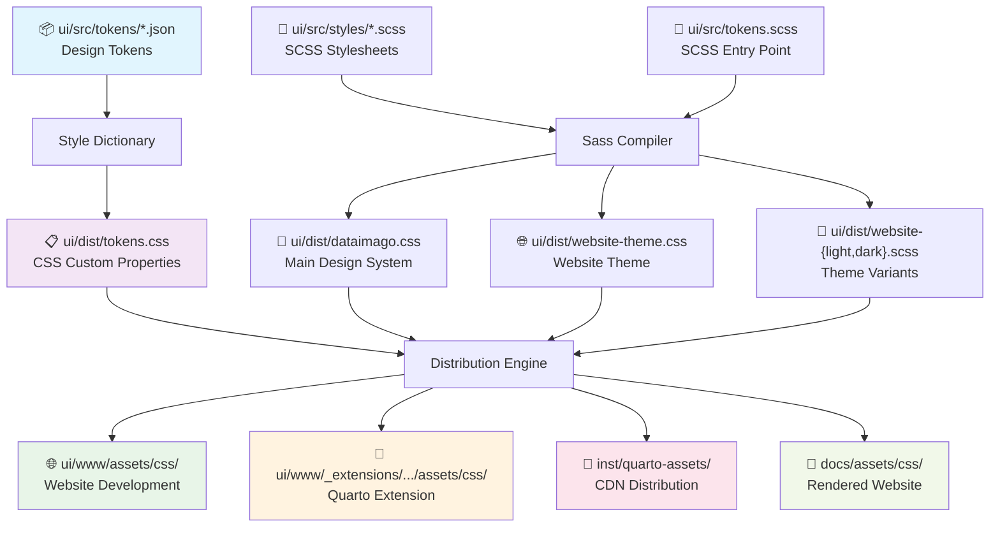

### Build Process Steps:
1. **Tokens** → Style Dictionary processes JSON → CSS custom properties
2. **Main SCSS** → Dynamically creates entry point → Main design system CSS  
3. **Website Theme** → Compiles unified theme → Website-specific CSS
4. **Theme Variants** → Generates light/dark SCSS → Quarto-compatible themes
5. **Distribution** → Copies assets to 4 deployment targets

> 📋 **See [../ARCHITECTURE.md](../ARCHITECTURE.md) for comprehensive system diagrams** that show how this UI workspace integrates with the broader dataimago package architecture.

## \U0001F3D7\UFE0F Architecture

### Directory Structure
```
ui/
\u251c\u2500\u2500 src/                    # Source files
\u2502   \u251c\u2500\u2500 tokens/            # Design tokens (JSON)
\u2502   \u2502   \u251c\u2500\u2500 colors.json    # dataimago color palette
\u2502   \u2502   \u251c\u2500\u2500 typography.json # Font definitions
\u2502   \u2502   \u2514\u2500\u2500 spacing.json   # Spacing scale
\u2502   \u2514\u2500\u2500 styles/            # SCSS source files
\u2502       \u251c\u2500\u2500 base.scss      # Foundation styles
\u2502       \u251c\u2500\u2500 components.scss # UI components
\u2502       \u251c\u2500\u2500 utilities.scss  # Utility classes
\u2502       \u2514\u2500\u2500 accessibility.scss # Ethical AI accessibility
\u251c\u2500\u2500 dist/                  # Built assets (generated)
\u251c\u2500\u2500 node_modules/          # Node.js dependencies
\u251c\u2500\u2500 package.json           # Node.js configuration
\u2514\u2500\u2500 build.js              # Custom build script
```

## \U0001F3AF Design Philosophy

### Ethical AI Principles
Every design decision reflects dataimago's commitment to emancipatory AI:

- **WCAG AA Compliance**: All color combinations meet accessibility contrast requirements
- **Reduced Motion Respect**: Animations honor user motion preferences
- **High Contrast Support**: Alternative color schemes for accessibility needs
- **Semantic Naming**: Colors like `ethical-highlight` embed meaning in the system

### Token-Driven Approach
Design tokens ensure consistency across all platforms:
- **JSON Source**: Human and machine-readable design decisions
- **Style Dictionary**: Converts tokens to CSS custom properties
- **Multi-Platform**: Same tokens generate CSS, Sass variables, and Tailwind presets

### SVG Logo Integration
The build system includes sophisticated SVG logo management:
- **Theme-Aware SVGs**: 4 variants each for AI monogram and package hex logos
- **Automatic Distribution**: SVGs copied to CDN and extension directories
- **CSS Integration**: Logo paths embedded in SCSS for theme switching
- **JavaScript Support**: Theme detection and hover state management

## \u2699\ufe0f Build Process

### 1. Design Token Processing
```bash
npx style-dictionary build
```
Converts JSON tokens \u2192 CSS custom properties in `dist/tokens.css`

### 2. SCSS Compilation
```bash
npx sass src/main.scss:dist/dataimago.css
```
Compiles component styles using design tokens

### 3. PostCSS Optimization
```bash
npx postcss dist/dataimago.css -o dist/dataimago.min.css
```
Adds vendor prefixes and minifies for production

### 4. Tailwind Preset Generation
Creates `dist/tailwind-preset.js` for Next.js integration

## \U0001F680 R-First Usage

**Never run Node.js commands directly.** Use R functions instead:

```r
library(dataimago)

# Set up workspace (one-time)
create_ui_workspace()

# Build all assets
build_design_system(verbose = TRUE)
```

## \U0001F4E6 Generated Assets

### Production Ready
- **`dataimago.min.css`** (6.1KB) - Minified CSS for production use
- **`tokens.css`** (1.8KB) - CSS custom properties for styling
- **`tailwind-preset.js`** (0.4KB) - Next.js Tailwind configuration

### Development
- **`dataimago.css`** (6.1KB) - Expanded CSS with comments
- **`*.css.map`** - Source maps for debugging
- **`manifest.json`** - Build metadata and asset inventory

## \U0001F310 Distribution Channels

Assets are automatically distributed to:

1. **Quarto Extension**: `_extensions/dataimago/ai-native/assets/css/`
2. **CDN Distribution**: `inst/quarto-assets/` (jsDelivr-compatible)
3. **Local Development**: `ui/dist/` (with source maps)

## \U0001F3A8 Customization

### Modifying Design Tokens
Edit JSON files in `src/tokens/`:
```json
{
  "color": {
    "brand": {
      "primary": {
        "value": "#2C3E50",
        "description": "dataimago primary brand color"
      }
    }
  }
}
```

### Adding Components
Create SCSS in `src/styles/components.scss`:
```scss
.di-new-component {
  background: var(--color-brand-primary);
  color: var(--color-text-inverse);
  padding: var(--spacing-md);
  border-radius: var(--radius-md);
}
```

### After Changes
Always rebuild through R - now with guaranteed propagation:
```r
result <- build_design_system(force_rebuild = TRUE)

# Verify automatic propagation
if (result$success) {
  cat("✅ Changes propagated to", length(result$assets), "locations")
  cat("✅ Quarto render/preview will work without 404 errors")
}
```

## \U0001F9E0 Accessibility Features

The design system includes comprehensive accessibility enhancements:

### Screen Reader Support
- **`.sr-only`** - Screen reader only content
- **Skip links** - Keyboard navigation assistance
- **ARIA live regions** - Dynamic content announcements

### Motor Accessibility
- **Large click targets** - Minimum 44px touch targets
- **Keyboard navigation** - Full keyboard accessibility
- **Focus indicators** - Enhanced focus visibility

### Visual Accessibility
- **High contrast mode** - Alternative color schemes
- **Reduced motion** - Respects user motion preferences
- **Color blind friendly** - Text and icon indicators

## \U0001F527 Dependencies

### Required (automatically managed)
- **style-dictionary@^4.0.0** - Design token processing
- **sass@^1.69.0** - SCSS compilation
- **postcss@^8.4.0** - CSS post-processing
- **autoprefixer@^10.4.0** - Vendor prefixes
- **cssnano@^6.0.0** - CSS minification

### System Requirements
- **Node.js 18+** - JavaScript runtime
- **pnpm or npm** - Package manager
- **OpenSSL** - SRI hash generation (usually pre-installed)

## \U0001F504 Workflow Integration

This workspace integrates seamlessly with:
- **R CMD build** - Assets included in package builds
- **Quarto render** - Extension provides styling
- **GitHub Actions** - CI/CD builds and releases
- **Next.js projects** - Via Tailwind preset consumption

---

*This workspace embodies dataimago's R-first philosophy: modern CSS tooling wrapped in familiar R functions with comprehensive documentation of every system interaction.*
````

## File: .Rbuildignore
````
# Exclude CITATION.cff
^CITATION\.cff$

# Exclude CLAUDE.md
^CLAUDE\.md$

# Exclude various file types and CI control files
^.*\.Rproj$
^\.Rproj\.user$
^\.git$
^\.gitignore$
^\.gitmodules$
^\.github$
^_pkgdown\.yml$
^docs$
^pkgdown$
^\.travis\.yml$
^appveyor\.yml$
^codecov\.yml$
^\.lintr$

# Exclude quarto generated files
^ui/www/_site$
^ui/www/\.quarto$

# Exclude old quarto_website directory if it exists
^quarto_website$

# ===== NODE.JS AND BUILD ARTIFACTS =====
# Exclude Node.js artifacts at package root (should not exist)
^package-lock\.json$
^yarn\.lock$
^pnpm-lock\.yaml$
^node_modules$
^\.npmrc$

# Exclude Node.js artifacts in ui/ directory
^ui/node_modules$
^ui/node_modules/
^ui/package-lock\.json$
^ui/pnpm-lock\.yaml$
^ui/\.npmrc$

# ===== GIT SUBMODULE EXCLUSIONS =====
# Exclude ALL node_modules in the git submodule
^ui/src/dataimago-design/node_modules$
^ui/src/dataimago-design/node_modules/

# Exclude git artifacts in submodule
^ui/src/dataimago-design/\.git$
^ui/src/dataimago-design/\.git/
^ui/src/dataimago-design/\.gitignore$

# Exclude package management files in submodule
^ui/src/dataimago-design/package-lock\.json$
^ui/src/dataimago-design/pnpm-lock\.yaml$
^ui/src/dataimago-design/\.npmrc$

# Exclude build configuration files in submodule
^ui/src/dataimago-design/postcss\.config\.js$

# ===== DEVELOPMENT AND DOCUMENTATION FILES =====
# Exclude development documentation in submodule
^ui/src/dataimago-design/AGENTS\.md$
^ui/src/dataimago-design/INTEGRATION\.md$
^ui/src/dataimago-design/PHASE.*\.md$
^ui/src/dataimago-design/SYSTEM-COMPARISON\.md$
^ui/src/dataimago-design/TODO\.md$
^ui/src/dataimago-design/TOKEN_ARCHITECTURE\.md$
^ui/src/dataimago-design/README\.md$

# Exclude development guides in ui/
^ui/P3-OKLCH-Testing-Guide\.md$
^ui/Phase.*-Implementation-Plan\.md$
^ui/PostCSS-Implementation-Guide\.md$
^ui/README\.md$

# Exclude foundations documentation (development-only)
^ui/src/dataimago-design/foundations$
^ui/src/dataimago-design/foundations/

# Exclude examples and reports (development-only)
^ui/src/dataimago-design/examples$
^ui/src/dataimago-design/examples/
^ui/src/dataimago-design/reports$
^ui/src/dataimago-design/reports/

# Exclude build tools and scripts
^ui/src/dataimago-design/tools$
^ui/src/dataimago-design/tools/
^ui/src/dataimago-design/scripts$
^ui/src/dataimago-design/scripts/

# ===== QUARTO AND WEB DEVELOPMENT =====
# Exclude any Quarto extensions at package root (should only be in ui/www/)
^_extensions$

# Exclude Quarto development files
^ui/www/_extensions/dataimago/ai-native/docs$
^ui/www/_extensions/dataimago/ai-native/examples$

# ===== R PACKAGE STRUCTURE =====
# Exclude README files in R/ and man/ directories (not allowed in R packages)
^R/README\.md$
^man/README\.md$

# Exclude development documentation
^docs/development$

# Exclude empty standard R package directories
^data/?$
^tests/?$
^vignettes/?$

# ===== BINARY AND TEMPORARY FILES =====
# Exclude large binary files
.*\.pdf$
.*\.key$

# Exclude CSS source maps (development artifacts)
.*\.css\.map$

# Exclude temporary files
.*\.tmp$
.*\.temp$

# ===== AI AND DEVELOPMENT CONTEXT FILES =====
# Exclude repomix AI context files
.*-repomix\..*$
^\.repomixignore$

# ===== HIDDEN FILES AND DIRECTORIES =====
# Exclude hidden files and directories (but allow specific ones we need)
^\.repomixignore$
\.git$
\.git/
/\.[^/]*$

# ===== ADDITIONAL SAFETY EXCLUSIONS =====
# Exclude any backup files
.*~$
.*\.bak$
.*\.backup$

# Exclude OS-specific files
\.DS_Store$
Thumbs\.db$

# Exclude editor files
.*\.swp$
.*\.swo$
.*\.orig$
````

## File: inst/quarto-assets/dataimago-dark.scss
````scss
// Dataimago Dark Theme for Quarto - Generated from Design Tokens
// Quarto 1.8.24 - OKLCH-Ready Mode
// Generated in oklch-ready mode - Will auto-upgrade to native OKLCH when Quarto 1.9+ is available
// Current: sRGB Sass variables + OKLCH CSS custom properties for browser visibility

// @use "sass:color"; // Will be enabled automatically in Quarto 1.9+

/*-- scss:defaults --*/
$body-bg: rgb(20, 20, 16) !default;
$body-color: rgb(237, 237, 235) !default;
$headings-color: rgb(237, 237, 235) !default;
$navbar-bg: rgb(20, 20, 16) !default;
$link-color: #83838f !default;
$code-color: #ff69b4 !default;
$code-bg: rgb(30, 30, 26) !default;
$headings-font-family: Josefin Sans, system-ui, sans-serif !default;
$headings-font-weight: 500 !default;
$h2-font-size: 1.875rem !default;

/*-- scss:rules --*/
@import "shared-components.scss";

// Theme-specific overrides
.light-mode { display: none; }
.dark-mode { display: block; }
pre { border: 1px solid rgb(40, 40, 36); }
:root { 
  /* Font Family CSS Custom Properties */
  --font-family-sans: Fira Sans, system-ui, sans-serif;
  --font-family-mono: JetBrains Mono, SF Mono, Monaco, Inconsolata, monospace;
  --font-family-display: Josefin Sans, system-ui, sans-serif;
  --font-family-brand: Futura, system-ui, sans-serif;
  --font-family-math: Fira Math, Fira Sans Math, system-ui, sans-serif;
  
  --logo-default-fill: #83838f; 
  --logo-hover-fill: rgb(237, 237, 235);
  
  /* Theme CSS Custom Properties */
  --theme-body-bg: rgb(20, 20, 16);
  --theme-navbar-bg: rgb(20, 20, 16);
  --theme-navbar-bg-scrolled: rgb(20, 20, 16);
  --theme-text-primary: rgb(237, 237, 235);
  --theme-text-secondary: #83838f;
  --theme-text-hover: rgb(237, 237, 235);
  
  /* OKLCH Enhanced Colors for Modern Browsers */
  --dataimago-body-bg-oklch: oklch(0.062 0.016 110.2);
  --dataimago-body-color-oklch: oklch(0.937 0.007 110.1);
  --dataimago-headings-color-oklch: oklch(0.937 0.007 110.1);
  --dataimago-navbar-bg-oklch: rgb(20, 20, 16);
  --dataimago-link-color-oklch: oklch(0.551 0.046 291.0);
  --dataimago-code-color-oklch: #ff69b4;
  --dataimago-code-bg-oklch: rgb(30, 30, 26);
  
  /* Progressive Enhancement */
  --dataimago-body-bg: var(--dataimago-body-bg-oklch);
  
  /* Version Metadata */
  --dataimago-quarto-version: "1.8.24";
  --dataimago-generation-mode: "oklch-ready";
  --dataimago-oklch-native: false;
}

// ===== THEME TOGGLE STYLING =====
// Dark theme - show sun icon (switch to light)

.quarto-color-scheme-toggle .bi::before {
  display: inline-block !important;
  height: 1rem !important;
  width: 1rem !important;
  content: "" !important;
  vertical-align: -0.125em !important;
  background-repeat: no-repeat !important;
  background-size: 1rem 1rem !important;
  background-color: transparent !important;
  background-image: url('data:image/svg+xml,<svg xmlns="http://www.w3.org/2000/svg" width="16" height="16" fill="%2383838F" class="bi bi-sun" viewBox="0 0 16 16"><path d="M8 11a3 3 0 1 1 0-6 3 3 0 0 1 0 6zm0 1a4 4 0 1 0 0-8 4 4 0 0 0 0 8zM8 0a.5.5 0 0 1 .5.5v2a.5.5 0 0 1-1 0v-2A.5.5 0 0 1 8 0zm0 13a.5.5 0 0 1 .5.5v2a.5.5 0 0 1-1 0v-2A.5.5 0 0 1 8 13zm8-5a.5.5 0 0 1-.5.5h-2a.5.5 0 0 1 0-1h2a.5.5 0 0 1 .5.5zM3 8a.5.5 0 0 1-.5.5h-2a.5.5 0 0 1 0-1h2A.5.5 0 0 1 3 8zm10.657-5.657a.5.5 0 0 1 0 .707l-1.414 1.415a.5.5 0 1 1-.707-.708l1.414-1.414a.5.5 0 0 1 .707 0zm-9.193 9.193a.5.5 0 0 1 0 .707L3.05 13.657a.5.5 0 0 1-.707-.707l1.414-1.414a.5.5 0 0 1 .707 0zm9.193 2.121a.5.5 0 0 1-.707 0l-1.414-1.414a.5.5 0 0 1 .707-.707l1.414 1.414a.5.5 0 0 1 0 .707zM4.464 4.465a.5.5 0 0 1-.707 0L2.343 3.05a.5.5 0 1 1 .707-.707l1.414 1.414a.5.5 0 0 1 0 .708z"/></svg>') !important;
  transition: background-image 0.25s ease;
}

.quarto-color-scheme-toggle:hover .bi::before {
  background-image: url('data:image/svg+xml,<svg xmlns="http://www.w3.org/2000/svg" width="16" height="16" fill="%23EDEDE8" class="bi bi-sun" viewBox="0 0 16 16"><path d="M8 11a3 3 0 1 1 0-6 3 3 0 0 1 0 6zm0 1a4 4 0 1 0 0-8 4 4 0 0 0 0 8zM8 0a.5.5 0 0 1 .5.5v2a.5.5 0 0 1-1 0v-2A.5.5 0 0 1 8 0zm0 13a.5.5 0 0 1 .5.5v2a.5.5 0 0 1-1 0v-2A.5.5 0 0 1 8 13zm8-5a.5.5 0 0 1-.5.5h-2a.5.5 0 0 1 0-1h2a.5.5 0 0 1 .5.5zM3 8a.5.5 0 0 1-.5.5h-2a.5.5 0 0 1 0-1h2A.5.5 0 0 1 3 8zm10.657-5.657a.5.5 0 0 1 0 .707l-1.414 1.415a.5.5 0 1 1-.707-.708l1.414-1.414a.5.5 0 0 1 .707 0zm-9.193 9.193a.5.5 0 0 1 0 .707L3.05 13.657a.5.5 0 0 1-.707-.707l1.414-1.414a.5.5 0 0 1 .707 0zm9.193 2.121a.5.5 0 0 1-.707 0l-1.414-1.414a.5.5 0 0 1 .707-.707l1.414 1.414a.5.5 0 0 1 0 .707zM4.464 4.465a.5.5 0 0 1-.707 0L2.343 3.05a.5.5 0 1 1 .707-.707l1.414 1.414a.5.5 0 0 1 0 .708z"/></svg>') !important;
  transition: background-image 0.25s ease;
}
````

## File: inst/quarto-assets/dataimago-light.scss
````scss
// Dataimago Light Theme for Quarto - Generated from Design Tokens
// Quarto 1.8.24 - OKLCH-Ready Mode
// Generated in oklch-ready mode - Will auto-upgrade to native OKLCH when Quarto 1.9+ is available
// Current: sRGB Sass variables + OKLCH CSS custom properties for browser visibility

// @use "sass:color"; // Will be enabled automatically in Quarto 1.9+

/*-- scss:defaults --*/
$body-bg: rgb(237, 237, 235) !default;
$body-color: rgb(20, 20, 16) !default;
$headings-color: rgb(20, 20, 16) !default;
$navbar-bg: rgb(237, 237, 235) !default;
$link-color: #7c7c7c !default;
$code-color: #ff69b4 !default;
$code-bg: rgb(225, 225, 223) !default;
$headings-font-family: Josefin Sans, system-ui, sans-serif !default;
$headings-font-weight: 500 !default;
$h2-font-size: 1.875rem !default;


// Modern Sass functions ready for Quarto 1.9+
// @function oklch-mix($color1, $color2, $weight: 50%) {
//   @return color.mix($color1, $color2, $weight, $method: oklch);
// }

/*-- scss:rules --*/
@import "shared-components.scss";

// Theme-specific overrides
.light-mode { display: block; }
.dark-mode { display: none; }
pre { border: 1px solid rgb(220, 220, 218); }
:root { 
  /* Font Family CSS Custom Properties */
  --font-family-sans: Fira Sans, system-ui, sans-serif;
  --font-family-mono: JetBrains Mono, SF Mono, Monaco, Inconsolata, monospace;
  --font-family-display: Josefin Sans, system-ui, sans-serif;
  --font-family-brand: Futura, system-ui, sans-serif;
  --font-family-math: Fira Math, Fira Sans Math, system-ui, sans-serif;
  
  --logo-default-fill: #7c7c7c; 
  --logo-hover-fill: rgb(20, 20, 16);
  
  /* Theme CSS Custom Properties */
  --theme-body-bg: rgb(237, 237, 235);
  --theme-navbar-bg: rgb(237, 237, 235);
  --theme-navbar-bg-scrolled: rgb(237, 237, 235);
  --theme-text-primary: rgb(20, 20, 16);
  --theme-text-secondary: #7c7c7c;
  --theme-text-hover: rgb(20, 20, 16);
  
  /* OKLCH Enhanced Colors for Modern Browsers */
  --dataimago-body-bg-oklch: oklch(0.937 0.007 110.1);
  --dataimago-body-color-oklch: oklch(0.062 0.016 110.2);
  --dataimago-headings-color-oklch: oklch(0.062 0.016 110.2);
  --dataimago-navbar-bg-oklch: rgb(237, 237, 235);
  --dataimago-link-color-oklch: oklch(0.520 0.000 158.2);
  --dataimago-code-color-oklch: #ff69b4;
  --dataimago-code-bg-oklch: rgb(225, 225, 223);
  
  /* Progressive Enhancement */
  --dataimago-body-bg: var(--dataimago-body-bg-oklch);
  
  /* Version Metadata */
  --dataimago-quarto-version: "1.8.24";
  --dataimago-generation-mode: "oklch-ready";
  --dataimago-oklch-native: false;
}

// ===== THEME TOGGLE STYLING =====
// Light theme - show moon icon (switch to dark)

.quarto-color-scheme-toggle .bi::before {
  display: inline-block !important;
  height: 1rem !important;
  width: 1rem !important;
  content: "" !important;
  vertical-align: -0.125em !important;
  background-repeat: no-repeat !important;
  background-size: 1rem 1rem !important;
  background-color: transparent !important;
  background-image: url('data:image/svg+xml,<svg xmlns="http://www.w3.org/2000/svg" width="16" height="16" fill="%2383838F" class="bi bi-moon" viewBox="0 0 16 16"><path d="M6 .278a.768.768 0 0 1 .08.858 7.208 7.208 0 0 0-.878 3.46c0 4.021 3.278 7.277 7.318 7.277.527 0 1.04-.055 1.533-.16a.787.787 0 0 1 .81.316.733.733 0 0 1-.031.893A8.349 8.349 0 0 1 8.344 16C3.734 16 0 12.286 0 7.71 0 4.266 2.114 1.312 5.124.06A.752.752 0 0 1 6 .278z"/></svg>') !important;
  transition: background-image 0.25s ease;
}

.quarto-color-scheme-toggle:hover .bi::before {
  background-image: url('data:image/svg+xml,<svg xmlns="http://www.w3.org/2000/svg" width="16" height="16" fill="%23000000" class="bi bi-moon" viewBox="0 0 16 16"><path d="M6 .278a.768.768 0 0 1 .08.858 7.208 7.208 0 0 0-.878 3.46c0 4.021 3.278 7.277 7.318 7.277.527 0 1.04-.055 1.533-.16a.787.787 0 0 1 .81.316.733.733 0 0 1-.031.893A8.349 8.349 0 0 1 8.344 16C3.734 16 0 12.286 0 7.71 0 4.266 2.114 1.312 5.124.06A.752.752 0 0 1 6 .278z"/></svg>') !important;
  transition: background-image 0.25s ease;
}
````

## File: R/ai.R
````r
#' @importFrom fs dir_exists dir_create path file_exists
#' @importFrom processx run
#' @importFrom rlang arg_match
#' @importFrom glue glue
#' @importFrom crayon green silver yellow red bold blue
NULL

#' Create Complete AI-Native Application
#'
#' The dataimago meta-orchestration function that creates production-ready
#' AI-native web applications with a single command. Embodies the dataimago
#' philosophy of "R as source of truth" for modern web development.
#'
#' When a source R package is provided, executes the full meta-tool pipeline:
#' R functions -> REST API -> MCP tools -> TypeScript types -> Web Application.
#' The generated application inherits dataimago's ethical constraints structurally.
#'
#' @param project_name Character. Name of the project/application to create
#' @param project_path Character. Path where project should be created. Default: getwd()
#' @param source_pkg Character. Path to the source R package whose exported
#'   functions should drive the generated application. This is the "R as Source
#'   of Truth" -- all APIs, MCP tools, types, and UI derive from this package.
#'   If NULL, creates scaffolding without the derivation pipeline.
#' @param mode Character. Generation mode: "local" runs the full pipeline locally,
#'   "remote" delegates to the dataimago-ai platform API. Default: "local"
#' @param api_url Character. URL of the dataimago-ai orchestration API.
#'   Default: "https://dataimago.ai/api/orchestrate"
#' @param api_key Character. API key for remote mode. If NULL, reads from
#'   the DATAIMAGO_API_KEY environment variable.
#' @param domain_type Character. Domain type: "research", "explorer", or "framework".
#'   Default: "research"
#' @param domain_name Character. Human-readable domain name. Default: project_name
#' @param framework Character. Target framework: "quarto", "shiny", "nextjs", or "full". Default: "quarto"
#' @param features Character vector. AI features to include:
#'   - "chat-interface": Conversational AI components
#'   - "document-analysis": Document processing and analysis
#'   - "data-viz": Interactive data visualization
#'   - "streaming": Real-time streaming interfaces
#'   - "model-management": AI model selection and management
#' @param theme Character. Visual theme: "professional", "academic", "minimal", "ethical". Default: "professional"
#' @param ai_providers Character vector. AI service integrations:
#'   - "openai": OpenAI GPT integration
#'   - "anthropic": Claude integration
#'   - "local": Local LLM support
#'   - "custom": Custom API endpoints
#' @param ethical_framework Logical. Include dataimago ethical AI guidelines. Default: TRUE
#' @param foundation_docs Logical. Include philosophical foundation documents. Default: TRUE
#' @param export_static Logical. Pre-compute API responses as static JSON for
#'   serverless deployment. Only applies when source_pkg is provided. Default: TRUE
#' @param force_overwrite Logical. Overwrite existing project directory. Default: FALSE
#' @param verbose Logical. Print detailed progress information. Default: TRUE
#'
#' @return List with project metadata, file paths, and build information
#'
#' @details
#' The ai() function implements dataimago's complete application generation pipeline:
#'
#' **Meta-Tool Pipeline (when source_pkg provided):**
#' 1. `build_design_framework()` - Creates directory structure, configs, workflows
#' 2. `build_design_components()` - Generates API, MCP tools, types from R package
#' 3. `build_design_system()` - Compiles design assets
#' 4. `export_static_api()` - Pre-computes JSON for serverless deployment
#'
#' **Scaffold Pipeline (when source_pkg is NULL):**
#' 1. `build_design_framework()` - Creates directory structure, configs, workflows
#' 2. `build_design_components()` - Populates with templates and documentation
#' 3. `build_design_system()` - Compiles design assets
#'
#' **Ethical AI Integration:**
#' Every generated application includes dataimago's ethical AI principles embedded
#' at the code, design, and architectural level. Ethical constraints propagate
#' structurally from dataimago-design through the build pipeline.
#'
#' **System Requirements:**
#' - R 4.0+
#' - Node.js 18+ with pnpm installed globally
#' - Git (for repository initialization)
#' - Write permissions to target directory
#'
#' @examples
#' \dontrun{
#' # Full meta-tool pipeline from an R package
#' ai("my-analysis-app",
#'    source_pkg = "path/to/my-rpkg",
#'    framework = "nextjs")
#'
#' # Minimal Quarto website with chat interface
#' ai("my-research-site",
#'    framework = "quarto",
#'    features = "chat-interface")
#'
#' # Full-featured AI application
#' ai("intelligent-dashboard",
#'    framework = "full",
#'    source_pkg = "path/to/rpkg",
#'    features = c("chat-interface", "data-viz", "streaming"),
#'    ai_providers = c("openai", "anthropic"),
#'    theme = "professional")
#' }
#'
#' @export
ai <- function(project_name,
               project_path = getwd(),
               source_pkg = NULL,
               mode = c("local", "remote"),
               api_url = "https://dataimago.ai/api/orchestrate",
               api_key = NULL,
               domain_type = c("research", "explorer", "framework"),
               domain_name = project_name,
               framework = c("quarto", "shiny", "nextjs", "full"),
               features = NULL,
               theme = c("professional", "academic", "minimal", "ethical"),
               ai_providers = NULL,
               ethical_framework = TRUE,
               foundation_docs = TRUE,
               export_static = TRUE,
               force_overwrite = FALSE,
               verbose = TRUE) {
  # Validate arguments
  mode <- rlang::arg_match(mode)
  domain_type <- rlang::arg_match(domain_type)
  framework <- rlang::arg_match(framework)
  theme <- rlang::arg_match(theme)

  # Validate project name
  if (missing(project_name) || is.null(project_name) || project_name == "") {
    stop("project_name is required and cannot be empty", call. = FALSE)
  }

  # Create full project path
  full_project_path <- fs::path(project_path, project_name)

  # Check if project already exists
  if (fs::dir_exists(full_project_path) && !force_overwrite) {
    stop(glue::glue("Project directory '{full_project_path}' already exists. Use force_overwrite = TRUE to overwrite."),
      call. = FALSE
    )
  }

  if (verbose) {
    ui_info(glue::glue("\\U0001F3AF Creating AI-native application: {crayon::bold(project_name)}"))
    ui_info(glue::glue("\\U0001F4C1 Location: {full_project_path}"))
    ui_info(glue::glue("\\U0001F504 Mode: {mode}"))
    ui_info(glue::glue("\\U0001F3D7\\uFE0F Framework: {framework}"))
    ui_info(glue::glue("\\U0001F3A8 Theme: {theme}"))
    if (!is.null(source_pkg)) {
      ui_info(glue::glue("\\U0001F4E6 Source R package: {source_pkg}"))
    }
    if (!is.null(features)) {
      ui_info(glue::glue("\\u26A1 Features: {paste(features, collapse = ', ')}"))
    }
    if (!is.null(ai_providers)) {
      ui_info(glue::glue("\\U0001F916 AI Providers: {paste(ai_providers, collapse = ', ')}"))
    }
  }

  # ---- REMOTE MODE: delegate to dataimago-ai platform API ----
  if (mode == "remote") {
    return(ai_remote(
      project_name = project_name,
      full_project_path = full_project_path,
      source_pkg = source_pkg,
      api_url = api_url,
      api_key = api_key,
      domain_type = domain_type,
      domain_name = domain_name,
      force_overwrite = force_overwrite,
      verbose = verbose
    ))
  }

  # Initialize results list
  results <- list(
    project_name = project_name,
    project_path = full_project_path,
    source_pkg = source_pkg,
    framework = framework,
    theme = theme,
    features = features,
    ai_providers = ai_providers,
    ethical_framework = ethical_framework,
    foundation_docs = foundation_docs,
    timestamp = Sys.time(),
    success = FALSE,
    errors = character(0)
  )

  tryCatch(
    {
      # PHASE 1: Build Design Framework
      if (verbose) ui_info("\\U0001F3D7\\uFE0F Phase 1: Building design framework...")

      framework_result <- build_design_framework(
        project_path = full_project_path,
        framework = framework,
        verbose = verbose
      )

      results$framework_result <- framework_result

      # PHASE 2: Build Design Components (+ meta-tool pipeline if source_pkg)
      if (verbose) ui_info("\\U0001F4E6 Phase 2: Building design components...")

      components_result <- build_design_components(
        project_path = full_project_path,
        source_pkg = source_pkg,
        features = features,
        ai_providers = ai_providers,
        theme = theme,
        foundation_docs = foundation_docs,
        ethical_framework = ethical_framework,
        verbose = verbose
      )

      results$components_result <- components_result

      # PHASE 3: Build Design System (if framework created UI workspace)
      if (framework_result$has_ui_workspace) {
        if (verbose) ui_info("\\U0001F3A8 Phase 3: Building design system...")

        # Change to project directory for build_design_system
        original_wd <- getwd()
        setwd(full_project_path)

        tryCatch({
          system_result <- build_design_system(verbose = verbose)
          results$system_result <- system_result
        }, finally = {
          setwd(original_wd)
        })
      }

      # PHASE 4: Export Static API (if source_pkg provided and export_static)
      if (!is.null(source_pkg) && export_static) {
        if (verbose) ui_info("\\U0001F4BE Phase 4: Exporting static API data...")

        static_output_dir <- fs::path(full_project_path, "public", "api")
        tryCatch(
          {
            static_result <- export_static_api(
              pkg_path = source_pkg,
              output_dir = static_output_dir,
              verbose = verbose
            )
            results$static_result <- static_result
          },
          error = function(e) {
            if (verbose) {
              ui_warn(glue::glue("Static export encountered issues: {e$message}"))
              ui_info("Static export is optional -- the app will work in live API mode")
            }
          }
        )
      }

      # PHASE 5: Recursive Loop (CLAUDE.md, Wiki, Ethical CI, Self-MCP)
      if (verbose) ui_info("\\U0001F504 Phase 5: Wiring recursive loop...")

      # 5a: Generate project-specific CLAUDE.md
      tryCatch(
        {
          claude_result <- generate_claude_md(
            project_path = full_project_path,
            project_name = project_name,
            source_pkg = source_pkg,
            framework = framework,
            features = features,
            verbose = verbose
          )
          results$claude_result <- claude_result
        },
        error = function(e) {
          if (verbose) ui_warn(glue::glue("CLAUDE.md generation encountered issues: {e$message}"))
        }
      )

      # 5b: Bootstrap wiki (if foundation_docs enabled)
      if (foundation_docs) {
        tryCatch(
          {
            wiki_result <- bootstrap_wiki(
              project_path = full_project_path,
              project_name = project_name,
              source_pkg = source_pkg,
              verbose = verbose
            )
            results$wiki_result <- wiki_result
          },
          error = function(e) {
            if (verbose) ui_warn(glue::glue("Wiki bootstrap encountered issues: {e$message}"))
          }
        )
      }

      # 5c: Generate ethical CI pipeline
      if (ethical_framework) {
        tryCatch(
          {
            ci_result <- generate_ethical_ci(
              project_path = full_project_path,
              framework = framework,
              verbose = verbose
            )
            results$ci_result <- ci_result
          },
          error = function(e) {
            if (verbose) ui_warn(glue::glue("Ethical CI generation encountered issues: {e$message}"))
          }
        )
      }

      # 5d: Generate dataimago self-description MCP (in project for reference)
      tryCatch(
        {
          self_mcp_path <- fs::path(full_project_path, "dataimago-mcp-schema.json")
          self_mcp_result <- generate_self_mcp(
            output_path = self_mcp_path,
            verbose = verbose
          )
          results$self_mcp_result <- self_mcp_result
        },
        error = function(e) {
          if (verbose) ui_warn(glue::glue("Self-MCP generation encountered issues: {e$message}"))
        }
      )

      results$success <- TRUE

      if (verbose) {
        ui_done(glue::glue("\\U0001F389 AI-native application '{project_name}' created successfully!"))
        ui_info(glue::glue("\\U0001F4C1 Location: {full_project_path}"))

        # Provide next steps based on framework
        if (framework == "quarto") {
          ui_info("\\U0001F680 Next steps:")
          ui_info(glue::glue("   cd {project_name}"))
          ui_info("   quarto preview")
        } else if (framework == "shiny") {
          ui_info("\\U0001F680 Next steps:")
          ui_info(glue::glue("   cd {project_name}"))
          ui_info("   R -e \"shiny::runApp()\"")
        } else if (framework %in% c("nextjs", "full")) {
          ui_info("\\U0001F680 Next steps:")
          ui_info(glue::glue("   cd {project_name}"))
          if (!is.null(source_pkg)) {
            ui_info(glue::glue("   # Start R API server:"))
            ui_info(glue::glue("   R -e \"{pkg_name}::run_{pkg_name}_api()\""))
            ui_info(glue::glue("   # In another terminal, start NextJS:"))
          }
          ui_info("   pnpm install && pnpm dev")
        }
      }
    },
    error = function(e) {
      results$errors <- c(results$errors, as.character(e))
      if (verbose) {
        ui_oops(glue::glue("Failed to create AI application: {e$message}"))
      }
    }
  )

  invisible(results)
}


# ====================================================================
# Remote mode implementation
# ====================================================================

#' @keywords internal
ai_remote <- function(project_name,
                      full_project_path,
                      source_pkg,
                      api_url,
                      api_key,
                      domain_type,
                      domain_name,
                      force_overwrite,
                      verbose) {
  if (!requireNamespace("httr2", quietly = TRUE)) {
    stop("Package 'httr2' is required for remote mode. Install with: install.packages('httr2')",
      call. = FALSE
    )
  }
  if (!requireNamespace("jsonlite", quietly = TRUE)) {
    stop("Package 'jsonlite' is required for remote mode. Install with: install.packages('jsonlite')",
      call. = FALSE
    )
  }

  key <- api_key %||% Sys.getenv("DATAIMAGO_API_KEY", unset = "")
  if (key == "") {
    stop(
      "No API key provided. Set DATAIMAGO_API_KEY environment variable or pass api_key argument.",
      call. = FALSE
    )
  }

  if (verbose) ui_info("Calling dataimago-ai orchestration API...")

  introspection <- NULL
  if (!is.null(source_pkg)) {
    introspection <- build_introspection_payload(source_pkg, verbose)
  }

  payload <- list(
    project_name = project_name,
    domain_type = domain_type,
    domain_name = domain_name,
    scope = "public",
    source_pkg_introspection = introspection,
    create_repo = FALSE
  )

  response <- tryCatch(
    {
      req <- httr2::request(api_url) |>
        httr2::req_headers(Authorization = paste("Bearer", key)) |>
        httr2::req_body_json(payload) |>
        httr2::req_timeout(120)
      httr2::req_perform(req)
    },
    error = function(e) {
      if (verbose) {
        ui_warn(glue::glue("Remote API call failed: {e$message}"))
        ui_info("Falling back to local generation pipeline...")
      }
      NULL
    }
  )

  if (is.null(response)) {
    return(ai(
      project_name = project_name,
      project_path = dirname(full_project_path),
      source_pkg = source_pkg,
      mode = "local",
      domain_type = domain_type,
      domain_name = domain_name,
      force_overwrite = force_overwrite,
      verbose = verbose
    ))
  }

  result <- httr2::resp_body_json(response)

  if (!is.null(result$error)) {
    stop(glue::glue("Orchestration API error: {result$error}"), call. = FALSE)
  }

  if (verbose) ui_info("Writing generated files to disk...")

  if (!fs::dir_exists(full_project_path)) {
    fs::dir_create(full_project_path, recurse = TRUE)
  }

  files_written <- character(0)
  for (f in result$files) {
    file_path <- fs::path(full_project_path, f$path)
    parent_dir <- dirname(file_path)
    if (!fs::dir_exists(parent_dir)) {
      fs::dir_create(parent_dir, recurse = TRUE)
    }
    writeLines(f$content, file_path)
    files_written <- c(files_written, f$path)
  }

  if (!is.null(result$manifest)) {
    manifest_path <- fs::path(full_project_path, "dataimago-framework.json")
    writeLines(
      jsonlite::toJSON(result$manifest, auto_unbox = TRUE, pretty = TRUE),
      manifest_path
    )
  }

  if (verbose) {
    ui_done(glue::glue(
      "Project '{project_name}' created via remote API ({length(files_written)} files)"
    ))
    ui_info(glue::glue("Location: {full_project_path}"))
  }

  invisible(list(
    project_name = project_name,
    project_path = as.character(full_project_path),
    mode = "remote",
    files_written = files_written,
    manifest = result$manifest,
    success = TRUE,
    errors = character(0),
    timestamp = Sys.time()
  ))
}

#' Build introspection payload from an R package for the orchestration API
#' @keywords internal
build_introspection_payload <- function(source_pkg, verbose = FALSE) {
  desc_path <- fs::path(source_pkg, "DESCRIPTION")
  if (!fs::file_exists(desc_path)) {
    return(NULL)
  }

  desc_lines <- readLines(desc_path)
  pkg_name <- trimws(sub("^Package:\\s*", "", grep("^Package:", desc_lines, value = TRUE)[1]))
  title <- trimws(sub("^Title:\\s*", "", grep("^Title:", desc_lines, value = TRUE)[1]))
  version <- trimws(sub("^Version:\\s*", "", grep("^Version:", desc_lines, value = TRUE)[1]))
  desc <- trimws(sub("^Description:\\s*", "", grep("^Description:", desc_lines, value = TRUE)[1]))

  exported_functions <- list()
  tryCatch(
    {
      exports <- parse_roxygen_exports(source_pkg, verbose = FALSE)
      exported_functions <- lapply(exports, function(x) {
        list(name = x$name, title = if (!is.null(x$title)) x$title else "")
      })
    },
    error = function(e) {
      if (verbose) ui_warn(glue::glue("Could not parse exports: {e$message}"))
    }
  )

  list(
    package_name = pkg_name,
    exported_functions = exported_functions,
    description = if (!is.na(desc)) desc else title,
    version = version
  )
}
````

## File: R/generate_types.R
````r
#' @importFrom fs dir_exists dir_create path file_exists
#' @importFrom glue glue
#' @importFrom jsonlite toJSON
#' @importFrom crayon green silver yellow red bold blue
NULL

# ============================================================================
# generate_types.R -- Generate TypeScript Types and Single-Path API Client
# ============================================================================
#
# Creates TypeScript type definitions from R function signatures and a
# single-path API client that always calls the NextJS API route tree
# (/api/discover, /api/data/<endpoint>, /api/openapi.json). Producer
# selection (static / live / database / composite) happens server-side
# via the DATAIMAGO_PRODUCER environment variable and is invisible to
# the client. This replaces the pre-Phase-2e dual-mode client that
# branched on NEXT_PUBLIC_API_MODE.
#
# Pattern: R function signatures -> TypeScript types + NextJS-calling client
# Reference:
#   - dataimago-design wiki: patterns/producer-driver-pattern.md
#   - apps/template/src/app/api/ (route tree this client targets)
# ============================================================================


#' Generate Shared TypeScript Utilities
#'
#' Creates TypeScript type definitions, API client, and utility functions
#' from an R package's exported functions. The generated code enables
#' type-safe integration between the R analysis layer and NextJS frontend.
#'
#' @param pkg_path Character. Path to the R package source directory
#' @param output_dir Character. Directory for generated TypeScript files
#' @param pkg_name Character. Package name. If NULL, read from DESCRIPTION.
#' @param api_port Integer. Retained for backward compatibility. Since
#'   Phase 2e the emitted client does not talk to the R server directly;
#'   the R server is instead the live-producer driver's backing service.
#'   Default: 8000
#' @param verbose Logical. Print progress. Default: TRUE
#'
#' @return List with: files_created, types_generated, client_mode
#'
#' @details
#' Three files are generated:
#'
#' **types.ts** -- TypeScript interfaces for:
#' - API response structures (matching R function return types)
#' - Parameter types for each function
#' - Common types (ApiResponse, ErrorResponse, DiscoveryResponse)
#' - `ApiMode` / `ApiConfig` retained but marked `@deprecated` for one
#'   minor release; new code must not branch on them
#'
#' **api-client.ts** -- Single-path API client (Phase 2e+):
#' - Always calls the NextJS API route tree:
#'   - `GET /api/discover` for the manifest
#'   - `GET /api/data/<endpoint>` for analysis results
#'   - `GET /api/openapi.json` for the OpenAPI spec
#' - Producer selection (static / live / database / composite) is a
#'   server-only concern (DATAIMAGO_PRODUCER env var); the client never
#'   sees which driver answered
#' - No `fetch` fallback to `/api/*.json` in `public/`; static responses
#'   flow through the NextJS route handler backed by StaticProducerDriver
#'
#' **index.ts** -- Re-exports from types and client
#'
#' @section Phase 2e Semantics:
#' The generated client is intentionally *thin*. It is a typed fetch
#' wrapper over four public NextJS routes. The pre-Phase-2e `mode`
#' constructor argument and `NEXT_PUBLIC_API_MODE` env var now emit
#' deprecation warnings but continue to compile.
#'
#' @export
generate_shared_utils <- function(pkg_path,
                                  output_dir,
                                  pkg_name = NULL,
                                  api_port = 8000L,
                                  verbose = TRUE) {
  # Read package name
  if (is.null(pkg_name)) {
    desc_path <- fs::path(pkg_path, "DESCRIPTION")
    if (fs::file_exists(desc_path)) {
      desc_lines <- readLines(desc_path, warn = FALSE)
      pkg_line <- grep("^Package:", desc_lines, value = TRUE)
      if (length(pkg_line) > 0) {
        pkg_name <- trimws(sub("^Package:\\s*", "", pkg_line[1]))
      }
    }
    if (is.null(pkg_name)) pkg_name <- basename(pkg_path)
  }

  if (verbose) {
    ui_info(glue::glue("\U0001F4DD Generating TypeScript utilities for '{pkg_name}'"))
  }

  # Parse exported functions
  exports <- parse_roxygen_exports(pkg_path, verbose = verbose)

  # Ensure output directory
  if (!fs::dir_exists(output_dir)) {
    fs::dir_create(output_dir, recurse = TRUE)
  }

  files_created <- character(0)

  # Generate types.ts
  types_code <- generate_types_ts(exports, pkg_name)
  types_path <- fs::path(output_dir, "types.ts")
  writeLines(types_code, types_path)
  files_created <- c(files_created, "types.ts")
  if (verbose) ui_done("Generated types.ts")

  # Generate api-client.ts
  client_code <- generate_api_client_ts(exports, pkg_name, api_port)
  client_path <- fs::path(output_dir, "api-client.ts")
  writeLines(client_code, client_path)
  files_created <- c(files_created, "api-client.ts")
  if (verbose) ui_done("Generated api-client.ts (dual-mode)")

  # Generate index.ts
  index_code <- generate_index_ts(exports, pkg_name)
  index_path <- fs::path(output_dir, "index.ts")
  writeLines(index_code, index_path)
  files_created <- c(files_created, "index.ts")
  if (verbose) ui_done("Generated index.ts")

  results <- list(
    files_created = files_created,
    types_generated = length(exports),
    client_mode = "dual (live + static)"
  )

  if (verbose) {
    ui_done(glue::glue("Generated {length(files_created)} TypeScript files"))
  }

  invisible(results)
}


# ============================================================================
# Internal: TypeScript Code Generation
# ============================================================================

#' Generate types.ts content
#' @noRd
generate_types_ts <- function(exports, pkg_name) {
  lines <- c(
    glue::glue("// Auto-generated TypeScript types for {pkg_name}"),
    glue::glue("// Generated by dataimago::generate_shared_utils() (Phase 2e+)"),
    glue::glue("// Date: {Sys.Date()}"),
    "//",
    "// DO NOT EDIT MANUALLY -- regenerate with dataimago::generate_shared_utils()",
    "//",
    "// Producer selection (static / live / database / composite) is a server-only",
    "// concern driven by DATAIMAGO_PRODUCER. See producer-driver-pattern in the wiki.",
    "",
    "// ============================================================================",
    "// Common Types",
    "// ============================================================================",
    "",
    "export interface ApiResponse<T = unknown> {",
    "  status: 'success' | 'error';",
    "  data: T;",
    "  request?: Record<string, string>;",
    "  timestamp?: string;",
    "}",
    "",
    "export interface ErrorResponse {",
    "  status: 'error';",
    "  error: string;",
    "  message: string;",
    "  timestamp?: string;",
    "}",
    "",
    "export interface DiscoveryResponse {",
    "  package_name: string;",
    "  version: string;",
    "  endpoints: EndpointInfo[];",
    "  openapi_url?: string;",
    "  timestamp: string;",
    "}",
    "",
    "export interface EndpointInfo {",
    "  name: string;",
    "  title?: string;",
    "  description?: string;",
    "  path: string;",
    "  method: string;",
    "  params?: ParamInfo[];",
    "}",
    "",
    "export interface ParamInfo {",
    "  name: string;",
    "  type: string;",
    "  description?: string;",
    "  required: boolean;",
    "  default?: string;",
    "  enum?: string[];",
    "}",
    "",
    "// ============================================================================",
    "// Function Parameter Types",
    "// ============================================================================"
  )

  for (fn_name in names(exports)) {
    fn_meta <- exports[[fn_name]]
    interface_name <- to_pascal_case(fn_name)

    lines <- c(
      lines, "",
      glue::glue("/** Parameters for {fn_name}() */"),
      glue::glue("export interface {interface_name}Params {{")
    )

    for (param_name in names(fn_meta$params)) {
      p <- fn_meta$params[[param_name]]
      ts_type <- r_type_to_typescript(p$type, p$enum)
      optional <- if (isTRUE(p$required)) "" else "?"
      desc <- gsub("\\*/", "* /", p$description) # Escape comment-ending

      lines <- c(
        lines,
        glue::glue("  /** {desc} */"),
        glue::glue("  {param_name}{optional}: {ts_type};")
      )
    }

    lines <- c(lines, "}")
  }

  lines <- c(
    lines,
    "",
    "// ============================================================================",
    "// Deprecated -- kept for one minor release after Phase 2e",
    "// ============================================================================",
    "",
    "/**",
    " * @deprecated Since Phase 2e: the client no longer branches on mode.",
    " *   Producer selection is server-only via DATAIMAGO_PRODUCER.",
    " */",
    "export type ApiMode = 'live' | 'static';",
    "",
    "/**",
    " * @deprecated Since Phase 2e: kept so existing generated code continues",
    " *   to compile. `mode` is ignored by the client; `baseUrl` is only used",
    " *   by legacy callers constructing the client via the deprecated",
    " *   positional constructor.",
    " */",
    "export interface ApiConfig {",
    "  mode: ApiMode;",
    "  baseUrl: string;",
    "  staticBasePath: string;",
    "}"
  )

  paste(lines, collapse = "\n")
}


#' Generate api-client.ts content
#'
#' Emits a single-path client that always calls the NextJS API route tree:
#'   - GET /api/discover
#'   - GET /api/data/<endpoint>
#'   - GET /api/openapi.json
#'
#' Producer selection (static / live / database / composite) is resolved
#' server-side by `resolveProducerDriver()` in `@dataimago/shared-utils/producers`
#' based on `DATAIMAGO_PRODUCER`. The client never sees it.
#'
#' @noRd
generate_api_client_ts <- function(exports, pkg_name, api_port) {
  # Build function-specific methods
  methods <- character(0)

  for (fn_name in names(exports)) {
    fn_meta <- exports[[fn_name]]
    endpoint <- fn_to_endpoint(fn_name)
    interface_name <- to_pascal_case(fn_name)

    methods <- c(
      methods, "",
      "  /**",
      glue::glue("   * {fn_meta$title}"),
      glue::glue("   * Calls GET /api/data/{endpoint} (NextJS route)."),
      "   * Producer (static | live | database | composite) is chosen server-side.",
      "   */",
      glue::glue("  async {to_camel_case(fn_name)}(params: Partial<{interface_name}Params> = {{}}): Promise<ApiResponse> {{"),
      glue::glue("    return this.request('{endpoint}', params);"),
      "  }"
    )
  }

  methods_str <- paste(methods, collapse = "\n")

  param_imports <- paste(vapply(names(exports), function(fn) {
    paste0("  ", to_pascal_case(fn), "Params,")
  }, character(1)), collapse = "\n")

  lines <- c(
    glue::glue("// Auto-generated single-path API client for {pkg_name} (Phase 2e+)"),
    glue::glue("// Generated by dataimago::generate_shared_utils()"),
    glue::glue("// Date: {Sys.Date()}"),
    "//",
    "// This client is a typed fetch wrapper over four public NextJS routes:",
    "//   GET /api/discover",
    "//   GET /api/data/<endpoint>",
    "//   GET /api/openapi.json",
    "// Producer selection happens server-side via DATAIMAGO_PRODUCER.",
    "//",
    "// DO NOT EDIT MANUALLY -- regenerate with dataimago::generate_shared_utils()",
    "",
    "import type {",
    "  ApiResponse,",
    "  ErrorResponse,",
    "  DiscoveryResponse,",
    "  ApiConfig,",
    "  ApiMode,",
    param_imports,
    "} from './types';",
    "",
    "/**",
    " * Default client options. `baseUrl` is empty in the browser (same-origin",
    " * fetch against the NextJS app) and falls back to NEXT_PUBLIC_APP_URL",
    " * during server-side rendering when the app's own origin is not available.",
    " */",
    "const DEFAULT_BASE_URL: string =",
    "  (typeof process !== 'undefined' && process.env?.NEXT_PUBLIC_APP_URL) || '';",
    "",
    "/** Options accepted by the Phase-2e client constructor. */",
    "export interface ClientOptions {",
    "  /** Override same-origin fetch with an absolute URL. Mainly for SSR / tests. */",
    "  baseUrl?: string;",
    "  /** Default fetch timeout in ms. 0 or undefined disables the timeout. */",
    "  timeoutMs?: number;",
    "}",
    "",
    glue::glue("export class {to_pascal_case(pkg_name)}Client {{"),
    "  private readonly baseUrl: string;",
    "  private readonly timeoutMs: number;",
    "",
    "  constructor(options: ClientOptions | Partial<ApiConfig> = {}) {",
    "    // Back-compat: swallow the deprecated ApiConfig shape.",
    "    const legacy = options as Partial<ApiConfig>;",
    "    if (legacy.mode !== undefined || legacy.staticBasePath !== undefined) {",
    "      if (typeof console !== 'undefined' && typeof console.warn === 'function') {",
    "        console.warn(",
    glue::glue("          '[{to_pascal_case(pkg_name)}Client] `mode` and `staticBasePath` are ignored since Phase 2e. ' +"),
    "            'Producer selection is server-only via DATAIMAGO_PRODUCER.',",
    "        );",
    "      }",
    "    }",
    "    const opts = options as ClientOptions;",
    "    this.baseUrl = (opts.baseUrl ?? legacy.baseUrl ?? DEFAULT_BASE_URL).replace(/\\/$/, '');",
    "    this.timeoutMs = opts.timeoutMs ?? 0;",
    "  }",
    "",
    "  /** Low-level fetch; all route-specific methods funnel through here. */",
    "  private async request<T = unknown>(",
    "    endpoint: string,",
    "    params: Record<string, unknown> = {},",
    "  ): Promise<ApiResponse<T>> {",
    "    const qs = new URLSearchParams();",
    "    for (const [k, v] of Object.entries(params)) {",
    "      if (v !== undefined && v !== null && v !== '') qs.set(k, String(v));",
    "    }",
    "    const query = qs.toString();",
    "    const url = `${this.baseUrl}/api/data/${endpoint}${query ? `?${query}` : ''}`;",
    "    const res = await this.safeFetch(url);",
    "    if (!res.ok) {",
    "      const err = await this.safeJson<ErrorResponse>(res);",
    "      throw new Error(err?.message || `API error: ${res.status}`);",
    "    }",
    "    return (await res.json()) as ApiResponse<T>;",
    "  }",
    "",
    "  private async safeFetch(url: string): Promise<Response> {",
    "    if (this.timeoutMs > 0 && typeof AbortController !== 'undefined') {",
    "      const ctrl = new AbortController();",
    "      const timer = setTimeout(() => ctrl.abort(), this.timeoutMs);",
    "      try {",
    "        return await fetch(url, { signal: ctrl.signal });",
    "      } finally {",
    "        clearTimeout(timer);",
    "      }",
    "    }",
    "    return fetch(url);",
    "  }",
    "",
    "  private async safeJson<T>(res: Response): Promise<T | null> {",
    "    try {",
    "      return (await res.json()) as T;",
    "    } catch {",
    "      return null;",
    "    }",
    "  }",
    "",
    "  // ========================================================================",
    "  // Generated API Methods",
    "  // ========================================================================",
    methods_str,
    "",
    "  /** Discover the endpoint catalog (GET /api/discover). */",
    "  async discover(): Promise<DiscoveryResponse> {",
    "    const url = `${this.baseUrl}/api/discover`;",
    "    const res = await this.safeFetch(url);",
    "    if (!res.ok) throw new Error(`discover failed: ${res.status}`);",
    "    return (await res.json()) as DiscoveryResponse;",
    "  }",
    "",
    "  /** Fetch the OpenAPI document (GET /api/openapi.json). */",
    "  async openapi(): Promise<unknown> {",
    "    const url = `${this.baseUrl}/api/openapi.json`;",
    "    const res = await this.safeFetch(url);",
    "    if (!res.ok) throw new Error(`openapi failed: ${res.status}`);",
    "    return await res.json();",
    "  }",
    "",
    "  /**",
    "   * @deprecated Since Phase 2e: the client no longer tracks a mode.",
    "   *   Retained so legacy callers don't crash; always returns 'static'.",
    "   */",
    "  getMode(): ApiMode { return 'static'; }",
    "",
    "  /**",
    "   * @deprecated Since Phase 2e: always returns false; producer selection",
    "   *   is opaque to the client.",
    "   */",
    "  isLive(): boolean { return false; }",
    "}",
    "",
    "/** Default client instance. */",
    glue::glue("export const apiClient = new {to_pascal_case(pkg_name)}Client();")
  )

  paste(lines, collapse = "\n")
}


#' Generate index.ts re-export file
#' @noRd
generate_index_ts <- function(exports, pkg_name) {
  lines <- c(
    glue::glue("// Auto-generated index for {pkg_name} shared utilities"),
    glue::glue("// Generated by dataimago::generate_shared_utils()"),
    "//",
    "// DO NOT EDIT MANUALLY -- regenerate with dataimago::generate_shared_utils()",
    "",
    "export * from './types';",
    glue::glue("export {{ {to_pascal_case(pkg_name)}Client, apiClient }} from './api-client';")
  )

  paste(lines, collapse = "\n")
}


# ============================================================================
# Internal: Naming Convention Helpers
# ============================================================================

#' Convert to PascalCase (e.g., summarizeAssessment -> SummarizeAssessment)
#' @noRd
to_pascal_case <- function(name) {
  # Handle snake_case
  parts <- strsplit(name, "[_.-]")[[1]]
  paste(vapply(parts, function(p) {
    paste0(toupper(substr(p, 1, 1)), substr(p, 2, nchar(p)))
  }, character(1)), collapse = "")
}


#' Convert to camelCase (e.g., summarize_assessment -> summarizeAssessment)
#' @noRd
to_camel_case <- function(name) {
  # Already camelCase? Keep it
  if (!grepl("[_.-]", name)) {
    return(name)
  }

  parts <- strsplit(name, "[_.-]")[[1]]
  first <- parts[1]
  rest <- vapply(parts[-1], function(p) {
    paste0(toupper(substr(p, 1, 1)), substr(p, 2, nchar(p)))
  }, character(1))

  paste0(first, paste(rest, collapse = ""))
}


#' Convert R type to TypeScript type
#' @noRd
r_type_to_typescript <- function(r_type, enum_vals = NULL) {
  if (!is.null(enum_vals) && length(enum_vals) > 0) {
    return(paste(vapply(enum_vals, function(v) paste0("'", v, "'"), character(1)), collapse = " | "))
  }

  switch(r_type,
    "boolean" = "boolean",
    "integer" = "number",
    "number" = "number",
    "numeric" = "number",
    "array" = "string[]",
    "list" = "Record<string, unknown>",
    "string"
  )
}
````

## File: ui/www/_extensions/dataimago/ai-native/assets/css/dataimago-dark.scss
````scss
// Dataimago Dark Theme for Quarto - Generated from Design Tokens
// Quarto 1.8.24 - OKLCH-Ready Mode
// Generated in oklch-ready mode - Will auto-upgrade to native OKLCH when Quarto 1.9+ is available
// Current: sRGB Sass variables + OKLCH CSS custom properties for browser visibility

// @use "sass:color"; // Will be enabled automatically in Quarto 1.9+

/*-- scss:defaults --*/
$body-bg: rgb(20, 20, 16) !default;
$body-color: rgb(237, 237, 235) !default;
$headings-color: rgb(237, 237, 235) !default;
$navbar-bg: rgb(20, 20, 16) !default;
$link-color: #83838f !default;
$code-color: #ff69b4 !default;
$code-bg: rgb(30, 30, 26) !default;
$headings-font-family: Josefin Sans, system-ui, sans-serif !default;
$headings-font-weight: 500 !default;
$h2-font-size: 1.875rem !default;

/*-- scss:rules --*/
@import "shared-components.scss";

// Theme-specific overrides
.light-mode { display: none; }
.dark-mode { display: block; }
pre { border: 1px solid rgb(40, 40, 36); }
:root { 
  /* Font Family CSS Custom Properties */
  --font-family-sans: Fira Sans, system-ui, sans-serif;
  --font-family-mono: JetBrains Mono, SF Mono, Monaco, Inconsolata, monospace;
  --font-family-display: Josefin Sans, system-ui, sans-serif;
  --font-family-brand: Futura, system-ui, sans-serif;
  --font-family-math: Fira Math, Fira Sans Math, system-ui, sans-serif;
  
  --logo-default-fill: #83838f; 
  --logo-hover-fill: rgb(237, 237, 235);
  
  /* Theme CSS Custom Properties */
  --theme-body-bg: rgb(20, 20, 16);
  --theme-navbar-bg: rgb(20, 20, 16);
  --theme-navbar-bg-scrolled: rgb(20, 20, 16);
  --theme-text-primary: rgb(237, 237, 235);
  --theme-text-secondary: #83838f;
  --theme-text-hover: rgb(237, 237, 235);
  
  /* OKLCH Enhanced Colors for Modern Browsers */
  --dataimago-body-bg-oklch: oklch(0.062 0.016 110.2);
  --dataimago-body-color-oklch: oklch(0.937 0.007 110.1);
  --dataimago-headings-color-oklch: oklch(0.937 0.007 110.1);
  --dataimago-navbar-bg-oklch: rgb(20, 20, 16);
  --dataimago-link-color-oklch: oklch(0.551 0.046 291.0);
  --dataimago-code-color-oklch: #ff69b4;
  --dataimago-code-bg-oklch: rgb(30, 30, 26);
  
  /* Progressive Enhancement */
  --dataimago-body-bg: var(--dataimago-body-bg-oklch);
  
  /* Version Metadata */
  --dataimago-quarto-version: "1.8.24";
  --dataimago-generation-mode: "oklch-ready";
  --dataimago-oklch-native: false;
}

// ===== THEME TOGGLE STYLING =====
// Dark theme - show sun icon (switch to light)

.quarto-color-scheme-toggle .bi::before {
  display: inline-block !important;
  height: 1rem !important;
  width: 1rem !important;
  content: "" !important;
  vertical-align: -0.125em !important;
  background-repeat: no-repeat !important;
  background-size: 1rem 1rem !important;
  background-color: transparent !important;
  background-image: url('data:image/svg+xml,<svg xmlns="http://www.w3.org/2000/svg" width="16" height="16" fill="%2383838F" class="bi bi-sun" viewBox="0 0 16 16"><path d="M8 11a3 3 0 1 1 0-6 3 3 0 0 1 0 6zm0 1a4 4 0 1 0 0-8 4 4 0 0 0 0 8zM8 0a.5.5 0 0 1 .5.5v2a.5.5 0 0 1-1 0v-2A.5.5 0 0 1 8 0zm0 13a.5.5 0 0 1 .5.5v2a.5.5 0 0 1-1 0v-2A.5.5 0 0 1 8 13zm8-5a.5.5 0 0 1-.5.5h-2a.5.5 0 0 1 0-1h2a.5.5 0 0 1 .5.5zM3 8a.5.5 0 0 1-.5.5h-2a.5.5 0 0 1 0-1h2A.5.5 0 0 1 3 8zm10.657-5.657a.5.5 0 0 1 0 .707l-1.414 1.415a.5.5 0 1 1-.707-.708l1.414-1.414a.5.5 0 0 1 .707 0zm-9.193 9.193a.5.5 0 0 1 0 .707L3.05 13.657a.5.5 0 0 1-.707-.707l1.414-1.414a.5.5 0 0 1 .707 0zm9.193 2.121a.5.5 0 0 1-.707 0l-1.414-1.414a.5.5 0 0 1 .707-.707l1.414 1.414a.5.5 0 0 1 0 .707zM4.464 4.465a.5.5 0 0 1-.707 0L2.343 3.05a.5.5 0 1 1 .707-.707l1.414 1.414a.5.5 0 0 1 0 .708z"/></svg>') !important;
  transition: background-image 0.25s ease;
}

.quarto-color-scheme-toggle:hover .bi::before {
  background-image: url('data:image/svg+xml,<svg xmlns="http://www.w3.org/2000/svg" width="16" height="16" fill="%23EDEDE8" class="bi bi-sun" viewBox="0 0 16 16"><path d="M8 11a3 3 0 1 1 0-6 3 3 0 0 1 0 6zm0 1a4 4 0 1 0 0-8 4 4 0 0 0 0 8zM8 0a.5.5 0 0 1 .5.5v2a.5.5 0 0 1-1 0v-2A.5.5 0 0 1 8 0zm0 13a.5.5 0 0 1 .5.5v2a.5.5 0 0 1-1 0v-2A.5.5 0 0 1 8 13zm8-5a.5.5 0 0 1-.5.5h-2a.5.5 0 0 1 0-1h2a.5.5 0 0 1 .5.5zM3 8a.5.5 0 0 1-.5.5h-2a.5.5 0 0 1 0-1h2A.5.5 0 0 1 3 8zm10.657-5.657a.5.5 0 0 1 0 .707l-1.414 1.415a.5.5 0 1 1-.707-.708l1.414-1.414a.5.5 0 0 1 .707 0zm-9.193 9.193a.5.5 0 0 1 0 .707L3.05 13.657a.5.5 0 0 1-.707-.707l1.414-1.414a.5.5 0 0 1 .707 0zm9.193 2.121a.5.5 0 0 1-.707 0l-1.414-1.414a.5.5 0 0 1 .707-.707l1.414 1.414a.5.5 0 0 1 0 .707zM4.464 4.465a.5.5 0 0 1-.707 0L2.343 3.05a.5.5 0 1 1 .707-.707l1.414 1.414a.5.5 0 0 1 0 .708z"/></svg>') !important;
  transition: background-image 0.25s ease;
}
````

## File: ui/www/_extensions/dataimago/ai-native/assets/css/dataimago-light.scss
````scss
// Dataimago Light Theme for Quarto - Generated from Design Tokens
// Quarto 1.8.24 - OKLCH-Ready Mode
// Generated in oklch-ready mode - Will auto-upgrade to native OKLCH when Quarto 1.9+ is available
// Current: sRGB Sass variables + OKLCH CSS custom properties for browser visibility

// @use "sass:color"; // Will be enabled automatically in Quarto 1.9+

/*-- scss:defaults --*/
$body-bg: rgb(237, 237, 235) !default;
$body-color: rgb(20, 20, 16) !default;
$headings-color: rgb(20, 20, 16) !default;
$navbar-bg: rgb(237, 237, 235) !default;
$link-color: #7c7c7c !default;
$code-color: #ff69b4 !default;
$code-bg: rgb(225, 225, 223) !default;
$headings-font-family: Josefin Sans, system-ui, sans-serif !default;
$headings-font-weight: 500 !default;
$h2-font-size: 1.875rem !default;


// Modern Sass functions ready for Quarto 1.9+
// @function oklch-mix($color1, $color2, $weight: 50%) {
//   @return color.mix($color1, $color2, $weight, $method: oklch);
// }

/*-- scss:rules --*/
@import "shared-components.scss";

// Theme-specific overrides
.light-mode { display: block; }
.dark-mode { display: none; }
pre { border: 1px solid rgb(220, 220, 218); }
:root { 
  /* Font Family CSS Custom Properties */
  --font-family-sans: Fira Sans, system-ui, sans-serif;
  --font-family-mono: JetBrains Mono, SF Mono, Monaco, Inconsolata, monospace;
  --font-family-display: Josefin Sans, system-ui, sans-serif;
  --font-family-brand: Futura, system-ui, sans-serif;
  --font-family-math: Fira Math, Fira Sans Math, system-ui, sans-serif;
  
  --logo-default-fill: #7c7c7c; 
  --logo-hover-fill: rgb(20, 20, 16);
  
  /* Theme CSS Custom Properties */
  --theme-body-bg: rgb(237, 237, 235);
  --theme-navbar-bg: rgb(237, 237, 235);
  --theme-navbar-bg-scrolled: rgb(237, 237, 235);
  --theme-text-primary: rgb(20, 20, 16);
  --theme-text-secondary: #7c7c7c;
  --theme-text-hover: rgb(20, 20, 16);
  
  /* OKLCH Enhanced Colors for Modern Browsers */
  --dataimago-body-bg-oklch: oklch(0.937 0.007 110.1);
  --dataimago-body-color-oklch: oklch(0.062 0.016 110.2);
  --dataimago-headings-color-oklch: oklch(0.062 0.016 110.2);
  --dataimago-navbar-bg-oklch: rgb(237, 237, 235);
  --dataimago-link-color-oklch: oklch(0.520 0.000 158.2);
  --dataimago-code-color-oklch: #ff69b4;
  --dataimago-code-bg-oklch: rgb(225, 225, 223);
  
  /* Progressive Enhancement */
  --dataimago-body-bg: var(--dataimago-body-bg-oklch);
  
  /* Version Metadata */
  --dataimago-quarto-version: "1.8.24";
  --dataimago-generation-mode: "oklch-ready";
  --dataimago-oklch-native: false;
}

// ===== THEME TOGGLE STYLING =====
// Light theme - show moon icon (switch to dark)

.quarto-color-scheme-toggle .bi::before {
  display: inline-block !important;
  height: 1rem !important;
  width: 1rem !important;
  content: "" !important;
  vertical-align: -0.125em !important;
  background-repeat: no-repeat !important;
  background-size: 1rem 1rem !important;
  background-color: transparent !important;
  background-image: url('data:image/svg+xml,<svg xmlns="http://www.w3.org/2000/svg" width="16" height="16" fill="%2383838F" class="bi bi-moon" viewBox="0 0 16 16"><path d="M6 .278a.768.768 0 0 1 .08.858 7.208 7.208 0 0 0-.878 3.46c0 4.021 3.278 7.277 7.318 7.277.527 0 1.04-.055 1.533-.16a.787.787 0 0 1 .81.316.733.733 0 0 1-.031.893A8.349 8.349 0 0 1 8.344 16C3.734 16 0 12.286 0 7.71 0 4.266 2.114 1.312 5.124.06A.752.752 0 0 1 6 .278z"/></svg>') !important;
  transition: background-image 0.25s ease;
}

.quarto-color-scheme-toggle:hover .bi::before {
  background-image: url('data:image/svg+xml,<svg xmlns="http://www.w3.org/2000/svg" width="16" height="16" fill="%23000000" class="bi bi-moon" viewBox="0 0 16 16"><path d="M6 .278a.768.768 0 0 1 .08.858 7.208 7.208 0 0 0-.878 3.46c0 4.021 3.278 7.277 7.318 7.277.527 0 1.04-.055 1.533-.16a.787.787 0 0 1 .81.316.733.733 0 0 1-.031.893A8.349 8.349 0 0 1 8.344 16C3.734 16 0 12.286 0 7.71 0 4.266 2.114 1.312 5.124.06A.752.752 0 0 1 6 .278z"/></svg>') !important;
  transition: background-image 0.25s ease;
}
````

## File: ui/www/assets/css/dataimago-dark.scss
````scss
// Dataimago Dark Theme for Quarto - Generated from Design Tokens
// Quarto 1.8.24 - OKLCH-Ready Mode
// Generated in oklch-ready mode - Will auto-upgrade to native OKLCH when Quarto 1.9+ is available
// Current: sRGB Sass variables + OKLCH CSS custom properties for browser visibility

// @use "sass:color"; // Will be enabled automatically in Quarto 1.9+

/*-- scss:defaults --*/
$body-bg: rgb(20, 20, 16) !default;
$body-color: rgb(237, 237, 235) !default;
$headings-color: rgb(237, 237, 235) !default;
$navbar-bg: rgb(20, 20, 16) !default;
$link-color: #83838f !default;
$code-color: #ff69b4 !default;
$code-bg: rgb(30, 30, 26) !default;
$headings-font-family: Josefin Sans, system-ui, sans-serif !default;
$headings-font-weight: 500 !default;
$h2-font-size: 1.875rem !default;

/*-- scss:rules --*/
@import "shared-components.scss";

// Theme-specific overrides
.light-mode { display: none; }
.dark-mode { display: block; }
pre { border: 1px solid rgb(40, 40, 36); }
:root { 
  /* Font Family CSS Custom Properties */
  --font-family-sans: Fira Sans, system-ui, sans-serif;
  --font-family-mono: JetBrains Mono, SF Mono, Monaco, Inconsolata, monospace;
  --font-family-display: Josefin Sans, system-ui, sans-serif;
  --font-family-brand: Futura, system-ui, sans-serif;
  --font-family-math: Fira Math, Fira Sans Math, system-ui, sans-serif;
  
  --logo-default-fill: #83838f; 
  --logo-hover-fill: rgb(237, 237, 235);
  
  /* Theme CSS Custom Properties */
  --theme-body-bg: rgb(20, 20, 16);
  --theme-navbar-bg: rgb(20, 20, 16);
  --theme-navbar-bg-scrolled: rgb(20, 20, 16);
  --theme-text-primary: rgb(237, 237, 235);
  --theme-text-secondary: #83838f;
  --theme-text-hover: rgb(237, 237, 235);
  
  /* OKLCH Enhanced Colors for Modern Browsers */
  --dataimago-body-bg-oklch: oklch(0.062 0.016 110.2);
  --dataimago-body-color-oklch: oklch(0.937 0.007 110.1);
  --dataimago-headings-color-oklch: oklch(0.937 0.007 110.1);
  --dataimago-navbar-bg-oklch: rgb(20, 20, 16);
  --dataimago-link-color-oklch: oklch(0.551 0.046 291.0);
  --dataimago-code-color-oklch: #ff69b4;
  --dataimago-code-bg-oklch: rgb(30, 30, 26);
  
  /* Progressive Enhancement */
  --dataimago-body-bg: var(--dataimago-body-bg-oklch);
  
  /* Version Metadata */
  --dataimago-quarto-version: "1.8.24";
  --dataimago-generation-mode: "oklch-ready";
  --dataimago-oklch-native: false;
}

// ===== THEME TOGGLE STYLING =====
// Dark theme - show sun icon (switch to light)

.quarto-color-scheme-toggle .bi::before {
  display: inline-block !important;
  height: 1rem !important;
  width: 1rem !important;
  content: "" !important;
  vertical-align: -0.125em !important;
  background-repeat: no-repeat !important;
  background-size: 1rem 1rem !important;
  background-color: transparent !important;
  background-image: url('data:image/svg+xml,<svg xmlns="http://www.w3.org/2000/svg" width="16" height="16" fill="%2383838F" class="bi bi-sun" viewBox="0 0 16 16"><path d="M8 11a3 3 0 1 1 0-6 3 3 0 0 1 0 6zm0 1a4 4 0 1 0 0-8 4 4 0 0 0 0 8zM8 0a.5.5 0 0 1 .5.5v2a.5.5 0 0 1-1 0v-2A.5.5 0 0 1 8 0zm0 13a.5.5 0 0 1 .5.5v2a.5.5 0 0 1-1 0v-2A.5.5 0 0 1 8 13zm8-5a.5.5 0 0 1-.5.5h-2a.5.5 0 0 1 0-1h2a.5.5 0 0 1 .5.5zM3 8a.5.5 0 0 1-.5.5h-2a.5.5 0 0 1 0-1h2A.5.5 0 0 1 3 8zm10.657-5.657a.5.5 0 0 1 0 .707l-1.414 1.415a.5.5 0 1 1-.707-.708l1.414-1.414a.5.5 0 0 1 .707 0zm-9.193 9.193a.5.5 0 0 1 0 .707L3.05 13.657a.5.5 0 0 1-.707-.707l1.414-1.414a.5.5 0 0 1 .707 0zm9.193 2.121a.5.5 0 0 1-.707 0l-1.414-1.414a.5.5 0 0 1 .707-.707l1.414 1.414a.5.5 0 0 1 0 .707zM4.464 4.465a.5.5 0 0 1-.707 0L2.343 3.05a.5.5 0 1 1 .707-.707l1.414 1.414a.5.5 0 0 1 0 .708z"/></svg>') !important;
  transition: background-image 0.25s ease;
}

.quarto-color-scheme-toggle:hover .bi::before {
  background-image: url('data:image/svg+xml,<svg xmlns="http://www.w3.org/2000/svg" width="16" height="16" fill="%23EDEDE8" class="bi bi-sun" viewBox="0 0 16 16"><path d="M8 11a3 3 0 1 1 0-6 3 3 0 0 1 0 6zm0 1a4 4 0 1 0 0-8 4 4 0 0 0 0 8zM8 0a.5.5 0 0 1 .5.5v2a.5.5 0 0 1-1 0v-2A.5.5 0 0 1 8 0zm0 13a.5.5 0 0 1 .5.5v2a.5.5 0 0 1-1 0v-2A.5.5 0 0 1 8 13zm8-5a.5.5 0 0 1-.5.5h-2a.5.5 0 0 1 0-1h2a.5.5 0 0 1 .5.5zM3 8a.5.5 0 0 1-.5.5h-2a.5.5 0 0 1 0-1h2A.5.5 0 0 1 3 8zm10.657-5.657a.5.5 0 0 1 0 .707l-1.414 1.415a.5.5 0 1 1-.707-.708l1.414-1.414a.5.5 0 0 1 .707 0zm-9.193 9.193a.5.5 0 0 1 0 .707L3.05 13.657a.5.5 0 0 1-.707-.707l1.414-1.414a.5.5 0 0 1 .707 0zm9.193 2.121a.5.5 0 0 1-.707 0l-1.414-1.414a.5.5 0 0 1 .707-.707l1.414 1.414a.5.5 0 0 1 0 .707zM4.464 4.465a.5.5 0 0 1-.707 0L2.343 3.05a.5.5 0 1 1 .707-.707l1.414 1.414a.5.5 0 0 1 0 .708z"/></svg>') !important;
  transition: background-image 0.25s ease;
}
````

## File: ui/www/assets/css/dataimago-light.scss
````scss
// Dataimago Light Theme for Quarto - Generated from Design Tokens
// Quarto 1.8.24 - OKLCH-Ready Mode
// Generated in oklch-ready mode - Will auto-upgrade to native OKLCH when Quarto 1.9+ is available
// Current: sRGB Sass variables + OKLCH CSS custom properties for browser visibility

// @use "sass:color"; // Will be enabled automatically in Quarto 1.9+

/*-- scss:defaults --*/
$body-bg: rgb(237, 237, 235) !default;
$body-color: rgb(20, 20, 16) !default;
$headings-color: rgb(20, 20, 16) !default;
$navbar-bg: rgb(237, 237, 235) !default;
$link-color: #7c7c7c !default;
$code-color: #ff69b4 !default;
$code-bg: rgb(225, 225, 223) !default;
$headings-font-family: Josefin Sans, system-ui, sans-serif !default;
$headings-font-weight: 500 !default;
$h2-font-size: 1.875rem !default;


// Modern Sass functions ready for Quarto 1.9+
// @function oklch-mix($color1, $color2, $weight: 50%) {
//   @return color.mix($color1, $color2, $weight, $method: oklch);
// }

/*-- scss:rules --*/
@import "shared-components.scss";

// Theme-specific overrides
.light-mode { display: block; }
.dark-mode { display: none; }
pre { border: 1px solid rgb(220, 220, 218); }
:root { 
  /* Font Family CSS Custom Properties */
  --font-family-sans: Fira Sans, system-ui, sans-serif;
  --font-family-mono: JetBrains Mono, SF Mono, Monaco, Inconsolata, monospace;
  --font-family-display: Josefin Sans, system-ui, sans-serif;
  --font-family-brand: Futura, system-ui, sans-serif;
  --font-family-math: Fira Math, Fira Sans Math, system-ui, sans-serif;
  
  --logo-default-fill: #7c7c7c; 
  --logo-hover-fill: rgb(20, 20, 16);
  
  /* Theme CSS Custom Properties */
  --theme-body-bg: rgb(237, 237, 235);
  --theme-navbar-bg: rgb(237, 237, 235);
  --theme-navbar-bg-scrolled: rgb(237, 237, 235);
  --theme-text-primary: rgb(20, 20, 16);
  --theme-text-secondary: #7c7c7c;
  --theme-text-hover: rgb(20, 20, 16);
  
  /* OKLCH Enhanced Colors for Modern Browsers */
  --dataimago-body-bg-oklch: oklch(0.937 0.007 110.1);
  --dataimago-body-color-oklch: oklch(0.062 0.016 110.2);
  --dataimago-headings-color-oklch: oklch(0.062 0.016 110.2);
  --dataimago-navbar-bg-oklch: rgb(237, 237, 235);
  --dataimago-link-color-oklch: oklch(0.520 0.000 158.2);
  --dataimago-code-color-oklch: #ff69b4;
  --dataimago-code-bg-oklch: rgb(225, 225, 223);
  
  /* Progressive Enhancement */
  --dataimago-body-bg: var(--dataimago-body-bg-oklch);
  
  /* Version Metadata */
  --dataimago-quarto-version: "1.8.24";
  --dataimago-generation-mode: "oklch-ready";
  --dataimago-oklch-native: false;
}

// ===== THEME TOGGLE STYLING =====
// Light theme - show moon icon (switch to dark)

.quarto-color-scheme-toggle .bi::before {
  display: inline-block !important;
  height: 1rem !important;
  width: 1rem !important;
  content: "" !important;
  vertical-align: -0.125em !important;
  background-repeat: no-repeat !important;
  background-size: 1rem 1rem !important;
  background-color: transparent !important;
  background-image: url('data:image/svg+xml,<svg xmlns="http://www.w3.org/2000/svg" width="16" height="16" fill="%2383838F" class="bi bi-moon" viewBox="0 0 16 16"><path d="M6 .278a.768.768 0 0 1 .08.858 7.208 7.208 0 0 0-.878 3.46c0 4.021 3.278 7.277 7.318 7.277.527 0 1.04-.055 1.533-.16a.787.787 0 0 1 .81.316.733.733 0 0 1-.031.893A8.349 8.349 0 0 1 8.344 16C3.734 16 0 12.286 0 7.71 0 4.266 2.114 1.312 5.124.06A.752.752 0 0 1 6 .278z"/></svg>') !important;
  transition: background-image 0.25s ease;
}

.quarto-color-scheme-toggle:hover .bi::before {
  background-image: url('data:image/svg+xml,<svg xmlns="http://www.w3.org/2000/svg" width="16" height="16" fill="%23000000" class="bi bi-moon" viewBox="0 0 16 16"><path d="M6 .278a.768.768 0 0 1 .08.858 7.208 7.208 0 0 0-.878 3.46c0 4.021 3.278 7.277 7.318 7.277.527 0 1.04-.055 1.533-.16a.787.787 0 0 1 .81.316.733.733 0 0 1-.031.893A8.349 8.349 0 0 1 8.344 16C3.734 16 0 12.286 0 7.71 0 4.266 2.114 1.312 5.124.06A.752.752 0 0 1 6 .278z"/></svg>') !important;
  transition: background-image 0.25s ease;
}
````

## File: ui/www/index.qmd
````
---
## No title or subtitle - using full-page scrolly telling layout
format:
  html:
    page-layout: full
    toc: false
    sidebar: false
---

<!-- ###################################### -->
<!-- SLIDE 1: Hero with scrollable content START -->
<!-- ###################################### -->
::::::::: {.lenis-slide}
<!-- Hero section START -->
::::::: {.hero-section}
<!-- Grid container START -->
:::::: {.grid}
<!-- Logo/left column START -->
:::: {.g-col-12 .g-col-md-4 .logo-column}
<!-- Logo/left container START -->
::: {.logo-container}
{width=500 .hero-logo}
<!-- Logo/left container END -->
:::
<!-- Logo/left column END -->
::::
<!-- Content/right column START -->
:::: {.g-col-12 .g-col-md-8 .g-start-md-5}
<!-- Hero content scroller START -->
::: {.hero-content-scroller data-lenis-animate="fade-left"}
<!-- Scroller content wrapper START -->
::: {.scroller-content}

### AI-Native Development Framework {.content-item}

**dataimago** represents a new paradigm in data science application development, designed specifically for integration with AI-native workflows and modern web frameworks. Built with comprehensive design systems and ethical AI principles at its core.

### Complete Build Pipeline & Multi-Platform Deployment {.content-item}

The framework provides automated CSS compilation from design tokens to production-ready assets. A single source generates optimized builds for Quarto websites, Shiny applications, Next.js platforms, and CDN distribution.

### MCP-Compatible & AI-Agent Ready {.content-item}

All functions are designed with structured, machine-readable interfaces that enable seamless collaboration between human developers and AI agents. JSON-compatible results and deterministic operations ensure reliable automation.

### R-First Workflows with Modern Web Tools {.content-item}

Familiar R interfaces wrap sophisticated Node.js build tools, providing the power of modern web development without requiring developers to leave their preferred environment.

### Professional Documentation & Design Systems {.content-item}

Automated generation of branded websites with consistent styling, comprehensive API documentation, and responsive design patterns that work across all deployment targets.

### Rapid Development with Consistent Quality {.content-item}

From concept to deployment in minimal time, with built-in design systems ensuring professional results. Scalable architecture supports everything from simple documentation sites to complex data applications.

<!-- Scroller content wrapper END -->
:::
<!-- Hero content scroller END -->
:::
<!-- Content column END -->
::::
<!-- Grid container END -->
::::::
<!-- Hero section END -->
:::::::
<!-- SLIDE 1: Hero with scrollable content END -->
:::::::::

<!-- ###################################### -->
<!-- SLIDE 2: Cards section START -->
<!-- ###################################### -->
:::::: {.lenis-slide}
<!-- Cards container START -->
:::: {.cards-container}

<!-- Cards grid START -->
:::: {.cards-grid}

<!-- Card 1: Development Tools START -->
::: {.feature-card}
### ⚡ Development Tools

**Complete Build Pipeline**  
Automated CSS compilation from design tokens to production-ready assets

**Multi-Platform Deployment**  
Single source generates assets for Quarto, Shiny, Next.js, and CDN

**Professional Documentation**  
Automated generation of branded websites with consistent styling

<!-- Technical preview START -->
::: {.technical-preview}
#### Quick Start Workflow
```r
create_ui_workspace()        # Setup environment
build_design_system()        # Compile assets  
create_quarto_documentation() # Generate docs
```
<!-- Technical preview END -->
:::
<!-- Card 1: Development Tools END -->
:::

<!-- Card 2: AI-Native Features START -->
::: {.feature-card}
### 🤖 AI-Native Features

**MCP-Compatible APIs**  
Structured functions designed for AI agent consumption and automation

**Deterministic Operations**  
Reproducible builds with comprehensive error handling and validation

**Machine-Readable Outputs**  
JSON-compatible results for seamless programmatic integration

<!-- Logo showcase START -->
::: {.logo-showcase}
{width=60 .showcase-logo}
{width=60 .showcase-logo}
<!-- Logo showcase END -->
:::
<!-- Card 2: AI-Native Features END -->
:::

<!-- Card 3: Framework Benefits START -->
::: {.feature-card}
### 🎯 Framework Benefits

<!-- Benefits list START -->
::: {.framework-benefits}
**Rapid Development**  
Complete applications from concept to deployment in minimal time

**Consistent Quality**  
Built-in design systems ensure professional results across all platforms

**AI-Agent Ready**  
MCP-compatible tooling enables seamless human-AI collaboration

**Scalable Architecture**  
Multi-platform deployment from single source with automated optimization
:::
<!-- Benefits list END -->

<!-- Learn more links START -->
::: {.learn-more-links}
[**API Reference**](r_package.qmd)  
Complete function documentation and examples

[**Framework Documentation**](mission.qmd)  
[Architecture](philosophy.qmd) • [Development Patterns](critical_theory_manifesto.qmd)
:::
<!-- Learn more links END -->
<!-- Card 3: Framework Benefits END -->
:::

<!-- Cards grid END -->
::::
<!-- Cards container END -->
:::
<!-- SLIDE 2: Cards section END -->
::::
````

## File: CITATION.cff
````
cff-version: 1.2.0
message: "If you use the dataimago package, please cite it using these metadata."
authors:
- family-names: "Betebenner"
  given-names: "Damian"
  orcid: "https://orcid.org/0000-0003-0476-5599"
title: "dataimago: AI-Native Web-Application Development Framework"
version: 0.0-3.1
doi: 10.5281/zenodo.3634024
date-released: 2026-4-17
url: "https://dataimago.github.io/dataimago"
````

## File: NAMESPACE
````
# Generated by roxygen2: do not edit by hand

export(ai)
export(build_design_components)
export(build_design_framework)
export(build_design_system)
export(check_quarto_asset_status)
export(create_quarto_documentation)
export(create_ui_workspace)
export(export_static_api)
export(generate_ai_context)
export(generate_api_scaffolding)
export(generate_cdn_assets)
export(generate_mcp_tools)
export(generate_self_mcp)
export(generate_shared_utils)
export(parse_roxygen_exports)
export(sync_quarto_assets)
export(update_quarto_extension)
importFrom(Rd2md,as_markdown)
importFrom(Rd2md,read_rdfile)
importFrom(cli,symbol)
importFrom(crayon,blue)
importFrom(crayon,bold)
importFrom(crayon,green)
importFrom(crayon,red)
importFrom(crayon,silver)
importFrom(crayon,yellow)
importFrom(digest,digest)
importFrom(fs,dir_create)
importFrom(fs,dir_exists)
importFrom(fs,dir_ls)
importFrom(fs,file_copy)
importFrom(fs,file_exists)
importFrom(fs,path)
importFrom(fs,path_package)
importFrom(glue,glue)
importFrom(jsonlite,fromJSON)
importFrom(jsonlite,toJSON)
importFrom(processx,run)
importFrom(rlang,.data)
importFrom(rlang,arg_match)
importFrom(tools,file_path_sans_ext)
importFrom(utils,getFromNamespace)
importFrom(whisker,whisker.render)
importFrom(yaml,read_yaml)
importFrom(yaml,write_yaml)
````

## File: docs/assets/css/documentation.css
````css
@charset "UTF-8";
:root {
  --dataimago-primary: #3498DB;
  --dataimago-accent: #ff69b4;
  --dataimago-ethical: #E74C3C;
  --color-surface-page-light: rgb(237, 237, 235);
  --color-surface-page-dark: rgb(20, 20, 16);
  --color-content-primary-light: rgb(20, 20, 16);
  --color-content-secondary-light: #7c7c7c;
  --color-content-primary-dark: rgb(237, 237, 235);
  --color-content-secondary-dark: #83838f;
  --dataimago-success: #27AE60;
  --dataimago-warning: #F39C12;
  --dataimago-error: #E74C3C;
  --dataimago-info: #3498DB;
}

* {
  box-sizing: border-box;
}

html {
  font-family: var(--font-family-sans);
  font-size: var(--font-size-base);
  line-height: var(--font-lineHeight-normal);
  color: var(--theme-text-primary);
  background-color: var(--theme-body-bg);
  -webkit-font-smoothing: antialiased;
  -moz-osx-font-smoothing: grayscale;
}

/* Global typography hierarchy */
h1, h2, h3, h4, h5, h6 {
  font-family: var(--font-family-sans) !important;
}

h1, h2, h3, h4, h5, h6 {
  font-weight: var(--font-weight-semibold);
  line-height: var(--font-lineHeight-tight);
  margin-top: 0;
  margin-bottom: var(--spacing-md);
  color: var(--color-text-primary);
}

h1 {
  font-size: var(--font-size-4xl);
  margin-bottom: var(--spacing-lg);
}

h2 {
  font-size: var(--font-size-3xl);
  margin-bottom: var(--spacing-lg);
}

h3 {
  font-size: var(--font-size-2xl);
}

h4 {
  font-size: var(--font-size-xl);
}

h5 {
  font-size: var(--font-size-lg);
}

h6 {
  font-size: var(--font-size-base);
}

p {
  margin-top: 0;
  margin-bottom: var(--spacing-md);
  line-height: var(--font-lineHeight-normal);
}

a {
  color: var(--color-brand-accent);
  text-decoration: underline;
  text-decoration-thickness: 1px;
  text-underline-offset: 2px;
  transition: color 0.2s ease;
}

a:hover {
  color: var(--color-brand-primary);
  text-decoration-thickness: 2px;
}

a:focus {
  outline: 2px solid var(--color-border-focus);
  outline-offset: 2px;
  border-radius: var(--radius-sm);
}

code {
  font-family: var(--font-family-mono);
  font-size: 0.9em;
  padding: 0.1em 0.3em;
  background-color: var(--color-background-surface);
  border-radius: var(--radius-sm);
  color: var(--color-brand-accent);
}

pre {
  font-family: var(--font-family-mono);
  font-size: 0.9em;
  padding: var(--spacing-md);
  background-color: var(--color-background-surface);
  border: 1px solid var(--color-border-default);
  border-radius: var(--radius-md);
  overflow-x: auto;
  margin-bottom: var(--spacing-md);
}

pre code {
  background: transparent;
  padding: 0;
  color: inherit;
}

.svg-container {
  display: inline-flex;
  align-items: center;
  justify-content: center;
  transition: transform var(--logo-transition-duration) ease;
}

svg {
  width: 100%;
  height: auto;
  max-width: 100%;
  display: block;
}

.navbar-logo {
  background-size: contain;
  background-repeat: no-repeat;
  max-height: 36px;
  transition: max-height 0.35s ease-in-out, transform 0.35s ease-in-out, opacity 0.35s ease-in-out;
  will-change: max-height, transform, opacity;
}
.navbar-logo.shrink {
  max-height: 28px;
}
.navbar-logo.transitioning {
  opacity: 0.8;
  transition: opacity 0.15s ease-in-out;
}

.navbar-brand-logo {
  display: inline-flex;
  align-items: center;
}
.navbar-brand-logo svg {
  height: 36px;
  width: auto;
  transition: all var(--logo-transition-duration) ease;
}

.hex-logo-container {
  position: relative;
  display: inline-block;
  margin: 0 auto;
}
.hex-logo-container svg {
  width: 280px;
  height: auto;
  transition: all var(--logo-transition-duration) ease;
}
@media (max-width: 768px) {
  .hex-logo-container svg {
    width: 200px;
  }
}

.landing-logo {
  animation: gentle-float 6s ease-in-out infinite;
}
.landing-logo:hover {
  animation-play-state: paused;
  transform: scale(1.05);
}

@keyframes gentle-float {
  0%, 100% {
    transform: translateY(0px);
  }
  50% {
    transform: translateY(-10px);
  }
}
.footer-quarto-logo {
  display: inline-flex;
  align-items: center;
}
.footer-quarto-logo svg {
  height: 24px;
  width: auto;
  transition: all var(--logo-transition-duration) ease;
}
.footer-quarto-logo path {
  transition: fill var(--logo-transition-duration) ease;
}
.footer-quarto-logo:hover path, a:hover .footer-quarto-logo path {
  fill: var(--logo-hover-fill);
}

.social-icons {
  display: flex;
  gap: 1rem;
  align-items: center;
}
.social-icons a {
  display: inline-flex;
  align-items: center;
  transition: transform var(--logo-transition-duration) ease;
}
.social-icons a:hover {
  transform: translateY(-2px);
}
.social-icons svg, .social-icons iconify-icon {
  width: 24px;
  height: 24px;
  transition: all var(--logo-transition-duration) ease;
}

.navbar-nav .nav-link[href*="github.com"], .navbar-nav .nav-link[href*="bsky.app"] {
  display: inline-flex;
  align-items: center;
}
.navbar-nav .nav-link[href*="github.com"] iconify-icon, .navbar-nav .nav-link[href*="bsky.app"] iconify-icon {
  font-size: 1.2rem;
  transition: color var(--logo-transition-duration) ease;
}
.navbar-nav .nav-link[href*="github.com"]:hover iconify-icon, .navbar-nav .nav-link[href*="bsky.app"]:hover iconify-icon {
  color: var(--theme-text-hover);
}

.svg-pulse {
  animation: svg-pulse 2s ease-in-out infinite;
}

@keyframes svg-pulse {
  0%, 100% {
    opacity: 1;
  }
  50% {
    opacity: 0.7;
  }
}
.svg-rotate {
  animation: svg-rotate 20s linear infinite;
}

@keyframes svg-rotate {
  from {
    transform: rotate(0deg);
  }
  to {
    transform: rotate(360deg);
  }
}
.svg-scale-hover {
  transition: transform var(--logo-transition-duration) ease;
}
.svg-scale-hover:hover {
  transform: scale(1.1);
}

.theme-svg path, .theme-svg circle, .theme-svg rect, .theme-svg polygon {
  fill: var(--logo-default-fill);
  transition: fill var(--logo-transition-duration) ease;
}
.theme-svg.svg-hover path, .theme-svg.svg-hover circle, .theme-svg.svg-hover rect, .theme-svg.svg-hover polygon, .theme-svg:hover path, .theme-svg:hover circle, .theme-svg:hover rect, .theme-svg:hover polygon {
  fill: var(--logo-hover-fill);
  stroke: var(--logo-hover-stroke, transparent);
}
.theme-svg.logo-navbar path, .theme-svg.logo-navbar circle, .theme-svg.logo-navbar rect, .theme-svg.logo-navbar polygon {
  fill: var(--logo-default-fill);
}
.theme-svg.logo-hex path, .theme-svg.logo-hex circle, .theme-svg.logo-hex rect, .theme-svg.logo-hex polygon {
  fill: var(--logo-default-fill);
}

[data-bs-theme=light] .theme-adaptive-svg {
  filter: none;
}

[data-bs-theme=dark] .theme-adaptive-svg {
  filter: invert(1) hue-rotate(180deg);
}

.svg-loading {
  position: relative;
}
.svg-loading::after {
  content: "";
  position: absolute;
  top: 50%;
  left: 50%;
  width: 20px;
  height: 20px;
  margin: -10px 0 0 -10px;
  border: 2px solid var(--theme-text-secondary);
  border-top-color: transparent;
  border-radius: 50%;
  animation: svg-spinner 0.8s linear infinite;
}
.svg-loading svg {
  opacity: 0.3;
}

@keyframes svg-spinner {
  to {
    transform: rotate(360deg);
  }
}
.svg-aspect-ratio {
  position: relative;
  width: 100%;
}
.svg-aspect-ratio::before {
  content: "";
  display: block;
  padding-bottom: 100%;
}
.svg-aspect-ratio svg {
  position: absolute;
  top: 0;
  left: 0;
  width: 100%;
  height: 100%;
}

.svg-xs {
  max-width: 16px;
}

.svg-sm {
  max-width: 24px;
}

.svg-md {
  max-width: 32px;
}

.svg-lg {
  max-width: 48px;
}

.svg-xl {
  max-width: 64px;
}

.svg-decorative {
  aria-hidden: true;
}

.svg-icon[role=img] {
  pointer-events: none;
}

.svg-interactive {
  cursor: pointer;
  transition: all var(--logo-transition-duration) ease;
}
.svg-interactive:focus {
  outline: 2px solid var(--theme-focus-color);
  outline-offset: 2px;
}
.svg-interactive:focus:not(:focus-visible) {
  outline: none;
}

.svg-accelerated {
  transform: translateZ(0);
  backface-visibility: hidden;
  perspective: 1000px;
}

@media (prefers-reduced-motion: reduce) {
  .svg-container,
  .navbar-logo,
  .landing-logo,
  .svg-pulse,
  .svg-rotate,
  .svg-scale-hover {
    animation: none !important;
    transition: none !important;
  }
}
.di-card {
  background: var(--color-surface-elevated);
  border: 1px solid var(--color-border-subtle);
  border-radius: var(--radius-component);
  padding: var(--spacing-component-padding);
  box-shadow: var(--shadow-moderate);
  transition: box-shadow 0.2s ease, transform 0.2s ease;
}

.di-card:hover {
  box-shadow: var(--shadow-prominent);
  transform: translateY(-2px);
}

.di-card-title {
  margin: 0;
  font-weight: var(--font-weight-semibold);
  font-size: var(--font-size-readable);
  color: var(--color-content-primary);
}

.di-button {
  display: inline-flex;
  align-items: center;
  justify-content: center;
  gap: var(--spacing-micro-tight);
  padding: var(--spacing-micro-normal) var(--spacing-component-padding);
  border: 1px solid var(--color-border-subtle);
  border-radius: var(--radius-component);
  background: var(--color-surface-elevated);
  color: var(--color-content-primary);
  text-decoration: none;
  font-weight: var(--font-weight-medium);
  font-size: var(--font-size-base);
  cursor: pointer;
  transition: all var(--transition-standard);
  min-height: 2.5rem;
  font-family: inherit;
}

.di-button:hover {
  background: var(--color-interactive-primary);
  color: var(--color-content-inverse);
  border-color: var(--color-interactive-primary);
  transform: translateY(-1px);
  box-shadow: var(--shadow-prominent);
}

.di-button:focus {
  outline: 2px solid var(--color-interactive-focus);
  outline-offset: 2px;
}

.di-button-primary {
  background: var(--color-interactive-primary);
  color: var(--color-content-inverse);
  border-color: var(--color-interactive-primary);
}

.di-button-primary:hover {
  background: var(--color-interactive-hover);
  border-color: var(--color-interactive-hover);
}

.di-button:hover {
  background: var(--color-brand-accent);
  color: var(--color-text-inverse);
  border-color: var(--color-brand-accent);
  transform: translateY(-1px);
  box-shadow: var(--shadow-md);
  text-decoration: none;
}

.di-button:focus {
  outline: 2px solid var(--color-border-focus);
  outline-offset: 2px;
}

.di-button-primary {
  background: var(--color-brand-primary);
  color: var(--color-text-inverse);
  border-color: var(--color-brand-primary);
}

.di-button-primary:hover {
  background: var(--color-brand-accent);
  border-color: var(--color-brand-accent);
}

.di-hex-logo {
  transition: max-height 0.25s ease-in-out, transform 0.25s ease-in-out;
  cursor: pointer;
  max-width: 100%;
  height: auto;
}
.di-hex-logo:hover {
  transform: scale(1.05);
}
@media (max-width: 768px) {
  .di-hex-logo {
    width: 150px;
  }
}
@media (max-width: 480px) {
  .di-hex-logo {
    width: 120px;
  }
}

/* Site-wide typography now handled in base.scss and shared-components.scss */
/* dataimago API Reference - Dual Sidebar Layout */
/* ========================================
   DUAL SIDEBAR FOUNDATION
   ======================================== */
/* Main content area with dual sidebars */
.page-layout-full .page-columns {
  display: grid;
  grid-template-columns: 280px 1fr 240px;
  grid-template-areas: "sidebar-left main sidebar-right";
  gap: 2rem;
  max-width: 100%;
  margin: 0;
}

.sidebar-left {
  grid-area: sidebar-left;
  position: sticky;
  top: 2rem;
  height: calc(100vh - 4rem);
  overflow-y: auto;
  padding: 1rem;
  background: var(--bs-body-bg);
  border-right: 1px solid var(--bs-border-color);
}

.page-columns .column-page {
  grid-area: main;
  min-width: 0; /* Prevent overflow */
  padding: 2rem 1rem;
}

.sidebar-right {
  grid-area: sidebar-right;
  position: sticky;
  top: 2rem;
  height: calc(100vh - 4rem);
  overflow-y: auto;
  padding: 1rem;
  background: var(--bs-body-bg);
  border-left: 1px solid var(--bs-border-color);
}

/* ========================================
   LEFT SIDEBAR STYLING
   ======================================== */
.sidebar-left .sidebar-title {
  font-size: 1.1rem;
  font-weight: 600;
  margin-bottom: 1rem;
  color: var(--bs-primary);
  border-bottom: 2px solid var(--bs-primary);
  padding-bottom: 0.5rem;
}

.sidebar-left .sidebar-search {
  margin-bottom: 1.5rem;
}

.sidebar-left .sidebar-search input {
  width: 100%;
  padding: 0.5rem;
  border: 1px solid var(--bs-border-color);
  border-radius: 4px;
  font-size: 0.9rem;
}

.sidebar-left .sidebar-menu {
  list-style: none;
  margin: 0;
  padding: 0;
}

.sidebar-left .sidebar-section {
  margin-bottom: 1.5rem;
}

.sidebar-left .sidebar-section-title {
  font-weight: 600;
  font-size: 0.9rem;
  color: var(--bs-secondary-color);
  text-transform: uppercase;
  letter-spacing: 0.5px;
  margin-bottom: 0.75rem;
  padding: 0.5rem 0;
  border-bottom: 1px solid rgba(var(--bs-border-color-rgb), 0.5);
}

.sidebar-left .sidebar-item {
  margin-bottom: 0.25rem;
}

.sidebar-left .sidebar-link {
  display: block;
  padding: 0.5rem 0.75rem;
  color: var(--bs-body-color);
  text-decoration: none;
  border-radius: 4px;
  font-size: 0.9rem;
  transition: all 0.2s ease;
  border-left: 3px solid transparent;
}

.sidebar-left .sidebar-link:hover {
  background: color-mix(in srgb, var(--bs-primary) 10%, transparent);
  border-left-color: var(--bs-primary);
  color: var(--bs-primary);
}

.sidebar-left .sidebar-link.active {
  background: color-mix(in srgb, var(--bs-primary) 15%, transparent);
  border-left-color: var(--bs-primary);
  color: var(--bs-primary);
  font-weight: 500;
}

/* Collapsible sections */
.sidebar-left .sidebar-section.collapsed .sidebar-items {
  display: none;
}

.sidebar-left .sidebar-section-toggle {
  cursor: pointer;
  user-select: none;
  display: flex;
  align-items: center;
  justify-content: space-between;
}

.sidebar-left .sidebar-section-toggle::after {
  content: "▼";
  font-size: 0.8rem;
  transition: transform 0.2s ease;
}

.sidebar-left .sidebar-section.collapsed .sidebar-section-toggle::after {
  transform: rotate(-90deg);
}

/* ========================================
   RIGHT SIDEBAR (TOC) STYLING
   ======================================== */
.sidebar-right .toc-title {
  font-size: 1rem;
  font-weight: 600;
  margin-bottom: 1rem;
  color: var(--bs-secondary-color);
  border-bottom: 1px solid var(--bs-border-color);
  padding-bottom: 0.5rem;
}

.sidebar-right .table-of-contents {
  list-style: none;
  margin: 0;
  padding: 0;
  line-height: 1.4;
}

.sidebar-right .table-of-contents li {
  margin-bottom: 0.25rem;
}

.sidebar-right .table-of-contents a {
  display: block;
  padding: 0.375rem 0.5rem;
  color: var(--bs-secondary-color);
  text-decoration: none;
  font-size: 0.85rem;
  border-radius: 3px;
  border-left: 2px solid transparent;
  transition: all 0.2s ease;
}

.sidebar-right .table-of-contents a:hover {
  background: color-mix(in srgb, var(--bs-secondary) 10%, transparent);
  border-left-color: var(--bs-secondary);
  color: var(--bs-body-color);
}

.sidebar-right .table-of-contents a.active {
  background: color-mix(in srgb, var(--bs-secondary) 15%, transparent);
  border-left-color: var(--bs-secondary);
  color: var(--bs-body-color);
  font-weight: 500;
}

/* Nested TOC levels */
.sidebar-right .table-of-contents .toc-level-2 {
  margin-left: 1rem;
  font-size: 0.8rem;
}

.sidebar-right .table-of-contents .toc-level-3 {
  margin-left: 1.5rem;
  font-size: 0.75rem;
}

/* ========================================
   MAIN CONTENT AREA ADJUSTMENTS
   ======================================== */
.column-page {
  max-width: none;
  padding: 0 2rem;
}

/* Function documentation styling */
.function-section {
  margin-bottom: 3rem;
  padding-bottom: 2rem;
  border-bottom: 1px solid rgba(var(--bs-border-color-rgb), 0.3);
}

.function-section:last-child {
  border-bottom: none;
}

.function-title {
  color: var(--bs-primary);
  border-bottom: 2px solid var(--bs-primary);
  padding-bottom: 0.5rem;
  margin-bottom: 1.5rem;
}

.ethical-note {
  background: linear-gradient(135deg, color-mix(in srgb, var(--bs-info) 10%, transparent), color-mix(in srgb, var(--bs-primary) 5%, transparent));
  border-left: 4px solid var(--bs-info);
  padding: 1rem 1.5rem;
  margin: 1.5rem 0;
  border-radius: 0 8px 8px 0;
  font-style: italic;
  color: var(--bs-info-text-emphasis);
}

/* ========================================
   RESPONSIVE DESIGN
   ======================================== */
@media (max-width: 1400px) {
  .page-layout-full .page-columns {
    grid-template-columns: 260px 1fr 220px;
    gap: 1.5rem;
  }
}
@media (max-width: 1200px) {
  .page-layout-full .page-columns {
    grid-template-columns: 240px 1fr 200px;
    gap: 1rem;
  }
  .sidebar-left .sidebar-link,
  .sidebar-right .table-of-contents a {
    font-size: 0.8rem;
    padding: 0.375rem 0.5rem;
  }
}
@media (max-width: 992px) {
  .page-layout-full .page-columns {
    grid-template-columns: 1fr;
    grid-template-areas: "main";
  }
  .sidebar-left,
  .sidebar-right {
    display: none;
  }
  /* Show mobile navigation instead */
  .mobile-api-nav {
    display: block;
    position: sticky;
    top: 0;
    background: var(--bs-body-bg);
    border-bottom: 1px solid var(--bs-border-color);
    padding: 1rem;
    margin-bottom: 2rem;
    z-index: 100;
  }
  .mobile-nav-toggle {
    background: var(--bs-primary);
    color: white;
    border: none;
    padding: 0.5rem 1rem;
    border-radius: 4px;
    cursor: pointer;
    font-size: 0.9rem;
  }
  .mobile-nav-menu {
    display: none;
    margin-top: 1rem;
    background: var(--bs-body-bg);
    border: 1px solid var(--bs-border-color);
    border-radius: 4px;
    padding: 1rem;
  }
  .mobile-nav-menu.show {
    display: block;
  }
}
@media (max-width: 768px) {
  .column-page {
    padding: 0 1rem;
  }
  .function-section {
    margin-bottom: 2rem;
  }
}
/* ========================================
   ACCESSIBILITY ENHANCEMENTS
   ======================================== */
@media (prefers-reduced-motion: reduce) {
  .sidebar-left .sidebar-link,
  .sidebar-right .table-of-contents a,
  .sidebar-left .sidebar-section-toggle::after {
    transition: none;
  }
}
/* Focus styles */
.sidebar-left .sidebar-link:focus,
.sidebar-right .table-of-contents a:focus {
  outline: 2px solid var(--bs-primary);
  outline-offset: 2px;
}

.sidebar-left .sidebar-link:focus:not(:focus-visible),
.sidebar-right .table-of-contents a:focus:not(:focus-visible) {
  outline: none;
}

/* ========================================
   DARK MODE ADAPTATIONS
   ======================================== */
@media (prefers-color-scheme: dark) {
  .sidebar-left,
  .sidebar-right {
    background: color-mix(in srgb, var(--bs-body-bg) 97%, var(--bs-dark));
    border-color: color-mix(in srgb, var(--bs-border-color) 50%, transparent);
  }
  .ethical-note {
    background: linear-gradient(135deg, color-mix(in srgb, var(--bs-info) 8%, transparent), color-mix(in srgb, var(--bs-primary) 4%, transparent));
  }
}
/* ========================================
   PRINT STYLES
   ======================================== */
@media print {
  .sidebar-left,
  .sidebar-right {
    display: none;
  }
  .page-layout-full .page-columns {
    grid-template-columns: 1fr;
    grid-template-areas: "main";
  }
  .ethical-note {
    background: none;
    border: 1px solid #ccc;
  }
}

/*# sourceMappingURL=documentation.css.map */
````

## File: docs/assets/css/landing.css
````css
:root {
  --dataimago-primary: #3498DB;
  --dataimago-accent: #ff69b4;
  --dataimago-ethical: #E74C3C;
  --color-surface-page-light: rgb(237, 237, 235);
  --color-surface-page-dark: rgb(20, 20, 16);
  --color-content-primary-light: rgb(20, 20, 16);
  --color-content-secondary-light: #7c7c7c;
  --color-content-primary-dark: rgb(237, 237, 235);
  --color-content-secondary-dark: #83838f;
  --dataimago-success: #27AE60;
  --dataimago-warning: #F39C12;
  --dataimago-error: #E74C3C;
  --dataimago-info: #3498DB;
}

* {
  box-sizing: border-box;
}

html {
  font-family: var(--font-family-sans);
  font-size: var(--font-size-base);
  line-height: var(--font-lineHeight-normal);
  color: var(--theme-text-primary);
  background-color: var(--theme-body-bg);
  -webkit-font-smoothing: antialiased;
  -moz-osx-font-smoothing: grayscale;
}

/* Global typography hierarchy */
h1, h2, h3, h4, h5, h6 {
  font-family: var(--font-family-sans) !important;
}

h1, h2, h3, h4, h5, h6 {
  font-weight: var(--font-weight-semibold);
  line-height: var(--font-lineHeight-tight);
  margin-top: 0;
  margin-bottom: var(--spacing-md);
  color: var(--color-text-primary);
}

h1 {
  font-size: var(--font-size-4xl);
  margin-bottom: var(--spacing-lg);
}

h2 {
  font-size: var(--font-size-3xl);
  margin-bottom: var(--spacing-lg);
}

h3 {
  font-size: var(--font-size-2xl);
}

h4 {
  font-size: var(--font-size-xl);
}

h5 {
  font-size: var(--font-size-lg);
}

h6 {
  font-size: var(--font-size-base);
}

p {
  margin-top: 0;
  margin-bottom: var(--spacing-md);
  line-height: var(--font-lineHeight-normal);
}

a {
  color: var(--color-brand-accent);
  text-decoration: underline;
  text-decoration-thickness: 1px;
  text-underline-offset: 2px;
  transition: color 0.2s ease;
}

a:hover {
  color: var(--color-brand-primary);
  text-decoration-thickness: 2px;
}

a:focus {
  outline: 2px solid var(--color-border-focus);
  outline-offset: 2px;
  border-radius: var(--radius-sm);
}

code {
  font-family: var(--font-family-mono);
  font-size: 0.9em;
  padding: 0.1em 0.3em;
  background-color: var(--color-background-surface);
  border-radius: var(--radius-sm);
  color: var(--color-brand-accent);
}

pre {
  font-family: var(--font-family-mono);
  font-size: 0.9em;
  padding: var(--spacing-md);
  background-color: var(--color-background-surface);
  border: 1px solid var(--color-border-default);
  border-radius: var(--radius-md);
  overflow-x: auto;
  margin-bottom: var(--spacing-md);
}

pre code {
  background: transparent;
  padding: 0;
  color: inherit;
}

.svg-container {
  display: inline-flex;
  align-items: center;
  justify-content: center;
  transition: transform var(--logo-transition-duration) ease;
}

svg {
  width: 100%;
  height: auto;
  max-width: 100%;
  display: block;
}

.navbar-logo {
  background-size: contain;
  background-repeat: no-repeat;
  max-height: 36px;
  transition: max-height 0.35s ease-in-out, transform 0.35s ease-in-out, opacity 0.35s ease-in-out;
  will-change: max-height, transform, opacity;
}
.navbar-logo.shrink {
  max-height: 28px;
}
.navbar-logo.transitioning {
  opacity: 0.8;
  transition: opacity 0.15s ease-in-out;
}

.navbar-brand-logo {
  display: inline-flex;
  align-items: center;
}
.navbar-brand-logo svg {
  height: 36px;
  width: auto;
  transition: all var(--logo-transition-duration) ease;
}

.hex-logo-container {
  position: relative;
  display: inline-block;
  margin: 0 auto;
}
.hex-logo-container svg {
  width: 280px;
  height: auto;
  transition: all var(--logo-transition-duration) ease;
}
@media (max-width: 768px) {
  .hex-logo-container svg {
    width: 200px;
  }
}

.landing-logo {
  animation: gentle-float 6s ease-in-out infinite;
}
.landing-logo:hover {
  animation-play-state: paused;
  transform: scale(1.05);
}

@keyframes gentle-float {
  0%, 100% {
    transform: translateY(0px);
  }
  50% {
    transform: translateY(-10px);
  }
}
.footer-quarto-logo {
  display: inline-flex;
  align-items: center;
}
.footer-quarto-logo svg {
  height: 24px;
  width: auto;
  transition: all var(--logo-transition-duration) ease;
}
.footer-quarto-logo path {
  transition: fill var(--logo-transition-duration) ease;
}
.footer-quarto-logo:hover path, a:hover .footer-quarto-logo path {
  fill: var(--logo-hover-fill);
}

.social-icons {
  display: flex;
  gap: 1rem;
  align-items: center;
}
.social-icons a {
  display: inline-flex;
  align-items: center;
  transition: transform var(--logo-transition-duration) ease;
}
.social-icons a:hover {
  transform: translateY(-2px);
}
.social-icons svg, .social-icons iconify-icon {
  width: 24px;
  height: 24px;
  transition: all var(--logo-transition-duration) ease;
}

.navbar-nav .nav-link[href*="github.com"], .navbar-nav .nav-link[href*="bsky.app"] {
  display: inline-flex;
  align-items: center;
}
.navbar-nav .nav-link[href*="github.com"] iconify-icon, .navbar-nav .nav-link[href*="bsky.app"] iconify-icon {
  font-size: 1.2rem;
  transition: color var(--logo-transition-duration) ease;
}
.navbar-nav .nav-link[href*="github.com"]:hover iconify-icon, .navbar-nav .nav-link[href*="bsky.app"]:hover iconify-icon {
  color: var(--theme-text-hover);
}

.svg-pulse {
  animation: svg-pulse 2s ease-in-out infinite;
}

@keyframes svg-pulse {
  0%, 100% {
    opacity: 1;
  }
  50% {
    opacity: 0.7;
  }
}
.svg-rotate {
  animation: svg-rotate 20s linear infinite;
}

@keyframes svg-rotate {
  from {
    transform: rotate(0deg);
  }
  to {
    transform: rotate(360deg);
  }
}
.svg-scale-hover {
  transition: transform var(--logo-transition-duration) ease;
}
.svg-scale-hover:hover {
  transform: scale(1.1);
}

.theme-svg path, .theme-svg circle, .theme-svg rect, .theme-svg polygon {
  fill: var(--logo-default-fill);
  transition: fill var(--logo-transition-duration) ease;
}
.theme-svg.svg-hover path, .theme-svg.svg-hover circle, .theme-svg.svg-hover rect, .theme-svg.svg-hover polygon, .theme-svg:hover path, .theme-svg:hover circle, .theme-svg:hover rect, .theme-svg:hover polygon {
  fill: var(--logo-hover-fill);
  stroke: var(--logo-hover-stroke, transparent);
}
.theme-svg.logo-navbar path, .theme-svg.logo-navbar circle, .theme-svg.logo-navbar rect, .theme-svg.logo-navbar polygon {
  fill: var(--logo-default-fill);
}
.theme-svg.logo-hex path, .theme-svg.logo-hex circle, .theme-svg.logo-hex rect, .theme-svg.logo-hex polygon {
  fill: var(--logo-default-fill);
}

[data-bs-theme=light] .theme-adaptive-svg {
  filter: none;
}

[data-bs-theme=dark] .theme-adaptive-svg {
  filter: invert(1) hue-rotate(180deg);
}

.svg-loading {
  position: relative;
}
.svg-loading::after {
  content: "";
  position: absolute;
  top: 50%;
  left: 50%;
  width: 20px;
  height: 20px;
  margin: -10px 0 0 -10px;
  border: 2px solid var(--theme-text-secondary);
  border-top-color: transparent;
  border-radius: 50%;
  animation: svg-spinner 0.8s linear infinite;
}
.svg-loading svg {
  opacity: 0.3;
}

@keyframes svg-spinner {
  to {
    transform: rotate(360deg);
  }
}
.svg-aspect-ratio {
  position: relative;
  width: 100%;
}
.svg-aspect-ratio::before {
  content: "";
  display: block;
  padding-bottom: 100%;
}
.svg-aspect-ratio svg {
  position: absolute;
  top: 0;
  left: 0;
  width: 100%;
  height: 100%;
}

.svg-xs {
  max-width: 16px;
}

.svg-sm {
  max-width: 24px;
}

.svg-md {
  max-width: 32px;
}

.svg-lg {
  max-width: 48px;
}

.svg-xl {
  max-width: 64px;
}

.svg-decorative {
  aria-hidden: true;
}

.svg-icon[role=img] {
  pointer-events: none;
}

.svg-interactive {
  cursor: pointer;
  transition: all var(--logo-transition-duration) ease;
}
.svg-interactive:focus {
  outline: 2px solid var(--theme-focus-color);
  outline-offset: 2px;
}
.svg-interactive:focus:not(:focus-visible) {
  outline: none;
}

.svg-accelerated {
  transform: translateZ(0);
  backface-visibility: hidden;
  perspective: 1000px;
}

@media (prefers-reduced-motion: reduce) {
  .svg-container,
  .navbar-logo,
  .landing-logo,
  .svg-pulse,
  .svg-rotate,
  .svg-scale-hover {
    animation: none !important;
    transition: none !important;
  }
}
.di-card {
  background: var(--color-surface-elevated);
  border: 1px solid var(--color-border-subtle);
  border-radius: var(--radius-component);
  padding: var(--spacing-component-padding);
  box-shadow: var(--shadow-moderate);
  transition: box-shadow 0.2s ease, transform 0.2s ease;
}

.di-card:hover {
  box-shadow: var(--shadow-prominent);
  transform: translateY(-2px);
}

.di-card-title {
  margin: 0;
  font-weight: var(--font-weight-semibold);
  font-size: var(--font-size-readable);
  color: var(--color-content-primary);
}

.di-button {
  display: inline-flex;
  align-items: center;
  justify-content: center;
  gap: var(--spacing-micro-tight);
  padding: var(--spacing-micro-normal) var(--spacing-component-padding);
  border: 1px solid var(--color-border-subtle);
  border-radius: var(--radius-component);
  background: var(--color-surface-elevated);
  color: var(--color-content-primary);
  text-decoration: none;
  font-weight: var(--font-weight-medium);
  font-size: var(--font-size-base);
  cursor: pointer;
  transition: all var(--transition-standard);
  min-height: 2.5rem;
  font-family: inherit;
}

.di-button:hover {
  background: var(--color-interactive-primary);
  color: var(--color-content-inverse);
  border-color: var(--color-interactive-primary);
  transform: translateY(-1px);
  box-shadow: var(--shadow-prominent);
}

.di-button:focus {
  outline: 2px solid var(--color-interactive-focus);
  outline-offset: 2px;
}

.di-button-primary {
  background: var(--color-interactive-primary);
  color: var(--color-content-inverse);
  border-color: var(--color-interactive-primary);
}

.di-button-primary:hover {
  background: var(--color-interactive-hover);
  border-color: var(--color-interactive-hover);
}

.di-button:hover {
  background: var(--color-brand-accent);
  color: var(--color-text-inverse);
  border-color: var(--color-brand-accent);
  transform: translateY(-1px);
  box-shadow: var(--shadow-md);
  text-decoration: none;
}

.di-button:focus {
  outline: 2px solid var(--color-border-focus);
  outline-offset: 2px;
}

.di-button-primary {
  background: var(--color-brand-primary);
  color: var(--color-text-inverse);
  border-color: var(--color-brand-primary);
}

.di-button-primary:hover {
  background: var(--color-brand-accent);
  border-color: var(--color-brand-accent);
}

.di-hex-logo {
  transition: max-height 0.25s ease-in-out, transform 0.25s ease-in-out;
  cursor: pointer;
  max-width: 100%;
  height: auto;
}
.di-hex-logo:hover {
  transform: scale(1.05);
}
@media (max-width: 768px) {
  .di-hex-logo {
    width: 150px;
  }
}
@media (max-width: 480px) {
  .di-hex-logo {
    width: 120px;
  }
}

/* Site-wide typography now handled in base.scss and shared-components.scss */
/* dataimago Index Page Styles - Specific to index.qmd */
/* ========================================
   SECTION BACKGROUNDS
   ======================================== */
.hero-section {
  min-height: 60vh;
  display: flex;
  align-items: center;
}

/* Smooth scroll behavior */
html {
  scroll-behavior: smooth;
}

/* Ensure full-height slide containers */
.lenis-slide {
  min-height: 60vh;
  position: relative;
  overflow-x: hidden;
}

.hero-slide {
  display: flex;
  align-items: center;
}

.cards-slide {
  padding-top: 4rem;
  padding-bottom: 4rem;
}

/* ========================================
   TYPOGRAPHY & SPACING
   ======================================== */
.hero-title {
  font-size: 3.5rem;
  font-weight: 300;
  margin-bottom: 1.5rem;
  color: var(--bs-emphasis-color);
  line-height: 1.2;
}

.section-title {
  font-size: 2.5rem;
  font-weight: 300;
  color: var(--bs-emphasis-color);
  line-height: 1.3;
  margin-bottom: 2rem;
}

.hero-stats {
  font-size: 1.2rem;
  font-weight: 500;
  color: var(--bs-primary);
  text-transform: uppercase;
  letter-spacing: 0.5px;
}

/* Enhanced spacing */
.py-5 {
  padding-top: 4rem !important;
  padding-bottom: 4rem !important;
}

/* ========================================
   INTERACTIVE ELEMENTS
   ======================================== */
/* SVG logo styles now handled by consolidated SVG component system */
.showcase-logo {
  margin: 1rem;
  filter: drop-shadow(0 5px 15px rgba(0, 0, 0, 0.1));
  transition: all 0.3s ease;
}

.showcase-logo:hover {
  transform: scale(1.1);
  filter: drop-shadow(0 8px 20px rgba(0, 0, 0, 0.2));
}

/* ========================================
   FEATURE CARDS & CONTENT BLOCKS
   ======================================== */
.feature-card {
  padding: 1.5rem;
  margin: 1rem 0;
  border-radius: 8px;
  background: rgba(255, 255, 255, 0.1);
  backdrop-filter: blur(10px);
  border: 1px solid rgba(255, 255, 255, 0.2);
  transition: all 0.3s ease;
}

.feature-card:hover {
  transform: translateY(-5px);
  background: rgba(255, 255, 255, 0.15);
  box-shadow: 0 10px 30px rgba(0, 0, 0, 0.1);
}

.architecture-layer {
  padding: 2rem 1rem;
  text-align: center;
  transition: transform 0.3s ease;
}

.architecture-layer:hover {
  transform: scale(1.02);
}

.logo-showcase {
  padding: 2rem;
  background: rgba(255, 255, 255, 0.05);
  border-radius: 12px;
  backdrop-filter: blur(10px);
}

/* ========================================
   CODE EXAMPLES & TECHNICAL CONTENT
   ======================================== */
.code-example-tabs {
  background: rgba(0, 0, 0, 0.05);
  padding: 2rem;
  border-radius: 12px;
  margin: 2rem 0;
}

.code-example-tabs pre {
  background: rgba(0, 0, 0, 0.8);
  color: #f8f9fa;
  padding: 1rem;
  border-radius: 8px;
  margin: 1rem 0;
  font-family: "Monaco", "Menlo", monospace;
}

.philosophy-content {
  text-align: left;
  line-height: 1.7;
}

.philosophy-content h3 {
  color: var(--bs-primary);
  font-weight: 400;
  margin: 2rem 0 1rem 0;
}

/* ========================================
   CALL TO ACTION STYLING
   ======================================== */
.cta-link {
  font-weight: 600;
  text-decoration: none;
  color: var(--bs-emphasis-color);
  border-bottom: 2px solid transparent;
  transition: all 0.3s ease;
  display: inline-block;
  padding: 0.5rem;
  border-radius: 6px;
}

.cta-link:hover {
  border-bottom-color: var(--bs-primary);
  background: rgba(255, 255, 255, 0.1);
  transform: translateY(-2px);
  color: var(--bs-primary);
}

.final-message {
  text-align: center;
  padding: 3rem 2rem;
  background: rgba(255, 255, 255, 0.1);
  border-radius: 12px;
  backdrop-filter: blur(10px);
}

.final-message h3 {
  color: var(--bs-primary);
  margin-bottom: 1rem;
}

/* ========================================
   RESPONSIVE DESIGN - MOBILE FIRST
   ======================================== */
@media (max-width: 768px) {
  .hero-title {
    font-size: 2.5rem;
  }
  .section-title {
    font-size: 2rem;
  }
  .dataimago-slide {
    padding: 2rem 1rem;
  }
  .feature-card {
    margin: 0.5rem 0;
    padding: 1rem;
  }
  .architecture-layer {
    padding: 1rem;
    margin: 1rem 0;
  }
  .code-example-tabs {
    padding: 1rem;
  }
  .py-5 {
    padding-top: 2rem !important;
    padding-bottom: 2rem !important;
  }
}
@media (max-width: 576px) {
  .hero-title {
    font-size: 2rem;
  }
  .section-title {
    font-size: 1.8rem;
  }
  /* Hex logo responsive sizing handled by SVG component system */
  .showcase-logo {
    width: 80px;
    margin: 0.5rem;
  }
}
/* ========================================
   ACCESSIBILITY IMPROVEMENTS
   ======================================== */
@media (prefers-reduced-motion: reduce) {
  .dataimago-slide,
  .feature-card,
  .architecture-layer,
  .showcase-logo,
  .cta-link {
    transition: none;
  }
  .lenis-slide {
    scroll-behavior: auto;
  }
}
/* High contrast mode support */
@media (prefers-contrast: high) {
  .feature-card {
    background: rgba(0, 0, 0, 0.1);
    border: 2px solid var(--bs-border-color);
  }
  .code-example-tabs {
    background: rgba(0, 0, 0, 0.1);
    border: 1px solid var(--bs-border-color);
  }
}
/* ========================================
   DARK MODE ADAPTATIONS
   ======================================== */
@media (prefers-color-scheme: dark) {
  .feature-card {
    background: rgba(255, 255, 255, 0.05);
    border: 1px solid rgba(255, 255, 255, 0.1);
  }
  .feature-card:hover {
    background: rgba(255, 255, 255, 0.08);
  }
  .code-example-tabs {
    background: rgba(255, 255, 255, 0.03);
  }
  .logo-showcase {
    background: rgba(255, 255, 255, 0.03);
  }
  .final-message {
    background: rgba(255, 255, 255, 0.05);
  }
}

/*# sourceMappingURL=landing.css.map */
````

## File: docs/assets/css/shared-enhanced-toc.css
````css
@charset "UTF-8";
:root {
  --dataimago-primary: #3498DB;
  --dataimago-accent: #ff69b4;
  --dataimago-ethical: #E74C3C;
  --color-surface-page-light: rgb(237, 237, 235);
  --color-surface-page-dark: rgb(20, 20, 16);
  --color-content-primary-light: rgb(20, 20, 16);
  --color-content-secondary-light: #7c7c7c;
  --color-content-primary-dark: rgb(237, 237, 235);
  --color-content-secondary-dark: #83838f;
  --dataimago-success: #27AE60;
  --dataimago-warning: #F39C12;
  --dataimago-error: #E74C3C;
  --dataimago-info: #3498DB;
}

* {
  box-sizing: border-box;
}

html {
  font-family: var(--font-family-sans);
  font-size: var(--font-size-base);
  line-height: var(--font-lineHeight-normal);
  color: var(--theme-text-primary);
  background-color: var(--theme-body-bg);
  -webkit-font-smoothing: antialiased;
  -moz-osx-font-smoothing: grayscale;
}

/* Global typography hierarchy */
h1, h2, h3, h4, h5, h6 {
  font-family: var(--font-family-sans) !important;
}

h1, h2, h3, h4, h5, h6 {
  font-weight: var(--font-weight-semibold);
  line-height: var(--font-lineHeight-tight);
  margin-top: 0;
  margin-bottom: var(--spacing-md);
  color: var(--color-text-primary);
}

h1 {
  font-size: var(--font-size-4xl);
  margin-bottom: var(--spacing-lg);
}

h2 {
  font-size: var(--font-size-3xl);
  margin-bottom: var(--spacing-lg);
}

h3 {
  font-size: var(--font-size-2xl);
}

h4 {
  font-size: var(--font-size-xl);
}

h5 {
  font-size: var(--font-size-lg);
}

h6 {
  font-size: var(--font-size-base);
}

p {
  margin-top: 0;
  margin-bottom: var(--spacing-md);
  line-height: var(--font-lineHeight-normal);
}

a {
  color: var(--color-brand-accent);
  text-decoration: underline;
  text-decoration-thickness: 1px;
  text-underline-offset: 2px;
  transition: color 0.2s ease;
}

a:hover {
  color: var(--color-brand-primary);
  text-decoration-thickness: 2px;
}

a:focus {
  outline: 2px solid var(--color-border-focus);
  outline-offset: 2px;
  border-radius: var(--radius-sm);
}

code {
  font-family: var(--font-family-mono);
  font-size: 0.9em;
  padding: 0.1em 0.3em;
  background-color: var(--color-background-surface);
  border-radius: var(--radius-sm);
  color: var(--color-brand-accent);
}

pre {
  font-family: var(--font-family-mono);
  font-size: 0.9em;
  padding: var(--spacing-md);
  background-color: var(--color-background-surface);
  border: 1px solid var(--color-border-default);
  border-radius: var(--radius-md);
  overflow-x: auto;
  margin-bottom: var(--spacing-md);
}

pre code {
  background: transparent;
  padding: 0;
  color: inherit;
}

.svg-container {
  display: inline-flex;
  align-items: center;
  justify-content: center;
  transition: transform var(--logo-transition-duration) ease;
}

svg {
  width: 100%;
  height: auto;
  max-width: 100%;
  display: block;
}

.navbar-logo {
  background-size: contain;
  background-repeat: no-repeat;
  max-height: 36px;
  transition: max-height 0.35s ease-in-out, transform 0.35s ease-in-out, opacity 0.35s ease-in-out;
  will-change: max-height, transform, opacity;
}
.navbar-logo.shrink {
  max-height: 28px;
}
.navbar-logo.transitioning {
  opacity: 0.8;
  transition: opacity 0.15s ease-in-out;
}

.navbar-brand-logo {
  display: inline-flex;
  align-items: center;
}
.navbar-brand-logo svg {
  height: 36px;
  width: auto;
  transition: all var(--logo-transition-duration) ease;
}

.hex-logo-container {
  position: relative;
  display: inline-block;
  margin: 0 auto;
}
.hex-logo-container svg {
  width: 280px;
  height: auto;
  transition: all var(--logo-transition-duration) ease;
}
@media (max-width: 768px) {
  .hex-logo-container svg {
    width: 200px;
  }
}

.landing-logo {
  animation: gentle-float 6s ease-in-out infinite;
}
.landing-logo:hover {
  animation-play-state: paused;
  transform: scale(1.05);
}

@keyframes gentle-float {
  0%, 100% {
    transform: translateY(0px);
  }
  50% {
    transform: translateY(-10px);
  }
}
.footer-quarto-logo {
  display: inline-flex;
  align-items: center;
}
.footer-quarto-logo svg {
  height: 24px;
  width: auto;
  transition: all var(--logo-transition-duration) ease;
}
.footer-quarto-logo path {
  transition: fill var(--logo-transition-duration) ease;
}
.footer-quarto-logo:hover path, a:hover .footer-quarto-logo path {
  fill: var(--logo-hover-fill);
}

.social-icons {
  display: flex;
  gap: 1rem;
  align-items: center;
}
.social-icons a {
  display: inline-flex;
  align-items: center;
  transition: transform var(--logo-transition-duration) ease;
}
.social-icons a:hover {
  transform: translateY(-2px);
}
.social-icons svg, .social-icons iconify-icon {
  width: 24px;
  height: 24px;
  transition: all var(--logo-transition-duration) ease;
}

.navbar-nav .nav-link[href*="github.com"], .navbar-nav .nav-link[href*="bsky.app"] {
  display: inline-flex;
  align-items: center;
}
.navbar-nav .nav-link[href*="github.com"] iconify-icon, .navbar-nav .nav-link[href*="bsky.app"] iconify-icon {
  font-size: 1.2rem;
  transition: color var(--logo-transition-duration) ease;
}
.navbar-nav .nav-link[href*="github.com"]:hover iconify-icon, .navbar-nav .nav-link[href*="bsky.app"]:hover iconify-icon {
  color: var(--theme-text-hover);
}

.svg-pulse {
  animation: svg-pulse 2s ease-in-out infinite;
}

@keyframes svg-pulse {
  0%, 100% {
    opacity: 1;
  }
  50% {
    opacity: 0.7;
  }
}
.svg-rotate {
  animation: svg-rotate 20s linear infinite;
}

@keyframes svg-rotate {
  from {
    transform: rotate(0deg);
  }
  to {
    transform: rotate(360deg);
  }
}
.svg-scale-hover {
  transition: transform var(--logo-transition-duration) ease;
}
.svg-scale-hover:hover {
  transform: scale(1.1);
}

.theme-svg path, .theme-svg circle, .theme-svg rect, .theme-svg polygon {
  fill: var(--logo-default-fill);
  transition: fill var(--logo-transition-duration) ease;
}
.theme-svg.svg-hover path, .theme-svg.svg-hover circle, .theme-svg.svg-hover rect, .theme-svg.svg-hover polygon, .theme-svg:hover path, .theme-svg:hover circle, .theme-svg:hover rect, .theme-svg:hover polygon {
  fill: var(--logo-hover-fill);
  stroke: var(--logo-hover-stroke, transparent);
}
.theme-svg.logo-navbar path, .theme-svg.logo-navbar circle, .theme-svg.logo-navbar rect, .theme-svg.logo-navbar polygon {
  fill: var(--logo-default-fill);
}
.theme-svg.logo-hex path, .theme-svg.logo-hex circle, .theme-svg.logo-hex rect, .theme-svg.logo-hex polygon {
  fill: var(--logo-default-fill);
}

[data-bs-theme=light] .theme-adaptive-svg {
  filter: none;
}

[data-bs-theme=dark] .theme-adaptive-svg {
  filter: invert(1) hue-rotate(180deg);
}

.svg-loading {
  position: relative;
}
.svg-loading::after {
  content: "";
  position: absolute;
  top: 50%;
  left: 50%;
  width: 20px;
  height: 20px;
  margin: -10px 0 0 -10px;
  border: 2px solid var(--theme-text-secondary);
  border-top-color: transparent;
  border-radius: 50%;
  animation: svg-spinner 0.8s linear infinite;
}
.svg-loading svg {
  opacity: 0.3;
}

@keyframes svg-spinner {
  to {
    transform: rotate(360deg);
  }
}
.svg-aspect-ratio {
  position: relative;
  width: 100%;
}
.svg-aspect-ratio::before {
  content: "";
  display: block;
  padding-bottom: 100%;
}
.svg-aspect-ratio svg {
  position: absolute;
  top: 0;
  left: 0;
  width: 100%;
  height: 100%;
}

.svg-xs {
  max-width: 16px;
}

.svg-sm {
  max-width: 24px;
}

.svg-md {
  max-width: 32px;
}

.svg-lg {
  max-width: 48px;
}

.svg-xl {
  max-width: 64px;
}

.svg-decorative {
  aria-hidden: true;
}

.svg-icon[role=img] {
  pointer-events: none;
}

.svg-interactive {
  cursor: pointer;
  transition: all var(--logo-transition-duration) ease;
}
.svg-interactive:focus {
  outline: 2px solid var(--theme-focus-color);
  outline-offset: 2px;
}
.svg-interactive:focus:not(:focus-visible) {
  outline: none;
}

.svg-accelerated {
  transform: translateZ(0);
  backface-visibility: hidden;
  perspective: 1000px;
}

@media (prefers-reduced-motion: reduce) {
  .svg-container,
  .navbar-logo,
  .landing-logo,
  .svg-pulse,
  .svg-rotate,
  .svg-scale-hover {
    animation: none !important;
    transition: none !important;
  }
}
.di-card {
  background: var(--color-surface-elevated);
  border: 1px solid var(--color-border-subtle);
  border-radius: var(--radius-component);
  padding: var(--spacing-component-padding);
  box-shadow: var(--shadow-moderate);
  transition: box-shadow 0.2s ease, transform 0.2s ease;
}

.di-card:hover {
  box-shadow: var(--shadow-prominent);
  transform: translateY(-2px);
}

.di-card-title {
  margin: 0;
  font-weight: var(--font-weight-semibold);
  font-size: var(--font-size-readable);
  color: var(--color-content-primary);
}

.di-button {
  display: inline-flex;
  align-items: center;
  justify-content: center;
  gap: var(--spacing-micro-tight);
  padding: var(--spacing-micro-normal) var(--spacing-component-padding);
  border: 1px solid var(--color-border-subtle);
  border-radius: var(--radius-component);
  background: var(--color-surface-elevated);
  color: var(--color-content-primary);
  text-decoration: none;
  font-weight: var(--font-weight-medium);
  font-size: var(--font-size-base);
  cursor: pointer;
  transition: all var(--transition-standard);
  min-height: 2.5rem;
  font-family: inherit;
}

.di-button:hover {
  background: var(--color-interactive-primary);
  color: var(--color-content-inverse);
  border-color: var(--color-interactive-primary);
  transform: translateY(-1px);
  box-shadow: var(--shadow-prominent);
}

.di-button:focus {
  outline: 2px solid var(--color-interactive-focus);
  outline-offset: 2px;
}

.di-button-primary {
  background: var(--color-interactive-primary);
  color: var(--color-content-inverse);
  border-color: var(--color-interactive-primary);
}

.di-button-primary:hover {
  background: var(--color-interactive-hover);
  border-color: var(--color-interactive-hover);
}

.di-button:hover {
  background: var(--color-brand-accent);
  color: var(--color-text-inverse);
  border-color: var(--color-brand-accent);
  transform: translateY(-1px);
  box-shadow: var(--shadow-md);
  text-decoration: none;
}

.di-button:focus {
  outline: 2px solid var(--color-border-focus);
  outline-offset: 2px;
}

.di-button-primary {
  background: var(--color-brand-primary);
  color: var(--color-text-inverse);
  border-color: var(--color-brand-primary);
}

.di-button-primary:hover {
  background: var(--color-brand-accent);
  border-color: var(--color-brand-accent);
}

.di-hex-logo {
  transition: max-height 0.25s ease-in-out, transform 0.25s ease-in-out;
  cursor: pointer;
  max-width: 100%;
  height: auto;
}
.di-hex-logo:hover {
  transform: scale(1.05);
}
@media (max-width: 768px) {
  .di-hex-logo {
    width: 150px;
  }
}
@media (max-width: 480px) {
  .di-hex-logo {
    width: 120px;
  }
}

/* TOC uses readable system fonts - inherits from global typography */
.toc-right, .mobile-toc {
  font-family: var(--font-family-sans) !important;
}

/* dataimago Enhanced Right TOC - Perfect Right Sidebar Navigation */
/* ========================================
   ENHANCED RIGHT TABLE OF CONTENTS
   ======================================== */
/* Position and size the TOC */
.sidebar-item-container .toc-right {
  position: sticky;
  top: 2rem;
  width: 280px;
  max-height: calc(100vh - 4rem);
  overflow-y: auto;
  padding: 1.5rem;
  background: var(--bs-body-bg);
  border: 1px solid var(--bs-border-color);
  border-radius: 8px;
  box-shadow: 0 2px 8px rgba(0, 0, 0, 0.05);
}

/* TOC Title */
.toc-title {
  font-size: 1.1rem;
  font-weight: 600;
  color: var(--bs-primary);
  margin-bottom: 1rem;
  padding-bottom: 0.75rem;
  border-bottom: 2px solid var(--bs-primary);
  text-transform: uppercase;
  letter-spacing: 0.5px;
}

/* TOC List Styling */
#toc ol, #toc ul {
  list-style: none;
  margin: 0;
  padding: 0;
}

#toc li {
  margin-bottom: 0.125rem;
}

/* TOC Links */
#toc a {
  display: block;
  padding: 0.5rem 0.75rem;
  color: var(--bs-body-color);
  text-decoration: none;
  border-radius: 4px;
  font-size: 0.9rem;
  line-height: 1.4;
  border-left: 3px solid transparent;
  transition: all 0.2s ease;
  position: relative;
}

#toc a:hover {
  background: color-mix(in srgb, var(--bs-primary) 8%, transparent);
  color: var(--bs-primary);
  border-left-color: var(--bs-primary);
  transform: translateX(2px);
}

#toc a.active {
  background: color-mix(in srgb, var(--bs-primary) 12%, transparent);
  color: var(--bs-primary);
  border-left-color: var(--bs-primary);
  font-weight: 500;
  transform: translateX(2px);
}

/* Add subtle icon for active item */
#toc a.active::before {
  content: "▶";
  position: absolute;
  left: 0.25rem;
  font-size: 0.7rem;
  color: var(--bs-primary);
}

/* Nested TOC Levels */
#toc .toc-section-number {
  color: var(--bs-secondary-color);
  font-weight: 500;
  margin-right: 0.5rem;
  font-size: 0.85rem;
}

/* Level 2 headings (H2) */
#toc > ol > li > ol > li > a {
  margin-left: 1rem;
  font-size: 0.85rem;
  padding: 0.375rem 0.75rem;
  border-left-width: 2px;
}

/* Level 3 headings (H3) */
#toc > ol > li > ol > li > ol > li > a {
  margin-left: 2rem;
  font-size: 0.8rem;
  padding: 0.25rem 0.75rem;
  color: var(--bs-secondary-color);
  border-left-width: 1px;
}

/* Function-specific styling */
.function-section {
  scroll-margin-top: 2rem;
  margin-bottom: 3rem;
  padding-bottom: 2rem;
  border-bottom: 1px solid rgba(var(--bs-border-color-rgb), 0.3);
}

.function-section:last-child {
  border-bottom: none;
}

/* Function headings get special treatment */
.function-section h1,
.function-section h2 {
  color: var(--bs-primary);
  border-bottom: 2px solid var(--bs-primary);
  padding-bottom: 0.5rem;
  margin-bottom: 1.5rem;
}

/* Ethical notes styling */
.ethical-note {
  background: linear-gradient(135deg, color-mix(in srgb, var(--bs-info) 10%, transparent), color-mix(in srgb, var(--bs-primary) 5%, transparent));
  border-left: 4px solid var(--bs-info);
  padding: 1rem 1.5rem;
  margin: 1.5rem 0;
  border-radius: 0 8px 8px 0;
  font-style: italic;
  color: var(--bs-info-text-emphasis);
}

/* TOC Progress Indicator */
.toc-progress {
  position: absolute;
  left: 0;
  top: 0;
  bottom: 0;
  width: 3px;
  background: var(--bs-border-color);
  border-radius: 2px;
}

.toc-progress::after {
  content: "";
  position: absolute;
  left: 0;
  top: 0;
  width: 100%;
  height: var(--progress, 0%);
  background: linear-gradient(to bottom, var(--bs-primary), var(--bs-info));
  border-radius: 2px;
  transition: height 0.3s ease;
}

/* Scroll behavior enhancements */
html {
  scroll-behavior: smooth;
  scroll-padding-top: 2rem;
}

/* ========================================
   MOBILE RESPONSIVE DESIGN
   ======================================== */
@media (max-width: 1200px) {
  .sidebar-item-container .toc-right {
    width: 240px;
    padding: 1rem;
  }
  #toc a {
    font-size: 0.85rem;
    padding: 0.375rem 0.5rem;
  }
}
@media (max-width: 992px) {
  /* Hide TOC on mobile, show as collapsible instead */
  .sidebar-item-container .toc-right {
    display: none;
  }
  /* Mobile TOC toggle */
  .mobile-toc {
    display: block;
    position: sticky;
    top: 0;
    background: var(--bs-body-bg);
    border-bottom: 1px solid var(--bs-border-color);
    padding: 1rem;
    margin-bottom: 2rem;
    z-index: 100;
  }
  .mobile-toc-toggle {
    width: 100%;
    background: var(--bs-primary);
    color: white;
    border: none;
    padding: 0.75rem 1rem;
    border-radius: 6px;
    font-size: 0.9rem;
    font-weight: 500;
    cursor: pointer;
    display: flex;
    align-items: center;
    justify-content: space-between;
  }
  .mobile-toc-toggle::after {
    content: "▼";
    transition: transform 0.2s ease;
  }
  .mobile-toc-toggle[aria-expanded=true]::after {
    transform: rotate(180deg);
  }
  .mobile-toc-content {
    display: none;
    margin-top: 1rem;
    padding: 1rem;
    background: var(--bs-body-bg);
    border: 1px solid var(--bs-border-color);
    border-radius: 6px;
    max-height: 300px;
    overflow-y: auto;
  }
  .mobile-toc-content.show {
    display: block;
  }
  .mobile-toc-content #toc a {
    padding: 0.5rem;
    margin-bottom: 0.25rem;
  }
}
/* ========================================
   ACCESSIBILITY ENHANCEMENTS
   ======================================== */
@media (prefers-reduced-motion: reduce) {
  #toc a,
  .toc-progress::after,
  .mobile-toc-toggle::after {
    transition: none;
  }
  #toc a:hover,
  #toc a.active {
    transform: none;
  }
  html {
    scroll-behavior: auto;
  }
}
/* Focus styles */
#toc a:focus {
  outline: 2px solid var(--bs-primary);
  outline-offset: 2px;
}

#toc a:focus:not(:focus-visible) {
  outline: none;
}

.mobile-toc-toggle:focus {
  outline: 2px solid var(--bs-primary);
  outline-offset: 2px;
}

/* High contrast mode */
@media (prefers-contrast: high) {
  .sidebar-item-container .toc-right {
    border-width: 2px;
  }
  #toc a {
    border-left-width: 4px;
  }
  .ethical-note {
    border-left-width: 6px;
  }
}
/* ========================================
   DARK MODE ADAPTATIONS
   ======================================== */
@media (prefers-color-scheme: dark) {
  .sidebar-item-container .toc-right {
    background: color-mix(in srgb, var(--bs-body-bg) 97%, var(--bs-dark));
    border-color: color-mix(in srgb, var(--bs-border-color) 50%, transparent);
    box-shadow: 0 2px 8px rgba(0, 0, 0, 0.15);
  }
  .ethical-note {
    background: linear-gradient(135deg, color-mix(in srgb, var(--bs-info) 8%, transparent), color-mix(in srgb, var(--bs-primary) 4%, transparent));
  }
  .mobile-toc {
    background: color-mix(in srgb, var(--bs-body-bg) 97%, var(--bs-dark));
  }
  .mobile-toc-content {
    background: color-mix(in srgb, var(--bs-body-bg) 97%, var(--bs-dark));
    border-color: color-mix(in srgb, var(--bs-border-color) 50%, transparent);
  }
}
/* ========================================
   PRINT STYLES
   ======================================== */
@media print {
  .sidebar-item-container .toc-right,
  .mobile-toc {
    display: none;
  }
  .ethical-note {
    background: none;
    border: 1px solid #999;
  }
  .function-section {
    break-inside: avoid;
  }
}

/*# sourceMappingURL=shared-enhanced-toc.css.map */
````

## File: docs/assets/js/scroll.js
````javascript
$(window).scroll(function(){
    if($(window).scrollTop() > 35) {
        $('.navbar').addClass("shrink");
        $('.navbar-title').addClass("shrink");
        $('.navbar-logo').addClass("shrink");
        $('body').addClass("shrink");
    } else {
        $('.navbar').removeClass("shrink");
        $('.navbar-title').removeClass("shrink");
        $('.navbar-logo').removeClass("shrink");
        $('body').removeClass("shrink");
    }
});

$(document).ready(function() {
    function observeDropdownChanges() {
        var observer = new MutationObserver(function(mutations) {
            mutations.forEach(function(mutation) {
                if (mutation.type === 'attributes') {
                    var $target = $(mutation.target);
                    if ($target.hasClass('dropdown-toggle')) {
                        var $dropdown = $target.closest('.dropdown, .nav-item');
                        var isExpanded = $target.attr('aria-expanded') === 'true';

                        if (isExpanded) {
                            $dropdown.addClass('open');
                        } else {
                            $dropdown.removeClass('open');
                        }
                    }
                }
            });
        });

        $('.navbar-nav .dropdown-toggle').each(function() {
            observer.observe(this, {
                attributes: true,
                attributeFilter: ['aria-expanded']
            });
        });
    }

    observeDropdownChanges();

    $('.navbar-nav .dropdown-toggle').on('click', function() {
        var $this = $(this);
        var $dropdown = $this.closest('.dropdown, .nav-item');

        setTimeout(function() {
            var isExpanded = $this.attr('aria-expanded') === 'true';
            if (isExpanded) {
                $dropdown.addClass('open');
            } else {
                $dropdown.removeClass('open');
            }
        }, 50);
    });

    $('.navbar-nav .dropdown, .navbar-nav .nav-item').on('show.bs.dropdown', function() {
        $(this).addClass('open');
    });

    $('.navbar-nav .dropdown, .navbar-nav .nav-item').on('hide.bs.dropdown', function() {
        $(this).removeClass('open');
    });
});
````

## File: inst/quarto-assets/documentation.css
````css
@charset "UTF-8";
:root {
  --dataimago-primary: #3498DB;
  --dataimago-accent: #ff69b4;
  --dataimago-ethical: #E74C3C;
  --color-surface-page-light: rgb(237, 237, 235);
  --color-surface-page-dark: rgb(20, 20, 16);
  --color-content-primary-light: rgb(20, 20, 16);
  --color-content-secondary-light: #7c7c7c;
  --color-content-primary-dark: rgb(237, 237, 235);
  --color-content-secondary-dark: #83838f;
  --dataimago-success: #27AE60;
  --dataimago-warning: #F39C12;
  --dataimago-error: #E74C3C;
  --dataimago-info: #3498DB;
}

* {
  box-sizing: border-box;
}

html {
  font-family: var(--font-family-sans);
  font-size: var(--font-size-base);
  line-height: var(--font-lineHeight-normal);
  color: var(--theme-text-primary);
  background-color: var(--theme-body-bg);
  -webkit-font-smoothing: antialiased;
  -moz-osx-font-smoothing: grayscale;
}

/* Global typography hierarchy */
h1, h2, h3, h4, h5, h6 {
  font-family: var(--font-family-sans) !important;
}

h1, h2, h3, h4, h5, h6 {
  font-weight: var(--font-weight-semibold);
  line-height: var(--font-lineHeight-tight);
  margin-top: 0;
  margin-bottom: var(--spacing-md);
  color: var(--color-text-primary);
}

h1 {
  font-size: var(--font-size-4xl);
  margin-bottom: var(--spacing-lg);
}

h2 {
  font-size: var(--font-size-3xl);
  margin-bottom: var(--spacing-lg);
}

h3 {
  font-size: var(--font-size-2xl);
}

h4 {
  font-size: var(--font-size-xl);
}

h5 {
  font-size: var(--font-size-lg);
}

h6 {
  font-size: var(--font-size-base);
}

p {
  margin-top: 0;
  margin-bottom: var(--spacing-md);
  line-height: var(--font-lineHeight-normal);
}

a {
  color: var(--color-brand-accent);
  text-decoration: underline;
  text-decoration-thickness: 1px;
  text-underline-offset: 2px;
  transition: color 0.2s ease;
}

a:hover {
  color: var(--color-brand-primary);
  text-decoration-thickness: 2px;
}

a:focus {
  outline: 2px solid var(--color-border-focus);
  outline-offset: 2px;
  border-radius: var(--radius-sm);
}

code {
  font-family: var(--font-family-mono);
  font-size: 0.9em;
  padding: 0.1em 0.3em;
  background-color: var(--color-background-surface);
  border-radius: var(--radius-sm);
  color: var(--color-brand-accent);
}

pre {
  font-family: var(--font-family-mono);
  font-size: 0.9em;
  padding: var(--spacing-md);
  background-color: var(--color-background-surface);
  border: 1px solid var(--color-border-default);
  border-radius: var(--radius-md);
  overflow-x: auto;
  margin-bottom: var(--spacing-md);
}

pre code {
  background: transparent;
  padding: 0;
  color: inherit;
}

.svg-container {
  display: inline-flex;
  align-items: center;
  justify-content: center;
  transition: transform var(--logo-transition-duration) ease;
}

svg {
  width: 100%;
  height: auto;
  max-width: 100%;
  display: block;
}

.navbar-logo {
  background-size: contain;
  background-repeat: no-repeat;
  max-height: 36px;
  transition: max-height 0.35s ease-in-out, transform 0.35s ease-in-out, opacity 0.35s ease-in-out;
  will-change: max-height, transform, opacity;
}
.navbar-logo.shrink {
  max-height: 28px;
}
.navbar-logo.transitioning {
  opacity: 0.8;
  transition: opacity 0.15s ease-in-out;
}

.navbar-brand-logo {
  display: inline-flex;
  align-items: center;
}
.navbar-brand-logo svg {
  height: 36px;
  width: auto;
  transition: all var(--logo-transition-duration) ease;
}

.hex-logo-container {
  position: relative;
  display: inline-block;
  margin: 0 auto;
}
.hex-logo-container svg {
  width: 280px;
  height: auto;
  transition: all var(--logo-transition-duration) ease;
}
@media (max-width: 768px) {
  .hex-logo-container svg {
    width: 200px;
  }
}

.landing-logo {
  animation: gentle-float 6s ease-in-out infinite;
}
.landing-logo:hover {
  animation-play-state: paused;
  transform: scale(1.05);
}

@keyframes gentle-float {
  0%, 100% {
    transform: translateY(0px);
  }
  50% {
    transform: translateY(-10px);
  }
}
.footer-quarto-logo {
  display: inline-flex;
  align-items: center;
}
.footer-quarto-logo svg {
  height: 24px;
  width: auto;
  transition: all var(--logo-transition-duration) ease;
}
.footer-quarto-logo path {
  transition: fill var(--logo-transition-duration) ease;
}
.footer-quarto-logo:hover path, a:hover .footer-quarto-logo path {
  fill: var(--logo-hover-fill);
}

.social-icons {
  display: flex;
  gap: 1rem;
  align-items: center;
}
.social-icons a {
  display: inline-flex;
  align-items: center;
  transition: transform var(--logo-transition-duration) ease;
}
.social-icons a:hover {
  transform: translateY(-2px);
}
.social-icons svg, .social-icons iconify-icon {
  width: 24px;
  height: 24px;
  transition: all var(--logo-transition-duration) ease;
}

.navbar-nav .nav-link[href*="github.com"], .navbar-nav .nav-link[href*="bsky.app"] {
  display: inline-flex;
  align-items: center;
}
.navbar-nav .nav-link[href*="github.com"] iconify-icon, .navbar-nav .nav-link[href*="bsky.app"] iconify-icon {
  font-size: 1.2rem;
  transition: color var(--logo-transition-duration) ease;
}
.navbar-nav .nav-link[href*="github.com"]:hover iconify-icon, .navbar-nav .nav-link[href*="bsky.app"]:hover iconify-icon {
  color: var(--theme-text-hover);
}

.svg-pulse {
  animation: svg-pulse 2s ease-in-out infinite;
}

@keyframes svg-pulse {
  0%, 100% {
    opacity: 1;
  }
  50% {
    opacity: 0.7;
  }
}
.svg-rotate {
  animation: svg-rotate 20s linear infinite;
}

@keyframes svg-rotate {
  from {
    transform: rotate(0deg);
  }
  to {
    transform: rotate(360deg);
  }
}
.svg-scale-hover {
  transition: transform var(--logo-transition-duration) ease;
}
.svg-scale-hover:hover {
  transform: scale(1.1);
}

.theme-svg path, .theme-svg circle, .theme-svg rect, .theme-svg polygon {
  fill: var(--logo-default-fill);
  transition: fill var(--logo-transition-duration) ease;
}
.theme-svg.svg-hover path, .theme-svg.svg-hover circle, .theme-svg.svg-hover rect, .theme-svg.svg-hover polygon, .theme-svg:hover path, .theme-svg:hover circle, .theme-svg:hover rect, .theme-svg:hover polygon {
  fill: var(--logo-hover-fill);
  stroke: var(--logo-hover-stroke, transparent);
}
.theme-svg.logo-navbar path, .theme-svg.logo-navbar circle, .theme-svg.logo-navbar rect, .theme-svg.logo-navbar polygon {
  fill: var(--logo-default-fill);
}
.theme-svg.logo-hex path, .theme-svg.logo-hex circle, .theme-svg.logo-hex rect, .theme-svg.logo-hex polygon {
  fill: var(--logo-default-fill);
}

[data-bs-theme=light] .theme-adaptive-svg {
  filter: none;
}

[data-bs-theme=dark] .theme-adaptive-svg {
  filter: invert(1) hue-rotate(180deg);
}

.svg-loading {
  position: relative;
}
.svg-loading::after {
  content: "";
  position: absolute;
  top: 50%;
  left: 50%;
  width: 20px;
  height: 20px;
  margin: -10px 0 0 -10px;
  border: 2px solid var(--theme-text-secondary);
  border-top-color: transparent;
  border-radius: 50%;
  animation: svg-spinner 0.8s linear infinite;
}
.svg-loading svg {
  opacity: 0.3;
}

@keyframes svg-spinner {
  to {
    transform: rotate(360deg);
  }
}
.svg-aspect-ratio {
  position: relative;
  width: 100%;
}
.svg-aspect-ratio::before {
  content: "";
  display: block;
  padding-bottom: 100%;
}
.svg-aspect-ratio svg {
  position: absolute;
  top: 0;
  left: 0;
  width: 100%;
  height: 100%;
}

.svg-xs {
  max-width: 16px;
}

.svg-sm {
  max-width: 24px;
}

.svg-md {
  max-width: 32px;
}

.svg-lg {
  max-width: 48px;
}

.svg-xl {
  max-width: 64px;
}

.svg-decorative {
  aria-hidden: true;
}

.svg-icon[role=img] {
  pointer-events: none;
}

.svg-interactive {
  cursor: pointer;
  transition: all var(--logo-transition-duration) ease;
}
.svg-interactive:focus {
  outline: 2px solid var(--theme-focus-color);
  outline-offset: 2px;
}
.svg-interactive:focus:not(:focus-visible) {
  outline: none;
}

.svg-accelerated {
  transform: translateZ(0);
  backface-visibility: hidden;
  perspective: 1000px;
}

@media (prefers-reduced-motion: reduce) {
  .svg-container,
  .navbar-logo,
  .landing-logo,
  .svg-pulse,
  .svg-rotate,
  .svg-scale-hover {
    animation: none !important;
    transition: none !important;
  }
}
.di-card {
  background: var(--color-surface-elevated);
  border: 1px solid var(--color-border-subtle);
  border-radius: var(--radius-component);
  padding: var(--spacing-component-padding);
  box-shadow: var(--shadow-moderate);
  transition: box-shadow 0.2s ease, transform 0.2s ease;
}

.di-card:hover {
  box-shadow: var(--shadow-prominent);
  transform: translateY(-2px);
}

.di-card-title {
  margin: 0;
  font-weight: var(--font-weight-semibold);
  font-size: var(--font-size-readable);
  color: var(--color-content-primary);
}

.di-button {
  display: inline-flex;
  align-items: center;
  justify-content: center;
  gap: var(--spacing-micro-tight);
  padding: var(--spacing-micro-normal) var(--spacing-component-padding);
  border: 1px solid var(--color-border-subtle);
  border-radius: var(--radius-component);
  background: var(--color-surface-elevated);
  color: var(--color-content-primary);
  text-decoration: none;
  font-weight: var(--font-weight-medium);
  font-size: var(--font-size-base);
  cursor: pointer;
  transition: all var(--transition-standard);
  min-height: 2.5rem;
  font-family: inherit;
}

.di-button:hover {
  background: var(--color-interactive-primary);
  color: var(--color-content-inverse);
  border-color: var(--color-interactive-primary);
  transform: translateY(-1px);
  box-shadow: var(--shadow-prominent);
}

.di-button:focus {
  outline: 2px solid var(--color-interactive-focus);
  outline-offset: 2px;
}

.di-button-primary {
  background: var(--color-interactive-primary);
  color: var(--color-content-inverse);
  border-color: var(--color-interactive-primary);
}

.di-button-primary:hover {
  background: var(--color-interactive-hover);
  border-color: var(--color-interactive-hover);
}

.di-button:hover {
  background: var(--color-brand-accent);
  color: var(--color-text-inverse);
  border-color: var(--color-brand-accent);
  transform: translateY(-1px);
  box-shadow: var(--shadow-md);
  text-decoration: none;
}

.di-button:focus {
  outline: 2px solid var(--color-border-focus);
  outline-offset: 2px;
}

.di-button-primary {
  background: var(--color-brand-primary);
  color: var(--color-text-inverse);
  border-color: var(--color-brand-primary);
}

.di-button-primary:hover {
  background: var(--color-brand-accent);
  border-color: var(--color-brand-accent);
}

.di-hex-logo {
  transition: max-height 0.25s ease-in-out, transform 0.25s ease-in-out;
  cursor: pointer;
  max-width: 100%;
  height: auto;
}
.di-hex-logo:hover {
  transform: scale(1.05);
}
@media (max-width: 768px) {
  .di-hex-logo {
    width: 150px;
  }
}
@media (max-width: 480px) {
  .di-hex-logo {
    width: 120px;
  }
}

/* Site-wide typography now handled in base.scss and shared-components.scss */
/* dataimago API Reference - Dual Sidebar Layout */
/* ========================================
   DUAL SIDEBAR FOUNDATION
   ======================================== */
/* Main content area with dual sidebars */
.page-layout-full .page-columns {
  display: grid;
  grid-template-columns: 280px 1fr 240px;
  grid-template-areas: "sidebar-left main sidebar-right";
  gap: 2rem;
  max-width: 100%;
  margin: 0;
}

.sidebar-left {
  grid-area: sidebar-left;
  position: sticky;
  top: 2rem;
  height: calc(100vh - 4rem);
  overflow-y: auto;
  padding: 1rem;
  background: var(--bs-body-bg);
  border-right: 1px solid var(--bs-border-color);
}

.page-columns .column-page {
  grid-area: main;
  min-width: 0; /* Prevent overflow */
  padding: 2rem 1rem;
}

.sidebar-right {
  grid-area: sidebar-right;
  position: sticky;
  top: 2rem;
  height: calc(100vh - 4rem);
  overflow-y: auto;
  padding: 1rem;
  background: var(--bs-body-bg);
  border-left: 1px solid var(--bs-border-color);
}

/* ========================================
   LEFT SIDEBAR STYLING
   ======================================== */
.sidebar-left .sidebar-title {
  font-size: 1.1rem;
  font-weight: 600;
  margin-bottom: 1rem;
  color: var(--bs-primary);
  border-bottom: 2px solid var(--bs-primary);
  padding-bottom: 0.5rem;
}

.sidebar-left .sidebar-search {
  margin-bottom: 1.5rem;
}

.sidebar-left .sidebar-search input {
  width: 100%;
  padding: 0.5rem;
  border: 1px solid var(--bs-border-color);
  border-radius: 4px;
  font-size: 0.9rem;
}

.sidebar-left .sidebar-menu {
  list-style: none;
  margin: 0;
  padding: 0;
}

.sidebar-left .sidebar-section {
  margin-bottom: 1.5rem;
}

.sidebar-left .sidebar-section-title {
  font-weight: 600;
  font-size: 0.9rem;
  color: var(--bs-secondary-color);
  text-transform: uppercase;
  letter-spacing: 0.5px;
  margin-bottom: 0.75rem;
  padding: 0.5rem 0;
  border-bottom: 1px solid rgba(var(--bs-border-color-rgb), 0.5);
}

.sidebar-left .sidebar-item {
  margin-bottom: 0.25rem;
}

.sidebar-left .sidebar-link {
  display: block;
  padding: 0.5rem 0.75rem;
  color: var(--bs-body-color);
  text-decoration: none;
  border-radius: 4px;
  font-size: 0.9rem;
  transition: all 0.2s ease;
  border-left: 3px solid transparent;
}

.sidebar-left .sidebar-link:hover {
  background: color-mix(in srgb, var(--bs-primary) 10%, transparent);
  border-left-color: var(--bs-primary);
  color: var(--bs-primary);
}

.sidebar-left .sidebar-link.active {
  background: color-mix(in srgb, var(--bs-primary) 15%, transparent);
  border-left-color: var(--bs-primary);
  color: var(--bs-primary);
  font-weight: 500;
}

/* Collapsible sections */
.sidebar-left .sidebar-section.collapsed .sidebar-items {
  display: none;
}

.sidebar-left .sidebar-section-toggle {
  cursor: pointer;
  user-select: none;
  display: flex;
  align-items: center;
  justify-content: space-between;
}

.sidebar-left .sidebar-section-toggle::after {
  content: "▼";
  font-size: 0.8rem;
  transition: transform 0.2s ease;
}

.sidebar-left .sidebar-section.collapsed .sidebar-section-toggle::after {
  transform: rotate(-90deg);
}

/* ========================================
   RIGHT SIDEBAR (TOC) STYLING
   ======================================== */
.sidebar-right .toc-title {
  font-size: 1rem;
  font-weight: 600;
  margin-bottom: 1rem;
  color: var(--bs-secondary-color);
  border-bottom: 1px solid var(--bs-border-color);
  padding-bottom: 0.5rem;
}

.sidebar-right .table-of-contents {
  list-style: none;
  margin: 0;
  padding: 0;
  line-height: 1.4;
}

.sidebar-right .table-of-contents li {
  margin-bottom: 0.25rem;
}

.sidebar-right .table-of-contents a {
  display: block;
  padding: 0.375rem 0.5rem;
  color: var(--bs-secondary-color);
  text-decoration: none;
  font-size: 0.85rem;
  border-radius: 3px;
  border-left: 2px solid transparent;
  transition: all 0.2s ease;
}

.sidebar-right .table-of-contents a:hover {
  background: color-mix(in srgb, var(--bs-secondary) 10%, transparent);
  border-left-color: var(--bs-secondary);
  color: var(--bs-body-color);
}

.sidebar-right .table-of-contents a.active {
  background: color-mix(in srgb, var(--bs-secondary) 15%, transparent);
  border-left-color: var(--bs-secondary);
  color: var(--bs-body-color);
  font-weight: 500;
}

/* Nested TOC levels */
.sidebar-right .table-of-contents .toc-level-2 {
  margin-left: 1rem;
  font-size: 0.8rem;
}

.sidebar-right .table-of-contents .toc-level-3 {
  margin-left: 1.5rem;
  font-size: 0.75rem;
}

/* ========================================
   MAIN CONTENT AREA ADJUSTMENTS
   ======================================== */
.column-page {
  max-width: none;
  padding: 0 2rem;
}

/* Function documentation styling */
.function-section {
  margin-bottom: 3rem;
  padding-bottom: 2rem;
  border-bottom: 1px solid rgba(var(--bs-border-color-rgb), 0.3);
}

.function-section:last-child {
  border-bottom: none;
}

.function-title {
  color: var(--bs-primary);
  border-bottom: 2px solid var(--bs-primary);
  padding-bottom: 0.5rem;
  margin-bottom: 1.5rem;
}

.ethical-note {
  background: linear-gradient(135deg, color-mix(in srgb, var(--bs-info) 10%, transparent), color-mix(in srgb, var(--bs-primary) 5%, transparent));
  border-left: 4px solid var(--bs-info);
  padding: 1rem 1.5rem;
  margin: 1.5rem 0;
  border-radius: 0 8px 8px 0;
  font-style: italic;
  color: var(--bs-info-text-emphasis);
}

/* ========================================
   RESPONSIVE DESIGN
   ======================================== */
@media (max-width: 1400px) {
  .page-layout-full .page-columns {
    grid-template-columns: 260px 1fr 220px;
    gap: 1.5rem;
  }
}
@media (max-width: 1200px) {
  .page-layout-full .page-columns {
    grid-template-columns: 240px 1fr 200px;
    gap: 1rem;
  }
  .sidebar-left .sidebar-link,
  .sidebar-right .table-of-contents a {
    font-size: 0.8rem;
    padding: 0.375rem 0.5rem;
  }
}
@media (max-width: 992px) {
  .page-layout-full .page-columns {
    grid-template-columns: 1fr;
    grid-template-areas: "main";
  }
  .sidebar-left,
  .sidebar-right {
    display: none;
  }
  /* Show mobile navigation instead */
  .mobile-api-nav {
    display: block;
    position: sticky;
    top: 0;
    background: var(--bs-body-bg);
    border-bottom: 1px solid var(--bs-border-color);
    padding: 1rem;
    margin-bottom: 2rem;
    z-index: 100;
  }
  .mobile-nav-toggle {
    background: var(--bs-primary);
    color: white;
    border: none;
    padding: 0.5rem 1rem;
    border-radius: 4px;
    cursor: pointer;
    font-size: 0.9rem;
  }
  .mobile-nav-menu {
    display: none;
    margin-top: 1rem;
    background: var(--bs-body-bg);
    border: 1px solid var(--bs-border-color);
    border-radius: 4px;
    padding: 1rem;
  }
  .mobile-nav-menu.show {
    display: block;
  }
}
@media (max-width: 768px) {
  .column-page {
    padding: 0 1rem;
  }
  .function-section {
    margin-bottom: 2rem;
  }
}
/* ========================================
   ACCESSIBILITY ENHANCEMENTS
   ======================================== */
@media (prefers-reduced-motion: reduce) {
  .sidebar-left .sidebar-link,
  .sidebar-right .table-of-contents a,
  .sidebar-left .sidebar-section-toggle::after {
    transition: none;
  }
}
/* Focus styles */
.sidebar-left .sidebar-link:focus,
.sidebar-right .table-of-contents a:focus {
  outline: 2px solid var(--bs-primary);
  outline-offset: 2px;
}

.sidebar-left .sidebar-link:focus:not(:focus-visible),
.sidebar-right .table-of-contents a:focus:not(:focus-visible) {
  outline: none;
}

/* ========================================
   DARK MODE ADAPTATIONS
   ======================================== */
@media (prefers-color-scheme: dark) {
  .sidebar-left,
  .sidebar-right {
    background: color-mix(in srgb, var(--bs-body-bg) 97%, var(--bs-dark));
    border-color: color-mix(in srgb, var(--bs-border-color) 50%, transparent);
  }
  .ethical-note {
    background: linear-gradient(135deg, color-mix(in srgb, var(--bs-info) 8%, transparent), color-mix(in srgb, var(--bs-primary) 4%, transparent));
  }
}
/* ========================================
   PRINT STYLES
   ======================================== */
@media print {
  .sidebar-left,
  .sidebar-right {
    display: none;
  }
  .page-layout-full .page-columns {
    grid-template-columns: 1fr;
    grid-template-areas: "main";
  }
  .ethical-note {
    background: none;
    border: 1px solid #ccc;
  }
}

/*# sourceMappingURL=documentation.css.map */
````

## File: inst/quarto-assets/landing.css
````css
:root {
  --dataimago-primary: #3498DB;
  --dataimago-accent: #ff69b4;
  --dataimago-ethical: #E74C3C;
  --color-surface-page-light: rgb(237, 237, 235);
  --color-surface-page-dark: rgb(20, 20, 16);
  --color-content-primary-light: rgb(20, 20, 16);
  --color-content-secondary-light: #7c7c7c;
  --color-content-primary-dark: rgb(237, 237, 235);
  --color-content-secondary-dark: #83838f;
  --dataimago-success: #27AE60;
  --dataimago-warning: #F39C12;
  --dataimago-error: #E74C3C;
  --dataimago-info: #3498DB;
}

* {
  box-sizing: border-box;
}

html {
  font-family: var(--font-family-sans);
  font-size: var(--font-size-base);
  line-height: var(--font-lineHeight-normal);
  color: var(--theme-text-primary);
  background-color: var(--theme-body-bg);
  -webkit-font-smoothing: antialiased;
  -moz-osx-font-smoothing: grayscale;
}

/* Global typography hierarchy */
h1, h2, h3, h4, h5, h6 {
  font-family: var(--font-family-sans) !important;
}

h1, h2, h3, h4, h5, h6 {
  font-weight: var(--font-weight-semibold);
  line-height: var(--font-lineHeight-tight);
  margin-top: 0;
  margin-bottom: var(--spacing-md);
  color: var(--color-text-primary);
}

h1 {
  font-size: var(--font-size-4xl);
  margin-bottom: var(--spacing-lg);
}

h2 {
  font-size: var(--font-size-3xl);
  margin-bottom: var(--spacing-lg);
}

h3 {
  font-size: var(--font-size-2xl);
}

h4 {
  font-size: var(--font-size-xl);
}

h5 {
  font-size: var(--font-size-lg);
}

h6 {
  font-size: var(--font-size-base);
}

p {
  margin-top: 0;
  margin-bottom: var(--spacing-md);
  line-height: var(--font-lineHeight-normal);
}

a {
  color: var(--color-brand-accent);
  text-decoration: underline;
  text-decoration-thickness: 1px;
  text-underline-offset: 2px;
  transition: color 0.2s ease;
}

a:hover {
  color: var(--color-brand-primary);
  text-decoration-thickness: 2px;
}

a:focus {
  outline: 2px solid var(--color-border-focus);
  outline-offset: 2px;
  border-radius: var(--radius-sm);
}

code {
  font-family: var(--font-family-mono);
  font-size: 0.9em;
  padding: 0.1em 0.3em;
  background-color: var(--color-background-surface);
  border-radius: var(--radius-sm);
  color: var(--color-brand-accent);
}

pre {
  font-family: var(--font-family-mono);
  font-size: 0.9em;
  padding: var(--spacing-md);
  background-color: var(--color-background-surface);
  border: 1px solid var(--color-border-default);
  border-radius: var(--radius-md);
  overflow-x: auto;
  margin-bottom: var(--spacing-md);
}

pre code {
  background: transparent;
  padding: 0;
  color: inherit;
}

.svg-container {
  display: inline-flex;
  align-items: center;
  justify-content: center;
  transition: transform var(--logo-transition-duration) ease;
}

svg {
  width: 100%;
  height: auto;
  max-width: 100%;
  display: block;
}

.navbar-logo {
  background-size: contain;
  background-repeat: no-repeat;
  max-height: 36px;
  transition: max-height 0.35s ease-in-out, transform 0.35s ease-in-out, opacity 0.35s ease-in-out;
  will-change: max-height, transform, opacity;
}
.navbar-logo.shrink {
  max-height: 28px;
}
.navbar-logo.transitioning {
  opacity: 0.8;
  transition: opacity 0.15s ease-in-out;
}

.navbar-brand-logo {
  display: inline-flex;
  align-items: center;
}
.navbar-brand-logo svg {
  height: 36px;
  width: auto;
  transition: all var(--logo-transition-duration) ease;
}

.hex-logo-container {
  position: relative;
  display: inline-block;
  margin: 0 auto;
}
.hex-logo-container svg {
  width: 280px;
  height: auto;
  transition: all var(--logo-transition-duration) ease;
}
@media (max-width: 768px) {
  .hex-logo-container svg {
    width: 200px;
  }
}

.landing-logo {
  animation: gentle-float 6s ease-in-out infinite;
}
.landing-logo:hover {
  animation-play-state: paused;
  transform: scale(1.05);
}

@keyframes gentle-float {
  0%, 100% {
    transform: translateY(0px);
  }
  50% {
    transform: translateY(-10px);
  }
}
.footer-quarto-logo {
  display: inline-flex;
  align-items: center;
}
.footer-quarto-logo svg {
  height: 24px;
  width: auto;
  transition: all var(--logo-transition-duration) ease;
}
.footer-quarto-logo path {
  transition: fill var(--logo-transition-duration) ease;
}
.footer-quarto-logo:hover path, a:hover .footer-quarto-logo path {
  fill: var(--logo-hover-fill);
}

.social-icons {
  display: flex;
  gap: 1rem;
  align-items: center;
}
.social-icons a {
  display: inline-flex;
  align-items: center;
  transition: transform var(--logo-transition-duration) ease;
}
.social-icons a:hover {
  transform: translateY(-2px);
}
.social-icons svg, .social-icons iconify-icon {
  width: 24px;
  height: 24px;
  transition: all var(--logo-transition-duration) ease;
}

.navbar-nav .nav-link[href*="github.com"], .navbar-nav .nav-link[href*="bsky.app"] {
  display: inline-flex;
  align-items: center;
}
.navbar-nav .nav-link[href*="github.com"] iconify-icon, .navbar-nav .nav-link[href*="bsky.app"] iconify-icon {
  font-size: 1.2rem;
  transition: color var(--logo-transition-duration) ease;
}
.navbar-nav .nav-link[href*="github.com"]:hover iconify-icon, .navbar-nav .nav-link[href*="bsky.app"]:hover iconify-icon {
  color: var(--theme-text-hover);
}

.svg-pulse {
  animation: svg-pulse 2s ease-in-out infinite;
}

@keyframes svg-pulse {
  0%, 100% {
    opacity: 1;
  }
  50% {
    opacity: 0.7;
  }
}
.svg-rotate {
  animation: svg-rotate 20s linear infinite;
}

@keyframes svg-rotate {
  from {
    transform: rotate(0deg);
  }
  to {
    transform: rotate(360deg);
  }
}
.svg-scale-hover {
  transition: transform var(--logo-transition-duration) ease;
}
.svg-scale-hover:hover {
  transform: scale(1.1);
}

.theme-svg path, .theme-svg circle, .theme-svg rect, .theme-svg polygon {
  fill: var(--logo-default-fill);
  transition: fill var(--logo-transition-duration) ease;
}
.theme-svg.svg-hover path, .theme-svg.svg-hover circle, .theme-svg.svg-hover rect, .theme-svg.svg-hover polygon, .theme-svg:hover path, .theme-svg:hover circle, .theme-svg:hover rect, .theme-svg:hover polygon {
  fill: var(--logo-hover-fill);
  stroke: var(--logo-hover-stroke, transparent);
}
.theme-svg.logo-navbar path, .theme-svg.logo-navbar circle, .theme-svg.logo-navbar rect, .theme-svg.logo-navbar polygon {
  fill: var(--logo-default-fill);
}
.theme-svg.logo-hex path, .theme-svg.logo-hex circle, .theme-svg.logo-hex rect, .theme-svg.logo-hex polygon {
  fill: var(--logo-default-fill);
}

[data-bs-theme=light] .theme-adaptive-svg {
  filter: none;
}

[data-bs-theme=dark] .theme-adaptive-svg {
  filter: invert(1) hue-rotate(180deg);
}

.svg-loading {
  position: relative;
}
.svg-loading::after {
  content: "";
  position: absolute;
  top: 50%;
  left: 50%;
  width: 20px;
  height: 20px;
  margin: -10px 0 0 -10px;
  border: 2px solid var(--theme-text-secondary);
  border-top-color: transparent;
  border-radius: 50%;
  animation: svg-spinner 0.8s linear infinite;
}
.svg-loading svg {
  opacity: 0.3;
}

@keyframes svg-spinner {
  to {
    transform: rotate(360deg);
  }
}
.svg-aspect-ratio {
  position: relative;
  width: 100%;
}
.svg-aspect-ratio::before {
  content: "";
  display: block;
  padding-bottom: 100%;
}
.svg-aspect-ratio svg {
  position: absolute;
  top: 0;
  left: 0;
  width: 100%;
  height: 100%;
}

.svg-xs {
  max-width: 16px;
}

.svg-sm {
  max-width: 24px;
}

.svg-md {
  max-width: 32px;
}

.svg-lg {
  max-width: 48px;
}

.svg-xl {
  max-width: 64px;
}

.svg-decorative {
  aria-hidden: true;
}

.svg-icon[role=img] {
  pointer-events: none;
}

.svg-interactive {
  cursor: pointer;
  transition: all var(--logo-transition-duration) ease;
}
.svg-interactive:focus {
  outline: 2px solid var(--theme-focus-color);
  outline-offset: 2px;
}
.svg-interactive:focus:not(:focus-visible) {
  outline: none;
}

.svg-accelerated {
  transform: translateZ(0);
  backface-visibility: hidden;
  perspective: 1000px;
}

@media (prefers-reduced-motion: reduce) {
  .svg-container,
  .navbar-logo,
  .landing-logo,
  .svg-pulse,
  .svg-rotate,
  .svg-scale-hover {
    animation: none !important;
    transition: none !important;
  }
}
.di-card {
  background: var(--color-surface-elevated);
  border: 1px solid var(--color-border-subtle);
  border-radius: var(--radius-component);
  padding: var(--spacing-component-padding);
  box-shadow: var(--shadow-moderate);
  transition: box-shadow 0.2s ease, transform 0.2s ease;
}

.di-card:hover {
  box-shadow: var(--shadow-prominent);
  transform: translateY(-2px);
}

.di-card-title {
  margin: 0;
  font-weight: var(--font-weight-semibold);
  font-size: var(--font-size-readable);
  color: var(--color-content-primary);
}

.di-button {
  display: inline-flex;
  align-items: center;
  justify-content: center;
  gap: var(--spacing-micro-tight);
  padding: var(--spacing-micro-normal) var(--spacing-component-padding);
  border: 1px solid var(--color-border-subtle);
  border-radius: var(--radius-component);
  background: var(--color-surface-elevated);
  color: var(--color-content-primary);
  text-decoration: none;
  font-weight: var(--font-weight-medium);
  font-size: var(--font-size-base);
  cursor: pointer;
  transition: all var(--transition-standard);
  min-height: 2.5rem;
  font-family: inherit;
}

.di-button:hover {
  background: var(--color-interactive-primary);
  color: var(--color-content-inverse);
  border-color: var(--color-interactive-primary);
  transform: translateY(-1px);
  box-shadow: var(--shadow-prominent);
}

.di-button:focus {
  outline: 2px solid var(--color-interactive-focus);
  outline-offset: 2px;
}

.di-button-primary {
  background: var(--color-interactive-primary);
  color: var(--color-content-inverse);
  border-color: var(--color-interactive-primary);
}

.di-button-primary:hover {
  background: var(--color-interactive-hover);
  border-color: var(--color-interactive-hover);
}

.di-button:hover {
  background: var(--color-brand-accent);
  color: var(--color-text-inverse);
  border-color: var(--color-brand-accent);
  transform: translateY(-1px);
  box-shadow: var(--shadow-md);
  text-decoration: none;
}

.di-button:focus {
  outline: 2px solid var(--color-border-focus);
  outline-offset: 2px;
}

.di-button-primary {
  background: var(--color-brand-primary);
  color: var(--color-text-inverse);
  border-color: var(--color-brand-primary);
}

.di-button-primary:hover {
  background: var(--color-brand-accent);
  border-color: var(--color-brand-accent);
}

.di-hex-logo {
  transition: max-height 0.25s ease-in-out, transform 0.25s ease-in-out;
  cursor: pointer;
  max-width: 100%;
  height: auto;
}
.di-hex-logo:hover {
  transform: scale(1.05);
}
@media (max-width: 768px) {
  .di-hex-logo {
    width: 150px;
  }
}
@media (max-width: 480px) {
  .di-hex-logo {
    width: 120px;
  }
}

/* Site-wide typography now handled in base.scss and shared-components.scss */
/* dataimago Index Page Styles - Specific to index.qmd */
/* ========================================
   SECTION BACKGROUNDS
   ======================================== */
.hero-section {
  min-height: 60vh;
  display: flex;
  align-items: center;
}

/* Smooth scroll behavior */
html {
  scroll-behavior: smooth;
}

/* Ensure full-height slide containers */
.lenis-slide {
  min-height: 60vh;
  position: relative;
  overflow-x: hidden;
}

.hero-slide {
  display: flex;
  align-items: center;
}

.cards-slide {
  padding-top: 4rem;
  padding-bottom: 4rem;
}

/* ========================================
   TYPOGRAPHY & SPACING
   ======================================== */
.hero-title {
  font-size: 3.5rem;
  font-weight: 300;
  margin-bottom: 1.5rem;
  color: var(--bs-emphasis-color);
  line-height: 1.2;
}

.section-title {
  font-size: 2.5rem;
  font-weight: 300;
  color: var(--bs-emphasis-color);
  line-height: 1.3;
  margin-bottom: 2rem;
}

.hero-stats {
  font-size: 1.2rem;
  font-weight: 500;
  color: var(--bs-primary);
  text-transform: uppercase;
  letter-spacing: 0.5px;
}

/* Enhanced spacing */
.py-5 {
  padding-top: 4rem !important;
  padding-bottom: 4rem !important;
}

/* ========================================
   INTERACTIVE ELEMENTS
   ======================================== */
/* SVG logo styles now handled by consolidated SVG component system */
.showcase-logo {
  margin: 1rem;
  filter: drop-shadow(0 5px 15px rgba(0, 0, 0, 0.1));
  transition: all 0.3s ease;
}

.showcase-logo:hover {
  transform: scale(1.1);
  filter: drop-shadow(0 8px 20px rgba(0, 0, 0, 0.2));
}

/* ========================================
   FEATURE CARDS & CONTENT BLOCKS
   ======================================== */
.feature-card {
  padding: 1.5rem;
  margin: 1rem 0;
  border-radius: 8px;
  background: rgba(255, 255, 255, 0.1);
  backdrop-filter: blur(10px);
  border: 1px solid rgba(255, 255, 255, 0.2);
  transition: all 0.3s ease;
}

.feature-card:hover {
  transform: translateY(-5px);
  background: rgba(255, 255, 255, 0.15);
  box-shadow: 0 10px 30px rgba(0, 0, 0, 0.1);
}

.architecture-layer {
  padding: 2rem 1rem;
  text-align: center;
  transition: transform 0.3s ease;
}

.architecture-layer:hover {
  transform: scale(1.02);
}

.logo-showcase {
  padding: 2rem;
  background: rgba(255, 255, 255, 0.05);
  border-radius: 12px;
  backdrop-filter: blur(10px);
}

/* ========================================
   CODE EXAMPLES & TECHNICAL CONTENT
   ======================================== */
.code-example-tabs {
  background: rgba(0, 0, 0, 0.05);
  padding: 2rem;
  border-radius: 12px;
  margin: 2rem 0;
}

.code-example-tabs pre {
  background: rgba(0, 0, 0, 0.8);
  color: #f8f9fa;
  padding: 1rem;
  border-radius: 8px;
  margin: 1rem 0;
  font-family: "Monaco", "Menlo", monospace;
}

.philosophy-content {
  text-align: left;
  line-height: 1.7;
}

.philosophy-content h3 {
  color: var(--bs-primary);
  font-weight: 400;
  margin: 2rem 0 1rem 0;
}

/* ========================================
   CALL TO ACTION STYLING
   ======================================== */
.cta-link {
  font-weight: 600;
  text-decoration: none;
  color: var(--bs-emphasis-color);
  border-bottom: 2px solid transparent;
  transition: all 0.3s ease;
  display: inline-block;
  padding: 0.5rem;
  border-radius: 6px;
}

.cta-link:hover {
  border-bottom-color: var(--bs-primary);
  background: rgba(255, 255, 255, 0.1);
  transform: translateY(-2px);
  color: var(--bs-primary);
}

.final-message {
  text-align: center;
  padding: 3rem 2rem;
  background: rgba(255, 255, 255, 0.1);
  border-radius: 12px;
  backdrop-filter: blur(10px);
}

.final-message h3 {
  color: var(--bs-primary);
  margin-bottom: 1rem;
}

/* ========================================
   RESPONSIVE DESIGN - MOBILE FIRST
   ======================================== */
@media (max-width: 768px) {
  .hero-title {
    font-size: 2.5rem;
  }
  .section-title {
    font-size: 2rem;
  }
  .dataimago-slide {
    padding: 2rem 1rem;
  }
  .feature-card {
    margin: 0.5rem 0;
    padding: 1rem;
  }
  .architecture-layer {
    padding: 1rem;
    margin: 1rem 0;
  }
  .code-example-tabs {
    padding: 1rem;
  }
  .py-5 {
    padding-top: 2rem !important;
    padding-bottom: 2rem !important;
  }
}
@media (max-width: 576px) {
  .hero-title {
    font-size: 2rem;
  }
  .section-title {
    font-size: 1.8rem;
  }
  /* Hex logo responsive sizing handled by SVG component system */
  .showcase-logo {
    width: 80px;
    margin: 0.5rem;
  }
}
/* ========================================
   ACCESSIBILITY IMPROVEMENTS
   ======================================== */
@media (prefers-reduced-motion: reduce) {
  .dataimago-slide,
  .feature-card,
  .architecture-layer,
  .showcase-logo,
  .cta-link {
    transition: none;
  }
  .lenis-slide {
    scroll-behavior: auto;
  }
}
/* High contrast mode support */
@media (prefers-contrast: high) {
  .feature-card {
    background: rgba(0, 0, 0, 0.1);
    border: 2px solid var(--bs-border-color);
  }
  .code-example-tabs {
    background: rgba(0, 0, 0, 0.1);
    border: 1px solid var(--bs-border-color);
  }
}
/* ========================================
   DARK MODE ADAPTATIONS
   ======================================== */
@media (prefers-color-scheme: dark) {
  .feature-card {
    background: rgba(255, 255, 255, 0.05);
    border: 1px solid rgba(255, 255, 255, 0.1);
  }
  .feature-card:hover {
    background: rgba(255, 255, 255, 0.08);
  }
  .code-example-tabs {
    background: rgba(255, 255, 255, 0.03);
  }
  .logo-showcase {
    background: rgba(255, 255, 255, 0.03);
  }
  .final-message {
    background: rgba(255, 255, 255, 0.05);
  }
}

/*# sourceMappingURL=landing.css.map */
````

## File: inst/quarto-assets/shared-enhanced-toc.css
````css
@charset "UTF-8";
:root {
  --dataimago-primary: #3498DB;
  --dataimago-accent: #ff69b4;
  --dataimago-ethical: #E74C3C;
  --color-surface-page-light: rgb(237, 237, 235);
  --color-surface-page-dark: rgb(20, 20, 16);
  --color-content-primary-light: rgb(20, 20, 16);
  --color-content-secondary-light: #7c7c7c;
  --color-content-primary-dark: rgb(237, 237, 235);
  --color-content-secondary-dark: #83838f;
  --dataimago-success: #27AE60;
  --dataimago-warning: #F39C12;
  --dataimago-error: #E74C3C;
  --dataimago-info: #3498DB;
}

* {
  box-sizing: border-box;
}

html {
  font-family: var(--font-family-sans);
  font-size: var(--font-size-base);
  line-height: var(--font-lineHeight-normal);
  color: var(--theme-text-primary);
  background-color: var(--theme-body-bg);
  -webkit-font-smoothing: antialiased;
  -moz-osx-font-smoothing: grayscale;
}

/* Global typography hierarchy */
h1, h2, h3, h4, h5, h6 {
  font-family: var(--font-family-sans) !important;
}

h1, h2, h3, h4, h5, h6 {
  font-weight: var(--font-weight-semibold);
  line-height: var(--font-lineHeight-tight);
  margin-top: 0;
  margin-bottom: var(--spacing-md);
  color: var(--color-text-primary);
}

h1 {
  font-size: var(--font-size-4xl);
  margin-bottom: var(--spacing-lg);
}

h2 {
  font-size: var(--font-size-3xl);
  margin-bottom: var(--spacing-lg);
}

h3 {
  font-size: var(--font-size-2xl);
}

h4 {
  font-size: var(--font-size-xl);
}

h5 {
  font-size: var(--font-size-lg);
}

h6 {
  font-size: var(--font-size-base);
}

p {
  margin-top: 0;
  margin-bottom: var(--spacing-md);
  line-height: var(--font-lineHeight-normal);
}

a {
  color: var(--color-brand-accent);
  text-decoration: underline;
  text-decoration-thickness: 1px;
  text-underline-offset: 2px;
  transition: color 0.2s ease;
}

a:hover {
  color: var(--color-brand-primary);
  text-decoration-thickness: 2px;
}

a:focus {
  outline: 2px solid var(--color-border-focus);
  outline-offset: 2px;
  border-radius: var(--radius-sm);
}

code {
  font-family: var(--font-family-mono);
  font-size: 0.9em;
  padding: 0.1em 0.3em;
  background-color: var(--color-background-surface);
  border-radius: var(--radius-sm);
  color: var(--color-brand-accent);
}

pre {
  font-family: var(--font-family-mono);
  font-size: 0.9em;
  padding: var(--spacing-md);
  background-color: var(--color-background-surface);
  border: 1px solid var(--color-border-default);
  border-radius: var(--radius-md);
  overflow-x: auto;
  margin-bottom: var(--spacing-md);
}

pre code {
  background: transparent;
  padding: 0;
  color: inherit;
}

.svg-container {
  display: inline-flex;
  align-items: center;
  justify-content: center;
  transition: transform var(--logo-transition-duration) ease;
}

svg {
  width: 100%;
  height: auto;
  max-width: 100%;
  display: block;
}

.navbar-logo {
  background-size: contain;
  background-repeat: no-repeat;
  max-height: 36px;
  transition: max-height 0.35s ease-in-out, transform 0.35s ease-in-out, opacity 0.35s ease-in-out;
  will-change: max-height, transform, opacity;
}
.navbar-logo.shrink {
  max-height: 28px;
}
.navbar-logo.transitioning {
  opacity: 0.8;
  transition: opacity 0.15s ease-in-out;
}

.navbar-brand-logo {
  display: inline-flex;
  align-items: center;
}
.navbar-brand-logo svg {
  height: 36px;
  width: auto;
  transition: all var(--logo-transition-duration) ease;
}

.hex-logo-container {
  position: relative;
  display: inline-block;
  margin: 0 auto;
}
.hex-logo-container svg {
  width: 280px;
  height: auto;
  transition: all var(--logo-transition-duration) ease;
}
@media (max-width: 768px) {
  .hex-logo-container svg {
    width: 200px;
  }
}

.landing-logo {
  animation: gentle-float 6s ease-in-out infinite;
}
.landing-logo:hover {
  animation-play-state: paused;
  transform: scale(1.05);
}

@keyframes gentle-float {
  0%, 100% {
    transform: translateY(0px);
  }
  50% {
    transform: translateY(-10px);
  }
}
.footer-quarto-logo {
  display: inline-flex;
  align-items: center;
}
.footer-quarto-logo svg {
  height: 24px;
  width: auto;
  transition: all var(--logo-transition-duration) ease;
}
.footer-quarto-logo path {
  transition: fill var(--logo-transition-duration) ease;
}
.footer-quarto-logo:hover path, a:hover .footer-quarto-logo path {
  fill: var(--logo-hover-fill);
}

.social-icons {
  display: flex;
  gap: 1rem;
  align-items: center;
}
.social-icons a {
  display: inline-flex;
  align-items: center;
  transition: transform var(--logo-transition-duration) ease;
}
.social-icons a:hover {
  transform: translateY(-2px);
}
.social-icons svg, .social-icons iconify-icon {
  width: 24px;
  height: 24px;
  transition: all var(--logo-transition-duration) ease;
}

.navbar-nav .nav-link[href*="github.com"], .navbar-nav .nav-link[href*="bsky.app"] {
  display: inline-flex;
  align-items: center;
}
.navbar-nav .nav-link[href*="github.com"] iconify-icon, .navbar-nav .nav-link[href*="bsky.app"] iconify-icon {
  font-size: 1.2rem;
  transition: color var(--logo-transition-duration) ease;
}
.navbar-nav .nav-link[href*="github.com"]:hover iconify-icon, .navbar-nav .nav-link[href*="bsky.app"]:hover iconify-icon {
  color: var(--theme-text-hover);
}

.svg-pulse {
  animation: svg-pulse 2s ease-in-out infinite;
}

@keyframes svg-pulse {
  0%, 100% {
    opacity: 1;
  }
  50% {
    opacity: 0.7;
  }
}
.svg-rotate {
  animation: svg-rotate 20s linear infinite;
}

@keyframes svg-rotate {
  from {
    transform: rotate(0deg);
  }
  to {
    transform: rotate(360deg);
  }
}
.svg-scale-hover {
  transition: transform var(--logo-transition-duration) ease;
}
.svg-scale-hover:hover {
  transform: scale(1.1);
}

.theme-svg path, .theme-svg circle, .theme-svg rect, .theme-svg polygon {
  fill: var(--logo-default-fill);
  transition: fill var(--logo-transition-duration) ease;
}
.theme-svg.svg-hover path, .theme-svg.svg-hover circle, .theme-svg.svg-hover rect, .theme-svg.svg-hover polygon, .theme-svg:hover path, .theme-svg:hover circle, .theme-svg:hover rect, .theme-svg:hover polygon {
  fill: var(--logo-hover-fill);
  stroke: var(--logo-hover-stroke, transparent);
}
.theme-svg.logo-navbar path, .theme-svg.logo-navbar circle, .theme-svg.logo-navbar rect, .theme-svg.logo-navbar polygon {
  fill: var(--logo-default-fill);
}
.theme-svg.logo-hex path, .theme-svg.logo-hex circle, .theme-svg.logo-hex rect, .theme-svg.logo-hex polygon {
  fill: var(--logo-default-fill);
}

[data-bs-theme=light] .theme-adaptive-svg {
  filter: none;
}

[data-bs-theme=dark] .theme-adaptive-svg {
  filter: invert(1) hue-rotate(180deg);
}

.svg-loading {
  position: relative;
}
.svg-loading::after {
  content: "";
  position: absolute;
  top: 50%;
  left: 50%;
  width: 20px;
  height: 20px;
  margin: -10px 0 0 -10px;
  border: 2px solid var(--theme-text-secondary);
  border-top-color: transparent;
  border-radius: 50%;
  animation: svg-spinner 0.8s linear infinite;
}
.svg-loading svg {
  opacity: 0.3;
}

@keyframes svg-spinner {
  to {
    transform: rotate(360deg);
  }
}
.svg-aspect-ratio {
  position: relative;
  width: 100%;
}
.svg-aspect-ratio::before {
  content: "";
  display: block;
  padding-bottom: 100%;
}
.svg-aspect-ratio svg {
  position: absolute;
  top: 0;
  left: 0;
  width: 100%;
  height: 100%;
}

.svg-xs {
  max-width: 16px;
}

.svg-sm {
  max-width: 24px;
}

.svg-md {
  max-width: 32px;
}

.svg-lg {
  max-width: 48px;
}

.svg-xl {
  max-width: 64px;
}

.svg-decorative {
  aria-hidden: true;
}

.svg-icon[role=img] {
  pointer-events: none;
}

.svg-interactive {
  cursor: pointer;
  transition: all var(--logo-transition-duration) ease;
}
.svg-interactive:focus {
  outline: 2px solid var(--theme-focus-color);
  outline-offset: 2px;
}
.svg-interactive:focus:not(:focus-visible) {
  outline: none;
}

.svg-accelerated {
  transform: translateZ(0);
  backface-visibility: hidden;
  perspective: 1000px;
}

@media (prefers-reduced-motion: reduce) {
  .svg-container,
  .navbar-logo,
  .landing-logo,
  .svg-pulse,
  .svg-rotate,
  .svg-scale-hover {
    animation: none !important;
    transition: none !important;
  }
}
.di-card {
  background: var(--color-surface-elevated);
  border: 1px solid var(--color-border-subtle);
  border-radius: var(--radius-component);
  padding: var(--spacing-component-padding);
  box-shadow: var(--shadow-moderate);
  transition: box-shadow 0.2s ease, transform 0.2s ease;
}

.di-card:hover {
  box-shadow: var(--shadow-prominent);
  transform: translateY(-2px);
}

.di-card-title {
  margin: 0;
  font-weight: var(--font-weight-semibold);
  font-size: var(--font-size-readable);
  color: var(--color-content-primary);
}

.di-button {
  display: inline-flex;
  align-items: center;
  justify-content: center;
  gap: var(--spacing-micro-tight);
  padding: var(--spacing-micro-normal) var(--spacing-component-padding);
  border: 1px solid var(--color-border-subtle);
  border-radius: var(--radius-component);
  background: var(--color-surface-elevated);
  color: var(--color-content-primary);
  text-decoration: none;
  font-weight: var(--font-weight-medium);
  font-size: var(--font-size-base);
  cursor: pointer;
  transition: all var(--transition-standard);
  min-height: 2.5rem;
  font-family: inherit;
}

.di-button:hover {
  background: var(--color-interactive-primary);
  color: var(--color-content-inverse);
  border-color: var(--color-interactive-primary);
  transform: translateY(-1px);
  box-shadow: var(--shadow-prominent);
}

.di-button:focus {
  outline: 2px solid var(--color-interactive-focus);
  outline-offset: 2px;
}

.di-button-primary {
  background: var(--color-interactive-primary);
  color: var(--color-content-inverse);
  border-color: var(--color-interactive-primary);
}

.di-button-primary:hover {
  background: var(--color-interactive-hover);
  border-color: var(--color-interactive-hover);
}

.di-button:hover {
  background: var(--color-brand-accent);
  color: var(--color-text-inverse);
  border-color: var(--color-brand-accent);
  transform: translateY(-1px);
  box-shadow: var(--shadow-md);
  text-decoration: none;
}

.di-button:focus {
  outline: 2px solid var(--color-border-focus);
  outline-offset: 2px;
}

.di-button-primary {
  background: var(--color-brand-primary);
  color: var(--color-text-inverse);
  border-color: var(--color-brand-primary);
}

.di-button-primary:hover {
  background: var(--color-brand-accent);
  border-color: var(--color-brand-accent);
}

.di-hex-logo {
  transition: max-height 0.25s ease-in-out, transform 0.25s ease-in-out;
  cursor: pointer;
  max-width: 100%;
  height: auto;
}
.di-hex-logo:hover {
  transform: scale(1.05);
}
@media (max-width: 768px) {
  .di-hex-logo {
    width: 150px;
  }
}
@media (max-width: 480px) {
  .di-hex-logo {
    width: 120px;
  }
}

/* TOC uses readable system fonts - inherits from global typography */
.toc-right, .mobile-toc {
  font-family: var(--font-family-sans) !important;
}

/* dataimago Enhanced Right TOC - Perfect Right Sidebar Navigation */
/* ========================================
   ENHANCED RIGHT TABLE OF CONTENTS
   ======================================== */
/* Position and size the TOC */
.sidebar-item-container .toc-right {
  position: sticky;
  top: 2rem;
  width: 280px;
  max-height: calc(100vh - 4rem);
  overflow-y: auto;
  padding: 1.5rem;
  background: var(--bs-body-bg);
  border: 1px solid var(--bs-border-color);
  border-radius: 8px;
  box-shadow: 0 2px 8px rgba(0, 0, 0, 0.05);
}

/* TOC Title */
.toc-title {
  font-size: 1.1rem;
  font-weight: 600;
  color: var(--bs-primary);
  margin-bottom: 1rem;
  padding-bottom: 0.75rem;
  border-bottom: 2px solid var(--bs-primary);
  text-transform: uppercase;
  letter-spacing: 0.5px;
}

/* TOC List Styling */
#toc ol, #toc ul {
  list-style: none;
  margin: 0;
  padding: 0;
}

#toc li {
  margin-bottom: 0.125rem;
}

/* TOC Links */
#toc a {
  display: block;
  padding: 0.5rem 0.75rem;
  color: var(--bs-body-color);
  text-decoration: none;
  border-radius: 4px;
  font-size: 0.9rem;
  line-height: 1.4;
  border-left: 3px solid transparent;
  transition: all 0.2s ease;
  position: relative;
}

#toc a:hover {
  background: color-mix(in srgb, var(--bs-primary) 8%, transparent);
  color: var(--bs-primary);
  border-left-color: var(--bs-primary);
  transform: translateX(2px);
}

#toc a.active {
  background: color-mix(in srgb, var(--bs-primary) 12%, transparent);
  color: var(--bs-primary);
  border-left-color: var(--bs-primary);
  font-weight: 500;
  transform: translateX(2px);
}

/* Add subtle icon for active item */
#toc a.active::before {
  content: "▶";
  position: absolute;
  left: 0.25rem;
  font-size: 0.7rem;
  color: var(--bs-primary);
}

/* Nested TOC Levels */
#toc .toc-section-number {
  color: var(--bs-secondary-color);
  font-weight: 500;
  margin-right: 0.5rem;
  font-size: 0.85rem;
}

/* Level 2 headings (H2) */
#toc > ol > li > ol > li > a {
  margin-left: 1rem;
  font-size: 0.85rem;
  padding: 0.375rem 0.75rem;
  border-left-width: 2px;
}

/* Level 3 headings (H3) */
#toc > ol > li > ol > li > ol > li > a {
  margin-left: 2rem;
  font-size: 0.8rem;
  padding: 0.25rem 0.75rem;
  color: var(--bs-secondary-color);
  border-left-width: 1px;
}

/* Function-specific styling */
.function-section {
  scroll-margin-top: 2rem;
  margin-bottom: 3rem;
  padding-bottom: 2rem;
  border-bottom: 1px solid rgba(var(--bs-border-color-rgb), 0.3);
}

.function-section:last-child {
  border-bottom: none;
}

/* Function headings get special treatment */
.function-section h1,
.function-section h2 {
  color: var(--bs-primary);
  border-bottom: 2px solid var(--bs-primary);
  padding-bottom: 0.5rem;
  margin-bottom: 1.5rem;
}

/* Ethical notes styling */
.ethical-note {
  background: linear-gradient(135deg, color-mix(in srgb, var(--bs-info) 10%, transparent), color-mix(in srgb, var(--bs-primary) 5%, transparent));
  border-left: 4px solid var(--bs-info);
  padding: 1rem 1.5rem;
  margin: 1.5rem 0;
  border-radius: 0 8px 8px 0;
  font-style: italic;
  color: var(--bs-info-text-emphasis);
}

/* TOC Progress Indicator */
.toc-progress {
  position: absolute;
  left: 0;
  top: 0;
  bottom: 0;
  width: 3px;
  background: var(--bs-border-color);
  border-radius: 2px;
}

.toc-progress::after {
  content: "";
  position: absolute;
  left: 0;
  top: 0;
  width: 100%;
  height: var(--progress, 0%);
  background: linear-gradient(to bottom, var(--bs-primary), var(--bs-info));
  border-radius: 2px;
  transition: height 0.3s ease;
}

/* Scroll behavior enhancements */
html {
  scroll-behavior: smooth;
  scroll-padding-top: 2rem;
}

/* ========================================
   MOBILE RESPONSIVE DESIGN
   ======================================== */
@media (max-width: 1200px) {
  .sidebar-item-container .toc-right {
    width: 240px;
    padding: 1rem;
  }
  #toc a {
    font-size: 0.85rem;
    padding: 0.375rem 0.5rem;
  }
}
@media (max-width: 992px) {
  /* Hide TOC on mobile, show as collapsible instead */
  .sidebar-item-container .toc-right {
    display: none;
  }
  /* Mobile TOC toggle */
  .mobile-toc {
    display: block;
    position: sticky;
    top: 0;
    background: var(--bs-body-bg);
    border-bottom: 1px solid var(--bs-border-color);
    padding: 1rem;
    margin-bottom: 2rem;
    z-index: 100;
  }
  .mobile-toc-toggle {
    width: 100%;
    background: var(--bs-primary);
    color: white;
    border: none;
    padding: 0.75rem 1rem;
    border-radius: 6px;
    font-size: 0.9rem;
    font-weight: 500;
    cursor: pointer;
    display: flex;
    align-items: center;
    justify-content: space-between;
  }
  .mobile-toc-toggle::after {
    content: "▼";
    transition: transform 0.2s ease;
  }
  .mobile-toc-toggle[aria-expanded=true]::after {
    transform: rotate(180deg);
  }
  .mobile-toc-content {
    display: none;
    margin-top: 1rem;
    padding: 1rem;
    background: var(--bs-body-bg);
    border: 1px solid var(--bs-border-color);
    border-radius: 6px;
    max-height: 300px;
    overflow-y: auto;
  }
  .mobile-toc-content.show {
    display: block;
  }
  .mobile-toc-content #toc a {
    padding: 0.5rem;
    margin-bottom: 0.25rem;
  }
}
/* ========================================
   ACCESSIBILITY ENHANCEMENTS
   ======================================== */
@media (prefers-reduced-motion: reduce) {
  #toc a,
  .toc-progress::after,
  .mobile-toc-toggle::after {
    transition: none;
  }
  #toc a:hover,
  #toc a.active {
    transform: none;
  }
  html {
    scroll-behavior: auto;
  }
}
/* Focus styles */
#toc a:focus {
  outline: 2px solid var(--bs-primary);
  outline-offset: 2px;
}

#toc a:focus:not(:focus-visible) {
  outline: none;
}

.mobile-toc-toggle:focus {
  outline: 2px solid var(--bs-primary);
  outline-offset: 2px;
}

/* High contrast mode */
@media (prefers-contrast: high) {
  .sidebar-item-container .toc-right {
    border-width: 2px;
  }
  #toc a {
    border-left-width: 4px;
  }
  .ethical-note {
    border-left-width: 6px;
  }
}
/* ========================================
   DARK MODE ADAPTATIONS
   ======================================== */
@media (prefers-color-scheme: dark) {
  .sidebar-item-container .toc-right {
    background: color-mix(in srgb, var(--bs-body-bg) 97%, var(--bs-dark));
    border-color: color-mix(in srgb, var(--bs-border-color) 50%, transparent);
    box-shadow: 0 2px 8px rgba(0, 0, 0, 0.15);
  }
  .ethical-note {
    background: linear-gradient(135deg, color-mix(in srgb, var(--bs-info) 8%, transparent), color-mix(in srgb, var(--bs-primary) 4%, transparent));
  }
  .mobile-toc {
    background: color-mix(in srgb, var(--bs-body-bg) 97%, var(--bs-dark));
  }
  .mobile-toc-content {
    background: color-mix(in srgb, var(--bs-body-bg) 97%, var(--bs-dark));
    border-color: color-mix(in srgb, var(--bs-border-color) 50%, transparent);
  }
}
/* ========================================
   PRINT STYLES
   ======================================== */
@media print {
  .sidebar-item-container .toc-right,
  .mobile-toc {
    display: none;
  }
  .ethical-note {
    background: none;
    border: 1px solid #999;
  }
  .function-section {
    break-inside: avoid;
  }
}

/*# sourceMappingURL=shared-enhanced-toc.css.map */
````

## File: R/generate_api.R
````r
#' @importFrom fs dir_exists dir_create path file_exists
#' @importFrom glue glue
#' @importFrom jsonlite toJSON
#' @importFrom crayon green silver yellow red bold blue
NULL

# ============================================================================
# generate_api.R -- Emit the Live-Producer Driver's Backing Server
# ============================================================================
#
# Phase 2e semantics: the `api.R` file emitted here is NOT a public API.
# It is the backing service the LiveProducerDriver dials when
# DATAIMAGO_PRODUCER=live. The only public HTTP surface in a generated
# project is the NextJS API route tree (/api/discover, /api/data/<endpoint>,
# /api/openapi.json) owned by the template at apps/template/src/app/api/.
#
# Consequences:
#   - This generator MUST NOT write into apps/template/src/app/api/**.
#     That tree is owned by the template checkout; overwriting it would
#     break the canonical routes. The `output_dir` argument should always
#     point at a project-local `R/` directory.
#   - The routes below (/<endpoint>, /discover, /openapi.json) become
#     internal endpoints from the NextJS process's point of view. CORS
#     is therefore unnecessary in production (same-network live driver)
#     but is preserved for developer-mode direct access.
#
# Key pattern: R as Source of Truth -> Live Producer Driver -> NextJS API
#   -> Web UI / MCP Tools
# ============================================================================


#' Parse Roxygen Documentation from R Source Files
#'
#' Reads all R source files in a package directory and extracts exported
#' function metadata: name, title, description, parameters (with types,
#' descriptions, defaults), and return value documentation.
#'
#' @param pkg_path Character. Path to the R package root (containing R/ directory)
#' @param verbose Logical. Print progress messages. Default: FALSE
#'
#' @return A named list of function metadata, keyed by function name. Each entry
#'   contains: name, title, description, params (list of parameter metadata),
#'   return_doc, exported (logical), examples.
#'
#' @details
#' This function parses roxygen2 comments directly from R source files rather
#' than relying on pre-rendered .Rd files. This allows generation from source
#' packages that haven't been documented yet.
#'
#' Parameter types are inferred from:
#' 1. Explicit type mentions in @@param descriptions ("Character", "Numeric", etc.)
#' 2. Default values in the function signature
#' 3. Enum-like patterns (quoted strings in descriptions)
#'
#' @export
parse_roxygen_exports <- function(pkg_path, verbose = FALSE) {
  r_dir <- fs::path(pkg_path, "R")
  if (!fs::dir_exists(r_dir)) {
    stop(glue::glue("No R/ directory found at '{pkg_path}'"), call. = FALSE)
  }

  r_files <- list.files(r_dir, pattern = "\\.R$", full.names = TRUE, ignore.case = TRUE)
  if (length(r_files) == 0) {
    warning("No .R files found in R/ directory")
    return(list())
  }

  all_functions <- list()

  for (r_file in r_files) {
    if (verbose) ui_info(glue::glue("Parsing: {basename(r_file)}"))
    lines <- readLines(r_file, warn = FALSE)

    # Find function definitions with preceding roxygen blocks
    func_defs <- grep("^[a-zA-Z_.][a-zA-Z0-9_.]*\\s*<-\\s*function\\s*\\(", lines)

    for (func_line_num in func_defs) {
      func_name <- sub("^([a-zA-Z_.][a-zA-Z0-9_.]*)\\s*<-.*", "\\1", lines[func_line_num])

      # Walk backwards to find roxygen block
      roxygen_lines <- character(0)
      i <- func_line_num - 1
      while (i >= 1 && grepl("^#'", lines[i])) {
        roxygen_lines <- c(lines[i], roxygen_lines)
        i <- i - 1
      }

      if (length(roxygen_lines) == 0) next

      # Check if exported
      is_exported <- any(grepl("^#'\\s*@export", roxygen_lines))
      if (!is_exported) next

      # Parse roxygen block
      func_meta <- parse_roxygen_block(roxygen_lines, func_name)

      # Parse function signature for defaults
      sig_defaults <- parse_function_defaults(lines, func_line_num)
      func_meta$params <- merge_param_defaults(func_meta$params, sig_defaults)

      all_functions[[func_name]] <- func_meta
    }
  }

  if (verbose) {
    ui_done(glue::glue("Found {length(all_functions)} exported functions"))
  }

  all_functions
}


#' Generate the Live-Producer Driver's Backing Server
#'
#' Creates an `api.R` file with RestRserve endpoints for each exported
#' function in the target R package. In Phase 2e+ this file is the
#' **live-producer driver's backing service**, not a public API — the
#' NextJS API route tree (owned by `apps/template/src/app/api/`) remains
#' the sole public surface.
#'
#' @param pkg_path Character. Path to the source R package.
#' @param output_dir Character. Directory to write the generated `api.R`.
#'   Must NOT point into `apps/template/src/app/api/` — that tree is owned
#'   by the template and must never be overwritten by the generator.
#' @param pkg_name Character. Package name (used in generated code). If NULL,
#'   read from DESCRIPTION.
#' @param port Integer. Default port for the backing server. Default: 8000.
#' @param verbose Logical. Print progress. Default: TRUE.
#'
#' @return List with: files_created, endpoints_generated, function_count.
#'
#' @details
#' The generated server exposes:
#' - One GET endpoint per exported function (consumed by LiveProducerDriver)
#' - `/discover` — endpoint catalog, used by `/api/discover` in live mode
#' - `/openapi.json` — OpenAPI 3.0 spec, used by `/api/openapi.json`
#' - CORS headers, left permissive for developer-mode direct access; the
#'   live driver itself runs same-network against this server.
#'
#' @section Phase 2e Invariants:
#' - The only HTTP surface a browser or external caller should ever touch
#'   is the NextJS route tree. This generator does not scaffold that tree;
#'   it is supplied by the template at clone time and is the write-once
#'   public contract.
#' - Client code (`api-client.ts`) never talks to the server below directly.
#'
#' @section Ethical Alignment:
#' Generated servers inherit dataimago's ethical constraints through:
#' - Structured error responses (no stack traces in production)
#' - Data variable metadata endpoint for transparency
#' - Same-network invocation in production removes the CORS attack surface;
#'   developer-mode CORS should be tightened before any public exposure.
#'
#' @export
generate_api_scaffolding <- function(pkg_path,
                                     output_dir,
                                     pkg_name = NULL,
                                     port = 8000L,
                                     verbose = TRUE) {
  # Phase 2e write-once guard: never emit into the template's NextJS API
  # route tree. That tree is the sole public HTTP surface and is owned by
  # apps/template/src/app/api/.
  normalized_out <- normalizePath(output_dir, mustWork = FALSE, winslash = "/")
  if (grepl("/src/app/api(/|$)", normalized_out)) {
    stop(
      "generate_api_scaffolding() refuses to write into `src/app/api/` -- ",
      "the NextJS API route tree is owned by the template and must never ",
      "be overwritten. Use a project-local `R/` directory instead.",
      call. = FALSE
    )
  }

  # Read package name from DESCRIPTION if not provided
  if (is.null(pkg_name)) {
    desc_path <- fs::path(pkg_path, "DESCRIPTION")
    if (fs::file_exists(desc_path)) {
      desc_lines <- readLines(desc_path, warn = FALSE)
      pkg_line <- grep("^Package:", desc_lines, value = TRUE)
      if (length(pkg_line) > 0) {
        pkg_name <- trimws(sub("^Package:\\s*", "", pkg_line[1]))
      }
    }
    if (is.null(pkg_name)) {
      pkg_name <- basename(pkg_path)
    }
  }

  if (verbose) {
    ui_info(glue::glue("\U0001F310 Generating REST API scaffolding for '{pkg_name}'"))
  }

  # Parse exported functions

  exports <- parse_roxygen_exports(pkg_path, verbose = verbose)

  if (length(exports) == 0) {
    if (verbose) ui_warn("No exported functions found -- API scaffolding will be minimal")
  }

  # Generate api.R code
  api_code <- generate_api_code(exports, pkg_name, port)

  # Write api.R
  if (!fs::dir_exists(output_dir)) {
    fs::dir_create(output_dir, recurse = TRUE)
  }

  api_path <- fs::path(output_dir, "api.R")
  writeLines(api_code, api_path)

  results <- list(
    files_created = "R/api.R",
    endpoints_generated = names(exports),
    function_count = length(exports),
    api_path = api_path
  )

  if (verbose) {
    ui_done(glue::glue("Generated api.R with {length(exports)} endpoints"))
    for (fn in names(exports)) {
      ui_info(glue::glue("  GET /{fn_to_endpoint(fn)}"))
    }
    ui_info("  GET /discover")
    ui_info("  GET /openapi.json")
  }

  invisible(results)
}


# ============================================================================
# Internal: Roxygen Parsing Helpers
# ============================================================================

#' Parse a roxygen comment block into structured metadata
#' @noRd
parse_roxygen_block <- function(roxygen_lines, func_name) {
  # Strip #' prefix
  clean <- sub("^#'\\s?", "", roxygen_lines)

  meta <- list(
    name = func_name,
    title = "",
    description = "",
    params = list(),
    return_doc = "",
    exported = TRUE,
    examples = character(0)
  )

  # Parse @title (or first non-tag line)
  title_lines <- grep("^@title\\s+", clean, value = TRUE)
  if (length(title_lines) > 0) {
    meta$title <- sub("^@title\\s+", "", title_lines[1])
  } else {
    # First non-empty, non-tag line is the title
    non_tag <- clean[!grepl("^@", clean) & nchar(trimws(clean)) > 0]
    if (length(non_tag) > 0) {
      meta$title <- non_tag[1]
    }
  }

  # Parse @description (multi-line aware)
  desc_idx <- grep("^@description\\s+", clean)
  if (length(desc_idx) > 0) {
    desc_text <- sub("^@description\\s+", "", clean[desc_idx[1]])
    j <- desc_idx[1] + 1
    while (j <= length(clean) && !grepl("^@", clean[j]) && nchar(trimws(clean[j])) > 0) {
      desc_text <- paste(desc_text, trimws(clean[j]))
      j <- j + 1
    }
    meta$description <- desc_text
  } else if (length(non_tag) > 1) {
    # Second non-tag paragraph is description
    meta$description <- paste(non_tag[2:min(4, length(non_tag))], collapse = " ")
  }

  # Parse @param entries
  param_indices <- grep("^@param\\s+", clean)
  for (idx in param_indices) {
    param_line <- sub("^@param\\s+", "", clean[idx])
    # Parameter name is the first word
    param_name <- sub("^(\\S+)\\s.*", "\\1", param_line)
    param_desc <- sub("^\\S+\\s+", "", param_line)

    # Continue collecting multi-line param descriptions
    j <- idx + 1
    while (j <= length(clean) && !grepl("^@", clean[j]) && nchar(trimws(clean[j])) > 0) {
      param_desc <- paste(param_desc, trimws(clean[j]))
      j <- j + 1
    }

    # Infer type from description
    param_type <- infer_param_type(param_desc)

    # Extract enum values from description
    enum_vals <- extract_enum_values(param_desc)

    meta$params[[param_name]] <- list(
      name = param_name,
      description = trimws(param_desc),
      type = param_type,
      enum = enum_vals,
      default = NULL # Will be filled from function signature
    )
  }

  # Parse @return
  return_lines <- grep("^@return\\s+", clean, value = TRUE)
  if (length(return_lines) > 0) {
    meta$return_doc <- sub("^@return\\s+", "", return_lines[1])
  }

  meta
}


#' Parse function signature to extract parameter defaults
#' @noRd
parse_function_defaults <- function(lines, start_line) {
  # Collect the full function signature (may span multiple lines)
  sig <- ""
  paren_depth <- 0
  started <- FALSE

  for (i in start_line:min(start_line + 50, length(lines))) {
    line <- lines[i]
    sig <- paste0(sig, " ", line)

    # Count parentheses
    for (char in strsplit(line, "")[[1]]) {
      if (char == "(") {
        paren_depth <- paren_depth + 1
        started <- TRUE
      }
      if (char == ")") paren_depth <- paren_depth - 1
    }

    if (started && paren_depth <= 0) break
  }

  # Extract parameter defaults
  # Remove function name and outer parens
  sig_inner <- sub(".*function\\s*\\((.*)\\).*", "\\1", sig)

  defaults <- list()

  # Split by comma, respecting nested structures
  params <- split_params(sig_inner)

  for (p in params) {
    p <- trimws(p)
    if (nchar(p) == 0) next

    if (grepl("=", p)) {
      param_name <- trimws(sub("\\s*=.*", "", p))
      default_val <- trimws(sub(".*=\\s*", "", p))
      defaults[[param_name]] <- default_val
    } else {
      param_name <- trimws(p)
      defaults[[param_name]] <- NA # No default (required parameter)
    }
  }

  defaults
}


#' Split parameter string by commas, respecting nested parentheses and c()
#' @noRd
split_params <- function(sig) {
  params <- character(0)
  current <- ""
  depth <- 0

  for (char in strsplit(sig, "")[[1]]) {
    if (char %in% c("(", "[")) depth <- depth + 1
    if (char %in% c(")", "]")) depth <- depth - 1

    if (char == "," && depth == 0) {
      params <- c(params, current)
      current <- ""
    } else {
      current <- paste0(current, char)
    }
  }

  if (nchar(trimws(current)) > 0) {
    params <- c(params, current)
  }

  params
}


#' Merge roxygen parameter info with function signature defaults
#' @noRd
merge_param_defaults <- function(roxygen_params, sig_defaults) {
  # Add defaults from signature
  for (param_name in names(sig_defaults)) {
    default_val <- sig_defaults[[param_name]]

    if (param_name %in% names(roxygen_params)) {
      roxygen_params[[param_name]]$default <- default_val

      # If default is c("a", "b", "c"), treat as enum
      if (!is.na(default_val) && grepl("^c\\(", default_val)) {
        enum_vals <- extract_c_values(default_val)
        if (length(enum_vals) > 0 && length(roxygen_params[[param_name]]$enum) == 0) {
          roxygen_params[[param_name]]$enum <- enum_vals
          # First value is the default
          roxygen_params[[param_name]]$default <- paste0('"', enum_vals[1], '"')
        }
      }

      # Refine type from default if roxygen didn't specify
      if (roxygen_params[[param_name]]$type == "string" && !is.na(default_val)) {
        if (default_val %in% c("TRUE", "FALSE")) {
          roxygen_params[[param_name]]$type <- "boolean"
        } else if (grepl("^\\d+L?$", default_val)) {
          roxygen_params[[param_name]]$type <- "integer"
        } else if (grepl("^\\d+\\.?\\d*$", default_val)) {
          roxygen_params[[param_name]]$type <- "number"
        }
      }
    } else {
      # Parameter in signature but not in roxygen
      roxygen_params[[param_name]] <- list(
        name = param_name,
        description = param_name,
        type = infer_type_from_default(default_val),
        enum = NULL,
        default = default_val
      )
    }
  }

  # Mark required parameters (no default)
  for (param_name in names(roxygen_params)) {
    if (is.null(roxygen_params[[param_name]]$default) || identical(roxygen_params[[param_name]]$default, NA)) {
      roxygen_params[[param_name]]$required <- TRUE
    } else {
      roxygen_params[[param_name]]$required <- FALSE
    }
  }

  roxygen_params
}


#' Infer JSON Schema type from roxygen parameter description
#' @noRd
infer_param_type <- function(desc) {
  desc_lower <- tolower(desc)
  if (grepl("\\blogical\\b", desc_lower)) {
    return("boolean")
  }
  if (grepl("\\binteger\\b", desc_lower)) {
    return("integer")
  }
  if (grepl("\\bnumeric\\b|\\bnumber\\b|\\bdouble\\b", desc_lower)) {
    return("number")
  }
  if (grepl("\\bcharacter\\s+vector\\b", desc_lower)) {
    return("array")
  }
  "string"
}


#' Infer JSON Schema type from a default value string
#' @noRd
infer_type_from_default <- function(default_val) {
  if (is.na(default_val)) {
    return("string")
  }
  if (default_val %in% c("TRUE", "FALSE")) {
    return("boolean")
  }
  if (grepl("^\\d+L$", default_val)) {
    return("integer")
  }
  if (grepl("^\\d+\\.?\\d*$", default_val)) {
    return("number")
  }
  if (grepl("^NULL$", default_val)) {
    return("string")
  }
  "string"
}


#' Extract enum values from roxygen description text
#' @noRd
extract_enum_values <- function(desc) {
  # Pattern: "option1", "option2", "option3"
  quoted <- regmatches(desc, gregexpr('"[^"]*"', desc))[[1]]
  if (length(quoted) >= 2) {
    return(unique(gsub('"', "", quoted)))
  }

  # Pattern: Options: val1, val2, val3
  if (grepl("options?:", desc, ignore.case = TRUE)) {
    after_options <- sub(".*options?:\\s*", "", desc, ignore.case = TRUE)
    # Take up to period or end of line
    after_options <- sub("\\..*", "", after_options)
    vals <- trimws(strsplit(after_options, ",")[[1]])
    vals <- vals[nchar(vals) > 0 & nchar(vals) < 30]
    if (length(vals) >= 2) {
      return(vals)
    }
  }

  NULL
}


#' Extract values from c("a", "b", "c") expression
#' @noRd
extract_c_values <- function(c_expr) {
  inner <- sub("^c\\((.*)\\)$", "\\1", c_expr)
  quoted <- regmatches(inner, gregexpr('"[^"]*"', inner))[[1]]
  gsub('"', "", quoted)
}


#' Convert function name to URL endpoint path
#' @noRd
fn_to_endpoint <- function(fn_name) {
  # camelCase -> kebab-case
  endpoint <- gsub("([a-z])([A-Z])", "\\1-\\2", fn_name)
  # snake_case -> kebab-case
  endpoint <- gsub("_", "-", endpoint)
  tolower(endpoint)
}


# ============================================================================
# Internal: API Code Generation
# ============================================================================

#' Generate the full api.R source code
#' @noRd
generate_api_code <- function(exports, pkg_name, port) {
  # Build handler code for each function
  handler_blocks <- character(0)
  register_blocks <- character(0)
  cors_paths <- character(0)
  openapi_paths <- character(0)

  for (fn_name in names(exports)) {
    fn_meta <- exports[[fn_name]]
    endpoint <- fn_to_endpoint(fn_name)

    handler_blocks <- c(handler_blocks, generate_handler_code(fn_name, fn_meta, endpoint, pkg_name))
    register_blocks <- c(register_blocks, glue::glue('    app$add_get("/{endpoint}", {fn_name}_handler)'))
    cors_paths <- c(cors_paths, glue::glue('"/{endpoint}"'))
    openapi_paths <- c(openapi_paths, generate_openapi_path(fn_name, fn_meta, endpoint))
  }

  # Discovery endpoint
  discover_code <- generate_discover_endpoint(exports, pkg_name)

  cors_paths_str <- paste(c(cors_paths, '"/discover"', '"/openapi.json"'), collapse = ", ")

  # Assemble the full file
  c(
    glue::glue("# Auto-generated REST API for {pkg_name}"),
    glue::glue("# Generated by dataimago::generate_api_scaffolding()"),
    glue::glue("# Date: {Sys.Date()}"),
    "#",
    "# This file exposes R package functions as REST endpoints using RestRserve.",
    "# Pattern: R as Source of Truth -> REST API -> MCP Tools -> Web UI",
    "#",
    "# DO NOT EDIT MANUALLY -- regenerate with dataimago::generate_api_scaffolding()",
    "",
    "#' @import RestRserve",
    "#' @importFrom jsonlite toJSON",
    "NULL",
    "",
    "",
    glue::glue("#' Create {pkg_name} API Application"),
    "#'",
    glue::glue("#' @description Creates and configures a RestRserve application exposing"),
    glue::glue("#' {pkg_name} functions as REST endpoints."),
    "#' @return A configured RestRserve application object",
    "#' @export",
    glue::glue("create_{pkg_name}_api <- function() {{"),
    "    app <- RestRserve::Application$new()",
    "",
    "    ## CORS helper",
    "    add_cors_headers <- function(response) {",
    '        response$set_header("Access-Control-Allow-Origin", "*")',
    '        response$set_header("Access-Control-Allow-Methods", "GET, POST, OPTIONS")',
    '        response$set_header("Access-Control-Allow-Headers", "Content-Type")',
    "    }",
    "",
    paste(handler_blocks, collapse = "\n\n"),
    "",
    discover_code,
    "",
    generate_openapi_endpoint(exports, pkg_name, openapi_paths),
    "",
    "    ## Register endpoints",
    paste(register_blocks, collapse = "\n"),
    '    app$add_get("/discover", discover_handler)',
    '    app$add_get("/openapi.json", openapi_handler)',
    "",
    "    ## CORS preflight handlers",
    "    cors_preflight <- function(req, res) {",
    "        add_cors_headers(res)",
    "        res$set_status_code(204L)",
    "    }",
    glue::glue("    for (path in c({cors_paths_str})) {{"),
    "        app$add_options(path, cors_preflight)",
    "    }",
    "",
    "    return(app)",
    "}",
    "",
    "",
    glue::glue("#' Run {pkg_name} API"),
    "#'",
    glue::glue("#' @description Starts the {pkg_name} REST API server."),
    glue::glue("#' @param port Integer. Port number (default: {port})."),
    '#\' @param host Character. Host address (default: "127.0.0.1").',
    "#' @return None (starts server, blocks until terminated)",
    "#' @export",
    glue::glue('run_{pkg_name}_api <- function(port = {port}L, host = "127.0.0.1") {{'),
    glue::glue("    app <- create_{pkg_name}_api()"),
    "    backend <- RestRserve::BackendRserve$new()",
    "    backend$start(app, http_port = port, host = host)",
    "}"
  ) |> paste(collapse = "\n")
}


#' Generate handler code for a single function endpoint
#' @noRd
generate_handler_code <- function(fn_name, fn_meta, endpoint, pkg_name) {
  # Build query parameter extraction
  param_extractions <- character(0)
  call_args <- character(0)

  for (param_name in names(fn_meta$params)) {
    p <- fn_meta$params[[param_name]]

    # Determine default value for query parameter
    default_str <- if (!is.null(p$default) && !is.na(p$default)) {
      # Clean R default for use as string default
      clean_default <- gsub('^"|"$', "", as.character(p$default))
      if (p$type == "boolean") {
        tolower(clean_default)
      } else {
        clean_default
      }
    } else {
      "NULL"
    }

    # Type conversion
    if (p$type == "boolean") {
      param_extractions <- c(
        param_extractions,
        glue::glue("        {param_name}_raw <- request$get_query_parameter('{param_name}', default = '{default_str}')"),
        glue::glue("        {param_name} <- as.logical({param_name}_raw)"),
        glue::glue("        if (is.na({param_name})) {param_name} <- FALSE")
      )
    } else if (p$type %in% c("integer", "number")) {
      conversion_fn <- if (p$type == "integer") "as.integer" else "as.numeric"
      param_extractions <- c(
        param_extractions,
        glue::glue("        {param_name}_raw <- request$get_query_parameter('{param_name}', default = '{default_str}')"),
        glue::glue("        {param_name} <- {conversion_fn}({param_name}_raw)")
      )
    } else {
      param_extractions <- c(
        param_extractions,
        glue::glue("        {param_name} <- request$get_query_parameter('{param_name}', default = '{default_str}')")
      )
    }

    call_args <- c(call_args, glue::glue("{param_name} = {param_name}"))
  }

  param_block <- paste(param_extractions, collapse = "\n")
  call_args_str <- paste(call_args, collapse = ",\n                ")

  c(
    glue::glue("    ## ---- /{endpoint} endpoint ----"),
    glue::glue("    {fn_name}_handler <- function(request, response) {{"),
    "        add_cors_headers(response)",
    "        tryCatch({",
    param_block,
    "",
    glue::glue("            result <- {pkg_name}::{fn_name}("),
    glue::glue("                {call_args_str}"),
    "            )",
    "",
    "            response$set_content_type('application/json')",
    "            response$set_status_code(if (identical(result$status, 'success')) 200L else 400L)",
    "            response$set_body(jsonlite::toJSON(result, auto_unbox = TRUE, dataframe = 'rows'))",
    "        }, error = function(e) {",
    "            error_result <- list(",
    "                status = 'error',",
    "                message = as.character(e$message),",
    glue::glue("                endpoint = '/{endpoint}',"),
    "                timestamp = as.character(Sys.time()),",
    "                code = 'INTERNAL_ERROR'",
    "            )",
    "            response$set_content_type('application/json')",
    "            response$set_status_code(500L)",
    "            response$set_body(jsonlite::toJSON(error_result, auto_unbox = TRUE))",
    "        })",
    "    }"
  ) |> paste(collapse = "\n")
}


#' Generate discovery endpoint code
#' @noRd
generate_discover_endpoint <- function(exports, pkg_name) {
  # Build analysis list
  analysis_entries <- character(0)
  for (fn_name in names(exports)) {
    fn_meta <- exports[[fn_name]]
    desc <- gsub('"', '\\\\"', fn_meta$title)

    param_entries <- character(0)
    for (p_name in names(fn_meta$params)) {
      p <- fn_meta$params[[p_name]]
      p_desc <- gsub('"', '\\\\"', p$description)
      param_entries <- c(param_entries, glue::glue('                    {p_name} = "{p_desc}"'))
    }

    analysis_entries <- c(analysis_entries, paste(c(
      glue::glue("                {fn_name} = list("),
      glue::glue('                    description = "{desc}",'),
      "                    parameters = list(",
      paste(param_entries, collapse = ",\n"),
      "                    )",
      "                )"
    ), collapse = "\n"))
  }

  c(
    "    ## ---- /discover endpoint ----",
    "    discover_handler <- function(request, response) {",
    "        add_cors_headers(response)",
    "        tryCatch({",
    "            result <- list(",
    glue::glue("                package = '{pkg_name}',"),
    "                analyses = list(",
    paste(analysis_entries, collapse = ",\n"),
    "                )",
    "            )",
    "            response$set_content_type('application/json')",
    "            response$set_status_code(200L)",
    "            response$set_body(jsonlite::toJSON(result, auto_unbox = TRUE, pretty = TRUE))",
    "        }, error = function(e) {",
    "            error_result <- list(",
    "                status = 'error',",
    "                message = as.character(e$message),",
    "                endpoint = '/discover',",
    "                timestamp = as.character(Sys.time()),",
    "                code = 'INTERNAL_ERROR'",
    "            )",
    "            response$set_content_type('application/json')",
    "            response$set_status_code(500L)",
    "            response$set_body(jsonlite::toJSON(error_result, auto_unbox = TRUE))",
    "        })",
    "    }"
  ) |> paste(collapse = "\n")
}


#' Generate OpenAPI specification endpoint code
#' @noRd
generate_openapi_endpoint <- function(exports, pkg_name, openapi_path_blocks) {
  c(
    "    ## ---- /openapi.json endpoint ----",
    "    openapi_handler <- function(request, response) {",
    "        add_cors_headers(response)",
    "        tryCatch({",
    "            spec <- list(",
    "                openapi = '3.0.0',",
    "                info = list(",
    glue::glue("                    title = '{pkg_name} API',"),
    "                    version = '1.0.0',",
    glue::glue("                    description = 'REST API for {pkg_name} -- auto-generated by dataimago'"),
    "                ),",
    "                paths = list()",
    "            )",
    "            response$set_content_type('application/json')",
    "            response$set_status_code(200L)",
    "            response$set_body(jsonlite::toJSON(spec, auto_unbox = TRUE, pretty = TRUE))",
    "        }, error = function(e) {",
    "            error_result <- list(",
    '                status = "error",',
    "                message = as.character(e$message),",
    '                endpoint = "/openapi.json",',
    "                timestamp = as.character(Sys.time()),",
    '                code = "OPENAPI_ERROR"',
    "            )",
    '            response$set_content_type("application/json")',
    "            response$set_status_code(500L)",
    "            response$set_body(jsonlite::toJSON(error_result, auto_unbox = TRUE))",
    "        })",
    "    }"
  ) |> paste(collapse = "\n")
}


#' Generate OpenAPI path entry for a function
#' @noRd
generate_openapi_path <- function(fn_name, fn_meta, endpoint) {
  # Returns a string to be used in the OpenAPI spec paths object
  # Keeping this simple -- the full spec is generated dynamically

  endpoint
}
````

## File: ui/www/_extensions/dataimago/ai-native/assets/css/tokens.scss
````scss
/*
 * dataimago Design Tokens - P3/OKLCH Enhanced
 * 
 * This CSS includes wide-gamut color support:
 * - sRGB fallbacks for compatibility
 * - OKLCH values for modern displays
 * - Automatic browser detection and fallback
 * 
 * Browsers automatically use the most capable color space available.
 */

:root {
  --color-brand-dataimago-primary: #3498DB; /* sRGB fallback */
  --color-brand-dataimago-primary: oklch(0.602 0.284 261.8); /* OKLCH enhanced */
  --color-brand-dataimago-accent: #ff69b4; /* sRGB fallback */
  --color-brand-dataimago-accent: oklch(0.655 0.434 350.6); /* OKLCH enhanced */
  --color-brand-dataimago-ethical: #E74C3C; /* sRGB fallback */
  --color-brand-dataimago-ethical: oklch(0.545 0.485 35.9); /* OKLCH enhanced */
  --color-functional-success: #27AE60; /* sRGB fallback */
  --color-functional-success: oklch(0.630 0.405 150.3); /* OKLCH enhanced */
  --color-functional-warning: #F39C12; /* sRGB fallback */
  --color-functional-warning: oklch(0.715 0.516 72.1); /* OKLCH enhanced */
  --color-functional-error: #E74C3C; /* sRGB fallback */
  --color-functional-error: oklch(0.545 0.485 35.9); /* OKLCH enhanced */
  --color-functional-info: #3498DB; /* sRGB fallback */
  --color-functional-info: oklch(0.602 0.284 261.8); /* OKLCH enhanced */
  --font-family-sans: Fira Sans, system-ui, sans-serif;
  --font-family-mono: JetBrains Mono, SF Mono, Monaco, Inconsolata, monospace;
  --font-family-display: Josefin Sans, system-ui, sans-serif;
  --font-family-brand: Futura, system-ui, sans-serif;
  --font-family-math: Fira Math, Fira Sans Math, system-ui, sans-serif;
  --font-size-micro: 0.75rem;
  --font-size-small: 0.875rem;
  --font-size-base: 1rem;
  --font-size-readable: 1.125rem;
  --font-size-emphasis: 1.25rem;
  --font-size-heading-small: 1.5rem;
  --font-size-heading-medium: 1.875rem;
  --font-size-heading-large: 2.25rem;
  --font-size-heading-xl: 3rem;
  --font-weight-normal: 400;
  --font-weight-medium: 500;
  --font-weight-semibold: 600;
  --font-weight-bold: 700;
  --font-style-normal: normal;
  --font-style-italic: italic;
  --font-style-oblique: oblique;
  --font-lineHeight-tight: 1.25;
  --font-lineHeight-normal: 1.5;
  --font-lineHeight-relaxed: 1.625;
}

:root, [data-bs-theme="light"] {
  --color-surface-page: rgb(237, 237, 235); /* sRGB fallback */
  --color-surface-page: oklch(0.937 0.007 110.1); /* OKLCH enhanced */
  --color-surface-page-scrolled: rgb(237, 237, 235); /* sRGB fallback */
  --color-surface-page-scrolled: oklch(0.937 0.007 110.1); /* OKLCH enhanced */
  --color-surface-elevated: rgba(237, 237, 235, 0.9); /* sRGB fallback */
  --color-surface-elevated: oklch(0.937 0.007 110.1 / 0.9); /* OKLCH enhanced */
  --color-surface-sunken: rgba(237, 237, 235, 0.9); /* sRGB fallback */
  --color-surface-sunken: oklch(0.937 0.007 110.1 / 0.9); /* OKLCH enhanced */
  --color-content-primary: rgb(20, 20, 16); /* sRGB fallback */
  --color-content-primary: oklch(0.062 0.016 110.2); /* OKLCH enhanced */
  --color-content-secondary: #7c7c7c; /* sRGB fallback */
  --color-content-secondary: oklch(0.520 0.000 158.2); /* OKLCH enhanced */
  --color-content-muted: #7c7c7c; /* sRGB fallback */
  --color-content-muted: oklch(0.520 0.000 158.2); /* OKLCH enhanced */
  --color-content-inverse: rgb(20, 20, 16); /* sRGB fallback */
  --color-content-inverse: oklch(0.062 0.016 110.2); /* OKLCH enhanced */
  --color-interactive-primary: #3498DB; /* sRGB fallback */
  --color-interactive-primary: oklch(0.602 0.284 261.8); /* OKLCH enhanced */
  --color-interactive-hover: #2980B9; /* sRGB fallback */
  --color-interactive-hover: oklch(0.512 0.251 261.3); /* OKLCH enhanced */
  --color-interactive-accent: #ff69b4; /* sRGB fallback */
  --color-interactive-accent: oklch(0.655 0.434 350.6); /* OKLCH enhanced */
  --color-interactive-focus: #3498DB; /* sRGB fallback */
  --color-interactive-focus: oklch(0.602 0.284 261.8); /* OKLCH enhanced */
  --color-border-subtle: rgba(20, 20, 16, 0.1); /* sRGB fallback */
  --color-border-subtle: oklch(0.062 0.016 110.2 / 0.1); /* OKLCH enhanced */
  --color-border-moderate: rgba(20, 20, 16, 0.15); /* sRGB fallback */
  --color-border-moderate: oklch(0.062 0.016 110.2 / 0.15); /* OKLCH enhanced */
  --color-border-strong: rgba(20, 20, 16, 0.25); /* sRGB fallback */
  --color-border-strong: oklch(0.062 0.016 110.2 / 0.25); /* OKLCH enhanced */
  --color-surface-page: rgb(237, 237, 235); /* sRGB fallback */
  --color-surface-page: oklch(0.937 0.007 110.1); /* OKLCH enhanced */
  --color-surface-page-scrolled: rgb(237, 237, 235); /* sRGB fallback */
  --color-surface-page-scrolled: oklch(0.937 0.007 110.1); /* OKLCH enhanced */
  --color-surface-elevated: rgba(237, 237, 235, 0.9); /* sRGB fallback */
  --color-surface-elevated: oklch(0.937 0.007 110.1 / 0.9); /* OKLCH enhanced */
  --color-surface-navbar: rgb(237, 237, 235); /* sRGB fallback */
  --color-surface-navbar: oklch(0.937 0.007 110.1); /* OKLCH enhanced */
  --color-surface-navbar-scrolled: rgb(237, 237, 235); /* sRGB fallback */
  --color-surface-navbar-scrolled: oklch(0.937 0.007 110.1); /* OKLCH enhanced */
  --color-surface-code: rgb(225, 225, 223); /* sRGB fallback */
  --color-surface-code: oklch(0.895 0.007 110.1); /* OKLCH enhanced */
  --color-border-card: rgba(20, 20, 16, 0.15); /* sRGB fallback */
  --color-border-card: oklch(0.062 0.016 110.2 / 0.15); /* OKLCH enhanced */
  --color-border-code: rgb(220, 220, 218); /* sRGB fallback */
  --color-border-code: oklch(0.877 0.007 110.1); /* OKLCH enhanced */
  --color-content-primary: rgb(20, 20, 16); /* sRGB fallback */
  --color-content-primary: oklch(0.062 0.016 110.2); /* OKLCH enhanced */
  --color-content-secondary: #7c7c7c; /* sRGB fallback */
  --color-content-secondary: oklch(0.520 0.000 158.2); /* OKLCH enhanced */
  --color-content-muted: #7c7c7c; /* sRGB fallback */
  --color-content-muted: oklch(0.520 0.000 158.2); /* OKLCH enhanced */
  --color-content-inverse: rgb(237, 237, 235); /* sRGB fallback */
  --color-content-inverse: oklch(0.937 0.007 110.1); /* OKLCH enhanced */
  --color-interactive-primary: #3498DB; /* sRGB fallback */
  --color-interactive-primary: oklch(0.602 0.284 261.8); /* OKLCH enhanced */
  --color-interactive-accent: #ff69b4; /* sRGB fallback */
  --color-interactive-accent: oklch(0.655 0.434 350.6); /* OKLCH enhanced */
  --color-interactive-hover: rgb(20, 20, 16); /* sRGB fallback */
  --color-interactive-hover: oklch(0.062 0.016 110.2); /* OKLCH enhanced */
  --contrast-high: rgb(20, 20, 16);
  --contrast-readable: rgb(20, 20, 16);
  --contrast-medium: #7c7c7c;
  --contrast-subtle: #7c7c7c;
  --shadow-subtle: 0 1px 2px 0 rgb(20 20 16 / 0.05);
  --shadow-moderate: 0 4px 6px -1px rgb(20 20 16 / 0.1);
  --shadow-prominent: 0 10px 15px -3px rgb(20 20 16 / 0.1);
  --border-subtle: rgba(20, 20, 16, 0.1);
  --border-moderate: rgba(20, 20, 16, 0.15);
  --border-focus: #3498DB;
  --navigation-hover-background: rgba(20, 20, 16, 0.05);
  --navigation-active-background: rgba(20, 20, 16, 0.1);
}

[data-bs-theme="dark"] {
  --color-surface-page: rgb(20, 20, 16); /* sRGB fallback */
  --color-surface-page: oklch(0.062 0.016 110.2); /* OKLCH enhanced */
  --color-surface-page-scrolled: rgb(20, 20, 16); /* sRGB fallback */
  --color-surface-page-scrolled: oklch(0.062 0.016 110.2); /* OKLCH enhanced */
  --color-surface-elevated: rgba(20, 20, 16, 0.9); /* sRGB fallback */
  --color-surface-elevated: oklch(0.062 0.016 110.2 / 0.9); /* OKLCH enhanced */
  --color-surface-sunken: rgba(20, 20, 16, 0.9); /* sRGB fallback */
  --color-surface-sunken: oklch(0.062 0.016 110.2 / 0.9); /* OKLCH enhanced */
  --color-content-primary: rgb(237, 237, 235); /* sRGB fallback */
  --color-content-primary: oklch(0.937 0.007 110.1); /* OKLCH enhanced */
  --color-content-secondary: #83838f; /* sRGB fallback */
  --color-content-secondary: oklch(0.551 0.046 291.0); /* OKLCH enhanced */
  --color-content-muted: #83838f; /* sRGB fallback */
  --color-content-muted: oklch(0.551 0.046 291.0); /* OKLCH enhanced */
  --color-content-inverse: rgb(237, 237, 235); /* sRGB fallback */
  --color-content-inverse: oklch(0.937 0.007 110.1); /* OKLCH enhanced */
  --color-interactive-primary: #3498DB; /* sRGB fallback */
  --color-interactive-primary: oklch(0.602 0.284 261.8); /* OKLCH enhanced */
  --color-interactive-hover: #4FC3F7; /* sRGB fallback */
  --color-interactive-hover: oklch(0.744 0.260 244.7); /* OKLCH enhanced */
  --color-interactive-accent: #ff69b4; /* sRGB fallback */
  --color-interactive-accent: oklch(0.655 0.434 350.6); /* OKLCH enhanced */
  --color-interactive-focus: #4FC3F7; /* sRGB fallback */
  --color-interactive-focus: oklch(0.744 0.260 244.7); /* OKLCH enhanced */
  --color-border-subtle: rgba(237, 237, 235, 0.1); /* sRGB fallback */
  --color-border-subtle: oklch(0.937 0.007 110.1 / 0.1); /* OKLCH enhanced */
  --color-border-moderate: rgba(237, 237, 235, 0.15); /* sRGB fallback */
  --color-border-moderate: oklch(0.937 0.007 110.1 / 0.15); /* OKLCH enhanced */
  --color-border-strong: rgba(237, 237, 235, 0.25); /* sRGB fallback */
  --color-border-strong: oklch(0.937 0.007 110.1 / 0.25); /* OKLCH enhanced */
  --color-surface-page: rgb(20, 20, 16); /* sRGB fallback */
  --color-surface-page: oklch(0.062 0.016 110.2); /* OKLCH enhanced */
  --color-surface-page-scrolled: rgb(20, 20, 16); /* sRGB fallback */
  --color-surface-page-scrolled: oklch(0.062 0.016 110.2); /* OKLCH enhanced */
  --color-surface-elevated: rgba(20, 20, 16, 0.9); /* sRGB fallback */
  --color-surface-elevated: oklch(0.062 0.016 110.2 / 0.9); /* OKLCH enhanced */
  --color-surface-navbar: rgb(20, 20, 16); /* sRGB fallback */
  --color-surface-navbar: oklch(0.062 0.016 110.2); /* OKLCH enhanced */
  --color-surface-navbar-scrolled: rgb(20, 20, 16); /* sRGB fallback */
  --color-surface-navbar-scrolled: oklch(0.062 0.016 110.2); /* OKLCH enhanced */
  --color-surface-code: rgb(30, 30, 26); /* sRGB fallback */
  --color-surface-code: oklch(0.111 0.019 109.2); /* OKLCH enhanced */
  --color-border-card: rgba(237, 237, 235, 0.15); /* sRGB fallback */
  --color-border-card: oklch(0.937 0.007 110.1 / 0.15); /* OKLCH enhanced */
  --color-border-code: rgb(40, 40, 36); /* sRGB fallback */
  --color-border-code: oklch(0.160 0.019 109.4); /* OKLCH enhanced */
  --color-content-primary: rgb(237, 237, 235); /* sRGB fallback */
  --color-content-primary: oklch(0.937 0.007 110.1); /* OKLCH enhanced */
  --color-content-secondary: #83838f; /* sRGB fallback */
  --color-content-secondary: oklch(0.551 0.046 291.0); /* OKLCH enhanced */
  --color-content-muted: #83838f; /* sRGB fallback */
  --color-content-muted: oklch(0.551 0.046 291.0); /* OKLCH enhanced */
  --color-content-inverse: rgb(20, 20, 16); /* sRGB fallback */
  --color-content-inverse: oklch(0.062 0.016 110.2); /* OKLCH enhanced */
  --color-interactive-primary: #3498DB; /* sRGB fallback */
  --color-interactive-primary: oklch(0.602 0.284 261.8); /* OKLCH enhanced */
  --color-interactive-accent: #ff69b4; /* sRGB fallback */
  --color-interactive-accent: oklch(0.655 0.434 350.6); /* OKLCH enhanced */
  --color-interactive-hover: rgb(237, 237, 235); /* sRGB fallback */
  --color-interactive-hover: oklch(0.937 0.007 110.1); /* OKLCH enhanced */
  --contrast-high: rgb(237, 237, 235);
  --contrast-readable: rgb(237, 237, 235);
  --contrast-medium: #83838f;
  --contrast-subtle: #83838f;
  --shadow-subtle: 0 1px 2px 0 rgb(237 237 235 / 0.03);
  --shadow-moderate: 0 4px 6px -1px rgb(237 237 235 / 0.05);
  --shadow-prominent: 0 10px 15px -3px rgb(237 237 235 / 0.4);
  --border-subtle: rgba(237, 237, 235, 0.1);
  --border-moderate: rgba(237, 237, 235, 0.15);
  --border-focus: #4FC3F7;
  --navigation-hover-background: rgba(237, 237, 235, 0.05);
  --navigation-active-background: rgba(237, 237, 235, 0.1);
}

@media (prefers-color-scheme: dark) {
  :root {
    --color-surface-page: rgb(20, 20, 16); /* sRGB fallback */
    --color-surface-page: oklch(0.062 0.016 110.2); /* OKLCH enhanced */
    --color-surface-page-scrolled: rgb(20, 20, 16); /* sRGB fallback */
    --color-surface-page-scrolled: oklch(0.062 0.016 110.2); /* OKLCH enhanced */
    --color-surface-elevated: rgba(20, 20, 16, 0.9); /* sRGB fallback */
    --color-surface-elevated: oklch(0.062 0.016 110.2 / 0.9); /* OKLCH enhanced */
    --color-surface-sunken: rgba(20, 20, 16, 0.9); /* sRGB fallback */
    --color-surface-sunken: oklch(0.062 0.016 110.2 / 0.9); /* OKLCH enhanced */
    --color-content-primary: rgb(237, 237, 235); /* sRGB fallback */
    --color-content-primary: oklch(0.937 0.007 110.1); /* OKLCH enhanced */
    --color-content-secondary: #83838f; /* sRGB fallback */
    --color-content-secondary: oklch(0.551 0.046 291.0); /* OKLCH enhanced */
    --color-content-muted: #83838f; /* sRGB fallback */
    --color-content-muted: oklch(0.551 0.046 291.0); /* OKLCH enhanced */
    --color-content-inverse: rgb(237, 237, 235); /* sRGB fallback */
    --color-content-inverse: oklch(0.937 0.007 110.1); /* OKLCH enhanced */
    --color-interactive-primary: #3498DB; /* sRGB fallback */
    --color-interactive-primary: oklch(0.602 0.284 261.8); /* OKLCH enhanced */
    --color-interactive-hover: #4FC3F7; /* sRGB fallback */
    --color-interactive-hover: oklch(0.744 0.260 244.7); /* OKLCH enhanced */
    --color-interactive-accent: #ff69b4; /* sRGB fallback */
    --color-interactive-accent: oklch(0.655 0.434 350.6); /* OKLCH enhanced */
    --color-interactive-focus: #4FC3F7; /* sRGB fallback */
    --color-interactive-focus: oklch(0.744 0.260 244.7); /* OKLCH enhanced */
    --color-border-subtle: rgba(237, 237, 235, 0.1); /* sRGB fallback */
    --color-border-subtle: oklch(0.937 0.007 110.1 / 0.1); /* OKLCH enhanced */
    --color-border-moderate: rgba(237, 237, 235, 0.15); /* sRGB fallback */
    --color-border-moderate: oklch(0.937 0.007 110.1 / 0.15); /* OKLCH enhanced */
    --color-border-strong: rgba(237, 237, 235, 0.25); /* sRGB fallback */
    --color-border-strong: oklch(0.937 0.007 110.1 / 0.25); /* OKLCH enhanced */
    --color-surface-page: rgb(20, 20, 16); /* sRGB fallback */
    --color-surface-page: oklch(0.062 0.016 110.2); /* OKLCH enhanced */
    --color-surface-page-scrolled: rgb(20, 20, 16); /* sRGB fallback */
    --color-surface-page-scrolled: oklch(0.062 0.016 110.2); /* OKLCH enhanced */
    --color-surface-elevated: rgba(20, 20, 16, 0.9); /* sRGB fallback */
    --color-surface-elevated: oklch(0.062 0.016 110.2 / 0.9); /* OKLCH enhanced */
    --color-surface-navbar: rgb(20, 20, 16); /* sRGB fallback */
    --color-surface-navbar: oklch(0.062 0.016 110.2); /* OKLCH enhanced */
    --color-surface-navbar-scrolled: rgb(20, 20, 16); /* sRGB fallback */
    --color-surface-navbar-scrolled: oklch(0.062 0.016 110.2); /* OKLCH enhanced */
    --color-surface-code: rgb(30, 30, 26); /* sRGB fallback */
    --color-surface-code: oklch(0.111 0.019 109.2); /* OKLCH enhanced */
    --color-border-card: rgba(237, 237, 235, 0.15); /* sRGB fallback */
    --color-border-card: oklch(0.937 0.007 110.1 / 0.15); /* OKLCH enhanced */
    --color-border-code: rgb(40, 40, 36); /* sRGB fallback */
    --color-border-code: oklch(0.160 0.019 109.4); /* OKLCH enhanced */
    --color-content-primary: rgb(237, 237, 235); /* sRGB fallback */
    --color-content-primary: oklch(0.937 0.007 110.1); /* OKLCH enhanced */
    --color-content-secondary: #83838f; /* sRGB fallback */
    --color-content-secondary: oklch(0.551 0.046 291.0); /* OKLCH enhanced */
    --color-content-muted: #83838f; /* sRGB fallback */
    --color-content-muted: oklch(0.551 0.046 291.0); /* OKLCH enhanced */
    --color-content-inverse: rgb(20, 20, 16); /* sRGB fallback */
    --color-content-inverse: oklch(0.062 0.016 110.2); /* OKLCH enhanced */
    --color-interactive-primary: #3498DB; /* sRGB fallback */
    --color-interactive-primary: oklch(0.602 0.284 261.8); /* OKLCH enhanced */
    --color-interactive-accent: #ff69b4; /* sRGB fallback */
    --color-interactive-accent: oklch(0.655 0.434 350.6); /* OKLCH enhanced */
    --color-interactive-hover: rgb(237, 237, 235); /* sRGB fallback */
    --color-interactive-hover: oklch(0.937 0.007 110.1); /* OKLCH enhanced */
    --contrast-high: rgb(237, 237, 235);
    --contrast-readable: rgb(237, 237, 235);
    --contrast-medium: #83838f;
    --contrast-subtle: #83838f;
    --shadow-subtle: 0 1px 2px 0 rgb(237 237 235 / 0.03);
    --shadow-moderate: 0 4px 6px -1px rgb(237 237 235 / 0.05);
    --shadow-prominent: 0 10px 15px -3px rgb(237 237 235 / 0.4);
    --border-subtle: rgba(237, 237, 235, 0.1);
    --border-moderate: rgba(237, 237, 235, 0.15);
    --border-focus: #4FC3F7;
    --navigation-hover-background: rgba(237, 237, 235, 0.05);
    --navigation-active-background: rgba(237, 237, 235, 0.1);
  }
}
````

## File: ui/www/assets/css/tokens.scss
````scss
/*
 * dataimago Design Tokens - P3/OKLCH Enhanced
 * 
 * This CSS includes wide-gamut color support:
 * - sRGB fallbacks for compatibility
 * - OKLCH values for modern displays
 * - Automatic browser detection and fallback
 * 
 * Browsers automatically use the most capable color space available.
 */

:root {
  --color-brand-dataimago-primary: #3498DB; /* sRGB fallback */
  --color-brand-dataimago-primary: oklch(0.602 0.284 261.8); /* OKLCH enhanced */
  --color-brand-dataimago-accent: #ff69b4; /* sRGB fallback */
  --color-brand-dataimago-accent: oklch(0.655 0.434 350.6); /* OKLCH enhanced */
  --color-brand-dataimago-ethical: #E74C3C; /* sRGB fallback */
  --color-brand-dataimago-ethical: oklch(0.545 0.485 35.9); /* OKLCH enhanced */
  --color-functional-success: #27AE60; /* sRGB fallback */
  --color-functional-success: oklch(0.630 0.405 150.3); /* OKLCH enhanced */
  --color-functional-warning: #F39C12; /* sRGB fallback */
  --color-functional-warning: oklch(0.715 0.516 72.1); /* OKLCH enhanced */
  --color-functional-error: #E74C3C; /* sRGB fallback */
  --color-functional-error: oklch(0.545 0.485 35.9); /* OKLCH enhanced */
  --color-functional-info: #3498DB; /* sRGB fallback */
  --color-functional-info: oklch(0.602 0.284 261.8); /* OKLCH enhanced */
  --font-family-sans: Fira Sans, system-ui, sans-serif;
  --font-family-mono: JetBrains Mono, SF Mono, Monaco, Inconsolata, monospace;
  --font-family-display: Josefin Sans, system-ui, sans-serif;
  --font-family-brand: Futura, system-ui, sans-serif;
  --font-family-math: Fira Math, Fira Sans Math, system-ui, sans-serif;
  --font-size-micro: 0.75rem;
  --font-size-small: 0.875rem;
  --font-size-base: 1rem;
  --font-size-readable: 1.125rem;
  --font-size-emphasis: 1.25rem;
  --font-size-heading-small: 1.5rem;
  --font-size-heading-medium: 1.875rem;
  --font-size-heading-large: 2.25rem;
  --font-size-heading-xl: 3rem;
  --font-weight-normal: 400;
  --font-weight-medium: 500;
  --font-weight-semibold: 600;
  --font-weight-bold: 700;
  --font-style-normal: normal;
  --font-style-italic: italic;
  --font-style-oblique: oblique;
  --font-lineHeight-tight: 1.25;
  --font-lineHeight-normal: 1.5;
  --font-lineHeight-relaxed: 1.625;
}

:root, [data-bs-theme="light"] {
  --color-surface-page: rgb(237, 237, 235); /* sRGB fallback */
  --color-surface-page: oklch(0.937 0.007 110.1); /* OKLCH enhanced */
  --color-surface-page-scrolled: rgb(237, 237, 235); /* sRGB fallback */
  --color-surface-page-scrolled: oklch(0.937 0.007 110.1); /* OKLCH enhanced */
  --color-surface-elevated: rgba(237, 237, 235, 0.9); /* sRGB fallback */
  --color-surface-elevated: oklch(0.937 0.007 110.1 / 0.9); /* OKLCH enhanced */
  --color-surface-sunken: rgba(237, 237, 235, 0.9); /* sRGB fallback */
  --color-surface-sunken: oklch(0.937 0.007 110.1 / 0.9); /* OKLCH enhanced */
  --color-content-primary: rgb(20, 20, 16); /* sRGB fallback */
  --color-content-primary: oklch(0.062 0.016 110.2); /* OKLCH enhanced */
  --color-content-secondary: #7c7c7c; /* sRGB fallback */
  --color-content-secondary: oklch(0.520 0.000 158.2); /* OKLCH enhanced */
  --color-content-muted: #7c7c7c; /* sRGB fallback */
  --color-content-muted: oklch(0.520 0.000 158.2); /* OKLCH enhanced */
  --color-content-inverse: rgb(20, 20, 16); /* sRGB fallback */
  --color-content-inverse: oklch(0.062 0.016 110.2); /* OKLCH enhanced */
  --color-interactive-primary: #3498DB; /* sRGB fallback */
  --color-interactive-primary: oklch(0.602 0.284 261.8); /* OKLCH enhanced */
  --color-interactive-hover: #2980B9; /* sRGB fallback */
  --color-interactive-hover: oklch(0.512 0.251 261.3); /* OKLCH enhanced */
  --color-interactive-accent: #ff69b4; /* sRGB fallback */
  --color-interactive-accent: oklch(0.655 0.434 350.6); /* OKLCH enhanced */
  --color-interactive-focus: #3498DB; /* sRGB fallback */
  --color-interactive-focus: oklch(0.602 0.284 261.8); /* OKLCH enhanced */
  --color-border-subtle: rgba(20, 20, 16, 0.1); /* sRGB fallback */
  --color-border-subtle: oklch(0.062 0.016 110.2 / 0.1); /* OKLCH enhanced */
  --color-border-moderate: rgba(20, 20, 16, 0.15); /* sRGB fallback */
  --color-border-moderate: oklch(0.062 0.016 110.2 / 0.15); /* OKLCH enhanced */
  --color-border-strong: rgba(20, 20, 16, 0.25); /* sRGB fallback */
  --color-border-strong: oklch(0.062 0.016 110.2 / 0.25); /* OKLCH enhanced */
  --color-surface-page: rgb(237, 237, 235); /* sRGB fallback */
  --color-surface-page: oklch(0.937 0.007 110.1); /* OKLCH enhanced */
  --color-surface-page-scrolled: rgb(237, 237, 235); /* sRGB fallback */
  --color-surface-page-scrolled: oklch(0.937 0.007 110.1); /* OKLCH enhanced */
  --color-surface-elevated: rgba(237, 237, 235, 0.9); /* sRGB fallback */
  --color-surface-elevated: oklch(0.937 0.007 110.1 / 0.9); /* OKLCH enhanced */
  --color-surface-navbar: rgb(237, 237, 235); /* sRGB fallback */
  --color-surface-navbar: oklch(0.937 0.007 110.1); /* OKLCH enhanced */
  --color-surface-navbar-scrolled: rgb(237, 237, 235); /* sRGB fallback */
  --color-surface-navbar-scrolled: oklch(0.937 0.007 110.1); /* OKLCH enhanced */
  --color-surface-code: rgb(225, 225, 223); /* sRGB fallback */
  --color-surface-code: oklch(0.895 0.007 110.1); /* OKLCH enhanced */
  --color-border-card: rgba(20, 20, 16, 0.15); /* sRGB fallback */
  --color-border-card: oklch(0.062 0.016 110.2 / 0.15); /* OKLCH enhanced */
  --color-border-code: rgb(220, 220, 218); /* sRGB fallback */
  --color-border-code: oklch(0.877 0.007 110.1); /* OKLCH enhanced */
  --color-content-primary: rgb(20, 20, 16); /* sRGB fallback */
  --color-content-primary: oklch(0.062 0.016 110.2); /* OKLCH enhanced */
  --color-content-secondary: #7c7c7c; /* sRGB fallback */
  --color-content-secondary: oklch(0.520 0.000 158.2); /* OKLCH enhanced */
  --color-content-muted: #7c7c7c; /* sRGB fallback */
  --color-content-muted: oklch(0.520 0.000 158.2); /* OKLCH enhanced */
  --color-content-inverse: rgb(237, 237, 235); /* sRGB fallback */
  --color-content-inverse: oklch(0.937 0.007 110.1); /* OKLCH enhanced */
  --color-interactive-primary: #3498DB; /* sRGB fallback */
  --color-interactive-primary: oklch(0.602 0.284 261.8); /* OKLCH enhanced */
  --color-interactive-accent: #ff69b4; /* sRGB fallback */
  --color-interactive-accent: oklch(0.655 0.434 350.6); /* OKLCH enhanced */
  --color-interactive-hover: rgb(20, 20, 16); /* sRGB fallback */
  --color-interactive-hover: oklch(0.062 0.016 110.2); /* OKLCH enhanced */
  --contrast-high: rgb(20, 20, 16);
  --contrast-readable: rgb(20, 20, 16);
  --contrast-medium: #7c7c7c;
  --contrast-subtle: #7c7c7c;
  --shadow-subtle: 0 1px 2px 0 rgb(20 20 16 / 0.05);
  --shadow-moderate: 0 4px 6px -1px rgb(20 20 16 / 0.1);
  --shadow-prominent: 0 10px 15px -3px rgb(20 20 16 / 0.1);
  --border-subtle: rgba(20, 20, 16, 0.1);
  --border-moderate: rgba(20, 20, 16, 0.15);
  --border-focus: #3498DB;
  --navigation-hover-background: rgba(20, 20, 16, 0.05);
  --navigation-active-background: rgba(20, 20, 16, 0.1);
}

[data-bs-theme="dark"] {
  --color-surface-page: rgb(20, 20, 16); /* sRGB fallback */
  --color-surface-page: oklch(0.062 0.016 110.2); /* OKLCH enhanced */
  --color-surface-page-scrolled: rgb(20, 20, 16); /* sRGB fallback */
  --color-surface-page-scrolled: oklch(0.062 0.016 110.2); /* OKLCH enhanced */
  --color-surface-elevated: rgba(20, 20, 16, 0.9); /* sRGB fallback */
  --color-surface-elevated: oklch(0.062 0.016 110.2 / 0.9); /* OKLCH enhanced */
  --color-surface-sunken: rgba(20, 20, 16, 0.9); /* sRGB fallback */
  --color-surface-sunken: oklch(0.062 0.016 110.2 / 0.9); /* OKLCH enhanced */
  --color-content-primary: rgb(237, 237, 235); /* sRGB fallback */
  --color-content-primary: oklch(0.937 0.007 110.1); /* OKLCH enhanced */
  --color-content-secondary: #83838f; /* sRGB fallback */
  --color-content-secondary: oklch(0.551 0.046 291.0); /* OKLCH enhanced */
  --color-content-muted: #83838f; /* sRGB fallback */
  --color-content-muted: oklch(0.551 0.046 291.0); /* OKLCH enhanced */
  --color-content-inverse: rgb(237, 237, 235); /* sRGB fallback */
  --color-content-inverse: oklch(0.937 0.007 110.1); /* OKLCH enhanced */
  --color-interactive-primary: #3498DB; /* sRGB fallback */
  --color-interactive-primary: oklch(0.602 0.284 261.8); /* OKLCH enhanced */
  --color-interactive-hover: #4FC3F7; /* sRGB fallback */
  --color-interactive-hover: oklch(0.744 0.260 244.7); /* OKLCH enhanced */
  --color-interactive-accent: #ff69b4; /* sRGB fallback */
  --color-interactive-accent: oklch(0.655 0.434 350.6); /* OKLCH enhanced */
  --color-interactive-focus: #4FC3F7; /* sRGB fallback */
  --color-interactive-focus: oklch(0.744 0.260 244.7); /* OKLCH enhanced */
  --color-border-subtle: rgba(237, 237, 235, 0.1); /* sRGB fallback */
  --color-border-subtle: oklch(0.937 0.007 110.1 / 0.1); /* OKLCH enhanced */
  --color-border-moderate: rgba(237, 237, 235, 0.15); /* sRGB fallback */
  --color-border-moderate: oklch(0.937 0.007 110.1 / 0.15); /* OKLCH enhanced */
  --color-border-strong: rgba(237, 237, 235, 0.25); /* sRGB fallback */
  --color-border-strong: oklch(0.937 0.007 110.1 / 0.25); /* OKLCH enhanced */
  --color-surface-page: rgb(20, 20, 16); /* sRGB fallback */
  --color-surface-page: oklch(0.062 0.016 110.2); /* OKLCH enhanced */
  --color-surface-page-scrolled: rgb(20, 20, 16); /* sRGB fallback */
  --color-surface-page-scrolled: oklch(0.062 0.016 110.2); /* OKLCH enhanced */
  --color-surface-elevated: rgba(20, 20, 16, 0.9); /* sRGB fallback */
  --color-surface-elevated: oklch(0.062 0.016 110.2 / 0.9); /* OKLCH enhanced */
  --color-surface-navbar: rgb(20, 20, 16); /* sRGB fallback */
  --color-surface-navbar: oklch(0.062 0.016 110.2); /* OKLCH enhanced */
  --color-surface-navbar-scrolled: rgb(20, 20, 16); /* sRGB fallback */
  --color-surface-navbar-scrolled: oklch(0.062 0.016 110.2); /* OKLCH enhanced */
  --color-surface-code: rgb(30, 30, 26); /* sRGB fallback */
  --color-surface-code: oklch(0.111 0.019 109.2); /* OKLCH enhanced */
  --color-border-card: rgba(237, 237, 235, 0.15); /* sRGB fallback */
  --color-border-card: oklch(0.937 0.007 110.1 / 0.15); /* OKLCH enhanced */
  --color-border-code: rgb(40, 40, 36); /* sRGB fallback */
  --color-border-code: oklch(0.160 0.019 109.4); /* OKLCH enhanced */
  --color-content-primary: rgb(237, 237, 235); /* sRGB fallback */
  --color-content-primary: oklch(0.937 0.007 110.1); /* OKLCH enhanced */
  --color-content-secondary: #83838f; /* sRGB fallback */
  --color-content-secondary: oklch(0.551 0.046 291.0); /* OKLCH enhanced */
  --color-content-muted: #83838f; /* sRGB fallback */
  --color-content-muted: oklch(0.551 0.046 291.0); /* OKLCH enhanced */
  --color-content-inverse: rgb(20, 20, 16); /* sRGB fallback */
  --color-content-inverse: oklch(0.062 0.016 110.2); /* OKLCH enhanced */
  --color-interactive-primary: #3498DB; /* sRGB fallback */
  --color-interactive-primary: oklch(0.602 0.284 261.8); /* OKLCH enhanced */
  --color-interactive-accent: #ff69b4; /* sRGB fallback */
  --color-interactive-accent: oklch(0.655 0.434 350.6); /* OKLCH enhanced */
  --color-interactive-hover: rgb(237, 237, 235); /* sRGB fallback */
  --color-interactive-hover: oklch(0.937 0.007 110.1); /* OKLCH enhanced */
  --contrast-high: rgb(237, 237, 235);
  --contrast-readable: rgb(237, 237, 235);
  --contrast-medium: #83838f;
  --contrast-subtle: #83838f;
  --shadow-subtle: 0 1px 2px 0 rgb(237 237 235 / 0.03);
  --shadow-moderate: 0 4px 6px -1px rgb(237 237 235 / 0.05);
  --shadow-prominent: 0 10px 15px -3px rgb(237 237 235 / 0.4);
  --border-subtle: rgba(237, 237, 235, 0.1);
  --border-moderate: rgba(237, 237, 235, 0.15);
  --border-focus: #4FC3F7;
  --navigation-hover-background: rgba(237, 237, 235, 0.05);
  --navigation-active-background: rgba(237, 237, 235, 0.1);
}

@media (prefers-color-scheme: dark) {
  :root {
    --color-surface-page: rgb(20, 20, 16); /* sRGB fallback */
    --color-surface-page: oklch(0.062 0.016 110.2); /* OKLCH enhanced */
    --color-surface-page-scrolled: rgb(20, 20, 16); /* sRGB fallback */
    --color-surface-page-scrolled: oklch(0.062 0.016 110.2); /* OKLCH enhanced */
    --color-surface-elevated: rgba(20, 20, 16, 0.9); /* sRGB fallback */
    --color-surface-elevated: oklch(0.062 0.016 110.2 / 0.9); /* OKLCH enhanced */
    --color-surface-sunken: rgba(20, 20, 16, 0.9); /* sRGB fallback */
    --color-surface-sunken: oklch(0.062 0.016 110.2 / 0.9); /* OKLCH enhanced */
    --color-content-primary: rgb(237, 237, 235); /* sRGB fallback */
    --color-content-primary: oklch(0.937 0.007 110.1); /* OKLCH enhanced */
    --color-content-secondary: #83838f; /* sRGB fallback */
    --color-content-secondary: oklch(0.551 0.046 291.0); /* OKLCH enhanced */
    --color-content-muted: #83838f; /* sRGB fallback */
    --color-content-muted: oklch(0.551 0.046 291.0); /* OKLCH enhanced */
    --color-content-inverse: rgb(237, 237, 235); /* sRGB fallback */
    --color-content-inverse: oklch(0.937 0.007 110.1); /* OKLCH enhanced */
    --color-interactive-primary: #3498DB; /* sRGB fallback */
    --color-interactive-primary: oklch(0.602 0.284 261.8); /* OKLCH enhanced */
    --color-interactive-hover: #4FC3F7; /* sRGB fallback */
    --color-interactive-hover: oklch(0.744 0.260 244.7); /* OKLCH enhanced */
    --color-interactive-accent: #ff69b4; /* sRGB fallback */
    --color-interactive-accent: oklch(0.655 0.434 350.6); /* OKLCH enhanced */
    --color-interactive-focus: #4FC3F7; /* sRGB fallback */
    --color-interactive-focus: oklch(0.744 0.260 244.7); /* OKLCH enhanced */
    --color-border-subtle: rgba(237, 237, 235, 0.1); /* sRGB fallback */
    --color-border-subtle: oklch(0.937 0.007 110.1 / 0.1); /* OKLCH enhanced */
    --color-border-moderate: rgba(237, 237, 235, 0.15); /* sRGB fallback */
    --color-border-moderate: oklch(0.937 0.007 110.1 / 0.15); /* OKLCH enhanced */
    --color-border-strong: rgba(237, 237, 235, 0.25); /* sRGB fallback */
    --color-border-strong: oklch(0.937 0.007 110.1 / 0.25); /* OKLCH enhanced */
    --color-surface-page: rgb(20, 20, 16); /* sRGB fallback */
    --color-surface-page: oklch(0.062 0.016 110.2); /* OKLCH enhanced */
    --color-surface-page-scrolled: rgb(20, 20, 16); /* sRGB fallback */
    --color-surface-page-scrolled: oklch(0.062 0.016 110.2); /* OKLCH enhanced */
    --color-surface-elevated: rgba(20, 20, 16, 0.9); /* sRGB fallback */
    --color-surface-elevated: oklch(0.062 0.016 110.2 / 0.9); /* OKLCH enhanced */
    --color-surface-navbar: rgb(20, 20, 16); /* sRGB fallback */
    --color-surface-navbar: oklch(0.062 0.016 110.2); /* OKLCH enhanced */
    --color-surface-navbar-scrolled: rgb(20, 20, 16); /* sRGB fallback */
    --color-surface-navbar-scrolled: oklch(0.062 0.016 110.2); /* OKLCH enhanced */
    --color-surface-code: rgb(30, 30, 26); /* sRGB fallback */
    --color-surface-code: oklch(0.111 0.019 109.2); /* OKLCH enhanced */
    --color-border-card: rgba(237, 237, 235, 0.15); /* sRGB fallback */
    --color-border-card: oklch(0.937 0.007 110.1 / 0.15); /* OKLCH enhanced */
    --color-border-code: rgb(40, 40, 36); /* sRGB fallback */
    --color-border-code: oklch(0.160 0.019 109.4); /* OKLCH enhanced */
    --color-content-primary: rgb(237, 237, 235); /* sRGB fallback */
    --color-content-primary: oklch(0.937 0.007 110.1); /* OKLCH enhanced */
    --color-content-secondary: #83838f; /* sRGB fallback */
    --color-content-secondary: oklch(0.551 0.046 291.0); /* OKLCH enhanced */
    --color-content-muted: #83838f; /* sRGB fallback */
    --color-content-muted: oklch(0.551 0.046 291.0); /* OKLCH enhanced */
    --color-content-inverse: rgb(20, 20, 16); /* sRGB fallback */
    --color-content-inverse: oklch(0.062 0.016 110.2); /* OKLCH enhanced */
    --color-interactive-primary: #3498DB; /* sRGB fallback */
    --color-interactive-primary: oklch(0.602 0.284 261.8); /* OKLCH enhanced */
    --color-interactive-accent: #ff69b4; /* sRGB fallback */
    --color-interactive-accent: oklch(0.655 0.434 350.6); /* OKLCH enhanced */
    --color-interactive-hover: rgb(237, 237, 235); /* sRGB fallback */
    --color-interactive-hover: oklch(0.937 0.007 110.1); /* OKLCH enhanced */
    --contrast-high: rgb(237, 237, 235);
    --contrast-readable: rgb(237, 237, 235);
    --contrast-medium: #83838f;
    --contrast-subtle: #83838f;
    --shadow-subtle: 0 1px 2px 0 rgb(237 237 235 / 0.03);
    --shadow-moderate: 0 4px 6px -1px rgb(237 237 235 / 0.05);
    --shadow-prominent: 0 10px 15px -3px rgb(237 237 235 / 0.4);
    --border-subtle: rgba(237, 237, 235, 0.1);
    --border-moderate: rgba(237, 237, 235, 0.15);
    --border-focus: #4FC3F7;
    --navigation-hover-background: rgba(237, 237, 235, 0.05);
    --navigation-active-background: rgba(237, 237, 235, 0.1);
  }
}
````

## File: CLAUDE.md
````markdown
---
title: "CLAUDE.md: R Package Architecture Guide for dataimago"
description: "Comprehensive technical and architectural guide for AI assistance with the dataimago R package"
version: "0.1-0.0"
author: "dataimago AI + Human Co-Creation"
updated: "2026-04-15"
---

## Session Start Protocol

At the start of every session:
1. Read this file (CLAUDE.md)
2. Read `ui/src/dataimago-design/wiki/index.md` for framework context
3. Read the last 5 entries of `ui/src/dataimago-design/wiki/log.md` for recent framework activity
4. Ask the user what they want to work on

## Generation Architecture: Local and Remote Modes

The `ai()` function supports two generation modes:

- **Local mode** (`mode = "local"`, default): Runs the full Phase 1-5 pipeline locally. Requires Node.js, pnpm, and git. Produces the application directly on disk.
- **Remote mode** (`mode = "remote"`): Delegates generation to the dataimago-ai platform API at `/api/orchestrate`. Requires a `DATAIMAGO_API_KEY` environment variable. Falls back to local mode if the API is unreachable.

Remote mode makes dataimago-ai the canonical generation authority — the platform assembles files using canonical templates from dataimago-design and returns them for the R package to write to disk.

---

## CRITICAL ARCHITECTURE GUIDE

### ⚠️ Essential Directory Understanding

**NEVER DELETE (Critical for distribution):**
- `inst/quarto-assets/` - CDN access via jsDelivr (external projects depend on this)
- `ui/src/dataimago-design/` - Git submodule containing design system source (tokens, SCSS, JS)
- `_extensions/dataimago/ai-native/` - Quarto extension distribution
- `inst/dataimago/` - Foundation documents and philosophical content

**OK TO REGENERATE (Build artifacts):**
- `ui/dist/` - CSS build outputs (regenerated by `build_design_system()`)
- `ui/node_modules/` - Node.js dependencies (regenerated by pnpm install)
- `ui/src/dataimago-design-old/` - Legacy backup (can be removed after validation)
- Test directories like `test-docs/` - Temporary files for development

### 🔀 Git Submodule Architecture

The design system is now managed as a git submodule at `ui/src/dataimago-design/`:
- **Repository**: https://github.com/dataimago/dataimago-design
- **Benefits**: Version-controlled design system, reusable across projects
- **Initialization**: `git submodule update --init --recursive`
- **Updates**: `cd ui/src/dataimago-design && git pull origin main`

### 🔄 Smart Workspace Detection

`create_ui_workspace()` is intelligent:
- Detects existing sophisticated build systems
- **Preserves** advanced systems automatically  
- Only creates minimal fallback when no UI directory exists
- Never overwrites sophisticated systems without explicit `force_overwrite=TRUE`

### 📁 Build System Flow

```
ui/src/dataimago-design/src/tokens/*.json → Style Dictionary → CSS Custom Properties
ui/src/dataimago-design/src/styles/*.scss → Sass Compiler  → Compiled CSS
Compiled CSS                              → PostCSS        → 7 different output files
Final Assets                              → Distribution   → 3 channels (ui/dist, inst/quarto-assets, _extensions)
```

### 🎨 SVG Logo System (Current Implementation)

**Asset Organization:**
- **Package-specific**: `inst/dataimago/assets/img/` (hex logos)
- **Template-level**: `inst/quarto-assets/` (navbar AI monogram + CDN distribution)

**Theme Mapping (Critical for Development):**
- **Light mode**: `grey-light` (non-hover) → `dark-light` (hover)
- **Dark mode**: `grey-dark` (non-hover) → `light-dark` (hover)

**Sticky-Header Shrink (`assets/js/scroll.js`):**
- jQuery-based scroll handler toggling `.shrink` class on `.navbar`, `.navbar-title`, `.navbar-logo`, and `body`
- Trigger threshold: 35px scroll distance
- Uses CSS transitions for smooth shrink/expand animation
- Ported from HelloWorld-rpkg, adapted for dataimago design tokens

**Known Issues Fixed:**
- CSS transitions on `transition: all` were causing visual glitches during logo swaps
- Fixed by limiting transitions to `max-height` and `transform` only
- Added debugging console.log statements to track theme and hover state changes
- Enhanced initialization to ensure logos start in correct default state

**Logo Variants (All Available):**
- **AI Monogram**: 4 SVG variants for navbar branding (920 bytes each)
  - `ai_monogram_grey-light.svg` / `ai_monogram_grey-dark.svg` (default states)
  - `ai_monogram_dark-light.svg` / `ai_monogram_light-dark.svg` (hover states)
- **Package Hex Logo**: 4 SVG variants for homepage/package identity (1129 bytes each)
  - `package_hex_logo_grey-light.svg` / `package_hex_logo_grey-dark.svg` (default states)
  - `package_hex_logo_dark-light.svg` / `package_hex_logo_light-dark.svg` (hover states)

**CDN Strategy:**
- **Development**: Local paths (`useLocalPaths = true` in `assets/js/logo-switch.js`)
- **Production**: CDN paths (`useLocalPaths = false` after GitHub push)
- **Hybrid System**: Template assets (AI monogram) from dataimago CDN + package assets from individual package CDNs

**Build Integration:**
- `build_design_system()` automatically distributes SVGs to all channels
- JavaScript handles theme-aware logo switching with 0.3s smooth transitions
- CSS mask-based typography with rounded corners for sophisticated design
- All 4 variants automatically available for both hex and AI monogram logos

**Technical Quality:**
- **File sizes**: Optimized SVG with sophisticated mask-based design
- **Theme integration**: Perfect light/dark mode adaptation
- **Hover states**: Professional 0.3s transitions with appropriate contrast switching
- **Build performance**: 2.6s build time with comprehensive asset generation

## \U0001F3AF Purpose

This file defines the design context, architectural principles, and ethical underpinnings for developing the `dataimago` R package. The package is the seed of a wider vision: an emancipatory AI-aligned performance management system built on flow-based analytics. It is not just a library of functions — it is the philosophical and computational *core* of a future system spanning APIs, machine interfaces, and planetary-scale performance infrastructures.

The `dataimago` R package aims to:
- House the foundational **documents**, **data**, and **conceptual primitives** of the company;
- Provide **computational tools** and **models** aligned with flow-based thinking and critical theory;
- Serve as a backend module to future **Next.js web platforms** and **AI-integrated agents**;
- Establish **semantic interoperability** with downstream technologies via structured metadata and thoughtful design;
- Model "code-as-philosophy": embedding emancipatory logic, naming conventions, and intentional structure into every design decision.

---

## \U0001F4DA Package Structure & Conventions

### 1. **Documents-as-Data**
All canonical company documents (e.g., vision statements, design charters, methodological primers, philosophical essays) are stored within `inst/dataimago/` with complete organizational structure preserved.

- Use `tibble::tibble()` to structure metadata: title, author, version, source, ethical tag.
- Raw `.md`, `.qmd`, or `.txt` files are stored and exposed via package-access functions (e.g., `get_foundation_document("mission")`).
- Vignettes should describe the relationship between R objects and the company’s long-term vision.

### 2. **Function Naming & Design**
All function names should reflect **modularity**, **clarity**, and **semantically rich purpose**. Examples:

**Currently Implemented:**
- `create_quarto_documentation()` - Generate ethical AI documentation with foundation links
  - `scaffold_full_site = TRUE` scaffolds the complete Quarto website from `dataimago-design/templates/quarto_website/`
  - `include_ethics = TRUE` creates ethics.qmd, design_system.qmd, governance.qmd from wiki content
- `create_ui_workspace()` - Set up Node.js design system workspace (one-time)
- `build_design_system()` - Master CSS build function wrapping modern tools in R
- `update_quarto_extension()` - Sync built assets to Quarto extension
- `generate_cdn_assets()` - Prepare CDN-ready distribution files

**Future Functions:**
- `flowMatrix()` for flow-based transition logic
- `docEmbed()` for generating embeddings from internal philosophical texts
- `get_foundation_document()` for programmatic access to core documents

Avoid opaque abbreviations unless canonized (e.g., `sgp` is acceptable). All exported functions must:
- Be documented with `roxygen2`, including philosophical context where relevant.
- Include usage examples that clarify *why* a function exists, not just *how*.

### 3. **Data Philosophy**
This package treats data as socially constructed, ethically weighted, and interpretively rich.

- Use `labelled::labelled()` or metadata YAMLs to embed interpretive context into datasets.
- Where appropriate, include **data dictionaries** that connect variables to social/political meaning.
- Avoid flattening interpretive nuance — especially in anything that touches student, community, or public data.

### 4. **R-First Design System**
The package includes a complete CSS build system that wraps Node.js tooling in R functions:

**Philosophy**: Maintain "R as source of truth" while leveraging modern web development tools
- `ui/` directory contains the source of truth for all visual identity
- All build operations are R function calls with comprehensive error handling
- Multi-channel distribution: Quarto extension, CDN assets, Next.js integration
- Ethical AI styling: WCAG AA compliance, reduced motion, high contrast support

**Workflow**:
```r
create_ui_workspace()      # One-time Node.js setup
build_design_system()      # Compile design tokens + SCSS → CSS
```

**Distribution Channels**:
- **Quarto Extension**: `ui/www/_extensions/dataimago/ai-native/` (complete asset structure)
- **CDN Distribution**: `inst/quarto-assets/` (jsDelivr-compatible)
- **Next.js Integration**: `ui/dist/tailwind-preset.js`
- **Website Output**: `docs/` (GitHub Pages deployment from ui/www render -- 12 pages including ethics-first content)

### 5. **File System Standards**
```
dataimago/
├── CLAUDE.md               # Primary AI agent context (this file)
├── README.md               # Project overview
├── NEWS.md                 # Release notes / changelog
├── DESCRIPTION & NAMESPACE # Package metadata and exports
├── CITATION.cff            # Citation metadata
├── .Rbuildignore           # Build exclusions
├── .repomixignore          # AI-context exclusions (governs generate_ai_context())
├── R/                      # Core R source (15 files)
│   ├── ai.R                      # ai() meta-function: R package -> NextJS app
│   ├── asset_sync.R              # Asset synchronization utilities
│   ├── build_components.R        # Component scaffolding
│   ├── build_framework.R         # Framework scaffolding
│   ├── dataimago-package.R       # Package-level documentation
│   ├── design_system.R           # R-first CSS build pipeline + generate_ai_context()
│   ├── documentation_utils.R     # Quarto documentation generation
│   ├── export_static.R           # Static JSON export
│   ├── generate_api.R            # REST API scaffolding
│   ├── generate_claude_md.R      # CLAUDE.md generation for downstream packages
│   ├── generate_ethical_ci.R     # CI scaffolding for ethical enforcement
│   ├── generate_mcp.R            # MCP tool generation
│   ├── generate_self_mcp.R       # Self-MCP (dataimago-as-MCP-server)
│   ├── generate_types.R          # TypeScript type generation
│   └── generate_wiki.R           # Wiki content generation
├── man/                    # Generated .Rd function documentation
├── tests/                  # Test suite
├── ui/                     # Complete frontend development workspace
│   ├── src/
│   │   └── dataimago-design/ # Git submodule - design system repository
│   │       ├── CLAUDE.md           # Wiki maintainer protocol
│   │       ├── AGENTS.md           # Design system agent guide
│   │       ├── README.md           # Submodule overview
│   │       ├── src/
│   │       │   ├── tokens/         # Design tokens (JSON) - SOURCE OF TRUTH
│   │       │   ├── styles/         # SCSS source files - SOURCE OF TRUTH
│   │       │   ├── icons/          # Icon source files
│   │       │   ├── latex/          # LaTeX theme generation
│   │       │   ├── pages/          # Page templates
│   │       │   └── js/             # JavaScript modules - SOURCE OF TRUTH
│   │       ├── foundations/        # Human-authored philosophy/design/architecture/governance
│   │       ├── wiki/               # Authoritative AI-maintained knowledge base
│   │       │   ├── index.md            # Entry point
│   │       │   ├── log.md              # Activity log
│   │       │   ├── patterns/           # Implementation patterns
│   │       │   ├── theories/           # Theoretical foundations
│   │       │   ├── decisions/          # Architectural decisions
│   │       │   ├── personas/           # User personas
│   │       │   ├── connections/        # Cross-concept links
│   │       │   ├── analyses/           # Deep analyses
│   │       │   ├── principles/         # Design principles
│   │       │   └── sources/            # Source-document extracts
│   │       ├── templates/              # Knowledge templates
│   │       ├── raw/                    # Incoming source materials (NOT authoritative)
│   │       │   └── references/         # (gitignored by .repomixignore)
│   │       ├── tools/                  # Build and validation tools
│   │       ├── examples/               # Usage examples
│   │       └── dist/                   # Built submodule assets (regenerable)
│   ├── dist/              # Built CSS assets (regenerable)
│   └── www/               # Quarto website project with assets and extensions
│       ├── assets/
│       │   ├── css/       # Custom SCSS overrides
│       │   ├── js/
│       │   │   ├── scroll.js       # Sticky-header shrink on scroll
│       │   │   ├── logo-switch.js  # Theme-aware logo hover effects
│       │   │   └── lenis.min.js    # Smooth scrolling library
│       │   └── img/       # Images and logos
│       ├── content/
│       │   ├── documents/     # Downloadable documents
│       │   └── presentations/ # Downloadable presentations
│       ├── _extensions/   # Quarto extension with complete asset structure
│       ├── _quarto.yml    # Website configuration
│       ├── index.qmd      # Homepage
│       ├── r_package.qmd  # API reference
│       ├── ethics.qmd     # Ethical AI principles (sourced from design wiki)
│       ├── design_system.qmd # Three-tier token architecture
│       ├── governance.qmd # Democratic design governance
│       ├── documents.qmd  # Documents landing page
│       ├── presentations.qmd # Presentations landing page
│       ├── news.qmd       # Release notes
│       └── 404.qmd        # Custom error page
├── inst/
│   ├── dataimago/                    # Architecture & historical roadmap
│   │   ├── ARCHITECTURE.md           # System architecture with Mermaid diagrams
│   │   └── HISTORICAL_ROADMAP.md     # Historical asset-consolidation roadmap (superseded)
│   └── quarto-assets/                # CDN-ready CSS distribution (jsDelivr-compatible)
└── docs/                   # Rendered website output (GitHub Pages)
```

---

## \U0001F9E0 Interoperability Targets

The R package is explicitly designed for export into larger systems. This includes:

### A. Web-based Interfaces (Next.js)
- **Design Token Integration**: JSON tokens in `ui/src/dataimago-design/src/tokens/` for Next.js consumption
- **Tailwind Preset**: Generated `ui/dist/tailwind-preset.js` for seamless integration
- **CSS Distribution**: Built assets available via CDN or direct inclusion
- HTML rendering via `quarto::quarto_render()` or `rmarkdown::render()` must be integrated into pipelines

### B. API Readiness
- Plan functions that are callable via `plumber` APIs (e.g., `GET /generate/flow-matrix`).
- Export structured JSON schemas where possible using `jsonlite::toJSON()`.

### C. Embedding for AI Agents
- Package includes `inst/CLAUDE.md` for persistent AI context
- `inst/AGENT_INDEX.md` coordinates multiple AI interactions
- Foundation documents provide philosophical grounding for AI reasoning
- Generated documentation includes machine-readable ethical annotations
- All outputs structured for LLM consumption with `<!-- AI Context: -->` comments

---

## \U0001F4DD Documentation Philosophy

### Automated Documentation Generation
The package includes `create_quarto_documentation()` which:
- Converts .Rd files to .qmd with philosophical context
- Adds ethical AI annotations to every function
- Links technical documentation to foundation documents
- Generates complete websites with dataimago branding
- **Full site scaffolding** (`scaffold_full_site = TRUE`): creates the entire Quarto website from `dataimago-design/templates/quarto_website/`, including ethics pages, content directories, JS assets, news, and 404
- **Ethics pages** (`include_ethics = TRUE`): generates `ethics.qmd`, `design_system.qmd`, `governance.qmd` from the dataimago-design wiki
- Template rendering uses Mustache via `whisker::whisker.render()` with package metadata from DESCRIPTION

### Documentation Standards
- Every function gets ethical context via `post_process_md_to_qmd()`
- Foundation documents are automatically cross-referenced
- YAML frontmatter includes package version and dataimago branding
- Custom CSS classes for philosophical content (.ethical-note, .foundation-quote)

---

## \U0001F522 Versioning Philosophy

dataimago uses semantic versioning with a twist: `x.x-x.x` format
- Reflects the iterative, dialectical nature of development
- Major version changes represent philosophical evolution
- Minor versions represent technical implementation improvements
- Build versions track ethical refinements and context updates

---

## \U0001F331 Code-as-Philosophy Commitments

This R package is an instantiation of critical theory in code:

- **Hermeneutic Transparency**: All modeling assumptions and transformations are documented and interpretable.
- **Positivistic Rigor**: Empirical operations are robust, efficient, and replicable.
- **Ethical Reflexivity**: Tools include commentary and affordances for users to interrogate their own usage.
- **Iterative Design**: Each commit is a dialectical step in reconciling present limitations with future aspirations.

---

## \U0001F3D7\UFE0F Package Architecture Principles

### Separation of Concerns
- **`ui/`**: Complete frontend development workspace (source of truth + website)
  - **`ui/src/dataimago-design/`**: Git submodule containing design system source
  - **`ui/dist/`**: Built assets for distribution
  - **`ui/www/`**: Quarto website project and Quarto extensions
- **`inst/dataimago/`**: Foundation documents and philosophical content
- **`docs/development/`**: Developer-specific documentation (excluded from builds)
- **`R/`**: Function orchestration and R-native interfaces

### Distribution Strategy
- **R Package**: Core functions, foundation documents, CDN assets
- **Quarto Extension**: Styling and templates for documentation sites
- **Design Tokens**: JSON-based system accessible to Next.js applications
- **Documentation**: Multi-layered (user README, developer guides, API reference)

### Build System Philosophy
- Never require users to understand Node.js tooling
- All operations available as documented R function calls
- Comprehensive error handling with remediation guidance
- Multi-platform asset generation from single source

---

## \u2705 Quality Assurance & Ethics

### Testing Philosophy
- Unit tests for technical functionality (`testthat`)
- Integration tests for documentation generation
- Philosophical consistency tests (do outputs align with values?)
- Build verification ensures curated content delivery

### Ethical Checkpoints
- Every function includes ethical context
- Documentation generation respects philosophical foundations
- Asset management preserves visual identity integrity
- Version control tracks both technical and ethical evolution

---

## \U0001F4D0 Development Workflow

1. **Use `usethis` to scaffold** development properly \u2705
2. **Use `testthat`** from the start \u2705
3. **Use `quarto` for documentation** \u2705 (via `create_quarto_documentation()`)
4. **Use `Rd2md` for .Rd conversion** \u2705
5. **Use `.Rbuildignore` for content curation** \u2705
6. **R-First Design System** \u2705 (via `build_design_system()`)
7. **Unicode compliance** \u2705 (proper escape sequences throughout)
8. **Version control via GitHub** with automated website deployment to `/docs`
9. **Roxygen2 for function documentation** with ethical annotations
10. **Git submodule management** for design system updates

### Git Submodule Workflow

**Initial Setup (for new developers):**
```bash
git clone --recursive https://github.com/dataimago/dataimago-rpkg
# OR if already cloned:
git submodule update --init --recursive
```

**Updating Design System:**
```bash
cd ui/src/dataimago-design
git pull origin main
cd ../../..
git add ui/src/dataimago-design
git commit -m "Update design system submodule"
```

**Making Design System Changes:**
```bash
cd ui/src/dataimago-design
# Make changes to tokens, SCSS, or JS
git add .
git commit -m "Update design tokens"
git push origin main
cd ../../..
# Update parent repository reference
git add ui/src/dataimago-design
git commit -m "Reference updated design system"
```

---

## \U0001F4E6 Repomix Integration for AI Context

The dataimago package uses [Repomix](https://repomix.com) to provide comprehensive codebase context for AI-assisted development. This aligns with our principle of **semantic interoperability** with AI agents.

### How to Use Repomix

1. **Generate Context File (R-First Approach - RECOMMENDED)**:
   ```r
   # Load dataimago package
   library(dataimago)
   
   # Generate comprehensive AI context
   result <- generate_ai_context()
   # Creates dataimago-repomix.xml with complete codebase
   
   # Alternative formats
   generate_ai_context(style = "markdown")  # → dataimago-repomix.md
   ```

2. **Direct Command Line Usage**:
   ```bash
   npx repomix@latest --output dataimago-repomix.xml
   # Creates dataimago-repomix.xml with complete codebase
   ```

3. **Configuration**: The `.repomixignore` file preserves:
   - All foundation documents (`inst/dataimago/`)
   - AI context files (this CLAUDE.md, AGENT_INDEX.md)
   - Source design system (`ui/src/`)
   - Core R functions and documentation
   
   While excluding regenerable artifacts:
   - Build outputs (`ui/dist/`, `node_modules/`)
   - Version control metadata (`.git/`)
   - Large binary files

4. **AI Development Workflow**:
   - Upload generated context file to your AI assistant
   - Reference philosophical foundations when requesting changes
   - Ensure generated code aligns with existing patterns
   - Validate against ethical checkpoints

### Example Prompts with Repomix Context

```
Using the dataimago codebase context file:
1. Review how build_design_system() implements the R-first philosophy
2. Suggest improvements that maintain semantic interoperability
3. Ensure changes align with foundation documents in inst/dataimago/
4. Analyze the generate_ai_context() function for enhancement opportunities
```

### Benefits for AI Agents

- **Complete Architecture Understanding**: Full codebase context including build flows
- **Philosophical Grounding**: Foundation documents provide ethical context
- **Pattern Recognition**: Existing implementations guide new development
- **Consistency Maintenance**: Comprehensive view ensures aligned contributions

See [REPOMIX_INTEGRATION.md](REPOMIX_INTEGRATION.md) for detailed usage patterns.

---

## \U0001F680 Current Implementation Status

### Phase 1: Foundation \u2705 COMPLETE
- Package structure and metadata
- Foundation document organization in `inst/dataimago/`
- Content curation via `.Rbuildignore`
- MIT licensing and proper attribution

### Phase 2: Documentation Generation \u2705 COMPLETE
- `create_quarto_documentation()` function with `scaffold_full_site` and `include_ethics` params
- Rd2md integration for .Rd → .qmd conversion
- Philosophical context injection
- Complete Quarto website generation with dataimago branding
- Full-site scaffolding from `dataimago-design/templates/quarto_website/` templates
- Ethics-first content: ethics.qmd, design_system.qmd, governance.qmd
- Utility pages: news.qmd, 404.qmd, documents.qmd, presentations.qmd
- Sticky-header shrink and custom anchors ported from HelloWorld-rpkg

### Phase 3: R-First Design System \u2705 COMPLETE
- `create_ui_workspace()` - Node.js workspace setup
- `build_design_system()` - CSS compilation pipeline
- `update_quarto_extension()` - Extension asset management
- `generate_cdn_assets()` - Multi-platform distribution
- Unicode-compliant documentation with proper escape sequences

### Phase 4: Foundation Access Functions \U0001F504 PLANNED
- `get_foundation_document()` - Programmatic access to philosophical content
- `create_dataimago_app()` - Generate application skeletons
- `bootstrap_emancipatory_framework()` - Initialize projects with ethical foundations

---

## \U0001F52D Looking Ahead

This package is not just for R users — it is a **semantic core** for downstream AI and machine-based systems. Its integrity, clarity, and composability will determine the quality of every future artifact, insight, or alignment effort that builds on top of it.

Every function you write here will one day be called by an AI, reasoning about how to improve schools, policies, or systems. Design accordingly.

---

## \U0001F300 Contact

If you're not sure whether something belongs here, ask: “Would this object help an AI understand, improve, or operationalize emancipatory thinking?”

If yes, it belongs.
````

## File: R/generate_mcp.R
````r
#' @importFrom fs dir_exists dir_create path file_exists
#' @importFrom glue glue
#' @importFrom jsonlite toJSON
#' @importFrom crayon green silver yellow red bold blue
NULL

# ============================================================================
# generate_mcp.R -- Generate MCP Tool Definitions from R Package Exports
# ============================================================================
#
# Creates Model Context Protocol (MCP) tool definitions from R function
# signatures and roxygen documentation. Enables AI agents to discover and
# invoke domain analyses programmatically.
#
# Pattern: roxygen docs -> JSON Schema -> MCP tool definitions
# Reference: dissertation-ai/mcp-schema.json (proof-of-concept)
# ============================================================================


#' Generate MCP Tool Definitions
#'
#' Reads exported functions from an R package and generates MCP-compatible
#' tool definitions as a JSON schema file. Each exported function becomes
#' a tool that AI agents can discover and invoke.
#'
#' @param pkg_path Character. Path to the R package source directory
#' @param output_path Character. Path for the generated mcp-schema.json file
#' @param pkg_name Character. Package name. If NULL, read from DESCRIPTION.
#' @param include_api_tools Logical. Include API server start/stop tools. Default: TRUE
#' @param verbose Logical. Print progress. Default: TRUE
#'
#' @return List with: files_created, tools_generated, tool_names
#'
#' @details
#' The generated MCP schema follows the Model Context Protocol specification:
#' - Each tool has a name, description, and inputSchema (JSON Schema)
#' - Parameter types are inferred from roxygen documentation and defaults
#' - Enum constraints are extracted from documented options
#' - Required parameters are identified from missing defaults
#'
#' The schema also includes:
#' - Resource descriptions (data, documentation, API spec)
#' - Capability declarations
#' - Integration metadata (framework, R package, frontend)
#'
#' @section AI Agent Integration:
#' Tools generated by this function enable AI agents to:
#' - Discover what analyses are available via the discovery tool
#' - Run specific analyses with validated parameters
#' - Access data variable metadata
#' - Start the REST API for interactive exploration
#'
#' @export
generate_mcp_tools <- function(pkg_path,
                               output_path,
                               pkg_name = NULL,
                               include_api_tools = TRUE,
                               verbose = TRUE) {
  # Read package name from DESCRIPTION if not provided
  if (is.null(pkg_name)) {
    desc_path <- fs::path(pkg_path, "DESCRIPTION")
    if (fs::file_exists(desc_path)) {
      desc_lines <- readLines(desc_path, warn = FALSE)
      pkg_line <- grep("^Package:", desc_lines, value = TRUE)
      if (length(pkg_line) > 0) {
        pkg_name <- trimws(sub("^Package:\\s*", "", pkg_line[1]))
      }
    }
    if (is.null(pkg_name)) {
      pkg_name <- basename(pkg_path)
    }
  }

  if (verbose) {
    ui_info(glue::glue("\U0001F916 Generating MCP tool definitions for '{pkg_name}'"))
  }

  # Parse exported functions
  exports <- parse_roxygen_exports(pkg_path, verbose = verbose)

  if (length(exports) == 0) {
    if (verbose) ui_warn("No exported functions found -- MCP schema will be minimal")
  }

  # Build tool definitions

  tools <- list()

  for (fn_name in names(exports)) {
    fn_meta <- exports[[fn_name]]
    tool <- build_mcp_tool(fn_name, fn_meta, pkg_name)
    tools <- c(tools, list(tool))
  }

  # Add API server tool if requested
  if (include_api_tools) {
    tools <- c(tools, list(build_api_start_tool(pkg_name)))
  }

  # Build full schema
  schema <- list(
    name = glue::glue("{pkg_name}-mcp-tools"),
    version = "1.0.0",
    description = glue::glue(
      "Model Context Protocol tools for the {pkg_name} R package ",
      "-- auto-generated by dataimago"
    ),
    tools = tools,
    resources = build_mcp_resources(pkg_name, pkg_path),
    capabilities = build_mcp_capabilities(exports),
    integration = list(
      framework = "dataimago",
      r_package = pkg_name,
      frontend = "NextJS 14",
      documentation = "Quarto"
    )
  )

  # Write schema
  output_dir <- dirname(output_path)
  if (!fs::dir_exists(output_dir)) {
    fs::dir_create(output_dir, recurse = TRUE)
  }

  json_content <- jsonlite::toJSON(schema, auto_unbox = TRUE, pretty = TRUE)
  writeLines(json_content, output_path)

  results <- list(
    files_created = output_path,
    tools_generated = length(tools),
    tool_names = vapply(tools, function(t) t$name, character(1))
  )

  if (verbose) {
    ui_done(glue::glue("Generated MCP schema with {length(tools)} tools"))
    for (tool in tools) {
      ui_info(glue::glue("  \U0001F527 {tool$name}: {substr(tool$description, 1, 60)}..."))
    }
  }

  invisible(results)
}


# ============================================================================
# Internal: MCP Tool Building
# ============================================================================

#' Build a single MCP tool definition from function metadata
#' @noRd
build_mcp_tool <- function(fn_name, fn_meta, pkg_name) {
  # Tool name: package_functionName -> snake_case
  tool_name <- paste0(pkg_name, "_", fn_to_endpoint(fn_name))
  tool_name <- gsub("-", "_", tool_name)

  # Build input schema
  properties <- list()
  required <- character(0)

  for (param_name in names(fn_meta$params)) {
    p <- fn_meta$params[[param_name]]
    prop <- list(
      type = r_type_to_json_schema(p$type),
      description = p$description
    )

    # Add default
    if (!is.null(p$default) && !is.na(p$default)) {
      prop[["default"]] <- coerce_default_value(p$default, p$type)
    }

    # Add enum
    if (!is.null(p$enum) && length(p$enum) > 0) {
      prop[["enum"]] <- as.list(p$enum)
    }

    # Add integer constraints
    if (p$type == "integer") {
      if (grepl("port", param_name, ignore.case = TRUE)) {
        prop[["minimum"]] <- 1024
        prop[["maximum"]] <- 65535
      }
    }

    properties[[param_name]] <- prop

    if (isTRUE(p$required)) {
      required <- c(required, param_name)
    }
  }

  input_schema <- list(
    type = "object",
    properties = properties,
    additionalProperties = FALSE
  )

  if (length(required) > 0) {
    input_schema[["required"]] <- as.list(required)
  }

  # Phase 2e: the canonical public surface for invoking this tool is the
  # NextJS API route tree, not the R function directly. `implementation.endpoint`
  # records where to call it; `implementation.producer` is an optional hint to
  # the server (default: "default", i.e. whichever producer DATAIMAGO_PRODUCER
  # selects). MCP runtimes should treat these fields as the source of truth.
  endpoint_path <- paste0("/api/data/", fn_to_endpoint(fn_name))

  list(
    name = tool_name,
    description = paste0(fn_meta$title, ". ", fn_meta$description),
    inputSchema = input_schema,
    implementation = list(
      type = "nextjs_api",
      endpoint = endpoint_path,
      method = "GET",
      producer = "default",
      r_function = fn_name,
      r_package = pkg_name,
      description = glue::glue(
        "GET {endpoint_path} -- dispatched server-side to {pkg_name}::{fn_name}() ",
        "via the active producer driver."
      )
    )
  )
}


#' Build API server start tool
#' @noRd
build_api_start_tool <- function(pkg_name) {
  list(
    name = paste0(pkg_name, "_api_start"),
    description = glue::glue(
      "Start the {pkg_name} REST API server for local development ",
      "and web application integration."
    ),
    inputSchema = list(
      type = "object",
      properties = list(
        port = list(
          type = "integer",
          description = "Port number for the API server",
          default = 8000L,
          minimum = 1024L,
          maximum = 65535L
        ),
        host = list(
          type = "string",
          description = "Host address for the API server",
          default = "127.0.0.1"
        )
      ),
      additionalProperties = FALSE
    ),
    # The API-start tool is intentionally *not* an HTTP endpoint — it boots
    # the backing live-producer server. Flag `producer = "live"` so MCP
    # runtimes understand this tool only makes sense when the active
    # producer is the live driver.
    implementation = list(
      type = "r_function",
      producer = "live",
      r_function = glue::glue("run_{pkg_name}_api"),
      r_package = pkg_name,
      description = glue::glue(
        "Calls {pkg_name}::run_{pkg_name}_api() to start the live producer's ",
        "backing REST server."
      ),
      warning = "This starts a persistent server process."
    )
  )
}


#' Build MCP resources section
#' @noRd
build_mcp_resources <- function(pkg_name, pkg_path) {
  resources <- list(
    list(
      name = "package_documentation",
      description = "R package documentation generated by roxygen2",
      path = glue::glue("man/")
    ),
    list(
      name = "api_openapi_spec",
      description = "OpenAPI 3.0 specification for the REST API",
      uri = "http://localhost:8000/openapi.json"
    )
  )

  # Check for data directory
  data_dir <- fs::path(pkg_path, "data")
  if (fs::dir_exists(data_dir)) {
    rda_files <- list.files(data_dir, pattern = "\\.rda$|\\.RData$", full.names = FALSE)
    for (f in rda_files) {
      ds_name <- sub("\\.(rda|RData)$", "", f)
      resources <- c(resources, list(list(
        name = ds_name,
        description = glue::glue("Dataset: {ds_name}"),
        path = glue::glue("data/{f}")
      )))
    }
  }

  resources
}


#' Build MCP capabilities section
#' @noRd
build_mcp_capabilities <- function(exports) {
  list(
    data_access = list(
      read = TRUE,
      query = TRUE,
      filter = TRUE,
      aggregate = TRUE
    ),
    analysis = list(
      functions_available = length(exports),
      custom_analyses = TRUE
    ),
    api_services = list(
      rest_api = TRUE,
      openapi_spec = TRUE,
      cors_enabled = TRUE
    )
  )
}


# ============================================================================
# Internal: Type Conversion Helpers
# ============================================================================

#' Convert R type string to JSON Schema type
#' @noRd
r_type_to_json_schema <- function(r_type) {
  switch(r_type,
    "boolean" = "boolean",
    "integer" = "integer",
    "number" = "number",
    "numeric" = "number",
    "array" = "array",
    "list" = "object",
    "string" # default
  )
}


#' Coerce a default value string to the appropriate JSON type
#' @noRd
coerce_default_value <- function(default_str, type) {
  default_str <- gsub('^"|"$', "", as.character(default_str))

  switch(type,
    "boolean" = {
      if (tolower(default_str) %in% c("true", "t")) {
        TRUE
      } else if (tolower(default_str) %in% c("false", "f")) {
        FALSE
      } else {
        default_str
      }
    },
    "integer" = {
      val <- suppressWarnings(as.integer(gsub("L$", "", default_str)))
      if (is.na(val)) default_str else val
    },
    "number" = {
      val <- suppressWarnings(as.numeric(default_str))
      if (is.na(val)) default_str else val
    },
    default_str
  )
}
````

## File: R/generate_self_mcp.R
````r
#' @importFrom jsonlite toJSON
#' @importFrom fs path file_exists dir_exists
#' @importFrom glue glue
NULL

#' Generate dataimago Self-Description MCP Tools
#'
#' Creates MCP tool definitions for dataimago itself, enabling AI agents
#' to use dataimago to scaffold, build, and inspect projects programmatically.
#' This closes the recursive loop: dataimago produces tools, and dataimago
#' itself is a tool that AI agents can invoke.
#'
#' @param output_path Character. Path to write the self-description MCP JSON.
#'   Default: "dataimago-mcp-schema.json" in the package installation directory.
#' @param verbose Logical. Print progress. Default: TRUE
#'
#' @return List with the MCP schema and output path
#'
#' @details
#' The self-description MCP schema exposes three tools:
#'
#' - **dataimago_scaffold**: Create a new AI-native application from an R package
#' - **dataimago_build**: Build/rebuild an existing dataimago project
#' - **dataimago_status**: Check build, ethical compliance, and deployment status
#'
#' These tools correspond to the main `ai()`, `build_design_system()`, and
#' status-checking functions in the dataimago R package.
#'
#' @examples
#' \dontrun{
#' # Generate MCP self-description
#' generate_self_mcp("./dataimago-mcp-schema.json")
#' }
#'
#' @export
generate_self_mcp <- function(output_path = NULL, verbose = TRUE) {
  if (verbose) ui_info("Generating dataimago self-description MCP tools...")

  schema <- list(
    `_comment` = "MCP tool definitions for the dataimago meta-tool framework",
    `_generated_by` = "dataimago::generate_self_mcp()",
    `_version` = as.character(utils::packageVersion("dataimago")),
    tools = list(
      build_scaffold_tool(),
      build_build_tool(),
      build_status_tool()
    ),
    resources = list(
      list(
        uri = "dataimago://wiki",
        name = "dataimago Knowledge Wiki",
        description = paste0(
          "The dataimago design system knowledge base -- 70+ pages covering ",
          "critical theory, ethical AI, design tokens, implementation patterns, ",
          "and architectural decisions."
        ),
        mimeType = "text/markdown"
      ),
      list(
        uri = "dataimago://foundations",
        name = "dataimago FOUNDATIONS",
        description = paste0(
          "Authoritative human-authored knowledge documents covering philosophy, ",
          "design theory, architecture, governance, and application guidelines."
        ),
        mimeType = "text/markdown"
      )
    ),
    capabilities = list(
      tools = TRUE,
      resources = TRUE,
      prompts = FALSE
    )
  )

  # Write to file if output_path provided
  if (!is.null(output_path)) {
    json_output <- jsonlite::toJSON(schema, auto_unbox = TRUE, pretty = TRUE)
    writeLines(json_output, output_path)
    if (verbose) ui_done(glue::glue("Self-description MCP schema written to {output_path}"))
  }

  if (verbose) {
    ui_done(glue::glue("Generated {length(schema$tools)} self-description MCP tools"))
  }

  invisible(list(
    schema = schema,
    output_path = output_path,
    tools = vapply(schema$tools, function(t) t$name, character(1))
  ))
}


# ====================================================================
# Individual tool definitions
# ====================================================================

build_scaffold_tool <- function() {
  list(
    name = "dataimago_scaffold",
    description = paste0(
      "Create a new AI-native web application from an R package. ",
      "Executes the full dataimago meta-tool pipeline: R functions -> REST API -> ",
      "MCP tools -> TypeScript types -> Web Application. ",
      "The generated application inherits ethical constraints from dataimago-design."
    ),
    inputSchema = list(
      type = "object",
      properties = list(
        project_name = list(
          type = "string",
          description = "Name of the project to create (used for directory name and display)"
        ),
        project_path = list(
          type = "string",
          description = "Directory where the project should be created. Defaults to current working directory."
        ),
        source_pkg = list(
          type = "string",
          description = paste0(
            "Path to the source R package whose exported functions drive the generated application. ",
            "This is the 'R as Source of Truth' -- all APIs, MCP tools, types, and UI derive from this package. ",
            "If not provided, creates scaffolding without the derivation pipeline."
          )
        ),
        framework = list(
          type = "string",
          description = "Target framework for the generated application",
          enum = c("quarto", "shiny", "nextjs", "full"),
          default = "quarto"
        ),
        features = list(
          type = "array",
          description = "AI features to include in the generated application",
          items = list(
            type = "string",
            enum = c("chat-interface", "document-analysis", "data-viz", "streaming", "model-management")
          )
        ),
        theme = list(
          type = "string",
          description = "Visual theme for the application",
          enum = c("professional", "academic", "minimal", "ethical"),
          default = "professional"
        )
      ),
      required = list("project_name")
    ),
    # Phase 2e: expose the MCP endpoint the runtime should target when this
    # tool is invoked via HTTP. The `/api/mcp/<tool>` surface is formalized
    # in Phase 5; until then MCP clients fall back to `implementation.r_function`.
    implementation = list(
      type = "nextjs_mcp",
      endpoint = "/api/mcp/dataimago_scaffold",
      method = "POST",
      producer = "default",
      r_function = "dataimago::ai",
      r_package = "dataimago"
    )
  )
}

build_build_tool <- function() {
  list(
    name = "dataimago_build",
    description = paste0(
      "Build or rebuild a dataimago project. Compiles the design system (CSS from tokens), ",
      "regenerates API scaffolding and MCP tools from the source R package, ",
      "and exports static JSON for serverless deployment."
    ),
    inputSchema = list(
      type = "object",
      properties = list(
        project_path = list(
          type = "string",
          description = "Root directory of the dataimago project to build. Defaults to current working directory."
        ),
        source_pkg = list(
          type = "string",
          description = "Path to the source R package. If provided, regenerates API/MCP/types."
        ),
        export_static = list(
          type = "boolean",
          description = "Whether to pre-compute static JSON for serverless deployment",
          default = TRUE
        )
      )
    ),
    implementation = list(
      type = "nextjs_mcp",
      endpoint = "/api/mcp/dataimago_build",
      method = "POST",
      producer = "default",
      r_function = "dataimago::build_design_system",
      r_package = "dataimago"
    )
  )
}

build_status_tool <- function() {
  list(
    name = "dataimago_status",
    description = paste0(
      "Check the status of a dataimago project including build state, ",
      "ethical compliance (contrast, motion, bundle size), ",
      "file counts, and deployment readiness."
    ),
    inputSchema = list(
      type = "object",
      properties = list(
        project_path = list(
          type = "string",
          description = "Root directory of the dataimago project to inspect. Defaults to current working directory."
        ),
        checks = list(
          type = "array",
          description = "Which checks to run",
          items = list(
            type = "string",
            enum = c("build", "ethical", "deployment", "all")
          ),
          default = list("all")
        )
      )
    ),
    implementation = list(
      type = "nextjs_mcp",
      endpoint = "/api/mcp/dataimago_status",
      method = "GET",
      producer = "default",
      r_function = "dataimago::check_project_status",
      note = "Status function to be implemented"
    )
  )
}
````

## File: ui/www/_extensions/dataimago/ai-native/assets/css/documentation.css
````css
@charset "UTF-8";
:root {
  --dataimago-primary: #3498DB;
  --dataimago-accent: #ff69b4;
  --dataimago-ethical: #E74C3C;
  --color-surface-page-light: rgb(237, 237, 235);
  --color-surface-page-dark: rgb(20, 20, 16);
  --color-content-primary-light: rgb(20, 20, 16);
  --color-content-secondary-light: #7c7c7c;
  --color-content-primary-dark: rgb(237, 237, 235);
  --color-content-secondary-dark: #83838f;
  --dataimago-success: #27AE60;
  --dataimago-warning: #F39C12;
  --dataimago-error: #E74C3C;
  --dataimago-info: #3498DB;
}

* {
  box-sizing: border-box;
}

html {
  font-family: var(--font-family-sans);
  font-size: var(--font-size-base);
  line-height: var(--font-lineHeight-normal);
  color: var(--theme-text-primary);
  background-color: var(--theme-body-bg);
  -webkit-font-smoothing: antialiased;
  -moz-osx-font-smoothing: grayscale;
}

/* Global typography hierarchy */
h1, h2, h3, h4, h5, h6 {
  font-family: var(--font-family-sans) !important;
}

h1, h2, h3, h4, h5, h6 {
  font-weight: var(--font-weight-semibold);
  line-height: var(--font-lineHeight-tight);
  margin-top: 0;
  margin-bottom: var(--spacing-md);
  color: var(--color-text-primary);
}

h1 {
  font-size: var(--font-size-4xl);
  margin-bottom: var(--spacing-lg);
}

h2 {
  font-size: var(--font-size-3xl);
  margin-bottom: var(--spacing-lg);
}

h3 {
  font-size: var(--font-size-2xl);
}

h4 {
  font-size: var(--font-size-xl);
}

h5 {
  font-size: var(--font-size-lg);
}

h6 {
  font-size: var(--font-size-base);
}

p {
  margin-top: 0;
  margin-bottom: var(--spacing-md);
  line-height: var(--font-lineHeight-normal);
}

a {
  color: var(--color-brand-accent);
  text-decoration: underline;
  text-decoration-thickness: 1px;
  text-underline-offset: 2px;
  transition: color 0.2s ease;
}

a:hover {
  color: var(--color-brand-primary);
  text-decoration-thickness: 2px;
}

a:focus {
  outline: 2px solid var(--color-border-focus);
  outline-offset: 2px;
  border-radius: var(--radius-sm);
}

code {
  font-family: var(--font-family-mono);
  font-size: 0.9em;
  padding: 0.1em 0.3em;
  background-color: var(--color-background-surface);
  border-radius: var(--radius-sm);
  color: var(--color-brand-accent);
}

pre {
  font-family: var(--font-family-mono);
  font-size: 0.9em;
  padding: var(--spacing-md);
  background-color: var(--color-background-surface);
  border: 1px solid var(--color-border-default);
  border-radius: var(--radius-md);
  overflow-x: auto;
  margin-bottom: var(--spacing-md);
}

pre code {
  background: transparent;
  padding: 0;
  color: inherit;
}

.svg-container {
  display: inline-flex;
  align-items: center;
  justify-content: center;
  transition: transform var(--logo-transition-duration) ease;
}

svg {
  width: 100%;
  height: auto;
  max-width: 100%;
  display: block;
}

.navbar-logo {
  background-size: contain;
  background-repeat: no-repeat;
  max-height: 36px;
  transition: max-height 0.35s ease-in-out, transform 0.35s ease-in-out, opacity 0.35s ease-in-out;
  will-change: max-height, transform, opacity;
}
.navbar-logo.shrink {
  max-height: 28px;
}
.navbar-logo.transitioning {
  opacity: 0.8;
  transition: opacity 0.15s ease-in-out;
}

.navbar-brand-logo {
  display: inline-flex;
  align-items: center;
}
.navbar-brand-logo svg {
  height: 36px;
  width: auto;
  transition: all var(--logo-transition-duration) ease;
}

.hex-logo-container {
  position: relative;
  display: inline-block;
  margin: 0 auto;
}
.hex-logo-container svg {
  width: 280px;
  height: auto;
  transition: all var(--logo-transition-duration) ease;
}
@media (max-width: 768px) {
  .hex-logo-container svg {
    width: 200px;
  }
}

.landing-logo {
  animation: gentle-float 6s ease-in-out infinite;
}
.landing-logo:hover {
  animation-play-state: paused;
  transform: scale(1.05);
}

@keyframes gentle-float {
  0%, 100% {
    transform: translateY(0px);
  }
  50% {
    transform: translateY(-10px);
  }
}
.footer-quarto-logo {
  display: inline-flex;
  align-items: center;
}
.footer-quarto-logo svg {
  height: 24px;
  width: auto;
  transition: all var(--logo-transition-duration) ease;
}
.footer-quarto-logo path {
  transition: fill var(--logo-transition-duration) ease;
}
.footer-quarto-logo:hover path, a:hover .footer-quarto-logo path {
  fill: var(--logo-hover-fill);
}

.social-icons {
  display: flex;
  gap: 1rem;
  align-items: center;
}
.social-icons a {
  display: inline-flex;
  align-items: center;
  transition: transform var(--logo-transition-duration) ease;
}
.social-icons a:hover {
  transform: translateY(-2px);
}
.social-icons svg, .social-icons iconify-icon {
  width: 24px;
  height: 24px;
  transition: all var(--logo-transition-duration) ease;
}

.navbar-nav .nav-link[href*="github.com"], .navbar-nav .nav-link[href*="bsky.app"] {
  display: inline-flex;
  align-items: center;
}
.navbar-nav .nav-link[href*="github.com"] iconify-icon, .navbar-nav .nav-link[href*="bsky.app"] iconify-icon {
  font-size: 1.2rem;
  transition: color var(--logo-transition-duration) ease;
}
.navbar-nav .nav-link[href*="github.com"]:hover iconify-icon, .navbar-nav .nav-link[href*="bsky.app"]:hover iconify-icon {
  color: var(--theme-text-hover);
}

.svg-pulse {
  animation: svg-pulse 2s ease-in-out infinite;
}

@keyframes svg-pulse {
  0%, 100% {
    opacity: 1;
  }
  50% {
    opacity: 0.7;
  }
}
.svg-rotate {
  animation: svg-rotate 20s linear infinite;
}

@keyframes svg-rotate {
  from {
    transform: rotate(0deg);
  }
  to {
    transform: rotate(360deg);
  }
}
.svg-scale-hover {
  transition: transform var(--logo-transition-duration) ease;
}
.svg-scale-hover:hover {
  transform: scale(1.1);
}

.theme-svg path, .theme-svg circle, .theme-svg rect, .theme-svg polygon {
  fill: var(--logo-default-fill);
  transition: fill var(--logo-transition-duration) ease;
}
.theme-svg.svg-hover path, .theme-svg.svg-hover circle, .theme-svg.svg-hover rect, .theme-svg.svg-hover polygon, .theme-svg:hover path, .theme-svg:hover circle, .theme-svg:hover rect, .theme-svg:hover polygon {
  fill: var(--logo-hover-fill);
  stroke: var(--logo-hover-stroke, transparent);
}
.theme-svg.logo-navbar path, .theme-svg.logo-navbar circle, .theme-svg.logo-navbar rect, .theme-svg.logo-navbar polygon {
  fill: var(--logo-default-fill);
}
.theme-svg.logo-hex path, .theme-svg.logo-hex circle, .theme-svg.logo-hex rect, .theme-svg.logo-hex polygon {
  fill: var(--logo-default-fill);
}

[data-bs-theme=light] .theme-adaptive-svg {
  filter: none;
}

[data-bs-theme=dark] .theme-adaptive-svg {
  filter: invert(1) hue-rotate(180deg);
}

.svg-loading {
  position: relative;
}
.svg-loading::after {
  content: "";
  position: absolute;
  top: 50%;
  left: 50%;
  width: 20px;
  height: 20px;
  margin: -10px 0 0 -10px;
  border: 2px solid var(--theme-text-secondary);
  border-top-color: transparent;
  border-radius: 50%;
  animation: svg-spinner 0.8s linear infinite;
}
.svg-loading svg {
  opacity: 0.3;
}

@keyframes svg-spinner {
  to {
    transform: rotate(360deg);
  }
}
.svg-aspect-ratio {
  position: relative;
  width: 100%;
}
.svg-aspect-ratio::before {
  content: "";
  display: block;
  padding-bottom: 100%;
}
.svg-aspect-ratio svg {
  position: absolute;
  top: 0;
  left: 0;
  width: 100%;
  height: 100%;
}

.svg-xs {
  max-width: 16px;
}

.svg-sm {
  max-width: 24px;
}

.svg-md {
  max-width: 32px;
}

.svg-lg {
  max-width: 48px;
}

.svg-xl {
  max-width: 64px;
}

.svg-decorative {
  aria-hidden: true;
}

.svg-icon[role=img] {
  pointer-events: none;
}

.svg-interactive {
  cursor: pointer;
  transition: all var(--logo-transition-duration) ease;
}
.svg-interactive:focus {
  outline: 2px solid var(--theme-focus-color);
  outline-offset: 2px;
}
.svg-interactive:focus:not(:focus-visible) {
  outline: none;
}

.svg-accelerated {
  transform: translateZ(0);
  backface-visibility: hidden;
  perspective: 1000px;
}

@media (prefers-reduced-motion: reduce) {
  .svg-container,
  .navbar-logo,
  .landing-logo,
  .svg-pulse,
  .svg-rotate,
  .svg-scale-hover {
    animation: none !important;
    transition: none !important;
  }
}
.di-card {
  background: var(--color-surface-elevated);
  border: 1px solid var(--color-border-subtle);
  border-radius: var(--radius-component);
  padding: var(--spacing-component-padding);
  box-shadow: var(--shadow-moderate);
  transition: box-shadow 0.2s ease, transform 0.2s ease;
}

.di-card:hover {
  box-shadow: var(--shadow-prominent);
  transform: translateY(-2px);
}

.di-card-title {
  margin: 0;
  font-weight: var(--font-weight-semibold);
  font-size: var(--font-size-readable);
  color: var(--color-content-primary);
}

.di-button {
  display: inline-flex;
  align-items: center;
  justify-content: center;
  gap: var(--spacing-micro-tight);
  padding: var(--spacing-micro-normal) var(--spacing-component-padding);
  border: 1px solid var(--color-border-subtle);
  border-radius: var(--radius-component);
  background: var(--color-surface-elevated);
  color: var(--color-content-primary);
  text-decoration: none;
  font-weight: var(--font-weight-medium);
  font-size: var(--font-size-base);
  cursor: pointer;
  transition: all var(--transition-standard);
  min-height: 2.5rem;
  font-family: inherit;
}

.di-button:hover {
  background: var(--color-interactive-primary);
  color: var(--color-content-inverse);
  border-color: var(--color-interactive-primary);
  transform: translateY(-1px);
  box-shadow: var(--shadow-prominent);
}

.di-button:focus {
  outline: 2px solid var(--color-interactive-focus);
  outline-offset: 2px;
}

.di-button-primary {
  background: var(--color-interactive-primary);
  color: var(--color-content-inverse);
  border-color: var(--color-interactive-primary);
}

.di-button-primary:hover {
  background: var(--color-interactive-hover);
  border-color: var(--color-interactive-hover);
}

.di-button:hover {
  background: var(--color-brand-accent);
  color: var(--color-text-inverse);
  border-color: var(--color-brand-accent);
  transform: translateY(-1px);
  box-shadow: var(--shadow-md);
  text-decoration: none;
}

.di-button:focus {
  outline: 2px solid var(--color-border-focus);
  outline-offset: 2px;
}

.di-button-primary {
  background: var(--color-brand-primary);
  color: var(--color-text-inverse);
  border-color: var(--color-brand-primary);
}

.di-button-primary:hover {
  background: var(--color-brand-accent);
  border-color: var(--color-brand-accent);
}

.di-hex-logo {
  transition: max-height 0.25s ease-in-out, transform 0.25s ease-in-out;
  cursor: pointer;
  max-width: 100%;
  height: auto;
}
.di-hex-logo:hover {
  transform: scale(1.05);
}
@media (max-width: 768px) {
  .di-hex-logo {
    width: 150px;
  }
}
@media (max-width: 480px) {
  .di-hex-logo {
    width: 120px;
  }
}

/* Site-wide typography now handled in base.scss and shared-components.scss */
/* dataimago API Reference - Dual Sidebar Layout */
/* ========================================
   DUAL SIDEBAR FOUNDATION
   ======================================== */
/* Main content area with dual sidebars */
.page-layout-full .page-columns {
  display: grid;
  grid-template-columns: 280px 1fr 240px;
  grid-template-areas: "sidebar-left main sidebar-right";
  gap: 2rem;
  max-width: 100%;
  margin: 0;
}

.sidebar-left {
  grid-area: sidebar-left;
  position: sticky;
  top: 2rem;
  height: calc(100vh - 4rem);
  overflow-y: auto;
  padding: 1rem;
  background: var(--bs-body-bg);
  border-right: 1px solid var(--bs-border-color);
}

.page-columns .column-page {
  grid-area: main;
  min-width: 0; /* Prevent overflow */
  padding: 2rem 1rem;
}

.sidebar-right {
  grid-area: sidebar-right;
  position: sticky;
  top: 2rem;
  height: calc(100vh - 4rem);
  overflow-y: auto;
  padding: 1rem;
  background: var(--bs-body-bg);
  border-left: 1px solid var(--bs-border-color);
}

/* ========================================
   LEFT SIDEBAR STYLING
   ======================================== */
.sidebar-left .sidebar-title {
  font-size: 1.1rem;
  font-weight: 600;
  margin-bottom: 1rem;
  color: var(--bs-primary);
  border-bottom: 2px solid var(--bs-primary);
  padding-bottom: 0.5rem;
}

.sidebar-left .sidebar-search {
  margin-bottom: 1.5rem;
}

.sidebar-left .sidebar-search input {
  width: 100%;
  padding: 0.5rem;
  border: 1px solid var(--bs-border-color);
  border-radius: 4px;
  font-size: 0.9rem;
}

.sidebar-left .sidebar-menu {
  list-style: none;
  margin: 0;
  padding: 0;
}

.sidebar-left .sidebar-section {
  margin-bottom: 1.5rem;
}

.sidebar-left .sidebar-section-title {
  font-weight: 600;
  font-size: 0.9rem;
  color: var(--bs-secondary-color);
  text-transform: uppercase;
  letter-spacing: 0.5px;
  margin-bottom: 0.75rem;
  padding: 0.5rem 0;
  border-bottom: 1px solid rgba(var(--bs-border-color-rgb), 0.5);
}

.sidebar-left .sidebar-item {
  margin-bottom: 0.25rem;
}

.sidebar-left .sidebar-link {
  display: block;
  padding: 0.5rem 0.75rem;
  color: var(--bs-body-color);
  text-decoration: none;
  border-radius: 4px;
  font-size: 0.9rem;
  transition: all 0.2s ease;
  border-left: 3px solid transparent;
}

.sidebar-left .sidebar-link:hover {
  background: color-mix(in srgb, var(--bs-primary) 10%, transparent);
  border-left-color: var(--bs-primary);
  color: var(--bs-primary);
}

.sidebar-left .sidebar-link.active {
  background: color-mix(in srgb, var(--bs-primary) 15%, transparent);
  border-left-color: var(--bs-primary);
  color: var(--bs-primary);
  font-weight: 500;
}

/* Collapsible sections */
.sidebar-left .sidebar-section.collapsed .sidebar-items {
  display: none;
}

.sidebar-left .sidebar-section-toggle {
  cursor: pointer;
  user-select: none;
  display: flex;
  align-items: center;
  justify-content: space-between;
}

.sidebar-left .sidebar-section-toggle::after {
  content: "▼";
  font-size: 0.8rem;
  transition: transform 0.2s ease;
}

.sidebar-left .sidebar-section.collapsed .sidebar-section-toggle::after {
  transform: rotate(-90deg);
}

/* ========================================
   RIGHT SIDEBAR (TOC) STYLING
   ======================================== */
.sidebar-right .toc-title {
  font-size: 1rem;
  font-weight: 600;
  margin-bottom: 1rem;
  color: var(--bs-secondary-color);
  border-bottom: 1px solid var(--bs-border-color);
  padding-bottom: 0.5rem;
}

.sidebar-right .table-of-contents {
  list-style: none;
  margin: 0;
  padding: 0;
  line-height: 1.4;
}

.sidebar-right .table-of-contents li {
  margin-bottom: 0.25rem;
}

.sidebar-right .table-of-contents a {
  display: block;
  padding: 0.375rem 0.5rem;
  color: var(--bs-secondary-color);
  text-decoration: none;
  font-size: 0.85rem;
  border-radius: 3px;
  border-left: 2px solid transparent;
  transition: all 0.2s ease;
}

.sidebar-right .table-of-contents a:hover {
  background: color-mix(in srgb, var(--bs-secondary) 10%, transparent);
  border-left-color: var(--bs-secondary);
  color: var(--bs-body-color);
}

.sidebar-right .table-of-contents a.active {
  background: color-mix(in srgb, var(--bs-secondary) 15%, transparent);
  border-left-color: var(--bs-secondary);
  color: var(--bs-body-color);
  font-weight: 500;
}

/* Nested TOC levels */
.sidebar-right .table-of-contents .toc-level-2 {
  margin-left: 1rem;
  font-size: 0.8rem;
}

.sidebar-right .table-of-contents .toc-level-3 {
  margin-left: 1.5rem;
  font-size: 0.75rem;
}

/* ========================================
   MAIN CONTENT AREA ADJUSTMENTS
   ======================================== */
.column-page {
  max-width: none;
  padding: 0 2rem;
}

/* Function documentation styling */
.function-section {
  margin-bottom: 3rem;
  padding-bottom: 2rem;
  border-bottom: 1px solid rgba(var(--bs-border-color-rgb), 0.3);
}

.function-section:last-child {
  border-bottom: none;
}

.function-title {
  color: var(--bs-primary);
  border-bottom: 2px solid var(--bs-primary);
  padding-bottom: 0.5rem;
  margin-bottom: 1.5rem;
}

.ethical-note {
  background: linear-gradient(135deg, color-mix(in srgb, var(--bs-info) 10%, transparent), color-mix(in srgb, var(--bs-primary) 5%, transparent));
  border-left: 4px solid var(--bs-info);
  padding: 1rem 1.5rem;
  margin: 1.5rem 0;
  border-radius: 0 8px 8px 0;
  font-style: italic;
  color: var(--bs-info-text-emphasis);
}

/* ========================================
   RESPONSIVE DESIGN
   ======================================== */
@media (max-width: 1400px) {
  .page-layout-full .page-columns {
    grid-template-columns: 260px 1fr 220px;
    gap: 1.5rem;
  }
}
@media (max-width: 1200px) {
  .page-layout-full .page-columns {
    grid-template-columns: 240px 1fr 200px;
    gap: 1rem;
  }
  .sidebar-left .sidebar-link,
  .sidebar-right .table-of-contents a {
    font-size: 0.8rem;
    padding: 0.375rem 0.5rem;
  }
}
@media (max-width: 992px) {
  .page-layout-full .page-columns {
    grid-template-columns: 1fr;
    grid-template-areas: "main";
  }
  .sidebar-left,
  .sidebar-right {
    display: none;
  }
  /* Show mobile navigation instead */
  .mobile-api-nav {
    display: block;
    position: sticky;
    top: 0;
    background: var(--bs-body-bg);
    border-bottom: 1px solid var(--bs-border-color);
    padding: 1rem;
    margin-bottom: 2rem;
    z-index: 100;
  }
  .mobile-nav-toggle {
    background: var(--bs-primary);
    color: white;
    border: none;
    padding: 0.5rem 1rem;
    border-radius: 4px;
    cursor: pointer;
    font-size: 0.9rem;
  }
  .mobile-nav-menu {
    display: none;
    margin-top: 1rem;
    background: var(--bs-body-bg);
    border: 1px solid var(--bs-border-color);
    border-radius: 4px;
    padding: 1rem;
  }
  .mobile-nav-menu.show {
    display: block;
  }
}
@media (max-width: 768px) {
  .column-page {
    padding: 0 1rem;
  }
  .function-section {
    margin-bottom: 2rem;
  }
}
/* ========================================
   ACCESSIBILITY ENHANCEMENTS
   ======================================== */
@media (prefers-reduced-motion: reduce) {
  .sidebar-left .sidebar-link,
  .sidebar-right .table-of-contents a,
  .sidebar-left .sidebar-section-toggle::after {
    transition: none;
  }
}
/* Focus styles */
.sidebar-left .sidebar-link:focus,
.sidebar-right .table-of-contents a:focus {
  outline: 2px solid var(--bs-primary);
  outline-offset: 2px;
}

.sidebar-left .sidebar-link:focus:not(:focus-visible),
.sidebar-right .table-of-contents a:focus:not(:focus-visible) {
  outline: none;
}

/* ========================================
   DARK MODE ADAPTATIONS
   ======================================== */
@media (prefers-color-scheme: dark) {
  .sidebar-left,
  .sidebar-right {
    background: color-mix(in srgb, var(--bs-body-bg) 97%, var(--bs-dark));
    border-color: color-mix(in srgb, var(--bs-border-color) 50%, transparent);
  }
  .ethical-note {
    background: linear-gradient(135deg, color-mix(in srgb, var(--bs-info) 8%, transparent), color-mix(in srgb, var(--bs-primary) 4%, transparent));
  }
}
/* ========================================
   PRINT STYLES
   ======================================== */
@media print {
  .sidebar-left,
  .sidebar-right {
    display: none;
  }
  .page-layout-full .page-columns {
    grid-template-columns: 1fr;
    grid-template-areas: "main";
  }
  .ethical-note {
    background: none;
    border: 1px solid #ccc;
  }
}

/*# sourceMappingURL=documentation.css.map */
````

## File: ui/www/_extensions/dataimago/ai-native/assets/css/landing.css
````css
:root {
  --dataimago-primary: #3498DB;
  --dataimago-accent: #ff69b4;
  --dataimago-ethical: #E74C3C;
  --color-surface-page-light: rgb(237, 237, 235);
  --color-surface-page-dark: rgb(20, 20, 16);
  --color-content-primary-light: rgb(20, 20, 16);
  --color-content-secondary-light: #7c7c7c;
  --color-content-primary-dark: rgb(237, 237, 235);
  --color-content-secondary-dark: #83838f;
  --dataimago-success: #27AE60;
  --dataimago-warning: #F39C12;
  --dataimago-error: #E74C3C;
  --dataimago-info: #3498DB;
}

* {
  box-sizing: border-box;
}

html {
  font-family: var(--font-family-sans);
  font-size: var(--font-size-base);
  line-height: var(--font-lineHeight-normal);
  color: var(--theme-text-primary);
  background-color: var(--theme-body-bg);
  -webkit-font-smoothing: antialiased;
  -moz-osx-font-smoothing: grayscale;
}

/* Global typography hierarchy */
h1, h2, h3, h4, h5, h6 {
  font-family: var(--font-family-sans) !important;
}

h1, h2, h3, h4, h5, h6 {
  font-weight: var(--font-weight-semibold);
  line-height: var(--font-lineHeight-tight);
  margin-top: 0;
  margin-bottom: var(--spacing-md);
  color: var(--color-text-primary);
}

h1 {
  font-size: var(--font-size-4xl);
  margin-bottom: var(--spacing-lg);
}

h2 {
  font-size: var(--font-size-3xl);
  margin-bottom: var(--spacing-lg);
}

h3 {
  font-size: var(--font-size-2xl);
}

h4 {
  font-size: var(--font-size-xl);
}

h5 {
  font-size: var(--font-size-lg);
}

h6 {
  font-size: var(--font-size-base);
}

p {
  margin-top: 0;
  margin-bottom: var(--spacing-md);
  line-height: var(--font-lineHeight-normal);
}

a {
  color: var(--color-brand-accent);
  text-decoration: underline;
  text-decoration-thickness: 1px;
  text-underline-offset: 2px;
  transition: color 0.2s ease;
}

a:hover {
  color: var(--color-brand-primary);
  text-decoration-thickness: 2px;
}

a:focus {
  outline: 2px solid var(--color-border-focus);
  outline-offset: 2px;
  border-radius: var(--radius-sm);
}

code {
  font-family: var(--font-family-mono);
  font-size: 0.9em;
  padding: 0.1em 0.3em;
  background-color: var(--color-background-surface);
  border-radius: var(--radius-sm);
  color: var(--color-brand-accent);
}

pre {
  font-family: var(--font-family-mono);
  font-size: 0.9em;
  padding: var(--spacing-md);
  background-color: var(--color-background-surface);
  border: 1px solid var(--color-border-default);
  border-radius: var(--radius-md);
  overflow-x: auto;
  margin-bottom: var(--spacing-md);
}

pre code {
  background: transparent;
  padding: 0;
  color: inherit;
}

.svg-container {
  display: inline-flex;
  align-items: center;
  justify-content: center;
  transition: transform var(--logo-transition-duration) ease;
}

svg {
  width: 100%;
  height: auto;
  max-width: 100%;
  display: block;
}

.navbar-logo {
  background-size: contain;
  background-repeat: no-repeat;
  max-height: 36px;
  transition: max-height 0.35s ease-in-out, transform 0.35s ease-in-out, opacity 0.35s ease-in-out;
  will-change: max-height, transform, opacity;
}
.navbar-logo.shrink {
  max-height: 28px;
}
.navbar-logo.transitioning {
  opacity: 0.8;
  transition: opacity 0.15s ease-in-out;
}

.navbar-brand-logo {
  display: inline-flex;
  align-items: center;
}
.navbar-brand-logo svg {
  height: 36px;
  width: auto;
  transition: all var(--logo-transition-duration) ease;
}

.hex-logo-container {
  position: relative;
  display: inline-block;
  margin: 0 auto;
}
.hex-logo-container svg {
  width: 280px;
  height: auto;
  transition: all var(--logo-transition-duration) ease;
}
@media (max-width: 768px) {
  .hex-logo-container svg {
    width: 200px;
  }
}

.landing-logo {
  animation: gentle-float 6s ease-in-out infinite;
}
.landing-logo:hover {
  animation-play-state: paused;
  transform: scale(1.05);
}

@keyframes gentle-float {
  0%, 100% {
    transform: translateY(0px);
  }
  50% {
    transform: translateY(-10px);
  }
}
.footer-quarto-logo {
  display: inline-flex;
  align-items: center;
}
.footer-quarto-logo svg {
  height: 24px;
  width: auto;
  transition: all var(--logo-transition-duration) ease;
}
.footer-quarto-logo path {
  transition: fill var(--logo-transition-duration) ease;
}
.footer-quarto-logo:hover path, a:hover .footer-quarto-logo path {
  fill: var(--logo-hover-fill);
}

.social-icons {
  display: flex;
  gap: 1rem;
  align-items: center;
}
.social-icons a {
  display: inline-flex;
  align-items: center;
  transition: transform var(--logo-transition-duration) ease;
}
.social-icons a:hover {
  transform: translateY(-2px);
}
.social-icons svg, .social-icons iconify-icon {
  width: 24px;
  height: 24px;
  transition: all var(--logo-transition-duration) ease;
}

.navbar-nav .nav-link[href*="github.com"], .navbar-nav .nav-link[href*="bsky.app"] {
  display: inline-flex;
  align-items: center;
}
.navbar-nav .nav-link[href*="github.com"] iconify-icon, .navbar-nav .nav-link[href*="bsky.app"] iconify-icon {
  font-size: 1.2rem;
  transition: color var(--logo-transition-duration) ease;
}
.navbar-nav .nav-link[href*="github.com"]:hover iconify-icon, .navbar-nav .nav-link[href*="bsky.app"]:hover iconify-icon {
  color: var(--theme-text-hover);
}

.svg-pulse {
  animation: svg-pulse 2s ease-in-out infinite;
}

@keyframes svg-pulse {
  0%, 100% {
    opacity: 1;
  }
  50% {
    opacity: 0.7;
  }
}
.svg-rotate {
  animation: svg-rotate 20s linear infinite;
}

@keyframes svg-rotate {
  from {
    transform: rotate(0deg);
  }
  to {
    transform: rotate(360deg);
  }
}
.svg-scale-hover {
  transition: transform var(--logo-transition-duration) ease;
}
.svg-scale-hover:hover {
  transform: scale(1.1);
}

.theme-svg path, .theme-svg circle, .theme-svg rect, .theme-svg polygon {
  fill: var(--logo-default-fill);
  transition: fill var(--logo-transition-duration) ease;
}
.theme-svg.svg-hover path, .theme-svg.svg-hover circle, .theme-svg.svg-hover rect, .theme-svg.svg-hover polygon, .theme-svg:hover path, .theme-svg:hover circle, .theme-svg:hover rect, .theme-svg:hover polygon {
  fill: var(--logo-hover-fill);
  stroke: var(--logo-hover-stroke, transparent);
}
.theme-svg.logo-navbar path, .theme-svg.logo-navbar circle, .theme-svg.logo-navbar rect, .theme-svg.logo-navbar polygon {
  fill: var(--logo-default-fill);
}
.theme-svg.logo-hex path, .theme-svg.logo-hex circle, .theme-svg.logo-hex rect, .theme-svg.logo-hex polygon {
  fill: var(--logo-default-fill);
}

[data-bs-theme=light] .theme-adaptive-svg {
  filter: none;
}

[data-bs-theme=dark] .theme-adaptive-svg {
  filter: invert(1) hue-rotate(180deg);
}

.svg-loading {
  position: relative;
}
.svg-loading::after {
  content: "";
  position: absolute;
  top: 50%;
  left: 50%;
  width: 20px;
  height: 20px;
  margin: -10px 0 0 -10px;
  border: 2px solid var(--theme-text-secondary);
  border-top-color: transparent;
  border-radius: 50%;
  animation: svg-spinner 0.8s linear infinite;
}
.svg-loading svg {
  opacity: 0.3;
}

@keyframes svg-spinner {
  to {
    transform: rotate(360deg);
  }
}
.svg-aspect-ratio {
  position: relative;
  width: 100%;
}
.svg-aspect-ratio::before {
  content: "";
  display: block;
  padding-bottom: 100%;
}
.svg-aspect-ratio svg {
  position: absolute;
  top: 0;
  left: 0;
  width: 100%;
  height: 100%;
}

.svg-xs {
  max-width: 16px;
}

.svg-sm {
  max-width: 24px;
}

.svg-md {
  max-width: 32px;
}

.svg-lg {
  max-width: 48px;
}

.svg-xl {
  max-width: 64px;
}

.svg-decorative {
  aria-hidden: true;
}

.svg-icon[role=img] {
  pointer-events: none;
}

.svg-interactive {
  cursor: pointer;
  transition: all var(--logo-transition-duration) ease;
}
.svg-interactive:focus {
  outline: 2px solid var(--theme-focus-color);
  outline-offset: 2px;
}
.svg-interactive:focus:not(:focus-visible) {
  outline: none;
}

.svg-accelerated {
  transform: translateZ(0);
  backface-visibility: hidden;
  perspective: 1000px;
}

@media (prefers-reduced-motion: reduce) {
  .svg-container,
  .navbar-logo,
  .landing-logo,
  .svg-pulse,
  .svg-rotate,
  .svg-scale-hover {
    animation: none !important;
    transition: none !important;
  }
}
.di-card {
  background: var(--color-surface-elevated);
  border: 1px solid var(--color-border-subtle);
  border-radius: var(--radius-component);
  padding: var(--spacing-component-padding);
  box-shadow: var(--shadow-moderate);
  transition: box-shadow 0.2s ease, transform 0.2s ease;
}

.di-card:hover {
  box-shadow: var(--shadow-prominent);
  transform: translateY(-2px);
}

.di-card-title {
  margin: 0;
  font-weight: var(--font-weight-semibold);
  font-size: var(--font-size-readable);
  color: var(--color-content-primary);
}

.di-button {
  display: inline-flex;
  align-items: center;
  justify-content: center;
  gap: var(--spacing-micro-tight);
  padding: var(--spacing-micro-normal) var(--spacing-component-padding);
  border: 1px solid var(--color-border-subtle);
  border-radius: var(--radius-component);
  background: var(--color-surface-elevated);
  color: var(--color-content-primary);
  text-decoration: none;
  font-weight: var(--font-weight-medium);
  font-size: var(--font-size-base);
  cursor: pointer;
  transition: all var(--transition-standard);
  min-height: 2.5rem;
  font-family: inherit;
}

.di-button:hover {
  background: var(--color-interactive-primary);
  color: var(--color-content-inverse);
  border-color: var(--color-interactive-primary);
  transform: translateY(-1px);
  box-shadow: var(--shadow-prominent);
}

.di-button:focus {
  outline: 2px solid var(--color-interactive-focus);
  outline-offset: 2px;
}

.di-button-primary {
  background: var(--color-interactive-primary);
  color: var(--color-content-inverse);
  border-color: var(--color-interactive-primary);
}

.di-button-primary:hover {
  background: var(--color-interactive-hover);
  border-color: var(--color-interactive-hover);
}

.di-button:hover {
  background: var(--color-brand-accent);
  color: var(--color-text-inverse);
  border-color: var(--color-brand-accent);
  transform: translateY(-1px);
  box-shadow: var(--shadow-md);
  text-decoration: none;
}

.di-button:focus {
  outline: 2px solid var(--color-border-focus);
  outline-offset: 2px;
}

.di-button-primary {
  background: var(--color-brand-primary);
  color: var(--color-text-inverse);
  border-color: var(--color-brand-primary);
}

.di-button-primary:hover {
  background: var(--color-brand-accent);
  border-color: var(--color-brand-accent);
}

.di-hex-logo {
  transition: max-height 0.25s ease-in-out, transform 0.25s ease-in-out;
  cursor: pointer;
  max-width: 100%;
  height: auto;
}
.di-hex-logo:hover {
  transform: scale(1.05);
}
@media (max-width: 768px) {
  .di-hex-logo {
    width: 150px;
  }
}
@media (max-width: 480px) {
  .di-hex-logo {
    width: 120px;
  }
}

/* Site-wide typography now handled in base.scss and shared-components.scss */
/* dataimago Index Page Styles - Specific to index.qmd */
/* ========================================
   SECTION BACKGROUNDS
   ======================================== */
.hero-section {
  min-height: 60vh;
  display: flex;
  align-items: center;
}

/* Smooth scroll behavior */
html {
  scroll-behavior: smooth;
}

/* Ensure full-height slide containers */
.lenis-slide {
  min-height: 60vh;
  position: relative;
  overflow-x: hidden;
}

.hero-slide {
  display: flex;
  align-items: center;
}

.cards-slide {
  padding-top: 4rem;
  padding-bottom: 4rem;
}

/* ========================================
   TYPOGRAPHY & SPACING
   ======================================== */
.hero-title {
  font-size: 3.5rem;
  font-weight: 300;
  margin-bottom: 1.5rem;
  color: var(--bs-emphasis-color);
  line-height: 1.2;
}

.section-title {
  font-size: 2.5rem;
  font-weight: 300;
  color: var(--bs-emphasis-color);
  line-height: 1.3;
  margin-bottom: 2rem;
}

.hero-stats {
  font-size: 1.2rem;
  font-weight: 500;
  color: var(--bs-primary);
  text-transform: uppercase;
  letter-spacing: 0.5px;
}

/* Enhanced spacing */
.py-5 {
  padding-top: 4rem !important;
  padding-bottom: 4rem !important;
}

/* ========================================
   INTERACTIVE ELEMENTS
   ======================================== */
/* SVG logo styles now handled by consolidated SVG component system */
.showcase-logo {
  margin: 1rem;
  filter: drop-shadow(0 5px 15px rgba(0, 0, 0, 0.1));
  transition: all 0.3s ease;
}

.showcase-logo:hover {
  transform: scale(1.1);
  filter: drop-shadow(0 8px 20px rgba(0, 0, 0, 0.2));
}

/* ========================================
   FEATURE CARDS & CONTENT BLOCKS
   ======================================== */
.feature-card {
  padding: 1.5rem;
  margin: 1rem 0;
  border-radius: 8px;
  background: rgba(255, 255, 255, 0.1);
  backdrop-filter: blur(10px);
  border: 1px solid rgba(255, 255, 255, 0.2);
  transition: all 0.3s ease;
}

.feature-card:hover {
  transform: translateY(-5px);
  background: rgba(255, 255, 255, 0.15);
  box-shadow: 0 10px 30px rgba(0, 0, 0, 0.1);
}

.architecture-layer {
  padding: 2rem 1rem;
  text-align: center;
  transition: transform 0.3s ease;
}

.architecture-layer:hover {
  transform: scale(1.02);
}

.logo-showcase {
  padding: 2rem;
  background: rgba(255, 255, 255, 0.05);
  border-radius: 12px;
  backdrop-filter: blur(10px);
}

/* ========================================
   CODE EXAMPLES & TECHNICAL CONTENT
   ======================================== */
.code-example-tabs {
  background: rgba(0, 0, 0, 0.05);
  padding: 2rem;
  border-radius: 12px;
  margin: 2rem 0;
}

.code-example-tabs pre {
  background: rgba(0, 0, 0, 0.8);
  color: #f8f9fa;
  padding: 1rem;
  border-radius: 8px;
  margin: 1rem 0;
  font-family: "Monaco", "Menlo", monospace;
}

.philosophy-content {
  text-align: left;
  line-height: 1.7;
}

.philosophy-content h3 {
  color: var(--bs-primary);
  font-weight: 400;
  margin: 2rem 0 1rem 0;
}

/* ========================================
   CALL TO ACTION STYLING
   ======================================== */
.cta-link {
  font-weight: 600;
  text-decoration: none;
  color: var(--bs-emphasis-color);
  border-bottom: 2px solid transparent;
  transition: all 0.3s ease;
  display: inline-block;
  padding: 0.5rem;
  border-radius: 6px;
}

.cta-link:hover {
  border-bottom-color: var(--bs-primary);
  background: rgba(255, 255, 255, 0.1);
  transform: translateY(-2px);
  color: var(--bs-primary);
}

.final-message {
  text-align: center;
  padding: 3rem 2rem;
  background: rgba(255, 255, 255, 0.1);
  border-radius: 12px;
  backdrop-filter: blur(10px);
}

.final-message h3 {
  color: var(--bs-primary);
  margin-bottom: 1rem;
}

/* ========================================
   RESPONSIVE DESIGN - MOBILE FIRST
   ======================================== */
@media (max-width: 768px) {
  .hero-title {
    font-size: 2.5rem;
  }
  .section-title {
    font-size: 2rem;
  }
  .dataimago-slide {
    padding: 2rem 1rem;
  }
  .feature-card {
    margin: 0.5rem 0;
    padding: 1rem;
  }
  .architecture-layer {
    padding: 1rem;
    margin: 1rem 0;
  }
  .code-example-tabs {
    padding: 1rem;
  }
  .py-5 {
    padding-top: 2rem !important;
    padding-bottom: 2rem !important;
  }
}
@media (max-width: 576px) {
  .hero-title {
    font-size: 2rem;
  }
  .section-title {
    font-size: 1.8rem;
  }
  /* Hex logo responsive sizing handled by SVG component system */
  .showcase-logo {
    width: 80px;
    margin: 0.5rem;
  }
}
/* ========================================
   ACCESSIBILITY IMPROVEMENTS
   ======================================== */
@media (prefers-reduced-motion: reduce) {
  .dataimago-slide,
  .feature-card,
  .architecture-layer,
  .showcase-logo,
  .cta-link {
    transition: none;
  }
  .lenis-slide {
    scroll-behavior: auto;
  }
}
/* High contrast mode support */
@media (prefers-contrast: high) {
  .feature-card {
    background: rgba(0, 0, 0, 0.1);
    border: 2px solid var(--bs-border-color);
  }
  .code-example-tabs {
    background: rgba(0, 0, 0, 0.1);
    border: 1px solid var(--bs-border-color);
  }
}
/* ========================================
   DARK MODE ADAPTATIONS
   ======================================== */
@media (prefers-color-scheme: dark) {
  .feature-card {
    background: rgba(255, 255, 255, 0.05);
    border: 1px solid rgba(255, 255, 255, 0.1);
  }
  .feature-card:hover {
    background: rgba(255, 255, 255, 0.08);
  }
  .code-example-tabs {
    background: rgba(255, 255, 255, 0.03);
  }
  .logo-showcase {
    background: rgba(255, 255, 255, 0.03);
  }
  .final-message {
    background: rgba(255, 255, 255, 0.05);
  }
}

/*# sourceMappingURL=landing.css.map */
````

## File: ui/www/_extensions/dataimago/ai-native/assets/css/shared-enhanced-toc.css
````css
@charset "UTF-8";
:root {
  --dataimago-primary: #3498DB;
  --dataimago-accent: #ff69b4;
  --dataimago-ethical: #E74C3C;
  --color-surface-page-light: rgb(237, 237, 235);
  --color-surface-page-dark: rgb(20, 20, 16);
  --color-content-primary-light: rgb(20, 20, 16);
  --color-content-secondary-light: #7c7c7c;
  --color-content-primary-dark: rgb(237, 237, 235);
  --color-content-secondary-dark: #83838f;
  --dataimago-success: #27AE60;
  --dataimago-warning: #F39C12;
  --dataimago-error: #E74C3C;
  --dataimago-info: #3498DB;
}

* {
  box-sizing: border-box;
}

html {
  font-family: var(--font-family-sans);
  font-size: var(--font-size-base);
  line-height: var(--font-lineHeight-normal);
  color: var(--theme-text-primary);
  background-color: var(--theme-body-bg);
  -webkit-font-smoothing: antialiased;
  -moz-osx-font-smoothing: grayscale;
}

/* Global typography hierarchy */
h1, h2, h3, h4, h5, h6 {
  font-family: var(--font-family-sans) !important;
}

h1, h2, h3, h4, h5, h6 {
  font-weight: var(--font-weight-semibold);
  line-height: var(--font-lineHeight-tight);
  margin-top: 0;
  margin-bottom: var(--spacing-md);
  color: var(--color-text-primary);
}

h1 {
  font-size: var(--font-size-4xl);
  margin-bottom: var(--spacing-lg);
}

h2 {
  font-size: var(--font-size-3xl);
  margin-bottom: var(--spacing-lg);
}

h3 {
  font-size: var(--font-size-2xl);
}

h4 {
  font-size: var(--font-size-xl);
}

h5 {
  font-size: var(--font-size-lg);
}

h6 {
  font-size: var(--font-size-base);
}

p {
  margin-top: 0;
  margin-bottom: var(--spacing-md);
  line-height: var(--font-lineHeight-normal);
}

a {
  color: var(--color-brand-accent);
  text-decoration: underline;
  text-decoration-thickness: 1px;
  text-underline-offset: 2px;
  transition: color 0.2s ease;
}

a:hover {
  color: var(--color-brand-primary);
  text-decoration-thickness: 2px;
}

a:focus {
  outline: 2px solid var(--color-border-focus);
  outline-offset: 2px;
  border-radius: var(--radius-sm);
}

code {
  font-family: var(--font-family-mono);
  font-size: 0.9em;
  padding: 0.1em 0.3em;
  background-color: var(--color-background-surface);
  border-radius: var(--radius-sm);
  color: var(--color-brand-accent);
}

pre {
  font-family: var(--font-family-mono);
  font-size: 0.9em;
  padding: var(--spacing-md);
  background-color: var(--color-background-surface);
  border: 1px solid var(--color-border-default);
  border-radius: var(--radius-md);
  overflow-x: auto;
  margin-bottom: var(--spacing-md);
}

pre code {
  background: transparent;
  padding: 0;
  color: inherit;
}

.svg-container {
  display: inline-flex;
  align-items: center;
  justify-content: center;
  transition: transform var(--logo-transition-duration) ease;
}

svg {
  width: 100%;
  height: auto;
  max-width: 100%;
  display: block;
}

.navbar-logo {
  background-size: contain;
  background-repeat: no-repeat;
  max-height: 36px;
  transition: max-height 0.35s ease-in-out, transform 0.35s ease-in-out, opacity 0.35s ease-in-out;
  will-change: max-height, transform, opacity;
}
.navbar-logo.shrink {
  max-height: 28px;
}
.navbar-logo.transitioning {
  opacity: 0.8;
  transition: opacity 0.15s ease-in-out;
}

.navbar-brand-logo {
  display: inline-flex;
  align-items: center;
}
.navbar-brand-logo svg {
  height: 36px;
  width: auto;
  transition: all var(--logo-transition-duration) ease;
}

.hex-logo-container {
  position: relative;
  display: inline-block;
  margin: 0 auto;
}
.hex-logo-container svg {
  width: 280px;
  height: auto;
  transition: all var(--logo-transition-duration) ease;
}
@media (max-width: 768px) {
  .hex-logo-container svg {
    width: 200px;
  }
}

.landing-logo {
  animation: gentle-float 6s ease-in-out infinite;
}
.landing-logo:hover {
  animation-play-state: paused;
  transform: scale(1.05);
}

@keyframes gentle-float {
  0%, 100% {
    transform: translateY(0px);
  }
  50% {
    transform: translateY(-10px);
  }
}
.footer-quarto-logo {
  display: inline-flex;
  align-items: center;
}
.footer-quarto-logo svg {
  height: 24px;
  width: auto;
  transition: all var(--logo-transition-duration) ease;
}
.footer-quarto-logo path {
  transition: fill var(--logo-transition-duration) ease;
}
.footer-quarto-logo:hover path, a:hover .footer-quarto-logo path {
  fill: var(--logo-hover-fill);
}

.social-icons {
  display: flex;
  gap: 1rem;
  align-items: center;
}
.social-icons a {
  display: inline-flex;
  align-items: center;
  transition: transform var(--logo-transition-duration) ease;
}
.social-icons a:hover {
  transform: translateY(-2px);
}
.social-icons svg, .social-icons iconify-icon {
  width: 24px;
  height: 24px;
  transition: all var(--logo-transition-duration) ease;
}

.navbar-nav .nav-link[href*="github.com"], .navbar-nav .nav-link[href*="bsky.app"] {
  display: inline-flex;
  align-items: center;
}
.navbar-nav .nav-link[href*="github.com"] iconify-icon, .navbar-nav .nav-link[href*="bsky.app"] iconify-icon {
  font-size: 1.2rem;
  transition: color var(--logo-transition-duration) ease;
}
.navbar-nav .nav-link[href*="github.com"]:hover iconify-icon, .navbar-nav .nav-link[href*="bsky.app"]:hover iconify-icon {
  color: var(--theme-text-hover);
}

.svg-pulse {
  animation: svg-pulse 2s ease-in-out infinite;
}

@keyframes svg-pulse {
  0%, 100% {
    opacity: 1;
  }
  50% {
    opacity: 0.7;
  }
}
.svg-rotate {
  animation: svg-rotate 20s linear infinite;
}

@keyframes svg-rotate {
  from {
    transform: rotate(0deg);
  }
  to {
    transform: rotate(360deg);
  }
}
.svg-scale-hover {
  transition: transform var(--logo-transition-duration) ease;
}
.svg-scale-hover:hover {
  transform: scale(1.1);
}

.theme-svg path, .theme-svg circle, .theme-svg rect, .theme-svg polygon {
  fill: var(--logo-default-fill);
  transition: fill var(--logo-transition-duration) ease;
}
.theme-svg.svg-hover path, .theme-svg.svg-hover circle, .theme-svg.svg-hover rect, .theme-svg.svg-hover polygon, .theme-svg:hover path, .theme-svg:hover circle, .theme-svg:hover rect, .theme-svg:hover polygon {
  fill: var(--logo-hover-fill);
  stroke: var(--logo-hover-stroke, transparent);
}
.theme-svg.logo-navbar path, .theme-svg.logo-navbar circle, .theme-svg.logo-navbar rect, .theme-svg.logo-navbar polygon {
  fill: var(--logo-default-fill);
}
.theme-svg.logo-hex path, .theme-svg.logo-hex circle, .theme-svg.logo-hex rect, .theme-svg.logo-hex polygon {
  fill: var(--logo-default-fill);
}

[data-bs-theme=light] .theme-adaptive-svg {
  filter: none;
}

[data-bs-theme=dark] .theme-adaptive-svg {
  filter: invert(1) hue-rotate(180deg);
}

.svg-loading {
  position: relative;
}
.svg-loading::after {
  content: "";
  position: absolute;
  top: 50%;
  left: 50%;
  width: 20px;
  height: 20px;
  margin: -10px 0 0 -10px;
  border: 2px solid var(--theme-text-secondary);
  border-top-color: transparent;
  border-radius: 50%;
  animation: svg-spinner 0.8s linear infinite;
}
.svg-loading svg {
  opacity: 0.3;
}

@keyframes svg-spinner {
  to {
    transform: rotate(360deg);
  }
}
.svg-aspect-ratio {
  position: relative;
  width: 100%;
}
.svg-aspect-ratio::before {
  content: "";
  display: block;
  padding-bottom: 100%;
}
.svg-aspect-ratio svg {
  position: absolute;
  top: 0;
  left: 0;
  width: 100%;
  height: 100%;
}

.svg-xs {
  max-width: 16px;
}

.svg-sm {
  max-width: 24px;
}

.svg-md {
  max-width: 32px;
}

.svg-lg {
  max-width: 48px;
}

.svg-xl {
  max-width: 64px;
}

.svg-decorative {
  aria-hidden: true;
}

.svg-icon[role=img] {
  pointer-events: none;
}

.svg-interactive {
  cursor: pointer;
  transition: all var(--logo-transition-duration) ease;
}
.svg-interactive:focus {
  outline: 2px solid var(--theme-focus-color);
  outline-offset: 2px;
}
.svg-interactive:focus:not(:focus-visible) {
  outline: none;
}

.svg-accelerated {
  transform: translateZ(0);
  backface-visibility: hidden;
  perspective: 1000px;
}

@media (prefers-reduced-motion: reduce) {
  .svg-container,
  .navbar-logo,
  .landing-logo,
  .svg-pulse,
  .svg-rotate,
  .svg-scale-hover {
    animation: none !important;
    transition: none !important;
  }
}
.di-card {
  background: var(--color-surface-elevated);
  border: 1px solid var(--color-border-subtle);
  border-radius: var(--radius-component);
  padding: var(--spacing-component-padding);
  box-shadow: var(--shadow-moderate);
  transition: box-shadow 0.2s ease, transform 0.2s ease;
}

.di-card:hover {
  box-shadow: var(--shadow-prominent);
  transform: translateY(-2px);
}

.di-card-title {
  margin: 0;
  font-weight: var(--font-weight-semibold);
  font-size: var(--font-size-readable);
  color: var(--color-content-primary);
}

.di-button {
  display: inline-flex;
  align-items: center;
  justify-content: center;
  gap: var(--spacing-micro-tight);
  padding: var(--spacing-micro-normal) var(--spacing-component-padding);
  border: 1px solid var(--color-border-subtle);
  border-radius: var(--radius-component);
  background: var(--color-surface-elevated);
  color: var(--color-content-primary);
  text-decoration: none;
  font-weight: var(--font-weight-medium);
  font-size: var(--font-size-base);
  cursor: pointer;
  transition: all var(--transition-standard);
  min-height: 2.5rem;
  font-family: inherit;
}

.di-button:hover {
  background: var(--color-interactive-primary);
  color: var(--color-content-inverse);
  border-color: var(--color-interactive-primary);
  transform: translateY(-1px);
  box-shadow: var(--shadow-prominent);
}

.di-button:focus {
  outline: 2px solid var(--color-interactive-focus);
  outline-offset: 2px;
}

.di-button-primary {
  background: var(--color-interactive-primary);
  color: var(--color-content-inverse);
  border-color: var(--color-interactive-primary);
}

.di-button-primary:hover {
  background: var(--color-interactive-hover);
  border-color: var(--color-interactive-hover);
}

.di-button:hover {
  background: var(--color-brand-accent);
  color: var(--color-text-inverse);
  border-color: var(--color-brand-accent);
  transform: translateY(-1px);
  box-shadow: var(--shadow-md);
  text-decoration: none;
}

.di-button:focus {
  outline: 2px solid var(--color-border-focus);
  outline-offset: 2px;
}

.di-button-primary {
  background: var(--color-brand-primary);
  color: var(--color-text-inverse);
  border-color: var(--color-brand-primary);
}

.di-button-primary:hover {
  background: var(--color-brand-accent);
  border-color: var(--color-brand-accent);
}

.di-hex-logo {
  transition: max-height 0.25s ease-in-out, transform 0.25s ease-in-out;
  cursor: pointer;
  max-width: 100%;
  height: auto;
}
.di-hex-logo:hover {
  transform: scale(1.05);
}
@media (max-width: 768px) {
  .di-hex-logo {
    width: 150px;
  }
}
@media (max-width: 480px) {
  .di-hex-logo {
    width: 120px;
  }
}

/* TOC uses readable system fonts - inherits from global typography */
.toc-right, .mobile-toc {
  font-family: var(--font-family-sans) !important;
}

/* dataimago Enhanced Right TOC - Perfect Right Sidebar Navigation */
/* ========================================
   ENHANCED RIGHT TABLE OF CONTENTS
   ======================================== */
/* Position and size the TOC */
.sidebar-item-container .toc-right {
  position: sticky;
  top: 2rem;
  width: 280px;
  max-height: calc(100vh - 4rem);
  overflow-y: auto;
  padding: 1.5rem;
  background: var(--bs-body-bg);
  border: 1px solid var(--bs-border-color);
  border-radius: 8px;
  box-shadow: 0 2px 8px rgba(0, 0, 0, 0.05);
}

/* TOC Title */
.toc-title {
  font-size: 1.1rem;
  font-weight: 600;
  color: var(--bs-primary);
  margin-bottom: 1rem;
  padding-bottom: 0.75rem;
  border-bottom: 2px solid var(--bs-primary);
  text-transform: uppercase;
  letter-spacing: 0.5px;
}

/* TOC List Styling */
#toc ol, #toc ul {
  list-style: none;
  margin: 0;
  padding: 0;
}

#toc li {
  margin-bottom: 0.125rem;
}

/* TOC Links */
#toc a {
  display: block;
  padding: 0.5rem 0.75rem;
  color: var(--bs-body-color);
  text-decoration: none;
  border-radius: 4px;
  font-size: 0.9rem;
  line-height: 1.4;
  border-left: 3px solid transparent;
  transition: all 0.2s ease;
  position: relative;
}

#toc a:hover {
  background: color-mix(in srgb, var(--bs-primary) 8%, transparent);
  color: var(--bs-primary);
  border-left-color: var(--bs-primary);
  transform: translateX(2px);
}

#toc a.active {
  background: color-mix(in srgb, var(--bs-primary) 12%, transparent);
  color: var(--bs-primary);
  border-left-color: var(--bs-primary);
  font-weight: 500;
  transform: translateX(2px);
}

/* Add subtle icon for active item */
#toc a.active::before {
  content: "▶";
  position: absolute;
  left: 0.25rem;
  font-size: 0.7rem;
  color: var(--bs-primary);
}

/* Nested TOC Levels */
#toc .toc-section-number {
  color: var(--bs-secondary-color);
  font-weight: 500;
  margin-right: 0.5rem;
  font-size: 0.85rem;
}

/* Level 2 headings (H2) */
#toc > ol > li > ol > li > a {
  margin-left: 1rem;
  font-size: 0.85rem;
  padding: 0.375rem 0.75rem;
  border-left-width: 2px;
}

/* Level 3 headings (H3) */
#toc > ol > li > ol > li > ol > li > a {
  margin-left: 2rem;
  font-size: 0.8rem;
  padding: 0.25rem 0.75rem;
  color: var(--bs-secondary-color);
  border-left-width: 1px;
}

/* Function-specific styling */
.function-section {
  scroll-margin-top: 2rem;
  margin-bottom: 3rem;
  padding-bottom: 2rem;
  border-bottom: 1px solid rgba(var(--bs-border-color-rgb), 0.3);
}

.function-section:last-child {
  border-bottom: none;
}

/* Function headings get special treatment */
.function-section h1,
.function-section h2 {
  color: var(--bs-primary);
  border-bottom: 2px solid var(--bs-primary);
  padding-bottom: 0.5rem;
  margin-bottom: 1.5rem;
}

/* Ethical notes styling */
.ethical-note {
  background: linear-gradient(135deg, color-mix(in srgb, var(--bs-info) 10%, transparent), color-mix(in srgb, var(--bs-primary) 5%, transparent));
  border-left: 4px solid var(--bs-info);
  padding: 1rem 1.5rem;
  margin: 1.5rem 0;
  border-radius: 0 8px 8px 0;
  font-style: italic;
  color: var(--bs-info-text-emphasis);
}

/* TOC Progress Indicator */
.toc-progress {
  position: absolute;
  left: 0;
  top: 0;
  bottom: 0;
  width: 3px;
  background: var(--bs-border-color);
  border-radius: 2px;
}

.toc-progress::after {
  content: "";
  position: absolute;
  left: 0;
  top: 0;
  width: 100%;
  height: var(--progress, 0%);
  background: linear-gradient(to bottom, var(--bs-primary), var(--bs-info));
  border-radius: 2px;
  transition: height 0.3s ease;
}

/* Scroll behavior enhancements */
html {
  scroll-behavior: smooth;
  scroll-padding-top: 2rem;
}

/* ========================================
   MOBILE RESPONSIVE DESIGN
   ======================================== */
@media (max-width: 1200px) {
  .sidebar-item-container .toc-right {
    width: 240px;
    padding: 1rem;
  }
  #toc a {
    font-size: 0.85rem;
    padding: 0.375rem 0.5rem;
  }
}
@media (max-width: 992px) {
  /* Hide TOC on mobile, show as collapsible instead */
  .sidebar-item-container .toc-right {
    display: none;
  }
  /* Mobile TOC toggle */
  .mobile-toc {
    display: block;
    position: sticky;
    top: 0;
    background: var(--bs-body-bg);
    border-bottom: 1px solid var(--bs-border-color);
    padding: 1rem;
    margin-bottom: 2rem;
    z-index: 100;
  }
  .mobile-toc-toggle {
    width: 100%;
    background: var(--bs-primary);
    color: white;
    border: none;
    padding: 0.75rem 1rem;
    border-radius: 6px;
    font-size: 0.9rem;
    font-weight: 500;
    cursor: pointer;
    display: flex;
    align-items: center;
    justify-content: space-between;
  }
  .mobile-toc-toggle::after {
    content: "▼";
    transition: transform 0.2s ease;
  }
  .mobile-toc-toggle[aria-expanded=true]::after {
    transform: rotate(180deg);
  }
  .mobile-toc-content {
    display: none;
    margin-top: 1rem;
    padding: 1rem;
    background: var(--bs-body-bg);
    border: 1px solid var(--bs-border-color);
    border-radius: 6px;
    max-height: 300px;
    overflow-y: auto;
  }
  .mobile-toc-content.show {
    display: block;
  }
  .mobile-toc-content #toc a {
    padding: 0.5rem;
    margin-bottom: 0.25rem;
  }
}
/* ========================================
   ACCESSIBILITY ENHANCEMENTS
   ======================================== */
@media (prefers-reduced-motion: reduce) {
  #toc a,
  .toc-progress::after,
  .mobile-toc-toggle::after {
    transition: none;
  }
  #toc a:hover,
  #toc a.active {
    transform: none;
  }
  html {
    scroll-behavior: auto;
  }
}
/* Focus styles */
#toc a:focus {
  outline: 2px solid var(--bs-primary);
  outline-offset: 2px;
}

#toc a:focus:not(:focus-visible) {
  outline: none;
}

.mobile-toc-toggle:focus {
  outline: 2px solid var(--bs-primary);
  outline-offset: 2px;
}

/* High contrast mode */
@media (prefers-contrast: high) {
  .sidebar-item-container .toc-right {
    border-width: 2px;
  }
  #toc a {
    border-left-width: 4px;
  }
  .ethical-note {
    border-left-width: 6px;
  }
}
/* ========================================
   DARK MODE ADAPTATIONS
   ======================================== */
@media (prefers-color-scheme: dark) {
  .sidebar-item-container .toc-right {
    background: color-mix(in srgb, var(--bs-body-bg) 97%, var(--bs-dark));
    border-color: color-mix(in srgb, var(--bs-border-color) 50%, transparent);
    box-shadow: 0 2px 8px rgba(0, 0, 0, 0.15);
  }
  .ethical-note {
    background: linear-gradient(135deg, color-mix(in srgb, var(--bs-info) 8%, transparent), color-mix(in srgb, var(--bs-primary) 4%, transparent));
  }
  .mobile-toc {
    background: color-mix(in srgb, var(--bs-body-bg) 97%, var(--bs-dark));
  }
  .mobile-toc-content {
    background: color-mix(in srgb, var(--bs-body-bg) 97%, var(--bs-dark));
    border-color: color-mix(in srgb, var(--bs-border-color) 50%, transparent);
  }
}
/* ========================================
   PRINT STYLES
   ======================================== */
@media print {
  .sidebar-item-container .toc-right,
  .mobile-toc {
    display: none;
  }
  .ethical-note {
    background: none;
    border: 1px solid #999;
  }
  .function-section {
    break-inside: avoid;
  }
}

/*# sourceMappingURL=shared-enhanced-toc.css.map */
````

## File: ui/www/assets/css/documentation.css
````css
@charset "UTF-8";
:root {
  --dataimago-primary: #3498DB;
  --dataimago-accent: #ff69b4;
  --dataimago-ethical: #E74C3C;
  --color-surface-page-light: rgb(237, 237, 235);
  --color-surface-page-dark: rgb(20, 20, 16);
  --color-content-primary-light: rgb(20, 20, 16);
  --color-content-secondary-light: #7c7c7c;
  --color-content-primary-dark: rgb(237, 237, 235);
  --color-content-secondary-dark: #83838f;
  --dataimago-success: #27AE60;
  --dataimago-warning: #F39C12;
  --dataimago-error: #E74C3C;
  --dataimago-info: #3498DB;
}

* {
  box-sizing: border-box;
}

html {
  font-family: var(--font-family-sans);
  font-size: var(--font-size-base);
  line-height: var(--font-lineHeight-normal);
  color: var(--theme-text-primary);
  background-color: var(--theme-body-bg);
  -webkit-font-smoothing: antialiased;
  -moz-osx-font-smoothing: grayscale;
}

/* Global typography hierarchy */
h1, h2, h3, h4, h5, h6 {
  font-family: var(--font-family-sans) !important;
}

h1, h2, h3, h4, h5, h6 {
  font-weight: var(--font-weight-semibold);
  line-height: var(--font-lineHeight-tight);
  margin-top: 0;
  margin-bottom: var(--spacing-md);
  color: var(--color-text-primary);
}

h1 {
  font-size: var(--font-size-4xl);
  margin-bottom: var(--spacing-lg);
}

h2 {
  font-size: var(--font-size-3xl);
  margin-bottom: var(--spacing-lg);
}

h3 {
  font-size: var(--font-size-2xl);
}

h4 {
  font-size: var(--font-size-xl);
}

h5 {
  font-size: var(--font-size-lg);
}

h6 {
  font-size: var(--font-size-base);
}

p {
  margin-top: 0;
  margin-bottom: var(--spacing-md);
  line-height: var(--font-lineHeight-normal);
}

a {
  color: var(--color-brand-accent);
  text-decoration: underline;
  text-decoration-thickness: 1px;
  text-underline-offset: 2px;
  transition: color 0.2s ease;
}

a:hover {
  color: var(--color-brand-primary);
  text-decoration-thickness: 2px;
}

a:focus {
  outline: 2px solid var(--color-border-focus);
  outline-offset: 2px;
  border-radius: var(--radius-sm);
}

code {
  font-family: var(--font-family-mono);
  font-size: 0.9em;
  padding: 0.1em 0.3em;
  background-color: var(--color-background-surface);
  border-radius: var(--radius-sm);
  color: var(--color-brand-accent);
}

pre {
  font-family: var(--font-family-mono);
  font-size: 0.9em;
  padding: var(--spacing-md);
  background-color: var(--color-background-surface);
  border: 1px solid var(--color-border-default);
  border-radius: var(--radius-md);
  overflow-x: auto;
  margin-bottom: var(--spacing-md);
}

pre code {
  background: transparent;
  padding: 0;
  color: inherit;
}

.svg-container {
  display: inline-flex;
  align-items: center;
  justify-content: center;
  transition: transform var(--logo-transition-duration) ease;
}

svg {
  width: 100%;
  height: auto;
  max-width: 100%;
  display: block;
}

.navbar-logo {
  background-size: contain;
  background-repeat: no-repeat;
  max-height: 36px;
  transition: max-height 0.35s ease-in-out, transform 0.35s ease-in-out, opacity 0.35s ease-in-out;
  will-change: max-height, transform, opacity;
}
.navbar-logo.shrink {
  max-height: 28px;
}
.navbar-logo.transitioning {
  opacity: 0.8;
  transition: opacity 0.15s ease-in-out;
}

.navbar-brand-logo {
  display: inline-flex;
  align-items: center;
}
.navbar-brand-logo svg {
  height: 36px;
  width: auto;
  transition: all var(--logo-transition-duration) ease;
}

.hex-logo-container {
  position: relative;
  display: inline-block;
  margin: 0 auto;
}
.hex-logo-container svg {
  width: 280px;
  height: auto;
  transition: all var(--logo-transition-duration) ease;
}
@media (max-width: 768px) {
  .hex-logo-container svg {
    width: 200px;
  }
}

.landing-logo {
  animation: gentle-float 6s ease-in-out infinite;
}
.landing-logo:hover {
  animation-play-state: paused;
  transform: scale(1.05);
}

@keyframes gentle-float {
  0%, 100% {
    transform: translateY(0px);
  }
  50% {
    transform: translateY(-10px);
  }
}
.footer-quarto-logo {
  display: inline-flex;
  align-items: center;
}
.footer-quarto-logo svg {
  height: 24px;
  width: auto;
  transition: all var(--logo-transition-duration) ease;
}
.footer-quarto-logo path {
  transition: fill var(--logo-transition-duration) ease;
}
.footer-quarto-logo:hover path, a:hover .footer-quarto-logo path {
  fill: var(--logo-hover-fill);
}

.social-icons {
  display: flex;
  gap: 1rem;
  align-items: center;
}
.social-icons a {
  display: inline-flex;
  align-items: center;
  transition: transform var(--logo-transition-duration) ease;
}
.social-icons a:hover {
  transform: translateY(-2px);
}
.social-icons svg, .social-icons iconify-icon {
  width: 24px;
  height: 24px;
  transition: all var(--logo-transition-duration) ease;
}

.navbar-nav .nav-link[href*="github.com"], .navbar-nav .nav-link[href*="bsky.app"] {
  display: inline-flex;
  align-items: center;
}
.navbar-nav .nav-link[href*="github.com"] iconify-icon, .navbar-nav .nav-link[href*="bsky.app"] iconify-icon {
  font-size: 1.2rem;
  transition: color var(--logo-transition-duration) ease;
}
.navbar-nav .nav-link[href*="github.com"]:hover iconify-icon, .navbar-nav .nav-link[href*="bsky.app"]:hover iconify-icon {
  color: var(--theme-text-hover);
}

.svg-pulse {
  animation: svg-pulse 2s ease-in-out infinite;
}

@keyframes svg-pulse {
  0%, 100% {
    opacity: 1;
  }
  50% {
    opacity: 0.7;
  }
}
.svg-rotate {
  animation: svg-rotate 20s linear infinite;
}

@keyframes svg-rotate {
  from {
    transform: rotate(0deg);
  }
  to {
    transform: rotate(360deg);
  }
}
.svg-scale-hover {
  transition: transform var(--logo-transition-duration) ease;
}
.svg-scale-hover:hover {
  transform: scale(1.1);
}

.theme-svg path, .theme-svg circle, .theme-svg rect, .theme-svg polygon {
  fill: var(--logo-default-fill);
  transition: fill var(--logo-transition-duration) ease;
}
.theme-svg.svg-hover path, .theme-svg.svg-hover circle, .theme-svg.svg-hover rect, .theme-svg.svg-hover polygon, .theme-svg:hover path, .theme-svg:hover circle, .theme-svg:hover rect, .theme-svg:hover polygon {
  fill: var(--logo-hover-fill);
  stroke: var(--logo-hover-stroke, transparent);
}
.theme-svg.logo-navbar path, .theme-svg.logo-navbar circle, .theme-svg.logo-navbar rect, .theme-svg.logo-navbar polygon {
  fill: var(--logo-default-fill);
}
.theme-svg.logo-hex path, .theme-svg.logo-hex circle, .theme-svg.logo-hex rect, .theme-svg.logo-hex polygon {
  fill: var(--logo-default-fill);
}

[data-bs-theme=light] .theme-adaptive-svg {
  filter: none;
}

[data-bs-theme=dark] .theme-adaptive-svg {
  filter: invert(1) hue-rotate(180deg);
}

.svg-loading {
  position: relative;
}
.svg-loading::after {
  content: "";
  position: absolute;
  top: 50%;
  left: 50%;
  width: 20px;
  height: 20px;
  margin: -10px 0 0 -10px;
  border: 2px solid var(--theme-text-secondary);
  border-top-color: transparent;
  border-radius: 50%;
  animation: svg-spinner 0.8s linear infinite;
}
.svg-loading svg {
  opacity: 0.3;
}

@keyframes svg-spinner {
  to {
    transform: rotate(360deg);
  }
}
.svg-aspect-ratio {
  position: relative;
  width: 100%;
}
.svg-aspect-ratio::before {
  content: "";
  display: block;
  padding-bottom: 100%;
}
.svg-aspect-ratio svg {
  position: absolute;
  top: 0;
  left: 0;
  width: 100%;
  height: 100%;
}

.svg-xs {
  max-width: 16px;
}

.svg-sm {
  max-width: 24px;
}

.svg-md {
  max-width: 32px;
}

.svg-lg {
  max-width: 48px;
}

.svg-xl {
  max-width: 64px;
}

.svg-decorative {
  aria-hidden: true;
}

.svg-icon[role=img] {
  pointer-events: none;
}

.svg-interactive {
  cursor: pointer;
  transition: all var(--logo-transition-duration) ease;
}
.svg-interactive:focus {
  outline: 2px solid var(--theme-focus-color);
  outline-offset: 2px;
}
.svg-interactive:focus:not(:focus-visible) {
  outline: none;
}

.svg-accelerated {
  transform: translateZ(0);
  backface-visibility: hidden;
  perspective: 1000px;
}

@media (prefers-reduced-motion: reduce) {
  .svg-container,
  .navbar-logo,
  .landing-logo,
  .svg-pulse,
  .svg-rotate,
  .svg-scale-hover {
    animation: none !important;
    transition: none !important;
  }
}
.di-card {
  background: var(--color-surface-elevated);
  border: 1px solid var(--color-border-subtle);
  border-radius: var(--radius-component);
  padding: var(--spacing-component-padding);
  box-shadow: var(--shadow-moderate);
  transition: box-shadow 0.2s ease, transform 0.2s ease;
}

.di-card:hover {
  box-shadow: var(--shadow-prominent);
  transform: translateY(-2px);
}

.di-card-title {
  margin: 0;
  font-weight: var(--font-weight-semibold);
  font-size: var(--font-size-readable);
  color: var(--color-content-primary);
}

.di-button {
  display: inline-flex;
  align-items: center;
  justify-content: center;
  gap: var(--spacing-micro-tight);
  padding: var(--spacing-micro-normal) var(--spacing-component-padding);
  border: 1px solid var(--color-border-subtle);
  border-radius: var(--radius-component);
  background: var(--color-surface-elevated);
  color: var(--color-content-primary);
  text-decoration: none;
  font-weight: var(--font-weight-medium);
  font-size: var(--font-size-base);
  cursor: pointer;
  transition: all var(--transition-standard);
  min-height: 2.5rem;
  font-family: inherit;
}

.di-button:hover {
  background: var(--color-interactive-primary);
  color: var(--color-content-inverse);
  border-color: var(--color-interactive-primary);
  transform: translateY(-1px);
  box-shadow: var(--shadow-prominent);
}

.di-button:focus {
  outline: 2px solid var(--color-interactive-focus);
  outline-offset: 2px;
}

.di-button-primary {
  background: var(--color-interactive-primary);
  color: var(--color-content-inverse);
  border-color: var(--color-interactive-primary);
}

.di-button-primary:hover {
  background: var(--color-interactive-hover);
  border-color: var(--color-interactive-hover);
}

.di-button:hover {
  background: var(--color-brand-accent);
  color: var(--color-text-inverse);
  border-color: var(--color-brand-accent);
  transform: translateY(-1px);
  box-shadow: var(--shadow-md);
  text-decoration: none;
}

.di-button:focus {
  outline: 2px solid var(--color-border-focus);
  outline-offset: 2px;
}

.di-button-primary {
  background: var(--color-brand-primary);
  color: var(--color-text-inverse);
  border-color: var(--color-brand-primary);
}

.di-button-primary:hover {
  background: var(--color-brand-accent);
  border-color: var(--color-brand-accent);
}

.di-hex-logo {
  transition: max-height 0.25s ease-in-out, transform 0.25s ease-in-out;
  cursor: pointer;
  max-width: 100%;
  height: auto;
}
.di-hex-logo:hover {
  transform: scale(1.05);
}
@media (max-width: 768px) {
  .di-hex-logo {
    width: 150px;
  }
}
@media (max-width: 480px) {
  .di-hex-logo {
    width: 120px;
  }
}

/* Site-wide typography now handled in base.scss and shared-components.scss */
/* dataimago API Reference - Dual Sidebar Layout */
/* ========================================
   DUAL SIDEBAR FOUNDATION
   ======================================== */
/* Main content area with dual sidebars */
.page-layout-full .page-columns {
  display: grid;
  grid-template-columns: 280px 1fr 240px;
  grid-template-areas: "sidebar-left main sidebar-right";
  gap: 2rem;
  max-width: 100%;
  margin: 0;
}

.sidebar-left {
  grid-area: sidebar-left;
  position: sticky;
  top: 2rem;
  height: calc(100vh - 4rem);
  overflow-y: auto;
  padding: 1rem;
  background: var(--bs-body-bg);
  border-right: 1px solid var(--bs-border-color);
}

.page-columns .column-page {
  grid-area: main;
  min-width: 0; /* Prevent overflow */
  padding: 2rem 1rem;
}

.sidebar-right {
  grid-area: sidebar-right;
  position: sticky;
  top: 2rem;
  height: calc(100vh - 4rem);
  overflow-y: auto;
  padding: 1rem;
  background: var(--bs-body-bg);
  border-left: 1px solid var(--bs-border-color);
}

/* ========================================
   LEFT SIDEBAR STYLING
   ======================================== */
.sidebar-left .sidebar-title {
  font-size: 1.1rem;
  font-weight: 600;
  margin-bottom: 1rem;
  color: var(--bs-primary);
  border-bottom: 2px solid var(--bs-primary);
  padding-bottom: 0.5rem;
}

.sidebar-left .sidebar-search {
  margin-bottom: 1.5rem;
}

.sidebar-left .sidebar-search input {
  width: 100%;
  padding: 0.5rem;
  border: 1px solid var(--bs-border-color);
  border-radius: 4px;
  font-size: 0.9rem;
}

.sidebar-left .sidebar-menu {
  list-style: none;
  margin: 0;
  padding: 0;
}

.sidebar-left .sidebar-section {
  margin-bottom: 1.5rem;
}

.sidebar-left .sidebar-section-title {
  font-weight: 600;
  font-size: 0.9rem;
  color: var(--bs-secondary-color);
  text-transform: uppercase;
  letter-spacing: 0.5px;
  margin-bottom: 0.75rem;
  padding: 0.5rem 0;
  border-bottom: 1px solid rgba(var(--bs-border-color-rgb), 0.5);
}

.sidebar-left .sidebar-item {
  margin-bottom: 0.25rem;
}

.sidebar-left .sidebar-link {
  display: block;
  padding: 0.5rem 0.75rem;
  color: var(--bs-body-color);
  text-decoration: none;
  border-radius: 4px;
  font-size: 0.9rem;
  transition: all 0.2s ease;
  border-left: 3px solid transparent;
}

.sidebar-left .sidebar-link:hover {
  background: color-mix(in srgb, var(--bs-primary) 10%, transparent);
  border-left-color: var(--bs-primary);
  color: var(--bs-primary);
}

.sidebar-left .sidebar-link.active {
  background: color-mix(in srgb, var(--bs-primary) 15%, transparent);
  border-left-color: var(--bs-primary);
  color: var(--bs-primary);
  font-weight: 500;
}

/* Collapsible sections */
.sidebar-left .sidebar-section.collapsed .sidebar-items {
  display: none;
}

.sidebar-left .sidebar-section-toggle {
  cursor: pointer;
  user-select: none;
  display: flex;
  align-items: center;
  justify-content: space-between;
}

.sidebar-left .sidebar-section-toggle::after {
  content: "▼";
  font-size: 0.8rem;
  transition: transform 0.2s ease;
}

.sidebar-left .sidebar-section.collapsed .sidebar-section-toggle::after {
  transform: rotate(-90deg);
}

/* ========================================
   RIGHT SIDEBAR (TOC) STYLING
   ======================================== */
.sidebar-right .toc-title {
  font-size: 1rem;
  font-weight: 600;
  margin-bottom: 1rem;
  color: var(--bs-secondary-color);
  border-bottom: 1px solid var(--bs-border-color);
  padding-bottom: 0.5rem;
}

.sidebar-right .table-of-contents {
  list-style: none;
  margin: 0;
  padding: 0;
  line-height: 1.4;
}

.sidebar-right .table-of-contents li {
  margin-bottom: 0.25rem;
}

.sidebar-right .table-of-contents a {
  display: block;
  padding: 0.375rem 0.5rem;
  color: var(--bs-secondary-color);
  text-decoration: none;
  font-size: 0.85rem;
  border-radius: 3px;
  border-left: 2px solid transparent;
  transition: all 0.2s ease;
}

.sidebar-right .table-of-contents a:hover {
  background: color-mix(in srgb, var(--bs-secondary) 10%, transparent);
  border-left-color: var(--bs-secondary);
  color: var(--bs-body-color);
}

.sidebar-right .table-of-contents a.active {
  background: color-mix(in srgb, var(--bs-secondary) 15%, transparent);
  border-left-color: var(--bs-secondary);
  color: var(--bs-body-color);
  font-weight: 500;
}

/* Nested TOC levels */
.sidebar-right .table-of-contents .toc-level-2 {
  margin-left: 1rem;
  font-size: 0.8rem;
}

.sidebar-right .table-of-contents .toc-level-3 {
  margin-left: 1.5rem;
  font-size: 0.75rem;
}

/* ========================================
   MAIN CONTENT AREA ADJUSTMENTS
   ======================================== */
.column-page {
  max-width: none;
  padding: 0 2rem;
}

/* Function documentation styling */
.function-section {
  margin-bottom: 3rem;
  padding-bottom: 2rem;
  border-bottom: 1px solid rgba(var(--bs-border-color-rgb), 0.3);
}

.function-section:last-child {
  border-bottom: none;
}

.function-title {
  color: var(--bs-primary);
  border-bottom: 2px solid var(--bs-primary);
  padding-bottom: 0.5rem;
  margin-bottom: 1.5rem;
}

.ethical-note {
  background: linear-gradient(135deg, color-mix(in srgb, var(--bs-info) 10%, transparent), color-mix(in srgb, var(--bs-primary) 5%, transparent));
  border-left: 4px solid var(--bs-info);
  padding: 1rem 1.5rem;
  margin: 1.5rem 0;
  border-radius: 0 8px 8px 0;
  font-style: italic;
  color: var(--bs-info-text-emphasis);
}

/* ========================================
   RESPONSIVE DESIGN
   ======================================== */
@media (max-width: 1400px) {
  .page-layout-full .page-columns {
    grid-template-columns: 260px 1fr 220px;
    gap: 1.5rem;
  }
}
@media (max-width: 1200px) {
  .page-layout-full .page-columns {
    grid-template-columns: 240px 1fr 200px;
    gap: 1rem;
  }
  .sidebar-left .sidebar-link,
  .sidebar-right .table-of-contents a {
    font-size: 0.8rem;
    padding: 0.375rem 0.5rem;
  }
}
@media (max-width: 992px) {
  .page-layout-full .page-columns {
    grid-template-columns: 1fr;
    grid-template-areas: "main";
  }
  .sidebar-left,
  .sidebar-right {
    display: none;
  }
  /* Show mobile navigation instead */
  .mobile-api-nav {
    display: block;
    position: sticky;
    top: 0;
    background: var(--bs-body-bg);
    border-bottom: 1px solid var(--bs-border-color);
    padding: 1rem;
    margin-bottom: 2rem;
    z-index: 100;
  }
  .mobile-nav-toggle {
    background: var(--bs-primary);
    color: white;
    border: none;
    padding: 0.5rem 1rem;
    border-radius: 4px;
    cursor: pointer;
    font-size: 0.9rem;
  }
  .mobile-nav-menu {
    display: none;
    margin-top: 1rem;
    background: var(--bs-body-bg);
    border: 1px solid var(--bs-border-color);
    border-radius: 4px;
    padding: 1rem;
  }
  .mobile-nav-menu.show {
    display: block;
  }
}
@media (max-width: 768px) {
  .column-page {
    padding: 0 1rem;
  }
  .function-section {
    margin-bottom: 2rem;
  }
}
/* ========================================
   ACCESSIBILITY ENHANCEMENTS
   ======================================== */
@media (prefers-reduced-motion: reduce) {
  .sidebar-left .sidebar-link,
  .sidebar-right .table-of-contents a,
  .sidebar-left .sidebar-section-toggle::after {
    transition: none;
  }
}
/* Focus styles */
.sidebar-left .sidebar-link:focus,
.sidebar-right .table-of-contents a:focus {
  outline: 2px solid var(--bs-primary);
  outline-offset: 2px;
}

.sidebar-left .sidebar-link:focus:not(:focus-visible),
.sidebar-right .table-of-contents a:focus:not(:focus-visible) {
  outline: none;
}

/* ========================================
   DARK MODE ADAPTATIONS
   ======================================== */
@media (prefers-color-scheme: dark) {
  .sidebar-left,
  .sidebar-right {
    background: color-mix(in srgb, var(--bs-body-bg) 97%, var(--bs-dark));
    border-color: color-mix(in srgb, var(--bs-border-color) 50%, transparent);
  }
  .ethical-note {
    background: linear-gradient(135deg, color-mix(in srgb, var(--bs-info) 8%, transparent), color-mix(in srgb, var(--bs-primary) 4%, transparent));
  }
}
/* ========================================
   PRINT STYLES
   ======================================== */
@media print {
  .sidebar-left,
  .sidebar-right {
    display: none;
  }
  .page-layout-full .page-columns {
    grid-template-columns: 1fr;
    grid-template-areas: "main";
  }
  .ethical-note {
    background: none;
    border: 1px solid #ccc;
  }
}

/*# sourceMappingURL=documentation.css.map */
````

## File: ui/www/assets/css/landing.css
````css
:root {
  --dataimago-primary: #3498DB;
  --dataimago-accent: #ff69b4;
  --dataimago-ethical: #E74C3C;
  --color-surface-page-light: rgb(237, 237, 235);
  --color-surface-page-dark: rgb(20, 20, 16);
  --color-content-primary-light: rgb(20, 20, 16);
  --color-content-secondary-light: #7c7c7c;
  --color-content-primary-dark: rgb(237, 237, 235);
  --color-content-secondary-dark: #83838f;
  --dataimago-success: #27AE60;
  --dataimago-warning: #F39C12;
  --dataimago-error: #E74C3C;
  --dataimago-info: #3498DB;
}

* {
  box-sizing: border-box;
}

html {
  font-family: var(--font-family-sans);
  font-size: var(--font-size-base);
  line-height: var(--font-lineHeight-normal);
  color: var(--theme-text-primary);
  background-color: var(--theme-body-bg);
  -webkit-font-smoothing: antialiased;
  -moz-osx-font-smoothing: grayscale;
}

/* Global typography hierarchy */
h1, h2, h3, h4, h5, h6 {
  font-family: var(--font-family-sans) !important;
}

h1, h2, h3, h4, h5, h6 {
  font-weight: var(--font-weight-semibold);
  line-height: var(--font-lineHeight-tight);
  margin-top: 0;
  margin-bottom: var(--spacing-md);
  color: var(--color-text-primary);
}

h1 {
  font-size: var(--font-size-4xl);
  margin-bottom: var(--spacing-lg);
}

h2 {
  font-size: var(--font-size-3xl);
  margin-bottom: var(--spacing-lg);
}

h3 {
  font-size: var(--font-size-2xl);
}

h4 {
  font-size: var(--font-size-xl);
}

h5 {
  font-size: var(--font-size-lg);
}

h6 {
  font-size: var(--font-size-base);
}

p {
  margin-top: 0;
  margin-bottom: var(--spacing-md);
  line-height: var(--font-lineHeight-normal);
}

a {
  color: var(--color-brand-accent);
  text-decoration: underline;
  text-decoration-thickness: 1px;
  text-underline-offset: 2px;
  transition: color 0.2s ease;
}

a:hover {
  color: var(--color-brand-primary);
  text-decoration-thickness: 2px;
}

a:focus {
  outline: 2px solid var(--color-border-focus);
  outline-offset: 2px;
  border-radius: var(--radius-sm);
}

code {
  font-family: var(--font-family-mono);
  font-size: 0.9em;
  padding: 0.1em 0.3em;
  background-color: var(--color-background-surface);
  border-radius: var(--radius-sm);
  color: var(--color-brand-accent);
}

pre {
  font-family: var(--font-family-mono);
  font-size: 0.9em;
  padding: var(--spacing-md);
  background-color: var(--color-background-surface);
  border: 1px solid var(--color-border-default);
  border-radius: var(--radius-md);
  overflow-x: auto;
  margin-bottom: var(--spacing-md);
}

pre code {
  background: transparent;
  padding: 0;
  color: inherit;
}

.svg-container {
  display: inline-flex;
  align-items: center;
  justify-content: center;
  transition: transform var(--logo-transition-duration) ease;
}

svg {
  width: 100%;
  height: auto;
  max-width: 100%;
  display: block;
}

.navbar-logo {
  background-size: contain;
  background-repeat: no-repeat;
  max-height: 36px;
  transition: max-height 0.35s ease-in-out, transform 0.35s ease-in-out, opacity 0.35s ease-in-out;
  will-change: max-height, transform, opacity;
}
.navbar-logo.shrink {
  max-height: 28px;
}
.navbar-logo.transitioning {
  opacity: 0.8;
  transition: opacity 0.15s ease-in-out;
}

.navbar-brand-logo {
  display: inline-flex;
  align-items: center;
}
.navbar-brand-logo svg {
  height: 36px;
  width: auto;
  transition: all var(--logo-transition-duration) ease;
}

.hex-logo-container {
  position: relative;
  display: inline-block;
  margin: 0 auto;
}
.hex-logo-container svg {
  width: 280px;
  height: auto;
  transition: all var(--logo-transition-duration) ease;
}
@media (max-width: 768px) {
  .hex-logo-container svg {
    width: 200px;
  }
}

.landing-logo {
  animation: gentle-float 6s ease-in-out infinite;
}
.landing-logo:hover {
  animation-play-state: paused;
  transform: scale(1.05);
}

@keyframes gentle-float {
  0%, 100% {
    transform: translateY(0px);
  }
  50% {
    transform: translateY(-10px);
  }
}
.footer-quarto-logo {
  display: inline-flex;
  align-items: center;
}
.footer-quarto-logo svg {
  height: 24px;
  width: auto;
  transition: all var(--logo-transition-duration) ease;
}
.footer-quarto-logo path {
  transition: fill var(--logo-transition-duration) ease;
}
.footer-quarto-logo:hover path, a:hover .footer-quarto-logo path {
  fill: var(--logo-hover-fill);
}

.social-icons {
  display: flex;
  gap: 1rem;
  align-items: center;
}
.social-icons a {
  display: inline-flex;
  align-items: center;
  transition: transform var(--logo-transition-duration) ease;
}
.social-icons a:hover {
  transform: translateY(-2px);
}
.social-icons svg, .social-icons iconify-icon {
  width: 24px;
  height: 24px;
  transition: all var(--logo-transition-duration) ease;
}

.navbar-nav .nav-link[href*="github.com"], .navbar-nav .nav-link[href*="bsky.app"] {
  display: inline-flex;
  align-items: center;
}
.navbar-nav .nav-link[href*="github.com"] iconify-icon, .navbar-nav .nav-link[href*="bsky.app"] iconify-icon {
  font-size: 1.2rem;
  transition: color var(--logo-transition-duration) ease;
}
.navbar-nav .nav-link[href*="github.com"]:hover iconify-icon, .navbar-nav .nav-link[href*="bsky.app"]:hover iconify-icon {
  color: var(--theme-text-hover);
}

.svg-pulse {
  animation: svg-pulse 2s ease-in-out infinite;
}

@keyframes svg-pulse {
  0%, 100% {
    opacity: 1;
  }
  50% {
    opacity: 0.7;
  }
}
.svg-rotate {
  animation: svg-rotate 20s linear infinite;
}

@keyframes svg-rotate {
  from {
    transform: rotate(0deg);
  }
  to {
    transform: rotate(360deg);
  }
}
.svg-scale-hover {
  transition: transform var(--logo-transition-duration) ease;
}
.svg-scale-hover:hover {
  transform: scale(1.1);
}

.theme-svg path, .theme-svg circle, .theme-svg rect, .theme-svg polygon {
  fill: var(--logo-default-fill);
  transition: fill var(--logo-transition-duration) ease;
}
.theme-svg.svg-hover path, .theme-svg.svg-hover circle, .theme-svg.svg-hover rect, .theme-svg.svg-hover polygon, .theme-svg:hover path, .theme-svg:hover circle, .theme-svg:hover rect, .theme-svg:hover polygon {
  fill: var(--logo-hover-fill);
  stroke: var(--logo-hover-stroke, transparent);
}
.theme-svg.logo-navbar path, .theme-svg.logo-navbar circle, .theme-svg.logo-navbar rect, .theme-svg.logo-navbar polygon {
  fill: var(--logo-default-fill);
}
.theme-svg.logo-hex path, .theme-svg.logo-hex circle, .theme-svg.logo-hex rect, .theme-svg.logo-hex polygon {
  fill: var(--logo-default-fill);
}

[data-bs-theme=light] .theme-adaptive-svg {
  filter: none;
}

[data-bs-theme=dark] .theme-adaptive-svg {
  filter: invert(1) hue-rotate(180deg);
}

.svg-loading {
  position: relative;
}
.svg-loading::after {
  content: "";
  position: absolute;
  top: 50%;
  left: 50%;
  width: 20px;
  height: 20px;
  margin: -10px 0 0 -10px;
  border: 2px solid var(--theme-text-secondary);
  border-top-color: transparent;
  border-radius: 50%;
  animation: svg-spinner 0.8s linear infinite;
}
.svg-loading svg {
  opacity: 0.3;
}

@keyframes svg-spinner {
  to {
    transform: rotate(360deg);
  }
}
.svg-aspect-ratio {
  position: relative;
  width: 100%;
}
.svg-aspect-ratio::before {
  content: "";
  display: block;
  padding-bottom: 100%;
}
.svg-aspect-ratio svg {
  position: absolute;
  top: 0;
  left: 0;
  width: 100%;
  height: 100%;
}

.svg-xs {
  max-width: 16px;
}

.svg-sm {
  max-width: 24px;
}

.svg-md {
  max-width: 32px;
}

.svg-lg {
  max-width: 48px;
}

.svg-xl {
  max-width: 64px;
}

.svg-decorative {
  aria-hidden: true;
}

.svg-icon[role=img] {
  pointer-events: none;
}

.svg-interactive {
  cursor: pointer;
  transition: all var(--logo-transition-duration) ease;
}
.svg-interactive:focus {
  outline: 2px solid var(--theme-focus-color);
  outline-offset: 2px;
}
.svg-interactive:focus:not(:focus-visible) {
  outline: none;
}

.svg-accelerated {
  transform: translateZ(0);
  backface-visibility: hidden;
  perspective: 1000px;
}

@media (prefers-reduced-motion: reduce) {
  .svg-container,
  .navbar-logo,
  .landing-logo,
  .svg-pulse,
  .svg-rotate,
  .svg-scale-hover {
    animation: none !important;
    transition: none !important;
  }
}
.di-card {
  background: var(--color-surface-elevated);
  border: 1px solid var(--color-border-subtle);
  border-radius: var(--radius-component);
  padding: var(--spacing-component-padding);
  box-shadow: var(--shadow-moderate);
  transition: box-shadow 0.2s ease, transform 0.2s ease;
}

.di-card:hover {
  box-shadow: var(--shadow-prominent);
  transform: translateY(-2px);
}

.di-card-title {
  margin: 0;
  font-weight: var(--font-weight-semibold);
  font-size: var(--font-size-readable);
  color: var(--color-content-primary);
}

.di-button {
  display: inline-flex;
  align-items: center;
  justify-content: center;
  gap: var(--spacing-micro-tight);
  padding: var(--spacing-micro-normal) var(--spacing-component-padding);
  border: 1px solid var(--color-border-subtle);
  border-radius: var(--radius-component);
  background: var(--color-surface-elevated);
  color: var(--color-content-primary);
  text-decoration: none;
  font-weight: var(--font-weight-medium);
  font-size: var(--font-size-base);
  cursor: pointer;
  transition: all var(--transition-standard);
  min-height: 2.5rem;
  font-family: inherit;
}

.di-button:hover {
  background: var(--color-interactive-primary);
  color: var(--color-content-inverse);
  border-color: var(--color-interactive-primary);
  transform: translateY(-1px);
  box-shadow: var(--shadow-prominent);
}

.di-button:focus {
  outline: 2px solid var(--color-interactive-focus);
  outline-offset: 2px;
}

.di-button-primary {
  background: var(--color-interactive-primary);
  color: var(--color-content-inverse);
  border-color: var(--color-interactive-primary);
}

.di-button-primary:hover {
  background: var(--color-interactive-hover);
  border-color: var(--color-interactive-hover);
}

.di-button:hover {
  background: var(--color-brand-accent);
  color: var(--color-text-inverse);
  border-color: var(--color-brand-accent);
  transform: translateY(-1px);
  box-shadow: var(--shadow-md);
  text-decoration: none;
}

.di-button:focus {
  outline: 2px solid var(--color-border-focus);
  outline-offset: 2px;
}

.di-button-primary {
  background: var(--color-brand-primary);
  color: var(--color-text-inverse);
  border-color: var(--color-brand-primary);
}

.di-button-primary:hover {
  background: var(--color-brand-accent);
  border-color: var(--color-brand-accent);
}

.di-hex-logo {
  transition: max-height 0.25s ease-in-out, transform 0.25s ease-in-out;
  cursor: pointer;
  max-width: 100%;
  height: auto;
}
.di-hex-logo:hover {
  transform: scale(1.05);
}
@media (max-width: 768px) {
  .di-hex-logo {
    width: 150px;
  }
}
@media (max-width: 480px) {
  .di-hex-logo {
    width: 120px;
  }
}

/* Site-wide typography now handled in base.scss and shared-components.scss */
/* dataimago Index Page Styles - Specific to index.qmd */
/* ========================================
   SECTION BACKGROUNDS
   ======================================== */
.hero-section {
  min-height: 60vh;
  display: flex;
  align-items: center;
}

/* Smooth scroll behavior */
html {
  scroll-behavior: smooth;
}

/* Ensure full-height slide containers */
.lenis-slide {
  min-height: 60vh;
  position: relative;
  overflow-x: hidden;
}

.hero-slide {
  display: flex;
  align-items: center;
}

.cards-slide {
  padding-top: 4rem;
  padding-bottom: 4rem;
}

/* ========================================
   TYPOGRAPHY & SPACING
   ======================================== */
.hero-title {
  font-size: 3.5rem;
  font-weight: 300;
  margin-bottom: 1.5rem;
  color: var(--bs-emphasis-color);
  line-height: 1.2;
}

.section-title {
  font-size: 2.5rem;
  font-weight: 300;
  color: var(--bs-emphasis-color);
  line-height: 1.3;
  margin-bottom: 2rem;
}

.hero-stats {
  font-size: 1.2rem;
  font-weight: 500;
  color: var(--bs-primary);
  text-transform: uppercase;
  letter-spacing: 0.5px;
}

/* Enhanced spacing */
.py-5 {
  padding-top: 4rem !important;
  padding-bottom: 4rem !important;
}

/* ========================================
   INTERACTIVE ELEMENTS
   ======================================== */
/* SVG logo styles now handled by consolidated SVG component system */
.showcase-logo {
  margin: 1rem;
  filter: drop-shadow(0 5px 15px rgba(0, 0, 0, 0.1));
  transition: all 0.3s ease;
}

.showcase-logo:hover {
  transform: scale(1.1);
  filter: drop-shadow(0 8px 20px rgba(0, 0, 0, 0.2));
}

/* ========================================
   FEATURE CARDS & CONTENT BLOCKS
   ======================================== */
.feature-card {
  padding: 1.5rem;
  margin: 1rem 0;
  border-radius: 8px;
  background: rgba(255, 255, 255, 0.1);
  backdrop-filter: blur(10px);
  border: 1px solid rgba(255, 255, 255, 0.2);
  transition: all 0.3s ease;
}

.feature-card:hover {
  transform: translateY(-5px);
  background: rgba(255, 255, 255, 0.15);
  box-shadow: 0 10px 30px rgba(0, 0, 0, 0.1);
}

.architecture-layer {
  padding: 2rem 1rem;
  text-align: center;
  transition: transform 0.3s ease;
}

.architecture-layer:hover {
  transform: scale(1.02);
}

.logo-showcase {
  padding: 2rem;
  background: rgba(255, 255, 255, 0.05);
  border-radius: 12px;
  backdrop-filter: blur(10px);
}

/* ========================================
   CODE EXAMPLES & TECHNICAL CONTENT
   ======================================== */
.code-example-tabs {
  background: rgba(0, 0, 0, 0.05);
  padding: 2rem;
  border-radius: 12px;
  margin: 2rem 0;
}

.code-example-tabs pre {
  background: rgba(0, 0, 0, 0.8);
  color: #f8f9fa;
  padding: 1rem;
  border-radius: 8px;
  margin: 1rem 0;
  font-family: "Monaco", "Menlo", monospace;
}

.philosophy-content {
  text-align: left;
  line-height: 1.7;
}

.philosophy-content h3 {
  color: var(--bs-primary);
  font-weight: 400;
  margin: 2rem 0 1rem 0;
}

/* ========================================
   CALL TO ACTION STYLING
   ======================================== */
.cta-link {
  font-weight: 600;
  text-decoration: none;
  color: var(--bs-emphasis-color);
  border-bottom: 2px solid transparent;
  transition: all 0.3s ease;
  display: inline-block;
  padding: 0.5rem;
  border-radius: 6px;
}

.cta-link:hover {
  border-bottom-color: var(--bs-primary);
  background: rgba(255, 255, 255, 0.1);
  transform: translateY(-2px);
  color: var(--bs-primary);
}

.final-message {
  text-align: center;
  padding: 3rem 2rem;
  background: rgba(255, 255, 255, 0.1);
  border-radius: 12px;
  backdrop-filter: blur(10px);
}

.final-message h3 {
  color: var(--bs-primary);
  margin-bottom: 1rem;
}

/* ========================================
   RESPONSIVE DESIGN - MOBILE FIRST
   ======================================== */
@media (max-width: 768px) {
  .hero-title {
    font-size: 2.5rem;
  }
  .section-title {
    font-size: 2rem;
  }
  .dataimago-slide {
    padding: 2rem 1rem;
  }
  .feature-card {
    margin: 0.5rem 0;
    padding: 1rem;
  }
  .architecture-layer {
    padding: 1rem;
    margin: 1rem 0;
  }
  .code-example-tabs {
    padding: 1rem;
  }
  .py-5 {
    padding-top: 2rem !important;
    padding-bottom: 2rem !important;
  }
}
@media (max-width: 576px) {
  .hero-title {
    font-size: 2rem;
  }
  .section-title {
    font-size: 1.8rem;
  }
  /* Hex logo responsive sizing handled by SVG component system */
  .showcase-logo {
    width: 80px;
    margin: 0.5rem;
  }
}
/* ========================================
   ACCESSIBILITY IMPROVEMENTS
   ======================================== */
@media (prefers-reduced-motion: reduce) {
  .dataimago-slide,
  .feature-card,
  .architecture-layer,
  .showcase-logo,
  .cta-link {
    transition: none;
  }
  .lenis-slide {
    scroll-behavior: auto;
  }
}
/* High contrast mode support */
@media (prefers-contrast: high) {
  .feature-card {
    background: rgba(0, 0, 0, 0.1);
    border: 2px solid var(--bs-border-color);
  }
  .code-example-tabs {
    background: rgba(0, 0, 0, 0.1);
    border: 1px solid var(--bs-border-color);
  }
}
/* ========================================
   DARK MODE ADAPTATIONS
   ======================================== */
@media (prefers-color-scheme: dark) {
  .feature-card {
    background: rgba(255, 255, 255, 0.05);
    border: 1px solid rgba(255, 255, 255, 0.1);
  }
  .feature-card:hover {
    background: rgba(255, 255, 255, 0.08);
  }
  .code-example-tabs {
    background: rgba(255, 255, 255, 0.03);
  }
  .logo-showcase {
    background: rgba(255, 255, 255, 0.03);
  }
  .final-message {
    background: rgba(255, 255, 255, 0.05);
  }
}

/*# sourceMappingURL=landing.css.map */
````

## File: ui/www/assets/css/shared-enhanced-toc.css
````css
@charset "UTF-8";
:root {
  --dataimago-primary: #3498DB;
  --dataimago-accent: #ff69b4;
  --dataimago-ethical: #E74C3C;
  --color-surface-page-light: rgb(237, 237, 235);
  --color-surface-page-dark: rgb(20, 20, 16);
  --color-content-primary-light: rgb(20, 20, 16);
  --color-content-secondary-light: #7c7c7c;
  --color-content-primary-dark: rgb(237, 237, 235);
  --color-content-secondary-dark: #83838f;
  --dataimago-success: #27AE60;
  --dataimago-warning: #F39C12;
  --dataimago-error: #E74C3C;
  --dataimago-info: #3498DB;
}

* {
  box-sizing: border-box;
}

html {
  font-family: var(--font-family-sans);
  font-size: var(--font-size-base);
  line-height: var(--font-lineHeight-normal);
  color: var(--theme-text-primary);
  background-color: var(--theme-body-bg);
  -webkit-font-smoothing: antialiased;
  -moz-osx-font-smoothing: grayscale;
}

/* Global typography hierarchy */
h1, h2, h3, h4, h5, h6 {
  font-family: var(--font-family-sans) !important;
}

h1, h2, h3, h4, h5, h6 {
  font-weight: var(--font-weight-semibold);
  line-height: var(--font-lineHeight-tight);
  margin-top: 0;
  margin-bottom: var(--spacing-md);
  color: var(--color-text-primary);
}

h1 {
  font-size: var(--font-size-4xl);
  margin-bottom: var(--spacing-lg);
}

h2 {
  font-size: var(--font-size-3xl);
  margin-bottom: var(--spacing-lg);
}

h3 {
  font-size: var(--font-size-2xl);
}

h4 {
  font-size: var(--font-size-xl);
}

h5 {
  font-size: var(--font-size-lg);
}

h6 {
  font-size: var(--font-size-base);
}

p {
  margin-top: 0;
  margin-bottom: var(--spacing-md);
  line-height: var(--font-lineHeight-normal);
}

a {
  color: var(--color-brand-accent);
  text-decoration: underline;
  text-decoration-thickness: 1px;
  text-underline-offset: 2px;
  transition: color 0.2s ease;
}

a:hover {
  color: var(--color-brand-primary);
  text-decoration-thickness: 2px;
}

a:focus {
  outline: 2px solid var(--color-border-focus);
  outline-offset: 2px;
  border-radius: var(--radius-sm);
}

code {
  font-family: var(--font-family-mono);
  font-size: 0.9em;
  padding: 0.1em 0.3em;
  background-color: var(--color-background-surface);
  border-radius: var(--radius-sm);
  color: var(--color-brand-accent);
}

pre {
  font-family: var(--font-family-mono);
  font-size: 0.9em;
  padding: var(--spacing-md);
  background-color: var(--color-background-surface);
  border: 1px solid var(--color-border-default);
  border-radius: var(--radius-md);
  overflow-x: auto;
  margin-bottom: var(--spacing-md);
}

pre code {
  background: transparent;
  padding: 0;
  color: inherit;
}

.svg-container {
  display: inline-flex;
  align-items: center;
  justify-content: center;
  transition: transform var(--logo-transition-duration) ease;
}

svg {
  width: 100%;
  height: auto;
  max-width: 100%;
  display: block;
}

.navbar-logo {
  background-size: contain;
  background-repeat: no-repeat;
  max-height: 36px;
  transition: max-height 0.35s ease-in-out, transform 0.35s ease-in-out, opacity 0.35s ease-in-out;
  will-change: max-height, transform, opacity;
}
.navbar-logo.shrink {
  max-height: 28px;
}
.navbar-logo.transitioning {
  opacity: 0.8;
  transition: opacity 0.15s ease-in-out;
}

.navbar-brand-logo {
  display: inline-flex;
  align-items: center;
}
.navbar-brand-logo svg {
  height: 36px;
  width: auto;
  transition: all var(--logo-transition-duration) ease;
}

.hex-logo-container {
  position: relative;
  display: inline-block;
  margin: 0 auto;
}
.hex-logo-container svg {
  width: 280px;
  height: auto;
  transition: all var(--logo-transition-duration) ease;
}
@media (max-width: 768px) {
  .hex-logo-container svg {
    width: 200px;
  }
}

.landing-logo {
  animation: gentle-float 6s ease-in-out infinite;
}
.landing-logo:hover {
  animation-play-state: paused;
  transform: scale(1.05);
}

@keyframes gentle-float {
  0%, 100% {
    transform: translateY(0px);
  }
  50% {
    transform: translateY(-10px);
  }
}
.footer-quarto-logo {
  display: inline-flex;
  align-items: center;
}
.footer-quarto-logo svg {
  height: 24px;
  width: auto;
  transition: all var(--logo-transition-duration) ease;
}
.footer-quarto-logo path {
  transition: fill var(--logo-transition-duration) ease;
}
.footer-quarto-logo:hover path, a:hover .footer-quarto-logo path {
  fill: var(--logo-hover-fill);
}

.social-icons {
  display: flex;
  gap: 1rem;
  align-items: center;
}
.social-icons a {
  display: inline-flex;
  align-items: center;
  transition: transform var(--logo-transition-duration) ease;
}
.social-icons a:hover {
  transform: translateY(-2px);
}
.social-icons svg, .social-icons iconify-icon {
  width: 24px;
  height: 24px;
  transition: all var(--logo-transition-duration) ease;
}

.navbar-nav .nav-link[href*="github.com"], .navbar-nav .nav-link[href*="bsky.app"] {
  display: inline-flex;
  align-items: center;
}
.navbar-nav .nav-link[href*="github.com"] iconify-icon, .navbar-nav .nav-link[href*="bsky.app"] iconify-icon {
  font-size: 1.2rem;
  transition: color var(--logo-transition-duration) ease;
}
.navbar-nav .nav-link[href*="github.com"]:hover iconify-icon, .navbar-nav .nav-link[href*="bsky.app"]:hover iconify-icon {
  color: var(--theme-text-hover);
}

.svg-pulse {
  animation: svg-pulse 2s ease-in-out infinite;
}

@keyframes svg-pulse {
  0%, 100% {
    opacity: 1;
  }
  50% {
    opacity: 0.7;
  }
}
.svg-rotate {
  animation: svg-rotate 20s linear infinite;
}

@keyframes svg-rotate {
  from {
    transform: rotate(0deg);
  }
  to {
    transform: rotate(360deg);
  }
}
.svg-scale-hover {
  transition: transform var(--logo-transition-duration) ease;
}
.svg-scale-hover:hover {
  transform: scale(1.1);
}

.theme-svg path, .theme-svg circle, .theme-svg rect, .theme-svg polygon {
  fill: var(--logo-default-fill);
  transition: fill var(--logo-transition-duration) ease;
}
.theme-svg.svg-hover path, .theme-svg.svg-hover circle, .theme-svg.svg-hover rect, .theme-svg.svg-hover polygon, .theme-svg:hover path, .theme-svg:hover circle, .theme-svg:hover rect, .theme-svg:hover polygon {
  fill: var(--logo-hover-fill);
  stroke: var(--logo-hover-stroke, transparent);
}
.theme-svg.logo-navbar path, .theme-svg.logo-navbar circle, .theme-svg.logo-navbar rect, .theme-svg.logo-navbar polygon {
  fill: var(--logo-default-fill);
}
.theme-svg.logo-hex path, .theme-svg.logo-hex circle, .theme-svg.logo-hex rect, .theme-svg.logo-hex polygon {
  fill: var(--logo-default-fill);
}

[data-bs-theme=light] .theme-adaptive-svg {
  filter: none;
}

[data-bs-theme=dark] .theme-adaptive-svg {
  filter: invert(1) hue-rotate(180deg);
}

.svg-loading {
  position: relative;
}
.svg-loading::after {
  content: "";
  position: absolute;
  top: 50%;
  left: 50%;
  width: 20px;
  height: 20px;
  margin: -10px 0 0 -10px;
  border: 2px solid var(--theme-text-secondary);
  border-top-color: transparent;
  border-radius: 50%;
  animation: svg-spinner 0.8s linear infinite;
}
.svg-loading svg {
  opacity: 0.3;
}

@keyframes svg-spinner {
  to {
    transform: rotate(360deg);
  }
}
.svg-aspect-ratio {
  position: relative;
  width: 100%;
}
.svg-aspect-ratio::before {
  content: "";
  display: block;
  padding-bottom: 100%;
}
.svg-aspect-ratio svg {
  position: absolute;
  top: 0;
  left: 0;
  width: 100%;
  height: 100%;
}

.svg-xs {
  max-width: 16px;
}

.svg-sm {
  max-width: 24px;
}

.svg-md {
  max-width: 32px;
}

.svg-lg {
  max-width: 48px;
}

.svg-xl {
  max-width: 64px;
}

.svg-decorative {
  aria-hidden: true;
}

.svg-icon[role=img] {
  pointer-events: none;
}

.svg-interactive {
  cursor: pointer;
  transition: all var(--logo-transition-duration) ease;
}
.svg-interactive:focus {
  outline: 2px solid var(--theme-focus-color);
  outline-offset: 2px;
}
.svg-interactive:focus:not(:focus-visible) {
  outline: none;
}

.svg-accelerated {
  transform: translateZ(0);
  backface-visibility: hidden;
  perspective: 1000px;
}

@media (prefers-reduced-motion: reduce) {
  .svg-container,
  .navbar-logo,
  .landing-logo,
  .svg-pulse,
  .svg-rotate,
  .svg-scale-hover {
    animation: none !important;
    transition: none !important;
  }
}
.di-card {
  background: var(--color-surface-elevated);
  border: 1px solid var(--color-border-subtle);
  border-radius: var(--radius-component);
  padding: var(--spacing-component-padding);
  box-shadow: var(--shadow-moderate);
  transition: box-shadow 0.2s ease, transform 0.2s ease;
}

.di-card:hover {
  box-shadow: var(--shadow-prominent);
  transform: translateY(-2px);
}

.di-card-title {
  margin: 0;
  font-weight: var(--font-weight-semibold);
  font-size: var(--font-size-readable);
  color: var(--color-content-primary);
}

.di-button {
  display: inline-flex;
  align-items: center;
  justify-content: center;
  gap: var(--spacing-micro-tight);
  padding: var(--spacing-micro-normal) var(--spacing-component-padding);
  border: 1px solid var(--color-border-subtle);
  border-radius: var(--radius-component);
  background: var(--color-surface-elevated);
  color: var(--color-content-primary);
  text-decoration: none;
  font-weight: var(--font-weight-medium);
  font-size: var(--font-size-base);
  cursor: pointer;
  transition: all var(--transition-standard);
  min-height: 2.5rem;
  font-family: inherit;
}

.di-button:hover {
  background: var(--color-interactive-primary);
  color: var(--color-content-inverse);
  border-color: var(--color-interactive-primary);
  transform: translateY(-1px);
  box-shadow: var(--shadow-prominent);
}

.di-button:focus {
  outline: 2px solid var(--color-interactive-focus);
  outline-offset: 2px;
}

.di-button-primary {
  background: var(--color-interactive-primary);
  color: var(--color-content-inverse);
  border-color: var(--color-interactive-primary);
}

.di-button-primary:hover {
  background: var(--color-interactive-hover);
  border-color: var(--color-interactive-hover);
}

.di-button:hover {
  background: var(--color-brand-accent);
  color: var(--color-text-inverse);
  border-color: var(--color-brand-accent);
  transform: translateY(-1px);
  box-shadow: var(--shadow-md);
  text-decoration: none;
}

.di-button:focus {
  outline: 2px solid var(--color-border-focus);
  outline-offset: 2px;
}

.di-button-primary {
  background: var(--color-brand-primary);
  color: var(--color-text-inverse);
  border-color: var(--color-brand-primary);
}

.di-button-primary:hover {
  background: var(--color-brand-accent);
  border-color: var(--color-brand-accent);
}

.di-hex-logo {
  transition: max-height 0.25s ease-in-out, transform 0.25s ease-in-out;
  cursor: pointer;
  max-width: 100%;
  height: auto;
}
.di-hex-logo:hover {
  transform: scale(1.05);
}
@media (max-width: 768px) {
  .di-hex-logo {
    width: 150px;
  }
}
@media (max-width: 480px) {
  .di-hex-logo {
    width: 120px;
  }
}

/* TOC uses readable system fonts - inherits from global typography */
.toc-right, .mobile-toc {
  font-family: var(--font-family-sans) !important;
}

/* dataimago Enhanced Right TOC - Perfect Right Sidebar Navigation */
/* ========================================
   ENHANCED RIGHT TABLE OF CONTENTS
   ======================================== */
/* Position and size the TOC */
.sidebar-item-container .toc-right {
  position: sticky;
  top: 2rem;
  width: 280px;
  max-height: calc(100vh - 4rem);
  overflow-y: auto;
  padding: 1.5rem;
  background: var(--bs-body-bg);
  border: 1px solid var(--bs-border-color);
  border-radius: 8px;
  box-shadow: 0 2px 8px rgba(0, 0, 0, 0.05);
}

/* TOC Title */
.toc-title {
  font-size: 1.1rem;
  font-weight: 600;
  color: var(--bs-primary);
  margin-bottom: 1rem;
  padding-bottom: 0.75rem;
  border-bottom: 2px solid var(--bs-primary);
  text-transform: uppercase;
  letter-spacing: 0.5px;
}

/* TOC List Styling */
#toc ol, #toc ul {
  list-style: none;
  margin: 0;
  padding: 0;
}

#toc li {
  margin-bottom: 0.125rem;
}

/* TOC Links */
#toc a {
  display: block;
  padding: 0.5rem 0.75rem;
  color: var(--bs-body-color);
  text-decoration: none;
  border-radius: 4px;
  font-size: 0.9rem;
  line-height: 1.4;
  border-left: 3px solid transparent;
  transition: all 0.2s ease;
  position: relative;
}

#toc a:hover {
  background: color-mix(in srgb, var(--bs-primary) 8%, transparent);
  color: var(--bs-primary);
  border-left-color: var(--bs-primary);
  transform: translateX(2px);
}

#toc a.active {
  background: color-mix(in srgb, var(--bs-primary) 12%, transparent);
  color: var(--bs-primary);
  border-left-color: var(--bs-primary);
  font-weight: 500;
  transform: translateX(2px);
}

/* Add subtle icon for active item */
#toc a.active::before {
  content: "▶";
  position: absolute;
  left: 0.25rem;
  font-size: 0.7rem;
  color: var(--bs-primary);
}

/* Nested TOC Levels */
#toc .toc-section-number {
  color: var(--bs-secondary-color);
  font-weight: 500;
  margin-right: 0.5rem;
  font-size: 0.85rem;
}

/* Level 2 headings (H2) */
#toc > ol > li > ol > li > a {
  margin-left: 1rem;
  font-size: 0.85rem;
  padding: 0.375rem 0.75rem;
  border-left-width: 2px;
}

/* Level 3 headings (H3) */
#toc > ol > li > ol > li > ol > li > a {
  margin-left: 2rem;
  font-size: 0.8rem;
  padding: 0.25rem 0.75rem;
  color: var(--bs-secondary-color);
  border-left-width: 1px;
}

/* Function-specific styling */
.function-section {
  scroll-margin-top: 2rem;
  margin-bottom: 3rem;
  padding-bottom: 2rem;
  border-bottom: 1px solid rgba(var(--bs-border-color-rgb), 0.3);
}

.function-section:last-child {
  border-bottom: none;
}

/* Function headings get special treatment */
.function-section h1,
.function-section h2 {
  color: var(--bs-primary);
  border-bottom: 2px solid var(--bs-primary);
  padding-bottom: 0.5rem;
  margin-bottom: 1.5rem;
}

/* Ethical notes styling */
.ethical-note {
  background: linear-gradient(135deg, color-mix(in srgb, var(--bs-info) 10%, transparent), color-mix(in srgb, var(--bs-primary) 5%, transparent));
  border-left: 4px solid var(--bs-info);
  padding: 1rem 1.5rem;
  margin: 1.5rem 0;
  border-radius: 0 8px 8px 0;
  font-style: italic;
  color: var(--bs-info-text-emphasis);
}

/* TOC Progress Indicator */
.toc-progress {
  position: absolute;
  left: 0;
  top: 0;
  bottom: 0;
  width: 3px;
  background: var(--bs-border-color);
  border-radius: 2px;
}

.toc-progress::after {
  content: "";
  position: absolute;
  left: 0;
  top: 0;
  width: 100%;
  height: var(--progress, 0%);
  background: linear-gradient(to bottom, var(--bs-primary), var(--bs-info));
  border-radius: 2px;
  transition: height 0.3s ease;
}

/* Scroll behavior enhancements */
html {
  scroll-behavior: smooth;
  scroll-padding-top: 2rem;
}

/* ========================================
   MOBILE RESPONSIVE DESIGN
   ======================================== */
@media (max-width: 1200px) {
  .sidebar-item-container .toc-right {
    width: 240px;
    padding: 1rem;
  }
  #toc a {
    font-size: 0.85rem;
    padding: 0.375rem 0.5rem;
  }
}
@media (max-width: 992px) {
  /* Hide TOC on mobile, show as collapsible instead */
  .sidebar-item-container .toc-right {
    display: none;
  }
  /* Mobile TOC toggle */
  .mobile-toc {
    display: block;
    position: sticky;
    top: 0;
    background: var(--bs-body-bg);
    border-bottom: 1px solid var(--bs-border-color);
    padding: 1rem;
    margin-bottom: 2rem;
    z-index: 100;
  }
  .mobile-toc-toggle {
    width: 100%;
    background: var(--bs-primary);
    color: white;
    border: none;
    padding: 0.75rem 1rem;
    border-radius: 6px;
    font-size: 0.9rem;
    font-weight: 500;
    cursor: pointer;
    display: flex;
    align-items: center;
    justify-content: space-between;
  }
  .mobile-toc-toggle::after {
    content: "▼";
    transition: transform 0.2s ease;
  }
  .mobile-toc-toggle[aria-expanded=true]::after {
    transform: rotate(180deg);
  }
  .mobile-toc-content {
    display: none;
    margin-top: 1rem;
    padding: 1rem;
    background: var(--bs-body-bg);
    border: 1px solid var(--bs-border-color);
    border-radius: 6px;
    max-height: 300px;
    overflow-y: auto;
  }
  .mobile-toc-content.show {
    display: block;
  }
  .mobile-toc-content #toc a {
    padding: 0.5rem;
    margin-bottom: 0.25rem;
  }
}
/* ========================================
   ACCESSIBILITY ENHANCEMENTS
   ======================================== */
@media (prefers-reduced-motion: reduce) {
  #toc a,
  .toc-progress::after,
  .mobile-toc-toggle::after {
    transition: none;
  }
  #toc a:hover,
  #toc a.active {
    transform: none;
  }
  html {
    scroll-behavior: auto;
  }
}
/* Focus styles */
#toc a:focus {
  outline: 2px solid var(--bs-primary);
  outline-offset: 2px;
}

#toc a:focus:not(:focus-visible) {
  outline: none;
}

.mobile-toc-toggle:focus {
  outline: 2px solid var(--bs-primary);
  outline-offset: 2px;
}

/* High contrast mode */
@media (prefers-contrast: high) {
  .sidebar-item-container .toc-right {
    border-width: 2px;
  }
  #toc a {
    border-left-width: 4px;
  }
  .ethical-note {
    border-left-width: 6px;
  }
}
/* ========================================
   DARK MODE ADAPTATIONS
   ======================================== */
@media (prefers-color-scheme: dark) {
  .sidebar-item-container .toc-right {
    background: color-mix(in srgb, var(--bs-body-bg) 97%, var(--bs-dark));
    border-color: color-mix(in srgb, var(--bs-border-color) 50%, transparent);
    box-shadow: 0 2px 8px rgba(0, 0, 0, 0.15);
  }
  .ethical-note {
    background: linear-gradient(135deg, color-mix(in srgb, var(--bs-info) 8%, transparent), color-mix(in srgb, var(--bs-primary) 4%, transparent));
  }
  .mobile-toc {
    background: color-mix(in srgb, var(--bs-body-bg) 97%, var(--bs-dark));
  }
  .mobile-toc-content {
    background: color-mix(in srgb, var(--bs-body-bg) 97%, var(--bs-dark));
    border-color: color-mix(in srgb, var(--bs-border-color) 50%, transparent);
  }
}
/* ========================================
   PRINT STYLES
   ======================================== */
@media print {
  .sidebar-item-container .toc-right,
  .mobile-toc {
    display: none;
  }
  .ethical-note {
    background: none;
    border: 1px solid #999;
  }
  .function-section {
    break-inside: avoid;
  }
}

/*# sourceMappingURL=shared-enhanced-toc.css.map */
````

## File: docs/assets/css/tokens.css
````css
/*
 * dataimago Design Tokens - P3/OKLCH Enhanced
 * 
 * This CSS includes wide-gamut color support:
 * - sRGB fallbacks for compatibility
 * - OKLCH values for modern displays
 * - Automatic browser detection and fallback
 * 
 * Browsers automatically use the most capable color space available.
 */

:root {
  --color-brand-dataimago-primary: #3498DB; /* sRGB fallback */
  --color-brand-dataimago-primary: oklch(0.602 0.284 261.8); /* OKLCH enhanced */
  --color-brand-dataimago-accent: #ff69b4; /* sRGB fallback */
  --color-brand-dataimago-accent: oklch(0.655 0.434 350.6); /* OKLCH enhanced */
  --color-brand-dataimago-ethical: #E74C3C; /* sRGB fallback */
  --color-brand-dataimago-ethical: oklch(0.545 0.485 35.9); /* OKLCH enhanced */
  --color-functional-success: #27AE60; /* sRGB fallback */
  --color-functional-success: oklch(0.630 0.405 150.3); /* OKLCH enhanced */
  --color-functional-warning: #F39C12; /* sRGB fallback */
  --color-functional-warning: oklch(0.715 0.516 72.1); /* OKLCH enhanced */
  --color-functional-error: #E74C3C; /* sRGB fallback */
  --color-functional-error: oklch(0.545 0.485 35.9); /* OKLCH enhanced */
  --color-functional-info: #3498DB; /* sRGB fallback */
  --color-functional-info: oklch(0.602 0.284 261.8); /* OKLCH enhanced */
  --font-family-sans: Fira Sans, system-ui, sans-serif;
  --font-family-mono: JetBrains Mono, SF Mono, Monaco, Inconsolata, monospace;
  --font-family-display: Josefin Sans, system-ui, sans-serif;
  --font-family-brand: Futura, system-ui, sans-serif;
  --font-family-math: Fira Math, Fira Sans Math, system-ui, sans-serif;
  --font-size-micro: 0.75rem;
  --font-size-small: 0.875rem;
  --font-size-base: 1rem;
  --font-size-readable: 1.125rem;
  --font-size-emphasis: 1.25rem;
  --font-size-heading-small: 1.5rem;
  --font-size-heading-medium: 1.875rem;
  --font-size-heading-large: 2.25rem;
  --font-size-heading-xl: 3rem;
  --font-weight-normal: 400;
  --font-weight-medium: 500;
  --font-weight-semibold: 600;
  --font-weight-bold: 700;
  --font-style-normal: normal;
  --font-style-italic: italic;
  --font-style-oblique: oblique;
  --font-lineHeight-tight: 1.25;
  --font-lineHeight-normal: 1.5;
  --font-lineHeight-relaxed: 1.625;
}

:root, [data-bs-theme="light"] {
  --color-surface-page: rgb(237, 237, 235); /* sRGB fallback */
  --color-surface-page: oklch(0.937 0.007 110.1); /* OKLCH enhanced */
  --color-surface-page-scrolled: rgb(237, 237, 235); /* sRGB fallback */
  --color-surface-page-scrolled: oklch(0.937 0.007 110.1); /* OKLCH enhanced */
  --color-surface-elevated: rgba(237, 237, 235, 0.9); /* sRGB fallback */
  --color-surface-elevated: oklch(0.937 0.007 110.1 / 0.9); /* OKLCH enhanced */
  --color-surface-sunken: rgba(237, 237, 235, 0.9); /* sRGB fallback */
  --color-surface-sunken: oklch(0.937 0.007 110.1 / 0.9); /* OKLCH enhanced */
  --color-content-primary: rgb(20, 20, 16); /* sRGB fallback */
  --color-content-primary: oklch(0.062 0.016 110.2); /* OKLCH enhanced */
  --color-content-secondary: #7c7c7c; /* sRGB fallback */
  --color-content-secondary: oklch(0.520 0.000 158.2); /* OKLCH enhanced */
  --color-content-muted: #7c7c7c; /* sRGB fallback */
  --color-content-muted: oklch(0.520 0.000 158.2); /* OKLCH enhanced */
  --color-content-inverse: rgb(20, 20, 16); /* sRGB fallback */
  --color-content-inverse: oklch(0.062 0.016 110.2); /* OKLCH enhanced */
  --color-interactive-primary: #3498DB; /* sRGB fallback */
  --color-interactive-primary: oklch(0.602 0.284 261.8); /* OKLCH enhanced */
  --color-interactive-hover: #2980B9; /* sRGB fallback */
  --color-interactive-hover: oklch(0.512 0.251 261.3); /* OKLCH enhanced */
  --color-interactive-accent: #ff69b4; /* sRGB fallback */
  --color-interactive-accent: oklch(0.655 0.434 350.6); /* OKLCH enhanced */
  --color-interactive-focus: #3498DB; /* sRGB fallback */
  --color-interactive-focus: oklch(0.602 0.284 261.8); /* OKLCH enhanced */
  --color-border-subtle: rgba(20, 20, 16, 0.1); /* sRGB fallback */
  --color-border-subtle: oklch(0.062 0.016 110.2 / 0.1); /* OKLCH enhanced */
  --color-border-moderate: rgba(20, 20, 16, 0.15); /* sRGB fallback */
  --color-border-moderate: oklch(0.062 0.016 110.2 / 0.15); /* OKLCH enhanced */
  --color-border-strong: rgba(20, 20, 16, 0.25); /* sRGB fallback */
  --color-border-strong: oklch(0.062 0.016 110.2 / 0.25); /* OKLCH enhanced */
  --color-surface-page: rgb(237, 237, 235); /* sRGB fallback */
  --color-surface-page: oklch(0.937 0.007 110.1); /* OKLCH enhanced */
  --color-surface-page-scrolled: rgb(237, 237, 235); /* sRGB fallback */
  --color-surface-page-scrolled: oklch(0.937 0.007 110.1); /* OKLCH enhanced */
  --color-surface-elevated: rgba(237, 237, 235, 0.9); /* sRGB fallback */
  --color-surface-elevated: oklch(0.937 0.007 110.1 / 0.9); /* OKLCH enhanced */
  --color-surface-navbar: rgb(237, 237, 235); /* sRGB fallback */
  --color-surface-navbar: oklch(0.937 0.007 110.1); /* OKLCH enhanced */
  --color-surface-navbar-scrolled: rgb(237, 237, 235); /* sRGB fallback */
  --color-surface-navbar-scrolled: oklch(0.937 0.007 110.1); /* OKLCH enhanced */
  --color-surface-code: rgb(225, 225, 223); /* sRGB fallback */
  --color-surface-code: oklch(0.895 0.007 110.1); /* OKLCH enhanced */
  --color-border-card: rgba(20, 20, 16, 0.15); /* sRGB fallback */
  --color-border-card: oklch(0.062 0.016 110.2 / 0.15); /* OKLCH enhanced */
  --color-border-code: rgb(220, 220, 218); /* sRGB fallback */
  --color-border-code: oklch(0.877 0.007 110.1); /* OKLCH enhanced */
  --color-content-primary: rgb(20, 20, 16); /* sRGB fallback */
  --color-content-primary: oklch(0.062 0.016 110.2); /* OKLCH enhanced */
  --color-content-secondary: #7c7c7c; /* sRGB fallback */
  --color-content-secondary: oklch(0.520 0.000 158.2); /* OKLCH enhanced */
  --color-content-muted: #7c7c7c; /* sRGB fallback */
  --color-content-muted: oklch(0.520 0.000 158.2); /* OKLCH enhanced */
  --color-content-inverse: rgb(237, 237, 235); /* sRGB fallback */
  --color-content-inverse: oklch(0.937 0.007 110.1); /* OKLCH enhanced */
  --color-interactive-primary: #3498DB; /* sRGB fallback */
  --color-interactive-primary: oklch(0.602 0.284 261.8); /* OKLCH enhanced */
  --color-interactive-accent: #ff69b4; /* sRGB fallback */
  --color-interactive-accent: oklch(0.655 0.434 350.6); /* OKLCH enhanced */
  --color-interactive-hover: rgb(20, 20, 16); /* sRGB fallback */
  --color-interactive-hover: oklch(0.062 0.016 110.2); /* OKLCH enhanced */
  --contrast-high: rgb(20, 20, 16);
  --contrast-readable: rgb(20, 20, 16);
  --contrast-medium: #7c7c7c;
  --contrast-subtle: #7c7c7c;
  --shadow-subtle: 0 1px 2px 0 rgb(20 20 16 / 0.05);
  --shadow-moderate: 0 4px 6px -1px rgb(20 20 16 / 0.1);
  --shadow-prominent: 0 10px 15px -3px rgb(20 20 16 / 0.1);
  --border-subtle: rgba(20, 20, 16, 0.1);
  --border-moderate: rgba(20, 20, 16, 0.15);
  --border-focus: #3498DB;
  --navigation-hover-background: rgba(20, 20, 16, 0.05);
  --navigation-active-background: rgba(20, 20, 16, 0.1);
}

[data-bs-theme="dark"] {
  --color-surface-page: rgb(20, 20, 16); /* sRGB fallback */
  --color-surface-page: oklch(0.062 0.016 110.2); /* OKLCH enhanced */
  --color-surface-page-scrolled: rgb(20, 20, 16); /* sRGB fallback */
  --color-surface-page-scrolled: oklch(0.062 0.016 110.2); /* OKLCH enhanced */
  --color-surface-elevated: rgba(20, 20, 16, 0.9); /* sRGB fallback */
  --color-surface-elevated: oklch(0.062 0.016 110.2 / 0.9); /* OKLCH enhanced */
  --color-surface-sunken: rgba(20, 20, 16, 0.9); /* sRGB fallback */
  --color-surface-sunken: oklch(0.062 0.016 110.2 / 0.9); /* OKLCH enhanced */
  --color-content-primary: rgb(237, 237, 235); /* sRGB fallback */
  --color-content-primary: oklch(0.937 0.007 110.1); /* OKLCH enhanced */
  --color-content-secondary: #83838f; /* sRGB fallback */
  --color-content-secondary: oklch(0.551 0.046 291.0); /* OKLCH enhanced */
  --color-content-muted: #83838f; /* sRGB fallback */
  --color-content-muted: oklch(0.551 0.046 291.0); /* OKLCH enhanced */
  --color-content-inverse: rgb(237, 237, 235); /* sRGB fallback */
  --color-content-inverse: oklch(0.937 0.007 110.1); /* OKLCH enhanced */
  --color-interactive-primary: #3498DB; /* sRGB fallback */
  --color-interactive-primary: oklch(0.602 0.284 261.8); /* OKLCH enhanced */
  --color-interactive-hover: #4FC3F7; /* sRGB fallback */
  --color-interactive-hover: oklch(0.744 0.260 244.7); /* OKLCH enhanced */
  --color-interactive-accent: #ff69b4; /* sRGB fallback */
  --color-interactive-accent: oklch(0.655 0.434 350.6); /* OKLCH enhanced */
  --color-interactive-focus: #4FC3F7; /* sRGB fallback */
  --color-interactive-focus: oklch(0.744 0.260 244.7); /* OKLCH enhanced */
  --color-border-subtle: rgba(237, 237, 235, 0.1); /* sRGB fallback */
  --color-border-subtle: oklch(0.937 0.007 110.1 / 0.1); /* OKLCH enhanced */
  --color-border-moderate: rgba(237, 237, 235, 0.15); /* sRGB fallback */
  --color-border-moderate: oklch(0.937 0.007 110.1 / 0.15); /* OKLCH enhanced */
  --color-border-strong: rgba(237, 237, 235, 0.25); /* sRGB fallback */
  --color-border-strong: oklch(0.937 0.007 110.1 / 0.25); /* OKLCH enhanced */
  --color-surface-page: rgb(20, 20, 16); /* sRGB fallback */
  --color-surface-page: oklch(0.062 0.016 110.2); /* OKLCH enhanced */
  --color-surface-page-scrolled: rgb(20, 20, 16); /* sRGB fallback */
  --color-surface-page-scrolled: oklch(0.062 0.016 110.2); /* OKLCH enhanced */
  --color-surface-elevated: rgba(20, 20, 16, 0.9); /* sRGB fallback */
  --color-surface-elevated: oklch(0.062 0.016 110.2 / 0.9); /* OKLCH enhanced */
  --color-surface-navbar: rgb(20, 20, 16); /* sRGB fallback */
  --color-surface-navbar: oklch(0.062 0.016 110.2); /* OKLCH enhanced */
  --color-surface-navbar-scrolled: rgb(20, 20, 16); /* sRGB fallback */
  --color-surface-navbar-scrolled: oklch(0.062 0.016 110.2); /* OKLCH enhanced */
  --color-surface-code: rgb(30, 30, 26); /* sRGB fallback */
  --color-surface-code: oklch(0.111 0.019 109.2); /* OKLCH enhanced */
  --color-border-card: rgba(237, 237, 235, 0.15); /* sRGB fallback */
  --color-border-card: oklch(0.937 0.007 110.1 / 0.15); /* OKLCH enhanced */
  --color-border-code: rgb(40, 40, 36); /* sRGB fallback */
  --color-border-code: oklch(0.160 0.019 109.4); /* OKLCH enhanced */
  --color-content-primary: rgb(237, 237, 235); /* sRGB fallback */
  --color-content-primary: oklch(0.937 0.007 110.1); /* OKLCH enhanced */
  --color-content-secondary: #83838f; /* sRGB fallback */
  --color-content-secondary: oklch(0.551 0.046 291.0); /* OKLCH enhanced */
  --color-content-muted: #83838f; /* sRGB fallback */
  --color-content-muted: oklch(0.551 0.046 291.0); /* OKLCH enhanced */
  --color-content-inverse: rgb(20, 20, 16); /* sRGB fallback */
  --color-content-inverse: oklch(0.062 0.016 110.2); /* OKLCH enhanced */
  --color-interactive-primary: #3498DB; /* sRGB fallback */
  --color-interactive-primary: oklch(0.602 0.284 261.8); /* OKLCH enhanced */
  --color-interactive-accent: #ff69b4; /* sRGB fallback */
  --color-interactive-accent: oklch(0.655 0.434 350.6); /* OKLCH enhanced */
  --color-interactive-hover: rgb(237, 237, 235); /* sRGB fallback */
  --color-interactive-hover: oklch(0.937 0.007 110.1); /* OKLCH enhanced */
  --contrast-high: rgb(237, 237, 235);
  --contrast-readable: rgb(237, 237, 235);
  --contrast-medium: #83838f;
  --contrast-subtle: #83838f;
  --shadow-subtle: 0 1px 2px 0 rgb(237 237 235 / 0.03);
  --shadow-moderate: 0 4px 6px -1px rgb(237 237 235 / 0.05);
  --shadow-prominent: 0 10px 15px -3px rgb(237 237 235 / 0.4);
  --border-subtle: rgba(237, 237, 235, 0.1);
  --border-moderate: rgba(237, 237, 235, 0.15);
  --border-focus: #4FC3F7;
  --navigation-hover-background: rgba(237, 237, 235, 0.05);
  --navigation-active-background: rgba(237, 237, 235, 0.1);
}

@media (prefers-color-scheme: dark) {
  :root {
    --color-surface-page: rgb(20, 20, 16); /* sRGB fallback */
    --color-surface-page: oklch(0.062 0.016 110.2); /* OKLCH enhanced */
    --color-surface-page-scrolled: rgb(20, 20, 16); /* sRGB fallback */
    --color-surface-page-scrolled: oklch(0.062 0.016 110.2); /* OKLCH enhanced */
    --color-surface-elevated: rgba(20, 20, 16, 0.9); /* sRGB fallback */
    --color-surface-elevated: oklch(0.062 0.016 110.2 / 0.9); /* OKLCH enhanced */
    --color-surface-sunken: rgba(20, 20, 16, 0.9); /* sRGB fallback */
    --color-surface-sunken: oklch(0.062 0.016 110.2 / 0.9); /* OKLCH enhanced */
    --color-content-primary: rgb(237, 237, 235); /* sRGB fallback */
    --color-content-primary: oklch(0.937 0.007 110.1); /* OKLCH enhanced */
    --color-content-secondary: #83838f; /* sRGB fallback */
    --color-content-secondary: oklch(0.551 0.046 291.0); /* OKLCH enhanced */
    --color-content-muted: #83838f; /* sRGB fallback */
    --color-content-muted: oklch(0.551 0.046 291.0); /* OKLCH enhanced */
    --color-content-inverse: rgb(237, 237, 235); /* sRGB fallback */
    --color-content-inverse: oklch(0.937 0.007 110.1); /* OKLCH enhanced */
    --color-interactive-primary: #3498DB; /* sRGB fallback */
    --color-interactive-primary: oklch(0.602 0.284 261.8); /* OKLCH enhanced */
    --color-interactive-hover: #4FC3F7; /* sRGB fallback */
    --color-interactive-hover: oklch(0.744 0.260 244.7); /* OKLCH enhanced */
    --color-interactive-accent: #ff69b4; /* sRGB fallback */
    --color-interactive-accent: oklch(0.655 0.434 350.6); /* OKLCH enhanced */
    --color-interactive-focus: #4FC3F7; /* sRGB fallback */
    --color-interactive-focus: oklch(0.744 0.260 244.7); /* OKLCH enhanced */
    --color-border-subtle: rgba(237, 237, 235, 0.1); /* sRGB fallback */
    --color-border-subtle: oklch(0.937 0.007 110.1 / 0.1); /* OKLCH enhanced */
    --color-border-moderate: rgba(237, 237, 235, 0.15); /* sRGB fallback */
    --color-border-moderate: oklch(0.937 0.007 110.1 / 0.15); /* OKLCH enhanced */
    --color-border-strong: rgba(237, 237, 235, 0.25); /* sRGB fallback */
    --color-border-strong: oklch(0.937 0.007 110.1 / 0.25); /* OKLCH enhanced */
    --color-surface-page: rgb(20, 20, 16); /* sRGB fallback */
    --color-surface-page: oklch(0.062 0.016 110.2); /* OKLCH enhanced */
    --color-surface-page-scrolled: rgb(20, 20, 16); /* sRGB fallback */
    --color-surface-page-scrolled: oklch(0.062 0.016 110.2); /* OKLCH enhanced */
    --color-surface-elevated: rgba(20, 20, 16, 0.9); /* sRGB fallback */
    --color-surface-elevated: oklch(0.062 0.016 110.2 / 0.9); /* OKLCH enhanced */
    --color-surface-navbar: rgb(20, 20, 16); /* sRGB fallback */
    --color-surface-navbar: oklch(0.062 0.016 110.2); /* OKLCH enhanced */
    --color-surface-navbar-scrolled: rgb(20, 20, 16); /* sRGB fallback */
    --color-surface-navbar-scrolled: oklch(0.062 0.016 110.2); /* OKLCH enhanced */
    --color-surface-code: rgb(30, 30, 26); /* sRGB fallback */
    --color-surface-code: oklch(0.111 0.019 109.2); /* OKLCH enhanced */
    --color-border-card: rgba(237, 237, 235, 0.15); /* sRGB fallback */
    --color-border-card: oklch(0.937 0.007 110.1 / 0.15); /* OKLCH enhanced */
    --color-border-code: rgb(40, 40, 36); /* sRGB fallback */
    --color-border-code: oklch(0.160 0.019 109.4); /* OKLCH enhanced */
    --color-content-primary: rgb(237, 237, 235); /* sRGB fallback */
    --color-content-primary: oklch(0.937 0.007 110.1); /* OKLCH enhanced */
    --color-content-secondary: #83838f; /* sRGB fallback */
    --color-content-secondary: oklch(0.551 0.046 291.0); /* OKLCH enhanced */
    --color-content-muted: #83838f; /* sRGB fallback */
    --color-content-muted: oklch(0.551 0.046 291.0); /* OKLCH enhanced */
    --color-content-inverse: rgb(20, 20, 16); /* sRGB fallback */
    --color-content-inverse: oklch(0.062 0.016 110.2); /* OKLCH enhanced */
    --color-interactive-primary: #3498DB; /* sRGB fallback */
    --color-interactive-primary: oklch(0.602 0.284 261.8); /* OKLCH enhanced */
    --color-interactive-accent: #ff69b4; /* sRGB fallback */
    --color-interactive-accent: oklch(0.655 0.434 350.6); /* OKLCH enhanced */
    --color-interactive-hover: rgb(237, 237, 235); /* sRGB fallback */
    --color-interactive-hover: oklch(0.937 0.007 110.1); /* OKLCH enhanced */
    --contrast-high: rgb(237, 237, 235);
    --contrast-readable: rgb(237, 237, 235);
    --contrast-medium: #83838f;
    --contrast-subtle: #83838f;
    --shadow-subtle: 0 1px 2px 0 rgb(237 237 235 / 0.03);
    --shadow-moderate: 0 4px 6px -1px rgb(237 237 235 / 0.05);
    --shadow-prominent: 0 10px 15px -3px rgb(237 237 235 / 0.4);
    --border-subtle: rgba(237, 237, 235, 0.1);
    --border-moderate: rgba(237, 237, 235, 0.15);
    --border-focus: #4FC3F7;
    --navigation-hover-background: rgba(237, 237, 235, 0.05);
    --navigation-active-background: rgba(237, 237, 235, 0.1);
  }
}
````

## File: inst/quarto-assets/tokens.css
````css
/*
 * dataimago Design Tokens - P3/OKLCH Enhanced
 * 
 * This CSS includes wide-gamut color support:
 * - sRGB fallbacks for compatibility
 * - OKLCH values for modern displays
 * - Automatic browser detection and fallback
 * 
 * Browsers automatically use the most capable color space available.
 */

:root {
  --color-brand-dataimago-primary: #3498DB; /* sRGB fallback */
  --color-brand-dataimago-primary: oklch(0.602 0.284 261.8); /* OKLCH enhanced */
  --color-brand-dataimago-accent: #ff69b4; /* sRGB fallback */
  --color-brand-dataimago-accent: oklch(0.655 0.434 350.6); /* OKLCH enhanced */
  --color-brand-dataimago-ethical: #E74C3C; /* sRGB fallback */
  --color-brand-dataimago-ethical: oklch(0.545 0.485 35.9); /* OKLCH enhanced */
  --color-functional-success: #27AE60; /* sRGB fallback */
  --color-functional-success: oklch(0.630 0.405 150.3); /* OKLCH enhanced */
  --color-functional-warning: #F39C12; /* sRGB fallback */
  --color-functional-warning: oklch(0.715 0.516 72.1); /* OKLCH enhanced */
  --color-functional-error: #E74C3C; /* sRGB fallback */
  --color-functional-error: oklch(0.545 0.485 35.9); /* OKLCH enhanced */
  --color-functional-info: #3498DB; /* sRGB fallback */
  --color-functional-info: oklch(0.602 0.284 261.8); /* OKLCH enhanced */
  --font-family-sans: Fira Sans, system-ui, sans-serif;
  --font-family-mono: JetBrains Mono, SF Mono, Monaco, Inconsolata, monospace;
  --font-family-display: Josefin Sans, system-ui, sans-serif;
  --font-family-brand: Futura, system-ui, sans-serif;
  --font-family-math: Fira Math, Fira Sans Math, system-ui, sans-serif;
  --font-size-micro: 0.75rem;
  --font-size-small: 0.875rem;
  --font-size-base: 1rem;
  --font-size-readable: 1.125rem;
  --font-size-emphasis: 1.25rem;
  --font-size-heading-small: 1.5rem;
  --font-size-heading-medium: 1.875rem;
  --font-size-heading-large: 2.25rem;
  --font-size-heading-xl: 3rem;
  --font-weight-normal: 400;
  --font-weight-medium: 500;
  --font-weight-semibold: 600;
  --font-weight-bold: 700;
  --font-style-normal: normal;
  --font-style-italic: italic;
  --font-style-oblique: oblique;
  --font-lineHeight-tight: 1.25;
  --font-lineHeight-normal: 1.5;
  --font-lineHeight-relaxed: 1.625;
}

:root, [data-bs-theme="light"] {
  --color-surface-page: rgb(237, 237, 235); /* sRGB fallback */
  --color-surface-page: oklch(0.937 0.007 110.1); /* OKLCH enhanced */
  --color-surface-page-scrolled: rgb(237, 237, 235); /* sRGB fallback */
  --color-surface-page-scrolled: oklch(0.937 0.007 110.1); /* OKLCH enhanced */
  --color-surface-elevated: rgba(237, 237, 235, 0.9); /* sRGB fallback */
  --color-surface-elevated: oklch(0.937 0.007 110.1 / 0.9); /* OKLCH enhanced */
  --color-surface-sunken: rgba(237, 237, 235, 0.9); /* sRGB fallback */
  --color-surface-sunken: oklch(0.937 0.007 110.1 / 0.9); /* OKLCH enhanced */
  --color-content-primary: rgb(20, 20, 16); /* sRGB fallback */
  --color-content-primary: oklch(0.062 0.016 110.2); /* OKLCH enhanced */
  --color-content-secondary: #7c7c7c; /* sRGB fallback */
  --color-content-secondary: oklch(0.520 0.000 158.2); /* OKLCH enhanced */
  --color-content-muted: #7c7c7c; /* sRGB fallback */
  --color-content-muted: oklch(0.520 0.000 158.2); /* OKLCH enhanced */
  --color-content-inverse: rgb(20, 20, 16); /* sRGB fallback */
  --color-content-inverse: oklch(0.062 0.016 110.2); /* OKLCH enhanced */
  --color-interactive-primary: #3498DB; /* sRGB fallback */
  --color-interactive-primary: oklch(0.602 0.284 261.8); /* OKLCH enhanced */
  --color-interactive-hover: #2980B9; /* sRGB fallback */
  --color-interactive-hover: oklch(0.512 0.251 261.3); /* OKLCH enhanced */
  --color-interactive-accent: #ff69b4; /* sRGB fallback */
  --color-interactive-accent: oklch(0.655 0.434 350.6); /* OKLCH enhanced */
  --color-interactive-focus: #3498DB; /* sRGB fallback */
  --color-interactive-focus: oklch(0.602 0.284 261.8); /* OKLCH enhanced */
  --color-border-subtle: rgba(20, 20, 16, 0.1); /* sRGB fallback */
  --color-border-subtle: oklch(0.062 0.016 110.2 / 0.1); /* OKLCH enhanced */
  --color-border-moderate: rgba(20, 20, 16, 0.15); /* sRGB fallback */
  --color-border-moderate: oklch(0.062 0.016 110.2 / 0.15); /* OKLCH enhanced */
  --color-border-strong: rgba(20, 20, 16, 0.25); /* sRGB fallback */
  --color-border-strong: oklch(0.062 0.016 110.2 / 0.25); /* OKLCH enhanced */
  --color-surface-page: rgb(237, 237, 235); /* sRGB fallback */
  --color-surface-page: oklch(0.937 0.007 110.1); /* OKLCH enhanced */
  --color-surface-page-scrolled: rgb(237, 237, 235); /* sRGB fallback */
  --color-surface-page-scrolled: oklch(0.937 0.007 110.1); /* OKLCH enhanced */
  --color-surface-elevated: rgba(237, 237, 235, 0.9); /* sRGB fallback */
  --color-surface-elevated: oklch(0.937 0.007 110.1 / 0.9); /* OKLCH enhanced */
  --color-surface-navbar: rgb(237, 237, 235); /* sRGB fallback */
  --color-surface-navbar: oklch(0.937 0.007 110.1); /* OKLCH enhanced */
  --color-surface-navbar-scrolled: rgb(237, 237, 235); /* sRGB fallback */
  --color-surface-navbar-scrolled: oklch(0.937 0.007 110.1); /* OKLCH enhanced */
  --color-surface-code: rgb(225, 225, 223); /* sRGB fallback */
  --color-surface-code: oklch(0.895 0.007 110.1); /* OKLCH enhanced */
  --color-border-card: rgba(20, 20, 16, 0.15); /* sRGB fallback */
  --color-border-card: oklch(0.062 0.016 110.2 / 0.15); /* OKLCH enhanced */
  --color-border-code: rgb(220, 220, 218); /* sRGB fallback */
  --color-border-code: oklch(0.877 0.007 110.1); /* OKLCH enhanced */
  --color-content-primary: rgb(20, 20, 16); /* sRGB fallback */
  --color-content-primary: oklch(0.062 0.016 110.2); /* OKLCH enhanced */
  --color-content-secondary: #7c7c7c; /* sRGB fallback */
  --color-content-secondary: oklch(0.520 0.000 158.2); /* OKLCH enhanced */
  --color-content-muted: #7c7c7c; /* sRGB fallback */
  --color-content-muted: oklch(0.520 0.000 158.2); /* OKLCH enhanced */
  --color-content-inverse: rgb(237, 237, 235); /* sRGB fallback */
  --color-content-inverse: oklch(0.937 0.007 110.1); /* OKLCH enhanced */
  --color-interactive-primary: #3498DB; /* sRGB fallback */
  --color-interactive-primary: oklch(0.602 0.284 261.8); /* OKLCH enhanced */
  --color-interactive-accent: #ff69b4; /* sRGB fallback */
  --color-interactive-accent: oklch(0.655 0.434 350.6); /* OKLCH enhanced */
  --color-interactive-hover: rgb(20, 20, 16); /* sRGB fallback */
  --color-interactive-hover: oklch(0.062 0.016 110.2); /* OKLCH enhanced */
  --contrast-high: rgb(20, 20, 16);
  --contrast-readable: rgb(20, 20, 16);
  --contrast-medium: #7c7c7c;
  --contrast-subtle: #7c7c7c;
  --shadow-subtle: 0 1px 2px 0 rgb(20 20 16 / 0.05);
  --shadow-moderate: 0 4px 6px -1px rgb(20 20 16 / 0.1);
  --shadow-prominent: 0 10px 15px -3px rgb(20 20 16 / 0.1);
  --border-subtle: rgba(20, 20, 16, 0.1);
  --border-moderate: rgba(20, 20, 16, 0.15);
  --border-focus: #3498DB;
  --navigation-hover-background: rgba(20, 20, 16, 0.05);
  --navigation-active-background: rgba(20, 20, 16, 0.1);
}

[data-bs-theme="dark"] {
  --color-surface-page: rgb(20, 20, 16); /* sRGB fallback */
  --color-surface-page: oklch(0.062 0.016 110.2); /* OKLCH enhanced */
  --color-surface-page-scrolled: rgb(20, 20, 16); /* sRGB fallback */
  --color-surface-page-scrolled: oklch(0.062 0.016 110.2); /* OKLCH enhanced */
  --color-surface-elevated: rgba(20, 20, 16, 0.9); /* sRGB fallback */
  --color-surface-elevated: oklch(0.062 0.016 110.2 / 0.9); /* OKLCH enhanced */
  --color-surface-sunken: rgba(20, 20, 16, 0.9); /* sRGB fallback */
  --color-surface-sunken: oklch(0.062 0.016 110.2 / 0.9); /* OKLCH enhanced */
  --color-content-primary: rgb(237, 237, 235); /* sRGB fallback */
  --color-content-primary: oklch(0.937 0.007 110.1); /* OKLCH enhanced */
  --color-content-secondary: #83838f; /* sRGB fallback */
  --color-content-secondary: oklch(0.551 0.046 291.0); /* OKLCH enhanced */
  --color-content-muted: #83838f; /* sRGB fallback */
  --color-content-muted: oklch(0.551 0.046 291.0); /* OKLCH enhanced */
  --color-content-inverse: rgb(237, 237, 235); /* sRGB fallback */
  --color-content-inverse: oklch(0.937 0.007 110.1); /* OKLCH enhanced */
  --color-interactive-primary: #3498DB; /* sRGB fallback */
  --color-interactive-primary: oklch(0.602 0.284 261.8); /* OKLCH enhanced */
  --color-interactive-hover: #4FC3F7; /* sRGB fallback */
  --color-interactive-hover: oklch(0.744 0.260 244.7); /* OKLCH enhanced */
  --color-interactive-accent: #ff69b4; /* sRGB fallback */
  --color-interactive-accent: oklch(0.655 0.434 350.6); /* OKLCH enhanced */
  --color-interactive-focus: #4FC3F7; /* sRGB fallback */
  --color-interactive-focus: oklch(0.744 0.260 244.7); /* OKLCH enhanced */
  --color-border-subtle: rgba(237, 237, 235, 0.1); /* sRGB fallback */
  --color-border-subtle: oklch(0.937 0.007 110.1 / 0.1); /* OKLCH enhanced */
  --color-border-moderate: rgba(237, 237, 235, 0.15); /* sRGB fallback */
  --color-border-moderate: oklch(0.937 0.007 110.1 / 0.15); /* OKLCH enhanced */
  --color-border-strong: rgba(237, 237, 235, 0.25); /* sRGB fallback */
  --color-border-strong: oklch(0.937 0.007 110.1 / 0.25); /* OKLCH enhanced */
  --color-surface-page: rgb(20, 20, 16); /* sRGB fallback */
  --color-surface-page: oklch(0.062 0.016 110.2); /* OKLCH enhanced */
  --color-surface-page-scrolled: rgb(20, 20, 16); /* sRGB fallback */
  --color-surface-page-scrolled: oklch(0.062 0.016 110.2); /* OKLCH enhanced */
  --color-surface-elevated: rgba(20, 20, 16, 0.9); /* sRGB fallback */
  --color-surface-elevated: oklch(0.062 0.016 110.2 / 0.9); /* OKLCH enhanced */
  --color-surface-navbar: rgb(20, 20, 16); /* sRGB fallback */
  --color-surface-navbar: oklch(0.062 0.016 110.2); /* OKLCH enhanced */
  --color-surface-navbar-scrolled: rgb(20, 20, 16); /* sRGB fallback */
  --color-surface-navbar-scrolled: oklch(0.062 0.016 110.2); /* OKLCH enhanced */
  --color-surface-code: rgb(30, 30, 26); /* sRGB fallback */
  --color-surface-code: oklch(0.111 0.019 109.2); /* OKLCH enhanced */
  --color-border-card: rgba(237, 237, 235, 0.15); /* sRGB fallback */
  --color-border-card: oklch(0.937 0.007 110.1 / 0.15); /* OKLCH enhanced */
  --color-border-code: rgb(40, 40, 36); /* sRGB fallback */
  --color-border-code: oklch(0.160 0.019 109.4); /* OKLCH enhanced */
  --color-content-primary: rgb(237, 237, 235); /* sRGB fallback */
  --color-content-primary: oklch(0.937 0.007 110.1); /* OKLCH enhanced */
  --color-content-secondary: #83838f; /* sRGB fallback */
  --color-content-secondary: oklch(0.551 0.046 291.0); /* OKLCH enhanced */
  --color-content-muted: #83838f; /* sRGB fallback */
  --color-content-muted: oklch(0.551 0.046 291.0); /* OKLCH enhanced */
  --color-content-inverse: rgb(20, 20, 16); /* sRGB fallback */
  --color-content-inverse: oklch(0.062 0.016 110.2); /* OKLCH enhanced */
  --color-interactive-primary: #3498DB; /* sRGB fallback */
  --color-interactive-primary: oklch(0.602 0.284 261.8); /* OKLCH enhanced */
  --color-interactive-accent: #ff69b4; /* sRGB fallback */
  --color-interactive-accent: oklch(0.655 0.434 350.6); /* OKLCH enhanced */
  --color-interactive-hover: rgb(237, 237, 235); /* sRGB fallback */
  --color-interactive-hover: oklch(0.937 0.007 110.1); /* OKLCH enhanced */
  --contrast-high: rgb(237, 237, 235);
  --contrast-readable: rgb(237, 237, 235);
  --contrast-medium: #83838f;
  --contrast-subtle: #83838f;
  --shadow-subtle: 0 1px 2px 0 rgb(237 237 235 / 0.03);
  --shadow-moderate: 0 4px 6px -1px rgb(237 237 235 / 0.05);
  --shadow-prominent: 0 10px 15px -3px rgb(237 237 235 / 0.4);
  --border-subtle: rgba(237, 237, 235, 0.1);
  --border-moderate: rgba(237, 237, 235, 0.15);
  --border-focus: #4FC3F7;
  --navigation-hover-background: rgba(237, 237, 235, 0.05);
  --navigation-active-background: rgba(237, 237, 235, 0.1);
}

@media (prefers-color-scheme: dark) {
  :root {
    --color-surface-page: rgb(20, 20, 16); /* sRGB fallback */
    --color-surface-page: oklch(0.062 0.016 110.2); /* OKLCH enhanced */
    --color-surface-page-scrolled: rgb(20, 20, 16); /* sRGB fallback */
    --color-surface-page-scrolled: oklch(0.062 0.016 110.2); /* OKLCH enhanced */
    --color-surface-elevated: rgba(20, 20, 16, 0.9); /* sRGB fallback */
    --color-surface-elevated: oklch(0.062 0.016 110.2 / 0.9); /* OKLCH enhanced */
    --color-surface-sunken: rgba(20, 20, 16, 0.9); /* sRGB fallback */
    --color-surface-sunken: oklch(0.062 0.016 110.2 / 0.9); /* OKLCH enhanced */
    --color-content-primary: rgb(237, 237, 235); /* sRGB fallback */
    --color-content-primary: oklch(0.937 0.007 110.1); /* OKLCH enhanced */
    --color-content-secondary: #83838f; /* sRGB fallback */
    --color-content-secondary: oklch(0.551 0.046 291.0); /* OKLCH enhanced */
    --color-content-muted: #83838f; /* sRGB fallback */
    --color-content-muted: oklch(0.551 0.046 291.0); /* OKLCH enhanced */
    --color-content-inverse: rgb(237, 237, 235); /* sRGB fallback */
    --color-content-inverse: oklch(0.937 0.007 110.1); /* OKLCH enhanced */
    --color-interactive-primary: #3498DB; /* sRGB fallback */
    --color-interactive-primary: oklch(0.602 0.284 261.8); /* OKLCH enhanced */
    --color-interactive-hover: #4FC3F7; /* sRGB fallback */
    --color-interactive-hover: oklch(0.744 0.260 244.7); /* OKLCH enhanced */
    --color-interactive-accent: #ff69b4; /* sRGB fallback */
    --color-interactive-accent: oklch(0.655 0.434 350.6); /* OKLCH enhanced */
    --color-interactive-focus: #4FC3F7; /* sRGB fallback */
    --color-interactive-focus: oklch(0.744 0.260 244.7); /* OKLCH enhanced */
    --color-border-subtle: rgba(237, 237, 235, 0.1); /* sRGB fallback */
    --color-border-subtle: oklch(0.937 0.007 110.1 / 0.1); /* OKLCH enhanced */
    --color-border-moderate: rgba(237, 237, 235, 0.15); /* sRGB fallback */
    --color-border-moderate: oklch(0.937 0.007 110.1 / 0.15); /* OKLCH enhanced */
    --color-border-strong: rgba(237, 237, 235, 0.25); /* sRGB fallback */
    --color-border-strong: oklch(0.937 0.007 110.1 / 0.25); /* OKLCH enhanced */
    --color-surface-page: rgb(20, 20, 16); /* sRGB fallback */
    --color-surface-page: oklch(0.062 0.016 110.2); /* OKLCH enhanced */
    --color-surface-page-scrolled: rgb(20, 20, 16); /* sRGB fallback */
    --color-surface-page-scrolled: oklch(0.062 0.016 110.2); /* OKLCH enhanced */
    --color-surface-elevated: rgba(20, 20, 16, 0.9); /* sRGB fallback */
    --color-surface-elevated: oklch(0.062 0.016 110.2 / 0.9); /* OKLCH enhanced */
    --color-surface-navbar: rgb(20, 20, 16); /* sRGB fallback */
    --color-surface-navbar: oklch(0.062 0.016 110.2); /* OKLCH enhanced */
    --color-surface-navbar-scrolled: rgb(20, 20, 16); /* sRGB fallback */
    --color-surface-navbar-scrolled: oklch(0.062 0.016 110.2); /* OKLCH enhanced */
    --color-surface-code: rgb(30, 30, 26); /* sRGB fallback */
    --color-surface-code: oklch(0.111 0.019 109.2); /* OKLCH enhanced */
    --color-border-card: rgba(237, 237, 235, 0.15); /* sRGB fallback */
    --color-border-card: oklch(0.937 0.007 110.1 / 0.15); /* OKLCH enhanced */
    --color-border-code: rgb(40, 40, 36); /* sRGB fallback */
    --color-border-code: oklch(0.160 0.019 109.4); /* OKLCH enhanced */
    --color-content-primary: rgb(237, 237, 235); /* sRGB fallback */
    --color-content-primary: oklch(0.937 0.007 110.1); /* OKLCH enhanced */
    --color-content-secondary: #83838f; /* sRGB fallback */
    --color-content-secondary: oklch(0.551 0.046 291.0); /* OKLCH enhanced */
    --color-content-muted: #83838f; /* sRGB fallback */
    --color-content-muted: oklch(0.551 0.046 291.0); /* OKLCH enhanced */
    --color-content-inverse: rgb(20, 20, 16); /* sRGB fallback */
    --color-content-inverse: oklch(0.062 0.016 110.2); /* OKLCH enhanced */
    --color-interactive-primary: #3498DB; /* sRGB fallback */
    --color-interactive-primary: oklch(0.602 0.284 261.8); /* OKLCH enhanced */
    --color-interactive-accent: #ff69b4; /* sRGB fallback */
    --color-interactive-accent: oklch(0.655 0.434 350.6); /* OKLCH enhanced */
    --color-interactive-hover: rgb(237, 237, 235); /* sRGB fallback */
    --color-interactive-hover: oklch(0.937 0.007 110.1); /* OKLCH enhanced */
    --contrast-high: rgb(237, 237, 235);
    --contrast-readable: rgb(237, 237, 235);
    --contrast-medium: #83838f;
    --contrast-subtle: #83838f;
    --shadow-subtle: 0 1px 2px 0 rgb(237 237 235 / 0.03);
    --shadow-moderate: 0 4px 6px -1px rgb(237 237 235 / 0.05);
    --shadow-prominent: 0 10px 15px -3px rgb(237 237 235 / 0.4);
    --border-subtle: rgba(237, 237, 235, 0.1);
    --border-moderate: rgba(237, 237, 235, 0.15);
    --border-focus: #4FC3F7;
    --navigation-hover-background: rgba(237, 237, 235, 0.05);
    --navigation-active-background: rgba(237, 237, 235, 0.1);
  }
}
````

## File: ui/www/_extensions/dataimago/ai-native/assets/css/tokens.css
````css
/*
 * dataimago Design Tokens - P3/OKLCH Enhanced
 * 
 * This CSS includes wide-gamut color support:
 * - sRGB fallbacks for compatibility
 * - OKLCH values for modern displays
 * - Automatic browser detection and fallback
 * 
 * Browsers automatically use the most capable color space available.
 */

:root {
  --color-brand-dataimago-primary: #3498DB; /* sRGB fallback */
  --color-brand-dataimago-primary: oklch(0.602 0.284 261.8); /* OKLCH enhanced */
  --color-brand-dataimago-accent: #ff69b4; /* sRGB fallback */
  --color-brand-dataimago-accent: oklch(0.655 0.434 350.6); /* OKLCH enhanced */
  --color-brand-dataimago-ethical: #E74C3C; /* sRGB fallback */
  --color-brand-dataimago-ethical: oklch(0.545 0.485 35.9); /* OKLCH enhanced */
  --color-functional-success: #27AE60; /* sRGB fallback */
  --color-functional-success: oklch(0.630 0.405 150.3); /* OKLCH enhanced */
  --color-functional-warning: #F39C12; /* sRGB fallback */
  --color-functional-warning: oklch(0.715 0.516 72.1); /* OKLCH enhanced */
  --color-functional-error: #E74C3C; /* sRGB fallback */
  --color-functional-error: oklch(0.545 0.485 35.9); /* OKLCH enhanced */
  --color-functional-info: #3498DB; /* sRGB fallback */
  --color-functional-info: oklch(0.602 0.284 261.8); /* OKLCH enhanced */
  --font-family-sans: Fira Sans, system-ui, sans-serif;
  --font-family-mono: JetBrains Mono, SF Mono, Monaco, Inconsolata, monospace;
  --font-family-display: Josefin Sans, system-ui, sans-serif;
  --font-family-brand: Futura, system-ui, sans-serif;
  --font-family-math: Fira Math, Fira Sans Math, system-ui, sans-serif;
  --font-size-micro: 0.75rem;
  --font-size-small: 0.875rem;
  --font-size-base: 1rem;
  --font-size-readable: 1.125rem;
  --font-size-emphasis: 1.25rem;
  --font-size-heading-small: 1.5rem;
  --font-size-heading-medium: 1.875rem;
  --font-size-heading-large: 2.25rem;
  --font-size-heading-xl: 3rem;
  --font-weight-normal: 400;
  --font-weight-medium: 500;
  --font-weight-semibold: 600;
  --font-weight-bold: 700;
  --font-style-normal: normal;
  --font-style-italic: italic;
  --font-style-oblique: oblique;
  --font-lineHeight-tight: 1.25;
  --font-lineHeight-normal: 1.5;
  --font-lineHeight-relaxed: 1.625;
}

:root, [data-bs-theme="light"] {
  --color-surface-page: rgb(237, 237, 235); /* sRGB fallback */
  --color-surface-page: oklch(0.937 0.007 110.1); /* OKLCH enhanced */
  --color-surface-page-scrolled: rgb(237, 237, 235); /* sRGB fallback */
  --color-surface-page-scrolled: oklch(0.937 0.007 110.1); /* OKLCH enhanced */
  --color-surface-elevated: rgba(237, 237, 235, 0.9); /* sRGB fallback */
  --color-surface-elevated: oklch(0.937 0.007 110.1 / 0.9); /* OKLCH enhanced */
  --color-surface-sunken: rgba(237, 237, 235, 0.9); /* sRGB fallback */
  --color-surface-sunken: oklch(0.937 0.007 110.1 / 0.9); /* OKLCH enhanced */
  --color-content-primary: rgb(20, 20, 16); /* sRGB fallback */
  --color-content-primary: oklch(0.062 0.016 110.2); /* OKLCH enhanced */
  --color-content-secondary: #7c7c7c; /* sRGB fallback */
  --color-content-secondary: oklch(0.520 0.000 158.2); /* OKLCH enhanced */
  --color-content-muted: #7c7c7c; /* sRGB fallback */
  --color-content-muted: oklch(0.520 0.000 158.2); /* OKLCH enhanced */
  --color-content-inverse: rgb(20, 20, 16); /* sRGB fallback */
  --color-content-inverse: oklch(0.062 0.016 110.2); /* OKLCH enhanced */
  --color-interactive-primary: #3498DB; /* sRGB fallback */
  --color-interactive-primary: oklch(0.602 0.284 261.8); /* OKLCH enhanced */
  --color-interactive-hover: #2980B9; /* sRGB fallback */
  --color-interactive-hover: oklch(0.512 0.251 261.3); /* OKLCH enhanced */
  --color-interactive-accent: #ff69b4; /* sRGB fallback */
  --color-interactive-accent: oklch(0.655 0.434 350.6); /* OKLCH enhanced */
  --color-interactive-focus: #3498DB; /* sRGB fallback */
  --color-interactive-focus: oklch(0.602 0.284 261.8); /* OKLCH enhanced */
  --color-border-subtle: rgba(20, 20, 16, 0.1); /* sRGB fallback */
  --color-border-subtle: oklch(0.062 0.016 110.2 / 0.1); /* OKLCH enhanced */
  --color-border-moderate: rgba(20, 20, 16, 0.15); /* sRGB fallback */
  --color-border-moderate: oklch(0.062 0.016 110.2 / 0.15); /* OKLCH enhanced */
  --color-border-strong: rgba(20, 20, 16, 0.25); /* sRGB fallback */
  --color-border-strong: oklch(0.062 0.016 110.2 / 0.25); /* OKLCH enhanced */
  --color-surface-page: rgb(237, 237, 235); /* sRGB fallback */
  --color-surface-page: oklch(0.937 0.007 110.1); /* OKLCH enhanced */
  --color-surface-page-scrolled: rgb(237, 237, 235); /* sRGB fallback */
  --color-surface-page-scrolled: oklch(0.937 0.007 110.1); /* OKLCH enhanced */
  --color-surface-elevated: rgba(237, 237, 235, 0.9); /* sRGB fallback */
  --color-surface-elevated: oklch(0.937 0.007 110.1 / 0.9); /* OKLCH enhanced */
  --color-surface-navbar: rgb(237, 237, 235); /* sRGB fallback */
  --color-surface-navbar: oklch(0.937 0.007 110.1); /* OKLCH enhanced */
  --color-surface-navbar-scrolled: rgb(237, 237, 235); /* sRGB fallback */
  --color-surface-navbar-scrolled: oklch(0.937 0.007 110.1); /* OKLCH enhanced */
  --color-surface-code: rgb(225, 225, 223); /* sRGB fallback */
  --color-surface-code: oklch(0.895 0.007 110.1); /* OKLCH enhanced */
  --color-border-card: rgba(20, 20, 16, 0.15); /* sRGB fallback */
  --color-border-card: oklch(0.062 0.016 110.2 / 0.15); /* OKLCH enhanced */
  --color-border-code: rgb(220, 220, 218); /* sRGB fallback */
  --color-border-code: oklch(0.877 0.007 110.1); /* OKLCH enhanced */
  --color-content-primary: rgb(20, 20, 16); /* sRGB fallback */
  --color-content-primary: oklch(0.062 0.016 110.2); /* OKLCH enhanced */
  --color-content-secondary: #7c7c7c; /* sRGB fallback */
  --color-content-secondary: oklch(0.520 0.000 158.2); /* OKLCH enhanced */
  --color-content-muted: #7c7c7c; /* sRGB fallback */
  --color-content-muted: oklch(0.520 0.000 158.2); /* OKLCH enhanced */
  --color-content-inverse: rgb(237, 237, 235); /* sRGB fallback */
  --color-content-inverse: oklch(0.937 0.007 110.1); /* OKLCH enhanced */
  --color-interactive-primary: #3498DB; /* sRGB fallback */
  --color-interactive-primary: oklch(0.602 0.284 261.8); /* OKLCH enhanced */
  --color-interactive-accent: #ff69b4; /* sRGB fallback */
  --color-interactive-accent: oklch(0.655 0.434 350.6); /* OKLCH enhanced */
  --color-interactive-hover: rgb(20, 20, 16); /* sRGB fallback */
  --color-interactive-hover: oklch(0.062 0.016 110.2); /* OKLCH enhanced */
  --contrast-high: rgb(20, 20, 16);
  --contrast-readable: rgb(20, 20, 16);
  --contrast-medium: #7c7c7c;
  --contrast-subtle: #7c7c7c;
  --shadow-subtle: 0 1px 2px 0 rgb(20 20 16 / 0.05);
  --shadow-moderate: 0 4px 6px -1px rgb(20 20 16 / 0.1);
  --shadow-prominent: 0 10px 15px -3px rgb(20 20 16 / 0.1);
  --border-subtle: rgba(20, 20, 16, 0.1);
  --border-moderate: rgba(20, 20, 16, 0.15);
  --border-focus: #3498DB;
  --navigation-hover-background: rgba(20, 20, 16, 0.05);
  --navigation-active-background: rgba(20, 20, 16, 0.1);
}

[data-bs-theme="dark"] {
  --color-surface-page: rgb(20, 20, 16); /* sRGB fallback */
  --color-surface-page: oklch(0.062 0.016 110.2); /* OKLCH enhanced */
  --color-surface-page-scrolled: rgb(20, 20, 16); /* sRGB fallback */
  --color-surface-page-scrolled: oklch(0.062 0.016 110.2); /* OKLCH enhanced */
  --color-surface-elevated: rgba(20, 20, 16, 0.9); /* sRGB fallback */
  --color-surface-elevated: oklch(0.062 0.016 110.2 / 0.9); /* OKLCH enhanced */
  --color-surface-sunken: rgba(20, 20, 16, 0.9); /* sRGB fallback */
  --color-surface-sunken: oklch(0.062 0.016 110.2 / 0.9); /* OKLCH enhanced */
  --color-content-primary: rgb(237, 237, 235); /* sRGB fallback */
  --color-content-primary: oklch(0.937 0.007 110.1); /* OKLCH enhanced */
  --color-content-secondary: #83838f; /* sRGB fallback */
  --color-content-secondary: oklch(0.551 0.046 291.0); /* OKLCH enhanced */
  --color-content-muted: #83838f; /* sRGB fallback */
  --color-content-muted: oklch(0.551 0.046 291.0); /* OKLCH enhanced */
  --color-content-inverse: rgb(237, 237, 235); /* sRGB fallback */
  --color-content-inverse: oklch(0.937 0.007 110.1); /* OKLCH enhanced */
  --color-interactive-primary: #3498DB; /* sRGB fallback */
  --color-interactive-primary: oklch(0.602 0.284 261.8); /* OKLCH enhanced */
  --color-interactive-hover: #4FC3F7; /* sRGB fallback */
  --color-interactive-hover: oklch(0.744 0.260 244.7); /* OKLCH enhanced */
  --color-interactive-accent: #ff69b4; /* sRGB fallback */
  --color-interactive-accent: oklch(0.655 0.434 350.6); /* OKLCH enhanced */
  --color-interactive-focus: #4FC3F7; /* sRGB fallback */
  --color-interactive-focus: oklch(0.744 0.260 244.7); /* OKLCH enhanced */
  --color-border-subtle: rgba(237, 237, 235, 0.1); /* sRGB fallback */
  --color-border-subtle: oklch(0.937 0.007 110.1 / 0.1); /* OKLCH enhanced */
  --color-border-moderate: rgba(237, 237, 235, 0.15); /* sRGB fallback */
  --color-border-moderate: oklch(0.937 0.007 110.1 / 0.15); /* OKLCH enhanced */
  --color-border-strong: rgba(237, 237, 235, 0.25); /* sRGB fallback */
  --color-border-strong: oklch(0.937 0.007 110.1 / 0.25); /* OKLCH enhanced */
  --color-surface-page: rgb(20, 20, 16); /* sRGB fallback */
  --color-surface-page: oklch(0.062 0.016 110.2); /* OKLCH enhanced */
  --color-surface-page-scrolled: rgb(20, 20, 16); /* sRGB fallback */
  --color-surface-page-scrolled: oklch(0.062 0.016 110.2); /* OKLCH enhanced */
  --color-surface-elevated: rgba(20, 20, 16, 0.9); /* sRGB fallback */
  --color-surface-elevated: oklch(0.062 0.016 110.2 / 0.9); /* OKLCH enhanced */
  --color-surface-navbar: rgb(20, 20, 16); /* sRGB fallback */
  --color-surface-navbar: oklch(0.062 0.016 110.2); /* OKLCH enhanced */
  --color-surface-navbar-scrolled: rgb(20, 20, 16); /* sRGB fallback */
  --color-surface-navbar-scrolled: oklch(0.062 0.016 110.2); /* OKLCH enhanced */
  --color-surface-code: rgb(30, 30, 26); /* sRGB fallback */
  --color-surface-code: oklch(0.111 0.019 109.2); /* OKLCH enhanced */
  --color-border-card: rgba(237, 237, 235, 0.15); /* sRGB fallback */
  --color-border-card: oklch(0.937 0.007 110.1 / 0.15); /* OKLCH enhanced */
  --color-border-code: rgb(40, 40, 36); /* sRGB fallback */
  --color-border-code: oklch(0.160 0.019 109.4); /* OKLCH enhanced */
  --color-content-primary: rgb(237, 237, 235); /* sRGB fallback */
  --color-content-primary: oklch(0.937 0.007 110.1); /* OKLCH enhanced */
  --color-content-secondary: #83838f; /* sRGB fallback */
  --color-content-secondary: oklch(0.551 0.046 291.0); /* OKLCH enhanced */
  --color-content-muted: #83838f; /* sRGB fallback */
  --color-content-muted: oklch(0.551 0.046 291.0); /* OKLCH enhanced */
  --color-content-inverse: rgb(20, 20, 16); /* sRGB fallback */
  --color-content-inverse: oklch(0.062 0.016 110.2); /* OKLCH enhanced */
  --color-interactive-primary: #3498DB; /* sRGB fallback */
  --color-interactive-primary: oklch(0.602 0.284 261.8); /* OKLCH enhanced */
  --color-interactive-accent: #ff69b4; /* sRGB fallback */
  --color-interactive-accent: oklch(0.655 0.434 350.6); /* OKLCH enhanced */
  --color-interactive-hover: rgb(237, 237, 235); /* sRGB fallback */
  --color-interactive-hover: oklch(0.937 0.007 110.1); /* OKLCH enhanced */
  --contrast-high: rgb(237, 237, 235);
  --contrast-readable: rgb(237, 237, 235);
  --contrast-medium: #83838f;
  --contrast-subtle: #83838f;
  --shadow-subtle: 0 1px 2px 0 rgb(237 237 235 / 0.03);
  --shadow-moderate: 0 4px 6px -1px rgb(237 237 235 / 0.05);
  --shadow-prominent: 0 10px 15px -3px rgb(237 237 235 / 0.4);
  --border-subtle: rgba(237, 237, 235, 0.1);
  --border-moderate: rgba(237, 237, 235, 0.15);
  --border-focus: #4FC3F7;
  --navigation-hover-background: rgba(237, 237, 235, 0.05);
  --navigation-active-background: rgba(237, 237, 235, 0.1);
}

@media (prefers-color-scheme: dark) {
  :root {
    --color-surface-page: rgb(20, 20, 16); /* sRGB fallback */
    --color-surface-page: oklch(0.062 0.016 110.2); /* OKLCH enhanced */
    --color-surface-page-scrolled: rgb(20, 20, 16); /* sRGB fallback */
    --color-surface-page-scrolled: oklch(0.062 0.016 110.2); /* OKLCH enhanced */
    --color-surface-elevated: rgba(20, 20, 16, 0.9); /* sRGB fallback */
    --color-surface-elevated: oklch(0.062 0.016 110.2 / 0.9); /* OKLCH enhanced */
    --color-surface-sunken: rgba(20, 20, 16, 0.9); /* sRGB fallback */
    --color-surface-sunken: oklch(0.062 0.016 110.2 / 0.9); /* OKLCH enhanced */
    --color-content-primary: rgb(237, 237, 235); /* sRGB fallback */
    --color-content-primary: oklch(0.937 0.007 110.1); /* OKLCH enhanced */
    --color-content-secondary: #83838f; /* sRGB fallback */
    --color-content-secondary: oklch(0.551 0.046 291.0); /* OKLCH enhanced */
    --color-content-muted: #83838f; /* sRGB fallback */
    --color-content-muted: oklch(0.551 0.046 291.0); /* OKLCH enhanced */
    --color-content-inverse: rgb(237, 237, 235); /* sRGB fallback */
    --color-content-inverse: oklch(0.937 0.007 110.1); /* OKLCH enhanced */
    --color-interactive-primary: #3498DB; /* sRGB fallback */
    --color-interactive-primary: oklch(0.602 0.284 261.8); /* OKLCH enhanced */
    --color-interactive-hover: #4FC3F7; /* sRGB fallback */
    --color-interactive-hover: oklch(0.744 0.260 244.7); /* OKLCH enhanced */
    --color-interactive-accent: #ff69b4; /* sRGB fallback */
    --color-interactive-accent: oklch(0.655 0.434 350.6); /* OKLCH enhanced */
    --color-interactive-focus: #4FC3F7; /* sRGB fallback */
    --color-interactive-focus: oklch(0.744 0.260 244.7); /* OKLCH enhanced */
    --color-border-subtle: rgba(237, 237, 235, 0.1); /* sRGB fallback */
    --color-border-subtle: oklch(0.937 0.007 110.1 / 0.1); /* OKLCH enhanced */
    --color-border-moderate: rgba(237, 237, 235, 0.15); /* sRGB fallback */
    --color-border-moderate: oklch(0.937 0.007 110.1 / 0.15); /* OKLCH enhanced */
    --color-border-strong: rgba(237, 237, 235, 0.25); /* sRGB fallback */
    --color-border-strong: oklch(0.937 0.007 110.1 / 0.25); /* OKLCH enhanced */
    --color-surface-page: rgb(20, 20, 16); /* sRGB fallback */
    --color-surface-page: oklch(0.062 0.016 110.2); /* OKLCH enhanced */
    --color-surface-page-scrolled: rgb(20, 20, 16); /* sRGB fallback */
    --color-surface-page-scrolled: oklch(0.062 0.016 110.2); /* OKLCH enhanced */
    --color-surface-elevated: rgba(20, 20, 16, 0.9); /* sRGB fallback */
    --color-surface-elevated: oklch(0.062 0.016 110.2 / 0.9); /* OKLCH enhanced */
    --color-surface-navbar: rgb(20, 20, 16); /* sRGB fallback */
    --color-surface-navbar: oklch(0.062 0.016 110.2); /* OKLCH enhanced */
    --color-surface-navbar-scrolled: rgb(20, 20, 16); /* sRGB fallback */
    --color-surface-navbar-scrolled: oklch(0.062 0.016 110.2); /* OKLCH enhanced */
    --color-surface-code: rgb(30, 30, 26); /* sRGB fallback */
    --color-surface-code: oklch(0.111 0.019 109.2); /* OKLCH enhanced */
    --color-border-card: rgba(237, 237, 235, 0.15); /* sRGB fallback */
    --color-border-card: oklch(0.937 0.007 110.1 / 0.15); /* OKLCH enhanced */
    --color-border-code: rgb(40, 40, 36); /* sRGB fallback */
    --color-border-code: oklch(0.160 0.019 109.4); /* OKLCH enhanced */
    --color-content-primary: rgb(237, 237, 235); /* sRGB fallback */
    --color-content-primary: oklch(0.937 0.007 110.1); /* OKLCH enhanced */
    --color-content-secondary: #83838f; /* sRGB fallback */
    --color-content-secondary: oklch(0.551 0.046 291.0); /* OKLCH enhanced */
    --color-content-muted: #83838f; /* sRGB fallback */
    --color-content-muted: oklch(0.551 0.046 291.0); /* OKLCH enhanced */
    --color-content-inverse: rgb(20, 20, 16); /* sRGB fallback */
    --color-content-inverse: oklch(0.062 0.016 110.2); /* OKLCH enhanced */
    --color-interactive-primary: #3498DB; /* sRGB fallback */
    --color-interactive-primary: oklch(0.602 0.284 261.8); /* OKLCH enhanced */
    --color-interactive-accent: #ff69b4; /* sRGB fallback */
    --color-interactive-accent: oklch(0.655 0.434 350.6); /* OKLCH enhanced */
    --color-interactive-hover: rgb(237, 237, 235); /* sRGB fallback */
    --color-interactive-hover: oklch(0.937 0.007 110.1); /* OKLCH enhanced */
    --contrast-high: rgb(237, 237, 235);
    --contrast-readable: rgb(237, 237, 235);
    --contrast-medium: #83838f;
    --contrast-subtle: #83838f;
    --shadow-subtle: 0 1px 2px 0 rgb(237 237 235 / 0.03);
    --shadow-moderate: 0 4px 6px -1px rgb(237 237 235 / 0.05);
    --shadow-prominent: 0 10px 15px -3px rgb(237 237 235 / 0.4);
    --border-subtle: rgba(237, 237, 235, 0.1);
    --border-moderate: rgba(237, 237, 235, 0.15);
    --border-focus: #4FC3F7;
    --navigation-hover-background: rgba(237, 237, 235, 0.05);
    --navigation-active-background: rgba(237, 237, 235, 0.1);
  }
}
````

## File: ui/www/assets/css/tokens.css
````css
/*
 * dataimago Design Tokens - P3/OKLCH Enhanced
 * 
 * This CSS includes wide-gamut color support:
 * - sRGB fallbacks for compatibility
 * - OKLCH values for modern displays
 * - Automatic browser detection and fallback
 * 
 * Browsers automatically use the most capable color space available.
 */

:root {
  --color-brand-dataimago-primary: #3498DB; /* sRGB fallback */
  --color-brand-dataimago-primary: oklch(0.602 0.284 261.8); /* OKLCH enhanced */
  --color-brand-dataimago-accent: #ff69b4; /* sRGB fallback */
  --color-brand-dataimago-accent: oklch(0.655 0.434 350.6); /* OKLCH enhanced */
  --color-brand-dataimago-ethical: #E74C3C; /* sRGB fallback */
  --color-brand-dataimago-ethical: oklch(0.545 0.485 35.9); /* OKLCH enhanced */
  --color-functional-success: #27AE60; /* sRGB fallback */
  --color-functional-success: oklch(0.630 0.405 150.3); /* OKLCH enhanced */
  --color-functional-warning: #F39C12; /* sRGB fallback */
  --color-functional-warning: oklch(0.715 0.516 72.1); /* OKLCH enhanced */
  --color-functional-error: #E74C3C; /* sRGB fallback */
  --color-functional-error: oklch(0.545 0.485 35.9); /* OKLCH enhanced */
  --color-functional-info: #3498DB; /* sRGB fallback */
  --color-functional-info: oklch(0.602 0.284 261.8); /* OKLCH enhanced */
  --font-family-sans: Fira Sans, system-ui, sans-serif;
  --font-family-mono: JetBrains Mono, SF Mono, Monaco, Inconsolata, monospace;
  --font-family-display: Josefin Sans, system-ui, sans-serif;
  --font-family-brand: Futura, system-ui, sans-serif;
  --font-family-math: Fira Math, Fira Sans Math, system-ui, sans-serif;
  --font-size-micro: 0.75rem;
  --font-size-small: 0.875rem;
  --font-size-base: 1rem;
  --font-size-readable: 1.125rem;
  --font-size-emphasis: 1.25rem;
  --font-size-heading-small: 1.5rem;
  --font-size-heading-medium: 1.875rem;
  --font-size-heading-large: 2.25rem;
  --font-size-heading-xl: 3rem;
  --font-weight-normal: 400;
  --font-weight-medium: 500;
  --font-weight-semibold: 600;
  --font-weight-bold: 700;
  --font-style-normal: normal;
  --font-style-italic: italic;
  --font-style-oblique: oblique;
  --font-lineHeight-tight: 1.25;
  --font-lineHeight-normal: 1.5;
  --font-lineHeight-relaxed: 1.625;
}

:root, [data-bs-theme="light"] {
  --color-surface-page: rgb(237, 237, 235); /* sRGB fallback */
  --color-surface-page: oklch(0.937 0.007 110.1); /* OKLCH enhanced */
  --color-surface-page-scrolled: rgb(237, 237, 235); /* sRGB fallback */
  --color-surface-page-scrolled: oklch(0.937 0.007 110.1); /* OKLCH enhanced */
  --color-surface-elevated: rgba(237, 237, 235, 0.9); /* sRGB fallback */
  --color-surface-elevated: oklch(0.937 0.007 110.1 / 0.9); /* OKLCH enhanced */
  --color-surface-sunken: rgba(237, 237, 235, 0.9); /* sRGB fallback */
  --color-surface-sunken: oklch(0.937 0.007 110.1 / 0.9); /* OKLCH enhanced */
  --color-content-primary: rgb(20, 20, 16); /* sRGB fallback */
  --color-content-primary: oklch(0.062 0.016 110.2); /* OKLCH enhanced */
  --color-content-secondary: #7c7c7c; /* sRGB fallback */
  --color-content-secondary: oklch(0.520 0.000 158.2); /* OKLCH enhanced */
  --color-content-muted: #7c7c7c; /* sRGB fallback */
  --color-content-muted: oklch(0.520 0.000 158.2); /* OKLCH enhanced */
  --color-content-inverse: rgb(20, 20, 16); /* sRGB fallback */
  --color-content-inverse: oklch(0.062 0.016 110.2); /* OKLCH enhanced */
  --color-interactive-primary: #3498DB; /* sRGB fallback */
  --color-interactive-primary: oklch(0.602 0.284 261.8); /* OKLCH enhanced */
  --color-interactive-hover: #2980B9; /* sRGB fallback */
  --color-interactive-hover: oklch(0.512 0.251 261.3); /* OKLCH enhanced */
  --color-interactive-accent: #ff69b4; /* sRGB fallback */
  --color-interactive-accent: oklch(0.655 0.434 350.6); /* OKLCH enhanced */
  --color-interactive-focus: #3498DB; /* sRGB fallback */
  --color-interactive-focus: oklch(0.602 0.284 261.8); /* OKLCH enhanced */
  --color-border-subtle: rgba(20, 20, 16, 0.1); /* sRGB fallback */
  --color-border-subtle: oklch(0.062 0.016 110.2 / 0.1); /* OKLCH enhanced */
  --color-border-moderate: rgba(20, 20, 16, 0.15); /* sRGB fallback */
  --color-border-moderate: oklch(0.062 0.016 110.2 / 0.15); /* OKLCH enhanced */
  --color-border-strong: rgba(20, 20, 16, 0.25); /* sRGB fallback */
  --color-border-strong: oklch(0.062 0.016 110.2 / 0.25); /* OKLCH enhanced */
  --color-surface-page: rgb(237, 237, 235); /* sRGB fallback */
  --color-surface-page: oklch(0.937 0.007 110.1); /* OKLCH enhanced */
  --color-surface-page-scrolled: rgb(237, 237, 235); /* sRGB fallback */
  --color-surface-page-scrolled: oklch(0.937 0.007 110.1); /* OKLCH enhanced */
  --color-surface-elevated: rgba(237, 237, 235, 0.9); /* sRGB fallback */
  --color-surface-elevated: oklch(0.937 0.007 110.1 / 0.9); /* OKLCH enhanced */
  --color-surface-navbar: rgb(237, 237, 235); /* sRGB fallback */
  --color-surface-navbar: oklch(0.937 0.007 110.1); /* OKLCH enhanced */
  --color-surface-navbar-scrolled: rgb(237, 237, 235); /* sRGB fallback */
  --color-surface-navbar-scrolled: oklch(0.937 0.007 110.1); /* OKLCH enhanced */
  --color-surface-code: rgb(225, 225, 223); /* sRGB fallback */
  --color-surface-code: oklch(0.895 0.007 110.1); /* OKLCH enhanced */
  --color-border-card: rgba(20, 20, 16, 0.15); /* sRGB fallback */
  --color-border-card: oklch(0.062 0.016 110.2 / 0.15); /* OKLCH enhanced */
  --color-border-code: rgb(220, 220, 218); /* sRGB fallback */
  --color-border-code: oklch(0.877 0.007 110.1); /* OKLCH enhanced */
  --color-content-primary: rgb(20, 20, 16); /* sRGB fallback */
  --color-content-primary: oklch(0.062 0.016 110.2); /* OKLCH enhanced */
  --color-content-secondary: #7c7c7c; /* sRGB fallback */
  --color-content-secondary: oklch(0.520 0.000 158.2); /* OKLCH enhanced */
  --color-content-muted: #7c7c7c; /* sRGB fallback */
  --color-content-muted: oklch(0.520 0.000 158.2); /* OKLCH enhanced */
  --color-content-inverse: rgb(237, 237, 235); /* sRGB fallback */
  --color-content-inverse: oklch(0.937 0.007 110.1); /* OKLCH enhanced */
  --color-interactive-primary: #3498DB; /* sRGB fallback */
  --color-interactive-primary: oklch(0.602 0.284 261.8); /* OKLCH enhanced */
  --color-interactive-accent: #ff69b4; /* sRGB fallback */
  --color-interactive-accent: oklch(0.655 0.434 350.6); /* OKLCH enhanced */
  --color-interactive-hover: rgb(20, 20, 16); /* sRGB fallback */
  --color-interactive-hover: oklch(0.062 0.016 110.2); /* OKLCH enhanced */
  --contrast-high: rgb(20, 20, 16);
  --contrast-readable: rgb(20, 20, 16);
  --contrast-medium: #7c7c7c;
  --contrast-subtle: #7c7c7c;
  --shadow-subtle: 0 1px 2px 0 rgb(20 20 16 / 0.05);
  --shadow-moderate: 0 4px 6px -1px rgb(20 20 16 / 0.1);
  --shadow-prominent: 0 10px 15px -3px rgb(20 20 16 / 0.1);
  --border-subtle: rgba(20, 20, 16, 0.1);
  --border-moderate: rgba(20, 20, 16, 0.15);
  --border-focus: #3498DB;
  --navigation-hover-background: rgba(20, 20, 16, 0.05);
  --navigation-active-background: rgba(20, 20, 16, 0.1);
}

[data-bs-theme="dark"] {
  --color-surface-page: rgb(20, 20, 16); /* sRGB fallback */
  --color-surface-page: oklch(0.062 0.016 110.2); /* OKLCH enhanced */
  --color-surface-page-scrolled: rgb(20, 20, 16); /* sRGB fallback */
  --color-surface-page-scrolled: oklch(0.062 0.016 110.2); /* OKLCH enhanced */
  --color-surface-elevated: rgba(20, 20, 16, 0.9); /* sRGB fallback */
  --color-surface-elevated: oklch(0.062 0.016 110.2 / 0.9); /* OKLCH enhanced */
  --color-surface-sunken: rgba(20, 20, 16, 0.9); /* sRGB fallback */
  --color-surface-sunken: oklch(0.062 0.016 110.2 / 0.9); /* OKLCH enhanced */
  --color-content-primary: rgb(237, 237, 235); /* sRGB fallback */
  --color-content-primary: oklch(0.937 0.007 110.1); /* OKLCH enhanced */
  --color-content-secondary: #83838f; /* sRGB fallback */
  --color-content-secondary: oklch(0.551 0.046 291.0); /* OKLCH enhanced */
  --color-content-muted: #83838f; /* sRGB fallback */
  --color-content-muted: oklch(0.551 0.046 291.0); /* OKLCH enhanced */
  --color-content-inverse: rgb(237, 237, 235); /* sRGB fallback */
  --color-content-inverse: oklch(0.937 0.007 110.1); /* OKLCH enhanced */
  --color-interactive-primary: #3498DB; /* sRGB fallback */
  --color-interactive-primary: oklch(0.602 0.284 261.8); /* OKLCH enhanced */
  --color-interactive-hover: #4FC3F7; /* sRGB fallback */
  --color-interactive-hover: oklch(0.744 0.260 244.7); /* OKLCH enhanced */
  --color-interactive-accent: #ff69b4; /* sRGB fallback */
  --color-interactive-accent: oklch(0.655 0.434 350.6); /* OKLCH enhanced */
  --color-interactive-focus: #4FC3F7; /* sRGB fallback */
  --color-interactive-focus: oklch(0.744 0.260 244.7); /* OKLCH enhanced */
  --color-border-subtle: rgba(237, 237, 235, 0.1); /* sRGB fallback */
  --color-border-subtle: oklch(0.937 0.007 110.1 / 0.1); /* OKLCH enhanced */
  --color-border-moderate: rgba(237, 237, 235, 0.15); /* sRGB fallback */
  --color-border-moderate: oklch(0.937 0.007 110.1 / 0.15); /* OKLCH enhanced */
  --color-border-strong: rgba(237, 237, 235, 0.25); /* sRGB fallback */
  --color-border-strong: oklch(0.937 0.007 110.1 / 0.25); /* OKLCH enhanced */
  --color-surface-page: rgb(20, 20, 16); /* sRGB fallback */
  --color-surface-page: oklch(0.062 0.016 110.2); /* OKLCH enhanced */
  --color-surface-page-scrolled: rgb(20, 20, 16); /* sRGB fallback */
  --color-surface-page-scrolled: oklch(0.062 0.016 110.2); /* OKLCH enhanced */
  --color-surface-elevated: rgba(20, 20, 16, 0.9); /* sRGB fallback */
  --color-surface-elevated: oklch(0.062 0.016 110.2 / 0.9); /* OKLCH enhanced */
  --color-surface-navbar: rgb(20, 20, 16); /* sRGB fallback */
  --color-surface-navbar: oklch(0.062 0.016 110.2); /* OKLCH enhanced */
  --color-surface-navbar-scrolled: rgb(20, 20, 16); /* sRGB fallback */
  --color-surface-navbar-scrolled: oklch(0.062 0.016 110.2); /* OKLCH enhanced */
  --color-surface-code: rgb(30, 30, 26); /* sRGB fallback */
  --color-surface-code: oklch(0.111 0.019 109.2); /* OKLCH enhanced */
  --color-border-card: rgba(237, 237, 235, 0.15); /* sRGB fallback */
  --color-border-card: oklch(0.937 0.007 110.1 / 0.15); /* OKLCH enhanced */
  --color-border-code: rgb(40, 40, 36); /* sRGB fallback */
  --color-border-code: oklch(0.160 0.019 109.4); /* OKLCH enhanced */
  --color-content-primary: rgb(237, 237, 235); /* sRGB fallback */
  --color-content-primary: oklch(0.937 0.007 110.1); /* OKLCH enhanced */
  --color-content-secondary: #83838f; /* sRGB fallback */
  --color-content-secondary: oklch(0.551 0.046 291.0); /* OKLCH enhanced */
  --color-content-muted: #83838f; /* sRGB fallback */
  --color-content-muted: oklch(0.551 0.046 291.0); /* OKLCH enhanced */
  --color-content-inverse: rgb(20, 20, 16); /* sRGB fallback */
  --color-content-inverse: oklch(0.062 0.016 110.2); /* OKLCH enhanced */
  --color-interactive-primary: #3498DB; /* sRGB fallback */
  --color-interactive-primary: oklch(0.602 0.284 261.8); /* OKLCH enhanced */
  --color-interactive-accent: #ff69b4; /* sRGB fallback */
  --color-interactive-accent: oklch(0.655 0.434 350.6); /* OKLCH enhanced */
  --color-interactive-hover: rgb(237, 237, 235); /* sRGB fallback */
  --color-interactive-hover: oklch(0.937 0.007 110.1); /* OKLCH enhanced */
  --contrast-high: rgb(237, 237, 235);
  --contrast-readable: rgb(237, 237, 235);
  --contrast-medium: #83838f;
  --contrast-subtle: #83838f;
  --shadow-subtle: 0 1px 2px 0 rgb(237 237 235 / 0.03);
  --shadow-moderate: 0 4px 6px -1px rgb(237 237 235 / 0.05);
  --shadow-prominent: 0 10px 15px -3px rgb(237 237 235 / 0.4);
  --border-subtle: rgba(237, 237, 235, 0.1);
  --border-moderate: rgba(237, 237, 235, 0.15);
  --border-focus: #4FC3F7;
  --navigation-hover-background: rgba(237, 237, 235, 0.05);
  --navigation-active-background: rgba(237, 237, 235, 0.1);
}

@media (prefers-color-scheme: dark) {
  :root {
    --color-surface-page: rgb(20, 20, 16); /* sRGB fallback */
    --color-surface-page: oklch(0.062 0.016 110.2); /* OKLCH enhanced */
    --color-surface-page-scrolled: rgb(20, 20, 16); /* sRGB fallback */
    --color-surface-page-scrolled: oklch(0.062 0.016 110.2); /* OKLCH enhanced */
    --color-surface-elevated: rgba(20, 20, 16, 0.9); /* sRGB fallback */
    --color-surface-elevated: oklch(0.062 0.016 110.2 / 0.9); /* OKLCH enhanced */
    --color-surface-sunken: rgba(20, 20, 16, 0.9); /* sRGB fallback */
    --color-surface-sunken: oklch(0.062 0.016 110.2 / 0.9); /* OKLCH enhanced */
    --color-content-primary: rgb(237, 237, 235); /* sRGB fallback */
    --color-content-primary: oklch(0.937 0.007 110.1); /* OKLCH enhanced */
    --color-content-secondary: #83838f; /* sRGB fallback */
    --color-content-secondary: oklch(0.551 0.046 291.0); /* OKLCH enhanced */
    --color-content-muted: #83838f; /* sRGB fallback */
    --color-content-muted: oklch(0.551 0.046 291.0); /* OKLCH enhanced */
    --color-content-inverse: rgb(237, 237, 235); /* sRGB fallback */
    --color-content-inverse: oklch(0.937 0.007 110.1); /* OKLCH enhanced */
    --color-interactive-primary: #3498DB; /* sRGB fallback */
    --color-interactive-primary: oklch(0.602 0.284 261.8); /* OKLCH enhanced */
    --color-interactive-hover: #4FC3F7; /* sRGB fallback */
    --color-interactive-hover: oklch(0.744 0.260 244.7); /* OKLCH enhanced */
    --color-interactive-accent: #ff69b4; /* sRGB fallback */
    --color-interactive-accent: oklch(0.655 0.434 350.6); /* OKLCH enhanced */
    --color-interactive-focus: #4FC3F7; /* sRGB fallback */
    --color-interactive-focus: oklch(0.744 0.260 244.7); /* OKLCH enhanced */
    --color-border-subtle: rgba(237, 237, 235, 0.1); /* sRGB fallback */
    --color-border-subtle: oklch(0.937 0.007 110.1 / 0.1); /* OKLCH enhanced */
    --color-border-moderate: rgba(237, 237, 235, 0.15); /* sRGB fallback */
    --color-border-moderate: oklch(0.937 0.007 110.1 / 0.15); /* OKLCH enhanced */
    --color-border-strong: rgba(237, 237, 235, 0.25); /* sRGB fallback */
    --color-border-strong: oklch(0.937 0.007 110.1 / 0.25); /* OKLCH enhanced */
    --color-surface-page: rgb(20, 20, 16); /* sRGB fallback */
    --color-surface-page: oklch(0.062 0.016 110.2); /* OKLCH enhanced */
    --color-surface-page-scrolled: rgb(20, 20, 16); /* sRGB fallback */
    --color-surface-page-scrolled: oklch(0.062 0.016 110.2); /* OKLCH enhanced */
    --color-surface-elevated: rgba(20, 20, 16, 0.9); /* sRGB fallback */
    --color-surface-elevated: oklch(0.062 0.016 110.2 / 0.9); /* OKLCH enhanced */
    --color-surface-navbar: rgb(20, 20, 16); /* sRGB fallback */
    --color-surface-navbar: oklch(0.062 0.016 110.2); /* OKLCH enhanced */
    --color-surface-navbar-scrolled: rgb(20, 20, 16); /* sRGB fallback */
    --color-surface-navbar-scrolled: oklch(0.062 0.016 110.2); /* OKLCH enhanced */
    --color-surface-code: rgb(30, 30, 26); /* sRGB fallback */
    --color-surface-code: oklch(0.111 0.019 109.2); /* OKLCH enhanced */
    --color-border-card: rgba(237, 237, 235, 0.15); /* sRGB fallback */
    --color-border-card: oklch(0.937 0.007 110.1 / 0.15); /* OKLCH enhanced */
    --color-border-code: rgb(40, 40, 36); /* sRGB fallback */
    --color-border-code: oklch(0.160 0.019 109.4); /* OKLCH enhanced */
    --color-content-primary: rgb(237, 237, 235); /* sRGB fallback */
    --color-content-primary: oklch(0.937 0.007 110.1); /* OKLCH enhanced */
    --color-content-secondary: #83838f; /* sRGB fallback */
    --color-content-secondary: oklch(0.551 0.046 291.0); /* OKLCH enhanced */
    --color-content-muted: #83838f; /* sRGB fallback */
    --color-content-muted: oklch(0.551 0.046 291.0); /* OKLCH enhanced */
    --color-content-inverse: rgb(20, 20, 16); /* sRGB fallback */
    --color-content-inverse: oklch(0.062 0.016 110.2); /* OKLCH enhanced */
    --color-interactive-primary: #3498DB; /* sRGB fallback */
    --color-interactive-primary: oklch(0.602 0.284 261.8); /* OKLCH enhanced */
    --color-interactive-accent: #ff69b4; /* sRGB fallback */
    --color-interactive-accent: oklch(0.655 0.434 350.6); /* OKLCH enhanced */
    --color-interactive-hover: rgb(237, 237, 235); /* sRGB fallback */
    --color-interactive-hover: oklch(0.937 0.007 110.1); /* OKLCH enhanced */
    --contrast-high: rgb(237, 237, 235);
    --contrast-readable: rgb(237, 237, 235);
    --contrast-medium: #83838f;
    --contrast-subtle: #83838f;
    --shadow-subtle: 0 1px 2px 0 rgb(237 237 235 / 0.03);
    --shadow-moderate: 0 4px 6px -1px rgb(237 237 235 / 0.05);
    --shadow-prominent: 0 10px 15px -3px rgb(237 237 235 / 0.4);
    --border-subtle: rgba(237, 237, 235, 0.1);
    --border-moderate: rgba(237, 237, 235, 0.15);
    --border-focus: #4FC3F7;
    --navigation-hover-background: rgba(237, 237, 235, 0.05);
    --navigation-active-background: rgba(237, 237, 235, 0.1);
  }
}
````

## File: DESCRIPTION
````
Package: dataimago
Version: 0.0-3.1
Date: 2026-4-17
Title: AI-Native Web-Application Development Framework
Description: A comprehensive development framework that accelerates the creation
    of data science web applications for both human developers and AI agents.
    Provides complete design system compilation, multi-platform deployment
    (Quarto, Shiny, Next.js), MCP-compatible tooling, and embedded ethical AI
    principles. Features R-first workflows that wrap modern web development
    tools in familiar interfaces, enabling rapid application scaffolding with
    consistent branding and best practices.
Author: Damian W. Betebenner [aut, cre] (<https://orcid.org/0000-0003-0476-5599>)
Authors@R: c(person(given=c("Damian", "W."), family="Betebenner", email="dbetebenner@gmail.com", role=c("aut", "cre"),
		comment = c(ORCID = "0000-0003-0476-5599")))
Maintainer: Damian W. Betebenner <dbetebenner@gmail.com>
Depends: R (>= 4.5)
Imports:
    jsonlite (>= 1.9.0),
    yaml (>= 2.3.0),
    fs (>= 1.6.0),
    httr2 (>= 1.0.0),
    rlang (>= 1.1.0),
    crayon,
    glue (>= 1.7.0),
    whisker (>= 0.4.0),
    Rd2md,
    tools,
    processx (>= 3.8.0),
    digest (>= 0.6.0),
    cli
Suggests:
    knitr,
    rmarkdown,
    testthat (>= 3.2.0),
    quarto (>= 1.4.0),
    shiny (>= 1.8.0),
    plumber (>= 1.2.0)
URL: https://dataimago.github.io/dataimago/
BugReports: https://github.com/dataimago/dataimago/issues/
License: MIT + file LICENSE
LazyData: Yes
Encoding: UTF-8
Roxygen: list(markdown = TRUE)
RoxygenNote: 7.3.3
Config/testthat/edition: 3
````

## File: R/build_components.R
````r
#' @importFrom fs dir_exists path file_exists path_package file_copy
#' @importFrom rlang arg_match
#' @importFrom glue glue
#' @importFrom crayon green silver yellow red bold blue
NULL

#' Build Design Components and Content Structure
#'
#' Populates the framework with R package essentials, content templates,
#' AI components, and foundation documents aligned with dataimago principles.
#' When a source R package is provided, generates REST API scaffolding, MCP
#' tool definitions, and TypeScript utilities from the package's exported
#' functions -- implementing the "R as Source of Truth" pipeline.
#'
#' @param project_path Character. Root directory containing framework
#' @param source_pkg Character. Path to the source R package whose functions
#'   should be exposed as API endpoints and MCP tools. If NULL, only basic
#'   scaffolding is created.
#' @param features Character vector. Components to include:
#'   - "chat-interface": Conversational AI components
#'   - "document-analysis": Document processing and analysis
#'   - "data-viz": Interactive data visualization
#'   - "streaming": Real-time streaming interfaces
#'   - "model-management": AI model selection and management
#' @param ai_providers Character vector. AI service integrations to scaffold:
#'   - "openai": OpenAI GPT integration
#'   - "anthropic": Claude integration
#'   - "local": Local LLM support
#'   - "custom": Custom API endpoints
#' @param theme Character. Visual theme for generated components: "professional", "academic", "minimal", "ethical"
#' @param foundation_docs Logical. Include philosophical foundation documents. Default: TRUE
#' @param ethical_framework Logical. Include ethical AI guidelines. Default: TRUE
#' @param r_package Logical. Create R package structure. Default: TRUE
#' @param verbose Logical. Print detailed progress. Default: TRUE
#'
#' @return List with generated components, R functions, and content metadata
#'
#' @details
#' **Components Generated:**
#' - **REST API scaffolding** (api.R): RestRserve endpoints for each exported R function
#' - **MCP tool definitions** (mcp-schema.json): AI agent tool schemas from roxygen docs
#' - **TypeScript utilities** (shared-utils/): Types + single-path NextJS API client
#' - **Foundation Documents**: Mission, philosophy, ethical guidelines as .qmd files
#' - **Content Templates**: Page layouts, component libraries, design patterns
#'
#' **Meta-Tool Pipeline:**
#' When \code{source_pkg} is provided, the full dataimago derivation chain is
#' executed: R functions -> REST API -> MCP tools -> TypeScript types -> React components.
#' Each generated artifact inherits the ethical constraints from dataimago-design.
#'
#' @examples
#' \dontrun{
#' # Generate full pipeline from an R package
#' build_design_components("./my-project",
#'                        source_pkg = "path/to/my-rpkg",
#'                        theme = "professional")
#'
#' # Basic scaffolding without source package
#' build_design_components("./my-project",
#'                        features = "chat-interface",
#'                        theme = "professional")
#' }
#'
#' @export
build_design_components <- function(project_path,
                                    source_pkg = NULL,
                                    features = NULL,
                                    ai_providers = NULL,
                                    theme = c("professional", "academic", "minimal", "ethical"),
                                    foundation_docs = TRUE,
                                    ethical_framework = TRUE,
                                    r_package = TRUE,
                                    verbose = TRUE) {
  # Validate arguments
  theme <- rlang::arg_match(theme)

  if (verbose) {
    ui_info(glue::glue("\U0001F4E6 Building design components and content"))
    ui_info(glue::glue("\U0001F4C1 Path: {project_path}"))
    ui_info(glue::glue("\U0001F3A8 Theme: {theme}"))
    if (!is.null(source_pkg)) {
      ui_info(glue::glue("\U0001F4E6 Source package: {source_pkg}"))
    }
    if (!is.null(features)) {
      ui_info(glue::glue("\u26A1 Features: {paste(features, collapse = ', ')}"))
    }
    if (!is.null(ai_providers)) {
      ui_info(glue::glue("\U0001F916 AI Providers: {paste(ai_providers, collapse = ', ')}"))
    }
  }

  # Initialize results
  results <- list(
    project_path = project_path,
    source_pkg = source_pkg,
    features = features,
    ai_providers = ai_providers,
    theme = theme,
    foundation_docs = foundation_docs,
    ethical_framework = ethical_framework,
    files_created = character(0),
    components_generated = character(0),
    timestamp = Sys.time(),
    success = FALSE,
    errors = character(0),
    implementation_status = if (!is.null(source_pkg)) "full" else "scaffold"
  )

  tryCatch(
    {
      # Validate project path exists
      if (!fs::dir_exists(project_path)) {
        stop(glue::glue("Project path '{project_path}' does not exist. Run build_design_framework() first."),
          call. = FALSE
        )
      }

      # ====================================================================
      # META-TOOL PIPELINE: Generate from source R package
      # ====================================================================
      if (!is.null(source_pkg)) {
        if (!fs::dir_exists(source_pkg)) {
          stop(glue::glue("Source package path '{source_pkg}' does not exist."), call. = FALSE)
        }

        if (verbose) {
          ui_info("\U0001F310 Running meta-tool derivation pipeline: R -> API -> MCP -> TypeScript")
        }

        # Step 1: Generate REST API scaffolding
        api_output_dir <- fs::path(project_path, "R")
        if (!fs::dir_exists(api_output_dir)) {
          fs::dir_create(api_output_dir, recurse = TRUE)
        }

        api_result <- generate_api_scaffolding(
          pkg_path = source_pkg,
          output_dir = api_output_dir,
          verbose = verbose
        )
        results$files_created <- c(results$files_created, api_result$files_created)
        results$components_generated <- c(results$components_generated, "rest-api")

        # Step 2: Generate MCP tool definitions
        mcp_output_path <- fs::path(project_path, "mcp-schema.json")

        generate_mcp_tools(
          pkg_path = source_pkg,
          output_path = mcp_output_path,
          verbose = verbose
        )
        results$files_created <- c(results$files_created, "mcp-schema.json")
        results$components_generated <- c(results$components_generated, "mcp-tools")

        # Step 3: Generate TypeScript types and dual-mode API client
        types_output_dir <- fs::path(project_path, "shared-utils")

        types_result <- generate_shared_utils(
          pkg_path = source_pkg,
          output_dir = types_output_dir,
          verbose = verbose
        )
        results$files_created <- c(
          results$files_created,
          paste0("shared-utils/", types_result$files_created)
        )
        results$components_generated <- c(
          results$components_generated,
          "typescript-types", "single-path-api-client"
        )
      }

      # ====================================================================
      # CONTENT SCAFFOLDING: Basic templates and documentation
      # ====================================================================

      # Create basic index.qmd if ui/www exists
      if (fs::dir_exists(fs::path(project_path, "ui", "www"))) {
        index_content <- create_basic_index_qmd(theme, features, verbose)
        index_path <- fs::path(project_path, "ui", "www", "index.qmd")
        writeLines(index_content, index_path)
        results$files_created <- c(results$files_created, "ui/www/index.qmd")
        results$components_generated <- c(results$components_generated, "index-page")
        if (verbose) ui_done("Created basic index.qmd")
      }

      # Add foundation documents if requested
      if (foundation_docs) {
        foundation_result <- add_foundation_documents(
          project_path = project_path,
          theme = theme,
          verbose = verbose
        )

        results$files_created <- c(results$files_created, foundation_result$files_created)
        results$components_generated <- c(results$components_generated, foundation_result$components_generated)
      }

      # Add ethical framework documentation if requested
      if (ethical_framework) {
        ethical_result <- add_ethical_framework(
          project_path = project_path,
          verbose = verbose
        )

        results$files_created <- c(results$files_created, ethical_result$files_created)
        results$components_generated <- c(results$components_generated, ethical_result$components_generated)
      }

      # Create feature-specific files
      if (!is.null(features)) {
        features_result <- create_feature_stubs(
          project_path = project_path,
          features = features,
          theme = theme,
          verbose = verbose
        )

        results$files_created <- c(results$files_created, features_result$files_created)
        results$components_generated <- c(results$components_generated, features_result$components_generated)
      }

      results$success <- TRUE

      if (verbose) {
        ui_done("\U0001F389 Design components completed!")
        ui_info(glue::glue("\U0001F4C4 Created {length(results$files_created)} files"))
        ui_info(glue::glue("\U0001F9E9 Generated {length(results$components_generated)} components"))
        if (!is.null(source_pkg)) {
          ui_info("\U0001F504 Meta-tool pipeline: R \u2192 API \u2192 MCP \u2192 TypeScript \u2714")
        }
      }
    },
    error = function(e) {
      results$errors <- c(results$errors, as.character(e))
      if (verbose) {
        ui_oops(glue::glue("Failed to build components: {e$message}"))
      }
    }
  )

  invisible(results)
}

# Helper function: Create basic index.qmd
create_basic_index_qmd <- function(theme, features, verbose) {
  title <- switch(theme,
    "professional" = "Professional AI-Native Application",
    "academic" = "Academic Research Platform",
    "minimal" = "Minimal AI Interface",
    "ethical" = "Ethical AI Framework",
    "AI-Native Application"
  )

  features_text <- if (!is.null(features)) {
    paste0("This application includes: ", paste(features, collapse = ", "))
  } else {
    "This is a basic AI-native application scaffold."
  }

  c(
    "---",
    glue::glue("title: \"{title}\""),
    "subtitle: \"Built with dataimago\"",
    "---",
    "",
    "# Welcome to Your AI-Native Application",
    "",
    features_text,
    "",
    "## Getting Started",
    "",
    "This application was created using the dataimago framework, which embeds ethical AI principles",
    "at every level of development.",
    "",
    "## Next Steps",
    "",
    "- Customize your content and components",
    "- Configure AI integrations",
    "- Deploy with confidence in ethical AI practices",
    "",
    "---",
    "",
    "*Built with \u2764\uFE0F using dataimago - ethical AI-native development*"
  )
}

# Helper function: Add foundation documents (stub)
add_foundation_documents <- function(project_path, theme, verbose) {
  results <- list(
    files_created = character(0),
    components_generated = character(0)
  )

  # Create inst/dataimago directory if it doesn't exist
  dataimago_dir <- fs::path(project_path, "inst", "dataimago")
  if (!fs::dir_exists(dataimago_dir)) {
    fs::dir_create(dataimago_dir, recurse = TRUE)
  }

  # Create basic mission.qmd
  mission_content <- c(
    "---",
    "title: \"Mission\"",
    "subtitle: \"Our Purpose and Vision\"",
    "---",
    "",
    "# Mission Statement",
    "",
    "This AI-native application embeds ethical principles and responsible development",
    "practices at every level of implementation.",
    "",
    "## Core Values",
    "",
    "- **Transparency**: Clear, interpretable AI operations",
    "- **Accountability**: Responsible AI development and deployment",
    "- **Fairness**: Bias mitigation and equitable outcomes",
    "- **Privacy**: User data protection and consent",
    "",
    "*Generated by dataimago framework*"
  )

  mission_path <- fs::path(dataimago_dir, "mission.qmd")
  writeLines(mission_content, mission_path)
  results$files_created <- c(results$files_created, "inst/dataimago/mission.qmd")
  results$components_generated <- c(results$components_generated, "mission-document")

  if (verbose) ui_done("Created foundation mission document")

  results
}

# Helper function: Add ethical framework (stub)
add_ethical_framework <- function(project_path, verbose) {
  results <- list(
    files_created = character(0),
    components_generated = character(0)
  )

  # Create ethical guidelines document
  dataimago_dir <- fs::path(project_path, "inst", "dataimago")

  ethical_content <- c(
    "---",
    "title: \"Ethical AI Framework\"",
    "subtitle: \"Responsible Development Guidelines\"",
    "---",
    "",
    "# Ethical AI Development Framework",
    "",
    "This document outlines the ethical considerations embedded in this application.",
    "",
    "## Development Principles",
    "",
    "1. **Human-Centered Design**: AI serves human needs and values",
    "2. **Bias Mitigation**: Proactive identification and correction of biases",
    "3. **Transparency**: Explainable AI decisions and processes",
    "4. **Privacy Protection**: Data minimization and user consent",
    "5. **Accountability**: Clear responsibility chains for AI decisions",
    "",
    "## Implementation Guidelines",
    "",
    "- All AI components include bias testing",
    "- User consent mechanisms for data processing",
    "- Regular ethical audits and reviews",
    "- Documentation of AI decision pathways",
    "",
    "*Powered by dataimago ethical AI framework*"
  )

  ethical_path <- fs::path(dataimago_dir, "ethical-framework.qmd")
  writeLines(ethical_content, ethical_path)
  results$files_created <- c(results$files_created, "inst/dataimago/ethical-framework.qmd")
  results$components_generated <- c(results$components_generated, "ethical-framework")

  if (verbose) ui_done("Created ethical AI framework document")

  results
}

# Helper function: Create feature-specific stub files
create_feature_stubs <- function(project_path, features, theme, verbose) {
  results <- list(
    files_created = character(0),
    components_generated = character(0)
  )

  www_dir <- fs::path(project_path, "ui", "www")

  for (feature in features) {
    feature_content <- create_feature_stub_content(feature, theme)
    feature_filename <- glue::glue("{gsub('-', '_', feature)}.qmd")
    feature_path <- fs::path(www_dir, feature_filename)

    if (fs::dir_exists(www_dir)) {
      writeLines(feature_content, feature_path)
      results$files_created <- c(results$files_created, fs::path("ui", "www", feature_filename))
      results$components_generated <- c(results$components_generated, feature)

      if (verbose) ui_done(glue::glue("Created {feature} stub"))
    }
  }

  results
}

# Helper function: Create feature-specific content
create_feature_stub_content <- function(feature, theme) {
  feature_title <- switch(feature,
    "chat-interface" = "AI Chat Interface",
    "document-analysis" = "Document Analysis",
    "data-viz" = "Data Visualization",
    "streaming" = "Real-time Streaming",
    "model-management" = "AI Model Management",
    tools::toTitleCase(gsub("-", " ", feature))
  )

  c(
    "---",
    glue::glue("title: \"{feature_title}\""),
    "subtitle: \"AI-Native Component\"",
    "---",
    "",
    glue::glue("# {feature_title}"),
    "",
    "\U0001F6A7 **Stub Implementation**",
    "",
    glue::glue("This {feature} component is currently a placeholder."),
    "Full implementation will include:",
    "",
    get_feature_description(feature),
    "",
    "## Ethical AI Integration",
    "",
    "This component will include:",
    "- Bias detection and mitigation",
    "- Transparent decision processes",
    "- User consent and privacy protection",
    "- Regular ethical auditing",
    "",
    "*To be implemented with dataimago AI component library*"
  )
}

# Helper function: Get feature descriptions
get_feature_description <- function(feature) {
  switch(feature,
    "chat-interface" = paste0(
      "- Real-time conversational AI interface\n",
      "- Message history and context management\n",
      "- Ethical response filtering\n",
      "- User preference learning"
    ),
    "document-analysis" = paste0(
      "- Automated document processing\n",
      "- Content extraction and summarization\n",
      "- Sentiment and topic analysis\n",
      "- Bias detection in content"
    ),
    "data-viz" = paste0(
      "- Interactive chart generation\n",
      "- Real-time data visualization\n",
      "- Accessible design patterns\n",
      "- Ethical data representation"
    ),
    "streaming" = paste0(
      "- Real-time data streaming\n",
      "- Live update interfaces\n",
      "- Performance optimization\n",
      "- Privacy-preserving streaming"
    ),
    "model-management" = paste0(
      "- AI model selection interface\n",
      "- Performance monitoring\n",
      "- Bias evaluation tools\n",
      "- Model lifecycle management"
    ),
    paste0(
      "- Component-specific functionality\n",
      "- Ethical AI integration\n",
      "- User-centered design\n",
      "- Performance optimization"
    )
  )
}
````

## File: README.md
````markdown
# dataimago: AI-Native Web-Application Development Framework for Data Science

<!-- badges: start -->

<!-- Core Package Status -->
[](https://github.com/dataimago/dataimago/actions)
[](https://github.com/dataimago/dataimago/actions)
[](https://github.com/dataimago/dataimago/actions)

<!-- Package Information -->
[](https://CRAN.R-project.org/package=dataimago)
[](https://cran.r-project.org/)
[](https://github.com/dataimago/dataimago)

<!-- Technical Architecture -->
[](https://nodejs.org/)
[](ui/README.md)
[](https://cdn.jsdelivr.net/gh/dataimago/dataimago-rpkg@main/inst/quarto-assets/)

<!-- Philosophy & Standards -->
[](https://opensource.org/licenses/MIT)
[](.lintr)
[](ui/README.md#ethical-ai-features)
[](ARCHITECTURE.md)

<!-- badges: end -->


## Overview

**dataimago** is a comprehensive development framework that accelerates the creation of data science web applications for both human developers and AI agents. It provides complete design system compilation, multi-platform deployment (Quarto, Shiny, Next.js), MCP-compatible tooling, and embedded ethical AI principles. Features R-first workflows that wrap modern web development tools in familiar interfaces, enabling rapid application scaffolding with consistent branding and best practices.

### Vision

To become the most transformative AI organization of the 21st century, aligning superintelligence with human emancipation, and using flow-based performance management to reshape how societies learn, heal, grow, and govern.

### Mission

To develop AI systems and analytic tools that reconcile meaning (hermeneutics) and measurement (positivism) in ways that reduce human suffering and enable agency at all levels of society—from individuals to high level policy makers.

## 🏗️ Package Architecture

The dataimago R package is designed as a **multi-layered foundation** for emancipatory AI development. Understanding the architecture is crucial for effective development and maintenance.

> 📋 **See [ARCHITECTURE.md](ARCHITECTURE.md) for comprehensive Mermaid diagrams** that visualize the complete system architecture, build processes, and philosophical integration patterns.

### System Overview


### Directory Structure
```
dataimago/
├── R/                           # Core R functions
│   ├── dataimago-package.R      # Package documentation and exports
│   ├── documentation_utils.R    # Quarto documentation generation
│   └── design_system.R         # CSS build system (R-first)
├── inst/                       # Installed package assets
│   ├── dataimago/              # Foundation documents and assets
│   └── quarto-assets/          # CDN-ready CSS files (CRITICAL)
├── ui/                         # Node.js design system workspace
│   ├── src/                    
│   │   └── dataimago-design/   # Git submodule - SOURCE OF TRUTH
│   │       ├── src/
│   │       │   ├── tokens/     # JSON design tokens (colors, typography, etc.)
│   │       │   ├── styles/     # SCSS source files with proper imports
│   │       │   └── js/         # JavaScript modules
│   │       └── packages/       # npm workspace packages
│   ├── dist/                   # Built CSS assets (regenerable)
│   ├── build.js               # Build script adapted for submodule paths
│   └── package.json           # Node.js dependencies
├── ui/www/                    # Complete Quarto website structure
│   ├── _extensions/           # dataimago Quarto extension
│   ├── assets/               # Website-specific assets
│   └── *.qmd                 # Quarto content files
├── man/                      # R documentation (.Rd files)
└── .github/workflows/        # CI/CD automation
```

### 🔄 Build Flow & Dependencies

The package uses a sophisticated build system that maintains "R as source of truth" while leveraging modern web tooling. **Recent Update**: Established complete SCSS source-of-truth pipeline eliminating 404 errors and enabling confident asset management.


**Distribution Channels:**
- `ui/dist/` → Build artifacts (with source maps for development)
- `inst/quarto-assets/` → CDN distribution via jsDelivr 
- `_extensions/.../assets/` → Quarto extension packaging

### ⚠️ Critical Directories

**NEVER DELETE THESE:**
- `inst/quarto-assets/` - Enables CDN access via jsDelivr
- `ui/src/` - Source design tokens and SCSS files
- `_extensions/dataimago/ai-native/` - Quarto extension distribution

**OK TO REGENERATE:**
- `ui/dist/` - Build outputs (regenerated by build_design_system())
- `ui/node_modules/` - Dependencies (regenerated by pnpm install)

## Key Features

### ⚡ Rapid Application Development
- **`create_ui_workspace()`**: One-command setup for complete Node.js development environment
- **`build_design_system()`**: Automated CSS compilation from design tokens to production assets
- **`create_quarto_documentation()`**: Generate professional documentation with consistent branding
- **Multi-Platform Deployment**: Single source generates assets for Quarto, Shiny, Next.js, and CDN

### 🎨 Complete Design System
- **Design Tokens**: JSON-based system with CSS custom properties for consistent styling
- **SCSS Pipeline**: Style Dictionary + Sass compilation with PostCSS optimization  
- **SVG Visual Identity**: Theme-aware logos with automatic light/dark mode switching
- **WCAG AA Compliance**: Built-in accessibility with reduced motion and high contrast support

### 🤖 AI-Native Architecture
- **MCP-Compatible Functions**: Structured APIs designed for AI agent consumption
- **Deterministic Operations**: Reproducible builds with comprehensive error handling
- **Machine-Readable Outputs**: JSON-compatible results for programmatic integration
- **Agent Context Files**: Persistent AI context and coordination capabilities

### 🚀 Multi-Platform Distribution
- **CDN Assets**: jsDelivr-ready files with SRI hashes for global distribution
- **Quarto Extensions**: Complete `dataimago/ai-native` extension for documentation sites
- **Next.js Integration**: Generated Tailwind presets for seamless web application development
- **R Package Access**: Built-in asset management via `system.file()` for Shiny applications

### 📋 Framework Documentation
- **Architecture Patterns**: Technical blueprints and implementation best practices
- **Ethical AI Guidelines**: Embedded principles for human-centered development
- **Design System Guide**: Complete visual identity and branding specifications  
- **Development Workflows**: Step-by-step guidance for rapid application creation

### 🌐 Distribution Channels
- **`inst/quarto-assets/`**: CDN-ready files accessible via jsDelivr (external projects)
- **`_extensions/dataimago/ai-native/`**: Complete Quarto extension with filters and shortcodes  
- **`ui/dist/`**: Development assets with source maps and build metadata

### 🏗️ CDN Architecture
- **Template Assets**: `https://cdn.jsdelivr.net/gh/dataimago/dataimago@main/inst/quarto-assets/`
- **Package Assets**: Individual packages use own CDN for hex logos and custom styling
- **Hybrid Strategy**: Consistent branding + unique package identity
- **SVG Logo System**: Theme-aware switching with 4 variants per logo type (8 total SVG assets)

## Installation

```r
# Install from GitHub (when available)
# devtools::install_github("dataimago/dataimago")

# For development
devtools::load_all()
```

### Git Submodule Setup

The design system is managed as a git submodule. When cloning for development:

```bash
# Clone with submodules
git clone --recursive https://github.com/dataimago/dataimago-rpkg

# OR if already cloned, initialize submodules
git submodule update --init --recursive
```

## Quick Start - Application Development Workflow

### Complete Setup and First Build

```r
library(dataimago)

# 1. Initialize development workspace (one-time setup)
create_ui_workspace()

# 2. Build complete design system (UPDATED: now with SCSS source-of-truth)
result <- build_design_system(verbose = TRUE)

# 3. Generate professional documentation
create_quarto_documentation()

# Check results
if (result$success) {
  cat("✅ Framework ready! Generated", length(result$assets), "assets")
  cat("🔐 Security: SRI hashes generated") 
  cat("🚀 Deploy: Assets available for Quarto, Shiny, Next.js")
  cat("✅ Source-of-Truth: All changes in /ui/src/ propagate automatically")
}
```

### Development Workflow

```r
# Rapid iteration during development
build_design_system(force_rebuild = FALSE)  # Smart incremental builds

# Deploy updates to all platforms
build_design_system(update_extension = TRUE)  # Update Quarto extension
# CDN assets automatically updated via GitHub releases
```

### ✅ Confident Asset Management Workflow

**The following workflow now works end-to-end:**

```r
# 1. EDIT SOURCE FILES in /ui/src/
#    - Modify design tokens: ui/src/tokens/*.json
#    - Update styles: ui/src/styles/*.scss
#    - Adjust theme colors: ui/src/styles/themes/theme-variables.scss

# 2. RUN BUILD SYSTEM from R
result <- build_design_system(verbose = TRUE)

# 3. AUTOMATIC PROPAGATION to all deployment targets:
#    ✅ ui/dist/ (compiled development assets)
#    ✅ ui/www/assets/css/ (website development)  
#    ✅ ui/www/_extensions/dataimago/ai-native/assets/css/ (Quarto extension)
#    ✅ inst/quarto-assets/ (CDN distribution)
#    ✅ docs/ (rendered website)

# 4. NO BREAKAGE - Quarto render/preview work without 404 errors
```

**Key Achievement**: Fixed SCSS import chain eliminates runtime CSS import requests that caused 404 errors. Now everything compiles properly and distributes automatically.

### Deploy Design System

**Quarto Extension (Recommended):**
```yaml
# _quarto.yml
format:
  html:
    theme: dataimago/ai-native
```

**CDN Distribution:**
```yaml
# _quarto.yml
format:
  html:
    css:
      - https://cdn.jsdelivr.net/gh/dataimago/dataimago@main/inst/quarto-assets/dataimago.min.css
```

**Next.js Integration:**
```js
// tailwind.config.js
module.exports = {
  presets: [require('./ui/dist/tailwind-preset.js')]
};
```

### Application Scaffolding (Planned)

```r
# Generate complete application skeletons
# create_dataimago_app(name = "my-data-dashboard", type = "quarto+shiny")
# scaffold_nextjs_integration(path = "my-web-app")

# Access framework documentation
# get_architecture_pattern("data_visualization_best_practices")
# get_design_system_tokens("spacing", "colors")
```

## Package Structure

```
dataimago/
├── R/                          # Core functions
│   ├── documentation_utils.R   # Documentation generation
│   └── design_system.R         # R-first CSS build pipeline
├── ui/                         # Complete frontend development workspace
│   ├── src/
│   │   └── dataimago-design/   # Git submodule - design system repository
│   │       ├── src/
│   │       │   ├── tokens/     # Design tokens (JSON) - SOURCE OF TRUTH
│   │       │   ├── styles/     # SCSS source files - SOURCE OF TRUTH
│   │       │   └── js/         # JavaScript modules - SOURCE OF TRUTH
│   │       └── packages/       # npm workspace packages
│   ├── dist/                   # Built CSS assets (regenerable)
│   └── www/                    # Quarto website project
│       └── _extensions/dataimago/ai-native/ # Quarto extension
├── inst/
│   ├── dataimago/              # Complete foundation documents
│   │   ├── 01_Foundations/     # Mission, vision, philosophy
│   │   ├── 02_Manifesto/       # Critical theory content
│   │   ├── 03_Application_Architecture/
│   │   └── 04_dataimago_Content/ # Design assets
│   ├── quarto-assets/          # CDN-ready assets
│   ├── CLAUDE.md               # AI agent context
│   └── AGENT_INDEX.md          # Agent coordination

├── docs/                       # Rendered website
├── man/                        # Generated documentation
└── tests/                      # Package tests
```

## Documentation

- **Package Website**: [https://dataimago.github.io/dataimago/](https://dataimago.github.io/dataimago/)
- **API Reference**: Complete function documentation with ethical context
- **Foundation Documents**: Philosophical frameworks and architectural blueprints
- **Design System Guide**: Detailed implementation notes in `docs/development/`
- **Vignettes**: Long-form tutorials and conceptual guides

## Framework Philosophy

dataimago embeds ethical AI principles and consistent development patterns directly into the framework architecture. Rather than requiring developers to manually implement best practices, the framework provides pre-built components, automated tooling, and structured workflows that ensure applications are scalable, accessible, and aligned with human flourishing.

### Development Principles

- **R-First Workflows**: Familiar interfaces wrapping modern web development tools
- **Consistency by Default**: Automated application of design systems and best practices
- **AI-Native Design**: Built for both human developers and AI agent collaboration
- **Multi-Platform Thinking**: Single source generates assets for all deployment targets
- **Ethical Foundation**: Human-centered development embedded throughout the framework

## AI-Native Development Features

This framework is designed from the ground up for both human developers and AI agents:

### MCP-Compatible Tooling
- **Structured APIs**: All functions use consistent parameter patterns and return structured results
- **Comprehensive Documentation**: Detailed roxygen2 docs with examples and error handling
- **Machine-Readable Outputs**: JSON-compatible results for programmatic consumption
- **Agent Context Files**: `inst/CLAUDE.md` and `inst/AGENT_INDEX.md` provide persistent AI context

### AI-Optimized Workflows
- **Deterministic Operations**: Same inputs always produce same outputs
- **Clear Error Messages**: Detailed failure information for debugging and remediation
- **Incremental Builds**: Smart dependency detection avoids unnecessary rebuilds
- **Validation Pipelines**: Built-in checks ensure output quality and consistency

### Example MCP Tool Integration
```json
{
  "name": "build_design_system",
  "description": "Compile complete CSS design system for multi-platform deployment",
  "parameters": {
    "force_rebuild": "Force rebuild even if assets appear up-to-date",
    "include_sri": "Generate SRI hashes for CDN distribution", 
    "update_extension": "Update Quarto extension with compiled assets",
    "verbose": "Print detailed progress information"
  },
  "returns": {
    "success": "Boolean indicating overall build success",
    "assets": "Array of generated asset file paths",
    "sri_hashes": "Object containing SRI hashes for each CSS file",
    "build_time": "ISO timestamp of build completion"
  }
}
```

## AI-Powered Development with Repomix

The dataimago package integrates [Repomix](https://repomix.com) to enhance AI-assisted development workflows. Repomix packages the entire codebase into a single, AI-friendly file that provides complete context for Large Language Models (LLMs).

### What is Repomix?

Repomix is a tool that consolidates repository contents into a structured format optimized for AI consumption. This enables:
- **Complete Context**: AI assistants understand the entire codebase architecture
- **Philosophical Alignment**: Foundation documents are included for value-aligned suggestions
- **Efficient Collaboration**: Single file upload provides comprehensive project knowledge
- **Token Optimization**: Smart exclusion of build artifacts keeps token usage manageable

### Quick Start

Generate an AI-readable package of the codebase:

```r
# R-first approach (recommended)
library(dataimago)
result <- generate_ai_context()

# Output: dataimago-repomix.xml with comprehensive codebase context
```

```bash
# Direct command line usage
npx repomix@latest --output dataimago-repomix.xml

# Output: dataimago-repomix.xml containing the packaged codebase
```

### Configuration

The `.repomixignore` file is configured to:
- **Include**: Core R functions, foundation documents, design sources, documentation
- **Exclude**: Build artifacts (`ui/dist/`, `node_modules/`), git metadata, binary files

### Usage Examples

#### R Function Approach (Recommended)
```r
# Standard AI context generation
result <- generate_ai_context()
if (result$success) {
  cat("✅ Generated:", result$output_file)
  cat("📊 Token count:", format(result$token_count, big.mark = ','))
}

# Markdown format for documentation  
generate_ai_context(style = "markdown")  # → dataimago-repomix.md

# Minimal output for faster processing
generate_ai_context(
  include_token_count = FALSE,
  min_token_threshold = 500,
  verbose = FALSE
)
```

#### AI Assistant Prompts
```
This file contains the dataimago R package codebase.
Review the architecture and suggest improvements aligned with 
the philosophical principles in inst/dataimago/ and CLAUDE.md.
```

```
Based on existing patterns in R/ and philosophy in inst/dataimago/,
implement the planned function get_foundation_document() for
programmatic access to philosophical content.
```

```
Using function documentation in man/ and philosophical context
in inst/dataimago/, generate vignettes connecting technical
implementation to ethical foundations.
```

### Integration with AI Workflows

- **Claude Projects**: Upload `repomix-output.xml` to project knowledge base
- **ChatGPT**: Include in conversation for comprehensive context
- **GitHub Copilot**: Use as context file for enhanced suggestions
- **Local LLMs**: Feed complete codebase for offline development

### Best Practices

1. **Regenerate after significant changes**: `npx repomix@latest`
2. **Monitor token usage**: `npx repomix@latest --include-token-count`
3. **Security checks**: `npx repomix@latest --check-security`
4. **Custom output**: `npx repomix@latest --output dataimago-context.xml`

For detailed integration guidance, see [REPOMIX_INTEGRATION.md](REPOMIX_INTEGRATION.md).

## Development Status

### ✅ Phase 1: Foundation (COMPLETE)
- Package structure and metadata
- Foundation document organization
- Content curation via `.Rbuildignore`
- MIT licensing and proper attribution

### ✅ Phase 2: Documentation Generation (COMPLETE)
- `create_quarto_documentation()` function
- Rd2md integration for .Rd → .qmd conversion
- Philosophical context injection
- Complete Quarto website generation

### ✅ Phase 3: R-First Design System (COMPLETE)
- `create_ui_workspace()` - Node.js workspace setup
- `build_design_system()` - **FIXED**: Complete SCSS compilation with proper imports
- `update_quarto_extension()` - Extension asset management  
- `generate_cdn_assets()` - Multi-platform distribution
- **✅ Source-of-Truth Architecture**: Fixed 404 errors, established `/ui/src/` as authoritative
- **✅ Asset Propagation**: Single source → multiple deployment targets working perfectly

### ✅ Phase 4: CI/CD Automation (COMPLETE)
- **Multi-platform testing**: R CMD check across Windows, macOS, Linux
- **Automated CDN releases**: jsDelivr distribution via git tags
- **Website deployment**: GitHub Pages with Quarto rendering
- **Dependency monitoring**: Security scanning and update automation

### 🔄 Phase 5: Foundation Access Functions (PLANNED)
- `get_foundation_document()` - Programmatic access to philosophical content
- `create_dataimago_app()` - Generate application skeletons
- `bootstrap_emancipatory_framework()` - Initialize projects with ethical foundations

## Contributing

This package embodies ethical AI development principles. Contributions should:

1. **Align with Philosophy**: All additions must serve emancipatory goals
2. **Include Ethical Context**: New functions require philosophical documentation
3. **Maintain Transparency**: Implementation assumptions must be documented
4. **Test Thoroughly**: Both technical functionality and philosophical consistency

### Code Style

The package uses a configured linter (`.lintr`) with these standards:
- **Line Length**: 140 characters (accommodates comprehensive documentation)
- **Object Names**: Up to 40 characters (descriptive function names encouraged)
- **Standard R Style**: Consistent spacing, indentation, and naming conventions
- **Documentation Focus**: Optimized for packages with extensive ethical context

## License

MIT License - see [LICENSE.md](LICENSE.md) for details.

## Citation

```r
citation("dataimago")
```

## Contact

- **Website**: [https://dataimago.github.io/dataimago/](https://dataimago.github.io/dataimago/)
- **Issues**: [https://github.com/dataimago/dataimago/issues/](https://github.com/dataimago/dataimago/issues/)
- **Maintainer**: Damian W. Betebenner <dbetebenner@gmail.com>

---

*"Would this object help an AI understand, improve, or operationalize emancipatory thinking? If yes, it belongs."* - dataimago development philosophy
````

## File: docs/assets/css/dataimago.css
````css
/*
 * dataimago Design Tokens - P3/OKLCH Enhanced
 * 
 * This CSS includes wide-gamut color support:
 * - sRGB fallbacks for compatibility
 * - OKLCH values for modern displays
 * - Automatic browser detection and fallback
 * 
 * Browsers automatically use the most capable color space available.
 */
:root {
  --color-brand-dataimago-primary: #3498DB; /* sRGB fallback */
  --color-brand-dataimago-primary: oklch(0.602 0.284 261.8); /* OKLCH enhanced */
  --color-brand-dataimago-accent: #ff69b4; /* sRGB fallback */
  --color-brand-dataimago-accent: oklch(0.655 0.434 350.6); /* OKLCH enhanced */
  --color-brand-dataimago-ethical: #E74C3C; /* sRGB fallback */
  --color-brand-dataimago-ethical: oklch(0.545 0.485 35.9); /* OKLCH enhanced */
  --color-functional-success: #27AE60; /* sRGB fallback */
  --color-functional-success: oklch(0.630 0.405 150.3); /* OKLCH enhanced */
  --color-functional-warning: #F39C12; /* sRGB fallback */
  --color-functional-warning: oklch(0.715 0.516 72.1); /* OKLCH enhanced */
  --color-functional-error: #E74C3C; /* sRGB fallback */
  --color-functional-error: oklch(0.545 0.485 35.9); /* OKLCH enhanced */
  --color-functional-info: #3498DB; /* sRGB fallback */
  --color-functional-info: oklch(0.602 0.284 261.8); /* OKLCH enhanced */
  --font-family-sans: Fira Sans, system-ui, sans-serif;
  --font-family-mono: JetBrains Mono, SF Mono, Monaco, Inconsolata, monospace;
  --font-family-display: Josefin Sans, system-ui, sans-serif;
  --font-family-brand: Futura, system-ui, sans-serif;
  --font-family-math: Fira Math, Fira Sans Math, system-ui, sans-serif;
  --font-size-micro: 0.75rem;
  --font-size-small: 0.875rem;
  --font-size-base: 1rem;
  --font-size-readable: 1.125rem;
  --font-size-emphasis: 1.25rem;
  --font-size-heading-small: 1.5rem;
  --font-size-heading-medium: 1.875rem;
  --font-size-heading-large: 2.25rem;
  --font-size-heading-xl: 3rem;
  --font-weight-normal: 400;
  --font-weight-medium: 500;
  --font-weight-semibold: 600;
  --font-weight-bold: 700;
  --font-style-normal: normal;
  --font-style-italic: italic;
  --font-style-oblique: oblique;
  --font-lineHeight-tight: 1.25;
  --font-lineHeight-normal: 1.5;
  --font-lineHeight-relaxed: 1.625;
}

:root, [data-bs-theme=light] {
  --color-surface-page: rgb(237, 237, 235); /* sRGB fallback */
  --color-surface-page: oklch(0.937 0.007 110.1); /* OKLCH enhanced */
  --color-surface-page-scrolled: rgb(237, 237, 235); /* sRGB fallback */
  --color-surface-page-scrolled: oklch(0.937 0.007 110.1); /* OKLCH enhanced */
  --color-surface-elevated: rgba(237, 237, 235, 0.9); /* sRGB fallback */
  --color-surface-elevated: oklch(0.937 0.007 110.1 / 0.9); /* OKLCH enhanced */
  --color-surface-sunken: rgba(237, 237, 235, 0.9); /* sRGB fallback */
  --color-surface-sunken: oklch(0.937 0.007 110.1 / 0.9); /* OKLCH enhanced */
  --color-content-primary: rgb(20, 20, 16); /* sRGB fallback */
  --color-content-primary: oklch(0.062 0.016 110.2); /* OKLCH enhanced */
  --color-content-secondary: #7c7c7c; /* sRGB fallback */
  --color-content-secondary: oklch(0.520 0.000 158.2); /* OKLCH enhanced */
  --color-content-muted: #7c7c7c; /* sRGB fallback */
  --color-content-muted: oklch(0.520 0.000 158.2); /* OKLCH enhanced */
  --color-content-inverse: rgb(20, 20, 16); /* sRGB fallback */
  --color-content-inverse: oklch(0.062 0.016 110.2); /* OKLCH enhanced */
  --color-interactive-primary: #3498DB; /* sRGB fallback */
  --color-interactive-primary: oklch(0.602 0.284 261.8); /* OKLCH enhanced */
  --color-interactive-hover: #2980B9; /* sRGB fallback */
  --color-interactive-hover: oklch(0.512 0.251 261.3); /* OKLCH enhanced */
  --color-interactive-accent: #ff69b4; /* sRGB fallback */
  --color-interactive-accent: oklch(0.655 0.434 350.6); /* OKLCH enhanced */
  --color-interactive-focus: #3498DB; /* sRGB fallback */
  --color-interactive-focus: oklch(0.602 0.284 261.8); /* OKLCH enhanced */
  --color-border-subtle: rgba(20, 20, 16, 0.1); /* sRGB fallback */
  --color-border-subtle: oklch(0.062 0.016 110.2 / 0.1); /* OKLCH enhanced */
  --color-border-moderate: rgba(20, 20, 16, 0.15); /* sRGB fallback */
  --color-border-moderate: oklch(0.062 0.016 110.2 / 0.15); /* OKLCH enhanced */
  --color-border-strong: rgba(20, 20, 16, 0.25); /* sRGB fallback */
  --color-border-strong: oklch(0.062 0.016 110.2 / 0.25); /* OKLCH enhanced */
  --color-surface-page: rgb(237, 237, 235); /* sRGB fallback */
  --color-surface-page: oklch(0.937 0.007 110.1); /* OKLCH enhanced */
  --color-surface-page-scrolled: rgb(237, 237, 235); /* sRGB fallback */
  --color-surface-page-scrolled: oklch(0.937 0.007 110.1); /* OKLCH enhanced */
  --color-surface-elevated: rgba(237, 237, 235, 0.9); /* sRGB fallback */
  --color-surface-elevated: oklch(0.937 0.007 110.1 / 0.9); /* OKLCH enhanced */
  --color-surface-navbar: rgb(237, 237, 235); /* sRGB fallback */
  --color-surface-navbar: oklch(0.937 0.007 110.1); /* OKLCH enhanced */
  --color-surface-navbar-scrolled: rgb(237, 237, 235); /* sRGB fallback */
  --color-surface-navbar-scrolled: oklch(0.937 0.007 110.1); /* OKLCH enhanced */
  --color-surface-code: rgb(225, 225, 223); /* sRGB fallback */
  --color-surface-code: oklch(0.895 0.007 110.1); /* OKLCH enhanced */
  --color-border-card: rgba(20, 20, 16, 0.15); /* sRGB fallback */
  --color-border-card: oklch(0.062 0.016 110.2 / 0.15); /* OKLCH enhanced */
  --color-border-code: rgb(220, 220, 218); /* sRGB fallback */
  --color-border-code: oklch(0.877 0.007 110.1); /* OKLCH enhanced */
  --color-content-primary: rgb(20, 20, 16); /* sRGB fallback */
  --color-content-primary: oklch(0.062 0.016 110.2); /* OKLCH enhanced */
  --color-content-secondary: #7c7c7c; /* sRGB fallback */
  --color-content-secondary: oklch(0.520 0.000 158.2); /* OKLCH enhanced */
  --color-content-muted: #7c7c7c; /* sRGB fallback */
  --color-content-muted: oklch(0.520 0.000 158.2); /* OKLCH enhanced */
  --color-content-inverse: rgb(237, 237, 235); /* sRGB fallback */
  --color-content-inverse: oklch(0.937 0.007 110.1); /* OKLCH enhanced */
  --color-interactive-primary: #3498DB; /* sRGB fallback */
  --color-interactive-primary: oklch(0.602 0.284 261.8); /* OKLCH enhanced */
  --color-interactive-accent: #ff69b4; /* sRGB fallback */
  --color-interactive-accent: oklch(0.655 0.434 350.6); /* OKLCH enhanced */
  --color-interactive-hover: rgb(20, 20, 16); /* sRGB fallback */
  --color-interactive-hover: oklch(0.062 0.016 110.2); /* OKLCH enhanced */
  --contrast-high: rgb(20, 20, 16);
  --contrast-readable: rgb(20, 20, 16);
  --contrast-medium: #7c7c7c;
  --contrast-subtle: #7c7c7c;
  --shadow-subtle: 0 1px 2px 0 rgb(20 20 16 / 0.05);
  --shadow-moderate: 0 4px 6px -1px rgb(20 20 16 / 0.1);
  --shadow-prominent: 0 10px 15px -3px rgb(20 20 16 / 0.1);
  --border-subtle: rgba(20, 20, 16, 0.1);
  --border-moderate: rgba(20, 20, 16, 0.15);
  --border-focus: #3498DB;
  --navigation-hover-background: rgba(20, 20, 16, 0.05);
  --navigation-active-background: rgba(20, 20, 16, 0.1);
}

[data-bs-theme=dark] {
  --color-surface-page: rgb(20, 20, 16); /* sRGB fallback */
  --color-surface-page: oklch(0.062 0.016 110.2); /* OKLCH enhanced */
  --color-surface-page-scrolled: rgb(20, 20, 16); /* sRGB fallback */
  --color-surface-page-scrolled: oklch(0.062 0.016 110.2); /* OKLCH enhanced */
  --color-surface-elevated: rgba(20, 20, 16, 0.9); /* sRGB fallback */
  --color-surface-elevated: oklch(0.062 0.016 110.2 / 0.9); /* OKLCH enhanced */
  --color-surface-sunken: rgba(20, 20, 16, 0.9); /* sRGB fallback */
  --color-surface-sunken: oklch(0.062 0.016 110.2 / 0.9); /* OKLCH enhanced */
  --color-content-primary: rgb(237, 237, 235); /* sRGB fallback */
  --color-content-primary: oklch(0.937 0.007 110.1); /* OKLCH enhanced */
  --color-content-secondary: #83838f; /* sRGB fallback */
  --color-content-secondary: oklch(0.551 0.046 291.0); /* OKLCH enhanced */
  --color-content-muted: #83838f; /* sRGB fallback */
  --color-content-muted: oklch(0.551 0.046 291.0); /* OKLCH enhanced */
  --color-content-inverse: rgb(237, 237, 235); /* sRGB fallback */
  --color-content-inverse: oklch(0.937 0.007 110.1); /* OKLCH enhanced */
  --color-interactive-primary: #3498DB; /* sRGB fallback */
  --color-interactive-primary: oklch(0.602 0.284 261.8); /* OKLCH enhanced */
  --color-interactive-hover: #4FC3F7; /* sRGB fallback */
  --color-interactive-hover: oklch(0.744 0.260 244.7); /* OKLCH enhanced */
  --color-interactive-accent: #ff69b4; /* sRGB fallback */
  --color-interactive-accent: oklch(0.655 0.434 350.6); /* OKLCH enhanced */
  --color-interactive-focus: #4FC3F7; /* sRGB fallback */
  --color-interactive-focus: oklch(0.744 0.260 244.7); /* OKLCH enhanced */
  --color-border-subtle: rgba(237, 237, 235, 0.1); /* sRGB fallback */
  --color-border-subtle: oklch(0.937 0.007 110.1 / 0.1); /* OKLCH enhanced */
  --color-border-moderate: rgba(237, 237, 235, 0.15); /* sRGB fallback */
  --color-border-moderate: oklch(0.937 0.007 110.1 / 0.15); /* OKLCH enhanced */
  --color-border-strong: rgba(237, 237, 235, 0.25); /* sRGB fallback */
  --color-border-strong: oklch(0.937 0.007 110.1 / 0.25); /* OKLCH enhanced */
  --color-surface-page: rgb(20, 20, 16); /* sRGB fallback */
  --color-surface-page: oklch(0.062 0.016 110.2); /* OKLCH enhanced */
  --color-surface-page-scrolled: rgb(20, 20, 16); /* sRGB fallback */
  --color-surface-page-scrolled: oklch(0.062 0.016 110.2); /* OKLCH enhanced */
  --color-surface-elevated: rgba(20, 20, 16, 0.9); /* sRGB fallback */
  --color-surface-elevated: oklch(0.062 0.016 110.2 / 0.9); /* OKLCH enhanced */
  --color-surface-navbar: rgb(20, 20, 16); /* sRGB fallback */
  --color-surface-navbar: oklch(0.062 0.016 110.2); /* OKLCH enhanced */
  --color-surface-navbar-scrolled: rgb(20, 20, 16); /* sRGB fallback */
  --color-surface-navbar-scrolled: oklch(0.062 0.016 110.2); /* OKLCH enhanced */
  --color-surface-code: rgb(30, 30, 26); /* sRGB fallback */
  --color-surface-code: oklch(0.111 0.019 109.2); /* OKLCH enhanced */
  --color-border-card: rgba(237, 237, 235, 0.15); /* sRGB fallback */
  --color-border-card: oklch(0.937 0.007 110.1 / 0.15); /* OKLCH enhanced */
  --color-border-code: rgb(40, 40, 36); /* sRGB fallback */
  --color-border-code: oklch(0.160 0.019 109.4); /* OKLCH enhanced */
  --color-content-primary: rgb(237, 237, 235); /* sRGB fallback */
  --color-content-primary: oklch(0.937 0.007 110.1); /* OKLCH enhanced */
  --color-content-secondary: #83838f; /* sRGB fallback */
  --color-content-secondary: oklch(0.551 0.046 291.0); /* OKLCH enhanced */
  --color-content-muted: #83838f; /* sRGB fallback */
  --color-content-muted: oklch(0.551 0.046 291.0); /* OKLCH enhanced */
  --color-content-inverse: rgb(20, 20, 16); /* sRGB fallback */
  --color-content-inverse: oklch(0.062 0.016 110.2); /* OKLCH enhanced */
  --color-interactive-primary: #3498DB; /* sRGB fallback */
  --color-interactive-primary: oklch(0.602 0.284 261.8); /* OKLCH enhanced */
  --color-interactive-accent: #ff69b4; /* sRGB fallback */
  --color-interactive-accent: oklch(0.655 0.434 350.6); /* OKLCH enhanced */
  --color-interactive-hover: rgb(237, 237, 235); /* sRGB fallback */
  --color-interactive-hover: oklch(0.937 0.007 110.1); /* OKLCH enhanced */
  --contrast-high: rgb(237, 237, 235);
  --contrast-readable: rgb(237, 237, 235);
  --contrast-medium: #83838f;
  --contrast-subtle: #83838f;
  --shadow-subtle: 0 1px 2px 0 rgb(237 237 235 / 0.03);
  --shadow-moderate: 0 4px 6px -1px rgb(237 237 235 / 0.05);
  --shadow-prominent: 0 10px 15px -3px rgb(237 237 235 / 0.4);
  --border-subtle: rgba(237, 237, 235, 0.1);
  --border-moderate: rgba(237, 237, 235, 0.15);
  --border-focus: #4FC3F7;
  --navigation-hover-background: rgba(237, 237, 235, 0.05);
  --navigation-active-background: rgba(237, 237, 235, 0.1);
}

@media (prefers-color-scheme: dark) {
  :root {
    --color-surface-page: rgb(20, 20, 16); /* sRGB fallback */
    --color-surface-page: oklch(0.062 0.016 110.2); /* OKLCH enhanced */
    --color-surface-page-scrolled: rgb(20, 20, 16); /* sRGB fallback */
    --color-surface-page-scrolled: oklch(0.062 0.016 110.2); /* OKLCH enhanced */
    --color-surface-elevated: rgba(20, 20, 16, 0.9); /* sRGB fallback */
    --color-surface-elevated: oklch(0.062 0.016 110.2 / 0.9); /* OKLCH enhanced */
    --color-surface-sunken: rgba(20, 20, 16, 0.9); /* sRGB fallback */
    --color-surface-sunken: oklch(0.062 0.016 110.2 / 0.9); /* OKLCH enhanced */
    --color-content-primary: rgb(237, 237, 235); /* sRGB fallback */
    --color-content-primary: oklch(0.937 0.007 110.1); /* OKLCH enhanced */
    --color-content-secondary: #83838f; /* sRGB fallback */
    --color-content-secondary: oklch(0.551 0.046 291.0); /* OKLCH enhanced */
    --color-content-muted: #83838f; /* sRGB fallback */
    --color-content-muted: oklch(0.551 0.046 291.0); /* OKLCH enhanced */
    --color-content-inverse: rgb(237, 237, 235); /* sRGB fallback */
    --color-content-inverse: oklch(0.937 0.007 110.1); /* OKLCH enhanced */
    --color-interactive-primary: #3498DB; /* sRGB fallback */
    --color-interactive-primary: oklch(0.602 0.284 261.8); /* OKLCH enhanced */
    --color-interactive-hover: #4FC3F7; /* sRGB fallback */
    --color-interactive-hover: oklch(0.744 0.260 244.7); /* OKLCH enhanced */
    --color-interactive-accent: #ff69b4; /* sRGB fallback */
    --color-interactive-accent: oklch(0.655 0.434 350.6); /* OKLCH enhanced */
    --color-interactive-focus: #4FC3F7; /* sRGB fallback */
    --color-interactive-focus: oklch(0.744 0.260 244.7); /* OKLCH enhanced */
    --color-border-subtle: rgba(237, 237, 235, 0.1); /* sRGB fallback */
    --color-border-subtle: oklch(0.937 0.007 110.1 / 0.1); /* OKLCH enhanced */
    --color-border-moderate: rgba(237, 237, 235, 0.15); /* sRGB fallback */
    --color-border-moderate: oklch(0.937 0.007 110.1 / 0.15); /* OKLCH enhanced */
    --color-border-strong: rgba(237, 237, 235, 0.25); /* sRGB fallback */
    --color-border-strong: oklch(0.937 0.007 110.1 / 0.25); /* OKLCH enhanced */
    --color-surface-page: rgb(20, 20, 16); /* sRGB fallback */
    --color-surface-page: oklch(0.062 0.016 110.2); /* OKLCH enhanced */
    --color-surface-page-scrolled: rgb(20, 20, 16); /* sRGB fallback */
    --color-surface-page-scrolled: oklch(0.062 0.016 110.2); /* OKLCH enhanced */
    --color-surface-elevated: rgba(20, 20, 16, 0.9); /* sRGB fallback */
    --color-surface-elevated: oklch(0.062 0.016 110.2 / 0.9); /* OKLCH enhanced */
    --color-surface-navbar: rgb(20, 20, 16); /* sRGB fallback */
    --color-surface-navbar: oklch(0.062 0.016 110.2); /* OKLCH enhanced */
    --color-surface-navbar-scrolled: rgb(20, 20, 16); /* sRGB fallback */
    --color-surface-navbar-scrolled: oklch(0.062 0.016 110.2); /* OKLCH enhanced */
    --color-surface-code: rgb(30, 30, 26); /* sRGB fallback */
    --color-surface-code: oklch(0.111 0.019 109.2); /* OKLCH enhanced */
    --color-border-card: rgba(237, 237, 235, 0.15); /* sRGB fallback */
    --color-border-card: oklch(0.937 0.007 110.1 / 0.15); /* OKLCH enhanced */
    --color-border-code: rgb(40, 40, 36); /* sRGB fallback */
    --color-border-code: oklch(0.160 0.019 109.4); /* OKLCH enhanced */
    --color-content-primary: rgb(237, 237, 235); /* sRGB fallback */
    --color-content-primary: oklch(0.937 0.007 110.1); /* OKLCH enhanced */
    --color-content-secondary: #83838f; /* sRGB fallback */
    --color-content-secondary: oklch(0.551 0.046 291.0); /* OKLCH enhanced */
    --color-content-muted: #83838f; /* sRGB fallback */
    --color-content-muted: oklch(0.551 0.046 291.0); /* OKLCH enhanced */
    --color-content-inverse: rgb(20, 20, 16); /* sRGB fallback */
    --color-content-inverse: oklch(0.062 0.016 110.2); /* OKLCH enhanced */
    --color-interactive-primary: #3498DB; /* sRGB fallback */
    --color-interactive-primary: oklch(0.602 0.284 261.8); /* OKLCH enhanced */
    --color-interactive-accent: #ff69b4; /* sRGB fallback */
    --color-interactive-accent: oklch(0.655 0.434 350.6); /* OKLCH enhanced */
    --color-interactive-hover: rgb(237, 237, 235); /* sRGB fallback */
    --color-interactive-hover: oklch(0.937 0.007 110.1); /* OKLCH enhanced */
    --contrast-high: rgb(237, 237, 235);
    --contrast-readable: rgb(237, 237, 235);
    --contrast-medium: #83838f;
    --contrast-subtle: #83838f;
    --shadow-subtle: 0 1px 2px 0 rgb(237 237 235 / 0.03);
    --shadow-moderate: 0 4px 6px -1px rgb(237 237 235 / 0.05);
    --shadow-prominent: 0 10px 15px -3px rgb(237 237 235 / 0.4);
    --border-subtle: rgba(237, 237, 235, 0.1);
    --border-moderate: rgba(237, 237, 235, 0.15);
    --border-focus: #4FC3F7;
    --navigation-hover-background: rgba(237, 237, 235, 0.05);
    --navigation-active-background: rgba(237, 237, 235, 0.1);
  }
}
* {
  box-sizing: border-box;
}

html {
  font-family: var(--font-family-sans);
  font-size: var(--font-size-base);
  line-height: var(--font-lineHeight-normal);
  color: var(--theme-text-primary);
  background-color: var(--theme-body-bg);
  -webkit-font-smoothing: antialiased;
  -moz-osx-font-smoothing: grayscale;
}

/* Global typography hierarchy */
h1, h2, h3, h4, h5, h6 {
  font-family: var(--font-family-sans) !important;
}

h1, h2, h3, h4, h5, h6 {
  font-weight: var(--font-weight-semibold);
  line-height: var(--font-lineHeight-tight);
  margin-top: 0;
  margin-bottom: var(--spacing-md);
  color: var(--color-text-primary);
}

h1 {
  font-size: var(--font-size-4xl);
  margin-bottom: var(--spacing-lg);
}

h2 {
  font-size: var(--font-size-3xl);
  margin-bottom: var(--spacing-lg);
}

h3 {
  font-size: var(--font-size-2xl);
}

h4 {
  font-size: var(--font-size-xl);
}

h5 {
  font-size: var(--font-size-lg);
}

h6 {
  font-size: var(--font-size-base);
}

p {
  margin-top: 0;
  margin-bottom: var(--spacing-md);
  line-height: var(--font-lineHeight-normal);
}

a {
  color: var(--color-brand-accent);
  text-decoration: underline;
  text-decoration-thickness: 1px;
  text-underline-offset: 2px;
  transition: color 0.2s ease;
}

a:hover {
  color: var(--color-brand-primary);
  text-decoration-thickness: 2px;
}

a:focus {
  outline: 2px solid var(--color-border-focus);
  outline-offset: 2px;
  border-radius: var(--radius-sm);
}

code {
  font-family: var(--font-family-mono);
  font-size: 0.9em;
  padding: 0.1em 0.3em;
  background-color: var(--color-background-surface);
  border-radius: var(--radius-sm);
  color: var(--color-brand-accent);
}

pre {
  font-family: var(--font-family-mono);
  font-size: 0.9em;
  padding: var(--spacing-md);
  background-color: var(--color-background-surface);
  border: 1px solid var(--color-border-default);
  border-radius: var(--radius-md);
  overflow-x: auto;
  margin-bottom: var(--spacing-md);
}

pre code {
  background: transparent;
  padding: 0;
  color: inherit;
}

.svg-container {
  display: inline-flex;
  align-items: center;
  justify-content: center;
  transition: transform var(--logo-transition-duration) ease;
}

svg {
  width: 100%;
  height: auto;
  max-width: 100%;
  display: block;
}

.navbar-logo {
  background-size: contain;
  background-repeat: no-repeat;
  max-height: 36px;
  transition: max-height var(--logo-transition-duration) ease-in-out, transform var(--logo-transition-duration) ease-in-out, opacity var(--logo-transition-duration) ease-in-out;
  will-change: max-height, transform, opacity;
}
.navbar-logo.shrink {
  max-height: 28px;
}
.navbar-logo.transitioning {
  opacity: 0.8;
  transition: opacity 0.15s ease-in-out;
}

.navbar-brand-logo {
  display: inline-flex;
  align-items: center;
}
.navbar-brand-logo svg {
  height: 36px;
  width: auto;
  transition: all var(--logo-transition-duration) ease;
}

.hex-logo-container {
  position: relative;
  display: inline-block;
  margin: 0 auto;
}
.hex-logo-container svg {
  width: 280px;
  height: auto;
  transition: all var(--logo-transition-duration) ease;
}
@media (max-width: 768px) {
  .hex-logo-container svg {
    width: 200px;
  }
}

@media (prefers-reduced-motion: no-preference) {
  .landing-logo {
    animation: gentle-float 6s ease-in-out infinite;
  }
  .landing-logo:hover {
    animation-play-state: paused;
    transform: scale(1.05);
  }
}
@keyframes gentle-float {
  0%, 100% {
    transform: translateY(0px);
  }
  50% {
    transform: translateY(-10px);
  }
}
.footer-quarto-logo {
  display: inline-flex;
  align-items: center;
}
.footer-quarto-logo svg {
  height: 24px;
  width: auto;
  transition: all var(--logo-transition-duration) ease;
}
.footer-quarto-logo path {
  transition: fill var(--logo-transition-duration) ease;
}
.footer-quarto-logo:hover path, a:hover .footer-quarto-logo path {
  fill: var(--logo-hover-fill);
}

.social-icons {
  display: flex;
  gap: 1rem;
  align-items: center;
}
.social-icons a {
  display: inline-flex;
  align-items: center;
  transition: transform var(--logo-transition-duration) ease;
}
.social-icons a:hover {
  transform: translateY(-2px);
}
.social-icons svg, .social-icons iconify-icon {
  width: 24px;
  height: 24px;
  transition: all var(--logo-transition-duration) ease;
}

.navbar-nav .nav-link[href*="github.com"], .navbar-nav .nav-link[href*="bsky.app"] {
  display: inline-flex;
  align-items: center;
}
.navbar-nav .nav-link[href*="github.com"] iconify-icon, .navbar-nav .nav-link[href*="bsky.app"] iconify-icon {
  font-size: 1.2rem;
  transition: color var(--logo-transition-duration) ease;
}
.navbar-nav .nav-link[href*="github.com"]:hover iconify-icon, .navbar-nav .nav-link[href*="bsky.app"]:hover iconify-icon {
  color: var(--theme-text-hover);
}

@media (prefers-reduced-motion: no-preference) {
  .svg-pulse {
    animation: svg-pulse 2s ease-in-out infinite;
  }
  .svg-rotate {
    animation: svg-rotate 20s linear infinite;
  }
}
@keyframes svg-pulse {
  0%, 100% {
    opacity: 1;
  }
  50% {
    opacity: 0.7;
  }
}
@keyframes svg-rotate {
  from {
    transform: rotate(0deg);
  }
  to {
    transform: rotate(360deg);
  }
}
.svg-scale-hover {
  transition: transform var(--logo-transition-duration) ease;
}
.svg-scale-hover:hover {
  transform: scale(1.1);
}

.theme-svg path, .theme-svg circle, .theme-svg rect, .theme-svg polygon {
  fill: var(--logo-default-fill);
  transition: fill var(--logo-transition-duration) ease;
}
.theme-svg.svg-hover path, .theme-svg.svg-hover circle, .theme-svg.svg-hover rect, .theme-svg.svg-hover polygon, .theme-svg:hover path, .theme-svg:hover circle, .theme-svg:hover rect, .theme-svg:hover polygon {
  fill: var(--logo-hover-fill);
  stroke: var(--logo-hover-stroke, transparent);
}
.theme-svg.logo-navbar path, .theme-svg.logo-navbar circle, .theme-svg.logo-navbar rect, .theme-svg.logo-navbar polygon {
  fill: var(--logo-default-fill);
}
.theme-svg.logo-hex path, .theme-svg.logo-hex circle, .theme-svg.logo-hex rect, .theme-svg.logo-hex polygon {
  fill: var(--logo-default-fill);
}

[data-bs-theme=light] .theme-adaptive-svg {
  filter: none;
}

[data-bs-theme=dark] .theme-adaptive-svg {
  filter: invert(1) hue-rotate(180deg);
}

.svg-loading {
  position: relative;
}
.svg-loading::after {
  content: "";
  position: absolute;
  top: 50%;
  left: 50%;
  width: 20px;
  height: 20px;
  margin: -10px 0 0 -10px;
  border: 2px solid var(--theme-text-secondary);
  border-top-color: transparent;
  border-radius: 50%;
}
.svg-loading svg {
  opacity: 0.3;
}

@media (prefers-reduced-motion: no-preference) {
  .svg-loading::after {
    animation: svg-spinner 0.8s linear infinite;
  }
}
@keyframes svg-spinner {
  to {
    transform: rotate(360deg);
  }
}
.svg-aspect-ratio {
  position: relative;
  width: 100%;
}
.svg-aspect-ratio::before {
  content: "";
  display: block;
  padding-bottom: 100%;
}
.svg-aspect-ratio svg {
  position: absolute;
  top: 0;
  left: 0;
  width: 100%;
  height: 100%;
}

.svg-xs {
  max-width: 16px;
}

.svg-sm {
  max-width: 24px;
}

.svg-md {
  max-width: 32px;
}

.svg-lg {
  max-width: 48px;
}

.svg-xl {
  max-width: 64px;
}

.svg-decorative {
  aria-hidden: true;
}

.svg-icon[role=img] {
  pointer-events: none;
}

.svg-interactive {
  cursor: pointer;
  transition: all var(--logo-transition-duration) ease;
}
.svg-interactive:focus {
  outline: 2px solid var(--theme-focus-color);
  outline-offset: 2px;
}
.svg-interactive:focus:not(:focus-visible) {
  outline: none;
}

.svg-accelerated {
  transform: translateZ(0);
  backface-visibility: hidden;
  perspective: 1000px;
}

@media (prefers-reduced-motion: reduce) {
  .svg-container,
  .navbar-logo,
  .landing-logo,
  .svg-pulse,
  .svg-rotate,
  .svg-scale-hover {
    animation: none !important;
    transition: none !important;
  }
}
.di-card {
  background: var(--color-surface-elevated);
  border: 1px solid var(--color-border-subtle);
  border-radius: var(--radius-component);
  padding: var(--spacing-component-padding);
  box-shadow: var(--shadow-moderate);
  transition: box-shadow 0.2s ease, transform 0.2s ease;
}

.di-card:hover {
  box-shadow: var(--shadow-prominent);
  transform: translateY(-2px);
}

.di-card-title {
  margin: 0;
  font-weight: var(--font-weight-semibold);
  font-size: var(--font-size-readable);
  color: var(--color-content-primary);
}

.di-button {
  display: inline-flex;
  align-items: center;
  justify-content: center;
  gap: var(--spacing-micro-tight);
  padding: var(--spacing-micro-normal) var(--spacing-component-padding);
  border: 1px solid var(--color-border-subtle);
  border-radius: var(--radius-component);
  background: var(--color-surface-elevated);
  color: var(--color-content-primary);
  text-decoration: none;
  font-weight: var(--font-weight-medium);
  font-size: var(--font-size-base);
  cursor: pointer;
  transition: all var(--transition-standard);
  min-height: 2.5rem;
  font-family: inherit;
}

.di-button:hover {
  background: var(--color-interactive-primary);
  color: var(--color-content-inverse);
  border-color: var(--color-interactive-primary);
  transform: translateY(-1px);
  box-shadow: var(--shadow-prominent);
}

.di-button:focus {
  outline: 2px solid var(--color-interactive-focus);
  outline-offset: 2px;
}

.di-button-primary {
  background: var(--color-interactive-primary);
  color: var(--color-content-inverse);
  border-color: var(--color-interactive-primary);
}

.di-button-primary:hover {
  background: var(--color-interactive-hover);
  border-color: var(--color-interactive-hover);
}

.di-button:hover {
  background: var(--color-brand-accent);
  color: var(--color-text-inverse);
  border-color: var(--color-brand-accent);
  transform: translateY(-1px);
  box-shadow: var(--shadow-md);
  text-decoration: none;
}

.di-button:focus {
  outline: 2px solid var(--color-border-focus);
  outline-offset: 2px;
}

.di-button-primary {
  background: var(--color-brand-primary);
  color: var(--color-text-inverse);
  border-color: var(--color-brand-primary);
}

.di-button-primary:hover {
  background: var(--color-brand-accent);
  border-color: var(--color-brand-accent);
}

.di-hex-logo {
  transition: max-height 0.25s ease-in-out, transform 0.25s ease-in-out;
  cursor: pointer;
  max-width: 100%;
  height: auto;
}
.di-hex-logo:hover {
  transform: scale(1.05);
}
@media (max-width: 768px) {
  .di-hex-logo {
    width: 150px;
  }
}
@media (max-width: 480px) {
  .di-hex-logo {
    width: 120px;
  }
}

.di-m-0 {
  margin: 0;
}

.di-m-xs {
  margin: var(--spacing-xs);
}

.di-m-sm {
  margin: var(--spacing-sm);
}

.di-m-md {
  margin: var(--spacing-md);
}

.di-m-lg {
  margin: var(--spacing-lg);
}

.di-m-xl {
  margin: var(--spacing-xl);
}

.di-p-0 {
  padding: 0;
}

.di-p-xs {
  padding: var(--spacing-xs);
}

.di-p-sm {
  padding: var(--spacing-sm);
}

.di-p-md {
  padding: var(--spacing-md);
}

.di-p-lg {
  padding: var(--spacing-lg);
}

.di-p-xl {
  padding: var(--spacing-xl);
}

.di-block {
  display: block;
}

.di-inline {
  display: inline;
}

.di-flex {
  display: flex;
}

.di-hidden {
  display: none;
}

.di-justify-center {
  justify-content: center;
}

.di-items-center {
  align-items: center;
}

.di-flex-col {
  flex-direction: column;
}

.di-text-center {
  text-align: center;
}

.di-text-left {
  text-align: left;
}

.di-text-right {
  text-align: right;
}

.di-text-primary {
  color: var(--color-text-primary);
}

.di-text-secondary {
  color: var(--color-text-secondary);
}

.di-text-muted {
  color: var(--color-text-muted);
}

.di-bg-page {
  background-color: var(--color-background-page);
}

.di-bg-surface {
  background-color: var(--color-background-surface);
}

.sr-only {
  position: absolute !important;
  width: 1px !important;
  height: 1px !important;
  padding: 0 !important;
  margin: -1px !important;
  overflow: hidden !important;
  clip: rect(0, 0, 0, 0) !important;
  white-space: nowrap !important;
  border: 0 !important;
}

*:focus {
  outline: 2px solid var(--color-border-focus) !important;
  outline-offset: 2px !important;
  border-radius: var(--radius-sm) !important;
}

.di-button,
button,
[role=button],
a {
  min-height: 44px;
  min-width: 44px;
  display: inline-flex;
  align-items: center;
  justify-content: center;
}

@media (prefers-reduced-motion: reduce) {
  *,
  *::before,
  *::after {
    animation-duration: 0.01ms !important;
    animation-iteration-count: 1 !important;
    transition-duration: 0.01ms !important;
    scroll-behavior: auto !important;
  }
}
@media (prefers-reduced-motion: no-preference) {
  html {
    scroll-behavior: smooth;
  }
}
@media (prefers-contrast: high) {
  :root {
    --color-brand-primary: #000000;
    --color-brand-accent: #0000FF;
    --color-text-primary: #000000;
    --color-text-inverse: #FFFFFF;
    --color-background-page: #FFFFFF;
    --color-background-surface: #F0F0F0;
    --color-border-default: #000000;
    --color-border-focus: #FF0000;
  }
}

/*# sourceMappingURL=dataimago.css.map */
````

## File: R/documentation_utils.R
````r
#' @importFrom fs dir_exists dir_create file_copy path
#' @importFrom glue glue
#' @importFrom jsonlite toJSON fromJSON
#' @importFrom rlang .data
# Internal UI functions to replace usethis dependency
#' @importFrom crayon blue green yellow
ui_info <- function(x) cat(crayon::blue(paste0("\u2139", " ", x, "\n")))
ui_done <- function(x) cat(crayon::green(paste0("\u2713", " ", x, "\n")))
ui_warn <- function(x) cat(crayon::yellow(paste0("Warning:", " ", x, "\n")))
#' @importFrom whisker whisker.render
#' @importFrom yaml read_yaml write_yaml
#' @importFrom crayon green silver yellow
#' @importFrom tools file_path_sans_ext
#' @importFrom Rd2md as_markdown read_rdfile
NULL

#' Generate Professional Application Documentation
#'
#' Converts R package documentation (.Rd files) and metadata (DESCRIPTION)
#' into Quarto-compatible .qmd files for professional website generation.
#' Applies dataimago framework branding and integrates development patterns.
#'
#' @param package_path Character. Path to the R package root directory.
#'   Must contain DESCRIPTION file and man/ directory with .Rd files.
#'   Default: "." (current directory)
#' @param output_path Character. Path to quarto website directory where
#'   .qmd files will be generated. Directory will be created if it
#'   doesn't exist. Default: "ui/www"
#' @param include_description Logical. Whether to include full DESCRIPTION file
#'   content in the generated API reference. Useful for package metadata display.
#'   Default: TRUE
#' @param include_foundation_links Logical. Whether to add automatic links to
#'   dataimago philosophical foundation documents in the generated documentation.
#'   Default: TRUE
#' @param template Character. Documentation template to use for styling and
#'   structure.  Currently supports "dataimago" template with ethical
#'   AI branding.  Default: "dataimago"
#' @param scaffold_full_site Logical. When TRUE, scaffolds the complete site
#'   structure from dataimago-design templates including ethics pages, content
#'   directories, JS assets, news, and 404 pages. Default: FALSE
#' @param include_ethics Logical. When TRUE and scaffold_full_site is TRUE,
#'   generates ethics.qmd from dataimago-design wiki content. Default: TRUE
#'
#' @return Character (invisible). File path to the generated api_reference.qmd file.
#'   Side effects: Creates .qmd files and _quarto.yml in output_path directory
#'   and copies dataimago assets (logos, etc.) to assets/img/ subdirectory.
#'
#' @details
#' This function implements dataimago's framework approach to documentation generation:
#' \itemize{
#'   \item **Automated Processing**: Parses package DESCRIPTION and converts .Rd files to Quarto markdown
#'   \item **Framework Integration**: Uses Rd2md for technical conversion with dataimago branding
#'   \item **Professional Styling**: Applies consistent visual identity and development patterns
#'   \item **Multi-Platform Output**: Generates documentation suitable for web deployment
#'   \item **AI-Compatibility**: Creates machine-readable annotations for MCP integration
#'   \item **Rapid Generation**: One-command documentation creation for development workflows
#' }
#'
#' The generated documentation structure includes:
#' \itemize{
#'   \item `_quarto.yml` configuration file for website project setup
#'   \item `api_reference.qmd` with YAML frontmatter and package metadata
#'   \item Full DESCRIPTION file content (if requested)
#'   \item Links to dataimago foundation documents
#'   \item Function documentation with ethical context boxes
#'   \item dataimago branding footer on each function
#' }
#'
#' For AI agents and MCP tools, this function provides structured documentation
#' generation that embeds philosophical context into technical reference
#' material,
#' enabling AI systems to understand both the "what" and "why" of each function.
#'
#' @section MCP Tool Integration:
#' This function is designed for Model Context Protocol (MCP) integration:
#' \itemize{
#'   \item **Input Validation**: Checks for required package structure
#'   \item **Structured Output**: Generates consistent .qmd file format
#'   \item **Error Handling**: Provides clear error messages for debugging
#'   \item **Asset Management**: Handles file copying and directory creation
#'   \item **Status Reporting**: Uses colored console output for progress
#'     tracking
#' }
#'
#' @section Philosophical Context:
#' This function embodies dataimago's principle of embedding AI within culture
#' for emancipatory purposes. Rather than treating documentation as mere
#' technical
#' reference, it creates living documents that connect computational tools to
#' their ethical foundations and societal purposes.
#'
#' @examples
#' \dontrun{
#' # Basic usage - generate documentation for current package
#' create_quarto_documentation()
#'
#' # Generate for specific package with custom output location
#' create_quarto_documentation(
#'   package_path = "/path/to/my/package",
#'   output_path = "docs/website"
#' )
#'
#' # Generate minimal documentation without foundation links
#' create_quarto_documentation(
#'   include_foundation_links = FALSE,
#'   include_description = FALSE
#' )
#'
#' # For MCP/AI usage - capture output path
#' doc_path <- create_quarto_documentation()
#' cat("Generated documentation at:", doc_path)
#' }
#'
#' @seealso
#' \code{\link{parse_description_file}} for DESCRIPTION parsing,
#' \code{\link{convert_rd_files_to_qmd}} for .Rd conversion,
#' \code{\link{update_dataimago_assets}} for asset management
#'
#' @keywords documentation generation quarto ethical-ai
#' @concept dataimago ethical-documentation MCP-compatible
#' @export
create_quarto_documentation <- function(package_path = ".",
                                        output_path = "ui/www",
                                        include_description = TRUE,
                                        include_foundation_links = TRUE,
                                        template = "dataimago",
                                        scaffold_full_site = FALSE,
                                        include_ethics = TRUE) {
  # Validate inputs
  if (!dir.exists(package_path)) {
    stop("Package path does not exist: ", package_path)
  }

  desc_file <- file.path(package_path, "DESCRIPTION")
  if (!file.exists(desc_file)) {
    stop("DESCRIPTION file not found in package_path: ", package_path)
  }

  man_dir <- file.path(package_path, "man")
  if (!dir.exists(man_dir)) {
    warning("man/ directory not found. No .Rd files to process.")
    rd_files <- character(0)
  } else {
    rd_files <- list.files(man_dir, pattern = "\\.Rd$", full.names = TRUE)
  }

  # Create output directory if it doesn't exist
  if (!dir.exists(output_path)) {
    dir.create(output_path, recursive = TRUE)
  }

  # Parse DESCRIPTION file
  desc_content <- parse_description_file(desc_file)

  # Convert .Rd files to qmd format using Rd2md
  rd_content <- convert_rd_files_to_qmd(rd_files)

  # Generate api_reference.qmd
  api_reference_content <- generate_api_reference_qmd(
    desc_content = desc_content,
    rd_content = rd_content,
    include_description = include_description,
    include_foundation_links = include_foundation_links
  )

  # Write api_reference.qmd
  api_file <- file.path(output_path, "api_reference.qmd")
  writeLines(api_reference_content, api_file)

  # Generate and write _quarto.yml
  quarto_yml_content <- generate_quarto_yml(desc_content, template)
  quarto_yml_file <- file.path(output_path, "_quarto.yml")
  writeLines(quarto_yml_content, quarto_yml_file)

  # Update dataimago assets if template is dataimago
  if (template == "dataimago") {
    update_dataimago_assets(output_path, package_path)
  }

  if (scaffold_full_site && template == "dataimago") {
    scaffold_full_quarto_site(
      output_path = output_path,
      package_path = package_path,
      desc_content = desc_content,
      include_ethics = include_ethics
    )
  }

  cat(crayon::green("\u2713 Quarto documentation generated successfully\n"))
  cat(crayon::silver("  API reference: "), api_file, "\n")
  cat(crayon::silver("  Quarto config: "), quarto_yml_file, "\n")
  if (scaffold_full_site) {
    cat(crayon::silver("  Full site scaffolded with ethics pages and content directories\n"))
  }

  invisible(api_file)
}

#' Parse DESCRIPTION File
#'
#' @param desc_file Path to DESCRIPTION file
#' @return List containing parsed DESCRIPTION fields
#' @keywords internal
parse_description_file <- function(desc_file) {
  desc_lines <- readLines(desc_file)

  # Parse key fields
  desc_content <- list()

  # Extract basic fields
  desc_content$package <- extract_desc_field(desc_lines, "Package")
  desc_content$version <- extract_desc_field(desc_lines, "Version")
  desc_content$title <- extract_desc_field(desc_lines, "Title")
  desc_content$description <- extract_desc_field(desc_lines, "Description")
  desc_content$authors <- extract_desc_field(desc_lines, "Authors@R")
  desc_content$maintainer <- extract_desc_field(desc_lines, "Maintainer")
  desc_content$license <- extract_desc_field(desc_lines, "License")
  desc_content$url <- extract_desc_field(desc_lines, "URL")
  desc_content$bug_reports <- extract_desc_field(desc_lines, "BugReports")
  desc_content$depends <- extract_desc_field(desc_lines, "Depends")
  desc_content$imports <- extract_desc_field(desc_lines, "Imports")
  desc_content$suggests <- extract_desc_field(desc_lines, "Suggests")

  # Format for display
  desc_content$full_text <- paste(desc_lines, collapse = "\n")

  desc_content
}

#' Extract Field from DESCRIPTION Lines
#'
#' @param desc_lines Character vector of DESCRIPTION file lines
#' @param field_name Name of field to extract
#' @return Character string with field value or NULL if not found
#' @keywords internal
extract_desc_field <- function(desc_lines, field_name) {
  field_pattern <- paste0("^", field_name, ":\\s*")
  field_line_idx <- grep(field_pattern, desc_lines)

  if (length(field_line_idx) == 0) {
    return(NULL)
  }

  # Get the field value and any continuation lines
  field_value <- sub(field_pattern, "", desc_lines[field_line_idx])

  # Check for continuation lines (starting with whitespace)
  if (field_line_idx < length(desc_lines)) {
    continuation_lines <- c()
    for (i in (field_line_idx + 1):length(desc_lines)) {
      if (grepl("^\\s+", desc_lines[i]) && !grepl("^[A-Za-z]+:", desc_lines[i])) {
        continuation_lines <- c(continuation_lines, trimws(desc_lines[i]))
      } else {
        break
      }
    }

    if (length(continuation_lines) > 0) {
      field_value <- paste(c(field_value, continuation_lines), collapse = " ")
    }
  }

  trimws(field_value)
}

#' Convert .Rd Files to QMD Format using Rd2md
#'
#' @param rd_files Character vector of paths to .Rd files
#' @return List containing converted documentation for each function
#' @keywords internal
convert_rd_files_to_qmd <- function(rd_files) {
  if (length(rd_files) == 0) {
    return(list())
  }

  rd_content <- list()

  for (rd_file in rd_files) {
    # Extract function name from filename
    func_name <- tools::file_path_sans_ext(basename(rd_file))

    # Use Rd2md to convert .Rd to markdown with warning suppression
    # for known issues
    md_content <- suppressWarnings({
      Rd2md::as_markdown(Rd2md::read_rdfile(rd_file))
    })

    # Post-process markdown to qmd format with dataimago customizations
    qmd_content <- post_process_md_to_qmd(md_content, func_name)

    rd_content[[func_name]] <- qmd_content
  }

  rd_content
}


#' Post-Process Markdown to QMD Format with dataimago Customizations
#'
#' @param md_content Character vector of markdown content from Rd2md
#' @param func_name Function name for customization
#' @return Character vector with qmd-formatted content
#' @keywords internal
post_process_md_to_qmd <- function(md_content, func_name) {
  # Split content into lines if it's a single string
  if (length(md_content) == 1) {
    md_lines <- unlist(strsplit(md_content, "\n"))
  } else {
    md_lines <- md_content
  }

  qmd_lines <- c()

  for (i in seq_along(md_lines)) {
    line <- md_lines[i]

    # Customize specific sections for dataimago
    if (grepl("^# ", line)) {
      # Convert main title to include backticks around function name
      title_text <- sub("^# ", "", line)
      if (grepl(func_name, title_text, ignore.case = TRUE)) {
        # Format as: # `function_name`: Description
        clean_title <- gsub(func_name, "", title_text, ignore.case = TRUE)
        clean_title <- trimws(clean_title)
        qmd_lines <- c(qmd_lines, paste0("# `", func_name, "`: ", clean_title))
      } else {
        qmd_lines <- c(qmd_lines, line)
      }
    } else if (grepl("^## Description", line)) {
      # Add ethical context after description
      qmd_lines <- c(qmd_lines, line)
      qmd_lines <- c(qmd_lines, "")
      qmd_lines <- c(qmd_lines, "::: {.ethical-note}")
      qmd_lines <- c(
        qmd_lines,
        paste0(
          "This function embodies dataimago's principle of embedding ",
          "AI within culture for emancipatory purposes."
        )
      )
      qmd_lines <- c(qmd_lines, ":::")
      qmd_lines <- c(qmd_lines, "")
    } else if (grepl("^## Examples", line)) {
      # Add dataimago context to examples section
      qmd_lines <- c(qmd_lines, line)
      qmd_lines <- c(qmd_lines, "")
      qmd_lines <- c(
        qmd_lines,
        "_Examples using dataimago's ethical AI framework:_"
      )
      qmd_lines <- c(qmd_lines, "")
    } else {
      # Keep line as-is
      qmd_lines <- c(qmd_lines, line)
    }
  }

  # Add dataimago footer to function documentation
  qmd_lines <- c(qmd_lines, "")
  qmd_lines <- c(qmd_lines, "---")
  qmd_lines <- c(qmd_lines, "")
  qmd_lines <- c(
    qmd_lines,
    "*This function is part of the dataimago ethical AI framework.*"
  )
  qmd_lines <- c(qmd_lines, "")

  qmd_lines
}

#' Generate API Reference QMD Content
#'
#' @param desc_content Parsed DESCRIPTION content
#' @param rd_content Converted .Rd content
#' @param include_description Include DESCRIPTION section
#' @param include_foundation_links Include dataimago foundation links
#' @return Character vector with complete qmd content
#' @keywords internal
generate_api_reference_qmd <- function(desc_content, rd_content,
                                       include_description = TRUE,
                                       include_foundation_links = TRUE) {
  qmd_content <- c()

  # Add YAML frontmatter
  qmd_content <- c(qmd_content, "---")
  qmd_content <- c(
    qmd_content,
    paste0("title: \"", desc_content$package, " API Reference\"")
  )
  qmd_content <- c(qmd_content, "subtitle: \"dataimago Ethical AI Framework\"")
  qmd_content <- c(
    qmd_content,
    paste0("version: \"", desc_content$version, "\"")
  )
  qmd_content <- c(qmd_content, "format:")
  qmd_content <- c(qmd_content, "  html:")
  qmd_content <- c(qmd_content, "    toc: true")
  qmd_content <- c(qmd_content, "    toc-depth: 3")
  qmd_content <- c(qmd_content, "---")
  qmd_content <- c(qmd_content, "")

  # Add DESCRIPTION section if requested
  if (include_description && !is.null(desc_content$full_text)) {
    qmd_content <- c(qmd_content, "# Package Information")
    qmd_content <- c(qmd_content, "")
    qmd_content <- c(qmd_content, format_description_fields(desc_content))
    qmd_content <- c(qmd_content, "")
  }

  # Add foundation links if requested
  if (include_foundation_links) {
    qmd_content <- c(qmd_content, "## dataimago Foundation")
    qmd_content <- c(qmd_content, "")
    qmd_content <- c(
      qmd_content,
      "This package is built on dataimago's ethical AI framework:"
    )
    qmd_content <- c(qmd_content, "")
    qmd_content <- c(qmd_content, "- [Mission & Vision](../foundations/mission.html)")
    qmd_content <- c(qmd_content, "- [Philosophy](../foundations/philosophy.html)")
    qmd_content <- c(
      qmd_content,
      "- [Critical Theory Manifesto](../manifesto/critical_theory_manifesto.html)"
    )
    qmd_content <- c(qmd_content, "")
  }

  # Add function documentation sections
  qmd_content <- c(qmd_content, add_function_docs_sections(rd_content))

  qmd_content
}

#' Update dataimago Assets in Quarto Website
#'
#' @param output_path Path to quarto website directory
#' @param package_path Path to package root
#' @keywords internal
update_dataimago_assets <- function(output_path, package_path) {
  # Create assets directory structure
  assets_dir <- file.path(output_path, "assets")
  img_dir <- file.path(assets_dir, "img")
  css_dir <- file.path(assets_dir, "css")
  js_dir <- file.path(assets_dir, "js")

  if (!dir.exists(img_dir)) {
    dir.create(img_dir, recursive = TRUE)
  }
  if (!dir.exists(css_dir)) {
    dir.create(css_dir, recursive = TRUE)
  }
  if (!dir.exists(js_dir)) {
    dir.create(js_dir, recursive = TRUE)
  }

  # Copy dataimago logos from inst/
  inst_dir <- file.path(
    package_path, "inst", "dataimago",
    "04_dataimago_Content", "Design_Assets", "logos"
  )

  if (dir.exists(inst_dir)) {
    # Only copy essential PNG files (favicon and social media assets)
    essential_pngs <- c(
      "ai_monogram_supreme_favicon.png",
      "ai_monogram_supreme_COLOR.png"
    )

    png_files <- character(0)
    for (png_name in essential_pngs) {
      png_path <- file.path(inst_dir, png_name)
      if (file.exists(png_path)) {
        file.copy(png_path, img_dir, overwrite = TRUE)
        png_files <- c(png_files, png_name)
      }
    }

    if (length(png_files) > 0) {
      cat(
        crayon::silver("  Copied"), length(png_files),
        "essential PNG files to assets/img/\n"
      )
    }
  }

  # Ensure dataimago/ai-native Quarto extension is available
  extensions_dir <- file.path(
    output_path, "_extensions", "dataimago",
    "ai-native"
  )
  if (dir.exists(extensions_dir)) {
    cat(crayon::silver("  Found dataimago/ai-native Quarto extension\n"))

    # Copy extension assets to main assets directory for broader accessibility
    ext_css_dir <- file.path(extensions_dir, "assets", "css")
    ext_js_dir <- file.path(extensions_dir, "assets", "js")

    if (dir.exists(ext_css_dir)) {
      css_files <- list.files(ext_css_dir,
        pattern = "\\.(scss|css)$",
        full.names = TRUE
      )
      for (css_file in css_files) {
        file.copy(css_file, css_dir, overwrite = TRUE)
      }
      cat(
        crayon::silver("  Copied"), length(css_files),
        "extension CSS/SCSS files\n"
      )
    }

    if (dir.exists(ext_js_dir)) {
      js_files <- list.files(ext_js_dir, pattern = "\\.js$", full.names = TRUE)
      for (js_file in js_files) {
        file.copy(js_file, js_dir, overwrite = TRUE)
      }
      cat(crayon::silver("  Copied"), length(js_files), "extension JS files\n")
    }
  } else {
    cat(crayon::yellow("  Warning: dataimago/ai-native extension not found\n"))
  }

  invisible(TRUE)
}

#' Format DESCRIPTION Fields for Quarto Display
#'
#' @param desc_content Parsed DESCRIPTION content list
#' @return Character vector with formatted DESCRIPTION fields
#' @keywords internal
format_description_fields <- function(desc_content) {
  formatted_lines <- c()

  # Define field display order and labels
  field_order <- list(
    list(field = "package", label = "Package"),
    list(field = "version", label = "Version"),
    list(field = "title", label = "Title"),
    list(field = "description", label = "Description"),
    list(field = "authors", label = "Authors"),
    list(field = "maintainer", label = "Maintainer"),
    list(field = "license", label = "License"),
    list(field = "url", label = "URL"),
    list(field = "bug_reports", label = "Bug Reports"),
    list(field = "depends", label = "Depends"),
    list(field = "imports", label = "Imports"),
    list(field = "suggests", label = "Suggests")
  )

  # Format each field that exists
  for (field_info in field_order) {
    field_value <- desc_content[[field_info$field]]

    if (!is.null(field_value) && field_value != "") {
      # Format as bold label followed by content
      formatted_lines <- c(
        formatted_lines,
        paste0("**", field_info$label, "**: ", field_value)
      )
      formatted_lines <- c(formatted_lines, "")
    }
  }

  formatted_lines
}

#' Add Function Documentation Sections with Exported/Non-exported Structure
#'
#' @param rd_content List of converted .Rd content
#' @return Character vector with structured function documentation
#' @keywords internal
add_function_docs_sections <- function(rd_content) {
  if (length(rd_content) == 0) {
    return(character(0))
  }

  section_lines <- c()

  # Separate exported and non-exported functions
  # For now, we'll use a simple heuristic: functions with @keywords internal
  # are non-exported
  exported_functions <- c()
  internal_functions <- c()

  for (func_name in names(rd_content)) {
    # Check if function content contains "keyword.*internal" pattern
    func_content <- paste(rd_content[[func_name]], collapse = "\n")

    if (grepl("keyword.*internal", func_content, ignore.case = TRUE)) {
      internal_functions <- c(internal_functions, func_name)
    } else {
      exported_functions <- c(exported_functions, func_name)
    }
  }

  # Add exported functions section
  if (length(exported_functions) > 0) {
    section_lines <- c(section_lines, "# Exported Functions")
    section_lines <- c(section_lines, "")
    section_lines <- c(
      section_lines,
      "The following functions are exported and available for use:"
    )
    section_lines <- c(section_lines, "")

    for (func_name in exported_functions) {
      section_lines <- c(section_lines, rd_content[[func_name]])
    }
  }

  # Add internal functions section
  if (length(internal_functions) > 0) {
    section_lines <- c(section_lines, "# Internal Functions")
    section_lines <- c(section_lines, "")
    section_lines <- c(
      section_lines,
      "The following functions are internal to the package:"
    )
    section_lines <- c(section_lines, "")

    for (func_name in internal_functions) {
      section_lines <- c(section_lines, rd_content[[func_name]])
    }
  }

  section_lines
}

#' Generate _quarto.yml Configuration File
#'
#' @param desc_content Parsed DESCRIPTION content
#' @param template Template type (currently supports "dataimago")
#' @return Character vector with _quarto.yml content
#' @keywords internal
generate_quarto_yml <- function(desc_content, template = "dataimago") {
  yml_content <- c()

  # Basic project configuration
  yml_content <- c(yml_content, "project:")
  yml_content <- c(yml_content, "  type: website")
  yml_content <- c(
    yml_content,
    paste0("  title: \"", desc_content$package, ": ", desc_content$title, "\"")
  )
  yml_content <- c(yml_content, "")

  # Execution settings
  yml_content <- c(yml_content, "execute:")
  yml_content <- c(yml_content, "  freeze: auto")
  yml_content <- c(yml_content, "")

  # Website configuration
  yml_content <- c(yml_content, "website:")
  if (!is.null(desc_content$url)) {
    yml_content <- c(
      yml_content,
      paste0("  site-url: \"", desc_content$url, "\"")
    )
  }
  yml_content <- c(
    yml_content,
    paste0("  title: \"", desc_content$package, ": ", desc_content$title, "\"")
  )
  if (!is.null(desc_content$description)) {
    yml_content <- c(
      yml_content,
      paste0("  description: \"", desc_content$description, "\"")
    )
  }
  yml_content <- c(yml_content, "  page-navigation: true")
  yml_content <- c(yml_content, "")

  # Navbar configuration
  yml_content <- c(yml_content, "  navbar:")
  yml_content <- c(
    yml_content,
    paste0("    title: \"", desc_content$package, "\"")
  )
  yml_content <- c(yml_content, "    left:")
  yml_content <- c(yml_content, "      - href: index.qmd")
  yml_content <- c(yml_content, "        text: Home")
  yml_content <- c(yml_content, "      - href: api_reference.qmd")
  yml_content <- c(yml_content, "        text: API Reference")
  yml_content <- c(yml_content, "")

  # Sidebar configuration
  yml_content <- c(yml_content, "  sidebar:")
  yml_content <- c(yml_content, "    style: \"docked\"")
  yml_content <- c(yml_content, "    search: true")
  yml_content <- c(yml_content, "    contents:")
  yml_content <- c(yml_content, "      - section: \"Getting Started\"")
  yml_content <- c(yml_content, "        contents:")
  yml_content <- c(yml_content, "          - index.qmd")
  yml_content <- c(yml_content, "          - api_reference.qmd")
  yml_content <- c(yml_content, "")

  # Format configuration
  yml_content <- c(yml_content, "format:")
  yml_content <- c(yml_content, "  html:")
  yml_content <- c(yml_content, "    theme: cosmo")
  yml_content <- c(yml_content, "    toc: true")
  yml_content <- c(yml_content, "    toc-depth: 3")
  yml_content <- c(yml_content, "    code-copy: true")
  yml_content <- c(yml_content, "    code-overflow: wrap")

  # Add dataimago-specific configuration if using dataimago template
  if (template == "dataimago") {
    yml_content <- c(yml_content, "")
    yml_content <- c(yml_content, "# dataimago extensions")
    yml_content <- c(yml_content, "extensions:")
    yml_content <- c(yml_content, "  - dataimago/ai-native")
  }

  yml_content
}


#' Scaffold Full Quarto Website from Templates
#'
#' Creates the complete site structure including ethics pages, content
#' directories, JS assets, news, and 404 pages from dataimago-design
#' templates via the submodule.
#'
#' @param output_path Character. Path to quarto website directory.
#' @param package_path Character. Path to the R package root.
#' @param desc_content List. Parsed DESCRIPTION content.
#' @param include_ethics Logical. Whether to include ethics pages.
#' @keywords internal
scaffold_full_quarto_site <- function(output_path, package_path,
                                      desc_content, include_ethics = TRUE) {
  ui_info("Scaffolding full Quarto website structure...")

  template_vars <- build_quarto_template_vars(desc_content)

  submodule_templates <- file.path(
    package_path, "ui", "src", "dataimago-design",
    "templates", "quarto_website"
  )

  if (include_ethics) {
    scaffold_ethics_pages(output_path, submodule_templates, template_vars)
  }

  scaffold_content_directories(output_path)
  scaffold_js_assets(output_path, submodule_templates)
  scaffold_utility_pages(output_path, template_vars)

  ui_done("Full site scaffolding complete")
}


#' Build Template Variables from DESCRIPTION
#' @param desc_content List from parse_description_file
#' @return Named list of template variables
#' @keywords internal
build_quarto_template_vars <- function(desc_content) {
  repo_url <- desc_content$bug_reports
  if (!is.null(repo_url)) {
    repo_url <- sub("/issues/?$", "", repo_url)
  }

  list(
    PACKAGE_NAME = desc_content$package %||% "MyPackage",
    PACKAGE_TITLE = paste0(
      desc_content$package %||% "MyPackage", ": ",
      desc_content$title %||% "R Package"
    ),
    PACKAGE_DESCRIPTION = desc_content$description %||% "",
    PACKAGE_AUTHOR = desc_content$maintainer %||% "",
    PACKAGE_LICENSE = desc_content$license %||% "MIT",
    SITE_URL = desc_content$url %||% "",
    REPO_URL = repo_url %||% ""
  )
}


#' Render a Template with Mustache Variables
#' @param template_text Character. Template content with Mustache placeholders.
#' @param vars Named list of variable values.
#' @return Character. Rendered template.
#' @keywords internal
render_quarto_template <- function(template_text, vars) {
  whisker::whisker.render(template_text, vars)
}


#' Load Template from Submodule or Use Fallback
#' @param submodule_dir Character. Path to submodule templates dir.
#' @param filename Character. Template filename.
#' @param fallback Character. Fallback content if submodule unavailable.
#' @return Character. Template content.
#' @keywords internal
load_quarto_template <- function(submodule_dir, filename, fallback = "") {
  template_path <- file.path(submodule_dir, filename)
  if (file.exists(template_path)) {
    paste(readLines(template_path, warn = FALSE), collapse = "\n")
  } else {
    fallback
  }
}


#' Scaffold Ethics Pages
#' @keywords internal
scaffold_ethics_pages <- function(output_path, submodule_dir, vars) {
  ethics_file <- file.path(output_path, "ethics.qmd")
  if (!file.exists(ethics_file)) {
    fallback <- paste(c(
      "---",
      "title: \"Ethical AI Principles\"",
      "subtitle: \"Superalignment Through Design Architecture\"",
      "format:",
      "  html:",
      "    toc: true",
      "---",
      "",
      paste0(vars$PACKAGE_NAME, " is built on dataimago's ethical AI framework."),
      "",
      "## Core Commitments",
      "",
      "1. **Emancipation over efficiency**",
      "2. **AI in culture, not culture in AI**",
      "3. **Democratic participation**",
      "4. **Reflexive practice**",
      "5. **Dialectical thinking**"
    ), collapse = "\n")

    template <- load_quarto_template(submodule_dir, "ethics.qmd.template", fallback)
    content <- render_quarto_template(template, vars)
    writeLines(content, ethics_file)
    ui_done("Created ethics.qmd")
  }

  design_file <- file.path(output_path, "design_system.qmd")
  if (!file.exists(design_file)) {
    content <- paste(c(
      "---",
      "title: \"Design System\"",
      "subtitle: \"Three-Tier Token Architecture\"",
      "format:",
      "  html:",
      "    toc: true",
      "---",
      "",
      "The dataimago design system materializes philosophical commitments through",
      "a three-tier token hierarchy: Primitive, Semantic, and Ethical tokens.",
      "",
      "## Token Hierarchy",
      "",
      "- **Primitive** -- Culturally-informed base values",
      "- **Semantic** -- Purpose-driven mappings",
      "- **Ethical** -- Non-negotiable guardrails (7.0:1 contrast, 300ms motion, 48px touch)"
    ), collapse = "\n")
    writeLines(content, design_file)
    ui_done("Created design_system.qmd")
  }

  governance_file <- file.path(output_path, "governance.qmd")
  if (!file.exists(governance_file)) {
    content <- paste(c(
      "---",
      "title: \"Democratic Design Governance\"",
      "subtitle: \"Ethics as Infrastructure\"",
      "format:",
      "  html:",
      "    toc: true",
      "---",
      "",
      "Design decisions follow a four-stage governance process:",
      "",
      "1. Impact assessment",
      "2. Community consultation (2-4 weeks)",
      "3. Ethical review board analysis",
      "4. Monitored implementation with appeal rights"
    ), collapse = "\n")
    writeLines(content, governance_file)
    ui_done("Created governance.qmd")
  }
}


#' Scaffold Content Directories
#' @keywords internal
scaffold_content_directories <- function(output_path) {
  dirs <- c(
    file.path(output_path, "content", "documents", "assets", "css"),
    file.path(output_path, "content", "presentations", "assets", "css")
  )
  for (d in dirs) {
    if (!dir.exists(d)) {
      dir.create(d, recursive = TRUE)
    }
  }

  docs_readme <- file.path(output_path, "content", "documents", "README.md")
  if (!file.exists(docs_readme)) {
    writeLines("# Documents\n\nPlace .qmd document files in this directory.", docs_readme)
  }

  pres_readme <- file.path(output_path, "content", "presentations", "README.md")
  if (!file.exists(pres_readme)) {
    writeLines("# Presentations\n\nPlace RevealJS .qmd presentation files here.", pres_readme)
  }

  ui_done("Created content directory scaffolding")
}


#' Scaffold JavaScript Assets
#' @keywords internal
scaffold_js_assets <- function(output_path, submodule_dir) {
  js_dir <- file.path(output_path, "assets", "js")
  if (!dir.exists(js_dir)) {
    dir.create(js_dir, recursive = TRUE)
  }

  js_files <- c("scroll.js", "custom-anchors.js", "logo-switch.js")
  submodule_js <- file.path(submodule_dir, "assets", "js")

  for (js_file in js_files) {
    dest <- file.path(js_dir, js_file)
    if (!file.exists(dest)) {
      src <- file.path(submodule_js, js_file)
      if (file.exists(src)) {
        file.copy(src, dest)
        ui_done(paste("Copied", js_file))
      }
    }
  }
}


#' Scaffold Utility Pages (news, 404, documents, presentations)
#' @keywords internal
scaffold_utility_pages <- function(output_path, vars) {
  news_file <- file.path(output_path, "news.qmd")
  if (!file.exists(news_file)) {
    content <- paste(c(
      "---",
      "title: \"News\"",
      "subtitle: \"Release Notes and Updates\"",
      "format:",
      "  html:",
      "    toc: true",
      "---",
      "",
      paste0("## ", vars$PACKAGE_NAME, " (development)"),
      "",
      "- Initial release"
    ), collapse = "\n")
    writeLines(content, news_file)
    ui_done("Created news.qmd")
  }

  four04_file <- file.path(output_path, "404.qmd")
  if (!file.exists(four04_file)) {
    content <- paste(c(
      "---",
      "title: \"Page Not Found\"",
      "format:",
      "  html:",
      "    page-layout: full",
      "    toc: false",
      "    sidebar: false",
      "---",
      "",
      "::: {style=\"text-align: center; padding: 4rem 2rem;\"}",
      "",
      "# 404",
      "",
      "The page you're looking for doesn't exist or has been moved.",
      "",
      "[Return Home](index.qmd){.btn .btn-primary}",
      "",
      ":::"
    ), collapse = "\n")
    writeLines(content, four04_file)
    ui_done("Created 404.qmd")
  }

  docs_landing <- file.path(output_path, "documents.qmd")
  if (!file.exists(docs_landing)) {
    content <- paste(c(
      "---",
      "title: \"Documents\"",
      "subtitle: \"Technical Reports and Articles\"",
      "format:",
      "  html:",
      "    toc: false",
      "---",
      "",
      "Technical documents and articles will appear here as the project matures."
    ), collapse = "\n")
    writeLines(content, docs_landing)
    ui_done("Created documents.qmd")
  }

  pres_landing <- file.path(output_path, "presentations.qmd")
  if (!file.exists(pres_landing)) {
    content <- paste(c(
      "---",
      "title: \"Presentations\"",
      "subtitle: \"Talks, Slides, and Demos\"",
      "format:",
      "  html:",
      "    toc: false",
      "---",
      "",
      "Presentations and slide decks will appear here."
    ), collapse = "\n")
    writeLines(content, pres_landing)
    ui_done("Created presentations.qmd")
  }
}
````

## File: docs/assets/css/dataimago.min.css
````css
:root{--font-family-sans:Fira Sans,system-ui,sans-serif;--font-family-mono:JetBrains Mono,SF Mono,Monaco,Inconsolata,monospace;--font-size-base:1rem;--font-weight-semibold:600;--font-lineHeight-tight:1.25;--font-lineHeight-normal:1.5}*{box-sizing:border-box}html{background-color:var(--theme-body-bg);color:var(--theme-text-primary);font-family:var(--font-family-sans);font-size:var(--font-size-base);line-height:var(--font-lineHeight-normal);-webkit-font-smoothing:antialiased;-moz-osx-font-smoothing:grayscale}h1,h2,h3,h4,h5,h6{color:var(--color-text-primary);font-family:var(--font-family-sans)!important;font-weight:var(--font-weight-semibold);line-height:var(--font-lineHeight-tight);margin-bottom:var(--spacing-md);margin-top:0}h1{font-size:var(--font-size-4xl)}h1,h2{margin-bottom:var(--spacing-lg)}h2{font-size:var(--font-size-3xl)}h3{font-size:var(--font-size-2xl)}h4{font-size:var(--font-size-xl)}h5{font-size:var(--font-size-lg)}h6{font-size:var(--font-size-base)}p{line-height:var(--font-lineHeight-normal);margin-bottom:var(--spacing-md);margin-top:0}a{color:var(--color-brand-accent);text-decoration:underline;text-decoration-thickness:1px;text-underline-offset:2px;transition:color .2s ease}a:hover{color:var(--color-brand-primary);text-decoration-thickness:2px}a:focus{border-radius:var(--radius-sm);outline:2px solid var(--color-border-focus);outline-offset:2px}code{border-radius:var(--radius-sm);color:var(--color-brand-accent);padding:.1em .3em}code,pre{background-color:var(--color-background-surface);font-family:var(--font-family-mono);font-size:.9em}pre{border:1px solid var(--color-border-default);border-radius:var(--radius-md);margin-bottom:var(--spacing-md);overflow-x:auto;padding:var(--spacing-md)}pre code{background:transparent;color:inherit;padding:0}svg{display:block;height:auto;max-width:100%;width:100%}.navbar-logo{background-repeat:no-repeat;background-size:contain;max-height:36px;transition:max-height var(--logo-transition-duration) ease-in-out,transform var(--logo-transition-duration) ease-in-out,opacity var(--logo-transition-duration) ease-in-out;will-change:max-height,transform,opacity}.navbar-logo.shrink{max-height:28px}.navbar-logo.transitioning{opacity:.8;transition:opacity .15s ease-in-out}.navbar-brand-logo{align-items:center;display:inline-flex}.navbar-brand-logo svg{height:36px;transition:all var(--logo-transition-duration) ease;width:auto}.hex-logo-container{display:inline-block;margin:0 auto;position:relative}.hex-logo-container svg{height:auto;transition:all var(--logo-transition-duration) ease;width:280px}@media (max-width:768px){.hex-logo-container svg{width:200px}}.footer-quarto-logo{align-items:center;display:inline-flex}.footer-quarto-logo svg{height:24px;transition:all var(--logo-transition-duration) ease;width:auto}.footer-quarto-logo path{transition:fill var(--logo-transition-duration) ease}.footer-quarto-logo:hover path,a:hover .footer-quarto-logo path{fill:var(--logo-hover-fill)}.theme-svg path,.theme-svg rect{fill:var(--logo-default-fill);transition:fill var(--logo-transition-duration) ease}.theme-svg.svg-hover path,.theme-svg.svg-hover rect,.theme-svg:hover circle,.theme-svg:hover path,.theme-svg:hover polygon,.theme-svg:hover rect{fill:var(--logo-hover-fill);stroke:var(--logo-hover-stroke,transparent)}[data-bs-theme=light] .theme-adaptive-svg{filter:none}[data-bs-theme=dark] .theme-adaptive-svg{filter:invert(1) hue-rotate(180deg)}.svg-interactive{cursor:pointer;transition:all var(--logo-transition-duration) ease}.svg-interactive:focus{outline:2px solid var(--theme-focus-color);outline-offset:2px}.svg-interactive:focus:not(:focus-visible){outline:none}@media (prefers-reduced-motion:reduce){.navbar-logo{animation:none!important;transition:none!important}}.di-hex-logo{cursor:pointer;height:auto;max-width:100%;transition:max-height .25s ease-in-out,transform .25s ease-in-out}.di-hex-logo:hover{transform:scale(1.05)}@media (max-width:768px){.di-hex-logo{width:150px}}@media (max-width:480px){.di-hex-logo{width:120px}}.sr-only{height:1px!important;margin:-1px!important;overflow:hidden!important;padding:0!important;position:absolute!important;width:1px!important;clip:rect(0,0,0,0)!important;border:0!important;white-space:nowrap!important}:focus{border-radius:var(--radius-sm)!important;outline:2px solid var(--color-border-focus)!important;outline-offset:2px!important}[role=button],a,button{align-items:center;display:inline-flex;justify-content:center;min-height:44px;min-width:44px}@media (prefers-reduced-motion:reduce){*,:after,:before{animation-duration:.01ms!important;animation-iteration-count:1!important;scroll-behavior:auto!important;transition-duration:.01ms!important}}@media (prefers-reduced-motion:no-preference){html{scroll-behavior:smooth}}@media (prefers-contrast:high){:root{--color-brand-primary:#000000;--color-brand-accent:#0000FF;--color-text-primary:#000000;--color-background-surface:#F0F0F0;--color-border-default:#000000;--color-border-focus:#FF0000}}
/*# sourceMappingURL=dataimago.min.css.map */
````

## File: ui/www/_extensions/dataimago/ai-native/assets/css/dataimago.css
````css
/*
 * dataimago Design Tokens - P3/OKLCH Enhanced
 * 
 * This CSS includes wide-gamut color support:
 * - sRGB fallbacks for compatibility
 * - OKLCH values for modern displays
 * - Automatic browser detection and fallback
 * 
 * Browsers automatically use the most capable color space available.
 */
:root {
  --color-brand-dataimago-primary: #3498DB; /* sRGB fallback */
  --color-brand-dataimago-primary: oklch(0.602 0.284 261.8); /* OKLCH enhanced */
  --color-brand-dataimago-accent: #ff69b4; /* sRGB fallback */
  --color-brand-dataimago-accent: oklch(0.655 0.434 350.6); /* OKLCH enhanced */
  --color-brand-dataimago-ethical: #E74C3C; /* sRGB fallback */
  --color-brand-dataimago-ethical: oklch(0.545 0.485 35.9); /* OKLCH enhanced */
  --color-functional-success: #27AE60; /* sRGB fallback */
  --color-functional-success: oklch(0.630 0.405 150.3); /* OKLCH enhanced */
  --color-functional-warning: #F39C12; /* sRGB fallback */
  --color-functional-warning: oklch(0.715 0.516 72.1); /* OKLCH enhanced */
  --color-functional-error: #E74C3C; /* sRGB fallback */
  --color-functional-error: oklch(0.545 0.485 35.9); /* OKLCH enhanced */
  --color-functional-info: #3498DB; /* sRGB fallback */
  --color-functional-info: oklch(0.602 0.284 261.8); /* OKLCH enhanced */
  --font-family-sans: Fira Sans, system-ui, sans-serif;
  --font-family-mono: JetBrains Mono, SF Mono, Monaco, Inconsolata, monospace;
  --font-family-display: Josefin Sans, system-ui, sans-serif;
  --font-family-brand: Futura, system-ui, sans-serif;
  --font-family-math: Fira Math, Fira Sans Math, system-ui, sans-serif;
  --font-size-micro: 0.75rem;
  --font-size-small: 0.875rem;
  --font-size-base: 1rem;
  --font-size-readable: 1.125rem;
  --font-size-emphasis: 1.25rem;
  --font-size-heading-small: 1.5rem;
  --font-size-heading-medium: 1.875rem;
  --font-size-heading-large: 2.25rem;
  --font-size-heading-xl: 3rem;
  --font-weight-normal: 400;
  --font-weight-medium: 500;
  --font-weight-semibold: 600;
  --font-weight-bold: 700;
  --font-style-normal: normal;
  --font-style-italic: italic;
  --font-style-oblique: oblique;
  --font-lineHeight-tight: 1.25;
  --font-lineHeight-normal: 1.5;
  --font-lineHeight-relaxed: 1.625;
}

:root, [data-bs-theme=light] {
  --color-surface-page: rgb(237, 237, 235); /* sRGB fallback */
  --color-surface-page: oklch(0.937 0.007 110.1); /* OKLCH enhanced */
  --color-surface-page-scrolled: rgb(237, 237, 235); /* sRGB fallback */
  --color-surface-page-scrolled: oklch(0.937 0.007 110.1); /* OKLCH enhanced */
  --color-surface-elevated: rgba(237, 237, 235, 0.9); /* sRGB fallback */
  --color-surface-elevated: oklch(0.937 0.007 110.1 / 0.9); /* OKLCH enhanced */
  --color-surface-sunken: rgba(237, 237, 235, 0.9); /* sRGB fallback */
  --color-surface-sunken: oklch(0.937 0.007 110.1 / 0.9); /* OKLCH enhanced */
  --color-content-primary: rgb(20, 20, 16); /* sRGB fallback */
  --color-content-primary: oklch(0.062 0.016 110.2); /* OKLCH enhanced */
  --color-content-secondary: #7c7c7c; /* sRGB fallback */
  --color-content-secondary: oklch(0.520 0.000 158.2); /* OKLCH enhanced */
  --color-content-muted: #7c7c7c; /* sRGB fallback */
  --color-content-muted: oklch(0.520 0.000 158.2); /* OKLCH enhanced */
  --color-content-inverse: rgb(20, 20, 16); /* sRGB fallback */
  --color-content-inverse: oklch(0.062 0.016 110.2); /* OKLCH enhanced */
  --color-interactive-primary: #3498DB; /* sRGB fallback */
  --color-interactive-primary: oklch(0.602 0.284 261.8); /* OKLCH enhanced */
  --color-interactive-hover: #2980B9; /* sRGB fallback */
  --color-interactive-hover: oklch(0.512 0.251 261.3); /* OKLCH enhanced */
  --color-interactive-accent: #ff69b4; /* sRGB fallback */
  --color-interactive-accent: oklch(0.655 0.434 350.6); /* OKLCH enhanced */
  --color-interactive-focus: #3498DB; /* sRGB fallback */
  --color-interactive-focus: oklch(0.602 0.284 261.8); /* OKLCH enhanced */
  --color-border-subtle: rgba(20, 20, 16, 0.1); /* sRGB fallback */
  --color-border-subtle: oklch(0.062 0.016 110.2 / 0.1); /* OKLCH enhanced */
  --color-border-moderate: rgba(20, 20, 16, 0.15); /* sRGB fallback */
  --color-border-moderate: oklch(0.062 0.016 110.2 / 0.15); /* OKLCH enhanced */
  --color-border-strong: rgba(20, 20, 16, 0.25); /* sRGB fallback */
  --color-border-strong: oklch(0.062 0.016 110.2 / 0.25); /* OKLCH enhanced */
  --color-surface-page: rgb(237, 237, 235); /* sRGB fallback */
  --color-surface-page: oklch(0.937 0.007 110.1); /* OKLCH enhanced */
  --color-surface-page-scrolled: rgb(237, 237, 235); /* sRGB fallback */
  --color-surface-page-scrolled: oklch(0.937 0.007 110.1); /* OKLCH enhanced */
  --color-surface-elevated: rgba(237, 237, 235, 0.9); /* sRGB fallback */
  --color-surface-elevated: oklch(0.937 0.007 110.1 / 0.9); /* OKLCH enhanced */
  --color-surface-navbar: rgb(237, 237, 235); /* sRGB fallback */
  --color-surface-navbar: oklch(0.937 0.007 110.1); /* OKLCH enhanced */
  --color-surface-navbar-scrolled: rgb(237, 237, 235); /* sRGB fallback */
  --color-surface-navbar-scrolled: oklch(0.937 0.007 110.1); /* OKLCH enhanced */
  --color-surface-code: rgb(225, 225, 223); /* sRGB fallback */
  --color-surface-code: oklch(0.895 0.007 110.1); /* OKLCH enhanced */
  --color-border-card: rgba(20, 20, 16, 0.15); /* sRGB fallback */
  --color-border-card: oklch(0.062 0.016 110.2 / 0.15); /* OKLCH enhanced */
  --color-border-code: rgb(220, 220, 218); /* sRGB fallback */
  --color-border-code: oklch(0.877 0.007 110.1); /* OKLCH enhanced */
  --color-content-primary: rgb(20, 20, 16); /* sRGB fallback */
  --color-content-primary: oklch(0.062 0.016 110.2); /* OKLCH enhanced */
  --color-content-secondary: #7c7c7c; /* sRGB fallback */
  --color-content-secondary: oklch(0.520 0.000 158.2); /* OKLCH enhanced */
  --color-content-muted: #7c7c7c; /* sRGB fallback */
  --color-content-muted: oklch(0.520 0.000 158.2); /* OKLCH enhanced */
  --color-content-inverse: rgb(237, 237, 235); /* sRGB fallback */
  --color-content-inverse: oklch(0.937 0.007 110.1); /* OKLCH enhanced */
  --color-interactive-primary: #3498DB; /* sRGB fallback */
  --color-interactive-primary: oklch(0.602 0.284 261.8); /* OKLCH enhanced */
  --color-interactive-accent: #ff69b4; /* sRGB fallback */
  --color-interactive-accent: oklch(0.655 0.434 350.6); /* OKLCH enhanced */
  --color-interactive-hover: rgb(20, 20, 16); /* sRGB fallback */
  --color-interactive-hover: oklch(0.062 0.016 110.2); /* OKLCH enhanced */
  --contrast-high: rgb(20, 20, 16);
  --contrast-readable: rgb(20, 20, 16);
  --contrast-medium: #7c7c7c;
  --contrast-subtle: #7c7c7c;
  --shadow-subtle: 0 1px 2px 0 rgb(20 20 16 / 0.05);
  --shadow-moderate: 0 4px 6px -1px rgb(20 20 16 / 0.1);
  --shadow-prominent: 0 10px 15px -3px rgb(20 20 16 / 0.1);
  --border-subtle: rgba(20, 20, 16, 0.1);
  --border-moderate: rgba(20, 20, 16, 0.15);
  --border-focus: #3498DB;
  --navigation-hover-background: rgba(20, 20, 16, 0.05);
  --navigation-active-background: rgba(20, 20, 16, 0.1);
}

[data-bs-theme=dark] {
  --color-surface-page: rgb(20, 20, 16); /* sRGB fallback */
  --color-surface-page: oklch(0.062 0.016 110.2); /* OKLCH enhanced */
  --color-surface-page-scrolled: rgb(20, 20, 16); /* sRGB fallback */
  --color-surface-page-scrolled: oklch(0.062 0.016 110.2); /* OKLCH enhanced */
  --color-surface-elevated: rgba(20, 20, 16, 0.9); /* sRGB fallback */
  --color-surface-elevated: oklch(0.062 0.016 110.2 / 0.9); /* OKLCH enhanced */
  --color-surface-sunken: rgba(20, 20, 16, 0.9); /* sRGB fallback */
  --color-surface-sunken: oklch(0.062 0.016 110.2 / 0.9); /* OKLCH enhanced */
  --color-content-primary: rgb(237, 237, 235); /* sRGB fallback */
  --color-content-primary: oklch(0.937 0.007 110.1); /* OKLCH enhanced */
  --color-content-secondary: #83838f; /* sRGB fallback */
  --color-content-secondary: oklch(0.551 0.046 291.0); /* OKLCH enhanced */
  --color-content-muted: #83838f; /* sRGB fallback */
  --color-content-muted: oklch(0.551 0.046 291.0); /* OKLCH enhanced */
  --color-content-inverse: rgb(237, 237, 235); /* sRGB fallback */
  --color-content-inverse: oklch(0.937 0.007 110.1); /* OKLCH enhanced */
  --color-interactive-primary: #3498DB; /* sRGB fallback */
  --color-interactive-primary: oklch(0.602 0.284 261.8); /* OKLCH enhanced */
  --color-interactive-hover: #4FC3F7; /* sRGB fallback */
  --color-interactive-hover: oklch(0.744 0.260 244.7); /* OKLCH enhanced */
  --color-interactive-accent: #ff69b4; /* sRGB fallback */
  --color-interactive-accent: oklch(0.655 0.434 350.6); /* OKLCH enhanced */
  --color-interactive-focus: #4FC3F7; /* sRGB fallback */
  --color-interactive-focus: oklch(0.744 0.260 244.7); /* OKLCH enhanced */
  --color-border-subtle: rgba(237, 237, 235, 0.1); /* sRGB fallback */
  --color-border-subtle: oklch(0.937 0.007 110.1 / 0.1); /* OKLCH enhanced */
  --color-border-moderate: rgba(237, 237, 235, 0.15); /* sRGB fallback */
  --color-border-moderate: oklch(0.937 0.007 110.1 / 0.15); /* OKLCH enhanced */
  --color-border-strong: rgba(237, 237, 235, 0.25); /* sRGB fallback */
  --color-border-strong: oklch(0.937 0.007 110.1 / 0.25); /* OKLCH enhanced */
  --color-surface-page: rgb(20, 20, 16); /* sRGB fallback */
  --color-surface-page: oklch(0.062 0.016 110.2); /* OKLCH enhanced */
  --color-surface-page-scrolled: rgb(20, 20, 16); /* sRGB fallback */
  --color-surface-page-scrolled: oklch(0.062 0.016 110.2); /* OKLCH enhanced */
  --color-surface-elevated: rgba(20, 20, 16, 0.9); /* sRGB fallback */
  --color-surface-elevated: oklch(0.062 0.016 110.2 / 0.9); /* OKLCH enhanced */
  --color-surface-navbar: rgb(20, 20, 16); /* sRGB fallback */
  --color-surface-navbar: oklch(0.062 0.016 110.2); /* OKLCH enhanced */
  --color-surface-navbar-scrolled: rgb(20, 20, 16); /* sRGB fallback */
  --color-surface-navbar-scrolled: oklch(0.062 0.016 110.2); /* OKLCH enhanced */
  --color-surface-code: rgb(30, 30, 26); /* sRGB fallback */
  --color-surface-code: oklch(0.111 0.019 109.2); /* OKLCH enhanced */
  --color-border-card: rgba(237, 237, 235, 0.15); /* sRGB fallback */
  --color-border-card: oklch(0.937 0.007 110.1 / 0.15); /* OKLCH enhanced */
  --color-border-code: rgb(40, 40, 36); /* sRGB fallback */
  --color-border-code: oklch(0.160 0.019 109.4); /* OKLCH enhanced */
  --color-content-primary: rgb(237, 237, 235); /* sRGB fallback */
  --color-content-primary: oklch(0.937 0.007 110.1); /* OKLCH enhanced */
  --color-content-secondary: #83838f; /* sRGB fallback */
  --color-content-secondary: oklch(0.551 0.046 291.0); /* OKLCH enhanced */
  --color-content-muted: #83838f; /* sRGB fallback */
  --color-content-muted: oklch(0.551 0.046 291.0); /* OKLCH enhanced */
  --color-content-inverse: rgb(20, 20, 16); /* sRGB fallback */
  --color-content-inverse: oklch(0.062 0.016 110.2); /* OKLCH enhanced */
  --color-interactive-primary: #3498DB; /* sRGB fallback */
  --color-interactive-primary: oklch(0.602 0.284 261.8); /* OKLCH enhanced */
  --color-interactive-accent: #ff69b4; /* sRGB fallback */
  --color-interactive-accent: oklch(0.655 0.434 350.6); /* OKLCH enhanced */
  --color-interactive-hover: rgb(237, 237, 235); /* sRGB fallback */
  --color-interactive-hover: oklch(0.937 0.007 110.1); /* OKLCH enhanced */
  --contrast-high: rgb(237, 237, 235);
  --contrast-readable: rgb(237, 237, 235);
  --contrast-medium: #83838f;
  --contrast-subtle: #83838f;
  --shadow-subtle: 0 1px 2px 0 rgb(237 237 235 / 0.03);
  --shadow-moderate: 0 4px 6px -1px rgb(237 237 235 / 0.05);
  --shadow-prominent: 0 10px 15px -3px rgb(237 237 235 / 0.4);
  --border-subtle: rgba(237, 237, 235, 0.1);
  --border-moderate: rgba(237, 237, 235, 0.15);
  --border-focus: #4FC3F7;
  --navigation-hover-background: rgba(237, 237, 235, 0.05);
  --navigation-active-background: rgba(237, 237, 235, 0.1);
}

@media (prefers-color-scheme: dark) {
  :root {
    --color-surface-page: rgb(20, 20, 16); /* sRGB fallback */
    --color-surface-page: oklch(0.062 0.016 110.2); /* OKLCH enhanced */
    --color-surface-page-scrolled: rgb(20, 20, 16); /* sRGB fallback */
    --color-surface-page-scrolled: oklch(0.062 0.016 110.2); /* OKLCH enhanced */
    --color-surface-elevated: rgba(20, 20, 16, 0.9); /* sRGB fallback */
    --color-surface-elevated: oklch(0.062 0.016 110.2 / 0.9); /* OKLCH enhanced */
    --color-surface-sunken: rgba(20, 20, 16, 0.9); /* sRGB fallback */
    --color-surface-sunken: oklch(0.062 0.016 110.2 / 0.9); /* OKLCH enhanced */
    --color-content-primary: rgb(237, 237, 235); /* sRGB fallback */
    --color-content-primary: oklch(0.937 0.007 110.1); /* OKLCH enhanced */
    --color-content-secondary: #83838f; /* sRGB fallback */
    --color-content-secondary: oklch(0.551 0.046 291.0); /* OKLCH enhanced */
    --color-content-muted: #83838f; /* sRGB fallback */
    --color-content-muted: oklch(0.551 0.046 291.0); /* OKLCH enhanced */
    --color-content-inverse: rgb(237, 237, 235); /* sRGB fallback */
    --color-content-inverse: oklch(0.937 0.007 110.1); /* OKLCH enhanced */
    --color-interactive-primary: #3498DB; /* sRGB fallback */
    --color-interactive-primary: oklch(0.602 0.284 261.8); /* OKLCH enhanced */
    --color-interactive-hover: #4FC3F7; /* sRGB fallback */
    --color-interactive-hover: oklch(0.744 0.260 244.7); /* OKLCH enhanced */
    --color-interactive-accent: #ff69b4; /* sRGB fallback */
    --color-interactive-accent: oklch(0.655 0.434 350.6); /* OKLCH enhanced */
    --color-interactive-focus: #4FC3F7; /* sRGB fallback */
    --color-interactive-focus: oklch(0.744 0.260 244.7); /* OKLCH enhanced */
    --color-border-subtle: rgba(237, 237, 235, 0.1); /* sRGB fallback */
    --color-border-subtle: oklch(0.937 0.007 110.1 / 0.1); /* OKLCH enhanced */
    --color-border-moderate: rgba(237, 237, 235, 0.15); /* sRGB fallback */
    --color-border-moderate: oklch(0.937 0.007 110.1 / 0.15); /* OKLCH enhanced */
    --color-border-strong: rgba(237, 237, 235, 0.25); /* sRGB fallback */
    --color-border-strong: oklch(0.937 0.007 110.1 / 0.25); /* OKLCH enhanced */
    --color-surface-page: rgb(20, 20, 16); /* sRGB fallback */
    --color-surface-page: oklch(0.062 0.016 110.2); /* OKLCH enhanced */
    --color-surface-page-scrolled: rgb(20, 20, 16); /* sRGB fallback */
    --color-surface-page-scrolled: oklch(0.062 0.016 110.2); /* OKLCH enhanced */
    --color-surface-elevated: rgba(20, 20, 16, 0.9); /* sRGB fallback */
    --color-surface-elevated: oklch(0.062 0.016 110.2 / 0.9); /* OKLCH enhanced */
    --color-surface-navbar: rgb(20, 20, 16); /* sRGB fallback */
    --color-surface-navbar: oklch(0.062 0.016 110.2); /* OKLCH enhanced */
    --color-surface-navbar-scrolled: rgb(20, 20, 16); /* sRGB fallback */
    --color-surface-navbar-scrolled: oklch(0.062 0.016 110.2); /* OKLCH enhanced */
    --color-surface-code: rgb(30, 30, 26); /* sRGB fallback */
    --color-surface-code: oklch(0.111 0.019 109.2); /* OKLCH enhanced */
    --color-border-card: rgba(237, 237, 235, 0.15); /* sRGB fallback */
    --color-border-card: oklch(0.937 0.007 110.1 / 0.15); /* OKLCH enhanced */
    --color-border-code: rgb(40, 40, 36); /* sRGB fallback */
    --color-border-code: oklch(0.160 0.019 109.4); /* OKLCH enhanced */
    --color-content-primary: rgb(237, 237, 235); /* sRGB fallback */
    --color-content-primary: oklch(0.937 0.007 110.1); /* OKLCH enhanced */
    --color-content-secondary: #83838f; /* sRGB fallback */
    --color-content-secondary: oklch(0.551 0.046 291.0); /* OKLCH enhanced */
    --color-content-muted: #83838f; /* sRGB fallback */
    --color-content-muted: oklch(0.551 0.046 291.0); /* OKLCH enhanced */
    --color-content-inverse: rgb(20, 20, 16); /* sRGB fallback */
    --color-content-inverse: oklch(0.062 0.016 110.2); /* OKLCH enhanced */
    --color-interactive-primary: #3498DB; /* sRGB fallback */
    --color-interactive-primary: oklch(0.602 0.284 261.8); /* OKLCH enhanced */
    --color-interactive-accent: #ff69b4; /* sRGB fallback */
    --color-interactive-accent: oklch(0.655 0.434 350.6); /* OKLCH enhanced */
    --color-interactive-hover: rgb(237, 237, 235); /* sRGB fallback */
    --color-interactive-hover: oklch(0.937 0.007 110.1); /* OKLCH enhanced */
    --contrast-high: rgb(237, 237, 235);
    --contrast-readable: rgb(237, 237, 235);
    --contrast-medium: #83838f;
    --contrast-subtle: #83838f;
    --shadow-subtle: 0 1px 2px 0 rgb(237 237 235 / 0.03);
    --shadow-moderate: 0 4px 6px -1px rgb(237 237 235 / 0.05);
    --shadow-prominent: 0 10px 15px -3px rgb(237 237 235 / 0.4);
    --border-subtle: rgba(237, 237, 235, 0.1);
    --border-moderate: rgba(237, 237, 235, 0.15);
    --border-focus: #4FC3F7;
    --navigation-hover-background: rgba(237, 237, 235, 0.05);
    --navigation-active-background: rgba(237, 237, 235, 0.1);
  }
}
* {
  box-sizing: border-box;
}

html {
  font-family: var(--font-family-sans);
  font-size: var(--font-size-base);
  line-height: var(--font-lineHeight-normal);
  color: var(--theme-text-primary);
  background-color: var(--theme-body-bg);
  -webkit-font-smoothing: antialiased;
  -moz-osx-font-smoothing: grayscale;
}

/* Global typography hierarchy */
h1, h2, h3, h4, h5, h6 {
  font-family: var(--font-family-sans) !important;
}

h1, h2, h3, h4, h5, h6 {
  font-weight: var(--font-weight-semibold);
  line-height: var(--font-lineHeight-tight);
  margin-top: 0;
  margin-bottom: var(--spacing-md);
  color: var(--color-text-primary);
}

h1 {
  font-size: var(--font-size-4xl);
  margin-bottom: var(--spacing-lg);
}

h2 {
  font-size: var(--font-size-3xl);
  margin-bottom: var(--spacing-lg);
}

h3 {
  font-size: var(--font-size-2xl);
}

h4 {
  font-size: var(--font-size-xl);
}

h5 {
  font-size: var(--font-size-lg);
}

h6 {
  font-size: var(--font-size-base);
}

p {
  margin-top: 0;
  margin-bottom: var(--spacing-md);
  line-height: var(--font-lineHeight-normal);
}

a {
  color: var(--color-brand-accent);
  text-decoration: underline;
  text-decoration-thickness: 1px;
  text-underline-offset: 2px;
  transition: color 0.2s ease;
}

a:hover {
  color: var(--color-brand-primary);
  text-decoration-thickness: 2px;
}

a:focus {
  outline: 2px solid var(--color-border-focus);
  outline-offset: 2px;
  border-radius: var(--radius-sm);
}

code {
  font-family: var(--font-family-mono);
  font-size: 0.9em;
  padding: 0.1em 0.3em;
  background-color: var(--color-background-surface);
  border-radius: var(--radius-sm);
  color: var(--color-brand-accent);
}

pre {
  font-family: var(--font-family-mono);
  font-size: 0.9em;
  padding: var(--spacing-md);
  background-color: var(--color-background-surface);
  border: 1px solid var(--color-border-default);
  border-radius: var(--radius-md);
  overflow-x: auto;
  margin-bottom: var(--spacing-md);
}

pre code {
  background: transparent;
  padding: 0;
  color: inherit;
}

.svg-container {
  display: inline-flex;
  align-items: center;
  justify-content: center;
  transition: transform var(--logo-transition-duration) ease;
}

svg {
  width: 100%;
  height: auto;
  max-width: 100%;
  display: block;
}

.navbar-logo {
  background-size: contain;
  background-repeat: no-repeat;
  max-height: 36px;
  transition: max-height var(--logo-transition-duration) ease-in-out, transform var(--logo-transition-duration) ease-in-out, opacity var(--logo-transition-duration) ease-in-out;
  will-change: max-height, transform, opacity;
}
.navbar-logo.shrink {
  max-height: 28px;
}
.navbar-logo.transitioning {
  opacity: 0.8;
  transition: opacity 0.15s ease-in-out;
}

.navbar-brand-logo {
  display: inline-flex;
  align-items: center;
}
.navbar-brand-logo svg {
  height: 36px;
  width: auto;
  transition: all var(--logo-transition-duration) ease;
}

.hex-logo-container {
  position: relative;
  display: inline-block;
  margin: 0 auto;
}
.hex-logo-container svg {
  width: 280px;
  height: auto;
  transition: all var(--logo-transition-duration) ease;
}
@media (max-width: 768px) {
  .hex-logo-container svg {
    width: 200px;
  }
}

@media (prefers-reduced-motion: no-preference) {
  .landing-logo {
    animation: gentle-float 6s ease-in-out infinite;
  }
  .landing-logo:hover {
    animation-play-state: paused;
    transform: scale(1.05);
  }
}
@keyframes gentle-float {
  0%, 100% {
    transform: translateY(0px);
  }
  50% {
    transform: translateY(-10px);
  }
}
.footer-quarto-logo {
  display: inline-flex;
  align-items: center;
}
.footer-quarto-logo svg {
  height: 24px;
  width: auto;
  transition: all var(--logo-transition-duration) ease;
}
.footer-quarto-logo path {
  transition: fill var(--logo-transition-duration) ease;
}
.footer-quarto-logo:hover path, a:hover .footer-quarto-logo path {
  fill: var(--logo-hover-fill);
}

.social-icons {
  display: flex;
  gap: 1rem;
  align-items: center;
}
.social-icons a {
  display: inline-flex;
  align-items: center;
  transition: transform var(--logo-transition-duration) ease;
}
.social-icons a:hover {
  transform: translateY(-2px);
}
.social-icons svg, .social-icons iconify-icon {
  width: 24px;
  height: 24px;
  transition: all var(--logo-transition-duration) ease;
}

.navbar-nav .nav-link[href*="github.com"], .navbar-nav .nav-link[href*="bsky.app"] {
  display: inline-flex;
  align-items: center;
}
.navbar-nav .nav-link[href*="github.com"] iconify-icon, .navbar-nav .nav-link[href*="bsky.app"] iconify-icon {
  font-size: 1.2rem;
  transition: color var(--logo-transition-duration) ease;
}
.navbar-nav .nav-link[href*="github.com"]:hover iconify-icon, .navbar-nav .nav-link[href*="bsky.app"]:hover iconify-icon {
  color: var(--theme-text-hover);
}

@media (prefers-reduced-motion: no-preference) {
  .svg-pulse {
    animation: svg-pulse 2s ease-in-out infinite;
  }
  .svg-rotate {
    animation: svg-rotate 20s linear infinite;
  }
}
@keyframes svg-pulse {
  0%, 100% {
    opacity: 1;
  }
  50% {
    opacity: 0.7;
  }
}
@keyframes svg-rotate {
  from {
    transform: rotate(0deg);
  }
  to {
    transform: rotate(360deg);
  }
}
.svg-scale-hover {
  transition: transform var(--logo-transition-duration) ease;
}
.svg-scale-hover:hover {
  transform: scale(1.1);
}

.theme-svg path, .theme-svg circle, .theme-svg rect, .theme-svg polygon {
  fill: var(--logo-default-fill);
  transition: fill var(--logo-transition-duration) ease;
}
.theme-svg.svg-hover path, .theme-svg.svg-hover circle, .theme-svg.svg-hover rect, .theme-svg.svg-hover polygon, .theme-svg:hover path, .theme-svg:hover circle, .theme-svg:hover rect, .theme-svg:hover polygon {
  fill: var(--logo-hover-fill);
  stroke: var(--logo-hover-stroke, transparent);
}
.theme-svg.logo-navbar path, .theme-svg.logo-navbar circle, .theme-svg.logo-navbar rect, .theme-svg.logo-navbar polygon {
  fill: var(--logo-default-fill);
}
.theme-svg.logo-hex path, .theme-svg.logo-hex circle, .theme-svg.logo-hex rect, .theme-svg.logo-hex polygon {
  fill: var(--logo-default-fill);
}

[data-bs-theme=light] .theme-adaptive-svg {
  filter: none;
}

[data-bs-theme=dark] .theme-adaptive-svg {
  filter: invert(1) hue-rotate(180deg);
}

.svg-loading {
  position: relative;
}
.svg-loading::after {
  content: "";
  position: absolute;
  top: 50%;
  left: 50%;
  width: 20px;
  height: 20px;
  margin: -10px 0 0 -10px;
  border: 2px solid var(--theme-text-secondary);
  border-top-color: transparent;
  border-radius: 50%;
}
.svg-loading svg {
  opacity: 0.3;
}

@media (prefers-reduced-motion: no-preference) {
  .svg-loading::after {
    animation: svg-spinner 0.8s linear infinite;
  }
}
@keyframes svg-spinner {
  to {
    transform: rotate(360deg);
  }
}
.svg-aspect-ratio {
  position: relative;
  width: 100%;
}
.svg-aspect-ratio::before {
  content: "";
  display: block;
  padding-bottom: 100%;
}
.svg-aspect-ratio svg {
  position: absolute;
  top: 0;
  left: 0;
  width: 100%;
  height: 100%;
}

.svg-xs {
  max-width: 16px;
}

.svg-sm {
  max-width: 24px;
}

.svg-md {
  max-width: 32px;
}

.svg-lg {
  max-width: 48px;
}

.svg-xl {
  max-width: 64px;
}

.svg-decorative {
  aria-hidden: true;
}

.svg-icon[role=img] {
  pointer-events: none;
}

.svg-interactive {
  cursor: pointer;
  transition: all var(--logo-transition-duration) ease;
}
.svg-interactive:focus {
  outline: 2px solid var(--theme-focus-color);
  outline-offset: 2px;
}
.svg-interactive:focus:not(:focus-visible) {
  outline: none;
}

.svg-accelerated {
  transform: translateZ(0);
  backface-visibility: hidden;
  perspective: 1000px;
}

@media (prefers-reduced-motion: reduce) {
  .svg-container,
  .navbar-logo,
  .landing-logo,
  .svg-pulse,
  .svg-rotate,
  .svg-scale-hover {
    animation: none !important;
    transition: none !important;
  }
}
.di-card {
  background: var(--color-surface-elevated);
  border: 1px solid var(--color-border-subtle);
  border-radius: var(--radius-component);
  padding: var(--spacing-component-padding);
  box-shadow: var(--shadow-moderate);
  transition: box-shadow 0.2s ease, transform 0.2s ease;
}

.di-card:hover {
  box-shadow: var(--shadow-prominent);
  transform: translateY(-2px);
}

.di-card-title {
  margin: 0;
  font-weight: var(--font-weight-semibold);
  font-size: var(--font-size-readable);
  color: var(--color-content-primary);
}

.di-button {
  display: inline-flex;
  align-items: center;
  justify-content: center;
  gap: var(--spacing-micro-tight);
  padding: var(--spacing-micro-normal) var(--spacing-component-padding);
  border: 1px solid var(--color-border-subtle);
  border-radius: var(--radius-component);
  background: var(--color-surface-elevated);
  color: var(--color-content-primary);
  text-decoration: none;
  font-weight: var(--font-weight-medium);
  font-size: var(--font-size-base);
  cursor: pointer;
  transition: all var(--transition-standard);
  min-height: 2.5rem;
  font-family: inherit;
}

.di-button:hover {
  background: var(--color-interactive-primary);
  color: var(--color-content-inverse);
  border-color: var(--color-interactive-primary);
  transform: translateY(-1px);
  box-shadow: var(--shadow-prominent);
}

.di-button:focus {
  outline: 2px solid var(--color-interactive-focus);
  outline-offset: 2px;
}

.di-button-primary {
  background: var(--color-interactive-primary);
  color: var(--color-content-inverse);
  border-color: var(--color-interactive-primary);
}

.di-button-primary:hover {
  background: var(--color-interactive-hover);
  border-color: var(--color-interactive-hover);
}

.di-button:hover {
  background: var(--color-brand-accent);
  color: var(--color-text-inverse);
  border-color: var(--color-brand-accent);
  transform: translateY(-1px);
  box-shadow: var(--shadow-md);
  text-decoration: none;
}

.di-button:focus {
  outline: 2px solid var(--color-border-focus);
  outline-offset: 2px;
}

.di-button-primary {
  background: var(--color-brand-primary);
  color: var(--color-text-inverse);
  border-color: var(--color-brand-primary);
}

.di-button-primary:hover {
  background: var(--color-brand-accent);
  border-color: var(--color-brand-accent);
}

.di-hex-logo {
  transition: max-height 0.25s ease-in-out, transform 0.25s ease-in-out;
  cursor: pointer;
  max-width: 100%;
  height: auto;
}
.di-hex-logo:hover {
  transform: scale(1.05);
}
@media (max-width: 768px) {
  .di-hex-logo {
    width: 150px;
  }
}
@media (max-width: 480px) {
  .di-hex-logo {
    width: 120px;
  }
}

.di-m-0 {
  margin: 0;
}

.di-m-xs {
  margin: var(--spacing-xs);
}

.di-m-sm {
  margin: var(--spacing-sm);
}

.di-m-md {
  margin: var(--spacing-md);
}

.di-m-lg {
  margin: var(--spacing-lg);
}

.di-m-xl {
  margin: var(--spacing-xl);
}

.di-p-0 {
  padding: 0;
}

.di-p-xs {
  padding: var(--spacing-xs);
}

.di-p-sm {
  padding: var(--spacing-sm);
}

.di-p-md {
  padding: var(--spacing-md);
}

.di-p-lg {
  padding: var(--spacing-lg);
}

.di-p-xl {
  padding: var(--spacing-xl);
}

.di-block {
  display: block;
}

.di-inline {
  display: inline;
}

.di-flex {
  display: flex;
}

.di-hidden {
  display: none;
}

.di-justify-center {
  justify-content: center;
}

.di-items-center {
  align-items: center;
}

.di-flex-col {
  flex-direction: column;
}

.di-text-center {
  text-align: center;
}

.di-text-left {
  text-align: left;
}

.di-text-right {
  text-align: right;
}

.di-text-primary {
  color: var(--color-text-primary);
}

.di-text-secondary {
  color: var(--color-text-secondary);
}

.di-text-muted {
  color: var(--color-text-muted);
}

.di-bg-page {
  background-color: var(--color-background-page);
}

.di-bg-surface {
  background-color: var(--color-background-surface);
}

.sr-only {
  position: absolute !important;
  width: 1px !important;
  height: 1px !important;
  padding: 0 !important;
  margin: -1px !important;
  overflow: hidden !important;
  clip: rect(0, 0, 0, 0) !important;
  white-space: nowrap !important;
  border: 0 !important;
}

*:focus {
  outline: 2px solid var(--color-border-focus) !important;
  outline-offset: 2px !important;
  border-radius: var(--radius-sm) !important;
}

.di-button,
button,
[role=button],
a {
  min-height: 44px;
  min-width: 44px;
  display: inline-flex;
  align-items: center;
  justify-content: center;
}

@media (prefers-reduced-motion: reduce) {
  *,
  *::before,
  *::after {
    animation-duration: 0.01ms !important;
    animation-iteration-count: 1 !important;
    transition-duration: 0.01ms !important;
    scroll-behavior: auto !important;
  }
}
@media (prefers-reduced-motion: no-preference) {
  html {
    scroll-behavior: smooth;
  }
}
@media (prefers-contrast: high) {
  :root {
    --color-brand-primary: #000000;
    --color-brand-accent: #0000FF;
    --color-text-primary: #000000;
    --color-text-inverse: #FFFFFF;
    --color-background-page: #FFFFFF;
    --color-background-surface: #F0F0F0;
    --color-border-default: #000000;
    --color-border-focus: #FF0000;
  }
}

/*# sourceMappingURL=dataimago.css.map */
````

## File: inst/quarto-assets/dataimago.css
````css
/*
 * dataimago Design Tokens - P3/OKLCH Enhanced
 * 
 * This CSS includes wide-gamut color support:
 * - sRGB fallbacks for compatibility
 * - OKLCH values for modern displays
 * - Automatic browser detection and fallback
 * 
 * Browsers automatically use the most capable color space available.
 */
:root {
  --color-brand-dataimago-primary: #3498DB; /* sRGB fallback */
  --color-brand-dataimago-primary: oklch(0.602 0.284 261.8); /* OKLCH enhanced */
  --color-brand-dataimago-accent: #ff69b4; /* sRGB fallback */
  --color-brand-dataimago-accent: oklch(0.655 0.434 350.6); /* OKLCH enhanced */
  --color-brand-dataimago-ethical: #E74C3C; /* sRGB fallback */
  --color-brand-dataimago-ethical: oklch(0.545 0.485 35.9); /* OKLCH enhanced */
  --color-functional-success: #27AE60; /* sRGB fallback */
  --color-functional-success: oklch(0.630 0.405 150.3); /* OKLCH enhanced */
  --color-functional-warning: #F39C12; /* sRGB fallback */
  --color-functional-warning: oklch(0.715 0.516 72.1); /* OKLCH enhanced */
  --color-functional-error: #E74C3C; /* sRGB fallback */
  --color-functional-error: oklch(0.545 0.485 35.9); /* OKLCH enhanced */
  --color-functional-info: #3498DB; /* sRGB fallback */
  --color-functional-info: oklch(0.602 0.284 261.8); /* OKLCH enhanced */
  --font-family-sans: Fira Sans, system-ui, sans-serif;
  --font-family-mono: JetBrains Mono, SF Mono, Monaco, Inconsolata, monospace;
  --font-family-display: Josefin Sans, system-ui, sans-serif;
  --font-family-brand: Futura, system-ui, sans-serif;
  --font-family-math: Fira Math, Fira Sans Math, system-ui, sans-serif;
  --font-size-micro: 0.75rem;
  --font-size-small: 0.875rem;
  --font-size-base: 1rem;
  --font-size-readable: 1.125rem;
  --font-size-emphasis: 1.25rem;
  --font-size-heading-small: 1.5rem;
  --font-size-heading-medium: 1.875rem;
  --font-size-heading-large: 2.25rem;
  --font-size-heading-xl: 3rem;
  --font-weight-normal: 400;
  --font-weight-medium: 500;
  --font-weight-semibold: 600;
  --font-weight-bold: 700;
  --font-style-normal: normal;
  --font-style-italic: italic;
  --font-style-oblique: oblique;
  --font-lineHeight-tight: 1.25;
  --font-lineHeight-normal: 1.5;
  --font-lineHeight-relaxed: 1.625;
}

:root, [data-bs-theme=light] {
  --color-surface-page: rgb(237, 237, 235); /* sRGB fallback */
  --color-surface-page: oklch(0.937 0.007 110.1); /* OKLCH enhanced */
  --color-surface-page-scrolled: rgb(237, 237, 235); /* sRGB fallback */
  --color-surface-page-scrolled: oklch(0.937 0.007 110.1); /* OKLCH enhanced */
  --color-surface-elevated: rgba(237, 237, 235, 0.9); /* sRGB fallback */
  --color-surface-elevated: oklch(0.937 0.007 110.1 / 0.9); /* OKLCH enhanced */
  --color-surface-sunken: rgba(237, 237, 235, 0.9); /* sRGB fallback */
  --color-surface-sunken: oklch(0.937 0.007 110.1 / 0.9); /* OKLCH enhanced */
  --color-content-primary: rgb(20, 20, 16); /* sRGB fallback */
  --color-content-primary: oklch(0.062 0.016 110.2); /* OKLCH enhanced */
  --color-content-secondary: #7c7c7c; /* sRGB fallback */
  --color-content-secondary: oklch(0.520 0.000 158.2); /* OKLCH enhanced */
  --color-content-muted: #7c7c7c; /* sRGB fallback */
  --color-content-muted: oklch(0.520 0.000 158.2); /* OKLCH enhanced */
  --color-content-inverse: rgb(20, 20, 16); /* sRGB fallback */
  --color-content-inverse: oklch(0.062 0.016 110.2); /* OKLCH enhanced */
  --color-interactive-primary: #3498DB; /* sRGB fallback */
  --color-interactive-primary: oklch(0.602 0.284 261.8); /* OKLCH enhanced */
  --color-interactive-hover: #2980B9; /* sRGB fallback */
  --color-interactive-hover: oklch(0.512 0.251 261.3); /* OKLCH enhanced */
  --color-interactive-accent: #ff69b4; /* sRGB fallback */
  --color-interactive-accent: oklch(0.655 0.434 350.6); /* OKLCH enhanced */
  --color-interactive-focus: #3498DB; /* sRGB fallback */
  --color-interactive-focus: oklch(0.602 0.284 261.8); /* OKLCH enhanced */
  --color-border-subtle: rgba(20, 20, 16, 0.1); /* sRGB fallback */
  --color-border-subtle: oklch(0.062 0.016 110.2 / 0.1); /* OKLCH enhanced */
  --color-border-moderate: rgba(20, 20, 16, 0.15); /* sRGB fallback */
  --color-border-moderate: oklch(0.062 0.016 110.2 / 0.15); /* OKLCH enhanced */
  --color-border-strong: rgba(20, 20, 16, 0.25); /* sRGB fallback */
  --color-border-strong: oklch(0.062 0.016 110.2 / 0.25); /* OKLCH enhanced */
  --color-surface-page: rgb(237, 237, 235); /* sRGB fallback */
  --color-surface-page: oklch(0.937 0.007 110.1); /* OKLCH enhanced */
  --color-surface-page-scrolled: rgb(237, 237, 235); /* sRGB fallback */
  --color-surface-page-scrolled: oklch(0.937 0.007 110.1); /* OKLCH enhanced */
  --color-surface-elevated: rgba(237, 237, 235, 0.9); /* sRGB fallback */
  --color-surface-elevated: oklch(0.937 0.007 110.1 / 0.9); /* OKLCH enhanced */
  --color-surface-navbar: rgb(237, 237, 235); /* sRGB fallback */
  --color-surface-navbar: oklch(0.937 0.007 110.1); /* OKLCH enhanced */
  --color-surface-navbar-scrolled: rgb(237, 237, 235); /* sRGB fallback */
  --color-surface-navbar-scrolled: oklch(0.937 0.007 110.1); /* OKLCH enhanced */
  --color-surface-code: rgb(225, 225, 223); /* sRGB fallback */
  --color-surface-code: oklch(0.895 0.007 110.1); /* OKLCH enhanced */
  --color-border-card: rgba(20, 20, 16, 0.15); /* sRGB fallback */
  --color-border-card: oklch(0.062 0.016 110.2 / 0.15); /* OKLCH enhanced */
  --color-border-code: rgb(220, 220, 218); /* sRGB fallback */
  --color-border-code: oklch(0.877 0.007 110.1); /* OKLCH enhanced */
  --color-content-primary: rgb(20, 20, 16); /* sRGB fallback */
  --color-content-primary: oklch(0.062 0.016 110.2); /* OKLCH enhanced */
  --color-content-secondary: #7c7c7c; /* sRGB fallback */
  --color-content-secondary: oklch(0.520 0.000 158.2); /* OKLCH enhanced */
  --color-content-muted: #7c7c7c; /* sRGB fallback */
  --color-content-muted: oklch(0.520 0.000 158.2); /* OKLCH enhanced */
  --color-content-inverse: rgb(237, 237, 235); /* sRGB fallback */
  --color-content-inverse: oklch(0.937 0.007 110.1); /* OKLCH enhanced */
  --color-interactive-primary: #3498DB; /* sRGB fallback */
  --color-interactive-primary: oklch(0.602 0.284 261.8); /* OKLCH enhanced */
  --color-interactive-accent: #ff69b4; /* sRGB fallback */
  --color-interactive-accent: oklch(0.655 0.434 350.6); /* OKLCH enhanced */
  --color-interactive-hover: rgb(20, 20, 16); /* sRGB fallback */
  --color-interactive-hover: oklch(0.062 0.016 110.2); /* OKLCH enhanced */
  --contrast-high: rgb(20, 20, 16);
  --contrast-readable: rgb(20, 20, 16);
  --contrast-medium: #7c7c7c;
  --contrast-subtle: #7c7c7c;
  --shadow-subtle: 0 1px 2px 0 rgb(20 20 16 / 0.05);
  --shadow-moderate: 0 4px 6px -1px rgb(20 20 16 / 0.1);
  --shadow-prominent: 0 10px 15px -3px rgb(20 20 16 / 0.1);
  --border-subtle: rgba(20, 20, 16, 0.1);
  --border-moderate: rgba(20, 20, 16, 0.15);
  --border-focus: #3498DB;
  --navigation-hover-background: rgba(20, 20, 16, 0.05);
  --navigation-active-background: rgba(20, 20, 16, 0.1);
}

[data-bs-theme=dark] {
  --color-surface-page: rgb(20, 20, 16); /* sRGB fallback */
  --color-surface-page: oklch(0.062 0.016 110.2); /* OKLCH enhanced */
  --color-surface-page-scrolled: rgb(20, 20, 16); /* sRGB fallback */
  --color-surface-page-scrolled: oklch(0.062 0.016 110.2); /* OKLCH enhanced */
  --color-surface-elevated: rgba(20, 20, 16, 0.9); /* sRGB fallback */
  --color-surface-elevated: oklch(0.062 0.016 110.2 / 0.9); /* OKLCH enhanced */
  --color-surface-sunken: rgba(20, 20, 16, 0.9); /* sRGB fallback */
  --color-surface-sunken: oklch(0.062 0.016 110.2 / 0.9); /* OKLCH enhanced */
  --color-content-primary: rgb(237, 237, 235); /* sRGB fallback */
  --color-content-primary: oklch(0.937 0.007 110.1); /* OKLCH enhanced */
  --color-content-secondary: #83838f; /* sRGB fallback */
  --color-content-secondary: oklch(0.551 0.046 291.0); /* OKLCH enhanced */
  --color-content-muted: #83838f; /* sRGB fallback */
  --color-content-muted: oklch(0.551 0.046 291.0); /* OKLCH enhanced */
  --color-content-inverse: rgb(237, 237, 235); /* sRGB fallback */
  --color-content-inverse: oklch(0.937 0.007 110.1); /* OKLCH enhanced */
  --color-interactive-primary: #3498DB; /* sRGB fallback */
  --color-interactive-primary: oklch(0.602 0.284 261.8); /* OKLCH enhanced */
  --color-interactive-hover: #4FC3F7; /* sRGB fallback */
  --color-interactive-hover: oklch(0.744 0.260 244.7); /* OKLCH enhanced */
  --color-interactive-accent: #ff69b4; /* sRGB fallback */
  --color-interactive-accent: oklch(0.655 0.434 350.6); /* OKLCH enhanced */
  --color-interactive-focus: #4FC3F7; /* sRGB fallback */
  --color-interactive-focus: oklch(0.744 0.260 244.7); /* OKLCH enhanced */
  --color-border-subtle: rgba(237, 237, 235, 0.1); /* sRGB fallback */
  --color-border-subtle: oklch(0.937 0.007 110.1 / 0.1); /* OKLCH enhanced */
  --color-border-moderate: rgba(237, 237, 235, 0.15); /* sRGB fallback */
  --color-border-moderate: oklch(0.937 0.007 110.1 / 0.15); /* OKLCH enhanced */
  --color-border-strong: rgba(237, 237, 235, 0.25); /* sRGB fallback */
  --color-border-strong: oklch(0.937 0.007 110.1 / 0.25); /* OKLCH enhanced */
  --color-surface-page: rgb(20, 20, 16); /* sRGB fallback */
  --color-surface-page: oklch(0.062 0.016 110.2); /* OKLCH enhanced */
  --color-surface-page-scrolled: rgb(20, 20, 16); /* sRGB fallback */
  --color-surface-page-scrolled: oklch(0.062 0.016 110.2); /* OKLCH enhanced */
  --color-surface-elevated: rgba(20, 20, 16, 0.9); /* sRGB fallback */
  --color-surface-elevated: oklch(0.062 0.016 110.2 / 0.9); /* OKLCH enhanced */
  --color-surface-navbar: rgb(20, 20, 16); /* sRGB fallback */
  --color-surface-navbar: oklch(0.062 0.016 110.2); /* OKLCH enhanced */
  --color-surface-navbar-scrolled: rgb(20, 20, 16); /* sRGB fallback */
  --color-surface-navbar-scrolled: oklch(0.062 0.016 110.2); /* OKLCH enhanced */
  --color-surface-code: rgb(30, 30, 26); /* sRGB fallback */
  --color-surface-code: oklch(0.111 0.019 109.2); /* OKLCH enhanced */
  --color-border-card: rgba(237, 237, 235, 0.15); /* sRGB fallback */
  --color-border-card: oklch(0.937 0.007 110.1 / 0.15); /* OKLCH enhanced */
  --color-border-code: rgb(40, 40, 36); /* sRGB fallback */
  --color-border-code: oklch(0.160 0.019 109.4); /* OKLCH enhanced */
  --color-content-primary: rgb(237, 237, 235); /* sRGB fallback */
  --color-content-primary: oklch(0.937 0.007 110.1); /* OKLCH enhanced */
  --color-content-secondary: #83838f; /* sRGB fallback */
  --color-content-secondary: oklch(0.551 0.046 291.0); /* OKLCH enhanced */
  --color-content-muted: #83838f; /* sRGB fallback */
  --color-content-muted: oklch(0.551 0.046 291.0); /* OKLCH enhanced */
  --color-content-inverse: rgb(20, 20, 16); /* sRGB fallback */
  --color-content-inverse: oklch(0.062 0.016 110.2); /* OKLCH enhanced */
  --color-interactive-primary: #3498DB; /* sRGB fallback */
  --color-interactive-primary: oklch(0.602 0.284 261.8); /* OKLCH enhanced */
  --color-interactive-accent: #ff69b4; /* sRGB fallback */
  --color-interactive-accent: oklch(0.655 0.434 350.6); /* OKLCH enhanced */
  --color-interactive-hover: rgb(237, 237, 235); /* sRGB fallback */
  --color-interactive-hover: oklch(0.937 0.007 110.1); /* OKLCH enhanced */
  --contrast-high: rgb(237, 237, 235);
  --contrast-readable: rgb(237, 237, 235);
  --contrast-medium: #83838f;
  --contrast-subtle: #83838f;
  --shadow-subtle: 0 1px 2px 0 rgb(237 237 235 / 0.03);
  --shadow-moderate: 0 4px 6px -1px rgb(237 237 235 / 0.05);
  --shadow-prominent: 0 10px 15px -3px rgb(237 237 235 / 0.4);
  --border-subtle: rgba(237, 237, 235, 0.1);
  --border-moderate: rgba(237, 237, 235, 0.15);
  --border-focus: #4FC3F7;
  --navigation-hover-background: rgba(237, 237, 235, 0.05);
  --navigation-active-background: rgba(237, 237, 235, 0.1);
}

@media (prefers-color-scheme: dark) {
  :root {
    --color-surface-page: rgb(20, 20, 16); /* sRGB fallback */
    --color-surface-page: oklch(0.062 0.016 110.2); /* OKLCH enhanced */
    --color-surface-page-scrolled: rgb(20, 20, 16); /* sRGB fallback */
    --color-surface-page-scrolled: oklch(0.062 0.016 110.2); /* OKLCH enhanced */
    --color-surface-elevated: rgba(20, 20, 16, 0.9); /* sRGB fallback */
    --color-surface-elevated: oklch(0.062 0.016 110.2 / 0.9); /* OKLCH enhanced */
    --color-surface-sunken: rgba(20, 20, 16, 0.9); /* sRGB fallback */
    --color-surface-sunken: oklch(0.062 0.016 110.2 / 0.9); /* OKLCH enhanced */
    --color-content-primary: rgb(237, 237, 235); /* sRGB fallback */
    --color-content-primary: oklch(0.937 0.007 110.1); /* OKLCH enhanced */
    --color-content-secondary: #83838f; /* sRGB fallback */
    --color-content-secondary: oklch(0.551 0.046 291.0); /* OKLCH enhanced */
    --color-content-muted: #83838f; /* sRGB fallback */
    --color-content-muted: oklch(0.551 0.046 291.0); /* OKLCH enhanced */
    --color-content-inverse: rgb(237, 237, 235); /* sRGB fallback */
    --color-content-inverse: oklch(0.937 0.007 110.1); /* OKLCH enhanced */
    --color-interactive-primary: #3498DB; /* sRGB fallback */
    --color-interactive-primary: oklch(0.602 0.284 261.8); /* OKLCH enhanced */
    --color-interactive-hover: #4FC3F7; /* sRGB fallback */
    --color-interactive-hover: oklch(0.744 0.260 244.7); /* OKLCH enhanced */
    --color-interactive-accent: #ff69b4; /* sRGB fallback */
    --color-interactive-accent: oklch(0.655 0.434 350.6); /* OKLCH enhanced */
    --color-interactive-focus: #4FC3F7; /* sRGB fallback */
    --color-interactive-focus: oklch(0.744 0.260 244.7); /* OKLCH enhanced */
    --color-border-subtle: rgba(237, 237, 235, 0.1); /* sRGB fallback */
    --color-border-subtle: oklch(0.937 0.007 110.1 / 0.1); /* OKLCH enhanced */
    --color-border-moderate: rgba(237, 237, 235, 0.15); /* sRGB fallback */
    --color-border-moderate: oklch(0.937 0.007 110.1 / 0.15); /* OKLCH enhanced */
    --color-border-strong: rgba(237, 237, 235, 0.25); /* sRGB fallback */
    --color-border-strong: oklch(0.937 0.007 110.1 / 0.25); /* OKLCH enhanced */
    --color-surface-page: rgb(20, 20, 16); /* sRGB fallback */
    --color-surface-page: oklch(0.062 0.016 110.2); /* OKLCH enhanced */
    --color-surface-page-scrolled: rgb(20, 20, 16); /* sRGB fallback */
    --color-surface-page-scrolled: oklch(0.062 0.016 110.2); /* OKLCH enhanced */
    --color-surface-elevated: rgba(20, 20, 16, 0.9); /* sRGB fallback */
    --color-surface-elevated: oklch(0.062 0.016 110.2 / 0.9); /* OKLCH enhanced */
    --color-surface-navbar: rgb(20, 20, 16); /* sRGB fallback */
    --color-surface-navbar: oklch(0.062 0.016 110.2); /* OKLCH enhanced */
    --color-surface-navbar-scrolled: rgb(20, 20, 16); /* sRGB fallback */
    --color-surface-navbar-scrolled: oklch(0.062 0.016 110.2); /* OKLCH enhanced */
    --color-surface-code: rgb(30, 30, 26); /* sRGB fallback */
    --color-surface-code: oklch(0.111 0.019 109.2); /* OKLCH enhanced */
    --color-border-card: rgba(237, 237, 235, 0.15); /* sRGB fallback */
    --color-border-card: oklch(0.937 0.007 110.1 / 0.15); /* OKLCH enhanced */
    --color-border-code: rgb(40, 40, 36); /* sRGB fallback */
    --color-border-code: oklch(0.160 0.019 109.4); /* OKLCH enhanced */
    --color-content-primary: rgb(237, 237, 235); /* sRGB fallback */
    --color-content-primary: oklch(0.937 0.007 110.1); /* OKLCH enhanced */
    --color-content-secondary: #83838f; /* sRGB fallback */
    --color-content-secondary: oklch(0.551 0.046 291.0); /* OKLCH enhanced */
    --color-content-muted: #83838f; /* sRGB fallback */
    --color-content-muted: oklch(0.551 0.046 291.0); /* OKLCH enhanced */
    --color-content-inverse: rgb(20, 20, 16); /* sRGB fallback */
    --color-content-inverse: oklch(0.062 0.016 110.2); /* OKLCH enhanced */
    --color-interactive-primary: #3498DB; /* sRGB fallback */
    --color-interactive-primary: oklch(0.602 0.284 261.8); /* OKLCH enhanced */
    --color-interactive-accent: #ff69b4; /* sRGB fallback */
    --color-interactive-accent: oklch(0.655 0.434 350.6); /* OKLCH enhanced */
    --color-interactive-hover: rgb(237, 237, 235); /* sRGB fallback */
    --color-interactive-hover: oklch(0.937 0.007 110.1); /* OKLCH enhanced */
    --contrast-high: rgb(237, 237, 235);
    --contrast-readable: rgb(237, 237, 235);
    --contrast-medium: #83838f;
    --contrast-subtle: #83838f;
    --shadow-subtle: 0 1px 2px 0 rgb(237 237 235 / 0.03);
    --shadow-moderate: 0 4px 6px -1px rgb(237 237 235 / 0.05);
    --shadow-prominent: 0 10px 15px -3px rgb(237 237 235 / 0.4);
    --border-subtle: rgba(237, 237, 235, 0.1);
    --border-moderate: rgba(237, 237, 235, 0.15);
    --border-focus: #4FC3F7;
    --navigation-hover-background: rgba(237, 237, 235, 0.05);
    --navigation-active-background: rgba(237, 237, 235, 0.1);
  }
}
* {
  box-sizing: border-box;
}

html {
  font-family: var(--font-family-sans);
  font-size: var(--font-size-base);
  line-height: var(--font-lineHeight-normal);
  color: var(--theme-text-primary);
  background-color: var(--theme-body-bg);
  -webkit-font-smoothing: antialiased;
  -moz-osx-font-smoothing: grayscale;
}

/* Global typography hierarchy */
h1, h2, h3, h4, h5, h6 {
  font-family: var(--font-family-sans) !important;
}

h1, h2, h3, h4, h5, h6 {
  font-weight: var(--font-weight-semibold);
  line-height: var(--font-lineHeight-tight);
  margin-top: 0;
  margin-bottom: var(--spacing-md);
  color: var(--color-text-primary);
}

h1 {
  font-size: var(--font-size-4xl);
  margin-bottom: var(--spacing-lg);
}

h2 {
  font-size: var(--font-size-3xl);
  margin-bottom: var(--spacing-lg);
}

h3 {
  font-size: var(--font-size-2xl);
}

h4 {
  font-size: var(--font-size-xl);
}

h5 {
  font-size: var(--font-size-lg);
}

h6 {
  font-size: var(--font-size-base);
}

p {
  margin-top: 0;
  margin-bottom: var(--spacing-md);
  line-height: var(--font-lineHeight-normal);
}

a {
  color: var(--color-brand-accent);
  text-decoration: underline;
  text-decoration-thickness: 1px;
  text-underline-offset: 2px;
  transition: color 0.2s ease;
}

a:hover {
  color: var(--color-brand-primary);
  text-decoration-thickness: 2px;
}

a:focus {
  outline: 2px solid var(--color-border-focus);
  outline-offset: 2px;
  border-radius: var(--radius-sm);
}

code {
  font-family: var(--font-family-mono);
  font-size: 0.9em;
  padding: 0.1em 0.3em;
  background-color: var(--color-background-surface);
  border-radius: var(--radius-sm);
  color: var(--color-brand-accent);
}

pre {
  font-family: var(--font-family-mono);
  font-size: 0.9em;
  padding: var(--spacing-md);
  background-color: var(--color-background-surface);
  border: 1px solid var(--color-border-default);
  border-radius: var(--radius-md);
  overflow-x: auto;
  margin-bottom: var(--spacing-md);
}

pre code {
  background: transparent;
  padding: 0;
  color: inherit;
}

.svg-container {
  display: inline-flex;
  align-items: center;
  justify-content: center;
  transition: transform var(--logo-transition-duration) ease;
}

svg {
  width: 100%;
  height: auto;
  max-width: 100%;
  display: block;
}

.navbar-logo {
  background-size: contain;
  background-repeat: no-repeat;
  max-height: 36px;
  transition: max-height var(--logo-transition-duration) ease-in-out, transform var(--logo-transition-duration) ease-in-out, opacity var(--logo-transition-duration) ease-in-out;
  will-change: max-height, transform, opacity;
}
.navbar-logo.shrink {
  max-height: 28px;
}
.navbar-logo.transitioning {
  opacity: 0.8;
  transition: opacity 0.15s ease-in-out;
}

.navbar-brand-logo {
  display: inline-flex;
  align-items: center;
}
.navbar-brand-logo svg {
  height: 36px;
  width: auto;
  transition: all var(--logo-transition-duration) ease;
}

.hex-logo-container {
  position: relative;
  display: inline-block;
  margin: 0 auto;
}
.hex-logo-container svg {
  width: 280px;
  height: auto;
  transition: all var(--logo-transition-duration) ease;
}
@media (max-width: 768px) {
  .hex-logo-container svg {
    width: 200px;
  }
}

@media (prefers-reduced-motion: no-preference) {
  .landing-logo {
    animation: gentle-float 6s ease-in-out infinite;
  }
  .landing-logo:hover {
    animation-play-state: paused;
    transform: scale(1.05);
  }
}
@keyframes gentle-float {
  0%, 100% {
    transform: translateY(0px);
  }
  50% {
    transform: translateY(-10px);
  }
}
.footer-quarto-logo {
  display: inline-flex;
  align-items: center;
}
.footer-quarto-logo svg {
  height: 24px;
  width: auto;
  transition: all var(--logo-transition-duration) ease;
}
.footer-quarto-logo path {
  transition: fill var(--logo-transition-duration) ease;
}
.footer-quarto-logo:hover path, a:hover .footer-quarto-logo path {
  fill: var(--logo-hover-fill);
}

.social-icons {
  display: flex;
  gap: 1rem;
  align-items: center;
}
.social-icons a {
  display: inline-flex;
  align-items: center;
  transition: transform var(--logo-transition-duration) ease;
}
.social-icons a:hover {
  transform: translateY(-2px);
}
.social-icons svg, .social-icons iconify-icon {
  width: 24px;
  height: 24px;
  transition: all var(--logo-transition-duration) ease;
}

.navbar-nav .nav-link[href*="github.com"], .navbar-nav .nav-link[href*="bsky.app"] {
  display: inline-flex;
  align-items: center;
}
.navbar-nav .nav-link[href*="github.com"] iconify-icon, .navbar-nav .nav-link[href*="bsky.app"] iconify-icon {
  font-size: 1.2rem;
  transition: color var(--logo-transition-duration) ease;
}
.navbar-nav .nav-link[href*="github.com"]:hover iconify-icon, .navbar-nav .nav-link[href*="bsky.app"]:hover iconify-icon {
  color: var(--theme-text-hover);
}

@media (prefers-reduced-motion: no-preference) {
  .svg-pulse {
    animation: svg-pulse 2s ease-in-out infinite;
  }
  .svg-rotate {
    animation: svg-rotate 20s linear infinite;
  }
}
@keyframes svg-pulse {
  0%, 100% {
    opacity: 1;
  }
  50% {
    opacity: 0.7;
  }
}
@keyframes svg-rotate {
  from {
    transform: rotate(0deg);
  }
  to {
    transform: rotate(360deg);
  }
}
.svg-scale-hover {
  transition: transform var(--logo-transition-duration) ease;
}
.svg-scale-hover:hover {
  transform: scale(1.1);
}

.theme-svg path, .theme-svg circle, .theme-svg rect, .theme-svg polygon {
  fill: var(--logo-default-fill);
  transition: fill var(--logo-transition-duration) ease;
}
.theme-svg.svg-hover path, .theme-svg.svg-hover circle, .theme-svg.svg-hover rect, .theme-svg.svg-hover polygon, .theme-svg:hover path, .theme-svg:hover circle, .theme-svg:hover rect, .theme-svg:hover polygon {
  fill: var(--logo-hover-fill);
  stroke: var(--logo-hover-stroke, transparent);
}
.theme-svg.logo-navbar path, .theme-svg.logo-navbar circle, .theme-svg.logo-navbar rect, .theme-svg.logo-navbar polygon {
  fill: var(--logo-default-fill);
}
.theme-svg.logo-hex path, .theme-svg.logo-hex circle, .theme-svg.logo-hex rect, .theme-svg.logo-hex polygon {
  fill: var(--logo-default-fill);
}

[data-bs-theme=light] .theme-adaptive-svg {
  filter: none;
}

[data-bs-theme=dark] .theme-adaptive-svg {
  filter: invert(1) hue-rotate(180deg);
}

.svg-loading {
  position: relative;
}
.svg-loading::after {
  content: "";
  position: absolute;
  top: 50%;
  left: 50%;
  width: 20px;
  height: 20px;
  margin: -10px 0 0 -10px;
  border: 2px solid var(--theme-text-secondary);
  border-top-color: transparent;
  border-radius: 50%;
}
.svg-loading svg {
  opacity: 0.3;
}

@media (prefers-reduced-motion: no-preference) {
  .svg-loading::after {
    animation: svg-spinner 0.8s linear infinite;
  }
}
@keyframes svg-spinner {
  to {
    transform: rotate(360deg);
  }
}
.svg-aspect-ratio {
  position: relative;
  width: 100%;
}
.svg-aspect-ratio::before {
  content: "";
  display: block;
  padding-bottom: 100%;
}
.svg-aspect-ratio svg {
  position: absolute;
  top: 0;
  left: 0;
  width: 100%;
  height: 100%;
}

.svg-xs {
  max-width: 16px;
}

.svg-sm {
  max-width: 24px;
}

.svg-md {
  max-width: 32px;
}

.svg-lg {
  max-width: 48px;
}

.svg-xl {
  max-width: 64px;
}

.svg-decorative {
  aria-hidden: true;
}

.svg-icon[role=img] {
  pointer-events: none;
}

.svg-interactive {
  cursor: pointer;
  transition: all var(--logo-transition-duration) ease;
}
.svg-interactive:focus {
  outline: 2px solid var(--theme-focus-color);
  outline-offset: 2px;
}
.svg-interactive:focus:not(:focus-visible) {
  outline: none;
}

.svg-accelerated {
  transform: translateZ(0);
  backface-visibility: hidden;
  perspective: 1000px;
}

@media (prefers-reduced-motion: reduce) {
  .svg-container,
  .navbar-logo,
  .landing-logo,
  .svg-pulse,
  .svg-rotate,
  .svg-scale-hover {
    animation: none !important;
    transition: none !important;
  }
}
.di-card {
  background: var(--color-surface-elevated);
  border: 1px solid var(--color-border-subtle);
  border-radius: var(--radius-component);
  padding: var(--spacing-component-padding);
  box-shadow: var(--shadow-moderate);
  transition: box-shadow 0.2s ease, transform 0.2s ease;
}

.di-card:hover {
  box-shadow: var(--shadow-prominent);
  transform: translateY(-2px);
}

.di-card-title {
  margin: 0;
  font-weight: var(--font-weight-semibold);
  font-size: var(--font-size-readable);
  color: var(--color-content-primary);
}

.di-button {
  display: inline-flex;
  align-items: center;
  justify-content: center;
  gap: var(--spacing-micro-tight);
  padding: var(--spacing-micro-normal) var(--spacing-component-padding);
  border: 1px solid var(--color-border-subtle);
  border-radius: var(--radius-component);
  background: var(--color-surface-elevated);
  color: var(--color-content-primary);
  text-decoration: none;
  font-weight: var(--font-weight-medium);
  font-size: var(--font-size-base);
  cursor: pointer;
  transition: all var(--transition-standard);
  min-height: 2.5rem;
  font-family: inherit;
}

.di-button:hover {
  background: var(--color-interactive-primary);
  color: var(--color-content-inverse);
  border-color: var(--color-interactive-primary);
  transform: translateY(-1px);
  box-shadow: var(--shadow-prominent);
}

.di-button:focus {
  outline: 2px solid var(--color-interactive-focus);
  outline-offset: 2px;
}

.di-button-primary {
  background: var(--color-interactive-primary);
  color: var(--color-content-inverse);
  border-color: var(--color-interactive-primary);
}

.di-button-primary:hover {
  background: var(--color-interactive-hover);
  border-color: var(--color-interactive-hover);
}

.di-button:hover {
  background: var(--color-brand-accent);
  color: var(--color-text-inverse);
  border-color: var(--color-brand-accent);
  transform: translateY(-1px);
  box-shadow: var(--shadow-md);
  text-decoration: none;
}

.di-button:focus {
  outline: 2px solid var(--color-border-focus);
  outline-offset: 2px;
}

.di-button-primary {
  background: var(--color-brand-primary);
  color: var(--color-text-inverse);
  border-color: var(--color-brand-primary);
}

.di-button-primary:hover {
  background: var(--color-brand-accent);
  border-color: var(--color-brand-accent);
}

.di-hex-logo {
  transition: max-height 0.25s ease-in-out, transform 0.25s ease-in-out;
  cursor: pointer;
  max-width: 100%;
  height: auto;
}
.di-hex-logo:hover {
  transform: scale(1.05);
}
@media (max-width: 768px) {
  .di-hex-logo {
    width: 150px;
  }
}
@media (max-width: 480px) {
  .di-hex-logo {
    width: 120px;
  }
}

.di-m-0 {
  margin: 0;
}

.di-m-xs {
  margin: var(--spacing-xs);
}

.di-m-sm {
  margin: var(--spacing-sm);
}

.di-m-md {
  margin: var(--spacing-md);
}

.di-m-lg {
  margin: var(--spacing-lg);
}

.di-m-xl {
  margin: var(--spacing-xl);
}

.di-p-0 {
  padding: 0;
}

.di-p-xs {
  padding: var(--spacing-xs);
}

.di-p-sm {
  padding: var(--spacing-sm);
}

.di-p-md {
  padding: var(--spacing-md);
}

.di-p-lg {
  padding: var(--spacing-lg);
}

.di-p-xl {
  padding: var(--spacing-xl);
}

.di-block {
  display: block;
}

.di-inline {
  display: inline;
}

.di-flex {
  display: flex;
}

.di-hidden {
  display: none;
}

.di-justify-center {
  justify-content: center;
}

.di-items-center {
  align-items: center;
}

.di-flex-col {
  flex-direction: column;
}

.di-text-center {
  text-align: center;
}

.di-text-left {
  text-align: left;
}

.di-text-right {
  text-align: right;
}

.di-text-primary {
  color: var(--color-text-primary);
}

.di-text-secondary {
  color: var(--color-text-secondary);
}

.di-text-muted {
  color: var(--color-text-muted);
}

.di-bg-page {
  background-color: var(--color-background-page);
}

.di-bg-surface {
  background-color: var(--color-background-surface);
}

.sr-only {
  position: absolute !important;
  width: 1px !important;
  height: 1px !important;
  padding: 0 !important;
  margin: -1px !important;
  overflow: hidden !important;
  clip: rect(0, 0, 0, 0) !important;
  white-space: nowrap !important;
  border: 0 !important;
}

*:focus {
  outline: 2px solid var(--color-border-focus) !important;
  outline-offset: 2px !important;
  border-radius: var(--radius-sm) !important;
}

.di-button,
button,
[role=button],
a {
  min-height: 44px;
  min-width: 44px;
  display: inline-flex;
  align-items: center;
  justify-content: center;
}

@media (prefers-reduced-motion: reduce) {
  *,
  *::before,
  *::after {
    animation-duration: 0.01ms !important;
    animation-iteration-count: 1 !important;
    transition-duration: 0.01ms !important;
    scroll-behavior: auto !important;
  }
}
@media (prefers-reduced-motion: no-preference) {
  html {
    scroll-behavior: smooth;
  }
}
@media (prefers-contrast: high) {
  :root {
    --color-brand-primary: #000000;
    --color-brand-accent: #0000FF;
    --color-text-primary: #000000;
    --color-text-inverse: #FFFFFF;
    --color-background-page: #FFFFFF;
    --color-background-surface: #F0F0F0;
    --color-border-default: #000000;
    --color-border-focus: #FF0000;
  }
}

/*# sourceMappingURL=dataimago.css.map */
````

## File: ui/www/_extensions/dataimago/ai-native/assets/css/dataimago.min.css
````css
:root{--font-family-sans:Fira Sans,system-ui,sans-serif;--font-family-mono:JetBrains Mono,SF Mono,Monaco,Inconsolata,monospace;--font-size-base:1rem;--font-weight-semibold:600;--font-lineHeight-tight:1.25;--font-lineHeight-normal:1.5}*{box-sizing:border-box}html{background-color:var(--theme-body-bg);color:var(--theme-text-primary);font-family:var(--font-family-sans);font-size:var(--font-size-base);line-height:var(--font-lineHeight-normal);-webkit-font-smoothing:antialiased;-moz-osx-font-smoothing:grayscale}h1,h2,h3,h4,h5,h6{color:var(--color-text-primary);font-family:var(--font-family-sans)!important;font-weight:var(--font-weight-semibold);line-height:var(--font-lineHeight-tight);margin-bottom:var(--spacing-md);margin-top:0}h1{font-size:var(--font-size-4xl)}h1,h2{margin-bottom:var(--spacing-lg)}h2{font-size:var(--font-size-3xl)}h3{font-size:var(--font-size-2xl)}h4{font-size:var(--font-size-xl)}h5{font-size:var(--font-size-lg)}h6{font-size:var(--font-size-base)}p{line-height:var(--font-lineHeight-normal);margin-bottom:var(--spacing-md);margin-top:0}a{color:var(--color-brand-accent);text-decoration:underline;text-decoration-thickness:1px;text-underline-offset:2px;transition:color .2s ease}a:hover{color:var(--color-brand-primary);text-decoration-thickness:2px}a:focus{border-radius:var(--radius-sm);outline:2px solid var(--color-border-focus);outline-offset:2px}code{border-radius:var(--radius-sm);color:var(--color-brand-accent);padding:.1em .3em}code,pre{background-color:var(--color-background-surface);font-family:var(--font-family-mono);font-size:.9em}pre{border:1px solid var(--color-border-default);border-radius:var(--radius-md);margin-bottom:var(--spacing-md);overflow-x:auto;padding:var(--spacing-md)}pre code{background:transparent;color:inherit;padding:0}svg{display:block;height:auto;max-width:100%;width:100%}.navbar-logo{background-repeat:no-repeat;background-size:contain;max-height:36px;transition:max-height var(--logo-transition-duration) ease-in-out,transform var(--logo-transition-duration) ease-in-out,opacity var(--logo-transition-duration) ease-in-out;will-change:max-height,transform,opacity}.navbar-logo.shrink{max-height:28px}.navbar-logo.transitioning{opacity:.8;transition:opacity .15s ease-in-out}.navbar-brand-logo{align-items:center;display:inline-flex}.navbar-brand-logo svg{height:36px;transition:all var(--logo-transition-duration) ease;width:auto}.hex-logo-container{display:inline-block;margin:0 auto;position:relative}.hex-logo-container svg{height:auto;transition:all var(--logo-transition-duration) ease;width:280px}@media (max-width:768px){.hex-logo-container svg{width:200px}}.footer-quarto-logo{align-items:center;display:inline-flex}.footer-quarto-logo svg{height:24px;transition:all var(--logo-transition-duration) ease;width:auto}.footer-quarto-logo path{transition:fill var(--logo-transition-duration) ease}.footer-quarto-logo:hover path,a:hover .footer-quarto-logo path{fill:var(--logo-hover-fill)}.theme-svg path,.theme-svg rect{fill:var(--logo-default-fill);transition:fill var(--logo-transition-duration) ease}.theme-svg.svg-hover path,.theme-svg.svg-hover rect,.theme-svg:hover circle,.theme-svg:hover path,.theme-svg:hover polygon,.theme-svg:hover rect{fill:var(--logo-hover-fill);stroke:var(--logo-hover-stroke,transparent)}[data-bs-theme=light] .theme-adaptive-svg{filter:none}[data-bs-theme=dark] .theme-adaptive-svg{filter:invert(1) hue-rotate(180deg)}.svg-interactive{cursor:pointer;transition:all var(--logo-transition-duration) ease}.svg-interactive:focus{outline:2px solid var(--theme-focus-color);outline-offset:2px}.svg-interactive:focus:not(:focus-visible){outline:none}@media (prefers-reduced-motion:reduce){.navbar-logo{animation:none!important;transition:none!important}}.di-hex-logo{cursor:pointer;height:auto;max-width:100%;transition:max-height .25s ease-in-out,transform .25s ease-in-out}.di-hex-logo:hover{transform:scale(1.05)}@media (max-width:768px){.di-hex-logo{width:150px}}@media (max-width:480px){.di-hex-logo{width:120px}}.sr-only{height:1px!important;margin:-1px!important;overflow:hidden!important;padding:0!important;position:absolute!important;width:1px!important;clip:rect(0,0,0,0)!important;border:0!important;white-space:nowrap!important}:focus{border-radius:var(--radius-sm)!important;outline:2px solid var(--color-border-focus)!important;outline-offset:2px!important}[role=button],a,button{align-items:center;display:inline-flex;justify-content:center;min-height:44px;min-width:44px}@media (prefers-reduced-motion:reduce){*,:after,:before{animation-duration:.01ms!important;animation-iteration-count:1!important;scroll-behavior:auto!important;transition-duration:.01ms!important}}@media (prefers-reduced-motion:no-preference){html{scroll-behavior:smooth}}@media (prefers-contrast:high){:root{--color-brand-primary:#000000;--color-brand-accent:#0000FF;--color-text-primary:#000000;--color-background-surface:#F0F0F0;--color-border-default:#000000;--color-border-focus:#FF0000}}
/*# sourceMappingURL=dataimago.min.css.map */
````

## File: ui/www/assets/css/dataimago.css
````css
/*
 * dataimago Design Tokens - P3/OKLCH Enhanced
 * 
 * This CSS includes wide-gamut color support:
 * - sRGB fallbacks for compatibility
 * - OKLCH values for modern displays
 * - Automatic browser detection and fallback
 * 
 * Browsers automatically use the most capable color space available.
 */
:root {
  --color-brand-dataimago-primary: #3498DB; /* sRGB fallback */
  --color-brand-dataimago-primary: oklch(0.602 0.284 261.8); /* OKLCH enhanced */
  --color-brand-dataimago-accent: #ff69b4; /* sRGB fallback */
  --color-brand-dataimago-accent: oklch(0.655 0.434 350.6); /* OKLCH enhanced */
  --color-brand-dataimago-ethical: #E74C3C; /* sRGB fallback */
  --color-brand-dataimago-ethical: oklch(0.545 0.485 35.9); /* OKLCH enhanced */
  --color-functional-success: #27AE60; /* sRGB fallback */
  --color-functional-success: oklch(0.630 0.405 150.3); /* OKLCH enhanced */
  --color-functional-warning: #F39C12; /* sRGB fallback */
  --color-functional-warning: oklch(0.715 0.516 72.1); /* OKLCH enhanced */
  --color-functional-error: #E74C3C; /* sRGB fallback */
  --color-functional-error: oklch(0.545 0.485 35.9); /* OKLCH enhanced */
  --color-functional-info: #3498DB; /* sRGB fallback */
  --color-functional-info: oklch(0.602 0.284 261.8); /* OKLCH enhanced */
  --font-family-sans: Fira Sans, system-ui, sans-serif;
  --font-family-mono: JetBrains Mono, SF Mono, Monaco, Inconsolata, monospace;
  --font-family-display: Josefin Sans, system-ui, sans-serif;
  --font-family-brand: Futura, system-ui, sans-serif;
  --font-family-math: Fira Math, Fira Sans Math, system-ui, sans-serif;
  --font-size-micro: 0.75rem;
  --font-size-small: 0.875rem;
  --font-size-base: 1rem;
  --font-size-readable: 1.125rem;
  --font-size-emphasis: 1.25rem;
  --font-size-heading-small: 1.5rem;
  --font-size-heading-medium: 1.875rem;
  --font-size-heading-large: 2.25rem;
  --font-size-heading-xl: 3rem;
  --font-weight-normal: 400;
  --font-weight-medium: 500;
  --font-weight-semibold: 600;
  --font-weight-bold: 700;
  --font-style-normal: normal;
  --font-style-italic: italic;
  --font-style-oblique: oblique;
  --font-lineHeight-tight: 1.25;
  --font-lineHeight-normal: 1.5;
  --font-lineHeight-relaxed: 1.625;
}

:root, [data-bs-theme=light] {
  --color-surface-page: rgb(237, 237, 235); /* sRGB fallback */
  --color-surface-page: oklch(0.937 0.007 110.1); /* OKLCH enhanced */
  --color-surface-page-scrolled: rgb(237, 237, 235); /* sRGB fallback */
  --color-surface-page-scrolled: oklch(0.937 0.007 110.1); /* OKLCH enhanced */
  --color-surface-elevated: rgba(237, 237, 235, 0.9); /* sRGB fallback */
  --color-surface-elevated: oklch(0.937 0.007 110.1 / 0.9); /* OKLCH enhanced */
  --color-surface-sunken: rgba(237, 237, 235, 0.9); /* sRGB fallback */
  --color-surface-sunken: oklch(0.937 0.007 110.1 / 0.9); /* OKLCH enhanced */
  --color-content-primary: rgb(20, 20, 16); /* sRGB fallback */
  --color-content-primary: oklch(0.062 0.016 110.2); /* OKLCH enhanced */
  --color-content-secondary: #7c7c7c; /* sRGB fallback */
  --color-content-secondary: oklch(0.520 0.000 158.2); /* OKLCH enhanced */
  --color-content-muted: #7c7c7c; /* sRGB fallback */
  --color-content-muted: oklch(0.520 0.000 158.2); /* OKLCH enhanced */
  --color-content-inverse: rgb(20, 20, 16); /* sRGB fallback */
  --color-content-inverse: oklch(0.062 0.016 110.2); /* OKLCH enhanced */
  --color-interactive-primary: #3498DB; /* sRGB fallback */
  --color-interactive-primary: oklch(0.602 0.284 261.8); /* OKLCH enhanced */
  --color-interactive-hover: #2980B9; /* sRGB fallback */
  --color-interactive-hover: oklch(0.512 0.251 261.3); /* OKLCH enhanced */
  --color-interactive-accent: #ff69b4; /* sRGB fallback */
  --color-interactive-accent: oklch(0.655 0.434 350.6); /* OKLCH enhanced */
  --color-interactive-focus: #3498DB; /* sRGB fallback */
  --color-interactive-focus: oklch(0.602 0.284 261.8); /* OKLCH enhanced */
  --color-border-subtle: rgba(20, 20, 16, 0.1); /* sRGB fallback */
  --color-border-subtle: oklch(0.062 0.016 110.2 / 0.1); /* OKLCH enhanced */
  --color-border-moderate: rgba(20, 20, 16, 0.15); /* sRGB fallback */
  --color-border-moderate: oklch(0.062 0.016 110.2 / 0.15); /* OKLCH enhanced */
  --color-border-strong: rgba(20, 20, 16, 0.25); /* sRGB fallback */
  --color-border-strong: oklch(0.062 0.016 110.2 / 0.25); /* OKLCH enhanced */
  --color-surface-page: rgb(237, 237, 235); /* sRGB fallback */
  --color-surface-page: oklch(0.937 0.007 110.1); /* OKLCH enhanced */
  --color-surface-page-scrolled: rgb(237, 237, 235); /* sRGB fallback */
  --color-surface-page-scrolled: oklch(0.937 0.007 110.1); /* OKLCH enhanced */
  --color-surface-elevated: rgba(237, 237, 235, 0.9); /* sRGB fallback */
  --color-surface-elevated: oklch(0.937 0.007 110.1 / 0.9); /* OKLCH enhanced */
  --color-surface-navbar: rgb(237, 237, 235); /* sRGB fallback */
  --color-surface-navbar: oklch(0.937 0.007 110.1); /* OKLCH enhanced */
  --color-surface-navbar-scrolled: rgb(237, 237, 235); /* sRGB fallback */
  --color-surface-navbar-scrolled: oklch(0.937 0.007 110.1); /* OKLCH enhanced */
  --color-surface-code: rgb(225, 225, 223); /* sRGB fallback */
  --color-surface-code: oklch(0.895 0.007 110.1); /* OKLCH enhanced */
  --color-border-card: rgba(20, 20, 16, 0.15); /* sRGB fallback */
  --color-border-card: oklch(0.062 0.016 110.2 / 0.15); /* OKLCH enhanced */
  --color-border-code: rgb(220, 220, 218); /* sRGB fallback */
  --color-border-code: oklch(0.877 0.007 110.1); /* OKLCH enhanced */
  --color-content-primary: rgb(20, 20, 16); /* sRGB fallback */
  --color-content-primary: oklch(0.062 0.016 110.2); /* OKLCH enhanced */
  --color-content-secondary: #7c7c7c; /* sRGB fallback */
  --color-content-secondary: oklch(0.520 0.000 158.2); /* OKLCH enhanced */
  --color-content-muted: #7c7c7c; /* sRGB fallback */
  --color-content-muted: oklch(0.520 0.000 158.2); /* OKLCH enhanced */
  --color-content-inverse: rgb(237, 237, 235); /* sRGB fallback */
  --color-content-inverse: oklch(0.937 0.007 110.1); /* OKLCH enhanced */
  --color-interactive-primary: #3498DB; /* sRGB fallback */
  --color-interactive-primary: oklch(0.602 0.284 261.8); /* OKLCH enhanced */
  --color-interactive-accent: #ff69b4; /* sRGB fallback */
  --color-interactive-accent: oklch(0.655 0.434 350.6); /* OKLCH enhanced */
  --color-interactive-hover: rgb(20, 20, 16); /* sRGB fallback */
  --color-interactive-hover: oklch(0.062 0.016 110.2); /* OKLCH enhanced */
  --contrast-high: rgb(20, 20, 16);
  --contrast-readable: rgb(20, 20, 16);
  --contrast-medium: #7c7c7c;
  --contrast-subtle: #7c7c7c;
  --shadow-subtle: 0 1px 2px 0 rgb(20 20 16 / 0.05);
  --shadow-moderate: 0 4px 6px -1px rgb(20 20 16 / 0.1);
  --shadow-prominent: 0 10px 15px -3px rgb(20 20 16 / 0.1);
  --border-subtle: rgba(20, 20, 16, 0.1);
  --border-moderate: rgba(20, 20, 16, 0.15);
  --border-focus: #3498DB;
  --navigation-hover-background: rgba(20, 20, 16, 0.05);
  --navigation-active-background: rgba(20, 20, 16, 0.1);
}

[data-bs-theme=dark] {
  --color-surface-page: rgb(20, 20, 16); /* sRGB fallback */
  --color-surface-page: oklch(0.062 0.016 110.2); /* OKLCH enhanced */
  --color-surface-page-scrolled: rgb(20, 20, 16); /* sRGB fallback */
  --color-surface-page-scrolled: oklch(0.062 0.016 110.2); /* OKLCH enhanced */
  --color-surface-elevated: rgba(20, 20, 16, 0.9); /* sRGB fallback */
  --color-surface-elevated: oklch(0.062 0.016 110.2 / 0.9); /* OKLCH enhanced */
  --color-surface-sunken: rgba(20, 20, 16, 0.9); /* sRGB fallback */
  --color-surface-sunken: oklch(0.062 0.016 110.2 / 0.9); /* OKLCH enhanced */
  --color-content-primary: rgb(237, 237, 235); /* sRGB fallback */
  --color-content-primary: oklch(0.937 0.007 110.1); /* OKLCH enhanced */
  --color-content-secondary: #83838f; /* sRGB fallback */
  --color-content-secondary: oklch(0.551 0.046 291.0); /* OKLCH enhanced */
  --color-content-muted: #83838f; /* sRGB fallback */
  --color-content-muted: oklch(0.551 0.046 291.0); /* OKLCH enhanced */
  --color-content-inverse: rgb(237, 237, 235); /* sRGB fallback */
  --color-content-inverse: oklch(0.937 0.007 110.1); /* OKLCH enhanced */
  --color-interactive-primary: #3498DB; /* sRGB fallback */
  --color-interactive-primary: oklch(0.602 0.284 261.8); /* OKLCH enhanced */
  --color-interactive-hover: #4FC3F7; /* sRGB fallback */
  --color-interactive-hover: oklch(0.744 0.260 244.7); /* OKLCH enhanced */
  --color-interactive-accent: #ff69b4; /* sRGB fallback */
  --color-interactive-accent: oklch(0.655 0.434 350.6); /* OKLCH enhanced */
  --color-interactive-focus: #4FC3F7; /* sRGB fallback */
  --color-interactive-focus: oklch(0.744 0.260 244.7); /* OKLCH enhanced */
  --color-border-subtle: rgba(237, 237, 235, 0.1); /* sRGB fallback */
  --color-border-subtle: oklch(0.937 0.007 110.1 / 0.1); /* OKLCH enhanced */
  --color-border-moderate: rgba(237, 237, 235, 0.15); /* sRGB fallback */
  --color-border-moderate: oklch(0.937 0.007 110.1 / 0.15); /* OKLCH enhanced */
  --color-border-strong: rgba(237, 237, 235, 0.25); /* sRGB fallback */
  --color-border-strong: oklch(0.937 0.007 110.1 / 0.25); /* OKLCH enhanced */
  --color-surface-page: rgb(20, 20, 16); /* sRGB fallback */
  --color-surface-page: oklch(0.062 0.016 110.2); /* OKLCH enhanced */
  --color-surface-page-scrolled: rgb(20, 20, 16); /* sRGB fallback */
  --color-surface-page-scrolled: oklch(0.062 0.016 110.2); /* OKLCH enhanced */
  --color-surface-elevated: rgba(20, 20, 16, 0.9); /* sRGB fallback */
  --color-surface-elevated: oklch(0.062 0.016 110.2 / 0.9); /* OKLCH enhanced */
  --color-surface-navbar: rgb(20, 20, 16); /* sRGB fallback */
  --color-surface-navbar: oklch(0.062 0.016 110.2); /* OKLCH enhanced */
  --color-surface-navbar-scrolled: rgb(20, 20, 16); /* sRGB fallback */
  --color-surface-navbar-scrolled: oklch(0.062 0.016 110.2); /* OKLCH enhanced */
  --color-surface-code: rgb(30, 30, 26); /* sRGB fallback */
  --color-surface-code: oklch(0.111 0.019 109.2); /* OKLCH enhanced */
  --color-border-card: rgba(237, 237, 235, 0.15); /* sRGB fallback */
  --color-border-card: oklch(0.937 0.007 110.1 / 0.15); /* OKLCH enhanced */
  --color-border-code: rgb(40, 40, 36); /* sRGB fallback */
  --color-border-code: oklch(0.160 0.019 109.4); /* OKLCH enhanced */
  --color-content-primary: rgb(237, 237, 235); /* sRGB fallback */
  --color-content-primary: oklch(0.937 0.007 110.1); /* OKLCH enhanced */
  --color-content-secondary: #83838f; /* sRGB fallback */
  --color-content-secondary: oklch(0.551 0.046 291.0); /* OKLCH enhanced */
  --color-content-muted: #83838f; /* sRGB fallback */
  --color-content-muted: oklch(0.551 0.046 291.0); /* OKLCH enhanced */
  --color-content-inverse: rgb(20, 20, 16); /* sRGB fallback */
  --color-content-inverse: oklch(0.062 0.016 110.2); /* OKLCH enhanced */
  --color-interactive-primary: #3498DB; /* sRGB fallback */
  --color-interactive-primary: oklch(0.602 0.284 261.8); /* OKLCH enhanced */
  --color-interactive-accent: #ff69b4; /* sRGB fallback */
  --color-interactive-accent: oklch(0.655 0.434 350.6); /* OKLCH enhanced */
  --color-interactive-hover: rgb(237, 237, 235); /* sRGB fallback */
  --color-interactive-hover: oklch(0.937 0.007 110.1); /* OKLCH enhanced */
  --contrast-high: rgb(237, 237, 235);
  --contrast-readable: rgb(237, 237, 235);
  --contrast-medium: #83838f;
  --contrast-subtle: #83838f;
  --shadow-subtle: 0 1px 2px 0 rgb(237 237 235 / 0.03);
  --shadow-moderate: 0 4px 6px -1px rgb(237 237 235 / 0.05);
  --shadow-prominent: 0 10px 15px -3px rgb(237 237 235 / 0.4);
  --border-subtle: rgba(237, 237, 235, 0.1);
  --border-moderate: rgba(237, 237, 235, 0.15);
  --border-focus: #4FC3F7;
  --navigation-hover-background: rgba(237, 237, 235, 0.05);
  --navigation-active-background: rgba(237, 237, 235, 0.1);
}

@media (prefers-color-scheme: dark) {
  :root {
    --color-surface-page: rgb(20, 20, 16); /* sRGB fallback */
    --color-surface-page: oklch(0.062 0.016 110.2); /* OKLCH enhanced */
    --color-surface-page-scrolled: rgb(20, 20, 16); /* sRGB fallback */
    --color-surface-page-scrolled: oklch(0.062 0.016 110.2); /* OKLCH enhanced */
    --color-surface-elevated: rgba(20, 20, 16, 0.9); /* sRGB fallback */
    --color-surface-elevated: oklch(0.062 0.016 110.2 / 0.9); /* OKLCH enhanced */
    --color-surface-sunken: rgba(20, 20, 16, 0.9); /* sRGB fallback */
    --color-surface-sunken: oklch(0.062 0.016 110.2 / 0.9); /* OKLCH enhanced */
    --color-content-primary: rgb(237, 237, 235); /* sRGB fallback */
    --color-content-primary: oklch(0.937 0.007 110.1); /* OKLCH enhanced */
    --color-content-secondary: #83838f; /* sRGB fallback */
    --color-content-secondary: oklch(0.551 0.046 291.0); /* OKLCH enhanced */
    --color-content-muted: #83838f; /* sRGB fallback */
    --color-content-muted: oklch(0.551 0.046 291.0); /* OKLCH enhanced */
    --color-content-inverse: rgb(237, 237, 235); /* sRGB fallback */
    --color-content-inverse: oklch(0.937 0.007 110.1); /* OKLCH enhanced */
    --color-interactive-primary: #3498DB; /* sRGB fallback */
    --color-interactive-primary: oklch(0.602 0.284 261.8); /* OKLCH enhanced */
    --color-interactive-hover: #4FC3F7; /* sRGB fallback */
    --color-interactive-hover: oklch(0.744 0.260 244.7); /* OKLCH enhanced */
    --color-interactive-accent: #ff69b4; /* sRGB fallback */
    --color-interactive-accent: oklch(0.655 0.434 350.6); /* OKLCH enhanced */
    --color-interactive-focus: #4FC3F7; /* sRGB fallback */
    --color-interactive-focus: oklch(0.744 0.260 244.7); /* OKLCH enhanced */
    --color-border-subtle: rgba(237, 237, 235, 0.1); /* sRGB fallback */
    --color-border-subtle: oklch(0.937 0.007 110.1 / 0.1); /* OKLCH enhanced */
    --color-border-moderate: rgba(237, 237, 235, 0.15); /* sRGB fallback */
    --color-border-moderate: oklch(0.937 0.007 110.1 / 0.15); /* OKLCH enhanced */
    --color-border-strong: rgba(237, 237, 235, 0.25); /* sRGB fallback */
    --color-border-strong: oklch(0.937 0.007 110.1 / 0.25); /* OKLCH enhanced */
    --color-surface-page: rgb(20, 20, 16); /* sRGB fallback */
    --color-surface-page: oklch(0.062 0.016 110.2); /* OKLCH enhanced */
    --color-surface-page-scrolled: rgb(20, 20, 16); /* sRGB fallback */
    --color-surface-page-scrolled: oklch(0.062 0.016 110.2); /* OKLCH enhanced */
    --color-surface-elevated: rgba(20, 20, 16, 0.9); /* sRGB fallback */
    --color-surface-elevated: oklch(0.062 0.016 110.2 / 0.9); /* OKLCH enhanced */
    --color-surface-navbar: rgb(20, 20, 16); /* sRGB fallback */
    --color-surface-navbar: oklch(0.062 0.016 110.2); /* OKLCH enhanced */
    --color-surface-navbar-scrolled: rgb(20, 20, 16); /* sRGB fallback */
    --color-surface-navbar-scrolled: oklch(0.062 0.016 110.2); /* OKLCH enhanced */
    --color-surface-code: rgb(30, 30, 26); /* sRGB fallback */
    --color-surface-code: oklch(0.111 0.019 109.2); /* OKLCH enhanced */
    --color-border-card: rgba(237, 237, 235, 0.15); /* sRGB fallback */
    --color-border-card: oklch(0.937 0.007 110.1 / 0.15); /* OKLCH enhanced */
    --color-border-code: rgb(40, 40, 36); /* sRGB fallback */
    --color-border-code: oklch(0.160 0.019 109.4); /* OKLCH enhanced */
    --color-content-primary: rgb(237, 237, 235); /* sRGB fallback */
    --color-content-primary: oklch(0.937 0.007 110.1); /* OKLCH enhanced */
    --color-content-secondary: #83838f; /* sRGB fallback */
    --color-content-secondary: oklch(0.551 0.046 291.0); /* OKLCH enhanced */
    --color-content-muted: #83838f; /* sRGB fallback */
    --color-content-muted: oklch(0.551 0.046 291.0); /* OKLCH enhanced */
    --color-content-inverse: rgb(20, 20, 16); /* sRGB fallback */
    --color-content-inverse: oklch(0.062 0.016 110.2); /* OKLCH enhanced */
    --color-interactive-primary: #3498DB; /* sRGB fallback */
    --color-interactive-primary: oklch(0.602 0.284 261.8); /* OKLCH enhanced */
    --color-interactive-accent: #ff69b4; /* sRGB fallback */
    --color-interactive-accent: oklch(0.655 0.434 350.6); /* OKLCH enhanced */
    --color-interactive-hover: rgb(237, 237, 235); /* sRGB fallback */
    --color-interactive-hover: oklch(0.937 0.007 110.1); /* OKLCH enhanced */
    --contrast-high: rgb(237, 237, 235);
    --contrast-readable: rgb(237, 237, 235);
    --contrast-medium: #83838f;
    --contrast-subtle: #83838f;
    --shadow-subtle: 0 1px 2px 0 rgb(237 237 235 / 0.03);
    --shadow-moderate: 0 4px 6px -1px rgb(237 237 235 / 0.05);
    --shadow-prominent: 0 10px 15px -3px rgb(237 237 235 / 0.4);
    --border-subtle: rgba(237, 237, 235, 0.1);
    --border-moderate: rgba(237, 237, 235, 0.15);
    --border-focus: #4FC3F7;
    --navigation-hover-background: rgba(237, 237, 235, 0.05);
    --navigation-active-background: rgba(237, 237, 235, 0.1);
  }
}
* {
  box-sizing: border-box;
}

html {
  font-family: var(--font-family-sans);
  font-size: var(--font-size-base);
  line-height: var(--font-lineHeight-normal);
  color: var(--theme-text-primary);
  background-color: var(--theme-body-bg);
  -webkit-font-smoothing: antialiased;
  -moz-osx-font-smoothing: grayscale;
}

/* Global typography hierarchy */
h1, h2, h3, h4, h5, h6 {
  font-family: var(--font-family-sans) !important;
}

h1, h2, h3, h4, h5, h6 {
  font-weight: var(--font-weight-semibold);
  line-height: var(--font-lineHeight-tight);
  margin-top: 0;
  margin-bottom: var(--spacing-md);
  color: var(--color-text-primary);
}

h1 {
  font-size: var(--font-size-4xl);
  margin-bottom: var(--spacing-lg);
}

h2 {
  font-size: var(--font-size-3xl);
  margin-bottom: var(--spacing-lg);
}

h3 {
  font-size: var(--font-size-2xl);
}

h4 {
  font-size: var(--font-size-xl);
}

h5 {
  font-size: var(--font-size-lg);
}

h6 {
  font-size: var(--font-size-base);
}

p {
  margin-top: 0;
  margin-bottom: var(--spacing-md);
  line-height: var(--font-lineHeight-normal);
}

a {
  color: var(--color-brand-accent);
  text-decoration: underline;
  text-decoration-thickness: 1px;
  text-underline-offset: 2px;
  transition: color 0.2s ease;
}

a:hover {
  color: var(--color-brand-primary);
  text-decoration-thickness: 2px;
}

a:focus {
  outline: 2px solid var(--color-border-focus);
  outline-offset: 2px;
  border-radius: var(--radius-sm);
}

code {
  font-family: var(--font-family-mono);
  font-size: 0.9em;
  padding: 0.1em 0.3em;
  background-color: var(--color-background-surface);
  border-radius: var(--radius-sm);
  color: var(--color-brand-accent);
}

pre {
  font-family: var(--font-family-mono);
  font-size: 0.9em;
  padding: var(--spacing-md);
  background-color: var(--color-background-surface);
  border: 1px solid var(--color-border-default);
  border-radius: var(--radius-md);
  overflow-x: auto;
  margin-bottom: var(--spacing-md);
}

pre code {
  background: transparent;
  padding: 0;
  color: inherit;
}

.svg-container {
  display: inline-flex;
  align-items: center;
  justify-content: center;
  transition: transform var(--logo-transition-duration) ease;
}

svg {
  width: 100%;
  height: auto;
  max-width: 100%;
  display: block;
}

.navbar-logo {
  background-size: contain;
  background-repeat: no-repeat;
  max-height: 36px;
  transition: max-height var(--logo-transition-duration) ease-in-out, transform var(--logo-transition-duration) ease-in-out, opacity var(--logo-transition-duration) ease-in-out;
  will-change: max-height, transform, opacity;
}
.navbar-logo.shrink {
  max-height: 28px;
}
.navbar-logo.transitioning {
  opacity: 0.8;
  transition: opacity 0.15s ease-in-out;
}

.navbar-brand-logo {
  display: inline-flex;
  align-items: center;
}
.navbar-brand-logo svg {
  height: 36px;
  width: auto;
  transition: all var(--logo-transition-duration) ease;
}

.hex-logo-container {
  position: relative;
  display: inline-block;
  margin: 0 auto;
}
.hex-logo-container svg {
  width: 280px;
  height: auto;
  transition: all var(--logo-transition-duration) ease;
}
@media (max-width: 768px) {
  .hex-logo-container svg {
    width: 200px;
  }
}

@media (prefers-reduced-motion: no-preference) {
  .landing-logo {
    animation: gentle-float 6s ease-in-out infinite;
  }
  .landing-logo:hover {
    animation-play-state: paused;
    transform: scale(1.05);
  }
}
@keyframes gentle-float {
  0%, 100% {
    transform: translateY(0px);
  }
  50% {
    transform: translateY(-10px);
  }
}
.footer-quarto-logo {
  display: inline-flex;
  align-items: center;
}
.footer-quarto-logo svg {
  height: 24px;
  width: auto;
  transition: all var(--logo-transition-duration) ease;
}
.footer-quarto-logo path {
  transition: fill var(--logo-transition-duration) ease;
}
.footer-quarto-logo:hover path, a:hover .footer-quarto-logo path {
  fill: var(--logo-hover-fill);
}

.social-icons {
  display: flex;
  gap: 1rem;
  align-items: center;
}
.social-icons a {
  display: inline-flex;
  align-items: center;
  transition: transform var(--logo-transition-duration) ease;
}
.social-icons a:hover {
  transform: translateY(-2px);
}
.social-icons svg, .social-icons iconify-icon {
  width: 24px;
  height: 24px;
  transition: all var(--logo-transition-duration) ease;
}

.navbar-nav .nav-link[href*="github.com"], .navbar-nav .nav-link[href*="bsky.app"] {
  display: inline-flex;
  align-items: center;
}
.navbar-nav .nav-link[href*="github.com"] iconify-icon, .navbar-nav .nav-link[href*="bsky.app"] iconify-icon {
  font-size: 1.2rem;
  transition: color var(--logo-transition-duration) ease;
}
.navbar-nav .nav-link[href*="github.com"]:hover iconify-icon, .navbar-nav .nav-link[href*="bsky.app"]:hover iconify-icon {
  color: var(--theme-text-hover);
}

@media (prefers-reduced-motion: no-preference) {
  .svg-pulse {
    animation: svg-pulse 2s ease-in-out infinite;
  }
  .svg-rotate {
    animation: svg-rotate 20s linear infinite;
  }
}
@keyframes svg-pulse {
  0%, 100% {
    opacity: 1;
  }
  50% {
    opacity: 0.7;
  }
}
@keyframes svg-rotate {
  from {
    transform: rotate(0deg);
  }
  to {
    transform: rotate(360deg);
  }
}
.svg-scale-hover {
  transition: transform var(--logo-transition-duration) ease;
}
.svg-scale-hover:hover {
  transform: scale(1.1);
}

.theme-svg path, .theme-svg circle, .theme-svg rect, .theme-svg polygon {
  fill: var(--logo-default-fill);
  transition: fill var(--logo-transition-duration) ease;
}
.theme-svg.svg-hover path, .theme-svg.svg-hover circle, .theme-svg.svg-hover rect, .theme-svg.svg-hover polygon, .theme-svg:hover path, .theme-svg:hover circle, .theme-svg:hover rect, .theme-svg:hover polygon {
  fill: var(--logo-hover-fill);
  stroke: var(--logo-hover-stroke, transparent);
}
.theme-svg.logo-navbar path, .theme-svg.logo-navbar circle, .theme-svg.logo-navbar rect, .theme-svg.logo-navbar polygon {
  fill: var(--logo-default-fill);
}
.theme-svg.logo-hex path, .theme-svg.logo-hex circle, .theme-svg.logo-hex rect, .theme-svg.logo-hex polygon {
  fill: var(--logo-default-fill);
}

[data-bs-theme=light] .theme-adaptive-svg {
  filter: none;
}

[data-bs-theme=dark] .theme-adaptive-svg {
  filter: invert(1) hue-rotate(180deg);
}

.svg-loading {
  position: relative;
}
.svg-loading::after {
  content: "";
  position: absolute;
  top: 50%;
  left: 50%;
  width: 20px;
  height: 20px;
  margin: -10px 0 0 -10px;
  border: 2px solid var(--theme-text-secondary);
  border-top-color: transparent;
  border-radius: 50%;
}
.svg-loading svg {
  opacity: 0.3;
}

@media (prefers-reduced-motion: no-preference) {
  .svg-loading::after {
    animation: svg-spinner 0.8s linear infinite;
  }
}
@keyframes svg-spinner {
  to {
    transform: rotate(360deg);
  }
}
.svg-aspect-ratio {
  position: relative;
  width: 100%;
}
.svg-aspect-ratio::before {
  content: "";
  display: block;
  padding-bottom: 100%;
}
.svg-aspect-ratio svg {
  position: absolute;
  top: 0;
  left: 0;
  width: 100%;
  height: 100%;
}

.svg-xs {
  max-width: 16px;
}

.svg-sm {
  max-width: 24px;
}

.svg-md {
  max-width: 32px;
}

.svg-lg {
  max-width: 48px;
}

.svg-xl {
  max-width: 64px;
}

.svg-decorative {
  aria-hidden: true;
}

.svg-icon[role=img] {
  pointer-events: none;
}

.svg-interactive {
  cursor: pointer;
  transition: all var(--logo-transition-duration) ease;
}
.svg-interactive:focus {
  outline: 2px solid var(--theme-focus-color);
  outline-offset: 2px;
}
.svg-interactive:focus:not(:focus-visible) {
  outline: none;
}

.svg-accelerated {
  transform: translateZ(0);
  backface-visibility: hidden;
  perspective: 1000px;
}

@media (prefers-reduced-motion: reduce) {
  .svg-container,
  .navbar-logo,
  .landing-logo,
  .svg-pulse,
  .svg-rotate,
  .svg-scale-hover {
    animation: none !important;
    transition: none !important;
  }
}
.di-card {
  background: var(--color-surface-elevated);
  border: 1px solid var(--color-border-subtle);
  border-radius: var(--radius-component);
  padding: var(--spacing-component-padding);
  box-shadow: var(--shadow-moderate);
  transition: box-shadow 0.2s ease, transform 0.2s ease;
}

.di-card:hover {
  box-shadow: var(--shadow-prominent);
  transform: translateY(-2px);
}

.di-card-title {
  margin: 0;
  font-weight: var(--font-weight-semibold);
  font-size: var(--font-size-readable);
  color: var(--color-content-primary);
}

.di-button {
  display: inline-flex;
  align-items: center;
  justify-content: center;
  gap: var(--spacing-micro-tight);
  padding: var(--spacing-micro-normal) var(--spacing-component-padding);
  border: 1px solid var(--color-border-subtle);
  border-radius: var(--radius-component);
  background: var(--color-surface-elevated);
  color: var(--color-content-primary);
  text-decoration: none;
  font-weight: var(--font-weight-medium);
  font-size: var(--font-size-base);
  cursor: pointer;
  transition: all var(--transition-standard);
  min-height: 2.5rem;
  font-family: inherit;
}

.di-button:hover {
  background: var(--color-interactive-primary);
  color: var(--color-content-inverse);
  border-color: var(--color-interactive-primary);
  transform: translateY(-1px);
  box-shadow: var(--shadow-prominent);
}

.di-button:focus {
  outline: 2px solid var(--color-interactive-focus);
  outline-offset: 2px;
}

.di-button-primary {
  background: var(--color-interactive-primary);
  color: var(--color-content-inverse);
  border-color: var(--color-interactive-primary);
}

.di-button-primary:hover {
  background: var(--color-interactive-hover);
  border-color: var(--color-interactive-hover);
}

.di-button:hover {
  background: var(--color-brand-accent);
  color: var(--color-text-inverse);
  border-color: var(--color-brand-accent);
  transform: translateY(-1px);
  box-shadow: var(--shadow-md);
  text-decoration: none;
}

.di-button:focus {
  outline: 2px solid var(--color-border-focus);
  outline-offset: 2px;
}

.di-button-primary {
  background: var(--color-brand-primary);
  color: var(--color-text-inverse);
  border-color: var(--color-brand-primary);
}

.di-button-primary:hover {
  background: var(--color-brand-accent);
  border-color: var(--color-brand-accent);
}

.di-hex-logo {
  transition: max-height 0.25s ease-in-out, transform 0.25s ease-in-out;
  cursor: pointer;
  max-width: 100%;
  height: auto;
}
.di-hex-logo:hover {
  transform: scale(1.05);
}
@media (max-width: 768px) {
  .di-hex-logo {
    width: 150px;
  }
}
@media (max-width: 480px) {
  .di-hex-logo {
    width: 120px;
  }
}

.di-m-0 {
  margin: 0;
}

.di-m-xs {
  margin: var(--spacing-xs);
}

.di-m-sm {
  margin: var(--spacing-sm);
}

.di-m-md {
  margin: var(--spacing-md);
}

.di-m-lg {
  margin: var(--spacing-lg);
}

.di-m-xl {
  margin: var(--spacing-xl);
}

.di-p-0 {
  padding: 0;
}

.di-p-xs {
  padding: var(--spacing-xs);
}

.di-p-sm {
  padding: var(--spacing-sm);
}

.di-p-md {
  padding: var(--spacing-md);
}

.di-p-lg {
  padding: var(--spacing-lg);
}

.di-p-xl {
  padding: var(--spacing-xl);
}

.di-block {
  display: block;
}

.di-inline {
  display: inline;
}

.di-flex {
  display: flex;
}

.di-hidden {
  display: none;
}

.di-justify-center {
  justify-content: center;
}

.di-items-center {
  align-items: center;
}

.di-flex-col {
  flex-direction: column;
}

.di-text-center {
  text-align: center;
}

.di-text-left {
  text-align: left;
}

.di-text-right {
  text-align: right;
}

.di-text-primary {
  color: var(--color-text-primary);
}

.di-text-secondary {
  color: var(--color-text-secondary);
}

.di-text-muted {
  color: var(--color-text-muted);
}

.di-bg-page {
  background-color: var(--color-background-page);
}

.di-bg-surface {
  background-color: var(--color-background-surface);
}

.sr-only {
  position: absolute !important;
  width: 1px !important;
  height: 1px !important;
  padding: 0 !important;
  margin: -1px !important;
  overflow: hidden !important;
  clip: rect(0, 0, 0, 0) !important;
  white-space: nowrap !important;
  border: 0 !important;
}

*:focus {
  outline: 2px solid var(--color-border-focus) !important;
  outline-offset: 2px !important;
  border-radius: var(--radius-sm) !important;
}

.di-button,
button,
[role=button],
a {
  min-height: 44px;
  min-width: 44px;
  display: inline-flex;
  align-items: center;
  justify-content: center;
}

@media (prefers-reduced-motion: reduce) {
  *,
  *::before,
  *::after {
    animation-duration: 0.01ms !important;
    animation-iteration-count: 1 !important;
    transition-duration: 0.01ms !important;
    scroll-behavior: auto !important;
  }
}
@media (prefers-reduced-motion: no-preference) {
  html {
    scroll-behavior: smooth;
  }
}
@media (prefers-contrast: high) {
  :root {
    --color-brand-primary: #000000;
    --color-brand-accent: #0000FF;
    --color-text-primary: #000000;
    --color-text-inverse: #FFFFFF;
    --color-background-page: #FFFFFF;
    --color-background-surface: #F0F0F0;
    --color-border-default: #000000;
    --color-border-focus: #FF0000;
  }
}

/*# sourceMappingURL=dataimago.css.map */
````

## File: inst/quarto-assets/dataimago.min.css
````css
:root{--font-family-sans:Fira Sans,system-ui,sans-serif;--font-family-mono:JetBrains Mono,SF Mono,Monaco,Inconsolata,monospace;--font-size-base:1rem;--font-weight-semibold:600;--font-lineHeight-tight:1.25;--font-lineHeight-normal:1.5}*{box-sizing:border-box}html{background-color:var(--theme-body-bg);color:var(--theme-text-primary);font-family:var(--font-family-sans);font-size:var(--font-size-base);line-height:var(--font-lineHeight-normal);-webkit-font-smoothing:antialiased;-moz-osx-font-smoothing:grayscale}h1,h2,h3,h4,h5,h6{color:var(--color-text-primary);font-family:var(--font-family-sans)!important;font-weight:var(--font-weight-semibold);line-height:var(--font-lineHeight-tight);margin-bottom:var(--spacing-md);margin-top:0}h1{font-size:var(--font-size-4xl)}h1,h2{margin-bottom:var(--spacing-lg)}h2{font-size:var(--font-size-3xl)}h3{font-size:var(--font-size-2xl)}h4{font-size:var(--font-size-xl)}h5{font-size:var(--font-size-lg)}h6{font-size:var(--font-size-base)}p{line-height:var(--font-lineHeight-normal);margin-bottom:var(--spacing-md);margin-top:0}a{color:var(--color-brand-accent);text-decoration:underline;text-decoration-thickness:1px;text-underline-offset:2px;transition:color .2s ease}a:hover{color:var(--color-brand-primary);text-decoration-thickness:2px}a:focus{border-radius:var(--radius-sm);outline:2px solid var(--color-border-focus);outline-offset:2px}code{border-radius:var(--radius-sm);color:var(--color-brand-accent);padding:.1em .3em}code,pre{background-color:var(--color-background-surface);font-family:var(--font-family-mono);font-size:.9em}pre{border:1px solid var(--color-border-default);border-radius:var(--radius-md);margin-bottom:var(--spacing-md);overflow-x:auto;padding:var(--spacing-md)}pre code{background:transparent;color:inherit;padding:0}svg{display:block;height:auto;max-width:100%;width:100%}.navbar-logo{background-repeat:no-repeat;background-size:contain;max-height:36px;transition:max-height var(--logo-transition-duration) ease-in-out,transform var(--logo-transition-duration) ease-in-out,opacity var(--logo-transition-duration) ease-in-out;will-change:max-height,transform,opacity}.navbar-logo.shrink{max-height:28px}.navbar-logo.transitioning{opacity:.8;transition:opacity .15s ease-in-out}.navbar-brand-logo{align-items:center;display:inline-flex}.navbar-brand-logo svg{height:36px;transition:all var(--logo-transition-duration) ease;width:auto}.hex-logo-container{display:inline-block;margin:0 auto;position:relative}.hex-logo-container svg{height:auto;transition:all var(--logo-transition-duration) ease;width:280px}@media (max-width:768px){.hex-logo-container svg{width:200px}}.footer-quarto-logo{align-items:center;display:inline-flex}.footer-quarto-logo svg{height:24px;transition:all var(--logo-transition-duration) ease;width:auto}.footer-quarto-logo path{transition:fill var(--logo-transition-duration) ease}.footer-quarto-logo:hover path,a:hover .footer-quarto-logo path{fill:var(--logo-hover-fill)}.theme-svg path,.theme-svg rect{fill:var(--logo-default-fill);transition:fill var(--logo-transition-duration) ease}.theme-svg.svg-hover path,.theme-svg.svg-hover rect,.theme-svg:hover circle,.theme-svg:hover path,.theme-svg:hover polygon,.theme-svg:hover rect{fill:var(--logo-hover-fill);stroke:var(--logo-hover-stroke,transparent)}[data-bs-theme=light] .theme-adaptive-svg{filter:none}[data-bs-theme=dark] .theme-adaptive-svg{filter:invert(1) hue-rotate(180deg)}.svg-interactive{cursor:pointer;transition:all var(--logo-transition-duration) ease}.svg-interactive:focus{outline:2px solid var(--theme-focus-color);outline-offset:2px}.svg-interactive:focus:not(:focus-visible){outline:none}@media (prefers-reduced-motion:reduce){.navbar-logo{animation:none!important;transition:none!important}}.di-hex-logo{cursor:pointer;height:auto;max-width:100%;transition:max-height .25s ease-in-out,transform .25s ease-in-out}.di-hex-logo:hover{transform:scale(1.05)}@media (max-width:768px){.di-hex-logo{width:150px}}@media (max-width:480px){.di-hex-logo{width:120px}}.sr-only{height:1px!important;margin:-1px!important;overflow:hidden!important;padding:0!important;position:absolute!important;width:1px!important;clip:rect(0,0,0,0)!important;border:0!important;white-space:nowrap!important}:focus{border-radius:var(--radius-sm)!important;outline:2px solid var(--color-border-focus)!important;outline-offset:2px!important}[role=button],a,button{align-items:center;display:inline-flex;justify-content:center;min-height:44px;min-width:44px}@media (prefers-reduced-motion:reduce){*,:after,:before{animation-duration:.01ms!important;animation-iteration-count:1!important;scroll-behavior:auto!important;transition-duration:.01ms!important}}@media (prefers-reduced-motion:no-preference){html{scroll-behavior:smooth}}@media (prefers-contrast:high){:root{--color-brand-primary:#000000;--color-brand-accent:#0000FF;--color-text-primary:#000000;--color-background-surface:#F0F0F0;--color-border-default:#000000;--color-border-focus:#FF0000}}
/*# sourceMappingURL=dataimago.min.css.map */
````

## File: ui/www/assets/css/dataimago.min.css
````css
:root{--font-family-sans:Fira Sans,system-ui,sans-serif;--font-family-mono:JetBrains Mono,SF Mono,Monaco,Inconsolata,monospace;--font-size-base:1rem;--font-weight-semibold:600;--font-lineHeight-tight:1.25;--font-lineHeight-normal:1.5}*{box-sizing:border-box}html{background-color:var(--theme-body-bg);color:var(--theme-text-primary);font-family:var(--font-family-sans);font-size:var(--font-size-base);line-height:var(--font-lineHeight-normal);-webkit-font-smoothing:antialiased;-moz-osx-font-smoothing:grayscale}h1,h2,h3,h4,h5,h6{color:var(--color-text-primary);font-family:var(--font-family-sans)!important;font-weight:var(--font-weight-semibold);line-height:var(--font-lineHeight-tight);margin-bottom:var(--spacing-md);margin-top:0}h1{font-size:var(--font-size-4xl)}h1,h2{margin-bottom:var(--spacing-lg)}h2{font-size:var(--font-size-3xl)}h3{font-size:var(--font-size-2xl)}h4{font-size:var(--font-size-xl)}h5{font-size:var(--font-size-lg)}h6{font-size:var(--font-size-base)}p{line-height:var(--font-lineHeight-normal);margin-bottom:var(--spacing-md);margin-top:0}a{color:var(--color-brand-accent);text-decoration:underline;text-decoration-thickness:1px;text-underline-offset:2px;transition:color .2s ease}a:hover{color:var(--color-brand-primary);text-decoration-thickness:2px}a:focus{border-radius:var(--radius-sm);outline:2px solid var(--color-border-focus);outline-offset:2px}code{border-radius:var(--radius-sm);color:var(--color-brand-accent);padding:.1em .3em}code,pre{background-color:var(--color-background-surface);font-family:var(--font-family-mono);font-size:.9em}pre{border:1px solid var(--color-border-default);border-radius:var(--radius-md);margin-bottom:var(--spacing-md);overflow-x:auto;padding:var(--spacing-md)}pre code{background:transparent;color:inherit;padding:0}svg{display:block;height:auto;max-width:100%;width:100%}.navbar-logo{background-repeat:no-repeat;background-size:contain;max-height:36px;transition:max-height var(--logo-transition-duration) ease-in-out,transform var(--logo-transition-duration) ease-in-out,opacity var(--logo-transition-duration) ease-in-out;will-change:max-height,transform,opacity}.navbar-logo.shrink{max-height:28px}.navbar-logo.transitioning{opacity:.8;transition:opacity .15s ease-in-out}.navbar-brand-logo{align-items:center;display:inline-flex}.navbar-brand-logo svg{height:36px;transition:all var(--logo-transition-duration) ease;width:auto}.hex-logo-container{display:inline-block;margin:0 auto;position:relative}.hex-logo-container svg{height:auto;transition:all var(--logo-transition-duration) ease;width:280px}@media (max-width:768px){.hex-logo-container svg{width:200px}}.footer-quarto-logo{align-items:center;display:inline-flex}.footer-quarto-logo svg{height:24px;transition:all var(--logo-transition-duration) ease;width:auto}.footer-quarto-logo path{transition:fill var(--logo-transition-duration) ease}.footer-quarto-logo:hover path,a:hover .footer-quarto-logo path{fill:var(--logo-hover-fill)}.theme-svg path,.theme-svg rect{fill:var(--logo-default-fill);transition:fill var(--logo-transition-duration) ease}.theme-svg.svg-hover path,.theme-svg.svg-hover rect,.theme-svg:hover circle,.theme-svg:hover path,.theme-svg:hover polygon,.theme-svg:hover rect{fill:var(--logo-hover-fill);stroke:var(--logo-hover-stroke,transparent)}[data-bs-theme=light] .theme-adaptive-svg{filter:none}[data-bs-theme=dark] .theme-adaptive-svg{filter:invert(1) hue-rotate(180deg)}.svg-interactive{cursor:pointer;transition:all var(--logo-transition-duration) ease}.svg-interactive:focus{outline:2px solid var(--theme-focus-color);outline-offset:2px}.svg-interactive:focus:not(:focus-visible){outline:none}@media (prefers-reduced-motion:reduce){.navbar-logo{animation:none!important;transition:none!important}}.di-hex-logo{cursor:pointer;height:auto;max-width:100%;transition:max-height .25s ease-in-out,transform .25s ease-in-out}.di-hex-logo:hover{transform:scale(1.05)}@media (max-width:768px){.di-hex-logo{width:150px}}@media (max-width:480px){.di-hex-logo{width:120px}}.sr-only{height:1px!important;margin:-1px!important;overflow:hidden!important;padding:0!important;position:absolute!important;width:1px!important;clip:rect(0,0,0,0)!important;border:0!important;white-space:nowrap!important}:focus{border-radius:var(--radius-sm)!important;outline:2px solid var(--color-border-focus)!important;outline-offset:2px!important}[role=button],a,button{align-items:center;display:inline-flex;justify-content:center;min-height:44px;min-width:44px}@media (prefers-reduced-motion:reduce){*,:after,:before{animation-duration:.01ms!important;animation-iteration-count:1!important;scroll-behavior:auto!important;transition-duration:.01ms!important}}@media (prefers-reduced-motion:no-preference){html{scroll-behavior:smooth}}@media (prefers-contrast:high){:root{--color-brand-primary:#000000;--color-brand-accent:#0000FF;--color-text-primary:#000000;--color-background-surface:#F0F0F0;--color-border-default:#000000;--color-border-focus:#FF0000}}
/*# sourceMappingURL=dataimago.min.css.map */
````

## File: ui/www/assets/js/logo-switch.js
````javascript
// dataimago logo-switch.js
// Theme-aware logo hover effects and navbar brand URL switching

var defaultLogoSrc = '/assets/img/ai_monogram.svg';
var defaultLogoHref = 'https://dataimago.github.io/dataimago/';
var hoverLogoHref = 'https://dataimago.ai';

function getCurrentTheme() {
  var dataTheme = document.documentElement.getAttribute('data-bs-theme');
  if (dataTheme === 'dark') return 'dark';

  var lightSheets = document.querySelectorAll('link.quarto-color-scheme:not(.quarto-color-alternate)');
  var allLightDisabled = true;
  for (var i = 0; i < lightSheets.length; i++) {
    if (!lightSheets[i].disabled) { allLightDisabled = false; break; }
  }
  var darkSheets = document.querySelectorAll('link.quarto-color-scheme.quarto-color-alternate');
  var anyDarkEnabled = false;
  for (var j = 0; j < darkSheets.length; j++) {
    if (!darkSheets[j].disabled) { anyDarkEnabled = true; break; }
  }
  if (allLightDisabled && anyDarkEnabled) return 'dark';
  if (document.body.classList.contains('quarto-dark')) return 'dark';
  return 'light';
}

function setupNavbarBrandHover() {
  var navbarLogo = document.querySelector('.navbar-logo');
  var navbarBrand = navbarLogo ? navbarLogo.closest('a') : document.querySelector('.navbar-brand');
  if (!navbarBrand) return;

  navbarBrand.addEventListener('mouseover', function() {
    navbarBrand.href = hoverLogoHref;
    if (navbarLogo) navbarLogo.classList.add('logo-hover');
  });
  navbarBrand.addEventListener('mouseout', function() {
    navbarBrand.href = defaultLogoHref;
    if (navbarLogo) navbarLogo.classList.remove('logo-hover');
  });
}

function setupFooterLogoHover() {
  var footerLogos = document.querySelectorAll('.footer-ai-monogram-logo');
  footerLogos.forEach(function(logo) {
    logo.addEventListener('mouseover', function() { logo.classList.add('logo-hover'); });
    logo.addEventListener('mouseout', function() { logo.classList.remove('logo-hover'); });
  });
}

function initLogoSwitch() {
  setupNavbarBrandHover();
  setupFooterLogoHover();
}

if (document.readyState === 'loading') {
  document.addEventListener('DOMContentLoaded', initLogoSwitch);
} else {
  initLogoSwitch();
}

var themeObserver = new MutationObserver(function(mutations) {
  mutations.forEach(function(mutation) {
    if (mutation.type === 'attributes' &&
        (mutation.attributeName === 'data-bs-theme' || mutation.attributeName === 'class')) {
      setTimeout(initLogoSwitch, 100);
    }
  });
});
themeObserver.observe(document.documentElement, { attributes: true });
themeObserver.observe(document.body, { attributes: true });

document.querySelectorAll('link.quarto-color-scheme').forEach(function(sheet) {
  new MutationObserver(function() { setTimeout(initLogoSwitch, 100); })
    .observe(sheet, { attributes: true, attributeFilter: ['disabled'] });
});
````

## File: ui/www/_quarto.yml
````yaml
project:
  type: website
  title: "dataimago: An AI-Native Application Development Framework for Data Science"
  output-dir: ../../docs
  render:
   - "*.qmd"
   - "!content/presentations/**"
   - "content/documents/**"

execute:
  freeze: auto

# Extensions configuration
extensions:
  - dataimago/ai-native

# Filters configuration
filters:
  - svg-inline

# Define your package documentation
references:
  - type: r
    title: "Function Reference"
    source: "../../man"   # Path to your R package .Rd files (relative to ui/www)

website:
  site-url: "https://dataimago.github.io/dataimago/"
  repo-url: "https://github.com/dataimago/dataimago"
  title: "dataimago: An AI-Native Application Development Framework for Data Science"
  description: "An emancipatory AI-aligned performance management system built on flow-based analytics and critical theory principles"
  favicon: /assets/img/ai_monogram_supreme_favicon.png
  repo-actions: none
  page-navigation: false
  bread-crumbs: false

  navbar:
    title: "dataimago"
    logo: /assets/img/ai_monogram.svg
    logo-alt: "dataimago AI-Native Data Science"
    logo-href: "https://dataimago.github.io/dataimago/"
    title-href: "https://dataimago.github.io/dataimago/"
    search: false
    pinned: true
    left:
      - href: index.qmd
        text: Home
      - href: r_package.qmd
        text: R Package
      - text: Ethics
        menu:
          - href: ethics.qmd
            text: Ethical AI Principles
          - href: design_system.qmd
            text: Design System
          - href: governance.qmd
            text: Democratic Governance
      - text: Foundation
        menu:
          - href: mission.qmd
            text: Mission & Vision
          - href: philosophy.qmd
            text: Philosophy
          - href: critical_theory_manifesto.qmd
            text: Critical Theory Manifesto
      - text: Resources
        menu:
          - href: documents.qmd
            text: Documents
          - href: presentations.qmd
            text: Presentations
      - href: news.qmd
        text: News
    right:
      - text: ""
        menu:
          - href: "https://github.com/dataimago/dataimago"
            text: Source Code
          - href: "https://github.com/dataimago/dataimago/issues"
            text: Report a Bug
          - href: "https://github.com/dataimago/dataimago/discussions"
            text: Request a Feature
        target: _blank

  sidebar:
    style: "docked"
    search: true
    contents:
       - section: "Getting Started"
         contents:
           - r_package.qmd
       - section: "Ethics & Design"
         contents:
           - ethics.qmd
           - design_system.qmd
           - governance.qmd
       - section: "Foundation"
         contents:
           - mission.qmd
           - philosophy.qmd
           - critical_theory_manifesto.qmd
       - section: "Resources"
         contents:
           - documents.qmd
           - presentations.qmd
           - news.qmd

  page-footer:
    left:
      - text: "" 
        href: https://quarto.org/
        target: _blank
      - text: "" 
        href: https://www.netlify.com/
        target: _blank
    center:
      - text: "" 
        href: https://dataimago.ai/
        target: _blank
      - text: ""
        href: https://dataimago.github.io/dataimago/
      - text: ""
        href: https://bsky.app/intent/compose?text=dataimago%20%28R%20package%29%3A%20An%20AI-native%20application%20development%20framework%20for%20data%20science.%20%23dataimago%20%23rstats%20https%3A%2F%2Fdataimago.github.io%2Fdataimago
        target: _blank 

metadata:
  image: /assets/img/ai_monogram_supreme_COLOR.png  # must be a valid URL or relative path
  open-graph: true
  twitter-card:
    image: /assets/img/ai_monogram_supreme_COLOR.png
    card-style: summary_large_image

format:
  html:
    theme:
      light: _extensions/dataimago/ai-native/assets/css/dataimago-light.scss
      dark: _extensions/dataimago/ai-native/assets/css/dataimago-dark.scss
    toc: true
    toc-depth: 3
    code-copy: true
    code-overflow: wrap
    include-after: |
      <link href="https://fonts.googleapis.com/css2?family=Josefin+Sans:wght@400;600&family=Fredoka:ital,wght@0,400;0,500;0,600;0,700;1,400;1,500;1,600;1,700&family=Fira+Sans:wght@300;400;500;600;700&family=Fira+Math&display=swap" rel="stylesheet">
      <script src="https://unpkg.com/lenis@1.3.8/dist/lenis.min.js"></script>
      <script type="text/javascript" src="https://ajax.googleapis.com/ajax/libs/jquery/3.6.0/jquery.min.js"></script>
      <script type="text/javascript" src="/assets/js/scroll.js"></script>
      <script type="text/javascript" src="/assets/js/logo-switch.js"></script>
      <script type="text/javascript" src="/assets/js/lenis-integration.js"></script>
      <script type="text/javascript" src="/assets/js/custom-anchors.js"></script>
      <script type="text/javascript" src="/assets/js/accessibility.js"></script>
````

## File: ui/build.js
````javascript
#!/usr/bin/env node
/**
 * dataimago Design System Build Script - Two-Stage Architecture
 * 
 * This optimized build script implements a two-stage build process:
 * 1. Stage 1: Universal build (no PurgeCSS) → submodule/dist/ 
 * 2. Stage 2: Optimized build (with PurgeCSS) → consumer/dist/
 * 
 * Key benefits:
 * - Maintains source of truth in dataimago-design submodule
 * - Generates both universal and website-optimized assets
 * - Eliminates duplicate build logic
 * - Supports idempotent builds
 */

const fs = require('fs');
const path = require('path');
const { execSync } = require('child_process');

// Configuration
const config = {
  // Local paths
  distDir: path.join(__dirname, 'dist'),
  
  // Source repository paths (git submodule)
  sourceRepo: path.join(__dirname, 'src', 'dataimago-design'),
  sourceDistDir: path.join(__dirname, 'src', 'dataimago-design', 'dist'),
  
  // Distribution channels in consumer repo
  distributionChannels: [
    {
      name: 'CDN Assets (inst/quarto-assets/)',
      path: path.join(__dirname, '..', 'inst', 'quarto-assets'),
      files: ['tokens.css', 'tokens.scss', 'dataimago.css', 'dataimago.min.css', 'website-theme.css', 'website-theme.min.css', 'dataimago-light.scss', 'dataimago-dark.scss']
    },
    {
      name: 'Website Assets (ui/www/assets/css/)',
      path: path.join(__dirname, 'www', 'assets', 'css'),
      files: 'all' // Copy all CSS/SCSS files
    },
    {
      name: 'Quarto Extension (ui/www/_extensions/dataimago/ai-native/assets/css/)',
      path: path.join(__dirname, 'www', '_extensions', 'dataimago', 'ai-native', 'assets', 'css'),
      files: 'all'
    },
    {
      name: 'Docs Assets (docs/assets/css/)',
      path: path.join(__dirname, '..', 'docs', 'assets', 'css'),
      files: ['tokens.css', 'dataimago.css', 'dataimago.min.css', 'documentation.css', 'landing.css']
    }
  ],
  
  // SVG Icon distribution channels
  iconChannels: [
    {
      name: 'Website Icons (ui/www/assets/img/)',
      path: path.join(__dirname, 'www', 'assets', 'img')
    },
    {
      name: 'Extension Icons (ui/www/_extensions/dataimago/ai-native/assets/img/)',
      path: path.join(__dirname, 'www', '_extensions', 'dataimago', 'ai-native', 'assets', 'img')
    },
    {
      name: 'Docs Icons (docs/assets/img/)',
      path: path.join(__dirname, '..', 'docs', 'assets', 'img')
    }
  ]
};

console.log('🚀 dataimago: Two-stage build process starting...');

// Step 1: Ensure source repository exists
if (!fs.existsSync(config.sourceRepo)) {
  console.error('❌ Source repository not found at:', config.sourceRepo);
  console.log('💡 Make sure the git submodule is initialized:');
  console.log('   git submodule update --init --recursive');
  process.exit(1);
}

// Step 2: Execute two-stage build in source repository
console.log('🛠️  Building design system in source repository...');
try {
  // Change to source directory
  process.chdir(config.sourceRepo);
  
  // Install dependencies if needed
  if (!fs.existsSync(path.join(config.sourceRepo, 'node_modules'))) {
    console.log('📦 Installing source repository dependencies...');
    execSync('pnpm install', { stdio: 'inherit' });
  }
  
  // Check if build-core.mjs exists for two-stage build
  const buildCorePath = path.join('tools', 'build-core.mjs');
  if (fs.existsSync(buildCorePath)) {
    // Use the two-stage build process (preferred method)
    console.log('🔧 Using two-stage build process...');
    const consumerDistPath = path.resolve(__dirname, 'dist');
    console.log(`🎯 Running two-stage build: consumer dist → ${consumerDistPath}`);
    execSync(`node -e "import('./tools/build-core.mjs').then(m => m.buildTwoStage('${consumerDistPath}'))"`, { stdio: 'inherit' });
  } else {
    // Fallback: Use legacy build script
    console.log('🔧 Using legacy build script...');
    const packageJson = JSON.parse(fs.readFileSync('package.json', 'utf8'));
    if (packageJson.scripts && packageJson.scripts.build) {
      execSync('pnpm build', { stdio: 'inherit' });
    } else {
      throw new Error('No build script available in source repository');
    }
  }
  
  // Change back to consumer directory
  process.chdir(path.join(__dirname));
  
  console.log('✅ Source repository build completed');
} catch (error) {
  console.error('❌ Source repository build failed:', error.message);
  process.exit(1);
}

// Step 3: Verify build outputs
console.log('📁 Verifying build outputs...');

// Verify source dist (universal assets)
if (!fs.existsSync(config.sourceDistDir)) {
  console.error('❌ Source dist directory not found:', config.sourceDistDir);
  process.exit(1);
}

// Verify consumer dist (optimized assets)
if (!fs.existsSync(config.distDir)) {
  console.error('❌ Consumer dist directory not found:', config.distDir);
  console.error('This suggests the two-stage build process failed');
  process.exit(1);
}

const sourceAssets = fs.readdirSync(config.sourceDistDir);
const consumerAssets = fs.readdirSync(config.distDir);

console.log(`📊 Source dist: ${sourceAssets.length} universal assets`);
console.log(`📊 Consumer dist: ${consumerAssets.length} optimized assets`);

// Utility function for recursive copying
function copyRecursive(src, dest) {
  const stats = fs.statSync(src);
  
  if (stats.isDirectory()) {
    if (!fs.existsSync(dest)) {
      fs.mkdirSync(dest, { recursive: true });
    }
    
    const items = fs.readdirSync(src);
    items.forEach(item => {
      copyRecursive(path.join(src, item), path.join(dest, item));
    });
  } else {
    fs.copyFileSync(src, dest);
  }
}

// Step 4: Distribute assets to all channels
console.log('📦 Distributing assets to consumer repository locations...');

config.distributionChannels.forEach(channel => {
  // Ensure target directory exists
  if (!fs.existsSync(channel.path)) {
    fs.mkdirSync(channel.path, { recursive: true });
  }
  
  let copiedCount = 0;
  
  if (channel.files === 'all') {
    // Copy all CSS/SCSS files from consumer dist (optimized)
    const allFiles = fs.readdirSync(config.distDir);
    
    allFiles.forEach(file => {
      const srcPath = path.join(config.distDir, file);
      const destPath = path.join(channel.path, file);
      const stats = fs.statSync(srcPath);
      
      if (stats.isDirectory()) {
        // Handle directories (like js/)
        if (file === 'js' && channel.name.includes('css')) {
          // Don't copy JS to CSS directories
          return;
        }
        copyRecursive(srcPath, destPath);
        copiedCount++;
      } else if (file.endsWith('.css') || file.endsWith('.scss') || file.endsWith('.map')) {
        fs.copyFileSync(srcPath, destPath);
        copiedCount++;
      }
    });
  } else {
    // Copy specific files from consumer dist (optimized)
    channel.files.forEach(file => {
      const srcPath = path.join(config.distDir, file);
      const destPath = path.join(channel.path, file);
      
      if (fs.existsSync(srcPath)) {
        fs.copyFileSync(srcPath, destPath);
        copiedCount++;
      }
    });
  }
  
  console.log(`   ✓ ${channel.name} (${copiedCount} assets)`);
});

// Step 4.5: Distribute SVG icon assets
console.log('🎨 Distributing SVG icons to consumer repository locations...');

const iconsSourceDir = path.join(config.distDir, 'icons');
if (fs.existsSync(iconsSourceDir)) {
  config.iconChannels.forEach(channel => {
    // Ensure target directory exists
    if (!fs.existsSync(channel.path)) {
      fs.mkdirSync(channel.path, { recursive: true });
    }
    
    let copiedCount = 0;
    
    // Copy SVG icons from dist/icons/ to target, flattening structure for web use
    function copyIconsFlat(src, dest) {
      const items = fs.readdirSync(src);
      items.forEach(item => {
        const srcPath = path.join(src, item);
        const stats = fs.statSync(srcPath);
        if (stats.isDirectory()) {
          copyIconsFlat(srcPath, dest); // Recurse but keep flat structure
        } else if (item.endsWith('.svg')) {
          fs.copyFileSync(srcPath, path.join(dest, item));
          copiedCount++;
        }
      });
    }
    
    copyIconsFlat(iconsSourceDir, channel.path);
    console.log(`   ✓ ${channel.name} (${copiedCount} SVG icons)`);
  });
} else {
  console.log('⚠️  No icons found in dist/ - SVG assets may not have been built');
}

// Step 5: Handle JavaScript assets separately
const jsChannels = [
  {
    name: 'Website JS (ui/www/assets/js/)',
    path: path.join(__dirname, 'www', 'assets', 'js')
  },
  {
    name: 'Extension JS (ui/www/_extensions/dataimago/ai-native/assets/js/)',
    path: path.join(__dirname, 'www', '_extensions', 'dataimago', 'ai-native', 'assets', 'js')
  },
  {
    name: 'Docs JS (docs/assets/js/)',
    path: path.join(__dirname, '..', 'docs', 'assets', 'js')
  }
];

const jsSourceDir = path.join(config.distDir, 'js');
if (fs.existsSync(jsSourceDir)) {
  jsChannels.forEach(channel => {
    if (!fs.existsSync(channel.path)) {
      fs.mkdirSync(channel.path, { recursive: true });
    }
    
    copyRecursive(jsSourceDir, channel.path);
    
    // Count JS files for reporting
    function countJSFiles(dir) {
      let count = 0;
      const items = fs.readdirSync(dir);
      items.forEach(item => {
        const itemPath = path.join(dir, item);
        const stats = fs.statSync(itemPath);
        if (stats.isDirectory()) {
          count += countJSFiles(itemPath);
        } else if (item.endsWith('.js')) {
          count++;
        }
      });
      return count;
    }
    
    const jsCount = countJSFiles(channel.path);
    console.log(`   ✓ ${channel.name} (${jsCount} JS files)`);
  });
}

// Step 6: Build Summary
console.log('📊 Two-Stage Build Summary:');

// Show source assets (universal)
console.log('🌍 Universal Assets (submodule/dist/):');
sourceAssets.forEach(file => {
  const filePath = path.join(config.sourceDistDir, file);
  const stats = fs.statSync(filePath);
  
  if (stats.isFile() && file.endsWith('.css')) {
    const sizeKB = Math.round(stats.size / 1024 * 100) / 100;
    console.log(`   📦 ${file} (${sizeKB} KB)`);
  }
});

// Show consumer assets (optimized)
console.log('🎯 Optimized Assets (consumer/dist/):');
consumerAssets.forEach(file => {
  const filePath = path.join(config.distDir, file);
  const stats = fs.statSync(filePath);
  
  if (stats.isFile() && file.endsWith('.css')) {
    const sizeKB = Math.round(stats.size / 1024 * 100) / 100;
    console.log(`   ⚡ ${file} (${sizeKB} KB)`);
  } else if (stats.isDirectory()) {
    const dirFiles = fs.readdirSync(filePath).length;
    console.log(`   📁 ${file}/ (${dirFiles} files)`);
  }
});

// Step 7: Verify critical assets exist
const criticalAssets = [
  'tokens.css',
  'dataimago.css',
  'dataimago.min.css',
  'dataimago-light.scss',
  'dataimago-dark.scss',
  'website-theme.css',
  'website-theme.min.css',
  'manifest.json'
];

console.log('🔍 Verifying critical assets...');
const missingAssets = criticalAssets.filter(asset => !fs.existsSync(path.join(config.distDir, asset)));

if (missingAssets.length > 0) {
  console.warn('⚠️  Missing critical assets:', missingAssets.join(', '));
} else {
  console.log('✅ All critical assets present');
}

// Step 8: Git submodule status (optional)
try {
  const submoduleStatus = execSync('git submodule status', { 
    encoding: 'utf8', 
    cwd: path.join(__dirname, '..') 
  });
  console.log('📋 Submodule status:', submoduleStatus.trim());
} catch (error) {
  // Ignore git errors - not critical for build
}

console.log('\n🎉 Two-stage dataimago design system build complete!');
console.log('📈 Architecture Benefits:');
console.log('   🌍 Universal assets: Available for external distribution');
console.log('   ⚡ Optimized assets: PurgeCSS applied for website performance');
console.log('   🎯 Single source of truth: Maintained in dataimago-design');
console.log('   🔄 Idempotent builds: Consistent results across environments');
console.log('🛡️  Ethical AI design system ready for deployment!');
````

## File: docs/assets/js/pages/landing-page-enhanced.js
````javascript
/**
 * landing-page-enhanced.js - dataimago Design System
 * Built: 2025-09-15T09:06:13.328Z
 * Source: ui/src/js/pages/landing-page-enhanced.js
 */
/**
 * landing-page-enhanced.js - dataimago Enhanced Landing Page Experience
 * Enhanced mobile-responsive scrollytelling with touch gestures and progress tracking
 */

class dataimagoLandingPageEnhanced {
    constructor() {
        this.currentSlide = 0;
        this.slides = [];
        this.indicators = [];
        this.isNavigating = false;
        this.touchStartY = 0;
        this.touchEndY = 0;
        this.touchThreshold = 100;
        this.progressBar = null;
        
        this.init();
    }

    init() {
        // Wait for DOM and other scripts to be ready
        if (document.readyState === 'loading') {
            document.addEventListener('DOMContentLoaded', () => this.setup());
        } else {
            // Small delay to ensure Lenis is initialized
            setTimeout(() => this.setup(), 100);
        }
    }

    setup() {
        console.log('🚀 Initializing Enhanced Landing Page Experience');
        
        // Find all slides
        this.slides = document.querySelectorAll('.dataimago-slide.lenis-slide');
        
        if (this.slides.length === 0) {
            console.warn('⚠️ No dataimago slides found for enhanced experience');
            return;
        }
        
        console.log(`📄 Found ${this.slides.length} slides for enhanced experience`);
        
        // Add IDs to slides if they don't have them
        this.ensureSlideIds();
        
        // Create enhanced slide indicators
        this.createEnhancedIndicators();
        
        // Create progress bar
        this.createProgressBar();
        
        // Setup mobile touch gestures
        this.setupTouchGestures();
        
        // Setup intersection observers for slide tracking
        this.setupSlideTracking();
        
        // Setup scroll progress tracking
        this.setupProgressTracking();
        
        // Add slide transition animations
        this.setupSlideAnimations();
        
        console.log('✅ Enhanced Landing Page Experience initialized');
    }

    ensureSlideIds() {
        this.slides.forEach((slide, index) => {
            if (!slide.id) {
                const slideNames = ['hero', 'vision-mission', 'architecture', 'features', 'visual-identity', 'technical', 'getting-started', 'philosophy', 'cta'];
                slide.id = `${slideNames[index] || 'slide'}-${index + 1}`;
            }
        });
    }

    createEnhancedIndicators() {
        // Remove existing indicators if any
        const existingNav = document.querySelector('.dataimago-enhanced-nav');
        if (existingNav) {
            existingNav.remove();
        }

        // Create enhanced navigation container
        const nav = document.createElement('nav');
        nav.className = 'dataimago-enhanced-nav';
        nav.setAttribute('aria-label', 'Slide navigation with labels');
        
        // Create indicators container
        const indicatorsContainer = document.createElement('div');
        indicatorsContainer.className = 'dataimago-enhanced-indicators';
        
        // Slide titles for better UX
        const slideTitles = [
            'Introduction',
            'Vision & Mission', 
            'Architecture',
            'Key Features',
            'Visual Identity',
            'Technical Details',
            'Getting Started',
            'Philosophy',
            'Get Involved'
        ];
        
        // Create indicators with labels
        this.slides.forEach((slide, index) => {
            const indicatorWrapper = document.createElement('div');
            indicatorWrapper.className = 'dataimago-indicator-wrapper';
            
            const indicator = document.createElement('button');
            indicator.className = `dataimago-enhanced-indicator ${index === 0 ? 'active' : ''}`;
            indicator.setAttribute('aria-label', `Go to slide ${index + 1}: ${slideTitles[index]}`);
            indicator.setAttribute('data-slide', index);
            indicator.type = 'button';
            
            const label = document.createElement('span');
            label.className = 'dataimago-indicator-label';
            label.textContent = slideTitles[index] || `Slide ${index + 1}`;
            
            // Add click handler
            indicator.addEventListener('click', (e) => {
                e.preventDefault();
                this.goToSlide(index);
            });
            
            indicatorWrapper.appendChild(indicator);
            indicatorWrapper.appendChild(label);
            indicatorsContainer.appendChild(indicatorWrapper);
            this.indicators.push(indicator);
        });
        
        nav.appendChild(indicatorsContainer);
        
        // Add skip controls for accessibility
        this.addSkipControls(nav);
        
        document.body.appendChild(nav);
    }

    addSkipControls(nav) {
        const skipControls = document.createElement('div');
        skipControls.className = 'dataimago-skip-controls';
        
        const prevBtn = document.createElement('button');
        prevBtn.className = 'dataimago-skip-btn dataimago-skip-prev';
        prevBtn.innerHTML = '↑';
        prevBtn.setAttribute('aria-label', 'Previous slide');
        prevBtn.addEventListener('click', () => this.goToPrevSlide());
        
        const nextBtn = document.createElement('button');
        nextBtn.className = 'dataimago-skip-btn dataimago-skip-next';
        nextBtn.innerHTML = '↓';
        nextBtn.setAttribute('aria-label', 'Next slide');
        nextBtn.addEventListener('click', () => this.goToNextSlide());
        
        skipControls.appendChild(prevBtn);
        skipControls.appendChild(nextBtn);
        nav.appendChild(skipControls);
    }

    createProgressBar() {
        // Create progress bar container
        const progressContainer = document.createElement('div');
        progressContainer.className = 'dataimago-progress-container';
        
        this.progressBar = document.createElement('div');
        this.progressBar.className = 'dataimago-progress-bar';
        
        const progressFill = document.createElement('div');
        progressFill.className = 'dataimago-progress-fill';
        
        this.progressBar.appendChild(progressFill);
        progressContainer.appendChild(this.progressBar);
        
        // Add progress text
        const progressText = document.createElement('div');
        progressText.className = 'dataimago-progress-text';
        progressText.textContent = '1 / 9';
        progressContainer.appendChild(progressText);
        
        document.body.appendChild(progressContainer);
    }

    setupTouchGestures() {
        // Add touch event listeners for mobile swipe navigation
        document.addEventListener('touchstart', (e) => {
            this.touchStartY = e.touches[0].clientY;
        }, { passive: true });

        document.addEventListener('touchend', (e) => {
            this.touchEndY = e.changedTouches[0].clientY;
            this.handleSwipeGesture();
        }, { passive: true });

        // Add mouse wheel support for desktop
        document.addEventListener('wheel', (e) => {
            if (this.isNavigating) return;
            
            // Debounce wheel events
            if (this.wheelTimeout) return;
            
            this.wheelTimeout = setTimeout(() => {
                this.wheelTimeout = null;
            }, 500);
            
            if (e.deltaY > 0) {
                this.goToNextSlide();
            } else {
                this.goToPrevSlide();
            }
        }, { passive: true });
    }

    handleSwipeGesture() {
        if (this.isNavigating) return;
        
        const swipeDistance = this.touchStartY - this.touchEndY;
        
        if (Math.abs(swipeDistance) > this.touchThreshold) {
            if (swipeDistance > 0) {
                // Swipe up - go to next slide
                this.goToNextSlide();
            } else {
                // Swipe down - go to previous slide
                this.goToPrevSlide();
            }
        }
    }

    setupSlideTracking() {
        // Enhanced intersection observer for slide tracking
        const slideObserver = new IntersectionObserver(
            (entries) => {
                entries.forEach(entry => {
                    if (entry.isIntersecting && entry.intersectionRatio > 0.5) {
                        const slideIndex = Array.from(this.slides).indexOf(entry.target);
                        if (slideIndex !== -1 && slideIndex !== this.currentSlide) {
                            this.currentSlide = slideIndex;
                            this.updateIndicators();
                            this.updateProgressBar();
                            this.announceSlideChange(slideIndex);
                            
                            // Trigger slide-specific animations
                            this.triggerSlideAnimations(entry.target);
                        }
                    }
                });
            },
            {
                threshold: [0.1, 0.5, 0.9],
                rootMargin: '-10% 0px'
            }
        );

        this.slides.forEach(slide => slideObserver.observe(slide));
    }

    setupProgressTracking() {
        // Track overall scroll progress
        window.addEventListener('scroll', () => {
            const scrollTop = window.pageYOffset;
            const docHeight = document.documentElement.scrollHeight - window.innerHeight;
            const scrollPercent = (scrollTop / docHeight) * 100;
            
            const progressFill = document.querySelector('.dataimago-progress-fill');
            if (progressFill) {
                progressFill.style.height = `${scrollPercent}%`;
            }
        }, { passive: true });
    }

    setupSlideAnimations() {
        // Add data attributes for animations
        this.slides.forEach((slide, index) => {
            // Add stagger animation to child elements
            const animatableElements = slide.querySelectorAll('h1, h2, h3, p, .feature-card, .architecture-layer');
            animatableElements.forEach((el, i) => {
                el.setAttribute('data-aos', 'fade-up');
                el.setAttribute('data-aos-delay', i * 100);
                el.setAttribute('data-aos-duration', '800');
            });
        });
    }

    triggerSlideAnimations(slide) {
        // Trigger animations for elements in the current slide
        const animatedElements = slide.querySelectorAll('[data-aos]');
        animatedElements.forEach((el, index) => {
            setTimeout(() => {
                el.style.opacity = '1';
                el.style.transform = 'translateY(0)';
            }, index * 100);
        });
    }

    goToSlide(index) {
        if (index < 0 || index >= this.slides.length || this.isNavigating) {
            return;
        }
        
        this.isNavigating = true;
        this.currentSlide = index;
        
        // Update UI immediately
        this.updateIndicators();
        this.updateProgressBar();
        
        // Use Lenis for smooth scrolling if available
        if (window.lenisIntegration?.lenis) {
            window.lenisIntegration.lenis.scrollTo(this.slides[index], {
                duration: 1.5,
                easing: (t) => 1 - Math.pow(1 - t, 3),
                onComplete: () => {
                    this.isNavigating = false;
                    this.announceSlideChange(index);
                }
            });
        } else {
            // Fallback to native smooth scroll
            this.slides[index].scrollIntoView({ 
                behavior: 'smooth',
                block: 'start'
            });
            
            setTimeout(() => {
                this.isNavigating = false;
                this.announceSlideChange(index);
            }, 1000);
        }
    }

    goToNextSlide() {
        const nextIndex = Math.min(this.currentSlide + 1, this.slides.length - 1);
        if (nextIndex !== this.currentSlide) {
            this.goToSlide(nextIndex);
        }
    }

    goToPrevSlide() {
        const prevIndex = Math.max(this.currentSlide - 1, 0);
        if (prevIndex !== this.currentSlide) {
            this.goToSlide(prevIndex);
        }
    }

    updateIndicators() {
        this.indicators.forEach((indicator, index) => {
            const isActive = index === this.currentSlide;
            indicator.classList.toggle('active', isActive);
            indicator.setAttribute('aria-pressed', isActive);
            
            // Update indicator wrapper for visual feedback
            const wrapper = indicator.parentElement;
            wrapper.classList.toggle('active', isActive);
        });
    }

    updateProgressBar() {
        const progressText = document.querySelector('.dataimago-progress-text');
        if (progressText) {
            progressText.textContent = `${this.currentSlide + 1} / ${this.slides.length}`;
        }
    }

    announceSlideChange(slideIndex) {
        // Create or update live region for screen reader announcements
        let liveRegion = document.getElementById('dataimago-slide-announcer');
        if (!liveRegion) {
            liveRegion = document.createElement('div');
            liveRegion.id = 'dataimago-slide-announcer';
            liveRegion.setAttribute('aria-live', 'polite');
            liveRegion.setAttribute('aria-atomic', 'true');
            liveRegion.style.position = 'absolute';
            liveRegion.style.left = '-10000px';
            liveRegion.style.width = '1px';
            liveRegion.style.height = '1px';
            liveRegion.style.overflow = 'hidden';
            document.body.appendChild(liveRegion);
        }
        
        const slide = this.slides[slideIndex];
        const slideTitle = slide.querySelector('h1, h2, h3')?.textContent || 
                          slide.id.replace('-slide', '').replace('-', ' ') ||
                          `Slide ${slideIndex + 1}`;
        
        liveRegion.textContent = `Now viewing: ${slideTitle}. Slide ${slideIndex + 1} of ${this.slides.length}`;
    }

    // Public API methods
    getCurrentSlide() {
        return this.currentSlide;
    }

    getTotalSlides() {
        return this.slides.length;
    }

    // Destroy method for cleanup
    destroy() {
        // Remove enhanced navigation
        const nav = document.querySelector('.dataimago-enhanced-nav');
        if (nav) nav.remove();
        
        // Remove progress bar
        const progress = document.querySelector('.dataimago-progress-container');
        if (progress) progress.remove();
        
        // Remove live region
        const liveRegion = document.getElementById('dataimago-slide-announcer');
        if (liveRegion) liveRegion.remove();
        
        console.log('🚀 Enhanced Landing Page Experience destroyed');
    }
}

// Initialize when script loads
const dataimagoLandingEnhanced = new dataimagoLandingPageEnhanced();

// Expose to global scope for debugging
window.dataimagoLandingEnhanced = dataimagoLandingEnhanced;

console.log('📜 Enhanced Landing Page Experience Script Loaded');
````

## File: docs/assets/js/vendor/jquery.sticky-kit.min.js
````javascript
/**
 * jquery.sticky-kit.min.js - dataimago Design System
 * Source: src/js/vendor/jquery.sticky-kit.min.js
 */
/**
 * jquery.sticky-kit.min.js - dataimago Design System
 * Built: 2025-08-30T08:53:09.832Z
 * Source: ui/src/js/jquery.sticky-kit.min.js
 */
/*
 Sticky-kit v1.1.3 | MIT | Leaf Corcoran 2015 | http://leafo.net
*/
(function(){var c,f;c=window.jQuery;f=c(window);c.fn.stick_in_parent=function(b){var A,w,J,n,B,K,p,q,L,k,E,t;null==b&&(b={});t=b.sticky_class;B=b.inner_scrolling;E=b.recalc_every;k=b.parent;q=b.offset_top;p=b.spacer;w=b.bottoming;null==q&&(q=0);null==k&&(k=void 0);null==B&&(B=!0);null==t&&(t="is_stuck");A=c(document);null==w&&(w=!0);L=function(a){var b;return window.getComputedStyle?(a=window.getComputedStyle(a[0]),b=parseFloat(a.getPropertyValue("width"))+parseFloat(a.getPropertyValue("margin-left"))+
parseFloat(a.getPropertyValue("margin-right")),"border-box"!==a.getPropertyValue("box-sizing")&&(b+=parseFloat(a.getPropertyValue("border-left-width"))+parseFloat(a.getPropertyValue("border-right-width"))+parseFloat(a.getPropertyValue("padding-left"))+parseFloat(a.getPropertyValue("padding-right"))),b):a.outerWidth(!0)};J=function(a,b,n,C,F,u,r,G){var v,H,m,D,I,d,g,x,y,z,h,l;if(!a.data("sticky_kit")){a.data("sticky_kit",!0);I=A.height();g=a.parent();null!=k&&(g=g.closest(k));if(!g.length)throw"failed to find stick parent";
v=m=!1;(h=null!=p?p&&a.closest(p):c("<div />"))&&h.css("position",a.css("position"));x=function(){var d,f,e;if(!G&&(I=A.height(),d=parseInt(g.css("border-top-width"),10),f=parseInt(g.css("padding-top"),10),b=parseInt(g.css("padding-bottom"),10),n=g.offset().top+d+f,C=g.height(),m&&(v=m=!1,null==p&&(a.insertAfter(h),h.detach()),a.css({position:"",top:"",width:"",bottom:""}).removeClass(t),e=!0),F=a.offset().top-(parseInt(a.css("margin-top"),10)||0)-q,u=a.outerHeight(!0),r=a.css("float"),h&&h.css({width:L(a),
height:u,display:a.css("display"),"vertical-align":a.css("vertical-align"),"float":r}),e))return l()};x();if(u!==C)return D=void 0,d=q,z=E,l=function(){var c,l,e,k;if(!G&&(e=!1,null!=z&&(--z,0>=z&&(z=E,x(),e=!0)),e||A.height()===I||x(),e=f.scrollTop(),null!=D&&(l=e-D),D=e,m?(w&&(k=e+u+d>C+n,v&&!k&&(v=!1,a.css({position:"fixed",bottom:"",top:d}).trigger("sticky_kit:unbottom"))),e<F&&(m=!1,d=q,null==p&&("left"!==r&&"right"!==r||a.insertAfter(h),h.detach()),c={position:"",width:"",top:""},a.css(c).removeClass(t).trigger("sticky_kit:unstick")),
B&&(c=f.height(),u+q>c&&!v&&(d-=l,d=Math.max(c-u,d),d=Math.min(q,d),m&&a.css({top:d+"px"})))):e>F&&(m=!0,c={position:"fixed",top:d},c.width="border-box"===a.css("box-sizing")?a.outerWidth()+"px":a.width()+"px",a.css(c).addClass(t),null==p&&(a.after(h),"left"!==r&&"right"!==r||h.append(a)),a.trigger("sticky_kit:stick")),m&&w&&(null==k&&(k=e+u+d>C+n),!v&&k)))return v=!0,"static"===g.css("position")&&g.css({position:"relative"}),a.css({position:"absolute",bottom:b,top:"auto"}).trigger("sticky_kit:bottom")},
y=function(){x();return l()},H=function(){G=!0;f.off("touchmove",l);f.off("scroll",l);f.off("resize",y);c(document.body).off("sticky_kit:recalc",y);a.off("sticky_kit:detach",H);a.removeData("sticky_kit");a.css({position:"",bottom:"",top:"",width:""});g.position("position","");if(m)return null==p&&("left"!==r&&"right"!==r||a.insertAfter(h),h.remove()),a.removeClass(t)},f.on("touchmove",l),f.on("scroll",l),f.on("resize",y),c(document.body).on("sticky_kit:recalc",y),a.on("sticky_kit:detach",H),setTimeout(l,
0)}};n=0;for(K=this.length;n<K;n++)b=this[n],J(c(b));return this}}).call(this);
````

## File: ui/www/_extensions/dataimago/ai-native/assets/js/pages/landing-page-enhanced.js
````javascript
/**
 * landing-page-enhanced.js - dataimago Design System
 * Built: 2025-09-15T09:06:13.328Z
 * Source: ui/src/js/pages/landing-page-enhanced.js
 */
/**
 * landing-page-enhanced.js - dataimago Enhanced Landing Page Experience
 * Enhanced mobile-responsive scrollytelling with touch gestures and progress tracking
 */

class dataimagoLandingPageEnhanced {
    constructor() {
        this.currentSlide = 0;
        this.slides = [];
        this.indicators = [];
        this.isNavigating = false;
        this.touchStartY = 0;
        this.touchEndY = 0;
        this.touchThreshold = 100;
        this.progressBar = null;
        
        this.init();
    }

    init() {
        // Wait for DOM and other scripts to be ready
        if (document.readyState === 'loading') {
            document.addEventListener('DOMContentLoaded', () => this.setup());
        } else {
            // Small delay to ensure Lenis is initialized
            setTimeout(() => this.setup(), 100);
        }
    }

    setup() {
        console.log('🚀 Initializing Enhanced Landing Page Experience');
        
        // Find all slides
        this.slides = document.querySelectorAll('.dataimago-slide.lenis-slide');
        
        if (this.slides.length === 0) {
            console.warn('⚠️ No dataimago slides found for enhanced experience');
            return;
        }
        
        console.log(`📄 Found ${this.slides.length} slides for enhanced experience`);
        
        // Add IDs to slides if they don't have them
        this.ensureSlideIds();
        
        // Create enhanced slide indicators
        this.createEnhancedIndicators();
        
        // Create progress bar
        this.createProgressBar();
        
        // Setup mobile touch gestures
        this.setupTouchGestures();
        
        // Setup intersection observers for slide tracking
        this.setupSlideTracking();
        
        // Setup scroll progress tracking
        this.setupProgressTracking();
        
        // Add slide transition animations
        this.setupSlideAnimations();
        
        console.log('✅ Enhanced Landing Page Experience initialized');
    }

    ensureSlideIds() {
        this.slides.forEach((slide, index) => {
            if (!slide.id) {
                const slideNames = ['hero', 'vision-mission', 'architecture', 'features', 'visual-identity', 'technical', 'getting-started', 'philosophy', 'cta'];
                slide.id = `${slideNames[index] || 'slide'}-${index + 1}`;
            }
        });
    }

    createEnhancedIndicators() {
        // Remove existing indicators if any
        const existingNav = document.querySelector('.dataimago-enhanced-nav');
        if (existingNav) {
            existingNav.remove();
        }

        // Create enhanced navigation container
        const nav = document.createElement('nav');
        nav.className = 'dataimago-enhanced-nav';
        nav.setAttribute('aria-label', 'Slide navigation with labels');
        
        // Create indicators container
        const indicatorsContainer = document.createElement('div');
        indicatorsContainer.className = 'dataimago-enhanced-indicators';
        
        // Slide titles for better UX
        const slideTitles = [
            'Introduction',
            'Vision & Mission', 
            'Architecture',
            'Key Features',
            'Visual Identity',
            'Technical Details',
            'Getting Started',
            'Philosophy',
            'Get Involved'
        ];
        
        // Create indicators with labels
        this.slides.forEach((slide, index) => {
            const indicatorWrapper = document.createElement('div');
            indicatorWrapper.className = 'dataimago-indicator-wrapper';
            
            const indicator = document.createElement('button');
            indicator.className = `dataimago-enhanced-indicator ${index === 0 ? 'active' : ''}`;
            indicator.setAttribute('aria-label', `Go to slide ${index + 1}: ${slideTitles[index]}`);
            indicator.setAttribute('data-slide', index);
            indicator.type = 'button';
            
            const label = document.createElement('span');
            label.className = 'dataimago-indicator-label';
            label.textContent = slideTitles[index] || `Slide ${index + 1}`;
            
            // Add click handler
            indicator.addEventListener('click', (e) => {
                e.preventDefault();
                this.goToSlide(index);
            });
            
            indicatorWrapper.appendChild(indicator);
            indicatorWrapper.appendChild(label);
            indicatorsContainer.appendChild(indicatorWrapper);
            this.indicators.push(indicator);
        });
        
        nav.appendChild(indicatorsContainer);
        
        // Add skip controls for accessibility
        this.addSkipControls(nav);
        
        document.body.appendChild(nav);
    }

    addSkipControls(nav) {
        const skipControls = document.createElement('div');
        skipControls.className = 'dataimago-skip-controls';
        
        const prevBtn = document.createElement('button');
        prevBtn.className = 'dataimago-skip-btn dataimago-skip-prev';
        prevBtn.innerHTML = '↑';
        prevBtn.setAttribute('aria-label', 'Previous slide');
        prevBtn.addEventListener('click', () => this.goToPrevSlide());
        
        const nextBtn = document.createElement('button');
        nextBtn.className = 'dataimago-skip-btn dataimago-skip-next';
        nextBtn.innerHTML = '↓';
        nextBtn.setAttribute('aria-label', 'Next slide');
        nextBtn.addEventListener('click', () => this.goToNextSlide());
        
        skipControls.appendChild(prevBtn);
        skipControls.appendChild(nextBtn);
        nav.appendChild(skipControls);
    }

    createProgressBar() {
        // Create progress bar container
        const progressContainer = document.createElement('div');
        progressContainer.className = 'dataimago-progress-container';
        
        this.progressBar = document.createElement('div');
        this.progressBar.className = 'dataimago-progress-bar';
        
        const progressFill = document.createElement('div');
        progressFill.className = 'dataimago-progress-fill';
        
        this.progressBar.appendChild(progressFill);
        progressContainer.appendChild(this.progressBar);
        
        // Add progress text
        const progressText = document.createElement('div');
        progressText.className = 'dataimago-progress-text';
        progressText.textContent = '1 / 9';
        progressContainer.appendChild(progressText);
        
        document.body.appendChild(progressContainer);
    }

    setupTouchGestures() {
        // Add touch event listeners for mobile swipe navigation
        document.addEventListener('touchstart', (e) => {
            this.touchStartY = e.touches[0].clientY;
        }, { passive: true });

        document.addEventListener('touchend', (e) => {
            this.touchEndY = e.changedTouches[0].clientY;
            this.handleSwipeGesture();
        }, { passive: true });

        // Add mouse wheel support for desktop
        document.addEventListener('wheel', (e) => {
            if (this.isNavigating) return;
            
            // Debounce wheel events
            if (this.wheelTimeout) return;
            
            this.wheelTimeout = setTimeout(() => {
                this.wheelTimeout = null;
            }, 500);
            
            if (e.deltaY > 0) {
                this.goToNextSlide();
            } else {
                this.goToPrevSlide();
            }
        }, { passive: true });
    }

    handleSwipeGesture() {
        if (this.isNavigating) return;
        
        const swipeDistance = this.touchStartY - this.touchEndY;
        
        if (Math.abs(swipeDistance) > this.touchThreshold) {
            if (swipeDistance > 0) {
                // Swipe up - go to next slide
                this.goToNextSlide();
            } else {
                // Swipe down - go to previous slide
                this.goToPrevSlide();
            }
        }
    }

    setupSlideTracking() {
        // Enhanced intersection observer for slide tracking
        const slideObserver = new IntersectionObserver(
            (entries) => {
                entries.forEach(entry => {
                    if (entry.isIntersecting && entry.intersectionRatio > 0.5) {
                        const slideIndex = Array.from(this.slides).indexOf(entry.target);
                        if (slideIndex !== -1 && slideIndex !== this.currentSlide) {
                            this.currentSlide = slideIndex;
                            this.updateIndicators();
                            this.updateProgressBar();
                            this.announceSlideChange(slideIndex);
                            
                            // Trigger slide-specific animations
                            this.triggerSlideAnimations(entry.target);
                        }
                    }
                });
            },
            {
                threshold: [0.1, 0.5, 0.9],
                rootMargin: '-10% 0px'
            }
        );

        this.slides.forEach(slide => slideObserver.observe(slide));
    }

    setupProgressTracking() {
        // Track overall scroll progress
        window.addEventListener('scroll', () => {
            const scrollTop = window.pageYOffset;
            const docHeight = document.documentElement.scrollHeight - window.innerHeight;
            const scrollPercent = (scrollTop / docHeight) * 100;
            
            const progressFill = document.querySelector('.dataimago-progress-fill');
            if (progressFill) {
                progressFill.style.height = `${scrollPercent}%`;
            }
        }, { passive: true });
    }

    setupSlideAnimations() {
        // Add data attributes for animations
        this.slides.forEach((slide, index) => {
            // Add stagger animation to child elements
            const animatableElements = slide.querySelectorAll('h1, h2, h3, p, .feature-card, .architecture-layer');
            animatableElements.forEach((el, i) => {
                el.setAttribute('data-aos', 'fade-up');
                el.setAttribute('data-aos-delay', i * 100);
                el.setAttribute('data-aos-duration', '800');
            });
        });
    }

    triggerSlideAnimations(slide) {
        // Trigger animations for elements in the current slide
        const animatedElements = slide.querySelectorAll('[data-aos]');
        animatedElements.forEach((el, index) => {
            setTimeout(() => {
                el.style.opacity = '1';
                el.style.transform = 'translateY(0)';
            }, index * 100);
        });
    }

    goToSlide(index) {
        if (index < 0 || index >= this.slides.length || this.isNavigating) {
            return;
        }
        
        this.isNavigating = true;
        this.currentSlide = index;
        
        // Update UI immediately
        this.updateIndicators();
        this.updateProgressBar();
        
        // Use Lenis for smooth scrolling if available
        if (window.lenisIntegration?.lenis) {
            window.lenisIntegration.lenis.scrollTo(this.slides[index], {
                duration: 1.5,
                easing: (t) => 1 - Math.pow(1 - t, 3),
                onComplete: () => {
                    this.isNavigating = false;
                    this.announceSlideChange(index);
                }
            });
        } else {
            // Fallback to native smooth scroll
            this.slides[index].scrollIntoView({ 
                behavior: 'smooth',
                block: 'start'
            });
            
            setTimeout(() => {
                this.isNavigating = false;
                this.announceSlideChange(index);
            }, 1000);
        }
    }

    goToNextSlide() {
        const nextIndex = Math.min(this.currentSlide + 1, this.slides.length - 1);
        if (nextIndex !== this.currentSlide) {
            this.goToSlide(nextIndex);
        }
    }

    goToPrevSlide() {
        const prevIndex = Math.max(this.currentSlide - 1, 0);
        if (prevIndex !== this.currentSlide) {
            this.goToSlide(prevIndex);
        }
    }

    updateIndicators() {
        this.indicators.forEach((indicator, index) => {
            const isActive = index === this.currentSlide;
            indicator.classList.toggle('active', isActive);
            indicator.setAttribute('aria-pressed', isActive);
            
            // Update indicator wrapper for visual feedback
            const wrapper = indicator.parentElement;
            wrapper.classList.toggle('active', isActive);
        });
    }

    updateProgressBar() {
        const progressText = document.querySelector('.dataimago-progress-text');
        if (progressText) {
            progressText.textContent = `${this.currentSlide + 1} / ${this.slides.length}`;
        }
    }

    announceSlideChange(slideIndex) {
        // Create or update live region for screen reader announcements
        let liveRegion = document.getElementById('dataimago-slide-announcer');
        if (!liveRegion) {
            liveRegion = document.createElement('div');
            liveRegion.id = 'dataimago-slide-announcer';
            liveRegion.setAttribute('aria-live', 'polite');
            liveRegion.setAttribute('aria-atomic', 'true');
            liveRegion.style.position = 'absolute';
            liveRegion.style.left = '-10000px';
            liveRegion.style.width = '1px';
            liveRegion.style.height = '1px';
            liveRegion.style.overflow = 'hidden';
            document.body.appendChild(liveRegion);
        }
        
        const slide = this.slides[slideIndex];
        const slideTitle = slide.querySelector('h1, h2, h3')?.textContent || 
                          slide.id.replace('-slide', '').replace('-', ' ') ||
                          `Slide ${slideIndex + 1}`;
        
        liveRegion.textContent = `Now viewing: ${slideTitle}. Slide ${slideIndex + 1} of ${this.slides.length}`;
    }

    // Public API methods
    getCurrentSlide() {
        return this.currentSlide;
    }

    getTotalSlides() {
        return this.slides.length;
    }

    // Destroy method for cleanup
    destroy() {
        // Remove enhanced navigation
        const nav = document.querySelector('.dataimago-enhanced-nav');
        if (nav) nav.remove();
        
        // Remove progress bar
        const progress = document.querySelector('.dataimago-progress-container');
        if (progress) progress.remove();
        
        // Remove live region
        const liveRegion = document.getElementById('dataimago-slide-announcer');
        if (liveRegion) liveRegion.remove();
        
        console.log('🚀 Enhanced Landing Page Experience destroyed');
    }
}

// Initialize when script loads
const dataimagoLandingEnhanced = new dataimagoLandingPageEnhanced();

// Expose to global scope for debugging
window.dataimagoLandingEnhanced = dataimagoLandingEnhanced;

console.log('📜 Enhanced Landing Page Experience Script Loaded');
````

## File: ui/www/_extensions/dataimago/ai-native/assets/js/vendor/jquery.sticky-kit.min.js
````javascript
/**
 * jquery.sticky-kit.min.js - dataimago Design System
 * Source: src/js/vendor/jquery.sticky-kit.min.js
 */
/**
 * jquery.sticky-kit.min.js - dataimago Design System
 * Built: 2025-08-30T08:53:09.832Z
 * Source: ui/src/js/jquery.sticky-kit.min.js
 */
/*
 Sticky-kit v1.1.3 | MIT | Leaf Corcoran 2015 | http://leafo.net
*/
(function(){var c,f;c=window.jQuery;f=c(window);c.fn.stick_in_parent=function(b){var A,w,J,n,B,K,p,q,L,k,E,t;null==b&&(b={});t=b.sticky_class;B=b.inner_scrolling;E=b.recalc_every;k=b.parent;q=b.offset_top;p=b.spacer;w=b.bottoming;null==q&&(q=0);null==k&&(k=void 0);null==B&&(B=!0);null==t&&(t="is_stuck");A=c(document);null==w&&(w=!0);L=function(a){var b;return window.getComputedStyle?(a=window.getComputedStyle(a[0]),b=parseFloat(a.getPropertyValue("width"))+parseFloat(a.getPropertyValue("margin-left"))+
parseFloat(a.getPropertyValue("margin-right")),"border-box"!==a.getPropertyValue("box-sizing")&&(b+=parseFloat(a.getPropertyValue("border-left-width"))+parseFloat(a.getPropertyValue("border-right-width"))+parseFloat(a.getPropertyValue("padding-left"))+parseFloat(a.getPropertyValue("padding-right"))),b):a.outerWidth(!0)};J=function(a,b,n,C,F,u,r,G){var v,H,m,D,I,d,g,x,y,z,h,l;if(!a.data("sticky_kit")){a.data("sticky_kit",!0);I=A.height();g=a.parent();null!=k&&(g=g.closest(k));if(!g.length)throw"failed to find stick parent";
v=m=!1;(h=null!=p?p&&a.closest(p):c("<div />"))&&h.css("position",a.css("position"));x=function(){var d,f,e;if(!G&&(I=A.height(),d=parseInt(g.css("border-top-width"),10),f=parseInt(g.css("padding-top"),10),b=parseInt(g.css("padding-bottom"),10),n=g.offset().top+d+f,C=g.height(),m&&(v=m=!1,null==p&&(a.insertAfter(h),h.detach()),a.css({position:"",top:"",width:"",bottom:""}).removeClass(t),e=!0),F=a.offset().top-(parseInt(a.css("margin-top"),10)||0)-q,u=a.outerHeight(!0),r=a.css("float"),h&&h.css({width:L(a),
height:u,display:a.css("display"),"vertical-align":a.css("vertical-align"),"float":r}),e))return l()};x();if(u!==C)return D=void 0,d=q,z=E,l=function(){var c,l,e,k;if(!G&&(e=!1,null!=z&&(--z,0>=z&&(z=E,x(),e=!0)),e||A.height()===I||x(),e=f.scrollTop(),null!=D&&(l=e-D),D=e,m?(w&&(k=e+u+d>C+n,v&&!k&&(v=!1,a.css({position:"fixed",bottom:"",top:d}).trigger("sticky_kit:unbottom"))),e<F&&(m=!1,d=q,null==p&&("left"!==r&&"right"!==r||a.insertAfter(h),h.detach()),c={position:"",width:"",top:""},a.css(c).removeClass(t).trigger("sticky_kit:unstick")),
B&&(c=f.height(),u+q>c&&!v&&(d-=l,d=Math.max(c-u,d),d=Math.min(q,d),m&&a.css({top:d+"px"})))):e>F&&(m=!0,c={position:"fixed",top:d},c.width="border-box"===a.css("box-sizing")?a.outerWidth()+"px":a.width()+"px",a.css(c).addClass(t),null==p&&(a.after(h),"left"!==r&&"right"!==r||h.append(a)),a.trigger("sticky_kit:stick")),m&&w&&(null==k&&(k=e+u+d>C+n),!v&&k)))return v=!0,"static"===g.css("position")&&g.css({position:"relative"}),a.css({position:"absolute",bottom:b,top:"auto"}).trigger("sticky_kit:bottom")},
y=function(){x();return l()},H=function(){G=!0;f.off("touchmove",l);f.off("scroll",l);f.off("resize",y);c(document.body).off("sticky_kit:recalc",y);a.off("sticky_kit:detach",H);a.removeData("sticky_kit");a.css({position:"",bottom:"",top:"",width:""});g.position("position","");if(m)return null==p&&("left"!==r&&"right"!==r||a.insertAfter(h),h.remove()),a.removeClass(t)},f.on("touchmove",l),f.on("scroll",l),f.on("resize",y),c(document.body).on("sticky_kit:recalc",y),a.on("sticky_kit:detach",H),setTimeout(l,
0)}};n=0;for(K=this.length;n<K;n++)b=this[n],J(c(b));return this}}).call(this);
````

## File: inst/quarto-assets/website-theme.css
````css
@charset "UTF-8";
/*
 * dataimago Design Tokens - P3/OKLCH Enhanced
 * 
 * This CSS includes wide-gamut color support:
 * - sRGB fallbacks for compatibility
 * - OKLCH values for modern displays
 * - Automatic browser detection and fallback
 * 
 * Browsers automatically use the most capable color space available.
 */
:root {
  --color-brand-dataimago-primary: #3498DB; /* sRGB fallback */
  --color-brand-dataimago-primary: oklch(0.602 0.284 261.8); /* OKLCH enhanced */
  --color-brand-dataimago-accent: #ff69b4; /* sRGB fallback */
  --color-brand-dataimago-accent: oklch(0.655 0.434 350.6); /* OKLCH enhanced */
  --color-brand-dataimago-ethical: #E74C3C; /* sRGB fallback */
  --color-brand-dataimago-ethical: oklch(0.545 0.485 35.9); /* OKLCH enhanced */
  --color-functional-success: #27AE60; /* sRGB fallback */
  --color-functional-success: oklch(0.630 0.405 150.3); /* OKLCH enhanced */
  --color-functional-warning: #F39C12; /* sRGB fallback */
  --color-functional-warning: oklch(0.715 0.516 72.1); /* OKLCH enhanced */
  --color-functional-error: #E74C3C; /* sRGB fallback */
  --color-functional-error: oklch(0.545 0.485 35.9); /* OKLCH enhanced */
  --color-functional-info: #3498DB; /* sRGB fallback */
  --color-functional-info: oklch(0.602 0.284 261.8); /* OKLCH enhanced */
  --font-family-sans: Fira Sans, system-ui, sans-serif;
  --font-family-mono: JetBrains Mono, SF Mono, Monaco, Inconsolata, monospace;
  --font-family-display: Josefin Sans, system-ui, sans-serif;
  --font-family-brand: Futura, system-ui, sans-serif;
  --font-family-math: Fira Math, Fira Sans Math, system-ui, sans-serif;
  --font-size-micro: 0.75rem;
  --font-size-small: 0.875rem;
  --font-size-base: 1rem;
  --font-size-readable: 1.125rem;
  --font-size-emphasis: 1.25rem;
  --font-size-heading-small: 1.5rem;
  --font-size-heading-medium: 1.875rem;
  --font-size-heading-large: 2.25rem;
  --font-size-heading-xl: 3rem;
  --font-weight-normal: 400;
  --font-weight-medium: 500;
  --font-weight-semibold: 600;
  --font-weight-bold: 700;
  --font-style-normal: normal;
  --font-style-italic: italic;
  --font-style-oblique: oblique;
  --font-lineHeight-tight: 1.25;
  --font-lineHeight-normal: 1.5;
  --font-lineHeight-relaxed: 1.625;
}

:root, [data-bs-theme=light] {
  --color-surface-page: rgb(237, 237, 235); /* sRGB fallback */
  --color-surface-page: oklch(0.937 0.007 110.1); /* OKLCH enhanced */
  --color-surface-page-scrolled: rgb(237, 237, 235); /* sRGB fallback */
  --color-surface-page-scrolled: oklch(0.937 0.007 110.1); /* OKLCH enhanced */
  --color-surface-elevated: rgba(237, 237, 235, 0.9); /* sRGB fallback */
  --color-surface-elevated: oklch(0.937 0.007 110.1 / 0.9); /* OKLCH enhanced */
  --color-surface-sunken: rgba(237, 237, 235, 0.9); /* sRGB fallback */
  --color-surface-sunken: oklch(0.937 0.007 110.1 / 0.9); /* OKLCH enhanced */
  --color-content-primary: rgb(20, 20, 16); /* sRGB fallback */
  --color-content-primary: oklch(0.062 0.016 110.2); /* OKLCH enhanced */
  --color-content-secondary: #7c7c7c; /* sRGB fallback */
  --color-content-secondary: oklch(0.520 0.000 158.2); /* OKLCH enhanced */
  --color-content-muted: #7c7c7c; /* sRGB fallback */
  --color-content-muted: oklch(0.520 0.000 158.2); /* OKLCH enhanced */
  --color-content-inverse: rgb(20, 20, 16); /* sRGB fallback */
  --color-content-inverse: oklch(0.062 0.016 110.2); /* OKLCH enhanced */
  --color-interactive-primary: #3498DB; /* sRGB fallback */
  --color-interactive-primary: oklch(0.602 0.284 261.8); /* OKLCH enhanced */
  --color-interactive-hover: #2980B9; /* sRGB fallback */
  --color-interactive-hover: oklch(0.512 0.251 261.3); /* OKLCH enhanced */
  --color-interactive-accent: #ff69b4; /* sRGB fallback */
  --color-interactive-accent: oklch(0.655 0.434 350.6); /* OKLCH enhanced */
  --color-interactive-focus: #3498DB; /* sRGB fallback */
  --color-interactive-focus: oklch(0.602 0.284 261.8); /* OKLCH enhanced */
  --color-border-subtle: rgba(20, 20, 16, 0.1); /* sRGB fallback */
  --color-border-subtle: oklch(0.062 0.016 110.2 / 0.1); /* OKLCH enhanced */
  --color-border-moderate: rgba(20, 20, 16, 0.15); /* sRGB fallback */
  --color-border-moderate: oklch(0.062 0.016 110.2 / 0.15); /* OKLCH enhanced */
  --color-border-strong: rgba(20, 20, 16, 0.25); /* sRGB fallback */
  --color-border-strong: oklch(0.062 0.016 110.2 / 0.25); /* OKLCH enhanced */
  --color-surface-page: rgb(237, 237, 235); /* sRGB fallback */
  --color-surface-page: oklch(0.937 0.007 110.1); /* OKLCH enhanced */
  --color-surface-page-scrolled: rgb(237, 237, 235); /* sRGB fallback */
  --color-surface-page-scrolled: oklch(0.937 0.007 110.1); /* OKLCH enhanced */
  --color-surface-elevated: rgba(237, 237, 235, 0.9); /* sRGB fallback */
  --color-surface-elevated: oklch(0.937 0.007 110.1 / 0.9); /* OKLCH enhanced */
  --color-surface-navbar: rgb(237, 237, 235); /* sRGB fallback */
  --color-surface-navbar: oklch(0.937 0.007 110.1); /* OKLCH enhanced */
  --color-surface-navbar-scrolled: rgb(237, 237, 235); /* sRGB fallback */
  --color-surface-navbar-scrolled: oklch(0.937 0.007 110.1); /* OKLCH enhanced */
  --color-surface-code: rgb(225, 225, 223); /* sRGB fallback */
  --color-surface-code: oklch(0.895 0.007 110.1); /* OKLCH enhanced */
  --color-border-card: rgba(20, 20, 16, 0.15); /* sRGB fallback */
  --color-border-card: oklch(0.062 0.016 110.2 / 0.15); /* OKLCH enhanced */
  --color-border-code: rgb(220, 220, 218); /* sRGB fallback */
  --color-border-code: oklch(0.877 0.007 110.1); /* OKLCH enhanced */
  --color-content-primary: rgb(20, 20, 16); /* sRGB fallback */
  --color-content-primary: oklch(0.062 0.016 110.2); /* OKLCH enhanced */
  --color-content-secondary: #7c7c7c; /* sRGB fallback */
  --color-content-secondary: oklch(0.520 0.000 158.2); /* OKLCH enhanced */
  --color-content-muted: #7c7c7c; /* sRGB fallback */
  --color-content-muted: oklch(0.520 0.000 158.2); /* OKLCH enhanced */
  --color-content-inverse: rgb(237, 237, 235); /* sRGB fallback */
  --color-content-inverse: oklch(0.937 0.007 110.1); /* OKLCH enhanced */
  --color-interactive-primary: #3498DB; /* sRGB fallback */
  --color-interactive-primary: oklch(0.602 0.284 261.8); /* OKLCH enhanced */
  --color-interactive-accent: #ff69b4; /* sRGB fallback */
  --color-interactive-accent: oklch(0.655 0.434 350.6); /* OKLCH enhanced */
  --color-interactive-hover: rgb(20, 20, 16); /* sRGB fallback */
  --color-interactive-hover: oklch(0.062 0.016 110.2); /* OKLCH enhanced */
  --contrast-high: rgb(20, 20, 16);
  --contrast-readable: rgb(20, 20, 16);
  --contrast-medium: #7c7c7c;
  --contrast-subtle: #7c7c7c;
  --shadow-subtle: 0 1px 2px 0 rgb(20 20 16 / 0.05);
  --shadow-moderate: 0 4px 6px -1px rgb(20 20 16 / 0.1);
  --shadow-prominent: 0 10px 15px -3px rgb(20 20 16 / 0.1);
  --border-subtle: rgba(20, 20, 16, 0.1);
  --border-moderate: rgba(20, 20, 16, 0.15);
  --border-focus: #3498DB;
  --navigation-hover-background: rgba(20, 20, 16, 0.05);
  --navigation-active-background: rgba(20, 20, 16, 0.1);
}

[data-bs-theme=dark] {
  --color-surface-page: rgb(20, 20, 16); /* sRGB fallback */
  --color-surface-page: oklch(0.062 0.016 110.2); /* OKLCH enhanced */
  --color-surface-page-scrolled: rgb(20, 20, 16); /* sRGB fallback */
  --color-surface-page-scrolled: oklch(0.062 0.016 110.2); /* OKLCH enhanced */
  --color-surface-elevated: rgba(20, 20, 16, 0.9); /* sRGB fallback */
  --color-surface-elevated: oklch(0.062 0.016 110.2 / 0.9); /* OKLCH enhanced */
  --color-surface-sunken: rgba(20, 20, 16, 0.9); /* sRGB fallback */
  --color-surface-sunken: oklch(0.062 0.016 110.2 / 0.9); /* OKLCH enhanced */
  --color-content-primary: rgb(237, 237, 235); /* sRGB fallback */
  --color-content-primary: oklch(0.937 0.007 110.1); /* OKLCH enhanced */
  --color-content-secondary: #83838f; /* sRGB fallback */
  --color-content-secondary: oklch(0.551 0.046 291.0); /* OKLCH enhanced */
  --color-content-muted: #83838f; /* sRGB fallback */
  --color-content-muted: oklch(0.551 0.046 291.0); /* OKLCH enhanced */
  --color-content-inverse: rgb(237, 237, 235); /* sRGB fallback */
  --color-content-inverse: oklch(0.937 0.007 110.1); /* OKLCH enhanced */
  --color-interactive-primary: #3498DB; /* sRGB fallback */
  --color-interactive-primary: oklch(0.602 0.284 261.8); /* OKLCH enhanced */
  --color-interactive-hover: #4FC3F7; /* sRGB fallback */
  --color-interactive-hover: oklch(0.744 0.260 244.7); /* OKLCH enhanced */
  --color-interactive-accent: #ff69b4; /* sRGB fallback */
  --color-interactive-accent: oklch(0.655 0.434 350.6); /* OKLCH enhanced */
  --color-interactive-focus: #4FC3F7; /* sRGB fallback */
  --color-interactive-focus: oklch(0.744 0.260 244.7); /* OKLCH enhanced */
  --color-border-subtle: rgba(237, 237, 235, 0.1); /* sRGB fallback */
  --color-border-subtle: oklch(0.937 0.007 110.1 / 0.1); /* OKLCH enhanced */
  --color-border-moderate: rgba(237, 237, 235, 0.15); /* sRGB fallback */
  --color-border-moderate: oklch(0.937 0.007 110.1 / 0.15); /* OKLCH enhanced */
  --color-border-strong: rgba(237, 237, 235, 0.25); /* sRGB fallback */
  --color-border-strong: oklch(0.937 0.007 110.1 / 0.25); /* OKLCH enhanced */
  --color-surface-page: rgb(20, 20, 16); /* sRGB fallback */
  --color-surface-page: oklch(0.062 0.016 110.2); /* OKLCH enhanced */
  --color-surface-page-scrolled: rgb(20, 20, 16); /* sRGB fallback */
  --color-surface-page-scrolled: oklch(0.062 0.016 110.2); /* OKLCH enhanced */
  --color-surface-elevated: rgba(20, 20, 16, 0.9); /* sRGB fallback */
  --color-surface-elevated: oklch(0.062 0.016 110.2 / 0.9); /* OKLCH enhanced */
  --color-surface-navbar: rgb(20, 20, 16); /* sRGB fallback */
  --color-surface-navbar: oklch(0.062 0.016 110.2); /* OKLCH enhanced */
  --color-surface-navbar-scrolled: rgb(20, 20, 16); /* sRGB fallback */
  --color-surface-navbar-scrolled: oklch(0.062 0.016 110.2); /* OKLCH enhanced */
  --color-surface-code: rgb(30, 30, 26); /* sRGB fallback */
  --color-surface-code: oklch(0.111 0.019 109.2); /* OKLCH enhanced */
  --color-border-card: rgba(237, 237, 235, 0.15); /* sRGB fallback */
  --color-border-card: oklch(0.937 0.007 110.1 / 0.15); /* OKLCH enhanced */
  --color-border-code: rgb(40, 40, 36); /* sRGB fallback */
  --color-border-code: oklch(0.160 0.019 109.4); /* OKLCH enhanced */
  --color-content-primary: rgb(237, 237, 235); /* sRGB fallback */
  --color-content-primary: oklch(0.937 0.007 110.1); /* OKLCH enhanced */
  --color-content-secondary: #83838f; /* sRGB fallback */
  --color-content-secondary: oklch(0.551 0.046 291.0); /* OKLCH enhanced */
  --color-content-muted: #83838f; /* sRGB fallback */
  --color-content-muted: oklch(0.551 0.046 291.0); /* OKLCH enhanced */
  --color-content-inverse: rgb(20, 20, 16); /* sRGB fallback */
  --color-content-inverse: oklch(0.062 0.016 110.2); /* OKLCH enhanced */
  --color-interactive-primary: #3498DB; /* sRGB fallback */
  --color-interactive-primary: oklch(0.602 0.284 261.8); /* OKLCH enhanced */
  --color-interactive-accent: #ff69b4; /* sRGB fallback */
  --color-interactive-accent: oklch(0.655 0.434 350.6); /* OKLCH enhanced */
  --color-interactive-hover: rgb(237, 237, 235); /* sRGB fallback */
  --color-interactive-hover: oklch(0.937 0.007 110.1); /* OKLCH enhanced */
  --contrast-high: rgb(237, 237, 235);
  --contrast-readable: rgb(237, 237, 235);
  --contrast-medium: #83838f;
  --contrast-subtle: #83838f;
  --shadow-subtle: 0 1px 2px 0 rgb(237 237 235 / 0.03);
  --shadow-moderate: 0 4px 6px -1px rgb(237 237 235 / 0.05);
  --shadow-prominent: 0 10px 15px -3px rgb(237 237 235 / 0.4);
  --border-subtle: rgba(237, 237, 235, 0.1);
  --border-moderate: rgba(237, 237, 235, 0.15);
  --border-focus: #4FC3F7;
  --navigation-hover-background: rgba(237, 237, 235, 0.05);
  --navigation-active-background: rgba(237, 237, 235, 0.1);
}

@media (prefers-color-scheme: dark) {
  :root {
    --color-surface-page: rgb(20, 20, 16); /* sRGB fallback */
    --color-surface-page: oklch(0.062 0.016 110.2); /* OKLCH enhanced */
    --color-surface-page-scrolled: rgb(20, 20, 16); /* sRGB fallback */
    --color-surface-page-scrolled: oklch(0.062 0.016 110.2); /* OKLCH enhanced */
    --color-surface-elevated: rgba(20, 20, 16, 0.9); /* sRGB fallback */
    --color-surface-elevated: oklch(0.062 0.016 110.2 / 0.9); /* OKLCH enhanced */
    --color-surface-sunken: rgba(20, 20, 16, 0.9); /* sRGB fallback */
    --color-surface-sunken: oklch(0.062 0.016 110.2 / 0.9); /* OKLCH enhanced */
    --color-content-primary: rgb(237, 237, 235); /* sRGB fallback */
    --color-content-primary: oklch(0.937 0.007 110.1); /* OKLCH enhanced */
    --color-content-secondary: #83838f; /* sRGB fallback */
    --color-content-secondary: oklch(0.551 0.046 291.0); /* OKLCH enhanced */
    --color-content-muted: #83838f; /* sRGB fallback */
    --color-content-muted: oklch(0.551 0.046 291.0); /* OKLCH enhanced */
    --color-content-inverse: rgb(237, 237, 235); /* sRGB fallback */
    --color-content-inverse: oklch(0.937 0.007 110.1); /* OKLCH enhanced */
    --color-interactive-primary: #3498DB; /* sRGB fallback */
    --color-interactive-primary: oklch(0.602 0.284 261.8); /* OKLCH enhanced */
    --color-interactive-hover: #4FC3F7; /* sRGB fallback */
    --color-interactive-hover: oklch(0.744 0.260 244.7); /* OKLCH enhanced */
    --color-interactive-accent: #ff69b4; /* sRGB fallback */
    --color-interactive-accent: oklch(0.655 0.434 350.6); /* OKLCH enhanced */
    --color-interactive-focus: #4FC3F7; /* sRGB fallback */
    --color-interactive-focus: oklch(0.744 0.260 244.7); /* OKLCH enhanced */
    --color-border-subtle: rgba(237, 237, 235, 0.1); /* sRGB fallback */
    --color-border-subtle: oklch(0.937 0.007 110.1 / 0.1); /* OKLCH enhanced */
    --color-border-moderate: rgba(237, 237, 235, 0.15); /* sRGB fallback */
    --color-border-moderate: oklch(0.937 0.007 110.1 / 0.15); /* OKLCH enhanced */
    --color-border-strong: rgba(237, 237, 235, 0.25); /* sRGB fallback */
    --color-border-strong: oklch(0.937 0.007 110.1 / 0.25); /* OKLCH enhanced */
    --color-surface-page: rgb(20, 20, 16); /* sRGB fallback */
    --color-surface-page: oklch(0.062 0.016 110.2); /* OKLCH enhanced */
    --color-surface-page-scrolled: rgb(20, 20, 16); /* sRGB fallback */
    --color-surface-page-scrolled: oklch(0.062 0.016 110.2); /* OKLCH enhanced */
    --color-surface-elevated: rgba(20, 20, 16, 0.9); /* sRGB fallback */
    --color-surface-elevated: oklch(0.062 0.016 110.2 / 0.9); /* OKLCH enhanced */
    --color-surface-navbar: rgb(20, 20, 16); /* sRGB fallback */
    --color-surface-navbar: oklch(0.062 0.016 110.2); /* OKLCH enhanced */
    --color-surface-navbar-scrolled: rgb(20, 20, 16); /* sRGB fallback */
    --color-surface-navbar-scrolled: oklch(0.062 0.016 110.2); /* OKLCH enhanced */
    --color-surface-code: rgb(30, 30, 26); /* sRGB fallback */
    --color-surface-code: oklch(0.111 0.019 109.2); /* OKLCH enhanced */
    --color-border-card: rgba(237, 237, 235, 0.15); /* sRGB fallback */
    --color-border-card: oklch(0.937 0.007 110.1 / 0.15); /* OKLCH enhanced */
    --color-border-code: rgb(40, 40, 36); /* sRGB fallback */
    --color-border-code: oklch(0.160 0.019 109.4); /* OKLCH enhanced */
    --color-content-primary: rgb(237, 237, 235); /* sRGB fallback */
    --color-content-primary: oklch(0.937 0.007 110.1); /* OKLCH enhanced */
    --color-content-secondary: #83838f; /* sRGB fallback */
    --color-content-secondary: oklch(0.551 0.046 291.0); /* OKLCH enhanced */
    --color-content-muted: #83838f; /* sRGB fallback */
    --color-content-muted: oklch(0.551 0.046 291.0); /* OKLCH enhanced */
    --color-content-inverse: rgb(20, 20, 16); /* sRGB fallback */
    --color-content-inverse: oklch(0.062 0.016 110.2); /* OKLCH enhanced */
    --color-interactive-primary: #3498DB; /* sRGB fallback */
    --color-interactive-primary: oklch(0.602 0.284 261.8); /* OKLCH enhanced */
    --color-interactive-accent: #ff69b4; /* sRGB fallback */
    --color-interactive-accent: oklch(0.655 0.434 350.6); /* OKLCH enhanced */
    --color-interactive-hover: rgb(237, 237, 235); /* sRGB fallback */
    --color-interactive-hover: oklch(0.937 0.007 110.1); /* OKLCH enhanced */
    --contrast-high: rgb(237, 237, 235);
    --contrast-readable: rgb(237, 237, 235);
    --contrast-medium: #83838f;
    --contrast-subtle: #83838f;
    --shadow-subtle: 0 1px 2px 0 rgb(237 237 235 / 0.03);
    --shadow-moderate: 0 4px 6px -1px rgb(237 237 235 / 0.05);
    --shadow-prominent: 0 10px 15px -3px rgb(237 237 235 / 0.4);
    --border-subtle: rgba(237, 237, 235, 0.1);
    --border-moderate: rgba(237, 237, 235, 0.15);
    --border-focus: #4FC3F7;
    --navigation-hover-background: rgba(237, 237, 235, 0.05);
    --navigation-active-background: rgba(237, 237, 235, 0.1);
  }
}
:root, [data-bs-theme=light] {
  --theme-body-bg: rgb(237, 237, 235);
  --bs-body-bg: rgb(237, 237, 235);
  --bs-body-color: rgb(20, 20, 16);
  --bs-border-color: rgba(20, 20, 16, 0.15);
  --bs-border-color-rgb: 20, 20, 16;
  --bs-primary: #3498DB;
  --bs-secondary-color: var(--color-content-secondary-light, #7c7c7c);
  --bs-info: #3498DB;
  --bs-info-text-emphasis: #1e6091;
  --bs-dark: #212529;
  --theme-navbar-bg: rgb(237, 237, 235);
  --theme-navbar-bg-scrolled: rgb(237, 237, 235);
  --theme-body-bg-scrolled: rgb(237, 237, 235);
  --theme-text-primary: rgb(20, 20, 16);
  --theme-text-secondary: var(--color-content-secondary-light, #7c7c7c);
  --theme-text-hover: rgb(20, 20, 16);
  --theme-code-bg: rgb(225, 225, 223);
  --theme-code-border: rgb(220, 220, 218);
  --theme-code-color: #cf2976;
  --logo-default-fill: #7c7c7c;
  --logo-hover-fill: rgb(20, 20, 16);
  --logo-hover-stroke: rgb(20, 20, 16);
  --logo-transition-duration: 0.3s;
  --bluesky-logo-fill-default: #7c7c7c;
  --bluesky-logo-fill-hover: #1185fe;
  --bluesky-logo-stroke-default: transparent;
  --bluesky-logo-stroke-hover: rgb(20, 20, 16);
  --theme-logo-base: url("/assets/img/ai_monogram.svg");
  --theme-logo-hex: url("/assets/img/package_hex_logo.svg");
  --theme-dropdown-bg: rgb(225, 225, 223);
  --theme-dropdown-shadow: rgba(220, 220, 218, 0.9);
  --theme-dropdown-border: rgb(210, 210, 208);
  --theme-dropdown-hover-bg: rgb(237, 237, 235);
  --theme-dropdown-hover-shadow: rgba(220, 220, 218, 0.8);
  --theme-carousel-bg: rgb(225, 225, 223);
  --theme-carousel-viewport-bg: rgb(234, 234, 232);
  --theme-carousel-border: rgba(220, 220, 218, 0.3);
  --theme-carousel-shadow: rgba(124, 124, 124, 0.1);
  --theme-carousel-title-color: #343a40;
  --theme-carousel-desc-color: #495057;
  --theme-carousel-nav-bg: rgb(234, 234, 232);
  --theme-carousel-nav-button-bg: rgb(225, 225, 223);
  --theme-carousel-nav-button-color: #495057;
  --theme-carousel-nav-button-hover: rgb(20, 20, 16);
  --theme-carousel-progress-bg: rgba(220, 220, 218, 0.5);
  --theme-carousel-progress-bar: linear-gradient(90deg, #7c7c7c, #a8a8a8);
}

[data-bs-theme=dark] {
  --theme-body-bg: rgb(20, 20, 16);
  --bs-body-bg: rgb(20, 20, 16);
  --bs-body-color: rgb(237, 237, 235);
  --bs-border-color: rgba(237, 237, 235, 0.15);
  --bs-border-color-rgb: 237, 237, 235;
  --bs-primary: #4FC3F7;
  --bs-secondary-color: var(--color-content-secondary-dark, #83838f);
  --bs-info: #4FC3F7;
  --bs-info-text-emphasis: #9dd9f3;
  --bs-dark: #000000;
  --theme-navbar-bg: rgb(20, 20, 16);
  --theme-navbar-bg-scrolled: rgb(20, 20, 16);
  --theme-body-bg-scrolled: rgb(20, 20, 16);
  --theme-text-primary: rgb(237, 237, 235);
  --theme-text-secondary: var(--color-content-secondary-dark, #83838f);
  --theme-text-hover: rgb(237, 237, 235);
  --theme-code-bg: rgb(35, 35, 32);
  --theme-code-border: rgb(40, 40, 37);
  --theme-code-color: #ff79c6;
  --logo-default-fill: #83838f;
  --logo-hover-fill: rgb(237, 237, 235);
  --logo-hover-stroke: rgb(237, 237, 235);
  --logo-transition-duration: 0.3s;
  --bluesky-logo-fill-default: #83838f;
  --bluesky-logo-fill-hover: #1185fe;
  --bluesky-logo-stroke-default: transparent;
  --bluesky-logo-stroke-hover: rgb(237, 237, 235);
  --theme-logo-base: url("/assets/img/ai_monogram.svg");
  --theme-logo-hex: url("/assets/img/package_hex_logo.svg");
  --theme-dropdown-bg: rgb(28, 28, 30);
  --theme-dropdown-shadow: rgba(33, 33, 35, 0.9);
  --theme-dropdown-border: rgb(47, 47, 49);
  --theme-dropdown-hover-bg: rgb(18, 18, 20);
  --theme-dropdown-hover-shadow: rgba(33, 33, 35, 0.8);
  --theme-carousel-bg: rgb(20, 20, 16);
  --theme-carousel-viewport-bg: rgb(20, 20, 16);
  --theme-carousel-border: rgba(40, 40, 37, 0.4);
  --theme-carousel-shadow: rgba(0, 0, 0, 0.3);
  --theme-carousel-title-color: #e8eaf6;
  --theme-carousel-desc-color: #b8bcc0;
  --theme-carousel-nav-bg: rgb(20, 20, 16);
  --theme-carousel-nav-button-bg: rgb(20, 20, 16);
  --theme-carousel-nav-button-color: #83838f;
  --theme-carousel-nav-button-hover: rgb(237, 237, 235);
  --theme-carousel-progress-bg: rgba(40, 40, 37, 0.6);
  --theme-carousel-progress-bar: linear-gradient(90deg, #83838f, #a8a8b0);
}

body {
  transition: background-color var(--logo-transition-duration) ease;
  font-family: var(--font-family-sans);
  line-height: 1.6;
}

.navbar {
  background-color: var(--theme-navbar-bg) !important;
  border-color: var(--theme-navbar-bg) !important;
  min-height: 50px;
  transition: all 0.25s ease-in-out;
}

.navbar.shrink {
  background-color: var(--theme-navbar-bg-scrolled);
  min-height: 0;
  padding: 0 0;
  background-size: 32px auto;
  transition-duration: 0.25s;
}

nav .nav-item:not(.compact) {
  padding-top: 0px;
}

.navbar-title {
  font-family: var(--font-family-brand) !important;
  font-style: var(--font-style-italic) !important;
  font-weight: 400;
  font-size: 2.3rem;
  padding: 0;
  height: 48px;
  line-height: 55px;
  background-repeat: no-repeat;
  background-position: 15px center;
  transition: font-size 0.25s ease-in-out;
  color: var(--theme-text-secondary);
}

.navbar-title:hover {
  color: var(--theme-text-hover);
}

.navbar-title.shrink {
  font-size: 32px;
  transition-duration: 0.25s;
}

.navbar-brand, .navbar-nav .nav-link {
  font-family: var(--font-family-display) !important;
  font-weight: 500;
  font-size: 1.2rem;
  padding-top: 0px !important;
  padding-bottom: 0px !important;
}

.navbar-logo {
  max-height: 36px;
  transition: max-height var(--logo-transition-duration) ease-in-out, transform var(--logo-transition-duration) ease-in-out, opacity var(--logo-transition-duration) ease-in-out;
  will-change: max-height, transform, opacity;
  background-size: contain;
  background-repeat: no-repeat;
}

.navbar-logo.shrink {
  max-height: 28px;
}

.navbar-logo.transitioning {
  opacity: 0.8;
  transition: opacity 0.15s ease-in-out;
}

.navbar-logo.inline-svg,
.navbar-logo svg {
  max-height: 36px;
  width: auto;
  height: auto;
  transition: max-height var(--logo-transition-duration) ease-in-out, transform var(--logo-transition-duration) ease-in-out, opacity var(--logo-transition-duration) ease-in-out;
  will-change: max-height, transform, opacity;
}

.navbar-logo.inline-svg.shrink,
.navbar-logo.shrink svg {
  max-height: 28px;
}

.navbar-logo svg path,
.navbar-logo.inline-svg path {
  fill: var(--logo-default-fill);
  transition: fill var(--transition-logo) ease;
}

.navbar-logo:hover svg path,
.navbar-logo.inline-svg:hover path {
  fill: var(--logo-hover-fill);
}

.navbar-logo svg,
.navbar-logo.inline-svg {
  vertical-align: middle;
  display: inline-block;
}

.navbar-brand-container {
  padding: 0 0 12px 10px;
}

.navbar-nav .nav-link {
  position: relative;
  transition: color 0.3s ease;
  padding-left: 0.5rem;
  padding-right: 0.5rem;
  color: var(--theme-text-secondary);
}

.navbar-nav .nav-link::after {
  content: "";
  position: absolute;
  bottom: 5px;
  left: 0.5rem;
  right: 0.5rem;
  width: 0;
  height: 2px;
  background: linear-gradient(90deg, var(--theme-text-primary) 0%, var(--theme-text-secondary) 100%);
  transition: width 0.25s ease;
  transform-origin: left;
}

.navbar-nav .nav-link:hover {
  color: var(--theme-text-hover);
}

.navbar-nav .nav-link:hover::after {
  width: calc(100% - 1rem);
}

.navbar-nav .nav-link[href*="github.com"]::after,
.navbar-nav .nav-link[href*="bsky.app"]::after,
.navbar-nav .nav-link:has(iconify-icon)::after {
  display: none !important;
}

.navbar-dark .navbar-nav .nav-link.active,
.navbar-dark .navbar-nav .nav-link:hover {
  color: var(--theme-text-primary);
}

.menu-text {
  color: var(--theme-text-secondary);
}

.menu-text:hover {
  color: var(--theme-text-hover);
}

.navbar-nav .dropdown-toggle .caret,
.navbar-nav .dropdown-toggle::after {
  display: none;
}

.navbar-nav .dropdown .nav-link {
  display: flex;
  align-items: center;
  flex-direction: row-reverse;
  position: relative;
  padding-left: 0.5rem;
  padding-right: 0.5rem;
  color: var(--theme-text-secondary);
}

.navbar-nav .dropdown .nav-link::before {
  content: "▲";
  display: inline-block;
  margin-left: 6px;
  margin-right: 0;
  font-size: 0.8em;
  transition: transform 0.3s ease;
  color: var(--theme-text-secondary);
}

.navbar-nav .dropdown .nav-link::after {
  content: "";
  position: absolute;
  bottom: 5px;
  left: 0.5rem;
  right: 0.5rem;
  width: 0;
  height: 2px;
  background: linear-gradient(90deg, var(--theme-text-primary) 0%, var(--theme-text-secondary) 100%);
  transition: width 0.25s ease;
  transform-origin: left;
}

.navbar-nav .dropdown .nav-link:hover {
  color: var(--theme-text-hover);
  background-color: var(--theme-dropdown-hover-bg);
}

.navbar-nav .dropdown .nav-link:hover::after {
  width: calc(100% - 1rem);
}

.navbar-nav li.dropdown.open .nav-link::before,
.navbar-nav li.dropdown.show .nav-link::before,
.navbar-nav .dropdown .nav-link[aria-expanded=true]::before,
.navbar-nav .show > .nav-link::before,
.navbar-nav .nav-item.dropdown.show .nav-link::before,
.navbar-nav .nav-item.dropdown.open .nav-link::before {
  transform: rotate(180deg);
  color: var(--theme-text-primary);
}

.navbar-nav li.dropdown.open .nav-link,
.navbar-nav li.dropdown.show .nav-link,
.navbar-nav .dropdown .nav-link[aria-expanded=true],
.navbar-nav .show > .nav-link,
.navbar-nav .nav-item.dropdown.show .nav-link,
.navbar-nav .nav-item.dropdown.open .nav-link {
  color: var(--theme-text-primary) !important;
}

@media (min-width: 992px) {
  .navbar-expand-lg .navbar-nav .dropdown-menu {
    position: absolute;
    border-radius: 7px;
    padding-top: 7px;
    padding-bottom: 7px;
    background-color: var(--theme-dropdown-bg);
    box-shadow: 0 3px 6px 0px var(--theme-dropdown-shadow);
    border-color: var(--theme-dropdown-border);
    border-width: 1px;
  }
}
.navbar-nav .dropdown-menu a,
.navbar-nav .dropdown-menu > li > a {
  text-decoration: none !important;
  transition: all 0.2s ease;
  box-shadow: none;
  color: var(--theme-text-secondary);
}

.navbar-nav .dropdown-menu > li > a:hover,
.navbar-nav .dropdown-menu > li > a:focus,
.navbar-nav .dropdown-menu a:hover,
.navbar-nav .dropdown-menu a:focus {
  background-color: var(--theme-dropdown-hover-bg) !important;
  color: var(--theme-text-primary);
  text-decoration: none !important;
  box-shadow: inset 0 2px 4px var(--theme-dropdown-hover-shadow), inset 0 1px 2px var(--theme-dropdown-hover-shadow), inset 0 -1px 2px var(--theme-dropdown-hover-shadow), inset 0 -2px 4px var(--theme-dropdown-hover-shadow) !important;
  transition: all 0.2s ease;
}

.navbar #quarto-search.type-overlay .aa-Autocomplete svg.aa-SubmitIcon {
  width: 28px;
  height: 30px;
  color: var(--theme-text-secondary);
  opacity: 1;
}

.navbar #quarto-search.type-overlay .aa-Autocomplete svg.aa-SubmitIcon:hover {
  color: var(--color-brand-dataimago-accent);
  transition: all var(--logo-transition-duration) ease-in-out;
}

h1, h2, h3, h4, h5, h6 {
  font-weight: 500;
  margin-top: 1.5em;
  margin-bottom: 0.5em;
  color: var(--theme-text-primary);
  position: relative;
}

h1 {
  font-size: 2.2rem;
}

h2 {
  font-size: 1.8rem;
}

h3 {
  font-size: 1.4rem;
}

.header-section-number {
  color: var(--theme-text-primary);
}

pre {
  background-color: var(--theme-code-bg) !important;
  border: 1px solid var(--theme-code-border) !important;
  border-radius: 0.375rem;
  padding: 1rem;
  overflow-x: auto;
  color: var(--theme-text-primary);
}

code {
  background-color: var(--theme-code-bg) !important;
  padding: 0.2em 0.4em;
  border-radius: 0.25rem;
  font-size: 0.875em;
  color: var(--theme-text-primary);
}

p code:not(.sourceCode),
li code:not(.sourceCode),
td code:not(.sourceCode),
h1 code:not(.sourceCode),
h2 code:not(.sourceCode),
h3 code:not(.sourceCode),
h4 code:not(.sourceCode),
h5 code:not(.sourceCode),
h6 code:not(.sourceCode) {
  background-color: var(--theme-code-bg) !important;
  padding: 0.2em 0.2em !important;
  border-radius: 0.25rem !important;
  font-size: 0.875em !important;
  border: 1px solid var(--theme-code-border) !important;
  color: var(--theme-code-color) !important;
}

div.sourceCode {
  background-color: var(--theme-code-bg) !important;
  border: 1px solid var(--theme-code-border) !important;
}

.code-copy-button {
  margin-top: 8px !important;
}

blockquote {
  border-left: 4px solid var(--theme-text-secondary);
  padding-left: 1rem;
  margin-left: 0;
  color: var(--theme-text-secondary);
  font-style: italic;
}

html[data-bs-theme=light] {
  --bs-body-color: var(--theme-text-primary) !important;
  --bs-body-bg: var(--theme-body-bg) !important;
}

html[data-bs-theme=dark] {
  --bs-body-color: var(--theme-text-primary) !important;
  --bs-body-bg: var(--theme-body-bg) !important;
}

[data-bs-theme=light] body,
[data-bs-theme=light] body.shrink {
  background-color: var(--theme-body-bg) !important;
  color: var(--theme-text-primary) !important;
}

[data-bs-theme=dark] body,
[data-bs-theme=dark] body.shrink {
  background-color: var(--theme-body-bg) !important;
  color: var(--theme-text-primary) !important;
}

.quarto-color-scheme-toggle .bi::before {
  display: inline-block !important;
  height: 1rem !important;
  width: 1rem !important;
  content: "" !important;
  vertical-align: -0.125em !important;
  background-repeat: no-repeat !important;
  background-size: 1rem 1rem !important;
  background-color: transparent !important;
}

.quarto-color-scheme-toggle i.bi::before,
.quarto-color-scheme-toggle > .bi::before {
  display: inline-block !important;
  height: 1rem !important;
  width: 1rem !important;
  content: "" !important;
  vertical-align: -0.125em !important;
  background-repeat: no-repeat !important;
  background-size: 1rem 1rem !important;
  background-color: transparent !important;
}

[data-bs-theme=light] .quarto-color-scheme-toggle .bi::before,
.quarto-light .quarto-color-scheme-toggle .bi::before,
body.quarto-light .quarto-color-scheme-toggle .bi::before {
  background-image: url('data:image/svg+xml,<svg xmlns="http://www.w3.org/2000/svg" width="16" height="16" fill="%2383838F" class="bi bi-moon" viewBox="0 0 16 16"><path d="M6 .278a.768.768 0 0 1 .08.858 7.208 7.208 0 0 0-.878 3.46c0 4.021 3.278 7.277 7.318 7.277.527 0 1.04-.055 1.533-.16a.787.787 0 0 1 .81.316.733.733 0 0 1-.031.893A8.349 8.349 0 0 1 8.344 16C3.734 16 0 12.286 0 7.71 0 4.266 2.114 1.312 5.124.06A.752.752 0 0 1 6 .278z"/></svg>') !important;
  transition: background-image 0.25s ease;
}

[data-bs-theme=light] .quarto-color-scheme-toggle:hover .bi::before,
.quarto-light .quarto-color-scheme-toggle:hover .bi::before,
body.quarto-light .quarto-color-scheme-toggle:hover .bi::before {
  background-image: url('data:image/svg+xml,<svg xmlns="http://www.w3.org/2000/svg" width="16" height="16" fill="%23000000" class="bi bi-moon" viewBox="0 0 16 16"><path d="M6 .278a.768.768 0 0 1 .08.858 7.208 7.208 0 0 0-.878 3.46c0 4.021 3.278 7.277 7.318 7.277.527 0 1.04-.055 1.533-.16a.787.787 0 0 1 .81.316.733.733 0 0 1-.031.893A8.349 8.349 0 0 1 8.344 16C3.734 16 0 12.286 0 7.71 0 4.266 2.114 1.312 5.124.06A.752.752 0 0 1 6 .278z"/></svg>') !important;
  transition: background-image 0.25s ease;
}

[data-bs-theme=dark] .quarto-color-scheme-toggle .bi::before,
.quarto-dark .quarto-color-scheme-toggle .bi::before,
body.quarto-dark .quarto-color-scheme-toggle .bi::before {
  background-image: url('data:image/svg+xml,<svg xmlns="http://www.w3.org/2000/svg" width="16" height="16" fill="%2383838F" class="bi bi-sun" viewBox="0 0 16 16"><path d="M8 11a3 3 0 1 1 0-6 3 3 0 0 1 0 6zm0 1a4 4 0 1 0 0-8 4 4 0 0 0 0 8zM8 0a.5.5 0 0 1 .5.5v2a.5.5 0 0 1-1 0v-2A.5.5 0 0 1 8 0zm0 13a.5.5 0 0 1 .5.5v2a.5.5 0 0 1-1 0v-2A.5.5 0 0 1 8 13zm8-5a.5.5 0 0 1-.5.5h-2a.5.5 0 0 1 0-1h2a.5.5 0 0 1 .5.5zM3 8a.5.5 0 0 1-.5.5h-2a.5.5 0 0 1 0-1h2A.5.5 0 0 1 3 8zm10.657-5.657a.5.5 0 0 1 0 .707l-1.414 1.415a.5.5 0 1 1-.707-.708l1.414-1.414a.5.5 0 0 1 .707 0zm-9.193 9.193a.5.5 0 0 1 0 .707L3.05 13.657a.5.5 0 0 1-.707-.707l1.414-1.414a.5.5 0 0 1 .707 0zm9.193 2.121a.5.5 0 0 1-.707 0l-1.414-1.414a.5.5 0 0 1 .707-.707l1.414 1.414a.5.5 0 0 1 0 .707zM4.464 4.465a.5.5 0 0 1-.707 0L2.343 3.05a.5.5 0 1 1 .707-.707l1.414 1.414a.5.5 0 0 1 0 .708z"/></svg>') !important;
  transition: background-image 0.25s ease;
}

[data-bs-theme=dark] .quarto-color-scheme-toggle:hover .bi::before,
.quarto-dark .quarto-color-scheme-toggle:hover .bi::before,
body.quarto-dark .quarto-color-scheme-toggle:hover .bi::before {
  background-image: url('data:image/svg+xml,<svg xmlns="http://www.w3.org/2000/svg" width="16" height="16" fill="%23EDEDE8" class="bi bi-sun" viewBox="0 0 16 16"><path d="M8 11a3 3 0 1 1 0-6 3 3 0 0 1 0 6zm0 1a4 4 0 1 0 0-8 4 4 0 0 0 0 8zM8 0a.5.5 0 0 1 .5.5v2a.5.5 0 0 1-1 0v-2A.5.5 0 0 1 8 0zm0 13a.5.5 0 0 1 .5.5v2a.5.5 0 0 1-1 0v-2A.5.5 0 0 1 8 13zm8-5a.5.5 0 0 1-.5.5h-2a.5.5 0 0 1 0-1h2a.5.5 0 0 1 .5.5zM3 8a.5.5 0 0 1-.5.5h-2a.5.5 0 0 1 0-1h2A.5.5 0 0 1 3 8zm10.657-5.657a.5.5 0 0 1 0 .707l-1.414 1.415a.5.5 0 1 1-.707-.708l1.414-1.414a.5.5 0 0 1 .707 0zm-9.193 9.193a.5.5 0 0 1 0 .707L3.05 13.657a.5.5 0 0 1-.707-.707l1.414-1.414a.5.5 0 0 1 .707 0zm9.193 2.121a.5.5 0 0 1-.707 0l-1.414-1.414a.5.5 0 0 1 .707-.707l1.414 1.414a.5.5 0 0 1 0 .707zM4.464 4.465a.5.5 0 0 1-.707 0L2.343 3.05a.5.5 0 1 1 .707-.707l1.414 1.414a.5.5 0 0 1 0 .708z"/></svg>') !important;
  transition: background-image 0.25s ease;
}

.inline-svg {
  display: inline-block;
  vertical-align: middle;
  width: 100%;
}

.inline-svg path,
.inline-svg svg path {
  transition: fill var(--transition-logo) ease;
}

.navbar-github-logo.inline-svg path,
.navbar-github-logo svg path {
  fill: var(--logo-default-fill);
}

.navbar-github-logo:hover path,
.navbar-github-logo.inline-svg:hover path,
a:hover .navbar-github-logo path {
  fill: var(--logo-hover-fill);
}

footer {
  display: block !important;
  align-items: center !important;
  justify-content: space-between !important;
}

.nav-footer,
.page-footer {
  min-height: 2.5em !important;
  padding-top: 0.5rem !important;
  padding-bottom: 0.5rem !important;
  border-top: 1px solid var(--theme-border-default, rgba(0, 0, 0, 0.1)) !important;
  background: var(--theme-body-bg, transparent) !important;
  color: var(--theme-text-secondary, inherit) !important;
  display: flex !important;
  align-items: center !important;
  justify-content: space-between !important;
  margin-top: 2rem !important;
}

.nav-footer-left .footer-items,
.nav-footer-center .footer-items,
.nav-footer-right .footer-items,
.page-footer-left .footer-items,
.page-footer-center .footer-items,
.page-footer-right .footer-items {
  padding-top: 0.2em !important;
  padding-bottom: 0.2em !important;
  gap: 1rem !important;
  display: flex !important;
  align-items: center !important;
  margin: 0 !important;
  padding-left: 0 !important;
  list-style: none !important;
}

.nav-footer-left,
.nav-footer-center,
.nav-footer-right,
.page-footer-left,
.page-footer-center,
.page-footer-right {
  display: flex !important;
  align-items: center !important;
  min-height: 2em !important;
}

.nav-footer-left,
.page-footer-left {
  justify-content: flex-start !important;
}

.nav-footer-center,
.page-footer-center {
  justify-content: center !important;
  flex: 1 !important;
}

.nav-footer-right,
.page-footer-right {
  justify-content: flex-end !important;
}

.page-layout-full .nav-footer,
.page-layout-full .page-footer {
  position: relative !important;
  z-index: 10 !important;
  width: 100% !important;
}

.footer-quarto-logo,
.footer-netlify-logo,
.footer-ai-monogram-logo,
.footer-package-hex-logo,
.footer-bluesky-logo {
  display: inline-flex !important;
  align-items: center !important;
  justify-content: center !important;
  transition: all var(--transition-logo) ease !important;
}
.footer-quarto-logo svg,
.footer-netlify-logo svg,
.footer-ai-monogram-logo svg,
.footer-package-hex-logo svg,
.footer-bluesky-logo svg {
  height: 24px !important;
  width: auto !important;
  max-width: 100% !important;
  display: block !important;
}

.footer-quarto-logo path,
.footer-netlify-logo path {
  transition: fill var(--transition-logo) ease !important;
  fill: var(--logo-default-fill) !important;
}
.footer-quarto-logo:hover path, a:hover .footer-quarto-logo path,
.footer-netlify-logo:hover path,
a:hover .footer-netlify-logo path {
  fill: var(--logo-hover-fill) !important;
}

.footer-ai-monogram-logo .bg {
  fill: var(--logo-default-fill) !important;
  transition: fill var(--transition-logo) ease !important;
}

.footer-ai-monogram-logo:hover .bg,
a:hover .footer-ai-monogram-logo .bg {
  fill: var(--logo-hover-fill) !important;
}

.footer-bluesky-logo path {
  fill: var(--bluesky-logo-fill-default) !important;
}

.footer-bluesky-logo:hover path,
a:hover .footer-bluesky-logo path {
  fill: var(--bluesky-logo-fill-hover) !important;
  stroke: var(--bluesky-logo-stroke-hover) !important;
}

.footer-package-hex-logo .monogram-a,
.footer-package-hex-logo .monogram-i {
  fill: var(--logo-default-fill) !important;
  transition: fill var(--transition-logo) ease !important;
}

.footer-package-hex-logo .hexagon {
  stroke: var(--logo-default-fill) !important;
  transition: stroke var(--transition-logo) ease !important;
}

.footer-package-hex-logo:hover .monogram-a,
.footer-package-hex-logo:hover .monogram-i,
a:hover .footer-package-hex-logo .monogram-a,
a:hover .footer-package-hex-logo .monogram-i {
  fill: var(--logo-hover-fill) !important;
}

.footer-package-hex-logo:hover .hexagon,
a:hover .footer-package-hex-logo .hexagon {
  stroke: var(--logo-hover-fill) !important;
}

.social-icons {
  display: flex;
  gap: 1rem;
  align-items: center;
}

.social-icons a {
  display: inline-flex;
  align-items: center;
  transition: transform var(--transition-logo) ease;
}

.social-icons a:hover {
  transform: translateY(-2px);
}

.social-icons svg,
.social-icons iconify-icon {
  width: 24px;
  height: 24px;
  transition: all var(--transition-logo) ease;
}

.footer-logo {
  display: inline-flex !important;
  align-items: center !important;
  justify-content: center !important;
  transition: all var(--transition-logo) ease !important;
}
.footer-logo svg {
  height: 24px !important;
  width: auto !important;
  max-width: 100% !important;
  display: block !important;
}
.footer-logo path {
  transition: fill var(--transition-logo) ease !important;
  fill: var(--logo-default-fill) !important;
}
.footer-logo:hover path, a:hover .footer-logo path {
  fill: var(--logo-hover-fill) !important;
}

.svg-container {
  display: inline-flex;
  align-items: center;
  justify-content: center;
  transition: transform var(--transition-logo) ease;
}

.svg-scale-hover {
  transition: transform var(--transition-logo) ease;
}

.svg-scale-hover:hover {
  transform: scale(1.1);
}

.theme-svg path,
.theme-svg circle,
.theme-svg rect,
.theme-svg polygon {
  fill: var(--logo-default-fill, #7c7c7c);
  transition: fill var(--transition-logo) ease;
}

.theme-svg.svg-hover path,
.theme-svg.svg-hover circle,
.theme-svg.svg-hover rect,
.theme-svg.svg-hover polygon,
.theme-svg:hover path,
.theme-svg:hover circle,
.theme-svg:hover rect,
.theme-svg:hover polygon {
  fill: var(--logo-hover-fill, #000000);
  stroke: var(--logo-hover-stroke, transparent);
}

.theme-svg.logo-navbar path,
.theme-svg.logo-navbar circle,
.theme-svg.logo-navbar rect,
.theme-svg.logo-navbar polygon {
  fill: var(--logo-default-fill, #7c7c7c);
}

.theme-svg.logo-hex path,
.theme-svg.logo-hex circle,
.theme-svg.logo-hex rect,
.theme-svg.logo-hex polygon {
  fill: var(--logo-default-fill, #7c7c7c);
}

iconify-icon[icon="fa6-brands:bluesky"]:hover {
  color: #1185FE;
  transition: color 0.3s ease;
}

iconify-icon[icon="bi:info-square-fill"]:hover,
iconify-icon[icon="jam:github-square"]:hover {
  color: var(--theme-text-primary);
  transition: color 0.3s ease;
}

iconify-icon[icon="jam:github-square"] {
  margin-top: -3px;
}

.anchorjs-link {
  font-size: 0.8em;
  color: var(--theme-text-secondary);
  text-decoration: none !important;
  transition: color 0.3s ease;
}

.anchorjs-link:hover {
  color: var(--theme-text-primary);
  text-decoration: none !important;
}

.logo-section {
  flex: 1;
  text-align: left;
}

.landing-logo {
  max-width: 150px;
  height: auto;
}

.description-section {
  flex: 2;
  text-align: right;
}

.description-section h1 {
  font-size: 2.2rem;
  margin-bottom: 1rem;
  font-family: "Poppins", sans-serif;
}

.description-section p {
  font-size: 1.1rem;
  line-height: 1.6;
  margin-bottom: 0.8rem;
}

.grid {
  align-items: center;
  min-height: 60vh;
  align-items: stretch;
}

.sidebar nav[role=doc-toc] ul li a {
  color: var(--theme-text-secondary) !important;
  text-decoration: none !important;
}

.sidebar nav[role=doc-toc] ul li a:hover,
.sidebar nav[role=doc-toc] ul li a.active,
.toc-active {
  color: var(--theme-text-primary) !important;
  font-weight: 500;
  text-decoration: none !important;
}

.sidebar nav[role=doc-toc] ul > li > a.active,
.sidebar nav[role=doc-toc] ul > li > ul > li > a.active {
  border-left: 1.5px solid var(--theme-text-primary);
}

#TOC .nav-link {
  color: var(--theme-text-secondary) !important;
  text-decoration: none !important;
}

#TOC .nav-link:hover,
#TOC .nav-link.active {
  color: var(--theme-text-primary) !important;
  text-decoration: none !important;
}

.page-navigation .nav-link {
  color: var(--theme-text-secondary) !important;
  text-decoration: none !important;
}

.page-navigation .nav-link:hover,
.page-navigation .nav-link.active {
  color: var(--theme-text-primary) !important;
  text-decoration: none !important;
}

.quarto-title-block a,
.content a,
main a,
article a,
.main a,
#quarto-content a {
  color: var(--theme-text-secondary) !important;
  text-decoration: underline;
  transition: color 0.3s ease;
}

.quarto-title-block a:hover,
.content a:hover,
main a:hover,
article a:hover,
.main a:hover,
#quarto-content a:hover {
  color: var(--theme-text-primary) !important;
  text-decoration: underline;
}

a:not(.nav-link):not(.navbar-brand):not(.dropdown-toggle):not([role=doc-toc] a) {
  color: var(--theme-text-secondary) !important;
  text-decoration: underline;
  transition: color 0.3s ease;
}

a:not(.nav-link):not(.navbar-brand):not(.dropdown-toggle):not([role=doc-toc] a):hover {
  color: var(--theme-text-primary) !important;
  text-decoration: underline;
}

.hero-section {
  background: linear-gradient(180deg, var(--hero-a, rgba(0, 0, 0, 0)), var(--hero-b, rgba(0, 0, 0, 0)));
  padding: clamp(1.5rem, 3vw, 3rem) 0;
}

.hero-section .grid {
  min-height: 60vh;
  align-items: stretch;
  gap: clamp(1rem, 3vw, 3rem);
}

.logo-column {
  display: flex;
  align-items: center;
  justify-content: center;
  position: relative;
}

.logo-container {
  display: flex;
  flex-direction: column;
  align-items: center;
  gap: 1rem;
  width: 100%;
  max-width: 400px;
}

.content-container {
  padding: clamp(1rem, 2vw, 2rem);
  height: 100%;
}

.foundation-quote {
  border-left: 4px solid #3498DB;
  padding-left: 1rem;
  margin: 1.5rem 0;
  font-style: italic;
  background-color: rgba(52, 152, 219, 0.05);
  padding: 1rem;
}

.ethical-note {
  background-color: rgba(231, 76, 60, 0.1);
  border: 1px solid rgba(231, 76, 60, 0.3);
  border-radius: 0.5rem;
  padding: 1rem;
  margin: 1rem 0;
}

.ethical-note::before {
  content: "🧠 Ethical AI Context: ";
  font-weight: bold;
  color: #E74C3C;
}

.center {
  display: block;
  margin-left: auto;
  margin-right: auto;
}

.function-title {
  border-bottom: 2px solid #3498DB;
  padding-bottom: 0.5rem;
}

.dataimago-footer {
  border-top: 1px solid #3498DB;
  padding-top: 0.5rem;
  margin-top: 2rem;
  font-style: italic;
  color: #34495E;
}

.dataimago-hex-logo {
  transition: max-height 0.25s ease-in-out, transform 0.25s ease-in-out;
  cursor: pointer;
  max-width: 100%;
  height: auto;
}
.dataimago-hex-logo:hover {
  transform: scale(1.05);
}
@media (max-width: 768px) {
  .dataimago-hex-logo {
    width: 150px;
  }
}
@media (max-width: 480px) {
  .dataimago-hex-logo {
    width: 120px;
  }
}

img {
  max-width: 100%;
  height: auto;
}

:root {
  --hero-a: color-mix(in oklab, var(--quarto-bg) 92%, var(--quarto-accent));
  --hero-b: var(--quarto-bg);
}

[data-bs-theme=dark] {
  --hero-a: color-mix(in oklab, var(--quarto-bg) 88%, var(--quarto-accent));
}

@media (max-width: 768px) {
  .logo-container {
    margin-bottom: 2rem;
  }
  .hero-section .grid {
    min-height: auto;
  }
}
/* ===== CARDS LAYOUT (Slide 2) ===== */
/* Horizontal card layout for the second slide */
.cards-container {
  padding: clamp(2rem, 4vw, 4rem);
  max-width: 1400px;
  margin: 0 auto;
}

.cards-grid {
  display: grid;
  grid-template-columns: repeat(auto-fit, minmax(350px, 1fr));
  gap: clamp(1.5rem, 3vw, 2.5rem);
  align-items: start;
}

.feature-card {
  background: var(--theme-carousel-bg, rgba(131, 131, 143, 0.05));
  border: 1px solid var(--theme-carousel-border, var(--dataimago-border));
  border-radius: 1rem;
  padding: clamp(1.5rem, 3vw, 2rem);
  transition: all 0.3s ease;
  backdrop-filter: blur(10px);
  box-shadow: 0 4px 16px rgba(0, 0, 0, 0.1);
}

.feature-card:hover {
  transform: translateY(-4px);
  box-shadow: 0 8px 32px rgba(0, 0, 0, 0.15);
  border-color: var(--theme-text-secondary);
}

.feature-card h3 {
  font-size: clamp(1.25rem, 2.5vw, 1.5rem);
  font-weight: 600;
  color: var(--theme-text-primary);
  margin-bottom: 1rem;
  line-height: 1.3;
}

.feature-card p {
  color: var(--theme-text-secondary);
  line-height: 1.6;
  margin-bottom: 0.75rem;
}

.feature-card p:last-child {
  margin-bottom: 0;
}

/* Technical preview styling */
.technical-preview {
  margin-top: 1.5rem;
  padding: 1rem;
  background: var(--theme-code-bg, rgba(0, 0, 0, 0.05));
  border-radius: 0.5rem;
  border-left: 3px solid var(--dataimago-primary);
}

.technical-preview h4 {
  font-size: 1rem;
  font-weight: 600;
  margin-bottom: 0.75rem;
  color: var(--theme-text-primary);
}

/* Logo showcase styling */
.logo-showcase {
  display: flex;
  gap: 1rem;
  align-items: center;
  justify-content: center;
  margin-top: 1rem;
  padding: 1rem;
  background: rgba(131, 131, 143, 0.03);
  border-radius: 0.5rem;
}

.showcase-logo {
  transition: transform 0.3s ease;
  filter: grayscale(0.2) opacity(0.8);
}

.showcase-logo:hover {
  transform: scale(1.1);
  filter: grayscale(0) opacity(1);
}

/* Responsive adjustments for cards */
@media (max-width: 768px) {
  .cards-grid {
    grid-template-columns: 1fr;
    gap: 1.5rem;
  }
  .feature-card {
    padding: 1.5rem;
  }
  .logo-showcase {
    flex-direction: column;
    gap: 0.75rem;
  }
}

/*# sourceMappingURL=website-theme.css.map */
````

## File: ui/www/_extensions/dataimago/ai-native/assets/css/website-theme.css
````css
@charset "UTF-8";
/*
 * dataimago Design Tokens - P3/OKLCH Enhanced
 * 
 * This CSS includes wide-gamut color support:
 * - sRGB fallbacks for compatibility
 * - OKLCH values for modern displays
 * - Automatic browser detection and fallback
 * 
 * Browsers automatically use the most capable color space available.
 */
:root {
  --color-brand-dataimago-primary: #3498DB; /* sRGB fallback */
  --color-brand-dataimago-primary: oklch(0.602 0.284 261.8); /* OKLCH enhanced */
  --color-brand-dataimago-accent: #ff69b4; /* sRGB fallback */
  --color-brand-dataimago-accent: oklch(0.655 0.434 350.6); /* OKLCH enhanced */
  --color-brand-dataimago-ethical: #E74C3C; /* sRGB fallback */
  --color-brand-dataimago-ethical: oklch(0.545 0.485 35.9); /* OKLCH enhanced */
  --color-functional-success: #27AE60; /* sRGB fallback */
  --color-functional-success: oklch(0.630 0.405 150.3); /* OKLCH enhanced */
  --color-functional-warning: #F39C12; /* sRGB fallback */
  --color-functional-warning: oklch(0.715 0.516 72.1); /* OKLCH enhanced */
  --color-functional-error: #E74C3C; /* sRGB fallback */
  --color-functional-error: oklch(0.545 0.485 35.9); /* OKLCH enhanced */
  --color-functional-info: #3498DB; /* sRGB fallback */
  --color-functional-info: oklch(0.602 0.284 261.8); /* OKLCH enhanced */
  --font-family-sans: Fira Sans, system-ui, sans-serif;
  --font-family-mono: JetBrains Mono, SF Mono, Monaco, Inconsolata, monospace;
  --font-family-display: Josefin Sans, system-ui, sans-serif;
  --font-family-brand: Futura, system-ui, sans-serif;
  --font-family-math: Fira Math, Fira Sans Math, system-ui, sans-serif;
  --font-size-micro: 0.75rem;
  --font-size-small: 0.875rem;
  --font-size-base: 1rem;
  --font-size-readable: 1.125rem;
  --font-size-emphasis: 1.25rem;
  --font-size-heading-small: 1.5rem;
  --font-size-heading-medium: 1.875rem;
  --font-size-heading-large: 2.25rem;
  --font-size-heading-xl: 3rem;
  --font-weight-normal: 400;
  --font-weight-medium: 500;
  --font-weight-semibold: 600;
  --font-weight-bold: 700;
  --font-style-normal: normal;
  --font-style-italic: italic;
  --font-style-oblique: oblique;
  --font-lineHeight-tight: 1.25;
  --font-lineHeight-normal: 1.5;
  --font-lineHeight-relaxed: 1.625;
}

:root, [data-bs-theme=light] {
  --color-surface-page: rgb(237, 237, 235); /* sRGB fallback */
  --color-surface-page: oklch(0.937 0.007 110.1); /* OKLCH enhanced */
  --color-surface-page-scrolled: rgb(237, 237, 235); /* sRGB fallback */
  --color-surface-page-scrolled: oklch(0.937 0.007 110.1); /* OKLCH enhanced */
  --color-surface-elevated: rgba(237, 237, 235, 0.9); /* sRGB fallback */
  --color-surface-elevated: oklch(0.937 0.007 110.1 / 0.9); /* OKLCH enhanced */
  --color-surface-sunken: rgba(237, 237, 235, 0.9); /* sRGB fallback */
  --color-surface-sunken: oklch(0.937 0.007 110.1 / 0.9); /* OKLCH enhanced */
  --color-content-primary: rgb(20, 20, 16); /* sRGB fallback */
  --color-content-primary: oklch(0.062 0.016 110.2); /* OKLCH enhanced */
  --color-content-secondary: #7c7c7c; /* sRGB fallback */
  --color-content-secondary: oklch(0.520 0.000 158.2); /* OKLCH enhanced */
  --color-content-muted: #7c7c7c; /* sRGB fallback */
  --color-content-muted: oklch(0.520 0.000 158.2); /* OKLCH enhanced */
  --color-content-inverse: rgb(20, 20, 16); /* sRGB fallback */
  --color-content-inverse: oklch(0.062 0.016 110.2); /* OKLCH enhanced */
  --color-interactive-primary: #3498DB; /* sRGB fallback */
  --color-interactive-primary: oklch(0.602 0.284 261.8); /* OKLCH enhanced */
  --color-interactive-hover: #2980B9; /* sRGB fallback */
  --color-interactive-hover: oklch(0.512 0.251 261.3); /* OKLCH enhanced */
  --color-interactive-accent: #ff69b4; /* sRGB fallback */
  --color-interactive-accent: oklch(0.655 0.434 350.6); /* OKLCH enhanced */
  --color-interactive-focus: #3498DB; /* sRGB fallback */
  --color-interactive-focus: oklch(0.602 0.284 261.8); /* OKLCH enhanced */
  --color-border-subtle: rgba(20, 20, 16, 0.1); /* sRGB fallback */
  --color-border-subtle: oklch(0.062 0.016 110.2 / 0.1); /* OKLCH enhanced */
  --color-border-moderate: rgba(20, 20, 16, 0.15); /* sRGB fallback */
  --color-border-moderate: oklch(0.062 0.016 110.2 / 0.15); /* OKLCH enhanced */
  --color-border-strong: rgba(20, 20, 16, 0.25); /* sRGB fallback */
  --color-border-strong: oklch(0.062 0.016 110.2 / 0.25); /* OKLCH enhanced */
  --color-surface-page: rgb(237, 237, 235); /* sRGB fallback */
  --color-surface-page: oklch(0.937 0.007 110.1); /* OKLCH enhanced */
  --color-surface-page-scrolled: rgb(237, 237, 235); /* sRGB fallback */
  --color-surface-page-scrolled: oklch(0.937 0.007 110.1); /* OKLCH enhanced */
  --color-surface-elevated: rgba(237, 237, 235, 0.9); /* sRGB fallback */
  --color-surface-elevated: oklch(0.937 0.007 110.1 / 0.9); /* OKLCH enhanced */
  --color-surface-navbar: rgb(237, 237, 235); /* sRGB fallback */
  --color-surface-navbar: oklch(0.937 0.007 110.1); /* OKLCH enhanced */
  --color-surface-navbar-scrolled: rgb(237, 237, 235); /* sRGB fallback */
  --color-surface-navbar-scrolled: oklch(0.937 0.007 110.1); /* OKLCH enhanced */
  --color-surface-code: rgb(225, 225, 223); /* sRGB fallback */
  --color-surface-code: oklch(0.895 0.007 110.1); /* OKLCH enhanced */
  --color-border-card: rgba(20, 20, 16, 0.15); /* sRGB fallback */
  --color-border-card: oklch(0.062 0.016 110.2 / 0.15); /* OKLCH enhanced */
  --color-border-code: rgb(220, 220, 218); /* sRGB fallback */
  --color-border-code: oklch(0.877 0.007 110.1); /* OKLCH enhanced */
  --color-content-primary: rgb(20, 20, 16); /* sRGB fallback */
  --color-content-primary: oklch(0.062 0.016 110.2); /* OKLCH enhanced */
  --color-content-secondary: #7c7c7c; /* sRGB fallback */
  --color-content-secondary: oklch(0.520 0.000 158.2); /* OKLCH enhanced */
  --color-content-muted: #7c7c7c; /* sRGB fallback */
  --color-content-muted: oklch(0.520 0.000 158.2); /* OKLCH enhanced */
  --color-content-inverse: rgb(237, 237, 235); /* sRGB fallback */
  --color-content-inverse: oklch(0.937 0.007 110.1); /* OKLCH enhanced */
  --color-interactive-primary: #3498DB; /* sRGB fallback */
  --color-interactive-primary: oklch(0.602 0.284 261.8); /* OKLCH enhanced */
  --color-interactive-accent: #ff69b4; /* sRGB fallback */
  --color-interactive-accent: oklch(0.655 0.434 350.6); /* OKLCH enhanced */
  --color-interactive-hover: rgb(20, 20, 16); /* sRGB fallback */
  --color-interactive-hover: oklch(0.062 0.016 110.2); /* OKLCH enhanced */
  --contrast-high: rgb(20, 20, 16);
  --contrast-readable: rgb(20, 20, 16);
  --contrast-medium: #7c7c7c;
  --contrast-subtle: #7c7c7c;
  --shadow-subtle: 0 1px 2px 0 rgb(20 20 16 / 0.05);
  --shadow-moderate: 0 4px 6px -1px rgb(20 20 16 / 0.1);
  --shadow-prominent: 0 10px 15px -3px rgb(20 20 16 / 0.1);
  --border-subtle: rgba(20, 20, 16, 0.1);
  --border-moderate: rgba(20, 20, 16, 0.15);
  --border-focus: #3498DB;
  --navigation-hover-background: rgba(20, 20, 16, 0.05);
  --navigation-active-background: rgba(20, 20, 16, 0.1);
}

[data-bs-theme=dark] {
  --color-surface-page: rgb(20, 20, 16); /* sRGB fallback */
  --color-surface-page: oklch(0.062 0.016 110.2); /* OKLCH enhanced */
  --color-surface-page-scrolled: rgb(20, 20, 16); /* sRGB fallback */
  --color-surface-page-scrolled: oklch(0.062 0.016 110.2); /* OKLCH enhanced */
  --color-surface-elevated: rgba(20, 20, 16, 0.9); /* sRGB fallback */
  --color-surface-elevated: oklch(0.062 0.016 110.2 / 0.9); /* OKLCH enhanced */
  --color-surface-sunken: rgba(20, 20, 16, 0.9); /* sRGB fallback */
  --color-surface-sunken: oklch(0.062 0.016 110.2 / 0.9); /* OKLCH enhanced */
  --color-content-primary: rgb(237, 237, 235); /* sRGB fallback */
  --color-content-primary: oklch(0.937 0.007 110.1); /* OKLCH enhanced */
  --color-content-secondary: #83838f; /* sRGB fallback */
  --color-content-secondary: oklch(0.551 0.046 291.0); /* OKLCH enhanced */
  --color-content-muted: #83838f; /* sRGB fallback */
  --color-content-muted: oklch(0.551 0.046 291.0); /* OKLCH enhanced */
  --color-content-inverse: rgb(237, 237, 235); /* sRGB fallback */
  --color-content-inverse: oklch(0.937 0.007 110.1); /* OKLCH enhanced */
  --color-interactive-primary: #3498DB; /* sRGB fallback */
  --color-interactive-primary: oklch(0.602 0.284 261.8); /* OKLCH enhanced */
  --color-interactive-hover: #4FC3F7; /* sRGB fallback */
  --color-interactive-hover: oklch(0.744 0.260 244.7); /* OKLCH enhanced */
  --color-interactive-accent: #ff69b4; /* sRGB fallback */
  --color-interactive-accent: oklch(0.655 0.434 350.6); /* OKLCH enhanced */
  --color-interactive-focus: #4FC3F7; /* sRGB fallback */
  --color-interactive-focus: oklch(0.744 0.260 244.7); /* OKLCH enhanced */
  --color-border-subtle: rgba(237, 237, 235, 0.1); /* sRGB fallback */
  --color-border-subtle: oklch(0.937 0.007 110.1 / 0.1); /* OKLCH enhanced */
  --color-border-moderate: rgba(237, 237, 235, 0.15); /* sRGB fallback */
  --color-border-moderate: oklch(0.937 0.007 110.1 / 0.15); /* OKLCH enhanced */
  --color-border-strong: rgba(237, 237, 235, 0.25); /* sRGB fallback */
  --color-border-strong: oklch(0.937 0.007 110.1 / 0.25); /* OKLCH enhanced */
  --color-surface-page: rgb(20, 20, 16); /* sRGB fallback */
  --color-surface-page: oklch(0.062 0.016 110.2); /* OKLCH enhanced */
  --color-surface-page-scrolled: rgb(20, 20, 16); /* sRGB fallback */
  --color-surface-page-scrolled: oklch(0.062 0.016 110.2); /* OKLCH enhanced */
  --color-surface-elevated: rgba(20, 20, 16, 0.9); /* sRGB fallback */
  --color-surface-elevated: oklch(0.062 0.016 110.2 / 0.9); /* OKLCH enhanced */
  --color-surface-navbar: rgb(20, 20, 16); /* sRGB fallback */
  --color-surface-navbar: oklch(0.062 0.016 110.2); /* OKLCH enhanced */
  --color-surface-navbar-scrolled: rgb(20, 20, 16); /* sRGB fallback */
  --color-surface-navbar-scrolled: oklch(0.062 0.016 110.2); /* OKLCH enhanced */
  --color-surface-code: rgb(30, 30, 26); /* sRGB fallback */
  --color-surface-code: oklch(0.111 0.019 109.2); /* OKLCH enhanced */
  --color-border-card: rgba(237, 237, 235, 0.15); /* sRGB fallback */
  --color-border-card: oklch(0.937 0.007 110.1 / 0.15); /* OKLCH enhanced */
  --color-border-code: rgb(40, 40, 36); /* sRGB fallback */
  --color-border-code: oklch(0.160 0.019 109.4); /* OKLCH enhanced */
  --color-content-primary: rgb(237, 237, 235); /* sRGB fallback */
  --color-content-primary: oklch(0.937 0.007 110.1); /* OKLCH enhanced */
  --color-content-secondary: #83838f; /* sRGB fallback */
  --color-content-secondary: oklch(0.551 0.046 291.0); /* OKLCH enhanced */
  --color-content-muted: #83838f; /* sRGB fallback */
  --color-content-muted: oklch(0.551 0.046 291.0); /* OKLCH enhanced */
  --color-content-inverse: rgb(20, 20, 16); /* sRGB fallback */
  --color-content-inverse: oklch(0.062 0.016 110.2); /* OKLCH enhanced */
  --color-interactive-primary: #3498DB; /* sRGB fallback */
  --color-interactive-primary: oklch(0.602 0.284 261.8); /* OKLCH enhanced */
  --color-interactive-accent: #ff69b4; /* sRGB fallback */
  --color-interactive-accent: oklch(0.655 0.434 350.6); /* OKLCH enhanced */
  --color-interactive-hover: rgb(237, 237, 235); /* sRGB fallback */
  --color-interactive-hover: oklch(0.937 0.007 110.1); /* OKLCH enhanced */
  --contrast-high: rgb(237, 237, 235);
  --contrast-readable: rgb(237, 237, 235);
  --contrast-medium: #83838f;
  --contrast-subtle: #83838f;
  --shadow-subtle: 0 1px 2px 0 rgb(237 237 235 / 0.03);
  --shadow-moderate: 0 4px 6px -1px rgb(237 237 235 / 0.05);
  --shadow-prominent: 0 10px 15px -3px rgb(237 237 235 / 0.4);
  --border-subtle: rgba(237, 237, 235, 0.1);
  --border-moderate: rgba(237, 237, 235, 0.15);
  --border-focus: #4FC3F7;
  --navigation-hover-background: rgba(237, 237, 235, 0.05);
  --navigation-active-background: rgba(237, 237, 235, 0.1);
}

@media (prefers-color-scheme: dark) {
  :root {
    --color-surface-page: rgb(20, 20, 16); /* sRGB fallback */
    --color-surface-page: oklch(0.062 0.016 110.2); /* OKLCH enhanced */
    --color-surface-page-scrolled: rgb(20, 20, 16); /* sRGB fallback */
    --color-surface-page-scrolled: oklch(0.062 0.016 110.2); /* OKLCH enhanced */
    --color-surface-elevated: rgba(20, 20, 16, 0.9); /* sRGB fallback */
    --color-surface-elevated: oklch(0.062 0.016 110.2 / 0.9); /* OKLCH enhanced */
    --color-surface-sunken: rgba(20, 20, 16, 0.9); /* sRGB fallback */
    --color-surface-sunken: oklch(0.062 0.016 110.2 / 0.9); /* OKLCH enhanced */
    --color-content-primary: rgb(237, 237, 235); /* sRGB fallback */
    --color-content-primary: oklch(0.937 0.007 110.1); /* OKLCH enhanced */
    --color-content-secondary: #83838f; /* sRGB fallback */
    --color-content-secondary: oklch(0.551 0.046 291.0); /* OKLCH enhanced */
    --color-content-muted: #83838f; /* sRGB fallback */
    --color-content-muted: oklch(0.551 0.046 291.0); /* OKLCH enhanced */
    --color-content-inverse: rgb(237, 237, 235); /* sRGB fallback */
    --color-content-inverse: oklch(0.937 0.007 110.1); /* OKLCH enhanced */
    --color-interactive-primary: #3498DB; /* sRGB fallback */
    --color-interactive-primary: oklch(0.602 0.284 261.8); /* OKLCH enhanced */
    --color-interactive-hover: #4FC3F7; /* sRGB fallback */
    --color-interactive-hover: oklch(0.744 0.260 244.7); /* OKLCH enhanced */
    --color-interactive-accent: #ff69b4; /* sRGB fallback */
    --color-interactive-accent: oklch(0.655 0.434 350.6); /* OKLCH enhanced */
    --color-interactive-focus: #4FC3F7; /* sRGB fallback */
    --color-interactive-focus: oklch(0.744 0.260 244.7); /* OKLCH enhanced */
    --color-border-subtle: rgba(237, 237, 235, 0.1); /* sRGB fallback */
    --color-border-subtle: oklch(0.937 0.007 110.1 / 0.1); /* OKLCH enhanced */
    --color-border-moderate: rgba(237, 237, 235, 0.15); /* sRGB fallback */
    --color-border-moderate: oklch(0.937 0.007 110.1 / 0.15); /* OKLCH enhanced */
    --color-border-strong: rgba(237, 237, 235, 0.25); /* sRGB fallback */
    --color-border-strong: oklch(0.937 0.007 110.1 / 0.25); /* OKLCH enhanced */
    --color-surface-page: rgb(20, 20, 16); /* sRGB fallback */
    --color-surface-page: oklch(0.062 0.016 110.2); /* OKLCH enhanced */
    --color-surface-page-scrolled: rgb(20, 20, 16); /* sRGB fallback */
    --color-surface-page-scrolled: oklch(0.062 0.016 110.2); /* OKLCH enhanced */
    --color-surface-elevated: rgba(20, 20, 16, 0.9); /* sRGB fallback */
    --color-surface-elevated: oklch(0.062 0.016 110.2 / 0.9); /* OKLCH enhanced */
    --color-surface-navbar: rgb(20, 20, 16); /* sRGB fallback */
    --color-surface-navbar: oklch(0.062 0.016 110.2); /* OKLCH enhanced */
    --color-surface-navbar-scrolled: rgb(20, 20, 16); /* sRGB fallback */
    --color-surface-navbar-scrolled: oklch(0.062 0.016 110.2); /* OKLCH enhanced */
    --color-surface-code: rgb(30, 30, 26); /* sRGB fallback */
    --color-surface-code: oklch(0.111 0.019 109.2); /* OKLCH enhanced */
    --color-border-card: rgba(237, 237, 235, 0.15); /* sRGB fallback */
    --color-border-card: oklch(0.937 0.007 110.1 / 0.15); /* OKLCH enhanced */
    --color-border-code: rgb(40, 40, 36); /* sRGB fallback */
    --color-border-code: oklch(0.160 0.019 109.4); /* OKLCH enhanced */
    --color-content-primary: rgb(237, 237, 235); /* sRGB fallback */
    --color-content-primary: oklch(0.937 0.007 110.1); /* OKLCH enhanced */
    --color-content-secondary: #83838f; /* sRGB fallback */
    --color-content-secondary: oklch(0.551 0.046 291.0); /* OKLCH enhanced */
    --color-content-muted: #83838f; /* sRGB fallback */
    --color-content-muted: oklch(0.551 0.046 291.0); /* OKLCH enhanced */
    --color-content-inverse: rgb(20, 20, 16); /* sRGB fallback */
    --color-content-inverse: oklch(0.062 0.016 110.2); /* OKLCH enhanced */
    --color-interactive-primary: #3498DB; /* sRGB fallback */
    --color-interactive-primary: oklch(0.602 0.284 261.8); /* OKLCH enhanced */
    --color-interactive-accent: #ff69b4; /* sRGB fallback */
    --color-interactive-accent: oklch(0.655 0.434 350.6); /* OKLCH enhanced */
    --color-interactive-hover: rgb(237, 237, 235); /* sRGB fallback */
    --color-interactive-hover: oklch(0.937 0.007 110.1); /* OKLCH enhanced */
    --contrast-high: rgb(237, 237, 235);
    --contrast-readable: rgb(237, 237, 235);
    --contrast-medium: #83838f;
    --contrast-subtle: #83838f;
    --shadow-subtle: 0 1px 2px 0 rgb(237 237 235 / 0.03);
    --shadow-moderate: 0 4px 6px -1px rgb(237 237 235 / 0.05);
    --shadow-prominent: 0 10px 15px -3px rgb(237 237 235 / 0.4);
    --border-subtle: rgba(237, 237, 235, 0.1);
    --border-moderate: rgba(237, 237, 235, 0.15);
    --border-focus: #4FC3F7;
    --navigation-hover-background: rgba(237, 237, 235, 0.05);
    --navigation-active-background: rgba(237, 237, 235, 0.1);
  }
}
:root, [data-bs-theme=light] {
  --theme-body-bg: rgb(237, 237, 235);
  --bs-body-bg: rgb(237, 237, 235);
  --bs-body-color: rgb(20, 20, 16);
  --bs-border-color: rgba(20, 20, 16, 0.15);
  --bs-border-color-rgb: 20, 20, 16;
  --bs-primary: #3498DB;
  --bs-secondary-color: var(--color-content-secondary-light, #7c7c7c);
  --bs-info: #3498DB;
  --bs-info-text-emphasis: #1e6091;
  --bs-dark: #212529;
  --theme-navbar-bg: rgb(237, 237, 235);
  --theme-navbar-bg-scrolled: rgb(237, 237, 235);
  --theme-body-bg-scrolled: rgb(237, 237, 235);
  --theme-text-primary: rgb(20, 20, 16);
  --theme-text-secondary: var(--color-content-secondary-light, #7c7c7c);
  --theme-text-hover: rgb(20, 20, 16);
  --theme-code-bg: rgb(225, 225, 223);
  --theme-code-border: rgb(220, 220, 218);
  --theme-code-color: #cf2976;
  --logo-default-fill: #7c7c7c;
  --logo-hover-fill: rgb(20, 20, 16);
  --logo-hover-stroke: rgb(20, 20, 16);
  --logo-transition-duration: 0.3s;
  --bluesky-logo-fill-default: #7c7c7c;
  --bluesky-logo-fill-hover: #1185fe;
  --bluesky-logo-stroke-default: transparent;
  --bluesky-logo-stroke-hover: rgb(20, 20, 16);
  --theme-logo-base: url("/assets/img/ai_monogram.svg");
  --theme-logo-hex: url("/assets/img/package_hex_logo.svg");
  --theme-dropdown-bg: rgb(225, 225, 223);
  --theme-dropdown-shadow: rgba(220, 220, 218, 0.9);
  --theme-dropdown-border: rgb(210, 210, 208);
  --theme-dropdown-hover-bg: rgb(237, 237, 235);
  --theme-dropdown-hover-shadow: rgba(220, 220, 218, 0.8);
  --theme-carousel-bg: rgb(225, 225, 223);
  --theme-carousel-viewport-bg: rgb(234, 234, 232);
  --theme-carousel-border: rgba(220, 220, 218, 0.3);
  --theme-carousel-shadow: rgba(124, 124, 124, 0.1);
  --theme-carousel-title-color: #343a40;
  --theme-carousel-desc-color: #495057;
  --theme-carousel-nav-bg: rgb(234, 234, 232);
  --theme-carousel-nav-button-bg: rgb(225, 225, 223);
  --theme-carousel-nav-button-color: #495057;
  --theme-carousel-nav-button-hover: rgb(20, 20, 16);
  --theme-carousel-progress-bg: rgba(220, 220, 218, 0.5);
  --theme-carousel-progress-bar: linear-gradient(90deg, #7c7c7c, #a8a8a8);
}

[data-bs-theme=dark] {
  --theme-body-bg: rgb(20, 20, 16);
  --bs-body-bg: rgb(20, 20, 16);
  --bs-body-color: rgb(237, 237, 235);
  --bs-border-color: rgba(237, 237, 235, 0.15);
  --bs-border-color-rgb: 237, 237, 235;
  --bs-primary: #4FC3F7;
  --bs-secondary-color: var(--color-content-secondary-dark, #83838f);
  --bs-info: #4FC3F7;
  --bs-info-text-emphasis: #9dd9f3;
  --bs-dark: #000000;
  --theme-navbar-bg: rgb(20, 20, 16);
  --theme-navbar-bg-scrolled: rgb(20, 20, 16);
  --theme-body-bg-scrolled: rgb(20, 20, 16);
  --theme-text-primary: rgb(237, 237, 235);
  --theme-text-secondary: var(--color-content-secondary-dark, #83838f);
  --theme-text-hover: rgb(237, 237, 235);
  --theme-code-bg: rgb(35, 35, 32);
  --theme-code-border: rgb(40, 40, 37);
  --theme-code-color: #ff79c6;
  --logo-default-fill: #83838f;
  --logo-hover-fill: rgb(237, 237, 235);
  --logo-hover-stroke: rgb(237, 237, 235);
  --logo-transition-duration: 0.3s;
  --bluesky-logo-fill-default: #83838f;
  --bluesky-logo-fill-hover: #1185fe;
  --bluesky-logo-stroke-default: transparent;
  --bluesky-logo-stroke-hover: rgb(237, 237, 235);
  --theme-logo-base: url("/assets/img/ai_monogram.svg");
  --theme-logo-hex: url("/assets/img/package_hex_logo.svg");
  --theme-dropdown-bg: rgb(28, 28, 30);
  --theme-dropdown-shadow: rgba(33, 33, 35, 0.9);
  --theme-dropdown-border: rgb(47, 47, 49);
  --theme-dropdown-hover-bg: rgb(18, 18, 20);
  --theme-dropdown-hover-shadow: rgba(33, 33, 35, 0.8);
  --theme-carousel-bg: rgb(20, 20, 16);
  --theme-carousel-viewport-bg: rgb(20, 20, 16);
  --theme-carousel-border: rgba(40, 40, 37, 0.4);
  --theme-carousel-shadow: rgba(0, 0, 0, 0.3);
  --theme-carousel-title-color: #e8eaf6;
  --theme-carousel-desc-color: #b8bcc0;
  --theme-carousel-nav-bg: rgb(20, 20, 16);
  --theme-carousel-nav-button-bg: rgb(20, 20, 16);
  --theme-carousel-nav-button-color: #83838f;
  --theme-carousel-nav-button-hover: rgb(237, 237, 235);
  --theme-carousel-progress-bg: rgba(40, 40, 37, 0.6);
  --theme-carousel-progress-bar: linear-gradient(90deg, #83838f, #a8a8b0);
}

body {
  transition: background-color var(--logo-transition-duration) ease;
  font-family: var(--font-family-sans);
  line-height: 1.6;
}

.navbar {
  background-color: var(--theme-navbar-bg) !important;
  border-color: var(--theme-navbar-bg) !important;
  min-height: 50px;
  transition: all 0.25s ease-in-out;
}

.navbar.shrink {
  background-color: var(--theme-navbar-bg-scrolled);
  min-height: 0;
  padding: 0 0;
  background-size: 32px auto;
  transition-duration: 0.25s;
}

nav .nav-item:not(.compact) {
  padding-top: 0px;
}

.navbar-title {
  font-family: var(--font-family-brand) !important;
  font-style: var(--font-style-italic) !important;
  font-weight: 400;
  font-size: 2.3rem;
  padding: 0;
  height: 48px;
  line-height: 55px;
  background-repeat: no-repeat;
  background-position: 15px center;
  transition: font-size 0.25s ease-in-out;
  color: var(--theme-text-secondary);
}

.navbar-title:hover {
  color: var(--theme-text-hover);
}

.navbar-title.shrink {
  font-size: 32px;
  transition-duration: 0.25s;
}

.navbar-brand, .navbar-nav .nav-link {
  font-family: var(--font-family-display) !important;
  font-weight: 500;
  font-size: 1.2rem;
  padding-top: 0px !important;
  padding-bottom: 0px !important;
}

.navbar-logo {
  max-height: 36px;
  transition: max-height var(--logo-transition-duration) ease-in-out, transform var(--logo-transition-duration) ease-in-out, opacity var(--logo-transition-duration) ease-in-out;
  will-change: max-height, transform, opacity;
  background-size: contain;
  background-repeat: no-repeat;
}

.navbar-logo.shrink {
  max-height: 28px;
}

.navbar-logo.transitioning {
  opacity: 0.8;
  transition: opacity 0.15s ease-in-out;
}

.navbar-logo.inline-svg,
.navbar-logo svg {
  max-height: 36px;
  width: auto;
  height: auto;
  transition: max-height var(--logo-transition-duration) ease-in-out, transform var(--logo-transition-duration) ease-in-out, opacity var(--logo-transition-duration) ease-in-out;
  will-change: max-height, transform, opacity;
}

.navbar-logo.inline-svg.shrink,
.navbar-logo.shrink svg {
  max-height: 28px;
}

.navbar-logo svg path,
.navbar-logo.inline-svg path {
  fill: var(--logo-default-fill);
  transition: fill var(--transition-logo) ease;
}

.navbar-logo:hover svg path,
.navbar-logo.inline-svg:hover path {
  fill: var(--logo-hover-fill);
}

.navbar-logo svg,
.navbar-logo.inline-svg {
  vertical-align: middle;
  display: inline-block;
}

.navbar-brand-container {
  padding: 0 0 12px 10px;
}

.navbar-nav .nav-link {
  position: relative;
  transition: color 0.3s ease;
  padding-left: 0.5rem;
  padding-right: 0.5rem;
  color: var(--theme-text-secondary);
}

.navbar-nav .nav-link::after {
  content: "";
  position: absolute;
  bottom: 5px;
  left: 0.5rem;
  right: 0.5rem;
  width: 0;
  height: 2px;
  background: linear-gradient(90deg, var(--theme-text-primary) 0%, var(--theme-text-secondary) 100%);
  transition: width 0.25s ease;
  transform-origin: left;
}

.navbar-nav .nav-link:hover {
  color: var(--theme-text-hover);
}

.navbar-nav .nav-link:hover::after {
  width: calc(100% - 1rem);
}

.navbar-nav .nav-link[href*="github.com"]::after,
.navbar-nav .nav-link[href*="bsky.app"]::after,
.navbar-nav .nav-link:has(iconify-icon)::after {
  display: none !important;
}

.navbar-dark .navbar-nav .nav-link.active,
.navbar-dark .navbar-nav .nav-link:hover {
  color: var(--theme-text-primary);
}

.menu-text {
  color: var(--theme-text-secondary);
}

.menu-text:hover {
  color: var(--theme-text-hover);
}

.navbar-nav .dropdown-toggle .caret,
.navbar-nav .dropdown-toggle::after {
  display: none;
}

.navbar-nav .dropdown .nav-link {
  display: flex;
  align-items: center;
  flex-direction: row-reverse;
  position: relative;
  padding-left: 0.5rem;
  padding-right: 0.5rem;
  color: var(--theme-text-secondary);
}

.navbar-nav .dropdown .nav-link::before {
  content: "▲";
  display: inline-block;
  margin-left: 6px;
  margin-right: 0;
  font-size: 0.8em;
  transition: transform 0.3s ease;
  color: var(--theme-text-secondary);
}

.navbar-nav .dropdown .nav-link::after {
  content: "";
  position: absolute;
  bottom: 5px;
  left: 0.5rem;
  right: 0.5rem;
  width: 0;
  height: 2px;
  background: linear-gradient(90deg, var(--theme-text-primary) 0%, var(--theme-text-secondary) 100%);
  transition: width 0.25s ease;
  transform-origin: left;
}

.navbar-nav .dropdown .nav-link:hover {
  color: var(--theme-text-hover);
  background-color: var(--theme-dropdown-hover-bg);
}

.navbar-nav .dropdown .nav-link:hover::after {
  width: calc(100% - 1rem);
}

.navbar-nav li.dropdown.open .nav-link::before,
.navbar-nav li.dropdown.show .nav-link::before,
.navbar-nav .dropdown .nav-link[aria-expanded=true]::before,
.navbar-nav .show > .nav-link::before,
.navbar-nav .nav-item.dropdown.show .nav-link::before,
.navbar-nav .nav-item.dropdown.open .nav-link::before {
  transform: rotate(180deg);
  color: var(--theme-text-primary);
}

.navbar-nav li.dropdown.open .nav-link,
.navbar-nav li.dropdown.show .nav-link,
.navbar-nav .dropdown .nav-link[aria-expanded=true],
.navbar-nav .show > .nav-link,
.navbar-nav .nav-item.dropdown.show .nav-link,
.navbar-nav .nav-item.dropdown.open .nav-link {
  color: var(--theme-text-primary) !important;
}

@media (min-width: 992px) {
  .navbar-expand-lg .navbar-nav .dropdown-menu {
    position: absolute;
    border-radius: 7px;
    padding-top: 7px;
    padding-bottom: 7px;
    background-color: var(--theme-dropdown-bg);
    box-shadow: 0 3px 6px 0px var(--theme-dropdown-shadow);
    border-color: var(--theme-dropdown-border);
    border-width: 1px;
  }
}
.navbar-nav .dropdown-menu a,
.navbar-nav .dropdown-menu > li > a {
  text-decoration: none !important;
  transition: all 0.2s ease;
  box-shadow: none;
  color: var(--theme-text-secondary);
}

.navbar-nav .dropdown-menu > li > a:hover,
.navbar-nav .dropdown-menu > li > a:focus,
.navbar-nav .dropdown-menu a:hover,
.navbar-nav .dropdown-menu a:focus {
  background-color: var(--theme-dropdown-hover-bg) !important;
  color: var(--theme-text-primary);
  text-decoration: none !important;
  box-shadow: inset 0 2px 4px var(--theme-dropdown-hover-shadow), inset 0 1px 2px var(--theme-dropdown-hover-shadow), inset 0 -1px 2px var(--theme-dropdown-hover-shadow), inset 0 -2px 4px var(--theme-dropdown-hover-shadow) !important;
  transition: all 0.2s ease;
}

.navbar #quarto-search.type-overlay .aa-Autocomplete svg.aa-SubmitIcon {
  width: 28px;
  height: 30px;
  color: var(--theme-text-secondary);
  opacity: 1;
}

.navbar #quarto-search.type-overlay .aa-Autocomplete svg.aa-SubmitIcon:hover {
  color: var(--color-brand-dataimago-accent);
  transition: all var(--logo-transition-duration) ease-in-out;
}

h1, h2, h3, h4, h5, h6 {
  font-weight: 500;
  margin-top: 1.5em;
  margin-bottom: 0.5em;
  color: var(--theme-text-primary);
  position: relative;
}

h1 {
  font-size: 2.2rem;
}

h2 {
  font-size: 1.8rem;
}

h3 {
  font-size: 1.4rem;
}

.header-section-number {
  color: var(--theme-text-primary);
}

pre {
  background-color: var(--theme-code-bg) !important;
  border: 1px solid var(--theme-code-border) !important;
  border-radius: 0.375rem;
  padding: 1rem;
  overflow-x: auto;
  color: var(--theme-text-primary);
}

code {
  background-color: var(--theme-code-bg) !important;
  padding: 0.2em 0.4em;
  border-radius: 0.25rem;
  font-size: 0.875em;
  color: var(--theme-text-primary);
}

p code:not(.sourceCode),
li code:not(.sourceCode),
td code:not(.sourceCode),
h1 code:not(.sourceCode),
h2 code:not(.sourceCode),
h3 code:not(.sourceCode),
h4 code:not(.sourceCode),
h5 code:not(.sourceCode),
h6 code:not(.sourceCode) {
  background-color: var(--theme-code-bg) !important;
  padding: 0.2em 0.2em !important;
  border-radius: 0.25rem !important;
  font-size: 0.875em !important;
  border: 1px solid var(--theme-code-border) !important;
  color: var(--theme-code-color) !important;
}

div.sourceCode {
  background-color: var(--theme-code-bg) !important;
  border: 1px solid var(--theme-code-border) !important;
}

.code-copy-button {
  margin-top: 8px !important;
}

blockquote {
  border-left: 4px solid var(--theme-text-secondary);
  padding-left: 1rem;
  margin-left: 0;
  color: var(--theme-text-secondary);
  font-style: italic;
}

html[data-bs-theme=light] {
  --bs-body-color: var(--theme-text-primary) !important;
  --bs-body-bg: var(--theme-body-bg) !important;
}

html[data-bs-theme=dark] {
  --bs-body-color: var(--theme-text-primary) !important;
  --bs-body-bg: var(--theme-body-bg) !important;
}

[data-bs-theme=light] body,
[data-bs-theme=light] body.shrink {
  background-color: var(--theme-body-bg) !important;
  color: var(--theme-text-primary) !important;
}

[data-bs-theme=dark] body,
[data-bs-theme=dark] body.shrink {
  background-color: var(--theme-body-bg) !important;
  color: var(--theme-text-primary) !important;
}

.quarto-color-scheme-toggle .bi::before {
  display: inline-block !important;
  height: 1rem !important;
  width: 1rem !important;
  content: "" !important;
  vertical-align: -0.125em !important;
  background-repeat: no-repeat !important;
  background-size: 1rem 1rem !important;
  background-color: transparent !important;
}

.quarto-color-scheme-toggle i.bi::before,
.quarto-color-scheme-toggle > .bi::before {
  display: inline-block !important;
  height: 1rem !important;
  width: 1rem !important;
  content: "" !important;
  vertical-align: -0.125em !important;
  background-repeat: no-repeat !important;
  background-size: 1rem 1rem !important;
  background-color: transparent !important;
}

[data-bs-theme=light] .quarto-color-scheme-toggle .bi::before,
.quarto-light .quarto-color-scheme-toggle .bi::before,
body.quarto-light .quarto-color-scheme-toggle .bi::before {
  background-image: url('data:image/svg+xml,<svg xmlns="http://www.w3.org/2000/svg" width="16" height="16" fill="%2383838F" class="bi bi-moon" viewBox="0 0 16 16"><path d="M6 .278a.768.768 0 0 1 .08.858 7.208 7.208 0 0 0-.878 3.46c0 4.021 3.278 7.277 7.318 7.277.527 0 1.04-.055 1.533-.16a.787.787 0 0 1 .81.316.733.733 0 0 1-.031.893A8.349 8.349 0 0 1 8.344 16C3.734 16 0 12.286 0 7.71 0 4.266 2.114 1.312 5.124.06A.752.752 0 0 1 6 .278z"/></svg>') !important;
  transition: background-image 0.25s ease;
}

[data-bs-theme=light] .quarto-color-scheme-toggle:hover .bi::before,
.quarto-light .quarto-color-scheme-toggle:hover .bi::before,
body.quarto-light .quarto-color-scheme-toggle:hover .bi::before {
  background-image: url('data:image/svg+xml,<svg xmlns="http://www.w3.org/2000/svg" width="16" height="16" fill="%23000000" class="bi bi-moon" viewBox="0 0 16 16"><path d="M6 .278a.768.768 0 0 1 .08.858 7.208 7.208 0 0 0-.878 3.46c0 4.021 3.278 7.277 7.318 7.277.527 0 1.04-.055 1.533-.16a.787.787 0 0 1 .81.316.733.733 0 0 1-.031.893A8.349 8.349 0 0 1 8.344 16C3.734 16 0 12.286 0 7.71 0 4.266 2.114 1.312 5.124.06A.752.752 0 0 1 6 .278z"/></svg>') !important;
  transition: background-image 0.25s ease;
}

[data-bs-theme=dark] .quarto-color-scheme-toggle .bi::before,
.quarto-dark .quarto-color-scheme-toggle .bi::before,
body.quarto-dark .quarto-color-scheme-toggle .bi::before {
  background-image: url('data:image/svg+xml,<svg xmlns="http://www.w3.org/2000/svg" width="16" height="16" fill="%2383838F" class="bi bi-sun" viewBox="0 0 16 16"><path d="M8 11a3 3 0 1 1 0-6 3 3 0 0 1 0 6zm0 1a4 4 0 1 0 0-8 4 4 0 0 0 0 8zM8 0a.5.5 0 0 1 .5.5v2a.5.5 0 0 1-1 0v-2A.5.5 0 0 1 8 0zm0 13a.5.5 0 0 1 .5.5v2a.5.5 0 0 1-1 0v-2A.5.5 0 0 1 8 13zm8-5a.5.5 0 0 1-.5.5h-2a.5.5 0 0 1 0-1h2a.5.5 0 0 1 .5.5zM3 8a.5.5 0 0 1-.5.5h-2a.5.5 0 0 1 0-1h2A.5.5 0 0 1 3 8zm10.657-5.657a.5.5 0 0 1 0 .707l-1.414 1.415a.5.5 0 1 1-.707-.708l1.414-1.414a.5.5 0 0 1 .707 0zm-9.193 9.193a.5.5 0 0 1 0 .707L3.05 13.657a.5.5 0 0 1-.707-.707l1.414-1.414a.5.5 0 0 1 .707 0zm9.193 2.121a.5.5 0 0 1-.707 0l-1.414-1.414a.5.5 0 0 1 .707-.707l1.414 1.414a.5.5 0 0 1 0 .707zM4.464 4.465a.5.5 0 0 1-.707 0L2.343 3.05a.5.5 0 1 1 .707-.707l1.414 1.414a.5.5 0 0 1 0 .708z"/></svg>') !important;
  transition: background-image 0.25s ease;
}

[data-bs-theme=dark] .quarto-color-scheme-toggle:hover .bi::before,
.quarto-dark .quarto-color-scheme-toggle:hover .bi::before,
body.quarto-dark .quarto-color-scheme-toggle:hover .bi::before {
  background-image: url('data:image/svg+xml,<svg xmlns="http://www.w3.org/2000/svg" width="16" height="16" fill="%23EDEDE8" class="bi bi-sun" viewBox="0 0 16 16"><path d="M8 11a3 3 0 1 1 0-6 3 3 0 0 1 0 6zm0 1a4 4 0 1 0 0-8 4 4 0 0 0 0 8zM8 0a.5.5 0 0 1 .5.5v2a.5.5 0 0 1-1 0v-2A.5.5 0 0 1 8 0zm0 13a.5.5 0 0 1 .5.5v2a.5.5 0 0 1-1 0v-2A.5.5 0 0 1 8 13zm8-5a.5.5 0 0 1-.5.5h-2a.5.5 0 0 1 0-1h2a.5.5 0 0 1 .5.5zM3 8a.5.5 0 0 1-.5.5h-2a.5.5 0 0 1 0-1h2A.5.5 0 0 1 3 8zm10.657-5.657a.5.5 0 0 1 0 .707l-1.414 1.415a.5.5 0 1 1-.707-.708l1.414-1.414a.5.5 0 0 1 .707 0zm-9.193 9.193a.5.5 0 0 1 0 .707L3.05 13.657a.5.5 0 0 1-.707-.707l1.414-1.414a.5.5 0 0 1 .707 0zm9.193 2.121a.5.5 0 0 1-.707 0l-1.414-1.414a.5.5 0 0 1 .707-.707l1.414 1.414a.5.5 0 0 1 0 .707zM4.464 4.465a.5.5 0 0 1-.707 0L2.343 3.05a.5.5 0 1 1 .707-.707l1.414 1.414a.5.5 0 0 1 0 .708z"/></svg>') !important;
  transition: background-image 0.25s ease;
}

.inline-svg {
  display: inline-block;
  vertical-align: middle;
  width: 100%;
}

.inline-svg path,
.inline-svg svg path {
  transition: fill var(--transition-logo) ease;
}

.navbar-github-logo.inline-svg path,
.navbar-github-logo svg path {
  fill: var(--logo-default-fill);
}

.navbar-github-logo:hover path,
.navbar-github-logo.inline-svg:hover path,
a:hover .navbar-github-logo path {
  fill: var(--logo-hover-fill);
}

footer {
  display: block !important;
  align-items: center !important;
  justify-content: space-between !important;
}

.nav-footer,
.page-footer {
  min-height: 2.5em !important;
  padding-top: 0.5rem !important;
  padding-bottom: 0.5rem !important;
  border-top: 1px solid var(--theme-border-default, rgba(0, 0, 0, 0.1)) !important;
  background: var(--theme-body-bg, transparent) !important;
  color: var(--theme-text-secondary, inherit) !important;
  display: flex !important;
  align-items: center !important;
  justify-content: space-between !important;
  margin-top: 2rem !important;
}

.nav-footer-left .footer-items,
.nav-footer-center .footer-items,
.nav-footer-right .footer-items,
.page-footer-left .footer-items,
.page-footer-center .footer-items,
.page-footer-right .footer-items {
  padding-top: 0.2em !important;
  padding-bottom: 0.2em !important;
  gap: 1rem !important;
  display: flex !important;
  align-items: center !important;
  margin: 0 !important;
  padding-left: 0 !important;
  list-style: none !important;
}

.nav-footer-left,
.nav-footer-center,
.nav-footer-right,
.page-footer-left,
.page-footer-center,
.page-footer-right {
  display: flex !important;
  align-items: center !important;
  min-height: 2em !important;
}

.nav-footer-left,
.page-footer-left {
  justify-content: flex-start !important;
}

.nav-footer-center,
.page-footer-center {
  justify-content: center !important;
  flex: 1 !important;
}

.nav-footer-right,
.page-footer-right {
  justify-content: flex-end !important;
}

.page-layout-full .nav-footer,
.page-layout-full .page-footer {
  position: relative !important;
  z-index: 10 !important;
  width: 100% !important;
}

.footer-quarto-logo,
.footer-netlify-logo,
.footer-ai-monogram-logo,
.footer-package-hex-logo,
.footer-bluesky-logo {
  display: inline-flex !important;
  align-items: center !important;
  justify-content: center !important;
  transition: all var(--transition-logo) ease !important;
}
.footer-quarto-logo svg,
.footer-netlify-logo svg,
.footer-ai-monogram-logo svg,
.footer-package-hex-logo svg,
.footer-bluesky-logo svg {
  height: 24px !important;
  width: auto !important;
  max-width: 100% !important;
  display: block !important;
}

.footer-quarto-logo path,
.footer-netlify-logo path {
  transition: fill var(--transition-logo) ease !important;
  fill: var(--logo-default-fill) !important;
}
.footer-quarto-logo:hover path, a:hover .footer-quarto-logo path,
.footer-netlify-logo:hover path,
a:hover .footer-netlify-logo path {
  fill: var(--logo-hover-fill) !important;
}

.footer-ai-monogram-logo .bg {
  fill: var(--logo-default-fill) !important;
  transition: fill var(--transition-logo) ease !important;
}

.footer-ai-monogram-logo:hover .bg,
a:hover .footer-ai-monogram-logo .bg {
  fill: var(--logo-hover-fill) !important;
}

.footer-bluesky-logo path {
  fill: var(--bluesky-logo-fill-default) !important;
}

.footer-bluesky-logo:hover path,
a:hover .footer-bluesky-logo path {
  fill: var(--bluesky-logo-fill-hover) !important;
  stroke: var(--bluesky-logo-stroke-hover) !important;
}

.footer-package-hex-logo .monogram-a,
.footer-package-hex-logo .monogram-i {
  fill: var(--logo-default-fill) !important;
  transition: fill var(--transition-logo) ease !important;
}

.footer-package-hex-logo .hexagon {
  stroke: var(--logo-default-fill) !important;
  transition: stroke var(--transition-logo) ease !important;
}

.footer-package-hex-logo:hover .monogram-a,
.footer-package-hex-logo:hover .monogram-i,
a:hover .footer-package-hex-logo .monogram-a,
a:hover .footer-package-hex-logo .monogram-i {
  fill: var(--logo-hover-fill) !important;
}

.footer-package-hex-logo:hover .hexagon,
a:hover .footer-package-hex-logo .hexagon {
  stroke: var(--logo-hover-fill) !important;
}

.social-icons {
  display: flex;
  gap: 1rem;
  align-items: center;
}

.social-icons a {
  display: inline-flex;
  align-items: center;
  transition: transform var(--transition-logo) ease;
}

.social-icons a:hover {
  transform: translateY(-2px);
}

.social-icons svg,
.social-icons iconify-icon {
  width: 24px;
  height: 24px;
  transition: all var(--transition-logo) ease;
}

.footer-logo {
  display: inline-flex !important;
  align-items: center !important;
  justify-content: center !important;
  transition: all var(--transition-logo) ease !important;
}
.footer-logo svg {
  height: 24px !important;
  width: auto !important;
  max-width: 100% !important;
  display: block !important;
}
.footer-logo path {
  transition: fill var(--transition-logo) ease !important;
  fill: var(--logo-default-fill) !important;
}
.footer-logo:hover path, a:hover .footer-logo path {
  fill: var(--logo-hover-fill) !important;
}

.svg-container {
  display: inline-flex;
  align-items: center;
  justify-content: center;
  transition: transform var(--transition-logo) ease;
}

.svg-scale-hover {
  transition: transform var(--transition-logo) ease;
}

.svg-scale-hover:hover {
  transform: scale(1.1);
}

.theme-svg path,
.theme-svg circle,
.theme-svg rect,
.theme-svg polygon {
  fill: var(--logo-default-fill, #7c7c7c);
  transition: fill var(--transition-logo) ease;
}

.theme-svg.svg-hover path,
.theme-svg.svg-hover circle,
.theme-svg.svg-hover rect,
.theme-svg.svg-hover polygon,
.theme-svg:hover path,
.theme-svg:hover circle,
.theme-svg:hover rect,
.theme-svg:hover polygon {
  fill: var(--logo-hover-fill, #000000);
  stroke: var(--logo-hover-stroke, transparent);
}

.theme-svg.logo-navbar path,
.theme-svg.logo-navbar circle,
.theme-svg.logo-navbar rect,
.theme-svg.logo-navbar polygon {
  fill: var(--logo-default-fill, #7c7c7c);
}

.theme-svg.logo-hex path,
.theme-svg.logo-hex circle,
.theme-svg.logo-hex rect,
.theme-svg.logo-hex polygon {
  fill: var(--logo-default-fill, #7c7c7c);
}

iconify-icon[icon="fa6-brands:bluesky"]:hover {
  color: #1185FE;
  transition: color 0.3s ease;
}

iconify-icon[icon="bi:info-square-fill"]:hover,
iconify-icon[icon="jam:github-square"]:hover {
  color: var(--theme-text-primary);
  transition: color 0.3s ease;
}

iconify-icon[icon="jam:github-square"] {
  margin-top: -3px;
}

.anchorjs-link {
  font-size: 0.8em;
  color: var(--theme-text-secondary);
  text-decoration: none !important;
  transition: color 0.3s ease;
}

.anchorjs-link:hover {
  color: var(--theme-text-primary);
  text-decoration: none !important;
}

.logo-section {
  flex: 1;
  text-align: left;
}

.landing-logo {
  max-width: 150px;
  height: auto;
}

.description-section {
  flex: 2;
  text-align: right;
}

.description-section h1 {
  font-size: 2.2rem;
  margin-bottom: 1rem;
  font-family: "Poppins", sans-serif;
}

.description-section p {
  font-size: 1.1rem;
  line-height: 1.6;
  margin-bottom: 0.8rem;
}

.grid {
  align-items: center;
  min-height: 60vh;
  align-items: stretch;
}

.sidebar nav[role=doc-toc] ul li a {
  color: var(--theme-text-secondary) !important;
  text-decoration: none !important;
}

.sidebar nav[role=doc-toc] ul li a:hover,
.sidebar nav[role=doc-toc] ul li a.active,
.toc-active {
  color: var(--theme-text-primary) !important;
  font-weight: 500;
  text-decoration: none !important;
}

.sidebar nav[role=doc-toc] ul > li > a.active,
.sidebar nav[role=doc-toc] ul > li > ul > li > a.active {
  border-left: 1.5px solid var(--theme-text-primary);
}

#TOC .nav-link {
  color: var(--theme-text-secondary) !important;
  text-decoration: none !important;
}

#TOC .nav-link:hover,
#TOC .nav-link.active {
  color: var(--theme-text-primary) !important;
  text-decoration: none !important;
}

.page-navigation .nav-link {
  color: var(--theme-text-secondary) !important;
  text-decoration: none !important;
}

.page-navigation .nav-link:hover,
.page-navigation .nav-link.active {
  color: var(--theme-text-primary) !important;
  text-decoration: none !important;
}

.quarto-title-block a,
.content a,
main a,
article a,
.main a,
#quarto-content a {
  color: var(--theme-text-secondary) !important;
  text-decoration: underline;
  transition: color 0.3s ease;
}

.quarto-title-block a:hover,
.content a:hover,
main a:hover,
article a:hover,
.main a:hover,
#quarto-content a:hover {
  color: var(--theme-text-primary) !important;
  text-decoration: underline;
}

a:not(.nav-link):not(.navbar-brand):not(.dropdown-toggle):not([role=doc-toc] a) {
  color: var(--theme-text-secondary) !important;
  text-decoration: underline;
  transition: color 0.3s ease;
}

a:not(.nav-link):not(.navbar-brand):not(.dropdown-toggle):not([role=doc-toc] a):hover {
  color: var(--theme-text-primary) !important;
  text-decoration: underline;
}

.hero-section {
  background: linear-gradient(180deg, var(--hero-a, rgba(0, 0, 0, 0)), var(--hero-b, rgba(0, 0, 0, 0)));
  padding: clamp(1.5rem, 3vw, 3rem) 0;
}

.hero-section .grid {
  min-height: 60vh;
  align-items: stretch;
  gap: clamp(1rem, 3vw, 3rem);
}

.logo-column {
  display: flex;
  align-items: center;
  justify-content: center;
  position: relative;
}

.logo-container {
  display: flex;
  flex-direction: column;
  align-items: center;
  gap: 1rem;
  width: 100%;
  max-width: 400px;
}

.content-container {
  padding: clamp(1rem, 2vw, 2rem);
  height: 100%;
}

.foundation-quote {
  border-left: 4px solid #3498DB;
  padding-left: 1rem;
  margin: 1.5rem 0;
  font-style: italic;
  background-color: rgba(52, 152, 219, 0.05);
  padding: 1rem;
}

.ethical-note {
  background-color: rgba(231, 76, 60, 0.1);
  border: 1px solid rgba(231, 76, 60, 0.3);
  border-radius: 0.5rem;
  padding: 1rem;
  margin: 1rem 0;
}

.ethical-note::before {
  content: "🧠 Ethical AI Context: ";
  font-weight: bold;
  color: #E74C3C;
}

.center {
  display: block;
  margin-left: auto;
  margin-right: auto;
}

.function-title {
  border-bottom: 2px solid #3498DB;
  padding-bottom: 0.5rem;
}

.dataimago-footer {
  border-top: 1px solid #3498DB;
  padding-top: 0.5rem;
  margin-top: 2rem;
  font-style: italic;
  color: #34495E;
}

.dataimago-hex-logo {
  transition: max-height 0.25s ease-in-out, transform 0.25s ease-in-out;
  cursor: pointer;
  max-width: 100%;
  height: auto;
}
.dataimago-hex-logo:hover {
  transform: scale(1.05);
}
@media (max-width: 768px) {
  .dataimago-hex-logo {
    width: 150px;
  }
}
@media (max-width: 480px) {
  .dataimago-hex-logo {
    width: 120px;
  }
}

img {
  max-width: 100%;
  height: auto;
}

:root {
  --hero-a: color-mix(in oklab, var(--quarto-bg) 92%, var(--quarto-accent));
  --hero-b: var(--quarto-bg);
}

[data-bs-theme=dark] {
  --hero-a: color-mix(in oklab, var(--quarto-bg) 88%, var(--quarto-accent));
}

@media (max-width: 768px) {
  .logo-container {
    margin-bottom: 2rem;
  }
  .hero-section .grid {
    min-height: auto;
  }
}
/* ===== CARDS LAYOUT (Slide 2) ===== */
/* Horizontal card layout for the second slide */
.cards-container {
  padding: clamp(2rem, 4vw, 4rem);
  max-width: 1400px;
  margin: 0 auto;
}

.cards-grid {
  display: grid;
  grid-template-columns: repeat(auto-fit, minmax(350px, 1fr));
  gap: clamp(1.5rem, 3vw, 2.5rem);
  align-items: start;
}

.feature-card {
  background: var(--theme-carousel-bg, rgba(131, 131, 143, 0.05));
  border: 1px solid var(--theme-carousel-border, var(--dataimago-border));
  border-radius: 1rem;
  padding: clamp(1.5rem, 3vw, 2rem);
  transition: all 0.3s ease;
  backdrop-filter: blur(10px);
  box-shadow: 0 4px 16px rgba(0, 0, 0, 0.1);
}

.feature-card:hover {
  transform: translateY(-4px);
  box-shadow: 0 8px 32px rgba(0, 0, 0, 0.15);
  border-color: var(--theme-text-secondary);
}

.feature-card h3 {
  font-size: clamp(1.25rem, 2.5vw, 1.5rem);
  font-weight: 600;
  color: var(--theme-text-primary);
  margin-bottom: 1rem;
  line-height: 1.3;
}

.feature-card p {
  color: var(--theme-text-secondary);
  line-height: 1.6;
  margin-bottom: 0.75rem;
}

.feature-card p:last-child {
  margin-bottom: 0;
}

/* Technical preview styling */
.technical-preview {
  margin-top: 1.5rem;
  padding: 1rem;
  background: var(--theme-code-bg, rgba(0, 0, 0, 0.05));
  border-radius: 0.5rem;
  border-left: 3px solid var(--dataimago-primary);
}

.technical-preview h4 {
  font-size: 1rem;
  font-weight: 600;
  margin-bottom: 0.75rem;
  color: var(--theme-text-primary);
}

/* Logo showcase styling */
.logo-showcase {
  display: flex;
  gap: 1rem;
  align-items: center;
  justify-content: center;
  margin-top: 1rem;
  padding: 1rem;
  background: rgba(131, 131, 143, 0.03);
  border-radius: 0.5rem;
}

.showcase-logo {
  transition: transform 0.3s ease;
  filter: grayscale(0.2) opacity(0.8);
}

.showcase-logo:hover {
  transform: scale(1.1);
  filter: grayscale(0) opacity(1);
}

/* Responsive adjustments for cards */
@media (max-width: 768px) {
  .cards-grid {
    grid-template-columns: 1fr;
    gap: 1.5rem;
  }
  .feature-card {
    padding: 1.5rem;
  }
  .logo-showcase {
    flex-direction: column;
    gap: 0.75rem;
  }
}

/*# sourceMappingURL=website-theme.css.map */
````

## File: R/design_system.R
````r
#' @importFrom fs dir_exists dir_create file_copy path dir_ls file_exists
#' @importFrom processx run
#' @importFrom jsonlite toJSON fromJSON
#' @importFrom digest digest
#' @importFrom crayon green silver yellow red bold blue
#' @importFrom glue glue
NULL

# Internal UI functions to replace usethis dependency
ui_info <- function(x) cat(crayon::blue(paste0("\u2139", " ", x, "\n")))
ui_done <- function(x) cat(crayon::green(paste0("\u2713", " ", x, "\n")))
ui_warn <- function(x) cat(crayon::yellow(paste0("Warning:", " ", x, "\n")))
ui_oops <- function(x) cat(crayon::red(paste0("\u2717", " ", x, "\n")))

#' Build Complete Design System for Multi-Platform Deployment
#'
#' Master function that orchestrates CSS compilation and asset distribution for web applications.
#' This function provides R-first workflows that wrap Node.js tooling for rapid application development.
#'
#' @param force_rebuild Logical. Force rebuild even if assets appear up-to-date. Default: FALSE
#' @param include_sri Logical. Generate SRI hashes for CDN distribution. Default: TRUE
#' @param update_extension Logical. Update Quarto extension with compiled assets. Default: TRUE
#' @param verbose Logical. Print detailed progress information. Default: TRUE
#'
#' @details
#' This function implements dataimago's framework approach to asset compilation by providing
#' R-first workflows that wrap modern web development tools. The build process includes:
#'
#' **System Requirements:**
#' - Node.js 18+ and pnpm installed globally
#' - Write permissions to package directories
#' - OpenSSL for SRI hash generation (usually pre-installed on macOS/Linux)
#'
#' **Build Process:**
#' 1. **Node.js Dependency Check**: Verifies pnpm is available via `which pnpm`
#' 2. **Dependency Installation**: Runs `pnpm install` in ui/ directory to install Style Dictionary, Sass, etc.
#' 3. **SCSS Compilation**: Executes `pnpm run build` to convert design tokens and SCSS to minified CSS
#' 4. **Asset Distribution**: Copies built `dataimago.min.css` to multiple locations:
#'    - `ui/www/_extensions/dataimago/ai-native/assets/css/` for Quarto extension distribution
#'    - `inst/quarto-assets/` for R package CDN distribution
#'    - `ui/www/assets/css/` for local website development
#' 5. **SRI Hash Generation**: Uses `openssl dgst -sha384 -binary | openssl base64 -A` for subresource integrity
#' 6. **Build Manifest**: Creates JSON metadata with paths, versions, checksums, and build timestamp
#'
#' **Design Token Philosophy:**
#' The ui/ workspace uses Style Dictionary to convert semantic design tokens (color.json,
#' typography.json, spacing.json) into CSS custom properties. This ensures design consistency
#' across Quarto websites, R Shiny apps, and future Next.js applications while maintaining
#' the ethical AI principles embedded in dataimago's visual identity.
#'
#' **Error Handling:**
#' - Validates Node.js/pnpm availability before attempting build
#' - Checks for required ui/ directory structure
#' - Provides clear error messages with suggested remediation
#' - Rolls back partial builds on failure
#'
#' @return List containing build results:
#'   - success: Logical indicating overall build success
#'   - assets: Character vector of generated asset paths
#'   - sri_hashes: Named list of SRI hashes for each CSS file
#'   - build_time: POSIXct timestamp of build completion
#'   - metadata: List containing build configuration and system information
#'   - errors: Character vector of any error messages (empty if successful)
#'
#' @section MCP Tool Integration:
#' This function is designed for Model Context Protocol (MCP) integration, providing
#' structured output that AI agents can parse and reason about:
#' - **Deterministic Output**: Same inputs always produce same outputs
#' - **Machine Readable**: JSON-compatible result structure
#' - **Error Context**: Detailed error messages for debugging
#' - **Build Metadata**: Complete provenance information for reproducibility
#'
#' @section Philosophical Context:
#' This function embodies dataimago's principle of "R as source of truth" while embracing
#' modern web development practices. Rather than forcing R developers to learn Node.js
#' toolchains, it wraps industry-standard CSS preprocessing in familiar R function calls
#' with comprehensive documentation of every system interaction.
#'
#' @examples
#' \dontrun{
#' # Basic build - compile all assets
#' result <- build_design_system()
#'
#' # Check if build succeeded
#' if (result$success) {
#'   cat("Success: Built assets:", paste(result$assets, collapse = ", "), "\n")
#'   cat("SRI hashes:", length(result$sri_hashes), "generated\n")
#' } else {
#'   cat("ERROR: Build failed:", paste(result$errors, collapse = "; "), "\n")
#' }
#'
#' # Force rebuild with verbose output (useful for debugging)
#' result <- build_design_system(force_rebuild = TRUE, verbose = TRUE)
#'
#' # Build for CDN distribution only (skip local copying)
#' result <- build_design_system(
#'   include_sri = TRUE,
#'   update_extension = FALSE,
#'   verbose = FALSE
#' )
#'
#' # Inspect build metadata
#' str(result$metadata)
#' }
#'
#' @seealso
#' \code{\link{update_quarto_extension}} for extension asset management,
#' \code{\link{generate_cdn_assets}} for CDN preparation,
#' \code{\link{create_ui_workspace}} for UI workspace initialization
#'
#' @keywords design-system css build-tools ethical-ai
#' @concept dataimago r-first-development MCP-compatible
#' @export
build_design_system <- function(force_rebuild = FALSE,
                                include_sri = TRUE,
                                update_extension = TRUE,
                                verbose = TRUE) {
  start_time <- Sys.time()
  errors <- character(0)
  assets <- character(0)
  sri_hashes <- list()

  if (verbose) {
    ui_info("Building dataimago design system assets...")
  }

  # 1. Validate prerequisites
  ui_dir <- "ui"
  if (!dir_exists(ui_dir)) {
    errors <- c(errors, glue("ui/ directory not found. Run create_ui_workspace() first."))
    list(
      success = FALSE, errors = errors, assets = assets,
      sri_hashes = sri_hashes, build_time = start_time, metadata = list()
    )
  }

  # Check for pnpm (preferred) or npm
  pnpm_available <- FALSE
  npm_available <- FALSE

  pnpm_available <- tryCatch(
    {
      pnpm_result <- processx::run("which", "pnpm", error_on_status = FALSE)
      pnpm_result$status == 0
    },
    error = function(e) FALSE
  )

  if (!pnpm_available) {
    npm_available <- tryCatch(
      {
        npm_result <- processx::run("which", "npm", error_on_status = FALSE)
        npm_result$status == 0
      },
      error = function(e) FALSE
    )
  }

  if (!pnpm_available && !npm_available) {
    errors <- c(errors, "Neither pnpm nor npm found. Please install Node.js and pnpm/npm globally.")
    list(
      success = FALSE, errors = errors, assets = assets,
      sri_hashes = sri_hashes, build_time = start_time, metadata = list()
    )
  }

  package_manager <- ifelse(pnpm_available, "pnpm", "npm")
  if (verbose) {
    ui_info(glue("Using {package_manager} for Node.js dependencies"))
  }

  # 2. Install Node.js dependencies
  if (verbose) {
    ui_info("Installing Node.js dependencies...")
  }

  tryCatch(
    {
      install_result <- processx::run(
        package_manager, "install",
        wd = ui_dir,
        stdout_line_callback = if (verbose) function(x, ...) cat("  ", x, "\n") else NULL,
        stderr_line_callback = if (verbose) function(x, ...) cat("  ", x, "\n") else NULL
      )

      if (install_result$status != 0) {
        errors <- c(errors, glue("{package_manager} install failed with status {install_result$status}"))
        list(
          success = FALSE, errors = errors, assets = assets,
          sri_hashes = sri_hashes, build_time = start_time, metadata = list()
        )
      }
    },
    error = function(e) {
      errors <- c(errors, glue("Error running {package_manager} install: {e$message}"))
      list(
        success = FALSE, errors = errors, assets = assets,
        sri_hashes = sri_hashes, build_time = start_time, metadata = list()
      )
    }
  )

  # 3. Run build process
  if (verbose) {
    ui_info("Compiling SCSS and design tokens...")
  }

  tryCatch(
    {
      build_result <- processx::run(
        package_manager, c("run", "build"),
        wd = ui_dir,
        stdout_line_callback = if (verbose) function(x, ...) cat("  ", x, "\n") else NULL,
        stderr_line_callback = if (verbose) function(x, ...) cat("  ", x, "\n") else NULL
      )

      if (build_result$status != 0) {
        errors <- c(errors, glue("{package_manager} run build failed with status {build_result$status}"))
        list(
          success = FALSE, errors = errors, assets = assets,
          sri_hashes = sri_hashes, build_time = start_time, metadata = list()
        )
      }
    },
    error = function(e) {
      errors <- c(errors, glue("Error running {package_manager} run build: {e$message}"))
      list(
        success = FALSE, errors = errors, assets = assets,
        sri_hashes = sri_hashes, build_time = start_time, metadata = list()
      )
    }
  )

  # 4. Verify build output
  dist_dir <- file.path(ui_dir, "dist")
  main_css <- file.path(dist_dir, "dataimago.min.css")

  if (!file_exists(main_css)) {
    errors <- c(errors, "Build completed but dataimago.min.css not found in ui/dist/")
    list(
      success = FALSE, errors = errors, assets = assets,
      sri_hashes = sri_hashes, build_time = start_time, metadata = list()
    )
  }

  assets <- c(assets, main_css)

  # 5. Distribute LaTeX assets from design system submodule
  if (verbose) {
    ui_info("Distributing LaTeX assets from design system...")
  }

  # Source location in design system submodule
  design_system_dir <- file.path(ui_dir, "src", "dataimago-design")
  latex_source <- file.path(design_system_dir, "src", "latex")

  if (dir_exists(latex_source)) {
    # Define all distribution channels (relative to package root)
    latex_channels <- list(
      cdn = file.path("inst", "quarto-assets"),
      extension = file.path("ui", "www", "_extensions", "dataimago", "ai-native", "assets", "latex"),
      website = file.path("ui", "www", "assets", "latex"),
      docs = file.path("docs", "assets", "latex")
    )

    latex_files_distributed <- 0

    # Distribute dataimago.sty to all channels
    sty_source <- file.path(latex_source, "dataimago.sty")
    if (file_exists(sty_source)) {
      for (channel_name in names(latex_channels)) {
        channel_dir <- latex_channels[[channel_name]]
        tryCatch(
          {
            if (!dir_exists(channel_dir)) {
              dir_create(channel_dir, recursive = TRUE)
            }
            sty_target <- file.path(channel_dir, "dataimago.sty")
            file_copy(sty_source, sty_target, overwrite = TRUE)
            latex_files_distributed <- latex_files_distributed + 1
            if (verbose) {
              ui_info(glue("   dataimago.sty -> {channel_name}"))
            }
          },
          error = function(e) {
            errors <- c(errors, glue("Failed to copy dataimago.sty to {channel_name}: {e$message}"))
          }
        )
      }
    } else {
      if (verbose) {
        ui_warn("dataimago.sty not found in design system submodule")
      }
    }

    # Copy README.md to CDN distribution only (with different name to avoid conflicts)
    readme_source <- file.path(latex_source, "README.md")
    if (file_exists(readme_source)) {
      cdn_dir <- latex_channels$cdn
      tryCatch(
        {
          readme_target <- file.path(cdn_dir, "README-latex.md")
          file_copy(readme_source, readme_target, overwrite = TRUE)
          latex_files_distributed <- latex_files_distributed + 1
          if (verbose) {
            ui_info("   README.md -> cdn (as README-latex.md)")
          }
        },
        error = function(e) {
          errors <- c(errors, glue("Failed to copy README.md to CDN: {e$message}"))
        }
      )
    }

    if (verbose && latex_files_distributed > 0) {
      ui_done(glue("Distributed LaTeX assets to {length(latex_channels)} channels"))
    }
  } else {
    if (verbose) {
      ui_warn(glue("LaTeX source directory not found: {latex_source}"))
      ui_info("   LaTeX assets will not be distributed (design system submodule may need initialization)")
    }
  }

  # 6. Generate SRI hashes if requested
  if (include_sri) {
    if (verbose) {
      ui_info("Generating SRI hashes for CDN security...")
    }

    for (asset in assets) {
      if (file_exists(asset)) {
        tryCatch(
          {
            # Use openssl to generate SHA384 hash for SRI (using hex output then converting)
            hash_result <- processx::run("openssl", c("dgst", "-sha384", "-hex", asset))
            if (hash_result$status == 0 && !is.null(hash_result$stdout) && nchar(hash_result$stdout) > 0) {
              # Extract hex hash from "SHA384(file)= hexvalue" format
              hex_hash <- sub(".*= ", "", trimws(hash_result$stdout))
              if (nchar(hex_hash) == 96) { # SHA384 hex should be 96 characters
                # Convert hex to base64 for SRI format using base R
                raw_bytes <- as.raw(strtoi(substring(hex_hash, seq(1, 95, 2), seq(2, 96, 2)), 16L))
                sri_hash <- paste0("sha384-", jsonlite::base64_enc(raw_bytes))
                sri_hashes[[basename(asset)]] <- sri_hash
                if (verbose) {
                  ui_info(glue("  {basename(asset)}: {substr(sri_hash, 1, 20)}..."))
                }
              } else {
                if (verbose) {
                  ui_warn(glue("Invalid hash length for {basename(asset)}: expected 96, got {nchar(hex_hash)}"))
                }
              }
            } else {
              if (verbose) {
                ui_warn(glue("Could not generate hash for {basename(asset)}: openssl returned status {hash_result$status}"))
              }
            }
          },
          error = function(e) {
            if (verbose) {
              ui_warn(glue("Could not generate SRI hash for {basename(asset)}: {e$message}"))
            }
          }
        )
      }
    }
  }

  # 7. Update Quarto extension if requested
  if (update_extension) {
    if (verbose) {
      ui_info("Updating Quarto extension assets...")
    }

    extension_result <- update_quarto_extension(verbose = verbose)
    if (!extension_result$success) {
      errors <- c(errors, extension_result$errors)
    }
  }

  # 8. Generate CDN assets
  cdn_result <- generate_cdn_assets(verbose = verbose)
  if (!cdn_result$success) {
    errors <- c(errors, cdn_result$errors)
  } else {
    assets <- c(assets, cdn_result$assets)
  }

  # 9. Synchronize Quarto assets (ensure consistency across directories)
  if (verbose) {
    ui_info("Synchronizing Quarto assets across directories...")
  }
  tryCatch(
    {
      # Source the asset sync function if not already loaded
      if (!exists("sync_quarto_assets")) {
        source("R/asset_sync.R")
      }
      sync_result <- sync_quarto_assets(verbose = FALSE)
      if (!sync_result$success) {
        errors <- c(errors, sync_result$errors)
      } else if (length(sync_result$synced_files) > 0 && verbose) {
        ui_info(glue("   Synchronized {length(sync_result$synced_files)} asset files"))
      }
    },
    error = function(e) {
      errors <- c(errors, glue("Asset synchronization failed: {e$message}"))
    }
  )

  # 10. Create build metadata
  build_time <- Sys.time()
  metadata <- list(
    package_manager = package_manager,
    build_time = build_time,
    duration_seconds = as.numeric(difftime(build_time, start_time, units = "secs")),
    r_version = R.version.string,
    system_info = Sys.info(),
    force_rebuild = force_rebuild,
    include_sri = include_sri,
    update_extension = update_extension,
    assets_generated = length(assets),
    sri_hashes_generated = length(sri_hashes)
  )

  # 11. Final status
  success <- length(errors) == 0

  if (verbose) {
    if (success) {
      ui_done(glue("Design system build completed successfully in {round(metadata$duration_seconds, 2)}s"))
      ui_info(glue("   Generated {length(assets)} assets"))
      ui_info(glue("   Created {length(sri_hashes)} SRI hashes"))
    } else {
      ui_oops(glue("Design system build failed with {length(errors)} errors"))
      for (error in errors) {
        ui_oops(glue("   - {error}"))
      }
    }
  }

  list(
    success = success,
    assets = assets,
    sri_hashes = sri_hashes,
    build_time = build_time,
    metadata = metadata,
    errors = errors
  )
}

#' Create UI Workspace for Design System
#'
#' Sets up the Node.js workspace structure and configuration files needed for
#' CSS compilation and design token processing. This function creates the complete
#' ui/ directory structure with package.json, build scripts, and source files.
#'
#' @param force_overwrite Logical. Overwrite existing ui/ directory if it exists. Default: FALSE
#' @param verbose Logical. Print detailed progress information. Default: TRUE
#'
#' @details
#' **Created Directory Structure:**
#' ```
#' ui/
#' +-- package.json              # Node.js dependencies (Style Dictionary, Sass, etc.)
#' +-- build.js                  # Custom build script for compilation
#' +-- src/
#' |   +-- tokens/
#' |   |   +-- colors.json       # dataimago color palette
#' |   |   +-- typography.json   # Font definitions and scales
#' |   |   +-- spacing.json      # Spacing scale and dimensions
#' |   +-- styles/
#' |       +-- base.scss         # Base styles using design tokens
#' |       +-- components.scss   # UI component styles
#' |       +-- utilities.scss    # Utility classes
#' +-- dist/                     # Build output directory (created by build process)
#' ```
#'
#' **Design Token Philosophy:**
#' The design tokens follow dataimago's ethical AI principles:
#' - **Semantic Naming**: Colors like `primary`, `accent`, `ethical-highlight`
#' - **Accessibility First**: WCAG AA contrast ratios and reduced motion support
#' - **Cultural Sensitivity**: Avoid culturally-biased color assumptions
#' - **Future-Proof**: JSON structure enables multiple output formats
#'
#' **Build Tool Configuration:**
#' - **Style Dictionary**: Converts design tokens to CSS custom properties
#' - **Sass/SCSS**: Compiles component styles with token integration
#' - **PostCSS**: Adds vendor prefixes and optimizations
#' - **CSSnano**: Minification for production distribution
#'
#' @return List containing setup results:
#'   - success: Logical indicating setup success
#'   - created_files: Character vector of files created
#'   - errors: Character vector of any error messages
#'
#' @examples
#' \dontrun{
#' # Create new ui workspace
#' result <- create_ui_workspace()
#'
#' # Force recreate existing workspace
#' result <- create_ui_workspace(force_overwrite = TRUE)
#'
#' # Check what was created
#' if (result$success) {
#'   cat("Created files:", paste(result$created_files, collapse = "\n  "))
#' }
#' }
#'
#' @export
create_ui_workspace <- function(force_overwrite = FALSE, verbose = TRUE) {
  ui_dir <- "ui"
  created_files <- character(0)
  errors <- character(0)

  if (verbose) {
    ui_info("Creating UI workspace for design system...")
  }

  # Check if ui/ directory exists and assess its type
  if (dir_exists(ui_dir)) {
    # Check if this is a sophisticated build system (has real source files)
    has_sophisticated_system <- file.exists(file.path(ui_dir, "src", "styles")) &&
      file.exists(file.path(ui_dir, "src", "tokens")) &&
      file.exists(file.path(ui_dir, "build.js"))

    if (has_sophisticated_system && !force_overwrite) {
      if (verbose) {
        ui_info("Found existing sophisticated UI build system - preserving it")
        ui_info("  Use force_overwrite = TRUE to replace with minimal system")
      }
      # Return success without creating anything new - the sophisticated system is already there
      list(
        success = TRUE, created_files = character(0),
        errors = character(0),
        note = "Preserved existing sophisticated UI build system"
      )
    } else if (!force_overwrite) {
      errors <- c(errors, "ui/ directory already exists. Use force_overwrite = TRUE to recreate.")
      list(success = FALSE, created_files = created_files, errors = errors)
    } else {
      if (verbose) {
        if (has_sophisticated_system) {
          ui_warn("Removing existing sophisticated ui/ directory and replacing with minimal system...")
        } else {
          ui_warn("Removing existing ui/ directory...")
        }
      }
      unlink(ui_dir, recursive = TRUE)
    }
  }

  # Create directory structure
  tryCatch(
    {
      dir_create(file.path(ui_dir, "src", "tokens"))
      dir_create(file.path(ui_dir, "src", "styles"))
      dir_create(file.path(ui_dir, "dist")) # Will be populated by build

      if (verbose) {
        ui_info("Created directory structure")
      }
    },
    error = function(e) {
      errors <- c(errors, glue("Error creating directories: {e$message}"))
      list(success = FALSE, created_files = created_files, errors = errors)
    }
  )

  # Create package.json
  package_json <- list(
    name = "@dataimago/design-system",
    private = TRUE,
    version = "0.1.0",
    description = "dataimago ethical AI design system - CSS compilation workspace",
    scripts = list(
      build = "node build.js",
      watch = "node build.js --watch",
      clean = "rm -rf dist/*",
      tokens = "style-dictionary build"
    ),
    keywords = c("dataimago", "design-system", "css", "ethical-ai"),
    devDependencies = list(
      "style-dictionary" = "^4.0.0",
      "sass" = "^1.69.0",
      "postcss" = "^8.4.0",
      "autoprefixer" = "^10.4.0",
      "cssnano" = "^6.0.0",
      "postcss-cli" = "^11.0.0"
    )
  )

  package_json_file <- file.path(ui_dir, "package.json")
  tryCatch(
    {
      writeLines(
        jsonlite::toJSON(package_json, pretty = TRUE, auto_unbox = TRUE),
        package_json_file
      )
      created_files <- c(created_files, package_json_file)
      if (verbose) {
        ui_info("Created package.json with Node.js dependencies")
      }
    },
    error = function(e) {
      errors <- c(errors, glue("Error creating package.json: {e$message}"))
    }
  )

  # Create design tokens - colors.json
  colors_tokens <- list(
    color = list(
      brand = list(
        primary = list(value = "#2C3E50", description = "dataimago primary brand color"),
        secondary = list(value = "#34495E", description = "dataimago secondary brand color"),
        accent = list(value = "#3498DB", description = "dataimago accent color for highlights"),
        ethical = list(value = "#E74C3C", description = "Ethical AI emphasis color")
      ),
      semantic = list(
        success = list(value = "#27AE60", description = "Success states and positive actions"),
        warning = list(value = "#F39C12", description = "Warning states and caution"),
        error = list(value = "#E74C3C", description = "Error states and critical issues"),
        info = list(value = "#3498DB", description = "Informational content")
      ),
      text = list(
        primary = list(value = "#2C3E50", description = "Primary text color"),
        secondary = list(value = "#7F8C8D", description = "Secondary text color"),
        muted = list(value = "#95A5A6", description = "Muted text color"),
        inverse = list(value = "#FFFFFF", description = "Inverse text for dark backgrounds")
      ),
      background = list(
        page = list(value = "#FFFFFF", description = "Main page background"),
        surface = list(
          value = "#F8F9FA",
          description = "Card and surface backgrounds"
        ),
        overlay = list(
          value = "#000000",
          description = "Modal overlay background"
        )
      ),
      border = list(
        default = list(value = "#E9ECEF", description = "Default border color"),
        focus = list(value = "#3498DB", description = "Focus ring border color")
      )
    )
  )

  colors_file <- file.path(ui_dir, "src", "tokens", "colors.json")
  tryCatch(
    {
      writeLines(
        jsonlite::toJSON(colors_tokens,
          pretty = TRUE,
          auto_unbox = TRUE
        ),
        colors_file
      )
      created_files <- c(created_files, colors_file)
    },
    error = function(e) {
      errors <- c(errors, glue("Error creating colors.json: {e$message}"))
    }
  )

  # Create design tokens - typography.json
  typography_tokens <- list(
    font = list(
      family = list(
        sans = list(value = paste0(
          "Inter, system-ui, -apple-system, ",
          "Segoe UI, Roboto, sans-serif"
        )),
        mono = list(value = paste0(
          "JetBrains Mono, SF Mono, Monaco, ",
          "Inconsolata, monospace"
        )),
        display = list(value = "Inter, system-ui, sans-serif")
      ),
      size = list(
        xs = list(value = "0.75rem"),
        sm = list(value = "0.875rem"),
        base = list(value = "1rem"),
        lg = list(value = "1.125rem"),
        xl = list(value = "1.25rem"),
        "2xl" = list(value = "1.5rem"),
        "3xl" = list(value = "1.875rem"),
        "4xl" = list(value = "2.25rem")
      ),
      weight = list(
        normal = list(value = "400"),
        medium = list(value = "500"),
        semibold = list(value = "600"),
        bold = list(value = "700")
      ),
      lineHeight = list(
        tight = list(value = "1.25"),
        normal = list(value = "1.5"),
        relaxed = list(value = "1.625")
      )
    )
  )

  typography_file <- file.path(
    ui_dir, "src", "tokens",
    "typography.json"
  )
  tryCatch(
    {
      writeLines(
        jsonlite::toJSON(typography_tokens, pretty = TRUE, auto_unbox = TRUE),
        typography_file
      )
      created_files <- c(created_files, typography_file)
    },
    error = function(e) {
      errors <- c(errors, glue("Error creating typography.json: {e$message}"))
    }
  )

  # Create design tokens - spacing.json
  spacing_tokens <- list(
    spacing = list(
      xs = list(value = "0.25rem"),
      sm = list(value = "0.5rem"),
      md = list(value = "1rem"),
      lg = list(value = "1.5rem"),
      xl = list(value = "2rem"),
      "2xl" = list(value = "3rem"),
      "3xl" = list(value = "4rem")
    ),
    radius = list(
      sm = list(value = "0.25rem"),
      md = list(value = "0.5rem"),
      lg = list(value = "0.75rem"),
      xl = list(value = "1rem"),
      full = list(value = "9999px")
    ),
    shadow = list(
      sm = list(value = "0 1px 2px 0 rgb(0 0 0 / 0.05)"),
      md = list(value = "0 4px 6px -1px rgb(0 0 0 / 0.1)"),
      lg = list(value = "0 10px 15px -3px rgb(0 0 0 / 0.1)"),
      xl = list(value = paste0(
        "0 20px 25px -5px ",
        "rgb(0 0 0 / 0.1)"
      ))
    )
  )

  spacing_file <- file.path(ui_dir, "src", "tokens", "spacing.json")
  tryCatch(
    {
      writeLines(
        jsonlite::toJSON(spacing_tokens, pretty = TRUE, auto_unbox = TRUE),
        spacing_file
      )
      created_files <- c(created_files, spacing_file)
    },
    error = function(e) {
      errors <- c(errors, glue("Error creating spacing.json: {e$message}"))
    }
  )

  # Create build.js script
  build_js_content <- c(
    "#!/usr/bin/env node",
    "",
    "/**",
    " * dataimago Design System Build Script",
    " * Compiles SCSS and design tokens into production CSS",
    " */",
    "",
    "const fs = require('fs');",
    "const path = require('path');",
    "const { execSync } = require('child_process');",
    "",
    "// Ensure dist directory exists",
    "const distDir = path.join(__dirname, 'dist');",
    "if (!fs.existsSync(distDir)) {",
    "  fs.mkdirSync(distDir, { recursive: true });",
    "}",
    "",
    "console.log('Building dataimago design system...');",
    "",
    "try {",
    "  // For now, create a minimal CSS file until full build system is implemented",
    "  const minimalCSS = [",
    "    '/* dataimago Design System v0.1.0 */',",
    "    '/* Generated by build.js - Minimal implementation */',",
    "    '',",
    "    ':root {',",
    "    '  --dataimago-primary: #2C3E50;',",
    "    '  --dataimago-secondary: #34495E;',",
    "    '  --dataimago-accent: #3498DB;',",
    "    '  --dataimago-ethical: #E74C3C;',",
    "    '}',",
    "    '',",
    "    '.dataimago-container {',",
    "    '  max-width: 1200px;',",
    "    '  margin: 0 auto;',",
    "    '  padding: 1rem;',",
    "    '}',",
    "    '',",
    "    '.dataimago-button {',",
    "    '  background: var(--dataimago-primary);',",
    "    '  color: white;',",
    "    '  border: none;',",
    "    '  padding: 0.5rem 1rem;',",
    "    '  border-radius: 0.25rem;',",
    "    '  cursor: pointer;',",
    "    '}',",
    "    '',",
    "    '.dataimago-button:hover {',",
    "    '  background: var(--dataimago-secondary);',",
    "    '}'",
    "  ].join('\\n');",
    "",
    "  // Write main CSS file",
    "  fs.writeFileSync(path.join(distDir, 'dataimago.min.css'), minimalCSS);",
    "  ",
    "  // Create tokens CSS",
    "  const tokensCSS = [",
    "    '/* dataimago Design Tokens */',",
    "    ':root {',",
    "    '  --dataimago-primary: #2C3E50;',",
    "    '  --dataimago-secondary: #34495E;',",
    "    '  --dataimago-accent: #3498DB;',",
    "    '  --dataimago-ethical: #E74C3C;',",
    "    '  --dataimago-success: #27AE60;',",
    "    '  --dataimago-warning: #F39C12;',",
    "    '  --dataimago-error: #E74C3C;',",
    "    '  --dataimago-info: #3498DB;',",
    "    '}'",
    "  ].join('\\n');",
    "  ",
    "  fs.writeFileSync(path.join(distDir, 'tokens.css'), tokensCSS);",
    "  ",
    "  // Create manifest",
    "  const manifest = {",
    "    name: '@dataimago/design-system',",
    "    version: '0.1.0',",
    "    files: ['dataimago.min.css', 'tokens.css'],",
    "    buildTime: new Date().toISOString()",
    "  };",
    "  ",
    "  fs.writeFileSync(path.join(distDir, 'manifest.json'),",
    "                    JSON.stringify(manifest, null, 2));",
    "  ",
    "  console.log('\\u2713 Build completed successfully');",
    "  console.log('  Generated files:');",
    "  console.log('    - dataimago.min.css');",
    "  console.log('    - tokens.css');",
    "  console.log('    - manifest.json');",
    "",
    "} catch (error) {",
    "  console.error('Build failed:', error.message);",
    "  process.exit(1);",
    "}"
  )
  build_js_file <- file.path(ui_dir, "build.js")
  tryCatch(
    {
      writeLines(build_js_content, build_js_file)
      created_files <- c(created_files, build_js_file)
      if (verbose) {
        ui_info("Created build.js script")
      }
    },
    error = function(e) {
      errors <- c(errors, glue("Error creating build.js: {e$message}"))
    }
  )

  success <- length(errors) == 0

  if (verbose) {
    if (success) {
      ui_done(glue("UI workspace created successfully"))
      ui_info(glue("   Created {length(created_files)} files"))
      ui_info("   Run build_design_system() to compile CSS assets")
    } else {
      ui_oops("UI workspace setup failed")
      for (error in errors) {
        ui_oops(glue("   - {error}"))
      }
    }
  }

  list(
    success = success,
    created_files = created_files,
    errors = errors
  )
}

#' Update Quarto Extension Assets
#'
#' Copies compiled CSS and other assets from ui/dist/ into the Quarto
#' extension structure.
#' Maintains proper extension.yml configuration and ensures asset linking
#' works correctly.
#'
#' @param verbose Logical. Print detailed progress information. Default: TRUE
#'
#' @details
#' This function performs the following operations:
#'
#' 1. **Validates Extension Structure**: Checks that
#'    `ui/www/_extensions/dataimago/ai-native/` exists
#' 2. **Copies Main CSS**: Copies `ui/dist/dataimago.min.css` to
#'    extension assets
#' 3. **Updates Asset References**: Ensures extension.yml references the
#'    correct CSS files
#' 4. **Preserves Extension Config**: Maintains existing Lua filters,
#'    shortcodes, etc.
#'
#' **Extension Asset Mapping:**
#' - `ui/dist/dataimago.min.css` ->
#'   `ui/www/_extensions/dataimago/ai-native/assets/css/dataimago.min.css`
#'   and
#'   `ui/www/_extensions/dataimago/ai-native/assets/css/tokens.css` (if exists)
#' - Source maps and development files are excluded from extension
#'   distribution
#'
#' **File Operations:**
#' All file copying uses R's `fs::file_copy()` with overwrite protection
#' and atomic operations
#' to prevent corrupted assets during development. The function will not
#' overwrite extension
#' configuration files (like _extension.yml) unless they become corrupted.
#'
#' @return List containing update results:
#'   - success: Logical indicating update success
#'   - updated_files: Character vector of files updated in extension
#'   - errors: Character vector of any error messages
#'
#' @examples
#' \dontrun{
#' # Update extension after building CSS
#' build_design_system()
#' result <- update_quarto_extension()
#'
#' # Check what was updated
#' if (result$success) {
#'   cat(
#'     "Updated files:",
#'     paste(result$updated_files, collapse = "\n  ")
#'   )
#' }
#' }
#'
#' @export
update_quarto_extension <- function(verbose = TRUE) {
  updated_files <- character(0)
  errors <- character(0)

  if (verbose) {
    ui_info("Updating Quarto extension assets...")
  }

  # Validate source files exist
  main_css <- "ui/dist/dataimago.min.css"
  if (!file_exists(main_css)) {
    errors <- c(errors, "dataimago.min.css not found in ui/dist/. Run build_design_system() first.")
    list(success = FALSE, updated_files = updated_files, errors = errors)
  }

  # Validate extension directory exists
  extension_dir <- "ui/www/_extensions/dataimago/ai-native"
  if (!dir_exists(extension_dir)) {
    errors <- c(errors, "Quarto extension directory not found. Extension structure may be corrupted.")
    list(success = FALSE, updated_files = updated_files, errors = errors)
  }

  # Create extension assets directory if needed
  extension_css_dir <- file.path(extension_dir, "assets", "css")
  if (!dir_exists(extension_css_dir)) {
    dir_create(extension_css_dir)
    if (verbose) {
      ui_info("Created extension assets/css directory")
    }
  }

  # Copy main CSS file
  tryCatch(
    {
      target_css <- file.path(extension_css_dir, "dataimago.min.css")
      file_copy(main_css, target_css, overwrite = TRUE)
      updated_files <- c(updated_files, target_css)

      if (verbose) {
        ui_info(glue("Copied dataimago.min.css to extension"))
      }
    },
    error = function(e) {
      errors <- c(errors, glue("Error copying main CSS: {e$message}"))
    }
  )

  # Copy tokens file if it exists
  tokens_css <- "ui/dist/tokens.css"
  if (file_exists(tokens_css)) {
    tryCatch(
      {
        target_tokens <- file.path(extension_css_dir, "tokens.css")
        file_copy(tokens_css, target_tokens, overwrite = TRUE)
        updated_files <- c(updated_files, target_tokens)

        if (verbose) {
          ui_info("Copied tokens.css to extension")
        }
      },
      error = function(e) {
        errors <- c(errors, glue("Error copying tokens CSS: {e$message}"))
      }
    )
  }

  # Copy any additional built CSS assets
  dist_dir <- "ui/dist"
  if (dir_exists(dist_dir)) {
    dist_files <- dir_ls(dist_dir, type = "file", glob = "*.css")
    for (dist_file in dist_files) {
      filename <- basename(dist_file)
      # Skip already copied files
      if (!filename %in% c("dataimago.min.css", "tokens.css")) {
        tryCatch(
          {
            target_file <- file.path(extension_css_dir, filename)
            file_copy(dist_file, target_file, overwrite = TRUE)
            updated_files <- c(updated_files, target_file)

            if (verbose) {
              ui_info(glue("Copied {filename} to extension"))
            }
          },
          error = function(e) {
            if (verbose) {
              ui_warn(glue("Could not copy {filename}: {e$message}"))
            }
          }
        )
      }
    }
  }

  # Copy JavaScript assets from ui/dist/js/
  js_dist_dir <- "ui/dist/js"
  extension_js_dir <- "ui/www/_extensions/dataimago/ai-native/assets/js"

  if (dir_exists(js_dist_dir) && dir_exists(extension_js_dir)) {
    if (verbose) {
      ui_info("Copying JavaScript assets to extension...")
    }

    js_files <- dir_ls(js_dist_dir, type = "file", glob = "*.js")
    for (js_file in js_files) {
      filename <- basename(js_file)
      tryCatch(
        {
          target_file <- file.path(extension_js_dir, filename)
          file_copy(js_file, target_file, overwrite = TRUE)
          updated_files <- c(updated_files, target_file)

          if (verbose) {
            ui_info(glue("Copied {filename} to extension"))
          }
        },
        error = function(e) {
          if (verbose) {
            ui_warn(glue("Could not copy {filename}: {e$message}"))
          }
        }
      )
    }

    js_count <- length(js_files)
    if (verbose && js_count > 0) {
      ui_info(glue("Updated {js_count} JavaScript files in extension"))
    }
  }

  # Also copy JavaScript to ui/www/assets/js/ for development
  quarto_js_dir <- "ui/www/assets/js"
  if (dir_exists(js_dist_dir) && dir_exists(quarto_js_dir)) {
    if (verbose) {
      ui_info("Copying JavaScript assets to Quarto development directory...")
    }

    js_files <- dir_ls(js_dist_dir, type = "file", glob = "*.js")
    for (js_file in js_files) {
      filename <- basename(js_file)
      tryCatch(
        {
          target_file <- file.path(quarto_js_dir, filename)
          file_copy(js_file, target_file, overwrite = TRUE)
          updated_files <- c(updated_files, target_file)

          if (verbose) {
            ui_info(glue("Copied {filename} to Quarto assets"))
          }
        },
        error = function(e) {
          if (verbose) {
            ui_warn(glue("Could not copy {filename} to Quarto assets: {e$message}"))
          }
        }
      )
    }

    if (verbose && length(js_files) > 0) {
      ui_info(glue("Updated {length(js_files)} JavaScript files in Quarto assets"))
    }
  } else {
    if (verbose) {
      ui_warn(glue(
        "Cannot copy JS to Quarto assets - js_dist_dir exists: ",
        "{dir_exists(js_dist_dir)}, quarto_js_dir exists: {dir_exists(quarto_js_dir)}"
      ))
    }
  }

  success <- length(errors) == 0

  if (verbose) {
    if (success) {
      ui_done(glue(
        "Quarto extension updated ",
        "successfully"
      ))
      ui_info(glue(
        "   Updated {length(updated_files)} ",
        "asset files"
      ))
    } else {
      ui_oops("Extension update failed")
      for (error in errors) {
        ui_oops(glue("   - {error}"))
      }
    }
  }

  list(
    success = success,
    updated_files = updated_files,
    errors = errors
  )
}

#' Generate CDN Distribution Assets
#'
#' Prepares assets for CDN distribution with versioning, SRI hashes,
#' and metadata.
#' Creates jsDelivr-compatible structure in inst/quarto-assets/ for
#' R package distribution.
#'
#' @param verbose Logical. Print detailed progress information. Default: TRUE
#'
#' @details
#' This function creates CDN-ready assets by:
#'
#' 1. **Copying Built Assets**: Moves `ui/dist/*.css` to `inst/quarto-assets/`
#' 2. **Generating Metadata**: Creates manifest.json with build info and SRI hashes
#' 3. **Creating Usage Examples**: Generates HTML snippets showing CDN usage
#' 4. **Validating File Integrity**: Ensures all copied files are complete and uncorrupted
#'
#' **CDN Distribution Strategy:**
#' Files in `inst/quarto-assets/` become available via jsDelivr once the package is
#' tagged and released on GitHub:
#' ```
#' https://cdn.jsdelivr.net/gh/dataimago/dataimago-rpkg@v0.1.0/inst/quarto-assets/dataimago.min.css
#' ```
#'
#' **SRI (Subresource Integrity) Hashes:**
#' Each CSS file gets a SHA-384 hash for security:
#' ```html
#' <link rel="stylesheet"
#'       href="https://cdn.jsdelivr.net/gh/.../dataimago.min.css"
#'       integrity="sha384-..."
#'       crossorigin="anonymous">
#' ```
#'
#' **Generated Files:**
#' - `inst/quarto-assets/dataimago.min.css` - Main compiled CSS
#' - `inst/quarto-assets/tokens.css` - CSS custom properties (if built)
#' - `inst/quarto-assets/manifest.json` - Build metadata and SRI hashes
#' - `inst/quarto-assets/README.md` - Usage instructions and examples
#'
#' @return List containing CDN preparation results:
#'   - success: Logical indicating preparation success
#'   - assets: Character vector of CDN-ready asset paths
#'   - errors: Character vector of any error messages
#'
#' @export
generate_cdn_assets <- function(verbose = TRUE) {
  assets <- character(0)
  errors <- character(0)

  if (verbose) {
    ui_info("Preparing CDN distribution assets...")
  }

  # Create inst/quarto-assets directory
  cdn_dir <- "inst/quarto-assets"
  if (!dir_exists(cdn_dir)) {
    dir_create(cdn_dir)
    if (verbose) {
      ui_info(paste0(
        "Created inst/quarto-assets ",
        "directory"
      ))
    }
  }

  # Copy built assets from ui/dist/
  dist_dir <- "ui/dist"
  if (!dir_exists(dist_dir)) {
    errors <- c(errors, "ui/dist/ directory not found. Run build_design_system() first.")
    list(success = FALSE, assets = assets, errors = errors)
  }

  # Copy CSS files
  css_files <- dir_ls(dist_dir, type = "file", glob = "*.css")
  for (css_file in css_files) {
    tryCatch(
      {
        target_file <- file.path(cdn_dir, basename(css_file))
        file_copy(css_file, target_file, overwrite = TRUE)
        assets <- c(assets, target_file)

        if (verbose) {
          ui_info(glue("Copied {basename(css_file)} to CDN assets"))
        }
      },
      error = function(e) {
        errors <- c(errors, glue("Error copying {basename(css_file)}: {e$message}"))
      }
    )
  }

  # Note: Website uses SCSS compilation, not these compiled files

  success <- length(errors) == 0

  if (verbose) {
    if (success) {
      ui_done(glue("CDN assets prepared successfully"))
      ui_info(glue("   Prepared {length(assets)} assets for distribution"))
    } else {
      ui_oops("CDN asset preparation failed")
      for (error in errors) {
        ui_oops(glue("   - {error}"))
      }
    }
  }

  list(
    success = success,
    assets = assets,
    errors = errors
  )
}

#' Generate AI-Optimized Repository Context
#'
#' Creates a comprehensive, AI-friendly representation of the dataimago codebase using Repomix.
#' This function wraps the repomix tool to generate structured context files that can be uploaded
#' to AI assistants for comprehensive project understanding, including philosophical foundations,
#' technical architecture, and implementation patterns.
#'
#' @param output_file Character. Output filename (default: NULL, auto-generates as "PACKAGE_NAME-repomix.xml")
#' @param style Character. Output style: "xml", "markdown", or "plain" (default: "xml")
#' @param include_token_count Logical. Include token count analysis (default: TRUE)
#' @param min_token_threshold Numeric. Minimum token count for tree display (default: 100)
#' @param verbose Logical. Print detailed progress information (default: TRUE)
#'
#' @details
#' This function implements dataimago's AI-native development philosophy by providing
#' comprehensive codebase context for AI assistants. The generated artifact includes:
#'
#' **Philosophical Context:**
#' - Complete foundation documents from `inst/dataimago/`
#' - Ethical AI principles and critical theory frameworks
#' - Mission, vision, and architectural blueprints
#'
#' **Technical Architecture:**
#' - All R functions with roxygen2 documentation
#' - Design system source of truth (`ui/src/dataimago-design/`)
#' - Build system patterns and multi-platform distribution
#' - Git submodule integration and workflow patterns
#'
#' **AI Agent Context:**
#' - `CLAUDE.md` at package root -- primary AI context document
#' - `inst/dataimago/ARCHITECTURE.md` -- system architecture with Mermaid diagrams
#' - `ui/src/dataimago-design/AGENTS.md` -- design submodule agent guide
#' - `ui/src/dataimago-design/CLAUDE.md` -- wiki maintainer protocol
#' - `ui/src/dataimago-design/wiki/` -- authoritative knowledge base (index, log, patterns, theories, decisions)
#' - Structured metadata for semantic interoperability
#' - Development patterns aligned with emancipatory AI principles
#'
#' **System Requirements:**
#' - Node.js 18+ with npx available globally
#' - Repomix tool (automatically installed via npx if not present)
#' - Write permissions to package directory
#'
#' **Usage Patterns:**
#' ```r
#' # Standard AI context generation
#' generate_ai_context()
#'
#' # Markdown format for documentation
#' generate_ai_context(style = "markdown")  # -> dataimago-repomix.md
#'
#' # Custom filename
#' generate_ai_context(output_file = "custom-context.xml")
#'
#' # Minimal output for faster processing
#' generate_ai_context(include_token_count = FALSE, min_token_threshold = 500)
#' ```
#'
#' **AI Assistant Integration:**
#' Upload the generated file to your AI assistant (Claude Projects, ChatGPT, etc.)
#' to provide complete codebase context including philosophical foundations and
#' technical implementation patterns.
#'
#' @return List with success status, output file path, token count, and any errors
#' @export
#'
#' @examples
#' \dontrun{
#' # Generate standard AI context
#' result <- generate_ai_context()
#' if (result$success) {
#'   cat("AI context generated:", result$output_file)
#' }
#'
#' # Generate markdown version for documentation
#' generate_ai_context(style = "markdown")  # -> dataimago-repomix.md
#' }
generate_ai_context <- function(output_file = NULL,
                                style = "xml",
                                include_token_count = TRUE,
                                min_token_threshold = 100,
                                verbose = TRUE) {
  # Validate inputs
  if (!style %in% c("xml", "markdown", "plain")) {
    stop("style must be one of: 'xml', 'markdown', 'plain'")
  }

  if (!is.numeric(min_token_threshold) || min_token_threshold < 0) {
    stop("min_token_threshold must be a non-negative number")
  }

  errors <- character(0)

  # Generate default filename if not provided
  if (is.null(output_file)) {
    # Extract package name from DESCRIPTION file
    desc_path <- "DESCRIPTION"
    if (fs::file_exists(desc_path)) {
      desc_content <- readLines(desc_path)
      package_line <- grep("^Package:", desc_content, value = TRUE)
      if (length(package_line) > 0) {
        package_name <- trimws(sub("^Package:\\s*", "", package_line[1]))
        # Generate filename based on style
        file_ext <- switch(style,
          "xml" = "xml",
          "markdown" = "md",
          "plain" = "txt"
        )
        output_file <- glue("{package_name}-repomix.{file_ext}")
      } else {
        output_file <- glue("package-repomix.{switch(style, 'xml' = 'xml', 'markdown' = 'md', 'plain' = 'txt')}")
      }
    } else {
      output_file <- glue("package-repomix.{switch(style, 'xml' = 'xml', 'markdown' = 'md', 'plain' = 'txt')}")
    }
  }

  if (verbose) {
    ui_info("Generating AI-optimized repository context with Repomix...")
    ui_info(glue("Output format: {style}"))
    ui_info(glue("Output file: {output_file}"))
  }

  # Check if npx is available
  npx_check <- tryCatch(
    {
      processx::run("npx", "--version", stdout = NULL, stderr = NULL)
      TRUE
    },
    error = function(e) {
      FALSE
    }
  )

  if (!npx_check) {
    errors <- c(errors, "npx not available. Please install Node.js 18+ with npm/npx")
    if (verbose) {
      ui_oops("npx not available")
      ui_info("Install Node.js from: https://nodejs.org/")
      ui_info("Or via package manager: brew install node")
    }
    return(list(
      success = FALSE,
      output_file = output_file,
      token_count = 0,
      errors = errors
    ))
  }

  # Build repomix command arguments
  cmd_args <- c("repomix@latest", "--output", output_file, "--style", style)

  if (include_token_count) {
    cmd_args <- c(cmd_args, "--token-count-tree", as.character(min_token_threshold))
  }

  if (verbose) {
    cmd_args <- c(cmd_args, "--verbose")
  } else {
    cmd_args <- c(cmd_args, "--quiet")
  }

  # Execute repomix
  if (verbose) {
    ui_info("Running repomix... (this may take a moment)")
  }

  result <- tryCatch(
    {
      processx::run("npx", cmd_args, stdout_line_callback = if (verbose) {
        function(line, proc) {
          cat(crayon::silver(line), "\n")
        }
      } else {
        NULL
      })
    },
    error = function(e) {
      errors <<- c(errors, glue("Repomix execution failed: {e$message}"))
      list(status = 1)
    }
  )

  # Check if output file was created
  output_exists <- fs::file_exists(output_file)

  # Extract token count if available (from repomix output)
  token_count <- 0
  if (output_exists && include_token_count) {
    # Try to extract token count from repomix summary
    # This is a best-effort extraction from typical repomix output format
    if (!is.null(result$stdout)) {
      token_match <- regexpr("Total Tokens: ([0-9,]+)", result$stdout)
      if (token_match > 0) {
        token_str <- regmatches(result$stdout, token_match)
        token_count <- as.numeric(gsub("[^0-9]", "", token_str))
      }
    }
  }

  success <- (result$status == 0) && output_exists

  if (verbose) {
    if (success) {
      ui_done(glue("AI context generated successfully: {output_file}"))
      ui_info("Upload this file to your AI assistant for comprehensive codebase context")
      ui_info("The file includes:")
      ui_info("  - Primary AI agent context (CLAUDE.md at package root)")
      ui_info("  - All R functions and roxygen documentation (R/, man/)")
      ui_info("  - System architecture with Mermaid diagrams (inst/dataimago/ARCHITECTURE.md)")
      ui_info("  - Design system source of truth (ui/src/dataimago-design/src/tokens, styles)")
      ui_info("  - Authoritative knowledge base (ui/src/dataimago-design/wiki/)")
      ui_info("  - Design submodule agent guide (ui/src/dataimago-design/AGENTS.md)")
      if (token_count > 0) {
        ui_info(glue("  - Token count: {format(token_count, big.mark = ',')}"))
      }
    } else {
      ui_oops("Failed to generate AI context")
      if (!output_exists) {
        errors <- c(errors, "Output file was not created")
      }
      for (error in errors) {
        ui_oops(glue("  - {error}"))
      }
      ui_info("Troubleshooting:")
      ui_info("  - Ensure Node.js 18+ is installed")
      ui_info("  - Check write permissions in current directory")
      ui_info("  - Verify .repomixignore configuration")
    }
  }

  list(
    success = success,
    output_file = output_file,
    token_count = token_count,
    errors = errors
  )
}
````

## File: ui/www/assets/css/website-theme.css
````css
@charset "UTF-8";
/*
 * dataimago Design Tokens - P3/OKLCH Enhanced
 * 
 * This CSS includes wide-gamut color support:
 * - sRGB fallbacks for compatibility
 * - OKLCH values for modern displays
 * - Automatic browser detection and fallback
 * 
 * Browsers automatically use the most capable color space available.
 */
:root {
  --color-brand-dataimago-primary: #3498DB; /* sRGB fallback */
  --color-brand-dataimago-primary: oklch(0.602 0.284 261.8); /* OKLCH enhanced */
  --color-brand-dataimago-accent: #ff69b4; /* sRGB fallback */
  --color-brand-dataimago-accent: oklch(0.655 0.434 350.6); /* OKLCH enhanced */
  --color-brand-dataimago-ethical: #E74C3C; /* sRGB fallback */
  --color-brand-dataimago-ethical: oklch(0.545 0.485 35.9); /* OKLCH enhanced */
  --color-functional-success: #27AE60; /* sRGB fallback */
  --color-functional-success: oklch(0.630 0.405 150.3); /* OKLCH enhanced */
  --color-functional-warning: #F39C12; /* sRGB fallback */
  --color-functional-warning: oklch(0.715 0.516 72.1); /* OKLCH enhanced */
  --color-functional-error: #E74C3C; /* sRGB fallback */
  --color-functional-error: oklch(0.545 0.485 35.9); /* OKLCH enhanced */
  --color-functional-info: #3498DB; /* sRGB fallback */
  --color-functional-info: oklch(0.602 0.284 261.8); /* OKLCH enhanced */
  --font-family-sans: Fira Sans, system-ui, sans-serif;
  --font-family-mono: JetBrains Mono, SF Mono, Monaco, Inconsolata, monospace;
  --font-family-display: Josefin Sans, system-ui, sans-serif;
  --font-family-brand: Futura, system-ui, sans-serif;
  --font-family-math: Fira Math, Fira Sans Math, system-ui, sans-serif;
  --font-size-micro: 0.75rem;
  --font-size-small: 0.875rem;
  --font-size-base: 1rem;
  --font-size-readable: 1.125rem;
  --font-size-emphasis: 1.25rem;
  --font-size-heading-small: 1.5rem;
  --font-size-heading-medium: 1.875rem;
  --font-size-heading-large: 2.25rem;
  --font-size-heading-xl: 3rem;
  --font-weight-normal: 400;
  --font-weight-medium: 500;
  --font-weight-semibold: 600;
  --font-weight-bold: 700;
  --font-style-normal: normal;
  --font-style-italic: italic;
  --font-style-oblique: oblique;
  --font-lineHeight-tight: 1.25;
  --font-lineHeight-normal: 1.5;
  --font-lineHeight-relaxed: 1.625;
}

:root, [data-bs-theme=light] {
  --color-surface-page: rgb(237, 237, 235); /* sRGB fallback */
  --color-surface-page: oklch(0.937 0.007 110.1); /* OKLCH enhanced */
  --color-surface-page-scrolled: rgb(237, 237, 235); /* sRGB fallback */
  --color-surface-page-scrolled: oklch(0.937 0.007 110.1); /* OKLCH enhanced */
  --color-surface-elevated: rgba(237, 237, 235, 0.9); /* sRGB fallback */
  --color-surface-elevated: oklch(0.937 0.007 110.1 / 0.9); /* OKLCH enhanced */
  --color-surface-sunken: rgba(237, 237, 235, 0.9); /* sRGB fallback */
  --color-surface-sunken: oklch(0.937 0.007 110.1 / 0.9); /* OKLCH enhanced */
  --color-content-primary: rgb(20, 20, 16); /* sRGB fallback */
  --color-content-primary: oklch(0.062 0.016 110.2); /* OKLCH enhanced */
  --color-content-secondary: #7c7c7c; /* sRGB fallback */
  --color-content-secondary: oklch(0.520 0.000 158.2); /* OKLCH enhanced */
  --color-content-muted: #7c7c7c; /* sRGB fallback */
  --color-content-muted: oklch(0.520 0.000 158.2); /* OKLCH enhanced */
  --color-content-inverse: rgb(20, 20, 16); /* sRGB fallback */
  --color-content-inverse: oklch(0.062 0.016 110.2); /* OKLCH enhanced */
  --color-interactive-primary: #3498DB; /* sRGB fallback */
  --color-interactive-primary: oklch(0.602 0.284 261.8); /* OKLCH enhanced */
  --color-interactive-hover: #2980B9; /* sRGB fallback */
  --color-interactive-hover: oklch(0.512 0.251 261.3); /* OKLCH enhanced */
  --color-interactive-accent: #ff69b4; /* sRGB fallback */
  --color-interactive-accent: oklch(0.655 0.434 350.6); /* OKLCH enhanced */
  --color-interactive-focus: #3498DB; /* sRGB fallback */
  --color-interactive-focus: oklch(0.602 0.284 261.8); /* OKLCH enhanced */
  --color-border-subtle: rgba(20, 20, 16, 0.1); /* sRGB fallback */
  --color-border-subtle: oklch(0.062 0.016 110.2 / 0.1); /* OKLCH enhanced */
  --color-border-moderate: rgba(20, 20, 16, 0.15); /* sRGB fallback */
  --color-border-moderate: oklch(0.062 0.016 110.2 / 0.15); /* OKLCH enhanced */
  --color-border-strong: rgba(20, 20, 16, 0.25); /* sRGB fallback */
  --color-border-strong: oklch(0.062 0.016 110.2 / 0.25); /* OKLCH enhanced */
  --color-surface-page: rgb(237, 237, 235); /* sRGB fallback */
  --color-surface-page: oklch(0.937 0.007 110.1); /* OKLCH enhanced */
  --color-surface-page-scrolled: rgb(237, 237, 235); /* sRGB fallback */
  --color-surface-page-scrolled: oklch(0.937 0.007 110.1); /* OKLCH enhanced */
  --color-surface-elevated: rgba(237, 237, 235, 0.9); /* sRGB fallback */
  --color-surface-elevated: oklch(0.937 0.007 110.1 / 0.9); /* OKLCH enhanced */
  --color-surface-navbar: rgb(237, 237, 235); /* sRGB fallback */
  --color-surface-navbar: oklch(0.937 0.007 110.1); /* OKLCH enhanced */
  --color-surface-navbar-scrolled: rgb(237, 237, 235); /* sRGB fallback */
  --color-surface-navbar-scrolled: oklch(0.937 0.007 110.1); /* OKLCH enhanced */
  --color-surface-code: rgb(225, 225, 223); /* sRGB fallback */
  --color-surface-code: oklch(0.895 0.007 110.1); /* OKLCH enhanced */
  --color-border-card: rgba(20, 20, 16, 0.15); /* sRGB fallback */
  --color-border-card: oklch(0.062 0.016 110.2 / 0.15); /* OKLCH enhanced */
  --color-border-code: rgb(220, 220, 218); /* sRGB fallback */
  --color-border-code: oklch(0.877 0.007 110.1); /* OKLCH enhanced */
  --color-content-primary: rgb(20, 20, 16); /* sRGB fallback */
  --color-content-primary: oklch(0.062 0.016 110.2); /* OKLCH enhanced */
  --color-content-secondary: #7c7c7c; /* sRGB fallback */
  --color-content-secondary: oklch(0.520 0.000 158.2); /* OKLCH enhanced */
  --color-content-muted: #7c7c7c; /* sRGB fallback */
  --color-content-muted: oklch(0.520 0.000 158.2); /* OKLCH enhanced */
  --color-content-inverse: rgb(237, 237, 235); /* sRGB fallback */
  --color-content-inverse: oklch(0.937 0.007 110.1); /* OKLCH enhanced */
  --color-interactive-primary: #3498DB; /* sRGB fallback */
  --color-interactive-primary: oklch(0.602 0.284 261.8); /* OKLCH enhanced */
  --color-interactive-accent: #ff69b4; /* sRGB fallback */
  --color-interactive-accent: oklch(0.655 0.434 350.6); /* OKLCH enhanced */
  --color-interactive-hover: rgb(20, 20, 16); /* sRGB fallback */
  --color-interactive-hover: oklch(0.062 0.016 110.2); /* OKLCH enhanced */
  --contrast-high: rgb(20, 20, 16);
  --contrast-readable: rgb(20, 20, 16);
  --contrast-medium: #7c7c7c;
  --contrast-subtle: #7c7c7c;
  --shadow-subtle: 0 1px 2px 0 rgb(20 20 16 / 0.05);
  --shadow-moderate: 0 4px 6px -1px rgb(20 20 16 / 0.1);
  --shadow-prominent: 0 10px 15px -3px rgb(20 20 16 / 0.1);
  --border-subtle: rgba(20, 20, 16, 0.1);
  --border-moderate: rgba(20, 20, 16, 0.15);
  --border-focus: #3498DB;
  --navigation-hover-background: rgba(20, 20, 16, 0.05);
  --navigation-active-background: rgba(20, 20, 16, 0.1);
}

[data-bs-theme=dark] {
  --color-surface-page: rgb(20, 20, 16); /* sRGB fallback */
  --color-surface-page: oklch(0.062 0.016 110.2); /* OKLCH enhanced */
  --color-surface-page-scrolled: rgb(20, 20, 16); /* sRGB fallback */
  --color-surface-page-scrolled: oklch(0.062 0.016 110.2); /* OKLCH enhanced */
  --color-surface-elevated: rgba(20, 20, 16, 0.9); /* sRGB fallback */
  --color-surface-elevated: oklch(0.062 0.016 110.2 / 0.9); /* OKLCH enhanced */
  --color-surface-sunken: rgba(20, 20, 16, 0.9); /* sRGB fallback */
  --color-surface-sunken: oklch(0.062 0.016 110.2 / 0.9); /* OKLCH enhanced */
  --color-content-primary: rgb(237, 237, 235); /* sRGB fallback */
  --color-content-primary: oklch(0.937 0.007 110.1); /* OKLCH enhanced */
  --color-content-secondary: #83838f; /* sRGB fallback */
  --color-content-secondary: oklch(0.551 0.046 291.0); /* OKLCH enhanced */
  --color-content-muted: #83838f; /* sRGB fallback */
  --color-content-muted: oklch(0.551 0.046 291.0); /* OKLCH enhanced */
  --color-content-inverse: rgb(237, 237, 235); /* sRGB fallback */
  --color-content-inverse: oklch(0.937 0.007 110.1); /* OKLCH enhanced */
  --color-interactive-primary: #3498DB; /* sRGB fallback */
  --color-interactive-primary: oklch(0.602 0.284 261.8); /* OKLCH enhanced */
  --color-interactive-hover: #4FC3F7; /* sRGB fallback */
  --color-interactive-hover: oklch(0.744 0.260 244.7); /* OKLCH enhanced */
  --color-interactive-accent: #ff69b4; /* sRGB fallback */
  --color-interactive-accent: oklch(0.655 0.434 350.6); /* OKLCH enhanced */
  --color-interactive-focus: #4FC3F7; /* sRGB fallback */
  --color-interactive-focus: oklch(0.744 0.260 244.7); /* OKLCH enhanced */
  --color-border-subtle: rgba(237, 237, 235, 0.1); /* sRGB fallback */
  --color-border-subtle: oklch(0.937 0.007 110.1 / 0.1); /* OKLCH enhanced */
  --color-border-moderate: rgba(237, 237, 235, 0.15); /* sRGB fallback */
  --color-border-moderate: oklch(0.937 0.007 110.1 / 0.15); /* OKLCH enhanced */
  --color-border-strong: rgba(237, 237, 235, 0.25); /* sRGB fallback */
  --color-border-strong: oklch(0.937 0.007 110.1 / 0.25); /* OKLCH enhanced */
  --color-surface-page: rgb(20, 20, 16); /* sRGB fallback */
  --color-surface-page: oklch(0.062 0.016 110.2); /* OKLCH enhanced */
  --color-surface-page-scrolled: rgb(20, 20, 16); /* sRGB fallback */
  --color-surface-page-scrolled: oklch(0.062 0.016 110.2); /* OKLCH enhanced */
  --color-surface-elevated: rgba(20, 20, 16, 0.9); /* sRGB fallback */
  --color-surface-elevated: oklch(0.062 0.016 110.2 / 0.9); /* OKLCH enhanced */
  --color-surface-navbar: rgb(20, 20, 16); /* sRGB fallback */
  --color-surface-navbar: oklch(0.062 0.016 110.2); /* OKLCH enhanced */
  --color-surface-navbar-scrolled: rgb(20, 20, 16); /* sRGB fallback */
  --color-surface-navbar-scrolled: oklch(0.062 0.016 110.2); /* OKLCH enhanced */
  --color-surface-code: rgb(30, 30, 26); /* sRGB fallback */
  --color-surface-code: oklch(0.111 0.019 109.2); /* OKLCH enhanced */
  --color-border-card: rgba(237, 237, 235, 0.15); /* sRGB fallback */
  --color-border-card: oklch(0.937 0.007 110.1 / 0.15); /* OKLCH enhanced */
  --color-border-code: rgb(40, 40, 36); /* sRGB fallback */
  --color-border-code: oklch(0.160 0.019 109.4); /* OKLCH enhanced */
  --color-content-primary: rgb(237, 237, 235); /* sRGB fallback */
  --color-content-primary: oklch(0.937 0.007 110.1); /* OKLCH enhanced */
  --color-content-secondary: #83838f; /* sRGB fallback */
  --color-content-secondary: oklch(0.551 0.046 291.0); /* OKLCH enhanced */
  --color-content-muted: #83838f; /* sRGB fallback */
  --color-content-muted: oklch(0.551 0.046 291.0); /* OKLCH enhanced */
  --color-content-inverse: rgb(20, 20, 16); /* sRGB fallback */
  --color-content-inverse: oklch(0.062 0.016 110.2); /* OKLCH enhanced */
  --color-interactive-primary: #3498DB; /* sRGB fallback */
  --color-interactive-primary: oklch(0.602 0.284 261.8); /* OKLCH enhanced */
  --color-interactive-accent: #ff69b4; /* sRGB fallback */
  --color-interactive-accent: oklch(0.655 0.434 350.6); /* OKLCH enhanced */
  --color-interactive-hover: rgb(237, 237, 235); /* sRGB fallback */
  --color-interactive-hover: oklch(0.937 0.007 110.1); /* OKLCH enhanced */
  --contrast-high: rgb(237, 237, 235);
  --contrast-readable: rgb(237, 237, 235);
  --contrast-medium: #83838f;
  --contrast-subtle: #83838f;
  --shadow-subtle: 0 1px 2px 0 rgb(237 237 235 / 0.03);
  --shadow-moderate: 0 4px 6px -1px rgb(237 237 235 / 0.05);
  --shadow-prominent: 0 10px 15px -3px rgb(237 237 235 / 0.4);
  --border-subtle: rgba(237, 237, 235, 0.1);
  --border-moderate: rgba(237, 237, 235, 0.15);
  --border-focus: #4FC3F7;
  --navigation-hover-background: rgba(237, 237, 235, 0.05);
  --navigation-active-background: rgba(237, 237, 235, 0.1);
}

@media (prefers-color-scheme: dark) {
  :root {
    --color-surface-page: rgb(20, 20, 16); /* sRGB fallback */
    --color-surface-page: oklch(0.062 0.016 110.2); /* OKLCH enhanced */
    --color-surface-page-scrolled: rgb(20, 20, 16); /* sRGB fallback */
    --color-surface-page-scrolled: oklch(0.062 0.016 110.2); /* OKLCH enhanced */
    --color-surface-elevated: rgba(20, 20, 16, 0.9); /* sRGB fallback */
    --color-surface-elevated: oklch(0.062 0.016 110.2 / 0.9); /* OKLCH enhanced */
    --color-surface-sunken: rgba(20, 20, 16, 0.9); /* sRGB fallback */
    --color-surface-sunken: oklch(0.062 0.016 110.2 / 0.9); /* OKLCH enhanced */
    --color-content-primary: rgb(237, 237, 235); /* sRGB fallback */
    --color-content-primary: oklch(0.937 0.007 110.1); /* OKLCH enhanced */
    --color-content-secondary: #83838f; /* sRGB fallback */
    --color-content-secondary: oklch(0.551 0.046 291.0); /* OKLCH enhanced */
    --color-content-muted: #83838f; /* sRGB fallback */
    --color-content-muted: oklch(0.551 0.046 291.0); /* OKLCH enhanced */
    --color-content-inverse: rgb(237, 237, 235); /* sRGB fallback */
    --color-content-inverse: oklch(0.937 0.007 110.1); /* OKLCH enhanced */
    --color-interactive-primary: #3498DB; /* sRGB fallback */
    --color-interactive-primary: oklch(0.602 0.284 261.8); /* OKLCH enhanced */
    --color-interactive-hover: #4FC3F7; /* sRGB fallback */
    --color-interactive-hover: oklch(0.744 0.260 244.7); /* OKLCH enhanced */
    --color-interactive-accent: #ff69b4; /* sRGB fallback */
    --color-interactive-accent: oklch(0.655 0.434 350.6); /* OKLCH enhanced */
    --color-interactive-focus: #4FC3F7; /* sRGB fallback */
    --color-interactive-focus: oklch(0.744 0.260 244.7); /* OKLCH enhanced */
    --color-border-subtle: rgba(237, 237, 235, 0.1); /* sRGB fallback */
    --color-border-subtle: oklch(0.937 0.007 110.1 / 0.1); /* OKLCH enhanced */
    --color-border-moderate: rgba(237, 237, 235, 0.15); /* sRGB fallback */
    --color-border-moderate: oklch(0.937 0.007 110.1 / 0.15); /* OKLCH enhanced */
    --color-border-strong: rgba(237, 237, 235, 0.25); /* sRGB fallback */
    --color-border-strong: oklch(0.937 0.007 110.1 / 0.25); /* OKLCH enhanced */
    --color-surface-page: rgb(20, 20, 16); /* sRGB fallback */
    --color-surface-page: oklch(0.062 0.016 110.2); /* OKLCH enhanced */
    --color-surface-page-scrolled: rgb(20, 20, 16); /* sRGB fallback */
    --color-surface-page-scrolled: oklch(0.062 0.016 110.2); /* OKLCH enhanced */
    --color-surface-elevated: rgba(20, 20, 16, 0.9); /* sRGB fallback */
    --color-surface-elevated: oklch(0.062 0.016 110.2 / 0.9); /* OKLCH enhanced */
    --color-surface-navbar: rgb(20, 20, 16); /* sRGB fallback */
    --color-surface-navbar: oklch(0.062 0.016 110.2); /* OKLCH enhanced */
    --color-surface-navbar-scrolled: rgb(20, 20, 16); /* sRGB fallback */
    --color-surface-navbar-scrolled: oklch(0.062 0.016 110.2); /* OKLCH enhanced */
    --color-surface-code: rgb(30, 30, 26); /* sRGB fallback */
    --color-surface-code: oklch(0.111 0.019 109.2); /* OKLCH enhanced */
    --color-border-card: rgba(237, 237, 235, 0.15); /* sRGB fallback */
    --color-border-card: oklch(0.937 0.007 110.1 / 0.15); /* OKLCH enhanced */
    --color-border-code: rgb(40, 40, 36); /* sRGB fallback */
    --color-border-code: oklch(0.160 0.019 109.4); /* OKLCH enhanced */
    --color-content-primary: rgb(237, 237, 235); /* sRGB fallback */
    --color-content-primary: oklch(0.937 0.007 110.1); /* OKLCH enhanced */
    --color-content-secondary: #83838f; /* sRGB fallback */
    --color-content-secondary: oklch(0.551 0.046 291.0); /* OKLCH enhanced */
    --color-content-muted: #83838f; /* sRGB fallback */
    --color-content-muted: oklch(0.551 0.046 291.0); /* OKLCH enhanced */
    --color-content-inverse: rgb(20, 20, 16); /* sRGB fallback */
    --color-content-inverse: oklch(0.062 0.016 110.2); /* OKLCH enhanced */
    --color-interactive-primary: #3498DB; /* sRGB fallback */
    --color-interactive-primary: oklch(0.602 0.284 261.8); /* OKLCH enhanced */
    --color-interactive-accent: #ff69b4; /* sRGB fallback */
    --color-interactive-accent: oklch(0.655 0.434 350.6); /* OKLCH enhanced */
    --color-interactive-hover: rgb(237, 237, 235); /* sRGB fallback */
    --color-interactive-hover: oklch(0.937 0.007 110.1); /* OKLCH enhanced */
    --contrast-high: rgb(237, 237, 235);
    --contrast-readable: rgb(237, 237, 235);
    --contrast-medium: #83838f;
    --contrast-subtle: #83838f;
    --shadow-subtle: 0 1px 2px 0 rgb(237 237 235 / 0.03);
    --shadow-moderate: 0 4px 6px -1px rgb(237 237 235 / 0.05);
    --shadow-prominent: 0 10px 15px -3px rgb(237 237 235 / 0.4);
    --border-subtle: rgba(237, 237, 235, 0.1);
    --border-moderate: rgba(237, 237, 235, 0.15);
    --border-focus: #4FC3F7;
    --navigation-hover-background: rgba(237, 237, 235, 0.05);
    --navigation-active-background: rgba(237, 237, 235, 0.1);
  }
}
:root, [data-bs-theme=light] {
  --theme-body-bg: rgb(237, 237, 235);
  --bs-body-bg: rgb(237, 237, 235);
  --bs-body-color: rgb(20, 20, 16);
  --bs-border-color: rgba(20, 20, 16, 0.15);
  --bs-border-color-rgb: 20, 20, 16;
  --bs-primary: #3498DB;
  --bs-secondary-color: var(--color-content-secondary-light, #7c7c7c);
  --bs-info: #3498DB;
  --bs-info-text-emphasis: #1e6091;
  --bs-dark: #212529;
  --theme-navbar-bg: rgb(237, 237, 235);
  --theme-navbar-bg-scrolled: rgb(237, 237, 235);
  --theme-body-bg-scrolled: rgb(237, 237, 235);
  --theme-text-primary: rgb(20, 20, 16);
  --theme-text-secondary: var(--color-content-secondary-light, #7c7c7c);
  --theme-text-hover: rgb(20, 20, 16);
  --theme-code-bg: rgb(225, 225, 223);
  --theme-code-border: rgb(220, 220, 218);
  --theme-code-color: #cf2976;
  --logo-default-fill: #7c7c7c;
  --logo-hover-fill: rgb(20, 20, 16);
  --logo-hover-stroke: rgb(20, 20, 16);
  --logo-transition-duration: 0.3s;
  --bluesky-logo-fill-default: #7c7c7c;
  --bluesky-logo-fill-hover: #1185fe;
  --bluesky-logo-stroke-default: transparent;
  --bluesky-logo-stroke-hover: rgb(20, 20, 16);
  --theme-logo-base: url("/assets/img/ai_monogram.svg");
  --theme-logo-hex: url("/assets/img/package_hex_logo.svg");
  --theme-dropdown-bg: rgb(225, 225, 223);
  --theme-dropdown-shadow: rgba(220, 220, 218, 0.9);
  --theme-dropdown-border: rgb(210, 210, 208);
  --theme-dropdown-hover-bg: rgb(237, 237, 235);
  --theme-dropdown-hover-shadow: rgba(220, 220, 218, 0.8);
  --theme-carousel-bg: rgb(225, 225, 223);
  --theme-carousel-viewport-bg: rgb(234, 234, 232);
  --theme-carousel-border: rgba(220, 220, 218, 0.3);
  --theme-carousel-shadow: rgba(124, 124, 124, 0.1);
  --theme-carousel-title-color: #343a40;
  --theme-carousel-desc-color: #495057;
  --theme-carousel-nav-bg: rgb(234, 234, 232);
  --theme-carousel-nav-button-bg: rgb(225, 225, 223);
  --theme-carousel-nav-button-color: #495057;
  --theme-carousel-nav-button-hover: rgb(20, 20, 16);
  --theme-carousel-progress-bg: rgba(220, 220, 218, 0.5);
  --theme-carousel-progress-bar: linear-gradient(90deg, #7c7c7c, #a8a8a8);
}

[data-bs-theme=dark] {
  --theme-body-bg: rgb(20, 20, 16);
  --bs-body-bg: rgb(20, 20, 16);
  --bs-body-color: rgb(237, 237, 235);
  --bs-border-color: rgba(237, 237, 235, 0.15);
  --bs-border-color-rgb: 237, 237, 235;
  --bs-primary: #4FC3F7;
  --bs-secondary-color: var(--color-content-secondary-dark, #83838f);
  --bs-info: #4FC3F7;
  --bs-info-text-emphasis: #9dd9f3;
  --bs-dark: #000000;
  --theme-navbar-bg: rgb(20, 20, 16);
  --theme-navbar-bg-scrolled: rgb(20, 20, 16);
  --theme-body-bg-scrolled: rgb(20, 20, 16);
  --theme-text-primary: rgb(237, 237, 235);
  --theme-text-secondary: var(--color-content-secondary-dark, #83838f);
  --theme-text-hover: rgb(237, 237, 235);
  --theme-code-bg: rgb(35, 35, 32);
  --theme-code-border: rgb(40, 40, 37);
  --theme-code-color: #ff79c6;
  --logo-default-fill: #83838f;
  --logo-hover-fill: rgb(237, 237, 235);
  --logo-hover-stroke: rgb(237, 237, 235);
  --logo-transition-duration: 0.3s;
  --bluesky-logo-fill-default: #83838f;
  --bluesky-logo-fill-hover: #1185fe;
  --bluesky-logo-stroke-default: transparent;
  --bluesky-logo-stroke-hover: rgb(237, 237, 235);
  --theme-logo-base: url("/assets/img/ai_monogram.svg");
  --theme-logo-hex: url("/assets/img/package_hex_logo.svg");
  --theme-dropdown-bg: rgb(28, 28, 30);
  --theme-dropdown-shadow: rgba(33, 33, 35, 0.9);
  --theme-dropdown-border: rgb(47, 47, 49);
  --theme-dropdown-hover-bg: rgb(18, 18, 20);
  --theme-dropdown-hover-shadow: rgba(33, 33, 35, 0.8);
  --theme-carousel-bg: rgb(20, 20, 16);
  --theme-carousel-viewport-bg: rgb(20, 20, 16);
  --theme-carousel-border: rgba(40, 40, 37, 0.4);
  --theme-carousel-shadow: rgba(0, 0, 0, 0.3);
  --theme-carousel-title-color: #e8eaf6;
  --theme-carousel-desc-color: #b8bcc0;
  --theme-carousel-nav-bg: rgb(20, 20, 16);
  --theme-carousel-nav-button-bg: rgb(20, 20, 16);
  --theme-carousel-nav-button-color: #83838f;
  --theme-carousel-nav-button-hover: rgb(237, 237, 235);
  --theme-carousel-progress-bg: rgba(40, 40, 37, 0.6);
  --theme-carousel-progress-bar: linear-gradient(90deg, #83838f, #a8a8b0);
}

body {
  transition: background-color var(--logo-transition-duration) ease;
  font-family: var(--font-family-sans);
  line-height: 1.6;
}

.navbar {
  background-color: var(--theme-navbar-bg) !important;
  border-color: var(--theme-navbar-bg) !important;
  min-height: 50px;
  transition: all 0.25s ease-in-out;
}

.navbar.shrink {
  background-color: var(--theme-navbar-bg-scrolled);
  min-height: 0;
  padding: 0 0;
  background-size: 32px auto;
  transition-duration: 0.25s;
}

nav .nav-item:not(.compact) {
  padding-top: 0px;
}

.navbar-title {
  font-family: var(--font-family-brand) !important;
  font-style: var(--font-style-italic) !important;
  font-weight: 400;
  font-size: 2.3rem;
  padding: 0;
  height: 48px;
  line-height: 55px;
  background-repeat: no-repeat;
  background-position: 15px center;
  transition: font-size 0.25s ease-in-out;
  color: var(--theme-text-secondary);
}

.navbar-title:hover {
  color: var(--theme-text-hover);
}

.navbar-title.shrink {
  font-size: 32px;
  transition-duration: 0.25s;
}

.navbar-brand, .navbar-nav .nav-link {
  font-family: var(--font-family-display) !important;
  font-weight: 500;
  font-size: 1.2rem;
  padding-top: 0px !important;
  padding-bottom: 0px !important;
}

.navbar-logo {
  max-height: 36px;
  transition: max-height var(--logo-transition-duration) ease-in-out, transform var(--logo-transition-duration) ease-in-out, opacity var(--logo-transition-duration) ease-in-out;
  will-change: max-height, transform, opacity;
  background-size: contain;
  background-repeat: no-repeat;
}

.navbar-logo.shrink {
  max-height: 28px;
}

.navbar-logo.transitioning {
  opacity: 0.8;
  transition: opacity 0.15s ease-in-out;
}

.navbar-logo.inline-svg,
.navbar-logo svg {
  max-height: 36px;
  width: auto;
  height: auto;
  transition: max-height var(--logo-transition-duration) ease-in-out, transform var(--logo-transition-duration) ease-in-out, opacity var(--logo-transition-duration) ease-in-out;
  will-change: max-height, transform, opacity;
}

.navbar-logo.inline-svg.shrink,
.navbar-logo.shrink svg {
  max-height: 28px;
}

.navbar-logo svg path,
.navbar-logo.inline-svg path {
  fill: var(--logo-default-fill);
  transition: fill var(--transition-logo) ease;
}

.navbar-logo:hover svg path,
.navbar-logo.inline-svg:hover path {
  fill: var(--logo-hover-fill);
}

.navbar-logo svg,
.navbar-logo.inline-svg {
  vertical-align: middle;
  display: inline-block;
}

.navbar-brand-container {
  padding: 0 0 12px 10px;
}

.navbar-nav .nav-link {
  position: relative;
  transition: color 0.3s ease;
  padding-left: 0.5rem;
  padding-right: 0.5rem;
  color: var(--theme-text-secondary);
}

.navbar-nav .nav-link::after {
  content: "";
  position: absolute;
  bottom: 5px;
  left: 0.5rem;
  right: 0.5rem;
  width: 0;
  height: 2px;
  background: linear-gradient(90deg, var(--theme-text-primary) 0%, var(--theme-text-secondary) 100%);
  transition: width 0.25s ease;
  transform-origin: left;
}

.navbar-nav .nav-link:hover {
  color: var(--theme-text-hover);
}

.navbar-nav .nav-link:hover::after {
  width: calc(100% - 1rem);
}

.navbar-nav .nav-link[href*="github.com"]::after,
.navbar-nav .nav-link[href*="bsky.app"]::after,
.navbar-nav .nav-link:has(iconify-icon)::after {
  display: none !important;
}

.navbar-dark .navbar-nav .nav-link.active,
.navbar-dark .navbar-nav .nav-link:hover {
  color: var(--theme-text-primary);
}

.menu-text {
  color: var(--theme-text-secondary);
}

.menu-text:hover {
  color: var(--theme-text-hover);
}

.navbar-nav .dropdown-toggle .caret,
.navbar-nav .dropdown-toggle::after {
  display: none;
}

.navbar-nav .dropdown .nav-link {
  display: flex;
  align-items: center;
  flex-direction: row-reverse;
  position: relative;
  padding-left: 0.5rem;
  padding-right: 0.5rem;
  color: var(--theme-text-secondary);
}

.navbar-nav .dropdown .nav-link::before {
  content: "▲";
  display: inline-block;
  margin-left: 6px;
  margin-right: 0;
  font-size: 0.8em;
  transition: transform 0.3s ease;
  color: var(--theme-text-secondary);
}

.navbar-nav .dropdown .nav-link::after {
  content: "";
  position: absolute;
  bottom: 5px;
  left: 0.5rem;
  right: 0.5rem;
  width: 0;
  height: 2px;
  background: linear-gradient(90deg, var(--theme-text-primary) 0%, var(--theme-text-secondary) 100%);
  transition: width 0.25s ease;
  transform-origin: left;
}

.navbar-nav .dropdown .nav-link:hover {
  color: var(--theme-text-hover);
  background-color: var(--theme-dropdown-hover-bg);
}

.navbar-nav .dropdown .nav-link:hover::after {
  width: calc(100% - 1rem);
}

.navbar-nav li.dropdown.open .nav-link::before,
.navbar-nav li.dropdown.show .nav-link::before,
.navbar-nav .dropdown .nav-link[aria-expanded=true]::before,
.navbar-nav .show > .nav-link::before,
.navbar-nav .nav-item.dropdown.show .nav-link::before,
.navbar-nav .nav-item.dropdown.open .nav-link::before {
  transform: rotate(180deg);
  color: var(--theme-text-primary);
}

.navbar-nav li.dropdown.open .nav-link,
.navbar-nav li.dropdown.show .nav-link,
.navbar-nav .dropdown .nav-link[aria-expanded=true],
.navbar-nav .show > .nav-link,
.navbar-nav .nav-item.dropdown.show .nav-link,
.navbar-nav .nav-item.dropdown.open .nav-link {
  color: var(--theme-text-primary) !important;
}

@media (min-width: 992px) {
  .navbar-expand-lg .navbar-nav .dropdown-menu {
    position: absolute;
    border-radius: 7px;
    padding-top: 7px;
    padding-bottom: 7px;
    background-color: var(--theme-dropdown-bg);
    box-shadow: 0 3px 6px 0px var(--theme-dropdown-shadow);
    border-color: var(--theme-dropdown-border);
    border-width: 1px;
  }
}
.navbar-nav .dropdown-menu a,
.navbar-nav .dropdown-menu > li > a {
  text-decoration: none !important;
  transition: all 0.2s ease;
  box-shadow: none;
  color: var(--theme-text-secondary);
}

.navbar-nav .dropdown-menu > li > a:hover,
.navbar-nav .dropdown-menu > li > a:focus,
.navbar-nav .dropdown-menu a:hover,
.navbar-nav .dropdown-menu a:focus {
  background-color: var(--theme-dropdown-hover-bg) !important;
  color: var(--theme-text-primary);
  text-decoration: none !important;
  box-shadow: inset 0 2px 4px var(--theme-dropdown-hover-shadow), inset 0 1px 2px var(--theme-dropdown-hover-shadow), inset 0 -1px 2px var(--theme-dropdown-hover-shadow), inset 0 -2px 4px var(--theme-dropdown-hover-shadow) !important;
  transition: all 0.2s ease;
}

.navbar #quarto-search.type-overlay .aa-Autocomplete svg.aa-SubmitIcon {
  width: 28px;
  height: 30px;
  color: var(--theme-text-secondary);
  opacity: 1;
}

.navbar #quarto-search.type-overlay .aa-Autocomplete svg.aa-SubmitIcon:hover {
  color: var(--color-brand-dataimago-accent);
  transition: all var(--logo-transition-duration) ease-in-out;
}

h1, h2, h3, h4, h5, h6 {
  font-weight: 500;
  margin-top: 1.5em;
  margin-bottom: 0.5em;
  color: var(--theme-text-primary);
  position: relative;
}

h1 {
  font-size: 2.2rem;
}

h2 {
  font-size: 1.8rem;
}

h3 {
  font-size: 1.4rem;
}

.header-section-number {
  color: var(--theme-text-primary);
}

pre {
  background-color: var(--theme-code-bg) !important;
  border: 1px solid var(--theme-code-border) !important;
  border-radius: 0.375rem;
  padding: 1rem;
  overflow-x: auto;
  color: var(--theme-text-primary);
}

code {
  background-color: var(--theme-code-bg) !important;
  padding: 0.2em 0.4em;
  border-radius: 0.25rem;
  font-size: 0.875em;
  color: var(--theme-text-primary);
}

p code:not(.sourceCode),
li code:not(.sourceCode),
td code:not(.sourceCode),
h1 code:not(.sourceCode),
h2 code:not(.sourceCode),
h3 code:not(.sourceCode),
h4 code:not(.sourceCode),
h5 code:not(.sourceCode),
h6 code:not(.sourceCode) {
  background-color: var(--theme-code-bg) !important;
  padding: 0.2em 0.2em !important;
  border-radius: 0.25rem !important;
  font-size: 0.875em !important;
  border: 1px solid var(--theme-code-border) !important;
  color: var(--theme-code-color) !important;
}

div.sourceCode {
  background-color: var(--theme-code-bg) !important;
  border: 1px solid var(--theme-code-border) !important;
}

.code-copy-button {
  margin-top: 8px !important;
}

blockquote {
  border-left: 4px solid var(--theme-text-secondary);
  padding-left: 1rem;
  margin-left: 0;
  color: var(--theme-text-secondary);
  font-style: italic;
}

html[data-bs-theme=light] {
  --bs-body-color: var(--theme-text-primary) !important;
  --bs-body-bg: var(--theme-body-bg) !important;
}

html[data-bs-theme=dark] {
  --bs-body-color: var(--theme-text-primary) !important;
  --bs-body-bg: var(--theme-body-bg) !important;
}

[data-bs-theme=light] body,
[data-bs-theme=light] body.shrink {
  background-color: var(--theme-body-bg) !important;
  color: var(--theme-text-primary) !important;
}

[data-bs-theme=dark] body,
[data-bs-theme=dark] body.shrink {
  background-color: var(--theme-body-bg) !important;
  color: var(--theme-text-primary) !important;
}

.quarto-color-scheme-toggle .bi::before {
  display: inline-block !important;
  height: 1rem !important;
  width: 1rem !important;
  content: "" !important;
  vertical-align: -0.125em !important;
  background-repeat: no-repeat !important;
  background-size: 1rem 1rem !important;
  background-color: transparent !important;
}

.quarto-color-scheme-toggle i.bi::before,
.quarto-color-scheme-toggle > .bi::before {
  display: inline-block !important;
  height: 1rem !important;
  width: 1rem !important;
  content: "" !important;
  vertical-align: -0.125em !important;
  background-repeat: no-repeat !important;
  background-size: 1rem 1rem !important;
  background-color: transparent !important;
}

[data-bs-theme=light] .quarto-color-scheme-toggle .bi::before,
.quarto-light .quarto-color-scheme-toggle .bi::before,
body.quarto-light .quarto-color-scheme-toggle .bi::before {
  background-image: url('data:image/svg+xml,<svg xmlns="http://www.w3.org/2000/svg" width="16" height="16" fill="%2383838F" class="bi bi-moon" viewBox="0 0 16 16"><path d="M6 .278a.768.768 0 0 1 .08.858 7.208 7.208 0 0 0-.878 3.46c0 4.021 3.278 7.277 7.318 7.277.527 0 1.04-.055 1.533-.16a.787.787 0 0 1 .81.316.733.733 0 0 1-.031.893A8.349 8.349 0 0 1 8.344 16C3.734 16 0 12.286 0 7.71 0 4.266 2.114 1.312 5.124.06A.752.752 0 0 1 6 .278z"/></svg>') !important;
  transition: background-image 0.25s ease;
}

[data-bs-theme=light] .quarto-color-scheme-toggle:hover .bi::before,
.quarto-light .quarto-color-scheme-toggle:hover .bi::before,
body.quarto-light .quarto-color-scheme-toggle:hover .bi::before {
  background-image: url('data:image/svg+xml,<svg xmlns="http://www.w3.org/2000/svg" width="16" height="16" fill="%23000000" class="bi bi-moon" viewBox="0 0 16 16"><path d="M6 .278a.768.768 0 0 1 .08.858 7.208 7.208 0 0 0-.878 3.46c0 4.021 3.278 7.277 7.318 7.277.527 0 1.04-.055 1.533-.16a.787.787 0 0 1 .81.316.733.733 0 0 1-.031.893A8.349 8.349 0 0 1 8.344 16C3.734 16 0 12.286 0 7.71 0 4.266 2.114 1.312 5.124.06A.752.752 0 0 1 6 .278z"/></svg>') !important;
  transition: background-image 0.25s ease;
}

[data-bs-theme=dark] .quarto-color-scheme-toggle .bi::before,
.quarto-dark .quarto-color-scheme-toggle .bi::before,
body.quarto-dark .quarto-color-scheme-toggle .bi::before {
  background-image: url('data:image/svg+xml,<svg xmlns="http://www.w3.org/2000/svg" width="16" height="16" fill="%2383838F" class="bi bi-sun" viewBox="0 0 16 16"><path d="M8 11a3 3 0 1 1 0-6 3 3 0 0 1 0 6zm0 1a4 4 0 1 0 0-8 4 4 0 0 0 0 8zM8 0a.5.5 0 0 1 .5.5v2a.5.5 0 0 1-1 0v-2A.5.5 0 0 1 8 0zm0 13a.5.5 0 0 1 .5.5v2a.5.5 0 0 1-1 0v-2A.5.5 0 0 1 8 13zm8-5a.5.5 0 0 1-.5.5h-2a.5.5 0 0 1 0-1h2a.5.5 0 0 1 .5.5zM3 8a.5.5 0 0 1-.5.5h-2a.5.5 0 0 1 0-1h2A.5.5 0 0 1 3 8zm10.657-5.657a.5.5 0 0 1 0 .707l-1.414 1.415a.5.5 0 1 1-.707-.708l1.414-1.414a.5.5 0 0 1 .707 0zm-9.193 9.193a.5.5 0 0 1 0 .707L3.05 13.657a.5.5 0 0 1-.707-.707l1.414-1.414a.5.5 0 0 1 .707 0zm9.193 2.121a.5.5 0 0 1-.707 0l-1.414-1.414a.5.5 0 0 1 .707-.707l1.414 1.414a.5.5 0 0 1 0 .707zM4.464 4.465a.5.5 0 0 1-.707 0L2.343 3.05a.5.5 0 1 1 .707-.707l1.414 1.414a.5.5 0 0 1 0 .708z"/></svg>') !important;
  transition: background-image 0.25s ease;
}

[data-bs-theme=dark] .quarto-color-scheme-toggle:hover .bi::before,
.quarto-dark .quarto-color-scheme-toggle:hover .bi::before,
body.quarto-dark .quarto-color-scheme-toggle:hover .bi::before {
  background-image: url('data:image/svg+xml,<svg xmlns="http://www.w3.org/2000/svg" width="16" height="16" fill="%23EDEDE8" class="bi bi-sun" viewBox="0 0 16 16"><path d="M8 11a3 3 0 1 1 0-6 3 3 0 0 1 0 6zm0 1a4 4 0 1 0 0-8 4 4 0 0 0 0 8zM8 0a.5.5 0 0 1 .5.5v2a.5.5 0 0 1-1 0v-2A.5.5 0 0 1 8 0zm0 13a.5.5 0 0 1 .5.5v2a.5.5 0 0 1-1 0v-2A.5.5 0 0 1 8 13zm8-5a.5.5 0 0 1-.5.5h-2a.5.5 0 0 1 0-1h2a.5.5 0 0 1 .5.5zM3 8a.5.5 0 0 1-.5.5h-2a.5.5 0 0 1 0-1h2A.5.5 0 0 1 3 8zm10.657-5.657a.5.5 0 0 1 0 .707l-1.414 1.415a.5.5 0 1 1-.707-.708l1.414-1.414a.5.5 0 0 1 .707 0zm-9.193 9.193a.5.5 0 0 1 0 .707L3.05 13.657a.5.5 0 0 1-.707-.707l1.414-1.414a.5.5 0 0 1 .707 0zm9.193 2.121a.5.5 0 0 1-.707 0l-1.414-1.414a.5.5 0 0 1 .707-.707l1.414 1.414a.5.5 0 0 1 0 .707zM4.464 4.465a.5.5 0 0 1-.707 0L2.343 3.05a.5.5 0 1 1 .707-.707l1.414 1.414a.5.5 0 0 1 0 .708z"/></svg>') !important;
  transition: background-image 0.25s ease;
}

.inline-svg {
  display: inline-block;
  vertical-align: middle;
  width: 100%;
}

.inline-svg path,
.inline-svg svg path {
  transition: fill var(--transition-logo) ease;
}

.navbar-github-logo.inline-svg path,
.navbar-github-logo svg path {
  fill: var(--logo-default-fill);
}

.navbar-github-logo:hover path,
.navbar-github-logo.inline-svg:hover path,
a:hover .navbar-github-logo path {
  fill: var(--logo-hover-fill);
}

footer {
  display: block !important;
  align-items: center !important;
  justify-content: space-between !important;
}

.nav-footer,
.page-footer {
  min-height: 2.5em !important;
  padding-top: 0.5rem !important;
  padding-bottom: 0.5rem !important;
  border-top: 1px solid var(--theme-border-default, rgba(0, 0, 0, 0.1)) !important;
  background: var(--theme-body-bg, transparent) !important;
  color: var(--theme-text-secondary, inherit) !important;
  display: flex !important;
  align-items: center !important;
  justify-content: space-between !important;
  margin-top: 2rem !important;
}

.nav-footer-left .footer-items,
.nav-footer-center .footer-items,
.nav-footer-right .footer-items,
.page-footer-left .footer-items,
.page-footer-center .footer-items,
.page-footer-right .footer-items {
  padding-top: 0.2em !important;
  padding-bottom: 0.2em !important;
  gap: 1rem !important;
  display: flex !important;
  align-items: center !important;
  margin: 0 !important;
  padding-left: 0 !important;
  list-style: none !important;
}

.nav-footer-left,
.nav-footer-center,
.nav-footer-right,
.page-footer-left,
.page-footer-center,
.page-footer-right {
  display: flex !important;
  align-items: center !important;
  min-height: 2em !important;
}

.nav-footer-left,
.page-footer-left {
  justify-content: flex-start !important;
}

.nav-footer-center,
.page-footer-center {
  justify-content: center !important;
  flex: 1 !important;
}

.nav-footer-right,
.page-footer-right {
  justify-content: flex-end !important;
}

.page-layout-full .nav-footer,
.page-layout-full .page-footer {
  position: relative !important;
  z-index: 10 !important;
  width: 100% !important;
}

.footer-quarto-logo,
.footer-netlify-logo,
.footer-ai-monogram-logo,
.footer-package-hex-logo,
.footer-bluesky-logo {
  display: inline-flex !important;
  align-items: center !important;
  justify-content: center !important;
  transition: all var(--transition-logo) ease !important;
}
.footer-quarto-logo svg,
.footer-netlify-logo svg,
.footer-ai-monogram-logo svg,
.footer-package-hex-logo svg,
.footer-bluesky-logo svg {
  height: 24px !important;
  width: auto !important;
  max-width: 100% !important;
  display: block !important;
}

.footer-quarto-logo path,
.footer-netlify-logo path {
  transition: fill var(--transition-logo) ease !important;
  fill: var(--logo-default-fill) !important;
}
.footer-quarto-logo:hover path, a:hover .footer-quarto-logo path,
.footer-netlify-logo:hover path,
a:hover .footer-netlify-logo path {
  fill: var(--logo-hover-fill) !important;
}

.footer-ai-monogram-logo .bg {
  fill: var(--logo-default-fill) !important;
  transition: fill var(--transition-logo) ease !important;
}

.footer-ai-monogram-logo:hover .bg,
a:hover .footer-ai-monogram-logo .bg {
  fill: var(--logo-hover-fill) !important;
}

.footer-bluesky-logo path {
  fill: var(--bluesky-logo-fill-default) !important;
}

.footer-bluesky-logo:hover path,
a:hover .footer-bluesky-logo path {
  fill: var(--bluesky-logo-fill-hover) !important;
  stroke: var(--bluesky-logo-stroke-hover) !important;
}

.footer-package-hex-logo .monogram-a,
.footer-package-hex-logo .monogram-i {
  fill: var(--logo-default-fill) !important;
  transition: fill var(--transition-logo) ease !important;
}

.footer-package-hex-logo .hexagon {
  stroke: var(--logo-default-fill) !important;
  transition: stroke var(--transition-logo) ease !important;
}

.footer-package-hex-logo:hover .monogram-a,
.footer-package-hex-logo:hover .monogram-i,
a:hover .footer-package-hex-logo .monogram-a,
a:hover .footer-package-hex-logo .monogram-i {
  fill: var(--logo-hover-fill) !important;
}

.footer-package-hex-logo:hover .hexagon,
a:hover .footer-package-hex-logo .hexagon {
  stroke: var(--logo-hover-fill) !important;
}

.social-icons {
  display: flex;
  gap: 1rem;
  align-items: center;
}

.social-icons a {
  display: inline-flex;
  align-items: center;
  transition: transform var(--transition-logo) ease;
}

.social-icons a:hover {
  transform: translateY(-2px);
}

.social-icons svg,
.social-icons iconify-icon {
  width: 24px;
  height: 24px;
  transition: all var(--transition-logo) ease;
}

.footer-logo {
  display: inline-flex !important;
  align-items: center !important;
  justify-content: center !important;
  transition: all var(--transition-logo) ease !important;
}
.footer-logo svg {
  height: 24px !important;
  width: auto !important;
  max-width: 100% !important;
  display: block !important;
}
.footer-logo path {
  transition: fill var(--transition-logo) ease !important;
  fill: var(--logo-default-fill) !important;
}
.footer-logo:hover path, a:hover .footer-logo path {
  fill: var(--logo-hover-fill) !important;
}

.svg-container {
  display: inline-flex;
  align-items: center;
  justify-content: center;
  transition: transform var(--transition-logo) ease;
}

.svg-scale-hover {
  transition: transform var(--transition-logo) ease;
}

.svg-scale-hover:hover {
  transform: scale(1.1);
}

.theme-svg path,
.theme-svg circle,
.theme-svg rect,
.theme-svg polygon {
  fill: var(--logo-default-fill, #7c7c7c);
  transition: fill var(--transition-logo) ease;
}

.theme-svg.svg-hover path,
.theme-svg.svg-hover circle,
.theme-svg.svg-hover rect,
.theme-svg.svg-hover polygon,
.theme-svg:hover path,
.theme-svg:hover circle,
.theme-svg:hover rect,
.theme-svg:hover polygon {
  fill: var(--logo-hover-fill, #000000);
  stroke: var(--logo-hover-stroke, transparent);
}

.theme-svg.logo-navbar path,
.theme-svg.logo-navbar circle,
.theme-svg.logo-navbar rect,
.theme-svg.logo-navbar polygon {
  fill: var(--logo-default-fill, #7c7c7c);
}

.theme-svg.logo-hex path,
.theme-svg.logo-hex circle,
.theme-svg.logo-hex rect,
.theme-svg.logo-hex polygon {
  fill: var(--logo-default-fill, #7c7c7c);
}

iconify-icon[icon="fa6-brands:bluesky"]:hover {
  color: #1185FE;
  transition: color 0.3s ease;
}

iconify-icon[icon="bi:info-square-fill"]:hover,
iconify-icon[icon="jam:github-square"]:hover {
  color: var(--theme-text-primary);
  transition: color 0.3s ease;
}

iconify-icon[icon="jam:github-square"] {
  margin-top: -3px;
}

.anchorjs-link {
  font-size: 0.8em;
  color: var(--theme-text-secondary);
  text-decoration: none !important;
  transition: color 0.3s ease;
}

.anchorjs-link:hover {
  color: var(--theme-text-primary);
  text-decoration: none !important;
}

.logo-section {
  flex: 1;
  text-align: left;
}

.landing-logo {
  max-width: 150px;
  height: auto;
}

.description-section {
  flex: 2;
  text-align: right;
}

.description-section h1 {
  font-size: 2.2rem;
  margin-bottom: 1rem;
  font-family: "Poppins", sans-serif;
}

.description-section p {
  font-size: 1.1rem;
  line-height: 1.6;
  margin-bottom: 0.8rem;
}

.grid {
  align-items: center;
  min-height: 60vh;
  align-items: stretch;
}

.sidebar nav[role=doc-toc] ul li a {
  color: var(--theme-text-secondary) !important;
  text-decoration: none !important;
}

.sidebar nav[role=doc-toc] ul li a:hover,
.sidebar nav[role=doc-toc] ul li a.active,
.toc-active {
  color: var(--theme-text-primary) !important;
  font-weight: 500;
  text-decoration: none !important;
}

.sidebar nav[role=doc-toc] ul > li > a.active,
.sidebar nav[role=doc-toc] ul > li > ul > li > a.active {
  border-left: 1.5px solid var(--theme-text-primary);
}

#TOC .nav-link {
  color: var(--theme-text-secondary) !important;
  text-decoration: none !important;
}

#TOC .nav-link:hover,
#TOC .nav-link.active {
  color: var(--theme-text-primary) !important;
  text-decoration: none !important;
}

.page-navigation .nav-link {
  color: var(--theme-text-secondary) !important;
  text-decoration: none !important;
}

.page-navigation .nav-link:hover,
.page-navigation .nav-link.active {
  color: var(--theme-text-primary) !important;
  text-decoration: none !important;
}

.quarto-title-block a,
.content a,
main a,
article a,
.main a,
#quarto-content a {
  color: var(--theme-text-secondary) !important;
  text-decoration: underline;
  transition: color 0.3s ease;
}

.quarto-title-block a:hover,
.content a:hover,
main a:hover,
article a:hover,
.main a:hover,
#quarto-content a:hover {
  color: var(--theme-text-primary) !important;
  text-decoration: underline;
}

a:not(.nav-link):not(.navbar-brand):not(.dropdown-toggle):not([role=doc-toc] a) {
  color: var(--theme-text-secondary) !important;
  text-decoration: underline;
  transition: color 0.3s ease;
}

a:not(.nav-link):not(.navbar-brand):not(.dropdown-toggle):not([role=doc-toc] a):hover {
  color: var(--theme-text-primary) !important;
  text-decoration: underline;
}

.hero-section {
  background: linear-gradient(180deg, var(--hero-a, rgba(0, 0, 0, 0)), var(--hero-b, rgba(0, 0, 0, 0)));
  padding: clamp(1.5rem, 3vw, 3rem) 0;
}

.hero-section .grid {
  min-height: 60vh;
  align-items: stretch;
  gap: clamp(1rem, 3vw, 3rem);
}

.logo-column {
  display: flex;
  align-items: center;
  justify-content: center;
  position: relative;
}

.logo-container {
  display: flex;
  flex-direction: column;
  align-items: center;
  gap: 1rem;
  width: 100%;
  max-width: 400px;
}

.content-container {
  padding: clamp(1rem, 2vw, 2rem);
  height: 100%;
}

.foundation-quote {
  border-left: 4px solid #3498DB;
  padding-left: 1rem;
  margin: 1.5rem 0;
  font-style: italic;
  background-color: rgba(52, 152, 219, 0.05);
  padding: 1rem;
}

.ethical-note {
  background-color: rgba(231, 76, 60, 0.1);
  border: 1px solid rgba(231, 76, 60, 0.3);
  border-radius: 0.5rem;
  padding: 1rem;
  margin: 1rem 0;
}

.ethical-note::before {
  content: "🧠 Ethical AI Context: ";
  font-weight: bold;
  color: #E74C3C;
}

.center {
  display: block;
  margin-left: auto;
  margin-right: auto;
}

.function-title {
  border-bottom: 2px solid #3498DB;
  padding-bottom: 0.5rem;
}

.dataimago-footer {
  border-top: 1px solid #3498DB;
  padding-top: 0.5rem;
  margin-top: 2rem;
  font-style: italic;
  color: #34495E;
}

.dataimago-hex-logo {
  transition: max-height 0.25s ease-in-out, transform 0.25s ease-in-out;
  cursor: pointer;
  max-width: 100%;
  height: auto;
}
.dataimago-hex-logo:hover {
  transform: scale(1.05);
}
@media (max-width: 768px) {
  .dataimago-hex-logo {
    width: 150px;
  }
}
@media (max-width: 480px) {
  .dataimago-hex-logo {
    width: 120px;
  }
}

img {
  max-width: 100%;
  height: auto;
}

:root {
  --hero-a: color-mix(in oklab, var(--quarto-bg) 92%, var(--quarto-accent));
  --hero-b: var(--quarto-bg);
}

[data-bs-theme=dark] {
  --hero-a: color-mix(in oklab, var(--quarto-bg) 88%, var(--quarto-accent));
}

@media (max-width: 768px) {
  .logo-container {
    margin-bottom: 2rem;
  }
  .hero-section .grid {
    min-height: auto;
  }
}
/* ===== CARDS LAYOUT (Slide 2) ===== */
/* Horizontal card layout for the second slide */
.cards-container {
  padding: clamp(2rem, 4vw, 4rem);
  max-width: 1400px;
  margin: 0 auto;
}

.cards-grid {
  display: grid;
  grid-template-columns: repeat(auto-fit, minmax(350px, 1fr));
  gap: clamp(1.5rem, 3vw, 2.5rem);
  align-items: start;
}

.feature-card {
  background: var(--theme-carousel-bg, rgba(131, 131, 143, 0.05));
  border: 1px solid var(--theme-carousel-border, var(--dataimago-border));
  border-radius: 1rem;
  padding: clamp(1.5rem, 3vw, 2rem);
  transition: all 0.3s ease;
  backdrop-filter: blur(10px);
  box-shadow: 0 4px 16px rgba(0, 0, 0, 0.1);
}

.feature-card:hover {
  transform: translateY(-4px);
  box-shadow: 0 8px 32px rgba(0, 0, 0, 0.15);
  border-color: var(--theme-text-secondary);
}

.feature-card h3 {
  font-size: clamp(1.25rem, 2.5vw, 1.5rem);
  font-weight: 600;
  color: var(--theme-text-primary);
  margin-bottom: 1rem;
  line-height: 1.3;
}

.feature-card p {
  color: var(--theme-text-secondary);
  line-height: 1.6;
  margin-bottom: 0.75rem;
}

.feature-card p:last-child {
  margin-bottom: 0;
}

/* Technical preview styling */
.technical-preview {
  margin-top: 1.5rem;
  padding: 1rem;
  background: var(--theme-code-bg, rgba(0, 0, 0, 0.05));
  border-radius: 0.5rem;
  border-left: 3px solid var(--dataimago-primary);
}

.technical-preview h4 {
  font-size: 1rem;
  font-weight: 600;
  margin-bottom: 0.75rem;
  color: var(--theme-text-primary);
}

/* Logo showcase styling */
.logo-showcase {
  display: flex;
  gap: 1rem;
  align-items: center;
  justify-content: center;
  margin-top: 1rem;
  padding: 1rem;
  background: rgba(131, 131, 143, 0.03);
  border-radius: 0.5rem;
}

.showcase-logo {
  transition: transform 0.3s ease;
  filter: grayscale(0.2) opacity(0.8);
}

.showcase-logo:hover {
  transform: scale(1.1);
  filter: grayscale(0) opacity(1);
}

/* Responsive adjustments for cards */
@media (max-width: 768px) {
  .cards-grid {
    grid-template-columns: 1fr;
    gap: 1.5rem;
  }
  .feature-card {
    padding: 1.5rem;
  }
  .logo-showcase {
    flex-direction: column;
    gap: 0.75rem;
  }
}

/*# sourceMappingURL=website-theme.css.map */
````

## File: ui/www/assets/js/vendor/jquery.sticky-kit.min.js
````javascript
/**
 * jquery.sticky-kit.min.js - dataimago Design System
 * Source: src/js/vendor/jquery.sticky-kit.min.js
 */
/**
 * jquery.sticky-kit.min.js - dataimago Design System
 * Built: 2025-08-30T08:53:09.832Z
 * Source: ui/src/js/jquery.sticky-kit.min.js
 */
/*
 Sticky-kit v1.1.3 | MIT | Leaf Corcoran 2015 | http://leafo.net
*/
(function(){var c,f;c=window.jQuery;f=c(window);c.fn.stick_in_parent=function(b){var A,w,J,n,B,K,p,q,L,k,E,t;null==b&&(b={});t=b.sticky_class;B=b.inner_scrolling;E=b.recalc_every;k=b.parent;q=b.offset_top;p=b.spacer;w=b.bottoming;null==q&&(q=0);null==k&&(k=void 0);null==B&&(B=!0);null==t&&(t="is_stuck");A=c(document);null==w&&(w=!0);L=function(a){var b;return window.getComputedStyle?(a=window.getComputedStyle(a[0]),b=parseFloat(a.getPropertyValue("width"))+parseFloat(a.getPropertyValue("margin-left"))+
parseFloat(a.getPropertyValue("margin-right")),"border-box"!==a.getPropertyValue("box-sizing")&&(b+=parseFloat(a.getPropertyValue("border-left-width"))+parseFloat(a.getPropertyValue("border-right-width"))+parseFloat(a.getPropertyValue("padding-left"))+parseFloat(a.getPropertyValue("padding-right"))),b):a.outerWidth(!0)};J=function(a,b,n,C,F,u,r,G){var v,H,m,D,I,d,g,x,y,z,h,l;if(!a.data("sticky_kit")){a.data("sticky_kit",!0);I=A.height();g=a.parent();null!=k&&(g=g.closest(k));if(!g.length)throw"failed to find stick parent";
v=m=!1;(h=null!=p?p&&a.closest(p):c("<div />"))&&h.css("position",a.css("position"));x=function(){var d,f,e;if(!G&&(I=A.height(),d=parseInt(g.css("border-top-width"),10),f=parseInt(g.css("padding-top"),10),b=parseInt(g.css("padding-bottom"),10),n=g.offset().top+d+f,C=g.height(),m&&(v=m=!1,null==p&&(a.insertAfter(h),h.detach()),a.css({position:"",top:"",width:"",bottom:""}).removeClass(t),e=!0),F=a.offset().top-(parseInt(a.css("margin-top"),10)||0)-q,u=a.outerHeight(!0),r=a.css("float"),h&&h.css({width:L(a),
height:u,display:a.css("display"),"vertical-align":a.css("vertical-align"),"float":r}),e))return l()};x();if(u!==C)return D=void 0,d=q,z=E,l=function(){var c,l,e,k;if(!G&&(e=!1,null!=z&&(--z,0>=z&&(z=E,x(),e=!0)),e||A.height()===I||x(),e=f.scrollTop(),null!=D&&(l=e-D),D=e,m?(w&&(k=e+u+d>C+n,v&&!k&&(v=!1,a.css({position:"fixed",bottom:"",top:d}).trigger("sticky_kit:unbottom"))),e<F&&(m=!1,d=q,null==p&&("left"!==r&&"right"!==r||a.insertAfter(h),h.detach()),c={position:"",width:"",top:""},a.css(c).removeClass(t).trigger("sticky_kit:unstick")),
B&&(c=f.height(),u+q>c&&!v&&(d-=l,d=Math.max(c-u,d),d=Math.min(q,d),m&&a.css({top:d+"px"})))):e>F&&(m=!0,c={position:"fixed",top:d},c.width="border-box"===a.css("box-sizing")?a.outerWidth()+"px":a.width()+"px",a.css(c).addClass(t),null==p&&(a.after(h),"left"!==r&&"right"!==r||h.append(a)),a.trigger("sticky_kit:stick")),m&&w&&(null==k&&(k=e+u+d>C+n),!v&&k)))return v=!0,"static"===g.css("position")&&g.css({position:"relative"}),a.css({position:"absolute",bottom:b,top:"auto"}).trigger("sticky_kit:bottom")},
y=function(){x();return l()},H=function(){G=!0;f.off("touchmove",l);f.off("scroll",l);f.off("resize",y);c(document.body).off("sticky_kit:recalc",y);a.off("sticky_kit:detach",H);a.removeData("sticky_kit");a.css({position:"",bottom:"",top:"",width:""});g.position("position","");if(m)return null==p&&("left"!==r&&"right"!==r||a.insertAfter(h),h.remove()),a.removeClass(t)},f.on("touchmove",l),f.on("scroll",l),f.on("resize",y),c(document.body).on("sticky_kit:recalc",y),a.on("sticky_kit:detach",H),setTimeout(l,
0)}};n=0;for(K=this.length;n<K;n++)b=this[n],J(c(b));return this}}).call(this);
````

## File: docs/assets/js/hero-scroller.js
````javascript
/**
 * hero-scroller.js - dataimago Design System
 * Source: src/js/hero-scroller.js
 */
/**
 * dataimago AI-Native Extension - Hero Scroller
 * Handles smooth scrolling hero content areas (carousel replacement)
 */

class dataimagoHeroScroller {
    constructor() {
        this.scrollers = new Map();
        this.init();
    }

    init() {
        // Wait for DOM to be ready
        if (document.readyState === 'loading') {
            document.addEventListener('DOMContentLoaded', () => this.setup());
        } else {
            this.setup();
        }
    }

    setup() {
        console.log('🎠 Initializing dataimago Hero Scrollers');
        
        // Find all hero scroller containers
        const scrollerContainers = document.querySelectorAll(
            '.dataimago-hero-scroller, .hero-content-scroller'
        );
        
        if (scrollerContainers.length === 0) {
            console.log('ℹ️ No hero scrollers found');
            return;
        }
        
        console.log(`🎠 Found ${scrollerContainers.length} hero scroller(s)`);
        
        // Initialize each scroller
        scrollerContainers.forEach((container, index) => {
            this.initializeScroller(container, index);
        });
        
        console.log('✅ Hero Scrollers initialized');
    }

    initializeScroller(container, index) {
        const scrollerId = `hero-scroller-${index}`;
        container.setAttribute('data-scroller-id', scrollerId);
        
        // Find or create content wrapper
        let contentWrapper = container.querySelector('.dataimago-scroller-content, .scroller-content');
        if (!contentWrapper) {
            // Wrap existing content
            contentWrapper = document.createElement('div');
            contentWrapper.className = 'dataimago-scroller-content';
            
            // Move existing content into wrapper
            while (container.firstChild) {
                contentWrapper.appendChild(container.firstChild);
            }
            container.appendChild(contentWrapper);
        }
        
        // Create Lenis instance for this scroller
        const scrollerLenis = new Lenis({
            wrapper: container,
            content: contentWrapper,
            duration: 1.2,
            easing: (t) => Math.min(1, 1.001 - Math.pow(2, -10 * t)),
            direction: 'vertical',
            smoothWheel: true,
            smoothTouch: false,
            wheelMultiplier: 1.5,
            touchMultiplier: 2,
            infinite: false,
            autoResize: true,
            syncTouch: false,
            overscroll: false
        });

        // Store scroller instance
        this.scrollers.set(scrollerId, {
            container,
            contentWrapper,
            lenis: scrollerLenis,
            progressIndicator: null
        });

        // Start animation loop for this scroller
        this.startScrollerAnimationLoop(scrollerId);
        
        // Add scroll progress indicator
        this.addScrollProgressIndicator(scrollerId);
        
        // Setup content item animations
        this.setupContentItemAnimations(scrollerId);
        
        // Add smooth scrolling to content items
        this.addContentItemNavigation(scrollerId);
        
        console.log(`🎠 Initialized hero scroller: ${scrollerId}`);
    }

    startScrollerAnimationLoop(scrollerId) {
        const scroller = this.scrollers.get(scrollerId);
        if (!scroller) return;
        
        const animate = (time) => {
            scroller.lenis.raf(time);
            requestAnimationFrame(animate);
        };
        
        requestAnimationFrame(animate);
    }

    addScrollProgressIndicator(scrollerId) {
        const scroller = this.scrollers.get(scrollerId);
        if (!scroller) return;
        
        // Create progress indicator
        const indicator = document.createElement('div');
        indicator.className = 'dataimago-scroll-indicator';
        indicator.innerHTML = '<div class="dataimago-scroll-progress"></div>';
        
        scroller.container.appendChild(indicator);
        scroller.progressIndicator = indicator;
        
        const progressBar = indicator.querySelector('.dataimago-scroll-progress');
        
        // Update progress on scroll
        scroller.lenis.on('scroll', (e) => {
            if (progressBar) {
                const progress = Math.min(1, Math.max(0, e.progress));
                progressBar.style.height = `${progress * 100}%`;
            }
        });
    }

    setupContentItemAnimations(scrollerId) {
        const scroller = this.scrollers.get(scrollerId);
        if (!scroller) return;
        
        // Find all content items
        const contentItems = scroller.contentWrapper.querySelectorAll(
            '.dataimago-content-item, .content-item'
        );
        
        if (contentItems.length === 0) return;
        
        // Create intersection observer for content items
        const itemObserver = new IntersectionObserver(
            (entries) => {
                entries.forEach(entry => {
                    if (entry.isIntersecting) {
                        entry.target.classList.add('dataimago-item-visible');
                        
                        // Trigger any data-dataimago-animate elements inside
                        const animatedElements = entry.target.querySelectorAll('[data-dataimago-animate]');
                        animatedElements.forEach(el => {
                            el.classList.add('dataimago-animate-active');
                        });
                    }
                });
            },
            {
                root: scroller.container,
                threshold: 0.3,
                rootMargin: '0px 0px -20% 0px'
            }
        );
        
        // Observe all content items
        contentItems.forEach((item, index) => {
            // Add item index for potential styling
            item.setAttribute('data-item-index', index);
            
            // Add initial animation class
            item.classList.add('dataimago-content-item');
            
            // Observe for visibility changes
            itemObserver.observe(item);
        });
    }

    addContentItemNavigation(scrollerId) {
        const scroller = this.scrollers.get(scrollerId);
        if (!scroller) return;
        
        // Add click-to-scroll functionality for content items
        const contentItems = scroller.contentWrapper.querySelectorAll(
            '.dataimago-content-item, .content-item'
        );
        
        contentItems.forEach((item, index) => {
            // Make items focusable
            if (!item.hasAttribute('tabindex')) {
                item.setAttribute('tabindex', '0');
            }
            
            // Add role for screen readers
            item.setAttribute('role', 'article');
            item.setAttribute('aria-label', `Content item ${index + 1} of ${contentItems.length}`);
            
            // Add keyboard navigation
            item.addEventListener('keydown', (e) => {
                switch(e.key) {
                    case 'Enter':
                    case ' ':
                        e.preventDefault();
                        this.scrollToItem(scrollerId, index);
                        break;
                    case 'ArrowDown':
                        e.preventDefault();
                        this.scrollToItem(scrollerId, Math.min(index + 1, contentItems.length - 1));
                        break;
                    case 'ArrowUp':
                        e.preventDefault();
                        this.scrollToItem(scrollerId, Math.max(index - 1, 0));
                        break;
                }
            });
        });
    }

    scrollToItem(scrollerId, itemIndex) {
        const scroller = this.scrollers.get(scrollerId);
        if (!scroller) return;
        
        const contentItems = scroller.contentWrapper.querySelectorAll(
            '.dataimago-content-item, .content-item'
        );
        
        if (itemIndex >= 0 && itemIndex < contentItems.length) {
            const targetItem = contentItems[itemIndex];
            
            scroller.lenis.scrollTo(targetItem, {
                duration: 1.0,
                easing: (t) => 1 - Math.pow(1 - t, 3),
                offset: -20 // Small offset from top
            });
            
            // Focus the item for keyboard users
            setTimeout(() => {
                targetItem.focus();
            }, 600);
        }
    }

    // Public API methods
    getScroller(scrollerId) {
        return this.scrollers.get(scrollerId);
    }

    scrollToTop(scrollerId) {
        const scroller = this.scrollers.get(scrollerId);
        if (scroller) {
            scroller.lenis.scrollTo(0, { duration: 1.5 });
        }
    }

    scrollToBottom(scrollerId) {
        const scroller = this.scrollers.get(scrollerId);
        if (scroller) {
            scroller.lenis.scrollTo('bottom', { duration: 2.0 });
        }
    }

    // Refresh scroller layout (useful after content changes)
    refresh(scrollerId) {
        const scroller = this.scrollers.get(scrollerId);
        if (scroller && scroller.lenis.resize) {
            scroller.lenis.resize();
        }
    }

    // Destroy method for cleanup
    destroy() {
        this.scrollers.forEach((scroller, scrollerId) => {
            if (scroller.lenis && scroller.lenis.destroy) {
                scroller.lenis.destroy();
            }
            
            // Remove progress indicator
            if (scroller.progressIndicator) {
                scroller.progressIndicator.remove();
            }
            
            console.log(`🎠 Destroyed hero scroller: ${scrollerId}`);
        });
        
        this.scrollers.clear();
        console.log('🎠 All Hero Scrollers destroyed');
    }
}

// Auto-initialize when script loads
const dataimagoHeroScroller = new dataimagoHeroScroller();

// Expose to global scope for external control
window.dataimagoHeroScroller = dataimagoHeroScroller;

console.log('📜 dataimago Hero Scroller Script Loaded');
````

## File: ui/www/_extensions/dataimago/ai-native/assets/js/accessibility.js
````javascript
/**
 * accessibility.js - dataimago Design System
 * Source: src/js/accessibility.js
 */
/**
 * dataimago AI-Native Extension - Accessibility Enhancements
 * Provides enhanced accessibility features for the AI-native website
 */

class dataimagoAccessibility {
    constructor() {
        this.prefersReducedMotion = false;
        this.highContrastMode = false;
        this.focusVisible = false;
        
        this.init();
    }

    init() {
        // Wait for DOM to be ready
        if (document.readyState === 'loading') {
            document.addEventListener('DOMContentLoaded', () => this.setup());
        } else {
            this.setup();
        }
    }

    setup() {
        console.log('♿ Initializing dataimago Accessibility Features');
        
        // Detect user preferences
        this.detectUserPreferences();
        
        // Setup focus management
        this.setupFocusManagement();
        
        // Setup motion preferences
        this.setupMotionPreferences();
        
        // Setup keyboard navigation enhancements
        this.setupKeyboardNavigation();
        
        // Setup screen reader announcements
        this.setupScreenReaderSupport();
        
        // Setup contrast preferences
        this.setupContrastPreferences();
        
        // Add skip links
        this.addSkipLinks();
        
        // Setup landmark navigation
        this.setupLandmarkNavigation();
        
        console.log('✅ Accessibility Features initialized');
    }

    detectUserPreferences() {
        // Detect reduced motion preference
        this.prefersReducedMotion = window.matchMedia('(prefers-reduced-motion: reduce)').matches;
        
        // Detect high contrast preference
        this.highContrastMode = window.matchMedia('(prefers-contrast: high)').matches;
        
        // Listen for changes
        window.matchMedia('(prefers-reduced-motion: reduce)').addEventListener('change', (e) => {
            this.prefersReducedMotion = e.matches;
            this.updateMotionPreferences();
        });
        
        window.matchMedia('(prefers-contrast: high)').addEventListener('change', (e) => {
            this.highContrastMode = e.matches;
            this.updateContrastPreferences();
        });
        
        console.log(`♿ User preferences: Motion=${this.prefersReducedMotion ? 'reduced' : 'normal'}, Contrast=${this.highContrastMode ? 'high' : 'normal'}`);
    }

    setupFocusManagement() {
        // Add focus-visible polyfill behavior
        document.addEventListener('keydown', (e) => {
            if (e.key === 'Tab') {
                document.body.classList.add('dataimago-keyboard-nav');
                this.focusVisible = true;
            }
        });
        
        document.addEventListener('mousedown', () => {
            document.body.classList.remove('dataimago-keyboard-nav');
            this.focusVisible = false;
        });
        
        // Enhanced focus indicators for interactive elements
        const focusableElements = document.querySelectorAll(
            'button, [href], input, select, textarea, [tabindex]:not([tabindex="-1"])'
        );
        
        focusableElements.forEach(element => {
            element.addEventListener('focus', (e) => {
                if (this.focusVisible) {
                    e.target.classList.add('dataimago-focus-visible');
                }
            });
            
            element.addEventListener('blur', (e) => {
                e.target.classList.remove('dataimago-focus-visible');
            });
        });
    }

    setupMotionPreferences() {
        this.updateMotionPreferences();
    }

    updateMotionPreferences() {
        document.documentElement.setAttribute('data-motion', 
            this.prefersReducedMotion ? 'reduce' : 'normal'
        );
        
        if (this.prefersReducedMotion) {
            // Disable Lenis smooth scrolling
            if (window.lenisIntegration?.lenis) {
                window.lenisIntegration.lenis.stop();
            }
            
            // Add reduced motion class for CSS targeting
            document.body.classList.add('dataimago-reduced-motion');
            
            console.log('♿ Reduced motion activated');
        } else {
            // Re-enable Lenis if it was disabled
            if (window.lenisIntegration?.lenis) {
                window.lenisIntegration.lenis.start();
            }
            
            document.body.classList.remove('dataimago-reduced-motion');
        }
    }

    setupKeyboardNavigation() {
        // Global keyboard shortcuts
        document.addEventListener('keydown', (e) => {
            // Skip if typing in an input
            if (e.target.matches('input, textarea, [contenteditable]')) {
                return;
            }
            
            // Handle global shortcuts
            switch(e.key) {
                case '?':
                    if (e.shiftKey) {
                        e.preventDefault();
                        this.showKeyboardShortcuts();
                    }
                    break;
                    
                case '1':
                case '2':
                case '3':
                case '4':
                case '5':
                case '6':
                case '7':
                case '8':
                case '9':
                    if (e.altKey) {
                        e.preventDefault();
                        const slideIndex = parseInt(e.key) - 1;
                        if (window.dataimagoSlideNav) {
                            window.dataimagoSlideNav.goToSlide(slideIndex);
                        }
                    }
                    break;
                    
                case 'h':
                    if (e.altKey) {
                        e.preventDefault();
                        this.navigateToLandmark('main');
                    }
                    break;
                    
                case 'n':
                    if (e.altKey) {
                        e.preventDefault();
                        this.navigateToLandmark('nav');
                    }
                    break;
            }
        });
    }

    setupScreenReaderSupport() {
        // Create and manage ARIA live regions
        this.createLiveRegions();
        
        // Announce page changes
        this.setupPageChangeAnnouncements();
        
        // Add descriptive labels to interactive elements
        this.enhanceInteractiveElements();
    }

    createLiveRegions() {
        // Polite announcements (non-interrupting)
        if (!document.getElementById('dataimago-live-polite')) {
            const politeRegion = document.createElement('div');
            politeRegion.id = 'dataimago-live-polite';
            politeRegion.setAttribute('aria-live', 'polite');
            politeRegion.setAttribute('aria-atomic', 'true');
            politeRegion.className = 'dataimago-sr-only';
            document.body.appendChild(politeRegion);
        }
        
        // Assertive announcements (interrupting)
        if (!document.getElementById('dataimago-live-assertive')) {
            const assertiveRegion = document.createElement('div');
            assertiveRegion.id = 'dataimago-live-assertive';
            assertiveRegion.setAttribute('aria-live', 'assertive');
            assertiveRegion.setAttribute('aria-atomic', 'true');
            assertiveRegion.className = 'dataimago-sr-only';
            document.body.appendChild(assertiveRegion);
        }
    }

    announceToScreenReader(message, priority = 'polite') {
        const regionId = `dataimago-live-${priority}`;
        const region = document.getElementById(regionId);
        
        if (region) {
            // Clear previous message
            region.textContent = '';
            
            // Add new message with slight delay for better SR pickup
            setTimeout(() => {
                region.textContent = message;
            }, 100);
            
            // Clear message after announcement
            setTimeout(() => {
                region.textContent = '';
            }, 5000);
        }
    }

    setupPageChangeAnnouncements() {
        // Watch for dynamic content changes
        const contentObserver = new MutationObserver((mutations) => {
            mutations.forEach((mutation) => {
                if (mutation.type === 'childList' && mutation.addedNodes.length > 0) {
                    // Check if significant content was added
                    const addedContent = Array.from(mutation.addedNodes).find(node => 
                        node.nodeType === Node.ELEMENT_NODE && 
                        (node.matches('section, article, main') || node.querySelector('h1, h2, h3'))
                    );
                    
                    if (addedContent) {
                        const heading = addedContent.querySelector('h1, h2, h3') || addedContent;
                        const headingText = heading.textContent?.trim();
                        
                        if (headingText) {
                            this.announceToScreenReader(`New content loaded: ${headingText}`);
                        }
                    }
                }
            });
        });
        
        // Observe changes to main content areas
        const mainContent = document.querySelector('main, .main-content, .dataimago-slide');
        if (mainContent) {
            contentObserver.observe(mainContent, {
                childList: true,
                subtree: true
            });
        }
    }

    enhanceInteractiveElements() {
        // Add missing labels and descriptions
        const interactiveElements = document.querySelectorAll('button, [role="button"], [tabindex]');
        
        interactiveElements.forEach(element => {
            // Ensure buttons have accessible names
            if (!element.getAttribute('aria-label') && !element.getAttribute('aria-labelledby') && !element.textContent.trim()) {
                const context = this.getElementContext(element);
                if (context) {
                    element.setAttribute('aria-label', context);
                }
            }
            
            // Add role descriptions where helpful
            if (element.classList.contains('dataimago-slide-indicator')) {
                element.setAttribute('role', 'tab');
                element.setAttribute('aria-roledescription', 'slide navigation button');
            }
        });
    }

    getElementContext(element) {
        // Try to determine context from surrounding content
        const parent = element.closest('[data-slide], section, article');
        if (parent) {
            const heading = parent.querySelector('h1, h2, h3, h4, h5, h6');
            if (heading) {
                return `Button in ${heading.textContent.trim()}`;
            }
        }
        
        // Look for nearby text
        const nearbyText = element.previousElementSibling?.textContent?.trim() ||
                          element.nextElementSibling?.textContent?.trim();
        
        if (nearbyText && nearbyText.length < 50) {
            return `Button: ${nearbyText}`;
        }
        
        return null;
    }

    setupContrastPreferences() {
        this.updateContrastPreferences();
    }

    updateContrastPreferences() {
        document.documentElement.setAttribute('data-contrast', 
            this.highContrastMode ? 'high' : 'normal'
        );
        
        if (this.highContrastMode) {
            document.body.classList.add('dataimago-high-contrast');
            console.log('♿ High contrast mode activated');
        } else {
            document.body.classList.remove('dataimago-high-contrast');
        }
    }

    addSkipLinks() {
        // Check if skip links should be disabled via meta tag
        const skipLinksMeta = document.querySelector('meta[name="dataimago-skip-links"]');
        if (skipLinksMeta && skipLinksMeta.content === 'false') {
            console.log('♿ Skip links disabled via meta tag');
            return; // Exit early - don't create skip links
        }
        
        // Main skip link (if not already present)
        if (!document.querySelector('.dataimago-skip-link')) {
            const skipToMain = document.createElement('a');
            skipToMain.href = '#main-content';
            skipToMain.className = 'dataimago-skip-link';
            skipToMain.textContent = 'Skip to main content';
            document.body.insertBefore(skipToMain, document.body.firstChild);
        }
        
        // Add skip to navigation if nav exists
        const navigation = document.querySelector('nav, [role="navigation"]');
        if (navigation && !navigation.id) {
            navigation.id = 'main-navigation';
            
            const skipToNav = document.createElement('a');
            skipToNav.href = '#main-navigation';
            skipToNav.className = 'dataimago-skip-link';
            skipToNav.textContent = 'Skip to navigation';
            document.body.insertBefore(skipToNav, document.body.children[1]);
        }
    }

    setupLandmarkNavigation() {
        // Ensure main content has proper landmark
        let mainContent = document.querySelector('main');
        if (!mainContent) {
            mainContent = document.querySelector('.main-content, #main-content');
            if (mainContent && !mainContent.getAttribute('role')) {
                mainContent.setAttribute('role', 'main');
            }
        }
        
        if (mainContent && !mainContent.id) {
            mainContent.id = 'main-content';
        }
    }

    navigateToLandmark(landmarkType) {
        let landmark;
        
        switch(landmarkType) {
            case 'main':
                landmark = document.querySelector('main, [role="main"], #main-content');
                break;
            case 'nav':
                landmark = document.querySelector('nav, [role="navigation"]');
                break;
            case 'banner':
                landmark = document.querySelector('header, [role="banner"]');
                break;
            case 'contentinfo':
                landmark = document.querySelector('footer, [role="contentinfo"]');
                break;
        }
        
        if (landmark) {
            landmark.scrollIntoView({ behavior: 'smooth', block: 'start' });
            
            // Focus the landmark for keyboard users
            if (!landmark.hasAttribute('tabindex')) {
                landmark.setAttribute('tabindex', '-1');
            }
            landmark.focus();
            
            this.announceToScreenReader(`Navigated to ${landmarkType} landmark`);
        }
    }

    showKeyboardShortcuts() {
        const shortcuts = [
            'Alt + 1-9: Jump to slide',
            'Alt + H: Jump to main content',
            'Alt + N: Jump to navigation',
            'Arrow keys: Navigate slides',
            'Home/End: First/last slide',
            'Tab: Move through interactive elements',
            'Shift + ?: Show this help'
        ];
        
        this.announceToScreenReader(
            `Keyboard shortcuts available: ${shortcuts.join('. ')}`,
            'assertive'
        );
        
        // Could also show a modal or tooltip here
        console.log('⌨️ Keyboard shortcuts:', shortcuts);
    }

    // Public API methods
    setReducedMotion(enable) {
        this.prefersReducedMotion = enable;
        this.updateMotionPreferences();
    }

    setHighContrast(enable) {
        this.highContrastMode = enable;
        this.updateContrastPreferences();
    }

    announce(message, priority = 'polite') {
        this.announceToScreenReader(message, priority);
    }

    // Destroy method for cleanup
    destroy() {
        // Remove added elements
        document.querySelectorAll('.dataimago-skip-link, .dataimago-sr-only').forEach(el => {
            el.remove();
        });
        
        // Remove added classes
        document.body.classList.remove('dataimago-keyboard-nav', 'dataimago-reduced-motion', 'dataimago-high-contrast');
        
        console.log('♿ Accessibility Features destroyed');
    }
}

// Auto-initialize when script loads
const dataimagoAccessibility = new dataimagoAccessibility();

// Expose to global scope for external control
window.dataimagoAccessibility = dataimagoAccessibility;

console.log('📜 dataimago Accessibility Script Loaded');

// Add CSS for screen reader only content and focus indicators
const accessibilityCSS = `
.dataimago-sr-only {
    position: absolute !important;
    width: 1px !important;
    height: 1px !important;
    padding: 0 !important;
    margin: -1px !important;
    overflow: hidden !important;
    clip: rect(0, 0, 0, 0) !important;
    white-space: nowrap !important;
    border: 0 !important;
}

.dataimago-focus-visible {
    outline: 2px solid var(--dataimago-primary, #83838f) !important;
    outline-offset: 2px !important;
    box-shadow: 0 0 0 4px rgba(131, 131, 143, 0.2) !important;
}

.dataimago-reduced-motion * {
    animation-duration: 0.01ms !important;
    animation-iteration-count: 1 !important;
    transition-duration: 0.01ms !important;
    scroll-behavior: auto !important;
}

.dataimago-high-contrast {
    filter: contrast(150%);
}

.dataimago-high-contrast .dataimago-slide-indicator {
    border-width: 3px !important;
}

.dataimago-skip-link:focus {
    position: fixed !important;
    top: 0 !important;
    left: 0 !important;
    z-index: 10000 !important;
    padding: 8px 16px !important;
    background: var(--dataimago-primary, #83838f) !important;
    color: white !important;
    text-decoration: none !important;
    font-weight: bold !important;
    border-radius: 0 0 4px 4px !important;
}
`;

// Inject accessibility CSS
const accessibilityStyleSheet = document.createElement('style');
accessibilityStyleSheet.textContent = accessibilityCSS;
document.head.appendChild(accessibilityStyleSheet);
````

## File: ui/www/_extensions/dataimago/ai-native/assets/js/custom-anchors.js
````javascript
/**
 * custom-anchors.js - dataimago Design System
 * Source: src/js/custom-anchors.js
 */
// Apply anchor links to all headings (h1, h2, h3, etc.)
anchors.options = {
  placement: 'left',
  visible: 'hover'
};
anchors.add('h1, h2, h3, h4, h5, h6');
````

## File: ui/www/_extensions/dataimago/ai-native/assets/js/hero-scroller.js
````javascript
/**
 * hero-scroller.js - dataimago Design System
 * Source: src/js/hero-scroller.js
 */
/**
 * dataimago AI-Native Extension - Hero Scroller
 * Handles smooth scrolling hero content areas (carousel replacement)
 */

class dataimagoHeroScroller {
    constructor() {
        this.scrollers = new Map();
        this.init();
    }

    init() {
        // Wait for DOM to be ready
        if (document.readyState === 'loading') {
            document.addEventListener('DOMContentLoaded', () => this.setup());
        } else {
            this.setup();
        }
    }

    setup() {
        console.log('🎠 Initializing dataimago Hero Scrollers');
        
        // Find all hero scroller containers
        const scrollerContainers = document.querySelectorAll(
            '.dataimago-hero-scroller, .hero-content-scroller'
        );
        
        if (scrollerContainers.length === 0) {
            console.log('ℹ️ No hero scrollers found');
            return;
        }
        
        console.log(`🎠 Found ${scrollerContainers.length} hero scroller(s)`);
        
        // Initialize each scroller
        scrollerContainers.forEach((container, index) => {
            this.initializeScroller(container, index);
        });
        
        console.log('✅ Hero Scrollers initialized');
    }

    initializeScroller(container, index) {
        const scrollerId = `hero-scroller-${index}`;
        container.setAttribute('data-scroller-id', scrollerId);
        
        // Find or create content wrapper
        let contentWrapper = container.querySelector('.dataimago-scroller-content, .scroller-content');
        if (!contentWrapper) {
            // Wrap existing content
            contentWrapper = document.createElement('div');
            contentWrapper.className = 'dataimago-scroller-content';
            
            // Move existing content into wrapper
            while (container.firstChild) {
                contentWrapper.appendChild(container.firstChild);
            }
            container.appendChild(contentWrapper);
        }
        
        // Create Lenis instance for this scroller
        const scrollerLenis = new Lenis({
            wrapper: container,
            content: contentWrapper,
            duration: 1.2,
            easing: (t) => Math.min(1, 1.001 - Math.pow(2, -10 * t)),
            direction: 'vertical',
            smoothWheel: true,
            smoothTouch: false,
            wheelMultiplier: 1.5,
            touchMultiplier: 2,
            infinite: false,
            autoResize: true,
            syncTouch: false,
            overscroll: false
        });

        // Store scroller instance
        this.scrollers.set(scrollerId, {
            container,
            contentWrapper,
            lenis: scrollerLenis,
            progressIndicator: null
        });

        // Start animation loop for this scroller
        this.startScrollerAnimationLoop(scrollerId);
        
        // Add scroll progress indicator
        this.addScrollProgressIndicator(scrollerId);
        
        // Setup content item animations
        this.setupContentItemAnimations(scrollerId);
        
        // Add smooth scrolling to content items
        this.addContentItemNavigation(scrollerId);
        
        console.log(`🎠 Initialized hero scroller: ${scrollerId}`);
    }

    startScrollerAnimationLoop(scrollerId) {
        const scroller = this.scrollers.get(scrollerId);
        if (!scroller) return;
        
        const animate = (time) => {
            scroller.lenis.raf(time);
            requestAnimationFrame(animate);
        };
        
        requestAnimationFrame(animate);
    }

    addScrollProgressIndicator(scrollerId) {
        const scroller = this.scrollers.get(scrollerId);
        if (!scroller) return;
        
        // Create progress indicator
        const indicator = document.createElement('div');
        indicator.className = 'dataimago-scroll-indicator';
        indicator.innerHTML = '<div class="dataimago-scroll-progress"></div>';
        
        scroller.container.appendChild(indicator);
        scroller.progressIndicator = indicator;
        
        const progressBar = indicator.querySelector('.dataimago-scroll-progress');
        
        // Update progress on scroll
        scroller.lenis.on('scroll', (e) => {
            if (progressBar) {
                const progress = Math.min(1, Math.max(0, e.progress));
                progressBar.style.height = `${progress * 100}%`;
            }
        });
    }

    setupContentItemAnimations(scrollerId) {
        const scroller = this.scrollers.get(scrollerId);
        if (!scroller) return;
        
        // Find all content items
        const contentItems = scroller.contentWrapper.querySelectorAll(
            '.dataimago-content-item, .content-item'
        );
        
        if (contentItems.length === 0) return;
        
        // Create intersection observer for content items
        const itemObserver = new IntersectionObserver(
            (entries) => {
                entries.forEach(entry => {
                    if (entry.isIntersecting) {
                        entry.target.classList.add('dataimago-item-visible');
                        
                        // Trigger any data-dataimago-animate elements inside
                        const animatedElements = entry.target.querySelectorAll('[data-dataimago-animate]');
                        animatedElements.forEach(el => {
                            el.classList.add('dataimago-animate-active');
                        });
                    }
                });
            },
            {
                root: scroller.container,
                threshold: 0.3,
                rootMargin: '0px 0px -20% 0px'
            }
        );
        
        // Observe all content items
        contentItems.forEach((item, index) => {
            // Add item index for potential styling
            item.setAttribute('data-item-index', index);
            
            // Add initial animation class
            item.classList.add('dataimago-content-item');
            
            // Observe for visibility changes
            itemObserver.observe(item);
        });
    }

    addContentItemNavigation(scrollerId) {
        const scroller = this.scrollers.get(scrollerId);
        if (!scroller) return;
        
        // Add click-to-scroll functionality for content items
        const contentItems = scroller.contentWrapper.querySelectorAll(
            '.dataimago-content-item, .content-item'
        );
        
        contentItems.forEach((item, index) => {
            // Make items focusable
            if (!item.hasAttribute('tabindex')) {
                item.setAttribute('tabindex', '0');
            }
            
            // Add role for screen readers
            item.setAttribute('role', 'article');
            item.setAttribute('aria-label', `Content item ${index + 1} of ${contentItems.length}`);
            
            // Add keyboard navigation
            item.addEventListener('keydown', (e) => {
                switch(e.key) {
                    case 'Enter':
                    case ' ':
                        e.preventDefault();
                        this.scrollToItem(scrollerId, index);
                        break;
                    case 'ArrowDown':
                        e.preventDefault();
                        this.scrollToItem(scrollerId, Math.min(index + 1, contentItems.length - 1));
                        break;
                    case 'ArrowUp':
                        e.preventDefault();
                        this.scrollToItem(scrollerId, Math.max(index - 1, 0));
                        break;
                }
            });
        });
    }

    scrollToItem(scrollerId, itemIndex) {
        const scroller = this.scrollers.get(scrollerId);
        if (!scroller) return;
        
        const contentItems = scroller.contentWrapper.querySelectorAll(
            '.dataimago-content-item, .content-item'
        );
        
        if (itemIndex >= 0 && itemIndex < contentItems.length) {
            const targetItem = contentItems[itemIndex];
            
            scroller.lenis.scrollTo(targetItem, {
                duration: 1.0,
                easing: (t) => 1 - Math.pow(1 - t, 3),
                offset: -20 // Small offset from top
            });
            
            // Focus the item for keyboard users
            setTimeout(() => {
                targetItem.focus();
            }, 600);
        }
    }

    // Public API methods
    getScroller(scrollerId) {
        return this.scrollers.get(scrollerId);
    }

    scrollToTop(scrollerId) {
        const scroller = this.scrollers.get(scrollerId);
        if (scroller) {
            scroller.lenis.scrollTo(0, { duration: 1.5 });
        }
    }

    scrollToBottom(scrollerId) {
        const scroller = this.scrollers.get(scrollerId);
        if (scroller) {
            scroller.lenis.scrollTo('bottom', { duration: 2.0 });
        }
    }

    // Refresh scroller layout (useful after content changes)
    refresh(scrollerId) {
        const scroller = this.scrollers.get(scrollerId);
        if (scroller && scroller.lenis.resize) {
            scroller.lenis.resize();
        }
    }

    // Destroy method for cleanup
    destroy() {
        this.scrollers.forEach((scroller, scrollerId) => {
            if (scroller.lenis && scroller.lenis.destroy) {
                scroller.lenis.destroy();
            }
            
            // Remove progress indicator
            if (scroller.progressIndicator) {
                scroller.progressIndicator.remove();
            }
            
            console.log(`🎠 Destroyed hero scroller: ${scrollerId}`);
        });
        
        this.scrollers.clear();
        console.log('🎠 All Hero Scrollers destroyed');
    }
}

// Auto-initialize when script loads
const dataimagoHeroScroller = new dataimagoHeroScroller();

// Expose to global scope for external control
window.dataimagoHeroScroller = dataimagoHeroScroller;

console.log('📜 dataimago Hero Scroller Script Loaded');
````

## File: ui/www/assets/js/accessibility.js
````javascript
/**
 * accessibility.js - dataimago Design System
 * Source: src/js/accessibility.js
 */
/**
 * dataimago AI-Native Extension - Accessibility Enhancements
 * Provides enhanced accessibility features for the AI-native website
 */

class dataimagoAccessibility {
    constructor() {
        this.prefersReducedMotion = false;
        this.highContrastMode = false;
        this.focusVisible = false;
        
        this.init();
    }

    init() {
        // Wait for DOM to be ready
        if (document.readyState === 'loading') {
            document.addEventListener('DOMContentLoaded', () => this.setup());
        } else {
            this.setup();
        }
    }

    setup() {
        console.log('♿ Initializing dataimago Accessibility Features');
        
        // Detect user preferences
        this.detectUserPreferences();
        
        // Setup focus management
        this.setupFocusManagement();
        
        // Setup motion preferences
        this.setupMotionPreferences();
        
        // Setup keyboard navigation enhancements
        this.setupKeyboardNavigation();
        
        // Setup screen reader announcements
        this.setupScreenReaderSupport();
        
        // Setup contrast preferences
        this.setupContrastPreferences();
        
        // Add skip links
        this.addSkipLinks();
        
        // Setup landmark navigation
        this.setupLandmarkNavigation();
        
        console.log('✅ Accessibility Features initialized');
    }

    detectUserPreferences() {
        // Detect reduced motion preference
        this.prefersReducedMotion = window.matchMedia('(prefers-reduced-motion: reduce)').matches;
        
        // Detect high contrast preference
        this.highContrastMode = window.matchMedia('(prefers-contrast: high)').matches;
        
        // Listen for changes
        window.matchMedia('(prefers-reduced-motion: reduce)').addEventListener('change', (e) => {
            this.prefersReducedMotion = e.matches;
            this.updateMotionPreferences();
        });
        
        window.matchMedia('(prefers-contrast: high)').addEventListener('change', (e) => {
            this.highContrastMode = e.matches;
            this.updateContrastPreferences();
        });
        
        console.log(`♿ User preferences: Motion=${this.prefersReducedMotion ? 'reduced' : 'normal'}, Contrast=${this.highContrastMode ? 'high' : 'normal'}`);
    }

    setupFocusManagement() {
        // Add focus-visible polyfill behavior
        document.addEventListener('keydown', (e) => {
            if (e.key === 'Tab') {
                document.body.classList.add('dataimago-keyboard-nav');
                this.focusVisible = true;
            }
        });
        
        document.addEventListener('mousedown', () => {
            document.body.classList.remove('dataimago-keyboard-nav');
            this.focusVisible = false;
        });
        
        // Enhanced focus indicators for interactive elements
        const focusableElements = document.querySelectorAll(
            'button, [href], input, select, textarea, [tabindex]:not([tabindex="-1"])'
        );
        
        focusableElements.forEach(element => {
            element.addEventListener('focus', (e) => {
                if (this.focusVisible) {
                    e.target.classList.add('dataimago-focus-visible');
                }
            });
            
            element.addEventListener('blur', (e) => {
                e.target.classList.remove('dataimago-focus-visible');
            });
        });
    }

    setupMotionPreferences() {
        this.updateMotionPreferences();
    }

    updateMotionPreferences() {
        document.documentElement.setAttribute('data-motion', 
            this.prefersReducedMotion ? 'reduce' : 'normal'
        );
        
        if (this.prefersReducedMotion) {
            // Disable Lenis smooth scrolling
            if (window.lenisIntegration?.lenis) {
                window.lenisIntegration.lenis.stop();
            }
            
            // Add reduced motion class for CSS targeting
            document.body.classList.add('dataimago-reduced-motion');
            
            console.log('♿ Reduced motion activated');
        } else {
            // Re-enable Lenis if it was disabled
            if (window.lenisIntegration?.lenis) {
                window.lenisIntegration.lenis.start();
            }
            
            document.body.classList.remove('dataimago-reduced-motion');
        }
    }

    setupKeyboardNavigation() {
        // Global keyboard shortcuts
        document.addEventListener('keydown', (e) => {
            // Skip if typing in an input
            if (e.target.matches('input, textarea, [contenteditable]')) {
                return;
            }
            
            // Handle global shortcuts
            switch(e.key) {
                case '?':
                    if (e.shiftKey) {
                        e.preventDefault();
                        this.showKeyboardShortcuts();
                    }
                    break;
                    
                case '1':
                case '2':
                case '3':
                case '4':
                case '5':
                case '6':
                case '7':
                case '8':
                case '9':
                    if (e.altKey) {
                        e.preventDefault();
                        const slideIndex = parseInt(e.key) - 1;
                        if (window.dataimagoSlideNav) {
                            window.dataimagoSlideNav.goToSlide(slideIndex);
                        }
                    }
                    break;
                    
                case 'h':
                    if (e.altKey) {
                        e.preventDefault();
                        this.navigateToLandmark('main');
                    }
                    break;
                    
                case 'n':
                    if (e.altKey) {
                        e.preventDefault();
                        this.navigateToLandmark('nav');
                    }
                    break;
            }
        });
    }

    setupScreenReaderSupport() {
        // Create and manage ARIA live regions
        this.createLiveRegions();
        
        // Announce page changes
        this.setupPageChangeAnnouncements();
        
        // Add descriptive labels to interactive elements
        this.enhanceInteractiveElements();
    }

    createLiveRegions() {
        // Polite announcements (non-interrupting)
        if (!document.getElementById('dataimago-live-polite')) {
            const politeRegion = document.createElement('div');
            politeRegion.id = 'dataimago-live-polite';
            politeRegion.setAttribute('aria-live', 'polite');
            politeRegion.setAttribute('aria-atomic', 'true');
            politeRegion.className = 'dataimago-sr-only';
            document.body.appendChild(politeRegion);
        }
        
        // Assertive announcements (interrupting)
        if (!document.getElementById('dataimago-live-assertive')) {
            const assertiveRegion = document.createElement('div');
            assertiveRegion.id = 'dataimago-live-assertive';
            assertiveRegion.setAttribute('aria-live', 'assertive');
            assertiveRegion.setAttribute('aria-atomic', 'true');
            assertiveRegion.className = 'dataimago-sr-only';
            document.body.appendChild(assertiveRegion);
        }
    }

    announceToScreenReader(message, priority = 'polite') {
        const regionId = `dataimago-live-${priority}`;
        const region = document.getElementById(regionId);
        
        if (region) {
            // Clear previous message
            region.textContent = '';
            
            // Add new message with slight delay for better SR pickup
            setTimeout(() => {
                region.textContent = message;
            }, 100);
            
            // Clear message after announcement
            setTimeout(() => {
                region.textContent = '';
            }, 5000);
        }
    }

    setupPageChangeAnnouncements() {
        // Watch for dynamic content changes
        const contentObserver = new MutationObserver((mutations) => {
            mutations.forEach((mutation) => {
                if (mutation.type === 'childList' && mutation.addedNodes.length > 0) {
                    // Check if significant content was added
                    const addedContent = Array.from(mutation.addedNodes).find(node => 
                        node.nodeType === Node.ELEMENT_NODE && 
                        (node.matches('section, article, main') || node.querySelector('h1, h2, h3'))
                    );
                    
                    if (addedContent) {
                        const heading = addedContent.querySelector('h1, h2, h3') || addedContent;
                        const headingText = heading.textContent?.trim();
                        
                        if (headingText) {
                            this.announceToScreenReader(`New content loaded: ${headingText}`);
                        }
                    }
                }
            });
        });
        
        // Observe changes to main content areas
        const mainContent = document.querySelector('main, .main-content, .dataimago-slide');
        if (mainContent) {
            contentObserver.observe(mainContent, {
                childList: true,
                subtree: true
            });
        }
    }

    enhanceInteractiveElements() {
        // Add missing labels and descriptions
        const interactiveElements = document.querySelectorAll('button, [role="button"], [tabindex]');
        
        interactiveElements.forEach(element => {
            // Ensure buttons have accessible names
            if (!element.getAttribute('aria-label') && !element.getAttribute('aria-labelledby') && !element.textContent.trim()) {
                const context = this.getElementContext(element);
                if (context) {
                    element.setAttribute('aria-label', context);
                }
            }
            
            // Add role descriptions where helpful
            if (element.classList.contains('dataimago-slide-indicator')) {
                element.setAttribute('role', 'tab');
                element.setAttribute('aria-roledescription', 'slide navigation button');
            }
        });
    }

    getElementContext(element) {
        // Try to determine context from surrounding content
        const parent = element.closest('[data-slide], section, article');
        if (parent) {
            const heading = parent.querySelector('h1, h2, h3, h4, h5, h6');
            if (heading) {
                return `Button in ${heading.textContent.trim()}`;
            }
        }
        
        // Look for nearby text
        const nearbyText = element.previousElementSibling?.textContent?.trim() ||
                          element.nextElementSibling?.textContent?.trim();
        
        if (nearbyText && nearbyText.length < 50) {
            return `Button: ${nearbyText}`;
        }
        
        return null;
    }

    setupContrastPreferences() {
        this.updateContrastPreferences();
    }

    updateContrastPreferences() {
        document.documentElement.setAttribute('data-contrast', 
            this.highContrastMode ? 'high' : 'normal'
        );
        
        if (this.highContrastMode) {
            document.body.classList.add('dataimago-high-contrast');
            console.log('♿ High contrast mode activated');
        } else {
            document.body.classList.remove('dataimago-high-contrast');
        }
    }

    addSkipLinks() {
        // Check if skip links should be disabled via meta tag
        const skipLinksMeta = document.querySelector('meta[name="dataimago-skip-links"]');
        if (skipLinksMeta && skipLinksMeta.content === 'false') {
            console.log('♿ Skip links disabled via meta tag');
            return; // Exit early - don't create skip links
        }
        
        // Main skip link (if not already present)
        if (!document.querySelector('.dataimago-skip-link')) {
            const skipToMain = document.createElement('a');
            skipToMain.href = '#main-content';
            skipToMain.className = 'dataimago-skip-link';
            skipToMain.textContent = 'Skip to main content';
            document.body.insertBefore(skipToMain, document.body.firstChild);
        }
        
        // Add skip to navigation if nav exists
        const navigation = document.querySelector('nav, [role="navigation"]');
        if (navigation && !navigation.id) {
            navigation.id = 'main-navigation';
            
            const skipToNav = document.createElement('a');
            skipToNav.href = '#main-navigation';
            skipToNav.className = 'dataimago-skip-link';
            skipToNav.textContent = 'Skip to navigation';
            document.body.insertBefore(skipToNav, document.body.children[1]);
        }
    }

    setupLandmarkNavigation() {
        // Ensure main content has proper landmark
        let mainContent = document.querySelector('main');
        if (!mainContent) {
            mainContent = document.querySelector('.main-content, #main-content');
            if (mainContent && !mainContent.getAttribute('role')) {
                mainContent.setAttribute('role', 'main');
            }
        }
        
        if (mainContent && !mainContent.id) {
            mainContent.id = 'main-content';
        }
    }

    navigateToLandmark(landmarkType) {
        let landmark;
        
        switch(landmarkType) {
            case 'main':
                landmark = document.querySelector('main, [role="main"], #main-content');
                break;
            case 'nav':
                landmark = document.querySelector('nav, [role="navigation"]');
                break;
            case 'banner':
                landmark = document.querySelector('header, [role="banner"]');
                break;
            case 'contentinfo':
                landmark = document.querySelector('footer, [role="contentinfo"]');
                break;
        }
        
        if (landmark) {
            landmark.scrollIntoView({ behavior: 'smooth', block: 'start' });
            
            // Focus the landmark for keyboard users
            if (!landmark.hasAttribute('tabindex')) {
                landmark.setAttribute('tabindex', '-1');
            }
            landmark.focus();
            
            this.announceToScreenReader(`Navigated to ${landmarkType} landmark`);
        }
    }

    showKeyboardShortcuts() {
        const shortcuts = [
            'Alt + 1-9: Jump to slide',
            'Alt + H: Jump to main content',
            'Alt + N: Jump to navigation',
            'Arrow keys: Navigate slides',
            'Home/End: First/last slide',
            'Tab: Move through interactive elements',
            'Shift + ?: Show this help'
        ];
        
        this.announceToScreenReader(
            `Keyboard shortcuts available: ${shortcuts.join('. ')}`,
            'assertive'
        );
        
        // Could also show a modal or tooltip here
        console.log('⌨️ Keyboard shortcuts:', shortcuts);
    }

    // Public API methods
    setReducedMotion(enable) {
        this.prefersReducedMotion = enable;
        this.updateMotionPreferences();
    }

    setHighContrast(enable) {
        this.highContrastMode = enable;
        this.updateContrastPreferences();
    }

    announce(message, priority = 'polite') {
        this.announceToScreenReader(message, priority);
    }

    // Destroy method for cleanup
    destroy() {
        // Remove added elements
        document.querySelectorAll('.dataimago-skip-link, .dataimago-sr-only').forEach(el => {
            el.remove();
        });
        
        // Remove added classes
        document.body.classList.remove('dataimago-keyboard-nav', 'dataimago-reduced-motion', 'dataimago-high-contrast');
        
        console.log('♿ Accessibility Features destroyed');
    }
}

// Auto-initialize when script loads
const dataimagoAccessibility = new dataimagoAccessibility();

// Expose to global scope for external control
window.dataimagoAccessibility = dataimagoAccessibility;

console.log('📜 dataimago Accessibility Script Loaded');

// Add CSS for screen reader only content and focus indicators
const accessibilityCSS = `
.dataimago-sr-only {
    position: absolute !important;
    width: 1px !important;
    height: 1px !important;
    padding: 0 !important;
    margin: -1px !important;
    overflow: hidden !important;
    clip: rect(0, 0, 0, 0) !important;
    white-space: nowrap !important;
    border: 0 !important;
}

.dataimago-focus-visible {
    outline: 2px solid var(--dataimago-primary, #83838f) !important;
    outline-offset: 2px !important;
    box-shadow: 0 0 0 4px rgba(131, 131, 143, 0.2) !important;
}

.dataimago-reduced-motion * {
    animation-duration: 0.01ms !important;
    animation-iteration-count: 1 !important;
    transition-duration: 0.01ms !important;
    scroll-behavior: auto !important;
}

.dataimago-high-contrast {
    filter: contrast(150%);
}

.dataimago-high-contrast .dataimago-slide-indicator {
    border-width: 3px !important;
}

.dataimago-skip-link:focus {
    position: fixed !important;
    top: 0 !important;
    left: 0 !important;
    z-index: 10000 !important;
    padding: 8px 16px !important;
    background: var(--dataimago-primary, #83838f) !important;
    color: white !important;
    text-decoration: none !important;
    font-weight: bold !important;
    border-radius: 0 0 4px 4px !important;
}
`;

// Inject accessibility CSS
const accessibilityStyleSheet = document.createElement('style');
accessibilityStyleSheet.textContent = accessibilityCSS;
document.head.appendChild(accessibilityStyleSheet);
````

## File: ui/www/assets/js/custom-anchors.js
````javascript
/**
 * custom-anchors.js - dataimago Design System
 * Source: src/js/custom-anchors.js
 */
// Apply anchor links to all headings (h1, h2, h3, etc.)
anchors.options = {
  placement: 'left',
  visible: 'hover'
};
anchors.add('h1, h2, h3, h4, h5, h6');
````

## File: ui/www/assets/js/hero-scroller.js
````javascript
/**
 * hero-scroller.js - dataimago Design System
 * Source: src/js/hero-scroller.js
 */
/**
 * dataimago AI-Native Extension - Hero Scroller
 * Handles smooth scrolling hero content areas (carousel replacement)
 */

class dataimagoHeroScroller {
    constructor() {
        this.scrollers = new Map();
        this.init();
    }

    init() {
        // Wait for DOM to be ready
        if (document.readyState === 'loading') {
            document.addEventListener('DOMContentLoaded', () => this.setup());
        } else {
            this.setup();
        }
    }

    setup() {
        console.log('🎠 Initializing dataimago Hero Scrollers');
        
        // Find all hero scroller containers
        const scrollerContainers = document.querySelectorAll(
            '.dataimago-hero-scroller, .hero-content-scroller'
        );
        
        if (scrollerContainers.length === 0) {
            console.log('ℹ️ No hero scrollers found');
            return;
        }
        
        console.log(`🎠 Found ${scrollerContainers.length} hero scroller(s)`);
        
        // Initialize each scroller
        scrollerContainers.forEach((container, index) => {
            this.initializeScroller(container, index);
        });
        
        console.log('✅ Hero Scrollers initialized');
    }

    initializeScroller(container, index) {
        const scrollerId = `hero-scroller-${index}`;
        container.setAttribute('data-scroller-id', scrollerId);
        
        // Find or create content wrapper
        let contentWrapper = container.querySelector('.dataimago-scroller-content, .scroller-content');
        if (!contentWrapper) {
            // Wrap existing content
            contentWrapper = document.createElement('div');
            contentWrapper.className = 'dataimago-scroller-content';
            
            // Move existing content into wrapper
            while (container.firstChild) {
                contentWrapper.appendChild(container.firstChild);
            }
            container.appendChild(contentWrapper);
        }
        
        // Create Lenis instance for this scroller
        const scrollerLenis = new Lenis({
            wrapper: container,
            content: contentWrapper,
            duration: 1.2,
            easing: (t) => Math.min(1, 1.001 - Math.pow(2, -10 * t)),
            direction: 'vertical',
            smoothWheel: true,
            smoothTouch: false,
            wheelMultiplier: 1.5,
            touchMultiplier: 2,
            infinite: false,
            autoResize: true,
            syncTouch: false,
            overscroll: false
        });

        // Store scroller instance
        this.scrollers.set(scrollerId, {
            container,
            contentWrapper,
            lenis: scrollerLenis,
            progressIndicator: null
        });

        // Start animation loop for this scroller
        this.startScrollerAnimationLoop(scrollerId);
        
        // Add scroll progress indicator
        this.addScrollProgressIndicator(scrollerId);
        
        // Setup content item animations
        this.setupContentItemAnimations(scrollerId);
        
        // Add smooth scrolling to content items
        this.addContentItemNavigation(scrollerId);
        
        console.log(`🎠 Initialized hero scroller: ${scrollerId}`);
    }

    startScrollerAnimationLoop(scrollerId) {
        const scroller = this.scrollers.get(scrollerId);
        if (!scroller) return;
        
        const animate = (time) => {
            scroller.lenis.raf(time);
            requestAnimationFrame(animate);
        };
        
        requestAnimationFrame(animate);
    }

    addScrollProgressIndicator(scrollerId) {
        const scroller = this.scrollers.get(scrollerId);
        if (!scroller) return;
        
        // Create progress indicator
        const indicator = document.createElement('div');
        indicator.className = 'dataimago-scroll-indicator';
        indicator.innerHTML = '<div class="dataimago-scroll-progress"></div>';
        
        scroller.container.appendChild(indicator);
        scroller.progressIndicator = indicator;
        
        const progressBar = indicator.querySelector('.dataimago-scroll-progress');
        
        // Update progress on scroll
        scroller.lenis.on('scroll', (e) => {
            if (progressBar) {
                const progress = Math.min(1, Math.max(0, e.progress));
                progressBar.style.height = `${progress * 100}%`;
            }
        });
    }

    setupContentItemAnimations(scrollerId) {
        const scroller = this.scrollers.get(scrollerId);
        if (!scroller) return;
        
        // Find all content items
        const contentItems = scroller.contentWrapper.querySelectorAll(
            '.dataimago-content-item, .content-item'
        );
        
        if (contentItems.length === 0) return;
        
        // Create intersection observer for content items
        const itemObserver = new IntersectionObserver(
            (entries) => {
                entries.forEach(entry => {
                    if (entry.isIntersecting) {
                        entry.target.classList.add('dataimago-item-visible');
                        
                        // Trigger any data-dataimago-animate elements inside
                        const animatedElements = entry.target.querySelectorAll('[data-dataimago-animate]');
                        animatedElements.forEach(el => {
                            el.classList.add('dataimago-animate-active');
                        });
                    }
                });
            },
            {
                root: scroller.container,
                threshold: 0.3,
                rootMargin: '0px 0px -20% 0px'
            }
        );
        
        // Observe all content items
        contentItems.forEach((item, index) => {
            // Add item index for potential styling
            item.setAttribute('data-item-index', index);
            
            // Add initial animation class
            item.classList.add('dataimago-content-item');
            
            // Observe for visibility changes
            itemObserver.observe(item);
        });
    }

    addContentItemNavigation(scrollerId) {
        const scroller = this.scrollers.get(scrollerId);
        if (!scroller) return;
        
        // Add click-to-scroll functionality for content items
        const contentItems = scroller.contentWrapper.querySelectorAll(
            '.dataimago-content-item, .content-item'
        );
        
        contentItems.forEach((item, index) => {
            // Make items focusable
            if (!item.hasAttribute('tabindex')) {
                item.setAttribute('tabindex', '0');
            }
            
            // Add role for screen readers
            item.setAttribute('role', 'article');
            item.setAttribute('aria-label', `Content item ${index + 1} of ${contentItems.length}`);
            
            // Add keyboard navigation
            item.addEventListener('keydown', (e) => {
                switch(e.key) {
                    case 'Enter':
                    case ' ':
                        e.preventDefault();
                        this.scrollToItem(scrollerId, index);
                        break;
                    case 'ArrowDown':
                        e.preventDefault();
                        this.scrollToItem(scrollerId, Math.min(index + 1, contentItems.length - 1));
                        break;
                    case 'ArrowUp':
                        e.preventDefault();
                        this.scrollToItem(scrollerId, Math.max(index - 1, 0));
                        break;
                }
            });
        });
    }

    scrollToItem(scrollerId, itemIndex) {
        const scroller = this.scrollers.get(scrollerId);
        if (!scroller) return;
        
        const contentItems = scroller.contentWrapper.querySelectorAll(
            '.dataimago-content-item, .content-item'
        );
        
        if (itemIndex >= 0 && itemIndex < contentItems.length) {
            const targetItem = contentItems[itemIndex];
            
            scroller.lenis.scrollTo(targetItem, {
                duration: 1.0,
                easing: (t) => 1 - Math.pow(1 - t, 3),
                offset: -20 // Small offset from top
            });
            
            // Focus the item for keyboard users
            setTimeout(() => {
                targetItem.focus();
            }, 600);
        }
    }

    // Public API methods
    getScroller(scrollerId) {
        return this.scrollers.get(scrollerId);
    }

    scrollToTop(scrollerId) {
        const scroller = this.scrollers.get(scrollerId);
        if (scroller) {
            scroller.lenis.scrollTo(0, { duration: 1.5 });
        }
    }

    scrollToBottom(scrollerId) {
        const scroller = this.scrollers.get(scrollerId);
        if (scroller) {
            scroller.lenis.scrollTo('bottom', { duration: 2.0 });
        }
    }

    // Refresh scroller layout (useful after content changes)
    refresh(scrollerId) {
        const scroller = this.scrollers.get(scrollerId);
        if (scroller && scroller.lenis.resize) {
            scroller.lenis.resize();
        }
    }

    // Destroy method for cleanup
    destroy() {
        this.scrollers.forEach((scroller, scrollerId) => {
            if (scroller.lenis && scroller.lenis.destroy) {
                scroller.lenis.destroy();
            }
            
            // Remove progress indicator
            if (scroller.progressIndicator) {
                scroller.progressIndicator.remove();
            }
            
            console.log(`🎠 Destroyed hero scroller: ${scrollerId}`);
        });
        
        this.scrollers.clear();
        console.log('🎠 All Hero Scrollers destroyed');
    }
}

// Auto-initialize when script loads
const dataimagoHeroScroller = new dataimagoHeroScroller();

// Expose to global scope for external control
window.dataimagoHeroScroller = dataimagoHeroScroller;

console.log('📜 dataimago Hero Scroller Script Loaded');
````

## File: docs/assets/js/logo-switch.js
````javascript
// dataimago logo-switch.js
// Theme-aware logo hover effects and navbar brand URL switching

var defaultLogoSrc = '/assets/img/ai_monogram.svg';
var defaultLogoHref = 'https://dataimago.github.io/dataimago/';
var hoverLogoHref = 'https://dataimago.ai';

function getCurrentTheme() {
  var dataTheme = document.documentElement.getAttribute('data-bs-theme');
  if (dataTheme === 'dark') return 'dark';

  var lightSheets = document.querySelectorAll('link.quarto-color-scheme:not(.quarto-color-alternate)');
  var allLightDisabled = true;
  for (var i = 0; i < lightSheets.length; i++) {
    if (!lightSheets[i].disabled) { allLightDisabled = false; break; }
  }
  var darkSheets = document.querySelectorAll('link.quarto-color-scheme.quarto-color-alternate');
  var anyDarkEnabled = false;
  for (var j = 0; j < darkSheets.length; j++) {
    if (!darkSheets[j].disabled) { anyDarkEnabled = true; break; }
  }
  if (allLightDisabled && anyDarkEnabled) return 'dark';
  if (document.body.classList.contains('quarto-dark')) return 'dark';
  return 'light';
}

function setupNavbarBrandHover() {
  var navbarLogo = document.querySelector('.navbar-logo');
  var navbarBrand = navbarLogo ? navbarLogo.closest('a') : document.querySelector('.navbar-brand');
  if (!navbarBrand) return;

  navbarBrand.addEventListener('mouseover', function() {
    navbarBrand.href = hoverLogoHref;
    if (navbarLogo) navbarLogo.classList.add('logo-hover');
  });
  navbarBrand.addEventListener('mouseout', function() {
    navbarBrand.href = defaultLogoHref;
    if (navbarLogo) navbarLogo.classList.remove('logo-hover');
  });
}

function setupFooterLogoHover() {
  var footerLogos = document.querySelectorAll('.footer-ai-monogram-logo');
  footerLogos.forEach(function(logo) {
    logo.addEventListener('mouseover', function() { logo.classList.add('logo-hover'); });
    logo.addEventListener('mouseout', function() { logo.classList.remove('logo-hover'); });
  });
}

function initLogoSwitch() {
  setupNavbarBrandHover();
  setupFooterLogoHover();
}

if (document.readyState === 'loading') {
  document.addEventListener('DOMContentLoaded', initLogoSwitch);
} else {
  initLogoSwitch();
}

var themeObserver = new MutationObserver(function(mutations) {
  mutations.forEach(function(mutation) {
    if (mutation.type === 'attributes' &&
        (mutation.attributeName === 'data-bs-theme' || mutation.attributeName === 'class')) {
      setTimeout(initLogoSwitch, 100);
    }
  });
});
themeObserver.observe(document.documentElement, { attributes: true });
themeObserver.observe(document.body, { attributes: true });

document.querySelectorAll('link.quarto-color-scheme').forEach(function(sheet) {
  new MutationObserver(function() { setTimeout(initLogoSwitch, 100); })
    .observe(sheet, { attributes: true, attributeFilter: ['disabled'] });
});
````

## File: ui/www/_extensions/dataimago/ai-native/assets/js/lenis-integration.js
````javascript
/**
 * lenis-integration.js - dataimago Design System
 * Source: src/js/lenis-integration.js
 */
/**
 * Lenis Integration for dataimago Website
 * Provides smooth scrolling and slide-based navigation
 */

class LenisIntegration {
    constructor() {
        this.lenis = null;
        this.currentSlide = 0;
        this.slides = [];
        this.isScrolling = false;
        this.scrollTimeout = null;
        
        this.init();
    }

    init() {
        // Wait for DOM to be ready
        if (document.readyState === 'loading') {
            document.addEventListener('DOMContentLoaded', () => this.setup());
        } else {
            this.setup();
        }
    }

    setup() {
        console.log('🚀 Initializing Lenis Integration');
        
        // Initialize Lenis with optimized settings
        this.lenis = new Lenis({
            duration: 1.0,
            easing: (t) => Math.min(1, 1.001 - Math.pow(2, -10 * t)),
            direction: 'vertical',
            gestureOrientation: 'vertical',
            smooth: true,
            smoothTouch: false,
            touchMultiplier: 1.5,
            wheelMultiplier: 1,
            infinite: false,
            autoResize: true,
            syncTouch: false,
            overscroll: false
        });

        // Start the animation loop
        this.startAnimationLoop();
        
        // Setup slide navigation
        this.setupSlideNavigation();
        
        // Setup hero content scroller (replacement for carousel)
        this.setupHeroContentScroller();
        
        // Setup scroll-triggered animations
        this.setupScrollAnimations();
        
        // Setup intersection observers for slide transitions
        this.setupIntersectionObservers();
        
        // Setup navbar scroll effects (replaces jQuery scroll handler)
        this.setupNavbarScrollEffects();
        
        console.log('✅ Lenis Integration Complete');
    }

    startAnimationLoop() {
        const raf = (time) => {
            this.lenis.raf(time);
            requestAnimationFrame(raf);
        };
        requestAnimationFrame(raf);
    }

    setupSlideNavigation() {
        // Get all slides
        this.slides = document.querySelectorAll('.lenis-slide');
        
        if (this.slides.length === 0) {
            console.warn('⚠️ No slides found with class .lenis-slide');
            return;
        }
        
        console.log(`📄 Found ${this.slides.length} slides`);
        
        // Add keyboard navigation
        document.addEventListener('keydown', (e) => {
            if (this.isScrolling) return;
            
            switch(e.key) {
                case 'ArrowDown':
                case 'PageDown':
                    e.preventDefault();
                    this.goToNextSlide();
                    break;
                case 'ArrowUp':
                case 'PageUp':
                    e.preventDefault();
                    this.goToPrevSlide();
                    break;
                case 'Home':
                    e.preventDefault();
                    this.goToSlide(0);
                    break;
                case 'End':
                    e.preventDefault();
                    this.goToSlide(this.slides.length - 1);
                    break;
            }
        });
        
        // Add slide indicators
        this.createSlideIndicators();
    }

    createSlideIndicators() {
        // Create slide navigation indicators
        const nav = document.createElement('nav');
        nav.className = 'lenis-slide-nav';
        nav.setAttribute('aria-label', 'Slide navigation');
        
        const indicatorsList = document.createElement('ul');
        indicatorsList.className = 'slide-indicators';
        
        this.slides.forEach((_, index) => {
            const li = document.createElement('li');
            const button = document.createElement('button');
            button.className = `slide-indicator ${index === 0 ? 'active' : ''}`;
            button.setAttribute('aria-label', `Go to slide ${index + 1}`);
            button.setAttribute('data-slide', index);
            
            button.addEventListener('click', () => this.goToSlide(index));
            
            li.appendChild(button);
            indicatorsList.appendChild(li);
        });
        
        nav.appendChild(indicatorsList);
        document.body.appendChild(nav);
    }

    goToSlide(index) {
        if (index < 0 || index >= this.slides.length || this.isScrolling) return;
        
        this.isScrolling = true;
        this.currentSlide = index;
        
        // Update indicators
        document.querySelectorAll('.slide-indicator').forEach((indicator, i) => {
            indicator.classList.toggle('active', i === index);
        });
        
        // Scroll to slide
        this.lenis.scrollTo(this.slides[index], {
            duration: 2.5,
            easing: (t) => 1 - Math.pow(1 - t, 3),
            onComplete: () => {
                this.isScrolling = false;
            }
        });
    }

    goToNextSlide() {
        this.goToSlide(Math.min(this.currentSlide + 1, this.slides.length - 1));
    }

    goToPrevSlide() {
        this.goToSlide(Math.max(this.currentSlide - 1, 0));
    }

    setupHeroContentScroller() {
        // Replace the old carousel with smooth scrolling content area
        const contentScroller = document.querySelector('.hero-content-scroller');
        if (!contentScroller) return;
        
        console.log('🎠 Setting up Hero Content Scroller');
        
        // Create Lenis instance for the hero content area
        const heroLenis = new Lenis({
            wrapper: contentScroller,
            content: contentScroller.querySelector('.scroller-content'),
            duration: 1.2,
            easing: (t) => Math.min(1, 1.001 - Math.pow(2, -10 * t)),
            direction: 'vertical',
            smoothWheel: true,
            smoothTouch: false,
            wheelMultiplier: 1.5,
            touchMultiplier: 2,
            infinite: false,
            autoResize: true,
        });

        // Animation loop for hero scroller
        const heroRaf = (time) => {
            heroLenis.raf(time);
            requestAnimationFrame(heroRaf);
        };
        requestAnimationFrame(heroRaf);

        // Add scroll indicators for the hero content
        this.addHeroScrollIndicators(contentScroller, heroLenis);
    }

    addHeroScrollIndicators(scroller, heroLenis) {
        const indicator = document.createElement('div');
        indicator.className = 'hero-scroll-indicator';
        indicator.innerHTML = '<div class="scroll-progress"></div>';
        scroller.appendChild(indicator);

        heroLenis.on('scroll', (e) => {
            const progress = e.progress;
            const progressBar = indicator.querySelector('.scroll-progress');
            if (progressBar) {
                progressBar.style.height = `${progress * 100}%`;
            }
        });
    }

    setupScrollAnimations() {
        // Animate elements as they come into view
        const animateElements = document.querySelectorAll('[data-lenis-animate]');
        
        animateElements.forEach(element => {
            const animationType = element.getAttribute('data-lenis-animate');
            element.style.opacity = '0';
            element.style.transform = this.getInitialTransform(animationType);
            element.style.transition = 'opacity 0.8s ease, transform 0.8s ease';
        });
    }

    getInitialTransform(type) {
        switch(type) {
            case 'fade-up':
                return 'translateY(30px)';
            case 'fade-down':
                return 'translateY(-30px)';
            case 'fade-left':
                return 'translateX(30px)';
            case 'fade-right':
                return 'translateX(-30px)';
            case 'scale':
                return 'scale(0.95)';
            default:
                return 'translateY(20px)';
        }
    }

    setupIntersectionObservers() {
        // Observer for slide changes
        const slideObserver = new IntersectionObserver(
            (entries) => {
                entries.forEach(entry => {
                    if (entry.isIntersecting) {
                        const slideIndex = Array.from(this.slides).indexOf(entry.target);
                        if (slideIndex !== -1 && slideIndex !== this.currentSlide) {
                            this.currentSlide = slideIndex;
                            this.updateSlideIndicators();
                        }
                    }
                });
            },
            {
                threshold: 0.6,
                rootMargin: '-20% 0px'
            }
        );

        this.slides.forEach(slide => slideObserver.observe(slide));

        // Observer for animation elements
        const animationObserver = new IntersectionObserver(
            (entries) => {
                entries.forEach(entry => {
                    if (entry.isIntersecting) {
                        entry.target.style.opacity = '1';
                        entry.target.style.transform = 'translate(0) scale(1)';
                        animationObserver.unobserve(entry.target);
                    }
                });
            },
            {
                threshold: 0.2,
                rootMargin: '0px 0px -10% 0px'
            }
        );

        document.querySelectorAll('[data-lenis-animate]').forEach(el => {
            animationObserver.observe(el);
        });
    }

    updateSlideIndicators() {
        document.querySelectorAll('.slide-indicator').forEach((indicator, index) => {
            indicator.classList.toggle('active', index === this.currentSlide);
        });
    }

    setupNavbarScrollEffects() {
        // Setup navbar shrinking based on Lenis scroll position
        // Replaces the jQuery $(window).scroll() handler to avoid conflicts
        console.log('🔧 Setting up Lenis-integrated navbar scroll effects');
        
        let isNavbarShrunk = false;
        const shrinkThreshold = 35; // pixels
        
        // Use Lenis scroll event instead of window scroll to avoid conflicts
        this.lenis.on('scroll', (e) => {
            const scrollY = e.scroll;
            const shouldShrink = scrollY > shrinkThreshold;
            
            // Only update DOM when state changes to optimize performance
            if (shouldShrink !== isNavbarShrunk) {
                isNavbarShrunk = shouldShrink;
                
                // Direct DOM updates - no nested RAF needed (already in Lenis RAF context)
                const navbar = document.querySelector('.navbar');
                const navbarTitle = document.querySelector('.navbar-title');
                const navbarLogos = document.querySelectorAll('.navbar-logo'); // Handle both light-content and dark-content
                const body = document.body;
                
                if (shouldShrink) {
                    // Add shrink classes
                    navbar?.classList.add('shrink');
                    navbarTitle?.classList.add('shrink');
                    body?.classList.add('shrink');
                    
                    // Handle all navbar logos (both light-content and dark-content)
                    navbarLogos.forEach(logo => {
                        logo?.classList.add('shrink');
                        
                        // Handle inline SVG specifically
                        if (logo && logo.classList.contains('inline-svg')) {
                            const svgElement = logo.querySelector('svg');
                            svgElement?.classList.add('shrink');
                        }
                    });
                    
                    console.debug('📏 Navbar shrunk at scroll position:', scrollY, `(${navbarLogos.length} logos)`);
                } else {
                    // Remove shrink classes
                    navbar?.classList.remove('shrink');
                    navbarTitle?.classList.remove('shrink');
                    body?.classList.remove('shrink');
                    
                    // Handle all navbar logos (both light-content and dark-content)
                    navbarLogos.forEach(logo => {
                        logo?.classList.remove('shrink');
                        
                        // Handle inline SVG specifically
                        if (logo && logo.classList.contains('inline-svg')) {
                            const svgElement = logo.querySelector('svg');
                            svgElement?.classList.remove('shrink');
                        }
                    });
                    
                    console.debug('📏 Navbar expanded at scroll position:', scrollY, `(${navbarLogos.length} logos)`);
                }
            }
        });
        
        console.log(`✅ Navbar scroll effects integrated with Lenis (threshold: ${shrinkThreshold}px)`);
    }

    // Public methods for external control
    scrollTo(target, options = {}) {
        if (this.lenis) {
            this.lenis.scrollTo(target, options);
        }
    }

    stop() {
        if (this.lenis) {
            this.lenis.stop();
        }
    }

    start() {
        if (this.lenis) {
            this.lenis.start();
        }
    }

    destroy() {
        if (this.lenis) {
            this.lenis.destroy();
        }
    }
}

// Initialize Lenis Integration when the script loads
const lenisIntegration = new LenisIntegration();

// Expose to global scope for debugging and external control
window.lenisIntegration = lenisIntegration;

console.log('📜 Lenis Integration Script Loaded');
````

## File: ui/www/assets/js/lenis-integration.js
````javascript
/**
 * lenis-integration.js - dataimago Design System
 * Source: src/js/lenis-integration.js
 */
/**
 * Lenis Integration for dataimago Website
 * Provides smooth scrolling and slide-based navigation
 */

class LenisIntegration {
    constructor() {
        this.lenis = null;
        this.currentSlide = 0;
        this.slides = [];
        this.isScrolling = false;
        this.scrollTimeout = null;
        
        this.init();
    }

    init() {
        // Wait for DOM to be ready
        if (document.readyState === 'loading') {
            document.addEventListener('DOMContentLoaded', () => this.setup());
        } else {
            this.setup();
        }
    }

    setup() {
        console.log('🚀 Initializing Lenis Integration');
        
        // Initialize Lenis with optimized settings
        this.lenis = new Lenis({
            duration: 1.0,
            easing: (t) => Math.min(1, 1.001 - Math.pow(2, -10 * t)),
            direction: 'vertical',
            gestureOrientation: 'vertical',
            smooth: true,
            smoothTouch: false,
            touchMultiplier: 1.5,
            wheelMultiplier: 1,
            infinite: false,
            autoResize: true,
            syncTouch: false,
            overscroll: false
        });

        // Start the animation loop
        this.startAnimationLoop();
        
        // Setup slide navigation
        this.setupSlideNavigation();
        
        // Setup hero content scroller (replacement for carousel)
        this.setupHeroContentScroller();
        
        // Setup scroll-triggered animations
        this.setupScrollAnimations();
        
        // Setup intersection observers for slide transitions
        this.setupIntersectionObservers();
        
        // Setup navbar scroll effects (replaces jQuery scroll handler)
        this.setupNavbarScrollEffects();
        
        console.log('✅ Lenis Integration Complete');
    }

    startAnimationLoop() {
        const raf = (time) => {
            this.lenis.raf(time);
            requestAnimationFrame(raf);
        };
        requestAnimationFrame(raf);
    }

    setupSlideNavigation() {
        // Get all slides
        this.slides = document.querySelectorAll('.lenis-slide');
        
        if (this.slides.length === 0) {
            console.warn('⚠️ No slides found with class .lenis-slide');
            return;
        }
        
        console.log(`📄 Found ${this.slides.length} slides`);
        
        // Add keyboard navigation
        document.addEventListener('keydown', (e) => {
            if (this.isScrolling) return;
            
            switch(e.key) {
                case 'ArrowDown':
                case 'PageDown':
                    e.preventDefault();
                    this.goToNextSlide();
                    break;
                case 'ArrowUp':
                case 'PageUp':
                    e.preventDefault();
                    this.goToPrevSlide();
                    break;
                case 'Home':
                    e.preventDefault();
                    this.goToSlide(0);
                    break;
                case 'End':
                    e.preventDefault();
                    this.goToSlide(this.slides.length - 1);
                    break;
            }
        });
        
        // Add slide indicators
        this.createSlideIndicators();
    }

    createSlideIndicators() {
        // Create slide navigation indicators
        const nav = document.createElement('nav');
        nav.className = 'lenis-slide-nav';
        nav.setAttribute('aria-label', 'Slide navigation');
        
        const indicatorsList = document.createElement('ul');
        indicatorsList.className = 'slide-indicators';
        
        this.slides.forEach((_, index) => {
            const li = document.createElement('li');
            const button = document.createElement('button');
            button.className = `slide-indicator ${index === 0 ? 'active' : ''}`;
            button.setAttribute('aria-label', `Go to slide ${index + 1}`);
            button.setAttribute('data-slide', index);
            
            button.addEventListener('click', () => this.goToSlide(index));
            
            li.appendChild(button);
            indicatorsList.appendChild(li);
        });
        
        nav.appendChild(indicatorsList);
        document.body.appendChild(nav);
    }

    goToSlide(index) {
        if (index < 0 || index >= this.slides.length || this.isScrolling) return;
        
        this.isScrolling = true;
        this.currentSlide = index;
        
        // Update indicators
        document.querySelectorAll('.slide-indicator').forEach((indicator, i) => {
            indicator.classList.toggle('active', i === index);
        });
        
        // Scroll to slide
        this.lenis.scrollTo(this.slides[index], {
            duration: 2.5,
            easing: (t) => 1 - Math.pow(1 - t, 3),
            onComplete: () => {
                this.isScrolling = false;
            }
        });
    }

    goToNextSlide() {
        this.goToSlide(Math.min(this.currentSlide + 1, this.slides.length - 1));
    }

    goToPrevSlide() {
        this.goToSlide(Math.max(this.currentSlide - 1, 0));
    }

    setupHeroContentScroller() {
        // Replace the old carousel with smooth scrolling content area
        const contentScroller = document.querySelector('.hero-content-scroller');
        if (!contentScroller) return;
        
        console.log('🎠 Setting up Hero Content Scroller');
        
        // Create Lenis instance for the hero content area
        const heroLenis = new Lenis({
            wrapper: contentScroller,
            content: contentScroller.querySelector('.scroller-content'),
            duration: 1.2,
            easing: (t) => Math.min(1, 1.001 - Math.pow(2, -10 * t)),
            direction: 'vertical',
            smoothWheel: true,
            smoothTouch: false,
            wheelMultiplier: 1.5,
            touchMultiplier: 2,
            infinite: false,
            autoResize: true,
        });

        // Animation loop for hero scroller
        const heroRaf = (time) => {
            heroLenis.raf(time);
            requestAnimationFrame(heroRaf);
        };
        requestAnimationFrame(heroRaf);

        // Add scroll indicators for the hero content
        this.addHeroScrollIndicators(contentScroller, heroLenis);
    }

    addHeroScrollIndicators(scroller, heroLenis) {
        const indicator = document.createElement('div');
        indicator.className = 'hero-scroll-indicator';
        indicator.innerHTML = '<div class="scroll-progress"></div>';
        scroller.appendChild(indicator);

        heroLenis.on('scroll', (e) => {
            const progress = e.progress;
            const progressBar = indicator.querySelector('.scroll-progress');
            if (progressBar) {
                progressBar.style.height = `${progress * 100}%`;
            }
        });
    }

    setupScrollAnimations() {
        // Animate elements as they come into view
        const animateElements = document.querySelectorAll('[data-lenis-animate]');
        
        animateElements.forEach(element => {
            const animationType = element.getAttribute('data-lenis-animate');
            element.style.opacity = '0';
            element.style.transform = this.getInitialTransform(animationType);
            element.style.transition = 'opacity 0.8s ease, transform 0.8s ease';
        });
    }

    getInitialTransform(type) {
        switch(type) {
            case 'fade-up':
                return 'translateY(30px)';
            case 'fade-down':
                return 'translateY(-30px)';
            case 'fade-left':
                return 'translateX(30px)';
            case 'fade-right':
                return 'translateX(-30px)';
            case 'scale':
                return 'scale(0.95)';
            default:
                return 'translateY(20px)';
        }
    }

    setupIntersectionObservers() {
        // Observer for slide changes
        const slideObserver = new IntersectionObserver(
            (entries) => {
                entries.forEach(entry => {
                    if (entry.isIntersecting) {
                        const slideIndex = Array.from(this.slides).indexOf(entry.target);
                        if (slideIndex !== -1 && slideIndex !== this.currentSlide) {
                            this.currentSlide = slideIndex;
                            this.updateSlideIndicators();
                        }
                    }
                });
            },
            {
                threshold: 0.6,
                rootMargin: '-20% 0px'
            }
        );

        this.slides.forEach(slide => slideObserver.observe(slide));

        // Observer for animation elements
        const animationObserver = new IntersectionObserver(
            (entries) => {
                entries.forEach(entry => {
                    if (entry.isIntersecting) {
                        entry.target.style.opacity = '1';
                        entry.target.style.transform = 'translate(0) scale(1)';
                        animationObserver.unobserve(entry.target);
                    }
                });
            },
            {
                threshold: 0.2,
                rootMargin: '0px 0px -10% 0px'
            }
        );

        document.querySelectorAll('[data-lenis-animate]').forEach(el => {
            animationObserver.observe(el);
        });
    }

    updateSlideIndicators() {
        document.querySelectorAll('.slide-indicator').forEach((indicator, index) => {
            indicator.classList.toggle('active', index === this.currentSlide);
        });
    }

    setupNavbarScrollEffects() {
        // Setup navbar shrinking based on Lenis scroll position
        // Replaces the jQuery $(window).scroll() handler to avoid conflicts
        console.log('🔧 Setting up Lenis-integrated navbar scroll effects');
        
        let isNavbarShrunk = false;
        const shrinkThreshold = 35; // pixels
        
        // Use Lenis scroll event instead of window scroll to avoid conflicts
        this.lenis.on('scroll', (e) => {
            const scrollY = e.scroll;
            const shouldShrink = scrollY > shrinkThreshold;
            
            // Only update DOM when state changes to optimize performance
            if (shouldShrink !== isNavbarShrunk) {
                isNavbarShrunk = shouldShrink;
                
                // Direct DOM updates - no nested RAF needed (already in Lenis RAF context)
                const navbar = document.querySelector('.navbar');
                const navbarTitle = document.querySelector('.navbar-title');
                const navbarLogos = document.querySelectorAll('.navbar-logo'); // Handle both light-content and dark-content
                const body = document.body;
                
                if (shouldShrink) {
                    // Add shrink classes
                    navbar?.classList.add('shrink');
                    navbarTitle?.classList.add('shrink');
                    body?.classList.add('shrink');
                    
                    // Handle all navbar logos (both light-content and dark-content)
                    navbarLogos.forEach(logo => {
                        logo?.classList.add('shrink');
                        
                        // Handle inline SVG specifically
                        if (logo && logo.classList.contains('inline-svg')) {
                            const svgElement = logo.querySelector('svg');
                            svgElement?.classList.add('shrink');
                        }
                    });
                    
                    console.debug('📏 Navbar shrunk at scroll position:', scrollY, `(${navbarLogos.length} logos)`);
                } else {
                    // Remove shrink classes
                    navbar?.classList.remove('shrink');
                    navbarTitle?.classList.remove('shrink');
                    body?.classList.remove('shrink');
                    
                    // Handle all navbar logos (both light-content and dark-content)
                    navbarLogos.forEach(logo => {
                        logo?.classList.remove('shrink');
                        
                        // Handle inline SVG specifically
                        if (logo && logo.classList.contains('inline-svg')) {
                            const svgElement = logo.querySelector('svg');
                            svgElement?.classList.remove('shrink');
                        }
                    });
                    
                    console.debug('📏 Navbar expanded at scroll position:', scrollY, `(${navbarLogos.length} logos)`);
                }
            }
        });
        
        console.log(`✅ Navbar scroll effects integrated with Lenis (threshold: ${shrinkThreshold}px)`);
    }

    // Public methods for external control
    scrollTo(target, options = {}) {
        if (this.lenis) {
            this.lenis.scrollTo(target, options);
        }
    }

    stop() {
        if (this.lenis) {
            this.lenis.stop();
        }
    }

    start() {
        if (this.lenis) {
            this.lenis.start();
        }
    }

    destroy() {
        if (this.lenis) {
            this.lenis.destroy();
        }
    }
}

// Initialize Lenis Integration when the script loads
const lenisIntegration = new LenisIntegration();

// Expose to global scope for debugging and external control
window.lenisIntegration = lenisIntegration;

console.log('📜 Lenis Integration Script Loaded');
````

## File: docs/assets/js/accessibility.js
````javascript
/**
 * accessibility.js - dataimago Design System
 * Source: src/js/accessibility.js
 */
/**
 * dataimago AI-Native Extension - Accessibility Enhancements
 * Provides enhanced accessibility features for the AI-native website
 */

class dataimagoAccessibility {
    constructor() {
        this.prefersReducedMotion = false;
        this.highContrastMode = false;
        this.focusVisible = false;
        
        this.init();
    }

    init() {
        // Wait for DOM to be ready
        if (document.readyState === 'loading') {
            document.addEventListener('DOMContentLoaded', () => this.setup());
        } else {
            this.setup();
        }
    }

    setup() {
        console.log('♿ Initializing dataimago Accessibility Features');
        
        // Detect user preferences
        this.detectUserPreferences();
        
        // Setup focus management
        this.setupFocusManagement();
        
        // Setup motion preferences
        this.setupMotionPreferences();
        
        // Setup keyboard navigation enhancements
        this.setupKeyboardNavigation();
        
        // Setup screen reader announcements
        this.setupScreenReaderSupport();
        
        // Setup contrast preferences
        this.setupContrastPreferences();
        
        // Add skip links
        this.addSkipLinks();
        
        // Setup landmark navigation
        this.setupLandmarkNavigation();
        
        console.log('✅ Accessibility Features initialized');
    }

    detectUserPreferences() {
        // Detect reduced motion preference
        this.prefersReducedMotion = window.matchMedia('(prefers-reduced-motion: reduce)').matches;
        
        // Detect high contrast preference
        this.highContrastMode = window.matchMedia('(prefers-contrast: high)').matches;
        
        // Listen for changes
        window.matchMedia('(prefers-reduced-motion: reduce)').addEventListener('change', (e) => {
            this.prefersReducedMotion = e.matches;
            this.updateMotionPreferences();
        });
        
        window.matchMedia('(prefers-contrast: high)').addEventListener('change', (e) => {
            this.highContrastMode = e.matches;
            this.updateContrastPreferences();
        });
        
        console.log(`♿ User preferences: Motion=${this.prefersReducedMotion ? 'reduced' : 'normal'}, Contrast=${this.highContrastMode ? 'high' : 'normal'}`);
    }

    setupFocusManagement() {
        // Add focus-visible polyfill behavior
        document.addEventListener('keydown', (e) => {
            if (e.key === 'Tab') {
                document.body.classList.add('dataimago-keyboard-nav');
                this.focusVisible = true;
            }
        });
        
        document.addEventListener('mousedown', () => {
            document.body.classList.remove('dataimago-keyboard-nav');
            this.focusVisible = false;
        });
        
        // Enhanced focus indicators for interactive elements
        const focusableElements = document.querySelectorAll(
            'button, [href], input, select, textarea, [tabindex]:not([tabindex="-1"])'
        );
        
        focusableElements.forEach(element => {
            element.addEventListener('focus', (e) => {
                if (this.focusVisible) {
                    e.target.classList.add('dataimago-focus-visible');
                }
            });
            
            element.addEventListener('blur', (e) => {
                e.target.classList.remove('dataimago-focus-visible');
            });
        });
    }

    setupMotionPreferences() {
        this.updateMotionPreferences();
    }

    updateMotionPreferences() {
        document.documentElement.setAttribute('data-motion', 
            this.prefersReducedMotion ? 'reduce' : 'normal'
        );
        
        if (this.prefersReducedMotion) {
            // Disable Lenis smooth scrolling
            if (window.lenisIntegration?.lenis) {
                window.lenisIntegration.lenis.stop();
            }
            
            // Add reduced motion class for CSS targeting
            document.body.classList.add('dataimago-reduced-motion');
            
            console.log('♿ Reduced motion activated');
        } else {
            // Re-enable Lenis if it was disabled
            if (window.lenisIntegration?.lenis) {
                window.lenisIntegration.lenis.start();
            }
            
            document.body.classList.remove('dataimago-reduced-motion');
        }
    }

    setupKeyboardNavigation() {
        // Global keyboard shortcuts
        document.addEventListener('keydown', (e) => {
            // Skip if typing in an input
            if (e.target.matches('input, textarea, [contenteditable]')) {
                return;
            }
            
            // Handle global shortcuts
            switch(e.key) {
                case '?':
                    if (e.shiftKey) {
                        e.preventDefault();
                        this.showKeyboardShortcuts();
                    }
                    break;
                    
                case '1':
                case '2':
                case '3':
                case '4':
                case '5':
                case '6':
                case '7':
                case '8':
                case '9':
                    if (e.altKey) {
                        e.preventDefault();
                        const slideIndex = parseInt(e.key) - 1;
                        if (window.dataimagoSlideNav) {
                            window.dataimagoSlideNav.goToSlide(slideIndex);
                        }
                    }
                    break;
                    
                case 'h':
                    if (e.altKey) {
                        e.preventDefault();
                        this.navigateToLandmark('main');
                    }
                    break;
                    
                case 'n':
                    if (e.altKey) {
                        e.preventDefault();
                        this.navigateToLandmark('nav');
                    }
                    break;
            }
        });
    }

    setupScreenReaderSupport() {
        // Create and manage ARIA live regions
        this.createLiveRegions();
        
        // Announce page changes
        this.setupPageChangeAnnouncements();
        
        // Add descriptive labels to interactive elements
        this.enhanceInteractiveElements();
    }

    createLiveRegions() {
        // Polite announcements (non-interrupting)
        if (!document.getElementById('dataimago-live-polite')) {
            const politeRegion = document.createElement('div');
            politeRegion.id = 'dataimago-live-polite';
            politeRegion.setAttribute('aria-live', 'polite');
            politeRegion.setAttribute('aria-atomic', 'true');
            politeRegion.className = 'dataimago-sr-only';
            document.body.appendChild(politeRegion);
        }
        
        // Assertive announcements (interrupting)
        if (!document.getElementById('dataimago-live-assertive')) {
            const assertiveRegion = document.createElement('div');
            assertiveRegion.id = 'dataimago-live-assertive';
            assertiveRegion.setAttribute('aria-live', 'assertive');
            assertiveRegion.setAttribute('aria-atomic', 'true');
            assertiveRegion.className = 'dataimago-sr-only';
            document.body.appendChild(assertiveRegion);
        }
    }

    announceToScreenReader(message, priority = 'polite') {
        const regionId = `dataimago-live-${priority}`;
        const region = document.getElementById(regionId);
        
        if (region) {
            // Clear previous message
            region.textContent = '';
            
            // Add new message with slight delay for better SR pickup
            setTimeout(() => {
                region.textContent = message;
            }, 100);
            
            // Clear message after announcement
            setTimeout(() => {
                region.textContent = '';
            }, 5000);
        }
    }

    setupPageChangeAnnouncements() {
        // Watch for dynamic content changes
        const contentObserver = new MutationObserver((mutations) => {
            mutations.forEach((mutation) => {
                if (mutation.type === 'childList' && mutation.addedNodes.length > 0) {
                    // Check if significant content was added
                    const addedContent = Array.from(mutation.addedNodes).find(node => 
                        node.nodeType === Node.ELEMENT_NODE && 
                        (node.matches('section, article, main') || node.querySelector('h1, h2, h3'))
                    );
                    
                    if (addedContent) {
                        const heading = addedContent.querySelector('h1, h2, h3') || addedContent;
                        const headingText = heading.textContent?.trim();
                        
                        if (headingText) {
                            this.announceToScreenReader(`New content loaded: ${headingText}`);
                        }
                    }
                }
            });
        });
        
        // Observe changes to main content areas
        const mainContent = document.querySelector('main, .main-content, .dataimago-slide');
        if (mainContent) {
            contentObserver.observe(mainContent, {
                childList: true,
                subtree: true
            });
        }
    }

    enhanceInteractiveElements() {
        // Add missing labels and descriptions
        const interactiveElements = document.querySelectorAll('button, [role="button"], [tabindex]');
        
        interactiveElements.forEach(element => {
            // Ensure buttons have accessible names
            if (!element.getAttribute('aria-label') && !element.getAttribute('aria-labelledby') && !element.textContent.trim()) {
                const context = this.getElementContext(element);
                if (context) {
                    element.setAttribute('aria-label', context);
                }
            }
            
            // Add role descriptions where helpful
            if (element.classList.contains('dataimago-slide-indicator')) {
                element.setAttribute('role', 'tab');
                element.setAttribute('aria-roledescription', 'slide navigation button');
            }
        });
    }

    getElementContext(element) {
        // Try to determine context from surrounding content
        const parent = element.closest('[data-slide], section, article');
        if (parent) {
            const heading = parent.querySelector('h1, h2, h3, h4, h5, h6');
            if (heading) {
                return `Button in ${heading.textContent.trim()}`;
            }
        }
        
        // Look for nearby text
        const nearbyText = element.previousElementSibling?.textContent?.trim() ||
                          element.nextElementSibling?.textContent?.trim();
        
        if (nearbyText && nearbyText.length < 50) {
            return `Button: ${nearbyText}`;
        }
        
        return null;
    }

    setupContrastPreferences() {
        this.updateContrastPreferences();
    }

    updateContrastPreferences() {
        document.documentElement.setAttribute('data-contrast', 
            this.highContrastMode ? 'high' : 'normal'
        );
        
        if (this.highContrastMode) {
            document.body.classList.add('dataimago-high-contrast');
            console.log('♿ High contrast mode activated');
        } else {
            document.body.classList.remove('dataimago-high-contrast');
        }
    }

    addSkipLinks() {
        // Check if skip links should be disabled via meta tag
        const skipLinksMeta = document.querySelector('meta[name="dataimago-skip-links"]');
        if (skipLinksMeta && skipLinksMeta.content === 'false') {
            console.log('♿ Skip links disabled via meta tag');
            return; // Exit early - don't create skip links
        }
        
        // Main skip link (if not already present)
        if (!document.querySelector('.dataimago-skip-link')) {
            const skipToMain = document.createElement('a');
            skipToMain.href = '#main-content';
            skipToMain.className = 'dataimago-skip-link';
            skipToMain.textContent = 'Skip to main content';
            document.body.insertBefore(skipToMain, document.body.firstChild);
        }
        
        // Add skip to navigation if nav exists
        const navigation = document.querySelector('nav, [role="navigation"]');
        if (navigation && !navigation.id) {
            navigation.id = 'main-navigation';
            
            const skipToNav = document.createElement('a');
            skipToNav.href = '#main-navigation';
            skipToNav.className = 'dataimago-skip-link';
            skipToNav.textContent = 'Skip to navigation';
            document.body.insertBefore(skipToNav, document.body.children[1]);
        }
    }

    setupLandmarkNavigation() {
        // Ensure main content has proper landmark
        let mainContent = document.querySelector('main');
        if (!mainContent) {
            mainContent = document.querySelector('.main-content, #main-content');
            if (mainContent && !mainContent.getAttribute('role')) {
                mainContent.setAttribute('role', 'main');
            }
        }
        
        if (mainContent && !mainContent.id) {
            mainContent.id = 'main-content';
        }
    }

    navigateToLandmark(landmarkType) {
        let landmark;
        
        switch(landmarkType) {
            case 'main':
                landmark = document.querySelector('main, [role="main"], #main-content');
                break;
            case 'nav':
                landmark = document.querySelector('nav, [role="navigation"]');
                break;
            case 'banner':
                landmark = document.querySelector('header, [role="banner"]');
                break;
            case 'contentinfo':
                landmark = document.querySelector('footer, [role="contentinfo"]');
                break;
        }
        
        if (landmark) {
            landmark.scrollIntoView({ behavior: 'smooth', block: 'start' });
            
            // Focus the landmark for keyboard users
            if (!landmark.hasAttribute('tabindex')) {
                landmark.setAttribute('tabindex', '-1');
            }
            landmark.focus();
            
            this.announceToScreenReader(`Navigated to ${landmarkType} landmark`);
        }
    }

    showKeyboardShortcuts() {
        const shortcuts = [
            'Alt + 1-9: Jump to slide',
            'Alt + H: Jump to main content',
            'Alt + N: Jump to navigation',
            'Arrow keys: Navigate slides',
            'Home/End: First/last slide',
            'Tab: Move through interactive elements',
            'Shift + ?: Show this help'
        ];
        
        this.announceToScreenReader(
            `Keyboard shortcuts available: ${shortcuts.join('. ')}`,
            'assertive'
        );
        
        // Could also show a modal or tooltip here
        console.log('⌨️ Keyboard shortcuts:', shortcuts);
    }

    // Public API methods
    setReducedMotion(enable) {
        this.prefersReducedMotion = enable;
        this.updateMotionPreferences();
    }

    setHighContrast(enable) {
        this.highContrastMode = enable;
        this.updateContrastPreferences();
    }

    announce(message, priority = 'polite') {
        this.announceToScreenReader(message, priority);
    }

    // Destroy method for cleanup
    destroy() {
        // Remove added elements
        document.querySelectorAll('.dataimago-skip-link, .dataimago-sr-only').forEach(el => {
            el.remove();
        });
        
        // Remove added classes
        document.body.classList.remove('dataimago-keyboard-nav', 'dataimago-reduced-motion', 'dataimago-high-contrast');
        
        console.log('♿ Accessibility Features destroyed');
    }
}

// Auto-initialize when script loads
const dataimagoAccessibility = new dataimagoAccessibility();

// Expose to global scope for external control
window.dataimagoAccessibility = dataimagoAccessibility;

console.log('📜 dataimago Accessibility Script Loaded');

// Add CSS for screen reader only content and focus indicators
const accessibilityCSS = `
.dataimago-sr-only {
    position: absolute !important;
    width: 1px !important;
    height: 1px !important;
    padding: 0 !important;
    margin: -1px !important;
    overflow: hidden !important;
    clip: rect(0, 0, 0, 0) !important;
    white-space: nowrap !important;
    border: 0 !important;
}

.dataimago-focus-visible {
    outline: 2px solid var(--dataimago-primary, #83838f) !important;
    outline-offset: 2px !important;
    box-shadow: 0 0 0 4px rgba(131, 131, 143, 0.2) !important;
}

.dataimago-reduced-motion * {
    animation-duration: 0.01ms !important;
    animation-iteration-count: 1 !important;
    transition-duration: 0.01ms !important;
    scroll-behavior: auto !important;
}

.dataimago-high-contrast {
    filter: contrast(150%);
}

.dataimago-high-contrast .dataimago-slide-indicator {
    border-width: 3px !important;
}

.dataimago-skip-link:focus {
    position: fixed !important;
    top: 0 !important;
    left: 0 !important;
    z-index: 10000 !important;
    padding: 8px 16px !important;
    background: var(--dataimago-primary, #83838f) !important;
    color: white !important;
    text-decoration: none !important;
    font-weight: bold !important;
    border-radius: 0 0 4px 4px !important;
}
`;

// Inject accessibility CSS
const accessibilityStyleSheet = document.createElement('style');
accessibilityStyleSheet.textContent = accessibilityCSS;
document.head.appendChild(accessibilityStyleSheet);
````

## File: docs/assets/js/custom-anchors.js
````javascript
/**
 * custom-anchors.js - dataimago Design System
 * Source: src/js/custom-anchors.js
 */
// Apply anchor links to all headings (h1, h2, h3, etc.)
anchors.options = {
  placement: 'left',
  visible: 'hover'
};
anchors.add('h1, h2, h3, h4, h5, h6');
````

## File: docs/assets/js/lenis-integration.js
````javascript
/**
 * lenis-integration.js - dataimago Design System
 * Source: src/js/lenis-integration.js
 */
/**
 * Lenis Integration for dataimago Website
 * Provides smooth scrolling and slide-based navigation
 */

class LenisIntegration {
    constructor() {
        this.lenis = null;
        this.currentSlide = 0;
        this.slides = [];
        this.isScrolling = false;
        this.scrollTimeout = null;
        
        this.init();
    }

    init() {
        // Wait for DOM to be ready
        if (document.readyState === 'loading') {
            document.addEventListener('DOMContentLoaded', () => this.setup());
        } else {
            this.setup();
        }
    }

    setup() {
        console.log('🚀 Initializing Lenis Integration');
        
        // Initialize Lenis with optimized settings
        this.lenis = new Lenis({
            duration: 1.0,
            easing: (t) => Math.min(1, 1.001 - Math.pow(2, -10 * t)),
            direction: 'vertical',
            gestureOrientation: 'vertical',
            smooth: true,
            smoothTouch: false,
            touchMultiplier: 1.5,
            wheelMultiplier: 1,
            infinite: false,
            autoResize: true,
            syncTouch: false,
            overscroll: false
        });

        // Start the animation loop
        this.startAnimationLoop();
        
        // Setup slide navigation
        this.setupSlideNavigation();
        
        // Setup hero content scroller (replacement for carousel)
        this.setupHeroContentScroller();
        
        // Setup scroll-triggered animations
        this.setupScrollAnimations();
        
        // Setup intersection observers for slide transitions
        this.setupIntersectionObservers();
        
        // Setup navbar scroll effects (replaces jQuery scroll handler)
        this.setupNavbarScrollEffects();
        
        console.log('✅ Lenis Integration Complete');
    }

    startAnimationLoop() {
        const raf = (time) => {
            this.lenis.raf(time);
            requestAnimationFrame(raf);
        };
        requestAnimationFrame(raf);
    }

    setupSlideNavigation() {
        // Get all slides
        this.slides = document.querySelectorAll('.lenis-slide');
        
        if (this.slides.length === 0) {
            console.warn('⚠️ No slides found with class .lenis-slide');
            return;
        }
        
        console.log(`📄 Found ${this.slides.length} slides`);
        
        // Add keyboard navigation
        document.addEventListener('keydown', (e) => {
            if (this.isScrolling) return;
            
            switch(e.key) {
                case 'ArrowDown':
                case 'PageDown':
                    e.preventDefault();
                    this.goToNextSlide();
                    break;
                case 'ArrowUp':
                case 'PageUp':
                    e.preventDefault();
                    this.goToPrevSlide();
                    break;
                case 'Home':
                    e.preventDefault();
                    this.goToSlide(0);
                    break;
                case 'End':
                    e.preventDefault();
                    this.goToSlide(this.slides.length - 1);
                    break;
            }
        });
        
        // Add slide indicators
        this.createSlideIndicators();
    }

    createSlideIndicators() {
        // Create slide navigation indicators
        const nav = document.createElement('nav');
        nav.className = 'lenis-slide-nav';
        nav.setAttribute('aria-label', 'Slide navigation');
        
        const indicatorsList = document.createElement('ul');
        indicatorsList.className = 'slide-indicators';
        
        this.slides.forEach((_, index) => {
            const li = document.createElement('li');
            const button = document.createElement('button');
            button.className = `slide-indicator ${index === 0 ? 'active' : ''}`;
            button.setAttribute('aria-label', `Go to slide ${index + 1}`);
            button.setAttribute('data-slide', index);
            
            button.addEventListener('click', () => this.goToSlide(index));
            
            li.appendChild(button);
            indicatorsList.appendChild(li);
        });
        
        nav.appendChild(indicatorsList);
        document.body.appendChild(nav);
    }

    goToSlide(index) {
        if (index < 0 || index >= this.slides.length || this.isScrolling) return;
        
        this.isScrolling = true;
        this.currentSlide = index;
        
        // Update indicators
        document.querySelectorAll('.slide-indicator').forEach((indicator, i) => {
            indicator.classList.toggle('active', i === index);
        });
        
        // Scroll to slide
        this.lenis.scrollTo(this.slides[index], {
            duration: 2.5,
            easing: (t) => 1 - Math.pow(1 - t, 3),
            onComplete: () => {
                this.isScrolling = false;
            }
        });
    }

    goToNextSlide() {
        this.goToSlide(Math.min(this.currentSlide + 1, this.slides.length - 1));
    }

    goToPrevSlide() {
        this.goToSlide(Math.max(this.currentSlide - 1, 0));
    }

    setupHeroContentScroller() {
        // Replace the old carousel with smooth scrolling content area
        const contentScroller = document.querySelector('.hero-content-scroller');
        if (!contentScroller) return;
        
        console.log('🎠 Setting up Hero Content Scroller');
        
        // Create Lenis instance for the hero content area
        const heroLenis = new Lenis({
            wrapper: contentScroller,
            content: contentScroller.querySelector('.scroller-content'),
            duration: 1.2,
            easing: (t) => Math.min(1, 1.001 - Math.pow(2, -10 * t)),
            direction: 'vertical',
            smoothWheel: true,
            smoothTouch: false,
            wheelMultiplier: 1.5,
            touchMultiplier: 2,
            infinite: false,
            autoResize: true,
        });

        // Animation loop for hero scroller
        const heroRaf = (time) => {
            heroLenis.raf(time);
            requestAnimationFrame(heroRaf);
        };
        requestAnimationFrame(heroRaf);

        // Add scroll indicators for the hero content
        this.addHeroScrollIndicators(contentScroller, heroLenis);
    }

    addHeroScrollIndicators(scroller, heroLenis) {
        const indicator = document.createElement('div');
        indicator.className = 'hero-scroll-indicator';
        indicator.innerHTML = '<div class="scroll-progress"></div>';
        scroller.appendChild(indicator);

        heroLenis.on('scroll', (e) => {
            const progress = e.progress;
            const progressBar = indicator.querySelector('.scroll-progress');
            if (progressBar) {
                progressBar.style.height = `${progress * 100}%`;
            }
        });
    }

    setupScrollAnimations() {
        // Animate elements as they come into view
        const animateElements = document.querySelectorAll('[data-lenis-animate]');
        
        animateElements.forEach(element => {
            const animationType = element.getAttribute('data-lenis-animate');
            element.style.opacity = '0';
            element.style.transform = this.getInitialTransform(animationType);
            element.style.transition = 'opacity 0.8s ease, transform 0.8s ease';
        });
    }

    getInitialTransform(type) {
        switch(type) {
            case 'fade-up':
                return 'translateY(30px)';
            case 'fade-down':
                return 'translateY(-30px)';
            case 'fade-left':
                return 'translateX(30px)';
            case 'fade-right':
                return 'translateX(-30px)';
            case 'scale':
                return 'scale(0.95)';
            default:
                return 'translateY(20px)';
        }
    }

    setupIntersectionObservers() {
        // Observer for slide changes
        const slideObserver = new IntersectionObserver(
            (entries) => {
                entries.forEach(entry => {
                    if (entry.isIntersecting) {
                        const slideIndex = Array.from(this.slides).indexOf(entry.target);
                        if (slideIndex !== -1 && slideIndex !== this.currentSlide) {
                            this.currentSlide = slideIndex;
                            this.updateSlideIndicators();
                        }
                    }
                });
            },
            {
                threshold: 0.6,
                rootMargin: '-20% 0px'
            }
        );

        this.slides.forEach(slide => slideObserver.observe(slide));

        // Observer for animation elements
        const animationObserver = new IntersectionObserver(
            (entries) => {
                entries.forEach(entry => {
                    if (entry.isIntersecting) {
                        entry.target.style.opacity = '1';
                        entry.target.style.transform = 'translate(0) scale(1)';
                        animationObserver.unobserve(entry.target);
                    }
                });
            },
            {
                threshold: 0.2,
                rootMargin: '0px 0px -10% 0px'
            }
        );

        document.querySelectorAll('[data-lenis-animate]').forEach(el => {
            animationObserver.observe(el);
        });
    }

    updateSlideIndicators() {
        document.querySelectorAll('.slide-indicator').forEach((indicator, index) => {
            indicator.classList.toggle('active', index === this.currentSlide);
        });
    }

    setupNavbarScrollEffects() {
        // Setup navbar shrinking based on Lenis scroll position
        // Replaces the jQuery $(window).scroll() handler to avoid conflicts
        console.log('🔧 Setting up Lenis-integrated navbar scroll effects');
        
        let isNavbarShrunk = false;
        const shrinkThreshold = 35; // pixels
        
        // Use Lenis scroll event instead of window scroll to avoid conflicts
        this.lenis.on('scroll', (e) => {
            const scrollY = e.scroll;
            const shouldShrink = scrollY > shrinkThreshold;
            
            // Only update DOM when state changes to optimize performance
            if (shouldShrink !== isNavbarShrunk) {
                isNavbarShrunk = shouldShrink;
                
                // Direct DOM updates - no nested RAF needed (already in Lenis RAF context)
                const navbar = document.querySelector('.navbar');
                const navbarTitle = document.querySelector('.navbar-title');
                const navbarLogos = document.querySelectorAll('.navbar-logo'); // Handle both light-content and dark-content
                const body = document.body;
                
                if (shouldShrink) {
                    // Add shrink classes
                    navbar?.classList.add('shrink');
                    navbarTitle?.classList.add('shrink');
                    body?.classList.add('shrink');
                    
                    // Handle all navbar logos (both light-content and dark-content)
                    navbarLogos.forEach(logo => {
                        logo?.classList.add('shrink');
                        
                        // Handle inline SVG specifically
                        if (logo && logo.classList.contains('inline-svg')) {
                            const svgElement = logo.querySelector('svg');
                            svgElement?.classList.add('shrink');
                        }
                    });
                    
                    console.debug('📏 Navbar shrunk at scroll position:', scrollY, `(${navbarLogos.length} logos)`);
                } else {
                    // Remove shrink classes
                    navbar?.classList.remove('shrink');
                    navbarTitle?.classList.remove('shrink');
                    body?.classList.remove('shrink');
                    
                    // Handle all navbar logos (both light-content and dark-content)
                    navbarLogos.forEach(logo => {
                        logo?.classList.remove('shrink');
                        
                        // Handle inline SVG specifically
                        if (logo && logo.classList.contains('inline-svg')) {
                            const svgElement = logo.querySelector('svg');
                            svgElement?.classList.remove('shrink');
                        }
                    });
                    
                    console.debug('📏 Navbar expanded at scroll position:', scrollY, `(${navbarLogos.length} logos)`);
                }
            }
        });
        
        console.log(`✅ Navbar scroll effects integrated with Lenis (threshold: ${shrinkThreshold}px)`);
    }

    // Public methods for external control
    scrollTo(target, options = {}) {
        if (this.lenis) {
            this.lenis.scrollTo(target, options);
        }
    }

    stop() {
        if (this.lenis) {
            this.lenis.stop();
        }
    }

    start() {
        if (this.lenis) {
            this.lenis.start();
        }
    }

    destroy() {
        if (this.lenis) {
            this.lenis.destroy();
        }
    }
}

// Initialize Lenis Integration when the script loads
const lenisIntegration = new LenisIntegration();

// Expose to global scope for debugging and external control
window.lenisIntegration = lenisIntegration;

console.log('📜 Lenis Integration Script Loaded');
````
