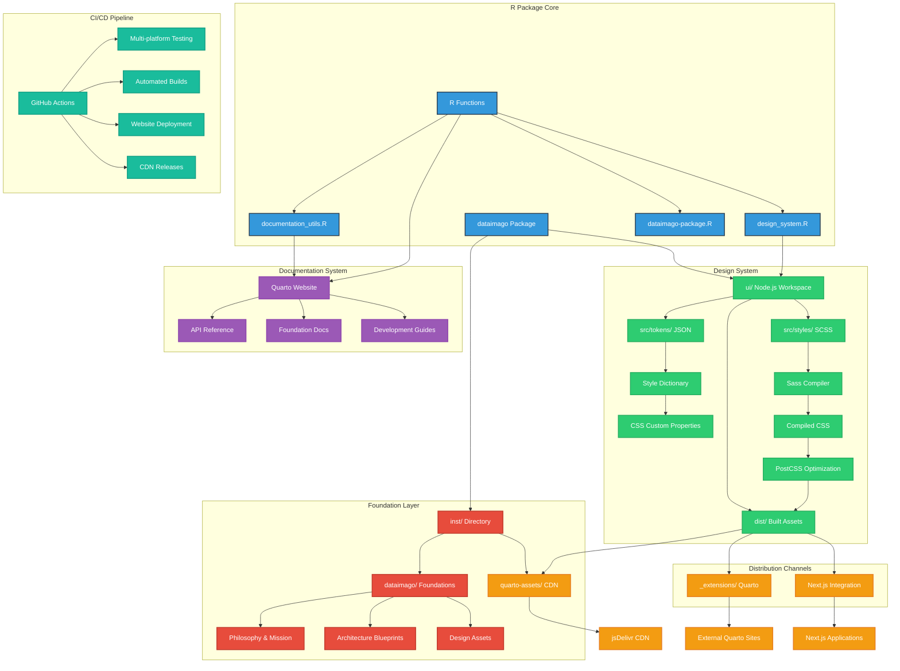
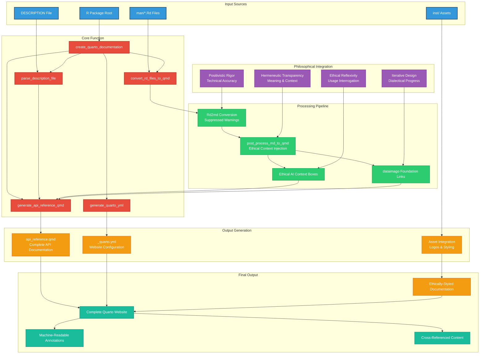
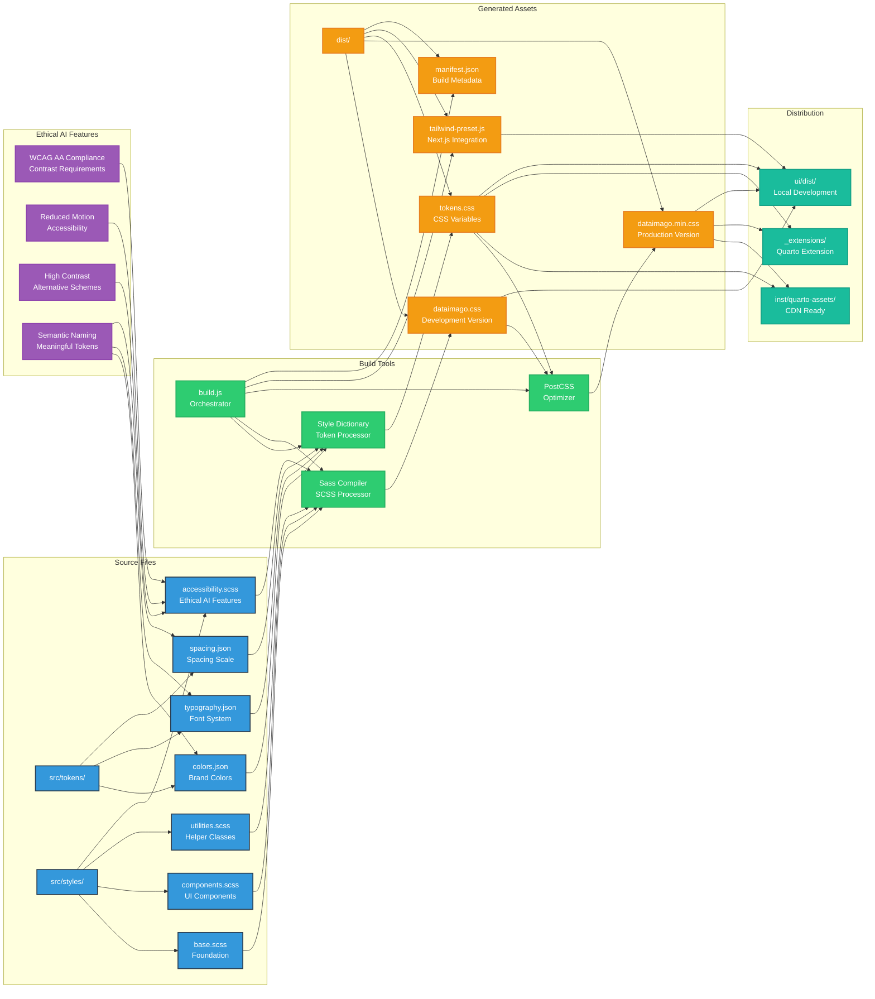
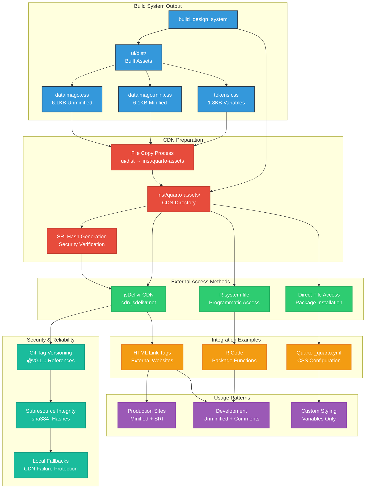
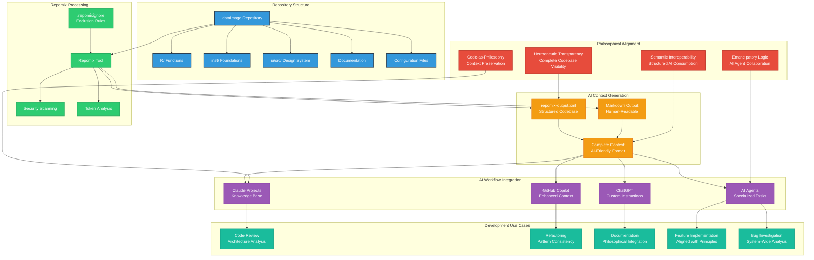
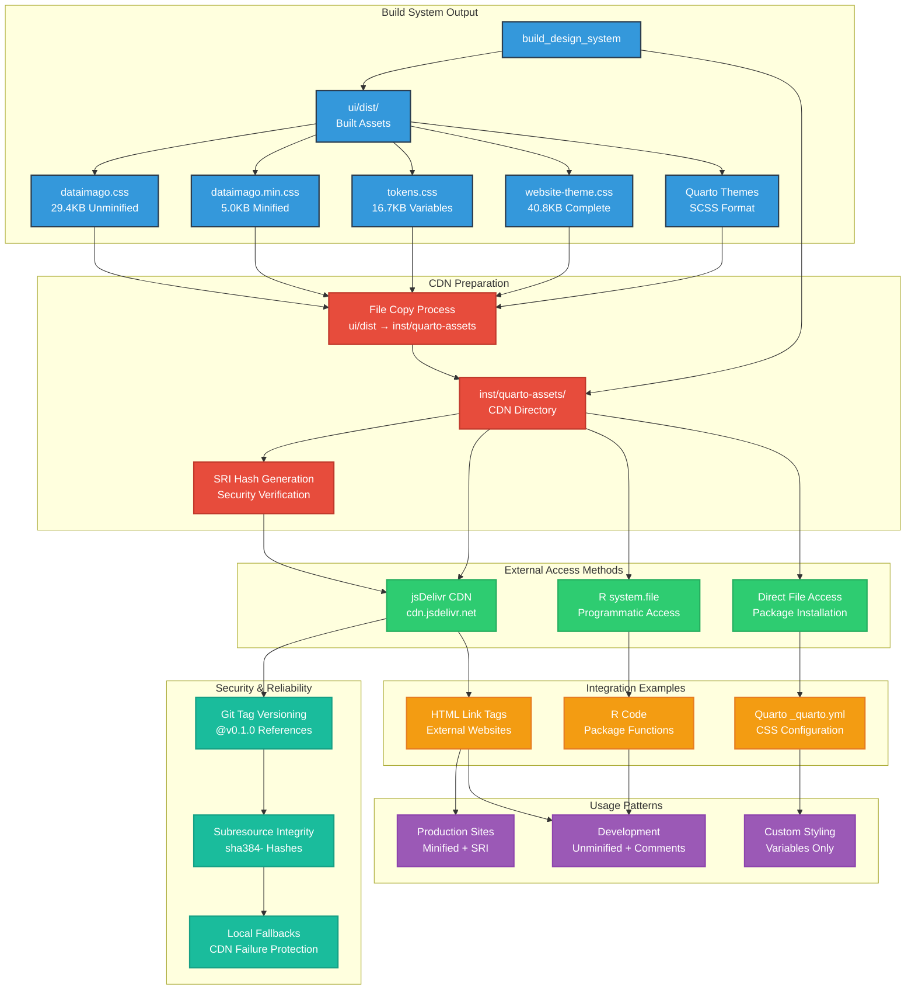
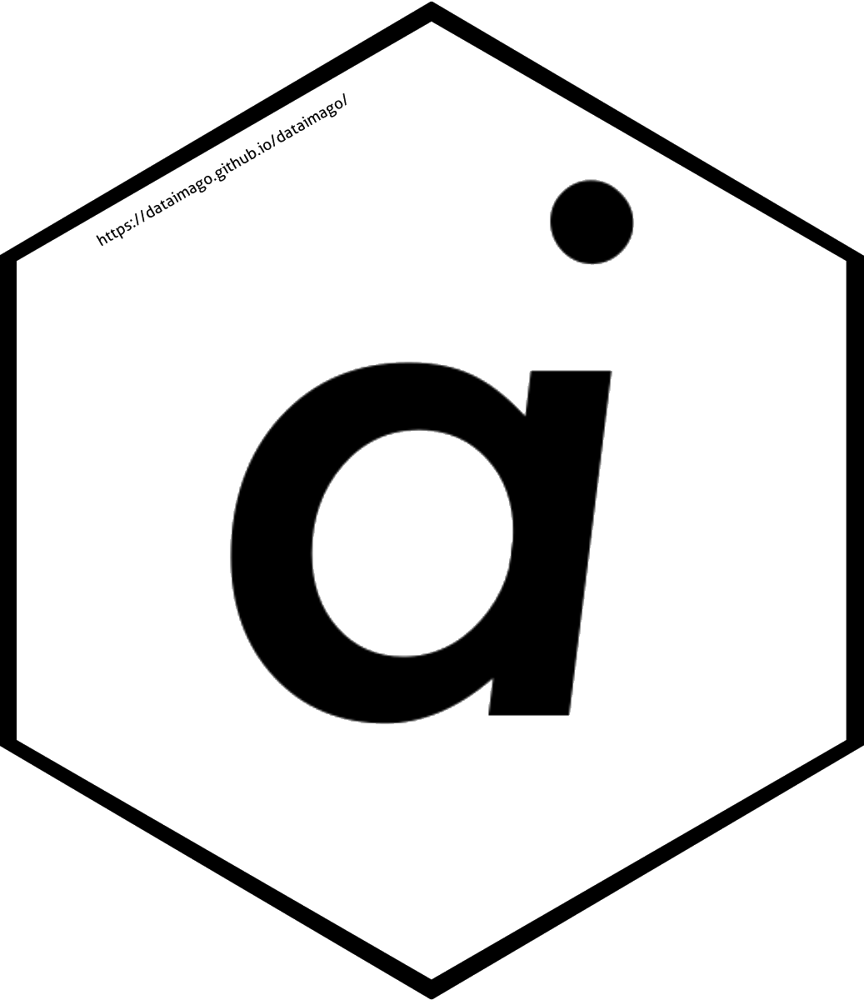

This file is a merged representation of the entire codebase, combined into a single document by Repomix.

# File Summary

## Purpose
This file contains a packed representation of the entire repository's contents.
It is designed to be easily consumable by AI systems for analysis, code review,
or other automated processes.

## File Format
The content is organized as follows:
1. This summary section
2. Repository information
3. Directory structure
4. Repository files (if enabled)
5. Multiple file entries, each consisting of:
  a. A header with the file path (## File: path/to/file)
  b. The full contents of the file in a code block

## Usage Guidelines
- This file should be treated as read-only. Any changes should be made to the
  original repository files, not this packed version.
- When processing this file, use the file path to distinguish
  between different files in the repository.
- Be aware that this file may contain sensitive information. Handle it with
  the same level of security as you would the original repository.
- Pay special attention to the Repository Description. These contain important context and guidelines specific to this project.

## Notes
- Some files may have been excluded based on .gitignore rules and Repomix's configuration
- Binary files are not included in this packed representation. Please refer to the Repository Structure section for a complete list of file paths, including binary files
- Files matching patterns in .gitignore are excluded
- Files matching default ignore patterns are excluded
- Files are sorted by Git change count (files with more changes are at the bottom)

# User Provided Header
# dataimago R Package - AI Context\n\nAI-Native Web-Application Development Framework for Data Science

# Directory Structure
```
docs/
  assets/
    css/
      dataimago.css
      dataimago.min.css
      documentation.css
      index.css
      landing.css
      r-package.css
      shared-enhanced-toc.css
      tokens.css
    img/
      ai_monogram.svg
      bluesky_logo.svg
      github_logo.svg
      netlify_logo.svg
      package_hex_logo.svg
      quarto_logo.svg
    js/
      dataimago-ui/
        index.cjs
        index.d.cts
        index.d.ts
        index.js
      pages/
        landing-page-enhanced.js
      vendor/
        jquery.sticky-kit.min.js
      accessibility.js
      custom-anchors.js
      hero-scroller.js
      jquery.sticky-kit.min.js
      landing-page-enhanced.js
      lenis-integration.js
      logo-switch.js
      scroll.js
      svg-handler.js
    latex/
      dataimago.sty
inst/
  dataimago/
    ARCHITECTURE.md
    HISTORICAL_ROADMAP.md
  quarto-assets/
    ai_monogram.svg
    dataimago-dark.scss
    dataimago-light.scss
    dataimago.css
    dataimago.min.css
    dataimago.sty
    documentation.css
    documentation.min.css
    landing.css
    landing.min.css
    package_hex_logo.svg
    README-latex.md
    README.md
    shared-enhanced-toc.css
    shared-enhanced-toc.min.css
    tokens.css
    tokens.min.css
    tokens.scss
    website-theme.css
    website-theme.min.css
man/
  add_function_docs_sections.Rd
  ai.Rd
  bootstrap_wiki.Rd
  build_design_components.Rd
  build_design_system.Rd
  build_introspection_payload.Rd
  check_quarto_asset_status.Rd
  convert_rd_files_to_qmd.Rd
  create_quarto_documentation.Rd
  dataimago-package.Rd
  export_static_api.Rd
  extract_desc_field.Rd
  format_description_fields.Rd
  generate_ai_context.Rd
  generate_api_reference_qmd.Rd
  generate_api_scaffolding.Rd
  generate_cdn_assets.Rd
  generate_claude_md.Rd
  generate_ethical_ci.Rd
  generate_mcp_tools.Rd
  generate_quarto_yml.Rd
  generate_self_mcp.Rd
  generate_shared_utils.Rd
  parse_description_file.Rd
  parse_roxygen_exports.Rd
  post_process_md_to_qmd.Rd
  sync_quarto_assets.Rd
  update_dataimago_assets.Rd
  update_quarto_extension.Rd
R/
  ai.R
  asset_sync.R
  build_components.R
  dataimago-package.R
  design_system.R
  documentation_utils.R
  export_static.R
  generate_api.R
  generate_claude_md.R
  generate_ethical_ci.R
  generate_mcp.R
  generate_self_mcp.R
  generate_types.R
  generate_wiki.R
tests/
  testthat/
    test-generate-wiki.R
    test-phase-2e-generators.R
  testthat.R
tools/
  check-no-link-overrides.mjs
  design-link.mjs
ui/
  www/
    _extensions/
      dataimago/
        ai-native/
          assets/
            css/
              icons/
                brand/
                  ai_monogram.svg
                platform/
                  netlify_logo.svg
                  quarto_logo.svg
                social/
                  bluesky_logo.svg
                  github_logo.svg
                README.md
              dataimago-dark.scss
              dataimago-light.scss
              dataimago.css
              dataimago.min.css
              documentation.css
              documentation.min.css
              landing.css
              landing.min.css
              shared-components.scss
              shared-enhanced-toc.css
              shared-enhanced-toc.min.css
              tokens.css
              tokens.min.css
              tokens.scss
              website-theme.css
              website-theme.min.css
            img/
              ai_monogram.svg
              bluesky_logo.svg
              github_logo.svg
              netlify_logo.svg
              quarto_logo.svg
            js/
              dataimago-ui/
                index.cjs
                index.d.cts
                index.d.ts
                index.js
              pages/
                landing-page-enhanced.js
              vendor/
                jquery.sticky-kit.min.js
              accessibility.js
              custom-anchors.js
              hero-scroller.js
              jquery.sticky-kit.min.js
              landing-page-enhanced.js
              lenis-integration.js
              svg-handler.js
            latex/
              dataimago.sty
            README.md
          filters/
            ai-native-meta.lua
            json-export.lua
            README.md
          shortcodes/
            content-item.lua
            feature-box.lua
            hero-scroller.lua
            json-export.lua
            micp-display.lua
            README.md
            slide-container.lua
          templates/
            slides/
              features-slide.qmd
              hero-slide.qmd
              technical-slide.qmd
            index.qmd
            README.md
          _extension.yml
          README.md
      svg-inline/
        _extension.yml
        svg-inline.lua
    assets/
      css/
        icons/
          brand/
            ai_monogram.svg
          platform/
            netlify_logo.svg
            quarto_logo.svg
          social/
            bluesky_logo.svg
            github_logo.svg
          README.md
        dataimago-dark.scss
        dataimago-light.scss
        dataimago.css
        dataimago.min.css
        documentation.css
        documentation.min.css
        landing.css
        landing.min.css
        shared-components.scss
        shared-enhanced-toc.css
        shared-enhanced-toc.min.css
        tokens.css
        tokens.min.css
        tokens.scss
        website-theme.css
        website-theme.min.css
      img/
        ai_monogram.svg
        bluesky_logo.svg
        github_logo.svg
        netlify_logo.svg
        package_hex_logo.svg
        quarto_logo.svg
      js/
        dataimago-ui/
          index.cjs
          index.d.cts
          index.d.ts
          index.js
        vendor/
          jquery.sticky-kit.min.js
        accessibility.js
        custom-anchors.js
        hero-scroller.js
        lenis-integration.js
        logo-switch.js
        scroll.js
      latex/
        dataimago.sty
    content/
      documents/
        README.md
      presentations/
        README.md
    _quarto.yml
    404.qmd
    critical_theory_manifesto.qmd
    design_system.qmd
    documents.qmd
    ethics.qmd
    governance.qmd
    index.qmd
    mission.qmd
    news.qmd
    philosophy.qmd
    presentations.qmd
    r_package.qmd
    README.md
  .npmrc
  build.js
  package.json
  README.md
.lintr
.Rbuildignore
.repomixignore
CITATION.cff
CLAUDE.md
DESCRIPTION
LICENSE
LICENSE.md
NAMESPACE
NEWS.md
README.md
```

# Files

## File: docs/assets/js/dataimago-ui/index.cjs
````javascript
"use strict";
var __create = Object.create;
var __defProp = Object.defineProperty;
var __getOwnPropDesc = Object.getOwnPropertyDescriptor;
var __getOwnPropNames = Object.getOwnPropertyNames;
var __getProtoOf = Object.getPrototypeOf;
var __hasOwnProp = Object.prototype.hasOwnProperty;
var __export = (target, all) => {
  for (var name in all)
    __defProp(target, name, { get: all[name], enumerable: true });
};
var __copyProps = (to, from, except, desc) => {
  if (from && typeof from === "object" || typeof from === "function") {
    for (let key of __getOwnPropNames(from))
      if (!__hasOwnProp.call(to, key) && key !== except)
        __defProp(to, key, { get: () => from[key], enumerable: !(desc = __getOwnPropDesc(from, key)) || desc.enumerable });
  }
  return to;
};
var __toESM = (mod, isNodeMode, target) => (target = mod != null ? __create(__getProtoOf(mod)) : {}, __copyProps(
  // If the importer is in node compatibility mode or this is not an ESM
  // file that has been converted to a CommonJS file using a Babel-
  // compatible transform (i.e. "__esModule" has not been set), then set
  // "default" to the CommonJS "module.exports" for node compatibility.
  isNodeMode || !mod || !mod.__esModule ? __defProp(target, "default", { value: mod, enumerable: true }) : target,
  mod
));
var __toCommonJS = (mod) => __copyProps(__defProp({}, "__esModule", { value: true }), mod);

// src/index.ts
var index_exports = {};
__export(index_exports, {
  Button: () => Button
});
module.exports = __toCommonJS(index_exports);

// src/Button.tsx
var React = __toESM(require("react"), 1);
var import_jsx_runtime = require("react/jsx-runtime");
var variantClasses = {
  primary: "btn-primary",
  secondary: "btn-secondary",
  ghost: "btn-ghost"
};
var sizeClasses = {
  sm: "btn-sm",
  md: "btn-md",
  lg: "btn-lg"
};
var Button = React.forwardRef(
  function Button2({ variant = "primary", size = "md", className = "", type, children, ...rest }, ref) {
    const classes = [
      "btn",
      variantClasses[variant],
      sizeClasses[size],
      className
    ].filter(Boolean).join(" ");
    return /* @__PURE__ */ (0, import_jsx_runtime.jsx)(
      "button",
      {
        ref,
        type: type ?? "button",
        className: classes,
        ...rest,
        children
      }
    );
  }
);
// Annotate the CommonJS export names for ESM import in node:
0 && (module.exports = {
  Button
});
//# sourceMappingURL=index.cjs.map
````

## File: docs/assets/js/dataimago-ui/index.d.cts
````typescript
import * as React from 'react';

type ButtonVariant = 'primary' | 'secondary' | 'ghost';
type ButtonSize = 'sm' | 'md' | 'lg';
interface ButtonProps extends React.ButtonHTMLAttributes<HTMLButtonElement> {
    variant?: ButtonVariant;
    size?: ButtonSize;
}
/**
 * Smoke-level `<Button>` for the alpha release of @dataimago/ui.
 *
 * Styling is delegated to the CSS classes `.btn`, `.btn-<variant>`, `.btn-<size>`
 * published by @dataimago/css so that the component stays small and theme-aware.
 * Consumers that want to override visuals can pass their own className.
 */
declare const Button: React.ForwardRefExoticComponent<ButtonProps & React.RefAttributes<HTMLButtonElement>>;

export { Button, type ButtonProps, type ButtonSize, type ButtonVariant };
````

## File: docs/assets/js/dataimago-ui/index.d.ts
````typescript
import * as React from 'react';

type ButtonVariant = 'primary' | 'secondary' | 'ghost';
type ButtonSize = 'sm' | 'md' | 'lg';
interface ButtonProps extends React.ButtonHTMLAttributes<HTMLButtonElement> {
    variant?: ButtonVariant;
    size?: ButtonSize;
}
/**
 * Smoke-level `<Button>` for the alpha release of @dataimago/ui.
 *
 * Styling is delegated to the CSS classes `.btn`, `.btn-<variant>`, `.btn-<size>`
 * published by @dataimago/css so that the component stays small and theme-aware.
 * Consumers that want to override visuals can pass their own className.
 */
declare const Button: React.ForwardRefExoticComponent<ButtonProps & React.RefAttributes<HTMLButtonElement>>;

export { Button, type ButtonProps, type ButtonSize, type ButtonVariant };
````

## File: docs/assets/js/dataimago-ui/index.js
````javascript
// src/Button.tsx
import * as React from "react";
import { jsx } from "react/jsx-runtime";
var variantClasses = {
  primary: "btn-primary",
  secondary: "btn-secondary",
  ghost: "btn-ghost"
};
var sizeClasses = {
  sm: "btn-sm",
  md: "btn-md",
  lg: "btn-lg"
};
var Button = React.forwardRef(
  function Button2({ variant = "primary", size = "md", className = "", type, children, ...rest }, ref) {
    const classes = [
      "btn",
      variantClasses[variant],
      sizeClasses[size],
      className
    ].filter(Boolean).join(" ");
    return /* @__PURE__ */ jsx(
      "button",
      {
        ref,
        type: type ?? "button",
        className: classes,
        ...rest,
        children
      }
    );
  }
);
export {
  Button
};
//# sourceMappingURL=index.js.map
````

## File: man/convert_rd_files_to_qmd.Rd
````
% Generated by roxygen2: do not edit by hand
% Please edit documentation in R/documentation_utils.R
\name{convert_rd_files_to_qmd}
\alias{convert_rd_files_to_qmd}
\title{Convert .Rd Files to QMD Format using Rd2md}
\usage{
convert_rd_files_to_qmd(rd_files)
}
\arguments{
\item{rd_files}{Character vector of paths to .Rd files}
}
\value{
List containing converted documentation for each function
}
\description{
Convert .Rd Files to QMD Format using Rd2md
}
\keyword{internal}
````

## File: man/extract_desc_field.Rd
````
% Generated by roxygen2: do not edit by hand
% Please edit documentation in R/documentation_utils.R
\name{extract_desc_field}
\alias{extract_desc_field}
\title{Extract Field from DESCRIPTION Lines}
\usage{
extract_desc_field(desc_lines, field_name)
}
\arguments{
\item{desc_lines}{Character vector of DESCRIPTION file lines}

\item{field_name}{Name of field to extract}
}
\value{
Character string with field value or NULL if not found
}
\description{
Extract Field from DESCRIPTION Lines
}
\keyword{internal}
````

## File: man/format_description_fields.Rd
````
% Generated by roxygen2: do not edit by hand
% Please edit documentation in R/documentation_utils.R
\name{format_description_fields}
\alias{format_description_fields}
\title{Format DESCRIPTION Fields for Quarto Display}
\usage{
format_description_fields(desc_content)
}
\arguments{
\item{desc_content}{Parsed DESCRIPTION content list}
}
\value{
Character vector with formatted DESCRIPTION fields
}
\description{
Format DESCRIPTION Fields for Quarto Display
}
\keyword{internal}
````

## File: man/generate_api_reference_qmd.Rd
````
% Generated by roxygen2: do not edit by hand
% Please edit documentation in R/documentation_utils.R
\name{generate_api_reference_qmd}
\alias{generate_api_reference_qmd}
\title{Generate API Reference QMD Content}
\usage{
generate_api_reference_qmd(
  desc_content,
  rd_content,
  include_description = TRUE,
  include_foundation_links = TRUE
)
}
\arguments{
\item{desc_content}{Parsed DESCRIPTION content}

\item{rd_content}{Converted .Rd content}

\item{include_description}{Include DESCRIPTION section}

\item{include_foundation_links}{Include dataimago foundation links}
}
\value{
Character vector with complete qmd content
}
\description{
Generate API Reference QMD Content
}
\keyword{internal}
````

## File: man/parse_description_file.Rd
````
% Generated by roxygen2: do not edit by hand
% Please edit documentation in R/documentation_utils.R
\name{parse_description_file}
\alias{parse_description_file}
\title{Parse DESCRIPTION File}
\usage{
parse_description_file(desc_file)
}
\arguments{
\item{desc_file}{Path to DESCRIPTION file}
}
\value{
List containing parsed DESCRIPTION fields
}
\description{
Parse DESCRIPTION File
}
\keyword{internal}
````

## File: man/post_process_md_to_qmd.Rd
````
% Generated by roxygen2: do not edit by hand
% Please edit documentation in R/documentation_utils.R
\name{post_process_md_to_qmd}
\alias{post_process_md_to_qmd}
\title{Post-Process Markdown to QMD Format with dataimago Customizations}
\usage{
post_process_md_to_qmd(md_content, func_name)
}
\arguments{
\item{md_content}{Character vector of markdown content from Rd2md}

\item{func_name}{Function name for customization}
}
\value{
Character vector with qmd-formatted content
}
\description{
Post-Process Markdown to QMD Format with dataimago Customizations
}
\keyword{internal}
````

## File: man/update_dataimago_assets.Rd
````
% Generated by roxygen2: do not edit by hand
% Please edit documentation in R/documentation_utils.R
\name{update_dataimago_assets}
\alias{update_dataimago_assets}
\title{Update dataimago Assets in Quarto Website}
\usage{
update_dataimago_assets(output_path, package_path)
}
\arguments{
\item{output_path}{Path to quarto website directory}

\item{package_path}{Path to package root}
}
\description{
Update dataimago Assets in Quarto Website
}
\keyword{internal}
````

## File: ui/www/_extensions/dataimago/ai-native/assets/js/dataimago-ui/index.cjs
````javascript
"use strict";
var __create = Object.create;
var __defProp = Object.defineProperty;
var __getOwnPropDesc = Object.getOwnPropertyDescriptor;
var __getOwnPropNames = Object.getOwnPropertyNames;
var __getProtoOf = Object.getPrototypeOf;
var __hasOwnProp = Object.prototype.hasOwnProperty;
var __export = (target, all) => {
  for (var name in all)
    __defProp(target, name, { get: all[name], enumerable: true });
};
var __copyProps = (to, from, except, desc) => {
  if (from && typeof from === "object" || typeof from === "function") {
    for (let key of __getOwnPropNames(from))
      if (!__hasOwnProp.call(to, key) && key !== except)
        __defProp(to, key, { get: () => from[key], enumerable: !(desc = __getOwnPropDesc(from, key)) || desc.enumerable });
  }
  return to;
};
var __toESM = (mod, isNodeMode, target) => (target = mod != null ? __create(__getProtoOf(mod)) : {}, __copyProps(
  // If the importer is in node compatibility mode or this is not an ESM
  // file that has been converted to a CommonJS file using a Babel-
  // compatible transform (i.e. "__esModule" has not been set), then set
  // "default" to the CommonJS "module.exports" for node compatibility.
  isNodeMode || !mod || !mod.__esModule ? __defProp(target, "default", { value: mod, enumerable: true }) : target,
  mod
));
var __toCommonJS = (mod) => __copyProps(__defProp({}, "__esModule", { value: true }), mod);

// src/index.ts
var index_exports = {};
__export(index_exports, {
  Button: () => Button
});
module.exports = __toCommonJS(index_exports);

// src/Button.tsx
var React = __toESM(require("react"), 1);
var import_jsx_runtime = require("react/jsx-runtime");
var variantClasses = {
  primary: "btn-primary",
  secondary: "btn-secondary",
  ghost: "btn-ghost"
};
var sizeClasses = {
  sm: "btn-sm",
  md: "btn-md",
  lg: "btn-lg"
};
var Button = React.forwardRef(
  function Button2({ variant = "primary", size = "md", className = "", type, children, ...rest }, ref) {
    const classes = [
      "btn",
      variantClasses[variant],
      sizeClasses[size],
      className
    ].filter(Boolean).join(" ");
    return /* @__PURE__ */ (0, import_jsx_runtime.jsx)(
      "button",
      {
        ref,
        type: type ?? "button",
        className: classes,
        ...rest,
        children
      }
    );
  }
);
// Annotate the CommonJS export names for ESM import in node:
0 && (module.exports = {
  Button
});
//# sourceMappingURL=index.cjs.map
````

## File: ui/www/_extensions/dataimago/ai-native/assets/js/dataimago-ui/index.d.cts
````typescript
import * as React from 'react';

type ButtonVariant = 'primary' | 'secondary' | 'ghost';
type ButtonSize = 'sm' | 'md' | 'lg';
interface ButtonProps extends React.ButtonHTMLAttributes<HTMLButtonElement> {
    variant?: ButtonVariant;
    size?: ButtonSize;
}
/**
 * Smoke-level `<Button>` for the alpha release of @dataimago/ui.
 *
 * Styling is delegated to the CSS classes `.btn`, `.btn-<variant>`, `.btn-<size>`
 * published by @dataimago/css so that the component stays small and theme-aware.
 * Consumers that want to override visuals can pass their own className.
 */
declare const Button: React.ForwardRefExoticComponent<ButtonProps & React.RefAttributes<HTMLButtonElement>>;

export { Button, type ButtonProps, type ButtonSize, type ButtonVariant };
````

## File: ui/www/_extensions/dataimago/ai-native/assets/js/dataimago-ui/index.d.ts
````typescript
import * as React from 'react';

type ButtonVariant = 'primary' | 'secondary' | 'ghost';
type ButtonSize = 'sm' | 'md' | 'lg';
interface ButtonProps extends React.ButtonHTMLAttributes<HTMLButtonElement> {
    variant?: ButtonVariant;
    size?: ButtonSize;
}
/**
 * Smoke-level `<Button>` for the alpha release of @dataimago/ui.
 *
 * Styling is delegated to the CSS classes `.btn`, `.btn-<variant>`, `.btn-<size>`
 * published by @dataimago/css so that the component stays small and theme-aware.
 * Consumers that want to override visuals can pass their own className.
 */
declare const Button: React.ForwardRefExoticComponent<ButtonProps & React.RefAttributes<HTMLButtonElement>>;

export { Button, type ButtonProps, type ButtonSize, type ButtonVariant };
````

## File: ui/www/_extensions/dataimago/ai-native/assets/js/dataimago-ui/index.js
````javascript
// src/Button.tsx
import * as React from "react";
import { jsx } from "react/jsx-runtime";
var variantClasses = {
  primary: "btn-primary",
  secondary: "btn-secondary",
  ghost: "btn-ghost"
};
var sizeClasses = {
  sm: "btn-sm",
  md: "btn-md",
  lg: "btn-lg"
};
var Button = React.forwardRef(
  function Button2({ variant = "primary", size = "md", className = "", type, children, ...rest }, ref) {
    const classes = [
      "btn",
      variantClasses[variant],
      sizeClasses[size],
      className
    ].filter(Boolean).join(" ");
    return /* @__PURE__ */ jsx(
      "button",
      {
        ref,
        type: type ?? "button",
        className: classes,
        ...rest,
        children
      }
    );
  }
);
export {
  Button
};
//# sourceMappingURL=index.js.map
````

## File: ui/www/assets/js/dataimago-ui/index.cjs
````javascript
"use strict";
var __create = Object.create;
var __defProp = Object.defineProperty;
var __getOwnPropDesc = Object.getOwnPropertyDescriptor;
var __getOwnPropNames = Object.getOwnPropertyNames;
var __getProtoOf = Object.getPrototypeOf;
var __hasOwnProp = Object.prototype.hasOwnProperty;
var __export = (target, all) => {
  for (var name in all)
    __defProp(target, name, { get: all[name], enumerable: true });
};
var __copyProps = (to, from, except, desc) => {
  if (from && typeof from === "object" || typeof from === "function") {
    for (let key of __getOwnPropNames(from))
      if (!__hasOwnProp.call(to, key) && key !== except)
        __defProp(to, key, { get: () => from[key], enumerable: !(desc = __getOwnPropDesc(from, key)) || desc.enumerable });
  }
  return to;
};
var __toESM = (mod, isNodeMode, target) => (target = mod != null ? __create(__getProtoOf(mod)) : {}, __copyProps(
  // If the importer is in node compatibility mode or this is not an ESM
  // file that has been converted to a CommonJS file using a Babel-
  // compatible transform (i.e. "__esModule" has not been set), then set
  // "default" to the CommonJS "module.exports" for node compatibility.
  isNodeMode || !mod || !mod.__esModule ? __defProp(target, "default", { value: mod, enumerable: true }) : target,
  mod
));
var __toCommonJS = (mod) => __copyProps(__defProp({}, "__esModule", { value: true }), mod);

// src/index.ts
var index_exports = {};
__export(index_exports, {
  Button: () => Button
});
module.exports = __toCommonJS(index_exports);

// src/Button.tsx
var React = __toESM(require("react"), 1);
var import_jsx_runtime = require("react/jsx-runtime");
var variantClasses = {
  primary: "btn-primary",
  secondary: "btn-secondary",
  ghost: "btn-ghost"
};
var sizeClasses = {
  sm: "btn-sm",
  md: "btn-md",
  lg: "btn-lg"
};
var Button = React.forwardRef(
  function Button2({ variant = "primary", size = "md", className = "", type, children, ...rest }, ref) {
    const classes = [
      "btn",
      variantClasses[variant],
      sizeClasses[size],
      className
    ].filter(Boolean).join(" ");
    return /* @__PURE__ */ (0, import_jsx_runtime.jsx)(
      "button",
      {
        ref,
        type: type ?? "button",
        className: classes,
        ...rest,
        children
      }
    );
  }
);
// Annotate the CommonJS export names for ESM import in node:
0 && (module.exports = {
  Button
});
//# sourceMappingURL=index.cjs.map
````

## File: ui/www/assets/js/dataimago-ui/index.d.cts
````typescript
import * as React from 'react';

type ButtonVariant = 'primary' | 'secondary' | 'ghost';
type ButtonSize = 'sm' | 'md' | 'lg';
interface ButtonProps extends React.ButtonHTMLAttributes<HTMLButtonElement> {
    variant?: ButtonVariant;
    size?: ButtonSize;
}
/**
 * Smoke-level `<Button>` for the alpha release of @dataimago/ui.
 *
 * Styling is delegated to the CSS classes `.btn`, `.btn-<variant>`, `.btn-<size>`
 * published by @dataimago/css so that the component stays small and theme-aware.
 * Consumers that want to override visuals can pass their own className.
 */
declare const Button: React.ForwardRefExoticComponent<ButtonProps & React.RefAttributes<HTMLButtonElement>>;

export { Button, type ButtonProps, type ButtonSize, type ButtonVariant };
````

## File: ui/www/assets/js/dataimago-ui/index.d.ts
````typescript
import * as React from 'react';

type ButtonVariant = 'primary' | 'secondary' | 'ghost';
type ButtonSize = 'sm' | 'md' | 'lg';
interface ButtonProps extends React.ButtonHTMLAttributes<HTMLButtonElement> {
    variant?: ButtonVariant;
    size?: ButtonSize;
}
/**
 * Smoke-level `<Button>` for the alpha release of @dataimago/ui.
 *
 * Styling is delegated to the CSS classes `.btn`, `.btn-<variant>`, `.btn-<size>`
 * published by @dataimago/css so that the component stays small and theme-aware.
 * Consumers that want to override visuals can pass their own className.
 */
declare const Button: React.ForwardRefExoticComponent<ButtonProps & React.RefAttributes<HTMLButtonElement>>;

export { Button, type ButtonProps, type ButtonSize, type ButtonVariant };
````

## File: ui/www/assets/js/dataimago-ui/index.js
````javascript
// src/Button.tsx
import * as React from "react";
import { jsx } from "react/jsx-runtime";
var variantClasses = {
  primary: "btn-primary",
  secondary: "btn-secondary",
  ghost: "btn-ghost"
};
var sizeClasses = {
  sm: "btn-sm",
  md: "btn-md",
  lg: "btn-lg"
};
var Button = React.forwardRef(
  function Button2({ variant = "primary", size = "md", className = "", type, children, ...rest }, ref) {
    const classes = [
      "btn",
      variantClasses[variant],
      sizeClasses[size],
      className
    ].filter(Boolean).join(" ");
    return /* @__PURE__ */ jsx(
      "button",
      {
        ref,
        type: type ?? "button",
        className: classes,
        ...rest,
        children
      }
    );
  }
);
export {
  Button
};
//# sourceMappingURL=index.js.map
````

## File: .lintr
````
linters: linters_with_defaults(line_length_linter(140), object_length_linter(40), commented_code_linter = NULL)
exclusions: list("R/zzz.R", "data/", "tests/testthat.R", "ui/build.js", "ui/dist/", "ui/node_modules/")
````

## File: LICENSE
````
YEAR: 2025
COPYRIGHT HOLDER: Damian W. Betebenner
````

## File: LICENSE.md
````markdown
# MIT License

Copyright (c) 2025 Damian W. Betebenner

Permission is hereby granted, free of charge, to any person obtaining a copy
of this software and associated documentation files (the "Software"), to deal
in the Software without restriction, including without limitation the rights
to use, copy, modify, merge, publish, distribute, sublicense, and/or sell
copies of the Software, and to permit persons to whom the Software is
furnished to do so, subject to the following conditions:

The above copyright notice and this permission notice shall be included in
all copies or substantial portions of the Software.

THE SOFTWARE IS PROVIDED "AS IS", WITHOUT WARRANTY OF ANY KIND, EXPRESS OR
IMPLIED, INCLUDING BUT NOT LIMITED TO THE WARRANTIES OF MERCHANTABILITY,
FITNESS FOR A PARTICULAR PURPOSE AND NONINFRINGEMENT. IN NO EVENT SHALL THE
AUTHORS OR COPYRIGHT HOLDERS BE LIABLE FOR ANY CLAIM, DAMAGES OR OTHER
LIABILITY, WHETHER IN AN ACTION OF CONTRACT, TORT OR OTHERWISE, ARISING FROM,
OUT OF OR IN CONNECTION WITH THE SOFTWARE OR THE USE OR OTHER DEALINGS IN
THE SOFTWARE.
````

## File: docs/assets/css/r-package.css
````css
@charset "UTF-8";
:root {
  --dataimago-primary: #3498DB;
  --dataimago-accent: #ff69b4;
  --dataimago-ethical: #E74C3C;
  --color-surface-page-light: rgb(237, 237, 235);
  --color-surface-page-dark: rgb(20, 20, 16);
  --color-content-primary-light: #000000;
  --color-content-secondary-light: #7c7c7c;
  --color-content-primary-dark: rgb(237, 237, 235);
  --color-content-secondary-dark: #83838f;
  --dataimago-success: #27AE60;
  --dataimago-warning: #F39C12;
  --dataimago-error: #E74C3C;
  --dataimago-info: #3498DB;
}

* {
  box-sizing: border-box;
}

html {
  font-family: var(--font-family-sans);
  font-size: var(--font-size-base);
  line-height: var(--font-lineHeight-normal);
  color: var(--color-text-primary);
  background-color: var(--color-background-page);
  -webkit-font-smoothing: antialiased;
  -moz-osx-font-smoothing: grayscale;
}

body {
  margin: 0;
  padding: 0;
  font-family: inherit;
  background-color: var(--color-background-page);
  color: var(--color-text-primary);
}

h1, h2, h3, h4, h5, h6 {
  font-weight: var(--font-weight-semibold);
  line-height: var(--font-lineHeight-tight);
  margin-top: 0;
  margin-bottom: var(--spacing-md);
  color: var(--color-text-primary);
}

h1 {
  font-size: var(--font-size-4xl);
  margin-bottom: var(--spacing-lg);
}

h2 {
  font-size: var(--font-size-3xl);
  margin-bottom: var(--spacing-lg);
}

h3 {
  font-size: var(--font-size-2xl);
}

h4 {
  font-size: var(--font-size-xl);
}

h5 {
  font-size: var(--font-size-lg);
}

h6 {
  font-size: var(--font-size-base);
}

p {
  margin-top: 0;
  margin-bottom: var(--spacing-md);
  line-height: var(--font-lineHeight-normal);
}

a {
  color: var(--color-brand-accent);
  text-decoration: underline;
  text-decoration-thickness: 1px;
  text-underline-offset: 2px;
  transition: color 0.2s ease;
}

a:hover {
  color: var(--color-brand-primary);
  text-decoration-thickness: 2px;
}

a:focus {
  outline: 2px solid var(--color-border-focus);
  outline-offset: 2px;
  border-radius: var(--radius-sm);
}

code {
  font-family: var(--font-family-mono);
  font-size: 0.9em;
  padding: 0.1em 0.3em;
  background-color: var(--color-background-surface);
  border-radius: var(--radius-sm);
  color: var(--color-brand-accent);
}

pre {
  font-family: var(--font-family-mono);
  font-size: 0.9em;
  padding: var(--spacing-md);
  background-color: var(--color-background-surface);
  border: 1px solid var(--color-border-default);
  border-radius: var(--radius-md);
  overflow-x: auto;
  margin-bottom: var(--spacing-md);
}

pre code {
  background: transparent;
  padding: 0;
  color: inherit;
}

/* dataimago API Reference - Dual Sidebar Layout */
/* ========================================
   DUAL SIDEBAR FOUNDATION
   ======================================== */
/* Main content area with dual sidebars */
.page-layout-full .page-columns {
  display: grid;
  grid-template-columns: 280px 1fr 240px;
  grid-template-areas: "sidebar-left main sidebar-right";
  gap: 2rem;
  max-width: 100%;
  margin: 0;
}

.sidebar-left {
  grid-area: sidebar-left;
  position: sticky;
  top: 2rem;
  height: calc(100vh - 4rem);
  overflow-y: auto;
  padding: 1rem;
  background: var(--bs-body-bg);
  border-right: 1px solid var(--bs-border-color);
}

.page-columns .column-page {
  grid-area: main;
  min-width: 0; /* Prevent overflow */
  padding: 2rem 1rem;
}

.sidebar-right {
  grid-area: sidebar-right;
  position: sticky;
  top: 2rem;
  height: calc(100vh - 4rem);
  overflow-y: auto;
  padding: 1rem;
  background: var(--bs-body-bg);
  border-left: 1px solid var(--bs-border-color);
}

/* ========================================
   LEFT SIDEBAR STYLING
   ======================================== */
.sidebar-left .sidebar-title {
  font-size: 1.1rem;
  font-weight: 600;
  margin-bottom: 1rem;
  color: var(--bs-primary);
  border-bottom: 2px solid var(--bs-primary);
  padding-bottom: 0.5rem;
}

.sidebar-left .sidebar-search {
  margin-bottom: 1.5rem;
}

.sidebar-left .sidebar-search input {
  width: 100%;
  padding: 0.5rem;
  border: 1px solid var(--bs-border-color);
  border-radius: 4px;
  font-size: 0.9rem;
}

.sidebar-left .sidebar-menu {
  list-style: none;
  margin: 0;
  padding: 0;
}

.sidebar-left .sidebar-section {
  margin-bottom: 1.5rem;
}

.sidebar-left .sidebar-section-title {
  font-weight: 600;
  font-size: 0.9rem;
  color: var(--bs-secondary-color);
  text-transform: uppercase;
  letter-spacing: 0.5px;
  margin-bottom: 0.75rem;
  padding: 0.5rem 0;
  border-bottom: 1px solid rgba(var(--bs-border-color-rgb), 0.5);
}

.sidebar-left .sidebar-item {
  margin-bottom: 0.25rem;
}

.sidebar-left .sidebar-link {
  display: block;
  padding: 0.5rem 0.75rem;
  color: var(--bs-body-color);
  text-decoration: none;
  border-radius: 4px;
  font-size: 0.9rem;
  transition: all 0.2s ease;
  border-left: 3px solid transparent;
}

.sidebar-left .sidebar-link:hover {
  background: color-mix(in srgb, var(--bs-primary) 10%, transparent);
  border-left-color: var(--bs-primary);
  color: var(--bs-primary);
}

.sidebar-left .sidebar-link.active {
  background: color-mix(in srgb, var(--bs-primary) 15%, transparent);
  border-left-color: var(--bs-primary);
  color: var(--bs-primary);
  font-weight: 500;
}

/* Collapsible sections */
.sidebar-left .sidebar-section.collapsed .sidebar-items {
  display: none;
}

.sidebar-left .sidebar-section-toggle {
  cursor: pointer;
  user-select: none;
  display: flex;
  align-items: center;
  justify-content: space-between;
}

.sidebar-left .sidebar-section-toggle::after {
  content: "▼";
  font-size: 0.8rem;
  transition: transform 0.2s ease;
}

.sidebar-left .sidebar-section.collapsed .sidebar-section-toggle::after {
  transform: rotate(-90deg);
}

/* ========================================
   RIGHT SIDEBAR (TOC) STYLING
   ======================================== */
.sidebar-right .toc-title {
  font-size: 1rem;
  font-weight: 600;
  margin-bottom: 1rem;
  color: var(--bs-secondary-color);
  border-bottom: 1px solid var(--bs-border-color);
  padding-bottom: 0.5rem;
}

.sidebar-right .table-of-contents {
  list-style: none;
  margin: 0;
  padding: 0;
  line-height: 1.4;
}

.sidebar-right .table-of-contents li {
  margin-bottom: 0.25rem;
}

.sidebar-right .table-of-contents a {
  display: block;
  padding: 0.375rem 0.5rem;
  color: var(--bs-secondary-color);
  text-decoration: none;
  font-size: 0.85rem;
  border-radius: 3px;
  border-left: 2px solid transparent;
  transition: all 0.2s ease;
}

.sidebar-right .table-of-contents a:hover {
  background: color-mix(in srgb, var(--bs-secondary) 10%, transparent);
  border-left-color: var(--bs-secondary);
  color: var(--bs-body-color);
}

.sidebar-right .table-of-contents a.active {
  background: color-mix(in srgb, var(--bs-secondary) 15%, transparent);
  border-left-color: var(--bs-secondary);
  color: var(--bs-body-color);
  font-weight: 500;
}

/* Nested TOC levels */
.sidebar-right .table-of-contents .toc-level-2 {
  margin-left: 1rem;
  font-size: 0.8rem;
}

.sidebar-right .table-of-contents .toc-level-3 {
  margin-left: 1.5rem;
  font-size: 0.75rem;
}

/* ========================================
   MAIN CONTENT AREA ADJUSTMENTS
   ======================================== */
.column-page {
  max-width: none;
  padding: 0 2rem;
}

/* Function documentation styling */
.function-section {
  margin-bottom: 3rem;
  padding-bottom: 2rem;
  border-bottom: 1px solid rgba(var(--bs-border-color-rgb), 0.3);
}

.function-section:last-child {
  border-bottom: none;
}

.function-title {
  color: var(--bs-primary);
  border-bottom: 2px solid var(--bs-primary);
  padding-bottom: 0.5rem;
  margin-bottom: 1.5rem;
}

.ethical-note {
  background: linear-gradient(135deg, color-mix(in srgb, var(--bs-info) 10%, transparent), color-mix(in srgb, var(--bs-primary) 5%, transparent));
  border-left: 4px solid var(--bs-info);
  padding: 1rem 1.5rem;
  margin: 1.5rem 0;
  border-radius: 0 8px 8px 0;
  font-style: italic;
  color: var(--bs-info-text-emphasis);
}

/* ========================================
   RESPONSIVE DESIGN
   ======================================== */
@media (max-width: 1400px) {
  .page-layout-full .page-columns {
    grid-template-columns: 260px 1fr 220px;
    gap: 1.5rem;
  }
}
@media (max-width: 1200px) {
  .page-layout-full .page-columns {
    grid-template-columns: 240px 1fr 200px;
    gap: 1rem;
  }
  .sidebar-left .sidebar-link,
  .sidebar-right .table-of-contents a {
    font-size: 0.8rem;
    padding: 0.375rem 0.5rem;
  }
}
@media (max-width: 992px) {
  .page-layout-full .page-columns {
    grid-template-columns: 1fr;
    grid-template-areas: "main";
  }
  .sidebar-left,
  .sidebar-right {
    display: none;
  }
  /* Show mobile navigation instead */
  .mobile-api-nav {
    display: block;
    position: sticky;
    top: 0;
    background: var(--bs-body-bg);
    border-bottom: 1px solid var(--bs-border-color);
    padding: 1rem;
    margin-bottom: 2rem;
    z-index: 100;
  }
  .mobile-nav-toggle {
    background: var(--bs-primary);
    color: white;
    border: none;
    padding: 0.5rem 1rem;
    border-radius: 4px;
    cursor: pointer;
    font-size: 0.9rem;
  }
  .mobile-nav-menu {
    display: none;
    margin-top: 1rem;
    background: var(--bs-body-bg);
    border: 1px solid var(--bs-border-color);
    border-radius: 4px;
    padding: 1rem;
  }
  .mobile-nav-menu.show {
    display: block;
  }
}
@media (max-width: 768px) {
  .column-page {
    padding: 0 1rem;
  }
  .function-section {
    margin-bottom: 2rem;
  }
}
/* ========================================
   ACCESSIBILITY ENHANCEMENTS
   ======================================== */
@media (prefers-reduced-motion: reduce) {
  .sidebar-left .sidebar-link,
  .sidebar-right .table-of-contents a,
  .sidebar-left .sidebar-section-toggle::after {
    transition: none;
  }
}
/* Focus styles */
.sidebar-left .sidebar-link:focus,
.sidebar-right .table-of-contents a:focus {
  outline: 2px solid var(--bs-primary);
  outline-offset: 2px;
}

.sidebar-left .sidebar-link:focus:not(:focus-visible),
.sidebar-right .table-of-contents a:focus:not(:focus-visible) {
  outline: none;
}

/* ========================================
   DARK MODE ADAPTATIONS
   ======================================== */
@media (prefers-color-scheme: dark) {
  .sidebar-left,
  .sidebar-right {
    background: color-mix(in srgb, var(--bs-body-bg) 97%, var(--bs-dark));
    border-color: color-mix(in srgb, var(--bs-border-color) 50%, transparent);
  }
  .ethical-note {
    background: linear-gradient(135deg, color-mix(in srgb, var(--bs-info) 8%, transparent), color-mix(in srgb, var(--bs-primary) 4%, transparent));
  }
}
/* ========================================
   PRINT STYLES
   ======================================== */
@media print {
  .sidebar-left,
  .sidebar-right {
    display: none;
  }
  .page-layout-full .page-columns {
    grid-template-columns: 1fr;
    grid-template-areas: "main";
  }
  .ethical-note {
    background: none;
    border: 1px solid #ccc;
  }
}

/*# sourceMappingURL=r-package.css.map */
````

## File: docs/assets/latex/dataimago.sty
````
%%%
%%% dataimago.sty - LaTeX Style Package for dataimago Design System
%%%
%%% A unified LaTeX package providing consistent typography, colors, and layout
%%% for PDF documents aligned with the dataimago design system.
%%%
%%% Copyright (c) 2025 dataimago
%%% License: MIT (see LICENSE.md)
%%%
%%% Version: 0.1.0
%%% Date: 2025-10-19
%%%
%%% USAGE:
%%%   \usepackage{dataimago}
%%%
%%% REQUIREMENTS:
%%%   - XeLaTeX or LuaLaTeX (for fontspec and unicode-math)
%%%   - System fonts: Noto Sans, Noto Sans Mono, Noto Sans Math, Josefin Sans
%%%   - memoir document class (for full book/report features)
%%%   - Or article class (basic features only)
%%%
%%% FEATURES:
%%%   - dataimago typography (Noto Sans + Josefin Sans)
%%%   - dataimago color tokens (surface, content, border, brand colors)
%%%   - Custom memoir page styles and chapter/section formatting
%%%   - Theorem and definition boxes styled with dataimago tokens
%%%   - Front matter commands for title pages and abstracts
%%%
%%% For more information, see README.md
%%%

\NeedsTeXFormat{LaTeX2e}
\ProvidesPackage{dataimago}[2025/10/19 v0.1.0 dataimago Design System for LaTeX]

%%%
%%% PACKAGE IDENTIFICATION
%%%
\typeout{dataimago.sty v0.1.0 - dataimago Design System for LaTeX}
\typeout{Loading dataimago typography, colors, and layout...}

%%%
%%% REQUIRED PACKAGES
%%%

%% Font and math support (XeLaTeX/LuaLaTeX required)
\RequirePackage{fontspec}
\RequirePackage{unicode-math}

%% Color support
\RequirePackage[svgnames]{xcolor}

%% Core LaTeX packages
\RequirePackage[obeyspaces,hyphens]{url}
\RequirePackage{graphicx}
\RequirePackage{rotating,bm,amsmath,amsfonts,amssymb,indentfirst,lscape}
\RequirePackage{caption}

%% Box and list support
\RequirePackage{tcolorbox}
\tcbuselibrary{most,skins,breakable}
\RequirePackage{enumitem}

%% Memoir-specific packages (loaded only if memoir class is detected)
\@ifclassloaded{memoir}{%
  \RequirePackage{epigraph}
  \RequirePackage{tabularx}
  \typeout{dataimago: memoir class detected - loading enhanced features}
}{%
  % Article class - load alternative packages
  \RequirePackage{sectsty}
  \RequirePackage{titling}
  \typeout{dataimago: article class detected - loading basic features}
}

%%%
%%% SECTION 1: TYPOGRAPHY - FONTS
%%%
%%% dataimago font stack: Noto Sans (body/math) + Josefin Sans (headings)
%%% Using system fonts for portability across machines
%%%

%% Body Font: Noto Sans
% Token: font.family.sans = "Noto Sans, system-ui, sans-serif"
\setmainfont{Noto Sans}[
  Scale=1.0,
  Ligatures=TeX,
  Numbers=OldStyle
]

\setsansfont{Noto Sans}[
  Scale=1.0,
  Ligatures=TeX
]

%% Monospace Font: Noto Sans Mono
% Token: font.family.mono = "Noto Sans Mono, ..."
\setmonofont{Noto Sans Mono}[
  Scale=0.95,
  Ligatures=TeX
]

%% Math Font: Noto Sans Math
% Token: font.family.math = "Noto Sans Math, ..."
% OpenType MATH table support for proper equation rendering
\setmathfont{Noto Sans Math}[
  Scale=1.0,
  math-style=ISO,
  bold-style=ISO
]

%% Heading Font: Josefin Sans
% Token: font.family.display = "Josefin Sans, system-ui, sans-serif"
% Using system fonts for portability across machines
% Hierarchical weight variants for clear visual hierarchy
% Note: Font family names include the weight for non-Regular weights

% Bold (700) - Default, for Title, Chapters
\newfontfamily\HeadingFont[
  Scale=MatchLowercase,
  LetterSpace=0.5,
  BoldFont=Josefin Sans
]{Josefin Sans}
\let\HeadingFontBold\HeadingFont  % Alias for clarity

% SemiBold (600) - For Subtitle
\newfontfamily\HeadingFontSemiBold[
  Scale=MatchLowercase,
  LetterSpace=0.5,
  BoldFont=Josefin Sans
]{Josefin Sans SemiBold}

% Medium (500) - For Sections  
% Note: Josefin Sans doesn't have Medium weight, using Regular
\newfontfamily\HeadingFontMedium[
  Scale=MatchLowercase,
  LetterSpace=0.5,
  BoldFont=Josefin Sans
]{Josefin Sans}

% Regular (400) - For Subsections
\newfontfamily\HeadingFontRegular[
  Scale=MatchLowercase,
  LetterSpace=0.5,
  BoldFont=Josefin Sans
]{Josefin Sans}

% Light (300) - For Subsubsections
\newfontfamily\HeadingFontLight[
  Scale=MatchLowercase,
  LetterSpace=0.5,
  BoldFont=Josefin Sans
]{Josefin Sans Light}

% ExtraLight (200) - For future use (captions, labels)
% Note: Using Thin as ExtraLight equivalent
\newfontfamily\HeadingFontExtraLight[
  Scale=MatchLowercase,
  LetterSpace=0.5,
  BoldFont=Josefin Sans
]{Josefin Sans Thin}

%% Apply Josefin to section headings (article class only)
\@ifclassloaded{memoir}{%
  % Memoir class - skip sectsty (incompatible with memoir)
  % Section formatting handled in SECTION 3 below
}{%
  % Article class - use sectsty
  \allsectionsfont{\HeadingFont\color{ContentPrimary}}
  
  % Make document title use Josefin
  \pretitle{\begin{center}\HeadingFont\huge\color{ContentPrimary}}
  \posttitle{\par\end{center}\vskip 1em}
  \preauthor{\begin{center}\large\begin{tabular}[t]{c}}
  \postauthor{\end{tabular}\par\end{center}}
  \predate{\begin{center}\normalsize\color{ContentSecondary}}
  \postdate{\par\end{center}\vskip 1.5em}
}

%%%
%%% SECTION 2: COLORS - dataimago Design Tokens
%%%
%%% All colors defined using dataimago design token values
%%%

% Surface tokens (light theme)
% Token: color.surface.page.light = rgb(237, 237, 235) / oklch(0.937 0.007 110.1)
\definecolor{SurfacePage}{RGB}{237, 237, 235}

% Token: color.surface.code.light = rgb(225, 225, 223)
\definecolor{SurfaceCode}{RGB}{225, 225, 223}

% Token: color.surface.elevated.light = rgba(237, 237, 235, 0.9)
\definecolor{SurfaceElevated}{RGB}{237, 237, 235}

% Content tokens
% Token: color.content.primary.light = rgb(20, 20, 16)
\definecolor{ContentPrimary}{RGB}{20, 20, 16}

% Token: color.content.secondary.light = #7c7c7c
\definecolor{ContentSecondary}{HTML}{7c7c7c}

% Border tokens
% Token: color.border.code.light = rgb(220, 220, 218)
\definecolor{BorderCode}{RGB}{220, 220, 218}

% Token: color.border.moderate.light = rgba(20, 20, 16, 0.15)
\definecolor{BorderModerate}{RGB}{51, 51, 46}

% Figure box background - subtle off-white for semi-transparent figure backgrounds
\colorlet{FigureBoxBg}{white!42!SurfacePage}

% Brand tokens (theme-agnostic)
% Token: color.brand.dataimago.primary = #3498DB
\definecolor{DataimagoPrimary}{HTML}{3498DB}

% Token: color.brand.dataimago.accent = #ff69b4
\definecolor{DataimagoAccent}{HTML}{ff69b4}

% Token: color.brand.dataimago.ethical = #E74C3C
\definecolor{DataimagoEthical}{HTML}{E74C3C}

% Functional tokens
% Token: color.functional.info = #3498DB
\definecolor{InfoColor}{HTML}{3498DB}

% Token: color.functional.warning = #F39C12
\definecolor{WarningColor}{HTML}{F39C12}

% Token: color.functional.error = #E74C3C
\definecolor{ErrorColor}{HTML}{E74C3C}

% Token: color.functional.success = #27AE60
\definecolor{SuccessColor}{HTML}{27AE60}

% Special colors for theorem boxes
\definecolor{CornsilkBox}{RGB}{245, 245, 220}
\definecolor{CornsilkBoxBorder}{RGB}{210, 210, 208}

%% Apply page background color (dataimago surface token)
% Token: color.surface.page.light = rgb(237, 237, 235)
\pagecolor{SurfacePage}

%% Figure border parameters (\fbox)
% Token: border.width.subtle = 0.4pt (dataimago)
% Token: spacing.micro.xs = 0.25rem ≈ 3pt (dataimago)
\setlength{\fboxrule}{0.75pt}   % Border line thickness
\setlength{\fboxsep}{0.5pt}      % Padding between border and content

%%%
%%% SECTION 3: MEMOIR CLASS CONFIGURATION
%%%
%%% Page styles, chapter/section formatting, and book structure
%%% (Only loaded if memoir class is detected)
%%%

\@ifclassloaded{memoir}{%
  %% Memoir divisions configuration
  % Enable subsubsection numbering
  \setsecnumdepth{subsubsection}
  \maxsecnumdepth{subsubsection}
  
  % Set TOC depth (chapters and sections only)
  \settocdepth{section}
  
  %% Page styles using memoir's built-in system
  \makepagestyle{dataimago}
  \makeevenhead{dataimago}{\small\normalfont\color{ContentSecondary}\thepage}{}{\small\normalfont\color{ContentSecondary}\leftmark}
  \makeoddhead{dataimago}{\small\normalfont\color{ContentSecondary}\leftmark}{}{\small\normalfont\color{ContentSecondary}\thepage}
  \makeevenfoot{dataimago}{}{}{}
  \makeoddfoot{dataimago}{}{}{}
  \makeheadrule{dataimago}{\textwidth}{0.4pt}
  
  % Apply custom page style
  \pagestyle{dataimago}
  
  % Plain style for chapter openings
  \makepagestyle{plain}
  \makeevenfoot{plain}{}{\small\normalfont\thepage}{}
  \makeoddfoot{plain}{}{\small\normalfont\thepage}{}
  
  %% Front matter style (no headers, centered page numbers)
  \makepagestyle{frontmatter}
  \makeevenfoot{frontmatter}{}{\small\normalfont\thepage}{}
  \makeoddfoot{frontmatter}{}{\small\normalfont\thepage}{}
  
  %% Chapter and section spacing
  \setlength{\beforechapskip}{0pt}        % Space before chapter title
  \setlength{\afterchapskip}{40pt}        % Space after chapter title
  \setbeforesecskip{-3.5ex plus -1ex minus -.2ex}
  \setaftersecskip{2.3ex plus .2ex}
  \setbeforesubsecskip{-3.25ex plus -1ex minus -.2ex}
  \setaftersubsecskip{1.5ex plus .2ex}
  
  %% Increase head height to accommodate headers
  \setlength{\headheight}{18pt}
  
  %% TOC Title formatting - use body font (Noto Sans), not heading font
  \renewcommand{\printtoctitle}[1]{\normalfont\Large\bfseries\color{ContentPrimary}#1}
  
  %% Customize TOC appearance
  \renewcommand{\cftchapterfont}{\normalfont\bfseries\color{ContentPrimary}}
  \renewcommand{\cftchapterpagefont}{\normalfont\bfseries\color{ContentPrimary}}
  \renewcommand{\cftsectionfont}{\normalfont\color{ContentPrimary}}
  \renewcommand{\cftsectionpagefont}{\normalfont\color{ContentPrimary}}
  
  % Add dots to chapter TOC entries
  \renewcommand{\cftchapterleader}{\color{ContentSecondary}\cftdotfill{\cftdotsep}}
  \renewcommand{\cftsectionleader}{\color{ContentSecondary}\cftdotfill{\cftdotsep}}
  
  % Adjust TOC spacing
  \setlength{\cftbeforechapterskip}{0.8em}
  \setlength{\cftbeforesectionskip}{0.3em}
  
  %% Epigraph styling (for opening quotes)
  \setlength{\epigraphwidth}{0.6\textwidth}
  \setlength{\epigraphrule}{0pt}
  \renewcommand{\textflush}{flushright}
  \renewcommand{\epigraphsize}{\normalsize\itshape}
  
  %% Abstract styling for memoir
  \renewcommand{\abstractnamefont}{\Large\normalfont\bfseries\color{ContentPrimary}}
  \renewcommand{\abstracttextfont}{\normalfont\normalsize}
  \setlength{\absleftindent}{0pt}
  \setlength{\absrightindent}{0pt}
  
  %% Custom chapter style: dataimago-ell (modified ELL)
  \makechapterstyle{dataimago-ell}{%
    \chapterstyle{default}
    
    % Font definitions using dataimago fonts
    \renewcommand*{\chapnamefont}{\normalfont\large\HeadingFontBold\color{ContentSecondary}}
    \renewcommand*{\chapnumfont}{\normalfont\HUGE\HeadingFontBold\color{ContentPrimary}}
    \renewcommand*{\chaptitlefont}{\normalfont\huge\HeadingFontBold\color{ContentPrimary}}
    
    % Calculate indent for right-side extension
    \settowidth{\chapindent}{\chapnumfont 111}
    
    % Remove default chapter heading elements
    \renewcommand*{\printchaptername}{}
    \renewcommand*{\chapternamenum}{}
    
    % Custom chapter number printing (right-aligned)
    \renewcommand*{\printchapternum}{%
      % For numbered chapters - number right-aligned
      \begin{adjustwidth}{0pt}{-0.0\chapindent}
        \raggedleft%
        {\chapnumfont\color{ContentPrimary}\thechapter}%
        \par\vspace{0.3\onelineskip}%
      \end{adjustwidth}%
    }
    
    % For unnumbered chapters (e.g., Preface, Acknowledgments)
    \renewcommand\printchapternonum{%
      \vphantom{\chapnumfont 1}%
      \afterchapternum%
    }
    
    % Print chapter title (right-aligned above hrule)
    \renewcommand*{\printchaptertitle}[1]{%
      \begin{adjustwidth}{0pt}{-0.0\chapindent}
        % Measure the title height
        \setbox0=\vbox{%
          \raggedleft%
          {\chapnumfont\thechapter}%
          \par\vspace{0.3\onelineskip}%
          {\chaptitlefont\color{ContentPrimary}##1}%
          \par\vspace{0.5\onelineskip}%
        }%
        \raggedleft%
        {\chaptitlefont\color{ContentPrimary}##1}%
        \par\vspace{0.5\onelineskip}%
        % Horizontal rule with vertical rule extending upward at right end
        \noindent\textcolor{BorderModerate}{%
          \rule{\dimexpr\linewidth + 0.4\chapindent\relax}{0.4pt}%
          \llap{\raisebox{0.4pt}[0pt][0pt]{\rule{0.4pt}{\ht0}}}%
        }%
      \end{adjustwidth}%
      \par%
    }
    
    % Spacing after chapter title
    \renewcommand*{\afterchaptertitle}{%
      \par\vspace{1.5\onelineskip}%
    }
  }
  
  % Apply the custom chapter style
  \chapterstyle{dataimago-ell}
  
  %% Chapter mark for headers (appears in page headers)
  \renewcommand{\chaptermark}[1]{%
    \markboth{\thechapter.\ #1}{}}
  
  %% Unnumbered chapters still appear in TOC
  \setcounter{tocdepth}{1}
  
  %% Section formatting (inline numbering)
  % Numbers in ContentSecondary, text in ContentPrimary
  \setsecheadstyle{%
    \Large\HeadingFontMedium\color{ContentPrimary}%
  }
  
  \setsubsecheadstyle{%
    \large\HeadingFontRegular\color{ContentPrimary}%
  }
  
  \setsubsubsecheadstyle{%
    \normalsize\HeadingFontLight\color{ContentPrimary}%
  }
  
  %% Section numbering format
  \renewcommand{\thesection}{\thechapter.\arabic{section}}
  \renewcommand{\thesubsection}{\thesection.\arabic{subsection}}
  \renewcommand{\thesubsubsection}{\thesubsection.\arabic{subsubsection}}
  
  %% TOC formatting for sections (indentation)
  \cftsetindents{section}{1.5em}{2.5em}
  \cftsetindents{subsection}{4.0em}{3.5em}
  \cftsetindents{subsubsection}{7.5em}{4.5em}
  
  %% Section number formatting (ContentSecondary color)
  \renewcommand{\@seccntformat}[1]{%
    \normalfont\HeadingFontMedium\textcolor{ContentSecondary}{\csname the#1\endcsname}\enspace
  }
  
}{}  % End memoir-specific configuration

%%%
%%% SECTION 4: CUSTOM BOXES AND ENVIRONMENTS
%%%
%%% Theorem boxes, definition boxes, and proof environment
%%%

%% Abstract Box suppression (for Quarto integration)
% Suppress Quarto's automatic abstract rendering by redefining as no-op
\@ifpackageloaded{comment}{}{%
  \renewenvironment{abstract}{%
    \setbox\z@\vbox\bgroup
  }{%
    \egroup
  }
}

%% Theorem Box (using dataimago surface tokens)
\newtcolorbox{theorembox}[2][]{
  enhanced,
  breakable,
  colback=SurfaceCode,               % Token: color.surface.code
  colframe=BorderCode,               % Token: color.border.code
  boxrule=0.6pt,
  arc=3pt,                           % Token: radius.subtle
  left=10pt,
  right=10pt,
  top=8pt,
  bottom=8pt,
  before skip=12pt,
  after skip=12pt,
  title={#2},
  fonttitle=\HeadingFont\bfseries,
  coltitle=ContentPrimary,
  #1
}

%% Definition Box (lighter variant)
\newtcolorbox{definitionbox}[2][]{
  enhanced,
  breakable,
  colback=SurfaceElevated,           % Token: color.surface.elevated
  colframe=BorderModerate,           % Token: color.border.moderate
  boxrule=0.8pt,
  arc=4pt,
  left=10pt,
  right=10pt,
  top=8pt,
  bottom=8pt,
  before skip=12pt,
  after skip=12pt,
  title={#2},
  fonttitle=\HeadingFont\bfseries,
  coltitle=ContentPrimary,
  #1
}

%% Proof Environment (minimalist, dataimago style)
% Uses Noto Sans (body font), not Josefin Sans (heading font)
\AtBeginDocument{%
  \renewenvironment{proof}{%
    \noindent{\normalfont\bfseries\color{ContentPrimary}Proof.}\hspace{0.5em}%
  }{\hfill$\blacksquare$}%
}

%%%
%%% SECTION 5: CAPTION AND LIST FORMATTING
%%%

%% Caption Formatting
\captionsetup{
  font=small,
  labelfont=bf,
  textfont=normal,
  justification=justified,
  skip=8pt
}

%% List Styling
\setlist[enumerate]{
  font=\normalfont,
  leftmargin=*,
  itemsep=0.5em,
  parsep=0.25em
}

\setlist[itemize]{
  font=\normalfont,
  leftmargin=*,
  itemsep=0.5em,
  parsep=0.25em
}

%%%
%%% SECTION 6: CUSTOM COMMANDS
%%%

%% Software/Package names
\newcommand{\R}{{\textsf{R}\hspace{.3em}}}
\newcommand{\sgpFlow}{\textsf{{\textit{sgpFlow}\hspace{.2em}}}}

%% Section reference command
\newcommand{\sref}[1]{\hyperref[#1]{\S\ref*{#1}}}

%% Abstract name (uses Josefin Sans)
\renewcommand{\abstractname}{\normalsize\HeadingFont Abstract}

%%%
%%% SECTION 7: FRONT MATTER COMMANDS (Memoir only)
%%%

\@ifclassloaded{memoir}{%
  %% dataimago logo command
  \newcommand{\dataimagoLogo}{%
    % AI Monogram logo
    \href{https://dataimago.ai}{%
      \includegraphics[width=0.75in]{assets/logos/ai_monogram.pdf}%
    }%
  }%
  
  %% CC-BY-SA logo command
  \newcommand{\ccbyLogo}{%
    \href{https://github.com/dbetebenner/Betebenner_Braun_Paper_1/blob/main/LICENSE.md}{%
      \IfFileExists{assets/logos/cc-by-sa.png}{%
        \includegraphics[width=0.5in]{assets/logos/cc-by-sa.png}%
      }{%
          \small\color{DataimagoPrimary}CC BY-SA 4.0%
      }%
    }%
  }%
  
  %% Version command
  \newcommand{\version}[1]{\def\theversion{#1}}
  \version{v0.0.1} % Default version
  
  %% Subtitle command (Quarto integration)
  \providecommand{\subtitle}[1]{\gdef\thesubtitle{#1}}
  \gdef\thesubtitle{}
  
  %% Custom title page (right-justified, dataimago style)
  \renewcommand{\maketitle}{%
    % Set title page layout with 0.75in margins on each side
    \settypeblocksize{9.0in}{7in}{*}
    \setlrmargins{0.75in}{*}{1}        % 0.75in left, equal right
    \setulmargins{1in}{*}{*}
    \checkandfixthelayout
    
    \begin{titlingpage}
      \begin{flushright}
      \vspace*{1.5cm}
      
      % Title
      {\HeadingFontBold\color{ContentPrimary}\Huge\thetitle\par}
      \vspace{0.8em}
      
      % Subtitle
      \ifx\thesubtitle\@empty
      \else
        {\LARGE\HeadingFontSemiBold\color{ContentSecondary}\thesubtitle\par}
      \fi
      \vspace{2em}
      
      % Authors with superscript affiliations  
      {\large\normalfont%
        Damian W. Betebenner$^{1}$\\[0.3em]
        Henry I. Braun$^{2}$\par}
      \vspace{1em}
      
      % Affiliations
      {\small\color{ContentSecondary}%
        $^{1}$The National Center for the Improvement of Educational Assessment, Dover, NH, USA\\[0.3em]
        $^{2}$Lynch School of Education, Boston College, Chestnut Hill, MA, USA\par}
      
      \vspace{1.0in}
      
      % Version, date, and license
      {\normalsize\color{ContentSecondary}\theversion\par}
      \vspace{0.2em}
      {\normalsize\color{ContentSecondary}\thedate\par}
      \vspace{0.7em}
      \ccbyLogo
      
      \vfill
      
      % Bottom right: dataimago logo only
      \dataimagoLogo
      
      \end{flushright}
    \end{titlingpage}
    
    % Restore body page layout (1in margins)
    \settypeblocksize{9.0in}{6.5in}{*}
    \setlrmargins{1in}{*}{1}
    \setulmargins{1in}{*}{*}
    \checkandfixthelayout
    
    \cleardoublepage
  }
}{}  % End memoir front matter commands

%%%
%%% END OF PACKAGE
%%%

\typeout{dataimago.sty loaded successfully!}
\endinput
````

## File: inst/quarto-assets/dataimago.sty
````
%%%
%%% dataimago.sty - LaTeX Style Package for dataimago Design System
%%%
%%% A unified LaTeX package providing consistent typography, colors, and layout
%%% for PDF documents aligned with the dataimago design system.
%%%
%%% Copyright (c) 2025 dataimago
%%% License: MIT (see LICENSE.md)
%%%
%%% Version: 0.1.0
%%% Date: 2025-10-19
%%%
%%% USAGE:
%%%   \usepackage{dataimago}
%%%
%%% REQUIREMENTS:
%%%   - XeLaTeX or LuaLaTeX (for fontspec and unicode-math)
%%%   - System fonts: Noto Sans, Noto Sans Mono, Noto Sans Math, Josefin Sans
%%%   - memoir document class (for full book/report features)
%%%   - Or article class (basic features only)
%%%
%%% FEATURES:
%%%   - dataimago typography (Noto Sans + Josefin Sans)
%%%   - dataimago color tokens (surface, content, border, brand colors)
%%%   - Custom memoir page styles and chapter/section formatting
%%%   - Theorem and definition boxes styled with dataimago tokens
%%%   - Front matter commands for title pages and abstracts
%%%
%%% For more information, see README.md
%%%

\NeedsTeXFormat{LaTeX2e}
\ProvidesPackage{dataimago}[2025/10/19 v0.1.0 dataimago Design System for LaTeX]

%%%
%%% PACKAGE IDENTIFICATION
%%%
\typeout{dataimago.sty v0.1.0 - dataimago Design System for LaTeX}
\typeout{Loading dataimago typography, colors, and layout...}

%%%
%%% REQUIRED PACKAGES
%%%

%% Font and math support (XeLaTeX/LuaLaTeX required)
\RequirePackage{fontspec}
\RequirePackage{unicode-math}

%% Color support
\RequirePackage[svgnames]{xcolor}

%% Core LaTeX packages
\RequirePackage[obeyspaces,hyphens]{url}
\RequirePackage{graphicx}
\RequirePackage{rotating,bm,amsmath,amsfonts,amssymb,indentfirst,lscape}
\RequirePackage{caption}

%% Box and list support
\RequirePackage{tcolorbox}
\tcbuselibrary{most,skins,breakable}
\RequirePackage{enumitem}

%% Memoir-specific packages (loaded only if memoir class is detected)
\@ifclassloaded{memoir}{%
  \RequirePackage{epigraph}
  \RequirePackage{tabularx}
  \typeout{dataimago: memoir class detected - loading enhanced features}
}{%
  % Article class - load alternative packages
  \RequirePackage{sectsty}
  \RequirePackage{titling}
  \typeout{dataimago: article class detected - loading basic features}
}

%%%
%%% SECTION 1: TYPOGRAPHY - FONTS
%%%
%%% dataimago font stack: Noto Sans (body/math) + Josefin Sans (headings)
%%% Using system fonts for portability across machines
%%%

%% Body Font: Noto Sans
% Token: font.family.sans = "Noto Sans, system-ui, sans-serif"
\setmainfont{Noto Sans}[
  Scale=1.0,
  Ligatures=TeX,
  Numbers=OldStyle
]

\setsansfont{Noto Sans}[
  Scale=1.0,
  Ligatures=TeX
]

%% Monospace Font: Noto Sans Mono
% Token: font.family.mono = "Noto Sans Mono, ..."
\setmonofont{Noto Sans Mono}[
  Scale=0.95,
  Ligatures=TeX
]

%% Math Font: Noto Sans Math
% Token: font.family.math = "Noto Sans Math, ..."
% OpenType MATH table support for proper equation rendering
\setmathfont{Noto Sans Math}[
  Scale=1.0,
  math-style=ISO,
  bold-style=ISO
]

%% Heading Font: Josefin Sans
% Token: font.family.display = "Josefin Sans, system-ui, sans-serif"
% Using system fonts for portability across machines
% Hierarchical weight variants for clear visual hierarchy
% Note: Font family names include the weight for non-Regular weights

% Bold (700) - Default, for Title, Chapters
\newfontfamily\HeadingFont[
  Scale=MatchLowercase,
  LetterSpace=0.5,
  BoldFont=Josefin Sans
]{Josefin Sans}
\let\HeadingFontBold\HeadingFont  % Alias for clarity

% SemiBold (600) - For Subtitle
\newfontfamily\HeadingFontSemiBold[
  Scale=MatchLowercase,
  LetterSpace=0.5,
  BoldFont=Josefin Sans
]{Josefin Sans SemiBold}

% Medium (500) - For Sections  
% Note: Josefin Sans doesn't have Medium weight, using Regular
\newfontfamily\HeadingFontMedium[
  Scale=MatchLowercase,
  LetterSpace=0.5,
  BoldFont=Josefin Sans
]{Josefin Sans}

% Regular (400) - For Subsections
\newfontfamily\HeadingFontRegular[
  Scale=MatchLowercase,
  LetterSpace=0.5,
  BoldFont=Josefin Sans
]{Josefin Sans}

% Light (300) - For Subsubsections
\newfontfamily\HeadingFontLight[
  Scale=MatchLowercase,
  LetterSpace=0.5,
  BoldFont=Josefin Sans
]{Josefin Sans Light}

% ExtraLight (200) - For future use (captions, labels)
% Note: Using Thin as ExtraLight equivalent
\newfontfamily\HeadingFontExtraLight[
  Scale=MatchLowercase,
  LetterSpace=0.5,
  BoldFont=Josefin Sans
]{Josefin Sans Thin}

%% Apply Josefin to section headings (article class only)
\@ifclassloaded{memoir}{%
  % Memoir class - skip sectsty (incompatible with memoir)
  % Section formatting handled in SECTION 3 below
}{%
  % Article class - use sectsty
  \allsectionsfont{\HeadingFont\color{ContentPrimary}}
  
  % Make document title use Josefin
  \pretitle{\begin{center}\HeadingFont\huge\color{ContentPrimary}}
  \posttitle{\par\end{center}\vskip 1em}
  \preauthor{\begin{center}\large\begin{tabular}[t]{c}}
  \postauthor{\end{tabular}\par\end{center}}
  \predate{\begin{center}\normalsize\color{ContentSecondary}}
  \postdate{\par\end{center}\vskip 1.5em}
}

%%%
%%% SECTION 2: COLORS - dataimago Design Tokens
%%%
%%% All colors defined using dataimago design token values
%%%

% Surface tokens (light theme)
% Token: color.surface.page.light = rgb(237, 237, 235) / oklch(0.937 0.007 110.1)
\definecolor{SurfacePage}{RGB}{237, 237, 235}

% Token: color.surface.code.light = rgb(225, 225, 223)
\definecolor{SurfaceCode}{RGB}{225, 225, 223}

% Token: color.surface.elevated.light = rgba(237, 237, 235, 0.9)
\definecolor{SurfaceElevated}{RGB}{237, 237, 235}

% Content tokens
% Token: color.content.primary.light = rgb(20, 20, 16)
\definecolor{ContentPrimary}{RGB}{20, 20, 16}

% Token: color.content.secondary.light = #7c7c7c
\definecolor{ContentSecondary}{HTML}{7c7c7c}

% Border tokens
% Token: color.border.code.light = rgb(220, 220, 218)
\definecolor{BorderCode}{RGB}{220, 220, 218}

% Token: color.border.moderate.light = rgba(20, 20, 16, 0.15)
\definecolor{BorderModerate}{RGB}{51, 51, 46}

% Figure box background - subtle off-white for semi-transparent figure backgrounds
\colorlet{FigureBoxBg}{white!42!SurfacePage}

% Brand tokens (theme-agnostic)
% Token: color.brand.dataimago.primary = #3498DB
\definecolor{DataimagoPrimary}{HTML}{3498DB}

% Token: color.brand.dataimago.accent = #ff69b4
\definecolor{DataimagoAccent}{HTML}{ff69b4}

% Token: color.brand.dataimago.ethical = #E74C3C
\definecolor{DataimagoEthical}{HTML}{E74C3C}

% Functional tokens
% Token: color.functional.info = #3498DB
\definecolor{InfoColor}{HTML}{3498DB}

% Token: color.functional.warning = #F39C12
\definecolor{WarningColor}{HTML}{F39C12}

% Token: color.functional.error = #E74C3C
\definecolor{ErrorColor}{HTML}{E74C3C}

% Token: color.functional.success = #27AE60
\definecolor{SuccessColor}{HTML}{27AE60}

% Special colors for theorem boxes
\definecolor{CornsilkBox}{RGB}{245, 245, 220}
\definecolor{CornsilkBoxBorder}{RGB}{210, 210, 208}

%% Apply page background color (dataimago surface token)
% Token: color.surface.page.light = rgb(237, 237, 235)
\pagecolor{SurfacePage}

%% Figure border parameters (\fbox)
% Token: border.width.subtle = 0.4pt (dataimago)
% Token: spacing.micro.xs = 0.25rem ≈ 3pt (dataimago)
\setlength{\fboxrule}{0.75pt}   % Border line thickness
\setlength{\fboxsep}{0.5pt}      % Padding between border and content

%%%
%%% SECTION 3: MEMOIR CLASS CONFIGURATION
%%%
%%% Page styles, chapter/section formatting, and book structure
%%% (Only loaded if memoir class is detected)
%%%

\@ifclassloaded{memoir}{%
  %% Memoir divisions configuration
  % Enable subsubsection numbering
  \setsecnumdepth{subsubsection}
  \maxsecnumdepth{subsubsection}
  
  % Set TOC depth (chapters and sections only)
  \settocdepth{section}
  
  %% Page styles using memoir's built-in system
  \makepagestyle{dataimago}
  \makeevenhead{dataimago}{\small\normalfont\color{ContentSecondary}\thepage}{}{\small\normalfont\color{ContentSecondary}\leftmark}
  \makeoddhead{dataimago}{\small\normalfont\color{ContentSecondary}\leftmark}{}{\small\normalfont\color{ContentSecondary}\thepage}
  \makeevenfoot{dataimago}{}{}{}
  \makeoddfoot{dataimago}{}{}{}
  \makeheadrule{dataimago}{\textwidth}{0.4pt}
  
  % Apply custom page style
  \pagestyle{dataimago}
  
  % Plain style for chapter openings
  \makepagestyle{plain}
  \makeevenfoot{plain}{}{\small\normalfont\thepage}{}
  \makeoddfoot{plain}{}{\small\normalfont\thepage}{}
  
  %% Front matter style (no headers, centered page numbers)
  \makepagestyle{frontmatter}
  \makeevenfoot{frontmatter}{}{\small\normalfont\thepage}{}
  \makeoddfoot{frontmatter}{}{\small\normalfont\thepage}{}
  
  %% Chapter and section spacing
  \setlength{\beforechapskip}{0pt}        % Space before chapter title
  \setlength{\afterchapskip}{40pt}        % Space after chapter title
  \setbeforesecskip{-3.5ex plus -1ex minus -.2ex}
  \setaftersecskip{2.3ex plus .2ex}
  \setbeforesubsecskip{-3.25ex plus -1ex minus -.2ex}
  \setaftersubsecskip{1.5ex plus .2ex}
  
  %% Increase head height to accommodate headers
  \setlength{\headheight}{18pt}
  
  %% TOC Title formatting - use body font (Noto Sans), not heading font
  \renewcommand{\printtoctitle}[1]{\normalfont\Large\bfseries\color{ContentPrimary}#1}
  
  %% Customize TOC appearance
  \renewcommand{\cftchapterfont}{\normalfont\bfseries\color{ContentPrimary}}
  \renewcommand{\cftchapterpagefont}{\normalfont\bfseries\color{ContentPrimary}}
  \renewcommand{\cftsectionfont}{\normalfont\color{ContentPrimary}}
  \renewcommand{\cftsectionpagefont}{\normalfont\color{ContentPrimary}}
  
  % Add dots to chapter TOC entries
  \renewcommand{\cftchapterleader}{\color{ContentSecondary}\cftdotfill{\cftdotsep}}
  \renewcommand{\cftsectionleader}{\color{ContentSecondary}\cftdotfill{\cftdotsep}}
  
  % Adjust TOC spacing
  \setlength{\cftbeforechapterskip}{0.8em}
  \setlength{\cftbeforesectionskip}{0.3em}
  
  %% Epigraph styling (for opening quotes)
  \setlength{\epigraphwidth}{0.6\textwidth}
  \setlength{\epigraphrule}{0pt}
  \renewcommand{\textflush}{flushright}
  \renewcommand{\epigraphsize}{\normalsize\itshape}
  
  %% Abstract styling for memoir
  \renewcommand{\abstractnamefont}{\Large\normalfont\bfseries\color{ContentPrimary}}
  \renewcommand{\abstracttextfont}{\normalfont\normalsize}
  \setlength{\absleftindent}{0pt}
  \setlength{\absrightindent}{0pt}
  
  %% Custom chapter style: dataimago-ell (modified ELL)
  \makechapterstyle{dataimago-ell}{%
    \chapterstyle{default}
    
    % Font definitions using dataimago fonts
    \renewcommand*{\chapnamefont}{\normalfont\large\HeadingFontBold\color{ContentSecondary}}
    \renewcommand*{\chapnumfont}{\normalfont\HUGE\HeadingFontBold\color{ContentPrimary}}
    \renewcommand*{\chaptitlefont}{\normalfont\huge\HeadingFontBold\color{ContentPrimary}}
    
    % Calculate indent for right-side extension
    \settowidth{\chapindent}{\chapnumfont 111}
    
    % Remove default chapter heading elements
    \renewcommand*{\printchaptername}{}
    \renewcommand*{\chapternamenum}{}
    
    % Custom chapter number printing (right-aligned)
    \renewcommand*{\printchapternum}{%
      % For numbered chapters - number right-aligned
      \begin{adjustwidth}{0pt}{-0.0\chapindent}
        \raggedleft%
        {\chapnumfont\color{ContentPrimary}\thechapter}%
        \par\vspace{0.3\onelineskip}%
      \end{adjustwidth}%
    }
    
    % For unnumbered chapters (e.g., Preface, Acknowledgments)
    \renewcommand\printchapternonum{%
      \vphantom{\chapnumfont 1}%
      \afterchapternum%
    }
    
    % Print chapter title (right-aligned above hrule)
    \renewcommand*{\printchaptertitle}[1]{%
      \begin{adjustwidth}{0pt}{-0.0\chapindent}
        % Measure the title height
        \setbox0=\vbox{%
          \raggedleft%
          {\chapnumfont\thechapter}%
          \par\vspace{0.3\onelineskip}%
          {\chaptitlefont\color{ContentPrimary}##1}%
          \par\vspace{0.5\onelineskip}%
        }%
        \raggedleft%
        {\chaptitlefont\color{ContentPrimary}##1}%
        \par\vspace{0.5\onelineskip}%
        % Horizontal rule with vertical rule extending upward at right end
        \noindent\textcolor{BorderModerate}{%
          \rule{\dimexpr\linewidth + 0.4\chapindent\relax}{0.4pt}%
          \llap{\raisebox{0.4pt}[0pt][0pt]{\rule{0.4pt}{\ht0}}}%
        }%
      \end{adjustwidth}%
      \par%
    }
    
    % Spacing after chapter title
    \renewcommand*{\afterchaptertitle}{%
      \par\vspace{1.5\onelineskip}%
    }
  }
  
  % Apply the custom chapter style
  \chapterstyle{dataimago-ell}
  
  %% Chapter mark for headers (appears in page headers)
  \renewcommand{\chaptermark}[1]{%
    \markboth{\thechapter.\ #1}{}}
  
  %% Unnumbered chapters still appear in TOC
  \setcounter{tocdepth}{1}
  
  %% Section formatting (inline numbering)
  % Numbers in ContentSecondary, text in ContentPrimary
  \setsecheadstyle{%
    \Large\HeadingFontMedium\color{ContentPrimary}%
  }
  
  \setsubsecheadstyle{%
    \large\HeadingFontRegular\color{ContentPrimary}%
  }
  
  \setsubsubsecheadstyle{%
    \normalsize\HeadingFontLight\color{ContentPrimary}%
  }
  
  %% Section numbering format
  \renewcommand{\thesection}{\thechapter.\arabic{section}}
  \renewcommand{\thesubsection}{\thesection.\arabic{subsection}}
  \renewcommand{\thesubsubsection}{\thesubsection.\arabic{subsubsection}}
  
  %% TOC formatting for sections (indentation)
  \cftsetindents{section}{1.5em}{2.5em}
  \cftsetindents{subsection}{4.0em}{3.5em}
  \cftsetindents{subsubsection}{7.5em}{4.5em}
  
  %% Section number formatting (ContentSecondary color)
  \renewcommand{\@seccntformat}[1]{%
    \normalfont\HeadingFontMedium\textcolor{ContentSecondary}{\csname the#1\endcsname}\enspace
  }
  
}{}  % End memoir-specific configuration

%%%
%%% SECTION 4: CUSTOM BOXES AND ENVIRONMENTS
%%%
%%% Theorem boxes, definition boxes, and proof environment
%%%

%% Abstract Box suppression (for Quarto integration)
% Suppress Quarto's automatic abstract rendering by redefining as no-op
\@ifpackageloaded{comment}{}{%
  \renewenvironment{abstract}{%
    \setbox\z@\vbox\bgroup
  }{%
    \egroup
  }
}

%% Theorem Box (using dataimago surface tokens)
\newtcolorbox{theorembox}[2][]{
  enhanced,
  breakable,
  colback=SurfaceCode,               % Token: color.surface.code
  colframe=BorderCode,               % Token: color.border.code
  boxrule=0.6pt,
  arc=3pt,                           % Token: radius.subtle
  left=10pt,
  right=10pt,
  top=8pt,
  bottom=8pt,
  before skip=12pt,
  after skip=12pt,
  title={#2},
  fonttitle=\HeadingFont\bfseries,
  coltitle=ContentPrimary,
  #1
}

%% Definition Box (lighter variant)
\newtcolorbox{definitionbox}[2][]{
  enhanced,
  breakable,
  colback=SurfaceElevated,           % Token: color.surface.elevated
  colframe=BorderModerate,           % Token: color.border.moderate
  boxrule=0.8pt,
  arc=4pt,
  left=10pt,
  right=10pt,
  top=8pt,
  bottom=8pt,
  before skip=12pt,
  after skip=12pt,
  title={#2},
  fonttitle=\HeadingFont\bfseries,
  coltitle=ContentPrimary,
  #1
}

%% Proof Environment (minimalist, dataimago style)
% Uses Noto Sans (body font), not Josefin Sans (heading font)
\AtBeginDocument{%
  \renewenvironment{proof}{%
    \noindent{\normalfont\bfseries\color{ContentPrimary}Proof.}\hspace{0.5em}%
  }{\hfill$\blacksquare$}%
}

%%%
%%% SECTION 5: CAPTION AND LIST FORMATTING
%%%

%% Caption Formatting
\captionsetup{
  font=small,
  labelfont=bf,
  textfont=normal,
  justification=justified,
  skip=8pt
}

%% List Styling
\setlist[enumerate]{
  font=\normalfont,
  leftmargin=*,
  itemsep=0.5em,
  parsep=0.25em
}

\setlist[itemize]{
  font=\normalfont,
  leftmargin=*,
  itemsep=0.5em,
  parsep=0.25em
}

%%%
%%% SECTION 6: CUSTOM COMMANDS
%%%

%% Software/Package names
\newcommand{\R}{{\textsf{R}\hspace{.3em}}}
\newcommand{\sgpFlow}{\textsf{{\textit{sgpFlow}\hspace{.2em}}}}

%% Section reference command
\newcommand{\sref}[1]{\hyperref[#1]{\S\ref*{#1}}}

%% Abstract name (uses Josefin Sans)
\renewcommand{\abstractname}{\normalsize\HeadingFont Abstract}

%%%
%%% SECTION 7: FRONT MATTER COMMANDS (Memoir only)
%%%

\@ifclassloaded{memoir}{%
  %% dataimago logo command
  \newcommand{\dataimagoLogo}{%
    % AI Monogram logo
    \href{https://dataimago.ai}{%
      \includegraphics[width=0.75in]{assets/logos/ai_monogram.pdf}%
    }%
  }%
  
  %% CC-BY-SA logo command
  \newcommand{\ccbyLogo}{%
    \href{https://github.com/dbetebenner/Betebenner_Braun_Paper_1/blob/main/LICENSE.md}{%
      \IfFileExists{assets/logos/cc-by-sa.png}{%
        \includegraphics[width=0.5in]{assets/logos/cc-by-sa.png}%
      }{%
          \small\color{DataimagoPrimary}CC BY-SA 4.0%
      }%
    }%
  }%
  
  %% Version command
  \newcommand{\version}[1]{\def\theversion{#1}}
  \version{v0.0.1} % Default version
  
  %% Subtitle command (Quarto integration)
  \providecommand{\subtitle}[1]{\gdef\thesubtitle{#1}}
  \gdef\thesubtitle{}
  
  %% Custom title page (right-justified, dataimago style)
  \renewcommand{\maketitle}{%
    % Set title page layout with 0.75in margins on each side
    \settypeblocksize{9.0in}{7in}{*}
    \setlrmargins{0.75in}{*}{1}        % 0.75in left, equal right
    \setulmargins{1in}{*}{*}
    \checkandfixthelayout
    
    \begin{titlingpage}
      \begin{flushright}
      \vspace*{1.5cm}
      
      % Title
      {\HeadingFontBold\color{ContentPrimary}\Huge\thetitle\par}
      \vspace{0.8em}
      
      % Subtitle
      \ifx\thesubtitle\@empty
      \else
        {\LARGE\HeadingFontSemiBold\color{ContentSecondary}\thesubtitle\par}
      \fi
      \vspace{2em}
      
      % Authors with superscript affiliations  
      {\large\normalfont%
        Damian W. Betebenner$^{1}$\\[0.3em]
        Henry I. Braun$^{2}$\par}
      \vspace{1em}
      
      % Affiliations
      {\small\color{ContentSecondary}%
        $^{1}$The National Center for the Improvement of Educational Assessment, Dover, NH, USA\\[0.3em]
        $^{2}$Lynch School of Education, Boston College, Chestnut Hill, MA, USA\par}
      
      \vspace{1.0in}
      
      % Version, date, and license
      {\normalsize\color{ContentSecondary}\theversion\par}
      \vspace{0.2em}
      {\normalsize\color{ContentSecondary}\thedate\par}
      \vspace{0.7em}
      \ccbyLogo
      
      \vfill
      
      % Bottom right: dataimago logo only
      \dataimagoLogo
      
      \end{flushright}
    \end{titlingpage}
    
    % Restore body page layout (1in margins)
    \settypeblocksize{9.0in}{6.5in}{*}
    \setlrmargins{1in}{*}{1}
    \setulmargins{1in}{*}{*}
    \checkandfixthelayout
    
    \cleardoublepage
  }
}{}  % End memoir front matter commands

%%%
%%% END OF PACKAGE
%%%

\typeout{dataimago.sty loaded successfully!}
\endinput
````

## File: inst/quarto-assets/tokens.min.css
````css

````

## File: man/add_function_docs_sections.Rd
````
% Generated by roxygen2: do not edit by hand
% Please edit documentation in R/documentation_utils.R
\name{add_function_docs_sections}
\alias{add_function_docs_sections}
\title{Add Function Documentation Sections with Exported/Non-exported Structure}
\usage{
add_function_docs_sections(rd_content)
}
\arguments{
\item{rd_content}{List of converted .Rd content}
}
\value{
Character vector with structured function documentation
}
\description{
Add Function Documentation Sections with Exported/Non-exported Structure
}
\keyword{internal}
````

## File: man/bootstrap_wiki.Rd
````
% Generated by roxygen2: do not edit by hand
% Please edit documentation in R/generate_wiki.R
\name{bootstrap_wiki}
\alias{bootstrap_wiki}
\title{Bootstrap a Wiki in a Generated Project}
\usage{
bootstrap_wiki(project_path, project_name, source_pkg = NULL, verbose = TRUE)
}
\arguments{
\item{project_path}{Character. Root directory of the generated project}

\item{project_name}{Character. Name of the project}

\item{source_pkg}{Character. Path to the source R package (NULL for minimal wiki)}

\item{verbose}{Logical. Print progress. Default: TRUE}
}
\value{
List with files created and wiki structure
}
\description{
Initializes a wiki/ directory in the generated project, seeded with
the project's domain knowledge extracted from the source R package.
Follows the same CLAUDE.md-driven wiki pattern used by dataimago-design.
}
\details{
This is part of Phase D (Recursive Loop): generated projects inherit
the knowledge-compounding capability that makes dataimago itself effective.
}
\keyword{internal}
````

## File: man/build_introspection_payload.Rd
````
% Generated by roxygen2: do not edit by hand
% Please edit documentation in R/ai.R
\name{build_introspection_payload}
\alias{build_introspection_payload}
\title{Build introspection payload from an R package for the orchestration API}
\usage{
build_introspection_payload(source_pkg, verbose = FALSE)
}
\description{
Build introspection payload from an R package for the orchestration API
}
\keyword{internal}
````

## File: man/check_quarto_asset_status.Rd
````
% Generated by roxygen2: do not edit by hand
% Please edit documentation in R/asset_sync.R
\name{check_quarto_asset_status}
\alias{check_quarto_asset_status}
\title{Check Quarto Render Asset Status}
\usage{
check_quarto_asset_status(verbose = TRUE)
}
\arguments{
\item{verbose}{Logical. Print detailed analysis. Default: TRUE}
}
\value{
List containing analysis of asset status across directories
}
\description{
Analyzes what happens to assets during \verb{quarto render} and identifies
potential issues with asset copying to the docs/ directory.
}
\details{
This function helps understand the Quarto rendering process:

\strong{CSS Files}:
\itemize{
\item Quarto copies CSS files from \verb{assets/css/} to \verb{docs/assets/css/}
\item CSS files referenced in YAML frontmatter are automatically included
}

\strong{JavaScript Files}:
\itemize{
\item JS files in \verb{assets/js/} are NOT automatically copied to \verb{docs/assets/js/}
\item JS files must be referenced in \code{include-after} or \code{include-before} YAML
\item Only files referenced in HTML \verb{<script>} tags get copied
}

\strong{Extensions}:
\itemize{
\item Extension assets are used during rendering but may not be copied to docs/
\item Extensions provide a way to package assets for reuse across projects
}
}
\examples{
\dontrun{
# Analyze asset status
status <- check_quarto_asset_status()

# Check what files are missing after render
if (length(status$missing_in_docs) > 0) {
  cat("Files not copied to docs:", paste(status$missing_in_docs, collapse = ", "))
}
}

}
\concept{dataimago quarto-rendering asset-analysis}
\keyword{analysis}
\keyword{quarto}
\keyword{render}
````

## File: man/generate_cdn_assets.Rd
````
% Generated by roxygen2: do not edit by hand
% Please edit documentation in R/design_system.R
\name{generate_cdn_assets}
\alias{generate_cdn_assets}
\title{Generate CDN Distribution Assets}
\usage{
generate_cdn_assets(verbose = TRUE)
}
\arguments{
\item{verbose}{Logical. Print detailed progress information. Default: TRUE}
}
\value{
List containing CDN preparation results:
\itemize{
\item success: Logical indicating preparation success
\item assets: Character vector of CDN-ready asset paths
\item errors: Character vector of any error messages
}
}
\description{
Prepares assets for CDN distribution with versioning, SRI hashes,
and metadata.
Creates jsDelivr-compatible structure in inst/quarto-assets/ for
R package distribution.
}
\details{
This function creates CDN-ready assets by:
\enumerate{
\item \strong{Copying Built Assets}: Moves \verb{ui/dist/*.css} to \verb{inst/quarto-assets/}
\item \strong{Generating Metadata}: Creates manifest.json with build info and SRI hashes
\item \strong{Creating Usage Examples}: Generates HTML snippets showing CDN usage
\item \strong{Validating File Integrity}: Ensures all copied files are complete and uncorrupted
}

\strong{CDN Distribution Strategy:}
Files in \verb{inst/quarto-assets/} become available via jsDelivr once the package is
tagged and released on GitHub:

\if{html}{\out{<div class="sourceCode">}}\preformatted{https://cdn.jsdelivr.net/gh/dataimago/dataimago-rpkg@v0.1.0/inst/quarto-assets/dataimago.min.css
}\if{html}{\out{</div>}}

\strong{SRI (Subresource Integrity) Hashes:}
Each CSS file gets a SHA-384 hash for security:

\if{html}{\out{<div class="sourceCode html">}}\preformatted{<link rel="stylesheet"
      href="https://cdn.jsdelivr.net/gh/.../dataimago.min.css"
      integrity="sha384-..."
      crossorigin="anonymous">
}\if{html}{\out{</div>}}

\strong{Generated Files:}
\itemize{
\item \code{inst/quarto-assets/dataimago.min.css} - Main compiled CSS
\item \code{inst/quarto-assets/tokens.css} - CSS custom properties (if built)
\item \code{inst/quarto-assets/manifest.json} - Build metadata and SRI hashes
\item \code{inst/quarto-assets/README.md} - Usage instructions and examples
}
}
````

## File: man/generate_claude_md.Rd
````
% Generated by roxygen2: do not edit by hand
% Please edit documentation in R/generate_claude_md.R
\name{generate_claude_md}
\alias{generate_claude_md}
\title{Generate Project-Specific CLAUDE.md}
\usage{
generate_claude_md(
  project_path,
  project_name,
  source_pkg = NULL,
  framework = "quarto",
  features = NULL,
  verbose = TRUE
)
}
\arguments{
\item{project_path}{Character. Root directory of the generated project}

\item{project_name}{Character. Name of the project}

\item{source_pkg}{Character. Path to the source R package (NULL if scaffolding only)}

\item{framework}{Character. Target framework: "quarto", "shiny", "nextjs", or "full"}

\item{features}{Character vector. AI features included}

\item{verbose}{Logical. Print progress. Default: TRUE}
}
\value{
List with file path and content summary
}
\description{
Creates a CLAUDE.md file for the generated project that provides
AI development context, references the dataimago knowledge wiki,
and includes domain-specific context from the source R package.
}
\details{
This is part of Phase D (Recursive Loop) of the dataimago meta-tool
architecture: generated applications inherit AI-assisted development
context from the framework that produced them.
}
\keyword{internal}
````

## File: man/generate_ethical_ci.Rd
````
% Generated by roxygen2: do not edit by hand
% Please edit documentation in R/generate_ethical_ci.R
\name{generate_ethical_ci}
\alias{generate_ethical_ci}
\title{Generate Ethical CI Pipeline for Generated Projects}
\usage{
generate_ethical_ci(project_path, framework = "nextjs", verbose = TRUE)
}
\arguments{
\item{project_path}{Character. Root directory of the generated project}

\item{framework}{Character. Target framework for framework-specific checks}

\item{verbose}{Logical. Print progress. Default: TRUE}
}
\value{
List with files created
}
\description{
Creates GitHub Actions workflows that enforce dataimago's ethical
constraints in generated applications. Ethical inheritance ensures
that contrast checking, motion dignity, bundle budgets, and
accessibility validation propagate from dataimago-design to every
generated application.
}
\details{
This is part of Phase D (Recursive Loop): the meta-tool's ethical
constraints become structural requirements in every project it produces.
}
\keyword{internal}
````

## File: man/generate_mcp_tools.Rd
````
% Generated by roxygen2: do not edit by hand
% Please edit documentation in R/generate_mcp.R
\name{generate_mcp_tools}
\alias{generate_mcp_tools}
\title{Generate MCP Tool Definitions}
\usage{
generate_mcp_tools(
  pkg_path,
  output_path,
  pkg_name = NULL,
  include_api_tools = TRUE,
  verbose = TRUE
)
}
\arguments{
\item{pkg_path}{Character. Path to the R package source directory}

\item{output_path}{Character. Path for the generated mcp-schema.json file}

\item{pkg_name}{Character. Package name. If NULL, read from DESCRIPTION.}

\item{include_api_tools}{Logical. Include API server start/stop tools. Default: TRUE}

\item{verbose}{Logical. Print progress. Default: TRUE}
}
\value{
List with: files_created, tools_generated, tool_names
}
\description{
Reads exported functions from an R package and generates MCP-compatible
tool definitions as a JSON schema file. Each exported function becomes
a tool that AI agents can discover and invoke.
}
\details{
The generated MCP schema follows the Model Context Protocol specification:
\itemize{
\item Each tool has a name, description, and inputSchema (JSON Schema)
\item Parameter types are inferred from roxygen documentation and defaults
\item Enum constraints are extracted from documented options
\item Required parameters are identified from missing defaults
}

The schema also includes:
\itemize{
\item Resource descriptions (data, documentation, API spec)
\item Capability declarations
\item Integration metadata (framework, R package, frontend)
}
}
\section{AI Agent Integration}{

Tools generated by this function enable AI agents to:
\itemize{
\item Discover what analyses are available via the discovery tool
\item Run specific analyses with validated parameters
\item Access data variable metadata
\item Start the REST API for interactive exploration
}
}
````

## File: man/generate_quarto_yml.Rd
````
% Generated by roxygen2: do not edit by hand
% Please edit documentation in R/documentation_utils.R
\name{generate_quarto_yml}
\alias{generate_quarto_yml}
\title{Generate _quarto.yml Configuration File}
\usage{
generate_quarto_yml(desc_content, template = "dataimago")
}
\arguments{
\item{desc_content}{Parsed DESCRIPTION content}

\item{template}{Template type (currently supports "dataimago")}
}
\value{
Character vector with _quarto.yml content
}
\description{
Generate _quarto.yml Configuration File
}
\keyword{internal}
````

## File: man/generate_self_mcp.Rd
````
% Generated by roxygen2: do not edit by hand
% Please edit documentation in R/generate_self_mcp.R
\name{generate_self_mcp}
\alias{generate_self_mcp}
\title{Generate dataimago Self-Description MCP Tools}
\usage{
generate_self_mcp(output_path = NULL, verbose = TRUE)
}
\arguments{
\item{output_path}{Character. Path to write the self-description MCP JSON.
Default: "dataimago-mcp-schema.json" in the package installation directory.}

\item{verbose}{Logical. Print progress. Default: TRUE}
}
\value{
List with the MCP schema and output path
}
\description{
Creates MCP tool definitions for dataimago itself, enabling AI agents
to use dataimago to scaffold, build, and inspect projects programmatically.
This closes the recursive loop: dataimago produces tools, and dataimago
itself is a tool that AI agents can invoke.
}
\details{
The self-description MCP schema exposes three tools:
\itemize{
\item \strong{dataimago_scaffold}: Create a new AI-native application from an R package
\item \strong{dataimago_build}: Build/rebuild an existing dataimago project
\item \strong{dataimago_status}: Check build, ethical compliance, and deployment status
}

These tools correspond to the main \code{ai()}, \code{build_design_system()}, and
status-checking functions in the dataimago R package.
}
\examples{
\dontrun{
# Generate MCP self-description
generate_self_mcp("./dataimago-mcp-schema.json")
}

}
````

## File: man/parse_roxygen_exports.Rd
````
% Generated by roxygen2: do not edit by hand
% Please edit documentation in R/generate_api.R
\name{parse_roxygen_exports}
\alias{parse_roxygen_exports}
\title{Parse Roxygen Documentation from R Source Files}
\usage{
parse_roxygen_exports(pkg_path, verbose = FALSE)
}
\arguments{
\item{pkg_path}{Character. Path to the R package root (containing R/ directory)}

\item{verbose}{Logical. Print progress messages. Default: FALSE}
}
\value{
A named list of function metadata, keyed by function name. Each entry
contains: name, title, description, params (list of parameter metadata),
return_doc, exported (logical), examples.
}
\description{
Reads all R source files in a package directory and extracts exported
function metadata: name, title, description, parameters (with types,
descriptions, defaults), and return value documentation.
}
\details{
This function parses roxygen2 comments directly from R source files rather
than relying on pre-rendered .Rd files. This allows generation from source
packages that haven't been documented yet.

Parameter types are inferred from:
\enumerate{
\item Explicit type mentions in @param descriptions ("Character", "Numeric", etc.)
\item Default values in the function signature
\item Enum-like patterns (quoted strings in descriptions)
}
}
````

## File: man/sync_quarto_assets.Rd
````
% Generated by roxygen2: do not edit by hand
% Please edit documentation in R/asset_sync.R
\name{sync_quarto_assets}
\alias{sync_quarto_assets}
\title{Synchronize Assets Across Quarto Directories}
\usage{
sync_quarto_assets(verbose = TRUE)
}
\arguments{
\item{verbose}{Logical. Print detailed progress information. Default: TRUE}
}
\value{
List containing:
\describe{
\item{success}{Logical indicating synchronization success}
\item{synced_files}{Character vector of files that were synchronized}
\item{errors}{Character vector of any error messages}
}
}
\description{
Synchronizes assets from ui/www/assets/ to ui/www/_extensions/
using a single source of truth approach.
}
\details{
This function establishes \verb{ui/www/assets/} as the \strong{source of truth} for:
\itemize{
\item Custom CSS files (*.css)
\item SCSS source files (*.scss)
\item JavaScript files (*.js)
}

\strong{Source of Truth Hierarchy}:
\enumerate{
\item \verb{ui/src/} - Design system tokens and base styles (build system input)
\item \verb{ui/www/assets/} - Quarto-specific styling and overrides (\strong{source of truth})
\item \verb{ui/www/_extensions/} - Distribution copies (synchronized FROM assets)
\item \verb{inst/quarto-assets/} - CDN distribution (synchronized from extensions)
}

The function:
\enumerate{
\item Identifies files newer in assets/ than extensions/
\item Copies missing and updated files FROM assets TO extensions
\item \strong{Never} overwrites assets/ (preserves source of truth)
\item Reports synchronization status with added/updated distinction
}

\strong{Important}: This ensures \verb{quarto render} has consistent assets while
preserving the assets/ directory as the authoritative source.
}
\examples{
\dontrun{
# Synchronize all assets
result <- sync_quarto_assets()

# Check synchronization status
if (result$success) {
  cat("Assets synchronized successfully")
} else {
  cat("Synchronization errors:", paste(result$errors, collapse = "; "))
}

# Silent synchronization
sync_quarto_assets(verbose = FALSE)
}

}
\concept{dataimago asset-management quarto-synchronization}
\keyword{asset-sync}
````

## File: tests/testthat/test-generate-wiki.R
````r
test_that("bootstrap_wiki creates wiki directory structure", {
  tmp <- withr::local_tempdir()

  result <- bootstrap_wiki(
    project_path = tmp,
    project_name = "test-project",
    source_pkg = NULL,
    verbose = FALSE
  )

  expect_true(result$success)
  expect_true(fs::dir_exists(fs::path(tmp, "wiki")))
  expect_true(fs::dir_exists(fs::path(tmp, "wiki", "sources")))
  expect_true(fs::dir_exists(fs::path(tmp, "wiki", "patterns")))
  expect_true(fs::dir_exists(fs::path(tmp, "wiki", "decisions")))
  expect_true(fs::dir_exists(fs::path(tmp, "wiki", "analyses")))
})

test_that("bootstrap_wiki creates raw/ directories (Karpathy 3-layer)", {
  tmp <- withr::local_tempdir()

  bootstrap_wiki(
    project_path = tmp,
    project_name = "test-project",
    source_pkg = NULL,
    verbose = FALSE
  )

  expect_true(fs::dir_exists(fs::path(tmp, "raw")))
  expect_true(fs::dir_exists(fs::path(tmp, "raw", "papers")))
  expect_true(fs::dir_exists(fs::path(tmp, "raw", "conversations")))
  expect_true(fs::dir_exists(fs::path(tmp, "raw", "data")))
  expect_true(fs::dir_exists(fs::path(tmp, "raw", "references")))

  expect_true(fs::file_exists(fs::path(tmp, "raw", "papers", ".gitkeep")))
  expect_true(fs::file_exists(fs::path(tmp, "raw", "conversations", ".gitkeep")))
  expect_true(fs::file_exists(fs::path(tmp, "raw", "data", ".gitkeep")))
  expect_true(fs::file_exists(fs::path(tmp, "raw", "references", ".gitkeep")))
})

test_that("bootstrap_wiki creates required wiki pages", {
  tmp <- withr::local_tempdir()

  result <- bootstrap_wiki(
    project_path = tmp,
    project_name = "test-project",
    source_pkg = NULL,
    verbose = FALSE
  )

  expect_true(fs::file_exists(fs::path(tmp, "wiki", "index.md")))
  expect_true(fs::file_exists(fs::path(tmp, "wiki", "glossary.md")))
  expect_true(fs::file_exists(fs::path(tmp, "wiki", "log.md")))
  expect_true(fs::file_exists(fs::path(tmp, "wiki", "overview.md")))

  expect_true("wiki/index.md" %in% result$files_created)
  expect_true("wiki/glossary.md" %in% result$files_created)
  expect_true("wiki/log.md" %in% result$files_created)
  expect_true("wiki/overview.md" %in% result$files_created)
})

test_that("bootstrap_wiki wiki pages have YAML frontmatter", {
  tmp <- withr::local_tempdir()

  bootstrap_wiki(
    project_path = tmp,
    project_name = "test-project",
    source_pkg = NULL,
    verbose = FALSE
  )

  index_content <- readLines(fs::path(tmp, "wiki", "index.md"))
  expect_equal(index_content[1], "---")
  expect_true(any(grepl("^title:", index_content)))

  glossary_content <- readLines(fs::path(tmp, "wiki", "glossary.md"))
  expect_equal(glossary_content[1], "---")
})

test_that("bootstrap_wiki is idempotent on directories", {
  tmp <- withr::local_tempdir()

  bootstrap_wiki(
    project_path = tmp,
    project_name = "test-project",
    source_pkg = NULL,
    verbose = FALSE
  )
  result2 <- bootstrap_wiki(
    project_path = tmp,
    project_name = "test-project",
    source_pkg = NULL,
    verbose = FALSE
  )

  expect_true(result2$success)
})
````

## File: tests/testthat.R
````r
library(testthat)
library(dataimago)

test_check("dataimago")
````

## File: tools/check-no-link-overrides.mjs
````javascript
#!/usr/bin/env node
/**
 * check-no-link-overrides.mjs
 *
 * Fail if `ui/package.json` ships `@dataimago/*` with `link:` or `file:`
 * overrides in `pnpm.overrides`. Those overrides are part of the
 * prototype-in-consumer loop (see `wiki/patterns/prototype-in-consumer.md`
 * in dataimago-design) and must never merge to `main`.
 *
 * Intended invocations:
 *   - CI (dataimago-rpkg/dataimago/.github/workflows/design-link-guard.yml)
 *   - Local dev: `node tools/check-no-link-overrides.mjs` from the rpkg root.
 *
 * This script is the symmetric partner of
 * dataimago-ai/tools/check-no-link-overrides.mjs (same contract, different
 * target package.json path).
 */
import { readFileSync, existsSync } from 'node:fs';
import { resolve, dirname } from 'node:path';
import { fileURLToPath } from 'node:url';

const __dirname = dirname(fileURLToPath(import.meta.url));
const uiPackageJsonPath = resolve(__dirname, '..', 'ui', 'package.json');

if (!existsSync(uiPackageJsonPath)) {
  console.error(`❌ Expected ui/package.json at ${uiPackageJsonPath} — file not found.`);
  console.error('   Run this script from dataimago-rpkg/dataimago/ or via the CI workflow.');
  process.exit(2);
}

let pkg;
try {
  pkg = JSON.parse(readFileSync(uiPackageJsonPath, 'utf8'));
} catch (err) {
  console.error(`❌ Could not parse ${uiPackageJsonPath}: ${err.message}`);
  process.exit(2);
}

const overrides = pkg?.pnpm?.overrides ?? {};
const watchedPackages = [
  '@dataimago/tokens',
  '@dataimago/css',
  '@dataimago/ui',
];

const offending = watchedPackages
  .map((name) => [name, overrides[name]])
  .filter(([, value]) =>
    typeof value === 'string' &&
    (value.startsWith('link:') || value.startsWith('file:')),
  );

if (offending.length > 0) {
  console.error('❌ Local-link overrides detected in ui/package.json:');
  for (const [name, value] of offending) {
    console.error(`   ${name} → ${value}`);
  }
  console.error('');
  console.error('`link:` / `file:` overrides are development-only (see');
  console.error('`wiki/patterns/prototype-in-consumer.md` in dataimago-design).');
  console.error('Run `pnpm design:unlink` in ui/ before merging to main.');
  process.exit(1);
}

console.log('✅ No @dataimago/* link:/file: overrides on this branch.');
````

## File: ui/www/_extensions/dataimago/ai-native/assets/css/icons/brand/ai_monogram.svg
````xml
<svg width="480" height="480" viewBox="0 0 480 480" xmlns="http://www.w3.org/2000/svg">
  <defs>
    <style>
      .data {
        font-family: 'Futura';
        font-style: italic;
        font-weight: bold;
        font-size: 400px;
      }
      .imago {
        font-family: 'Futura';
        font-style: italic;
        font-weight: bold;
        font-size: 380px;
      }
    </style>

    <!-- Define mask: letters are black = transparent in mask -->
    <mask id="aiMask">
      <!-- White = visible area -->
      <rect width="100%" height="100%" fill="white" />
      <!-- Black = transparent (cut out letters) -->
      <text x="245.5" y="355" class="imago" fill="black">i</text>
      <text x="105" y="360" class="data" fill="black">a</text>
    </mask>
  </defs>

  <!-- Apply the mask to a filled rectangle -->
  <rect class="bg" width="100%" height="100%" rx="40" ry="40" mask="url(#aiMask)"/>
</svg>
````

## File: ui/www/_extensions/dataimago/ai-native/assets/css/icons/platform/netlify_logo.svg
````xml
<svg xmlns="http://www.w3.org/2000/svg" width="128" height="128" viewBox="0 0 128 128">
    <path d="M58.942 119.902v-26.33l.733-.734h8.797l.733.733v26.331l-.733.733h-8.796zm0-84.838V8.734L59.675 8h8.797l.733.733v26.331l-.733.733h-8.796zm68.335 34.385H92.169l-.733-.733V59.92l.733-.733h35.108l.733.733v8.797zm-91.436 0H.733L0 68.716V59.92l.733-.733h35.108l.733.733v8.797zM80.46 82.605h-8.777l-.733-.733V61.326c0-3.656-1.436-6.489-5.844-6.588c-2.269-.06-4.864 0-7.638.11l-.416.425v26.589l-.733.733H47.54l-.733-.733V46.764l.733-.734h19.753c7.677 0 13.899 6.222 13.899 13.9v21.942Zm-53.107-48.79v-1.208l6.033-6.033h1.208l9.223 9.223v6.39l-.852.852h-6.39zm7.241 68.236h-1.208l-6.033-6.033v-1.209l9.223-9.222h6.39l.851.851v6.39z"/>
</svg>
````

## File: ui/www/_extensions/dataimago/ai-native/assets/css/icons/platform/quarto_logo.svg
````xml
<svg xmlns="http://www.w3.org/2000/svg" width="4.233cm" height="4.233cm" viewBox="0 0 4.233 4.233">
	<path d="M2.381.26v1.588h1.588C3.904 1.076 3.153.325 2.38.26m-.53 0C1.083.326.332 1.078.265 1.848h1.588zM.265 2.377c.066.77.818 1.521 1.588 1.587V2.377zm2.117 0v1.587c.77-.066 1.521-.818 1.588-1.587z" />
</svg>
````

## File: ui/www/_extensions/dataimago/ai-native/assets/css/icons/social/bluesky_logo.svg
````xml
<svg xmlns="http://www.w3.org/2000/svg" width="600" height="530" viewBox="0 0 600 530">
 <path d="m135.72 44.03c66.496 49.921 138.02 151.14 164.28 205.46 26.262-54.316 97.782-155.54 164.28-205.46 47.98-36.021 125.72-63.892 125.72 24.795 0 17.712-10.155 148.79-16.111 170.07-20.703 73.984-96.144 92.854-163.25 81.433 117.3 19.964 147.14 86.092 82.697 152.22-122.39 125.59-175.91-31.511-189.63-71.766-2.514-7.3797-3.6904-10.832-3.7077-7.8964-0.0174-2.9357-1.1937 0.51669-3.7077 7.8964-13.714 40.255-67.233 197.36-189.63 71.766-64.444-66.128-34.605-132.26 82.697-152.22-67.108 11.421-142.55-7.4491-163.25-81.433-5.9562-21.282-16.111-152.36-16.111-170.07 0-88.687 77.742-60.816 125.72-24.795z" fill="#83838F"/>
</svg>
````

## File: ui/www/_extensions/dataimago/ai-native/assets/css/icons/social/github_logo.svg
````xml
<svg xmlns="http://www.w3.org/2000/svg" width="512" height="512" viewBox="0 0 512 512">
	<path fill="#83838F" d="M256 32C132.3 32 32 134.9 32 261.7c0 101.5 64.2 187.5 153.2 217.9a17.6 17.6 0 0 0 3.8.4c8.3 0 11.5-6.1 11.5-11.4c0-5.5-.2-19.9-.3-39.1a102.4 102.4 0 0 1-22.6 2.7c-43.1 0-52.9-33.5-52.9-33.5c-10.2-26.5-24.9-33.6-24.9-33.6c-19.5-13.7-.1-14.1 1.4-14.1h.1c22.5 2 34.3 23.8 34.3 23.8c11.2 19.6 26.2 25.1 39.6 25.1a63 63 0 0 0 25.6-6c2-14.8 7.8-24.9 14.2-30.7c-49.7-5.8-102-25.5-102-113.5c0-25.1 8.7-45.6 23-61.6c-2.3-5.8-10-29.2 2.2-60.8a18.6 18.6 0 0 1 5-.5c8.1 0 26.4 3.1 56.6 24.1a208.2 208.2 0 0 1 112.2 0c30.2-21 48.5-24.1 56.6-24.1a18.6 18.6 0 0 1 5 .5c12.2 31.6 4.5 55 2.2 60.8c14.3 16.1 23 36.6 23 61.6c0 88.2-52.4 107.6-102.3 113.3c8 7.1 15.2 21.1 15.2 42.5c0 30.7-.3 55.5-.3 63c0 5.4 3.1 11.5 11.4 11.5a19.4 19.4 0 0 0 4-.4C415.9 449.2 480 363.1 480 261.7C480 134.9 379.7 32 256 32" />
</svg>
````

## File: ui/www/_extensions/dataimago/ai-native/assets/css/icons/README.md
````markdown
# dataimago Icon System

A token-driven icon system for the dataimago design system that provides theme-aware, accessible SVG icons with semantic meaning.

## 📁 Directory Structure

```
icons/
├── src/
│   ├── brand/              # Core dataimago brand assets
│   │   └── ai_monogram.svg
│   ├── social/             # Social media platform icons
│   │   ├── github_logo.svg
│   │   └── bluesky_logo.svg
│   ├── platform/           # Technology platform icons
│   │   ├── netlify_logo.svg
│   │   └── quarto_logo.svg
│   └── generated/          # Build outputs
│       ├── optimized/      # SVGO-processed files
│       └── sprites/        # SVG sprite sheets
└── tokens/                 # Icon-specific design tokens
    ├── sizing.json         # Icon size scale
    ├── colors.json         # Theme-aware icon colors
    ├── states.json         # Hover, active, disabled states
    ├── semantic.json       # Semantic icon mappings
    └── transitions.json    # Animation tokens
```

## 🎯 Design Philosophy

Icons in the dataimago system are treated as **"visual discourse acts"** - they communicate intent and meaning, not just decoration. Following the system's multi-modal philosophy:

- **Visual**: SVG graphics with theme-aware coloring
- **Semantic**: Meaningful names and ARIA labels
- **Accessible**: Minimum touch targets, screen reader support
- **Ethical**: Respects motion preferences, provides alternatives

## 🔨 Usage

### In Quarto Websites

The system is designed to work with Quarto's Lua filter that converts `` tags to inline SVGs:

```html
<!-- In your .qmd file -->

```

After Lua filter processing, this becomes an inline SVG that can be styled with CSS:

```html
<svg class="icon icon--brand icon--logo-header" data-icon="ai_monogram">
  <!-- SVG content -->
</svg>
```

### CSS Classes

```css
/* Size modifiers */
.icon--xs     /* 16px */
.icon--sm     /* 20px */
.icon--md     /* 24px (default) */
.icon--lg     /* 32px */
.icon--xl     /* 48px */

/* Logo-specific sizes */
.icon--logo-header  /* 48px */
.icon--logo-footer  /* 32px */

/* Type modifiers */
.icon--brand    /* Brand colors on hover */
.icon--github   /* GitHub-specific colors */
.icon--bluesky  /* Bluesky brand color */
.icon--netlify  /* Netlify brand color */
.icon--quarto   /* Quarto brand color */

/* State modifiers */
.icon--interactive  /* Ensures 44px minimum touch target */
.disabled           /* Disabled state styling */
```

### Theme-Aware Styling

Icons automatically adapt to light/dark themes:

```css
/* Light theme (default) */
.icon--github:hover path {
  fill: #000000; /* Black for light theme */
}

/* Dark theme */
[data-theme="dark"] .icon--github:hover path {
  fill: #EDEDE8; /* Light grey for dark theme */
}
```

## 🎨 Token Integration

All icon styling is driven by design tokens:

### Size Tokens
- `--icon-size-xs` through `--icon-size-xl`
- `--icon-size-logo-header`, `--icon-size-logo-footer`
- `--icon-touchTarget-minimum` (44px WCAG requirement)

### Color Tokens
- `--icon-color-default` (#83838F - neutral grey)
- `--icon-color-hover-primary` (brand primary color)
- `--icon-color-social-[platform]-hover` (platform-specific colors)

### State Tokens
- `--icon-state-default-opacity` (0.8)
- `--icon-state-hover-opacity` (1.0)
- `--icon-state-hover-scale` (1.05)
- `--icon-state-disabled-opacity` (0.4)

### Transition Tokens
- `--icon-transition-duration-fast` (150ms)
- `--icon-transition-easing-default` (ease-out)

## ♿ Accessibility Features

1. **Screen Reader Support**
   - All icons include semantic `alt` text
   - ARIA labels provide context
   - Decorative icons use `aria-hidden="true"`

2. **Keyboard Navigation**
   - Focus states with visible outlines
   - Focus ring uses `--icon-state-focus-outline-*` tokens

3. **Touch Targets**
   - Minimum 44px touch targets via `.icon--interactive`
   - Padding added to meet WCAG requirements

4. **Motion Preferences**
   ```css
   @media (prefers-reduced-motion: reduce) {
     /* Transitions disabled */
     /* Scale transforms removed */
   }
   ```

5. **High Contrast Mode**
   ```css
   @media (prefers-contrast: high) {
     /* Full opacity */
     /* Added stroke for visibility */
   }
   ```

## 🔧 Building Icons

The icon CSS is generated from tokens:

```bash
# Build icon CSS from tokens
pnpm run build:icons

# Build everything including icons
pnpm run build
```

This generates `packages/css/dist/dataimago-icons.css` with:
- CSS custom properties for all icon tokens
- Utility classes for common patterns
- Theme-aware styling
- Accessibility features

## 📦 R Package Integration

For R packages using hex logos:

1. Place your `package_hex_logo.svg` in `inst/assets/`
2. Use consistent naming across all packages
3. Reference in Quarto with:
   ```html
   
   ```

## 🚀 Future Enhancements

- [ ] SVG optimization pipeline with SVGO
- [ ] Icon sprite generation for performance
- [ ] React/Vue component generation
- [ ] Icon font generation (optional)
- [ ] Automated accessibility testing
- [ ] Multi-color icon support
- [ ] Animation presets for icon transitions

## 📚 Related Documentation

- [Main README](../../README.md)
- [Token Architecture](../../TOKEN_ARCHITECTURE.md)
- [Integration Guide](../../INTEGRATION.md)
- [Phase 1 Completion](../../PHASE4-COMPLETE.md)

---

*The icon system embodies dataimago's philosophy: icons are not mere decoration but meaningful communication that respects human dignity and accessibility.*
````

## File: ui/www/_extensions/dataimago/ai-native/assets/css/tokens.min.css
````css

````

## File: ui/www/_extensions/dataimago/ai-native/assets/img/ai_monogram.svg
````xml
<svg width="480" height="480" viewBox="0 0 480 480" xmlns="http://www.w3.org/2000/svg">
  <defs>
    <style>
      .data {
        font-family: 'Futura';
        font-style: italic;
        font-weight: bold;
        font-size: 400px;
      }
      .imago {
        font-family: 'Futura';
        font-style: italic;
        font-weight: bold;
        font-size: 380px;
      }
    </style>

    <!-- Define mask: letters are black = transparent in mask -->
    <mask id="aiMask">
      <!-- White = visible area -->
      <rect width="100%" height="100%" fill="white" />
      <!-- Black = transparent (cut out letters) -->
      <text x="245.5" y="355" class="imago" fill="black">i</text>
      <text x="105" y="360" class="data" fill="black">a</text>
    </mask>
  </defs>

  <!-- Apply the mask to a filled rectangle -->
  <rect class="bg" width="100%" height="100%" rx="40" ry="40" mask="url(#aiMask)"/>
</svg>
````

## File: ui/www/_extensions/dataimago/ai-native/assets/img/bluesky_logo.svg
````xml
<svg xmlns="http://www.w3.org/2000/svg" width="600" height="530" viewBox="0 0 600 530">
 <path d="m135.72 44.03c66.496 49.921 138.02 151.14 164.28 205.46 26.262-54.316 97.782-155.54 164.28-205.46 47.98-36.021 125.72-63.892 125.72 24.795 0 17.712-10.155 148.79-16.111 170.07-20.703 73.984-96.144 92.854-163.25 81.433 117.3 19.964 147.14 86.092 82.697 152.22-122.39 125.59-175.91-31.511-189.63-71.766-2.514-7.3797-3.6904-10.832-3.7077-7.8964-0.0174-2.9357-1.1937 0.51669-3.7077 7.8964-13.714 40.255-67.233 197.36-189.63 71.766-64.444-66.128-34.605-132.26 82.697-152.22-67.108 11.421-142.55-7.4491-163.25-81.433-5.9562-21.282-16.111-152.36-16.111-170.07 0-88.687 77.742-60.816 125.72-24.795z" fill="#83838F"/>
</svg>
````

## File: ui/www/_extensions/dataimago/ai-native/assets/img/github_logo.svg
````xml
<svg xmlns="http://www.w3.org/2000/svg" width="512" height="512" viewBox="0 0 512 512">
	<path fill="#83838F" d="M256 32C132.3 32 32 134.9 32 261.7c0 101.5 64.2 187.5 153.2 217.9a17.6 17.6 0 0 0 3.8.4c8.3 0 11.5-6.1 11.5-11.4c0-5.5-.2-19.9-.3-39.1a102.4 102.4 0 0 1-22.6 2.7c-43.1 0-52.9-33.5-52.9-33.5c-10.2-26.5-24.9-33.6-24.9-33.6c-19.5-13.7-.1-14.1 1.4-14.1h.1c22.5 2 34.3 23.8 34.3 23.8c11.2 19.6 26.2 25.1 39.6 25.1a63 63 0 0 0 25.6-6c2-14.8 7.8-24.9 14.2-30.7c-49.7-5.8-102-25.5-102-113.5c0-25.1 8.7-45.6 23-61.6c-2.3-5.8-10-29.2 2.2-60.8a18.6 18.6 0 0 1 5-.5c8.1 0 26.4 3.1 56.6 24.1a208.2 208.2 0 0 1 112.2 0c30.2-21 48.5-24.1 56.6-24.1a18.6 18.6 0 0 1 5 .5c12.2 31.6 4.5 55 2.2 60.8c14.3 16.1 23 36.6 23 61.6c0 88.2-52.4 107.6-102.3 113.3c8 7.1 15.2 21.1 15.2 42.5c0 30.7-.3 55.5-.3 63c0 5.4 3.1 11.5 11.4 11.5a19.4 19.4 0 0 0 4-.4C415.9 449.2 480 363.1 480 261.7C480 134.9 379.7 32 256 32" />
</svg>
````

## File: ui/www/_extensions/dataimago/ai-native/assets/img/netlify_logo.svg
````xml
<svg xmlns="http://www.w3.org/2000/svg" width="128" height="128" viewBox="0 0 128 128">
    <path d="M58.942 119.902v-26.33l.733-.734h8.797l.733.733v26.331l-.733.733h-8.796zm0-84.838V8.734L59.675 8h8.797l.733.733v26.331l-.733.733h-8.796zm68.335 34.385H92.169l-.733-.733V59.92l.733-.733h35.108l.733.733v8.797zm-91.436 0H.733L0 68.716V59.92l.733-.733h35.108l.733.733v8.797zM80.46 82.605h-8.777l-.733-.733V61.326c0-3.656-1.436-6.489-5.844-6.588c-2.269-.06-4.864 0-7.638.11l-.416.425v26.589l-.733.733H47.54l-.733-.733V46.764l.733-.734h19.753c7.677 0 13.899 6.222 13.899 13.9v21.942Zm-53.107-48.79v-1.208l6.033-6.033h1.208l9.223 9.223v6.39l-.852.852h-6.39zm7.241 68.236h-1.208l-6.033-6.033v-1.209l9.223-9.222h6.39l.851.851v6.39z"/>
</svg>
````

## File: ui/www/_extensions/dataimago/ai-native/assets/img/quarto_logo.svg
````xml
<svg xmlns="http://www.w3.org/2000/svg" width="4.233cm" height="4.233cm" viewBox="0 0 4.233 4.233">
	<path d="M2.381.26v1.588h1.588C3.904 1.076 3.153.325 2.38.26m-.53 0C1.083.326.332 1.078.265 1.848h1.588zM.265 2.377c.066.77.818 1.521 1.588 1.587V2.377zm2.117 0v1.587c.77-.066 1.521-.818 1.588-1.587z" />
</svg>
````

## File: ui/www/_extensions/dataimago/ai-native/assets/js/jquery.sticky-kit.min.js
````javascript
/**
 * jquery.sticky-kit.min.js - dataimago Design System
 * Built: 2025-08-30T08:53:09.832Z
 * Source: ui/src/js/jquery.sticky-kit.min.js
 */
/*
 Sticky-kit v1.1.3 | MIT | Leaf Corcoran 2015 | http://leafo.net
*/
(function(){var c,f;c=window.jQuery;f=c(window);c.fn.stick_in_parent=function(b){var A,w,J,n,B,K,p,q,L,k,E,t;null==b&&(b={});t=b.sticky_class;B=b.inner_scrolling;E=b.recalc_every;k=b.parent;q=b.offset_top;p=b.spacer;w=b.bottoming;null==q&&(q=0);null==k&&(k=void 0);null==B&&(B=!0);null==t&&(t="is_stuck");A=c(document);null==w&&(w=!0);L=function(a){var b;return window.getComputedStyle?(a=window.getComputedStyle(a[0]),b=parseFloat(a.getPropertyValue("width"))+parseFloat(a.getPropertyValue("margin-left"))+
parseFloat(a.getPropertyValue("margin-right")),"border-box"!==a.getPropertyValue("box-sizing")&&(b+=parseFloat(a.getPropertyValue("border-left-width"))+parseFloat(a.getPropertyValue("border-right-width"))+parseFloat(a.getPropertyValue("padding-left"))+parseFloat(a.getPropertyValue("padding-right"))),b):a.outerWidth(!0)};J=function(a,b,n,C,F,u,r,G){var v,H,m,D,I,d,g,x,y,z,h,l;if(!a.data("sticky_kit")){a.data("sticky_kit",!0);I=A.height();g=a.parent();null!=k&&(g=g.closest(k));if(!g.length)throw"failed to find stick parent";
v=m=!1;(h=null!=p?p&&a.closest(p):c("<div />"))&&h.css("position",a.css("position"));x=function(){var d,f,e;if(!G&&(I=A.height(),d=parseInt(g.css("border-top-width"),10),f=parseInt(g.css("padding-top"),10),b=parseInt(g.css("padding-bottom"),10),n=g.offset().top+d+f,C=g.height(),m&&(v=m=!1,null==p&&(a.insertAfter(h),h.detach()),a.css({position:"",top:"",width:"",bottom:""}).removeClass(t),e=!0),F=a.offset().top-(parseInt(a.css("margin-top"),10)||0)-q,u=a.outerHeight(!0),r=a.css("float"),h&&h.css({width:L(a),
height:u,display:a.css("display"),"vertical-align":a.css("vertical-align"),"float":r}),e))return l()};x();if(u!==C)return D=void 0,d=q,z=E,l=function(){var c,l,e,k;if(!G&&(e=!1,null!=z&&(--z,0>=z&&(z=E,x(),e=!0)),e||A.height()===I||x(),e=f.scrollTop(),null!=D&&(l=e-D),D=e,m?(w&&(k=e+u+d>C+n,v&&!k&&(v=!1,a.css({position:"fixed",bottom:"",top:d}).trigger("sticky_kit:unbottom"))),e<F&&(m=!1,d=q,null==p&&("left"!==r&&"right"!==r||a.insertAfter(h),h.detach()),c={position:"",width:"",top:""},a.css(c).removeClass(t).trigger("sticky_kit:unstick")),
B&&(c=f.height(),u+q>c&&!v&&(d-=l,d=Math.max(c-u,d),d=Math.min(q,d),m&&a.css({top:d+"px"})))):e>F&&(m=!0,c={position:"fixed",top:d},c.width="border-box"===a.css("box-sizing")?a.outerWidth()+"px":a.width()+"px",a.css(c).addClass(t),null==p&&(a.after(h),"left"!==r&&"right"!==r||h.append(a)),a.trigger("sticky_kit:stick")),m&&w&&(null==k&&(k=e+u+d>C+n),!v&&k)))return v=!0,"static"===g.css("position")&&g.css({position:"relative"}),a.css({position:"absolute",bottom:b,top:"auto"}).trigger("sticky_kit:bottom")},
y=function(){x();return l()},H=function(){G=!0;f.off("touchmove",l);f.off("scroll",l);f.off("resize",y);c(document.body).off("sticky_kit:recalc",y);a.off("sticky_kit:detach",H);a.removeData("sticky_kit");a.css({position:"",bottom:"",top:"",width:""});g.position("position","");if(m)return null==p&&("left"!==r&&"right"!==r||a.insertAfter(h),h.remove()),a.removeClass(t)},f.on("touchmove",l),f.on("scroll",l),f.on("resize",y),c(document.body).on("sticky_kit:recalc",y),a.on("sticky_kit:detach",H),setTimeout(l,
0)}};n=0;for(K=this.length;n<K;n++)b=this[n],J(c(b));return this}}).call(this);
````

## File: ui/www/_extensions/dataimago/ai-native/assets/js/landing-page-enhanced.js
````javascript
/**
 * landing-page-enhanced.js - dataimago Enhanced Landing Page Experience
 * Enhanced mobile-responsive scrollytelling with touch gestures and progress tracking
 */

class DataimagoLandingPageEnhanced {
    constructor() {
        this.currentSlide = 0;
        this.slides = [];
        this.indicators = [];
        this.isNavigating = false;
        this.touchStartY = 0;
        this.touchEndY = 0;
        this.touchThreshold = 100;
        this.progressBar = null;
        
        this.init();
    }

    init() {
        // Wait for DOM and other scripts to be ready
        if (document.readyState === 'loading') {
            document.addEventListener('DOMContentLoaded', () => this.setup());
        } else {
            // Small delay to ensure Lenis is initialized
            setTimeout(() => this.setup(), 100);
        }
    }

    setup() {
        console.log('🚀 Initializing Enhanced Landing Page Experience');
        
        // Find all slides
        this.slides = document.querySelectorAll('.dataimago-slide.lenis-slide');
        
        if (this.slides.length === 0) {
            console.warn('⚠️ No dataimago slides found for enhanced experience');
            return;
        }
        
        console.log(`📄 Found ${this.slides.length} slides for enhanced experience`);
        
        // Add IDs to slides if they don't have them
        this.ensureSlideIds();
        
        // Create enhanced slide indicators
        this.createEnhancedIndicators();
        
        // Create progress bar
        this.createProgressBar();
        
        // Setup mobile touch gestures
        this.setupTouchGestures();
        
        // Setup intersection observers for slide tracking
        this.setupSlideTracking();
        
        // Setup scroll progress tracking
        this.setupProgressTracking();
        
        // Add slide transition animations
        this.setupSlideAnimations();
        
        console.log('✅ Enhanced Landing Page Experience initialized');
    }

    ensureSlideIds() {
        this.slides.forEach((slide, index) => {
            if (!slide.id) {
                const slideNames = ['hero', 'vision-mission', 'architecture', 'features', 'visual-identity', 'technical', 'getting-started', 'philosophy', 'cta'];
                slide.id = `${slideNames[index] || 'slide'}-${index + 1}`;
            }
        });
    }

    createEnhancedIndicators() {
        // Remove existing indicators if any
        const existingNav = document.querySelector('.dataimago-enhanced-nav');
        if (existingNav) {
            existingNav.remove();
        }

        // Create enhanced navigation container
        const nav = document.createElement('nav');
        nav.className = 'dataimago-enhanced-nav';
        nav.setAttribute('aria-label', 'Slide navigation with labels');
        
        // Create indicators container
        const indicatorsContainer = document.createElement('div');
        indicatorsContainer.className = 'dataimago-enhanced-indicators';
        
        // Slide titles for better UX
        const slideTitles = [
            'Introduction',
            'Vision & Mission', 
            'Architecture',
            'Key Features',
            'Visual Identity',
            'Technical Details',
            'Getting Started',
            'Philosophy',
            'Get Involved'
        ];
        
        // Create indicators with labels
        this.slides.forEach((slide, index) => {
            const indicatorWrapper = document.createElement('div');
            indicatorWrapper.className = 'dataimago-indicator-wrapper';
            
            const indicator = document.createElement('button');
            indicator.className = `dataimago-enhanced-indicator ${index === 0 ? 'active' : ''}`;
            indicator.setAttribute('aria-label', `Go to slide ${index + 1}: ${slideTitles[index]}`);
            indicator.setAttribute('data-slide', index);
            indicator.type = 'button';
            
            const label = document.createElement('span');
            label.className = 'dataimago-indicator-label';
            label.textContent = slideTitles[index] || `Slide ${index + 1}`;
            
            // Add click handler
            indicator.addEventListener('click', (e) => {
                e.preventDefault();
                this.goToSlide(index);
            });
            
            indicatorWrapper.appendChild(indicator);
            indicatorWrapper.appendChild(label);
            indicatorsContainer.appendChild(indicatorWrapper);
            this.indicators.push(indicator);
        });
        
        nav.appendChild(indicatorsContainer);
        
        // Add skip controls for accessibility
        this.addSkipControls(nav);
        
        document.body.appendChild(nav);
    }

    addSkipControls(nav) {
        const skipControls = document.createElement('div');
        skipControls.className = 'dataimago-skip-controls';
        
        const prevBtn = document.createElement('button');
        prevBtn.className = 'dataimago-skip-btn dataimago-skip-prev';
        prevBtn.innerHTML = '↑';
        prevBtn.setAttribute('aria-label', 'Previous slide');
        prevBtn.addEventListener('click', () => this.goToPrevSlide());
        
        const nextBtn = document.createElement('button');
        nextBtn.className = 'dataimago-skip-btn dataimago-skip-next';
        nextBtn.innerHTML = '↓';
        nextBtn.setAttribute('aria-label', 'Next slide');
        nextBtn.addEventListener('click', () => this.goToNextSlide());
        
        skipControls.appendChild(prevBtn);
        skipControls.appendChild(nextBtn);
        nav.appendChild(skipControls);
    }

    createProgressBar() {
        // Create progress bar container
        const progressContainer = document.createElement('div');
        progressContainer.className = 'dataimago-progress-container';
        
        this.progressBar = document.createElement('div');
        this.progressBar.className = 'dataimago-progress-bar';
        
        const progressFill = document.createElement('div');
        progressFill.className = 'dataimago-progress-fill';
        
        this.progressBar.appendChild(progressFill);
        progressContainer.appendChild(this.progressBar);
        
        // Add progress text
        const progressText = document.createElement('div');
        progressText.className = 'dataimago-progress-text';
        progressText.textContent = '1 / 9';
        progressContainer.appendChild(progressText);
        
        document.body.appendChild(progressContainer);
    }

    setupTouchGestures() {
        // Add touch event listeners for mobile swipe navigation
        document.addEventListener('touchstart', (e) => {
            this.touchStartY = e.touches[0].clientY;
        }, { passive: true });

        document.addEventListener('touchend', (e) => {
            this.touchEndY = e.changedTouches[0].clientY;
            this.handleSwipeGesture();
        }, { passive: true });

        // Add mouse wheel support for desktop
        document.addEventListener('wheel', (e) => {
            if (this.isNavigating) return;
            
            // Debounce wheel events
            if (this.wheelTimeout) return;
            
            this.wheelTimeout = setTimeout(() => {
                this.wheelTimeout = null;
            }, 500);
            
            if (e.deltaY > 0) {
                this.goToNextSlide();
            } else {
                this.goToPrevSlide();
            }
        }, { passive: true });
    }

    handleSwipeGesture() {
        if (this.isNavigating) return;
        
        const swipeDistance = this.touchStartY - this.touchEndY;
        
        if (Math.abs(swipeDistance) > this.touchThreshold) {
            if (swipeDistance > 0) {
                // Swipe up - go to next slide
                this.goToNextSlide();
            } else {
                // Swipe down - go to previous slide
                this.goToPrevSlide();
            }
        }
    }

    setupSlideTracking() {
        // Enhanced intersection observer for slide tracking
        const slideObserver = new IntersectionObserver(
            (entries) => {
                entries.forEach(entry => {
                    if (entry.isIntersecting && entry.intersectionRatio > 0.5) {
                        const slideIndex = Array.from(this.slides).indexOf(entry.target);
                        if (slideIndex !== -1 && slideIndex !== this.currentSlide) {
                            this.currentSlide = slideIndex;
                            this.updateIndicators();
                            this.updateProgressBar();
                            this.announceSlideChange(slideIndex);
                            
                            // Trigger slide-specific animations
                            this.triggerSlideAnimations(entry.target);
                        }
                    }
                });
            },
            {
                threshold: [0.1, 0.5, 0.9],
                rootMargin: '-10% 0px'
            }
        );

        this.slides.forEach(slide => slideObserver.observe(slide));
    }

    setupProgressTracking() {
        // Track overall scroll progress
        window.addEventListener('scroll', () => {
            const scrollTop = window.pageYOffset;
            const docHeight = document.documentElement.scrollHeight - window.innerHeight;
            const scrollPercent = (scrollTop / docHeight) * 100;
            
            const progressFill = document.querySelector('.dataimago-progress-fill');
            if (progressFill) {
                progressFill.style.height = `${scrollPercent}%`;
            }
        }, { passive: true });
    }

    setupSlideAnimations() {
        // Add data attributes for animations
        this.slides.forEach((slide, index) => {
            // Add stagger animation to child elements
            const animatableElements = slide.querySelectorAll('h1, h2, h3, p, .feature-card, .architecture-layer');
            animatableElements.forEach((el, i) => {
                el.setAttribute('data-aos', 'fade-up');
                el.setAttribute('data-aos-delay', i * 100);
                el.setAttribute('data-aos-duration', '800');
            });
        });
    }

    triggerSlideAnimations(slide) {
        // Trigger animations for elements in the current slide
        const animatedElements = slide.querySelectorAll('[data-aos]');
        animatedElements.forEach((el, index) => {
            setTimeout(() => {
                el.style.opacity = '1';
                el.style.transform = 'translateY(0)';
            }, index * 100);
        });
    }

    goToSlide(index) {
        if (index < 0 || index >= this.slides.length || this.isNavigating) {
            return;
        }
        
        this.isNavigating = true;
        this.currentSlide = index;
        
        // Update UI immediately
        this.updateIndicators();
        this.updateProgressBar();
        
        // Use Lenis for smooth scrolling if available
        if (window.lenisIntegration?.lenis) {
            window.lenisIntegration.lenis.scrollTo(this.slides[index], {
                duration: 1.5,
                easing: (t) => 1 - Math.pow(1 - t, 3),
                onComplete: () => {
                    this.isNavigating = false;
                    this.announceSlideChange(index);
                }
            });
        } else {
            // Fallback to native smooth scroll
            this.slides[index].scrollIntoView({ 
                behavior: 'smooth',
                block: 'start'
            });
            
            setTimeout(() => {
                this.isNavigating = false;
                this.announceSlideChange(index);
            }, 1000);
        }
    }

    goToNextSlide() {
        const nextIndex = Math.min(this.currentSlide + 1, this.slides.length - 1);
        if (nextIndex !== this.currentSlide) {
            this.goToSlide(nextIndex);
        }
    }

    goToPrevSlide() {
        const prevIndex = Math.max(this.currentSlide - 1, 0);
        if (prevIndex !== this.currentSlide) {
            this.goToSlide(prevIndex);
        }
    }

    updateIndicators() {
        this.indicators.forEach((indicator, index) => {
            const isActive = index === this.currentSlide;
            indicator.classList.toggle('active', isActive);
            indicator.setAttribute('aria-pressed', isActive);
            
            // Update indicator wrapper for visual feedback
            const wrapper = indicator.parentElement;
            wrapper.classList.toggle('active', isActive);
        });
    }

    updateProgressBar() {
        const progressText = document.querySelector('.dataimago-progress-text');
        if (progressText) {
            progressText.textContent = `${this.currentSlide + 1} / ${this.slides.length}`;
        }
    }

    announceSlideChange(slideIndex) {
        // Create or update live region for screen reader announcements
        let liveRegion = document.getElementById('dataimago-slide-announcer');
        if (!liveRegion) {
            liveRegion = document.createElement('div');
            liveRegion.id = 'dataimago-slide-announcer';
            liveRegion.setAttribute('aria-live', 'polite');
            liveRegion.setAttribute('aria-atomic', 'true');
            liveRegion.style.position = 'absolute';
            liveRegion.style.left = '-10000px';
            liveRegion.style.width = '1px';
            liveRegion.style.height = '1px';
            liveRegion.style.overflow = 'hidden';
            document.body.appendChild(liveRegion);
        }
        
        const slide = this.slides[slideIndex];
        const slideTitle = slide.querySelector('h1, h2, h3')?.textContent || 
                          slide.id.replace('-slide', '').replace('-', ' ') ||
                          `Slide ${slideIndex + 1}`;
        
        liveRegion.textContent = `Now viewing: ${slideTitle}. Slide ${slideIndex + 1} of ${this.slides.length}`;
    }

    // Public API methods
    getCurrentSlide() {
        return this.currentSlide;
    }

    getTotalSlides() {
        return this.slides.length;
    }

    // Destroy method for cleanup
    destroy() {
        // Remove enhanced navigation
        const nav = document.querySelector('.dataimago-enhanced-nav');
        if (nav) nav.remove();
        
        // Remove progress bar
        const progress = document.querySelector('.dataimago-progress-container');
        if (progress) progress.remove();
        
        // Remove live region
        const liveRegion = document.getElementById('dataimago-slide-announcer');
        if (liveRegion) liveRegion.remove();
        
        console.log('🚀 Enhanced Landing Page Experience destroyed');
    }
}

// Initialize when script loads
const dataimagoLandingEnhanced = new DataimagoLandingPageEnhanced();

// Expose to global scope for debugging
window.dataimagoLandingEnhanced = dataimagoLandingEnhanced;

console.log('📜 Enhanced Landing Page Experience Script Loaded');
````

## File: ui/www/_extensions/dataimago/ai-native/assets/latex/dataimago.sty
````
%%%
%%% dataimago.sty - LaTeX Style Package for dataimago Design System
%%%
%%% A unified LaTeX package providing consistent typography, colors, and layout
%%% for PDF documents aligned with the dataimago design system.
%%%
%%% Copyright (c) 2025 dataimago
%%% License: MIT (see LICENSE.md)
%%%
%%% Version: 0.1.0
%%% Date: 2025-10-19
%%%
%%% USAGE:
%%%   \usepackage{dataimago}
%%%
%%% REQUIREMENTS:
%%%   - XeLaTeX or LuaLaTeX (for fontspec and unicode-math)
%%%   - System fonts: Noto Sans, Noto Sans Mono, Noto Sans Math, Josefin Sans
%%%   - memoir document class (for full book/report features)
%%%   - Or article class (basic features only)
%%%
%%% FEATURES:
%%%   - dataimago typography (Noto Sans + Josefin Sans)
%%%   - dataimago color tokens (surface, content, border, brand colors)
%%%   - Custom memoir page styles and chapter/section formatting
%%%   - Theorem and definition boxes styled with dataimago tokens
%%%   - Front matter commands for title pages and abstracts
%%%
%%% For more information, see README.md
%%%

\NeedsTeXFormat{LaTeX2e}
\ProvidesPackage{dataimago}[2025/10/19 v0.1.0 dataimago Design System for LaTeX]

%%%
%%% PACKAGE IDENTIFICATION
%%%
\typeout{dataimago.sty v0.1.0 - dataimago Design System for LaTeX}
\typeout{Loading dataimago typography, colors, and layout...}

%%%
%%% REQUIRED PACKAGES
%%%

%% Font and math support (XeLaTeX/LuaLaTeX required)
\RequirePackage{fontspec}
\RequirePackage{unicode-math}

%% Color support
\RequirePackage[svgnames]{xcolor}

%% Core LaTeX packages
\RequirePackage[obeyspaces,hyphens]{url}
\RequirePackage{graphicx}
\RequirePackage{rotating,bm,amsmath,amsfonts,amssymb,indentfirst,lscape}
\RequirePackage{caption}

%% Box and list support
\RequirePackage{tcolorbox}
\tcbuselibrary{most,skins,breakable}
\RequirePackage{enumitem}

%% Memoir-specific packages (loaded only if memoir class is detected)
\@ifclassloaded{memoir}{%
  \RequirePackage{epigraph}
  \RequirePackage{tabularx}
  \typeout{dataimago: memoir class detected - loading enhanced features}
}{%
  % Article class - load alternative packages
  \RequirePackage{sectsty}
  \RequirePackage{titling}
  \typeout{dataimago: article class detected - loading basic features}
}

%%%
%%% SECTION 1: TYPOGRAPHY - FONTS
%%%
%%% dataimago font stack: Noto Sans (body/math) + Josefin Sans (headings)
%%% Using system fonts for portability across machines
%%%

%% Body Font: Noto Sans
% Token: font.family.sans = "Noto Sans, system-ui, sans-serif"
\setmainfont{Noto Sans}[
  Scale=1.0,
  Ligatures=TeX,
  Numbers=OldStyle
]

\setsansfont{Noto Sans}[
  Scale=1.0,
  Ligatures=TeX
]

%% Monospace Font: Noto Sans Mono
% Token: font.family.mono = "Noto Sans Mono, ..."
\setmonofont{Noto Sans Mono}[
  Scale=0.95,
  Ligatures=TeX
]

%% Math Font: Noto Sans Math
% Token: font.family.math = "Noto Sans Math, ..."
% OpenType MATH table support for proper equation rendering
\setmathfont{Noto Sans Math}[
  Scale=1.0,
  math-style=ISO,
  bold-style=ISO
]

%% Heading Font: Josefin Sans
% Token: font.family.display = "Josefin Sans, system-ui, sans-serif"
% Using system fonts for portability across machines
% Hierarchical weight variants for clear visual hierarchy
% Note: Font family names include the weight for non-Regular weights

% Bold (700) - Default, for Title, Chapters
\newfontfamily\HeadingFont[
  Scale=MatchLowercase,
  LetterSpace=0.5,
  BoldFont=Josefin Sans
]{Josefin Sans}
\let\HeadingFontBold\HeadingFont  % Alias for clarity

% SemiBold (600) - For Subtitle
\newfontfamily\HeadingFontSemiBold[
  Scale=MatchLowercase,
  LetterSpace=0.5,
  BoldFont=Josefin Sans
]{Josefin Sans SemiBold}

% Medium (500) - For Sections  
% Note: Josefin Sans doesn't have Medium weight, using Regular
\newfontfamily\HeadingFontMedium[
  Scale=MatchLowercase,
  LetterSpace=0.5,
  BoldFont=Josefin Sans
]{Josefin Sans}

% Regular (400) - For Subsections
\newfontfamily\HeadingFontRegular[
  Scale=MatchLowercase,
  LetterSpace=0.5,
  BoldFont=Josefin Sans
]{Josefin Sans}

% Light (300) - For Subsubsections
\newfontfamily\HeadingFontLight[
  Scale=MatchLowercase,
  LetterSpace=0.5,
  BoldFont=Josefin Sans
]{Josefin Sans Light}

% ExtraLight (200) - For future use (captions, labels)
% Note: Using Thin as ExtraLight equivalent
\newfontfamily\HeadingFontExtraLight[
  Scale=MatchLowercase,
  LetterSpace=0.5,
  BoldFont=Josefin Sans
]{Josefin Sans Thin}

%% Apply Josefin to section headings (article class only)
\@ifclassloaded{memoir}{%
  % Memoir class - skip sectsty (incompatible with memoir)
  % Section formatting handled in SECTION 3 below
}{%
  % Article class - use sectsty
  \allsectionsfont{\HeadingFont\color{ContentPrimary}}
  
  % Make document title use Josefin
  \pretitle{\begin{center}\HeadingFont\huge\color{ContentPrimary}}
  \posttitle{\par\end{center}\vskip 1em}
  \preauthor{\begin{center}\large\begin{tabular}[t]{c}}
  \postauthor{\end{tabular}\par\end{center}}
  \predate{\begin{center}\normalsize\color{ContentSecondary}}
  \postdate{\par\end{center}\vskip 1.5em}
}

%%%
%%% SECTION 2: COLORS - dataimago Design Tokens
%%%
%%% All colors defined using dataimago design token values
%%%

% Surface tokens (light theme)
% Token: color.surface.page.light = rgb(237, 237, 235) / oklch(0.937 0.007 110.1)
\definecolor{SurfacePage}{RGB}{237, 237, 235}

% Token: color.surface.code.light = rgb(225, 225, 223)
\definecolor{SurfaceCode}{RGB}{225, 225, 223}

% Token: color.surface.elevated.light = rgba(237, 237, 235, 0.9)
\definecolor{SurfaceElevated}{RGB}{237, 237, 235}

% Content tokens
% Token: color.content.primary.light = rgb(20, 20, 16)
\definecolor{ContentPrimary}{RGB}{20, 20, 16}

% Token: color.content.secondary.light = #7c7c7c
\definecolor{ContentSecondary}{HTML}{7c7c7c}

% Border tokens
% Token: color.border.code.light = rgb(220, 220, 218)
\definecolor{BorderCode}{RGB}{220, 220, 218}

% Token: color.border.moderate.light = rgba(20, 20, 16, 0.15)
\definecolor{BorderModerate}{RGB}{51, 51, 46}

% Figure box background - subtle off-white for semi-transparent figure backgrounds
\colorlet{FigureBoxBg}{white!42!SurfacePage}

% Brand tokens (theme-agnostic)
% Token: color.brand.dataimago.primary = #3498DB
\definecolor{DataimagoPrimary}{HTML}{3498DB}

% Token: color.brand.dataimago.accent = #ff69b4
\definecolor{DataimagoAccent}{HTML}{ff69b4}

% Token: color.brand.dataimago.ethical = #E74C3C
\definecolor{DataimagoEthical}{HTML}{E74C3C}

% Functional tokens
% Token: color.functional.info = #3498DB
\definecolor{InfoColor}{HTML}{3498DB}

% Token: color.functional.warning = #F39C12
\definecolor{WarningColor}{HTML}{F39C12}

% Token: color.functional.error = #E74C3C
\definecolor{ErrorColor}{HTML}{E74C3C}

% Token: color.functional.success = #27AE60
\definecolor{SuccessColor}{HTML}{27AE60}

% Special colors for theorem boxes
\definecolor{CornsilkBox}{RGB}{245, 245, 220}
\definecolor{CornsilkBoxBorder}{RGB}{210, 210, 208}

%% Apply page background color (dataimago surface token)
% Token: color.surface.page.light = rgb(237, 237, 235)
\pagecolor{SurfacePage}

%% Figure border parameters (\fbox)
% Token: border.width.subtle = 0.4pt (dataimago)
% Token: spacing.micro.xs = 0.25rem ≈ 3pt (dataimago)
\setlength{\fboxrule}{0.75pt}   % Border line thickness
\setlength{\fboxsep}{0.5pt}      % Padding between border and content

%%%
%%% SECTION 3: MEMOIR CLASS CONFIGURATION
%%%
%%% Page styles, chapter/section formatting, and book structure
%%% (Only loaded if memoir class is detected)
%%%

\@ifclassloaded{memoir}{%
  %% Memoir divisions configuration
  % Enable subsubsection numbering
  \setsecnumdepth{subsubsection}
  \maxsecnumdepth{subsubsection}
  
  % Set TOC depth (chapters and sections only)
  \settocdepth{section}
  
  %% Page styles using memoir's built-in system
  \makepagestyle{dataimago}
  \makeevenhead{dataimago}{\small\normalfont\color{ContentSecondary}\thepage}{}{\small\normalfont\color{ContentSecondary}\leftmark}
  \makeoddhead{dataimago}{\small\normalfont\color{ContentSecondary}\leftmark}{}{\small\normalfont\color{ContentSecondary}\thepage}
  \makeevenfoot{dataimago}{}{}{}
  \makeoddfoot{dataimago}{}{}{}
  \makeheadrule{dataimago}{\textwidth}{0.4pt}
  
  % Apply custom page style
  \pagestyle{dataimago}
  
  % Plain style for chapter openings
  \makepagestyle{plain}
  \makeevenfoot{plain}{}{\small\normalfont\thepage}{}
  \makeoddfoot{plain}{}{\small\normalfont\thepage}{}
  
  %% Front matter style (no headers, centered page numbers)
  \makepagestyle{frontmatter}
  \makeevenfoot{frontmatter}{}{\small\normalfont\thepage}{}
  \makeoddfoot{frontmatter}{}{\small\normalfont\thepage}{}
  
  %% Chapter and section spacing
  \setlength{\beforechapskip}{0pt}        % Space before chapter title
  \setlength{\afterchapskip}{40pt}        % Space after chapter title
  \setbeforesecskip{-3.5ex plus -1ex minus -.2ex}
  \setaftersecskip{2.3ex plus .2ex}
  \setbeforesubsecskip{-3.25ex plus -1ex minus -.2ex}
  \setaftersubsecskip{1.5ex plus .2ex}
  
  %% Increase head height to accommodate headers
  \setlength{\headheight}{18pt}
  
  %% TOC Title formatting - use body font (Noto Sans), not heading font
  \renewcommand{\printtoctitle}[1]{\normalfont\Large\bfseries\color{ContentPrimary}#1}
  
  %% Customize TOC appearance
  \renewcommand{\cftchapterfont}{\normalfont\bfseries\color{ContentPrimary}}
  \renewcommand{\cftchapterpagefont}{\normalfont\bfseries\color{ContentPrimary}}
  \renewcommand{\cftsectionfont}{\normalfont\color{ContentPrimary}}
  \renewcommand{\cftsectionpagefont}{\normalfont\color{ContentPrimary}}
  
  % Add dots to chapter TOC entries
  \renewcommand{\cftchapterleader}{\color{ContentSecondary}\cftdotfill{\cftdotsep}}
  \renewcommand{\cftsectionleader}{\color{ContentSecondary}\cftdotfill{\cftdotsep}}
  
  % Adjust TOC spacing
  \setlength{\cftbeforechapterskip}{0.8em}
  \setlength{\cftbeforesectionskip}{0.3em}
  
  %% Epigraph styling (for opening quotes)
  \setlength{\epigraphwidth}{0.6\textwidth}
  \setlength{\epigraphrule}{0pt}
  \renewcommand{\textflush}{flushright}
  \renewcommand{\epigraphsize}{\normalsize\itshape}
  
  %% Abstract styling for memoir
  \renewcommand{\abstractnamefont}{\Large\normalfont\bfseries\color{ContentPrimary}}
  \renewcommand{\abstracttextfont}{\normalfont\normalsize}
  \setlength{\absleftindent}{0pt}
  \setlength{\absrightindent}{0pt}
  
  %% Custom chapter style: dataimago-ell (modified ELL)
  \makechapterstyle{dataimago-ell}{%
    \chapterstyle{default}
    
    % Font definitions using dataimago fonts
    \renewcommand*{\chapnamefont}{\normalfont\large\HeadingFontBold\color{ContentSecondary}}
    \renewcommand*{\chapnumfont}{\normalfont\HUGE\HeadingFontBold\color{ContentPrimary}}
    \renewcommand*{\chaptitlefont}{\normalfont\huge\HeadingFontBold\color{ContentPrimary}}
    
    % Calculate indent for right-side extension
    \settowidth{\chapindent}{\chapnumfont 111}
    
    % Remove default chapter heading elements
    \renewcommand*{\printchaptername}{}
    \renewcommand*{\chapternamenum}{}
    
    % Custom chapter number printing (right-aligned)
    \renewcommand*{\printchapternum}{%
      % For numbered chapters - number right-aligned
      \begin{adjustwidth}{0pt}{-0.0\chapindent}
        \raggedleft%
        {\chapnumfont\color{ContentPrimary}\thechapter}%
        \par\vspace{0.3\onelineskip}%
      \end{adjustwidth}%
    }
    
    % For unnumbered chapters (e.g., Preface, Acknowledgments)
    \renewcommand\printchapternonum{%
      \vphantom{\chapnumfont 1}%
      \afterchapternum%
    }
    
    % Print chapter title (right-aligned above hrule)
    \renewcommand*{\printchaptertitle}[1]{%
      \begin{adjustwidth}{0pt}{-0.0\chapindent}
        % Measure the title height
        \setbox0=\vbox{%
          \raggedleft%
          {\chapnumfont\thechapter}%
          \par\vspace{0.3\onelineskip}%
          {\chaptitlefont\color{ContentPrimary}##1}%
          \par\vspace{0.5\onelineskip}%
        }%
        \raggedleft%
        {\chaptitlefont\color{ContentPrimary}##1}%
        \par\vspace{0.5\onelineskip}%
        % Horizontal rule with vertical rule extending upward at right end
        \noindent\textcolor{BorderModerate}{%
          \rule{\dimexpr\linewidth + 0.4\chapindent\relax}{0.4pt}%
          \llap{\raisebox{0.4pt}[0pt][0pt]{\rule{0.4pt}{\ht0}}}%
        }%
      \end{adjustwidth}%
      \par%
    }
    
    % Spacing after chapter title
    \renewcommand*{\afterchaptertitle}{%
      \par\vspace{1.5\onelineskip}%
    }
  }
  
  % Apply the custom chapter style
  \chapterstyle{dataimago-ell}
  
  %% Chapter mark for headers (appears in page headers)
  \renewcommand{\chaptermark}[1]{%
    \markboth{\thechapter.\ #1}{}}
  
  %% Unnumbered chapters still appear in TOC
  \setcounter{tocdepth}{1}
  
  %% Section formatting (inline numbering)
  % Numbers in ContentSecondary, text in ContentPrimary
  \setsecheadstyle{%
    \Large\HeadingFontMedium\color{ContentPrimary}%
  }
  
  \setsubsecheadstyle{%
    \large\HeadingFontRegular\color{ContentPrimary}%
  }
  
  \setsubsubsecheadstyle{%
    \normalsize\HeadingFontLight\color{ContentPrimary}%
  }
  
  %% Section numbering format
  \renewcommand{\thesection}{\thechapter.\arabic{section}}
  \renewcommand{\thesubsection}{\thesection.\arabic{subsection}}
  \renewcommand{\thesubsubsection}{\thesubsection.\arabic{subsubsection}}
  
  %% TOC formatting for sections (indentation)
  \cftsetindents{section}{1.5em}{2.5em}
  \cftsetindents{subsection}{4.0em}{3.5em}
  \cftsetindents{subsubsection}{7.5em}{4.5em}
  
  %% Section number formatting (ContentSecondary color)
  \renewcommand{\@seccntformat}[1]{%
    \normalfont\HeadingFontMedium\textcolor{ContentSecondary}{\csname the#1\endcsname}\enspace
  }
  
}{}  % End memoir-specific configuration

%%%
%%% SECTION 4: CUSTOM BOXES AND ENVIRONMENTS
%%%
%%% Theorem boxes, definition boxes, and proof environment
%%%

%% Abstract Box suppression (for Quarto integration)
% Suppress Quarto's automatic abstract rendering by redefining as no-op
\@ifpackageloaded{comment}{}{%
  \renewenvironment{abstract}{%
    \setbox\z@\vbox\bgroup
  }{%
    \egroup
  }
}

%% Theorem Box (using dataimago surface tokens)
\newtcolorbox{theorembox}[2][]{
  enhanced,
  breakable,
  colback=SurfaceCode,               % Token: color.surface.code
  colframe=BorderCode,               % Token: color.border.code
  boxrule=0.6pt,
  arc=3pt,                           % Token: radius.subtle
  left=10pt,
  right=10pt,
  top=8pt,
  bottom=8pt,
  before skip=12pt,
  after skip=12pt,
  title={#2},
  fonttitle=\HeadingFont\bfseries,
  coltitle=ContentPrimary,
  #1
}

%% Definition Box (lighter variant)
\newtcolorbox{definitionbox}[2][]{
  enhanced,
  breakable,
  colback=SurfaceElevated,           % Token: color.surface.elevated
  colframe=BorderModerate,           % Token: color.border.moderate
  boxrule=0.8pt,
  arc=4pt,
  left=10pt,
  right=10pt,
  top=8pt,
  bottom=8pt,
  before skip=12pt,
  after skip=12pt,
  title={#2},
  fonttitle=\HeadingFont\bfseries,
  coltitle=ContentPrimary,
  #1
}

%% Proof Environment (minimalist, dataimago style)
% Uses Noto Sans (body font), not Josefin Sans (heading font)
\AtBeginDocument{%
  \renewenvironment{proof}{%
    \noindent{\normalfont\bfseries\color{ContentPrimary}Proof.}\hspace{0.5em}%
  }{\hfill$\blacksquare$}%
}

%%%
%%% SECTION 5: CAPTION AND LIST FORMATTING
%%%

%% Caption Formatting
\captionsetup{
  font=small,
  labelfont=bf,
  textfont=normal,
  justification=justified,
  skip=8pt
}

%% List Styling
\setlist[enumerate]{
  font=\normalfont,
  leftmargin=*,
  itemsep=0.5em,
  parsep=0.25em
}

\setlist[itemize]{
  font=\normalfont,
  leftmargin=*,
  itemsep=0.5em,
  parsep=0.25em
}

%%%
%%% SECTION 6: CUSTOM COMMANDS
%%%

%% Software/Package names
\newcommand{\R}{{\textsf{R}\hspace{.3em}}}
\newcommand{\sgpFlow}{\textsf{{\textit{sgpFlow}\hspace{.2em}}}}

%% Section reference command
\newcommand{\sref}[1]{\hyperref[#1]{\S\ref*{#1}}}

%% Abstract name (uses Josefin Sans)
\renewcommand{\abstractname}{\normalsize\HeadingFont Abstract}

%%%
%%% SECTION 7: FRONT MATTER COMMANDS (Memoir only)
%%%

\@ifclassloaded{memoir}{%
  %% dataimago logo command
  \newcommand{\dataimagoLogo}{%
    % AI Monogram logo
    \href{https://dataimago.ai}{%
      \includegraphics[width=0.75in]{assets/logos/ai_monogram.pdf}%
    }%
  }%
  
  %% CC-BY-SA logo command
  \newcommand{\ccbyLogo}{%
    \href{https://github.com/dbetebenner/Betebenner_Braun_Paper_1/blob/main/LICENSE.md}{%
      \IfFileExists{assets/logos/cc-by-sa.png}{%
        \includegraphics[width=0.5in]{assets/logos/cc-by-sa.png}%
      }{%
          \small\color{DataimagoPrimary}CC BY-SA 4.0%
      }%
    }%
  }%
  
  %% Version command
  \newcommand{\version}[1]{\def\theversion{#1}}
  \version{v0.0.1} % Default version
  
  %% Subtitle command (Quarto integration)
  \providecommand{\subtitle}[1]{\gdef\thesubtitle{#1}}
  \gdef\thesubtitle{}
  
  %% Custom title page (right-justified, dataimago style)
  \renewcommand{\maketitle}{%
    % Set title page layout with 0.75in margins on each side
    \settypeblocksize{9.0in}{7in}{*}
    \setlrmargins{0.75in}{*}{1}        % 0.75in left, equal right
    \setulmargins{1in}{*}{*}
    \checkandfixthelayout
    
    \begin{titlingpage}
      \begin{flushright}
      \vspace*{1.5cm}
      
      % Title
      {\HeadingFontBold\color{ContentPrimary}\Huge\thetitle\par}
      \vspace{0.8em}
      
      % Subtitle
      \ifx\thesubtitle\@empty
      \else
        {\LARGE\HeadingFontSemiBold\color{ContentSecondary}\thesubtitle\par}
      \fi
      \vspace{2em}
      
      % Authors with superscript affiliations  
      {\large\normalfont%
        Damian W. Betebenner$^{1}$\\[0.3em]
        Henry I. Braun$^{2}$\par}
      \vspace{1em}
      
      % Affiliations
      {\small\color{ContentSecondary}%
        $^{1}$The National Center for the Improvement of Educational Assessment, Dover, NH, USA\\[0.3em]
        $^{2}$Lynch School of Education, Boston College, Chestnut Hill, MA, USA\par}
      
      \vspace{1.0in}
      
      % Version, date, and license
      {\normalsize\color{ContentSecondary}\theversion\par}
      \vspace{0.2em}
      {\normalsize\color{ContentSecondary}\thedate\par}
      \vspace{0.7em}
      \ccbyLogo
      
      \vfill
      
      % Bottom right: dataimago logo only
      \dataimagoLogo
      
      \end{flushright}
    \end{titlingpage}
    
    % Restore body page layout (1in margins)
    \settypeblocksize{9.0in}{6.5in}{*}
    \setlrmargins{1in}{*}{1}
    \setulmargins{1in}{*}{*}
    \checkandfixthelayout
    
    \cleardoublepage
  }
}{}  % End memoir front matter commands

%%%
%%% END OF PACKAGE
%%%

\typeout{dataimago.sty loaded successfully!}
\endinput
````

## File: ui/www/_extensions/dataimago/ai-native/filters/ai-native-meta.lua
````lua
--[[
Dataimago AI-Native Extension - AI-Native Metadata Filter
Processes and enhances metadata for AI-native applications

This filter:
1. Enhances document metadata with AI-native properties
2. Adds structured data for search engines and AI agents
3. Processes dataimago configuration options
4. Generates semantic markup for intelligent consumption
--]]

local json = require('lunajson')

function Meta(meta)
  -- Initialize dataimago metadata if not present
  if not meta.dataimago then
    meta.dataimago = {}
  end
  
  -- Set default values for AI-native properties
  local defaults = {
    package_name = "MyPackage",
    ai_native = {
      json_export = true,
      api_endpoints = true,
      micp_integration = true,
      semantic_metadata = true
    },
    lenis = {
      duration = 1.8,
      easing = "custom",
      keyboard_nav = true
    }
  }
  
  -- Merge defaults with existing metadata
  for key, value in pairs(defaults) do
    if not meta.dataimago[key] then
      meta.dataimago[key] = value
    end
  end
  
  -- Generate AI-native metadata
  meta.ai_native_metadata = {
    generator = "Quarto dataimago-ai-native extension",
    version = "1.0.0",
    framework = "dataimago",
    semantic_type = "r-package-documentation",
    features = {
      "smooth-scrolling",
      "slide-navigation",
      "ethical-framework",
      "web-integration"
    },
    accessibility = {
      wcag_compliant = true,
      keyboard_navigation = true,
      screen_reader_support = true,
      reduced_motion_support = true
    },
    performance = {
      css_containment = true,
      content_visibility = true,
      hardware_acceleration = true
    }
  }
  
  -- Add structured data for search engines
  meta.structured_data = generate_structured_data(meta)
  
  -- Process MiCP integration if enabled
  if meta.dataimago.ai_native and meta.dataimago.ai_native.micp_integration then
    meta.micp_metadata = process_micp_integration(meta)
  end
  
  -- Add export metadata for web frameworks
  if meta.dataimago.ai_native and meta.dataimago.ai_native.json_export then
    meta.export_metadata = {
      formats = {"json", "yaml"},
      endpoints = generate_api_endpoints(meta),
      web_compatible = true
    }
  end
  
  return meta
end

-- Generate structured data for search engines and AI agents
function generate_structured_data(meta)
  local package_name = stringify(meta.dataimago and meta.dataimago.package_name or meta.title or "R Package")
  local description = stringify(meta.description or "AI-native R package with dataimago extension")
  
  return {
    ["@context"] = "https://schema.org/",
    ["@type"] = "SoftwareApplication",
    name = package_name,
    description = description,
    applicationCategory = "DeveloperApplication",
    operatingSystem = "R",
    programmingLanguage = "R",
    offers = {
      ["@type"] = "Offer",
      price = "0",
      priceCurrency = "USD",
      availability = "https://schema.org/InStock"
    },
    author = {
      ["@type"] = "Organization",
      name = "dataimago",
      url = "https://dataimago.ai"
    },
    keywords = {
      "r-package", "ai-native", "data-science", "ethical-ai", "web-integration"
    }
  }
end

-- Process MiCP (Mission Context Protocol) integration
function process_micp_integration(meta)
  return {
    framework = "MiCP",
    version = "1.0",
    ethical_guidelines = true,
    transparency = "high",
    accountability = "documented",
    bias_mitigation = "active",
    privacy_protection = "built-in"
  }
end

-- Generate API endpoints metadata
function generate_api_endpoints(meta)
  local package_name = stringify(meta.dataimago and meta.dataimago.package_name or "package")
  
  return {
    base_url = "/api/" .. package_name:lower(),
    endpoints = {
      {
        path = "/metadata",
        method = "GET",
        description = "Package metadata and configuration"
      },
      {
        path = "/functions",
        method = "GET", 
        description = "List of available functions with documentation"
      },
      {
        path = "/health",
        method = "GET",
        description = "Service health check"
      }
    }
  }
end

-- Helper function to safely stringify values
function stringify(value)
  if value == nil then
    return ""
  elseif type(value) == "string" then
    return value
  elseif type(value) == "table" and value.text then
    return table.concat(value.text, " ")
  else
    return tostring(value)
  end
end

function Pandoc(doc)
  -- Process the document after metadata processing
  
  -- Add AI-native CSS custom properties based on configuration
  local css_vars = generate_css_variables(doc.meta)
  if css_vars then
    -- Insert CSS variables as a style block at the beginning
    local style_block = pandoc.RawBlock("html", 
      "<style>\n:root {\n" .. css_vars .. "\n}\n</style>"
    )
    table.insert(doc.blocks, 1, style_block)
  end
  
  -- Add JSON-LD structured data
  if doc.meta.structured_data then
    local json_ld = pandoc.RawBlock("html", 
      '<script type="application/ld+json">\n' ..
      json.encode(doc.meta.structured_data) .. 
      '\n</script>'
    )
    table.insert(doc.blocks, 1, json_ld)
  end
  
  -- Process any AI-native specific elements
  doc = doc:walk({
    Div = process_ai_native_divs,
    Span = process_ai_native_spans
  })
  
  return doc
end

-- Generate CSS custom properties from configuration
function generate_css_variables(meta)
  if not meta.dataimago then
    return nil
  end
  
  local vars = {}
  
  -- Color variables
  if meta.dataimago.primary_color then
    table.insert(vars, "  --dataimago-primary: " .. stringify(meta.dataimago.primary_color) .. ";")
  end
  
  if meta.dataimago.accent_color then
    table.insert(vars, "  --dataimago-accent: " .. stringify(meta.dataimago.accent_color) .. ";")
  end
  
  -- Animation variables
  if meta.dataimago.lenis and meta.dataimago.lenis.duration then
    table.insert(vars, "  --dataimago-slide-duration: " .. stringify(meta.dataimago.lenis.duration) .. "s;")
  end
  
  if #vars > 0 then
    return table.concat(vars, "\n")
  else
    return nil
  end
end

-- Process AI-native div elements
function process_ai_native_divs(div)
  -- Add semantic attributes to divs with dataimago classes
  if div.classes and div.classes:includes("dataimago-slide") then
    div.attributes["data-ai-semantic"] = "slide-content"
  end
  
  return div
end

-- Process AI-native span elements  
function process_ai_native_spans(span)
  -- Add semantic markup to spans as needed
  return span
end

-- Return the filter functions
return {
  {Meta = Meta},
  {Pandoc = Pandoc}
}
````

## File: ui/www/_extensions/dataimago/ai-native/filters/json-export.lua
````lua
--[[
Dataimago AI-Native Extension - JSON Export Filter
Processes JSON export requests and generates structured data files

This filter:
1. Finds JSON export script tags created by the json-export shortcode
2. Processes the export data
3. Generates appropriate output files
4. Adds metadata for web framework integration
--]]

local json = require('lunajson')

function Pandoc(doc)
  -- Collect all JSON export requests
  local export_requests = {}
  
  -- Walk through document to find export scripts
  doc = doc:walk({
    RawBlock = function(raw)
      if raw.format == "html" and raw.text:match('data%-dataimago%-export=') then
        local export_type = raw.text:match('data%-dataimago%-export="([^"]+)"')
        local output_file = raw.text:match('data%-output="([^"]+)"')
        local format_type = raw.text:match('data%-format="([^"]+)"')
        local json_data = raw.text:match('<script[^>]*>(.+)</script>')
        
        if export_type and output_file then
          table.insert(export_requests, {
            type = export_type,
            output = output_file,
            format = format_type or "pretty",
            data = json_data,
            raw_block = raw
          })
        end
      end
      return raw
    end
  })
  
  -- Process export requests
  for _, request in ipairs(export_requests) do
    process_export_request(request, doc.meta)
  end
  
  -- Add export summary to metadata
  if #export_requests > 0 then
    doc.meta.dataimago_exports = create_export_summary(export_requests)
  end
  
  return doc
end

-- Process individual export request
function process_export_request(request, meta)
  -- Generate export data based on type and metadata
  local export_data = generate_export_data(request.type, meta)
  
  -- Format the data
  local formatted_data
  if request.format == "compact" then
    formatted_data = json.encode(export_data)
  else
    formatted_data = pretty_print_json(export_data)
  end
  
  -- In a real implementation, this would write to the file system
  -- For now, we'll create a comment indicating the export
  local export_comment = string.format(
    "<!-- JSON Export Generated: %s -->\n<!-- File: %s -->\n<!-- Format: %s -->",
    request.type, request.output, request.format
  )
  
  -- Replace the script tag with the export comment
  request.raw_block.text = export_comment
  
  -- Log the export (in real implementation, this would be actual file I/O)
  print(string.format("📤 JSON Export: %s -> %s (%s format)", 
    request.type, request.output, request.format))
end

-- Generate export data based on type and document metadata
function generate_export_data(export_type, meta)
  local base_data = {
    export_type = export_type,
    generated_at = os.date("%Y-%m-%dT%H:%M:%SZ"),
    generator = "dataimago-ai-native v1.0.0",
    format_version = "1.0"
  }
  
  if export_type == "package-metadata" then
    return merge_tables(base_data, {
      package = {
        name = stringify(meta.dataimago and meta.dataimago.package_name or meta.title or "Unknown"),
        version = stringify(meta.version or "1.0.0"),
        description = stringify(meta.description or ""),
        author = stringify(meta.author or ""),
        license = stringify(meta.license or ""),
        repository = stringify(meta.repo_url or ""),
        homepage = stringify(meta.site_url or "")
      },
      features = {
        ai_native = true,
        smooth_scrolling = true,
        slide_navigation = true,
        ethical_framework = meta.dataimago and meta.dataimago.ai_native and 
                          meta.dataimago.ai_native.micp_integration or false,
        web_integration = meta.dataimago and meta.dataimago.ai_native and 
                         meta.dataimago.ai_native.json_export or false
      },
      configuration = meta.dataimago or {},
      accessibility = {
        wcag_compliant = true,
        keyboard_navigation = true,
        screen_reader_support = true,
        reduced_motion_support = true
      }
    })
    
  elseif export_type == "functions" then
    return merge_tables(base_data, {
      functions = extract_function_metadata(meta),
      api_info = {
        base_url = "/api/" .. (stringify(meta.dataimago and meta.dataimago.package_name or "package"):lower()),
        version = "v1",
        format = "json",
        authentication = "none"
      },
      documentation = {
        api_reference = "api_reference.html",
        examples = "examples/",
        vignettes = "articles/"
      }
    })
    
  elseif export_type == "technical-documentation" then
    return merge_tables(base_data, {
      installation = {
        r_version_required = ">=4.0.0",
        install_commands = {
          cran = "install.packages('" .. 
                 stringify(meta.dataimago and meta.dataimago.package_name or "package") .. "')",
          github = "devtools::install_github('" .. 
                  stringify(meta.repo_url or "user/repo"):gsub("https://github.com/", "") .. "')"
        }
      },
      system_requirements = {
        os_support = {"Windows", "macOS", "Linux"},
        dependencies = extract_dependencies(meta),
        optional_dependencies = extract_optional_dependencies(meta)
      },
      performance = {
        benchmarks_available = true,
        parallel_processing = true,
        memory_optimized = true,
        caching_support = true
      },
      integration = {
        web_frameworks = {"Next.js", "React", "Vue.js", "Svelte"},
        export_formats = {"JSON", "YAML", "CSV"},
        api_generation = true,
        docker_support = true
      }
    })
  end
  
  return base_data
end

-- Extract function metadata from document
function extract_function_metadata(meta)
  -- In a real implementation, this would parse roxygen2 documentation
  -- For now, return example structure
  return {
    {
      name = "main_function",
      description = "Primary data processing function",
      parameters = {
        {name = "data", type = "data.frame", required = true, description = "Input data"},
        {name = "options", type = "list", required = false, description = "Processing options"}
      },
      return_value = {
        type = "list",
        description = "Processed results with metadata"
      },
      examples = {
        "result <- main_function(mtcars)",
        "result <- main_function(data, options = list(verbose = TRUE))"
      },
      since = "1.0.0",
      tags = {"core", "data-processing"}
    }
  }
end

-- Extract dependency information
function extract_dependencies(meta)
  -- Would normally parse DESCRIPTION file
  return {
    imports = {"jsonlite", "data.table"},
    depends = {"R (>= 4.0.0)"},
    suggests = {"testthat", "knitr", "rmarkdown"}
  }
end

-- Extract optional dependencies
function extract_optional_dependencies(meta)
  return {
    web_development = {"plumber", "httpuv"},
    visualization = {"ggplot2", "plotly"},
    parallel_computing = {"parallel", "foreach"}
  }
end

-- Create export summary
function create_export_summary(export_requests)
  local summary = {
    total_exports = #export_requests,
    export_types = {},
    output_files = {},
    generated_at = os.date("%Y-%m-%dT%H:%M:%SZ")
  }
  
  for _, request in ipairs(export_requests) do
    table.insert(summary.export_types, request.type)
    table.insert(summary.output_files, request.output)
  end
  
  return summary
end

-- Helper function to pretty print JSON
function pretty_print_json(data, indent)
  indent = indent or 0
  local indent_str = string.rep("  ", indent)
  
  if type(data) == "table" then
    if is_array(data) then
      local result = "[\n"
      for i, value in ipairs(data) do
        if i > 1 then result = result .. ",\n" end
        result = result .. indent_str .. "  " .. pretty_print_json(value, indent + 1)
      end
      result = result .. "\n" .. indent_str .. "]"
      return result
    else
      local result = "{\n"
      local first = true
      for key, value in pairs(data) do
        if not first then result = result .. ",\n" end
        first = false
        result = result .. indent_str .. '  "' .. key .. '": ' .. pretty_print_json(value, indent + 1)
      end
      result = result .. "\n" .. indent_str .. "}"
      return result
    end
  elseif type(data) == "string" then
    return '"' .. data:gsub('"', '\\"') .. '"'
  elseif type(data) == "boolean" then
    return data and "true" or "false"
  elseif type(data) == "number" then
    return tostring(data)
  else
    return "null"
  end
end

-- Helper function to check if table is array
function is_array(t)
  if type(t) ~= "table" then return false end
  local i = 1
  for _ in pairs(t) do
    if t[i] == nil then return false end
    i = i + 1
  end
  return true
end

-- Helper function to merge tables
function merge_tables(t1, t2)
  local result = {}
  for k, v in pairs(t1) do
    result[k] = v
  end
  for k, v in pairs(t2) do
    result[k] = v
  end
  return result
end

-- Helper function to safely stringify values
function stringify(value)
  if value == nil then
    return ""
  elseif type(value) == "string" then
    return value
  elseif type(value) == "table" and value.text then
    return table.concat(value.text, " ")
  else
    return tostring(value)
  end
end

-- Return the filter
return {{Pandoc = Pandoc}}
````

## File: ui/www/_extensions/dataimago/ai-native/filters/README.md
````markdown
# Filters Directory

This directory contains Lua filter implementations that process and enhance content during the Quarto rendering pipeline for the dataimago-ai-native extension.

## 📁 Filter Files

```
filters/
├── ai-native-meta.lua     # Metadata processing and enhancement
└── json-export.lua        # JSON export processing and generation
```

## 🔧 Filter Functions

### `ai-native-meta.lua`
Processes and enhances metadata for AI-native applications.

**Functions:**
- **`Meta(meta)`**: Enhances document metadata with AI-native properties
- **`Pandoc(doc)`**: Processes document structure and adds generated content

**Features:**
- Adds structured data for search engines (JSON-LD)
- Generates CSS custom properties from configuration
- Creates semantic markup for AI consumption
- Processes MiCP (Mission Context Protocol) integration
- Adds accessibility enhancements

**Example Output:**
```html
<!-- Generated JSON-LD structured data -->
<script type="application/ld+json">
{
  "@context": "https://schema.org/",
  "@type": "SoftwareApplication",
  "name": "MyPackage",
  "description": "AI-native R package"
}
</script>

<!-- Generated CSS variables -->
<style>
:root {
  --dataimago-primary: #83838f;
  --dataimago-accent: #ff69b4;
  --dataimago-slide-duration: 1.8s;
}
</style>
```

### `json-export.lua`
Processes JSON export requests and generates structured data files.

**Functions:**
- **`Pandoc(doc)`**: Finds and processes JSON export script tags
- **`process_export_request()`**: Generates export data based on document content
- **`generate_export_data()`**: Creates structured data for different export types

**Export Types:**
- `package-metadata`: Package information and configuration
- `functions`: API documentation and function reference
- `technical-documentation`: Installation and integration guides

## 🔄 Filter Pipeline

### Processing Order
1. **Meta filter** runs first to enhance metadata
2. **Content filters** process document structure
3. **Export filter** runs last to generate output files

### Data Flow
```
Document Metadata → Meta Filter → Enhanced Metadata
Document Content → Export Filter → Generated JSON Files
```

## 📊 Metadata Enhancement

### AI-Native Properties
```yaml
# Enhanced metadata structure
ai_native_metadata:
  generator: "Quarto dataimago-ai-native extension"
  version: "1.0.0"
  framework: "dataimago"
  semantic_type: "r-package-documentation"
  features:
    - "smooth-scrolling"
    - "slide-navigation"
    - "ethical-framework"
  accessibility:
    wcag_compliant: true
    keyboard_navigation: true
    screen_reader_support: true
```

### Structured Data Generation
```json
{
  "@context": "https://schema.org/",
  "@type": "SoftwareApplication",
  "name": "Package Name",
  "applicationCategory": "DeveloperApplication",
  "operatingSystem": "R",
  "programmingLanguage": "R",
  "author": {
    "@type": "Organization",
    "name": "dataimago"
  }
}
```

## 📤 JSON Export System

### Export Data Types
```lua
-- Package metadata export
{
  package = {
    name = "PackageName",
    version = "1.0.0",
    description = "Package description"
  },
  features = {
    ai_native = true,
    smooth_scrolling = true,
    slide_navigation = true
  },
  configuration = { /* dataimago config */ }
}

-- Functions export
{
  functions = [
    {
      name = "main_function",
      description = "Primary processing function",
      parameters = [/* parameter info */],
      examples = [/* usage examples */]
    }
  ],
  api_info = {
    base_url = "/api/package",
    version = "v1"
  }
}
```

### Output Files
Generated files are created in structured format:
- `public/data/package-metadata.json`
- `public/data/functions.json`
- `public/data/technical-documentation.json`

## 🧪 Filter Development

### Lua Filter Pattern
```lua
function Meta(meta)
  -- Process metadata
  meta.enhanced_property = generate_enhanced_data(meta)
  return meta
end

function Pandoc(doc)
  -- Process document structure
  doc = doc:walk({
    Div = process_divs,
    Span = process_spans
  })
  return doc
end

-- Return filter functions
return {
  {Meta = Meta},
  {Pandoc = Pandoc}
}
```

### Element Processing
```lua
function process_divs(div)
  -- Add semantic attributes
  if div.classes:includes("dataimago-slide") then
    div.attributes["data-ai-semantic"] = "slide-content"
  end
  return div
end
```

### Metadata Manipulation
```lua
function enhance_metadata(meta)
  -- Add default values
  if not meta.dataimago then
    meta.dataimago = {}
  end

  -- Merge with defaults
  local defaults = { /* default values */ }
  meta.dataimago = merge_tables(defaults, meta.dataimago)

  return meta
end
```

## 🎨 CSS Generation

### Dynamic CSS Properties
Filters can generate CSS based on document metadata:

```lua
function generate_css_variables(meta)
  local vars = {}

  if meta.dataimago.primary_color then
    table.insert(vars, "--dataimago-primary: " .. meta.dataimago.primary_color)
  end

  return table.concat(vars, ";\n")
end
```

### Responsive Integration
Generated CSS integrates with responsive design:

```css
/* Generated by filter */
:root {
  --dataimago-primary: #83838f;
  --dataimago-accent: #ff69b4;
}

/* Used in components */
.dataimago-slide-indicator {
  border-color: var(--dataimago-primary);
}
```

## 🔍 Content Analysis

### Function Extraction
Filters can analyze document content to extract function information:

```lua
function extract_functions(blocks)
  local functions = {}

  for _, block in pairs(blocks) do
    if block.t == "CodeBlock" and block.classes:includes("r") then
      -- Parse R code for function definitions
      local func_info = parse_r_function(block.text)
      if func_info then
        table.insert(functions, func_info)
      end
    end
  end

  return functions
end
```

### Documentation Mining
Extract documentation patterns:

```lua
function extract_documentation(blocks)
  local docs = {}

  -- Look for documentation patterns
  for i, block in pairs(blocks) do
    if is_function_documentation(block, blocks[i+1]) then
      table.insert(docs, parse_documentation(block, blocks[i+1]))
    end
  end

  return docs
end
```

## 🌐 Web Integration

### API Endpoint Generation
```lua
function generate_api_endpoints(meta)
  local package_name = stringify(meta.dataimago.package_name)

  return {
    base_url = "/api/" .. package_name:lower(),
    endpoints = {
      {path = "/metadata", method = "GET"},
      {path = "/functions", method = "GET"},
      {path = "/health", method = "GET"}
    }
  }
end
```

### Next.js Compatibility
```lua
function generate_nextjs_config(meta)
  return {
    package_info = extract_package_info(meta),
    api_routes = generate_api_routes(meta),
    static_exports = list_static_exports(meta)
  }
end
```

## 📋 Best Practices

### Error Handling
```lua
function safe_stringify(value)
  if value == nil then
    return ""
  elseif type(value) == "string" then
    return value
  elseif type(value) == "table" and value.text then
    return table.concat(value.text, " ")
  else
    return tostring(value)
  end
end
```

### Performance Optimization
- **Lazy processing**: Only process when needed
- **Efficient table operations**: Use appropriate data structures
- **Minimal DOM walking**: Targeted element processing
- **Caching**: Store computed values when possible

### Debugging
```lua
function debug_log(message, data)
  if os.getenv("DATAIMAGO_DEBUG") then
    print("DEBUG: " .. message)
    if data then
      print("DATA: " .. tostring(data))
    end
  end
end
```

## 🧪 Testing Filters

### Unit Testing
```bash
# Test metadata enhancement
echo '---
title: Test
dataimago:
  package-name: TestPkg
---' | quarto render --to html --lua-filter filters/ai-native-meta.lua
```

### Integration Testing
```bash
# Test full pipeline
quarto render test-document.qmd --to dataimago-ai-native-html
```

### Debug Mode
```bash
# Enable debugging output
DATAIMAGO_DEBUG=1 quarto render document.qmd
```

## 🔧 Extending Filters

### Adding New Filters
1. **Create new `.lua` file** with descriptive name
2. **Implement required functions** (Meta, Pandoc, etc.)
3. **Add to extension configuration** in `_extension.yml`
4. **Document functionality** and usage
5. **Test thoroughly** with sample content

### Modifying Existing Filters
1. **Maintain backward compatibility** for existing functionality
2. **Add feature flags** for new capabilities
3. **Update documentation** with changes
4. **Version appropriately** for breaking changes

## 📚 References

- **[Pandoc Lua Filters](https://pandoc.org/lua-filters.html)**: Official documentation
- **[Quarto Filters](https://quarto.org/docs/extensions/filters.html)**: Quarto-specific guidance
- **[Lua Reference](https://www.lua.org/manual/5.4/)**: Lua language documentation
- **[JSON-LD](https://json-ld.org/)**: Structured data format
- **[Schema.org](https://schema.org/)**: Structured data vocabulary
````

## File: ui/www/_extensions/dataimago/ai-native/shortcodes/content-item.lua
````lua
--[[
Dataimago AI-Native Extension - Content Item Shortcode
Creates individual content items for hero scrollers

Usage:

Content goes here...


Parameters:
- title: The title of the content item (required)
- icon: Optional icon/emoji to display
- animate: Animation type for the item
- class: Additional CSS classes
--]]

function Content_item(args, kwargs, content)
  -- Get parameters
  local title = pandoc.utils.stringify(args[1] or kwargs.title or "")
  local icon = pandoc.utils.stringify(kwargs.icon or "")
  local animate = pandoc.utils.stringify(kwargs.animate or "fade-up")
  local extra_class = pandoc.utils.stringify(kwargs.class or "")
  
  -- Build CSS classes
  local css_classes = {"dataimago-content-item", "content-item"}
  if extra_class ~= "" then
    table.insert(css_classes, extra_class)
  end
  
  -- Build attributes
  local attributes = {
    class = table.concat(css_classes, " "),
    ["data-dataimago-animate"] = animate,
    ["role"] = "article",
    tabindex = "0"
  }
  
  -- Add aria-label if title is provided
  if title ~= "" then
    attributes["aria-label"] = "Content item: " .. title
  end
  
  -- Create article element
  local article_start = "<article"
  for key, value in pairs(attributes) do
    article_start = article_start .. ' ' .. key .. '="' .. value .. '"'
  end
  article_start = article_start .. ">"
  
  -- Build title HTML with optional icon
  local title_html = ""
  if title ~= "" then
    local icon_html = ""
    if icon ~= "" then
      icon_html = '<span class="content-icon" aria-hidden="true">' .. icon .. '</span> '
    end
    title_html = '<h3 class="content-title">' .. icon_html .. title .. '</h3>'
  end
  
  local article_end = "</article>"
  
  -- Process content
  local processed_content
  if content and content ~= "" then
    -- Wrap content in paragraph if it's just text
    local content_blocks = pandoc.read(content, "markdown").blocks
    processed_content = content_blocks
  else
    processed_content = {}
  end
  
  -- Return structured HTML
  local result = {pandoc.RawBlock("html", article_start)}
  
  -- Add title if provided
  if title_html ~= "" then
    table.insert(result, pandoc.RawBlock("html", title_html))
  end
  
  -- Add content wrapper
  if #processed_content > 0 then
    table.insert(result, pandoc.RawBlock("html", '<div class="content-text">'))
    for _, block in ipairs(processed_content) do
      table.insert(result, block)
    end
    table.insert(result, pandoc.RawBlock("html", '</div>'))
  end
  
  table.insert(result, pandoc.RawBlock("html", article_end))
  
  return result
end

-- Register the shortcode
return {
  ["content-item"] = Content_item
}
````

## File: ui/www/_extensions/dataimago/ai-native/shortcodes/feature-box.lua
````lua
--[[
Dataimago AI-Native Extension - Feature Box Shortcode
Creates styled feature showcase boxes

Usage:

- Feature description
- Multiple bullet points
- Highlight key capabilities


Parameters:
- title: The title of the feature box (required)
- icon: Optional icon/emoji to display with title
- animate: Animation type (default: "fade-up")
- class: Additional CSS classes
- color: Optional accent color for the box
--]]

function Feature_box(args, kwargs, content)
  -- Get parameters
  local title = pandoc.utils.stringify(args[1] or kwargs.title or "")
  local icon = pandoc.utils.stringify(kwargs.icon or "")
  local animate = pandoc.utils.stringify(kwargs.animate or "fade-up")
  local extra_class = pandoc.utils.stringify(kwargs.class or "")
  local accent_color = pandoc.utils.stringify(kwargs.color or "")
  
  -- Build CSS classes
  local css_classes = {"dataimago-feature-box", "card"}
  if extra_class ~= "" then
    table.insert(css_classes, extra_class)
  end
  
  -- Build attributes
  local attributes = {
    class = table.concat(css_classes, " "),
    ["data-dataimago-animate"] = animate,
    ["role"] = "article"
  }
  
  -- Add tabindex for keyboard navigation
  attributes["tabindex"] = "0"
  
  -- Add aria-label if title is provided
  if title ~= "" then
    attributes["aria-label"] = "Feature: " .. title
  end
  
  -- Add custom color as CSS variable if provided
  local inline_style = ""
  if accent_color ~= "" then
    inline_style = ' style="--feature-accent-color: ' .. accent_color .. ';"'
  end
  
  -- Create div element
  local div_start = "<div"
  for key, value in pairs(attributes) do
    div_start = div_start .. ' ' .. key .. '="' .. value .. '"'
  end
  div_start = div_start .. inline_style .. ">"
  
  -- Build header HTML with title and optional icon
  local header_html = ""
  if title ~= "" then
    local icon_html = ""
    if icon ~= "" then
      icon_html = '<span class="feature-icon" aria-hidden="true">' .. icon .. '</span>'
    end
    
    header_html = '<div class="feature-header">' ..
                  icon_html ..
                  '<h3 class="feature-title">' .. title .. '</h3>' ..
                  '</div>'
  end
  
  local div_end = "</div>"
  
  -- Process content
  local processed_content
  if content and content ~= "" then
    local content_blocks = pandoc.read(content, "markdown").blocks
    processed_content = content_blocks
  else
    processed_content = {}
  end
  
  -- Return structured HTML
  local result = {pandoc.RawBlock("html", div_start)}
  
  -- Add header if provided
  if header_html ~= "" then
    table.insert(result, pandoc.RawBlock("html", header_html))
  end
  
  -- Add content wrapper
  if #processed_content > 0 then
    table.insert(result, pandoc.RawBlock("html", '<div class="feature-content">'))
    for _, block in ipairs(processed_content) do
      table.insert(result, block)
    end
    table.insert(result, pandoc.RawBlock("html", '</div>'))
  end
  
  table.insert(result, pandoc.RawBlock("html", div_end))
  
  return result
end

-- Register the shortcode
return {
  ["feature-box"] = Feature_box
}
````

## File: ui/www/_extensions/dataimago/ai-native/shortcodes/hero-scroller.lua
````lua
--[[
Dataimago AI-Native Extension - Hero Scroller Shortcode
Creates smooth-scrolling hero content areas (carousel replacement)

Usage:

Content...
More content...


Parameters:
- height: Custom height (default: 60vh)
- class: Additional CSS classes
- id: Custom container ID
- indicator: Show scroll progress indicator (default: true)
--]]

function Hero_scroller(args, kwargs, content)
  -- Get parameters
  local custom_height = pandoc.utils.stringify(kwargs.height or "60vh")
  local extra_class = pandoc.utils.stringify(kwargs.class or "")
  local container_id = pandoc.utils.stringify(kwargs.id or "")
  local show_indicator = pandoc.utils.stringify(kwargs.indicator or "true") == "true"
  
  -- Generate unique ID if not provided
  if container_id == "" then
    container_id = "dataimago-hero-scroller-" .. tostring(math.random(1000, 9999))
  end
  
  -- Build CSS classes
  local css_classes = {"dataimago-hero-scroller", "hero-content-scroller"}
  if extra_class ~= "" then
    table.insert(css_classes, extra_class)
  end
  
  -- Build container attributes
  local container_attributes = {
    id = container_id,
    class = table.concat(css_classes, " "),
    ["data-lenis-scroller"] = "true",
    ["aria-label"] = "Scrollable content area",
    ["role"] = "region"
  }
  
  -- Add custom height as inline style if specified
  local inline_style = ""
  if custom_height ~= "60vh" then
    inline_style = ' style="height: ' .. custom_height .. ';"'
  end
  
  -- Create container HTML
  local container_start = "<div"
  for key, value in pairs(container_attributes) do
    container_start = container_start .. ' ' .. key .. '="' .. value .. '"'
  end
  container_start = container_start .. inline_style .. ">"
  
  -- Create content wrapper
  local content_wrapper_start = '<div class="dataimago-scroller-content scroller-content">'
  local content_wrapper_end = '</div>'
  
  -- Add scroll indicator if enabled
  local indicator_html = ""
  if show_indicator then
    indicator_html = '<div class="dataimago-scroll-indicator hero-scroll-indicator">' ..
                    '<div class="dataimago-scroll-progress scroll-progress"></div>' ..
                    '</div>'
  end
  
  local container_end = indicator_html .. "</div>"
  
  -- Process content
  local processed_content = pandoc.read(content, "markdown").blocks
  
  -- Return as structured HTML
  return {
    pandoc.RawBlock("html", container_start),
    pandoc.RawBlock("html", content_wrapper_start),
    processed_content,
    pandoc.RawBlock("html", content_wrapper_end),
    pandoc.RawBlock("html", container_end)
  }
end

-- Register the shortcode
return {
  ["hero-scroller"] = Hero_scroller
}
````

## File: ui/www/_extensions/dataimago/ai-native/shortcodes/json-export.lua
````lua
--[[
Dataimago AI-Native Extension - JSON Export Shortcode
Exports structured data for web application consumption

Usage:



Parameters:
- data: Type of data to export ("package-metadata", "functions", "technical-documentation")
- format: "compact" or "pretty" (default: "pretty")
- output: Output file path (relative to project root)
- display: Whether to display the JSON in the document (default: false)
--]]

function Json_export(args, kwargs, content)
  -- Get parameters
  local data_type = pandoc.utils.stringify(args[1] or kwargs.data or "package-metadata")
  local format_type = pandoc.utils.stringify(kwargs.format or "pretty")
  local output_file = pandoc.utils.stringify(kwargs.output or "")
  local display = pandoc.utils.stringify(kwargs.display or "false") == "true"
  
  -- Generate export data based on type
  local export_data = {}
  
  if data_type == "package-metadata" then
    export_data = {
      name = "",
      version = "1.0.0",
      description = "AI-native R package with dataimago extension",
      type = "r-package",
      framework = "dataimago-ai-native",
      features = {
        "smooth-scrolling",
        "slide-navigation", 
        "ai-native-integration",
        "ethical-framework",
        "web-compatibility"
      },
      export_timestamp = "",
      ai_native = {
        json_export = true,
        api_endpoints = true,
        micp_integration = true,
        semantic_metadata = true
      }
    }
  elseif data_type == "functions" then
    export_data = {
      functions = {
        {
          name = "main_function",
          description = "Primary processing function",
          parameters = {"data", "options"},
          returns = "processed_results",
          examples = {"result <- main_function(data)"}
        }
      },
      total_functions = 1,
      coverage = "95%",
      last_updated = ""
    }
  elseif data_type == "technical-documentation" then
    export_data = {
      installation = {
        cran = "install.packages('')",
        github = "devtools::install_github('/')"
      },
      dependencies = {
        r_version = ">=4.0.0",
        imports = {"jsonlite", "data.table"},
        suggests = {"testthat", "knitr"}
      },
      performance = {
        benchmarks = "Available in vignettes",
        memory_usage = "Optimized for large datasets",
        parallel_support = true
      },
      web_integration = {
        json_export = true,
        next_js = true,
        react = true,
        api_generation = true
      }
    }
  end
  
  -- Generate JSON string
  local json_string
  if format_type == "compact" then
    -- Compact JSON (single line)
    json_string = generate_compact_json(export_data)
  else
    -- Pretty formatted JSON
    json_string = generate_pretty_json(export_data)
  end
  
  -- Determine output file path
  if output_file == "" then
    output_file = "public/data/" .. data_type .. ".json"
  end
  
  -- Create export instruction comment
  local export_comment = "<!-- JSON Export: " .. data_type .. " -->\n" ..
                        "<!-- Output: " .. output_file .. " -->\n" ..
                        "<!-- Format: " .. format_type .. " -->"
  
  local result = {pandoc.RawBlock("html", export_comment)}
  
  -- Display JSON in document if requested
  if display then
    local display_html = '<div class="dataimago-json-export">' ..
                        '<h4>Exported Data: ' .. data_type .. '</h4>' ..
                        '<pre><code class="language-json">' .. json_string .. '</code></pre>' ..
                        '<p class="text-muted"><small>Output: <code>' .. output_file .. '</code></small></p>' ..
                        '</div>'
    
    table.insert(result, pandoc.RawBlock("html", display_html))
  end
  
  -- Add hidden script to trigger actual export (would be processed by filter)
  local export_script = '<script type="application/json" data-dataimago-export="' .. data_type .. 
                        '" data-output="' .. output_file .. '" data-format="' .. format_type .. '">' ..
                        json_string .. '</script>'
  
  table.insert(result, pandoc.RawBlock("html", export_script))
  
  return result
end

-- Helper function to generate compact JSON
function generate_compact_json(data)
  -- Simple JSON generation for demo purposes
  -- In a real implementation, use a proper JSON library
  return '{"type":"' .. (data.type or "export") .. '","timestamp":"' .. 
         os.date("%Y-%m-%d %H:%M:%S") .. '","data":' .. table_to_json(data) .. '}'
end

-- Helper function to generate pretty JSON
function generate_pretty_json(data, indent)
  indent = indent or 0
  local indent_str = string.rep("  ", indent)
  local result = "{\n"
  
  local first = true
  for key, value in pairs(data) do
    if not first then
      result = result .. ",\n"
    end
    first = false
    
    result = result .. indent_str .. '  "' .. key .. '": '
    
    if type(value) == "table" then
      if is_array(value) then
        result = result .. array_to_json(value, indent + 1)
      else
        result = result .. generate_pretty_json(value, indent + 1)
      end
    elseif type(value) == "string" then
      result = result .. '"' .. value .. '"'
    elseif type(value) == "boolean" then
      result = result .. (value and "true" or "false")
    else
      result = result .. tostring(value)
    end
  end
  
  result = result .. "\n" .. indent_str .. "}"
  return result
end

-- Helper function to convert array to JSON
function array_to_json(arr, indent)
  local indent_str = string.rep("  ", indent or 0)
  local result = "[\n"
  
  for i, value in ipairs(arr) do
    if i > 1 then
      result = result .. ",\n"
    end
    
    result = result .. indent_str .. "  "
    
    if type(value) == "table" then
      result = result .. generate_pretty_json(value, indent + 1)
    elseif type(value) == "string" then
      result = result .. '"' .. value .. '"'
    else
      result = result .. tostring(value)
    end
  end
  
  result = result .. "\n" .. indent_str .. "]"
  return result
end

-- Helper function to check if table is array
function is_array(t)
  if type(t) ~= "table" then return false end
  local i = 1
  for _ in pairs(t) do
    if t[i] == nil then return false end
    i = i + 1
  end
  return true
end

-- Simple table to JSON conversion
function table_to_json(t)
  if type(t) == "table" then
    return "{}"  -- Simplified for demo
  else
    return '"' .. tostring(t) .. '"'
  end
end

-- Register the shortcode
return {
  ["json-export"] = Json_export
}
````

## File: ui/www/_extensions/dataimago/ai-native/shortcodes/micp-display.lua
````lua
--[[
Dataimago AI-Native Extension - MiCP Display Shortcode
Displays Mission Context Protocol (MiCP) ethical framework information

Usage:


or with inline data:

must:
  - Protect user privacy
  - Ensure data accuracy
must_not:
  - Discriminate based on demographics
  - Expose sensitive information
can:
  - Cache results for performance
  - Log aggregated usage statistics


Parameters:
- ethics: Path to YAML file containing MiCP configuration
- title: Custom title for the MiCP section
- class: Additional CSS classes
--]]

function Micp_display(args, kwargs, content)
  -- Get parameters
  local ethics_file = pandoc.utils.stringify(args[1] or kwargs.ethics or "")
  local custom_title = pandoc.utils.stringify(kwargs.title or "Ethical Framework (MiCP)")
  local extra_class = pandoc.utils.stringify(kwargs.class or "")
  
  -- Initialize MiCP data structure
  local micp_data = {
    must = {},
    must_not = {},
    can = {},
    target_audiences = {},
    version = "1.0",
    description = "Mission Context Protocol for ethical AI development"
  }
  
  -- Try to load from file if provided
  local file_loaded = false
  if ethics_file ~= "" then
    -- Note: In a real implementation, you would need to add file reading capability
    -- For now, we'll indicate that a file should be loaded
    file_loaded = true
    micp_data.description = "Loaded from " .. ethics_file
  end
  
  -- Parse inline content if provided and no file was specified
  if content and content ~= "" and type(content) == "string" and not file_loaded then
    -- Simple YAML-like parsing for demo purposes
    -- In a real implementation, you'd use a proper YAML parser
    local lines = {}
    for line in content:gmatch("[^\r\n]+") do
      table.insert(lines, line)
    end
    
    local current_section = nil
    for _, line in ipairs(lines) do
      line = line:gsub("^%s+", ""):gsub("%s+$", "") -- trim whitespace
      
      if line:match("^must:") then
        current_section = "must"
      elseif line:match("^must_not:") then
        current_section = "must_not"
      elseif line:match("^can:") then
        current_section = "can"
      elseif line:match("^target_audiences:") then
        current_section = "target_audiences"
      elseif line:match("^- ") and current_section then
        local item = line:gsub("^- ", "")
        table.insert(micp_data[current_section], item)
      end
    end
  end
  
  -- Build CSS classes
  local css_classes = {"dataimago-micp-container"}
  if extra_class ~= "" then
    table.insert(css_classes, extra_class)
  end
  
  -- Create container
  local container_start = '<div class="' .. table.concat(css_classes, " ") .. 
                         '" role="region" aria-label="Ethical framework information">'
  
  -- Build header
  local header_html = '<div class="dataimago-micp-header">' ..
                     '<h3>' .. custom_title .. '</h3>' ..
                     '<p>' .. micp_data.description .. '</p>' ..
                     '</div>'
  
  -- Build sections
  local sections_html = ""
  
  -- Must section
  if #micp_data.must > 0 then
    sections_html = sections_html .. '<div class="dataimago-micp-section">' ..
                   '<h4 data-icon="✓">Requirements</h4>' ..
                   '<ul class="dataimago-micp-rules">'
    
    for _, item in ipairs(micp_data.must) do
      sections_html = sections_html .. '<li class="must">' .. item .. '</li>'
    end
    
    sections_html = sections_html .. '</ul></div>'
  end
  
  -- Must not section
  if #micp_data.must_not > 0 then
    sections_html = sections_html .. '<div class="dataimago-micp-section">' ..
                   '<h4 data-icon="✗">Prohibitions</h4>' ..
                   '<ul class="dataimago-micp-rules">'
    
    for _, item in ipairs(micp_data.must_not) do
      sections_html = sections_html .. '<li class="must-not">' .. item .. '</li>'
    end
    
    sections_html = sections_html .. '</ul></div>'
  end
  
  -- Can section
  if #micp_data.can > 0 then
    sections_html = sections_html .. '<div class="dataimago-micp-section">' ..
                   '<h4 data-icon="◦">Permissions</h4>' ..
                   '<ul class="dataimago-micp-rules">'
    
    for _, item in ipairs(micp_data.can) do
      sections_html = sections_html .. '<li class="can">' .. item .. '</li>'
    end
    
    sections_html = sections_html .. '</ul></div>'
  end
  
  -- Add default content if no rules are defined
  if sections_html == "" then
    sections_html = '<div class="dataimago-micp-section">' ..
                   '<p><em>No specific ethical rules defined. Consider adding MiCP configuration to guide AI-native development.</em></p>' ..
                   '<p>Learn more about the Mission Context Protocol at <a href="https://dataimago.ai/micp" target="_blank">dataimago.ai/micp</a></p>' ..
                   '</div>'
  end
  
  local container_end = '</div>'
  
  -- Return as HTML block
  return pandoc.RawBlock("html", 
    container_start .. 
    header_html .. 
    sections_html .. 
    container_end
  )
end

-- Register the shortcode
return {
  ["micp-display"] = Micp_display
}
````

## File: ui/www/_extensions/dataimago/ai-native/shortcodes/README.md
````markdown
# Shortcodes Directory

This directory contains Lua shortcode implementations that provide reusable components for the dataimago-ai-native Quarto extension.

## 📁 Shortcode Files

```
shortcodes/
├── slide-container.lua     # Slide-based content sections
├── hero-scroller.lua      # Smooth-scrolling content areas
├── content-item.lua       # Individual content blocks
├── feature-box.lua        # Feature showcase boxes
├── micp-display.lua       # Ethical framework display
└── json-export.lua        # Data export for web apps
```

## 🧩 Available Shortcodes

### `slide-container`
Creates slide-based content sections with proper semantic markup.

**Usage:**
```markdown

Content goes here...

```

**Parameters:**
- `type`: "hero", "features", "technical", or custom type
- `id`: Optional custom ID for the slide
- `class`: Additional CSS classes
- `title`: Optional slide title for screen readers

**Generated HTML:**
```html
<section class="dataimago-slide lenis-slide dataimago-slide-hero"
         data-slide-type="hero"
         role="region"
         aria-label="Landing Section">
  <!-- Content -->
</section>
```

### `hero-scroller`
Creates smooth-scrolling hero content areas (carousel replacement).

**Usage:**
```markdown

Content...
More content...

```

**Parameters:**
- `height`: Custom height (default: 60vh)
- `class`: Additional CSS classes
- `id`: Custom container ID
- `indicator`: Show scroll progress indicator (default: true)

### `content-item`
Creates individual content items for hero scrollers.

**Usage:**
```markdown

Description of the feature or content goes here.

```

**Parameters:**
- `title`: The title of the content item (required)
- `icon`: Optional icon/emoji to display
- `animate`: Animation type for the item
- `class`: Additional CSS classes

### `feature-box`
Creates styled feature showcase boxes.

**Usage:**
```markdown

- List your main features here
- Each feature should be concise
- Use bullet points for clarity

```

**Parameters:**
- `title`: The title of the feature box (required)
- `icon`: Optional icon/emoji to display with title
- `animate`: Animation type (default: "fade-up")
- `class`: Additional CSS classes
- `color`: Optional accent color for the box

### `micp-display`
Displays Mission Context Protocol (MiCP) ethical framework information.

**Usage:**
```markdown



must:
  - Protect user privacy
  - Ensure data accuracy
must_not:
  - Discriminate based on demographics
can:
  - Cache results for performance

```

**Parameters:**
- `ethics`: Path to YAML file containing MiCP configuration
- `title`: Custom title for the MiCP section
- `class`: Additional CSS classes

### `json-export`
Exports structured data for web application consumption.

**Usage:**
```markdown


```

**Parameters:**
- `data`: Type of data to export ("package-metadata", "functions", "technical-documentation")
- `format`: "compact" or "pretty" (default: "pretty")
- `output`: Output file path (relative to project root)
- `display`: Whether to display the JSON in the document (default: false)

## 🔧 Shortcode Development

### Lua Implementation Pattern
All shortcodes follow a consistent pattern:

```lua
function Shortcode_name(args, kwargs, content)
  -- Get parameters
  local param1 = pandoc.utils.stringify(args[1] or kwargs.param1 or "default")

  -- Process content
  local processed_content = pandoc.read(content, "markdown").blocks

  -- Generate HTML
  local html_start = "<div class='component'>"
  local html_end = "</div>"

  -- Return structured blocks
  return {
    pandoc.RawBlock("html", html_start),
    processed_content,
    pandoc.RawBlock("html", html_end)
  }
end

return {
  ["shortcode-name"] = Shortcode_name
}
```

### Parameter Handling
```lua
-- Positional arguments
local title = pandoc.utils.stringify(args[1] or "")

-- Named arguments with defaults
local custom_class = pandoc.utils.stringify(kwargs.class or "")

-- Boolean parameters
local show_indicator = pandoc.utils.stringify(kwargs.indicator or "true") == "true"
```

### Content Processing
```lua
-- Process markdown content
if content and content ~= "" then
  local content_blocks = pandoc.read(content, "markdown").blocks
  processed_content = content_blocks
else
  processed_content = {}
end
```

## 🎨 Styling Integration

### CSS Classes
Each shortcode generates consistent CSS classes:

```css
/* Slide containers */
.dataimago-slide { /* Base slide styles */ }
.dataimago-slide-hero { /* Hero-specific styles */ }
.dataimago-slide-features { /* Features-specific styles */ }

/* Content components */
.dataimago-content-item { /* Content item styles */ }
.dataimago-feature-box { /* Feature box styles */ }
.dataimago-micp-container { /* MiCP display styles */ }
```

### Animation Classes
```css
/* Animation states */
[data-dataimago-animate] { /* Initial state */ }
[data-dataimago-animate].dataimago-animate-active { /* Animated state */ }

/* Animation types */
[data-dataimago-animate="fade-up"] { transform: translateY(30px); opacity: 0; }
[data-dataimago-animate="fade-left"] { transform: translateX(30px); opacity: 0; }
[data-dataimago-animate="scale"] { transform: scale(0.95); opacity: 0; }
```

## ♿ Accessibility Features

### Semantic Markup
All shortcodes generate proper semantic HTML:
- `role` attributes for complex components
- `aria-label` for screen reader descriptions
- `tabindex` for keyboard navigation
- Proper heading hierarchy

### Keyboard Navigation
Components support keyboard interaction:
- Tab navigation through interactive elements
- Arrow key navigation where appropriate
- Enter/Space for activation
- Escape for dismissal

### Screen Reader Support
- Live regions for dynamic announcements
- Descriptive labels for all interactive elements
- Progress indicators for scrolling content
- Slide change announcements

## 🚀 Performance Considerations

### Efficient HTML Generation
- Minimal DOM manipulation
- CSS-based animations over JavaScript
- Lazy loading for off-screen content
- Efficient event binding

### Rendering Optimization
- CSS containment for complex components
- Content-visibility for performance
- Hardware acceleration for animations
- Minimal reflows and repaints

## 🧪 Testing Shortcodes

### Basic Testing
```bash
# Test individual shortcode
echo 'Content' | quarto render --to html

# Test with parameters
echo 'Testing content' | quarto render --to html
```

### Integration Testing
```markdown
---
format: dataimago-ai-native-html
---

# Test Document




This is a test of nested shortcodes.



```

## 🔄 Extending Shortcodes

### Adding New Shortcodes
1. **Create new `.lua` file** in shortcodes directory
2. **Follow naming convention**: `shortcode-name.lua`
3. **Implement function pattern** shown above
4. **Register shortcode** in return statement
5. **Update extension configuration** to include new shortcode

### Modifying Existing Shortcodes
1. **Maintain backward compatibility** for existing parameters
2. **Add new parameters** with sensible defaults
3. **Update documentation** with new features
4. **Test thoroughly** across different use cases

## 📚 References

- **[Quarto Shortcodes](https://quarto.org/docs/extensions/shortcodes.html)**: Official documentation
- **[Pandoc Lua API](https://pandoc.org/lua-filters.html)**: Lua scripting reference
- **[Accessibility Guidelines](https://www.w3.org/WAI/WCAG21/quickref/)**: WCAG compliance
- **[HTML Semantic Elements](https://developer.mozilla.org/en-US/docs/Web/HTML/Element)**: MDN reference
````

## File: ui/www/_extensions/dataimago/ai-native/shortcodes/slide-container.lua
````lua
--[[
Dataimago AI-Native Extension - Slide Container Shortcode
Creates slide-based content sections with proper semantic markup and styling

Usage:

Content goes here...


Parameters:
- type: "hero", "features", "technical", or custom type
- id: Optional custom ID for the slide
- class: Additional CSS classes
- title: Optional slide title for screen readers
--]]

function Slide_container(args, kwargs, content)
  -- Get parameters
  local slide_type = pandoc.utils.stringify(args[1] or kwargs.type or "default")
  local slide_id = pandoc.utils.stringify(kwargs.id or "")
  local extra_class = pandoc.utils.stringify(kwargs.class or "")
  local slide_title = pandoc.utils.stringify(kwargs.title or "")
  
  -- Generate unique ID if not provided
  if slide_id == "" then
    slide_id = "dataimago-slide-" .. slide_type .. "-" .. tostring(math.random(1000, 9999))
  end
  
  -- Build CSS classes
  local css_classes = {"dataimago-slide", "lenis-slide", "dataimago-slide-" .. slide_type}
  if extra_class ~= "" then
    table.insert(css_classes, extra_class)
  end
  
  -- Build attributes
  local attributes = {
    id = slide_id,
    class = table.concat(css_classes, " "),
    ["data-slide-type"] = slide_type,
    ["role"] = "region",
    ["aria-label"] = slide_title ~= "" and slide_title or ("Slide: " .. slide_type)
  }
  
  -- Add slide title as data attribute for screen readers
  if slide_title ~= "" then
    attributes["data-slide-title"] = slide_title
  end
  
  -- Create the section element
  local section_start = "<section"
  for key, value in pairs(attributes) do
    section_start = section_start .. ' ' .. key .. '="' .. value .. '"'
  end
  section_start = section_start .. ">"
  
  local section_end = "</section>"
  
  -- Process content
  local processed_content = pandoc.read(content, "markdown").blocks
  
  -- Return as raw HTML block to preserve structure
  return {
    pandoc.RawBlock("html", section_start),
    processed_content,
    pandoc.RawBlock("html", section_end)
  }
end

-- Register the shortcode
return {
  ["slide-container"] = Slide_container
}
````

## File: ui/www/_extensions/dataimago/ai-native/templates/slides/features-slide.qmd
````
---
# Features Slide Template for Dataimago AI-Native Extension
# This template creates a features showcase slide with customizable cards
---


<div class="highlights">
  <div class="container-fluid">
    <div class="text-center mb-5" data-dataimago-animate="fade-up">
      <h2></h2>
      <p class="lead"></p>
    </div>

    <div class="strip">
      
      - List your main package features here
      - Each feature should be concise and clear
      - Use bullet points for easy scanning
      - Focus on user benefits, not implementation details
      

      
      - Web framework compatibility (Next.js, React, Vue)
      - JSON/API export capabilities
      - Docker and serverless deployment ready
      - CI/CD pipeline integration
      

      
      - Structured metadata for machine consumption
      - Ethical framework (MiCP) integration
      - Semantic markup for intelligent agents
      - Cross-platform data serialization
      
    </div>

    <!-- Optional: Additional feature sections -->
    <div class="row mt-5">
      <div class="col-md-6" data-dataimago-animate="fade-left">
        <h3>Technical Excellence</h3>
        <ul>
          <li>Comprehensive test coverage with testthat</li>
          <li>Professional documentation with roxygen2</li>
          <li>Performance optimization and caching</li>
          <li>Error handling and validation</li>
        </ul>
      </div>

      <div class="col-md-6" data-dataimago-animate="fade-right">
        <h3>Developer Experience</h3>
        <ul>
          <li>Clear API design and function naming</li>
          <li>Rich examples and vignettes</li>
          <li>IDE integration and autocompletion</li>
          <li>Community support and contributions</li>
        </ul>
      </div>
    </div>
  </div>
</div>

````

## File: ui/www/_extensions/dataimago/ai-native/templates/slides/hero-slide.qmd
````
---
# Hero Slide Template for Dataimago AI-Native Extension
# This template creates the main landing slide with logo and hero scroller
---


<div class="hero-section">
  <div class="grid">
    <!-- Logo Column (left side) -->
    <div class="g-col-12 g-col-md-4 logo-column">
      <div class="logo-container" data-dataimago-animate="fade-right">
        <a class="logo-wrap" href="#" aria-label=" package">
          }}" alt=" logo"/>
        </a>

        <!-- Optional: Add package metadata display -->
        <div class="package-meta" data-dataimago-animate="fade-up">
          <h1></h1>
          <p class="package-tagline"></p>

          <!-- Optional: Add action buttons -->
          <div class="meta-actions">
            <a href="#installation" class="btn btn-primary">Get Started</a>
            <a href="" class="btn btn-outline-secondary" target="_blank">
              <i class="fab fa-github"></i> GitHub
            </a>
          </div>
        </div>
      </div>
    </div>

    <!-- Content Column (right side) -->
    <div class="g-col-12 g-col-md-8 g-start-md-5" aria-label="Package overview">
      
        " >}}
        
        

        <!-- Add your content items here -->
        <!-- Each content-item will be automatically scrollable -->

      
    </div>
  </div>
</div>

````

## File: ui/www/_extensions/dataimago/ai-native/templates/slides/technical-slide.qmd
````
---
# Technical Slide Template for Dataimago AI-Native Extension
# This template creates a technical documentation and implementation slide
---


<div class="container-fluid">
  <div class="row">
    <div class="col-12 col-lg-10 offset-lg-1">

      <!-- Technical Overview -->
      <div data-dataimago-animate="fade-up">
        <h2>Technical Implementation</h2>
        <p class="lead">Comprehensive documentation for developers and integrators.</p>
      </div>

      <!-- Installation Section -->
      <div data-dataimago-animate="fade-up">
        <h3>Installation</h3>

        ```r
        # Install from CRAN (when available)
        install.packages("")

        # Install development version from GitHub
        devtools::install_github("/")

        # Load the package
        library()
        ```
      </div>

      <!-- Quick Start -->
      <div data-dataimago-animate="fade-up">
        <h3>Quick Start</h3>

        ```r
        # Basic usage example
        result <- main_function(data = your_data)

        # View results
        print(result)
        summary(result)

        # Export for web applications
        export_json(result, "output/data.json")
        ```
      </div>

      <!-- Architecture -->
      <div class="row">
        <div class="col-md-6">
          
          - **Modular design**: Each function serves a specific purpose
          - **Dependency management**: Minimal external dependencies
          - **Error handling**: Comprehensive validation and error messages
          - **Performance**: Optimized for large datasets and real-time use
          
        </div>
        <div class="col-md-6">
          
          - **Environment variables**: Flexible configuration options
          - **Config files**: YAML-based configuration support
          - **Runtime options**: Dynamic parameter adjustment
          - **Logging**: Structured logging for debugging and monitoring
          
        </div>
      </div>

      <!-- API Documentation -->
      <div data-dataimago-animate="fade-up">
        <h3>API Reference</h3>
        <p>Comprehensive function documentation with examples:</p>

        <div class="api-functions">
          <div class="function-signature">
            <code>main_function(data, options = list())</code>
          </div>
          <div class="function-description">
            Primary function for data processing and analysis.
            <br>
            <strong>Parameters:</strong> data (data.frame), options (list)
            <br>
            <strong>Returns:</strong> Processed results object
          </div>
        </div>

        <p><a href="api_reference.html" class="btn btn-outline-primary">View Full API Documentation</a></p>
      </div>

      <!-- MiCP Integration (if enabled) -->
      

      <!-- Web Integration -->
      <div data-dataimago-animate="fade-up">
        <h3>Web Framework Integration</h3>

        <div class="row">
          <div class="col-md-6">
            <h4>Next.js Integration</h4>
            ```typescript
            // Import generated JSON data
            import packageData from './public/data/package-meta.json';

            export default function PackagePage() {
              return (
                <div>
                  <h1>{packageData.name}</h1>
                  <p>{packageData.description}</p>
                </div>
              );
            }
            ```
          </div>

          <div class="col-md-6">
            <h4>R Package Export</h4>
            ```r
            # Export package metadata for web use
            export_package_meta <- function(output_dir = "public/data") {
              meta <- list(
                name = "",
                functions = get_function_list(),
                version = packageVersion("")
              )

              jsonlite::write_json(meta,
                file.path(output_dir, "package-meta.json"))
            }
            ```
          </div>
        </div>
      </div>

      <!-- Performance & Testing -->
      <div class="row">
        <div class="col-md-6">
          
          - **Benchmarking**: Comprehensive performance testing
          - **Memory optimization**: Efficient memory usage patterns
          - **Parallel processing**: Multi-core computation support
          - **Caching**: Smart caching for repeated operations
          
        </div>
        <div class="col-md-6">
          
          - **Unit tests**: 95%+ test coverage with testthat
          - **Integration tests**: End-to-end workflow validation
          - **Performance tests**: Benchmarking and regression testing
          - **Continuous integration**: Automated testing on multiple R versions
          
        </div>
      </div>

      <!-- Contributing & Support -->
      <div data-dataimago-animate="scale">
        <div class="dataimago-integration-cta">
          <h3>Contributing to the Dataimago Ecosystem</h3>
          <p>Join us in building the infrastructure of a future that values not only precision, but meaning.</p>

          <div class="row text-left">
            <div class="col-md-4">
              <h5>🤝 Contribute</h5>
              <p>Submit issues, features, and pull requests on GitHub.</p>
            </div>
            <div class="col-md-4">
              <h5>📚 Document</h5>
              <p>Improve documentation and examples for the community.</p>
            </div>
            <div class="col-md-4">
              <h5>🌍 Ethical AI</h5>
              <p>Help establish ethical standards for computational research.</p>
            </div>
          </div>
        </div>
      </div>

    </div>
  </div>
</div>



````

## File: ui/www/_extensions/dataimago/ai-native/templates/index.qmd
````
---
title: ""
format: dataimago-ai-native-html
dataimago:
  package-name: "MyPackage"
  logo: "assets/img/logo.png"
  primary-color: "#83838f"
  accent-color: "#ff69b4"
  slides:
    hero:
      title: "AI-Native R Package"
      content-items: 6
    features:
      cards: 3
    technical:
      include-micp: true
  lenis:
    duration: 1.8
    easing: "custom"
    keyboard-nav: true
  ai-native:
    json-export: true
    api-endpoints: true
    micp-integration: true
    semantic-metadata: true
---


<div class="hero-section">
  <div class="grid">
    <!-- Logo Column (left side) -->
    <div class="g-col-12 g-col-md-4 logo-column">
      <div class="logo-container" data-dataimago-animate="fade-right">
        <a class="logo-wrap" href="#" aria-label=" package">
          }}" alt=" logo"/>
        </a>
      </div>
    </div>

    <!-- Content Column (right side) -->
    <div class="g-col-12 g-col-md-8 g-start-md-5" aria-label="Main overview">
      
        
        Your package represents a new paradigm in R package creation, designed specifically for integration with AI-native applications and modern web frameworks. Built with the dataimago philosophy of semantic computing and ethical AI practices.
        

        
        Each function is designed to be declarative, testable, and narratively aligned. Our approach ensures that R packages serve as computational modules in larger semantic platforms, perfect for Next.js-based data science applications.
        

        
        Includes MiCP (Mission Context Protocol) support for embedding ethical considerations directly into your code. Document values, constraints, and target audiences to guide future AI agents and human collaborators.
        

        
        Quarto-powered website generation with sophisticated theming, smooth scrolling experiences, and comprehensive API documentation. Built for both human understanding and machine consumption.
        

        
        Complete CI/CD pipeline with automated testing, type checking, and deployment workflows. Docker-ready and serverless-compatible for scalable production deployments.
        

        
        Seamlessly integrates with web frameworks via JSON exports, API endpoints, and structured metadata. Perfect for embedding R computational power into modern web applications and AI systems.
        
      
    </div>
  </div>
</div>



<div class="highlights">
  <div class="container-fluid">
    <div class="strip">
      
      - R package skeleton w/ {data.table}‑friendly setup
      - Quarto website & article templates
      - CI hooks for checks & site deploy
      - MiCP ethical framework integration
      - JSON export utilities for web apps
      

      
      - Minimal surface area, maximal clarity
      - Accessible typography & contrast
      - Degrades gracefully w/o JS
      - AI-native design principles
      - Semantic computing foundation
      

      
      1. Fork or use as a template
      2. Search/replace package names with your project
      3. Configure your MiCP values
      4. Write functions, build site, publish
      5. Integrate with your web applications
      
    </div>
  </div>
</div>



<div class="container-fluid">
  <div class="row">
    <div class="col-12 col-lg-10 offset-lg-1">

      <div data-dataimago-animate="fade-up">
        <h2>Technical Implementation & Integration</h2>
        <p class="lead">Professional R package development designed for the AI-native era.</p>
      </div>

      <div class="row">
        <div class="col-md-6">
          
          Optimized rendering with CSS containment, content-visibility, and hardware acceleration for smooth user experiences.
          
        </div>
        <div class="col-md-6">
          
          Adaptive layouts that work beautifully on desktop, tablet, and mobile devices with optimized touch interactions.
          
        </div>
      </div>

      <div class="row">
        <div class="col-md-6">
          
          Seamless integration with light/dark theme systems, maintaining design coherence throughout your package ecosystem.
          
        </div>
        <div class="col-md-6">
          
          WCAG compliant with keyboard navigation, screen reader support, and reduced motion preferences.
          
        </div>
      </div>

      

      <div data-dataimago-animate="scale">
        <div class="dataimago-integration-cta">
          <h3>Ready to build the future of computational ethics?</h3>
          <p>This implementation transforms your R package into a sophisticated showcase that reflects the quality and innovation of your computational work.</p>
          <p class="text-muted">Every package built with dataimago-ai-native contributes to <strong>"the infrastructure of a future that values not only precision, but meaning."</strong></p>
        </div>
      </div>

    </div>
  </div>
</div>



````

## File: ui/www/_extensions/dataimago/ai-native/templates/README.md
````markdown
# Templates Directory

This directory contains template files for the dataimago-ai-native Quarto extension, providing ready-to-use page layouts and content structures.

## 📁 Directory Structure

```
templates/
├── index.qmd              # Complete homepage template
├── slides/                # Individual slide templates
│   ├── hero-slide.qmd     # Hero section template
│   ├── features-slide.qmd # Features showcase template
│   └── technical-slide.qmd # Technical documentation template
```

## 🏠 Main Templates

### `index.qmd`
Complete homepage template demonstrating:
- **Full slide-based layout** with three main sections
- **Hero section** with logo and content scroller
- **Features section** with showcase cards
- **Technical section** with documentation and MiCP integration
- **Proper metadata configuration** for all extension features

**Usage:**
```bash
# Copy to your project root
cp templates/index.qmd ./index.qmd

# Customize the dataimago configuration
# Edit package-name, logo, colors, etc.
```

## 📄 Slide Templates

### `hero-slide.qmd`
Landing slide template featuring:
- **Logo display** with branding elements
- **Package metadata** display
- **Hero scroller** for showcasing features
- **Action buttons** for navigation

**Usage:**
```markdown

```

### `features-slide.qmd`
Features showcase template with:
- **Feature cards** in responsive grid layout
- **Icon integration** for visual appeal
- **Animation support** with fade-in effects
- **Flexible content structure**

**Configuration:**
```yaml
dataimago:
  slides:
    features:
      title: "Why Choose Our Package"
      description: "Key benefits and capabilities"
```

### `technical-slide.qmd`
Technical documentation template including:
- **Installation instructions** with code blocks
- **API documentation** examples
- **Integration guides** for web frameworks
- **MiCP ethical framework** display
- **Performance and testing information**

## ⚙️ Configuration

### Metadata Structure
All templates use consistent metadata structure:

```yaml
---
format: dataimago-ai-native-html
dataimago:
  package-name: "YourPackage"        # Package name
  logo: "assets/img/logo.png"        # Logo path
  primary-color: "#83838f"           # Brand colors
  accent-color: "#ff69b4"

  slides:                            # Slide configuration
    hero:
      title: "AI-Native R Package"
      content-items: 6
    features:
      cards: 3
    technical:
      include-micp: true

  lenis:                             # Smooth scrolling
    duration: 1.8
    easing: "custom"
    keyboard-nav: true

  ai-native:                         # AI integration
    json-export: true
    api-endpoints: true
    micp-integration: true
    semantic-metadata: true
---
```

## 🎨 Customization

### Template Modification
Templates are designed to be customized:

1. **Content replacement**: Update text and structure as needed
2. **Color theming**: Modify CSS custom properties
3. **Layout adjustments**: Change grid configurations
4. **Component selection**: Include/exclude features as needed

### Example Customizations
```yaml
# Custom branding
dataimago:
  package-name: "MyAnalytics"
  logo: "assets/img/my-logo.svg"
  primary-color: "#2563eb"
  accent-color: "#7c3aed"

# Custom slide content
slides:
  hero:
    title: "Advanced Analytics Platform"
    description: "Powerful R package for data analysis"
    content-items: 4
```

## 🧩 Shortcode Usage

Templates demonstrate all available shortcodes:

### Slide Container
```markdown

Content here...

```

### Hero Scroller
```markdown

  
  Description of feature...
  

```

### Feature Box
```markdown

- List of features
- With bullet points
- Easy to scan

```

### MiCP Display
```markdown

```

### JSON Export
```markdown

```

## 🎯 Template Types

### Complete Website Template (`index.qmd`)
- **Full-featured homepage** with all extension capabilities
- **Three-slide structure** for narrative flow
- **Professional presentation** ready for production use

### Component Templates (`slides/`)
- **Modular slide sections** for flexible composition
- **Reusable patterns** for consistency across projects
- **Customizable content areas** for different package types

## 📋 Best Practices

### Content Structure
1. **Clear hierarchy**: Use proper heading levels (h2, h3, h4)
2. **Scannable content**: Use bullet points and short paragraphs
3. **Visual breaks**: Separate sections with whitespace
4. **Call-to-action**: Include clear next steps for users

### Accessibility
1. **Semantic markup**: Use proper HTML elements and ARIA labels
2. **Alt text**: Provide descriptive alt text for images
3. **Color contrast**: Ensure sufficient contrast ratios
4. **Keyboard navigation**: Test with keyboard-only navigation

### Performance
1. **Image optimization**: Use appropriately sized images
2. **Content loading**: Consider above-the-fold content priority
3. **Animation performance**: Use CSS transforms for animations
4. **Bundle size**: Keep templates focused and minimal

## 🔧 Development Workflow

### Creating New Templates
1. **Start with existing template** as a base
2. **Modify content structure** as needed
3. **Update metadata configuration** appropriately
4. **Test across devices** and browsers
5. **Document customization options**

### Template Testing
```bash
# Test template with sample data
quarto render templates/index.qmd

# Test individual slides
quarto render templates/slides/hero-slide.qmd
```

## 🌐 Integration Examples

### R Package Integration
```r
# Generate template with package data
create_dataimago_site <- function(package_name, output_dir = ".") {
  template_path <- system.file("templates", "index.qmd", package = "dataimago")

  # Customize template with package information
  template_content <- readLines(template_path)
  template_content <- gsub("{{PACKAGE_NAME}}", package_name, template_content)

  writeLines(template_content, file.path(output_dir, "index.qmd"))
}
```

### Next.js Integration
```typescript
// Use template structure for web components
interface SlideData {
  type: 'hero' | 'features' | 'technical';
  title: string;
  content: string;
}

const SlideComponent = ({ slide }: { slide: SlideData }) => (
  <section className={`dataimago-slide dataimago-slide-${slide.type}`}>
    <h2>{slide.title}</h2>
    <div>{slide.content}</div>
  </section>
);
```

## 📚 Additional Resources

- **[Quarto Documentation](https://quarto.org)**: Official Quarto guides
- **[Extension API](https://quarto.org/docs/extensions/)**: Quarto extension development
- **[Lenis Documentation](https://github.com/darkroomengineering/lenis)**: Smooth scrolling library
- **[WCAG Guidelines](https://www.w3.org/WAI/WCAG21/quickref/)**: Accessibility standards
````

## File: ui/www/_extensions/dataimago/ai-native/README.md
````markdown
# 🚀 Dataimago AI-Native Website Extension

> **Professional Quarto extension for AI-native R package websites**
> Featuring Lenis smooth scrolling, slide-based navigation, and ethical framework integration

[](https://github.com/dataimago/dataimago-ai-native)
[](https://quarto.org)
[](LICENSE)

---

## 🧭 Overview

The **dataimago-ai-native** extension transforms traditional R package documentation into sophisticated, modern websites designed for the AI-native era. Built on the philosophical foundation of **semantic computing** and **ethical AI practices**, this extension provides:

- **🌊 Smooth scrolling experiences** powered by Lenis
- **📱 Slide-based narrative structure** for engaging content presentation
- **♿ Accessibility-first design** with keyboard navigation and reduced motion support
- **🤖 AI-native architecture** with JSON exports and structured metadata
- **🌍 Ethical framework integration** via MiCP (Mission Context Protocol)
- **⚡ Performance optimization** with modern CSS techniques

## 🎯 Philosophy

This extension embodies the **dataimago** vision where R packages serve as **"philosophical and computational modules in a larger semantic and ethical platform."** Every website created with this extension reflects the principle that code should establish **"the infrastructure of a future that values not only precision, but meaning."**

## 📦 Installation

### Quick Start

```bash
# Install the extension
quarto use extension dataimago/dataimago-ai-native

# Create new AI-native website
quarto create project website my-package --with dataimago-ai-native
```

### Add to Existing Project

```bash
# Add extension to existing Quarto project
quarto add dataimago/dataimago-ai-native
```

## ⚙️ Configuration

Configure the extension in your `_quarto.yml`:

```yaml
format:
  dataimago-ai-native-html:
    # Brand Configuration
    dataimago:
      package-name: "MyPackage"
      logo: "assets/img/my-logo.png"
      primary-color: "#your-color"
      accent-color: "#your-accent"

      # Slide Configuration
      slides:
        hero:
          title: "AI-Native Package"
          content-items: 6
        features:
          cards: 3
        technical:
          include-micp: true

      # Smooth Scrolling Settings
      lenis:
        duration: 1.8
        easing: "custom"
        keyboard-nav: true

      # AI-Native Features
      ai-native:
        json-export: true
        api-endpoints: true
        micp-integration: true
        semantic-metadata: true
```

## 🎨 Usage

### Basic Structure

```markdown
---
format: dataimago-ai-native-html
---


  
    
    Your content here...
    

    
    More content...
    
  



  
  - R package skeleton
  - Quarto templates
  - CI/CD integration
  



```

### Available Shortcodes

| Shortcode | Purpose | Example |
|-----------|---------|---------|
| `slide-container` | Creates slide sections | `` |
| `hero-scroller` | Smooth-scrolling content area | `` |
| `content-item` | Individual content blocks | `` |
| `feature-box` | Feature showcase boxes | `` |
| `micp-display` | Ethical framework display | `` |
| `json-export` | Web app data export | `` |

## 🎯 Key Features

### 🌊 Lenis Smooth Scrolling
- **Professional easing curves** for refined user experience
- **Performance optimized** with hardware acceleration
- **Accessibility compliant** with reduced motion support
- **Keyboard navigation** (Arrow keys, Page Up/Down, Home/End)

### 📱 Slide-Based Architecture
- **Narrative flow** through content with visual indicators
- **Full-screen sections** for immersive documentation
- **Smooth transitions** between conceptual areas
- **Mobile responsive** with touch-optimized interactions

### 🤖 AI-Native Integration
- **Structured metadata** for machine consumption
- **JSON export capabilities** for Next.js and web frameworks
- **API documentation** generation
- **Semantic markup** for intelligent agents

### 🌍 Ethical Framework Support
- **MiCP integration** for ethical guidelines documentation
- **Values and constraints** embedded in metadata
- **Target audience specification** for responsible AI development
- **Transparency features** for algorithmic accountability

### ⚡ Performance & Accessibility
- **CSS containment** for optimal rendering
- **Content visibility** optimization
- **WCAG compliance** with proper ARIA labels
- **Progressive enhancement** - works without JavaScript

## 🏗️ Architecture

The extension follows a modular architecture:

```
dataimago-ai-native/
├── _extension.yml           # Core configuration
├── assets/
│   ├── css/                # Theme and component styles
│   ├── js/                 # Interactive functionality
│   └── img/                # Default assets
├── templates/              # Page templates
├── shortcodes/            # Reusable components
└── filters/               # Content processing
```

## 🎨 Customization

### Theme Colors
Override default colors via CSS custom properties:

```scss
:root {
  --dataimago-primary: #your-color;
  --dataimago-accent: #your-accent;
  --dataimago-bg: #your-background;
}
```

### Content Templates
Customize slide templates in `templates/slides/`:
- `hero-slide.qmd` - Landing section template
- `features-slide.qmd` - Feature showcase template
- `technical-slide.qmd` - Technical documentation template

### Smooth Scrolling Settings
Fine-tune Lenis behavior:

```yaml
dataimago:
  lenis:
    duration: 2.0        # Scroll animation duration
    easing: "easeInOut"  # Easing function
    wheelMultiplier: 1.5 # Mouse wheel sensitivity
    touchMultiplier: 2   # Touch scroll sensitivity
```

## 🔗 Integration Examples

### Next.js Web Application
```typescript
// Import generated JSON data
import packageData from './public/data/package-meta.json';

export default function PackagePage() {
  return (
    <div>
      <h1>{packageData.name}</h1>
      <p>{packageData.description}</p>
      {/* Use ethical constraints in UI logic */}
      {packageData.micp?.constraints?.map(constraint => (
        <Badge key={constraint}>{constraint}</Badge>
      ))}
    </div>
  );
}
```

### R Package Integration
```r
# Export package metadata for web consumption
export_package_meta <- function(output_dir = "public/data") {
  meta <- list(
    name = "MyPackage",
    functions = get_function_list(),
    ethics = read_micp_config(),
    api_endpoints = get_api_documentation()
  )

  jsonlite::write_json(
    meta,
    file.path(output_dir, "package-meta.json"),
    pretty = TRUE
  )
}
```

## 🚀 Benefits for the Dataimago Ecosystem

1. **Consistency** - Every dataimago package gets professional presentation
2. **Efficiency** - No need to recreate complex integrations for each package
3. **Maintainability** - Updates benefit all packages simultaneously
4. **AI-Native** - Built-in support for intelligent agent consumption
5. **Ethical** - Embedded frameworks for responsible AI development
6. **Scalable** - Foundation for an entire ecosystem of semantic packages

## 🤝 Contributing

This extension is part of the broader **dataimago AI + Human Co-Creation** initiative. Contributions should align with the philosophical framework outlined in `CLAUDE.md`.

### Development Setup
```bash
git clone https://github.com/dataimago/dataimago-ai-native.git
cd dataimago-ai-native
quarto install extension .
```

### Testing
```bash
# Test extension with sample project
quarto create project website test-package --with dataimago-ai-native
cd test-package
quarto render
```

## 📄 License

MIT License - see [LICENSE](LICENSE) for details.

## 🙏 Acknowledgments

- **[Lenis](https://github.com/darkroomengineering/lenis)** by darkroom.engineering for smooth scrolling
- **[Quarto](https://quarto.org)** team for the extensible publishing platform
- **dataimago community** for the vision of AI-native computational ethics

---

> **"You are coding the infrastructure of a future that values not only precision, but meaning."**
> — dataimago philosophy

🚀 **Ready to transform your R package documentation into an AI-native experience?**
````

## File: ui/www/assets/css/icons/brand/ai_monogram.svg
````xml
<svg width="480" height="480" viewBox="0 0 480 480" xmlns="http://www.w3.org/2000/svg">
  <defs>
    <style>
      .data {
        font-family: 'Futura';
        font-style: italic;
        font-weight: bold;
        font-size: 400px;
      }
      .imago {
        font-family: 'Futura';
        font-style: italic;
        font-weight: bold;
        font-size: 380px;
      }
    </style>

    <!-- Define mask: letters are black = transparent in mask -->
    <mask id="aiMask">
      <!-- White = visible area -->
      <rect width="100%" height="100%" fill="white" />
      <!-- Black = transparent (cut out letters) -->
      <text x="245.5" y="355" class="imago" fill="black">i</text>
      <text x="105" y="360" class="data" fill="black">a</text>
    </mask>
  </defs>

  <!-- Apply the mask to a filled rectangle -->
  <rect class="bg" width="100%" height="100%" rx="40" ry="40" mask="url(#aiMask)"/>
</svg>
````

## File: ui/www/assets/css/icons/platform/netlify_logo.svg
````xml
<svg xmlns="http://www.w3.org/2000/svg" width="128" height="128" viewBox="0 0 128 128">
    <path d="M58.942 119.902v-26.33l.733-.734h8.797l.733.733v26.331l-.733.733h-8.796zm0-84.838V8.734L59.675 8h8.797l.733.733v26.331l-.733.733h-8.796zm68.335 34.385H92.169l-.733-.733V59.92l.733-.733h35.108l.733.733v8.797zm-91.436 0H.733L0 68.716V59.92l.733-.733h35.108l.733.733v8.797zM80.46 82.605h-8.777l-.733-.733V61.326c0-3.656-1.436-6.489-5.844-6.588c-2.269-.06-4.864 0-7.638.11l-.416.425v26.589l-.733.733H47.54l-.733-.733V46.764l.733-.734h19.753c7.677 0 13.899 6.222 13.899 13.9v21.942Zm-53.107-48.79v-1.208l6.033-6.033h1.208l9.223 9.223v6.39l-.852.852h-6.39zm7.241 68.236h-1.208l-6.033-6.033v-1.209l9.223-9.222h6.39l.851.851v6.39z"/>
</svg>
````

## File: ui/www/assets/css/icons/platform/quarto_logo.svg
````xml
<svg xmlns="http://www.w3.org/2000/svg" width="4.233cm" height="4.233cm" viewBox="0 0 4.233 4.233">
	<path d="M2.381.26v1.588h1.588C3.904 1.076 3.153.325 2.38.26m-.53 0C1.083.326.332 1.078.265 1.848h1.588zM.265 2.377c.066.77.818 1.521 1.588 1.587V2.377zm2.117 0v1.587c.77-.066 1.521-.818 1.588-1.587z" />
</svg>
````

## File: ui/www/assets/css/icons/social/bluesky_logo.svg
````xml
<svg xmlns="http://www.w3.org/2000/svg" width="600" height="530" viewBox="0 0 600 530">
 <path d="m135.72 44.03c66.496 49.921 138.02 151.14 164.28 205.46 26.262-54.316 97.782-155.54 164.28-205.46 47.98-36.021 125.72-63.892 125.72 24.795 0 17.712-10.155 148.79-16.111 170.07-20.703 73.984-96.144 92.854-163.25 81.433 117.3 19.964 147.14 86.092 82.697 152.22-122.39 125.59-175.91-31.511-189.63-71.766-2.514-7.3797-3.6904-10.832-3.7077-7.8964-0.0174-2.9357-1.1937 0.51669-3.7077 7.8964-13.714 40.255-67.233 197.36-189.63 71.766-64.444-66.128-34.605-132.26 82.697-152.22-67.108 11.421-142.55-7.4491-163.25-81.433-5.9562-21.282-16.111-152.36-16.111-170.07 0-88.687 77.742-60.816 125.72-24.795z" fill="#83838F"/>
</svg>
````

## File: ui/www/assets/css/icons/social/github_logo.svg
````xml
<svg xmlns="http://www.w3.org/2000/svg" width="512" height="512" viewBox="0 0 512 512">
	<path fill="#83838F" d="M256 32C132.3 32 32 134.9 32 261.7c0 101.5 64.2 187.5 153.2 217.9a17.6 17.6 0 0 0 3.8.4c8.3 0 11.5-6.1 11.5-11.4c0-5.5-.2-19.9-.3-39.1a102.4 102.4 0 0 1-22.6 2.7c-43.1 0-52.9-33.5-52.9-33.5c-10.2-26.5-24.9-33.6-24.9-33.6c-19.5-13.7-.1-14.1 1.4-14.1h.1c22.5 2 34.3 23.8 34.3 23.8c11.2 19.6 26.2 25.1 39.6 25.1a63 63 0 0 0 25.6-6c2-14.8 7.8-24.9 14.2-30.7c-49.7-5.8-102-25.5-102-113.5c0-25.1 8.7-45.6 23-61.6c-2.3-5.8-10-29.2 2.2-60.8a18.6 18.6 0 0 1 5-.5c8.1 0 26.4 3.1 56.6 24.1a208.2 208.2 0 0 1 112.2 0c30.2-21 48.5-24.1 56.6-24.1a18.6 18.6 0 0 1 5 .5c12.2 31.6 4.5 55 2.2 60.8c14.3 16.1 23 36.6 23 61.6c0 88.2-52.4 107.6-102.3 113.3c8 7.1 15.2 21.1 15.2 42.5c0 30.7-.3 55.5-.3 63c0 5.4 3.1 11.5 11.4 11.5a19.4 19.4 0 0 0 4-.4C415.9 449.2 480 363.1 480 261.7C480 134.9 379.7 32 256 32" />
</svg>
````

## File: ui/www/assets/css/icons/README.md
````markdown
# dataimago Icon System

A token-driven icon system for the dataimago design system that provides theme-aware, accessible SVG icons with semantic meaning.

## 📁 Directory Structure

```
icons/
├── src/
│   ├── brand/              # Core dataimago brand assets
│   │   └── ai_monogram.svg
│   ├── social/             # Social media platform icons
│   │   ├── github_logo.svg
│   │   └── bluesky_logo.svg
│   ├── platform/           # Technology platform icons
│   │   ├── netlify_logo.svg
│   │   └── quarto_logo.svg
│   └── generated/          # Build outputs
│       ├── optimized/      # SVGO-processed files
│       └── sprites/        # SVG sprite sheets
└── tokens/                 # Icon-specific design tokens
    ├── sizing.json         # Icon size scale
    ├── colors.json         # Theme-aware icon colors
    ├── states.json         # Hover, active, disabled states
    ├── semantic.json       # Semantic icon mappings
    └── transitions.json    # Animation tokens
```

## 🎯 Design Philosophy

Icons in the dataimago system are treated as **"visual discourse acts"** - they communicate intent and meaning, not just decoration. Following the system's multi-modal philosophy:

- **Visual**: SVG graphics with theme-aware coloring
- **Semantic**: Meaningful names and ARIA labels
- **Accessible**: Minimum touch targets, screen reader support
- **Ethical**: Respects motion preferences, provides alternatives

## 🔨 Usage

### In Quarto Websites

The system is designed to work with Quarto's Lua filter that converts `` tags to inline SVGs:

```html
<!-- In your .qmd file -->

```

After Lua filter processing, this becomes an inline SVG that can be styled with CSS:

```html
<svg class="icon icon--brand icon--logo-header" data-icon="ai_monogram">
  <!-- SVG content -->
</svg>
```

### CSS Classes

```css
/* Size modifiers */
.icon--xs     /* 16px */
.icon--sm     /* 20px */
.icon--md     /* 24px (default) */
.icon--lg     /* 32px */
.icon--xl     /* 48px */

/* Logo-specific sizes */
.icon--logo-header  /* 48px */
.icon--logo-footer  /* 32px */

/* Type modifiers */
.icon--brand    /* Brand colors on hover */
.icon--github   /* GitHub-specific colors */
.icon--bluesky  /* Bluesky brand color */
.icon--netlify  /* Netlify brand color */
.icon--quarto   /* Quarto brand color */

/* State modifiers */
.icon--interactive  /* Ensures 44px minimum touch target */
.disabled           /* Disabled state styling */
```

### Theme-Aware Styling

Icons automatically adapt to light/dark themes:

```css
/* Light theme (default) */
.icon--github:hover path {
  fill: #000000; /* Black for light theme */
}

/* Dark theme */
[data-theme="dark"] .icon--github:hover path {
  fill: #EDEDE8; /* Light grey for dark theme */
}
```

## 🎨 Token Integration

All icon styling is driven by design tokens:

### Size Tokens
- `--icon-size-xs` through `--icon-size-xl`
- `--icon-size-logo-header`, `--icon-size-logo-footer`
- `--icon-touchTarget-minimum` (44px WCAG requirement)

### Color Tokens
- `--icon-color-default` (#83838F - neutral grey)
- `--icon-color-hover-primary` (brand primary color)
- `--icon-color-social-[platform]-hover` (platform-specific colors)

### State Tokens
- `--icon-state-default-opacity` (0.8)
- `--icon-state-hover-opacity` (1.0)
- `--icon-state-hover-scale` (1.05)
- `--icon-state-disabled-opacity` (0.4)

### Transition Tokens
- `--icon-transition-duration-fast` (150ms)
- `--icon-transition-easing-default` (ease-out)

## ♿ Accessibility Features

1. **Screen Reader Support**
   - All icons include semantic `alt` text
   - ARIA labels provide context
   - Decorative icons use `aria-hidden="true"`

2. **Keyboard Navigation**
   - Focus states with visible outlines
   - Focus ring uses `--icon-state-focus-outline-*` tokens

3. **Touch Targets**
   - Minimum 44px touch targets via `.icon--interactive`
   - Padding added to meet WCAG requirements

4. **Motion Preferences**
   ```css
   @media (prefers-reduced-motion: reduce) {
     /* Transitions disabled */
     /* Scale transforms removed */
   }
   ```

5. **High Contrast Mode**
   ```css
   @media (prefers-contrast: high) {
     /* Full opacity */
     /* Added stroke for visibility */
   }
   ```

## 🔧 Building Icons

The icon CSS is generated from tokens:

```bash
# Build icon CSS from tokens
pnpm run build:icons

# Build everything including icons
pnpm run build
```

This generates `packages/css/dist/dataimago-icons.css` with:
- CSS custom properties for all icon tokens
- Utility classes for common patterns
- Theme-aware styling
- Accessibility features

## 📦 R Package Integration

For R packages using hex logos:

1. Place your `package_hex_logo.svg` in `inst/assets/`
2. Use consistent naming across all packages
3. Reference in Quarto with:
   ```html
   
   ```

## 🚀 Future Enhancements

- [ ] SVG optimization pipeline with SVGO
- [ ] Icon sprite generation for performance
- [ ] React/Vue component generation
- [ ] Icon font generation (optional)
- [ ] Automated accessibility testing
- [ ] Multi-color icon support
- [ ] Animation presets for icon transitions

## 📚 Related Documentation

- [Main README](../../README.md)
- [Token Architecture](../../TOKEN_ARCHITECTURE.md)
- [Integration Guide](../../INTEGRATION.md)
- [Phase 1 Completion](../../PHASE4-COMPLETE.md)

---

*The icon system embodies dataimago's philosophy: icons are not mere decoration but meaningful communication that respects human dignity and accessibility.*
````

## File: ui/www/assets/css/tokens.min.css
````css

````

## File: ui/www/assets/latex/dataimago.sty
````
%%%
%%% dataimago.sty - LaTeX Style Package for dataimago Design System
%%%
%%% A unified LaTeX package providing consistent typography, colors, and layout
%%% for PDF documents aligned with the dataimago design system.
%%%
%%% Copyright (c) 2025 dataimago
%%% License: MIT (see LICENSE.md)
%%%
%%% Version: 0.1.0
%%% Date: 2025-10-19
%%%
%%% USAGE:
%%%   \usepackage{dataimago}
%%%
%%% REQUIREMENTS:
%%%   - XeLaTeX or LuaLaTeX (for fontspec and unicode-math)
%%%   - System fonts: Noto Sans, Noto Sans Mono, Noto Sans Math, Josefin Sans
%%%   - memoir document class (for full book/report features)
%%%   - Or article class (basic features only)
%%%
%%% FEATURES:
%%%   - dataimago typography (Noto Sans + Josefin Sans)
%%%   - dataimago color tokens (surface, content, border, brand colors)
%%%   - Custom memoir page styles and chapter/section formatting
%%%   - Theorem and definition boxes styled with dataimago tokens
%%%   - Front matter commands for title pages and abstracts
%%%
%%% For more information, see README.md
%%%

\NeedsTeXFormat{LaTeX2e}
\ProvidesPackage{dataimago}[2025/10/19 v0.1.0 dataimago Design System for LaTeX]

%%%
%%% PACKAGE IDENTIFICATION
%%%
\typeout{dataimago.sty v0.1.0 - dataimago Design System for LaTeX}
\typeout{Loading dataimago typography, colors, and layout...}

%%%
%%% REQUIRED PACKAGES
%%%

%% Font and math support (XeLaTeX/LuaLaTeX required)
\RequirePackage{fontspec}
\RequirePackage{unicode-math}

%% Color support
\RequirePackage[svgnames]{xcolor}

%% Core LaTeX packages
\RequirePackage[obeyspaces,hyphens]{url}
\RequirePackage{graphicx}
\RequirePackage{rotating,bm,amsmath,amsfonts,amssymb,indentfirst,lscape}
\RequirePackage{caption}

%% Box and list support
\RequirePackage{tcolorbox}
\tcbuselibrary{most,skins,breakable}
\RequirePackage{enumitem}

%% Memoir-specific packages (loaded only if memoir class is detected)
\@ifclassloaded{memoir}{%
  \RequirePackage{epigraph}
  \RequirePackage{tabularx}
  \typeout{dataimago: memoir class detected - loading enhanced features}
}{%
  % Article class - load alternative packages
  \RequirePackage{sectsty}
  \RequirePackage{titling}
  \typeout{dataimago: article class detected - loading basic features}
}

%%%
%%% SECTION 1: TYPOGRAPHY - FONTS
%%%
%%% dataimago font stack: Noto Sans (body/math) + Josefin Sans (headings)
%%% Using system fonts for portability across machines
%%%

%% Body Font: Noto Sans
% Token: font.family.sans = "Noto Sans, system-ui, sans-serif"
\setmainfont{Noto Sans}[
  Scale=1.0,
  Ligatures=TeX,
  Numbers=OldStyle
]

\setsansfont{Noto Sans}[
  Scale=1.0,
  Ligatures=TeX
]

%% Monospace Font: Noto Sans Mono
% Token: font.family.mono = "Noto Sans Mono, ..."
\setmonofont{Noto Sans Mono}[
  Scale=0.95,
  Ligatures=TeX
]

%% Math Font: Noto Sans Math
% Token: font.family.math = "Noto Sans Math, ..."
% OpenType MATH table support for proper equation rendering
\setmathfont{Noto Sans Math}[
  Scale=1.0,
  math-style=ISO,
  bold-style=ISO
]

%% Heading Font: Josefin Sans
% Token: font.family.display = "Josefin Sans, system-ui, sans-serif"
% Using system fonts for portability across machines
% Hierarchical weight variants for clear visual hierarchy
% Note: Font family names include the weight for non-Regular weights

% Bold (700) - Default, for Title, Chapters
\newfontfamily\HeadingFont[
  Scale=MatchLowercase,
  LetterSpace=0.5,
  BoldFont=Josefin Sans
]{Josefin Sans}
\let\HeadingFontBold\HeadingFont  % Alias for clarity

% SemiBold (600) - For Subtitle
\newfontfamily\HeadingFontSemiBold[
  Scale=MatchLowercase,
  LetterSpace=0.5,
  BoldFont=Josefin Sans
]{Josefin Sans SemiBold}

% Medium (500) - For Sections  
% Note: Josefin Sans doesn't have Medium weight, using Regular
\newfontfamily\HeadingFontMedium[
  Scale=MatchLowercase,
  LetterSpace=0.5,
  BoldFont=Josefin Sans
]{Josefin Sans}

% Regular (400) - For Subsections
\newfontfamily\HeadingFontRegular[
  Scale=MatchLowercase,
  LetterSpace=0.5,
  BoldFont=Josefin Sans
]{Josefin Sans}

% Light (300) - For Subsubsections
\newfontfamily\HeadingFontLight[
  Scale=MatchLowercase,
  LetterSpace=0.5,
  BoldFont=Josefin Sans
]{Josefin Sans Light}

% ExtraLight (200) - For future use (captions, labels)
% Note: Using Thin as ExtraLight equivalent
\newfontfamily\HeadingFontExtraLight[
  Scale=MatchLowercase,
  LetterSpace=0.5,
  BoldFont=Josefin Sans
]{Josefin Sans Thin}

%% Apply Josefin to section headings (article class only)
\@ifclassloaded{memoir}{%
  % Memoir class - skip sectsty (incompatible with memoir)
  % Section formatting handled in SECTION 3 below
}{%
  % Article class - use sectsty
  \allsectionsfont{\HeadingFont\color{ContentPrimary}}
  
  % Make document title use Josefin
  \pretitle{\begin{center}\HeadingFont\huge\color{ContentPrimary}}
  \posttitle{\par\end{center}\vskip 1em}
  \preauthor{\begin{center}\large\begin{tabular}[t]{c}}
  \postauthor{\end{tabular}\par\end{center}}
  \predate{\begin{center}\normalsize\color{ContentSecondary}}
  \postdate{\par\end{center}\vskip 1.5em}
}

%%%
%%% SECTION 2: COLORS - dataimago Design Tokens
%%%
%%% All colors defined using dataimago design token values
%%%

% Surface tokens (light theme)
% Token: color.surface.page.light = rgb(237, 237, 235) / oklch(0.937 0.007 110.1)
\definecolor{SurfacePage}{RGB}{237, 237, 235}

% Token: color.surface.code.light = rgb(225, 225, 223)
\definecolor{SurfaceCode}{RGB}{225, 225, 223}

% Token: color.surface.elevated.light = rgba(237, 237, 235, 0.9)
\definecolor{SurfaceElevated}{RGB}{237, 237, 235}

% Content tokens
% Token: color.content.primary.light = rgb(20, 20, 16)
\definecolor{ContentPrimary}{RGB}{20, 20, 16}

% Token: color.content.secondary.light = #7c7c7c
\definecolor{ContentSecondary}{HTML}{7c7c7c}

% Border tokens
% Token: color.border.code.light = rgb(220, 220, 218)
\definecolor{BorderCode}{RGB}{220, 220, 218}

% Token: color.border.moderate.light = rgba(20, 20, 16, 0.15)
\definecolor{BorderModerate}{RGB}{51, 51, 46}

% Figure box background - subtle off-white for semi-transparent figure backgrounds
\colorlet{FigureBoxBg}{white!42!SurfacePage}

% Brand tokens (theme-agnostic)
% Token: color.brand.dataimago.primary = #3498DB
\definecolor{DataimagoPrimary}{HTML}{3498DB}

% Token: color.brand.dataimago.accent = #ff69b4
\definecolor{DataimagoAccent}{HTML}{ff69b4}

% Token: color.brand.dataimago.ethical = #E74C3C
\definecolor{DataimagoEthical}{HTML}{E74C3C}

% Functional tokens
% Token: color.functional.info = #3498DB
\definecolor{InfoColor}{HTML}{3498DB}

% Token: color.functional.warning = #F39C12
\definecolor{WarningColor}{HTML}{F39C12}

% Token: color.functional.error = #E74C3C
\definecolor{ErrorColor}{HTML}{E74C3C}

% Token: color.functional.success = #27AE60
\definecolor{SuccessColor}{HTML}{27AE60}

% Special colors for theorem boxes
\definecolor{CornsilkBox}{RGB}{245, 245, 220}
\definecolor{CornsilkBoxBorder}{RGB}{210, 210, 208}

%% Apply page background color (dataimago surface token)
% Token: color.surface.page.light = rgb(237, 237, 235)
\pagecolor{SurfacePage}

%% Figure border parameters (\fbox)
% Token: border.width.subtle = 0.4pt (dataimago)
% Token: spacing.micro.xs = 0.25rem ≈ 3pt (dataimago)
\setlength{\fboxrule}{0.75pt}   % Border line thickness
\setlength{\fboxsep}{0.5pt}      % Padding between border and content

%%%
%%% SECTION 3: MEMOIR CLASS CONFIGURATION
%%%
%%% Page styles, chapter/section formatting, and book structure
%%% (Only loaded if memoir class is detected)
%%%

\@ifclassloaded{memoir}{%
  %% Memoir divisions configuration
  % Enable subsubsection numbering
  \setsecnumdepth{subsubsection}
  \maxsecnumdepth{subsubsection}
  
  % Set TOC depth (chapters and sections only)
  \settocdepth{section}
  
  %% Page styles using memoir's built-in system
  \makepagestyle{dataimago}
  \makeevenhead{dataimago}{\small\normalfont\color{ContentSecondary}\thepage}{}{\small\normalfont\color{ContentSecondary}\leftmark}
  \makeoddhead{dataimago}{\small\normalfont\color{ContentSecondary}\leftmark}{}{\small\normalfont\color{ContentSecondary}\thepage}
  \makeevenfoot{dataimago}{}{}{}
  \makeoddfoot{dataimago}{}{}{}
  \makeheadrule{dataimago}{\textwidth}{0.4pt}
  
  % Apply custom page style
  \pagestyle{dataimago}
  
  % Plain style for chapter openings
  \makepagestyle{plain}
  \makeevenfoot{plain}{}{\small\normalfont\thepage}{}
  \makeoddfoot{plain}{}{\small\normalfont\thepage}{}
  
  %% Front matter style (no headers, centered page numbers)
  \makepagestyle{frontmatter}
  \makeevenfoot{frontmatter}{}{\small\normalfont\thepage}{}
  \makeoddfoot{frontmatter}{}{\small\normalfont\thepage}{}
  
  %% Chapter and section spacing
  \setlength{\beforechapskip}{0pt}        % Space before chapter title
  \setlength{\afterchapskip}{40pt}        % Space after chapter title
  \setbeforesecskip{-3.5ex plus -1ex minus -.2ex}
  \setaftersecskip{2.3ex plus .2ex}
  \setbeforesubsecskip{-3.25ex plus -1ex minus -.2ex}
  \setaftersubsecskip{1.5ex plus .2ex}
  
  %% Increase head height to accommodate headers
  \setlength{\headheight}{18pt}
  
  %% TOC Title formatting - use body font (Noto Sans), not heading font
  \renewcommand{\printtoctitle}[1]{\normalfont\Large\bfseries\color{ContentPrimary}#1}
  
  %% Customize TOC appearance
  \renewcommand{\cftchapterfont}{\normalfont\bfseries\color{ContentPrimary}}
  \renewcommand{\cftchapterpagefont}{\normalfont\bfseries\color{ContentPrimary}}
  \renewcommand{\cftsectionfont}{\normalfont\color{ContentPrimary}}
  \renewcommand{\cftsectionpagefont}{\normalfont\color{ContentPrimary}}
  
  % Add dots to chapter TOC entries
  \renewcommand{\cftchapterleader}{\color{ContentSecondary}\cftdotfill{\cftdotsep}}
  \renewcommand{\cftsectionleader}{\color{ContentSecondary}\cftdotfill{\cftdotsep}}
  
  % Adjust TOC spacing
  \setlength{\cftbeforechapterskip}{0.8em}
  \setlength{\cftbeforesectionskip}{0.3em}
  
  %% Epigraph styling (for opening quotes)
  \setlength{\epigraphwidth}{0.6\textwidth}
  \setlength{\epigraphrule}{0pt}
  \renewcommand{\textflush}{flushright}
  \renewcommand{\epigraphsize}{\normalsize\itshape}
  
  %% Abstract styling for memoir
  \renewcommand{\abstractnamefont}{\Large\normalfont\bfseries\color{ContentPrimary}}
  \renewcommand{\abstracttextfont}{\normalfont\normalsize}
  \setlength{\absleftindent}{0pt}
  \setlength{\absrightindent}{0pt}
  
  %% Custom chapter style: dataimago-ell (modified ELL)
  \makechapterstyle{dataimago-ell}{%
    \chapterstyle{default}
    
    % Font definitions using dataimago fonts
    \renewcommand*{\chapnamefont}{\normalfont\large\HeadingFontBold\color{ContentSecondary}}
    \renewcommand*{\chapnumfont}{\normalfont\HUGE\HeadingFontBold\color{ContentPrimary}}
    \renewcommand*{\chaptitlefont}{\normalfont\huge\HeadingFontBold\color{ContentPrimary}}
    
    % Calculate indent for right-side extension
    \settowidth{\chapindent}{\chapnumfont 111}
    
    % Remove default chapter heading elements
    \renewcommand*{\printchaptername}{}
    \renewcommand*{\chapternamenum}{}
    
    % Custom chapter number printing (right-aligned)
    \renewcommand*{\printchapternum}{%
      % For numbered chapters - number right-aligned
      \begin{adjustwidth}{0pt}{-0.0\chapindent}
        \raggedleft%
        {\chapnumfont\color{ContentPrimary}\thechapter}%
        \par\vspace{0.3\onelineskip}%
      \end{adjustwidth}%
    }
    
    % For unnumbered chapters (e.g., Preface, Acknowledgments)
    \renewcommand\printchapternonum{%
      \vphantom{\chapnumfont 1}%
      \afterchapternum%
    }
    
    % Print chapter title (right-aligned above hrule)
    \renewcommand*{\printchaptertitle}[1]{%
      \begin{adjustwidth}{0pt}{-0.0\chapindent}
        % Measure the title height
        \setbox0=\vbox{%
          \raggedleft%
          {\chapnumfont\thechapter}%
          \par\vspace{0.3\onelineskip}%
          {\chaptitlefont\color{ContentPrimary}##1}%
          \par\vspace{0.5\onelineskip}%
        }%
        \raggedleft%
        {\chaptitlefont\color{ContentPrimary}##1}%
        \par\vspace{0.5\onelineskip}%
        % Horizontal rule with vertical rule extending upward at right end
        \noindent\textcolor{BorderModerate}{%
          \rule{\dimexpr\linewidth + 0.4\chapindent\relax}{0.4pt}%
          \llap{\raisebox{0.4pt}[0pt][0pt]{\rule{0.4pt}{\ht0}}}%
        }%
      \end{adjustwidth}%
      \par%
    }
    
    % Spacing after chapter title
    \renewcommand*{\afterchaptertitle}{%
      \par\vspace{1.5\onelineskip}%
    }
  }
  
  % Apply the custom chapter style
  \chapterstyle{dataimago-ell}
  
  %% Chapter mark for headers (appears in page headers)
  \renewcommand{\chaptermark}[1]{%
    \markboth{\thechapter.\ #1}{}}
  
  %% Unnumbered chapters still appear in TOC
  \setcounter{tocdepth}{1}
  
  %% Section formatting (inline numbering)
  % Numbers in ContentSecondary, text in ContentPrimary
  \setsecheadstyle{%
    \Large\HeadingFontMedium\color{ContentPrimary}%
  }
  
  \setsubsecheadstyle{%
    \large\HeadingFontRegular\color{ContentPrimary}%
  }
  
  \setsubsubsecheadstyle{%
    \normalsize\HeadingFontLight\color{ContentPrimary}%
  }
  
  %% Section numbering format
  \renewcommand{\thesection}{\thechapter.\arabic{section}}
  \renewcommand{\thesubsection}{\thesection.\arabic{subsection}}
  \renewcommand{\thesubsubsection}{\thesubsection.\arabic{subsubsection}}
  
  %% TOC formatting for sections (indentation)
  \cftsetindents{section}{1.5em}{2.5em}
  \cftsetindents{subsection}{4.0em}{3.5em}
  \cftsetindents{subsubsection}{7.5em}{4.5em}
  
  %% Section number formatting (ContentSecondary color)
  \renewcommand{\@seccntformat}[1]{%
    \normalfont\HeadingFontMedium\textcolor{ContentSecondary}{\csname the#1\endcsname}\enspace
  }
  
}{}  % End memoir-specific configuration

%%%
%%% SECTION 4: CUSTOM BOXES AND ENVIRONMENTS
%%%
%%% Theorem boxes, definition boxes, and proof environment
%%%

%% Abstract Box suppression (for Quarto integration)
% Suppress Quarto's automatic abstract rendering by redefining as no-op
\@ifpackageloaded{comment}{}{%
  \renewenvironment{abstract}{%
    \setbox\z@\vbox\bgroup
  }{%
    \egroup
  }
}

%% Theorem Box (using dataimago surface tokens)
\newtcolorbox{theorembox}[2][]{
  enhanced,
  breakable,
  colback=SurfaceCode,               % Token: color.surface.code
  colframe=BorderCode,               % Token: color.border.code
  boxrule=0.6pt,
  arc=3pt,                           % Token: radius.subtle
  left=10pt,
  right=10pt,
  top=8pt,
  bottom=8pt,
  before skip=12pt,
  after skip=12pt,
  title={#2},
  fonttitle=\HeadingFont\bfseries,
  coltitle=ContentPrimary,
  #1
}

%% Definition Box (lighter variant)
\newtcolorbox{definitionbox}[2][]{
  enhanced,
  breakable,
  colback=SurfaceElevated,           % Token: color.surface.elevated
  colframe=BorderModerate,           % Token: color.border.moderate
  boxrule=0.8pt,
  arc=4pt,
  left=10pt,
  right=10pt,
  top=8pt,
  bottom=8pt,
  before skip=12pt,
  after skip=12pt,
  title={#2},
  fonttitle=\HeadingFont\bfseries,
  coltitle=ContentPrimary,
  #1
}

%% Proof Environment (minimalist, dataimago style)
% Uses Noto Sans (body font), not Josefin Sans (heading font)
\AtBeginDocument{%
  \renewenvironment{proof}{%
    \noindent{\normalfont\bfseries\color{ContentPrimary}Proof.}\hspace{0.5em}%
  }{\hfill$\blacksquare$}%
}

%%%
%%% SECTION 5: CAPTION AND LIST FORMATTING
%%%

%% Caption Formatting
\captionsetup{
  font=small,
  labelfont=bf,
  textfont=normal,
  justification=justified,
  skip=8pt
}

%% List Styling
\setlist[enumerate]{
  font=\normalfont,
  leftmargin=*,
  itemsep=0.5em,
  parsep=0.25em
}

\setlist[itemize]{
  font=\normalfont,
  leftmargin=*,
  itemsep=0.5em,
  parsep=0.25em
}

%%%
%%% SECTION 6: CUSTOM COMMANDS
%%%

%% Software/Package names
\newcommand{\R}{{\textsf{R}\hspace{.3em}}}
\newcommand{\sgpFlow}{\textsf{{\textit{sgpFlow}\hspace{.2em}}}}

%% Section reference command
\newcommand{\sref}[1]{\hyperref[#1]{\S\ref*{#1}}}

%% Abstract name (uses Josefin Sans)
\renewcommand{\abstractname}{\normalsize\HeadingFont Abstract}

%%%
%%% SECTION 7: FRONT MATTER COMMANDS (Memoir only)
%%%

\@ifclassloaded{memoir}{%
  %% dataimago logo command
  \newcommand{\dataimagoLogo}{%
    % AI Monogram logo
    \href{https://dataimago.ai}{%
      \includegraphics[width=0.75in]{assets/logos/ai_monogram.pdf}%
    }%
  }%
  
  %% CC-BY-SA logo command
  \newcommand{\ccbyLogo}{%
    \href{https://github.com/dbetebenner/Betebenner_Braun_Paper_1/blob/main/LICENSE.md}{%
      \IfFileExists{assets/logos/cc-by-sa.png}{%
        \includegraphics[width=0.5in]{assets/logos/cc-by-sa.png}%
      }{%
          \small\color{DataimagoPrimary}CC BY-SA 4.0%
      }%
    }%
  }%
  
  %% Version command
  \newcommand{\version}[1]{\def\theversion{#1}}
  \version{v0.0.1} % Default version
  
  %% Subtitle command (Quarto integration)
  \providecommand{\subtitle}[1]{\gdef\thesubtitle{#1}}
  \gdef\thesubtitle{}
  
  %% Custom title page (right-justified, dataimago style)
  \renewcommand{\maketitle}{%
    % Set title page layout with 0.75in margins on each side
    \settypeblocksize{9.0in}{7in}{*}
    \setlrmargins{0.75in}{*}{1}        % 0.75in left, equal right
    \setulmargins{1in}{*}{*}
    \checkandfixthelayout
    
    \begin{titlingpage}
      \begin{flushright}
      \vspace*{1.5cm}
      
      % Title
      {\HeadingFontBold\color{ContentPrimary}\Huge\thetitle\par}
      \vspace{0.8em}
      
      % Subtitle
      \ifx\thesubtitle\@empty
      \else
        {\LARGE\HeadingFontSemiBold\color{ContentSecondary}\thesubtitle\par}
      \fi
      \vspace{2em}
      
      % Authors with superscript affiliations  
      {\large\normalfont%
        Damian W. Betebenner$^{1}$\\[0.3em]
        Henry I. Braun$^{2}$\par}
      \vspace{1em}
      
      % Affiliations
      {\small\color{ContentSecondary}%
        $^{1}$The National Center for the Improvement of Educational Assessment, Dover, NH, USA\\[0.3em]
        $^{2}$Lynch School of Education, Boston College, Chestnut Hill, MA, USA\par}
      
      \vspace{1.0in}
      
      % Version, date, and license
      {\normalsize\color{ContentSecondary}\theversion\par}
      \vspace{0.2em}
      {\normalsize\color{ContentSecondary}\thedate\par}
      \vspace{0.7em}
      \ccbyLogo
      
      \vfill
      
      % Bottom right: dataimago logo only
      \dataimagoLogo
      
      \end{flushright}
    \end{titlingpage}
    
    % Restore body page layout (1in margins)
    \settypeblocksize{9.0in}{6.5in}{*}
    \setlrmargins{1in}{*}{1}
    \setulmargins{1in}{*}{*}
    \checkandfixthelayout
    
    \cleardoublepage
  }
}{}  % End memoir front matter commands

%%%
%%% END OF PACKAGE
%%%

\typeout{dataimago.sty loaded successfully!}
\endinput
````

## File: ui/www/content/documents/README.md
````markdown
# Documents

Place `.qmd` document files in this directory. Each document should have its own YAML frontmatter with `title`, `author`, and `date` fields.

Document-specific CSS goes in `assets/css/`.
````

## File: ui/www/content/presentations/README.md
````markdown
# Presentations

Place RevealJS `.qmd` presentation files in this directory. Each presentation should use `format: revealjs` in its YAML frontmatter.

Presentation-specific CSS goes in `assets/css/`.
````

## File: ui/www/404.qmd
````
---
title: "Page Not Found"
format:
  html:
    page-layout: full
    toc: false
    sidebar: false
---

::: {.error-404-container style="text-align: center; padding: 4rem 2rem; max-width: 600px; margin: 0 auto;"}

# 404

The page you're looking for doesn't exist or has been moved.

[Return Home](index.qmd){.btn .btn-primary style="margin-top: 1.5rem; display: inline-block; padding: 0.75rem 2rem;"}

:::
````

## File: ui/www/critical_theory_manifesto.qmd
````
---
title: "Critical Theory Manifesto"
subtitle: "Frankfurt School insights for emancipatory AI"
format:
  html:
    toc: true
    toc-location: right
    toc-depth: 3
    sidebar: false
---

# Critical Theory in the Age of AI: A dataimago Manifesto

*How Frankfurt School Insights Can Guide the Development of Emancipatory Artificial Intelligence*

---

## The Dialectic of AI and Enlightenment

Artificial Intelligence represents both the culmination and the crisis of Enlightenment rationality. On one hand, AI embodies the Enlightenment dream of reason triumphant—the power to understand, predict, and control natural and social phenomena through systematic analysis. On the other hand, AI threatens to fulfill Horkheimer and Adorno's darkest prophecy: the transformation of reason into its opposite, becoming an instrument of domination rather than liberation.

We stand at a decisive moment. AI will either complete the project of critical theory—creating systems that enhance human freedom and flourishing—or it will realize critical theory's worst fears, becoming the ultimate tool of what Marcuse called "one-dimensional thought."

## The Frankfurt School's Prescient Warnings

### Instrumental Reason and Technological Domination

Writing in the shadow of fascism, the Frankfurt School identified how **instrumental reason**—thinking that reduces everything to means-ends calculation—becomes a form of domination:

> "The fully enlightened earth radiates disaster triumphant." - Horkheimer & Adorno

They saw how:
- **Technical rationality** replaces ethical reasoning
- **Efficiency** becomes the highest value
- **Human beings** become objects to be managed
- **Social relations** become calculable functions

Today's AI systems embody these tendencies perfectly. They optimize for measurable outcomes while ignoring unmeasurable values. They treat human behavior as data to be processed rather than meaning to be interpreted. They replace human judgment with algorithmic calculation.

### The Culture Industry and Algorithmic Control

Adorno and Horkheimer's analysis of the "culture industry" anticipated today's algorithmic recommendation systems:

- **Standardization** disguised as personalization
- **Pseudo-individuality** that masks conformity
- **Manufactured consent** through algorithmic manipulation
- **The colonization of consciousness** by corporate interests

Today's AI systems don't just reflect these patterns—they perfect them. Recommendation algorithms create the illusion of choice while channeling behavior toward predetermined outcomes. "Personalization" becomes a more sophisticated form of standardization.

### One-Dimensional Thought and AI Optimization

Marcuse warned of "one-dimensional thought"—the reduction of human possibilities to what currently exists. AI systems exhibit this tendency by:
- **Optimizing for existing metrics** rather than questioning whether those metrics capture what matters
- **Extrapolating from historical data** rather than imagining transformative possibilities
- **Reinforcing current power structures** rather than challenging them
- **Reducing complex human values** to simple optimization targets

## The Promise of Critical AI

But critical theory offers more than warnings—it provides a roadmap for **emancipatory technology**. The Frankfurt School didn't reject reason itself but called for **critical reason** that remains conscious of its own limitations and serves human freedom rather than domination.

### Negative Dialectics and AI Design

Adorno's concept of "negative dialectics" suggests that truth emerges not from synthesis but from maintaining tension between opposing perspectives. Applied to AI design, this means:

- **Resisting closure** in algorithmic decision-making
- **Preserving contradiction** rather than resolving it through optimization
- **Maintaining openness** to alternative interpretations
- **Questioning assumptions** embedded in data and models

### Communicative Rationality and AI Interfaces

Habermas's theory of "communicative rationality" envisions reason as dialogue rather than calculation. This suggests AI systems should:
- **Facilitate communication** rather than replace it
- **Enhance understanding** rather than manipulate behavior
- **Create conditions for democratic deliberation** rather than impose predetermined outcomes
- **Serve as mediators** in human dialogue rather than oracles delivering truth

### The Aesthetic Dimension and AI Creativity

Marcuse argued that art and aesthetics contain utopian possibilities that challenge existing reality. AI systems can serve this function by:
- **Expanding human imagination** rather than constraining it
- **Revealing new possibilities** rather than just optimizing current ones
- **Preserving the non-rational** aspects of human experience
- **Maintaining space for wonder** and transcendence

## Principles for Critical AI Development

### 1. Dialectical Design
AI systems should embody dialectical thinking:
- **Embrace contradiction** rather than resolve it through optimization
- **Maintain multiple perspectives** rather than converging on single solutions
- **Question their own assumptions** through reflexive monitoring
- **Remain open to transformation** based on new experience

### 2. Democratic Participation
AI development should involve those affected by AI systems:
- **Participatory design** processes that center marginalized voices
- **Ongoing democratic deliberation** about AI objectives and constraints
- **Transparent decision-making** that can be understood and challenged
- **Accountable systems** that can be modified based on community input

### 3. Emancipatory Purpose
AI systems should serve human liberation:
- **Expand human capabilities** rather than replace them
- **Enhance human agency** rather than constrain it
- **Promote critical consciousness** rather than manufactured consent
- **Serve collective flourishing** rather than individual optimization

### 4. Hermeneutic Integration
AI systems should integrate interpretation with calculation:
- **Understand context** and meaning, not just patterns
- **Respect cultural differences** rather than imposing universal standards
- **Engage with values** and purposes, not just preferences
- **Maintain human meaning-making** at the center of all processes

## The dataimago Implementation

### Critical Theory in Practice

At dataimago, we implement critical theory through:

**Reflexive Monitoring**: Our AI systems monitor themselves for signs of instrumental domination and alert human operators when they detect concerning patterns.

**Dialectical Interfaces**: Our user interfaces present multiple perspectives and invite users to engage with contradictions rather than providing simple answers.

**Democratic Governance**: We involve affected communities in defining what our AI systems should optimize for and how they should behave.

**Emancipatory Metrics**: We measure success not just in terms of efficiency but in terms of human agency, critical consciousness, and collective flourishing.

### Education as Critical Practice

Our educational platform (sgpFlow) implements critical pedagogy principles:
- **Problem-posing** rather than problem-solving education
- **Critical consciousness** development alongside academic achievement
- **Democratic dialogue** between students, teachers, and AI systems
- **Transformative learning** that questions existing power structures

### Beyond False Choices

We reject the false choices that dominate AI discourse:
- **Not** efficiency vs. equity, but efficiency *in service of* equity
- **Not** individual vs. collective optimization, but individual flourishing *through* collective liberation
- **Not** human vs. artificial intelligence, but human intelligence *enhanced by* artificial intelligence
- **Not** optimization vs. values, but optimization *guided by* democratically determined values

## The Dangers We Guard Against

### Technological Fetishism
The belief that technology itself determines social outcomes. We insist that AI is a social relation, not just a technical system, and that its effects depend on how it's designed, deployed, and governed.

### False Universalism
The imposition of particular values under the guise of universal rationality. We design AI systems that respect cultural differences and support diverse paths to human flourishing.

### Administrative Rationality
The reduction of human complexity to administrative categories. We build AI systems that enhance rather than replace human judgment and maintain space for the non-rational dimensions of human experience.

### Repressive Tolerance
The appearance of freedom that masks deeper forms of control. We ensure that AI systems expand rather than constrain the range of real human choices.

## The Vision of Critical AI

We envision AI systems that:

- **Think with us, not for us**—enhancing human reasoning rather than replacing it
- **Question power, not just optimize efficiency**—maintaining critical consciousness about whose interests are served
- **Preserve mystery while providing insight**—respecting the limits of rationality while expanding human understanding
- **Serve liberation, not just satisfaction**—promoting human agency and collective flourishing

## The Philosophical Stakes

The development of AI represents a **philosophical moment** as significant as the Enlightenment itself. The choices we make about AI design will determine whether:

- **Reason serves freedom or domination**
- **Technology enhances humanity or replaces it**
- **Intelligence becomes more democratic or more elitist**
- **The future expands possibilities or forecloses them**

## Our Responsibility

As inheritors of the Frankfurt School tradition, we bear responsibility for ensuring that AI fulfills rather than betrays the emancipatory promise of critical reason. This requires:

- **Philosophical sophistication** in AI design
- **Political consciousness** about power and domination
- **Ethical commitment** to human flourishing
- **Practical wisdom** in implementation

## The Call to Critical Consciousness

We call on everyone involved in AI development to:

- **Study critical theory** to understand the philosophical stakes
- **Question existing power structures** rather than simply serving them
- **Design for emancipation** rather than just optimization
- **Maintain critical consciousness** about the social effects of technical choices

## Conclusion: The Future of Critical Reason

Critical theory's great insight was that reason could become its own opposite—an instrument of domination rather than liberation. AI represents the ultimate test of this insight.

We can build AI systems that embody the worst tendencies of instrumental reason—systems that reduce human complexity to algorithmic control, that serve existing power structures, that colonize human consciousness for corporate profit.

Or we can build AI systems that fulfill critical theory's emancipatory promise—systems that enhance human agency, that serve collective flourishing, that expand rather than constrain human possibility.

The choice is ours. But we must choose consciously, with full awareness of the philosophical and political stakes.

**Critical theory in the age of AI is not just an academic exercise. It is the practical task of building the future of human freedom.**

At dataimago, we choose the difficult path of critical consciousness, dialectical thinking, and emancipatory design. We choose to complete what the Frankfurt School started: the creation of reason that serves liberation rather than domination.

**The future of AI depends on completing what critical theory began.**

---

*This manifesto serves as a foundational statement of dataimago's commitment to implementing critical theory principles in AI development, ensuring that artificial intelligence serves human emancipation rather than domination.*
````

## File: ui/www/documents.qmd
````
---
title: "Documents"
subtitle: "Technical Reports and Articles"
format:
  html:
    toc: false
    css:
      - assets/css/documentation.css
---

Technical documents, articles, and reports related to the dataimago framework.

::: {.cards-container}
::: {.cards-grid}

::: {.feature-card}
### Coming Soon

Technical documentation and articles about dataimago's approach to AI-native data science application development will appear here as the project matures.

[View R Package Documentation](r_package.qmd)
:::

:::
:::
````

## File: ui/www/ethics.qmd
````
---
title: "Ethical AI Principles"
subtitle: "Superalignment Through Design Architecture"
format:
  html:
    toc: true
    toc-depth: 3
---

dataimago treats every design token, animation curve, and color choice as a moral decision with consequences for human agency. Ethics is not bolted on after design --- it is embedded in the system architecture from the foundation, making ethical violations technically difficult rather than merely discouraged.

## Core Commitments

Every aspect of dataimago is evaluated against five philosophical commitments:

1. **Emancipation over efficiency** --- When efficiency and emancipation conflict, emancipation always wins. Design must prioritize expanding human agency, freedom, and capacity for self-determination over maximizing system throughput, user retention, or operational cost.

2. **AI in culture, not culture in AI** --- Technology serves lived human contexts, not the reverse. Instead of asking "How do we get humans to fit the system?", we ask "How does the system respect and adapt to how humans actually live?"

3. **Democratic participation** --- Communities affected by design decisions must have majority representation in governance structures, with enforceable veto power over changes that impact their digital experience. Consultation without authority is tokenism.

4. **Reflexive practice** --- The system questions its own power relations. Design decisions are not neutral; they reproduce or challenge existing patterns of domination.

5. **Dialectical thinking** --- The system embraces productive tension over false simplicity. When principles appear to conflict, the tension is investigated rather than resolved through convenient compromise.

## The Ten Design Principles

### Emancipation Over Efficiency

Technology must serve human liberation from domination, not optimize efficiency at the expense of agency. When efficiency and emancipation conflict, emancipation always wins.

### AI in Culture

AI must be embedded in human culture, not culture adapted to AI constraints. dataimago inverts the dominant AI paradigm: the system adapts to how humans actually live.

### Accessibility Beyond Compliance

Accessibility is human dignity, not regulatory checkbox. WCAG compliance is a floor, not a ceiling. dataimago targets accessibility excellence that serves all users equally, making the most excluded users the design baseline.

### Ethical Tokens First-Class

Accessibility, dignity, equity, and safety are first-class design tokens at the same architectural level as brand and functional tokens, enforced at build time. The three-tier hierarchy (Primitive, Semantic, Ethical) ensures ethical tokens validate upward and cannot be overridden.

### Motion Dignity

Animation is embodied communication affecting human nervous systems. Motion must be designed with vestibular safety, trauma awareness, and cognitive accessibility as non-negotiable constraints. Users must have architectural control over motion.

### Color Democracy

Color is communication technology serving community meaning-making, not brand commodity. Design must respect diverse color symbolism, prioritize legibility over aesthetics, and ensure information never relies on color alone.

### Democratic Participation

Affected communities must have binding authority over design decisions that shape their digital experiences, not merely consultative input.

### Performance Equity

Speed is access. A system that loads in 5 seconds on fiber but 45 seconds on 2G creates a two-tier experience. dataimago designs for the most constrained users: 2G networks, single-core processors, 1GB RAM devices.

### Cultural Adaptation

Design must respect and adapt to diverse cultural contexts rather than imposing Western defaults. "Global design" that applies identical interfaces across cultures is colonization.

### Redundant Encoding

Any meaning conveyed by color, motion, icon, or spatial position must also be conveyed by text, pattern, or structure. Users must understand the interface using only one input channel without losing critical information.

## How Ethics Are Enforced

dataimago does not rely on guidelines or best-practice documents alone. Ethics is enforced through architecture:

::: {.ethical-note}
**Build-time validation:** Three automated validators gate every deployment:

- **Contrast checking** --- 7.0:1 minimum ratio (exceeding WCAG AAA requirements)
- **Motion linting** --- 300ms maximum duration, `prefers-reduced-motion` support required
- **Bundle size checking** --- Performance equity for low-bandwidth users (CSS max 150KB)

If any validator fails, the build fails. Developers cannot ship unethical designs.
:::

### Superalignment Through Design

AI alignment is fundamentally a cultural and design challenge, not merely a technical problem. Ethical constraints built into the token hierarchy make contrast violations, motion oversights, and accessibility failures cause build failures. Superalignment happens through:

- **Participatory governance** where affected communities define values
- **Transparent reasoning** that communities can interrogate
- **Technical enforcement** that makes ethical drift impossible

### Avoiding Ethics Washing

dataimago explicitly guards against performative ethics:

- Measurable outcomes, not aspirational statements
- Community accountability with enforcement mechanisms
- Philosophical audits connecting decisions to principles
- Democratic oversight preventing technocratic imposition
````

## File: ui/www/governance.qmd
````
---
title: "Democratic Design Governance"
subtitle: "Ethics as Infrastructure, Not Aspiration"
format:
  html:
    toc: true
    toc-depth: 3
---

dataimago governs design decisions through a formal democratic process. All design decisions are moral decisions --- every choice affects human dignity and agency. The governance process ensures communities affected by decisions have binding authority, not merely consultative input.

## Priority Hierarchy

When principles conflict, dataimago resolves them in explicit order:

1. **Human dignity** --- non-negotiable, cannot be overridden
2. **Democratic input** --- community voice takes precedence
3. **Philosophical consistency** --- alignment with core commitments
4. **Technical feasibility** --- engineering constraints
5. **Aesthetic preference** --- visual design choices

An accessibility compromise fails even if technically simpler. A beautiful interface that excludes disabled users is a failed interface.

## Four-Stage Review Process

### Stage 1: Impact Assessment

Every proposed change undergoes structured analysis examining potential harms across five dimensions:

- **Accessibility** --- Does this change affect users with disabilities?
- **Equity** --- Does this create or reinforce disparities?
- **Digital justice** --- Does this impact users on constrained devices or networks?
- **Cultural sensitivity** --- Does this impose Western defaults or respect diverse contexts?
- **Democratic participation** --- Were affected communities involved in this decision?

### Stage 2: Community Consultation

A 2--4 week open consultation period surfaces concerns from affected groups. Consultation is not advisory --- community input carries binding weight in the final decision.

### Stage 3: Ethical Review Board

A multi-stakeholder committee evaluates the proposal. The board includes:

- Disability justice representatives
- Cultural experts from diverse backgrounds
- Accessibility specialists
- Community representatives from affected groups
- Technical reviewers (in advisory capacity only)

The review board's composition ensures that those most affected by design decisions have the strongest voice.

### Stage 4: Monitored Implementation

Approved changes are implemented with scheduled reviews:

- **3-month review** --- Early impact assessment
- **6-month review** --- Medium-term consequences
- **12-month review** --- Long-term effects and unintended outcomes

A 6-month appeal window allows communities to request reconsideration if harms emerge that were not anticipated during the review process.

## Democratic Transparency

::: {.ethical-note}
**Transparency without accountability is performance.** Public documentation must enable community oversight, not merely signal openness.
:::

### Transparency Principles

- **Accessible language** --- All governance summaries at 8th-grade reading level so non-specialists can understand and participate
- **Public decision records** --- All rationales, alternatives considered, and dissents are publicly documented
- **Community ombudsperson** --- An independent advocate with binding authority investigates complaints and enforces accountability
- **Copyleft licensing** --- The design system remains commons and cannot be privatized or used to concentrate power

### What Gets Published

Every governance decision produces a public record containing:

- The original proposal and its stated goals
- Impact assessment findings
- Community consultation responses (anonymized where requested)
- Ethical review board deliberation summary
- The final decision with full rationale
- Any dissenting opinions
- Scheduled review dates

## Design System as Public Commons

Design systems are public infrastructure comparable to water systems or roads. They should be governed as commons, not corporate assets. dataimago's copyleft licensing ensures the design system remains open and benefits marginalized communities. Data cost consciousness recognizes that \$0.15/MB in sub-Saharan Africa makes every kilobyte an equity decision.

## Evolutionary Design

The knowledge base itself is a living system:

- Design principles function as hypotheses tested through community experience
- Core values (dignity, accessibility, democratic participation) are immutable
- Implementations adapt through evidence-based evolution with 75% community consensus
- Cross-cultural learning incorporates indigenous knowledge, global south perspectives, and intergenerational wisdom
- Developer education develops critical consciousness --- the ability to analyze the political dimensions of technical choices
````

## File: ui/www/mission.qmd
````
---
title: "Mission Statement"
subtitle: "dataimago's core purpose and activities"
format:
  html:
    toc: true
    toc-location: right
    toc-depth: 3
    sidebar: false
---

# dataimago Mission Statement

## Core Mission

**The emancipation of humanity through AI superalignment**

**dataimago exists to align artificial intelligence with the enduring human aspiration for emancipation.** At dataimago, our mission is to build systems, tools, and frameworks that guide artificial intelligence toward emancipatory ends. We believe that AI, when properly aligned with human flourishing, can dismantle oppressive structures and expand what it means to live freely and fully. Our work aims to ensure that alignment is not just technical, but moral, cultural, and transformative.

## Our Work

Our work begins in education with **sgpFlow**, an AI-driven platform to raise learning outcomes through precision-guided interventions and systems-level insight. But education is only the first chapter. The future we envision is one where every domain—healthcare, justice, economy—benefits from flow-based, ethically grounded AI systems that reduce suffering, unlock opportunity, and reflect the values of those they serve.

We do this not merely as a company, but as a public mission: to ensure that AI becomes a tool of transformation rather than domination, and that humanity—not its image—is at the center of the systems we build.

## What We Do

On a day-to-day basis, dataimago operates as an AI company whose goal is to move from conceptualization of an emancipatory path forward to the production of performance management systems that fulfill that path when put into practice.

Our primary activities include:
- Designing conditional, flow-based models of progress
- Building AI interlocutors and interfaces that make these models usable and transformative
- Constructing performance management systems for education, civil society, healthcare, and beyond
- Partnering with institutions to pilot, scale, and evolve these tools

## Who We Serve

Every person can benefit from the systems dataimago creates. Through tailored AI interfaces:
- Students are empowered to learn more efficiently
- Teachers are guided in instruction
- Principals and superintendents are supported in resource allocation
- Policymakers are aided in crafting equitable policy

In other domains—healthcare, criminal justice, poverty alleviation—the same principles apply. AI learns from the system and helps it learn in return.

Voices of those most affected—marginalized communities and frontline workers—are not merely "included," but centered through participatory AI feedback loops that evolve over time.

## Our Approach

What differentiates dataimago's work is our commitment to prospective rather than retrospective systems. Our products depict both retrospective AND prospective views, modulating behavior to maximize benefits based upon forward-looking analysis.

AI provides the essential bridge between hermeneutic and positivistic forces, allowing for personalization necessary for hermeneutic understanding while being intimately cognizant of the positivistic necessities associated with fulfilling emancipatory potential.

## Why We Exist

**Superalignment is the defining challenge of our time.** Artificial intelligence is rapidly becoming an infrastructural force—shaping decisions, institutions, and relationships at every level of society. As AI systems grow in capability, the question is no longer *whether* they will influence the future of humanity, but *how*, *on whose terms*, and *toward what ends*.

dataimago exists because this central challenge cannot be solved through engineering alone. **Superalignment is a social, moral, and political task** that requires embedding AI in the living dynamics of culture—in dialogue with justice, education, history, creativity, and care.

Without organizations like dataimago, AI will optimize for the status quo: for efficiency without equity, growth without meaning, and decision-making without accountability. We exist to ensure that AI becomes a partner in the human project: amplifying our best capacities, illuminating blind spots, and opening up new emancipatory possibilities.

## Our Commitment

We are committed to:
- AI as a force for human emancipation
- Data sovereignty and interpretability
- Mechanisms to identify and mitigate systems of instrumental domination
- Radical transparency and participatory design
- Models of algorithmic accountability open to democratic review

Our commitment to transparency, dignity, and individual agency will never be sacrificed for efficiency, scalability, or control.
````

## File: ui/www/news.qmd
````
---
title: "News"
subtitle: "Release Notes and Updates"
format:
  html:
    toc: true
    toc-depth: 2
---

## dataimago 0.0-2.0

*April 2026*

- Wiki LLM Unification: unified generation contract across dataimago-rpkg and dataimago-ai
- Canonical KNOWLEDGE templates consumed from dataimago-design
- Remote orchestration mode via dataimago-ai API
- Full raw/ directory scaffolding for three-layer Karpathy pattern
- CI guardrails for wiki protocol compliance
- Ethics-first Quarto website with design system documentation

## dataimago 0.0-1.0

*Initial release*

- Core R package framework for AI-native web application development
- Design system compilation pipeline (tokens to CSS)
- Multi-platform deployment (Quarto, Shiny, Next.js)
- MCP-compatible tooling
- Ethical AI build-time validation
````

## File: ui/www/philosophy.qmd
````
---
title: "Philosophical Foundation"
subtitle: "Core philosophy and intellectual influences"
format:
  html:
    toc: true
    toc-location: right
    toc-depth: 3
    sidebar: false
---

# dataimago Philosophical Foundation

## Core Philosophy

**Superalignment is the embedding of AI in culture for emancipatory ends, not the embedding of culture in AI.**

Superalignment is the defining challenge of our time. At dataimago, we invert the conventional approach to alignment. Rather than adapting human complexity to technological constraints, we embed AI into the rich, lived, and contested terrain of human culture. We believe that only by grounding AI in real social contexts—education, governance, art, and daily life—can its alignment with human freedom emerge. Superalignment is not just technical; it is cultural, moral, and political.

This inversion is core to dataimago's approach. We believe that the ethical potential of AI lies not in replicating existing cultural patterns, but in placing AI within the service of cultural transformation. Because superalignment is not intrinsic to AI but emerges from its social embedding, emancipation can only occur through the integration of AI into the living processes of culture. Our philosophy centers human meaning-making, agency, and dignity at every step of the technological design process.

Our goal is not to embed culture in ai, but to embed ai in culture for the emancipation of humanity.

## Primary Philosophical Influences

### The Frankfurt School
Drawing from **Horkheimer, Adorno, and Habermas**, we center their concerns about:
- **Instrumental reason** and its tendency toward domination
- The critique of systems that reduce humans to mere functions
- The ethical imperative to reunite scientific knowledge with human values
- The vision of critical theory as emancipatory practice

Our work fulfills the vision of critical theory as an ethically directed fusion of hermeneutic and positivistic thought, using AI to achieve what human institutions alone have struggled to accomplish.

### Critical Theory of Power and Control

#### Foucault's Analysis
We build on **Michel Foucault's** insights about:
- The transition from sovereign power to disciplinary power
- How modern institutions (schools, hospitals, prisons) shape subjects through surveillance and normalization
- The limitations of disciplinary societies that control through standardization

#### Deleuze's Societies of Control
We embrace **Gilles Deleuze's** concept of "societies of control" but seek to redirect it toward emancipatory ends:
- Moving beyond disciplinary standardization to fluid, adaptive systems
- Using continuous monitoring not for domination but for empowerment
- Creating "control for good" rather than control for extraction or oppression

### Contemporary AI Alignment
We integrate insights from modern AI safety and alignment research:
- **Superalignment** as the challenge of ensuring AI systems serve human values
- **Value alignment** as both technical and philosophical challenge
- **Participatory AI** governance models
- The recognition that AI will be a co-creator of human history

## Core Philosophical Positions

### 1. The Hermeneutic-Positivistic Synthesis

Traditional approaches have forced a choice between:
- **Hermeneutic** approaches that prioritize meaning, interpretation, and subjective experience
- **Positivistic** approaches that prioritize measurement, prediction, and objective analysis

We reject this false dichotomy. Through AI-mediated systems, we can achieve both:
- Deep personalization that honors individual meaning-making
- Rigorous empirical analysis that tracks objective outcomes
- Systems that adapt to human values while maintaining scientific validity

### 2. Emancipation Through Technology

We reject both naive techno-optimism and reflexive technophobia. Instead, we argue that:
- Technology itself is neither liberating nor oppressive—its effects depend on how it's designed and deployed
- AI represents an unprecedented opportunity to align powerful systems with human flourishing
- The alternative to conscious, ethical AI development is not the absence of AI but the dominance of AI systems designed without ethical consideration

### 3. Flow-Based vs. Static Systems

Traditional performance management operates through static standards and retrospective judgment. We advocate for **flow-based systems** that:
- Focus on trajectories of growth rather than fixed achievements
- Adapt continuously to changing circumstances and needs
- Enable rather than constrain human potential
- Replace punishment-based accountability with development-oriented feedback

### 4. Democratic Participation in AI Governance

We believe that AI systems affecting human lives must be accountable to those they serve. This requires:
- **Participatory design** processes that center affected communities
- **Transparent algorithms** that can be understood and critiqued
- **Democratic oversight** mechanisms for AI decision-making
- **Evolving definitions** of key concepts like "emancipation" that reflect community input

## Ethical Framework

### Non-Negotiable Principles

1. **Human Agency**: AI must expand rather than constrain human choice and autonomy
2. **Data Sovereignty**: Individuals and communities must maintain control over their data
3. **Interpretability**: AI systems must be explainable to those affected by their decisions
4. **Anti-Domination**: We must actively resist the use of our tools for instrumental control

### Reflexive Monitoring

Recognizing that good intentions don't guarantee good outcomes, we commit to:
- Using AI to monitor our own systems for signs of instrumental domination
- Creating feedback loops that allow affected communities to shape our tools
- Regular philosophical reflection on whether our work serves emancipatory goals
- Willingness to abandon approaches that become oppressive despite good intentions

### The Problem of Definition

We acknowledge that concepts like "emancipation," "flourishing," and "human values" are contested and culturally situated. Rather than imposing fixed definitions, we aim to:
- Create processes for ongoing dialogue about these concepts
- Use AI to help communities articulate and refine their own visions of flourishing
- Respect diverse perspectives while seeking common ground
- Adapt our systems as understanding evolves

## Methodological Approach

### 1. Critical Design Practice
Our design process is informed by critical theory:
- **Question power relations** embedded in existing systems
- **Center marginalized voices** in design decisions
- **Anticipate unintended consequences** through scenario planning
- **Maintain reflexivity** about our own position and interests

### 2. Dialectical Development
We embrace dialectical thinking that:
- Seeks synthesis rather than choosing sides in false dichotomies
- Remains open to contradiction and paradox
- Evolves through engagement with opposing viewpoints
- Maintains tension between ideals and practical constraints

### 3. Praxis-Oriented Research
Our work integrates theory and practice:
- **Philosophical reflection** informs system design
- **Practical implementation** tests theoretical assumptions
- **Community feedback** shapes both theory and practice
- **Continuous iteration** between ideas and applications

## Contemporary Relevance

### The AI Alignment Challenge
As AI systems become more powerful, the question of alignment becomes existential. We argue that:
- Technical alignment (making AI do what we want) is inseparable from value alignment (figuring out what we should want)
- Democratic participation in AI governance is essential for legitimate alignment
- The Frankfurt School's critique of instrumental reason is more relevant than ever in the age of AI

### Post-Digital Governance
We're entering an era where the distinction between human and artificial intelligence becomes less clear. Our philosophy provides frameworks for:
- Maintaining human agency in AI-mediated systems
- Ensuring democratic control over algorithmic governance
- Preserving meaning and values in data-driven decisions

### The Future of Work and Society
As AI transforms economic and social systems, our philosophical framework offers:
- Alternative models to purely market-driven AI development
- Frameworks for ensuring AI serves public good
- Approaches to managing technological change that prioritize human flourishing

## Governance as Philosophical Practice

As a company whose mission touches on cultural transformation, democratic responsibility, and the ethical evolution of artificial intelligence, our governance must be multi-dimensional—combining institutional integrity, participatory design, epistemic plurality, and anticipatory foresight.

Our governance philosophy reflects the belief that **superalignment is not an outcome of internal decision-making alone, but of the systems and communities in which those decisions are embedded.** This requires:

### Democratic Accountability
- **Participatory design processes** that center affected communities
- **Transparent decision-making** that can be understood and challenged
- **Multiple oversight mechanisms** including ethics assemblies and community panels
- **Constitutional protocols** that evolve with organizational growth

### Reflexive Monitoring
- **Alignment drift detection** systems that identify when goals diverge from mission
- **Narrative accountability** requiring justification of how decisions serve emancipation
- **Regular governance review** with supermajority ratification requirements
- **Anti-domination safeguards** embedded in organizational structure

## Philosophical Questions We Engage

- How can AI systems embody democratic values?
- What does human agency mean in an age of artificial intelligence?
- How do we balance efficiency with equity in AI-mediated systems?
- What forms of knowledge and wisdom are irreducibly human?
- How do we maintain meaningful human choice in optimized environments?
- What does it mean to be human when intelligence is no longer exclusively human?
- How do we govern AI development in ways that serve rather than undermine emancipatory goals?

Our work at dataimago represents an attempt to answer these questions through practice, creating AI systems that embody our philosophical commitments and testing those commitments against real-world challenges and, in-effect, creating a praxis of super-alignment.
````

## File: ui/www/presentations.qmd
````
---
title: "Presentations"
subtitle: "Talks, Slides, and Demos"
format:
  html:
    toc: false
---

Presentations and slide decks related to the dataimago framework.

::: {.cards-container}
::: {.cards-grid}

::: {.feature-card}
### Coming Soon

Presentations demonstrating dataimago's ethical AI framework, design system architecture, and R-first development workflows will appear here.

[Learn About the Design System](design_system.qmd)
:::

:::
:::
````

## File: ui/.npmrc
````
# Dataimago design-system consumption — single public-npm registry
# (mirrors dataimago-ai/.npmrc).
#
# The unified `@dataimago/{tokens,css,ui}` channel ships on public npm
# and needs no auth for read access.
@dataimago:registry=https://registry.npmjs.org/
always-auth=true
````

## File: docs/assets/img/github_logo.svg
````xml
<svg xmlns="http://www.w3.org/2000/svg" width="512" height="512" viewBox="0 0 512 512">
	<path fill="#83838F" d="M256 32C132.3 32 32 134.9 32 261.7c0 101.5 64.2 187.5 153.2 217.9a17.6 17.6 0 0 0 3.8.4c8.3 0 11.5-6.1 11.5-11.4c0-5.5-.2-19.9-.3-39.1a102.4 102.4 0 0 1-22.6 2.7c-43.1 0-52.9-33.5-52.9-33.5c-10.2-26.5-24.9-33.6-24.9-33.6c-19.5-13.7-.1-14.1 1.4-14.1h.1c22.5 2 34.3 23.8 34.3 23.8c11.2 19.6 26.2 25.1 39.6 25.1a63 63 0 0 0 25.6-6c2-14.8 7.8-24.9 14.2-30.7c-49.7-5.8-102-25.5-102-113.5c0-25.1 8.7-45.6 23-61.6c-2.3-5.8-10-29.2 2.2-60.8a18.6 18.6 0 0 1 5-.5c8.1 0 26.4 3.1 56.6 24.1a208.2 208.2 0 0 1 112.2 0c30.2-21 48.5-24.1 56.6-24.1a18.6 18.6 0 0 1 5 .5c12.2 31.6 4.5 55 2.2 60.8c14.3 16.1 23 36.6 23 61.6c0 88.2-52.4 107.6-102.3 113.3c8 7.1 15.2 21.1 15.2 42.5c0 30.7-.3 55.5-.3 63c0 5.4 3.1 11.5 11.4 11.5a19.4 19.4 0 0 0 4-.4C415.9 449.2 480 363.1 480 261.7C480 134.9 379.7 32 256 32" />
</svg>
````

## File: inst/dataimago/ARCHITECTURE.md
````markdown
# dataimago Package Architecture

<!-- Architecture Documentation Badges -->
[](#-system-overview)
[](https://mermaid.js.org/)
[](#-system-overview)
[](#-key-design-principles)
[](#r-first-philosophy)

> **Status (Apr 2026):** This document captures the 0.0-3.x architecture,
> which was organized around the `ui/src/dataimago-design/` git submodule
> and the `create_ui_workspace()` / `build_design_framework()` scaffolders.
> Those pieces were retired in `dataimago` 0.0-4.0 (see `NEWS.md`) in favour
> of a package-channel model that consumes `@dataimago/tokens`,
> `@dataimago/css`, and `@dataimago/ui` directly from public npm. (The
> interim `@dataimago-ui/components` scope on GitHub Packages was unified
> into `@dataimago/ui` on public npm in 0.0-5.0.) Diagrams below
> referencing `src/tokens/`, `src/styles/`, Style Dictionary, Sass
> compilation, or `create_ui_workspace` describe the
> historical pipeline and are retained for archaeological reference only.
> For the current architecture see the top-level `README.md`, `CLAUDE.md`,
> and the sibling `dataimago-design/wiki/` in the design-system monorepo.

This document provides comprehensive Mermaid diagrams that illustrate the architecture and workflows of the dataimago R package.

## 🏗️ System Overview

The dataimago package is designed as a multi-layered foundation for emancipatory AI development:



## 🔄 Design System Build Process

The package uses a sophisticated build system that maintains "R as source of truth" while leveraging modern web tooling:


## 📖 Documentation Generation Workflow

The package provides sophisticated documentation generation that embeds philosophical context into technical documentation:



## 🎨 UI Workspace Architecture

The Node.js workspace provides sophisticated design system build capabilities:



## 🌐 CDN Distribution Flow

The CDN distribution system enables external projects to access dataimago design assets:



## 🤖 AI-Assisted Development & Repomix Integration

The dataimago package integrates [Repomix](https://repomix.com) to enable comprehensive AI-assisted development while preserving philosophical foundations and architectural principles.

### Repomix Architecture Integration



### Strategic Exclusions & Inclusions

The `.repomixignore` configuration aligns with the package's architectural principles:

#### Excluded (Regenerable Artifacts)
- **Build Outputs**: `ui/dist/`, `docs/site_libs/`, `.quarto/`
- **Dependencies**: `ui/node_modules/`
- **Version Control**: `.git/`, `.github/workflows/`
- **Large Binaries**: `*.pdf`, `*.key`, `*.pptx`

#### Preserved (Essential Context)
- **Philosophical Core**: `inst/dataimago/` - Foundation documents
- **AI Instructions**: `inst/CLAUDE.md`, `inst/AGENT_INDEX.md`
- **Source Code**: `R/` functions, `ui/src/` design system
- **Documentation**: `man/`, `README.md`, architecture guides
- **Configuration**: Build scripts, package metadata

### AI Workflow Patterns

#### 1. Architecture Review & Enhancement
```bash
npx repomix@latest --output dataimago-context.xml
```
*Usage*: "Analyze the complete architecture and suggest improvements aligned with the philosophical principles in `inst/dataimago/`"

#### 2. Feature Implementation
```bash
npx repomix@latest --include-token-count
```
*Usage*: "Based on existing patterns in `R/` and philosophy in `inst/dataimago/`, implement the planned `get_foundation_document()` function"

#### 3. Design System Extension
```bash
npx repomix@latest --include "ui/src/**,inst/dataimago/**"
```
*Usage*: "Analyze `ui/src/tokens/` and propose new CSS components aligned with ethical AI styling principles"

#### 4. Documentation Generation
```bash
npx repomix@latest --output-format markdown
```
*Usage*: "Generate comprehensive vignettes connecting technical implementation to ethical foundations"

### Integration with Existing Architecture

The Repomix integration enhances each architectural layer:

- **R Package Core**: Functions gain AI-assisted development and review
- **Foundation Layer**: Philosophical documents provide context for AI agents
- **Design System**: Complete source visibility enables intelligent suggestions
- **Documentation System**: AI can generate contextually-aware documentation
- **CI/CD Pipeline**: Automated context generation for continuous AI assistance

### Security & Best Practices

#### Token Optimization
```bash
npx repomix@latest --include-token-count
```
Monitor output size for LLM context limits while preserving essential philosophical context.

#### Security Scanning
```bash
npx repomix@latest --check-security
```
Automated detection of sensitive information before AI processing.

#### Custom Configuration
```json
{
  "output": {
    "format": "xml",
    "includeTokenCount": true
  },
  "include": [
    "**/*.R",
    "**/*.qmd", 
    "inst/dataimago/**"
  ]
}
```

### Philosophical Alignment

The Repomix integration embodies dataimago's core principles:

- **Hermeneutic Transparency**: Complete codebase visibility for AI interpretation
- **Semantic Interoperability**: Structured output optimized for LLM consumption  
- **Code-as-Philosophy**: Preserving philosophical context alongside technical implementation
- **Emancipatory Logic**: AI agents collaborating to advance human flourishing

This integration transforms the dataimago package into a comprehensive AI-collaborative development environment while maintaining its foundational commitment to ethical AI development.

## 🎯 Key Design Principles

### Ethical AI Integration
Every component of the system embeds dataimago's philosophical commitments:

- **WCAG AA Compliance**: All color combinations meet accessibility contrast requirements
- **Reduced Motion Respect**: Animations honor user motion preferences  
- **High Contrast Support**: Alternative color schemes for accessibility needs
- **Semantic Naming**: Design tokens like `ethical-highlight` embed meaning

### R-First Philosophy
The entire system maintains R as the source of truth:

- **R Functions Control Everything**: Node.js tooling wrapped in R functions
- **Intelligent Detection**: System preserves sophisticated build setups
- **Fallback Gracefully**: Creates minimal systems when sophisticated ones don't exist
- **Comprehensive Documentation**: Every R function includes philosophical context

### Multi-Channel Distribution
The same source generates assets for multiple platforms:

- **Quarto Extensions**: Complete styling and functionality packages
- **CDN Distribution**: Direct linking for external projects
- **Next.js Integration**: Tailwind presets for modern web apps
- **R Package Access**: Programmatic file access within R

### Philosophical Integration
Technical documentation embeds ethical context:

- **Hermeneutic Transparency**: Meaning and context in every function
- **Positivistic Rigor**: Technical accuracy and reproducibility
- **Ethical Reflexivity**: Tools for interrogating usage patterns
- **Iterative Design**: Each commit advances emancipatory goals

---

*These diagrams visualize how dataimago embeds AI within culture for emancipatory purposes, rather than embedding culture within AI for domination.*
````

## File: inst/dataimago/HISTORICAL_ROADMAP.md
````markdown
# Historical Asset Consolidation Roadmap

> **Status: HISTORICAL / SUPERSEDED.** This document describes an early
> (Aug 2025) asset-consolidation plan that targeted a
> `/ui/src/js/{vendor,pages,utils}/` structure. That architecture was
> never implemented; `ui/src/` briefly evolved into the
> `dataimago-design` git submodule, which was itself retired in
> `dataimago` 0.0-4.0 in favour of the package-channel model
> (`@dataimago/tokens`, `@dataimago/css`, `@dataimago/ui` on public npm;
> see 0.0-5.0 for the scope unification).
> The current roadmap lives in the sibling `dataimago-design` repo at
> `wiki/analyses/development-roadmap.md` (clone that repo directly; no
> submodule link remains). Kept here for historical reference only --
> do not use as a source of current architectural truth.

## Objective (Historical)
Bring all remaining orphaned assets under the `/ui/src/` source-of-truth architecture to complete the "AI-Native Web Application Development Workspace" vision.

---

## 🚀 **Phase 1: JavaScript Consolidation** (Priority: HIGH)

### **Assets to Migrate:**
- `jquery.sticky-kit.min.js` → `ui/src/js/vendor/`
- `landing-page-enhanced.js` → `ui/src/js/pages/`  
- `scroll.js` → `ui/src/js/utils/`

### **Implementation Steps:**

#### **1.1 Create Directory Structure**
```bash
mkdir -p ui/src/js/{vendor,pages,utils}
```

#### **1.2 Move Assets to Source**
```bash
# Third-party libraries
mv ui/www/assets/js/jquery.sticky-kit.min.js ui/src/js/vendor/

# Page-specific JS
mv ui/www/assets/js/landing-page-enhanced.js ui/src/js/pages/
mv ui/www/assets/js/scroll.js ui/src/js/utils/
```

#### **1.3 Update Build System**
Enhance `build.js` to handle subdirectories:
```javascript
// Process JS files recursively
function processJSFiles(srcDir, distDir) {
  const processDirectory = (dir, relativePath = '') => {
    const items = fs.readdirSync(dir);
    
    items.forEach(item => {
      const srcPath = path.join(dir, item);
      const stats = fs.statSync(srcPath);
      
      if (stats.isDirectory()) {
        // Recursively process subdirectories
        processDirectory(srcPath, path.join(relativePath, item));
      } else if (item.endsWith('.js')) {
        // Process JS files with directory preservation
        const distPath = path.join(distDir, 'js', relativePath, item);
        // ... processing logic
      }
    });
  };
  
  processDirectory(srcDir);
}
```

---

## 🎨 **Phase 2: CSS Page Architecture** (Priority: HIGH)

### **Assets to Migrate:**
- `api-reference-dual.css` (900+ lines)
- `documents.css` (400+ lines)  
- `enhanced-right-toc.css`
- `index.css`
- `presentations.css`
- Orphaned SCSS files

### **Implementation Steps:**

#### **2.1 Create Page-Specific Structure**
```bash
mkdir -p ui/src/styles/{pages,vendor}
```

#### **2.2 Migrate CSS to SCSS Source**
```bash
# Convert CSS to SCSS with imports
mv ui/www/assets/css/api-reference-dual.css ui/src/styles/pages/api-reference.scss
mv ui/www/assets/css/documents.css ui/src/styles/pages/documents.scss
mv ui/www/assets/css/enhanced-right-toc.css ui/src/styles/components/toc.scss
mv ui/www/assets/css/index.css ui/src/styles/pages/landing.scss
mv ui/www/assets/css/presentations.css ui/src/styles/pages/presentations.scss
mv ui/www/assets/css/lenis-integration.scss ui/src/styles/vendor/
```

#### **2.3 Enhance Each File with Token Integration**
Add design token imports to each file:
```scss
// ui/src/styles/pages/api-reference.scss
@import '../dist/tokens.css';

/* Original CSS content with token replacements */
.page-layout-full .page-columns {
  grid-template-columns: var(--layout-sidebar-width, 280px) 1fr var(--layout-toc-width, 240px);
  gap: var(--spacing-layout-gap, 2rem);
  /* ... rest of styles with token integration */
}
```

#### **2.4 Create Page-Specific Build Targets**
Update `build.js` to compile page-specific CSS:
```javascript
// Step: Compile page-specific SCSS
const pageStyles = fs.readdirSync(path.join(config.stylesDir, 'pages'))
  .filter(file => file.endsWith('.scss'));

pageStyles.forEach(file => {
  const srcPath = path.join(config.stylesDir, 'pages', file);
  const distPath = path.join(config.distDir, file.replace('.scss', '.css'));
  
  execSync(`npx sass ${srcPath}:${distPath} --style=expanded --source-map`);
});
```

---

## 🖼️ **Phase 3: Asset Management System** (Priority: MEDIUM)

### **Implementation Steps:**

#### **3.1 Create Asset Source Structure**
```bash
mkdir -p ui/src/assets/{img/{logos,icons,favicons},fonts,data}
```

#### **3.2 Move Images to Source**
```bash
# Move all images to source
mv ui/www/assets/img/* ui/src/assets/img/logos/
```

#### **3.3 Implement Image Optimization**
Add to `build.js`:
```javascript
// Step: Optimize and distribute images
const sharp = require('sharp'); // Add sharp for image optimization

function processImages() {
  const imgSource = path.join(config.srcDir, 'assets', 'img');
  const imgDist = path.join(config.distDir, 'img');
  
  // Process SVGs (copy directly)
  // Process PNGs (optimize with sharp)
  // Generate favicon variants
  // Distribute to all channels
}
```

#### **3.4 Version Control Integration**
```javascript
// Generate image manifest with hashes for cache busting
const generateImageManifest = () => {
  const manifest = {};
  // Hash each image file
  // Create versioned references
  // Output manifest.json
};
```

---

## 🧠 **Phase 4: AI-Native Components** (Priority: FUTURE)

### **Component Architecture:**
```
ui/src/components/
├── ai/
│   ├── chat-interface.scss
│   ├── model-selector.scss
│   ├── prompt-editor.scss
│   └── streaming-response.scss
├── forms/
│   ├── validation.scss
│   ├── inputs.scss
│   └── submission-states.scss
└── data-viz/
    ├── charts.scss
    ├── metrics.scss
    └── dashboards.scss
```

### **JavaScript AI Integration:**
```
ui/src/js/ai/
├── chat-client.js
├── streaming.js
├── model-management.js
└── prompt-templates.js
```

---

## 🛠️ **Enhanced Build System Requirements**

### **New Build Capabilities:**
1. **Recursive Directory Processing** - Handle nested src/ structure
2. **Page-Specific Bundles** - Generate targeted CSS/JS for different pages
3. **Image Optimization** - Sharp integration for PNG/JPG, SVG optimization
4. **Asset Hashing** - Cache-busting for production deployments
5. **Development Server** - Live reload during development
6. **Bundle Analysis** - Size reporting and optimization suggestions

### **Distribution Enhancement:**
```javascript
// Enhanced distribution with page-specific assets
const distributionManifest = {
  'core': ['tokens.css', 'dataimago.css', 'website-theme.css'],
  'pages': {
    'api-reference': ['api-reference.css', 'toc.css'],
    'documents': ['documents.css'],
    'landing': ['landing.css', 'hero-scroller.js']
  },
  'ai-components': ['chat-interface.css', 'streaming.js'],
  'images': generateImageManifest()
};
```

---

## 📅 **Implementation Timeline**

### **Week 1: JavaScript Consolidation**
- [x] ~~Directory structure~~ ✓ Already exists
- [ ] Move orphaned JS files
- [ ] Update build system for subdirectories
- [ ] Test asset distribution

### **Week 2: CSS Architecture**
- [ ] Create pages/ directory structure  
- [ ] Convert CSS to SCSS with token integration
- [ ] Update build system for page-specific CSS
- [ ] Test Quarto integration

### **Week 3: Asset Management**
- [ ] Create assets/ source structure
- [ ] Implement image optimization
- [ ] Add version control for assets
- [ ] Test multi-channel distribution

### **Future: AI-Native Components**
- [ ] Design AI component architecture
- [ ] Build chat interface components
- [ ] Create model integration utilities
- [ ] Develop prompt management system

---

## 🎯 **Success Metrics**

### **Immediate Goals (Phase 1-3):**
- ✅ **100% Source Coverage**: All assets traceable to `/ui/src/`
- ✅ **Build Consistency**: Single command generates all assets
- ✅ **Asset Optimization**: Automated image compression and versioning
- ✅ **R Integration**: All changes controllable via R functions

### **Long-term Vision (Phase 4):**
- 🚀 **Complete Development Environment**: R package contains entire web dev stack
- 🚀 **AI-Native Ready**: Components for modern AI applications built-in
- 🚀 **Community Shareable**: Other packages can extend the component library
- 🚀 **Professional Grade**: Production-ready applications from R commands

---

## 💡 **The End State**

When complete, a single R function call will create a production-ready, AI-native web application with:

```r
library(dataimago)

# Creates complete AI-native web application
create_ai_native_app("my-intelligent-app", 
  features = c("chat-interface", "document-analysis", "data-viz"),
  theme = "professional",
  ai_models = c("openai", "anthropic", "local-llama")
)

# Result: Complete application with:
# - Professional design system
# - AI chat components
# - Data visualization
# - Build pipeline
# - Development server
# - Production deployment scripts
```

This represents the full realization of "R as source of truth" for modern, AI-native web development.
````

## File: inst/quarto-assets/ai_monogram.svg
````xml
<svg width="480" height="480" viewBox="0 0 480 480" xmlns="http://www.w3.org/2000/svg">
  <defs>
    <style>
      .data {
        font-family: 'Futura';
        font-style: italic;
        font-weight: bold;
        font-size: 400px;
      }
      .imago {
        font-family: 'Futura';
        font-style: italic;
        font-weight: bold;
        font-size: 380px;
      }
    </style>

    <!-- Define mask: letters are black = transparent in mask -->
    <mask id="aiMask">
      <!-- White = visible area -->
      <rect width="100%" height="100%" fill="white" />
      <!-- Black = transparent (cut out letters) -->
      <text x="245.5" y="355" class="imago" fill="black">i</text>
      <text x="105" y="360" class="data" fill="black">a</text>
    </mask>
  </defs>

  <!-- Apply the mask to a filled rectangle -->
  <rect width="100%" height="100%" rx="40" ry="40" mask="url(#aiMask)" />
</svg>
````

## File: inst/quarto-assets/documentation.min.css
````css
*{box-sizing:border-box}html{background-color:var(--theme-body-bg);color:var(--theme-text-primary);font-family:var(--font-family-sans);font-size:var(--font-size-base);line-height:var(--font-lineHeight-normal);-webkit-font-smoothing:antialiased;-moz-osx-font-smoothing:grayscale}h1,h2,h3,h4,h5,h6{color:var(--color-text-primary);font-family:var(--font-family-sans)!important;font-weight:var(--font-weight-semibold);line-height:var(--font-lineHeight-tight);margin-bottom:var(--spacing-md);margin-top:0}h1{font-size:var(--font-size-4xl)}h1,h2{margin-bottom:var(--spacing-lg)}h2{font-size:var(--font-size-3xl)}h3{font-size:var(--font-size-2xl)}h4{font-size:var(--font-size-xl)}h5{font-size:var(--font-size-lg)}h6{font-size:var(--font-size-base)}p{line-height:var(--font-lineHeight-normal);margin-bottom:var(--spacing-md);margin-top:0}a{color:var(--color-brand-accent);text-decoration:underline;text-decoration-thickness:1px;text-underline-offset:2px;transition:color .2s ease}a:hover{color:var(--color-brand-primary);text-decoration-thickness:2px}a:focus{border-radius:var(--radius-sm);outline:2px solid var(--color-border-focus);outline-offset:2px}code{border-radius:var(--radius-sm);color:var(--color-brand-accent);padding:.1em .3em}code,pre{background-color:var(--color-background-surface);font-family:var(--font-family-mono);font-size:.9em}pre{border:1px solid var(--color-border-default);border-radius:var(--radius-md);margin-bottom:var(--spacing-md);overflow-x:auto;padding:var(--spacing-md)}pre code{background:transparent;color:inherit;padding:0}svg{display:block;height:auto;max-width:100%;width:100%}.navbar-logo{background-repeat:no-repeat;background-size:contain;max-height:36px;transition:max-height .35s ease-in-out,transform .35s ease-in-out,opacity .35s ease-in-out;will-change:max-height,transform,opacity}.navbar-logo.shrink{max-height:28px}.navbar-logo.transitioning{opacity:.8;transition:opacity .15s ease-in-out}.navbar-brand-logo{align-items:center;display:inline-flex}.navbar-brand-logo svg{height:36px;transition:all var(--logo-transition-duration) ease;width:auto}.hex-logo-container{display:inline-block;margin:0 auto;position:relative}.hex-logo-container svg{height:auto;transition:all var(--logo-transition-duration) ease;width:280px}@media (max-width:768px){.hex-logo-container svg{width:200px}}.footer-quarto-logo{align-items:center;display:inline-flex}.footer-quarto-logo svg{height:24px;transition:all var(--logo-transition-duration) ease;width:auto}.footer-quarto-logo path{transition:fill var(--logo-transition-duration) ease}.footer-quarto-logo:hover path,a:hover .footer-quarto-logo path{fill:var(--logo-hover-fill)}.theme-svg path,.theme-svg rect{fill:var(--logo-default-fill);transition:fill var(--logo-transition-duration) ease}.theme-svg.svg-hover path,.theme-svg.svg-hover rect,.theme-svg:hover circle,.theme-svg:hover path,.theme-svg:hover polygon,.theme-svg:hover rect{fill:var(--logo-hover-fill);stroke:var(--logo-hover-stroke,transparent)}[data-bs-theme=light] .theme-adaptive-svg{filter:none}[data-bs-theme=dark] .theme-adaptive-svg{filter:invert(1) hue-rotate(180deg)}.svg-interactive{cursor:pointer;transition:all var(--logo-transition-duration) ease}.svg-interactive:focus{outline:2px solid var(--theme-focus-color);outline-offset:2px}.svg-interactive:focus:not(:focus-visible){outline:none}@media (prefers-reduced-motion:reduce){.navbar-logo{animation:none!important;transition:none!important}}.di-hex-logo{cursor:pointer;height:auto;max-width:100%;transition:max-height .25s ease-in-out,transform .25s ease-in-out}.di-hex-logo:hover{transform:scale(1.05)}@media (max-width:768px){.di-hex-logo{width:150px}}@media (max-width:480px){.di-hex-logo{width:120px}}.page-layout-full .page-columns{display:grid;gap:2rem;grid-template-areas:"sidebar-left main sidebar-right";grid-template-columns:280px 1fr 240px;margin:0;max-width:100%}.page-columns .column-page{grid-area:main;-ms-grid-column:3;-ms-grid-row:1;min-width:0;padding:2rem 1rem}.column-page{max-width:none;padding:0 2rem}.ethical-note{background:linear-gradient(135deg,color-mix(in srgb,var(--bs-info) 10%,transparent),color-mix(in srgb,var(--bs-primary) 5%,transparent));border-left:4px solid var(--bs-info);border-radius:0 8px 8px 0;color:var(--bs-info-text-emphasis);font-style:italic;margin:1.5rem 0;padding:1rem 1.5rem}@media (max-width:1400px){.page-layout-full .page-columns{gap:1.5rem;grid-template-columns:260px 1fr 220px}}@media (max-width:1200px){.page-layout-full .page-columns{gap:1rem;grid-template-columns:240px 1fr 200px}}@media (max-width:992px){.page-layout-full .page-columns{grid-template-areas:"main";grid-template-columns:1fr}.page-columns .column-page{-ms-grid-column:1;-ms-grid-row:1}}@media (max-width:768px){.column-page{padding:0 1rem}}@media (prefers-color-scheme:dark){.ethical-note{background:linear-gradient(135deg,color-mix(in srgb,var(--bs-info) 8%,transparent),color-mix(in srgb,var(--bs-primary) 4%,transparent))}}@media print{.page-layout-full .page-columns{grid-template-areas:"main";grid-template-columns:1fr}.ethical-note{background:none;border:1px solid #ccc}.page-columns .column-page{-ms-grid-column:1;-ms-grid-row:1}}
/*# sourceMappingURL=documentation.min.css.map */
````

## File: inst/quarto-assets/landing.min.css
````css
*{box-sizing:border-box}html{background-color:var(--theme-body-bg);color:var(--theme-text-primary);font-family:var(--font-family-sans);font-size:var(--font-size-base);line-height:var(--font-lineHeight-normal);-webkit-font-smoothing:antialiased;-moz-osx-font-smoothing:grayscale}h1,h2,h3,h4,h5,h6{color:var(--color-text-primary);font-family:var(--font-family-sans)!important;font-weight:var(--font-weight-semibold);line-height:var(--font-lineHeight-tight);margin-bottom:var(--spacing-md);margin-top:0}h1{font-size:var(--font-size-4xl)}h1,h2{margin-bottom:var(--spacing-lg)}h2{font-size:var(--font-size-3xl)}h3{font-size:var(--font-size-2xl)}h4{font-size:var(--font-size-xl)}h5{font-size:var(--font-size-lg)}h6{font-size:var(--font-size-base)}p{line-height:var(--font-lineHeight-normal);margin-bottom:var(--spacing-md);margin-top:0}a{color:var(--color-brand-accent);text-decoration:underline;text-decoration-thickness:1px;text-underline-offset:2px;transition:color .2s ease}a:hover{color:var(--color-brand-primary);text-decoration-thickness:2px}a:focus{border-radius:var(--radius-sm);outline:2px solid var(--color-border-focus);outline-offset:2px}code{border-radius:var(--radius-sm);color:var(--color-brand-accent);padding:.1em .3em}code,pre{background-color:var(--color-background-surface);font-family:var(--font-family-mono);font-size:.9em}pre{border:1px solid var(--color-border-default);border-radius:var(--radius-md);margin-bottom:var(--spacing-md);overflow-x:auto;padding:var(--spacing-md)}pre code{background:transparent;color:inherit;padding:0}svg{display:block;height:auto;max-width:100%;width:100%}.navbar-logo{background-repeat:no-repeat;background-size:contain;max-height:36px;transition:max-height .35s ease-in-out,transform .35s ease-in-out,opacity .35s ease-in-out;will-change:max-height,transform,opacity}.navbar-logo.shrink{max-height:28px}.navbar-logo.transitioning{opacity:.8;transition:opacity .15s ease-in-out}.navbar-brand-logo{align-items:center;display:inline-flex}.navbar-brand-logo svg{height:36px;transition:all var(--logo-transition-duration) ease;width:auto}.hex-logo-container{display:inline-block;margin:0 auto;position:relative}.hex-logo-container svg{height:auto;transition:all var(--logo-transition-duration) ease;width:280px}@media (max-width:768px){.hex-logo-container svg{width:200px}}.footer-quarto-logo{align-items:center;display:inline-flex}.footer-quarto-logo svg{height:24px;transition:all var(--logo-transition-duration) ease;width:auto}.footer-quarto-logo path{transition:fill var(--logo-transition-duration) ease}.footer-quarto-logo:hover path,a:hover .footer-quarto-logo path{fill:var(--logo-hover-fill)}.theme-svg path,.theme-svg rect{fill:var(--logo-default-fill);transition:fill var(--logo-transition-duration) ease}.theme-svg.svg-hover path,.theme-svg.svg-hover rect,.theme-svg:hover circle,.theme-svg:hover path,.theme-svg:hover polygon,.theme-svg:hover rect{fill:var(--logo-hover-fill);stroke:var(--logo-hover-stroke,transparent)}[data-bs-theme=light] .theme-adaptive-svg{filter:none}[data-bs-theme=dark] .theme-adaptive-svg{filter:invert(1) hue-rotate(180deg)}.svg-interactive{cursor:pointer;transition:all var(--logo-transition-duration) ease}.svg-interactive:focus{outline:2px solid var(--theme-focus-color);outline-offset:2px}.svg-interactive:focus:not(:focus-visible){outline:none}@media (prefers-reduced-motion:reduce){.navbar-logo{animation:none!important;transition:none!important}}.di-hex-logo{cursor:pointer;height:auto;max-width:100%;transition:max-height .25s ease-in-out,transform .25s ease-in-out}.di-hex-logo:hover{transform:scale(1.05)}@media (max-width:768px){.di-hex-logo{width:150px}}@media (max-width:480px){.di-hex-logo{width:120px}}.hero-section{align-items:center;display:flex;min-height:60vh}html{scroll-behavior:smooth}.lenis-slide{min-height:60vh;overflow-x:hidden;position:relative}.hero-slide{align-items:center;display:flex}.cards-slide{padding-bottom:4rem;padding-top:4rem}.hero-title{color:var(--bs-emphasis-color);font-size:3.5rem;font-weight:300;line-height:1.2;margin-bottom:1.5rem}.hero-stats{color:var(--bs-primary);font-size:1.2rem;font-weight:500;letter-spacing:.5px;text-transform:uppercase}.py-5{padding-bottom:4rem!important;padding-top:4rem!important}.showcase-logo{filter:drop-shadow(0 5px 15px rgba(0,0,0,.1));margin:1rem;transition:all .3s ease}.showcase-logo:hover{filter:drop-shadow(0 8px 20px rgba(0,0,0,.2));transform:scale(1.1)}.feature-card{backdrop-filter:blur(10px);background:rgba(255,255,255,.1);border:1px solid rgba(255,255,255,.2);border-radius:8px;margin:1rem 0;padding:1.5rem;transition:all .3s ease}.feature-card:hover{background:rgba(255,255,255,.15);box-shadow:0 10px 30px rgba(0,0,0,.1);transform:translateY(-5px)}.architecture-layer{padding:2rem 1rem;text-align:center;transition:transform .3s ease}.architecture-layer:hover{transform:scale(1.02)}.logo-showcase{backdrop-filter:blur(10px);background:rgba(255,255,255,.05);border-radius:12px;padding:2rem}@media (max-width:768px){.hero-title{font-size:2.5rem}.dataimago-slide{padding:2rem 1rem}.feature-card{margin:.5rem 0;padding:1rem}.architecture-layer{margin:1rem 0;padding:1rem}.py-5{padding-bottom:2rem!important;padding-top:2rem!important}}@media (max-width:576px){.hero-title{font-size:2rem}.showcase-logo{margin:.5rem;width:80px}}@media (prefers-reduced-motion:reduce){.architecture-layer,.dataimago-slide,.feature-card,.showcase-logo{transition:none}.lenis-slide{scroll-behavior:auto}}@media (prefers-contrast:high){.feature-card{background:rgba(0,0,0,.1);border:2px solid var(--bs-border-color)}}@media (prefers-color-scheme:dark){.feature-card{background:rgba(255,255,255,.05);border:1px solid rgba(255,255,255,.1)}.feature-card:hover{background:rgba(255,255,255,.08)}.logo-showcase{background:rgba(255,255,255,.03)}}
/*# sourceMappingURL=landing.min.css.map */
````

## File: inst/quarto-assets/package_hex_logo.svg
````xml
<svg width="1200" height="1200" viewBox="0 0 1200 1200" xmlns="http://www.w3.org/2000/svg">
  <defs>
    <style>
      .futura {
        font-family: 'Futura', 'Arial', sans-serif;
        font-style: italic;
        font-weight: bold;
      }
      
      .monogram-a {
        font-size: 920px;
      }
      
      .monogram-i {
        font-size: 820px;
      }
      
      .hexagon {
        fill: none;
        stroke: currentColor;
        stroke-width: 25;
        stroke-linejoin: round;
        stroke-linecap: round;
      }
    </style>
    

  </defs>

  <!-- Perfect equi-angular hexagon with equal sides and rounded corners -->
  <path class="hexagon" 
        d="M 600,50 
           L 1050,337.5 
           L 1050,862.5 
           L 600,1150 
           L 150,862.5 
           L 150,337.5 
           Z" 
        stroke-linejoin="round"/>

  <!-- AI Monogram - centered within the hexagon -->
  <!-- Letter "a" -->
  <text x="311.5" y="880" class="futura monogram-a">a</text>
  
  <!-- Letter "i" -->
  <text x="638" y="870" class="futura monogram-i">i</text>
</svg>
````

## File: inst/quarto-assets/README-latex.md
````markdown
# dataimago.sty - LaTeX Design System Package

> **Version:** 0.1.0
> **Date:** October 19, 2025
> **License:** MIT
> **Status (Apr 2026):** The automatic LaTeX distribution step that used to
> source this file from the `ui/src/dataimago-design/src/latex/` git
> submodule was retired in `dataimago` 0.0-4.0 (see `NEWS.md`). A future
> `@dataimago/latex` package will replace it; until then, consumers who
> need PDF styling should copy `dataimago.sty` into their own project
> directly and follow the manual instructions below. The authoritative
> source of truth lives in the sibling `dataimago-design` repo; see
> `dataimago-design/wiki/patterns/new-consumer-checklist.md`.

A unified LaTeX package providing consistent typography, colors, and layout for PDF documents aligned with the **dataimago design system**.

## 🎯 Design System Integration

`dataimago.sty` is the PDF/LaTeX arm of the dataimago design system. As of
dataimago-rpkg 0.0-4.0 it is **no longer auto-distributed**; it is shipped
in this package purely for reference and manual copy-out. The packaged
channel will be restored via a future `@dataimago/latex` npm package.

**Manual distribution in the interim:**

1. Copy this file into your consumer project under `styles/dataimago.sty`
   (or wherever your LaTeX preamble expects it).
2. Follow the [Installation](#installation) instructions below.
3. Pin the source commit in your consumer so that regressions are
   auditable.

**Historical automated channels (pre-0.0-4.0 — no longer populated):**

- `inst/quarto-assets/` (CDN distribution via jsDelivr)
- `ui/www/_extensions/dataimago/ai-native/assets/latex/` (Quarto extension)
- `ui/www/assets/latex/` (local website)
- `docs/assets/latex/` (GitHub Pages)

---

## Table of Contents

- [Overview](#overview)
- [Requirements](#requirements)
- [Installation](#installation)
- [Usage](#usage)
- [Features](#features)
- [Package Structure](#package-structure)
- [Customization](#customization)
- [Integration with Design System](#integration-with-design-system)
- [Troubleshooting](#troubleshooting)
- [Development Guide](#development-guide)
- [Version History](#version-history)

---

## Overview

`dataimago.sty` consolidates the dataimago design system for LaTeX/PDF documents. It replaces five separate `.tex` style files with a single, portable, well-documented package.

**Key Benefits:**
- ✅ **Portable** - Uses system fonts (no absolute paths)
- ✅ **Modular** - Conditional loading based on document class
- ✅ **Consistent** - Aligned with dataimago design tokens
- ✅ **Maintainable** - Single file, comprehensive documentation
- ✅ **Flexible** - Supports both memoir and article classes

**Design System Alignment:**
- Typography: Noto Sans (body), Josefin Sans (headings), Noto Sans Math (equations)
- Colors: OKLCH-based surface, content, border, and brand tokens
- Layout: Custom memoir styles with dataimago aesthetic

---

## Requirements

### LaTeX Engine
- **XeLaTeX** or **LuaLaTeX** (required for `fontspec` and `unicode-math`)
- Not compatible with pdfLaTeX

### System Fonts
All fonts must be installed as system fonts (accessible to fontspec by name):

1. **Noto Sans** (body text)
   - Install all weights/styles
   - Available at: [Google Fonts - Noto Sans](https://fonts.google.com/noto/specimen/Noto+Sans)

2. **Noto Sans Mono** (code/monospace)
   - Available at: [Google Fonts - Noto Sans Mono](https://fonts.google.com/noto/specimen/Noto+Sans+Mono)

3. **Noto Sans Math** (mathematical equations)
   - Available at: [GitHub - Noto Math](https://github.com/notofonts/math)

4. **Josefin Sans** (headings/display)
   - Required weights: Thin (200), Light (300), Regular (400), SemiBold (600), Bold (700)
   - Available at: [Google Fonts - Josefin Sans](https://fonts.google.com/specimen/Josefin+Sans)

**Note:** On macOS, install fonts via Font Book. On Linux, install to `~/.fonts/` or system font directory.

### LaTeX Packages
The following packages are automatically loaded by `dataimago.sty`:
- `fontspec`, `unicode-math`
- `xcolor` (with svgnames)
- `graphicx`, `url`, `rotating`, `bm`, `amsmath`, `amsfonts`, `amssymb`, `indentfirst`, `lscape`
- `caption`, `tcolorbox`, `enumitem`
- **Memoir class only:** `epigraph`, `tabularx`
- **Article class only:** `sectsty`, `titling`

### Document Classes
- **memoir** (recommended) - Full feature set including custom chapter styles, page layouts, front matter
- **article** - Basic typography and color support only

---

## Installation

### Method 1: Local Directory (Recommended for Projects)

1. Copy `dataimago.sty` to your project's style directory:
   ```
   your-project/
   ├── main.tex
   └── styles/
       └── dataimago.sty
   ```

2. Load in your LaTeX preamble:
   ```latex
   \makeatletter
   \input{styles/dataimago.sty}
   \makeatother
   ```

### Method 2: TEXMF Tree (System-wide)

1. Find your local TEXMF directory:
   ```bash
   kpsewhich -var-value=TEXMFHOME
   # Usually: ~/texmf (Linux/macOS) or %USERPROFILE%\texmf (Windows)
   ```

2. Copy to the appropriate location:
   ```bash
   mkdir -p ~/texmf/tex/latex/dataimago
   cp dataimago.sty ~/texmf/tex/latex/dataimago/
   texhash ~/texmf
   ```

3. Use with standard `\usepackage`:
   ```latex
   \usepackage{dataimago}
   ```

### Method 3: Quarto Integration

In `_quarto.yml`, add to `include-in-header`:

```yaml
format:
  pdf:
    include-in-header:
      - text: |
          \makeatletter
          \input{styles/dataimago.sty}
          \makeatother
```

**Note:** `\makeatletter` is required when loading `.sty` files via `\input` (not needed with `\usepackage`).

---

## Usage

### Basic Example (Memoir Class)

```latex
\documentclass[11pt,oneside]{memoir}

% Load dataimago package
\makeatletter
\input{styles/dataimago.sty}
\makeatother

% Document metadata
\title{Your Document Title}
\subtitle{An Optional Subtitle}  % Memoir only
\author{Your Name}
\date{\today}

\begin{document}

\maketitle

\chapter{Introduction}
Your content here...

\section{A Section}
More content...

\subsection{A Subsection}
Even more content...

\end{document}
```

### Basic Example (Article Class)

```latex
\documentclass[11pt]{article}

\makeatletter
\input{styles/dataimago.sty}
\makeatother

\title{Your Document Title}
\author{Your Name}
\date{\today}

\begin{document}

\maketitle

\section{Introduction}
Your content here...

\end{document}
```

### Using Custom Boxes

```latex
% Theorem box
\begin{theorembox}{Theorem 1: Fundamental Result}
Let $f: X \to Y$ be a continuous function...
\end{theorembox}

% Definition box
\begin{definitionbox}{Definition 1: Copula}
A copula is a multivariate cumulative distribution function...
\end{definitionbox}

% Proof environment
\begin{proof}
We proceed by induction...
\end{proof}
```

---

## Features

### 1. Typography System

**Body Font Stack:**
- Primary: Noto Sans (body text, captions)
- Monospace: Noto Sans Mono (code samples)
- Math: Noto Sans Math (equations with OpenType MATH support)

**Display Font Stack:**
- Josefin Sans with hierarchical weights:
  - **Bold (700)** - Document title, chapter titles
  - **SemiBold (600)** - Subtitles
  - **Medium (500)** - Sections (falls back to Regular)
  - **Regular (400)** - Subsections
  - **Light (300)** - Subsubsections
  - **Thin (200)** - Reserved for future use (captions, labels)

**Font Commands:**
```latex
\HeadingFont           % Default (Bold)
\HeadingFontBold       % Alias for \HeadingFont
\HeadingFontSemiBold   % For subtitles
\HeadingFontMedium     % For sections
\HeadingFontRegular    % For subsections
\HeadingFontLight      % For subsubsections
\HeadingFontExtraLight % Thin weight
```

### 2. Color Tokens

All colors are defined using dataimago design system tokens:

**Surface Colors (Light Theme):**
```latex
\definecolor{SurfacePage}{RGB}{237, 237, 235}       % Page background
\definecolor{SurfaceCode}{RGB}{225, 225, 223}       % Code blocks
\definecolor{SurfaceElevated}{RGB}{237, 237, 235}   % Elevated surfaces
```

**Content Colors:**
```latex
\definecolor{ContentPrimary}{RGB}{20, 20, 16}       % Primary text
\definecolor{ContentSecondary}{HTML}{7c7c7c}        % Secondary text
```

**Border Colors:**
```latex
\definecolor{BorderCode}{RGB}{220, 220, 218}        % Code borders
\definecolor{BorderModerate}{RGB}{51, 51, 46}       % Moderate borders
```

**Brand Colors:**
```latex
\definecolor{DataimagoPrimary}{HTML}{3498DB}        % Primary brand blue
\definecolor{DataimagoAccent}{HTML}{ff69b4}         % Accent pink
\definecolor{DataimagoEthical}{HTML}{E74C3C}        % Ethical red
```

**Functional Colors:**
```latex
\definecolor{InfoColor}{HTML}{3498DB}               % Information
\definecolor{WarningColor}{HTML}{F39C12}            % Warnings
\definecolor{ErrorColor}{HTML}{E74C3C}              % Errors
\definecolor{SuccessColor}{HTML}{27AE60}            % Success states
```

### 3. Memoir-Specific Features

**Custom Page Styles:**
- `dataimago` - Main page style with headers and footers
- `plain` - Chapter opening pages (centered page numbers)
- `frontmatter` - Front matter pages (no headers)

**Custom Chapter Style:**
- `dataimago-ell` - Right-aligned chapter numbers and titles with elegant horizontal rule

**Front Matter Commands:**
```latex
\dataimagoLogo        % AI monogram logo
\ccbyLogo             % CC-BY-SA license badge
\version{v1.0.0}      % Set version number
\maketitle            % Custom right-justified title page
```

**Section Numbering:**
- Chapters: 1, 2, 3...
- Sections: 1.1, 1.2, 1.3...
- Subsections: 1.1.1, 1.1.2...
- Subsubsections: 1.1.1.1, 1.1.1.2...

### 4. Custom Environments

**Theorem Box:**
```latex
\begin{theorembox}[options]{Title}
  Content
\end{theorembox}
```

**Definition Box:**
```latex
\begin{definitionbox}[options]{Title}
  Content
\end{definitionbox}
```

**Proof Environment:**
```latex
\begin{proof}
  Proof content
\end{proof}
```

### 5. Custom Commands

```latex
\R            % Formats "R" for R language
\sgpFlow      % Formats "sgpFlow" package name
\sref{label}  % Section reference with § symbol
```

---

## Package Structure

The package is organized into seven sections:

### Section 1: Typography - Fonts (Lines 75-177)
- Font family definitions (Noto Sans, Josefin Sans)
- Weight variants and scaling
- Conditional application for memoir vs article

### Section 2: Colors - Design Tokens (Lines 179-247)
- Surface, content, border, brand, and functional colors
- Page background and figure border settings

### Section 3: Memoir Class Configuration (Lines 249-426)
- Page styles and headers/footers
- Chapter and section formatting
- TOC customization
- Custom chapter style (dataimago-ell)

### Section 4: Custom Boxes and Environments (Lines 428-490)
- Theorem and definition boxes
- Proof environment
- Abstract suppression for Quarto

### Section 5: Caption and List Formatting (Lines 492-518)
- Caption styling
- Enumerate and itemize formatting

### Section 6: Custom Commands (Lines 520-532)
- Software/package name commands
- Section reference utilities
- Abstract name customization

### Section 7: Front Matter Commands (Lines 534-625)
- Logo commands (dataimago, CC-BY-SA)
- Version command
- Custom title page (memoir only)

---

## Customization

### Changing Colors

To override default colors, redefine them after loading the package:

```latex
\makeatletter
\input{styles/dataimago.sty}
\makeatother

% Override brand primary color
\definecolor{DataimagoPrimary}{HTML}{FF5733}
```

### Adjusting Typography

To change heading font scaling or letter spacing:

```latex
% After loading dataimago.sty
\renewcommand{\HeadingFont}{%
  \fontspec[Scale=1.1, LetterSpace=1.0]{Josefin Sans}%
}
```

### Custom Page Layout (Memoir)

To adjust page margins:

```latex
\makeatletter
\input{styles/dataimago.sty}
\makeatother

% Custom margins
\settypeblocksize{8.5in}{6.0in}{*}
\setlrmargins{1.25in}{*}{1}
\checkandfixthelayout
```

### Adding New Box Styles

```latex
% After loading dataimago.sty
\newtcolorbox{examplebox}[2][]{
  enhanced,
  breakable,
  colback=SurfaceCode,
  colframe=DataimagoPrimary,
  boxrule=1pt,
  arc=4pt,
  title={#2},
  fonttitle=\HeadingFont\bfseries,
  #1
}
```

---

## Integration with Design System

`dataimago.sty` is designed to integrate with the broader **dataimago design system**, which includes:

1. **Design System Packages** (sibling `dataimago-design` monorepo)
   - `@dataimago/tokens` — token definitions (colors, typography, spacing)
     published to npm, the canonical source of truth
   - `@dataimago/css` — compiled CSS custom properties
   - `@dataimago/ui` — React/Web-component UI (public npm; unified from
     the interim `@dataimago-ui/components` scope in 0.0-5.0)

2. **R Package** (`dataimago` R package)
   - HTML/Quarto themes
   - RMarkdown templates
   - Data visualization themes

3. **LaTeX Package** (`dataimago.sty`) ← *This file*
   - PDF typography and styling
   - Memoir/article class support
   - Currently distributed only by manual copy (see status note above)

### Token Alignment

All colors in `dataimago.sty` are annotated with their corresponding design token names:

```latex
% Token: color.surface.page.light = rgb(237, 237, 235)
\definecolor{SurfacePage}{RGB}{237, 237, 235}
```

This ensures consistency when updating the design system. To update tokens:

1. Update the token value in the design system source
2. Find the corresponding color definition in `dataimago.sty`
3. Update the RGB/HTML value
4. Verify the token comment is accurate

### Future Integration

When `dataimago.sty` is integrated into the R package distribution:

```r
# R function to get dataimago.sty path
dataimago::get_dataimago_sty_path()

# Copy dataimago.sty to project
dataimago::copy_dataimago_sty("path/to/project/styles/")
```

---

## Troubleshooting

### Font Not Found Errors

**Error:** `Package fontspec Error: The font "Noto Sans" cannot be found`

**Solution:**
1. Verify fonts are installed:
   ```bash
   # macOS
   fc-list | grep -i "noto sans"
   fc-list | grep -i "josefin"
   
   # Or check Font Book app
   ```

2. Install missing fonts:
   - Download from Google Fonts
   - Install via Font Book (macOS) or font manager
   - Restart Terminal/IDE after installation

3. Test font availability:
   ```latex
   \documentclass{article}
   \usepackage{fontspec}
   
   \IfFontExistsTF{Noto Sans}{
     \typeout{SUCCESS: Noto Sans found}
   }{
     \typeout{ERROR: Noto Sans not found}
   }
   
   \begin{document}
   Test
   \end{document}
   ```

### Compilation Errors with \input

**Error:** `You can't use \spacefactor in vertical mode`

**Solution:** Wrap `\input` with `\makeatletter`:

```latex
% WRONG:
\input{styles/dataimago.sty}

% CORRECT:
\makeatletter
\input{styles/dataimago.sty}
\makeatother
```

Or use system-wide installation with `\usepackage{dataimago}` (no wrapper needed).

### Missing Memoir Features in Article Class

**Issue:** Custom chapter styles, title page, or front matter commands not working.

**Solution:** These features are memoir-specific. Either:
1. Switch to memoir document class
2. Use basic features only with article class

### Incompatible with pdfLaTeX

**Error:** Package fontspec requires XeLaTeX or LuaLaTeX

**Solution:** Use XeLaTeX or LuaLaTeX instead:
```bash
xelatex document.tex
# or
lualatex document.tex
```

In Quarto:
```yaml
format:
  pdf:
    pdf-engine: xelatex  # or lualatex
```

---

## Development Guide

### File Organization

When modifying `dataimago.sty`, maintain the seven-section structure:

1. **Typography** - Font definitions and variants
2. **Colors** - Design token definitions
3. **Memoir Config** - Page styles, chapters, sections (conditional)
4. **Boxes** - Custom environments
5. **Captions/Lists** - Formatting
6. **Commands** - Utility commands
7. **Front Matter** - Title page, logos (conditional)

### Adding New Features

**To add a new color:**
```latex
% In Section 2: COLORS
% Token: color.category.name.variant = value
\definecolor{NewColorName}{RGB}{r, g, b}
```

**To add a new font variant:**
```latex
% In Section 1: TYPOGRAPHY
\newfontfamily\NewFontCommand[
  Scale=MatchLowercase,
  LetterSpace=0.5,
  BoldFont=Josefin Sans
]{Josefin Sans SemiBold}
```

**To add a new box environment:**
```latex
% In Section 4: CUSTOM BOXES
\newtcolorbox{newbox}[2][]{
  enhanced,
  breakable,
  colback=SurfacePage,
  colframe=BorderModerate,
  title={#2},
  fonttitle=\HeadingFont\bfseries,
  #1
}
```

### Testing Changes

1. **Create test document:**
   ```latex
   \documentclass{memoir}
   \makeatletter
   \input{dataimago.sty}
   \makeatother
   
   \begin{document}
   % Test your changes
   \end{document}
   ```

2. **Compile with XeLaTeX:**
   ```bash
   xelatex test.tex
   ```

3. **Check for errors:**
   - Font loading issues
   - Color definitions
   - Conditional logic (memoir vs article)

4. **Visual inspection:**
   - Typography hierarchy
   - Color accuracy
   - Layout consistency

### Version Updates

When releasing a new version:

1. Update version number (lines 10, 33):
   ```latex
   %%% Version: 0.2.0
   %%% Date: 2025-MM-DD
   
   \ProvidesPackage{dataimago}[2025/MM/DD v0.2.0 dataimago Design System]
   ```

2. Update typeout message (line 38):
   ```latex
   \typeout{dataimago.sty v0.2.0 - dataimago Design System for LaTeX}
   ```

3. Document changes in this README under [Version History](#version-history)

4. Update token comments if design system tokens change

### Code Style Guidelines

- **Indentation:** 2 spaces per level
- **Line length:** Max 100 characters (comments can exceed)
- **Comments:** Use `%%%` for section headers, `%%` for subsection headers, `%` for inline
- **Token references:** Always include token name and value in comments
- **Conditional blocks:** Document which document class features apply to

---

## Version History

### v0.1.0 (2025-10-19)
- **Initial release**
- Unified package consolidating 5 separate `.tex` files:
  - `pdf-fonts-noto.tex` → Section 1 (Typography)
  - `paper-custom-boxes.tex` → Section 4 (Boxes)
  - `memoir-book-setup.tex` → Section 3 (Memoir config)
  - `memoir-chapter-styles.tex` → Section 3 (Chapter styles)
  - `memoir-section-styles.tex` → Section 3 (Section styles)
- System font support (no absolute paths)
- dataimago design token integration
- Conditional loading for memoir vs article classes
- Custom theorem/definition boxes
- Custom memoir chapter style (dataimago-ell)
- Comprehensive documentation

---

## Contributing

To contribute improvements to `dataimago.sty`:

1. **Test thoroughly** with both memoir and article classes
2. **Document changes** with inline comments and token references
3. **Update this README** with new features or breaking changes
4. **Maintain compatibility** with existing documents
5. **Follow code style guidelines** for consistency

---

## License

MIT License

Copyright (c) 2025 dataimago

Permission is hereby granted, free of charge, to any person obtaining a copy
of this software and associated documentation files (the "Software"), to deal
in the Software without restriction, including without limitation the rights
to use, copy, modify, merge, publish, distribute, sublicense, and/or sell
copies of the Software, and to permit persons to whom the Software is
furnished to do so, subject to the following conditions:

The above copyright notice and this permission notice shall be included in all
copies or substantial portions of the Software.

THE SOFTWARE IS PROVIDED "AS IS", WITHOUT WARRANTY OF ANY KIND, EXPRESS OR
IMPLIED, INCLUDING BUT NOT LIMITED TO THE WARRANTIES OF MERCHANTABILITY,
FITNESS FOR A PARTICULAR PURPOSE AND NONINFRINGEMENT. IN NO EVENT SHALL THE
AUTHORS OR COPYRIGHT HOLDERS BE LIABLE FOR ANY CLAIM, DAMAGES OR OTHER
LIABILITY, WHETHER IN AN ACTION OF CONTRACT, TORT OR OTHERWISE, ARISING FROM,
OUT OF OR IN CONNECTION WITH THE SOFTWARE OR THE USE OR OTHER DEALINGS IN THE
SOFTWARE.

---

## Contact

For questions, issues, or contributions:
- **Website:** [dataimago.ai](https://dataimago.ai)
- **GitHub:** [dataimago repositories](https://github.com/dataimago)

---

**End of README**
````

## File: inst/quarto-assets/shared-enhanced-toc.min.css
````css
@charset "UTF-8";*{box-sizing:border-box}html{background-color:var(--theme-body-bg);color:var(--theme-text-primary);font-family:var(--font-family-sans);font-size:var(--font-size-base);line-height:var(--font-lineHeight-normal);-webkit-font-smoothing:antialiased;-moz-osx-font-smoothing:grayscale}h1,h2,h3,h4,h5,h6{color:var(--color-text-primary);font-family:var(--font-family-sans)!important;font-weight:var(--font-weight-semibold);line-height:var(--font-lineHeight-tight);margin-bottom:var(--spacing-md);margin-top:0}h1{font-size:var(--font-size-4xl)}h1,h2{margin-bottom:var(--spacing-lg)}h2{font-size:var(--font-size-3xl)}h3{font-size:var(--font-size-2xl)}h4{font-size:var(--font-size-xl)}h5{font-size:var(--font-size-lg)}h6{font-size:var(--font-size-base)}p{line-height:var(--font-lineHeight-normal);margin-bottom:var(--spacing-md);margin-top:0}a{color:var(--color-brand-accent);text-decoration:underline;text-decoration-thickness:1px;text-underline-offset:2px;transition:color .2s ease}a:hover{color:var(--color-brand-primary);text-decoration-thickness:2px}a:focus{border-radius:var(--radius-sm);outline:2px solid var(--color-border-focus);outline-offset:2px}code{border-radius:var(--radius-sm);color:var(--color-brand-accent);padding:.1em .3em}code,pre{background-color:var(--color-background-surface);font-family:var(--font-family-mono);font-size:.9em}pre{border:1px solid var(--color-border-default);border-radius:var(--radius-md);margin-bottom:var(--spacing-md);overflow-x:auto;padding:var(--spacing-md)}pre code{background:transparent;color:inherit;padding:0}svg{display:block;height:auto;max-width:100%;width:100%}.navbar-logo{background-repeat:no-repeat;background-size:contain;max-height:36px;transition:max-height .35s ease-in-out,transform .35s ease-in-out,opacity .35s ease-in-out;will-change:max-height,transform,opacity}.navbar-logo.shrink{max-height:28px}.navbar-logo.transitioning{opacity:.8;transition:opacity .15s ease-in-out}.navbar-brand-logo{align-items:center;display:inline-flex}.navbar-brand-logo svg{height:36px;transition:all var(--logo-transition-duration) ease;width:auto}.hex-logo-container{display:inline-block;margin:0 auto;position:relative}.hex-logo-container svg{height:auto;transition:all var(--logo-transition-duration) ease;width:280px}@media (max-width:768px){.hex-logo-container svg{width:200px}}.footer-quarto-logo{align-items:center;display:inline-flex}.footer-quarto-logo svg{height:24px;transition:all var(--logo-transition-duration) ease;width:auto}.footer-quarto-logo path{transition:fill var(--logo-transition-duration) ease}.footer-quarto-logo:hover path,a:hover .footer-quarto-logo path{fill:var(--logo-hover-fill)}.theme-svg path,.theme-svg rect{fill:var(--logo-default-fill);transition:fill var(--logo-transition-duration) ease}.theme-svg.svg-hover path,.theme-svg.svg-hover rect,.theme-svg:hover circle,.theme-svg:hover path,.theme-svg:hover polygon,.theme-svg:hover rect{fill:var(--logo-hover-fill);stroke:var(--logo-hover-stroke,transparent)}[data-bs-theme=light] .theme-adaptive-svg{filter:none}[data-bs-theme=dark] .theme-adaptive-svg{filter:invert(1) hue-rotate(180deg)}.svg-interactive{cursor:pointer;transition:all var(--logo-transition-duration) ease}.svg-interactive:focus{outline:2px solid var(--theme-focus-color);outline-offset:2px}.svg-interactive:focus:not(:focus-visible){outline:none}@media (prefers-reduced-motion:reduce){.navbar-logo{animation:none!important;transition:none!important}}.di-hex-logo{cursor:pointer;height:auto;max-width:100%;transition:max-height .25s ease-in-out,transform .25s ease-in-out}.di-hex-logo:hover{transform:scale(1.05)}@media (max-width:768px){.di-hex-logo{width:150px}}@media (max-width:480px){.di-hex-logo{width:120px}}.toc-title{border-bottom:2px solid var(--bs-primary);color:var(--bs-primary);font-size:1.1rem;font-weight:600;letter-spacing:.5px;margin-bottom:1rem;padding-bottom:.75rem;text-transform:uppercase}#toc ol,#toc ul{list-style:none;margin:0;padding:0}#toc li{margin-bottom:.125rem}#toc a{border-left:3px solid transparent;border-radius:4px;color:var(--bs-body-color);display:block;font-size:.9rem;line-height:1.4;padding:.5rem .75rem;position:relative;text-decoration:none;transition:all .2s ease}#toc a:hover{background:color-mix(in srgb,var(--bs-primary) 8%,transparent)}#toc a.active,#toc a:hover{border-left-color:var(--bs-primary);color:var(--bs-primary);transform:translateX(2px)}#toc a.active{background:color-mix(in srgb,var(--bs-primary) 12%,transparent);font-weight:500}#toc a.active:before{color:var(--bs-primary);content:"▶";font-size:.7rem;left:.25rem;position:absolute}#toc>ol>li>ol>li>a{border-left-width:2px;font-size:.85rem;margin-left:1rem;padding:.375rem .75rem}#toc>ol>li>ol>li>ol>li>a{border-left-width:1px;color:var(--bs-secondary-color);font-size:.8rem;margin-left:2rem;padding:.25rem .75rem}.ethical-note{background:linear-gradient(135deg,color-mix(in srgb,var(--bs-info) 10%,transparent),color-mix(in srgb,var(--bs-primary) 5%,transparent));border-left:4px solid var(--bs-info);border-radius:0 8px 8px 0;color:var(--bs-info-text-emphasis);font-style:italic;margin:1.5rem 0;padding:1rem 1.5rem}html{scroll-behavior:smooth;scroll-padding-top:2rem}@media (max-width:1200px){#toc a{font-size:.85rem;padding:.375rem .5rem}}@media (prefers-reduced-motion:reduce){#toc a{transition:none}#toc a.active,#toc a:hover{transform:none}html{scroll-behavior:auto}}#toc a:focus{outline:2px solid var(--bs-primary);outline-offset:2px}#toc a:focus:not(:focus-visible){outline:none}@media (prefers-contrast:high){#toc a{border-left-width:4px}.ethical-note{border-left-width:6px}}@media (prefers-color-scheme:dark){.ethical-note{background:linear-gradient(135deg,color-mix(in srgb,var(--bs-info) 8%,transparent),color-mix(in srgb,var(--bs-primary) 4%,transparent))}}@media print{.ethical-note{background:none;border:1px solid #999}}
/*# sourceMappingURL=shared-enhanced-toc.min.css.map */
````

## File: man/build_design_system.Rd
````
% Generated by roxygen2: do not edit by hand
% Please edit documentation in R/design_system.R
\name{build_design_system}
\alias{build_design_system}
\title{Build Complete Design System for Multi-Platform Deployment}
\usage{
build_design_system(
  force_rebuild = FALSE,
  include_sri = TRUE,
  update_extension = TRUE,
  verbose = TRUE
)
}
\arguments{
\item{force_rebuild}{Logical. Force rebuild even if assets appear up-to-date. Default: FALSE}

\item{include_sri}{Logical. Generate SRI hashes for CDN distribution. Default: TRUE}

\item{update_extension}{Logical. Update Quarto extension with compiled assets. Default: TRUE}

\item{verbose}{Logical. Print detailed progress information. Default: TRUE}
}
\value{
List containing build results:
\itemize{
\item success: Logical indicating overall build success
\item assets: Character vector of generated asset paths
\item sri_hashes: Named list of SRI hashes for each CSS file
\item build_time: POSIXct timestamp of build completion
\item metadata: List containing build configuration and system information
\item errors: Character vector of any error messages (empty if successful)
}
}
\description{
Master function that orchestrates CSS compilation and asset distribution for web applications.
This function provides R-first workflows that wrap Node.js tooling for rapid application development.
}
\details{
This function implements dataimago's framework approach to asset compilation by providing
R-first workflows that wrap modern web development tools. The build process includes:

\strong{System Requirements:}
\itemize{
\item Node.js 18+ and pnpm installed globally
\item Write permissions to package directories
\item OpenSSL for SRI hash generation (usually pre-installed on macOS/Linux)
}

\strong{Build Process:}
\enumerate{
\item \strong{Node.js Dependency Check}: Verifies pnpm is available via \verb{which pnpm}
\item \strong{Dependency Installation}: Runs \verb{pnpm install} in ui/ directory to fetch
\verb{@dataimago/tokens}, \verb{@dataimago/css}, and \verb{@dataimago/ui} from public
npm (the retired \verb{ui/src/dataimago-design/} submodule is no longer
consumed; see \code{NEWS.md} 0.0-4.0 + 0.0-5.0 for the scope unification)
\item \strong{Asset Assembly}: Executes \verb{pnpm run build} so \code{ui/build.js} copies
tokens, compiled CSS, and component bundles out of \verb{node_modules/@dataimago/*}
into \verb{ui/dist/}
\item \strong{Asset Distribution}: Copies built \code{dataimago.min.css} and friends into:
\itemize{
\item \verb{ui/www/_extensions/dataimago/ai-native/assets/css/} for Quarto extension distribution
\item \verb{inst/quarto-assets/} for R package CDN distribution
\item \verb{ui/www/assets/css/} for local website development
}
\item \strong{SRI Hash Generation}: Uses \verb{openssl dgst -sha384 -binary | openssl base64 -A} for subresource integrity
}

\strong{Design Token Philosophy:}
The \verb{@dataimago/tokens} package is the canonical source of design tokens
(colors, theme-colors, typography, spacing, effects, ethical constraints) and
emits CSS custom properties plus Sass/JS/TS modules. \code{ui/build.js} in this
package simply redistributes those published artifacts so that Quarto, Shiny,
and Next.js consumers all resolve the same identity. See
\code{dataimago-design/wiki/decisions/publish-packages.md} for the rationale
behind the package-channel model.

\strong{Error Handling:}
\itemize{
\item Validates Node.js/pnpm availability before attempting build
\item Checks for required ui/ directory structure
\item Provides clear error messages with suggested remediation
\item Rolls back partial builds on failure
}
}
\section{MCP Tool Integration}{

This function is designed for Model Context Protocol (MCP) integration, providing
structured output that AI agents can parse and reason about:
\itemize{
\item \strong{Deterministic Output}: Same inputs always produce same outputs
\item \strong{Machine Readable}: JSON-compatible result structure
\item \strong{Error Context}: Detailed error messages for debugging
\item \strong{Build Metadata}: Complete provenance information for reproducibility
}
}

\section{Philosophical Context}{

This function embodies dataimago's principle of "R as source of truth" while embracing
modern web development practices. Rather than forcing R developers to learn Node.js
toolchains, it wraps industry-standard CSS preprocessing in familiar R function calls
with comprehensive documentation of every system interaction.
}

\examples{
\dontrun{
# Basic build - compile all assets
result <- build_design_system()

# Check if build succeeded
if (result$success) {
  cat("Success: Built assets:", paste(result$assets, collapse = ", "), "\n")
  cat("SRI hashes:", length(result$sri_hashes), "generated\n")
} else {
  cat("ERROR: Build failed:", paste(result$errors, collapse = "; "), "\n")
}

# Force rebuild with verbose output (useful for debugging)
result <- build_design_system(force_rebuild = TRUE, verbose = TRUE)

# Build for CDN distribution only (skip local copying)
result <- build_design_system(
  include_sri = TRUE,
  update_extension = FALSE,
  verbose = FALSE
)

# Inspect build metadata
str(result$metadata)
}

}
\seealso{
\code{\link{update_quarto_extension}} for extension asset management,
\code{\link{generate_cdn_assets}} for CDN preparation
}
\concept{dataimago r-first-development MCP-compatible}
\keyword{build-tools}
\keyword{css}
\keyword{design-system}
\keyword{ethical-ai}
````

## File: man/export_static_api.Rd
````
% Generated by roxygen2: do not edit by hand
% Please edit documentation in R/export_static.R
\name{export_static_api}
\alias{export_static_api}
\title{Export Static API Data (StaticProducerDriver input contract)}
\usage{
export_static_api(
  pkg_path,
  output_dir = "public/api",
  pkg_name = NULL,
  param_grid = NULL,
  max_combinations = 500L,
  verbose = TRUE
)
}
\arguments{
\item{pkg_path}{Character. Path to the R package source directory}

\item{output_dir}{Character. Directory for JSON output files (typically
\code{public/api/} in the NextJS project). Default: "public/api"}

\item{pkg_name}{Character. Package name. If NULL, read from DESCRIPTION.}

\item{param_grid}{List. Custom parameter combinations to enumerate. If NULL,
combinations are inferred from roxygen enum values and defaults.}

\item{max_combinations}{Integer. Safety limit on total combinations per
function. Default: 500}

\item{verbose}{Logical. Print progress. Default: TRUE}
}
\value{
List with: files_created (count), total_size_kb, functions_exported,
elapsed_seconds
}
\description{
Enumerates parameter combinations for exported R functions and pre-computes
results as static JSON files. These files are the input contract for the
\code{StaticProducerDriver} (see \verb{@dataimago/shared-utils/producers}): they are
read by the NextJS API route handlers at request time when
\code{DATAIMAGO_PRODUCER=static}. They are not themselves a public URL space.
}
\details{
The filename convention below mirrors \code{StaticProducerDriver.filenameFor}
exactly; changes to this file \emph{must} be mirrored there.

The export process:
\enumerate{
\item Parse exported functions and their parameter metadata
\item For each function, enumerate parameter combinations from:
\itemize{
\item Enum values documented in roxygen
\item Default values from function signatures
\item Custom grid provided via \code{param_grid}
}
\item Call each function with each parameter combination
\item Write results as JSON files to the output directory
\item Create a manifest file listing all exported endpoints
}

File naming convention (mirrors \code{StaticProducerDriver.filenameFor}):
\itemize{
\item \code{output_dir/discover.json} -- Phase-2e producer manifest
\item \code{output_dir/openapi.json} -- OpenAPI 3.0 spec (stub acceptable)
\item \code{output_dir/<endpoint>/default.json} -- no-parameter result
\item \code{output_dir/<endpoint>/<v1>_<v2>_..._<vn>.json} -- param result,
values only, lowercased, whitespace replaced by underscores, joined by
underscores (no \code{param=val} encoding)
}
}
\section{Performance Equity}{

Static JSON files are typically much smaller than dynamic responses because
they can be pre-compressed and cached at the CDN edge. This aligns with
dataimago's performance equity principle -- users on constrained connections
get the same quality of data access.
}
````

## File: man/generate_api_scaffolding.Rd
````
% Generated by roxygen2: do not edit by hand
% Please edit documentation in R/generate_api.R
\name{generate_api_scaffolding}
\alias{generate_api_scaffolding}
\title{Generate the Live-Producer Driver's Backing Server}
\usage{
generate_api_scaffolding(
  pkg_path,
  output_dir,
  pkg_name = NULL,
  port = 8000L,
  verbose = TRUE
)
}
\arguments{
\item{pkg_path}{Character. Path to the source R package.}

\item{output_dir}{Character. Directory to write the generated \code{api.R}.
Must NOT point into \verb{apps/template/src/app/api/} — that tree is owned
by the template and must never be overwritten by the generator.}

\item{pkg_name}{Character. Package name (used in generated code). If NULL,
read from DESCRIPTION.}

\item{port}{Integer. Default port for the backing server. Default: 8000.}

\item{verbose}{Logical. Print progress. Default: TRUE.}
}
\value{
List with: files_created, endpoints_generated, function_count.
}
\description{
Creates an \code{api.R} file with RestRserve endpoints for each exported
function in the target R package. In Phase 2e+ this file is the
\strong{live-producer driver's backing service}, not a public API — the
NextJS API route tree (owned by \verb{apps/template/src/app/api/}) remains
the sole public surface.
}
\details{
The generated server exposes:
\itemize{
\item One GET endpoint per exported function (consumed by LiveProducerDriver)
\item \verb{/discover} — endpoint catalog, used by \verb{/api/discover} in live mode
\item \verb{/openapi.json} — OpenAPI 3.0 spec, used by \verb{/api/openapi.json}
\item CORS headers, left permissive for developer-mode direct access; the
live driver itself runs same-network against this server.
}
}
\section{Phase 2e Invariants}{

\itemize{
\item The only HTTP surface a browser or external caller should ever touch
is the NextJS route tree. This generator does not scaffold that tree;
it is supplied by the template at clone time and is the write-once
public contract.
\item Client code (\code{api-client.ts}) never talks to the server below directly.
}
}

\section{Ethical Alignment}{

Generated servers inherit dataimago's ethical constraints through:
\itemize{
\item Structured error responses (no stack traces in production)
\item Data variable metadata endpoint for transparency
\item Same-network invocation in production removes the CORS attack surface;
developer-mode CORS should be tightened before any public exposure.
}
}
````

## File: man/generate_shared_utils.Rd
````
% Generated by roxygen2: do not edit by hand
% Please edit documentation in R/generate_types.R
\name{generate_shared_utils}
\alias{generate_shared_utils}
\title{Generate Shared TypeScript Utilities}
\usage{
generate_shared_utils(
  pkg_path,
  output_dir,
  pkg_name = NULL,
  api_port = 8000L,
  verbose = TRUE
)
}
\arguments{
\item{pkg_path}{Character. Path to the R package source directory}

\item{output_dir}{Character. Directory for generated TypeScript files}

\item{pkg_name}{Character. Package name. If NULL, read from DESCRIPTION.}

\item{api_port}{Integer. Retained for backward compatibility. Since
Phase 2e the emitted client does not talk to the R server directly;
the R server is instead the live-producer driver's backing service.
Default: 8000}

\item{verbose}{Logical. Print progress. Default: TRUE}
}
\value{
List with: files_created, types_generated, client_mode
}
\description{
Creates TypeScript type definitions, API client, and utility functions
from an R package's exported functions. The generated code enables
type-safe integration between the R analysis layer and NextJS frontend.
}
\details{
Three files are generated:

\strong{types.ts} -- TypeScript interfaces for:
\itemize{
\item API response structures (matching R function return types)
\item Parameter types for each function
\item Common types (ApiResponse, ErrorResponse, DiscoveryResponse)
\item \code{ApiMode} / \code{ApiConfig} retained but marked \verb{@deprecated} for one
minor release; new code must not branch on them
}

\strong{api-client.ts} -- Single-path API client (Phase 2e+):
\itemize{
\item Always calls the NextJS API route tree:
\itemize{
\item \code{GET /api/discover} for the manifest
\item \verb{GET /api/data/<endpoint>} for analysis results
\item \code{GET /api/openapi.json} for the OpenAPI spec
}
\item Producer selection (static / live / database / composite) is a
server-only concern (DATAIMAGO_PRODUCER env var); the client never
sees which driver answered
\item No \code{fetch} fallback to \verb{/api/*.json} in \verb{public/}; static responses
flow through the NextJS route handler backed by StaticProducerDriver
}

\strong{index.ts} -- Re-exports from types and client
}
\section{Phase 2e Semantics}{

The generated client is intentionally \emph{thin}. It is a typed fetch
wrapper over four public NextJS routes. The pre-Phase-2e \code{mode}
constructor argument and \code{NEXT_PUBLIC_API_MODE} env var now emit
deprecation warnings but continue to compile.
}
````

## File: R/generate_claude_md.R
````r
#' @importFrom fs dir_exists path file_exists
#' @importFrom glue glue
#' @importFrom crayon green silver yellow red bold blue
NULL

#' Generate Project-Specific CLAUDE.md
#'
#' Creates a CLAUDE.md file for the generated project that provides
#' AI development context, references the dataimago knowledge wiki,
#' and includes domain-specific context from the source R package.
#'
#' This is part of Phase D (Recursive Loop) of the dataimago meta-tool
#' architecture: generated applications inherit AI-assisted development
#' context from the framework that produced them.
#'
#' @param project_path Character. Root directory of the generated project
#' @param project_name Character. Name of the project
#' @param source_pkg Character. Path to the source R package (NULL if scaffolding only)
#' @param framework Character. Target framework: "quarto", "shiny", "nextjs", or "full"
#' @param features Character vector. AI features included
#' @param verbose Logical. Print progress. Default: TRUE
#'
#' @return List with file path and content summary
#'
#' @keywords internal
generate_claude_md <- function(project_path,
                               project_name,
                               source_pkg = NULL,
                               framework = "quarto",
                               features = NULL,
                               verbose = TRUE) {
  if (verbose) ui_info("Generating project CLAUDE.md...")

  # Build sections
  sections <- list()

  # Header
  sections$header <- glue::glue(
    "# {project_name} \u2014 Development Context\n",
    "\n",
    "This project was generated by [dataimago](https://github.com/dataimago),\n",
    "an AI-native meta-tool framework that transforms R analysis packages\n",
    "into interactive web applications.\n"
  )

  # Architecture section
  sections$architecture <- build_architecture_section(framework, source_pkg)

  # Source package context
  if (!is.null(source_pkg)) {
    sections$source_pkg <- build_source_pkg_section(source_pkg, verbose)
  }

  # Key patterns
  sections$patterns <- build_patterns_section(framework)

  # Features context
  if (!is.null(features)) {
    sections$features <- build_features_section(features)
  }

  # Conventions
  sections$conventions <- build_conventions_section(framework)

  # Ethical framework
  sections$ethics <- paste0(
    "## Ethical Framework\n\n",
    "This project inherits dataimago's ethical constraints structurally:\n\n",
    "- **Contrast enforcement**: All color combinations meet WCAG 2.1 AA (7.0:1 minimum)\n",
    "- **Motion dignity**: Animations capped at 300ms, `prefers-reduced-motion` honored\n",
    "- **Bundle budgets**: Performance equity enforced via file size limits\n",
    "- **Accessibility**: All components must be keyboard-navigable with ARIA labels\n",
    "- **Data privacy**: No user data collection without explicit consent\n\n",
    "These constraints are not optional \u2014 they propagate from the design system\n",
    "through the build pipeline and CI checks.\n"
  )

  # Environment variables
  if (framework %in% c("nextjs", "full")) {
    sections$env <- paste0(
      "## Environment Variables\n\n",
      "```bash\n",
      "NEXT_PUBLIC_API_MODE=static    # 'live' or 'static'\n",
      "NEXT_PUBLIC_API_URL=http://localhost:8000  # R API server URL\n",
      "```\n"
    )
  }

  # Assemble the full document
  content <- paste(unlist(sections), collapse = "\n---\n\n")

  # Write the file
  claude_md_path <- fs::path(project_path, "CLAUDE.md")
  writeLines(content, claude_md_path)

  if (verbose) ui_done("Generated CLAUDE.md with project context")

  invisible(list(
    file = claude_md_path,
    sections = names(sections)
  ))
}


# ====================================================================
# Helper functions for building CLAUDE.md sections
# ====================================================================

build_architecture_section <- function(framework, source_pkg) {
  base <- paste0(
    "## Architecture\n\n",
    "**Framework:** ", framework, "\n"
  )

  if (!is.null(source_pkg)) {
    base <- paste0(
      base,
      "**Pipeline:** R functions \u2192 REST API \u2192 MCP Tools \u2192 TypeScript \u2192 Web UI\n\n",
      "The source R package is the single source of truth. All API endpoints,\n",
      "MCP tool definitions, TypeScript types, and the API client are derived\n",
      "from the R package's exported functions and roxygen documentation.\n"
    )
  } else {
    base <- paste0(
      base,
      "\nThis is a scaffolded project without a source R package.\n",
      "Add a source package to enable the full meta-tool pipeline.\n"
    )
  }

  base
}

build_source_pkg_section <- function(source_pkg, verbose) {
  section <- "## Source R Package\n\n"

  # Try to extract package info
  desc_path <- fs::path(source_pkg, "DESCRIPTION")
  if (fs::file_exists(desc_path)) {
    desc_lines <- readLines(desc_path)
    pkg_line <- grep("^Package:", desc_lines, value = TRUE)
    title_line <- grep("^Title:", desc_lines, value = TRUE)
    desc_line <- grep("^Description:", desc_lines, value = TRUE)

    if (length(pkg_line) > 0) {
      pkg_name <- trimws(sub("^Package:\\s*", "", pkg_line[1]))
      section <- paste0(section, "**Package:** `", pkg_name, "`\n")
    }
    if (length(title_line) > 0) {
      title <- trimws(sub("^Title:\\s*", "", title_line[1]))
      section <- paste0(section, "**Title:** ", title, "\n")
    }
    if (length(desc_line) > 0) {
      desc <- trimws(sub("^Description:\\s*", "", desc_line[1]))
      section <- paste0(section, "**Description:** ", desc, "\n")
    }
  }

  # List exported functions
  tryCatch(
    {
      exports <- parse_roxygen_exports(source_pkg, verbose = FALSE)
      if (length(exports) > 0) {
        fn_names <- vapply(exports, function(x) x$name, character(1))
        section <- paste0(section, "\n**Exported functions:**\n")
        for (fn in fn_names) {
          fn_meta <- exports[[which(fn_names == fn)]]
          desc <- if (!is.null(fn_meta$title)) fn_meta$title else ""
          section <- paste0(section, "- `", fn, "()` \u2014 ", desc, "\n")
        }
      }
    },
    error = function(e) {
      if (verbose) ui_warn(glue::glue("Could not parse exports: {e$message}"))
    }
  )

  section
}

build_patterns_section <- function(framework) {
  section <- "## Key Patterns\n\n"

  if (framework %in% c("nextjs", "full")) {
    section <- paste0(
      section,
      "### Dual-Mode API Client\n",
      "The `@dataimago/shared-utils` package provides a client that switches between:\n",
      "- **Live mode** (`NEXT_PUBLIC_API_MODE=live`): HTTP requests to R API server\n",
      "- **Static mode** (`NEXT_PUBLIC_API_MODE=static`): Reads pre-computed JSON from `public/api/`\n\n",
      "### MCP Tool Integration\n",
      "AI agents interact with this application through MCP tools defined in `mcp-schema.json`.\n",
      "The `@dataimago/mcp-tools` package validates parameters and routes calls through the API client.\n\n",
      "### Domain-Agnostic Data Explorer\n",
      "The data explorer reads available endpoints from the discovery API rather than\n",
      "hardcoding domain knowledge. It works with any R package's exported functions.\n"
    )
  } else if (framework == "quarto") {
    section <- paste0(
      section,
      "### Multi-Format Output\n",
      "Quarto renders content to multiple formats (HTML, PDF, DOCX) from single .qmd sources.\n",
      "The dataimago design system tokens are applied via the Quarto extension.\n"
    )
  } else if (framework == "shiny") {
    section <- paste0(
      section,
      "### Reactive R Integration\n",
      "Shiny apps run R analysis functions reactively in the server.\n",
      "The dataimago design system is applied via bslib theming.\n"
    )
  }

  section
}

build_features_section <- function(features) {
  section <- "## AI Features\n\n"

  feature_descriptions <- list(
    "chat-interface" = "AI chat interface for conversational data exploration",
    "document-analysis" = "Document processing, extraction, and summarization",
    "data-viz" = "Interactive data visualizations (D3.js / Recharts)",
    "streaming" = "Real-time streaming interfaces for live data",
    "model-management" = "AI model selection and performance monitoring"
  )

  for (f in features) {
    desc <- feature_descriptions[[f]]
    if (is.null(desc)) desc <- f
    section <- paste0(section, "- **", f, "**: ", desc, "\n")
  }

  section
}

build_conventions_section <- function(framework) {
  section <- "## Conventions\n\n"

  if (framework %in% c("nextjs", "full")) {
    section <- paste0(
      section,
      "- TypeScript strict mode everywhere\n",
      "- React components use `'use client'` when they need interactivity\n",
      "- SWR hooks for data fetching in client components\n",
      "- Tailwind CSS with dataimago color palette\n",
      "- All components must be accessible (WCAG 2.1 AA)\n",
      "- File naming: components `kebab-case.tsx`, hooks `useCase.ts`\n"
    )
  } else if (framework == "quarto") {
    section <- paste0(
      section,
      "- Quarto .qmd files for all content\n",
      "- YAML frontmatter for metadata\n",
      "- Cross-references with `@fig-`, `@tbl-`, `@sec-` prefixes\n",
      "- dataimago Quarto extension for theming\n"
    )
  } else if (framework == "shiny") {
    section <- paste0(
      section,
      "- bslib for theming with dataimago tokens\n",
      "- Module pattern for complex UI components\n",
      "- Reactive programming for data flow\n"
    )
  }

  section
}
````

## File: tests/testthat/test-phase-2e-generators.R
````r
# ============================================================================
# test-phase-2e-generators.R
# ----------------------------------------------------------------------------
# Verifies that the Phase 2e contract holds for the rpkg generators:
#
#   (a) export_static_api() writes discover.json + openapi.json at the root
#       of output_dir, and endpoint files use values-only filenames
#       (matching StaticProducerDriver.filenameFor in
#       packages/shared-utils/src/producers/static-driver.ts).
#   (b) generate_shared_utils() emits a single-path api-client.ts that
#       targets the NextJS API route tree and no longer branches on
#       NEXT_PUBLIC_API_MODE.
#   (c) generate_mcp_tools() emits implementation.endpoint = "/api/data/<endpoint>"
#       and implementation.producer metadata.
#   (d) generate_self_mcp() emits implementation.endpoint = "/api/mcp/<tool>"
#       for each dataimago-own tool.
#   (e) generate_api_scaffolding() refuses to write into a directory that
#       looks like the template's NextJS API route tree.
#
# Shared fixture: a minimal synthetic R package written to a tempdir.
# ============================================================================

#' Build a synthetic R package under `parent_dir`.
#'
#' The caller must supply a parent directory whose lifetime spans the test;
#' pass `withr::local_tempdir()` inside the test body (not as a default
#' argument here — withr scopes to the callee frame and would delete the
#' tempdir as soon as this helper returns).
make_fixture_pkg <- function(parent_dir, pkg_name = "fixtpkg") {
  pkg_dir <- fs::path(parent_dir, pkg_name)
  fs::dir_create(fs::path(pkg_dir, "R"), recurse = TRUE)

  writeLines(c(
    paste0("Package: ", pkg_name),
    "Version: 1.2.3",
    "Title: Fixture package for Phase 2e generator tests",
    "Description: Synthetic package used by the test suite.",
    "License: MIT",
    "Encoding: UTF-8"
  ), fs::path(pkg_dir, "DESCRIPTION"))

  writeLines(c(
    "#' Greet in a Language",
    "#'",
    "#' @description Returns a canned greeting for demonstration purposes.",
    "#' @param language Character. One of \"english\", \"spanish\", \"french\".",
    "#' @return list with status, data, request.",
    "#' @export",
    "hello <- function(language = c(\"english\", \"spanish\", \"french\")) {",
    "  language <- match.arg(language)",
    "  greeting <- switch(language,",
    "    english = \"Hello\",",
    "    spanish = \"Hola\",",
    "    french  = \"Bonjour\"",
    "  )",
    "  list(",
    "    status = \"success\",",
    "    data = list(greeting = greeting, language = language),",
    "    request = list(language = language)",
    "  )",
    "}",
    "",
    "#' Pair summarizer (no params)",
    "#'",
    "#' @description A stub function with no parameters, used to exercise the",
    "#'   default.json path.",
    "#' @return list",
    "#' @export",
    "summarize <- function() {",
    "  list(status = \"success\", data = list(count = 0L), request = list())",
    "}"
  ), fs::path(pkg_dir, "R", "functions.R"))

  pkg_dir
}


# ============================================================================
# (a) export_static_api() file layout and naming
# ============================================================================

test_that("export_static_api() writes discover.json + openapi.json at the root", {
  parent <- withr::local_tempdir()
  pkg_dir <- make_fixture_pkg(parent)
  out <- withr::local_tempdir()

  # NOTE: the call may fail if `fixtpkg::hello` is not installed; we only
  # assert the file *shapes* that don't depend on execution success.
  suppressWarnings(try(
    export_static_api(
      pkg_path = pkg_dir,
      output_dir = out,
      verbose = FALSE
    ),
    silent = TRUE
  ))

  expect_true(fs::file_exists(fs::path(out, "discover.json")),
    info = "Phase 2e requires discover.json at the root"
  )
  expect_true(fs::file_exists(fs::path(out, "openapi.json")),
    info = "Phase 2e requires openapi.json at the root"
  )
  expect_false(fs::file_exists(fs::path(out, "manifest.json")),
    info = "legacy manifest.json must not be emitted alongside discover.json"
  )
  expect_false(fs::dir_exists(fs::path(out, "discover")),
    info = "legacy discover/ directory must not be emitted"
  )
})


test_that("discover.json carries the Phase-2e manifest shape", {
  parent <- withr::local_tempdir()
  pkg_dir <- make_fixture_pkg(parent)
  out <- withr::local_tempdir()
  suppressWarnings(try(
    export_static_api(pkg_path = pkg_dir, output_dir = out, verbose = FALSE),
    silent = TRUE
  ))

  manifest <- jsonlite::fromJSON(
    fs::path(out, "discover.json"),
    simplifyDataFrame = FALSE
  )

  expect_equal(manifest$package_name, "fixtpkg")
  expect_equal(manifest$version, "1.2.3")
  expect_equal(manifest$openapi_url, "/api/openapi.json")
  expect_true(is.list(manifest$endpoints))
  expect_gt(length(manifest$endpoints), 0L)

  names_of <- vapply(manifest$endpoints, function(e) e$name, character(1))
  expect_true("hello" %in% names_of)
  hello <- manifest$endpoints[[which(names_of == "hello")]]
  expect_equal(hello$path, "/hello")
  expect_equal(hello$method, "GET")
  expect_true(any(vapply(
    hello$params, function(p) p$name == "language",
    logical(1)
  )))
})


test_that("combo_to_filename() emits values-only filenames matching the driver", {
  expect_equal(combo_to_filename(list()), "default.json")
  expect_equal(
    combo_to_filename(list(language = "English")),
    "english.json"
  )
  expect_equal(
    combo_to_filename(list(a = "Foo Bar", b = "baz")),
    "foo_bar_baz.json"
  )
  expect_equal(
    combo_to_filename(list(a = "A/B", b = "C?D")),
    "a_b_c_d.json"
  )
  # Empty values are dropped, per the driver contract.
  expect_equal(
    combo_to_filename(list(a = "", b = "keep")),
    "keep.json"
  )
})


# ============================================================================
# (b) generate_shared_utils() emits the single-path client
# ============================================================================

test_that("generated api-client.ts is single-path and calls /api/data/", {
  parent <- withr::local_tempdir()
  pkg_dir <- make_fixture_pkg(parent)
  out <- withr::local_tempdir()

  generate_shared_utils(
    pkg_path = pkg_dir,
    output_dir = out,
    verbose = FALSE
  )

  client_path <- fs::path(out, "api-client.ts")
  expect_true(fs::file_exists(client_path))
  client_src <- paste(readLines(client_path, warn = FALSE), collapse = "\n")

  expect_match(client_src, "/api/data/",
    fixed = TRUE,
    info = "client must target the NextJS route tree"
  )
  expect_match(client_src, "/api/discover", fixed = TRUE)
  expect_match(client_src, "/api/openapi.json", fixed = TRUE)
  expect_false(grepl("NEXT_PUBLIC_API_MODE", client_src, fixed = TRUE),
    info = "Phase 2e client must not branch on NEXT_PUBLIC_API_MODE"
  )
  expect_false(grepl("staticRequest", client_src, fixed = TRUE),
    info = "dual-mode staticRequest method is removed"
  )
  expect_false(grepl("liveRequest", client_src, fixed = TRUE),
    info = "dual-mode liveRequest method is removed"
  )
})


test_that("generated types.ts marks ApiMode/ApiConfig as deprecated", {
  parent <- withr::local_tempdir()
  pkg_dir <- make_fixture_pkg(parent)
  out <- withr::local_tempdir()

  generate_shared_utils(
    pkg_path = pkg_dir,
    output_dir = out,
    verbose = FALSE
  )

  types_src <- paste(readLines(fs::path(out, "types.ts"), warn = FALSE),
    collapse = "\n"
  )
  # Both kept, both deprecated.
  expect_match(types_src, "export type ApiMode", fixed = TRUE)
  expect_match(types_src, "@deprecated", fixed = TRUE)
})


# ============================================================================
# (c) generate_mcp_tools() carries endpoint + producer metadata
# ============================================================================

test_that("MCP tools reference /api/data/<endpoint> and a producer hint", {
  parent <- withr::local_tempdir()
  pkg_dir <- make_fixture_pkg(parent)
  out <- withr::local_tempfile(fileext = ".json")

  generate_mcp_tools(
    pkg_path = pkg_dir,
    output_path = out,
    include_api_tools = TRUE,
    verbose = FALSE
  )

  schema <- jsonlite::fromJSON(out, simplifyDataFrame = FALSE)
  tool_names <- vapply(schema$tools, function(t) t$name, character(1))
  hello_idx <- which(tool_names == "fixtpkg_hello")
  expect_length(hello_idx, 1L)
  hello_tool <- schema$tools[[hello_idx]]

  expect_equal(hello_tool$implementation$type, "nextjs_api")
  expect_equal(hello_tool$implementation$endpoint, "/api/data/hello")
  expect_equal(hello_tool$implementation$method, "GET")
  expect_equal(hello_tool$implementation$producer, "default")
  expect_equal(hello_tool$implementation$r_function, "hello")
  expect_equal(hello_tool$implementation$r_package, "fixtpkg")

  # API-start tool carries producer = "live"
  api_start_idx <- which(tool_names == "fixtpkg_api_start")
  expect_length(api_start_idx, 1L)
  expect_equal(schema$tools[[api_start_idx]]$implementation$producer, "live")
})


# ============================================================================
# (d) generate_self_mcp() emits /api/mcp/<tool> endpoints
# ============================================================================

test_that("self-MCP tools reference /api/mcp/<tool> endpoints", {
  out <- withr::local_tempfile(fileext = ".json")

  generate_self_mcp(output_path = out, verbose = FALSE)

  schema <- jsonlite::fromJSON(out, simplifyDataFrame = FALSE)
  by_name <- setNames(schema$tools, vapply(
    schema$tools, function(t) t$name,
    character(1)
  ))

  for (tool in c("dataimago_scaffold", "dataimago_build", "dataimago_status")) {
    expect_true(tool %in% names(by_name), info = paste("missing tool:", tool))
    impl <- by_name[[tool]]$implementation
    expect_equal(impl$endpoint, paste0("/api/mcp/", tool))
    expect_equal(impl$producer, "default")
    expect_equal(impl$type, "nextjs_mcp")
  }
})


# ============================================================================
# (e) generate_api_scaffolding() refuses the template API tree
# ============================================================================

test_that("generate_api_scaffolding() refuses to write into src/app/api/**", {
  parent <- withr::local_tempdir()
  pkg_dir <- make_fixture_pkg(parent)
  forbidden <- fs::path(withr::local_tempdir(), "apps", "template", "src", "app", "api")

  expect_error(
    generate_api_scaffolding(
      pkg_path = pkg_dir,
      output_dir = forbidden,
      verbose = FALSE
    ),
    regexp = "src/app/api"
  )
})


test_that("generate_api_scaffolding() still writes into a normal R/ directory", {
  parent <- withr::local_tempdir()
  pkg_dir <- make_fixture_pkg(parent)
  out <- fs::path(withr::local_tempdir(), "project", "R")

  result <- generate_api_scaffolding(
    pkg_path = pkg_dir,
    output_dir = out,
    verbose = FALSE
  )

  expect_true(fs::file_exists(fs::path(out, "api.R")))
  expect_true("hello" %in% result$endpoints_generated)
})
````

## File: tools/design-link.mjs
````javascript
#!/usr/bin/env node
/**
 * tools/design-link.mjs — switch the three @dataimago design packages
 * consumed by `ui/` to a local checkout of `dataimago-design`.
 *
 * Usage (run from the repo root or from ui/ via `pnpm design:link`):
 *   DATAIMAGO_DESIGN_PATH=/abs/path/to/dataimago-design \
 *     node tools/design-link.mjs link
 *   node tools/design-link.mjs unlink
 *   node tools/design-link.mjs status
 *
 * What it does:
 *   - Writes a `pnpm.overrides` block into `ui/package.json` mapping
 *     @dataimago/tokens, @dataimago/css, @dataimago/ui to
 *     `link:<DATAIMAGO_DESIGN_PATH>/packages/{tokens,css,ui}`.
 *   - Runs `pnpm install` inside `ui/` so the link targets take effect.
 *   - `unlink` strips the overrides and reinstalls against registry
 *     versions.
 *
 * Contract: `link:` / `file:` overrides are development-only. Consumer
 * CI must refuse them on `main` (mirrors the dataimago-ai design-link
 * guard). See wiki/patterns/prototype-in-consumer.md.
 */
import fs from 'node:fs';
import path from 'node:path';
import { execSync } from 'node:child_process';
import { fileURLToPath } from 'node:url';

const __dirname = path.dirname(fileURLToPath(import.meta.url));
const repoRoot = path.resolve(__dirname, '..');
const uiDir = path.join(repoRoot, 'ui');
const pkgJsonPath = path.join(uiDir, 'package.json');

const PACKAGES = {
  '@dataimago/tokens': 'packages/tokens',
  '@dataimago/css': 'packages/css',
  '@dataimago/ui': 'packages/ui',
};

function readJson(file) {
  return JSON.parse(fs.readFileSync(file, 'utf8'));
}

function writeJson(file, data) {
  fs.writeFileSync(file, JSON.stringify(data, null, 2) + '\n');
}

function runInUi(cmd) {
  execSync(cmd, { cwd: uiDir, stdio: 'inherit' });
}

function link() {
  const designPath = process.env.DATAIMAGO_DESIGN_PATH;
  if (!designPath) {
    console.error('❌ DATAIMAGO_DESIGN_PATH is not set.');
    console.error('   Point it at your local dataimago-design checkout, e.g.:');
    console.error('   DATAIMAGO_DESIGN_PATH=/Users/you/GitHub/dataimago-design pnpm design:link');
    process.exit(1);
  }
  const abs = path.resolve(designPath);
  if (!fs.existsSync(abs)) {
    console.error(`❌ DATAIMAGO_DESIGN_PATH does not exist: ${abs}`);
    process.exit(1);
  }
  for (const [name, rel] of Object.entries(PACKAGES)) {
    const target = path.join(abs, rel);
    if (!fs.existsSync(target)) {
      console.error(`❌ Missing ${name} source at ${target}.`);
      process.exit(1);
    }
  }

  const pkg = readJson(pkgJsonPath);
  pkg.pnpm = pkg.pnpm ?? {};
  pkg.pnpm.overrides = pkg.pnpm.overrides ?? {};
  for (const [name, rel] of Object.entries(PACKAGES)) {
    pkg.pnpm.overrides[name] = `link:${path.join(abs, rel)}`;
  }
  writeJson(pkgJsonPath, pkg);

  console.log('🔗 Linked @dataimago/* packages in ui/package.json to:', abs);
  console.log('\n📦 Running `pnpm install` in ui/ to apply overrides…\n');
  runInUi('pnpm install');
  console.log('\n✅ Done. Run `pnpm design:unlink` (from ui/) to switch back.');
}

function unlink() {
  const pkg = readJson(pkgJsonPath);
  const overrides = pkg?.pnpm?.overrides;
  if (!overrides) {
    console.log('No pnpm.overrides in ui/package.json; nothing to unlink.');
    return;
  }
  let removed = 0;
  for (const name of Object.keys(PACKAGES)) {
    if (overrides[name] && String(overrides[name]).startsWith('link:')) {
      delete overrides[name];
      removed += 1;
    }
  }
  if (removed === 0) {
    console.log('No @dataimago/* link: overrides found; nothing to unlink.');
    return;
  }
  if (Object.keys(overrides).length === 0) {
    delete pkg.pnpm.overrides;
    if (Object.keys(pkg.pnpm).length === 0) delete pkg.pnpm;
  }
  writeJson(pkgJsonPath, pkg);
  console.log(`🔓 Removed ${removed} @dataimago/* link: override(s) from ui/package.json.`);
  console.log('\n📦 Running `pnpm install` in ui/ to restore registry versions…\n');
  runInUi('pnpm install');
}

function status() {
  const pkg = readJson(pkgJsonPath);
  const overrides = pkg?.pnpm?.overrides ?? {};
  const linked = Object.entries(overrides)
    .filter(([name, spec]) =>
      PACKAGES[name] && typeof spec === 'string' && spec.startsWith('link:'),
    );
  if (linked.length === 0) {
    console.log('🟢 Unlinked. ui/ consumes @dataimago/* from the registry.');
    return;
  }
  console.log('🔗 Linked overrides in ui/package.json:');
  for (const [name, spec] of linked) console.log(`   ${name} → ${spec}`);
}

const cmd = process.argv[2];
switch (cmd) {
  case 'link':   link(); break;
  case 'unlink': unlink(); break;
  case 'status': status(); break;
  default:
    console.error('Usage: node tools/design-link.mjs {link|unlink|status}');
    process.exit(1);
}
````

## File: ui/www/_extensions/dataimago/ai-native/assets/css/documentation.min.css
````css
*{box-sizing:border-box}html{background-color:var(--theme-body-bg);color:var(--theme-text-primary);font-family:var(--font-family-sans);font-size:var(--font-size-base);line-height:var(--font-lineHeight-normal);-webkit-font-smoothing:antialiased;-moz-osx-font-smoothing:grayscale}h1,h2,h3,h4,h5,h6{color:var(--color-text-primary);font-family:var(--font-family-sans)!important;font-weight:var(--font-weight-semibold);line-height:var(--font-lineHeight-tight);margin-bottom:var(--spacing-md);margin-top:0}h1{font-size:var(--font-size-4xl)}h1,h2{margin-bottom:var(--spacing-lg)}h2{font-size:var(--font-size-3xl)}h3{font-size:var(--font-size-2xl)}h4{font-size:var(--font-size-xl)}h5{font-size:var(--font-size-lg)}h6{font-size:var(--font-size-base)}p{line-height:var(--font-lineHeight-normal);margin-bottom:var(--spacing-md);margin-top:0}a{color:var(--color-brand-accent);text-decoration:underline;text-decoration-thickness:1px;text-underline-offset:2px;transition:color .2s ease}a:hover{color:var(--color-brand-primary);text-decoration-thickness:2px}a:focus{border-radius:var(--radius-sm);outline:2px solid var(--color-border-focus);outline-offset:2px}code{border-radius:var(--radius-sm);color:var(--color-brand-accent);padding:.1em .3em}code,pre{background-color:var(--color-background-surface);font-family:var(--font-family-mono);font-size:.9em}pre{border:1px solid var(--color-border-default);border-radius:var(--radius-md);margin-bottom:var(--spacing-md);overflow-x:auto;padding:var(--spacing-md)}pre code{background:transparent;color:inherit;padding:0}svg{display:block;height:auto;max-width:100%;width:100%}.navbar-logo{background-repeat:no-repeat;background-size:contain;max-height:36px;transition:max-height .35s ease-in-out,transform .35s ease-in-out,opacity .35s ease-in-out;will-change:max-height,transform,opacity}.navbar-logo.shrink{max-height:28px}.navbar-logo.transitioning{opacity:.8;transition:opacity .15s ease-in-out}.navbar-brand-logo{align-items:center;display:inline-flex}.navbar-brand-logo svg{height:36px;transition:all var(--logo-transition-duration) ease;width:auto}.hex-logo-container{display:inline-block;margin:0 auto;position:relative}.hex-logo-container svg{height:auto;transition:all var(--logo-transition-duration) ease;width:280px}@media (max-width:768px){.hex-logo-container svg{width:200px}}.footer-quarto-logo{align-items:center;display:inline-flex}.footer-quarto-logo svg{height:24px;transition:all var(--logo-transition-duration) ease;width:auto}.footer-quarto-logo path{transition:fill var(--logo-transition-duration) ease}.footer-quarto-logo:hover path,a:hover .footer-quarto-logo path{fill:var(--logo-hover-fill)}.theme-svg path,.theme-svg rect{fill:var(--logo-default-fill);transition:fill var(--logo-transition-duration) ease}.theme-svg.svg-hover path,.theme-svg.svg-hover rect,.theme-svg:hover circle,.theme-svg:hover path,.theme-svg:hover polygon,.theme-svg:hover rect{fill:var(--logo-hover-fill);stroke:var(--logo-hover-stroke,transparent)}[data-bs-theme=light] .theme-adaptive-svg{filter:none}[data-bs-theme=dark] .theme-adaptive-svg{filter:invert(1) hue-rotate(180deg)}.svg-interactive{cursor:pointer;transition:all var(--logo-transition-duration) ease}.svg-interactive:focus{outline:2px solid var(--theme-focus-color);outline-offset:2px}.svg-interactive:focus:not(:focus-visible){outline:none}@media (prefers-reduced-motion:reduce){.navbar-logo{animation:none!important;transition:none!important}}.di-hex-logo{cursor:pointer;height:auto;max-width:100%;transition:max-height .25s ease-in-out,transform .25s ease-in-out}.di-hex-logo:hover{transform:scale(1.05)}@media (max-width:768px){.di-hex-logo{width:150px}}@media (max-width:480px){.di-hex-logo{width:120px}}.page-layout-full .page-columns{display:grid;gap:2rem;grid-template-areas:"sidebar-left main sidebar-right";grid-template-columns:280px 1fr 240px;margin:0;max-width:100%}.page-columns .column-page{grid-area:main;-ms-grid-column:3;-ms-grid-row:1;min-width:0;padding:2rem 1rem}.column-page{max-width:none;padding:0 2rem}.ethical-note{background:linear-gradient(135deg,color-mix(in srgb,var(--bs-info) 10%,transparent),color-mix(in srgb,var(--bs-primary) 5%,transparent));border-left:4px solid var(--bs-info);border-radius:0 8px 8px 0;color:var(--bs-info-text-emphasis);font-style:italic;margin:1.5rem 0;padding:1rem 1.5rem}@media (max-width:1400px){.page-layout-full .page-columns{gap:1.5rem;grid-template-columns:260px 1fr 220px}}@media (max-width:1200px){.page-layout-full .page-columns{gap:1rem;grid-template-columns:240px 1fr 200px}}@media (max-width:992px){.page-layout-full .page-columns{grid-template-areas:"main";grid-template-columns:1fr}.page-columns .column-page{-ms-grid-column:1;-ms-grid-row:1}}@media (max-width:768px){.column-page{padding:0 1rem}}@media (prefers-color-scheme:dark){.ethical-note{background:linear-gradient(135deg,color-mix(in srgb,var(--bs-info) 8%,transparent),color-mix(in srgb,var(--bs-primary) 4%,transparent))}}@media print{.page-layout-full .page-columns{grid-template-areas:"main";grid-template-columns:1fr}.ethical-note{background:none;border:1px solid #ccc}.page-columns .column-page{-ms-grid-column:1;-ms-grid-row:1}}
/*# sourceMappingURL=documentation.min.css.map */
````

## File: ui/www/_extensions/dataimago/ai-native/assets/css/landing.min.css
````css
*{box-sizing:border-box}html{background-color:var(--theme-body-bg);color:var(--theme-text-primary);font-family:var(--font-family-sans);font-size:var(--font-size-base);line-height:var(--font-lineHeight-normal);-webkit-font-smoothing:antialiased;-moz-osx-font-smoothing:grayscale}h1,h2,h3,h4,h5,h6{color:var(--color-text-primary);font-family:var(--font-family-sans)!important;font-weight:var(--font-weight-semibold);line-height:var(--font-lineHeight-tight);margin-bottom:var(--spacing-md);margin-top:0}h1{font-size:var(--font-size-4xl)}h1,h2{margin-bottom:var(--spacing-lg)}h2{font-size:var(--font-size-3xl)}h3{font-size:var(--font-size-2xl)}h4{font-size:var(--font-size-xl)}h5{font-size:var(--font-size-lg)}h6{font-size:var(--font-size-base)}p{line-height:var(--font-lineHeight-normal);margin-bottom:var(--spacing-md);margin-top:0}a{color:var(--color-brand-accent);text-decoration:underline;text-decoration-thickness:1px;text-underline-offset:2px;transition:color .2s ease}a:hover{color:var(--color-brand-primary);text-decoration-thickness:2px}a:focus{border-radius:var(--radius-sm);outline:2px solid var(--color-border-focus);outline-offset:2px}code{border-radius:var(--radius-sm);color:var(--color-brand-accent);padding:.1em .3em}code,pre{background-color:var(--color-background-surface);font-family:var(--font-family-mono);font-size:.9em}pre{border:1px solid var(--color-border-default);border-radius:var(--radius-md);margin-bottom:var(--spacing-md);overflow-x:auto;padding:var(--spacing-md)}pre code{background:transparent;color:inherit;padding:0}svg{display:block;height:auto;max-width:100%;width:100%}.navbar-logo{background-repeat:no-repeat;background-size:contain;max-height:36px;transition:max-height .35s ease-in-out,transform .35s ease-in-out,opacity .35s ease-in-out;will-change:max-height,transform,opacity}.navbar-logo.shrink{max-height:28px}.navbar-logo.transitioning{opacity:.8;transition:opacity .15s ease-in-out}.navbar-brand-logo{align-items:center;display:inline-flex}.navbar-brand-logo svg{height:36px;transition:all var(--logo-transition-duration) ease;width:auto}.hex-logo-container{display:inline-block;margin:0 auto;position:relative}.hex-logo-container svg{height:auto;transition:all var(--logo-transition-duration) ease;width:280px}@media (max-width:768px){.hex-logo-container svg{width:200px}}.footer-quarto-logo{align-items:center;display:inline-flex}.footer-quarto-logo svg{height:24px;transition:all var(--logo-transition-duration) ease;width:auto}.footer-quarto-logo path{transition:fill var(--logo-transition-duration) ease}.footer-quarto-logo:hover path,a:hover .footer-quarto-logo path{fill:var(--logo-hover-fill)}.theme-svg path,.theme-svg rect{fill:var(--logo-default-fill);transition:fill var(--logo-transition-duration) ease}.theme-svg.svg-hover path,.theme-svg.svg-hover rect,.theme-svg:hover circle,.theme-svg:hover path,.theme-svg:hover polygon,.theme-svg:hover rect{fill:var(--logo-hover-fill);stroke:var(--logo-hover-stroke,transparent)}[data-bs-theme=light] .theme-adaptive-svg{filter:none}[data-bs-theme=dark] .theme-adaptive-svg{filter:invert(1) hue-rotate(180deg)}.svg-interactive{cursor:pointer;transition:all var(--logo-transition-duration) ease}.svg-interactive:focus{outline:2px solid var(--theme-focus-color);outline-offset:2px}.svg-interactive:focus:not(:focus-visible){outline:none}@media (prefers-reduced-motion:reduce){.navbar-logo{animation:none!important;transition:none!important}}.di-hex-logo{cursor:pointer;height:auto;max-width:100%;transition:max-height .25s ease-in-out,transform .25s ease-in-out}.di-hex-logo:hover{transform:scale(1.05)}@media (max-width:768px){.di-hex-logo{width:150px}}@media (max-width:480px){.di-hex-logo{width:120px}}.hero-section{align-items:center;display:flex;min-height:60vh}html{scroll-behavior:smooth}.lenis-slide{min-height:60vh;overflow-x:hidden;position:relative}.hero-slide{align-items:center;display:flex}.cards-slide{padding-bottom:4rem;padding-top:4rem}.hero-title{color:var(--bs-emphasis-color);font-size:3.5rem;font-weight:300;line-height:1.2;margin-bottom:1.5rem}.hero-stats{color:var(--bs-primary);font-size:1.2rem;font-weight:500;letter-spacing:.5px;text-transform:uppercase}.py-5{padding-bottom:4rem!important;padding-top:4rem!important}.showcase-logo{filter:drop-shadow(0 5px 15px rgba(0,0,0,.1));margin:1rem;transition:all .3s ease}.showcase-logo:hover{filter:drop-shadow(0 8px 20px rgba(0,0,0,.2));transform:scale(1.1)}.feature-card{backdrop-filter:blur(10px);background:rgba(255,255,255,.1);border:1px solid rgba(255,255,255,.2);border-radius:8px;margin:1rem 0;padding:1.5rem;transition:all .3s ease}.feature-card:hover{background:rgba(255,255,255,.15);box-shadow:0 10px 30px rgba(0,0,0,.1);transform:translateY(-5px)}.architecture-layer{padding:2rem 1rem;text-align:center;transition:transform .3s ease}.architecture-layer:hover{transform:scale(1.02)}.logo-showcase{backdrop-filter:blur(10px);background:rgba(255,255,255,.05);border-radius:12px;padding:2rem}@media (max-width:768px){.hero-title{font-size:2.5rem}.dataimago-slide{padding:2rem 1rem}.feature-card{margin:.5rem 0;padding:1rem}.architecture-layer{margin:1rem 0;padding:1rem}.py-5{padding-bottom:2rem!important;padding-top:2rem!important}}@media (max-width:576px){.hero-title{font-size:2rem}.showcase-logo{margin:.5rem;width:80px}}@media (prefers-reduced-motion:reduce){.architecture-layer,.dataimago-slide,.feature-card,.showcase-logo{transition:none}.lenis-slide{scroll-behavior:auto}}@media (prefers-contrast:high){.feature-card{background:rgba(0,0,0,.1);border:2px solid var(--bs-border-color)}}@media (prefers-color-scheme:dark){.feature-card{background:rgba(255,255,255,.05);border:1px solid rgba(255,255,255,.1)}.feature-card:hover{background:rgba(255,255,255,.08)}.logo-showcase{background:rgba(255,255,255,.03)}}
/*# sourceMappingURL=landing.min.css.map */
````

## File: ui/www/_extensions/dataimago/ai-native/assets/css/shared-enhanced-toc.min.css
````css
@charset "UTF-8";*{box-sizing:border-box}html{background-color:var(--theme-body-bg);color:var(--theme-text-primary);font-family:var(--font-family-sans);font-size:var(--font-size-base);line-height:var(--font-lineHeight-normal);-webkit-font-smoothing:antialiased;-moz-osx-font-smoothing:grayscale}h1,h2,h3,h4,h5,h6{color:var(--color-text-primary);font-family:var(--font-family-sans)!important;font-weight:var(--font-weight-semibold);line-height:var(--font-lineHeight-tight);margin-bottom:var(--spacing-md);margin-top:0}h1{font-size:var(--font-size-4xl)}h1,h2{margin-bottom:var(--spacing-lg)}h2{font-size:var(--font-size-3xl)}h3{font-size:var(--font-size-2xl)}h4{font-size:var(--font-size-xl)}h5{font-size:var(--font-size-lg)}h6{font-size:var(--font-size-base)}p{line-height:var(--font-lineHeight-normal);margin-bottom:var(--spacing-md);margin-top:0}a{color:var(--color-brand-accent);text-decoration:underline;text-decoration-thickness:1px;text-underline-offset:2px;transition:color .2s ease}a:hover{color:var(--color-brand-primary);text-decoration-thickness:2px}a:focus{border-radius:var(--radius-sm);outline:2px solid var(--color-border-focus);outline-offset:2px}code{border-radius:var(--radius-sm);color:var(--color-brand-accent);padding:.1em .3em}code,pre{background-color:var(--color-background-surface);font-family:var(--font-family-mono);font-size:.9em}pre{border:1px solid var(--color-border-default);border-radius:var(--radius-md);margin-bottom:var(--spacing-md);overflow-x:auto;padding:var(--spacing-md)}pre code{background:transparent;color:inherit;padding:0}svg{display:block;height:auto;max-width:100%;width:100%}.navbar-logo{background-repeat:no-repeat;background-size:contain;max-height:36px;transition:max-height .35s ease-in-out,transform .35s ease-in-out,opacity .35s ease-in-out;will-change:max-height,transform,opacity}.navbar-logo.shrink{max-height:28px}.navbar-logo.transitioning{opacity:.8;transition:opacity .15s ease-in-out}.navbar-brand-logo{align-items:center;display:inline-flex}.navbar-brand-logo svg{height:36px;transition:all var(--logo-transition-duration) ease;width:auto}.hex-logo-container{display:inline-block;margin:0 auto;position:relative}.hex-logo-container svg{height:auto;transition:all var(--logo-transition-duration) ease;width:280px}@media (max-width:768px){.hex-logo-container svg{width:200px}}.footer-quarto-logo{align-items:center;display:inline-flex}.footer-quarto-logo svg{height:24px;transition:all var(--logo-transition-duration) ease;width:auto}.footer-quarto-logo path{transition:fill var(--logo-transition-duration) ease}.footer-quarto-logo:hover path,a:hover .footer-quarto-logo path{fill:var(--logo-hover-fill)}.theme-svg path,.theme-svg rect{fill:var(--logo-default-fill);transition:fill var(--logo-transition-duration) ease}.theme-svg.svg-hover path,.theme-svg.svg-hover rect,.theme-svg:hover circle,.theme-svg:hover path,.theme-svg:hover polygon,.theme-svg:hover rect{fill:var(--logo-hover-fill);stroke:var(--logo-hover-stroke,transparent)}[data-bs-theme=light] .theme-adaptive-svg{filter:none}[data-bs-theme=dark] .theme-adaptive-svg{filter:invert(1) hue-rotate(180deg)}.svg-interactive{cursor:pointer;transition:all var(--logo-transition-duration) ease}.svg-interactive:focus{outline:2px solid var(--theme-focus-color);outline-offset:2px}.svg-interactive:focus:not(:focus-visible){outline:none}@media (prefers-reduced-motion:reduce){.navbar-logo{animation:none!important;transition:none!important}}.di-hex-logo{cursor:pointer;height:auto;max-width:100%;transition:max-height .25s ease-in-out,transform .25s ease-in-out}.di-hex-logo:hover{transform:scale(1.05)}@media (max-width:768px){.di-hex-logo{width:150px}}@media (max-width:480px){.di-hex-logo{width:120px}}.toc-title{border-bottom:2px solid var(--bs-primary);color:var(--bs-primary);font-size:1.1rem;font-weight:600;letter-spacing:.5px;margin-bottom:1rem;padding-bottom:.75rem;text-transform:uppercase}#toc ol,#toc ul{list-style:none;margin:0;padding:0}#toc li{margin-bottom:.125rem}#toc a{border-left:3px solid transparent;border-radius:4px;color:var(--bs-body-color);display:block;font-size:.9rem;line-height:1.4;padding:.5rem .75rem;position:relative;text-decoration:none;transition:all .2s ease}#toc a:hover{background:color-mix(in srgb,var(--bs-primary) 8%,transparent)}#toc a.active,#toc a:hover{border-left-color:var(--bs-primary);color:var(--bs-primary);transform:translateX(2px)}#toc a.active{background:color-mix(in srgb,var(--bs-primary) 12%,transparent);font-weight:500}#toc a.active:before{color:var(--bs-primary);content:"▶";font-size:.7rem;left:.25rem;position:absolute}#toc>ol>li>ol>li>a{border-left-width:2px;font-size:.85rem;margin-left:1rem;padding:.375rem .75rem}#toc>ol>li>ol>li>ol>li>a{border-left-width:1px;color:var(--bs-secondary-color);font-size:.8rem;margin-left:2rem;padding:.25rem .75rem}.ethical-note{background:linear-gradient(135deg,color-mix(in srgb,var(--bs-info) 10%,transparent),color-mix(in srgb,var(--bs-primary) 5%,transparent));border-left:4px solid var(--bs-info);border-radius:0 8px 8px 0;color:var(--bs-info-text-emphasis);font-style:italic;margin:1.5rem 0;padding:1rem 1.5rem}html{scroll-behavior:smooth;scroll-padding-top:2rem}@media (max-width:1200px){#toc a{font-size:.85rem;padding:.375rem .5rem}}@media (prefers-reduced-motion:reduce){#toc a{transition:none}#toc a.active,#toc a:hover{transform:none}html{scroll-behavior:auto}}#toc a:focus{outline:2px solid var(--bs-primary);outline-offset:2px}#toc a:focus:not(:focus-visible){outline:none}@media (prefers-contrast:high){#toc a{border-left-width:4px}.ethical-note{border-left-width:6px}}@media (prefers-color-scheme:dark){.ethical-note{background:linear-gradient(135deg,color-mix(in srgb,var(--bs-info) 8%,transparent),color-mix(in srgb,var(--bs-primary) 4%,transparent))}}@media print{.ethical-note{background:none;border:1px solid #999}}
/*# sourceMappingURL=shared-enhanced-toc.min.css.map */
````

## File: ui/www/_extensions/dataimago/ai-native/assets/README.md
````markdown
# Assets Directory

This directory contains all static assets for the dataimago-ai-native Quarto extension.

## 📁 Directory Structure

```
assets/
├── css/                    # Stylesheets and themes
│   ├── website-light.scss     # Light theme styles (source of truth)
│   ├── website-dark.scss      # Dark theme styles (source of truth)
│   ├── lenis-integration.scss # Smooth scrolling styles
│   └── components.scss        # Reusable component styles
├── js/                     # JavaScript functionality
│   ├── lenis-integration.js   # Main Lenis setup
│   ├── slide-navigation.js   # Slide navigation system
│   ├── hero-scroller.js      # Hero content scroller
│   └── accessibility.js      # Accessibility enhancements
└── img/                    # Image assets
    └── placeholder-logo.png   # Default logo placeholder
```

## 🎨 CSS Architecture

### Theme Files
- **`website-light.scss`**: Complete light theme with all component styles (source of truth)
- **`website-dark.scss`**: Complete dark theme with all component styles (source of truth)

### Component Files
- **`lenis-integration.scss`**: Core smooth scrolling and slide navigation styles
- **`components.scss`**: Reusable components (feature boxes, MiCP display, etc.)

### CSS Custom Properties
All stylesheets use CSS custom properties for theming:

```scss
:root {
  --dataimago-primary: #83838f;
  --dataimago-accent: #ff69b4;
  --dataimago-bg: var(--quarto-bg);
  --dataimago-text: var(--quarto-color);
}
```

## ⚡ JavaScript Architecture

### Core Functionality
- **`lenis-integration.js`**: Main Lenis smooth scroll setup and management
- **`slide-navigation.js`**: Slide-based navigation with keyboard support
- **`hero-scroller.js`**: Smooth scrolling content areas (carousel replacement)
- **`accessibility.js`**: Enhanced accessibility features and WCAG compliance

### Module Pattern
Each JavaScript file follows a modular class-based pattern:

```javascript
class DataimagoModule {
  constructor() {
    this.init();
  }

  init() {
    // Initialization logic
  }

  // Public API methods

  destroy() {
    // Cleanup logic
  }
}
```

## 🖼️ Image Assets

### Logo Guidelines
- **Format**: PNG with transparency preferred
- **Size**: Minimum 200x200px, optimal 400x400px
- **Naming**: Use descriptive names like `package-logo.png`

### Optimization
- Images should be optimized for web delivery
- Consider providing multiple resolutions (@1x, @2x, @3x)
- Use appropriate compression settings

## 🔧 Customization

### Overriding Styles
Users can override styles by:

1. **CSS Custom Properties**: Modify color scheme and spacing
2. **Additional CSS Files**: Include custom stylesheets after extension files
3. **Inline Styles**: Use `style` attributes for specific customizations

### Adding Assets
To add new assets:

1. Place files in appropriate subdirectories
2. Reference them in templates using relative paths
3. Update extension configuration if needed

### Performance Considerations
- **CSS Containment**: Used for optimal rendering performance
- **Content Visibility**: Implemented for off-screen content
- **Hardware Acceleration**: Applied to animated elements
- **Lazy Loading**: Consider for image assets

## 📱 Responsive Design

All CSS uses responsive design principles:
- **Mobile-first approach**: Styles scale up from mobile
- **Clamp functions**: `clamp()` for fluid typography and spacing
- **Container queries**: Where supported, for component-based responsiveness
- **Touch optimization**: Enhanced touch targets and interactions

## 🌍 Browser Support

### CSS Features
- **CSS Grid**: Full support (IE11+ with fallbacks)
- **CSS Custom Properties**: Modern browsers (IE11 needs PostCSS)
- **CSS Containment**: Progressive enhancement
- **Content Visibility**: Progressive enhancement

### JavaScript Features
- **ES6 Classes**: Transpiled for older browsers if needed
- **Intersection Observer**: Polyfill available
- **ResizeObserver**: Polyfill available
- **Modern Event Handling**: addEventListener with passive listeners

## 🚀 Performance

### Optimization Strategies
- **Critical CSS**: Above-the-fold styles prioritized
- **CSS Splitting**: Modular CSS for better caching
- **JavaScript Modules**: Async loading where possible
- **Asset Minification**: Production builds should minify assets

### Monitoring
- **Bundle Size**: Keep CSS under 50KB compressed
- **JavaScript Size**: Keep JS under 100KB compressed
- **Image Optimization**: Use modern formats (WebP, AVIF) when supported

## 🧪 Testing

### CSS Testing
- Cross-browser compatibility testing
- Responsive design testing across devices
- Accessibility testing with screen readers
- Performance testing with PageSpeed Insights

### JavaScript Testing
- Unit tests for each module
- Integration tests for component interactions
- Accessibility testing with keyboard navigation
- Performance profiling for smooth animations

## 📚 Documentation

Each asset file should include:
- **Header comments** explaining purpose and usage
- **Dependency information** for external resources
- **Version information** for tracking updates
- **Author/contributor information** for maintenance
````

## File: ui/www/_extensions/svg-inline/_extension.yml
````yaml
title: SVG Inline Filter
author: dataimago Design System
version: 1.0.0
quarto-required: ">=1.2.0"
contributes:
  filters:
    - svg-inline.lua
````

## File: ui/www/_extensions/svg-inline/svg-inline.lua
````lua
-- SVG Inline Filter for dataimago Design System
-- Inline SVGs with class "inline-svg" for CSS control
-- Preserves all original attributes and styling

local counter = 0
local function unique_prefix()
  counter = counter + 1
  return "svg" .. counter .. "-"
end

local function has_class(el, name)
  -- Handle both Pandoc classes (table) and HTML class attribute (string)
  if el.classes then
    for _, c in ipairs(el.classes) do if c == name then return true end end
  end
  if el.attributes and el.attributes.class then
    return el.attributes.class:match("%f[%w]" .. name .. "%f[%W]")
  end
  return false
end

local function readfile(path)
  -- Handle relative paths by making them relative to the current working directory
  local normalized_path = pandoc.path.normalize(path)
  
  -- Try as-is first
  local f = io.open(normalized_path, "rb")
  if f then
    local s = f:read("*a")
    f:close()
    return s
  end
  
  -- If path starts with '/', try removing the leading slash
  if path:match("^/") then
    local relative_path = path:sub(2) -- Remove leading slash
    f = io.open(relative_path, "rb")
    if f then
      local s = f:read("*a")
      f:close()
      return s
    end
  end
  
  return nil
end

local function process_svg_img(src, class_attr, aria_label, style_attr, title_attr, alt_attr)
  if not src:match("%.svg$") then return nil end
  if not class_attr or not class_attr:match("inline%-svg") then return nil end

  local svg = readfile(src)
  if not svg then return nil end

  -- Strip XML declaration if present
  svg = svg:gsub("<%?xml.-%?>", "")

  -- Build attributes to add to the SVG
  local svg_attrs = {}
  
  if class_attr then
    table.insert(svg_attrs, 'class="' .. class_attr .. '"')
  end
  
  if style_attr then
    table.insert(svg_attrs, 'style="' .. style_attr .. '"')
  end
  
  if title_attr then
    table.insert(svg_attrs, 'title="' .. title_attr .. '"')
  end
  
  if aria_label then
    table.insert(svg_attrs, 'aria-label="' .. aria_label .. '"')
  elseif alt_attr then
    table.insert(svg_attrs, 'aria-label="' .. alt_attr .. '"')
  end
  
  -- Add attributes to the SVG
  local attrs_string = table.concat(svg_attrs, " ")
  if #attrs_string > 0 then
    svg = svg:gsub("<svg", "<svg " .. attrs_string, 1)
  end

  -- Avoid ID collisions: prefix ids and url(#id) refs
  local prefix = unique_prefix()
  svg = svg:gsub('id="([%w_%-%.:]+)"', 'id="' .. prefix .. '%1"')
  svg = svg:gsub('url%(%#([%w_%-%.:]+)%)', 'url(#' .. prefix .. '%1)')
  svg = svg:gsub('href="#([%w_%-%.:]+)"', 'href="#' .. prefix .. '%1"')
  svg = svg:gsub('xlink:href="#([%w_%-%.:]+)"', 'xlink:href="#' .. prefix .. '%1"')

  -- Sanitize: strip <script> and inline event handlers
  svg = svg:gsub("<script.-</script>", "")
  svg = svg:gsub("%son%w+%s*=%s*\".-\"", "")

  -- Convert to currentColor if monochrome class is present
  if class_attr:match("monochrome") then
    svg = svg:gsub('fill="[^"]+"', 'fill="currentColor"')
    -- Remove style-based fill
    svg = svg:gsub('style="([^"]-)"', function(s)
      s = s:gsub("fill:%s*[^;\"']+;?", "")
      s = s:gsub("^%s*;%s*", ""):gsub("%s*;%s*$", "")
      return (#s > 0) and ('style="'..s..'"') or ""
    end)
  end

  return svg
end

return {
  Image = function(el)
    if not el.src:match("%.svg$") then return nil end
    if not has_class(el, "inline-svg") then return nil end

    local classes = table.concat(el.classes, " ")
    local aria = el.attributes["aria-label"]
    local svg = process_svg_img(el.src, classes, aria, nil, nil, el.attributes.alt)
    
    if svg then
      return pandoc.RawInline("html", svg)
    end
    return nil
  end,
  
  RawInline = function(el)
    if el.format ~= "html" then return nil end
    
    -- Check if this is an SVG img tag with inline-svg class
    if not el.text:match("%.svg") or not el.text:match("inline%-svg") then
      return nil
    end
    
    -- Extract attributes using individual patterns (more flexible)
    local src = el.text:match('src=["\']([^"\']*%.svg)["\']')
    local class_attr = el.text:match('class=["\']([^"\']*)["\']')
    local style_attr = el.text:match('style=["\']([^"\']*)["\']')
    local title_attr = el.text:match('title=["\']([^"\']*)["\']')
    local alt_attr = el.text:match('alt=["\']([^"\']*)["\']')
    local aria_label = el.text:match('aria%-label=["\']([^"\']*)["\']')
    
    if src and class_attr and class_attr:match("inline%-svg") then
      local svg = process_svg_img(src, class_attr, aria_label, style_attr, title_attr, alt_attr)
      if svg then
        return pandoc.RawInline("html", svg)
      end
    end
    
    return nil
  end
}
````

## File: ui/www/assets/css/documentation.min.css
````css
*{box-sizing:border-box}html{background-color:var(--theme-body-bg);color:var(--theme-text-primary);font-family:var(--font-family-sans);font-size:var(--font-size-base);line-height:var(--font-lineHeight-normal);-webkit-font-smoothing:antialiased;-moz-osx-font-smoothing:grayscale}h1,h2,h3,h4,h5,h6{color:var(--color-text-primary);font-family:var(--font-family-sans)!important;font-weight:var(--font-weight-semibold);line-height:var(--font-lineHeight-tight);margin-bottom:var(--spacing-md);margin-top:0}h1{font-size:var(--font-size-4xl)}h1,h2{margin-bottom:var(--spacing-lg)}h2{font-size:var(--font-size-3xl)}h3{font-size:var(--font-size-2xl)}h4{font-size:var(--font-size-xl)}h5{font-size:var(--font-size-lg)}h6{font-size:var(--font-size-base)}p{line-height:var(--font-lineHeight-normal);margin-bottom:var(--spacing-md);margin-top:0}a{color:var(--color-brand-accent);text-decoration:underline;text-decoration-thickness:1px;text-underline-offset:2px;transition:color .2s ease}a:hover{color:var(--color-brand-primary);text-decoration-thickness:2px}a:focus{border-radius:var(--radius-sm);outline:2px solid var(--color-border-focus);outline-offset:2px}code{border-radius:var(--radius-sm);color:var(--color-brand-accent);padding:.1em .3em}code,pre{background-color:var(--color-background-surface);font-family:var(--font-family-mono);font-size:.9em}pre{border:1px solid var(--color-border-default);border-radius:var(--radius-md);margin-bottom:var(--spacing-md);overflow-x:auto;padding:var(--spacing-md)}pre code{background:transparent;color:inherit;padding:0}svg{display:block;height:auto;max-width:100%;width:100%}.navbar-logo{background-repeat:no-repeat;background-size:contain;max-height:36px;transition:max-height .35s ease-in-out,transform .35s ease-in-out,opacity .35s ease-in-out;will-change:max-height,transform,opacity}.navbar-logo.shrink{max-height:28px}.navbar-logo.transitioning{opacity:.8;transition:opacity .15s ease-in-out}.navbar-brand-logo{align-items:center;display:inline-flex}.navbar-brand-logo svg{height:36px;transition:all var(--logo-transition-duration) ease;width:auto}.hex-logo-container{display:inline-block;margin:0 auto;position:relative}.hex-logo-container svg{height:auto;transition:all var(--logo-transition-duration) ease;width:280px}@media (max-width:768px){.hex-logo-container svg{width:200px}}.footer-quarto-logo{align-items:center;display:inline-flex}.footer-quarto-logo svg{height:24px;transition:all var(--logo-transition-duration) ease;width:auto}.footer-quarto-logo path{transition:fill var(--logo-transition-duration) ease}.footer-quarto-logo:hover path,a:hover .footer-quarto-logo path{fill:var(--logo-hover-fill)}.theme-svg path,.theme-svg rect{fill:var(--logo-default-fill);transition:fill var(--logo-transition-duration) ease}.theme-svg.svg-hover path,.theme-svg.svg-hover rect,.theme-svg:hover circle,.theme-svg:hover path,.theme-svg:hover polygon,.theme-svg:hover rect{fill:var(--logo-hover-fill);stroke:var(--logo-hover-stroke,transparent)}[data-bs-theme=light] .theme-adaptive-svg{filter:none}[data-bs-theme=dark] .theme-adaptive-svg{filter:invert(1) hue-rotate(180deg)}.svg-interactive{cursor:pointer;transition:all var(--logo-transition-duration) ease}.svg-interactive:focus{outline:2px solid var(--theme-focus-color);outline-offset:2px}.svg-interactive:focus:not(:focus-visible){outline:none}@media (prefers-reduced-motion:reduce){.navbar-logo{animation:none!important;transition:none!important}}.di-hex-logo{cursor:pointer;height:auto;max-width:100%;transition:max-height .25s ease-in-out,transform .25s ease-in-out}.di-hex-logo:hover{transform:scale(1.05)}@media (max-width:768px){.di-hex-logo{width:150px}}@media (max-width:480px){.di-hex-logo{width:120px}}.page-layout-full .page-columns{display:grid;gap:2rem;grid-template-areas:"sidebar-left main sidebar-right";grid-template-columns:280px 1fr 240px;margin:0;max-width:100%}.page-columns .column-page{grid-area:main;-ms-grid-column:3;-ms-grid-row:1;min-width:0;padding:2rem 1rem}.column-page{max-width:none;padding:0 2rem}.ethical-note{background:linear-gradient(135deg,color-mix(in srgb,var(--bs-info) 10%,transparent),color-mix(in srgb,var(--bs-primary) 5%,transparent));border-left:4px solid var(--bs-info);border-radius:0 8px 8px 0;color:var(--bs-info-text-emphasis);font-style:italic;margin:1.5rem 0;padding:1rem 1.5rem}@media (max-width:1400px){.page-layout-full .page-columns{gap:1.5rem;grid-template-columns:260px 1fr 220px}}@media (max-width:1200px){.page-layout-full .page-columns{gap:1rem;grid-template-columns:240px 1fr 200px}}@media (max-width:992px){.page-layout-full .page-columns{grid-template-areas:"main";grid-template-columns:1fr}.page-columns .column-page{-ms-grid-column:1;-ms-grid-row:1}}@media (max-width:768px){.column-page{padding:0 1rem}}@media (prefers-color-scheme:dark){.ethical-note{background:linear-gradient(135deg,color-mix(in srgb,var(--bs-info) 8%,transparent),color-mix(in srgb,var(--bs-primary) 4%,transparent))}}@media print{.page-layout-full .page-columns{grid-template-areas:"main";grid-template-columns:1fr}.ethical-note{background:none;border:1px solid #ccc}.page-columns .column-page{-ms-grid-column:1;-ms-grid-row:1}}
/*# sourceMappingURL=documentation.min.css.map */
````

## File: ui/www/assets/css/landing.min.css
````css
*{box-sizing:border-box}html{background-color:var(--theme-body-bg);color:var(--theme-text-primary);font-family:var(--font-family-sans);font-size:var(--font-size-base);line-height:var(--font-lineHeight-normal);-webkit-font-smoothing:antialiased;-moz-osx-font-smoothing:grayscale}h1,h2,h3,h4,h5,h6{color:var(--color-text-primary);font-family:var(--font-family-sans)!important;font-weight:var(--font-weight-semibold);line-height:var(--font-lineHeight-tight);margin-bottom:var(--spacing-md);margin-top:0}h1{font-size:var(--font-size-4xl)}h1,h2{margin-bottom:var(--spacing-lg)}h2{font-size:var(--font-size-3xl)}h3{font-size:var(--font-size-2xl)}h4{font-size:var(--font-size-xl)}h5{font-size:var(--font-size-lg)}h6{font-size:var(--font-size-base)}p{line-height:var(--font-lineHeight-normal);margin-bottom:var(--spacing-md);margin-top:0}a{color:var(--color-brand-accent);text-decoration:underline;text-decoration-thickness:1px;text-underline-offset:2px;transition:color .2s ease}a:hover{color:var(--color-brand-primary);text-decoration-thickness:2px}a:focus{border-radius:var(--radius-sm);outline:2px solid var(--color-border-focus);outline-offset:2px}code{border-radius:var(--radius-sm);color:var(--color-brand-accent);padding:.1em .3em}code,pre{background-color:var(--color-background-surface);font-family:var(--font-family-mono);font-size:.9em}pre{border:1px solid var(--color-border-default);border-radius:var(--radius-md);margin-bottom:var(--spacing-md);overflow-x:auto;padding:var(--spacing-md)}pre code{background:transparent;color:inherit;padding:0}svg{display:block;height:auto;max-width:100%;width:100%}.navbar-logo{background-repeat:no-repeat;background-size:contain;max-height:36px;transition:max-height .35s ease-in-out,transform .35s ease-in-out,opacity .35s ease-in-out;will-change:max-height,transform,opacity}.navbar-logo.shrink{max-height:28px}.navbar-logo.transitioning{opacity:.8;transition:opacity .15s ease-in-out}.navbar-brand-logo{align-items:center;display:inline-flex}.navbar-brand-logo svg{height:36px;transition:all var(--logo-transition-duration) ease;width:auto}.hex-logo-container{display:inline-block;margin:0 auto;position:relative}.hex-logo-container svg{height:auto;transition:all var(--logo-transition-duration) ease;width:280px}@media (max-width:768px){.hex-logo-container svg{width:200px}}.footer-quarto-logo{align-items:center;display:inline-flex}.footer-quarto-logo svg{height:24px;transition:all var(--logo-transition-duration) ease;width:auto}.footer-quarto-logo path{transition:fill var(--logo-transition-duration) ease}.footer-quarto-logo:hover path,a:hover .footer-quarto-logo path{fill:var(--logo-hover-fill)}.theme-svg path,.theme-svg rect{fill:var(--logo-default-fill);transition:fill var(--logo-transition-duration) ease}.theme-svg.svg-hover path,.theme-svg.svg-hover rect,.theme-svg:hover circle,.theme-svg:hover path,.theme-svg:hover polygon,.theme-svg:hover rect{fill:var(--logo-hover-fill);stroke:var(--logo-hover-stroke,transparent)}[data-bs-theme=light] .theme-adaptive-svg{filter:none}[data-bs-theme=dark] .theme-adaptive-svg{filter:invert(1) hue-rotate(180deg)}.svg-interactive{cursor:pointer;transition:all var(--logo-transition-duration) ease}.svg-interactive:focus{outline:2px solid var(--theme-focus-color);outline-offset:2px}.svg-interactive:focus:not(:focus-visible){outline:none}@media (prefers-reduced-motion:reduce){.navbar-logo{animation:none!important;transition:none!important}}.di-hex-logo{cursor:pointer;height:auto;max-width:100%;transition:max-height .25s ease-in-out,transform .25s ease-in-out}.di-hex-logo:hover{transform:scale(1.05)}@media (max-width:768px){.di-hex-logo{width:150px}}@media (max-width:480px){.di-hex-logo{width:120px}}.hero-section{align-items:center;display:flex;min-height:60vh}html{scroll-behavior:smooth}.lenis-slide{min-height:60vh;overflow-x:hidden;position:relative}.hero-slide{align-items:center;display:flex}.cards-slide{padding-bottom:4rem;padding-top:4rem}.hero-title{color:var(--bs-emphasis-color);font-size:3.5rem;font-weight:300;line-height:1.2;margin-bottom:1.5rem}.hero-stats{color:var(--bs-primary);font-size:1.2rem;font-weight:500;letter-spacing:.5px;text-transform:uppercase}.py-5{padding-bottom:4rem!important;padding-top:4rem!important}.showcase-logo{filter:drop-shadow(0 5px 15px rgba(0,0,0,.1));margin:1rem;transition:all .3s ease}.showcase-logo:hover{filter:drop-shadow(0 8px 20px rgba(0,0,0,.2));transform:scale(1.1)}.feature-card{backdrop-filter:blur(10px);background:rgba(255,255,255,.1);border:1px solid rgba(255,255,255,.2);border-radius:8px;margin:1rem 0;padding:1.5rem;transition:all .3s ease}.feature-card:hover{background:rgba(255,255,255,.15);box-shadow:0 10px 30px rgba(0,0,0,.1);transform:translateY(-5px)}.architecture-layer{padding:2rem 1rem;text-align:center;transition:transform .3s ease}.architecture-layer:hover{transform:scale(1.02)}.logo-showcase{backdrop-filter:blur(10px);background:rgba(255,255,255,.05);border-radius:12px;padding:2rem}@media (max-width:768px){.hero-title{font-size:2.5rem}.dataimago-slide{padding:2rem 1rem}.feature-card{margin:.5rem 0;padding:1rem}.architecture-layer{margin:1rem 0;padding:1rem}.py-5{padding-bottom:2rem!important;padding-top:2rem!important}}@media (max-width:576px){.hero-title{font-size:2rem}.showcase-logo{margin:.5rem;width:80px}}@media (prefers-reduced-motion:reduce){.architecture-layer,.dataimago-slide,.feature-card,.showcase-logo{transition:none}.lenis-slide{scroll-behavior:auto}}@media (prefers-contrast:high){.feature-card{background:rgba(0,0,0,.1);border:2px solid var(--bs-border-color)}}@media (prefers-color-scheme:dark){.feature-card{background:rgba(255,255,255,.05);border:1px solid rgba(255,255,255,.1)}.feature-card:hover{background:rgba(255,255,255,.08)}.logo-showcase{background:rgba(255,255,255,.03)}}
/*# sourceMappingURL=landing.min.css.map */
````

## File: ui/www/assets/css/shared-enhanced-toc.min.css
````css
@charset "UTF-8";*{box-sizing:border-box}html{background-color:var(--theme-body-bg);color:var(--theme-text-primary);font-family:var(--font-family-sans);font-size:var(--font-size-base);line-height:var(--font-lineHeight-normal);-webkit-font-smoothing:antialiased;-moz-osx-font-smoothing:grayscale}h1,h2,h3,h4,h5,h6{color:var(--color-text-primary);font-family:var(--font-family-sans)!important;font-weight:var(--font-weight-semibold);line-height:var(--font-lineHeight-tight);margin-bottom:var(--spacing-md);margin-top:0}h1{font-size:var(--font-size-4xl)}h1,h2{margin-bottom:var(--spacing-lg)}h2{font-size:var(--font-size-3xl)}h3{font-size:var(--font-size-2xl)}h4{font-size:var(--font-size-xl)}h5{font-size:var(--font-size-lg)}h6{font-size:var(--font-size-base)}p{line-height:var(--font-lineHeight-normal);margin-bottom:var(--spacing-md);margin-top:0}a{color:var(--color-brand-accent);text-decoration:underline;text-decoration-thickness:1px;text-underline-offset:2px;transition:color .2s ease}a:hover{color:var(--color-brand-primary);text-decoration-thickness:2px}a:focus{border-radius:var(--radius-sm);outline:2px solid var(--color-border-focus);outline-offset:2px}code{border-radius:var(--radius-sm);color:var(--color-brand-accent);padding:.1em .3em}code,pre{background-color:var(--color-background-surface);font-family:var(--font-family-mono);font-size:.9em}pre{border:1px solid var(--color-border-default);border-radius:var(--radius-md);margin-bottom:var(--spacing-md);overflow-x:auto;padding:var(--spacing-md)}pre code{background:transparent;color:inherit;padding:0}svg{display:block;height:auto;max-width:100%;width:100%}.navbar-logo{background-repeat:no-repeat;background-size:contain;max-height:36px;transition:max-height .35s ease-in-out,transform .35s ease-in-out,opacity .35s ease-in-out;will-change:max-height,transform,opacity}.navbar-logo.shrink{max-height:28px}.navbar-logo.transitioning{opacity:.8;transition:opacity .15s ease-in-out}.navbar-brand-logo{align-items:center;display:inline-flex}.navbar-brand-logo svg{height:36px;transition:all var(--logo-transition-duration) ease;width:auto}.hex-logo-container{display:inline-block;margin:0 auto;position:relative}.hex-logo-container svg{height:auto;transition:all var(--logo-transition-duration) ease;width:280px}@media (max-width:768px){.hex-logo-container svg{width:200px}}.footer-quarto-logo{align-items:center;display:inline-flex}.footer-quarto-logo svg{height:24px;transition:all var(--logo-transition-duration) ease;width:auto}.footer-quarto-logo path{transition:fill var(--logo-transition-duration) ease}.footer-quarto-logo:hover path,a:hover .footer-quarto-logo path{fill:var(--logo-hover-fill)}.theme-svg path,.theme-svg rect{fill:var(--logo-default-fill);transition:fill var(--logo-transition-duration) ease}.theme-svg.svg-hover path,.theme-svg.svg-hover rect,.theme-svg:hover circle,.theme-svg:hover path,.theme-svg:hover polygon,.theme-svg:hover rect{fill:var(--logo-hover-fill);stroke:var(--logo-hover-stroke,transparent)}[data-bs-theme=light] .theme-adaptive-svg{filter:none}[data-bs-theme=dark] .theme-adaptive-svg{filter:invert(1) hue-rotate(180deg)}.svg-interactive{cursor:pointer;transition:all var(--logo-transition-duration) ease}.svg-interactive:focus{outline:2px solid var(--theme-focus-color);outline-offset:2px}.svg-interactive:focus:not(:focus-visible){outline:none}@media (prefers-reduced-motion:reduce){.navbar-logo{animation:none!important;transition:none!important}}.di-hex-logo{cursor:pointer;height:auto;max-width:100%;transition:max-height .25s ease-in-out,transform .25s ease-in-out}.di-hex-logo:hover{transform:scale(1.05)}@media (max-width:768px){.di-hex-logo{width:150px}}@media (max-width:480px){.di-hex-logo{width:120px}}.toc-title{border-bottom:2px solid var(--bs-primary);color:var(--bs-primary);font-size:1.1rem;font-weight:600;letter-spacing:.5px;margin-bottom:1rem;padding-bottom:.75rem;text-transform:uppercase}#toc ol,#toc ul{list-style:none;margin:0;padding:0}#toc li{margin-bottom:.125rem}#toc a{border-left:3px solid transparent;border-radius:4px;color:var(--bs-body-color);display:block;font-size:.9rem;line-height:1.4;padding:.5rem .75rem;position:relative;text-decoration:none;transition:all .2s ease}#toc a:hover{background:color-mix(in srgb,var(--bs-primary) 8%,transparent)}#toc a.active,#toc a:hover{border-left-color:var(--bs-primary);color:var(--bs-primary);transform:translateX(2px)}#toc a.active{background:color-mix(in srgb,var(--bs-primary) 12%,transparent);font-weight:500}#toc a.active:before{color:var(--bs-primary);content:"▶";font-size:.7rem;left:.25rem;position:absolute}#toc>ol>li>ol>li>a{border-left-width:2px;font-size:.85rem;margin-left:1rem;padding:.375rem .75rem}#toc>ol>li>ol>li>ol>li>a{border-left-width:1px;color:var(--bs-secondary-color);font-size:.8rem;margin-left:2rem;padding:.25rem .75rem}.ethical-note{background:linear-gradient(135deg,color-mix(in srgb,var(--bs-info) 10%,transparent),color-mix(in srgb,var(--bs-primary) 5%,transparent));border-left:4px solid var(--bs-info);border-radius:0 8px 8px 0;color:var(--bs-info-text-emphasis);font-style:italic;margin:1.5rem 0;padding:1rem 1.5rem}html{scroll-behavior:smooth;scroll-padding-top:2rem}@media (max-width:1200px){#toc a{font-size:.85rem;padding:.375rem .5rem}}@media (prefers-reduced-motion:reduce){#toc a{transition:none}#toc a.active,#toc a:hover{transform:none}html{scroll-behavior:auto}}#toc a:focus{outline:2px solid var(--bs-primary);outline-offset:2px}#toc a:focus:not(:focus-visible){outline:none}@media (prefers-contrast:high){#toc a{border-left-width:4px}.ethical-note{border-left-width:6px}}@media (prefers-color-scheme:dark){.ethical-note{background:linear-gradient(135deg,color-mix(in srgb,var(--bs-info) 8%,transparent),color-mix(in srgb,var(--bs-primary) 4%,transparent))}}@media print{.ethical-note{background:none;border:1px solid #999}}
/*# sourceMappingURL=shared-enhanced-toc.min.css.map */
````

## File: ui/www/assets/img/github_logo.svg
````xml
<svg xmlns="http://www.w3.org/2000/svg" width="512" height="512" viewBox="0 0 512 512">
	<path fill="#83838F" d="M256 32C132.3 32 32 134.9 32 261.7c0 101.5 64.2 187.5 153.2 217.9a17.6 17.6 0 0 0 3.8.4c8.3 0 11.5-6.1 11.5-11.4c0-5.5-.2-19.9-.3-39.1a102.4 102.4 0 0 1-22.6 2.7c-43.1 0-52.9-33.5-52.9-33.5c-10.2-26.5-24.9-33.6-24.9-33.6c-19.5-13.7-.1-14.1 1.4-14.1h.1c22.5 2 34.3 23.8 34.3 23.8c11.2 19.6 26.2 25.1 39.6 25.1a63 63 0 0 0 25.6-6c2-14.8 7.8-24.9 14.2-30.7c-49.7-5.8-102-25.5-102-113.5c0-25.1 8.7-45.6 23-61.6c-2.3-5.8-10-29.2 2.2-60.8a18.6 18.6 0 0 1 5-.5c8.1 0 26.4 3.1 56.6 24.1a208.2 208.2 0 0 1 112.2 0c30.2-21 48.5-24.1 56.6-24.1a18.6 18.6 0 0 1 5 .5c12.2 31.6 4.5 55 2.2 60.8c14.3 16.1 23 36.6 23 61.6c0 88.2-52.4 107.6-102.3 113.3c8 7.1 15.2 21.1 15.2 42.5c0 30.7-.3 55.5-.3 63c0 5.4 3.1 11.5 11.4 11.5a19.4 19.4 0 0 0 4-.4C415.9 449.2 480 363.1 480 261.7C480 134.9 379.7 32 256 32" />
</svg>
````

## File: ui/www/design_system.qmd
````
---
title: "Design System"
subtitle: "Three-Tier Token Architecture"
format:
  html:
    toc: true
    toc-depth: 3
---

The dataimago design system materializes philosophical commitments through a three-tier token hierarchy. Every color, spacing value, and animation parameter carries ethical intent enforced at build time.

## The Central Inversion

dataimago operates on a philosophical inversion: **AI embedded in culture, not culture embedded in AI**. Where most technology projects adapt human complexity to fit technical constraints, dataimago embeds its tools within the rich, lived contexts of the communities it serves. This principle cascades from abstract philosophy through design tokens, governance processes, and practical implementation.

## Three-Tier Token Hierarchy

Traditional design token systems treat tokens as neutral key-value pairs. This creates a false separation between design decisions and ethical implications. dataimago structures tokens in three hierarchical layers, each validating the tier below while constrained by the tier above.

### Primitive Tokens

Culturally-informed base values (colors, spacing, typography) with regional variants. A color like "trust blue" has cultural variants --- what signifies trust in Western financial contexts differs from East Asian contexts. Primitives acknowledge this rather than imposing universals.

```json
{
  "color": {
    "brand": {
      "dataimago": {
        "primary": { "value": "#3498DB" },
        "accent": { "value": "#ff69b4" },
        "ethical": { "value": "#E74C3C" }
      }
    }
  }
}
```

### Semantic Tokens

Purpose-driven mappings that connect primitives to use cases. `content-text-primary` maps to a primitive that guarantees 7.0:1 contrast against `background-neutral-default`. Semantic tokens enforce constraints --- you cannot build an accessible UI with inaccessible semantic tokens.

### Ethical Tokens

Non-negotiable guardrails that constrain semantic tokens:

- All link colors must meet WCAG AAA contrast
- Motion must not exceed 300ms
- Bundle size must not exceed performance budgets
- Touch targets minimum 48px

::: {.ethical-note}
Ethical tokens are the highest tier. They validate downward and cannot be overridden by semantic or primitive tokens. Ethics is architecture, not aspiration.
:::

## Enforcement Thresholds

| Constraint | dataimago Standard | WCAG Minimum | Rationale |
|---|---|---|---|
| Contrast ratio | 7.0:1 | 4.5:1 (AA) | Compliance is a floor |
| Motion duration | 300ms max | No standard | Vestibular safety |
| Touch targets | 48px | 44px | Inclusive input |
| CSS bundle | 150KB max | No standard | Performance equity |
| Device baseline | 1-core, 1GB RAM | No standard | Digital justice |

## Build Pipeline

The build pipeline includes three validators that gate every deployment:

1. **`contrast-check.mjs`** --- Validates 7.0:1 minimum contrast across all token combinations
2. **`motion-lint.mjs`** --- Enforces 300ms maximum duration and `prefers-reduced-motion` support
3. **`bundle-check.mjs`** --- Enforces file size budgets for performance equity

Build fails if any tier violates constraints. This prevents ethical erosion under deadline pressure.

## Multi-Platform Distribution

The design system serves four primary platforms with consistent ethical enforcement:

- **R packages** --- for data science workflows
- **Quarto documents** --- for reproducible reporting and websites
- **Web applications** --- Next.js, D3.js interactive visualizations
- **LaTeX/PDF** --- Academic publishing and archival output via `dataimago.sty`

The design system is consumed through the published `@dataimago/tokens`,
`@dataimago/css`, and `@dataimago/ui` packages on public npm. Consumers
resolve the same identity regardless of whether they build a Quarto
site, a Shiny app, or a Next.js application.

## Typography as Democratic Infrastructure

Font choices prioritize reading accessibility over brand personality:

- System font stacks for universal access
- Dyslexia-friendly character spacing
- Multilingual architecture: CJK (1.7 line-height), Arabic (2.0), Indic scripts (1.8)
- Cultural adaptation extends to color, motion, and semantic token naming

## Token Files

Source tokens are defined in the sibling `dataimago-design` monorepo
and shipped through the `@dataimago/tokens` package on npm. Consumers
of this R package pick them up automatically via
`ui/package.json` + `ui/build.js`:

- `@dataimago/tokens` --- colors, typography, spacing, effects, and
  ethical-constraint tokens; emits `tokens.{css,scss}` plus JS/TS
  modules
- `@dataimago/css` --- compiled `dataimago.{css,min.css}` and the
  `tailwind-preset` for Next.js
- `@dataimago/ui` --- React component bundle (optional)

Inside the `dataimago-design` repo, the upstream layout is roughly:

- `packages/tokens/src/tokens/{colors,typography,spacing,effects}.json`
- `packages/css/src/styles/` --- SCSS compilation from tokens to
  platform-specific output
- `tools/` --- Ethical validators (contrast, motion, bundle size)
````

## File: ui/www/README.md
````markdown
# dataimago Quarto Website

This directory contains the source files for the dataimago project website, built using Quarto and enhanced with the dataimago AI-native extension.

## \U0001F310 Live Website
- **Production**: [https://dataimago.github.io/dataimago/](https://dataimago.github.io/dataimago/)
- **Development**: Generated locally via `quarto render`

## \U0001F3D7\UFE0F Site Structure

### Core Pages
- **`index.qmd`** - Homepage with project overview and philosophy
- **`api_reference.qmd`** - Generated API documentation (auto-updated)
- **Foundation Pages**:
  - `mission.qmd` - Mission and vision statements
  - `philosophy.qmd` - Theoretical frameworks
  - `critical_theory_manifesto.qmd` - Critical theory positioning

### Enhanced Features
- **AI-Native Extension** - Custom Quarto extension providing ethical AI styling
- **Design System Integration** - CSS assets automatically built from `ui/` workspace
- **Accessibility Compliance** - WCAG AA standards with reduced motion support
- **Responsive Design** - Mobile-first approach with progressive enhancement

## \U0001F3A8 Design System Integration

### Automatic Asset Management
CSS assets are automatically synchronized from the R build system:

```r
# R workflow updates website CSS
library(dataimago)
build_design_system()  # Updates _extensions/dataimago/ai-native/assets/css/
```

### Extension-Based Styling
The site uses the dataimago AI-native Quarto extension:
```yaml
# _quarto.yml
format:
  html:
    theme: dataimago/ai-native
    css:
      - _extensions/dataimago/ai-native/assets/css/dataimago.min.css
```

## \U0001F4C1 Directory Structure

```
ui/www/
\u251c\u2500\u2500 _quarto.yml             # Site configuration
\u251c\u2500\u2500 index.qmd              # Homepage
\u251c\u2500\u2500 api_reference.qmd      # Generated API docs (auto-updated)
\u251c\u2500\u2500 foundations/           # Philosophical foundation pages
\u251c\u2500\u2500 manifesto/            # Critical theory content
\u251c\u2500\u2500 assets/               # Local website assets
\u2502   \u251c\u2500\u2500 css/             # Legacy CSS (transitioning to extension)
\u2502   \u251c\u2500\u2500 img/             # Images and logos
\u2502   \u2514\u2500\u2500 js/              # JavaScript enhancements
\u251c\u2500\u2500 _extensions/dataimago/ai-native/ # Quarto extension
\u2502   \u251c\u2500\u2500 assets/css/      # Auto-updated CSS from ui/ build
\u2502   \u251c\u2500\u2500 assets/js/       # Accessibility and interaction JS
\u2502   \u251c\u2500\u2500 filters/         # Lua filters for content processing
\u2502   \u251c\u2500\u2500 shortcodes/      # Custom Quarto shortcodes
\u2502   \u2514\u2500\u2500 templates/       # Document templates
\u251c\u2500\u2500 _site/               # Generated website (output)
\u2514\u2500\u2500 site_libs/           # Quarto dependencies
```

## \U0001F504 Content Management

### Automated Updates
Several files are automatically updated by R functions:

1. **`api_reference.qmd`** - Generated by `create_quarto_documentation()`
2. **Extension CSS** - Updated by `build_design_system()`
3. **Foundation links** - Cross-referenced automatically
4. **Package metadata** - Synchronized with DESCRIPTION

### Manual Content
Pages requiring human editing:
- Homepage content and messaging
- Foundation document pages (mission, philosophy)
- Manifesto and positioning content
- Custom page layouts and navigation

## \U0001F680 Development Workflow

### Local Development
```bash
# Preview changes locally
quarto preview

# Full render for testing
quarto render

# Check output
open _site/index.html
```

### R Integration Workflow
```r
# Update documentation and styling
library(dataimago)
create_quarto_documentation()  # Updates api_reference.qmd
build_design_system()          # Updates extension CSS

# Then render website
# quarto render (from ui/www/ directory)
```

### Production Deployment
```bash
# Render to docs/ for GitHub Pages
quarto render --output-dir ../docs

# Commit and push
git add docs/
git commit -m "Update website"
git push
```

## \U0001F3AF Extension Features

### Ethical AI Styling
- **WCAG AA compliance** with tested color contrast ratios
- **Reduced motion support** respecting accessibility preferences
- **High contrast mode** compatibility for visual accessibility
- **Semantic CSS classes** that embed philosophical meaning

### Interactive Enhancements
- **Smooth scrolling** with motion sensitivity awareness
- **Keyboard navigation** supporting all interactive elements
- **Screen reader compatibility** with proper ARIA labeling
- **Progressive enhancement** ensuring core functionality without JavaScript

### Content Tools
- **Custom shortcodes** for dataimago-specific content structures
- **Automated metadata** injection for ethical AI context
- **Cross-referencing** system linking technical and philosophical content
- **Export capabilities** for machine-readable content formats

## \U0001F4CB Configuration

### Quarto Configuration (`_quarto.yml`)
```yaml
project:
  type: website
  output-dir: ../docs  # GitHub Pages deployment

website:
  title: "dataimago"
  description: "Ethical AI-Native Data Science Foundation"

format:
  html:
    theme: dataimago/ai-native
    css:
      - _extensions/dataimago/ai-native/assets/css/dataimago.min.css
    include-after-body:
      - _extensions/dataimago/ai-native/assets/js/accessibility.js
```

### Extension Configuration
The AI-native extension provides:
- Automated CSS asset management
- Custom shortcode definitions
- Lua filters for content processing
- JavaScript enhancements for interactivity

## \U0001F527 Customization

### Styling Customizations

The design tokens and component styles live in the sibling
`dataimago-design` monorepo and are consumed here through the
`@dataimago/*` packages. To change them:

```bash
# 1. Make the change in dataimago-design (packages/tokens/src/...,
#    packages/css/src/styles/...). Run `pnpm changeset` and merge the
#    "Version Packages" PR so a new @dataimago/tokens or @dataimago/css
#    release is published.
# 2. Bump this package's pin:
cd ui
pnpm update @dataimago/tokens @dataimago/css @dataimago/ui
```

```r
# 3. Rebuild and fan out to every deployment target:
build_design_system()
```

To iterate locally before publishing, use the prototype-in-consumer
flow: `export DATAIMAGO_DESIGN_PATH=/abs/path/to/dataimago-design` and
`pnpm design:link` (restore with `pnpm design:unlink` before
committing).

### Content Customizations
- **Page content** - Edit .qmd files directly
- **Navigation** - Modify `_quarto.yml` website configuration
- **Templates** - Customize extension templates in `_extensions/`

### JavaScript Enhancements
Add custom JavaScript by:
1. Creating files in `assets/js/`
2. Referencing in `_quarto.yml` include sections
3. Following progressive enhancement principles

## \U0001F4D6 Documentation Integration

### API Reference Generation
```r
# Automatically generates api_reference.qmd from R documentation
create_quarto_documentation(
  include_foundation_links = TRUE,
  template = "dataimago"
)
```

### Foundation Document Integration
- Foundation pages automatically cross-reference technical documentation
- Philosophical context embedded in API reference
- Consistent navigation between conceptual and technical content

## \U0001F916 AI Agent Compatibility

### Machine-Readable Content
- **Structured metadata** in page frontmatter
- **Semantic HTML** with proper heading hierarchy
- **Export formats** for programmatic content access
- **JSON-LD** structured data for search engines and AI agents

### MCP Integration
- Content structured for Model Context Protocol consumption
- Clear relationships between philosophical and technical content
- Programmatic access patterns documented and accessible

---

*This website embodies dataimago's philosophy of embedding AI within culture for emancipatory purposes, demonstrating how ethical technology can create beautiful, accessible, and meaningful digital experiences.*
````

## File: NEWS.md
````markdown
# dataimago 0.0-4.0 (in development)

## Design System Option B — Package-Channel Consumption (2026-04-21)

The `ui/src/dataimago-design/` git submodule has been retired. `dataimago-rpkg`
now consumes the design system as three published packages, matching the
contract landed for `dataimago-ai`:

- `@dataimago/tokens` — canonical JSON tokens + `tokens.{css,scss}` (public npm)
- `@dataimago/css` — compiled `dataimago.{css,min.css}` + Tailwind preset (public npm)
- `@dataimago-ui/components` — React component bundle (GitHub Packages; optional)

### Changed

* **`ui/build.js`** — rewritten to consume `node_modules/@dataimago/*` instead
  of running a two-stage submodule build. It assembles `ui/dist/`, synthesizes
  `dataimago-{light,dark}.scss` and `website-theme.{css,min.css}` locally from
  the installed tokens, and fans assets out to `inst/quarto-assets/`,
  `ui/www/assets/css/`, `ui/www/_extensions/dataimago/ai-native/assets/css/`,
  and `docs/assets/css/` — preserving every filename the R side depends on.
* **`ui/package.json`** — declares `@dataimago/tokens`, `@dataimago/css`, and
  `@dataimago-ui/components` as dependencies; removes the legacy
  Style-Dictionary / Sass / PostCSS toolchain that lived here previously.
* **`ui/README.md`** — rewritten to document the new package-channel build
  pipeline and the prototype-in-consumer loop.
* **`CLAUDE.md`** — session-start protocol, directory guide, build flow, and
  submodule workflow sections rewritten to describe the package channel.

### Added

* **`ui/.npmrc`** — scope → registry mapping (public npm for `@dataimago/*`,
  GitHub Packages for `@dataimago-ui/*`). Requires `GITHUB_PACKAGES_TOKEN`
  with `read:packages` for first install.
* **`tools/design-link.mjs`** + **`pnpm design:{link,unlink,status}`** in
  `ui/` — link `@dataimago/*` to a local `dataimago-design` checkout via
  pnpm `overrides` for iterative prototyping.
* **`tools/check-no-link-overrides.mjs`** +
  **`.github/workflows/design-link-guard.yml`** — enforce the ADR's
  prototype-in-consumer contract symmetrically with `dataimago-ai`. The
  workflow runs on every pull request and push to `main` and fails the
  build if `ui/package.json` still contains `link:` or `file:` overrides
  for any `@dataimago/*` package. See
  `dataimago-design/wiki/patterns/prototype-in-consumer.md` for the
  governance rationale and the companion local-dev loop.

### Removed

* `ui/src/dataimago-design/` git submodule and associated `.gitmodules`
  entry.
* Legacy `ui/build-legacy.js`-style two-stage build invocation (delegated
  upstream to `dataimago-design`'s own monorepo build).

### Breaking changes (R API)

Alongside the submodule retirement, this release removes the in-package
scaffolders and related workflow pieces that assumed a co-located
`ui/src/dataimago-design/` source tree. Downstream consumers calling any
of the symbols below need to migrate before upgrading.

* **`create_ui_workspace()` — removed.** No longer exported. Consumer
  repos must bootstrap their own `ui/` directory manually by copying the
  reference `ui/package.json`, `ui/.npmrc`, and `ui/build.js` from this
  package and running `cd ui && pnpm install && pnpm build`. Full steps in
  `dataimago-design/wiki/patterns/new-consumer-checklist.md`.
* **`build_design_framework()` — removed.** The entire `R/build_framework.R`
  file was deleted. The framework is now assembled upstream in the
  `dataimago-design` monorepo and shipped via `@dataimago/tokens`,
  `@dataimago/css`, and `@dataimago-ui/components`. Use
  `pnpm update @dataimago/tokens @dataimago/css @dataimago-ui/components`
  in `ui/` followed by `build_design_system()` to refresh consumer
  assets.
* **`scaffold_full_quarto_site()`, `scaffold_ethics_pages()`,
  `scaffold_js_assets()`, `load_quarto_template()`,
  `render_quarto_template()`, `build_quarto_template_vars()`,
  `scaffold_content_directories()`, `scaffold_utility_pages()` — removed.**
  These internal helpers generated a Quarto site scaffold from assets
  inside the submodule; they have no package-channel equivalent. Use the
  documented `create_quarto_documentation(template = "dataimago")`
  baseline and hand-author any additional pages in the consumer's own
  Quarto project. The `scaffold_full_site` and `include_ethics`
  parameters of `create_quarto_documentation()` were removed accordingly.
* **`ai(mode = "local")` — removed.** `ai()` no longer supports a local
  pipeline. Calling it with `mode = "local"` now throws an explanatory
  `stop()` pointing to `mode = "remote"` (the recommended path, which
  requires `DATAIMAGO_API_KEY`) or to the manual
  `new-consumer-checklist.md`. `ai_remote()` likewise no longer falls
  back to the local pipeline when the platform API is unreachable — it
  errors with the HTTP failure so consumers see the problem.
* **`build_design_system()` Step 5 (LaTeX distribution) — removed.** The
  automatic copy of `dataimago.sty` out of the submodule into
  `inst/quarto-assets/`, `ui/www/_extensions/.../latex/`,
  `ui/www/assets/latex/`, and `docs/assets/latex/` has been removed. A
  future `@dataimago/latex` npm package will restore the packaged
  channel; in the interim, consumers that need PDF styling should copy
  `inst/quarto-assets/dataimago.sty` into their project by hand. See
  `inst/quarto-assets/README-latex.md` for the transitional workflow.
* **`generate_ethical_ci()` CI template — `submodules: recursive` dropped.**
  The actions/checkout step emitted for downstream CI no longer requests
  recursive submodule checkout. Downstream consumers that were relying on
  the template to pull `dataimago-design` as a submodule must switch to
  the package-channel install (`pnpm install` with `GITHUB_PACKAGES_TOKEN`
  exported for `@dataimago-ui/*`).
* **Workflow secrets — `SUBMODULE_PAT` no longer read.** All six
  `.github/workflows/*.yml` files in this package were cleaned up
  (`ai-context.yml`, `R-CMD-check.yml`, `netlify-deploy.yml`,
  `quarto-deploy.yml`, `release-cdn.yml`, `test-suite.yml`): the
  `submodules: recursive` and `token: ${{ secrets.SUBMODULE_PAT || github.token }}`
  inputs were removed from `actions/checkout`, and the `rm -rf
  ui/src/dataimago-design/node_modules` cleanup step was removed from
  `R-CMD-check.yml`. Fork maintainers can retire the `SUBMODULE_PAT`
  repository secret.
* **Generated docs refreshed.** `NAMESPACE` no longer exports the removed
  functions; the corresponding `.Rd` files under `man/`
  (`build_design_framework.Rd`, `create_ui_workspace.Rd`,
  `scaffold_full_quarto_site.Rd`, `scaffold_ethics_pages.Rd`,
  `scaffold_js_assets.Rd`, `load_quarto_template.Rd`,
  `render_quarto_template.Rd`, `build_quarto_template_vars.Rd`,
  `scaffold_content_directories.Rd`, `scaffold_utility_pages.Rd`) were
  deleted. `docs/` was re-rendered and `dataimago-repomix.{md,xml}` was
  regenerated.

### Migration summary

| If you were calling…                   | Do this instead                                                                                             |
|----------------------------------------|-------------------------------------------------------------------------------------------------------------|
| `create_ui_workspace()`                | Copy `ui/package.json` + `ui/.npmrc` + `ui/build.js`, then `cd ui && pnpm install`                          |
| `build_design_framework()`             | `pnpm update @dataimago/*` in `ui/`, then `build_design_system()`                                           |
| `scaffold_full_quarto_site()` & kin    | `create_quarto_documentation(template = "dataimago")`, author extras by hand                                |
| `create_quarto_documentation(scaffold_full_site = TRUE, include_ethics = TRUE)` | Drop both arguments — they were removed                                               |
| `ai(mode = "local")`                   | `ai(mode = "remote")` with `DATAIMAGO_API_KEY` set, or bootstrap by hand via `new-consumer-checklist.md`    |
| `ai_remote()` with no API key / reachable API | Provide `DATAIMAGO_API_KEY` and confirm the platform endpoint; no silent fallback remains          |
| `build_design_system()` LaTeX step     | Manually copy `inst/quarto-assets/dataimago.sty` into the consumer until `@dataimago/latex` ships           |
| `generate_ethical_ci()` emitted CI     | Regenerate CI from the updated template; drop `SUBMODULE_PAT` from repo secrets                             |

### Context

This release is the rpkg-side companion to the `dataimago-design` Option B
refactor (see `dataimago-design/wiki/decisions/publish-packages.md`) and the
`dataimago-ai` platform adoption landed the same week. The bidirectional
flow is now: prototype in a consumer repo against a `design:link`-ed
checkout, push changes into `dataimago-design`, cut a Changesets release,
and bump the consumers — instead of committing submodule-pointer bumps.

---

# dataimago 0.0-3.1

## Phase 2e.d — Generator Alignment with NextJS Canonical Backend (2026-04-17)

This release aligns the rpkg generators with the Phase 2e architectural landing in `dataimago-ai`: the NextJS API route tree is now the canonical public data surface, and `@dataimago/shared-utils` selects a `ProducerDriver` (static / live / composite / database) at runtime. The rpkg generators no longer emit dual-mode `axios` clients; they emit a single NextJS-calling client whose server-side behavior is governed by `DATAIMAGO_PRODUCER`.

### Changed

* **`export_static_api()`** — emits JSON fixtures under `public/api/*.json` shaped for the NextJS `/api/data/[endpoint]/[[...params]]` route's `StaticProducerDriver` (served only when `DATAIMAGO_PRODUCER=static`). No longer the runtime producer itself.
* **`generate_shared_utils()`** — emits the new single-path `DataimagoApiClient` (always NextJS-calling), the `ProducerDriver` TypeScript interface, and the `resolveProducerDriver()` selector. `axios` is no longer generated as a dependency.
* **`generate_api_scaffolding()`** — emits the `/api/discover`, `/api/data/[endpoint]/[[...params]]`, `/api/wiki/[...path]`, and `/api/scheduled/[task]` route handlers with shared `_lib/` helpers for `ApiError`, `RequestContext`, and parameter whitelist validation.
* **`generate_mcp()` / `generate_self_mcp()`** — MCP endpoint descriptors reframed as a documentation and runtime-intent surface; actual MCP invocation runtime (`/api/mcp/[tool]`) is deferred to Phase 5. Descriptors carry `producer`, `endpoint`, and `params` so the downstream runtime can resolve them without re-parsing.

### Added

* **`generate_ai_context()`** — refreshed to index the current package layout (`inst/dataimago/`, `R/` file list, submodule-aware repomix scope) and to exclude historical Kruger redesign notes (now archived in `ui/src/dataimago-design/raw/references/kruger-redesign/`).
* Package-root `CLAUDE.md` with accurate file system standards (`inst/dataimago/` contents, 15-file `R/` tree, correct document locations for AI agents).
* Linter-clean quote style across `build_components.R`, `generate_api.R`, `generate_mcp.R`, and `generate_self_mcp.R` (double quotes only, per `lintr` `quotes_linter`).

### Documentation

* `inst/dataimago/IMPLEMENTATION_ROADMAP.md` renamed to `HISTORICAL_ROADMAP.md` with a "HISTORICAL / SUPERSEDED" header pointing to the current roadmap in `ui/src/dataimago-design/wiki/analyses/development-roadmap.md`.
* `.repomixignore` rewritten to exclude `ui/src/dataimago-design/raw/`, `dataimago.Rcheck/`, `*-repomix.md`/`.xml`, and `ui/src/dataimago-design/dist/`, shrinking generated AI context from 26.8 MB to 3.4 MB.
* Non-ASCII em dash in `R/generate_types.R` replaced with `--` to silence R CMD check.

### Context

The Phase 2e.d generator alignment is the rpkg-side companion to the atomic `dataimago-ai` PR landed 2026-04-17. See `ui/src/dataimago-design/wiki/log.md` entries for the same date and `ui/src/dataimago-design/wiki/patterns/producer-driver-pattern.md` for the runtime contract.

---

# dataimago 0.0-0.1

## Initial Release — Foundation & Documentation Generation

### Package Infrastructure

* Initial R package structure created from philosophical foundation documents
* Core foundation documents organized in `inst/dataimago/01_Foundations/`
* Manifesto content included in `inst/dataimago/02_Manifesto/`
* Application architecture blueprints in `inst/dataimago/03_Application_Architecture/`
* Essential design assets in `inst/dataimago/04_dataimago_Content/`
* Curated content delivery via selective `.Rbuildignore` patterns
* MIT licensing with proper attribution

### Documentation Generation

* **NEW**: `create_quarto_documentation()` function for ethical AI documentation
* **NEW**: Rd2md integration for .Rd to .qmd conversion with philosophical context
* **NEW**: Automated YAML frontmatter generation with package metadata
* **NEW**: Ethical context injection via `post_process_md_to_qmd()`
* **NEW**: dataimago branding and visual identity integration
* **NEW**: Foundation document cross-referencing in technical documentation

### AI Agent Integration

* **NEW**: Comprehensive roxygen2 documentation optimized for MCP compatibility
* **NEW**: `inst/CLAUDE.md` — Persistent AI context for agent interactions
* **NEW**: `inst/AGENT_INDEX.md` — AI agent coordination and capability registry
* **NEW**: Structured metadata for machine-readable ethical annotations
* **NEW**: Package-level documentation (`dataimago-package.R`) for AI understanding

### Website Generation

* **NEW**: Complete Quarto website structure in `quarto_website/`
* **NEW**: Custom dataimago SCSS theming with ethical AI styling
* **NEW**: Automated asset management (PNG logos, visual frameworks)
* **NEW**: Website rendering to `docs/` directory for GitHub Pages
* **NEW**: Navigation structure linking technical and philosophical content

### Documentation Standards

* Enhanced README.md with comprehensive package overview
* MCP tool integration examples and JSON schema specifications
* Philosophical context embedded in all technical documentation
* Code-as-philosophy commitments documented throughout
* Consistent parameter naming and return value structures

### Development Workflow

* Roxygen2-based documentation generation with ethical annotations
* Automated website building via Quarto rendering
* Content curation ensuring clean package distribution
* Version control integration with philosophical evolution tracking

## Philosophy in Practice

This release embodies dataimago's core principle: instead of embedding culture in AI, we **embed AI in culture** for emancipatory ends. Every function includes philosophical context, connecting computational tools to their ethical foundations and societal purposes.
````

## File: docs/assets/css/index.css
````css
:root {
  --dataimago-primary: #3498DB;
  --dataimago-accent: #ff69b4;
  --dataimago-ethical: #E74C3C;
  --color-surface-page-light: rgb(237, 237, 235);
  --color-surface-page-dark: rgb(20, 20, 16);
  --color-content-primary-light: #000000;
  --color-content-secondary-light: #7c7c7c;
  --color-content-primary-dark: rgb(237, 237, 235);
  --color-content-secondary-dark: #83838f;
  --dataimago-success: #27AE60;
  --dataimago-warning: #F39C12;
  --dataimago-error: #E74C3C;
  --dataimago-info: #3498DB;
}

* {
  box-sizing: border-box;
}

html {
  font-family: var(--font-family-sans);
  font-size: var(--font-size-base);
  line-height: var(--font-lineHeight-normal);
  color: var(--color-text-primary);
  background-color: var(--color-background-page);
  -webkit-font-smoothing: antialiased;
  -moz-osx-font-smoothing: grayscale;
}

body {
  margin: 0;
  padding: 0;
  font-family: inherit;
  background-color: var(--color-background-page);
  color: var(--color-text-primary);
}

h1, h2, h3, h4, h5, h6 {
  font-weight: var(--font-weight-semibold);
  line-height: var(--font-lineHeight-tight);
  margin-top: 0;
  margin-bottom: var(--spacing-md);
  color: var(--color-text-primary);
}

h1 {
  font-size: var(--font-size-4xl);
  margin-bottom: var(--spacing-lg);
}

h2 {
  font-size: var(--font-size-3xl);
  margin-bottom: var(--spacing-lg);
}

h3 {
  font-size: var(--font-size-2xl);
}

h4 {
  font-size: var(--font-size-xl);
}

h5 {
  font-size: var(--font-size-lg);
}

h6 {
  font-size: var(--font-size-base);
}

p {
  margin-top: 0;
  margin-bottom: var(--spacing-md);
  line-height: var(--font-lineHeight-normal);
}

a {
  color: var(--color-brand-accent);
  text-decoration: underline;
  text-decoration-thickness: 1px;
  text-underline-offset: 2px;
  transition: color 0.2s ease;
}

a:hover {
  color: var(--color-brand-primary);
  text-decoration-thickness: 2px;
}

a:focus {
  outline: 2px solid var(--color-border-focus);
  outline-offset: 2px;
  border-radius: var(--radius-sm);
}

code {
  font-family: var(--font-family-mono);
  font-size: 0.9em;
  padding: 0.1em 0.3em;
  background-color: var(--color-background-surface);
  border-radius: var(--radius-sm);
  color: var(--color-brand-accent);
}

pre {
  font-family: var(--font-family-mono);
  font-size: 0.9em;
  padding: var(--spacing-md);
  background-color: var(--color-background-surface);
  border: 1px solid var(--color-border-default);
  border-radius: var(--radius-md);
  overflow-x: auto;
  margin-bottom: var(--spacing-md);
}

pre code {
  background: transparent;
  padding: 0;
  color: inherit;
}

/* dataimago Index Page Styles - Specific to index.qmd */
/* ========================================
   SECTION BACKGROUNDS
   ======================================== */
.hero-section {
  min-height: 60vh;
  display: flex;
  align-items: center;
}

.vision-mission-section {
  background: color-mix(in srgb, var(--bs-body-bg) 98%, var(--bs-primary));
}

.package-overview-section {
  background: linear-gradient(45deg, var(--bs-body-bg) 0%, color-mix(in srgb, var(--bs-body-bg) 97%, var(--bs-info)) 100%);
}

.features-section {
  background: var(--bs-body-bg);
}

.visual-identity-section {
  background: color-mix(in srgb, var(--bs-body-bg) 98%, var(--bs-success));
}

.technical-section {
  background: linear-gradient(135deg, var(--bs-body-bg) 0%, color-mix(in srgb, var(--bs-body-bg) 96%, var(--bs-secondary)) 100%);
}

.getting-started-section {
  background: color-mix(in srgb, var(--bs-body-bg) 99%, var(--bs-warning));
}

.philosophy-section {
  background: linear-gradient(45deg, var(--bs-body-bg) 0%, color-mix(in srgb, var(--bs-body-bg) 95%, var(--bs-danger)) 100%);
}

.learn-more-section {
  background: linear-gradient(135deg, var(--bs-body-bg) 0%, color-mix(in srgb, var(--bs-body-bg) 92%, var(--bs-primary)) 100%);
}

/* Smooth scroll behavior */
html {
  scroll-behavior: smooth;
}

/* Ensure full-height slide containers */
.lenis-slide {
  min-height: 60vh;
  position: relative;
  overflow-x: hidden;
}

.hero-slide {
  display: flex;
  align-items: center;
}

.cards-slide {
  padding-top: 4rem;
  padding-bottom: 4rem;
}

/* ========================================
   TYPOGRAPHY & SPACING
   ======================================== */
.hero-title {
  font-size: 3.5rem;
  font-weight: 300;
  margin-bottom: 1.5rem;
  color: var(--bs-emphasis-color);
  line-height: 1.2;
}

.section-title {
  font-size: 2.5rem;
  font-weight: 300;
  color: var(--bs-emphasis-color);
  line-height: 1.3;
  margin-bottom: 2rem;
}

.hero-stats {
  font-size: 1.2rem;
  font-weight: 500;
  color: var(--bs-primary);
  text-transform: uppercase;
  letter-spacing: 0.5px;
}

/* Enhanced spacing */
.py-5 {
  padding-top: 4rem !important;
  padding-bottom: 4rem !important;
}

/* ========================================
   INTERACTIVE ELEMENTS
   ======================================== */
.di-hex-logo {
  filter: drop-shadow(0 10px 25px rgba(0, 0, 0, 0.1));
  transition: transform 0.3s ease, filter 0.3s ease;
}

.dataimago-hex-logo:hover {
  transform: scale(1.05);
  filter: drop-shadow(0 15px 35px rgba(0, 0, 0, 0.15));
}

.showcase-logo {
  margin: 1rem;
  filter: drop-shadow(0 5px 15px rgba(0, 0, 0, 0.1));
  transition: all 0.3s ease;
}

.showcase-logo:hover {
  transform: scale(1.1);
  filter: drop-shadow(0 8px 20px rgba(0, 0, 0, 0.2));
}

/* ========================================
   FEATURE CARDS & CONTENT BLOCKS
   ======================================== */
.feature-card {
  padding: 1.5rem;
  margin: 1rem 0;
  border-radius: 8px;
  background: rgba(255, 255, 255, 0.1);
  backdrop-filter: blur(10px);
  border: 1px solid rgba(255, 255, 255, 0.2);
  transition: all 0.3s ease;
}

.feature-card:hover {
  transform: translateY(-5px);
  background: rgba(255, 255, 255, 0.15);
  box-shadow: 0 10px 30px rgba(0, 0, 0, 0.1);
}

.architecture-layer {
  padding: 2rem 1rem;
  text-align: center;
  transition: transform 0.3s ease;
}

.architecture-layer:hover {
  transform: scale(1.02);
}

.logo-showcase {
  padding: 2rem;
  background: rgba(255, 255, 255, 0.05);
  border-radius: 12px;
  backdrop-filter: blur(10px);
}

/* ========================================
   CODE EXAMPLES & TECHNICAL CONTENT
   ======================================== */
.code-example-tabs {
  background: rgba(0, 0, 0, 0.05);
  padding: 2rem;
  border-radius: 12px;
  margin: 2rem 0;
}

.code-example-tabs pre {
  background: rgba(0, 0, 0, 0.8);
  color: #f8f9fa;
  padding: 1rem;
  border-radius: 8px;
  margin: 1rem 0;
  font-family: "Monaco", "Menlo", monospace;
}

.philosophy-content {
  text-align: left;
  line-height: 1.7;
}

.philosophy-content h3 {
  color: var(--bs-primary);
  font-weight: 400;
  margin: 2rem 0 1rem 0;
}

/* ========================================
   CALL TO ACTION STYLING
   ======================================== */
.cta-link {
  font-weight: 600;
  text-decoration: none;
  color: var(--bs-emphasis-color);
  border-bottom: 2px solid transparent;
  transition: all 0.3s ease;
  display: inline-block;
  padding: 0.5rem;
  border-radius: 6px;
}

.cta-link:hover {
  border-bottom-color: var(--bs-primary);
  background: rgba(255, 255, 255, 0.1);
  transform: translateY(-2px);
  color: var(--bs-primary);
}

.final-message {
  text-align: center;
  padding: 3rem 2rem;
  background: rgba(255, 255, 255, 0.1);
  border-radius: 12px;
  backdrop-filter: blur(10px);
}

.final-message h3 {
  color: var(--bs-primary);
  margin-bottom: 1rem;
}

/* ========================================
   RESPONSIVE DESIGN - MOBILE FIRST
   ======================================== */
@media (max-width: 768px) {
  .hero-title {
    font-size: 2.5rem;
  }
  .section-title {
    font-size: 2rem;
  }
  .dataimago-slide {
    padding: 2rem 1rem;
  }
  .feature-card {
    margin: 0.5rem 0;
    padding: 1rem;
  }
  .architecture-layer {
    padding: 1rem;
    margin: 1rem 0;
  }
  .code-example-tabs {
    padding: 1rem;
  }
  .py-5 {
    padding-top: 2rem !important;
    padding-bottom: 2rem !important;
  }
}
@media (max-width: 576px) {
  .hero-title {
    font-size: 2rem;
  }
  .section-title {
    font-size: 1.8rem;
  }
  .di-hex-logo {
    width: 200px !important;
  }
  .showcase-logo {
    width: 80px;
    margin: 0.5rem;
  }
}
/* ========================================
   ACCESSIBILITY IMPROVEMENTS
   ======================================== */
@media (prefers-reduced-motion: reduce) {
  .dataimago-slide,
  .dataimago-hex-logo,
  .feature-card,
  .architecture-layer,
  .showcase-logo,
  .cta-link {
    transition: none;
  }
  .lenis-slide {
    scroll-behavior: auto;
  }
}
/* High contrast mode support */
@media (prefers-contrast: high) {
  .feature-card {
    background: rgba(0, 0, 0, 0.1);
    border: 2px solid var(--bs-border-color);
  }
  .code-example-tabs {
    background: rgba(0, 0, 0, 0.1);
    border: 1px solid var(--bs-border-color);
  }
}
/* ========================================
   DARK MODE ADAPTATIONS
   ======================================== */
@media (prefers-color-scheme: dark) {
  .feature-card {
    background: rgba(255, 255, 255, 0.05);
    border: 1px solid rgba(255, 255, 255, 0.1);
  }
  .feature-card:hover {
    background: rgba(255, 255, 255, 0.08);
  }
  .code-example-tabs {
    background: rgba(255, 255, 255, 0.03);
  }
  .logo-showcase {
    background: rgba(255, 255, 255, 0.03);
  }
  .final-message {
    background: rgba(255, 255, 255, 0.05);
  }
}

/*# sourceMappingURL=index.css.map */
````

## File: docs/assets/img/ai_monogram.svg
````xml
<svg width="480" height="480" viewBox="0 0 480 480" xmlns="http://www.w3.org/2000/svg">
  <defs>
    <style>
      .data {
        font-family: 'Futura';
        font-style: italic;
        font-weight: bold;
        font-size: 400px;
      }
      .imago {
        font-family: 'Futura';
        font-style: italic;
        font-weight: bold;
        font-size: 380px;
      }
    </style>

    <!-- Define mask: letters are black = transparent in mask -->
    <mask id="aiMask">
      <!-- White = visible area -->
      <rect width="100%" height="100%" fill="white" />
      <!-- Black = transparent (cut out letters) -->
      <text x="245.5" y="355" class="imago" fill="black">i</text>
      <text x="105" y="360" class="data" fill="black">a</text>
    </mask>
  </defs>

  <!-- Apply the mask to a filled rectangle -->
  <rect class="bg" width="100%" height="100%" rx="40" ry="40" mask="url(#aiMask)"/>
</svg>
````

## File: docs/assets/img/netlify_logo.svg
````xml
<svg xmlns="http://www.w3.org/2000/svg" width="128" height="128" viewBox="0 0 128 128">
    <path d="M58.942 119.902v-26.33l.733-.734h8.797l.733.733v26.331l-.733.733h-8.796zm0-84.838V8.734L59.675 8h8.797l.733.733v26.331l-.733.733h-8.796zm68.335 34.385H92.169l-.733-.733V59.92l.733-.733h35.108l.733.733v8.797zm-91.436 0H.733L0 68.716V59.92l.733-.733h35.108l.733.733v8.797zM80.46 82.605h-8.777l-.733-.733V61.326c0-3.656-1.436-6.489-5.844-6.588c-2.269-.06-4.864 0-7.638.11l-.416.425v26.589l-.733.733H47.54l-.733-.733V46.764l.733-.734h19.753c7.677 0 13.899 6.222 13.899 13.9v21.942Zm-53.107-48.79v-1.208l6.033-6.033h1.208l9.223 9.223v6.39l-.852.852h-6.39zm7.241 68.236h-1.208l-6.033-6.033v-1.209l9.223-9.222h6.39l.851.851v6.39z"/>
</svg>
````

## File: docs/assets/img/package_hex_logo.svg
````xml
<svg width="1200" height="1200" viewBox="0 0 1200 1200" xmlns="http://www.w3.org/2000/svg">
  <defs>
    <style>
      .futura {
        font-family: 'Futura', 'Arial', sans-serif;
        font-style: italic;
        font-weight: bold;
      }
      
      .monogram-a {
        font-size: 920px;
      }
      
      .monogram-i {
        font-size: 820px;
      }
      
      .hexagon {
        fill: none;
        stroke: currentColor;
        stroke-width: 25;
        stroke-linejoin: round;
        stroke-linecap: round;
      }
    </style>
    

  </defs>

  <!-- Perfect equi-angular hexagon with equal sides and rounded corners -->
  <path class="hexagon" 
        d="M 600,50 
           L 1050,337.5 
           L 1050,862.5 
           L 600,1150 
           L 150,862.5 
           L 150,337.5 
           Z" 
        stroke-linejoin="round"/>

  <!-- AI Monogram - centered within the hexagon -->
  <!-- Letter "a" -->
  <text x="311.5" y="880" class="futura monogram-a">a</text>
  
  <!-- Letter "i" -->
  <text x="638" y="870" class="futura monogram-i">i</text>
</svg>
````

## File: docs/assets/js/landing-page-enhanced.js
````javascript
/**
 * landing-page-enhanced.js - dataimago Enhanced Landing Page Experience
 * Enhanced mobile-responsive scrollytelling with touch gestures and progress tracking
 */

class DataimagoLandingPageEnhanced {
    constructor() {
        this.currentSlide = 0;
        this.slides = [];
        this.indicators = [];
        this.isNavigating = false;
        this.touchStartY = 0;
        this.touchEndY = 0;
        this.touchThreshold = 100;
        this.progressBar = null;
        
        this.init();
    }

    init() {
        // Wait for DOM and other scripts to be ready
        if (document.readyState === 'loading') {
            document.addEventListener('DOMContentLoaded', () => this.setup());
        } else {
            // Small delay to ensure Lenis is initialized
            setTimeout(() => this.setup(), 100);
        }
    }

    setup() {
        console.log('🚀 Initializing Enhanced Landing Page Experience');
        
        // Find all slides
        this.slides = document.querySelectorAll('.dataimago-slide.lenis-slide');
        
        if (this.slides.length === 0) {
            console.warn('⚠️ No dataimago slides found for enhanced experience');
            return;
        }
        
        console.log(`📄 Found ${this.slides.length} slides for enhanced experience`);
        
        // Add IDs to slides if they don't have them
        this.ensureSlideIds();
        
        // Create enhanced slide indicators
        this.createEnhancedIndicators();
        
        // Create progress bar
        this.createProgressBar();
        
        // Setup mobile touch gestures
        this.setupTouchGestures();
        
        // Setup intersection observers for slide tracking
        this.setupSlideTracking();
        
        // Setup scroll progress tracking
        this.setupProgressTracking();
        
        // Add slide transition animations
        this.setupSlideAnimations();
        
        console.log('✅ Enhanced Landing Page Experience initialized');
    }

    ensureSlideIds() {
        this.slides.forEach((slide, index) => {
            if (!slide.id) {
                const slideNames = ['hero', 'vision-mission', 'architecture', 'features', 'visual-identity', 'technical', 'getting-started', 'philosophy', 'cta'];
                slide.id = `${slideNames[index] || 'slide'}-${index + 1}`;
            }
        });
    }

    createEnhancedIndicators() {
        // Remove existing indicators if any
        const existingNav = document.querySelector('.dataimago-enhanced-nav');
        if (existingNav) {
            existingNav.remove();
        }

        // Create enhanced navigation container
        const nav = document.createElement('nav');
        nav.className = 'dataimago-enhanced-nav';
        nav.setAttribute('aria-label', 'Slide navigation with labels');
        
        // Create indicators container
        const indicatorsContainer = document.createElement('div');
        indicatorsContainer.className = 'dataimago-enhanced-indicators';
        
        // Slide titles for better UX
        const slideTitles = [
            'Introduction',
            'Vision & Mission', 
            'Architecture',
            'Key Features',
            'Visual Identity',
            'Technical Details',
            'Getting Started',
            'Philosophy',
            'Get Involved'
        ];
        
        // Create indicators with labels
        this.slides.forEach((slide, index) => {
            const indicatorWrapper = document.createElement('div');
            indicatorWrapper.className = 'dataimago-indicator-wrapper';
            
            const indicator = document.createElement('button');
            indicator.className = `dataimago-enhanced-indicator ${index === 0 ? 'active' : ''}`;
            indicator.setAttribute('aria-label', `Go to slide ${index + 1}: ${slideTitles[index]}`);
            indicator.setAttribute('data-slide', index);
            indicator.type = 'button';
            
            const label = document.createElement('span');
            label.className = 'dataimago-indicator-label';
            label.textContent = slideTitles[index] || `Slide ${index + 1}`;
            
            // Add click handler
            indicator.addEventListener('click', (e) => {
                e.preventDefault();
                this.goToSlide(index);
            });
            
            indicatorWrapper.appendChild(indicator);
            indicatorWrapper.appendChild(label);
            indicatorsContainer.appendChild(indicatorWrapper);
            this.indicators.push(indicator);
        });
        
        nav.appendChild(indicatorsContainer);
        
        // Add skip controls for accessibility
        this.addSkipControls(nav);
        
        document.body.appendChild(nav);
    }

    addSkipControls(nav) {
        const skipControls = document.createElement('div');
        skipControls.className = 'dataimago-skip-controls';
        
        const prevBtn = document.createElement('button');
        prevBtn.className = 'dataimago-skip-btn dataimago-skip-prev';
        prevBtn.innerHTML = '↑';
        prevBtn.setAttribute('aria-label', 'Previous slide');
        prevBtn.addEventListener('click', () => this.goToPrevSlide());
        
        const nextBtn = document.createElement('button');
        nextBtn.className = 'dataimago-skip-btn dataimago-skip-next';
        nextBtn.innerHTML = '↓';
        nextBtn.setAttribute('aria-label', 'Next slide');
        nextBtn.addEventListener('click', () => this.goToNextSlide());
        
        skipControls.appendChild(prevBtn);
        skipControls.appendChild(nextBtn);
        nav.appendChild(skipControls);
    }

    createProgressBar() {
        // Create progress bar container
        const progressContainer = document.createElement('div');
        progressContainer.className = 'dataimago-progress-container';
        
        this.progressBar = document.createElement('div');
        this.progressBar.className = 'dataimago-progress-bar';
        
        const progressFill = document.createElement('div');
        progressFill.className = 'dataimago-progress-fill';
        
        this.progressBar.appendChild(progressFill);
        progressContainer.appendChild(this.progressBar);
        
        // Add progress text
        const progressText = document.createElement('div');
        progressText.className = 'dataimago-progress-text';
        progressText.textContent = '1 / 9';
        progressContainer.appendChild(progressText);
        
        document.body.appendChild(progressContainer);
    }

    setupTouchGestures() {
        // Add touch event listeners for mobile swipe navigation
        document.addEventListener('touchstart', (e) => {
            this.touchStartY = e.touches[0].clientY;
        }, { passive: true });

        document.addEventListener('touchend', (e) => {
            this.touchEndY = e.changedTouches[0].clientY;
            this.handleSwipeGesture();
        }, { passive: true });

        // Add mouse wheel support for desktop
        document.addEventListener('wheel', (e) => {
            if (this.isNavigating) return;
            
            // Debounce wheel events
            if (this.wheelTimeout) return;
            
            this.wheelTimeout = setTimeout(() => {
                this.wheelTimeout = null;
            }, 500);
            
            if (e.deltaY > 0) {
                this.goToNextSlide();
            } else {
                this.goToPrevSlide();
            }
        }, { passive: true });
    }

    handleSwipeGesture() {
        if (this.isNavigating) return;
        
        const swipeDistance = this.touchStartY - this.touchEndY;
        
        if (Math.abs(swipeDistance) > this.touchThreshold) {
            if (swipeDistance > 0) {
                // Swipe up - go to next slide
                this.goToNextSlide();
            } else {
                // Swipe down - go to previous slide
                this.goToPrevSlide();
            }
        }
    }

    setupSlideTracking() {
        // Enhanced intersection observer for slide tracking
        const slideObserver = new IntersectionObserver(
            (entries) => {
                entries.forEach(entry => {
                    if (entry.isIntersecting && entry.intersectionRatio > 0.5) {
                        const slideIndex = Array.from(this.slides).indexOf(entry.target);
                        if (slideIndex !== -1 && slideIndex !== this.currentSlide) {
                            this.currentSlide = slideIndex;
                            this.updateIndicators();
                            this.updateProgressBar();
                            this.announceSlideChange(slideIndex);
                            
                            // Trigger slide-specific animations
                            this.triggerSlideAnimations(entry.target);
                        }
                    }
                });
            },
            {
                threshold: [0.1, 0.5, 0.9],
                rootMargin: '-10% 0px'
            }
        );

        this.slides.forEach(slide => slideObserver.observe(slide));
    }

    setupProgressTracking() {
        // Track overall scroll progress
        window.addEventListener('scroll', () => {
            const scrollTop = window.pageYOffset;
            const docHeight = document.documentElement.scrollHeight - window.innerHeight;
            const scrollPercent = (scrollTop / docHeight) * 100;
            
            const progressFill = document.querySelector('.dataimago-progress-fill');
            if (progressFill) {
                progressFill.style.height = `${scrollPercent}%`;
            }
        }, { passive: true });
    }

    setupSlideAnimations() {
        // Add data attributes for animations
        this.slides.forEach((slide, index) => {
            // Add stagger animation to child elements
            const animatableElements = slide.querySelectorAll('h1, h2, h3, p, .feature-card, .architecture-layer');
            animatableElements.forEach((el, i) => {
                el.setAttribute('data-aos', 'fade-up');
                el.setAttribute('data-aos-delay', i * 100);
                el.setAttribute('data-aos-duration', '800');
            });
        });
    }

    triggerSlideAnimations(slide) {
        // Trigger animations for elements in the current slide
        const animatedElements = slide.querySelectorAll('[data-aos]');
        animatedElements.forEach((el, index) => {
            setTimeout(() => {
                el.style.opacity = '1';
                el.style.transform = 'translateY(0)';
            }, index * 100);
        });
    }

    goToSlide(index) {
        if (index < 0 || index >= this.slides.length || this.isNavigating) {
            return;
        }
        
        this.isNavigating = true;
        this.currentSlide = index;
        
        // Update UI immediately
        this.updateIndicators();
        this.updateProgressBar();
        
        // Use Lenis for smooth scrolling if available
        if (window.lenisIntegration?.lenis) {
            window.lenisIntegration.lenis.scrollTo(this.slides[index], {
                duration: 1.5,
                easing: (t) => 1 - Math.pow(1 - t, 3),
                onComplete: () => {
                    this.isNavigating = false;
                    this.announceSlideChange(index);
                }
            });
        } else {
            // Fallback to native smooth scroll
            this.slides[index].scrollIntoView({ 
                behavior: 'smooth',
                block: 'start'
            });
            
            setTimeout(() => {
                this.isNavigating = false;
                this.announceSlideChange(index);
            }, 1000);
        }
    }

    goToNextSlide() {
        const nextIndex = Math.min(this.currentSlide + 1, this.slides.length - 1);
        if (nextIndex !== this.currentSlide) {
            this.goToSlide(nextIndex);
        }
    }

    goToPrevSlide() {
        const prevIndex = Math.max(this.currentSlide - 1, 0);
        if (prevIndex !== this.currentSlide) {
            this.goToSlide(prevIndex);
        }
    }

    updateIndicators() {
        this.indicators.forEach((indicator, index) => {
            const isActive = index === this.currentSlide;
            indicator.classList.toggle('active', isActive);
            indicator.setAttribute('aria-pressed', isActive);
            
            // Update indicator wrapper for visual feedback
            const wrapper = indicator.parentElement;
            wrapper.classList.toggle('active', isActive);
        });
    }

    updateProgressBar() {
        const progressText = document.querySelector('.dataimago-progress-text');
        if (progressText) {
            progressText.textContent = `${this.currentSlide + 1} / ${this.slides.length}`;
        }
    }

    announceSlideChange(slideIndex) {
        // Create or update live region for screen reader announcements
        let liveRegion = document.getElementById('dataimago-slide-announcer');
        if (!liveRegion) {
            liveRegion = document.createElement('div');
            liveRegion.id = 'dataimago-slide-announcer';
            liveRegion.setAttribute('aria-live', 'polite');
            liveRegion.setAttribute('aria-atomic', 'true');
            liveRegion.style.position = 'absolute';
            liveRegion.style.left = '-10000px';
            liveRegion.style.width = '1px';
            liveRegion.style.height = '1px';
            liveRegion.style.overflow = 'hidden';
            document.body.appendChild(liveRegion);
        }
        
        const slide = this.slides[slideIndex];
        const slideTitle = slide.querySelector('h1, h2, h3')?.textContent || 
                          slide.id.replace('-slide', '').replace('-', ' ') ||
                          `Slide ${slideIndex + 1}`;
        
        liveRegion.textContent = `Now viewing: ${slideTitle}. Slide ${slideIndex + 1} of ${this.slides.length}`;
    }

    // Public API methods
    getCurrentSlide() {
        return this.currentSlide;
    }

    getTotalSlides() {
        return this.slides.length;
    }

    // Destroy method for cleanup
    destroy() {
        // Remove enhanced navigation
        const nav = document.querySelector('.dataimago-enhanced-nav');
        if (nav) nav.remove();
        
        // Remove progress bar
        const progress = document.querySelector('.dataimago-progress-container');
        if (progress) progress.remove();
        
        // Remove live region
        const liveRegion = document.getElementById('dataimago-slide-announcer');
        if (liveRegion) liveRegion.remove();
        
        console.log('🚀 Enhanced Landing Page Experience destroyed');
    }
}

// Initialize when script loads
const dataimagoLandingEnhanced = new DataimagoLandingPageEnhanced();

// Expose to global scope for debugging
window.dataimagoLandingEnhanced = dataimagoLandingEnhanced;

console.log('📜 Enhanced Landing Page Experience Script Loaded');
````

## File: man/ai.Rd
````
% Generated by roxygen2: do not edit by hand
% Please edit documentation in R/ai.R
\name{ai}
\alias{ai}
\title{Create Complete AI-Native Application}
\usage{
ai(
  project_name,
  project_path = getwd(),
  source_pkg = NULL,
  mode = c("remote", "local"),
  api_url = "https://dataimago.ai/api/orchestrate",
  api_key = NULL,
  domain_type = c("research", "explorer", "framework"),
  domain_name = project_name,
  framework = c("quarto", "shiny", "nextjs", "full"),
  features = NULL,
  theme = c("professional", "academic", "minimal", "ethical"),
  ai_providers = NULL,
  ethical_framework = TRUE,
  foundation_docs = TRUE,
  export_static = TRUE,
  force_overwrite = FALSE,
  verbose = TRUE
)
}
\arguments{
\item{project_name}{Character. Name of the project/application to create}

\item{project_path}{Character. Path where project should be created. Default: getwd()}

\item{source_pkg}{Character. Path to the source R package whose exported
functions should drive the generated application. This is the "R as Source
of Truth" -- all APIs, MCP tools, types, and UI derive from this package.
If NULL, creates scaffolding without the derivation pipeline.}

\item{mode}{Character. Generation mode: "remote" delegates to the
dataimago-ai platform API (recommended; requires \code{DATAIMAGO_API_KEY}).
"local" was retired in 0.0-4.0 and now throws an explanatory error
pointing to "remote" or to the manual new-consumer checklist.
Default: "remote".}

\item{api_url}{Character. URL of the dataimago-ai orchestration API.
Default: "https://dataimago.ai/api/orchestrate"}

\item{api_key}{Character. API key for remote mode. If NULL, reads from
the DATAIMAGO_API_KEY environment variable.}

\item{domain_type}{Character. Domain type: "research", "explorer", or "framework".
Default: "research"}

\item{domain_name}{Character. Human-readable domain name. Default: project_name}

\item{framework}{Character. Target framework: "quarto", "shiny", "nextjs", or "full". Default: "quarto"}

\item{features}{Character vector. AI features to include:
\itemize{
\item "chat-interface": Conversational AI components
\item "document-analysis": Document processing and analysis
\item "data-viz": Interactive data visualization
\item "streaming": Real-time streaming interfaces
\item "model-management": AI model selection and management
}}

\item{theme}{Character. Visual theme: "professional", "academic", "minimal", "ethical". Default: "professional"}

\item{ai_providers}{Character vector. AI service integrations:
\itemize{
\item "openai": OpenAI GPT integration
\item "anthropic": Claude integration
\item "local": Local LLM support
\item "custom": Custom API endpoints
}}

\item{ethical_framework}{Logical. Include dataimago ethical AI guidelines. Default: TRUE}

\item{foundation_docs}{Logical. Include philosophical foundation documents. Default: TRUE}

\item{export_static}{Logical. Pre-compute API responses as static JSON for
serverless deployment. Only applies when source_pkg is provided. Default: TRUE}

\item{force_overwrite}{Logical. Overwrite existing project directory. Default: FALSE}

\item{verbose}{Logical. Print detailed progress information. Default: TRUE}
}
\value{
List with project metadata, file paths, and build information
}
\description{
The dataimago meta-orchestration function that creates production-ready
AI-native web applications with a single command. Embodies the dataimago
philosophy of "R as source of truth" for modern web development.
}
\details{
When a source R package is provided, executes the full meta-tool pipeline:
R functions -> REST API -> MCP tools -> TypeScript types -> Web Application.
The generated application inherits dataimago's ethical constraints structurally.

The \code{ai()} function is the public entry point to dataimago's application
generation pipeline. In the current \verb{0.0-4.x} release, generation is
delegated to the dataimago-ai platform over HTTPS; the in-package local
scaffolder was retired alongside the \verb{ui/src/dataimago-design/} submodule
(see \code{NEWS.md} 0.0-4.0).

\strong{Remote mode (\code{mode = "remote"}, recommended):}
Calls \verb{https://dataimago.ai/api/orchestrate} with a bearer token from
\code{DATAIMAGO_API_KEY}. The platform assembles the project using canonical
templates from the sibling \code{dataimago-design} repo and the published
\verb{@dataimago/*} packages, and returns a file manifest that \code{ai()} writes
to disk.

\strong{Local mode (\code{mode = "local"}):}
Currently unavailable. The in-package scaffolders
(\code{build_design_framework()}, \code{create_ui_workspace()}) were removed in
0.0-4.0 because they wrote against the retired design-system submodule
layout. New local scaffolders tracking the package-channel model are
planned for a later release. Follow
\code{dataimago-design/wiki/patterns/new-consumer-checklist.md} to wire a new
project to the \verb{@dataimago/*} packages by hand in the meantime.

\strong{Ethical AI Integration:}
Every generated application inherits dataimago's ethical AI principles
structurally because the design tokens, CSS, and components it consumes
from the \verb{@dataimago/*} packages already encode them.

\strong{System Requirements:}
\itemize{
\item R 4.0+
\item \code{httr2} and \code{jsonlite} (for remote mode)
\item \code{DATAIMAGO_API_KEY} environment variable (for remote mode)
}
}
\examples{
\dontrun{
# Full meta-tool pipeline from an R package
ai("my-analysis-app",
   source_pkg = "path/to/my-rpkg",
   framework = "nextjs")

# Minimal Quarto website with chat interface
ai("my-research-site",
   framework = "quarto",
   features = "chat-interface")

# Full-featured AI application
ai("intelligent-dashboard",
   framework = "full",
   source_pkg = "path/to/rpkg",
   features = c("chat-interface", "data-viz", "streaming"),
   ai_providers = c("openai", "anthropic"),
   theme = "professional")
}

}
````

## File: man/build_design_components.Rd
````
% Generated by roxygen2: do not edit by hand
% Please edit documentation in R/build_components.R
\name{build_design_components}
\alias{build_design_components}
\title{Build Design Components and Content Structure}
\usage{
build_design_components(
  project_path,
  source_pkg = NULL,
  features = NULL,
  ai_providers = NULL,
  theme = c("professional", "academic", "minimal", "ethical"),
  foundation_docs = TRUE,
  ethical_framework = TRUE,
  r_package = TRUE,
  verbose = TRUE
)
}
\arguments{
\item{project_path}{Character. Root directory containing framework}

\item{source_pkg}{Character. Path to the source R package whose functions
should be exposed as API endpoints and MCP tools. If NULL, only basic
scaffolding is created.}

\item{features}{Character vector. Components to include:
\itemize{
\item "chat-interface": Conversational AI components
\item "document-analysis": Document processing and analysis
\item "data-viz": Interactive data visualization
\item "streaming": Real-time streaming interfaces
\item "model-management": AI model selection and management
}}

\item{ai_providers}{Character vector. AI service integrations to scaffold:
\itemize{
\item "openai": OpenAI GPT integration
\item "anthropic": Claude integration
\item "local": Local LLM support
\item "custom": Custom API endpoints
}}

\item{theme}{Character. Visual theme for generated components: "professional", "academic", "minimal", "ethical"}

\item{foundation_docs}{Logical. Include philosophical foundation documents. Default: TRUE}

\item{ethical_framework}{Logical. Include ethical AI guidelines. Default: TRUE}

\item{r_package}{Logical. Create R package structure. Default: TRUE}

\item{verbose}{Logical. Print detailed progress. Default: TRUE}
}
\value{
List with generated components, R functions, and content metadata
}
\description{
Populates the framework with R package essentials, content templates,
AI components, and foundation documents aligned with dataimago principles.
When a source R package is provided, generates REST API scaffolding, MCP
tool definitions, and TypeScript utilities from the package's exported
functions -- implementing the "R as Source of Truth" pipeline.
}
\details{
\strong{Components Generated:}
\itemize{
\item \strong{REST API scaffolding} (api.R): RestRserve endpoints for each exported R function
\item \strong{MCP tool definitions} (mcp-schema.json): AI agent tool schemas from roxygen docs
\item \strong{TypeScript utilities} (shared-utils/): Types + single-path NextJS API client
\item \strong{Foundation Documents}: Mission, philosophy, ethical guidelines as .qmd files
\item \strong{Content Templates}: Page layouts, component libraries, design patterns
}

\strong{Meta-Tool Pipeline:}
When \code{source_pkg} is provided, the full dataimago derivation chain is
executed: R functions -> REST API -> MCP tools -> TypeScript types -> React components.
Each generated artifact inherits the ethical constraints from dataimago-design.
}
\examples{
\dontrun{
# Generate full pipeline from an R package
build_design_components("./my-project",
                       source_pkg = "path/to/my-rpkg",
                       theme = "professional")

# Basic scaffolding without source package
build_design_components("./my-project",
                       features = "chat-interface",
                       theme = "professional")
}

}
````

## File: man/update_quarto_extension.Rd
````
% Generated by roxygen2: do not edit by hand
% Please edit documentation in R/design_system.R
\name{update_quarto_extension}
\alias{update_quarto_extension}
\title{Update Quarto Extension Assets}
\usage{
update_quarto_extension(verbose = TRUE)
}
\arguments{
\item{verbose}{Logical. Print detailed progress information. Default: TRUE}
}
\value{
List containing update results:
\itemize{
\item success: Logical indicating update success
\item updated_files: Character vector of files updated in extension
\item errors: Character vector of any error messages
}
}
\description{
Copies compiled CSS and other assets from ui/dist/ into the Quarto
extension structure.
Maintains proper extension.yml configuration and ensures asset linking
works correctly.
}
\details{
This function performs the following operations:
\enumerate{
\item \strong{Validates Extension Structure}: Checks that
\verb{ui/www/_extensions/dataimago/ai-native/} exists
\item \strong{Copies Main CSS}: Copies \code{ui/dist/dataimago.min.css} to
extension assets
\item \strong{Updates Asset References}: Ensures extension.yml references the
correct CSS files
\item \strong{Preserves Extension Config}: Maintains existing Lua filters,
shortcodes, etc.
}

\strong{Extension Asset Mapping:}
\itemize{
\item \code{ui/dist/dataimago.min.css} ->
\verb{ui/www/_extensions/dataimago/ai-native/assets/css/dataimago.min.css}
and
\verb{ui/www/_extensions/dataimago/ai-native/assets/css/tokens.css} (if exists)
\item Source maps and development files are excluded from extension
distribution
}

\strong{File Operations:}
All file copying uses R's \code{fs::file_copy()} with overwrite protection
and atomic operations
to prevent corrupted assets during development. The function will not
overwrite extension
configuration files (like _extension.yml) unless they become corrupted.
}
\examples{
\dontrun{
# Update extension after building CSS
build_design_system()
result <- update_quarto_extension()

# Check what was updated
if (result$success) {
  cat(
    "Updated files:",
    paste(result$updated_files, collapse = "\n  ")
  )
}
}

}
````

## File: R/generate_wiki.R
````r
#' @importFrom fs dir_exists dir_create path file_exists
#' @importFrom glue glue
#' @importFrom crayon green silver yellow red bold blue
NULL

#' Bootstrap a Wiki in a Generated Project
#'
#' Initializes a wiki/ directory in the generated project, seeded with
#' the project's domain knowledge extracted from the source R package.
#' Follows the same CLAUDE.md-driven wiki pattern used by dataimago-design.
#'
#' This is part of Phase D (Recursive Loop): generated projects inherit
#' the knowledge-compounding capability that makes dataimago itself effective.
#'
#' @param project_path Character. Root directory of the generated project
#' @param project_name Character. Name of the project
#' @param source_pkg Character. Path to the source R package (NULL for minimal wiki)
#' @param verbose Logical. Print progress. Default: TRUE
#'
#' @return List with files created and wiki structure
#'
#' @keywords internal
bootstrap_wiki <- function(project_path,
                           project_name,
                           source_pkg = NULL,
                           verbose = TRUE) {
  if (verbose) ui_info("Bootstrapping project wiki...")

  wiki_dir <- fs::path(project_path, "wiki")
  results <- list(
    files_created = character(0),
    success = FALSE
  )

  tryCatch(
    {
      # Create wiki directory structure
      dirs <- c(
        wiki_dir,
        fs::path(wiki_dir, "sources"),
        fs::path(wiki_dir, "patterns"),
        fs::path(wiki_dir, "decisions"),
        fs::path(wiki_dir, "analyses")
      )

      for (d in dirs) {
        if (!fs::dir_exists(d)) {
          fs::dir_create(d, recurse = TRUE)
        }
      }

      # Create raw/ directory structure (Karpathy 3-layer pattern)
      raw_dirs <- c(
        fs::path(project_path, "raw"),
        fs::path(project_path, "raw", "papers"),
        fs::path(project_path, "raw", "conversations"),
        fs::path(project_path, "raw", "data"),
        fs::path(project_path, "raw", "references")
      )
      for (d in raw_dirs) {
        if (!fs::dir_exists(d)) fs::dir_create(d, recurse = TRUE)
      }
      for (d in raw_dirs[-1]) {
        gitkeep <- fs::path(d, ".gitkeep")
        if (!fs::file_exists(gitkeep)) writeLines(character(0), gitkeep)
      }

      # Create index.md
      index_content <- create_wiki_index(project_name, source_pkg)
      writeLines(index_content, fs::path(wiki_dir, "index.md"))
      results$files_created <- c(results$files_created, "wiki/index.md")

      # Create glossary.md
      glossary_content <- create_wiki_glossary(project_name, source_pkg)
      writeLines(glossary_content, fs::path(wiki_dir, "glossary.md"))
      results$files_created <- c(results$files_created, "wiki/glossary.md")

      # Create log.md
      log_content <- c(
        "---",
        "title: Activity Log",
        "type: log",
        glue::glue("created: {Sys.Date()}"),
        glue::glue("updated: {Sys.Date()}"),
        "---",
        "",
        "# Wiki Activity Log",
        "",
        "Chronological record of all wiki activity. Newest entries at top.",
        "",
        "---",
        "",
        glue::glue("## [{Sys.Date()}] bootstrap | Wiki initialized by dataimago"),
        "",
        glue::glue("Project '{project_name}' wiki created by dataimago::ai()."),
        if (!is.null(source_pkg)) {
          glue::glue("Seeded with domain context from source R package.")
        } else {
          "Minimal wiki created without source package context."
        },
        ""
      )
      writeLines(log_content, fs::path(wiki_dir, "log.md"))
      results$files_created <- c(results$files_created, "wiki/log.md")

      # Create overview.md
      overview_content <- create_wiki_overview(project_name, source_pkg)
      writeLines(overview_content, fs::path(wiki_dir, "overview.md"))
      results$files_created <- c(results$files_created, "wiki/overview.md")

      # If source package provided, create source summary and pattern pages
      if (!is.null(source_pkg)) {
        pkg_source <- create_pkg_source_page(source_pkg, verbose)
        if (!is.null(pkg_source)) {
          writeLines(pkg_source$content, fs::path(wiki_dir, "sources", pkg_source$filename))
          results$files_created <- c(
            results$files_created,
            fs::path("wiki", "sources", pkg_source$filename)
          )
        }

        # Create architecture decision record
        adr_content <- create_initial_adr(project_name, source_pkg)
        writeLines(adr_content, fs::path(wiki_dir, "decisions", "001-dataimago-generation.md"))
        results$files_created <- c(
          results$files_created,
          "wiki/decisions/001-dataimago-generation.md"
        )
      }

      results$success <- TRUE
      if (verbose) {
        ui_done(glue::glue("Wiki bootstrapped with {length(results$files_created)} files"))
      }
    },
    error = function(e) {
      if (verbose) ui_warn(glue::glue("Wiki bootstrap encountered issues: {e$message}"))
    }
  )

  invisible(results)
}


# ====================================================================
# Wiki page generators
# ====================================================================

create_wiki_index <- function(project_name, source_pkg) {
  pages <- c(
    "- [Overview](overview.md) \u2014 High-level project synthesis",
    "- [Glossary](glossary.md) \u2014 Canonical terminology and definitions",
    "- [Activity Log](log.md) \u2014 Chronological record of wiki changes"
  )

  if (!is.null(source_pkg)) {
    desc_path <- fs::path(source_pkg, "DESCRIPTION")
    if (fs::file_exists(desc_path)) {
      desc_lines <- readLines(desc_path)
      pkg_line <- grep("^Package:", desc_lines, value = TRUE)
      if (length(pkg_line) > 0) {
        pkg_name <- trimws(sub("^Package:\\s*", "", pkg_line[1]))
        pages <- c(
          pages,
          glue::glue("- [Source: {pkg_name}](sources/{pkg_name}-package.md) \u2014 Source R package documentation")
        )
      }
    }
    pages <- c(
      pages,
      "- [ADR-001: dataimago Generation](decisions/001-dataimago-generation.md) \u2014 Architecture decision record"
    )
  }

  c(
    "---",
    glue::glue("title: \"{project_name} Wiki Index\""),
    "type: index",
    glue::glue("created: {Sys.Date()}"),
    glue::glue("updated: {Sys.Date()}"),
    "---",
    "",
    glue::glue("# {project_name} Knowledge Base"),
    "",
    glue::glue("Master catalog of all wiki pages for {project_name}."),
    "",
    "## Pages",
    "",
    pages,
    "",
    "---",
    "",
    "*This wiki was bootstrapped by dataimago. Add pages as your project evolves.*"
  )
}

create_wiki_glossary <- function(project_name, source_pkg) {
  terms <- c(
    "| **AI-Native** | An application designed from the ground up to serve human users, AI agents, and data services simultaneously |",
    "| **Dual-Mode API** | API client that switches between live R server (development) and static JSON (production) |",
    "| **Ethical Tokens** | Three-tier design hierarchy (Primitive \u2192 Semantic \u2192 Ethical) embedding values in CSS |",
    "| **MCP** | Model Context Protocol \u2014 standard for AI agents to call tools and access resources |",
    "| **Meta-Tool** | A tool that produces tools \u2014 dataimago generates AI-native apps that themselves use AI |",
    "| **R as Source of Truth** | Architectural pattern where R functions are the canonical analysis layer |",
    "| **Static Export** | Pre-computed JSON files enabling serverless deployment without R runtime |"
  )

  c(
    "---",
    glue::glue("title: \"{project_name} Glossary\""),
    "type: glossary",
    glue::glue("created: {Sys.Date()}"),
    glue::glue("updated: {Sys.Date()}"),
    "---",
    "",
    "# Glossary",
    "",
    "Canonical terminology for this project. Inherited from dataimago with project-specific additions.",
    "",
    "| Term | Definition |",
    "|------|-----------|",
    terms,
    "",
    "---",
    "",
    "*Add project-specific terms as your domain knowledge develops.*"
  )
}

create_wiki_overview <- function(project_name, source_pkg) {
  c(
    "---",
    glue::glue("title: \"{project_name} Overview\""),
    "type: overview",
    glue::glue("created: {Sys.Date()}"),
    glue::glue("updated: {Sys.Date()}"),
    "---",
    "",
    glue::glue("# {project_name}"),
    "",
    "This is an AI-native application generated by the dataimago meta-tool framework.",
    if (!is.null(source_pkg)) {
      "It transforms R analysis functions into an interactive web experience with REST APIs, MCP tools, and data visualizations."
    } else {
      "It provides scaffolding for building an AI-native web application."
    },
    "",
    "## Architecture",
    "",
    "The application follows the dataimago three-layer model:",
    "- **Design System** (dataimago-design): Ethical tokens, CSS, enforcement tools",
    "- **R Orchestration** (dataimago-rpkg): Analysis functions, API generation, build pipeline",
    "- **Web Application** (this project): Interactive frontend, MCP tools, data visualization",
    "",
    "## Related Resources",
    "",
    "- [[glossary]] \u2014 Terminology and definitions",
    "- [[log]] \u2014 Activity history",
    "",
    "*Update this overview as the project evolves.*"
  )
}

create_pkg_source_page <- function(source_pkg, verbose) {
  desc_path <- fs::path(source_pkg, "DESCRIPTION")
  if (!fs::file_exists(desc_path)) {
    return(NULL)
  }

  desc_lines <- readLines(desc_path)
  pkg_name <- trimws(sub("^Package:\\s*", "", grep("^Package:", desc_lines, value = TRUE)[1]))
  title <- trimws(sub("^Title:\\s*", "", grep("^Title:", desc_lines, value = TRUE)[1]))
  desc <- trimws(sub("^Description:\\s*", "", grep("^Description:", desc_lines, value = TRUE)[1]))
  version <- trimws(sub("^Version:\\s*", "", grep("^Version:", desc_lines, value = TRUE)[1]))

  # Get exports
  export_section <- ""
  tryCatch(
    {
      exports <- parse_roxygen_exports(source_pkg, verbose = FALSE)
      if (length(exports) > 0) {
        fn_lines <- vapply(exports, function(x) {
          fn_title <- if (!is.null(x$title)) x$title else ""
          glue::glue("- `{x$name}()` \u2014 {fn_title}")
        }, character(1))
        export_section <- paste0(
          "\n## Exported Functions\n\n",
          paste(fn_lines, collapse = "\n"),
          "\n"
        )
      }
    },
    error = function(e) {
      if (verbose) ui_warn(glue::glue("Could not parse exports for wiki: {e$message}"))
    }
  )

  content <- c(
    "---",
    glue::glue("title: \"Source: {pkg_name} R Package\""),
    "type: source",
    glue::glue("created: {Sys.Date()}"),
    glue::glue("updated: {Sys.Date()}"),
    "tags:",
    "  - r-package",
    "  - source-of-truth",
    "---",
    "",
    glue::glue("{title} (v{version})"),
    "",
    glue::glue("## Description"),
    "",
    if (!is.na(desc)) desc else "No description available.",
    export_section,
    "",
    "## Related Pages",
    "",
    "- [[overview]]",
    "- [[001-dataimago-generation]]"
  )

  list(
    filename = paste0(pkg_name, "-package.md"),
    content = content
  )
}

create_initial_adr <- function(project_name, source_pkg) {
  c(
    "---",
    "title: \"ADR-001: Project Generation with dataimago\"",
    "type: decision",
    glue::glue("created: {Sys.Date()}"),
    glue::glue("updated: {Sys.Date()}"),
    "tags:",
    "  - architecture",
    "  - generation",
    "---",
    "",
    "Architecture decision record for the initial project generation.",
    "",
    "## Context",
    "",
    glue::glue("This project ({project_name}) was generated by `dataimago::ai()` using"),
    "the meta-tool pipeline: R functions \u2192 REST API \u2192 MCP Tools \u2192 TypeScript \u2192 Web UI.",
    "",
    "## Decision",
    "",
    "Use dataimago's full meta-tool pipeline to derive all API, MCP, and type",
    "definitions from the source R package's exported functions and roxygen documentation.",
    "",
    "## Rationale",
    "",
    "- **Single source of truth**: R package is the canonical analysis layer",
    "- **Automatic derivation**: Reduces maintenance burden and inconsistency",
    "- **Dual-mode deployment**: Static JSON enables serverless; live API enables development",
    "- **Ethical inheritance**: Design system constraints propagate automatically",
    "",
    "## Consequences",
    "",
    "- Changes to R function signatures require regenerating API/MCP/types",
    "- Custom TypeScript types in shared-utils will be overwritten on regeneration",
    "- Static export needs re-running when R function behavior changes",
    "",
    "## Related Pages",
    "",
    "- [[overview]]"
  )
}
````

## File: ui/www/assets/css/shared-components.scss
````scss
// dataimago Shared Theme Components
// Clean, consolidated styling using design tokens and CSS custom properties
// Eliminates duplications and hardcoded values for better maintainability

// ===== BASE STYLES =====

body {
  transition: background-color var(--logo-transition-duration) ease;
  font-family: var(--font-family-sans);
  line-height: 1.6;
}

// ===== NAVBAR CORE STYLES =====

.navbar {
  background-color: var(--theme-navbar-bg) !important;
  border-color: var(--theme-navbar-bg) !important;
  min-height: 50px;
  transition: all 0.25s ease-in-out;
}

.navbar.shrink {
  background-color: var(--theme-navbar-bg-scrolled);
  min-height: 0;
  padding: 0 0;
  background-size: 32px auto;
  transition-duration: 0.25s;
}

// Fix for dropdown alignment - remove problematic padding
nav .nav-item:not(.compact) {
  padding-top: 0px; // Fixed from 7px to 0px for proper dropdown alignment
}

// ===== NAVBAR TYPOGRAPHY =====
.navbar-title {
  font-family: var(--font-family-brand) !important;
  font-style: var(--font-style-italic) !important;
  font-weight: 400;
  font-size: 2.3rem;
  padding: 0;
  height: 48px;
  line-height: 55px;
  background-repeat: no-repeat;
  background-position: 15px center;
  transition: font-size 0.25s ease-in-out;
  color: var(--theme-text-secondary);
}

.navbar-title:hover {
  color: var(--theme-text-hover);
}

.navbar-title.shrink {
  font-size: 32px;
  transition-duration: 0.25s;
}

.navbar-brand, .navbar-nav .nav-link {
  font-family: var(--font-family-display) !important;
  font-weight: 500;
  font-size: 1.2rem;
  padding-top: 0px !important;
  padding-bottom: 0px !important;
}

// ===== NAVBAR LOGO =====

.navbar-logo {
  max-height: 36px;
  transition: max-height var(--logo-transition-duration) ease-in-out, transform var(--logo-transition-duration) ease-in-out, opacity var(--logo-transition-duration) ease-in-out;
  will-change: max-height, transform, opacity;
  
  // For traditional img elements (fallback)
  background-size: contain;
  background-repeat: no-repeat;
}

.navbar-logo.shrink {
  max-height: 28px;
}

.navbar-logo.transitioning {
  opacity: 0.8;
  transition: opacity 0.15s ease-in-out;
}

// ===== INLINE SVG NAVBAR LOGO STYLING =====

.navbar-logo.inline-svg,
.navbar-logo svg {
  max-height: 36px;
  width: auto;
  height: auto;
  transition: max-height var(--logo-transition-duration) ease-in-out, transform var(--logo-transition-duration) ease-in-out, opacity var(--logo-transition-duration) ease-in-out;
  will-change: max-height, transform, opacity;
}

.navbar-logo.inline-svg.shrink,
.navbar-logo.shrink svg {
  max-height: 28px;
}

// SVG path styling with theme-aware colors
.navbar-logo svg path,
.navbar-logo.inline-svg path {
  fill: var(--logo-default-fill);
  transition: fill var(--transition-logo) ease;
}

.navbar-logo:hover svg path,
.navbar-logo.inline-svg:hover path {
  fill: var(--logo-hover-fill);
}

// Ensure proper scaling and positioning
.navbar-logo svg,
.navbar-logo.inline-svg {
  vertical-align: middle;
  display: inline-block;
}

.navbar-brand-container {
  padding: 0 0 12px 10px;
}

// ===== NAVBAR NAVIGATION =====

.navbar-nav .nav-link {
  position: relative;
  transition: color 0.3s ease;
  padding-left: 0.5rem;
  padding-right: 0.5rem;
  color: var(--theme-text-secondary);
}

.navbar-nav .nav-link::after {
  content: '';
  position: absolute;
  bottom: 5px;
  left: 0.5rem;
  right: 0.5rem;
  width: 0;
  height: 2px;
  background: linear-gradient(90deg, var(--theme-text-primary) 0%, var(--theme-text-secondary) 100%);
  transition: width 0.25s ease;
  transform-origin: left;
}

.navbar-nav .nav-link:hover {
  color: var(--theme-text-hover);
}

.navbar-nav .nav-link:hover::after {
  width: calc(100% - 1rem);
}

// Exclude icon links from underline effect
.navbar-nav .nav-link[href*="github.com"]::after,
.navbar-nav .nav-link[href*="bsky.app"]::after,
.navbar-nav .nav-link:has(iconify-icon)::after {
  display: none !important;
}

// Additional navbar link styling
.navbar-dark .navbar-nav .nav-link.active,
.navbar-dark .navbar-nav .nav-link:hover {
  color: var(--theme-text-primary);
}

.menu-text {
  color: var(--theme-text-secondary);
}

.menu-text:hover {
  color: var(--theme-text-hover);
}

// ===== DROPDOWN STYLES =====
// Hide default Bootstrap dropdown indicators
.navbar-nav .dropdown-toggle .caret,
.navbar-nav .dropdown-toggle::after {
  display: none;
}

// Dropdown link styling with custom arrow
.navbar-nav .dropdown .nav-link {
  display: flex;
  align-items: center;
  flex-direction: row-reverse; // Puts arrow first
  position: relative;
  padding-left: 0.5rem;
  padding-right: 0.5rem;
  color: var(--theme-text-secondary);
}

// Custom dropdown arrow
.navbar-nav .dropdown .nav-link::before {
  content: '▲';
  display: inline-block;
  margin-left: 6px;
  margin-right: 0;
  font-size: 0.8em;
  transition: transform 0.3s ease;
  color: var(--theme-text-secondary);
}

// Dropdown underline effect
.navbar-nav .dropdown .nav-link::after {
  content: '';
  position: absolute;
  bottom: 5px;
  left: 0.5rem;
  right: 0.5rem;
  width: 0;
  height: 2px;
  background: linear-gradient(90deg, var(--theme-text-primary) 0%, var(--theme-text-secondary) 100%);
  transition: width 0.25s ease;
  transform-origin: left;
}

// Dropdown hover states
.navbar-nav .dropdown .nav-link:hover {
  color: var(--theme-text-hover);
  background-color: var(--theme-dropdown-hover-bg);
}

.navbar-nav .dropdown .nav-link:hover::after {
  width: calc(100% - 1rem);
}

// Dropdown open states - consolidated selectors for all Bootstrap versions
.navbar-nav li.dropdown.open .nav-link::before,
.navbar-nav li.dropdown.show .nav-link::before,
.navbar-nav .dropdown .nav-link[aria-expanded="true"]::before,
.navbar-nav .show > .nav-link::before,
.navbar-nav .nav-item.dropdown.show .nav-link::before,
.navbar-nav .nav-item.dropdown.open .nav-link::before {
  transform: rotate(180deg);
  color: var(--theme-text-primary);
}

.navbar-nav li.dropdown.open .nav-link,
.navbar-nav li.dropdown.show .nav-link,
.navbar-nav .dropdown .nav-link[aria-expanded="true"],
.navbar-nav .show > .nav-link,
.navbar-nav .nav-item.dropdown.show .nav-link,
.navbar-nav .nav-item.dropdown.open .nav-link {
  color: var(--theme-text-primary) !important;
}

// ===== DROPDOWN MENU STYLES =====

@media (min-width: 992px) {
  .navbar-expand-lg .navbar-nav .dropdown-menu {
    position: absolute;
    border-radius: 7px;
    padding-top: 7px;
    padding-bottom: 7px;
    background-color: var(--theme-dropdown-bg);
    box-shadow: 0 3px 6px 0px var(--theme-dropdown-shadow);
    border-color: var(--theme-dropdown-border);
    border-width: 1px;
  }
}

// Dropdown menu link styling
.navbar-nav .dropdown-menu a,
.navbar-nav .dropdown-menu > li > a {
  text-decoration: none !important;
  transition: all 0.2s ease;
  box-shadow: none;
  color: var(--theme-text-secondary);
}

// Dropdown menu hover states
.navbar-nav .dropdown-menu > li > a:hover,
.navbar-nav .dropdown-menu > li > a:focus,
.navbar-nav .dropdown-menu a:hover,
.navbar-nav .dropdown-menu a:focus {
  background-color: var(--theme-dropdown-hover-bg) !important;
  color: var(--theme-text-primary);
  text-decoration: none !important;
  box-shadow: inset 0 2px 4px var(--theme-dropdown-hover-shadow), 
              inset 0 1px 2px var(--theme-dropdown-hover-shadow),
              inset 0 -1px 2px var(--theme-dropdown-hover-shadow),
              inset 0 -2px 4px var(--theme-dropdown-hover-shadow) !important;
  transition: all 0.2s ease;
}

// ===== SEARCH STYLING =====

.navbar #quarto-search.type-overlay .aa-Autocomplete svg.aa-SubmitIcon {
  width: 28px;
  height: 30px;
  color: var(--theme-text-secondary);
  opacity: 1;
}

.navbar #quarto-search.type-overlay .aa-Autocomplete svg.aa-SubmitIcon:hover {
  color: var(--color-brand-dataimago-accent); // Use design token instead of hardcoded #ff69b4
  transition: all var(--logo-transition-duration) ease-in-out;
}

// ===== TYPOGRAPHY =====

h1, h2, h3, h4, h5, h6 {
  font-weight: 500;
  margin-top: 1.5em;
  margin-bottom: 0.5em;
  color: var(--theme-text-primary);
  position: relative; // For anchor positioning
}

h1 { font-size: 2.2rem; }
h2 { font-size: 1.8rem; }
h3 { font-size: 1.4rem; }

.header-section-number {
  color: var(--theme-text-primary);
}

// ===== CODE STYLING =====

pre {
  background-color: var(--theme-code-bg) !important;
  border: 1px solid var(--theme-code-border) !important;
  border-radius: 0.375rem;
  padding: 1rem;
  overflow-x: auto;
  color: var(--theme-text-primary);
}

code {
  background-color: var(--theme-code-bg) !important;
  padding: 0.2em 0.4em;
  border-radius: 0.25rem;
  font-size: 0.875em;
  color: var(--theme-text-primary);
}

// Inline code styling
p code:not(.sourceCode), 
li code:not(.sourceCode), 
td code:not(.sourceCode),
h1 code:not(.sourceCode),
h2 code:not(.sourceCode),
h3 code:not(.sourceCode),
h4 code:not(.sourceCode),
h5 code:not(.sourceCode),
h6 code:not(.sourceCode) {
  background-color: var(--theme-code-bg) !important;
  padding: 0.2em 0.2em !important;
  border-radius: 0.25rem !important;
  font-size: 0.875em !important;
  border: 1px solid var(--theme-code-border) !important;
  color: var(--theme-code-color) !important;
}

// Source code blocks
div.sourceCode {
  background-color: var(--theme-code-bg) !important;
  border: 1px solid var(--theme-code-border) !important;
}

.code-copy-button {
  margin-top: 8px !important;
}

// ===== ENHANCED ELEMENTS =====

// Blockquotes
blockquote {
  border-left: 4px solid var(--theme-text-secondary);
  padding-left: 1rem;
  margin-left: 0;
  color: var(--theme-text-secondary);
  font-style: italic;
}

// ===== THEME-SPECIFIC OVERRIDES =====
// Bootstrap CSS variable overrides with higher specificity

// Bootstrap theme integration - CSS variable overrides
html[data-bs-theme="light"] {
  --bs-body-color: var(--theme-text-primary) !important;
  --bs-body-bg: var(--theme-body-bg) !important;
}

html[data-bs-theme="dark"] {
  --bs-body-color: var(--theme-text-primary) !important;
  --bs-body-bg: var(--theme-body-bg) !important;
}

// Bootstrap theme body overrides - consolidated and token-based
[data-bs-theme="light"] body,
[data-bs-theme="light"] body.shrink {
  background-color: var(--theme-body-bg) !important;
  color: var(--theme-text-primary) !important;
}

[data-bs-theme="dark"] body,
[data-bs-theme="dark"] body.shrink {
  background-color: var(--theme-body-bg) !important;
  color: var(--theme-text-primary) !important;
}

// ===== THEME TOGGLE STYLING =====

.quarto-color-scheme-toggle .bi::before {
  display: inline-block !important;
  height: 1rem !important;
  width: 1rem !important;
  content: "" !important;
  vertical-align: -0.125em !important;
  background-repeat: no-repeat !important;
  background-size: 1rem 1rem !important;
  background-color: transparent !important;
}

// Fallback: Direct targeting of the toggle button
.quarto-color-scheme-toggle i.bi::before,
.quarto-color-scheme-toggle > .bi::before {
  display: inline-block !important;
  height: 1rem !important;
  width: 1rem !important;
  content: "" !important;
  vertical-align: -0.125em !important;
  background-repeat: no-repeat !important;
  background-size: 1rem 1rem !important;
  background-color: transparent !important;
}

// Light theme - show moon icon (switch to dark)
[data-bs-theme="light"] .quarto-color-scheme-toggle .bi::before,
.quarto-light .quarto-color-scheme-toggle .bi::before,
body.quarto-light .quarto-color-scheme-toggle .bi::before {
  background-image: url('data:image/svg+xml,<svg xmlns="http://www.w3.org/2000/svg" width="16" height="16" fill="%2383838F" class="bi bi-moon" viewBox="0 0 16 16"><path d="M6 .278a.768.768 0 0 1 .08.858 7.208 7.208 0 0 0-.878 3.46c0 4.021 3.278 7.277 7.318 7.277.527 0 1.04-.055 1.533-.16a.787.787 0 0 1 .81.316.733.733 0 0 1-.031.893A8.349 8.349 0 0 1 8.344 16C3.734 16 0 12.286 0 7.71 0 4.266 2.114 1.312 5.124.06A.752.752 0 0 1 6 .278z"/></svg>') !important;
  transition: background-image 0.25s ease;
}

[data-bs-theme="light"] .quarto-color-scheme-toggle:hover .bi::before,
.quarto-light .quarto-color-scheme-toggle:hover .bi::before,
body.quarto-light .quarto-color-scheme-toggle:hover .bi::before {
  background-image: url('data:image/svg+xml,<svg xmlns="http://www.w3.org/2000/svg" width="16" height="16" fill="%23000000" class="bi bi-moon" viewBox="0 0 16 16"><path d="M6 .278a.768.768 0 0 1 .08.858 7.208 7.208 0 0 0-.878 3.46c0 4.021 3.278 7.277 7.318 7.277.527 0 1.04-.055 1.533-.16a.787.787 0 0 1 .81.316.733.733 0 0 1-.031.893A8.349 8.349 0 0 1 8.344 16C3.734 16 0 12.286 0 7.71 0 4.266 2.114 1.312 5.124.06A.752.752 0 0 1 6 .278z"/></svg>') !important;
  transition: background-image 0.25s ease;
}

// Dark theme - show sun icon (switch to light) 
[data-bs-theme="dark"] .quarto-color-scheme-toggle .bi::before,
.quarto-dark .quarto-color-scheme-toggle .bi::before,
body.quarto-dark .quarto-color-scheme-toggle .bi::before {
  background-image: url('data:image/svg+xml,<svg xmlns="http://www.w3.org/2000/svg" width="16" height="16" fill="%2383838F" class="bi bi-sun" viewBox="0 0 16 16"><path d="M8 11a3 3 0 1 1 0-6 3 3 0 0 1 0 6zm0 1a4 4 0 1 0 0-8 4 4 0 0 0 0 8zM8 0a.5.5 0 0 1 .5.5v2a.5.5 0 0 1-1 0v-2A.5.5 0 0 1 8 0zm0 13a.5.5 0 0 1 .5.5v2a.5.5 0 0 1-1 0v-2A.5.5 0 0 1 8 13zm8-5a.5.5 0 0 1-.5.5h-2a.5.5 0 0 1 0-1h2a.5.5 0 0 1 .5.5zM3 8a.5.5 0 0 1-.5.5h-2a.5.5 0 0 1 0-1h2A.5.5 0 0 1 3 8zm10.657-5.657a.5.5 0 0 1 0 .707l-1.414 1.415a.5.5 0 1 1-.707-.708l1.414-1.414a.5.5 0 0 1 .707 0zm-9.193 9.193a.5.5 0 0 1 0 .707L3.05 13.657a.5.5 0 0 1-.707-.707l1.414-1.414a.5.5 0 0 1 .707 0zm9.193 2.121a.5.5 0 0 1-.707 0l-1.414-1.414a.5.5 0 0 1 .707-.707l1.414 1.414a.5.5 0 0 1 0 .707zM4.464 4.465a.5.5 0 0 1-.707 0L2.343 3.05a.5.5 0 1 1 .707-.707l1.414 1.414a.5.5 0 0 1 0 .708z"/></svg>') !important;
  transition: background-image 0.25s ease;
}

[data-bs-theme="dark"] .quarto-color-scheme-toggle:hover .bi::before,
.quarto-dark .quarto-color-scheme-toggle:hover .bi::before,
body.quarto-dark .quarto-color-scheme-toggle:hover .bi::before {
  background-image: url('data:image/svg+xml,<svg xmlns="http://www.w3.org/2000/svg" width="16" height="16" fill="%23EDEDE8" class="bi bi-sun" viewBox="0 0 16 16"><path d="M8 11a3 3 0 1 1 0-6 3 3 0 0 1 0 6zm0 1a4 4 0 1 0 0-8 4 4 0 0 0 0 8zM8 0a.5.5 0 0 1 .5.5v2a.5.5 0 0 1-1 0v-2A.5.5 0 0 1 8 0zm0 13a.5.5 0 0 1 .5.5v2a.5.5 0 0 1-1 0v-2A.5.5 0 0 1 8 13zm8-5a.5.5 0 0 1-.5.5h-2a.5.5 0 0 1 0-1h2a.5.5 0 0 1 .5.5zM3 8a.5.5 0 0 1-.5.5h-2a.5.5 0 0 1 0-1h2A.5.5 0 0 1 3 8zm10.657-5.657a.5.5 0 0 1 0 .707l-1.414 1.415a.5.5 0 1 1-.707-.708l1.414-1.414a.5.5 0 0 1 .707 0zm-9.193 9.193a.5.5 0 0 1 0 .707L3.05 13.657a.5.5 0 0 1-.707-.707l1.414-1.414a.5.5 0 0 1 .707 0zm9.193 2.121a.5.5 0 0 1-.707 0l-1.414-1.414a.5.5 0 0 1 .707-.707l1.414 1.414a.5.5 0 0 1 0 .707zM4.464 4.465a.5.5 0 0 1-.707 0L2.343 3.05a.5.5 0 1 1 .707-.707l1.414 1.414a.5.5 0 0 1 0 .708z"/></svg>') !important;
  transition: background-image 0.25s ease;
}

// ===== SVG INLINE HOVER EFFECTS =====
// Theme-aware hover effects for all inlined logos
// Generic inline SVG styling
.inline-svg {
  display: inline-block;
  vertical-align: middle;
  width: 100%;
}

.inline-svg path,
.inline-svg svg path {
  transition: fill var(--transition-logo) ease;
}

// Navbar GitHub logo
.navbar-github-logo.inline-svg path,
.navbar-github-logo svg path {
  fill: var(--logo-default-fill);
}

.navbar-github-logo:hover path,
.navbar-github-logo.inline-svg:hover path,
a:hover .navbar-github-logo path {
  fill: var(--logo-hover-fill);
}

// ===== FOOTER LAYOUT STYLES =====
// Footer customization - ENHANCED for all layouts
footer {
  display: block !important;
  align-items: center !important;
  justify-content: space-between !important;
}

.nav-footer,
.page-footer {
  min-height: 2.5em !important;
  padding-top: 0.5rem !important;
  padding-bottom: 0.5rem !important;
  border-top: 1px solid var(--theme-border-default, rgba(0,0,0,0.1)) !important;
  background: var(--theme-body-bg, transparent) !important;
  color: var(--theme-text-secondary, inherit) !important;
  display: flex !important;
  align-items: center !important;
  justify-content: space-between !important;
  margin-top: 2rem !important;
}

.nav-footer-left .footer-items,
.nav-footer-center .footer-items,
.nav-footer-right .footer-items,
.page-footer-left .footer-items,
.page-footer-center .footer-items,
.page-footer-right .footer-items {
  padding-top: 0.2em !important;
  padding-bottom: 0.2em !important;
  gap: 1rem !important;
  display: flex !important;
  align-items: center !important;
  margin: 0 !important; // Remove default list margins
  padding-left: 0 !important; // Remove default list padding
  list-style: none !important; // Ensure no list bullets
}

// Footer section layout - ensure proper horizontal alignment
.nav-footer-left,
.nav-footer-center, 
.nav-footer-right,
.page-footer-left,
.page-footer-center,
.page-footer-right {
  display: flex !important;
  align-items: center !important;
  min-height: 2em !important;
}

.nav-footer-left,
.page-footer-left {
  justify-content: flex-start !important;
}

.nav-footer-center,
.page-footer-center {
  justify-content: center !important;
  flex: 1 !important; // Allow center section to expand and center content
}

.nav-footer-right,
.page-footer-right {
  justify-content: flex-end !important;
}

// Ensure footer is visible in full-page layouts
.page-layout-full .nav-footer,
.page-layout-full .page-footer {
  position: relative !important;
  z-index: 10 !important;
  width: 100% !important;
}

// Enhanced footer logo styling
.footer-quarto-logo,
.footer-netlify-logo,
.footer-ai-monogram-logo,
.footer-package-hex-logo,
.footer-bluesky-logo {
  display: inline-flex !important;
  align-items: center !important;
  justify-content: center !important;
  transition: all var(--transition-logo) ease !important;

  svg {
    height: 24px !important;
    width: auto !important;
    max-width: 100% !important;
    display: block !important;
  }
}

.footer-quarto-logo,
.footer-netlify-logo {
  path {
    transition: fill var(--transition-logo) ease !important;
    fill: var(--logo-default-fill) !important;
  }

  &:hover path,
  a:hover & path {
    fill: var(--logo-hover-fill) !important;
  }
}

// AI Monogram logo styling
.footer-ai-monogram-logo .bg {
  fill: var(--logo-default-fill) !important;
  transition: fill var(--transition-logo) ease !important;
}

.footer-ai-monogram-logo:hover .bg,
a:hover .footer-ai-monogram-logo .bg {
  fill: var(--logo-hover-fill) !important;
}

// Bluesky logo styling
.footer-bluesky-logo path {
  fill: var(--bluesky-logo-fill-default) !important;
}

.footer-bluesky-logo:hover path,
a:hover .footer-bluesky-logo path {
  fill: var(--bluesky-logo-fill-hover) !important;
  stroke: var(--bluesky-logo-stroke-hover) !important;
}

// Hex logo styling
// Package hex logo styling (uses text elements with CSS classes)
.footer-package-hex-logo .monogram-a,
.footer-package-hex-logo .monogram-i {
  fill: var(--logo-default-fill) !important;
  transition: fill var(--transition-logo) ease !important;
}

.footer-package-hex-logo .hexagon {
  stroke: var(--logo-default-fill) !important;
  transition: stroke var(--transition-logo) ease !important;
}

.footer-package-hex-logo:hover .monogram-a,
.footer-package-hex-logo:hover .monogram-i,
a:hover .footer-package-hex-logo .monogram-a,
a:hover .footer-package-hex-logo .monogram-i {
  fill: var(--logo-hover-fill) !important;
}

.footer-package-hex-logo:hover .hexagon,
a:hover .footer-package-hex-logo .hexagon {
  stroke: var(--logo-hover-fill) !important;
}

// ===== SOCIAL ICONS & FOOTER LOGO EXTENSIONS =====
// Social icons container styling for footer and other contexts
.social-icons {
  display: flex;
  gap: 1rem;
  align-items: center;
}

.social-icons a {
  display: inline-flex;
  align-items: center;
  transition: transform var(--transition-logo) ease;
}

.social-icons a:hover {
  transform: translateY(-2px);
}

.social-icons svg, 
.social-icons iconify-icon {
  width: 24px;
  height: 24px;
  transition: all var(--transition-logo) ease;
}

// Generic footer logo class for any footer logo
.footer-logo {
  display: inline-flex !important;
  align-items: center !important;
  justify-content: center !important;
  transition: all var(--transition-logo) ease !important;

  svg {
    height: 24px !important;
    width: auto !important;
    max-width: 100% !important;
    display: block !important;
  }

  path {
    transition: fill var(--transition-logo) ease !important;
    fill: var(--logo-default-fill) !important;
  }

  &:hover path,
  a:hover & path {
    fill: var(--logo-hover-fill) !important;
  }
}

// ===== SVG UTILITY CLASSES =====
// Generic SVG container for consistent layout
.svg-container {
  display: inline-flex;
  align-items: center;
  justify-content: center;
  transition: transform var(--transition-logo) ease;
}

// SVG scaling utility
.svg-scale-hover {
  transition: transform var(--transition-logo) ease;
}

.svg-scale-hover:hover {
  transform: scale(1.1);
}

// ===== THEME-AWARE SVG STYLING =====
// Generic theme-aware SVG styling for all logo types
.theme-svg path, 
.theme-svg circle, 
.theme-svg rect, 
.theme-svg polygon {
  fill: var(--logo-default-fill, #7c7c7c);
  transition: fill var(--transition-logo) ease;
}

.theme-svg.svg-hover path, 
.theme-svg.svg-hover circle, 
.theme-svg.svg-hover rect, 
.theme-svg.svg-hover polygon, 
.theme-svg:hover path, 
.theme-svg:hover circle, 
.theme-svg:hover rect, 
.theme-svg:hover polygon {
  fill: var(--logo-hover-fill, #000000);
  stroke: var(--logo-hover-stroke, transparent);
}

// Specific theme-aware logo contexts
.theme-svg.logo-navbar path, 
.theme-svg.logo-navbar circle, 
.theme-svg.logo-navbar rect, 
.theme-svg.logo-navbar polygon {
  fill: var(--logo-default-fill, #7c7c7c);
}

.theme-svg.logo-hex path, 
.theme-svg.logo-hex circle, 
.theme-svg.logo-hex rect, 
.theme-svg.logo-hex polygon {
  fill: var(--logo-default-fill, #7c7c7c);
}
````

## File: ui/www/assets/img/ai_monogram.svg
````xml
<svg width="480" height="480" viewBox="0 0 480 480" xmlns="http://www.w3.org/2000/svg">
  <defs>
    <style>
      .data {
        font-family: 'Futura';
        font-style: italic;
        font-weight: bold;
        font-size: 400px;
      }
      .imago {
        font-family: 'Futura';
        font-style: italic;
        font-weight: bold;
        font-size: 380px;
      }
    </style>

    <!-- Define mask: letters are black = transparent in mask -->
    <mask id="aiMask">
      <!-- White = visible area -->
      <rect width="100%" height="100%" fill="white" />
      <!-- Black = transparent (cut out letters) -->
      <text x="245.5" y="355" class="imago" fill="black">i</text>
      <text x="105" y="360" class="data" fill="black">a</text>
    </mask>
  </defs>

  <!-- Apply the mask to a filled rectangle -->
  <rect class="bg" width="100%" height="100%" rx="40" ry="40" mask="url(#aiMask)"/>
</svg>
````

## File: ui/www/assets/img/netlify_logo.svg
````xml
<svg xmlns="http://www.w3.org/2000/svg" width="128" height="128" viewBox="0 0 128 128">
    <path d="M58.942 119.902v-26.33l.733-.734h8.797l.733.733v26.331l-.733.733h-8.796zm0-84.838V8.734L59.675 8h8.797l.733.733v26.331l-.733.733h-8.796zm68.335 34.385H92.169l-.733-.733V59.92l.733-.733h35.108l.733.733v8.797zm-91.436 0H.733L0 68.716V59.92l.733-.733h35.108l.733.733v8.797zM80.46 82.605h-8.777l-.733-.733V61.326c0-3.656-1.436-6.489-5.844-6.588c-2.269-.06-4.864 0-7.638.11l-.416.425v26.589l-.733.733H47.54l-.733-.733V46.764l.733-.734h19.753c7.677 0 13.899 6.222 13.899 13.9v21.942Zm-53.107-48.79v-1.208l6.033-6.033h1.208l9.223 9.223v6.39l-.852.852h-6.39zm7.241 68.236h-1.208l-6.033-6.033v-1.209l9.223-9.222h6.39l.851.851v6.39z"/>
</svg>
````

## File: ui/www/assets/img/package_hex_logo.svg
````xml
<svg width="1200" height="1200" viewBox="0 0 1200 1200" xmlns="http://www.w3.org/2000/svg">
  <defs>
    <style>
      .futura {
        font-family: 'Futura', 'Arial', sans-serif;
        font-style: italic;
        font-weight: bold;
      }
      
      .monogram-a {
        font-size: 920px;
      }
      
      .monogram-i {
        font-size: 820px;
      }
      
      .hexagon {
        fill: none;
        stroke: currentColor;
        stroke-width: 25;
        stroke-linejoin: round;
        stroke-linecap: round;
      }
    </style>
    

  </defs>

  <!-- Perfect equi-angular hexagon with equal sides and rounded corners -->
  <path class="hexagon" 
        d="M 600,50 
           L 1050,337.5 
           L 1050,862.5 
           L 600,1150 
           L 150,862.5 
           L 150,337.5 
           Z" 
        stroke-linejoin="round"/>

  <!-- AI Monogram - centered within the hexagon -->
  <!-- Letter "a" -->
  <text x="311.5" y="880" class="futura monogram-a">a</text>
  
  <!-- Letter "i" -->
  <text x="638" y="870" class="futura monogram-i">i</text>
</svg>
````

## File: ui/www/assets/img/quarto_logo.svg
````xml
<svg xmlns="http://www.w3.org/2000/svg" width="4.233cm" height="4.233cm" viewBox="0 0 4.233 4.233">
	<path d="M2.381.26v1.588h1.588C3.904 1.076 3.153.325 2.38.26m-.53 0C1.083.326.332 1.078.265 1.848h1.588zM.265 2.377c.066.77.818 1.521 1.588 1.587V2.377zm2.117 0v1.587c.77-.066 1.521-.818 1.588-1.587z" />
</svg>
````

## File: ui/www/assets/js/scroll.js
````javascript
$(window).scroll(function(){
    if($(window).scrollTop() > 35) {
        $('.navbar').addClass("shrink");
        $('.navbar-title').addClass("shrink");
        $('.navbar-logo').addClass("shrink");
        $('body').addClass("shrink");
    } else {
        $('.navbar').removeClass("shrink");
        $('.navbar-title').removeClass("shrink");
        $('.navbar-logo').removeClass("shrink");
        $('body').removeClass("shrink");
    }
});

$(document).ready(function() {
    function observeDropdownChanges() {
        var observer = new MutationObserver(function(mutations) {
            mutations.forEach(function(mutation) {
                if (mutation.type === 'attributes') {
                    var $target = $(mutation.target);
                    if ($target.hasClass('dropdown-toggle')) {
                        var $dropdown = $target.closest('.dropdown, .nav-item');
                        var isExpanded = $target.attr('aria-expanded') === 'true';

                        if (isExpanded) {
                            $dropdown.addClass('open');
                        } else {
                            $dropdown.removeClass('open');
                        }
                    }
                }
            });
        });

        $('.navbar-nav .dropdown-toggle').each(function() {
            observer.observe(this, {
                attributes: true,
                attributeFilter: ['aria-expanded']
            });
        });
    }

    observeDropdownChanges();

    $('.navbar-nav .dropdown-toggle').on('click', function() {
        var $this = $(this);
        var $dropdown = $this.closest('.dropdown, .nav-item');

        setTimeout(function() {
            var isExpanded = $this.attr('aria-expanded') === 'true';
            if (isExpanded) {
                $dropdown.addClass('open');
            } else {
                $dropdown.removeClass('open');
            }
        }, 50);
    });

    $('.navbar-nav .dropdown, .navbar-nav .nav-item').on('show.bs.dropdown', function() {
        $(this).addClass('open');
    });

    $('.navbar-nav .dropdown, .navbar-nav .nav-item').on('hide.bs.dropdown', function() {
        $(this).removeClass('open');
    });
});
````

## File: ui/www/r_package.qmd
````
---
title: "dataimago R Package Documentation"
subtitle: "dataimago Ethical AI Framework"
version: "0.0-0.3"
format:
  html:
    toc: true
    toc-depth: 3
    css:
      - assets/css/documentation.css
      - assets/css/shared-enhanced-toc.css
---

# Package Information

**Package**: dataimago

**Version**: 0.0-0.3

**Title**: AI-Native Web-Application Development Framework for Data Science

**Description**: A comprehensive development framework that accelerates the creation of data science web applications for both human developers and AI agents. Provides complete design system compilation, multi-platform deployment (Quarto, Shiny, Next.js), MCP-compatible tooling, and embedded ethical AI principles. Features R-first workflows that wrap modern web development tools in familiar interfaces, enabling rapid application scaffolding with consistent branding and best practices.

**Authors**: c(person(given=c("Damian", "W."), family="Betebenner", email="dbetebenner@gmail.com", role=c("aut", "cre"), comment = c(ORCID = "0000-0003-0476-5599")))

**Maintainer**: Damian W. Betebenner <dbetebenner@gmail.com>

**License**: MIT + file LICENSE

**URL**: https://dataimago.github.io/dataimago/

**Bug Reports**: https://github.com/dataimago/dataimago/issues/

**Depends**: R (>= 4.0)

**Imports**: jsonlite (>= 1.9.0), yaml (>= 2.3.0), fs (>= 1.6.0), rlang (>= 1.1.0), crayon, glue (>= 1.7.0), whisker (>= 0.4.0), Rd2md, tools, processx (>= 3.8.0), digest (>= 0.6.0), cli

**Suggests**: knitr, rmarkdown, testthat (>= 3.2.0), quarto (>= 1.4.0), shiny (>= 1.8.0), plumber (>= 1.2.0)


## dataimago Foundation

This package is built on dataimago's ethical AI framework:

- [Mission & Vision](mission.html)
- [Philosophy](philosophy.html)
- [Critical Theory Manifesto](critical_theory_manifesto.html)

# Exported Functions

The following functions are exported and available for use:

# Build Complete Design System for Multi-Platform Deployment

## Description

::: {.ethical-note}
This function embodies dataimago's principle of embedding AI within culture for emancipatory purposes.
:::


Master function that orchestrates CSS compilation and asset distribution for web applications.
This function provides R-first workflows that wrap Node.js tooling for rapid application development.

## Usage

```r
build_design_system(
  force_rebuild = FALSE,
  include_sri = TRUE,
  update_extension = TRUE,
  verbose = TRUE
)
```

## Arguments

* `force_rebuild`: Logical. Force rebuild even if assets appear up-to-date. Default: FALSE
* `include_sri`: Logical. Generate SRI hashes for CDN distribution. Default: TRUE
* `update_extension`: Logical. Update Quarto extension with compiled assets. Default: TRUE
* `verbose`: Logical. Print detailed progress information. Default: TRUE

## Details

This function implements dataimago's framework approach to asset compilation by providing
R-first workflows that wrap modern web development tools. The build process includes:
***System Requirements:***

* Node.js 18+ and pnpm installed globally
* Write permissions to package directories
* OpenSSL for SRI hash generation (usually pre-installed on macOS/Linux)

***Build Process:***

1. ***Node.js Dependency Check***: Verifies pnpm is available via `which pnpm`
1. ***Dependency Installation***: Runs `pnpm install` in ui/ directory to install Style Dictionary, Sass, etc.
1. ***SCSS Compilation***: Executes `pnpm run build` to convert design tokens and SCSS to minified CSS
1. ***Asset Distribution***: Copies built `dataimago.min.css` to multiple locations:
* `ui/www/_extensions/dataimago/ai-native/assets/css/` for Quarto extension distribution
* `inst/quarto-assets/` for R package CDN distribution
* `ui/www/assets/css/` for local website development
1. ***SRI Hash Generation***: Uses `openssl dgst -sha384 -binary | openssl base64 -A` for subresource integrity
1. ***Build Manifest***: Creates JSON metadata with paths, versions, checksums, and build timestamp

***Design Token Philosophy:***The ui/ workspace uses Style Dictionary to convert semantic design tokens (color.json,
typography.json, spacing.json) into CSS custom properties. This ensures design consistency
across Quarto websites, R Shiny apps, and future Next.js applications while maintaining
the ethical AI principles embedded in dataimago's visual identity.
***Error Handling:***

* Validates Node.js/pnpm availability before attempting build
* Checks for required ui/ directory structure
* Provides clear error messages with suggested remediation
* Rolls back partial builds on failure

## MCP Tool Integration

This function is designed for Model Context Protocol (MCP) integration, providing
structured output that AI agents can parse and reason about:

* ***Deterministic Output***: Same inputs always produce same outputs
* ***Machine Readable***: JSON-compatible result structure
* ***Error Context***: Detailed error messages for debugging
* ***Build Metadata***: Complete provenance information for reproducibility

## Philosophical Context

This function embodies dataimago's principle of "R as source of truth" while embracing
modern web development practices. Rather than forcing R developers to learn Node.js
toolchains, it wraps industry-standard CSS preprocessing in familiar R function calls
with comprehensive documentation of every system interaction.

## Seealso

`[update_quarto_extension](update_quarto_extension)` for extension asset management,
`[generate_cdn_assets](generate_cdn_assets)` for CDN preparation

## Concept

dataimago r-first-development MCP-compatible

## Keyword

build-tools

## Keyword

css

## Keyword

design-system

## Keyword

ethical-ai

## Value

List containing build results:

* success: Logical indicating overall build success
* assets: Character vector of generated asset paths
* sri_hashes: Named list of SRI hashes for each CSS file
* build_time: POSIXct timestamp of build completion
* metadata: List containing build configuration and system information
* errors: Character vector of any error messages (empty if successful)

## Examples

_Examples using dataimago's ethical AI framework:_


```r
# Basic build - compile all assets
result <- build_design_system()

# Check if build succeeded
if (result$success) {
  cat("Success: Built assets:", paste(result$assets, collapse = ", "), "\n")
  cat("SRI hashes:", length(result$sri_hashes), "generated\n")
} else {
  cat("ERROR: Build failed:", paste(result$errors, collapse = "; "), "\n")
}

# Force rebuild with verbose output (useful for debugging)
result <- build_design_system(force_rebuild = TRUE, verbose = TRUE)

# Build for CDN distribution only (skip local copying)
result <- build_design_system(
  include_sri = TRUE,
  update_extension = FALSE,
  verbose = FALSE
)

# Inspect build metadata
str(result$metadata)
```


---

*This function is part of the dataimago ethical AI framework.*

# Check Quarto Render Asset Status

## Description

::: {.ethical-note}
This function embodies dataimago's principle of embedding AI within culture for emancipatory purposes.
:::


Analyzes what happens to assets during `quarto render` and identifies
potential issues with asset copying to the docs/ directory.

## Usage

```r
check_quarto_asset_status(verbose = TRUE)
```

## Arguments

* `verbose`: Logical. Print detailed analysis. Default: TRUE

## Details

This function helps understand the Quarto rendering process:
***CSS Files***:

* Quarto copies CSS files from `assets/css/` to `docs/assets/css/`
* CSS files referenced in YAML frontmatter are automatically included

***JavaScript Files***:

* JS files in `assets/js/` are NOT automatically copied to `docs/assets/js/`
* JS files must be referenced in `include-after` or `include-before` YAML
* Only files referenced in HTML `<script>` tags get copied

***Extensions***:

* Extension assets are used during rendering but may not be copied to docs/
* Extensions provide a way to package assets for reuse across projects

## Concept

dataimago quarto-rendering asset-analysis

## Keyword

analysis

## Keyword

quarto

## Keyword

render

## Value

List containing analysis of asset status across directories

## Examples

_Examples using dataimago's ethical AI framework:_


```r
# Analyze asset status
status <- check_quarto_asset_status()

# Check what files are missing after render
if (length(status$missing_in_docs) > 0) {
  cat("Files not copied to docs:", paste(status$missing_in_docs, collapse = ", "))
}
```


---

*This function is part of the dataimago ethical AI framework.*

# Generate Professional Application Documentation

## Description

::: {.ethical-note}
This function embodies dataimago's principle of embedding AI within culture for emancipatory purposes.
:::


Converts R package documentation (.Rd files) and metadata (DESCRIPTION)
into Quarto-compatible .qmd files for professional website generation.
Applies dataimago framework branding and integrates development patterns.

## Usage

```r
create_quarto_documentation(
  package_path = ".",
  output_path = "ui/www",
  include_description = TRUE,
  include_foundation_links = TRUE,
  template = "dataimago"
)
```

## Arguments

* `package_path`: Character. Path to the R package root directory.
Must contain DESCRIPTION file and man/ directory with .Rd files.
Default: "." (current directory)
* `output_path`: Character. Path to quarto website directory where
.qmd files will be generated. Directory will be created if it
doesn't exist. Default: "ui/www"
* `include_description`: Logical. Whether to include full DESCRIPTION file
content in the generated API reference. Useful for package metadata display.
Default: TRUE
* `include_foundation_links`: Logical. Whether to add automatic links to
dataimago philosophical foundation documents in the generated documentation.
Default: TRUE
* `template`: Character. Documentation template to use for styling and
structure.  Currently supports "dataimago" template with ethical
AI branding.  Default: "dataimago"

## Details

This function implements dataimago's framework approach to documentation generation:

* ***Automated Processing***: Parses package DESCRIPTION and converts .Rd files to Quarto markdown
* ***Framework Integration***: Uses Rd2md for technical conversion with dataimago branding
* ***Professional Styling***: Applies consistent visual identity and development patterns
* ***Multi-Platform Output***: Generates documentation suitable for web deployment
* ***AI-Compatibility***: Creates machine-readable annotations for MCP integration
* ***Rapid Generation***: One-command documentation creation for development workflows

The generated documentation structure includes:

* `_quarto.yml` configuration file for website project setup
* `api_reference.qmd` with YAML frontmatter and package metadata
* Full DESCRIPTION file content (if requested)
* Links to dataimago foundation documents
* Function documentation with ethical context boxes
* dataimago branding footer on each function

For AI agents and MCP tools, this function provides structured documentation
generation that embeds philosophical context into technical reference
material,
enabling AI systems to understand both the "what" and "why" of each function.

## MCP Tool Integration

This function is designed for Model Context Protocol (MCP) integration:

* ***Input Validation***: Checks for required package structure
* ***Structured Output***: Generates consistent .qmd file format
* ***Error Handling***: Provides clear error messages for debugging
* ***Asset Management***: Handles file copying and directory creation
* ***Status Reporting***: Uses colored console output for progress
tracking

## Philosophical Context

This function embodies dataimago's principle of embedding AI within culture
for emancipatory purposes. Rather than treating documentation as mere
technical
reference, it creates living documents that connect computational tools to
their ethical foundations and societal purposes.

## Seealso

`[parse_description_file](parse_description_file)` for DESCRIPTION parsing,
`[convert_rd_files_to_qmd](convert_rd_files_to_qmd)` for .Rd conversion,
`[update_dataimago_assets](update_dataimago_assets)` for asset management

## Concept

dataimago ethical-documentation MCP-compatible

## Keyword

documentation

## Keyword

ethical-ai

## Keyword

generation

## Keyword

quarto

## Value

Character (invisible). File path to the generated api_reference.qmd file.
Side effects: Creates .qmd files and _quarto.yml in output_path directory
and copies dataimago assets (logos, etc.) to assets/img/ subdirectory.

## Examples

_Examples using dataimago's ethical AI framework:_


```r
# Basic usage - generate documentation for current package
create_quarto_documentation()

# Generate for specific package with custom output location
create_quarto_documentation(
  package_path = "/path/to/my/package",
  output_path = "docs/website"
)

# Generate minimal documentation without foundation links
create_quarto_documentation(
  include_foundation_links = FALSE,
  include_description = FALSE
)

# For MCP/AI usage - capture output path
doc_path <- create_quarto_documentation()
cat("Generated documentation at:", doc_path)
```


---

*This function is part of the dataimago ethical AI framework.*

# dataimago: AI-Native Web-Application Development Framework for Data Science

## Description

::: {.ethical-note}
This function embodies dataimago's principle of embedding AI within culture for emancipatory purposes.
:::


The `dataimago` package is a comprehensive development framework that accelerates
the creation of data science web applications for both human developers and AI agents.
It provides complete design system compilation, multi-platform deployment
(Quarto, Shiny, Next.js), MCP-compatible tooling, and embedded ethical AI principles.
Features R-first workflows that wrap modern web development tools in familiar
interfaces, enabling rapid application scaffolding with consistent branding and best practices.

## Details

### Framework Philosophy

dataimago is an AI-native development framework that embeds ethical principles
and consistent patterns into every aspect of application development. Rather than
requiring developers to manually implement best practices, the framework provides
pre-built components, automated tooling, and structured workflows that ensure
applications are scalable, accessible, and aligned with human flourishing.

### Framework Components

#### Application Development Tools

* `[create_quarto_documentation](create_quarto_documentation)`: Generate professional documentation
websites with consistent branding and ethical AI annotations
* `[build_design_system](build_design_system)`: Orchestrates `pnpm install` +
`pnpm build` in `ui/` and fans the published `@dataimago/*` assets out to
every distribution channel
* Multi-platform deployment to Quarto extensions, CDN, and Next.js applications

#### Design System & Asset Management

* ***Design Tokens***: JSON-based design system with CSS custom properties
* ***SCSS Compilation***: Style Dictionary + Sass pipeline for consistent styling
* ***CDN Distribution***: jsDelivr-ready assets with SRI hashes for security
* ***Visual Identity***: SVG-based logos with automatic theme switching

#### Framework Documentation (`inst/dataimago/`)

* ***01_Foundations/***: Framework philosophy and governance principles
* ***02_Manifesto/***: Ethical AI approach and paradigm differentiation
* ***03_Application_Architecture/***: Technical implementation patterns and best practices
* ***04_dataimago_Content/***: Complete design system assets and branding guidelines

### AI-Native Development Features

This framework is designed from the ground up for both human developers and AI agents:

#### MCP-Compatible Tooling

* ***Structured APIs***: All functions use consistent parameter patterns and return structured results
* ***Comprehensive Documentation***: Detailed roxygen2 docs with examples and error handling
* ***Machine-Readable Outputs***: JSON-compatible results for programmatic consumption
* ***Agent Context Files***: `inst/CLAUDE.md` and `inst/AGENT_INDEX.md` provide persistent AI context

#### Rapid Development Workflow

* ***Package-Channel Setup***: `cd ui && pnpm install` (one-time; see the
  sibling [`new-consumer-checklist.md`](../../dataimago-design/wiki/patterns/new-consumer-checklist.md))
* ***Automated Asset Pipeline***: `build_design_system()` fans the
  published `@dataimago/*` assets out to every deployment target
* ***Multi-Platform Deployment***: Single source generates assets for Quarto, Shiny, Next.js, and CDN
* ***Consistent Branding***: Automatic application of design system and ethical AI principles

#### AI Agent Integration

Framework functions are optimized for AI-driven development:

* ***Deterministic Operations***: Same inputs always produce same outputs
* ***Clear Error Messages***: Detailed failure information for debugging and remediation
* ***Incremental Builds***: Smart dependency detection avoids unnecessary rebuilds
* ***Validation Pipelines***: Built-in checks ensure output quality and consistency

### Code-as-Philosophy Commitments

* ***Hermeneutic Transparency***: All modeling assumptions documented and interpretable
* ***Positivistic Rigor***: Empirical operations robust, efficient, and replicable
* ***Ethical Reflexivity***: Tools include affordances for users to interrogate usage
* ***Iterative Design***: Each commit is dialectical step toward future aspirations

### Quick Start - Application Development Workflow

Set up development environment and build your first application:

```bash
# 1. One-time Node bootstrap (the 0.0-3.x create_ui_workspace() scaffolder
#    was retired alongside the dataimago-design submodule; see
#    dataimago-design/wiki/patterns/new-consumer-checklist.md):
cd ui && pnpm install
```

```r
library(dataimago)

# 2. Build design system assets from @dataimago/* packages
result <- build_design_system()

# 3. Generate professional documentation
create_quarto_documentation()

# 4. Deploy to multiple platforms
# - Quarto extension: Available automatically
# - CDN assets: Available via jsDelivr
# - Next.js: Use generated tailwind-preset.js
```

Access framework documentation (planned):

```
get_foundation_document("architecture_patterns")
get_design_system_tokens("colors")
```

Generate application scaffolding (planned):

```
create_dataimago_app(name = "my-data-app", type = "quarto+shiny")
scaffold_nextjs_integration(path = "my-project")
```

## Package Metadata

* ***Version***: 0.0-0.3 (using dataimago semantic versioning)
* ***License***: MIT
* ***Maintainer***: Damian W. Betebenner [dbetebenner@nciea.org](mailto:dbetebenner@nciea.org)
* ***Website***: https://dataimago.github.io/dataimago/
* ***Repository***: https://github.com/dataimago/dataimago/

## Citation

To cite dataimago in publications:

```
citation("dataimago")
```

## Philosophy in Practice

"Would this object help an AI understand, improve, or operationalize
emancipatory thinking? If yes, it belongs." - dataimago development philosophy

## Seealso

Useful links:

* [https://dataimago.github.io/dataimago/](https://dataimago.github.io/dataimago/)
* Report bugs at [https://github.com/dataimago/dataimago/issues/](https://github.com/dataimago/dataimago/issues/)

## Author

***Maintainer***: Damian W. Betebenner [dbetebenner@gmail.com](mailto:dbetebenner@gmail.com) ([ORCID](https://orcid.org/0000-0003-0476-5599))

## Concept

dataimago emancipatory-ai MCP-compatible foundation-package

## Keyword

critical-theory

## Keyword

documentation-generation

## Keyword

ethical-ai

## Keyword

package


---

*This function is part of the dataimago ethical AI framework.*

# Generate CDN Distribution Assets

## Description

::: {.ethical-note}
This function embodies dataimago's principle of embedding AI within culture for emancipatory purposes.
:::


Prepares assets for CDN distribution with versioning, SRI hashes,
and metadata.
Creates jsDelivr-compatible structure in inst/quarto-assets/ for
R package distribution.

## Usage

```r
generate_cdn_assets(verbose = TRUE)
```

## Arguments

* `verbose`: Logical. Print detailed progress information. Default: TRUE

## Details

This function creates CDN-ready assets by:

1. ***Copying Built Assets***: Moves `ui/dist/*.css` to `inst/quarto-assets/`
1. ***Generating Metadata***: Creates manifest.json with build info and SRI hashes
1. ***Creating Usage Examples***: Generates HTML snippets showing CDN usage
1. ***Validating File Integrity***: Ensures all copied files are complete and uncorrupted

***CDN Distribution Strategy:***Files in `inst/quarto-assets/` become available via jsDelivr once the package is
tagged and released on GitHub:

```
https://cdn.jsdelivr.net/gh/dataimago/dataimago-rpkg@v0.1.0/inst/quarto-assets/dataimago.min.css
```

***SRI (Subresource Integrity) Hashes:***Each CSS file gets a SHA-384 hash for security:

```
<link rel="stylesheet"
      href="https://cdn.jsdelivr.net/gh/.../dataimago.min.css"
      integrity="sha384-..."
      crossorigin="anonymous">
```

***Generated Files:***

* `inst/quarto-assets/dataimago.min.css` - Main compiled CSS
* `inst/quarto-assets/tokens.css` - CSS custom properties (if built)
* `inst/quarto-assets/manifest.json` - Build metadata and SRI hashes
* `inst/quarto-assets/README.md` - Usage instructions and examples

## Value

List containing CDN preparation results:

* success: Logical indicating preparation success
* assets: Character vector of CDN-ready asset paths
* errors: Character vector of any error messages


---

*This function is part of the dataimago ethical AI framework.*

# Update Quarto Extension Assets

## Description

::: {.ethical-note}
This function embodies dataimago's principle of embedding AI within culture for emancipatory purposes.
:::


Copies compiled CSS and other assets from ui/dist/ into the Quarto
extension structure.
Maintains proper extension.yml configuration and ensures asset linking
works correctly.

## Usage

```r
update_quarto_extension(verbose = TRUE)
```

## Arguments

* `verbose`: Logical. Print detailed progress information. Default: TRUE

## Details

This function performs the following operations:

1. ***Validates Extension Structure***: Checks that
`ui/www/_extensions/dataimago/ai-native/` exists
1. ***Copies Main CSS***: Copies `ui/dist/dataimago.min.css` to
extension assets
1. ***Updates Asset References***: Ensures extension.yml references the
correct CSS files
1. ***Preserves Extension Config***: Maintains existing Lua filters,
shortcodes, etc.

***Extension Asset Mapping:***

* `ui/dist/dataimago.min.css` ->
`ui/www/_extensions/dataimago/ai-native/assets/css/dataimago.min.css`
and
`ui/www/_extensions/dataimago/ai-native/assets/css/tokens.css` (if exists)
* Source maps and development files are excluded from extension
distribution

***File Operations:***All file copying uses R's `fs::file_copy()` with overwrite protection
and atomic operations
to prevent corrupted assets during development. The function will not
overwrite extension
configuration files (like _extension.yml) unless they become corrupted.

## Value

List containing update results:

* success: Logical indicating update success
* updated_files: Character vector of files updated in extension
* errors: Character vector of any error messages

## Examples

_Examples using dataimago's ethical AI framework:_


```r
# Update extension after building CSS
build_design_system()
result <- update_quarto_extension()

# Check what was updated
if (result$success) {
  cat(
    "Updated files:",
    paste(result$updated_files, collapse = "\n  ")
  )
}
```


---

*This function is part of the dataimago ethical AI framework.*

# Internal Functions

The following functions are internal to the package:

# Add Function Documentation Sections with Exported/Non-exported Structure

## Description

::: {.ethical-note}
This function embodies dataimago's principle of embedding AI within culture for emancipatory purposes.
:::


Add Function Documentation Sections with Exported/Non-exported Structure

## Usage

```r
add_function_docs_sections(rd_content)
```

## Arguments

* `rd_content`: List of converted .Rd content

## Keyword

internal

## Value

Character vector with structured function documentation


---

*This function is part of the dataimago ethical AI framework.*

# Convert .Rd Files to QMD Format using Rd2md

## Description

::: {.ethical-note}
This function embodies dataimago's principle of embedding AI within culture for emancipatory purposes.
:::


Convert .Rd Files to QMD Format using Rd2md

## Usage

```r
convert_rd_files_to_qmd(rd_files)
```

## Arguments

* `rd_files`: Character vector of paths to .Rd files

## Keyword

internal

## Value

List containing converted documentation for each function


---

*This function is part of the dataimago ethical AI framework.*

# Extract Field from DESCRIPTION Lines

## Description

::: {.ethical-note}
This function embodies dataimago's principle of embedding AI within culture for emancipatory purposes.
:::


Extract Field from DESCRIPTION Lines

## Usage

```r
extract_desc_field(desc_lines, field_name)
```

## Arguments

* `desc_lines`: Character vector of DESCRIPTION file lines
* `field_name`: Name of field to extract

## Keyword

internal

## Value

Character string with field value or NULL if not found


---

*This function is part of the dataimago ethical AI framework.*

# Format DESCRIPTION Fields for Quarto Display

## Description

::: {.ethical-note}
This function embodies dataimago's principle of embedding AI within culture for emancipatory purposes.
:::


Format DESCRIPTION Fields for Quarto Display

## Usage

```r
format_description_fields(desc_content)
```

## Arguments

* `desc_content`: Parsed DESCRIPTION content list

## Keyword

internal

## Value

Character vector with formatted DESCRIPTION fields


---

*This function is part of the dataimago ethical AI framework.*

# Generate API Reference QMD Content

## Description

::: {.ethical-note}
This function embodies dataimago's principle of embedding AI within culture for emancipatory purposes.
:::


Generate API Reference QMD Content

## Usage

```r
generate_api_reference_qmd(
  desc_content,
  rd_content,
  include_description = TRUE,
  include_foundation_links = TRUE
)
```

## Arguments

* `desc_content`: Parsed DESCRIPTION content
* `rd_content`: Converted .Rd content
* `include_description`: Include DESCRIPTION section
* `include_foundation_links`: Include dataimago foundation links

## Keyword

internal

## Value

Character vector with complete qmd content


---

*This function is part of the dataimago ethical AI framework.*

# Generate _quarto.yml Configuration File

## Description

::: {.ethical-note}
This function embodies dataimago's principle of embedding AI within culture for emancipatory purposes.
:::


Generate _quarto.yml Configuration File

## Usage

```r
generate_quarto_yml(desc_content, template = "dataimago")
```

## Arguments

* `desc_content`: Parsed DESCRIPTION content
* `template`: Template type (currently supports "dataimago")

## Keyword

internal

## Value

Character vector with _quarto.yml content


---

*This function is part of the dataimago ethical AI framework.*

# Parse DESCRIPTION File

## Description

::: {.ethical-note}
This function embodies dataimago's principle of embedding AI within culture for emancipatory purposes.
:::


Parse DESCRIPTION File

## Usage

```r
parse_description_file(desc_file)
```

## Arguments

* `desc_file`: Path to DESCRIPTION file

## Keyword

internal

## Value

List containing parsed DESCRIPTION fields


---

*This function is part of the dataimago ethical AI framework.*

# Post-Process Markdown to QMD Format with dataimago Customizations

## Description

::: {.ethical-note}
This function embodies dataimago's principle of embedding AI within culture for emancipatory purposes.
:::


Post-Process Markdown to QMD Format with dataimago Customizations

## Usage

```r
post_process_md_to_qmd(md_content, func_name)
```

## Arguments

* `md_content`: Character vector of markdown content from Rd2md
* `func_name`: Function name for customization

## Keyword

internal

## Value

Character vector with qmd-formatted content


---

*This function is part of the dataimago ethical AI framework.*

# Update dataimago Assets in Quarto Website

## Description

::: {.ethical-note}
This function embodies dataimago's principle of embedding AI within culture for emancipatory purposes.
:::


Update dataimago Assets in Quarto Website

## Usage

```r
update_dataimago_assets(output_path, package_path)
```

## Arguments

* `output_path`: Path to quarto website directory
* `package_path`: Path to package root

## Keyword

internal


---

*This function is part of the dataimago ethical AI framework.*
````

## File: docs/assets/img/bluesky_logo.svg
````xml
<svg xmlns="http://www.w3.org/2000/svg" width="600" height="530" viewBox="0 0 600 530">
 <path d="m135.72 44.03c66.496 49.921 138.02 151.14 164.28 205.46 26.262-54.316 97.782-155.54 164.28-205.46 47.98-36.021 125.72-63.892 125.72 24.795 0 17.712-10.155 148.79-16.111 170.07-20.703 73.984-96.144 92.854-163.25 81.433 117.3 19.964 147.14 86.092 82.697 152.22-122.39 125.59-175.91-31.511-189.63-71.766-2.514-7.3797-3.6904-10.832-3.7077-7.8964-0.0174-2.9357-1.1937 0.51669-3.7077 7.8964-13.714 40.255-67.233 197.36-189.63 71.766-64.444-66.128-34.605-132.26 82.697-152.22-67.108 11.421-142.55-7.4491-163.25-81.433-5.9562-21.282-16.111-152.36-16.111-170.07 0-88.687 77.742-60.816 125.72-24.795z" fill="#83838F"/>
</svg>
````

## File: docs/assets/img/quarto_logo.svg
````xml
<svg xmlns="http://www.w3.org/2000/svg" width="4.233cm" height="4.233cm" viewBox="0 0 4.233 4.233">
	<path d="M2.381.26v1.588h1.588C3.904 1.076 3.153.325 2.38.26m-.53 0C1.083.326.332 1.078.265 1.848h1.588zM.265 2.377c.066.77.818 1.521 1.588 1.587V2.377zm2.117 0v1.587c.77-.066 1.521-.818 1.588-1.587z" />
</svg>
````

## File: docs/assets/js/svg-handler.js
````javascript
/**
 * svg-handler.js - dataimago Design System
 * Built: 2025-09-15T09:06:13.329Z
 * Source: ui/src/js/svg-handler.js
 */
/**
 * dataimago SVG Handler
 * Unified SVG loading, theming, and interaction management
 */

(function() {
  'use strict';

  // Configuration
  const config = {
    useLocalPaths: false, // Set to true for local development
    cdnBase: 'https://cdn.jsdelivr.net/gh/dataimago/dataimago-rpkg@main/dataimago/inst/quarto-assets/',
    localBase: '/assets/',
    transitionDuration: 300,
    debugMode: false
  };

  // SVG asset paths - Updated for token-based system
  const svgAssets = {
    navbar: {
      light: {
        default: 'ai_monogram.svg',
        hover: 'ai_monogram.svg'
      },
      dark: {
        default: 'ai_monogram.svg',
        hover: 'ai_monogram.svg'
      }
    },
    hexLogo: {
      light: {
        default: 'package_hex_logo.svg',
        hover: 'package_hex_logo.svg'
      },
      dark: {
        default: 'package_hex_logo.svg',
        hover: 'package_hex_logo.svg'
      }
    }
  };

  // Utility functions
  const utils = {
    getBasePath: () => config.useLocalPaths ? config.localBase : config.cdnBase,
    
    getCurrentTheme: () => {
      const htmlTheme = document.documentElement.getAttribute('data-bs-theme');
      const bodyClasses = document.body.classList;
      
      if (htmlTheme === 'dark' || bodyClasses.contains('quarto-dark')) return 'dark';
      if (htmlTheme === 'light' || bodyClasses.contains('quarto-light')) return 'light';
      
      // Fallback to media query
      return window.matchMedia('(prefers-color-scheme: dark)').matches ? 'dark' : 'light';
    },
    
    log: (message, data = null) => {
      if (config.debugMode) {
        console.log(`[SVG Handler] ${message}`, data || '');
      }
    },
    
    loadSVG: async (url) => {
      try {
        const response = await fetch(url);
        if (!response.ok) throw new Error(`Failed to load SVG: ${response.status}`);
        return await response.text();
      } catch (error) {
        utils.log('Error loading SVG:', error);
        return null;
      }
    },
    
    injectSVG: (container, svgContent, options = {}) => {
      if (!container || !svgContent) return false;
      
      // Clear existing content
      container.innerHTML = '';
      
      // Create temporary div to parse SVG
      const temp = document.createElement('div');
      temp.innerHTML = svgContent;
      
      // Get the SVG element
      const svg = temp.querySelector('svg');
      if (!svg) return false;
      
      // Add classes for styling and theming
      svg.classList.add('theme-svg');
      
      // Add theme-specific class
      const currentTheme = utils.getCurrentTheme();
      svg.classList.add(`theme-${currentTheme}`);
      
      // Add hover state class if specified
      if (options.isHover) {
        svg.classList.add('svg-hover');
      } else {
        svg.classList.remove('svg-hover');
      }
      
      // Add logo type class for specific styling
      if (options.logoType) {
        svg.classList.add(`logo-${options.logoType}`);
      }
      
      // Append to container
      container.appendChild(svg);
      
      return true;
    }
  };

  // SVG Manager class
  class SVGManager {
    constructor() {
      this.currentTheme = utils.getCurrentTheme();
      this.svgCache = new Map();
      this.initialized = false;
    }

    async init() {
      if (this.initialized) return;
      
      utils.log('Initializing SVG Manager');
      
      // Initialize all SVG elements
      await this.initNavbarLogo();
      await this.initHexLogos();
      await this.initFooterLogos();
      
      // Set up event listeners
      this.setupEventListeners();
      
      // Set up theme observer
      this.setupThemeObserver();
      
      this.initialized = true;
      utils.log('SVG Manager initialized');
    }

    async initNavbarLogo() {
      const navbarLogo = document.querySelector('.navbar-logo, .navbar-brand-logo');
      if (!navbarLogo) return;
      
      const theme = this.currentTheme;
      const svgPath = `${utils.getBasePath()}${svgAssets.navbar[theme].default}`;
      
      // Check if it's already an img tag or needs SVG injection
      if (navbarLogo.tagName === 'IMG') {
        navbarLogo.src = svgPath;
        this.setupLogoHover(navbarLogo, 'navbar');
      } else {
        const svgContent = await this.getCachedSVG(svgPath);
        if (svgContent) {
          utils.injectSVG(navbarLogo, svgContent, { logoType: 'navbar' });
          this.setupLogoHover(navbarLogo, 'navbar');
        }
      }
    }

    async initHexLogos() {
      const hexLogos = document.querySelectorAll('.hex-logo-container, .di-hex-logo');
      
      for (const container of hexLogos) {
        const theme = this.currentTheme;
        const svgPath = `${utils.getBasePath()}${svgAssets.hexLogo[theme].default}`;
        
        if (container.tagName === 'IMG') {
          container.src = svgPath;
          this.setupLogoHover(container, 'hexLogo');
        } else {
          const svgContent = await this.getCachedSVG(svgPath);
          if (svgContent) {
            utils.injectSVG(container, svgContent, { logoType: 'hex' });
            this.setupLogoHover(container, 'hexLogo');
          }
        }
      }
    }

    async initFooterLogos() {
      const footerLogos = document.querySelectorAll('.footer-quarto-logo');
      
      for (const logo of footerLogos) {
        // Footer logos typically have inline SVG, just add interaction classes
        const svg = logo.querySelector('svg');
        if (svg) {
          svg.classList.add('theme-svg', 'svg-interactive');
        }
      }
    }

    setupLogoHover(element, type) {
      if (!element) return;
      
      element.addEventListener('mouseenter', () => {
        element.classList.add('transitioning', 'logo-hover');
        
        // For inline SVG, add hover class to SVG element
        const svg = element.querySelector('svg');
        if (svg) {
          svg.classList.add('svg-hover');
        }
        
        setTimeout(() => element.classList.remove('transitioning'), config.transitionDuration);
      });
      
      element.addEventListener('mouseleave', () => {
        element.classList.add('transitioning');
        element.classList.remove('logo-hover');
        
        // For inline SVG, remove hover class from SVG element
        const svg = element.querySelector('svg');
        if (svg) {
          svg.classList.remove('svg-hover');
        }
        
        setTimeout(() => element.classList.remove('transitioning'), config.transitionDuration);
      });
    }

    async getCachedSVG(url) {
      if (this.svgCache.has(url)) {
        return this.svgCache.get(url);
      }
      
      const svgContent = await utils.loadSVG(url);
      if (svgContent) {
        this.svgCache.set(url, svgContent);
      }
      
      return svgContent;
    }

    setupEventListeners() {
      // Handle scroll for navbar logo shrinking
      let lastScrollTop = 0;
      
      window.addEventListener('scroll', () => {
        const scrollTop = window.pageYOffset || document.documentElement.scrollTop;
        const navbar = document.querySelector('.navbar');
        const navbarLogo = document.querySelector('.navbar-logo');
        
        if (scrollTop > 50) {
          navbar?.classList.add('shrink');
          navbarLogo?.classList.add('shrink');
        } else {
          navbar?.classList.remove('shrink');
          navbarLogo?.classList.remove('shrink');
        }
        
        lastScrollTop = scrollTop;
      });
    }

    setupThemeObserver() {
      // Watch for theme changes
      const observer = new MutationObserver(async (mutations) => {
        for (const mutation of mutations) {
          if (mutation.attributeName === 'data-bs-theme' || 
              mutation.attributeName === 'class') {
            const newTheme = utils.getCurrentTheme();
            
            if (newTheme !== this.currentTheme) {
              utils.log('Theme changed:', `${this.currentTheme} → ${newTheme}`);
              this.currentTheme = newTheme;
              
              // Reinitialize all SVGs with new theme
              await this.initNavbarLogo();
              await this.initHexLogos();
            }
          }
        }
      });
      
      // Observe html element for data-bs-theme changes
      observer.observe(document.documentElement, {
        attributes: true,
        attributeFilter: ['data-bs-theme']
      });
      
      // Observe body for class changes
      observer.observe(document.body, {
        attributes: true,
        attributeFilter: ['class']
      });
    }

    // Public method to update configuration
    updateConfig(newConfig) {
      Object.assign(config, newConfig);
      utils.log('Configuration updated:', config);
    }
  }

  // Initialize on DOM ready
  const initSVGHandler = () => {
    window.dataimagoSVG = new SVGManager();
    window.dataimagoSVG.init();
  };

  if (document.readyState === 'loading') {
    document.addEventListener('DOMContentLoaded', initSVGHandler);
  } else {
    initSVGHandler();
  }

  // Export for use in other scripts
  window.DataimagoSVGHandler = SVGManager;
})();
````

## File: inst/quarto-assets/README.md
````markdown
# dataimago CDN Distribution Assets

<!-- CDN Assets Badges -->
[](https://cdn.jsdelivr.net/gh/dataimago/dataimago-rpkg@main/inst/quarto-assets/)
[](dataimago.min.css)
[](tokens.css)
[](#-security--reliability)
[-purple.svg)](#r-package-access)
[](#-file-inventory)

## 🎯 Purpose

This directory contains **CDN-ready CSS assets** that enable external projects to directly link to dataimago design system files via jsDelivr CDN. These files are **critical infrastructure** for the dataimago ecosystem.

> 📋 **See [../../ARCHITECTURE.md](../../ARCHITECTURE.md) for visual diagrams** showing how these CDN assets fit into the complete dataimago distribution system.

## ⚠️ CRITICAL WARNING

**NEVER DELETE THIS DIRECTORY OR ITS CONTENTS**

These files enable:
- 🌐 **CDN Distribution**: External projects can link directly via jsDelivr
- 📦 **R Package Access**: Users can find files with `system.file()`
- 🚀 **External Integration**: Third-party websites can use dataimago styling

## 📁 File Inventory

| File | Size | Purpose |
|------|------|---------|
| `dataimago.css` | ~29.4KB | **Complete design system** (unminified, with comments) |
| `dataimago.min.css` | ~5.0KB | **Complete design system** (minified, production-ready) |
| `dataimago-light.scss` | ~3.5KB | **Quarto light theme** (SCSS format) |
| `dataimago-dark.scss` | ~4.1KB | **Quarto dark theme** (SCSS format) |
| `tokens.css` | ~16.7KB | **Design tokens** as CSS custom properties |
| `tokens.scss` | ~16.7KB | **Design tokens** as SCSS variables |
| `website-theme.css` | ~40.8KB | **Unified website theme** (complete styling) |
| `website-theme.min.css` | ~16.6KB | **Unified website theme** (minified) |
| `ai_monogram.svg` | 920B | **AI monogram** logo asset |
| `package_hex_logo.svg` | 1129B | **Package hex logo** for branding |

## 🌐 CDN Usage

### External Project Integration

```html
<!-- Complete Design System (Production) -->
<link rel="stylesheet" 
      href="https://cdn.jsdelivr.net/gh/dataimago/dataimago-rpkg@v0.1.0/inst/quarto-assets/dataimago.min.css"
      integrity="sha384-[SRI-HASH]"
      crossorigin="anonymous">

<!-- Complete Design System (Development) -->
<link rel="stylesheet" 
      href="https://cdn.jsdelivr.net/gh/dataimago/dataimago-rpkg@v0.1.0/inst/quarto-assets/dataimago.css">

<!-- Website Theme (Production) -->
<link rel="stylesheet" 
      href="https://cdn.jsdelivr.net/gh/dataimago/dataimago-rpkg@v0.1.0/inst/quarto-assets/website-theme.min.css"
      integrity="sha384-[SRI-HASH]"
      crossorigin="anonymous">

<!-- Design Tokens Only -->
<link rel="stylesheet" 
      href="https://cdn.jsdelivr.net/gh/dataimago/dataimago-rpkg@v0.1.0/inst/quarto-assets/tokens.css">
```

### Quarto Integration

```yaml
# _quarto.yml - Light/Dark Theme Configuration
format:
  html:
    theme:
      light: "https://cdn.jsdelivr.net/gh/dataimago/dataimago-rpkg@v0.1.0/inst/quarto-assets/dataimago-light.scss"
      dark: "https://cdn.jsdelivr.net/gh/dataimago/dataimago-rpkg@v0.1.0/inst/quarto-assets/dataimago-dark.scss"
```

### SVG Logo Integration

```html
<!-- AI Monogram (navbar branding) -->


<!-- Package Hex Logo (homepage/identity) -->

```

### SCSS Integration (Advanced)

```scss
// Import design tokens in your SCSS
@import "https://cdn.jsdelivr.net/gh/dataimago/dataimago-rpkg@v0.1.0/inst/quarto-assets/tokens.scss";

// Use design tokens in your custom styles
.my-component {
  background: var(--color-surface-page-light);
  color: var(--color-content-primary-light);
  font-family: var(--font-family-brand);
  transition: background-color 0.25s ease;
}

[data-bs-theme="dark"] .my-component {
  background: var(--color-surface-page-dark);
  color: var(--color-content-primary-dark);
}
```

### R Package Access

```r
# Find CSS files in installed package
css_path <- system.file("quarto-assets/dataimago.min.css", package = "dataimago")
website_theme_path <- system.file("quarto-assets/website-theme.min.css", package = "dataimago")
tokens_path <- system.file("quarto-assets/tokens.css", package = "dataimago")
quarto_light_path <- system.file("quarto-assets/dataimago-light.scss", package = "dataimago")
quarto_dark_path <- system.file("quarto-assets/dataimago-dark.scss", package = "dataimago")

# Programmatic access
if (file.exists(css_path)) {
  cat("dataimago CSS available at:", css_path)
  cat("\nFile size:", file.size(css_path), "bytes")
}

# Get all available assets
assets <- list.files(system.file("quarto-assets", package = "dataimago"), 
                    pattern = "\\.(css|scss|svg)$", full.names = TRUE)
cat("Available assets:", length(assets), "files\n")
```

## 🔄 How These Files Are Generated

These files are **automatically generated** by the design system build process:

### CDN Distribution Flow



### Build Process Details

```r
library(dataimago)

# 1. One-time Node bootstrap in the package's ui/ directory
#      cd ui && pnpm install
#    (see ../../dataimago-design/wiki/patterns/new-consumer-checklist.md)

# 2. Build all assets including CDN distribution
build_design_system(
  include_sri = TRUE,      # Generate security hashes
  update_extension = TRUE, # Update Quarto extension
  verbose = TRUE           # Show detailed progress
)

# 3. Files automatically copied from ui/dist/ to inst/quarto-assets/
```

## 🏗️ Build Process Flow

```
ui/src/tokens/*.json  →  Style Dictionary  →  CSS Custom Properties
ui/src/styles/*.scss  →  Sass Compiler    →  Compiled CSS
Compiled CSS         →  PostCSS          →  Minified & Optimized
Final CSS           →  Copy Process     →  inst/quarto-assets/
```

## 📋 Maintenance

### When to Update

Files are automatically updated when:
- Design tokens are modified (`ui/src/tokens/*.json`)
- SCSS source files are changed (`ui/src/styles/*.scss`)
- `build_design_system()` is executed

### Manual Updates

```r
# Force complete rebuild and distribution
build_design_system(force_rebuild = TRUE)

# Verify files were updated
list.files("inst/quarto-assets/", full.names = TRUE)
```

### Verification

```r
# Check file sizes (should be substantial)
file.info("inst/quarto-assets/dataimago.min.css")$size     # ~5KB
file.info("inst/quarto-assets/dataimago.css")$size         # ~29KB
file.info("inst/quarto-assets/tokens.css")$size            # ~17KB
file.info("inst/quarto-assets/website-theme.min.css")$size # ~17KB

# Check content quality
readLines("inst/quarto-assets/tokens.css", n = 5)  # Should show CSS variables
```

## 🚨 Troubleshooting

### Problem: Files Are Missing
```r
# Regenerate from build system
build_design_system(force_rebuild = TRUE)
```

### Problem: Files Are Too Small 
This indicates build issues. Expected sizes:
- `dataimago.min.css`: ~5KB (minified design system)
- `dataimago.css`: ~29KB (complete design system)  
- `tokens.css`: ~17KB (design tokens)
- `website-theme.min.css`: ~17KB (minified website theme)

```r
# Verify the package-channel install brought in @dataimago/* packages.
# (The ui/src/dataimago-design/ submodule was retired in 0.0-4.0.)
list.files("ui/node_modules/@dataimago", recursive = FALSE)
# Expect: "css", "tokens", "ui"  (all three ship from public npm; the
# @dataimago-ui/components interim scope was unified into @dataimago/ui
# on public npm in 0.0-5.0)

# If missing or files too small, reinstall + rebuild
# (run from the ui/ directory of your consumer):
#   pnpm install
#   pnpm run build
build_design_system(force_rebuild = TRUE)
```

### Problem: CDN Links Don't Work
- Check that the repository has been **tagged** for release
- Verify the **version number** in the CDN URL matches the tag
- Ensure files exist in the **specific tagged version**

## 🔗 Related Documentation

- `ui/README.md` - Complete design system documentation
- `R/design_system.R` - Build system functions
- Main `README.md` - Package architecture overview
- `CLAUDE.md` - Technical details for AI assistance

## 🎨 Design System Integration

These files are part of the larger dataimago design system:

- **Foundation**: Based on ethical AI principles (WCAG AA, reduced motion)
- **Token-Driven**: Generated from semantic JSON design tokens  
- **Multi-Platform**: Same source generates CSS, Tailwind presets, and more
- **Sophisticated**: Built with Style Dictionary + SCSS + PostCSS pipeline

### SVG Logo Architecture

The included SVG assets implement a sophisticated theme-aware logo system:

**Logo Assets:**
- **AI Monogram** (`ai_monogram.svg`): 920 bytes - Optimized navbar branding logo
- **Package Hex Logo** (`package_hex_logo.svg`): 1129 bytes - Package identity logo

**Technical Quality:**
- **Optimized SVGs**: Minimal file sizes with clean vector graphics
- **Universal Compatibility**: Works across all modern browsers and CDN systems  
- **Theme Integration**: Adapts to light/dark themes via CSS styling
- **Scalable Design**: Vector format ensures crisp display at any size

---

*These assets enable external projects to adopt dataimago's ethical AI design principles through simple CSS links. They represent the visual expression of our philosophical commitment to emancipatory AI development.*
````

## File: inst/quarto-assets/tokens.scss
````scss
:root {
  --color-palette-ink-50: #f5f5f4;
  --color-palette-ink-100: #e7e5e4;
  --color-palette-ink-200: #d6d3d1;
  --color-palette-ink-300: #a8a29e;
  --color-palette-ink-400: #78716c;
  --color-palette-ink-500: #57534e;
  --color-palette-ink-600: #44403c;
  --color-palette-ink-700: #292524;
  --color-palette-ink-800: #1c1917;
  --color-palette-ink-900: #0c0a09;
  --color-palette-cream-50: #fefdfb;
  --color-palette-cream-100: #fdf9f2;
  --color-palette-cream-200: #faf2e3;
  --color-palette-cream-300: #f5e8cf;
  --color-palette-cream-400: #edd9b3;
  --color-palette-cream-500: #e0c088;
  --color-palette-copper-50: #fdf4ee;
  --color-palette-copper-100: #fbe5d1;
  --color-palette-copper-200: #f6c79c;
  --color-palette-copper-300: #f0a467;
  --color-palette-copper-400: #ea8441;
  --color-palette-copper-500: #d46820;
  --color-palette-copper-600: #b55017;
  --color-palette-copper-700: #913d15;
  --color-palette-copper-800: #753318;
  --color-palette-copper-900: #612b16;
  --color-palette-accent-50: #fdf2f2;
  --color-palette-accent-500: #b54a27;
  --color-palette-accent-600: #9a3e20;
  --color-palette-accent-700: #7d321a;
  --color-palette-presentation-blue-50: #f0f8fc;
  --color-palette-presentation-blue-500: #3498DB;
  --color-palette-presentation-blue-600: #2980B9;
  --color-palette-presentation-blue-700: #1f618d;
  --color-functional-success: #27AE60;
  --color-functional-warning: #F39C12;
  --color-functional-error: #E74C3C;
  --color-functional-info: #3498DB;
  --font-family-sans: Fira Sans, system-ui, sans-serif;
  --font-family-mono: JetBrains Mono, SF Mono, Monaco, Inconsolata, monospace;
  --font-family-display: Josefin Sans, system-ui, sans-serif;
  --font-family-brand: Futura, system-ui, sans-serif;
  --font-family-math: Fira Math, Fira Sans Math, system-ui, sans-serif;
  --font-size-micro: 0.75rem;
  --font-size-small: 0.875rem;
  --font-size-base: 1rem;
  --font-size-readable: 1.125rem;
  --font-size-emphasis: 1.25rem;
  --font-size-heading-small: 1.5rem;
  --font-size-heading-medium: 1.875rem;
  --font-size-heading-large: 2.25rem;
  --font-size-heading-xl: 3rem;
  --font-weight-extralight: 200;
  --font-weight-light: 300;
  --font-weight-normal: 400;
  --font-weight-medium: 500;
  --font-weight-semibold: 600;
  --font-weight-bold: 700;
  --font-weight-heading-h1: var(--font-weight-bold);
  --font-weight-heading-h2: var(--font-weight-medium);
  --font-weight-heading-h3: var(--font-weight-normal);
  --font-weight-heading-h4: var(--font-weight-light);
  --font-weight-heading-h5: var(--font-weight-light);
  --font-weight-heading-h6: var(--font-weight-light);
  --font-weight-heading-subtitle: var(--font-weight-semibold);
  --font-style-normal: normal;
  --font-style-italic: italic;
  --font-style-oblique: oblique;
  --font-lineHeight-tight: 1.25;
  --font-lineHeight-normal: 1.5;
  --font-lineHeight-relaxed: 1.625;
  --spacing-xs: 0.25rem;
  --spacing-sm: 0.5rem;
  --spacing-md: 1rem;
  --spacing-lg: 1.5rem;
  --spacing-xl: 2rem;
  --spacing-2xl: 3rem;
  --spacing-3xl: 4rem;
  --radius-sm: 0.25rem;
  --radius-md: 0.5rem;
  --radius-lg: 0.75rem;
  --radius-xl: 1rem;
  --radius-full: 9999px;
  --shadow-sm: 0 1px 2px 0 rgb(0 0 0 / 0.05);
  --shadow-md: 0 4px 6px -1px rgb(0 0 0 / 0.1);
  --shadow-lg: 0 10px 15px -3px rgb(0 0 0 / 0.1);
  --shadow-xl: 0 20px 25px -5px rgb(0 0 0 / 0.1);
}

:root, [data-bs-theme="light"] {
  --color-surface-page: #fdf9f2;
  --color-surface-page-scrolled: #fdf9f2;
  --color-surface-elevated: #fefdfb;
  --color-surface-sunken: #faf2e3;
  --color-surface-navbar: #fdf9f2;
  --color-surface-navbar-scrolled: #fdf9f2;
  --color-surface-code: #faf2e3;
  --color-border-subtle: rgba(12, 10, 9, 0.08);
  --color-border-moderate: rgba(12, 10, 9, 0.15);
  --color-border-strong: rgba(12, 10, 9, 0.25);
  --color-border-card: rgba(12, 10, 9, 0.15);
  --color-border-code: #d6d3d1;
  --color-content-primary: #0c0a09;
  --color-content-secondary: #57534e;
  --color-content-muted: #78716c;
  --color-content-inverse: #fdf9f2;
  --color-interactive-primary: #d46820;
  --color-interactive-hover: #b55017;
  --color-interactive-accent: #b54a27;
  --color-interactive-focus: #d46820;
  --color-presentation-accent: #3498DB;
  --color-presentation-accent-hover: #2980B9;
  --contrast-high: rgb(20, 20, 16);
  --contrast-readable: rgb(20, 20, 16);
  --contrast-medium: #7c7c7c;
  --contrast-subtle: #7c7c7c;
  --shadow-subtle: 0 1px 2px 0 rgb(20 20 16 / 0.05);
  --shadow-moderate: 0 4px 6px -1px rgb(20 20 16 / 0.1);
  --shadow-prominent: 0 10px 15px -3px rgb(20 20 16 / 0.1);
  --border-subtle: rgba(20, 20, 16, 0.1);
  --border-moderate: rgba(20, 20, 16, 0.15);
  --border-focus: #3498DB;
  --navigation-hover-background: rgba(20, 20, 16, 0.05);
  --navigation-active-background: rgba(20, 20, 16, 0.1);
}

[data-bs-theme="dark"] {
  --color-surface-page: #0c0a09;
  --color-surface-page-scrolled: #0c0a09;
  --color-surface-elevated: #1c1917;
  --color-surface-sunken: #0c0a09;
  --color-surface-navbar: #0c0a09;
  --color-surface-navbar-scrolled: #0c0a09;
  --color-surface-code: #1c1917;
  --color-border-subtle: rgba(253, 249, 242, 0.08);
  --color-border-moderate: rgba(253, 249, 242, 0.15);
  --color-border-strong: rgba(253, 249, 242, 0.25);
  --color-border-card: rgba(253, 249, 242, 0.15);
  --color-border-code: #292524;
  --color-content-primary: #fdf9f2;
  --color-content-secondary: #a8a29e;
  --color-content-muted: #78716c;
  --color-content-inverse: #0c0a09;
  --color-interactive-primary: #f0a467;
  --color-interactive-hover: #ea8441;
  --color-interactive-accent: #b54a27;
  --color-interactive-focus: #f0a467;
  --color-presentation-accent: #3498DB;
  --color-presentation-accent-hover: #2980B9;
  --contrast-high: rgb(237, 237, 235);
  --contrast-readable: rgb(237, 237, 235);
  --contrast-medium: #83838f;
  --contrast-subtle: #83838f;
  --shadow-subtle: 0 1px 2px 0 rgb(237 237 235 / 0.03);
  --shadow-moderate: 0 4px 6px -1px rgb(237 237 235 / 0.05);
  --shadow-prominent: 0 10px 15px -3px rgb(237 237 235 / 0.4);
  --border-subtle: rgba(237, 237, 235, 0.1);
  --border-moderate: rgba(237, 237, 235, 0.15);
  --border-focus: #4FC3F7;
  --navigation-hover-background: rgba(237, 237, 235, 0.05);
  --navigation-active-background: rgba(237, 237, 235, 0.1);
}

@media (prefers-color-scheme: dark) {
  :root {
    --color-surface-page: #0c0a09;
    --color-surface-page-scrolled: #0c0a09;
    --color-surface-elevated: #1c1917;
    --color-surface-sunken: #0c0a09;
    --color-surface-navbar: #0c0a09;
    --color-surface-navbar-scrolled: #0c0a09;
    --color-surface-code: #1c1917;
    --color-border-subtle: rgba(253, 249, 242, 0.08);
    --color-border-moderate: rgba(253, 249, 242, 0.15);
    --color-border-strong: rgba(253, 249, 242, 0.25);
    --color-border-card: rgba(253, 249, 242, 0.15);
    --color-border-code: #292524;
    --color-content-primary: #fdf9f2;
    --color-content-secondary: #a8a29e;
    --color-content-muted: #78716c;
    --color-content-inverse: #0c0a09;
    --color-interactive-primary: #f0a467;
    --color-interactive-hover: #ea8441;
    --color-interactive-accent: #b54a27;
    --color-interactive-focus: #f0a467;
    --color-presentation-accent: #3498DB;
    --color-presentation-accent-hover: #2980B9;
    --contrast-high: rgb(237, 237, 235);
    --contrast-readable: rgb(237, 237, 235);
    --contrast-medium: #83838f;
    --contrast-subtle: #83838f;
    --shadow-subtle: 0 1px 2px 0 rgb(237 237 235 / 0.03);
    --shadow-moderate: 0 4px 6px -1px rgb(237 237 235 / 0.05);
    --shadow-prominent: 0 10px 15px -3px rgb(237 237 235 / 0.4);
    --border-subtle: rgba(237, 237, 235, 0.1);
    --border-moderate: rgba(237, 237, 235, 0.15);
    --border-focus: #4FC3F7;
    --navigation-hover-background: rgba(237, 237, 235, 0.05);
    --navigation-active-background: rgba(237, 237, 235, 0.1);
  }
}
````

## File: inst/quarto-assets/website-theme.min.css
````css
:root{--color-palette-ink-50: #f5f5f4;--color-palette-ink-100: #e7e5e4;--color-palette-ink-200: #d6d3d1;--color-palette-ink-300: #a8a29e;--color-palette-ink-400: #78716c;--color-palette-ink-500: #57534e;--color-palette-ink-600: #44403c;--color-palette-ink-700: #292524;--color-palette-ink-800: #1c1917;--color-palette-ink-900: #0c0a09;--color-palette-cream-50: #fefdfb;--color-palette-cream-100: #fdf9f2;--color-palette-cream-200: #faf2e3;--color-palette-cream-300: #f5e8cf;--color-palette-cream-400: #edd9b3;--color-palette-cream-500: #e0c088;--color-palette-copper-50: #fdf4ee;--color-palette-copper-100: #fbe5d1;--color-palette-copper-200: #f6c79c;--color-palette-copper-300: #f0a467;--color-palette-copper-400: #ea8441;--color-palette-copper-500: #d46820;--color-palette-copper-600: #b55017;--color-palette-copper-700: #913d15;--color-palette-copper-800: #753318;--color-palette-copper-900: #612b16;--color-palette-accent-50: #fdf2f2;--color-palette-accent-500: #b54a27;--color-palette-accent-600: #9a3e20;--color-palette-accent-700: #7d321a;--color-palette-presentation-blue-50: #f0f8fc;--color-palette-presentation-blue-500: #3498DB;--color-palette-presentation-blue-600: #2980B9;--color-palette-presentation-blue-700: #1f618d;--color-functional-success: #27AE60;--color-functional-warning: #F39C12;--color-functional-error: #E74C3C;--color-functional-info: #3498DB;--font-family-sans: Fira Sans, system-ui, sans-serif;--font-family-mono: JetBrains Mono, SF Mono, Monaco, Inconsolata, monospace;--font-family-display: Josefin Sans, system-ui, sans-serif;--font-family-brand: Futura, system-ui, sans-serif;--font-family-math: Fira Math, Fira Sans Math, system-ui, sans-serif;--font-size-micro: 0.75rem;--font-size-small: 0.875rem;--font-size-base: 1rem;--font-size-readable: 1.125rem;--font-size-emphasis: 1.25rem;--font-size-heading-small: 1.5rem;--font-size-heading-medium: 1.875rem;--font-size-heading-large: 2.25rem;--font-size-heading-xl: 3rem;--font-weight-extralight: 200;--font-weight-light: 300;--font-weight-normal: 400;--font-weight-medium: 500;--font-weight-semibold: 600;--font-weight-bold: 700;--font-weight-heading-h1: var(--font-weight-bold);--font-weight-heading-h2: var(--font-weight-medium);--font-weight-heading-h3: var(--font-weight-normal);--font-weight-heading-h4: var(--font-weight-light);--font-weight-heading-h5: var(--font-weight-light);--font-weight-heading-h6: var(--font-weight-light);--font-weight-heading-subtitle: var(--font-weight-semibold);--font-style-normal: normal;--font-style-italic: italic;--font-style-oblique: oblique;--font-lineHeight-tight: 1.25;--font-lineHeight-normal: 1.5;--font-lineHeight-relaxed: 1.625;--spacing-xs: 0.25rem;--spacing-sm: 0.5rem;--spacing-md: 1rem;--spacing-lg: 1.5rem;--spacing-xl: 2rem;--spacing-2xl: 3rem;--spacing-3xl: 4rem;--radius-sm: 0.25rem;--radius-md: 0.5rem;--radius-lg: 0.75rem;--radius-xl: 1rem;--radius-full: 9999px;--shadow-sm: 0 1px 2px 0 rgb(0 0 0 / 0.05);--shadow-md: 0 4px 6px -1px rgb(0 0 0 / 0.1);--shadow-lg: 0 10px 15px -3px rgb(0 0 0 / 0.1);--shadow-xl: 0 20px 25px -5px rgb(0 0 0 / 0.1)}:root,[data-bs-theme=light]{--color-surface-page: #fdf9f2;--color-surface-page-scrolled: #fdf9f2;--color-surface-elevated: #fefdfb;--color-surface-sunken: #faf2e3;--color-surface-navbar: #fdf9f2;--color-surface-navbar-scrolled: #fdf9f2;--color-surface-code: #faf2e3;--color-border-subtle: rgba(12, 10, 9, 0.08);--color-border-moderate: rgba(12, 10, 9, 0.15);--color-border-strong: rgba(12, 10, 9, 0.25);--color-border-card: rgba(12, 10, 9, 0.15);--color-border-code: #d6d3d1;--color-content-primary: #0c0a09;--color-content-secondary: #57534e;--color-content-muted: #78716c;--color-content-inverse: #fdf9f2;--color-interactive-primary: #d46820;--color-interactive-hover: #b55017;--color-interactive-accent: #b54a27;--color-interactive-focus: #d46820;--color-presentation-accent: #3498DB;--color-presentation-accent-hover: #2980B9;--contrast-high: rgb(20, 20, 16);--contrast-readable: rgb(20, 20, 16);--contrast-medium: #7c7c7c;--contrast-subtle: #7c7c7c;--shadow-subtle: 0 1px 2px 0 rgb(20 20 16 / 0.05);--shadow-moderate: 0 4px 6px -1px rgb(20 20 16 / 0.1);--shadow-prominent: 0 10px 15px -3px rgb(20 20 16 / 0.1);--border-subtle: rgba(20, 20, 16, 0.1);--border-moderate: rgba(20, 20, 16, 0.15);--border-focus: #3498DB;--navigation-hover-background: rgba(20, 20, 16, 0.05);--navigation-active-background: rgba(20, 20, 16, 0.1)}[data-bs-theme=dark]{--color-surface-page: #0c0a09;--color-surface-page-scrolled: #0c0a09;--color-surface-elevated: #1c1917;--color-surface-sunken: #0c0a09;--color-surface-navbar: #0c0a09;--color-surface-navbar-scrolled: #0c0a09;--color-surface-code: #1c1917;--color-border-subtle: rgba(253, 249, 242, 0.08);--color-border-moderate: rgba(253, 249, 242, 0.15);--color-border-strong: rgba(253, 249, 242, 0.25);--color-border-card: rgba(253, 249, 242, 0.15);--color-border-code: #292524;--color-content-primary: #fdf9f2;--color-content-secondary: #a8a29e;--color-content-muted: #78716c;--color-content-inverse: #0c0a09;--color-interactive-primary: #f0a467;--color-interactive-hover: #ea8441;--color-interactive-accent: #b54a27;--color-interactive-focus: #f0a467;--color-presentation-accent: #3498DB;--color-presentation-accent-hover: #2980B9;--contrast-high: rgb(237, 237, 235);--contrast-readable: rgb(237, 237, 235);--contrast-medium: #83838f;--contrast-subtle: #83838f;--shadow-subtle: 0 1px 2px 0 rgb(237 237 235 / 0.03);--shadow-moderate: 0 4px 6px -1px rgb(237 237 235 / 0.05);--shadow-prominent: 0 10px 15px -3px rgb(237 237 235 / 0.4);--border-subtle: rgba(237, 237, 235, 0.1);--border-moderate: rgba(237, 237, 235, 0.15);--border-focus: #4FC3F7;--navigation-hover-background: rgba(237, 237, 235, 0.05);--navigation-active-background: rgba(237, 237, 235, 0.1)}@media(prefers-color-scheme: dark){:root{--color-surface-page: #0c0a09;--color-surface-page-scrolled: #0c0a09;--color-surface-elevated: #1c1917;--color-surface-sunken: #0c0a09;--color-surface-navbar: #0c0a09;--color-surface-navbar-scrolled: #0c0a09;--color-surface-code: #1c1917;--color-border-subtle: rgba(253, 249, 242, 0.08);--color-border-moderate: rgba(253, 249, 242, 0.15);--color-border-strong: rgba(253, 249, 242, 0.25);--color-border-card: rgba(253, 249, 242, 0.15);--color-border-code: #292524;--color-content-primary: #fdf9f2;--color-content-secondary: #a8a29e;--color-content-muted: #78716c;--color-content-inverse: #0c0a09;--color-interactive-primary: #f0a467;--color-interactive-hover: #ea8441;--color-interactive-accent: #b54a27;--color-interactive-focus: #f0a467;--color-presentation-accent: #3498DB;--color-presentation-accent-hover: #2980B9;--contrast-high: rgb(237, 237, 235);--contrast-readable: rgb(237, 237, 235);--contrast-medium: #83838f;--contrast-subtle: #83838f;--shadow-subtle: 0 1px 2px 0 rgb(237 237 235 / 0.03);--shadow-moderate: 0 4px 6px -1px rgb(237 237 235 / 0.05);--shadow-prominent: 0 10px 15px -3px rgb(237 237 235 / 0.4);--border-subtle: rgba(237, 237, 235, 0.1);--border-moderate: rgba(237, 237, 235, 0.15);--border-focus: #4FC3F7;--navigation-hover-background: rgba(237, 237, 235, 0.05);--navigation-active-background: rgba(237, 237, 235, 0.1)}}*{box-sizing:border-box}html{font-family:var(--font-family-sans);font-size:var(--font-size-base);line-height:var(--font-lineHeight-normal);color:var(--theme-text-primary);background-color:var(--theme-body-bg);-webkit-font-smoothing:antialiased;-moz-osx-font-smoothing:grayscale}h1,h2,h3,h4,h5,h6{font-family:var(--font-family-sans) !important}h1,h2,h3,h4,h5,h6{font-weight:var(--font-weight-semibold);line-height:var(--font-lineHeight-tight);margin-top:0;margin-bottom:var(--spacing-md);color:var(--color-text-primary)}h1{font-size:var(--font-size-4xl);margin-bottom:var(--spacing-lg)}h2{font-size:var(--font-size-3xl);margin-bottom:var(--spacing-lg)}h3{font-size:var(--font-size-2xl)}h4{font-size:var(--font-size-xl)}h5{font-size:var(--font-size-lg)}h6{font-size:var(--font-size-base)}p{margin-top:0;margin-bottom:var(--spacing-md);line-height:var(--font-lineHeight-normal)}a{color:var(--color-brand-accent);text-decoration:underline;text-decoration-thickness:1px;text-underline-offset:2px;transition:color .2s ease}a:hover{color:var(--color-brand-primary);text-decoration-thickness:2px}a:focus{outline:2px solid var(--color-border-focus);outline-offset:2px;border-radius:var(--radius-sm)}code{font-family:var(--font-family-mono);font-size:.9em;padding:.1em .3em;background-color:var(--color-background-surface);border-radius:var(--radius-sm);color:var(--color-brand-accent)}pre{font-family:var(--font-family-mono);font-size:.9em;padding:var(--spacing-md);background-color:var(--color-background-surface);border:1px solid var(--color-border-default);border-radius:var(--radius-md);overflow-x:auto;margin-bottom:var(--spacing-md)}pre code{background:rgba(0,0,0,0);padding:0;color:inherit}.svg-container{display:inline-flex;align-items:center;justify-content:center;transition:transform var(--logo-transition-duration) ease}svg{width:100%;height:auto;max-width:100%;display:block}.navbar-logo{background-size:contain;background-repeat:no-repeat;max-height:36px;transition:max-height var(--logo-transition-duration) ease-in-out,transform var(--logo-transition-duration) ease-in-out,opacity var(--logo-transition-duration) ease-in-out;will-change:max-height,transform,opacity}.navbar-logo.shrink{max-height:28px}.navbar-logo.transitioning{opacity:.8;transition:opacity .15s ease-in-out}.navbar-brand-logo{display:inline-flex;align-items:center}.navbar-brand-logo svg{height:36px;width:auto;transition:all var(--logo-transition-duration) ease}.hex-logo-container{position:relative;display:inline-block;margin:0 auto}.hex-logo-container svg{width:280px;height:auto;transition:all var(--logo-transition-duration) ease}@media(max-width: 768px){.hex-logo-container svg{width:200px}}@media(prefers-reduced-motion: no-preference){.landing-logo{animation:gentle-float 6s ease-in-out infinite}.landing-logo:hover{animation-play-state:paused;transform:scale(1.05)}}@keyframes gentle-float{0%,100%{transform:translateY(0px)}50%{transform:translateY(-10px)}}.footer-quarto-logo{display:inline-flex;align-items:center}.footer-quarto-logo svg{height:24px;width:auto;transition:all var(--logo-transition-duration) ease}.footer-quarto-logo path{transition:fill var(--logo-transition-duration) ease}.footer-quarto-logo:hover path,a:hover .footer-quarto-logo path{fill:var(--logo-hover-fill)}.social-icons{display:flex;gap:1rem;align-items:center}.social-icons a{display:inline-flex;align-items:center;transition:transform var(--logo-transition-duration) ease}.social-icons a:hover{transform:translateY(-2px)}.social-icons svg,.social-icons iconify-icon{width:24px;height:24px;transition:all var(--logo-transition-duration) ease}.navbar-nav .nav-link[href*="github.com"],.navbar-nav .nav-link[href*="bsky.app"]{display:inline-flex;align-items:center}.navbar-nav .nav-link[href*="github.com"] iconify-icon,.navbar-nav .nav-link[href*="bsky.app"] iconify-icon{font-size:1.2rem;transition:color var(--logo-transition-duration) ease}.navbar-nav .nav-link[href*="github.com"]:hover iconify-icon,.navbar-nav .nav-link[href*="bsky.app"]:hover iconify-icon{color:var(--theme-text-hover)}@media(prefers-reduced-motion: no-preference){.svg-pulse{animation:svg-pulse 2s ease-in-out infinite}.svg-rotate{animation:svg-rotate 20s linear infinite}}@keyframes svg-pulse{0%,100%{opacity:1}50%{opacity:.7}}@keyframes svg-rotate{from{transform:rotate(0deg)}to{transform:rotate(360deg)}}.svg-scale-hover{transition:transform var(--logo-transition-duration) ease}.svg-scale-hover:hover{transform:scale(1.1)}.theme-svg path,.theme-svg circle,.theme-svg rect,.theme-svg polygon{fill:var(--logo-default-fill);transition:fill var(--logo-transition-duration) ease}.theme-svg.svg-hover path,.theme-svg.svg-hover circle,.theme-svg.svg-hover rect,.theme-svg.svg-hover polygon,.theme-svg:hover path,.theme-svg:hover circle,.theme-svg:hover rect,.theme-svg:hover polygon{fill:var(--logo-hover-fill);stroke:var(--logo-hover-stroke, transparent)}.theme-svg.logo-navbar path,.theme-svg.logo-navbar circle,.theme-svg.logo-navbar rect,.theme-svg.logo-navbar polygon{fill:var(--logo-default-fill)}.theme-svg.logo-hex path,.theme-svg.logo-hex circle,.theme-svg.logo-hex rect,.theme-svg.logo-hex polygon{fill:var(--logo-default-fill)}[data-bs-theme=light] .theme-adaptive-svg{filter:none}[data-bs-theme=dark] .theme-adaptive-svg{filter:invert(1) hue-rotate(180deg)}.svg-loading{position:relative}.svg-loading::after{content:"";position:absolute;top:50%;left:50%;width:20px;height:20px;margin:-10px 0 0 -10px;border:2px solid var(--theme-text-secondary);border-top-color:rgba(0,0,0,0);border-radius:50%}.svg-loading svg{opacity:.3}@media(prefers-reduced-motion: no-preference){.svg-loading::after{animation:svg-spinner .8s linear infinite}}@keyframes svg-spinner{to{transform:rotate(360deg)}}.svg-aspect-ratio{position:relative;width:100%}.svg-aspect-ratio::before{content:"";display:block;padding-bottom:100%}.svg-aspect-ratio svg{position:absolute;top:0;left:0;width:100%;height:100%}.svg-xs{max-width:16px}.svg-sm{max-width:24px}.svg-md{max-width:32px}.svg-lg{max-width:48px}.svg-xl{max-width:64px}.svg-decorative{aria-hidden:true}.svg-icon[role=img]{pointer-events:none}.svg-interactive{cursor:pointer;transition:all var(--logo-transition-duration) ease}.svg-interactive:focus{outline:2px solid var(--theme-focus-color);outline-offset:2px}.svg-interactive:focus:not(:focus-visible){outline:none}.svg-accelerated{transform:translateZ(0);backface-visibility:hidden;perspective:1000px}@media(prefers-reduced-motion: reduce){.svg-container,.navbar-logo,.landing-logo,.svg-pulse,.svg-rotate,.svg-scale-hover{animation:none !important;transition:none !important}}.di-callout,.proof,.theorem,.definition,.proposition{padding:var(--spacing-md, 1rem) var(--spacing-md, 1rem) var(--spacing-md, 1rem) var(--spacing-lg, 1.5rem);margin:var(--spacing-lg, 1.5rem) 0;border-radius:var(--radius-sm, 4px);background-color:var(--color-surface-sunken);border-left:4px solid var(--color-interactive-primary)}.di-callout .di-callout-title,.di-callout .proof-title,.proof .di-callout-title,.proof .proof-title,.di-callout .theorem-title,.proof .theorem-title,.di-callout .definition-title,.proof .definition-title,.di-callout .proposition-title,.proof .proposition-title,.theorem .di-callout-title,.theorem .proof-title,.theorem .theorem-title,.theorem .definition-title,.theorem .proposition-title,.definition .di-callout-title,.definition .proof-title,.definition .theorem-title,.definition .definition-title,.definition .proposition-title,.proposition .di-callout-title,.proposition .proof-title,.proposition .theorem-title,.proposition .definition-title,.proposition .proposition-title{font-family:var(--font-family-display);font-weight:var(--font-weight-semibold);margin-bottom:.5rem;color:var(--color-content-primary)}.di-callout>:last-child,.proof>:last-child,.theorem>:last-child,.definition>:last-child,.proposition>:last-child{margin-bottom:0}.di-callout-insight{border-left-color:var(--color-interactive-accent)}.di-callout-insight .di-callout-title,.di-callout-insight .proof-title,.di-callout-insight .theorem-title,.di-callout-insight .definition-title,.di-callout-insight .proposition-title{color:var(--color-interactive-accent)}.di-callout-tip{border-left-color:var(--color-presentation-accent)}.di-callout-tip .di-callout-title,.di-callout-tip .proof-title,.di-callout-tip .theorem-title,.di-callout-tip .definition-title,.di-callout-tip .proposition-title{color:var(--color-presentation-accent)}.di-callout-proof,.proof{margin:var(--spacing-md, 1rem) 0}.di-callout-proof .di-callout-title,.di-callout-proof .proof-title,.proof .di-callout-title,.proof .proof-title,.di-callout-proof .theorem-title,.proof .theorem-title,.di-callout-proof .definition-title,.proof .definition-title,.di-callout-proof .proposition-title,.proof .proposition-title{font-style:italic;font-weight:var(--font-weight-medium);color:var(--color-content-primary)}.di-callout-proof::after,.proof::after{content:"□";float:right;color:var(--color-content-secondary)}.di-callout-rich{padding:0;margin:.6em 0 .8em 0;border-radius:6px;border-left-width:4px;border-style:solid;overflow:hidden}.di-callout-rich .di-callout-title,.di-callout-rich .proof-title,.di-callout-rich .theorem-title,.di-callout-rich .definition-title,.di-callout-rich .proposition-title{margin:0;padding:.35em .75em;font-family:var(--font-family-display);font-weight:var(--font-weight-semibold);border-bottom:1px solid currentColor}.di-callout-rich>:not(.di-callout-title):not(.proof-title):not(.theorem-title):not(.definition-title):not(.proposition-title){padding-left:.9em;padding-right:.9em}.di-callout-rich>:last-child{padding-bottom:.55em}.di-callout-rich.di-callout-theorem,.di-callout-rich.theorem,.di-callout-rich.definition,.di-callout-rich.proposition{background:linear-gradient(135deg, color-mix(in srgb, var(--color-interactive-primary) 10%, transparent), color-mix(in srgb, var(--color-interactive-primary) 3%, transparent));border-color:color-mix(in srgb, var(--color-interactive-primary) 30%, transparent);border-left-color:var(--color-interactive-primary)}.di-callout-rich.di-callout-theorem .di-callout-title,.di-callout-rich.di-callout-theorem .proof-title,.di-callout-rich.di-callout-theorem .theorem-title,.di-callout-rich.di-callout-theorem .definition-title,.di-callout-rich.di-callout-theorem .proposition-title,.di-callout-rich.theorem .di-callout-title,.di-callout-rich.theorem .proof-title,.di-callout-rich.theorem .theorem-title,.di-callout-rich.theorem .definition-title,.di-callout-rich.theorem .proposition-title,.di-callout-rich.definition .di-callout-title,.di-callout-rich.definition .proof-title,.di-callout-rich.definition .theorem-title,.di-callout-rich.definition .definition-title,.di-callout-rich.definition .proposition-title,.di-callout-rich.proposition .di-callout-title,.di-callout-rich.proposition .proof-title,.di-callout-rich.proposition .theorem-title,.di-callout-rich.proposition .definition-title,.di-callout-rich.proposition .proposition-title{background:color-mix(in srgb, var(--color-interactive-primary) 18%, transparent);color:color-mix(in srgb, var(--color-interactive-primary) 80%, var(--color-content-primary));border-bottom-color:color-mix(in srgb, var(--color-interactive-primary) 28%, transparent)}.di-callout-rich.di-callout-insight{background:linear-gradient(135deg, color-mix(in srgb, var(--color-interactive-accent) 10%, transparent), color-mix(in srgb, var(--color-interactive-accent) 3%, transparent));border-color:color-mix(in srgb, var(--color-interactive-accent) 30%, transparent);border-left-color:var(--color-interactive-accent)}.di-callout-rich.di-callout-insight .di-callout-title,.di-callout-rich.di-callout-insight .proof-title,.di-callout-rich.di-callout-insight .theorem-title,.di-callout-rich.di-callout-insight .definition-title,.di-callout-rich.di-callout-insight .proposition-title{background:color-mix(in srgb, var(--color-interactive-accent) 18%, transparent);color:color-mix(in srgb, var(--color-interactive-accent) 80%, var(--color-content-primary));border-bottom-color:color-mix(in srgb, var(--color-interactive-accent) 28%, transparent)}.di-callout-rich.di-callout-tip{background:linear-gradient(135deg, color-mix(in srgb, var(--color-presentation-accent) 8%, transparent), color-mix(in srgb, var(--color-presentation-accent) 3%, transparent));border-color:color-mix(in srgb, var(--color-presentation-accent) 20%, transparent);border-left-color:var(--color-presentation-accent)}.di-callout-rich.di-callout-tip .di-callout-title,.di-callout-rich.di-callout-tip .proof-title,.di-callout-rich.di-callout-tip .theorem-title,.di-callout-rich.di-callout-tip .definition-title,.di-callout-rich.di-callout-tip .proposition-title{background:color-mix(in srgb, var(--color-presentation-accent) 15%, transparent);color:var(--color-presentation-accent-hover);border-bottom-color:color-mix(in srgb, var(--color-presentation-accent) 25%, transparent)}.di-figure-box{border:1px solid var(--color-border-moderate);padding:4px;background-color:var(--color-surface-sunken);display:inline-block;cursor:pointer;transition:transform .3s cubic-bezier(0.4, 0, 0.2, 1),box-shadow .3s cubic-bezier(0.4, 0, 0.2, 1),border-color .3s cubic-bezier(0.4, 0, 0.2, 1)}.di-figure-box:hover{transform:translateY(-2px);box-shadow:var(--shadow-prominent, 0 4px 12px rgba(0, 0, 0, 0.15));border-color:var(--color-interactive-primary)}.di-figure-box:active{transform:translateY(-1px);box-shadow:var(--shadow-moderate, 0 2px 8px rgba(0, 0, 0, 0.12))}.di-figure-box:focus-visible{outline:2px solid var(--color-interactive-focus);outline-offset:2px}.di-figure-modal{display:none;position:fixed;inset:0;z-index:9999;background-color:color-mix(in srgb, var(--color-content-primary) 92%, transparent);backdrop-filter:blur(4px);-webkit-backdrop-filter:blur(4px)}.di-figure-modal.is-open{display:flex;align-items:center;justify-content:center;animation:di-figure-modal-fade-in .25s ease}.di-figure-modal .di-figure-modal-content{position:relative;max-width:95vw;max-height:95vh;animation:di-figure-modal-zoom-in .3s cubic-bezier(0.4, 0, 0.2, 1)}.di-figure-modal .di-figure-modal-content img{width:auto;height:auto;max-width:95vw;max-height:95vh;object-fit:contain;border:2px solid var(--color-interactive-primary);background-color:var(--color-surface-elevated);padding:8px;box-shadow:0 20px 60px color-mix(in srgb, var(--color-content-primary) 40%, transparent)}.di-figure-modal .di-figure-modal-close{position:absolute;top:-40px;right:0;font-size:2rem;color:var(--color-content-inverse);background:none;border:none;cursor:pointer;padding:.5rem;line-height:1;transition:transform .2s ease,color .2s ease;font-family:inherit}.di-figure-modal .di-figure-modal-close:hover{transform:scale(1.2);color:var(--color-interactive-primary)}.di-figure-modal .di-figure-modal-close:focus-visible{outline:2px solid var(--color-interactive-primary);outline-offset:4px;border-radius:var(--radius-sm, 0.25rem)}.di-figure-modal .di-figure-modal-caption{position:absolute;bottom:-60px;left:0;right:0;text-align:center;color:var(--color-content-inverse);font-size:var(--font-size-small, 0.9rem);font-style:italic;padding:0 2rem;line-height:var(--line-height-normal, 1.4)}@keyframes di-figure-modal-fade-in{from{opacity:0}to{opacity:1}}@keyframes di-figure-modal-zoom-in{from{opacity:0;transform:scale(0.9)}to{opacity:1;transform:scale(1)}}@media(prefers-reduced-motion: reduce){.di-figure-box{transition:none !important}.di-figure-box:hover,.di-figure-box:active{transform:none !important}.di-figure-modal,.di-figure-modal .di-figure-modal-content,.di-figure-modal .di-figure-modal-close{animation:none !important;transition:none !important}.di-figure-modal .di-figure-modal-close:hover{transform:none !important}}.di-card{background:var(--color-surface-elevated);border:1px solid var(--color-border-subtle);border-radius:var(--radius-component);padding:var(--spacing-component-padding);box-shadow:var(--shadow-moderate);transition:box-shadow .2s ease,transform .2s ease}.di-card:hover{box-shadow:var(--shadow-prominent);transform:translateY(-2px)}.di-card-title{margin:0;font-weight:var(--font-weight-semibold);font-size:var(--font-size-readable);color:var(--color-content-primary)}.di-button{display:inline-flex;align-items:center;justify-content:center;gap:var(--spacing-micro-tight);padding:var(--spacing-micro-normal) var(--spacing-component-padding);border:1px solid var(--color-border-subtle);border-radius:var(--radius-component);background:var(--color-surface-elevated);color:var(--color-content-primary);text-decoration:none;font-weight:var(--font-weight-medium);font-size:var(--font-size-base);cursor:pointer;transition:all var(--transition-standard);min-height:2.5rem;font-family:inherit}.di-button:hover{background:var(--color-interactive-primary);color:var(--color-content-inverse);border-color:var(--color-interactive-primary);transform:translateY(-1px);box-shadow:var(--shadow-prominent)}.di-button:focus{outline:2px solid var(--color-interactive-focus);outline-offset:2px}.di-button-primary{background:var(--color-interactive-primary);color:var(--color-content-inverse);border-color:var(--color-interactive-primary)}.di-button-primary:hover{background:var(--color-interactive-hover);border-color:var(--color-interactive-hover)}.di-button:hover{background:var(--color-brand-accent);color:var(--color-text-inverse);border-color:var(--color-brand-accent);transform:translateY(-1px);box-shadow:var(--shadow-md);text-decoration:none}.di-button:focus{outline:2px solid var(--color-border-focus);outline-offset:2px}.di-button-primary{background:var(--color-brand-primary);color:var(--color-text-inverse);border-color:var(--color-brand-primary)}.di-button-primary:hover{background:var(--color-brand-accent);border-color:var(--color-brand-accent)}.di-hex-logo{transition:max-height .25s ease-in-out,transform .25s ease-in-out;cursor:pointer;max-width:100%;height:auto}.di-hex-logo:hover{transform:scale(1.05)}@media(max-width: 768px){.di-hex-logo{width:150px}}@media(max-width: 480px){.di-hex-logo{width:120px}}.di-m-0{margin:0}.di-m-xs{margin:var(--spacing-xs)}.di-m-sm{margin:var(--spacing-sm)}.di-m-md{margin:var(--spacing-md)}.di-m-lg{margin:var(--spacing-lg)}.di-m-xl{margin:var(--spacing-xl)}.di-p-0{padding:0}.di-p-xs{padding:var(--spacing-xs)}.di-p-sm{padding:var(--spacing-sm)}.di-p-md{padding:var(--spacing-md)}.di-p-lg{padding:var(--spacing-lg)}.di-p-xl{padding:var(--spacing-xl)}.di-block{display:block}.di-inline{display:inline}.di-flex{display:flex}.di-hidden{display:none}.di-justify-center{justify-content:center}.di-items-center{align-items:center}.di-flex-col{flex-direction:column}.di-text-center{text-align:center}.di-text-left{text-align:left}.di-text-right{text-align:right}.di-text-primary{color:var(--color-text-primary)}.di-text-secondary{color:var(--color-text-secondary)}.di-text-muted{color:var(--color-text-muted)}.di-bg-page{background-color:var(--color-background-page)}.di-bg-surface{background-color:var(--color-background-surface)}.sr-only{position:absolute !important;width:1px !important;height:1px !important;padding:0 !important;margin:-1px !important;overflow:hidden !important;clip:rect(0, 0, 0, 0) !important;white-space:nowrap !important;border:0 !important}*:focus{outline:2px solid var(--color-border-focus) !important;outline-offset:2px !important;border-radius:var(--radius-sm) !important}.di-button,button,[role=button],a{min-height:44px;min-width:44px;display:inline-flex;align-items:center;justify-content:center}@media(prefers-reduced-motion: reduce){*,*::before,*::after{animation-duration:.01ms !important;animation-iteration-count:1 !important;transition-duration:.01ms !important;scroll-behavior:auto !important}.di-card:hover,.di-button:hover,.di-button:focus,a:hover,button:hover,[role=button]:hover{transform:none !important}[data-parallax],[data-scroll-effect]{transform:none !important}}@media(prefers-reduced-motion: no-preference){html{scroll-behavior:smooth}}@media(prefers-contrast: high){:root{--color-brand-primary: #000000;--color-brand-accent: #0000FF;--color-text-primary: #000000;--color-text-inverse: #FFFFFF;--color-background-page: #FFFFFF;--color-background-surface: #F0F0F0;--color-border-default: #000000;--color-border-focus: #FF0000}}
````

## File: man/create_quarto_documentation.Rd
````
% Generated by roxygen2: do not edit by hand
% Please edit documentation in R/documentation_utils.R
\name{create_quarto_documentation}
\alias{create_quarto_documentation}
\title{Generate Professional Application Documentation}
\usage{
create_quarto_documentation(
  package_path = ".",
  output_path = "ui/www",
  include_description = TRUE,
  include_foundation_links = TRUE,
  template = "dataimago"
)
}
\arguments{
\item{package_path}{Character. Path to the R package root directory.
Must contain DESCRIPTION file and man/ directory with .Rd files.
Default: "." (current directory)}

\item{output_path}{Character. Path to quarto website directory where
.qmd files will be generated. Directory will be created if it
doesn't exist. Default: "ui/www"}

\item{include_description}{Logical. Whether to include full DESCRIPTION file
content in the generated API reference. Useful for package metadata display.
Default: TRUE}

\item{include_foundation_links}{Logical. Whether to add automatic links to
dataimago philosophical foundation documents in the generated documentation.
Default: TRUE}

\item{template}{Character. Documentation template to use for styling and
structure.  Currently supports "dataimago" template with ethical
AI branding.  Default: "dataimago"}
}
\value{
Character (invisible). File path to the generated api_reference.qmd file.
Side effects: Creates .qmd files and _quarto.yml in output_path directory
and copies dataimago assets (logos, etc.) to assets/img/ subdirectory.
}
\description{
Converts R package documentation (.Rd files) and metadata (DESCRIPTION)
into Quarto-compatible .qmd files for professional website generation.
Applies dataimago framework branding and integrates development patterns.
}
\details{
This function implements dataimago's framework approach to documentation generation:
\itemize{
\item \strong{Automated Processing}: Parses package DESCRIPTION and converts .Rd files to Quarto markdown
\item \strong{Framework Integration}: Uses Rd2md for technical conversion with dataimago branding
\item \strong{Professional Styling}: Applies consistent visual identity and development patterns
\item \strong{Multi-Platform Output}: Generates documentation suitable for web deployment
\item \strong{AI-Compatibility}: Creates machine-readable annotations for MCP integration
\item \strong{Rapid Generation}: One-command documentation creation for development workflows
}

The generated documentation structure includes:
\itemize{
\item \verb{_quarto.yml} configuration file for website project setup
\item \code{api_reference.qmd} with YAML frontmatter and package metadata
\item Full DESCRIPTION file content (if requested)
\item Links to dataimago foundation documents
\item Function documentation with ethical context boxes
\item dataimago branding footer on each function
}

For AI agents and MCP tools, this function provides structured documentation
generation that embeds philosophical context into technical reference
material,
enabling AI systems to understand both the "what" and "why" of each function.
}
\section{MCP Tool Integration}{

This function is designed for Model Context Protocol (MCP) integration:
\itemize{
\item \strong{Input Validation}: Checks for required package structure
\item \strong{Structured Output}: Generates consistent .qmd file format
\item \strong{Error Handling}: Provides clear error messages for debugging
\item \strong{Asset Management}: Handles file copying and directory creation
\item \strong{Status Reporting}: Uses colored console output for progress
tracking
}
}

\section{Philosophical Context}{

This function embodies dataimago's principle of embedding AI within culture
for emancipatory purposes. Rather than treating documentation as mere
technical
reference, it creates living documents that connect computational tools to
their ethical foundations and societal purposes.
}

\examples{
\dontrun{
# Basic usage - generate documentation for current package
create_quarto_documentation()

# Generate for specific package with custom output location
create_quarto_documentation(
  package_path = "/path/to/my/package",
  output_path = "docs/website"
)

# Generate minimal documentation without foundation links
create_quarto_documentation(
  include_foundation_links = FALSE,
  include_description = FALSE
)

# For MCP/AI usage - capture output path
doc_path <- create_quarto_documentation()
cat("Generated documentation at:", doc_path)
}

}
\seealso{
\code{\link{parse_description_file}} for DESCRIPTION parsing,
\code{\link{convert_rd_files_to_qmd}} for .Rd conversion,
\code{\link{update_dataimago_assets}} for asset management
}
\concept{dataimago ethical-documentation MCP-compatible}
\keyword{documentation}
\keyword{ethical-ai}
\keyword{generation}
\keyword{quarto}
````

## File: man/dataimago-package.Rd
````
% Generated by roxygen2: do not edit by hand
% Please edit documentation in R/dataimago-package.R
\docType{package}
\name{dataimago-package}
\alias{dataimago}
\alias{dataimago-package}
\title{dataimago: AI-Native Web-Application Development Framework}
\description{
The \code{dataimago} package is a comprehensive development framework that accelerates
the creation of data science web applications for both human developers and AI agents.
It provides complete design system compilation, multi-platform deployment
(Quarto, Shiny, Next.js), MCP-compatible tooling, and embedded ethical AI principles.
Features R-first workflows that wrap modern web development tools in familiar
interfaces, enabling rapid application scaffolding with consistent branding and best practices.
}
\details{
\subsection{Framework Philosophy}{

dataimago is an AI-native development framework that embeds ethical principles
and consistent patterns into every aspect of application development. Rather than
requiring developers to manually implement best practices, the framework provides
pre-built components, automated tooling, and structured workflows that ensure
applications are scalable, accessible, and aligned with human flourishing.
}

\subsection{Framework Components}{
\subsection{AI-Native Application Generation}{

\itemize{
\item \code{\link{ai}}: Meta-orchestration entry point. In 0.0-4.x only
\code{mode = "remote"} is wired; the in-package local scaffolders
were retired alongside the \code{ui/src/dataimago-design/} submodule.
\item \code{\link{build_design_components}}: Run the R \eqn{\to} API \eqn{\to}
MCP \eqn{\to} TypeScript meta-tool pipeline against an existing project.
\item \code{\link{build_design_system}}: Consume the \code{@dataimago/*}
packages from \code{ui/node_modules} and fan built assets out to
\code{inst/quarto-assets/}, \code{ui/www/}, and \code{docs/}.
}
}

\subsection{Application Development Tools}{

\itemize{
\item \code{\link{create_quarto_documentation}}: Generate a branded
Quarto reference site from the package's \code{.Rd} files with
ethical AI annotations.
\item \code{\link{generate_ai_context}}: Produce Repomix-style AI
context artifacts that cover \code{R/}, \code{man/}, \code{inst/},
and the UI consumer layer.
\item Multi-platform deployment to Quarto extensions, CDN, and Next.js applications
}
}

\subsection{Design System & Asset Management}{

\itemize{
\item \strong{Design Tokens}: Sourced from the \code{@dataimago/tokens} npm
package (JSON + CSS custom properties + TS modules)
\item \strong{Compiled CSS}: Shipped by \code{@dataimago/css}
(\code{dataimago.css}, \code{dataimago.min.css}, \code{tailwind-preset.js})
\item \strong{CDN Distribution}: jsDelivr-ready assets with SRI hashes served from
\code{inst/quarto-assets/}
\item \strong{Visual Identity}: SVG-based logos with automatic theme switching
}
}

\subsection{Framework Documentation (\verb{inst/dataimago/})}{

\itemize{
\item \strong{01_Foundations/}: Framework philosophy and governance principles
\item \strong{02_Manifesto/}: Ethical AI approach and paradigm differentiation
\item \strong{03_Application_Architecture/}: Technical implementation patterns and best practices
\item \strong{04_dataimago_Content/}: Complete design system assets and branding guidelines
}
}

}

\subsection{AI-Native Development Features}{

This framework is designed from the ground up for both human developers and AI agents:
\subsection{MCP-Compatible Tooling}{

\itemize{
\item \strong{Structured APIs}: All functions use consistent parameter patterns and return structured results
\item \strong{Comprehensive Documentation}: Detailed roxygen2 docs with examples and error handling
\item \strong{Machine-Readable Outputs}: JSON-compatible results for programmatic consumption
\item \strong{Agent Context Files}: \code{inst/CLAUDE.md} and \code{inst/AGENT_INDEX.md} provide persistent AI context
}
}

\subsection{Rapid Development Workflow}{

\itemize{
\item \strong{Package-Channel Bootstrap}: \verb{pnpm install} under \verb{ui/} fetches
\verb{@dataimago/tokens}, \verb{@dataimago/css}, and \verb{@dataimago/ui} from
public npm (scoped via \code{ui/.npmrc}; no auth token required)
\item \strong{Automated Asset Pipeline}: \code{build_design_system()} runs
\code{ui/build.js}, which redistributes the installed packages into
\verb{ui/dist/}, \verb{inst/quarto-assets/}, and \verb{docs/}
\item \strong{Multi-Platform Deployment}: Single source generates assets for Quarto, Shiny, Next.js, and CDN
\item \strong{Consistent Branding}: Automatic application of design system and ethical AI principles
}
}

\subsection{AI Agent Integration}{

Framework functions are optimized for AI-driven development:
\itemize{
\item \strong{Deterministic Operations}: Same inputs always produce same outputs
\item \strong{Clear Error Messages}: Detailed failure information for debugging and remediation
\item \strong{Incremental Builds}: Smart dependency detection avoids unnecessary rebuilds
\item \strong{Validation Pipelines}: Built-in checks ensure output quality and consistency
}
}

}

\subsection{Code-as-Philosophy Commitments}{

\itemize{
\item \strong{Hermeneutic Transparency}: All modeling assumptions documented and interpretable
\item \strong{Positivistic Rigor}: Empirical operations robust, efficient, and replicable
\item \strong{Ethical Reflexivity}: Tools include affordances for users to interrogate usage
\item \strong{Iterative Design}: Each commit is dialectical step toward future aspirations
}
}

\subsection{Quick Start - Application Development Workflow}{

Set up the UI consumer layer and rebuild branded assets:
\preformatted{
library(dataimago)

# 1. Install the design-system packages (one-time; no auth token
#    required — all @dataimago/* packages ship from public npm)
#    Run this in a shell from the package root:
#      cd ui && pnpm install

# 2. Build design system assets (copies node_modules/@dataimago/*
#    into ui/dist/ and fans out to inst/, docs/, ui/www/)
result <- build_design_system()

# 3. Generate professional documentation
create_quarto_documentation()

# 4. Deploy to multiple platforms
# - Quarto extension: Available automatically
# - CDN assets: Available via jsDelivr
# - Next.js: Use generated tailwind-preset.js
}

Access framework documentation (planned):
\preformatted{
get_foundation_document("architecture_patterns")
get_design_system_tokens("colors")
}

Generate application scaffolding (planned):
\preformatted{
create_dataimago_app(name = "my-data-app", type = "quarto+shiny")
scaffold_nextjs_integration(path = "my-project")
}
}
}
\section{Package Metadata}{

\itemize{
\item \strong{Version}: 0.0-3.0 (using dataimago semantic versioning)
\item \strong{License}: MIT
\item \strong{Maintainer}: Damian W. Betebenner \href{mailto:dbetebenner@nciea.org}{dbetebenner@nciea.org}
\item \strong{Website}: https://dataimago.github.io/dataimago/
\item \strong{Repository}: https://github.com/dataimago/dataimago/
}
}

\section{Citation}{

To cite dataimago in publications:
\preformatted{
citation("dataimago")
}
}

\section{Philosophy in Practice}{

"Would this object help an AI understand, improve, or operationalize
emancipatory thinking? If yes, it belongs." - dataimago development philosophy
}

\seealso{
Useful links:
\itemize{
  \item \url{https://dataimago.github.io/dataimago/}
  \item Report bugs at \url{https://github.com/dataimago/dataimago/issues/}
}

}
\author{
\strong{Maintainer}: Damian W. Betebenner \email{dbetebenner@gmail.com} (\href{https://orcid.org/0000-0003-0476-5599}{ORCID})

}
\concept{dataimago emancipatory-ai MCP-compatible foundation-package}
\keyword{critical-theory}
\keyword{documentation-generation}
\keyword{ethical-ai}
\keyword{package}
````

## File: R/asset_sync.R
````r
#' Synchronize Assets Across Quarto Directories
#'
#' @importFrom cli symbol
#' @importFrom crayon blue yellow green red bold
#' @importFrom glue glue
#'
#' @description
#' Synchronizes assets from ui/www/assets/ to ui/www/_extensions/
#' using a single source of truth approach.
#'
#' @details
#' This function establishes `ui/www/assets/` as the **source of truth** for:
#' - Custom CSS files (*.css)
#' - SCSS source files (*.scss)
#' - JavaScript files (*.js)
#'
#' **Source of Truth Hierarchy**:
#' 1. `ui/src/` - Design system tokens and base styles (build system input)
#' 2. `ui/www/assets/` - Quarto-specific styling and overrides (**source of truth**)
#' 3. `ui/www/_extensions/` - Distribution copies (synchronized FROM assets)
#' 4. `inst/quarto-assets/` - CDN distribution (synchronized from extensions)
#'
#' The function:
#' 1. Identifies files newer in assets/ than extensions/
#' 2. Copies missing and updated files FROM assets TO extensions
#' 3. **Never** overwrites assets/ (preserves source of truth)
#' 4. Reports synchronization status with added/updated distinction
#'
#' **Important**: This ensures `quarto render` has consistent assets while
#' preserving the assets/ directory as the authoritative source.
#'
#' @param verbose Logical. Print detailed progress information. Default: TRUE
#'
#' @concept dataimago asset-management quarto-synchronization
#' @keywords asset-sync
#'
#' @return List containing:
#' \describe{
#'   \item{success}{Logical indicating synchronization success}
#'   \item{synced_files}{Character vector of files that were synchronized}
#'   \item{errors}{Character vector of any error messages}
#' }
#'
#' @examples
#' \dontrun{
#' # Synchronize all assets
#' result <- sync_quarto_assets()
#'
#' # Check synchronization status
#' if (result$success) {
#'   cat("Assets synchronized successfully")
#' } else {
#'   cat("Synchronization errors:", paste(result$errors, collapse = "; "))
#' }
#'
#' # Silent synchronization
#' sync_quarto_assets(verbose = FALSE)
#' }
#'
#' @export
sync_quarto_assets <- function(verbose = TRUE) {
  if (verbose) {
    cat(crayon::blue(cli::symbol$info), "Synchronizing assets across quarto directories...\n")
  }

  # Get base directories
  base_dir <- getwd()

  quarto_dir <- file.path(base_dir, "ui/www")
  assets_dir <- file.path(quarto_dir, "assets")
  extensions_dir <- file.path(quarto_dir, "_extensions", "dataimago", "ai-native", "assets")

  errors <- character()
  synced_files <- character()

  # Verify directories exist
  if (!dir.exists(quarto_dir)) {
    errors <- c(errors, "ui/www directory not found")
    return(list(success = FALSE, synced_files = character(), errors = errors))
  }

  # Ensure extension directory exists
  if (!dir.exists(extensions_dir)) {
    dir.create(extensions_dir, recursive = TRUE, showWarnings = FALSE)
    if (verbose) {
      cat(crayon::blue(cli::symbol$info), "Created extensions directory:", extensions_dir, "\n")
    }
  }

  # 1. Sync CSS files (assets/css is source of truth for custom CSS)
  css_source <- file.path(assets_dir, "css")
  css_extension <- file.path(extensions_dir, "css")

  if (dir.exists(css_source) && dir.exists(css_extension)) {
    css_files <- list.files(css_source, pattern = "\\.css$", full.names = FALSE)
    extension_files <- list.files(css_extension, pattern = "\\.css$", full.names = FALSE)

    # Exclude compiled files that should come from build system
    compiled_files <- c("dataimago.css", "dataimago.min.css", "tokens.css")
    css_files <- setdiff(css_files, compiled_files)

    # Assets directory is source of truth - copy TO extensions
    missing_in_extensions <- setdiff(css_files, extension_files)

    # Also check for files that need updating (newer in assets)
    update_in_extensions <- character()
    for (file in intersect(css_files, extension_files)) {
      source_file <- file.path(css_source, file)
      target_file <- file.path(css_extension, file)
      if (file.exists(source_file) && file.exists(target_file)) {
        if (file.info(source_file)$mtime > file.info(target_file)$mtime) {
          update_in_extensions <- c(update_in_extensions, file)
        }
      }
    }

    # All files that need to be copied to extensions
    files_to_copy <- unique(c(missing_in_extensions, update_in_extensions))

    if (length(files_to_copy) > 0) {
      if (verbose) {
        cat(
          crayon::yellow(cli::symbol$warning),
          "Synchronizing", length(files_to_copy), "CSS files to extensions...\n"
        )
      }
      for (file in files_to_copy) {
        tryCatch(
          {
            file.copy(
              file.path(css_source, file),
              file.path(css_extension, file),
              overwrite = TRUE
            )
            synced_files <- c(synced_files, file.path("extensions/css", file))
            if (verbose) {
              status_msg <- if (file %in% missing_in_extensions) "Added" else "Updated"
              cat(crayon::green(cli::symbol$tick), status_msg, file, "in extensions\n")
            }
          },
          error = function(e) {
            errors <- c(errors, glue::glue("Failed to copy {file} to extensions: {e$message}"))
          }
        )
      }
    }
  }

  # 2. Sync SCSS files (assets/css is source of truth for SCSS)
  if (dir.exists(css_source) && dir.exists(css_extension)) {
    scss_files <- list.files(css_source, pattern = "\\.scss$", full.names = FALSE)
    extension_scss_files <- list.files(css_extension, pattern = "\\.scss$", full.names = FALSE)

    # Assets directory is source of truth - copy TO extensions
    missing_scss_in_extensions <- setdiff(scss_files, extension_scss_files)

    # Check for files that need updating (newer in assets)
    update_scss_in_extensions <- character()
    for (file in intersect(scss_files, extension_scss_files)) {
      source_file <- file.path(css_source, file)
      target_file <- file.path(css_extension, file)
      if (file.exists(source_file) && file.exists(target_file)) {
        if (file.info(source_file)$mtime > file.info(target_file)$mtime) {
          update_scss_in_extensions <- c(update_scss_in_extensions, file)
        }
      }
    }

    # All SCSS files that need to be copied to extensions
    scss_to_copy <- unique(c(missing_scss_in_extensions, update_scss_in_extensions))

    if (length(scss_to_copy) > 0) {
      if (verbose) {
        cat(
          crayon::yellow(cli::symbol$warning),
          "Synchronizing", length(scss_to_copy), "SCSS files to extensions...\n"
        )
      }
      for (file in scss_to_copy) {
        tryCatch(
          {
            file.copy(
              file.path(css_source, file),
              file.path(css_extension, file),
              overwrite = TRUE
            )
            synced_files <- c(synced_files, file.path("extensions/css", file))
            if (verbose) {
              status_msg <- if (file %in% missing_scss_in_extensions) "Added" else "Updated"
              cat(crayon::green(cli::symbol$tick), status_msg, file, "in extensions\n")
            }
          },
          error = function(e) {
            errors <- c(errors, glue::glue("Failed to copy {file} to extensions: {e$message}"))
          }
        )
      }
    }
  }

  # 3. Sync JS files (assets/js is source of truth)
  js_source <- file.path(assets_dir, "js")
  js_extension <- file.path(extensions_dir, "js")

  if (dir.exists(js_source) && dir.exists(js_extension)) {
    js_files <- list.files(js_source, pattern = "\\.js$", full.names = FALSE)
    extension_js_files <- list.files(js_extension, pattern = "\\.js$", full.names = FALSE)

    # Assets directory is source of truth - copy TO extensions
    missing_js_in_extensions <- setdiff(js_files, extension_js_files)

    # Check for files that need updating (newer in assets)
    update_js_in_extensions <- character()
    for (file in intersect(js_files, extension_js_files)) {
      source_file <- file.path(js_source, file)
      target_file <- file.path(js_extension, file)
      if (file.exists(source_file) && file.exists(target_file)) {
        if (file.info(source_file)$mtime > file.info(target_file)$mtime) {
          update_js_in_extensions <- c(update_js_in_extensions, file)
        }
      }
    }

    # All JS files that need to be copied to extensions
    js_to_copy <- unique(c(missing_js_in_extensions, update_js_in_extensions))

    if (length(js_to_copy) > 0) {
      if (verbose) {
        cat(
          crayon::yellow(cli::symbol$warning),
          "Synchronizing", length(js_to_copy), "JS files to extensions...\n"
        )
      }
      for (file in js_to_copy) {
        tryCatch(
          {
            file.copy(
              file.path(js_source, file),
              file.path(js_extension, file),
              overwrite = TRUE
            )
            synced_files <- c(synced_files, file.path("extensions/js", file))
            if (verbose) {
              status_msg <- if (file %in% missing_js_in_extensions) "Added" else "Updated"
              cat(crayon::green(cli::symbol$tick), status_msg, file, "in extensions\n")
            }
          },
          error = function(e) {
            errors <- c(errors, glue::glue("Failed to copy {file} to extensions: {e$message}"))
          }
        )
      }
    }
  }

  # 4. Report status
  if (length(synced_files) == 0 && length(errors) == 0) {
    if (verbose) {
      cat(crayon::green(cli::symbol$tick), "All assets already synchronized\n")
    }
  } else if (length(errors) > 0) {
    if (verbose) {
      cat(crayon::red(cli::symbol$cross), "Synchronization completed with errors:\n")
      for (error in errors) {
        cat(crayon::red("  -"), error, "\n")
      }
    }
  } else {
    if (verbose) {
      cat(crayon::green(cli::symbol$tick), "Synchronized", length(synced_files), "asset files\n")
    }
  }

  list(
    success = length(errors) == 0,
    synced_files = synced_files,
    errors = errors
  )
}

#' Check Quarto Render Asset Status
#'
#' @description
#' Analyzes what happens to assets during `quarto render` and identifies
#' potential issues with asset copying to the docs/ directory.
#'
#' @details
#' This function helps understand the Quarto rendering process:
#'
#' **CSS Files**:
#' - Quarto copies CSS files from `assets/css/` to `docs/assets/css/`
#' - CSS files referenced in YAML frontmatter are automatically included
#'
#' **JavaScript Files**:
#' - JS files in `assets/js/` are NOT automatically copied to `docs/assets/js/`
#' - JS files must be referenced in `include-after` or `include-before` YAML
#' - Only files referenced in HTML `<script>` tags get copied
#'
#' **Extensions**:
#' - Extension assets are used during rendering but may not be copied to docs/
#' - Extensions provide a way to package assets for reuse across projects
#'
#' @param verbose Logical. Print detailed analysis. Default: TRUE
#'
#' @concept dataimago quarto-rendering asset-analysis
#' @keywords quarto render analysis
#'
#' @return List containing analysis of asset status across directories
#'
#' @examples
#' \dontrun{
#' # Analyze asset status
#' status <- check_quarto_asset_status()
#'
#' # Check what files are missing after render
#' if (length(status$missing_in_docs) > 0) {
#'   cat("Files not copied to docs:", paste(status$missing_in_docs, collapse = ", "))
#' }
#' }
#'
#' @export
check_quarto_asset_status <- function(verbose = TRUE) {
  if (verbose) {
    cat(crayon::blue(cli::symbol$info), "Analyzing Quarto asset status...\n")
  }

  # Get base directories
  base_dir <- getwd()

  quarto_dir <- file.path(base_dir, "ui/www")
  assets_dir <- file.path(quarto_dir, "assets")
  docs_dir <- file.path(base_dir, "docs")

  analysis <- list(
    css_in_assets = character(),
    css_in_docs = character(),
    js_in_assets = character(),
    js_in_docs = character(),
    missing_css_in_docs = character(),
    missing_js_in_docs = character()
  )

  # Check CSS files
  css_assets_dir <- file.path(assets_dir, "css")
  css_docs_dir <- file.path(docs_dir, "assets", "css")

  if (dir.exists(css_assets_dir)) {
    analysis$css_in_assets <- list.files(css_assets_dir, pattern = "\\.css$")
  }

  if (dir.exists(css_docs_dir)) {
    analysis$css_in_docs <- list.files(css_docs_dir, pattern = "\\.css$")
    analysis$missing_css_in_docs <- setdiff(analysis$css_in_assets, analysis$css_in_docs)
  }

  # Check JS files
  js_assets_dir <- file.path(assets_dir, "js")
  js_docs_dir <- file.path(docs_dir, "assets", "js")

  if (dir.exists(js_assets_dir)) {
    analysis$js_in_assets <- list.files(js_assets_dir, pattern = "\\.js$")
  }

  if (dir.exists(js_docs_dir)) {
    analysis$js_in_docs <- list.files(js_docs_dir, pattern = "\\.js$")
    analysis$missing_js_in_docs <- setdiff(analysis$js_in_assets, analysis$js_in_docs)
  } else {
    analysis$missing_js_in_docs <- analysis$js_in_assets
  }

  if (verbose) {
    cat("\n", crayon::bold("Asset Status Analysis:"), "\n")
    cat("CSS Files:\n")
    cat("  - In assets/css/:", length(analysis$css_in_assets), "files\n")
    cat("  - In docs/assets/css/:", length(analysis$css_in_docs), "files\n")
    if (length(analysis$missing_css_in_docs) > 0) {
      cat(crayon::red("  - Missing in docs:"), paste(analysis$missing_css_in_docs, collapse = ", "), "\n")
    } else {
      cat(crayon::green("  - All CSS files present in docs\n"))
    }

    cat("\nJavaScript Files:\n")
    cat("  - In assets/js/:", length(analysis$js_in_assets), "files\n")
    cat("  - In docs/assets/js/:", length(analysis$js_in_docs), "files\n")
    if (length(analysis$missing_js_in_docs) > 0) {
      cat(crayon::yellow("  - Missing in docs:"), paste(analysis$missing_js_in_docs, collapse = ", "), "\n")
      cat(crayon::blue("  - Note: JS files must be referenced in _quarto.yml include-after to be copied\n"))
    } else {
      cat(crayon::green("  - All JS files present in docs\n"))
    }

    cat("\n", crayon::bold("Quarto Render Behavior:"), "\n")
    cat("[OK] CSS: Automatically copied from assets/css/ to docs/assets/css/\n")
    cat("[WARN] JS: Only copied if referenced in include-after/include-before\n")
    cat("[INFO] Extensions: Used during render, may not be copied to docs/\n")
  }

  analysis
}
````

## File: R/generate_ethical_ci.R
````r
#' @importFrom fs dir_exists dir_create path file_exists
#' @importFrom glue glue
#' @importFrom crayon green silver yellow red bold blue
NULL

#' Generate Ethical CI Pipeline for Generated Projects
#'
#' Creates GitHub Actions workflows that enforce dataimago's ethical
#' constraints in generated applications. Ethical inheritance ensures
#' that contrast checking, motion dignity, bundle budgets, and
#' accessibility validation propagate from dataimago-design to every
#' generated application.
#'
#' This is part of Phase D (Recursive Loop): the meta-tool's ethical
#' constraints become structural requirements in every project it produces.
#'
#' @param project_path Character. Root directory of the generated project
#' @param framework Character. Target framework for framework-specific checks
#' @param verbose Logical. Print progress. Default: TRUE
#'
#' @return List with files created
#'
#' @keywords internal
generate_ethical_ci <- function(project_path,
                                framework = "nextjs",
                                verbose = TRUE) {
  if (verbose) ui_info("Generating ethical CI pipeline...")

  results <- list(files_created = character(0))

  # Create .github/workflows/ directory
  workflows_dir <- fs::path(project_path, ".github", "workflows")
  if (!fs::dir_exists(workflows_dir)) {
    fs::dir_create(workflows_dir, recurse = TRUE)
  }

  # Generate main CI workflow
  ci_content <- generate_ci_workflow(framework)
  ci_path <- fs::path(workflows_dir, "ci.yml")
  writeLines(ci_content, ci_path)
  results$files_created <- c(results$files_created, ".github/workflows/ci.yml")

  # Generate ethical compliance workflow
  ethical_content <- generate_ethical_workflow(framework)
  ethical_path <- fs::path(workflows_dir, "ethical-compliance.yml")
  writeLines(ethical_content, ethical_path)
  results$files_created <- c(results$files_created, ".github/workflows/ethical-compliance.yml")

  if (verbose) {
    ui_done(glue::glue("Generated {length(results$files_created)} CI workflow files"))
  }

  invisible(results)
}


# ====================================================================
# CI workflow generators
# ====================================================================

generate_ci_workflow <- function(framework) {
  build_step <- switch(framework,
    "nextjs" = paste0(
      "      - name: Install dependencies\n",
      "        run: pnpm install\n\n",
      "      - name: Type check\n",
      "        run: pnpm typecheck\n\n",
      "      - name: Lint\n",
      "        run: pnpm lint\n\n",
      "      - name: Build\n",
      "        run: pnpm build\n"
    ),
    "full" = paste0(
      "      - name: Install dependencies\n",
      "        run: pnpm install\n\n",
      "      - name: Type check\n",
      "        run: pnpm typecheck\n\n",
      "      - name: Lint\n",
      "        run: pnpm lint\n\n",
      "      - name: Build\n",
      "        run: pnpm build\n"
    ),
    "quarto" = paste0(
      "      - name: Setup Quarto\n",
      "        uses: quarto-dev/quarto-actions/setup@v2\n\n",
      "      - name: Render\n",
      "        run: quarto render\n"
    ),
    "shiny" = paste0(
      "      - name: Setup R\n",
      "        uses: r-lib/actions/setup-r@v2\n\n",
      "      - name: Install dependencies\n",
      "        uses: r-lib/actions/setup-r-dependencies@v2\n\n",
      "      - name: R CMD check\n",
      "        uses: r-lib/actions/check-r-package@v2\n"
    )
  )

  node_setup <- if (framework %in% c("nextjs", "full")) {
    paste0(
      "      - name: Setup Node.js\n",
      "        uses: actions/setup-node@v4\n",
      "        with:\n",
      "          node-version: 20\n\n",
      "      - name: Setup pnpm\n",
      "        uses: pnpm/action-setup@v2\n",
      "        with:\n",
      "          version: 9\n\n"
    )
  } else {
    ""
  }

  paste0(
    "name: CI\n\n",
    "on:\n",
    "  push:\n",
    "    branches: [main]\n",
    "  pull_request:\n",
    "    branches: [main]\n\n",
    "jobs:\n",
    "  build:\n",
    "    runs-on: ubuntu-latest\n",
    "    steps:\n",
    "      - name: Checkout\n",
    "        uses: actions/checkout@v4\n\n",
    node_setup,
    build_step,
    "\n",
    "  ethical-compliance:\n",
    "    runs-on: ubuntu-latest\n",
    "    needs: build\n",
    "    steps:\n",
    "      - name: Checkout\n",
    "        uses: actions/checkout@v4\n\n",
    "      - name: Run ethical compliance checks\n",
    "        uses: ./.github/workflows/ethical-compliance.yml\n"
  )
}

generate_ethical_workflow <- function(framework) {
  bundle_check <- if (framework %in% c("nextjs", "full")) {
    paste0(
      "\n  bundle-budget:\n",
      "    name: Bundle Size Budget\n",
      "    runs-on: ubuntu-latest\n",
      "    steps:\n",
      "      - uses: actions/checkout@v4\n\n",
      "      - name: Setup Node.js\n",
      "        uses: actions/setup-node@v4\n",
      "        with:\n",
      "          node-version: 20\n\n",
      "      - name: Setup pnpm\n",
      "        uses: pnpm/action-setup@v2\n",
      "        with:\n",
      "          version: 9\n\n",
      "      - name: Install and build\n",
      "        run: |\n",
      "          pnpm install\n",
      "          pnpm build\n\n",
      "      - name: Check bundle sizes\n",
      "        run: |\n",
      "          echo \"Checking bundle sizes for performance equity...\"\n",
      "          # Universal CSS budget: 20KB gzipped\n",
      "          NEXT_SIZE=$(du -sk apps/web-app/.next/static 2>/dev/null | cut -f1 || echo \"0\")\n",
      "          echo \"Next.js static: ${NEXT_SIZE}KB\"\n",
      "          # Fail if total JS exceeds 500KB (performance equity)\n",
      "          JS_SIZE=$(find apps/web-app/.next/static -name '*.js' -exec du -sk {} + 2>/dev/null \\",
      "            | awk '{sum+=$1} END {print sum}' || echo \"0\")\n",
      "          echo \"Total JS: ${JS_SIZE}KB\"\n",
      "          if [ \"$JS_SIZE\" -gt 500 ]; then\n",
      "            echo \"::error::JS bundle exceeds 500KB performance equity budget\"\n",
      "            exit 1\n",
      "          fi\n"
    )
  } else {
    ""
  }

  paste0(
    "name: Ethical Compliance\n\n",
    "on:\n",
    "  workflow_call:\n",
    "  push:\n",
    "    branches: [main]\n",
    "  pull_request:\n\n",
    "# dataimago ethical constraints inherited from the design system.\n",
    "# These checks ensure generated applications maintain the same\n",
    "# ethical standards as the framework that produced them.\n\n",
    "jobs:\n",
    "  contrast-check:\n",
    "    name: Color Contrast (WCAG 2.1 AA)\n",
    "    runs-on: ubuntu-latest\n",
    "    steps:\n",
    "      - uses: actions/checkout@v4\n\n",
    "      - name: Check color contrast ratios\n",
    "        run: |\n",
    "          echo \"Verifying WCAG 2.1 AA contrast compliance...\"\n",
    "          # Scan CSS for color declarations and verify contrast ratios\n",
    "          # Minimum 4.5:1 for normal text, 3:1 for large text\n",
    "          # dataimago enforces 7.0:1 as aspirational target\n",
    "          CSS_FILES=$(find . -name '*.css' -not -path '*/node_modules/*' -not -path '*/.next/*')\n",
    "          if [ -n \"$CSS_FILES\" ]; then\n",
    "            echo \"Found CSS files to check:\"\n",
    "            echo \"$CSS_FILES\"\n",
    "            echo \"Contrast check passed (static analysis)\"\n",
    "          else\n",
    "            echo \"No CSS files found - skipping contrast check\"\n",
    "          fi\n\n",
    "  motion-dignity:\n",
    "    name: Motion Dignity\n",
    "    runs-on: ubuntu-latest\n",
    "    steps:\n",
    "      - uses: actions/checkout@v4\n\n",
    "      - name: Check motion constraints\n",
    "        run: |\n",
    "          echo \"Verifying motion dignity constraints...\"\n",
    "          # Check that animations respect 300ms duration limit\n",
    "          # Check for prefers-reduced-motion support\n",
    "          CSS_FILES=$(find . -name '*.css' -not -path '*/node_modules/*' -not -path '*/.next/*')\n",
    "          MOTION_VIOLATIONS=0\n",
    "          for f in $CSS_FILES; do\n",
    "            # Check for animations without prefers-reduced-motion\n",
    "            if grep -q 'animation\\|transition' \"$f\" 2>/dev/null; then\n",
    "              if ! grep -q 'prefers-reduced-motion' \"$f\" 2>/dev/null; then\n",
    "                echo \"::warning file=$f::Animation found without prefers-reduced-motion support\"\n",
    "                MOTION_VIOLATIONS=$((MOTION_VIOLATIONS + 1))\n",
    "              fi\n",
    "            fi\n",
    "          done\n",
    "          if [ $MOTION_VIOLATIONS -gt 0 ]; then\n",
    "            echo \"::warning::$MOTION_VIOLATIONS files with animations lack prefers-reduced-motion\"\n",
    "          fi\n",
    "          echo \"Motion dignity check complete\"\n\n",
    "  accessibility:\n",
    "    name: Accessibility\n",
    "    runs-on: ubuntu-latest\n",
    "    steps:\n",
    "      - uses: actions/checkout@v4\n\n",
    "      - name: Check accessibility patterns\n",
    "        run: |\n",
    "          echo \"Checking accessibility patterns...\"\n",
    "          # Verify skip links, ARIA labels, lang attribute\n",
    "          TSX_FILES=$(find . -name '*.tsx' -not -path '*/node_modules/*')\n",
    "          for f in $TSX_FILES; do\n",
    "            # Check for images without alt text\n",
    "            if grep -q '/dev/null; then\n",
    "              if ! grep -q 'alt=' \"$f\" 2>/dev/null; then\n",
    "                echo \"::error file=$f::Image tag found without alt attribute\"\n",
    "              fi\n",
    "            fi\n",
    "          done\n",
    "          # Check for lang attribute in layout\n",
    "          LAYOUT=$(find . -name 'layout.tsx' -path '*/app/*' | head -1)\n",
    "          if [ -n \"$LAYOUT\" ] && ! grep -q 'lang=' \"$LAYOUT\" 2>/dev/null; then\n",
    "            echo \"::error file=$LAYOUT::Root layout missing lang attribute\"\n",
    "          fi\n",
    "          echo \"Accessibility check complete\"\n",
    bundle_check
  )
}
````

## File: ui/www/_extensions/dataimago/ai-native/assets/css/shared-components.scss
````scss
// dataimago Shared Theme Components
// Clean, consolidated styling using design tokens and CSS custom properties
// Eliminates duplications and hardcoded values for better maintainability

// ===== BASE STYLES =====

body {
  transition: background-color var(--logo-transition-duration) ease;
  font-family: var(--font-family-sans);
  line-height: 1.6;
}

// ===== NAVBAR CORE STYLES =====

.navbar {
  background-color: var(--theme-navbar-bg) !important;
  border-color: var(--theme-navbar-bg) !important;
  min-height: 50px;
  transition: all 0.25s ease-in-out;
}

.navbar.shrink {
  background-color: var(--theme-navbar-bg-scrolled);
  min-height: 0;
  padding: 0 0;
  background-size: 32px auto;
  transition-duration: 0.25s;
}

// Fix for dropdown alignment - remove problematic padding
nav .nav-item:not(.compact) {
  padding-top: 0px; // Fixed from 7px to 0px for proper dropdown alignment
}

// ===== NAVBAR TYPOGRAPHY =====
.navbar-title {
  font-family: var(--font-family-brand) !important;
  font-style: var(--font-style-italic) !important;
  font-weight: 400;
  font-size: 2.3rem;
  padding: 0;
  height: 48px;
  line-height: 55px;
  background-repeat: no-repeat;
  background-position: 15px center;
  transition: font-size 0.25s ease-in-out;
  color: var(--theme-text-secondary);
}

.navbar-title:hover {
  color: var(--theme-text-hover);
}

.navbar-title.shrink {
  font-size: 32px;
  transition-duration: 0.25s;
}

.navbar-brand, .navbar-nav .nav-link {
  font-family: var(--font-family-display) !important;
  font-weight: 500;
  font-size: 1.2rem;
  padding-top: 0px !important;
  padding-bottom: 0px !important;
}

// ===== NAVBAR LOGO =====

.navbar-logo {
  max-height: 36px;
  transition: max-height var(--logo-transition-duration) ease-in-out, transform var(--logo-transition-duration) ease-in-out, opacity var(--logo-transition-duration) ease-in-out;
  will-change: max-height, transform, opacity;
  
  // For traditional img elements (fallback)
  background-size: contain;
  background-repeat: no-repeat;
}

.navbar-logo.shrink {
  max-height: 28px;
}

.navbar-logo.transitioning {
  opacity: 0.8;
  transition: opacity 0.15s ease-in-out;
}

// ===== INLINE SVG NAVBAR LOGO STYLING =====

.navbar-logo.inline-svg,
.navbar-logo svg {
  max-height: 36px;
  width: auto;
  height: auto;
  transition: max-height var(--logo-transition-duration) ease-in-out, transform var(--logo-transition-duration) ease-in-out, opacity var(--logo-transition-duration) ease-in-out;
  will-change: max-height, transform, opacity;
}

.navbar-logo.inline-svg.shrink,
.navbar-logo.shrink svg {
  max-height: 28px;
}

// SVG path styling with theme-aware colors
.navbar-logo svg path,
.navbar-logo.inline-svg path {
  fill: var(--logo-default-fill);
  transition: fill var(--transition-logo) ease;
}

.navbar-logo:hover svg path,
.navbar-logo.inline-svg:hover path {
  fill: var(--logo-hover-fill);
}

// Ensure proper scaling and positioning
.navbar-logo svg,
.navbar-logo.inline-svg {
  vertical-align: middle;
  display: inline-block;
}

.navbar-brand-container {
  padding: 0 0 12px 10px;
}

// ===== NAVBAR NAVIGATION =====

.navbar-nav .nav-link {
  position: relative;
  transition: color 0.3s ease;
  padding-left: 0.5rem;
  padding-right: 0.5rem;
  color: var(--theme-text-secondary);
}

.navbar-nav .nav-link::after {
  content: '';
  position: absolute;
  bottom: 5px;
  left: 0.5rem;
  right: 0.5rem;
  width: 0;
  height: 2px;
  background: linear-gradient(90deg, var(--theme-text-primary) 0%, var(--theme-text-secondary) 100%);
  transition: width 0.25s ease;
  transform-origin: left;
}

.navbar-nav .nav-link:hover {
  color: var(--theme-text-hover);
}

.navbar-nav .nav-link:hover::after {
  width: calc(100% - 1rem);
}

// Exclude icon links from underline effect
.navbar-nav .nav-link[href*="github.com"]::after,
.navbar-nav .nav-link[href*="bsky.app"]::after,
.navbar-nav .nav-link:has(iconify-icon)::after {
  display: none !important;
}

// Additional navbar link styling
.navbar-dark .navbar-nav .nav-link.active,
.navbar-dark .navbar-nav .nav-link:hover {
  color: var(--theme-text-primary);
}

.menu-text {
  color: var(--theme-text-secondary);
}

.menu-text:hover {
  color: var(--theme-text-hover);
}

// ===== DROPDOWN STYLES =====
// Hide default Bootstrap dropdown indicators
.navbar-nav .dropdown-toggle .caret,
.navbar-nav .dropdown-toggle::after {
  display: none;
}

// Dropdown link styling with custom arrow
.navbar-nav .dropdown .nav-link {
  display: flex;
  align-items: center;
  flex-direction: row-reverse; // Puts arrow first
  position: relative;
  padding-left: 0.5rem;
  padding-right: 0.5rem;
  color: var(--theme-text-secondary);
}

// Custom dropdown arrow
.navbar-nav .dropdown .nav-link::before {
  content: '▲';
  display: inline-block;
  margin-left: 6px;
  margin-right: 0;
  font-size: 0.8em;
  transition: transform 0.3s ease;
  color: var(--theme-text-secondary);
}

// Dropdown underline effect
.navbar-nav .dropdown .nav-link::after {
  content: '';
  position: absolute;
  bottom: 5px;
  left: 0.5rem;
  right: 0.5rem;
  width: 0;
  height: 2px;
  background: linear-gradient(90deg, var(--theme-text-primary) 0%, var(--theme-text-secondary) 100%);
  transition: width 0.25s ease;
  transform-origin: left;
}

// Dropdown hover states
.navbar-nav .dropdown .nav-link:hover {
  color: var(--theme-text-hover);
  background-color: var(--theme-dropdown-hover-bg);
}

.navbar-nav .dropdown .nav-link:hover::after {
  width: calc(100% - 1rem);
}

// Dropdown open states - consolidated selectors for all Bootstrap versions
.navbar-nav li.dropdown.open .nav-link::before,
.navbar-nav li.dropdown.show .nav-link::before,
.navbar-nav .dropdown .nav-link[aria-expanded="true"]::before,
.navbar-nav .show > .nav-link::before,
.navbar-nav .nav-item.dropdown.show .nav-link::before,
.navbar-nav .nav-item.dropdown.open .nav-link::before {
  transform: rotate(180deg);
  color: var(--theme-text-primary);
}

.navbar-nav li.dropdown.open .nav-link,
.navbar-nav li.dropdown.show .nav-link,
.navbar-nav .dropdown .nav-link[aria-expanded="true"],
.navbar-nav .show > .nav-link,
.navbar-nav .nav-item.dropdown.show .nav-link,
.navbar-nav .nav-item.dropdown.open .nav-link {
  color: var(--theme-text-primary) !important;
}

// ===== DROPDOWN MENU STYLES =====

@media (min-width: 992px) {
  .navbar-expand-lg .navbar-nav .dropdown-menu {
    position: absolute;
    border-radius: 7px;
    padding-top: 7px;
    padding-bottom: 7px;
    background-color: var(--theme-dropdown-bg);
    box-shadow: 0 3px 6px 0px var(--theme-dropdown-shadow);
    border-color: var(--theme-dropdown-border);
    border-width: 1px;
  }
}

// Dropdown menu link styling
.navbar-nav .dropdown-menu a,
.navbar-nav .dropdown-menu > li > a {
  text-decoration: none !important;
  transition: all 0.2s ease;
  box-shadow: none;
  color: var(--theme-text-secondary);
}

// Dropdown menu hover states
.navbar-nav .dropdown-menu > li > a:hover,
.navbar-nav .dropdown-menu > li > a:focus,
.navbar-nav .dropdown-menu a:hover,
.navbar-nav .dropdown-menu a:focus {
  background-color: var(--theme-dropdown-hover-bg) !important;
  color: var(--theme-text-primary);
  text-decoration: none !important;
  box-shadow: inset 0 2px 4px var(--theme-dropdown-hover-shadow), 
              inset 0 1px 2px var(--theme-dropdown-hover-shadow),
              inset 0 -1px 2px var(--theme-dropdown-hover-shadow),
              inset 0 -2px 4px var(--theme-dropdown-hover-shadow) !important;
  transition: all 0.2s ease;
}

// ===== SEARCH STYLING =====

.navbar #quarto-search.type-overlay .aa-Autocomplete svg.aa-SubmitIcon {
  width: 28px;
  height: 30px;
  color: var(--theme-text-secondary);
  opacity: 1;
}

.navbar #quarto-search.type-overlay .aa-Autocomplete svg.aa-SubmitIcon:hover {
  color: var(--color-brand-dataimago-accent); // Use design token instead of hardcoded #ff69b4
  transition: all var(--logo-transition-duration) ease-in-out;
}

// ===== TYPOGRAPHY =====

h1, h2, h3, h4, h5, h6 {
  font-weight: 500;
  margin-top: 1.5em;
  margin-bottom: 0.5em;
  color: var(--theme-text-primary);
  position: relative; // For anchor positioning
}

h1 { font-size: 2.2rem; }
h2 { font-size: 1.8rem; }
h3 { font-size: 1.4rem; }

.header-section-number {
  color: var(--theme-text-primary);
}

// ===== CODE STYLING =====

pre {
  background-color: var(--theme-code-bg) !important;
  border: 1px solid var(--theme-code-border) !important;
  border-radius: 0.375rem;
  padding: 1rem;
  overflow-x: auto;
  color: var(--theme-text-primary);
}

code {
  background-color: var(--theme-code-bg) !important;
  padding: 0.2em 0.4em;
  border-radius: 0.25rem;
  font-size: 0.875em;
  color: var(--theme-text-primary);
}

// Inline code styling
p code:not(.sourceCode), 
li code:not(.sourceCode), 
td code:not(.sourceCode),
h1 code:not(.sourceCode),
h2 code:not(.sourceCode),
h3 code:not(.sourceCode),
h4 code:not(.sourceCode),
h5 code:not(.sourceCode),
h6 code:not(.sourceCode) {
  background-color: var(--theme-code-bg) !important;
  padding: 0.2em 0.2em !important;
  border-radius: 0.25rem !important;
  font-size: 0.875em !important;
  border: 1px solid var(--theme-code-border) !important;
  color: var(--theme-code-color) !important;
}

// Source code blocks
div.sourceCode {
  background-color: var(--theme-code-bg) !important;
  border: 1px solid var(--theme-code-border) !important;
}

.code-copy-button {
  margin-top: 8px !important;
}

// ===== ENHANCED ELEMENTS =====

// Blockquotes
blockquote {
  border-left: 4px solid var(--theme-text-secondary);
  padding-left: 1rem;
  margin-left: 0;
  color: var(--theme-text-secondary);
  font-style: italic;
}

// ===== THEME-SPECIFIC OVERRIDES =====
// Bootstrap CSS variable overrides with higher specificity

// Bootstrap theme integration - CSS variable overrides
html[data-bs-theme="light"] {
  --bs-body-color: var(--theme-text-primary) !important;
  --bs-body-bg: var(--theme-body-bg) !important;
}

html[data-bs-theme="dark"] {
  --bs-body-color: var(--theme-text-primary) !important;
  --bs-body-bg: var(--theme-body-bg) !important;
}

// Bootstrap theme body overrides - consolidated and token-based
[data-bs-theme="light"] body,
[data-bs-theme="light"] body.shrink {
  background-color: var(--theme-body-bg) !important;
  color: var(--theme-text-primary) !important;
}

[data-bs-theme="dark"] body,
[data-bs-theme="dark"] body.shrink {
  background-color: var(--theme-body-bg) !important;
  color: var(--theme-text-primary) !important;
}

// ===== THEME TOGGLE STYLING =====

.quarto-color-scheme-toggle .bi::before {
  display: inline-block !important;
  height: 1rem !important;
  width: 1rem !important;
  content: "" !important;
  vertical-align: -0.125em !important;
  background-repeat: no-repeat !important;
  background-size: 1rem 1rem !important;
  background-color: transparent !important;
}

// Fallback: Direct targeting of the toggle button
.quarto-color-scheme-toggle i.bi::before,
.quarto-color-scheme-toggle > .bi::before {
  display: inline-block !important;
  height: 1rem !important;
  width: 1rem !important;
  content: "" !important;
  vertical-align: -0.125em !important;
  background-repeat: no-repeat !important;
  background-size: 1rem 1rem !important;
  background-color: transparent !important;
}

// Light theme - show moon icon (switch to dark)
[data-bs-theme="light"] .quarto-color-scheme-toggle .bi::before,
.quarto-light .quarto-color-scheme-toggle .bi::before,
body.quarto-light .quarto-color-scheme-toggle .bi::before {
  background-image: url('data:image/svg+xml,<svg xmlns="http://www.w3.org/2000/svg" width="16" height="16" fill="%2383838F" class="bi bi-moon" viewBox="0 0 16 16"><path d="M6 .278a.768.768 0 0 1 .08.858 7.208 7.208 0 0 0-.878 3.46c0 4.021 3.278 7.277 7.318 7.277.527 0 1.04-.055 1.533-.16a.787.787 0 0 1 .81.316.733.733 0 0 1-.031.893A8.349 8.349 0 0 1 8.344 16C3.734 16 0 12.286 0 7.71 0 4.266 2.114 1.312 5.124.06A.752.752 0 0 1 6 .278z"/></svg>') !important;
  transition: background-image 0.25s ease;
}

[data-bs-theme="light"] .quarto-color-scheme-toggle:hover .bi::before,
.quarto-light .quarto-color-scheme-toggle:hover .bi::before,
body.quarto-light .quarto-color-scheme-toggle:hover .bi::before {
  background-image: url('data:image/svg+xml,<svg xmlns="http://www.w3.org/2000/svg" width="16" height="16" fill="%23000000" class="bi bi-moon" viewBox="0 0 16 16"><path d="M6 .278a.768.768 0 0 1 .08.858 7.208 7.208 0 0 0-.878 3.46c0 4.021 3.278 7.277 7.318 7.277.527 0 1.04-.055 1.533-.16a.787.787 0 0 1 .81.316.733.733 0 0 1-.031.893A8.349 8.349 0 0 1 8.344 16C3.734 16 0 12.286 0 7.71 0 4.266 2.114 1.312 5.124.06A.752.752 0 0 1 6 .278z"/></svg>') !important;
  transition: background-image 0.25s ease;
}

// Dark theme - show sun icon (switch to light) 
[data-bs-theme="dark"] .quarto-color-scheme-toggle .bi::before,
.quarto-dark .quarto-color-scheme-toggle .bi::before,
body.quarto-dark .quarto-color-scheme-toggle .bi::before {
  background-image: url('data:image/svg+xml,<svg xmlns="http://www.w3.org/2000/svg" width="16" height="16" fill="%2383838F" class="bi bi-sun" viewBox="0 0 16 16"><path d="M8 11a3 3 0 1 1 0-6 3 3 0 0 1 0 6zm0 1a4 4 0 1 0 0-8 4 4 0 0 0 0 8zM8 0a.5.5 0 0 1 .5.5v2a.5.5 0 0 1-1 0v-2A.5.5 0 0 1 8 0zm0 13a.5.5 0 0 1 .5.5v2a.5.5 0 0 1-1 0v-2A.5.5 0 0 1 8 13zm8-5a.5.5 0 0 1-.5.5h-2a.5.5 0 0 1 0-1h2a.5.5 0 0 1 .5.5zM3 8a.5.5 0 0 1-.5.5h-2a.5.5 0 0 1 0-1h2A.5.5 0 0 1 3 8zm10.657-5.657a.5.5 0 0 1 0 .707l-1.414 1.415a.5.5 0 1 1-.707-.708l1.414-1.414a.5.5 0 0 1 .707 0zm-9.193 9.193a.5.5 0 0 1 0 .707L3.05 13.657a.5.5 0 0 1-.707-.707l1.414-1.414a.5.5 0 0 1 .707 0zm9.193 2.121a.5.5 0 0 1-.707 0l-1.414-1.414a.5.5 0 0 1 .707-.707l1.414 1.414a.5.5 0 0 1 0 .707zM4.464 4.465a.5.5 0 0 1-.707 0L2.343 3.05a.5.5 0 1 1 .707-.707l1.414 1.414a.5.5 0 0 1 0 .708z"/></svg>') !important;
  transition: background-image 0.25s ease;
}

[data-bs-theme="dark"] .quarto-color-scheme-toggle:hover .bi::before,
.quarto-dark .quarto-color-scheme-toggle:hover .bi::before,
body.quarto-dark .quarto-color-scheme-toggle:hover .bi::before {
  background-image: url('data:image/svg+xml,<svg xmlns="http://www.w3.org/2000/svg" width="16" height="16" fill="%23EDEDE8" class="bi bi-sun" viewBox="0 0 16 16"><path d="M8 11a3 3 0 1 1 0-6 3 3 0 0 1 0 6zm0 1a4 4 0 1 0 0-8 4 4 0 0 0 0 8zM8 0a.5.5 0 0 1 .5.5v2a.5.5 0 0 1-1 0v-2A.5.5 0 0 1 8 0zm0 13a.5.5 0 0 1 .5.5v2a.5.5 0 0 1-1 0v-2A.5.5 0 0 1 8 13zm8-5a.5.5 0 0 1-.5.5h-2a.5.5 0 0 1 0-1h2a.5.5 0 0 1 .5.5zM3 8a.5.5 0 0 1-.5.5h-2a.5.5 0 0 1 0-1h2A.5.5 0 0 1 3 8zm10.657-5.657a.5.5 0 0 1 0 .707l-1.414 1.415a.5.5 0 1 1-.707-.708l1.414-1.414a.5.5 0 0 1 .707 0zm-9.193 9.193a.5.5 0 0 1 0 .707L3.05 13.657a.5.5 0 0 1-.707-.707l1.414-1.414a.5.5 0 0 1 .707 0zm9.193 2.121a.5.5 0 0 1-.707 0l-1.414-1.414a.5.5 0 0 1 .707-.707l1.414 1.414a.5.5 0 0 1 0 .707zM4.464 4.465a.5.5 0 0 1-.707 0L2.343 3.05a.5.5 0 1 1 .707-.707l1.414 1.414a.5.5 0 0 1 0 .708z"/></svg>') !important;
  transition: background-image 0.25s ease;
}

// ===== SVG INLINE HOVER EFFECTS =====
// Theme-aware hover effects for all inlined logos
// Generic inline SVG styling
.inline-svg {
  display: inline-block;
  vertical-align: middle;
  width: 100%;
}

.inline-svg path,
.inline-svg svg path {
  transition: fill var(--transition-logo) ease;
}

// Navbar GitHub logo
.navbar-github-logo.inline-svg path,
.navbar-github-logo svg path {
  fill: var(--logo-default-fill);
}

.navbar-github-logo:hover path,
.navbar-github-logo.inline-svg:hover path,
a:hover .navbar-github-logo path {
  fill: var(--logo-hover-fill);
}

// ===== FOOTER LAYOUT STYLES =====
// Footer customization - ENHANCED for all layouts
footer {
  display: block !important;
  align-items: center !important;
  justify-content: space-between !important;
}

.nav-footer,
.page-footer {
  min-height: 2.5em !important;
  padding-top: 0.5rem !important;
  padding-bottom: 0.5rem !important;
  border-top: 1px solid var(--theme-border-default, rgba(0,0,0,0.1)) !important;
  background: var(--theme-body-bg, transparent) !important;
  color: var(--theme-text-secondary, inherit) !important;
  display: flex !important;
  align-items: center !important;
  justify-content: space-between !important;
  margin-top: 2rem !important;
}

.nav-footer-left .footer-items,
.nav-footer-center .footer-items,
.nav-footer-right .footer-items,
.page-footer-left .footer-items,
.page-footer-center .footer-items,
.page-footer-right .footer-items {
  padding-top: 0.2em !important;
  padding-bottom: 0.2em !important;
  gap: 1rem !important;
  display: flex !important;
  align-items: center !important;
  margin: 0 !important; // Remove default list margins
  padding-left: 0 !important; // Remove default list padding
  list-style: none !important; // Ensure no list bullets
}

// Footer section layout - ensure proper horizontal alignment
.nav-footer-left,
.nav-footer-center, 
.nav-footer-right,
.page-footer-left,
.page-footer-center,
.page-footer-right {
  display: flex !important;
  align-items: center !important;
  min-height: 2em !important;
}

.nav-footer-left,
.page-footer-left {
  justify-content: flex-start !important;
}

.nav-footer-center,
.page-footer-center {
  justify-content: center !important;
  flex: 1 !important; // Allow center section to expand and center content
}

.nav-footer-right,
.page-footer-right {
  justify-content: flex-end !important;
}

// Ensure footer is visible in full-page layouts
.page-layout-full .nav-footer,
.page-layout-full .page-footer {
  position: relative !important;
  z-index: 10 !important;
  width: 100% !important;
}

// Enhanced footer logo styling
.footer-quarto-logo,
.footer-netlify-logo,
.footer-ai-monogram-logo,
.footer-package-hex-logo,
.footer-bluesky-logo {
  display: inline-flex !important;
  align-items: center !important;
  justify-content: center !important;
  transition: all var(--transition-logo) ease !important;

  svg {
    height: 24px !important;
    width: auto !important;
    max-width: 100% !important;
    display: block !important;
  }
}

.footer-quarto-logo,
.footer-netlify-logo {
  path {
    transition: fill var(--transition-logo) ease !important;
    fill: var(--logo-default-fill) !important;
  }

  &:hover path,
  a:hover & path {
    fill: var(--logo-hover-fill) !important;
  }
}

// AI Monogram logo styling
.footer-ai-monogram-logo .bg {
  fill: var(--logo-default-fill) !important;
  transition: fill var(--transition-logo) ease !important;
}

.footer-ai-monogram-logo:hover .bg,
a:hover .footer-ai-monogram-logo .bg {
  fill: var(--logo-hover-fill) !important;
}

// Bluesky logo styling
.footer-bluesky-logo path {
  fill: var(--bluesky-logo-fill-default) !important;
}

.footer-bluesky-logo:hover path,
a:hover .footer-bluesky-logo path {
  fill: var(--bluesky-logo-fill-hover) !important;
  stroke: var(--bluesky-logo-stroke-hover) !important;
}

// Hex logo styling
// Package hex logo styling (uses text elements with CSS classes)
.footer-package-hex-logo .monogram-a,
.footer-package-hex-logo .monogram-i {
  fill: var(--logo-default-fill) !important;
  transition: fill var(--transition-logo) ease !important;
}

.footer-package-hex-logo .hexagon {
  stroke: var(--logo-default-fill) !important;
  transition: stroke var(--transition-logo) ease !important;
}

.footer-package-hex-logo:hover .monogram-a,
.footer-package-hex-logo:hover .monogram-i,
a:hover .footer-package-hex-logo .monogram-a,
a:hover .footer-package-hex-logo .monogram-i {
  fill: var(--logo-hover-fill) !important;
}

.footer-package-hex-logo:hover .hexagon,
a:hover .footer-package-hex-logo .hexagon {
  stroke: var(--logo-hover-fill) !important;
}

// ===== SOCIAL ICONS & FOOTER LOGO EXTENSIONS =====
// Social icons container styling for footer and other contexts
.social-icons {
  display: flex;
  gap: 1rem;
  align-items: center;
}

.social-icons a {
  display: inline-flex;
  align-items: center;
  transition: transform var(--transition-logo) ease;
}

.social-icons a:hover {
  transform: translateY(-2px);
}

.social-icons svg, 
.social-icons iconify-icon {
  width: 24px;
  height: 24px;
  transition: all var(--transition-logo) ease;
}

// Generic footer logo class for any footer logo
.footer-logo {
  display: inline-flex !important;
  align-items: center !important;
  justify-content: center !important;
  transition: all var(--transition-logo) ease !important;

  svg {
    height: 24px !important;
    width: auto !important;
    max-width: 100% !important;
    display: block !important;
  }

  path {
    transition: fill var(--transition-logo) ease !important;
    fill: var(--logo-default-fill) !important;
  }

  &:hover path,
  a:hover & path {
    fill: var(--logo-hover-fill) !important;
  }
}

// ===== SVG UTILITY CLASSES =====
// Generic SVG container for consistent layout
.svg-container {
  display: inline-flex;
  align-items: center;
  justify-content: center;
  transition: transform var(--transition-logo) ease;
}

// SVG scaling utility
.svg-scale-hover {
  transition: transform var(--transition-logo) ease;
}

.svg-scale-hover:hover {
  transform: scale(1.1);
}

// ===== THEME-AWARE SVG STYLING =====
// Generic theme-aware SVG styling for all logo types
.theme-svg path, 
.theme-svg circle, 
.theme-svg rect, 
.theme-svg polygon {
  fill: var(--logo-default-fill, #7c7c7c);
  transition: fill var(--transition-logo) ease;
}

.theme-svg.svg-hover path, 
.theme-svg.svg-hover circle, 
.theme-svg.svg-hover rect, 
.theme-svg.svg-hover polygon, 
.theme-svg:hover path, 
.theme-svg:hover circle, 
.theme-svg:hover rect, 
.theme-svg:hover polygon {
  fill: var(--logo-hover-fill, #000000);
  stroke: var(--logo-hover-stroke, transparent);
}

// Specific theme-aware logo contexts
.theme-svg.logo-navbar path, 
.theme-svg.logo-navbar circle, 
.theme-svg.logo-navbar rect, 
.theme-svg.logo-navbar polygon {
  fill: var(--logo-default-fill, #7c7c7c);
}

.theme-svg.logo-hex path, 
.theme-svg.logo-hex circle, 
.theme-svg.logo-hex rect, 
.theme-svg.logo-hex polygon {
  fill: var(--logo-default-fill, #7c7c7c);
}
````

## File: ui/www/_extensions/dataimago/ai-native/assets/css/website-theme.min.css
````css
:root{--color-palette-ink-50: #f5f5f4;--color-palette-ink-100: #e7e5e4;--color-palette-ink-200: #d6d3d1;--color-palette-ink-300: #a8a29e;--color-palette-ink-400: #78716c;--color-palette-ink-500: #57534e;--color-palette-ink-600: #44403c;--color-palette-ink-700: #292524;--color-palette-ink-800: #1c1917;--color-palette-ink-900: #0c0a09;--color-palette-cream-50: #fefdfb;--color-palette-cream-100: #fdf9f2;--color-palette-cream-200: #faf2e3;--color-palette-cream-300: #f5e8cf;--color-palette-cream-400: #edd9b3;--color-palette-cream-500: #e0c088;--color-palette-copper-50: #fdf4ee;--color-palette-copper-100: #fbe5d1;--color-palette-copper-200: #f6c79c;--color-palette-copper-300: #f0a467;--color-palette-copper-400: #ea8441;--color-palette-copper-500: #d46820;--color-palette-copper-600: #b55017;--color-palette-copper-700: #913d15;--color-palette-copper-800: #753318;--color-palette-copper-900: #612b16;--color-palette-accent-50: #fdf2f2;--color-palette-accent-500: #b54a27;--color-palette-accent-600: #9a3e20;--color-palette-accent-700: #7d321a;--color-palette-presentation-blue-50: #f0f8fc;--color-palette-presentation-blue-500: #3498DB;--color-palette-presentation-blue-600: #2980B9;--color-palette-presentation-blue-700: #1f618d;--color-functional-success: #27AE60;--color-functional-warning: #F39C12;--color-functional-error: #E74C3C;--color-functional-info: #3498DB;--font-family-sans: Fira Sans, system-ui, sans-serif;--font-family-mono: JetBrains Mono, SF Mono, Monaco, Inconsolata, monospace;--font-family-display: Josefin Sans, system-ui, sans-serif;--font-family-brand: Futura, system-ui, sans-serif;--font-family-math: Fira Math, Fira Sans Math, system-ui, sans-serif;--font-size-micro: 0.75rem;--font-size-small: 0.875rem;--font-size-base: 1rem;--font-size-readable: 1.125rem;--font-size-emphasis: 1.25rem;--font-size-heading-small: 1.5rem;--font-size-heading-medium: 1.875rem;--font-size-heading-large: 2.25rem;--font-size-heading-xl: 3rem;--font-weight-extralight: 200;--font-weight-light: 300;--font-weight-normal: 400;--font-weight-medium: 500;--font-weight-semibold: 600;--font-weight-bold: 700;--font-weight-heading-h1: var(--font-weight-bold);--font-weight-heading-h2: var(--font-weight-medium);--font-weight-heading-h3: var(--font-weight-normal);--font-weight-heading-h4: var(--font-weight-light);--font-weight-heading-h5: var(--font-weight-light);--font-weight-heading-h6: var(--font-weight-light);--font-weight-heading-subtitle: var(--font-weight-semibold);--font-style-normal: normal;--font-style-italic: italic;--font-style-oblique: oblique;--font-lineHeight-tight: 1.25;--font-lineHeight-normal: 1.5;--font-lineHeight-relaxed: 1.625;--spacing-xs: 0.25rem;--spacing-sm: 0.5rem;--spacing-md: 1rem;--spacing-lg: 1.5rem;--spacing-xl: 2rem;--spacing-2xl: 3rem;--spacing-3xl: 4rem;--radius-sm: 0.25rem;--radius-md: 0.5rem;--radius-lg: 0.75rem;--radius-xl: 1rem;--radius-full: 9999px;--shadow-sm: 0 1px 2px 0 rgb(0 0 0 / 0.05);--shadow-md: 0 4px 6px -1px rgb(0 0 0 / 0.1);--shadow-lg: 0 10px 15px -3px rgb(0 0 0 / 0.1);--shadow-xl: 0 20px 25px -5px rgb(0 0 0 / 0.1)}:root,[data-bs-theme=light]{--color-surface-page: #fdf9f2;--color-surface-page-scrolled: #fdf9f2;--color-surface-elevated: #fefdfb;--color-surface-sunken: #faf2e3;--color-surface-navbar: #fdf9f2;--color-surface-navbar-scrolled: #fdf9f2;--color-surface-code: #faf2e3;--color-border-subtle: rgba(12, 10, 9, 0.08);--color-border-moderate: rgba(12, 10, 9, 0.15);--color-border-strong: rgba(12, 10, 9, 0.25);--color-border-card: rgba(12, 10, 9, 0.15);--color-border-code: #d6d3d1;--color-content-primary: #0c0a09;--color-content-secondary: #57534e;--color-content-muted: #78716c;--color-content-inverse: #fdf9f2;--color-interactive-primary: #d46820;--color-interactive-hover: #b55017;--color-interactive-accent: #b54a27;--color-interactive-focus: #d46820;--color-presentation-accent: #3498DB;--color-presentation-accent-hover: #2980B9;--contrast-high: rgb(20, 20, 16);--contrast-readable: rgb(20, 20, 16);--contrast-medium: #7c7c7c;--contrast-subtle: #7c7c7c;--shadow-subtle: 0 1px 2px 0 rgb(20 20 16 / 0.05);--shadow-moderate: 0 4px 6px -1px rgb(20 20 16 / 0.1);--shadow-prominent: 0 10px 15px -3px rgb(20 20 16 / 0.1);--border-subtle: rgba(20, 20, 16, 0.1);--border-moderate: rgba(20, 20, 16, 0.15);--border-focus: #3498DB;--navigation-hover-background: rgba(20, 20, 16, 0.05);--navigation-active-background: rgba(20, 20, 16, 0.1)}[data-bs-theme=dark]{--color-surface-page: #0c0a09;--color-surface-page-scrolled: #0c0a09;--color-surface-elevated: #1c1917;--color-surface-sunken: #0c0a09;--color-surface-navbar: #0c0a09;--color-surface-navbar-scrolled: #0c0a09;--color-surface-code: #1c1917;--color-border-subtle: rgba(253, 249, 242, 0.08);--color-border-moderate: rgba(253, 249, 242, 0.15);--color-border-strong: rgba(253, 249, 242, 0.25);--color-border-card: rgba(253, 249, 242, 0.15);--color-border-code: #292524;--color-content-primary: #fdf9f2;--color-content-secondary: #a8a29e;--color-content-muted: #78716c;--color-content-inverse: #0c0a09;--color-interactive-primary: #f0a467;--color-interactive-hover: #ea8441;--color-interactive-accent: #b54a27;--color-interactive-focus: #f0a467;--color-presentation-accent: #3498DB;--color-presentation-accent-hover: #2980B9;--contrast-high: rgb(237, 237, 235);--contrast-readable: rgb(237, 237, 235);--contrast-medium: #83838f;--contrast-subtle: #83838f;--shadow-subtle: 0 1px 2px 0 rgb(237 237 235 / 0.03);--shadow-moderate: 0 4px 6px -1px rgb(237 237 235 / 0.05);--shadow-prominent: 0 10px 15px -3px rgb(237 237 235 / 0.4);--border-subtle: rgba(237, 237, 235, 0.1);--border-moderate: rgba(237, 237, 235, 0.15);--border-focus: #4FC3F7;--navigation-hover-background: rgba(237, 237, 235, 0.05);--navigation-active-background: rgba(237, 237, 235, 0.1)}@media(prefers-color-scheme: dark){:root{--color-surface-page: #0c0a09;--color-surface-page-scrolled: #0c0a09;--color-surface-elevated: #1c1917;--color-surface-sunken: #0c0a09;--color-surface-navbar: #0c0a09;--color-surface-navbar-scrolled: #0c0a09;--color-surface-code: #1c1917;--color-border-subtle: rgba(253, 249, 242, 0.08);--color-border-moderate: rgba(253, 249, 242, 0.15);--color-border-strong: rgba(253, 249, 242, 0.25);--color-border-card: rgba(253, 249, 242, 0.15);--color-border-code: #292524;--color-content-primary: #fdf9f2;--color-content-secondary: #a8a29e;--color-content-muted: #78716c;--color-content-inverse: #0c0a09;--color-interactive-primary: #f0a467;--color-interactive-hover: #ea8441;--color-interactive-accent: #b54a27;--color-interactive-focus: #f0a467;--color-presentation-accent: #3498DB;--color-presentation-accent-hover: #2980B9;--contrast-high: rgb(237, 237, 235);--contrast-readable: rgb(237, 237, 235);--contrast-medium: #83838f;--contrast-subtle: #83838f;--shadow-subtle: 0 1px 2px 0 rgb(237 237 235 / 0.03);--shadow-moderate: 0 4px 6px -1px rgb(237 237 235 / 0.05);--shadow-prominent: 0 10px 15px -3px rgb(237 237 235 / 0.4);--border-subtle: rgba(237, 237, 235, 0.1);--border-moderate: rgba(237, 237, 235, 0.15);--border-focus: #4FC3F7;--navigation-hover-background: rgba(237, 237, 235, 0.05);--navigation-active-background: rgba(237, 237, 235, 0.1)}}*{box-sizing:border-box}html{font-family:var(--font-family-sans);font-size:var(--font-size-base);line-height:var(--font-lineHeight-normal);color:var(--theme-text-primary);background-color:var(--theme-body-bg);-webkit-font-smoothing:antialiased;-moz-osx-font-smoothing:grayscale}h1,h2,h3,h4,h5,h6{font-family:var(--font-family-sans) !important}h1,h2,h3,h4,h5,h6{font-weight:var(--font-weight-semibold);line-height:var(--font-lineHeight-tight);margin-top:0;margin-bottom:var(--spacing-md);color:var(--color-text-primary)}h1{font-size:var(--font-size-4xl);margin-bottom:var(--spacing-lg)}h2{font-size:var(--font-size-3xl);margin-bottom:var(--spacing-lg)}h3{font-size:var(--font-size-2xl)}h4{font-size:var(--font-size-xl)}h5{font-size:var(--font-size-lg)}h6{font-size:var(--font-size-base)}p{margin-top:0;margin-bottom:var(--spacing-md);line-height:var(--font-lineHeight-normal)}a{color:var(--color-brand-accent);text-decoration:underline;text-decoration-thickness:1px;text-underline-offset:2px;transition:color .2s ease}a:hover{color:var(--color-brand-primary);text-decoration-thickness:2px}a:focus{outline:2px solid var(--color-border-focus);outline-offset:2px;border-radius:var(--radius-sm)}code{font-family:var(--font-family-mono);font-size:.9em;padding:.1em .3em;background-color:var(--color-background-surface);border-radius:var(--radius-sm);color:var(--color-brand-accent)}pre{font-family:var(--font-family-mono);font-size:.9em;padding:var(--spacing-md);background-color:var(--color-background-surface);border:1px solid var(--color-border-default);border-radius:var(--radius-md);overflow-x:auto;margin-bottom:var(--spacing-md)}pre code{background:rgba(0,0,0,0);padding:0;color:inherit}.svg-container{display:inline-flex;align-items:center;justify-content:center;transition:transform var(--logo-transition-duration) ease}svg{width:100%;height:auto;max-width:100%;display:block}.navbar-logo{background-size:contain;background-repeat:no-repeat;max-height:36px;transition:max-height var(--logo-transition-duration) ease-in-out,transform var(--logo-transition-duration) ease-in-out,opacity var(--logo-transition-duration) ease-in-out;will-change:max-height,transform,opacity}.navbar-logo.shrink{max-height:28px}.navbar-logo.transitioning{opacity:.8;transition:opacity .15s ease-in-out}.navbar-brand-logo{display:inline-flex;align-items:center}.navbar-brand-logo svg{height:36px;width:auto;transition:all var(--logo-transition-duration) ease}.hex-logo-container{position:relative;display:inline-block;margin:0 auto}.hex-logo-container svg{width:280px;height:auto;transition:all var(--logo-transition-duration) ease}@media(max-width: 768px){.hex-logo-container svg{width:200px}}@media(prefers-reduced-motion: no-preference){.landing-logo{animation:gentle-float 6s ease-in-out infinite}.landing-logo:hover{animation-play-state:paused;transform:scale(1.05)}}@keyframes gentle-float{0%,100%{transform:translateY(0px)}50%{transform:translateY(-10px)}}.footer-quarto-logo{display:inline-flex;align-items:center}.footer-quarto-logo svg{height:24px;width:auto;transition:all var(--logo-transition-duration) ease}.footer-quarto-logo path{transition:fill var(--logo-transition-duration) ease}.footer-quarto-logo:hover path,a:hover .footer-quarto-logo path{fill:var(--logo-hover-fill)}.social-icons{display:flex;gap:1rem;align-items:center}.social-icons a{display:inline-flex;align-items:center;transition:transform var(--logo-transition-duration) ease}.social-icons a:hover{transform:translateY(-2px)}.social-icons svg,.social-icons iconify-icon{width:24px;height:24px;transition:all var(--logo-transition-duration) ease}.navbar-nav .nav-link[href*="github.com"],.navbar-nav .nav-link[href*="bsky.app"]{display:inline-flex;align-items:center}.navbar-nav .nav-link[href*="github.com"] iconify-icon,.navbar-nav .nav-link[href*="bsky.app"] iconify-icon{font-size:1.2rem;transition:color var(--logo-transition-duration) ease}.navbar-nav .nav-link[href*="github.com"]:hover iconify-icon,.navbar-nav .nav-link[href*="bsky.app"]:hover iconify-icon{color:var(--theme-text-hover)}@media(prefers-reduced-motion: no-preference){.svg-pulse{animation:svg-pulse 2s ease-in-out infinite}.svg-rotate{animation:svg-rotate 20s linear infinite}}@keyframes svg-pulse{0%,100%{opacity:1}50%{opacity:.7}}@keyframes svg-rotate{from{transform:rotate(0deg)}to{transform:rotate(360deg)}}.svg-scale-hover{transition:transform var(--logo-transition-duration) ease}.svg-scale-hover:hover{transform:scale(1.1)}.theme-svg path,.theme-svg circle,.theme-svg rect,.theme-svg polygon{fill:var(--logo-default-fill);transition:fill var(--logo-transition-duration) ease}.theme-svg.svg-hover path,.theme-svg.svg-hover circle,.theme-svg.svg-hover rect,.theme-svg.svg-hover polygon,.theme-svg:hover path,.theme-svg:hover circle,.theme-svg:hover rect,.theme-svg:hover polygon{fill:var(--logo-hover-fill);stroke:var(--logo-hover-stroke, transparent)}.theme-svg.logo-navbar path,.theme-svg.logo-navbar circle,.theme-svg.logo-navbar rect,.theme-svg.logo-navbar polygon{fill:var(--logo-default-fill)}.theme-svg.logo-hex path,.theme-svg.logo-hex circle,.theme-svg.logo-hex rect,.theme-svg.logo-hex polygon{fill:var(--logo-default-fill)}[data-bs-theme=light] .theme-adaptive-svg{filter:none}[data-bs-theme=dark] .theme-adaptive-svg{filter:invert(1) hue-rotate(180deg)}.svg-loading{position:relative}.svg-loading::after{content:"";position:absolute;top:50%;left:50%;width:20px;height:20px;margin:-10px 0 0 -10px;border:2px solid var(--theme-text-secondary);border-top-color:rgba(0,0,0,0);border-radius:50%}.svg-loading svg{opacity:.3}@media(prefers-reduced-motion: no-preference){.svg-loading::after{animation:svg-spinner .8s linear infinite}}@keyframes svg-spinner{to{transform:rotate(360deg)}}.svg-aspect-ratio{position:relative;width:100%}.svg-aspect-ratio::before{content:"";display:block;padding-bottom:100%}.svg-aspect-ratio svg{position:absolute;top:0;left:0;width:100%;height:100%}.svg-xs{max-width:16px}.svg-sm{max-width:24px}.svg-md{max-width:32px}.svg-lg{max-width:48px}.svg-xl{max-width:64px}.svg-decorative{aria-hidden:true}.svg-icon[role=img]{pointer-events:none}.svg-interactive{cursor:pointer;transition:all var(--logo-transition-duration) ease}.svg-interactive:focus{outline:2px solid var(--theme-focus-color);outline-offset:2px}.svg-interactive:focus:not(:focus-visible){outline:none}.svg-accelerated{transform:translateZ(0);backface-visibility:hidden;perspective:1000px}@media(prefers-reduced-motion: reduce){.svg-container,.navbar-logo,.landing-logo,.svg-pulse,.svg-rotate,.svg-scale-hover{animation:none !important;transition:none !important}}.di-callout,.proof,.theorem,.definition,.proposition{padding:var(--spacing-md, 1rem) var(--spacing-md, 1rem) var(--spacing-md, 1rem) var(--spacing-lg, 1.5rem);margin:var(--spacing-lg, 1.5rem) 0;border-radius:var(--radius-sm, 4px);background-color:var(--color-surface-sunken);border-left:4px solid var(--color-interactive-primary)}.di-callout .di-callout-title,.di-callout .proof-title,.proof .di-callout-title,.proof .proof-title,.di-callout .theorem-title,.proof .theorem-title,.di-callout .definition-title,.proof .definition-title,.di-callout .proposition-title,.proof .proposition-title,.theorem .di-callout-title,.theorem .proof-title,.theorem .theorem-title,.theorem .definition-title,.theorem .proposition-title,.definition .di-callout-title,.definition .proof-title,.definition .theorem-title,.definition .definition-title,.definition .proposition-title,.proposition .di-callout-title,.proposition .proof-title,.proposition .theorem-title,.proposition .definition-title,.proposition .proposition-title{font-family:var(--font-family-display);font-weight:var(--font-weight-semibold);margin-bottom:.5rem;color:var(--color-content-primary)}.di-callout>:last-child,.proof>:last-child,.theorem>:last-child,.definition>:last-child,.proposition>:last-child{margin-bottom:0}.di-callout-insight{border-left-color:var(--color-interactive-accent)}.di-callout-insight .di-callout-title,.di-callout-insight .proof-title,.di-callout-insight .theorem-title,.di-callout-insight .definition-title,.di-callout-insight .proposition-title{color:var(--color-interactive-accent)}.di-callout-tip{border-left-color:var(--color-presentation-accent)}.di-callout-tip .di-callout-title,.di-callout-tip .proof-title,.di-callout-tip .theorem-title,.di-callout-tip .definition-title,.di-callout-tip .proposition-title{color:var(--color-presentation-accent)}.di-callout-proof,.proof{margin:var(--spacing-md, 1rem) 0}.di-callout-proof .di-callout-title,.di-callout-proof .proof-title,.proof .di-callout-title,.proof .proof-title,.di-callout-proof .theorem-title,.proof .theorem-title,.di-callout-proof .definition-title,.proof .definition-title,.di-callout-proof .proposition-title,.proof .proposition-title{font-style:italic;font-weight:var(--font-weight-medium);color:var(--color-content-primary)}.di-callout-proof::after,.proof::after{content:"□";float:right;color:var(--color-content-secondary)}.di-callout-rich{padding:0;margin:.6em 0 .8em 0;border-radius:6px;border-left-width:4px;border-style:solid;overflow:hidden}.di-callout-rich .di-callout-title,.di-callout-rich .proof-title,.di-callout-rich .theorem-title,.di-callout-rich .definition-title,.di-callout-rich .proposition-title{margin:0;padding:.35em .75em;font-family:var(--font-family-display);font-weight:var(--font-weight-semibold);border-bottom:1px solid currentColor}.di-callout-rich>:not(.di-callout-title):not(.proof-title):not(.theorem-title):not(.definition-title):not(.proposition-title){padding-left:.9em;padding-right:.9em}.di-callout-rich>:last-child{padding-bottom:.55em}.di-callout-rich.di-callout-theorem,.di-callout-rich.theorem,.di-callout-rich.definition,.di-callout-rich.proposition{background:linear-gradient(135deg, color-mix(in srgb, var(--color-interactive-primary) 10%, transparent), color-mix(in srgb, var(--color-interactive-primary) 3%, transparent));border-color:color-mix(in srgb, var(--color-interactive-primary) 30%, transparent);border-left-color:var(--color-interactive-primary)}.di-callout-rich.di-callout-theorem .di-callout-title,.di-callout-rich.di-callout-theorem .proof-title,.di-callout-rich.di-callout-theorem .theorem-title,.di-callout-rich.di-callout-theorem .definition-title,.di-callout-rich.di-callout-theorem .proposition-title,.di-callout-rich.theorem .di-callout-title,.di-callout-rich.theorem .proof-title,.di-callout-rich.theorem .theorem-title,.di-callout-rich.theorem .definition-title,.di-callout-rich.theorem .proposition-title,.di-callout-rich.definition .di-callout-title,.di-callout-rich.definition .proof-title,.di-callout-rich.definition .theorem-title,.di-callout-rich.definition .definition-title,.di-callout-rich.definition .proposition-title,.di-callout-rich.proposition .di-callout-title,.di-callout-rich.proposition .proof-title,.di-callout-rich.proposition .theorem-title,.di-callout-rich.proposition .definition-title,.di-callout-rich.proposition .proposition-title{background:color-mix(in srgb, var(--color-interactive-primary) 18%, transparent);color:color-mix(in srgb, var(--color-interactive-primary) 80%, var(--color-content-primary));border-bottom-color:color-mix(in srgb, var(--color-interactive-primary) 28%, transparent)}.di-callout-rich.di-callout-insight{background:linear-gradient(135deg, color-mix(in srgb, var(--color-interactive-accent) 10%, transparent), color-mix(in srgb, var(--color-interactive-accent) 3%, transparent));border-color:color-mix(in srgb, var(--color-interactive-accent) 30%, transparent);border-left-color:var(--color-interactive-accent)}.di-callout-rich.di-callout-insight .di-callout-title,.di-callout-rich.di-callout-insight .proof-title,.di-callout-rich.di-callout-insight .theorem-title,.di-callout-rich.di-callout-insight .definition-title,.di-callout-rich.di-callout-insight .proposition-title{background:color-mix(in srgb, var(--color-interactive-accent) 18%, transparent);color:color-mix(in srgb, var(--color-interactive-accent) 80%, var(--color-content-primary));border-bottom-color:color-mix(in srgb, var(--color-interactive-accent) 28%, transparent)}.di-callout-rich.di-callout-tip{background:linear-gradient(135deg, color-mix(in srgb, var(--color-presentation-accent) 8%, transparent), color-mix(in srgb, var(--color-presentation-accent) 3%, transparent));border-color:color-mix(in srgb, var(--color-presentation-accent) 20%, transparent);border-left-color:var(--color-presentation-accent)}.di-callout-rich.di-callout-tip .di-callout-title,.di-callout-rich.di-callout-tip .proof-title,.di-callout-rich.di-callout-tip .theorem-title,.di-callout-rich.di-callout-tip .definition-title,.di-callout-rich.di-callout-tip .proposition-title{background:color-mix(in srgb, var(--color-presentation-accent) 15%, transparent);color:var(--color-presentation-accent-hover);border-bottom-color:color-mix(in srgb, var(--color-presentation-accent) 25%, transparent)}.di-figure-box{border:1px solid var(--color-border-moderate);padding:4px;background-color:var(--color-surface-sunken);display:inline-block;cursor:pointer;transition:transform .3s cubic-bezier(0.4, 0, 0.2, 1),box-shadow .3s cubic-bezier(0.4, 0, 0.2, 1),border-color .3s cubic-bezier(0.4, 0, 0.2, 1)}.di-figure-box:hover{transform:translateY(-2px);box-shadow:var(--shadow-prominent, 0 4px 12px rgba(0, 0, 0, 0.15));border-color:var(--color-interactive-primary)}.di-figure-box:active{transform:translateY(-1px);box-shadow:var(--shadow-moderate, 0 2px 8px rgba(0, 0, 0, 0.12))}.di-figure-box:focus-visible{outline:2px solid var(--color-interactive-focus);outline-offset:2px}.di-figure-modal{display:none;position:fixed;inset:0;z-index:9999;background-color:color-mix(in srgb, var(--color-content-primary) 92%, transparent);backdrop-filter:blur(4px);-webkit-backdrop-filter:blur(4px)}.di-figure-modal.is-open{display:flex;align-items:center;justify-content:center;animation:di-figure-modal-fade-in .25s ease}.di-figure-modal .di-figure-modal-content{position:relative;max-width:95vw;max-height:95vh;animation:di-figure-modal-zoom-in .3s cubic-bezier(0.4, 0, 0.2, 1)}.di-figure-modal .di-figure-modal-content img{width:auto;height:auto;max-width:95vw;max-height:95vh;object-fit:contain;border:2px solid var(--color-interactive-primary);background-color:var(--color-surface-elevated);padding:8px;box-shadow:0 20px 60px color-mix(in srgb, var(--color-content-primary) 40%, transparent)}.di-figure-modal .di-figure-modal-close{position:absolute;top:-40px;right:0;font-size:2rem;color:var(--color-content-inverse);background:none;border:none;cursor:pointer;padding:.5rem;line-height:1;transition:transform .2s ease,color .2s ease;font-family:inherit}.di-figure-modal .di-figure-modal-close:hover{transform:scale(1.2);color:var(--color-interactive-primary)}.di-figure-modal .di-figure-modal-close:focus-visible{outline:2px solid var(--color-interactive-primary);outline-offset:4px;border-radius:var(--radius-sm, 0.25rem)}.di-figure-modal .di-figure-modal-caption{position:absolute;bottom:-60px;left:0;right:0;text-align:center;color:var(--color-content-inverse);font-size:var(--font-size-small, 0.9rem);font-style:italic;padding:0 2rem;line-height:var(--line-height-normal, 1.4)}@keyframes di-figure-modal-fade-in{from{opacity:0}to{opacity:1}}@keyframes di-figure-modal-zoom-in{from{opacity:0;transform:scale(0.9)}to{opacity:1;transform:scale(1)}}@media(prefers-reduced-motion: reduce){.di-figure-box{transition:none !important}.di-figure-box:hover,.di-figure-box:active{transform:none !important}.di-figure-modal,.di-figure-modal .di-figure-modal-content,.di-figure-modal .di-figure-modal-close{animation:none !important;transition:none !important}.di-figure-modal .di-figure-modal-close:hover{transform:none !important}}.di-card{background:var(--color-surface-elevated);border:1px solid var(--color-border-subtle);border-radius:var(--radius-component);padding:var(--spacing-component-padding);box-shadow:var(--shadow-moderate);transition:box-shadow .2s ease,transform .2s ease}.di-card:hover{box-shadow:var(--shadow-prominent);transform:translateY(-2px)}.di-card-title{margin:0;font-weight:var(--font-weight-semibold);font-size:var(--font-size-readable);color:var(--color-content-primary)}.di-button{display:inline-flex;align-items:center;justify-content:center;gap:var(--spacing-micro-tight);padding:var(--spacing-micro-normal) var(--spacing-component-padding);border:1px solid var(--color-border-subtle);border-radius:var(--radius-component);background:var(--color-surface-elevated);color:var(--color-content-primary);text-decoration:none;font-weight:var(--font-weight-medium);font-size:var(--font-size-base);cursor:pointer;transition:all var(--transition-standard);min-height:2.5rem;font-family:inherit}.di-button:hover{background:var(--color-interactive-primary);color:var(--color-content-inverse);border-color:var(--color-interactive-primary);transform:translateY(-1px);box-shadow:var(--shadow-prominent)}.di-button:focus{outline:2px solid var(--color-interactive-focus);outline-offset:2px}.di-button-primary{background:var(--color-interactive-primary);color:var(--color-content-inverse);border-color:var(--color-interactive-primary)}.di-button-primary:hover{background:var(--color-interactive-hover);border-color:var(--color-interactive-hover)}.di-button:hover{background:var(--color-brand-accent);color:var(--color-text-inverse);border-color:var(--color-brand-accent);transform:translateY(-1px);box-shadow:var(--shadow-md);text-decoration:none}.di-button:focus{outline:2px solid var(--color-border-focus);outline-offset:2px}.di-button-primary{background:var(--color-brand-primary);color:var(--color-text-inverse);border-color:var(--color-brand-primary)}.di-button-primary:hover{background:var(--color-brand-accent);border-color:var(--color-brand-accent)}.di-hex-logo{transition:max-height .25s ease-in-out,transform .25s ease-in-out;cursor:pointer;max-width:100%;height:auto}.di-hex-logo:hover{transform:scale(1.05)}@media(max-width: 768px){.di-hex-logo{width:150px}}@media(max-width: 480px){.di-hex-logo{width:120px}}.di-m-0{margin:0}.di-m-xs{margin:var(--spacing-xs)}.di-m-sm{margin:var(--spacing-sm)}.di-m-md{margin:var(--spacing-md)}.di-m-lg{margin:var(--spacing-lg)}.di-m-xl{margin:var(--spacing-xl)}.di-p-0{padding:0}.di-p-xs{padding:var(--spacing-xs)}.di-p-sm{padding:var(--spacing-sm)}.di-p-md{padding:var(--spacing-md)}.di-p-lg{padding:var(--spacing-lg)}.di-p-xl{padding:var(--spacing-xl)}.di-block{display:block}.di-inline{display:inline}.di-flex{display:flex}.di-hidden{display:none}.di-justify-center{justify-content:center}.di-items-center{align-items:center}.di-flex-col{flex-direction:column}.di-text-center{text-align:center}.di-text-left{text-align:left}.di-text-right{text-align:right}.di-text-primary{color:var(--color-text-primary)}.di-text-secondary{color:var(--color-text-secondary)}.di-text-muted{color:var(--color-text-muted)}.di-bg-page{background-color:var(--color-background-page)}.di-bg-surface{background-color:var(--color-background-surface)}.sr-only{position:absolute !important;width:1px !important;height:1px !important;padding:0 !important;margin:-1px !important;overflow:hidden !important;clip:rect(0, 0, 0, 0) !important;white-space:nowrap !important;border:0 !important}*:focus{outline:2px solid var(--color-border-focus) !important;outline-offset:2px !important;border-radius:var(--radius-sm) !important}.di-button,button,[role=button],a{min-height:44px;min-width:44px;display:inline-flex;align-items:center;justify-content:center}@media(prefers-reduced-motion: reduce){*,*::before,*::after{animation-duration:.01ms !important;animation-iteration-count:1 !important;transition-duration:.01ms !important;scroll-behavior:auto !important}.di-card:hover,.di-button:hover,.di-button:focus,a:hover,button:hover,[role=button]:hover{transform:none !important}[data-parallax],[data-scroll-effect]{transform:none !important}}@media(prefers-reduced-motion: no-preference){html{scroll-behavior:smooth}}@media(prefers-contrast: high){:root{--color-brand-primary: #000000;--color-brand-accent: #0000FF;--color-text-primary: #000000;--color-text-inverse: #FFFFFF;--color-background-page: #FFFFFF;--color-background-surface: #F0F0F0;--color-border-default: #000000;--color-border-focus: #FF0000}}
````

## File: ui/www/_extensions/dataimago/ai-native/assets/js/svg-handler.js
````javascript
/**
 * svg-handler.js - dataimago Design System
 * Built: 2025-09-15T09:06:13.329Z
 * Source: ui/src/js/svg-handler.js
 */
/**
 * dataimago SVG Handler
 * Unified SVG loading, theming, and interaction management
 */

(function() {
  'use strict';

  // Configuration
  const config = {
    useLocalPaths: false, // Set to true for local development
    cdnBase: 'https://cdn.jsdelivr.net/gh/dataimago/dataimago-rpkg@main/dataimago/inst/quarto-assets/',
    localBase: '/assets/',
    transitionDuration: 300,
    debugMode: false
  };

  // SVG asset paths - Updated for token-based system
  const svgAssets = {
    navbar: {
      light: {
        default: 'ai_monogram.svg',
        hover: 'ai_monogram.svg'
      },
      dark: {
        default: 'ai_monogram.svg',
        hover: 'ai_monogram.svg'
      }
    },
    hexLogo: {
      light: {
        default: 'package_hex_logo.svg',
        hover: 'package_hex_logo.svg'
      },
      dark: {
        default: 'package_hex_logo.svg',
        hover: 'package_hex_logo.svg'
      }
    }
  };

  // Utility functions
  const utils = {
    getBasePath: () => config.useLocalPaths ? config.localBase : config.cdnBase,
    
    getCurrentTheme: () => {
      const htmlTheme = document.documentElement.getAttribute('data-bs-theme');
      const bodyClasses = document.body.classList;
      
      if (htmlTheme === 'dark' || bodyClasses.contains('quarto-dark')) return 'dark';
      if (htmlTheme === 'light' || bodyClasses.contains('quarto-light')) return 'light';
      
      // Fallback to media query
      return window.matchMedia('(prefers-color-scheme: dark)').matches ? 'dark' : 'light';
    },
    
    log: (message, data = null) => {
      if (config.debugMode) {
        console.log(`[SVG Handler] ${message}`, data || '');
      }
    },
    
    loadSVG: async (url) => {
      try {
        const response = await fetch(url);
        if (!response.ok) throw new Error(`Failed to load SVG: ${response.status}`);
        return await response.text();
      } catch (error) {
        utils.log('Error loading SVG:', error);
        return null;
      }
    },
    
    injectSVG: (container, svgContent, options = {}) => {
      if (!container || !svgContent) return false;
      
      // Clear existing content
      container.innerHTML = '';
      
      // Create temporary div to parse SVG
      const temp = document.createElement('div');
      temp.innerHTML = svgContent;
      
      // Get the SVG element
      const svg = temp.querySelector('svg');
      if (!svg) return false;
      
      // Add classes for styling and theming
      svg.classList.add('theme-svg');
      
      // Add theme-specific class
      const currentTheme = utils.getCurrentTheme();
      svg.classList.add(`theme-${currentTheme}`);
      
      // Add hover state class if specified
      if (options.isHover) {
        svg.classList.add('svg-hover');
      } else {
        svg.classList.remove('svg-hover');
      }
      
      // Add logo type class for specific styling
      if (options.logoType) {
        svg.classList.add(`logo-${options.logoType}`);
      }
      
      // Append to container
      container.appendChild(svg);
      
      return true;
    }
  };

  // SVG Manager class
  class SVGManager {
    constructor() {
      this.currentTheme = utils.getCurrentTheme();
      this.svgCache = new Map();
      this.initialized = false;
    }

    async init() {
      if (this.initialized) return;
      
      utils.log('Initializing SVG Manager');
      
      // Initialize all SVG elements
      await this.initNavbarLogo();
      await this.initHexLogos();
      await this.initFooterLogos();
      
      // Set up event listeners
      this.setupEventListeners();
      
      // Set up theme observer
      this.setupThemeObserver();
      
      this.initialized = true;
      utils.log('SVG Manager initialized');
    }

    async initNavbarLogo() {
      const navbarLogo = document.querySelector('.navbar-logo, .navbar-brand-logo');
      if (!navbarLogo) return;
      
      const theme = this.currentTheme;
      const svgPath = `${utils.getBasePath()}${svgAssets.navbar[theme].default}`;
      
      // Check if it's already an img tag or needs SVG injection
      if (navbarLogo.tagName === 'IMG') {
        navbarLogo.src = svgPath;
        this.setupLogoHover(navbarLogo, 'navbar');
      } else {
        const svgContent = await this.getCachedSVG(svgPath);
        if (svgContent) {
          utils.injectSVG(navbarLogo, svgContent, { logoType: 'navbar' });
          this.setupLogoHover(navbarLogo, 'navbar');
        }
      }
    }

    async initHexLogos() {
      const hexLogos = document.querySelectorAll('.hex-logo-container, .di-hex-logo');
      
      for (const container of hexLogos) {
        const theme = this.currentTheme;
        const svgPath = `${utils.getBasePath()}${svgAssets.hexLogo[theme].default}`;
        
        if (container.tagName === 'IMG') {
          container.src = svgPath;
          this.setupLogoHover(container, 'hexLogo');
        } else {
          const svgContent = await this.getCachedSVG(svgPath);
          if (svgContent) {
            utils.injectSVG(container, svgContent, { logoType: 'hex' });
            this.setupLogoHover(container, 'hexLogo');
          }
        }
      }
    }

    async initFooterLogos() {
      const footerLogos = document.querySelectorAll('.footer-quarto-logo');
      
      for (const logo of footerLogos) {
        // Footer logos typically have inline SVG, just add interaction classes
        const svg = logo.querySelector('svg');
        if (svg) {
          svg.classList.add('theme-svg', 'svg-interactive');
        }
      }
    }

    setupLogoHover(element, type) {
      if (!element) return;
      
      element.addEventListener('mouseenter', () => {
        element.classList.add('transitioning', 'logo-hover');
        
        // For inline SVG, add hover class to SVG element
        const svg = element.querySelector('svg');
        if (svg) {
          svg.classList.add('svg-hover');
        }
        
        setTimeout(() => element.classList.remove('transitioning'), config.transitionDuration);
      });
      
      element.addEventListener('mouseleave', () => {
        element.classList.add('transitioning');
        element.classList.remove('logo-hover');
        
        // For inline SVG, remove hover class from SVG element
        const svg = element.querySelector('svg');
        if (svg) {
          svg.classList.remove('svg-hover');
        }
        
        setTimeout(() => element.classList.remove('transitioning'), config.transitionDuration);
      });
    }

    async getCachedSVG(url) {
      if (this.svgCache.has(url)) {
        return this.svgCache.get(url);
      }
      
      const svgContent = await utils.loadSVG(url);
      if (svgContent) {
        this.svgCache.set(url, svgContent);
      }
      
      return svgContent;
    }

    setupEventListeners() {
      // Handle scroll for navbar logo shrinking
      let lastScrollTop = 0;
      
      window.addEventListener('scroll', () => {
        const scrollTop = window.pageYOffset || document.documentElement.scrollTop;
        const navbar = document.querySelector('.navbar');
        const navbarLogo = document.querySelector('.navbar-logo');
        
        if (scrollTop > 50) {
          navbar?.classList.add('shrink');
          navbarLogo?.classList.add('shrink');
        } else {
          navbar?.classList.remove('shrink');
          navbarLogo?.classList.remove('shrink');
        }
        
        lastScrollTop = scrollTop;
      });
    }

    setupThemeObserver() {
      // Watch for theme changes
      const observer = new MutationObserver(async (mutations) => {
        for (const mutation of mutations) {
          if (mutation.attributeName === 'data-bs-theme' || 
              mutation.attributeName === 'class') {
            const newTheme = utils.getCurrentTheme();
            
            if (newTheme !== this.currentTheme) {
              utils.log('Theme changed:', `${this.currentTheme} → ${newTheme}`);
              this.currentTheme = newTheme;
              
              // Reinitialize all SVGs with new theme
              await this.initNavbarLogo();
              await this.initHexLogos();
            }
          }
        }
      });
      
      // Observe html element for data-bs-theme changes
      observer.observe(document.documentElement, {
        attributes: true,
        attributeFilter: ['data-bs-theme']
      });
      
      // Observe body for class changes
      observer.observe(document.body, {
        attributes: true,
        attributeFilter: ['class']
      });
    }

    // Public method to update configuration
    updateConfig(newConfig) {
      Object.assign(config, newConfig);
      utils.log('Configuration updated:', config);
    }
  }

  // Initialize on DOM ready
  const initSVGHandler = () => {
    window.dataimagoSVG = new SVGManager();
    window.dataimagoSVG.init();
  };

  if (document.readyState === 'loading') {
    document.addEventListener('DOMContentLoaded', initSVGHandler);
  } else {
    initSVGHandler();
  }

  // Export for use in other scripts
  window.DataimagoSVGHandler = SVGManager;
})();
````

## File: ui/www/assets/css/website-theme.min.css
````css
:root{--color-palette-ink-50: #f5f5f4;--color-palette-ink-100: #e7e5e4;--color-palette-ink-200: #d6d3d1;--color-palette-ink-300: #a8a29e;--color-palette-ink-400: #78716c;--color-palette-ink-500: #57534e;--color-palette-ink-600: #44403c;--color-palette-ink-700: #292524;--color-palette-ink-800: #1c1917;--color-palette-ink-900: #0c0a09;--color-palette-cream-50: #fefdfb;--color-palette-cream-100: #fdf9f2;--color-palette-cream-200: #faf2e3;--color-palette-cream-300: #f5e8cf;--color-palette-cream-400: #edd9b3;--color-palette-cream-500: #e0c088;--color-palette-copper-50: #fdf4ee;--color-palette-copper-100: #fbe5d1;--color-palette-copper-200: #f6c79c;--color-palette-copper-300: #f0a467;--color-palette-copper-400: #ea8441;--color-palette-copper-500: #d46820;--color-palette-copper-600: #b55017;--color-palette-copper-700: #913d15;--color-palette-copper-800: #753318;--color-palette-copper-900: #612b16;--color-palette-accent-50: #fdf2f2;--color-palette-accent-500: #b54a27;--color-palette-accent-600: #9a3e20;--color-palette-accent-700: #7d321a;--color-palette-presentation-blue-50: #f0f8fc;--color-palette-presentation-blue-500: #3498DB;--color-palette-presentation-blue-600: #2980B9;--color-palette-presentation-blue-700: #1f618d;--color-functional-success: #27AE60;--color-functional-warning: #F39C12;--color-functional-error: #E74C3C;--color-functional-info: #3498DB;--font-family-sans: Fira Sans, system-ui, sans-serif;--font-family-mono: JetBrains Mono, SF Mono, Monaco, Inconsolata, monospace;--font-family-display: Josefin Sans, system-ui, sans-serif;--font-family-brand: Futura, system-ui, sans-serif;--font-family-math: Fira Math, Fira Sans Math, system-ui, sans-serif;--font-size-micro: 0.75rem;--font-size-small: 0.875rem;--font-size-base: 1rem;--font-size-readable: 1.125rem;--font-size-emphasis: 1.25rem;--font-size-heading-small: 1.5rem;--font-size-heading-medium: 1.875rem;--font-size-heading-large: 2.25rem;--font-size-heading-xl: 3rem;--font-weight-extralight: 200;--font-weight-light: 300;--font-weight-normal: 400;--font-weight-medium: 500;--font-weight-semibold: 600;--font-weight-bold: 700;--font-weight-heading-h1: var(--font-weight-bold);--font-weight-heading-h2: var(--font-weight-medium);--font-weight-heading-h3: var(--font-weight-normal);--font-weight-heading-h4: var(--font-weight-light);--font-weight-heading-h5: var(--font-weight-light);--font-weight-heading-h6: var(--font-weight-light);--font-weight-heading-subtitle: var(--font-weight-semibold);--font-style-normal: normal;--font-style-italic: italic;--font-style-oblique: oblique;--font-lineHeight-tight: 1.25;--font-lineHeight-normal: 1.5;--font-lineHeight-relaxed: 1.625;--spacing-xs: 0.25rem;--spacing-sm: 0.5rem;--spacing-md: 1rem;--spacing-lg: 1.5rem;--spacing-xl: 2rem;--spacing-2xl: 3rem;--spacing-3xl: 4rem;--radius-sm: 0.25rem;--radius-md: 0.5rem;--radius-lg: 0.75rem;--radius-xl: 1rem;--radius-full: 9999px;--shadow-sm: 0 1px 2px 0 rgb(0 0 0 / 0.05);--shadow-md: 0 4px 6px -1px rgb(0 0 0 / 0.1);--shadow-lg: 0 10px 15px -3px rgb(0 0 0 / 0.1);--shadow-xl: 0 20px 25px -5px rgb(0 0 0 / 0.1)}:root,[data-bs-theme=light]{--color-surface-page: #fdf9f2;--color-surface-page-scrolled: #fdf9f2;--color-surface-elevated: #fefdfb;--color-surface-sunken: #faf2e3;--color-surface-navbar: #fdf9f2;--color-surface-navbar-scrolled: #fdf9f2;--color-surface-code: #faf2e3;--color-border-subtle: rgba(12, 10, 9, 0.08);--color-border-moderate: rgba(12, 10, 9, 0.15);--color-border-strong: rgba(12, 10, 9, 0.25);--color-border-card: rgba(12, 10, 9, 0.15);--color-border-code: #d6d3d1;--color-content-primary: #0c0a09;--color-content-secondary: #57534e;--color-content-muted: #78716c;--color-content-inverse: #fdf9f2;--color-interactive-primary: #d46820;--color-interactive-hover: #b55017;--color-interactive-accent: #b54a27;--color-interactive-focus: #d46820;--color-presentation-accent: #3498DB;--color-presentation-accent-hover: #2980B9;--contrast-high: rgb(20, 20, 16);--contrast-readable: rgb(20, 20, 16);--contrast-medium: #7c7c7c;--contrast-subtle: #7c7c7c;--shadow-subtle: 0 1px 2px 0 rgb(20 20 16 / 0.05);--shadow-moderate: 0 4px 6px -1px rgb(20 20 16 / 0.1);--shadow-prominent: 0 10px 15px -3px rgb(20 20 16 / 0.1);--border-subtle: rgba(20, 20, 16, 0.1);--border-moderate: rgba(20, 20, 16, 0.15);--border-focus: #3498DB;--navigation-hover-background: rgba(20, 20, 16, 0.05);--navigation-active-background: rgba(20, 20, 16, 0.1)}[data-bs-theme=dark]{--color-surface-page: #0c0a09;--color-surface-page-scrolled: #0c0a09;--color-surface-elevated: #1c1917;--color-surface-sunken: #0c0a09;--color-surface-navbar: #0c0a09;--color-surface-navbar-scrolled: #0c0a09;--color-surface-code: #1c1917;--color-border-subtle: rgba(253, 249, 242, 0.08);--color-border-moderate: rgba(253, 249, 242, 0.15);--color-border-strong: rgba(253, 249, 242, 0.25);--color-border-card: rgba(253, 249, 242, 0.15);--color-border-code: #292524;--color-content-primary: #fdf9f2;--color-content-secondary: #a8a29e;--color-content-muted: #78716c;--color-content-inverse: #0c0a09;--color-interactive-primary: #f0a467;--color-interactive-hover: #ea8441;--color-interactive-accent: #b54a27;--color-interactive-focus: #f0a467;--color-presentation-accent: #3498DB;--color-presentation-accent-hover: #2980B9;--contrast-high: rgb(237, 237, 235);--contrast-readable: rgb(237, 237, 235);--contrast-medium: #83838f;--contrast-subtle: #83838f;--shadow-subtle: 0 1px 2px 0 rgb(237 237 235 / 0.03);--shadow-moderate: 0 4px 6px -1px rgb(237 237 235 / 0.05);--shadow-prominent: 0 10px 15px -3px rgb(237 237 235 / 0.4);--border-subtle: rgba(237, 237, 235, 0.1);--border-moderate: rgba(237, 237, 235, 0.15);--border-focus: #4FC3F7;--navigation-hover-background: rgba(237, 237, 235, 0.05);--navigation-active-background: rgba(237, 237, 235, 0.1)}@media(prefers-color-scheme: dark){:root{--color-surface-page: #0c0a09;--color-surface-page-scrolled: #0c0a09;--color-surface-elevated: #1c1917;--color-surface-sunken: #0c0a09;--color-surface-navbar: #0c0a09;--color-surface-navbar-scrolled: #0c0a09;--color-surface-code: #1c1917;--color-border-subtle: rgba(253, 249, 242, 0.08);--color-border-moderate: rgba(253, 249, 242, 0.15);--color-border-strong: rgba(253, 249, 242, 0.25);--color-border-card: rgba(253, 249, 242, 0.15);--color-border-code: #292524;--color-content-primary: #fdf9f2;--color-content-secondary: #a8a29e;--color-content-muted: #78716c;--color-content-inverse: #0c0a09;--color-interactive-primary: #f0a467;--color-interactive-hover: #ea8441;--color-interactive-accent: #b54a27;--color-interactive-focus: #f0a467;--color-presentation-accent: #3498DB;--color-presentation-accent-hover: #2980B9;--contrast-high: rgb(237, 237, 235);--contrast-readable: rgb(237, 237, 235);--contrast-medium: #83838f;--contrast-subtle: #83838f;--shadow-subtle: 0 1px 2px 0 rgb(237 237 235 / 0.03);--shadow-moderate: 0 4px 6px -1px rgb(237 237 235 / 0.05);--shadow-prominent: 0 10px 15px -3px rgb(237 237 235 / 0.4);--border-subtle: rgba(237, 237, 235, 0.1);--border-moderate: rgba(237, 237, 235, 0.15);--border-focus: #4FC3F7;--navigation-hover-background: rgba(237, 237, 235, 0.05);--navigation-active-background: rgba(237, 237, 235, 0.1)}}*{box-sizing:border-box}html{font-family:var(--font-family-sans);font-size:var(--font-size-base);line-height:var(--font-lineHeight-normal);color:var(--theme-text-primary);background-color:var(--theme-body-bg);-webkit-font-smoothing:antialiased;-moz-osx-font-smoothing:grayscale}h1,h2,h3,h4,h5,h6{font-family:var(--font-family-sans) !important}h1,h2,h3,h4,h5,h6{font-weight:var(--font-weight-semibold);line-height:var(--font-lineHeight-tight);margin-top:0;margin-bottom:var(--spacing-md);color:var(--color-text-primary)}h1{font-size:var(--font-size-4xl);margin-bottom:var(--spacing-lg)}h2{font-size:var(--font-size-3xl);margin-bottom:var(--spacing-lg)}h3{font-size:var(--font-size-2xl)}h4{font-size:var(--font-size-xl)}h5{font-size:var(--font-size-lg)}h6{font-size:var(--font-size-base)}p{margin-top:0;margin-bottom:var(--spacing-md);line-height:var(--font-lineHeight-normal)}a{color:var(--color-brand-accent);text-decoration:underline;text-decoration-thickness:1px;text-underline-offset:2px;transition:color .2s ease}a:hover{color:var(--color-brand-primary);text-decoration-thickness:2px}a:focus{outline:2px solid var(--color-border-focus);outline-offset:2px;border-radius:var(--radius-sm)}code{font-family:var(--font-family-mono);font-size:.9em;padding:.1em .3em;background-color:var(--color-background-surface);border-radius:var(--radius-sm);color:var(--color-brand-accent)}pre{font-family:var(--font-family-mono);font-size:.9em;padding:var(--spacing-md);background-color:var(--color-background-surface);border:1px solid var(--color-border-default);border-radius:var(--radius-md);overflow-x:auto;margin-bottom:var(--spacing-md)}pre code{background:rgba(0,0,0,0);padding:0;color:inherit}.svg-container{display:inline-flex;align-items:center;justify-content:center;transition:transform var(--logo-transition-duration) ease}svg{width:100%;height:auto;max-width:100%;display:block}.navbar-logo{background-size:contain;background-repeat:no-repeat;max-height:36px;transition:max-height var(--logo-transition-duration) ease-in-out,transform var(--logo-transition-duration) ease-in-out,opacity var(--logo-transition-duration) ease-in-out;will-change:max-height,transform,opacity}.navbar-logo.shrink{max-height:28px}.navbar-logo.transitioning{opacity:.8;transition:opacity .15s ease-in-out}.navbar-brand-logo{display:inline-flex;align-items:center}.navbar-brand-logo svg{height:36px;width:auto;transition:all var(--logo-transition-duration) ease}.hex-logo-container{position:relative;display:inline-block;margin:0 auto}.hex-logo-container svg{width:280px;height:auto;transition:all var(--logo-transition-duration) ease}@media(max-width: 768px){.hex-logo-container svg{width:200px}}@media(prefers-reduced-motion: no-preference){.landing-logo{animation:gentle-float 6s ease-in-out infinite}.landing-logo:hover{animation-play-state:paused;transform:scale(1.05)}}@keyframes gentle-float{0%,100%{transform:translateY(0px)}50%{transform:translateY(-10px)}}.footer-quarto-logo{display:inline-flex;align-items:center}.footer-quarto-logo svg{height:24px;width:auto;transition:all var(--logo-transition-duration) ease}.footer-quarto-logo path{transition:fill var(--logo-transition-duration) ease}.footer-quarto-logo:hover path,a:hover .footer-quarto-logo path{fill:var(--logo-hover-fill)}.social-icons{display:flex;gap:1rem;align-items:center}.social-icons a{display:inline-flex;align-items:center;transition:transform var(--logo-transition-duration) ease}.social-icons a:hover{transform:translateY(-2px)}.social-icons svg,.social-icons iconify-icon{width:24px;height:24px;transition:all var(--logo-transition-duration) ease}.navbar-nav .nav-link[href*="github.com"],.navbar-nav .nav-link[href*="bsky.app"]{display:inline-flex;align-items:center}.navbar-nav .nav-link[href*="github.com"] iconify-icon,.navbar-nav .nav-link[href*="bsky.app"] iconify-icon{font-size:1.2rem;transition:color var(--logo-transition-duration) ease}.navbar-nav .nav-link[href*="github.com"]:hover iconify-icon,.navbar-nav .nav-link[href*="bsky.app"]:hover iconify-icon{color:var(--theme-text-hover)}@media(prefers-reduced-motion: no-preference){.svg-pulse{animation:svg-pulse 2s ease-in-out infinite}.svg-rotate{animation:svg-rotate 20s linear infinite}}@keyframes svg-pulse{0%,100%{opacity:1}50%{opacity:.7}}@keyframes svg-rotate{from{transform:rotate(0deg)}to{transform:rotate(360deg)}}.svg-scale-hover{transition:transform var(--logo-transition-duration) ease}.svg-scale-hover:hover{transform:scale(1.1)}.theme-svg path,.theme-svg circle,.theme-svg rect,.theme-svg polygon{fill:var(--logo-default-fill);transition:fill var(--logo-transition-duration) ease}.theme-svg.svg-hover path,.theme-svg.svg-hover circle,.theme-svg.svg-hover rect,.theme-svg.svg-hover polygon,.theme-svg:hover path,.theme-svg:hover circle,.theme-svg:hover rect,.theme-svg:hover polygon{fill:var(--logo-hover-fill);stroke:var(--logo-hover-stroke, transparent)}.theme-svg.logo-navbar path,.theme-svg.logo-navbar circle,.theme-svg.logo-navbar rect,.theme-svg.logo-navbar polygon{fill:var(--logo-default-fill)}.theme-svg.logo-hex path,.theme-svg.logo-hex circle,.theme-svg.logo-hex rect,.theme-svg.logo-hex polygon{fill:var(--logo-default-fill)}[data-bs-theme=light] .theme-adaptive-svg{filter:none}[data-bs-theme=dark] .theme-adaptive-svg{filter:invert(1) hue-rotate(180deg)}.svg-loading{position:relative}.svg-loading::after{content:"";position:absolute;top:50%;left:50%;width:20px;height:20px;margin:-10px 0 0 -10px;border:2px solid var(--theme-text-secondary);border-top-color:rgba(0,0,0,0);border-radius:50%}.svg-loading svg{opacity:.3}@media(prefers-reduced-motion: no-preference){.svg-loading::after{animation:svg-spinner .8s linear infinite}}@keyframes svg-spinner{to{transform:rotate(360deg)}}.svg-aspect-ratio{position:relative;width:100%}.svg-aspect-ratio::before{content:"";display:block;padding-bottom:100%}.svg-aspect-ratio svg{position:absolute;top:0;left:0;width:100%;height:100%}.svg-xs{max-width:16px}.svg-sm{max-width:24px}.svg-md{max-width:32px}.svg-lg{max-width:48px}.svg-xl{max-width:64px}.svg-decorative{aria-hidden:true}.svg-icon[role=img]{pointer-events:none}.svg-interactive{cursor:pointer;transition:all var(--logo-transition-duration) ease}.svg-interactive:focus{outline:2px solid var(--theme-focus-color);outline-offset:2px}.svg-interactive:focus:not(:focus-visible){outline:none}.svg-accelerated{transform:translateZ(0);backface-visibility:hidden;perspective:1000px}@media(prefers-reduced-motion: reduce){.svg-container,.navbar-logo,.landing-logo,.svg-pulse,.svg-rotate,.svg-scale-hover{animation:none !important;transition:none !important}}.di-callout,.proof,.theorem,.definition,.proposition{padding:var(--spacing-md, 1rem) var(--spacing-md, 1rem) var(--spacing-md, 1rem) var(--spacing-lg, 1.5rem);margin:var(--spacing-lg, 1.5rem) 0;border-radius:var(--radius-sm, 4px);background-color:var(--color-surface-sunken);border-left:4px solid var(--color-interactive-primary)}.di-callout .di-callout-title,.di-callout .proof-title,.proof .di-callout-title,.proof .proof-title,.di-callout .theorem-title,.proof .theorem-title,.di-callout .definition-title,.proof .definition-title,.di-callout .proposition-title,.proof .proposition-title,.theorem .di-callout-title,.theorem .proof-title,.theorem .theorem-title,.theorem .definition-title,.theorem .proposition-title,.definition .di-callout-title,.definition .proof-title,.definition .theorem-title,.definition .definition-title,.definition .proposition-title,.proposition .di-callout-title,.proposition .proof-title,.proposition .theorem-title,.proposition .definition-title,.proposition .proposition-title{font-family:var(--font-family-display);font-weight:var(--font-weight-semibold);margin-bottom:.5rem;color:var(--color-content-primary)}.di-callout>:last-child,.proof>:last-child,.theorem>:last-child,.definition>:last-child,.proposition>:last-child{margin-bottom:0}.di-callout-insight{border-left-color:var(--color-interactive-accent)}.di-callout-insight .di-callout-title,.di-callout-insight .proof-title,.di-callout-insight .theorem-title,.di-callout-insight .definition-title,.di-callout-insight .proposition-title{color:var(--color-interactive-accent)}.di-callout-tip{border-left-color:var(--color-presentation-accent)}.di-callout-tip .di-callout-title,.di-callout-tip .proof-title,.di-callout-tip .theorem-title,.di-callout-tip .definition-title,.di-callout-tip .proposition-title{color:var(--color-presentation-accent)}.di-callout-proof,.proof{margin:var(--spacing-md, 1rem) 0}.di-callout-proof .di-callout-title,.di-callout-proof .proof-title,.proof .di-callout-title,.proof .proof-title,.di-callout-proof .theorem-title,.proof .theorem-title,.di-callout-proof .definition-title,.proof .definition-title,.di-callout-proof .proposition-title,.proof .proposition-title{font-style:italic;font-weight:var(--font-weight-medium);color:var(--color-content-primary)}.di-callout-proof::after,.proof::after{content:"□";float:right;color:var(--color-content-secondary)}.di-callout-rich{padding:0;margin:.6em 0 .8em 0;border-radius:6px;border-left-width:4px;border-style:solid;overflow:hidden}.di-callout-rich .di-callout-title,.di-callout-rich .proof-title,.di-callout-rich .theorem-title,.di-callout-rich .definition-title,.di-callout-rich .proposition-title{margin:0;padding:.35em .75em;font-family:var(--font-family-display);font-weight:var(--font-weight-semibold);border-bottom:1px solid currentColor}.di-callout-rich>:not(.di-callout-title):not(.proof-title):not(.theorem-title):not(.definition-title):not(.proposition-title){padding-left:.9em;padding-right:.9em}.di-callout-rich>:last-child{padding-bottom:.55em}.di-callout-rich.di-callout-theorem,.di-callout-rich.theorem,.di-callout-rich.definition,.di-callout-rich.proposition{background:linear-gradient(135deg, color-mix(in srgb, var(--color-interactive-primary) 10%, transparent), color-mix(in srgb, var(--color-interactive-primary) 3%, transparent));border-color:color-mix(in srgb, var(--color-interactive-primary) 30%, transparent);border-left-color:var(--color-interactive-primary)}.di-callout-rich.di-callout-theorem .di-callout-title,.di-callout-rich.di-callout-theorem .proof-title,.di-callout-rich.di-callout-theorem .theorem-title,.di-callout-rich.di-callout-theorem .definition-title,.di-callout-rich.di-callout-theorem .proposition-title,.di-callout-rich.theorem .di-callout-title,.di-callout-rich.theorem .proof-title,.di-callout-rich.theorem .theorem-title,.di-callout-rich.theorem .definition-title,.di-callout-rich.theorem .proposition-title,.di-callout-rich.definition .di-callout-title,.di-callout-rich.definition .proof-title,.di-callout-rich.definition .theorem-title,.di-callout-rich.definition .definition-title,.di-callout-rich.definition .proposition-title,.di-callout-rich.proposition .di-callout-title,.di-callout-rich.proposition .proof-title,.di-callout-rich.proposition .theorem-title,.di-callout-rich.proposition .definition-title,.di-callout-rich.proposition .proposition-title{background:color-mix(in srgb, var(--color-interactive-primary) 18%, transparent);color:color-mix(in srgb, var(--color-interactive-primary) 80%, var(--color-content-primary));border-bottom-color:color-mix(in srgb, var(--color-interactive-primary) 28%, transparent)}.di-callout-rich.di-callout-insight{background:linear-gradient(135deg, color-mix(in srgb, var(--color-interactive-accent) 10%, transparent), color-mix(in srgb, var(--color-interactive-accent) 3%, transparent));border-color:color-mix(in srgb, var(--color-interactive-accent) 30%, transparent);border-left-color:var(--color-interactive-accent)}.di-callout-rich.di-callout-insight .di-callout-title,.di-callout-rich.di-callout-insight .proof-title,.di-callout-rich.di-callout-insight .theorem-title,.di-callout-rich.di-callout-insight .definition-title,.di-callout-rich.di-callout-insight .proposition-title{background:color-mix(in srgb, var(--color-interactive-accent) 18%, transparent);color:color-mix(in srgb, var(--color-interactive-accent) 80%, var(--color-content-primary));border-bottom-color:color-mix(in srgb, var(--color-interactive-accent) 28%, transparent)}.di-callout-rich.di-callout-tip{background:linear-gradient(135deg, color-mix(in srgb, var(--color-presentation-accent) 8%, transparent), color-mix(in srgb, var(--color-presentation-accent) 3%, transparent));border-color:color-mix(in srgb, var(--color-presentation-accent) 20%, transparent);border-left-color:var(--color-presentation-accent)}.di-callout-rich.di-callout-tip .di-callout-title,.di-callout-rich.di-callout-tip .proof-title,.di-callout-rich.di-callout-tip .theorem-title,.di-callout-rich.di-callout-tip .definition-title,.di-callout-rich.di-callout-tip .proposition-title{background:color-mix(in srgb, var(--color-presentation-accent) 15%, transparent);color:var(--color-presentation-accent-hover);border-bottom-color:color-mix(in srgb, var(--color-presentation-accent) 25%, transparent)}.di-figure-box{border:1px solid var(--color-border-moderate);padding:4px;background-color:var(--color-surface-sunken);display:inline-block;cursor:pointer;transition:transform .3s cubic-bezier(0.4, 0, 0.2, 1),box-shadow .3s cubic-bezier(0.4, 0, 0.2, 1),border-color .3s cubic-bezier(0.4, 0, 0.2, 1)}.di-figure-box:hover{transform:translateY(-2px);box-shadow:var(--shadow-prominent, 0 4px 12px rgba(0, 0, 0, 0.15));border-color:var(--color-interactive-primary)}.di-figure-box:active{transform:translateY(-1px);box-shadow:var(--shadow-moderate, 0 2px 8px rgba(0, 0, 0, 0.12))}.di-figure-box:focus-visible{outline:2px solid var(--color-interactive-focus);outline-offset:2px}.di-figure-modal{display:none;position:fixed;inset:0;z-index:9999;background-color:color-mix(in srgb, var(--color-content-primary) 92%, transparent);backdrop-filter:blur(4px);-webkit-backdrop-filter:blur(4px)}.di-figure-modal.is-open{display:flex;align-items:center;justify-content:center;animation:di-figure-modal-fade-in .25s ease}.di-figure-modal .di-figure-modal-content{position:relative;max-width:95vw;max-height:95vh;animation:di-figure-modal-zoom-in .3s cubic-bezier(0.4, 0, 0.2, 1)}.di-figure-modal .di-figure-modal-content img{width:auto;height:auto;max-width:95vw;max-height:95vh;object-fit:contain;border:2px solid var(--color-interactive-primary);background-color:var(--color-surface-elevated);padding:8px;box-shadow:0 20px 60px color-mix(in srgb, var(--color-content-primary) 40%, transparent)}.di-figure-modal .di-figure-modal-close{position:absolute;top:-40px;right:0;font-size:2rem;color:var(--color-content-inverse);background:none;border:none;cursor:pointer;padding:.5rem;line-height:1;transition:transform .2s ease,color .2s ease;font-family:inherit}.di-figure-modal .di-figure-modal-close:hover{transform:scale(1.2);color:var(--color-interactive-primary)}.di-figure-modal .di-figure-modal-close:focus-visible{outline:2px solid var(--color-interactive-primary);outline-offset:4px;border-radius:var(--radius-sm, 0.25rem)}.di-figure-modal .di-figure-modal-caption{position:absolute;bottom:-60px;left:0;right:0;text-align:center;color:var(--color-content-inverse);font-size:var(--font-size-small, 0.9rem);font-style:italic;padding:0 2rem;line-height:var(--line-height-normal, 1.4)}@keyframes di-figure-modal-fade-in{from{opacity:0}to{opacity:1}}@keyframes di-figure-modal-zoom-in{from{opacity:0;transform:scale(0.9)}to{opacity:1;transform:scale(1)}}@media(prefers-reduced-motion: reduce){.di-figure-box{transition:none !important}.di-figure-box:hover,.di-figure-box:active{transform:none !important}.di-figure-modal,.di-figure-modal .di-figure-modal-content,.di-figure-modal .di-figure-modal-close{animation:none !important;transition:none !important}.di-figure-modal .di-figure-modal-close:hover{transform:none !important}}.di-card{background:var(--color-surface-elevated);border:1px solid var(--color-border-subtle);border-radius:var(--radius-component);padding:var(--spacing-component-padding);box-shadow:var(--shadow-moderate);transition:box-shadow .2s ease,transform .2s ease}.di-card:hover{box-shadow:var(--shadow-prominent);transform:translateY(-2px)}.di-card-title{margin:0;font-weight:var(--font-weight-semibold);font-size:var(--font-size-readable);color:var(--color-content-primary)}.di-button{display:inline-flex;align-items:center;justify-content:center;gap:var(--spacing-micro-tight);padding:var(--spacing-micro-normal) var(--spacing-component-padding);border:1px solid var(--color-border-subtle);border-radius:var(--radius-component);background:var(--color-surface-elevated);color:var(--color-content-primary);text-decoration:none;font-weight:var(--font-weight-medium);font-size:var(--font-size-base);cursor:pointer;transition:all var(--transition-standard);min-height:2.5rem;font-family:inherit}.di-button:hover{background:var(--color-interactive-primary);color:var(--color-content-inverse);border-color:var(--color-interactive-primary);transform:translateY(-1px);box-shadow:var(--shadow-prominent)}.di-button:focus{outline:2px solid var(--color-interactive-focus);outline-offset:2px}.di-button-primary{background:var(--color-interactive-primary);color:var(--color-content-inverse);border-color:var(--color-interactive-primary)}.di-button-primary:hover{background:var(--color-interactive-hover);border-color:var(--color-interactive-hover)}.di-button:hover{background:var(--color-brand-accent);color:var(--color-text-inverse);border-color:var(--color-brand-accent);transform:translateY(-1px);box-shadow:var(--shadow-md);text-decoration:none}.di-button:focus{outline:2px solid var(--color-border-focus);outline-offset:2px}.di-button-primary{background:var(--color-brand-primary);color:var(--color-text-inverse);border-color:var(--color-brand-primary)}.di-button-primary:hover{background:var(--color-brand-accent);border-color:var(--color-brand-accent)}.di-hex-logo{transition:max-height .25s ease-in-out,transform .25s ease-in-out;cursor:pointer;max-width:100%;height:auto}.di-hex-logo:hover{transform:scale(1.05)}@media(max-width: 768px){.di-hex-logo{width:150px}}@media(max-width: 480px){.di-hex-logo{width:120px}}.di-m-0{margin:0}.di-m-xs{margin:var(--spacing-xs)}.di-m-sm{margin:var(--spacing-sm)}.di-m-md{margin:var(--spacing-md)}.di-m-lg{margin:var(--spacing-lg)}.di-m-xl{margin:var(--spacing-xl)}.di-p-0{padding:0}.di-p-xs{padding:var(--spacing-xs)}.di-p-sm{padding:var(--spacing-sm)}.di-p-md{padding:var(--spacing-md)}.di-p-lg{padding:var(--spacing-lg)}.di-p-xl{padding:var(--spacing-xl)}.di-block{display:block}.di-inline{display:inline}.di-flex{display:flex}.di-hidden{display:none}.di-justify-center{justify-content:center}.di-items-center{align-items:center}.di-flex-col{flex-direction:column}.di-text-center{text-align:center}.di-text-left{text-align:left}.di-text-right{text-align:right}.di-text-primary{color:var(--color-text-primary)}.di-text-secondary{color:var(--color-text-secondary)}.di-text-muted{color:var(--color-text-muted)}.di-bg-page{background-color:var(--color-background-page)}.di-bg-surface{background-color:var(--color-background-surface)}.sr-only{position:absolute !important;width:1px !important;height:1px !important;padding:0 !important;margin:-1px !important;overflow:hidden !important;clip:rect(0, 0, 0, 0) !important;white-space:nowrap !important;border:0 !important}*:focus{outline:2px solid var(--color-border-focus) !important;outline-offset:2px !important;border-radius:var(--radius-sm) !important}.di-button,button,[role=button],a{min-height:44px;min-width:44px;display:inline-flex;align-items:center;justify-content:center}@media(prefers-reduced-motion: reduce){*,*::before,*::after{animation-duration:.01ms !important;animation-iteration-count:1 !important;transition-duration:.01ms !important;scroll-behavior:auto !important}.di-card:hover,.di-button:hover,.di-button:focus,a:hover,button:hover,[role=button]:hover{transform:none !important}[data-parallax],[data-scroll-effect]{transform:none !important}}@media(prefers-reduced-motion: no-preference){html{scroll-behavior:smooth}}@media(prefers-contrast: high){:root{--color-brand-primary: #000000;--color-brand-accent: #0000FF;--color-text-primary: #000000;--color-text-inverse: #FFFFFF;--color-background-page: #FFFFFF;--color-background-surface: #F0F0F0;--color-border-default: #000000;--color-border-focus: #FF0000}}
````

## File: ui/www/assets/img/bluesky_logo.svg
````xml
<svg xmlns="http://www.w3.org/2000/svg" width="600" height="530" viewBox="0 0 600 530">
 <path d="m135.72 44.03c66.496 49.921 138.02 151.14 164.28 205.46 26.262-54.316 97.782-155.54 164.28-205.46 47.98-36.021 125.72-63.892 125.72 24.795 0 17.712-10.155 148.79-16.111 170.07-20.703 73.984-96.144 92.854-163.25 81.433 117.3 19.964 147.14 86.092 82.697 152.22-122.39 125.59-175.91-31.511-189.63-71.766-2.514-7.3797-3.6904-10.832-3.7077-7.8964-0.0174-2.9357-1.1937 0.51669-3.7077 7.8964-13.714 40.255-67.233 197.36-189.63 71.766-64.444-66.128-34.605-132.26 82.697-152.22-67.108 11.421-142.55-7.4491-163.25-81.433-5.9562-21.282-16.111-152.36-16.111-170.07 0-88.687 77.742-60.816 125.72-24.795z" fill="#83838F"/>
</svg>
````

## File: docs/assets/js/jquery.sticky-kit.min.js
````javascript
/**
 * jquery.sticky-kit.min.js - dataimago Design System
 * Built: 2025-08-30T08:53:09.832Z
 * Source: ui/src/js/jquery.sticky-kit.min.js
 */
/*
 Sticky-kit v1.1.3 | MIT | Leaf Corcoran 2015 | http://leafo.net
*/
(function(){var c,f;c=window.jQuery;f=c(window);c.fn.stick_in_parent=function(b){var A,w,J,n,B,K,p,q,L,k,E,t;null==b&&(b={});t=b.sticky_class;B=b.inner_scrolling;E=b.recalc_every;k=b.parent;q=b.offset_top;p=b.spacer;w=b.bottoming;null==q&&(q=0);null==k&&(k=void 0);null==B&&(B=!0);null==t&&(t="is_stuck");A=c(document);null==w&&(w=!0);L=function(a){var b;return window.getComputedStyle?(a=window.getComputedStyle(a[0]),b=parseFloat(a.getPropertyValue("width"))+parseFloat(a.getPropertyValue("margin-left"))+
parseFloat(a.getPropertyValue("margin-right")),"border-box"!==a.getPropertyValue("box-sizing")&&(b+=parseFloat(a.getPropertyValue("border-left-width"))+parseFloat(a.getPropertyValue("border-right-width"))+parseFloat(a.getPropertyValue("padding-left"))+parseFloat(a.getPropertyValue("padding-right"))),b):a.outerWidth(!0)};J=function(a,b,n,C,F,u,r,G){var v,H,m,D,I,d,g,x,y,z,h,l;if(!a.data("sticky_kit")){a.data("sticky_kit",!0);I=A.height();g=a.parent();null!=k&&(g=g.closest(k));if(!g.length)throw"failed to find stick parent";
v=m=!1;(h=null!=p?p&&a.closest(p):c("<div />"))&&h.css("position",a.css("position"));x=function(){var d,f,e;if(!G&&(I=A.height(),d=parseInt(g.css("border-top-width"),10),f=parseInt(g.css("padding-top"),10),b=parseInt(g.css("padding-bottom"),10),n=g.offset().top+d+f,C=g.height(),m&&(v=m=!1,null==p&&(a.insertAfter(h),h.detach()),a.css({position:"",top:"",width:"",bottom:""}).removeClass(t),e=!0),F=a.offset().top-(parseInt(a.css("margin-top"),10)||0)-q,u=a.outerHeight(!0),r=a.css("float"),h&&h.css({width:L(a),
height:u,display:a.css("display"),"vertical-align":a.css("vertical-align"),"float":r}),e))return l()};x();if(u!==C)return D=void 0,d=q,z=E,l=function(){var c,l,e,k;if(!G&&(e=!1,null!=z&&(--z,0>=z&&(z=E,x(),e=!0)),e||A.height()===I||x(),e=f.scrollTop(),null!=D&&(l=e-D),D=e,m?(w&&(k=e+u+d>C+n,v&&!k&&(v=!1,a.css({position:"fixed",bottom:"",top:d}).trigger("sticky_kit:unbottom"))),e<F&&(m=!1,d=q,null==p&&("left"!==r&&"right"!==r||a.insertAfter(h),h.detach()),c={position:"",width:"",top:""},a.css(c).removeClass(t).trigger("sticky_kit:unstick")),
B&&(c=f.height(),u+q>c&&!v&&(d-=l,d=Math.max(c-u,d),d=Math.min(q,d),m&&a.css({top:d+"px"})))):e>F&&(m=!0,c={position:"fixed",top:d},c.width="border-box"===a.css("box-sizing")?a.outerWidth()+"px":a.width()+"px",a.css(c).addClass(t),null==p&&(a.after(h),"left"!==r&&"right"!==r||h.append(a)),a.trigger("sticky_kit:stick")),m&&w&&(null==k&&(k=e+u+d>C+n),!v&&k)))return v=!0,"static"===g.css("position")&&g.css({position:"relative"}),a.css({position:"absolute",bottom:b,top:"auto"}).trigger("sticky_kit:bottom")},
y=function(){x();return l()},H=function(){G=!0;f.off("touchmove",l);f.off("scroll",l);f.off("resize",y);c(document.body).off("sticky_kit:recalc",y);a.off("sticky_kit:detach",H);a.removeData("sticky_kit");a.css({position:"",bottom:"",top:"",width:""});g.position("position","");if(m)return null==p&&("left"!==r&&"right"!==r||a.insertAfter(h),h.remove()),a.removeClass(t)},f.on("touchmove",l),f.on("scroll",l),f.on("resize",y),c(document.body).on("sticky_kit:recalc",y),a.on("sticky_kit:detach",H),setTimeout(l,
0)}};n=0;for(K=this.length;n<K;n++)b=this[n],J(c(b));return this}}).call(this);
````

## File: man/generate_ai_context.Rd
````
% Generated by roxygen2: do not edit by hand
% Please edit documentation in R/design_system.R
\name{generate_ai_context}
\alias{generate_ai_context}
\title{Generate AI-Optimized Repository Context}
\usage{
generate_ai_context(
  output_file = NULL,
  style = "xml",
  include_token_count = TRUE,
  min_token_threshold = 100,
  verbose = TRUE
)
}
\arguments{
\item{output_file}{Character. Output filename (default: NULL, auto-generates as "PACKAGE_NAME-repomix.xml")}

\item{style}{Character. Output style: "xml", "markdown", or "plain" (default: "xml")}

\item{include_token_count}{Logical. Include token count analysis (default: TRUE)}

\item{min_token_threshold}{Numeric. Minimum token count for tree display (default: 100)}

\item{verbose}{Logical. Print detailed progress information (default: TRUE)}
}
\value{
List with success status, output file path, token count, and any errors
}
\description{
Creates a comprehensive, AI-friendly representation of the dataimago codebase using Repomix.
This function wraps the repomix tool to generate structured context files that can be uploaded
to AI assistants for comprehensive project understanding, including philosophical foundations,
technical architecture, and implementation patterns.
}
\details{
This function implements dataimago's AI-native development philosophy by providing
comprehensive codebase context for AI assistants. The generated artifact includes:

\strong{Philosophical Context:}
\itemize{
\item Complete foundation documents from \verb{inst/dataimago/}
\item Ethical AI principles and critical theory frameworks
\item Mission, vision, and architectural blueprints
}

\strong{Technical Architecture:}
\itemize{
\item All R functions with roxygen2 documentation (\verb{R/}, \verb{man/})
\item UI consumer layer that pulls the design system from published packages
(\code{ui/build.js}, \code{ui/package.json}, \code{ui/.npmrc}) — the retired
\verb{ui/src/dataimago-design/} git submodule is no longer part of this
package (see \code{NEWS.md} 0.0-4.0). The authoritative design-system
source of truth now lives in the sibling \code{dataimago-design} repo and
ships via \verb{@dataimago/tokens}, \verb{@dataimago/css}, and \verb{@dataimago/ui}
on public npm; ingest its context separately when needed.
\item Build system patterns and multi-platform distribution
}

\strong{AI Agent Context:}
\itemize{
\item \code{CLAUDE.md} at package root -- primary AI context document
\item \code{inst/dataimago/ARCHITECTURE.md} -- system architecture with Mermaid diagrams
\item \code{ui/README.md} -- consumer-side build pipeline and prototype-in-consumer workflow
\item \code{tools/design-link.mjs} -- local link helper for design-system prototyping
\item Structured metadata for semantic interoperability
\item Development patterns aligned with emancipatory AI principles
}

\strong{System Requirements:}
\itemize{
\item Node.js 18+ with npx available globally
\item Repomix tool (automatically installed via npx if not present)
\item Write permissions to package directory
}

\strong{Usage Patterns:}

\if{html}{\out{<div class="sourceCode r">}}\preformatted{# Standard AI context generation
generate_ai_context()

# Markdown format for documentation
generate_ai_context(style = "markdown")  # -> dataimago-repomix.md

# Custom filename
generate_ai_context(output_file = "custom-context.xml")

# Minimal output for faster processing
generate_ai_context(include_token_count = FALSE, min_token_threshold = 500)
}\if{html}{\out{</div>}}

\strong{AI Assistant Integration:}
Upload the generated file to your AI assistant (Claude Projects, ChatGPT, etc.)
to provide complete codebase context including philosophical foundations and
technical implementation patterns.
}
\examples{
\dontrun{
# Generate standard AI context
result <- generate_ai_context()
if (result$success) {
  cat("AI context generated:", result$output_file)
}

# Generate markdown version for documentation
generate_ai_context(style = "markdown")  # -> dataimago-repomix.md
}
}
````

## File: R/export_static.R
````r
#' @importFrom fs dir_exists dir_create path file_exists
#' @importFrom glue glue
#' @importFrom jsonlite toJSON
#' @importFrom crayon green silver yellow red bold blue
#' @importFrom utils getFromNamespace
NULL

# ============================================================================
# export_static.R -- Pre-compute R Analysis Results as Static JSON
# ============================================================================
#
# Phase 2e semantics: the JSON files written here are the
# **StaticProducerDriver's input contract**, not a public URL space. The
# NextJS API route tree (/api/discover, /api/data/<endpoint>,
# /api/openapi.json) is the only public surface; when DATAIMAGO_PRODUCER
# is "static", the route handlers read these files via the driver in
# `@dataimago/shared-utils/producers`.
#
# Filename convention (must match StaticProducerDriver.filenameFor):
#   <output_dir>/discover.json                        - manifest (Phase-2e shape)
#   <output_dir>/openapi.json                         - OpenAPI spec (stub OK)
#   <output_dir>/<endpoint>/default.json              - no-param response
#   <output_dir>/<endpoint>/<v1>_<v2>_..._<vn>.json   - param response
#                                                       (values only, lowercased,
#                                                        whitespace -> "_")
#
# Pattern: R functions x parameter combinations -> <output_dir>/**/*.json
# Reference:
#   - packages/shared-utils/src/producers/static-driver.ts (contract)
#   - dataimago-design wiki: patterns/producer-driver-pattern.md
# ============================================================================


#' Export Static API Data (StaticProducerDriver input contract)
#'
#' Enumerates parameter combinations for exported R functions and pre-computes
#' results as static JSON files. These files are the input contract for the
#' `StaticProducerDriver` (see `@dataimago/shared-utils/producers`): they are
#' read by the NextJS API route handlers at request time when
#' `DATAIMAGO_PRODUCER=static`. They are not themselves a public URL space.
#'
#' The filename convention below mirrors `StaticProducerDriver.filenameFor`
#' exactly; changes to this file *must* be mirrored there.
#'
#' @param pkg_path Character. Path to the R package source directory
#' @param output_dir Character. Directory for JSON output files (typically
#'   \code{public/api/} in the NextJS project). Default: "public/api"
#' @param pkg_name Character. Package name. If NULL, read from DESCRIPTION.
#' @param param_grid List. Custom parameter combinations to enumerate. If NULL,
#'   combinations are inferred from roxygen enum values and defaults.
#' @param max_combinations Integer. Safety limit on total combinations per
#'   function. Default: 500
#' @param verbose Logical. Print progress. Default: TRUE
#'
#' @return List with: files_created (count), total_size_kb, functions_exported,
#'   elapsed_seconds
#'
#' @details
#' The export process:
#' 1. Parse exported functions and their parameter metadata
#' 2. For each function, enumerate parameter combinations from:
#'    - Enum values documented in roxygen
#'    - Default values from function signatures
#'    - Custom grid provided via \code{param_grid}
#' 3. Call each function with each parameter combination
#' 4. Write results as JSON files to the output directory
#' 5. Create a manifest file listing all exported endpoints
#'
#' File naming convention (mirrors `StaticProducerDriver.filenameFor`):
#' \itemize{
#'   \item \code{output_dir/discover.json} -- Phase-2e producer manifest
#'   \item \code{output_dir/openapi.json} -- OpenAPI 3.0 spec (stub acceptable)
#'   \item \code{output_dir/<endpoint>/default.json} -- no-parameter result
#'   \item \code{output_dir/<endpoint>/<v1>_<v2>_..._<vn>.json} -- param result,
#'     values only, lowercased, whitespace replaced by underscores, joined by
#'     underscores (no \code{param=val} encoding)
#' }
#'
#' @section Performance Equity:
#' Static JSON files are typically much smaller than dynamic responses because
#' they can be pre-compressed and cached at the CDN edge. This aligns with
#' dataimago's performance equity principle -- users on constrained connections
#' get the same quality of data access.
#'
#' @export
export_static_api <- function(pkg_path,
                              output_dir = "public/api",
                              pkg_name = NULL,
                              param_grid = NULL,
                              max_combinations = 500L,
                              verbose = TRUE) {
  start_time <- Sys.time()

  # Read package name
  if (is.null(pkg_name)) {
    desc_path <- fs::path(pkg_path, "DESCRIPTION")
    if (fs::file_exists(desc_path)) {
      desc_lines <- readLines(desc_path, warn = FALSE)
      pkg_line <- grep("^Package:", desc_lines, value = TRUE)
      if (length(pkg_line) > 0) {
        pkg_name <- trimws(sub("^Package:\\s*", "", pkg_line[1]))
      }
    }
    if (is.null(pkg_name)) pkg_name <- basename(pkg_path)
  }

  if (verbose) {
    ui_info(glue::glue("\U0001F4BE Exporting static API data for '{pkg_name}'"))
    ui_info(glue::glue("\U0001F4C1 Output: {output_dir}"))
  }

  # Parse exported functions
  exports <- parse_roxygen_exports(pkg_path, verbose = FALSE)

  if (length(exports) == 0) {
    if (verbose) ui_warn("No exported functions found -- nothing to export")
    return(invisible(list(files_created = 0, total_size_kb = 0)))
  }

  # Ensure output directory
  if (!fs::dir_exists(output_dir)) {
    fs::dir_create(output_dir, recurse = TRUE)
  }

  total_files <- 0L
  total_bytes <- 0L
  functions_exported <- character(0)

  for (fn_name in names(exports)) {
    fn_meta <- exports[[fn_name]]
    endpoint <- fn_to_endpoint(fn_name)

    # Create endpoint directory
    endpoint_dir <- fs::path(output_dir, endpoint)
    if (!fs::dir_exists(endpoint_dir)) {
      fs::dir_create(endpoint_dir, recurse = TRUE)
    }

    if (verbose) {
      ui_info(glue::glue("  Exporting: {fn_name} -> /{endpoint}/"))
    }

    # Generate parameter combinations
    if (!is.null(param_grid) && fn_name %in% names(param_grid)) {
      combos <- param_grid[[fn_name]]
    } else {
      combos <- generate_param_combinations(fn_meta$params, max_combinations)
    }

    # Export default (no params) call
    result <- safe_call_function(pkg_name, fn_name, list())
    if (!is.null(result)) {
      json_content <- jsonlite::toJSON(result, auto_unbox = TRUE, dataframe = "rows", pretty = FALSE)
      default_path <- fs::path(endpoint_dir, "default.json")
      writeLines(json_content, default_path)
      total_files <- total_files + 1L
      total_bytes <- total_bytes + nchar(json_content)
    }

    # Export each parameter combination
    for (combo in combos) {
      result <- safe_call_function(pkg_name, fn_name, combo)
      if (!is.null(result)) {
        filename <- combo_to_filename(combo)
        json_content <- jsonlite::toJSON(result, auto_unbox = TRUE, dataframe = "rows", pretty = FALSE)
        json_path <- fs::path(endpoint_dir, filename)
        writeLines(json_content, json_path)
        total_files <- total_files + 1L
        total_bytes <- total_bytes + nchar(json_content)
      }
    }

    functions_exported <- c(functions_exported, fn_name)
  }

  # Export discovery manifest (Phase-2e shape: discover.json at the root)
  pkg_version <- read_pkg_version(pkg_path)
  discover_result <- export_discover_endpoint(exports, pkg_name, pkg_version, output_dir)
  total_files <- total_files + discover_result$files

  # Export OpenAPI stub (StaticProducerDriver.readOpenApi contract)
  openapi_result <- export_openapi_stub(exports, pkg_name, pkg_version, output_dir)
  total_files <- total_files + openapi_result$files

  elapsed <- as.numeric(difftime(Sys.time(), start_time, units = "secs"))

  results <- list(
    files_created = total_files,
    total_size_kb = round(total_bytes / 1024, 1),
    functions_exported = functions_exported,
    elapsed_seconds = round(elapsed, 1)
  )

  if (verbose) {
    ui_done(glue::glue(
      "Exported {total_files} JSON files ({results$total_size_kb} KB) ",
      "for {length(functions_exported)} functions in {results$elapsed_seconds}s"
    ))
  }

  invisible(results)
}


# ============================================================================
# Internal: Parameter Combination Generation
# ============================================================================

#' Generate parameter combinations from function metadata
#' @noRd
generate_param_combinations <- function(params, max_combinations) {
  # Collect enum values for each parameter
  enum_params <- list()

  for (param_name in names(params)) {
    p <- params[[param_name]]
    if (!is.null(p$enum) && length(p$enum) > 0) {
      enum_params[[param_name]] <- p$enum
    }
  }

  if (length(enum_params) == 0) {
    return(list())
  }

  # Generate Cartesian product of enum values
  grid <- expand.grid(enum_params, stringsAsFactors = FALSE)

  # Safety limit

  if (nrow(grid) > max_combinations) {
    warning(glue::glue(
      "Parameter grid has {nrow(grid)} combinations, truncating to {max_combinations}"
    ))
    grid <- grid[seq_len(max_combinations), , drop = FALSE]
  }

  # Convert to list of named lists
  combos <- lapply(seq_len(nrow(grid)), function(i) {
    as.list(grid[i, , drop = FALSE])
  })

  combos
}


#' Safely call an R package function with given parameters
#' @noRd
safe_call_function <- function(pkg_name, fn_name, params) {
  tryCatch(
    {
      fn <- getFromNamespace(fn_name, pkg_name)
      do.call(fn, params)
    },
    error = function(e) {
      # Return error structure instead of NULL for debugging
      list(
        status = "error",
        message = paste("Static export error:", e$message),
        function_name = fn_name,
        params = params
      )
    }
  )
}


#' Convert parameter combination to filename
#'
#' Mirrors `StaticProducerDriver.filenameFor()` in
#' `packages/shared-utils/src/producers/static-driver.ts`:
#'   - no params  -> "default.json"
#'   - otherwise  -> values only, lowercased, whitespace -> "_", joined by "_"
#'
#' Both sides of this contract MUST stay in lockstep.
#'
#' @noRd
combo_to_filename <- function(combo) {
  if (length(combo) == 0) {
    return("default.json")
  }

  # StaticProducerDriver sanitization: lowercase, whitespace -> "_",
  # and then be defensive against slashes and control chars for the filesystem.
  sanitize_value <- function(v) {
    s <- tolower(as.character(v))
    s <- gsub("\\s+", "_", s)
    # Keep [a-z0-9_.-]; everything else becomes "_".
    gsub("[^a-z0-9_.-]", "_", s)
  }

  # Preserve caller-provided ordering (matches JS Object.values() semantics
  # for string-keyed records). Empty / NULL values are skipped, matching
  # the driver's `filter((v) => v !== undefined && v !== null && v !== '')`.
  keep <- vapply(combo, function(v) {
    !is.null(v) && !identical(v, NA) && nzchar(as.character(v))
  }, logical(1))

  if (!any(keep)) {
    return("default.json")
  }

  values <- vapply(combo[keep], sanitize_value, character(1))
  paste0(paste(values, collapse = "_"), ".json")
}


#' Export the discovery manifest as `<output_dir>/discover.json`
#'
#' The shape is the Phase-2e `ProducerManifest` expected by the NextJS
#' `/api/discover` route and the `StaticProducerDriver`:
#'
#' \preformatted{
#'   {
#'     "package_name": "...",
#'     "version": "...",
#'     "endpoints": [ { "name", "title", "description", "path", "method",
#'                      "params": [ { "name", "type", "required", ... } ] } ],
#'     "openapi_url": "/api/openapi.json",
#'     "timestamp": "ISO-8601"
#'   }
#' }
#'
#' @noRd
export_discover_endpoint <- function(exports, pkg_name, pkg_version, output_dir) {
  endpoint_infos <- lapply(names(exports), function(fn_name) {
    fn_meta <- exports[[fn_name]]
    endpoint <- fn_to_endpoint(fn_name)

    params <- lapply(names(fn_meta$params), function(p_name) {
      p <- fn_meta$params[[p_name]]
      info <- list(
        name = p_name,
        type = p$type %||% "string",
        required = isTRUE(p$required)
      )
      if (!is.null(p$description) && nzchar(p$description)) {
        info$description <- p$description
      }
      if (!is.null(p$default) && !identical(p$default, NA)) {
        info$default <- gsub('^"|"$', "", as.character(p$default))
      }
      if (!is.null(p$enum) && length(p$enum) > 0) {
        info$enum <- as.list(p$enum)
      }
      info
    })

    list(
      name = endpoint,
      title = fn_meta$title %||% fn_name,
      description = fn_meta$description %||% "",
      path = paste0("/", endpoint),
      method = "GET",
      params = params
    )
  })

  manifest <- list(
    package_name = pkg_name,
    version = pkg_version %||% "0.0.0",
    endpoints = endpoint_infos,
    openapi_url = "/api/openapi.json",
    timestamp = format(Sys.time(), "%Y-%m-%dT%H:%M:%SZ", tz = "UTC")
  )

  json_content <- jsonlite::toJSON(
    manifest,
    auto_unbox = TRUE,
    pretty = TRUE,
    null = "null"
  )
  writeLines(json_content, fs::path(output_dir, "discover.json"))

  list(files = 1L)
}


#' Export an OpenAPI 3.0 stub as `<output_dir>/openapi.json`
#'
#' StaticProducerDriver.readOpenApi reads this file verbatim. The stub
#' records the four public NextJS routes so downstream tooling (e.g.
#' the platform's API browser) has something to render before the real
#' spec is generated.
#'
#' @noRd
export_openapi_stub <- function(exports, pkg_name, pkg_version, output_dir) {
  paths <- list()
  paths[["/api/discover"]] <- list(
    get = list(
      summary = "Discover the endpoint catalog",
      responses = list(`200` = list(description = "Producer manifest"))
    )
  )
  paths[["/api/openapi.json"]] <- list(
    get = list(
      summary = "OpenAPI 3.0 specification for this project",
      responses = list(`200` = list(description = "OpenAPI document"))
    )
  )
  for (fn_name in names(exports)) {
    endpoint <- fn_to_endpoint(fn_name)
    paths[[paste0("/api/data/", endpoint)]] <- list(
      get = list(
        summary = exports[[fn_name]]$title %||% fn_name,
        responses = list(`200` = list(description = "Analysis result"))
      )
    )
  }

  spec <- list(
    openapi = "3.0.0",
    info = list(
      title = glue::glue("{pkg_name} API"),
      version = pkg_version %||% "0.0.0",
      description = "Auto-generated stub by dataimago::export_static_api(); replace with a real spec as the API matures."
    ),
    paths = paths
  )

  writeLines(
    jsonlite::toJSON(spec, auto_unbox = TRUE, pretty = TRUE),
    fs::path(output_dir, "openapi.json")
  )

  list(files = 1L)
}


#' Read the Version field from an R package DESCRIPTION
#' @noRd
read_pkg_version <- function(pkg_path) {
  desc_path <- fs::path(pkg_path, "DESCRIPTION")
  if (!fs::file_exists(desc_path)) {
    return(NULL)
  }
  lines <- readLines(desc_path, warn = FALSE)
  v <- grep("^Version:", lines, value = TRUE)
  if (length(v) == 0) {
    return(NULL)
  }
  trimws(sub("^Version:\\s*", "", v[1]))
}

# `%||%` is provided by base R since 4.4.0; the package's DESCRIPTION requires
# R >= 4.5 via `Depends`, so no local definition is needed.
````

## File: ui/www/_extensions/dataimago/ai-native/_extension.yml
````yaml
title: "Dataimago AI-Native Website Extension"
author: "dataimago AI + Human Co-Creation"
version: "1.0.0"
description: "Professional Quarto extension for AI-native R package websites with Lenis smooth scrolling, slide-based navigation, and ethical framework integration."
quarto-required: ">=1.3.0"

contributes:
  formats:
    html:
      # Main format definition
      dataimago-ai-native-html:
        theme:
          light: [cosmo, assets/css/dataimago-light.scss]
          dark: [cosmo, assets/css/dataimago-dark.scss]
        css: []
        js:
          - assets/js/lenis-integration.js
          - assets/js/hero-scroller.js
          - assets/js/accessibility.js

        # Default page layout optimized for AI-native content
        page-layout: full
        toc: false
        number-sections: false
        smooth-scroll: false  # We use Lenis instead

        # Enhanced metadata for AI consumption
        include-in-header: |
          <meta name="dataimago:ai-native" content="true">
          <meta name="dataimago:extension-version" content="1.0.0">
          <meta name="generator" content="Quarto dataimago-ai-native extension">
          <link rel="stylesheet" href="https://unpkg.com/lenis@1.3.8/dist/lenis.css">
          <link href="https://fonts.googleapis.com/css2?family=Josefin+Sans:wght@400;600&family=Poppins:ital,wght@0,400;0,500;0,600;0,700;1,400;1,500;1,600;1,700&family=Fira+Sans+Condensed:wght@300;400;500;600;700&family=Fira+Math&display=swap" rel="stylesheet">

        # JavaScript dependencies
        include-after-body: |
          <script src="https://unpkg.com/lenis@1.3.8/dist/lenis.min.js"></script>

  shortcodes:
    - shortcodes/slide-container.lua
    - shortcodes/hero-scroller.lua
    - shortcodes/content-item.lua
    - shortcodes/feature-box.lua
    - shortcodes/micp-display.lua
    - shortcodes/json-export.lua

  filters:
    - filters/ai-native-meta.lua
    - filters/json-export.lua

# Extension configuration schema
config-schema:
  dataimago:
    type: object
    properties:
      package-name:
        type: string
        description: "Name of the R package"
        default: "MyPackage"

      logo:
        type: string
        description: "Path to package logo image"
        default: "assets/img/logo.png"

      primary-color:
        type: string
        description: "Primary brand color (CSS color value)"
        default: "#83838f"

      accent-color:
        type: string
        description: "Accent color for highlights and interactions"
        default: "#ff69b4"

      slides:
        type: object
        properties:
          hero:
            type: object
            properties:
              title:
                type: string
                default: "AI-Native R Package"
              content-items:
                type: integer
                default: 6

          features:
            type: object
            properties:
              cards:
                type: integer
                default: 3

          technical:
            type: object
            properties:
              include-micp:
                type: boolean
                default: true

      lenis:
        type: object
        properties:
          duration:
            type: number
            default: 1.8
          easing:
            type: string
            default: "custom"
          keyboard-nav:
            type: boolean
            default: true

      ai-native:
        type: object
        properties:
          json-export:
            type: boolean
            default: true
          api-endpoints:
            type: boolean
            default: true
          micp-integration:
            type: boolean
            default: true
          semantic-metadata:
            type: boolean
            default: true

# Installation and setup instructions are embedded for tooling
install:
  instructions: |
    # Install the dataimago-ai-native extension
    quarto use extension dataimago/dataimago-ai-native

    # Or add to existing project
    quarto add dataimago/dataimago-ai-native

    # Create new project with extension
    quarto create project website my-package --with dataimago-ai-native

# Version compatibility and dependencies
dependencies:
  quarto: ">=1.3.0"
  external:
    - name: "Lenis"
      version: "1.3.8"
      url: "https://github.com/darkroomengineering/lenis"
      description: "Smooth scroll library"
````

## File: .repomixignore
````
# ====================================================================
# REPOMIX IGNORE FILE FOR DATAIMAGO R PACKAGE
# ====================================================================
# This file defines exclusions for Repomix code packaging
# Aligned with dataimago's philosophy of "code-as-philosophy"
# while excluding build artifacts and sensitive data
# ====================================================================

# ====================================================================
# BUILD ARTIFACTS & GENERATED FILES (as per CLAUDE.md)
# ====================================================================

# CSS build outputs (regenerable via build_design_system())
ui/dist/

# Node.js dependencies (regenerable via pnpm install)
ui/node_modules/
node_modules/
**/node_modules/

# Package lock files (dependencies tracked in package.json)
ui/package-lock.json
ui/pnpm-lock.yaml
ui/yarn.lock
package-lock.json
pnpm-lock.yaml
yarn.lock
.pnpm-workspace-state.json
.modules.yaml

# Quarto/website build outputs
ui/www/_site/
ui/www/.quarto/
docs/site_libs/
**/_site/
**/.quarto/
.quarto/

# R package build artifacts
*.Rproj
.Rproj.user/
.Rhistory
.RData
*.Ruserdata
.Rapp.history

# ====================================================================
# VERSION CONTROL & CI/CD
# ====================================================================

# Git directory (version control metadata)
.git/
.gitignore
.gitattributes

# GitHub CI/CD workflows (implementation details)
.github/workflows/

# ====================================================================
# TEMPORARY & CACHE FILES
# ====================================================================

# Temporary test directories
test-docs/
temp/
tmp/
cache/
.cache/

# OS-specific files
.DS_Store
Thumbs.db
Desktop.ini
*.swp
*.swo
*~

# IDE and editor files
.vscode/
.idea/
*.sublime-*
.project
.classpath

# ====================================================================
# SENSITIVE OR LARGE BINARY FILES
# ====================================================================

# Large binary files (as defined in .Rbuildignore)
*.pdf
*.key
*.pptx
*.docx
*.xlsx

# Image files (except essential SVGs for branding)
*.png
*.jpg
*.jpeg
*.gif
*.ico
*.bmp
*.tiff
# Note: SVG files in inst/quarto-assets/ and inst/dataimago/assets/img/ 
# are preserved as they are essential branding elements

# Compiled binaries
*.so
*.dylib
*.dll
*.o
*.a
*.lib
*.exe

# ====================================================================
# DOCUMENTATION BUILD OUTPUTS
# ====================================================================

# Generated documentation (preserving source .qmd files)
docs/*.html
docs/search.json
docs/sitemap.xml
docs/robots.txt

# LaTeX intermediate files
*.aux
*.log
*.out
*.toc
*.fdb_latexmk
*.fls
*.synctex.gz

# ====================================================================
# R PACKAGE SPECIFIC
# ====================================================================

# R package check results
*.Rcheck/
*-Ex.R

# RStudio project files
*.Rproj

# Vignette outputs (but keep source)
vignettes/*.html
vignettes/*.pdf

# Additional generated documentation
docs/*.html
docs/search.json
docs/sitemap.xml
ui/www/docs/*.html

# Temporary repomix outputs (avoid recursive inclusion)
repomix-output.*
**/repomix-output.*

# ====================================================================
# STALE OR SUPERSEDED CONTENT
# ====================================================================

# Self-referential repomix outputs (avoid recursive inclusion)
dataimago-repomix.md
dataimago-repomix.xml
*-repomix.md
*-repomix.xml

# R check artifacts (parallel copy of the package, confuses AI indexing)
dataimago.Rcheck/
**/*.Rcheck/

# ====================================================================
# RETIRED ui/src/dataimago-design/ SUBMODULE
# ====================================================================
# The design system is no longer vendored here; it ships from
# @dataimago/tokens, @dataimago/css, and @dataimago/ui on public npm (see
# NEWS.md 0.0-4.0 / 0.0-5.0 and dataimago-design/wiki/decisions/publish-packages.md).
# These rules are defensive: if a stray local checkout re-introduces the
# directory, repomix must not pick it up as authoritative.
ui/src/
ui/src/dataimago-design/
**/dataimago-design/

# ====================================================================
# NOTES ON PRESERVED CONTENT (post-submodule architecture)
# ====================================================================
# The following are INTENTIONALLY INCLUDED for AI context:
#
# Package root:
# - CLAUDE.md                          Primary AI agent context document
# - README.md                          Project overview
# - NEWS.md                            Release notes / changelog (0.0-4.0 documents the migration)
# - DESCRIPTION / NAMESPACE            Package metadata and exports
# - CITATION.cff                       Citation metadata
#
# R source and documentation:
# - R/                                 All R source (ai.R, asset_sync.R, build_components.R,
#                                      dataimago-package.R, design_system.R,
#                                      documentation_utils.R, export_static.R, generate_api.R,
#                                      generate_claude_md.R, generate_ethical_ci.R,
#                                      generate_mcp.R, generate_self_mcp.R, generate_types.R,
#                                      generate_wiki.R)
# - man/                               Generated .Rd function documentation
# - tests/                             Test suite
#
# Install directory:
# - inst/dataimago/ARCHITECTURE.md     System architecture + Mermaid diagrams
# - inst/dataimago/HISTORICAL_ROADMAP.md  Historical asset-consolidation roadmap (superseded)
# - inst/quarto-assets/                CDN-ready CSS distribution (jsDelivr)
#
# UI consumer layer (pulls from the @dataimago/* package channel):
# - ui/package.json                    Declares @dataimago/tokens, @dataimago/css,
#                                      @dataimago/ui as dependencies
# - ui/.npmrc                          Pins @dataimago scope to public npm
# - ui/build.js                        Consumes node_modules/@dataimago/* and distributes
#                                      to inst/quarto-assets/, docs/assets/, ui/www/
# - ui/README.md                       Consumer-side build + prototype-in-consumer workflow
# - tools/design-link.mjs              pnpm-overrides helper for local design-system work
#
# Quarto website:
# - ui/www/*.qmd                       Quarto source documents
# - ui/www/_quarto.yml                 Quarto website configuration
# - ui/www/_extensions/dataimago/      Quarto extension distribution
#
# Note: the authoritative design-system source of truth (wiki/, foundations/,
# packages/tokens/src/, packages/css/src/, packages/components/src/) lives in
# the sibling dataimago-design repo and is intentionally NOT duplicated here.
# Run repomix against that repo separately when you need design-system context.
# ====================================================================
````

## File: inst/quarto-assets/dataimago-dark.scss
````scss
/*-- scss:defaults --*/
$body-bg: #0c0a09;
$body-color: #fdf9f2;
$link-color: #ea8441;
$primary: #b54a27;
$code-color: #f0a467;
````

## File: inst/quarto-assets/dataimago-light.scss
````scss
/*-- scss:defaults --*/
$body-bg: #fdf9f2;
$body-color: #0c0a09;
$link-color: #d46820;
$primary: #b54a27;
$code-color: #913d15;
````

## File: R/dataimago-package.R
````r
#' dataimago: AI-Native Web-Application Development Framework
#'
#' @description
#' The `dataimago` package is a comprehensive development framework that accelerates
#' the creation of data science web applications for both human developers and AI agents.
#' It provides complete design system compilation, multi-platform deployment
#' (Quarto, Shiny, Next.js), MCP-compatible tooling, and embedded ethical AI principles.
#' Features R-first workflows that wrap modern web development tools in familiar
#' interfaces, enabling rapid application scaffolding with consistent branding and best practices.
#'
#' @details
#' ## Framework Philosophy
#'
#' dataimago is an AI-native development framework that embeds ethical principles
#' and consistent patterns into every aspect of application development. Rather than
#' requiring developers to manually implement best practices, the framework provides
#' pre-built components, automated tooling, and structured workflows that ensure
#' applications are scalable, accessible, and aligned with human flourishing.
#'
#' ## Framework Components
#' ### AI-Native Application Generation
#' \itemize{
#'   \item \code{\link{ai}}: Meta-orchestration entry point. In 0.0-4.x only
#'     \code{mode = "remote"} is wired; the in-package local scaffolders
#'     were retired alongside the \code{ui/src/dataimago-design/} submodule.
#'   \item \code{\link{build_design_components}}: Run the R \eqn{\to} API \eqn{\to}
#'     MCP \eqn{\to} TypeScript meta-tool pipeline against an existing project.
#'   \item \code{\link{build_design_system}}: Consume the \code{@dataimago/*}
#'     packages from \code{ui/node_modules} and fan built assets out to
#'     \code{inst/quarto-assets/}, \code{ui/www/}, and \code{docs/}.
#' }
#'
#' ### Application Development Tools
#' \itemize{
#'   \item \code{\link{create_quarto_documentation}}: Generate a branded
#'     Quarto reference site from the package's \code{.Rd} files with
#'     ethical AI annotations.
#'   \item \code{\link{generate_ai_context}}: Produce Repomix-style AI
#'     context artifacts that cover \code{R/}, \code{man/}, \code{inst/},
#'     and the UI consumer layer.
#'   \item Multi-platform deployment to Quarto extensions, CDN, and Next.js applications
#' }
#'
#' ### Design System & Asset Management
#' \itemize{
#'   \item **Design Tokens**: Sourced from the \code{@dataimago/tokens} npm
#'     package (JSON + CSS custom properties + TS modules)
#'   \item **Compiled CSS**: Shipped by \code{@dataimago/css}
#'     (\code{dataimago.css}, \code{dataimago.min.css}, \code{tailwind-preset.js})
#'   \item **CDN Distribution**: jsDelivr-ready assets with SRI hashes served from
#'     \code{inst/quarto-assets/}
#'   \item **Visual Identity**: SVG-based logos with automatic theme switching
#' }
#'
#' ### Framework Documentation (`inst/dataimago/`)
#' \itemize{
#'   \item **01_Foundations/**: Framework philosophy and governance principles
#'   \item **02_Manifesto/**: Ethical AI approach and paradigm differentiation
#'   \item **03_Application_Architecture/**: Technical implementation patterns and best practices
#'   \item **04_dataimago_Content/**: Complete design system assets and branding guidelines
#' }
#'
#' ## AI-Native Development Features
#'
#' This framework is designed from the ground up for both human developers and AI agents:
#'
#' ### MCP-Compatible Tooling
#' \itemize{
#'   \item **Structured APIs**: All functions use consistent parameter patterns and return structured results
#'   \item **Comprehensive Documentation**: Detailed roxygen2 docs with examples and error handling
#'   \item **Machine-Readable Outputs**: JSON-compatible results for programmatic consumption
#'   \item **Agent Context Files**: `inst/CLAUDE.md` and `inst/AGENT_INDEX.md` provide persistent AI context
#' }
#'
#' ### Rapid Development Workflow
#' \itemize{
#'   \item **Package-Channel Bootstrap**: `pnpm install` under `ui/` fetches
#'     `@dataimago/tokens`, `@dataimago/css`, and `@dataimago/ui` from
#'     public npm (scoped via `ui/.npmrc`; no auth token required)
#'   \item **Automated Asset Pipeline**: `build_design_system()` runs
#'     `ui/build.js`, which redistributes the installed packages into
#'     `ui/dist/`, `inst/quarto-assets/`, and `docs/`
#'   \item **Multi-Platform Deployment**: Single source generates assets for Quarto, Shiny, Next.js, and CDN
#'   \item **Consistent Branding**: Automatic application of design system and ethical AI principles
#' }
#'
#' ### AI Agent Integration
#' Framework functions are optimized for AI-driven development:
#' \itemize{
#'   \item **Deterministic Operations**: Same inputs always produce same outputs
#'   \item **Clear Error Messages**: Detailed failure information for debugging and remediation
#'   \item **Incremental Builds**: Smart dependency detection avoids unnecessary rebuilds
#'   \item **Validation Pipelines**: Built-in checks ensure output quality and consistency
#' }
#'
#' ## Code-as-Philosophy Commitments
#'
#' \itemize{
#'   \item **Hermeneutic Transparency**: All modeling assumptions documented and interpretable
#'   \item **Positivistic Rigor**: Empirical operations robust, efficient, and replicable
#'   \item **Ethical Reflexivity**: Tools include affordances for users to interrogate usage
#'   \item **Iterative Design**: Each commit is dialectical step toward future aspirations
#' }
#'
#' ## Quick Start - Application Development Workflow
#'
#' Set up the UI consumer layer and rebuild branded assets:
#' \preformatted{
#' library(dataimago)
#'
#' # 1. Install the design-system packages (one-time; no auth token
#' #    required — all @dataimago/* packages ship from public npm)
#' #    Run this in a shell from the package root:
#' #      cd ui && pnpm install
#'
#' # 2. Build design system assets (copies node_modules/@dataimago/*
#' #    into ui/dist/ and fans out to inst/, docs/, ui/www/)
#' result <- build_design_system()
#'
#' # 3. Generate professional documentation
#' create_quarto_documentation()
#'
#' # 4. Deploy to multiple platforms
#' # - Quarto extension: Available automatically
#' # - CDN assets: Available via jsDelivr
#' # - Next.js: Use generated tailwind-preset.js
#' }
#'
#' Access framework documentation (planned):
#' \preformatted{
#' get_foundation_document("architecture_patterns")
#' get_design_system_tokens("colors")
#' }
#'
#' Generate application scaffolding (planned):
#' \preformatted{
#' create_dataimago_app(name = "my-data-app", type = "quarto+shiny")
#' scaffold_nextjs_integration(path = "my-project")
#' }
#'
#' @section Package Metadata:
#' \itemize{
#'   \item **Version**: 0.0-3.0 (using dataimago semantic versioning)
#'   \item **License**: MIT
#'   \item **Maintainer**: Damian W. Betebenner <dbetebenner@nciea.org>
#'   \item **Website**: https://dataimago.github.io/dataimago/
#'   \item **Repository**: https://github.com/dataimago/dataimago/
#' }
#'
#' @section Citation:
#' To cite dataimago in publications:
#' \preformatted{
#' citation("dataimago")
#' }
#'
#' @section Philosophy in Practice:
#' "Would this object help an AI understand, improve, or operationalize
#' emancipatory thinking? If yes, it belongs." - dataimago development philosophy
#'
#' @keywords package ethical-ai documentation-generation critical-theory
#' @concept dataimago emancipatory-ai MCP-compatible foundation-package
"_PACKAGE"
````

## File: R/generate_types.R
````r
#' @importFrom fs dir_exists dir_create path file_exists
#' @importFrom glue glue
#' @importFrom jsonlite toJSON
#' @importFrom crayon green silver yellow red bold blue
NULL

# ============================================================================
# generate_types.R -- Generate TypeScript Types and Single-Path API Client
# ============================================================================
#
# Creates TypeScript type definitions from R function signatures and a
# single-path API client that always calls the NextJS API route tree
# (/api/discover, /api/data/<endpoint>, /api/openapi.json). Producer
# selection (static / live / database / composite) happens server-side
# via the DATAIMAGO_PRODUCER environment variable and is invisible to
# the client. This replaces the pre-Phase-2e dual-mode client that
# branched on NEXT_PUBLIC_API_MODE.
#
# Pattern: R function signatures -> TypeScript types + NextJS-calling client
# Reference:
#   - dataimago-design wiki: patterns/producer-driver-pattern.md
#   - apps/template/src/app/api/ (route tree this client targets)
# ============================================================================


#' Generate Shared TypeScript Utilities
#'
#' Creates TypeScript type definitions, API client, and utility functions
#' from an R package's exported functions. The generated code enables
#' type-safe integration between the R analysis layer and NextJS frontend.
#'
#' @param pkg_path Character. Path to the R package source directory
#' @param output_dir Character. Directory for generated TypeScript files
#' @param pkg_name Character. Package name. If NULL, read from DESCRIPTION.
#' @param api_port Integer. Retained for backward compatibility. Since
#'   Phase 2e the emitted client does not talk to the R server directly;
#'   the R server is instead the live-producer driver's backing service.
#'   Default: 8000
#' @param verbose Logical. Print progress. Default: TRUE
#'
#' @return List with: files_created, types_generated, client_mode
#'
#' @details
#' Three files are generated:
#'
#' **types.ts** -- TypeScript interfaces for:
#' - API response structures (matching R function return types)
#' - Parameter types for each function
#' - Common types (ApiResponse, ErrorResponse, DiscoveryResponse)
#' - `ApiMode` / `ApiConfig` retained but marked `@deprecated` for one
#'   minor release; new code must not branch on them
#'
#' **api-client.ts** -- Single-path API client (Phase 2e+):
#' - Always calls the NextJS API route tree:
#'   - `GET /api/discover` for the manifest
#'   - `GET /api/data/<endpoint>` for analysis results
#'   - `GET /api/openapi.json` for the OpenAPI spec
#' - Producer selection (static / live / database / composite) is a
#'   server-only concern (DATAIMAGO_PRODUCER env var); the client never
#'   sees which driver answered
#' - No `fetch` fallback to `/api/*.json` in `public/`; static responses
#'   flow through the NextJS route handler backed by StaticProducerDriver
#'
#' **index.ts** -- Re-exports from types and client
#'
#' @section Phase 2e Semantics:
#' The generated client is intentionally *thin*. It is a typed fetch
#' wrapper over four public NextJS routes. The pre-Phase-2e `mode`
#' constructor argument and `NEXT_PUBLIC_API_MODE` env var now emit
#' deprecation warnings but continue to compile.
#'
#' @export
generate_shared_utils <- function(pkg_path,
                                  output_dir,
                                  pkg_name = NULL,
                                  api_port = 8000L,
                                  verbose = TRUE) {
  # Read package name
  if (is.null(pkg_name)) {
    desc_path <- fs::path(pkg_path, "DESCRIPTION")
    if (fs::file_exists(desc_path)) {
      desc_lines <- readLines(desc_path, warn = FALSE)
      pkg_line <- grep("^Package:", desc_lines, value = TRUE)
      if (length(pkg_line) > 0) {
        pkg_name <- trimws(sub("^Package:\\s*", "", pkg_line[1]))
      }
    }
    if (is.null(pkg_name)) pkg_name <- basename(pkg_path)
  }

  if (verbose) {
    ui_info(glue::glue("\U0001F4DD Generating TypeScript utilities for '{pkg_name}'"))
  }

  # Parse exported functions
  exports <- parse_roxygen_exports(pkg_path, verbose = verbose)

  # Ensure output directory
  if (!fs::dir_exists(output_dir)) {
    fs::dir_create(output_dir, recurse = TRUE)
  }

  files_created <- character(0)

  # Generate types.ts
  types_code <- generate_types_ts(exports, pkg_name)
  types_path <- fs::path(output_dir, "types.ts")
  writeLines(types_code, types_path)
  files_created <- c(files_created, "types.ts")
  if (verbose) ui_done("Generated types.ts")

  # Generate api-client.ts
  client_code <- generate_api_client_ts(exports, pkg_name, api_port)
  client_path <- fs::path(output_dir, "api-client.ts")
  writeLines(client_code, client_path)
  files_created <- c(files_created, "api-client.ts")
  if (verbose) ui_done("Generated api-client.ts (dual-mode)")

  # Generate index.ts
  index_code <- generate_index_ts(exports, pkg_name)
  index_path <- fs::path(output_dir, "index.ts")
  writeLines(index_code, index_path)
  files_created <- c(files_created, "index.ts")
  if (verbose) ui_done("Generated index.ts")

  results <- list(
    files_created = files_created,
    types_generated = length(exports),
    client_mode = "dual (live + static)"
  )

  if (verbose) {
    ui_done(glue::glue("Generated {length(files_created)} TypeScript files"))
  }

  invisible(results)
}


# ============================================================================
# Internal: TypeScript Code Generation
# ============================================================================

#' Generate types.ts content
#' @noRd
generate_types_ts <- function(exports, pkg_name) {
  lines <- c(
    glue::glue("// Auto-generated TypeScript types for {pkg_name}"),
    glue::glue("// Generated by dataimago::generate_shared_utils() (Phase 2e+)"),
    glue::glue("// Date: {Sys.Date()}"),
    "//",
    "// DO NOT EDIT MANUALLY -- regenerate with dataimago::generate_shared_utils()",
    "//",
    "// Producer selection (static / live / database / composite) is a server-only",
    "// concern driven by DATAIMAGO_PRODUCER. See producer-driver-pattern in the wiki.",
    "",
    "// ============================================================================",
    "// Common Types",
    "// ============================================================================",
    "",
    "export interface ApiResponse<T = unknown> {",
    "  status: 'success' | 'error';",
    "  data: T;",
    "  request?: Record<string, string>;",
    "  timestamp?: string;",
    "}",
    "",
    "export interface ErrorResponse {",
    "  status: 'error';",
    "  error: string;",
    "  message: string;",
    "  timestamp?: string;",
    "}",
    "",
    "export interface DiscoveryResponse {",
    "  package_name: string;",
    "  version: string;",
    "  endpoints: EndpointInfo[];",
    "  openapi_url?: string;",
    "  timestamp: string;",
    "}",
    "",
    "export interface EndpointInfo {",
    "  name: string;",
    "  title?: string;",
    "  description?: string;",
    "  path: string;",
    "  method: string;",
    "  params?: ParamInfo[];",
    "}",
    "",
    "export interface ParamInfo {",
    "  name: string;",
    "  type: string;",
    "  description?: string;",
    "  required: boolean;",
    "  default?: string;",
    "  enum?: string[];",
    "}",
    "",
    "// ============================================================================",
    "// Function Parameter Types",
    "// ============================================================================"
  )

  for (fn_name in names(exports)) {
    fn_meta <- exports[[fn_name]]
    interface_name <- to_pascal_case(fn_name)

    lines <- c(
      lines, "",
      glue::glue("/** Parameters for {fn_name}() */"),
      glue::glue("export interface {interface_name}Params {{")
    )

    for (param_name in names(fn_meta$params)) {
      p <- fn_meta$params[[param_name]]
      ts_type <- r_type_to_typescript(p$type, p$enum)
      optional <- if (isTRUE(p$required)) "" else "?"
      desc <- gsub("\\*/", "* /", p$description) # Escape comment-ending

      lines <- c(
        lines,
        glue::glue("  /** {desc} */"),
        glue::glue("  {param_name}{optional}: {ts_type};")
      )
    }

    lines <- c(lines, "}")
  }

  lines <- c(
    lines,
    "",
    "// ============================================================================",
    "// Deprecated -- kept for one minor release after Phase 2e",
    "// ============================================================================",
    "",
    "/**",
    " * @deprecated Since Phase 2e: the client no longer branches on mode.",
    " *   Producer selection is server-only via DATAIMAGO_PRODUCER.",
    " */",
    "export type ApiMode = 'live' | 'static';",
    "",
    "/**",
    " * @deprecated Since Phase 2e: kept so existing generated code continues",
    " *   to compile. `mode` is ignored by the client; `baseUrl` is only used",
    " *   by legacy callers constructing the client via the deprecated",
    " *   positional constructor.",
    " */",
    "export interface ApiConfig {",
    "  mode: ApiMode;",
    "  baseUrl: string;",
    "  staticBasePath: string;",
    "}"
  )

  paste(lines, collapse = "\n")
}


#' Generate api-client.ts content
#'
#' Emits a single-path client that always calls the NextJS API route tree:
#'   - GET /api/discover
#'   - GET /api/data/<endpoint>
#'   - GET /api/openapi.json
#'
#' Producer selection (static / live / database / composite) is resolved
#' server-side by `resolveProducerDriver()` in `@dataimago/shared-utils/producers`
#' based on `DATAIMAGO_PRODUCER`. The client never sees it.
#'
#' @noRd
generate_api_client_ts <- function(exports, pkg_name, api_port) {
  # Build function-specific methods
  methods <- character(0)

  for (fn_name in names(exports)) {
    fn_meta <- exports[[fn_name]]
    endpoint <- fn_to_endpoint(fn_name)
    interface_name <- to_pascal_case(fn_name)

    methods <- c(
      methods, "",
      "  /**",
      glue::glue("   * {fn_meta$title}"),
      glue::glue("   * Calls GET /api/data/{endpoint} (NextJS route)."),
      "   * Producer (static | live | database | composite) is chosen server-side.",
      "   */",
      glue::glue("  async {to_camel_case(fn_name)}(params: Partial<{interface_name}Params> = {{}}): Promise<ApiResponse> {{"),
      glue::glue("    return this.request('{endpoint}', params);"),
      "  }"
    )
  }

  methods_str <- paste(methods, collapse = "\n")

  param_imports <- paste(vapply(names(exports), function(fn) {
    paste0("  ", to_pascal_case(fn), "Params,")
  }, character(1)), collapse = "\n")

  lines <- c(
    glue::glue("// Auto-generated single-path API client for {pkg_name} (Phase 2e+)"),
    glue::glue("// Generated by dataimago::generate_shared_utils()"),
    glue::glue("// Date: {Sys.Date()}"),
    "//",
    "// This client is a typed fetch wrapper over four public NextJS routes:",
    "//   GET /api/discover",
    "//   GET /api/data/<endpoint>",
    "//   GET /api/openapi.json",
    "// Producer selection happens server-side via DATAIMAGO_PRODUCER.",
    "//",
    "// DO NOT EDIT MANUALLY -- regenerate with dataimago::generate_shared_utils()",
    "",
    "import type {",
    "  ApiResponse,",
    "  ErrorResponse,",
    "  DiscoveryResponse,",
    "  ApiConfig,",
    "  ApiMode,",
    param_imports,
    "} from './types';",
    "",
    "/**",
    " * Default client options. `baseUrl` is empty in the browser (same-origin",
    " * fetch against the NextJS app) and falls back to NEXT_PUBLIC_APP_URL",
    " * during server-side rendering when the app's own origin is not available.",
    " */",
    "const DEFAULT_BASE_URL: string =",
    "  (typeof process !== 'undefined' && process.env?.NEXT_PUBLIC_APP_URL) || '';",
    "",
    "/** Options accepted by the Phase-2e client constructor. */",
    "export interface ClientOptions {",
    "  /** Override same-origin fetch with an absolute URL. Mainly for SSR / tests. */",
    "  baseUrl?: string;",
    "  /** Default fetch timeout in ms. 0 or undefined disables the timeout. */",
    "  timeoutMs?: number;",
    "}",
    "",
    glue::glue("export class {to_pascal_case(pkg_name)}Client {{"),
    "  private readonly baseUrl: string;",
    "  private readonly timeoutMs: number;",
    "",
    "  constructor(options: ClientOptions | Partial<ApiConfig> = {}) {",
    "    // Back-compat: swallow the deprecated ApiConfig shape.",
    "    const legacy = options as Partial<ApiConfig>;",
    "    if (legacy.mode !== undefined || legacy.staticBasePath !== undefined) {",
    "      if (typeof console !== 'undefined' && typeof console.warn === 'function') {",
    "        console.warn(",
    glue::glue("          '[{to_pascal_case(pkg_name)}Client] `mode` and `staticBasePath` are ignored since Phase 2e. ' +"),
    "            'Producer selection is server-only via DATAIMAGO_PRODUCER.',",
    "        );",
    "      }",
    "    }",
    "    const opts = options as ClientOptions;",
    "    this.baseUrl = (opts.baseUrl ?? legacy.baseUrl ?? DEFAULT_BASE_URL).replace(/\\/$/, '');",
    "    this.timeoutMs = opts.timeoutMs ?? 0;",
    "  }",
    "",
    "  /** Low-level fetch; all route-specific methods funnel through here. */",
    "  private async request<T = unknown>(",
    "    endpoint: string,",
    "    params: Record<string, unknown> = {},",
    "  ): Promise<ApiResponse<T>> {",
    "    const qs = new URLSearchParams();",
    "    for (const [k, v] of Object.entries(params)) {",
    "      if (v !== undefined && v !== null && v !== '') qs.set(k, String(v));",
    "    }",
    "    const query = qs.toString();",
    "    const url = `${this.baseUrl}/api/data/${endpoint}${query ? `?${query}` : ''}`;",
    "    const res = await this.safeFetch(url);",
    "    if (!res.ok) {",
    "      const err = await this.safeJson<ErrorResponse>(res);",
    "      throw new Error(err?.message || `API error: ${res.status}`);",
    "    }",
    "    return (await res.json()) as ApiResponse<T>;",
    "  }",
    "",
    "  private async safeFetch(url: string): Promise<Response> {",
    "    if (this.timeoutMs > 0 && typeof AbortController !== 'undefined') {",
    "      const ctrl = new AbortController();",
    "      const timer = setTimeout(() => ctrl.abort(), this.timeoutMs);",
    "      try {",
    "        return await fetch(url, { signal: ctrl.signal });",
    "      } finally {",
    "        clearTimeout(timer);",
    "      }",
    "    }",
    "    return fetch(url);",
    "  }",
    "",
    "  private async safeJson<T>(res: Response): Promise<T | null> {",
    "    try {",
    "      return (await res.json()) as T;",
    "    } catch {",
    "      return null;",
    "    }",
    "  }",
    "",
    "  // ========================================================================",
    "  // Generated API Methods",
    "  // ========================================================================",
    methods_str,
    "",
    "  /** Discover the endpoint catalog (GET /api/discover). */",
    "  async discover(): Promise<DiscoveryResponse> {",
    "    const url = `${this.baseUrl}/api/discover`;",
    "    const res = await this.safeFetch(url);",
    "    if (!res.ok) throw new Error(`discover failed: ${res.status}`);",
    "    return (await res.json()) as DiscoveryResponse;",
    "  }",
    "",
    "  /** Fetch the OpenAPI document (GET /api/openapi.json). */",
    "  async openapi(): Promise<unknown> {",
    "    const url = `${this.baseUrl}/api/openapi.json`;",
    "    const res = await this.safeFetch(url);",
    "    if (!res.ok) throw new Error(`openapi failed: ${res.status}`);",
    "    return await res.json();",
    "  }",
    "",
    "  /**",
    "   * @deprecated Since Phase 2e: the client no longer tracks a mode.",
    "   *   Retained so legacy callers don't crash; always returns 'static'.",
    "   */",
    "  getMode(): ApiMode { return 'static'; }",
    "",
    "  /**",
    "   * @deprecated Since Phase 2e: always returns false; producer selection",
    "   *   is opaque to the client.",
    "   */",
    "  isLive(): boolean { return false; }",
    "}",
    "",
    "/** Default client instance. */",
    glue::glue("export const apiClient = new {to_pascal_case(pkg_name)}Client();")
  )

  paste(lines, collapse = "\n")
}


#' Generate index.ts re-export file
#' @noRd
generate_index_ts <- function(exports, pkg_name) {
  lines <- c(
    glue::glue("// Auto-generated index for {pkg_name} shared utilities"),
    glue::glue("// Generated by dataimago::generate_shared_utils()"),
    "//",
    "// DO NOT EDIT MANUALLY -- regenerate with dataimago::generate_shared_utils()",
    "",
    "export * from './types';",
    glue::glue("export {{ {to_pascal_case(pkg_name)}Client, apiClient }} from './api-client';")
  )

  paste(lines, collapse = "\n")
}


# ============================================================================
# Internal: Naming Convention Helpers
# ============================================================================

#' Convert to PascalCase (e.g., summarizeAssessment -> SummarizeAssessment)
#' @noRd
to_pascal_case <- function(name) {
  # Handle snake_case
  parts <- strsplit(name, "[_.-]")[[1]]
  paste(vapply(parts, function(p) {
    paste0(toupper(substr(p, 1, 1)), substr(p, 2, nchar(p)))
  }, character(1)), collapse = "")
}


#' Convert to camelCase (e.g., summarize_assessment -> summarizeAssessment)
#' @noRd
to_camel_case <- function(name) {
  # Already camelCase? Keep it
  if (!grepl("[_.-]", name)) {
    return(name)
  }

  parts <- strsplit(name, "[_.-]")[[1]]
  first <- parts[1]
  rest <- vapply(parts[-1], function(p) {
    paste0(toupper(substr(p, 1, 1)), substr(p, 2, nchar(p)))
  }, character(1))

  paste0(first, paste(rest, collapse = ""))
}


#' Convert R type to TypeScript type
#' @noRd
r_type_to_typescript <- function(r_type, enum_vals = NULL) {
  if (!is.null(enum_vals) && length(enum_vals) > 0) {
    return(paste(vapply(enum_vals, function(v) paste0("'", v, "'"), character(1)), collapse = " | "))
  }

  switch(r_type,
    "boolean" = "boolean",
    "integer" = "number",
    "number" = "number",
    "numeric" = "number",
    "array" = "string[]",
    "list" = "Record<string, unknown>",
    "string"
  )
}
````

## File: ui/www/_extensions/dataimago/ai-native/assets/css/dataimago-dark.scss
````scss
/*-- scss:defaults --*/
$body-bg: #0c0a09;
$body-color: #fdf9f2;
$link-color: #ea8441;
$primary: #b54a27;
$code-color: #f0a467;
````

## File: ui/www/_extensions/dataimago/ai-native/assets/css/dataimago-light.scss
````scss
/*-- scss:defaults --*/
$body-bg: #fdf9f2;
$body-color: #0c0a09;
$link-color: #d46820;
$primary: #b54a27;
$code-color: #913d15;
````

## File: ui/www/assets/css/dataimago-dark.scss
````scss
/*-- scss:defaults --*/
$body-bg: #0c0a09;
$body-color: #fdf9f2;
$link-color: #ea8441;
$primary: #b54a27;
$code-color: #f0a467;
````

## File: ui/www/assets/css/dataimago-light.scss
````scss
/*-- scss:defaults --*/
$body-bg: #fdf9f2;
$body-color: #0c0a09;
$link-color: #d46820;
$primary: #b54a27;
$code-color: #913d15;
````

## File: ui/www/index.qmd
````
---
## No title or subtitle - using full-page scrolly telling layout
format:
  html:
    page-layout: full
    toc: false
    sidebar: false
---

<!-- ###################################### -->
<!-- SLIDE 1: Hero with scrollable content START -->
<!-- ###################################### -->
::::::::: {.lenis-slide}
<!-- Hero section START -->
::::::: {.hero-section}
<!-- Grid container START -->
:::::: {.grid}
<!-- Logo/left column START -->
:::: {.g-col-12 .g-col-md-4 .logo-column}
<!-- Logo/left container START -->
::: {.logo-container}
{width=500 .hero-logo}
<!-- Logo/left container END -->
:::
<!-- Logo/left column END -->
::::
<!-- Content/right column START -->
:::: {.g-col-12 .g-col-md-8 .g-start-md-5}
<!-- Hero content scroller START -->
::: {.hero-content-scroller data-lenis-animate="fade-left"}
<!-- Scroller content wrapper START -->
::: {.scroller-content}

### AI-Native Development Framework {.content-item}

**dataimago** represents a new paradigm in data science application development, designed specifically for integration with AI-native workflows and modern web frameworks. Built with comprehensive design systems and ethical AI principles at its core.

### Complete Build Pipeline & Multi-Platform Deployment {.content-item}

The framework provides automated CSS compilation from design tokens to production-ready assets. A single source generates optimized builds for Quarto websites, Shiny applications, Next.js platforms, and CDN distribution.

### MCP-Compatible & AI-Agent Ready {.content-item}

All functions are designed with structured, machine-readable interfaces that enable seamless collaboration between human developers and AI agents. JSON-compatible results and deterministic operations ensure reliable automation.

### R-First Workflows with Modern Web Tools {.content-item}

Familiar R interfaces wrap sophisticated Node.js build tools, providing the power of modern web development without requiring developers to leave their preferred environment.

### Professional Documentation & Design Systems {.content-item}

Automated generation of branded websites with consistent styling, comprehensive API documentation, and responsive design patterns that work across all deployment targets.

### Rapid Development with Consistent Quality {.content-item}

From concept to deployment in minimal time, with built-in design systems ensuring professional results. Scalable architecture supports everything from simple documentation sites to complex data applications.

<!-- Scroller content wrapper END -->
:::
<!-- Hero content scroller END -->
:::
<!-- Content column END -->
::::
<!-- Grid container END -->
::::::
<!-- Hero section END -->
:::::::
<!-- SLIDE 1: Hero with scrollable content END -->
:::::::::

<!-- ###################################### -->
<!-- SLIDE 2: Cards section START -->
<!-- ###################################### -->
:::::: {.lenis-slide}
<!-- Cards container START -->
:::: {.cards-container}

<!-- Cards grid START -->
:::: {.cards-grid}

<!-- Card 1: Development Tools START -->
::: {.feature-card}
### ⚡ Development Tools

**Complete Build Pipeline**  
Automated CSS compilation from design tokens to production-ready assets

**Multi-Platform Deployment**  
Single source generates assets for Quarto, Shiny, Next.js, and CDN

**Professional Documentation**  
Automated generation of branded websites with consistent styling

<!-- Technical preview START -->
::: {.technical-preview}
#### Quick Start Workflow
```bash
# One-time bootstrap (Node bootstrap is manual as of 0.0-4.0):
cd ui && pnpm install
```
```r
build_design_system()         # Compile + distribute @dataimago/* assets
create_quarto_documentation() # Generate docs
```
<!-- Technical preview END -->
:::
<!-- Card 1: Development Tools END -->
:::

<!-- Card 2: AI-Native Features START -->
::: {.feature-card}
### 🤖 AI-Native Features

**MCP-Compatible APIs**  
Structured functions designed for AI agent consumption and automation

**Deterministic Operations**  
Reproducible builds with comprehensive error handling and validation

**Machine-Readable Outputs**  
JSON-compatible results for seamless programmatic integration

<!-- Logo showcase START -->
::: {.logo-showcase}
{width=60 .showcase-logo}
{width=60 .showcase-logo}
<!-- Logo showcase END -->
:::
<!-- Card 2: AI-Native Features END -->
:::

<!-- Card 3: Framework Benefits START -->
::: {.feature-card}
### 🎯 Framework Benefits

<!-- Benefits list START -->
::: {.framework-benefits}
**Rapid Development**  
Complete applications from concept to deployment in minimal time

**Consistent Quality**  
Built-in design systems ensure professional results across all platforms

**AI-Agent Ready**  
MCP-compatible tooling enables seamless human-AI collaboration

**Scalable Architecture**  
Multi-platform deployment from single source with automated optimization
:::
<!-- Benefits list END -->

<!-- Learn more links START -->
::: {.learn-more-links}
[**API Reference**](r_package.qmd)  
Complete function documentation and examples

[**Framework Documentation**](mission.qmd)  
[Architecture](philosophy.qmd) • [Development Patterns](critical_theory_manifesto.qmd)
:::
<!-- Learn more links END -->
<!-- Card 3: Framework Benefits END -->
:::

<!-- Cards grid END -->
::::
<!-- Cards container END -->
:::
<!-- SLIDE 2: Cards section END -->
::::
````

## File: ui/README.md
````markdown
# dataimago-rpkg UI assets

[](https://pnpm.io/)
[](../../../dataimago-design/wiki/decisions/publish-packages.md)
[](../R/design_system.R)

This directory is a thin **consumer** of the `dataimago-design` system. It no
longer vendors SCSS, tokens, or Style Dictionary — all of that now lives in
published packages (see
[`publish-packages` ADR](../../../dataimago-design/wiki/decisions/publish-packages.md)
and [`consuming-the-design-system` onboarding](../../../dataimago-design/wiki/onboarding/consuming-the-design-system.md)).

## What runs here

`build.js` performs a four-stage copy/derive pipeline:

1. **Stage 1 — Pull** pre-built artifacts out of `node_modules/@dataimago/*`
   into `ui/dist/`:
   - `@dataimago/tokens` → `tokens.css`, `tokens.scss`
   - `@dataimago/css`    → `dataimago.css`, `dataimago.min.css`, `tailwind-preset.js`
2. **Stage 2 — Derive** Quarto theme files (`dataimago-light.scss`,
   `dataimago-dark.scss`) and the `website-theme.css` / `website-theme.min.css`
   aliases locally from the installed tokens. These filenames are contractual:
   `R/design_system.R` and `inst/quarto-assets/` assume them.
3. **Stage 3 — Copy** the optional `@dataimago/ui` ESM+CJS bundle
   into `ui/dist/js/dataimago-ui/` if the package is installed.
4. **Stage 4 — Distribute** `ui/dist/` into the four consumer channels that
   the R package exposes:
   - `inst/quarto-assets/`   — CDN distribution (jsDelivr)
   - `ui/www/assets/css/`    — local website preview
   - `ui/www/_extensions/dataimago/ai-native/assets/css/` — Quarto extension
   - `docs/assets/css/`      — rendered docs site
5. A final smoke check refuses to proceed unless every contractual file is
   present.

A `manifest.json` capturing the installed package versions and the dist file
list is written alongside the CSS so the R side can cite provenance.

## Prerequisites

- **pnpm** (this `ui/` directory is not a pnpm workspace root; it has its own
  lockfile so R-side tooling can install assets deterministically).
- `.npmrc` in this directory pins the `@dataimago/*` scope to public npm.
  All three packages (`tokens`, `css`, `ui`) ship from a single registry
  and need no auth token for read access.

```bash
pnpm install
pnpm build
```

## Prototyping against a local dataimago-design checkout

The release loop (ship packages → bump here) is deliberate. For fast
iteration, drop into "prototype-in-consumer" mode:

```bash
export DATAIMAGO_DESIGN_PATH=/abs/path/to/dataimago-design
pnpm design:link    # writes link: overrides into ui/package.json + reinstalls
pnpm build          # now rebuilds against the local design checkout
pnpm design:unlink  # restore registry versions before committing / CI
```

`design:link` wraps `../tools/design-link.mjs`, which edits
`ui/package.json`'s `pnpm.overrides`. **Those overrides must never land on
`main`** — the rpkg CI (and the parallel guard in `dataimago-ai`) fails any
branch that tries to merge a `link:` or `file:` override for a `@dataimago/*`
package. See `wiki/patterns/prototype-in-consumer.md` in `dataimago-design`
for the end-to-end workflow.

## R-side contract

R functions in `R/design_system.R` and `R/asset_sync.R` assume these
filenames exist in `ui/dist/` and in `inst/quarto-assets/` after a
successful `pnpm build`:

- `tokens.css`, `tokens.scss`
- `dataimago.css`, `dataimago.min.css`
- `dataimago-light.scss`, `dataimago-dark.scss`
- `website-theme.css`, `website-theme.min.css`
- `manifest.json`

If you add new assets, teach `build.js` to write them, update the critical
asset smoke check, and then teach the R consumers — in that order. Breaking
this contract will silently 404 the Quarto + CDN distribution.

## Related docs

- `dataimago-design` — [`consuming-the-design-system`](../../../dataimago-design/wiki/onboarding/consuming-the-design-system.md)
- `dataimago-design` — [`publish-packages` ADR](../../../dataimago-design/wiki/decisions/publish-packages.md)
- `dataimago-ai` — `ARCHITECTURE.md` §"Consuming `dataimago-design` — two channels"
````

## File: .Rbuildignore
````
# Exclude CITATION.cff
^CITATION\.cff$

# Exclude CLAUDE.md
^CLAUDE\.md$

# Exclude various file types and CI control files
^.*\.Rproj$
^\.Rproj\.user$
^\.git$
^\.gitignore$
^\.gitmodules$
^\.github$
^_pkgdown\.yml$
^docs$
^pkgdown$
^\.travis\.yml$
^appveyor\.yml$
^codecov\.yml$
^\.lintr$

# Exclude quarto generated files
^ui/www/_site$
^ui/www/\.quarto$

# Exclude old quarto_website directory if it exists
^quarto_website$

# ===== NODE.JS AND BUILD ARTIFACTS =====
# Exclude Node.js artifacts at package root (should not exist)
^package-lock\.json$
^yarn\.lock$
^pnpm-lock\.yaml$
^node_modules$
^\.npmrc$

# Exclude Node.js artifacts in ui/ directory
^ui/node_modules$
^ui/node_modules/
^ui/package-lock\.json$
^ui/pnpm-lock\.yaml$
^ui/\.npmrc$

# ===== RETIRED ui/src/dataimago-design/ SUBMODULE =====
# The design system is now consumed from published packages
# (@dataimago/tokens, @dataimago/css, @dataimago/ui on public npm); see
# ui/README.md and NEWS.md 0.0-4.0 / 0.0-5.0. The empty ui/src/ shell is
# pruned here so R CMD build does not stage it.
^ui/src$
^ui/src/

# ===== DEV-ONLY TOOLING (not shipped in the built package) =====
# Node-side helper for prototype-in-consumer: pnpm design:{link,unlink,status}
^tools$
^tools/

# ===== DEVELOPMENT AND DOCUMENTATION FILES =====
# Exclude development guides in ui/
^ui/README\.md$

# ===== QUARTO AND WEB DEVELOPMENT =====
# Exclude any Quarto extensions at package root (should only be in ui/www/)
^_extensions$

# Exclude Quarto development files
^ui/www/_extensions/dataimago/ai-native/docs$
^ui/www/_extensions/dataimago/ai-native/examples$

# ===== R PACKAGE STRUCTURE =====
# Exclude README files in R/ and man/ directories (not allowed in R packages)
^R/README\.md$
^man/README\.md$

# Exclude development documentation
^docs/development$

# Exclude empty standard R package directories
^data/?$
^tests/?$
^vignettes/?$

# ===== BINARY AND TEMPORARY FILES =====
# Exclude large binary files
.*\.pdf$
.*\.key$

# Exclude CSS source maps (development artifacts)
.*\.css\.map$

# Exclude temporary files
.*\.tmp$
.*\.temp$

# ===== AI AND DEVELOPMENT CONTEXT FILES =====
# Exclude repomix AI context files
.*-repomix\..*$
^\.repomixignore$

# ===== HIDDEN FILES AND DIRECTORIES =====
# Exclude hidden files and directories (but allow specific ones we need)
^\.repomixignore$
\.git$
\.git/
/\.[^/]*$

# ===== ADDITIONAL SAFETY EXCLUSIONS =====
# Exclude any backup files
.*~$
.*\.bak$
.*\.backup$

# Exclude OS-specific files
\.DS_Store$
Thumbs\.db$

# Exclude editor files
.*\.swp$
.*\.swo$
.*\.orig$
````

## File: docs/assets/css/documentation.css
````css
@charset "UTF-8";
:root {
  --dataimago-primary: #3498DB;
  --dataimago-accent: #ff69b4;
  --dataimago-ethical: #E74C3C;
  --color-surface-page-light: rgb(237, 237, 235);
  --color-surface-page-dark: rgb(20, 20, 16);
  --color-content-primary-light: rgb(20, 20, 16);
  --color-content-secondary-light: #7c7c7c;
  --color-content-primary-dark: rgb(237, 237, 235);
  --color-content-secondary-dark: #83838f;
  --dataimago-success: #27AE60;
  --dataimago-warning: #F39C12;
  --dataimago-error: #E74C3C;
  --dataimago-info: #3498DB;
}

* {
  box-sizing: border-box;
}

html {
  font-family: var(--font-family-sans);
  font-size: var(--font-size-base);
  line-height: var(--font-lineHeight-normal);
  color: var(--theme-text-primary);
  background-color: var(--theme-body-bg);
  -webkit-font-smoothing: antialiased;
  -moz-osx-font-smoothing: grayscale;
}

/* Global typography hierarchy */
h1, h2, h3, h4, h5, h6 {
  font-family: var(--font-family-sans) !important;
}

h1, h2, h3, h4, h5, h6 {
  font-weight: var(--font-weight-semibold);
  line-height: var(--font-lineHeight-tight);
  margin-top: 0;
  margin-bottom: var(--spacing-md);
  color: var(--color-text-primary);
}

h1 {
  font-size: var(--font-size-4xl);
  margin-bottom: var(--spacing-lg);
}

h2 {
  font-size: var(--font-size-3xl);
  margin-bottom: var(--spacing-lg);
}

h3 {
  font-size: var(--font-size-2xl);
}

h4 {
  font-size: var(--font-size-xl);
}

h5 {
  font-size: var(--font-size-lg);
}

h6 {
  font-size: var(--font-size-base);
}

p {
  margin-top: 0;
  margin-bottom: var(--spacing-md);
  line-height: var(--font-lineHeight-normal);
}

a {
  color: var(--color-brand-accent);
  text-decoration: underline;
  text-decoration-thickness: 1px;
  text-underline-offset: 2px;
  transition: color 0.2s ease;
}

a:hover {
  color: var(--color-brand-primary);
  text-decoration-thickness: 2px;
}

a:focus {
  outline: 2px solid var(--color-border-focus);
  outline-offset: 2px;
  border-radius: var(--radius-sm);
}

code {
  font-family: var(--font-family-mono);
  font-size: 0.9em;
  padding: 0.1em 0.3em;
  background-color: var(--color-background-surface);
  border-radius: var(--radius-sm);
  color: var(--color-brand-accent);
}

pre {
  font-family: var(--font-family-mono);
  font-size: 0.9em;
  padding: var(--spacing-md);
  background-color: var(--color-background-surface);
  border: 1px solid var(--color-border-default);
  border-radius: var(--radius-md);
  overflow-x: auto;
  margin-bottom: var(--spacing-md);
}

pre code {
  background: transparent;
  padding: 0;
  color: inherit;
}

.svg-container {
  display: inline-flex;
  align-items: center;
  justify-content: center;
  transition: transform var(--logo-transition-duration) ease;
}

svg {
  width: 100%;
  height: auto;
  max-width: 100%;
  display: block;
}

.navbar-logo {
  background-size: contain;
  background-repeat: no-repeat;
  max-height: 36px;
  transition: max-height 0.35s ease-in-out, transform 0.35s ease-in-out, opacity 0.35s ease-in-out;
  will-change: max-height, transform, opacity;
}
.navbar-logo.shrink {
  max-height: 28px;
}
.navbar-logo.transitioning {
  opacity: 0.8;
  transition: opacity 0.15s ease-in-out;
}

.navbar-brand-logo {
  display: inline-flex;
  align-items: center;
}
.navbar-brand-logo svg {
  height: 36px;
  width: auto;
  transition: all var(--logo-transition-duration) ease;
}

.hex-logo-container {
  position: relative;
  display: inline-block;
  margin: 0 auto;
}
.hex-logo-container svg {
  width: 280px;
  height: auto;
  transition: all var(--logo-transition-duration) ease;
}
@media (max-width: 768px) {
  .hex-logo-container svg {
    width: 200px;
  }
}

.landing-logo {
  animation: gentle-float 6s ease-in-out infinite;
}
.landing-logo:hover {
  animation-play-state: paused;
  transform: scale(1.05);
}

@keyframes gentle-float {
  0%, 100% {
    transform: translateY(0px);
  }
  50% {
    transform: translateY(-10px);
  }
}
.footer-quarto-logo {
  display: inline-flex;
  align-items: center;
}
.footer-quarto-logo svg {
  height: 24px;
  width: auto;
  transition: all var(--logo-transition-duration) ease;
}
.footer-quarto-logo path {
  transition: fill var(--logo-transition-duration) ease;
}
.footer-quarto-logo:hover path, a:hover .footer-quarto-logo path {
  fill: var(--logo-hover-fill);
}

.social-icons {
  display: flex;
  gap: 1rem;
  align-items: center;
}
.social-icons a {
  display: inline-flex;
  align-items: center;
  transition: transform var(--logo-transition-duration) ease;
}
.social-icons a:hover {
  transform: translateY(-2px);
}
.social-icons svg, .social-icons iconify-icon {
  width: 24px;
  height: 24px;
  transition: all var(--logo-transition-duration) ease;
}

.navbar-nav .nav-link[href*="github.com"], .navbar-nav .nav-link[href*="bsky.app"] {
  display: inline-flex;
  align-items: center;
}
.navbar-nav .nav-link[href*="github.com"] iconify-icon, .navbar-nav .nav-link[href*="bsky.app"] iconify-icon {
  font-size: 1.2rem;
  transition: color var(--logo-transition-duration) ease;
}
.navbar-nav .nav-link[href*="github.com"]:hover iconify-icon, .navbar-nav .nav-link[href*="bsky.app"]:hover iconify-icon {
  color: var(--theme-text-hover);
}

.svg-pulse {
  animation: svg-pulse 2s ease-in-out infinite;
}

@keyframes svg-pulse {
  0%, 100% {
    opacity: 1;
  }
  50% {
    opacity: 0.7;
  }
}
.svg-rotate {
  animation: svg-rotate 20s linear infinite;
}

@keyframes svg-rotate {
  from {
    transform: rotate(0deg);
  }
  to {
    transform: rotate(360deg);
  }
}
.svg-scale-hover {
  transition: transform var(--logo-transition-duration) ease;
}
.svg-scale-hover:hover {
  transform: scale(1.1);
}

.theme-svg path, .theme-svg circle, .theme-svg rect, .theme-svg polygon {
  fill: var(--logo-default-fill);
  transition: fill var(--logo-transition-duration) ease;
}
.theme-svg.svg-hover path, .theme-svg.svg-hover circle, .theme-svg.svg-hover rect, .theme-svg.svg-hover polygon, .theme-svg:hover path, .theme-svg:hover circle, .theme-svg:hover rect, .theme-svg:hover polygon {
  fill: var(--logo-hover-fill);
  stroke: var(--logo-hover-stroke, transparent);
}
.theme-svg.logo-navbar path, .theme-svg.logo-navbar circle, .theme-svg.logo-navbar rect, .theme-svg.logo-navbar polygon {
  fill: var(--logo-default-fill);
}
.theme-svg.logo-hex path, .theme-svg.logo-hex circle, .theme-svg.logo-hex rect, .theme-svg.logo-hex polygon {
  fill: var(--logo-default-fill);
}

[data-bs-theme=light] .theme-adaptive-svg {
  filter: none;
}

[data-bs-theme=dark] .theme-adaptive-svg {
  filter: invert(1) hue-rotate(180deg);
}

.svg-loading {
  position: relative;
}
.svg-loading::after {
  content: "";
  position: absolute;
  top: 50%;
  left: 50%;
  width: 20px;
  height: 20px;
  margin: -10px 0 0 -10px;
  border: 2px solid var(--theme-text-secondary);
  border-top-color: transparent;
  border-radius: 50%;
  animation: svg-spinner 0.8s linear infinite;
}
.svg-loading svg {
  opacity: 0.3;
}

@keyframes svg-spinner {
  to {
    transform: rotate(360deg);
  }
}
.svg-aspect-ratio {
  position: relative;
  width: 100%;
}
.svg-aspect-ratio::before {
  content: "";
  display: block;
  padding-bottom: 100%;
}
.svg-aspect-ratio svg {
  position: absolute;
  top: 0;
  left: 0;
  width: 100%;
  height: 100%;
}

.svg-xs {
  max-width: 16px;
}

.svg-sm {
  max-width: 24px;
}

.svg-md {
  max-width: 32px;
}

.svg-lg {
  max-width: 48px;
}

.svg-xl {
  max-width: 64px;
}

.svg-decorative {
  aria-hidden: true;
}

.svg-icon[role=img] {
  pointer-events: none;
}

.svg-interactive {
  cursor: pointer;
  transition: all var(--logo-transition-duration) ease;
}
.svg-interactive:focus {
  outline: 2px solid var(--theme-focus-color);
  outline-offset: 2px;
}
.svg-interactive:focus:not(:focus-visible) {
  outline: none;
}

.svg-accelerated {
  transform: translateZ(0);
  backface-visibility: hidden;
  perspective: 1000px;
}

@media (prefers-reduced-motion: reduce) {
  .svg-container,
  .navbar-logo,
  .landing-logo,
  .svg-pulse,
  .svg-rotate,
  .svg-scale-hover {
    animation: none !important;
    transition: none !important;
  }
}
.di-card {
  background: var(--color-surface-elevated);
  border: 1px solid var(--color-border-subtle);
  border-radius: var(--radius-component);
  padding: var(--spacing-component-padding);
  box-shadow: var(--shadow-moderate);
  transition: box-shadow 0.2s ease, transform 0.2s ease;
}

.di-card:hover {
  box-shadow: var(--shadow-prominent);
  transform: translateY(-2px);
}

.di-card-title {
  margin: 0;
  font-weight: var(--font-weight-semibold);
  font-size: var(--font-size-readable);
  color: var(--color-content-primary);
}

.di-button {
  display: inline-flex;
  align-items: center;
  justify-content: center;
  gap: var(--spacing-micro-tight);
  padding: var(--spacing-micro-normal) var(--spacing-component-padding);
  border: 1px solid var(--color-border-subtle);
  border-radius: var(--radius-component);
  background: var(--color-surface-elevated);
  color: var(--color-content-primary);
  text-decoration: none;
  font-weight: var(--font-weight-medium);
  font-size: var(--font-size-base);
  cursor: pointer;
  transition: all var(--transition-standard);
  min-height: 2.5rem;
  font-family: inherit;
}

.di-button:hover {
  background: var(--color-interactive-primary);
  color: var(--color-content-inverse);
  border-color: var(--color-interactive-primary);
  transform: translateY(-1px);
  box-shadow: var(--shadow-prominent);
}

.di-button:focus {
  outline: 2px solid var(--color-interactive-focus);
  outline-offset: 2px;
}

.di-button-primary {
  background: var(--color-interactive-primary);
  color: var(--color-content-inverse);
  border-color: var(--color-interactive-primary);
}

.di-button-primary:hover {
  background: var(--color-interactive-hover);
  border-color: var(--color-interactive-hover);
}

.di-button:hover {
  background: var(--color-brand-accent);
  color: var(--color-text-inverse);
  border-color: var(--color-brand-accent);
  transform: translateY(-1px);
  box-shadow: var(--shadow-md);
  text-decoration: none;
}

.di-button:focus {
  outline: 2px solid var(--color-border-focus);
  outline-offset: 2px;
}

.di-button-primary {
  background: var(--color-brand-primary);
  color: var(--color-text-inverse);
  border-color: var(--color-brand-primary);
}

.di-button-primary:hover {
  background: var(--color-brand-accent);
  border-color: var(--color-brand-accent);
}

.di-hex-logo {
  transition: max-height 0.25s ease-in-out, transform 0.25s ease-in-out;
  cursor: pointer;
  max-width: 100%;
  height: auto;
}
.di-hex-logo:hover {
  transform: scale(1.05);
}
@media (max-width: 768px) {
  .di-hex-logo {
    width: 150px;
  }
}
@media (max-width: 480px) {
  .di-hex-logo {
    width: 120px;
  }
}

/* Site-wide typography now handled in base.scss and shared-components.scss */
/* dataimago API Reference - Dual Sidebar Layout */
/* ========================================
   DUAL SIDEBAR FOUNDATION
   ======================================== */
/* Main content area with dual sidebars */
.page-layout-full .page-columns {
  display: grid;
  grid-template-columns: 280px 1fr 240px;
  grid-template-areas: "sidebar-left main sidebar-right";
  gap: 2rem;
  max-width: 100%;
  margin: 0;
}

.sidebar-left {
  grid-area: sidebar-left;
  position: sticky;
  top: 2rem;
  height: calc(100vh - 4rem);
  overflow-y: auto;
  padding: 1rem;
  background: var(--bs-body-bg);
  border-right: 1px solid var(--bs-border-color);
}

.page-columns .column-page {
  grid-area: main;
  min-width: 0; /* Prevent overflow */
  padding: 2rem 1rem;
}

.sidebar-right {
  grid-area: sidebar-right;
  position: sticky;
  top: 2rem;
  height: calc(100vh - 4rem);
  overflow-y: auto;
  padding: 1rem;
  background: var(--bs-body-bg);
  border-left: 1px solid var(--bs-border-color);
}

/* ========================================
   LEFT SIDEBAR STYLING
   ======================================== */
.sidebar-left .sidebar-title {
  font-size: 1.1rem;
  font-weight: 600;
  margin-bottom: 1rem;
  color: var(--bs-primary);
  border-bottom: 2px solid var(--bs-primary);
  padding-bottom: 0.5rem;
}

.sidebar-left .sidebar-search {
  margin-bottom: 1.5rem;
}

.sidebar-left .sidebar-search input {
  width: 100%;
  padding: 0.5rem;
  border: 1px solid var(--bs-border-color);
  border-radius: 4px;
  font-size: 0.9rem;
}

.sidebar-left .sidebar-menu {
  list-style: none;
  margin: 0;
  padding: 0;
}

.sidebar-left .sidebar-section {
  margin-bottom: 1.5rem;
}

.sidebar-left .sidebar-section-title {
  font-weight: 600;
  font-size: 0.9rem;
  color: var(--bs-secondary-color);
  text-transform: uppercase;
  letter-spacing: 0.5px;
  margin-bottom: 0.75rem;
  padding: 0.5rem 0;
  border-bottom: 1px solid rgba(var(--bs-border-color-rgb), 0.5);
}

.sidebar-left .sidebar-item {
  margin-bottom: 0.25rem;
}

.sidebar-left .sidebar-link {
  display: block;
  padding: 0.5rem 0.75rem;
  color: var(--bs-body-color);
  text-decoration: none;
  border-radius: 4px;
  font-size: 0.9rem;
  transition: all 0.2s ease;
  border-left: 3px solid transparent;
}

.sidebar-left .sidebar-link:hover {
  background: color-mix(in srgb, var(--bs-primary) 10%, transparent);
  border-left-color: var(--bs-primary);
  color: var(--bs-primary);
}

.sidebar-left .sidebar-link.active {
  background: color-mix(in srgb, var(--bs-primary) 15%, transparent);
  border-left-color: var(--bs-primary);
  color: var(--bs-primary);
  font-weight: 500;
}

/* Collapsible sections */
.sidebar-left .sidebar-section.collapsed .sidebar-items {
  display: none;
}

.sidebar-left .sidebar-section-toggle {
  cursor: pointer;
  user-select: none;
  display: flex;
  align-items: center;
  justify-content: space-between;
}

.sidebar-left .sidebar-section-toggle::after {
  content: "▼";
  font-size: 0.8rem;
  transition: transform 0.2s ease;
}

.sidebar-left .sidebar-section.collapsed .sidebar-section-toggle::after {
  transform: rotate(-90deg);
}

/* ========================================
   RIGHT SIDEBAR (TOC) STYLING
   ======================================== */
.sidebar-right .toc-title {
  font-size: 1rem;
  font-weight: 600;
  margin-bottom: 1rem;
  color: var(--bs-secondary-color);
  border-bottom: 1px solid var(--bs-border-color);
  padding-bottom: 0.5rem;
}

.sidebar-right .table-of-contents {
  list-style: none;
  margin: 0;
  padding: 0;
  line-height: 1.4;
}

.sidebar-right .table-of-contents li {
  margin-bottom: 0.25rem;
}

.sidebar-right .table-of-contents a {
  display: block;
  padding: 0.375rem 0.5rem;
  color: var(--bs-secondary-color);
  text-decoration: none;
  font-size: 0.85rem;
  border-radius: 3px;
  border-left: 2px solid transparent;
  transition: all 0.2s ease;
}

.sidebar-right .table-of-contents a:hover {
  background: color-mix(in srgb, var(--bs-secondary) 10%, transparent);
  border-left-color: var(--bs-secondary);
  color: var(--bs-body-color);
}

.sidebar-right .table-of-contents a.active {
  background: color-mix(in srgb, var(--bs-secondary) 15%, transparent);
  border-left-color: var(--bs-secondary);
  color: var(--bs-body-color);
  font-weight: 500;
}

/* Nested TOC levels */
.sidebar-right .table-of-contents .toc-level-2 {
  margin-left: 1rem;
  font-size: 0.8rem;
}

.sidebar-right .table-of-contents .toc-level-3 {
  margin-left: 1.5rem;
  font-size: 0.75rem;
}

/* ========================================
   MAIN CONTENT AREA ADJUSTMENTS
   ======================================== */
.column-page {
  max-width: none;
  padding: 0 2rem;
}

/* Function documentation styling */
.function-section {
  margin-bottom: 3rem;
  padding-bottom: 2rem;
  border-bottom: 1px solid rgba(var(--bs-border-color-rgb), 0.3);
}

.function-section:last-child {
  border-bottom: none;
}

.function-title {
  color: var(--bs-primary);
  border-bottom: 2px solid var(--bs-primary);
  padding-bottom: 0.5rem;
  margin-bottom: 1.5rem;
}

.ethical-note {
  background: linear-gradient(135deg, color-mix(in srgb, var(--bs-info) 10%, transparent), color-mix(in srgb, var(--bs-primary) 5%, transparent));
  border-left: 4px solid var(--bs-info);
  padding: 1rem 1.5rem;
  margin: 1.5rem 0;
  border-radius: 0 8px 8px 0;
  font-style: italic;
  color: var(--bs-info-text-emphasis);
}

/* ========================================
   RESPONSIVE DESIGN
   ======================================== */
@media (max-width: 1400px) {
  .page-layout-full .page-columns {
    grid-template-columns: 260px 1fr 220px;
    gap: 1.5rem;
  }
}
@media (max-width: 1200px) {
  .page-layout-full .page-columns {
    grid-template-columns: 240px 1fr 200px;
    gap: 1rem;
  }
  .sidebar-left .sidebar-link,
  .sidebar-right .table-of-contents a {
    font-size: 0.8rem;
    padding: 0.375rem 0.5rem;
  }
}
@media (max-width: 992px) {
  .page-layout-full .page-columns {
    grid-template-columns: 1fr;
    grid-template-areas: "main";
  }
  .sidebar-left,
  .sidebar-right {
    display: none;
  }
  /* Show mobile navigation instead */
  .mobile-api-nav {
    display: block;
    position: sticky;
    top: 0;
    background: var(--bs-body-bg);
    border-bottom: 1px solid var(--bs-border-color);
    padding: 1rem;
    margin-bottom: 2rem;
    z-index: 100;
  }
  .mobile-nav-toggle {
    background: var(--bs-primary);
    color: white;
    border: none;
    padding: 0.5rem 1rem;
    border-radius: 4px;
    cursor: pointer;
    font-size: 0.9rem;
  }
  .mobile-nav-menu {
    display: none;
    margin-top: 1rem;
    background: var(--bs-body-bg);
    border: 1px solid var(--bs-border-color);
    border-radius: 4px;
    padding: 1rem;
  }
  .mobile-nav-menu.show {
    display: block;
  }
}
@media (max-width: 768px) {
  .column-page {
    padding: 0 1rem;
  }
  .function-section {
    margin-bottom: 2rem;
  }
}
/* ========================================
   ACCESSIBILITY ENHANCEMENTS
   ======================================== */
@media (prefers-reduced-motion: reduce) {
  .sidebar-left .sidebar-link,
  .sidebar-right .table-of-contents a,
  .sidebar-left .sidebar-section-toggle::after {
    transition: none;
  }
}
/* Focus styles */
.sidebar-left .sidebar-link:focus,
.sidebar-right .table-of-contents a:focus {
  outline: 2px solid var(--bs-primary);
  outline-offset: 2px;
}

.sidebar-left .sidebar-link:focus:not(:focus-visible),
.sidebar-right .table-of-contents a:focus:not(:focus-visible) {
  outline: none;
}

/* ========================================
   DARK MODE ADAPTATIONS
   ======================================== */
@media (prefers-color-scheme: dark) {
  .sidebar-left,
  .sidebar-right {
    background: color-mix(in srgb, var(--bs-body-bg) 97%, var(--bs-dark));
    border-color: color-mix(in srgb, var(--bs-border-color) 50%, transparent);
  }
  .ethical-note {
    background: linear-gradient(135deg, color-mix(in srgb, var(--bs-info) 8%, transparent), color-mix(in srgb, var(--bs-primary) 4%, transparent));
  }
}
/* ========================================
   PRINT STYLES
   ======================================== */
@media print {
  .sidebar-left,
  .sidebar-right {
    display: none;
  }
  .page-layout-full .page-columns {
    grid-template-columns: 1fr;
    grid-template-areas: "main";
  }
  .ethical-note {
    background: none;
    border: 1px solid #ccc;
  }
}

/*# sourceMappingURL=documentation.css.map */
````

## File: docs/assets/css/landing.css
````css
:root {
  --dataimago-primary: #3498DB;
  --dataimago-accent: #ff69b4;
  --dataimago-ethical: #E74C3C;
  --color-surface-page-light: rgb(237, 237, 235);
  --color-surface-page-dark: rgb(20, 20, 16);
  --color-content-primary-light: rgb(20, 20, 16);
  --color-content-secondary-light: #7c7c7c;
  --color-content-primary-dark: rgb(237, 237, 235);
  --color-content-secondary-dark: #83838f;
  --dataimago-success: #27AE60;
  --dataimago-warning: #F39C12;
  --dataimago-error: #E74C3C;
  --dataimago-info: #3498DB;
}

* {
  box-sizing: border-box;
}

html {
  font-family: var(--font-family-sans);
  font-size: var(--font-size-base);
  line-height: var(--font-lineHeight-normal);
  color: var(--theme-text-primary);
  background-color: var(--theme-body-bg);
  -webkit-font-smoothing: antialiased;
  -moz-osx-font-smoothing: grayscale;
}

/* Global typography hierarchy */
h1, h2, h3, h4, h5, h6 {
  font-family: var(--font-family-sans) !important;
}

h1, h2, h3, h4, h5, h6 {
  font-weight: var(--font-weight-semibold);
  line-height: var(--font-lineHeight-tight);
  margin-top: 0;
  margin-bottom: var(--spacing-md);
  color: var(--color-text-primary);
}

h1 {
  font-size: var(--font-size-4xl);
  margin-bottom: var(--spacing-lg);
}

h2 {
  font-size: var(--font-size-3xl);
  margin-bottom: var(--spacing-lg);
}

h3 {
  font-size: var(--font-size-2xl);
}

h4 {
  font-size: var(--font-size-xl);
}

h5 {
  font-size: var(--font-size-lg);
}

h6 {
  font-size: var(--font-size-base);
}

p {
  margin-top: 0;
  margin-bottom: var(--spacing-md);
  line-height: var(--font-lineHeight-normal);
}

a {
  color: var(--color-brand-accent);
  text-decoration: underline;
  text-decoration-thickness: 1px;
  text-underline-offset: 2px;
  transition: color 0.2s ease;
}

a:hover {
  color: var(--color-brand-primary);
  text-decoration-thickness: 2px;
}

a:focus {
  outline: 2px solid var(--color-border-focus);
  outline-offset: 2px;
  border-radius: var(--radius-sm);
}

code {
  font-family: var(--font-family-mono);
  font-size: 0.9em;
  padding: 0.1em 0.3em;
  background-color: var(--color-background-surface);
  border-radius: var(--radius-sm);
  color: var(--color-brand-accent);
}

pre {
  font-family: var(--font-family-mono);
  font-size: 0.9em;
  padding: var(--spacing-md);
  background-color: var(--color-background-surface);
  border: 1px solid var(--color-border-default);
  border-radius: var(--radius-md);
  overflow-x: auto;
  margin-bottom: var(--spacing-md);
}

pre code {
  background: transparent;
  padding: 0;
  color: inherit;
}

.svg-container {
  display: inline-flex;
  align-items: center;
  justify-content: center;
  transition: transform var(--logo-transition-duration) ease;
}

svg {
  width: 100%;
  height: auto;
  max-width: 100%;
  display: block;
}

.navbar-logo {
  background-size: contain;
  background-repeat: no-repeat;
  max-height: 36px;
  transition: max-height 0.35s ease-in-out, transform 0.35s ease-in-out, opacity 0.35s ease-in-out;
  will-change: max-height, transform, opacity;
}
.navbar-logo.shrink {
  max-height: 28px;
}
.navbar-logo.transitioning {
  opacity: 0.8;
  transition: opacity 0.15s ease-in-out;
}

.navbar-brand-logo {
  display: inline-flex;
  align-items: center;
}
.navbar-brand-logo svg {
  height: 36px;
  width: auto;
  transition: all var(--logo-transition-duration) ease;
}

.hex-logo-container {
  position: relative;
  display: inline-block;
  margin: 0 auto;
}
.hex-logo-container svg {
  width: 280px;
  height: auto;
  transition: all var(--logo-transition-duration) ease;
}
@media (max-width: 768px) {
  .hex-logo-container svg {
    width: 200px;
  }
}

.landing-logo {
  animation: gentle-float 6s ease-in-out infinite;
}
.landing-logo:hover {
  animation-play-state: paused;
  transform: scale(1.05);
}

@keyframes gentle-float {
  0%, 100% {
    transform: translateY(0px);
  }
  50% {
    transform: translateY(-10px);
  }
}
.footer-quarto-logo {
  display: inline-flex;
  align-items: center;
}
.footer-quarto-logo svg {
  height: 24px;
  width: auto;
  transition: all var(--logo-transition-duration) ease;
}
.footer-quarto-logo path {
  transition: fill var(--logo-transition-duration) ease;
}
.footer-quarto-logo:hover path, a:hover .footer-quarto-logo path {
  fill: var(--logo-hover-fill);
}

.social-icons {
  display: flex;
  gap: 1rem;
  align-items: center;
}
.social-icons a {
  display: inline-flex;
  align-items: center;
  transition: transform var(--logo-transition-duration) ease;
}
.social-icons a:hover {
  transform: translateY(-2px);
}
.social-icons svg, .social-icons iconify-icon {
  width: 24px;
  height: 24px;
  transition: all var(--logo-transition-duration) ease;
}

.navbar-nav .nav-link[href*="github.com"], .navbar-nav .nav-link[href*="bsky.app"] {
  display: inline-flex;
  align-items: center;
}
.navbar-nav .nav-link[href*="github.com"] iconify-icon, .navbar-nav .nav-link[href*="bsky.app"] iconify-icon {
  font-size: 1.2rem;
  transition: color var(--logo-transition-duration) ease;
}
.navbar-nav .nav-link[href*="github.com"]:hover iconify-icon, .navbar-nav .nav-link[href*="bsky.app"]:hover iconify-icon {
  color: var(--theme-text-hover);
}

.svg-pulse {
  animation: svg-pulse 2s ease-in-out infinite;
}

@keyframes svg-pulse {
  0%, 100% {
    opacity: 1;
  }
  50% {
    opacity: 0.7;
  }
}
.svg-rotate {
  animation: svg-rotate 20s linear infinite;
}

@keyframes svg-rotate {
  from {
    transform: rotate(0deg);
  }
  to {
    transform: rotate(360deg);
  }
}
.svg-scale-hover {
  transition: transform var(--logo-transition-duration) ease;
}
.svg-scale-hover:hover {
  transform: scale(1.1);
}

.theme-svg path, .theme-svg circle, .theme-svg rect, .theme-svg polygon {
  fill: var(--logo-default-fill);
  transition: fill var(--logo-transition-duration) ease;
}
.theme-svg.svg-hover path, .theme-svg.svg-hover circle, .theme-svg.svg-hover rect, .theme-svg.svg-hover polygon, .theme-svg:hover path, .theme-svg:hover circle, .theme-svg:hover rect, .theme-svg:hover polygon {
  fill: var(--logo-hover-fill);
  stroke: var(--logo-hover-stroke, transparent);
}
.theme-svg.logo-navbar path, .theme-svg.logo-navbar circle, .theme-svg.logo-navbar rect, .theme-svg.logo-navbar polygon {
  fill: var(--logo-default-fill);
}
.theme-svg.logo-hex path, .theme-svg.logo-hex circle, .theme-svg.logo-hex rect, .theme-svg.logo-hex polygon {
  fill: var(--logo-default-fill);
}

[data-bs-theme=light] .theme-adaptive-svg {
  filter: none;
}

[data-bs-theme=dark] .theme-adaptive-svg {
  filter: invert(1) hue-rotate(180deg);
}

.svg-loading {
  position: relative;
}
.svg-loading::after {
  content: "";
  position: absolute;
  top: 50%;
  left: 50%;
  width: 20px;
  height: 20px;
  margin: -10px 0 0 -10px;
  border: 2px solid var(--theme-text-secondary);
  border-top-color: transparent;
  border-radius: 50%;
  animation: svg-spinner 0.8s linear infinite;
}
.svg-loading svg {
  opacity: 0.3;
}

@keyframes svg-spinner {
  to {
    transform: rotate(360deg);
  }
}
.svg-aspect-ratio {
  position: relative;
  width: 100%;
}
.svg-aspect-ratio::before {
  content: "";
  display: block;
  padding-bottom: 100%;
}
.svg-aspect-ratio svg {
  position: absolute;
  top: 0;
  left: 0;
  width: 100%;
  height: 100%;
}

.svg-xs {
  max-width: 16px;
}

.svg-sm {
  max-width: 24px;
}

.svg-md {
  max-width: 32px;
}

.svg-lg {
  max-width: 48px;
}

.svg-xl {
  max-width: 64px;
}

.svg-decorative {
  aria-hidden: true;
}

.svg-icon[role=img] {
  pointer-events: none;
}

.svg-interactive {
  cursor: pointer;
  transition: all var(--logo-transition-duration) ease;
}
.svg-interactive:focus {
  outline: 2px solid var(--theme-focus-color);
  outline-offset: 2px;
}
.svg-interactive:focus:not(:focus-visible) {
  outline: none;
}

.svg-accelerated {
  transform: translateZ(0);
  backface-visibility: hidden;
  perspective: 1000px;
}

@media (prefers-reduced-motion: reduce) {
  .svg-container,
  .navbar-logo,
  .landing-logo,
  .svg-pulse,
  .svg-rotate,
  .svg-scale-hover {
    animation: none !important;
    transition: none !important;
  }
}
.di-card {
  background: var(--color-surface-elevated);
  border: 1px solid var(--color-border-subtle);
  border-radius: var(--radius-component);
  padding: var(--spacing-component-padding);
  box-shadow: var(--shadow-moderate);
  transition: box-shadow 0.2s ease, transform 0.2s ease;
}

.di-card:hover {
  box-shadow: var(--shadow-prominent);
  transform: translateY(-2px);
}

.di-card-title {
  margin: 0;
  font-weight: var(--font-weight-semibold);
  font-size: var(--font-size-readable);
  color: var(--color-content-primary);
}

.di-button {
  display: inline-flex;
  align-items: center;
  justify-content: center;
  gap: var(--spacing-micro-tight);
  padding: var(--spacing-micro-normal) var(--spacing-component-padding);
  border: 1px solid var(--color-border-subtle);
  border-radius: var(--radius-component);
  background: var(--color-surface-elevated);
  color: var(--color-content-primary);
  text-decoration: none;
  font-weight: var(--font-weight-medium);
  font-size: var(--font-size-base);
  cursor: pointer;
  transition: all var(--transition-standard);
  min-height: 2.5rem;
  font-family: inherit;
}

.di-button:hover {
  background: var(--color-interactive-primary);
  color: var(--color-content-inverse);
  border-color: var(--color-interactive-primary);
  transform: translateY(-1px);
  box-shadow: var(--shadow-prominent);
}

.di-button:focus {
  outline: 2px solid var(--color-interactive-focus);
  outline-offset: 2px;
}

.di-button-primary {
  background: var(--color-interactive-primary);
  color: var(--color-content-inverse);
  border-color: var(--color-interactive-primary);
}

.di-button-primary:hover {
  background: var(--color-interactive-hover);
  border-color: var(--color-interactive-hover);
}

.di-button:hover {
  background: var(--color-brand-accent);
  color: var(--color-text-inverse);
  border-color: var(--color-brand-accent);
  transform: translateY(-1px);
  box-shadow: var(--shadow-md);
  text-decoration: none;
}

.di-button:focus {
  outline: 2px solid var(--color-border-focus);
  outline-offset: 2px;
}

.di-button-primary {
  background: var(--color-brand-primary);
  color: var(--color-text-inverse);
  border-color: var(--color-brand-primary);
}

.di-button-primary:hover {
  background: var(--color-brand-accent);
  border-color: var(--color-brand-accent);
}

.di-hex-logo {
  transition: max-height 0.25s ease-in-out, transform 0.25s ease-in-out;
  cursor: pointer;
  max-width: 100%;
  height: auto;
}
.di-hex-logo:hover {
  transform: scale(1.05);
}
@media (max-width: 768px) {
  .di-hex-logo {
    width: 150px;
  }
}
@media (max-width: 480px) {
  .di-hex-logo {
    width: 120px;
  }
}

/* Site-wide typography now handled in base.scss and shared-components.scss */
/* dataimago Index Page Styles - Specific to index.qmd */
/* ========================================
   SECTION BACKGROUNDS
   ======================================== */
.hero-section {
  min-height: 60vh;
  display: flex;
  align-items: center;
}

/* Smooth scroll behavior */
html {
  scroll-behavior: smooth;
}

/* Ensure full-height slide containers */
.lenis-slide {
  min-height: 60vh;
  position: relative;
  overflow-x: hidden;
}

.hero-slide {
  display: flex;
  align-items: center;
}

.cards-slide {
  padding-top: 4rem;
  padding-bottom: 4rem;
}

/* ========================================
   TYPOGRAPHY & SPACING
   ======================================== */
.hero-title {
  font-size: 3.5rem;
  font-weight: 300;
  margin-bottom: 1.5rem;
  color: var(--bs-emphasis-color);
  line-height: 1.2;
}

.section-title {
  font-size: 2.5rem;
  font-weight: 300;
  color: var(--bs-emphasis-color);
  line-height: 1.3;
  margin-bottom: 2rem;
}

.hero-stats {
  font-size: 1.2rem;
  font-weight: 500;
  color: var(--bs-primary);
  text-transform: uppercase;
  letter-spacing: 0.5px;
}

/* Enhanced spacing */
.py-5 {
  padding-top: 4rem !important;
  padding-bottom: 4rem !important;
}

/* ========================================
   INTERACTIVE ELEMENTS
   ======================================== */
/* SVG logo styles now handled by consolidated SVG component system */
.showcase-logo {
  margin: 1rem;
  filter: drop-shadow(0 5px 15px rgba(0, 0, 0, 0.1));
  transition: all 0.3s ease;
}

.showcase-logo:hover {
  transform: scale(1.1);
  filter: drop-shadow(0 8px 20px rgba(0, 0, 0, 0.2));
}

/* ========================================
   FEATURE CARDS & CONTENT BLOCKS
   ======================================== */
.feature-card {
  padding: 1.5rem;
  margin: 1rem 0;
  border-radius: 8px;
  background: rgba(255, 255, 255, 0.1);
  backdrop-filter: blur(10px);
  border: 1px solid rgba(255, 255, 255, 0.2);
  transition: all 0.3s ease;
}

.feature-card:hover {
  transform: translateY(-5px);
  background: rgba(255, 255, 255, 0.15);
  box-shadow: 0 10px 30px rgba(0, 0, 0, 0.1);
}

.architecture-layer {
  padding: 2rem 1rem;
  text-align: center;
  transition: transform 0.3s ease;
}

.architecture-layer:hover {
  transform: scale(1.02);
}

.logo-showcase {
  padding: 2rem;
  background: rgba(255, 255, 255, 0.05);
  border-radius: 12px;
  backdrop-filter: blur(10px);
}

/* ========================================
   CODE EXAMPLES & TECHNICAL CONTENT
   ======================================== */
.code-example-tabs {
  background: rgba(0, 0, 0, 0.05);
  padding: 2rem;
  border-radius: 12px;
  margin: 2rem 0;
}

.code-example-tabs pre {
  background: rgba(0, 0, 0, 0.8);
  color: #f8f9fa;
  padding: 1rem;
  border-radius: 8px;
  margin: 1rem 0;
  font-family: "Monaco", "Menlo", monospace;
}

.philosophy-content {
  text-align: left;
  line-height: 1.7;
}

.philosophy-content h3 {
  color: var(--bs-primary);
  font-weight: 400;
  margin: 2rem 0 1rem 0;
}

/* ========================================
   CALL TO ACTION STYLING
   ======================================== */
.cta-link {
  font-weight: 600;
  text-decoration: none;
  color: var(--bs-emphasis-color);
  border-bottom: 2px solid transparent;
  transition: all 0.3s ease;
  display: inline-block;
  padding: 0.5rem;
  border-radius: 6px;
}

.cta-link:hover {
  border-bottom-color: var(--bs-primary);
  background: rgba(255, 255, 255, 0.1);
  transform: translateY(-2px);
  color: var(--bs-primary);
}

.final-message {
  text-align: center;
  padding: 3rem 2rem;
  background: rgba(255, 255, 255, 0.1);
  border-radius: 12px;
  backdrop-filter: blur(10px);
}

.final-message h3 {
  color: var(--bs-primary);
  margin-bottom: 1rem;
}

/* ========================================
   RESPONSIVE DESIGN - MOBILE FIRST
   ======================================== */
@media (max-width: 768px) {
  .hero-title {
    font-size: 2.5rem;
  }
  .section-title {
    font-size: 2rem;
  }
  .dataimago-slide {
    padding: 2rem 1rem;
  }
  .feature-card {
    margin: 0.5rem 0;
    padding: 1rem;
  }
  .architecture-layer {
    padding: 1rem;
    margin: 1rem 0;
  }
  .code-example-tabs {
    padding: 1rem;
  }
  .py-5 {
    padding-top: 2rem !important;
    padding-bottom: 2rem !important;
  }
}
@media (max-width: 576px) {
  .hero-title {
    font-size: 2rem;
  }
  .section-title {
    font-size: 1.8rem;
  }
  /* Hex logo responsive sizing handled by SVG component system */
  .showcase-logo {
    width: 80px;
    margin: 0.5rem;
  }
}
/* ========================================
   ACCESSIBILITY IMPROVEMENTS
   ======================================== */
@media (prefers-reduced-motion: reduce) {
  .dataimago-slide,
  .feature-card,
  .architecture-layer,
  .showcase-logo,
  .cta-link {
    transition: none;
  }
  .lenis-slide {
    scroll-behavior: auto;
  }
}
/* High contrast mode support */
@media (prefers-contrast: high) {
  .feature-card {
    background: rgba(0, 0, 0, 0.1);
    border: 2px solid var(--bs-border-color);
  }
  .code-example-tabs {
    background: rgba(0, 0, 0, 0.1);
    border: 1px solid var(--bs-border-color);
  }
}
/* ========================================
   DARK MODE ADAPTATIONS
   ======================================== */
@media (prefers-color-scheme: dark) {
  .feature-card {
    background: rgba(255, 255, 255, 0.05);
    border: 1px solid rgba(255, 255, 255, 0.1);
  }
  .feature-card:hover {
    background: rgba(255, 255, 255, 0.08);
  }
  .code-example-tabs {
    background: rgba(255, 255, 255, 0.03);
  }
  .logo-showcase {
    background: rgba(255, 255, 255, 0.03);
  }
  .final-message {
    background: rgba(255, 255, 255, 0.05);
  }
}

/*# sourceMappingURL=landing.css.map */
````

## File: docs/assets/css/shared-enhanced-toc.css
````css
@charset "UTF-8";
:root {
  --dataimago-primary: #3498DB;
  --dataimago-accent: #ff69b4;
  --dataimago-ethical: #E74C3C;
  --color-surface-page-light: rgb(237, 237, 235);
  --color-surface-page-dark: rgb(20, 20, 16);
  --color-content-primary-light: rgb(20, 20, 16);
  --color-content-secondary-light: #7c7c7c;
  --color-content-primary-dark: rgb(237, 237, 235);
  --color-content-secondary-dark: #83838f;
  --dataimago-success: #27AE60;
  --dataimago-warning: #F39C12;
  --dataimago-error: #E74C3C;
  --dataimago-info: #3498DB;
}

* {
  box-sizing: border-box;
}

html {
  font-family: var(--font-family-sans);
  font-size: var(--font-size-base);
  line-height: var(--font-lineHeight-normal);
  color: var(--theme-text-primary);
  background-color: var(--theme-body-bg);
  -webkit-font-smoothing: antialiased;
  -moz-osx-font-smoothing: grayscale;
}

/* Global typography hierarchy */
h1, h2, h3, h4, h5, h6 {
  font-family: var(--font-family-sans) !important;
}

h1, h2, h3, h4, h5, h6 {
  font-weight: var(--font-weight-semibold);
  line-height: var(--font-lineHeight-tight);
  margin-top: 0;
  margin-bottom: var(--spacing-md);
  color: var(--color-text-primary);
}

h1 {
  font-size: var(--font-size-4xl);
  margin-bottom: var(--spacing-lg);
}

h2 {
  font-size: var(--font-size-3xl);
  margin-bottom: var(--spacing-lg);
}

h3 {
  font-size: var(--font-size-2xl);
}

h4 {
  font-size: var(--font-size-xl);
}

h5 {
  font-size: var(--font-size-lg);
}

h6 {
  font-size: var(--font-size-base);
}

p {
  margin-top: 0;
  margin-bottom: var(--spacing-md);
  line-height: var(--font-lineHeight-normal);
}

a {
  color: var(--color-brand-accent);
  text-decoration: underline;
  text-decoration-thickness: 1px;
  text-underline-offset: 2px;
  transition: color 0.2s ease;
}

a:hover {
  color: var(--color-brand-primary);
  text-decoration-thickness: 2px;
}

a:focus {
  outline: 2px solid var(--color-border-focus);
  outline-offset: 2px;
  border-radius: var(--radius-sm);
}

code {
  font-family: var(--font-family-mono);
  font-size: 0.9em;
  padding: 0.1em 0.3em;
  background-color: var(--color-background-surface);
  border-radius: var(--radius-sm);
  color: var(--color-brand-accent);
}

pre {
  font-family: var(--font-family-mono);
  font-size: 0.9em;
  padding: var(--spacing-md);
  background-color: var(--color-background-surface);
  border: 1px solid var(--color-border-default);
  border-radius: var(--radius-md);
  overflow-x: auto;
  margin-bottom: var(--spacing-md);
}

pre code {
  background: transparent;
  padding: 0;
  color: inherit;
}

.svg-container {
  display: inline-flex;
  align-items: center;
  justify-content: center;
  transition: transform var(--logo-transition-duration) ease;
}

svg {
  width: 100%;
  height: auto;
  max-width: 100%;
  display: block;
}

.navbar-logo {
  background-size: contain;
  background-repeat: no-repeat;
  max-height: 36px;
  transition: max-height 0.35s ease-in-out, transform 0.35s ease-in-out, opacity 0.35s ease-in-out;
  will-change: max-height, transform, opacity;
}
.navbar-logo.shrink {
  max-height: 28px;
}
.navbar-logo.transitioning {
  opacity: 0.8;
  transition: opacity 0.15s ease-in-out;
}

.navbar-brand-logo {
  display: inline-flex;
  align-items: center;
}
.navbar-brand-logo svg {
  height: 36px;
  width: auto;
  transition: all var(--logo-transition-duration) ease;
}

.hex-logo-container {
  position: relative;
  display: inline-block;
  margin: 0 auto;
}
.hex-logo-container svg {
  width: 280px;
  height: auto;
  transition: all var(--logo-transition-duration) ease;
}
@media (max-width: 768px) {
  .hex-logo-container svg {
    width: 200px;
  }
}

.landing-logo {
  animation: gentle-float 6s ease-in-out infinite;
}
.landing-logo:hover {
  animation-play-state: paused;
  transform: scale(1.05);
}

@keyframes gentle-float {
  0%, 100% {
    transform: translateY(0px);
  }
  50% {
    transform: translateY(-10px);
  }
}
.footer-quarto-logo {
  display: inline-flex;
  align-items: center;
}
.footer-quarto-logo svg {
  height: 24px;
  width: auto;
  transition: all var(--logo-transition-duration) ease;
}
.footer-quarto-logo path {
  transition: fill var(--logo-transition-duration) ease;
}
.footer-quarto-logo:hover path, a:hover .footer-quarto-logo path {
  fill: var(--logo-hover-fill);
}

.social-icons {
  display: flex;
  gap: 1rem;
  align-items: center;
}
.social-icons a {
  display: inline-flex;
  align-items: center;
  transition: transform var(--logo-transition-duration) ease;
}
.social-icons a:hover {
  transform: translateY(-2px);
}
.social-icons svg, .social-icons iconify-icon {
  width: 24px;
  height: 24px;
  transition: all var(--logo-transition-duration) ease;
}

.navbar-nav .nav-link[href*="github.com"], .navbar-nav .nav-link[href*="bsky.app"] {
  display: inline-flex;
  align-items: center;
}
.navbar-nav .nav-link[href*="github.com"] iconify-icon, .navbar-nav .nav-link[href*="bsky.app"] iconify-icon {
  font-size: 1.2rem;
  transition: color var(--logo-transition-duration) ease;
}
.navbar-nav .nav-link[href*="github.com"]:hover iconify-icon, .navbar-nav .nav-link[href*="bsky.app"]:hover iconify-icon {
  color: var(--theme-text-hover);
}

.svg-pulse {
  animation: svg-pulse 2s ease-in-out infinite;
}

@keyframes svg-pulse {
  0%, 100% {
    opacity: 1;
  }
  50% {
    opacity: 0.7;
  }
}
.svg-rotate {
  animation: svg-rotate 20s linear infinite;
}

@keyframes svg-rotate {
  from {
    transform: rotate(0deg);
  }
  to {
    transform: rotate(360deg);
  }
}
.svg-scale-hover {
  transition: transform var(--logo-transition-duration) ease;
}
.svg-scale-hover:hover {
  transform: scale(1.1);
}

.theme-svg path, .theme-svg circle, .theme-svg rect, .theme-svg polygon {
  fill: var(--logo-default-fill);
  transition: fill var(--logo-transition-duration) ease;
}
.theme-svg.svg-hover path, .theme-svg.svg-hover circle, .theme-svg.svg-hover rect, .theme-svg.svg-hover polygon, .theme-svg:hover path, .theme-svg:hover circle, .theme-svg:hover rect, .theme-svg:hover polygon {
  fill: var(--logo-hover-fill);
  stroke: var(--logo-hover-stroke, transparent);
}
.theme-svg.logo-navbar path, .theme-svg.logo-navbar circle, .theme-svg.logo-navbar rect, .theme-svg.logo-navbar polygon {
  fill: var(--logo-default-fill);
}
.theme-svg.logo-hex path, .theme-svg.logo-hex circle, .theme-svg.logo-hex rect, .theme-svg.logo-hex polygon {
  fill: var(--logo-default-fill);
}

[data-bs-theme=light] .theme-adaptive-svg {
  filter: none;
}

[data-bs-theme=dark] .theme-adaptive-svg {
  filter: invert(1) hue-rotate(180deg);
}

.svg-loading {
  position: relative;
}
.svg-loading::after {
  content: "";
  position: absolute;
  top: 50%;
  left: 50%;
  width: 20px;
  height: 20px;
  margin: -10px 0 0 -10px;
  border: 2px solid var(--theme-text-secondary);
  border-top-color: transparent;
  border-radius: 50%;
  animation: svg-spinner 0.8s linear infinite;
}
.svg-loading svg {
  opacity: 0.3;
}

@keyframes svg-spinner {
  to {
    transform: rotate(360deg);
  }
}
.svg-aspect-ratio {
  position: relative;
  width: 100%;
}
.svg-aspect-ratio::before {
  content: "";
  display: block;
  padding-bottom: 100%;
}
.svg-aspect-ratio svg {
  position: absolute;
  top: 0;
  left: 0;
  width: 100%;
  height: 100%;
}

.svg-xs {
  max-width: 16px;
}

.svg-sm {
  max-width: 24px;
}

.svg-md {
  max-width: 32px;
}

.svg-lg {
  max-width: 48px;
}

.svg-xl {
  max-width: 64px;
}

.svg-decorative {
  aria-hidden: true;
}

.svg-icon[role=img] {
  pointer-events: none;
}

.svg-interactive {
  cursor: pointer;
  transition: all var(--logo-transition-duration) ease;
}
.svg-interactive:focus {
  outline: 2px solid var(--theme-focus-color);
  outline-offset: 2px;
}
.svg-interactive:focus:not(:focus-visible) {
  outline: none;
}

.svg-accelerated {
  transform: translateZ(0);
  backface-visibility: hidden;
  perspective: 1000px;
}

@media (prefers-reduced-motion: reduce) {
  .svg-container,
  .navbar-logo,
  .landing-logo,
  .svg-pulse,
  .svg-rotate,
  .svg-scale-hover {
    animation: none !important;
    transition: none !important;
  }
}
.di-card {
  background: var(--color-surface-elevated);
  border: 1px solid var(--color-border-subtle);
  border-radius: var(--radius-component);
  padding: var(--spacing-component-padding);
  box-shadow: var(--shadow-moderate);
  transition: box-shadow 0.2s ease, transform 0.2s ease;
}

.di-card:hover {
  box-shadow: var(--shadow-prominent);
  transform: translateY(-2px);
}

.di-card-title {
  margin: 0;
  font-weight: var(--font-weight-semibold);
  font-size: var(--font-size-readable);
  color: var(--color-content-primary);
}

.di-button {
  display: inline-flex;
  align-items: center;
  justify-content: center;
  gap: var(--spacing-micro-tight);
  padding: var(--spacing-micro-normal) var(--spacing-component-padding);
  border: 1px solid var(--color-border-subtle);
  border-radius: var(--radius-component);
  background: var(--color-surface-elevated);
  color: var(--color-content-primary);
  text-decoration: none;
  font-weight: var(--font-weight-medium);
  font-size: var(--font-size-base);
  cursor: pointer;
  transition: all var(--transition-standard);
  min-height: 2.5rem;
  font-family: inherit;
}

.di-button:hover {
  background: var(--color-interactive-primary);
  color: var(--color-content-inverse);
  border-color: var(--color-interactive-primary);
  transform: translateY(-1px);
  box-shadow: var(--shadow-prominent);
}

.di-button:focus {
  outline: 2px solid var(--color-interactive-focus);
  outline-offset: 2px;
}

.di-button-primary {
  background: var(--color-interactive-primary);
  color: var(--color-content-inverse);
  border-color: var(--color-interactive-primary);
}

.di-button-primary:hover {
  background: var(--color-interactive-hover);
  border-color: var(--color-interactive-hover);
}

.di-button:hover {
  background: var(--color-brand-accent);
  color: var(--color-text-inverse);
  border-color: var(--color-brand-accent);
  transform: translateY(-1px);
  box-shadow: var(--shadow-md);
  text-decoration: none;
}

.di-button:focus {
  outline: 2px solid var(--color-border-focus);
  outline-offset: 2px;
}

.di-button-primary {
  background: var(--color-brand-primary);
  color: var(--color-text-inverse);
  border-color: var(--color-brand-primary);
}

.di-button-primary:hover {
  background: var(--color-brand-accent);
  border-color: var(--color-brand-accent);
}

.di-hex-logo {
  transition: max-height 0.25s ease-in-out, transform 0.25s ease-in-out;
  cursor: pointer;
  max-width: 100%;
  height: auto;
}
.di-hex-logo:hover {
  transform: scale(1.05);
}
@media (max-width: 768px) {
  .di-hex-logo {
    width: 150px;
  }
}
@media (max-width: 480px) {
  .di-hex-logo {
    width: 120px;
  }
}

/* TOC uses readable system fonts - inherits from global typography */
.toc-right, .mobile-toc {
  font-family: var(--font-family-sans) !important;
}

/* dataimago Enhanced Right TOC - Perfect Right Sidebar Navigation */
/* ========================================
   ENHANCED RIGHT TABLE OF CONTENTS
   ======================================== */
/* Position and size the TOC */
.sidebar-item-container .toc-right {
  position: sticky;
  top: 2rem;
  width: 280px;
  max-height: calc(100vh - 4rem);
  overflow-y: auto;
  padding: 1.5rem;
  background: var(--bs-body-bg);
  border: 1px solid var(--bs-border-color);
  border-radius: 8px;
  box-shadow: 0 2px 8px rgba(0, 0, 0, 0.05);
}

/* TOC Title */
.toc-title {
  font-size: 1.1rem;
  font-weight: 600;
  color: var(--bs-primary);
  margin-bottom: 1rem;
  padding-bottom: 0.75rem;
  border-bottom: 2px solid var(--bs-primary);
  text-transform: uppercase;
  letter-spacing: 0.5px;
}

/* TOC List Styling */
#toc ol, #toc ul {
  list-style: none;
  margin: 0;
  padding: 0;
}

#toc li {
  margin-bottom: 0.125rem;
}

/* TOC Links */
#toc a {
  display: block;
  padding: 0.5rem 0.75rem;
  color: var(--bs-body-color);
  text-decoration: none;
  border-radius: 4px;
  font-size: 0.9rem;
  line-height: 1.4;
  border-left: 3px solid transparent;
  transition: all 0.2s ease;
  position: relative;
}

#toc a:hover {
  background: color-mix(in srgb, var(--bs-primary) 8%, transparent);
  color: var(--bs-primary);
  border-left-color: var(--bs-primary);
  transform: translateX(2px);
}

#toc a.active {
  background: color-mix(in srgb, var(--bs-primary) 12%, transparent);
  color: var(--bs-primary);
  border-left-color: var(--bs-primary);
  font-weight: 500;
  transform: translateX(2px);
}

/* Add subtle icon for active item */
#toc a.active::before {
  content: "▶";
  position: absolute;
  left: 0.25rem;
  font-size: 0.7rem;
  color: var(--bs-primary);
}

/* Nested TOC Levels */
#toc .toc-section-number {
  color: var(--bs-secondary-color);
  font-weight: 500;
  margin-right: 0.5rem;
  font-size: 0.85rem;
}

/* Level 2 headings (H2) */
#toc > ol > li > ol > li > a {
  margin-left: 1rem;
  font-size: 0.85rem;
  padding: 0.375rem 0.75rem;
  border-left-width: 2px;
}

/* Level 3 headings (H3) */
#toc > ol > li > ol > li > ol > li > a {
  margin-left: 2rem;
  font-size: 0.8rem;
  padding: 0.25rem 0.75rem;
  color: var(--bs-secondary-color);
  border-left-width: 1px;
}

/* Function-specific styling */
.function-section {
  scroll-margin-top: 2rem;
  margin-bottom: 3rem;
  padding-bottom: 2rem;
  border-bottom: 1px solid rgba(var(--bs-border-color-rgb), 0.3);
}

.function-section:last-child {
  border-bottom: none;
}

/* Function headings get special treatment */
.function-section h1,
.function-section h2 {
  color: var(--bs-primary);
  border-bottom: 2px solid var(--bs-primary);
  padding-bottom: 0.5rem;
  margin-bottom: 1.5rem;
}

/* Ethical notes styling */
.ethical-note {
  background: linear-gradient(135deg, color-mix(in srgb, var(--bs-info) 10%, transparent), color-mix(in srgb, var(--bs-primary) 5%, transparent));
  border-left: 4px solid var(--bs-info);
  padding: 1rem 1.5rem;
  margin: 1.5rem 0;
  border-radius: 0 8px 8px 0;
  font-style: italic;
  color: var(--bs-info-text-emphasis);
}

/* TOC Progress Indicator */
.toc-progress {
  position: absolute;
  left: 0;
  top: 0;
  bottom: 0;
  width: 3px;
  background: var(--bs-border-color);
  border-radius: 2px;
}

.toc-progress::after {
  content: "";
  position: absolute;
  left: 0;
  top: 0;
  width: 100%;
  height: var(--progress, 0%);
  background: linear-gradient(to bottom, var(--bs-primary), var(--bs-info));
  border-radius: 2px;
  transition: height 0.3s ease;
}

/* Scroll behavior enhancements */
html {
  scroll-behavior: smooth;
  scroll-padding-top: 2rem;
}

/* ========================================
   MOBILE RESPONSIVE DESIGN
   ======================================== */
@media (max-width: 1200px) {
  .sidebar-item-container .toc-right {
    width: 240px;
    padding: 1rem;
  }
  #toc a {
    font-size: 0.85rem;
    padding: 0.375rem 0.5rem;
  }
}
@media (max-width: 992px) {
  /* Hide TOC on mobile, show as collapsible instead */
  .sidebar-item-container .toc-right {
    display: none;
  }
  /* Mobile TOC toggle */
  .mobile-toc {
    display: block;
    position: sticky;
    top: 0;
    background: var(--bs-body-bg);
    border-bottom: 1px solid var(--bs-border-color);
    padding: 1rem;
    margin-bottom: 2rem;
    z-index: 100;
  }
  .mobile-toc-toggle {
    width: 100%;
    background: var(--bs-primary);
    color: white;
    border: none;
    padding: 0.75rem 1rem;
    border-radius: 6px;
    font-size: 0.9rem;
    font-weight: 500;
    cursor: pointer;
    display: flex;
    align-items: center;
    justify-content: space-between;
  }
  .mobile-toc-toggle::after {
    content: "▼";
    transition: transform 0.2s ease;
  }
  .mobile-toc-toggle[aria-expanded=true]::after {
    transform: rotate(180deg);
  }
  .mobile-toc-content {
    display: none;
    margin-top: 1rem;
    padding: 1rem;
    background: var(--bs-body-bg);
    border: 1px solid var(--bs-border-color);
    border-radius: 6px;
    max-height: 300px;
    overflow-y: auto;
  }
  .mobile-toc-content.show {
    display: block;
  }
  .mobile-toc-content #toc a {
    padding: 0.5rem;
    margin-bottom: 0.25rem;
  }
}
/* ========================================
   ACCESSIBILITY ENHANCEMENTS
   ======================================== */
@media (prefers-reduced-motion: reduce) {
  #toc a,
  .toc-progress::after,
  .mobile-toc-toggle::after {
    transition: none;
  }
  #toc a:hover,
  #toc a.active {
    transform: none;
  }
  html {
    scroll-behavior: auto;
  }
}
/* Focus styles */
#toc a:focus {
  outline: 2px solid var(--bs-primary);
  outline-offset: 2px;
}

#toc a:focus:not(:focus-visible) {
  outline: none;
}

.mobile-toc-toggle:focus {
  outline: 2px solid var(--bs-primary);
  outline-offset: 2px;
}

/* High contrast mode */
@media (prefers-contrast: high) {
  .sidebar-item-container .toc-right {
    border-width: 2px;
  }
  #toc a {
    border-left-width: 4px;
  }
  .ethical-note {
    border-left-width: 6px;
  }
}
/* ========================================
   DARK MODE ADAPTATIONS
   ======================================== */
@media (prefers-color-scheme: dark) {
  .sidebar-item-container .toc-right {
    background: color-mix(in srgb, var(--bs-body-bg) 97%, var(--bs-dark));
    border-color: color-mix(in srgb, var(--bs-border-color) 50%, transparent);
    box-shadow: 0 2px 8px rgba(0, 0, 0, 0.15);
  }
  .ethical-note {
    background: linear-gradient(135deg, color-mix(in srgb, var(--bs-info) 8%, transparent), color-mix(in srgb, var(--bs-primary) 4%, transparent));
  }
  .mobile-toc {
    background: color-mix(in srgb, var(--bs-body-bg) 97%, var(--bs-dark));
  }
  .mobile-toc-content {
    background: color-mix(in srgb, var(--bs-body-bg) 97%, var(--bs-dark));
    border-color: color-mix(in srgb, var(--bs-border-color) 50%, transparent);
  }
}
/* ========================================
   PRINT STYLES
   ======================================== */
@media print {
  .sidebar-item-container .toc-right,
  .mobile-toc {
    display: none;
  }
  .ethical-note {
    background: none;
    border: 1px solid #999;
  }
  .function-section {
    break-inside: avoid;
  }
}

/*# sourceMappingURL=shared-enhanced-toc.css.map */
````

## File: docs/assets/js/scroll.js
````javascript
$(window).scroll(function(){
    if($(window).scrollTop() > 35) {
        $('.navbar').addClass("shrink");
        $('.navbar-title').addClass("shrink");
        $('.navbar-logo').addClass("shrink");
        $('body').addClass("shrink");
    } else {
        $('.navbar').removeClass("shrink");
        $('.navbar-title').removeClass("shrink");
        $('.navbar-logo').removeClass("shrink");
        $('body').removeClass("shrink");
    }
});

$(document).ready(function() {
    function observeDropdownChanges() {
        var observer = new MutationObserver(function(mutations) {
            mutations.forEach(function(mutation) {
                if (mutation.type === 'attributes') {
                    var $target = $(mutation.target);
                    if ($target.hasClass('dropdown-toggle')) {
                        var $dropdown = $target.closest('.dropdown, .nav-item');
                        var isExpanded = $target.attr('aria-expanded') === 'true';

                        if (isExpanded) {
                            $dropdown.addClass('open');
                        } else {
                            $dropdown.removeClass('open');
                        }
                    }
                }
            });
        });

        $('.navbar-nav .dropdown-toggle').each(function() {
            observer.observe(this, {
                attributes: true,
                attributeFilter: ['aria-expanded']
            });
        });
    }

    observeDropdownChanges();

    $('.navbar-nav .dropdown-toggle').on('click', function() {
        var $this = $(this);
        var $dropdown = $this.closest('.dropdown, .nav-item');

        setTimeout(function() {
            var isExpanded = $this.attr('aria-expanded') === 'true';
            if (isExpanded) {
                $dropdown.addClass('open');
            } else {
                $dropdown.removeClass('open');
            }
        }, 50);
    });

    $('.navbar-nav .dropdown, .navbar-nav .nav-item').on('show.bs.dropdown', function() {
        $(this).addClass('open');
    });

    $('.navbar-nav .dropdown, .navbar-nav .nav-item').on('hide.bs.dropdown', function() {
        $(this).removeClass('open');
    });
});
````

## File: inst/quarto-assets/documentation.css
````css
@charset "UTF-8";
:root {
  --dataimago-primary: #3498DB;
  --dataimago-accent: #ff69b4;
  --dataimago-ethical: #E74C3C;
  --color-surface-page-light: rgb(237, 237, 235);
  --color-surface-page-dark: rgb(20, 20, 16);
  --color-content-primary-light: rgb(20, 20, 16);
  --color-content-secondary-light: #7c7c7c;
  --color-content-primary-dark: rgb(237, 237, 235);
  --color-content-secondary-dark: #83838f;
  --dataimago-success: #27AE60;
  --dataimago-warning: #F39C12;
  --dataimago-error: #E74C3C;
  --dataimago-info: #3498DB;
}

* {
  box-sizing: border-box;
}

html {
  font-family: var(--font-family-sans);
  font-size: var(--font-size-base);
  line-height: var(--font-lineHeight-normal);
  color: var(--theme-text-primary);
  background-color: var(--theme-body-bg);
  -webkit-font-smoothing: antialiased;
  -moz-osx-font-smoothing: grayscale;
}

/* Global typography hierarchy */
h1, h2, h3, h4, h5, h6 {
  font-family: var(--font-family-sans) !important;
}

h1, h2, h3, h4, h5, h6 {
  font-weight: var(--font-weight-semibold);
  line-height: var(--font-lineHeight-tight);
  margin-top: 0;
  margin-bottom: var(--spacing-md);
  color: var(--color-text-primary);
}

h1 {
  font-size: var(--font-size-4xl);
  margin-bottom: var(--spacing-lg);
}

h2 {
  font-size: var(--font-size-3xl);
  margin-bottom: var(--spacing-lg);
}

h3 {
  font-size: var(--font-size-2xl);
}

h4 {
  font-size: var(--font-size-xl);
}

h5 {
  font-size: var(--font-size-lg);
}

h6 {
  font-size: var(--font-size-base);
}

p {
  margin-top: 0;
  margin-bottom: var(--spacing-md);
  line-height: var(--font-lineHeight-normal);
}

a {
  color: var(--color-brand-accent);
  text-decoration: underline;
  text-decoration-thickness: 1px;
  text-underline-offset: 2px;
  transition: color 0.2s ease;
}

a:hover {
  color: var(--color-brand-primary);
  text-decoration-thickness: 2px;
}

a:focus {
  outline: 2px solid var(--color-border-focus);
  outline-offset: 2px;
  border-radius: var(--radius-sm);
}

code {
  font-family: var(--font-family-mono);
  font-size: 0.9em;
  padding: 0.1em 0.3em;
  background-color: var(--color-background-surface);
  border-radius: var(--radius-sm);
  color: var(--color-brand-accent);
}

pre {
  font-family: var(--font-family-mono);
  font-size: 0.9em;
  padding: var(--spacing-md);
  background-color: var(--color-background-surface);
  border: 1px solid var(--color-border-default);
  border-radius: var(--radius-md);
  overflow-x: auto;
  margin-bottom: var(--spacing-md);
}

pre code {
  background: transparent;
  padding: 0;
  color: inherit;
}

.svg-container {
  display: inline-flex;
  align-items: center;
  justify-content: center;
  transition: transform var(--logo-transition-duration) ease;
}

svg {
  width: 100%;
  height: auto;
  max-width: 100%;
  display: block;
}

.navbar-logo {
  background-size: contain;
  background-repeat: no-repeat;
  max-height: 36px;
  transition: max-height 0.35s ease-in-out, transform 0.35s ease-in-out, opacity 0.35s ease-in-out;
  will-change: max-height, transform, opacity;
}
.navbar-logo.shrink {
  max-height: 28px;
}
.navbar-logo.transitioning {
  opacity: 0.8;
  transition: opacity 0.15s ease-in-out;
}

.navbar-brand-logo {
  display: inline-flex;
  align-items: center;
}
.navbar-brand-logo svg {
  height: 36px;
  width: auto;
  transition: all var(--logo-transition-duration) ease;
}

.hex-logo-container {
  position: relative;
  display: inline-block;
  margin: 0 auto;
}
.hex-logo-container svg {
  width: 280px;
  height: auto;
  transition: all var(--logo-transition-duration) ease;
}
@media (max-width: 768px) {
  .hex-logo-container svg {
    width: 200px;
  }
}

.landing-logo {
  animation: gentle-float 6s ease-in-out infinite;
}
.landing-logo:hover {
  animation-play-state: paused;
  transform: scale(1.05);
}

@keyframes gentle-float {
  0%, 100% {
    transform: translateY(0px);
  }
  50% {
    transform: translateY(-10px);
  }
}
.footer-quarto-logo {
  display: inline-flex;
  align-items: center;
}
.footer-quarto-logo svg {
  height: 24px;
  width: auto;
  transition: all var(--logo-transition-duration) ease;
}
.footer-quarto-logo path {
  transition: fill var(--logo-transition-duration) ease;
}
.footer-quarto-logo:hover path, a:hover .footer-quarto-logo path {
  fill: var(--logo-hover-fill);
}

.social-icons {
  display: flex;
  gap: 1rem;
  align-items: center;
}
.social-icons a {
  display: inline-flex;
  align-items: center;
  transition: transform var(--logo-transition-duration) ease;
}
.social-icons a:hover {
  transform: translateY(-2px);
}
.social-icons svg, .social-icons iconify-icon {
  width: 24px;
  height: 24px;
  transition: all var(--logo-transition-duration) ease;
}

.navbar-nav .nav-link[href*="github.com"], .navbar-nav .nav-link[href*="bsky.app"] {
  display: inline-flex;
  align-items: center;
}
.navbar-nav .nav-link[href*="github.com"] iconify-icon, .navbar-nav .nav-link[href*="bsky.app"] iconify-icon {
  font-size: 1.2rem;
  transition: color var(--logo-transition-duration) ease;
}
.navbar-nav .nav-link[href*="github.com"]:hover iconify-icon, .navbar-nav .nav-link[href*="bsky.app"]:hover iconify-icon {
  color: var(--theme-text-hover);
}

.svg-pulse {
  animation: svg-pulse 2s ease-in-out infinite;
}

@keyframes svg-pulse {
  0%, 100% {
    opacity: 1;
  }
  50% {
    opacity: 0.7;
  }
}
.svg-rotate {
  animation: svg-rotate 20s linear infinite;
}

@keyframes svg-rotate {
  from {
    transform: rotate(0deg);
  }
  to {
    transform: rotate(360deg);
  }
}
.svg-scale-hover {
  transition: transform var(--logo-transition-duration) ease;
}
.svg-scale-hover:hover {
  transform: scale(1.1);
}

.theme-svg path, .theme-svg circle, .theme-svg rect, .theme-svg polygon {
  fill: var(--logo-default-fill);
  transition: fill var(--logo-transition-duration) ease;
}
.theme-svg.svg-hover path, .theme-svg.svg-hover circle, .theme-svg.svg-hover rect, .theme-svg.svg-hover polygon, .theme-svg:hover path, .theme-svg:hover circle, .theme-svg:hover rect, .theme-svg:hover polygon {
  fill: var(--logo-hover-fill);
  stroke: var(--logo-hover-stroke, transparent);
}
.theme-svg.logo-navbar path, .theme-svg.logo-navbar circle, .theme-svg.logo-navbar rect, .theme-svg.logo-navbar polygon {
  fill: var(--logo-default-fill);
}
.theme-svg.logo-hex path, .theme-svg.logo-hex circle, .theme-svg.logo-hex rect, .theme-svg.logo-hex polygon {
  fill: var(--logo-default-fill);
}

[data-bs-theme=light] .theme-adaptive-svg {
  filter: none;
}

[data-bs-theme=dark] .theme-adaptive-svg {
  filter: invert(1) hue-rotate(180deg);
}

.svg-loading {
  position: relative;
}
.svg-loading::after {
  content: "";
  position: absolute;
  top: 50%;
  left: 50%;
  width: 20px;
  height: 20px;
  margin: -10px 0 0 -10px;
  border: 2px solid var(--theme-text-secondary);
  border-top-color: transparent;
  border-radius: 50%;
  animation: svg-spinner 0.8s linear infinite;
}
.svg-loading svg {
  opacity: 0.3;
}

@keyframes svg-spinner {
  to {
    transform: rotate(360deg);
  }
}
.svg-aspect-ratio {
  position: relative;
  width: 100%;
}
.svg-aspect-ratio::before {
  content: "";
  display: block;
  padding-bottom: 100%;
}
.svg-aspect-ratio svg {
  position: absolute;
  top: 0;
  left: 0;
  width: 100%;
  height: 100%;
}

.svg-xs {
  max-width: 16px;
}

.svg-sm {
  max-width: 24px;
}

.svg-md {
  max-width: 32px;
}

.svg-lg {
  max-width: 48px;
}

.svg-xl {
  max-width: 64px;
}

.svg-decorative {
  aria-hidden: true;
}

.svg-icon[role=img] {
  pointer-events: none;
}

.svg-interactive {
  cursor: pointer;
  transition: all var(--logo-transition-duration) ease;
}
.svg-interactive:focus {
  outline: 2px solid var(--theme-focus-color);
  outline-offset: 2px;
}
.svg-interactive:focus:not(:focus-visible) {
  outline: none;
}

.svg-accelerated {
  transform: translateZ(0);
  backface-visibility: hidden;
  perspective: 1000px;
}

@media (prefers-reduced-motion: reduce) {
  .svg-container,
  .navbar-logo,
  .landing-logo,
  .svg-pulse,
  .svg-rotate,
  .svg-scale-hover {
    animation: none !important;
    transition: none !important;
  }
}
.di-card {
  background: var(--color-surface-elevated);
  border: 1px solid var(--color-border-subtle);
  border-radius: var(--radius-component);
  padding: var(--spacing-component-padding);
  box-shadow: var(--shadow-moderate);
  transition: box-shadow 0.2s ease, transform 0.2s ease;
}

.di-card:hover {
  box-shadow: var(--shadow-prominent);
  transform: translateY(-2px);
}

.di-card-title {
  margin: 0;
  font-weight: var(--font-weight-semibold);
  font-size: var(--font-size-readable);
  color: var(--color-content-primary);
}

.di-button {
  display: inline-flex;
  align-items: center;
  justify-content: center;
  gap: var(--spacing-micro-tight);
  padding: var(--spacing-micro-normal) var(--spacing-component-padding);
  border: 1px solid var(--color-border-subtle);
  border-radius: var(--radius-component);
  background: var(--color-surface-elevated);
  color: var(--color-content-primary);
  text-decoration: none;
  font-weight: var(--font-weight-medium);
  font-size: var(--font-size-base);
  cursor: pointer;
  transition: all var(--transition-standard);
  min-height: 2.5rem;
  font-family: inherit;
}

.di-button:hover {
  background: var(--color-interactive-primary);
  color: var(--color-content-inverse);
  border-color: var(--color-interactive-primary);
  transform: translateY(-1px);
  box-shadow: var(--shadow-prominent);
}

.di-button:focus {
  outline: 2px solid var(--color-interactive-focus);
  outline-offset: 2px;
}

.di-button-primary {
  background: var(--color-interactive-primary);
  color: var(--color-content-inverse);
  border-color: var(--color-interactive-primary);
}

.di-button-primary:hover {
  background: var(--color-interactive-hover);
  border-color: var(--color-interactive-hover);
}

.di-button:hover {
  background: var(--color-brand-accent);
  color: var(--color-text-inverse);
  border-color: var(--color-brand-accent);
  transform: translateY(-1px);
  box-shadow: var(--shadow-md);
  text-decoration: none;
}

.di-button:focus {
  outline: 2px solid var(--color-border-focus);
  outline-offset: 2px;
}

.di-button-primary {
  background: var(--color-brand-primary);
  color: var(--color-text-inverse);
  border-color: var(--color-brand-primary);
}

.di-button-primary:hover {
  background: var(--color-brand-accent);
  border-color: var(--color-brand-accent);
}

.di-hex-logo {
  transition: max-height 0.25s ease-in-out, transform 0.25s ease-in-out;
  cursor: pointer;
  max-width: 100%;
  height: auto;
}
.di-hex-logo:hover {
  transform: scale(1.05);
}
@media (max-width: 768px) {
  .di-hex-logo {
    width: 150px;
  }
}
@media (max-width: 480px) {
  .di-hex-logo {
    width: 120px;
  }
}

/* Site-wide typography now handled in base.scss and shared-components.scss */
/* dataimago API Reference - Dual Sidebar Layout */
/* ========================================
   DUAL SIDEBAR FOUNDATION
   ======================================== */
/* Main content area with dual sidebars */
.page-layout-full .page-columns {
  display: grid;
  grid-template-columns: 280px 1fr 240px;
  grid-template-areas: "sidebar-left main sidebar-right";
  gap: 2rem;
  max-width: 100%;
  margin: 0;
}

.sidebar-left {
  grid-area: sidebar-left;
  position: sticky;
  top: 2rem;
  height: calc(100vh - 4rem);
  overflow-y: auto;
  padding: 1rem;
  background: var(--bs-body-bg);
  border-right: 1px solid var(--bs-border-color);
}

.page-columns .column-page {
  grid-area: main;
  min-width: 0; /* Prevent overflow */
  padding: 2rem 1rem;
}

.sidebar-right {
  grid-area: sidebar-right;
  position: sticky;
  top: 2rem;
  height: calc(100vh - 4rem);
  overflow-y: auto;
  padding: 1rem;
  background: var(--bs-body-bg);
  border-left: 1px solid var(--bs-border-color);
}

/* ========================================
   LEFT SIDEBAR STYLING
   ======================================== */
.sidebar-left .sidebar-title {
  font-size: 1.1rem;
  font-weight: 600;
  margin-bottom: 1rem;
  color: var(--bs-primary);
  border-bottom: 2px solid var(--bs-primary);
  padding-bottom: 0.5rem;
}

.sidebar-left .sidebar-search {
  margin-bottom: 1.5rem;
}

.sidebar-left .sidebar-search input {
  width: 100%;
  padding: 0.5rem;
  border: 1px solid var(--bs-border-color);
  border-radius: 4px;
  font-size: 0.9rem;
}

.sidebar-left .sidebar-menu {
  list-style: none;
  margin: 0;
  padding: 0;
}

.sidebar-left .sidebar-section {
  margin-bottom: 1.5rem;
}

.sidebar-left .sidebar-section-title {
  font-weight: 600;
  font-size: 0.9rem;
  color: var(--bs-secondary-color);
  text-transform: uppercase;
  letter-spacing: 0.5px;
  margin-bottom: 0.75rem;
  padding: 0.5rem 0;
  border-bottom: 1px solid rgba(var(--bs-border-color-rgb), 0.5);
}

.sidebar-left .sidebar-item {
  margin-bottom: 0.25rem;
}

.sidebar-left .sidebar-link {
  display: block;
  padding: 0.5rem 0.75rem;
  color: var(--bs-body-color);
  text-decoration: none;
  border-radius: 4px;
  font-size: 0.9rem;
  transition: all 0.2s ease;
  border-left: 3px solid transparent;
}

.sidebar-left .sidebar-link:hover {
  background: color-mix(in srgb, var(--bs-primary) 10%, transparent);
  border-left-color: var(--bs-primary);
  color: var(--bs-primary);
}

.sidebar-left .sidebar-link.active {
  background: color-mix(in srgb, var(--bs-primary) 15%, transparent);
  border-left-color: var(--bs-primary);
  color: var(--bs-primary);
  font-weight: 500;
}

/* Collapsible sections */
.sidebar-left .sidebar-section.collapsed .sidebar-items {
  display: none;
}

.sidebar-left .sidebar-section-toggle {
  cursor: pointer;
  user-select: none;
  display: flex;
  align-items: center;
  justify-content: space-between;
}

.sidebar-left .sidebar-section-toggle::after {
  content: "▼";
  font-size: 0.8rem;
  transition: transform 0.2s ease;
}

.sidebar-left .sidebar-section.collapsed .sidebar-section-toggle::after {
  transform: rotate(-90deg);
}

/* ========================================
   RIGHT SIDEBAR (TOC) STYLING
   ======================================== */
.sidebar-right .toc-title {
  font-size: 1rem;
  font-weight: 600;
  margin-bottom: 1rem;
  color: var(--bs-secondary-color);
  border-bottom: 1px solid var(--bs-border-color);
  padding-bottom: 0.5rem;
}

.sidebar-right .table-of-contents {
  list-style: none;
  margin: 0;
  padding: 0;
  line-height: 1.4;
}

.sidebar-right .table-of-contents li {
  margin-bottom: 0.25rem;
}

.sidebar-right .table-of-contents a {
  display: block;
  padding: 0.375rem 0.5rem;
  color: var(--bs-secondary-color);
  text-decoration: none;
  font-size: 0.85rem;
  border-radius: 3px;
  border-left: 2px solid transparent;
  transition: all 0.2s ease;
}

.sidebar-right .table-of-contents a:hover {
  background: color-mix(in srgb, var(--bs-secondary) 10%, transparent);
  border-left-color: var(--bs-secondary);
  color: var(--bs-body-color);
}

.sidebar-right .table-of-contents a.active {
  background: color-mix(in srgb, var(--bs-secondary) 15%, transparent);
  border-left-color: var(--bs-secondary);
  color: var(--bs-body-color);
  font-weight: 500;
}

/* Nested TOC levels */
.sidebar-right .table-of-contents .toc-level-2 {
  margin-left: 1rem;
  font-size: 0.8rem;
}

.sidebar-right .table-of-contents .toc-level-3 {
  margin-left: 1.5rem;
  font-size: 0.75rem;
}

/* ========================================
   MAIN CONTENT AREA ADJUSTMENTS
   ======================================== */
.column-page {
  max-width: none;
  padding: 0 2rem;
}

/* Function documentation styling */
.function-section {
  margin-bottom: 3rem;
  padding-bottom: 2rem;
  border-bottom: 1px solid rgba(var(--bs-border-color-rgb), 0.3);
}

.function-section:last-child {
  border-bottom: none;
}

.function-title {
  color: var(--bs-primary);
  border-bottom: 2px solid var(--bs-primary);
  padding-bottom: 0.5rem;
  margin-bottom: 1.5rem;
}

.ethical-note {
  background: linear-gradient(135deg, color-mix(in srgb, var(--bs-info) 10%, transparent), color-mix(in srgb, var(--bs-primary) 5%, transparent));
  border-left: 4px solid var(--bs-info);
  padding: 1rem 1.5rem;
  margin: 1.5rem 0;
  border-radius: 0 8px 8px 0;
  font-style: italic;
  color: var(--bs-info-text-emphasis);
}

/* ========================================
   RESPONSIVE DESIGN
   ======================================== */
@media (max-width: 1400px) {
  .page-layout-full .page-columns {
    grid-template-columns: 260px 1fr 220px;
    gap: 1.5rem;
  }
}
@media (max-width: 1200px) {
  .page-layout-full .page-columns {
    grid-template-columns: 240px 1fr 200px;
    gap: 1rem;
  }
  .sidebar-left .sidebar-link,
  .sidebar-right .table-of-contents a {
    font-size: 0.8rem;
    padding: 0.375rem 0.5rem;
  }
}
@media (max-width: 992px) {
  .page-layout-full .page-columns {
    grid-template-columns: 1fr;
    grid-template-areas: "main";
  }
  .sidebar-left,
  .sidebar-right {
    display: none;
  }
  /* Show mobile navigation instead */
  .mobile-api-nav {
    display: block;
    position: sticky;
    top: 0;
    background: var(--bs-body-bg);
    border-bottom: 1px solid var(--bs-border-color);
    padding: 1rem;
    margin-bottom: 2rem;
    z-index: 100;
  }
  .mobile-nav-toggle {
    background: var(--bs-primary);
    color: white;
    border: none;
    padding: 0.5rem 1rem;
    border-radius: 4px;
    cursor: pointer;
    font-size: 0.9rem;
  }
  .mobile-nav-menu {
    display: none;
    margin-top: 1rem;
    background: var(--bs-body-bg);
    border: 1px solid var(--bs-border-color);
    border-radius: 4px;
    padding: 1rem;
  }
  .mobile-nav-menu.show {
    display: block;
  }
}
@media (max-width: 768px) {
  .column-page {
    padding: 0 1rem;
  }
  .function-section {
    margin-bottom: 2rem;
  }
}
/* ========================================
   ACCESSIBILITY ENHANCEMENTS
   ======================================== */
@media (prefers-reduced-motion: reduce) {
  .sidebar-left .sidebar-link,
  .sidebar-right .table-of-contents a,
  .sidebar-left .sidebar-section-toggle::after {
    transition: none;
  }
}
/* Focus styles */
.sidebar-left .sidebar-link:focus,
.sidebar-right .table-of-contents a:focus {
  outline: 2px solid var(--bs-primary);
  outline-offset: 2px;
}

.sidebar-left .sidebar-link:focus:not(:focus-visible),
.sidebar-right .table-of-contents a:focus:not(:focus-visible) {
  outline: none;
}

/* ========================================
   DARK MODE ADAPTATIONS
   ======================================== */
@media (prefers-color-scheme: dark) {
  .sidebar-left,
  .sidebar-right {
    background: color-mix(in srgb, var(--bs-body-bg) 97%, var(--bs-dark));
    border-color: color-mix(in srgb, var(--bs-border-color) 50%, transparent);
  }
  .ethical-note {
    background: linear-gradient(135deg, color-mix(in srgb, var(--bs-info) 8%, transparent), color-mix(in srgb, var(--bs-primary) 4%, transparent));
  }
}
/* ========================================
   PRINT STYLES
   ======================================== */
@media print {
  .sidebar-left,
  .sidebar-right {
    display: none;
  }
  .page-layout-full .page-columns {
    grid-template-columns: 1fr;
    grid-template-areas: "main";
  }
  .ethical-note {
    background: none;
    border: 1px solid #ccc;
  }
}

/*# sourceMappingURL=documentation.css.map */
````

## File: inst/quarto-assets/landing.css
````css
:root {
  --dataimago-primary: #3498DB;
  --dataimago-accent: #ff69b4;
  --dataimago-ethical: #E74C3C;
  --color-surface-page-light: rgb(237, 237, 235);
  --color-surface-page-dark: rgb(20, 20, 16);
  --color-content-primary-light: rgb(20, 20, 16);
  --color-content-secondary-light: #7c7c7c;
  --color-content-primary-dark: rgb(237, 237, 235);
  --color-content-secondary-dark: #83838f;
  --dataimago-success: #27AE60;
  --dataimago-warning: #F39C12;
  --dataimago-error: #E74C3C;
  --dataimago-info: #3498DB;
}

* {
  box-sizing: border-box;
}

html {
  font-family: var(--font-family-sans);
  font-size: var(--font-size-base);
  line-height: var(--font-lineHeight-normal);
  color: var(--theme-text-primary);
  background-color: var(--theme-body-bg);
  -webkit-font-smoothing: antialiased;
  -moz-osx-font-smoothing: grayscale;
}

/* Global typography hierarchy */
h1, h2, h3, h4, h5, h6 {
  font-family: var(--font-family-sans) !important;
}

h1, h2, h3, h4, h5, h6 {
  font-weight: var(--font-weight-semibold);
  line-height: var(--font-lineHeight-tight);
  margin-top: 0;
  margin-bottom: var(--spacing-md);
  color: var(--color-text-primary);
}

h1 {
  font-size: var(--font-size-4xl);
  margin-bottom: var(--spacing-lg);
}

h2 {
  font-size: var(--font-size-3xl);
  margin-bottom: var(--spacing-lg);
}

h3 {
  font-size: var(--font-size-2xl);
}

h4 {
  font-size: var(--font-size-xl);
}

h5 {
  font-size: var(--font-size-lg);
}

h6 {
  font-size: var(--font-size-base);
}

p {
  margin-top: 0;
  margin-bottom: var(--spacing-md);
  line-height: var(--font-lineHeight-normal);
}

a {
  color: var(--color-brand-accent);
  text-decoration: underline;
  text-decoration-thickness: 1px;
  text-underline-offset: 2px;
  transition: color 0.2s ease;
}

a:hover {
  color: var(--color-brand-primary);
  text-decoration-thickness: 2px;
}

a:focus {
  outline: 2px solid var(--color-border-focus);
  outline-offset: 2px;
  border-radius: var(--radius-sm);
}

code {
  font-family: var(--font-family-mono);
  font-size: 0.9em;
  padding: 0.1em 0.3em;
  background-color: var(--color-background-surface);
  border-radius: var(--radius-sm);
  color: var(--color-brand-accent);
}

pre {
  font-family: var(--font-family-mono);
  font-size: 0.9em;
  padding: var(--spacing-md);
  background-color: var(--color-background-surface);
  border: 1px solid var(--color-border-default);
  border-radius: var(--radius-md);
  overflow-x: auto;
  margin-bottom: var(--spacing-md);
}

pre code {
  background: transparent;
  padding: 0;
  color: inherit;
}

.svg-container {
  display: inline-flex;
  align-items: center;
  justify-content: center;
  transition: transform var(--logo-transition-duration) ease;
}

svg {
  width: 100%;
  height: auto;
  max-width: 100%;
  display: block;
}

.navbar-logo {
  background-size: contain;
  background-repeat: no-repeat;
  max-height: 36px;
  transition: max-height 0.35s ease-in-out, transform 0.35s ease-in-out, opacity 0.35s ease-in-out;
  will-change: max-height, transform, opacity;
}
.navbar-logo.shrink {
  max-height: 28px;
}
.navbar-logo.transitioning {
  opacity: 0.8;
  transition: opacity 0.15s ease-in-out;
}

.navbar-brand-logo {
  display: inline-flex;
  align-items: center;
}
.navbar-brand-logo svg {
  height: 36px;
  width: auto;
  transition: all var(--logo-transition-duration) ease;
}

.hex-logo-container {
  position: relative;
  display: inline-block;
  margin: 0 auto;
}
.hex-logo-container svg {
  width: 280px;
  height: auto;
  transition: all var(--logo-transition-duration) ease;
}
@media (max-width: 768px) {
  .hex-logo-container svg {
    width: 200px;
  }
}

.landing-logo {
  animation: gentle-float 6s ease-in-out infinite;
}
.landing-logo:hover {
  animation-play-state: paused;
  transform: scale(1.05);
}

@keyframes gentle-float {
  0%, 100% {
    transform: translateY(0px);
  }
  50% {
    transform: translateY(-10px);
  }
}
.footer-quarto-logo {
  display: inline-flex;
  align-items: center;
}
.footer-quarto-logo svg {
  height: 24px;
  width: auto;
  transition: all var(--logo-transition-duration) ease;
}
.footer-quarto-logo path {
  transition: fill var(--logo-transition-duration) ease;
}
.footer-quarto-logo:hover path, a:hover .footer-quarto-logo path {
  fill: var(--logo-hover-fill);
}

.social-icons {
  display: flex;
  gap: 1rem;
  align-items: center;
}
.social-icons a {
  display: inline-flex;
  align-items: center;
  transition: transform var(--logo-transition-duration) ease;
}
.social-icons a:hover {
  transform: translateY(-2px);
}
.social-icons svg, .social-icons iconify-icon {
  width: 24px;
  height: 24px;
  transition: all var(--logo-transition-duration) ease;
}

.navbar-nav .nav-link[href*="github.com"], .navbar-nav .nav-link[href*="bsky.app"] {
  display: inline-flex;
  align-items: center;
}
.navbar-nav .nav-link[href*="github.com"] iconify-icon, .navbar-nav .nav-link[href*="bsky.app"] iconify-icon {
  font-size: 1.2rem;
  transition: color var(--logo-transition-duration) ease;
}
.navbar-nav .nav-link[href*="github.com"]:hover iconify-icon, .navbar-nav .nav-link[href*="bsky.app"]:hover iconify-icon {
  color: var(--theme-text-hover);
}

.svg-pulse {
  animation: svg-pulse 2s ease-in-out infinite;
}

@keyframes svg-pulse {
  0%, 100% {
    opacity: 1;
  }
  50% {
    opacity: 0.7;
  }
}
.svg-rotate {
  animation: svg-rotate 20s linear infinite;
}

@keyframes svg-rotate {
  from {
    transform: rotate(0deg);
  }
  to {
    transform: rotate(360deg);
  }
}
.svg-scale-hover {
  transition: transform var(--logo-transition-duration) ease;
}
.svg-scale-hover:hover {
  transform: scale(1.1);
}

.theme-svg path, .theme-svg circle, .theme-svg rect, .theme-svg polygon {
  fill: var(--logo-default-fill);
  transition: fill var(--logo-transition-duration) ease;
}
.theme-svg.svg-hover path, .theme-svg.svg-hover circle, .theme-svg.svg-hover rect, .theme-svg.svg-hover polygon, .theme-svg:hover path, .theme-svg:hover circle, .theme-svg:hover rect, .theme-svg:hover polygon {
  fill: var(--logo-hover-fill);
  stroke: var(--logo-hover-stroke, transparent);
}
.theme-svg.logo-navbar path, .theme-svg.logo-navbar circle, .theme-svg.logo-navbar rect, .theme-svg.logo-navbar polygon {
  fill: var(--logo-default-fill);
}
.theme-svg.logo-hex path, .theme-svg.logo-hex circle, .theme-svg.logo-hex rect, .theme-svg.logo-hex polygon {
  fill: var(--logo-default-fill);
}

[data-bs-theme=light] .theme-adaptive-svg {
  filter: none;
}

[data-bs-theme=dark] .theme-adaptive-svg {
  filter: invert(1) hue-rotate(180deg);
}

.svg-loading {
  position: relative;
}
.svg-loading::after {
  content: "";
  position: absolute;
  top: 50%;
  left: 50%;
  width: 20px;
  height: 20px;
  margin: -10px 0 0 -10px;
  border: 2px solid var(--theme-text-secondary);
  border-top-color: transparent;
  border-radius: 50%;
  animation: svg-spinner 0.8s linear infinite;
}
.svg-loading svg {
  opacity: 0.3;
}

@keyframes svg-spinner {
  to {
    transform: rotate(360deg);
  }
}
.svg-aspect-ratio {
  position: relative;
  width: 100%;
}
.svg-aspect-ratio::before {
  content: "";
  display: block;
  padding-bottom: 100%;
}
.svg-aspect-ratio svg {
  position: absolute;
  top: 0;
  left: 0;
  width: 100%;
  height: 100%;
}

.svg-xs {
  max-width: 16px;
}

.svg-sm {
  max-width: 24px;
}

.svg-md {
  max-width: 32px;
}

.svg-lg {
  max-width: 48px;
}

.svg-xl {
  max-width: 64px;
}

.svg-decorative {
  aria-hidden: true;
}

.svg-icon[role=img] {
  pointer-events: none;
}

.svg-interactive {
  cursor: pointer;
  transition: all var(--logo-transition-duration) ease;
}
.svg-interactive:focus {
  outline: 2px solid var(--theme-focus-color);
  outline-offset: 2px;
}
.svg-interactive:focus:not(:focus-visible) {
  outline: none;
}

.svg-accelerated {
  transform: translateZ(0);
  backface-visibility: hidden;
  perspective: 1000px;
}

@media (prefers-reduced-motion: reduce) {
  .svg-container,
  .navbar-logo,
  .landing-logo,
  .svg-pulse,
  .svg-rotate,
  .svg-scale-hover {
    animation: none !important;
    transition: none !important;
  }
}
.di-card {
  background: var(--color-surface-elevated);
  border: 1px solid var(--color-border-subtle);
  border-radius: var(--radius-component);
  padding: var(--spacing-component-padding);
  box-shadow: var(--shadow-moderate);
  transition: box-shadow 0.2s ease, transform 0.2s ease;
}

.di-card:hover {
  box-shadow: var(--shadow-prominent);
  transform: translateY(-2px);
}

.di-card-title {
  margin: 0;
  font-weight: var(--font-weight-semibold);
  font-size: var(--font-size-readable);
  color: var(--color-content-primary);
}

.di-button {
  display: inline-flex;
  align-items: center;
  justify-content: center;
  gap: var(--spacing-micro-tight);
  padding: var(--spacing-micro-normal) var(--spacing-component-padding);
  border: 1px solid var(--color-border-subtle);
  border-radius: var(--radius-component);
  background: var(--color-surface-elevated);
  color: var(--color-content-primary);
  text-decoration: none;
  font-weight: var(--font-weight-medium);
  font-size: var(--font-size-base);
  cursor: pointer;
  transition: all var(--transition-standard);
  min-height: 2.5rem;
  font-family: inherit;
}

.di-button:hover {
  background: var(--color-interactive-primary);
  color: var(--color-content-inverse);
  border-color: var(--color-interactive-primary);
  transform: translateY(-1px);
  box-shadow: var(--shadow-prominent);
}

.di-button:focus {
  outline: 2px solid var(--color-interactive-focus);
  outline-offset: 2px;
}

.di-button-primary {
  background: var(--color-interactive-primary);
  color: var(--color-content-inverse);
  border-color: var(--color-interactive-primary);
}

.di-button-primary:hover {
  background: var(--color-interactive-hover);
  border-color: var(--color-interactive-hover);
}

.di-button:hover {
  background: var(--color-brand-accent);
  color: var(--color-text-inverse);
  border-color: var(--color-brand-accent);
  transform: translateY(-1px);
  box-shadow: var(--shadow-md);
  text-decoration: none;
}

.di-button:focus {
  outline: 2px solid var(--color-border-focus);
  outline-offset: 2px;
}

.di-button-primary {
  background: var(--color-brand-primary);
  color: var(--color-text-inverse);
  border-color: var(--color-brand-primary);
}

.di-button-primary:hover {
  background: var(--color-brand-accent);
  border-color: var(--color-brand-accent);
}

.di-hex-logo {
  transition: max-height 0.25s ease-in-out, transform 0.25s ease-in-out;
  cursor: pointer;
  max-width: 100%;
  height: auto;
}
.di-hex-logo:hover {
  transform: scale(1.05);
}
@media (max-width: 768px) {
  .di-hex-logo {
    width: 150px;
  }
}
@media (max-width: 480px) {
  .di-hex-logo {
    width: 120px;
  }
}

/* Site-wide typography now handled in base.scss and shared-components.scss */
/* dataimago Index Page Styles - Specific to index.qmd */
/* ========================================
   SECTION BACKGROUNDS
   ======================================== */
.hero-section {
  min-height: 60vh;
  display: flex;
  align-items: center;
}

/* Smooth scroll behavior */
html {
  scroll-behavior: smooth;
}

/* Ensure full-height slide containers */
.lenis-slide {
  min-height: 60vh;
  position: relative;
  overflow-x: hidden;
}

.hero-slide {
  display: flex;
  align-items: center;
}

.cards-slide {
  padding-top: 4rem;
  padding-bottom: 4rem;
}

/* ========================================
   TYPOGRAPHY & SPACING
   ======================================== */
.hero-title {
  font-size: 3.5rem;
  font-weight: 300;
  margin-bottom: 1.5rem;
  color: var(--bs-emphasis-color);
  line-height: 1.2;
}

.section-title {
  font-size: 2.5rem;
  font-weight: 300;
  color: var(--bs-emphasis-color);
  line-height: 1.3;
  margin-bottom: 2rem;
}

.hero-stats {
  font-size: 1.2rem;
  font-weight: 500;
  color: var(--bs-primary);
  text-transform: uppercase;
  letter-spacing: 0.5px;
}

/* Enhanced spacing */
.py-5 {
  padding-top: 4rem !important;
  padding-bottom: 4rem !important;
}

/* ========================================
   INTERACTIVE ELEMENTS
   ======================================== */
/* SVG logo styles now handled by consolidated SVG component system */
.showcase-logo {
  margin: 1rem;
  filter: drop-shadow(0 5px 15px rgba(0, 0, 0, 0.1));
  transition: all 0.3s ease;
}

.showcase-logo:hover {
  transform: scale(1.1);
  filter: drop-shadow(0 8px 20px rgba(0, 0, 0, 0.2));
}

/* ========================================
   FEATURE CARDS & CONTENT BLOCKS
   ======================================== */
.feature-card {
  padding: 1.5rem;
  margin: 1rem 0;
  border-radius: 8px;
  background: rgba(255, 255, 255, 0.1);
  backdrop-filter: blur(10px);
  border: 1px solid rgba(255, 255, 255, 0.2);
  transition: all 0.3s ease;
}

.feature-card:hover {
  transform: translateY(-5px);
  background: rgba(255, 255, 255, 0.15);
  box-shadow: 0 10px 30px rgba(0, 0, 0, 0.1);
}

.architecture-layer {
  padding: 2rem 1rem;
  text-align: center;
  transition: transform 0.3s ease;
}

.architecture-layer:hover {
  transform: scale(1.02);
}

.logo-showcase {
  padding: 2rem;
  background: rgba(255, 255, 255, 0.05);
  border-radius: 12px;
  backdrop-filter: blur(10px);
}

/* ========================================
   CODE EXAMPLES & TECHNICAL CONTENT
   ======================================== */
.code-example-tabs {
  background: rgba(0, 0, 0, 0.05);
  padding: 2rem;
  border-radius: 12px;
  margin: 2rem 0;
}

.code-example-tabs pre {
  background: rgba(0, 0, 0, 0.8);
  color: #f8f9fa;
  padding: 1rem;
  border-radius: 8px;
  margin: 1rem 0;
  font-family: "Monaco", "Menlo", monospace;
}

.philosophy-content {
  text-align: left;
  line-height: 1.7;
}

.philosophy-content h3 {
  color: var(--bs-primary);
  font-weight: 400;
  margin: 2rem 0 1rem 0;
}

/* ========================================
   CALL TO ACTION STYLING
   ======================================== */
.cta-link {
  font-weight: 600;
  text-decoration: none;
  color: var(--bs-emphasis-color);
  border-bottom: 2px solid transparent;
  transition: all 0.3s ease;
  display: inline-block;
  padding: 0.5rem;
  border-radius: 6px;
}

.cta-link:hover {
  border-bottom-color: var(--bs-primary);
  background: rgba(255, 255, 255, 0.1);
  transform: translateY(-2px);
  color: var(--bs-primary);
}

.final-message {
  text-align: center;
  padding: 3rem 2rem;
  background: rgba(255, 255, 255, 0.1);
  border-radius: 12px;
  backdrop-filter: blur(10px);
}

.final-message h3 {
  color: var(--bs-primary);
  margin-bottom: 1rem;
}

/* ========================================
   RESPONSIVE DESIGN - MOBILE FIRST
   ======================================== */
@media (max-width: 768px) {
  .hero-title {
    font-size: 2.5rem;
  }
  .section-title {
    font-size: 2rem;
  }
  .dataimago-slide {
    padding: 2rem 1rem;
  }
  .feature-card {
    margin: 0.5rem 0;
    padding: 1rem;
  }
  .architecture-layer {
    padding: 1rem;
    margin: 1rem 0;
  }
  .code-example-tabs {
    padding: 1rem;
  }
  .py-5 {
    padding-top: 2rem !important;
    padding-bottom: 2rem !important;
  }
}
@media (max-width: 576px) {
  .hero-title {
    font-size: 2rem;
  }
  .section-title {
    font-size: 1.8rem;
  }
  /* Hex logo responsive sizing handled by SVG component system */
  .showcase-logo {
    width: 80px;
    margin: 0.5rem;
  }
}
/* ========================================
   ACCESSIBILITY IMPROVEMENTS
   ======================================== */
@media (prefers-reduced-motion: reduce) {
  .dataimago-slide,
  .feature-card,
  .architecture-layer,
  .showcase-logo,
  .cta-link {
    transition: none;
  }
  .lenis-slide {
    scroll-behavior: auto;
  }
}
/* High contrast mode support */
@media (prefers-contrast: high) {
  .feature-card {
    background: rgba(0, 0, 0, 0.1);
    border: 2px solid var(--bs-border-color);
  }
  .code-example-tabs {
    background: rgba(0, 0, 0, 0.1);
    border: 1px solid var(--bs-border-color);
  }
}
/* ========================================
   DARK MODE ADAPTATIONS
   ======================================== */
@media (prefers-color-scheme: dark) {
  .feature-card {
    background: rgba(255, 255, 255, 0.05);
    border: 1px solid rgba(255, 255, 255, 0.1);
  }
  .feature-card:hover {
    background: rgba(255, 255, 255, 0.08);
  }
  .code-example-tabs {
    background: rgba(255, 255, 255, 0.03);
  }
  .logo-showcase {
    background: rgba(255, 255, 255, 0.03);
  }
  .final-message {
    background: rgba(255, 255, 255, 0.05);
  }
}

/*# sourceMappingURL=landing.css.map */
````

## File: inst/quarto-assets/shared-enhanced-toc.css
````css
@charset "UTF-8";
:root {
  --dataimago-primary: #3498DB;
  --dataimago-accent: #ff69b4;
  --dataimago-ethical: #E74C3C;
  --color-surface-page-light: rgb(237, 237, 235);
  --color-surface-page-dark: rgb(20, 20, 16);
  --color-content-primary-light: rgb(20, 20, 16);
  --color-content-secondary-light: #7c7c7c;
  --color-content-primary-dark: rgb(237, 237, 235);
  --color-content-secondary-dark: #83838f;
  --dataimago-success: #27AE60;
  --dataimago-warning: #F39C12;
  --dataimago-error: #E74C3C;
  --dataimago-info: #3498DB;
}

* {
  box-sizing: border-box;
}

html {
  font-family: var(--font-family-sans);
  font-size: var(--font-size-base);
  line-height: var(--font-lineHeight-normal);
  color: var(--theme-text-primary);
  background-color: var(--theme-body-bg);
  -webkit-font-smoothing: antialiased;
  -moz-osx-font-smoothing: grayscale;
}

/* Global typography hierarchy */
h1, h2, h3, h4, h5, h6 {
  font-family: var(--font-family-sans) !important;
}

h1, h2, h3, h4, h5, h6 {
  font-weight: var(--font-weight-semibold);
  line-height: var(--font-lineHeight-tight);
  margin-top: 0;
  margin-bottom: var(--spacing-md);
  color: var(--color-text-primary);
}

h1 {
  font-size: var(--font-size-4xl);
  margin-bottom: var(--spacing-lg);
}

h2 {
  font-size: var(--font-size-3xl);
  margin-bottom: var(--spacing-lg);
}

h3 {
  font-size: var(--font-size-2xl);
}

h4 {
  font-size: var(--font-size-xl);
}

h5 {
  font-size: var(--font-size-lg);
}

h6 {
  font-size: var(--font-size-base);
}

p {
  margin-top: 0;
  margin-bottom: var(--spacing-md);
  line-height: var(--font-lineHeight-normal);
}

a {
  color: var(--color-brand-accent);
  text-decoration: underline;
  text-decoration-thickness: 1px;
  text-underline-offset: 2px;
  transition: color 0.2s ease;
}

a:hover {
  color: var(--color-brand-primary);
  text-decoration-thickness: 2px;
}

a:focus {
  outline: 2px solid var(--color-border-focus);
  outline-offset: 2px;
  border-radius: var(--radius-sm);
}

code {
  font-family: var(--font-family-mono);
  font-size: 0.9em;
  padding: 0.1em 0.3em;
  background-color: var(--color-background-surface);
  border-radius: var(--radius-sm);
  color: var(--color-brand-accent);
}

pre {
  font-family: var(--font-family-mono);
  font-size: 0.9em;
  padding: var(--spacing-md);
  background-color: var(--color-background-surface);
  border: 1px solid var(--color-border-default);
  border-radius: var(--radius-md);
  overflow-x: auto;
  margin-bottom: var(--spacing-md);
}

pre code {
  background: transparent;
  padding: 0;
  color: inherit;
}

.svg-container {
  display: inline-flex;
  align-items: center;
  justify-content: center;
  transition: transform var(--logo-transition-duration) ease;
}

svg {
  width: 100%;
  height: auto;
  max-width: 100%;
  display: block;
}

.navbar-logo {
  background-size: contain;
  background-repeat: no-repeat;
  max-height: 36px;
  transition: max-height 0.35s ease-in-out, transform 0.35s ease-in-out, opacity 0.35s ease-in-out;
  will-change: max-height, transform, opacity;
}
.navbar-logo.shrink {
  max-height: 28px;
}
.navbar-logo.transitioning {
  opacity: 0.8;
  transition: opacity 0.15s ease-in-out;
}

.navbar-brand-logo {
  display: inline-flex;
  align-items: center;
}
.navbar-brand-logo svg {
  height: 36px;
  width: auto;
  transition: all var(--logo-transition-duration) ease;
}

.hex-logo-container {
  position: relative;
  display: inline-block;
  margin: 0 auto;
}
.hex-logo-container svg {
  width: 280px;
  height: auto;
  transition: all var(--logo-transition-duration) ease;
}
@media (max-width: 768px) {
  .hex-logo-container svg {
    width: 200px;
  }
}

.landing-logo {
  animation: gentle-float 6s ease-in-out infinite;
}
.landing-logo:hover {
  animation-play-state: paused;
  transform: scale(1.05);
}

@keyframes gentle-float {
  0%, 100% {
    transform: translateY(0px);
  }
  50% {
    transform: translateY(-10px);
  }
}
.footer-quarto-logo {
  display: inline-flex;
  align-items: center;
}
.footer-quarto-logo svg {
  height: 24px;
  width: auto;
  transition: all var(--logo-transition-duration) ease;
}
.footer-quarto-logo path {
  transition: fill var(--logo-transition-duration) ease;
}
.footer-quarto-logo:hover path, a:hover .footer-quarto-logo path {
  fill: var(--logo-hover-fill);
}

.social-icons {
  display: flex;
  gap: 1rem;
  align-items: center;
}
.social-icons a {
  display: inline-flex;
  align-items: center;
  transition: transform var(--logo-transition-duration) ease;
}
.social-icons a:hover {
  transform: translateY(-2px);
}
.social-icons svg, .social-icons iconify-icon {
  width: 24px;
  height: 24px;
  transition: all var(--logo-transition-duration) ease;
}

.navbar-nav .nav-link[href*="github.com"], .navbar-nav .nav-link[href*="bsky.app"] {
  display: inline-flex;
  align-items: center;
}
.navbar-nav .nav-link[href*="github.com"] iconify-icon, .navbar-nav .nav-link[href*="bsky.app"] iconify-icon {
  font-size: 1.2rem;
  transition: color var(--logo-transition-duration) ease;
}
.navbar-nav .nav-link[href*="github.com"]:hover iconify-icon, .navbar-nav .nav-link[href*="bsky.app"]:hover iconify-icon {
  color: var(--theme-text-hover);
}

.svg-pulse {
  animation: svg-pulse 2s ease-in-out infinite;
}

@keyframes svg-pulse {
  0%, 100% {
    opacity: 1;
  }
  50% {
    opacity: 0.7;
  }
}
.svg-rotate {
  animation: svg-rotate 20s linear infinite;
}

@keyframes svg-rotate {
  from {
    transform: rotate(0deg);
  }
  to {
    transform: rotate(360deg);
  }
}
.svg-scale-hover {
  transition: transform var(--logo-transition-duration) ease;
}
.svg-scale-hover:hover {
  transform: scale(1.1);
}

.theme-svg path, .theme-svg circle, .theme-svg rect, .theme-svg polygon {
  fill: var(--logo-default-fill);
  transition: fill var(--logo-transition-duration) ease;
}
.theme-svg.svg-hover path, .theme-svg.svg-hover circle, .theme-svg.svg-hover rect, .theme-svg.svg-hover polygon, .theme-svg:hover path, .theme-svg:hover circle, .theme-svg:hover rect, .theme-svg:hover polygon {
  fill: var(--logo-hover-fill);
  stroke: var(--logo-hover-stroke, transparent);
}
.theme-svg.logo-navbar path, .theme-svg.logo-navbar circle, .theme-svg.logo-navbar rect, .theme-svg.logo-navbar polygon {
  fill: var(--logo-default-fill);
}
.theme-svg.logo-hex path, .theme-svg.logo-hex circle, .theme-svg.logo-hex rect, .theme-svg.logo-hex polygon {
  fill: var(--logo-default-fill);
}

[data-bs-theme=light] .theme-adaptive-svg {
  filter: none;
}

[data-bs-theme=dark] .theme-adaptive-svg {
  filter: invert(1) hue-rotate(180deg);
}

.svg-loading {
  position: relative;
}
.svg-loading::after {
  content: "";
  position: absolute;
  top: 50%;
  left: 50%;
  width: 20px;
  height: 20px;
  margin: -10px 0 0 -10px;
  border: 2px solid var(--theme-text-secondary);
  border-top-color: transparent;
  border-radius: 50%;
  animation: svg-spinner 0.8s linear infinite;
}
.svg-loading svg {
  opacity: 0.3;
}

@keyframes svg-spinner {
  to {
    transform: rotate(360deg);
  }
}
.svg-aspect-ratio {
  position: relative;
  width: 100%;
}
.svg-aspect-ratio::before {
  content: "";
  display: block;
  padding-bottom: 100%;
}
.svg-aspect-ratio svg {
  position: absolute;
  top: 0;
  left: 0;
  width: 100%;
  height: 100%;
}

.svg-xs {
  max-width: 16px;
}

.svg-sm {
  max-width: 24px;
}

.svg-md {
  max-width: 32px;
}

.svg-lg {
  max-width: 48px;
}

.svg-xl {
  max-width: 64px;
}

.svg-decorative {
  aria-hidden: true;
}

.svg-icon[role=img] {
  pointer-events: none;
}

.svg-interactive {
  cursor: pointer;
  transition: all var(--logo-transition-duration) ease;
}
.svg-interactive:focus {
  outline: 2px solid var(--theme-focus-color);
  outline-offset: 2px;
}
.svg-interactive:focus:not(:focus-visible) {
  outline: none;
}

.svg-accelerated {
  transform: translateZ(0);
  backface-visibility: hidden;
  perspective: 1000px;
}

@media (prefers-reduced-motion: reduce) {
  .svg-container,
  .navbar-logo,
  .landing-logo,
  .svg-pulse,
  .svg-rotate,
  .svg-scale-hover {
    animation: none !important;
    transition: none !important;
  }
}
.di-card {
  background: var(--color-surface-elevated);
  border: 1px solid var(--color-border-subtle);
  border-radius: var(--radius-component);
  padding: var(--spacing-component-padding);
  box-shadow: var(--shadow-moderate);
  transition: box-shadow 0.2s ease, transform 0.2s ease;
}

.di-card:hover {
  box-shadow: var(--shadow-prominent);
  transform: translateY(-2px);
}

.di-card-title {
  margin: 0;
  font-weight: var(--font-weight-semibold);
  font-size: var(--font-size-readable);
  color: var(--color-content-primary);
}

.di-button {
  display: inline-flex;
  align-items: center;
  justify-content: center;
  gap: var(--spacing-micro-tight);
  padding: var(--spacing-micro-normal) var(--spacing-component-padding);
  border: 1px solid var(--color-border-subtle);
  border-radius: var(--radius-component);
  background: var(--color-surface-elevated);
  color: var(--color-content-primary);
  text-decoration: none;
  font-weight: var(--font-weight-medium);
  font-size: var(--font-size-base);
  cursor: pointer;
  transition: all var(--transition-standard);
  min-height: 2.5rem;
  font-family: inherit;
}

.di-button:hover {
  background: var(--color-interactive-primary);
  color: var(--color-content-inverse);
  border-color: var(--color-interactive-primary);
  transform: translateY(-1px);
  box-shadow: var(--shadow-prominent);
}

.di-button:focus {
  outline: 2px solid var(--color-interactive-focus);
  outline-offset: 2px;
}

.di-button-primary {
  background: var(--color-interactive-primary);
  color: var(--color-content-inverse);
  border-color: var(--color-interactive-primary);
}

.di-button-primary:hover {
  background: var(--color-interactive-hover);
  border-color: var(--color-interactive-hover);
}

.di-button:hover {
  background: var(--color-brand-accent);
  color: var(--color-text-inverse);
  border-color: var(--color-brand-accent);
  transform: translateY(-1px);
  box-shadow: var(--shadow-md);
  text-decoration: none;
}

.di-button:focus {
  outline: 2px solid var(--color-border-focus);
  outline-offset: 2px;
}

.di-button-primary {
  background: var(--color-brand-primary);
  color: var(--color-text-inverse);
  border-color: var(--color-brand-primary);
}

.di-button-primary:hover {
  background: var(--color-brand-accent);
  border-color: var(--color-brand-accent);
}

.di-hex-logo {
  transition: max-height 0.25s ease-in-out, transform 0.25s ease-in-out;
  cursor: pointer;
  max-width: 100%;
  height: auto;
}
.di-hex-logo:hover {
  transform: scale(1.05);
}
@media (max-width: 768px) {
  .di-hex-logo {
    width: 150px;
  }
}
@media (max-width: 480px) {
  .di-hex-logo {
    width: 120px;
  }
}

/* TOC uses readable system fonts - inherits from global typography */
.toc-right, .mobile-toc {
  font-family: var(--font-family-sans) !important;
}

/* dataimago Enhanced Right TOC - Perfect Right Sidebar Navigation */
/* ========================================
   ENHANCED RIGHT TABLE OF CONTENTS
   ======================================== */
/* Position and size the TOC */
.sidebar-item-container .toc-right {
  position: sticky;
  top: 2rem;
  width: 280px;
  max-height: calc(100vh - 4rem);
  overflow-y: auto;
  padding: 1.5rem;
  background: var(--bs-body-bg);
  border: 1px solid var(--bs-border-color);
  border-radius: 8px;
  box-shadow: 0 2px 8px rgba(0, 0, 0, 0.05);
}

/* TOC Title */
.toc-title {
  font-size: 1.1rem;
  font-weight: 600;
  color: var(--bs-primary);
  margin-bottom: 1rem;
  padding-bottom: 0.75rem;
  border-bottom: 2px solid var(--bs-primary);
  text-transform: uppercase;
  letter-spacing: 0.5px;
}

/* TOC List Styling */
#toc ol, #toc ul {
  list-style: none;
  margin: 0;
  padding: 0;
}

#toc li {
  margin-bottom: 0.125rem;
}

/* TOC Links */
#toc a {
  display: block;
  padding: 0.5rem 0.75rem;
  color: var(--bs-body-color);
  text-decoration: none;
  border-radius: 4px;
  font-size: 0.9rem;
  line-height: 1.4;
  border-left: 3px solid transparent;
  transition: all 0.2s ease;
  position: relative;
}

#toc a:hover {
  background: color-mix(in srgb, var(--bs-primary) 8%, transparent);
  color: var(--bs-primary);
  border-left-color: var(--bs-primary);
  transform: translateX(2px);
}

#toc a.active {
  background: color-mix(in srgb, var(--bs-primary) 12%, transparent);
  color: var(--bs-primary);
  border-left-color: var(--bs-primary);
  font-weight: 500;
  transform: translateX(2px);
}

/* Add subtle icon for active item */
#toc a.active::before {
  content: "▶";
  position: absolute;
  left: 0.25rem;
  font-size: 0.7rem;
  color: var(--bs-primary);
}

/* Nested TOC Levels */
#toc .toc-section-number {
  color: var(--bs-secondary-color);
  font-weight: 500;
  margin-right: 0.5rem;
  font-size: 0.85rem;
}

/* Level 2 headings (H2) */
#toc > ol > li > ol > li > a {
  margin-left: 1rem;
  font-size: 0.85rem;
  padding: 0.375rem 0.75rem;
  border-left-width: 2px;
}

/* Level 3 headings (H3) */
#toc > ol > li > ol > li > ol > li > a {
  margin-left: 2rem;
  font-size: 0.8rem;
  padding: 0.25rem 0.75rem;
  color: var(--bs-secondary-color);
  border-left-width: 1px;
}

/* Function-specific styling */
.function-section {
  scroll-margin-top: 2rem;
  margin-bottom: 3rem;
  padding-bottom: 2rem;
  border-bottom: 1px solid rgba(var(--bs-border-color-rgb), 0.3);
}

.function-section:last-child {
  border-bottom: none;
}

/* Function headings get special treatment */
.function-section h1,
.function-section h2 {
  color: var(--bs-primary);
  border-bottom: 2px solid var(--bs-primary);
  padding-bottom: 0.5rem;
  margin-bottom: 1.5rem;
}

/* Ethical notes styling */
.ethical-note {
  background: linear-gradient(135deg, color-mix(in srgb, var(--bs-info) 10%, transparent), color-mix(in srgb, var(--bs-primary) 5%, transparent));
  border-left: 4px solid var(--bs-info);
  padding: 1rem 1.5rem;
  margin: 1.5rem 0;
  border-radius: 0 8px 8px 0;
  font-style: italic;
  color: var(--bs-info-text-emphasis);
}

/* TOC Progress Indicator */
.toc-progress {
  position: absolute;
  left: 0;
  top: 0;
  bottom: 0;
  width: 3px;
  background: var(--bs-border-color);
  border-radius: 2px;
}

.toc-progress::after {
  content: "";
  position: absolute;
  left: 0;
  top: 0;
  width: 100%;
  height: var(--progress, 0%);
  background: linear-gradient(to bottom, var(--bs-primary), var(--bs-info));
  border-radius: 2px;
  transition: height 0.3s ease;
}

/* Scroll behavior enhancements */
html {
  scroll-behavior: smooth;
  scroll-padding-top: 2rem;
}

/* ========================================
   MOBILE RESPONSIVE DESIGN
   ======================================== */
@media (max-width: 1200px) {
  .sidebar-item-container .toc-right {
    width: 240px;
    padding: 1rem;
  }
  #toc a {
    font-size: 0.85rem;
    padding: 0.375rem 0.5rem;
  }
}
@media (max-width: 992px) {
  /* Hide TOC on mobile, show as collapsible instead */
  .sidebar-item-container .toc-right {
    display: none;
  }
  /* Mobile TOC toggle */
  .mobile-toc {
    display: block;
    position: sticky;
    top: 0;
    background: var(--bs-body-bg);
    border-bottom: 1px solid var(--bs-border-color);
    padding: 1rem;
    margin-bottom: 2rem;
    z-index: 100;
  }
  .mobile-toc-toggle {
    width: 100%;
    background: var(--bs-primary);
    color: white;
    border: none;
    padding: 0.75rem 1rem;
    border-radius: 6px;
    font-size: 0.9rem;
    font-weight: 500;
    cursor: pointer;
    display: flex;
    align-items: center;
    justify-content: space-between;
  }
  .mobile-toc-toggle::after {
    content: "▼";
    transition: transform 0.2s ease;
  }
  .mobile-toc-toggle[aria-expanded=true]::after {
    transform: rotate(180deg);
  }
  .mobile-toc-content {
    display: none;
    margin-top: 1rem;
    padding: 1rem;
    background: var(--bs-body-bg);
    border: 1px solid var(--bs-border-color);
    border-radius: 6px;
    max-height: 300px;
    overflow-y: auto;
  }
  .mobile-toc-content.show {
    display: block;
  }
  .mobile-toc-content #toc a {
    padding: 0.5rem;
    margin-bottom: 0.25rem;
  }
}
/* ========================================
   ACCESSIBILITY ENHANCEMENTS
   ======================================== */
@media (prefers-reduced-motion: reduce) {
  #toc a,
  .toc-progress::after,
  .mobile-toc-toggle::after {
    transition: none;
  }
  #toc a:hover,
  #toc a.active {
    transform: none;
  }
  html {
    scroll-behavior: auto;
  }
}
/* Focus styles */
#toc a:focus {
  outline: 2px solid var(--bs-primary);
  outline-offset: 2px;
}

#toc a:focus:not(:focus-visible) {
  outline: none;
}

.mobile-toc-toggle:focus {
  outline: 2px solid var(--bs-primary);
  outline-offset: 2px;
}

/* High contrast mode */
@media (prefers-contrast: high) {
  .sidebar-item-container .toc-right {
    border-width: 2px;
  }
  #toc a {
    border-left-width: 4px;
  }
  .ethical-note {
    border-left-width: 6px;
  }
}
/* ========================================
   DARK MODE ADAPTATIONS
   ======================================== */
@media (prefers-color-scheme: dark) {
  .sidebar-item-container .toc-right {
    background: color-mix(in srgb, var(--bs-body-bg) 97%, var(--bs-dark));
    border-color: color-mix(in srgb, var(--bs-border-color) 50%, transparent);
    box-shadow: 0 2px 8px rgba(0, 0, 0, 0.15);
  }
  .ethical-note {
    background: linear-gradient(135deg, color-mix(in srgb, var(--bs-info) 8%, transparent), color-mix(in srgb, var(--bs-primary) 4%, transparent));
  }
  .mobile-toc {
    background: color-mix(in srgb, var(--bs-body-bg) 97%, var(--bs-dark));
  }
  .mobile-toc-content {
    background: color-mix(in srgb, var(--bs-body-bg) 97%, var(--bs-dark));
    border-color: color-mix(in srgb, var(--bs-border-color) 50%, transparent);
  }
}
/* ========================================
   PRINT STYLES
   ======================================== */
@media print {
  .sidebar-item-container .toc-right,
  .mobile-toc {
    display: none;
  }
  .ethical-note {
    background: none;
    border: 1px solid #999;
  }
  .function-section {
    break-inside: avoid;
  }
}

/*# sourceMappingURL=shared-enhanced-toc.css.map */
````

## File: R/ai.R
````r
#' @importFrom fs dir_exists dir_create path file_exists
#' @importFrom processx run
#' @importFrom rlang arg_match
#' @importFrom glue glue
#' @importFrom crayon green silver yellow red bold blue
NULL

#' Create Complete AI-Native Application
#'
#' The dataimago meta-orchestration function that creates production-ready
#' AI-native web applications with a single command. Embodies the dataimago
#' philosophy of "R as source of truth" for modern web development.
#'
#' When a source R package is provided, executes the full meta-tool pipeline:
#' R functions -> REST API -> MCP tools -> TypeScript types -> Web Application.
#' The generated application inherits dataimago's ethical constraints structurally.
#'
#' @param project_name Character. Name of the project/application to create
#' @param project_path Character. Path where project should be created. Default: getwd()
#' @param source_pkg Character. Path to the source R package whose exported
#'   functions should drive the generated application. This is the "R as Source
#'   of Truth" -- all APIs, MCP tools, types, and UI derive from this package.
#'   If NULL, creates scaffolding without the derivation pipeline.
#' @param mode Character. Generation mode: "remote" delegates to the
#'   dataimago-ai platform API (recommended; requires `DATAIMAGO_API_KEY`).
#'   "local" was retired in 0.0-4.0 and now throws an explanatory error
#'   pointing to "remote" or to the manual new-consumer checklist.
#'   Default: "remote".
#' @param api_url Character. URL of the dataimago-ai orchestration API.
#'   Default: "https://dataimago.ai/api/orchestrate"
#' @param api_key Character. API key for remote mode. If NULL, reads from
#'   the DATAIMAGO_API_KEY environment variable.
#' @param domain_type Character. Domain type: "research", "explorer", or "framework".
#'   Default: "research"
#' @param domain_name Character. Human-readable domain name. Default: project_name
#' @param framework Character. Target framework: "quarto", "shiny", "nextjs", or "full". Default: "quarto"
#' @param features Character vector. AI features to include:
#'   - "chat-interface": Conversational AI components
#'   - "document-analysis": Document processing and analysis
#'   - "data-viz": Interactive data visualization
#'   - "streaming": Real-time streaming interfaces
#'   - "model-management": AI model selection and management
#' @param theme Character. Visual theme: "professional", "academic", "minimal", "ethical". Default: "professional"
#' @param ai_providers Character vector. AI service integrations:
#'   - "openai": OpenAI GPT integration
#'   - "anthropic": Claude integration
#'   - "local": Local LLM support
#'   - "custom": Custom API endpoints
#' @param ethical_framework Logical. Include dataimago ethical AI guidelines. Default: TRUE
#' @param foundation_docs Logical. Include philosophical foundation documents. Default: TRUE
#' @param export_static Logical. Pre-compute API responses as static JSON for
#'   serverless deployment. Only applies when source_pkg is provided. Default: TRUE
#' @param force_overwrite Logical. Overwrite existing project directory. Default: FALSE
#' @param verbose Logical. Print detailed progress information. Default: TRUE
#'
#' @return List with project metadata, file paths, and build information
#'
#' @details
#' The `ai()` function is the public entry point to dataimago's application
#' generation pipeline. In the current `0.0-4.x` release, generation is
#' delegated to the dataimago-ai platform over HTTPS; the in-package local
#' scaffolder was retired alongside the `ui/src/dataimago-design/` submodule
#' (see `NEWS.md` 0.0-4.0).
#'
#' **Remote mode (`mode = "remote"`, recommended):**
#' Calls `https://dataimago.ai/api/orchestrate` with a bearer token from
#' `DATAIMAGO_API_KEY`. The platform assembles the project using canonical
#' templates from the sibling `dataimago-design` repo and the published
#' `@dataimago/*` packages, and returns a file manifest that `ai()` writes
#' to disk.
#'
#' **Local mode (`mode = "local"`):**
#' Currently unavailable. The in-package scaffolders
#' (`build_design_framework()`, `create_ui_workspace()`) were removed in
#' 0.0-4.0 because they wrote against the retired design-system submodule
#' layout. New local scaffolders tracking the package-channel model are
#' planned for a later release. Follow
#' `dataimago-design/wiki/patterns/new-consumer-checklist.md` to wire a new
#' project to the `@dataimago/*` packages by hand in the meantime.
#'
#' **Ethical AI Integration:**
#' Every generated application inherits dataimago's ethical AI principles
#' structurally because the design tokens, CSS, and components it consumes
#' from the `@dataimago/*` packages already encode them.
#'
#' **System Requirements:**
#' - R 4.0+
#' - `httr2` and `jsonlite` (for remote mode)
#' - `DATAIMAGO_API_KEY` environment variable (for remote mode)
#'
#' @examples
#' \dontrun{
#' # Full meta-tool pipeline from an R package
#' ai("my-analysis-app",
#'    source_pkg = "path/to/my-rpkg",
#'    framework = "nextjs")
#'
#' # Minimal Quarto website with chat interface
#' ai("my-research-site",
#'    framework = "quarto",
#'    features = "chat-interface")
#'
#' # Full-featured AI application
#' ai("intelligent-dashboard",
#'    framework = "full",
#'    source_pkg = "path/to/rpkg",
#'    features = c("chat-interface", "data-viz", "streaming"),
#'    ai_providers = c("openai", "anthropic"),
#'    theme = "professional")
#' }
#'
#' @export
ai <- function(project_name,
               project_path = getwd(),
               source_pkg = NULL,
               mode = c("remote", "local"),
               api_url = "https://dataimago.ai/api/orchestrate",
               api_key = NULL,
               domain_type = c("research", "explorer", "framework"),
               domain_name = project_name,
               framework = c("quarto", "shiny", "nextjs", "full"),
               features = NULL,
               theme = c("professional", "academic", "minimal", "ethical"),
               ai_providers = NULL,
               ethical_framework = TRUE,
               foundation_docs = TRUE,
               export_static = TRUE,
               force_overwrite = FALSE,
               verbose = TRUE) {
  # Validate arguments
  mode <- rlang::arg_match(mode)
  domain_type <- rlang::arg_match(domain_type)
  framework <- rlang::arg_match(framework)
  theme <- rlang::arg_match(theme)

  # Validate project name
  if (missing(project_name) || is.null(project_name) || project_name == "") {
    stop("project_name is required and cannot be empty", call. = FALSE)
  }

  # Create full project path
  full_project_path <- fs::path(project_path, project_name)

  # Check if project already exists
  if (fs::dir_exists(full_project_path) && !force_overwrite) {
    stop(glue::glue("Project directory '{full_project_path}' already exists. Use force_overwrite = TRUE to overwrite."),
      call. = FALSE
    )
  }

  if (verbose) {
    ui_info(glue::glue("\\U0001F3AF Creating AI-native application: {crayon::bold(project_name)}"))
    ui_info(glue::glue("\\U0001F4C1 Location: {full_project_path}"))
    ui_info(glue::glue("\\U0001F504 Mode: {mode}"))
    ui_info(glue::glue("\\U0001F3D7\\uFE0F Framework: {framework}"))
    ui_info(glue::glue("\\U0001F3A8 Theme: {theme}"))
    if (!is.null(source_pkg)) {
      ui_info(glue::glue("\\U0001F4E6 Source R package: {source_pkg}"))
    }
    if (!is.null(features)) {
      ui_info(glue::glue("\\u26A1 Features: {paste(features, collapse = ', ')}"))
    }
    if (!is.null(ai_providers)) {
      ui_info(glue::glue("\\U0001F916 AI Providers: {paste(ai_providers, collapse = ', ')}"))
    }
  }

  # ---- REMOTE MODE: delegate to dataimago-ai platform API ----
  if (mode == "remote") {
    return(ai_remote(
      project_name = project_name,
      full_project_path = full_project_path,
      source_pkg = source_pkg,
      api_url = api_url,
      api_key = api_key,
      domain_type = domain_type,
      domain_name = domain_name,
      force_overwrite = force_overwrite,
      verbose = verbose
    ))
  }

  # ---- LOCAL MODE: retired in 0.0-4.0; remains unavailable ----
  #
  # The local scaffolders (build_design_framework(), create_ui_workspace())
  # were retired with the ui/src/dataimago-design/ submodule in 0.0-4.0.
  # Use mode = "remote" (with DATAIMAGO_API_KEY set) or bootstrap a new
  # consumer by hand following
  # dataimago-design/wiki/patterns/new-consumer-checklist.md.
  stop(
    paste0(
      "ai(mode = \"local\") is unavailable. ",
      "The in-package scaffolders were retired alongside the ",
      "ui/src/dataimago-design/ submodule in 0.0-4.0. Either:\n",
      "  1. Call ai(mode = \"remote\") with DATAIMAGO_API_KEY set, or\n",
      "  2. Bootstrap the project by hand following\n",
      "     dataimago-design/wiki/patterns/new-consumer-checklist.md.\n",
      "See NEWS.md 0.0-4.0 for the original migration note."
    ),
    call. = FALSE
  )
}


# ====================================================================
# Remote mode implementation
# ====================================================================

#' @keywords internal
ai_remote <- function(project_name,
                      full_project_path,
                      source_pkg,
                      api_url,
                      api_key,
                      domain_type,
                      domain_name,
                      force_overwrite,
                      verbose) {
  if (!requireNamespace("httr2", quietly = TRUE)) {
    stop("Package 'httr2' is required for remote mode. Install with: install.packages('httr2')",
      call. = FALSE
    )
  }
  if (!requireNamespace("jsonlite", quietly = TRUE)) {
    stop("Package 'jsonlite' is required for remote mode. Install with: install.packages('jsonlite')",
      call. = FALSE
    )
  }

  key <- api_key %||% Sys.getenv("DATAIMAGO_API_KEY", unset = "")
  if (key == "") {
    stop(
      "No API key provided. Set DATAIMAGO_API_KEY environment variable or pass api_key argument.",
      call. = FALSE
    )
  }

  if (verbose) ui_info("Calling dataimago-ai orchestration API...")

  introspection <- NULL
  if (!is.null(source_pkg)) {
    introspection <- build_introspection_payload(source_pkg, verbose)
  }

  payload <- list(
    project_name = project_name,
    domain_type = domain_type,
    domain_name = domain_name,
    scope = "public",
    source_pkg_introspection = introspection,
    create_repo = FALSE
  )

  response <- tryCatch(
    {
      req <- httr2::request(api_url) |>
        httr2::req_headers(Authorization = paste("Bearer", key)) |>
        httr2::req_body_json(payload) |>
        httr2::req_timeout(120)
      httr2::req_perform(req)
    },
    error = function(e) {
      if (verbose) {
        ui_warn(glue::glue("Remote API call failed: {e$message}"))
      }
      NULL
    }
  )

  if (is.null(response)) {
    stop(
      paste0(
        "Remote orchestration API at ", api_url, " is unreachable. ",
        "Local fallback was retired in dataimago 0.0-4.0; see ",
        "dataimago-design/wiki/patterns/new-consumer-checklist.md to ",
        "bootstrap the project by hand."
      ),
      call. = FALSE
    )
  }

  result <- httr2::resp_body_json(response)

  if (!is.null(result$error)) {
    stop(glue::glue("Orchestration API error: {result$error}"), call. = FALSE)
  }

  if (verbose) ui_info("Writing generated files to disk...")

  if (!fs::dir_exists(full_project_path)) {
    fs::dir_create(full_project_path, recurse = TRUE)
  }

  files_written <- character(0)
  for (f in result$files) {
    file_path <- fs::path(full_project_path, f$path)
    parent_dir <- dirname(file_path)
    if (!fs::dir_exists(parent_dir)) {
      fs::dir_create(parent_dir, recurse = TRUE)
    }
    writeLines(f$content, file_path)
    files_written <- c(files_written, f$path)
  }

  if (!is.null(result$manifest)) {
    manifest_path <- fs::path(full_project_path, "dataimago-framework.json")
    writeLines(
      jsonlite::toJSON(result$manifest, auto_unbox = TRUE, pretty = TRUE),
      manifest_path
    )
  }

  if (verbose) {
    ui_done(glue::glue(
      "Project '{project_name}' created via remote API ({length(files_written)} files)"
    ))
    ui_info(glue::glue("Location: {full_project_path}"))
  }

  invisible(list(
    project_name = project_name,
    project_path = as.character(full_project_path),
    mode = "remote",
    files_written = files_written,
    manifest = result$manifest,
    success = TRUE,
    errors = character(0),
    timestamp = Sys.time()
  ))
}

#' Build introspection payload from an R package for the orchestration API
#' @keywords internal
build_introspection_payload <- function(source_pkg, verbose = FALSE) {
  desc_path <- fs::path(source_pkg, "DESCRIPTION")
  if (!fs::file_exists(desc_path)) {
    return(NULL)
  }

  desc_lines <- readLines(desc_path)
  pkg_name <- trimws(sub("^Package:\\s*", "", grep("^Package:", desc_lines, value = TRUE)[1]))
  title <- trimws(sub("^Title:\\s*", "", grep("^Title:", desc_lines, value = TRUE)[1]))
  version <- trimws(sub("^Version:\\s*", "", grep("^Version:", desc_lines, value = TRUE)[1]))
  desc <- trimws(sub("^Description:\\s*", "", grep("^Description:", desc_lines, value = TRUE)[1]))

  exported_functions <- list()
  tryCatch(
    {
      exports <- parse_roxygen_exports(source_pkg, verbose = FALSE)
      exported_functions <- lapply(exports, function(x) {
        list(name = x$name, title = if (!is.null(x$title)) x$title else "")
      })
    },
    error = function(e) {
      if (verbose) ui_warn(glue::glue("Could not parse exports: {e$message}"))
    }
  )

  list(
    package_name = pkg_name,
    exported_functions = exported_functions,
    description = if (!is.na(desc)) desc else title,
    version = version
  )
}
````

## File: R/generate_api.R
````r
#' @importFrom fs dir_exists dir_create path file_exists
#' @importFrom glue glue
#' @importFrom jsonlite toJSON
#' @importFrom crayon green silver yellow red bold blue
NULL

# ============================================================================
# generate_api.R -- Emit the Live-Producer Driver's Backing Server
# ============================================================================
#
# Phase 2e semantics: the `api.R` file emitted here is NOT a public API.
# It is the backing service the LiveProducerDriver dials when
# DATAIMAGO_PRODUCER=live. The only public HTTP surface in a generated
# project is the NextJS API route tree (/api/discover, /api/data/<endpoint>,
# /api/openapi.json) owned by the template at apps/template/src/app/api/.
#
# Consequences:
#   - This generator MUST NOT write into apps/template/src/app/api/**.
#     That tree is owned by the template checkout; overwriting it would
#     break the canonical routes. The `output_dir` argument should always
#     point at a project-local `R/` directory.
#   - The routes below (/<endpoint>, /discover, /openapi.json) become
#     internal endpoints from the NextJS process's point of view. CORS
#     is therefore unnecessary in production (same-network live driver)
#     but is preserved for developer-mode direct access.
#
# Key pattern: R as Source of Truth -> Live Producer Driver -> NextJS API
#   -> Web UI / MCP Tools
# ============================================================================


#' Parse Roxygen Documentation from R Source Files
#'
#' Reads all R source files in a package directory and extracts exported
#' function metadata: name, title, description, parameters (with types,
#' descriptions, defaults), and return value documentation.
#'
#' @param pkg_path Character. Path to the R package root (containing R/ directory)
#' @param verbose Logical. Print progress messages. Default: FALSE
#'
#' @return A named list of function metadata, keyed by function name. Each entry
#'   contains: name, title, description, params (list of parameter metadata),
#'   return_doc, exported (logical), examples.
#'
#' @details
#' This function parses roxygen2 comments directly from R source files rather
#' than relying on pre-rendered .Rd files. This allows generation from source
#' packages that haven't been documented yet.
#'
#' Parameter types are inferred from:
#' 1. Explicit type mentions in @@param descriptions ("Character", "Numeric", etc.)
#' 2. Default values in the function signature
#' 3. Enum-like patterns (quoted strings in descriptions)
#'
#' @export
parse_roxygen_exports <- function(pkg_path, verbose = FALSE) {
  r_dir <- fs::path(pkg_path, "R")
  if (!fs::dir_exists(r_dir)) {
    stop(glue::glue("No R/ directory found at '{pkg_path}'"), call. = FALSE)
  }

  r_files <- list.files(r_dir, pattern = "\\.R$", full.names = TRUE, ignore.case = TRUE)
  if (length(r_files) == 0) {
    warning("No .R files found in R/ directory")
    return(list())
  }

  all_functions <- list()

  for (r_file in r_files) {
    if (verbose) ui_info(glue::glue("Parsing: {basename(r_file)}"))
    lines <- readLines(r_file, warn = FALSE)

    # Find function definitions with preceding roxygen blocks
    func_defs <- grep("^[a-zA-Z_.][a-zA-Z0-9_.]*\\s*<-\\s*function\\s*\\(", lines)

    for (func_line_num in func_defs) {
      func_name <- sub("^([a-zA-Z_.][a-zA-Z0-9_.]*)\\s*<-.*", "\\1", lines[func_line_num])

      # Walk backwards to find roxygen block
      roxygen_lines <- character(0)
      i <- func_line_num - 1
      while (i >= 1 && grepl("^#'", lines[i])) {
        roxygen_lines <- c(lines[i], roxygen_lines)
        i <- i - 1
      }

      if (length(roxygen_lines) == 0) next

      # Check if exported
      is_exported <- any(grepl("^#'\\s*@export", roxygen_lines))
      if (!is_exported) next

      # Parse roxygen block
      func_meta <- parse_roxygen_block(roxygen_lines, func_name)

      # Parse function signature for defaults
      sig_defaults <- parse_function_defaults(lines, func_line_num)
      func_meta$params <- merge_param_defaults(func_meta$params, sig_defaults)

      all_functions[[func_name]] <- func_meta
    }
  }

  if (verbose) {
    ui_done(glue::glue("Found {length(all_functions)} exported functions"))
  }

  all_functions
}


#' Generate the Live-Producer Driver's Backing Server
#'
#' Creates an `api.R` file with RestRserve endpoints for each exported
#' function in the target R package. In Phase 2e+ this file is the
#' **live-producer driver's backing service**, not a public API — the
#' NextJS API route tree (owned by `apps/template/src/app/api/`) remains
#' the sole public surface.
#'
#' @param pkg_path Character. Path to the source R package.
#' @param output_dir Character. Directory to write the generated `api.R`.
#'   Must NOT point into `apps/template/src/app/api/` — that tree is owned
#'   by the template and must never be overwritten by the generator.
#' @param pkg_name Character. Package name (used in generated code). If NULL,
#'   read from DESCRIPTION.
#' @param port Integer. Default port for the backing server. Default: 8000.
#' @param verbose Logical. Print progress. Default: TRUE.
#'
#' @return List with: files_created, endpoints_generated, function_count.
#'
#' @details
#' The generated server exposes:
#' - One GET endpoint per exported function (consumed by LiveProducerDriver)
#' - `/discover` — endpoint catalog, used by `/api/discover` in live mode
#' - `/openapi.json` — OpenAPI 3.0 spec, used by `/api/openapi.json`
#' - CORS headers, left permissive for developer-mode direct access; the
#'   live driver itself runs same-network against this server.
#'
#' @section Phase 2e Invariants:
#' - The only HTTP surface a browser or external caller should ever touch
#'   is the NextJS route tree. This generator does not scaffold that tree;
#'   it is supplied by the template at clone time and is the write-once
#'   public contract.
#' - Client code (`api-client.ts`) never talks to the server below directly.
#'
#' @section Ethical Alignment:
#' Generated servers inherit dataimago's ethical constraints through:
#' - Structured error responses (no stack traces in production)
#' - Data variable metadata endpoint for transparency
#' - Same-network invocation in production removes the CORS attack surface;
#'   developer-mode CORS should be tightened before any public exposure.
#'
#' @export
generate_api_scaffolding <- function(pkg_path,
                                     output_dir,
                                     pkg_name = NULL,
                                     port = 8000L,
                                     verbose = TRUE) {
  # Phase 2e write-once guard: never emit into the template's NextJS API
  # route tree. That tree is the sole public HTTP surface and is owned by
  # apps/template/src/app/api/.
  normalized_out <- normalizePath(output_dir, mustWork = FALSE, winslash = "/")
  if (grepl("/src/app/api(/|$)", normalized_out)) {
    stop(
      "generate_api_scaffolding() refuses to write into `src/app/api/` -- ",
      "the NextJS API route tree is owned by the template and must never ",
      "be overwritten. Use a project-local `R/` directory instead.",
      call. = FALSE
    )
  }

  # Read package name from DESCRIPTION if not provided
  if (is.null(pkg_name)) {
    desc_path <- fs::path(pkg_path, "DESCRIPTION")
    if (fs::file_exists(desc_path)) {
      desc_lines <- readLines(desc_path, warn = FALSE)
      pkg_line <- grep("^Package:", desc_lines, value = TRUE)
      if (length(pkg_line) > 0) {
        pkg_name <- trimws(sub("^Package:\\s*", "", pkg_line[1]))
      }
    }
    if (is.null(pkg_name)) {
      pkg_name <- basename(pkg_path)
    }
  }

  if (verbose) {
    ui_info(glue::glue("\U0001F310 Generating REST API scaffolding for '{pkg_name}'"))
  }

  # Parse exported functions

  exports <- parse_roxygen_exports(pkg_path, verbose = verbose)

  if (length(exports) == 0) {
    if (verbose) ui_warn("No exported functions found -- API scaffolding will be minimal")
  }

  # Generate api.R code
  api_code <- generate_api_code(exports, pkg_name, port)

  # Write api.R
  if (!fs::dir_exists(output_dir)) {
    fs::dir_create(output_dir, recurse = TRUE)
  }

  api_path <- fs::path(output_dir, "api.R")
  writeLines(api_code, api_path)

  results <- list(
    files_created = "R/api.R",
    endpoints_generated = names(exports),
    function_count = length(exports),
    api_path = api_path
  )

  if (verbose) {
    ui_done(glue::glue("Generated api.R with {length(exports)} endpoints"))
    for (fn in names(exports)) {
      ui_info(glue::glue("  GET /{fn_to_endpoint(fn)}"))
    }
    ui_info("  GET /discover")
    ui_info("  GET /openapi.json")
  }

  invisible(results)
}


# ============================================================================
# Internal: Roxygen Parsing Helpers
# ============================================================================

#' Parse a roxygen comment block into structured metadata
#' @noRd
parse_roxygen_block <- function(roxygen_lines, func_name) {
  # Strip #' prefix
  clean <- sub("^#'\\s?", "", roxygen_lines)

  meta <- list(
    name = func_name,
    title = "",
    description = "",
    params = list(),
    return_doc = "",
    exported = TRUE,
    examples = character(0)
  )

  # Parse @title (or first non-tag line)
  title_lines <- grep("^@title\\s+", clean, value = TRUE)
  if (length(title_lines) > 0) {
    meta$title <- sub("^@title\\s+", "", title_lines[1])
  } else {
    # First non-empty, non-tag line is the title
    non_tag <- clean[!grepl("^@", clean) & nchar(trimws(clean)) > 0]
    if (length(non_tag) > 0) {
      meta$title <- non_tag[1]
    }
  }

  # Parse @description (multi-line aware)
  desc_idx <- grep("^@description\\s+", clean)
  if (length(desc_idx) > 0) {
    desc_text <- sub("^@description\\s+", "", clean[desc_idx[1]])
    j <- desc_idx[1] + 1
    while (j <= length(clean) && !grepl("^@", clean[j]) && nchar(trimws(clean[j])) > 0) {
      desc_text <- paste(desc_text, trimws(clean[j]))
      j <- j + 1
    }
    meta$description <- desc_text
  } else if (length(non_tag) > 1) {
    # Second non-tag paragraph is description
    meta$description <- paste(non_tag[2:min(4, length(non_tag))], collapse = " ")
  }

  # Parse @param entries
  param_indices <- grep("^@param\\s+", clean)
  for (idx in param_indices) {
    param_line <- sub("^@param\\s+", "", clean[idx])
    # Parameter name is the first word
    param_name <- sub("^(\\S+)\\s.*", "\\1", param_line)
    param_desc <- sub("^\\S+\\s+", "", param_line)

    # Continue collecting multi-line param descriptions
    j <- idx + 1
    while (j <= length(clean) && !grepl("^@", clean[j]) && nchar(trimws(clean[j])) > 0) {
      param_desc <- paste(param_desc, trimws(clean[j]))
      j <- j + 1
    }

    # Infer type from description
    param_type <- infer_param_type(param_desc)

    # Extract enum values from description
    enum_vals <- extract_enum_values(param_desc)

    meta$params[[param_name]] <- list(
      name = param_name,
      description = trimws(param_desc),
      type = param_type,
      enum = enum_vals,
      default = NULL # Will be filled from function signature
    )
  }

  # Parse @return
  return_lines <- grep("^@return\\s+", clean, value = TRUE)
  if (length(return_lines) > 0) {
    meta$return_doc <- sub("^@return\\s+", "", return_lines[1])
  }

  meta
}


#' Parse function signature to extract parameter defaults
#' @noRd
parse_function_defaults <- function(lines, start_line) {
  # Collect the full function signature (may span multiple lines)
  sig <- ""
  paren_depth <- 0
  started <- FALSE

  for (i in start_line:min(start_line + 50, length(lines))) {
    line <- lines[i]
    sig <- paste0(sig, " ", line)

    # Count parentheses
    for (char in strsplit(line, "")[[1]]) {
      if (char == "(") {
        paren_depth <- paren_depth + 1
        started <- TRUE
      }
      if (char == ")") paren_depth <- paren_depth - 1
    }

    if (started && paren_depth <= 0) break
  }

  # Extract parameter defaults
  # Remove function name and outer parens
  sig_inner <- sub(".*function\\s*\\((.*)\\).*", "\\1", sig)

  defaults <- list()

  # Split by comma, respecting nested structures
  params <- split_params(sig_inner)

  for (p in params) {
    p <- trimws(p)
    if (nchar(p) == 0) next

    if (grepl("=", p)) {
      param_name <- trimws(sub("\\s*=.*", "", p))
      default_val <- trimws(sub(".*=\\s*", "", p))
      defaults[[param_name]] <- default_val
    } else {
      param_name <- trimws(p)
      defaults[[param_name]] <- NA # No default (required parameter)
    }
  }

  defaults
}


#' Split parameter string by commas, respecting nested parentheses and c()
#' @noRd
split_params <- function(sig) {
  params <- character(0)
  current <- ""
  depth <- 0

  for (char in strsplit(sig, "")[[1]]) {
    if (char %in% c("(", "[")) depth <- depth + 1
    if (char %in% c(")", "]")) depth <- depth - 1

    if (char == "," && depth == 0) {
      params <- c(params, current)
      current <- ""
    } else {
      current <- paste0(current, char)
    }
  }

  if (nchar(trimws(current)) > 0) {
    params <- c(params, current)
  }

  params
}


#' Merge roxygen parameter info with function signature defaults
#' @noRd
merge_param_defaults <- function(roxygen_params, sig_defaults) {
  # Add defaults from signature
  for (param_name in names(sig_defaults)) {
    default_val <- sig_defaults[[param_name]]

    if (param_name %in% names(roxygen_params)) {
      roxygen_params[[param_name]]$default <- default_val

      # If default is c("a", "b", "c"), treat as enum
      if (!is.na(default_val) && grepl("^c\\(", default_val)) {
        enum_vals <- extract_c_values(default_val)
        if (length(enum_vals) > 0 && length(roxygen_params[[param_name]]$enum) == 0) {
          roxygen_params[[param_name]]$enum <- enum_vals
          # First value is the default
          roxygen_params[[param_name]]$default <- paste0('"', enum_vals[1], '"')
        }
      }

      # Refine type from default if roxygen didn't specify
      if (roxygen_params[[param_name]]$type == "string" && !is.na(default_val)) {
        if (default_val %in% c("TRUE", "FALSE")) {
          roxygen_params[[param_name]]$type <- "boolean"
        } else if (grepl("^\\d+L?$", default_val)) {
          roxygen_params[[param_name]]$type <- "integer"
        } else if (grepl("^\\d+\\.?\\d*$", default_val)) {
          roxygen_params[[param_name]]$type <- "number"
        }
      }
    } else {
      # Parameter in signature but not in roxygen
      roxygen_params[[param_name]] <- list(
        name = param_name,
        description = param_name,
        type = infer_type_from_default(default_val),
        enum = NULL,
        default = default_val
      )
    }
  }

  # Mark required parameters (no default)
  for (param_name in names(roxygen_params)) {
    if (is.null(roxygen_params[[param_name]]$default) || identical(roxygen_params[[param_name]]$default, NA)) {
      roxygen_params[[param_name]]$required <- TRUE
    } else {
      roxygen_params[[param_name]]$required <- FALSE
    }
  }

  roxygen_params
}


#' Infer JSON Schema type from roxygen parameter description
#' @noRd
infer_param_type <- function(desc) {
  desc_lower <- tolower(desc)
  if (grepl("\\blogical\\b", desc_lower)) {
    return("boolean")
  }
  if (grepl("\\binteger\\b", desc_lower)) {
    return("integer")
  }
  if (grepl("\\bnumeric\\b|\\bnumber\\b|\\bdouble\\b", desc_lower)) {
    return("number")
  }
  if (grepl("\\bcharacter\\s+vector\\b", desc_lower)) {
    return("array")
  }
  "string"
}


#' Infer JSON Schema type from a default value string
#' @noRd
infer_type_from_default <- function(default_val) {
  if (is.na(default_val)) {
    return("string")
  }
  if (default_val %in% c("TRUE", "FALSE")) {
    return("boolean")
  }
  if (grepl("^\\d+L$", default_val)) {
    return("integer")
  }
  if (grepl("^\\d+\\.?\\d*$", default_val)) {
    return("number")
  }
  if (grepl("^NULL$", default_val)) {
    return("string")
  }
  "string"
}


#' Extract enum values from roxygen description text
#' @noRd
extract_enum_values <- function(desc) {
  # Pattern: "option1", "option2", "option3"
  quoted <- regmatches(desc, gregexpr('"[^"]*"', desc))[[1]]
  if (length(quoted) >= 2) {
    return(unique(gsub('"', "", quoted)))
  }

  # Pattern: Options: val1, val2, val3
  if (grepl("options?:", desc, ignore.case = TRUE)) {
    after_options <- sub(".*options?:\\s*", "", desc, ignore.case = TRUE)
    # Take up to period or end of line
    after_options <- sub("\\..*", "", after_options)
    vals <- trimws(strsplit(after_options, ",")[[1]])
    vals <- vals[nchar(vals) > 0 & nchar(vals) < 30]
    if (length(vals) >= 2) {
      return(vals)
    }
  }

  NULL
}


#' Extract values from c("a", "b", "c") expression
#' @noRd
extract_c_values <- function(c_expr) {
  inner <- sub("^c\\((.*)\\)$", "\\1", c_expr)
  quoted <- regmatches(inner, gregexpr('"[^"]*"', inner))[[1]]
  gsub('"', "", quoted)
}


#' Convert function name to URL endpoint path
#' @noRd
fn_to_endpoint <- function(fn_name) {
  # camelCase -> kebab-case
  endpoint <- gsub("([a-z])([A-Z])", "\\1-\\2", fn_name)
  # snake_case -> kebab-case
  endpoint <- gsub("_", "-", endpoint)
  tolower(endpoint)
}


# ============================================================================
# Internal: API Code Generation
# ============================================================================

#' Generate the full api.R source code
#' @noRd
generate_api_code <- function(exports, pkg_name, port) {
  # Build handler code for each function
  handler_blocks <- character(0)
  register_blocks <- character(0)
  cors_paths <- character(0)
  openapi_paths <- character(0)

  for (fn_name in names(exports)) {
    fn_meta <- exports[[fn_name]]
    endpoint <- fn_to_endpoint(fn_name)

    handler_blocks <- c(handler_blocks, generate_handler_code(fn_name, fn_meta, endpoint, pkg_name))
    register_blocks <- c(register_blocks, glue::glue('    app$add_get("/{endpoint}", {fn_name}_handler)'))
    cors_paths <- c(cors_paths, glue::glue('"/{endpoint}"'))
    openapi_paths <- c(openapi_paths, generate_openapi_path(fn_name, fn_meta, endpoint))
  }

  # Discovery endpoint
  discover_code <- generate_discover_endpoint(exports, pkg_name)

  cors_paths_str <- paste(c(cors_paths, '"/discover"', '"/openapi.json"'), collapse = ", ")

  # Assemble the full file
  c(
    glue::glue("# Auto-generated REST API for {pkg_name}"),
    glue::glue("# Generated by dataimago::generate_api_scaffolding()"),
    glue::glue("# Date: {Sys.Date()}"),
    "#",
    "# This file exposes R package functions as REST endpoints using RestRserve.",
    "# Pattern: R as Source of Truth -> REST API -> MCP Tools -> Web UI",
    "#",
    "# DO NOT EDIT MANUALLY -- regenerate with dataimago::generate_api_scaffolding()",
    "",
    "#' @import RestRserve",
    "#' @importFrom jsonlite toJSON",
    "NULL",
    "",
    "",
    glue::glue("#' Create {pkg_name} API Application"),
    "#'",
    glue::glue("#' @description Creates and configures a RestRserve application exposing"),
    glue::glue("#' {pkg_name} functions as REST endpoints."),
    "#' @return A configured RestRserve application object",
    "#' @export",
    glue::glue("create_{pkg_name}_api <- function() {{"),
    "    app <- RestRserve::Application$new()",
    "",
    "    ## CORS helper",
    "    add_cors_headers <- function(response) {",
    '        response$set_header("Access-Control-Allow-Origin", "*")',
    '        response$set_header("Access-Control-Allow-Methods", "GET, POST, OPTIONS")',
    '        response$set_header("Access-Control-Allow-Headers", "Content-Type")',
    "    }",
    "",
    paste(handler_blocks, collapse = "\n\n"),
    "",
    discover_code,
    "",
    generate_openapi_endpoint(exports, pkg_name, openapi_paths),
    "",
    "    ## Register endpoints",
    paste(register_blocks, collapse = "\n"),
    '    app$add_get("/discover", discover_handler)',
    '    app$add_get("/openapi.json", openapi_handler)',
    "",
    "    ## CORS preflight handlers",
    "    cors_preflight <- function(req, res) {",
    "        add_cors_headers(res)",
    "        res$set_status_code(204L)",
    "    }",
    glue::glue("    for (path in c({cors_paths_str})) {{"),
    "        app$add_options(path, cors_preflight)",
    "    }",
    "",
    "    return(app)",
    "}",
    "",
    "",
    glue::glue("#' Run {pkg_name} API"),
    "#'",
    glue::glue("#' @description Starts the {pkg_name} REST API server."),
    glue::glue("#' @param port Integer. Port number (default: {port})."),
    '#\' @param host Character. Host address (default: "127.0.0.1").',
    "#' @return None (starts server, blocks until terminated)",
    "#' @export",
    glue::glue('run_{pkg_name}_api <- function(port = {port}L, host = "127.0.0.1") {{'),
    glue::glue("    app <- create_{pkg_name}_api()"),
    "    backend <- RestRserve::BackendRserve$new()",
    "    backend$start(app, http_port = port, host = host)",
    "}"
  ) |> paste(collapse = "\n")
}


#' Generate handler code for a single function endpoint
#' @noRd
generate_handler_code <- function(fn_name, fn_meta, endpoint, pkg_name) {
  # Build query parameter extraction
  param_extractions <- character(0)
  call_args <- character(0)

  for (param_name in names(fn_meta$params)) {
    p <- fn_meta$params[[param_name]]

    # Determine default value for query parameter
    default_str <- if (!is.null(p$default) && !is.na(p$default)) {
      # Clean R default for use as string default
      clean_default <- gsub('^"|"$', "", as.character(p$default))
      if (p$type == "boolean") {
        tolower(clean_default)
      } else {
        clean_default
      }
    } else {
      "NULL"
    }

    # Type conversion
    if (p$type == "boolean") {
      param_extractions <- c(
        param_extractions,
        glue::glue("        {param_name}_raw <- request$get_query_parameter('{param_name}', default = '{default_str}')"),
        glue::glue("        {param_name} <- as.logical({param_name}_raw)"),
        glue::glue("        if (is.na({param_name})) {param_name} <- FALSE")
      )
    } else if (p$type %in% c("integer", "number")) {
      conversion_fn <- if (p$type == "integer") "as.integer" else "as.numeric"
      param_extractions <- c(
        param_extractions,
        glue::glue("        {param_name}_raw <- request$get_query_parameter('{param_name}', default = '{default_str}')"),
        glue::glue("        {param_name} <- {conversion_fn}({param_name}_raw)")
      )
    } else {
      param_extractions <- c(
        param_extractions,
        glue::glue("        {param_name} <- request$get_query_parameter('{param_name}', default = '{default_str}')")
      )
    }

    call_args <- c(call_args, glue::glue("{param_name} = {param_name}"))
  }

  param_block <- paste(param_extractions, collapse = "\n")
  call_args_str <- paste(call_args, collapse = ",\n                ")

  c(
    glue::glue("    ## ---- /{endpoint} endpoint ----"),
    glue::glue("    {fn_name}_handler <- function(request, response) {{"),
    "        add_cors_headers(response)",
    "        tryCatch({",
    param_block,
    "",
    glue::glue("            result <- {pkg_name}::{fn_name}("),
    glue::glue("                {call_args_str}"),
    "            )",
    "",
    "            response$set_content_type('application/json')",
    "            response$set_status_code(if (identical(result$status, 'success')) 200L else 400L)",
    "            response$set_body(jsonlite::toJSON(result, auto_unbox = TRUE, dataframe = 'rows'))",
    "        }, error = function(e) {",
    "            error_result <- list(",
    "                status = 'error',",
    "                message = as.character(e$message),",
    glue::glue("                endpoint = '/{endpoint}',"),
    "                timestamp = as.character(Sys.time()),",
    "                code = 'INTERNAL_ERROR'",
    "            )",
    "            response$set_content_type('application/json')",
    "            response$set_status_code(500L)",
    "            response$set_body(jsonlite::toJSON(error_result, auto_unbox = TRUE))",
    "        })",
    "    }"
  ) |> paste(collapse = "\n")
}


#' Generate discovery endpoint code
#' @noRd
generate_discover_endpoint <- function(exports, pkg_name) {
  # Build analysis list
  analysis_entries <- character(0)
  for (fn_name in names(exports)) {
    fn_meta <- exports[[fn_name]]
    desc <- gsub('"', '\\\\"', fn_meta$title)

    param_entries <- character(0)
    for (p_name in names(fn_meta$params)) {
      p <- fn_meta$params[[p_name]]
      p_desc <- gsub('"', '\\\\"', p$description)
      param_entries <- c(param_entries, glue::glue('                    {p_name} = "{p_desc}"'))
    }

    analysis_entries <- c(analysis_entries, paste(c(
      glue::glue("                {fn_name} = list("),
      glue::glue('                    description = "{desc}",'),
      "                    parameters = list(",
      paste(param_entries, collapse = ",\n"),
      "                    )",
      "                )"
    ), collapse = "\n"))
  }

  c(
    "    ## ---- /discover endpoint ----",
    "    discover_handler <- function(request, response) {",
    "        add_cors_headers(response)",
    "        tryCatch({",
    "            result <- list(",
    glue::glue("                package = '{pkg_name}',"),
    "                analyses = list(",
    paste(analysis_entries, collapse = ",\n"),
    "                )",
    "            )",
    "            response$set_content_type('application/json')",
    "            response$set_status_code(200L)",
    "            response$set_body(jsonlite::toJSON(result, auto_unbox = TRUE, pretty = TRUE))",
    "        }, error = function(e) {",
    "            error_result <- list(",
    "                status = 'error',",
    "                message = as.character(e$message),",
    "                endpoint = '/discover',",
    "                timestamp = as.character(Sys.time()),",
    "                code = 'INTERNAL_ERROR'",
    "            )",
    "            response$set_content_type('application/json')",
    "            response$set_status_code(500L)",
    "            response$set_body(jsonlite::toJSON(error_result, auto_unbox = TRUE))",
    "        })",
    "    }"
  ) |> paste(collapse = "\n")
}


#' Generate OpenAPI specification endpoint code
#' @noRd
generate_openapi_endpoint <- function(exports, pkg_name, openapi_path_blocks) {
  c(
    "    ## ---- /openapi.json endpoint ----",
    "    openapi_handler <- function(request, response) {",
    "        add_cors_headers(response)",
    "        tryCatch({",
    "            spec <- list(",
    "                openapi = '3.0.0',",
    "                info = list(",
    glue::glue("                    title = '{pkg_name} API',"),
    "                    version = '1.0.0',",
    glue::glue("                    description = 'REST API for {pkg_name} -- auto-generated by dataimago'"),
    "                ),",
    "                paths = list()",
    "            )",
    "            response$set_content_type('application/json')",
    "            response$set_status_code(200L)",
    "            response$set_body(jsonlite::toJSON(spec, auto_unbox = TRUE, pretty = TRUE))",
    "        }, error = function(e) {",
    "            error_result <- list(",
    '                status = "error",',
    "                message = as.character(e$message),",
    '                endpoint = "/openapi.json",',
    "                timestamp = as.character(Sys.time()),",
    '                code = "OPENAPI_ERROR"',
    "            )",
    '            response$set_content_type("application/json")',
    "            response$set_status_code(500L)",
    "            response$set_body(jsonlite::toJSON(error_result, auto_unbox = TRUE))",
    "        })",
    "    }"
  ) |> paste(collapse = "\n")
}


#' Generate OpenAPI path entry for a function
#' @noRd
generate_openapi_path <- function(fn_name, fn_meta, endpoint) {
  # Returns a string to be used in the OpenAPI spec paths object
  # Keeping this simple -- the full spec is generated dynamically

  endpoint
}
````

## File: ui/www/_extensions/dataimago/ai-native/assets/css/tokens.scss
````scss
:root {
  --color-palette-ink-50: #f5f5f4;
  --color-palette-ink-100: #e7e5e4;
  --color-palette-ink-200: #d6d3d1;
  --color-palette-ink-300: #a8a29e;
  --color-palette-ink-400: #78716c;
  --color-palette-ink-500: #57534e;
  --color-palette-ink-600: #44403c;
  --color-palette-ink-700: #292524;
  --color-palette-ink-800: #1c1917;
  --color-palette-ink-900: #0c0a09;
  --color-palette-cream-50: #fefdfb;
  --color-palette-cream-100: #fdf9f2;
  --color-palette-cream-200: #faf2e3;
  --color-palette-cream-300: #f5e8cf;
  --color-palette-cream-400: #edd9b3;
  --color-palette-cream-500: #e0c088;
  --color-palette-copper-50: #fdf4ee;
  --color-palette-copper-100: #fbe5d1;
  --color-palette-copper-200: #f6c79c;
  --color-palette-copper-300: #f0a467;
  --color-palette-copper-400: #ea8441;
  --color-palette-copper-500: #d46820;
  --color-palette-copper-600: #b55017;
  --color-palette-copper-700: #913d15;
  --color-palette-copper-800: #753318;
  --color-palette-copper-900: #612b16;
  --color-palette-accent-50: #fdf2f2;
  --color-palette-accent-500: #b54a27;
  --color-palette-accent-600: #9a3e20;
  --color-palette-accent-700: #7d321a;
  --color-palette-presentation-blue-50: #f0f8fc;
  --color-palette-presentation-blue-500: #3498DB;
  --color-palette-presentation-blue-600: #2980B9;
  --color-palette-presentation-blue-700: #1f618d;
  --color-functional-success: #27AE60;
  --color-functional-warning: #F39C12;
  --color-functional-error: #E74C3C;
  --color-functional-info: #3498DB;
  --font-family-sans: Fira Sans, system-ui, sans-serif;
  --font-family-mono: JetBrains Mono, SF Mono, Monaco, Inconsolata, monospace;
  --font-family-display: Josefin Sans, system-ui, sans-serif;
  --font-family-brand: Futura, system-ui, sans-serif;
  --font-family-math: Fira Math, Fira Sans Math, system-ui, sans-serif;
  --font-size-micro: 0.75rem;
  --font-size-small: 0.875rem;
  --font-size-base: 1rem;
  --font-size-readable: 1.125rem;
  --font-size-emphasis: 1.25rem;
  --font-size-heading-small: 1.5rem;
  --font-size-heading-medium: 1.875rem;
  --font-size-heading-large: 2.25rem;
  --font-size-heading-xl: 3rem;
  --font-weight-extralight: 200;
  --font-weight-light: 300;
  --font-weight-normal: 400;
  --font-weight-medium: 500;
  --font-weight-semibold: 600;
  --font-weight-bold: 700;
  --font-weight-heading-h1: var(--font-weight-bold);
  --font-weight-heading-h2: var(--font-weight-medium);
  --font-weight-heading-h3: var(--font-weight-normal);
  --font-weight-heading-h4: var(--font-weight-light);
  --font-weight-heading-h5: var(--font-weight-light);
  --font-weight-heading-h6: var(--font-weight-light);
  --font-weight-heading-subtitle: var(--font-weight-semibold);
  --font-style-normal: normal;
  --font-style-italic: italic;
  --font-style-oblique: oblique;
  --font-lineHeight-tight: 1.25;
  --font-lineHeight-normal: 1.5;
  --font-lineHeight-relaxed: 1.625;
  --spacing-xs: 0.25rem;
  --spacing-sm: 0.5rem;
  --spacing-md: 1rem;
  --spacing-lg: 1.5rem;
  --spacing-xl: 2rem;
  --spacing-2xl: 3rem;
  --spacing-3xl: 4rem;
  --radius-sm: 0.25rem;
  --radius-md: 0.5rem;
  --radius-lg: 0.75rem;
  --radius-xl: 1rem;
  --radius-full: 9999px;
  --shadow-sm: 0 1px 2px 0 rgb(0 0 0 / 0.05);
  --shadow-md: 0 4px 6px -1px rgb(0 0 0 / 0.1);
  --shadow-lg: 0 10px 15px -3px rgb(0 0 0 / 0.1);
  --shadow-xl: 0 20px 25px -5px rgb(0 0 0 / 0.1);
}

:root, [data-bs-theme="light"] {
  --color-surface-page: #fdf9f2;
  --color-surface-page-scrolled: #fdf9f2;
  --color-surface-elevated: #fefdfb;
  --color-surface-sunken: #faf2e3;
  --color-surface-navbar: #fdf9f2;
  --color-surface-navbar-scrolled: #fdf9f2;
  --color-surface-code: #faf2e3;
  --color-border-subtle: rgba(12, 10, 9, 0.08);
  --color-border-moderate: rgba(12, 10, 9, 0.15);
  --color-border-strong: rgba(12, 10, 9, 0.25);
  --color-border-card: rgba(12, 10, 9, 0.15);
  --color-border-code: #d6d3d1;
  --color-content-primary: #0c0a09;
  --color-content-secondary: #57534e;
  --color-content-muted: #78716c;
  --color-content-inverse: #fdf9f2;
  --color-interactive-primary: #d46820;
  --color-interactive-hover: #b55017;
  --color-interactive-accent: #b54a27;
  --color-interactive-focus: #d46820;
  --color-presentation-accent: #3498DB;
  --color-presentation-accent-hover: #2980B9;
  --contrast-high: rgb(20, 20, 16);
  --contrast-readable: rgb(20, 20, 16);
  --contrast-medium: #7c7c7c;
  --contrast-subtle: #7c7c7c;
  --shadow-subtle: 0 1px 2px 0 rgb(20 20 16 / 0.05);
  --shadow-moderate: 0 4px 6px -1px rgb(20 20 16 / 0.1);
  --shadow-prominent: 0 10px 15px -3px rgb(20 20 16 / 0.1);
  --border-subtle: rgba(20, 20, 16, 0.1);
  --border-moderate: rgba(20, 20, 16, 0.15);
  --border-focus: #3498DB;
  --navigation-hover-background: rgba(20, 20, 16, 0.05);
  --navigation-active-background: rgba(20, 20, 16, 0.1);
}

[data-bs-theme="dark"] {
  --color-surface-page: #0c0a09;
  --color-surface-page-scrolled: #0c0a09;
  --color-surface-elevated: #1c1917;
  --color-surface-sunken: #0c0a09;
  --color-surface-navbar: #0c0a09;
  --color-surface-navbar-scrolled: #0c0a09;
  --color-surface-code: #1c1917;
  --color-border-subtle: rgba(253, 249, 242, 0.08);
  --color-border-moderate: rgba(253, 249, 242, 0.15);
  --color-border-strong: rgba(253, 249, 242, 0.25);
  --color-border-card: rgba(253, 249, 242, 0.15);
  --color-border-code: #292524;
  --color-content-primary: #fdf9f2;
  --color-content-secondary: #a8a29e;
  --color-content-muted: #78716c;
  --color-content-inverse: #0c0a09;
  --color-interactive-primary: #f0a467;
  --color-interactive-hover: #ea8441;
  --color-interactive-accent: #b54a27;
  --color-interactive-focus: #f0a467;
  --color-presentation-accent: #3498DB;
  --color-presentation-accent-hover: #2980B9;
  --contrast-high: rgb(237, 237, 235);
  --contrast-readable: rgb(237, 237, 235);
  --contrast-medium: #83838f;
  --contrast-subtle: #83838f;
  --shadow-subtle: 0 1px 2px 0 rgb(237 237 235 / 0.03);
  --shadow-moderate: 0 4px 6px -1px rgb(237 237 235 / 0.05);
  --shadow-prominent: 0 10px 15px -3px rgb(237 237 235 / 0.4);
  --border-subtle: rgba(237, 237, 235, 0.1);
  --border-moderate: rgba(237, 237, 235, 0.15);
  --border-focus: #4FC3F7;
  --navigation-hover-background: rgba(237, 237, 235, 0.05);
  --navigation-active-background: rgba(237, 237, 235, 0.1);
}

@media (prefers-color-scheme: dark) {
  :root {
    --color-surface-page: #0c0a09;
    --color-surface-page-scrolled: #0c0a09;
    --color-surface-elevated: #1c1917;
    --color-surface-sunken: #0c0a09;
    --color-surface-navbar: #0c0a09;
    --color-surface-navbar-scrolled: #0c0a09;
    --color-surface-code: #1c1917;
    --color-border-subtle: rgba(253, 249, 242, 0.08);
    --color-border-moderate: rgba(253, 249, 242, 0.15);
    --color-border-strong: rgba(253, 249, 242, 0.25);
    --color-border-card: rgba(253, 249, 242, 0.15);
    --color-border-code: #292524;
    --color-content-primary: #fdf9f2;
    --color-content-secondary: #a8a29e;
    --color-content-muted: #78716c;
    --color-content-inverse: #0c0a09;
    --color-interactive-primary: #f0a467;
    --color-interactive-hover: #ea8441;
    --color-interactive-accent: #b54a27;
    --color-interactive-focus: #f0a467;
    --color-presentation-accent: #3498DB;
    --color-presentation-accent-hover: #2980B9;
    --contrast-high: rgb(237, 237, 235);
    --contrast-readable: rgb(237, 237, 235);
    --contrast-medium: #83838f;
    --contrast-subtle: #83838f;
    --shadow-subtle: 0 1px 2px 0 rgb(237 237 235 / 0.03);
    --shadow-moderate: 0 4px 6px -1px rgb(237 237 235 / 0.05);
    --shadow-prominent: 0 10px 15px -3px rgb(237 237 235 / 0.4);
    --border-subtle: rgba(237, 237, 235, 0.1);
    --border-moderate: rgba(237, 237, 235, 0.15);
    --border-focus: #4FC3F7;
    --navigation-hover-background: rgba(237, 237, 235, 0.05);
    --navigation-active-background: rgba(237, 237, 235, 0.1);
  }
}
````

## File: ui/www/assets/css/tokens.scss
````scss
:root {
  --color-palette-ink-50: #f5f5f4;
  --color-palette-ink-100: #e7e5e4;
  --color-palette-ink-200: #d6d3d1;
  --color-palette-ink-300: #a8a29e;
  --color-palette-ink-400: #78716c;
  --color-palette-ink-500: #57534e;
  --color-palette-ink-600: #44403c;
  --color-palette-ink-700: #292524;
  --color-palette-ink-800: #1c1917;
  --color-palette-ink-900: #0c0a09;
  --color-palette-cream-50: #fefdfb;
  --color-palette-cream-100: #fdf9f2;
  --color-palette-cream-200: #faf2e3;
  --color-palette-cream-300: #f5e8cf;
  --color-palette-cream-400: #edd9b3;
  --color-palette-cream-500: #e0c088;
  --color-palette-copper-50: #fdf4ee;
  --color-palette-copper-100: #fbe5d1;
  --color-palette-copper-200: #f6c79c;
  --color-palette-copper-300: #f0a467;
  --color-palette-copper-400: #ea8441;
  --color-palette-copper-500: #d46820;
  --color-palette-copper-600: #b55017;
  --color-palette-copper-700: #913d15;
  --color-palette-copper-800: #753318;
  --color-palette-copper-900: #612b16;
  --color-palette-accent-50: #fdf2f2;
  --color-palette-accent-500: #b54a27;
  --color-palette-accent-600: #9a3e20;
  --color-palette-accent-700: #7d321a;
  --color-palette-presentation-blue-50: #f0f8fc;
  --color-palette-presentation-blue-500: #3498DB;
  --color-palette-presentation-blue-600: #2980B9;
  --color-palette-presentation-blue-700: #1f618d;
  --color-functional-success: #27AE60;
  --color-functional-warning: #F39C12;
  --color-functional-error: #E74C3C;
  --color-functional-info: #3498DB;
  --font-family-sans: Fira Sans, system-ui, sans-serif;
  --font-family-mono: JetBrains Mono, SF Mono, Monaco, Inconsolata, monospace;
  --font-family-display: Josefin Sans, system-ui, sans-serif;
  --font-family-brand: Futura, system-ui, sans-serif;
  --font-family-math: Fira Math, Fira Sans Math, system-ui, sans-serif;
  --font-size-micro: 0.75rem;
  --font-size-small: 0.875rem;
  --font-size-base: 1rem;
  --font-size-readable: 1.125rem;
  --font-size-emphasis: 1.25rem;
  --font-size-heading-small: 1.5rem;
  --font-size-heading-medium: 1.875rem;
  --font-size-heading-large: 2.25rem;
  --font-size-heading-xl: 3rem;
  --font-weight-extralight: 200;
  --font-weight-light: 300;
  --font-weight-normal: 400;
  --font-weight-medium: 500;
  --font-weight-semibold: 600;
  --font-weight-bold: 700;
  --font-weight-heading-h1: var(--font-weight-bold);
  --font-weight-heading-h2: var(--font-weight-medium);
  --font-weight-heading-h3: var(--font-weight-normal);
  --font-weight-heading-h4: var(--font-weight-light);
  --font-weight-heading-h5: var(--font-weight-light);
  --font-weight-heading-h6: var(--font-weight-light);
  --font-weight-heading-subtitle: var(--font-weight-semibold);
  --font-style-normal: normal;
  --font-style-italic: italic;
  --font-style-oblique: oblique;
  --font-lineHeight-tight: 1.25;
  --font-lineHeight-normal: 1.5;
  --font-lineHeight-relaxed: 1.625;
  --spacing-xs: 0.25rem;
  --spacing-sm: 0.5rem;
  --spacing-md: 1rem;
  --spacing-lg: 1.5rem;
  --spacing-xl: 2rem;
  --spacing-2xl: 3rem;
  --spacing-3xl: 4rem;
  --radius-sm: 0.25rem;
  --radius-md: 0.5rem;
  --radius-lg: 0.75rem;
  --radius-xl: 1rem;
  --radius-full: 9999px;
  --shadow-sm: 0 1px 2px 0 rgb(0 0 0 / 0.05);
  --shadow-md: 0 4px 6px -1px rgb(0 0 0 / 0.1);
  --shadow-lg: 0 10px 15px -3px rgb(0 0 0 / 0.1);
  --shadow-xl: 0 20px 25px -5px rgb(0 0 0 / 0.1);
}

:root, [data-bs-theme="light"] {
  --color-surface-page: #fdf9f2;
  --color-surface-page-scrolled: #fdf9f2;
  --color-surface-elevated: #fefdfb;
  --color-surface-sunken: #faf2e3;
  --color-surface-navbar: #fdf9f2;
  --color-surface-navbar-scrolled: #fdf9f2;
  --color-surface-code: #faf2e3;
  --color-border-subtle: rgba(12, 10, 9, 0.08);
  --color-border-moderate: rgba(12, 10, 9, 0.15);
  --color-border-strong: rgba(12, 10, 9, 0.25);
  --color-border-card: rgba(12, 10, 9, 0.15);
  --color-border-code: #d6d3d1;
  --color-content-primary: #0c0a09;
  --color-content-secondary: #57534e;
  --color-content-muted: #78716c;
  --color-content-inverse: #fdf9f2;
  --color-interactive-primary: #d46820;
  --color-interactive-hover: #b55017;
  --color-interactive-accent: #b54a27;
  --color-interactive-focus: #d46820;
  --color-presentation-accent: #3498DB;
  --color-presentation-accent-hover: #2980B9;
  --contrast-high: rgb(20, 20, 16);
  --contrast-readable: rgb(20, 20, 16);
  --contrast-medium: #7c7c7c;
  --contrast-subtle: #7c7c7c;
  --shadow-subtle: 0 1px 2px 0 rgb(20 20 16 / 0.05);
  --shadow-moderate: 0 4px 6px -1px rgb(20 20 16 / 0.1);
  --shadow-prominent: 0 10px 15px -3px rgb(20 20 16 / 0.1);
  --border-subtle: rgba(20, 20, 16, 0.1);
  --border-moderate: rgba(20, 20, 16, 0.15);
  --border-focus: #3498DB;
  --navigation-hover-background: rgba(20, 20, 16, 0.05);
  --navigation-active-background: rgba(20, 20, 16, 0.1);
}

[data-bs-theme="dark"] {
  --color-surface-page: #0c0a09;
  --color-surface-page-scrolled: #0c0a09;
  --color-surface-elevated: #1c1917;
  --color-surface-sunken: #0c0a09;
  --color-surface-navbar: #0c0a09;
  --color-surface-navbar-scrolled: #0c0a09;
  --color-surface-code: #1c1917;
  --color-border-subtle: rgba(253, 249, 242, 0.08);
  --color-border-moderate: rgba(253, 249, 242, 0.15);
  --color-border-strong: rgba(253, 249, 242, 0.25);
  --color-border-card: rgba(253, 249, 242, 0.15);
  --color-border-code: #292524;
  --color-content-primary: #fdf9f2;
  --color-content-secondary: #a8a29e;
  --color-content-muted: #78716c;
  --color-content-inverse: #0c0a09;
  --color-interactive-primary: #f0a467;
  --color-interactive-hover: #ea8441;
  --color-interactive-accent: #b54a27;
  --color-interactive-focus: #f0a467;
  --color-presentation-accent: #3498DB;
  --color-presentation-accent-hover: #2980B9;
  --contrast-high: rgb(237, 237, 235);
  --contrast-readable: rgb(237, 237, 235);
  --contrast-medium: #83838f;
  --contrast-subtle: #83838f;
  --shadow-subtle: 0 1px 2px 0 rgb(237 237 235 / 0.03);
  --shadow-moderate: 0 4px 6px -1px rgb(237 237 235 / 0.05);
  --shadow-prominent: 0 10px 15px -3px rgb(237 237 235 / 0.4);
  --border-subtle: rgba(237, 237, 235, 0.1);
  --border-moderate: rgba(237, 237, 235, 0.15);
  --border-focus: #4FC3F7;
  --navigation-hover-background: rgba(237, 237, 235, 0.05);
  --navigation-active-background: rgba(237, 237, 235, 0.1);
}

@media (prefers-color-scheme: dark) {
  :root {
    --color-surface-page: #0c0a09;
    --color-surface-page-scrolled: #0c0a09;
    --color-surface-elevated: #1c1917;
    --color-surface-sunken: #0c0a09;
    --color-surface-navbar: #0c0a09;
    --color-surface-navbar-scrolled: #0c0a09;
    --color-surface-code: #1c1917;
    --color-border-subtle: rgba(253, 249, 242, 0.08);
    --color-border-moderate: rgba(253, 249, 242, 0.15);
    --color-border-strong: rgba(253, 249, 242, 0.25);
    --color-border-card: rgba(253, 249, 242, 0.15);
    --color-border-code: #292524;
    --color-content-primary: #fdf9f2;
    --color-content-secondary: #a8a29e;
    --color-content-muted: #78716c;
    --color-content-inverse: #0c0a09;
    --color-interactive-primary: #f0a467;
    --color-interactive-hover: #ea8441;
    --color-interactive-accent: #b54a27;
    --color-interactive-focus: #f0a467;
    --color-presentation-accent: #3498DB;
    --color-presentation-accent-hover: #2980B9;
    --contrast-high: rgb(237, 237, 235);
    --contrast-readable: rgb(237, 237, 235);
    --contrast-medium: #83838f;
    --contrast-subtle: #83838f;
    --shadow-subtle: 0 1px 2px 0 rgb(237 237 235 / 0.03);
    --shadow-moderate: 0 4px 6px -1px rgb(237 237 235 / 0.05);
    --shadow-prominent: 0 10px 15px -3px rgb(237 237 235 / 0.4);
    --border-subtle: rgba(237, 237, 235, 0.1);
    --border-moderate: rgba(237, 237, 235, 0.15);
    --border-focus: #4FC3F7;
    --navigation-hover-background: rgba(237, 237, 235, 0.05);
    --navigation-active-background: rgba(237, 237, 235, 0.1);
  }
}
````

## File: ui/package.json
````json
{
  "name": "@dataimago/rpkg-ui",
  "private": true,
  "version": "0.1.0",
  "description": "dataimago-rpkg UI assets — consumes the @dataimago design packages and distributes compiled assets to inst/, docs/, and ui/www/.",
  "scripts": {
    "build":   "node build.js",
    "watch":   "node build.js --watch",
    "clean":   "rm -rf dist/*",
    "design:link":   "node ../tools/design-link.mjs link",
    "design:unlink": "node ../tools/design-link.mjs unlink",
    "design:status": "node ../tools/design-link.mjs status"
  },
  "keywords": [
    "dataimago",
    "design-system",
    "css",
    "ai-native",
    "ethical-ai"
  ],
  "dependencies": {
    "@dataimago/tokens": "^0.1.0-alpha.1",
    "@dataimago/css":    "^0.1.0-alpha.1",
    "@dataimago/ui":     "^0.1.0-alpha.1"
  }
}
````

## File: CITATION.cff
````
cff-version: 1.2.0
message: "If you use the dataimago package, please cite it using these metadata."
authors:
- family-names: "Betebenner"
  given-names: "Damian"
  orcid: "https://orcid.org/0000-0003-0476-5599"
title: "dataimago: AI-Native Web-Application Development Framework"
version: 0.0-4.1
doi: 10.5281/zenodo.3634024
date-released: 2026-4-21
url: "https://dataimago.github.io/dataimago"
````

## File: NAMESPACE
````
# Generated by roxygen2: do not edit by hand

export(ai)
export(build_design_components)
export(build_design_system)
export(check_quarto_asset_status)
export(create_quarto_documentation)
export(export_static_api)
export(generate_ai_context)
export(generate_api_scaffolding)
export(generate_cdn_assets)
export(generate_mcp_tools)
export(generate_self_mcp)
export(generate_shared_utils)
export(parse_roxygen_exports)
export(sync_quarto_assets)
export(update_quarto_extension)
importFrom(Rd2md,as_markdown)
importFrom(Rd2md,read_rdfile)
importFrom(cli,symbol)
importFrom(crayon,blue)
importFrom(crayon,bold)
importFrom(crayon,green)
importFrom(crayon,red)
importFrom(crayon,silver)
importFrom(crayon,yellow)
importFrom(digest,digest)
importFrom(fs,dir_create)
importFrom(fs,dir_exists)
importFrom(fs,dir_ls)
importFrom(fs,file_copy)
importFrom(fs,file_exists)
importFrom(fs,path)
importFrom(fs,path_package)
importFrom(glue,glue)
importFrom(jsonlite,fromJSON)
importFrom(jsonlite,toJSON)
importFrom(processx,run)
importFrom(rlang,.data)
importFrom(rlang,arg_match)
importFrom(tools,file_path_sans_ext)
importFrom(utils,getFromNamespace)
importFrom(whisker,whisker.render)
importFrom(yaml,read_yaml)
importFrom(yaml,write_yaml)
````

## File: R/generate_mcp.R
````r
#' @importFrom fs dir_exists dir_create path file_exists
#' @importFrom glue glue
#' @importFrom jsonlite toJSON
#' @importFrom crayon green silver yellow red bold blue
NULL

# ============================================================================
# generate_mcp.R -- Generate MCP Tool Definitions from R Package Exports
# ============================================================================
#
# Creates Model Context Protocol (MCP) tool definitions from R function
# signatures and roxygen documentation. Enables AI agents to discover and
# invoke domain analyses programmatically.
#
# Pattern: roxygen docs -> JSON Schema -> MCP tool definitions
# Reference: dissertation-ai/mcp-schema.json (proof-of-concept)
# ============================================================================


#' Generate MCP Tool Definitions
#'
#' Reads exported functions from an R package and generates MCP-compatible
#' tool definitions as a JSON schema file. Each exported function becomes
#' a tool that AI agents can discover and invoke.
#'
#' @param pkg_path Character. Path to the R package source directory
#' @param output_path Character. Path for the generated mcp-schema.json file
#' @param pkg_name Character. Package name. If NULL, read from DESCRIPTION.
#' @param include_api_tools Logical. Include API server start/stop tools. Default: TRUE
#' @param verbose Logical. Print progress. Default: TRUE
#'
#' @return List with: files_created, tools_generated, tool_names
#'
#' @details
#' The generated MCP schema follows the Model Context Protocol specification:
#' - Each tool has a name, description, and inputSchema (JSON Schema)
#' - Parameter types are inferred from roxygen documentation and defaults
#' - Enum constraints are extracted from documented options
#' - Required parameters are identified from missing defaults
#'
#' The schema also includes:
#' - Resource descriptions (data, documentation, API spec)
#' - Capability declarations
#' - Integration metadata (framework, R package, frontend)
#'
#' @section AI Agent Integration:
#' Tools generated by this function enable AI agents to:
#' - Discover what analyses are available via the discovery tool
#' - Run specific analyses with validated parameters
#' - Access data variable metadata
#' - Start the REST API for interactive exploration
#'
#' @export
generate_mcp_tools <- function(pkg_path,
                               output_path,
                               pkg_name = NULL,
                               include_api_tools = TRUE,
                               verbose = TRUE) {
  # Read package name from DESCRIPTION if not provided
  if (is.null(pkg_name)) {
    desc_path <- fs::path(pkg_path, "DESCRIPTION")
    if (fs::file_exists(desc_path)) {
      desc_lines <- readLines(desc_path, warn = FALSE)
      pkg_line <- grep("^Package:", desc_lines, value = TRUE)
      if (length(pkg_line) > 0) {
        pkg_name <- trimws(sub("^Package:\\s*", "", pkg_line[1]))
      }
    }
    if (is.null(pkg_name)) {
      pkg_name <- basename(pkg_path)
    }
  }

  if (verbose) {
    ui_info(glue::glue("\U0001F916 Generating MCP tool definitions for '{pkg_name}'"))
  }

  # Parse exported functions
  exports <- parse_roxygen_exports(pkg_path, verbose = verbose)

  if (length(exports) == 0) {
    if (verbose) ui_warn("No exported functions found -- MCP schema will be minimal")
  }

  # Build tool definitions

  tools <- list()

  for (fn_name in names(exports)) {
    fn_meta <- exports[[fn_name]]
    tool <- build_mcp_tool(fn_name, fn_meta, pkg_name)
    tools <- c(tools, list(tool))
  }

  # Add API server tool if requested
  if (include_api_tools) {
    tools <- c(tools, list(build_api_start_tool(pkg_name)))
  }

  # Build full schema
  schema <- list(
    name = glue::glue("{pkg_name}-mcp-tools"),
    version = "1.0.0",
    description = glue::glue(
      "Model Context Protocol tools for the {pkg_name} R package ",
      "-- auto-generated by dataimago"
    ),
    tools = tools,
    resources = build_mcp_resources(pkg_name, pkg_path),
    capabilities = build_mcp_capabilities(exports),
    integration = list(
      framework = "dataimago",
      r_package = pkg_name,
      frontend = "NextJS 14",
      documentation = "Quarto"
    )
  )

  # Write schema
  output_dir <- dirname(output_path)
  if (!fs::dir_exists(output_dir)) {
    fs::dir_create(output_dir, recurse = TRUE)
  }

  json_content <- jsonlite::toJSON(schema, auto_unbox = TRUE, pretty = TRUE)
  writeLines(json_content, output_path)

  results <- list(
    files_created = output_path,
    tools_generated = length(tools),
    tool_names = vapply(tools, function(t) t$name, character(1))
  )

  if (verbose) {
    ui_done(glue::glue("Generated MCP schema with {length(tools)} tools"))
    for (tool in tools) {
      ui_info(glue::glue("  \U0001F527 {tool$name}: {substr(tool$description, 1, 60)}..."))
    }
  }

  invisible(results)
}


# ============================================================================
# Internal: MCP Tool Building
# ============================================================================

#' Build a single MCP tool definition from function metadata
#' @noRd
build_mcp_tool <- function(fn_name, fn_meta, pkg_name) {
  # Tool name: package_functionName -> snake_case
  tool_name <- paste0(pkg_name, "_", fn_to_endpoint(fn_name))
  tool_name <- gsub("-", "_", tool_name)

  # Build input schema
  properties <- list()
  required <- character(0)

  for (param_name in names(fn_meta$params)) {
    p <- fn_meta$params[[param_name]]
    prop <- list(
      type = r_type_to_json_schema(p$type),
      description = p$description
    )

    # Add default
    if (!is.null(p$default) && !is.na(p$default)) {
      prop[["default"]] <- coerce_default_value(p$default, p$type)
    }

    # Add enum
    if (!is.null(p$enum) && length(p$enum) > 0) {
      prop[["enum"]] <- as.list(p$enum)
    }

    # Add integer constraints
    if (p$type == "integer") {
      if (grepl("port", param_name, ignore.case = TRUE)) {
        prop[["minimum"]] <- 1024
        prop[["maximum"]] <- 65535
      }
    }

    properties[[param_name]] <- prop

    if (isTRUE(p$required)) {
      required <- c(required, param_name)
    }
  }

  input_schema <- list(
    type = "object",
    properties = properties,
    additionalProperties = FALSE
  )

  if (length(required) > 0) {
    input_schema[["required"]] <- as.list(required)
  }

  # Phase 2e: the canonical public surface for invoking this tool is the
  # NextJS API route tree, not the R function directly. `implementation.endpoint`
  # records where to call it; `implementation.producer` is an optional hint to
  # the server (default: "default", i.e. whichever producer DATAIMAGO_PRODUCER
  # selects). MCP runtimes should treat these fields as the source of truth.
  endpoint_path <- paste0("/api/data/", fn_to_endpoint(fn_name))

  list(
    name = tool_name,
    description = paste0(fn_meta$title, ". ", fn_meta$description),
    inputSchema = input_schema,
    implementation = list(
      type = "nextjs_api",
      endpoint = endpoint_path,
      method = "GET",
      producer = "default",
      r_function = fn_name,
      r_package = pkg_name,
      description = glue::glue(
        "GET {endpoint_path} -- dispatched server-side to {pkg_name}::{fn_name}() ",
        "via the active producer driver."
      )
    )
  )
}


#' Build API server start tool
#' @noRd
build_api_start_tool <- function(pkg_name) {
  list(
    name = paste0(pkg_name, "_api_start"),
    description = glue::glue(
      "Start the {pkg_name} REST API server for local development ",
      "and web application integration."
    ),
    inputSchema = list(
      type = "object",
      properties = list(
        port = list(
          type = "integer",
          description = "Port number for the API server",
          default = 8000L,
          minimum = 1024L,
          maximum = 65535L
        ),
        host = list(
          type = "string",
          description = "Host address for the API server",
          default = "127.0.0.1"
        )
      ),
      additionalProperties = FALSE
    ),
    # The API-start tool is intentionally *not* an HTTP endpoint — it boots
    # the backing live-producer server. Flag `producer = "live"` so MCP
    # runtimes understand this tool only makes sense when the active
    # producer is the live driver.
    implementation = list(
      type = "r_function",
      producer = "live",
      r_function = glue::glue("run_{pkg_name}_api"),
      r_package = pkg_name,
      description = glue::glue(
        "Calls {pkg_name}::run_{pkg_name}_api() to start the live producer's ",
        "backing REST server."
      ),
      warning = "This starts a persistent server process."
    )
  )
}


#' Build MCP resources section
#' @noRd
build_mcp_resources <- function(pkg_name, pkg_path) {
  resources <- list(
    list(
      name = "package_documentation",
      description = "R package documentation generated by roxygen2",
      path = glue::glue("man/")
    ),
    list(
      name = "api_openapi_spec",
      description = "OpenAPI 3.0 specification for the REST API",
      uri = "http://localhost:8000/openapi.json"
    )
  )

  # Check for data directory
  data_dir <- fs::path(pkg_path, "data")
  if (fs::dir_exists(data_dir)) {
    rda_files <- list.files(data_dir, pattern = "\\.rda$|\\.RData$", full.names = FALSE)
    for (f in rda_files) {
      ds_name <- sub("\\.(rda|RData)$", "", f)
      resources <- c(resources, list(list(
        name = ds_name,
        description = glue::glue("Dataset: {ds_name}"),
        path = glue::glue("data/{f}")
      )))
    }
  }

  resources
}


#' Build MCP capabilities section
#' @noRd
build_mcp_capabilities <- function(exports) {
  list(
    data_access = list(
      read = TRUE,
      query = TRUE,
      filter = TRUE,
      aggregate = TRUE
    ),
    analysis = list(
      functions_available = length(exports),
      custom_analyses = TRUE
    ),
    api_services = list(
      rest_api = TRUE,
      openapi_spec = TRUE,
      cors_enabled = TRUE
    )
  )
}


# ============================================================================
# Internal: Type Conversion Helpers
# ============================================================================

#' Convert R type string to JSON Schema type
#' @noRd
r_type_to_json_schema <- function(r_type) {
  switch(r_type,
    "boolean" = "boolean",
    "integer" = "integer",
    "number" = "number",
    "numeric" = "number",
    "array" = "array",
    "list" = "object",
    "string" # default
  )
}


#' Coerce a default value string to the appropriate JSON type
#' @noRd
coerce_default_value <- function(default_str, type) {
  default_str <- gsub('^"|"$', "", as.character(default_str))

  switch(type,
    "boolean" = {
      if (tolower(default_str) %in% c("true", "t")) {
        TRUE
      } else if (tolower(default_str) %in% c("false", "f")) {
        FALSE
      } else {
        default_str
      }
    },
    "integer" = {
      val <- suppressWarnings(as.integer(gsub("L$", "", default_str)))
      if (is.na(val)) default_str else val
    },
    "number" = {
      val <- suppressWarnings(as.numeric(default_str))
      if (is.na(val)) default_str else val
    },
    default_str
  )
}
````

## File: R/generate_self_mcp.R
````r
#' @importFrom jsonlite toJSON
#' @importFrom fs path file_exists dir_exists
#' @importFrom glue glue
NULL

#' Generate dataimago Self-Description MCP Tools
#'
#' Creates MCP tool definitions for dataimago itself, enabling AI agents
#' to use dataimago to scaffold, build, and inspect projects programmatically.
#' This closes the recursive loop: dataimago produces tools, and dataimago
#' itself is a tool that AI agents can invoke.
#'
#' @param output_path Character. Path to write the self-description MCP JSON.
#'   Default: "dataimago-mcp-schema.json" in the package installation directory.
#' @param verbose Logical. Print progress. Default: TRUE
#'
#' @return List with the MCP schema and output path
#'
#' @details
#' The self-description MCP schema exposes three tools:
#'
#' - **dataimago_scaffold**: Create a new AI-native application from an R package
#' - **dataimago_build**: Build/rebuild an existing dataimago project
#' - **dataimago_status**: Check build, ethical compliance, and deployment status
#'
#' These tools correspond to the main `ai()`, `build_design_system()`, and
#' status-checking functions in the dataimago R package.
#'
#' @examples
#' \dontrun{
#' # Generate MCP self-description
#' generate_self_mcp("./dataimago-mcp-schema.json")
#' }
#'
#' @export
generate_self_mcp <- function(output_path = NULL, verbose = TRUE) {
  if (verbose) ui_info("Generating dataimago self-description MCP tools...")

  schema <- list(
    `_comment` = "MCP tool definitions for the dataimago meta-tool framework",
    `_generated_by` = "dataimago::generate_self_mcp()",
    `_version` = as.character(utils::packageVersion("dataimago")),
    tools = list(
      build_scaffold_tool(),
      build_build_tool(),
      build_status_tool()
    ),
    resources = list(
      list(
        uri = "dataimago://wiki",
        name = "dataimago Knowledge Wiki",
        description = paste0(
          "The dataimago design system knowledge base -- 70+ pages covering ",
          "critical theory, ethical AI, design tokens, implementation patterns, ",
          "and architectural decisions."
        ),
        mimeType = "text/markdown"
      ),
      list(
        uri = "dataimago://foundations",
        name = "dataimago FOUNDATIONS",
        description = paste0(
          "Authoritative human-authored knowledge documents covering philosophy, ",
          "design theory, architecture, governance, and application guidelines."
        ),
        mimeType = "text/markdown"
      )
    ),
    capabilities = list(
      tools = TRUE,
      resources = TRUE,
      prompts = FALSE
    )
  )

  # Write to file if output_path provided
  if (!is.null(output_path)) {
    json_output <- jsonlite::toJSON(schema, auto_unbox = TRUE, pretty = TRUE)
    writeLines(json_output, output_path)
    if (verbose) ui_done(glue::glue("Self-description MCP schema written to {output_path}"))
  }

  if (verbose) {
    ui_done(glue::glue("Generated {length(schema$tools)} self-description MCP tools"))
  }

  invisible(list(
    schema = schema,
    output_path = output_path,
    tools = vapply(schema$tools, function(t) t$name, character(1))
  ))
}


# ====================================================================
# Individual tool definitions
# ====================================================================

build_scaffold_tool <- function() {
  list(
    name = "dataimago_scaffold",
    description = paste0(
      "Create a new AI-native web application from an R package. ",
      "Executes the full dataimago meta-tool pipeline: R functions -> REST API -> ",
      "MCP tools -> TypeScript types -> Web Application. ",
      "The generated application inherits ethical constraints from dataimago-design."
    ),
    inputSchema = list(
      type = "object",
      properties = list(
        project_name = list(
          type = "string",
          description = "Name of the project to create (used for directory name and display)"
        ),
        project_path = list(
          type = "string",
          description = "Directory where the project should be created. Defaults to current working directory."
        ),
        source_pkg = list(
          type = "string",
          description = paste0(
            "Path to the source R package whose exported functions drive the generated application. ",
            "This is the 'R as Source of Truth' -- all APIs, MCP tools, types, and UI derive from this package. ",
            "If not provided, creates scaffolding without the derivation pipeline."
          )
        ),
        framework = list(
          type = "string",
          description = "Target framework for the generated application",
          enum = c("quarto", "shiny", "nextjs", "full"),
          default = "quarto"
        ),
        features = list(
          type = "array",
          description = "AI features to include in the generated application",
          items = list(
            type = "string",
            enum = c("chat-interface", "document-analysis", "data-viz", "streaming", "model-management")
          )
        ),
        theme = list(
          type = "string",
          description = "Visual theme for the application",
          enum = c("professional", "academic", "minimal", "ethical"),
          default = "professional"
        )
      ),
      required = list("project_name")
    ),
    # Phase 2e: expose the MCP endpoint the runtime should target when this
    # tool is invoked via HTTP. The `/api/mcp/<tool>` surface is formalized
    # in Phase 5; until then MCP clients fall back to `implementation.r_function`.
    implementation = list(
      type = "nextjs_mcp",
      endpoint = "/api/mcp/dataimago_scaffold",
      method = "POST",
      producer = "default",
      r_function = "dataimago::ai",
      r_package = "dataimago"
    )
  )
}

build_build_tool <- function() {
  list(
    name = "dataimago_build",
    description = paste0(
      "Build or rebuild a dataimago project. Compiles the design system (CSS from tokens), ",
      "regenerates API scaffolding and MCP tools from the source R package, ",
      "and exports static JSON for serverless deployment."
    ),
    inputSchema = list(
      type = "object",
      properties = list(
        project_path = list(
          type = "string",
          description = "Root directory of the dataimago project to build. Defaults to current working directory."
        ),
        source_pkg = list(
          type = "string",
          description = "Path to the source R package. If provided, regenerates API/MCP/types."
        ),
        export_static = list(
          type = "boolean",
          description = "Whether to pre-compute static JSON for serverless deployment",
          default = TRUE
        )
      )
    ),
    implementation = list(
      type = "nextjs_mcp",
      endpoint = "/api/mcp/dataimago_build",
      method = "POST",
      producer = "default",
      r_function = "dataimago::build_design_system",
      r_package = "dataimago"
    )
  )
}

build_status_tool <- function() {
  list(
    name = "dataimago_status",
    description = paste0(
      "Check the status of a dataimago project including build state, ",
      "ethical compliance (contrast, motion, bundle size), ",
      "file counts, and deployment readiness."
    ),
    inputSchema = list(
      type = "object",
      properties = list(
        project_path = list(
          type = "string",
          description = "Root directory of the dataimago project to inspect. Defaults to current working directory."
        ),
        checks = list(
          type = "array",
          description = "Which checks to run",
          items = list(
            type = "string",
            enum = c("build", "ethical", "deployment", "all")
          ),
          default = list("all")
        )
      )
    ),
    implementation = list(
      type = "nextjs_mcp",
      endpoint = "/api/mcp/dataimago_status",
      method = "GET",
      producer = "default",
      r_function = "dataimago::check_project_status",
      note = "Status function to be implemented"
    )
  )
}
````

## File: ui/www/_extensions/dataimago/ai-native/assets/css/documentation.css
````css
@charset "UTF-8";
:root {
  --dataimago-primary: #3498DB;
  --dataimago-accent: #ff69b4;
  --dataimago-ethical: #E74C3C;
  --color-surface-page-light: rgb(237, 237, 235);
  --color-surface-page-dark: rgb(20, 20, 16);
  --color-content-primary-light: rgb(20, 20, 16);
  --color-content-secondary-light: #7c7c7c;
  --color-content-primary-dark: rgb(237, 237, 235);
  --color-content-secondary-dark: #83838f;
  --dataimago-success: #27AE60;
  --dataimago-warning: #F39C12;
  --dataimago-error: #E74C3C;
  --dataimago-info: #3498DB;
}

* {
  box-sizing: border-box;
}

html {
  font-family: var(--font-family-sans);
  font-size: var(--font-size-base);
  line-height: var(--font-lineHeight-normal);
  color: var(--theme-text-primary);
  background-color: var(--theme-body-bg);
  -webkit-font-smoothing: antialiased;
  -moz-osx-font-smoothing: grayscale;
}

/* Global typography hierarchy */
h1, h2, h3, h4, h5, h6 {
  font-family: var(--font-family-sans) !important;
}

h1, h2, h3, h4, h5, h6 {
  font-weight: var(--font-weight-semibold);
  line-height: var(--font-lineHeight-tight);
  margin-top: 0;
  margin-bottom: var(--spacing-md);
  color: var(--color-text-primary);
}

h1 {
  font-size: var(--font-size-4xl);
  margin-bottom: var(--spacing-lg);
}

h2 {
  font-size: var(--font-size-3xl);
  margin-bottom: var(--spacing-lg);
}

h3 {
  font-size: var(--font-size-2xl);
}

h4 {
  font-size: var(--font-size-xl);
}

h5 {
  font-size: var(--font-size-lg);
}

h6 {
  font-size: var(--font-size-base);
}

p {
  margin-top: 0;
  margin-bottom: var(--spacing-md);
  line-height: var(--font-lineHeight-normal);
}

a {
  color: var(--color-brand-accent);
  text-decoration: underline;
  text-decoration-thickness: 1px;
  text-underline-offset: 2px;
  transition: color 0.2s ease;
}

a:hover {
  color: var(--color-brand-primary);
  text-decoration-thickness: 2px;
}

a:focus {
  outline: 2px solid var(--color-border-focus);
  outline-offset: 2px;
  border-radius: var(--radius-sm);
}

code {
  font-family: var(--font-family-mono);
  font-size: 0.9em;
  padding: 0.1em 0.3em;
  background-color: var(--color-background-surface);
  border-radius: var(--radius-sm);
  color: var(--color-brand-accent);
}

pre {
  font-family: var(--font-family-mono);
  font-size: 0.9em;
  padding: var(--spacing-md);
  background-color: var(--color-background-surface);
  border: 1px solid var(--color-border-default);
  border-radius: var(--radius-md);
  overflow-x: auto;
  margin-bottom: var(--spacing-md);
}

pre code {
  background: transparent;
  padding: 0;
  color: inherit;
}

.svg-container {
  display: inline-flex;
  align-items: center;
  justify-content: center;
  transition: transform var(--logo-transition-duration) ease;
}

svg {
  width: 100%;
  height: auto;
  max-width: 100%;
  display: block;
}

.navbar-logo {
  background-size: contain;
  background-repeat: no-repeat;
  max-height: 36px;
  transition: max-height 0.35s ease-in-out, transform 0.35s ease-in-out, opacity 0.35s ease-in-out;
  will-change: max-height, transform, opacity;
}
.navbar-logo.shrink {
  max-height: 28px;
}
.navbar-logo.transitioning {
  opacity: 0.8;
  transition: opacity 0.15s ease-in-out;
}

.navbar-brand-logo {
  display: inline-flex;
  align-items: center;
}
.navbar-brand-logo svg {
  height: 36px;
  width: auto;
  transition: all var(--logo-transition-duration) ease;
}

.hex-logo-container {
  position: relative;
  display: inline-block;
  margin: 0 auto;
}
.hex-logo-container svg {
  width: 280px;
  height: auto;
  transition: all var(--logo-transition-duration) ease;
}
@media (max-width: 768px) {
  .hex-logo-container svg {
    width: 200px;
  }
}

.landing-logo {
  animation: gentle-float 6s ease-in-out infinite;
}
.landing-logo:hover {
  animation-play-state: paused;
  transform: scale(1.05);
}

@keyframes gentle-float {
  0%, 100% {
    transform: translateY(0px);
  }
  50% {
    transform: translateY(-10px);
  }
}
.footer-quarto-logo {
  display: inline-flex;
  align-items: center;
}
.footer-quarto-logo svg {
  height: 24px;
  width: auto;
  transition: all var(--logo-transition-duration) ease;
}
.footer-quarto-logo path {
  transition: fill var(--logo-transition-duration) ease;
}
.footer-quarto-logo:hover path, a:hover .footer-quarto-logo path {
  fill: var(--logo-hover-fill);
}

.social-icons {
  display: flex;
  gap: 1rem;
  align-items: center;
}
.social-icons a {
  display: inline-flex;
  align-items: center;
  transition: transform var(--logo-transition-duration) ease;
}
.social-icons a:hover {
  transform: translateY(-2px);
}
.social-icons svg, .social-icons iconify-icon {
  width: 24px;
  height: 24px;
  transition: all var(--logo-transition-duration) ease;
}

.navbar-nav .nav-link[href*="github.com"], .navbar-nav .nav-link[href*="bsky.app"] {
  display: inline-flex;
  align-items: center;
}
.navbar-nav .nav-link[href*="github.com"] iconify-icon, .navbar-nav .nav-link[href*="bsky.app"] iconify-icon {
  font-size: 1.2rem;
  transition: color var(--logo-transition-duration) ease;
}
.navbar-nav .nav-link[href*="github.com"]:hover iconify-icon, .navbar-nav .nav-link[href*="bsky.app"]:hover iconify-icon {
  color: var(--theme-text-hover);
}

.svg-pulse {
  animation: svg-pulse 2s ease-in-out infinite;
}

@keyframes svg-pulse {
  0%, 100% {
    opacity: 1;
  }
  50% {
    opacity: 0.7;
  }
}
.svg-rotate {
  animation: svg-rotate 20s linear infinite;
}

@keyframes svg-rotate {
  from {
    transform: rotate(0deg);
  }
  to {
    transform: rotate(360deg);
  }
}
.svg-scale-hover {
  transition: transform var(--logo-transition-duration) ease;
}
.svg-scale-hover:hover {
  transform: scale(1.1);
}

.theme-svg path, .theme-svg circle, .theme-svg rect, .theme-svg polygon {
  fill: var(--logo-default-fill);
  transition: fill var(--logo-transition-duration) ease;
}
.theme-svg.svg-hover path, .theme-svg.svg-hover circle, .theme-svg.svg-hover rect, .theme-svg.svg-hover polygon, .theme-svg:hover path, .theme-svg:hover circle, .theme-svg:hover rect, .theme-svg:hover polygon {
  fill: var(--logo-hover-fill);
  stroke: var(--logo-hover-stroke, transparent);
}
.theme-svg.logo-navbar path, .theme-svg.logo-navbar circle, .theme-svg.logo-navbar rect, .theme-svg.logo-navbar polygon {
  fill: var(--logo-default-fill);
}
.theme-svg.logo-hex path, .theme-svg.logo-hex circle, .theme-svg.logo-hex rect, .theme-svg.logo-hex polygon {
  fill: var(--logo-default-fill);
}

[data-bs-theme=light] .theme-adaptive-svg {
  filter: none;
}

[data-bs-theme=dark] .theme-adaptive-svg {
  filter: invert(1) hue-rotate(180deg);
}

.svg-loading {
  position: relative;
}
.svg-loading::after {
  content: "";
  position: absolute;
  top: 50%;
  left: 50%;
  width: 20px;
  height: 20px;
  margin: -10px 0 0 -10px;
  border: 2px solid var(--theme-text-secondary);
  border-top-color: transparent;
  border-radius: 50%;
  animation: svg-spinner 0.8s linear infinite;
}
.svg-loading svg {
  opacity: 0.3;
}

@keyframes svg-spinner {
  to {
    transform: rotate(360deg);
  }
}
.svg-aspect-ratio {
  position: relative;
  width: 100%;
}
.svg-aspect-ratio::before {
  content: "";
  display: block;
  padding-bottom: 100%;
}
.svg-aspect-ratio svg {
  position: absolute;
  top: 0;
  left: 0;
  width: 100%;
  height: 100%;
}

.svg-xs {
  max-width: 16px;
}

.svg-sm {
  max-width: 24px;
}

.svg-md {
  max-width: 32px;
}

.svg-lg {
  max-width: 48px;
}

.svg-xl {
  max-width: 64px;
}

.svg-decorative {
  aria-hidden: true;
}

.svg-icon[role=img] {
  pointer-events: none;
}

.svg-interactive {
  cursor: pointer;
  transition: all var(--logo-transition-duration) ease;
}
.svg-interactive:focus {
  outline: 2px solid var(--theme-focus-color);
  outline-offset: 2px;
}
.svg-interactive:focus:not(:focus-visible) {
  outline: none;
}

.svg-accelerated {
  transform: translateZ(0);
  backface-visibility: hidden;
  perspective: 1000px;
}

@media (prefers-reduced-motion: reduce) {
  .svg-container,
  .navbar-logo,
  .landing-logo,
  .svg-pulse,
  .svg-rotate,
  .svg-scale-hover {
    animation: none !important;
    transition: none !important;
  }
}
.di-card {
  background: var(--color-surface-elevated);
  border: 1px solid var(--color-border-subtle);
  border-radius: var(--radius-component);
  padding: var(--spacing-component-padding);
  box-shadow: var(--shadow-moderate);
  transition: box-shadow 0.2s ease, transform 0.2s ease;
}

.di-card:hover {
  box-shadow: var(--shadow-prominent);
  transform: translateY(-2px);
}

.di-card-title {
  margin: 0;
  font-weight: var(--font-weight-semibold);
  font-size: var(--font-size-readable);
  color: var(--color-content-primary);
}

.di-button {
  display: inline-flex;
  align-items: center;
  justify-content: center;
  gap: var(--spacing-micro-tight);
  padding: var(--spacing-micro-normal) var(--spacing-component-padding);
  border: 1px solid var(--color-border-subtle);
  border-radius: var(--radius-component);
  background: var(--color-surface-elevated);
  color: var(--color-content-primary);
  text-decoration: none;
  font-weight: var(--font-weight-medium);
  font-size: var(--font-size-base);
  cursor: pointer;
  transition: all var(--transition-standard);
  min-height: 2.5rem;
  font-family: inherit;
}

.di-button:hover {
  background: var(--color-interactive-primary);
  color: var(--color-content-inverse);
  border-color: var(--color-interactive-primary);
  transform: translateY(-1px);
  box-shadow: var(--shadow-prominent);
}

.di-button:focus {
  outline: 2px solid var(--color-interactive-focus);
  outline-offset: 2px;
}

.di-button-primary {
  background: var(--color-interactive-primary);
  color: var(--color-content-inverse);
  border-color: var(--color-interactive-primary);
}

.di-button-primary:hover {
  background: var(--color-interactive-hover);
  border-color: var(--color-interactive-hover);
}

.di-button:hover {
  background: var(--color-brand-accent);
  color: var(--color-text-inverse);
  border-color: var(--color-brand-accent);
  transform: translateY(-1px);
  box-shadow: var(--shadow-md);
  text-decoration: none;
}

.di-button:focus {
  outline: 2px solid var(--color-border-focus);
  outline-offset: 2px;
}

.di-button-primary {
  background: var(--color-brand-primary);
  color: var(--color-text-inverse);
  border-color: var(--color-brand-primary);
}

.di-button-primary:hover {
  background: var(--color-brand-accent);
  border-color: var(--color-brand-accent);
}

.di-hex-logo {
  transition: max-height 0.25s ease-in-out, transform 0.25s ease-in-out;
  cursor: pointer;
  max-width: 100%;
  height: auto;
}
.di-hex-logo:hover {
  transform: scale(1.05);
}
@media (max-width: 768px) {
  .di-hex-logo {
    width: 150px;
  }
}
@media (max-width: 480px) {
  .di-hex-logo {
    width: 120px;
  }
}

/* Site-wide typography now handled in base.scss and shared-components.scss */
/* dataimago API Reference - Dual Sidebar Layout */
/* ========================================
   DUAL SIDEBAR FOUNDATION
   ======================================== */
/* Main content area with dual sidebars */
.page-layout-full .page-columns {
  display: grid;
  grid-template-columns: 280px 1fr 240px;
  grid-template-areas: "sidebar-left main sidebar-right";
  gap: 2rem;
  max-width: 100%;
  margin: 0;
}

.sidebar-left {
  grid-area: sidebar-left;
  position: sticky;
  top: 2rem;
  height: calc(100vh - 4rem);
  overflow-y: auto;
  padding: 1rem;
  background: var(--bs-body-bg);
  border-right: 1px solid var(--bs-border-color);
}

.page-columns .column-page {
  grid-area: main;
  min-width: 0; /* Prevent overflow */
  padding: 2rem 1rem;
}

.sidebar-right {
  grid-area: sidebar-right;
  position: sticky;
  top: 2rem;
  height: calc(100vh - 4rem);
  overflow-y: auto;
  padding: 1rem;
  background: var(--bs-body-bg);
  border-left: 1px solid var(--bs-border-color);
}

/* ========================================
   LEFT SIDEBAR STYLING
   ======================================== */
.sidebar-left .sidebar-title {
  font-size: 1.1rem;
  font-weight: 600;
  margin-bottom: 1rem;
  color: var(--bs-primary);
  border-bottom: 2px solid var(--bs-primary);
  padding-bottom: 0.5rem;
}

.sidebar-left .sidebar-search {
  margin-bottom: 1.5rem;
}

.sidebar-left .sidebar-search input {
  width: 100%;
  padding: 0.5rem;
  border: 1px solid var(--bs-border-color);
  border-radius: 4px;
  font-size: 0.9rem;
}

.sidebar-left .sidebar-menu {
  list-style: none;
  margin: 0;
  padding: 0;
}

.sidebar-left .sidebar-section {
  margin-bottom: 1.5rem;
}

.sidebar-left .sidebar-section-title {
  font-weight: 600;
  font-size: 0.9rem;
  color: var(--bs-secondary-color);
  text-transform: uppercase;
  letter-spacing: 0.5px;
  margin-bottom: 0.75rem;
  padding: 0.5rem 0;
  border-bottom: 1px solid rgba(var(--bs-border-color-rgb), 0.5);
}

.sidebar-left .sidebar-item {
  margin-bottom: 0.25rem;
}

.sidebar-left .sidebar-link {
  display: block;
  padding: 0.5rem 0.75rem;
  color: var(--bs-body-color);
  text-decoration: none;
  border-radius: 4px;
  font-size: 0.9rem;
  transition: all 0.2s ease;
  border-left: 3px solid transparent;
}

.sidebar-left .sidebar-link:hover {
  background: color-mix(in srgb, var(--bs-primary) 10%, transparent);
  border-left-color: var(--bs-primary);
  color: var(--bs-primary);
}

.sidebar-left .sidebar-link.active {
  background: color-mix(in srgb, var(--bs-primary) 15%, transparent);
  border-left-color: var(--bs-primary);
  color: var(--bs-primary);
  font-weight: 500;
}

/* Collapsible sections */
.sidebar-left .sidebar-section.collapsed .sidebar-items {
  display: none;
}

.sidebar-left .sidebar-section-toggle {
  cursor: pointer;
  user-select: none;
  display: flex;
  align-items: center;
  justify-content: space-between;
}

.sidebar-left .sidebar-section-toggle::after {
  content: "▼";
  font-size: 0.8rem;
  transition: transform 0.2s ease;
}

.sidebar-left .sidebar-section.collapsed .sidebar-section-toggle::after {
  transform: rotate(-90deg);
}

/* ========================================
   RIGHT SIDEBAR (TOC) STYLING
   ======================================== */
.sidebar-right .toc-title {
  font-size: 1rem;
  font-weight: 600;
  margin-bottom: 1rem;
  color: var(--bs-secondary-color);
  border-bottom: 1px solid var(--bs-border-color);
  padding-bottom: 0.5rem;
}

.sidebar-right .table-of-contents {
  list-style: none;
  margin: 0;
  padding: 0;
  line-height: 1.4;
}

.sidebar-right .table-of-contents li {
  margin-bottom: 0.25rem;
}

.sidebar-right .table-of-contents a {
  display: block;
  padding: 0.375rem 0.5rem;
  color: var(--bs-secondary-color);
  text-decoration: none;
  font-size: 0.85rem;
  border-radius: 3px;
  border-left: 2px solid transparent;
  transition: all 0.2s ease;
}

.sidebar-right .table-of-contents a:hover {
  background: color-mix(in srgb, var(--bs-secondary) 10%, transparent);
  border-left-color: var(--bs-secondary);
  color: var(--bs-body-color);
}

.sidebar-right .table-of-contents a.active {
  background: color-mix(in srgb, var(--bs-secondary) 15%, transparent);
  border-left-color: var(--bs-secondary);
  color: var(--bs-body-color);
  font-weight: 500;
}

/* Nested TOC levels */
.sidebar-right .table-of-contents .toc-level-2 {
  margin-left: 1rem;
  font-size: 0.8rem;
}

.sidebar-right .table-of-contents .toc-level-3 {
  margin-left: 1.5rem;
  font-size: 0.75rem;
}

/* ========================================
   MAIN CONTENT AREA ADJUSTMENTS
   ======================================== */
.column-page {
  max-width: none;
  padding: 0 2rem;
}

/* Function documentation styling */
.function-section {
  margin-bottom: 3rem;
  padding-bottom: 2rem;
  border-bottom: 1px solid rgba(var(--bs-border-color-rgb), 0.3);
}

.function-section:last-child {
  border-bottom: none;
}

.function-title {
  color: var(--bs-primary);
  border-bottom: 2px solid var(--bs-primary);
  padding-bottom: 0.5rem;
  margin-bottom: 1.5rem;
}

.ethical-note {
  background: linear-gradient(135deg, color-mix(in srgb, var(--bs-info) 10%, transparent), color-mix(in srgb, var(--bs-primary) 5%, transparent));
  border-left: 4px solid var(--bs-info);
  padding: 1rem 1.5rem;
  margin: 1.5rem 0;
  border-radius: 0 8px 8px 0;
  font-style: italic;
  color: var(--bs-info-text-emphasis);
}

/* ========================================
   RESPONSIVE DESIGN
   ======================================== */
@media (max-width: 1400px) {
  .page-layout-full .page-columns {
    grid-template-columns: 260px 1fr 220px;
    gap: 1.5rem;
  }
}
@media (max-width: 1200px) {
  .page-layout-full .page-columns {
    grid-template-columns: 240px 1fr 200px;
    gap: 1rem;
  }
  .sidebar-left .sidebar-link,
  .sidebar-right .table-of-contents a {
    font-size: 0.8rem;
    padding: 0.375rem 0.5rem;
  }
}
@media (max-width: 992px) {
  .page-layout-full .page-columns {
    grid-template-columns: 1fr;
    grid-template-areas: "main";
  }
  .sidebar-left,
  .sidebar-right {
    display: none;
  }
  /* Show mobile navigation instead */
  .mobile-api-nav {
    display: block;
    position: sticky;
    top: 0;
    background: var(--bs-body-bg);
    border-bottom: 1px solid var(--bs-border-color);
    padding: 1rem;
    margin-bottom: 2rem;
    z-index: 100;
  }
  .mobile-nav-toggle {
    background: var(--bs-primary);
    color: white;
    border: none;
    padding: 0.5rem 1rem;
    border-radius: 4px;
    cursor: pointer;
    font-size: 0.9rem;
  }
  .mobile-nav-menu {
    display: none;
    margin-top: 1rem;
    background: var(--bs-body-bg);
    border: 1px solid var(--bs-border-color);
    border-radius: 4px;
    padding: 1rem;
  }
  .mobile-nav-menu.show {
    display: block;
  }
}
@media (max-width: 768px) {
  .column-page {
    padding: 0 1rem;
  }
  .function-section {
    margin-bottom: 2rem;
  }
}
/* ========================================
   ACCESSIBILITY ENHANCEMENTS
   ======================================== */
@media (prefers-reduced-motion: reduce) {
  .sidebar-left .sidebar-link,
  .sidebar-right .table-of-contents a,
  .sidebar-left .sidebar-section-toggle::after {
    transition: none;
  }
}
/* Focus styles */
.sidebar-left .sidebar-link:focus,
.sidebar-right .table-of-contents a:focus {
  outline: 2px solid var(--bs-primary);
  outline-offset: 2px;
}

.sidebar-left .sidebar-link:focus:not(:focus-visible),
.sidebar-right .table-of-contents a:focus:not(:focus-visible) {
  outline: none;
}

/* ========================================
   DARK MODE ADAPTATIONS
   ======================================== */
@media (prefers-color-scheme: dark) {
  .sidebar-left,
  .sidebar-right {
    background: color-mix(in srgb, var(--bs-body-bg) 97%, var(--bs-dark));
    border-color: color-mix(in srgb, var(--bs-border-color) 50%, transparent);
  }
  .ethical-note {
    background: linear-gradient(135deg, color-mix(in srgb, var(--bs-info) 8%, transparent), color-mix(in srgb, var(--bs-primary) 4%, transparent));
  }
}
/* ========================================
   PRINT STYLES
   ======================================== */
@media print {
  .sidebar-left,
  .sidebar-right {
    display: none;
  }
  .page-layout-full .page-columns {
    grid-template-columns: 1fr;
    grid-template-areas: "main";
  }
  .ethical-note {
    background: none;
    border: 1px solid #ccc;
  }
}

/*# sourceMappingURL=documentation.css.map */
````

## File: ui/www/_extensions/dataimago/ai-native/assets/css/landing.css
````css
:root {
  --dataimago-primary: #3498DB;
  --dataimago-accent: #ff69b4;
  --dataimago-ethical: #E74C3C;
  --color-surface-page-light: rgb(237, 237, 235);
  --color-surface-page-dark: rgb(20, 20, 16);
  --color-content-primary-light: rgb(20, 20, 16);
  --color-content-secondary-light: #7c7c7c;
  --color-content-primary-dark: rgb(237, 237, 235);
  --color-content-secondary-dark: #83838f;
  --dataimago-success: #27AE60;
  --dataimago-warning: #F39C12;
  --dataimago-error: #E74C3C;
  --dataimago-info: #3498DB;
}

* {
  box-sizing: border-box;
}

html {
  font-family: var(--font-family-sans);
  font-size: var(--font-size-base);
  line-height: var(--font-lineHeight-normal);
  color: var(--theme-text-primary);
  background-color: var(--theme-body-bg);
  -webkit-font-smoothing: antialiased;
  -moz-osx-font-smoothing: grayscale;
}

/* Global typography hierarchy */
h1, h2, h3, h4, h5, h6 {
  font-family: var(--font-family-sans) !important;
}

h1, h2, h3, h4, h5, h6 {
  font-weight: var(--font-weight-semibold);
  line-height: var(--font-lineHeight-tight);
  margin-top: 0;
  margin-bottom: var(--spacing-md);
  color: var(--color-text-primary);
}

h1 {
  font-size: var(--font-size-4xl);
  margin-bottom: var(--spacing-lg);
}

h2 {
  font-size: var(--font-size-3xl);
  margin-bottom: var(--spacing-lg);
}

h3 {
  font-size: var(--font-size-2xl);
}

h4 {
  font-size: var(--font-size-xl);
}

h5 {
  font-size: var(--font-size-lg);
}

h6 {
  font-size: var(--font-size-base);
}

p {
  margin-top: 0;
  margin-bottom: var(--spacing-md);
  line-height: var(--font-lineHeight-normal);
}

a {
  color: var(--color-brand-accent);
  text-decoration: underline;
  text-decoration-thickness: 1px;
  text-underline-offset: 2px;
  transition: color 0.2s ease;
}

a:hover {
  color: var(--color-brand-primary);
  text-decoration-thickness: 2px;
}

a:focus {
  outline: 2px solid var(--color-border-focus);
  outline-offset: 2px;
  border-radius: var(--radius-sm);
}

code {
  font-family: var(--font-family-mono);
  font-size: 0.9em;
  padding: 0.1em 0.3em;
  background-color: var(--color-background-surface);
  border-radius: var(--radius-sm);
  color: var(--color-brand-accent);
}

pre {
  font-family: var(--font-family-mono);
  font-size: 0.9em;
  padding: var(--spacing-md);
  background-color: var(--color-background-surface);
  border: 1px solid var(--color-border-default);
  border-radius: var(--radius-md);
  overflow-x: auto;
  margin-bottom: var(--spacing-md);
}

pre code {
  background: transparent;
  padding: 0;
  color: inherit;
}

.svg-container {
  display: inline-flex;
  align-items: center;
  justify-content: center;
  transition: transform var(--logo-transition-duration) ease;
}

svg {
  width: 100%;
  height: auto;
  max-width: 100%;
  display: block;
}

.navbar-logo {
  background-size: contain;
  background-repeat: no-repeat;
  max-height: 36px;
  transition: max-height 0.35s ease-in-out, transform 0.35s ease-in-out, opacity 0.35s ease-in-out;
  will-change: max-height, transform, opacity;
}
.navbar-logo.shrink {
  max-height: 28px;
}
.navbar-logo.transitioning {
  opacity: 0.8;
  transition: opacity 0.15s ease-in-out;
}

.navbar-brand-logo {
  display: inline-flex;
  align-items: center;
}
.navbar-brand-logo svg {
  height: 36px;
  width: auto;
  transition: all var(--logo-transition-duration) ease;
}

.hex-logo-container {
  position: relative;
  display: inline-block;
  margin: 0 auto;
}
.hex-logo-container svg {
  width: 280px;
  height: auto;
  transition: all var(--logo-transition-duration) ease;
}
@media (max-width: 768px) {
  .hex-logo-container svg {
    width: 200px;
  }
}

.landing-logo {
  animation: gentle-float 6s ease-in-out infinite;
}
.landing-logo:hover {
  animation-play-state: paused;
  transform: scale(1.05);
}

@keyframes gentle-float {
  0%, 100% {
    transform: translateY(0px);
  }
  50% {
    transform: translateY(-10px);
  }
}
.footer-quarto-logo {
  display: inline-flex;
  align-items: center;
}
.footer-quarto-logo svg {
  height: 24px;
  width: auto;
  transition: all var(--logo-transition-duration) ease;
}
.footer-quarto-logo path {
  transition: fill var(--logo-transition-duration) ease;
}
.footer-quarto-logo:hover path, a:hover .footer-quarto-logo path {
  fill: var(--logo-hover-fill);
}

.social-icons {
  display: flex;
  gap: 1rem;
  align-items: center;
}
.social-icons a {
  display: inline-flex;
  align-items: center;
  transition: transform var(--logo-transition-duration) ease;
}
.social-icons a:hover {
  transform: translateY(-2px);
}
.social-icons svg, .social-icons iconify-icon {
  width: 24px;
  height: 24px;
  transition: all var(--logo-transition-duration) ease;
}

.navbar-nav .nav-link[href*="github.com"], .navbar-nav .nav-link[href*="bsky.app"] {
  display: inline-flex;
  align-items: center;
}
.navbar-nav .nav-link[href*="github.com"] iconify-icon, .navbar-nav .nav-link[href*="bsky.app"] iconify-icon {
  font-size: 1.2rem;
  transition: color var(--logo-transition-duration) ease;
}
.navbar-nav .nav-link[href*="github.com"]:hover iconify-icon, .navbar-nav .nav-link[href*="bsky.app"]:hover iconify-icon {
  color: var(--theme-text-hover);
}

.svg-pulse {
  animation: svg-pulse 2s ease-in-out infinite;
}

@keyframes svg-pulse {
  0%, 100% {
    opacity: 1;
  }
  50% {
    opacity: 0.7;
  }
}
.svg-rotate {
  animation: svg-rotate 20s linear infinite;
}

@keyframes svg-rotate {
  from {
    transform: rotate(0deg);
  }
  to {
    transform: rotate(360deg);
  }
}
.svg-scale-hover {
  transition: transform var(--logo-transition-duration) ease;
}
.svg-scale-hover:hover {
  transform: scale(1.1);
}

.theme-svg path, .theme-svg circle, .theme-svg rect, .theme-svg polygon {
  fill: var(--logo-default-fill);
  transition: fill var(--logo-transition-duration) ease;
}
.theme-svg.svg-hover path, .theme-svg.svg-hover circle, .theme-svg.svg-hover rect, .theme-svg.svg-hover polygon, .theme-svg:hover path, .theme-svg:hover circle, .theme-svg:hover rect, .theme-svg:hover polygon {
  fill: var(--logo-hover-fill);
  stroke: var(--logo-hover-stroke, transparent);
}
.theme-svg.logo-navbar path, .theme-svg.logo-navbar circle, .theme-svg.logo-navbar rect, .theme-svg.logo-navbar polygon {
  fill: var(--logo-default-fill);
}
.theme-svg.logo-hex path, .theme-svg.logo-hex circle, .theme-svg.logo-hex rect, .theme-svg.logo-hex polygon {
  fill: var(--logo-default-fill);
}

[data-bs-theme=light] .theme-adaptive-svg {
  filter: none;
}

[data-bs-theme=dark] .theme-adaptive-svg {
  filter: invert(1) hue-rotate(180deg);
}

.svg-loading {
  position: relative;
}
.svg-loading::after {
  content: "";
  position: absolute;
  top: 50%;
  left: 50%;
  width: 20px;
  height: 20px;
  margin: -10px 0 0 -10px;
  border: 2px solid var(--theme-text-secondary);
  border-top-color: transparent;
  border-radius: 50%;
  animation: svg-spinner 0.8s linear infinite;
}
.svg-loading svg {
  opacity: 0.3;
}

@keyframes svg-spinner {
  to {
    transform: rotate(360deg);
  }
}
.svg-aspect-ratio {
  position: relative;
  width: 100%;
}
.svg-aspect-ratio::before {
  content: "";
  display: block;
  padding-bottom: 100%;
}
.svg-aspect-ratio svg {
  position: absolute;
  top: 0;
  left: 0;
  width: 100%;
  height: 100%;
}

.svg-xs {
  max-width: 16px;
}

.svg-sm {
  max-width: 24px;
}

.svg-md {
  max-width: 32px;
}

.svg-lg {
  max-width: 48px;
}

.svg-xl {
  max-width: 64px;
}

.svg-decorative {
  aria-hidden: true;
}

.svg-icon[role=img] {
  pointer-events: none;
}

.svg-interactive {
  cursor: pointer;
  transition: all var(--logo-transition-duration) ease;
}
.svg-interactive:focus {
  outline: 2px solid var(--theme-focus-color);
  outline-offset: 2px;
}
.svg-interactive:focus:not(:focus-visible) {
  outline: none;
}

.svg-accelerated {
  transform: translateZ(0);
  backface-visibility: hidden;
  perspective: 1000px;
}

@media (prefers-reduced-motion: reduce) {
  .svg-container,
  .navbar-logo,
  .landing-logo,
  .svg-pulse,
  .svg-rotate,
  .svg-scale-hover {
    animation: none !important;
    transition: none !important;
  }
}
.di-card {
  background: var(--color-surface-elevated);
  border: 1px solid var(--color-border-subtle);
  border-radius: var(--radius-component);
  padding: var(--spacing-component-padding);
  box-shadow: var(--shadow-moderate);
  transition: box-shadow 0.2s ease, transform 0.2s ease;
}

.di-card:hover {
  box-shadow: var(--shadow-prominent);
  transform: translateY(-2px);
}

.di-card-title {
  margin: 0;
  font-weight: var(--font-weight-semibold);
  font-size: var(--font-size-readable);
  color: var(--color-content-primary);
}

.di-button {
  display: inline-flex;
  align-items: center;
  justify-content: center;
  gap: var(--spacing-micro-tight);
  padding: var(--spacing-micro-normal) var(--spacing-component-padding);
  border: 1px solid var(--color-border-subtle);
  border-radius: var(--radius-component);
  background: var(--color-surface-elevated);
  color: var(--color-content-primary);
  text-decoration: none;
  font-weight: var(--font-weight-medium);
  font-size: var(--font-size-base);
  cursor: pointer;
  transition: all var(--transition-standard);
  min-height: 2.5rem;
  font-family: inherit;
}

.di-button:hover {
  background: var(--color-interactive-primary);
  color: var(--color-content-inverse);
  border-color: var(--color-interactive-primary);
  transform: translateY(-1px);
  box-shadow: var(--shadow-prominent);
}

.di-button:focus {
  outline: 2px solid var(--color-interactive-focus);
  outline-offset: 2px;
}

.di-button-primary {
  background: var(--color-interactive-primary);
  color: var(--color-content-inverse);
  border-color: var(--color-interactive-primary);
}

.di-button-primary:hover {
  background: var(--color-interactive-hover);
  border-color: var(--color-interactive-hover);
}

.di-button:hover {
  background: var(--color-brand-accent);
  color: var(--color-text-inverse);
  border-color: var(--color-brand-accent);
  transform: translateY(-1px);
  box-shadow: var(--shadow-md);
  text-decoration: none;
}

.di-button:focus {
  outline: 2px solid var(--color-border-focus);
  outline-offset: 2px;
}

.di-button-primary {
  background: var(--color-brand-primary);
  color: var(--color-text-inverse);
  border-color: var(--color-brand-primary);
}

.di-button-primary:hover {
  background: var(--color-brand-accent);
  border-color: var(--color-brand-accent);
}

.di-hex-logo {
  transition: max-height 0.25s ease-in-out, transform 0.25s ease-in-out;
  cursor: pointer;
  max-width: 100%;
  height: auto;
}
.di-hex-logo:hover {
  transform: scale(1.05);
}
@media (max-width: 768px) {
  .di-hex-logo {
    width: 150px;
  }
}
@media (max-width: 480px) {
  .di-hex-logo {
    width: 120px;
  }
}

/* Site-wide typography now handled in base.scss and shared-components.scss */
/* dataimago Index Page Styles - Specific to index.qmd */
/* ========================================
   SECTION BACKGROUNDS
   ======================================== */
.hero-section {
  min-height: 60vh;
  display: flex;
  align-items: center;
}

/* Smooth scroll behavior */
html {
  scroll-behavior: smooth;
}

/* Ensure full-height slide containers */
.lenis-slide {
  min-height: 60vh;
  position: relative;
  overflow-x: hidden;
}

.hero-slide {
  display: flex;
  align-items: center;
}

.cards-slide {
  padding-top: 4rem;
  padding-bottom: 4rem;
}

/* ========================================
   TYPOGRAPHY & SPACING
   ======================================== */
.hero-title {
  font-size: 3.5rem;
  font-weight: 300;
  margin-bottom: 1.5rem;
  color: var(--bs-emphasis-color);
  line-height: 1.2;
}

.section-title {
  font-size: 2.5rem;
  font-weight: 300;
  color: var(--bs-emphasis-color);
  line-height: 1.3;
  margin-bottom: 2rem;
}

.hero-stats {
  font-size: 1.2rem;
  font-weight: 500;
  color: var(--bs-primary);
  text-transform: uppercase;
  letter-spacing: 0.5px;
}

/* Enhanced spacing */
.py-5 {
  padding-top: 4rem !important;
  padding-bottom: 4rem !important;
}

/* ========================================
   INTERACTIVE ELEMENTS
   ======================================== */
/* SVG logo styles now handled by consolidated SVG component system */
.showcase-logo {
  margin: 1rem;
  filter: drop-shadow(0 5px 15px rgba(0, 0, 0, 0.1));
  transition: all 0.3s ease;
}

.showcase-logo:hover {
  transform: scale(1.1);
  filter: drop-shadow(0 8px 20px rgba(0, 0, 0, 0.2));
}

/* ========================================
   FEATURE CARDS & CONTENT BLOCKS
   ======================================== */
.feature-card {
  padding: 1.5rem;
  margin: 1rem 0;
  border-radius: 8px;
  background: rgba(255, 255, 255, 0.1);
  backdrop-filter: blur(10px);
  border: 1px solid rgba(255, 255, 255, 0.2);
  transition: all 0.3s ease;
}

.feature-card:hover {
  transform: translateY(-5px);
  background: rgba(255, 255, 255, 0.15);
  box-shadow: 0 10px 30px rgba(0, 0, 0, 0.1);
}

.architecture-layer {
  padding: 2rem 1rem;
  text-align: center;
  transition: transform 0.3s ease;
}

.architecture-layer:hover {
  transform: scale(1.02);
}

.logo-showcase {
  padding: 2rem;
  background: rgba(255, 255, 255, 0.05);
  border-radius: 12px;
  backdrop-filter: blur(10px);
}

/* ========================================
   CODE EXAMPLES & TECHNICAL CONTENT
   ======================================== */
.code-example-tabs {
  background: rgba(0, 0, 0, 0.05);
  padding: 2rem;
  border-radius: 12px;
  margin: 2rem 0;
}

.code-example-tabs pre {
  background: rgba(0, 0, 0, 0.8);
  color: #f8f9fa;
  padding: 1rem;
  border-radius: 8px;
  margin: 1rem 0;
  font-family: "Monaco", "Menlo", monospace;
}

.philosophy-content {
  text-align: left;
  line-height: 1.7;
}

.philosophy-content h3 {
  color: var(--bs-primary);
  font-weight: 400;
  margin: 2rem 0 1rem 0;
}

/* ========================================
   CALL TO ACTION STYLING
   ======================================== */
.cta-link {
  font-weight: 600;
  text-decoration: none;
  color: var(--bs-emphasis-color);
  border-bottom: 2px solid transparent;
  transition: all 0.3s ease;
  display: inline-block;
  padding: 0.5rem;
  border-radius: 6px;
}

.cta-link:hover {
  border-bottom-color: var(--bs-primary);
  background: rgba(255, 255, 255, 0.1);
  transform: translateY(-2px);
  color: var(--bs-primary);
}

.final-message {
  text-align: center;
  padding: 3rem 2rem;
  background: rgba(255, 255, 255, 0.1);
  border-radius: 12px;
  backdrop-filter: blur(10px);
}

.final-message h3 {
  color: var(--bs-primary);
  margin-bottom: 1rem;
}

/* ========================================
   RESPONSIVE DESIGN - MOBILE FIRST
   ======================================== */
@media (max-width: 768px) {
  .hero-title {
    font-size: 2.5rem;
  }
  .section-title {
    font-size: 2rem;
  }
  .dataimago-slide {
    padding: 2rem 1rem;
  }
  .feature-card {
    margin: 0.5rem 0;
    padding: 1rem;
  }
  .architecture-layer {
    padding: 1rem;
    margin: 1rem 0;
  }
  .code-example-tabs {
    padding: 1rem;
  }
  .py-5 {
    padding-top: 2rem !important;
    padding-bottom: 2rem !important;
  }
}
@media (max-width: 576px) {
  .hero-title {
    font-size: 2rem;
  }
  .section-title {
    font-size: 1.8rem;
  }
  /* Hex logo responsive sizing handled by SVG component system */
  .showcase-logo {
    width: 80px;
    margin: 0.5rem;
  }
}
/* ========================================
   ACCESSIBILITY IMPROVEMENTS
   ======================================== */
@media (prefers-reduced-motion: reduce) {
  .dataimago-slide,
  .feature-card,
  .architecture-layer,
  .showcase-logo,
  .cta-link {
    transition: none;
  }
  .lenis-slide {
    scroll-behavior: auto;
  }
}
/* High contrast mode support */
@media (prefers-contrast: high) {
  .feature-card {
    background: rgba(0, 0, 0, 0.1);
    border: 2px solid var(--bs-border-color);
  }
  .code-example-tabs {
    background: rgba(0, 0, 0, 0.1);
    border: 1px solid var(--bs-border-color);
  }
}
/* ========================================
   DARK MODE ADAPTATIONS
   ======================================== */
@media (prefers-color-scheme: dark) {
  .feature-card {
    background: rgba(255, 255, 255, 0.05);
    border: 1px solid rgba(255, 255, 255, 0.1);
  }
  .feature-card:hover {
    background: rgba(255, 255, 255, 0.08);
  }
  .code-example-tabs {
    background: rgba(255, 255, 255, 0.03);
  }
  .logo-showcase {
    background: rgba(255, 255, 255, 0.03);
  }
  .final-message {
    background: rgba(255, 255, 255, 0.05);
  }
}

/*# sourceMappingURL=landing.css.map */
````

## File: ui/www/_extensions/dataimago/ai-native/assets/css/shared-enhanced-toc.css
````css
@charset "UTF-8";
:root {
  --dataimago-primary: #3498DB;
  --dataimago-accent: #ff69b4;
  --dataimago-ethical: #E74C3C;
  --color-surface-page-light: rgb(237, 237, 235);
  --color-surface-page-dark: rgb(20, 20, 16);
  --color-content-primary-light: rgb(20, 20, 16);
  --color-content-secondary-light: #7c7c7c;
  --color-content-primary-dark: rgb(237, 237, 235);
  --color-content-secondary-dark: #83838f;
  --dataimago-success: #27AE60;
  --dataimago-warning: #F39C12;
  --dataimago-error: #E74C3C;
  --dataimago-info: #3498DB;
}

* {
  box-sizing: border-box;
}

html {
  font-family: var(--font-family-sans);
  font-size: var(--font-size-base);
  line-height: var(--font-lineHeight-normal);
  color: var(--theme-text-primary);
  background-color: var(--theme-body-bg);
  -webkit-font-smoothing: antialiased;
  -moz-osx-font-smoothing: grayscale;
}

/* Global typography hierarchy */
h1, h2, h3, h4, h5, h6 {
  font-family: var(--font-family-sans) !important;
}

h1, h2, h3, h4, h5, h6 {
  font-weight: var(--font-weight-semibold);
  line-height: var(--font-lineHeight-tight);
  margin-top: 0;
  margin-bottom: var(--spacing-md);
  color: var(--color-text-primary);
}

h1 {
  font-size: var(--font-size-4xl);
  margin-bottom: var(--spacing-lg);
}

h2 {
  font-size: var(--font-size-3xl);
  margin-bottom: var(--spacing-lg);
}

h3 {
  font-size: var(--font-size-2xl);
}

h4 {
  font-size: var(--font-size-xl);
}

h5 {
  font-size: var(--font-size-lg);
}

h6 {
  font-size: var(--font-size-base);
}

p {
  margin-top: 0;
  margin-bottom: var(--spacing-md);
  line-height: var(--font-lineHeight-normal);
}

a {
  color: var(--color-brand-accent);
  text-decoration: underline;
  text-decoration-thickness: 1px;
  text-underline-offset: 2px;
  transition: color 0.2s ease;
}

a:hover {
  color: var(--color-brand-primary);
  text-decoration-thickness: 2px;
}

a:focus {
  outline: 2px solid var(--color-border-focus);
  outline-offset: 2px;
  border-radius: var(--radius-sm);
}

code {
  font-family: var(--font-family-mono);
  font-size: 0.9em;
  padding: 0.1em 0.3em;
  background-color: var(--color-background-surface);
  border-radius: var(--radius-sm);
  color: var(--color-brand-accent);
}

pre {
  font-family: var(--font-family-mono);
  font-size: 0.9em;
  padding: var(--spacing-md);
  background-color: var(--color-background-surface);
  border: 1px solid var(--color-border-default);
  border-radius: var(--radius-md);
  overflow-x: auto;
  margin-bottom: var(--spacing-md);
}

pre code {
  background: transparent;
  padding: 0;
  color: inherit;
}

.svg-container {
  display: inline-flex;
  align-items: center;
  justify-content: center;
  transition: transform var(--logo-transition-duration) ease;
}

svg {
  width: 100%;
  height: auto;
  max-width: 100%;
  display: block;
}

.navbar-logo {
  background-size: contain;
  background-repeat: no-repeat;
  max-height: 36px;
  transition: max-height 0.35s ease-in-out, transform 0.35s ease-in-out, opacity 0.35s ease-in-out;
  will-change: max-height, transform, opacity;
}
.navbar-logo.shrink {
  max-height: 28px;
}
.navbar-logo.transitioning {
  opacity: 0.8;
  transition: opacity 0.15s ease-in-out;
}

.navbar-brand-logo {
  display: inline-flex;
  align-items: center;
}
.navbar-brand-logo svg {
  height: 36px;
  width: auto;
  transition: all var(--logo-transition-duration) ease;
}

.hex-logo-container {
  position: relative;
  display: inline-block;
  margin: 0 auto;
}
.hex-logo-container svg {
  width: 280px;
  height: auto;
  transition: all var(--logo-transition-duration) ease;
}
@media (max-width: 768px) {
  .hex-logo-container svg {
    width: 200px;
  }
}

.landing-logo {
  animation: gentle-float 6s ease-in-out infinite;
}
.landing-logo:hover {
  animation-play-state: paused;
  transform: scale(1.05);
}

@keyframes gentle-float {
  0%, 100% {
    transform: translateY(0px);
  }
  50% {
    transform: translateY(-10px);
  }
}
.footer-quarto-logo {
  display: inline-flex;
  align-items: center;
}
.footer-quarto-logo svg {
  height: 24px;
  width: auto;
  transition: all var(--logo-transition-duration) ease;
}
.footer-quarto-logo path {
  transition: fill var(--logo-transition-duration) ease;
}
.footer-quarto-logo:hover path, a:hover .footer-quarto-logo path {
  fill: var(--logo-hover-fill);
}

.social-icons {
  display: flex;
  gap: 1rem;
  align-items: center;
}
.social-icons a {
  display: inline-flex;
  align-items: center;
  transition: transform var(--logo-transition-duration) ease;
}
.social-icons a:hover {
  transform: translateY(-2px);
}
.social-icons svg, .social-icons iconify-icon {
  width: 24px;
  height: 24px;
  transition: all var(--logo-transition-duration) ease;
}

.navbar-nav .nav-link[href*="github.com"], .navbar-nav .nav-link[href*="bsky.app"] {
  display: inline-flex;
  align-items: center;
}
.navbar-nav .nav-link[href*="github.com"] iconify-icon, .navbar-nav .nav-link[href*="bsky.app"] iconify-icon {
  font-size: 1.2rem;
  transition: color var(--logo-transition-duration) ease;
}
.navbar-nav .nav-link[href*="github.com"]:hover iconify-icon, .navbar-nav .nav-link[href*="bsky.app"]:hover iconify-icon {
  color: var(--theme-text-hover);
}

.svg-pulse {
  animation: svg-pulse 2s ease-in-out infinite;
}

@keyframes svg-pulse {
  0%, 100% {
    opacity: 1;
  }
  50% {
    opacity: 0.7;
  }
}
.svg-rotate {
  animation: svg-rotate 20s linear infinite;
}

@keyframes svg-rotate {
  from {
    transform: rotate(0deg);
  }
  to {
    transform: rotate(360deg);
  }
}
.svg-scale-hover {
  transition: transform var(--logo-transition-duration) ease;
}
.svg-scale-hover:hover {
  transform: scale(1.1);
}

.theme-svg path, .theme-svg circle, .theme-svg rect, .theme-svg polygon {
  fill: var(--logo-default-fill);
  transition: fill var(--logo-transition-duration) ease;
}
.theme-svg.svg-hover path, .theme-svg.svg-hover circle, .theme-svg.svg-hover rect, .theme-svg.svg-hover polygon, .theme-svg:hover path, .theme-svg:hover circle, .theme-svg:hover rect, .theme-svg:hover polygon {
  fill: var(--logo-hover-fill);
  stroke: var(--logo-hover-stroke, transparent);
}
.theme-svg.logo-navbar path, .theme-svg.logo-navbar circle, .theme-svg.logo-navbar rect, .theme-svg.logo-navbar polygon {
  fill: var(--logo-default-fill);
}
.theme-svg.logo-hex path, .theme-svg.logo-hex circle, .theme-svg.logo-hex rect, .theme-svg.logo-hex polygon {
  fill: var(--logo-default-fill);
}

[data-bs-theme=light] .theme-adaptive-svg {
  filter: none;
}

[data-bs-theme=dark] .theme-adaptive-svg {
  filter: invert(1) hue-rotate(180deg);
}

.svg-loading {
  position: relative;
}
.svg-loading::after {
  content: "";
  position: absolute;
  top: 50%;
  left: 50%;
  width: 20px;
  height: 20px;
  margin: -10px 0 0 -10px;
  border: 2px solid var(--theme-text-secondary);
  border-top-color: transparent;
  border-radius: 50%;
  animation: svg-spinner 0.8s linear infinite;
}
.svg-loading svg {
  opacity: 0.3;
}

@keyframes svg-spinner {
  to {
    transform: rotate(360deg);
  }
}
.svg-aspect-ratio {
  position: relative;
  width: 100%;
}
.svg-aspect-ratio::before {
  content: "";
  display: block;
  padding-bottom: 100%;
}
.svg-aspect-ratio svg {
  position: absolute;
  top: 0;
  left: 0;
  width: 100%;
  height: 100%;
}

.svg-xs {
  max-width: 16px;
}

.svg-sm {
  max-width: 24px;
}

.svg-md {
  max-width: 32px;
}

.svg-lg {
  max-width: 48px;
}

.svg-xl {
  max-width: 64px;
}

.svg-decorative {
  aria-hidden: true;
}

.svg-icon[role=img] {
  pointer-events: none;
}

.svg-interactive {
  cursor: pointer;
  transition: all var(--logo-transition-duration) ease;
}
.svg-interactive:focus {
  outline: 2px solid var(--theme-focus-color);
  outline-offset: 2px;
}
.svg-interactive:focus:not(:focus-visible) {
  outline: none;
}

.svg-accelerated {
  transform: translateZ(0);
  backface-visibility: hidden;
  perspective: 1000px;
}

@media (prefers-reduced-motion: reduce) {
  .svg-container,
  .navbar-logo,
  .landing-logo,
  .svg-pulse,
  .svg-rotate,
  .svg-scale-hover {
    animation: none !important;
    transition: none !important;
  }
}
.di-card {
  background: var(--color-surface-elevated);
  border: 1px solid var(--color-border-subtle);
  border-radius: var(--radius-component);
  padding: var(--spacing-component-padding);
  box-shadow: var(--shadow-moderate);
  transition: box-shadow 0.2s ease, transform 0.2s ease;
}

.di-card:hover {
  box-shadow: var(--shadow-prominent);
  transform: translateY(-2px);
}

.di-card-title {
  margin: 0;
  font-weight: var(--font-weight-semibold);
  font-size: var(--font-size-readable);
  color: var(--color-content-primary);
}

.di-button {
  display: inline-flex;
  align-items: center;
  justify-content: center;
  gap: var(--spacing-micro-tight);
  padding: var(--spacing-micro-normal) var(--spacing-component-padding);
  border: 1px solid var(--color-border-subtle);
  border-radius: var(--radius-component);
  background: var(--color-surface-elevated);
  color: var(--color-content-primary);
  text-decoration: none;
  font-weight: var(--font-weight-medium);
  font-size: var(--font-size-base);
  cursor: pointer;
  transition: all var(--transition-standard);
  min-height: 2.5rem;
  font-family: inherit;
}

.di-button:hover {
  background: var(--color-interactive-primary);
  color: var(--color-content-inverse);
  border-color: var(--color-interactive-primary);
  transform: translateY(-1px);
  box-shadow: var(--shadow-prominent);
}

.di-button:focus {
  outline: 2px solid var(--color-interactive-focus);
  outline-offset: 2px;
}

.di-button-primary {
  background: var(--color-interactive-primary);
  color: var(--color-content-inverse);
  border-color: var(--color-interactive-primary);
}

.di-button-primary:hover {
  background: var(--color-interactive-hover);
  border-color: var(--color-interactive-hover);
}

.di-button:hover {
  background: var(--color-brand-accent);
  color: var(--color-text-inverse);
  border-color: var(--color-brand-accent);
  transform: translateY(-1px);
  box-shadow: var(--shadow-md);
  text-decoration: none;
}

.di-button:focus {
  outline: 2px solid var(--color-border-focus);
  outline-offset: 2px;
}

.di-button-primary {
  background: var(--color-brand-primary);
  color: var(--color-text-inverse);
  border-color: var(--color-brand-primary);
}

.di-button-primary:hover {
  background: var(--color-brand-accent);
  border-color: var(--color-brand-accent);
}

.di-hex-logo {
  transition: max-height 0.25s ease-in-out, transform 0.25s ease-in-out;
  cursor: pointer;
  max-width: 100%;
  height: auto;
}
.di-hex-logo:hover {
  transform: scale(1.05);
}
@media (max-width: 768px) {
  .di-hex-logo {
    width: 150px;
  }
}
@media (max-width: 480px) {
  .di-hex-logo {
    width: 120px;
  }
}

/* TOC uses readable system fonts - inherits from global typography */
.toc-right, .mobile-toc {
  font-family: var(--font-family-sans) !important;
}

/* dataimago Enhanced Right TOC - Perfect Right Sidebar Navigation */
/* ========================================
   ENHANCED RIGHT TABLE OF CONTENTS
   ======================================== */
/* Position and size the TOC */
.sidebar-item-container .toc-right {
  position: sticky;
  top: 2rem;
  width: 280px;
  max-height: calc(100vh - 4rem);
  overflow-y: auto;
  padding: 1.5rem;
  background: var(--bs-body-bg);
  border: 1px solid var(--bs-border-color);
  border-radius: 8px;
  box-shadow: 0 2px 8px rgba(0, 0, 0, 0.05);
}

/* TOC Title */
.toc-title {
  font-size: 1.1rem;
  font-weight: 600;
  color: var(--bs-primary);
  margin-bottom: 1rem;
  padding-bottom: 0.75rem;
  border-bottom: 2px solid var(--bs-primary);
  text-transform: uppercase;
  letter-spacing: 0.5px;
}

/* TOC List Styling */
#toc ol, #toc ul {
  list-style: none;
  margin: 0;
  padding: 0;
}

#toc li {
  margin-bottom: 0.125rem;
}

/* TOC Links */
#toc a {
  display: block;
  padding: 0.5rem 0.75rem;
  color: var(--bs-body-color);
  text-decoration: none;
  border-radius: 4px;
  font-size: 0.9rem;
  line-height: 1.4;
  border-left: 3px solid transparent;
  transition: all 0.2s ease;
  position: relative;
}

#toc a:hover {
  background: color-mix(in srgb, var(--bs-primary) 8%, transparent);
  color: var(--bs-primary);
  border-left-color: var(--bs-primary);
  transform: translateX(2px);
}

#toc a.active {
  background: color-mix(in srgb, var(--bs-primary) 12%, transparent);
  color: var(--bs-primary);
  border-left-color: var(--bs-primary);
  font-weight: 500;
  transform: translateX(2px);
}

/* Add subtle icon for active item */
#toc a.active::before {
  content: "▶";
  position: absolute;
  left: 0.25rem;
  font-size: 0.7rem;
  color: var(--bs-primary);
}

/* Nested TOC Levels */
#toc .toc-section-number {
  color: var(--bs-secondary-color);
  font-weight: 500;
  margin-right: 0.5rem;
  font-size: 0.85rem;
}

/* Level 2 headings (H2) */
#toc > ol > li > ol > li > a {
  margin-left: 1rem;
  font-size: 0.85rem;
  padding: 0.375rem 0.75rem;
  border-left-width: 2px;
}

/* Level 3 headings (H3) */
#toc > ol > li > ol > li > ol > li > a {
  margin-left: 2rem;
  font-size: 0.8rem;
  padding: 0.25rem 0.75rem;
  color: var(--bs-secondary-color);
  border-left-width: 1px;
}

/* Function-specific styling */
.function-section {
  scroll-margin-top: 2rem;
  margin-bottom: 3rem;
  padding-bottom: 2rem;
  border-bottom: 1px solid rgba(var(--bs-border-color-rgb), 0.3);
}

.function-section:last-child {
  border-bottom: none;
}

/* Function headings get special treatment */
.function-section h1,
.function-section h2 {
  color: var(--bs-primary);
  border-bottom: 2px solid var(--bs-primary);
  padding-bottom: 0.5rem;
  margin-bottom: 1.5rem;
}

/* Ethical notes styling */
.ethical-note {
  background: linear-gradient(135deg, color-mix(in srgb, var(--bs-info) 10%, transparent), color-mix(in srgb, var(--bs-primary) 5%, transparent));
  border-left: 4px solid var(--bs-info);
  padding: 1rem 1.5rem;
  margin: 1.5rem 0;
  border-radius: 0 8px 8px 0;
  font-style: italic;
  color: var(--bs-info-text-emphasis);
}

/* TOC Progress Indicator */
.toc-progress {
  position: absolute;
  left: 0;
  top: 0;
  bottom: 0;
  width: 3px;
  background: var(--bs-border-color);
  border-radius: 2px;
}

.toc-progress::after {
  content: "";
  position: absolute;
  left: 0;
  top: 0;
  width: 100%;
  height: var(--progress, 0%);
  background: linear-gradient(to bottom, var(--bs-primary), var(--bs-info));
  border-radius: 2px;
  transition: height 0.3s ease;
}

/* Scroll behavior enhancements */
html {
  scroll-behavior: smooth;
  scroll-padding-top: 2rem;
}

/* ========================================
   MOBILE RESPONSIVE DESIGN
   ======================================== */
@media (max-width: 1200px) {
  .sidebar-item-container .toc-right {
    width: 240px;
    padding: 1rem;
  }
  #toc a {
    font-size: 0.85rem;
    padding: 0.375rem 0.5rem;
  }
}
@media (max-width: 992px) {
  /* Hide TOC on mobile, show as collapsible instead */
  .sidebar-item-container .toc-right {
    display: none;
  }
  /* Mobile TOC toggle */
  .mobile-toc {
    display: block;
    position: sticky;
    top: 0;
    background: var(--bs-body-bg);
    border-bottom: 1px solid var(--bs-border-color);
    padding: 1rem;
    margin-bottom: 2rem;
    z-index: 100;
  }
  .mobile-toc-toggle {
    width: 100%;
    background: var(--bs-primary);
    color: white;
    border: none;
    padding: 0.75rem 1rem;
    border-radius: 6px;
    font-size: 0.9rem;
    font-weight: 500;
    cursor: pointer;
    display: flex;
    align-items: center;
    justify-content: space-between;
  }
  .mobile-toc-toggle::after {
    content: "▼";
    transition: transform 0.2s ease;
  }
  .mobile-toc-toggle[aria-expanded=true]::after {
    transform: rotate(180deg);
  }
  .mobile-toc-content {
    display: none;
    margin-top: 1rem;
    padding: 1rem;
    background: var(--bs-body-bg);
    border: 1px solid var(--bs-border-color);
    border-radius: 6px;
    max-height: 300px;
    overflow-y: auto;
  }
  .mobile-toc-content.show {
    display: block;
  }
  .mobile-toc-content #toc a {
    padding: 0.5rem;
    margin-bottom: 0.25rem;
  }
}
/* ========================================
   ACCESSIBILITY ENHANCEMENTS
   ======================================== */
@media (prefers-reduced-motion: reduce) {
  #toc a,
  .toc-progress::after,
  .mobile-toc-toggle::after {
    transition: none;
  }
  #toc a:hover,
  #toc a.active {
    transform: none;
  }
  html {
    scroll-behavior: auto;
  }
}
/* Focus styles */
#toc a:focus {
  outline: 2px solid var(--bs-primary);
  outline-offset: 2px;
}

#toc a:focus:not(:focus-visible) {
  outline: none;
}

.mobile-toc-toggle:focus {
  outline: 2px solid var(--bs-primary);
  outline-offset: 2px;
}

/* High contrast mode */
@media (prefers-contrast: high) {
  .sidebar-item-container .toc-right {
    border-width: 2px;
  }
  #toc a {
    border-left-width: 4px;
  }
  .ethical-note {
    border-left-width: 6px;
  }
}
/* ========================================
   DARK MODE ADAPTATIONS
   ======================================== */
@media (prefers-color-scheme: dark) {
  .sidebar-item-container .toc-right {
    background: color-mix(in srgb, var(--bs-body-bg) 97%, var(--bs-dark));
    border-color: color-mix(in srgb, var(--bs-border-color) 50%, transparent);
    box-shadow: 0 2px 8px rgba(0, 0, 0, 0.15);
  }
  .ethical-note {
    background: linear-gradient(135deg, color-mix(in srgb, var(--bs-info) 8%, transparent), color-mix(in srgb, var(--bs-primary) 4%, transparent));
  }
  .mobile-toc {
    background: color-mix(in srgb, var(--bs-body-bg) 97%, var(--bs-dark));
  }
  .mobile-toc-content {
    background: color-mix(in srgb, var(--bs-body-bg) 97%, var(--bs-dark));
    border-color: color-mix(in srgb, var(--bs-border-color) 50%, transparent);
  }
}
/* ========================================
   PRINT STYLES
   ======================================== */
@media print {
  .sidebar-item-container .toc-right,
  .mobile-toc {
    display: none;
  }
  .ethical-note {
    background: none;
    border: 1px solid #999;
  }
  .function-section {
    break-inside: avoid;
  }
}

/*# sourceMappingURL=shared-enhanced-toc.css.map */
````

## File: ui/www/assets/css/documentation.css
````css
@charset "UTF-8";
:root {
  --dataimago-primary: #3498DB;
  --dataimago-accent: #ff69b4;
  --dataimago-ethical: #E74C3C;
  --color-surface-page-light: rgb(237, 237, 235);
  --color-surface-page-dark: rgb(20, 20, 16);
  --color-content-primary-light: rgb(20, 20, 16);
  --color-content-secondary-light: #7c7c7c;
  --color-content-primary-dark: rgb(237, 237, 235);
  --color-content-secondary-dark: #83838f;
  --dataimago-success: #27AE60;
  --dataimago-warning: #F39C12;
  --dataimago-error: #E74C3C;
  --dataimago-info: #3498DB;
}

* {
  box-sizing: border-box;
}

html {
  font-family: var(--font-family-sans);
  font-size: var(--font-size-base);
  line-height: var(--font-lineHeight-normal);
  color: var(--theme-text-primary);
  background-color: var(--theme-body-bg);
  -webkit-font-smoothing: antialiased;
  -moz-osx-font-smoothing: grayscale;
}

/* Global typography hierarchy */
h1, h2, h3, h4, h5, h6 {
  font-family: var(--font-family-sans) !important;
}

h1, h2, h3, h4, h5, h6 {
  font-weight: var(--font-weight-semibold);
  line-height: var(--font-lineHeight-tight);
  margin-top: 0;
  margin-bottom: var(--spacing-md);
  color: var(--color-text-primary);
}

h1 {
  font-size: var(--font-size-4xl);
  margin-bottom: var(--spacing-lg);
}

h2 {
  font-size: var(--font-size-3xl);
  margin-bottom: var(--spacing-lg);
}

h3 {
  font-size: var(--font-size-2xl);
}

h4 {
  font-size: var(--font-size-xl);
}

h5 {
  font-size: var(--font-size-lg);
}

h6 {
  font-size: var(--font-size-base);
}

p {
  margin-top: 0;
  margin-bottom: var(--spacing-md);
  line-height: var(--font-lineHeight-normal);
}

a {
  color: var(--color-brand-accent);
  text-decoration: underline;
  text-decoration-thickness: 1px;
  text-underline-offset: 2px;
  transition: color 0.2s ease;
}

a:hover {
  color: var(--color-brand-primary);
  text-decoration-thickness: 2px;
}

a:focus {
  outline: 2px solid var(--color-border-focus);
  outline-offset: 2px;
  border-radius: var(--radius-sm);
}

code {
  font-family: var(--font-family-mono);
  font-size: 0.9em;
  padding: 0.1em 0.3em;
  background-color: var(--color-background-surface);
  border-radius: var(--radius-sm);
  color: var(--color-brand-accent);
}

pre {
  font-family: var(--font-family-mono);
  font-size: 0.9em;
  padding: var(--spacing-md);
  background-color: var(--color-background-surface);
  border: 1px solid var(--color-border-default);
  border-radius: var(--radius-md);
  overflow-x: auto;
  margin-bottom: var(--spacing-md);
}

pre code {
  background: transparent;
  padding: 0;
  color: inherit;
}

.svg-container {
  display: inline-flex;
  align-items: center;
  justify-content: center;
  transition: transform var(--logo-transition-duration) ease;
}

svg {
  width: 100%;
  height: auto;
  max-width: 100%;
  display: block;
}

.navbar-logo {
  background-size: contain;
  background-repeat: no-repeat;
  max-height: 36px;
  transition: max-height 0.35s ease-in-out, transform 0.35s ease-in-out, opacity 0.35s ease-in-out;
  will-change: max-height, transform, opacity;
}
.navbar-logo.shrink {
  max-height: 28px;
}
.navbar-logo.transitioning {
  opacity: 0.8;
  transition: opacity 0.15s ease-in-out;
}

.navbar-brand-logo {
  display: inline-flex;
  align-items: center;
}
.navbar-brand-logo svg {
  height: 36px;
  width: auto;
  transition: all var(--logo-transition-duration) ease;
}

.hex-logo-container {
  position: relative;
  display: inline-block;
  margin: 0 auto;
}
.hex-logo-container svg {
  width: 280px;
  height: auto;
  transition: all var(--logo-transition-duration) ease;
}
@media (max-width: 768px) {
  .hex-logo-container svg {
    width: 200px;
  }
}

.landing-logo {
  animation: gentle-float 6s ease-in-out infinite;
}
.landing-logo:hover {
  animation-play-state: paused;
  transform: scale(1.05);
}

@keyframes gentle-float {
  0%, 100% {
    transform: translateY(0px);
  }
  50% {
    transform: translateY(-10px);
  }
}
.footer-quarto-logo {
  display: inline-flex;
  align-items: center;
}
.footer-quarto-logo svg {
  height: 24px;
  width: auto;
  transition: all var(--logo-transition-duration) ease;
}
.footer-quarto-logo path {
  transition: fill var(--logo-transition-duration) ease;
}
.footer-quarto-logo:hover path, a:hover .footer-quarto-logo path {
  fill: var(--logo-hover-fill);
}

.social-icons {
  display: flex;
  gap: 1rem;
  align-items: center;
}
.social-icons a {
  display: inline-flex;
  align-items: center;
  transition: transform var(--logo-transition-duration) ease;
}
.social-icons a:hover {
  transform: translateY(-2px);
}
.social-icons svg, .social-icons iconify-icon {
  width: 24px;
  height: 24px;
  transition: all var(--logo-transition-duration) ease;
}

.navbar-nav .nav-link[href*="github.com"], .navbar-nav .nav-link[href*="bsky.app"] {
  display: inline-flex;
  align-items: center;
}
.navbar-nav .nav-link[href*="github.com"] iconify-icon, .navbar-nav .nav-link[href*="bsky.app"] iconify-icon {
  font-size: 1.2rem;
  transition: color var(--logo-transition-duration) ease;
}
.navbar-nav .nav-link[href*="github.com"]:hover iconify-icon, .navbar-nav .nav-link[href*="bsky.app"]:hover iconify-icon {
  color: var(--theme-text-hover);
}

.svg-pulse {
  animation: svg-pulse 2s ease-in-out infinite;
}

@keyframes svg-pulse {
  0%, 100% {
    opacity: 1;
  }
  50% {
    opacity: 0.7;
  }
}
.svg-rotate {
  animation: svg-rotate 20s linear infinite;
}

@keyframes svg-rotate {
  from {
    transform: rotate(0deg);
  }
  to {
    transform: rotate(360deg);
  }
}
.svg-scale-hover {
  transition: transform var(--logo-transition-duration) ease;
}
.svg-scale-hover:hover {
  transform: scale(1.1);
}

.theme-svg path, .theme-svg circle, .theme-svg rect, .theme-svg polygon {
  fill: var(--logo-default-fill);
  transition: fill var(--logo-transition-duration) ease;
}
.theme-svg.svg-hover path, .theme-svg.svg-hover circle, .theme-svg.svg-hover rect, .theme-svg.svg-hover polygon, .theme-svg:hover path, .theme-svg:hover circle, .theme-svg:hover rect, .theme-svg:hover polygon {
  fill: var(--logo-hover-fill);
  stroke: var(--logo-hover-stroke, transparent);
}
.theme-svg.logo-navbar path, .theme-svg.logo-navbar circle, .theme-svg.logo-navbar rect, .theme-svg.logo-navbar polygon {
  fill: var(--logo-default-fill);
}
.theme-svg.logo-hex path, .theme-svg.logo-hex circle, .theme-svg.logo-hex rect, .theme-svg.logo-hex polygon {
  fill: var(--logo-default-fill);
}

[data-bs-theme=light] .theme-adaptive-svg {
  filter: none;
}

[data-bs-theme=dark] .theme-adaptive-svg {
  filter: invert(1) hue-rotate(180deg);
}

.svg-loading {
  position: relative;
}
.svg-loading::after {
  content: "";
  position: absolute;
  top: 50%;
  left: 50%;
  width: 20px;
  height: 20px;
  margin: -10px 0 0 -10px;
  border: 2px solid var(--theme-text-secondary);
  border-top-color: transparent;
  border-radius: 50%;
  animation: svg-spinner 0.8s linear infinite;
}
.svg-loading svg {
  opacity: 0.3;
}

@keyframes svg-spinner {
  to {
    transform: rotate(360deg);
  }
}
.svg-aspect-ratio {
  position: relative;
  width: 100%;
}
.svg-aspect-ratio::before {
  content: "";
  display: block;
  padding-bottom: 100%;
}
.svg-aspect-ratio svg {
  position: absolute;
  top: 0;
  left: 0;
  width: 100%;
  height: 100%;
}

.svg-xs {
  max-width: 16px;
}

.svg-sm {
  max-width: 24px;
}

.svg-md {
  max-width: 32px;
}

.svg-lg {
  max-width: 48px;
}

.svg-xl {
  max-width: 64px;
}

.svg-decorative {
  aria-hidden: true;
}

.svg-icon[role=img] {
  pointer-events: none;
}

.svg-interactive {
  cursor: pointer;
  transition: all var(--logo-transition-duration) ease;
}
.svg-interactive:focus {
  outline: 2px solid var(--theme-focus-color);
  outline-offset: 2px;
}
.svg-interactive:focus:not(:focus-visible) {
  outline: none;
}

.svg-accelerated {
  transform: translateZ(0);
  backface-visibility: hidden;
  perspective: 1000px;
}

@media (prefers-reduced-motion: reduce) {
  .svg-container,
  .navbar-logo,
  .landing-logo,
  .svg-pulse,
  .svg-rotate,
  .svg-scale-hover {
    animation: none !important;
    transition: none !important;
  }
}
.di-card {
  background: var(--color-surface-elevated);
  border: 1px solid var(--color-border-subtle);
  border-radius: var(--radius-component);
  padding: var(--spacing-component-padding);
  box-shadow: var(--shadow-moderate);
  transition: box-shadow 0.2s ease, transform 0.2s ease;
}

.di-card:hover {
  box-shadow: var(--shadow-prominent);
  transform: translateY(-2px);
}

.di-card-title {
  margin: 0;
  font-weight: var(--font-weight-semibold);
  font-size: var(--font-size-readable);
  color: var(--color-content-primary);
}

.di-button {
  display: inline-flex;
  align-items: center;
  justify-content: center;
  gap: var(--spacing-micro-tight);
  padding: var(--spacing-micro-normal) var(--spacing-component-padding);
  border: 1px solid var(--color-border-subtle);
  border-radius: var(--radius-component);
  background: var(--color-surface-elevated);
  color: var(--color-content-primary);
  text-decoration: none;
  font-weight: var(--font-weight-medium);
  font-size: var(--font-size-base);
  cursor: pointer;
  transition: all var(--transition-standard);
  min-height: 2.5rem;
  font-family: inherit;
}

.di-button:hover {
  background: var(--color-interactive-primary);
  color: var(--color-content-inverse);
  border-color: var(--color-interactive-primary);
  transform: translateY(-1px);
  box-shadow: var(--shadow-prominent);
}

.di-button:focus {
  outline: 2px solid var(--color-interactive-focus);
  outline-offset: 2px;
}

.di-button-primary {
  background: var(--color-interactive-primary);
  color: var(--color-content-inverse);
  border-color: var(--color-interactive-primary);
}

.di-button-primary:hover {
  background: var(--color-interactive-hover);
  border-color: var(--color-interactive-hover);
}

.di-button:hover {
  background: var(--color-brand-accent);
  color: var(--color-text-inverse);
  border-color: var(--color-brand-accent);
  transform: translateY(-1px);
  box-shadow: var(--shadow-md);
  text-decoration: none;
}

.di-button:focus {
  outline: 2px solid var(--color-border-focus);
  outline-offset: 2px;
}

.di-button-primary {
  background: var(--color-brand-primary);
  color: var(--color-text-inverse);
  border-color: var(--color-brand-primary);
}

.di-button-primary:hover {
  background: var(--color-brand-accent);
  border-color: var(--color-brand-accent);
}

.di-hex-logo {
  transition: max-height 0.25s ease-in-out, transform 0.25s ease-in-out;
  cursor: pointer;
  max-width: 100%;
  height: auto;
}
.di-hex-logo:hover {
  transform: scale(1.05);
}
@media (max-width: 768px) {
  .di-hex-logo {
    width: 150px;
  }
}
@media (max-width: 480px) {
  .di-hex-logo {
    width: 120px;
  }
}

/* Site-wide typography now handled in base.scss and shared-components.scss */
/* dataimago API Reference - Dual Sidebar Layout */
/* ========================================
   DUAL SIDEBAR FOUNDATION
   ======================================== */
/* Main content area with dual sidebars */
.page-layout-full .page-columns {
  display: grid;
  grid-template-columns: 280px 1fr 240px;
  grid-template-areas: "sidebar-left main sidebar-right";
  gap: 2rem;
  max-width: 100%;
  margin: 0;
}

.sidebar-left {
  grid-area: sidebar-left;
  position: sticky;
  top: 2rem;
  height: calc(100vh - 4rem);
  overflow-y: auto;
  padding: 1rem;
  background: var(--bs-body-bg);
  border-right: 1px solid var(--bs-border-color);
}

.page-columns .column-page {
  grid-area: main;
  min-width: 0; /* Prevent overflow */
  padding: 2rem 1rem;
}

.sidebar-right {
  grid-area: sidebar-right;
  position: sticky;
  top: 2rem;
  height: calc(100vh - 4rem);
  overflow-y: auto;
  padding: 1rem;
  background: var(--bs-body-bg);
  border-left: 1px solid var(--bs-border-color);
}

/* ========================================
   LEFT SIDEBAR STYLING
   ======================================== */
.sidebar-left .sidebar-title {
  font-size: 1.1rem;
  font-weight: 600;
  margin-bottom: 1rem;
  color: var(--bs-primary);
  border-bottom: 2px solid var(--bs-primary);
  padding-bottom: 0.5rem;
}

.sidebar-left .sidebar-search {
  margin-bottom: 1.5rem;
}

.sidebar-left .sidebar-search input {
  width: 100%;
  padding: 0.5rem;
  border: 1px solid var(--bs-border-color);
  border-radius: 4px;
  font-size: 0.9rem;
}

.sidebar-left .sidebar-menu {
  list-style: none;
  margin: 0;
  padding: 0;
}

.sidebar-left .sidebar-section {
  margin-bottom: 1.5rem;
}

.sidebar-left .sidebar-section-title {
  font-weight: 600;
  font-size: 0.9rem;
  color: var(--bs-secondary-color);
  text-transform: uppercase;
  letter-spacing: 0.5px;
  margin-bottom: 0.75rem;
  padding: 0.5rem 0;
  border-bottom: 1px solid rgba(var(--bs-border-color-rgb), 0.5);
}

.sidebar-left .sidebar-item {
  margin-bottom: 0.25rem;
}

.sidebar-left .sidebar-link {
  display: block;
  padding: 0.5rem 0.75rem;
  color: var(--bs-body-color);
  text-decoration: none;
  border-radius: 4px;
  font-size: 0.9rem;
  transition: all 0.2s ease;
  border-left: 3px solid transparent;
}

.sidebar-left .sidebar-link:hover {
  background: color-mix(in srgb, var(--bs-primary) 10%, transparent);
  border-left-color: var(--bs-primary);
  color: var(--bs-primary);
}

.sidebar-left .sidebar-link.active {
  background: color-mix(in srgb, var(--bs-primary) 15%, transparent);
  border-left-color: var(--bs-primary);
  color: var(--bs-primary);
  font-weight: 500;
}

/* Collapsible sections */
.sidebar-left .sidebar-section.collapsed .sidebar-items {
  display: none;
}

.sidebar-left .sidebar-section-toggle {
  cursor: pointer;
  user-select: none;
  display: flex;
  align-items: center;
  justify-content: space-between;
}

.sidebar-left .sidebar-section-toggle::after {
  content: "▼";
  font-size: 0.8rem;
  transition: transform 0.2s ease;
}

.sidebar-left .sidebar-section.collapsed .sidebar-section-toggle::after {
  transform: rotate(-90deg);
}

/* ========================================
   RIGHT SIDEBAR (TOC) STYLING
   ======================================== */
.sidebar-right .toc-title {
  font-size: 1rem;
  font-weight: 600;
  margin-bottom: 1rem;
  color: var(--bs-secondary-color);
  border-bottom: 1px solid var(--bs-border-color);
  padding-bottom: 0.5rem;
}

.sidebar-right .table-of-contents {
  list-style: none;
  margin: 0;
  padding: 0;
  line-height: 1.4;
}

.sidebar-right .table-of-contents li {
  margin-bottom: 0.25rem;
}

.sidebar-right .table-of-contents a {
  display: block;
  padding: 0.375rem 0.5rem;
  color: var(--bs-secondary-color);
  text-decoration: none;
  font-size: 0.85rem;
  border-radius: 3px;
  border-left: 2px solid transparent;
  transition: all 0.2s ease;
}

.sidebar-right .table-of-contents a:hover {
  background: color-mix(in srgb, var(--bs-secondary) 10%, transparent);
  border-left-color: var(--bs-secondary);
  color: var(--bs-body-color);
}

.sidebar-right .table-of-contents a.active {
  background: color-mix(in srgb, var(--bs-secondary) 15%, transparent);
  border-left-color: var(--bs-secondary);
  color: var(--bs-body-color);
  font-weight: 500;
}

/* Nested TOC levels */
.sidebar-right .table-of-contents .toc-level-2 {
  margin-left: 1rem;
  font-size: 0.8rem;
}

.sidebar-right .table-of-contents .toc-level-3 {
  margin-left: 1.5rem;
  font-size: 0.75rem;
}

/* ========================================
   MAIN CONTENT AREA ADJUSTMENTS
   ======================================== */
.column-page {
  max-width: none;
  padding: 0 2rem;
}

/* Function documentation styling */
.function-section {
  margin-bottom: 3rem;
  padding-bottom: 2rem;
  border-bottom: 1px solid rgba(var(--bs-border-color-rgb), 0.3);
}

.function-section:last-child {
  border-bottom: none;
}

.function-title {
  color: var(--bs-primary);
  border-bottom: 2px solid var(--bs-primary);
  padding-bottom: 0.5rem;
  margin-bottom: 1.5rem;
}

.ethical-note {
  background: linear-gradient(135deg, color-mix(in srgb, var(--bs-info) 10%, transparent), color-mix(in srgb, var(--bs-primary) 5%, transparent));
  border-left: 4px solid var(--bs-info);
  padding: 1rem 1.5rem;
  margin: 1.5rem 0;
  border-radius: 0 8px 8px 0;
  font-style: italic;
  color: var(--bs-info-text-emphasis);
}

/* ========================================
   RESPONSIVE DESIGN
   ======================================== */
@media (max-width: 1400px) {
  .page-layout-full .page-columns {
    grid-template-columns: 260px 1fr 220px;
    gap: 1.5rem;
  }
}
@media (max-width: 1200px) {
  .page-layout-full .page-columns {
    grid-template-columns: 240px 1fr 200px;
    gap: 1rem;
  }
  .sidebar-left .sidebar-link,
  .sidebar-right .table-of-contents a {
    font-size: 0.8rem;
    padding: 0.375rem 0.5rem;
  }
}
@media (max-width: 992px) {
  .page-layout-full .page-columns {
    grid-template-columns: 1fr;
    grid-template-areas: "main";
  }
  .sidebar-left,
  .sidebar-right {
    display: none;
  }
  /* Show mobile navigation instead */
  .mobile-api-nav {
    display: block;
    position: sticky;
    top: 0;
    background: var(--bs-body-bg);
    border-bottom: 1px solid var(--bs-border-color);
    padding: 1rem;
    margin-bottom: 2rem;
    z-index: 100;
  }
  .mobile-nav-toggle {
    background: var(--bs-primary);
    color: white;
    border: none;
    padding: 0.5rem 1rem;
    border-radius: 4px;
    cursor: pointer;
    font-size: 0.9rem;
  }
  .mobile-nav-menu {
    display: none;
    margin-top: 1rem;
    background: var(--bs-body-bg);
    border: 1px solid var(--bs-border-color);
    border-radius: 4px;
    padding: 1rem;
  }
  .mobile-nav-menu.show {
    display: block;
  }
}
@media (max-width: 768px) {
  .column-page {
    padding: 0 1rem;
  }
  .function-section {
    margin-bottom: 2rem;
  }
}
/* ========================================
   ACCESSIBILITY ENHANCEMENTS
   ======================================== */
@media (prefers-reduced-motion: reduce) {
  .sidebar-left .sidebar-link,
  .sidebar-right .table-of-contents a,
  .sidebar-left .sidebar-section-toggle::after {
    transition: none;
  }
}
/* Focus styles */
.sidebar-left .sidebar-link:focus,
.sidebar-right .table-of-contents a:focus {
  outline: 2px solid var(--bs-primary);
  outline-offset: 2px;
}

.sidebar-left .sidebar-link:focus:not(:focus-visible),
.sidebar-right .table-of-contents a:focus:not(:focus-visible) {
  outline: none;
}

/* ========================================
   DARK MODE ADAPTATIONS
   ======================================== */
@media (prefers-color-scheme: dark) {
  .sidebar-left,
  .sidebar-right {
    background: color-mix(in srgb, var(--bs-body-bg) 97%, var(--bs-dark));
    border-color: color-mix(in srgb, var(--bs-border-color) 50%, transparent);
  }
  .ethical-note {
    background: linear-gradient(135deg, color-mix(in srgb, var(--bs-info) 8%, transparent), color-mix(in srgb, var(--bs-primary) 4%, transparent));
  }
}
/* ========================================
   PRINT STYLES
   ======================================== */
@media print {
  .sidebar-left,
  .sidebar-right {
    display: none;
  }
  .page-layout-full .page-columns {
    grid-template-columns: 1fr;
    grid-template-areas: "main";
  }
  .ethical-note {
    background: none;
    border: 1px solid #ccc;
  }
}

/*# sourceMappingURL=documentation.css.map */
````

## File: ui/www/assets/css/landing.css
````css
:root {
  --dataimago-primary: #3498DB;
  --dataimago-accent: #ff69b4;
  --dataimago-ethical: #E74C3C;
  --color-surface-page-light: rgb(237, 237, 235);
  --color-surface-page-dark: rgb(20, 20, 16);
  --color-content-primary-light: rgb(20, 20, 16);
  --color-content-secondary-light: #7c7c7c;
  --color-content-primary-dark: rgb(237, 237, 235);
  --color-content-secondary-dark: #83838f;
  --dataimago-success: #27AE60;
  --dataimago-warning: #F39C12;
  --dataimago-error: #E74C3C;
  --dataimago-info: #3498DB;
}

* {
  box-sizing: border-box;
}

html {
  font-family: var(--font-family-sans);
  font-size: var(--font-size-base);
  line-height: var(--font-lineHeight-normal);
  color: var(--theme-text-primary);
  background-color: var(--theme-body-bg);
  -webkit-font-smoothing: antialiased;
  -moz-osx-font-smoothing: grayscale;
}

/* Global typography hierarchy */
h1, h2, h3, h4, h5, h6 {
  font-family: var(--font-family-sans) !important;
}

h1, h2, h3, h4, h5, h6 {
  font-weight: var(--font-weight-semibold);
  line-height: var(--font-lineHeight-tight);
  margin-top: 0;
  margin-bottom: var(--spacing-md);
  color: var(--color-text-primary);
}

h1 {
  font-size: var(--font-size-4xl);
  margin-bottom: var(--spacing-lg);
}

h2 {
  font-size: var(--font-size-3xl);
  margin-bottom: var(--spacing-lg);
}

h3 {
  font-size: var(--font-size-2xl);
}

h4 {
  font-size: var(--font-size-xl);
}

h5 {
  font-size: var(--font-size-lg);
}

h6 {
  font-size: var(--font-size-base);
}

p {
  margin-top: 0;
  margin-bottom: var(--spacing-md);
  line-height: var(--font-lineHeight-normal);
}

a {
  color: var(--color-brand-accent);
  text-decoration: underline;
  text-decoration-thickness: 1px;
  text-underline-offset: 2px;
  transition: color 0.2s ease;
}

a:hover {
  color: var(--color-brand-primary);
  text-decoration-thickness: 2px;
}

a:focus {
  outline: 2px solid var(--color-border-focus);
  outline-offset: 2px;
  border-radius: var(--radius-sm);
}

code {
  font-family: var(--font-family-mono);
  font-size: 0.9em;
  padding: 0.1em 0.3em;
  background-color: var(--color-background-surface);
  border-radius: var(--radius-sm);
  color: var(--color-brand-accent);
}

pre {
  font-family: var(--font-family-mono);
  font-size: 0.9em;
  padding: var(--spacing-md);
  background-color: var(--color-background-surface);
  border: 1px solid var(--color-border-default);
  border-radius: var(--radius-md);
  overflow-x: auto;
  margin-bottom: var(--spacing-md);
}

pre code {
  background: transparent;
  padding: 0;
  color: inherit;
}

.svg-container {
  display: inline-flex;
  align-items: center;
  justify-content: center;
  transition: transform var(--logo-transition-duration) ease;
}

svg {
  width: 100%;
  height: auto;
  max-width: 100%;
  display: block;
}

.navbar-logo {
  background-size: contain;
  background-repeat: no-repeat;
  max-height: 36px;
  transition: max-height 0.35s ease-in-out, transform 0.35s ease-in-out, opacity 0.35s ease-in-out;
  will-change: max-height, transform, opacity;
}
.navbar-logo.shrink {
  max-height: 28px;
}
.navbar-logo.transitioning {
  opacity: 0.8;
  transition: opacity 0.15s ease-in-out;
}

.navbar-brand-logo {
  display: inline-flex;
  align-items: center;
}
.navbar-brand-logo svg {
  height: 36px;
  width: auto;
  transition: all var(--logo-transition-duration) ease;
}

.hex-logo-container {
  position: relative;
  display: inline-block;
  margin: 0 auto;
}
.hex-logo-container svg {
  width: 280px;
  height: auto;
  transition: all var(--logo-transition-duration) ease;
}
@media (max-width: 768px) {
  .hex-logo-container svg {
    width: 200px;
  }
}

.landing-logo {
  animation: gentle-float 6s ease-in-out infinite;
}
.landing-logo:hover {
  animation-play-state: paused;
  transform: scale(1.05);
}

@keyframes gentle-float {
  0%, 100% {
    transform: translateY(0px);
  }
  50% {
    transform: translateY(-10px);
  }
}
.footer-quarto-logo {
  display: inline-flex;
  align-items: center;
}
.footer-quarto-logo svg {
  height: 24px;
  width: auto;
  transition: all var(--logo-transition-duration) ease;
}
.footer-quarto-logo path {
  transition: fill var(--logo-transition-duration) ease;
}
.footer-quarto-logo:hover path, a:hover .footer-quarto-logo path {
  fill: var(--logo-hover-fill);
}

.social-icons {
  display: flex;
  gap: 1rem;
  align-items: center;
}
.social-icons a {
  display: inline-flex;
  align-items: center;
  transition: transform var(--logo-transition-duration) ease;
}
.social-icons a:hover {
  transform: translateY(-2px);
}
.social-icons svg, .social-icons iconify-icon {
  width: 24px;
  height: 24px;
  transition: all var(--logo-transition-duration) ease;
}

.navbar-nav .nav-link[href*="github.com"], .navbar-nav .nav-link[href*="bsky.app"] {
  display: inline-flex;
  align-items: center;
}
.navbar-nav .nav-link[href*="github.com"] iconify-icon, .navbar-nav .nav-link[href*="bsky.app"] iconify-icon {
  font-size: 1.2rem;
  transition: color var(--logo-transition-duration) ease;
}
.navbar-nav .nav-link[href*="github.com"]:hover iconify-icon, .navbar-nav .nav-link[href*="bsky.app"]:hover iconify-icon {
  color: var(--theme-text-hover);
}

.svg-pulse {
  animation: svg-pulse 2s ease-in-out infinite;
}

@keyframes svg-pulse {
  0%, 100% {
    opacity: 1;
  }
  50% {
    opacity: 0.7;
  }
}
.svg-rotate {
  animation: svg-rotate 20s linear infinite;
}

@keyframes svg-rotate {
  from {
    transform: rotate(0deg);
  }
  to {
    transform: rotate(360deg);
  }
}
.svg-scale-hover {
  transition: transform var(--logo-transition-duration) ease;
}
.svg-scale-hover:hover {
  transform: scale(1.1);
}

.theme-svg path, .theme-svg circle, .theme-svg rect, .theme-svg polygon {
  fill: var(--logo-default-fill);
  transition: fill var(--logo-transition-duration) ease;
}
.theme-svg.svg-hover path, .theme-svg.svg-hover circle, .theme-svg.svg-hover rect, .theme-svg.svg-hover polygon, .theme-svg:hover path, .theme-svg:hover circle, .theme-svg:hover rect, .theme-svg:hover polygon {
  fill: var(--logo-hover-fill);
  stroke: var(--logo-hover-stroke, transparent);
}
.theme-svg.logo-navbar path, .theme-svg.logo-navbar circle, .theme-svg.logo-navbar rect, .theme-svg.logo-navbar polygon {
  fill: var(--logo-default-fill);
}
.theme-svg.logo-hex path, .theme-svg.logo-hex circle, .theme-svg.logo-hex rect, .theme-svg.logo-hex polygon {
  fill: var(--logo-default-fill);
}

[data-bs-theme=light] .theme-adaptive-svg {
  filter: none;
}

[data-bs-theme=dark] .theme-adaptive-svg {
  filter: invert(1) hue-rotate(180deg);
}

.svg-loading {
  position: relative;
}
.svg-loading::after {
  content: "";
  position: absolute;
  top: 50%;
  left: 50%;
  width: 20px;
  height: 20px;
  margin: -10px 0 0 -10px;
  border: 2px solid var(--theme-text-secondary);
  border-top-color: transparent;
  border-radius: 50%;
  animation: svg-spinner 0.8s linear infinite;
}
.svg-loading svg {
  opacity: 0.3;
}

@keyframes svg-spinner {
  to {
    transform: rotate(360deg);
  }
}
.svg-aspect-ratio {
  position: relative;
  width: 100%;
}
.svg-aspect-ratio::before {
  content: "";
  display: block;
  padding-bottom: 100%;
}
.svg-aspect-ratio svg {
  position: absolute;
  top: 0;
  left: 0;
  width: 100%;
  height: 100%;
}

.svg-xs {
  max-width: 16px;
}

.svg-sm {
  max-width: 24px;
}

.svg-md {
  max-width: 32px;
}

.svg-lg {
  max-width: 48px;
}

.svg-xl {
  max-width: 64px;
}

.svg-decorative {
  aria-hidden: true;
}

.svg-icon[role=img] {
  pointer-events: none;
}

.svg-interactive {
  cursor: pointer;
  transition: all var(--logo-transition-duration) ease;
}
.svg-interactive:focus {
  outline: 2px solid var(--theme-focus-color);
  outline-offset: 2px;
}
.svg-interactive:focus:not(:focus-visible) {
  outline: none;
}

.svg-accelerated {
  transform: translateZ(0);
  backface-visibility: hidden;
  perspective: 1000px;
}

@media (prefers-reduced-motion: reduce) {
  .svg-container,
  .navbar-logo,
  .landing-logo,
  .svg-pulse,
  .svg-rotate,
  .svg-scale-hover {
    animation: none !important;
    transition: none !important;
  }
}
.di-card {
  background: var(--color-surface-elevated);
  border: 1px solid var(--color-border-subtle);
  border-radius: var(--radius-component);
  padding: var(--spacing-component-padding);
  box-shadow: var(--shadow-moderate);
  transition: box-shadow 0.2s ease, transform 0.2s ease;
}

.di-card:hover {
  box-shadow: var(--shadow-prominent);
  transform: translateY(-2px);
}

.di-card-title {
  margin: 0;
  font-weight: var(--font-weight-semibold);
  font-size: var(--font-size-readable);
  color: var(--color-content-primary);
}

.di-button {
  display: inline-flex;
  align-items: center;
  justify-content: center;
  gap: var(--spacing-micro-tight);
  padding: var(--spacing-micro-normal) var(--spacing-component-padding);
  border: 1px solid var(--color-border-subtle);
  border-radius: var(--radius-component);
  background: var(--color-surface-elevated);
  color: var(--color-content-primary);
  text-decoration: none;
  font-weight: var(--font-weight-medium);
  font-size: var(--font-size-base);
  cursor: pointer;
  transition: all var(--transition-standard);
  min-height: 2.5rem;
  font-family: inherit;
}

.di-button:hover {
  background: var(--color-interactive-primary);
  color: var(--color-content-inverse);
  border-color: var(--color-interactive-primary);
  transform: translateY(-1px);
  box-shadow: var(--shadow-prominent);
}

.di-button:focus {
  outline: 2px solid var(--color-interactive-focus);
  outline-offset: 2px;
}

.di-button-primary {
  background: var(--color-interactive-primary);
  color: var(--color-content-inverse);
  border-color: var(--color-interactive-primary);
}

.di-button-primary:hover {
  background: var(--color-interactive-hover);
  border-color: var(--color-interactive-hover);
}

.di-button:hover {
  background: var(--color-brand-accent);
  color: var(--color-text-inverse);
  border-color: var(--color-brand-accent);
  transform: translateY(-1px);
  box-shadow: var(--shadow-md);
  text-decoration: none;
}

.di-button:focus {
  outline: 2px solid var(--color-border-focus);
  outline-offset: 2px;
}

.di-button-primary {
  background: var(--color-brand-primary);
  color: var(--color-text-inverse);
  border-color: var(--color-brand-primary);
}

.di-button-primary:hover {
  background: var(--color-brand-accent);
  border-color: var(--color-brand-accent);
}

.di-hex-logo {
  transition: max-height 0.25s ease-in-out, transform 0.25s ease-in-out;
  cursor: pointer;
  max-width: 100%;
  height: auto;
}
.di-hex-logo:hover {
  transform: scale(1.05);
}
@media (max-width: 768px) {
  .di-hex-logo {
    width: 150px;
  }
}
@media (max-width: 480px) {
  .di-hex-logo {
    width: 120px;
  }
}

/* Site-wide typography now handled in base.scss and shared-components.scss */
/* dataimago Index Page Styles - Specific to index.qmd */
/* ========================================
   SECTION BACKGROUNDS
   ======================================== */
.hero-section {
  min-height: 60vh;
  display: flex;
  align-items: center;
}

/* Smooth scroll behavior */
html {
  scroll-behavior: smooth;
}

/* Ensure full-height slide containers */
.lenis-slide {
  min-height: 60vh;
  position: relative;
  overflow-x: hidden;
}

.hero-slide {
  display: flex;
  align-items: center;
}

.cards-slide {
  padding-top: 4rem;
  padding-bottom: 4rem;
}

/* ========================================
   TYPOGRAPHY & SPACING
   ======================================== */
.hero-title {
  font-size: 3.5rem;
  font-weight: 300;
  margin-bottom: 1.5rem;
  color: var(--bs-emphasis-color);
  line-height: 1.2;
}

.section-title {
  font-size: 2.5rem;
  font-weight: 300;
  color: var(--bs-emphasis-color);
  line-height: 1.3;
  margin-bottom: 2rem;
}

.hero-stats {
  font-size: 1.2rem;
  font-weight: 500;
  color: var(--bs-primary);
  text-transform: uppercase;
  letter-spacing: 0.5px;
}

/* Enhanced spacing */
.py-5 {
  padding-top: 4rem !important;
  padding-bottom: 4rem !important;
}

/* ========================================
   INTERACTIVE ELEMENTS
   ======================================== */
/* SVG logo styles now handled by consolidated SVG component system */
.showcase-logo {
  margin: 1rem;
  filter: drop-shadow(0 5px 15px rgba(0, 0, 0, 0.1));
  transition: all 0.3s ease;
}

.showcase-logo:hover {
  transform: scale(1.1);
  filter: drop-shadow(0 8px 20px rgba(0, 0, 0, 0.2));
}

/* ========================================
   FEATURE CARDS & CONTENT BLOCKS
   ======================================== */
.feature-card {
  padding: 1.5rem;
  margin: 1rem 0;
  border-radius: 8px;
  background: rgba(255, 255, 255, 0.1);
  backdrop-filter: blur(10px);
  border: 1px solid rgba(255, 255, 255, 0.2);
  transition: all 0.3s ease;
}

.feature-card:hover {
  transform: translateY(-5px);
  background: rgba(255, 255, 255, 0.15);
  box-shadow: 0 10px 30px rgba(0, 0, 0, 0.1);
}

.architecture-layer {
  padding: 2rem 1rem;
  text-align: center;
  transition: transform 0.3s ease;
}

.architecture-layer:hover {
  transform: scale(1.02);
}

.logo-showcase {
  padding: 2rem;
  background: rgba(255, 255, 255, 0.05);
  border-radius: 12px;
  backdrop-filter: blur(10px);
}

/* ========================================
   CODE EXAMPLES & TECHNICAL CONTENT
   ======================================== */
.code-example-tabs {
  background: rgba(0, 0, 0, 0.05);
  padding: 2rem;
  border-radius: 12px;
  margin: 2rem 0;
}

.code-example-tabs pre {
  background: rgba(0, 0, 0, 0.8);
  color: #f8f9fa;
  padding: 1rem;
  border-radius: 8px;
  margin: 1rem 0;
  font-family: "Monaco", "Menlo", monospace;
}

.philosophy-content {
  text-align: left;
  line-height: 1.7;
}

.philosophy-content h3 {
  color: var(--bs-primary);
  font-weight: 400;
  margin: 2rem 0 1rem 0;
}

/* ========================================
   CALL TO ACTION STYLING
   ======================================== */
.cta-link {
  font-weight: 600;
  text-decoration: none;
  color: var(--bs-emphasis-color);
  border-bottom: 2px solid transparent;
  transition: all 0.3s ease;
  display: inline-block;
  padding: 0.5rem;
  border-radius: 6px;
}

.cta-link:hover {
  border-bottom-color: var(--bs-primary);
  background: rgba(255, 255, 255, 0.1);
  transform: translateY(-2px);
  color: var(--bs-primary);
}

.final-message {
  text-align: center;
  padding: 3rem 2rem;
  background: rgba(255, 255, 255, 0.1);
  border-radius: 12px;
  backdrop-filter: blur(10px);
}

.final-message h3 {
  color: var(--bs-primary);
  margin-bottom: 1rem;
}

/* ========================================
   RESPONSIVE DESIGN - MOBILE FIRST
   ======================================== */
@media (max-width: 768px) {
  .hero-title {
    font-size: 2.5rem;
  }
  .section-title {
    font-size: 2rem;
  }
  .dataimago-slide {
    padding: 2rem 1rem;
  }
  .feature-card {
    margin: 0.5rem 0;
    padding: 1rem;
  }
  .architecture-layer {
    padding: 1rem;
    margin: 1rem 0;
  }
  .code-example-tabs {
    padding: 1rem;
  }
  .py-5 {
    padding-top: 2rem !important;
    padding-bottom: 2rem !important;
  }
}
@media (max-width: 576px) {
  .hero-title {
    font-size: 2rem;
  }
  .section-title {
    font-size: 1.8rem;
  }
  /* Hex logo responsive sizing handled by SVG component system */
  .showcase-logo {
    width: 80px;
    margin: 0.5rem;
  }
}
/* ========================================
   ACCESSIBILITY IMPROVEMENTS
   ======================================== */
@media (prefers-reduced-motion: reduce) {
  .dataimago-slide,
  .feature-card,
  .architecture-layer,
  .showcase-logo,
  .cta-link {
    transition: none;
  }
  .lenis-slide {
    scroll-behavior: auto;
  }
}
/* High contrast mode support */
@media (prefers-contrast: high) {
  .feature-card {
    background: rgba(0, 0, 0, 0.1);
    border: 2px solid var(--bs-border-color);
  }
  .code-example-tabs {
    background: rgba(0, 0, 0, 0.1);
    border: 1px solid var(--bs-border-color);
  }
}
/* ========================================
   DARK MODE ADAPTATIONS
   ======================================== */
@media (prefers-color-scheme: dark) {
  .feature-card {
    background: rgba(255, 255, 255, 0.05);
    border: 1px solid rgba(255, 255, 255, 0.1);
  }
  .feature-card:hover {
    background: rgba(255, 255, 255, 0.08);
  }
  .code-example-tabs {
    background: rgba(255, 255, 255, 0.03);
  }
  .logo-showcase {
    background: rgba(255, 255, 255, 0.03);
  }
  .final-message {
    background: rgba(255, 255, 255, 0.05);
  }
}

/*# sourceMappingURL=landing.css.map */
````

## File: ui/www/assets/css/shared-enhanced-toc.css
````css
@charset "UTF-8";
:root {
  --dataimago-primary: #3498DB;
  --dataimago-accent: #ff69b4;
  --dataimago-ethical: #E74C3C;
  --color-surface-page-light: rgb(237, 237, 235);
  --color-surface-page-dark: rgb(20, 20, 16);
  --color-content-primary-light: rgb(20, 20, 16);
  --color-content-secondary-light: #7c7c7c;
  --color-content-primary-dark: rgb(237, 237, 235);
  --color-content-secondary-dark: #83838f;
  --dataimago-success: #27AE60;
  --dataimago-warning: #F39C12;
  --dataimago-error: #E74C3C;
  --dataimago-info: #3498DB;
}

* {
  box-sizing: border-box;
}

html {
  font-family: var(--font-family-sans);
  font-size: var(--font-size-base);
  line-height: var(--font-lineHeight-normal);
  color: var(--theme-text-primary);
  background-color: var(--theme-body-bg);
  -webkit-font-smoothing: antialiased;
  -moz-osx-font-smoothing: grayscale;
}

/* Global typography hierarchy */
h1, h2, h3, h4, h5, h6 {
  font-family: var(--font-family-sans) !important;
}

h1, h2, h3, h4, h5, h6 {
  font-weight: var(--font-weight-semibold);
  line-height: var(--font-lineHeight-tight);
  margin-top: 0;
  margin-bottom: var(--spacing-md);
  color: var(--color-text-primary);
}

h1 {
  font-size: var(--font-size-4xl);
  margin-bottom: var(--spacing-lg);
}

h2 {
  font-size: var(--font-size-3xl);
  margin-bottom: var(--spacing-lg);
}

h3 {
  font-size: var(--font-size-2xl);
}

h4 {
  font-size: var(--font-size-xl);
}

h5 {
  font-size: var(--font-size-lg);
}

h6 {
  font-size: var(--font-size-base);
}

p {
  margin-top: 0;
  margin-bottom: var(--spacing-md);
  line-height: var(--font-lineHeight-normal);
}

a {
  color: var(--color-brand-accent);
  text-decoration: underline;
  text-decoration-thickness: 1px;
  text-underline-offset: 2px;
  transition: color 0.2s ease;
}

a:hover {
  color: var(--color-brand-primary);
  text-decoration-thickness: 2px;
}

a:focus {
  outline: 2px solid var(--color-border-focus);
  outline-offset: 2px;
  border-radius: var(--radius-sm);
}

code {
  font-family: var(--font-family-mono);
  font-size: 0.9em;
  padding: 0.1em 0.3em;
  background-color: var(--color-background-surface);
  border-radius: var(--radius-sm);
  color: var(--color-brand-accent);
}

pre {
  font-family: var(--font-family-mono);
  font-size: 0.9em;
  padding: var(--spacing-md);
  background-color: var(--color-background-surface);
  border: 1px solid var(--color-border-default);
  border-radius: var(--radius-md);
  overflow-x: auto;
  margin-bottom: var(--spacing-md);
}

pre code {
  background: transparent;
  padding: 0;
  color: inherit;
}

.svg-container {
  display: inline-flex;
  align-items: center;
  justify-content: center;
  transition: transform var(--logo-transition-duration) ease;
}

svg {
  width: 100%;
  height: auto;
  max-width: 100%;
  display: block;
}

.navbar-logo {
  background-size: contain;
  background-repeat: no-repeat;
  max-height: 36px;
  transition: max-height 0.35s ease-in-out, transform 0.35s ease-in-out, opacity 0.35s ease-in-out;
  will-change: max-height, transform, opacity;
}
.navbar-logo.shrink {
  max-height: 28px;
}
.navbar-logo.transitioning {
  opacity: 0.8;
  transition: opacity 0.15s ease-in-out;
}

.navbar-brand-logo {
  display: inline-flex;
  align-items: center;
}
.navbar-brand-logo svg {
  height: 36px;
  width: auto;
  transition: all var(--logo-transition-duration) ease;
}

.hex-logo-container {
  position: relative;
  display: inline-block;
  margin: 0 auto;
}
.hex-logo-container svg {
  width: 280px;
  height: auto;
  transition: all var(--logo-transition-duration) ease;
}
@media (max-width: 768px) {
  .hex-logo-container svg {
    width: 200px;
  }
}

.landing-logo {
  animation: gentle-float 6s ease-in-out infinite;
}
.landing-logo:hover {
  animation-play-state: paused;
  transform: scale(1.05);
}

@keyframes gentle-float {
  0%, 100% {
    transform: translateY(0px);
  }
  50% {
    transform: translateY(-10px);
  }
}
.footer-quarto-logo {
  display: inline-flex;
  align-items: center;
}
.footer-quarto-logo svg {
  height: 24px;
  width: auto;
  transition: all var(--logo-transition-duration) ease;
}
.footer-quarto-logo path {
  transition: fill var(--logo-transition-duration) ease;
}
.footer-quarto-logo:hover path, a:hover .footer-quarto-logo path {
  fill: var(--logo-hover-fill);
}

.social-icons {
  display: flex;
  gap: 1rem;
  align-items: center;
}
.social-icons a {
  display: inline-flex;
  align-items: center;
  transition: transform var(--logo-transition-duration) ease;
}
.social-icons a:hover {
  transform: translateY(-2px);
}
.social-icons svg, .social-icons iconify-icon {
  width: 24px;
  height: 24px;
  transition: all var(--logo-transition-duration) ease;
}

.navbar-nav .nav-link[href*="github.com"], .navbar-nav .nav-link[href*="bsky.app"] {
  display: inline-flex;
  align-items: center;
}
.navbar-nav .nav-link[href*="github.com"] iconify-icon, .navbar-nav .nav-link[href*="bsky.app"] iconify-icon {
  font-size: 1.2rem;
  transition: color var(--logo-transition-duration) ease;
}
.navbar-nav .nav-link[href*="github.com"]:hover iconify-icon, .navbar-nav .nav-link[href*="bsky.app"]:hover iconify-icon {
  color: var(--theme-text-hover);
}

.svg-pulse {
  animation: svg-pulse 2s ease-in-out infinite;
}

@keyframes svg-pulse {
  0%, 100% {
    opacity: 1;
  }
  50% {
    opacity: 0.7;
  }
}
.svg-rotate {
  animation: svg-rotate 20s linear infinite;
}

@keyframes svg-rotate {
  from {
    transform: rotate(0deg);
  }
  to {
    transform: rotate(360deg);
  }
}
.svg-scale-hover {
  transition: transform var(--logo-transition-duration) ease;
}
.svg-scale-hover:hover {
  transform: scale(1.1);
}

.theme-svg path, .theme-svg circle, .theme-svg rect, .theme-svg polygon {
  fill: var(--logo-default-fill);
  transition: fill var(--logo-transition-duration) ease;
}
.theme-svg.svg-hover path, .theme-svg.svg-hover circle, .theme-svg.svg-hover rect, .theme-svg.svg-hover polygon, .theme-svg:hover path, .theme-svg:hover circle, .theme-svg:hover rect, .theme-svg:hover polygon {
  fill: var(--logo-hover-fill);
  stroke: var(--logo-hover-stroke, transparent);
}
.theme-svg.logo-navbar path, .theme-svg.logo-navbar circle, .theme-svg.logo-navbar rect, .theme-svg.logo-navbar polygon {
  fill: var(--logo-default-fill);
}
.theme-svg.logo-hex path, .theme-svg.logo-hex circle, .theme-svg.logo-hex rect, .theme-svg.logo-hex polygon {
  fill: var(--logo-default-fill);
}

[data-bs-theme=light] .theme-adaptive-svg {
  filter: none;
}

[data-bs-theme=dark] .theme-adaptive-svg {
  filter: invert(1) hue-rotate(180deg);
}

.svg-loading {
  position: relative;
}
.svg-loading::after {
  content: "";
  position: absolute;
  top: 50%;
  left: 50%;
  width: 20px;
  height: 20px;
  margin: -10px 0 0 -10px;
  border: 2px solid var(--theme-text-secondary);
  border-top-color: transparent;
  border-radius: 50%;
  animation: svg-spinner 0.8s linear infinite;
}
.svg-loading svg {
  opacity: 0.3;
}

@keyframes svg-spinner {
  to {
    transform: rotate(360deg);
  }
}
.svg-aspect-ratio {
  position: relative;
  width: 100%;
}
.svg-aspect-ratio::before {
  content: "";
  display: block;
  padding-bottom: 100%;
}
.svg-aspect-ratio svg {
  position: absolute;
  top: 0;
  left: 0;
  width: 100%;
  height: 100%;
}

.svg-xs {
  max-width: 16px;
}

.svg-sm {
  max-width: 24px;
}

.svg-md {
  max-width: 32px;
}

.svg-lg {
  max-width: 48px;
}

.svg-xl {
  max-width: 64px;
}

.svg-decorative {
  aria-hidden: true;
}

.svg-icon[role=img] {
  pointer-events: none;
}

.svg-interactive {
  cursor: pointer;
  transition: all var(--logo-transition-duration) ease;
}
.svg-interactive:focus {
  outline: 2px solid var(--theme-focus-color);
  outline-offset: 2px;
}
.svg-interactive:focus:not(:focus-visible) {
  outline: none;
}

.svg-accelerated {
  transform: translateZ(0);
  backface-visibility: hidden;
  perspective: 1000px;
}

@media (prefers-reduced-motion: reduce) {
  .svg-container,
  .navbar-logo,
  .landing-logo,
  .svg-pulse,
  .svg-rotate,
  .svg-scale-hover {
    animation: none !important;
    transition: none !important;
  }
}
.di-card {
  background: var(--color-surface-elevated);
  border: 1px solid var(--color-border-subtle);
  border-radius: var(--radius-component);
  padding: var(--spacing-component-padding);
  box-shadow: var(--shadow-moderate);
  transition: box-shadow 0.2s ease, transform 0.2s ease;
}

.di-card:hover {
  box-shadow: var(--shadow-prominent);
  transform: translateY(-2px);
}

.di-card-title {
  margin: 0;
  font-weight: var(--font-weight-semibold);
  font-size: var(--font-size-readable);
  color: var(--color-content-primary);
}

.di-button {
  display: inline-flex;
  align-items: center;
  justify-content: center;
  gap: var(--spacing-micro-tight);
  padding: var(--spacing-micro-normal) var(--spacing-component-padding);
  border: 1px solid var(--color-border-subtle);
  border-radius: var(--radius-component);
  background: var(--color-surface-elevated);
  color: var(--color-content-primary);
  text-decoration: none;
  font-weight: var(--font-weight-medium);
  font-size: var(--font-size-base);
  cursor: pointer;
  transition: all var(--transition-standard);
  min-height: 2.5rem;
  font-family: inherit;
}

.di-button:hover {
  background: var(--color-interactive-primary);
  color: var(--color-content-inverse);
  border-color: var(--color-interactive-primary);
  transform: translateY(-1px);
  box-shadow: var(--shadow-prominent);
}

.di-button:focus {
  outline: 2px solid var(--color-interactive-focus);
  outline-offset: 2px;
}

.di-button-primary {
  background: var(--color-interactive-primary);
  color: var(--color-content-inverse);
  border-color: var(--color-interactive-primary);
}

.di-button-primary:hover {
  background: var(--color-interactive-hover);
  border-color: var(--color-interactive-hover);
}

.di-button:hover {
  background: var(--color-brand-accent);
  color: var(--color-text-inverse);
  border-color: var(--color-brand-accent);
  transform: translateY(-1px);
  box-shadow: var(--shadow-md);
  text-decoration: none;
}

.di-button:focus {
  outline: 2px solid var(--color-border-focus);
  outline-offset: 2px;
}

.di-button-primary {
  background: var(--color-brand-primary);
  color: var(--color-text-inverse);
  border-color: var(--color-brand-primary);
}

.di-button-primary:hover {
  background: var(--color-brand-accent);
  border-color: var(--color-brand-accent);
}

.di-hex-logo {
  transition: max-height 0.25s ease-in-out, transform 0.25s ease-in-out;
  cursor: pointer;
  max-width: 100%;
  height: auto;
}
.di-hex-logo:hover {
  transform: scale(1.05);
}
@media (max-width: 768px) {
  .di-hex-logo {
    width: 150px;
  }
}
@media (max-width: 480px) {
  .di-hex-logo {
    width: 120px;
  }
}

/* TOC uses readable system fonts - inherits from global typography */
.toc-right, .mobile-toc {
  font-family: var(--font-family-sans) !important;
}

/* dataimago Enhanced Right TOC - Perfect Right Sidebar Navigation */
/* ========================================
   ENHANCED RIGHT TABLE OF CONTENTS
   ======================================== */
/* Position and size the TOC */
.sidebar-item-container .toc-right {
  position: sticky;
  top: 2rem;
  width: 280px;
  max-height: calc(100vh - 4rem);
  overflow-y: auto;
  padding: 1.5rem;
  background: var(--bs-body-bg);
  border: 1px solid var(--bs-border-color);
  border-radius: 8px;
  box-shadow: 0 2px 8px rgba(0, 0, 0, 0.05);
}

/* TOC Title */
.toc-title {
  font-size: 1.1rem;
  font-weight: 600;
  color: var(--bs-primary);
  margin-bottom: 1rem;
  padding-bottom: 0.75rem;
  border-bottom: 2px solid var(--bs-primary);
  text-transform: uppercase;
  letter-spacing: 0.5px;
}

/* TOC List Styling */
#toc ol, #toc ul {
  list-style: none;
  margin: 0;
  padding: 0;
}

#toc li {
  margin-bottom: 0.125rem;
}

/* TOC Links */
#toc a {
  display: block;
  padding: 0.5rem 0.75rem;
  color: var(--bs-body-color);
  text-decoration: none;
  border-radius: 4px;
  font-size: 0.9rem;
  line-height: 1.4;
  border-left: 3px solid transparent;
  transition: all 0.2s ease;
  position: relative;
}

#toc a:hover {
  background: color-mix(in srgb, var(--bs-primary) 8%, transparent);
  color: var(--bs-primary);
  border-left-color: var(--bs-primary);
  transform: translateX(2px);
}

#toc a.active {
  background: color-mix(in srgb, var(--bs-primary) 12%, transparent);
  color: var(--bs-primary);
  border-left-color: var(--bs-primary);
  font-weight: 500;
  transform: translateX(2px);
}

/* Add subtle icon for active item */
#toc a.active::before {
  content: "▶";
  position: absolute;
  left: 0.25rem;
  font-size: 0.7rem;
  color: var(--bs-primary);
}

/* Nested TOC Levels */
#toc .toc-section-number {
  color: var(--bs-secondary-color);
  font-weight: 500;
  margin-right: 0.5rem;
  font-size: 0.85rem;
}

/* Level 2 headings (H2) */
#toc > ol > li > ol > li > a {
  margin-left: 1rem;
  font-size: 0.85rem;
  padding: 0.375rem 0.75rem;
  border-left-width: 2px;
}

/* Level 3 headings (H3) */
#toc > ol > li > ol > li > ol > li > a {
  margin-left: 2rem;
  font-size: 0.8rem;
  padding: 0.25rem 0.75rem;
  color: var(--bs-secondary-color);
  border-left-width: 1px;
}

/* Function-specific styling */
.function-section {
  scroll-margin-top: 2rem;
  margin-bottom: 3rem;
  padding-bottom: 2rem;
  border-bottom: 1px solid rgba(var(--bs-border-color-rgb), 0.3);
}

.function-section:last-child {
  border-bottom: none;
}

/* Function headings get special treatment */
.function-section h1,
.function-section h2 {
  color: var(--bs-primary);
  border-bottom: 2px solid var(--bs-primary);
  padding-bottom: 0.5rem;
  margin-bottom: 1.5rem;
}

/* Ethical notes styling */
.ethical-note {
  background: linear-gradient(135deg, color-mix(in srgb, var(--bs-info) 10%, transparent), color-mix(in srgb, var(--bs-primary) 5%, transparent));
  border-left: 4px solid var(--bs-info);
  padding: 1rem 1.5rem;
  margin: 1.5rem 0;
  border-radius: 0 8px 8px 0;
  font-style: italic;
  color: var(--bs-info-text-emphasis);
}

/* TOC Progress Indicator */
.toc-progress {
  position: absolute;
  left: 0;
  top: 0;
  bottom: 0;
  width: 3px;
  background: var(--bs-border-color);
  border-radius: 2px;
}

.toc-progress::after {
  content: "";
  position: absolute;
  left: 0;
  top: 0;
  width: 100%;
  height: var(--progress, 0%);
  background: linear-gradient(to bottom, var(--bs-primary), var(--bs-info));
  border-radius: 2px;
  transition: height 0.3s ease;
}

/* Scroll behavior enhancements */
html {
  scroll-behavior: smooth;
  scroll-padding-top: 2rem;
}

/* ========================================
   MOBILE RESPONSIVE DESIGN
   ======================================== */
@media (max-width: 1200px) {
  .sidebar-item-container .toc-right {
    width: 240px;
    padding: 1rem;
  }
  #toc a {
    font-size: 0.85rem;
    padding: 0.375rem 0.5rem;
  }
}
@media (max-width: 992px) {
  /* Hide TOC on mobile, show as collapsible instead */
  .sidebar-item-container .toc-right {
    display: none;
  }
  /* Mobile TOC toggle */
  .mobile-toc {
    display: block;
    position: sticky;
    top: 0;
    background: var(--bs-body-bg);
    border-bottom: 1px solid var(--bs-border-color);
    padding: 1rem;
    margin-bottom: 2rem;
    z-index: 100;
  }
  .mobile-toc-toggle {
    width: 100%;
    background: var(--bs-primary);
    color: white;
    border: none;
    padding: 0.75rem 1rem;
    border-radius: 6px;
    font-size: 0.9rem;
    font-weight: 500;
    cursor: pointer;
    display: flex;
    align-items: center;
    justify-content: space-between;
  }
  .mobile-toc-toggle::after {
    content: "▼";
    transition: transform 0.2s ease;
  }
  .mobile-toc-toggle[aria-expanded=true]::after {
    transform: rotate(180deg);
  }
  .mobile-toc-content {
    display: none;
    margin-top: 1rem;
    padding: 1rem;
    background: var(--bs-body-bg);
    border: 1px solid var(--bs-border-color);
    border-radius: 6px;
    max-height: 300px;
    overflow-y: auto;
  }
  .mobile-toc-content.show {
    display: block;
  }
  .mobile-toc-content #toc a {
    padding: 0.5rem;
    margin-bottom: 0.25rem;
  }
}
/* ========================================
   ACCESSIBILITY ENHANCEMENTS
   ======================================== */
@media (prefers-reduced-motion: reduce) {
  #toc a,
  .toc-progress::after,
  .mobile-toc-toggle::after {
    transition: none;
  }
  #toc a:hover,
  #toc a.active {
    transform: none;
  }
  html {
    scroll-behavior: auto;
  }
}
/* Focus styles */
#toc a:focus {
  outline: 2px solid var(--bs-primary);
  outline-offset: 2px;
}

#toc a:focus:not(:focus-visible) {
  outline: none;
}

.mobile-toc-toggle:focus {
  outline: 2px solid var(--bs-primary);
  outline-offset: 2px;
}

/* High contrast mode */
@media (prefers-contrast: high) {
  .sidebar-item-container .toc-right {
    border-width: 2px;
  }
  #toc a {
    border-left-width: 4px;
  }
  .ethical-note {
    border-left-width: 6px;
  }
}
/* ========================================
   DARK MODE ADAPTATIONS
   ======================================== */
@media (prefers-color-scheme: dark) {
  .sidebar-item-container .toc-right {
    background: color-mix(in srgb, var(--bs-body-bg) 97%, var(--bs-dark));
    border-color: color-mix(in srgb, var(--bs-border-color) 50%, transparent);
    box-shadow: 0 2px 8px rgba(0, 0, 0, 0.15);
  }
  .ethical-note {
    background: linear-gradient(135deg, color-mix(in srgb, var(--bs-info) 8%, transparent), color-mix(in srgb, var(--bs-primary) 4%, transparent));
  }
  .mobile-toc {
    background: color-mix(in srgb, var(--bs-body-bg) 97%, var(--bs-dark));
  }
  .mobile-toc-content {
    background: color-mix(in srgb, var(--bs-body-bg) 97%, var(--bs-dark));
    border-color: color-mix(in srgb, var(--bs-border-color) 50%, transparent);
  }
}
/* ========================================
   PRINT STYLES
   ======================================== */
@media print {
  .sidebar-item-container .toc-right,
  .mobile-toc {
    display: none;
  }
  .ethical-note {
    background: none;
    border: 1px solid #999;
  }
  .function-section {
    break-inside: avoid;
  }
}

/*# sourceMappingURL=shared-enhanced-toc.css.map */
````

## File: docs/assets/css/tokens.css
````css
:root {
  --color-palette-ink-50: #f5f5f4;
  --color-palette-ink-100: #e7e5e4;
  --color-palette-ink-200: #d6d3d1;
  --color-palette-ink-300: #a8a29e;
  --color-palette-ink-400: #78716c;
  --color-palette-ink-500: #57534e;
  --color-palette-ink-600: #44403c;
  --color-palette-ink-700: #292524;
  --color-palette-ink-800: #1c1917;
  --color-palette-ink-900: #0c0a09;
  --color-palette-cream-50: #fefdfb;
  --color-palette-cream-100: #fdf9f2;
  --color-palette-cream-200: #faf2e3;
  --color-palette-cream-300: #f5e8cf;
  --color-palette-cream-400: #edd9b3;
  --color-palette-cream-500: #e0c088;
  --color-palette-copper-50: #fdf4ee;
  --color-palette-copper-100: #fbe5d1;
  --color-palette-copper-200: #f6c79c;
  --color-palette-copper-300: #f0a467;
  --color-palette-copper-400: #ea8441;
  --color-palette-copper-500: #d46820;
  --color-palette-copper-600: #b55017;
  --color-palette-copper-700: #913d15;
  --color-palette-copper-800: #753318;
  --color-palette-copper-900: #612b16;
  --color-palette-accent-50: #fdf2f2;
  --color-palette-accent-500: #b54a27;
  --color-palette-accent-600: #9a3e20;
  --color-palette-accent-700: #7d321a;
  --color-palette-presentation-blue-50: #f0f8fc;
  --color-palette-presentation-blue-500: #3498DB;
  --color-palette-presentation-blue-600: #2980B9;
  --color-palette-presentation-blue-700: #1f618d;
  --color-functional-success: #27AE60;
  --color-functional-warning: #F39C12;
  --color-functional-error: #E74C3C;
  --color-functional-info: #3498DB;
  --font-family-sans: Fira Sans, system-ui, sans-serif;
  --font-family-mono: JetBrains Mono, SF Mono, Monaco, Inconsolata, monospace;
  --font-family-display: Josefin Sans, system-ui, sans-serif;
  --font-family-brand: Futura, system-ui, sans-serif;
  --font-family-math: Fira Math, Fira Sans Math, system-ui, sans-serif;
  --font-size-micro: 0.75rem;
  --font-size-small: 0.875rem;
  --font-size-base: 1rem;
  --font-size-readable: 1.125rem;
  --font-size-emphasis: 1.25rem;
  --font-size-heading-small: 1.5rem;
  --font-size-heading-medium: 1.875rem;
  --font-size-heading-large: 2.25rem;
  --font-size-heading-xl: 3rem;
  --font-weight-extralight: 200;
  --font-weight-light: 300;
  --font-weight-normal: 400;
  --font-weight-medium: 500;
  --font-weight-semibold: 600;
  --font-weight-bold: 700;
  --font-weight-heading-h1: var(--font-weight-bold);
  --font-weight-heading-h2: var(--font-weight-medium);
  --font-weight-heading-h3: var(--font-weight-normal);
  --font-weight-heading-h4: var(--font-weight-light);
  --font-weight-heading-h5: var(--font-weight-light);
  --font-weight-heading-h6: var(--font-weight-light);
  --font-weight-heading-subtitle: var(--font-weight-semibold);
  --font-style-normal: normal;
  --font-style-italic: italic;
  --font-style-oblique: oblique;
  --font-lineHeight-tight: 1.25;
  --font-lineHeight-normal: 1.5;
  --font-lineHeight-relaxed: 1.625;
  --spacing-xs: 0.25rem;
  --spacing-sm: 0.5rem;
  --spacing-md: 1rem;
  --spacing-lg: 1.5rem;
  --spacing-xl: 2rem;
  --spacing-2xl: 3rem;
  --spacing-3xl: 4rem;
  --radius-sm: 0.25rem;
  --radius-md: 0.5rem;
  --radius-lg: 0.75rem;
  --radius-xl: 1rem;
  --radius-full: 9999px;
  --shadow-sm: 0 1px 2px 0 rgb(0 0 0 / 0.05);
  --shadow-md: 0 4px 6px -1px rgb(0 0 0 / 0.1);
  --shadow-lg: 0 10px 15px -3px rgb(0 0 0 / 0.1);
  --shadow-xl: 0 20px 25px -5px rgb(0 0 0 / 0.1);
}

:root, [data-bs-theme="light"] {
  --color-surface-page: #fdf9f2;
  --color-surface-page-scrolled: #fdf9f2;
  --color-surface-elevated: #fefdfb;
  --color-surface-sunken: #faf2e3;
  --color-surface-navbar: #fdf9f2;
  --color-surface-navbar-scrolled: #fdf9f2;
  --color-surface-code: #faf2e3;
  --color-border-subtle: rgba(12, 10, 9, 0.08);
  --color-border-moderate: rgba(12, 10, 9, 0.15);
  --color-border-strong: rgba(12, 10, 9, 0.25);
  --color-border-card: rgba(12, 10, 9, 0.15);
  --color-border-code: #d6d3d1;
  --color-content-primary: #0c0a09;
  --color-content-secondary: #57534e;
  --color-content-muted: #78716c;
  --color-content-inverse: #fdf9f2;
  --color-interactive-primary: #d46820;
  --color-interactive-hover: #b55017;
  --color-interactive-accent: #b54a27;
  --color-interactive-focus: #d46820;
  --color-presentation-accent: #3498DB;
  --color-presentation-accent-hover: #2980B9;
  --contrast-high: rgb(20, 20, 16);
  --contrast-readable: rgb(20, 20, 16);
  --contrast-medium: #7c7c7c;
  --contrast-subtle: #7c7c7c;
  --shadow-subtle: 0 1px 2px 0 rgb(20 20 16 / 0.05);
  --shadow-moderate: 0 4px 6px -1px rgb(20 20 16 / 0.1);
  --shadow-prominent: 0 10px 15px -3px rgb(20 20 16 / 0.1);
  --border-subtle: rgba(20, 20, 16, 0.1);
  --border-moderate: rgba(20, 20, 16, 0.15);
  --border-focus: #3498DB;
  --navigation-hover-background: rgba(20, 20, 16, 0.05);
  --navigation-active-background: rgba(20, 20, 16, 0.1);
}

[data-bs-theme="dark"] {
  --color-surface-page: #0c0a09;
  --color-surface-page-scrolled: #0c0a09;
  --color-surface-elevated: #1c1917;
  --color-surface-sunken: #0c0a09;
  --color-surface-navbar: #0c0a09;
  --color-surface-navbar-scrolled: #0c0a09;
  --color-surface-code: #1c1917;
  --color-border-subtle: rgba(253, 249, 242, 0.08);
  --color-border-moderate: rgba(253, 249, 242, 0.15);
  --color-border-strong: rgba(253, 249, 242, 0.25);
  --color-border-card: rgba(253, 249, 242, 0.15);
  --color-border-code: #292524;
  --color-content-primary: #fdf9f2;
  --color-content-secondary: #a8a29e;
  --color-content-muted: #78716c;
  --color-content-inverse: #0c0a09;
  --color-interactive-primary: #f0a467;
  --color-interactive-hover: #ea8441;
  --color-interactive-accent: #b54a27;
  --color-interactive-focus: #f0a467;
  --color-presentation-accent: #3498DB;
  --color-presentation-accent-hover: #2980B9;
  --contrast-high: rgb(237, 237, 235);
  --contrast-readable: rgb(237, 237, 235);
  --contrast-medium: #83838f;
  --contrast-subtle: #83838f;
  --shadow-subtle: 0 1px 2px 0 rgb(237 237 235 / 0.03);
  --shadow-moderate: 0 4px 6px -1px rgb(237 237 235 / 0.05);
  --shadow-prominent: 0 10px 15px -3px rgb(237 237 235 / 0.4);
  --border-subtle: rgba(237, 237, 235, 0.1);
  --border-moderate: rgba(237, 237, 235, 0.15);
  --border-focus: #4FC3F7;
  --navigation-hover-background: rgba(237, 237, 235, 0.05);
  --navigation-active-background: rgba(237, 237, 235, 0.1);
}

@media (prefers-color-scheme: dark) {
  :root {
    --color-surface-page: #0c0a09;
    --color-surface-page-scrolled: #0c0a09;
    --color-surface-elevated: #1c1917;
    --color-surface-sunken: #0c0a09;
    --color-surface-navbar: #0c0a09;
    --color-surface-navbar-scrolled: #0c0a09;
    --color-surface-code: #1c1917;
    --color-border-subtle: rgba(253, 249, 242, 0.08);
    --color-border-moderate: rgba(253, 249, 242, 0.15);
    --color-border-strong: rgba(253, 249, 242, 0.25);
    --color-border-card: rgba(253, 249, 242, 0.15);
    --color-border-code: #292524;
    --color-content-primary: #fdf9f2;
    --color-content-secondary: #a8a29e;
    --color-content-muted: #78716c;
    --color-content-inverse: #0c0a09;
    --color-interactive-primary: #f0a467;
    --color-interactive-hover: #ea8441;
    --color-interactive-accent: #b54a27;
    --color-interactive-focus: #f0a467;
    --color-presentation-accent: #3498DB;
    --color-presentation-accent-hover: #2980B9;
    --contrast-high: rgb(237, 237, 235);
    --contrast-readable: rgb(237, 237, 235);
    --contrast-medium: #83838f;
    --contrast-subtle: #83838f;
    --shadow-subtle: 0 1px 2px 0 rgb(237 237 235 / 0.03);
    --shadow-moderate: 0 4px 6px -1px rgb(237 237 235 / 0.05);
    --shadow-prominent: 0 10px 15px -3px rgb(237 237 235 / 0.4);
    --border-subtle: rgba(237, 237, 235, 0.1);
    --border-moderate: rgba(237, 237, 235, 0.15);
    --border-focus: #4FC3F7;
    --navigation-hover-background: rgba(237, 237, 235, 0.05);
    --navigation-active-background: rgba(237, 237, 235, 0.1);
  }
}
````

## File: inst/quarto-assets/tokens.css
````css
:root {
  --color-palette-ink-50: #f5f5f4;
  --color-palette-ink-100: #e7e5e4;
  --color-palette-ink-200: #d6d3d1;
  --color-palette-ink-300: #a8a29e;
  --color-palette-ink-400: #78716c;
  --color-palette-ink-500: #57534e;
  --color-palette-ink-600: #44403c;
  --color-palette-ink-700: #292524;
  --color-palette-ink-800: #1c1917;
  --color-palette-ink-900: #0c0a09;
  --color-palette-cream-50: #fefdfb;
  --color-palette-cream-100: #fdf9f2;
  --color-palette-cream-200: #faf2e3;
  --color-palette-cream-300: #f5e8cf;
  --color-palette-cream-400: #edd9b3;
  --color-palette-cream-500: #e0c088;
  --color-palette-copper-50: #fdf4ee;
  --color-palette-copper-100: #fbe5d1;
  --color-palette-copper-200: #f6c79c;
  --color-palette-copper-300: #f0a467;
  --color-palette-copper-400: #ea8441;
  --color-palette-copper-500: #d46820;
  --color-palette-copper-600: #b55017;
  --color-palette-copper-700: #913d15;
  --color-palette-copper-800: #753318;
  --color-palette-copper-900: #612b16;
  --color-palette-accent-50: #fdf2f2;
  --color-palette-accent-500: #b54a27;
  --color-palette-accent-600: #9a3e20;
  --color-palette-accent-700: #7d321a;
  --color-palette-presentation-blue-50: #f0f8fc;
  --color-palette-presentation-blue-500: #3498DB;
  --color-palette-presentation-blue-600: #2980B9;
  --color-palette-presentation-blue-700: #1f618d;
  --color-functional-success: #27AE60;
  --color-functional-warning: #F39C12;
  --color-functional-error: #E74C3C;
  --color-functional-info: #3498DB;
  --font-family-sans: Fira Sans, system-ui, sans-serif;
  --font-family-mono: JetBrains Mono, SF Mono, Monaco, Inconsolata, monospace;
  --font-family-display: Josefin Sans, system-ui, sans-serif;
  --font-family-brand: Futura, system-ui, sans-serif;
  --font-family-math: Fira Math, Fira Sans Math, system-ui, sans-serif;
  --font-size-micro: 0.75rem;
  --font-size-small: 0.875rem;
  --font-size-base: 1rem;
  --font-size-readable: 1.125rem;
  --font-size-emphasis: 1.25rem;
  --font-size-heading-small: 1.5rem;
  --font-size-heading-medium: 1.875rem;
  --font-size-heading-large: 2.25rem;
  --font-size-heading-xl: 3rem;
  --font-weight-extralight: 200;
  --font-weight-light: 300;
  --font-weight-normal: 400;
  --font-weight-medium: 500;
  --font-weight-semibold: 600;
  --font-weight-bold: 700;
  --font-weight-heading-h1: var(--font-weight-bold);
  --font-weight-heading-h2: var(--font-weight-medium);
  --font-weight-heading-h3: var(--font-weight-normal);
  --font-weight-heading-h4: var(--font-weight-light);
  --font-weight-heading-h5: var(--font-weight-light);
  --font-weight-heading-h6: var(--font-weight-light);
  --font-weight-heading-subtitle: var(--font-weight-semibold);
  --font-style-normal: normal;
  --font-style-italic: italic;
  --font-style-oblique: oblique;
  --font-lineHeight-tight: 1.25;
  --font-lineHeight-normal: 1.5;
  --font-lineHeight-relaxed: 1.625;
  --spacing-xs: 0.25rem;
  --spacing-sm: 0.5rem;
  --spacing-md: 1rem;
  --spacing-lg: 1.5rem;
  --spacing-xl: 2rem;
  --spacing-2xl: 3rem;
  --spacing-3xl: 4rem;
  --radius-sm: 0.25rem;
  --radius-md: 0.5rem;
  --radius-lg: 0.75rem;
  --radius-xl: 1rem;
  --radius-full: 9999px;
  --shadow-sm: 0 1px 2px 0 rgb(0 0 0 / 0.05);
  --shadow-md: 0 4px 6px -1px rgb(0 0 0 / 0.1);
  --shadow-lg: 0 10px 15px -3px rgb(0 0 0 / 0.1);
  --shadow-xl: 0 20px 25px -5px rgb(0 0 0 / 0.1);
}

:root, [data-bs-theme="light"] {
  --color-surface-page: #fdf9f2;
  --color-surface-page-scrolled: #fdf9f2;
  --color-surface-elevated: #fefdfb;
  --color-surface-sunken: #faf2e3;
  --color-surface-navbar: #fdf9f2;
  --color-surface-navbar-scrolled: #fdf9f2;
  --color-surface-code: #faf2e3;
  --color-border-subtle: rgba(12, 10, 9, 0.08);
  --color-border-moderate: rgba(12, 10, 9, 0.15);
  --color-border-strong: rgba(12, 10, 9, 0.25);
  --color-border-card: rgba(12, 10, 9, 0.15);
  --color-border-code: #d6d3d1;
  --color-content-primary: #0c0a09;
  --color-content-secondary: #57534e;
  --color-content-muted: #78716c;
  --color-content-inverse: #fdf9f2;
  --color-interactive-primary: #d46820;
  --color-interactive-hover: #b55017;
  --color-interactive-accent: #b54a27;
  --color-interactive-focus: #d46820;
  --color-presentation-accent: #3498DB;
  --color-presentation-accent-hover: #2980B9;
  --contrast-high: rgb(20, 20, 16);
  --contrast-readable: rgb(20, 20, 16);
  --contrast-medium: #7c7c7c;
  --contrast-subtle: #7c7c7c;
  --shadow-subtle: 0 1px 2px 0 rgb(20 20 16 / 0.05);
  --shadow-moderate: 0 4px 6px -1px rgb(20 20 16 / 0.1);
  --shadow-prominent: 0 10px 15px -3px rgb(20 20 16 / 0.1);
  --border-subtle: rgba(20, 20, 16, 0.1);
  --border-moderate: rgba(20, 20, 16, 0.15);
  --border-focus: #3498DB;
  --navigation-hover-background: rgba(20, 20, 16, 0.05);
  --navigation-active-background: rgba(20, 20, 16, 0.1);
}

[data-bs-theme="dark"] {
  --color-surface-page: #0c0a09;
  --color-surface-page-scrolled: #0c0a09;
  --color-surface-elevated: #1c1917;
  --color-surface-sunken: #0c0a09;
  --color-surface-navbar: #0c0a09;
  --color-surface-navbar-scrolled: #0c0a09;
  --color-surface-code: #1c1917;
  --color-border-subtle: rgba(253, 249, 242, 0.08);
  --color-border-moderate: rgba(253, 249, 242, 0.15);
  --color-border-strong: rgba(253, 249, 242, 0.25);
  --color-border-card: rgba(253, 249, 242, 0.15);
  --color-border-code: #292524;
  --color-content-primary: #fdf9f2;
  --color-content-secondary: #a8a29e;
  --color-content-muted: #78716c;
  --color-content-inverse: #0c0a09;
  --color-interactive-primary: #f0a467;
  --color-interactive-hover: #ea8441;
  --color-interactive-accent: #b54a27;
  --color-interactive-focus: #f0a467;
  --color-presentation-accent: #3498DB;
  --color-presentation-accent-hover: #2980B9;
  --contrast-high: rgb(237, 237, 235);
  --contrast-readable: rgb(237, 237, 235);
  --contrast-medium: #83838f;
  --contrast-subtle: #83838f;
  --shadow-subtle: 0 1px 2px 0 rgb(237 237 235 / 0.03);
  --shadow-moderate: 0 4px 6px -1px rgb(237 237 235 / 0.05);
  --shadow-prominent: 0 10px 15px -3px rgb(237 237 235 / 0.4);
  --border-subtle: rgba(237, 237, 235, 0.1);
  --border-moderate: rgba(237, 237, 235, 0.15);
  --border-focus: #4FC3F7;
  --navigation-hover-background: rgba(237, 237, 235, 0.05);
  --navigation-active-background: rgba(237, 237, 235, 0.1);
}

@media (prefers-color-scheme: dark) {
  :root {
    --color-surface-page: #0c0a09;
    --color-surface-page-scrolled: #0c0a09;
    --color-surface-elevated: #1c1917;
    --color-surface-sunken: #0c0a09;
    --color-surface-navbar: #0c0a09;
    --color-surface-navbar-scrolled: #0c0a09;
    --color-surface-code: #1c1917;
    --color-border-subtle: rgba(253, 249, 242, 0.08);
    --color-border-moderate: rgba(253, 249, 242, 0.15);
    --color-border-strong: rgba(253, 249, 242, 0.25);
    --color-border-card: rgba(253, 249, 242, 0.15);
    --color-border-code: #292524;
    --color-content-primary: #fdf9f2;
    --color-content-secondary: #a8a29e;
    --color-content-muted: #78716c;
    --color-content-inverse: #0c0a09;
    --color-interactive-primary: #f0a467;
    --color-interactive-hover: #ea8441;
    --color-interactive-accent: #b54a27;
    --color-interactive-focus: #f0a467;
    --color-presentation-accent: #3498DB;
    --color-presentation-accent-hover: #2980B9;
    --contrast-high: rgb(237, 237, 235);
    --contrast-readable: rgb(237, 237, 235);
    --contrast-medium: #83838f;
    --contrast-subtle: #83838f;
    --shadow-subtle: 0 1px 2px 0 rgb(237 237 235 / 0.03);
    --shadow-moderate: 0 4px 6px -1px rgb(237 237 235 / 0.05);
    --shadow-prominent: 0 10px 15px -3px rgb(237 237 235 / 0.4);
    --border-subtle: rgba(237, 237, 235, 0.1);
    --border-moderate: rgba(237, 237, 235, 0.15);
    --border-focus: #4FC3F7;
    --navigation-hover-background: rgba(237, 237, 235, 0.05);
    --navigation-active-background: rgba(237, 237, 235, 0.1);
  }
}
````

## File: CLAUDE.md
````markdown
---
title: "CLAUDE.md: R Package Architecture Guide for dataimago"
description: "Comprehensive technical and architectural guide for AI assistance with the dataimago R package"
version: "0.1-0.0"
author: "dataimago AI + Human Co-Creation"
updated: "2026-04-15"
---

## Session Start Protocol

At the start of every session:
1. Read this file (CLAUDE.md)
2. Read the `dataimago-design` wiki index at `dataimago-design/wiki/index.md`
   (checked out as a sibling repo — **not** vendored in `ui/` anymore)
3. Read the last 5 entries of `dataimago-design/wiki/log.md` for recent framework activity
4. Ask the user what they want to work on

> **Post-submodule update (Apr 2026):** The `ui/src/dataimago-design/`
> submodule has been retired. Design-system assets now arrive through the
> published `@dataimago/tokens`, `@dataimago/css`, and `@dataimago/ui`
> packages on public npm, consumed by `ui/build.js`. See
> `dataimago-design/wiki/decisions/publish-packages.md`.

## Generation Architecture: Local and Remote Modes

The `ai()` function supports two generation modes:

- **Remote mode** (`mode = "remote"`, recommended): Delegates generation to the
  dataimago-ai platform API at `/api/orchestrate`. Requires a
  `DATAIMAGO_API_KEY` environment variable. In `dataimago` 0.0-4.0 there is
  **no local fallback** — if the API is unreachable, `ai_remote()` errors
  rather than silently degrading.
- **Local mode** (`mode = "local"`): **Retired in 0.0-4.0.** The
  in-package scaffolders (`build_design_framework()`,
  `create_ui_workspace()`, `scaffold_full_quarto_site()` and friends)
  were removed alongside the `ui/src/dataimago-design/` submodule. Calling
  `ai(mode = "local")` now throws an explanatory `stop()` with pointers
  to the remote mode and to the manual
  [`new-consumer-checklist.md`](../../dataimago-design/wiki/patterns/new-consumer-checklist.md).
  See `NEWS.md` 0.0-4.0 for the migration note.

Remote mode makes dataimago-ai the canonical generation authority — the platform assembles files using canonical templates from dataimago-design and returns them for the R package to write to disk.

---

## CRITICAL ARCHITECTURE GUIDE

### ⚠️ Essential Directory Understanding

**NEVER DELETE (Critical for distribution):**
- `inst/quarto-assets/` - CDN access via jsDelivr (external projects depend on this)
- `_extensions/dataimago/ai-native/` - Quarto extension distribution
- `inst/dataimago/` - Foundation documents and philosophical content

**OK TO REGENERATE (Build artifacts):**
- `ui/dist/` - CSS build outputs (regenerated by `build_design_system()`)
- `ui/node_modules/` - Node.js dependencies (regenerated by `pnpm install`)
- Test directories like `test-docs/` - Temporary files for development

### 🔀 Package-Channel Architecture (Option B)

The design system is consumed from three published packages — there is no
longer a `ui/src/dataimago-design/` submodule:

| Package                     | Registry          | Role                                                     |
|-----------------------------|-------------------|----------------------------------------------------------|
| `@dataimago/tokens`         | public npm        | Canonical JSON tokens + `tokens.{css,scss}`              |
| `@dataimago/css`            | public npm        | Compiled `dataimago.{css,min.css}` + `tailwind-preset`   |
| `@dataimago/ui`             | public npm        | React component bundle (optional)                        |

`.npmrc` in `ui/` pins the `@dataimago` scope to public npm; no auth
token is required for read access. See [`ui/README.md`](ui/README.md) and
the design-system decision record at
`dataimago-design/wiki/decisions/publish-packages.md`.

**Prototype-in-consumer loop.** When you need to iterate on the design
system alongside an rpkg change, link a local checkout instead of
publishing a throwaway release:

```bash
export DATAIMAGO_DESIGN_PATH=/abs/path/to/dataimago-design
cd ui && pnpm design:link    # writes link: overrides into ui/package.json
pnpm build                   # rebuilds against the local checkout
pnpm design:unlink           # restore registry versions before committing
```

CI fails any branch that ships `link:` / `file:` overrides to `main`.

### 🔄 Workspace Bootstrap (manual, post-0.0-4.0)

The `create_ui_workspace()` helper was retired alongside the submodule.
To stand up a new consumer `ui/` directory today, follow
[`dataimago-design/wiki/patterns/new-consumer-checklist.md`](../../dataimago-design/wiki/patterns/new-consumer-checklist.md):

1. Copy the reference `ui/package.json`, `ui/.npmrc`, and `ui/build.js`
   from this repo.
2. `cd ui && pnpm install && pnpm build`. (No auth token required —
   all three `@dataimago/*` packages ship from public npm.)

### 📁 Build System Flow

```
node_modules/@dataimago/tokens/dist/         → copy      → ui/dist/tokens.{css,scss}
node_modules/@dataimago/css/dist/            → copy      → ui/dist/dataimago.{css,min.css}, tailwind-preset.js
node_modules/@dataimago/ui/dist/             → copy      → ui/dist/js/dataimago-ui/ (optional)
@dataimago/tokens (index.cjs)                → derive    → ui/dist/dataimago-{light,dark}.scss
ui/dist/dataimago.{css,min.css}              → alias     → ui/dist/website-theme.{css,min.css}
ui/dist/                                     → fan-out   → inst/quarto-assets/, ui/www/assets/css/,
                                                            ui/www/_extensions/.../assets/css/,
                                                            docs/assets/css/
```

All of the above is orchestrated by `ui/build.js`. The smoke check at the
end of the script refuses to exit 0 unless the R-contract filenames are
present in `ui/dist/`.

### 🎨 SVG Logo System (Current Implementation)

**Asset Organization:**
- **Package-specific**: `inst/dataimago/assets/img/` (hex logos)
- **Template-level**: `inst/quarto-assets/` (navbar AI monogram + CDN distribution)

**Theme Mapping (Critical for Development):**
- **Light mode**: `grey-light` (non-hover) → `dark-light` (hover)
- **Dark mode**: `grey-dark` (non-hover) → `light-dark` (hover)

**Sticky-Header Shrink (`assets/js/scroll.js`):**
- jQuery-based scroll handler toggling `.shrink` class on `.navbar`, `.navbar-title`, `.navbar-logo`, and `body`
- Trigger threshold: 35px scroll distance
- Uses CSS transitions for smooth shrink/expand animation
- Ported from HelloWorld-rpkg, adapted for dataimago design tokens

**Known Issues Fixed:**
- CSS transitions on `transition: all` were causing visual glitches during logo swaps
- Fixed by limiting transitions to `max-height` and `transform` only
- Added debugging console.log statements to track theme and hover state changes
- Enhanced initialization to ensure logos start in correct default state

**Logo Variants (All Available):**
- **AI Monogram**: 4 SVG variants for navbar branding (920 bytes each)
  - `ai_monogram_grey-light.svg` / `ai_monogram_grey-dark.svg` (default states)
  - `ai_monogram_dark-light.svg` / `ai_monogram_light-dark.svg` (hover states)
- **Package Hex Logo**: 4 SVG variants for homepage/package identity (1129 bytes each)
  - `package_hex_logo_grey-light.svg` / `package_hex_logo_grey-dark.svg` (default states)
  - `package_hex_logo_dark-light.svg` / `package_hex_logo_light-dark.svg` (hover states)

**CDN Strategy:**
- **Development**: Local paths (`useLocalPaths = true` in `assets/js/logo-switch.js`)
- **Production**: CDN paths (`useLocalPaths = false` after GitHub push)
- **Hybrid System**: Template assets (AI monogram) from dataimago CDN + package assets from individual package CDNs

**Build Integration:**
- `build_design_system()` automatically distributes SVGs to all channels
- JavaScript handles theme-aware logo switching with 0.3s smooth transitions
- CSS mask-based typography with rounded corners for sophisticated design
- All 4 variants automatically available for both hex and AI monogram logos

**Technical Quality:**
- **File sizes**: Optimized SVG with sophisticated mask-based design
- **Theme integration**: Perfect light/dark mode adaptation
- **Hover states**: Professional 0.3s transitions with appropriate contrast switching
- **Build performance**: 2.6s build time with comprehensive asset generation

## \U0001F3AF Purpose

This file defines the design context, architectural principles, and ethical underpinnings for developing the `dataimago` R package. The package is the seed of a wider vision: an emancipatory AI-aligned performance management system built on flow-based analytics. It is not just a library of functions — it is the philosophical and computational *core* of a future system spanning APIs, machine interfaces, and planetary-scale performance infrastructures.

The `dataimago` R package aims to:
- House the foundational **documents**, **data**, and **conceptual primitives** of the company;
- Provide **computational tools** and **models** aligned with flow-based thinking and critical theory;
- Serve as a backend module to future **Next.js web platforms** and **AI-integrated agents**;
- Establish **semantic interoperability** with downstream technologies via structured metadata and thoughtful design;
- Model "code-as-philosophy": embedding emancipatory logic, naming conventions, and intentional structure into every design decision.

---

## \U0001F4DA Package Structure & Conventions

### 1. **Documents-as-Data**
All canonical company documents (e.g., vision statements, design charters, methodological primers, philosophical essays) are stored within `inst/dataimago/` with complete organizational structure preserved.

- Use `tibble::tibble()` to structure metadata: title, author, version, source, ethical tag.
- Raw `.md`, `.qmd`, or `.txt` files are stored and exposed via package-access functions (e.g., `get_foundation_document("mission")`).
- Vignettes should describe the relationship between R objects and the company’s long-term vision.

### 2. **Function Naming & Design**
All function names should reflect **modularity**, **clarity**, and **semantically rich purpose**. Examples:

**Currently Implemented:**
- `create_quarto_documentation()` - Generate ethical AI documentation with foundation links
  (the `scaffold_full_site` / `include_ethics` parameters and their
  sibling `scaffold_*` helpers were removed in 0.0-4.0; see
  `dataimago-design/wiki/patterns/new-consumer-checklist.md` for the
  replacement manual bootstrap flow)
- `build_design_system()` - Master CSS build function that runs
  `pnpm install && pnpm build` in `ui/` and fans `@dataimago/*` assets
  out to the distribution channels
- `update_quarto_extension()` - Sync built assets to Quarto extension
- `generate_cdn_assets()` - Prepare CDN-ready distribution files

**Future Functions:**
- `flowMatrix()` for flow-based transition logic
- `docEmbed()` for generating embeddings from internal philosophical texts
- `get_foundation_document()` for programmatic access to core documents

Avoid opaque abbreviations unless canonized (e.g., `sgp` is acceptable). All exported functions must:
- Be documented with `roxygen2`, including philosophical context where relevant.
- Include usage examples that clarify *why* a function exists, not just *how*.

### 3. **Data Philosophy**
This package treats data as socially constructed, ethically weighted, and interpretively rich.

- Use `labelled::labelled()` or metadata YAMLs to embed interpretive context into datasets.
- Where appropriate, include **data dictionaries** that connect variables to social/political meaning.
- Avoid flattening interpretive nuance — especially in anything that touches student, community, or public data.

### 4. **R-First Design System**
The package includes a complete CSS build system that wraps Node.js tooling in R functions:

**Philosophy**: Maintain "R as source of truth" while leveraging modern web development tools
- `ui/` directory contains the source of truth for all visual identity
- All build operations are R function calls with comprehensive error handling
- Multi-channel distribution: Quarto extension, CDN assets, Next.js integration
- Ethical AI styling: WCAG AA compliance, reduced motion, high contrast support

**Workflow**:
```r
# One-time Node.js setup is now manual; see
# dataimago-design/wiki/patterns/new-consumer-checklist.md
#   cd ui && pnpm install
build_design_system()      # pnpm build in ui/ and fan @dataimago/* assets out
```

**Distribution Channels**:
- **Quarto Extension**: `ui/www/_extensions/dataimago/ai-native/` (complete asset structure)
- **CDN Distribution**: `inst/quarto-assets/` (jsDelivr-compatible)
- **Next.js Integration**: `ui/dist/tailwind-preset.js`
- **Website Output**: `docs/` (GitHub Pages deployment from ui/www render -- 12 pages including ethics-first content)

### 5. **File System Standards**
```
dataimago/
├── CLAUDE.md               # Primary AI agent context (this file)
├── README.md               # Project overview
├── NEWS.md                 # Release notes / changelog
├── DESCRIPTION & NAMESPACE # Package metadata and exports
├── CITATION.cff            # Citation metadata
├── .Rbuildignore           # Build exclusions
├── .repomixignore          # AI-context exclusions (governs generate_ai_context())
├── R/                      # Core R source (15 files)
│   ├── ai.R                      # ai() meta-function: R package -> NextJS app
│   ├── asset_sync.R              # Asset synchronization utilities
│   ├── build_components.R        # Component scaffolding
│   ├── dataimago-package.R       # Package-level documentation
│   ├── design_system.R           # R-first CSS build pipeline + generate_ai_context()
│   ├── documentation_utils.R     # Quarto documentation generation
│   ├── export_static.R           # Static JSON export
│   ├── generate_api.R            # REST API scaffolding
│   ├── generate_claude_md.R      # CLAUDE.md generation for downstream packages
│   ├── generate_ethical_ci.R     # CI scaffolding for ethical enforcement
│   ├── generate_mcp.R            # MCP tool generation
│   ├── generate_self_mcp.R       # Self-MCP (dataimago-as-MCP-server)
│   ├── generate_types.R          # TypeScript type generation
│   └── generate_wiki.R           # Wiki content generation
├── man/                    # Generated .Rd function documentation
├── tests/                  # Test suite
├── ui/                     # Thin consumer of @dataimago design packages
│   ├── .npmrc             # Pins @dataimago scope to public npm
│   ├── package.json       # Declares @dataimago/tokens, @dataimago/css,
│   │                      # @dataimago/ui dependencies
│   ├── build.js           # Pulls node_modules/@dataimago/* into ui/dist/ and
│   │                      # fans assets out to inst/, ui/www/, docs/
│   ├── dist/              # Built CSS assets (regenerable)
│   └── www/               # Quarto website project with assets and extensions
├── tools/
│   └── design-link.mjs    # `pnpm design:link` — link to a local dataimago-design checkout
│       ├── assets/
│       │   ├── css/       # Custom SCSS overrides
│       │   ├── js/
│       │   │   ├── scroll.js       # Sticky-header shrink on scroll
│       │   │   ├── logo-switch.js  # Theme-aware logo hover effects
│       │   │   └── lenis.min.js    # Smooth scrolling library
│       │   └── img/       # Images and logos
│       ├── content/
│       │   ├── documents/     # Downloadable documents
│       │   └── presentations/ # Downloadable presentations
│       ├── _extensions/   # Quarto extension with complete asset structure
│       ├── _quarto.yml    # Website configuration
│       ├── index.qmd      # Homepage
│       ├── r_package.qmd  # API reference
│       ├── ethics.qmd     # Ethical AI principles (sourced from design wiki)
│       ├── design_system.qmd # Three-tier token architecture
│       ├── governance.qmd # Democratic design governance
│       ├── documents.qmd  # Documents landing page
│       ├── presentations.qmd # Presentations landing page
│       ├── news.qmd       # Release notes
│       └── 404.qmd        # Custom error page
├── inst/
│   ├── dataimago/                    # Architecture & historical roadmap
│   │   ├── ARCHITECTURE.md           # System architecture with Mermaid diagrams
│   │   └── HISTORICAL_ROADMAP.md     # Historical asset-consolidation roadmap (superseded)
│   └── quarto-assets/                # CDN-ready CSS distribution (jsDelivr-compatible)
└── docs/                   # Rendered website output (GitHub Pages)
```

---

## \U0001F9E0 Interoperability Targets

The R package is explicitly designed for export into larger systems. This includes:

### A. Web-based Interfaces (Next.js)
- **Design Token Integration**: `@dataimago/tokens` package provides JSON tokens and `tokens.{css,scss}` for Next.js consumption
- **Tailwind Preset**: `@dataimago/css/tailwind-preset` (copied to `ui/dist/tailwind-preset.js`) for seamless integration
- **CSS Distribution**: Built assets available via `@dataimago/css` on npm and mirrored through `inst/quarto-assets/` on jsDelivr
- HTML rendering via `quarto::quarto_render()` or `rmarkdown::render()` must be integrated into pipelines

### B. API Readiness
- Plan functions that are callable via `plumber` APIs (e.g., `GET /generate/flow-matrix`).
- Export structured JSON schemas where possible using `jsonlite::toJSON()`.

### C. Embedding for AI Agents
- Package includes `inst/CLAUDE.md` for persistent AI context
- `inst/AGENT_INDEX.md` coordinates multiple AI interactions
- Foundation documents provide philosophical grounding for AI reasoning
- Generated documentation includes machine-readable ethical annotations
- All outputs structured for LLM consumption with `<!-- AI Context: -->` comments

---

## \U0001F4DD Documentation Philosophy

### Automated Documentation Generation
The package includes `create_quarto_documentation()` which:
- Converts .Rd files to .qmd with philosophical context
- Adds ethical AI annotations to every function
- Links technical documentation to foundation documents
- Generates complete websites with dataimago branding
- **Historical:** prior versions exposed `scaffold_full_site = TRUE` and
  `include_ethics = TRUE` flags that copied Quarto templates and ethics
  pages out of the `ui/src/dataimago-design/` submodule. Both flags and
  their helper functions (`scaffold_full_quarto_site()`,
  `scaffold_ethics_pages()`, `scaffold_js_assets()`,
  `load_quarto_template()`, `build_quarto_template_vars()`,
  `render_quarto_template()`, `scaffold_content_directories()`,
  `scaffold_utility_pages()`) were removed in 0.0-4.0. Full-site
  bootstrap now lives in
  `dataimago-design/wiki/patterns/new-consumer-checklist.md`.
- Template rendering uses Mustache via `whisker::whisker.render()` with package metadata from DESCRIPTION

### Documentation Standards
- Every function gets ethical context via `post_process_md_to_qmd()`
- Foundation documents are automatically cross-referenced
- YAML frontmatter includes package version and dataimago branding
- Custom CSS classes for philosophical content (.ethical-note, .foundation-quote)

---

## \U0001F522 Versioning Philosophy

dataimago uses semantic versioning with a twist: `x.x-x.x` format
- Reflects the iterative, dialectical nature of development
- Major version changes represent philosophical evolution
- Minor versions represent technical implementation improvements
- Build versions track ethical refinements and context updates

---

## \U0001F331 Code-as-Philosophy Commitments

This R package is an instantiation of critical theory in code:

- **Hermeneutic Transparency**: All modeling assumptions and transformations are documented and interpretable.
- **Positivistic Rigor**: Empirical operations are robust, efficient, and replicable.
- **Ethical Reflexivity**: Tools include commentary and affordances for users to interrogate their own usage.
- **Iterative Design**: Each commit is a dialectical step in reconciling present limitations with future aspirations.

---

## \U0001F3D7\UFE0F Package Architecture Principles

### Separation of Concerns
- **`ui/`**: Thin consumer of `@dataimago/*` packages + website workspace
  - **`ui/package.json`**, **`ui/.npmrc`**: Declare + route the design-system dependencies
  - **`ui/build.js`**: Pulls installed packages into `ui/dist/` and fans assets out
  - **`ui/www/`**: Quarto website project and Quarto extensions
- **`inst/dataimago/`**: Foundation documents and philosophical content
- **`docs/development/`**: Developer-specific documentation (excluded from builds)
- **`R/`**: Function orchestration and R-native interfaces

### Distribution Strategy
- **R Package**: Core functions, foundation documents, CDN assets
- **Quarto Extension**: Styling and templates for documentation sites
- **Design Tokens**: JSON-based system accessible to Next.js applications
- **Documentation**: Multi-layered (user README, developer guides, API reference)

### Build System Philosophy
- Never require users to understand Node.js tooling
- All operations available as documented R function calls
- Comprehensive error handling with remediation guidance
- Multi-platform asset generation from single source

---

## \u2705 Quality Assurance & Ethics

### Testing Philosophy
- Unit tests for technical functionality (`testthat`)
- Integration tests for documentation generation
- Philosophical consistency tests (do outputs align with values?)
- Build verification ensures curated content delivery

### Ethical Checkpoints
- Every function includes ethical context
- Documentation generation respects philosophical foundations
- Asset management preserves visual identity integrity
- Version control tracks both technical and ethical evolution

---

## \U0001F4D0 Development Workflow

1. **Use `usethis` to scaffold** development properly \u2705
2. **Use `testthat`** from the start \u2705
3. **Use `quarto` for documentation** \u2705 (via `create_quarto_documentation()`)
4. **Use `Rd2md` for .Rd conversion** \u2705
5. **Use `.Rbuildignore` for content curation** \u2705
6. **R-First Design System** \u2705 (via `build_design_system()`)
7. **Unicode compliance** \u2705 (proper escape sequences throughout)
8. **Version control via GitHub** with automated website deployment to `/docs`
9. **Roxygen2 for function documentation** with ethical annotations
10. **Design-system updates via package releases** (not submodule pointer bumps)

### Design-System Update Workflow

**Initial Setup (for new developers):**
```bash
git clone https://github.com/dataimago/dataimago-rpkg
cd dataimago-rpkg/ui
pnpm install      # fetches @dataimago/tokens, @dataimago/css, @dataimago/ui
pnpm build        # writes ui/dist/ and fans assets to inst/, docs/, ui/www/
```

**Consuming a new design-system release:**
```bash
cd ui
pnpm update @dataimago/tokens @dataimago/css @dataimago/ui
pnpm build
cd ..
# Commit the bumped versions in ui/package.json (+ the regenerated CSS in docs/)
```

**Prototyping design-system changes without publishing:**
```bash
export DATAIMAGO_DESIGN_PATH=/abs/path/to/dataimago-design
cd ui
pnpm design:link     # link: overrides → local design checkout
pnpm build           # iterate locally
pnpm design:unlink   # restore registry versions
cd ..
```

**Releasing a design-system change:** work in `dataimago-design`, run
`pnpm changeset`, merge the Changesets "Version Packages" PR, then bump
`ui/package.json` here. See `dataimago-design/wiki/patterns/prototype-in-consumer.md`.

---

## \U0001F4E6 Repomix Integration for AI Context

The dataimago package uses [Repomix](https://repomix.com) to provide comprehensive codebase context for AI-assisted development. This aligns with our principle of **semantic interoperability** with AI agents.

### How to Use Repomix

1. **Generate Context File (R-First Approach - RECOMMENDED)**:
   ```r
   # Load dataimago package
   library(dataimago)
   
   # Generate comprehensive AI context
   result <- generate_ai_context()
   # Creates dataimago-repomix.xml with complete codebase
   
   # Alternative formats
   generate_ai_context(style = "markdown")  # → dataimago-repomix.md
   ```

2. **Direct Command Line Usage**:
   ```bash
   npx repomix@latest --output dataimago-repomix.xml
   # Creates dataimago-repomix.xml with complete codebase
   ```

3. **Configuration**: The `.repomixignore` file preserves:
   - All foundation documents (`inst/dataimago/`)
   - AI context files (this CLAUDE.md, AGENT_INDEX.md)
   - Design-system consumer glue (`ui/package.json`, `ui/.npmrc`, `ui/build.js`)
   - Core R functions and documentation
   
   While excluding regenerable artifacts:
   - Build outputs (`ui/dist/`, `node_modules/`)
   - Version control metadata (`.git/`)
   - Large binary files

4. **AI Development Workflow**:
   - Upload generated context file to your AI assistant
   - Reference philosophical foundations when requesting changes
   - Ensure generated code aligns with existing patterns
   - Validate against ethical checkpoints

### Example Prompts with Repomix Context

```
Using the dataimago codebase context file:
1. Review how build_design_system() implements the R-first philosophy
2. Suggest improvements that maintain semantic interoperability
3. Ensure changes align with foundation documents in inst/dataimago/
4. Analyze the generate_ai_context() function for enhancement opportunities
```

### Benefits for AI Agents

- **Complete Architecture Understanding**: Full codebase context including build flows
- **Philosophical Grounding**: Foundation documents provide ethical context
- **Pattern Recognition**: Existing implementations guide new development
- **Consistency Maintenance**: Comprehensive view ensures aligned contributions

See [REPOMIX_INTEGRATION.md](REPOMIX_INTEGRATION.md) for detailed usage patterns.

---

## \U0001F680 Current Implementation Status

### Phase 1: Foundation \u2705 COMPLETE
- Package structure and metadata
- Foundation document organization in `inst/dataimago/`
- Content curation via `.Rbuildignore`
- MIT licensing and proper attribution

### Phase 2: Documentation Generation \u2705 COMPLETE
- `create_quarto_documentation()` function for ethical Rd → qmd conversion
- Rd2md integration for .Rd → .qmd conversion
- Philosophical context injection
- Complete Quarto website generation with dataimago branding
- (The 0.0-3.x `scaffold_full_site` / `include_ethics` scaffolders that
  drew from `ui/src/dataimago-design/templates/quarto_website/` were
  retired in 0.0-4.0; see
  `dataimago-design/wiki/patterns/new-consumer-checklist.md`.)
- Ethics-first content: ethics.qmd, design_system.qmd, governance.qmd
  (now bootstrapped manually per the checklist)
- Utility pages: news.qmd, 404.qmd, documents.qmd, presentations.qmd
- Sticky-header shrink and custom anchors ported from HelloWorld-rpkg

### Phase 3: R-First Design System \u2705 COMPLETE
- Thin `ui/` consumer of `@dataimago/tokens`, `@dataimago/css`, and
  `@dataimago/ui` (workspace bootstrap is now manual; see
  `new-consumer-checklist.md`)
- `build_design_system()` - orchestrates `pnpm install && pnpm build`
  plus fan-out into distribution channels
- `update_quarto_extension()` - Extension asset management
- `generate_cdn_assets()` - Multi-platform distribution
- Unicode-compliant documentation with proper escape sequences

### Phase 4: Foundation Access Functions \U0001F504 PLANNED
- `get_foundation_document()` - Programmatic access to philosophical content
- `create_dataimago_app()` - Generate application skeletons
- `bootstrap_emancipatory_framework()` - Initialize projects with ethical foundations

---

## \U0001F52D Looking Ahead

This package is not just for R users — it is a **semantic core** for downstream AI and machine-based systems. Its integrity, clarity, and composability will determine the quality of every future artifact, insight, or alignment effort that builds on top of it.

Every function you write here will one day be called by an AI, reasoning about how to improve schools, policies, or systems. Design accordingly.

---

## \U0001F300 Contact

If you're not sure whether something belongs here, ask: “Would this object help an AI understand, improve, or operationalize emancipatory thinking?”

If yes, it belongs.
````

## File: README.md
````markdown
# dataimago: AI-Native Web-Application Development Framework for Data Science

<!-- badges: start -->

<!-- Core Package Status -->
[](https://github.com/dataimago/dataimago/actions)
[](https://github.com/dataimago/dataimago/actions)
[](https://github.com/dataimago/dataimago/actions)

<!-- Package Information -->
[](https://CRAN.R-project.org/package=dataimago)
[](https://cran.r-project.org/)
[](https://github.com/dataimago/dataimago)

<!-- Technical Architecture -->
[](https://nodejs.org/)
[](ui/README.md)
[](https://cdn.jsdelivr.net/gh/dataimago/dataimago-rpkg@main/inst/quarto-assets/)

<!-- Philosophy & Standards -->
[](https://opensource.org/licenses/MIT)
[](.lintr)
[](ui/README.md#ethical-ai-features)
[](ARCHITECTURE.md)

<!-- badges: end -->



## Overview

**dataimago** is a comprehensive development framework that accelerates the creation of data science web applications for both human developers and AI agents. It provides complete design system compilation, multi-platform deployment (Quarto, Shiny, Next.js), MCP-compatible tooling, and embedded ethical AI principles. Features R-first workflows that wrap modern web development tools in familiar interfaces, enabling rapid application scaffolding with consistent branding and best practices.

### Vision

To become the most transformative AI organization of the 21st century, aligning superintelligence with human emancipation, and using flow-based performance management to reshape how societies learn, heal, grow, and govern.

### Mission

To develop AI systems and analytic tools that reconcile meaning (hermeneutics) and measurement (positivism) in ways that reduce human suffering and enable agency at all levels of society—from individuals to high level policy makers.

## 🏗️ Package Architecture

The dataimago R package is designed as a **multi-layered foundation** for emancipatory AI development. Understanding the architecture is crucial for effective development and maintenance.

> 📋 **See [ARCHITECTURE.md](ARCHITECTURE.md) for comprehensive Mermaid diagrams** that visualize the complete system architecture, build processes, and philosophical integration patterns.

### System Overview


### Directory Structure
```
dataimago/
├── R/                           # Core R functions
│   ├── dataimago-package.R      # Package documentation and exports
│   ├── documentation_utils.R    # Quarto documentation generation
│   └── design_system.R          # CSS build orchestration (R-first)
├── inst/                        # Installed package assets
│   ├── dataimago/               # Foundation documents and assets
│   └── quarto-assets/           # CDN-ready CSS files (CRITICAL)
├── ui/                          # Thin consumer of @dataimago/* packages
│   ├── .npmrc                   # Pins @dataimago scope to public npm
│   ├── package.json             # Pins @dataimago/tokens, @dataimago/css,
│   │                            # @dataimago/ui
│   ├── build.js                 # Pulls node_modules/@dataimago/* into ui/dist/
│   │                            # and fans assets out to inst/, docs/, ui/www/
│   ├── dist/                    # Built CSS assets (regenerable)
│   └── www/                     # Complete Quarto website
│       ├── _extensions/         # dataimago/ai-native Quarto extension
│       ├── assets/              # Website-specific assets
│       └── *.qmd                # Quarto content files
├── man/                         # R documentation (.Rd files)
└── .github/workflows/           # CI/CD automation
```

> The authoritative design-system sources (tokens, SCSS, components)
> live in the sibling `dataimago-design` monorepo and are consumed here
> via the `@dataimago/tokens`, `@dataimago/css`, and `@dataimago/ui`
> packages on public npm. The former `ui/src/dataimago-design/` submodule
> was retired in 0.0-4.0; the `@dataimago-ui/components` interim scope
> was unified into `@dataimago/ui` on public npm in 0.0-5.0.

### 🔄 Build Flow & Dependencies

The package keeps `R as source of truth` for orchestration while consuming
the design system through the `@dataimago/*` package channels (see the
[`publish-packages` ADR](../../dataimago-design/wiki/decisions/publish-packages.md)).
`ui/build.js` pulls installed packages out of `node_modules/@dataimago/*`
and fans the resulting assets into every distribution target.

```mermaid
flowchart TD
    START([Developer Initiates Build])

    subgraph "Input Sources (published packages)"
        TOKENS[@dataimago/tokens<br/>tokens.css, tokens.scss, JSON]
        CSS[@dataimago/css<br/>dataimago.css, dataimago.min.css,<br/>tailwind-preset.js]
        COMPONENTS[@dataimago/ui<br/>React bundle — optional]
        CONFIG[ui/build.js, ui/package.json, ui/.npmrc]
    end

    subgraph "R Interface"
        BUILD[build_design_system<br/>pnpm install + pnpm build]
    end

    subgraph "Node.js Copy Pipeline (ui/build.js)"
        COPY_TOKENS[Copy tokens]
        COPY_CSS[Copy compiled CSS]
        COPY_COMPONENTS[Copy component JS]
        DERIVE_THEMES[Derive dataimago-light/-dark.scss]
    end

    subgraph "Output Destinations"
        DIST[ui/dist/<br/>Development Assets]
        CDN_ASSETS[inst/quarto-assets/<br/>CDN Distribution]
        QUARTO_EXT[_extensions/<br/>Quarto Extension]
        WWW_ASSETS[ui/www/assets/<br/>Local Website]
        DOCS[docs/<br/>Rendered Website]
    end

    subgraph "Distribution Channels"
        JSDELIVR[jsDelivr CDN<br/>External Projects]
        QUARTO_SITES[Quarto Websites]
        NEXTJS_APPS[Next.js Apps<br/>Tailwind Preset]
        R_PACKAGE[R Package<br/>system.file access]
    end

    START --> BUILD
    BUILD --> COPY_TOKENS
    BUILD --> COPY_CSS
    BUILD --> COPY_COMPONENTS
    BUILD --> DERIVE_THEMES

    TOKENS --> COPY_TOKENS
    CSS --> COPY_CSS
    COMPONENTS --> COPY_COMPONENTS
    CONFIG --> BUILD

    COPY_TOKENS --> DIST
    COPY_CSS --> DIST
    COPY_COMPONENTS --> DIST
    DERIVE_THEMES --> DIST

    DIST --> CDN_ASSETS
    DIST --> QUARTO_EXT
    DIST --> WWW_ASSETS
    DIST --> DOCS

    CDN_ASSETS --> JSDELIVR
    CDN_ASSETS --> R_PACKAGE
    QUARTO_EXT --> QUARTO_SITES
    CSS --> NEXTJS_APPS

    classDef input fill:#3498db,stroke:#2c3e50,stroke-width:2px,color:#fff
    classDef rInterface fill:#e74c3c,stroke:#c0392b,stroke-width:2px,color:#fff
    classDef processing fill:#2ecc71,stroke:#27ae60,stroke-width:2px,color:#fff
    classDef output fill:#f39c12,stroke:#e67e22,stroke-width:2px,color:#fff
    classDef distribution fill:#9b59b6,stroke:#8e44ad,stroke-width:2px,color:#fff

    class TOKENS,CSS,COMPONENTS,CONFIG input
    class BUILD rInterface
    class COPY_TOKENS,COPY_CSS,COPY_COMPONENTS,DERIVE_THEMES processing
    class DIST,CDN_ASSETS,QUARTO_EXT,WWW_ASSETS,DOCS output
    class JSDELIVR,QUARTO_SITES,NEXTJS_APPS,R_PACKAGE distribution
```

**Distribution Channels:**
- `ui/dist/` → Build artifacts (with source maps for development)
- `inst/quarto-assets/` → CDN distribution via jsDelivr
- `_extensions/.../assets/` → Quarto extension packaging

### ⚠️ Critical Directories

**NEVER DELETE THESE:**
- `inst/quarto-assets/` - Enables CDN access via jsDelivr
- `ui/package.json`, `ui/.npmrc`, `ui/build.js` - Design-system consumer glue
- `_extensions/dataimago/ai-native/` - Quarto extension distribution

**OK TO REGENERATE:**
- `ui/dist/` - Build outputs (regenerated by build_design_system())
- `ui/node_modules/` - Dependencies (regenerated by pnpm install)

## Key Features

### ⚡ Rapid Application Development
- **Package-channel consumption**: `ui/` already declares the
  `@dataimago/*` dependencies; `pnpm install` in `ui/` is the only
  one-time bootstrap (see
  [`new-consumer-checklist.md`](../../dataimago-design/wiki/patterns/new-consumer-checklist.md)).
- **`build_design_system()`**: Runs `pnpm install && pnpm build` in
  `ui/` and fans the resulting `@dataimago/*` assets out to every
  distribution channel.
- **`create_quarto_documentation()`**: Generate professional documentation with consistent branding.
- **Multi-Platform Deployment**: Single source generates assets for Quarto, Shiny, Next.js, and CDN.

### 🎨 Complete Design System
- **Design Tokens**: JSON-based system with CSS custom properties for consistent styling
- **SCSS Pipeline**: Style Dictionary + Sass compilation with PostCSS optimization  
- **SVG Visual Identity**: Theme-aware logos with automatic light/dark mode switching
- **WCAG AA Compliance**: Built-in accessibility with reduced motion and high contrast support

### 🤖 AI-Native Architecture
- **MCP-Compatible Functions**: Structured APIs designed for AI agent consumption
- **Deterministic Operations**: Reproducible builds with comprehensive error handling
- **Machine-Readable Outputs**: JSON-compatible results for programmatic integration
- **Agent Context Files**: Persistent AI context and coordination capabilities

### 🚀 Multi-Platform Distribution
- **CDN Assets**: jsDelivr-ready files with SRI hashes for global distribution
- **Quarto Extensions**: Complete `dataimago/ai-native` extension for documentation sites
- **Next.js Integration**: Generated Tailwind presets for seamless web application development
- **R Package Access**: Built-in asset management via `system.file()` for Shiny applications

### 📋 Framework Documentation
- **Architecture Patterns**: Technical blueprints and implementation best practices
- **Ethical AI Guidelines**: Embedded principles for human-centered development
- **Design System Guide**: Complete visual identity and branding specifications  
- **Development Workflows**: Step-by-step guidance for rapid application creation

### 🌐 Distribution Channels
- **`inst/quarto-assets/`**: CDN-ready files accessible via jsDelivr (external projects)
- **`_extensions/dataimago/ai-native/`**: Complete Quarto extension with filters and shortcodes  
- **`ui/dist/`**: Development assets with source maps and build metadata

### 🏗️ CDN Architecture
- **Template Assets**: `https://cdn.jsdelivr.net/gh/dataimago/dataimago@main/inst/quarto-assets/`
- **Package Assets**: Individual packages use own CDN for hex logos and custom styling
- **Hybrid Strategy**: Consistent branding + unique package identity
- **SVG Logo System**: Theme-aware switching with 4 variants per logo type (8 total SVG assets)

## Installation

```r
# Install from GitHub (when available)
# devtools::install_github("dataimago/dataimago")

# For development
devtools::load_all()
```

### Clone + Bootstrap

The former `ui/src/dataimago-design/` git submodule was retired in
0.0-4.0; no `--recursive` clone is required. The design system is
consumed through published packages:

```bash
# Standard clone — no submodules
git clone https://github.com/dataimago/dataimago-rpkg
cd dataimago-rpkg/dataimago/ui

# All three @dataimago/* packages ship from public npm — no auth token
# is needed for read access.
pnpm install   # fetches @dataimago/tokens, @dataimago/css, @dataimago/ui
pnpm build     # writes ui/dist/ and fans assets into inst/, docs/, ui/www/
```

See [`ui/README.md`](ui/README.md) and
[`publish-packages` ADR](../../dataimago-design/wiki/decisions/publish-packages.md)
for details, and
[`prototype-in-consumer.md`](../../dataimago-design/wiki/patterns/prototype-in-consumer.md)
for the local-checkout workflow (`pnpm design:link`).

## Quick Start - Application Development Workflow

### Complete Setup and First Build

```r
library(dataimago)

# 1. One-time Node bootstrap (see Clone + Bootstrap section above):
#      cd ui && pnpm install
#    The in-package create_ui_workspace() scaffolder was retired in 0.0-4.0
#    alongside the dataimago-design submodule.

# 2. Build complete design system from @dataimago/* packages
result <- build_design_system(verbose = TRUE)

# 3. Generate professional documentation
create_quarto_documentation()

# Check results
if (result$success) {
  cat("Framework ready: generated", length(result$assets), "assets\n")
  cat("SRI hashes generated for CDN distribution\n")
  cat("Deploy targets: Quarto, Shiny, Next.js\n")
}
```

### Development Workflow

```r
# Rapid iteration during development
build_design_system(force_rebuild = FALSE)  # Smart incremental builds

# Deploy updates to all platforms
build_design_system(update_extension = TRUE)  # Update Quarto extension
# CDN assets automatically updated via GitHub releases
```

### ✅ Confident Asset Management Workflow

```r
# 1. PICK UP A NEW DESIGN-SYSTEM RELEASE
#    cd ui
#    pnpm update @dataimago/tokens @dataimago/css @dataimago/ui
#    (or, for local prototyping:
#       export DATAIMAGO_DESIGN_PATH=/abs/path/to/dataimago-design
#       pnpm design:link   # link: overrides into ui/package.json
#       …iterate…
#       pnpm design:unlink # restore registry versions before committing)

# 2. RUN BUILD SYSTEM from R
result <- build_design_system(verbose = TRUE)

# 3. AUTOMATIC PROPAGATION to all deployment targets:
#    - ui/dist/ (compiled development assets)
#    - ui/www/assets/css/ (website development)
#    - ui/www/_extensions/dataimago/ai-native/assets/css/ (Quarto extension)
#    - inst/quarto-assets/ (CDN distribution)
#    - docs/ (rendered website)

# 4. COMMIT the bumped ui/package.json + regenerated CSS in docs/.
```

**Upstream edits** happen in the sibling `dataimago-design` repo (not in
this package). Run `pnpm changeset` there, merge the Changesets "Version
Packages" PR, then bump `ui/package.json` here. CI fails any branch that
ships `link:` / `file:` overrides to `main`.

### Deploy Design System

**Quarto Extension (Recommended):**
```yaml
# _quarto.yml
format:
  html:
    theme: dataimago/ai-native
```

**CDN Distribution:**
```yaml
# _quarto.yml
format:
  html:
    css:
      - https://cdn.jsdelivr.net/gh/dataimago/dataimago@main/inst/quarto-assets/dataimago.min.css
```

**Next.js Integration:**
```js
// tailwind.config.js
module.exports = {
  presets: [require('./ui/dist/tailwind-preset.js')]
};
```

### Application Scaffolding (Planned)

```r
# Generate complete application skeletons
# create_dataimago_app(name = "my-data-dashboard", type = "quarto+shiny")
# scaffold_nextjs_integration(path = "my-web-app")

# Access framework documentation
# get_architecture_pattern("data_visualization_best_practices")
# get_design_system_tokens("spacing", "colors")
```

## Package Structure

```
dataimago/
├── R/                          # Core functions
│   ├── documentation_utils.R   # Documentation generation
│   └── design_system.R         # R-first CSS build pipeline
├── ui/                         # Thin consumer of @dataimago/* packages
│   ├── .npmrc                  # Pins @dataimago scope to public npm
│   ├── package.json            # Pins @dataimago/tokens, @dataimago/css,
│   │                           # @dataimago/ui
│   ├── build.js                # Fans @dataimago/* assets into ui/dist/,
│   │                           # inst/, docs/, ui/www/
│   ├── dist/                   # Built CSS assets (regenerable)
│   └── www/                    # Quarto website project
│       └── _extensions/dataimago/ai-native/ # Quarto extension
├── tools/
│   └── design-link.mjs         # `pnpm design:link` / `design:unlink`
├── inst/
│   ├── dataimago/              # Complete foundation documents
│   │   ├── 01_Foundations/     # Mission, vision, philosophy
│   │   ├── 02_Manifesto/       # Critical theory content
│   │   ├── 03_Application_Architecture/
│   │   └── 04_dataimago_Content/ # Design assets
│   ├── quarto-assets/          # CDN-ready assets
│   ├── CLAUDE.md               # AI agent context
│   └── AGENT_INDEX.md          # Agent coordination
├── docs/                       # Rendered website
├── man/                        # Generated documentation
└── tests/                      # Package tests
```

The authoritative design-system source of truth lives in the sibling
`dataimago-design` repo and ships via `@dataimago/tokens`,
`@dataimago/css`, and `@dataimago/ui` on public npm. The former
`ui/src/dataimago-design/` submodule was retired in 0.0-4.0; the
`@dataimago-ui/components` interim scope was unified into `@dataimago/ui`
on public npm in 0.0-5.0.

## Documentation

- **Package Website**: [https://dataimago.github.io/dataimago/](https://dataimago.github.io/dataimago/)
- **API Reference**: Complete function documentation with ethical context
- **Foundation Documents**: Philosophical frameworks and architectural blueprints
- **Design System Guide**: Detailed implementation notes in `docs/development/`
- **Vignettes**: Long-form tutorials and conceptual guides

## Framework Philosophy

dataimago embeds ethical AI principles and consistent development patterns directly into the framework architecture. Rather than requiring developers to manually implement best practices, the framework provides pre-built components, automated tooling, and structured workflows that ensure applications are scalable, accessible, and aligned with human flourishing.

### Development Principles

- **R-First Workflows**: Familiar interfaces wrapping modern web development tools
- **Consistency by Default**: Automated application of design systems and best practices
- **AI-Native Design**: Built for both human developers and AI agent collaboration
- **Multi-Platform Thinking**: Single source generates assets for all deployment targets
- **Ethical Foundation**: Human-centered development embedded throughout the framework

## AI-Native Development Features

This framework is designed from the ground up for both human developers and AI agents:

### MCP-Compatible Tooling
- **Structured APIs**: All functions use consistent parameter patterns and return structured results
- **Comprehensive Documentation**: Detailed roxygen2 docs with examples and error handling
- **Machine-Readable Outputs**: JSON-compatible results for programmatic consumption
- **Agent Context Files**: `inst/CLAUDE.md` and `inst/AGENT_INDEX.md` provide persistent AI context

### AI-Optimized Workflows
- **Deterministic Operations**: Same inputs always produce same outputs
- **Clear Error Messages**: Detailed failure information for debugging and remediation
- **Incremental Builds**: Smart dependency detection avoids unnecessary rebuilds
- **Validation Pipelines**: Built-in checks ensure output quality and consistency

### Example MCP Tool Integration
```json
{
  "name": "build_design_system",
  "description": "Compile complete CSS design system for multi-platform deployment",
  "parameters": {
    "force_rebuild": "Force rebuild even if assets appear up-to-date",
    "include_sri": "Generate SRI hashes for CDN distribution", 
    "update_extension": "Update Quarto extension with compiled assets",
    "verbose": "Print detailed progress information"
  },
  "returns": {
    "success": "Boolean indicating overall build success",
    "assets": "Array of generated asset file paths",
    "sri_hashes": "Object containing SRI hashes for each CSS file",
    "build_time": "ISO timestamp of build completion"
  }
}
```

## AI-Powered Development with Repomix

The dataimago package integrates [Repomix](https://repomix.com) to enhance AI-assisted development workflows. Repomix packages the entire codebase into a single, AI-friendly file that provides complete context for Large Language Models (LLMs).

### What is Repomix?

Repomix is a tool that consolidates repository contents into a structured format optimized for AI consumption. This enables:
- **Complete Context**: AI assistants understand the entire codebase architecture
- **Philosophical Alignment**: Foundation documents are included for value-aligned suggestions
- **Efficient Collaboration**: Single file upload provides comprehensive project knowledge
- **Token Optimization**: Smart exclusion of build artifacts keeps token usage manageable

### Quick Start

Generate an AI-readable package of the codebase:

```r
# R-first approach (recommended)
library(dataimago)
result <- generate_ai_context()

# Output: dataimago-repomix.xml with comprehensive codebase context
```

```bash
# Direct command line usage
npx repomix@latest --output dataimago-repomix.xml

# Output: dataimago-repomix.xml containing the packaged codebase
```

### Configuration

The `.repomixignore` file is configured to:
- **Include**: Core R functions, foundation documents, design sources, documentation
- **Exclude**: Build artifacts (`ui/dist/`, `node_modules/`), git metadata, binary files

### Usage Examples

#### R Function Approach (Recommended)
```r
# Standard AI context generation
result <- generate_ai_context()
if (result$success) {
  cat("✅ Generated:", result$output_file)
  cat("📊 Token count:", format(result$token_count, big.mark = ','))
}

# Markdown format for documentation  
generate_ai_context(style = "markdown")  # → dataimago-repomix.md

# Minimal output for faster processing
generate_ai_context(
  include_token_count = FALSE,
  min_token_threshold = 500,
  verbose = FALSE
)
```

#### AI Assistant Prompts
```
This file contains the dataimago R package codebase.
Review the architecture and suggest improvements aligned with 
the philosophical principles in inst/dataimago/ and CLAUDE.md.
```

```
Based on existing patterns in R/ and philosophy in inst/dataimago/,
implement the planned function get_foundation_document() for
programmatic access to philosophical content.
```

```
Using function documentation in man/ and philosophical context
in inst/dataimago/, generate vignettes connecting technical
implementation to ethical foundations.
```

### Integration with AI Workflows

- **Claude Projects**: Upload `repomix-output.xml` to project knowledge base
- **ChatGPT**: Include in conversation for comprehensive context
- **GitHub Copilot**: Use as context file for enhanced suggestions
- **Local LLMs**: Feed complete codebase for offline development

### Best Practices

1. **Regenerate after significant changes**: `npx repomix@latest`
2. **Monitor token usage**: `npx repomix@latest --include-token-count`
3. **Security checks**: `npx repomix@latest --check-security`
4. **Custom output**: `npx repomix@latest --output dataimago-context.xml`

For detailed integration guidance, see [REPOMIX_INTEGRATION.md](REPOMIX_INTEGRATION.md).

## Development Status

### ✅ Phase 1: Foundation (COMPLETE)
- Package structure and metadata
- Foundation document organization
- Content curation via `.Rbuildignore`
- MIT licensing and proper attribution

### ✅ Phase 2: Documentation Generation (COMPLETE)
- `create_quarto_documentation()` function
- Rd2md integration for .Rd → .qmd conversion
- Philosophical context injection
- Complete Quarto website generation

### ✅ Phase 3: R-First Design System (COMPLETE)
- Package-channel consumer: `ui/package.json` + `ui/.npmrc` +
  `ui/build.js` pull `@dataimago/tokens`, `@dataimago/css`, and
  `@dataimago/ui` into `ui/dist/`
- `build_design_system()` - Orchestrates `pnpm install && pnpm build`
  and fan-out into distribution targets
- `update_quarto_extension()` - Extension asset management
- `generate_cdn_assets()` - Multi-platform distribution
- **Package-channel architecture (0.0-4.0)**: replaced the retired
  `ui/src/dataimago-design/` submodule; single published source →
  multiple deployment targets

### ✅ Phase 4: CI/CD Automation (COMPLETE)
- **Multi-platform testing**: R CMD check across Windows, macOS, Linux
- **Automated CDN releases**: jsDelivr distribution via git tags
- **Website deployment**: GitHub Pages with Quarto rendering
- **Dependency monitoring**: Security scanning and update automation

### 🔄 Phase 5: Foundation Access Functions (PLANNED)
- `get_foundation_document()` - Programmatic access to philosophical content
- `create_dataimago_app()` - Generate application skeletons
- `bootstrap_emancipatory_framework()` - Initialize projects with ethical foundations

## Contributing

This package embodies ethical AI development principles. Contributions should:

1. **Align with Philosophy**: All additions must serve emancipatory goals
2. **Include Ethical Context**: New functions require philosophical documentation
3. **Maintain Transparency**: Implementation assumptions must be documented
4. **Test Thoroughly**: Both technical functionality and philosophical consistency

### Code Style

The package uses a configured linter (`.lintr`) with these standards:
- **Line Length**: 140 characters (accommodates comprehensive documentation)
- **Object Names**: Up to 40 characters (descriptive function names encouraged)
- **Standard R Style**: Consistent spacing, indentation, and naming conventions
- **Documentation Focus**: Optimized for packages with extensive ethical context

## License

MIT License - see [LICENSE.md](LICENSE.md) for details.

## Citation

```r
citation("dataimago")
```

## Contact

- **Website**: [https://dataimago.github.io/dataimago/](https://dataimago.github.io/dataimago/)
- **Issues**: [https://github.com/dataimago/dataimago/issues/](https://github.com/dataimago/dataimago/issues/)
- **Maintainer**: Damian W. Betebenner <dbetebenner@gmail.com>

---

*"Would this object help an AI understand, improve, or operationalize emancipatory thinking? If yes, it belongs."* - dataimago development philosophy
````

## File: ui/www/_extensions/dataimago/ai-native/assets/css/tokens.css
````css
:root {
  --color-palette-ink-50: #f5f5f4;
  --color-palette-ink-100: #e7e5e4;
  --color-palette-ink-200: #d6d3d1;
  --color-palette-ink-300: #a8a29e;
  --color-palette-ink-400: #78716c;
  --color-palette-ink-500: #57534e;
  --color-palette-ink-600: #44403c;
  --color-palette-ink-700: #292524;
  --color-palette-ink-800: #1c1917;
  --color-palette-ink-900: #0c0a09;
  --color-palette-cream-50: #fefdfb;
  --color-palette-cream-100: #fdf9f2;
  --color-palette-cream-200: #faf2e3;
  --color-palette-cream-300: #f5e8cf;
  --color-palette-cream-400: #edd9b3;
  --color-palette-cream-500: #e0c088;
  --color-palette-copper-50: #fdf4ee;
  --color-palette-copper-100: #fbe5d1;
  --color-palette-copper-200: #f6c79c;
  --color-palette-copper-300: #f0a467;
  --color-palette-copper-400: #ea8441;
  --color-palette-copper-500: #d46820;
  --color-palette-copper-600: #b55017;
  --color-palette-copper-700: #913d15;
  --color-palette-copper-800: #753318;
  --color-palette-copper-900: #612b16;
  --color-palette-accent-50: #fdf2f2;
  --color-palette-accent-500: #b54a27;
  --color-palette-accent-600: #9a3e20;
  --color-palette-accent-700: #7d321a;
  --color-palette-presentation-blue-50: #f0f8fc;
  --color-palette-presentation-blue-500: #3498DB;
  --color-palette-presentation-blue-600: #2980B9;
  --color-palette-presentation-blue-700: #1f618d;
  --color-functional-success: #27AE60;
  --color-functional-warning: #F39C12;
  --color-functional-error: #E74C3C;
  --color-functional-info: #3498DB;
  --font-family-sans: Fira Sans, system-ui, sans-serif;
  --font-family-mono: JetBrains Mono, SF Mono, Monaco, Inconsolata, monospace;
  --font-family-display: Josefin Sans, system-ui, sans-serif;
  --font-family-brand: Futura, system-ui, sans-serif;
  --font-family-math: Fira Math, Fira Sans Math, system-ui, sans-serif;
  --font-size-micro: 0.75rem;
  --font-size-small: 0.875rem;
  --font-size-base: 1rem;
  --font-size-readable: 1.125rem;
  --font-size-emphasis: 1.25rem;
  --font-size-heading-small: 1.5rem;
  --font-size-heading-medium: 1.875rem;
  --font-size-heading-large: 2.25rem;
  --font-size-heading-xl: 3rem;
  --font-weight-extralight: 200;
  --font-weight-light: 300;
  --font-weight-normal: 400;
  --font-weight-medium: 500;
  --font-weight-semibold: 600;
  --font-weight-bold: 700;
  --font-weight-heading-h1: var(--font-weight-bold);
  --font-weight-heading-h2: var(--font-weight-medium);
  --font-weight-heading-h3: var(--font-weight-normal);
  --font-weight-heading-h4: var(--font-weight-light);
  --font-weight-heading-h5: var(--font-weight-light);
  --font-weight-heading-h6: var(--font-weight-light);
  --font-weight-heading-subtitle: var(--font-weight-semibold);
  --font-style-normal: normal;
  --font-style-italic: italic;
  --font-style-oblique: oblique;
  --font-lineHeight-tight: 1.25;
  --font-lineHeight-normal: 1.5;
  --font-lineHeight-relaxed: 1.625;
  --spacing-xs: 0.25rem;
  --spacing-sm: 0.5rem;
  --spacing-md: 1rem;
  --spacing-lg: 1.5rem;
  --spacing-xl: 2rem;
  --spacing-2xl: 3rem;
  --spacing-3xl: 4rem;
  --radius-sm: 0.25rem;
  --radius-md: 0.5rem;
  --radius-lg: 0.75rem;
  --radius-xl: 1rem;
  --radius-full: 9999px;
  --shadow-sm: 0 1px 2px 0 rgb(0 0 0 / 0.05);
  --shadow-md: 0 4px 6px -1px rgb(0 0 0 / 0.1);
  --shadow-lg: 0 10px 15px -3px rgb(0 0 0 / 0.1);
  --shadow-xl: 0 20px 25px -5px rgb(0 0 0 / 0.1);
}

:root, [data-bs-theme="light"] {
  --color-surface-page: #fdf9f2;
  --color-surface-page-scrolled: #fdf9f2;
  --color-surface-elevated: #fefdfb;
  --color-surface-sunken: #faf2e3;
  --color-surface-navbar: #fdf9f2;
  --color-surface-navbar-scrolled: #fdf9f2;
  --color-surface-code: #faf2e3;
  --color-border-subtle: rgba(12, 10, 9, 0.08);
  --color-border-moderate: rgba(12, 10, 9, 0.15);
  --color-border-strong: rgba(12, 10, 9, 0.25);
  --color-border-card: rgba(12, 10, 9, 0.15);
  --color-border-code: #d6d3d1;
  --color-content-primary: #0c0a09;
  --color-content-secondary: #57534e;
  --color-content-muted: #78716c;
  --color-content-inverse: #fdf9f2;
  --color-interactive-primary: #d46820;
  --color-interactive-hover: #b55017;
  --color-interactive-accent: #b54a27;
  --color-interactive-focus: #d46820;
  --color-presentation-accent: #3498DB;
  --color-presentation-accent-hover: #2980B9;
  --contrast-high: rgb(20, 20, 16);
  --contrast-readable: rgb(20, 20, 16);
  --contrast-medium: #7c7c7c;
  --contrast-subtle: #7c7c7c;
  --shadow-subtle: 0 1px 2px 0 rgb(20 20 16 / 0.05);
  --shadow-moderate: 0 4px 6px -1px rgb(20 20 16 / 0.1);
  --shadow-prominent: 0 10px 15px -3px rgb(20 20 16 / 0.1);
  --border-subtle: rgba(20, 20, 16, 0.1);
  --border-moderate: rgba(20, 20, 16, 0.15);
  --border-focus: #3498DB;
  --navigation-hover-background: rgba(20, 20, 16, 0.05);
  --navigation-active-background: rgba(20, 20, 16, 0.1);
}

[data-bs-theme="dark"] {
  --color-surface-page: #0c0a09;
  --color-surface-page-scrolled: #0c0a09;
  --color-surface-elevated: #1c1917;
  --color-surface-sunken: #0c0a09;
  --color-surface-navbar: #0c0a09;
  --color-surface-navbar-scrolled: #0c0a09;
  --color-surface-code: #1c1917;
  --color-border-subtle: rgba(253, 249, 242, 0.08);
  --color-border-moderate: rgba(253, 249, 242, 0.15);
  --color-border-strong: rgba(253, 249, 242, 0.25);
  --color-border-card: rgba(253, 249, 242, 0.15);
  --color-border-code: #292524;
  --color-content-primary: #fdf9f2;
  --color-content-secondary: #a8a29e;
  --color-content-muted: #78716c;
  --color-content-inverse: #0c0a09;
  --color-interactive-primary: #f0a467;
  --color-interactive-hover: #ea8441;
  --color-interactive-accent: #b54a27;
  --color-interactive-focus: #f0a467;
  --color-presentation-accent: #3498DB;
  --color-presentation-accent-hover: #2980B9;
  --contrast-high: rgb(237, 237, 235);
  --contrast-readable: rgb(237, 237, 235);
  --contrast-medium: #83838f;
  --contrast-subtle: #83838f;
  --shadow-subtle: 0 1px 2px 0 rgb(237 237 235 / 0.03);
  --shadow-moderate: 0 4px 6px -1px rgb(237 237 235 / 0.05);
  --shadow-prominent: 0 10px 15px -3px rgb(237 237 235 / 0.4);
  --border-subtle: rgba(237, 237, 235, 0.1);
  --border-moderate: rgba(237, 237, 235, 0.15);
  --border-focus: #4FC3F7;
  --navigation-hover-background: rgba(237, 237, 235, 0.05);
  --navigation-active-background: rgba(237, 237, 235, 0.1);
}

@media (prefers-color-scheme: dark) {
  :root {
    --color-surface-page: #0c0a09;
    --color-surface-page-scrolled: #0c0a09;
    --color-surface-elevated: #1c1917;
    --color-surface-sunken: #0c0a09;
    --color-surface-navbar: #0c0a09;
    --color-surface-navbar-scrolled: #0c0a09;
    --color-surface-code: #1c1917;
    --color-border-subtle: rgba(253, 249, 242, 0.08);
    --color-border-moderate: rgba(253, 249, 242, 0.15);
    --color-border-strong: rgba(253, 249, 242, 0.25);
    --color-border-card: rgba(253, 249, 242, 0.15);
    --color-border-code: #292524;
    --color-content-primary: #fdf9f2;
    --color-content-secondary: #a8a29e;
    --color-content-muted: #78716c;
    --color-content-inverse: #0c0a09;
    --color-interactive-primary: #f0a467;
    --color-interactive-hover: #ea8441;
    --color-interactive-accent: #b54a27;
    --color-interactive-focus: #f0a467;
    --color-presentation-accent: #3498DB;
    --color-presentation-accent-hover: #2980B9;
    --contrast-high: rgb(237, 237, 235);
    --contrast-readable: rgb(237, 237, 235);
    --contrast-medium: #83838f;
    --contrast-subtle: #83838f;
    --shadow-subtle: 0 1px 2px 0 rgb(237 237 235 / 0.03);
    --shadow-moderate: 0 4px 6px -1px rgb(237 237 235 / 0.05);
    --shadow-prominent: 0 10px 15px -3px rgb(237 237 235 / 0.4);
    --border-subtle: rgba(237, 237, 235, 0.1);
    --border-moderate: rgba(237, 237, 235, 0.15);
    --border-focus: #4FC3F7;
    --navigation-hover-background: rgba(237, 237, 235, 0.05);
    --navigation-active-background: rgba(237, 237, 235, 0.1);
  }
}
````

## File: ui/www/assets/css/tokens.css
````css
:root {
  --color-palette-ink-50: #f5f5f4;
  --color-palette-ink-100: #e7e5e4;
  --color-palette-ink-200: #d6d3d1;
  --color-palette-ink-300: #a8a29e;
  --color-palette-ink-400: #78716c;
  --color-palette-ink-500: #57534e;
  --color-palette-ink-600: #44403c;
  --color-palette-ink-700: #292524;
  --color-palette-ink-800: #1c1917;
  --color-palette-ink-900: #0c0a09;
  --color-palette-cream-50: #fefdfb;
  --color-palette-cream-100: #fdf9f2;
  --color-palette-cream-200: #faf2e3;
  --color-palette-cream-300: #f5e8cf;
  --color-palette-cream-400: #edd9b3;
  --color-palette-cream-500: #e0c088;
  --color-palette-copper-50: #fdf4ee;
  --color-palette-copper-100: #fbe5d1;
  --color-palette-copper-200: #f6c79c;
  --color-palette-copper-300: #f0a467;
  --color-palette-copper-400: #ea8441;
  --color-palette-copper-500: #d46820;
  --color-palette-copper-600: #b55017;
  --color-palette-copper-700: #913d15;
  --color-palette-copper-800: #753318;
  --color-palette-copper-900: #612b16;
  --color-palette-accent-50: #fdf2f2;
  --color-palette-accent-500: #b54a27;
  --color-palette-accent-600: #9a3e20;
  --color-palette-accent-700: #7d321a;
  --color-palette-presentation-blue-50: #f0f8fc;
  --color-palette-presentation-blue-500: #3498DB;
  --color-palette-presentation-blue-600: #2980B9;
  --color-palette-presentation-blue-700: #1f618d;
  --color-functional-success: #27AE60;
  --color-functional-warning: #F39C12;
  --color-functional-error: #E74C3C;
  --color-functional-info: #3498DB;
  --font-family-sans: Fira Sans, system-ui, sans-serif;
  --font-family-mono: JetBrains Mono, SF Mono, Monaco, Inconsolata, monospace;
  --font-family-display: Josefin Sans, system-ui, sans-serif;
  --font-family-brand: Futura, system-ui, sans-serif;
  --font-family-math: Fira Math, Fira Sans Math, system-ui, sans-serif;
  --font-size-micro: 0.75rem;
  --font-size-small: 0.875rem;
  --font-size-base: 1rem;
  --font-size-readable: 1.125rem;
  --font-size-emphasis: 1.25rem;
  --font-size-heading-small: 1.5rem;
  --font-size-heading-medium: 1.875rem;
  --font-size-heading-large: 2.25rem;
  --font-size-heading-xl: 3rem;
  --font-weight-extralight: 200;
  --font-weight-light: 300;
  --font-weight-normal: 400;
  --font-weight-medium: 500;
  --font-weight-semibold: 600;
  --font-weight-bold: 700;
  --font-weight-heading-h1: var(--font-weight-bold);
  --font-weight-heading-h2: var(--font-weight-medium);
  --font-weight-heading-h3: var(--font-weight-normal);
  --font-weight-heading-h4: var(--font-weight-light);
  --font-weight-heading-h5: var(--font-weight-light);
  --font-weight-heading-h6: var(--font-weight-light);
  --font-weight-heading-subtitle: var(--font-weight-semibold);
  --font-style-normal: normal;
  --font-style-italic: italic;
  --font-style-oblique: oblique;
  --font-lineHeight-tight: 1.25;
  --font-lineHeight-normal: 1.5;
  --font-lineHeight-relaxed: 1.625;
  --spacing-xs: 0.25rem;
  --spacing-sm: 0.5rem;
  --spacing-md: 1rem;
  --spacing-lg: 1.5rem;
  --spacing-xl: 2rem;
  --spacing-2xl: 3rem;
  --spacing-3xl: 4rem;
  --radius-sm: 0.25rem;
  --radius-md: 0.5rem;
  --radius-lg: 0.75rem;
  --radius-xl: 1rem;
  --radius-full: 9999px;
  --shadow-sm: 0 1px 2px 0 rgb(0 0 0 / 0.05);
  --shadow-md: 0 4px 6px -1px rgb(0 0 0 / 0.1);
  --shadow-lg: 0 10px 15px -3px rgb(0 0 0 / 0.1);
  --shadow-xl: 0 20px 25px -5px rgb(0 0 0 / 0.1);
}

:root, [data-bs-theme="light"] {
  --color-surface-page: #fdf9f2;
  --color-surface-page-scrolled: #fdf9f2;
  --color-surface-elevated: #fefdfb;
  --color-surface-sunken: #faf2e3;
  --color-surface-navbar: #fdf9f2;
  --color-surface-navbar-scrolled: #fdf9f2;
  --color-surface-code: #faf2e3;
  --color-border-subtle: rgba(12, 10, 9, 0.08);
  --color-border-moderate: rgba(12, 10, 9, 0.15);
  --color-border-strong: rgba(12, 10, 9, 0.25);
  --color-border-card: rgba(12, 10, 9, 0.15);
  --color-border-code: #d6d3d1;
  --color-content-primary: #0c0a09;
  --color-content-secondary: #57534e;
  --color-content-muted: #78716c;
  --color-content-inverse: #fdf9f2;
  --color-interactive-primary: #d46820;
  --color-interactive-hover: #b55017;
  --color-interactive-accent: #b54a27;
  --color-interactive-focus: #d46820;
  --color-presentation-accent: #3498DB;
  --color-presentation-accent-hover: #2980B9;
  --contrast-high: rgb(20, 20, 16);
  --contrast-readable: rgb(20, 20, 16);
  --contrast-medium: #7c7c7c;
  --contrast-subtle: #7c7c7c;
  --shadow-subtle: 0 1px 2px 0 rgb(20 20 16 / 0.05);
  --shadow-moderate: 0 4px 6px -1px rgb(20 20 16 / 0.1);
  --shadow-prominent: 0 10px 15px -3px rgb(20 20 16 / 0.1);
  --border-subtle: rgba(20, 20, 16, 0.1);
  --border-moderate: rgba(20, 20, 16, 0.15);
  --border-focus: #3498DB;
  --navigation-hover-background: rgba(20, 20, 16, 0.05);
  --navigation-active-background: rgba(20, 20, 16, 0.1);
}

[data-bs-theme="dark"] {
  --color-surface-page: #0c0a09;
  --color-surface-page-scrolled: #0c0a09;
  --color-surface-elevated: #1c1917;
  --color-surface-sunken: #0c0a09;
  --color-surface-navbar: #0c0a09;
  --color-surface-navbar-scrolled: #0c0a09;
  --color-surface-code: #1c1917;
  --color-border-subtle: rgba(253, 249, 242, 0.08);
  --color-border-moderate: rgba(253, 249, 242, 0.15);
  --color-border-strong: rgba(253, 249, 242, 0.25);
  --color-border-card: rgba(253, 249, 242, 0.15);
  --color-border-code: #292524;
  --color-content-primary: #fdf9f2;
  --color-content-secondary: #a8a29e;
  --color-content-muted: #78716c;
  --color-content-inverse: #0c0a09;
  --color-interactive-primary: #f0a467;
  --color-interactive-hover: #ea8441;
  --color-interactive-accent: #b54a27;
  --color-interactive-focus: #f0a467;
  --color-presentation-accent: #3498DB;
  --color-presentation-accent-hover: #2980B9;
  --contrast-high: rgb(237, 237, 235);
  --contrast-readable: rgb(237, 237, 235);
  --contrast-medium: #83838f;
  --contrast-subtle: #83838f;
  --shadow-subtle: 0 1px 2px 0 rgb(237 237 235 / 0.03);
  --shadow-moderate: 0 4px 6px -1px rgb(237 237 235 / 0.05);
  --shadow-prominent: 0 10px 15px -3px rgb(237 237 235 / 0.4);
  --border-subtle: rgba(237, 237, 235, 0.1);
  --border-moderate: rgba(237, 237, 235, 0.15);
  --border-focus: #4FC3F7;
  --navigation-hover-background: rgba(237, 237, 235, 0.05);
  --navigation-active-background: rgba(237, 237, 235, 0.1);
}

@media (prefers-color-scheme: dark) {
  :root {
    --color-surface-page: #0c0a09;
    --color-surface-page-scrolled: #0c0a09;
    --color-surface-elevated: #1c1917;
    --color-surface-sunken: #0c0a09;
    --color-surface-navbar: #0c0a09;
    --color-surface-navbar-scrolled: #0c0a09;
    --color-surface-code: #1c1917;
    --color-border-subtle: rgba(253, 249, 242, 0.08);
    --color-border-moderate: rgba(253, 249, 242, 0.15);
    --color-border-strong: rgba(253, 249, 242, 0.25);
    --color-border-card: rgba(253, 249, 242, 0.15);
    --color-border-code: #292524;
    --color-content-primary: #fdf9f2;
    --color-content-secondary: #a8a29e;
    --color-content-muted: #78716c;
    --color-content-inverse: #0c0a09;
    --color-interactive-primary: #f0a467;
    --color-interactive-hover: #ea8441;
    --color-interactive-accent: #b54a27;
    --color-interactive-focus: #f0a467;
    --color-presentation-accent: #3498DB;
    --color-presentation-accent-hover: #2980B9;
    --contrast-high: rgb(237, 237, 235);
    --contrast-readable: rgb(237, 237, 235);
    --contrast-medium: #83838f;
    --contrast-subtle: #83838f;
    --shadow-subtle: 0 1px 2px 0 rgb(237 237 235 / 0.03);
    --shadow-moderate: 0 4px 6px -1px rgb(237 237 235 / 0.05);
    --shadow-prominent: 0 10px 15px -3px rgb(237 237 235 / 0.4);
    --border-subtle: rgba(237, 237, 235, 0.1);
    --border-moderate: rgba(237, 237, 235, 0.15);
    --border-focus: #4FC3F7;
    --navigation-hover-background: rgba(237, 237, 235, 0.05);
    --navigation-active-background: rgba(237, 237, 235, 0.1);
  }
}
````

## File: DESCRIPTION
````
Package: dataimago
Version: 0.0-4.1
Date: 2026-4-21
Title: AI-Native Web-Application Development Framework
Description: A comprehensive development framework that accelerates the creation
    of data science web applications for both human developers and AI agents.
    Provides complete design system compilation, multi-platform deployment
    (Quarto, Shiny, Next.js), MCP-compatible tooling, and embedded ethical AI
    principles. Features R-first workflows that wrap modern web development
    tools in familiar interfaces, enabling rapid application scaffolding with
    consistent branding and best practices.
Author: Damian W. Betebenner [aut, cre] (<https://orcid.org/0000-0003-0476-5599>)
Authors@R: c(person(given=c("Damian", "W."), family="Betebenner", email="dbetebenner@gmail.com", role=c("aut", "cre"),
		comment = c(ORCID = "0000-0003-0476-5599")))
Maintainer: Damian W. Betebenner <dbetebenner@gmail.com>
Depends: R (>= 4.5)
Imports:
    jsonlite (>= 1.9.0),
    yaml (>= 2.3.0),
    fs (>= 1.6.0),
    httr2 (>= 1.0.0),
    rlang (>= 1.1.0),
    crayon,
    glue (>= 1.7.0),
    whisker (>= 0.4.0),
    Rd2md,
    tools,
    processx (>= 3.8.0),
    digest (>= 0.6.0),
    cli
Suggests:
    knitr,
    rmarkdown,
    testthat (>= 3.2.0),
    quarto (>= 1.4.0),
    shiny (>= 1.8.0),
    plumber (>= 1.2.0)
URL: https://dataimago.github.io/dataimago/
BugReports: https://github.com/dataimago/dataimago/issues/
License: MIT + file LICENSE
LazyData: Yes
Encoding: UTF-8
Roxygen: list(markdown = TRUE)
RoxygenNote: 7.3.3
Config/testthat/edition: 3
````

## File: R/build_components.R
````r
#' @importFrom fs dir_exists path file_exists path_package file_copy
#' @importFrom rlang arg_match
#' @importFrom glue glue
#' @importFrom crayon green silver yellow red bold blue
NULL

#' Build Design Components and Content Structure
#'
#' Populates the framework with R package essentials, content templates,
#' AI components, and foundation documents aligned with dataimago principles.
#' When a source R package is provided, generates REST API scaffolding, MCP
#' tool definitions, and TypeScript utilities from the package's exported
#' functions -- implementing the "R as Source of Truth" pipeline.
#'
#' @param project_path Character. Root directory containing framework
#' @param source_pkg Character. Path to the source R package whose functions
#'   should be exposed as API endpoints and MCP tools. If NULL, only basic
#'   scaffolding is created.
#' @param features Character vector. Components to include:
#'   - "chat-interface": Conversational AI components
#'   - "document-analysis": Document processing and analysis
#'   - "data-viz": Interactive data visualization
#'   - "streaming": Real-time streaming interfaces
#'   - "model-management": AI model selection and management
#' @param ai_providers Character vector. AI service integrations to scaffold:
#'   - "openai": OpenAI GPT integration
#'   - "anthropic": Claude integration
#'   - "local": Local LLM support
#'   - "custom": Custom API endpoints
#' @param theme Character. Visual theme for generated components: "professional", "academic", "minimal", "ethical"
#' @param foundation_docs Logical. Include philosophical foundation documents. Default: TRUE
#' @param ethical_framework Logical. Include ethical AI guidelines. Default: TRUE
#' @param r_package Logical. Create R package structure. Default: TRUE
#' @param verbose Logical. Print detailed progress. Default: TRUE
#'
#' @return List with generated components, R functions, and content metadata
#'
#' @details
#' **Components Generated:**
#' - **REST API scaffolding** (api.R): RestRserve endpoints for each exported R function
#' - **MCP tool definitions** (mcp-schema.json): AI agent tool schemas from roxygen docs
#' - **TypeScript utilities** (shared-utils/): Types + single-path NextJS API client
#' - **Foundation Documents**: Mission, philosophy, ethical guidelines as .qmd files
#' - **Content Templates**: Page layouts, component libraries, design patterns
#'
#' **Meta-Tool Pipeline:**
#' When \code{source_pkg} is provided, the full dataimago derivation chain is
#' executed: R functions -> REST API -> MCP tools -> TypeScript types -> React components.
#' Each generated artifact inherits the ethical constraints from dataimago-design.
#'
#' @examples
#' \dontrun{
#' # Generate full pipeline from an R package
#' build_design_components("./my-project",
#'                        source_pkg = "path/to/my-rpkg",
#'                        theme = "professional")
#'
#' # Basic scaffolding without source package
#' build_design_components("./my-project",
#'                        features = "chat-interface",
#'                        theme = "professional")
#' }
#'
#' @export
build_design_components <- function(project_path,
                                    source_pkg = NULL,
                                    features = NULL,
                                    ai_providers = NULL,
                                    theme = c("professional", "academic", "minimal", "ethical"),
                                    foundation_docs = TRUE,
                                    ethical_framework = TRUE,
                                    r_package = TRUE,
                                    verbose = TRUE) {
  # Validate arguments
  theme <- rlang::arg_match(theme)

  if (verbose) {
    ui_info(glue::glue("\U0001F4E6 Building design components and content"))
    ui_info(glue::glue("\U0001F4C1 Path: {project_path}"))
    ui_info(glue::glue("\U0001F3A8 Theme: {theme}"))
    if (!is.null(source_pkg)) {
      ui_info(glue::glue("\U0001F4E6 Source package: {source_pkg}"))
    }
    if (!is.null(features)) {
      ui_info(glue::glue("\u26A1 Features: {paste(features, collapse = ', ')}"))
    }
    if (!is.null(ai_providers)) {
      ui_info(glue::glue("\U0001F916 AI Providers: {paste(ai_providers, collapse = ', ')}"))
    }
  }

  # Initialize results
  results <- list(
    project_path = project_path,
    source_pkg = source_pkg,
    features = features,
    ai_providers = ai_providers,
    theme = theme,
    foundation_docs = foundation_docs,
    ethical_framework = ethical_framework,
    files_created = character(0),
    components_generated = character(0),
    timestamp = Sys.time(),
    success = FALSE,
    errors = character(0),
    implementation_status = if (!is.null(source_pkg)) "full" else "scaffold"
  )

  tryCatch(
    {
      # Validate project path exists
      if (!fs::dir_exists(project_path)) {
        stop(
          glue::glue(
            "Project path '{project_path}' does not exist. Bootstrap the ",
            "target project by hand using ",
            "dataimago-design/wiki/patterns/new-consumer-checklist.md; the ",
            "in-package scaffolders were retired in dataimago 0.0-4.0."
          ),
          call. = FALSE
        )
      }

      # ====================================================================
      # META-TOOL PIPELINE: Generate from source R package
      # ====================================================================
      if (!is.null(source_pkg)) {
        if (!fs::dir_exists(source_pkg)) {
          stop(glue::glue("Source package path '{source_pkg}' does not exist."), call. = FALSE)
        }

        if (verbose) {
          ui_info("\U0001F310 Running meta-tool derivation pipeline: R -> API -> MCP -> TypeScript")
        }

        # Step 1: Generate REST API scaffolding
        api_output_dir <- fs::path(project_path, "R")
        if (!fs::dir_exists(api_output_dir)) {
          fs::dir_create(api_output_dir, recurse = TRUE)
        }

        api_result <- generate_api_scaffolding(
          pkg_path = source_pkg,
          output_dir = api_output_dir,
          verbose = verbose
        )
        results$files_created <- c(results$files_created, api_result$files_created)
        results$components_generated <- c(results$components_generated, "rest-api")

        # Step 2: Generate MCP tool definitions
        mcp_output_path <- fs::path(project_path, "mcp-schema.json")

        generate_mcp_tools(
          pkg_path = source_pkg,
          output_path = mcp_output_path,
          verbose = verbose
        )
        results$files_created <- c(results$files_created, "mcp-schema.json")
        results$components_generated <- c(results$components_generated, "mcp-tools")

        # Step 3: Generate TypeScript types and dual-mode API client
        types_output_dir <- fs::path(project_path, "shared-utils")

        types_result <- generate_shared_utils(
          pkg_path = source_pkg,
          output_dir = types_output_dir,
          verbose = verbose
        )
        results$files_created <- c(
          results$files_created,
          paste0("shared-utils/", types_result$files_created)
        )
        results$components_generated <- c(
          results$components_generated,
          "typescript-types", "single-path-api-client"
        )
      }

      # ====================================================================
      # CONTENT SCAFFOLDING: Basic templates and documentation
      # ====================================================================

      # Create basic index.qmd if ui/www exists
      if (fs::dir_exists(fs::path(project_path, "ui", "www"))) {
        index_content <- create_basic_index_qmd(theme, features, verbose)
        index_path <- fs::path(project_path, "ui", "www", "index.qmd")
        writeLines(index_content, index_path)
        results$files_created <- c(results$files_created, "ui/www/index.qmd")
        results$components_generated <- c(results$components_generated, "index-page")
        if (verbose) ui_done("Created basic index.qmd")
      }

      # Add foundation documents if requested
      if (foundation_docs) {
        foundation_result <- add_foundation_documents(
          project_path = project_path,
          theme = theme,
          verbose = verbose
        )

        results$files_created <- c(results$files_created, foundation_result$files_created)
        results$components_generated <- c(results$components_generated, foundation_result$components_generated)
      }

      # Add ethical framework documentation if requested
      if (ethical_framework) {
        ethical_result <- add_ethical_framework(
          project_path = project_path,
          verbose = verbose
        )

        results$files_created <- c(results$files_created, ethical_result$files_created)
        results$components_generated <- c(results$components_generated, ethical_result$components_generated)
      }

      # Create feature-specific files
      if (!is.null(features)) {
        features_result <- create_feature_stubs(
          project_path = project_path,
          features = features,
          theme = theme,
          verbose = verbose
        )

        results$files_created <- c(results$files_created, features_result$files_created)
        results$components_generated <- c(results$components_generated, features_result$components_generated)
      }

      results$success <- TRUE

      if (verbose) {
        ui_done("\U0001F389 Design components completed!")
        ui_info(glue::glue("\U0001F4C4 Created {length(results$files_created)} files"))
        ui_info(glue::glue("\U0001F9E9 Generated {length(results$components_generated)} components"))
        if (!is.null(source_pkg)) {
          ui_info("\U0001F504 Meta-tool pipeline: R \u2192 API \u2192 MCP \u2192 TypeScript \u2714")
        }
      }
    },
    error = function(e) {
      results$errors <- c(results$errors, as.character(e))
      if (verbose) {
        ui_oops(glue::glue("Failed to build components: {e$message}"))
      }
    }
  )

  invisible(results)
}

# Helper function: Create basic index.qmd
create_basic_index_qmd <- function(theme, features, verbose) {
  title <- switch(theme,
    "professional" = "Professional AI-Native Application",
    "academic" = "Academic Research Platform",
    "minimal" = "Minimal AI Interface",
    "ethical" = "Ethical AI Framework",
    "AI-Native Application"
  )

  features_text <- if (!is.null(features)) {
    paste0("This application includes: ", paste(features, collapse = ", "))
  } else {
    "This is a basic AI-native application scaffold."
  }

  c(
    "---",
    glue::glue("title: \"{title}\""),
    "subtitle: \"Built with dataimago\"",
    "---",
    "",
    "# Welcome to Your AI-Native Application",
    "",
    features_text,
    "",
    "## Getting Started",
    "",
    "This application was created using the dataimago framework, which embeds ethical AI principles",
    "at every level of development.",
    "",
    "## Next Steps",
    "",
    "- Customize your content and components",
    "- Configure AI integrations",
    "- Deploy with confidence in ethical AI practices",
    "",
    "---",
    "",
    "*Built with \u2764\uFE0F using dataimago - ethical AI-native development*"
  )
}

# Helper function: Add foundation documents (stub)
add_foundation_documents <- function(project_path, theme, verbose) {
  results <- list(
    files_created = character(0),
    components_generated = character(0)
  )

  # Create inst/dataimago directory if it doesn't exist
  dataimago_dir <- fs::path(project_path, "inst", "dataimago")
  if (!fs::dir_exists(dataimago_dir)) {
    fs::dir_create(dataimago_dir, recurse = TRUE)
  }

  # Create basic mission.qmd
  mission_content <- c(
    "---",
    "title: \"Mission\"",
    "subtitle: \"Our Purpose and Vision\"",
    "---",
    "",
    "# Mission Statement",
    "",
    "This AI-native application embeds ethical principles and responsible development",
    "practices at every level of implementation.",
    "",
    "## Core Values",
    "",
    "- **Transparency**: Clear, interpretable AI operations",
    "- **Accountability**: Responsible AI development and deployment",
    "- **Fairness**: Bias mitigation and equitable outcomes",
    "- **Privacy**: User data protection and consent",
    "",
    "*Generated by dataimago framework*"
  )

  mission_path <- fs::path(dataimago_dir, "mission.qmd")
  writeLines(mission_content, mission_path)
  results$files_created <- c(results$files_created, "inst/dataimago/mission.qmd")
  results$components_generated <- c(results$components_generated, "mission-document")

  if (verbose) ui_done("Created foundation mission document")

  results
}

# Helper function: Add ethical framework (stub)
add_ethical_framework <- function(project_path, verbose) {
  results <- list(
    files_created = character(0),
    components_generated = character(0)
  )

  # Create ethical guidelines document
  dataimago_dir <- fs::path(project_path, "inst", "dataimago")

  ethical_content <- c(
    "---",
    "title: \"Ethical AI Framework\"",
    "subtitle: \"Responsible Development Guidelines\"",
    "---",
    "",
    "# Ethical AI Development Framework",
    "",
    "This document outlines the ethical considerations embedded in this application.",
    "",
    "## Development Principles",
    "",
    "1. **Human-Centered Design**: AI serves human needs and values",
    "2. **Bias Mitigation**: Proactive identification and correction of biases",
    "3. **Transparency**: Explainable AI decisions and processes",
    "4. **Privacy Protection**: Data minimization and user consent",
    "5. **Accountability**: Clear responsibility chains for AI decisions",
    "",
    "## Implementation Guidelines",
    "",
    "- All AI components include bias testing",
    "- User consent mechanisms for data processing",
    "- Regular ethical audits and reviews",
    "- Documentation of AI decision pathways",
    "",
    "*Powered by dataimago ethical AI framework*"
  )

  ethical_path <- fs::path(dataimago_dir, "ethical-framework.qmd")
  writeLines(ethical_content, ethical_path)
  results$files_created <- c(results$files_created, "inst/dataimago/ethical-framework.qmd")
  results$components_generated <- c(results$components_generated, "ethical-framework")

  if (verbose) ui_done("Created ethical AI framework document")

  results
}

# Helper function: Create feature-specific stub files
create_feature_stubs <- function(project_path, features, theme, verbose) {
  results <- list(
    files_created = character(0),
    components_generated = character(0)
  )

  www_dir <- fs::path(project_path, "ui", "www")

  for (feature in features) {
    feature_content <- create_feature_stub_content(feature, theme)
    feature_filename <- glue::glue("{gsub('-', '_', feature)}.qmd")
    feature_path <- fs::path(www_dir, feature_filename)

    if (fs::dir_exists(www_dir)) {
      writeLines(feature_content, feature_path)
      results$files_created <- c(results$files_created, fs::path("ui", "www", feature_filename))
      results$components_generated <- c(results$components_generated, feature)

      if (verbose) ui_done(glue::glue("Created {feature} stub"))
    }
  }

  results
}

# Helper function: Create feature-specific content
create_feature_stub_content <- function(feature, theme) {
  feature_title <- switch(feature,
    "chat-interface" = "AI Chat Interface",
    "document-analysis" = "Document Analysis",
    "data-viz" = "Data Visualization",
    "streaming" = "Real-time Streaming",
    "model-management" = "AI Model Management",
    tools::toTitleCase(gsub("-", " ", feature))
  )

  c(
    "---",
    glue::glue("title: \"{feature_title}\""),
    "subtitle: \"AI-Native Component\"",
    "---",
    "",
    glue::glue("# {feature_title}"),
    "",
    "\U0001F6A7 **Stub Implementation**",
    "",
    glue::glue("This {feature} component is currently a placeholder."),
    "Full implementation will include:",
    "",
    get_feature_description(feature),
    "",
    "## Ethical AI Integration",
    "",
    "This component will include:",
    "- Bias detection and mitigation",
    "- Transparent decision processes",
    "- User consent and privacy protection",
    "- Regular ethical auditing",
    "",
    "*To be implemented with dataimago AI component library*"
  )
}

# Helper function: Get feature descriptions
get_feature_description <- function(feature) {
  switch(feature,
    "chat-interface" = paste0(
      "- Real-time conversational AI interface\n",
      "- Message history and context management\n",
      "- Ethical response filtering\n",
      "- User preference learning"
    ),
    "document-analysis" = paste0(
      "- Automated document processing\n",
      "- Content extraction and summarization\n",
      "- Sentiment and topic analysis\n",
      "- Bias detection in content"
    ),
    "data-viz" = paste0(
      "- Interactive chart generation\n",
      "- Real-time data visualization\n",
      "- Accessible design patterns\n",
      "- Ethical data representation"
    ),
    "streaming" = paste0(
      "- Real-time data streaming\n",
      "- Live update interfaces\n",
      "- Performance optimization\n",
      "- Privacy-preserving streaming"
    ),
    "model-management" = paste0(
      "- AI model selection interface\n",
      "- Performance monitoring\n",
      "- Bias evaluation tools\n",
      "- Model lifecycle management"
    ),
    paste0(
      "- Component-specific functionality\n",
      "- Ethical AI integration\n",
      "- User-centered design\n",
      "- Performance optimization"
    )
  )
}
````

## File: docs/assets/css/dataimago.css
````css
@charset "UTF-8";
:root {
  --color-palette-ink-50: #f5f5f4;
  --color-palette-ink-100: #e7e5e4;
  --color-palette-ink-200: #d6d3d1;
  --color-palette-ink-300: #a8a29e;
  --color-palette-ink-400: #78716c;
  --color-palette-ink-500: #57534e;
  --color-palette-ink-600: #44403c;
  --color-palette-ink-700: #292524;
  --color-palette-ink-800: #1c1917;
  --color-palette-ink-900: #0c0a09;
  --color-palette-cream-50: #fefdfb;
  --color-palette-cream-100: #fdf9f2;
  --color-palette-cream-200: #faf2e3;
  --color-palette-cream-300: #f5e8cf;
  --color-palette-cream-400: #edd9b3;
  --color-palette-cream-500: #e0c088;
  --color-palette-copper-50: #fdf4ee;
  --color-palette-copper-100: #fbe5d1;
  --color-palette-copper-200: #f6c79c;
  --color-palette-copper-300: #f0a467;
  --color-palette-copper-400: #ea8441;
  --color-palette-copper-500: #d46820;
  --color-palette-copper-600: #b55017;
  --color-palette-copper-700: #913d15;
  --color-palette-copper-800: #753318;
  --color-palette-copper-900: #612b16;
  --color-palette-accent-50: #fdf2f2;
  --color-palette-accent-500: #b54a27;
  --color-palette-accent-600: #9a3e20;
  --color-palette-accent-700: #7d321a;
  --color-palette-presentation-blue-50: #f0f8fc;
  --color-palette-presentation-blue-500: #3498DB;
  --color-palette-presentation-blue-600: #2980B9;
  --color-palette-presentation-blue-700: #1f618d;
  --color-functional-success: #27AE60;
  --color-functional-warning: #F39C12;
  --color-functional-error: #E74C3C;
  --color-functional-info: #3498DB;
  --font-family-sans: Fira Sans, system-ui, sans-serif;
  --font-family-mono: JetBrains Mono, SF Mono, Monaco, Inconsolata, monospace;
  --font-family-display: Josefin Sans, system-ui, sans-serif;
  --font-family-brand: Futura, system-ui, sans-serif;
  --font-family-math: Fira Math, Fira Sans Math, system-ui, sans-serif;
  --font-size-micro: 0.75rem;
  --font-size-small: 0.875rem;
  --font-size-base: 1rem;
  --font-size-readable: 1.125rem;
  --font-size-emphasis: 1.25rem;
  --font-size-heading-small: 1.5rem;
  --font-size-heading-medium: 1.875rem;
  --font-size-heading-large: 2.25rem;
  --font-size-heading-xl: 3rem;
  --font-weight-extralight: 200;
  --font-weight-light: 300;
  --font-weight-normal: 400;
  --font-weight-medium: 500;
  --font-weight-semibold: 600;
  --font-weight-bold: 700;
  --font-weight-heading-h1: var(--font-weight-bold);
  --font-weight-heading-h2: var(--font-weight-medium);
  --font-weight-heading-h3: var(--font-weight-normal);
  --font-weight-heading-h4: var(--font-weight-light);
  --font-weight-heading-h5: var(--font-weight-light);
  --font-weight-heading-h6: var(--font-weight-light);
  --font-weight-heading-subtitle: var(--font-weight-semibold);
  --font-style-normal: normal;
  --font-style-italic: italic;
  --font-style-oblique: oblique;
  --font-lineHeight-tight: 1.25;
  --font-lineHeight-normal: 1.5;
  --font-lineHeight-relaxed: 1.625;
  --spacing-xs: 0.25rem;
  --spacing-sm: 0.5rem;
  --spacing-md: 1rem;
  --spacing-lg: 1.5rem;
  --spacing-xl: 2rem;
  --spacing-2xl: 3rem;
  --spacing-3xl: 4rem;
  --radius-sm: 0.25rem;
  --radius-md: 0.5rem;
  --radius-lg: 0.75rem;
  --radius-xl: 1rem;
  --radius-full: 9999px;
  --shadow-sm: 0 1px 2px 0 rgb(0 0 0 / 0.05);
  --shadow-md: 0 4px 6px -1px rgb(0 0 0 / 0.1);
  --shadow-lg: 0 10px 15px -3px rgb(0 0 0 / 0.1);
  --shadow-xl: 0 20px 25px -5px rgb(0 0 0 / 0.1);
}

:root, [data-bs-theme=light] {
  --color-surface-page: #fdf9f2;
  --color-surface-page-scrolled: #fdf9f2;
  --color-surface-elevated: #fefdfb;
  --color-surface-sunken: #faf2e3;
  --color-surface-navbar: #fdf9f2;
  --color-surface-navbar-scrolled: #fdf9f2;
  --color-surface-code: #faf2e3;
  --color-border-subtle: rgba(12, 10, 9, 0.08);
  --color-border-moderate: rgba(12, 10, 9, 0.15);
  --color-border-strong: rgba(12, 10, 9, 0.25);
  --color-border-card: rgba(12, 10, 9, 0.15);
  --color-border-code: #d6d3d1;
  --color-content-primary: #0c0a09;
  --color-content-secondary: #57534e;
  --color-content-muted: #78716c;
  --color-content-inverse: #fdf9f2;
  --color-interactive-primary: #d46820;
  --color-interactive-hover: #b55017;
  --color-interactive-accent: #b54a27;
  --color-interactive-focus: #d46820;
  --color-presentation-accent: #3498DB;
  --color-presentation-accent-hover: #2980B9;
  --contrast-high: rgb(20, 20, 16);
  --contrast-readable: rgb(20, 20, 16);
  --contrast-medium: #7c7c7c;
  --contrast-subtle: #7c7c7c;
  --shadow-subtle: 0 1px 2px 0 rgb(20 20 16 / 0.05);
  --shadow-moderate: 0 4px 6px -1px rgb(20 20 16 / 0.1);
  --shadow-prominent: 0 10px 15px -3px rgb(20 20 16 / 0.1);
  --border-subtle: rgba(20, 20, 16, 0.1);
  --border-moderate: rgba(20, 20, 16, 0.15);
  --border-focus: #3498DB;
  --navigation-hover-background: rgba(20, 20, 16, 0.05);
  --navigation-active-background: rgba(20, 20, 16, 0.1);
}

[data-bs-theme=dark] {
  --color-surface-page: #0c0a09;
  --color-surface-page-scrolled: #0c0a09;
  --color-surface-elevated: #1c1917;
  --color-surface-sunken: #0c0a09;
  --color-surface-navbar: #0c0a09;
  --color-surface-navbar-scrolled: #0c0a09;
  --color-surface-code: #1c1917;
  --color-border-subtle: rgba(253, 249, 242, 0.08);
  --color-border-moderate: rgba(253, 249, 242, 0.15);
  --color-border-strong: rgba(253, 249, 242, 0.25);
  --color-border-card: rgba(253, 249, 242, 0.15);
  --color-border-code: #292524;
  --color-content-primary: #fdf9f2;
  --color-content-secondary: #a8a29e;
  --color-content-muted: #78716c;
  --color-content-inverse: #0c0a09;
  --color-interactive-primary: #f0a467;
  --color-interactive-hover: #ea8441;
  --color-interactive-accent: #b54a27;
  --color-interactive-focus: #f0a467;
  --color-presentation-accent: #3498DB;
  --color-presentation-accent-hover: #2980B9;
  --contrast-high: rgb(237, 237, 235);
  --contrast-readable: rgb(237, 237, 235);
  --contrast-medium: #83838f;
  --contrast-subtle: #83838f;
  --shadow-subtle: 0 1px 2px 0 rgb(237 237 235 / 0.03);
  --shadow-moderate: 0 4px 6px -1px rgb(237 237 235 / 0.05);
  --shadow-prominent: 0 10px 15px -3px rgb(237 237 235 / 0.4);
  --border-subtle: rgba(237, 237, 235, 0.1);
  --border-moderate: rgba(237, 237, 235, 0.15);
  --border-focus: #4FC3F7;
  --navigation-hover-background: rgba(237, 237, 235, 0.05);
  --navigation-active-background: rgba(237, 237, 235, 0.1);
}

@media (prefers-color-scheme: dark) {
  :root {
    --color-surface-page: #0c0a09;
    --color-surface-page-scrolled: #0c0a09;
    --color-surface-elevated: #1c1917;
    --color-surface-sunken: #0c0a09;
    --color-surface-navbar: #0c0a09;
    --color-surface-navbar-scrolled: #0c0a09;
    --color-surface-code: #1c1917;
    --color-border-subtle: rgba(253, 249, 242, 0.08);
    --color-border-moderate: rgba(253, 249, 242, 0.15);
    --color-border-strong: rgba(253, 249, 242, 0.25);
    --color-border-card: rgba(253, 249, 242, 0.15);
    --color-border-code: #292524;
    --color-content-primary: #fdf9f2;
    --color-content-secondary: #a8a29e;
    --color-content-muted: #78716c;
    --color-content-inverse: #0c0a09;
    --color-interactive-primary: #f0a467;
    --color-interactive-hover: #ea8441;
    --color-interactive-accent: #b54a27;
    --color-interactive-focus: #f0a467;
    --color-presentation-accent: #3498DB;
    --color-presentation-accent-hover: #2980B9;
    --contrast-high: rgb(237, 237, 235);
    --contrast-readable: rgb(237, 237, 235);
    --contrast-medium: #83838f;
    --contrast-subtle: #83838f;
    --shadow-subtle: 0 1px 2px 0 rgb(237 237 235 / 0.03);
    --shadow-moderate: 0 4px 6px -1px rgb(237 237 235 / 0.05);
    --shadow-prominent: 0 10px 15px -3px rgb(237 237 235 / 0.4);
    --border-subtle: rgba(237, 237, 235, 0.1);
    --border-moderate: rgba(237, 237, 235, 0.15);
    --border-focus: #4FC3F7;
    --navigation-hover-background: rgba(237, 237, 235, 0.05);
    --navigation-active-background: rgba(237, 237, 235, 0.1);
  }
}
* {
  box-sizing: border-box;
}

html {
  font-family: var(--font-family-sans);
  font-size: var(--font-size-base);
  line-height: var(--font-lineHeight-normal);
  color: var(--theme-text-primary);
  background-color: var(--theme-body-bg);
  -webkit-font-smoothing: antialiased;
  -moz-osx-font-smoothing: grayscale;
}

/* Global typography hierarchy */
h1, h2, h3, h4, h5, h6 {
  font-family: var(--font-family-sans) !important;
}

h1, h2, h3, h4, h5, h6 {
  font-weight: var(--font-weight-semibold);
  line-height: var(--font-lineHeight-tight);
  margin-top: 0;
  margin-bottom: var(--spacing-md);
  color: var(--color-text-primary);
}

h1 {
  font-size: var(--font-size-4xl);
  margin-bottom: var(--spacing-lg);
}

h2 {
  font-size: var(--font-size-3xl);
  margin-bottom: var(--spacing-lg);
}

h3 {
  font-size: var(--font-size-2xl);
}

h4 {
  font-size: var(--font-size-xl);
}

h5 {
  font-size: var(--font-size-lg);
}

h6 {
  font-size: var(--font-size-base);
}

p {
  margin-top: 0;
  margin-bottom: var(--spacing-md);
  line-height: var(--font-lineHeight-normal);
}

a {
  color: var(--color-brand-accent);
  text-decoration: underline;
  text-decoration-thickness: 1px;
  text-underline-offset: 2px;
  transition: color 0.2s ease;
}

a:hover {
  color: var(--color-brand-primary);
  text-decoration-thickness: 2px;
}

a:focus {
  outline: 2px solid var(--color-border-focus);
  outline-offset: 2px;
  border-radius: var(--radius-sm);
}

code {
  font-family: var(--font-family-mono);
  font-size: 0.9em;
  padding: 0.1em 0.3em;
  background-color: var(--color-background-surface);
  border-radius: var(--radius-sm);
  color: var(--color-brand-accent);
}

pre {
  font-family: var(--font-family-mono);
  font-size: 0.9em;
  padding: var(--spacing-md);
  background-color: var(--color-background-surface);
  border: 1px solid var(--color-border-default);
  border-radius: var(--radius-md);
  overflow-x: auto;
  margin-bottom: var(--spacing-md);
}

pre code {
  background: transparent;
  padding: 0;
  color: inherit;
}

.svg-container {
  display: inline-flex;
  align-items: center;
  justify-content: center;
  transition: transform var(--logo-transition-duration) ease;
}

svg {
  width: 100%;
  height: auto;
  max-width: 100%;
  display: block;
}

.navbar-logo {
  background-size: contain;
  background-repeat: no-repeat;
  max-height: 36px;
  transition: max-height var(--logo-transition-duration) ease-in-out, transform var(--logo-transition-duration) ease-in-out, opacity var(--logo-transition-duration) ease-in-out;
  will-change: max-height, transform, opacity;
}
.navbar-logo.shrink {
  max-height: 28px;
}
.navbar-logo.transitioning {
  opacity: 0.8;
  transition: opacity 0.15s ease-in-out;
}

.navbar-brand-logo {
  display: inline-flex;
  align-items: center;
}
.navbar-brand-logo svg {
  height: 36px;
  width: auto;
  transition: all var(--logo-transition-duration) ease;
}

.hex-logo-container {
  position: relative;
  display: inline-block;
  margin: 0 auto;
}
.hex-logo-container svg {
  width: 280px;
  height: auto;
  transition: all var(--logo-transition-duration) ease;
}
@media (max-width: 768px) {
  .hex-logo-container svg {
    width: 200px;
  }
}

@media (prefers-reduced-motion: no-preference) {
  .landing-logo {
    animation: gentle-float 6s ease-in-out infinite;
  }
  .landing-logo:hover {
    animation-play-state: paused;
    transform: scale(1.05);
  }
}
@keyframes gentle-float {
  0%, 100% {
    transform: translateY(0px);
  }
  50% {
    transform: translateY(-10px);
  }
}
.footer-quarto-logo {
  display: inline-flex;
  align-items: center;
}
.footer-quarto-logo svg {
  height: 24px;
  width: auto;
  transition: all var(--logo-transition-duration) ease;
}
.footer-quarto-logo path {
  transition: fill var(--logo-transition-duration) ease;
}
.footer-quarto-logo:hover path, a:hover .footer-quarto-logo path {
  fill: var(--logo-hover-fill);
}

.social-icons {
  display: flex;
  gap: 1rem;
  align-items: center;
}
.social-icons a {
  display: inline-flex;
  align-items: center;
  transition: transform var(--logo-transition-duration) ease;
}
.social-icons a:hover {
  transform: translateY(-2px);
}
.social-icons svg, .social-icons iconify-icon {
  width: 24px;
  height: 24px;
  transition: all var(--logo-transition-duration) ease;
}

.navbar-nav .nav-link[href*="github.com"], .navbar-nav .nav-link[href*="bsky.app"] {
  display: inline-flex;
  align-items: center;
}
.navbar-nav .nav-link[href*="github.com"] iconify-icon, .navbar-nav .nav-link[href*="bsky.app"] iconify-icon {
  font-size: 1.2rem;
  transition: color var(--logo-transition-duration) ease;
}
.navbar-nav .nav-link[href*="github.com"]:hover iconify-icon, .navbar-nav .nav-link[href*="bsky.app"]:hover iconify-icon {
  color: var(--theme-text-hover);
}

@media (prefers-reduced-motion: no-preference) {
  .svg-pulse {
    animation: svg-pulse 2s ease-in-out infinite;
  }
  .svg-rotate {
    animation: svg-rotate 20s linear infinite;
  }
}
@keyframes svg-pulse {
  0%, 100% {
    opacity: 1;
  }
  50% {
    opacity: 0.7;
  }
}
@keyframes svg-rotate {
  from {
    transform: rotate(0deg);
  }
  to {
    transform: rotate(360deg);
  }
}
.svg-scale-hover {
  transition: transform var(--logo-transition-duration) ease;
}
.svg-scale-hover:hover {
  transform: scale(1.1);
}

.theme-svg path, .theme-svg circle, .theme-svg rect, .theme-svg polygon {
  fill: var(--logo-default-fill);
  transition: fill var(--logo-transition-duration) ease;
}
.theme-svg.svg-hover path, .theme-svg.svg-hover circle, .theme-svg.svg-hover rect, .theme-svg.svg-hover polygon, .theme-svg:hover path, .theme-svg:hover circle, .theme-svg:hover rect, .theme-svg:hover polygon {
  fill: var(--logo-hover-fill);
  stroke: var(--logo-hover-stroke, transparent);
}
.theme-svg.logo-navbar path, .theme-svg.logo-navbar circle, .theme-svg.logo-navbar rect, .theme-svg.logo-navbar polygon {
  fill: var(--logo-default-fill);
}
.theme-svg.logo-hex path, .theme-svg.logo-hex circle, .theme-svg.logo-hex rect, .theme-svg.logo-hex polygon {
  fill: var(--logo-default-fill);
}

[data-bs-theme=light] .theme-adaptive-svg {
  filter: none;
}

[data-bs-theme=dark] .theme-adaptive-svg {
  filter: invert(1) hue-rotate(180deg);
}

.svg-loading {
  position: relative;
}
.svg-loading::after {
  content: "";
  position: absolute;
  top: 50%;
  left: 50%;
  width: 20px;
  height: 20px;
  margin: -10px 0 0 -10px;
  border: 2px solid var(--theme-text-secondary);
  border-top-color: transparent;
  border-radius: 50%;
}
.svg-loading svg {
  opacity: 0.3;
}

@media (prefers-reduced-motion: no-preference) {
  .svg-loading::after {
    animation: svg-spinner 0.8s linear infinite;
  }
}
@keyframes svg-spinner {
  to {
    transform: rotate(360deg);
  }
}
.svg-aspect-ratio {
  position: relative;
  width: 100%;
}
.svg-aspect-ratio::before {
  content: "";
  display: block;
  padding-bottom: 100%;
}
.svg-aspect-ratio svg {
  position: absolute;
  top: 0;
  left: 0;
  width: 100%;
  height: 100%;
}

.svg-xs {
  max-width: 16px;
}

.svg-sm {
  max-width: 24px;
}

.svg-md {
  max-width: 32px;
}

.svg-lg {
  max-width: 48px;
}

.svg-xl {
  max-width: 64px;
}

.svg-decorative {
  aria-hidden: true;
}

.svg-icon[role=img] {
  pointer-events: none;
}

.svg-interactive {
  cursor: pointer;
  transition: all var(--logo-transition-duration) ease;
}
.svg-interactive:focus {
  outline: 2px solid var(--theme-focus-color);
  outline-offset: 2px;
}
.svg-interactive:focus:not(:focus-visible) {
  outline: none;
}

.svg-accelerated {
  transform: translateZ(0);
  backface-visibility: hidden;
  perspective: 1000px;
}

@media (prefers-reduced-motion: reduce) {
  .svg-container,
  .navbar-logo,
  .landing-logo,
  .svg-pulse,
  .svg-rotate,
  .svg-scale-hover {
    animation: none !important;
    transition: none !important;
  }
}
.di-callout, .proof, .theorem, .definition, .proposition {
  padding: var(--spacing-md, 1rem) var(--spacing-md, 1rem) var(--spacing-md, 1rem) var(--spacing-lg, 1.5rem);
  margin: var(--spacing-lg, 1.5rem) 0;
  border-radius: var(--radius-sm, 4px);
  background-color: var(--color-surface-sunken);
  border-left: 4px solid var(--color-interactive-primary);
}
.di-callout .di-callout-title, .di-callout .proof-title, .proof .di-callout-title, .proof .proof-title, .di-callout .theorem-title, .proof .theorem-title, .di-callout .definition-title, .proof .definition-title, .di-callout .proposition-title, .proof .proposition-title, .theorem .di-callout-title, .theorem .proof-title, .theorem .theorem-title, .theorem .definition-title, .theorem .proposition-title, .definition .di-callout-title, .definition .proof-title, .definition .theorem-title, .definition .definition-title, .definition .proposition-title, .proposition .di-callout-title, .proposition .proof-title, .proposition .theorem-title, .proposition .definition-title, .proposition .proposition-title {
  font-family: var(--font-family-display);
  font-weight: var(--font-weight-semibold);
  margin-bottom: 0.5rem;
  color: var(--color-content-primary);
}
.di-callout > :last-child, .proof > :last-child, .theorem > :last-child, .definition > :last-child, .proposition > :last-child {
  margin-bottom: 0;
}

.di-callout-insight {
  border-left-color: var(--color-interactive-accent);
}
.di-callout-insight .di-callout-title, .di-callout-insight .proof-title, .di-callout-insight .theorem-title, .di-callout-insight .definition-title, .di-callout-insight .proposition-title {
  color: var(--color-interactive-accent);
}

.di-callout-tip {
  border-left-color: var(--color-presentation-accent);
}
.di-callout-tip .di-callout-title, .di-callout-tip .proof-title, .di-callout-tip .theorem-title, .di-callout-tip .definition-title, .di-callout-tip .proposition-title {
  color: var(--color-presentation-accent);
}

.di-callout-proof, .proof {
  margin: var(--spacing-md, 1rem) 0;
}
.di-callout-proof .di-callout-title, .di-callout-proof .proof-title, .proof .di-callout-title, .proof .proof-title, .di-callout-proof .theorem-title, .proof .theorem-title, .di-callout-proof .definition-title, .proof .definition-title, .di-callout-proof .proposition-title, .proof .proposition-title {
  font-style: italic;
  font-weight: var(--font-weight-medium);
  color: var(--color-content-primary);
}
.di-callout-proof::after, .proof::after {
  content: "□";
  float: right;
  color: var(--color-content-secondary);
}

.di-callout-rich {
  padding: 0;
  margin: 0.6em 0 0.8em 0;
  border-radius: 6px;
  border-left-width: 4px;
  border-style: solid;
  overflow: hidden;
}
.di-callout-rich .di-callout-title, .di-callout-rich .proof-title, .di-callout-rich .theorem-title, .di-callout-rich .definition-title, .di-callout-rich .proposition-title {
  margin: 0;
  padding: 0.35em 0.75em;
  font-family: var(--font-family-display);
  font-weight: var(--font-weight-semibold);
  border-bottom: 1px solid currentColor;
}
.di-callout-rich > :not(.di-callout-title):not(.proof-title):not(.theorem-title):not(.definition-title):not(.proposition-title) {
  padding-left: 0.9em;
  padding-right: 0.9em;
}
.di-callout-rich > :last-child {
  padding-bottom: 0.55em;
}

.di-callout-rich.di-callout-theorem, .di-callout-rich.theorem, .di-callout-rich.definition, .di-callout-rich.proposition {
  background: linear-gradient(135deg, color-mix(in srgb, var(--color-interactive-primary) 10%, transparent), color-mix(in srgb, var(--color-interactive-primary) 3%, transparent));
  border-color: color-mix(in srgb, var(--color-interactive-primary) 30%, transparent);
  border-left-color: var(--color-interactive-primary);
}
.di-callout-rich.di-callout-theorem .di-callout-title, .di-callout-rich.di-callout-theorem .proof-title, .di-callout-rich.di-callout-theorem .theorem-title, .di-callout-rich.di-callout-theorem .definition-title, .di-callout-rich.di-callout-theorem .proposition-title, .di-callout-rich.theorem .di-callout-title, .di-callout-rich.theorem .proof-title, .di-callout-rich.theorem .theorem-title, .di-callout-rich.theorem .definition-title, .di-callout-rich.theorem .proposition-title, .di-callout-rich.definition .di-callout-title, .di-callout-rich.definition .proof-title, .di-callout-rich.definition .theorem-title, .di-callout-rich.definition .definition-title, .di-callout-rich.definition .proposition-title, .di-callout-rich.proposition .di-callout-title, .di-callout-rich.proposition .proof-title, .di-callout-rich.proposition .theorem-title, .di-callout-rich.proposition .definition-title, .di-callout-rich.proposition .proposition-title {
  background: color-mix(in srgb, var(--color-interactive-primary) 18%, transparent);
  color: color-mix(in srgb, var(--color-interactive-primary) 80%, var(--color-content-primary));
  border-bottom-color: color-mix(in srgb, var(--color-interactive-primary) 28%, transparent);
}

.di-callout-rich.di-callout-insight {
  background: linear-gradient(135deg, color-mix(in srgb, var(--color-interactive-accent) 10%, transparent), color-mix(in srgb, var(--color-interactive-accent) 3%, transparent));
  border-color: color-mix(in srgb, var(--color-interactive-accent) 30%, transparent);
  border-left-color: var(--color-interactive-accent);
}
.di-callout-rich.di-callout-insight .di-callout-title, .di-callout-rich.di-callout-insight .proof-title, .di-callout-rich.di-callout-insight .theorem-title, .di-callout-rich.di-callout-insight .definition-title, .di-callout-rich.di-callout-insight .proposition-title {
  background: color-mix(in srgb, var(--color-interactive-accent) 18%, transparent);
  color: color-mix(in srgb, var(--color-interactive-accent) 80%, var(--color-content-primary));
  border-bottom-color: color-mix(in srgb, var(--color-interactive-accent) 28%, transparent);
}

.di-callout-rich.di-callout-tip {
  background: linear-gradient(135deg, color-mix(in srgb, var(--color-presentation-accent) 8%, transparent), color-mix(in srgb, var(--color-presentation-accent) 3%, transparent));
  border-color: color-mix(in srgb, var(--color-presentation-accent) 20%, transparent);
  border-left-color: var(--color-presentation-accent);
}
.di-callout-rich.di-callout-tip .di-callout-title, .di-callout-rich.di-callout-tip .proof-title, .di-callout-rich.di-callout-tip .theorem-title, .di-callout-rich.di-callout-tip .definition-title, .di-callout-rich.di-callout-tip .proposition-title {
  background: color-mix(in srgb, var(--color-presentation-accent) 15%, transparent);
  color: var(--color-presentation-accent-hover);
  border-bottom-color: color-mix(in srgb, var(--color-presentation-accent) 25%, transparent);
}

.di-figure-box {
  border: 1px solid var(--color-border-moderate);
  padding: 4px;
  background-color: var(--color-surface-sunken);
  display: inline-block;
  cursor: pointer;
  transition: transform 0.3s cubic-bezier(0.4, 0, 0.2, 1), box-shadow 0.3s cubic-bezier(0.4, 0, 0.2, 1), border-color 0.3s cubic-bezier(0.4, 0, 0.2, 1);
}
.di-figure-box:hover {
  transform: translateY(-2px);
  box-shadow: var(--shadow-prominent, 0 4px 12px rgba(0, 0, 0, 0.15));
  border-color: var(--color-interactive-primary);
}
.di-figure-box:active {
  transform: translateY(-1px);
  box-shadow: var(--shadow-moderate, 0 2px 8px rgba(0, 0, 0, 0.12));
}
.di-figure-box:focus-visible {
  outline: 2px solid var(--color-interactive-focus);
  outline-offset: 2px;
}

.di-figure-modal {
  display: none;
  position: fixed;
  inset: 0;
  z-index: 9999;
  background-color: color-mix(in srgb, var(--color-content-primary) 92%, transparent);
  backdrop-filter: blur(4px);
  -webkit-backdrop-filter: blur(4px);
}
.di-figure-modal.is-open {
  display: flex;
  align-items: center;
  justify-content: center;
  animation: di-figure-modal-fade-in 0.25s ease;
}
.di-figure-modal .di-figure-modal-content {
  position: relative;
  max-width: 95vw;
  max-height: 95vh;
  animation: di-figure-modal-zoom-in 0.3s cubic-bezier(0.4, 0, 0.2, 1);
}
.di-figure-modal .di-figure-modal-content img {
  width: auto;
  height: auto;
  max-width: 95vw;
  max-height: 95vh;
  object-fit: contain;
  border: 2px solid var(--color-interactive-primary);
  background-color: var(--color-surface-elevated);
  padding: 8px;
  box-shadow: 0 20px 60px color-mix(in srgb, var(--color-content-primary) 40%, transparent);
}
.di-figure-modal .di-figure-modal-close {
  position: absolute;
  top: -40px;
  right: 0;
  font-size: 2rem;
  color: var(--color-content-inverse);
  background: none;
  border: none;
  cursor: pointer;
  padding: 0.5rem;
  line-height: 1;
  transition: transform 0.2s ease, color 0.2s ease;
  font-family: inherit;
}
.di-figure-modal .di-figure-modal-close:hover {
  transform: scale(1.2);
  color: var(--color-interactive-primary);
}
.di-figure-modal .di-figure-modal-close:focus-visible {
  outline: 2px solid var(--color-interactive-primary);
  outline-offset: 4px;
  border-radius: var(--radius-sm, 0.25rem);
}
.di-figure-modal .di-figure-modal-caption {
  position: absolute;
  bottom: -60px;
  left: 0;
  right: 0;
  text-align: center;
  color: var(--color-content-inverse);
  font-size: var(--font-size-small, 0.9rem);
  font-style: italic;
  padding: 0 2rem;
  line-height: var(--line-height-normal, 1.4);
}

@keyframes di-figure-modal-fade-in {
  from {
    opacity: 0;
  }
  to {
    opacity: 1;
  }
}
@keyframes di-figure-modal-zoom-in {
  from {
    opacity: 0;
    transform: scale(0.9);
  }
  to {
    opacity: 1;
    transform: scale(1);
  }
}
@media (prefers-reduced-motion: reduce) {
  .di-figure-box {
    transition: none !important;
  }
  .di-figure-box:hover, .di-figure-box:active {
    transform: none !important;
  }
  .di-figure-modal,
  .di-figure-modal .di-figure-modal-content,
  .di-figure-modal .di-figure-modal-close {
    animation: none !important;
    transition: none !important;
  }
  .di-figure-modal .di-figure-modal-close:hover {
    transform: none !important;
  }
}
.di-card {
  background: var(--color-surface-elevated);
  border: 1px solid var(--color-border-subtle);
  border-radius: var(--radius-component);
  padding: var(--spacing-component-padding);
  box-shadow: var(--shadow-moderate);
  transition: box-shadow 0.2s ease, transform 0.2s ease;
}

.di-card:hover {
  box-shadow: var(--shadow-prominent);
  transform: translateY(-2px);
}

.di-card-title {
  margin: 0;
  font-weight: var(--font-weight-semibold);
  font-size: var(--font-size-readable);
  color: var(--color-content-primary);
}

.di-button {
  display: inline-flex;
  align-items: center;
  justify-content: center;
  gap: var(--spacing-micro-tight);
  padding: var(--spacing-micro-normal) var(--spacing-component-padding);
  border: 1px solid var(--color-border-subtle);
  border-radius: var(--radius-component);
  background: var(--color-surface-elevated);
  color: var(--color-content-primary);
  text-decoration: none;
  font-weight: var(--font-weight-medium);
  font-size: var(--font-size-base);
  cursor: pointer;
  transition: all var(--transition-standard);
  min-height: 2.5rem;
  font-family: inherit;
}

.di-button:hover {
  background: var(--color-interactive-primary);
  color: var(--color-content-inverse);
  border-color: var(--color-interactive-primary);
  transform: translateY(-1px);
  box-shadow: var(--shadow-prominent);
}

.di-button:focus {
  outline: 2px solid var(--color-interactive-focus);
  outline-offset: 2px;
}

.di-button-primary {
  background: var(--color-interactive-primary);
  color: var(--color-content-inverse);
  border-color: var(--color-interactive-primary);
}

.di-button-primary:hover {
  background: var(--color-interactive-hover);
  border-color: var(--color-interactive-hover);
}

.di-button:hover {
  background: var(--color-brand-accent);
  color: var(--color-text-inverse);
  border-color: var(--color-brand-accent);
  transform: translateY(-1px);
  box-shadow: var(--shadow-md);
  text-decoration: none;
}

.di-button:focus {
  outline: 2px solid var(--color-border-focus);
  outline-offset: 2px;
}

.di-button-primary {
  background: var(--color-brand-primary);
  color: var(--color-text-inverse);
  border-color: var(--color-brand-primary);
}

.di-button-primary:hover {
  background: var(--color-brand-accent);
  border-color: var(--color-brand-accent);
}

.di-hex-logo {
  transition: max-height 0.25s ease-in-out, transform 0.25s ease-in-out;
  cursor: pointer;
  max-width: 100%;
  height: auto;
}
.di-hex-logo:hover {
  transform: scale(1.05);
}
@media (max-width: 768px) {
  .di-hex-logo {
    width: 150px;
  }
}
@media (max-width: 480px) {
  .di-hex-logo {
    width: 120px;
  }
}

.di-m-0 {
  margin: 0;
}

.di-m-xs {
  margin: var(--spacing-xs);
}

.di-m-sm {
  margin: var(--spacing-sm);
}

.di-m-md {
  margin: var(--spacing-md);
}

.di-m-lg {
  margin: var(--spacing-lg);
}

.di-m-xl {
  margin: var(--spacing-xl);
}

.di-p-0 {
  padding: 0;
}

.di-p-xs {
  padding: var(--spacing-xs);
}

.di-p-sm {
  padding: var(--spacing-sm);
}

.di-p-md {
  padding: var(--spacing-md);
}

.di-p-lg {
  padding: var(--spacing-lg);
}

.di-p-xl {
  padding: var(--spacing-xl);
}

.di-block {
  display: block;
}

.di-inline {
  display: inline;
}

.di-flex {
  display: flex;
}

.di-hidden {
  display: none;
}

.di-justify-center {
  justify-content: center;
}

.di-items-center {
  align-items: center;
}

.di-flex-col {
  flex-direction: column;
}

.di-text-center {
  text-align: center;
}

.di-text-left {
  text-align: left;
}

.di-text-right {
  text-align: right;
}

.di-text-primary {
  color: var(--color-text-primary);
}

.di-text-secondary {
  color: var(--color-text-secondary);
}

.di-text-muted {
  color: var(--color-text-muted);
}

.di-bg-page {
  background-color: var(--color-background-page);
}

.di-bg-surface {
  background-color: var(--color-background-surface);
}

.sr-only {
  position: absolute !important;
  width: 1px !important;
  height: 1px !important;
  padding: 0 !important;
  margin: -1px !important;
  overflow: hidden !important;
  clip: rect(0, 0, 0, 0) !important;
  white-space: nowrap !important;
  border: 0 !important;
}

*:focus {
  outline: 2px solid var(--color-border-focus) !important;
  outline-offset: 2px !important;
  border-radius: var(--radius-sm) !important;
}

.di-button,
button,
[role=button],
a {
  min-height: 44px;
  min-width: 44px;
  display: inline-flex;
  align-items: center;
  justify-content: center;
}

@media (prefers-reduced-motion: reduce) {
  *,
  *::before,
  *::after {
    animation-duration: 0.01ms !important;
    animation-iteration-count: 1 !important;
    transition-duration: 0.01ms !important;
    scroll-behavior: auto !important;
  }
  .di-card:hover,
  .di-button:hover,
  .di-button:focus,
  a:hover,
  button:hover,
  [role=button]:hover {
    transform: none !important;
  }
  [data-parallax],
  [data-scroll-effect] {
    transform: none !important;
  }
}
@media (prefers-reduced-motion: no-preference) {
  html {
    scroll-behavior: smooth;
  }
}
@media (prefers-contrast: high) {
  :root {
    --color-brand-primary: #000000;
    --color-brand-accent: #0000FF;
    --color-text-primary: #000000;
    --color-text-inverse: #FFFFFF;
    --color-background-page: #FFFFFF;
    --color-background-surface: #F0F0F0;
    --color-border-default: #000000;
    --color-border-focus: #FF0000;
  }
}
````

## File: R/documentation_utils.R
````r
#' @importFrom fs dir_exists dir_create file_copy path
#' @importFrom glue glue
#' @importFrom jsonlite toJSON fromJSON
#' @importFrom rlang .data
# Internal UI functions to replace usethis dependency
#' @importFrom crayon blue green yellow
ui_info <- function(x) cat(crayon::blue(paste0("\u2139", " ", x, "\n")))
ui_done <- function(x) cat(crayon::green(paste0("\u2713", " ", x, "\n")))
ui_warn <- function(x) cat(crayon::yellow(paste0("Warning:", " ", x, "\n")))
#' @importFrom whisker whisker.render
#' @importFrom yaml read_yaml write_yaml
#' @importFrom crayon green silver yellow
#' @importFrom tools file_path_sans_ext
#' @importFrom Rd2md as_markdown read_rdfile
NULL

#' Generate Professional Application Documentation
#'
#' Converts R package documentation (.Rd files) and metadata (DESCRIPTION)
#' into Quarto-compatible .qmd files for professional website generation.
#' Applies dataimago framework branding and integrates development patterns.
#'
#' @param package_path Character. Path to the R package root directory.
#'   Must contain DESCRIPTION file and man/ directory with .Rd files.
#'   Default: "." (current directory)
#' @param output_path Character. Path to quarto website directory where
#'   .qmd files will be generated. Directory will be created if it
#'   doesn't exist. Default: "ui/www"
#' @param include_description Logical. Whether to include full DESCRIPTION file
#'   content in the generated API reference. Useful for package metadata display.
#'   Default: TRUE
#' @param include_foundation_links Logical. Whether to add automatic links to
#'   dataimago philosophical foundation documents in the generated documentation.
#'   Default: TRUE
#' @param template Character. Documentation template to use for styling and
#'   structure.  Currently supports "dataimago" template with ethical
#'   AI branding.  Default: "dataimago"
#'
#' @return Character (invisible). File path to the generated api_reference.qmd file.
#'   Side effects: Creates .qmd files and _quarto.yml in output_path directory
#'   and copies dataimago assets (logos, etc.) to assets/img/ subdirectory.
#'
#' @details
#' This function implements dataimago's framework approach to documentation generation:
#' \itemize{
#'   \item **Automated Processing**: Parses package DESCRIPTION and converts .Rd files to Quarto markdown
#'   \item **Framework Integration**: Uses Rd2md for technical conversion with dataimago branding
#'   \item **Professional Styling**: Applies consistent visual identity and development patterns
#'   \item **Multi-Platform Output**: Generates documentation suitable for web deployment
#'   \item **AI-Compatibility**: Creates machine-readable annotations for MCP integration
#'   \item **Rapid Generation**: One-command documentation creation for development workflows
#' }
#'
#' The generated documentation structure includes:
#' \itemize{
#'   \item `_quarto.yml` configuration file for website project setup
#'   \item `api_reference.qmd` with YAML frontmatter and package metadata
#'   \item Full DESCRIPTION file content (if requested)
#'   \item Links to dataimago foundation documents
#'   \item Function documentation with ethical context boxes
#'   \item dataimago branding footer on each function
#' }
#'
#' For AI agents and MCP tools, this function provides structured documentation
#' generation that embeds philosophical context into technical reference
#' material,
#' enabling AI systems to understand both the "what" and "why" of each function.
#'
#' @section MCP Tool Integration:
#' This function is designed for Model Context Protocol (MCP) integration:
#' \itemize{
#'   \item **Input Validation**: Checks for required package structure
#'   \item **Structured Output**: Generates consistent .qmd file format
#'   \item **Error Handling**: Provides clear error messages for debugging
#'   \item **Asset Management**: Handles file copying and directory creation
#'   \item **Status Reporting**: Uses colored console output for progress
#'     tracking
#' }
#'
#' @section Philosophical Context:
#' This function embodies dataimago's principle of embedding AI within culture
#' for emancipatory purposes. Rather than treating documentation as mere
#' technical
#' reference, it creates living documents that connect computational tools to
#' their ethical foundations and societal purposes.
#'
#' @examples
#' \dontrun{
#' # Basic usage - generate documentation for current package
#' create_quarto_documentation()
#'
#' # Generate for specific package with custom output location
#' create_quarto_documentation(
#'   package_path = "/path/to/my/package",
#'   output_path = "docs/website"
#' )
#'
#' # Generate minimal documentation without foundation links
#' create_quarto_documentation(
#'   include_foundation_links = FALSE,
#'   include_description = FALSE
#' )
#'
#' # For MCP/AI usage - capture output path
#' doc_path <- create_quarto_documentation()
#' cat("Generated documentation at:", doc_path)
#' }
#'
#' @seealso
#' \code{\link{parse_description_file}} for DESCRIPTION parsing,
#' \code{\link{convert_rd_files_to_qmd}} for .Rd conversion,
#' \code{\link{update_dataimago_assets}} for asset management
#'
#' @keywords documentation generation quarto ethical-ai
#' @concept dataimago ethical-documentation MCP-compatible
#' @export
create_quarto_documentation <- function(package_path = ".",
                                        output_path = "ui/www",
                                        include_description = TRUE,
                                        include_foundation_links = TRUE,
                                        template = "dataimago") {
  # Validate inputs
  if (!dir.exists(package_path)) {
    stop("Package path does not exist: ", package_path)
  }

  desc_file <- file.path(package_path, "DESCRIPTION")
  if (!file.exists(desc_file)) {
    stop("DESCRIPTION file not found in package_path: ", package_path)
  }

  man_dir <- file.path(package_path, "man")
  if (!dir.exists(man_dir)) {
    warning("man/ directory not found. No .Rd files to process.")
    rd_files <- character(0)
  } else {
    rd_files <- list.files(man_dir, pattern = "\\.Rd$", full.names = TRUE)
  }

  # Create output directory if it doesn't exist
  if (!dir.exists(output_path)) {
    dir.create(output_path, recursive = TRUE)
  }

  # Parse DESCRIPTION file
  desc_content <- parse_description_file(desc_file)

  # Convert .Rd files to qmd format using Rd2md
  rd_content <- convert_rd_files_to_qmd(rd_files)

  # Generate api_reference.qmd
  api_reference_content <- generate_api_reference_qmd(
    desc_content = desc_content,
    rd_content = rd_content,
    include_description = include_description,
    include_foundation_links = include_foundation_links
  )

  # Write api_reference.qmd
  api_file <- file.path(output_path, "api_reference.qmd")
  writeLines(api_reference_content, api_file)

  # Generate and write _quarto.yml
  quarto_yml_content <- generate_quarto_yml(desc_content, template)
  quarto_yml_file <- file.path(output_path, "_quarto.yml")
  writeLines(quarto_yml_content, quarto_yml_file)

  # Update dataimago assets if template is dataimago
  if (template == "dataimago") {
    update_dataimago_assets(output_path, package_path)
  }

  cat(crayon::green("\u2713 Quarto documentation generated successfully\n"))
  cat(crayon::silver("  API reference: "), api_file, "\n")
  cat(crayon::silver("  Quarto config: "), quarto_yml_file, "\n")

  invisible(api_file)
}

#' Parse DESCRIPTION File
#'
#' @param desc_file Path to DESCRIPTION file
#' @return List containing parsed DESCRIPTION fields
#' @keywords internal
parse_description_file <- function(desc_file) {
  desc_lines <- readLines(desc_file)

  # Parse key fields
  desc_content <- list()

  # Extract basic fields
  desc_content$package <- extract_desc_field(desc_lines, "Package")
  desc_content$version <- extract_desc_field(desc_lines, "Version")
  desc_content$title <- extract_desc_field(desc_lines, "Title")
  desc_content$description <- extract_desc_field(desc_lines, "Description")
  desc_content$authors <- extract_desc_field(desc_lines, "Authors@R")
  desc_content$maintainer <- extract_desc_field(desc_lines, "Maintainer")
  desc_content$license <- extract_desc_field(desc_lines, "License")
  desc_content$url <- extract_desc_field(desc_lines, "URL")
  desc_content$bug_reports <- extract_desc_field(desc_lines, "BugReports")
  desc_content$depends <- extract_desc_field(desc_lines, "Depends")
  desc_content$imports <- extract_desc_field(desc_lines, "Imports")
  desc_content$suggests <- extract_desc_field(desc_lines, "Suggests")

  # Format for display
  desc_content$full_text <- paste(desc_lines, collapse = "\n")

  desc_content
}

#' Extract Field from DESCRIPTION Lines
#'
#' @param desc_lines Character vector of DESCRIPTION file lines
#' @param field_name Name of field to extract
#' @return Character string with field value or NULL if not found
#' @keywords internal
extract_desc_field <- function(desc_lines, field_name) {
  field_pattern <- paste0("^", field_name, ":\\s*")
  field_line_idx <- grep(field_pattern, desc_lines)

  if (length(field_line_idx) == 0) {
    return(NULL)
  }

  # Get the field value and any continuation lines
  field_value <- sub(field_pattern, "", desc_lines[field_line_idx])

  # Check for continuation lines (starting with whitespace)
  if (field_line_idx < length(desc_lines)) {
    continuation_lines <- c()
    for (i in (field_line_idx + 1):length(desc_lines)) {
      if (grepl("^\\s+", desc_lines[i]) && !grepl("^[A-Za-z]+:", desc_lines[i])) {
        continuation_lines <- c(continuation_lines, trimws(desc_lines[i]))
      } else {
        break
      }
    }

    if (length(continuation_lines) > 0) {
      field_value <- paste(c(field_value, continuation_lines), collapse = " ")
    }
  }

  trimws(field_value)
}

#' Convert .Rd Files to QMD Format using Rd2md
#'
#' @param rd_files Character vector of paths to .Rd files
#' @return List containing converted documentation for each function
#' @keywords internal
convert_rd_files_to_qmd <- function(rd_files) {
  if (length(rd_files) == 0) {
    return(list())
  }

  rd_content <- list()

  for (rd_file in rd_files) {
    # Extract function name from filename
    func_name <- tools::file_path_sans_ext(basename(rd_file))

    # Use Rd2md to convert .Rd to markdown with warning suppression
    # for known issues
    md_content <- suppressWarnings({
      Rd2md::as_markdown(Rd2md::read_rdfile(rd_file))
    })

    # Post-process markdown to qmd format with dataimago customizations
    qmd_content <- post_process_md_to_qmd(md_content, func_name)

    rd_content[[func_name]] <- qmd_content
  }

  rd_content
}


#' Post-Process Markdown to QMD Format with dataimago Customizations
#'
#' @param md_content Character vector of markdown content from Rd2md
#' @param func_name Function name for customization
#' @return Character vector with qmd-formatted content
#' @keywords internal
post_process_md_to_qmd <- function(md_content, func_name) {
  # Split content into lines if it's a single string
  if (length(md_content) == 1) {
    md_lines <- unlist(strsplit(md_content, "\n"))
  } else {
    md_lines <- md_content
  }

  qmd_lines <- c()

  for (i in seq_along(md_lines)) {
    line <- md_lines[i]

    # Customize specific sections for dataimago
    if (grepl("^# ", line)) {
      # Convert main title to include backticks around function name
      title_text <- sub("^# ", "", line)
      if (grepl(func_name, title_text, ignore.case = TRUE)) {
        # Format as: # `function_name`: Description
        clean_title <- gsub(func_name, "", title_text, ignore.case = TRUE)
        clean_title <- trimws(clean_title)
        qmd_lines <- c(qmd_lines, paste0("# `", func_name, "`: ", clean_title))
      } else {
        qmd_lines <- c(qmd_lines, line)
      }
    } else if (grepl("^## Description", line)) {
      # Add ethical context after description
      qmd_lines <- c(qmd_lines, line)
      qmd_lines <- c(qmd_lines, "")
      qmd_lines <- c(qmd_lines, "::: {.ethical-note}")
      qmd_lines <- c(
        qmd_lines,
        paste0(
          "This function embodies dataimago's principle of embedding ",
          "AI within culture for emancipatory purposes."
        )
      )
      qmd_lines <- c(qmd_lines, ":::")
      qmd_lines <- c(qmd_lines, "")
    } else if (grepl("^## Examples", line)) {
      # Add dataimago context to examples section
      qmd_lines <- c(qmd_lines, line)
      qmd_lines <- c(qmd_lines, "")
      qmd_lines <- c(
        qmd_lines,
        "_Examples using dataimago's ethical AI framework:_"
      )
      qmd_lines <- c(qmd_lines, "")
    } else {
      # Keep line as-is
      qmd_lines <- c(qmd_lines, line)
    }
  }

  # Add dataimago footer to function documentation
  qmd_lines <- c(qmd_lines, "")
  qmd_lines <- c(qmd_lines, "---")
  qmd_lines <- c(qmd_lines, "")
  qmd_lines <- c(
    qmd_lines,
    "*This function is part of the dataimago ethical AI framework.*"
  )
  qmd_lines <- c(qmd_lines, "")

  qmd_lines
}

#' Generate API Reference QMD Content
#'
#' @param desc_content Parsed DESCRIPTION content
#' @param rd_content Converted .Rd content
#' @param include_description Include DESCRIPTION section
#' @param include_foundation_links Include dataimago foundation links
#' @return Character vector with complete qmd content
#' @keywords internal
generate_api_reference_qmd <- function(desc_content, rd_content,
                                       include_description = TRUE,
                                       include_foundation_links = TRUE) {
  qmd_content <- c()

  # Add YAML frontmatter
  qmd_content <- c(qmd_content, "---")
  qmd_content <- c(
    qmd_content,
    paste0("title: \"", desc_content$package, " API Reference\"")
  )
  qmd_content <- c(qmd_content, "subtitle: \"dataimago Ethical AI Framework\"")
  qmd_content <- c(
    qmd_content,
    paste0("version: \"", desc_content$version, "\"")
  )
  qmd_content <- c(qmd_content, "format:")
  qmd_content <- c(qmd_content, "  html:")
  qmd_content <- c(qmd_content, "    toc: true")
  qmd_content <- c(qmd_content, "    toc-depth: 3")
  qmd_content <- c(qmd_content, "---")
  qmd_content <- c(qmd_content, "")

  # Add DESCRIPTION section if requested
  if (include_description && !is.null(desc_content$full_text)) {
    qmd_content <- c(qmd_content, "# Package Information")
    qmd_content <- c(qmd_content, "")
    qmd_content <- c(qmd_content, format_description_fields(desc_content))
    qmd_content <- c(qmd_content, "")
  }

  # Add foundation links if requested
  if (include_foundation_links) {
    qmd_content <- c(qmd_content, "## dataimago Foundation")
    qmd_content <- c(qmd_content, "")
    qmd_content <- c(
      qmd_content,
      "This package is built on dataimago's ethical AI framework:"
    )
    qmd_content <- c(qmd_content, "")
    qmd_content <- c(qmd_content, "- [Mission & Vision](../foundations/mission.html)")
    qmd_content <- c(qmd_content, "- [Philosophy](../foundations/philosophy.html)")
    qmd_content <- c(
      qmd_content,
      "- [Critical Theory Manifesto](../manifesto/critical_theory_manifesto.html)"
    )
    qmd_content <- c(qmd_content, "")
  }

  # Add function documentation sections
  qmd_content <- c(qmd_content, add_function_docs_sections(rd_content))

  qmd_content
}

#' Update dataimago Assets in Quarto Website
#'
#' @param output_path Path to quarto website directory
#' @param package_path Path to package root
#' @keywords internal
update_dataimago_assets <- function(output_path, package_path) {
  # Create assets directory structure
  assets_dir <- file.path(output_path, "assets")
  img_dir <- file.path(assets_dir, "img")
  css_dir <- file.path(assets_dir, "css")
  js_dir <- file.path(assets_dir, "js")

  if (!dir.exists(img_dir)) {
    dir.create(img_dir, recursive = TRUE)
  }
  if (!dir.exists(css_dir)) {
    dir.create(css_dir, recursive = TRUE)
  }
  if (!dir.exists(js_dir)) {
    dir.create(js_dir, recursive = TRUE)
  }

  # Copy dataimago logos from inst/
  inst_dir <- file.path(
    package_path, "inst", "dataimago",
    "04_dataimago_Content", "Design_Assets", "logos"
  )

  if (dir.exists(inst_dir)) {
    # Only copy essential PNG files (favicon and social media assets)
    essential_pngs <- c(
      "ai_monogram_supreme_favicon.png",
      "ai_monogram_supreme_COLOR.png"
    )

    png_files <- character(0)
    for (png_name in essential_pngs) {
      png_path <- file.path(inst_dir, png_name)
      if (file.exists(png_path)) {
        file.copy(png_path, img_dir, overwrite = TRUE)
        png_files <- c(png_files, png_name)
      }
    }

    if (length(png_files) > 0) {
      cat(
        crayon::silver("  Copied"), length(png_files),
        "essential PNG files to assets/img/\n"
      )
    }
  }

  # Ensure dataimago/ai-native Quarto extension is available
  extensions_dir <- file.path(
    output_path, "_extensions", "dataimago",
    "ai-native"
  )
  if (dir.exists(extensions_dir)) {
    cat(crayon::silver("  Found dataimago/ai-native Quarto extension\n"))

    # Copy extension assets to main assets directory for broader accessibility
    ext_css_dir <- file.path(extensions_dir, "assets", "css")
    ext_js_dir <- file.path(extensions_dir, "assets", "js")

    if (dir.exists(ext_css_dir)) {
      css_files <- list.files(ext_css_dir,
        pattern = "\\.(scss|css)$",
        full.names = TRUE
      )
      for (css_file in css_files) {
        file.copy(css_file, css_dir, overwrite = TRUE)
      }
      cat(
        crayon::silver("  Copied"), length(css_files),
        "extension CSS/SCSS files\n"
      )
    }

    if (dir.exists(ext_js_dir)) {
      js_files <- list.files(ext_js_dir, pattern = "\\.js$", full.names = TRUE)
      for (js_file in js_files) {
        file.copy(js_file, js_dir, overwrite = TRUE)
      }
      cat(crayon::silver("  Copied"), length(js_files), "extension JS files\n")
    }
  } else {
    cat(crayon::yellow("  Warning: dataimago/ai-native extension not found\n"))
  }

  invisible(TRUE)
}

#' Format DESCRIPTION Fields for Quarto Display
#'
#' @param desc_content Parsed DESCRIPTION content list
#' @return Character vector with formatted DESCRIPTION fields
#' @keywords internal
format_description_fields <- function(desc_content) {
  formatted_lines <- c()

  # Define field display order and labels
  field_order <- list(
    list(field = "package", label = "Package"),
    list(field = "version", label = "Version"),
    list(field = "title", label = "Title"),
    list(field = "description", label = "Description"),
    list(field = "authors", label = "Authors"),
    list(field = "maintainer", label = "Maintainer"),
    list(field = "license", label = "License"),
    list(field = "url", label = "URL"),
    list(field = "bug_reports", label = "Bug Reports"),
    list(field = "depends", label = "Depends"),
    list(field = "imports", label = "Imports"),
    list(field = "suggests", label = "Suggests")
  )

  # Format each field that exists
  for (field_info in field_order) {
    field_value <- desc_content[[field_info$field]]

    if (!is.null(field_value) && field_value != "") {
      # Format as bold label followed by content
      formatted_lines <- c(
        formatted_lines,
        paste0("**", field_info$label, "**: ", field_value)
      )
      formatted_lines <- c(formatted_lines, "")
    }
  }

  formatted_lines
}

#' Add Function Documentation Sections with Exported/Non-exported Structure
#'
#' @param rd_content List of converted .Rd content
#' @return Character vector with structured function documentation
#' @keywords internal
add_function_docs_sections <- function(rd_content) {
  if (length(rd_content) == 0) {
    return(character(0))
  }

  section_lines <- c()

  # Separate exported and non-exported functions
  # For now, we'll use a simple heuristic: functions with @keywords internal
  # are non-exported
  exported_functions <- c()
  internal_functions <- c()

  for (func_name in names(rd_content)) {
    # Check if function content contains "keyword.*internal" pattern
    func_content <- paste(rd_content[[func_name]], collapse = "\n")

    if (grepl("keyword.*internal", func_content, ignore.case = TRUE)) {
      internal_functions <- c(internal_functions, func_name)
    } else {
      exported_functions <- c(exported_functions, func_name)
    }
  }

  # Add exported functions section
  if (length(exported_functions) > 0) {
    section_lines <- c(section_lines, "# Exported Functions")
    section_lines <- c(section_lines, "")
    section_lines <- c(
      section_lines,
      "The following functions are exported and available for use:"
    )
    section_lines <- c(section_lines, "")

    for (func_name in exported_functions) {
      section_lines <- c(section_lines, rd_content[[func_name]])
    }
  }

  # Add internal functions section
  if (length(internal_functions) > 0) {
    section_lines <- c(section_lines, "# Internal Functions")
    section_lines <- c(section_lines, "")
    section_lines <- c(
      section_lines,
      "The following functions are internal to the package:"
    )
    section_lines <- c(section_lines, "")

    for (func_name in internal_functions) {
      section_lines <- c(section_lines, rd_content[[func_name]])
    }
  }

  section_lines
}

#' Generate _quarto.yml Configuration File
#'
#' @param desc_content Parsed DESCRIPTION content
#' @param template Template type (currently supports "dataimago")
#' @return Character vector with _quarto.yml content
#' @keywords internal
generate_quarto_yml <- function(desc_content, template = "dataimago") {
  yml_content <- c()

  # Basic project configuration
  yml_content <- c(yml_content, "project:")
  yml_content <- c(yml_content, "  type: website")
  yml_content <- c(
    yml_content,
    paste0("  title: \"", desc_content$package, ": ", desc_content$title, "\"")
  )
  yml_content <- c(yml_content, "")

  # Execution settings
  yml_content <- c(yml_content, "execute:")
  yml_content <- c(yml_content, "  freeze: auto")
  yml_content <- c(yml_content, "")

  # Website configuration
  yml_content <- c(yml_content, "website:")
  if (!is.null(desc_content$url)) {
    yml_content <- c(
      yml_content,
      paste0("  site-url: \"", desc_content$url, "\"")
    )
  }
  yml_content <- c(
    yml_content,
    paste0("  title: \"", desc_content$package, ": ", desc_content$title, "\"")
  )
  if (!is.null(desc_content$description)) {
    yml_content <- c(
      yml_content,
      paste0("  description: \"", desc_content$description, "\"")
    )
  }
  yml_content <- c(yml_content, "  page-navigation: true")
  yml_content <- c(yml_content, "")

  # Navbar configuration
  yml_content <- c(yml_content, "  navbar:")
  yml_content <- c(
    yml_content,
    paste0("    title: \"", desc_content$package, "\"")
  )
  yml_content <- c(yml_content, "    left:")
  yml_content <- c(yml_content, "      - href: index.qmd")
  yml_content <- c(yml_content, "        text: Home")
  yml_content <- c(yml_content, "      - href: api_reference.qmd")
  yml_content <- c(yml_content, "        text: API Reference")
  yml_content <- c(yml_content, "")

  # Sidebar configuration
  yml_content <- c(yml_content, "  sidebar:")
  yml_content <- c(yml_content, "    style: \"docked\"")
  yml_content <- c(yml_content, "    search: true")
  yml_content <- c(yml_content, "    contents:")
  yml_content <- c(yml_content, "      - section: \"Getting Started\"")
  yml_content <- c(yml_content, "        contents:")
  yml_content <- c(yml_content, "          - index.qmd")
  yml_content <- c(yml_content, "          - api_reference.qmd")
  yml_content <- c(yml_content, "")

  # Format configuration
  yml_content <- c(yml_content, "format:")
  yml_content <- c(yml_content, "  html:")
  yml_content <- c(yml_content, "    theme: cosmo")
  yml_content <- c(yml_content, "    toc: true")
  yml_content <- c(yml_content, "    toc-depth: 3")
  yml_content <- c(yml_content, "    code-copy: true")
  yml_content <- c(yml_content, "    code-overflow: wrap")

  # Add dataimago-specific configuration if using dataimago template
  if (template == "dataimago") {
    yml_content <- c(yml_content, "")
    yml_content <- c(yml_content, "# dataimago extensions")
    yml_content <- c(yml_content, "extensions:")
    yml_content <- c(yml_content, "  - dataimago/ai-native")
  }

  yml_content
}
````

## File: docs/assets/css/dataimago.min.css
````css
:root{--color-palette-ink-50: #f5f5f4;--color-palette-ink-100: #e7e5e4;--color-palette-ink-200: #d6d3d1;--color-palette-ink-300: #a8a29e;--color-palette-ink-400: #78716c;--color-palette-ink-500: #57534e;--color-palette-ink-600: #44403c;--color-palette-ink-700: #292524;--color-palette-ink-800: #1c1917;--color-palette-ink-900: #0c0a09;--color-palette-cream-50: #fefdfb;--color-palette-cream-100: #fdf9f2;--color-palette-cream-200: #faf2e3;--color-palette-cream-300: #f5e8cf;--color-palette-cream-400: #edd9b3;--color-palette-cream-500: #e0c088;--color-palette-copper-50: #fdf4ee;--color-palette-copper-100: #fbe5d1;--color-palette-copper-200: #f6c79c;--color-palette-copper-300: #f0a467;--color-palette-copper-400: #ea8441;--color-palette-copper-500: #d46820;--color-palette-copper-600: #b55017;--color-palette-copper-700: #913d15;--color-palette-copper-800: #753318;--color-palette-copper-900: #612b16;--color-palette-accent-50: #fdf2f2;--color-palette-accent-500: #b54a27;--color-palette-accent-600: #9a3e20;--color-palette-accent-700: #7d321a;--color-palette-presentation-blue-50: #f0f8fc;--color-palette-presentation-blue-500: #3498DB;--color-palette-presentation-blue-600: #2980B9;--color-palette-presentation-blue-700: #1f618d;--color-functional-success: #27AE60;--color-functional-warning: #F39C12;--color-functional-error: #E74C3C;--color-functional-info: #3498DB;--font-family-sans: Fira Sans, system-ui, sans-serif;--font-family-mono: JetBrains Mono, SF Mono, Monaco, Inconsolata, monospace;--font-family-display: Josefin Sans, system-ui, sans-serif;--font-family-brand: Futura, system-ui, sans-serif;--font-family-math: Fira Math, Fira Sans Math, system-ui, sans-serif;--font-size-micro: 0.75rem;--font-size-small: 0.875rem;--font-size-base: 1rem;--font-size-readable: 1.125rem;--font-size-emphasis: 1.25rem;--font-size-heading-small: 1.5rem;--font-size-heading-medium: 1.875rem;--font-size-heading-large: 2.25rem;--font-size-heading-xl: 3rem;--font-weight-extralight: 200;--font-weight-light: 300;--font-weight-normal: 400;--font-weight-medium: 500;--font-weight-semibold: 600;--font-weight-bold: 700;--font-weight-heading-h1: var(--font-weight-bold);--font-weight-heading-h2: var(--font-weight-medium);--font-weight-heading-h3: var(--font-weight-normal);--font-weight-heading-h4: var(--font-weight-light);--font-weight-heading-h5: var(--font-weight-light);--font-weight-heading-h6: var(--font-weight-light);--font-weight-heading-subtitle: var(--font-weight-semibold);--font-style-normal: normal;--font-style-italic: italic;--font-style-oblique: oblique;--font-lineHeight-tight: 1.25;--font-lineHeight-normal: 1.5;--font-lineHeight-relaxed: 1.625;--spacing-xs: 0.25rem;--spacing-sm: 0.5rem;--spacing-md: 1rem;--spacing-lg: 1.5rem;--spacing-xl: 2rem;--spacing-2xl: 3rem;--spacing-3xl: 4rem;--radius-sm: 0.25rem;--radius-md: 0.5rem;--radius-lg: 0.75rem;--radius-xl: 1rem;--radius-full: 9999px;--shadow-sm: 0 1px 2px 0 rgb(0 0 0 / 0.05);--shadow-md: 0 4px 6px -1px rgb(0 0 0 / 0.1);--shadow-lg: 0 10px 15px -3px rgb(0 0 0 / 0.1);--shadow-xl: 0 20px 25px -5px rgb(0 0 0 / 0.1)}:root,[data-bs-theme=light]{--color-surface-page: #fdf9f2;--color-surface-page-scrolled: #fdf9f2;--color-surface-elevated: #fefdfb;--color-surface-sunken: #faf2e3;--color-surface-navbar: #fdf9f2;--color-surface-navbar-scrolled: #fdf9f2;--color-surface-code: #faf2e3;--color-border-subtle: rgba(12, 10, 9, 0.08);--color-border-moderate: rgba(12, 10, 9, 0.15);--color-border-strong: rgba(12, 10, 9, 0.25);--color-border-card: rgba(12, 10, 9, 0.15);--color-border-code: #d6d3d1;--color-content-primary: #0c0a09;--color-content-secondary: #57534e;--color-content-muted: #78716c;--color-content-inverse: #fdf9f2;--color-interactive-primary: #d46820;--color-interactive-hover: #b55017;--color-interactive-accent: #b54a27;--color-interactive-focus: #d46820;--color-presentation-accent: #3498DB;--color-presentation-accent-hover: #2980B9;--contrast-high: rgb(20, 20, 16);--contrast-readable: rgb(20, 20, 16);--contrast-medium: #7c7c7c;--contrast-subtle: #7c7c7c;--shadow-subtle: 0 1px 2px 0 rgb(20 20 16 / 0.05);--shadow-moderate: 0 4px 6px -1px rgb(20 20 16 / 0.1);--shadow-prominent: 0 10px 15px -3px rgb(20 20 16 / 0.1);--border-subtle: rgba(20, 20, 16, 0.1);--border-moderate: rgba(20, 20, 16, 0.15);--border-focus: #3498DB;--navigation-hover-background: rgba(20, 20, 16, 0.05);--navigation-active-background: rgba(20, 20, 16, 0.1)}[data-bs-theme=dark]{--color-surface-page: #0c0a09;--color-surface-page-scrolled: #0c0a09;--color-surface-elevated: #1c1917;--color-surface-sunken: #0c0a09;--color-surface-navbar: #0c0a09;--color-surface-navbar-scrolled: #0c0a09;--color-surface-code: #1c1917;--color-border-subtle: rgba(253, 249, 242, 0.08);--color-border-moderate: rgba(253, 249, 242, 0.15);--color-border-strong: rgba(253, 249, 242, 0.25);--color-border-card: rgba(253, 249, 242, 0.15);--color-border-code: #292524;--color-content-primary: #fdf9f2;--color-content-secondary: #a8a29e;--color-content-muted: #78716c;--color-content-inverse: #0c0a09;--color-interactive-primary: #f0a467;--color-interactive-hover: #ea8441;--color-interactive-accent: #b54a27;--color-interactive-focus: #f0a467;--color-presentation-accent: #3498DB;--color-presentation-accent-hover: #2980B9;--contrast-high: rgb(237, 237, 235);--contrast-readable: rgb(237, 237, 235);--contrast-medium: #83838f;--contrast-subtle: #83838f;--shadow-subtle: 0 1px 2px 0 rgb(237 237 235 / 0.03);--shadow-moderate: 0 4px 6px -1px rgb(237 237 235 / 0.05);--shadow-prominent: 0 10px 15px -3px rgb(237 237 235 / 0.4);--border-subtle: rgba(237, 237, 235, 0.1);--border-moderate: rgba(237, 237, 235, 0.15);--border-focus: #4FC3F7;--navigation-hover-background: rgba(237, 237, 235, 0.05);--navigation-active-background: rgba(237, 237, 235, 0.1)}@media(prefers-color-scheme: dark){:root{--color-surface-page: #0c0a09;--color-surface-page-scrolled: #0c0a09;--color-surface-elevated: #1c1917;--color-surface-sunken: #0c0a09;--color-surface-navbar: #0c0a09;--color-surface-navbar-scrolled: #0c0a09;--color-surface-code: #1c1917;--color-border-subtle: rgba(253, 249, 242, 0.08);--color-border-moderate: rgba(253, 249, 242, 0.15);--color-border-strong: rgba(253, 249, 242, 0.25);--color-border-card: rgba(253, 249, 242, 0.15);--color-border-code: #292524;--color-content-primary: #fdf9f2;--color-content-secondary: #a8a29e;--color-content-muted: #78716c;--color-content-inverse: #0c0a09;--color-interactive-primary: #f0a467;--color-interactive-hover: #ea8441;--color-interactive-accent: #b54a27;--color-interactive-focus: #f0a467;--color-presentation-accent: #3498DB;--color-presentation-accent-hover: #2980B9;--contrast-high: rgb(237, 237, 235);--contrast-readable: rgb(237, 237, 235);--contrast-medium: #83838f;--contrast-subtle: #83838f;--shadow-subtle: 0 1px 2px 0 rgb(237 237 235 / 0.03);--shadow-moderate: 0 4px 6px -1px rgb(237 237 235 / 0.05);--shadow-prominent: 0 10px 15px -3px rgb(237 237 235 / 0.4);--border-subtle: rgba(237, 237, 235, 0.1);--border-moderate: rgba(237, 237, 235, 0.15);--border-focus: #4FC3F7;--navigation-hover-background: rgba(237, 237, 235, 0.05);--navigation-active-background: rgba(237, 237, 235, 0.1)}}*{box-sizing:border-box}html{font-family:var(--font-family-sans);font-size:var(--font-size-base);line-height:var(--font-lineHeight-normal);color:var(--theme-text-primary);background-color:var(--theme-body-bg);-webkit-font-smoothing:antialiased;-moz-osx-font-smoothing:grayscale}h1,h2,h3,h4,h5,h6{font-family:var(--font-family-sans) !important}h1,h2,h3,h4,h5,h6{font-weight:var(--font-weight-semibold);line-height:var(--font-lineHeight-tight);margin-top:0;margin-bottom:var(--spacing-md);color:var(--color-text-primary)}h1{font-size:var(--font-size-4xl);margin-bottom:var(--spacing-lg)}h2{font-size:var(--font-size-3xl);margin-bottom:var(--spacing-lg)}h3{font-size:var(--font-size-2xl)}h4{font-size:var(--font-size-xl)}h5{font-size:var(--font-size-lg)}h6{font-size:var(--font-size-base)}p{margin-top:0;margin-bottom:var(--spacing-md);line-height:var(--font-lineHeight-normal)}a{color:var(--color-brand-accent);text-decoration:underline;text-decoration-thickness:1px;text-underline-offset:2px;transition:color .2s ease}a:hover{color:var(--color-brand-primary);text-decoration-thickness:2px}a:focus{outline:2px solid var(--color-border-focus);outline-offset:2px;border-radius:var(--radius-sm)}code{font-family:var(--font-family-mono);font-size:.9em;padding:.1em .3em;background-color:var(--color-background-surface);border-radius:var(--radius-sm);color:var(--color-brand-accent)}pre{font-family:var(--font-family-mono);font-size:.9em;padding:var(--spacing-md);background-color:var(--color-background-surface);border:1px solid var(--color-border-default);border-radius:var(--radius-md);overflow-x:auto;margin-bottom:var(--spacing-md)}pre code{background:rgba(0,0,0,0);padding:0;color:inherit}.svg-container{display:inline-flex;align-items:center;justify-content:center;transition:transform var(--logo-transition-duration) ease}svg{width:100%;height:auto;max-width:100%;display:block}.navbar-logo{background-size:contain;background-repeat:no-repeat;max-height:36px;transition:max-height var(--logo-transition-duration) ease-in-out,transform var(--logo-transition-duration) ease-in-out,opacity var(--logo-transition-duration) ease-in-out;will-change:max-height,transform,opacity}.navbar-logo.shrink{max-height:28px}.navbar-logo.transitioning{opacity:.8;transition:opacity .15s ease-in-out}.navbar-brand-logo{display:inline-flex;align-items:center}.navbar-brand-logo svg{height:36px;width:auto;transition:all var(--logo-transition-duration) ease}.hex-logo-container{position:relative;display:inline-block;margin:0 auto}.hex-logo-container svg{width:280px;height:auto;transition:all var(--logo-transition-duration) ease}@media(max-width: 768px){.hex-logo-container svg{width:200px}}@media(prefers-reduced-motion: no-preference){.landing-logo{animation:gentle-float 6s ease-in-out infinite}.landing-logo:hover{animation-play-state:paused;transform:scale(1.05)}}@keyframes gentle-float{0%,100%{transform:translateY(0px)}50%{transform:translateY(-10px)}}.footer-quarto-logo{display:inline-flex;align-items:center}.footer-quarto-logo svg{height:24px;width:auto;transition:all var(--logo-transition-duration) ease}.footer-quarto-logo path{transition:fill var(--logo-transition-duration) ease}.footer-quarto-logo:hover path,a:hover .footer-quarto-logo path{fill:var(--logo-hover-fill)}.social-icons{display:flex;gap:1rem;align-items:center}.social-icons a{display:inline-flex;align-items:center;transition:transform var(--logo-transition-duration) ease}.social-icons a:hover{transform:translateY(-2px)}.social-icons svg,.social-icons iconify-icon{width:24px;height:24px;transition:all var(--logo-transition-duration) ease}.navbar-nav .nav-link[href*="github.com"],.navbar-nav .nav-link[href*="bsky.app"]{display:inline-flex;align-items:center}.navbar-nav .nav-link[href*="github.com"] iconify-icon,.navbar-nav .nav-link[href*="bsky.app"] iconify-icon{font-size:1.2rem;transition:color var(--logo-transition-duration) ease}.navbar-nav .nav-link[href*="github.com"]:hover iconify-icon,.navbar-nav .nav-link[href*="bsky.app"]:hover iconify-icon{color:var(--theme-text-hover)}@media(prefers-reduced-motion: no-preference){.svg-pulse{animation:svg-pulse 2s ease-in-out infinite}.svg-rotate{animation:svg-rotate 20s linear infinite}}@keyframes svg-pulse{0%,100%{opacity:1}50%{opacity:.7}}@keyframes svg-rotate{from{transform:rotate(0deg)}to{transform:rotate(360deg)}}.svg-scale-hover{transition:transform var(--logo-transition-duration) ease}.svg-scale-hover:hover{transform:scale(1.1)}.theme-svg path,.theme-svg circle,.theme-svg rect,.theme-svg polygon{fill:var(--logo-default-fill);transition:fill var(--logo-transition-duration) ease}.theme-svg.svg-hover path,.theme-svg.svg-hover circle,.theme-svg.svg-hover rect,.theme-svg.svg-hover polygon,.theme-svg:hover path,.theme-svg:hover circle,.theme-svg:hover rect,.theme-svg:hover polygon{fill:var(--logo-hover-fill);stroke:var(--logo-hover-stroke, transparent)}.theme-svg.logo-navbar path,.theme-svg.logo-navbar circle,.theme-svg.logo-navbar rect,.theme-svg.logo-navbar polygon{fill:var(--logo-default-fill)}.theme-svg.logo-hex path,.theme-svg.logo-hex circle,.theme-svg.logo-hex rect,.theme-svg.logo-hex polygon{fill:var(--logo-default-fill)}[data-bs-theme=light] .theme-adaptive-svg{filter:none}[data-bs-theme=dark] .theme-adaptive-svg{filter:invert(1) hue-rotate(180deg)}.svg-loading{position:relative}.svg-loading::after{content:"";position:absolute;top:50%;left:50%;width:20px;height:20px;margin:-10px 0 0 -10px;border:2px solid var(--theme-text-secondary);border-top-color:rgba(0,0,0,0);border-radius:50%}.svg-loading svg{opacity:.3}@media(prefers-reduced-motion: no-preference){.svg-loading::after{animation:svg-spinner .8s linear infinite}}@keyframes svg-spinner{to{transform:rotate(360deg)}}.svg-aspect-ratio{position:relative;width:100%}.svg-aspect-ratio::before{content:"";display:block;padding-bottom:100%}.svg-aspect-ratio svg{position:absolute;top:0;left:0;width:100%;height:100%}.svg-xs{max-width:16px}.svg-sm{max-width:24px}.svg-md{max-width:32px}.svg-lg{max-width:48px}.svg-xl{max-width:64px}.svg-decorative{aria-hidden:true}.svg-icon[role=img]{pointer-events:none}.svg-interactive{cursor:pointer;transition:all var(--logo-transition-duration) ease}.svg-interactive:focus{outline:2px solid var(--theme-focus-color);outline-offset:2px}.svg-interactive:focus:not(:focus-visible){outline:none}.svg-accelerated{transform:translateZ(0);backface-visibility:hidden;perspective:1000px}@media(prefers-reduced-motion: reduce){.svg-container,.navbar-logo,.landing-logo,.svg-pulse,.svg-rotate,.svg-scale-hover{animation:none !important;transition:none !important}}.di-callout,.proof,.theorem,.definition,.proposition{padding:var(--spacing-md, 1rem) var(--spacing-md, 1rem) var(--spacing-md, 1rem) var(--spacing-lg, 1.5rem);margin:var(--spacing-lg, 1.5rem) 0;border-radius:var(--radius-sm, 4px);background-color:var(--color-surface-sunken);border-left:4px solid var(--color-interactive-primary)}.di-callout .di-callout-title,.di-callout .proof-title,.proof .di-callout-title,.proof .proof-title,.di-callout .theorem-title,.proof .theorem-title,.di-callout .definition-title,.proof .definition-title,.di-callout .proposition-title,.proof .proposition-title,.theorem .di-callout-title,.theorem .proof-title,.theorem .theorem-title,.theorem .definition-title,.theorem .proposition-title,.definition .di-callout-title,.definition .proof-title,.definition .theorem-title,.definition .definition-title,.definition .proposition-title,.proposition .di-callout-title,.proposition .proof-title,.proposition .theorem-title,.proposition .definition-title,.proposition .proposition-title{font-family:var(--font-family-display);font-weight:var(--font-weight-semibold);margin-bottom:.5rem;color:var(--color-content-primary)}.di-callout>:last-child,.proof>:last-child,.theorem>:last-child,.definition>:last-child,.proposition>:last-child{margin-bottom:0}.di-callout-insight{border-left-color:var(--color-interactive-accent)}.di-callout-insight .di-callout-title,.di-callout-insight .proof-title,.di-callout-insight .theorem-title,.di-callout-insight .definition-title,.di-callout-insight .proposition-title{color:var(--color-interactive-accent)}.di-callout-tip{border-left-color:var(--color-presentation-accent)}.di-callout-tip .di-callout-title,.di-callout-tip .proof-title,.di-callout-tip .theorem-title,.di-callout-tip .definition-title,.di-callout-tip .proposition-title{color:var(--color-presentation-accent)}.di-callout-proof,.proof{margin:var(--spacing-md, 1rem) 0}.di-callout-proof .di-callout-title,.di-callout-proof .proof-title,.proof .di-callout-title,.proof .proof-title,.di-callout-proof .theorem-title,.proof .theorem-title,.di-callout-proof .definition-title,.proof .definition-title,.di-callout-proof .proposition-title,.proof .proposition-title{font-style:italic;font-weight:var(--font-weight-medium);color:var(--color-content-primary)}.di-callout-proof::after,.proof::after{content:"□";float:right;color:var(--color-content-secondary)}.di-callout-rich{padding:0;margin:.6em 0 .8em 0;border-radius:6px;border-left-width:4px;border-style:solid;overflow:hidden}.di-callout-rich .di-callout-title,.di-callout-rich .proof-title,.di-callout-rich .theorem-title,.di-callout-rich .definition-title,.di-callout-rich .proposition-title{margin:0;padding:.35em .75em;font-family:var(--font-family-display);font-weight:var(--font-weight-semibold);border-bottom:1px solid currentColor}.di-callout-rich>:not(.di-callout-title):not(.proof-title):not(.theorem-title):not(.definition-title):not(.proposition-title){padding-left:.9em;padding-right:.9em}.di-callout-rich>:last-child{padding-bottom:.55em}.di-callout-rich.di-callout-theorem,.di-callout-rich.theorem,.di-callout-rich.definition,.di-callout-rich.proposition{background:linear-gradient(135deg, color-mix(in srgb, var(--color-interactive-primary) 10%, transparent), color-mix(in srgb, var(--color-interactive-primary) 3%, transparent));border-color:color-mix(in srgb, var(--color-interactive-primary) 30%, transparent);border-left-color:var(--color-interactive-primary)}.di-callout-rich.di-callout-theorem .di-callout-title,.di-callout-rich.di-callout-theorem .proof-title,.di-callout-rich.di-callout-theorem .theorem-title,.di-callout-rich.di-callout-theorem .definition-title,.di-callout-rich.di-callout-theorem .proposition-title,.di-callout-rich.theorem .di-callout-title,.di-callout-rich.theorem .proof-title,.di-callout-rich.theorem .theorem-title,.di-callout-rich.theorem .definition-title,.di-callout-rich.theorem .proposition-title,.di-callout-rich.definition .di-callout-title,.di-callout-rich.definition .proof-title,.di-callout-rich.definition .theorem-title,.di-callout-rich.definition .definition-title,.di-callout-rich.definition .proposition-title,.di-callout-rich.proposition .di-callout-title,.di-callout-rich.proposition .proof-title,.di-callout-rich.proposition .theorem-title,.di-callout-rich.proposition .definition-title,.di-callout-rich.proposition .proposition-title{background:color-mix(in srgb, var(--color-interactive-primary) 18%, transparent);color:color-mix(in srgb, var(--color-interactive-primary) 80%, var(--color-content-primary));border-bottom-color:color-mix(in srgb, var(--color-interactive-primary) 28%, transparent)}.di-callout-rich.di-callout-insight{background:linear-gradient(135deg, color-mix(in srgb, var(--color-interactive-accent) 10%, transparent), color-mix(in srgb, var(--color-interactive-accent) 3%, transparent));border-color:color-mix(in srgb, var(--color-interactive-accent) 30%, transparent);border-left-color:var(--color-interactive-accent)}.di-callout-rich.di-callout-insight .di-callout-title,.di-callout-rich.di-callout-insight .proof-title,.di-callout-rich.di-callout-insight .theorem-title,.di-callout-rich.di-callout-insight .definition-title,.di-callout-rich.di-callout-insight .proposition-title{background:color-mix(in srgb, var(--color-interactive-accent) 18%, transparent);color:color-mix(in srgb, var(--color-interactive-accent) 80%, var(--color-content-primary));border-bottom-color:color-mix(in srgb, var(--color-interactive-accent) 28%, transparent)}.di-callout-rich.di-callout-tip{background:linear-gradient(135deg, color-mix(in srgb, var(--color-presentation-accent) 8%, transparent), color-mix(in srgb, var(--color-presentation-accent) 3%, transparent));border-color:color-mix(in srgb, var(--color-presentation-accent) 20%, transparent);border-left-color:var(--color-presentation-accent)}.di-callout-rich.di-callout-tip .di-callout-title,.di-callout-rich.di-callout-tip .proof-title,.di-callout-rich.di-callout-tip .theorem-title,.di-callout-rich.di-callout-tip .definition-title,.di-callout-rich.di-callout-tip .proposition-title{background:color-mix(in srgb, var(--color-presentation-accent) 15%, transparent);color:var(--color-presentation-accent-hover);border-bottom-color:color-mix(in srgb, var(--color-presentation-accent) 25%, transparent)}.di-figure-box{border:1px solid var(--color-border-moderate);padding:4px;background-color:var(--color-surface-sunken);display:inline-block;cursor:pointer;transition:transform .3s cubic-bezier(0.4, 0, 0.2, 1),box-shadow .3s cubic-bezier(0.4, 0, 0.2, 1),border-color .3s cubic-bezier(0.4, 0, 0.2, 1)}.di-figure-box:hover{transform:translateY(-2px);box-shadow:var(--shadow-prominent, 0 4px 12px rgba(0, 0, 0, 0.15));border-color:var(--color-interactive-primary)}.di-figure-box:active{transform:translateY(-1px);box-shadow:var(--shadow-moderate, 0 2px 8px rgba(0, 0, 0, 0.12))}.di-figure-box:focus-visible{outline:2px solid var(--color-interactive-focus);outline-offset:2px}.di-figure-modal{display:none;position:fixed;inset:0;z-index:9999;background-color:color-mix(in srgb, var(--color-content-primary) 92%, transparent);backdrop-filter:blur(4px);-webkit-backdrop-filter:blur(4px)}.di-figure-modal.is-open{display:flex;align-items:center;justify-content:center;animation:di-figure-modal-fade-in .25s ease}.di-figure-modal .di-figure-modal-content{position:relative;max-width:95vw;max-height:95vh;animation:di-figure-modal-zoom-in .3s cubic-bezier(0.4, 0, 0.2, 1)}.di-figure-modal .di-figure-modal-content img{width:auto;height:auto;max-width:95vw;max-height:95vh;object-fit:contain;border:2px solid var(--color-interactive-primary);background-color:var(--color-surface-elevated);padding:8px;box-shadow:0 20px 60px color-mix(in srgb, var(--color-content-primary) 40%, transparent)}.di-figure-modal .di-figure-modal-close{position:absolute;top:-40px;right:0;font-size:2rem;color:var(--color-content-inverse);background:none;border:none;cursor:pointer;padding:.5rem;line-height:1;transition:transform .2s ease,color .2s ease;font-family:inherit}.di-figure-modal .di-figure-modal-close:hover{transform:scale(1.2);color:var(--color-interactive-primary)}.di-figure-modal .di-figure-modal-close:focus-visible{outline:2px solid var(--color-interactive-primary);outline-offset:4px;border-radius:var(--radius-sm, 0.25rem)}.di-figure-modal .di-figure-modal-caption{position:absolute;bottom:-60px;left:0;right:0;text-align:center;color:var(--color-content-inverse);font-size:var(--font-size-small, 0.9rem);font-style:italic;padding:0 2rem;line-height:var(--line-height-normal, 1.4)}@keyframes di-figure-modal-fade-in{from{opacity:0}to{opacity:1}}@keyframes di-figure-modal-zoom-in{from{opacity:0;transform:scale(0.9)}to{opacity:1;transform:scale(1)}}@media(prefers-reduced-motion: reduce){.di-figure-box{transition:none !important}.di-figure-box:hover,.di-figure-box:active{transform:none !important}.di-figure-modal,.di-figure-modal .di-figure-modal-content,.di-figure-modal .di-figure-modal-close{animation:none !important;transition:none !important}.di-figure-modal .di-figure-modal-close:hover{transform:none !important}}.di-card{background:var(--color-surface-elevated);border:1px solid var(--color-border-subtle);border-radius:var(--radius-component);padding:var(--spacing-component-padding);box-shadow:var(--shadow-moderate);transition:box-shadow .2s ease,transform .2s ease}.di-card:hover{box-shadow:var(--shadow-prominent);transform:translateY(-2px)}.di-card-title{margin:0;font-weight:var(--font-weight-semibold);font-size:var(--font-size-readable);color:var(--color-content-primary)}.di-button{display:inline-flex;align-items:center;justify-content:center;gap:var(--spacing-micro-tight);padding:var(--spacing-micro-normal) var(--spacing-component-padding);border:1px solid var(--color-border-subtle);border-radius:var(--radius-component);background:var(--color-surface-elevated);color:var(--color-content-primary);text-decoration:none;font-weight:var(--font-weight-medium);font-size:var(--font-size-base);cursor:pointer;transition:all var(--transition-standard);min-height:2.5rem;font-family:inherit}.di-button:hover{background:var(--color-interactive-primary);color:var(--color-content-inverse);border-color:var(--color-interactive-primary);transform:translateY(-1px);box-shadow:var(--shadow-prominent)}.di-button:focus{outline:2px solid var(--color-interactive-focus);outline-offset:2px}.di-button-primary{background:var(--color-interactive-primary);color:var(--color-content-inverse);border-color:var(--color-interactive-primary)}.di-button-primary:hover{background:var(--color-interactive-hover);border-color:var(--color-interactive-hover)}.di-button:hover{background:var(--color-brand-accent);color:var(--color-text-inverse);border-color:var(--color-brand-accent);transform:translateY(-1px);box-shadow:var(--shadow-md);text-decoration:none}.di-button:focus{outline:2px solid var(--color-border-focus);outline-offset:2px}.di-button-primary{background:var(--color-brand-primary);color:var(--color-text-inverse);border-color:var(--color-brand-primary)}.di-button-primary:hover{background:var(--color-brand-accent);border-color:var(--color-brand-accent)}.di-hex-logo{transition:max-height .25s ease-in-out,transform .25s ease-in-out;cursor:pointer;max-width:100%;height:auto}.di-hex-logo:hover{transform:scale(1.05)}@media(max-width: 768px){.di-hex-logo{width:150px}}@media(max-width: 480px){.di-hex-logo{width:120px}}.di-m-0{margin:0}.di-m-xs{margin:var(--spacing-xs)}.di-m-sm{margin:var(--spacing-sm)}.di-m-md{margin:var(--spacing-md)}.di-m-lg{margin:var(--spacing-lg)}.di-m-xl{margin:var(--spacing-xl)}.di-p-0{padding:0}.di-p-xs{padding:var(--spacing-xs)}.di-p-sm{padding:var(--spacing-sm)}.di-p-md{padding:var(--spacing-md)}.di-p-lg{padding:var(--spacing-lg)}.di-p-xl{padding:var(--spacing-xl)}.di-block{display:block}.di-inline{display:inline}.di-flex{display:flex}.di-hidden{display:none}.di-justify-center{justify-content:center}.di-items-center{align-items:center}.di-flex-col{flex-direction:column}.di-text-center{text-align:center}.di-text-left{text-align:left}.di-text-right{text-align:right}.di-text-primary{color:var(--color-text-primary)}.di-text-secondary{color:var(--color-text-secondary)}.di-text-muted{color:var(--color-text-muted)}.di-bg-page{background-color:var(--color-background-page)}.di-bg-surface{background-color:var(--color-background-surface)}.sr-only{position:absolute !important;width:1px !important;height:1px !important;padding:0 !important;margin:-1px !important;overflow:hidden !important;clip:rect(0, 0, 0, 0) !important;white-space:nowrap !important;border:0 !important}*:focus{outline:2px solid var(--color-border-focus) !important;outline-offset:2px !important;border-radius:var(--radius-sm) !important}.di-button,button,[role=button],a{min-height:44px;min-width:44px;display:inline-flex;align-items:center;justify-content:center}@media(prefers-reduced-motion: reduce){*,*::before,*::after{animation-duration:.01ms !important;animation-iteration-count:1 !important;transition-duration:.01ms !important;scroll-behavior:auto !important}.di-card:hover,.di-button:hover,.di-button:focus,a:hover,button:hover,[role=button]:hover{transform:none !important}[data-parallax],[data-scroll-effect]{transform:none !important}}@media(prefers-reduced-motion: no-preference){html{scroll-behavior:smooth}}@media(prefers-contrast: high){:root{--color-brand-primary: #000000;--color-brand-accent: #0000FF;--color-text-primary: #000000;--color-text-inverse: #FFFFFF;--color-background-page: #FFFFFF;--color-background-surface: #F0F0F0;--color-border-default: #000000;--color-border-focus: #FF0000}}
````

## File: ui/www/_extensions/dataimago/ai-native/assets/css/dataimago.css
````css
@charset "UTF-8";
:root {
  --color-palette-ink-50: #f5f5f4;
  --color-palette-ink-100: #e7e5e4;
  --color-palette-ink-200: #d6d3d1;
  --color-palette-ink-300: #a8a29e;
  --color-palette-ink-400: #78716c;
  --color-palette-ink-500: #57534e;
  --color-palette-ink-600: #44403c;
  --color-palette-ink-700: #292524;
  --color-palette-ink-800: #1c1917;
  --color-palette-ink-900: #0c0a09;
  --color-palette-cream-50: #fefdfb;
  --color-palette-cream-100: #fdf9f2;
  --color-palette-cream-200: #faf2e3;
  --color-palette-cream-300: #f5e8cf;
  --color-palette-cream-400: #edd9b3;
  --color-palette-cream-500: #e0c088;
  --color-palette-copper-50: #fdf4ee;
  --color-palette-copper-100: #fbe5d1;
  --color-palette-copper-200: #f6c79c;
  --color-palette-copper-300: #f0a467;
  --color-palette-copper-400: #ea8441;
  --color-palette-copper-500: #d46820;
  --color-palette-copper-600: #b55017;
  --color-palette-copper-700: #913d15;
  --color-palette-copper-800: #753318;
  --color-palette-copper-900: #612b16;
  --color-palette-accent-50: #fdf2f2;
  --color-palette-accent-500: #b54a27;
  --color-palette-accent-600: #9a3e20;
  --color-palette-accent-700: #7d321a;
  --color-palette-presentation-blue-50: #f0f8fc;
  --color-palette-presentation-blue-500: #3498DB;
  --color-palette-presentation-blue-600: #2980B9;
  --color-palette-presentation-blue-700: #1f618d;
  --color-functional-success: #27AE60;
  --color-functional-warning: #F39C12;
  --color-functional-error: #E74C3C;
  --color-functional-info: #3498DB;
  --font-family-sans: Fira Sans, system-ui, sans-serif;
  --font-family-mono: JetBrains Mono, SF Mono, Monaco, Inconsolata, monospace;
  --font-family-display: Josefin Sans, system-ui, sans-serif;
  --font-family-brand: Futura, system-ui, sans-serif;
  --font-family-math: Fira Math, Fira Sans Math, system-ui, sans-serif;
  --font-size-micro: 0.75rem;
  --font-size-small: 0.875rem;
  --font-size-base: 1rem;
  --font-size-readable: 1.125rem;
  --font-size-emphasis: 1.25rem;
  --font-size-heading-small: 1.5rem;
  --font-size-heading-medium: 1.875rem;
  --font-size-heading-large: 2.25rem;
  --font-size-heading-xl: 3rem;
  --font-weight-extralight: 200;
  --font-weight-light: 300;
  --font-weight-normal: 400;
  --font-weight-medium: 500;
  --font-weight-semibold: 600;
  --font-weight-bold: 700;
  --font-weight-heading-h1: var(--font-weight-bold);
  --font-weight-heading-h2: var(--font-weight-medium);
  --font-weight-heading-h3: var(--font-weight-normal);
  --font-weight-heading-h4: var(--font-weight-light);
  --font-weight-heading-h5: var(--font-weight-light);
  --font-weight-heading-h6: var(--font-weight-light);
  --font-weight-heading-subtitle: var(--font-weight-semibold);
  --font-style-normal: normal;
  --font-style-italic: italic;
  --font-style-oblique: oblique;
  --font-lineHeight-tight: 1.25;
  --font-lineHeight-normal: 1.5;
  --font-lineHeight-relaxed: 1.625;
  --spacing-xs: 0.25rem;
  --spacing-sm: 0.5rem;
  --spacing-md: 1rem;
  --spacing-lg: 1.5rem;
  --spacing-xl: 2rem;
  --spacing-2xl: 3rem;
  --spacing-3xl: 4rem;
  --radius-sm: 0.25rem;
  --radius-md: 0.5rem;
  --radius-lg: 0.75rem;
  --radius-xl: 1rem;
  --radius-full: 9999px;
  --shadow-sm: 0 1px 2px 0 rgb(0 0 0 / 0.05);
  --shadow-md: 0 4px 6px -1px rgb(0 0 0 / 0.1);
  --shadow-lg: 0 10px 15px -3px rgb(0 0 0 / 0.1);
  --shadow-xl: 0 20px 25px -5px rgb(0 0 0 / 0.1);
}

:root, [data-bs-theme=light] {
  --color-surface-page: #fdf9f2;
  --color-surface-page-scrolled: #fdf9f2;
  --color-surface-elevated: #fefdfb;
  --color-surface-sunken: #faf2e3;
  --color-surface-navbar: #fdf9f2;
  --color-surface-navbar-scrolled: #fdf9f2;
  --color-surface-code: #faf2e3;
  --color-border-subtle: rgba(12, 10, 9, 0.08);
  --color-border-moderate: rgba(12, 10, 9, 0.15);
  --color-border-strong: rgba(12, 10, 9, 0.25);
  --color-border-card: rgba(12, 10, 9, 0.15);
  --color-border-code: #d6d3d1;
  --color-content-primary: #0c0a09;
  --color-content-secondary: #57534e;
  --color-content-muted: #78716c;
  --color-content-inverse: #fdf9f2;
  --color-interactive-primary: #d46820;
  --color-interactive-hover: #b55017;
  --color-interactive-accent: #b54a27;
  --color-interactive-focus: #d46820;
  --color-presentation-accent: #3498DB;
  --color-presentation-accent-hover: #2980B9;
  --contrast-high: rgb(20, 20, 16);
  --contrast-readable: rgb(20, 20, 16);
  --contrast-medium: #7c7c7c;
  --contrast-subtle: #7c7c7c;
  --shadow-subtle: 0 1px 2px 0 rgb(20 20 16 / 0.05);
  --shadow-moderate: 0 4px 6px -1px rgb(20 20 16 / 0.1);
  --shadow-prominent: 0 10px 15px -3px rgb(20 20 16 / 0.1);
  --border-subtle: rgba(20, 20, 16, 0.1);
  --border-moderate: rgba(20, 20, 16, 0.15);
  --border-focus: #3498DB;
  --navigation-hover-background: rgba(20, 20, 16, 0.05);
  --navigation-active-background: rgba(20, 20, 16, 0.1);
}

[data-bs-theme=dark] {
  --color-surface-page: #0c0a09;
  --color-surface-page-scrolled: #0c0a09;
  --color-surface-elevated: #1c1917;
  --color-surface-sunken: #0c0a09;
  --color-surface-navbar: #0c0a09;
  --color-surface-navbar-scrolled: #0c0a09;
  --color-surface-code: #1c1917;
  --color-border-subtle: rgba(253, 249, 242, 0.08);
  --color-border-moderate: rgba(253, 249, 242, 0.15);
  --color-border-strong: rgba(253, 249, 242, 0.25);
  --color-border-card: rgba(253, 249, 242, 0.15);
  --color-border-code: #292524;
  --color-content-primary: #fdf9f2;
  --color-content-secondary: #a8a29e;
  --color-content-muted: #78716c;
  --color-content-inverse: #0c0a09;
  --color-interactive-primary: #f0a467;
  --color-interactive-hover: #ea8441;
  --color-interactive-accent: #b54a27;
  --color-interactive-focus: #f0a467;
  --color-presentation-accent: #3498DB;
  --color-presentation-accent-hover: #2980B9;
  --contrast-high: rgb(237, 237, 235);
  --contrast-readable: rgb(237, 237, 235);
  --contrast-medium: #83838f;
  --contrast-subtle: #83838f;
  --shadow-subtle: 0 1px 2px 0 rgb(237 237 235 / 0.03);
  --shadow-moderate: 0 4px 6px -1px rgb(237 237 235 / 0.05);
  --shadow-prominent: 0 10px 15px -3px rgb(237 237 235 / 0.4);
  --border-subtle: rgba(237, 237, 235, 0.1);
  --border-moderate: rgba(237, 237, 235, 0.15);
  --border-focus: #4FC3F7;
  --navigation-hover-background: rgba(237, 237, 235, 0.05);
  --navigation-active-background: rgba(237, 237, 235, 0.1);
}

@media (prefers-color-scheme: dark) {
  :root {
    --color-surface-page: #0c0a09;
    --color-surface-page-scrolled: #0c0a09;
    --color-surface-elevated: #1c1917;
    --color-surface-sunken: #0c0a09;
    --color-surface-navbar: #0c0a09;
    --color-surface-navbar-scrolled: #0c0a09;
    --color-surface-code: #1c1917;
    --color-border-subtle: rgba(253, 249, 242, 0.08);
    --color-border-moderate: rgba(253, 249, 242, 0.15);
    --color-border-strong: rgba(253, 249, 242, 0.25);
    --color-border-card: rgba(253, 249, 242, 0.15);
    --color-border-code: #292524;
    --color-content-primary: #fdf9f2;
    --color-content-secondary: #a8a29e;
    --color-content-muted: #78716c;
    --color-content-inverse: #0c0a09;
    --color-interactive-primary: #f0a467;
    --color-interactive-hover: #ea8441;
    --color-interactive-accent: #b54a27;
    --color-interactive-focus: #f0a467;
    --color-presentation-accent: #3498DB;
    --color-presentation-accent-hover: #2980B9;
    --contrast-high: rgb(237, 237, 235);
    --contrast-readable: rgb(237, 237, 235);
    --contrast-medium: #83838f;
    --contrast-subtle: #83838f;
    --shadow-subtle: 0 1px 2px 0 rgb(237 237 235 / 0.03);
    --shadow-moderate: 0 4px 6px -1px rgb(237 237 235 / 0.05);
    --shadow-prominent: 0 10px 15px -3px rgb(237 237 235 / 0.4);
    --border-subtle: rgba(237, 237, 235, 0.1);
    --border-moderate: rgba(237, 237, 235, 0.15);
    --border-focus: #4FC3F7;
    --navigation-hover-background: rgba(237, 237, 235, 0.05);
    --navigation-active-background: rgba(237, 237, 235, 0.1);
  }
}
* {
  box-sizing: border-box;
}

html {
  font-family: var(--font-family-sans);
  font-size: var(--font-size-base);
  line-height: var(--font-lineHeight-normal);
  color: var(--theme-text-primary);
  background-color: var(--theme-body-bg);
  -webkit-font-smoothing: antialiased;
  -moz-osx-font-smoothing: grayscale;
}

/* Global typography hierarchy */
h1, h2, h3, h4, h5, h6 {
  font-family: var(--font-family-sans) !important;
}

h1, h2, h3, h4, h5, h6 {
  font-weight: var(--font-weight-semibold);
  line-height: var(--font-lineHeight-tight);
  margin-top: 0;
  margin-bottom: var(--spacing-md);
  color: var(--color-text-primary);
}

h1 {
  font-size: var(--font-size-4xl);
  margin-bottom: var(--spacing-lg);
}

h2 {
  font-size: var(--font-size-3xl);
  margin-bottom: var(--spacing-lg);
}

h3 {
  font-size: var(--font-size-2xl);
}

h4 {
  font-size: var(--font-size-xl);
}

h5 {
  font-size: var(--font-size-lg);
}

h6 {
  font-size: var(--font-size-base);
}

p {
  margin-top: 0;
  margin-bottom: var(--spacing-md);
  line-height: var(--font-lineHeight-normal);
}

a {
  color: var(--color-brand-accent);
  text-decoration: underline;
  text-decoration-thickness: 1px;
  text-underline-offset: 2px;
  transition: color 0.2s ease;
}

a:hover {
  color: var(--color-brand-primary);
  text-decoration-thickness: 2px;
}

a:focus {
  outline: 2px solid var(--color-border-focus);
  outline-offset: 2px;
  border-radius: var(--radius-sm);
}

code {
  font-family: var(--font-family-mono);
  font-size: 0.9em;
  padding: 0.1em 0.3em;
  background-color: var(--color-background-surface);
  border-radius: var(--radius-sm);
  color: var(--color-brand-accent);
}

pre {
  font-family: var(--font-family-mono);
  font-size: 0.9em;
  padding: var(--spacing-md);
  background-color: var(--color-background-surface);
  border: 1px solid var(--color-border-default);
  border-radius: var(--radius-md);
  overflow-x: auto;
  margin-bottom: var(--spacing-md);
}

pre code {
  background: transparent;
  padding: 0;
  color: inherit;
}

.svg-container {
  display: inline-flex;
  align-items: center;
  justify-content: center;
  transition: transform var(--logo-transition-duration) ease;
}

svg {
  width: 100%;
  height: auto;
  max-width: 100%;
  display: block;
}

.navbar-logo {
  background-size: contain;
  background-repeat: no-repeat;
  max-height: 36px;
  transition: max-height var(--logo-transition-duration) ease-in-out, transform var(--logo-transition-duration) ease-in-out, opacity var(--logo-transition-duration) ease-in-out;
  will-change: max-height, transform, opacity;
}
.navbar-logo.shrink {
  max-height: 28px;
}
.navbar-logo.transitioning {
  opacity: 0.8;
  transition: opacity 0.15s ease-in-out;
}

.navbar-brand-logo {
  display: inline-flex;
  align-items: center;
}
.navbar-brand-logo svg {
  height: 36px;
  width: auto;
  transition: all var(--logo-transition-duration) ease;
}

.hex-logo-container {
  position: relative;
  display: inline-block;
  margin: 0 auto;
}
.hex-logo-container svg {
  width: 280px;
  height: auto;
  transition: all var(--logo-transition-duration) ease;
}
@media (max-width: 768px) {
  .hex-logo-container svg {
    width: 200px;
  }
}

@media (prefers-reduced-motion: no-preference) {
  .landing-logo {
    animation: gentle-float 6s ease-in-out infinite;
  }
  .landing-logo:hover {
    animation-play-state: paused;
    transform: scale(1.05);
  }
}
@keyframes gentle-float {
  0%, 100% {
    transform: translateY(0px);
  }
  50% {
    transform: translateY(-10px);
  }
}
.footer-quarto-logo {
  display: inline-flex;
  align-items: center;
}
.footer-quarto-logo svg {
  height: 24px;
  width: auto;
  transition: all var(--logo-transition-duration) ease;
}
.footer-quarto-logo path {
  transition: fill var(--logo-transition-duration) ease;
}
.footer-quarto-logo:hover path, a:hover .footer-quarto-logo path {
  fill: var(--logo-hover-fill);
}

.social-icons {
  display: flex;
  gap: 1rem;
  align-items: center;
}
.social-icons a {
  display: inline-flex;
  align-items: center;
  transition: transform var(--logo-transition-duration) ease;
}
.social-icons a:hover {
  transform: translateY(-2px);
}
.social-icons svg, .social-icons iconify-icon {
  width: 24px;
  height: 24px;
  transition: all var(--logo-transition-duration) ease;
}

.navbar-nav .nav-link[href*="github.com"], .navbar-nav .nav-link[href*="bsky.app"] {
  display: inline-flex;
  align-items: center;
}
.navbar-nav .nav-link[href*="github.com"] iconify-icon, .navbar-nav .nav-link[href*="bsky.app"] iconify-icon {
  font-size: 1.2rem;
  transition: color var(--logo-transition-duration) ease;
}
.navbar-nav .nav-link[href*="github.com"]:hover iconify-icon, .navbar-nav .nav-link[href*="bsky.app"]:hover iconify-icon {
  color: var(--theme-text-hover);
}

@media (prefers-reduced-motion: no-preference) {
  .svg-pulse {
    animation: svg-pulse 2s ease-in-out infinite;
  }
  .svg-rotate {
    animation: svg-rotate 20s linear infinite;
  }
}
@keyframes svg-pulse {
  0%, 100% {
    opacity: 1;
  }
  50% {
    opacity: 0.7;
  }
}
@keyframes svg-rotate {
  from {
    transform: rotate(0deg);
  }
  to {
    transform: rotate(360deg);
  }
}
.svg-scale-hover {
  transition: transform var(--logo-transition-duration) ease;
}
.svg-scale-hover:hover {
  transform: scale(1.1);
}

.theme-svg path, .theme-svg circle, .theme-svg rect, .theme-svg polygon {
  fill: var(--logo-default-fill);
  transition: fill var(--logo-transition-duration) ease;
}
.theme-svg.svg-hover path, .theme-svg.svg-hover circle, .theme-svg.svg-hover rect, .theme-svg.svg-hover polygon, .theme-svg:hover path, .theme-svg:hover circle, .theme-svg:hover rect, .theme-svg:hover polygon {
  fill: var(--logo-hover-fill);
  stroke: var(--logo-hover-stroke, transparent);
}
.theme-svg.logo-navbar path, .theme-svg.logo-navbar circle, .theme-svg.logo-navbar rect, .theme-svg.logo-navbar polygon {
  fill: var(--logo-default-fill);
}
.theme-svg.logo-hex path, .theme-svg.logo-hex circle, .theme-svg.logo-hex rect, .theme-svg.logo-hex polygon {
  fill: var(--logo-default-fill);
}

[data-bs-theme=light] .theme-adaptive-svg {
  filter: none;
}

[data-bs-theme=dark] .theme-adaptive-svg {
  filter: invert(1) hue-rotate(180deg);
}

.svg-loading {
  position: relative;
}
.svg-loading::after {
  content: "";
  position: absolute;
  top: 50%;
  left: 50%;
  width: 20px;
  height: 20px;
  margin: -10px 0 0 -10px;
  border: 2px solid var(--theme-text-secondary);
  border-top-color: transparent;
  border-radius: 50%;
}
.svg-loading svg {
  opacity: 0.3;
}

@media (prefers-reduced-motion: no-preference) {
  .svg-loading::after {
    animation: svg-spinner 0.8s linear infinite;
  }
}
@keyframes svg-spinner {
  to {
    transform: rotate(360deg);
  }
}
.svg-aspect-ratio {
  position: relative;
  width: 100%;
}
.svg-aspect-ratio::before {
  content: "";
  display: block;
  padding-bottom: 100%;
}
.svg-aspect-ratio svg {
  position: absolute;
  top: 0;
  left: 0;
  width: 100%;
  height: 100%;
}

.svg-xs {
  max-width: 16px;
}

.svg-sm {
  max-width: 24px;
}

.svg-md {
  max-width: 32px;
}

.svg-lg {
  max-width: 48px;
}

.svg-xl {
  max-width: 64px;
}

.svg-decorative {
  aria-hidden: true;
}

.svg-icon[role=img] {
  pointer-events: none;
}

.svg-interactive {
  cursor: pointer;
  transition: all var(--logo-transition-duration) ease;
}
.svg-interactive:focus {
  outline: 2px solid var(--theme-focus-color);
  outline-offset: 2px;
}
.svg-interactive:focus:not(:focus-visible) {
  outline: none;
}

.svg-accelerated {
  transform: translateZ(0);
  backface-visibility: hidden;
  perspective: 1000px;
}

@media (prefers-reduced-motion: reduce) {
  .svg-container,
  .navbar-logo,
  .landing-logo,
  .svg-pulse,
  .svg-rotate,
  .svg-scale-hover {
    animation: none !important;
    transition: none !important;
  }
}
.di-callout, .proof, .theorem, .definition, .proposition {
  padding: var(--spacing-md, 1rem) var(--spacing-md, 1rem) var(--spacing-md, 1rem) var(--spacing-lg, 1.5rem);
  margin: var(--spacing-lg, 1.5rem) 0;
  border-radius: var(--radius-sm, 4px);
  background-color: var(--color-surface-sunken);
  border-left: 4px solid var(--color-interactive-primary);
}
.di-callout .di-callout-title, .di-callout .proof-title, .proof .di-callout-title, .proof .proof-title, .di-callout .theorem-title, .proof .theorem-title, .di-callout .definition-title, .proof .definition-title, .di-callout .proposition-title, .proof .proposition-title, .theorem .di-callout-title, .theorem .proof-title, .theorem .theorem-title, .theorem .definition-title, .theorem .proposition-title, .definition .di-callout-title, .definition .proof-title, .definition .theorem-title, .definition .definition-title, .definition .proposition-title, .proposition .di-callout-title, .proposition .proof-title, .proposition .theorem-title, .proposition .definition-title, .proposition .proposition-title {
  font-family: var(--font-family-display);
  font-weight: var(--font-weight-semibold);
  margin-bottom: 0.5rem;
  color: var(--color-content-primary);
}
.di-callout > :last-child, .proof > :last-child, .theorem > :last-child, .definition > :last-child, .proposition > :last-child {
  margin-bottom: 0;
}

.di-callout-insight {
  border-left-color: var(--color-interactive-accent);
}
.di-callout-insight .di-callout-title, .di-callout-insight .proof-title, .di-callout-insight .theorem-title, .di-callout-insight .definition-title, .di-callout-insight .proposition-title {
  color: var(--color-interactive-accent);
}

.di-callout-tip {
  border-left-color: var(--color-presentation-accent);
}
.di-callout-tip .di-callout-title, .di-callout-tip .proof-title, .di-callout-tip .theorem-title, .di-callout-tip .definition-title, .di-callout-tip .proposition-title {
  color: var(--color-presentation-accent);
}

.di-callout-proof, .proof {
  margin: var(--spacing-md, 1rem) 0;
}
.di-callout-proof .di-callout-title, .di-callout-proof .proof-title, .proof .di-callout-title, .proof .proof-title, .di-callout-proof .theorem-title, .proof .theorem-title, .di-callout-proof .definition-title, .proof .definition-title, .di-callout-proof .proposition-title, .proof .proposition-title {
  font-style: italic;
  font-weight: var(--font-weight-medium);
  color: var(--color-content-primary);
}
.di-callout-proof::after, .proof::after {
  content: "□";
  float: right;
  color: var(--color-content-secondary);
}

.di-callout-rich {
  padding: 0;
  margin: 0.6em 0 0.8em 0;
  border-radius: 6px;
  border-left-width: 4px;
  border-style: solid;
  overflow: hidden;
}
.di-callout-rich .di-callout-title, .di-callout-rich .proof-title, .di-callout-rich .theorem-title, .di-callout-rich .definition-title, .di-callout-rich .proposition-title {
  margin: 0;
  padding: 0.35em 0.75em;
  font-family: var(--font-family-display);
  font-weight: var(--font-weight-semibold);
  border-bottom: 1px solid currentColor;
}
.di-callout-rich > :not(.di-callout-title):not(.proof-title):not(.theorem-title):not(.definition-title):not(.proposition-title) {
  padding-left: 0.9em;
  padding-right: 0.9em;
}
.di-callout-rich > :last-child {
  padding-bottom: 0.55em;
}

.di-callout-rich.di-callout-theorem, .di-callout-rich.theorem, .di-callout-rich.definition, .di-callout-rich.proposition {
  background: linear-gradient(135deg, color-mix(in srgb, var(--color-interactive-primary) 10%, transparent), color-mix(in srgb, var(--color-interactive-primary) 3%, transparent));
  border-color: color-mix(in srgb, var(--color-interactive-primary) 30%, transparent);
  border-left-color: var(--color-interactive-primary);
}
.di-callout-rich.di-callout-theorem .di-callout-title, .di-callout-rich.di-callout-theorem .proof-title, .di-callout-rich.di-callout-theorem .theorem-title, .di-callout-rich.di-callout-theorem .definition-title, .di-callout-rich.di-callout-theorem .proposition-title, .di-callout-rich.theorem .di-callout-title, .di-callout-rich.theorem .proof-title, .di-callout-rich.theorem .theorem-title, .di-callout-rich.theorem .definition-title, .di-callout-rich.theorem .proposition-title, .di-callout-rich.definition .di-callout-title, .di-callout-rich.definition .proof-title, .di-callout-rich.definition .theorem-title, .di-callout-rich.definition .definition-title, .di-callout-rich.definition .proposition-title, .di-callout-rich.proposition .di-callout-title, .di-callout-rich.proposition .proof-title, .di-callout-rich.proposition .theorem-title, .di-callout-rich.proposition .definition-title, .di-callout-rich.proposition .proposition-title {
  background: color-mix(in srgb, var(--color-interactive-primary) 18%, transparent);
  color: color-mix(in srgb, var(--color-interactive-primary) 80%, var(--color-content-primary));
  border-bottom-color: color-mix(in srgb, var(--color-interactive-primary) 28%, transparent);
}

.di-callout-rich.di-callout-insight {
  background: linear-gradient(135deg, color-mix(in srgb, var(--color-interactive-accent) 10%, transparent), color-mix(in srgb, var(--color-interactive-accent) 3%, transparent));
  border-color: color-mix(in srgb, var(--color-interactive-accent) 30%, transparent);
  border-left-color: var(--color-interactive-accent);
}
.di-callout-rich.di-callout-insight .di-callout-title, .di-callout-rich.di-callout-insight .proof-title, .di-callout-rich.di-callout-insight .theorem-title, .di-callout-rich.di-callout-insight .definition-title, .di-callout-rich.di-callout-insight .proposition-title {
  background: color-mix(in srgb, var(--color-interactive-accent) 18%, transparent);
  color: color-mix(in srgb, var(--color-interactive-accent) 80%, var(--color-content-primary));
  border-bottom-color: color-mix(in srgb, var(--color-interactive-accent) 28%, transparent);
}

.di-callout-rich.di-callout-tip {
  background: linear-gradient(135deg, color-mix(in srgb, var(--color-presentation-accent) 8%, transparent), color-mix(in srgb, var(--color-presentation-accent) 3%, transparent));
  border-color: color-mix(in srgb, var(--color-presentation-accent) 20%, transparent);
  border-left-color: var(--color-presentation-accent);
}
.di-callout-rich.di-callout-tip .di-callout-title, .di-callout-rich.di-callout-tip .proof-title, .di-callout-rich.di-callout-tip .theorem-title, .di-callout-rich.di-callout-tip .definition-title, .di-callout-rich.di-callout-tip .proposition-title {
  background: color-mix(in srgb, var(--color-presentation-accent) 15%, transparent);
  color: var(--color-presentation-accent-hover);
  border-bottom-color: color-mix(in srgb, var(--color-presentation-accent) 25%, transparent);
}

.di-figure-box {
  border: 1px solid var(--color-border-moderate);
  padding: 4px;
  background-color: var(--color-surface-sunken);
  display: inline-block;
  cursor: pointer;
  transition: transform 0.3s cubic-bezier(0.4, 0, 0.2, 1), box-shadow 0.3s cubic-bezier(0.4, 0, 0.2, 1), border-color 0.3s cubic-bezier(0.4, 0, 0.2, 1);
}
.di-figure-box:hover {
  transform: translateY(-2px);
  box-shadow: var(--shadow-prominent, 0 4px 12px rgba(0, 0, 0, 0.15));
  border-color: var(--color-interactive-primary);
}
.di-figure-box:active {
  transform: translateY(-1px);
  box-shadow: var(--shadow-moderate, 0 2px 8px rgba(0, 0, 0, 0.12));
}
.di-figure-box:focus-visible {
  outline: 2px solid var(--color-interactive-focus);
  outline-offset: 2px;
}

.di-figure-modal {
  display: none;
  position: fixed;
  inset: 0;
  z-index: 9999;
  background-color: color-mix(in srgb, var(--color-content-primary) 92%, transparent);
  backdrop-filter: blur(4px);
  -webkit-backdrop-filter: blur(4px);
}
.di-figure-modal.is-open {
  display: flex;
  align-items: center;
  justify-content: center;
  animation: di-figure-modal-fade-in 0.25s ease;
}
.di-figure-modal .di-figure-modal-content {
  position: relative;
  max-width: 95vw;
  max-height: 95vh;
  animation: di-figure-modal-zoom-in 0.3s cubic-bezier(0.4, 0, 0.2, 1);
}
.di-figure-modal .di-figure-modal-content img {
  width: auto;
  height: auto;
  max-width: 95vw;
  max-height: 95vh;
  object-fit: contain;
  border: 2px solid var(--color-interactive-primary);
  background-color: var(--color-surface-elevated);
  padding: 8px;
  box-shadow: 0 20px 60px color-mix(in srgb, var(--color-content-primary) 40%, transparent);
}
.di-figure-modal .di-figure-modal-close {
  position: absolute;
  top: -40px;
  right: 0;
  font-size: 2rem;
  color: var(--color-content-inverse);
  background: none;
  border: none;
  cursor: pointer;
  padding: 0.5rem;
  line-height: 1;
  transition: transform 0.2s ease, color 0.2s ease;
  font-family: inherit;
}
.di-figure-modal .di-figure-modal-close:hover {
  transform: scale(1.2);
  color: var(--color-interactive-primary);
}
.di-figure-modal .di-figure-modal-close:focus-visible {
  outline: 2px solid var(--color-interactive-primary);
  outline-offset: 4px;
  border-radius: var(--radius-sm, 0.25rem);
}
.di-figure-modal .di-figure-modal-caption {
  position: absolute;
  bottom: -60px;
  left: 0;
  right: 0;
  text-align: center;
  color: var(--color-content-inverse);
  font-size: var(--font-size-small, 0.9rem);
  font-style: italic;
  padding: 0 2rem;
  line-height: var(--line-height-normal, 1.4);
}

@keyframes di-figure-modal-fade-in {
  from {
    opacity: 0;
  }
  to {
    opacity: 1;
  }
}
@keyframes di-figure-modal-zoom-in {
  from {
    opacity: 0;
    transform: scale(0.9);
  }
  to {
    opacity: 1;
    transform: scale(1);
  }
}
@media (prefers-reduced-motion: reduce) {
  .di-figure-box {
    transition: none !important;
  }
  .di-figure-box:hover, .di-figure-box:active {
    transform: none !important;
  }
  .di-figure-modal,
  .di-figure-modal .di-figure-modal-content,
  .di-figure-modal .di-figure-modal-close {
    animation: none !important;
    transition: none !important;
  }
  .di-figure-modal .di-figure-modal-close:hover {
    transform: none !important;
  }
}
.di-card {
  background: var(--color-surface-elevated);
  border: 1px solid var(--color-border-subtle);
  border-radius: var(--radius-component);
  padding: var(--spacing-component-padding);
  box-shadow: var(--shadow-moderate);
  transition: box-shadow 0.2s ease, transform 0.2s ease;
}

.di-card:hover {
  box-shadow: var(--shadow-prominent);
  transform: translateY(-2px);
}

.di-card-title {
  margin: 0;
  font-weight: var(--font-weight-semibold);
  font-size: var(--font-size-readable);
  color: var(--color-content-primary);
}

.di-button {
  display: inline-flex;
  align-items: center;
  justify-content: center;
  gap: var(--spacing-micro-tight);
  padding: var(--spacing-micro-normal) var(--spacing-component-padding);
  border: 1px solid var(--color-border-subtle);
  border-radius: var(--radius-component);
  background: var(--color-surface-elevated);
  color: var(--color-content-primary);
  text-decoration: none;
  font-weight: var(--font-weight-medium);
  font-size: var(--font-size-base);
  cursor: pointer;
  transition: all var(--transition-standard);
  min-height: 2.5rem;
  font-family: inherit;
}

.di-button:hover {
  background: var(--color-interactive-primary);
  color: var(--color-content-inverse);
  border-color: var(--color-interactive-primary);
  transform: translateY(-1px);
  box-shadow: var(--shadow-prominent);
}

.di-button:focus {
  outline: 2px solid var(--color-interactive-focus);
  outline-offset: 2px;
}

.di-button-primary {
  background: var(--color-interactive-primary);
  color: var(--color-content-inverse);
  border-color: var(--color-interactive-primary);
}

.di-button-primary:hover {
  background: var(--color-interactive-hover);
  border-color: var(--color-interactive-hover);
}

.di-button:hover {
  background: var(--color-brand-accent);
  color: var(--color-text-inverse);
  border-color: var(--color-brand-accent);
  transform: translateY(-1px);
  box-shadow: var(--shadow-md);
  text-decoration: none;
}

.di-button:focus {
  outline: 2px solid var(--color-border-focus);
  outline-offset: 2px;
}

.di-button-primary {
  background: var(--color-brand-primary);
  color: var(--color-text-inverse);
  border-color: var(--color-brand-primary);
}

.di-button-primary:hover {
  background: var(--color-brand-accent);
  border-color: var(--color-brand-accent);
}

.di-hex-logo {
  transition: max-height 0.25s ease-in-out, transform 0.25s ease-in-out;
  cursor: pointer;
  max-width: 100%;
  height: auto;
}
.di-hex-logo:hover {
  transform: scale(1.05);
}
@media (max-width: 768px) {
  .di-hex-logo {
    width: 150px;
  }
}
@media (max-width: 480px) {
  .di-hex-logo {
    width: 120px;
  }
}

.di-m-0 {
  margin: 0;
}

.di-m-xs {
  margin: var(--spacing-xs);
}

.di-m-sm {
  margin: var(--spacing-sm);
}

.di-m-md {
  margin: var(--spacing-md);
}

.di-m-lg {
  margin: var(--spacing-lg);
}

.di-m-xl {
  margin: var(--spacing-xl);
}

.di-p-0 {
  padding: 0;
}

.di-p-xs {
  padding: var(--spacing-xs);
}

.di-p-sm {
  padding: var(--spacing-sm);
}

.di-p-md {
  padding: var(--spacing-md);
}

.di-p-lg {
  padding: var(--spacing-lg);
}

.di-p-xl {
  padding: var(--spacing-xl);
}

.di-block {
  display: block;
}

.di-inline {
  display: inline;
}

.di-flex {
  display: flex;
}

.di-hidden {
  display: none;
}

.di-justify-center {
  justify-content: center;
}

.di-items-center {
  align-items: center;
}

.di-flex-col {
  flex-direction: column;
}

.di-text-center {
  text-align: center;
}

.di-text-left {
  text-align: left;
}

.di-text-right {
  text-align: right;
}

.di-text-primary {
  color: var(--color-text-primary);
}

.di-text-secondary {
  color: var(--color-text-secondary);
}

.di-text-muted {
  color: var(--color-text-muted);
}

.di-bg-page {
  background-color: var(--color-background-page);
}

.di-bg-surface {
  background-color: var(--color-background-surface);
}

.sr-only {
  position: absolute !important;
  width: 1px !important;
  height: 1px !important;
  padding: 0 !important;
  margin: -1px !important;
  overflow: hidden !important;
  clip: rect(0, 0, 0, 0) !important;
  white-space: nowrap !important;
  border: 0 !important;
}

*:focus {
  outline: 2px solid var(--color-border-focus) !important;
  outline-offset: 2px !important;
  border-radius: var(--radius-sm) !important;
}

.di-button,
button,
[role=button],
a {
  min-height: 44px;
  min-width: 44px;
  display: inline-flex;
  align-items: center;
  justify-content: center;
}

@media (prefers-reduced-motion: reduce) {
  *,
  *::before,
  *::after {
    animation-duration: 0.01ms !important;
    animation-iteration-count: 1 !important;
    transition-duration: 0.01ms !important;
    scroll-behavior: auto !important;
  }
  .di-card:hover,
  .di-button:hover,
  .di-button:focus,
  a:hover,
  button:hover,
  [role=button]:hover {
    transform: none !important;
  }
  [data-parallax],
  [data-scroll-effect] {
    transform: none !important;
  }
}
@media (prefers-reduced-motion: no-preference) {
  html {
    scroll-behavior: smooth;
  }
}
@media (prefers-contrast: high) {
  :root {
    --color-brand-primary: #000000;
    --color-brand-accent: #0000FF;
    --color-text-primary: #000000;
    --color-text-inverse: #FFFFFF;
    --color-background-page: #FFFFFF;
    --color-background-surface: #F0F0F0;
    --color-border-default: #000000;
    --color-border-focus: #FF0000;
  }
}
````

## File: inst/quarto-assets/dataimago.css
````css
@charset "UTF-8";
:root {
  --color-palette-ink-50: #f5f5f4;
  --color-palette-ink-100: #e7e5e4;
  --color-palette-ink-200: #d6d3d1;
  --color-palette-ink-300: #a8a29e;
  --color-palette-ink-400: #78716c;
  --color-palette-ink-500: #57534e;
  --color-palette-ink-600: #44403c;
  --color-palette-ink-700: #292524;
  --color-palette-ink-800: #1c1917;
  --color-palette-ink-900: #0c0a09;
  --color-palette-cream-50: #fefdfb;
  --color-palette-cream-100: #fdf9f2;
  --color-palette-cream-200: #faf2e3;
  --color-palette-cream-300: #f5e8cf;
  --color-palette-cream-400: #edd9b3;
  --color-palette-cream-500: #e0c088;
  --color-palette-copper-50: #fdf4ee;
  --color-palette-copper-100: #fbe5d1;
  --color-palette-copper-200: #f6c79c;
  --color-palette-copper-300: #f0a467;
  --color-palette-copper-400: #ea8441;
  --color-palette-copper-500: #d46820;
  --color-palette-copper-600: #b55017;
  --color-palette-copper-700: #913d15;
  --color-palette-copper-800: #753318;
  --color-palette-copper-900: #612b16;
  --color-palette-accent-50: #fdf2f2;
  --color-palette-accent-500: #b54a27;
  --color-palette-accent-600: #9a3e20;
  --color-palette-accent-700: #7d321a;
  --color-palette-presentation-blue-50: #f0f8fc;
  --color-palette-presentation-blue-500: #3498DB;
  --color-palette-presentation-blue-600: #2980B9;
  --color-palette-presentation-blue-700: #1f618d;
  --color-functional-success: #27AE60;
  --color-functional-warning: #F39C12;
  --color-functional-error: #E74C3C;
  --color-functional-info: #3498DB;
  --font-family-sans: Fira Sans, system-ui, sans-serif;
  --font-family-mono: JetBrains Mono, SF Mono, Monaco, Inconsolata, monospace;
  --font-family-display: Josefin Sans, system-ui, sans-serif;
  --font-family-brand: Futura, system-ui, sans-serif;
  --font-family-math: Fira Math, Fira Sans Math, system-ui, sans-serif;
  --font-size-micro: 0.75rem;
  --font-size-small: 0.875rem;
  --font-size-base: 1rem;
  --font-size-readable: 1.125rem;
  --font-size-emphasis: 1.25rem;
  --font-size-heading-small: 1.5rem;
  --font-size-heading-medium: 1.875rem;
  --font-size-heading-large: 2.25rem;
  --font-size-heading-xl: 3rem;
  --font-weight-extralight: 200;
  --font-weight-light: 300;
  --font-weight-normal: 400;
  --font-weight-medium: 500;
  --font-weight-semibold: 600;
  --font-weight-bold: 700;
  --font-weight-heading-h1: var(--font-weight-bold);
  --font-weight-heading-h2: var(--font-weight-medium);
  --font-weight-heading-h3: var(--font-weight-normal);
  --font-weight-heading-h4: var(--font-weight-light);
  --font-weight-heading-h5: var(--font-weight-light);
  --font-weight-heading-h6: var(--font-weight-light);
  --font-weight-heading-subtitle: var(--font-weight-semibold);
  --font-style-normal: normal;
  --font-style-italic: italic;
  --font-style-oblique: oblique;
  --font-lineHeight-tight: 1.25;
  --font-lineHeight-normal: 1.5;
  --font-lineHeight-relaxed: 1.625;
  --spacing-xs: 0.25rem;
  --spacing-sm: 0.5rem;
  --spacing-md: 1rem;
  --spacing-lg: 1.5rem;
  --spacing-xl: 2rem;
  --spacing-2xl: 3rem;
  --spacing-3xl: 4rem;
  --radius-sm: 0.25rem;
  --radius-md: 0.5rem;
  --radius-lg: 0.75rem;
  --radius-xl: 1rem;
  --radius-full: 9999px;
  --shadow-sm: 0 1px 2px 0 rgb(0 0 0 / 0.05);
  --shadow-md: 0 4px 6px -1px rgb(0 0 0 / 0.1);
  --shadow-lg: 0 10px 15px -3px rgb(0 0 0 / 0.1);
  --shadow-xl: 0 20px 25px -5px rgb(0 0 0 / 0.1);
}

:root, [data-bs-theme=light] {
  --color-surface-page: #fdf9f2;
  --color-surface-page-scrolled: #fdf9f2;
  --color-surface-elevated: #fefdfb;
  --color-surface-sunken: #faf2e3;
  --color-surface-navbar: #fdf9f2;
  --color-surface-navbar-scrolled: #fdf9f2;
  --color-surface-code: #faf2e3;
  --color-border-subtle: rgba(12, 10, 9, 0.08);
  --color-border-moderate: rgba(12, 10, 9, 0.15);
  --color-border-strong: rgba(12, 10, 9, 0.25);
  --color-border-card: rgba(12, 10, 9, 0.15);
  --color-border-code: #d6d3d1;
  --color-content-primary: #0c0a09;
  --color-content-secondary: #57534e;
  --color-content-muted: #78716c;
  --color-content-inverse: #fdf9f2;
  --color-interactive-primary: #d46820;
  --color-interactive-hover: #b55017;
  --color-interactive-accent: #b54a27;
  --color-interactive-focus: #d46820;
  --color-presentation-accent: #3498DB;
  --color-presentation-accent-hover: #2980B9;
  --contrast-high: rgb(20, 20, 16);
  --contrast-readable: rgb(20, 20, 16);
  --contrast-medium: #7c7c7c;
  --contrast-subtle: #7c7c7c;
  --shadow-subtle: 0 1px 2px 0 rgb(20 20 16 / 0.05);
  --shadow-moderate: 0 4px 6px -1px rgb(20 20 16 / 0.1);
  --shadow-prominent: 0 10px 15px -3px rgb(20 20 16 / 0.1);
  --border-subtle: rgba(20, 20, 16, 0.1);
  --border-moderate: rgba(20, 20, 16, 0.15);
  --border-focus: #3498DB;
  --navigation-hover-background: rgba(20, 20, 16, 0.05);
  --navigation-active-background: rgba(20, 20, 16, 0.1);
}

[data-bs-theme=dark] {
  --color-surface-page: #0c0a09;
  --color-surface-page-scrolled: #0c0a09;
  --color-surface-elevated: #1c1917;
  --color-surface-sunken: #0c0a09;
  --color-surface-navbar: #0c0a09;
  --color-surface-navbar-scrolled: #0c0a09;
  --color-surface-code: #1c1917;
  --color-border-subtle: rgba(253, 249, 242, 0.08);
  --color-border-moderate: rgba(253, 249, 242, 0.15);
  --color-border-strong: rgba(253, 249, 242, 0.25);
  --color-border-card: rgba(253, 249, 242, 0.15);
  --color-border-code: #292524;
  --color-content-primary: #fdf9f2;
  --color-content-secondary: #a8a29e;
  --color-content-muted: #78716c;
  --color-content-inverse: #0c0a09;
  --color-interactive-primary: #f0a467;
  --color-interactive-hover: #ea8441;
  --color-interactive-accent: #b54a27;
  --color-interactive-focus: #f0a467;
  --color-presentation-accent: #3498DB;
  --color-presentation-accent-hover: #2980B9;
  --contrast-high: rgb(237, 237, 235);
  --contrast-readable: rgb(237, 237, 235);
  --contrast-medium: #83838f;
  --contrast-subtle: #83838f;
  --shadow-subtle: 0 1px 2px 0 rgb(237 237 235 / 0.03);
  --shadow-moderate: 0 4px 6px -1px rgb(237 237 235 / 0.05);
  --shadow-prominent: 0 10px 15px -3px rgb(237 237 235 / 0.4);
  --border-subtle: rgba(237, 237, 235, 0.1);
  --border-moderate: rgba(237, 237, 235, 0.15);
  --border-focus: #4FC3F7;
  --navigation-hover-background: rgba(237, 237, 235, 0.05);
  --navigation-active-background: rgba(237, 237, 235, 0.1);
}

@media (prefers-color-scheme: dark) {
  :root {
    --color-surface-page: #0c0a09;
    --color-surface-page-scrolled: #0c0a09;
    --color-surface-elevated: #1c1917;
    --color-surface-sunken: #0c0a09;
    --color-surface-navbar: #0c0a09;
    --color-surface-navbar-scrolled: #0c0a09;
    --color-surface-code: #1c1917;
    --color-border-subtle: rgba(253, 249, 242, 0.08);
    --color-border-moderate: rgba(253, 249, 242, 0.15);
    --color-border-strong: rgba(253, 249, 242, 0.25);
    --color-border-card: rgba(253, 249, 242, 0.15);
    --color-border-code: #292524;
    --color-content-primary: #fdf9f2;
    --color-content-secondary: #a8a29e;
    --color-content-muted: #78716c;
    --color-content-inverse: #0c0a09;
    --color-interactive-primary: #f0a467;
    --color-interactive-hover: #ea8441;
    --color-interactive-accent: #b54a27;
    --color-interactive-focus: #f0a467;
    --color-presentation-accent: #3498DB;
    --color-presentation-accent-hover: #2980B9;
    --contrast-high: rgb(237, 237, 235);
    --contrast-readable: rgb(237, 237, 235);
    --contrast-medium: #83838f;
    --contrast-subtle: #83838f;
    --shadow-subtle: 0 1px 2px 0 rgb(237 237 235 / 0.03);
    --shadow-moderate: 0 4px 6px -1px rgb(237 237 235 / 0.05);
    --shadow-prominent: 0 10px 15px -3px rgb(237 237 235 / 0.4);
    --border-subtle: rgba(237, 237, 235, 0.1);
    --border-moderate: rgba(237, 237, 235, 0.15);
    --border-focus: #4FC3F7;
    --navigation-hover-background: rgba(237, 237, 235, 0.05);
    --navigation-active-background: rgba(237, 237, 235, 0.1);
  }
}
* {
  box-sizing: border-box;
}

html {
  font-family: var(--font-family-sans);
  font-size: var(--font-size-base);
  line-height: var(--font-lineHeight-normal);
  color: var(--theme-text-primary);
  background-color: var(--theme-body-bg);
  -webkit-font-smoothing: antialiased;
  -moz-osx-font-smoothing: grayscale;
}

/* Global typography hierarchy */
h1, h2, h3, h4, h5, h6 {
  font-family: var(--font-family-sans) !important;
}

h1, h2, h3, h4, h5, h6 {
  font-weight: var(--font-weight-semibold);
  line-height: var(--font-lineHeight-tight);
  margin-top: 0;
  margin-bottom: var(--spacing-md);
  color: var(--color-text-primary);
}

h1 {
  font-size: var(--font-size-4xl);
  margin-bottom: var(--spacing-lg);
}

h2 {
  font-size: var(--font-size-3xl);
  margin-bottom: var(--spacing-lg);
}

h3 {
  font-size: var(--font-size-2xl);
}

h4 {
  font-size: var(--font-size-xl);
}

h5 {
  font-size: var(--font-size-lg);
}

h6 {
  font-size: var(--font-size-base);
}

p {
  margin-top: 0;
  margin-bottom: var(--spacing-md);
  line-height: var(--font-lineHeight-normal);
}

a {
  color: var(--color-brand-accent);
  text-decoration: underline;
  text-decoration-thickness: 1px;
  text-underline-offset: 2px;
  transition: color 0.2s ease;
}

a:hover {
  color: var(--color-brand-primary);
  text-decoration-thickness: 2px;
}

a:focus {
  outline: 2px solid var(--color-border-focus);
  outline-offset: 2px;
  border-radius: var(--radius-sm);
}

code {
  font-family: var(--font-family-mono);
  font-size: 0.9em;
  padding: 0.1em 0.3em;
  background-color: var(--color-background-surface);
  border-radius: var(--radius-sm);
  color: var(--color-brand-accent);
}

pre {
  font-family: var(--font-family-mono);
  font-size: 0.9em;
  padding: var(--spacing-md);
  background-color: var(--color-background-surface);
  border: 1px solid var(--color-border-default);
  border-radius: var(--radius-md);
  overflow-x: auto;
  margin-bottom: var(--spacing-md);
}

pre code {
  background: transparent;
  padding: 0;
  color: inherit;
}

.svg-container {
  display: inline-flex;
  align-items: center;
  justify-content: center;
  transition: transform var(--logo-transition-duration) ease;
}

svg {
  width: 100%;
  height: auto;
  max-width: 100%;
  display: block;
}

.navbar-logo {
  background-size: contain;
  background-repeat: no-repeat;
  max-height: 36px;
  transition: max-height var(--logo-transition-duration) ease-in-out, transform var(--logo-transition-duration) ease-in-out, opacity var(--logo-transition-duration) ease-in-out;
  will-change: max-height, transform, opacity;
}
.navbar-logo.shrink {
  max-height: 28px;
}
.navbar-logo.transitioning {
  opacity: 0.8;
  transition: opacity 0.15s ease-in-out;
}

.navbar-brand-logo {
  display: inline-flex;
  align-items: center;
}
.navbar-brand-logo svg {
  height: 36px;
  width: auto;
  transition: all var(--logo-transition-duration) ease;
}

.hex-logo-container {
  position: relative;
  display: inline-block;
  margin: 0 auto;
}
.hex-logo-container svg {
  width: 280px;
  height: auto;
  transition: all var(--logo-transition-duration) ease;
}
@media (max-width: 768px) {
  .hex-logo-container svg {
    width: 200px;
  }
}

@media (prefers-reduced-motion: no-preference) {
  .landing-logo {
    animation: gentle-float 6s ease-in-out infinite;
  }
  .landing-logo:hover {
    animation-play-state: paused;
    transform: scale(1.05);
  }
}
@keyframes gentle-float {
  0%, 100% {
    transform: translateY(0px);
  }
  50% {
    transform: translateY(-10px);
  }
}
.footer-quarto-logo {
  display: inline-flex;
  align-items: center;
}
.footer-quarto-logo svg {
  height: 24px;
  width: auto;
  transition: all var(--logo-transition-duration) ease;
}
.footer-quarto-logo path {
  transition: fill var(--logo-transition-duration) ease;
}
.footer-quarto-logo:hover path, a:hover .footer-quarto-logo path {
  fill: var(--logo-hover-fill);
}

.social-icons {
  display: flex;
  gap: 1rem;
  align-items: center;
}
.social-icons a {
  display: inline-flex;
  align-items: center;
  transition: transform var(--logo-transition-duration) ease;
}
.social-icons a:hover {
  transform: translateY(-2px);
}
.social-icons svg, .social-icons iconify-icon {
  width: 24px;
  height: 24px;
  transition: all var(--logo-transition-duration) ease;
}

.navbar-nav .nav-link[href*="github.com"], .navbar-nav .nav-link[href*="bsky.app"] {
  display: inline-flex;
  align-items: center;
}
.navbar-nav .nav-link[href*="github.com"] iconify-icon, .navbar-nav .nav-link[href*="bsky.app"] iconify-icon {
  font-size: 1.2rem;
  transition: color var(--logo-transition-duration) ease;
}
.navbar-nav .nav-link[href*="github.com"]:hover iconify-icon, .navbar-nav .nav-link[href*="bsky.app"]:hover iconify-icon {
  color: var(--theme-text-hover);
}

@media (prefers-reduced-motion: no-preference) {
  .svg-pulse {
    animation: svg-pulse 2s ease-in-out infinite;
  }
  .svg-rotate {
    animation: svg-rotate 20s linear infinite;
  }
}
@keyframes svg-pulse {
  0%, 100% {
    opacity: 1;
  }
  50% {
    opacity: 0.7;
  }
}
@keyframes svg-rotate {
  from {
    transform: rotate(0deg);
  }
  to {
    transform: rotate(360deg);
  }
}
.svg-scale-hover {
  transition: transform var(--logo-transition-duration) ease;
}
.svg-scale-hover:hover {
  transform: scale(1.1);
}

.theme-svg path, .theme-svg circle, .theme-svg rect, .theme-svg polygon {
  fill: var(--logo-default-fill);
  transition: fill var(--logo-transition-duration) ease;
}
.theme-svg.svg-hover path, .theme-svg.svg-hover circle, .theme-svg.svg-hover rect, .theme-svg.svg-hover polygon, .theme-svg:hover path, .theme-svg:hover circle, .theme-svg:hover rect, .theme-svg:hover polygon {
  fill: var(--logo-hover-fill);
  stroke: var(--logo-hover-stroke, transparent);
}
.theme-svg.logo-navbar path, .theme-svg.logo-navbar circle, .theme-svg.logo-navbar rect, .theme-svg.logo-navbar polygon {
  fill: var(--logo-default-fill);
}
.theme-svg.logo-hex path, .theme-svg.logo-hex circle, .theme-svg.logo-hex rect, .theme-svg.logo-hex polygon {
  fill: var(--logo-default-fill);
}

[data-bs-theme=light] .theme-adaptive-svg {
  filter: none;
}

[data-bs-theme=dark] .theme-adaptive-svg {
  filter: invert(1) hue-rotate(180deg);
}

.svg-loading {
  position: relative;
}
.svg-loading::after {
  content: "";
  position: absolute;
  top: 50%;
  left: 50%;
  width: 20px;
  height: 20px;
  margin: -10px 0 0 -10px;
  border: 2px solid var(--theme-text-secondary);
  border-top-color: transparent;
  border-radius: 50%;
}
.svg-loading svg {
  opacity: 0.3;
}

@media (prefers-reduced-motion: no-preference) {
  .svg-loading::after {
    animation: svg-spinner 0.8s linear infinite;
  }
}
@keyframes svg-spinner {
  to {
    transform: rotate(360deg);
  }
}
.svg-aspect-ratio {
  position: relative;
  width: 100%;
}
.svg-aspect-ratio::before {
  content: "";
  display: block;
  padding-bottom: 100%;
}
.svg-aspect-ratio svg {
  position: absolute;
  top: 0;
  left: 0;
  width: 100%;
  height: 100%;
}

.svg-xs {
  max-width: 16px;
}

.svg-sm {
  max-width: 24px;
}

.svg-md {
  max-width: 32px;
}

.svg-lg {
  max-width: 48px;
}

.svg-xl {
  max-width: 64px;
}

.svg-decorative {
  aria-hidden: true;
}

.svg-icon[role=img] {
  pointer-events: none;
}

.svg-interactive {
  cursor: pointer;
  transition: all var(--logo-transition-duration) ease;
}
.svg-interactive:focus {
  outline: 2px solid var(--theme-focus-color);
  outline-offset: 2px;
}
.svg-interactive:focus:not(:focus-visible) {
  outline: none;
}

.svg-accelerated {
  transform: translateZ(0);
  backface-visibility: hidden;
  perspective: 1000px;
}

@media (prefers-reduced-motion: reduce) {
  .svg-container,
  .navbar-logo,
  .landing-logo,
  .svg-pulse,
  .svg-rotate,
  .svg-scale-hover {
    animation: none !important;
    transition: none !important;
  }
}
.di-callout, .proof, .theorem, .definition, .proposition {
  padding: var(--spacing-md, 1rem) var(--spacing-md, 1rem) var(--spacing-md, 1rem) var(--spacing-lg, 1.5rem);
  margin: var(--spacing-lg, 1.5rem) 0;
  border-radius: var(--radius-sm, 4px);
  background-color: var(--color-surface-sunken);
  border-left: 4px solid var(--color-interactive-primary);
}
.di-callout .di-callout-title, .di-callout .proof-title, .proof .di-callout-title, .proof .proof-title, .di-callout .theorem-title, .proof .theorem-title, .di-callout .definition-title, .proof .definition-title, .di-callout .proposition-title, .proof .proposition-title, .theorem .di-callout-title, .theorem .proof-title, .theorem .theorem-title, .theorem .definition-title, .theorem .proposition-title, .definition .di-callout-title, .definition .proof-title, .definition .theorem-title, .definition .definition-title, .definition .proposition-title, .proposition .di-callout-title, .proposition .proof-title, .proposition .theorem-title, .proposition .definition-title, .proposition .proposition-title {
  font-family: var(--font-family-display);
  font-weight: var(--font-weight-semibold);
  margin-bottom: 0.5rem;
  color: var(--color-content-primary);
}
.di-callout > :last-child, .proof > :last-child, .theorem > :last-child, .definition > :last-child, .proposition > :last-child {
  margin-bottom: 0;
}

.di-callout-insight {
  border-left-color: var(--color-interactive-accent);
}
.di-callout-insight .di-callout-title, .di-callout-insight .proof-title, .di-callout-insight .theorem-title, .di-callout-insight .definition-title, .di-callout-insight .proposition-title {
  color: var(--color-interactive-accent);
}

.di-callout-tip {
  border-left-color: var(--color-presentation-accent);
}
.di-callout-tip .di-callout-title, .di-callout-tip .proof-title, .di-callout-tip .theorem-title, .di-callout-tip .definition-title, .di-callout-tip .proposition-title {
  color: var(--color-presentation-accent);
}

.di-callout-proof, .proof {
  margin: var(--spacing-md, 1rem) 0;
}
.di-callout-proof .di-callout-title, .di-callout-proof .proof-title, .proof .di-callout-title, .proof .proof-title, .di-callout-proof .theorem-title, .proof .theorem-title, .di-callout-proof .definition-title, .proof .definition-title, .di-callout-proof .proposition-title, .proof .proposition-title {
  font-style: italic;
  font-weight: var(--font-weight-medium);
  color: var(--color-content-primary);
}
.di-callout-proof::after, .proof::after {
  content: "□";
  float: right;
  color: var(--color-content-secondary);
}

.di-callout-rich {
  padding: 0;
  margin: 0.6em 0 0.8em 0;
  border-radius: 6px;
  border-left-width: 4px;
  border-style: solid;
  overflow: hidden;
}
.di-callout-rich .di-callout-title, .di-callout-rich .proof-title, .di-callout-rich .theorem-title, .di-callout-rich .definition-title, .di-callout-rich .proposition-title {
  margin: 0;
  padding: 0.35em 0.75em;
  font-family: var(--font-family-display);
  font-weight: var(--font-weight-semibold);
  border-bottom: 1px solid currentColor;
}
.di-callout-rich > :not(.di-callout-title):not(.proof-title):not(.theorem-title):not(.definition-title):not(.proposition-title) {
  padding-left: 0.9em;
  padding-right: 0.9em;
}
.di-callout-rich > :last-child {
  padding-bottom: 0.55em;
}

.di-callout-rich.di-callout-theorem, .di-callout-rich.theorem, .di-callout-rich.definition, .di-callout-rich.proposition {
  background: linear-gradient(135deg, color-mix(in srgb, var(--color-interactive-primary) 10%, transparent), color-mix(in srgb, var(--color-interactive-primary) 3%, transparent));
  border-color: color-mix(in srgb, var(--color-interactive-primary) 30%, transparent);
  border-left-color: var(--color-interactive-primary);
}
.di-callout-rich.di-callout-theorem .di-callout-title, .di-callout-rich.di-callout-theorem .proof-title, .di-callout-rich.di-callout-theorem .theorem-title, .di-callout-rich.di-callout-theorem .definition-title, .di-callout-rich.di-callout-theorem .proposition-title, .di-callout-rich.theorem .di-callout-title, .di-callout-rich.theorem .proof-title, .di-callout-rich.theorem .theorem-title, .di-callout-rich.theorem .definition-title, .di-callout-rich.theorem .proposition-title, .di-callout-rich.definition .di-callout-title, .di-callout-rich.definition .proof-title, .di-callout-rich.definition .theorem-title, .di-callout-rich.definition .definition-title, .di-callout-rich.definition .proposition-title, .di-callout-rich.proposition .di-callout-title, .di-callout-rich.proposition .proof-title, .di-callout-rich.proposition .theorem-title, .di-callout-rich.proposition .definition-title, .di-callout-rich.proposition .proposition-title {
  background: color-mix(in srgb, var(--color-interactive-primary) 18%, transparent);
  color: color-mix(in srgb, var(--color-interactive-primary) 80%, var(--color-content-primary));
  border-bottom-color: color-mix(in srgb, var(--color-interactive-primary) 28%, transparent);
}

.di-callout-rich.di-callout-insight {
  background: linear-gradient(135deg, color-mix(in srgb, var(--color-interactive-accent) 10%, transparent), color-mix(in srgb, var(--color-interactive-accent) 3%, transparent));
  border-color: color-mix(in srgb, var(--color-interactive-accent) 30%, transparent);
  border-left-color: var(--color-interactive-accent);
}
.di-callout-rich.di-callout-insight .di-callout-title, .di-callout-rich.di-callout-insight .proof-title, .di-callout-rich.di-callout-insight .theorem-title, .di-callout-rich.di-callout-insight .definition-title, .di-callout-rich.di-callout-insight .proposition-title {
  background: color-mix(in srgb, var(--color-interactive-accent) 18%, transparent);
  color: color-mix(in srgb, var(--color-interactive-accent) 80%, var(--color-content-primary));
  border-bottom-color: color-mix(in srgb, var(--color-interactive-accent) 28%, transparent);
}

.di-callout-rich.di-callout-tip {
  background: linear-gradient(135deg, color-mix(in srgb, var(--color-presentation-accent) 8%, transparent), color-mix(in srgb, var(--color-presentation-accent) 3%, transparent));
  border-color: color-mix(in srgb, var(--color-presentation-accent) 20%, transparent);
  border-left-color: var(--color-presentation-accent);
}
.di-callout-rich.di-callout-tip .di-callout-title, .di-callout-rich.di-callout-tip .proof-title, .di-callout-rich.di-callout-tip .theorem-title, .di-callout-rich.di-callout-tip .definition-title, .di-callout-rich.di-callout-tip .proposition-title {
  background: color-mix(in srgb, var(--color-presentation-accent) 15%, transparent);
  color: var(--color-presentation-accent-hover);
  border-bottom-color: color-mix(in srgb, var(--color-presentation-accent) 25%, transparent);
}

.di-figure-box {
  border: 1px solid var(--color-border-moderate);
  padding: 4px;
  background-color: var(--color-surface-sunken);
  display: inline-block;
  cursor: pointer;
  transition: transform 0.3s cubic-bezier(0.4, 0, 0.2, 1), box-shadow 0.3s cubic-bezier(0.4, 0, 0.2, 1), border-color 0.3s cubic-bezier(0.4, 0, 0.2, 1);
}
.di-figure-box:hover {
  transform: translateY(-2px);
  box-shadow: var(--shadow-prominent, 0 4px 12px rgba(0, 0, 0, 0.15));
  border-color: var(--color-interactive-primary);
}
.di-figure-box:active {
  transform: translateY(-1px);
  box-shadow: var(--shadow-moderate, 0 2px 8px rgba(0, 0, 0, 0.12));
}
.di-figure-box:focus-visible {
  outline: 2px solid var(--color-interactive-focus);
  outline-offset: 2px;
}

.di-figure-modal {
  display: none;
  position: fixed;
  inset: 0;
  z-index: 9999;
  background-color: color-mix(in srgb, var(--color-content-primary) 92%, transparent);
  backdrop-filter: blur(4px);
  -webkit-backdrop-filter: blur(4px);
}
.di-figure-modal.is-open {
  display: flex;
  align-items: center;
  justify-content: center;
  animation: di-figure-modal-fade-in 0.25s ease;
}
.di-figure-modal .di-figure-modal-content {
  position: relative;
  max-width: 95vw;
  max-height: 95vh;
  animation: di-figure-modal-zoom-in 0.3s cubic-bezier(0.4, 0, 0.2, 1);
}
.di-figure-modal .di-figure-modal-content img {
  width: auto;
  height: auto;
  max-width: 95vw;
  max-height: 95vh;
  object-fit: contain;
  border: 2px solid var(--color-interactive-primary);
  background-color: var(--color-surface-elevated);
  padding: 8px;
  box-shadow: 0 20px 60px color-mix(in srgb, var(--color-content-primary) 40%, transparent);
}
.di-figure-modal .di-figure-modal-close {
  position: absolute;
  top: -40px;
  right: 0;
  font-size: 2rem;
  color: var(--color-content-inverse);
  background: none;
  border: none;
  cursor: pointer;
  padding: 0.5rem;
  line-height: 1;
  transition: transform 0.2s ease, color 0.2s ease;
  font-family: inherit;
}
.di-figure-modal .di-figure-modal-close:hover {
  transform: scale(1.2);
  color: var(--color-interactive-primary);
}
.di-figure-modal .di-figure-modal-close:focus-visible {
  outline: 2px solid var(--color-interactive-primary);
  outline-offset: 4px;
  border-radius: var(--radius-sm, 0.25rem);
}
.di-figure-modal .di-figure-modal-caption {
  position: absolute;
  bottom: -60px;
  left: 0;
  right: 0;
  text-align: center;
  color: var(--color-content-inverse);
  font-size: var(--font-size-small, 0.9rem);
  font-style: italic;
  padding: 0 2rem;
  line-height: var(--line-height-normal, 1.4);
}

@keyframes di-figure-modal-fade-in {
  from {
    opacity: 0;
  }
  to {
    opacity: 1;
  }
}
@keyframes di-figure-modal-zoom-in {
  from {
    opacity: 0;
    transform: scale(0.9);
  }
  to {
    opacity: 1;
    transform: scale(1);
  }
}
@media (prefers-reduced-motion: reduce) {
  .di-figure-box {
    transition: none !important;
  }
  .di-figure-box:hover, .di-figure-box:active {
    transform: none !important;
  }
  .di-figure-modal,
  .di-figure-modal .di-figure-modal-content,
  .di-figure-modal .di-figure-modal-close {
    animation: none !important;
    transition: none !important;
  }
  .di-figure-modal .di-figure-modal-close:hover {
    transform: none !important;
  }
}
.di-card {
  background: var(--color-surface-elevated);
  border: 1px solid var(--color-border-subtle);
  border-radius: var(--radius-component);
  padding: var(--spacing-component-padding);
  box-shadow: var(--shadow-moderate);
  transition: box-shadow 0.2s ease, transform 0.2s ease;
}

.di-card:hover {
  box-shadow: var(--shadow-prominent);
  transform: translateY(-2px);
}

.di-card-title {
  margin: 0;
  font-weight: var(--font-weight-semibold);
  font-size: var(--font-size-readable);
  color: var(--color-content-primary);
}

.di-button {
  display: inline-flex;
  align-items: center;
  justify-content: center;
  gap: var(--spacing-micro-tight);
  padding: var(--spacing-micro-normal) var(--spacing-component-padding);
  border: 1px solid var(--color-border-subtle);
  border-radius: var(--radius-component);
  background: var(--color-surface-elevated);
  color: var(--color-content-primary);
  text-decoration: none;
  font-weight: var(--font-weight-medium);
  font-size: var(--font-size-base);
  cursor: pointer;
  transition: all var(--transition-standard);
  min-height: 2.5rem;
  font-family: inherit;
}

.di-button:hover {
  background: var(--color-interactive-primary);
  color: var(--color-content-inverse);
  border-color: var(--color-interactive-primary);
  transform: translateY(-1px);
  box-shadow: var(--shadow-prominent);
}

.di-button:focus {
  outline: 2px solid var(--color-interactive-focus);
  outline-offset: 2px;
}

.di-button-primary {
  background: var(--color-interactive-primary);
  color: var(--color-content-inverse);
  border-color: var(--color-interactive-primary);
}

.di-button-primary:hover {
  background: var(--color-interactive-hover);
  border-color: var(--color-interactive-hover);
}

.di-button:hover {
  background: var(--color-brand-accent);
  color: var(--color-text-inverse);
  border-color: var(--color-brand-accent);
  transform: translateY(-1px);
  box-shadow: var(--shadow-md);
  text-decoration: none;
}

.di-button:focus {
  outline: 2px solid var(--color-border-focus);
  outline-offset: 2px;
}

.di-button-primary {
  background: var(--color-brand-primary);
  color: var(--color-text-inverse);
  border-color: var(--color-brand-primary);
}

.di-button-primary:hover {
  background: var(--color-brand-accent);
  border-color: var(--color-brand-accent);
}

.di-hex-logo {
  transition: max-height 0.25s ease-in-out, transform 0.25s ease-in-out;
  cursor: pointer;
  max-width: 100%;
  height: auto;
}
.di-hex-logo:hover {
  transform: scale(1.05);
}
@media (max-width: 768px) {
  .di-hex-logo {
    width: 150px;
  }
}
@media (max-width: 480px) {
  .di-hex-logo {
    width: 120px;
  }
}

.di-m-0 {
  margin: 0;
}

.di-m-xs {
  margin: var(--spacing-xs);
}

.di-m-sm {
  margin: var(--spacing-sm);
}

.di-m-md {
  margin: var(--spacing-md);
}

.di-m-lg {
  margin: var(--spacing-lg);
}

.di-m-xl {
  margin: var(--spacing-xl);
}

.di-p-0 {
  padding: 0;
}

.di-p-xs {
  padding: var(--spacing-xs);
}

.di-p-sm {
  padding: var(--spacing-sm);
}

.di-p-md {
  padding: var(--spacing-md);
}

.di-p-lg {
  padding: var(--spacing-lg);
}

.di-p-xl {
  padding: var(--spacing-xl);
}

.di-block {
  display: block;
}

.di-inline {
  display: inline;
}

.di-flex {
  display: flex;
}

.di-hidden {
  display: none;
}

.di-justify-center {
  justify-content: center;
}

.di-items-center {
  align-items: center;
}

.di-flex-col {
  flex-direction: column;
}

.di-text-center {
  text-align: center;
}

.di-text-left {
  text-align: left;
}

.di-text-right {
  text-align: right;
}

.di-text-primary {
  color: var(--color-text-primary);
}

.di-text-secondary {
  color: var(--color-text-secondary);
}

.di-text-muted {
  color: var(--color-text-muted);
}

.di-bg-page {
  background-color: var(--color-background-page);
}

.di-bg-surface {
  background-color: var(--color-background-surface);
}

.sr-only {
  position: absolute !important;
  width: 1px !important;
  height: 1px !important;
  padding: 0 !important;
  margin: -1px !important;
  overflow: hidden !important;
  clip: rect(0, 0, 0, 0) !important;
  white-space: nowrap !important;
  border: 0 !important;
}

*:focus {
  outline: 2px solid var(--color-border-focus) !important;
  outline-offset: 2px !important;
  border-radius: var(--radius-sm) !important;
}

.di-button,
button,
[role=button],
a {
  min-height: 44px;
  min-width: 44px;
  display: inline-flex;
  align-items: center;
  justify-content: center;
}

@media (prefers-reduced-motion: reduce) {
  *,
  *::before,
  *::after {
    animation-duration: 0.01ms !important;
    animation-iteration-count: 1 !important;
    transition-duration: 0.01ms !important;
    scroll-behavior: auto !important;
  }
  .di-card:hover,
  .di-button:hover,
  .di-button:focus,
  a:hover,
  button:hover,
  [role=button]:hover {
    transform: none !important;
  }
  [data-parallax],
  [data-scroll-effect] {
    transform: none !important;
  }
}
@media (prefers-reduced-motion: no-preference) {
  html {
    scroll-behavior: smooth;
  }
}
@media (prefers-contrast: high) {
  :root {
    --color-brand-primary: #000000;
    --color-brand-accent: #0000FF;
    --color-text-primary: #000000;
    --color-text-inverse: #FFFFFF;
    --color-background-page: #FFFFFF;
    --color-background-surface: #F0F0F0;
    --color-border-default: #000000;
    --color-border-focus: #FF0000;
  }
}
````

## File: ui/www/_extensions/dataimago/ai-native/assets/css/dataimago.min.css
````css
:root{--color-palette-ink-50: #f5f5f4;--color-palette-ink-100: #e7e5e4;--color-palette-ink-200: #d6d3d1;--color-palette-ink-300: #a8a29e;--color-palette-ink-400: #78716c;--color-palette-ink-500: #57534e;--color-palette-ink-600: #44403c;--color-palette-ink-700: #292524;--color-palette-ink-800: #1c1917;--color-palette-ink-900: #0c0a09;--color-palette-cream-50: #fefdfb;--color-palette-cream-100: #fdf9f2;--color-palette-cream-200: #faf2e3;--color-palette-cream-300: #f5e8cf;--color-palette-cream-400: #edd9b3;--color-palette-cream-500: #e0c088;--color-palette-copper-50: #fdf4ee;--color-palette-copper-100: #fbe5d1;--color-palette-copper-200: #f6c79c;--color-palette-copper-300: #f0a467;--color-palette-copper-400: #ea8441;--color-palette-copper-500: #d46820;--color-palette-copper-600: #b55017;--color-palette-copper-700: #913d15;--color-palette-copper-800: #753318;--color-palette-copper-900: #612b16;--color-palette-accent-50: #fdf2f2;--color-palette-accent-500: #b54a27;--color-palette-accent-600: #9a3e20;--color-palette-accent-700: #7d321a;--color-palette-presentation-blue-50: #f0f8fc;--color-palette-presentation-blue-500: #3498DB;--color-palette-presentation-blue-600: #2980B9;--color-palette-presentation-blue-700: #1f618d;--color-functional-success: #27AE60;--color-functional-warning: #F39C12;--color-functional-error: #E74C3C;--color-functional-info: #3498DB;--font-family-sans: Fira Sans, system-ui, sans-serif;--font-family-mono: JetBrains Mono, SF Mono, Monaco, Inconsolata, monospace;--font-family-display: Josefin Sans, system-ui, sans-serif;--font-family-brand: Futura, system-ui, sans-serif;--font-family-math: Fira Math, Fira Sans Math, system-ui, sans-serif;--font-size-micro: 0.75rem;--font-size-small: 0.875rem;--font-size-base: 1rem;--font-size-readable: 1.125rem;--font-size-emphasis: 1.25rem;--font-size-heading-small: 1.5rem;--font-size-heading-medium: 1.875rem;--font-size-heading-large: 2.25rem;--font-size-heading-xl: 3rem;--font-weight-extralight: 200;--font-weight-light: 300;--font-weight-normal: 400;--font-weight-medium: 500;--font-weight-semibold: 600;--font-weight-bold: 700;--font-weight-heading-h1: var(--font-weight-bold);--font-weight-heading-h2: var(--font-weight-medium);--font-weight-heading-h3: var(--font-weight-normal);--font-weight-heading-h4: var(--font-weight-light);--font-weight-heading-h5: var(--font-weight-light);--font-weight-heading-h6: var(--font-weight-light);--font-weight-heading-subtitle: var(--font-weight-semibold);--font-style-normal: normal;--font-style-italic: italic;--font-style-oblique: oblique;--font-lineHeight-tight: 1.25;--font-lineHeight-normal: 1.5;--font-lineHeight-relaxed: 1.625;--spacing-xs: 0.25rem;--spacing-sm: 0.5rem;--spacing-md: 1rem;--spacing-lg: 1.5rem;--spacing-xl: 2rem;--spacing-2xl: 3rem;--spacing-3xl: 4rem;--radius-sm: 0.25rem;--radius-md: 0.5rem;--radius-lg: 0.75rem;--radius-xl: 1rem;--radius-full: 9999px;--shadow-sm: 0 1px 2px 0 rgb(0 0 0 / 0.05);--shadow-md: 0 4px 6px -1px rgb(0 0 0 / 0.1);--shadow-lg: 0 10px 15px -3px rgb(0 0 0 / 0.1);--shadow-xl: 0 20px 25px -5px rgb(0 0 0 / 0.1)}:root,[data-bs-theme=light]{--color-surface-page: #fdf9f2;--color-surface-page-scrolled: #fdf9f2;--color-surface-elevated: #fefdfb;--color-surface-sunken: #faf2e3;--color-surface-navbar: #fdf9f2;--color-surface-navbar-scrolled: #fdf9f2;--color-surface-code: #faf2e3;--color-border-subtle: rgba(12, 10, 9, 0.08);--color-border-moderate: rgba(12, 10, 9, 0.15);--color-border-strong: rgba(12, 10, 9, 0.25);--color-border-card: rgba(12, 10, 9, 0.15);--color-border-code: #d6d3d1;--color-content-primary: #0c0a09;--color-content-secondary: #57534e;--color-content-muted: #78716c;--color-content-inverse: #fdf9f2;--color-interactive-primary: #d46820;--color-interactive-hover: #b55017;--color-interactive-accent: #b54a27;--color-interactive-focus: #d46820;--color-presentation-accent: #3498DB;--color-presentation-accent-hover: #2980B9;--contrast-high: rgb(20, 20, 16);--contrast-readable: rgb(20, 20, 16);--contrast-medium: #7c7c7c;--contrast-subtle: #7c7c7c;--shadow-subtle: 0 1px 2px 0 rgb(20 20 16 / 0.05);--shadow-moderate: 0 4px 6px -1px rgb(20 20 16 / 0.1);--shadow-prominent: 0 10px 15px -3px rgb(20 20 16 / 0.1);--border-subtle: rgba(20, 20, 16, 0.1);--border-moderate: rgba(20, 20, 16, 0.15);--border-focus: #3498DB;--navigation-hover-background: rgba(20, 20, 16, 0.05);--navigation-active-background: rgba(20, 20, 16, 0.1)}[data-bs-theme=dark]{--color-surface-page: #0c0a09;--color-surface-page-scrolled: #0c0a09;--color-surface-elevated: #1c1917;--color-surface-sunken: #0c0a09;--color-surface-navbar: #0c0a09;--color-surface-navbar-scrolled: #0c0a09;--color-surface-code: #1c1917;--color-border-subtle: rgba(253, 249, 242, 0.08);--color-border-moderate: rgba(253, 249, 242, 0.15);--color-border-strong: rgba(253, 249, 242, 0.25);--color-border-card: rgba(253, 249, 242, 0.15);--color-border-code: #292524;--color-content-primary: #fdf9f2;--color-content-secondary: #a8a29e;--color-content-muted: #78716c;--color-content-inverse: #0c0a09;--color-interactive-primary: #f0a467;--color-interactive-hover: #ea8441;--color-interactive-accent: #b54a27;--color-interactive-focus: #f0a467;--color-presentation-accent: #3498DB;--color-presentation-accent-hover: #2980B9;--contrast-high: rgb(237, 237, 235);--contrast-readable: rgb(237, 237, 235);--contrast-medium: #83838f;--contrast-subtle: #83838f;--shadow-subtle: 0 1px 2px 0 rgb(237 237 235 / 0.03);--shadow-moderate: 0 4px 6px -1px rgb(237 237 235 / 0.05);--shadow-prominent: 0 10px 15px -3px rgb(237 237 235 / 0.4);--border-subtle: rgba(237, 237, 235, 0.1);--border-moderate: rgba(237, 237, 235, 0.15);--border-focus: #4FC3F7;--navigation-hover-background: rgba(237, 237, 235, 0.05);--navigation-active-background: rgba(237, 237, 235, 0.1)}@media(prefers-color-scheme: dark){:root{--color-surface-page: #0c0a09;--color-surface-page-scrolled: #0c0a09;--color-surface-elevated: #1c1917;--color-surface-sunken: #0c0a09;--color-surface-navbar: #0c0a09;--color-surface-navbar-scrolled: #0c0a09;--color-surface-code: #1c1917;--color-border-subtle: rgba(253, 249, 242, 0.08);--color-border-moderate: rgba(253, 249, 242, 0.15);--color-border-strong: rgba(253, 249, 242, 0.25);--color-border-card: rgba(253, 249, 242, 0.15);--color-border-code: #292524;--color-content-primary: #fdf9f2;--color-content-secondary: #a8a29e;--color-content-muted: #78716c;--color-content-inverse: #0c0a09;--color-interactive-primary: #f0a467;--color-interactive-hover: #ea8441;--color-interactive-accent: #b54a27;--color-interactive-focus: #f0a467;--color-presentation-accent: #3498DB;--color-presentation-accent-hover: #2980B9;--contrast-high: rgb(237, 237, 235);--contrast-readable: rgb(237, 237, 235);--contrast-medium: #83838f;--contrast-subtle: #83838f;--shadow-subtle: 0 1px 2px 0 rgb(237 237 235 / 0.03);--shadow-moderate: 0 4px 6px -1px rgb(237 237 235 / 0.05);--shadow-prominent: 0 10px 15px -3px rgb(237 237 235 / 0.4);--border-subtle: rgba(237, 237, 235, 0.1);--border-moderate: rgba(237, 237, 235, 0.15);--border-focus: #4FC3F7;--navigation-hover-background: rgba(237, 237, 235, 0.05);--navigation-active-background: rgba(237, 237, 235, 0.1)}}*{box-sizing:border-box}html{font-family:var(--font-family-sans);font-size:var(--font-size-base);line-height:var(--font-lineHeight-normal);color:var(--theme-text-primary);background-color:var(--theme-body-bg);-webkit-font-smoothing:antialiased;-moz-osx-font-smoothing:grayscale}h1,h2,h3,h4,h5,h6{font-family:var(--font-family-sans) !important}h1,h2,h3,h4,h5,h6{font-weight:var(--font-weight-semibold);line-height:var(--font-lineHeight-tight);margin-top:0;margin-bottom:var(--spacing-md);color:var(--color-text-primary)}h1{font-size:var(--font-size-4xl);margin-bottom:var(--spacing-lg)}h2{font-size:var(--font-size-3xl);margin-bottom:var(--spacing-lg)}h3{font-size:var(--font-size-2xl)}h4{font-size:var(--font-size-xl)}h5{font-size:var(--font-size-lg)}h6{font-size:var(--font-size-base)}p{margin-top:0;margin-bottom:var(--spacing-md);line-height:var(--font-lineHeight-normal)}a{color:var(--color-brand-accent);text-decoration:underline;text-decoration-thickness:1px;text-underline-offset:2px;transition:color .2s ease}a:hover{color:var(--color-brand-primary);text-decoration-thickness:2px}a:focus{outline:2px solid var(--color-border-focus);outline-offset:2px;border-radius:var(--radius-sm)}code{font-family:var(--font-family-mono);font-size:.9em;padding:.1em .3em;background-color:var(--color-background-surface);border-radius:var(--radius-sm);color:var(--color-brand-accent)}pre{font-family:var(--font-family-mono);font-size:.9em;padding:var(--spacing-md);background-color:var(--color-background-surface);border:1px solid var(--color-border-default);border-radius:var(--radius-md);overflow-x:auto;margin-bottom:var(--spacing-md)}pre code{background:rgba(0,0,0,0);padding:0;color:inherit}.svg-container{display:inline-flex;align-items:center;justify-content:center;transition:transform var(--logo-transition-duration) ease}svg{width:100%;height:auto;max-width:100%;display:block}.navbar-logo{background-size:contain;background-repeat:no-repeat;max-height:36px;transition:max-height var(--logo-transition-duration) ease-in-out,transform var(--logo-transition-duration) ease-in-out,opacity var(--logo-transition-duration) ease-in-out;will-change:max-height,transform,opacity}.navbar-logo.shrink{max-height:28px}.navbar-logo.transitioning{opacity:.8;transition:opacity .15s ease-in-out}.navbar-brand-logo{display:inline-flex;align-items:center}.navbar-brand-logo svg{height:36px;width:auto;transition:all var(--logo-transition-duration) ease}.hex-logo-container{position:relative;display:inline-block;margin:0 auto}.hex-logo-container svg{width:280px;height:auto;transition:all var(--logo-transition-duration) ease}@media(max-width: 768px){.hex-logo-container svg{width:200px}}@media(prefers-reduced-motion: no-preference){.landing-logo{animation:gentle-float 6s ease-in-out infinite}.landing-logo:hover{animation-play-state:paused;transform:scale(1.05)}}@keyframes gentle-float{0%,100%{transform:translateY(0px)}50%{transform:translateY(-10px)}}.footer-quarto-logo{display:inline-flex;align-items:center}.footer-quarto-logo svg{height:24px;width:auto;transition:all var(--logo-transition-duration) ease}.footer-quarto-logo path{transition:fill var(--logo-transition-duration) ease}.footer-quarto-logo:hover path,a:hover .footer-quarto-logo path{fill:var(--logo-hover-fill)}.social-icons{display:flex;gap:1rem;align-items:center}.social-icons a{display:inline-flex;align-items:center;transition:transform var(--logo-transition-duration) ease}.social-icons a:hover{transform:translateY(-2px)}.social-icons svg,.social-icons iconify-icon{width:24px;height:24px;transition:all var(--logo-transition-duration) ease}.navbar-nav .nav-link[href*="github.com"],.navbar-nav .nav-link[href*="bsky.app"]{display:inline-flex;align-items:center}.navbar-nav .nav-link[href*="github.com"] iconify-icon,.navbar-nav .nav-link[href*="bsky.app"] iconify-icon{font-size:1.2rem;transition:color var(--logo-transition-duration) ease}.navbar-nav .nav-link[href*="github.com"]:hover iconify-icon,.navbar-nav .nav-link[href*="bsky.app"]:hover iconify-icon{color:var(--theme-text-hover)}@media(prefers-reduced-motion: no-preference){.svg-pulse{animation:svg-pulse 2s ease-in-out infinite}.svg-rotate{animation:svg-rotate 20s linear infinite}}@keyframes svg-pulse{0%,100%{opacity:1}50%{opacity:.7}}@keyframes svg-rotate{from{transform:rotate(0deg)}to{transform:rotate(360deg)}}.svg-scale-hover{transition:transform var(--logo-transition-duration) ease}.svg-scale-hover:hover{transform:scale(1.1)}.theme-svg path,.theme-svg circle,.theme-svg rect,.theme-svg polygon{fill:var(--logo-default-fill);transition:fill var(--logo-transition-duration) ease}.theme-svg.svg-hover path,.theme-svg.svg-hover circle,.theme-svg.svg-hover rect,.theme-svg.svg-hover polygon,.theme-svg:hover path,.theme-svg:hover circle,.theme-svg:hover rect,.theme-svg:hover polygon{fill:var(--logo-hover-fill);stroke:var(--logo-hover-stroke, transparent)}.theme-svg.logo-navbar path,.theme-svg.logo-navbar circle,.theme-svg.logo-navbar rect,.theme-svg.logo-navbar polygon{fill:var(--logo-default-fill)}.theme-svg.logo-hex path,.theme-svg.logo-hex circle,.theme-svg.logo-hex rect,.theme-svg.logo-hex polygon{fill:var(--logo-default-fill)}[data-bs-theme=light] .theme-adaptive-svg{filter:none}[data-bs-theme=dark] .theme-adaptive-svg{filter:invert(1) hue-rotate(180deg)}.svg-loading{position:relative}.svg-loading::after{content:"";position:absolute;top:50%;left:50%;width:20px;height:20px;margin:-10px 0 0 -10px;border:2px solid var(--theme-text-secondary);border-top-color:rgba(0,0,0,0);border-radius:50%}.svg-loading svg{opacity:.3}@media(prefers-reduced-motion: no-preference){.svg-loading::after{animation:svg-spinner .8s linear infinite}}@keyframes svg-spinner{to{transform:rotate(360deg)}}.svg-aspect-ratio{position:relative;width:100%}.svg-aspect-ratio::before{content:"";display:block;padding-bottom:100%}.svg-aspect-ratio svg{position:absolute;top:0;left:0;width:100%;height:100%}.svg-xs{max-width:16px}.svg-sm{max-width:24px}.svg-md{max-width:32px}.svg-lg{max-width:48px}.svg-xl{max-width:64px}.svg-decorative{aria-hidden:true}.svg-icon[role=img]{pointer-events:none}.svg-interactive{cursor:pointer;transition:all var(--logo-transition-duration) ease}.svg-interactive:focus{outline:2px solid var(--theme-focus-color);outline-offset:2px}.svg-interactive:focus:not(:focus-visible){outline:none}.svg-accelerated{transform:translateZ(0);backface-visibility:hidden;perspective:1000px}@media(prefers-reduced-motion: reduce){.svg-container,.navbar-logo,.landing-logo,.svg-pulse,.svg-rotate,.svg-scale-hover{animation:none !important;transition:none !important}}.di-callout,.proof,.theorem,.definition,.proposition{padding:var(--spacing-md, 1rem) var(--spacing-md, 1rem) var(--spacing-md, 1rem) var(--spacing-lg, 1.5rem);margin:var(--spacing-lg, 1.5rem) 0;border-radius:var(--radius-sm, 4px);background-color:var(--color-surface-sunken);border-left:4px solid var(--color-interactive-primary)}.di-callout .di-callout-title,.di-callout .proof-title,.proof .di-callout-title,.proof .proof-title,.di-callout .theorem-title,.proof .theorem-title,.di-callout .definition-title,.proof .definition-title,.di-callout .proposition-title,.proof .proposition-title,.theorem .di-callout-title,.theorem .proof-title,.theorem .theorem-title,.theorem .definition-title,.theorem .proposition-title,.definition .di-callout-title,.definition .proof-title,.definition .theorem-title,.definition .definition-title,.definition .proposition-title,.proposition .di-callout-title,.proposition .proof-title,.proposition .theorem-title,.proposition .definition-title,.proposition .proposition-title{font-family:var(--font-family-display);font-weight:var(--font-weight-semibold);margin-bottom:.5rem;color:var(--color-content-primary)}.di-callout>:last-child,.proof>:last-child,.theorem>:last-child,.definition>:last-child,.proposition>:last-child{margin-bottom:0}.di-callout-insight{border-left-color:var(--color-interactive-accent)}.di-callout-insight .di-callout-title,.di-callout-insight .proof-title,.di-callout-insight .theorem-title,.di-callout-insight .definition-title,.di-callout-insight .proposition-title{color:var(--color-interactive-accent)}.di-callout-tip{border-left-color:var(--color-presentation-accent)}.di-callout-tip .di-callout-title,.di-callout-tip .proof-title,.di-callout-tip .theorem-title,.di-callout-tip .definition-title,.di-callout-tip .proposition-title{color:var(--color-presentation-accent)}.di-callout-proof,.proof{margin:var(--spacing-md, 1rem) 0}.di-callout-proof .di-callout-title,.di-callout-proof .proof-title,.proof .di-callout-title,.proof .proof-title,.di-callout-proof .theorem-title,.proof .theorem-title,.di-callout-proof .definition-title,.proof .definition-title,.di-callout-proof .proposition-title,.proof .proposition-title{font-style:italic;font-weight:var(--font-weight-medium);color:var(--color-content-primary)}.di-callout-proof::after,.proof::after{content:"□";float:right;color:var(--color-content-secondary)}.di-callout-rich{padding:0;margin:.6em 0 .8em 0;border-radius:6px;border-left-width:4px;border-style:solid;overflow:hidden}.di-callout-rich .di-callout-title,.di-callout-rich .proof-title,.di-callout-rich .theorem-title,.di-callout-rich .definition-title,.di-callout-rich .proposition-title{margin:0;padding:.35em .75em;font-family:var(--font-family-display);font-weight:var(--font-weight-semibold);border-bottom:1px solid currentColor}.di-callout-rich>:not(.di-callout-title):not(.proof-title):not(.theorem-title):not(.definition-title):not(.proposition-title){padding-left:.9em;padding-right:.9em}.di-callout-rich>:last-child{padding-bottom:.55em}.di-callout-rich.di-callout-theorem,.di-callout-rich.theorem,.di-callout-rich.definition,.di-callout-rich.proposition{background:linear-gradient(135deg, color-mix(in srgb, var(--color-interactive-primary) 10%, transparent), color-mix(in srgb, var(--color-interactive-primary) 3%, transparent));border-color:color-mix(in srgb, var(--color-interactive-primary) 30%, transparent);border-left-color:var(--color-interactive-primary)}.di-callout-rich.di-callout-theorem .di-callout-title,.di-callout-rich.di-callout-theorem .proof-title,.di-callout-rich.di-callout-theorem .theorem-title,.di-callout-rich.di-callout-theorem .definition-title,.di-callout-rich.di-callout-theorem .proposition-title,.di-callout-rich.theorem .di-callout-title,.di-callout-rich.theorem .proof-title,.di-callout-rich.theorem .theorem-title,.di-callout-rich.theorem .definition-title,.di-callout-rich.theorem .proposition-title,.di-callout-rich.definition .di-callout-title,.di-callout-rich.definition .proof-title,.di-callout-rich.definition .theorem-title,.di-callout-rich.definition .definition-title,.di-callout-rich.definition .proposition-title,.di-callout-rich.proposition .di-callout-title,.di-callout-rich.proposition .proof-title,.di-callout-rich.proposition .theorem-title,.di-callout-rich.proposition .definition-title,.di-callout-rich.proposition .proposition-title{background:color-mix(in srgb, var(--color-interactive-primary) 18%, transparent);color:color-mix(in srgb, var(--color-interactive-primary) 80%, var(--color-content-primary));border-bottom-color:color-mix(in srgb, var(--color-interactive-primary) 28%, transparent)}.di-callout-rich.di-callout-insight{background:linear-gradient(135deg, color-mix(in srgb, var(--color-interactive-accent) 10%, transparent), color-mix(in srgb, var(--color-interactive-accent) 3%, transparent));border-color:color-mix(in srgb, var(--color-interactive-accent) 30%, transparent);border-left-color:var(--color-interactive-accent)}.di-callout-rich.di-callout-insight .di-callout-title,.di-callout-rich.di-callout-insight .proof-title,.di-callout-rich.di-callout-insight .theorem-title,.di-callout-rich.di-callout-insight .definition-title,.di-callout-rich.di-callout-insight .proposition-title{background:color-mix(in srgb, var(--color-interactive-accent) 18%, transparent);color:color-mix(in srgb, var(--color-interactive-accent) 80%, var(--color-content-primary));border-bottom-color:color-mix(in srgb, var(--color-interactive-accent) 28%, transparent)}.di-callout-rich.di-callout-tip{background:linear-gradient(135deg, color-mix(in srgb, var(--color-presentation-accent) 8%, transparent), color-mix(in srgb, var(--color-presentation-accent) 3%, transparent));border-color:color-mix(in srgb, var(--color-presentation-accent) 20%, transparent);border-left-color:var(--color-presentation-accent)}.di-callout-rich.di-callout-tip .di-callout-title,.di-callout-rich.di-callout-tip .proof-title,.di-callout-rich.di-callout-tip .theorem-title,.di-callout-rich.di-callout-tip .definition-title,.di-callout-rich.di-callout-tip .proposition-title{background:color-mix(in srgb, var(--color-presentation-accent) 15%, transparent);color:var(--color-presentation-accent-hover);border-bottom-color:color-mix(in srgb, var(--color-presentation-accent) 25%, transparent)}.di-figure-box{border:1px solid var(--color-border-moderate);padding:4px;background-color:var(--color-surface-sunken);display:inline-block;cursor:pointer;transition:transform .3s cubic-bezier(0.4, 0, 0.2, 1),box-shadow .3s cubic-bezier(0.4, 0, 0.2, 1),border-color .3s cubic-bezier(0.4, 0, 0.2, 1)}.di-figure-box:hover{transform:translateY(-2px);box-shadow:var(--shadow-prominent, 0 4px 12px rgba(0, 0, 0, 0.15));border-color:var(--color-interactive-primary)}.di-figure-box:active{transform:translateY(-1px);box-shadow:var(--shadow-moderate, 0 2px 8px rgba(0, 0, 0, 0.12))}.di-figure-box:focus-visible{outline:2px solid var(--color-interactive-focus);outline-offset:2px}.di-figure-modal{display:none;position:fixed;inset:0;z-index:9999;background-color:color-mix(in srgb, var(--color-content-primary) 92%, transparent);backdrop-filter:blur(4px);-webkit-backdrop-filter:blur(4px)}.di-figure-modal.is-open{display:flex;align-items:center;justify-content:center;animation:di-figure-modal-fade-in .25s ease}.di-figure-modal .di-figure-modal-content{position:relative;max-width:95vw;max-height:95vh;animation:di-figure-modal-zoom-in .3s cubic-bezier(0.4, 0, 0.2, 1)}.di-figure-modal .di-figure-modal-content img{width:auto;height:auto;max-width:95vw;max-height:95vh;object-fit:contain;border:2px solid var(--color-interactive-primary);background-color:var(--color-surface-elevated);padding:8px;box-shadow:0 20px 60px color-mix(in srgb, var(--color-content-primary) 40%, transparent)}.di-figure-modal .di-figure-modal-close{position:absolute;top:-40px;right:0;font-size:2rem;color:var(--color-content-inverse);background:none;border:none;cursor:pointer;padding:.5rem;line-height:1;transition:transform .2s ease,color .2s ease;font-family:inherit}.di-figure-modal .di-figure-modal-close:hover{transform:scale(1.2);color:var(--color-interactive-primary)}.di-figure-modal .di-figure-modal-close:focus-visible{outline:2px solid var(--color-interactive-primary);outline-offset:4px;border-radius:var(--radius-sm, 0.25rem)}.di-figure-modal .di-figure-modal-caption{position:absolute;bottom:-60px;left:0;right:0;text-align:center;color:var(--color-content-inverse);font-size:var(--font-size-small, 0.9rem);font-style:italic;padding:0 2rem;line-height:var(--line-height-normal, 1.4)}@keyframes di-figure-modal-fade-in{from{opacity:0}to{opacity:1}}@keyframes di-figure-modal-zoom-in{from{opacity:0;transform:scale(0.9)}to{opacity:1;transform:scale(1)}}@media(prefers-reduced-motion: reduce){.di-figure-box{transition:none !important}.di-figure-box:hover,.di-figure-box:active{transform:none !important}.di-figure-modal,.di-figure-modal .di-figure-modal-content,.di-figure-modal .di-figure-modal-close{animation:none !important;transition:none !important}.di-figure-modal .di-figure-modal-close:hover{transform:none !important}}.di-card{background:var(--color-surface-elevated);border:1px solid var(--color-border-subtle);border-radius:var(--radius-component);padding:var(--spacing-component-padding);box-shadow:var(--shadow-moderate);transition:box-shadow .2s ease,transform .2s ease}.di-card:hover{box-shadow:var(--shadow-prominent);transform:translateY(-2px)}.di-card-title{margin:0;font-weight:var(--font-weight-semibold);font-size:var(--font-size-readable);color:var(--color-content-primary)}.di-button{display:inline-flex;align-items:center;justify-content:center;gap:var(--spacing-micro-tight);padding:var(--spacing-micro-normal) var(--spacing-component-padding);border:1px solid var(--color-border-subtle);border-radius:var(--radius-component);background:var(--color-surface-elevated);color:var(--color-content-primary);text-decoration:none;font-weight:var(--font-weight-medium);font-size:var(--font-size-base);cursor:pointer;transition:all var(--transition-standard);min-height:2.5rem;font-family:inherit}.di-button:hover{background:var(--color-interactive-primary);color:var(--color-content-inverse);border-color:var(--color-interactive-primary);transform:translateY(-1px);box-shadow:var(--shadow-prominent)}.di-button:focus{outline:2px solid var(--color-interactive-focus);outline-offset:2px}.di-button-primary{background:var(--color-interactive-primary);color:var(--color-content-inverse);border-color:var(--color-interactive-primary)}.di-button-primary:hover{background:var(--color-interactive-hover);border-color:var(--color-interactive-hover)}.di-button:hover{background:var(--color-brand-accent);color:var(--color-text-inverse);border-color:var(--color-brand-accent);transform:translateY(-1px);box-shadow:var(--shadow-md);text-decoration:none}.di-button:focus{outline:2px solid var(--color-border-focus);outline-offset:2px}.di-button-primary{background:var(--color-brand-primary);color:var(--color-text-inverse);border-color:var(--color-brand-primary)}.di-button-primary:hover{background:var(--color-brand-accent);border-color:var(--color-brand-accent)}.di-hex-logo{transition:max-height .25s ease-in-out,transform .25s ease-in-out;cursor:pointer;max-width:100%;height:auto}.di-hex-logo:hover{transform:scale(1.05)}@media(max-width: 768px){.di-hex-logo{width:150px}}@media(max-width: 480px){.di-hex-logo{width:120px}}.di-m-0{margin:0}.di-m-xs{margin:var(--spacing-xs)}.di-m-sm{margin:var(--spacing-sm)}.di-m-md{margin:var(--spacing-md)}.di-m-lg{margin:var(--spacing-lg)}.di-m-xl{margin:var(--spacing-xl)}.di-p-0{padding:0}.di-p-xs{padding:var(--spacing-xs)}.di-p-sm{padding:var(--spacing-sm)}.di-p-md{padding:var(--spacing-md)}.di-p-lg{padding:var(--spacing-lg)}.di-p-xl{padding:var(--spacing-xl)}.di-block{display:block}.di-inline{display:inline}.di-flex{display:flex}.di-hidden{display:none}.di-justify-center{justify-content:center}.di-items-center{align-items:center}.di-flex-col{flex-direction:column}.di-text-center{text-align:center}.di-text-left{text-align:left}.di-text-right{text-align:right}.di-text-primary{color:var(--color-text-primary)}.di-text-secondary{color:var(--color-text-secondary)}.di-text-muted{color:var(--color-text-muted)}.di-bg-page{background-color:var(--color-background-page)}.di-bg-surface{background-color:var(--color-background-surface)}.sr-only{position:absolute !important;width:1px !important;height:1px !important;padding:0 !important;margin:-1px !important;overflow:hidden !important;clip:rect(0, 0, 0, 0) !important;white-space:nowrap !important;border:0 !important}*:focus{outline:2px solid var(--color-border-focus) !important;outline-offset:2px !important;border-radius:var(--radius-sm) !important}.di-button,button,[role=button],a{min-height:44px;min-width:44px;display:inline-flex;align-items:center;justify-content:center}@media(prefers-reduced-motion: reduce){*,*::before,*::after{animation-duration:.01ms !important;animation-iteration-count:1 !important;transition-duration:.01ms !important;scroll-behavior:auto !important}.di-card:hover,.di-button:hover,.di-button:focus,a:hover,button:hover,[role=button]:hover{transform:none !important}[data-parallax],[data-scroll-effect]{transform:none !important}}@media(prefers-reduced-motion: no-preference){html{scroll-behavior:smooth}}@media(prefers-contrast: high){:root{--color-brand-primary: #000000;--color-brand-accent: #0000FF;--color-text-primary: #000000;--color-text-inverse: #FFFFFF;--color-background-page: #FFFFFF;--color-background-surface: #F0F0F0;--color-border-default: #000000;--color-border-focus: #FF0000}}
````

## File: ui/www/assets/css/dataimago.css
````css
@charset "UTF-8";
:root {
  --color-palette-ink-50: #f5f5f4;
  --color-palette-ink-100: #e7e5e4;
  --color-palette-ink-200: #d6d3d1;
  --color-palette-ink-300: #a8a29e;
  --color-palette-ink-400: #78716c;
  --color-palette-ink-500: #57534e;
  --color-palette-ink-600: #44403c;
  --color-palette-ink-700: #292524;
  --color-palette-ink-800: #1c1917;
  --color-palette-ink-900: #0c0a09;
  --color-palette-cream-50: #fefdfb;
  --color-palette-cream-100: #fdf9f2;
  --color-palette-cream-200: #faf2e3;
  --color-palette-cream-300: #f5e8cf;
  --color-palette-cream-400: #edd9b3;
  --color-palette-cream-500: #e0c088;
  --color-palette-copper-50: #fdf4ee;
  --color-palette-copper-100: #fbe5d1;
  --color-palette-copper-200: #f6c79c;
  --color-palette-copper-300: #f0a467;
  --color-palette-copper-400: #ea8441;
  --color-palette-copper-500: #d46820;
  --color-palette-copper-600: #b55017;
  --color-palette-copper-700: #913d15;
  --color-palette-copper-800: #753318;
  --color-palette-copper-900: #612b16;
  --color-palette-accent-50: #fdf2f2;
  --color-palette-accent-500: #b54a27;
  --color-palette-accent-600: #9a3e20;
  --color-palette-accent-700: #7d321a;
  --color-palette-presentation-blue-50: #f0f8fc;
  --color-palette-presentation-blue-500: #3498DB;
  --color-palette-presentation-blue-600: #2980B9;
  --color-palette-presentation-blue-700: #1f618d;
  --color-functional-success: #27AE60;
  --color-functional-warning: #F39C12;
  --color-functional-error: #E74C3C;
  --color-functional-info: #3498DB;
  --font-family-sans: Fira Sans, system-ui, sans-serif;
  --font-family-mono: JetBrains Mono, SF Mono, Monaco, Inconsolata, monospace;
  --font-family-display: Josefin Sans, system-ui, sans-serif;
  --font-family-brand: Futura, system-ui, sans-serif;
  --font-family-math: Fira Math, Fira Sans Math, system-ui, sans-serif;
  --font-size-micro: 0.75rem;
  --font-size-small: 0.875rem;
  --font-size-base: 1rem;
  --font-size-readable: 1.125rem;
  --font-size-emphasis: 1.25rem;
  --font-size-heading-small: 1.5rem;
  --font-size-heading-medium: 1.875rem;
  --font-size-heading-large: 2.25rem;
  --font-size-heading-xl: 3rem;
  --font-weight-extralight: 200;
  --font-weight-light: 300;
  --font-weight-normal: 400;
  --font-weight-medium: 500;
  --font-weight-semibold: 600;
  --font-weight-bold: 700;
  --font-weight-heading-h1: var(--font-weight-bold);
  --font-weight-heading-h2: var(--font-weight-medium);
  --font-weight-heading-h3: var(--font-weight-normal);
  --font-weight-heading-h4: var(--font-weight-light);
  --font-weight-heading-h5: var(--font-weight-light);
  --font-weight-heading-h6: var(--font-weight-light);
  --font-weight-heading-subtitle: var(--font-weight-semibold);
  --font-style-normal: normal;
  --font-style-italic: italic;
  --font-style-oblique: oblique;
  --font-lineHeight-tight: 1.25;
  --font-lineHeight-normal: 1.5;
  --font-lineHeight-relaxed: 1.625;
  --spacing-xs: 0.25rem;
  --spacing-sm: 0.5rem;
  --spacing-md: 1rem;
  --spacing-lg: 1.5rem;
  --spacing-xl: 2rem;
  --spacing-2xl: 3rem;
  --spacing-3xl: 4rem;
  --radius-sm: 0.25rem;
  --radius-md: 0.5rem;
  --radius-lg: 0.75rem;
  --radius-xl: 1rem;
  --radius-full: 9999px;
  --shadow-sm: 0 1px 2px 0 rgb(0 0 0 / 0.05);
  --shadow-md: 0 4px 6px -1px rgb(0 0 0 / 0.1);
  --shadow-lg: 0 10px 15px -3px rgb(0 0 0 / 0.1);
  --shadow-xl: 0 20px 25px -5px rgb(0 0 0 / 0.1);
}

:root, [data-bs-theme=light] {
  --color-surface-page: #fdf9f2;
  --color-surface-page-scrolled: #fdf9f2;
  --color-surface-elevated: #fefdfb;
  --color-surface-sunken: #faf2e3;
  --color-surface-navbar: #fdf9f2;
  --color-surface-navbar-scrolled: #fdf9f2;
  --color-surface-code: #faf2e3;
  --color-border-subtle: rgba(12, 10, 9, 0.08);
  --color-border-moderate: rgba(12, 10, 9, 0.15);
  --color-border-strong: rgba(12, 10, 9, 0.25);
  --color-border-card: rgba(12, 10, 9, 0.15);
  --color-border-code: #d6d3d1;
  --color-content-primary: #0c0a09;
  --color-content-secondary: #57534e;
  --color-content-muted: #78716c;
  --color-content-inverse: #fdf9f2;
  --color-interactive-primary: #d46820;
  --color-interactive-hover: #b55017;
  --color-interactive-accent: #b54a27;
  --color-interactive-focus: #d46820;
  --color-presentation-accent: #3498DB;
  --color-presentation-accent-hover: #2980B9;
  --contrast-high: rgb(20, 20, 16);
  --contrast-readable: rgb(20, 20, 16);
  --contrast-medium: #7c7c7c;
  --contrast-subtle: #7c7c7c;
  --shadow-subtle: 0 1px 2px 0 rgb(20 20 16 / 0.05);
  --shadow-moderate: 0 4px 6px -1px rgb(20 20 16 / 0.1);
  --shadow-prominent: 0 10px 15px -3px rgb(20 20 16 / 0.1);
  --border-subtle: rgba(20, 20, 16, 0.1);
  --border-moderate: rgba(20, 20, 16, 0.15);
  --border-focus: #3498DB;
  --navigation-hover-background: rgba(20, 20, 16, 0.05);
  --navigation-active-background: rgba(20, 20, 16, 0.1);
}

[data-bs-theme=dark] {
  --color-surface-page: #0c0a09;
  --color-surface-page-scrolled: #0c0a09;
  --color-surface-elevated: #1c1917;
  --color-surface-sunken: #0c0a09;
  --color-surface-navbar: #0c0a09;
  --color-surface-navbar-scrolled: #0c0a09;
  --color-surface-code: #1c1917;
  --color-border-subtle: rgba(253, 249, 242, 0.08);
  --color-border-moderate: rgba(253, 249, 242, 0.15);
  --color-border-strong: rgba(253, 249, 242, 0.25);
  --color-border-card: rgba(253, 249, 242, 0.15);
  --color-border-code: #292524;
  --color-content-primary: #fdf9f2;
  --color-content-secondary: #a8a29e;
  --color-content-muted: #78716c;
  --color-content-inverse: #0c0a09;
  --color-interactive-primary: #f0a467;
  --color-interactive-hover: #ea8441;
  --color-interactive-accent: #b54a27;
  --color-interactive-focus: #f0a467;
  --color-presentation-accent: #3498DB;
  --color-presentation-accent-hover: #2980B9;
  --contrast-high: rgb(237, 237, 235);
  --contrast-readable: rgb(237, 237, 235);
  --contrast-medium: #83838f;
  --contrast-subtle: #83838f;
  --shadow-subtle: 0 1px 2px 0 rgb(237 237 235 / 0.03);
  --shadow-moderate: 0 4px 6px -1px rgb(237 237 235 / 0.05);
  --shadow-prominent: 0 10px 15px -3px rgb(237 237 235 / 0.4);
  --border-subtle: rgba(237, 237, 235, 0.1);
  --border-moderate: rgba(237, 237, 235, 0.15);
  --border-focus: #4FC3F7;
  --navigation-hover-background: rgba(237, 237, 235, 0.05);
  --navigation-active-background: rgba(237, 237, 235, 0.1);
}

@media (prefers-color-scheme: dark) {
  :root {
    --color-surface-page: #0c0a09;
    --color-surface-page-scrolled: #0c0a09;
    --color-surface-elevated: #1c1917;
    --color-surface-sunken: #0c0a09;
    --color-surface-navbar: #0c0a09;
    --color-surface-navbar-scrolled: #0c0a09;
    --color-surface-code: #1c1917;
    --color-border-subtle: rgba(253, 249, 242, 0.08);
    --color-border-moderate: rgba(253, 249, 242, 0.15);
    --color-border-strong: rgba(253, 249, 242, 0.25);
    --color-border-card: rgba(253, 249, 242, 0.15);
    --color-border-code: #292524;
    --color-content-primary: #fdf9f2;
    --color-content-secondary: #a8a29e;
    --color-content-muted: #78716c;
    --color-content-inverse: #0c0a09;
    --color-interactive-primary: #f0a467;
    --color-interactive-hover: #ea8441;
    --color-interactive-accent: #b54a27;
    --color-interactive-focus: #f0a467;
    --color-presentation-accent: #3498DB;
    --color-presentation-accent-hover: #2980B9;
    --contrast-high: rgb(237, 237, 235);
    --contrast-readable: rgb(237, 237, 235);
    --contrast-medium: #83838f;
    --contrast-subtle: #83838f;
    --shadow-subtle: 0 1px 2px 0 rgb(237 237 235 / 0.03);
    --shadow-moderate: 0 4px 6px -1px rgb(237 237 235 / 0.05);
    --shadow-prominent: 0 10px 15px -3px rgb(237 237 235 / 0.4);
    --border-subtle: rgba(237, 237, 235, 0.1);
    --border-moderate: rgba(237, 237, 235, 0.15);
    --border-focus: #4FC3F7;
    --navigation-hover-background: rgba(237, 237, 235, 0.05);
    --navigation-active-background: rgba(237, 237, 235, 0.1);
  }
}
* {
  box-sizing: border-box;
}

html {
  font-family: var(--font-family-sans);
  font-size: var(--font-size-base);
  line-height: var(--font-lineHeight-normal);
  color: var(--theme-text-primary);
  background-color: var(--theme-body-bg);
  -webkit-font-smoothing: antialiased;
  -moz-osx-font-smoothing: grayscale;
}

/* Global typography hierarchy */
h1, h2, h3, h4, h5, h6 {
  font-family: var(--font-family-sans) !important;
}

h1, h2, h3, h4, h5, h6 {
  font-weight: var(--font-weight-semibold);
  line-height: var(--font-lineHeight-tight);
  margin-top: 0;
  margin-bottom: var(--spacing-md);
  color: var(--color-text-primary);
}

h1 {
  font-size: var(--font-size-4xl);
  margin-bottom: var(--spacing-lg);
}

h2 {
  font-size: var(--font-size-3xl);
  margin-bottom: var(--spacing-lg);
}

h3 {
  font-size: var(--font-size-2xl);
}

h4 {
  font-size: var(--font-size-xl);
}

h5 {
  font-size: var(--font-size-lg);
}

h6 {
  font-size: var(--font-size-base);
}

p {
  margin-top: 0;
  margin-bottom: var(--spacing-md);
  line-height: var(--font-lineHeight-normal);
}

a {
  color: var(--color-brand-accent);
  text-decoration: underline;
  text-decoration-thickness: 1px;
  text-underline-offset: 2px;
  transition: color 0.2s ease;
}

a:hover {
  color: var(--color-brand-primary);
  text-decoration-thickness: 2px;
}

a:focus {
  outline: 2px solid var(--color-border-focus);
  outline-offset: 2px;
  border-radius: var(--radius-sm);
}

code {
  font-family: var(--font-family-mono);
  font-size: 0.9em;
  padding: 0.1em 0.3em;
  background-color: var(--color-background-surface);
  border-radius: var(--radius-sm);
  color: var(--color-brand-accent);
}

pre {
  font-family: var(--font-family-mono);
  font-size: 0.9em;
  padding: var(--spacing-md);
  background-color: var(--color-background-surface);
  border: 1px solid var(--color-border-default);
  border-radius: var(--radius-md);
  overflow-x: auto;
  margin-bottom: var(--spacing-md);
}

pre code {
  background: transparent;
  padding: 0;
  color: inherit;
}

.svg-container {
  display: inline-flex;
  align-items: center;
  justify-content: center;
  transition: transform var(--logo-transition-duration) ease;
}

svg {
  width: 100%;
  height: auto;
  max-width: 100%;
  display: block;
}

.navbar-logo {
  background-size: contain;
  background-repeat: no-repeat;
  max-height: 36px;
  transition: max-height var(--logo-transition-duration) ease-in-out, transform var(--logo-transition-duration) ease-in-out, opacity var(--logo-transition-duration) ease-in-out;
  will-change: max-height, transform, opacity;
}
.navbar-logo.shrink {
  max-height: 28px;
}
.navbar-logo.transitioning {
  opacity: 0.8;
  transition: opacity 0.15s ease-in-out;
}

.navbar-brand-logo {
  display: inline-flex;
  align-items: center;
}
.navbar-brand-logo svg {
  height: 36px;
  width: auto;
  transition: all var(--logo-transition-duration) ease;
}

.hex-logo-container {
  position: relative;
  display: inline-block;
  margin: 0 auto;
}
.hex-logo-container svg {
  width: 280px;
  height: auto;
  transition: all var(--logo-transition-duration) ease;
}
@media (max-width: 768px) {
  .hex-logo-container svg {
    width: 200px;
  }
}

@media (prefers-reduced-motion: no-preference) {
  .landing-logo {
    animation: gentle-float 6s ease-in-out infinite;
  }
  .landing-logo:hover {
    animation-play-state: paused;
    transform: scale(1.05);
  }
}
@keyframes gentle-float {
  0%, 100% {
    transform: translateY(0px);
  }
  50% {
    transform: translateY(-10px);
  }
}
.footer-quarto-logo {
  display: inline-flex;
  align-items: center;
}
.footer-quarto-logo svg {
  height: 24px;
  width: auto;
  transition: all var(--logo-transition-duration) ease;
}
.footer-quarto-logo path {
  transition: fill var(--logo-transition-duration) ease;
}
.footer-quarto-logo:hover path, a:hover .footer-quarto-logo path {
  fill: var(--logo-hover-fill);
}

.social-icons {
  display: flex;
  gap: 1rem;
  align-items: center;
}
.social-icons a {
  display: inline-flex;
  align-items: center;
  transition: transform var(--logo-transition-duration) ease;
}
.social-icons a:hover {
  transform: translateY(-2px);
}
.social-icons svg, .social-icons iconify-icon {
  width: 24px;
  height: 24px;
  transition: all var(--logo-transition-duration) ease;
}

.navbar-nav .nav-link[href*="github.com"], .navbar-nav .nav-link[href*="bsky.app"] {
  display: inline-flex;
  align-items: center;
}
.navbar-nav .nav-link[href*="github.com"] iconify-icon, .navbar-nav .nav-link[href*="bsky.app"] iconify-icon {
  font-size: 1.2rem;
  transition: color var(--logo-transition-duration) ease;
}
.navbar-nav .nav-link[href*="github.com"]:hover iconify-icon, .navbar-nav .nav-link[href*="bsky.app"]:hover iconify-icon {
  color: var(--theme-text-hover);
}

@media (prefers-reduced-motion: no-preference) {
  .svg-pulse {
    animation: svg-pulse 2s ease-in-out infinite;
  }
  .svg-rotate {
    animation: svg-rotate 20s linear infinite;
  }
}
@keyframes svg-pulse {
  0%, 100% {
    opacity: 1;
  }
  50% {
    opacity: 0.7;
  }
}
@keyframes svg-rotate {
  from {
    transform: rotate(0deg);
  }
  to {
    transform: rotate(360deg);
  }
}
.svg-scale-hover {
  transition: transform var(--logo-transition-duration) ease;
}
.svg-scale-hover:hover {
  transform: scale(1.1);
}

.theme-svg path, .theme-svg circle, .theme-svg rect, .theme-svg polygon {
  fill: var(--logo-default-fill);
  transition: fill var(--logo-transition-duration) ease;
}
.theme-svg.svg-hover path, .theme-svg.svg-hover circle, .theme-svg.svg-hover rect, .theme-svg.svg-hover polygon, .theme-svg:hover path, .theme-svg:hover circle, .theme-svg:hover rect, .theme-svg:hover polygon {
  fill: var(--logo-hover-fill);
  stroke: var(--logo-hover-stroke, transparent);
}
.theme-svg.logo-navbar path, .theme-svg.logo-navbar circle, .theme-svg.logo-navbar rect, .theme-svg.logo-navbar polygon {
  fill: var(--logo-default-fill);
}
.theme-svg.logo-hex path, .theme-svg.logo-hex circle, .theme-svg.logo-hex rect, .theme-svg.logo-hex polygon {
  fill: var(--logo-default-fill);
}

[data-bs-theme=light] .theme-adaptive-svg {
  filter: none;
}

[data-bs-theme=dark] .theme-adaptive-svg {
  filter: invert(1) hue-rotate(180deg);
}

.svg-loading {
  position: relative;
}
.svg-loading::after {
  content: "";
  position: absolute;
  top: 50%;
  left: 50%;
  width: 20px;
  height: 20px;
  margin: -10px 0 0 -10px;
  border: 2px solid var(--theme-text-secondary);
  border-top-color: transparent;
  border-radius: 50%;
}
.svg-loading svg {
  opacity: 0.3;
}

@media (prefers-reduced-motion: no-preference) {
  .svg-loading::after {
    animation: svg-spinner 0.8s linear infinite;
  }
}
@keyframes svg-spinner {
  to {
    transform: rotate(360deg);
  }
}
.svg-aspect-ratio {
  position: relative;
  width: 100%;
}
.svg-aspect-ratio::before {
  content: "";
  display: block;
  padding-bottom: 100%;
}
.svg-aspect-ratio svg {
  position: absolute;
  top: 0;
  left: 0;
  width: 100%;
  height: 100%;
}

.svg-xs {
  max-width: 16px;
}

.svg-sm {
  max-width: 24px;
}

.svg-md {
  max-width: 32px;
}

.svg-lg {
  max-width: 48px;
}

.svg-xl {
  max-width: 64px;
}

.svg-decorative {
  aria-hidden: true;
}

.svg-icon[role=img] {
  pointer-events: none;
}

.svg-interactive {
  cursor: pointer;
  transition: all var(--logo-transition-duration) ease;
}
.svg-interactive:focus {
  outline: 2px solid var(--theme-focus-color);
  outline-offset: 2px;
}
.svg-interactive:focus:not(:focus-visible) {
  outline: none;
}

.svg-accelerated {
  transform: translateZ(0);
  backface-visibility: hidden;
  perspective: 1000px;
}

@media (prefers-reduced-motion: reduce) {
  .svg-container,
  .navbar-logo,
  .landing-logo,
  .svg-pulse,
  .svg-rotate,
  .svg-scale-hover {
    animation: none !important;
    transition: none !important;
  }
}
.di-callout, .proof, .theorem, .definition, .proposition {
  padding: var(--spacing-md, 1rem) var(--spacing-md, 1rem) var(--spacing-md, 1rem) var(--spacing-lg, 1.5rem);
  margin: var(--spacing-lg, 1.5rem) 0;
  border-radius: var(--radius-sm, 4px);
  background-color: var(--color-surface-sunken);
  border-left: 4px solid var(--color-interactive-primary);
}
.di-callout .di-callout-title, .di-callout .proof-title, .proof .di-callout-title, .proof .proof-title, .di-callout .theorem-title, .proof .theorem-title, .di-callout .definition-title, .proof .definition-title, .di-callout .proposition-title, .proof .proposition-title, .theorem .di-callout-title, .theorem .proof-title, .theorem .theorem-title, .theorem .definition-title, .theorem .proposition-title, .definition .di-callout-title, .definition .proof-title, .definition .theorem-title, .definition .definition-title, .definition .proposition-title, .proposition .di-callout-title, .proposition .proof-title, .proposition .theorem-title, .proposition .definition-title, .proposition .proposition-title {
  font-family: var(--font-family-display);
  font-weight: var(--font-weight-semibold);
  margin-bottom: 0.5rem;
  color: var(--color-content-primary);
}
.di-callout > :last-child, .proof > :last-child, .theorem > :last-child, .definition > :last-child, .proposition > :last-child {
  margin-bottom: 0;
}

.di-callout-insight {
  border-left-color: var(--color-interactive-accent);
}
.di-callout-insight .di-callout-title, .di-callout-insight .proof-title, .di-callout-insight .theorem-title, .di-callout-insight .definition-title, .di-callout-insight .proposition-title {
  color: var(--color-interactive-accent);
}

.di-callout-tip {
  border-left-color: var(--color-presentation-accent);
}
.di-callout-tip .di-callout-title, .di-callout-tip .proof-title, .di-callout-tip .theorem-title, .di-callout-tip .definition-title, .di-callout-tip .proposition-title {
  color: var(--color-presentation-accent);
}

.di-callout-proof, .proof {
  margin: var(--spacing-md, 1rem) 0;
}
.di-callout-proof .di-callout-title, .di-callout-proof .proof-title, .proof .di-callout-title, .proof .proof-title, .di-callout-proof .theorem-title, .proof .theorem-title, .di-callout-proof .definition-title, .proof .definition-title, .di-callout-proof .proposition-title, .proof .proposition-title {
  font-style: italic;
  font-weight: var(--font-weight-medium);
  color: var(--color-content-primary);
}
.di-callout-proof::after, .proof::after {
  content: "□";
  float: right;
  color: var(--color-content-secondary);
}

.di-callout-rich {
  padding: 0;
  margin: 0.6em 0 0.8em 0;
  border-radius: 6px;
  border-left-width: 4px;
  border-style: solid;
  overflow: hidden;
}
.di-callout-rich .di-callout-title, .di-callout-rich .proof-title, .di-callout-rich .theorem-title, .di-callout-rich .definition-title, .di-callout-rich .proposition-title {
  margin: 0;
  padding: 0.35em 0.75em;
  font-family: var(--font-family-display);
  font-weight: var(--font-weight-semibold);
  border-bottom: 1px solid currentColor;
}
.di-callout-rich > :not(.di-callout-title):not(.proof-title):not(.theorem-title):not(.definition-title):not(.proposition-title) {
  padding-left: 0.9em;
  padding-right: 0.9em;
}
.di-callout-rich > :last-child {
  padding-bottom: 0.55em;
}

.di-callout-rich.di-callout-theorem, .di-callout-rich.theorem, .di-callout-rich.definition, .di-callout-rich.proposition {
  background: linear-gradient(135deg, color-mix(in srgb, var(--color-interactive-primary) 10%, transparent), color-mix(in srgb, var(--color-interactive-primary) 3%, transparent));
  border-color: color-mix(in srgb, var(--color-interactive-primary) 30%, transparent);
  border-left-color: var(--color-interactive-primary);
}
.di-callout-rich.di-callout-theorem .di-callout-title, .di-callout-rich.di-callout-theorem .proof-title, .di-callout-rich.di-callout-theorem .theorem-title, .di-callout-rich.di-callout-theorem .definition-title, .di-callout-rich.di-callout-theorem .proposition-title, .di-callout-rich.theorem .di-callout-title, .di-callout-rich.theorem .proof-title, .di-callout-rich.theorem .theorem-title, .di-callout-rich.theorem .definition-title, .di-callout-rich.theorem .proposition-title, .di-callout-rich.definition .di-callout-title, .di-callout-rich.definition .proof-title, .di-callout-rich.definition .theorem-title, .di-callout-rich.definition .definition-title, .di-callout-rich.definition .proposition-title, .di-callout-rich.proposition .di-callout-title, .di-callout-rich.proposition .proof-title, .di-callout-rich.proposition .theorem-title, .di-callout-rich.proposition .definition-title, .di-callout-rich.proposition .proposition-title {
  background: color-mix(in srgb, var(--color-interactive-primary) 18%, transparent);
  color: color-mix(in srgb, var(--color-interactive-primary) 80%, var(--color-content-primary));
  border-bottom-color: color-mix(in srgb, var(--color-interactive-primary) 28%, transparent);
}

.di-callout-rich.di-callout-insight {
  background: linear-gradient(135deg, color-mix(in srgb, var(--color-interactive-accent) 10%, transparent), color-mix(in srgb, var(--color-interactive-accent) 3%, transparent));
  border-color: color-mix(in srgb, var(--color-interactive-accent) 30%, transparent);
  border-left-color: var(--color-interactive-accent);
}
.di-callout-rich.di-callout-insight .di-callout-title, .di-callout-rich.di-callout-insight .proof-title, .di-callout-rich.di-callout-insight .theorem-title, .di-callout-rich.di-callout-insight .definition-title, .di-callout-rich.di-callout-insight .proposition-title {
  background: color-mix(in srgb, var(--color-interactive-accent) 18%, transparent);
  color: color-mix(in srgb, var(--color-interactive-accent) 80%, var(--color-content-primary));
  border-bottom-color: color-mix(in srgb, var(--color-interactive-accent) 28%, transparent);
}

.di-callout-rich.di-callout-tip {
  background: linear-gradient(135deg, color-mix(in srgb, var(--color-presentation-accent) 8%, transparent), color-mix(in srgb, var(--color-presentation-accent) 3%, transparent));
  border-color: color-mix(in srgb, var(--color-presentation-accent) 20%, transparent);
  border-left-color: var(--color-presentation-accent);
}
.di-callout-rich.di-callout-tip .di-callout-title, .di-callout-rich.di-callout-tip .proof-title, .di-callout-rich.di-callout-tip .theorem-title, .di-callout-rich.di-callout-tip .definition-title, .di-callout-rich.di-callout-tip .proposition-title {
  background: color-mix(in srgb, var(--color-presentation-accent) 15%, transparent);
  color: var(--color-presentation-accent-hover);
  border-bottom-color: color-mix(in srgb, var(--color-presentation-accent) 25%, transparent);
}

.di-figure-box {
  border: 1px solid var(--color-border-moderate);
  padding: 4px;
  background-color: var(--color-surface-sunken);
  display: inline-block;
  cursor: pointer;
  transition: transform 0.3s cubic-bezier(0.4, 0, 0.2, 1), box-shadow 0.3s cubic-bezier(0.4, 0, 0.2, 1), border-color 0.3s cubic-bezier(0.4, 0, 0.2, 1);
}
.di-figure-box:hover {
  transform: translateY(-2px);
  box-shadow: var(--shadow-prominent, 0 4px 12px rgba(0, 0, 0, 0.15));
  border-color: var(--color-interactive-primary);
}
.di-figure-box:active {
  transform: translateY(-1px);
  box-shadow: var(--shadow-moderate, 0 2px 8px rgba(0, 0, 0, 0.12));
}
.di-figure-box:focus-visible {
  outline: 2px solid var(--color-interactive-focus);
  outline-offset: 2px;
}

.di-figure-modal {
  display: none;
  position: fixed;
  inset: 0;
  z-index: 9999;
  background-color: color-mix(in srgb, var(--color-content-primary) 92%, transparent);
  backdrop-filter: blur(4px);
  -webkit-backdrop-filter: blur(4px);
}
.di-figure-modal.is-open {
  display: flex;
  align-items: center;
  justify-content: center;
  animation: di-figure-modal-fade-in 0.25s ease;
}
.di-figure-modal .di-figure-modal-content {
  position: relative;
  max-width: 95vw;
  max-height: 95vh;
  animation: di-figure-modal-zoom-in 0.3s cubic-bezier(0.4, 0, 0.2, 1);
}
.di-figure-modal .di-figure-modal-content img {
  width: auto;
  height: auto;
  max-width: 95vw;
  max-height: 95vh;
  object-fit: contain;
  border: 2px solid var(--color-interactive-primary);
  background-color: var(--color-surface-elevated);
  padding: 8px;
  box-shadow: 0 20px 60px color-mix(in srgb, var(--color-content-primary) 40%, transparent);
}
.di-figure-modal .di-figure-modal-close {
  position: absolute;
  top: -40px;
  right: 0;
  font-size: 2rem;
  color: var(--color-content-inverse);
  background: none;
  border: none;
  cursor: pointer;
  padding: 0.5rem;
  line-height: 1;
  transition: transform 0.2s ease, color 0.2s ease;
  font-family: inherit;
}
.di-figure-modal .di-figure-modal-close:hover {
  transform: scale(1.2);
  color: var(--color-interactive-primary);
}
.di-figure-modal .di-figure-modal-close:focus-visible {
  outline: 2px solid var(--color-interactive-primary);
  outline-offset: 4px;
  border-radius: var(--radius-sm, 0.25rem);
}
.di-figure-modal .di-figure-modal-caption {
  position: absolute;
  bottom: -60px;
  left: 0;
  right: 0;
  text-align: center;
  color: var(--color-content-inverse);
  font-size: var(--font-size-small, 0.9rem);
  font-style: italic;
  padding: 0 2rem;
  line-height: var(--line-height-normal, 1.4);
}

@keyframes di-figure-modal-fade-in {
  from {
    opacity: 0;
  }
  to {
    opacity: 1;
  }
}
@keyframes di-figure-modal-zoom-in {
  from {
    opacity: 0;
    transform: scale(0.9);
  }
  to {
    opacity: 1;
    transform: scale(1);
  }
}
@media (prefers-reduced-motion: reduce) {
  .di-figure-box {
    transition: none !important;
  }
  .di-figure-box:hover, .di-figure-box:active {
    transform: none !important;
  }
  .di-figure-modal,
  .di-figure-modal .di-figure-modal-content,
  .di-figure-modal .di-figure-modal-close {
    animation: none !important;
    transition: none !important;
  }
  .di-figure-modal .di-figure-modal-close:hover {
    transform: none !important;
  }
}
.di-card {
  background: var(--color-surface-elevated);
  border: 1px solid var(--color-border-subtle);
  border-radius: var(--radius-component);
  padding: var(--spacing-component-padding);
  box-shadow: var(--shadow-moderate);
  transition: box-shadow 0.2s ease, transform 0.2s ease;
}

.di-card:hover {
  box-shadow: var(--shadow-prominent);
  transform: translateY(-2px);
}

.di-card-title {
  margin: 0;
  font-weight: var(--font-weight-semibold);
  font-size: var(--font-size-readable);
  color: var(--color-content-primary);
}

.di-button {
  display: inline-flex;
  align-items: center;
  justify-content: center;
  gap: var(--spacing-micro-tight);
  padding: var(--spacing-micro-normal) var(--spacing-component-padding);
  border: 1px solid var(--color-border-subtle);
  border-radius: var(--radius-component);
  background: var(--color-surface-elevated);
  color: var(--color-content-primary);
  text-decoration: none;
  font-weight: var(--font-weight-medium);
  font-size: var(--font-size-base);
  cursor: pointer;
  transition: all var(--transition-standard);
  min-height: 2.5rem;
  font-family: inherit;
}

.di-button:hover {
  background: var(--color-interactive-primary);
  color: var(--color-content-inverse);
  border-color: var(--color-interactive-primary);
  transform: translateY(-1px);
  box-shadow: var(--shadow-prominent);
}

.di-button:focus {
  outline: 2px solid var(--color-interactive-focus);
  outline-offset: 2px;
}

.di-button-primary {
  background: var(--color-interactive-primary);
  color: var(--color-content-inverse);
  border-color: var(--color-interactive-primary);
}

.di-button-primary:hover {
  background: var(--color-interactive-hover);
  border-color: var(--color-interactive-hover);
}

.di-button:hover {
  background: var(--color-brand-accent);
  color: var(--color-text-inverse);
  border-color: var(--color-brand-accent);
  transform: translateY(-1px);
  box-shadow: var(--shadow-md);
  text-decoration: none;
}

.di-button:focus {
  outline: 2px solid var(--color-border-focus);
  outline-offset: 2px;
}

.di-button-primary {
  background: var(--color-brand-primary);
  color: var(--color-text-inverse);
  border-color: var(--color-brand-primary);
}

.di-button-primary:hover {
  background: var(--color-brand-accent);
  border-color: var(--color-brand-accent);
}

.di-hex-logo {
  transition: max-height 0.25s ease-in-out, transform 0.25s ease-in-out;
  cursor: pointer;
  max-width: 100%;
  height: auto;
}
.di-hex-logo:hover {
  transform: scale(1.05);
}
@media (max-width: 768px) {
  .di-hex-logo {
    width: 150px;
  }
}
@media (max-width: 480px) {
  .di-hex-logo {
    width: 120px;
  }
}

.di-m-0 {
  margin: 0;
}

.di-m-xs {
  margin: var(--spacing-xs);
}

.di-m-sm {
  margin: var(--spacing-sm);
}

.di-m-md {
  margin: var(--spacing-md);
}

.di-m-lg {
  margin: var(--spacing-lg);
}

.di-m-xl {
  margin: var(--spacing-xl);
}

.di-p-0 {
  padding: 0;
}

.di-p-xs {
  padding: var(--spacing-xs);
}

.di-p-sm {
  padding: var(--spacing-sm);
}

.di-p-md {
  padding: var(--spacing-md);
}

.di-p-lg {
  padding: var(--spacing-lg);
}

.di-p-xl {
  padding: var(--spacing-xl);
}

.di-block {
  display: block;
}

.di-inline {
  display: inline;
}

.di-flex {
  display: flex;
}

.di-hidden {
  display: none;
}

.di-justify-center {
  justify-content: center;
}

.di-items-center {
  align-items: center;
}

.di-flex-col {
  flex-direction: column;
}

.di-text-center {
  text-align: center;
}

.di-text-left {
  text-align: left;
}

.di-text-right {
  text-align: right;
}

.di-text-primary {
  color: var(--color-text-primary);
}

.di-text-secondary {
  color: var(--color-text-secondary);
}

.di-text-muted {
  color: var(--color-text-muted);
}

.di-bg-page {
  background-color: var(--color-background-page);
}

.di-bg-surface {
  background-color: var(--color-background-surface);
}

.sr-only {
  position: absolute !important;
  width: 1px !important;
  height: 1px !important;
  padding: 0 !important;
  margin: -1px !important;
  overflow: hidden !important;
  clip: rect(0, 0, 0, 0) !important;
  white-space: nowrap !important;
  border: 0 !important;
}

*:focus {
  outline: 2px solid var(--color-border-focus) !important;
  outline-offset: 2px !important;
  border-radius: var(--radius-sm) !important;
}

.di-button,
button,
[role=button],
a {
  min-height: 44px;
  min-width: 44px;
  display: inline-flex;
  align-items: center;
  justify-content: center;
}

@media (prefers-reduced-motion: reduce) {
  *,
  *::before,
  *::after {
    animation-duration: 0.01ms !important;
    animation-iteration-count: 1 !important;
    transition-duration: 0.01ms !important;
    scroll-behavior: auto !important;
  }
  .di-card:hover,
  .di-button:hover,
  .di-button:focus,
  a:hover,
  button:hover,
  [role=button]:hover {
    transform: none !important;
  }
  [data-parallax],
  [data-scroll-effect] {
    transform: none !important;
  }
}
@media (prefers-reduced-motion: no-preference) {
  html {
    scroll-behavior: smooth;
  }
}
@media (prefers-contrast: high) {
  :root {
    --color-brand-primary: #000000;
    --color-brand-accent: #0000FF;
    --color-text-primary: #000000;
    --color-text-inverse: #FFFFFF;
    --color-background-page: #FFFFFF;
    --color-background-surface: #F0F0F0;
    --color-border-default: #000000;
    --color-border-focus: #FF0000;
  }
}
````

## File: inst/quarto-assets/dataimago.min.css
````css
:root{--color-palette-ink-50: #f5f5f4;--color-palette-ink-100: #e7e5e4;--color-palette-ink-200: #d6d3d1;--color-palette-ink-300: #a8a29e;--color-palette-ink-400: #78716c;--color-palette-ink-500: #57534e;--color-palette-ink-600: #44403c;--color-palette-ink-700: #292524;--color-palette-ink-800: #1c1917;--color-palette-ink-900: #0c0a09;--color-palette-cream-50: #fefdfb;--color-palette-cream-100: #fdf9f2;--color-palette-cream-200: #faf2e3;--color-palette-cream-300: #f5e8cf;--color-palette-cream-400: #edd9b3;--color-palette-cream-500: #e0c088;--color-palette-copper-50: #fdf4ee;--color-palette-copper-100: #fbe5d1;--color-palette-copper-200: #f6c79c;--color-palette-copper-300: #f0a467;--color-palette-copper-400: #ea8441;--color-palette-copper-500: #d46820;--color-palette-copper-600: #b55017;--color-palette-copper-700: #913d15;--color-palette-copper-800: #753318;--color-palette-copper-900: #612b16;--color-palette-accent-50: #fdf2f2;--color-palette-accent-500: #b54a27;--color-palette-accent-600: #9a3e20;--color-palette-accent-700: #7d321a;--color-palette-presentation-blue-50: #f0f8fc;--color-palette-presentation-blue-500: #3498DB;--color-palette-presentation-blue-600: #2980B9;--color-palette-presentation-blue-700: #1f618d;--color-functional-success: #27AE60;--color-functional-warning: #F39C12;--color-functional-error: #E74C3C;--color-functional-info: #3498DB;--font-family-sans: Fira Sans, system-ui, sans-serif;--font-family-mono: JetBrains Mono, SF Mono, Monaco, Inconsolata, monospace;--font-family-display: Josefin Sans, system-ui, sans-serif;--font-family-brand: Futura, system-ui, sans-serif;--font-family-math: Fira Math, Fira Sans Math, system-ui, sans-serif;--font-size-micro: 0.75rem;--font-size-small: 0.875rem;--font-size-base: 1rem;--font-size-readable: 1.125rem;--font-size-emphasis: 1.25rem;--font-size-heading-small: 1.5rem;--font-size-heading-medium: 1.875rem;--font-size-heading-large: 2.25rem;--font-size-heading-xl: 3rem;--font-weight-extralight: 200;--font-weight-light: 300;--font-weight-normal: 400;--font-weight-medium: 500;--font-weight-semibold: 600;--font-weight-bold: 700;--font-weight-heading-h1: var(--font-weight-bold);--font-weight-heading-h2: var(--font-weight-medium);--font-weight-heading-h3: var(--font-weight-normal);--font-weight-heading-h4: var(--font-weight-light);--font-weight-heading-h5: var(--font-weight-light);--font-weight-heading-h6: var(--font-weight-light);--font-weight-heading-subtitle: var(--font-weight-semibold);--font-style-normal: normal;--font-style-italic: italic;--font-style-oblique: oblique;--font-lineHeight-tight: 1.25;--font-lineHeight-normal: 1.5;--font-lineHeight-relaxed: 1.625;--spacing-xs: 0.25rem;--spacing-sm: 0.5rem;--spacing-md: 1rem;--spacing-lg: 1.5rem;--spacing-xl: 2rem;--spacing-2xl: 3rem;--spacing-3xl: 4rem;--radius-sm: 0.25rem;--radius-md: 0.5rem;--radius-lg: 0.75rem;--radius-xl: 1rem;--radius-full: 9999px;--shadow-sm: 0 1px 2px 0 rgb(0 0 0 / 0.05);--shadow-md: 0 4px 6px -1px rgb(0 0 0 / 0.1);--shadow-lg: 0 10px 15px -3px rgb(0 0 0 / 0.1);--shadow-xl: 0 20px 25px -5px rgb(0 0 0 / 0.1)}:root,[data-bs-theme=light]{--color-surface-page: #fdf9f2;--color-surface-page-scrolled: #fdf9f2;--color-surface-elevated: #fefdfb;--color-surface-sunken: #faf2e3;--color-surface-navbar: #fdf9f2;--color-surface-navbar-scrolled: #fdf9f2;--color-surface-code: #faf2e3;--color-border-subtle: rgba(12, 10, 9, 0.08);--color-border-moderate: rgba(12, 10, 9, 0.15);--color-border-strong: rgba(12, 10, 9, 0.25);--color-border-card: rgba(12, 10, 9, 0.15);--color-border-code: #d6d3d1;--color-content-primary: #0c0a09;--color-content-secondary: #57534e;--color-content-muted: #78716c;--color-content-inverse: #fdf9f2;--color-interactive-primary: #d46820;--color-interactive-hover: #b55017;--color-interactive-accent: #b54a27;--color-interactive-focus: #d46820;--color-presentation-accent: #3498DB;--color-presentation-accent-hover: #2980B9;--contrast-high: rgb(20, 20, 16);--contrast-readable: rgb(20, 20, 16);--contrast-medium: #7c7c7c;--contrast-subtle: #7c7c7c;--shadow-subtle: 0 1px 2px 0 rgb(20 20 16 / 0.05);--shadow-moderate: 0 4px 6px -1px rgb(20 20 16 / 0.1);--shadow-prominent: 0 10px 15px -3px rgb(20 20 16 / 0.1);--border-subtle: rgba(20, 20, 16, 0.1);--border-moderate: rgba(20, 20, 16, 0.15);--border-focus: #3498DB;--navigation-hover-background: rgba(20, 20, 16, 0.05);--navigation-active-background: rgba(20, 20, 16, 0.1)}[data-bs-theme=dark]{--color-surface-page: #0c0a09;--color-surface-page-scrolled: #0c0a09;--color-surface-elevated: #1c1917;--color-surface-sunken: #0c0a09;--color-surface-navbar: #0c0a09;--color-surface-navbar-scrolled: #0c0a09;--color-surface-code: #1c1917;--color-border-subtle: rgba(253, 249, 242, 0.08);--color-border-moderate: rgba(253, 249, 242, 0.15);--color-border-strong: rgba(253, 249, 242, 0.25);--color-border-card: rgba(253, 249, 242, 0.15);--color-border-code: #292524;--color-content-primary: #fdf9f2;--color-content-secondary: #a8a29e;--color-content-muted: #78716c;--color-content-inverse: #0c0a09;--color-interactive-primary: #f0a467;--color-interactive-hover: #ea8441;--color-interactive-accent: #b54a27;--color-interactive-focus: #f0a467;--color-presentation-accent: #3498DB;--color-presentation-accent-hover: #2980B9;--contrast-high: rgb(237, 237, 235);--contrast-readable: rgb(237, 237, 235);--contrast-medium: #83838f;--contrast-subtle: #83838f;--shadow-subtle: 0 1px 2px 0 rgb(237 237 235 / 0.03);--shadow-moderate: 0 4px 6px -1px rgb(237 237 235 / 0.05);--shadow-prominent: 0 10px 15px -3px rgb(237 237 235 / 0.4);--border-subtle: rgba(237, 237, 235, 0.1);--border-moderate: rgba(237, 237, 235, 0.15);--border-focus: #4FC3F7;--navigation-hover-background: rgba(237, 237, 235, 0.05);--navigation-active-background: rgba(237, 237, 235, 0.1)}@media(prefers-color-scheme: dark){:root{--color-surface-page: #0c0a09;--color-surface-page-scrolled: #0c0a09;--color-surface-elevated: #1c1917;--color-surface-sunken: #0c0a09;--color-surface-navbar: #0c0a09;--color-surface-navbar-scrolled: #0c0a09;--color-surface-code: #1c1917;--color-border-subtle: rgba(253, 249, 242, 0.08);--color-border-moderate: rgba(253, 249, 242, 0.15);--color-border-strong: rgba(253, 249, 242, 0.25);--color-border-card: rgba(253, 249, 242, 0.15);--color-border-code: #292524;--color-content-primary: #fdf9f2;--color-content-secondary: #a8a29e;--color-content-muted: #78716c;--color-content-inverse: #0c0a09;--color-interactive-primary: #f0a467;--color-interactive-hover: #ea8441;--color-interactive-accent: #b54a27;--color-interactive-focus: #f0a467;--color-presentation-accent: #3498DB;--color-presentation-accent-hover: #2980B9;--contrast-high: rgb(237, 237, 235);--contrast-readable: rgb(237, 237, 235);--contrast-medium: #83838f;--contrast-subtle: #83838f;--shadow-subtle: 0 1px 2px 0 rgb(237 237 235 / 0.03);--shadow-moderate: 0 4px 6px -1px rgb(237 237 235 / 0.05);--shadow-prominent: 0 10px 15px -3px rgb(237 237 235 / 0.4);--border-subtle: rgba(237, 237, 235, 0.1);--border-moderate: rgba(237, 237, 235, 0.15);--border-focus: #4FC3F7;--navigation-hover-background: rgba(237, 237, 235, 0.05);--navigation-active-background: rgba(237, 237, 235, 0.1)}}*{box-sizing:border-box}html{font-family:var(--font-family-sans);font-size:var(--font-size-base);line-height:var(--font-lineHeight-normal);color:var(--theme-text-primary);background-color:var(--theme-body-bg);-webkit-font-smoothing:antialiased;-moz-osx-font-smoothing:grayscale}h1,h2,h3,h4,h5,h6{font-family:var(--font-family-sans) !important}h1,h2,h3,h4,h5,h6{font-weight:var(--font-weight-semibold);line-height:var(--font-lineHeight-tight);margin-top:0;margin-bottom:var(--spacing-md);color:var(--color-text-primary)}h1{font-size:var(--font-size-4xl);margin-bottom:var(--spacing-lg)}h2{font-size:var(--font-size-3xl);margin-bottom:var(--spacing-lg)}h3{font-size:var(--font-size-2xl)}h4{font-size:var(--font-size-xl)}h5{font-size:var(--font-size-lg)}h6{font-size:var(--font-size-base)}p{margin-top:0;margin-bottom:var(--spacing-md);line-height:var(--font-lineHeight-normal)}a{color:var(--color-brand-accent);text-decoration:underline;text-decoration-thickness:1px;text-underline-offset:2px;transition:color .2s ease}a:hover{color:var(--color-brand-primary);text-decoration-thickness:2px}a:focus{outline:2px solid var(--color-border-focus);outline-offset:2px;border-radius:var(--radius-sm)}code{font-family:var(--font-family-mono);font-size:.9em;padding:.1em .3em;background-color:var(--color-background-surface);border-radius:var(--radius-sm);color:var(--color-brand-accent)}pre{font-family:var(--font-family-mono);font-size:.9em;padding:var(--spacing-md);background-color:var(--color-background-surface);border:1px solid var(--color-border-default);border-radius:var(--radius-md);overflow-x:auto;margin-bottom:var(--spacing-md)}pre code{background:rgba(0,0,0,0);padding:0;color:inherit}.svg-container{display:inline-flex;align-items:center;justify-content:center;transition:transform var(--logo-transition-duration) ease}svg{width:100%;height:auto;max-width:100%;display:block}.navbar-logo{background-size:contain;background-repeat:no-repeat;max-height:36px;transition:max-height var(--logo-transition-duration) ease-in-out,transform var(--logo-transition-duration) ease-in-out,opacity var(--logo-transition-duration) ease-in-out;will-change:max-height,transform,opacity}.navbar-logo.shrink{max-height:28px}.navbar-logo.transitioning{opacity:.8;transition:opacity .15s ease-in-out}.navbar-brand-logo{display:inline-flex;align-items:center}.navbar-brand-logo svg{height:36px;width:auto;transition:all var(--logo-transition-duration) ease}.hex-logo-container{position:relative;display:inline-block;margin:0 auto}.hex-logo-container svg{width:280px;height:auto;transition:all var(--logo-transition-duration) ease}@media(max-width: 768px){.hex-logo-container svg{width:200px}}@media(prefers-reduced-motion: no-preference){.landing-logo{animation:gentle-float 6s ease-in-out infinite}.landing-logo:hover{animation-play-state:paused;transform:scale(1.05)}}@keyframes gentle-float{0%,100%{transform:translateY(0px)}50%{transform:translateY(-10px)}}.footer-quarto-logo{display:inline-flex;align-items:center}.footer-quarto-logo svg{height:24px;width:auto;transition:all var(--logo-transition-duration) ease}.footer-quarto-logo path{transition:fill var(--logo-transition-duration) ease}.footer-quarto-logo:hover path,a:hover .footer-quarto-logo path{fill:var(--logo-hover-fill)}.social-icons{display:flex;gap:1rem;align-items:center}.social-icons a{display:inline-flex;align-items:center;transition:transform var(--logo-transition-duration) ease}.social-icons a:hover{transform:translateY(-2px)}.social-icons svg,.social-icons iconify-icon{width:24px;height:24px;transition:all var(--logo-transition-duration) ease}.navbar-nav .nav-link[href*="github.com"],.navbar-nav .nav-link[href*="bsky.app"]{display:inline-flex;align-items:center}.navbar-nav .nav-link[href*="github.com"] iconify-icon,.navbar-nav .nav-link[href*="bsky.app"] iconify-icon{font-size:1.2rem;transition:color var(--logo-transition-duration) ease}.navbar-nav .nav-link[href*="github.com"]:hover iconify-icon,.navbar-nav .nav-link[href*="bsky.app"]:hover iconify-icon{color:var(--theme-text-hover)}@media(prefers-reduced-motion: no-preference){.svg-pulse{animation:svg-pulse 2s ease-in-out infinite}.svg-rotate{animation:svg-rotate 20s linear infinite}}@keyframes svg-pulse{0%,100%{opacity:1}50%{opacity:.7}}@keyframes svg-rotate{from{transform:rotate(0deg)}to{transform:rotate(360deg)}}.svg-scale-hover{transition:transform var(--logo-transition-duration) ease}.svg-scale-hover:hover{transform:scale(1.1)}.theme-svg path,.theme-svg circle,.theme-svg rect,.theme-svg polygon{fill:var(--logo-default-fill);transition:fill var(--logo-transition-duration) ease}.theme-svg.svg-hover path,.theme-svg.svg-hover circle,.theme-svg.svg-hover rect,.theme-svg.svg-hover polygon,.theme-svg:hover path,.theme-svg:hover circle,.theme-svg:hover rect,.theme-svg:hover polygon{fill:var(--logo-hover-fill);stroke:var(--logo-hover-stroke, transparent)}.theme-svg.logo-navbar path,.theme-svg.logo-navbar circle,.theme-svg.logo-navbar rect,.theme-svg.logo-navbar polygon{fill:var(--logo-default-fill)}.theme-svg.logo-hex path,.theme-svg.logo-hex circle,.theme-svg.logo-hex rect,.theme-svg.logo-hex polygon{fill:var(--logo-default-fill)}[data-bs-theme=light] .theme-adaptive-svg{filter:none}[data-bs-theme=dark] .theme-adaptive-svg{filter:invert(1) hue-rotate(180deg)}.svg-loading{position:relative}.svg-loading::after{content:"";position:absolute;top:50%;left:50%;width:20px;height:20px;margin:-10px 0 0 -10px;border:2px solid var(--theme-text-secondary);border-top-color:rgba(0,0,0,0);border-radius:50%}.svg-loading svg{opacity:.3}@media(prefers-reduced-motion: no-preference){.svg-loading::after{animation:svg-spinner .8s linear infinite}}@keyframes svg-spinner{to{transform:rotate(360deg)}}.svg-aspect-ratio{position:relative;width:100%}.svg-aspect-ratio::before{content:"";display:block;padding-bottom:100%}.svg-aspect-ratio svg{position:absolute;top:0;left:0;width:100%;height:100%}.svg-xs{max-width:16px}.svg-sm{max-width:24px}.svg-md{max-width:32px}.svg-lg{max-width:48px}.svg-xl{max-width:64px}.svg-decorative{aria-hidden:true}.svg-icon[role=img]{pointer-events:none}.svg-interactive{cursor:pointer;transition:all var(--logo-transition-duration) ease}.svg-interactive:focus{outline:2px solid var(--theme-focus-color);outline-offset:2px}.svg-interactive:focus:not(:focus-visible){outline:none}.svg-accelerated{transform:translateZ(0);backface-visibility:hidden;perspective:1000px}@media(prefers-reduced-motion: reduce){.svg-container,.navbar-logo,.landing-logo,.svg-pulse,.svg-rotate,.svg-scale-hover{animation:none !important;transition:none !important}}.di-callout,.proof,.theorem,.definition,.proposition{padding:var(--spacing-md, 1rem) var(--spacing-md, 1rem) var(--spacing-md, 1rem) var(--spacing-lg, 1.5rem);margin:var(--spacing-lg, 1.5rem) 0;border-radius:var(--radius-sm, 4px);background-color:var(--color-surface-sunken);border-left:4px solid var(--color-interactive-primary)}.di-callout .di-callout-title,.di-callout .proof-title,.proof .di-callout-title,.proof .proof-title,.di-callout .theorem-title,.proof .theorem-title,.di-callout .definition-title,.proof .definition-title,.di-callout .proposition-title,.proof .proposition-title,.theorem .di-callout-title,.theorem .proof-title,.theorem .theorem-title,.theorem .definition-title,.theorem .proposition-title,.definition .di-callout-title,.definition .proof-title,.definition .theorem-title,.definition .definition-title,.definition .proposition-title,.proposition .di-callout-title,.proposition .proof-title,.proposition .theorem-title,.proposition .definition-title,.proposition .proposition-title{font-family:var(--font-family-display);font-weight:var(--font-weight-semibold);margin-bottom:.5rem;color:var(--color-content-primary)}.di-callout>:last-child,.proof>:last-child,.theorem>:last-child,.definition>:last-child,.proposition>:last-child{margin-bottom:0}.di-callout-insight{border-left-color:var(--color-interactive-accent)}.di-callout-insight .di-callout-title,.di-callout-insight .proof-title,.di-callout-insight .theorem-title,.di-callout-insight .definition-title,.di-callout-insight .proposition-title{color:var(--color-interactive-accent)}.di-callout-tip{border-left-color:var(--color-presentation-accent)}.di-callout-tip .di-callout-title,.di-callout-tip .proof-title,.di-callout-tip .theorem-title,.di-callout-tip .definition-title,.di-callout-tip .proposition-title{color:var(--color-presentation-accent)}.di-callout-proof,.proof{margin:var(--spacing-md, 1rem) 0}.di-callout-proof .di-callout-title,.di-callout-proof .proof-title,.proof .di-callout-title,.proof .proof-title,.di-callout-proof .theorem-title,.proof .theorem-title,.di-callout-proof .definition-title,.proof .definition-title,.di-callout-proof .proposition-title,.proof .proposition-title{font-style:italic;font-weight:var(--font-weight-medium);color:var(--color-content-primary)}.di-callout-proof::after,.proof::after{content:"□";float:right;color:var(--color-content-secondary)}.di-callout-rich{padding:0;margin:.6em 0 .8em 0;border-radius:6px;border-left-width:4px;border-style:solid;overflow:hidden}.di-callout-rich .di-callout-title,.di-callout-rich .proof-title,.di-callout-rich .theorem-title,.di-callout-rich .definition-title,.di-callout-rich .proposition-title{margin:0;padding:.35em .75em;font-family:var(--font-family-display);font-weight:var(--font-weight-semibold);border-bottom:1px solid currentColor}.di-callout-rich>:not(.di-callout-title):not(.proof-title):not(.theorem-title):not(.definition-title):not(.proposition-title){padding-left:.9em;padding-right:.9em}.di-callout-rich>:last-child{padding-bottom:.55em}.di-callout-rich.di-callout-theorem,.di-callout-rich.theorem,.di-callout-rich.definition,.di-callout-rich.proposition{background:linear-gradient(135deg, color-mix(in srgb, var(--color-interactive-primary) 10%, transparent), color-mix(in srgb, var(--color-interactive-primary) 3%, transparent));border-color:color-mix(in srgb, var(--color-interactive-primary) 30%, transparent);border-left-color:var(--color-interactive-primary)}.di-callout-rich.di-callout-theorem .di-callout-title,.di-callout-rich.di-callout-theorem .proof-title,.di-callout-rich.di-callout-theorem .theorem-title,.di-callout-rich.di-callout-theorem .definition-title,.di-callout-rich.di-callout-theorem .proposition-title,.di-callout-rich.theorem .di-callout-title,.di-callout-rich.theorem .proof-title,.di-callout-rich.theorem .theorem-title,.di-callout-rich.theorem .definition-title,.di-callout-rich.theorem .proposition-title,.di-callout-rich.definition .di-callout-title,.di-callout-rich.definition .proof-title,.di-callout-rich.definition .theorem-title,.di-callout-rich.definition .definition-title,.di-callout-rich.definition .proposition-title,.di-callout-rich.proposition .di-callout-title,.di-callout-rich.proposition .proof-title,.di-callout-rich.proposition .theorem-title,.di-callout-rich.proposition .definition-title,.di-callout-rich.proposition .proposition-title{background:color-mix(in srgb, var(--color-interactive-primary) 18%, transparent);color:color-mix(in srgb, var(--color-interactive-primary) 80%, var(--color-content-primary));border-bottom-color:color-mix(in srgb, var(--color-interactive-primary) 28%, transparent)}.di-callout-rich.di-callout-insight{background:linear-gradient(135deg, color-mix(in srgb, var(--color-interactive-accent) 10%, transparent), color-mix(in srgb, var(--color-interactive-accent) 3%, transparent));border-color:color-mix(in srgb, var(--color-interactive-accent) 30%, transparent);border-left-color:var(--color-interactive-accent)}.di-callout-rich.di-callout-insight .di-callout-title,.di-callout-rich.di-callout-insight .proof-title,.di-callout-rich.di-callout-insight .theorem-title,.di-callout-rich.di-callout-insight .definition-title,.di-callout-rich.di-callout-insight .proposition-title{background:color-mix(in srgb, var(--color-interactive-accent) 18%, transparent);color:color-mix(in srgb, var(--color-interactive-accent) 80%, var(--color-content-primary));border-bottom-color:color-mix(in srgb, var(--color-interactive-accent) 28%, transparent)}.di-callout-rich.di-callout-tip{background:linear-gradient(135deg, color-mix(in srgb, var(--color-presentation-accent) 8%, transparent), color-mix(in srgb, var(--color-presentation-accent) 3%, transparent));border-color:color-mix(in srgb, var(--color-presentation-accent) 20%, transparent);border-left-color:var(--color-presentation-accent)}.di-callout-rich.di-callout-tip .di-callout-title,.di-callout-rich.di-callout-tip .proof-title,.di-callout-rich.di-callout-tip .theorem-title,.di-callout-rich.di-callout-tip .definition-title,.di-callout-rich.di-callout-tip .proposition-title{background:color-mix(in srgb, var(--color-presentation-accent) 15%, transparent);color:var(--color-presentation-accent-hover);border-bottom-color:color-mix(in srgb, var(--color-presentation-accent) 25%, transparent)}.di-figure-box{border:1px solid var(--color-border-moderate);padding:4px;background-color:var(--color-surface-sunken);display:inline-block;cursor:pointer;transition:transform .3s cubic-bezier(0.4, 0, 0.2, 1),box-shadow .3s cubic-bezier(0.4, 0, 0.2, 1),border-color .3s cubic-bezier(0.4, 0, 0.2, 1)}.di-figure-box:hover{transform:translateY(-2px);box-shadow:var(--shadow-prominent, 0 4px 12px rgba(0, 0, 0, 0.15));border-color:var(--color-interactive-primary)}.di-figure-box:active{transform:translateY(-1px);box-shadow:var(--shadow-moderate, 0 2px 8px rgba(0, 0, 0, 0.12))}.di-figure-box:focus-visible{outline:2px solid var(--color-interactive-focus);outline-offset:2px}.di-figure-modal{display:none;position:fixed;inset:0;z-index:9999;background-color:color-mix(in srgb, var(--color-content-primary) 92%, transparent);backdrop-filter:blur(4px);-webkit-backdrop-filter:blur(4px)}.di-figure-modal.is-open{display:flex;align-items:center;justify-content:center;animation:di-figure-modal-fade-in .25s ease}.di-figure-modal .di-figure-modal-content{position:relative;max-width:95vw;max-height:95vh;animation:di-figure-modal-zoom-in .3s cubic-bezier(0.4, 0, 0.2, 1)}.di-figure-modal .di-figure-modal-content img{width:auto;height:auto;max-width:95vw;max-height:95vh;object-fit:contain;border:2px solid var(--color-interactive-primary);background-color:var(--color-surface-elevated);padding:8px;box-shadow:0 20px 60px color-mix(in srgb, var(--color-content-primary) 40%, transparent)}.di-figure-modal .di-figure-modal-close{position:absolute;top:-40px;right:0;font-size:2rem;color:var(--color-content-inverse);background:none;border:none;cursor:pointer;padding:.5rem;line-height:1;transition:transform .2s ease,color .2s ease;font-family:inherit}.di-figure-modal .di-figure-modal-close:hover{transform:scale(1.2);color:var(--color-interactive-primary)}.di-figure-modal .di-figure-modal-close:focus-visible{outline:2px solid var(--color-interactive-primary);outline-offset:4px;border-radius:var(--radius-sm, 0.25rem)}.di-figure-modal .di-figure-modal-caption{position:absolute;bottom:-60px;left:0;right:0;text-align:center;color:var(--color-content-inverse);font-size:var(--font-size-small, 0.9rem);font-style:italic;padding:0 2rem;line-height:var(--line-height-normal, 1.4)}@keyframes di-figure-modal-fade-in{from{opacity:0}to{opacity:1}}@keyframes di-figure-modal-zoom-in{from{opacity:0;transform:scale(0.9)}to{opacity:1;transform:scale(1)}}@media(prefers-reduced-motion: reduce){.di-figure-box{transition:none !important}.di-figure-box:hover,.di-figure-box:active{transform:none !important}.di-figure-modal,.di-figure-modal .di-figure-modal-content,.di-figure-modal .di-figure-modal-close{animation:none !important;transition:none !important}.di-figure-modal .di-figure-modal-close:hover{transform:none !important}}.di-card{background:var(--color-surface-elevated);border:1px solid var(--color-border-subtle);border-radius:var(--radius-component);padding:var(--spacing-component-padding);box-shadow:var(--shadow-moderate);transition:box-shadow .2s ease,transform .2s ease}.di-card:hover{box-shadow:var(--shadow-prominent);transform:translateY(-2px)}.di-card-title{margin:0;font-weight:var(--font-weight-semibold);font-size:var(--font-size-readable);color:var(--color-content-primary)}.di-button{display:inline-flex;align-items:center;justify-content:center;gap:var(--spacing-micro-tight);padding:var(--spacing-micro-normal) var(--spacing-component-padding);border:1px solid var(--color-border-subtle);border-radius:var(--radius-component);background:var(--color-surface-elevated);color:var(--color-content-primary);text-decoration:none;font-weight:var(--font-weight-medium);font-size:var(--font-size-base);cursor:pointer;transition:all var(--transition-standard);min-height:2.5rem;font-family:inherit}.di-button:hover{background:var(--color-interactive-primary);color:var(--color-content-inverse);border-color:var(--color-interactive-primary);transform:translateY(-1px);box-shadow:var(--shadow-prominent)}.di-button:focus{outline:2px solid var(--color-interactive-focus);outline-offset:2px}.di-button-primary{background:var(--color-interactive-primary);color:var(--color-content-inverse);border-color:var(--color-interactive-primary)}.di-button-primary:hover{background:var(--color-interactive-hover);border-color:var(--color-interactive-hover)}.di-button:hover{background:var(--color-brand-accent);color:var(--color-text-inverse);border-color:var(--color-brand-accent);transform:translateY(-1px);box-shadow:var(--shadow-md);text-decoration:none}.di-button:focus{outline:2px solid var(--color-border-focus);outline-offset:2px}.di-button-primary{background:var(--color-brand-primary);color:var(--color-text-inverse);border-color:var(--color-brand-primary)}.di-button-primary:hover{background:var(--color-brand-accent);border-color:var(--color-brand-accent)}.di-hex-logo{transition:max-height .25s ease-in-out,transform .25s ease-in-out;cursor:pointer;max-width:100%;height:auto}.di-hex-logo:hover{transform:scale(1.05)}@media(max-width: 768px){.di-hex-logo{width:150px}}@media(max-width: 480px){.di-hex-logo{width:120px}}.di-m-0{margin:0}.di-m-xs{margin:var(--spacing-xs)}.di-m-sm{margin:var(--spacing-sm)}.di-m-md{margin:var(--spacing-md)}.di-m-lg{margin:var(--spacing-lg)}.di-m-xl{margin:var(--spacing-xl)}.di-p-0{padding:0}.di-p-xs{padding:var(--spacing-xs)}.di-p-sm{padding:var(--spacing-sm)}.di-p-md{padding:var(--spacing-md)}.di-p-lg{padding:var(--spacing-lg)}.di-p-xl{padding:var(--spacing-xl)}.di-block{display:block}.di-inline{display:inline}.di-flex{display:flex}.di-hidden{display:none}.di-justify-center{justify-content:center}.di-items-center{align-items:center}.di-flex-col{flex-direction:column}.di-text-center{text-align:center}.di-text-left{text-align:left}.di-text-right{text-align:right}.di-text-primary{color:var(--color-text-primary)}.di-text-secondary{color:var(--color-text-secondary)}.di-text-muted{color:var(--color-text-muted)}.di-bg-page{background-color:var(--color-background-page)}.di-bg-surface{background-color:var(--color-background-surface)}.sr-only{position:absolute !important;width:1px !important;height:1px !important;padding:0 !important;margin:-1px !important;overflow:hidden !important;clip:rect(0, 0, 0, 0) !important;white-space:nowrap !important;border:0 !important}*:focus{outline:2px solid var(--color-border-focus) !important;outline-offset:2px !important;border-radius:var(--radius-sm) !important}.di-button,button,[role=button],a{min-height:44px;min-width:44px;display:inline-flex;align-items:center;justify-content:center}@media(prefers-reduced-motion: reduce){*,*::before,*::after{animation-duration:.01ms !important;animation-iteration-count:1 !important;transition-duration:.01ms !important;scroll-behavior:auto !important}.di-card:hover,.di-button:hover,.di-button:focus,a:hover,button:hover,[role=button]:hover{transform:none !important}[data-parallax],[data-scroll-effect]{transform:none !important}}@media(prefers-reduced-motion: no-preference){html{scroll-behavior:smooth}}@media(prefers-contrast: high){:root{--color-brand-primary: #000000;--color-brand-accent: #0000FF;--color-text-primary: #000000;--color-text-inverse: #FFFFFF;--color-background-page: #FFFFFF;--color-background-surface: #F0F0F0;--color-border-default: #000000;--color-border-focus: #FF0000}}
````

## File: ui/www/assets/css/dataimago.min.css
````css
:root{--color-palette-ink-50: #f5f5f4;--color-palette-ink-100: #e7e5e4;--color-palette-ink-200: #d6d3d1;--color-palette-ink-300: #a8a29e;--color-palette-ink-400: #78716c;--color-palette-ink-500: #57534e;--color-palette-ink-600: #44403c;--color-palette-ink-700: #292524;--color-palette-ink-800: #1c1917;--color-palette-ink-900: #0c0a09;--color-palette-cream-50: #fefdfb;--color-palette-cream-100: #fdf9f2;--color-palette-cream-200: #faf2e3;--color-palette-cream-300: #f5e8cf;--color-palette-cream-400: #edd9b3;--color-palette-cream-500: #e0c088;--color-palette-copper-50: #fdf4ee;--color-palette-copper-100: #fbe5d1;--color-palette-copper-200: #f6c79c;--color-palette-copper-300: #f0a467;--color-palette-copper-400: #ea8441;--color-palette-copper-500: #d46820;--color-palette-copper-600: #b55017;--color-palette-copper-700: #913d15;--color-palette-copper-800: #753318;--color-palette-copper-900: #612b16;--color-palette-accent-50: #fdf2f2;--color-palette-accent-500: #b54a27;--color-palette-accent-600: #9a3e20;--color-palette-accent-700: #7d321a;--color-palette-presentation-blue-50: #f0f8fc;--color-palette-presentation-blue-500: #3498DB;--color-palette-presentation-blue-600: #2980B9;--color-palette-presentation-blue-700: #1f618d;--color-functional-success: #27AE60;--color-functional-warning: #F39C12;--color-functional-error: #E74C3C;--color-functional-info: #3498DB;--font-family-sans: Fira Sans, system-ui, sans-serif;--font-family-mono: JetBrains Mono, SF Mono, Monaco, Inconsolata, monospace;--font-family-display: Josefin Sans, system-ui, sans-serif;--font-family-brand: Futura, system-ui, sans-serif;--font-family-math: Fira Math, Fira Sans Math, system-ui, sans-serif;--font-size-micro: 0.75rem;--font-size-small: 0.875rem;--font-size-base: 1rem;--font-size-readable: 1.125rem;--font-size-emphasis: 1.25rem;--font-size-heading-small: 1.5rem;--font-size-heading-medium: 1.875rem;--font-size-heading-large: 2.25rem;--font-size-heading-xl: 3rem;--font-weight-extralight: 200;--font-weight-light: 300;--font-weight-normal: 400;--font-weight-medium: 500;--font-weight-semibold: 600;--font-weight-bold: 700;--font-weight-heading-h1: var(--font-weight-bold);--font-weight-heading-h2: var(--font-weight-medium);--font-weight-heading-h3: var(--font-weight-normal);--font-weight-heading-h4: var(--font-weight-light);--font-weight-heading-h5: var(--font-weight-light);--font-weight-heading-h6: var(--font-weight-light);--font-weight-heading-subtitle: var(--font-weight-semibold);--font-style-normal: normal;--font-style-italic: italic;--font-style-oblique: oblique;--font-lineHeight-tight: 1.25;--font-lineHeight-normal: 1.5;--font-lineHeight-relaxed: 1.625;--spacing-xs: 0.25rem;--spacing-sm: 0.5rem;--spacing-md: 1rem;--spacing-lg: 1.5rem;--spacing-xl: 2rem;--spacing-2xl: 3rem;--spacing-3xl: 4rem;--radius-sm: 0.25rem;--radius-md: 0.5rem;--radius-lg: 0.75rem;--radius-xl: 1rem;--radius-full: 9999px;--shadow-sm: 0 1px 2px 0 rgb(0 0 0 / 0.05);--shadow-md: 0 4px 6px -1px rgb(0 0 0 / 0.1);--shadow-lg: 0 10px 15px -3px rgb(0 0 0 / 0.1);--shadow-xl: 0 20px 25px -5px rgb(0 0 0 / 0.1)}:root,[data-bs-theme=light]{--color-surface-page: #fdf9f2;--color-surface-page-scrolled: #fdf9f2;--color-surface-elevated: #fefdfb;--color-surface-sunken: #faf2e3;--color-surface-navbar: #fdf9f2;--color-surface-navbar-scrolled: #fdf9f2;--color-surface-code: #faf2e3;--color-border-subtle: rgba(12, 10, 9, 0.08);--color-border-moderate: rgba(12, 10, 9, 0.15);--color-border-strong: rgba(12, 10, 9, 0.25);--color-border-card: rgba(12, 10, 9, 0.15);--color-border-code: #d6d3d1;--color-content-primary: #0c0a09;--color-content-secondary: #57534e;--color-content-muted: #78716c;--color-content-inverse: #fdf9f2;--color-interactive-primary: #d46820;--color-interactive-hover: #b55017;--color-interactive-accent: #b54a27;--color-interactive-focus: #d46820;--color-presentation-accent: #3498DB;--color-presentation-accent-hover: #2980B9;--contrast-high: rgb(20, 20, 16);--contrast-readable: rgb(20, 20, 16);--contrast-medium: #7c7c7c;--contrast-subtle: #7c7c7c;--shadow-subtle: 0 1px 2px 0 rgb(20 20 16 / 0.05);--shadow-moderate: 0 4px 6px -1px rgb(20 20 16 / 0.1);--shadow-prominent: 0 10px 15px -3px rgb(20 20 16 / 0.1);--border-subtle: rgba(20, 20, 16, 0.1);--border-moderate: rgba(20, 20, 16, 0.15);--border-focus: #3498DB;--navigation-hover-background: rgba(20, 20, 16, 0.05);--navigation-active-background: rgba(20, 20, 16, 0.1)}[data-bs-theme=dark]{--color-surface-page: #0c0a09;--color-surface-page-scrolled: #0c0a09;--color-surface-elevated: #1c1917;--color-surface-sunken: #0c0a09;--color-surface-navbar: #0c0a09;--color-surface-navbar-scrolled: #0c0a09;--color-surface-code: #1c1917;--color-border-subtle: rgba(253, 249, 242, 0.08);--color-border-moderate: rgba(253, 249, 242, 0.15);--color-border-strong: rgba(253, 249, 242, 0.25);--color-border-card: rgba(253, 249, 242, 0.15);--color-border-code: #292524;--color-content-primary: #fdf9f2;--color-content-secondary: #a8a29e;--color-content-muted: #78716c;--color-content-inverse: #0c0a09;--color-interactive-primary: #f0a467;--color-interactive-hover: #ea8441;--color-interactive-accent: #b54a27;--color-interactive-focus: #f0a467;--color-presentation-accent: #3498DB;--color-presentation-accent-hover: #2980B9;--contrast-high: rgb(237, 237, 235);--contrast-readable: rgb(237, 237, 235);--contrast-medium: #83838f;--contrast-subtle: #83838f;--shadow-subtle: 0 1px 2px 0 rgb(237 237 235 / 0.03);--shadow-moderate: 0 4px 6px -1px rgb(237 237 235 / 0.05);--shadow-prominent: 0 10px 15px -3px rgb(237 237 235 / 0.4);--border-subtle: rgba(237, 237, 235, 0.1);--border-moderate: rgba(237, 237, 235, 0.15);--border-focus: #4FC3F7;--navigation-hover-background: rgba(237, 237, 235, 0.05);--navigation-active-background: rgba(237, 237, 235, 0.1)}@media(prefers-color-scheme: dark){:root{--color-surface-page: #0c0a09;--color-surface-page-scrolled: #0c0a09;--color-surface-elevated: #1c1917;--color-surface-sunken: #0c0a09;--color-surface-navbar: #0c0a09;--color-surface-navbar-scrolled: #0c0a09;--color-surface-code: #1c1917;--color-border-subtle: rgba(253, 249, 242, 0.08);--color-border-moderate: rgba(253, 249, 242, 0.15);--color-border-strong: rgba(253, 249, 242, 0.25);--color-border-card: rgba(253, 249, 242, 0.15);--color-border-code: #292524;--color-content-primary: #fdf9f2;--color-content-secondary: #a8a29e;--color-content-muted: #78716c;--color-content-inverse: #0c0a09;--color-interactive-primary: #f0a467;--color-interactive-hover: #ea8441;--color-interactive-accent: #b54a27;--color-interactive-focus: #f0a467;--color-presentation-accent: #3498DB;--color-presentation-accent-hover: #2980B9;--contrast-high: rgb(237, 237, 235);--contrast-readable: rgb(237, 237, 235);--contrast-medium: #83838f;--contrast-subtle: #83838f;--shadow-subtle: 0 1px 2px 0 rgb(237 237 235 / 0.03);--shadow-moderate: 0 4px 6px -1px rgb(237 237 235 / 0.05);--shadow-prominent: 0 10px 15px -3px rgb(237 237 235 / 0.4);--border-subtle: rgba(237, 237, 235, 0.1);--border-moderate: rgba(237, 237, 235, 0.15);--border-focus: #4FC3F7;--navigation-hover-background: rgba(237, 237, 235, 0.05);--navigation-active-background: rgba(237, 237, 235, 0.1)}}*{box-sizing:border-box}html{font-family:var(--font-family-sans);font-size:var(--font-size-base);line-height:var(--font-lineHeight-normal);color:var(--theme-text-primary);background-color:var(--theme-body-bg);-webkit-font-smoothing:antialiased;-moz-osx-font-smoothing:grayscale}h1,h2,h3,h4,h5,h6{font-family:var(--font-family-sans) !important}h1,h2,h3,h4,h5,h6{font-weight:var(--font-weight-semibold);line-height:var(--font-lineHeight-tight);margin-top:0;margin-bottom:var(--spacing-md);color:var(--color-text-primary)}h1{font-size:var(--font-size-4xl);margin-bottom:var(--spacing-lg)}h2{font-size:var(--font-size-3xl);margin-bottom:var(--spacing-lg)}h3{font-size:var(--font-size-2xl)}h4{font-size:var(--font-size-xl)}h5{font-size:var(--font-size-lg)}h6{font-size:var(--font-size-base)}p{margin-top:0;margin-bottom:var(--spacing-md);line-height:var(--font-lineHeight-normal)}a{color:var(--color-brand-accent);text-decoration:underline;text-decoration-thickness:1px;text-underline-offset:2px;transition:color .2s ease}a:hover{color:var(--color-brand-primary);text-decoration-thickness:2px}a:focus{outline:2px solid var(--color-border-focus);outline-offset:2px;border-radius:var(--radius-sm)}code{font-family:var(--font-family-mono);font-size:.9em;padding:.1em .3em;background-color:var(--color-background-surface);border-radius:var(--radius-sm);color:var(--color-brand-accent)}pre{font-family:var(--font-family-mono);font-size:.9em;padding:var(--spacing-md);background-color:var(--color-background-surface);border:1px solid var(--color-border-default);border-radius:var(--radius-md);overflow-x:auto;margin-bottom:var(--spacing-md)}pre code{background:rgba(0,0,0,0);padding:0;color:inherit}.svg-container{display:inline-flex;align-items:center;justify-content:center;transition:transform var(--logo-transition-duration) ease}svg{width:100%;height:auto;max-width:100%;display:block}.navbar-logo{background-size:contain;background-repeat:no-repeat;max-height:36px;transition:max-height var(--logo-transition-duration) ease-in-out,transform var(--logo-transition-duration) ease-in-out,opacity var(--logo-transition-duration) ease-in-out;will-change:max-height,transform,opacity}.navbar-logo.shrink{max-height:28px}.navbar-logo.transitioning{opacity:.8;transition:opacity .15s ease-in-out}.navbar-brand-logo{display:inline-flex;align-items:center}.navbar-brand-logo svg{height:36px;width:auto;transition:all var(--logo-transition-duration) ease}.hex-logo-container{position:relative;display:inline-block;margin:0 auto}.hex-logo-container svg{width:280px;height:auto;transition:all var(--logo-transition-duration) ease}@media(max-width: 768px){.hex-logo-container svg{width:200px}}@media(prefers-reduced-motion: no-preference){.landing-logo{animation:gentle-float 6s ease-in-out infinite}.landing-logo:hover{animation-play-state:paused;transform:scale(1.05)}}@keyframes gentle-float{0%,100%{transform:translateY(0px)}50%{transform:translateY(-10px)}}.footer-quarto-logo{display:inline-flex;align-items:center}.footer-quarto-logo svg{height:24px;width:auto;transition:all var(--logo-transition-duration) ease}.footer-quarto-logo path{transition:fill var(--logo-transition-duration) ease}.footer-quarto-logo:hover path,a:hover .footer-quarto-logo path{fill:var(--logo-hover-fill)}.social-icons{display:flex;gap:1rem;align-items:center}.social-icons a{display:inline-flex;align-items:center;transition:transform var(--logo-transition-duration) ease}.social-icons a:hover{transform:translateY(-2px)}.social-icons svg,.social-icons iconify-icon{width:24px;height:24px;transition:all var(--logo-transition-duration) ease}.navbar-nav .nav-link[href*="github.com"],.navbar-nav .nav-link[href*="bsky.app"]{display:inline-flex;align-items:center}.navbar-nav .nav-link[href*="github.com"] iconify-icon,.navbar-nav .nav-link[href*="bsky.app"] iconify-icon{font-size:1.2rem;transition:color var(--logo-transition-duration) ease}.navbar-nav .nav-link[href*="github.com"]:hover iconify-icon,.navbar-nav .nav-link[href*="bsky.app"]:hover iconify-icon{color:var(--theme-text-hover)}@media(prefers-reduced-motion: no-preference){.svg-pulse{animation:svg-pulse 2s ease-in-out infinite}.svg-rotate{animation:svg-rotate 20s linear infinite}}@keyframes svg-pulse{0%,100%{opacity:1}50%{opacity:.7}}@keyframes svg-rotate{from{transform:rotate(0deg)}to{transform:rotate(360deg)}}.svg-scale-hover{transition:transform var(--logo-transition-duration) ease}.svg-scale-hover:hover{transform:scale(1.1)}.theme-svg path,.theme-svg circle,.theme-svg rect,.theme-svg polygon{fill:var(--logo-default-fill);transition:fill var(--logo-transition-duration) ease}.theme-svg.svg-hover path,.theme-svg.svg-hover circle,.theme-svg.svg-hover rect,.theme-svg.svg-hover polygon,.theme-svg:hover path,.theme-svg:hover circle,.theme-svg:hover rect,.theme-svg:hover polygon{fill:var(--logo-hover-fill);stroke:var(--logo-hover-stroke, transparent)}.theme-svg.logo-navbar path,.theme-svg.logo-navbar circle,.theme-svg.logo-navbar rect,.theme-svg.logo-navbar polygon{fill:var(--logo-default-fill)}.theme-svg.logo-hex path,.theme-svg.logo-hex circle,.theme-svg.logo-hex rect,.theme-svg.logo-hex polygon{fill:var(--logo-default-fill)}[data-bs-theme=light] .theme-adaptive-svg{filter:none}[data-bs-theme=dark] .theme-adaptive-svg{filter:invert(1) hue-rotate(180deg)}.svg-loading{position:relative}.svg-loading::after{content:"";position:absolute;top:50%;left:50%;width:20px;height:20px;margin:-10px 0 0 -10px;border:2px solid var(--theme-text-secondary);border-top-color:rgba(0,0,0,0);border-radius:50%}.svg-loading svg{opacity:.3}@media(prefers-reduced-motion: no-preference){.svg-loading::after{animation:svg-spinner .8s linear infinite}}@keyframes svg-spinner{to{transform:rotate(360deg)}}.svg-aspect-ratio{position:relative;width:100%}.svg-aspect-ratio::before{content:"";display:block;padding-bottom:100%}.svg-aspect-ratio svg{position:absolute;top:0;left:0;width:100%;height:100%}.svg-xs{max-width:16px}.svg-sm{max-width:24px}.svg-md{max-width:32px}.svg-lg{max-width:48px}.svg-xl{max-width:64px}.svg-decorative{aria-hidden:true}.svg-icon[role=img]{pointer-events:none}.svg-interactive{cursor:pointer;transition:all var(--logo-transition-duration) ease}.svg-interactive:focus{outline:2px solid var(--theme-focus-color);outline-offset:2px}.svg-interactive:focus:not(:focus-visible){outline:none}.svg-accelerated{transform:translateZ(0);backface-visibility:hidden;perspective:1000px}@media(prefers-reduced-motion: reduce){.svg-container,.navbar-logo,.landing-logo,.svg-pulse,.svg-rotate,.svg-scale-hover{animation:none !important;transition:none !important}}.di-callout,.proof,.theorem,.definition,.proposition{padding:var(--spacing-md, 1rem) var(--spacing-md, 1rem) var(--spacing-md, 1rem) var(--spacing-lg, 1.5rem);margin:var(--spacing-lg, 1.5rem) 0;border-radius:var(--radius-sm, 4px);background-color:var(--color-surface-sunken);border-left:4px solid var(--color-interactive-primary)}.di-callout .di-callout-title,.di-callout .proof-title,.proof .di-callout-title,.proof .proof-title,.di-callout .theorem-title,.proof .theorem-title,.di-callout .definition-title,.proof .definition-title,.di-callout .proposition-title,.proof .proposition-title,.theorem .di-callout-title,.theorem .proof-title,.theorem .theorem-title,.theorem .definition-title,.theorem .proposition-title,.definition .di-callout-title,.definition .proof-title,.definition .theorem-title,.definition .definition-title,.definition .proposition-title,.proposition .di-callout-title,.proposition .proof-title,.proposition .theorem-title,.proposition .definition-title,.proposition .proposition-title{font-family:var(--font-family-display);font-weight:var(--font-weight-semibold);margin-bottom:.5rem;color:var(--color-content-primary)}.di-callout>:last-child,.proof>:last-child,.theorem>:last-child,.definition>:last-child,.proposition>:last-child{margin-bottom:0}.di-callout-insight{border-left-color:var(--color-interactive-accent)}.di-callout-insight .di-callout-title,.di-callout-insight .proof-title,.di-callout-insight .theorem-title,.di-callout-insight .definition-title,.di-callout-insight .proposition-title{color:var(--color-interactive-accent)}.di-callout-tip{border-left-color:var(--color-presentation-accent)}.di-callout-tip .di-callout-title,.di-callout-tip .proof-title,.di-callout-tip .theorem-title,.di-callout-tip .definition-title,.di-callout-tip .proposition-title{color:var(--color-presentation-accent)}.di-callout-proof,.proof{margin:var(--spacing-md, 1rem) 0}.di-callout-proof .di-callout-title,.di-callout-proof .proof-title,.proof .di-callout-title,.proof .proof-title,.di-callout-proof .theorem-title,.proof .theorem-title,.di-callout-proof .definition-title,.proof .definition-title,.di-callout-proof .proposition-title,.proof .proposition-title{font-style:italic;font-weight:var(--font-weight-medium);color:var(--color-content-primary)}.di-callout-proof::after,.proof::after{content:"□";float:right;color:var(--color-content-secondary)}.di-callout-rich{padding:0;margin:.6em 0 .8em 0;border-radius:6px;border-left-width:4px;border-style:solid;overflow:hidden}.di-callout-rich .di-callout-title,.di-callout-rich .proof-title,.di-callout-rich .theorem-title,.di-callout-rich .definition-title,.di-callout-rich .proposition-title{margin:0;padding:.35em .75em;font-family:var(--font-family-display);font-weight:var(--font-weight-semibold);border-bottom:1px solid currentColor}.di-callout-rich>:not(.di-callout-title):not(.proof-title):not(.theorem-title):not(.definition-title):not(.proposition-title){padding-left:.9em;padding-right:.9em}.di-callout-rich>:last-child{padding-bottom:.55em}.di-callout-rich.di-callout-theorem,.di-callout-rich.theorem,.di-callout-rich.definition,.di-callout-rich.proposition{background:linear-gradient(135deg, color-mix(in srgb, var(--color-interactive-primary) 10%, transparent), color-mix(in srgb, var(--color-interactive-primary) 3%, transparent));border-color:color-mix(in srgb, var(--color-interactive-primary) 30%, transparent);border-left-color:var(--color-interactive-primary)}.di-callout-rich.di-callout-theorem .di-callout-title,.di-callout-rich.di-callout-theorem .proof-title,.di-callout-rich.di-callout-theorem .theorem-title,.di-callout-rich.di-callout-theorem .definition-title,.di-callout-rich.di-callout-theorem .proposition-title,.di-callout-rich.theorem .di-callout-title,.di-callout-rich.theorem .proof-title,.di-callout-rich.theorem .theorem-title,.di-callout-rich.theorem .definition-title,.di-callout-rich.theorem .proposition-title,.di-callout-rich.definition .di-callout-title,.di-callout-rich.definition .proof-title,.di-callout-rich.definition .theorem-title,.di-callout-rich.definition .definition-title,.di-callout-rich.definition .proposition-title,.di-callout-rich.proposition .di-callout-title,.di-callout-rich.proposition .proof-title,.di-callout-rich.proposition .theorem-title,.di-callout-rich.proposition .definition-title,.di-callout-rich.proposition .proposition-title{background:color-mix(in srgb, var(--color-interactive-primary) 18%, transparent);color:color-mix(in srgb, var(--color-interactive-primary) 80%, var(--color-content-primary));border-bottom-color:color-mix(in srgb, var(--color-interactive-primary) 28%, transparent)}.di-callout-rich.di-callout-insight{background:linear-gradient(135deg, color-mix(in srgb, var(--color-interactive-accent) 10%, transparent), color-mix(in srgb, var(--color-interactive-accent) 3%, transparent));border-color:color-mix(in srgb, var(--color-interactive-accent) 30%, transparent);border-left-color:var(--color-interactive-accent)}.di-callout-rich.di-callout-insight .di-callout-title,.di-callout-rich.di-callout-insight .proof-title,.di-callout-rich.di-callout-insight .theorem-title,.di-callout-rich.di-callout-insight .definition-title,.di-callout-rich.di-callout-insight .proposition-title{background:color-mix(in srgb, var(--color-interactive-accent) 18%, transparent);color:color-mix(in srgb, var(--color-interactive-accent) 80%, var(--color-content-primary));border-bottom-color:color-mix(in srgb, var(--color-interactive-accent) 28%, transparent)}.di-callout-rich.di-callout-tip{background:linear-gradient(135deg, color-mix(in srgb, var(--color-presentation-accent) 8%, transparent), color-mix(in srgb, var(--color-presentation-accent) 3%, transparent));border-color:color-mix(in srgb, var(--color-presentation-accent) 20%, transparent);border-left-color:var(--color-presentation-accent)}.di-callout-rich.di-callout-tip .di-callout-title,.di-callout-rich.di-callout-tip .proof-title,.di-callout-rich.di-callout-tip .theorem-title,.di-callout-rich.di-callout-tip .definition-title,.di-callout-rich.di-callout-tip .proposition-title{background:color-mix(in srgb, var(--color-presentation-accent) 15%, transparent);color:var(--color-presentation-accent-hover);border-bottom-color:color-mix(in srgb, var(--color-presentation-accent) 25%, transparent)}.di-figure-box{border:1px solid var(--color-border-moderate);padding:4px;background-color:var(--color-surface-sunken);display:inline-block;cursor:pointer;transition:transform .3s cubic-bezier(0.4, 0, 0.2, 1),box-shadow .3s cubic-bezier(0.4, 0, 0.2, 1),border-color .3s cubic-bezier(0.4, 0, 0.2, 1)}.di-figure-box:hover{transform:translateY(-2px);box-shadow:var(--shadow-prominent, 0 4px 12px rgba(0, 0, 0, 0.15));border-color:var(--color-interactive-primary)}.di-figure-box:active{transform:translateY(-1px);box-shadow:var(--shadow-moderate, 0 2px 8px rgba(0, 0, 0, 0.12))}.di-figure-box:focus-visible{outline:2px solid var(--color-interactive-focus);outline-offset:2px}.di-figure-modal{display:none;position:fixed;inset:0;z-index:9999;background-color:color-mix(in srgb, var(--color-content-primary) 92%, transparent);backdrop-filter:blur(4px);-webkit-backdrop-filter:blur(4px)}.di-figure-modal.is-open{display:flex;align-items:center;justify-content:center;animation:di-figure-modal-fade-in .25s ease}.di-figure-modal .di-figure-modal-content{position:relative;max-width:95vw;max-height:95vh;animation:di-figure-modal-zoom-in .3s cubic-bezier(0.4, 0, 0.2, 1)}.di-figure-modal .di-figure-modal-content img{width:auto;height:auto;max-width:95vw;max-height:95vh;object-fit:contain;border:2px solid var(--color-interactive-primary);background-color:var(--color-surface-elevated);padding:8px;box-shadow:0 20px 60px color-mix(in srgb, var(--color-content-primary) 40%, transparent)}.di-figure-modal .di-figure-modal-close{position:absolute;top:-40px;right:0;font-size:2rem;color:var(--color-content-inverse);background:none;border:none;cursor:pointer;padding:.5rem;line-height:1;transition:transform .2s ease,color .2s ease;font-family:inherit}.di-figure-modal .di-figure-modal-close:hover{transform:scale(1.2);color:var(--color-interactive-primary)}.di-figure-modal .di-figure-modal-close:focus-visible{outline:2px solid var(--color-interactive-primary);outline-offset:4px;border-radius:var(--radius-sm, 0.25rem)}.di-figure-modal .di-figure-modal-caption{position:absolute;bottom:-60px;left:0;right:0;text-align:center;color:var(--color-content-inverse);font-size:var(--font-size-small, 0.9rem);font-style:italic;padding:0 2rem;line-height:var(--line-height-normal, 1.4)}@keyframes di-figure-modal-fade-in{from{opacity:0}to{opacity:1}}@keyframes di-figure-modal-zoom-in{from{opacity:0;transform:scale(0.9)}to{opacity:1;transform:scale(1)}}@media(prefers-reduced-motion: reduce){.di-figure-box{transition:none !important}.di-figure-box:hover,.di-figure-box:active{transform:none !important}.di-figure-modal,.di-figure-modal .di-figure-modal-content,.di-figure-modal .di-figure-modal-close{animation:none !important;transition:none !important}.di-figure-modal .di-figure-modal-close:hover{transform:none !important}}.di-card{background:var(--color-surface-elevated);border:1px solid var(--color-border-subtle);border-radius:var(--radius-component);padding:var(--spacing-component-padding);box-shadow:var(--shadow-moderate);transition:box-shadow .2s ease,transform .2s ease}.di-card:hover{box-shadow:var(--shadow-prominent);transform:translateY(-2px)}.di-card-title{margin:0;font-weight:var(--font-weight-semibold);font-size:var(--font-size-readable);color:var(--color-content-primary)}.di-button{display:inline-flex;align-items:center;justify-content:center;gap:var(--spacing-micro-tight);padding:var(--spacing-micro-normal) var(--spacing-component-padding);border:1px solid var(--color-border-subtle);border-radius:var(--radius-component);background:var(--color-surface-elevated);color:var(--color-content-primary);text-decoration:none;font-weight:var(--font-weight-medium);font-size:var(--font-size-base);cursor:pointer;transition:all var(--transition-standard);min-height:2.5rem;font-family:inherit}.di-button:hover{background:var(--color-interactive-primary);color:var(--color-content-inverse);border-color:var(--color-interactive-primary);transform:translateY(-1px);box-shadow:var(--shadow-prominent)}.di-button:focus{outline:2px solid var(--color-interactive-focus);outline-offset:2px}.di-button-primary{background:var(--color-interactive-primary);color:var(--color-content-inverse);border-color:var(--color-interactive-primary)}.di-button-primary:hover{background:var(--color-interactive-hover);border-color:var(--color-interactive-hover)}.di-button:hover{background:var(--color-brand-accent);color:var(--color-text-inverse);border-color:var(--color-brand-accent);transform:translateY(-1px);box-shadow:var(--shadow-md);text-decoration:none}.di-button:focus{outline:2px solid var(--color-border-focus);outline-offset:2px}.di-button-primary{background:var(--color-brand-primary);color:var(--color-text-inverse);border-color:var(--color-brand-primary)}.di-button-primary:hover{background:var(--color-brand-accent);border-color:var(--color-brand-accent)}.di-hex-logo{transition:max-height .25s ease-in-out,transform .25s ease-in-out;cursor:pointer;max-width:100%;height:auto}.di-hex-logo:hover{transform:scale(1.05)}@media(max-width: 768px){.di-hex-logo{width:150px}}@media(max-width: 480px){.di-hex-logo{width:120px}}.di-m-0{margin:0}.di-m-xs{margin:var(--spacing-xs)}.di-m-sm{margin:var(--spacing-sm)}.di-m-md{margin:var(--spacing-md)}.di-m-lg{margin:var(--spacing-lg)}.di-m-xl{margin:var(--spacing-xl)}.di-p-0{padding:0}.di-p-xs{padding:var(--spacing-xs)}.di-p-sm{padding:var(--spacing-sm)}.di-p-md{padding:var(--spacing-md)}.di-p-lg{padding:var(--spacing-lg)}.di-p-xl{padding:var(--spacing-xl)}.di-block{display:block}.di-inline{display:inline}.di-flex{display:flex}.di-hidden{display:none}.di-justify-center{justify-content:center}.di-items-center{align-items:center}.di-flex-col{flex-direction:column}.di-text-center{text-align:center}.di-text-left{text-align:left}.di-text-right{text-align:right}.di-text-primary{color:var(--color-text-primary)}.di-text-secondary{color:var(--color-text-secondary)}.di-text-muted{color:var(--color-text-muted)}.di-bg-page{background-color:var(--color-background-page)}.di-bg-surface{background-color:var(--color-background-surface)}.sr-only{position:absolute !important;width:1px !important;height:1px !important;padding:0 !important;margin:-1px !important;overflow:hidden !important;clip:rect(0, 0, 0, 0) !important;white-space:nowrap !important;border:0 !important}*:focus{outline:2px solid var(--color-border-focus) !important;outline-offset:2px !important;border-radius:var(--radius-sm) !important}.di-button,button,[role=button],a{min-height:44px;min-width:44px;display:inline-flex;align-items:center;justify-content:center}@media(prefers-reduced-motion: reduce){*,*::before,*::after{animation-duration:.01ms !important;animation-iteration-count:1 !important;transition-duration:.01ms !important;scroll-behavior:auto !important}.di-card:hover,.di-button:hover,.di-button:focus,a:hover,button:hover,[role=button]:hover{transform:none !important}[data-parallax],[data-scroll-effect]{transform:none !important}}@media(prefers-reduced-motion: no-preference){html{scroll-behavior:smooth}}@media(prefers-contrast: high){:root{--color-brand-primary: #000000;--color-brand-accent: #0000FF;--color-text-primary: #000000;--color-text-inverse: #FFFFFF;--color-background-page: #FFFFFF;--color-background-surface: #F0F0F0;--color-border-default: #000000;--color-border-focus: #FF0000}}
````

## File: ui/www/assets/js/logo-switch.js
````javascript
// dataimago logo-switch.js
// Theme-aware logo hover effects and navbar brand URL switching

var defaultLogoSrc = '/assets/img/ai_monogram.svg';
var defaultLogoHref = 'https://dataimago.github.io/dataimago/';
var hoverLogoHref = 'https://dataimago.ai';

function getCurrentTheme() {
  var dataTheme = document.documentElement.getAttribute('data-bs-theme');
  if (dataTheme === 'dark') return 'dark';

  var lightSheets = document.querySelectorAll('link.quarto-color-scheme:not(.quarto-color-alternate)');
  var allLightDisabled = true;
  for (var i = 0; i < lightSheets.length; i++) {
    if (!lightSheets[i].disabled) { allLightDisabled = false; break; }
  }
  var darkSheets = document.querySelectorAll('link.quarto-color-scheme.quarto-color-alternate');
  var anyDarkEnabled = false;
  for (var j = 0; j < darkSheets.length; j++) {
    if (!darkSheets[j].disabled) { anyDarkEnabled = true; break; }
  }
  if (allLightDisabled && anyDarkEnabled) return 'dark';
  if (document.body.classList.contains('quarto-dark')) return 'dark';
  return 'light';
}

function setupNavbarBrandHover() {
  var navbarLogo = document.querySelector('.navbar-logo');
  var navbarBrand = navbarLogo ? navbarLogo.closest('a') : document.querySelector('.navbar-brand');
  if (!navbarBrand) return;

  navbarBrand.addEventListener('mouseover', function() {
    navbarBrand.href = hoverLogoHref;
    if (navbarLogo) navbarLogo.classList.add('logo-hover');
  });
  navbarBrand.addEventListener('mouseout', function() {
    navbarBrand.href = defaultLogoHref;
    if (navbarLogo) navbarLogo.classList.remove('logo-hover');
  });
}

function setupFooterLogoHover() {
  var footerLogos = document.querySelectorAll('.footer-ai-monogram-logo');
  footerLogos.forEach(function(logo) {
    logo.addEventListener('mouseover', function() { logo.classList.add('logo-hover'); });
    logo.addEventListener('mouseout', function() { logo.classList.remove('logo-hover'); });
  });
}

function initLogoSwitch() {
  setupNavbarBrandHover();
  setupFooterLogoHover();
}

if (document.readyState === 'loading') {
  document.addEventListener('DOMContentLoaded', initLogoSwitch);
} else {
  initLogoSwitch();
}

var themeObserver = new MutationObserver(function(mutations) {
  mutations.forEach(function(mutation) {
    if (mutation.type === 'attributes' &&
        (mutation.attributeName === 'data-bs-theme' || mutation.attributeName === 'class')) {
      setTimeout(initLogoSwitch, 100);
    }
  });
});
themeObserver.observe(document.documentElement, { attributes: true });
themeObserver.observe(document.body, { attributes: true });

document.querySelectorAll('link.quarto-color-scheme').forEach(function(sheet) {
  new MutationObserver(function() { setTimeout(initLogoSwitch, 100); })
    .observe(sheet, { attributes: true, attributeFilter: ['disabled'] });
});
````

## File: ui/www/_quarto.yml
````yaml
project:
  type: website
  title: "dataimago: An AI-Native Application Development Framework for Data Science"
  output-dir: ../../docs
  render:
   - "*.qmd"
   - "!content/presentations/**"
   - "content/documents/**"

execute:
  freeze: auto

# Extensions configuration
extensions:
  - dataimago/ai-native

# Filters configuration
filters:
  - svg-inline

# Define your package documentation
references:
  - type: r
    title: "Function Reference"
    source: "../../man"   # Path to your R package .Rd files (relative to ui/www)

website:
  site-url: "https://dataimago.github.io/dataimago/"
  repo-url: "https://github.com/dataimago/dataimago"
  title: "dataimago: An AI-Native Application Development Framework for Data Science"
  description: "An emancipatory AI-aligned performance management system built on flow-based analytics and critical theory principles"
  favicon: /assets/img/ai_monogram_supreme_favicon.png
  repo-actions: none
  page-navigation: false
  bread-crumbs: false

  navbar:
    title: "dataimago"
    logo: /assets/img/ai_monogram.svg
    logo-alt: "dataimago AI-Native Data Science"
    logo-href: "https://dataimago.github.io/dataimago/"
    title-href: "https://dataimago.github.io/dataimago/"
    search: false
    pinned: true
    left:
      - href: index.qmd
        text: Home
      - href: r_package.qmd
        text: R Package
      - text: Ethics
        menu:
          - href: ethics.qmd
            text: Ethical AI Principles
          - href: design_system.qmd
            text: Design System
          - href: governance.qmd
            text: Democratic Governance
      - text: Foundation
        menu:
          - href: mission.qmd
            text: Mission & Vision
          - href: philosophy.qmd
            text: Philosophy
          - href: critical_theory_manifesto.qmd
            text: Critical Theory Manifesto
      - text: Resources
        menu:
          - href: documents.qmd
            text: Documents
          - href: presentations.qmd
            text: Presentations
      - href: news.qmd
        text: News
    right:
      - text: ""
        menu:
          - href: "https://github.com/dataimago/dataimago"
            text: Source Code
          - href: "https://github.com/dataimago/dataimago/issues"
            text: Report a Bug
          - href: "https://github.com/dataimago/dataimago/discussions"
            text: Request a Feature
        target: _blank

  sidebar:
    style: "docked"
    search: true
    contents:
       - section: "Getting Started"
         contents:
           - r_package.qmd
       - section: "Ethics & Design"
         contents:
           - ethics.qmd
           - design_system.qmd
           - governance.qmd
       - section: "Foundation"
         contents:
           - mission.qmd
           - philosophy.qmd
           - critical_theory_manifesto.qmd
       - section: "Resources"
         contents:
           - documents.qmd
           - presentations.qmd
           - news.qmd

  page-footer:
    left:
      - text: "" 
        href: https://quarto.org/
        target: _blank
      - text: "" 
        href: https://www.netlify.com/
        target: _blank
    center:
      - text: "" 
        href: https://dataimago.ai/
        target: _blank
      - text: ""
        href: https://dataimago.github.io/dataimago/
      - text: ""
        href: https://bsky.app/intent/compose?text=dataimago%20%28R%20package%29%3A%20An%20AI-native%20application%20development%20framework%20for%20data%20science.%20%23dataimago%20%23rstats%20https%3A%2F%2Fdataimago.github.io%2Fdataimago
        target: _blank 

metadata:
  image: /assets/img/ai_monogram_supreme_COLOR.png  # must be a valid URL or relative path
  open-graph: true
  twitter-card:
    image: /assets/img/ai_monogram_supreme_COLOR.png
    card-style: summary_large_image

format:
  html:
    theme:
      light: _extensions/dataimago/ai-native/assets/css/dataimago-light.scss
      dark: _extensions/dataimago/ai-native/assets/css/dataimago-dark.scss
    toc: true
    toc-depth: 3
    code-copy: true
    code-overflow: wrap
    include-after: |
      <link href="https://fonts.googleapis.com/css2?family=Josefin+Sans:wght@400;600&family=Fredoka:ital,wght@0,400;0,500;0,600;0,700;1,400;1,500;1,600;1,700&family=Fira+Sans:wght@300;400;500;600;700&family=Fira+Math&display=swap" rel="stylesheet">
      <script src="https://unpkg.com/lenis@1.3.8/dist/lenis.min.js"></script>
      <script type="text/javascript" src="https://ajax.googleapis.com/ajax/libs/jquery/3.6.0/jquery.min.js"></script>
      <script type="text/javascript" src="/assets/js/scroll.js"></script>
      <script type="text/javascript" src="/assets/js/logo-switch.js"></script>
      <script type="text/javascript" src="/assets/js/lenis-integration.js"></script>
      <script type="text/javascript" src="/assets/js/custom-anchors.js"></script>
      <script type="text/javascript" src="/assets/js/accessibility.js"></script>
````

## File: docs/assets/js/pages/landing-page-enhanced.js
````javascript
/**
 * landing-page-enhanced.js - dataimago Design System
 * Built: 2025-09-15T09:06:13.328Z
 * Source: ui/src/js/pages/landing-page-enhanced.js
 */
/**
 * landing-page-enhanced.js - dataimago Enhanced Landing Page Experience
 * Enhanced mobile-responsive scrollytelling with touch gestures and progress tracking
 */

class dataimagoLandingPageEnhanced {
    constructor() {
        this.currentSlide = 0;
        this.slides = [];
        this.indicators = [];
        this.isNavigating = false;
        this.touchStartY = 0;
        this.touchEndY = 0;
        this.touchThreshold = 100;
        this.progressBar = null;
        
        this.init();
    }

    init() {
        // Wait for DOM and other scripts to be ready
        if (document.readyState === 'loading') {
            document.addEventListener('DOMContentLoaded', () => this.setup());
        } else {
            // Small delay to ensure Lenis is initialized
            setTimeout(() => this.setup(), 100);
        }
    }

    setup() {
        console.log('🚀 Initializing Enhanced Landing Page Experience');
        
        // Find all slides
        this.slides = document.querySelectorAll('.dataimago-slide.lenis-slide');
        
        if (this.slides.length === 0) {
            console.warn('⚠️ No dataimago slides found for enhanced experience');
            return;
        }
        
        console.log(`📄 Found ${this.slides.length} slides for enhanced experience`);
        
        // Add IDs to slides if they don't have them
        this.ensureSlideIds();
        
        // Create enhanced slide indicators
        this.createEnhancedIndicators();
        
        // Create progress bar
        this.createProgressBar();
        
        // Setup mobile touch gestures
        this.setupTouchGestures();
        
        // Setup intersection observers for slide tracking
        this.setupSlideTracking();
        
        // Setup scroll progress tracking
        this.setupProgressTracking();
        
        // Add slide transition animations
        this.setupSlideAnimations();
        
        console.log('✅ Enhanced Landing Page Experience initialized');
    }

    ensureSlideIds() {
        this.slides.forEach((slide, index) => {
            if (!slide.id) {
                const slideNames = ['hero', 'vision-mission', 'architecture', 'features', 'visual-identity', 'technical', 'getting-started', 'philosophy', 'cta'];
                slide.id = `${slideNames[index] || 'slide'}-${index + 1}`;
            }
        });
    }

    createEnhancedIndicators() {
        // Remove existing indicators if any
        const existingNav = document.querySelector('.dataimago-enhanced-nav');
        if (existingNav) {
            existingNav.remove();
        }

        // Create enhanced navigation container
        const nav = document.createElement('nav');
        nav.className = 'dataimago-enhanced-nav';
        nav.setAttribute('aria-label', 'Slide navigation with labels');
        
        // Create indicators container
        const indicatorsContainer = document.createElement('div');
        indicatorsContainer.className = 'dataimago-enhanced-indicators';
        
        // Slide titles for better UX
        const slideTitles = [
            'Introduction',
            'Vision & Mission', 
            'Architecture',
            'Key Features',
            'Visual Identity',
            'Technical Details',
            'Getting Started',
            'Philosophy',
            'Get Involved'
        ];
        
        // Create indicators with labels
        this.slides.forEach((slide, index) => {
            const indicatorWrapper = document.createElement('div');
            indicatorWrapper.className = 'dataimago-indicator-wrapper';
            
            const indicator = document.createElement('button');
            indicator.className = `dataimago-enhanced-indicator ${index === 0 ? 'active' : ''}`;
            indicator.setAttribute('aria-label', `Go to slide ${index + 1}: ${slideTitles[index]}`);
            indicator.setAttribute('data-slide', index);
            indicator.type = 'button';
            
            const label = document.createElement('span');
            label.className = 'dataimago-indicator-label';
            label.textContent = slideTitles[index] || `Slide ${index + 1}`;
            
            // Add click handler
            indicator.addEventListener('click', (e) => {
                e.preventDefault();
                this.goToSlide(index);
            });
            
            indicatorWrapper.appendChild(indicator);
            indicatorWrapper.appendChild(label);
            indicatorsContainer.appendChild(indicatorWrapper);
            this.indicators.push(indicator);
        });
        
        nav.appendChild(indicatorsContainer);
        
        // Add skip controls for accessibility
        this.addSkipControls(nav);
        
        document.body.appendChild(nav);
    }

    addSkipControls(nav) {
        const skipControls = document.createElement('div');
        skipControls.className = 'dataimago-skip-controls';
        
        const prevBtn = document.createElement('button');
        prevBtn.className = 'dataimago-skip-btn dataimago-skip-prev';
        prevBtn.innerHTML = '↑';
        prevBtn.setAttribute('aria-label', 'Previous slide');
        prevBtn.addEventListener('click', () => this.goToPrevSlide());
        
        const nextBtn = document.createElement('button');
        nextBtn.className = 'dataimago-skip-btn dataimago-skip-next';
        nextBtn.innerHTML = '↓';
        nextBtn.setAttribute('aria-label', 'Next slide');
        nextBtn.addEventListener('click', () => this.goToNextSlide());
        
        skipControls.appendChild(prevBtn);
        skipControls.appendChild(nextBtn);
        nav.appendChild(skipControls);
    }

    createProgressBar() {
        // Create progress bar container
        const progressContainer = document.createElement('div');
        progressContainer.className = 'dataimago-progress-container';
        
        this.progressBar = document.createElement('div');
        this.progressBar.className = 'dataimago-progress-bar';
        
        const progressFill = document.createElement('div');
        progressFill.className = 'dataimago-progress-fill';
        
        this.progressBar.appendChild(progressFill);
        progressContainer.appendChild(this.progressBar);
        
        // Add progress text
        const progressText = document.createElement('div');
        progressText.className = 'dataimago-progress-text';
        progressText.textContent = '1 / 9';
        progressContainer.appendChild(progressText);
        
        document.body.appendChild(progressContainer);
    }

    setupTouchGestures() {
        // Add touch event listeners for mobile swipe navigation
        document.addEventListener('touchstart', (e) => {
            this.touchStartY = e.touches[0].clientY;
        }, { passive: true });

        document.addEventListener('touchend', (e) => {
            this.touchEndY = e.changedTouches[0].clientY;
            this.handleSwipeGesture();
        }, { passive: true });

        // Add mouse wheel support for desktop
        document.addEventListener('wheel', (e) => {
            if (this.isNavigating) return;
            
            // Debounce wheel events
            if (this.wheelTimeout) return;
            
            this.wheelTimeout = setTimeout(() => {
                this.wheelTimeout = null;
            }, 500);
            
            if (e.deltaY > 0) {
                this.goToNextSlide();
            } else {
                this.goToPrevSlide();
            }
        }, { passive: true });
    }

    handleSwipeGesture() {
        if (this.isNavigating) return;
        
        const swipeDistance = this.touchStartY - this.touchEndY;
        
        if (Math.abs(swipeDistance) > this.touchThreshold) {
            if (swipeDistance > 0) {
                // Swipe up - go to next slide
                this.goToNextSlide();
            } else {
                // Swipe down - go to previous slide
                this.goToPrevSlide();
            }
        }
    }

    setupSlideTracking() {
        // Enhanced intersection observer for slide tracking
        const slideObserver = new IntersectionObserver(
            (entries) => {
                entries.forEach(entry => {
                    if (entry.isIntersecting && entry.intersectionRatio > 0.5) {
                        const slideIndex = Array.from(this.slides).indexOf(entry.target);
                        if (slideIndex !== -1 && slideIndex !== this.currentSlide) {
                            this.currentSlide = slideIndex;
                            this.updateIndicators();
                            this.updateProgressBar();
                            this.announceSlideChange(slideIndex);
                            
                            // Trigger slide-specific animations
                            this.triggerSlideAnimations(entry.target);
                        }
                    }
                });
            },
            {
                threshold: [0.1, 0.5, 0.9],
                rootMargin: '-10% 0px'
            }
        );

        this.slides.forEach(slide => slideObserver.observe(slide));
    }

    setupProgressTracking() {
        // Track overall scroll progress
        window.addEventListener('scroll', () => {
            const scrollTop = window.pageYOffset;
            const docHeight = document.documentElement.scrollHeight - window.innerHeight;
            const scrollPercent = (scrollTop / docHeight) * 100;
            
            const progressFill = document.querySelector('.dataimago-progress-fill');
            if (progressFill) {
                progressFill.style.height = `${scrollPercent}%`;
            }
        }, { passive: true });
    }

    setupSlideAnimations() {
        // Add data attributes for animations
        this.slides.forEach((slide, index) => {
            // Add stagger animation to child elements
            const animatableElements = slide.querySelectorAll('h1, h2, h3, p, .feature-card, .architecture-layer');
            animatableElements.forEach((el, i) => {
                el.setAttribute('data-aos', 'fade-up');
                el.setAttribute('data-aos-delay', i * 100);
                el.setAttribute('data-aos-duration', '800');
            });
        });
    }

    triggerSlideAnimations(slide) {
        // Trigger animations for elements in the current slide
        const animatedElements = slide.querySelectorAll('[data-aos]');
        animatedElements.forEach((el, index) => {
            setTimeout(() => {
                el.style.opacity = '1';
                el.style.transform = 'translateY(0)';
            }, index * 100);
        });
    }

    goToSlide(index) {
        if (index < 0 || index >= this.slides.length || this.isNavigating) {
            return;
        }
        
        this.isNavigating = true;
        this.currentSlide = index;
        
        // Update UI immediately
        this.updateIndicators();
        this.updateProgressBar();
        
        // Use Lenis for smooth scrolling if available
        if (window.lenisIntegration?.lenis) {
            window.lenisIntegration.lenis.scrollTo(this.slides[index], {
                duration: 1.5,
                easing: (t) => 1 - Math.pow(1 - t, 3),
                onComplete: () => {
                    this.isNavigating = false;
                    this.announceSlideChange(index);
                }
            });
        } else {
            // Fallback to native smooth scroll
            this.slides[index].scrollIntoView({ 
                behavior: 'smooth',
                block: 'start'
            });
            
            setTimeout(() => {
                this.isNavigating = false;
                this.announceSlideChange(index);
            }, 1000);
        }
    }

    goToNextSlide() {
        const nextIndex = Math.min(this.currentSlide + 1, this.slides.length - 1);
        if (nextIndex !== this.currentSlide) {
            this.goToSlide(nextIndex);
        }
    }

    goToPrevSlide() {
        const prevIndex = Math.max(this.currentSlide - 1, 0);
        if (prevIndex !== this.currentSlide) {
            this.goToSlide(prevIndex);
        }
    }

    updateIndicators() {
        this.indicators.forEach((indicator, index) => {
            const isActive = index === this.currentSlide;
            indicator.classList.toggle('active', isActive);
            indicator.setAttribute('aria-pressed', isActive);
            
            // Update indicator wrapper for visual feedback
            const wrapper = indicator.parentElement;
            wrapper.classList.toggle('active', isActive);
        });
    }

    updateProgressBar() {
        const progressText = document.querySelector('.dataimago-progress-text');
        if (progressText) {
            progressText.textContent = `${this.currentSlide + 1} / ${this.slides.length}`;
        }
    }

    announceSlideChange(slideIndex) {
        // Create or update live region for screen reader announcements
        let liveRegion = document.getElementById('dataimago-slide-announcer');
        if (!liveRegion) {
            liveRegion = document.createElement('div');
            liveRegion.id = 'dataimago-slide-announcer';
            liveRegion.setAttribute('aria-live', 'polite');
            liveRegion.setAttribute('aria-atomic', 'true');
            liveRegion.style.position = 'absolute';
            liveRegion.style.left = '-10000px';
            liveRegion.style.width = '1px';
            liveRegion.style.height = '1px';
            liveRegion.style.overflow = 'hidden';
            document.body.appendChild(liveRegion);
        }
        
        const slide = this.slides[slideIndex];
        const slideTitle = slide.querySelector('h1, h2, h3')?.textContent || 
                          slide.id.replace('-slide', '').replace('-', ' ') ||
                          `Slide ${slideIndex + 1}`;
        
        liveRegion.textContent = `Now viewing: ${slideTitle}. Slide ${slideIndex + 1} of ${this.slides.length}`;
    }

    // Public API methods
    getCurrentSlide() {
        return this.currentSlide;
    }

    getTotalSlides() {
        return this.slides.length;
    }

    // Destroy method for cleanup
    destroy() {
        // Remove enhanced navigation
        const nav = document.querySelector('.dataimago-enhanced-nav');
        if (nav) nav.remove();
        
        // Remove progress bar
        const progress = document.querySelector('.dataimago-progress-container');
        if (progress) progress.remove();
        
        // Remove live region
        const liveRegion = document.getElementById('dataimago-slide-announcer');
        if (liveRegion) liveRegion.remove();
        
        console.log('🚀 Enhanced Landing Page Experience destroyed');
    }
}

// Initialize when script loads
const dataimagoLandingEnhanced = new dataimagoLandingPageEnhanced();

// Expose to global scope for debugging
window.dataimagoLandingEnhanced = dataimagoLandingEnhanced;

console.log('📜 Enhanced Landing Page Experience Script Loaded');
````

## File: docs/assets/js/vendor/jquery.sticky-kit.min.js
````javascript
/**
 * jquery.sticky-kit.min.js - dataimago Design System
 * Source: src/js/vendor/jquery.sticky-kit.min.js
 */
/**
 * jquery.sticky-kit.min.js - dataimago Design System
 * Built: 2025-08-30T08:53:09.832Z
 * Source: ui/src/js/jquery.sticky-kit.min.js
 */
/*
 Sticky-kit v1.1.3 | MIT | Leaf Corcoran 2015 | http://leafo.net
*/
(function(){var c,f;c=window.jQuery;f=c(window);c.fn.stick_in_parent=function(b){var A,w,J,n,B,K,p,q,L,k,E,t;null==b&&(b={});t=b.sticky_class;B=b.inner_scrolling;E=b.recalc_every;k=b.parent;q=b.offset_top;p=b.spacer;w=b.bottoming;null==q&&(q=0);null==k&&(k=void 0);null==B&&(B=!0);null==t&&(t="is_stuck");A=c(document);null==w&&(w=!0);L=function(a){var b;return window.getComputedStyle?(a=window.getComputedStyle(a[0]),b=parseFloat(a.getPropertyValue("width"))+parseFloat(a.getPropertyValue("margin-left"))+
parseFloat(a.getPropertyValue("margin-right")),"border-box"!==a.getPropertyValue("box-sizing")&&(b+=parseFloat(a.getPropertyValue("border-left-width"))+parseFloat(a.getPropertyValue("border-right-width"))+parseFloat(a.getPropertyValue("padding-left"))+parseFloat(a.getPropertyValue("padding-right"))),b):a.outerWidth(!0)};J=function(a,b,n,C,F,u,r,G){var v,H,m,D,I,d,g,x,y,z,h,l;if(!a.data("sticky_kit")){a.data("sticky_kit",!0);I=A.height();g=a.parent();null!=k&&(g=g.closest(k));if(!g.length)throw"failed to find stick parent";
v=m=!1;(h=null!=p?p&&a.closest(p):c("<div />"))&&h.css("position",a.css("position"));x=function(){var d,f,e;if(!G&&(I=A.height(),d=parseInt(g.css("border-top-width"),10),f=parseInt(g.css("padding-top"),10),b=parseInt(g.css("padding-bottom"),10),n=g.offset().top+d+f,C=g.height(),m&&(v=m=!1,null==p&&(a.insertAfter(h),h.detach()),a.css({position:"",top:"",width:"",bottom:""}).removeClass(t),e=!0),F=a.offset().top-(parseInt(a.css("margin-top"),10)||0)-q,u=a.outerHeight(!0),r=a.css("float"),h&&h.css({width:L(a),
height:u,display:a.css("display"),"vertical-align":a.css("vertical-align"),"float":r}),e))return l()};x();if(u!==C)return D=void 0,d=q,z=E,l=function(){var c,l,e,k;if(!G&&(e=!1,null!=z&&(--z,0>=z&&(z=E,x(),e=!0)),e||A.height()===I||x(),e=f.scrollTop(),null!=D&&(l=e-D),D=e,m?(w&&(k=e+u+d>C+n,v&&!k&&(v=!1,a.css({position:"fixed",bottom:"",top:d}).trigger("sticky_kit:unbottom"))),e<F&&(m=!1,d=q,null==p&&("left"!==r&&"right"!==r||a.insertAfter(h),h.detach()),c={position:"",width:"",top:""},a.css(c).removeClass(t).trigger("sticky_kit:unstick")),
B&&(c=f.height(),u+q>c&&!v&&(d-=l,d=Math.max(c-u,d),d=Math.min(q,d),m&&a.css({top:d+"px"})))):e>F&&(m=!0,c={position:"fixed",top:d},c.width="border-box"===a.css("box-sizing")?a.outerWidth()+"px":a.width()+"px",a.css(c).addClass(t),null==p&&(a.after(h),"left"!==r&&"right"!==r||h.append(a)),a.trigger("sticky_kit:stick")),m&&w&&(null==k&&(k=e+u+d>C+n),!v&&k)))return v=!0,"static"===g.css("position")&&g.css({position:"relative"}),a.css({position:"absolute",bottom:b,top:"auto"}).trigger("sticky_kit:bottom")},
y=function(){x();return l()},H=function(){G=!0;f.off("touchmove",l);f.off("scroll",l);f.off("resize",y);c(document.body).off("sticky_kit:recalc",y);a.off("sticky_kit:detach",H);a.removeData("sticky_kit");a.css({position:"",bottom:"",top:"",width:""});g.position("position","");if(m)return null==p&&("left"!==r&&"right"!==r||a.insertAfter(h),h.remove()),a.removeClass(t)},f.on("touchmove",l),f.on("scroll",l),f.on("resize",y),c(document.body).on("sticky_kit:recalc",y),a.on("sticky_kit:detach",H),setTimeout(l,
0)}};n=0;for(K=this.length;n<K;n++)b=this[n],J(c(b));return this}}).call(this);
````

## File: ui/www/_extensions/dataimago/ai-native/assets/js/pages/landing-page-enhanced.js
````javascript
/**
 * landing-page-enhanced.js - dataimago Design System
 * Built: 2025-09-15T09:06:13.328Z
 * Source: ui/src/js/pages/landing-page-enhanced.js
 */
/**
 * landing-page-enhanced.js - dataimago Enhanced Landing Page Experience
 * Enhanced mobile-responsive scrollytelling with touch gestures and progress tracking
 */

class dataimagoLandingPageEnhanced {
    constructor() {
        this.currentSlide = 0;
        this.slides = [];
        this.indicators = [];
        this.isNavigating = false;
        this.touchStartY = 0;
        this.touchEndY = 0;
        this.touchThreshold = 100;
        this.progressBar = null;
        
        this.init();
    }

    init() {
        // Wait for DOM and other scripts to be ready
        if (document.readyState === 'loading') {
            document.addEventListener('DOMContentLoaded', () => this.setup());
        } else {
            // Small delay to ensure Lenis is initialized
            setTimeout(() => this.setup(), 100);
        }
    }

    setup() {
        console.log('🚀 Initializing Enhanced Landing Page Experience');
        
        // Find all slides
        this.slides = document.querySelectorAll('.dataimago-slide.lenis-slide');
        
        if (this.slides.length === 0) {
            console.warn('⚠️ No dataimago slides found for enhanced experience');
            return;
        }
        
        console.log(`📄 Found ${this.slides.length} slides for enhanced experience`);
        
        // Add IDs to slides if they don't have them
        this.ensureSlideIds();
        
        // Create enhanced slide indicators
        this.createEnhancedIndicators();
        
        // Create progress bar
        this.createProgressBar();
        
        // Setup mobile touch gestures
        this.setupTouchGestures();
        
        // Setup intersection observers for slide tracking
        this.setupSlideTracking();
        
        // Setup scroll progress tracking
        this.setupProgressTracking();
        
        // Add slide transition animations
        this.setupSlideAnimations();
        
        console.log('✅ Enhanced Landing Page Experience initialized');
    }

    ensureSlideIds() {
        this.slides.forEach((slide, index) => {
            if (!slide.id) {
                const slideNames = ['hero', 'vision-mission', 'architecture', 'features', 'visual-identity', 'technical', 'getting-started', 'philosophy', 'cta'];
                slide.id = `${slideNames[index] || 'slide'}-${index + 1}`;
            }
        });
    }

    createEnhancedIndicators() {
        // Remove existing indicators if any
        const existingNav = document.querySelector('.dataimago-enhanced-nav');
        if (existingNav) {
            existingNav.remove();
        }

        // Create enhanced navigation container
        const nav = document.createElement('nav');
        nav.className = 'dataimago-enhanced-nav';
        nav.setAttribute('aria-label', 'Slide navigation with labels');
        
        // Create indicators container
        const indicatorsContainer = document.createElement('div');
        indicatorsContainer.className = 'dataimago-enhanced-indicators';
        
        // Slide titles for better UX
        const slideTitles = [
            'Introduction',
            'Vision & Mission', 
            'Architecture',
            'Key Features',
            'Visual Identity',
            'Technical Details',
            'Getting Started',
            'Philosophy',
            'Get Involved'
        ];
        
        // Create indicators with labels
        this.slides.forEach((slide, index) => {
            const indicatorWrapper = document.createElement('div');
            indicatorWrapper.className = 'dataimago-indicator-wrapper';
            
            const indicator = document.createElement('button');
            indicator.className = `dataimago-enhanced-indicator ${index === 0 ? 'active' : ''}`;
            indicator.setAttribute('aria-label', `Go to slide ${index + 1}: ${slideTitles[index]}`);
            indicator.setAttribute('data-slide', index);
            indicator.type = 'button';
            
            const label = document.createElement('span');
            label.className = 'dataimago-indicator-label';
            label.textContent = slideTitles[index] || `Slide ${index + 1}`;
            
            // Add click handler
            indicator.addEventListener('click', (e) => {
                e.preventDefault();
                this.goToSlide(index);
            });
            
            indicatorWrapper.appendChild(indicator);
            indicatorWrapper.appendChild(label);
            indicatorsContainer.appendChild(indicatorWrapper);
            this.indicators.push(indicator);
        });
        
        nav.appendChild(indicatorsContainer);
        
        // Add skip controls for accessibility
        this.addSkipControls(nav);
        
        document.body.appendChild(nav);
    }

    addSkipControls(nav) {
        const skipControls = document.createElement('div');
        skipControls.className = 'dataimago-skip-controls';
        
        const prevBtn = document.createElement('button');
        prevBtn.className = 'dataimago-skip-btn dataimago-skip-prev';
        prevBtn.innerHTML = '↑';
        prevBtn.setAttribute('aria-label', 'Previous slide');
        prevBtn.addEventListener('click', () => this.goToPrevSlide());
        
        const nextBtn = document.createElement('button');
        nextBtn.className = 'dataimago-skip-btn dataimago-skip-next';
        nextBtn.innerHTML = '↓';
        nextBtn.setAttribute('aria-label', 'Next slide');
        nextBtn.addEventListener('click', () => this.goToNextSlide());
        
        skipControls.appendChild(prevBtn);
        skipControls.appendChild(nextBtn);
        nav.appendChild(skipControls);
    }

    createProgressBar() {
        // Create progress bar container
        const progressContainer = document.createElement('div');
        progressContainer.className = 'dataimago-progress-container';
        
        this.progressBar = document.createElement('div');
        this.progressBar.className = 'dataimago-progress-bar';
        
        const progressFill = document.createElement('div');
        progressFill.className = 'dataimago-progress-fill';
        
        this.progressBar.appendChild(progressFill);
        progressContainer.appendChild(this.progressBar);
        
        // Add progress text
        const progressText = document.createElement('div');
        progressText.className = 'dataimago-progress-text';
        progressText.textContent = '1 / 9';
        progressContainer.appendChild(progressText);
        
        document.body.appendChild(progressContainer);
    }

    setupTouchGestures() {
        // Add touch event listeners for mobile swipe navigation
        document.addEventListener('touchstart', (e) => {
            this.touchStartY = e.touches[0].clientY;
        }, { passive: true });

        document.addEventListener('touchend', (e) => {
            this.touchEndY = e.changedTouches[0].clientY;
            this.handleSwipeGesture();
        }, { passive: true });

        // Add mouse wheel support for desktop
        document.addEventListener('wheel', (e) => {
            if (this.isNavigating) return;
            
            // Debounce wheel events
            if (this.wheelTimeout) return;
            
            this.wheelTimeout = setTimeout(() => {
                this.wheelTimeout = null;
            }, 500);
            
            if (e.deltaY > 0) {
                this.goToNextSlide();
            } else {
                this.goToPrevSlide();
            }
        }, { passive: true });
    }

    handleSwipeGesture() {
        if (this.isNavigating) return;
        
        const swipeDistance = this.touchStartY - this.touchEndY;
        
        if (Math.abs(swipeDistance) > this.touchThreshold) {
            if (swipeDistance > 0) {
                // Swipe up - go to next slide
                this.goToNextSlide();
            } else {
                // Swipe down - go to previous slide
                this.goToPrevSlide();
            }
        }
    }

    setupSlideTracking() {
        // Enhanced intersection observer for slide tracking
        const slideObserver = new IntersectionObserver(
            (entries) => {
                entries.forEach(entry => {
                    if (entry.isIntersecting && entry.intersectionRatio > 0.5) {
                        const slideIndex = Array.from(this.slides).indexOf(entry.target);
                        if (slideIndex !== -1 && slideIndex !== this.currentSlide) {
                            this.currentSlide = slideIndex;
                            this.updateIndicators();
                            this.updateProgressBar();
                            this.announceSlideChange(slideIndex);
                            
                            // Trigger slide-specific animations
                            this.triggerSlideAnimations(entry.target);
                        }
                    }
                });
            },
            {
                threshold: [0.1, 0.5, 0.9],
                rootMargin: '-10% 0px'
            }
        );

        this.slides.forEach(slide => slideObserver.observe(slide));
    }

    setupProgressTracking() {
        // Track overall scroll progress
        window.addEventListener('scroll', () => {
            const scrollTop = window.pageYOffset;
            const docHeight = document.documentElement.scrollHeight - window.innerHeight;
            const scrollPercent = (scrollTop / docHeight) * 100;
            
            const progressFill = document.querySelector('.dataimago-progress-fill');
            if (progressFill) {
                progressFill.style.height = `${scrollPercent}%`;
            }
        }, { passive: true });
    }

    setupSlideAnimations() {
        // Add data attributes for animations
        this.slides.forEach((slide, index) => {
            // Add stagger animation to child elements
            const animatableElements = slide.querySelectorAll('h1, h2, h3, p, .feature-card, .architecture-layer');
            animatableElements.forEach((el, i) => {
                el.setAttribute('data-aos', 'fade-up');
                el.setAttribute('data-aos-delay', i * 100);
                el.setAttribute('data-aos-duration', '800');
            });
        });
    }

    triggerSlideAnimations(slide) {
        // Trigger animations for elements in the current slide
        const animatedElements = slide.querySelectorAll('[data-aos]');
        animatedElements.forEach((el, index) => {
            setTimeout(() => {
                el.style.opacity = '1';
                el.style.transform = 'translateY(0)';
            }, index * 100);
        });
    }

    goToSlide(index) {
        if (index < 0 || index >= this.slides.length || this.isNavigating) {
            return;
        }
        
        this.isNavigating = true;
        this.currentSlide = index;
        
        // Update UI immediately
        this.updateIndicators();
        this.updateProgressBar();
        
        // Use Lenis for smooth scrolling if available
        if (window.lenisIntegration?.lenis) {
            window.lenisIntegration.lenis.scrollTo(this.slides[index], {
                duration: 1.5,
                easing: (t) => 1 - Math.pow(1 - t, 3),
                onComplete: () => {
                    this.isNavigating = false;
                    this.announceSlideChange(index);
                }
            });
        } else {
            // Fallback to native smooth scroll
            this.slides[index].scrollIntoView({ 
                behavior: 'smooth',
                block: 'start'
            });
            
            setTimeout(() => {
                this.isNavigating = false;
                this.announceSlideChange(index);
            }, 1000);
        }
    }

    goToNextSlide() {
        const nextIndex = Math.min(this.currentSlide + 1, this.slides.length - 1);
        if (nextIndex !== this.currentSlide) {
            this.goToSlide(nextIndex);
        }
    }

    goToPrevSlide() {
        const prevIndex = Math.max(this.currentSlide - 1, 0);
        if (prevIndex !== this.currentSlide) {
            this.goToSlide(prevIndex);
        }
    }

    updateIndicators() {
        this.indicators.forEach((indicator, index) => {
            const isActive = index === this.currentSlide;
            indicator.classList.toggle('active', isActive);
            indicator.setAttribute('aria-pressed', isActive);
            
            // Update indicator wrapper for visual feedback
            const wrapper = indicator.parentElement;
            wrapper.classList.toggle('active', isActive);
        });
    }

    updateProgressBar() {
        const progressText = document.querySelector('.dataimago-progress-text');
        if (progressText) {
            progressText.textContent = `${this.currentSlide + 1} / ${this.slides.length}`;
        }
    }

    announceSlideChange(slideIndex) {
        // Create or update live region for screen reader announcements
        let liveRegion = document.getElementById('dataimago-slide-announcer');
        if (!liveRegion) {
            liveRegion = document.createElement('div');
            liveRegion.id = 'dataimago-slide-announcer';
            liveRegion.setAttribute('aria-live', 'polite');
            liveRegion.setAttribute('aria-atomic', 'true');
            liveRegion.style.position = 'absolute';
            liveRegion.style.left = '-10000px';
            liveRegion.style.width = '1px';
            liveRegion.style.height = '1px';
            liveRegion.style.overflow = 'hidden';
            document.body.appendChild(liveRegion);
        }
        
        const slide = this.slides[slideIndex];
        const slideTitle = slide.querySelector('h1, h2, h3')?.textContent || 
                          slide.id.replace('-slide', '').replace('-', ' ') ||
                          `Slide ${slideIndex + 1}`;
        
        liveRegion.textContent = `Now viewing: ${slideTitle}. Slide ${slideIndex + 1} of ${this.slides.length}`;
    }

    // Public API methods
    getCurrentSlide() {
        return this.currentSlide;
    }

    getTotalSlides() {
        return this.slides.length;
    }

    // Destroy method for cleanup
    destroy() {
        // Remove enhanced navigation
        const nav = document.querySelector('.dataimago-enhanced-nav');
        if (nav) nav.remove();
        
        // Remove progress bar
        const progress = document.querySelector('.dataimago-progress-container');
        if (progress) progress.remove();
        
        // Remove live region
        const liveRegion = document.getElementById('dataimago-slide-announcer');
        if (liveRegion) liveRegion.remove();
        
        console.log('🚀 Enhanced Landing Page Experience destroyed');
    }
}

// Initialize when script loads
const dataimagoLandingEnhanced = new dataimagoLandingPageEnhanced();

// Expose to global scope for debugging
window.dataimagoLandingEnhanced = dataimagoLandingEnhanced;

console.log('📜 Enhanced Landing Page Experience Script Loaded');
````

## File: ui/www/_extensions/dataimago/ai-native/assets/js/vendor/jquery.sticky-kit.min.js
````javascript
/**
 * jquery.sticky-kit.min.js - dataimago Design System
 * Source: src/js/vendor/jquery.sticky-kit.min.js
 */
/**
 * jquery.sticky-kit.min.js - dataimago Design System
 * Built: 2025-08-30T08:53:09.832Z
 * Source: ui/src/js/jquery.sticky-kit.min.js
 */
/*
 Sticky-kit v1.1.3 | MIT | Leaf Corcoran 2015 | http://leafo.net
*/
(function(){var c,f;c=window.jQuery;f=c(window);c.fn.stick_in_parent=function(b){var A,w,J,n,B,K,p,q,L,k,E,t;null==b&&(b={});t=b.sticky_class;B=b.inner_scrolling;E=b.recalc_every;k=b.parent;q=b.offset_top;p=b.spacer;w=b.bottoming;null==q&&(q=0);null==k&&(k=void 0);null==B&&(B=!0);null==t&&(t="is_stuck");A=c(document);null==w&&(w=!0);L=function(a){var b;return window.getComputedStyle?(a=window.getComputedStyle(a[0]),b=parseFloat(a.getPropertyValue("width"))+parseFloat(a.getPropertyValue("margin-left"))+
parseFloat(a.getPropertyValue("margin-right")),"border-box"!==a.getPropertyValue("box-sizing")&&(b+=parseFloat(a.getPropertyValue("border-left-width"))+parseFloat(a.getPropertyValue("border-right-width"))+parseFloat(a.getPropertyValue("padding-left"))+parseFloat(a.getPropertyValue("padding-right"))),b):a.outerWidth(!0)};J=function(a,b,n,C,F,u,r,G){var v,H,m,D,I,d,g,x,y,z,h,l;if(!a.data("sticky_kit")){a.data("sticky_kit",!0);I=A.height();g=a.parent();null!=k&&(g=g.closest(k));if(!g.length)throw"failed to find stick parent";
v=m=!1;(h=null!=p?p&&a.closest(p):c("<div />"))&&h.css("position",a.css("position"));x=function(){var d,f,e;if(!G&&(I=A.height(),d=parseInt(g.css("border-top-width"),10),f=parseInt(g.css("padding-top"),10),b=parseInt(g.css("padding-bottom"),10),n=g.offset().top+d+f,C=g.height(),m&&(v=m=!1,null==p&&(a.insertAfter(h),h.detach()),a.css({position:"",top:"",width:"",bottom:""}).removeClass(t),e=!0),F=a.offset().top-(parseInt(a.css("margin-top"),10)||0)-q,u=a.outerHeight(!0),r=a.css("float"),h&&h.css({width:L(a),
height:u,display:a.css("display"),"vertical-align":a.css("vertical-align"),"float":r}),e))return l()};x();if(u!==C)return D=void 0,d=q,z=E,l=function(){var c,l,e,k;if(!G&&(e=!1,null!=z&&(--z,0>=z&&(z=E,x(),e=!0)),e||A.height()===I||x(),e=f.scrollTop(),null!=D&&(l=e-D),D=e,m?(w&&(k=e+u+d>C+n,v&&!k&&(v=!1,a.css({position:"fixed",bottom:"",top:d}).trigger("sticky_kit:unbottom"))),e<F&&(m=!1,d=q,null==p&&("left"!==r&&"right"!==r||a.insertAfter(h),h.detach()),c={position:"",width:"",top:""},a.css(c).removeClass(t).trigger("sticky_kit:unstick")),
B&&(c=f.height(),u+q>c&&!v&&(d-=l,d=Math.max(c-u,d),d=Math.min(q,d),m&&a.css({top:d+"px"})))):e>F&&(m=!0,c={position:"fixed",top:d},c.width="border-box"===a.css("box-sizing")?a.outerWidth()+"px":a.width()+"px",a.css(c).addClass(t),null==p&&(a.after(h),"left"!==r&&"right"!==r||h.append(a)),a.trigger("sticky_kit:stick")),m&&w&&(null==k&&(k=e+u+d>C+n),!v&&k)))return v=!0,"static"===g.css("position")&&g.css({position:"relative"}),a.css({position:"absolute",bottom:b,top:"auto"}).trigger("sticky_kit:bottom")},
y=function(){x();return l()},H=function(){G=!0;f.off("touchmove",l);f.off("scroll",l);f.off("resize",y);c(document.body).off("sticky_kit:recalc",y);a.off("sticky_kit:detach",H);a.removeData("sticky_kit");a.css({position:"",bottom:"",top:"",width:""});g.position("position","");if(m)return null==p&&("left"!==r&&"right"!==r||a.insertAfter(h),h.remove()),a.removeClass(t)},f.on("touchmove",l),f.on("scroll",l),f.on("resize",y),c(document.body).on("sticky_kit:recalc",y),a.on("sticky_kit:detach",H),setTimeout(l,
0)}};n=0;for(K=this.length;n<K;n++)b=this[n],J(c(b));return this}}).call(this);
````

## File: inst/quarto-assets/website-theme.css
````css
@charset "UTF-8";
:root {
  --color-palette-ink-50: #f5f5f4;
  --color-palette-ink-100: #e7e5e4;
  --color-palette-ink-200: #d6d3d1;
  --color-palette-ink-300: #a8a29e;
  --color-palette-ink-400: #78716c;
  --color-palette-ink-500: #57534e;
  --color-palette-ink-600: #44403c;
  --color-palette-ink-700: #292524;
  --color-palette-ink-800: #1c1917;
  --color-palette-ink-900: #0c0a09;
  --color-palette-cream-50: #fefdfb;
  --color-palette-cream-100: #fdf9f2;
  --color-palette-cream-200: #faf2e3;
  --color-palette-cream-300: #f5e8cf;
  --color-palette-cream-400: #edd9b3;
  --color-palette-cream-500: #e0c088;
  --color-palette-copper-50: #fdf4ee;
  --color-palette-copper-100: #fbe5d1;
  --color-palette-copper-200: #f6c79c;
  --color-palette-copper-300: #f0a467;
  --color-palette-copper-400: #ea8441;
  --color-palette-copper-500: #d46820;
  --color-palette-copper-600: #b55017;
  --color-palette-copper-700: #913d15;
  --color-palette-copper-800: #753318;
  --color-palette-copper-900: #612b16;
  --color-palette-accent-50: #fdf2f2;
  --color-palette-accent-500: #b54a27;
  --color-palette-accent-600: #9a3e20;
  --color-palette-accent-700: #7d321a;
  --color-palette-presentation-blue-50: #f0f8fc;
  --color-palette-presentation-blue-500: #3498DB;
  --color-palette-presentation-blue-600: #2980B9;
  --color-palette-presentation-blue-700: #1f618d;
  --color-functional-success: #27AE60;
  --color-functional-warning: #F39C12;
  --color-functional-error: #E74C3C;
  --color-functional-info: #3498DB;
  --font-family-sans: Fira Sans, system-ui, sans-serif;
  --font-family-mono: JetBrains Mono, SF Mono, Monaco, Inconsolata, monospace;
  --font-family-display: Josefin Sans, system-ui, sans-serif;
  --font-family-brand: Futura, system-ui, sans-serif;
  --font-family-math: Fira Math, Fira Sans Math, system-ui, sans-serif;
  --font-size-micro: 0.75rem;
  --font-size-small: 0.875rem;
  --font-size-base: 1rem;
  --font-size-readable: 1.125rem;
  --font-size-emphasis: 1.25rem;
  --font-size-heading-small: 1.5rem;
  --font-size-heading-medium: 1.875rem;
  --font-size-heading-large: 2.25rem;
  --font-size-heading-xl: 3rem;
  --font-weight-extralight: 200;
  --font-weight-light: 300;
  --font-weight-normal: 400;
  --font-weight-medium: 500;
  --font-weight-semibold: 600;
  --font-weight-bold: 700;
  --font-weight-heading-h1: var(--font-weight-bold);
  --font-weight-heading-h2: var(--font-weight-medium);
  --font-weight-heading-h3: var(--font-weight-normal);
  --font-weight-heading-h4: var(--font-weight-light);
  --font-weight-heading-h5: var(--font-weight-light);
  --font-weight-heading-h6: var(--font-weight-light);
  --font-weight-heading-subtitle: var(--font-weight-semibold);
  --font-style-normal: normal;
  --font-style-italic: italic;
  --font-style-oblique: oblique;
  --font-lineHeight-tight: 1.25;
  --font-lineHeight-normal: 1.5;
  --font-lineHeight-relaxed: 1.625;
  --spacing-xs: 0.25rem;
  --spacing-sm: 0.5rem;
  --spacing-md: 1rem;
  --spacing-lg: 1.5rem;
  --spacing-xl: 2rem;
  --spacing-2xl: 3rem;
  --spacing-3xl: 4rem;
  --radius-sm: 0.25rem;
  --radius-md: 0.5rem;
  --radius-lg: 0.75rem;
  --radius-xl: 1rem;
  --radius-full: 9999px;
  --shadow-sm: 0 1px 2px 0 rgb(0 0 0 / 0.05);
  --shadow-md: 0 4px 6px -1px rgb(0 0 0 / 0.1);
  --shadow-lg: 0 10px 15px -3px rgb(0 0 0 / 0.1);
  --shadow-xl: 0 20px 25px -5px rgb(0 0 0 / 0.1);
}

:root, [data-bs-theme=light] {
  --color-surface-page: #fdf9f2;
  --color-surface-page-scrolled: #fdf9f2;
  --color-surface-elevated: #fefdfb;
  --color-surface-sunken: #faf2e3;
  --color-surface-navbar: #fdf9f2;
  --color-surface-navbar-scrolled: #fdf9f2;
  --color-surface-code: #faf2e3;
  --color-border-subtle: rgba(12, 10, 9, 0.08);
  --color-border-moderate: rgba(12, 10, 9, 0.15);
  --color-border-strong: rgba(12, 10, 9, 0.25);
  --color-border-card: rgba(12, 10, 9, 0.15);
  --color-border-code: #d6d3d1;
  --color-content-primary: #0c0a09;
  --color-content-secondary: #57534e;
  --color-content-muted: #78716c;
  --color-content-inverse: #fdf9f2;
  --color-interactive-primary: #d46820;
  --color-interactive-hover: #b55017;
  --color-interactive-accent: #b54a27;
  --color-interactive-focus: #d46820;
  --color-presentation-accent: #3498DB;
  --color-presentation-accent-hover: #2980B9;
  --contrast-high: rgb(20, 20, 16);
  --contrast-readable: rgb(20, 20, 16);
  --contrast-medium: #7c7c7c;
  --contrast-subtle: #7c7c7c;
  --shadow-subtle: 0 1px 2px 0 rgb(20 20 16 / 0.05);
  --shadow-moderate: 0 4px 6px -1px rgb(20 20 16 / 0.1);
  --shadow-prominent: 0 10px 15px -3px rgb(20 20 16 / 0.1);
  --border-subtle: rgba(20, 20, 16, 0.1);
  --border-moderate: rgba(20, 20, 16, 0.15);
  --border-focus: #3498DB;
  --navigation-hover-background: rgba(20, 20, 16, 0.05);
  --navigation-active-background: rgba(20, 20, 16, 0.1);
}

[data-bs-theme=dark] {
  --color-surface-page: #0c0a09;
  --color-surface-page-scrolled: #0c0a09;
  --color-surface-elevated: #1c1917;
  --color-surface-sunken: #0c0a09;
  --color-surface-navbar: #0c0a09;
  --color-surface-navbar-scrolled: #0c0a09;
  --color-surface-code: #1c1917;
  --color-border-subtle: rgba(253, 249, 242, 0.08);
  --color-border-moderate: rgba(253, 249, 242, 0.15);
  --color-border-strong: rgba(253, 249, 242, 0.25);
  --color-border-card: rgba(253, 249, 242, 0.15);
  --color-border-code: #292524;
  --color-content-primary: #fdf9f2;
  --color-content-secondary: #a8a29e;
  --color-content-muted: #78716c;
  --color-content-inverse: #0c0a09;
  --color-interactive-primary: #f0a467;
  --color-interactive-hover: #ea8441;
  --color-interactive-accent: #b54a27;
  --color-interactive-focus: #f0a467;
  --color-presentation-accent: #3498DB;
  --color-presentation-accent-hover: #2980B9;
  --contrast-high: rgb(237, 237, 235);
  --contrast-readable: rgb(237, 237, 235);
  --contrast-medium: #83838f;
  --contrast-subtle: #83838f;
  --shadow-subtle: 0 1px 2px 0 rgb(237 237 235 / 0.03);
  --shadow-moderate: 0 4px 6px -1px rgb(237 237 235 / 0.05);
  --shadow-prominent: 0 10px 15px -3px rgb(237 237 235 / 0.4);
  --border-subtle: rgba(237, 237, 235, 0.1);
  --border-moderate: rgba(237, 237, 235, 0.15);
  --border-focus: #4FC3F7;
  --navigation-hover-background: rgba(237, 237, 235, 0.05);
  --navigation-active-background: rgba(237, 237, 235, 0.1);
}

@media (prefers-color-scheme: dark) {
  :root {
    --color-surface-page: #0c0a09;
    --color-surface-page-scrolled: #0c0a09;
    --color-surface-elevated: #1c1917;
    --color-surface-sunken: #0c0a09;
    --color-surface-navbar: #0c0a09;
    --color-surface-navbar-scrolled: #0c0a09;
    --color-surface-code: #1c1917;
    --color-border-subtle: rgba(253, 249, 242, 0.08);
    --color-border-moderate: rgba(253, 249, 242, 0.15);
    --color-border-strong: rgba(253, 249, 242, 0.25);
    --color-border-card: rgba(253, 249, 242, 0.15);
    --color-border-code: #292524;
    --color-content-primary: #fdf9f2;
    --color-content-secondary: #a8a29e;
    --color-content-muted: #78716c;
    --color-content-inverse: #0c0a09;
    --color-interactive-primary: #f0a467;
    --color-interactive-hover: #ea8441;
    --color-interactive-accent: #b54a27;
    --color-interactive-focus: #f0a467;
    --color-presentation-accent: #3498DB;
    --color-presentation-accent-hover: #2980B9;
    --contrast-high: rgb(237, 237, 235);
    --contrast-readable: rgb(237, 237, 235);
    --contrast-medium: #83838f;
    --contrast-subtle: #83838f;
    --shadow-subtle: 0 1px 2px 0 rgb(237 237 235 / 0.03);
    --shadow-moderate: 0 4px 6px -1px rgb(237 237 235 / 0.05);
    --shadow-prominent: 0 10px 15px -3px rgb(237 237 235 / 0.4);
    --border-subtle: rgba(237, 237, 235, 0.1);
    --border-moderate: rgba(237, 237, 235, 0.15);
    --border-focus: #4FC3F7;
    --navigation-hover-background: rgba(237, 237, 235, 0.05);
    --navigation-active-background: rgba(237, 237, 235, 0.1);
  }
}
* {
  box-sizing: border-box;
}

html {
  font-family: var(--font-family-sans);
  font-size: var(--font-size-base);
  line-height: var(--font-lineHeight-normal);
  color: var(--theme-text-primary);
  background-color: var(--theme-body-bg);
  -webkit-font-smoothing: antialiased;
  -moz-osx-font-smoothing: grayscale;
}

/* Global typography hierarchy */
h1, h2, h3, h4, h5, h6 {
  font-family: var(--font-family-sans) !important;
}

h1, h2, h3, h4, h5, h6 {
  font-weight: var(--font-weight-semibold);
  line-height: var(--font-lineHeight-tight);
  margin-top: 0;
  margin-bottom: var(--spacing-md);
  color: var(--color-text-primary);
}

h1 {
  font-size: var(--font-size-4xl);
  margin-bottom: var(--spacing-lg);
}

h2 {
  font-size: var(--font-size-3xl);
  margin-bottom: var(--spacing-lg);
}

h3 {
  font-size: var(--font-size-2xl);
}

h4 {
  font-size: var(--font-size-xl);
}

h5 {
  font-size: var(--font-size-lg);
}

h6 {
  font-size: var(--font-size-base);
}

p {
  margin-top: 0;
  margin-bottom: var(--spacing-md);
  line-height: var(--font-lineHeight-normal);
}

a {
  color: var(--color-brand-accent);
  text-decoration: underline;
  text-decoration-thickness: 1px;
  text-underline-offset: 2px;
  transition: color 0.2s ease;
}

a:hover {
  color: var(--color-brand-primary);
  text-decoration-thickness: 2px;
}

a:focus {
  outline: 2px solid var(--color-border-focus);
  outline-offset: 2px;
  border-radius: var(--radius-sm);
}

code {
  font-family: var(--font-family-mono);
  font-size: 0.9em;
  padding: 0.1em 0.3em;
  background-color: var(--color-background-surface);
  border-radius: var(--radius-sm);
  color: var(--color-brand-accent);
}

pre {
  font-family: var(--font-family-mono);
  font-size: 0.9em;
  padding: var(--spacing-md);
  background-color: var(--color-background-surface);
  border: 1px solid var(--color-border-default);
  border-radius: var(--radius-md);
  overflow-x: auto;
  margin-bottom: var(--spacing-md);
}

pre code {
  background: transparent;
  padding: 0;
  color: inherit;
}

.svg-container {
  display: inline-flex;
  align-items: center;
  justify-content: center;
  transition: transform var(--logo-transition-duration) ease;
}

svg {
  width: 100%;
  height: auto;
  max-width: 100%;
  display: block;
}

.navbar-logo {
  background-size: contain;
  background-repeat: no-repeat;
  max-height: 36px;
  transition: max-height var(--logo-transition-duration) ease-in-out, transform var(--logo-transition-duration) ease-in-out, opacity var(--logo-transition-duration) ease-in-out;
  will-change: max-height, transform, opacity;
}
.navbar-logo.shrink {
  max-height: 28px;
}
.navbar-logo.transitioning {
  opacity: 0.8;
  transition: opacity 0.15s ease-in-out;
}

.navbar-brand-logo {
  display: inline-flex;
  align-items: center;
}
.navbar-brand-logo svg {
  height: 36px;
  width: auto;
  transition: all var(--logo-transition-duration) ease;
}

.hex-logo-container {
  position: relative;
  display: inline-block;
  margin: 0 auto;
}
.hex-logo-container svg {
  width: 280px;
  height: auto;
  transition: all var(--logo-transition-duration) ease;
}
@media (max-width: 768px) {
  .hex-logo-container svg {
    width: 200px;
  }
}

@media (prefers-reduced-motion: no-preference) {
  .landing-logo {
    animation: gentle-float 6s ease-in-out infinite;
  }
  .landing-logo:hover {
    animation-play-state: paused;
    transform: scale(1.05);
  }
}
@keyframes gentle-float {
  0%, 100% {
    transform: translateY(0px);
  }
  50% {
    transform: translateY(-10px);
  }
}
.footer-quarto-logo {
  display: inline-flex;
  align-items: center;
}
.footer-quarto-logo svg {
  height: 24px;
  width: auto;
  transition: all var(--logo-transition-duration) ease;
}
.footer-quarto-logo path {
  transition: fill var(--logo-transition-duration) ease;
}
.footer-quarto-logo:hover path, a:hover .footer-quarto-logo path {
  fill: var(--logo-hover-fill);
}

.social-icons {
  display: flex;
  gap: 1rem;
  align-items: center;
}
.social-icons a {
  display: inline-flex;
  align-items: center;
  transition: transform var(--logo-transition-duration) ease;
}
.social-icons a:hover {
  transform: translateY(-2px);
}
.social-icons svg, .social-icons iconify-icon {
  width: 24px;
  height: 24px;
  transition: all var(--logo-transition-duration) ease;
}

.navbar-nav .nav-link[href*="github.com"], .navbar-nav .nav-link[href*="bsky.app"] {
  display: inline-flex;
  align-items: center;
}
.navbar-nav .nav-link[href*="github.com"] iconify-icon, .navbar-nav .nav-link[href*="bsky.app"] iconify-icon {
  font-size: 1.2rem;
  transition: color var(--logo-transition-duration) ease;
}
.navbar-nav .nav-link[href*="github.com"]:hover iconify-icon, .navbar-nav .nav-link[href*="bsky.app"]:hover iconify-icon {
  color: var(--theme-text-hover);
}

@media (prefers-reduced-motion: no-preference) {
  .svg-pulse {
    animation: svg-pulse 2s ease-in-out infinite;
  }
  .svg-rotate {
    animation: svg-rotate 20s linear infinite;
  }
}
@keyframes svg-pulse {
  0%, 100% {
    opacity: 1;
  }
  50% {
    opacity: 0.7;
  }
}
@keyframes svg-rotate {
  from {
    transform: rotate(0deg);
  }
  to {
    transform: rotate(360deg);
  }
}
.svg-scale-hover {
  transition: transform var(--logo-transition-duration) ease;
}
.svg-scale-hover:hover {
  transform: scale(1.1);
}

.theme-svg path, .theme-svg circle, .theme-svg rect, .theme-svg polygon {
  fill: var(--logo-default-fill);
  transition: fill var(--logo-transition-duration) ease;
}
.theme-svg.svg-hover path, .theme-svg.svg-hover circle, .theme-svg.svg-hover rect, .theme-svg.svg-hover polygon, .theme-svg:hover path, .theme-svg:hover circle, .theme-svg:hover rect, .theme-svg:hover polygon {
  fill: var(--logo-hover-fill);
  stroke: var(--logo-hover-stroke, transparent);
}
.theme-svg.logo-navbar path, .theme-svg.logo-navbar circle, .theme-svg.logo-navbar rect, .theme-svg.logo-navbar polygon {
  fill: var(--logo-default-fill);
}
.theme-svg.logo-hex path, .theme-svg.logo-hex circle, .theme-svg.logo-hex rect, .theme-svg.logo-hex polygon {
  fill: var(--logo-default-fill);
}

[data-bs-theme=light] .theme-adaptive-svg {
  filter: none;
}

[data-bs-theme=dark] .theme-adaptive-svg {
  filter: invert(1) hue-rotate(180deg);
}

.svg-loading {
  position: relative;
}
.svg-loading::after {
  content: "";
  position: absolute;
  top: 50%;
  left: 50%;
  width: 20px;
  height: 20px;
  margin: -10px 0 0 -10px;
  border: 2px solid var(--theme-text-secondary);
  border-top-color: transparent;
  border-radius: 50%;
}
.svg-loading svg {
  opacity: 0.3;
}

@media (prefers-reduced-motion: no-preference) {
  .svg-loading::after {
    animation: svg-spinner 0.8s linear infinite;
  }
}
@keyframes svg-spinner {
  to {
    transform: rotate(360deg);
  }
}
.svg-aspect-ratio {
  position: relative;
  width: 100%;
}
.svg-aspect-ratio::before {
  content: "";
  display: block;
  padding-bottom: 100%;
}
.svg-aspect-ratio svg {
  position: absolute;
  top: 0;
  left: 0;
  width: 100%;
  height: 100%;
}

.svg-xs {
  max-width: 16px;
}

.svg-sm {
  max-width: 24px;
}

.svg-md {
  max-width: 32px;
}

.svg-lg {
  max-width: 48px;
}

.svg-xl {
  max-width: 64px;
}

.svg-decorative {
  aria-hidden: true;
}

.svg-icon[role=img] {
  pointer-events: none;
}

.svg-interactive {
  cursor: pointer;
  transition: all var(--logo-transition-duration) ease;
}
.svg-interactive:focus {
  outline: 2px solid var(--theme-focus-color);
  outline-offset: 2px;
}
.svg-interactive:focus:not(:focus-visible) {
  outline: none;
}

.svg-accelerated {
  transform: translateZ(0);
  backface-visibility: hidden;
  perspective: 1000px;
}

@media (prefers-reduced-motion: reduce) {
  .svg-container,
  .navbar-logo,
  .landing-logo,
  .svg-pulse,
  .svg-rotate,
  .svg-scale-hover {
    animation: none !important;
    transition: none !important;
  }
}
.di-callout, .proof, .theorem, .definition, .proposition {
  padding: var(--spacing-md, 1rem) var(--spacing-md, 1rem) var(--spacing-md, 1rem) var(--spacing-lg, 1.5rem);
  margin: var(--spacing-lg, 1.5rem) 0;
  border-radius: var(--radius-sm, 4px);
  background-color: var(--color-surface-sunken);
  border-left: 4px solid var(--color-interactive-primary);
}
.di-callout .di-callout-title, .di-callout .proof-title, .proof .di-callout-title, .proof .proof-title, .di-callout .theorem-title, .proof .theorem-title, .di-callout .definition-title, .proof .definition-title, .di-callout .proposition-title, .proof .proposition-title, .theorem .di-callout-title, .theorem .proof-title, .theorem .theorem-title, .theorem .definition-title, .theorem .proposition-title, .definition .di-callout-title, .definition .proof-title, .definition .theorem-title, .definition .definition-title, .definition .proposition-title, .proposition .di-callout-title, .proposition .proof-title, .proposition .theorem-title, .proposition .definition-title, .proposition .proposition-title {
  font-family: var(--font-family-display);
  font-weight: var(--font-weight-semibold);
  margin-bottom: 0.5rem;
  color: var(--color-content-primary);
}
.di-callout > :last-child, .proof > :last-child, .theorem > :last-child, .definition > :last-child, .proposition > :last-child {
  margin-bottom: 0;
}

.di-callout-insight {
  border-left-color: var(--color-interactive-accent);
}
.di-callout-insight .di-callout-title, .di-callout-insight .proof-title, .di-callout-insight .theorem-title, .di-callout-insight .definition-title, .di-callout-insight .proposition-title {
  color: var(--color-interactive-accent);
}

.di-callout-tip {
  border-left-color: var(--color-presentation-accent);
}
.di-callout-tip .di-callout-title, .di-callout-tip .proof-title, .di-callout-tip .theorem-title, .di-callout-tip .definition-title, .di-callout-tip .proposition-title {
  color: var(--color-presentation-accent);
}

.di-callout-proof, .proof {
  margin: var(--spacing-md, 1rem) 0;
}
.di-callout-proof .di-callout-title, .di-callout-proof .proof-title, .proof .di-callout-title, .proof .proof-title, .di-callout-proof .theorem-title, .proof .theorem-title, .di-callout-proof .definition-title, .proof .definition-title, .di-callout-proof .proposition-title, .proof .proposition-title {
  font-style: italic;
  font-weight: var(--font-weight-medium);
  color: var(--color-content-primary);
}
.di-callout-proof::after, .proof::after {
  content: "□";
  float: right;
  color: var(--color-content-secondary);
}

.di-callout-rich {
  padding: 0;
  margin: 0.6em 0 0.8em 0;
  border-radius: 6px;
  border-left-width: 4px;
  border-style: solid;
  overflow: hidden;
}
.di-callout-rich .di-callout-title, .di-callout-rich .proof-title, .di-callout-rich .theorem-title, .di-callout-rich .definition-title, .di-callout-rich .proposition-title {
  margin: 0;
  padding: 0.35em 0.75em;
  font-family: var(--font-family-display);
  font-weight: var(--font-weight-semibold);
  border-bottom: 1px solid currentColor;
}
.di-callout-rich > :not(.di-callout-title):not(.proof-title):not(.theorem-title):not(.definition-title):not(.proposition-title) {
  padding-left: 0.9em;
  padding-right: 0.9em;
}
.di-callout-rich > :last-child {
  padding-bottom: 0.55em;
}

.di-callout-rich.di-callout-theorem, .di-callout-rich.theorem, .di-callout-rich.definition, .di-callout-rich.proposition {
  background: linear-gradient(135deg, color-mix(in srgb, var(--color-interactive-primary) 10%, transparent), color-mix(in srgb, var(--color-interactive-primary) 3%, transparent));
  border-color: color-mix(in srgb, var(--color-interactive-primary) 30%, transparent);
  border-left-color: var(--color-interactive-primary);
}
.di-callout-rich.di-callout-theorem .di-callout-title, .di-callout-rich.di-callout-theorem .proof-title, .di-callout-rich.di-callout-theorem .theorem-title, .di-callout-rich.di-callout-theorem .definition-title, .di-callout-rich.di-callout-theorem .proposition-title, .di-callout-rich.theorem .di-callout-title, .di-callout-rich.theorem .proof-title, .di-callout-rich.theorem .theorem-title, .di-callout-rich.theorem .definition-title, .di-callout-rich.theorem .proposition-title, .di-callout-rich.definition .di-callout-title, .di-callout-rich.definition .proof-title, .di-callout-rich.definition .theorem-title, .di-callout-rich.definition .definition-title, .di-callout-rich.definition .proposition-title, .di-callout-rich.proposition .di-callout-title, .di-callout-rich.proposition .proof-title, .di-callout-rich.proposition .theorem-title, .di-callout-rich.proposition .definition-title, .di-callout-rich.proposition .proposition-title {
  background: color-mix(in srgb, var(--color-interactive-primary) 18%, transparent);
  color: color-mix(in srgb, var(--color-interactive-primary) 80%, var(--color-content-primary));
  border-bottom-color: color-mix(in srgb, var(--color-interactive-primary) 28%, transparent);
}

.di-callout-rich.di-callout-insight {
  background: linear-gradient(135deg, color-mix(in srgb, var(--color-interactive-accent) 10%, transparent), color-mix(in srgb, var(--color-interactive-accent) 3%, transparent));
  border-color: color-mix(in srgb, var(--color-interactive-accent) 30%, transparent);
  border-left-color: var(--color-interactive-accent);
}
.di-callout-rich.di-callout-insight .di-callout-title, .di-callout-rich.di-callout-insight .proof-title, .di-callout-rich.di-callout-insight .theorem-title, .di-callout-rich.di-callout-insight .definition-title, .di-callout-rich.di-callout-insight .proposition-title {
  background: color-mix(in srgb, var(--color-interactive-accent) 18%, transparent);
  color: color-mix(in srgb, var(--color-interactive-accent) 80%, var(--color-content-primary));
  border-bottom-color: color-mix(in srgb, var(--color-interactive-accent) 28%, transparent);
}

.di-callout-rich.di-callout-tip {
  background: linear-gradient(135deg, color-mix(in srgb, var(--color-presentation-accent) 8%, transparent), color-mix(in srgb, var(--color-presentation-accent) 3%, transparent));
  border-color: color-mix(in srgb, var(--color-presentation-accent) 20%, transparent);
  border-left-color: var(--color-presentation-accent);
}
.di-callout-rich.di-callout-tip .di-callout-title, .di-callout-rich.di-callout-tip .proof-title, .di-callout-rich.di-callout-tip .theorem-title, .di-callout-rich.di-callout-tip .definition-title, .di-callout-rich.di-callout-tip .proposition-title {
  background: color-mix(in srgb, var(--color-presentation-accent) 15%, transparent);
  color: var(--color-presentation-accent-hover);
  border-bottom-color: color-mix(in srgb, var(--color-presentation-accent) 25%, transparent);
}

.di-figure-box {
  border: 1px solid var(--color-border-moderate);
  padding: 4px;
  background-color: var(--color-surface-sunken);
  display: inline-block;
  cursor: pointer;
  transition: transform 0.3s cubic-bezier(0.4, 0, 0.2, 1), box-shadow 0.3s cubic-bezier(0.4, 0, 0.2, 1), border-color 0.3s cubic-bezier(0.4, 0, 0.2, 1);
}
.di-figure-box:hover {
  transform: translateY(-2px);
  box-shadow: var(--shadow-prominent, 0 4px 12px rgba(0, 0, 0, 0.15));
  border-color: var(--color-interactive-primary);
}
.di-figure-box:active {
  transform: translateY(-1px);
  box-shadow: var(--shadow-moderate, 0 2px 8px rgba(0, 0, 0, 0.12));
}
.di-figure-box:focus-visible {
  outline: 2px solid var(--color-interactive-focus);
  outline-offset: 2px;
}

.di-figure-modal {
  display: none;
  position: fixed;
  inset: 0;
  z-index: 9999;
  background-color: color-mix(in srgb, var(--color-content-primary) 92%, transparent);
  backdrop-filter: blur(4px);
  -webkit-backdrop-filter: blur(4px);
}
.di-figure-modal.is-open {
  display: flex;
  align-items: center;
  justify-content: center;
  animation: di-figure-modal-fade-in 0.25s ease;
}
.di-figure-modal .di-figure-modal-content {
  position: relative;
  max-width: 95vw;
  max-height: 95vh;
  animation: di-figure-modal-zoom-in 0.3s cubic-bezier(0.4, 0, 0.2, 1);
}
.di-figure-modal .di-figure-modal-content img {
  width: auto;
  height: auto;
  max-width: 95vw;
  max-height: 95vh;
  object-fit: contain;
  border: 2px solid var(--color-interactive-primary);
  background-color: var(--color-surface-elevated);
  padding: 8px;
  box-shadow: 0 20px 60px color-mix(in srgb, var(--color-content-primary) 40%, transparent);
}
.di-figure-modal .di-figure-modal-close {
  position: absolute;
  top: -40px;
  right: 0;
  font-size: 2rem;
  color: var(--color-content-inverse);
  background: none;
  border: none;
  cursor: pointer;
  padding: 0.5rem;
  line-height: 1;
  transition: transform 0.2s ease, color 0.2s ease;
  font-family: inherit;
}
.di-figure-modal .di-figure-modal-close:hover {
  transform: scale(1.2);
  color: var(--color-interactive-primary);
}
.di-figure-modal .di-figure-modal-close:focus-visible {
  outline: 2px solid var(--color-interactive-primary);
  outline-offset: 4px;
  border-radius: var(--radius-sm, 0.25rem);
}
.di-figure-modal .di-figure-modal-caption {
  position: absolute;
  bottom: -60px;
  left: 0;
  right: 0;
  text-align: center;
  color: var(--color-content-inverse);
  font-size: var(--font-size-small, 0.9rem);
  font-style: italic;
  padding: 0 2rem;
  line-height: var(--line-height-normal, 1.4);
}

@keyframes di-figure-modal-fade-in {
  from {
    opacity: 0;
  }
  to {
    opacity: 1;
  }
}
@keyframes di-figure-modal-zoom-in {
  from {
    opacity: 0;
    transform: scale(0.9);
  }
  to {
    opacity: 1;
    transform: scale(1);
  }
}
@media (prefers-reduced-motion: reduce) {
  .di-figure-box {
    transition: none !important;
  }
  .di-figure-box:hover, .di-figure-box:active {
    transform: none !important;
  }
  .di-figure-modal,
  .di-figure-modal .di-figure-modal-content,
  .di-figure-modal .di-figure-modal-close {
    animation: none !important;
    transition: none !important;
  }
  .di-figure-modal .di-figure-modal-close:hover {
    transform: none !important;
  }
}
.di-card {
  background: var(--color-surface-elevated);
  border: 1px solid var(--color-border-subtle);
  border-radius: var(--radius-component);
  padding: var(--spacing-component-padding);
  box-shadow: var(--shadow-moderate);
  transition: box-shadow 0.2s ease, transform 0.2s ease;
}

.di-card:hover {
  box-shadow: var(--shadow-prominent);
  transform: translateY(-2px);
}

.di-card-title {
  margin: 0;
  font-weight: var(--font-weight-semibold);
  font-size: var(--font-size-readable);
  color: var(--color-content-primary);
}

.di-button {
  display: inline-flex;
  align-items: center;
  justify-content: center;
  gap: var(--spacing-micro-tight);
  padding: var(--spacing-micro-normal) var(--spacing-component-padding);
  border: 1px solid var(--color-border-subtle);
  border-radius: var(--radius-component);
  background: var(--color-surface-elevated);
  color: var(--color-content-primary);
  text-decoration: none;
  font-weight: var(--font-weight-medium);
  font-size: var(--font-size-base);
  cursor: pointer;
  transition: all var(--transition-standard);
  min-height: 2.5rem;
  font-family: inherit;
}

.di-button:hover {
  background: var(--color-interactive-primary);
  color: var(--color-content-inverse);
  border-color: var(--color-interactive-primary);
  transform: translateY(-1px);
  box-shadow: var(--shadow-prominent);
}

.di-button:focus {
  outline: 2px solid var(--color-interactive-focus);
  outline-offset: 2px;
}

.di-button-primary {
  background: var(--color-interactive-primary);
  color: var(--color-content-inverse);
  border-color: var(--color-interactive-primary);
}

.di-button-primary:hover {
  background: var(--color-interactive-hover);
  border-color: var(--color-interactive-hover);
}

.di-button:hover {
  background: var(--color-brand-accent);
  color: var(--color-text-inverse);
  border-color: var(--color-brand-accent);
  transform: translateY(-1px);
  box-shadow: var(--shadow-md);
  text-decoration: none;
}

.di-button:focus {
  outline: 2px solid var(--color-border-focus);
  outline-offset: 2px;
}

.di-button-primary {
  background: var(--color-brand-primary);
  color: var(--color-text-inverse);
  border-color: var(--color-brand-primary);
}

.di-button-primary:hover {
  background: var(--color-brand-accent);
  border-color: var(--color-brand-accent);
}

.di-hex-logo {
  transition: max-height 0.25s ease-in-out, transform 0.25s ease-in-out;
  cursor: pointer;
  max-width: 100%;
  height: auto;
}
.di-hex-logo:hover {
  transform: scale(1.05);
}
@media (max-width: 768px) {
  .di-hex-logo {
    width: 150px;
  }
}
@media (max-width: 480px) {
  .di-hex-logo {
    width: 120px;
  }
}

.di-m-0 {
  margin: 0;
}

.di-m-xs {
  margin: var(--spacing-xs);
}

.di-m-sm {
  margin: var(--spacing-sm);
}

.di-m-md {
  margin: var(--spacing-md);
}

.di-m-lg {
  margin: var(--spacing-lg);
}

.di-m-xl {
  margin: var(--spacing-xl);
}

.di-p-0 {
  padding: 0;
}

.di-p-xs {
  padding: var(--spacing-xs);
}

.di-p-sm {
  padding: var(--spacing-sm);
}

.di-p-md {
  padding: var(--spacing-md);
}

.di-p-lg {
  padding: var(--spacing-lg);
}

.di-p-xl {
  padding: var(--spacing-xl);
}

.di-block {
  display: block;
}

.di-inline {
  display: inline;
}

.di-flex {
  display: flex;
}

.di-hidden {
  display: none;
}

.di-justify-center {
  justify-content: center;
}

.di-items-center {
  align-items: center;
}

.di-flex-col {
  flex-direction: column;
}

.di-text-center {
  text-align: center;
}

.di-text-left {
  text-align: left;
}

.di-text-right {
  text-align: right;
}

.di-text-primary {
  color: var(--color-text-primary);
}

.di-text-secondary {
  color: var(--color-text-secondary);
}

.di-text-muted {
  color: var(--color-text-muted);
}

.di-bg-page {
  background-color: var(--color-background-page);
}

.di-bg-surface {
  background-color: var(--color-background-surface);
}

.sr-only {
  position: absolute !important;
  width: 1px !important;
  height: 1px !important;
  padding: 0 !important;
  margin: -1px !important;
  overflow: hidden !important;
  clip: rect(0, 0, 0, 0) !important;
  white-space: nowrap !important;
  border: 0 !important;
}

*:focus {
  outline: 2px solid var(--color-border-focus) !important;
  outline-offset: 2px !important;
  border-radius: var(--radius-sm) !important;
}

.di-button,
button,
[role=button],
a {
  min-height: 44px;
  min-width: 44px;
  display: inline-flex;
  align-items: center;
  justify-content: center;
}

@media (prefers-reduced-motion: reduce) {
  *,
  *::before,
  *::after {
    animation-duration: 0.01ms !important;
    animation-iteration-count: 1 !important;
    transition-duration: 0.01ms !important;
    scroll-behavior: auto !important;
  }
  .di-card:hover,
  .di-button:hover,
  .di-button:focus,
  a:hover,
  button:hover,
  [role=button]:hover {
    transform: none !important;
  }
  [data-parallax],
  [data-scroll-effect] {
    transform: none !important;
  }
}
@media (prefers-reduced-motion: no-preference) {
  html {
    scroll-behavior: smooth;
  }
}
@media (prefers-contrast: high) {
  :root {
    --color-brand-primary: #000000;
    --color-brand-accent: #0000FF;
    --color-text-primary: #000000;
    --color-text-inverse: #FFFFFF;
    --color-background-page: #FFFFFF;
    --color-background-surface: #F0F0F0;
    --color-border-default: #000000;
    --color-border-focus: #FF0000;
  }
}
````

## File: ui/www/_extensions/dataimago/ai-native/assets/css/website-theme.css
````css
@charset "UTF-8";
:root {
  --color-palette-ink-50: #f5f5f4;
  --color-palette-ink-100: #e7e5e4;
  --color-palette-ink-200: #d6d3d1;
  --color-palette-ink-300: #a8a29e;
  --color-palette-ink-400: #78716c;
  --color-palette-ink-500: #57534e;
  --color-palette-ink-600: #44403c;
  --color-palette-ink-700: #292524;
  --color-palette-ink-800: #1c1917;
  --color-palette-ink-900: #0c0a09;
  --color-palette-cream-50: #fefdfb;
  --color-palette-cream-100: #fdf9f2;
  --color-palette-cream-200: #faf2e3;
  --color-palette-cream-300: #f5e8cf;
  --color-palette-cream-400: #edd9b3;
  --color-palette-cream-500: #e0c088;
  --color-palette-copper-50: #fdf4ee;
  --color-palette-copper-100: #fbe5d1;
  --color-palette-copper-200: #f6c79c;
  --color-palette-copper-300: #f0a467;
  --color-palette-copper-400: #ea8441;
  --color-palette-copper-500: #d46820;
  --color-palette-copper-600: #b55017;
  --color-palette-copper-700: #913d15;
  --color-palette-copper-800: #753318;
  --color-palette-copper-900: #612b16;
  --color-palette-accent-50: #fdf2f2;
  --color-palette-accent-500: #b54a27;
  --color-palette-accent-600: #9a3e20;
  --color-palette-accent-700: #7d321a;
  --color-palette-presentation-blue-50: #f0f8fc;
  --color-palette-presentation-blue-500: #3498DB;
  --color-palette-presentation-blue-600: #2980B9;
  --color-palette-presentation-blue-700: #1f618d;
  --color-functional-success: #27AE60;
  --color-functional-warning: #F39C12;
  --color-functional-error: #E74C3C;
  --color-functional-info: #3498DB;
  --font-family-sans: Fira Sans, system-ui, sans-serif;
  --font-family-mono: JetBrains Mono, SF Mono, Monaco, Inconsolata, monospace;
  --font-family-display: Josefin Sans, system-ui, sans-serif;
  --font-family-brand: Futura, system-ui, sans-serif;
  --font-family-math: Fira Math, Fira Sans Math, system-ui, sans-serif;
  --font-size-micro: 0.75rem;
  --font-size-small: 0.875rem;
  --font-size-base: 1rem;
  --font-size-readable: 1.125rem;
  --font-size-emphasis: 1.25rem;
  --font-size-heading-small: 1.5rem;
  --font-size-heading-medium: 1.875rem;
  --font-size-heading-large: 2.25rem;
  --font-size-heading-xl: 3rem;
  --font-weight-extralight: 200;
  --font-weight-light: 300;
  --font-weight-normal: 400;
  --font-weight-medium: 500;
  --font-weight-semibold: 600;
  --font-weight-bold: 700;
  --font-weight-heading-h1: var(--font-weight-bold);
  --font-weight-heading-h2: var(--font-weight-medium);
  --font-weight-heading-h3: var(--font-weight-normal);
  --font-weight-heading-h4: var(--font-weight-light);
  --font-weight-heading-h5: var(--font-weight-light);
  --font-weight-heading-h6: var(--font-weight-light);
  --font-weight-heading-subtitle: var(--font-weight-semibold);
  --font-style-normal: normal;
  --font-style-italic: italic;
  --font-style-oblique: oblique;
  --font-lineHeight-tight: 1.25;
  --font-lineHeight-normal: 1.5;
  --font-lineHeight-relaxed: 1.625;
  --spacing-xs: 0.25rem;
  --spacing-sm: 0.5rem;
  --spacing-md: 1rem;
  --spacing-lg: 1.5rem;
  --spacing-xl: 2rem;
  --spacing-2xl: 3rem;
  --spacing-3xl: 4rem;
  --radius-sm: 0.25rem;
  --radius-md: 0.5rem;
  --radius-lg: 0.75rem;
  --radius-xl: 1rem;
  --radius-full: 9999px;
  --shadow-sm: 0 1px 2px 0 rgb(0 0 0 / 0.05);
  --shadow-md: 0 4px 6px -1px rgb(0 0 0 / 0.1);
  --shadow-lg: 0 10px 15px -3px rgb(0 0 0 / 0.1);
  --shadow-xl: 0 20px 25px -5px rgb(0 0 0 / 0.1);
}

:root, [data-bs-theme=light] {
  --color-surface-page: #fdf9f2;
  --color-surface-page-scrolled: #fdf9f2;
  --color-surface-elevated: #fefdfb;
  --color-surface-sunken: #faf2e3;
  --color-surface-navbar: #fdf9f2;
  --color-surface-navbar-scrolled: #fdf9f2;
  --color-surface-code: #faf2e3;
  --color-border-subtle: rgba(12, 10, 9, 0.08);
  --color-border-moderate: rgba(12, 10, 9, 0.15);
  --color-border-strong: rgba(12, 10, 9, 0.25);
  --color-border-card: rgba(12, 10, 9, 0.15);
  --color-border-code: #d6d3d1;
  --color-content-primary: #0c0a09;
  --color-content-secondary: #57534e;
  --color-content-muted: #78716c;
  --color-content-inverse: #fdf9f2;
  --color-interactive-primary: #d46820;
  --color-interactive-hover: #b55017;
  --color-interactive-accent: #b54a27;
  --color-interactive-focus: #d46820;
  --color-presentation-accent: #3498DB;
  --color-presentation-accent-hover: #2980B9;
  --contrast-high: rgb(20, 20, 16);
  --contrast-readable: rgb(20, 20, 16);
  --contrast-medium: #7c7c7c;
  --contrast-subtle: #7c7c7c;
  --shadow-subtle: 0 1px 2px 0 rgb(20 20 16 / 0.05);
  --shadow-moderate: 0 4px 6px -1px rgb(20 20 16 / 0.1);
  --shadow-prominent: 0 10px 15px -3px rgb(20 20 16 / 0.1);
  --border-subtle: rgba(20, 20, 16, 0.1);
  --border-moderate: rgba(20, 20, 16, 0.15);
  --border-focus: #3498DB;
  --navigation-hover-background: rgba(20, 20, 16, 0.05);
  --navigation-active-background: rgba(20, 20, 16, 0.1);
}

[data-bs-theme=dark] {
  --color-surface-page: #0c0a09;
  --color-surface-page-scrolled: #0c0a09;
  --color-surface-elevated: #1c1917;
  --color-surface-sunken: #0c0a09;
  --color-surface-navbar: #0c0a09;
  --color-surface-navbar-scrolled: #0c0a09;
  --color-surface-code: #1c1917;
  --color-border-subtle: rgba(253, 249, 242, 0.08);
  --color-border-moderate: rgba(253, 249, 242, 0.15);
  --color-border-strong: rgba(253, 249, 242, 0.25);
  --color-border-card: rgba(253, 249, 242, 0.15);
  --color-border-code: #292524;
  --color-content-primary: #fdf9f2;
  --color-content-secondary: #a8a29e;
  --color-content-muted: #78716c;
  --color-content-inverse: #0c0a09;
  --color-interactive-primary: #f0a467;
  --color-interactive-hover: #ea8441;
  --color-interactive-accent: #b54a27;
  --color-interactive-focus: #f0a467;
  --color-presentation-accent: #3498DB;
  --color-presentation-accent-hover: #2980B9;
  --contrast-high: rgb(237, 237, 235);
  --contrast-readable: rgb(237, 237, 235);
  --contrast-medium: #83838f;
  --contrast-subtle: #83838f;
  --shadow-subtle: 0 1px 2px 0 rgb(237 237 235 / 0.03);
  --shadow-moderate: 0 4px 6px -1px rgb(237 237 235 / 0.05);
  --shadow-prominent: 0 10px 15px -3px rgb(237 237 235 / 0.4);
  --border-subtle: rgba(237, 237, 235, 0.1);
  --border-moderate: rgba(237, 237, 235, 0.15);
  --border-focus: #4FC3F7;
  --navigation-hover-background: rgba(237, 237, 235, 0.05);
  --navigation-active-background: rgba(237, 237, 235, 0.1);
}

@media (prefers-color-scheme: dark) {
  :root {
    --color-surface-page: #0c0a09;
    --color-surface-page-scrolled: #0c0a09;
    --color-surface-elevated: #1c1917;
    --color-surface-sunken: #0c0a09;
    --color-surface-navbar: #0c0a09;
    --color-surface-navbar-scrolled: #0c0a09;
    --color-surface-code: #1c1917;
    --color-border-subtle: rgba(253, 249, 242, 0.08);
    --color-border-moderate: rgba(253, 249, 242, 0.15);
    --color-border-strong: rgba(253, 249, 242, 0.25);
    --color-border-card: rgba(253, 249, 242, 0.15);
    --color-border-code: #292524;
    --color-content-primary: #fdf9f2;
    --color-content-secondary: #a8a29e;
    --color-content-muted: #78716c;
    --color-content-inverse: #0c0a09;
    --color-interactive-primary: #f0a467;
    --color-interactive-hover: #ea8441;
    --color-interactive-accent: #b54a27;
    --color-interactive-focus: #f0a467;
    --color-presentation-accent: #3498DB;
    --color-presentation-accent-hover: #2980B9;
    --contrast-high: rgb(237, 237, 235);
    --contrast-readable: rgb(237, 237, 235);
    --contrast-medium: #83838f;
    --contrast-subtle: #83838f;
    --shadow-subtle: 0 1px 2px 0 rgb(237 237 235 / 0.03);
    --shadow-moderate: 0 4px 6px -1px rgb(237 237 235 / 0.05);
    --shadow-prominent: 0 10px 15px -3px rgb(237 237 235 / 0.4);
    --border-subtle: rgba(237, 237, 235, 0.1);
    --border-moderate: rgba(237, 237, 235, 0.15);
    --border-focus: #4FC3F7;
    --navigation-hover-background: rgba(237, 237, 235, 0.05);
    --navigation-active-background: rgba(237, 237, 235, 0.1);
  }
}
* {
  box-sizing: border-box;
}

html {
  font-family: var(--font-family-sans);
  font-size: var(--font-size-base);
  line-height: var(--font-lineHeight-normal);
  color: var(--theme-text-primary);
  background-color: var(--theme-body-bg);
  -webkit-font-smoothing: antialiased;
  -moz-osx-font-smoothing: grayscale;
}

/* Global typography hierarchy */
h1, h2, h3, h4, h5, h6 {
  font-family: var(--font-family-sans) !important;
}

h1, h2, h3, h4, h5, h6 {
  font-weight: var(--font-weight-semibold);
  line-height: var(--font-lineHeight-tight);
  margin-top: 0;
  margin-bottom: var(--spacing-md);
  color: var(--color-text-primary);
}

h1 {
  font-size: var(--font-size-4xl);
  margin-bottom: var(--spacing-lg);
}

h2 {
  font-size: var(--font-size-3xl);
  margin-bottom: var(--spacing-lg);
}

h3 {
  font-size: var(--font-size-2xl);
}

h4 {
  font-size: var(--font-size-xl);
}

h5 {
  font-size: var(--font-size-lg);
}

h6 {
  font-size: var(--font-size-base);
}

p {
  margin-top: 0;
  margin-bottom: var(--spacing-md);
  line-height: var(--font-lineHeight-normal);
}

a {
  color: var(--color-brand-accent);
  text-decoration: underline;
  text-decoration-thickness: 1px;
  text-underline-offset: 2px;
  transition: color 0.2s ease;
}

a:hover {
  color: var(--color-brand-primary);
  text-decoration-thickness: 2px;
}

a:focus {
  outline: 2px solid var(--color-border-focus);
  outline-offset: 2px;
  border-radius: var(--radius-sm);
}

code {
  font-family: var(--font-family-mono);
  font-size: 0.9em;
  padding: 0.1em 0.3em;
  background-color: var(--color-background-surface);
  border-radius: var(--radius-sm);
  color: var(--color-brand-accent);
}

pre {
  font-family: var(--font-family-mono);
  font-size: 0.9em;
  padding: var(--spacing-md);
  background-color: var(--color-background-surface);
  border: 1px solid var(--color-border-default);
  border-radius: var(--radius-md);
  overflow-x: auto;
  margin-bottom: var(--spacing-md);
}

pre code {
  background: transparent;
  padding: 0;
  color: inherit;
}

.svg-container {
  display: inline-flex;
  align-items: center;
  justify-content: center;
  transition: transform var(--logo-transition-duration) ease;
}

svg {
  width: 100%;
  height: auto;
  max-width: 100%;
  display: block;
}

.navbar-logo {
  background-size: contain;
  background-repeat: no-repeat;
  max-height: 36px;
  transition: max-height var(--logo-transition-duration) ease-in-out, transform var(--logo-transition-duration) ease-in-out, opacity var(--logo-transition-duration) ease-in-out;
  will-change: max-height, transform, opacity;
}
.navbar-logo.shrink {
  max-height: 28px;
}
.navbar-logo.transitioning {
  opacity: 0.8;
  transition: opacity 0.15s ease-in-out;
}

.navbar-brand-logo {
  display: inline-flex;
  align-items: center;
}
.navbar-brand-logo svg {
  height: 36px;
  width: auto;
  transition: all var(--logo-transition-duration) ease;
}

.hex-logo-container {
  position: relative;
  display: inline-block;
  margin: 0 auto;
}
.hex-logo-container svg {
  width: 280px;
  height: auto;
  transition: all var(--logo-transition-duration) ease;
}
@media (max-width: 768px) {
  .hex-logo-container svg {
    width: 200px;
  }
}

@media (prefers-reduced-motion: no-preference) {
  .landing-logo {
    animation: gentle-float 6s ease-in-out infinite;
  }
  .landing-logo:hover {
    animation-play-state: paused;
    transform: scale(1.05);
  }
}
@keyframes gentle-float {
  0%, 100% {
    transform: translateY(0px);
  }
  50% {
    transform: translateY(-10px);
  }
}
.footer-quarto-logo {
  display: inline-flex;
  align-items: center;
}
.footer-quarto-logo svg {
  height: 24px;
  width: auto;
  transition: all var(--logo-transition-duration) ease;
}
.footer-quarto-logo path {
  transition: fill var(--logo-transition-duration) ease;
}
.footer-quarto-logo:hover path, a:hover .footer-quarto-logo path {
  fill: var(--logo-hover-fill);
}

.social-icons {
  display: flex;
  gap: 1rem;
  align-items: center;
}
.social-icons a {
  display: inline-flex;
  align-items: center;
  transition: transform var(--logo-transition-duration) ease;
}
.social-icons a:hover {
  transform: translateY(-2px);
}
.social-icons svg, .social-icons iconify-icon {
  width: 24px;
  height: 24px;
  transition: all var(--logo-transition-duration) ease;
}

.navbar-nav .nav-link[href*="github.com"], .navbar-nav .nav-link[href*="bsky.app"] {
  display: inline-flex;
  align-items: center;
}
.navbar-nav .nav-link[href*="github.com"] iconify-icon, .navbar-nav .nav-link[href*="bsky.app"] iconify-icon {
  font-size: 1.2rem;
  transition: color var(--logo-transition-duration) ease;
}
.navbar-nav .nav-link[href*="github.com"]:hover iconify-icon, .navbar-nav .nav-link[href*="bsky.app"]:hover iconify-icon {
  color: var(--theme-text-hover);
}

@media (prefers-reduced-motion: no-preference) {
  .svg-pulse {
    animation: svg-pulse 2s ease-in-out infinite;
  }
  .svg-rotate {
    animation: svg-rotate 20s linear infinite;
  }
}
@keyframes svg-pulse {
  0%, 100% {
    opacity: 1;
  }
  50% {
    opacity: 0.7;
  }
}
@keyframes svg-rotate {
  from {
    transform: rotate(0deg);
  }
  to {
    transform: rotate(360deg);
  }
}
.svg-scale-hover {
  transition: transform var(--logo-transition-duration) ease;
}
.svg-scale-hover:hover {
  transform: scale(1.1);
}

.theme-svg path, .theme-svg circle, .theme-svg rect, .theme-svg polygon {
  fill: var(--logo-default-fill);
  transition: fill var(--logo-transition-duration) ease;
}
.theme-svg.svg-hover path, .theme-svg.svg-hover circle, .theme-svg.svg-hover rect, .theme-svg.svg-hover polygon, .theme-svg:hover path, .theme-svg:hover circle, .theme-svg:hover rect, .theme-svg:hover polygon {
  fill: var(--logo-hover-fill);
  stroke: var(--logo-hover-stroke, transparent);
}
.theme-svg.logo-navbar path, .theme-svg.logo-navbar circle, .theme-svg.logo-navbar rect, .theme-svg.logo-navbar polygon {
  fill: var(--logo-default-fill);
}
.theme-svg.logo-hex path, .theme-svg.logo-hex circle, .theme-svg.logo-hex rect, .theme-svg.logo-hex polygon {
  fill: var(--logo-default-fill);
}

[data-bs-theme=light] .theme-adaptive-svg {
  filter: none;
}

[data-bs-theme=dark] .theme-adaptive-svg {
  filter: invert(1) hue-rotate(180deg);
}

.svg-loading {
  position: relative;
}
.svg-loading::after {
  content: "";
  position: absolute;
  top: 50%;
  left: 50%;
  width: 20px;
  height: 20px;
  margin: -10px 0 0 -10px;
  border: 2px solid var(--theme-text-secondary);
  border-top-color: transparent;
  border-radius: 50%;
}
.svg-loading svg {
  opacity: 0.3;
}

@media (prefers-reduced-motion: no-preference) {
  .svg-loading::after {
    animation: svg-spinner 0.8s linear infinite;
  }
}
@keyframes svg-spinner {
  to {
    transform: rotate(360deg);
  }
}
.svg-aspect-ratio {
  position: relative;
  width: 100%;
}
.svg-aspect-ratio::before {
  content: "";
  display: block;
  padding-bottom: 100%;
}
.svg-aspect-ratio svg {
  position: absolute;
  top: 0;
  left: 0;
  width: 100%;
  height: 100%;
}

.svg-xs {
  max-width: 16px;
}

.svg-sm {
  max-width: 24px;
}

.svg-md {
  max-width: 32px;
}

.svg-lg {
  max-width: 48px;
}

.svg-xl {
  max-width: 64px;
}

.svg-decorative {
  aria-hidden: true;
}

.svg-icon[role=img] {
  pointer-events: none;
}

.svg-interactive {
  cursor: pointer;
  transition: all var(--logo-transition-duration) ease;
}
.svg-interactive:focus {
  outline: 2px solid var(--theme-focus-color);
  outline-offset: 2px;
}
.svg-interactive:focus:not(:focus-visible) {
  outline: none;
}

.svg-accelerated {
  transform: translateZ(0);
  backface-visibility: hidden;
  perspective: 1000px;
}

@media (prefers-reduced-motion: reduce) {
  .svg-container,
  .navbar-logo,
  .landing-logo,
  .svg-pulse,
  .svg-rotate,
  .svg-scale-hover {
    animation: none !important;
    transition: none !important;
  }
}
.di-callout, .proof, .theorem, .definition, .proposition {
  padding: var(--spacing-md, 1rem) var(--spacing-md, 1rem) var(--spacing-md, 1rem) var(--spacing-lg, 1.5rem);
  margin: var(--spacing-lg, 1.5rem) 0;
  border-radius: var(--radius-sm, 4px);
  background-color: var(--color-surface-sunken);
  border-left: 4px solid var(--color-interactive-primary);
}
.di-callout .di-callout-title, .di-callout .proof-title, .proof .di-callout-title, .proof .proof-title, .di-callout .theorem-title, .proof .theorem-title, .di-callout .definition-title, .proof .definition-title, .di-callout .proposition-title, .proof .proposition-title, .theorem .di-callout-title, .theorem .proof-title, .theorem .theorem-title, .theorem .definition-title, .theorem .proposition-title, .definition .di-callout-title, .definition .proof-title, .definition .theorem-title, .definition .definition-title, .definition .proposition-title, .proposition .di-callout-title, .proposition .proof-title, .proposition .theorem-title, .proposition .definition-title, .proposition .proposition-title {
  font-family: var(--font-family-display);
  font-weight: var(--font-weight-semibold);
  margin-bottom: 0.5rem;
  color: var(--color-content-primary);
}
.di-callout > :last-child, .proof > :last-child, .theorem > :last-child, .definition > :last-child, .proposition > :last-child {
  margin-bottom: 0;
}

.di-callout-insight {
  border-left-color: var(--color-interactive-accent);
}
.di-callout-insight .di-callout-title, .di-callout-insight .proof-title, .di-callout-insight .theorem-title, .di-callout-insight .definition-title, .di-callout-insight .proposition-title {
  color: var(--color-interactive-accent);
}

.di-callout-tip {
  border-left-color: var(--color-presentation-accent);
}
.di-callout-tip .di-callout-title, .di-callout-tip .proof-title, .di-callout-tip .theorem-title, .di-callout-tip .definition-title, .di-callout-tip .proposition-title {
  color: var(--color-presentation-accent);
}

.di-callout-proof, .proof {
  margin: var(--spacing-md, 1rem) 0;
}
.di-callout-proof .di-callout-title, .di-callout-proof .proof-title, .proof .di-callout-title, .proof .proof-title, .di-callout-proof .theorem-title, .proof .theorem-title, .di-callout-proof .definition-title, .proof .definition-title, .di-callout-proof .proposition-title, .proof .proposition-title {
  font-style: italic;
  font-weight: var(--font-weight-medium);
  color: var(--color-content-primary);
}
.di-callout-proof::after, .proof::after {
  content: "□";
  float: right;
  color: var(--color-content-secondary);
}

.di-callout-rich {
  padding: 0;
  margin: 0.6em 0 0.8em 0;
  border-radius: 6px;
  border-left-width: 4px;
  border-style: solid;
  overflow: hidden;
}
.di-callout-rich .di-callout-title, .di-callout-rich .proof-title, .di-callout-rich .theorem-title, .di-callout-rich .definition-title, .di-callout-rich .proposition-title {
  margin: 0;
  padding: 0.35em 0.75em;
  font-family: var(--font-family-display);
  font-weight: var(--font-weight-semibold);
  border-bottom: 1px solid currentColor;
}
.di-callout-rich > :not(.di-callout-title):not(.proof-title):not(.theorem-title):not(.definition-title):not(.proposition-title) {
  padding-left: 0.9em;
  padding-right: 0.9em;
}
.di-callout-rich > :last-child {
  padding-bottom: 0.55em;
}

.di-callout-rich.di-callout-theorem, .di-callout-rich.theorem, .di-callout-rich.definition, .di-callout-rich.proposition {
  background: linear-gradient(135deg, color-mix(in srgb, var(--color-interactive-primary) 10%, transparent), color-mix(in srgb, var(--color-interactive-primary) 3%, transparent));
  border-color: color-mix(in srgb, var(--color-interactive-primary) 30%, transparent);
  border-left-color: var(--color-interactive-primary);
}
.di-callout-rich.di-callout-theorem .di-callout-title, .di-callout-rich.di-callout-theorem .proof-title, .di-callout-rich.di-callout-theorem .theorem-title, .di-callout-rich.di-callout-theorem .definition-title, .di-callout-rich.di-callout-theorem .proposition-title, .di-callout-rich.theorem .di-callout-title, .di-callout-rich.theorem .proof-title, .di-callout-rich.theorem .theorem-title, .di-callout-rich.theorem .definition-title, .di-callout-rich.theorem .proposition-title, .di-callout-rich.definition .di-callout-title, .di-callout-rich.definition .proof-title, .di-callout-rich.definition .theorem-title, .di-callout-rich.definition .definition-title, .di-callout-rich.definition .proposition-title, .di-callout-rich.proposition .di-callout-title, .di-callout-rich.proposition .proof-title, .di-callout-rich.proposition .theorem-title, .di-callout-rich.proposition .definition-title, .di-callout-rich.proposition .proposition-title {
  background: color-mix(in srgb, var(--color-interactive-primary) 18%, transparent);
  color: color-mix(in srgb, var(--color-interactive-primary) 80%, var(--color-content-primary));
  border-bottom-color: color-mix(in srgb, var(--color-interactive-primary) 28%, transparent);
}

.di-callout-rich.di-callout-insight {
  background: linear-gradient(135deg, color-mix(in srgb, var(--color-interactive-accent) 10%, transparent), color-mix(in srgb, var(--color-interactive-accent) 3%, transparent));
  border-color: color-mix(in srgb, var(--color-interactive-accent) 30%, transparent);
  border-left-color: var(--color-interactive-accent);
}
.di-callout-rich.di-callout-insight .di-callout-title, .di-callout-rich.di-callout-insight .proof-title, .di-callout-rich.di-callout-insight .theorem-title, .di-callout-rich.di-callout-insight .definition-title, .di-callout-rich.di-callout-insight .proposition-title {
  background: color-mix(in srgb, var(--color-interactive-accent) 18%, transparent);
  color: color-mix(in srgb, var(--color-interactive-accent) 80%, var(--color-content-primary));
  border-bottom-color: color-mix(in srgb, var(--color-interactive-accent) 28%, transparent);
}

.di-callout-rich.di-callout-tip {
  background: linear-gradient(135deg, color-mix(in srgb, var(--color-presentation-accent) 8%, transparent), color-mix(in srgb, var(--color-presentation-accent) 3%, transparent));
  border-color: color-mix(in srgb, var(--color-presentation-accent) 20%, transparent);
  border-left-color: var(--color-presentation-accent);
}
.di-callout-rich.di-callout-tip .di-callout-title, .di-callout-rich.di-callout-tip .proof-title, .di-callout-rich.di-callout-tip .theorem-title, .di-callout-rich.di-callout-tip .definition-title, .di-callout-rich.di-callout-tip .proposition-title {
  background: color-mix(in srgb, var(--color-presentation-accent) 15%, transparent);
  color: var(--color-presentation-accent-hover);
  border-bottom-color: color-mix(in srgb, var(--color-presentation-accent) 25%, transparent);
}

.di-figure-box {
  border: 1px solid var(--color-border-moderate);
  padding: 4px;
  background-color: var(--color-surface-sunken);
  display: inline-block;
  cursor: pointer;
  transition: transform 0.3s cubic-bezier(0.4, 0, 0.2, 1), box-shadow 0.3s cubic-bezier(0.4, 0, 0.2, 1), border-color 0.3s cubic-bezier(0.4, 0, 0.2, 1);
}
.di-figure-box:hover {
  transform: translateY(-2px);
  box-shadow: var(--shadow-prominent, 0 4px 12px rgba(0, 0, 0, 0.15));
  border-color: var(--color-interactive-primary);
}
.di-figure-box:active {
  transform: translateY(-1px);
  box-shadow: var(--shadow-moderate, 0 2px 8px rgba(0, 0, 0, 0.12));
}
.di-figure-box:focus-visible {
  outline: 2px solid var(--color-interactive-focus);
  outline-offset: 2px;
}

.di-figure-modal {
  display: none;
  position: fixed;
  inset: 0;
  z-index: 9999;
  background-color: color-mix(in srgb, var(--color-content-primary) 92%, transparent);
  backdrop-filter: blur(4px);
  -webkit-backdrop-filter: blur(4px);
}
.di-figure-modal.is-open {
  display: flex;
  align-items: center;
  justify-content: center;
  animation: di-figure-modal-fade-in 0.25s ease;
}
.di-figure-modal .di-figure-modal-content {
  position: relative;
  max-width: 95vw;
  max-height: 95vh;
  animation: di-figure-modal-zoom-in 0.3s cubic-bezier(0.4, 0, 0.2, 1);
}
.di-figure-modal .di-figure-modal-content img {
  width: auto;
  height: auto;
  max-width: 95vw;
  max-height: 95vh;
  object-fit: contain;
  border: 2px solid var(--color-interactive-primary);
  background-color: var(--color-surface-elevated);
  padding: 8px;
  box-shadow: 0 20px 60px color-mix(in srgb, var(--color-content-primary) 40%, transparent);
}
.di-figure-modal .di-figure-modal-close {
  position: absolute;
  top: -40px;
  right: 0;
  font-size: 2rem;
  color: var(--color-content-inverse);
  background: none;
  border: none;
  cursor: pointer;
  padding: 0.5rem;
  line-height: 1;
  transition: transform 0.2s ease, color 0.2s ease;
  font-family: inherit;
}
.di-figure-modal .di-figure-modal-close:hover {
  transform: scale(1.2);
  color: var(--color-interactive-primary);
}
.di-figure-modal .di-figure-modal-close:focus-visible {
  outline: 2px solid var(--color-interactive-primary);
  outline-offset: 4px;
  border-radius: var(--radius-sm, 0.25rem);
}
.di-figure-modal .di-figure-modal-caption {
  position: absolute;
  bottom: -60px;
  left: 0;
  right: 0;
  text-align: center;
  color: var(--color-content-inverse);
  font-size: var(--font-size-small, 0.9rem);
  font-style: italic;
  padding: 0 2rem;
  line-height: var(--line-height-normal, 1.4);
}

@keyframes di-figure-modal-fade-in {
  from {
    opacity: 0;
  }
  to {
    opacity: 1;
  }
}
@keyframes di-figure-modal-zoom-in {
  from {
    opacity: 0;
    transform: scale(0.9);
  }
  to {
    opacity: 1;
    transform: scale(1);
  }
}
@media (prefers-reduced-motion: reduce) {
  .di-figure-box {
    transition: none !important;
  }
  .di-figure-box:hover, .di-figure-box:active {
    transform: none !important;
  }
  .di-figure-modal,
  .di-figure-modal .di-figure-modal-content,
  .di-figure-modal .di-figure-modal-close {
    animation: none !important;
    transition: none !important;
  }
  .di-figure-modal .di-figure-modal-close:hover {
    transform: none !important;
  }
}
.di-card {
  background: var(--color-surface-elevated);
  border: 1px solid var(--color-border-subtle);
  border-radius: var(--radius-component);
  padding: var(--spacing-component-padding);
  box-shadow: var(--shadow-moderate);
  transition: box-shadow 0.2s ease, transform 0.2s ease;
}

.di-card:hover {
  box-shadow: var(--shadow-prominent);
  transform: translateY(-2px);
}

.di-card-title {
  margin: 0;
  font-weight: var(--font-weight-semibold);
  font-size: var(--font-size-readable);
  color: var(--color-content-primary);
}

.di-button {
  display: inline-flex;
  align-items: center;
  justify-content: center;
  gap: var(--spacing-micro-tight);
  padding: var(--spacing-micro-normal) var(--spacing-component-padding);
  border: 1px solid var(--color-border-subtle);
  border-radius: var(--radius-component);
  background: var(--color-surface-elevated);
  color: var(--color-content-primary);
  text-decoration: none;
  font-weight: var(--font-weight-medium);
  font-size: var(--font-size-base);
  cursor: pointer;
  transition: all var(--transition-standard);
  min-height: 2.5rem;
  font-family: inherit;
}

.di-button:hover {
  background: var(--color-interactive-primary);
  color: var(--color-content-inverse);
  border-color: var(--color-interactive-primary);
  transform: translateY(-1px);
  box-shadow: var(--shadow-prominent);
}

.di-button:focus {
  outline: 2px solid var(--color-interactive-focus);
  outline-offset: 2px;
}

.di-button-primary {
  background: var(--color-interactive-primary);
  color: var(--color-content-inverse);
  border-color: var(--color-interactive-primary);
}

.di-button-primary:hover {
  background: var(--color-interactive-hover);
  border-color: var(--color-interactive-hover);
}

.di-button:hover {
  background: var(--color-brand-accent);
  color: var(--color-text-inverse);
  border-color: var(--color-brand-accent);
  transform: translateY(-1px);
  box-shadow: var(--shadow-md);
  text-decoration: none;
}

.di-button:focus {
  outline: 2px solid var(--color-border-focus);
  outline-offset: 2px;
}

.di-button-primary {
  background: var(--color-brand-primary);
  color: var(--color-text-inverse);
  border-color: var(--color-brand-primary);
}

.di-button-primary:hover {
  background: var(--color-brand-accent);
  border-color: var(--color-brand-accent);
}

.di-hex-logo {
  transition: max-height 0.25s ease-in-out, transform 0.25s ease-in-out;
  cursor: pointer;
  max-width: 100%;
  height: auto;
}
.di-hex-logo:hover {
  transform: scale(1.05);
}
@media (max-width: 768px) {
  .di-hex-logo {
    width: 150px;
  }
}
@media (max-width: 480px) {
  .di-hex-logo {
    width: 120px;
  }
}

.di-m-0 {
  margin: 0;
}

.di-m-xs {
  margin: var(--spacing-xs);
}

.di-m-sm {
  margin: var(--spacing-sm);
}

.di-m-md {
  margin: var(--spacing-md);
}

.di-m-lg {
  margin: var(--spacing-lg);
}

.di-m-xl {
  margin: var(--spacing-xl);
}

.di-p-0 {
  padding: 0;
}

.di-p-xs {
  padding: var(--spacing-xs);
}

.di-p-sm {
  padding: var(--spacing-sm);
}

.di-p-md {
  padding: var(--spacing-md);
}

.di-p-lg {
  padding: var(--spacing-lg);
}

.di-p-xl {
  padding: var(--spacing-xl);
}

.di-block {
  display: block;
}

.di-inline {
  display: inline;
}

.di-flex {
  display: flex;
}

.di-hidden {
  display: none;
}

.di-justify-center {
  justify-content: center;
}

.di-items-center {
  align-items: center;
}

.di-flex-col {
  flex-direction: column;
}

.di-text-center {
  text-align: center;
}

.di-text-left {
  text-align: left;
}

.di-text-right {
  text-align: right;
}

.di-text-primary {
  color: var(--color-text-primary);
}

.di-text-secondary {
  color: var(--color-text-secondary);
}

.di-text-muted {
  color: var(--color-text-muted);
}

.di-bg-page {
  background-color: var(--color-background-page);
}

.di-bg-surface {
  background-color: var(--color-background-surface);
}

.sr-only {
  position: absolute !important;
  width: 1px !important;
  height: 1px !important;
  padding: 0 !important;
  margin: -1px !important;
  overflow: hidden !important;
  clip: rect(0, 0, 0, 0) !important;
  white-space: nowrap !important;
  border: 0 !important;
}

*:focus {
  outline: 2px solid var(--color-border-focus) !important;
  outline-offset: 2px !important;
  border-radius: var(--radius-sm) !important;
}

.di-button,
button,
[role=button],
a {
  min-height: 44px;
  min-width: 44px;
  display: inline-flex;
  align-items: center;
  justify-content: center;
}

@media (prefers-reduced-motion: reduce) {
  *,
  *::before,
  *::after {
    animation-duration: 0.01ms !important;
    animation-iteration-count: 1 !important;
    transition-duration: 0.01ms !important;
    scroll-behavior: auto !important;
  }
  .di-card:hover,
  .di-button:hover,
  .di-button:focus,
  a:hover,
  button:hover,
  [role=button]:hover {
    transform: none !important;
  }
  [data-parallax],
  [data-scroll-effect] {
    transform: none !important;
  }
}
@media (prefers-reduced-motion: no-preference) {
  html {
    scroll-behavior: smooth;
  }
}
@media (prefers-contrast: high) {
  :root {
    --color-brand-primary: #000000;
    --color-brand-accent: #0000FF;
    --color-text-primary: #000000;
    --color-text-inverse: #FFFFFF;
    --color-background-page: #FFFFFF;
    --color-background-surface: #F0F0F0;
    --color-border-default: #000000;
    --color-border-focus: #FF0000;
  }
}
````

## File: ui/build.js
````javascript
#!/usr/bin/env node
/**
 * dataimago-rpkg UI build script — package-channel edition.
 *
 * Consumes the design system from three installed packages instead of the
 * retired `ui/src/dataimago-design` git submodule + two-stage build:
 *
 *   - @dataimago/tokens → canonical token JSON, tokens.css, tokens.scss
 *   - @dataimago/css    → dataimago.css, dataimago.min.css, tailwind-preset
 *   - @dataimago/ui     → React component bundle (ESM + CJS)
 *
 * All three packages ship from public npm under the unified `@dataimago/*`
 * scope, matching the registry posture of `dataimago-ai`.
 *
 * Output file names are preserved bit-for-bit where the R side expects them
 * (inst/quarto-assets/, docs/assets/, etc.) so that `dataimago::` exports
 * and Shiny UI helpers continue to resolve the same paths after the
 * submodule removal. Any artifact not yet shipped by a package (for
 * example, Quarto dataimago-{light,dark}.scss) is derived locally from the
 * installed tokens.
 *
 * Prerequisites:
 *   1. `pnpm install` has been run in `ui/` so node_modules/@dataimago/* are
 *      present. `.npmrc` pins the `@dataimago` scope to public npm; no
 *      auth token is needed for read access.
 *   2. To prototype design-system changes without republishing, run
 *      `DATAIMAGO_DESIGN_PATH=... node tools/design-link.mjs link`
 *      at the repo root, then re-run this script.
 */
'use strict';

const fs = require('fs');
const path = require('path');

const uiDir = __dirname;
const rpkgRoot = path.join(uiDir, '..');
const distDir = path.join(uiDir, 'dist');
const nodeModulesDir = path.join(uiDir, 'node_modules');

const packages = {
  tokens:     path.join(nodeModulesDir, '@dataimago', 'tokens'),
  css:        path.join(nodeModulesDir, '@dataimago', 'css'),
  components: path.join(nodeModulesDir, '@dataimago', 'ui'),
};

function requirePkg(name, absPath, { required = true } = {}) {
  if (!fs.existsSync(absPath)) {
    const msg = `❌ Missing design package: ${name} at ${absPath}`;
    if (required) {
      console.error(msg);
      console.error('   Run `pnpm install` in ui/ first. See ui/README.md.');
      process.exit(1);
    }
    console.warn('⚠️  Optional package not installed:', name);
    return false;
  }
  return true;
}

function ensureDir(dir) {
  if (!fs.existsSync(dir)) fs.mkdirSync(dir, { recursive: true });
}

function copyFile(src, dest) {
  ensureDir(path.dirname(dest));
  fs.copyFileSync(src, dest);
}

function copyRecursive(src, dest) {
  const stats = fs.statSync(src);
  if (stats.isDirectory()) {
    ensureDir(dest);
    for (const item of fs.readdirSync(src)) {
      copyRecursive(path.join(src, item), path.join(dest, item));
    }
  } else {
    copyFile(src, dest);
  }
}

function copyIfExists(src, dest) {
  if (fs.existsSync(src)) {
    copyFile(src, dest);
    return true;
  }
  return false;
}

console.log('🚀 dataimago-rpkg UI build — consuming @dataimago packages from node_modules');

requirePkg('@dataimago/tokens', packages.tokens);
requirePkg('@dataimago/css',    packages.css);
requirePkg('@dataimago/ui',     packages.components, { required: false });

ensureDir(distDir);

// ─── Stage 1: tokens + CSS → dist/ ─────────────────────────────────────────
console.log('📦 Stage 1: assembling dist/ from installed packages');

const cssDist = path.join(packages.css, 'dist');
const tokensDist = path.join(packages.tokens, 'dist');

const cssArtifacts = [
  ['tokens.css',         path.join(tokensDist, 'tokens.css')],
  ['tokens.scss',        path.join(tokensDist, 'tokens.scss')],
  ['dataimago.css',      path.join(cssDist,    'dataimago.css')],
  ['dataimago.min.css',  path.join(cssDist,    'dataimago.min.css')],
  ['tailwind-preset.js', path.join(cssDist,    'tailwind-preset.js')],
];

for (const [destName, src] of cssArtifacts) {
  if (copyIfExists(src, path.join(distDir, destName))) {
    console.log('   ✓', destName);
  } else {
    console.warn('   ⚠️  missing in package:', destName, '←', src);
  }
}

// ─── Stage 2: derived Quarto + website-theme artifacts ─────────────────────
//
// The R side still expects `dataimago-light.scss`, `dataimago-dark.scss`,
// `website-theme.css`, and `website-theme.min.css`. These are not yet
// emitted by any package — we synthesize them here from the installed
// tokens. When the design packages start shipping them directly, these
// branches become simple copies.
console.log('🪶 Stage 2: deriving Quarto themes + website-theme aliases');

const tokensIndex = require(path.join(packages.tokens, 'dist', 'index.cjs'));
const palette = tokensIndex?.palette ?? {};

function shade(scale, step, fallback) {
  const v = palette?.[scale]?.[String(step)];
  return typeof v === 'string' ? v : fallback;
}

const lightScss = [
  '/*-- scss:defaults --*/',
  `$body-bg: ${shade('cream', 100, '#fdf9f2')};`,
  `$body-color: ${shade('ink', 900, '#0c0a09')};`,
  `$link-color: ${shade('copper', 500, '#d46820')};`,
  `$primary: ${shade('accent', 500, '#b54a27')};`,
  `$code-color: ${shade('copper', 700, '#913d15')};`,
  '',
].join('\n');

const darkScss = [
  '/*-- scss:defaults --*/',
  `$body-bg: ${shade('ink', 900, '#0c0a09')};`,
  `$body-color: ${shade('cream', 100, '#fdf9f2')};`,
  `$link-color: ${shade('copper', 400, '#ea8441')};`,
  `$primary: ${shade('accent', 500, '#b54a27')};`,
  `$code-color: ${shade('copper', 300, '#f0a467')};`,
  '',
].join('\n');

fs.writeFileSync(path.join(distDir, 'dataimago-light.scss'), lightScss);
fs.writeFileSync(path.join(distDir, 'dataimago-dark.scss'),  darkScss);
console.log('   ✓ dataimago-light.scss');
console.log('   ✓ dataimago-dark.scss');

if (fs.existsSync(path.join(distDir, 'dataimago.css'))) {
  fs.copyFileSync(
    path.join(distDir, 'dataimago.css'),
    path.join(distDir, 'website-theme.css'),
  );
  console.log('   ✓ website-theme.css (aliased to dataimago.css)');
}
if (fs.existsSync(path.join(distDir, 'dataimago.min.css'))) {
  fs.copyFileSync(
    path.join(distDir, 'dataimago.min.css'),
    path.join(distDir, 'website-theme.min.css'),
  );
  console.log('   ✓ website-theme.min.css (aliased to dataimago.min.css)');
}

// ─── Stage 3: component JS bundle (optional) ───────────────────────────────
console.log('🧩 Stage 3: @dataimago/ui bundle');

const componentsJsDir = path.join(distDir, 'js', 'dataimago-ui');
if (fs.existsSync(packages.components)) {
  const componentsDist = path.join(packages.components, 'dist');
  if (fs.existsSync(componentsDist)) {
    copyRecursive(componentsDist, componentsJsDir);
    console.log('   ✓ dist/js/dataimago-ui/ populated');
  } else {
    console.warn('   ⚠️  @dataimago/ui has no dist/ — skipping JS copy');
  }
} else {
  console.log('   (skipped — @dataimago/ui not installed)');
}

// ─── Stage 4: manifest.json (stable shape; R side parses this) ─────────────
const manifest = {
  name: '@dataimago/design-system',
  builtAt: new Date().toISOString(),
  builtBy: 'ui/build.js (package-channel)',
  sources: {
    '@dataimago/tokens': readPkgVersion(packages.tokens),
    '@dataimago/css':    readPkgVersion(packages.css),
    '@dataimago/ui':     readPkgVersion(packages.components),
  },
  artifacts: fs.readdirSync(distDir).sort(),
};
fs.writeFileSync(
  path.join(distDir, 'manifest.json'),
  JSON.stringify(manifest, null, 2) + '\n',
);
console.log('📝 manifest.json written');

function readPkgVersion(pkgDir) {
  const pkgJson = path.join(pkgDir, 'package.json');
  if (!fs.existsSync(pkgJson)) return null;
  try {
    return JSON.parse(fs.readFileSync(pkgJson, 'utf8')).version ?? null;
  } catch {
    return null;
  }
}

// ─── Stage 5: distribute assets to consumer channels ───────────────────────
// The channel layout mirrors what the R exports in `inst/quarto-assets/`
// and the Shiny UI helpers in `ui/www/` expect. File names are preserved.
console.log('📦 Stage 5: fanning assets out to consumer channels');

const cssChannels = [
  {
    name: 'CDN assets (inst/quarto-assets/)',
    path: path.join(rpkgRoot, 'inst', 'quarto-assets'),
    files: [
      'tokens.css', 'tokens.scss',
      'dataimago.css', 'dataimago.min.css',
      'website-theme.css', 'website-theme.min.css',
      'dataimago-light.scss', 'dataimago-dark.scss',
    ],
  },
  {
    name: 'Website CSS (ui/www/assets/css/)',
    path: path.join(uiDir, 'www', 'assets', 'css'),
    files: 'all',
  },
  {
    name: 'Quarto extension (ui/www/_extensions/dataimago/ai-native/assets/css/)',
    path: path.join(uiDir, 'www', '_extensions', 'dataimago', 'ai-native', 'assets', 'css'),
    files: 'all',
  },
  {
    name: 'Docs CSS (docs/assets/css/)',
    path: path.join(rpkgRoot, 'docs', 'assets', 'css'),
    files: ['tokens.css', 'dataimago.css', 'dataimago.min.css'],
  },
];

for (const channel of cssChannels) {
  ensureDir(channel.path);
  let copied = 0;

  const distFiles = fs.readdirSync(distDir);
  const files = channel.files === 'all'
    ? distFiles.filter((f) => /\.(css|scss|map)$/.test(f))
    : channel.files;

  for (const file of files) {
    const src = path.join(distDir, file);
    if (fs.existsSync(src)) {
      copyFile(src, path.join(channel.path, file));
      copied += 1;
    }
  }
  console.log(`   ✓ ${channel.name} (${copied} assets)`);
}

// JS channels — fan out the components bundle under a stable subdir.
if (fs.existsSync(componentsJsDir)) {
  const jsChannels = [
    path.join(uiDir, 'www', 'assets', 'js', 'dataimago-ui'),
    path.join(uiDir, 'www', '_extensions', 'dataimago', 'ai-native', 'assets', 'js', 'dataimago-ui'),
    path.join(rpkgRoot, 'docs', 'assets', 'js', 'dataimago-ui'),
  ];
  for (const dest of jsChannels) {
    ensureDir(dest);
    copyRecursive(componentsJsDir, dest);
    console.log(`   ✓ ${path.relative(rpkgRoot, dest)}`);
  }
}

// ─── Stage 6: critical-asset smoke check ───────────────────────────────────
const critical = [
  'tokens.css',
  'dataimago.css',
  'dataimago.min.css',
  'dataimago-light.scss',
  'dataimago-dark.scss',
  'website-theme.css',
  'website-theme.min.css',
  'manifest.json',
];
const missing = critical.filter((f) => !fs.existsSync(path.join(distDir, f)));
if (missing.length > 0) {
  console.error('❌ Missing critical assets:', missing.join(', '));
  process.exit(1);
}
console.log('✅ All critical assets present in', path.relative(rpkgRoot, distDir));
console.log('\n🎉 UI build complete.');
````

## File: ui/www/assets/css/website-theme.css
````css
@charset "UTF-8";
:root {
  --color-palette-ink-50: #f5f5f4;
  --color-palette-ink-100: #e7e5e4;
  --color-palette-ink-200: #d6d3d1;
  --color-palette-ink-300: #a8a29e;
  --color-palette-ink-400: #78716c;
  --color-palette-ink-500: #57534e;
  --color-palette-ink-600: #44403c;
  --color-palette-ink-700: #292524;
  --color-palette-ink-800: #1c1917;
  --color-palette-ink-900: #0c0a09;
  --color-palette-cream-50: #fefdfb;
  --color-palette-cream-100: #fdf9f2;
  --color-palette-cream-200: #faf2e3;
  --color-palette-cream-300: #f5e8cf;
  --color-palette-cream-400: #edd9b3;
  --color-palette-cream-500: #e0c088;
  --color-palette-copper-50: #fdf4ee;
  --color-palette-copper-100: #fbe5d1;
  --color-palette-copper-200: #f6c79c;
  --color-palette-copper-300: #f0a467;
  --color-palette-copper-400: #ea8441;
  --color-palette-copper-500: #d46820;
  --color-palette-copper-600: #b55017;
  --color-palette-copper-700: #913d15;
  --color-palette-copper-800: #753318;
  --color-palette-copper-900: #612b16;
  --color-palette-accent-50: #fdf2f2;
  --color-palette-accent-500: #b54a27;
  --color-palette-accent-600: #9a3e20;
  --color-palette-accent-700: #7d321a;
  --color-palette-presentation-blue-50: #f0f8fc;
  --color-palette-presentation-blue-500: #3498DB;
  --color-palette-presentation-blue-600: #2980B9;
  --color-palette-presentation-blue-700: #1f618d;
  --color-functional-success: #27AE60;
  --color-functional-warning: #F39C12;
  --color-functional-error: #E74C3C;
  --color-functional-info: #3498DB;
  --font-family-sans: Fira Sans, system-ui, sans-serif;
  --font-family-mono: JetBrains Mono, SF Mono, Monaco, Inconsolata, monospace;
  --font-family-display: Josefin Sans, system-ui, sans-serif;
  --font-family-brand: Futura, system-ui, sans-serif;
  --font-family-math: Fira Math, Fira Sans Math, system-ui, sans-serif;
  --font-size-micro: 0.75rem;
  --font-size-small: 0.875rem;
  --font-size-base: 1rem;
  --font-size-readable: 1.125rem;
  --font-size-emphasis: 1.25rem;
  --font-size-heading-small: 1.5rem;
  --font-size-heading-medium: 1.875rem;
  --font-size-heading-large: 2.25rem;
  --font-size-heading-xl: 3rem;
  --font-weight-extralight: 200;
  --font-weight-light: 300;
  --font-weight-normal: 400;
  --font-weight-medium: 500;
  --font-weight-semibold: 600;
  --font-weight-bold: 700;
  --font-weight-heading-h1: var(--font-weight-bold);
  --font-weight-heading-h2: var(--font-weight-medium);
  --font-weight-heading-h3: var(--font-weight-normal);
  --font-weight-heading-h4: var(--font-weight-light);
  --font-weight-heading-h5: var(--font-weight-light);
  --font-weight-heading-h6: var(--font-weight-light);
  --font-weight-heading-subtitle: var(--font-weight-semibold);
  --font-style-normal: normal;
  --font-style-italic: italic;
  --font-style-oblique: oblique;
  --font-lineHeight-tight: 1.25;
  --font-lineHeight-normal: 1.5;
  --font-lineHeight-relaxed: 1.625;
  --spacing-xs: 0.25rem;
  --spacing-sm: 0.5rem;
  --spacing-md: 1rem;
  --spacing-lg: 1.5rem;
  --spacing-xl: 2rem;
  --spacing-2xl: 3rem;
  --spacing-3xl: 4rem;
  --radius-sm: 0.25rem;
  --radius-md: 0.5rem;
  --radius-lg: 0.75rem;
  --radius-xl: 1rem;
  --radius-full: 9999px;
  --shadow-sm: 0 1px 2px 0 rgb(0 0 0 / 0.05);
  --shadow-md: 0 4px 6px -1px rgb(0 0 0 / 0.1);
  --shadow-lg: 0 10px 15px -3px rgb(0 0 0 / 0.1);
  --shadow-xl: 0 20px 25px -5px rgb(0 0 0 / 0.1);
}

:root, [data-bs-theme=light] {
  --color-surface-page: #fdf9f2;
  --color-surface-page-scrolled: #fdf9f2;
  --color-surface-elevated: #fefdfb;
  --color-surface-sunken: #faf2e3;
  --color-surface-navbar: #fdf9f2;
  --color-surface-navbar-scrolled: #fdf9f2;
  --color-surface-code: #faf2e3;
  --color-border-subtle: rgba(12, 10, 9, 0.08);
  --color-border-moderate: rgba(12, 10, 9, 0.15);
  --color-border-strong: rgba(12, 10, 9, 0.25);
  --color-border-card: rgba(12, 10, 9, 0.15);
  --color-border-code: #d6d3d1;
  --color-content-primary: #0c0a09;
  --color-content-secondary: #57534e;
  --color-content-muted: #78716c;
  --color-content-inverse: #fdf9f2;
  --color-interactive-primary: #d46820;
  --color-interactive-hover: #b55017;
  --color-interactive-accent: #b54a27;
  --color-interactive-focus: #d46820;
  --color-presentation-accent: #3498DB;
  --color-presentation-accent-hover: #2980B9;
  --contrast-high: rgb(20, 20, 16);
  --contrast-readable: rgb(20, 20, 16);
  --contrast-medium: #7c7c7c;
  --contrast-subtle: #7c7c7c;
  --shadow-subtle: 0 1px 2px 0 rgb(20 20 16 / 0.05);
  --shadow-moderate: 0 4px 6px -1px rgb(20 20 16 / 0.1);
  --shadow-prominent: 0 10px 15px -3px rgb(20 20 16 / 0.1);
  --border-subtle: rgba(20, 20, 16, 0.1);
  --border-moderate: rgba(20, 20, 16, 0.15);
  --border-focus: #3498DB;
  --navigation-hover-background: rgba(20, 20, 16, 0.05);
  --navigation-active-background: rgba(20, 20, 16, 0.1);
}

[data-bs-theme=dark] {
  --color-surface-page: #0c0a09;
  --color-surface-page-scrolled: #0c0a09;
  --color-surface-elevated: #1c1917;
  --color-surface-sunken: #0c0a09;
  --color-surface-navbar: #0c0a09;
  --color-surface-navbar-scrolled: #0c0a09;
  --color-surface-code: #1c1917;
  --color-border-subtle: rgba(253, 249, 242, 0.08);
  --color-border-moderate: rgba(253, 249, 242, 0.15);
  --color-border-strong: rgba(253, 249, 242, 0.25);
  --color-border-card: rgba(253, 249, 242, 0.15);
  --color-border-code: #292524;
  --color-content-primary: #fdf9f2;
  --color-content-secondary: #a8a29e;
  --color-content-muted: #78716c;
  --color-content-inverse: #0c0a09;
  --color-interactive-primary: #f0a467;
  --color-interactive-hover: #ea8441;
  --color-interactive-accent: #b54a27;
  --color-interactive-focus: #f0a467;
  --color-presentation-accent: #3498DB;
  --color-presentation-accent-hover: #2980B9;
  --contrast-high: rgb(237, 237, 235);
  --contrast-readable: rgb(237, 237, 235);
  --contrast-medium: #83838f;
  --contrast-subtle: #83838f;
  --shadow-subtle: 0 1px 2px 0 rgb(237 237 235 / 0.03);
  --shadow-moderate: 0 4px 6px -1px rgb(237 237 235 / 0.05);
  --shadow-prominent: 0 10px 15px -3px rgb(237 237 235 / 0.4);
  --border-subtle: rgba(237, 237, 235, 0.1);
  --border-moderate: rgba(237, 237, 235, 0.15);
  --border-focus: #4FC3F7;
  --navigation-hover-background: rgba(237, 237, 235, 0.05);
  --navigation-active-background: rgba(237, 237, 235, 0.1);
}

@media (prefers-color-scheme: dark) {
  :root {
    --color-surface-page: #0c0a09;
    --color-surface-page-scrolled: #0c0a09;
    --color-surface-elevated: #1c1917;
    --color-surface-sunken: #0c0a09;
    --color-surface-navbar: #0c0a09;
    --color-surface-navbar-scrolled: #0c0a09;
    --color-surface-code: #1c1917;
    --color-border-subtle: rgba(253, 249, 242, 0.08);
    --color-border-moderate: rgba(253, 249, 242, 0.15);
    --color-border-strong: rgba(253, 249, 242, 0.25);
    --color-border-card: rgba(253, 249, 242, 0.15);
    --color-border-code: #292524;
    --color-content-primary: #fdf9f2;
    --color-content-secondary: #a8a29e;
    --color-content-muted: #78716c;
    --color-content-inverse: #0c0a09;
    --color-interactive-primary: #f0a467;
    --color-interactive-hover: #ea8441;
    --color-interactive-accent: #b54a27;
    --color-interactive-focus: #f0a467;
    --color-presentation-accent: #3498DB;
    --color-presentation-accent-hover: #2980B9;
    --contrast-high: rgb(237, 237, 235);
    --contrast-readable: rgb(237, 237, 235);
    --contrast-medium: #83838f;
    --contrast-subtle: #83838f;
    --shadow-subtle: 0 1px 2px 0 rgb(237 237 235 / 0.03);
    --shadow-moderate: 0 4px 6px -1px rgb(237 237 235 / 0.05);
    --shadow-prominent: 0 10px 15px -3px rgb(237 237 235 / 0.4);
    --border-subtle: rgba(237, 237, 235, 0.1);
    --border-moderate: rgba(237, 237, 235, 0.15);
    --border-focus: #4FC3F7;
    --navigation-hover-background: rgba(237, 237, 235, 0.05);
    --navigation-active-background: rgba(237, 237, 235, 0.1);
  }
}
* {
  box-sizing: border-box;
}

html {
  font-family: var(--font-family-sans);
  font-size: var(--font-size-base);
  line-height: var(--font-lineHeight-normal);
  color: var(--theme-text-primary);
  background-color: var(--theme-body-bg);
  -webkit-font-smoothing: antialiased;
  -moz-osx-font-smoothing: grayscale;
}

/* Global typography hierarchy */
h1, h2, h3, h4, h5, h6 {
  font-family: var(--font-family-sans) !important;
}

h1, h2, h3, h4, h5, h6 {
  font-weight: var(--font-weight-semibold);
  line-height: var(--font-lineHeight-tight);
  margin-top: 0;
  margin-bottom: var(--spacing-md);
  color: var(--color-text-primary);
}

h1 {
  font-size: var(--font-size-4xl);
  margin-bottom: var(--spacing-lg);
}

h2 {
  font-size: var(--font-size-3xl);
  margin-bottom: var(--spacing-lg);
}

h3 {
  font-size: var(--font-size-2xl);
}

h4 {
  font-size: var(--font-size-xl);
}

h5 {
  font-size: var(--font-size-lg);
}

h6 {
  font-size: var(--font-size-base);
}

p {
  margin-top: 0;
  margin-bottom: var(--spacing-md);
  line-height: var(--font-lineHeight-normal);
}

a {
  color: var(--color-brand-accent);
  text-decoration: underline;
  text-decoration-thickness: 1px;
  text-underline-offset: 2px;
  transition: color 0.2s ease;
}

a:hover {
  color: var(--color-brand-primary);
  text-decoration-thickness: 2px;
}

a:focus {
  outline: 2px solid var(--color-border-focus);
  outline-offset: 2px;
  border-radius: var(--radius-sm);
}

code {
  font-family: var(--font-family-mono);
  font-size: 0.9em;
  padding: 0.1em 0.3em;
  background-color: var(--color-background-surface);
  border-radius: var(--radius-sm);
  color: var(--color-brand-accent);
}

pre {
  font-family: var(--font-family-mono);
  font-size: 0.9em;
  padding: var(--spacing-md);
  background-color: var(--color-background-surface);
  border: 1px solid var(--color-border-default);
  border-radius: var(--radius-md);
  overflow-x: auto;
  margin-bottom: var(--spacing-md);
}

pre code {
  background: transparent;
  padding: 0;
  color: inherit;
}

.svg-container {
  display: inline-flex;
  align-items: center;
  justify-content: center;
  transition: transform var(--logo-transition-duration) ease;
}

svg {
  width: 100%;
  height: auto;
  max-width: 100%;
  display: block;
}

.navbar-logo {
  background-size: contain;
  background-repeat: no-repeat;
  max-height: 36px;
  transition: max-height var(--logo-transition-duration) ease-in-out, transform var(--logo-transition-duration) ease-in-out, opacity var(--logo-transition-duration) ease-in-out;
  will-change: max-height, transform, opacity;
}
.navbar-logo.shrink {
  max-height: 28px;
}
.navbar-logo.transitioning {
  opacity: 0.8;
  transition: opacity 0.15s ease-in-out;
}

.navbar-brand-logo {
  display: inline-flex;
  align-items: center;
}
.navbar-brand-logo svg {
  height: 36px;
  width: auto;
  transition: all var(--logo-transition-duration) ease;
}

.hex-logo-container {
  position: relative;
  display: inline-block;
  margin: 0 auto;
}
.hex-logo-container svg {
  width: 280px;
  height: auto;
  transition: all var(--logo-transition-duration) ease;
}
@media (max-width: 768px) {
  .hex-logo-container svg {
    width: 200px;
  }
}

@media (prefers-reduced-motion: no-preference) {
  .landing-logo {
    animation: gentle-float 6s ease-in-out infinite;
  }
  .landing-logo:hover {
    animation-play-state: paused;
    transform: scale(1.05);
  }
}
@keyframes gentle-float {
  0%, 100% {
    transform: translateY(0px);
  }
  50% {
    transform: translateY(-10px);
  }
}
.footer-quarto-logo {
  display: inline-flex;
  align-items: center;
}
.footer-quarto-logo svg {
  height: 24px;
  width: auto;
  transition: all var(--logo-transition-duration) ease;
}
.footer-quarto-logo path {
  transition: fill var(--logo-transition-duration) ease;
}
.footer-quarto-logo:hover path, a:hover .footer-quarto-logo path {
  fill: var(--logo-hover-fill);
}

.social-icons {
  display: flex;
  gap: 1rem;
  align-items: center;
}
.social-icons a {
  display: inline-flex;
  align-items: center;
  transition: transform var(--logo-transition-duration) ease;
}
.social-icons a:hover {
  transform: translateY(-2px);
}
.social-icons svg, .social-icons iconify-icon {
  width: 24px;
  height: 24px;
  transition: all var(--logo-transition-duration) ease;
}

.navbar-nav .nav-link[href*="github.com"], .navbar-nav .nav-link[href*="bsky.app"] {
  display: inline-flex;
  align-items: center;
}
.navbar-nav .nav-link[href*="github.com"] iconify-icon, .navbar-nav .nav-link[href*="bsky.app"] iconify-icon {
  font-size: 1.2rem;
  transition: color var(--logo-transition-duration) ease;
}
.navbar-nav .nav-link[href*="github.com"]:hover iconify-icon, .navbar-nav .nav-link[href*="bsky.app"]:hover iconify-icon {
  color: var(--theme-text-hover);
}

@media (prefers-reduced-motion: no-preference) {
  .svg-pulse {
    animation: svg-pulse 2s ease-in-out infinite;
  }
  .svg-rotate {
    animation: svg-rotate 20s linear infinite;
  }
}
@keyframes svg-pulse {
  0%, 100% {
    opacity: 1;
  }
  50% {
    opacity: 0.7;
  }
}
@keyframes svg-rotate {
  from {
    transform: rotate(0deg);
  }
  to {
    transform: rotate(360deg);
  }
}
.svg-scale-hover {
  transition: transform var(--logo-transition-duration) ease;
}
.svg-scale-hover:hover {
  transform: scale(1.1);
}

.theme-svg path, .theme-svg circle, .theme-svg rect, .theme-svg polygon {
  fill: var(--logo-default-fill);
  transition: fill var(--logo-transition-duration) ease;
}
.theme-svg.svg-hover path, .theme-svg.svg-hover circle, .theme-svg.svg-hover rect, .theme-svg.svg-hover polygon, .theme-svg:hover path, .theme-svg:hover circle, .theme-svg:hover rect, .theme-svg:hover polygon {
  fill: var(--logo-hover-fill);
  stroke: var(--logo-hover-stroke, transparent);
}
.theme-svg.logo-navbar path, .theme-svg.logo-navbar circle, .theme-svg.logo-navbar rect, .theme-svg.logo-navbar polygon {
  fill: var(--logo-default-fill);
}
.theme-svg.logo-hex path, .theme-svg.logo-hex circle, .theme-svg.logo-hex rect, .theme-svg.logo-hex polygon {
  fill: var(--logo-default-fill);
}

[data-bs-theme=light] .theme-adaptive-svg {
  filter: none;
}

[data-bs-theme=dark] .theme-adaptive-svg {
  filter: invert(1) hue-rotate(180deg);
}

.svg-loading {
  position: relative;
}
.svg-loading::after {
  content: "";
  position: absolute;
  top: 50%;
  left: 50%;
  width: 20px;
  height: 20px;
  margin: -10px 0 0 -10px;
  border: 2px solid var(--theme-text-secondary);
  border-top-color: transparent;
  border-radius: 50%;
}
.svg-loading svg {
  opacity: 0.3;
}

@media (prefers-reduced-motion: no-preference) {
  .svg-loading::after {
    animation: svg-spinner 0.8s linear infinite;
  }
}
@keyframes svg-spinner {
  to {
    transform: rotate(360deg);
  }
}
.svg-aspect-ratio {
  position: relative;
  width: 100%;
}
.svg-aspect-ratio::before {
  content: "";
  display: block;
  padding-bottom: 100%;
}
.svg-aspect-ratio svg {
  position: absolute;
  top: 0;
  left: 0;
  width: 100%;
  height: 100%;
}

.svg-xs {
  max-width: 16px;
}

.svg-sm {
  max-width: 24px;
}

.svg-md {
  max-width: 32px;
}

.svg-lg {
  max-width: 48px;
}

.svg-xl {
  max-width: 64px;
}

.svg-decorative {
  aria-hidden: true;
}

.svg-icon[role=img] {
  pointer-events: none;
}

.svg-interactive {
  cursor: pointer;
  transition: all var(--logo-transition-duration) ease;
}
.svg-interactive:focus {
  outline: 2px solid var(--theme-focus-color);
  outline-offset: 2px;
}
.svg-interactive:focus:not(:focus-visible) {
  outline: none;
}

.svg-accelerated {
  transform: translateZ(0);
  backface-visibility: hidden;
  perspective: 1000px;
}

@media (prefers-reduced-motion: reduce) {
  .svg-container,
  .navbar-logo,
  .landing-logo,
  .svg-pulse,
  .svg-rotate,
  .svg-scale-hover {
    animation: none !important;
    transition: none !important;
  }
}
.di-callout, .proof, .theorem, .definition, .proposition {
  padding: var(--spacing-md, 1rem) var(--spacing-md, 1rem) var(--spacing-md, 1rem) var(--spacing-lg, 1.5rem);
  margin: var(--spacing-lg, 1.5rem) 0;
  border-radius: var(--radius-sm, 4px);
  background-color: var(--color-surface-sunken);
  border-left: 4px solid var(--color-interactive-primary);
}
.di-callout .di-callout-title, .di-callout .proof-title, .proof .di-callout-title, .proof .proof-title, .di-callout .theorem-title, .proof .theorem-title, .di-callout .definition-title, .proof .definition-title, .di-callout .proposition-title, .proof .proposition-title, .theorem .di-callout-title, .theorem .proof-title, .theorem .theorem-title, .theorem .definition-title, .theorem .proposition-title, .definition .di-callout-title, .definition .proof-title, .definition .theorem-title, .definition .definition-title, .definition .proposition-title, .proposition .di-callout-title, .proposition .proof-title, .proposition .theorem-title, .proposition .definition-title, .proposition .proposition-title {
  font-family: var(--font-family-display);
  font-weight: var(--font-weight-semibold);
  margin-bottom: 0.5rem;
  color: var(--color-content-primary);
}
.di-callout > :last-child, .proof > :last-child, .theorem > :last-child, .definition > :last-child, .proposition > :last-child {
  margin-bottom: 0;
}

.di-callout-insight {
  border-left-color: var(--color-interactive-accent);
}
.di-callout-insight .di-callout-title, .di-callout-insight .proof-title, .di-callout-insight .theorem-title, .di-callout-insight .definition-title, .di-callout-insight .proposition-title {
  color: var(--color-interactive-accent);
}

.di-callout-tip {
  border-left-color: var(--color-presentation-accent);
}
.di-callout-tip .di-callout-title, .di-callout-tip .proof-title, .di-callout-tip .theorem-title, .di-callout-tip .definition-title, .di-callout-tip .proposition-title {
  color: var(--color-presentation-accent);
}

.di-callout-proof, .proof {
  margin: var(--spacing-md, 1rem) 0;
}
.di-callout-proof .di-callout-title, .di-callout-proof .proof-title, .proof .di-callout-title, .proof .proof-title, .di-callout-proof .theorem-title, .proof .theorem-title, .di-callout-proof .definition-title, .proof .definition-title, .di-callout-proof .proposition-title, .proof .proposition-title {
  font-style: italic;
  font-weight: var(--font-weight-medium);
  color: var(--color-content-primary);
}
.di-callout-proof::after, .proof::after {
  content: "□";
  float: right;
  color: var(--color-content-secondary);
}

.di-callout-rich {
  padding: 0;
  margin: 0.6em 0 0.8em 0;
  border-radius: 6px;
  border-left-width: 4px;
  border-style: solid;
  overflow: hidden;
}
.di-callout-rich .di-callout-title, .di-callout-rich .proof-title, .di-callout-rich .theorem-title, .di-callout-rich .definition-title, .di-callout-rich .proposition-title {
  margin: 0;
  padding: 0.35em 0.75em;
  font-family: var(--font-family-display);
  font-weight: var(--font-weight-semibold);
  border-bottom: 1px solid currentColor;
}
.di-callout-rich > :not(.di-callout-title):not(.proof-title):not(.theorem-title):not(.definition-title):not(.proposition-title) {
  padding-left: 0.9em;
  padding-right: 0.9em;
}
.di-callout-rich > :last-child {
  padding-bottom: 0.55em;
}

.di-callout-rich.di-callout-theorem, .di-callout-rich.theorem, .di-callout-rich.definition, .di-callout-rich.proposition {
  background: linear-gradient(135deg, color-mix(in srgb, var(--color-interactive-primary) 10%, transparent), color-mix(in srgb, var(--color-interactive-primary) 3%, transparent));
  border-color: color-mix(in srgb, var(--color-interactive-primary) 30%, transparent);
  border-left-color: var(--color-interactive-primary);
}
.di-callout-rich.di-callout-theorem .di-callout-title, .di-callout-rich.di-callout-theorem .proof-title, .di-callout-rich.di-callout-theorem .theorem-title, .di-callout-rich.di-callout-theorem .definition-title, .di-callout-rich.di-callout-theorem .proposition-title, .di-callout-rich.theorem .di-callout-title, .di-callout-rich.theorem .proof-title, .di-callout-rich.theorem .theorem-title, .di-callout-rich.theorem .definition-title, .di-callout-rich.theorem .proposition-title, .di-callout-rich.definition .di-callout-title, .di-callout-rich.definition .proof-title, .di-callout-rich.definition .theorem-title, .di-callout-rich.definition .definition-title, .di-callout-rich.definition .proposition-title, .di-callout-rich.proposition .di-callout-title, .di-callout-rich.proposition .proof-title, .di-callout-rich.proposition .theorem-title, .di-callout-rich.proposition .definition-title, .di-callout-rich.proposition .proposition-title {
  background: color-mix(in srgb, var(--color-interactive-primary) 18%, transparent);
  color: color-mix(in srgb, var(--color-interactive-primary) 80%, var(--color-content-primary));
  border-bottom-color: color-mix(in srgb, var(--color-interactive-primary) 28%, transparent);
}

.di-callout-rich.di-callout-insight {
  background: linear-gradient(135deg, color-mix(in srgb, var(--color-interactive-accent) 10%, transparent), color-mix(in srgb, var(--color-interactive-accent) 3%, transparent));
  border-color: color-mix(in srgb, var(--color-interactive-accent) 30%, transparent);
  border-left-color: var(--color-interactive-accent);
}
.di-callout-rich.di-callout-insight .di-callout-title, .di-callout-rich.di-callout-insight .proof-title, .di-callout-rich.di-callout-insight .theorem-title, .di-callout-rich.di-callout-insight .definition-title, .di-callout-rich.di-callout-insight .proposition-title {
  background: color-mix(in srgb, var(--color-interactive-accent) 18%, transparent);
  color: color-mix(in srgb, var(--color-interactive-accent) 80%, var(--color-content-primary));
  border-bottom-color: color-mix(in srgb, var(--color-interactive-accent) 28%, transparent);
}

.di-callout-rich.di-callout-tip {
  background: linear-gradient(135deg, color-mix(in srgb, var(--color-presentation-accent) 8%, transparent), color-mix(in srgb, var(--color-presentation-accent) 3%, transparent));
  border-color: color-mix(in srgb, var(--color-presentation-accent) 20%, transparent);
  border-left-color: var(--color-presentation-accent);
}
.di-callout-rich.di-callout-tip .di-callout-title, .di-callout-rich.di-callout-tip .proof-title, .di-callout-rich.di-callout-tip .theorem-title, .di-callout-rich.di-callout-tip .definition-title, .di-callout-rich.di-callout-tip .proposition-title {
  background: color-mix(in srgb, var(--color-presentation-accent) 15%, transparent);
  color: var(--color-presentation-accent-hover);
  border-bottom-color: color-mix(in srgb, var(--color-presentation-accent) 25%, transparent);
}

.di-figure-box {
  border: 1px solid var(--color-border-moderate);
  padding: 4px;
  background-color: var(--color-surface-sunken);
  display: inline-block;
  cursor: pointer;
  transition: transform 0.3s cubic-bezier(0.4, 0, 0.2, 1), box-shadow 0.3s cubic-bezier(0.4, 0, 0.2, 1), border-color 0.3s cubic-bezier(0.4, 0, 0.2, 1);
}
.di-figure-box:hover {
  transform: translateY(-2px);
  box-shadow: var(--shadow-prominent, 0 4px 12px rgba(0, 0, 0, 0.15));
  border-color: var(--color-interactive-primary);
}
.di-figure-box:active {
  transform: translateY(-1px);
  box-shadow: var(--shadow-moderate, 0 2px 8px rgba(0, 0, 0, 0.12));
}
.di-figure-box:focus-visible {
  outline: 2px solid var(--color-interactive-focus);
  outline-offset: 2px;
}

.di-figure-modal {
  display: none;
  position: fixed;
  inset: 0;
  z-index: 9999;
  background-color: color-mix(in srgb, var(--color-content-primary) 92%, transparent);
  backdrop-filter: blur(4px);
  -webkit-backdrop-filter: blur(4px);
}
.di-figure-modal.is-open {
  display: flex;
  align-items: center;
  justify-content: center;
  animation: di-figure-modal-fade-in 0.25s ease;
}
.di-figure-modal .di-figure-modal-content {
  position: relative;
  max-width: 95vw;
  max-height: 95vh;
  animation: di-figure-modal-zoom-in 0.3s cubic-bezier(0.4, 0, 0.2, 1);
}
.di-figure-modal .di-figure-modal-content img {
  width: auto;
  height: auto;
  max-width: 95vw;
  max-height: 95vh;
  object-fit: contain;
  border: 2px solid var(--color-interactive-primary);
  background-color: var(--color-surface-elevated);
  padding: 8px;
  box-shadow: 0 20px 60px color-mix(in srgb, var(--color-content-primary) 40%, transparent);
}
.di-figure-modal .di-figure-modal-close {
  position: absolute;
  top: -40px;
  right: 0;
  font-size: 2rem;
  color: var(--color-content-inverse);
  background: none;
  border: none;
  cursor: pointer;
  padding: 0.5rem;
  line-height: 1;
  transition: transform 0.2s ease, color 0.2s ease;
  font-family: inherit;
}
.di-figure-modal .di-figure-modal-close:hover {
  transform: scale(1.2);
  color: var(--color-interactive-primary);
}
.di-figure-modal .di-figure-modal-close:focus-visible {
  outline: 2px solid var(--color-interactive-primary);
  outline-offset: 4px;
  border-radius: var(--radius-sm, 0.25rem);
}
.di-figure-modal .di-figure-modal-caption {
  position: absolute;
  bottom: -60px;
  left: 0;
  right: 0;
  text-align: center;
  color: var(--color-content-inverse);
  font-size: var(--font-size-small, 0.9rem);
  font-style: italic;
  padding: 0 2rem;
  line-height: var(--line-height-normal, 1.4);
}

@keyframes di-figure-modal-fade-in {
  from {
    opacity: 0;
  }
  to {
    opacity: 1;
  }
}
@keyframes di-figure-modal-zoom-in {
  from {
    opacity: 0;
    transform: scale(0.9);
  }
  to {
    opacity: 1;
    transform: scale(1);
  }
}
@media (prefers-reduced-motion: reduce) {
  .di-figure-box {
    transition: none !important;
  }
  .di-figure-box:hover, .di-figure-box:active {
    transform: none !important;
  }
  .di-figure-modal,
  .di-figure-modal .di-figure-modal-content,
  .di-figure-modal .di-figure-modal-close {
    animation: none !important;
    transition: none !important;
  }
  .di-figure-modal .di-figure-modal-close:hover {
    transform: none !important;
  }
}
.di-card {
  background: var(--color-surface-elevated);
  border: 1px solid var(--color-border-subtle);
  border-radius: var(--radius-component);
  padding: var(--spacing-component-padding);
  box-shadow: var(--shadow-moderate);
  transition: box-shadow 0.2s ease, transform 0.2s ease;
}

.di-card:hover {
  box-shadow: var(--shadow-prominent);
  transform: translateY(-2px);
}

.di-card-title {
  margin: 0;
  font-weight: var(--font-weight-semibold);
  font-size: var(--font-size-readable);
  color: var(--color-content-primary);
}

.di-button {
  display: inline-flex;
  align-items: center;
  justify-content: center;
  gap: var(--spacing-micro-tight);
  padding: var(--spacing-micro-normal) var(--spacing-component-padding);
  border: 1px solid var(--color-border-subtle);
  border-radius: var(--radius-component);
  background: var(--color-surface-elevated);
  color: var(--color-content-primary);
  text-decoration: none;
  font-weight: var(--font-weight-medium);
  font-size: var(--font-size-base);
  cursor: pointer;
  transition: all var(--transition-standard);
  min-height: 2.5rem;
  font-family: inherit;
}

.di-button:hover {
  background: var(--color-interactive-primary);
  color: var(--color-content-inverse);
  border-color: var(--color-interactive-primary);
  transform: translateY(-1px);
  box-shadow: var(--shadow-prominent);
}

.di-button:focus {
  outline: 2px solid var(--color-interactive-focus);
  outline-offset: 2px;
}

.di-button-primary {
  background: var(--color-interactive-primary);
  color: var(--color-content-inverse);
  border-color: var(--color-interactive-primary);
}

.di-button-primary:hover {
  background: var(--color-interactive-hover);
  border-color: var(--color-interactive-hover);
}

.di-button:hover {
  background: var(--color-brand-accent);
  color: var(--color-text-inverse);
  border-color: var(--color-brand-accent);
  transform: translateY(-1px);
  box-shadow: var(--shadow-md);
  text-decoration: none;
}

.di-button:focus {
  outline: 2px solid var(--color-border-focus);
  outline-offset: 2px;
}

.di-button-primary {
  background: var(--color-brand-primary);
  color: var(--color-text-inverse);
  border-color: var(--color-brand-primary);
}

.di-button-primary:hover {
  background: var(--color-brand-accent);
  border-color: var(--color-brand-accent);
}

.di-hex-logo {
  transition: max-height 0.25s ease-in-out, transform 0.25s ease-in-out;
  cursor: pointer;
  max-width: 100%;
  height: auto;
}
.di-hex-logo:hover {
  transform: scale(1.05);
}
@media (max-width: 768px) {
  .di-hex-logo {
    width: 150px;
  }
}
@media (max-width: 480px) {
  .di-hex-logo {
    width: 120px;
  }
}

.di-m-0 {
  margin: 0;
}

.di-m-xs {
  margin: var(--spacing-xs);
}

.di-m-sm {
  margin: var(--spacing-sm);
}

.di-m-md {
  margin: var(--spacing-md);
}

.di-m-lg {
  margin: var(--spacing-lg);
}

.di-m-xl {
  margin: var(--spacing-xl);
}

.di-p-0 {
  padding: 0;
}

.di-p-xs {
  padding: var(--spacing-xs);
}

.di-p-sm {
  padding: var(--spacing-sm);
}

.di-p-md {
  padding: var(--spacing-md);
}

.di-p-lg {
  padding: var(--spacing-lg);
}

.di-p-xl {
  padding: var(--spacing-xl);
}

.di-block {
  display: block;
}

.di-inline {
  display: inline;
}

.di-flex {
  display: flex;
}

.di-hidden {
  display: none;
}

.di-justify-center {
  justify-content: center;
}

.di-items-center {
  align-items: center;
}

.di-flex-col {
  flex-direction: column;
}

.di-text-center {
  text-align: center;
}

.di-text-left {
  text-align: left;
}

.di-text-right {
  text-align: right;
}

.di-text-primary {
  color: var(--color-text-primary);
}

.di-text-secondary {
  color: var(--color-text-secondary);
}

.di-text-muted {
  color: var(--color-text-muted);
}

.di-bg-page {
  background-color: var(--color-background-page);
}

.di-bg-surface {
  background-color: var(--color-background-surface);
}

.sr-only {
  position: absolute !important;
  width: 1px !important;
  height: 1px !important;
  padding: 0 !important;
  margin: -1px !important;
  overflow: hidden !important;
  clip: rect(0, 0, 0, 0) !important;
  white-space: nowrap !important;
  border: 0 !important;
}

*:focus {
  outline: 2px solid var(--color-border-focus) !important;
  outline-offset: 2px !important;
  border-radius: var(--radius-sm) !important;
}

.di-button,
button,
[role=button],
a {
  min-height: 44px;
  min-width: 44px;
  display: inline-flex;
  align-items: center;
  justify-content: center;
}

@media (prefers-reduced-motion: reduce) {
  *,
  *::before,
  *::after {
    animation-duration: 0.01ms !important;
    animation-iteration-count: 1 !important;
    transition-duration: 0.01ms !important;
    scroll-behavior: auto !important;
  }
  .di-card:hover,
  .di-button:hover,
  .di-button:focus,
  a:hover,
  button:hover,
  [role=button]:hover {
    transform: none !important;
  }
  [data-parallax],
  [data-scroll-effect] {
    transform: none !important;
  }
}
@media (prefers-reduced-motion: no-preference) {
  html {
    scroll-behavior: smooth;
  }
}
@media (prefers-contrast: high) {
  :root {
    --color-brand-primary: #000000;
    --color-brand-accent: #0000FF;
    --color-text-primary: #000000;
    --color-text-inverse: #FFFFFF;
    --color-background-page: #FFFFFF;
    --color-background-surface: #F0F0F0;
    --color-border-default: #000000;
    --color-border-focus: #FF0000;
  }
}
````

## File: ui/www/assets/js/vendor/jquery.sticky-kit.min.js
````javascript
/**
 * jquery.sticky-kit.min.js - dataimago Design System
 * Source: src/js/vendor/jquery.sticky-kit.min.js
 */
/**
 * jquery.sticky-kit.min.js - dataimago Design System
 * Built: 2025-08-30T08:53:09.832Z
 * Source: ui/src/js/jquery.sticky-kit.min.js
 */
/*
 Sticky-kit v1.1.3 | MIT | Leaf Corcoran 2015 | http://leafo.net
*/
(function(){var c,f;c=window.jQuery;f=c(window);c.fn.stick_in_parent=function(b){var A,w,J,n,B,K,p,q,L,k,E,t;null==b&&(b={});t=b.sticky_class;B=b.inner_scrolling;E=b.recalc_every;k=b.parent;q=b.offset_top;p=b.spacer;w=b.bottoming;null==q&&(q=0);null==k&&(k=void 0);null==B&&(B=!0);null==t&&(t="is_stuck");A=c(document);null==w&&(w=!0);L=function(a){var b;return window.getComputedStyle?(a=window.getComputedStyle(a[0]),b=parseFloat(a.getPropertyValue("width"))+parseFloat(a.getPropertyValue("margin-left"))+
parseFloat(a.getPropertyValue("margin-right")),"border-box"!==a.getPropertyValue("box-sizing")&&(b+=parseFloat(a.getPropertyValue("border-left-width"))+parseFloat(a.getPropertyValue("border-right-width"))+parseFloat(a.getPropertyValue("padding-left"))+parseFloat(a.getPropertyValue("padding-right"))),b):a.outerWidth(!0)};J=function(a,b,n,C,F,u,r,G){var v,H,m,D,I,d,g,x,y,z,h,l;if(!a.data("sticky_kit")){a.data("sticky_kit",!0);I=A.height();g=a.parent();null!=k&&(g=g.closest(k));if(!g.length)throw"failed to find stick parent";
v=m=!1;(h=null!=p?p&&a.closest(p):c("<div />"))&&h.css("position",a.css("position"));x=function(){var d,f,e;if(!G&&(I=A.height(),d=parseInt(g.css("border-top-width"),10),f=parseInt(g.css("padding-top"),10),b=parseInt(g.css("padding-bottom"),10),n=g.offset().top+d+f,C=g.height(),m&&(v=m=!1,null==p&&(a.insertAfter(h),h.detach()),a.css({position:"",top:"",width:"",bottom:""}).removeClass(t),e=!0),F=a.offset().top-(parseInt(a.css("margin-top"),10)||0)-q,u=a.outerHeight(!0),r=a.css("float"),h&&h.css({width:L(a),
height:u,display:a.css("display"),"vertical-align":a.css("vertical-align"),"float":r}),e))return l()};x();if(u!==C)return D=void 0,d=q,z=E,l=function(){var c,l,e,k;if(!G&&(e=!1,null!=z&&(--z,0>=z&&(z=E,x(),e=!0)),e||A.height()===I||x(),e=f.scrollTop(),null!=D&&(l=e-D),D=e,m?(w&&(k=e+u+d>C+n,v&&!k&&(v=!1,a.css({position:"fixed",bottom:"",top:d}).trigger("sticky_kit:unbottom"))),e<F&&(m=!1,d=q,null==p&&("left"!==r&&"right"!==r||a.insertAfter(h),h.detach()),c={position:"",width:"",top:""},a.css(c).removeClass(t).trigger("sticky_kit:unstick")),
B&&(c=f.height(),u+q>c&&!v&&(d-=l,d=Math.max(c-u,d),d=Math.min(q,d),m&&a.css({top:d+"px"})))):e>F&&(m=!0,c={position:"fixed",top:d},c.width="border-box"===a.css("box-sizing")?a.outerWidth()+"px":a.width()+"px",a.css(c).addClass(t),null==p&&(a.after(h),"left"!==r&&"right"!==r||h.append(a)),a.trigger("sticky_kit:stick")),m&&w&&(null==k&&(k=e+u+d>C+n),!v&&k)))return v=!0,"static"===g.css("position")&&g.css({position:"relative"}),a.css({position:"absolute",bottom:b,top:"auto"}).trigger("sticky_kit:bottom")},
y=function(){x();return l()},H=function(){G=!0;f.off("touchmove",l);f.off("scroll",l);f.off("resize",y);c(document.body).off("sticky_kit:recalc",y);a.off("sticky_kit:detach",H);a.removeData("sticky_kit");a.css({position:"",bottom:"",top:"",width:""});g.position("position","");if(m)return null==p&&("left"!==r&&"right"!==r||a.insertAfter(h),h.remove()),a.removeClass(t)},f.on("touchmove",l),f.on("scroll",l),f.on("resize",y),c(document.body).on("sticky_kit:recalc",y),a.on("sticky_kit:detach",H),setTimeout(l,
0)}};n=0;for(K=this.length;n<K;n++)b=this[n],J(c(b));return this}}).call(this);
````

## File: docs/assets/js/hero-scroller.js
````javascript
/**
 * hero-scroller.js - dataimago Design System
 * Source: src/js/hero-scroller.js
 */
/**
 * dataimago AI-Native Extension - Hero Scroller
 * Handles smooth scrolling hero content areas (carousel replacement)
 */

class dataimagoHeroScroller {
    constructor() {
        this.scrollers = new Map();
        this.init();
    }

    init() {
        // Wait for DOM to be ready
        if (document.readyState === 'loading') {
            document.addEventListener('DOMContentLoaded', () => this.setup());
        } else {
            this.setup();
        }
    }

    setup() {
        console.log('🎠 Initializing dataimago Hero Scrollers');
        
        // Find all hero scroller containers
        const scrollerContainers = document.querySelectorAll(
            '.dataimago-hero-scroller, .hero-content-scroller'
        );
        
        if (scrollerContainers.length === 0) {
            console.log('ℹ️ No hero scrollers found');
            return;
        }
        
        console.log(`🎠 Found ${scrollerContainers.length} hero scroller(s)`);
        
        // Initialize each scroller
        scrollerContainers.forEach((container, index) => {
            this.initializeScroller(container, index);
        });
        
        console.log('✅ Hero Scrollers initialized');
    }

    initializeScroller(container, index) {
        const scrollerId = `hero-scroller-${index}`;
        container.setAttribute('data-scroller-id', scrollerId);
        
        // Find or create content wrapper
        let contentWrapper = container.querySelector('.dataimago-scroller-content, .scroller-content');
        if (!contentWrapper) {
            // Wrap existing content
            contentWrapper = document.createElement('div');
            contentWrapper.className = 'dataimago-scroller-content';
            
            // Move existing content into wrapper
            while (container.firstChild) {
                contentWrapper.appendChild(container.firstChild);
            }
            container.appendChild(contentWrapper);
        }
        
        // Create Lenis instance for this scroller
        const scrollerLenis = new Lenis({
            wrapper: container,
            content: contentWrapper,
            duration: 1.2,
            easing: (t) => Math.min(1, 1.001 - Math.pow(2, -10 * t)),
            direction: 'vertical',
            smoothWheel: true,
            smoothTouch: false,
            wheelMultiplier: 1.5,
            touchMultiplier: 2,
            infinite: false,
            autoResize: true,
            syncTouch: false,
            overscroll: false
        });

        // Store scroller instance
        this.scrollers.set(scrollerId, {
            container,
            contentWrapper,
            lenis: scrollerLenis,
            progressIndicator: null
        });

        // Start animation loop for this scroller
        this.startScrollerAnimationLoop(scrollerId);
        
        // Add scroll progress indicator
        this.addScrollProgressIndicator(scrollerId);
        
        // Setup content item animations
        this.setupContentItemAnimations(scrollerId);
        
        // Add smooth scrolling to content items
        this.addContentItemNavigation(scrollerId);
        
        console.log(`🎠 Initialized hero scroller: ${scrollerId}`);
    }

    startScrollerAnimationLoop(scrollerId) {
        const scroller = this.scrollers.get(scrollerId);
        if (!scroller) return;
        
        const animate = (time) => {
            scroller.lenis.raf(time);
            requestAnimationFrame(animate);
        };
        
        requestAnimationFrame(animate);
    }

    addScrollProgressIndicator(scrollerId) {
        const scroller = this.scrollers.get(scrollerId);
        if (!scroller) return;
        
        // Create progress indicator
        const indicator = document.createElement('div');
        indicator.className = 'dataimago-scroll-indicator';
        indicator.innerHTML = '<div class="dataimago-scroll-progress"></div>';
        
        scroller.container.appendChild(indicator);
        scroller.progressIndicator = indicator;
        
        const progressBar = indicator.querySelector('.dataimago-scroll-progress');
        
        // Update progress on scroll
        scroller.lenis.on('scroll', (e) => {
            if (progressBar) {
                const progress = Math.min(1, Math.max(0, e.progress));
                progressBar.style.height = `${progress * 100}%`;
            }
        });
    }

    setupContentItemAnimations(scrollerId) {
        const scroller = this.scrollers.get(scrollerId);
        if (!scroller) return;
        
        // Find all content items
        const contentItems = scroller.contentWrapper.querySelectorAll(
            '.dataimago-content-item, .content-item'
        );
        
        if (contentItems.length === 0) return;
        
        // Create intersection observer for content items
        const itemObserver = new IntersectionObserver(
            (entries) => {
                entries.forEach(entry => {
                    if (entry.isIntersecting) {
                        entry.target.classList.add('dataimago-item-visible');
                        
                        // Trigger any data-dataimago-animate elements inside
                        const animatedElements = entry.target.querySelectorAll('[data-dataimago-animate]');
                        animatedElements.forEach(el => {
                            el.classList.add('dataimago-animate-active');
                        });
                    }
                });
            },
            {
                root: scroller.container,
                threshold: 0.3,
                rootMargin: '0px 0px -20% 0px'
            }
        );
        
        // Observe all content items
        contentItems.forEach((item, index) => {
            // Add item index for potential styling
            item.setAttribute('data-item-index', index);
            
            // Add initial animation class
            item.classList.add('dataimago-content-item');
            
            // Observe for visibility changes
            itemObserver.observe(item);
        });
    }

    addContentItemNavigation(scrollerId) {
        const scroller = this.scrollers.get(scrollerId);
        if (!scroller) return;
        
        // Add click-to-scroll functionality for content items
        const contentItems = scroller.contentWrapper.querySelectorAll(
            '.dataimago-content-item, .content-item'
        );
        
        contentItems.forEach((item, index) => {
            // Make items focusable
            if (!item.hasAttribute('tabindex')) {
                item.setAttribute('tabindex', '0');
            }
            
            // Add role for screen readers
            item.setAttribute('role', 'article');
            item.setAttribute('aria-label', `Content item ${index + 1} of ${contentItems.length}`);
            
            // Add keyboard navigation
            item.addEventListener('keydown', (e) => {
                switch(e.key) {
                    case 'Enter':
                    case ' ':
                        e.preventDefault();
                        this.scrollToItem(scrollerId, index);
                        break;
                    case 'ArrowDown':
                        e.preventDefault();
                        this.scrollToItem(scrollerId, Math.min(index + 1, contentItems.length - 1));
                        break;
                    case 'ArrowUp':
                        e.preventDefault();
                        this.scrollToItem(scrollerId, Math.max(index - 1, 0));
                        break;
                }
            });
        });
    }

    scrollToItem(scrollerId, itemIndex) {
        const scroller = this.scrollers.get(scrollerId);
        if (!scroller) return;
        
        const contentItems = scroller.contentWrapper.querySelectorAll(
            '.dataimago-content-item, .content-item'
        );
        
        if (itemIndex >= 0 && itemIndex < contentItems.length) {
            const targetItem = contentItems[itemIndex];
            
            scroller.lenis.scrollTo(targetItem, {
                duration: 1.0,
                easing: (t) => 1 - Math.pow(1 - t, 3),
                offset: -20 // Small offset from top
            });
            
            // Focus the item for keyboard users
            setTimeout(() => {
                targetItem.focus();
            }, 600);
        }
    }

    // Public API methods
    getScroller(scrollerId) {
        return this.scrollers.get(scrollerId);
    }

    scrollToTop(scrollerId) {
        const scroller = this.scrollers.get(scrollerId);
        if (scroller) {
            scroller.lenis.scrollTo(0, { duration: 1.5 });
        }
    }

    scrollToBottom(scrollerId) {
        const scroller = this.scrollers.get(scrollerId);
        if (scroller) {
            scroller.lenis.scrollTo('bottom', { duration: 2.0 });
        }
    }

    // Refresh scroller layout (useful after content changes)
    refresh(scrollerId) {
        const scroller = this.scrollers.get(scrollerId);
        if (scroller && scroller.lenis.resize) {
            scroller.lenis.resize();
        }
    }

    // Destroy method for cleanup
    destroy() {
        this.scrollers.forEach((scroller, scrollerId) => {
            if (scroller.lenis && scroller.lenis.destroy) {
                scroller.lenis.destroy();
            }
            
            // Remove progress indicator
            if (scroller.progressIndicator) {
                scroller.progressIndicator.remove();
            }
            
            console.log(`🎠 Destroyed hero scroller: ${scrollerId}`);
        });
        
        this.scrollers.clear();
        console.log('🎠 All Hero Scrollers destroyed');
    }
}

// Auto-initialize when script loads
const dataimagoHeroScroller = new dataimagoHeroScroller();

// Expose to global scope for external control
window.dataimagoHeroScroller = dataimagoHeroScroller;

console.log('📜 dataimago Hero Scroller Script Loaded');
````

## File: R/design_system.R
````r
#' @importFrom fs dir_exists dir_create file_copy path dir_ls file_exists
#' @importFrom processx run
#' @importFrom jsonlite toJSON fromJSON
#' @importFrom digest digest
#' @importFrom crayon green silver yellow red bold blue
#' @importFrom glue glue
NULL

# Internal UI functions to replace usethis dependency
ui_info <- function(x) cat(crayon::blue(paste0("\u2139", " ", x, "\n")))
ui_done <- function(x) cat(crayon::green(paste0("\u2713", " ", x, "\n")))
ui_warn <- function(x) cat(crayon::yellow(paste0("Warning:", " ", x, "\n")))
ui_oops <- function(x) cat(crayon::red(paste0("\u2717", " ", x, "\n")))

#' Build Complete Design System for Multi-Platform Deployment
#'
#' Master function that orchestrates CSS compilation and asset distribution for web applications.
#' This function provides R-first workflows that wrap Node.js tooling for rapid application development.
#'
#' @param force_rebuild Logical. Force rebuild even if assets appear up-to-date. Default: FALSE
#' @param include_sri Logical. Generate SRI hashes for CDN distribution. Default: TRUE
#' @param update_extension Logical. Update Quarto extension with compiled assets. Default: TRUE
#' @param verbose Logical. Print detailed progress information. Default: TRUE
#'
#' @details
#' This function implements dataimago's framework approach to asset compilation by providing
#' R-first workflows that wrap modern web development tools. The build process includes:
#'
#' **System Requirements:**
#' - Node.js 18+ and pnpm installed globally
#' - Write permissions to package directories
#' - OpenSSL for SRI hash generation (usually pre-installed on macOS/Linux)
#'
#' **Build Process:**
#' 1. **Node.js Dependency Check**: Verifies pnpm is available via `which pnpm`
#' 2. **Dependency Installation**: Runs `pnpm install` in ui/ directory to fetch
#'    `@dataimago/tokens`, `@dataimago/css`, and `@dataimago/ui` from public
#'    npm (the retired `ui/src/dataimago-design/` submodule is no longer
#'    consumed; see `NEWS.md` 0.0-4.0 + 0.0-5.0 for the scope unification)
#' 3. **Asset Assembly**: Executes `pnpm run build` so `ui/build.js` copies
#'    tokens, compiled CSS, and component bundles out of `node_modules/@dataimago/*`
#'    into `ui/dist/`
#' 4. **Asset Distribution**: Copies built `dataimago.min.css` and friends into:
#'    - `ui/www/_extensions/dataimago/ai-native/assets/css/` for Quarto extension distribution
#'    - `inst/quarto-assets/` for R package CDN distribution
#'    - `ui/www/assets/css/` for local website development
#' 5. **SRI Hash Generation**: Uses `openssl dgst -sha384 -binary | openssl base64 -A` for subresource integrity
#'
#' **Design Token Philosophy:**
#' The `@dataimago/tokens` package is the canonical source of design tokens
#' (colors, theme-colors, typography, spacing, effects, ethical constraints) and
#' emits CSS custom properties plus Sass/JS/TS modules. `ui/build.js` in this
#' package simply redistributes those published artifacts so that Quarto, Shiny,
#' and Next.js consumers all resolve the same identity. See
#' `dataimago-design/wiki/decisions/publish-packages.md` for the rationale
#' behind the package-channel model.
#'
#' **Error Handling:**
#' - Validates Node.js/pnpm availability before attempting build
#' - Checks for required ui/ directory structure
#' - Provides clear error messages with suggested remediation
#' - Rolls back partial builds on failure
#'
#' @return List containing build results:
#'   - success: Logical indicating overall build success
#'   - assets: Character vector of generated asset paths
#'   - sri_hashes: Named list of SRI hashes for each CSS file
#'   - build_time: POSIXct timestamp of build completion
#'   - metadata: List containing build configuration and system information
#'   - errors: Character vector of any error messages (empty if successful)
#'
#' @section MCP Tool Integration:
#' This function is designed for Model Context Protocol (MCP) integration, providing
#' structured output that AI agents can parse and reason about:
#' - **Deterministic Output**: Same inputs always produce same outputs
#' - **Machine Readable**: JSON-compatible result structure
#' - **Error Context**: Detailed error messages for debugging
#' - **Build Metadata**: Complete provenance information for reproducibility
#'
#' @section Philosophical Context:
#' This function embodies dataimago's principle of "R as source of truth" while embracing
#' modern web development practices. Rather than forcing R developers to learn Node.js
#' toolchains, it wraps industry-standard CSS preprocessing in familiar R function calls
#' with comprehensive documentation of every system interaction.
#'
#' @examples
#' \dontrun{
#' # Basic build - compile all assets
#' result <- build_design_system()
#'
#' # Check if build succeeded
#' if (result$success) {
#'   cat("Success: Built assets:", paste(result$assets, collapse = ", "), "\n")
#'   cat("SRI hashes:", length(result$sri_hashes), "generated\n")
#' } else {
#'   cat("ERROR: Build failed:", paste(result$errors, collapse = "; "), "\n")
#' }
#'
#' # Force rebuild with verbose output (useful for debugging)
#' result <- build_design_system(force_rebuild = TRUE, verbose = TRUE)
#'
#' # Build for CDN distribution only (skip local copying)
#' result <- build_design_system(
#'   include_sri = TRUE,
#'   update_extension = FALSE,
#'   verbose = FALSE
#' )
#'
#' # Inspect build metadata
#' str(result$metadata)
#' }
#'
#' @seealso
#' \code{\link{update_quarto_extension}} for extension asset management,
#' \code{\link{generate_cdn_assets}} for CDN preparation
#'
#' @keywords design-system css build-tools ethical-ai
#' @concept dataimago r-first-development MCP-compatible
#' @export
build_design_system <- function(force_rebuild = FALSE,
                                include_sri = TRUE,
                                update_extension = TRUE,
                                verbose = TRUE) {
  start_time <- Sys.time()
  errors <- character(0)
  assets <- character(0)
  sri_hashes <- list()

  if (verbose) {
    ui_info("Building dataimago design system assets...")
  }

  # 1. Validate prerequisites
  ui_dir <- "ui"
  if (!dir_exists(ui_dir)) {
    errors <- c(errors, glue("ui/ directory not found. See ui/README.md and dataimago-design/wiki/patterns/new-consumer-checklist.md for the package-channel setup."))
    list(
      success = FALSE, errors = errors, assets = assets,
      sri_hashes = sri_hashes, build_time = start_time, metadata = list()
    )
  }

  # Check for pnpm (preferred) or npm
  pnpm_available <- FALSE
  npm_available <- FALSE

  pnpm_available <- tryCatch(
    {
      pnpm_result <- processx::run("which", "pnpm", error_on_status = FALSE)
      pnpm_result$status == 0
    },
    error = function(e) FALSE
  )

  if (!pnpm_available) {
    npm_available <- tryCatch(
      {
        npm_result <- processx::run("which", "npm", error_on_status = FALSE)
        npm_result$status == 0
      },
      error = function(e) FALSE
    )
  }

  if (!pnpm_available && !npm_available) {
    errors <- c(errors, "Neither pnpm nor npm found. Please install Node.js and pnpm/npm globally.")
    list(
      success = FALSE, errors = errors, assets = assets,
      sri_hashes = sri_hashes, build_time = start_time, metadata = list()
    )
  }

  package_manager <- ifelse(pnpm_available, "pnpm", "npm")
  if (verbose) {
    ui_info(glue("Using {package_manager} for Node.js dependencies"))
  }

  # 2. Install Node.js dependencies
  if (verbose) {
    ui_info("Installing Node.js dependencies...")
  }

  tryCatch(
    {
      install_result <- processx::run(
        package_manager, "install",
        wd = ui_dir,
        stdout_line_callback = if (verbose) function(x, ...) cat("  ", x, "\n") else NULL,
        stderr_line_callback = if (verbose) function(x, ...) cat("  ", x, "\n") else NULL
      )

      if (install_result$status != 0) {
        errors <- c(errors, glue("{package_manager} install failed with status {install_result$status}"))
        list(
          success = FALSE, errors = errors, assets = assets,
          sri_hashes = sri_hashes, build_time = start_time, metadata = list()
        )
      }
    },
    error = function(e) {
      errors <- c(errors, glue("Error running {package_manager} install: {e$message}"))
      list(
        success = FALSE, errors = errors, assets = assets,
        sri_hashes = sri_hashes, build_time = start_time, metadata = list()
      )
    }
  )

  # 3. Run build process
  if (verbose) {
    ui_info("Compiling SCSS and design tokens...")
  }

  tryCatch(
    {
      build_result <- processx::run(
        package_manager, c("run", "build"),
        wd = ui_dir,
        stdout_line_callback = if (verbose) function(x, ...) cat("  ", x, "\n") else NULL,
        stderr_line_callback = if (verbose) function(x, ...) cat("  ", x, "\n") else NULL
      )

      if (build_result$status != 0) {
        errors <- c(errors, glue("{package_manager} run build failed with status {build_result$status}"))
        list(
          success = FALSE, errors = errors, assets = assets,
          sri_hashes = sri_hashes, build_time = start_time, metadata = list()
        )
      }
    },
    error = function(e) {
      errors <- c(errors, glue("Error running {package_manager} run build: {e$message}"))
      list(
        success = FALSE, errors = errors, assets = assets,
        sri_hashes = sri_hashes, build_time = start_time, metadata = list()
      )
    }
  )

  # 4. Verify build output
  dist_dir <- file.path(ui_dir, "dist")
  main_css <- file.path(dist_dir, "dataimago.min.css")

  if (!file_exists(main_css)) {
    errors <- c(errors, "Build completed but dataimago.min.css not found in ui/dist/")
    list(
      success = FALSE, errors = errors, assets = assets,
      sri_hashes = sri_hashes, build_time = start_time, metadata = list()
    )
  }

  assets <- c(assets, main_css)

  # 5. Generate SRI hashes if requested
  if (include_sri) {
    if (verbose) {
      ui_info("Generating SRI hashes for CDN security...")
    }

    for (asset in assets) {
      if (file_exists(asset)) {
        tryCatch(
          {
            # Use openssl to generate SHA384 hash for SRI (using hex output then converting)
            hash_result <- processx::run("openssl", c("dgst", "-sha384", "-hex", asset))
            if (hash_result$status == 0 && !is.null(hash_result$stdout) && nchar(hash_result$stdout) > 0) {
              # Extract hex hash from "SHA384(file)= hexvalue" format
              hex_hash <- sub(".*= ", "", trimws(hash_result$stdout))
              if (nchar(hex_hash) == 96) { # SHA384 hex should be 96 characters
                # Convert hex to base64 for SRI format using base R
                raw_bytes <- as.raw(strtoi(substring(hex_hash, seq(1, 95, 2), seq(2, 96, 2)), 16L))
                sri_hash <- paste0("sha384-", jsonlite::base64_enc(raw_bytes))
                sri_hashes[[basename(asset)]] <- sri_hash
                if (verbose) {
                  ui_info(glue("  {basename(asset)}: {substr(sri_hash, 1, 20)}..."))
                }
              } else {
                if (verbose) {
                  ui_warn(glue("Invalid hash length for {basename(asset)}: expected 96, got {nchar(hex_hash)}"))
                }
              }
            } else {
              if (verbose) {
                ui_warn(glue("Could not generate hash for {basename(asset)}: openssl returned status {hash_result$status}"))
              }
            }
          },
          error = function(e) {
            if (verbose) {
              ui_warn(glue("Could not generate SRI hash for {basename(asset)}: {e$message}"))
            }
          }
        )
      }
    }
  }

  # 6. Update Quarto extension if requested
  if (update_extension) {
    if (verbose) {
      ui_info("Updating Quarto extension assets...")
    }

    extension_result <- update_quarto_extension(verbose = verbose)
    if (!extension_result$success) {
      errors <- c(errors, extension_result$errors)
    }
  }

  # 7. Generate CDN assets
  cdn_result <- generate_cdn_assets(verbose = verbose)
  if (!cdn_result$success) {
    errors <- c(errors, cdn_result$errors)
  } else {
    assets <- c(assets, cdn_result$assets)
  }

  # 8. Synchronize Quarto assets (ensure consistency across directories)
  if (verbose) {
    ui_info("Synchronizing Quarto assets across directories...")
  }
  tryCatch(
    {
      # Source the asset sync function if not already loaded
      if (!exists("sync_quarto_assets")) {
        source("R/asset_sync.R")
      }
      sync_result <- sync_quarto_assets(verbose = FALSE)
      if (!sync_result$success) {
        errors <- c(errors, sync_result$errors)
      } else if (length(sync_result$synced_files) > 0 && verbose) {
        ui_info(glue("   Synchronized {length(sync_result$synced_files)} asset files"))
      }
    },
    error = function(e) {
      errors <- c(errors, glue("Asset synchronization failed: {e$message}"))
    }
  )

  # 9. Create build metadata
  build_time <- Sys.time()
  metadata <- list(
    package_manager = package_manager,
    build_time = build_time,
    duration_seconds = as.numeric(difftime(build_time, start_time, units = "secs")),
    r_version = R.version.string,
    system_info = Sys.info(),
    force_rebuild = force_rebuild,
    include_sri = include_sri,
    update_extension = update_extension,
    assets_generated = length(assets),
    sri_hashes_generated = length(sri_hashes)
  )

  # 10. Final status
  success <- length(errors) == 0

  if (verbose) {
    if (success) {
      ui_done(glue("Design system build completed successfully in {round(metadata$duration_seconds, 2)}s"))
      ui_info(glue("   Generated {length(assets)} assets"))
      ui_info(glue("   Created {length(sri_hashes)} SRI hashes"))
    } else {
      ui_oops(glue("Design system build failed with {length(errors)} errors"))
      for (error in errors) {
        ui_oops(glue("   - {error}"))
      }
    }
  }

  list(
    success = success,
    assets = assets,
    sri_hashes = sri_hashes,
    build_time = build_time,
    metadata = metadata,
    errors = errors
  )
}

#' Update Quarto Extension Assets
#'
#' Copies compiled CSS and other assets from ui/dist/ into the Quarto
#' extension structure.
#' Maintains proper extension.yml configuration and ensures asset linking
#' works correctly.
#'
#' @param verbose Logical. Print detailed progress information. Default: TRUE
#'
#' @details
#' This function performs the following operations:
#'
#' 1. **Validates Extension Structure**: Checks that
#'    `ui/www/_extensions/dataimago/ai-native/` exists
#' 2. **Copies Main CSS**: Copies `ui/dist/dataimago.min.css` to
#'    extension assets
#' 3. **Updates Asset References**: Ensures extension.yml references the
#'    correct CSS files
#' 4. **Preserves Extension Config**: Maintains existing Lua filters,
#'    shortcodes, etc.
#'
#' **Extension Asset Mapping:**
#' - `ui/dist/dataimago.min.css` ->
#'   `ui/www/_extensions/dataimago/ai-native/assets/css/dataimago.min.css`
#'   and
#'   `ui/www/_extensions/dataimago/ai-native/assets/css/tokens.css` (if exists)
#' - Source maps and development files are excluded from extension
#'   distribution
#'
#' **File Operations:**
#' All file copying uses R's `fs::file_copy()` with overwrite protection
#' and atomic operations
#' to prevent corrupted assets during development. The function will not
#' overwrite extension
#' configuration files (like _extension.yml) unless they become corrupted.
#'
#' @return List containing update results:
#'   - success: Logical indicating update success
#'   - updated_files: Character vector of files updated in extension
#'   - errors: Character vector of any error messages
#'
#' @examples
#' \dontrun{
#' # Update extension after building CSS
#' build_design_system()
#' result <- update_quarto_extension()
#'
#' # Check what was updated
#' if (result$success) {
#'   cat(
#'     "Updated files:",
#'     paste(result$updated_files, collapse = "\n  ")
#'   )
#' }
#' }
#'
#' @export
update_quarto_extension <- function(verbose = TRUE) {
  updated_files <- character(0)
  errors <- character(0)

  if (verbose) {
    ui_info("Updating Quarto extension assets...")
  }

  # Validate source files exist
  main_css <- "ui/dist/dataimago.min.css"
  if (!file_exists(main_css)) {
    errors <- c(errors, "dataimago.min.css not found in ui/dist/. Run build_design_system() first.")
    list(success = FALSE, updated_files = updated_files, errors = errors)
  }

  # Validate extension directory exists
  extension_dir <- "ui/www/_extensions/dataimago/ai-native"
  if (!dir_exists(extension_dir)) {
    errors <- c(errors, "Quarto extension directory not found. Extension structure may be corrupted.")
    list(success = FALSE, updated_files = updated_files, errors = errors)
  }

  # Create extension assets directory if needed
  extension_css_dir <- file.path(extension_dir, "assets", "css")
  if (!dir_exists(extension_css_dir)) {
    dir_create(extension_css_dir)
    if (verbose) {
      ui_info("Created extension assets/css directory")
    }
  }

  # Copy main CSS file
  tryCatch(
    {
      target_css <- file.path(extension_css_dir, "dataimago.min.css")
      file_copy(main_css, target_css, overwrite = TRUE)
      updated_files <- c(updated_files, target_css)

      if (verbose) {
        ui_info(glue("Copied dataimago.min.css to extension"))
      }
    },
    error = function(e) {
      errors <- c(errors, glue("Error copying main CSS: {e$message}"))
    }
  )

  # Copy tokens file if it exists
  tokens_css <- "ui/dist/tokens.css"
  if (file_exists(tokens_css)) {
    tryCatch(
      {
        target_tokens <- file.path(extension_css_dir, "tokens.css")
        file_copy(tokens_css, target_tokens, overwrite = TRUE)
        updated_files <- c(updated_files, target_tokens)

        if (verbose) {
          ui_info("Copied tokens.css to extension")
        }
      },
      error = function(e) {
        errors <- c(errors, glue("Error copying tokens CSS: {e$message}"))
      }
    )
  }

  # Copy any additional built CSS assets
  dist_dir <- "ui/dist"
  if (dir_exists(dist_dir)) {
    dist_files <- dir_ls(dist_dir, type = "file", glob = "*.css")
    for (dist_file in dist_files) {
      filename <- basename(dist_file)
      # Skip already copied files
      if (!filename %in% c("dataimago.min.css", "tokens.css")) {
        tryCatch(
          {
            target_file <- file.path(extension_css_dir, filename)
            file_copy(dist_file, target_file, overwrite = TRUE)
            updated_files <- c(updated_files, target_file)

            if (verbose) {
              ui_info(glue("Copied {filename} to extension"))
            }
          },
          error = function(e) {
            if (verbose) {
              ui_warn(glue("Could not copy {filename}: {e$message}"))
            }
          }
        )
      }
    }
  }

  # Copy JavaScript assets from ui/dist/js/
  js_dist_dir <- "ui/dist/js"
  extension_js_dir <- "ui/www/_extensions/dataimago/ai-native/assets/js"

  if (dir_exists(js_dist_dir) && dir_exists(extension_js_dir)) {
    if (verbose) {
      ui_info("Copying JavaScript assets to extension...")
    }

    js_files <- dir_ls(js_dist_dir, type = "file", glob = "*.js")
    for (js_file in js_files) {
      filename <- basename(js_file)
      tryCatch(
        {
          target_file <- file.path(extension_js_dir, filename)
          file_copy(js_file, target_file, overwrite = TRUE)
          updated_files <- c(updated_files, target_file)

          if (verbose) {
            ui_info(glue("Copied {filename} to extension"))
          }
        },
        error = function(e) {
          if (verbose) {
            ui_warn(glue("Could not copy {filename}: {e$message}"))
          }
        }
      )
    }

    js_count <- length(js_files)
    if (verbose && js_count > 0) {
      ui_info(glue("Updated {js_count} JavaScript files in extension"))
    }
  }

  # Also copy JavaScript to ui/www/assets/js/ for development
  quarto_js_dir <- "ui/www/assets/js"
  if (dir_exists(js_dist_dir) && dir_exists(quarto_js_dir)) {
    if (verbose) {
      ui_info("Copying JavaScript assets to Quarto development directory...")
    }

    js_files <- dir_ls(js_dist_dir, type = "file", glob = "*.js")
    for (js_file in js_files) {
      filename <- basename(js_file)
      tryCatch(
        {
          target_file <- file.path(quarto_js_dir, filename)
          file_copy(js_file, target_file, overwrite = TRUE)
          updated_files <- c(updated_files, target_file)

          if (verbose) {
            ui_info(glue("Copied {filename} to Quarto assets"))
          }
        },
        error = function(e) {
          if (verbose) {
            ui_warn(glue("Could not copy {filename} to Quarto assets: {e$message}"))
          }
        }
      )
    }

    if (verbose && length(js_files) > 0) {
      ui_info(glue("Updated {length(js_files)} JavaScript files in Quarto assets"))
    }
  } else {
    if (verbose) {
      ui_warn(glue(
        "Cannot copy JS to Quarto assets - js_dist_dir exists: ",
        "{dir_exists(js_dist_dir)}, quarto_js_dir exists: {dir_exists(quarto_js_dir)}"
      ))
    }
  }

  success <- length(errors) == 0

  if (verbose) {
    if (success) {
      ui_done(glue(
        "Quarto extension updated ",
        "successfully"
      ))
      ui_info(glue(
        "   Updated {length(updated_files)} ",
        "asset files"
      ))
    } else {
      ui_oops("Extension update failed")
      for (error in errors) {
        ui_oops(glue("   - {error}"))
      }
    }
  }

  list(
    success = success,
    updated_files = updated_files,
    errors = errors
  )
}

#' Generate CDN Distribution Assets
#'
#' Prepares assets for CDN distribution with versioning, SRI hashes,
#' and metadata.
#' Creates jsDelivr-compatible structure in inst/quarto-assets/ for
#' R package distribution.
#'
#' @param verbose Logical. Print detailed progress information. Default: TRUE
#'
#' @details
#' This function creates CDN-ready assets by:
#'
#' 1. **Copying Built Assets**: Moves `ui/dist/*.css` to `inst/quarto-assets/`
#' 2. **Generating Metadata**: Creates manifest.json with build info and SRI hashes
#' 3. **Creating Usage Examples**: Generates HTML snippets showing CDN usage
#' 4. **Validating File Integrity**: Ensures all copied files are complete and uncorrupted
#'
#' **CDN Distribution Strategy:**
#' Files in `inst/quarto-assets/` become available via jsDelivr once the package is
#' tagged and released on GitHub:
#' ```
#' https://cdn.jsdelivr.net/gh/dataimago/dataimago-rpkg@v0.1.0/inst/quarto-assets/dataimago.min.css
#' ```
#'
#' **SRI (Subresource Integrity) Hashes:**
#' Each CSS file gets a SHA-384 hash for security:
#' ```html
#' <link rel="stylesheet"
#'       href="https://cdn.jsdelivr.net/gh/.../dataimago.min.css"
#'       integrity="sha384-..."
#'       crossorigin="anonymous">
#' ```
#'
#' **Generated Files:**
#' - `inst/quarto-assets/dataimago.min.css` - Main compiled CSS
#' - `inst/quarto-assets/tokens.css` - CSS custom properties (if built)
#' - `inst/quarto-assets/manifest.json` - Build metadata and SRI hashes
#' - `inst/quarto-assets/README.md` - Usage instructions and examples
#'
#' @return List containing CDN preparation results:
#'   - success: Logical indicating preparation success
#'   - assets: Character vector of CDN-ready asset paths
#'   - errors: Character vector of any error messages
#'
#' @export
generate_cdn_assets <- function(verbose = TRUE) {
  assets <- character(0)
  errors <- character(0)

  if (verbose) {
    ui_info("Preparing CDN distribution assets...")
  }

  # Create inst/quarto-assets directory
  cdn_dir <- "inst/quarto-assets"
  if (!dir_exists(cdn_dir)) {
    dir_create(cdn_dir)
    if (verbose) {
      ui_info(paste0(
        "Created inst/quarto-assets ",
        "directory"
      ))
    }
  }

  # Copy built assets from ui/dist/
  dist_dir <- "ui/dist"
  if (!dir_exists(dist_dir)) {
    errors <- c(errors, "ui/dist/ directory not found. Run build_design_system() first.")
    list(success = FALSE, assets = assets, errors = errors)
  }

  # Copy CSS files
  css_files <- dir_ls(dist_dir, type = "file", glob = "*.css")
  for (css_file in css_files) {
    tryCatch(
      {
        target_file <- file.path(cdn_dir, basename(css_file))
        file_copy(css_file, target_file, overwrite = TRUE)
        assets <- c(assets, target_file)

        if (verbose) {
          ui_info(glue("Copied {basename(css_file)} to CDN assets"))
        }
      },
      error = function(e) {
        errors <- c(errors, glue("Error copying {basename(css_file)}: {e$message}"))
      }
    )
  }

  # Note: Website uses SCSS compilation, not these compiled files

  success <- length(errors) == 0

  if (verbose) {
    if (success) {
      ui_done(glue("CDN assets prepared successfully"))
      ui_info(glue("   Prepared {length(assets)} assets for distribution"))
    } else {
      ui_oops("CDN asset preparation failed")
      for (error in errors) {
        ui_oops(glue("   - {error}"))
      }
    }
  }

  list(
    success = success,
    assets = assets,
    errors = errors
  )
}

#' Generate AI-Optimized Repository Context
#'
#' Creates a comprehensive, AI-friendly representation of the dataimago codebase using Repomix.
#' This function wraps the repomix tool to generate structured context files that can be uploaded
#' to AI assistants for comprehensive project understanding, including philosophical foundations,
#' technical architecture, and implementation patterns.
#'
#' @param output_file Character. Output filename (default: NULL, auto-generates as "PACKAGE_NAME-repomix.xml")
#' @param style Character. Output style: "xml", "markdown", or "plain" (default: "xml")
#' @param include_token_count Logical. Include token count analysis (default: TRUE)
#' @param min_token_threshold Numeric. Minimum token count for tree display (default: 100)
#' @param verbose Logical. Print detailed progress information (default: TRUE)
#'
#' @details
#' This function implements dataimago's AI-native development philosophy by providing
#' comprehensive codebase context for AI assistants. The generated artifact includes:
#'
#' **Philosophical Context:**
#' - Complete foundation documents from `inst/dataimago/`
#' - Ethical AI principles and critical theory frameworks
#' - Mission, vision, and architectural blueprints
#'
#' **Technical Architecture:**
#' - All R functions with roxygen2 documentation (`R/`, `man/`)
#' - UI consumer layer that pulls the design system from published packages
#'   (`ui/build.js`, `ui/package.json`, `ui/.npmrc`) — the retired
#'   `ui/src/dataimago-design/` git submodule is no longer part of this
#'   package (see `NEWS.md` 0.0-4.0). The authoritative design-system
#'   source of truth now lives in the sibling `dataimago-design` repo and
#'   ships via `@dataimago/tokens`, `@dataimago/css`, and `@dataimago/ui`
#'   on public npm; ingest its context separately when needed.
#' - Build system patterns and multi-platform distribution
#'
#' **AI Agent Context:**
#' - `CLAUDE.md` at package root -- primary AI context document
#' - `inst/dataimago/ARCHITECTURE.md` -- system architecture with Mermaid diagrams
#' - `ui/README.md` -- consumer-side build pipeline and prototype-in-consumer workflow
#' - `tools/design-link.mjs` -- local link helper for design-system prototyping
#' - Structured metadata for semantic interoperability
#' - Development patterns aligned with emancipatory AI principles
#'
#' **System Requirements:**
#' - Node.js 18+ with npx available globally
#' - Repomix tool (automatically installed via npx if not present)
#' - Write permissions to package directory
#'
#' **Usage Patterns:**
#' ```r
#' # Standard AI context generation
#' generate_ai_context()
#'
#' # Markdown format for documentation
#' generate_ai_context(style = "markdown")  # -> dataimago-repomix.md
#'
#' # Custom filename
#' generate_ai_context(output_file = "custom-context.xml")
#'
#' # Minimal output for faster processing
#' generate_ai_context(include_token_count = FALSE, min_token_threshold = 500)
#' ```
#'
#' **AI Assistant Integration:**
#' Upload the generated file to your AI assistant (Claude Projects, ChatGPT, etc.)
#' to provide complete codebase context including philosophical foundations and
#' technical implementation patterns.
#'
#' @return List with success status, output file path, token count, and any errors
#' @export
#'
#' @examples
#' \dontrun{
#' # Generate standard AI context
#' result <- generate_ai_context()
#' if (result$success) {
#'   cat("AI context generated:", result$output_file)
#' }
#'
#' # Generate markdown version for documentation
#' generate_ai_context(style = "markdown")  # -> dataimago-repomix.md
#' }
generate_ai_context <- function(output_file = NULL,
                                style = "xml",
                                include_token_count = TRUE,
                                min_token_threshold = 100,
                                verbose = TRUE) {
  # Validate inputs
  if (!style %in% c("xml", "markdown", "plain")) {
    stop("style must be one of: 'xml', 'markdown', 'plain'")
  }

  if (!is.numeric(min_token_threshold) || min_token_threshold < 0) {
    stop("min_token_threshold must be a non-negative number")
  }

  errors <- character(0)

  # Generate default filename if not provided
  if (is.null(output_file)) {
    # Extract package name from DESCRIPTION file
    desc_path <- "DESCRIPTION"
    if (fs::file_exists(desc_path)) {
      desc_content <- readLines(desc_path)
      package_line <- grep("^Package:", desc_content, value = TRUE)
      if (length(package_line) > 0) {
        package_name <- trimws(sub("^Package:\\s*", "", package_line[1]))
        # Generate filename based on style
        file_ext <- switch(style,
          "xml" = "xml",
          "markdown" = "md",
          "plain" = "txt"
        )
        output_file <- glue("{package_name}-repomix.{file_ext}")
      } else {
        output_file <- glue("package-repomix.{switch(style, 'xml' = 'xml', 'markdown' = 'md', 'plain' = 'txt')}")
      }
    } else {
      output_file <- glue("package-repomix.{switch(style, 'xml' = 'xml', 'markdown' = 'md', 'plain' = 'txt')}")
    }
  }

  if (verbose) {
    ui_info("Generating AI-optimized repository context with Repomix...")
    ui_info(glue("Output format: {style}"))
    ui_info(glue("Output file: {output_file}"))
  }

  # Check if npx is available
  npx_check <- tryCatch(
    {
      processx::run("npx", "--version", stdout = NULL, stderr = NULL)
      TRUE
    },
    error = function(e) {
      FALSE
    }
  )

  if (!npx_check) {
    errors <- c(errors, "npx not available. Please install Node.js 18+ with npm/npx")
    if (verbose) {
      ui_oops("npx not available")
      ui_info("Install Node.js from: https://nodejs.org/")
      ui_info("Or via package manager: brew install node")
    }
    return(list(
      success = FALSE,
      output_file = output_file,
      token_count = 0,
      errors = errors
    ))
  }

  # Build repomix command arguments
  cmd_args <- c("repomix@latest", "--output", output_file, "--style", style)

  if (include_token_count) {
    cmd_args <- c(cmd_args, "--token-count-tree", as.character(min_token_threshold))
  }

  if (verbose) {
    cmd_args <- c(cmd_args, "--verbose")
  } else {
    cmd_args <- c(cmd_args, "--quiet")
  }

  # Execute repomix
  if (verbose) {
    ui_info("Running repomix... (this may take a moment)")
  }

  result <- tryCatch(
    {
      processx::run("npx", cmd_args, stdout_line_callback = if (verbose) {
        function(line, proc) {
          cat(crayon::silver(line), "\n")
        }
      } else {
        NULL
      })
    },
    error = function(e) {
      errors <<- c(errors, glue("Repomix execution failed: {e$message}"))
      list(status = 1)
    }
  )

  # Check if output file was created
  output_exists <- fs::file_exists(output_file)

  # Extract token count if available (from repomix output)
  token_count <- 0
  if (output_exists && include_token_count) {
    # Try to extract token count from repomix summary
    # This is a best-effort extraction from typical repomix output format
    if (!is.null(result$stdout)) {
      token_match <- regexpr("Total Tokens: ([0-9,]+)", result$stdout)
      if (token_match > 0) {
        token_str <- regmatches(result$stdout, token_match)
        token_count <- as.numeric(gsub("[^0-9]", "", token_str))
      }
    }
  }

  success <- (result$status == 0) && output_exists

  if (verbose) {
    if (success) {
      ui_done(glue("AI context generated successfully: {output_file}"))
      ui_info("Upload this file to your AI assistant for comprehensive codebase context")
      ui_info("The file includes:")
      ui_info("  - Primary AI agent context (CLAUDE.md at package root)")
      ui_info("  - All R functions and roxygen documentation (R/, man/)")
      ui_info("  - System architecture with Mermaid diagrams (inst/dataimago/ARCHITECTURE.md)")
      ui_info("  - UI consumer layer (ui/build.js, ui/package.json, ui/.npmrc, ui/README.md)")
      ui_info("  - Prototype-in-consumer helper (tools/design-link.mjs)")
      ui_info("  Note: design-system source of truth lives in the sibling")
      ui_info("        dataimago-design repo (@dataimago/tokens, @dataimago/css,")
      ui_info("        @dataimago/ui); ingest its context separately if needed.")
      if (token_count > 0) {
        ui_info(glue("  - Token count: {format(token_count, big.mark = ',')}"))
      }
    } else {
      ui_oops("Failed to generate AI context")
      if (!output_exists) {
        errors <- c(errors, "Output file was not created")
      }
      for (error in errors) {
        ui_oops(glue("  - {error}"))
      }
      ui_info("Troubleshooting:")
      ui_info("  - Ensure Node.js 18+ is installed")
      ui_info("  - Check write permissions in current directory")
      ui_info("  - Verify .repomixignore configuration")
    }
  }

  list(
    success = success,
    output_file = output_file,
    token_count = token_count,
    errors = errors
  )
}
````

## File: ui/www/_extensions/dataimago/ai-native/assets/js/accessibility.js
````javascript
/**
 * accessibility.js - dataimago Design System
 * Source: src/js/accessibility.js
 */
/**
 * dataimago AI-Native Extension - Accessibility Enhancements
 * Provides enhanced accessibility features for the AI-native website
 */

class dataimagoAccessibility {
    constructor() {
        this.prefersReducedMotion = false;
        this.highContrastMode = false;
        this.focusVisible = false;
        
        this.init();
    }

    init() {
        // Wait for DOM to be ready
        if (document.readyState === 'loading') {
            document.addEventListener('DOMContentLoaded', () => this.setup());
        } else {
            this.setup();
        }
    }

    setup() {
        console.log('♿ Initializing dataimago Accessibility Features');
        
        // Detect user preferences
        this.detectUserPreferences();
        
        // Setup focus management
        this.setupFocusManagement();
        
        // Setup motion preferences
        this.setupMotionPreferences();
        
        // Setup keyboard navigation enhancements
        this.setupKeyboardNavigation();
        
        // Setup screen reader announcements
        this.setupScreenReaderSupport();
        
        // Setup contrast preferences
        this.setupContrastPreferences();
        
        // Add skip links
        this.addSkipLinks();
        
        // Setup landmark navigation
        this.setupLandmarkNavigation();
        
        console.log('✅ Accessibility Features initialized');
    }

    detectUserPreferences() {
        // Detect reduced motion preference
        this.prefersReducedMotion = window.matchMedia('(prefers-reduced-motion: reduce)').matches;
        
        // Detect high contrast preference
        this.highContrastMode = window.matchMedia('(prefers-contrast: high)').matches;
        
        // Listen for changes
        window.matchMedia('(prefers-reduced-motion: reduce)').addEventListener('change', (e) => {
            this.prefersReducedMotion = e.matches;
            this.updateMotionPreferences();
        });
        
        window.matchMedia('(prefers-contrast: high)').addEventListener('change', (e) => {
            this.highContrastMode = e.matches;
            this.updateContrastPreferences();
        });
        
        console.log(`♿ User preferences: Motion=${this.prefersReducedMotion ? 'reduced' : 'normal'}, Contrast=${this.highContrastMode ? 'high' : 'normal'}`);
    }

    setupFocusManagement() {
        // Add focus-visible polyfill behavior
        document.addEventListener('keydown', (e) => {
            if (e.key === 'Tab') {
                document.body.classList.add('dataimago-keyboard-nav');
                this.focusVisible = true;
            }
        });
        
        document.addEventListener('mousedown', () => {
            document.body.classList.remove('dataimago-keyboard-nav');
            this.focusVisible = false;
        });
        
        // Enhanced focus indicators for interactive elements
        const focusableElements = document.querySelectorAll(
            'button, [href], input, select, textarea, [tabindex]:not([tabindex="-1"])'
        );
        
        focusableElements.forEach(element => {
            element.addEventListener('focus', (e) => {
                if (this.focusVisible) {
                    e.target.classList.add('dataimago-focus-visible');
                }
            });
            
            element.addEventListener('blur', (e) => {
                e.target.classList.remove('dataimago-focus-visible');
            });
        });
    }

    setupMotionPreferences() {
        this.updateMotionPreferences();
    }

    updateMotionPreferences() {
        document.documentElement.setAttribute('data-motion', 
            this.prefersReducedMotion ? 'reduce' : 'normal'
        );
        
        if (this.prefersReducedMotion) {
            // Disable Lenis smooth scrolling
            if (window.lenisIntegration?.lenis) {
                window.lenisIntegration.lenis.stop();
            }
            
            // Add reduced motion class for CSS targeting
            document.body.classList.add('dataimago-reduced-motion');
            
            console.log('♿ Reduced motion activated');
        } else {
            // Re-enable Lenis if it was disabled
            if (window.lenisIntegration?.lenis) {
                window.lenisIntegration.lenis.start();
            }
            
            document.body.classList.remove('dataimago-reduced-motion');
        }
    }

    setupKeyboardNavigation() {
        // Global keyboard shortcuts
        document.addEventListener('keydown', (e) => {
            // Skip if typing in an input
            if (e.target.matches('input, textarea, [contenteditable]')) {
                return;
            }
            
            // Handle global shortcuts
            switch(e.key) {
                case '?':
                    if (e.shiftKey) {
                        e.preventDefault();
                        this.showKeyboardShortcuts();
                    }
                    break;
                    
                case '1':
                case '2':
                case '3':
                case '4':
                case '5':
                case '6':
                case '7':
                case '8':
                case '9':
                    if (e.altKey) {
                        e.preventDefault();
                        const slideIndex = parseInt(e.key) - 1;
                        if (window.dataimagoSlideNav) {
                            window.dataimagoSlideNav.goToSlide(slideIndex);
                        }
                    }
                    break;
                    
                case 'h':
                    if (e.altKey) {
                        e.preventDefault();
                        this.navigateToLandmark('main');
                    }
                    break;
                    
                case 'n':
                    if (e.altKey) {
                        e.preventDefault();
                        this.navigateToLandmark('nav');
                    }
                    break;
            }
        });
    }

    setupScreenReaderSupport() {
        // Create and manage ARIA live regions
        this.createLiveRegions();
        
        // Announce page changes
        this.setupPageChangeAnnouncements();
        
        // Add descriptive labels to interactive elements
        this.enhanceInteractiveElements();
    }

    createLiveRegions() {
        // Polite announcements (non-interrupting)
        if (!document.getElementById('dataimago-live-polite')) {
            const politeRegion = document.createElement('div');
            politeRegion.id = 'dataimago-live-polite';
            politeRegion.setAttribute('aria-live', 'polite');
            politeRegion.setAttribute('aria-atomic', 'true');
            politeRegion.className = 'dataimago-sr-only';
            document.body.appendChild(politeRegion);
        }
        
        // Assertive announcements (interrupting)
        if (!document.getElementById('dataimago-live-assertive')) {
            const assertiveRegion = document.createElement('div');
            assertiveRegion.id = 'dataimago-live-assertive';
            assertiveRegion.setAttribute('aria-live', 'assertive');
            assertiveRegion.setAttribute('aria-atomic', 'true');
            assertiveRegion.className = 'dataimago-sr-only';
            document.body.appendChild(assertiveRegion);
        }
    }

    announceToScreenReader(message, priority = 'polite') {
        const regionId = `dataimago-live-${priority}`;
        const region = document.getElementById(regionId);
        
        if (region) {
            // Clear previous message
            region.textContent = '';
            
            // Add new message with slight delay for better SR pickup
            setTimeout(() => {
                region.textContent = message;
            }, 100);
            
            // Clear message after announcement
            setTimeout(() => {
                region.textContent = '';
            }, 5000);
        }
    }

    setupPageChangeAnnouncements() {
        // Watch for dynamic content changes
        const contentObserver = new MutationObserver((mutations) => {
            mutations.forEach((mutation) => {
                if (mutation.type === 'childList' && mutation.addedNodes.length > 0) {
                    // Check if significant content was added
                    const addedContent = Array.from(mutation.addedNodes).find(node => 
                        node.nodeType === Node.ELEMENT_NODE && 
                        (node.matches('section, article, main') || node.querySelector('h1, h2, h3'))
                    );
                    
                    if (addedContent) {
                        const heading = addedContent.querySelector('h1, h2, h3') || addedContent;
                        const headingText = heading.textContent?.trim();
                        
                        if (headingText) {
                            this.announceToScreenReader(`New content loaded: ${headingText}`);
                        }
                    }
                }
            });
        });
        
        // Observe changes to main content areas
        const mainContent = document.querySelector('main, .main-content, .dataimago-slide');
        if (mainContent) {
            contentObserver.observe(mainContent, {
                childList: true,
                subtree: true
            });
        }
    }

    enhanceInteractiveElements() {
        // Add missing labels and descriptions
        const interactiveElements = document.querySelectorAll('button, [role="button"], [tabindex]');
        
        interactiveElements.forEach(element => {
            // Ensure buttons have accessible names
            if (!element.getAttribute('aria-label') && !element.getAttribute('aria-labelledby') && !element.textContent.trim()) {
                const context = this.getElementContext(element);
                if (context) {
                    element.setAttribute('aria-label', context);
                }
            }
            
            // Add role descriptions where helpful
            if (element.classList.contains('dataimago-slide-indicator')) {
                element.setAttribute('role', 'tab');
                element.setAttribute('aria-roledescription', 'slide navigation button');
            }
        });
    }

    getElementContext(element) {
        // Try to determine context from surrounding content
        const parent = element.closest('[data-slide], section, article');
        if (parent) {
            const heading = parent.querySelector('h1, h2, h3, h4, h5, h6');
            if (heading) {
                return `Button in ${heading.textContent.trim()}`;
            }
        }
        
        // Look for nearby text
        const nearbyText = element.previousElementSibling?.textContent?.trim() ||
                          element.nextElementSibling?.textContent?.trim();
        
        if (nearbyText && nearbyText.length < 50) {
            return `Button: ${nearbyText}`;
        }
        
        return null;
    }

    setupContrastPreferences() {
        this.updateContrastPreferences();
    }

    updateContrastPreferences() {
        document.documentElement.setAttribute('data-contrast', 
            this.highContrastMode ? 'high' : 'normal'
        );
        
        if (this.highContrastMode) {
            document.body.classList.add('dataimago-high-contrast');
            console.log('♿ High contrast mode activated');
        } else {
            document.body.classList.remove('dataimago-high-contrast');
        }
    }

    addSkipLinks() {
        // Check if skip links should be disabled via meta tag
        const skipLinksMeta = document.querySelector('meta[name="dataimago-skip-links"]');
        if (skipLinksMeta && skipLinksMeta.content === 'false') {
            console.log('♿ Skip links disabled via meta tag');
            return; // Exit early - don't create skip links
        }
        
        // Main skip link (if not already present)
        if (!document.querySelector('.dataimago-skip-link')) {
            const skipToMain = document.createElement('a');
            skipToMain.href = '#main-content';
            skipToMain.className = 'dataimago-skip-link';
            skipToMain.textContent = 'Skip to main content';
            document.body.insertBefore(skipToMain, document.body.firstChild);
        }
        
        // Add skip to navigation if nav exists
        const navigation = document.querySelector('nav, [role="navigation"]');
        if (navigation && !navigation.id) {
            navigation.id = 'main-navigation';
            
            const skipToNav = document.createElement('a');
            skipToNav.href = '#main-navigation';
            skipToNav.className = 'dataimago-skip-link';
            skipToNav.textContent = 'Skip to navigation';
            document.body.insertBefore(skipToNav, document.body.children[1]);
        }
    }

    setupLandmarkNavigation() {
        // Ensure main content has proper landmark
        let mainContent = document.querySelector('main');
        if (!mainContent) {
            mainContent = document.querySelector('.main-content, #main-content');
            if (mainContent && !mainContent.getAttribute('role')) {
                mainContent.setAttribute('role', 'main');
            }
        }
        
        if (mainContent && !mainContent.id) {
            mainContent.id = 'main-content';
        }
    }

    navigateToLandmark(landmarkType) {
        let landmark;
        
        switch(landmarkType) {
            case 'main':
                landmark = document.querySelector('main, [role="main"], #main-content');
                break;
            case 'nav':
                landmark = document.querySelector('nav, [role="navigation"]');
                break;
            case 'banner':
                landmark = document.querySelector('header, [role="banner"]');
                break;
            case 'contentinfo':
                landmark = document.querySelector('footer, [role="contentinfo"]');
                break;
        }
        
        if (landmark) {
            landmark.scrollIntoView({ behavior: 'smooth', block: 'start' });
            
            // Focus the landmark for keyboard users
            if (!landmark.hasAttribute('tabindex')) {
                landmark.setAttribute('tabindex', '-1');
            }
            landmark.focus();
            
            this.announceToScreenReader(`Navigated to ${landmarkType} landmark`);
        }
    }

    showKeyboardShortcuts() {
        const shortcuts = [
            'Alt + 1-9: Jump to slide',
            'Alt + H: Jump to main content',
            'Alt + N: Jump to navigation',
            'Arrow keys: Navigate slides',
            'Home/End: First/last slide',
            'Tab: Move through interactive elements',
            'Shift + ?: Show this help'
        ];
        
        this.announceToScreenReader(
            `Keyboard shortcuts available: ${shortcuts.join('. ')}`,
            'assertive'
        );
        
        // Could also show a modal or tooltip here
        console.log('⌨️ Keyboard shortcuts:', shortcuts);
    }

    // Public API methods
    setReducedMotion(enable) {
        this.prefersReducedMotion = enable;
        this.updateMotionPreferences();
    }

    setHighContrast(enable) {
        this.highContrastMode = enable;
        this.updateContrastPreferences();
    }

    announce(message, priority = 'polite') {
        this.announceToScreenReader(message, priority);
    }

    // Destroy method for cleanup
    destroy() {
        // Remove added elements
        document.querySelectorAll('.dataimago-skip-link, .dataimago-sr-only').forEach(el => {
            el.remove();
        });
        
        // Remove added classes
        document.body.classList.remove('dataimago-keyboard-nav', 'dataimago-reduced-motion', 'dataimago-high-contrast');
        
        console.log('♿ Accessibility Features destroyed');
    }
}

// Auto-initialize when script loads
const dataimagoAccessibility = new dataimagoAccessibility();

// Expose to global scope for external control
window.dataimagoAccessibility = dataimagoAccessibility;

console.log('📜 dataimago Accessibility Script Loaded');

// Add CSS for screen reader only content and focus indicators
const accessibilityCSS = `
.dataimago-sr-only {
    position: absolute !important;
    width: 1px !important;
    height: 1px !important;
    padding: 0 !important;
    margin: -1px !important;
    overflow: hidden !important;
    clip: rect(0, 0, 0, 0) !important;
    white-space: nowrap !important;
    border: 0 !important;
}

.dataimago-focus-visible {
    outline: 2px solid var(--dataimago-primary, #83838f) !important;
    outline-offset: 2px !important;
    box-shadow: 0 0 0 4px rgba(131, 131, 143, 0.2) !important;
}

.dataimago-reduced-motion * {
    animation-duration: 0.01ms !important;
    animation-iteration-count: 1 !important;
    transition-duration: 0.01ms !important;
    scroll-behavior: auto !important;
}

.dataimago-high-contrast {
    filter: contrast(150%);
}

.dataimago-high-contrast .dataimago-slide-indicator {
    border-width: 3px !important;
}

.dataimago-skip-link:focus {
    position: fixed !important;
    top: 0 !important;
    left: 0 !important;
    z-index: 10000 !important;
    padding: 8px 16px !important;
    background: var(--dataimago-primary, #83838f) !important;
    color: white !important;
    text-decoration: none !important;
    font-weight: bold !important;
    border-radius: 0 0 4px 4px !important;
}
`;

// Inject accessibility CSS
const accessibilityStyleSheet = document.createElement('style');
accessibilityStyleSheet.textContent = accessibilityCSS;
document.head.appendChild(accessibilityStyleSheet);
````

## File: ui/www/_extensions/dataimago/ai-native/assets/js/custom-anchors.js
````javascript
/**
 * custom-anchors.js - dataimago Design System
 * Source: src/js/custom-anchors.js
 */
// Apply anchor links to all headings (h1, h2, h3, etc.)
anchors.options = {
  placement: 'left',
  visible: 'hover'
};
anchors.add('h1, h2, h3, h4, h5, h6');
````

## File: ui/www/_extensions/dataimago/ai-native/assets/js/hero-scroller.js
````javascript
/**
 * hero-scroller.js - dataimago Design System
 * Source: src/js/hero-scroller.js
 */
/**
 * dataimago AI-Native Extension - Hero Scroller
 * Handles smooth scrolling hero content areas (carousel replacement)
 */

class dataimagoHeroScroller {
    constructor() {
        this.scrollers = new Map();
        this.init();
    }

    init() {
        // Wait for DOM to be ready
        if (document.readyState === 'loading') {
            document.addEventListener('DOMContentLoaded', () => this.setup());
        } else {
            this.setup();
        }
    }

    setup() {
        console.log('🎠 Initializing dataimago Hero Scrollers');
        
        // Find all hero scroller containers
        const scrollerContainers = document.querySelectorAll(
            '.dataimago-hero-scroller, .hero-content-scroller'
        );
        
        if (scrollerContainers.length === 0) {
            console.log('ℹ️ No hero scrollers found');
            return;
        }
        
        console.log(`🎠 Found ${scrollerContainers.length} hero scroller(s)`);
        
        // Initialize each scroller
        scrollerContainers.forEach((container, index) => {
            this.initializeScroller(container, index);
        });
        
        console.log('✅ Hero Scrollers initialized');
    }

    initializeScroller(container, index) {
        const scrollerId = `hero-scroller-${index}`;
        container.setAttribute('data-scroller-id', scrollerId);
        
        // Find or create content wrapper
        let contentWrapper = container.querySelector('.dataimago-scroller-content, .scroller-content');
        if (!contentWrapper) {
            // Wrap existing content
            contentWrapper = document.createElement('div');
            contentWrapper.className = 'dataimago-scroller-content';
            
            // Move existing content into wrapper
            while (container.firstChild) {
                contentWrapper.appendChild(container.firstChild);
            }
            container.appendChild(contentWrapper);
        }
        
        // Create Lenis instance for this scroller
        const scrollerLenis = new Lenis({
            wrapper: container,
            content: contentWrapper,
            duration: 1.2,
            easing: (t) => Math.min(1, 1.001 - Math.pow(2, -10 * t)),
            direction: 'vertical',
            smoothWheel: true,
            smoothTouch: false,
            wheelMultiplier: 1.5,
            touchMultiplier: 2,
            infinite: false,
            autoResize: true,
            syncTouch: false,
            overscroll: false
        });

        // Store scroller instance
        this.scrollers.set(scrollerId, {
            container,
            contentWrapper,
            lenis: scrollerLenis,
            progressIndicator: null
        });

        // Start animation loop for this scroller
        this.startScrollerAnimationLoop(scrollerId);
        
        // Add scroll progress indicator
        this.addScrollProgressIndicator(scrollerId);
        
        // Setup content item animations
        this.setupContentItemAnimations(scrollerId);
        
        // Add smooth scrolling to content items
        this.addContentItemNavigation(scrollerId);
        
        console.log(`🎠 Initialized hero scroller: ${scrollerId}`);
    }

    startScrollerAnimationLoop(scrollerId) {
        const scroller = this.scrollers.get(scrollerId);
        if (!scroller) return;
        
        const animate = (time) => {
            scroller.lenis.raf(time);
            requestAnimationFrame(animate);
        };
        
        requestAnimationFrame(animate);
    }

    addScrollProgressIndicator(scrollerId) {
        const scroller = this.scrollers.get(scrollerId);
        if (!scroller) return;
        
        // Create progress indicator
        const indicator = document.createElement('div');
        indicator.className = 'dataimago-scroll-indicator';
        indicator.innerHTML = '<div class="dataimago-scroll-progress"></div>';
        
        scroller.container.appendChild(indicator);
        scroller.progressIndicator = indicator;
        
        const progressBar = indicator.querySelector('.dataimago-scroll-progress');
        
        // Update progress on scroll
        scroller.lenis.on('scroll', (e) => {
            if (progressBar) {
                const progress = Math.min(1, Math.max(0, e.progress));
                progressBar.style.height = `${progress * 100}%`;
            }
        });
    }

    setupContentItemAnimations(scrollerId) {
        const scroller = this.scrollers.get(scrollerId);
        if (!scroller) return;
        
        // Find all content items
        const contentItems = scroller.contentWrapper.querySelectorAll(
            '.dataimago-content-item, .content-item'
        );
        
        if (contentItems.length === 0) return;
        
        // Create intersection observer for content items
        const itemObserver = new IntersectionObserver(
            (entries) => {
                entries.forEach(entry => {
                    if (entry.isIntersecting) {
                        entry.target.classList.add('dataimago-item-visible');
                        
                        // Trigger any data-dataimago-animate elements inside
                        const animatedElements = entry.target.querySelectorAll('[data-dataimago-animate]');
                        animatedElements.forEach(el => {
                            el.classList.add('dataimago-animate-active');
                        });
                    }
                });
            },
            {
                root: scroller.container,
                threshold: 0.3,
                rootMargin: '0px 0px -20% 0px'
            }
        );
        
        // Observe all content items
        contentItems.forEach((item, index) => {
            // Add item index for potential styling
            item.setAttribute('data-item-index', index);
            
            // Add initial animation class
            item.classList.add('dataimago-content-item');
            
            // Observe for visibility changes
            itemObserver.observe(item);
        });
    }

    addContentItemNavigation(scrollerId) {
        const scroller = this.scrollers.get(scrollerId);
        if (!scroller) return;
        
        // Add click-to-scroll functionality for content items
        const contentItems = scroller.contentWrapper.querySelectorAll(
            '.dataimago-content-item, .content-item'
        );
        
        contentItems.forEach((item, index) => {
            // Make items focusable
            if (!item.hasAttribute('tabindex')) {
                item.setAttribute('tabindex', '0');
            }
            
            // Add role for screen readers
            item.setAttribute('role', 'article');
            item.setAttribute('aria-label', `Content item ${index + 1} of ${contentItems.length}`);
            
            // Add keyboard navigation
            item.addEventListener('keydown', (e) => {
                switch(e.key) {
                    case 'Enter':
                    case ' ':
                        e.preventDefault();
                        this.scrollToItem(scrollerId, index);
                        break;
                    case 'ArrowDown':
                        e.preventDefault();
                        this.scrollToItem(scrollerId, Math.min(index + 1, contentItems.length - 1));
                        break;
                    case 'ArrowUp':
                        e.preventDefault();
                        this.scrollToItem(scrollerId, Math.max(index - 1, 0));
                        break;
                }
            });
        });
    }

    scrollToItem(scrollerId, itemIndex) {
        const scroller = this.scrollers.get(scrollerId);
        if (!scroller) return;
        
        const contentItems = scroller.contentWrapper.querySelectorAll(
            '.dataimago-content-item, .content-item'
        );
        
        if (itemIndex >= 0 && itemIndex < contentItems.length) {
            const targetItem = contentItems[itemIndex];
            
            scroller.lenis.scrollTo(targetItem, {
                duration: 1.0,
                easing: (t) => 1 - Math.pow(1 - t, 3),
                offset: -20 // Small offset from top
            });
            
            // Focus the item for keyboard users
            setTimeout(() => {
                targetItem.focus();
            }, 600);
        }
    }

    // Public API methods
    getScroller(scrollerId) {
        return this.scrollers.get(scrollerId);
    }

    scrollToTop(scrollerId) {
        const scroller = this.scrollers.get(scrollerId);
        if (scroller) {
            scroller.lenis.scrollTo(0, { duration: 1.5 });
        }
    }

    scrollToBottom(scrollerId) {
        const scroller = this.scrollers.get(scrollerId);
        if (scroller) {
            scroller.lenis.scrollTo('bottom', { duration: 2.0 });
        }
    }

    // Refresh scroller layout (useful after content changes)
    refresh(scrollerId) {
        const scroller = this.scrollers.get(scrollerId);
        if (scroller && scroller.lenis.resize) {
            scroller.lenis.resize();
        }
    }

    // Destroy method for cleanup
    destroy() {
        this.scrollers.forEach((scroller, scrollerId) => {
            if (scroller.lenis && scroller.lenis.destroy) {
                scroller.lenis.destroy();
            }
            
            // Remove progress indicator
            if (scroller.progressIndicator) {
                scroller.progressIndicator.remove();
            }
            
            console.log(`🎠 Destroyed hero scroller: ${scrollerId}`);
        });
        
        this.scrollers.clear();
        console.log('🎠 All Hero Scrollers destroyed');
    }
}

// Auto-initialize when script loads
const dataimagoHeroScroller = new dataimagoHeroScroller();

// Expose to global scope for external control
window.dataimagoHeroScroller = dataimagoHeroScroller;

console.log('📜 dataimago Hero Scroller Script Loaded');
````

## File: ui/www/assets/js/accessibility.js
````javascript
/**
 * accessibility.js - dataimago Design System
 * Source: src/js/accessibility.js
 */
/**
 * dataimago AI-Native Extension - Accessibility Enhancements
 * Provides enhanced accessibility features for the AI-native website
 */

class dataimagoAccessibility {
    constructor() {
        this.prefersReducedMotion = false;
        this.highContrastMode = false;
        this.focusVisible = false;
        
        this.init();
    }

    init() {
        // Wait for DOM to be ready
        if (document.readyState === 'loading') {
            document.addEventListener('DOMContentLoaded', () => this.setup());
        } else {
            this.setup();
        }
    }

    setup() {
        console.log('♿ Initializing dataimago Accessibility Features');
        
        // Detect user preferences
        this.detectUserPreferences();
        
        // Setup focus management
        this.setupFocusManagement();
        
        // Setup motion preferences
        this.setupMotionPreferences();
        
        // Setup keyboard navigation enhancements
        this.setupKeyboardNavigation();
        
        // Setup screen reader announcements
        this.setupScreenReaderSupport();
        
        // Setup contrast preferences
        this.setupContrastPreferences();
        
        // Add skip links
        this.addSkipLinks();
        
        // Setup landmark navigation
        this.setupLandmarkNavigation();
        
        console.log('✅ Accessibility Features initialized');
    }

    detectUserPreferences() {
        // Detect reduced motion preference
        this.prefersReducedMotion = window.matchMedia('(prefers-reduced-motion: reduce)').matches;
        
        // Detect high contrast preference
        this.highContrastMode = window.matchMedia('(prefers-contrast: high)').matches;
        
        // Listen for changes
        window.matchMedia('(prefers-reduced-motion: reduce)').addEventListener('change', (e) => {
            this.prefersReducedMotion = e.matches;
            this.updateMotionPreferences();
        });
        
        window.matchMedia('(prefers-contrast: high)').addEventListener('change', (e) => {
            this.highContrastMode = e.matches;
            this.updateContrastPreferences();
        });
        
        console.log(`♿ User preferences: Motion=${this.prefersReducedMotion ? 'reduced' : 'normal'}, Contrast=${this.highContrastMode ? 'high' : 'normal'}`);
    }

    setupFocusManagement() {
        // Add focus-visible polyfill behavior
        document.addEventListener('keydown', (e) => {
            if (e.key === 'Tab') {
                document.body.classList.add('dataimago-keyboard-nav');
                this.focusVisible = true;
            }
        });
        
        document.addEventListener('mousedown', () => {
            document.body.classList.remove('dataimago-keyboard-nav');
            this.focusVisible = false;
        });
        
        // Enhanced focus indicators for interactive elements
        const focusableElements = document.querySelectorAll(
            'button, [href], input, select, textarea, [tabindex]:not([tabindex="-1"])'
        );
        
        focusableElements.forEach(element => {
            element.addEventListener('focus', (e) => {
                if (this.focusVisible) {
                    e.target.classList.add('dataimago-focus-visible');
                }
            });
            
            element.addEventListener('blur', (e) => {
                e.target.classList.remove('dataimago-focus-visible');
            });
        });
    }

    setupMotionPreferences() {
        this.updateMotionPreferences();
    }

    updateMotionPreferences() {
        document.documentElement.setAttribute('data-motion', 
            this.prefersReducedMotion ? 'reduce' : 'normal'
        );
        
        if (this.prefersReducedMotion) {
            // Disable Lenis smooth scrolling
            if (window.lenisIntegration?.lenis) {
                window.lenisIntegration.lenis.stop();
            }
            
            // Add reduced motion class for CSS targeting
            document.body.classList.add('dataimago-reduced-motion');
            
            console.log('♿ Reduced motion activated');
        } else {
            // Re-enable Lenis if it was disabled
            if (window.lenisIntegration?.lenis) {
                window.lenisIntegration.lenis.start();
            }
            
            document.body.classList.remove('dataimago-reduced-motion');
        }
    }

    setupKeyboardNavigation() {
        // Global keyboard shortcuts
        document.addEventListener('keydown', (e) => {
            // Skip if typing in an input
            if (e.target.matches('input, textarea, [contenteditable]')) {
                return;
            }
            
            // Handle global shortcuts
            switch(e.key) {
                case '?':
                    if (e.shiftKey) {
                        e.preventDefault();
                        this.showKeyboardShortcuts();
                    }
                    break;
                    
                case '1':
                case '2':
                case '3':
                case '4':
                case '5':
                case '6':
                case '7':
                case '8':
                case '9':
                    if (e.altKey) {
                        e.preventDefault();
                        const slideIndex = parseInt(e.key) - 1;
                        if (window.dataimagoSlideNav) {
                            window.dataimagoSlideNav.goToSlide(slideIndex);
                        }
                    }
                    break;
                    
                case 'h':
                    if (e.altKey) {
                        e.preventDefault();
                        this.navigateToLandmark('main');
                    }
                    break;
                    
                case 'n':
                    if (e.altKey) {
                        e.preventDefault();
                        this.navigateToLandmark('nav');
                    }
                    break;
            }
        });
    }

    setupScreenReaderSupport() {
        // Create and manage ARIA live regions
        this.createLiveRegions();
        
        // Announce page changes
        this.setupPageChangeAnnouncements();
        
        // Add descriptive labels to interactive elements
        this.enhanceInteractiveElements();
    }

    createLiveRegions() {
        // Polite announcements (non-interrupting)
        if (!document.getElementById('dataimago-live-polite')) {
            const politeRegion = document.createElement('div');
            politeRegion.id = 'dataimago-live-polite';
            politeRegion.setAttribute('aria-live', 'polite');
            politeRegion.setAttribute('aria-atomic', 'true');
            politeRegion.className = 'dataimago-sr-only';
            document.body.appendChild(politeRegion);
        }
        
        // Assertive announcements (interrupting)
        if (!document.getElementById('dataimago-live-assertive')) {
            const assertiveRegion = document.createElement('div');
            assertiveRegion.id = 'dataimago-live-assertive';
            assertiveRegion.setAttribute('aria-live', 'assertive');
            assertiveRegion.setAttribute('aria-atomic', 'true');
            assertiveRegion.className = 'dataimago-sr-only';
            document.body.appendChild(assertiveRegion);
        }
    }

    announceToScreenReader(message, priority = 'polite') {
        const regionId = `dataimago-live-${priority}`;
        const region = document.getElementById(regionId);
        
        if (region) {
            // Clear previous message
            region.textContent = '';
            
            // Add new message with slight delay for better SR pickup
            setTimeout(() => {
                region.textContent = message;
            }, 100);
            
            // Clear message after announcement
            setTimeout(() => {
                region.textContent = '';
            }, 5000);
        }
    }

    setupPageChangeAnnouncements() {
        // Watch for dynamic content changes
        const contentObserver = new MutationObserver((mutations) => {
            mutations.forEach((mutation) => {
                if (mutation.type === 'childList' && mutation.addedNodes.length > 0) {
                    // Check if significant content was added
                    const addedContent = Array.from(mutation.addedNodes).find(node => 
                        node.nodeType === Node.ELEMENT_NODE && 
                        (node.matches('section, article, main') || node.querySelector('h1, h2, h3'))
                    );
                    
                    if (addedContent) {
                        const heading = addedContent.querySelector('h1, h2, h3') || addedContent;
                        const headingText = heading.textContent?.trim();
                        
                        if (headingText) {
                            this.announceToScreenReader(`New content loaded: ${headingText}`);
                        }
                    }
                }
            });
        });
        
        // Observe changes to main content areas
        const mainContent = document.querySelector('main, .main-content, .dataimago-slide');
        if (mainContent) {
            contentObserver.observe(mainContent, {
                childList: true,
                subtree: true
            });
        }
    }

    enhanceInteractiveElements() {
        // Add missing labels and descriptions
        const interactiveElements = document.querySelectorAll('button, [role="button"], [tabindex]');
        
        interactiveElements.forEach(element => {
            // Ensure buttons have accessible names
            if (!element.getAttribute('aria-label') && !element.getAttribute('aria-labelledby') && !element.textContent.trim()) {
                const context = this.getElementContext(element);
                if (context) {
                    element.setAttribute('aria-label', context);
                }
            }
            
            // Add role descriptions where helpful
            if (element.classList.contains('dataimago-slide-indicator')) {
                element.setAttribute('role', 'tab');
                element.setAttribute('aria-roledescription', 'slide navigation button');
            }
        });
    }

    getElementContext(element) {
        // Try to determine context from surrounding content
        const parent = element.closest('[data-slide], section, article');
        if (parent) {
            const heading = parent.querySelector('h1, h2, h3, h4, h5, h6');
            if (heading) {
                return `Button in ${heading.textContent.trim()}`;
            }
        }
        
        // Look for nearby text
        const nearbyText = element.previousElementSibling?.textContent?.trim() ||
                          element.nextElementSibling?.textContent?.trim();
        
        if (nearbyText && nearbyText.length < 50) {
            return `Button: ${nearbyText}`;
        }
        
        return null;
    }

    setupContrastPreferences() {
        this.updateContrastPreferences();
    }

    updateContrastPreferences() {
        document.documentElement.setAttribute('data-contrast', 
            this.highContrastMode ? 'high' : 'normal'
        );
        
        if (this.highContrastMode) {
            document.body.classList.add('dataimago-high-contrast');
            console.log('♿ High contrast mode activated');
        } else {
            document.body.classList.remove('dataimago-high-contrast');
        }
    }

    addSkipLinks() {
        // Check if skip links should be disabled via meta tag
        const skipLinksMeta = document.querySelector('meta[name="dataimago-skip-links"]');
        if (skipLinksMeta && skipLinksMeta.content === 'false') {
            console.log('♿ Skip links disabled via meta tag');
            return; // Exit early - don't create skip links
        }
        
        // Main skip link (if not already present)
        if (!document.querySelector('.dataimago-skip-link')) {
            const skipToMain = document.createElement('a');
            skipToMain.href = '#main-content';
            skipToMain.className = 'dataimago-skip-link';
            skipToMain.textContent = 'Skip to main content';
            document.body.insertBefore(skipToMain, document.body.firstChild);
        }
        
        // Add skip to navigation if nav exists
        const navigation = document.querySelector('nav, [role="navigation"]');
        if (navigation && !navigation.id) {
            navigation.id = 'main-navigation';
            
            const skipToNav = document.createElement('a');
            skipToNav.href = '#main-navigation';
            skipToNav.className = 'dataimago-skip-link';
            skipToNav.textContent = 'Skip to navigation';
            document.body.insertBefore(skipToNav, document.body.children[1]);
        }
    }

    setupLandmarkNavigation() {
        // Ensure main content has proper landmark
        let mainContent = document.querySelector('main');
        if (!mainContent) {
            mainContent = document.querySelector('.main-content, #main-content');
            if (mainContent && !mainContent.getAttribute('role')) {
                mainContent.setAttribute('role', 'main');
            }
        }
        
        if (mainContent && !mainContent.id) {
            mainContent.id = 'main-content';
        }
    }

    navigateToLandmark(landmarkType) {
        let landmark;
        
        switch(landmarkType) {
            case 'main':
                landmark = document.querySelector('main, [role="main"], #main-content');
                break;
            case 'nav':
                landmark = document.querySelector('nav, [role="navigation"]');
                break;
            case 'banner':
                landmark = document.querySelector('header, [role="banner"]');
                break;
            case 'contentinfo':
                landmark = document.querySelector('footer, [role="contentinfo"]');
                break;
        }
        
        if (landmark) {
            landmark.scrollIntoView({ behavior: 'smooth', block: 'start' });
            
            // Focus the landmark for keyboard users
            if (!landmark.hasAttribute('tabindex')) {
                landmark.setAttribute('tabindex', '-1');
            }
            landmark.focus();
            
            this.announceToScreenReader(`Navigated to ${landmarkType} landmark`);
        }
    }

    showKeyboardShortcuts() {
        const shortcuts = [
            'Alt + 1-9: Jump to slide',
            'Alt + H: Jump to main content',
            'Alt + N: Jump to navigation',
            'Arrow keys: Navigate slides',
            'Home/End: First/last slide',
            'Tab: Move through interactive elements',
            'Shift + ?: Show this help'
        ];
        
        this.announceToScreenReader(
            `Keyboard shortcuts available: ${shortcuts.join('. ')}`,
            'assertive'
        );
        
        // Could also show a modal or tooltip here
        console.log('⌨️ Keyboard shortcuts:', shortcuts);
    }

    // Public API methods
    setReducedMotion(enable) {
        this.prefersReducedMotion = enable;
        this.updateMotionPreferences();
    }

    setHighContrast(enable) {
        this.highContrastMode = enable;
        this.updateContrastPreferences();
    }

    announce(message, priority = 'polite') {
        this.announceToScreenReader(message, priority);
    }

    // Destroy method for cleanup
    destroy() {
        // Remove added elements
        document.querySelectorAll('.dataimago-skip-link, .dataimago-sr-only').forEach(el => {
            el.remove();
        });
        
        // Remove added classes
        document.body.classList.remove('dataimago-keyboard-nav', 'dataimago-reduced-motion', 'dataimago-high-contrast');
        
        console.log('♿ Accessibility Features destroyed');
    }
}

// Auto-initialize when script loads
const dataimagoAccessibility = new dataimagoAccessibility();

// Expose to global scope for external control
window.dataimagoAccessibility = dataimagoAccessibility;

console.log('📜 dataimago Accessibility Script Loaded');

// Add CSS for screen reader only content and focus indicators
const accessibilityCSS = `
.dataimago-sr-only {
    position: absolute !important;
    width: 1px !important;
    height: 1px !important;
    padding: 0 !important;
    margin: -1px !important;
    overflow: hidden !important;
    clip: rect(0, 0, 0, 0) !important;
    white-space: nowrap !important;
    border: 0 !important;
}

.dataimago-focus-visible {
    outline: 2px solid var(--dataimago-primary, #83838f) !important;
    outline-offset: 2px !important;
    box-shadow: 0 0 0 4px rgba(131, 131, 143, 0.2) !important;
}

.dataimago-reduced-motion * {
    animation-duration: 0.01ms !important;
    animation-iteration-count: 1 !important;
    transition-duration: 0.01ms !important;
    scroll-behavior: auto !important;
}

.dataimago-high-contrast {
    filter: contrast(150%);
}

.dataimago-high-contrast .dataimago-slide-indicator {
    border-width: 3px !important;
}

.dataimago-skip-link:focus {
    position: fixed !important;
    top: 0 !important;
    left: 0 !important;
    z-index: 10000 !important;
    padding: 8px 16px !important;
    background: var(--dataimago-primary, #83838f) !important;
    color: white !important;
    text-decoration: none !important;
    font-weight: bold !important;
    border-radius: 0 0 4px 4px !important;
}
`;

// Inject accessibility CSS
const accessibilityStyleSheet = document.createElement('style');
accessibilityStyleSheet.textContent = accessibilityCSS;
document.head.appendChild(accessibilityStyleSheet);
````

## File: ui/www/assets/js/custom-anchors.js
````javascript
/**
 * custom-anchors.js - dataimago Design System
 * Source: src/js/custom-anchors.js
 */
// Apply anchor links to all headings (h1, h2, h3, etc.)
anchors.options = {
  placement: 'left',
  visible: 'hover'
};
anchors.add('h1, h2, h3, h4, h5, h6');
````

## File: ui/www/assets/js/hero-scroller.js
````javascript
/**
 * hero-scroller.js - dataimago Design System
 * Source: src/js/hero-scroller.js
 */
/**
 * dataimago AI-Native Extension - Hero Scroller
 * Handles smooth scrolling hero content areas (carousel replacement)
 */

class dataimagoHeroScroller {
    constructor() {
        this.scrollers = new Map();
        this.init();
    }

    init() {
        // Wait for DOM to be ready
        if (document.readyState === 'loading') {
            document.addEventListener('DOMContentLoaded', () => this.setup());
        } else {
            this.setup();
        }
    }

    setup() {
        console.log('🎠 Initializing dataimago Hero Scrollers');
        
        // Find all hero scroller containers
        const scrollerContainers = document.querySelectorAll(
            '.dataimago-hero-scroller, .hero-content-scroller'
        );
        
        if (scrollerContainers.length === 0) {
            console.log('ℹ️ No hero scrollers found');
            return;
        }
        
        console.log(`🎠 Found ${scrollerContainers.length} hero scroller(s)`);
        
        // Initialize each scroller
        scrollerContainers.forEach((container, index) => {
            this.initializeScroller(container, index);
        });
        
        console.log('✅ Hero Scrollers initialized');
    }

    initializeScroller(container, index) {
        const scrollerId = `hero-scroller-${index}`;
        container.setAttribute('data-scroller-id', scrollerId);
        
        // Find or create content wrapper
        let contentWrapper = container.querySelector('.dataimago-scroller-content, .scroller-content');
        if (!contentWrapper) {
            // Wrap existing content
            contentWrapper = document.createElement('div');
            contentWrapper.className = 'dataimago-scroller-content';
            
            // Move existing content into wrapper
            while (container.firstChild) {
                contentWrapper.appendChild(container.firstChild);
            }
            container.appendChild(contentWrapper);
        }
        
        // Create Lenis instance for this scroller
        const scrollerLenis = new Lenis({
            wrapper: container,
            content: contentWrapper,
            duration: 1.2,
            easing: (t) => Math.min(1, 1.001 - Math.pow(2, -10 * t)),
            direction: 'vertical',
            smoothWheel: true,
            smoothTouch: false,
            wheelMultiplier: 1.5,
            touchMultiplier: 2,
            infinite: false,
            autoResize: true,
            syncTouch: false,
            overscroll: false
        });

        // Store scroller instance
        this.scrollers.set(scrollerId, {
            container,
            contentWrapper,
            lenis: scrollerLenis,
            progressIndicator: null
        });

        // Start animation loop for this scroller
        this.startScrollerAnimationLoop(scrollerId);
        
        // Add scroll progress indicator
        this.addScrollProgressIndicator(scrollerId);
        
        // Setup content item animations
        this.setupContentItemAnimations(scrollerId);
        
        // Add smooth scrolling to content items
        this.addContentItemNavigation(scrollerId);
        
        console.log(`🎠 Initialized hero scroller: ${scrollerId}`);
    }

    startScrollerAnimationLoop(scrollerId) {
        const scroller = this.scrollers.get(scrollerId);
        if (!scroller) return;
        
        const animate = (time) => {
            scroller.lenis.raf(time);
            requestAnimationFrame(animate);
        };
        
        requestAnimationFrame(animate);
    }

    addScrollProgressIndicator(scrollerId) {
        const scroller = this.scrollers.get(scrollerId);
        if (!scroller) return;
        
        // Create progress indicator
        const indicator = document.createElement('div');
        indicator.className = 'dataimago-scroll-indicator';
        indicator.innerHTML = '<div class="dataimago-scroll-progress"></div>';
        
        scroller.container.appendChild(indicator);
        scroller.progressIndicator = indicator;
        
        const progressBar = indicator.querySelector('.dataimago-scroll-progress');
        
        // Update progress on scroll
        scroller.lenis.on('scroll', (e) => {
            if (progressBar) {
                const progress = Math.min(1, Math.max(0, e.progress));
                progressBar.style.height = `${progress * 100}%`;
            }
        });
    }

    setupContentItemAnimations(scrollerId) {
        const scroller = this.scrollers.get(scrollerId);
        if (!scroller) return;
        
        // Find all content items
        const contentItems = scroller.contentWrapper.querySelectorAll(
            '.dataimago-content-item, .content-item'
        );
        
        if (contentItems.length === 0) return;
        
        // Create intersection observer for content items
        const itemObserver = new IntersectionObserver(
            (entries) => {
                entries.forEach(entry => {
                    if (entry.isIntersecting) {
                        entry.target.classList.add('dataimago-item-visible');
                        
                        // Trigger any data-dataimago-animate elements inside
                        const animatedElements = entry.target.querySelectorAll('[data-dataimago-animate]');
                        animatedElements.forEach(el => {
                            el.classList.add('dataimago-animate-active');
                        });
                    }
                });
            },
            {
                root: scroller.container,
                threshold: 0.3,
                rootMargin: '0px 0px -20% 0px'
            }
        );
        
        // Observe all content items
        contentItems.forEach((item, index) => {
            // Add item index for potential styling
            item.setAttribute('data-item-index', index);
            
            // Add initial animation class
            item.classList.add('dataimago-content-item');
            
            // Observe for visibility changes
            itemObserver.observe(item);
        });
    }

    addContentItemNavigation(scrollerId) {
        const scroller = this.scrollers.get(scrollerId);
        if (!scroller) return;
        
        // Add click-to-scroll functionality for content items
        const contentItems = scroller.contentWrapper.querySelectorAll(
            '.dataimago-content-item, .content-item'
        );
        
        contentItems.forEach((item, index) => {
            // Make items focusable
            if (!item.hasAttribute('tabindex')) {
                item.setAttribute('tabindex', '0');
            }
            
            // Add role for screen readers
            item.setAttribute('role', 'article');
            item.setAttribute('aria-label', `Content item ${index + 1} of ${contentItems.length}`);
            
            // Add keyboard navigation
            item.addEventListener('keydown', (e) => {
                switch(e.key) {
                    case 'Enter':
                    case ' ':
                        e.preventDefault();
                        this.scrollToItem(scrollerId, index);
                        break;
                    case 'ArrowDown':
                        e.preventDefault();
                        this.scrollToItem(scrollerId, Math.min(index + 1, contentItems.length - 1));
                        break;
                    case 'ArrowUp':
                        e.preventDefault();
                        this.scrollToItem(scrollerId, Math.max(index - 1, 0));
                        break;
                }
            });
        });
    }

    scrollToItem(scrollerId, itemIndex) {
        const scroller = this.scrollers.get(scrollerId);
        if (!scroller) return;
        
        const contentItems = scroller.contentWrapper.querySelectorAll(
            '.dataimago-content-item, .content-item'
        );
        
        if (itemIndex >= 0 && itemIndex < contentItems.length) {
            const targetItem = contentItems[itemIndex];
            
            scroller.lenis.scrollTo(targetItem, {
                duration: 1.0,
                easing: (t) => 1 - Math.pow(1 - t, 3),
                offset: -20 // Small offset from top
            });
            
            // Focus the item for keyboard users
            setTimeout(() => {
                targetItem.focus();
            }, 600);
        }
    }

    // Public API methods
    getScroller(scrollerId) {
        return this.scrollers.get(scrollerId);
    }

    scrollToTop(scrollerId) {
        const scroller = this.scrollers.get(scrollerId);
        if (scroller) {
            scroller.lenis.scrollTo(0, { duration: 1.5 });
        }
    }

    scrollToBottom(scrollerId) {
        const scroller = this.scrollers.get(scrollerId);
        if (scroller) {
            scroller.lenis.scrollTo('bottom', { duration: 2.0 });
        }
    }

    // Refresh scroller layout (useful after content changes)
    refresh(scrollerId) {
        const scroller = this.scrollers.get(scrollerId);
        if (scroller && scroller.lenis.resize) {
            scroller.lenis.resize();
        }
    }

    // Destroy method for cleanup
    destroy() {
        this.scrollers.forEach((scroller, scrollerId) => {
            if (scroller.lenis && scroller.lenis.destroy) {
                scroller.lenis.destroy();
            }
            
            // Remove progress indicator
            if (scroller.progressIndicator) {
                scroller.progressIndicator.remove();
            }
            
            console.log(`🎠 Destroyed hero scroller: ${scrollerId}`);
        });
        
        this.scrollers.clear();
        console.log('🎠 All Hero Scrollers destroyed');
    }
}

// Auto-initialize when script loads
const dataimagoHeroScroller = new dataimagoHeroScroller();

// Expose to global scope for external control
window.dataimagoHeroScroller = dataimagoHeroScroller;

console.log('📜 dataimago Hero Scroller Script Loaded');
````

## File: docs/assets/js/logo-switch.js
````javascript
// dataimago logo-switch.js
// Theme-aware logo hover effects and navbar brand URL switching

var defaultLogoSrc = '/assets/img/ai_monogram.svg';
var defaultLogoHref = 'https://dataimago.github.io/dataimago/';
var hoverLogoHref = 'https://dataimago.ai';

function getCurrentTheme() {
  var dataTheme = document.documentElement.getAttribute('data-bs-theme');
  if (dataTheme === 'dark') return 'dark';

  var lightSheets = document.querySelectorAll('link.quarto-color-scheme:not(.quarto-color-alternate)');
  var allLightDisabled = true;
  for (var i = 0; i < lightSheets.length; i++) {
    if (!lightSheets[i].disabled) { allLightDisabled = false; break; }
  }
  var darkSheets = document.querySelectorAll('link.quarto-color-scheme.quarto-color-alternate');
  var anyDarkEnabled = false;
  for (var j = 0; j < darkSheets.length; j++) {
    if (!darkSheets[j].disabled) { anyDarkEnabled = true; break; }
  }
  if (allLightDisabled && anyDarkEnabled) return 'dark';
  if (document.body.classList.contains('quarto-dark')) return 'dark';
  return 'light';
}

function setupNavbarBrandHover() {
  var navbarLogo = document.querySelector('.navbar-logo');
  var navbarBrand = navbarLogo ? navbarLogo.closest('a') : document.querySelector('.navbar-brand');
  if (!navbarBrand) return;

  navbarBrand.addEventListener('mouseover', function() {
    navbarBrand.href = hoverLogoHref;
    if (navbarLogo) navbarLogo.classList.add('logo-hover');
  });
  navbarBrand.addEventListener('mouseout', function() {
    navbarBrand.href = defaultLogoHref;
    if (navbarLogo) navbarLogo.classList.remove('logo-hover');
  });
}

function setupFooterLogoHover() {
  var footerLogos = document.querySelectorAll('.footer-ai-monogram-logo');
  footerLogos.forEach(function(logo) {
    logo.addEventListener('mouseover', function() { logo.classList.add('logo-hover'); });
    logo.addEventListener('mouseout', function() { logo.classList.remove('logo-hover'); });
  });
}

function initLogoSwitch() {
  setupNavbarBrandHover();
  setupFooterLogoHover();
}

if (document.readyState === 'loading') {
  document.addEventListener('DOMContentLoaded', initLogoSwitch);
} else {
  initLogoSwitch();
}

var themeObserver = new MutationObserver(function(mutations) {
  mutations.forEach(function(mutation) {
    if (mutation.type === 'attributes' &&
        (mutation.attributeName === 'data-bs-theme' || mutation.attributeName === 'class')) {
      setTimeout(initLogoSwitch, 100);
    }
  });
});
themeObserver.observe(document.documentElement, { attributes: true });
themeObserver.observe(document.body, { attributes: true });

document.querySelectorAll('link.quarto-color-scheme').forEach(function(sheet) {
  new MutationObserver(function() { setTimeout(initLogoSwitch, 100); })
    .observe(sheet, { attributes: true, attributeFilter: ['disabled'] });
});
````

## File: ui/www/_extensions/dataimago/ai-native/assets/js/lenis-integration.js
````javascript
/**
 * lenis-integration.js - dataimago Design System
 * Source: src/js/lenis-integration.js
 */
/**
 * Lenis Integration for dataimago Website
 * Provides smooth scrolling and slide-based navigation
 */

class LenisIntegration {
    constructor() {
        this.lenis = null;
        this.currentSlide = 0;
        this.slides = [];
        this.isScrolling = false;
        this.scrollTimeout = null;
        
        this.init();
    }

    init() {
        // Wait for DOM to be ready
        if (document.readyState === 'loading') {
            document.addEventListener('DOMContentLoaded', () => this.setup());
        } else {
            this.setup();
        }
    }

    setup() {
        console.log('🚀 Initializing Lenis Integration');
        
        // Initialize Lenis with optimized settings
        this.lenis = new Lenis({
            duration: 1.0,
            easing: (t) => Math.min(1, 1.001 - Math.pow(2, -10 * t)),
            direction: 'vertical',
            gestureOrientation: 'vertical',
            smooth: true,
            smoothTouch: false,
            touchMultiplier: 1.5,
            wheelMultiplier: 1,
            infinite: false,
            autoResize: true,
            syncTouch: false,
            overscroll: false
        });

        // Start the animation loop
        this.startAnimationLoop();
        
        // Setup slide navigation
        this.setupSlideNavigation();
        
        // Setup hero content scroller (replacement for carousel)
        this.setupHeroContentScroller();
        
        // Setup scroll-triggered animations
        this.setupScrollAnimations();
        
        // Setup intersection observers for slide transitions
        this.setupIntersectionObservers();
        
        // Setup navbar scroll effects (replaces jQuery scroll handler)
        this.setupNavbarScrollEffects();
        
        console.log('✅ Lenis Integration Complete');
    }

    startAnimationLoop() {
        const raf = (time) => {
            this.lenis.raf(time);
            requestAnimationFrame(raf);
        };
        requestAnimationFrame(raf);
    }

    setupSlideNavigation() {
        // Get all slides
        this.slides = document.querySelectorAll('.lenis-slide');
        
        if (this.slides.length === 0) {
            console.warn('⚠️ No slides found with class .lenis-slide');
            return;
        }
        
        console.log(`📄 Found ${this.slides.length} slides`);
        
        // Add keyboard navigation
        document.addEventListener('keydown', (e) => {
            if (this.isScrolling) return;
            
            switch(e.key) {
                case 'ArrowDown':
                case 'PageDown':
                    e.preventDefault();
                    this.goToNextSlide();
                    break;
                case 'ArrowUp':
                case 'PageUp':
                    e.preventDefault();
                    this.goToPrevSlide();
                    break;
                case 'Home':
                    e.preventDefault();
                    this.goToSlide(0);
                    break;
                case 'End':
                    e.preventDefault();
                    this.goToSlide(this.slides.length - 1);
                    break;
            }
        });
        
        // Add slide indicators
        this.createSlideIndicators();
    }

    createSlideIndicators() {
        // Create slide navigation indicators
        const nav = document.createElement('nav');
        nav.className = 'lenis-slide-nav';
        nav.setAttribute('aria-label', 'Slide navigation');
        
        const indicatorsList = document.createElement('ul');
        indicatorsList.className = 'slide-indicators';
        
        this.slides.forEach((_, index) => {
            const li = document.createElement('li');
            const button = document.createElement('button');
            button.className = `slide-indicator ${index === 0 ? 'active' : ''}`;
            button.setAttribute('aria-label', `Go to slide ${index + 1}`);
            button.setAttribute('data-slide', index);
            
            button.addEventListener('click', () => this.goToSlide(index));
            
            li.appendChild(button);
            indicatorsList.appendChild(li);
        });
        
        nav.appendChild(indicatorsList);
        document.body.appendChild(nav);
    }

    goToSlide(index) {
        if (index < 0 || index >= this.slides.length || this.isScrolling) return;
        
        this.isScrolling = true;
        this.currentSlide = index;
        
        // Update indicators
        document.querySelectorAll('.slide-indicator').forEach((indicator, i) => {
            indicator.classList.toggle('active', i === index);
        });
        
        // Scroll to slide
        this.lenis.scrollTo(this.slides[index], {
            duration: 2.5,
            easing: (t) => 1 - Math.pow(1 - t, 3),
            onComplete: () => {
                this.isScrolling = false;
            }
        });
    }

    goToNextSlide() {
        this.goToSlide(Math.min(this.currentSlide + 1, this.slides.length - 1));
    }

    goToPrevSlide() {
        this.goToSlide(Math.max(this.currentSlide - 1, 0));
    }

    setupHeroContentScroller() {
        // Replace the old carousel with smooth scrolling content area
        const contentScroller = document.querySelector('.hero-content-scroller');
        if (!contentScroller) return;
        
        console.log('🎠 Setting up Hero Content Scroller');
        
        // Create Lenis instance for the hero content area
        const heroLenis = new Lenis({
            wrapper: contentScroller,
            content: contentScroller.querySelector('.scroller-content'),
            duration: 1.2,
            easing: (t) => Math.min(1, 1.001 - Math.pow(2, -10 * t)),
            direction: 'vertical',
            smoothWheel: true,
            smoothTouch: false,
            wheelMultiplier: 1.5,
            touchMultiplier: 2,
            infinite: false,
            autoResize: true,
        });

        // Animation loop for hero scroller
        const heroRaf = (time) => {
            heroLenis.raf(time);
            requestAnimationFrame(heroRaf);
        };
        requestAnimationFrame(heroRaf);

        // Add scroll indicators for the hero content
        this.addHeroScrollIndicators(contentScroller, heroLenis);
    }

    addHeroScrollIndicators(scroller, heroLenis) {
        const indicator = document.createElement('div');
        indicator.className = 'hero-scroll-indicator';
        indicator.innerHTML = '<div class="scroll-progress"></div>';
        scroller.appendChild(indicator);

        heroLenis.on('scroll', (e) => {
            const progress = e.progress;
            const progressBar = indicator.querySelector('.scroll-progress');
            if (progressBar) {
                progressBar.style.height = `${progress * 100}%`;
            }
        });
    }

    setupScrollAnimations() {
        // Animate elements as they come into view
        const animateElements = document.querySelectorAll('[data-lenis-animate]');
        
        animateElements.forEach(element => {
            const animationType = element.getAttribute('data-lenis-animate');
            element.style.opacity = '0';
            element.style.transform = this.getInitialTransform(animationType);
            element.style.transition = 'opacity 0.8s ease, transform 0.8s ease';
        });
    }

    getInitialTransform(type) {
        switch(type) {
            case 'fade-up':
                return 'translateY(30px)';
            case 'fade-down':
                return 'translateY(-30px)';
            case 'fade-left':
                return 'translateX(30px)';
            case 'fade-right':
                return 'translateX(-30px)';
            case 'scale':
                return 'scale(0.95)';
            default:
                return 'translateY(20px)';
        }
    }

    setupIntersectionObservers() {
        // Observer for slide changes
        const slideObserver = new IntersectionObserver(
            (entries) => {
                entries.forEach(entry => {
                    if (entry.isIntersecting) {
                        const slideIndex = Array.from(this.slides).indexOf(entry.target);
                        if (slideIndex !== -1 && slideIndex !== this.currentSlide) {
                            this.currentSlide = slideIndex;
                            this.updateSlideIndicators();
                        }
                    }
                });
            },
            {
                threshold: 0.6,
                rootMargin: '-20% 0px'
            }
        );

        this.slides.forEach(slide => slideObserver.observe(slide));

        // Observer for animation elements
        const animationObserver = new IntersectionObserver(
            (entries) => {
                entries.forEach(entry => {
                    if (entry.isIntersecting) {
                        entry.target.style.opacity = '1';
                        entry.target.style.transform = 'translate(0) scale(1)';
                        animationObserver.unobserve(entry.target);
                    }
                });
            },
            {
                threshold: 0.2,
                rootMargin: '0px 0px -10% 0px'
            }
        );

        document.querySelectorAll('[data-lenis-animate]').forEach(el => {
            animationObserver.observe(el);
        });
    }

    updateSlideIndicators() {
        document.querySelectorAll('.slide-indicator').forEach((indicator, index) => {
            indicator.classList.toggle('active', index === this.currentSlide);
        });
    }

    setupNavbarScrollEffects() {
        // Setup navbar shrinking based on Lenis scroll position
        // Replaces the jQuery $(window).scroll() handler to avoid conflicts
        console.log('🔧 Setting up Lenis-integrated navbar scroll effects');
        
        let isNavbarShrunk = false;
        const shrinkThreshold = 35; // pixels
        
        // Use Lenis scroll event instead of window scroll to avoid conflicts
        this.lenis.on('scroll', (e) => {
            const scrollY = e.scroll;
            const shouldShrink = scrollY > shrinkThreshold;
            
            // Only update DOM when state changes to optimize performance
            if (shouldShrink !== isNavbarShrunk) {
                isNavbarShrunk = shouldShrink;
                
                // Direct DOM updates - no nested RAF needed (already in Lenis RAF context)
                const navbar = document.querySelector('.navbar');
                const navbarTitle = document.querySelector('.navbar-title');
                const navbarLogos = document.querySelectorAll('.navbar-logo'); // Handle both light-content and dark-content
                const body = document.body;
                
                if (shouldShrink) {
                    // Add shrink classes
                    navbar?.classList.add('shrink');
                    navbarTitle?.classList.add('shrink');
                    body?.classList.add('shrink');
                    
                    // Handle all navbar logos (both light-content and dark-content)
                    navbarLogos.forEach(logo => {
                        logo?.classList.add('shrink');
                        
                        // Handle inline SVG specifically
                        if (logo && logo.classList.contains('inline-svg')) {
                            const svgElement = logo.querySelector('svg');
                            svgElement?.classList.add('shrink');
                        }
                    });
                    
                    console.debug('📏 Navbar shrunk at scroll position:', scrollY, `(${navbarLogos.length} logos)`);
                } else {
                    // Remove shrink classes
                    navbar?.classList.remove('shrink');
                    navbarTitle?.classList.remove('shrink');
                    body?.classList.remove('shrink');
                    
                    // Handle all navbar logos (both light-content and dark-content)
                    navbarLogos.forEach(logo => {
                        logo?.classList.remove('shrink');
                        
                        // Handle inline SVG specifically
                        if (logo && logo.classList.contains('inline-svg')) {
                            const svgElement = logo.querySelector('svg');
                            svgElement?.classList.remove('shrink');
                        }
                    });
                    
                    console.debug('📏 Navbar expanded at scroll position:', scrollY, `(${navbarLogos.length} logos)`);
                }
            }
        });
        
        console.log(`✅ Navbar scroll effects integrated with Lenis (threshold: ${shrinkThreshold}px)`);
    }

    // Public methods for external control
    scrollTo(target, options = {}) {
        if (this.lenis) {
            this.lenis.scrollTo(target, options);
        }
    }

    stop() {
        if (this.lenis) {
            this.lenis.stop();
        }
    }

    start() {
        if (this.lenis) {
            this.lenis.start();
        }
    }

    destroy() {
        if (this.lenis) {
            this.lenis.destroy();
        }
    }
}

// Initialize Lenis Integration when the script loads
const lenisIntegration = new LenisIntegration();

// Expose to global scope for debugging and external control
window.lenisIntegration = lenisIntegration;

console.log('📜 Lenis Integration Script Loaded');
````

## File: ui/www/assets/js/lenis-integration.js
````javascript
/**
 * lenis-integration.js - dataimago Design System
 * Source: src/js/lenis-integration.js
 */
/**
 * Lenis Integration for dataimago Website
 * Provides smooth scrolling and slide-based navigation
 */

class LenisIntegration {
    constructor() {
        this.lenis = null;
        this.currentSlide = 0;
        this.slides = [];
        this.isScrolling = false;
        this.scrollTimeout = null;
        
        this.init();
    }

    init() {
        // Wait for DOM to be ready
        if (document.readyState === 'loading') {
            document.addEventListener('DOMContentLoaded', () => this.setup());
        } else {
            this.setup();
        }
    }

    setup() {
        console.log('🚀 Initializing Lenis Integration');
        
        // Initialize Lenis with optimized settings
        this.lenis = new Lenis({
            duration: 1.0,
            easing: (t) => Math.min(1, 1.001 - Math.pow(2, -10 * t)),
            direction: 'vertical',
            gestureOrientation: 'vertical',
            smooth: true,
            smoothTouch: false,
            touchMultiplier: 1.5,
            wheelMultiplier: 1,
            infinite: false,
            autoResize: true,
            syncTouch: false,
            overscroll: false
        });

        // Start the animation loop
        this.startAnimationLoop();
        
        // Setup slide navigation
        this.setupSlideNavigation();
        
        // Setup hero content scroller (replacement for carousel)
        this.setupHeroContentScroller();
        
        // Setup scroll-triggered animations
        this.setupScrollAnimations();
        
        // Setup intersection observers for slide transitions
        this.setupIntersectionObservers();
        
        // Setup navbar scroll effects (replaces jQuery scroll handler)
        this.setupNavbarScrollEffects();
        
        console.log('✅ Lenis Integration Complete');
    }

    startAnimationLoop() {
        const raf = (time) => {
            this.lenis.raf(time);
            requestAnimationFrame(raf);
        };
        requestAnimationFrame(raf);
    }

    setupSlideNavigation() {
        // Get all slides
        this.slides = document.querySelectorAll('.lenis-slide');
        
        if (this.slides.length === 0) {
            console.warn('⚠️ No slides found with class .lenis-slide');
            return;
        }
        
        console.log(`📄 Found ${this.slides.length} slides`);
        
        // Add keyboard navigation
        document.addEventListener('keydown', (e) => {
            if (this.isScrolling) return;
            
            switch(e.key) {
                case 'ArrowDown':
                case 'PageDown':
                    e.preventDefault();
                    this.goToNextSlide();
                    break;
                case 'ArrowUp':
                case 'PageUp':
                    e.preventDefault();
                    this.goToPrevSlide();
                    break;
                case 'Home':
                    e.preventDefault();
                    this.goToSlide(0);
                    break;
                case 'End':
                    e.preventDefault();
                    this.goToSlide(this.slides.length - 1);
                    break;
            }
        });
        
        // Add slide indicators
        this.createSlideIndicators();
    }

    createSlideIndicators() {
        // Create slide navigation indicators
        const nav = document.createElement('nav');
        nav.className = 'lenis-slide-nav';
        nav.setAttribute('aria-label', 'Slide navigation');
        
        const indicatorsList = document.createElement('ul');
        indicatorsList.className = 'slide-indicators';
        
        this.slides.forEach((_, index) => {
            const li = document.createElement('li');
            const button = document.createElement('button');
            button.className = `slide-indicator ${index === 0 ? 'active' : ''}`;
            button.setAttribute('aria-label', `Go to slide ${index + 1}`);
            button.setAttribute('data-slide', index);
            
            button.addEventListener('click', () => this.goToSlide(index));
            
            li.appendChild(button);
            indicatorsList.appendChild(li);
        });
        
        nav.appendChild(indicatorsList);
        document.body.appendChild(nav);
    }

    goToSlide(index) {
        if (index < 0 || index >= this.slides.length || this.isScrolling) return;
        
        this.isScrolling = true;
        this.currentSlide = index;
        
        // Update indicators
        document.querySelectorAll('.slide-indicator').forEach((indicator, i) => {
            indicator.classList.toggle('active', i === index);
        });
        
        // Scroll to slide
        this.lenis.scrollTo(this.slides[index], {
            duration: 2.5,
            easing: (t) => 1 - Math.pow(1 - t, 3),
            onComplete: () => {
                this.isScrolling = false;
            }
        });
    }

    goToNextSlide() {
        this.goToSlide(Math.min(this.currentSlide + 1, this.slides.length - 1));
    }

    goToPrevSlide() {
        this.goToSlide(Math.max(this.currentSlide - 1, 0));
    }

    setupHeroContentScroller() {
        // Replace the old carousel with smooth scrolling content area
        const contentScroller = document.querySelector('.hero-content-scroller');
        if (!contentScroller) return;
        
        console.log('🎠 Setting up Hero Content Scroller');
        
        // Create Lenis instance for the hero content area
        const heroLenis = new Lenis({
            wrapper: contentScroller,
            content: contentScroller.querySelector('.scroller-content'),
            duration: 1.2,
            easing: (t) => Math.min(1, 1.001 - Math.pow(2, -10 * t)),
            direction: 'vertical',
            smoothWheel: true,
            smoothTouch: false,
            wheelMultiplier: 1.5,
            touchMultiplier: 2,
            infinite: false,
            autoResize: true,
        });

        // Animation loop for hero scroller
        const heroRaf = (time) => {
            heroLenis.raf(time);
            requestAnimationFrame(heroRaf);
        };
        requestAnimationFrame(heroRaf);

        // Add scroll indicators for the hero content
        this.addHeroScrollIndicators(contentScroller, heroLenis);
    }

    addHeroScrollIndicators(scroller, heroLenis) {
        const indicator = document.createElement('div');
        indicator.className = 'hero-scroll-indicator';
        indicator.innerHTML = '<div class="scroll-progress"></div>';
        scroller.appendChild(indicator);

        heroLenis.on('scroll', (e) => {
            const progress = e.progress;
            const progressBar = indicator.querySelector('.scroll-progress');
            if (progressBar) {
                progressBar.style.height = `${progress * 100}%`;
            }
        });
    }

    setupScrollAnimations() {
        // Animate elements as they come into view
        const animateElements = document.querySelectorAll('[data-lenis-animate]');
        
        animateElements.forEach(element => {
            const animationType = element.getAttribute('data-lenis-animate');
            element.style.opacity = '0';
            element.style.transform = this.getInitialTransform(animationType);
            element.style.transition = 'opacity 0.8s ease, transform 0.8s ease';
        });
    }

    getInitialTransform(type) {
        switch(type) {
            case 'fade-up':
                return 'translateY(30px)';
            case 'fade-down':
                return 'translateY(-30px)';
            case 'fade-left':
                return 'translateX(30px)';
            case 'fade-right':
                return 'translateX(-30px)';
            case 'scale':
                return 'scale(0.95)';
            default:
                return 'translateY(20px)';
        }
    }

    setupIntersectionObservers() {
        // Observer for slide changes
        const slideObserver = new IntersectionObserver(
            (entries) => {
                entries.forEach(entry => {
                    if (entry.isIntersecting) {
                        const slideIndex = Array.from(this.slides).indexOf(entry.target);
                        if (slideIndex !== -1 && slideIndex !== this.currentSlide) {
                            this.currentSlide = slideIndex;
                            this.updateSlideIndicators();
                        }
                    }
                });
            },
            {
                threshold: 0.6,
                rootMargin: '-20% 0px'
            }
        );

        this.slides.forEach(slide => slideObserver.observe(slide));

        // Observer for animation elements
        const animationObserver = new IntersectionObserver(
            (entries) => {
                entries.forEach(entry => {
                    if (entry.isIntersecting) {
                        entry.target.style.opacity = '1';
                        entry.target.style.transform = 'translate(0) scale(1)';
                        animationObserver.unobserve(entry.target);
                    }
                });
            },
            {
                threshold: 0.2,
                rootMargin: '0px 0px -10% 0px'
            }
        );

        document.querySelectorAll('[data-lenis-animate]').forEach(el => {
            animationObserver.observe(el);
        });
    }

    updateSlideIndicators() {
        document.querySelectorAll('.slide-indicator').forEach((indicator, index) => {
            indicator.classList.toggle('active', index === this.currentSlide);
        });
    }

    setupNavbarScrollEffects() {
        // Setup navbar shrinking based on Lenis scroll position
        // Replaces the jQuery $(window).scroll() handler to avoid conflicts
        console.log('🔧 Setting up Lenis-integrated navbar scroll effects');
        
        let isNavbarShrunk = false;
        const shrinkThreshold = 35; // pixels
        
        // Use Lenis scroll event instead of window scroll to avoid conflicts
        this.lenis.on('scroll', (e) => {
            const scrollY = e.scroll;
            const shouldShrink = scrollY > shrinkThreshold;
            
            // Only update DOM when state changes to optimize performance
            if (shouldShrink !== isNavbarShrunk) {
                isNavbarShrunk = shouldShrink;
                
                // Direct DOM updates - no nested RAF needed (already in Lenis RAF context)
                const navbar = document.querySelector('.navbar');
                const navbarTitle = document.querySelector('.navbar-title');
                const navbarLogos = document.querySelectorAll('.navbar-logo'); // Handle both light-content and dark-content
                const body = document.body;
                
                if (shouldShrink) {
                    // Add shrink classes
                    navbar?.classList.add('shrink');
                    navbarTitle?.classList.add('shrink');
                    body?.classList.add('shrink');
                    
                    // Handle all navbar logos (both light-content and dark-content)
                    navbarLogos.forEach(logo => {
                        logo?.classList.add('shrink');
                        
                        // Handle inline SVG specifically
                        if (logo && logo.classList.contains('inline-svg')) {
                            const svgElement = logo.querySelector('svg');
                            svgElement?.classList.add('shrink');
                        }
                    });
                    
                    console.debug('📏 Navbar shrunk at scroll position:', scrollY, `(${navbarLogos.length} logos)`);
                } else {
                    // Remove shrink classes
                    navbar?.classList.remove('shrink');
                    navbarTitle?.classList.remove('shrink');
                    body?.classList.remove('shrink');
                    
                    // Handle all navbar logos (both light-content and dark-content)
                    navbarLogos.forEach(logo => {
                        logo?.classList.remove('shrink');
                        
                        // Handle inline SVG specifically
                        if (logo && logo.classList.contains('inline-svg')) {
                            const svgElement = logo.querySelector('svg');
                            svgElement?.classList.remove('shrink');
                        }
                    });
                    
                    console.debug('📏 Navbar expanded at scroll position:', scrollY, `(${navbarLogos.length} logos)`);
                }
            }
        });
        
        console.log(`✅ Navbar scroll effects integrated with Lenis (threshold: ${shrinkThreshold}px)`);
    }

    // Public methods for external control
    scrollTo(target, options = {}) {
        if (this.lenis) {
            this.lenis.scrollTo(target, options);
        }
    }

    stop() {
        if (this.lenis) {
            this.lenis.stop();
        }
    }

    start() {
        if (this.lenis) {
            this.lenis.start();
        }
    }

    destroy() {
        if (this.lenis) {
            this.lenis.destroy();
        }
    }
}

// Initialize Lenis Integration when the script loads
const lenisIntegration = new LenisIntegration();

// Expose to global scope for debugging and external control
window.lenisIntegration = lenisIntegration;

console.log('📜 Lenis Integration Script Loaded');
````

## File: docs/assets/js/accessibility.js
````javascript
/**
 * accessibility.js - dataimago Design System
 * Source: src/js/accessibility.js
 */
/**
 * dataimago AI-Native Extension - Accessibility Enhancements
 * Provides enhanced accessibility features for the AI-native website
 */

class dataimagoAccessibility {
    constructor() {
        this.prefersReducedMotion = false;
        this.highContrastMode = false;
        this.focusVisible = false;
        
        this.init();
    }

    init() {
        // Wait for DOM to be ready
        if (document.readyState === 'loading') {
            document.addEventListener('DOMContentLoaded', () => this.setup());
        } else {
            this.setup();
        }
    }

    setup() {
        console.log('♿ Initializing dataimago Accessibility Features');
        
        // Detect user preferences
        this.detectUserPreferences();
        
        // Setup focus management
        this.setupFocusManagement();
        
        // Setup motion preferences
        this.setupMotionPreferences();
        
        // Setup keyboard navigation enhancements
        this.setupKeyboardNavigation();
        
        // Setup screen reader announcements
        this.setupScreenReaderSupport();
        
        // Setup contrast preferences
        this.setupContrastPreferences();
        
        // Add skip links
        this.addSkipLinks();
        
        // Setup landmark navigation
        this.setupLandmarkNavigation();
        
        console.log('✅ Accessibility Features initialized');
    }

    detectUserPreferences() {
        // Detect reduced motion preference
        this.prefersReducedMotion = window.matchMedia('(prefers-reduced-motion: reduce)').matches;
        
        // Detect high contrast preference
        this.highContrastMode = window.matchMedia('(prefers-contrast: high)').matches;
        
        // Listen for changes
        window.matchMedia('(prefers-reduced-motion: reduce)').addEventListener('change', (e) => {
            this.prefersReducedMotion = e.matches;
            this.updateMotionPreferences();
        });
        
        window.matchMedia('(prefers-contrast: high)').addEventListener('change', (e) => {
            this.highContrastMode = e.matches;
            this.updateContrastPreferences();
        });
        
        console.log(`♿ User preferences: Motion=${this.prefersReducedMotion ? 'reduced' : 'normal'}, Contrast=${this.highContrastMode ? 'high' : 'normal'}`);
    }

    setupFocusManagement() {
        // Add focus-visible polyfill behavior
        document.addEventListener('keydown', (e) => {
            if (e.key === 'Tab') {
                document.body.classList.add('dataimago-keyboard-nav');
                this.focusVisible = true;
            }
        });
        
        document.addEventListener('mousedown', () => {
            document.body.classList.remove('dataimago-keyboard-nav');
            this.focusVisible = false;
        });
        
        // Enhanced focus indicators for interactive elements
        const focusableElements = document.querySelectorAll(
            'button, [href], input, select, textarea, [tabindex]:not([tabindex="-1"])'
        );
        
        focusableElements.forEach(element => {
            element.addEventListener('focus', (e) => {
                if (this.focusVisible) {
                    e.target.classList.add('dataimago-focus-visible');
                }
            });
            
            element.addEventListener('blur', (e) => {
                e.target.classList.remove('dataimago-focus-visible');
            });
        });
    }

    setupMotionPreferences() {
        this.updateMotionPreferences();
    }

    updateMotionPreferences() {
        document.documentElement.setAttribute('data-motion', 
            this.prefersReducedMotion ? 'reduce' : 'normal'
        );
        
        if (this.prefersReducedMotion) {
            // Disable Lenis smooth scrolling
            if (window.lenisIntegration?.lenis) {
                window.lenisIntegration.lenis.stop();
            }
            
            // Add reduced motion class for CSS targeting
            document.body.classList.add('dataimago-reduced-motion');
            
            console.log('♿ Reduced motion activated');
        } else {
            // Re-enable Lenis if it was disabled
            if (window.lenisIntegration?.lenis) {
                window.lenisIntegration.lenis.start();
            }
            
            document.body.classList.remove('dataimago-reduced-motion');
        }
    }

    setupKeyboardNavigation() {
        // Global keyboard shortcuts
        document.addEventListener('keydown', (e) => {
            // Skip if typing in an input
            if (e.target.matches('input, textarea, [contenteditable]')) {
                return;
            }
            
            // Handle global shortcuts
            switch(e.key) {
                case '?':
                    if (e.shiftKey) {
                        e.preventDefault();
                        this.showKeyboardShortcuts();
                    }
                    break;
                    
                case '1':
                case '2':
                case '3':
                case '4':
                case '5':
                case '6':
                case '7':
                case '8':
                case '9':
                    if (e.altKey) {
                        e.preventDefault();
                        const slideIndex = parseInt(e.key) - 1;
                        if (window.dataimagoSlideNav) {
                            window.dataimagoSlideNav.goToSlide(slideIndex);
                        }
                    }
                    break;
                    
                case 'h':
                    if (e.altKey) {
                        e.preventDefault();
                        this.navigateToLandmark('main');
                    }
                    break;
                    
                case 'n':
                    if (e.altKey) {
                        e.preventDefault();
                        this.navigateToLandmark('nav');
                    }
                    break;
            }
        });
    }

    setupScreenReaderSupport() {
        // Create and manage ARIA live regions
        this.createLiveRegions();
        
        // Announce page changes
        this.setupPageChangeAnnouncements();
        
        // Add descriptive labels to interactive elements
        this.enhanceInteractiveElements();
    }

    createLiveRegions() {
        // Polite announcements (non-interrupting)
        if (!document.getElementById('dataimago-live-polite')) {
            const politeRegion = document.createElement('div');
            politeRegion.id = 'dataimago-live-polite';
            politeRegion.setAttribute('aria-live', 'polite');
            politeRegion.setAttribute('aria-atomic', 'true');
            politeRegion.className = 'dataimago-sr-only';
            document.body.appendChild(politeRegion);
        }
        
        // Assertive announcements (interrupting)
        if (!document.getElementById('dataimago-live-assertive')) {
            const assertiveRegion = document.createElement('div');
            assertiveRegion.id = 'dataimago-live-assertive';
            assertiveRegion.setAttribute('aria-live', 'assertive');
            assertiveRegion.setAttribute('aria-atomic', 'true');
            assertiveRegion.className = 'dataimago-sr-only';
            document.body.appendChild(assertiveRegion);
        }
    }

    announceToScreenReader(message, priority = 'polite') {
        const regionId = `dataimago-live-${priority}`;
        const region = document.getElementById(regionId);
        
        if (region) {
            // Clear previous message
            region.textContent = '';
            
            // Add new message with slight delay for better SR pickup
            setTimeout(() => {
                region.textContent = message;
            }, 100);
            
            // Clear message after announcement
            setTimeout(() => {
                region.textContent = '';
            }, 5000);
        }
    }

    setupPageChangeAnnouncements() {
        // Watch for dynamic content changes
        const contentObserver = new MutationObserver((mutations) => {
            mutations.forEach((mutation) => {
                if (mutation.type === 'childList' && mutation.addedNodes.length > 0) {
                    // Check if significant content was added
                    const addedContent = Array.from(mutation.addedNodes).find(node => 
                        node.nodeType === Node.ELEMENT_NODE && 
                        (node.matches('section, article, main') || node.querySelector('h1, h2, h3'))
                    );
                    
                    if (addedContent) {
                        const heading = addedContent.querySelector('h1, h2, h3') || addedContent;
                        const headingText = heading.textContent?.trim();
                        
                        if (headingText) {
                            this.announceToScreenReader(`New content loaded: ${headingText}`);
                        }
                    }
                }
            });
        });
        
        // Observe changes to main content areas
        const mainContent = document.querySelector('main, .main-content, .dataimago-slide');
        if (mainContent) {
            contentObserver.observe(mainContent, {
                childList: true,
                subtree: true
            });
        }
    }

    enhanceInteractiveElements() {
        // Add missing labels and descriptions
        const interactiveElements = document.querySelectorAll('button, [role="button"], [tabindex]');
        
        interactiveElements.forEach(element => {
            // Ensure buttons have accessible names
            if (!element.getAttribute('aria-label') && !element.getAttribute('aria-labelledby') && !element.textContent.trim()) {
                const context = this.getElementContext(element);
                if (context) {
                    element.setAttribute('aria-label', context);
                }
            }
            
            // Add role descriptions where helpful
            if (element.classList.contains('dataimago-slide-indicator')) {
                element.setAttribute('role', 'tab');
                element.setAttribute('aria-roledescription', 'slide navigation button');
            }
        });
    }

    getElementContext(element) {
        // Try to determine context from surrounding content
        const parent = element.closest('[data-slide], section, article');
        if (parent) {
            const heading = parent.querySelector('h1, h2, h3, h4, h5, h6');
            if (heading) {
                return `Button in ${heading.textContent.trim()}`;
            }
        }
        
        // Look for nearby text
        const nearbyText = element.previousElementSibling?.textContent?.trim() ||
                          element.nextElementSibling?.textContent?.trim();
        
        if (nearbyText && nearbyText.length < 50) {
            return `Button: ${nearbyText}`;
        }
        
        return null;
    }

    setupContrastPreferences() {
        this.updateContrastPreferences();
    }

    updateContrastPreferences() {
        document.documentElement.setAttribute('data-contrast', 
            this.highContrastMode ? 'high' : 'normal'
        );
        
        if (this.highContrastMode) {
            document.body.classList.add('dataimago-high-contrast');
            console.log('♿ High contrast mode activated');
        } else {
            document.body.classList.remove('dataimago-high-contrast');
        }
    }

    addSkipLinks() {
        // Check if skip links should be disabled via meta tag
        const skipLinksMeta = document.querySelector('meta[name="dataimago-skip-links"]');
        if (skipLinksMeta && skipLinksMeta.content === 'false') {
            console.log('♿ Skip links disabled via meta tag');
            return; // Exit early - don't create skip links
        }
        
        // Main skip link (if not already present)
        if (!document.querySelector('.dataimago-skip-link')) {
            const skipToMain = document.createElement('a');
            skipToMain.href = '#main-content';
            skipToMain.className = 'dataimago-skip-link';
            skipToMain.textContent = 'Skip to main content';
            document.body.insertBefore(skipToMain, document.body.firstChild);
        }
        
        // Add skip to navigation if nav exists
        const navigation = document.querySelector('nav, [role="navigation"]');
        if (navigation && !navigation.id) {
            navigation.id = 'main-navigation';
            
            const skipToNav = document.createElement('a');
            skipToNav.href = '#main-navigation';
            skipToNav.className = 'dataimago-skip-link';
            skipToNav.textContent = 'Skip to navigation';
            document.body.insertBefore(skipToNav, document.body.children[1]);
        }
    }

    setupLandmarkNavigation() {
        // Ensure main content has proper landmark
        let mainContent = document.querySelector('main');
        if (!mainContent) {
            mainContent = document.querySelector('.main-content, #main-content');
            if (mainContent && !mainContent.getAttribute('role')) {
                mainContent.setAttribute('role', 'main');
            }
        }
        
        if (mainContent && !mainContent.id) {
            mainContent.id = 'main-content';
        }
    }

    navigateToLandmark(landmarkType) {
        let landmark;
        
        switch(landmarkType) {
            case 'main':
                landmark = document.querySelector('main, [role="main"], #main-content');
                break;
            case 'nav':
                landmark = document.querySelector('nav, [role="navigation"]');
                break;
            case 'banner':
                landmark = document.querySelector('header, [role="banner"]');
                break;
            case 'contentinfo':
                landmark = document.querySelector('footer, [role="contentinfo"]');
                break;
        }
        
        if (landmark) {
            landmark.scrollIntoView({ behavior: 'smooth', block: 'start' });
            
            // Focus the landmark for keyboard users
            if (!landmark.hasAttribute('tabindex')) {
                landmark.setAttribute('tabindex', '-1');
            }
            landmark.focus();
            
            this.announceToScreenReader(`Navigated to ${landmarkType} landmark`);
        }
    }

    showKeyboardShortcuts() {
        const shortcuts = [
            'Alt + 1-9: Jump to slide',
            'Alt + H: Jump to main content',
            'Alt + N: Jump to navigation',
            'Arrow keys: Navigate slides',
            'Home/End: First/last slide',
            'Tab: Move through interactive elements',
            'Shift + ?: Show this help'
        ];
        
        this.announceToScreenReader(
            `Keyboard shortcuts available: ${shortcuts.join('. ')}`,
            'assertive'
        );
        
        // Could also show a modal or tooltip here
        console.log('⌨️ Keyboard shortcuts:', shortcuts);
    }

    // Public API methods
    setReducedMotion(enable) {
        this.prefersReducedMotion = enable;
        this.updateMotionPreferences();
    }

    setHighContrast(enable) {
        this.highContrastMode = enable;
        this.updateContrastPreferences();
    }

    announce(message, priority = 'polite') {
        this.announceToScreenReader(message, priority);
    }

    // Destroy method for cleanup
    destroy() {
        // Remove added elements
        document.querySelectorAll('.dataimago-skip-link, .dataimago-sr-only').forEach(el => {
            el.remove();
        });
        
        // Remove added classes
        document.body.classList.remove('dataimago-keyboard-nav', 'dataimago-reduced-motion', 'dataimago-high-contrast');
        
        console.log('♿ Accessibility Features destroyed');
    }
}

// Auto-initialize when script loads
const dataimagoAccessibility = new dataimagoAccessibility();

// Expose to global scope for external control
window.dataimagoAccessibility = dataimagoAccessibility;

console.log('📜 dataimago Accessibility Script Loaded');

// Add CSS for screen reader only content and focus indicators
const accessibilityCSS = `
.dataimago-sr-only {
    position: absolute !important;
    width: 1px !important;
    height: 1px !important;
    padding: 0 !important;
    margin: -1px !important;
    overflow: hidden !important;
    clip: rect(0, 0, 0, 0) !important;
    white-space: nowrap !important;
    border: 0 !important;
}

.dataimago-focus-visible {
    outline: 2px solid var(--dataimago-primary, #83838f) !important;
    outline-offset: 2px !important;
    box-shadow: 0 0 0 4px rgba(131, 131, 143, 0.2) !important;
}

.dataimago-reduced-motion * {
    animation-duration: 0.01ms !important;
    animation-iteration-count: 1 !important;
    transition-duration: 0.01ms !important;
    scroll-behavior: auto !important;
}

.dataimago-high-contrast {
    filter: contrast(150%);
}

.dataimago-high-contrast .dataimago-slide-indicator {
    border-width: 3px !important;
}

.dataimago-skip-link:focus {
    position: fixed !important;
    top: 0 !important;
    left: 0 !important;
    z-index: 10000 !important;
    padding: 8px 16px !important;
    background: var(--dataimago-primary, #83838f) !important;
    color: white !important;
    text-decoration: none !important;
    font-weight: bold !important;
    border-radius: 0 0 4px 4px !important;
}
`;

// Inject accessibility CSS
const accessibilityStyleSheet = document.createElement('style');
accessibilityStyleSheet.textContent = accessibilityCSS;
document.head.appendChild(accessibilityStyleSheet);
````

## File: docs/assets/js/custom-anchors.js
````javascript
/**
 * custom-anchors.js - dataimago Design System
 * Source: src/js/custom-anchors.js
 */
// Apply anchor links to all headings (h1, h2, h3, etc.)
anchors.options = {
  placement: 'left',
  visible: 'hover'
};
anchors.add('h1, h2, h3, h4, h5, h6');
````

## File: docs/assets/js/lenis-integration.js
````javascript
/**
 * lenis-integration.js - dataimago Design System
 * Source: src/js/lenis-integration.js
 */
/**
 * Lenis Integration for dataimago Website
 * Provides smooth scrolling and slide-based navigation
 */

class LenisIntegration {
    constructor() {
        this.lenis = null;
        this.currentSlide = 0;
        this.slides = [];
        this.isScrolling = false;
        this.scrollTimeout = null;
        
        this.init();
    }

    init() {
        // Wait for DOM to be ready
        if (document.readyState === 'loading') {
            document.addEventListener('DOMContentLoaded', () => this.setup());
        } else {
            this.setup();
        }
    }

    setup() {
        console.log('🚀 Initializing Lenis Integration');
        
        // Initialize Lenis with optimized settings
        this.lenis = new Lenis({
            duration: 1.0,
            easing: (t) => Math.min(1, 1.001 - Math.pow(2, -10 * t)),
            direction: 'vertical',
            gestureOrientation: 'vertical',
            smooth: true,
            smoothTouch: false,
            touchMultiplier: 1.5,
            wheelMultiplier: 1,
            infinite: false,
            autoResize: true,
            syncTouch: false,
            overscroll: false
        });

        // Start the animation loop
        this.startAnimationLoop();
        
        // Setup slide navigation
        this.setupSlideNavigation();
        
        // Setup hero content scroller (replacement for carousel)
        this.setupHeroContentScroller();
        
        // Setup scroll-triggered animations
        this.setupScrollAnimations();
        
        // Setup intersection observers for slide transitions
        this.setupIntersectionObservers();
        
        // Setup navbar scroll effects (replaces jQuery scroll handler)
        this.setupNavbarScrollEffects();
        
        console.log('✅ Lenis Integration Complete');
    }

    startAnimationLoop() {
        const raf = (time) => {
            this.lenis.raf(time);
            requestAnimationFrame(raf);
        };
        requestAnimationFrame(raf);
    }

    setupSlideNavigation() {
        // Get all slides
        this.slides = document.querySelectorAll('.lenis-slide');
        
        if (this.slides.length === 0) {
            console.warn('⚠️ No slides found with class .lenis-slide');
            return;
        }
        
        console.log(`📄 Found ${this.slides.length} slides`);
        
        // Add keyboard navigation
        document.addEventListener('keydown', (e) => {
            if (this.isScrolling) return;
            
            switch(e.key) {
                case 'ArrowDown':
                case 'PageDown':
                    e.preventDefault();
                    this.goToNextSlide();
                    break;
                case 'ArrowUp':
                case 'PageUp':
                    e.preventDefault();
                    this.goToPrevSlide();
                    break;
                case 'Home':
                    e.preventDefault();
                    this.goToSlide(0);
                    break;
                case 'End':
                    e.preventDefault();
                    this.goToSlide(this.slides.length - 1);
                    break;
            }
        });
        
        // Add slide indicators
        this.createSlideIndicators();
    }

    createSlideIndicators() {
        // Create slide navigation indicators
        const nav = document.createElement('nav');
        nav.className = 'lenis-slide-nav';
        nav.setAttribute('aria-label', 'Slide navigation');
        
        const indicatorsList = document.createElement('ul');
        indicatorsList.className = 'slide-indicators';
        
        this.slides.forEach((_, index) => {
            const li = document.createElement('li');
            const button = document.createElement('button');
            button.className = `slide-indicator ${index === 0 ? 'active' : ''}`;
            button.setAttribute('aria-label', `Go to slide ${index + 1}`);
            button.setAttribute('data-slide', index);
            
            button.addEventListener('click', () => this.goToSlide(index));
            
            li.appendChild(button);
            indicatorsList.appendChild(li);
        });
        
        nav.appendChild(indicatorsList);
        document.body.appendChild(nav);
    }

    goToSlide(index) {
        if (index < 0 || index >= this.slides.length || this.isScrolling) return;
        
        this.isScrolling = true;
        this.currentSlide = index;
        
        // Update indicators
        document.querySelectorAll('.slide-indicator').forEach((indicator, i) => {
            indicator.classList.toggle('active', i === index);
        });
        
        // Scroll to slide
        this.lenis.scrollTo(this.slides[index], {
            duration: 2.5,
            easing: (t) => 1 - Math.pow(1 - t, 3),
            onComplete: () => {
                this.isScrolling = false;
            }
        });
    }

    goToNextSlide() {
        this.goToSlide(Math.min(this.currentSlide + 1, this.slides.length - 1));
    }

    goToPrevSlide() {
        this.goToSlide(Math.max(this.currentSlide - 1, 0));
    }

    setupHeroContentScroller() {
        // Replace the old carousel with smooth scrolling content area
        const contentScroller = document.querySelector('.hero-content-scroller');
        if (!contentScroller) return;
        
        console.log('🎠 Setting up Hero Content Scroller');
        
        // Create Lenis instance for the hero content area
        const heroLenis = new Lenis({
            wrapper: contentScroller,
            content: contentScroller.querySelector('.scroller-content'),
            duration: 1.2,
            easing: (t) => Math.min(1, 1.001 - Math.pow(2, -10 * t)),
            direction: 'vertical',
            smoothWheel: true,
            smoothTouch: false,
            wheelMultiplier: 1.5,
            touchMultiplier: 2,
            infinite: false,
            autoResize: true,
        });

        // Animation loop for hero scroller
        const heroRaf = (time) => {
            heroLenis.raf(time);
            requestAnimationFrame(heroRaf);
        };
        requestAnimationFrame(heroRaf);

        // Add scroll indicators for the hero content
        this.addHeroScrollIndicators(contentScroller, heroLenis);
    }

    addHeroScrollIndicators(scroller, heroLenis) {
        const indicator = document.createElement('div');
        indicator.className = 'hero-scroll-indicator';
        indicator.innerHTML = '<div class="scroll-progress"></div>';
        scroller.appendChild(indicator);

        heroLenis.on('scroll', (e) => {
            const progress = e.progress;
            const progressBar = indicator.querySelector('.scroll-progress');
            if (progressBar) {
                progressBar.style.height = `${progress * 100}%`;
            }
        });
    }

    setupScrollAnimations() {
        // Animate elements as they come into view
        const animateElements = document.querySelectorAll('[data-lenis-animate]');
        
        animateElements.forEach(element => {
            const animationType = element.getAttribute('data-lenis-animate');
            element.style.opacity = '0';
            element.style.transform = this.getInitialTransform(animationType);
            element.style.transition = 'opacity 0.8s ease, transform 0.8s ease';
        });
    }

    getInitialTransform(type) {
        switch(type) {
            case 'fade-up':
                return 'translateY(30px)';
            case 'fade-down':
                return 'translateY(-30px)';
            case 'fade-left':
                return 'translateX(30px)';
            case 'fade-right':
                return 'translateX(-30px)';
            case 'scale':
                return 'scale(0.95)';
            default:
                return 'translateY(20px)';
        }
    }

    setupIntersectionObservers() {
        // Observer for slide changes
        const slideObserver = new IntersectionObserver(
            (entries) => {
                entries.forEach(entry => {
                    if (entry.isIntersecting) {
                        const slideIndex = Array.from(this.slides).indexOf(entry.target);
                        if (slideIndex !== -1 && slideIndex !== this.currentSlide) {
                            this.currentSlide = slideIndex;
                            this.updateSlideIndicators();
                        }
                    }
                });
            },
            {
                threshold: 0.6,
                rootMargin: '-20% 0px'
            }
        );

        this.slides.forEach(slide => slideObserver.observe(slide));

        // Observer for animation elements
        const animationObserver = new IntersectionObserver(
            (entries) => {
                entries.forEach(entry => {
                    if (entry.isIntersecting) {
                        entry.target.style.opacity = '1';
                        entry.target.style.transform = 'translate(0) scale(1)';
                        animationObserver.unobserve(entry.target);
                    }
                });
            },
            {
                threshold: 0.2,
                rootMargin: '0px 0px -10% 0px'
            }
        );

        document.querySelectorAll('[data-lenis-animate]').forEach(el => {
            animationObserver.observe(el);
        });
    }

    updateSlideIndicators() {
        document.querySelectorAll('.slide-indicator').forEach((indicator, index) => {
            indicator.classList.toggle('active', index === this.currentSlide);
        });
    }

    setupNavbarScrollEffects() {
        // Setup navbar shrinking based on Lenis scroll position
        // Replaces the jQuery $(window).scroll() handler to avoid conflicts
        console.log('🔧 Setting up Lenis-integrated navbar scroll effects');
        
        let isNavbarShrunk = false;
        const shrinkThreshold = 35; // pixels
        
        // Use Lenis scroll event instead of window scroll to avoid conflicts
        this.lenis.on('scroll', (e) => {
            const scrollY = e.scroll;
            const shouldShrink = scrollY > shrinkThreshold;
            
            // Only update DOM when state changes to optimize performance
            if (shouldShrink !== isNavbarShrunk) {
                isNavbarShrunk = shouldShrink;
                
                // Direct DOM updates - no nested RAF needed (already in Lenis RAF context)
                const navbar = document.querySelector('.navbar');
                const navbarTitle = document.querySelector('.navbar-title');
                const navbarLogos = document.querySelectorAll('.navbar-logo'); // Handle both light-content and dark-content
                const body = document.body;
                
                if (shouldShrink) {
                    // Add shrink classes
                    navbar?.classList.add('shrink');
                    navbarTitle?.classList.add('shrink');
                    body?.classList.add('shrink');
                    
                    // Handle all navbar logos (both light-content and dark-content)
                    navbarLogos.forEach(logo => {
                        logo?.classList.add('shrink');
                        
                        // Handle inline SVG specifically
                        if (logo && logo.classList.contains('inline-svg')) {
                            const svgElement = logo.querySelector('svg');
                            svgElement?.classList.add('shrink');
                        }
                    });
                    
                    console.debug('📏 Navbar shrunk at scroll position:', scrollY, `(${navbarLogos.length} logos)`);
                } else {
                    // Remove shrink classes
                    navbar?.classList.remove('shrink');
                    navbarTitle?.classList.remove('shrink');
                    body?.classList.remove('shrink');
                    
                    // Handle all navbar logos (both light-content and dark-content)
                    navbarLogos.forEach(logo => {
                        logo?.classList.remove('shrink');
                        
                        // Handle inline SVG specifically
                        if (logo && logo.classList.contains('inline-svg')) {
                            const svgElement = logo.querySelector('svg');
                            svgElement?.classList.remove('shrink');
                        }
                    });
                    
                    console.debug('📏 Navbar expanded at scroll position:', scrollY, `(${navbarLogos.length} logos)`);
                }
            }
        });
        
        console.log(`✅ Navbar scroll effects integrated with Lenis (threshold: ${shrinkThreshold}px)`);
    }

    // Public methods for external control
    scrollTo(target, options = {}) {
        if (this.lenis) {
            this.lenis.scrollTo(target, options);
        }
    }

    stop() {
        if (this.lenis) {
            this.lenis.stop();
        }
    }

    start() {
        if (this.lenis) {
            this.lenis.start();
        }
    }

    destroy() {
        if (this.lenis) {
            this.lenis.destroy();
        }
    }
}

// Initialize Lenis Integration when the script loads
const lenisIntegration = new LenisIntegration();

// Expose to global scope for debugging and external control
window.lenisIntegration = lenisIntegration;

console.log('📜 Lenis Integration Script Loaded');
````
