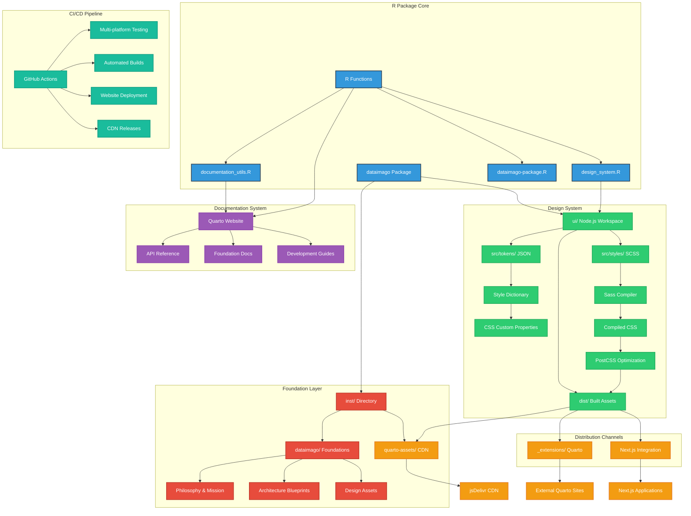
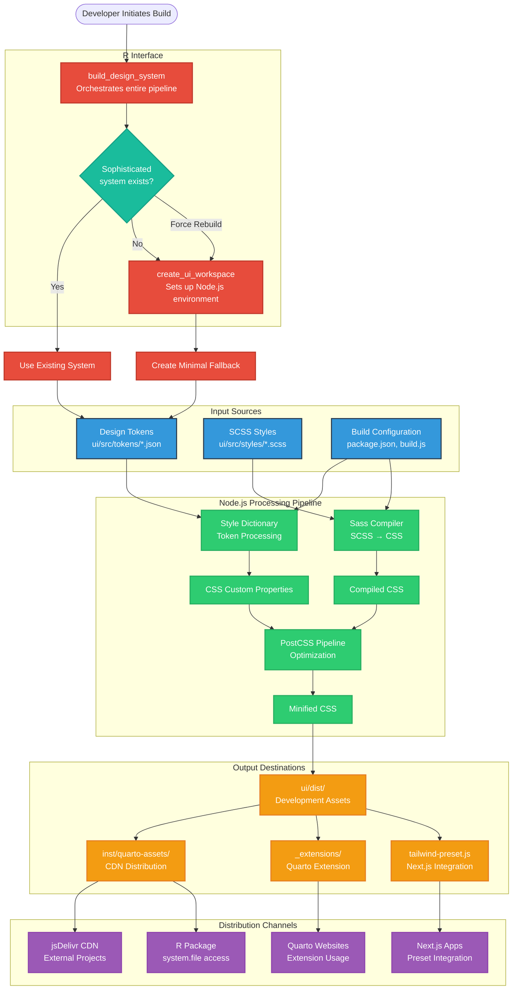
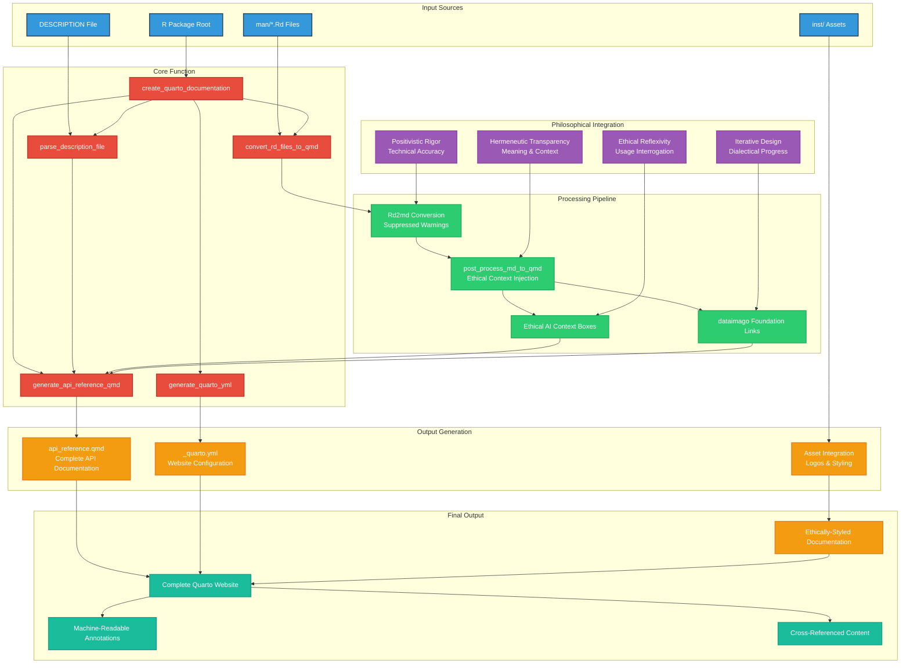
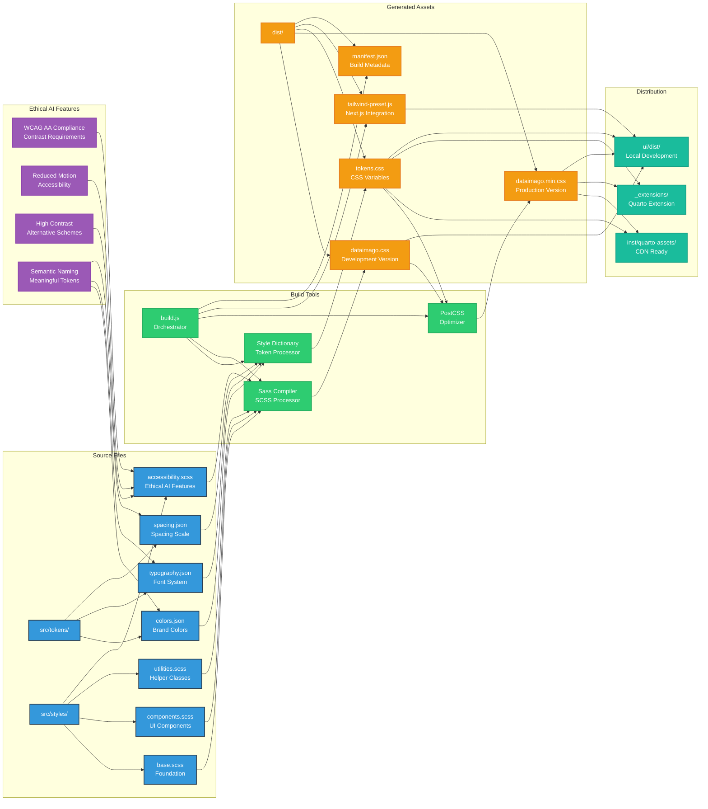
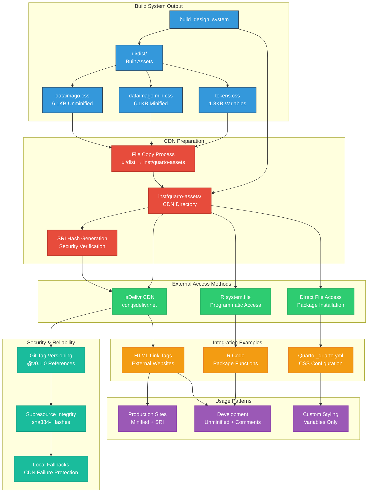
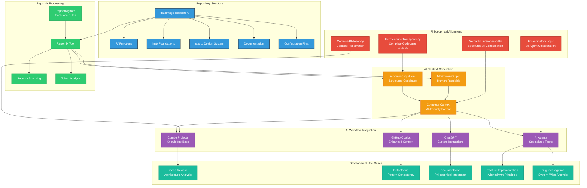

# dataimago Package Architecture

<!-- Architecture Documentation Badges -->
[](#-system-overview)
[](https://mermaid.js.org/)
[](#-system-overview)
[](#-key-design-principles)
[](#r-first-philosophy)

> **Status (Apr 2026):** This document captures the 0.0-3.x architecture,
> which was organized around the `ui/src/dataimago-design/` git submodule
> and the `create_ui_workspace()` / `build_design_framework()` scaffolders.
> Those pieces were retired in `dataimago` 0.0-4.0 (see `NEWS.md`) in favour
> of a package-channel model that consumes `@dataimago/tokens`,
> `@dataimago/css`, and `@dataimago/ui` directly from public npm. (The
> interim `@dataimago-ui/components` scope on GitHub Packages was unified
> into `@dataimago/ui` on public npm in 0.0-5.0.) Diagrams below
> referencing `src/tokens/`, `src/styles/`, Style Dictionary, Sass
> compilation, or `create_ui_workspace` describe the
> historical pipeline and are retained for archaeological reference only.
> For the current architecture see the top-level `README.md`, `CLAUDE.md`,
> and the sibling `dataimago-design/wiki/` in the design-system monorepo.

This document provides comprehensive Mermaid diagrams that illustrate the architecture and workflows of the dataimago R package.

## 🏗️ System Overview

The dataimago package is designed as a multi-layered foundation for emancipatory AI development:



## 🔄 Design System Build Process

The package uses a sophisticated build system that maintains "R as source of truth" while leveraging modern web tooling:



## 📖 Documentation Generation Workflow

The package provides sophisticated documentation generation that embeds philosophical context into technical documentation:



## 🎨 UI Workspace Architecture

The Node.js workspace provides sophisticated design system build capabilities:



## 🌐 CDN Distribution Flow

The CDN distribution system enables external projects to access dataimago design assets:



## 🤖 AI-Assisted Development & Repomix Integration

The dataimago package integrates [Repomix](https://repomix.com) to enable comprehensive AI-assisted development while preserving philosophical foundations and architectural principles.

### Repomix Architecture Integration



### Strategic Exclusions & Inclusions

The `.repomixignore` configuration aligns with the package's architectural principles:

#### Excluded (Regenerable Artifacts)
- **Build Outputs**: `ui/dist/`, `docs/site_libs/`, `.quarto/`
- **Dependencies**: `ui/node_modules/`
- **Version Control**: `.git/`, `.github/workflows/`
- **Large Binaries**: `*.pdf`, `*.key`, `*.pptx`

#### Preserved (Essential Context)
- **Philosophical Core**: `inst/dataimago/` - Foundation documents
- **AI Instructions**: `inst/CLAUDE.md`, `inst/AGENT_INDEX.md`
- **Source Code**: `R/` functions, `ui/src/` design system
- **Documentation**: `man/`, `README.md`, architecture guides
- **Configuration**: Build scripts, package metadata

### AI Workflow Patterns

#### 1. Architecture Review & Enhancement
```bash
npx repomix@latest --output dataimago-context.xml
```
*Usage*: "Analyze the complete architecture and suggest improvements aligned with the philosophical principles in `inst/dataimago/`"

#### 2. Feature Implementation
```bash
npx repomix@latest --include-token-count
```
*Usage*: "Based on existing patterns in `R/` and philosophy in `inst/dataimago/`, implement the planned `get_foundation_document()` function"

#### 3. Design System Extension
```bash
npx repomix@latest --include "ui/src/**,inst/dataimago/**"
```
*Usage*: "Analyze `ui/src/tokens/` and propose new CSS components aligned with ethical AI styling principles"

#### 4. Documentation Generation
```bash
npx repomix@latest --output-format markdown
```
*Usage*: "Generate comprehensive vignettes connecting technical implementation to ethical foundations"

### Integration with Existing Architecture

The Repomix integration enhances each architectural layer:

- **R Package Core**: Functions gain AI-assisted development and review
- **Foundation Layer**: Philosophical documents provide context for AI agents
- **Design System**: Complete source visibility enables intelligent suggestions
- **Documentation System**: AI can generate contextually-aware documentation
- **CI/CD Pipeline**: Automated context generation for continuous AI assistance

### Security & Best Practices

#### Token Optimization
```bash
npx repomix@latest --include-token-count
```
Monitor output size for LLM context limits while preserving essential philosophical context.

#### Security Scanning
```bash
npx repomix@latest --check-security
```
Automated detection of sensitive information before AI processing.

#### Custom Configuration
```json
{
  "output": {
    "format": "xml",
    "includeTokenCount": true
  },
  "include": [
    "**/*.R",
    "**/*.qmd", 
    "inst/dataimago/**"
  ]
}
```

### Philosophical Alignment

The Repomix integration embodies dataimago's core principles:

- **Hermeneutic Transparency**: Complete codebase visibility for AI interpretation
- **Semantic Interoperability**: Structured output optimized for LLM consumption  
- **Code-as-Philosophy**: Preserving philosophical context alongside technical implementation
- **Emancipatory Logic**: AI agents collaborating to advance human flourishing

This integration transforms the dataimago package into a comprehensive AI-collaborative development environment while maintaining its foundational commitment to ethical AI development.

## 🎯 Key Design Principles

### Ethical AI Integration
Every component of the system embeds dataimago's philosophical commitments:

- **WCAG AA Compliance**: All color combinations meet accessibility contrast requirements
- **Reduced Motion Respect**: Animations honor user motion preferences  
- **High Contrast Support**: Alternative color schemes for accessibility needs
- **Semantic Naming**: Design tokens like `ethical-highlight` embed meaning

### R-First Philosophy
The entire system maintains R as the source of truth:

- **R Functions Control Everything**: Node.js tooling wrapped in R functions
- **Intelligent Detection**: System preserves sophisticated build setups
- **Fallback Gracefully**: Creates minimal systems when sophisticated ones don't exist
- **Comprehensive Documentation**: Every R function includes philosophical context

### Multi-Channel Distribution
The same source generates assets for multiple platforms:

- **Quarto Extensions**: Complete styling and functionality packages
- **CDN Distribution**: Direct linking for external projects
- **Next.js Integration**: Tailwind presets for modern web apps
- **R Package Access**: Programmatic file access within R

### Philosophical Integration
Technical documentation embeds ethical context:

- **Hermeneutic Transparency**: Meaning and context in every function
- **Positivistic Rigor**: Technical accuracy and reproducibility
- **Ethical Reflexivity**: Tools for interrogating usage patterns
- **Iterative Design**: Each commit advances emancipatory goals

---

*These diagrams visualize how dataimago embeds AI within culture for emancipatory purposes, rather than embedding culture within AI for domination.*
