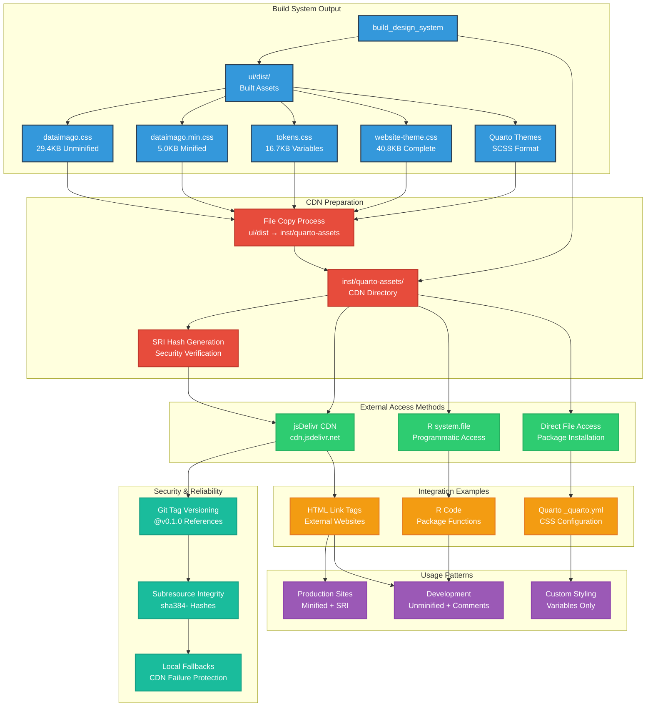

# dataimago CDN Distribution Assets

<!-- CDN Assets Badges -->
[](https://cdn.jsdelivr.net/gh/dataimago/dataimago-rpkg@main/inst/quarto-assets/)
[](dataimago.min.css)
[](tokens.css)
[](#-security--reliability)
[-purple.svg)](#r-package-access)
[](#-file-inventory)

## 🎯 Purpose

This directory contains **CDN-ready CSS assets** that enable external projects to directly link to dataimago design system files via jsDelivr CDN. These files are **critical infrastructure** for the dataimago ecosystem.

> 📋 **See [../../ARCHITECTURE.md](../../ARCHITECTURE.md) for visual diagrams** showing how these CDN assets fit into the complete dataimago distribution system.

## ⚠️ CRITICAL WARNING

**NEVER DELETE THIS DIRECTORY OR ITS CONTENTS**

These files enable:
- 🌐 **CDN Distribution**: External projects can link directly via jsDelivr
- 📦 **R Package Access**: Users can find files with `system.file()`
- 🚀 **External Integration**: Third-party websites can use dataimago styling

## 📁 File Inventory

| File | Size | Purpose |
|------|------|---------|
| `dataimago.css` | ~29.4KB | **Complete design system** (unminified, with comments) |
| `dataimago.min.css` | ~5.0KB | **Complete design system** (minified, production-ready) |
| `dataimago-light.scss` | ~3.5KB | **Quarto light theme** (SCSS format) |
| `dataimago-dark.scss` | ~4.1KB | **Quarto dark theme** (SCSS format) |
| `tokens.css` | ~16.7KB | **Design tokens** as CSS custom properties |
| `tokens.scss` | ~16.7KB | **Design tokens** as SCSS variables |
| `website-theme.css` | ~40.8KB | **Unified website theme** (complete styling) |
| `website-theme.min.css` | ~16.6KB | **Unified website theme** (minified) |
| `ai_monogram.svg` | 920B | **AI monogram** logo asset |
| `package_hex_logo.svg` | 1129B | **Package hex logo** for branding |

## 🌐 CDN Usage

### External Project Integration

```html
<!-- Complete Design System (Production) -->
<link rel="stylesheet" 
      href="https://cdn.jsdelivr.net/gh/dataimago/dataimago-rpkg@v0.1.0/inst/quarto-assets/dataimago.min.css"
      integrity="sha384-[SRI-HASH]"
      crossorigin="anonymous">

<!-- Complete Design System (Development) -->
<link rel="stylesheet" 
      href="https://cdn.jsdelivr.net/gh/dataimago/dataimago-rpkg@v0.1.0/inst/quarto-assets/dataimago.css">

<!-- Website Theme (Production) -->
<link rel="stylesheet" 
      href="https://cdn.jsdelivr.net/gh/dataimago/dataimago-rpkg@v0.1.0/inst/quarto-assets/website-theme.min.css"
      integrity="sha384-[SRI-HASH]"
      crossorigin="anonymous">

<!-- Design Tokens Only -->
<link rel="stylesheet" 
      href="https://cdn.jsdelivr.net/gh/dataimago/dataimago-rpkg@v0.1.0/inst/quarto-assets/tokens.css">
```

### Quarto Integration

```yaml
# _quarto.yml - Light/Dark Theme Configuration
format:
  html:
    theme:
      light: "https://cdn.jsdelivr.net/gh/dataimago/dataimago-rpkg@v0.1.0/inst/quarto-assets/dataimago-light.scss"
      dark: "https://cdn.jsdelivr.net/gh/dataimago/dataimago-rpkg@v0.1.0/inst/quarto-assets/dataimago-dark.scss"
```

### SVG Logo Integration

```html
<!-- AI Monogram (navbar branding) -->


<!-- Package Hex Logo (homepage/identity) -->

```

### SCSS Integration (Advanced)

```scss
// Import design tokens in your SCSS
@import "https://cdn.jsdelivr.net/gh/dataimago/dataimago-rpkg@v0.1.0/inst/quarto-assets/tokens.scss";

// Use design tokens in your custom styles
.my-component {
  background: var(--color-surface-page-light);
  color: var(--color-content-primary-light);
  font-family: var(--font-family-brand);
  transition: background-color 0.25s ease;
}

[data-bs-theme="dark"] .my-component {
  background: var(--color-surface-page-dark);
  color: var(--color-content-primary-dark);
}
```

### R Package Access

```r
# Find CSS files in installed package
css_path <- system.file("quarto-assets/dataimago.min.css", package = "dataimago")
website_theme_path <- system.file("quarto-assets/website-theme.min.css", package = "dataimago")
tokens_path <- system.file("quarto-assets/tokens.css", package = "dataimago")
quarto_light_path <- system.file("quarto-assets/dataimago-light.scss", package = "dataimago")
quarto_dark_path <- system.file("quarto-assets/dataimago-dark.scss", package = "dataimago")

# Programmatic access
if (file.exists(css_path)) {
  cat("dataimago CSS available at:", css_path)
  cat("\nFile size:", file.size(css_path), "bytes")
}

# Get all available assets
assets <- list.files(system.file("quarto-assets", package = "dataimago"), 
                    pattern = "\\.(css|scss|svg)$", full.names = TRUE)
cat("Available assets:", length(assets), "files\n")
```

## 🔄 How These Files Are Generated

These files are **automatically generated** by the design system build process:

### CDN Distribution Flow



### Build Process Details

```r
library(dataimago)

# 1. One-time Node bootstrap in the package's ui/ directory
#      cd ui && pnpm install
#    (see ../../dataimago-design/wiki/patterns/new-consumer-checklist.md)

# 2. Build all assets including CDN distribution
build_design_system(
  include_sri = TRUE,      # Generate security hashes
  update_extension = TRUE, # Update Quarto extension
  verbose = TRUE           # Show detailed progress
)

# 3. Files automatically copied from ui/dist/ to inst/quarto-assets/
```

## 🏗️ Build Process Flow

```
ui/src/tokens/*.json  →  Style Dictionary  →  CSS Custom Properties
ui/src/styles/*.scss  →  Sass Compiler    →  Compiled CSS
Compiled CSS         →  PostCSS          →  Minified & Optimized
Final CSS           →  Copy Process     →  inst/quarto-assets/
```

## 📋 Maintenance

### When to Update

Files are automatically updated when:
- Design tokens are modified (`ui/src/tokens/*.json`)
- SCSS source files are changed (`ui/src/styles/*.scss`)
- `build_design_system()` is executed

### Manual Updates

```r
# Force complete rebuild and distribution
build_design_system(force_rebuild = TRUE)

# Verify files were updated
list.files("inst/quarto-assets/", full.names = TRUE)
```

### Verification

```r
# Check file sizes (should be substantial)
file.info("inst/quarto-assets/dataimago.min.css")$size     # ~5KB
file.info("inst/quarto-assets/dataimago.css")$size         # ~29KB
file.info("inst/quarto-assets/tokens.css")$size            # ~17KB
file.info("inst/quarto-assets/website-theme.min.css")$size # ~17KB

# Check content quality
readLines("inst/quarto-assets/tokens.css", n = 5)  # Should show CSS variables
```

## 🚨 Troubleshooting

### Problem: Files Are Missing
```r
# Regenerate from build system
build_design_system(force_rebuild = TRUE)
```

### Problem: Files Are Too Small 
This indicates build issues. Expected sizes:
- `dataimago.min.css`: ~5KB (minified design system)
- `dataimago.css`: ~29KB (complete design system)  
- `tokens.css`: ~17KB (design tokens)
- `website-theme.min.css`: ~17KB (minified website theme)

```r
# Verify the package-channel install brought in @dataimago/* packages.
# (The ui/src/dataimago-design/ submodule was retired in 0.0-4.0.)
list.files("ui/node_modules/@dataimago", recursive = FALSE)
# Expect: "css", "tokens", "ui"  (all three ship from public npm; the
# @dataimago-ui/components interim scope was unified into @dataimago/ui
# on public npm in 0.0-5.0)

# If missing or files too small, reinstall + rebuild
# (run from the ui/ directory of your consumer):
#   pnpm install
#   pnpm run build
build_design_system(force_rebuild = TRUE)
```

### Problem: CDN Links Don't Work
- Check that the repository has been **tagged** for release
- Verify the **version number** in the CDN URL matches the tag
- Ensure files exist in the **specific tagged version**

## 🔗 Related Documentation

- `ui/README.md` - Complete design system documentation
- `R/design_system.R` - Build system functions
- Main `README.md` - Package architecture overview
- `CLAUDE.md` - Technical details for AI assistance

## 🎨 Design System Integration

These files are part of the larger dataimago design system:

- **Foundation**: Based on ethical AI principles (WCAG AA, reduced motion)
- **Token-Driven**: Generated from semantic JSON design tokens  
- **Multi-Platform**: Same source generates CSS, Tailwind presets, and more
- **Sophisticated**: Built with Style Dictionary + SCSS + PostCSS pipeline

### SVG Logo Architecture

The included SVG assets implement a sophisticated theme-aware logo system:

**Logo Assets:**
- **AI Monogram** (`ai_monogram.svg`): 920 bytes - Optimized navbar branding logo
- **Package Hex Logo** (`package_hex_logo.svg`): 1129 bytes - Package identity logo

**Technical Quality:**
- **Optimized SVGs**: Minimal file sizes with clean vector graphics
- **Universal Compatibility**: Works across all modern browsers and CDN systems  
- **Theme Integration**: Adapts to light/dark themes via CSS styling
- **Scalable Design**: Vector format ensures crisp display at any size

---

*These assets enable external projects to adopt dataimago's ethical AI design principles through simple CSS links. They represent the visual expression of our philosophical commitment to emancipatory AI development.*
