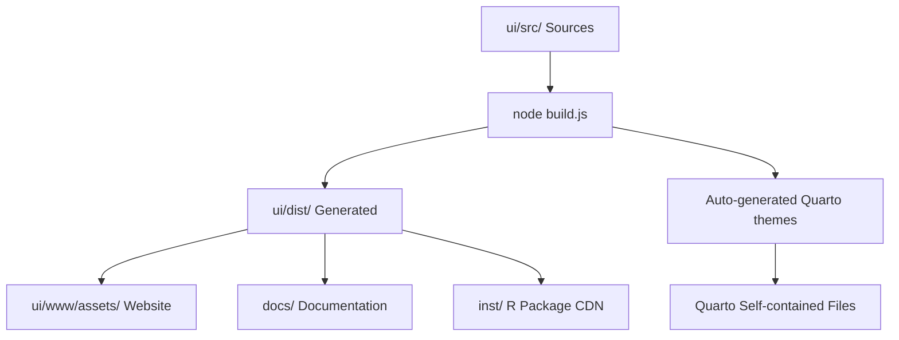

# dataimago UI Source Directory

**Single Source of Truth for Design System Assets**

This directory contains all source files for the dataimago design system. The bulletproof build system auto-generates distribution-ready assets from these modular sources.

## 🏗️ Bulletproof Build System

### **Philosophy: Single Source of Truth + Auto-Generation**

- **Modular sources** in `/ui/src/` are the single source of truth
- **Build system** auto-generates self-contained files for different targets
- **Zero manual duplication** - everything flows from source files
- **Quarto compatibility** achieved through auto-generated self-contained theme files

### **How It Works**



## 📁 Directory Structure

### **🎨 Design Tokens (`tokens/`)**
```
ui/src/tokens/
├── README.md              # Token usage guidelines
├── colors.json            # Brand colors, semantic colors
├── typography.json        # Font families, sizes, weights  
├── spacing.json           # Margins, padding, grid scales
├── effects.json           # Shadows, transitions, borders
├── components.json        # Component-specific tokens
└── theme-colors.json      # Light/dark theme mappings
```

**Purpose**: Atomic design values, JSON-based, consumed by Style Dictionary

### **🧱 Core Styles (`styles/`)**
```
ui/src/styles/
├── README.md              # Core styling guidelines
├── website-theme.scss     # Main theme entry (imports all modular files)
├── tokens.scss            # Design tokens as SCSS variables
├── base.scss              # Foundation styles
├── components.scss        # Reusable UI components
├── utilities.scss         # Utility classes
├── accessibility.scss     # A11y enhancements
├── lenis-integration.scss # Smooth scrolling
└── themes/                # Theme-specific modular files
    ├── theme-variables.scss    # CSS custom properties mapping
    ├── shared-components.scss  # Cross-theme components (navbar, etc.)
    └── website-features.scss   # Website-specific features
```

**Purpose**: Systematic, reusable styles that work across all pages

### **📄 Page-Specific Styles (`pages/`)**
```
ui/src/pages/
├── README.md              # Page styling guidelines
├── landing.scss           # Home page (index.qmd)
├── documentation.scss     # R package docs (r_package.qmd)  
└── shared/                # Cross-page components
    └── enhanced-toc.scss  # Right sidebar TOC
```

**Purpose**: Page-specific layouts and unique features

### **⚡ JavaScript (`js/`)**
```
ui/src/js/
├── accessibility.js       # A11y enhancements
├── custom-anchors.js      # Anchor link handling
├── hero-scroller.js       # Landing page scroll effects
├── lenis-integration.js   # Smooth scrolling integration
├── logo-switch.js         # Theme-aware logo switching
├── slide-navigation.js    # Navigation animations
├── pages/                 # Page-specific JS
│   └── landing-page-enhanced.js
├── utils/                 # Utility functions
│   └── scroll.js
└── vendor/                # Third-party libraries
    └── jquery.sticky-kit.min.js
```

## 🎯 Build Process

### **Command**
```bash
cd ui/
node build.js
```

### **What Happens**
1. **Design Tokens**: JSON files → CSS custom properties
2. **Modular SCSS**: Compiled to unified CSS files
3. **Auto-Generated Themes**: Self-contained files for Quarto compatibility
4. **Page-Specific CSS**: Individual page styles compiled
5. **Asset Distribution**: Files copied to all target locations
6. **JavaScript Processing**: JS files processed and distributed

### **Key Innovation: Auto-Generated Self-Contained Files**

The build system reads modular source files and auto-generates self-contained theme files:

- **Source**: `ui/src/styles/themes/*.scss` (modular, maintainable)
- **Generated**: `ui/dist/website-light.scss` & `ui/dist/website-dark.scss` (self-contained for Quarto)
- **Result**: Best of both worlds - modular sources + Quarto compatibility

## 🎨 CSS Architecture

### **File Organization Philosophy**
**Clear Separation of Concerns + Intuitive Naming = Maintainable CSS**

### **Naming Conventions**

#### **Files Should Indicate:**
1. **Scope**: `global-`, `page-`, `component-`
2. **Purpose**: `layout`, `theme`, `interactive`  
3. **Content**: `navigation`, `forms`, `typography`

#### **Examples:**
- ✅ `shared-components.scss` (scope + content)
- ✅ `landing.scss` (page name)
- ✅ `theme-variables.scss` (purpose + content)
- ❌ `styles.scss` (too generic)
- ❌ `misc.scss` (unclear purpose)

### **Token Files:**
- ✅ `colors.json` (content type)
- ✅ `spacing.json` (content type)
- ❌ `design-tokens.json` (too generic)

## 🔄 Asset Flow

### **Source → Generated → Distributed**
```
SOURCE                           GENERATED                    DISTRIBUTED
ui/src/tokens/*.json         →   ui/dist/tokens.css       →   [all targets]
ui/src/styles/website-theme  →   ui/dist/website-theme.*  →   [all targets]
ui/src/styles/themes/*       →   ui/dist/website-*.scss   →   [Quarto only]
ui/src/pages/landing         →   ui/dist/landing.css      →   [website only]
ui/src/js/*                  →   ui/dist/js/*             →   [all targets]
```

### **Distribution Targets**
- **Website**: `ui/www/assets/`
- **Documentation**: `docs/assets/`
- **R Package CDN**: `inst/quarto-assets/`
- **Quarto Extension**: `ui/www/_extensions/dataimago/ai-native/assets/`

## 🧹 File Lifecycle

### **Creation:**
1. Identify scope (tokens/core/page)
2. Choose clear, descriptive name
3. Add purpose comment at top
4. Document in appropriate README

### **Maintenance:**
1. Keep related styles together
2. Use imports rather than duplication
3. Comment complex selectors
4. Update README when adding features

### **Deprecation:**
1. Move to `legacy/` folder (if needed)
2. Add deprecation comment with replacement
3. Plan removal after migration period
4. Update build process to exclude

## 📋 Quick Reference

### **"Where Does This Style Go?"**
- **Brand colors** → `tokens/colors.json`
- **Button design** → `styles/components.scss`
- **Landing page hero** → `pages/landing.scss`
- **Dark theme colors** → `styles/themes/theme-variables.scss`
- **Navigation component** → `styles/themes/shared-components.scss`
- **R package docs layout** → `pages/documentation.scss`
- **Reusable TOC** → `pages/shared/enhanced-toc.scss`

### **"What's In This File?"**
Look for:
1. **File header comment** with purpose
2. **README.md** in same directory
3. **Imports section** showing dependencies
4. **File size** indicating complexity

## 🚀 Getting Started

### **Making Changes**
1. Edit source files in `ui/src/`
2. Run `node build.js` from `ui/` directory
3. Test with `quarto preview` from `ui/www/`
4. Commit changes when satisfied

### **Adding New Pages**
1. Create `ui/src/pages/new-page.scss`
2. Add imports for tokens and base styles
3. Build system will auto-compile and distribute
4. Reference in your `.qmd` file

### **Modifying Themes**
1. Edit modular files in `ui/src/styles/themes/`
2. Build system auto-generates self-contained versions
3. Quarto automatically uses the generated files
4. No manual duplication needed!

## 🎯 Best Practices

### **DO:**
- ✅ Edit source files in `ui/src/`
- ✅ Use the build system for all changes
- ✅ Test thoroughly before committing
- ✅ Document new features in README files
- ✅ Use semantic naming conventions

### **DON'T:**
- ❌ Edit generated files in `ui/dist/`
- ❌ Edit distributed files in `ui/www/assets/`
- ❌ Create manual duplicates
- ❌ Skip the build process
- ❌ Use generic file names

---

**🧠 Ethical AI Design System Ready for Deployment!**
