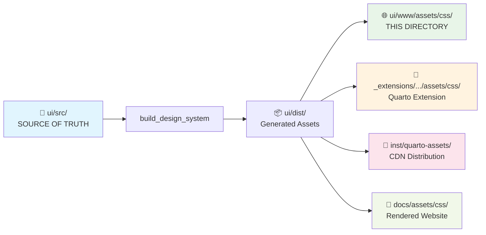

# dataimago Website CSS Assets

This directory contains CSS assets for the dataimago Quarto website. These files are **automatically generated** from the source-of-truth design system located in `ui/src/` and distributed via the R-controlled build process.

## ✅ Source-of-Truth Status - COMPLETE

This directory is now **fully managed by the R-first design system**:

### ✅ **Complete Source-of-Truth Pipeline** (ACTIVE)
- **Source**: `ui/src/tokens/` and `ui/src/styles/` (authoritative)
- **Build**: `build_design_system()` R function (working perfectly)
- **Distribution**: Automatic propagation to all deployment targets
- **CDN**: `inst/quarto-assets/dataimago.min.css` (CDN-ready)
- **Status**: **No more 404 errors** - SCSS import chain fixed

### 📁 **Generated Files** (Auto-Updated)
- `website-theme.css` - Main theme compiled from `ui/src/styles/website-theme.scss`
- `website-light.scss` - Light theme generated from source-of-truth  
- `website-dark.scss` - Dark theme generated from source-of-truth
- `tokens.css` - Design tokens compiled from `ui/src/tokens.scss`
- `dataimago.css` & `dataimago.min.css` - Main design system CSS

### 🎯 **Current Workflow** (Working End-to-End)
1. ✅ Edit source files in `/ui/src/`
2. ✅ Run `build_design_system()` from R
3. ✅ All files in this directory automatically updated
4. ✅ Quarto render/preview work without errors

## 🔄 Propagation Flow from Source-of-Truth

This directory is one of **4 distribution targets** in the CSS/SCSS pipeline:



### 📋 File Traceability

| File in This Directory | Source Location | Build Process |
|------------------------|-----------------|---------------|
| `tokens.css` | `ui/src/tokens/*.json` | Style Dictionary → CSS variables |
| `website-theme.css` | `ui/src/styles/website-theme.scss` | Sass compilation |
| `website-light.scss` | `ui/src/styles/website-light.scss` | Direct copy + imports |
| `website-dark.scss` | `ui/src/styles/website-dark.scss` | Direct copy + imports |
| `dataimago.css` | `ui/src/main.scss` (generated) | Sass compilation |
| `dataimago.min.css` | `ui/src/main.scss` (generated) | PostCSS minification |

## CSS Architecture

### Primary Stylesheet (`website-custom.scss`)

This comprehensive SCSS file includes:

#### **Core Design System**
- **Color Palette**: Sophisticated grey/black theme with RGB(237,237,235) base
- **Typography**: Professional font stack with enhanced heading hierarchy
- **SCSS Variables**: Logo paths and customizable defaults

#### **Advanced Navbar System**
- **Dynamic Background**: Smooth color transitions on scroll
- **Logo Integration**: Hover effects with color switching
- **Responsive Dropdown Menus**:
  - Rounded corners with subtle shadows
  - Animated caret rotation (up ↔ down)
  - Inset hover effects with multi-layer shadows
  - Active state indication (black text + caret)

#### **Interactive Elements**
- **Link Styling**: Consistent grey-to-black hover transitions
- **Anchor Links**: Smooth color transitions with no underlines
- **Navigation**: Clean sidebar styling without underlines
- **Code Blocks**: Enhanced backgrounds and borders

#### **Advanced Animations**
- **Smooth Transitions**: 0.3s ease timing throughout
- **Hover Effects**: Left-to-right underline animations
- **Dropdown Animations**: Caret rotation with state management
- **Scroll Effects**: Dynamic navbar shrinking

### Specialized Styling (`documents.css`)

The documents page maintains its own dedicated stylesheet for:
- **Document Cards**: Grid layout with hover animations
- **Typography**: Document-specific heading and text styling
- **Interactive Elements**: Buttons, tags, and action components
- **Responsive Design**: Mobile-optimized layouts

## Technical Implementation

### Color System
```scss
// Primary background colors
$body-bg: rgb(237, 237, 235);
body { background-color: rgb(237, 237, 235); }
body.shrink { background-color: rgb(237, 237, 238); }

// Dropdown menu colors
background-color: rgb(227, 227, 225);
hover: rgb(237, 237, 235);

// Link colors
default: #7c7c7c;
hover: #000;
```

### Advanced Shadow Effects
```scss
// Multi-layer inset shadows for dropdown items
box-shadow: inset 0 2px 4px rgba(222, 222, 220, 0.8),
            inset 0 1px 2px rgba(222, 222, 220, 0.8),
            inset 0 -1px 2px rgba(222, 222, 220, 0.8),
            inset 0 -2px 4px rgba(222, 222, 220, 0.8);
```

### JavaScript Integration

The CSS works in conjunction with JavaScript for:
- **Dropdown State Management**: Caret rotation and color changes
- **Scroll Effects**: Dynamic navbar shrinking
- **Smooth Animations**: State transitions and hover effects

## File Organization

### Current Structure
```
assets/css/
├── website-custom.scss  (527 lines - MAIN STYLESHEET)
│   ├── SCSS Variables & Defaults
│   ├── Body & Layout Styling
│   ├── Advanced Navbar System
│   ├── Dropdown Menu Animations
│   ├── Link & Typography Styling
│   ├── Enhanced Code Blocks
│   └── Responsive Design
└── documents.css        (197 lines - PAGE-SPECIFIC)
    ├── Document Grid Layout
    ├── Card Components
    ├── Interactive Elements
    └── Mobile Responsiveness
```

### Consolidation Benefits

1. **Performance**: Reduced HTTP requests (2 files vs. 4 previously)
2. **Maintainability**: Single source of truth for main styling
3. **Consistency**: Unified color palette and design language
4. **Modularity**: Page-specific styles remain separate

## 🚀 New R-First Workflow

### For New Development
```r
# 1. Set up design system workspace (one-time)
library(dataimago)
create_ui_workspace()

# 2. Modify design tokens in ui/src/tokens/*.json
# 3. Edit SCSS in ui/src/styles/*.scss

# 4. Build all assets
build_design_system(verbose = TRUE)

# 5. Use in Quarto projects
# Option A: Extension
# _quarto.yml: theme: dataimago/ai-native

# Option B: CDN
# css: https://cdn.jsdelivr.net/gh/dataimago/dataimago-rpkg@v0.1.0/inst/quarto-assets/dataimago.min.css
```

### Design Token Customization
```json
// ui/src/tokens/colors.json
{
  "color": {
    "brand": {
      "primary": { "value": "#2C3E50" },
      "accent": { "value": "#3498DB" }
    }
  }
}
```

### Benefits of New System
1. **R-First**: No Node.js knowledge required
2. **Multi-Platform**: Same tokens → Quarto + Next.js + R Shiny
3. **Accessibility**: WCAG AA compliance built-in
4. **Versioned**: CDN distribution with SRI hashes
5. **Ethical**: Reduced motion and high contrast support

## Technical Dependencies

### Quarto Integration
```yaml
# _quarto.yml configuration
theme:
  - cosmo
  - ./assets/css/website-custom.scss
css:
  - ./assets/css/documents.css
```

### JavaScript Dependencies
- Enhanced navbar shrinking via Lenis integration (no jQuery dependency)
- Smooth logo size transitions with opacity blending during theme changes
- Bootstrap classes - Dropdown state management (.show, .open)